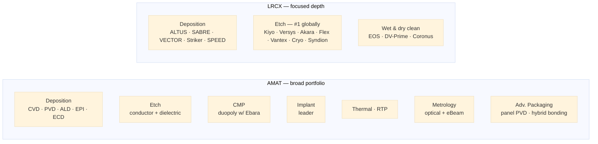
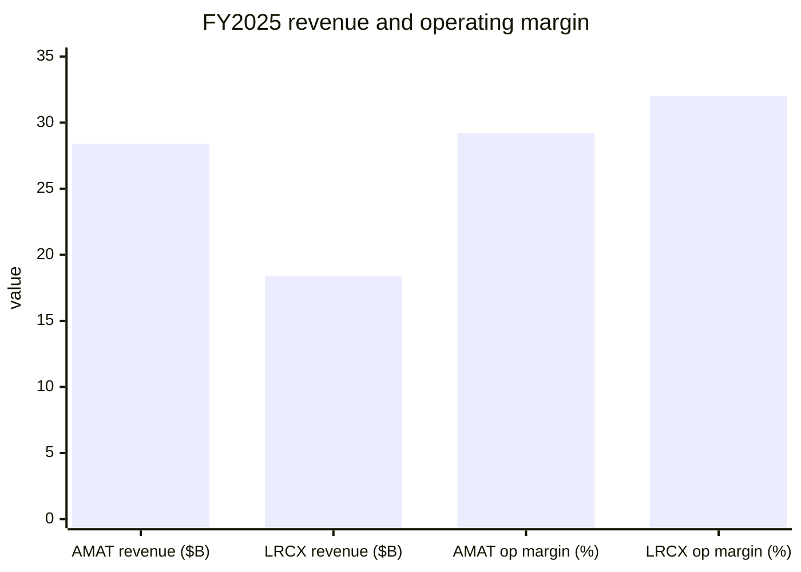
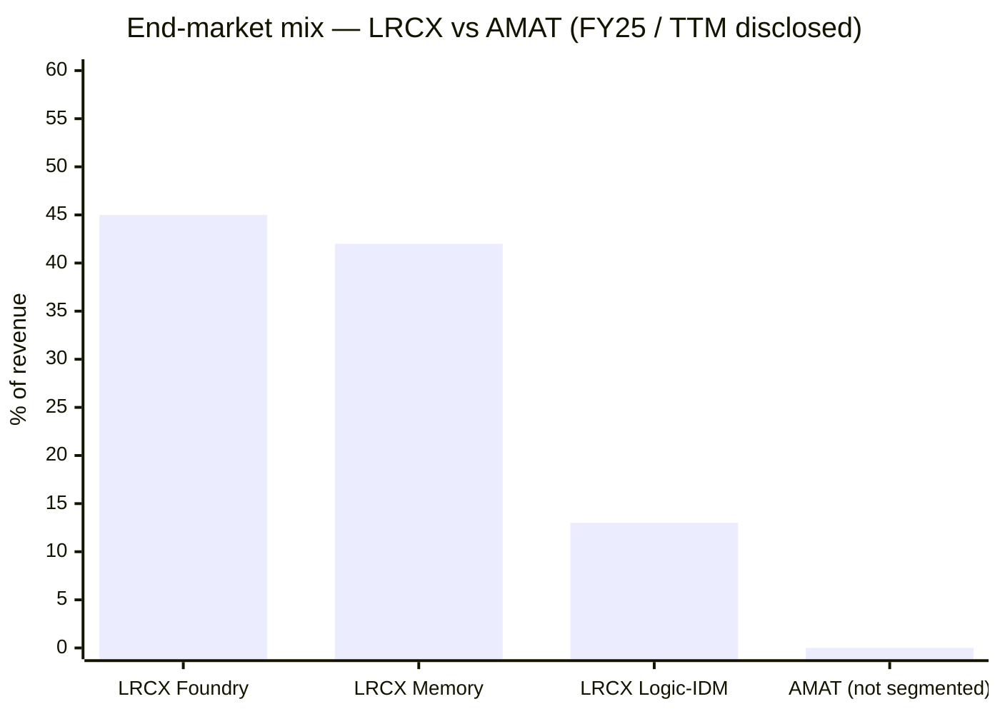
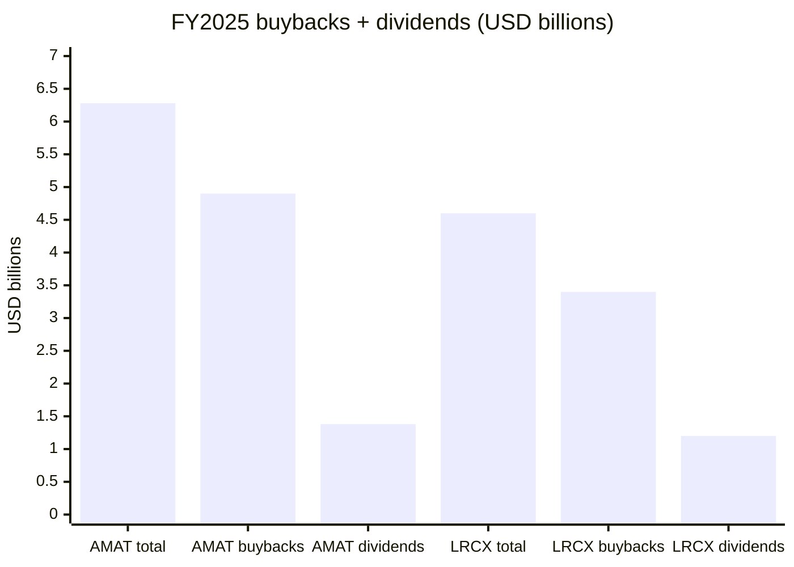

# Lam Research (LRCX) vs. Applied Materials (AMAT) — WFE Leaders Compared

**Source filings**
- AMAT FY2025 10-K — fiscal period ended 2025-10-26 ([Applied Materials 10-K FY2025](https://www.sec.gov/Archives/edgar/data/6951/000162828025056742/amat-20251026.htm)); Q2 FY26 10-Q ended 2026-04-26 ([Applied Materials Q2 FY26 10-Q](https://www.sec.gov/Archives/edgar/data/6951/000162828026037227/amat-20260426.htm)); Q2 FY26 earnings release ([Applied Materials Q2 FY26 earnings press](https://www.sec.gov/Archives/edgar/data/6951/000162828026035071/exhibit991q22026earningsre.htm))
- LRCX FY2025 10-K — fiscal period ended 2025-06-29 ([Lam Research 10-K FY2025](https://www.sec.gov/Archives/edgar/data/707549/000070754925000075/lrcx-20250629.htm)); Q3 FY26 10-Q ended 2026-03-29 ([Lam Research Q3 FY26 10-Q](https://www.sec.gov/Archives/edgar/data/707549/000070754926000022/lrcx-20260329.htm)); Q3 FY26 earnings release ([Lam Research Q3 FY26 earnings press](https://www.sec.gov/Archives/edgar/data/707549/000070754926000020/lrcx_exhibitx991xq3x2026.htm))
- Source company research reports: [AMAT deep-dive](../company/AppliedMaterials_NASDAQ_AMAT/AppliedMaterials_NASDAQ_AMAT_Research_Document.md) · [LRCX deep-dive](../company/LamResearch_NASDAQ_LRCX/LamResearch_NASDAQ_LRCX_Research_Document.md)

> **Fiscal-year note:** AMAT closes its books in late October, LRCX in late June. "FY2025" therefore refers to different 12-month windows — comparisons below use each company's own FY25 unless noted. Both companies are mid-FY26 as of this report.

Both companies sit in the same five-vendor club that controls the global Wafer Fab Equipment (WFE) market — AMAT, LRCX, ASML, Tokyo Electron, KLA. Inside that club they are the two **process-equipment generalists** and the most direct head-to-head competitors in deposition. But their portfolios, growth profiles, and market exposures have diverged enough by FY2025 that they are increasingly different bets on the same AI-driven WFE cycle ([SEMI: global fab equipment investment to reach $110B in 2025](https://www.semi.org/en/semi-press-release/global-fab-equipment-investment-expected-to-reach-110-billion-dollar-in-2025); [SEMI: 300mm equipment spending double-digit growth 2026/2027](https://www.semi.org/en/semi-press-release/semi-projects-double-digit-growth-in-global-300mm-fab-equipment-spending-for-2026-and-2027)).

---

## 1. One-line self-description

| | Applied Materials | Lam Research |
|---|---|---|
| Framing | "The leader in materials engineering solutions used to produce virtually every new chip and advanced display." | "Trusted global partner who pushes the boundaries of semiconductor manufacturing, enabling our customers to shape the future." |
| Implicit positioning | **The widest portfolio in WFE** — Create / Shape / Modify / Inspect across every node | **The dominant etch franchise** — plus the deposition + clean tools that pair with it |
| Strategic centre of gravity | Process *breadth* across silicon + display + advanced packaging | Process *depth* in etch, ALD, and 3D NAND |

AMAT's positioning leans on portfolio scope — it is the only WFE vendor with material share in deposition, etch, CMP, implant, thermal, metrology, and packaging at once ([Applied Materials 10-K FY2025, Item 1 Business](https://www.sec.gov/Archives/edgar/data/6951/000162828025056742/amat-20251026.htm)). Lam's positioning leans on depth — it explicitly forgoes CMP, lithography, implant, and metrology to be the leader in plasma etch and a co-leader (with AMAT) in deposition ([Lam Research 10-K FY2025, Item 1 Business](https://www.sec.gov/Archives/edgar/data/707549/000070754925000075/lrcx-20250629.htm); [Lam Research product page](https://www.lamresearch.com/products/)).

## 2. Process-step coverage — what each tool catalogue covers

The diagram is the comparison in one picture: **everything in LRCX's box also exists in AMAT's box, but the inverse is not true.** AMAT plays in roughly 7 process areas; LRCX plays in 3. In the overlap — deposition + etch — they are the head-to-head rivals; outside the overlap, they don't compete ([Applied Materials products overview](https://www.appliedmaterials.com/us/en/semiconductor/products.html); [Lam Research etch product family](https://www.lamresearch.com/products/our-processes/etch/)).

By share within each step (figures cited in the source reports):
- **Etch:** LRCX #1 globally; AMAT #3 behind Tokyo Electron ([Lam Research 10-K FY2025, §1 Business](https://www.sec.gov/Archives/edgar/data/707549/000070754925000075/lrcx-20250629.htm))
- **Deposition (CVD/ALD/ECD):** AMAT and LRCX are co-leaders, with TEL and ASM International as the other names ([Applied Materials 10-K FY2025, competition](https://www.sec.gov/Archives/edgar/data/6951/000162828025056742/amat-20251026.htm))
- **CMP:** AMAT–Ebara duopoly; LRCX exited post-Novellus ([Applied Materials 10-K FY2025, products](https://www.sec.gov/Archives/edgar/data/6951/000162828025056742/amat-20251026.htm); [Lam–Novellus all-stock combination, 2011](https://newsroom.lamresearch.com/2011-12-15-Lam-Research-and-Novellus-Systems-to-Combine-in-3-3-Billion-All-Stock-Transaction))
- **Wet clean:** SCREEN #1; LRCX #2; AMAT not a major player ([SCREEN Holdings IR](https://www.screen.co.jp/en/ir))
- **Implant / metrology / lithography:** AMAT competes; LRCX absent ([Applied Materials 10-K FY2025, segments](https://www.sec.gov/Archives/edgar/data/6951/000162828025056742/amat-20251026.htm))

## 3. Segment structure & financial scoreboard

| Metric | AMAT FY2025 (Oct-end) | LRCX FY2025 (Jun-end) | Spread |
|---|---|---|---|
| Total revenue | **$28.4B** | $18.4B | AMAT larger by $10B |
| YoY revenue growth | +4.4% | **+23.7%** | LRCX growth 5× faster |
| Gross margin | 48.7% | 48.7% | Tied |
| Operating margin (GAAP) | 29.2% | **32.0%** | LRCX +2.8 pts |
| Net income | $7.0B | $2.9B | AMAT 2.4× larger absolute |
| Operating cash flow | $7.96B | $6.17B | AMAT larger absolute; LRCX OCF/rev 33.5% vs AMAT 28.0% |
| Free cash flow | ~$5.7B | $5.41B | Roughly comparable absolute despite size gap |
| R&D | $3.57B (12.6% of rev) | $2.10B (11.4% of rev) | AMAT spends more dollars; similar % |
| Recurring-services share | ~23% (AGS) | **~38%** (CSBG) | LRCX has the stickier mix |
| Top-2 customer concentration | 34% (19% + 15%) | 32% (17% + 15%) | Roughly equal |

[Applied Materials 10-K FY2025, MD&A & segments](https://www.sec.gov/Archives/edgar/data/6951/000162828025056742/amat-20251026.htm); [Lam Research 10-K FY2025, MD&A](https://www.sec.gov/Archives/edgar/data/707549/000070754925000075/lrcx-20250629.htm).

**AMAT reportable segments:** Semiconductor Systems ($20.8B, 73% of FY25; 35.5% segment OpM); Applied Global Services ($6.4B, 23%; 28.1% OpM); Display & Adjacent (~4%). The headline two-bucket model — *boxes + the services attached to those boxes* — is unchanged for a decade ([Applied Materials 10-K FY2025, segment results](https://www.sec.gov/Archives/edgar/data/6951/000162828025056742/amat-20251026.htm)).

**LRCX reporting:** single segment, but disclosed split is Systems ($11.5B, 62.3%) and Customer Support Business Group / CSBG ($6.9B, 37.7%). CSBG covers spares, upgrades, services, reliant (refurbished tools), and software ([Lam Research 10-K FY2025, §1 Company Overview](https://www.sec.gov/Archives/edgar/data/707549/000070754925000075/lrcx-20250629.htm); [Lam Q3 FY26 earnings release](https://www.sec.gov/Archives/edgar/data/707549/000070754926000020/lrcx_exhibitx991xq3x2026.htm)). The structurally higher recurring-revenue share is partly a fleet-size effect — LRCX's etch and clean tools have a higher consumables/spares intensity than CMP and implant tools at AMAT ([Lam Research 10-K FY2025, §1 Company Overview](https://www.sec.gov/Archives/edgar/data/707549/000070754925000075/lrcx-20250629.htm)).

## 4. End-market and geographic exposure

This is the second big structural divergence. **LRCX is materially more memory-exposed than AMAT.** Lam discloses an end-market split — Foundry 45% / Memory 42% / Logic-IDM 13% in FY25, with memory climbing higher (36% in 9M FY26 YTD, HBM-led DRAM offsetting softer NAND) ([Lam Research 10-K FY2025, §1 Company Overview](https://www.sec.gov/Archives/edgar/data/707549/000070754925000075/lrcx-20250629.htm); [Lam Research Q3 FY26 10-Q](https://www.sec.gov/Archives/edgar/data/707549/000070754926000022/lrcx-20260329.htm)). AMAT does not break out end markets, but qualitative language in the FY25 10-K signals more even distribution across foundry/logic/memory/packaging ([Applied Materials 10-K FY2025, MD&A](https://www.sec.gov/Archives/edgar/data/6951/000162828025056742/amat-20251026.htm)).

Geographic mix (FY25, % of revenue):

| Region | AMAT | LRCX |
|---|---|---|
| China | 30% (down from 37% prior year) | 34% (down from 42% prior year; rebounding to ~37% in 9M FY26) |
| Korea | 20% | 22% |
| Taiwan | 24% | 19% |
| Japan | 8% | 10% |
| Southeast Asia | 4% | 5% |
| US | 11% | 7% |
| Europe | 3% | 3% |

[Applied Materials 10-K FY2025, geographic disclosure](https://www.sec.gov/Archives/edgar/data/6951/000162828025056742/amat-20251026.htm); [Lam Research 10-K FY2025, geographic disclosure](https://www.sec.gov/Archives/edgar/data/707549/000070754925000075/lrcx-20250629.htm). Both companies have similar China dependence, but the *direction* matters: AMAT is actively trending China down (37% → 30%) while LRCX has bottomed and is moving China back up (42% → 34% → 37% YTD), driven by mature-node tool shipments to SMIC, Hua Hong, Nexchip and HBM tool shipments to CXMT ([SCMP: NAURA revenue surge amid US trade tensions](https://www.scmp.com/tech/big-tech/article/3305688/chinas-top-chip-tool-maker-naura-sees-revenue-surge-amid-us-trade-tensions); [TechInsights: NAURA $5B surge & China semicap consolidation](https://www.techinsights.com/blog/china-analysis-nauras-5b-surge-and-chinas-semiconductor-equipment-consolidation-wave)).

## 5. The technology roadmap bet — GAA, HBM, and 3D NAND scaling

Both companies are positioning around the same three technology pivots — **gate-all-around (GAA) logic at N2 / SF2 / 18A, HBM stacking in advanced DRAM, and >400-layer 3D NAND** — but with different tool weapons.

| Pivot | AMAT product responses | LRCX product responses |
|---|---|---|
| **GAA logic (TSMC N2, Samsung SF2, Intel 18A)** | Precision Selective Nitride PECVD (Q2 FY26); Trillium ALD (Q2 FY26); selective epitaxy; selective deposition | Akara conductor etch (Feb 2025); ALTUS Halo Mo ALD; multi-step deposition for metal gate stacks |
| **HBM advanced DRAM** | Hybrid bonding (Olympia); panel-level PVD via ASMPT NEXX acquisition (May 2026) | SABRE 3D ECD; Syndion deep TSV RIE; co-design with SK hynix HBM4 |
| **3D NAND ≥400 layers** | High aspect ratio etch + deposition; selective removal | Cryo 3.0 cryogenic etch (FY25; ramping at SK hynix, Samsung, Kioxia, Micron) |
| **EUV-adjacent** | Limited direct exposure (no litho) | Aether dry resist (with ASML high-NA partnership; Lam–Entegris–Gelest consortium 2022) |

[Lam Research: ALTUS Halo molybdenum ALD launch, 2025-02-19](https://newsroom.lamresearch.com/2025-02-19-Lam-Research-Ushers-in-New-Era-of-Semiconductor-Metallization-with-ALTUS-R-Halo-for-Molybdenum-Atomic-Layer-Deposition); [Lam Research: most advanced conductor etch (Akara), 2025-02-19](https://investor.lamresearch.com/2025-02-19-Lam-Research-Unveils-Industrys-Most-Advanced-Conductor-Etch-Technology-to-Date); [Lam Research: Cryo 3.0, 2024-07-31](https://newsroom.lamresearch.com/2024-07-31-Lam-Research-Introduces-Lam-Cryo-TM-3-0-Cryogenic-Etch-Technology-to-Accelerate-Scaling-of-3D-NAND-for-the-AI-Era); [Lam–SK hynix dry-resist EUV co-development, 2022](https://www.prnewswire.com/news-releases/lam-research-teams-up-with-sk-hynix-to-enhance-dram-production-cost-efficiency-with-breakthrough-dry-resist-euv-technology-301567359.html).

The narrative split is simple: **at GAA, AMAT brings selective epi/ALD + Lam brings selective conductor etch — both are essential and they coexist in the same tool stack.** At HBM, Lam wins more of the new tool intensity (TSV, ECD copper, plasma bevel clean), while AMAT's exposure flows through hybrid bonding and back-end packaging. At 3D NAND scaling, **Cryo etch is Lam's flagship moat** — there is no AMAT equivalent at the same incumbent share ([Lam Research: road to 1000-layer 3D NAND](https://newsroom.lamresearch.com/road-1000-layer-3D-NAND); [TrendForce: Samsung targets 1000-layer NAND by 2030](https://www.trendforce.com/news/2025/02/26/news-samsung-reportedly-targets-1000-layer-nand-by-2030-rolls-out-wafer-bonding-at-400-layers/); [Counterpoint Research: scaling to 1000-layer 3D NAND](https://filecache.mediaroom.com/mr5mr_lamresearch/182770/Counterpoint_Research_Paper_Scaling_to_1000-Layer_3D_NAND_in_the_AI_Era.pdf)).

## 6. Capital allocation

| | AMAT | LRCX |
|---|---|---|
| FY25 buybacks | $4.9B | $3.4B |
| FY25 dividends | $1.38B | $1.2B |
| Total return to shareholders | **$6.28B** (~79% of OCF) | $4.6B (~75% of OCF) |
| Dividend yield (current) | ~0.49% | ~0.38% |
| Most-recent dividend action | $0.46/qtr (FY25) | **+13% to $0.26/qtr** in Feb 2026 ([Lam dividend declaration, 2026-02-05](https://newsroom.lamresearch.com/2026-02-05-Lam-Research-Corporation-Declares-Quarterly-Dividend)) |
| Outstanding buyback authorization | Multi-year, undisclosed remaining | $10B authorized May 2024, heavily drawn — Q3 FY26 alone $1.16B ([Lam Q3 FY26 earnings release](https://www.sec.gov/Archives/edgar/data/707549/000070754926000020/lrcx_exhibitx991xq3x2026.htm)) |
| Capex | $2.26B FY25 (nearly 2× FY24's $1.19B — EPIC Center buildout) | Lower-intensity; manufacturing footprint expanded under 2020 plan ([Lam 2020 global-footprint expansion](https://newsroom.lamresearch.com/2020-02-03-Lam-Research-to-Expand-Global-Footprint)) |

Both companies are returning roughly three-quarters of operating cash flow. AMAT's payout is heavier in absolute dollars but tilted toward steady-state — the EPIC Center capex spike is the standout FY25 wrinkle, doubling capex YoY in a build-up of in-house R&D infrastructure ([Applied Materials 10-K FY2025, capital expenditures](https://www.sec.gov/Archives/edgar/data/6951/000162828025056742/amat-20251026.htm)). LRCX's payout has been more buyback-aggressive — it has drawn down most of the $10B May-2024 authorization and will need a renewal by mid-FY27 ([Lam Research 10-K FY2025, capital return](https://www.sec.gov/Archives/edgar/data/707549/000070754925000075/lrcx-20250629.htm)).

Neither company carries Synopsys-style leverage. The key M&A divergence is much smaller than in EDA: AMAT made a tuck-in (ASMPT NEXX panel-level packaging, May 2026) and LRCX has been organic-only since the 2011 Novellus combination ([Lam Research–Novellus combination, 2011](https://newsroom.lamresearch.com/2011-12-15-Lam-Research-and-Novellus-Systems-to-Combine-in-3-3-Billion-All-Stock-Transaction)).

## 7. Distinctive risks

| Risk | AMAT | LRCX |
|---|---|---|
| **China export controls (BIS)** | Each new BIS rule cited in the 10-K removes "$300M–$1B" of annual revenue; FY25 China share already declined 37% → 30% as derisking proceeds | Higher absolute China dependence; China revenue rebounded to ~37% in 9M FY26 driven by mature-node spend that could be next in BIS scope ([BIS press release: advanced semiconductor export controls](https://www.bis.gov/press-release/commerce-strengthens-export-controls-restrict-chinas-capability-produce-advanced-semiconductors-military); [Federal Register: additional export controls](https://www.federalregister.gov/documents/2022/10/13/2022-21658/implementation-of-additional-export-controls-certain-advanced-computing-and-semiconductor)) |
| **Memory cyclicality** | Diluted by foundry/logic/packaging exposure | **Concentrated** — memory 42% of FY25; NAND CapEx fell ~50% in 2023; structural over-index vs AMAT ([Yole: memory market $200B in 2025, HBM-led](https://www.yolegroup.com/press-release/memory-market-surges-beyond-expectations-almost-200-billion-in-2025-driven-by-hbm-ai/)) |
| **Customer concentration** | Top-2 swung from 23% (FY24) to 34% (FY25) as leading-edge pull tightened | Top-2 32% FY25 — also volatile; 17% in FY24 to 32% in FY25 |
| **Chinese OEM share loss** | Exposed in mature nodes; less direct etch overlap | More direct — NAURA +35% revenue 2024, AMEC +45%; Lam most exposed in dielectric etch ([Lam Research 10-K FY2025, competition](https://www.sec.gov/Archives/edgar/data/707549/000070754925000075/lrcx-20250629.htm); [TrendForce: Chinese semiconductor equipment manufacturers set new records, 2025-01-23](https://www.trendforce.com/news/2025/01/23/news-chinese-semiconductor-equipment-manufacturers-set-new-records/)) |
| **Portfolio gaps** | Lithography (ASML monopoly); batch-ALD (post-Kokusai); slow in metrology vs KLA | No CMP, metrology, or lithography — fewer cross-sell anchors than AMAT in a slowdown |
| **Valuation multiple compression** | TTM P/E 40.7× — *lowest* of the five WFE majors; less de-rate risk | TTM P/E 54.6× — premium to AMAT, in line with KLAC/ASML; sustained 30%+ growth required to justify ([Lam Research 10-K FY2025, market data](https://www.sec.gov/Archives/edgar/data/707549/000070754925000075/lrcx-20250629.htm)) |

## 8. Side-by-side scorecard

| Dimension | Edge | Why |
|---|---|---|
| Top-line scale | **AMAT** | $28.4B vs $18.4B |
| Growth quality | **LRCX** | +23.7% vs +4.4% in FY25 (memory upturn + China rebound) |
| Operating margin | **LRCX** | 32.0% vs 29.2% GAAP |
| Gross margin | tie | 48.7% both |
| Recurring-revenue share | **LRCX** | 38% CSBG vs 23% AGS |
| Portfolio breadth | **AMAT** | Plays in 7 process steps vs LRCX's 3 |
| Etch share | **LRCX** | #1 globally; AMAT a distant 3rd |
| Deposition share | tie | Co-leaders |
| CMP / implant / metrology / packaging | **AMAT** | LRCX absent in all four |
| Lithography | neither | ASML monopoly |
| Memory cyclicality protection | **AMAT** | More diversified end-market mix |
| HBM tool intensity | **LRCX** | TSV + ECD + plasma bevel clean attached to HBM volume |
| 3D NAND scaling | **LRCX** | Cryo 3.0 is the dominant tool for >400-layer ramp |
| China derisking trajectory | **AMAT** | Already 37% → 30%; LRCX rebounding the other way |
| Capital return absolute | **AMAT** | $6.28B vs $4.6B in FY25 |
| Capital return as % of OCF | tie | ~75–79% both |
| Valuation multiple | **AMAT** | TTM P/E 40.7× vs 54.6× — cheaper |
| Recent dividend action | **LRCX** | +13% hike in Feb 2026 |
| Customer diversification | **AMAT** (slight) | Top-2 34% vs 32%, but AMAT has bigger absolute customer count |

## 9. Bottom line — same cycle, two different bets

**AMAT is the broad-coverage compounder.** Buy AMAT for the broadest WFE portfolio in the industry, the most diversified end-market mix, the lowest valuation multiple in the five-vendor club, and the operational levers that come from having $6.4B in services tied to ~50,000 installed tools. The cost is slower growth in any single up-cycle — FY25 +4.4% versus LRCX +23.7% is the headline gap — because AMAT does not over-index to any one technology pivot ([Applied Materials 10-K FY2025, MD&A](https://www.sec.gov/Archives/edgar/data/6951/000162828025056742/amat-20251026.htm); [Applied Materials Q2 FY26 earnings release](https://www.sec.gov/Archives/edgar/data/6951/000162828026035071/exhibit991q22026earningsre.htm)).

**LRCX is the concentrated AI-memory and etch play.** Buy LRCX for the dominant etch franchise, the highest recurring-revenue share in the group (38% CSBG), the steepest leverage to the HBM/3D NAND/GAA-conductor-etch pivots, and operating margins that are ~3 pts higher than AMAT's despite half the revenue. The cost is higher memory cyclicality (42% memory mix vs AMAT's diversified mix), heavier Chinese-OEM-competitor exposure in trailing nodes, and a premium TTM P/E that needs sustained 20%+ growth to defend ([Lam Research 10-K FY2025, MD&A](https://www.sec.gov/Archives/edgar/data/707549/000070754925000075/lrcx-20250629.htm); [Lam Research Q3 FY26 earnings release](https://www.sec.gov/Archives/edgar/data/707549/000070754926000020/lrcx_exhibitx991xq3x2026.htm)).

The two stocks are **not really substitutes** despite both being "WFE majors." In the deposition + etch overlap they compete tool-for-tool, but each company's overall return profile is driven by the *non-overlapping* parts of the portfolio — AMAT by CMP / implant / packaging / display / services breadth, LRCX by etch + 3D NAND + HBM TSV. A portfolio holding both is essentially long the entire AI-driven WFE cycle from front-end memory through advanced packaging, with the diversification reducing single-step or single-customer-pause risk ([SEMI: $156B equipment sales projection for 2027](https://www.semi.org/en/semi-press-release/global-semiconductor-equipment-sales-projected-to-reach-a-record-of-156-billion-dollars-in-2027-semi-reports); [SEMI World Fab Forecast](https://www.semi.org/en/products-services/market-data/world-fab-forecast)).

---

## References

**Primary filings — Applied Materials (CIK 0000006951)**
- [Applied Materials 10-K FY2025](https://www.sec.gov/Archives/edgar/data/6951/000162828025056742/amat-20251026.htm) — period ended 2025-10-26
- [Applied Materials 10-K FY2024](https://www.sec.gov/Archives/edgar/data/6951/000000695124000044/amat-20241027.htm) — period ended 2024-10-27
- [Applied Materials Q1 FY26 10-Q](https://www.sec.gov/Archives/edgar/data/6951/000162828026007661/amat-20260212.htm)
- [Applied Materials Q2 FY26 10-Q](https://www.sec.gov/Archives/edgar/data/6951/000162828026037227/amat-20260426.htm)
- [Applied Materials Q2 FY26 earnings release](https://www.sec.gov/Archives/edgar/data/6951/000162828026035071/exhibit991q22026earningsre.htm)
- [Applied Materials FY2025 proxy / DEF 14A](https://www.sec.gov/Archives/edgar/data/6951/000119312526027307/d71992ddef14a.htm)

**Primary filings — Lam Research (CIK 0000707549)**
- [Lam Research 10-K FY2025](https://www.sec.gov/Archives/edgar/data/707549/000070754925000075/lrcx-20250629.htm) — period ended 2025-06-29
- [Lam Research Q2 FY26 earnings release](https://www.sec.gov/Archives/edgar/data/707549/000070754926000006/lrcx_exhibitx991xq2x2026.htm)
- [Lam Research Q3 FY26 10-Q](https://www.sec.gov/Archives/edgar/data/707549/000070754926000022/lrcx-20260329.htm)
- [Lam Research Q3 FY26 earnings release](https://www.sec.gov/Archives/edgar/data/707549/000070754926000020/lrcx_exhibitx991xq3x2026.htm)
- [Lam Research FY2025 proxy / DEF 14A](https://www.sec.gov/Archives/edgar/data/707549/000114036125036012/ny20050572x2_def14a.htm)
- [Lam Research dividend declaration, 2026-02-05](https://newsroom.lamresearch.com/2026-02-05-Lam-Research-Corporation-Declares-Quarterly-Dividend)

**Product and technology references**
- [Applied Materials products overview](https://www.appliedmaterials.com/us/en/semiconductor/products.html)
- [Lam Research products](https://www.lamresearch.com/products/)
- [Lam Research etch processes](https://www.lamresearch.com/products/our-processes/etch/)
- [Lam Research: ALTUS Halo Mo ALD launch, 2025-02-19](https://newsroom.lamresearch.com/2025-02-19-Lam-Research-Ushers-in-New-Era-of-Semiconductor-Metallization-with-ALTUS-R-Halo-for-Molybdenum-Atomic-Layer-Deposition)
- [Lam Research: Akara conductor etch launch, 2025-02-19](https://investor.lamresearch.com/2025-02-19-Lam-Research-Unveils-Industrys-Most-Advanced-Conductor-Etch-Technology-to-Date)
- [Lam Research: Cryo 3.0 cryogenic etch, 2024-07-31](https://newsroom.lamresearch.com/2024-07-31-Lam-Research-Introduces-Lam-Cryo-TM-3-0-Cryogenic-Etch-Technology-to-Accelerate-Scaling-of-3D-NAND-for-the-AI-Era)
- [Lam Research–Entegris–Gelest dry-resist consortium, 2022](https://newsroom.lamresearch.com/2022-07-12-Lam-Research,-Entegris,-Gelest-Team-Up-to-Advance-EUV-Dry-Resist-Technology-Ecosystem)
- [Lam Research–SK hynix dry-resist EUV co-development, 2022](https://www.prnewswire.com/news-releases/lam-research-teams-up-with-sk-hynix-to-enhance-dram-production-cost-efficiency-with-breakthrough-dry-resist-euv-technology-301567359.html)
- [Lam Research–Novellus all-stock combination, 2011](https://newsroom.lamresearch.com/2011-12-15-Lam-Research-and-Novellus-Systems-to-Combine-in-3-3-Billion-All-Stock-Transaction)
- [Lam Research: road to 1000-layer 3D NAND](https://newsroom.lamresearch.com/road-1000-layer-3D-NAND)
- [Counterpoint Research: Scaling to 1000-layer 3D NAND in the AI era](https://filecache.mediaroom.com/mr5mr_lamresearch/182770/Counterpoint_Research_Paper_Scaling_to_1000-Layer_3D_NAND_in_the_AI_Era.pdf)

**Industry / market data**
- [SEMI: global fab equipment investment to reach $110B in 2025](https://www.semi.org/en/semi-press-release/global-fab-equipment-investment-expected-to-reach-110-billion-dollar-in-2025)
- [SEMI: double-digit growth in 300mm equipment for 2026 and 2027](https://www.semi.org/en/semi-press-release/semi-projects-double-digit-growth-in-global-300mm-fab-equipment-spending-for-2026-and-2027)
- [SEMI: $156B semiconductor equipment sales projection for 2027](https://www.semi.org/en/semi-press-release/global-semiconductor-equipment-sales-projected-to-reach-a-record-of-156-billion-dollars-in-2027-semi-reports)
- [SEMI World Fab Forecast](https://www.semi.org/en/products-services/market-data/world-fab-forecast)
- [Yole Group: memory market $200B in 2025, HBM-led](https://www.yolegroup.com/press-release/memory-market-surges-beyond-expectations-almost-200-billion-in-2025-driven-by-hbm-ai/)
- [TrendForce: Chinese semiconductor equipment makers set records, 2025-01-23](https://www.trendforce.com/news/2025/01/23/news-chinese-semiconductor-equipment-manufacturers-set-new-records/)
- [TrendForce: Samsung targets 1000-layer NAND by 2030](https://www.trendforce.com/news/2025/02/26/news-samsung-reportedly-targets-1000-layer-nand-by-2030-rolls-out-wafer-bonding-at-400-layers/)
- [TrendForce: SK hynix debuts 16-layer 48GB HBM4, 2026-01-06](https://www.trendforce.com/news/2026/01/06/news-sk-hynix-debuts-16-layer-48gb-hbm4/)
- [TechInsights: NAURA $5B surge and China semicap consolidation](https://www.techinsights.com/blog/china-analysis-nauras-5b-surge-and-chinas-semiconductor-equipment-consolidation-wave)
- [SCMP: NAURA revenue surge amid US trade tensions](https://www.scmp.com/tech/big-tech/article/3305688/chinas-top-chip-tool-maker-naura-sees-revenue-surge-amid-us-trade-tensions)

**Regulatory**
- [BIS press release: advanced semiconductor export controls](https://www.bis.gov/press-release/commerce-strengthens-export-controls-restrict-chinas-capability-produce-advanced-semiconductors-military)
- [Federal Register: additional export controls 2022-21658](https://www.federalregister.gov/documents/2022/10/13/2022-21658/implementation-of-additional-export-controls-certain-advanced-computing-and-semiconductor)
