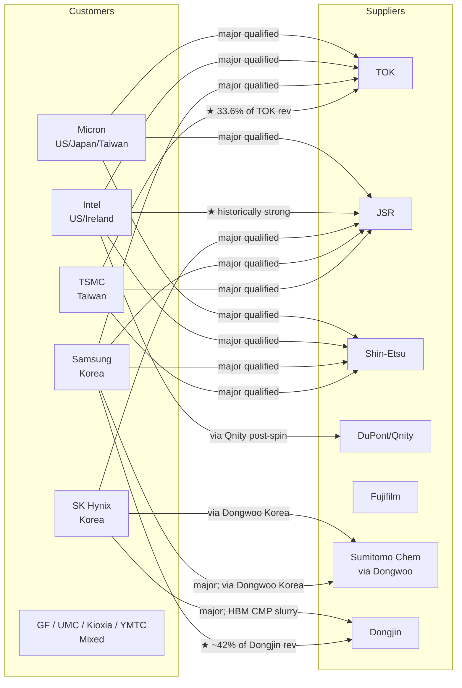
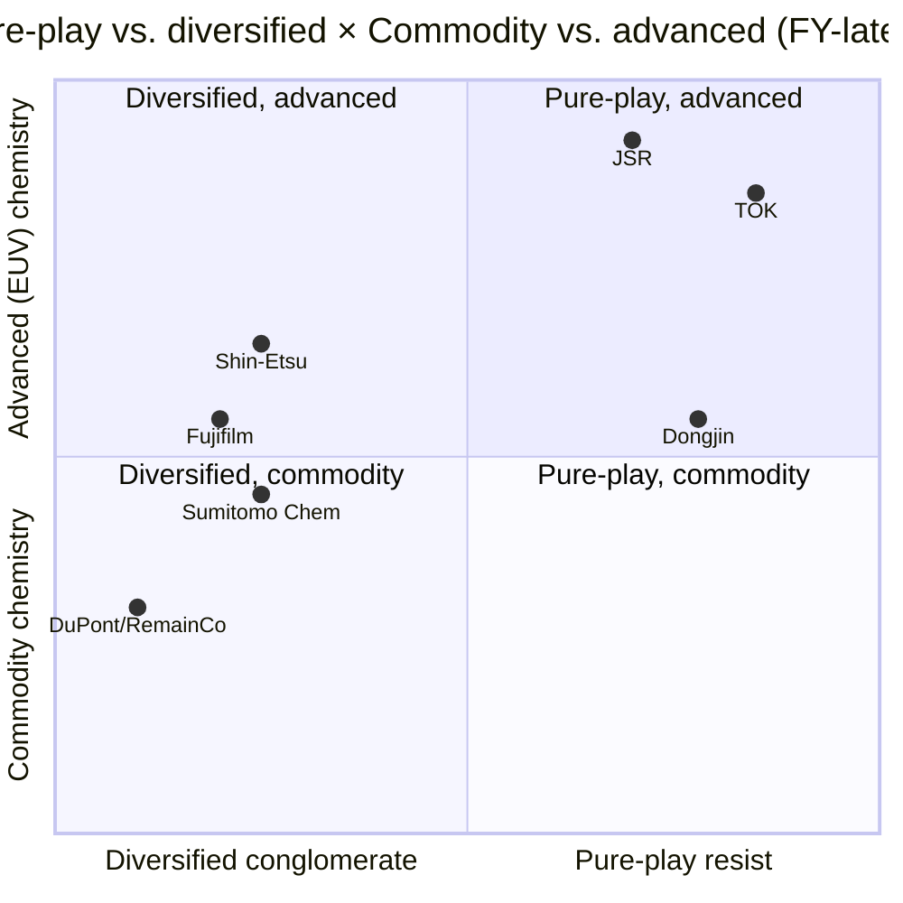
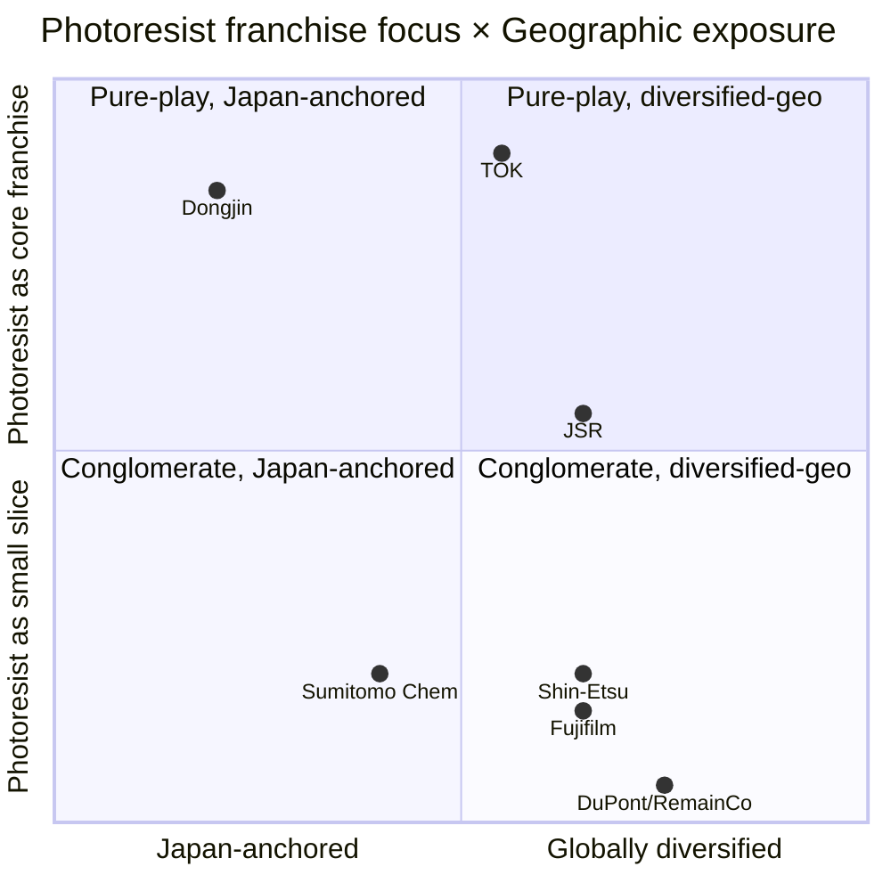

# Photoresist 7-Way Competitor Comparable — TOK / JSR / Shin-Etsu / DuPont / Fujifilm / Sumitomo / Dongjin

**As of:** 2026-05-26
**Sector:** Semiconductor lithography materials — photoresists & adjacent chemistries
**Coverage:** Tokyo Ohka Kogyo (TSE:4186), JSR Corporation (TSE:4185 — delisted 2024-06-25 to JIC), Shin-Etsu Chemical (TSE:4063), DuPont de Nemours (NYSE:DD — post-Qnity spin), Fujifilm Holdings (TSE:4901), Sumitomo Chemical (TSE:4005), Dongjin Semichem (KOSDAQ:005290)
**Source documents:** [TOK research, this report set](../company/TokyoOhkaKogyo_TSE4186/TokyoOhkaKogyo_TSE4186_Research_Document.md); [JSR research, this report set](../company/JSR_TSE4185/JSR_TSE4185_Research_Document.md); [Shin-Etsu research, this report set](../company/ShinEtsuChemical_TSE4063/ShinEtsuChemical_TSE4063_Research_Document.md); [DuPont research, this report set](../company/DuPont_NYSE_DD/DuPont_NYSE_DD_Research_Document.md); [Fujifilm research, this report set](../company/Fujifilm_TSE4901/Fujifilm_TSE4901_Research_Document.md); [Sumitomo Chemical research, this report set](../company/SumitomoChemical_TSE4005/SumitomoChemical_TSE4005_Research_Document.md); [Dongjin Semichem research, this report set](../company/DongjinSemichem_KOSDAQ005290/DongjinSemichem_KOSDAQ005290_Research_Document.md)
**Report language:** English

---

> **Top-of-report banner — what changed in the photoresist universe over the last 24 months.** Four structural events have re-shaped the seven-company field since 2024. First, **JSR Corporation was taken private by Japan Investment Corporation (JIC) on 2024-06-25** at ¥4,350/share for a ~¥909 bn ($6.0–6.3 bn) deal value, removing the global #1 photoresist supplier from public-market visibility ([JIC Capital, "Announcement of Tender Offer Results", 2024-04-17](https://www.jiccapital.co.jp/en/news/.assets/E_20240417_JIC_JICC_PressRelease.pdf); [JPX Decision on Delisting of JSR Corporation, 2024-06-05](https://www.jpx.co.jp/english/news/1023/20240605-11.html)). Second, **DuPont completed the Qnity Electronics spin-off on 2025-11-01**, distributing the entire semiconductor-materials franchise (advanced-packaging photoresists, CMP slurries, cleaning chemistries) as a separate NYSE listing under ticker "Q" ([DuPont 8-K filed 2025-11-03, completion of Electronics Separation](https://www.sec.gov/Archives/edgar/data/1666700/000166670025000056/dd-20251101.htm); [DuPont FY2025 10-K, p. 60](https://www.sec.gov/Archives/edgar/data/1666700/000166670026000013/dd-20251231.htm)); the DuPont RemainCo no longer competes in the photoresist sub-segment, but legacy holders of DD now own both. Third, **Sumitomo Chemical announced a new six-storey EUV/ArF Technology Center at Osaka Works on 2026-04-XX** (target completion FY2027), signalling photoresists as the flagship growth bet of the post-Iwata Mito presidency ([Sumitomo Osaka Works expansion announcement, 2025-02-26](https://www.sumitomo-chem.co.jp/english/news/detail/20250226e.html); [FY2025 Financial Results, 2026-05-14](https://www.sumitomo-chem.co.jp/english/news/files/docs/20260514e_1.pdf)). Fourth, **Dongjin Semichem shipped its first commercial EUV photoresist to Samsung Foundry's 3 nm production line in February 2025** and printed a record 20.3% operating margin in Q1 2026 — breaking the Japanese-trio EUV monopoly for the first time ([siglab — 동진쎄미켐 2026 종목분석](https://siglab.kr/stock-005290/); [SisaJournal-e Q1 2026 record OPM](https://www.sisajournal-e.com/news/articleView.html?idxno=304436)). In parallel, **TOK announced a multi-trigger-resist (MTR) joint-development partnership with UK-based Irresistible Materials on 2026-02-23** ([Irresistible Materials × TOK strategic investment + JDA, 2026-02-23](https://www.prnewswire.com/news-releases/irresistible-materials-and-tokyo-ohka-kogyo-co-ltd-tok-announce-strategic-investment-and-joint-development-partnership-to-advance-euv-lithography-302694205.html)); **JSR / Inpria signed a cross-licensing deal with Lam Research on 2025-09-15** to combine Lam's dry-resist tooling with Inpria metal-oxide chemistry ([Lam Research × JSR/Inpria press release, 2025-09-15](https://www.prnewswire.com/news-releases/lam-research-and-jsr-corporationinpria-corporation-enter-cross-licensing-collaboration-agreement-to-advance-semiconductor-manufacturing-302556926.html)); **Shin-Etsu broke ground on a fourth ¥83 bn photoresist plant at Isesaki Gunma** ([Shin-Etsu News, "fourth production base", 2024](https://www.shinetsu.co.jp/en/news/news-release/shin-etsu-chemical-to-build-a-new-production-base-in-japan-which-will-become-its-fourth-production-base-for-semiconductor-lithography-materials/)); and **Fujifilm Electronic Materials launched a PFAS-free negative ArF immersion resist developed with imec** in July 2025 ([Fujifilm — PFAS-Free ArF Immersion Resist news release, 2025-07-15](https://www.fujifilm.com/jp/en/news/hq/12568)). The collective signal: the global EUV chemistry battleground is bifurcating into a CAR (chemically-amplified) camp anchored by TOK + JSR + Shin-Etsu, a metal-oxide-resist (MOR) camp anchored by JSR-Inpria + Lam Research, and an emerging multi-trigger-resist (MTR) and PFAS-free CAR option camp where TOK and Fujifilm are placing chips.

---

## TL;DR — At-a-glance advantages and disadvantages

| Company | ✓ Strengths | ✗ Weaknesses | Best-fit investor |
|---|---|---|---|
| **TOK (TSE:4186)** | • #1 in KrF (32.4% share) and i/g-Line (22.7%) per Fuji Chimera 2024 (§2)<br>• #2 in EUV (28.0%) with multi-chemistry hedge (CAR + e-beam + MTR) (§5)<br>• Cleanest "pure-play resist" exposure of any listed name; ¥237 bn FY2025 with 20% OPM; FY2027 ¥58 bn OP target raised (§6)<br>• Embedded Taiwan footprint (台湾東應化 = 36.5% of group revenue) | • Top-1 customer concentration **at 33.6%** to TSMC (highest in the field) (§3, §8)<br>• #4 in ArF immersion (15.9%) — the highest-revenue photoresist generation today<br>• TTM P/E 37× — highest in the 5-yr range, at the top of the comp set (§6) | "I want the cleanest photoresist exposure with capital-return discipline"; tolerant of 37× P/E and TSMC concentration |
| **JSR (private; JIC-owned)** | • #1 globally in EUV CAR + sole owner of **Inpria** metal-oxide EUV resist (§5)<br>• Co-leader with TOK in ArF immersion (~30% claimed by issuer) (§5)<br>• JIC backing → multi-year capex flexibility; YHC (CVD/ALD) bolt-on adds adjacency (§2)<br>• Building a Taiwan resist plant + Hsinchu R&D center (~2028 online) | • **No public valuation since 2024-06-25 delisting** (¥909 bn JICC mark only) (§6)<br>• Life Sciences continues to lose money (¥7.7 bn core OI loss FY3/2024); divestiture overhang under Hori<br>• Privatization-related disclosure opacity — no Yuho-equivalent quarterly data | "I'm a strategic / sovereign investor or a future IPO buyer" (retail investors cannot own JSR today) |
| **Shin-Etsu (TSE:4063)** | • #3 globally in photoresists (#1 in KrF outside TOK by some measures), plus **#1 in 300mm silicon wafers + #1 PVC + #1 NdFeB magnet IP** (§2, §5)<br>• Capital fortress: ¥34 bn debt vs. ¥4.84 trn equity; ¥500 bn buyback authorized April 2025<br>• Diversification cushion — PVC (Shintech US) funds Electronics R&D through cycles (§6) | • Photoresist <¥200 bn within ¥934 bn Electronics segment — diluted attribution<br>• 41% revenue from cyclical PVC; H1 FY26 segment OP fell 33% YoY<br>• 27.9× TTM P/E above 5-yr median; FY26 OP guided down 14% (§9) | "I want quality compounding chemistry exposure with PVC cash flow as a hedge"; institutional core holding |
| **DuPont RemainCo (NYSE:DD)** | • Post-Qnity spin: cleaner Healthcare + Water + Diversified Industrials story (§4)<br>• Forward P/E ~19.9× — in line with sector materials; 2.8% dividend yield (§6)<br>• ~$2.5 bn segment-level Operating EBITDA; 25% EBITDA margin on RemainCo (§4) | • **No longer a photoresist play** — Qnity captured the entire wafer-fab-materials franchise (§5)<br>• Pre-spin "advanced packaging / AI materials" premium now sits at Qnity (Q forward P/E 38×) (§4)<br>• PFAS litigation overhang ($186 m New Jersey 2025 settlement) (§2) | "I held DD pre-spin and now own both DD + Q"; pure-play photoresist exposure now belongs to Q, not DD |
| **Fujifilm (TSE:4901)** | • #4–5 player in KrF/ArF (~5–6% combined share) but **#1 in CMP slurry via Yole**, ~70% in FUJITAC display film (§4)<br>• Diversified: Bio CDMO + Medical Imaging + Imaging + Electronics — multiple cycles (§4)<br>• July 2025 PFAS-free negative ArF immersion resist with imec — credible IP signal (§5)<br>• Post-Entegris HPPC ($700 m, October 2023) broadened the semi-materials cross-sell (§4) | • Sub-scale in photoresist; smaller R&D budget vs. TOK / JSR (§5)<br>• Late EUV qualification — not a meaningful EUV-resist shipper at scale (§5)<br>• Conglomerate discount: 14× P/E vs. Lonza 53× / Samsung Biologics 70× for the Bio CDMO slice (§6) | "I want the conglomerate-discount break-up trade with optionality on Bio CDMO spin"; tolerant of multi-segment complexity |
| **Sumitomo Chemical (TSE:4005)** | • Recovery from FY3/2024 record loss (–¥311 bn) to FY3/2026 ¥208 bn core OI (§4)<br>• Dongwoo Fine-Chem Korean footprint = #1 Japanese photoresist supplier *inside* Korea (§5)<br>• April 2026 new Osaka EUV/ArF Technology Center signals photoresist as flagship (§5)<br>• Petro Rabigh control transferred to Aramco → ~¥277 bn debt paid down across two years | • ~5–10% global photoresist share — sub-scale vs. TOK / JSR / Shin-Etsu (§5)<br>• 24.7% of revenue from ICT & Mobility but 9.2% segment OPM (below TOK 20%)<br>• High leverage history (D/E spiked >1.3× in FY3/2024); rebuilt to 0.93× FY3/2026 (§4)<br>• Mito is in first full year as president; restructuring-execution risk live | "I want the turnaround / EUV-investment story with a re-rating tail"; tolerant of cyclical multi-segment volatility |
| **Dongjin Semichem (KOSDAQ:005290)** | • **First commercial EUV-PR shipment to Samsung Foundry 3nm (Feb 2025)** — first non-Japanese EUV supplier (§2)<br>• Record Q1 2026 op-margin 20.3% (KRW 66.6 bn OP); foaming-agent spin-off completes pure-play pivot (§4)<br>• 소부장 (Korean materials localization) government framework backs the franchise (§5)<br>• Killeen + Plainview Texas plants ramp H2 2026 (Samsung Taylor + TSMC Arizona supply) | • **Samsung ~42% of consolidated revenue** (highest customer-concentration in field after TOK) (§3)<br>• Sub-scale R&D — KRW 80–100 bn (~$60–75 m) vs. TOK ~$80 m at much larger revenue base (§5)<br>• 50.8× TTM P/E (highest in group); FY25 net income compressed by Texas pre-op costs<br>• JSR's announced EUV plant in Hwaseong (Korea, 2024) directly attacks the home-market moat | "I want the Korean materials localization theme + EUV-PR market-share-take story"; tolerant of Samsung concentration and 50× P/E |

The **fast read of the field**: TOK and Dongjin are the two pure-plays you can buy for direct photoresist exposure, JSR is the structural #1 but locked up by JIC, Shin-Etsu is the diversified-quality compounder, DuPont post-Qnity is not really a photoresist play anymore, Fujifilm and Sumitomo are conglomerate-discount stories with photoresist optionality. Section-by-section evidence follows.

---

## 1. Market structure of photoresists — wavelength, chemistry, and why EUV is the strategic battleground

### 1.1 The five lithography sub-segments

A photoresist is the light-sensitive polymer film coated onto a silicon wafer immediately before each lithography exposure; when the lithography scanner shoots UV / DUV / EUV photons through the photomask, the resist either cross-links (negative tone) or de-protects (positive tone) in the exposed regions, and the developer step then removes either the exposed or unexposed material to leave behind the 3D relief pattern that the etch and deposition steps translate into transistors and interconnects ([JSR Report 2024, p.18 — "Total photoresist market: $2 billion (Semiconductors: $550 billion)"](https://www.jsr.co.jp/jsr_e/ir/assets/pdf/2024_e_all.pdf); [Shin-Etsu Photoresists product page](https://www.shinetsu.co.jp/en/products/electronics-materials/photoresist/)). The chemistry, optics, and unit economics are sharply different across the five lithography wavelengths actually in production:

| Sub-segment | Wavelength | Typical node use | Sample customers | Chemistry family | Approx 2024 TAM |
|---|---|---|---|---|---|
| **EUV** | 13.5 nm | TSMC N3 / N2 / N1.6, Samsung 3GAE / 2GAE, Intel 18A / 14A | TSMC, Samsung, Intel | CAR (chemically-amplified resist) + emerging MOR (metal-oxide) + MTR (multi-trigger) | $400–650 m, growing 12–25% CAGR |
| **ArF immersion (ArFi)** | 193 nm (with water) | 65 nm – 7 nm logic; DRAM word-line periphery | All leading-edge fabs | CAR — positive tone | $1.2–1.5 bn |
| **ArF dry** | 193 nm | 90–45 nm logic; mature DRAM | All leading-edge fabs | CAR — positive tone | $0.6–0.8 bn |
| **KrF** | 248 nm | DRAM periphery, NAND staircase, 80–150 nm logic, HBM stack via | Samsung memory, SK Hynix, Micron, Kioxia | CAR — positive tone | $0.7–1.0 bn |
| **i-Line + g-Line** | 365 / 436 nm | Power semis, MEMS, image sensor microlens, display TFT, BCD | Power semi (Infineon, ON, Wolfspeed), MEMS, image sensor | DNQ / novolac diazonaphthoquinone | $0.5–0.7 bn |
| **Back-end / packaging** | varies | TSV, RDL, fan-out wafer-level packaging, CoWoS | TSMC OSAT, packaging | Thick-film | $0.4–0.6 bn |

Sources for sizing: [Mordor Intelligence Photoresist Market](https://www.mordorintelligence.com/industry-reports/photoresist-market); [Datainsightsmarket DUV/EUV photoresist analysis, 2025](https://www.datainsightsmarket.com/reports/duv-and-euv-photoresist-158132); [Valuates Reports EUV Photoresists, $1.4B by 2031](https://reports.valuates.com/market-reports/QYRE-Auto-36H8625/global-euv-photoresists); [Fortune Business Insights — Photoresist Chemicals Market 2025](https://www.fortunebusinessinsights.com/photoresist-chemicals-market-115414); [GMInsights Photoresist Chemicals for Advanced Lithography](https://www.gminsights.com/industry-analysis/photoresist-chemicals-for-advanced-lithography-market).

The total semiconductor-photoresist TAM is approximately **US$4.8–5.5 bn in 2024**, growing 7–9% CAGR through 2030, with EUV the highest-growth sub-segment at 12–25% CAGR depending on the source ([Mordor Intelligence](https://www.mordorintelligence.com/industry-reports/photoresist-market); [Valuates Reports EUV Photoresists, 2025-09-21](https://finance.yahoo.com/news/euv-photoresists-market-reach-1-073100591.html)). The market is small in absolute terms — less than 1% of the >$600 bn global semiconductor industry — but disproportionately strategic, because every wafer at every node needs photoresist, the chemistry is one of the highest-purity manufacturing problems in industrial chemistry, and a fab cannot move a qualified resist to a different supplier without 6–24 months of node-by-node re-qualification ([JSR Report 2024, p.18, "we will continue to focus on leading-edge processes, especially EUV photoresists for the 3nm generation and beyond"](https://www.jsr.co.jp/jsr_e/ir/assets/pdf/2024_e_all.pdf); [Tom's Hardware — JSR builds first Taiwan photoresist plant](https://www.tomshardware.com/tech-industry/jsr-builds-first-taiwan-photoresist-plant-as-japanese-materials-makers-race-to-embed-next-to-tsmc)).

### 1.2 Why EUV is the strategic battleground

EUV uses 13.5 nm photons at 92 eV — high enough to ionise the resist polymer and break the chemical contrast that lower-wavelength CAR resists rely on. The resist chemist must simultaneously (a) absorb EUV photons efficiently so that few photons pattern each feature (high *sensitivity*), (b) hold sub-2 nm line-edge roughness so the lines are not fuzzy (low *LER*), and (c) develop with the same TMAH developer the legacy CAR resists use so the fab does not need new wet-process tools ([TOK 2025 Yuho, p.18, R&D narrative on EUV resist development](https://www.tok.co.jp/application/files/9717/7432/8945/securities_2512.pdf); [SemiAnalysis, "Lam Research, Tokyo Electron, JSR Battle It Out", 2021-11-18](https://newsletter.semianalysis.com/p/lam-research-tokyo-electron-jsr-battle)). Three families compete for the EUV slot: **CAR** (the legacy hi-resolution polymer chemistry, where TOK / JSR / Shin-Etsu share most of the market), **MOR** (metal-oxide-resist, pioneered by Inpria, now wholly owned by JSR), and **MTR** (multi-trigger resist, originally developed at the University of Birmingham and now part-owned by TOK via Irresistible Materials). The choice between them at sub-2 nm / high-NA EUV is unresolved, and is the single biggest open technical question in the photoresist sector ([Irresistible Materials × TOK press release, 2026-02-23](https://www.prnewswire.com/news-releases/irresistible-materials-and-tokyo-ohka-kogyo-co-ltd-tok-announce-strategic-investment-and-joint-development-partnership-to-advance-euv-lithography-302694205.html); [JSR Report 2024, p.17, CFO message on MOR](https://www.jsr.co.jp/jsr_e/ir/assets/pdf/2024_e_all.pdf)).

The strategic implication is that **EUV chemistry is the most likely place where market shares get reshuffled over the next 5–10 years.** The supplier that wins MOR (currently JSR) or MTR (currently TOK with optionality) at high-NA EUV insertion captures the highest-margin, fastest-growing segment of the whole photoresist market. Pure-play exposure to that share-shift sits at TOK and Dongjin; conglomerate-cushioned exposure sits at Shin-Etsu and Fujifilm; turnaround-flavoured exposure sits at Sumitomo. JSR is the structural winner today but inaccessible to public-market investors.

### 1.3 Industry concentration — extreme by any standard

Five suppliers — JSR, TOK, Shin-Etsu, Fujifilm, Sumitomo Chemical (plus Korean Dongjin Semichem as #5–6 internationally) — account for **approximately 91% of global photoresist supply** ([Seoul Economic Daily, 2026-04-24](https://en.sedaily.com/international/2026/04/24/hormuz-blockade-triggers-photoresist-crunch-hitting-samsung); [TrendForce, 2025-11-06](https://www.trendforce.com/news/2025/11/06/news-japan-ramps-up-photoresist-investment-for-2nm-chips-tokyo-ohka-kogyo-jsr-lead-the-charge/)). The Japanese concentration is so dominant that the 2019 Japan–Korea trade dispute, in which Japan tightened export controls on photoresist exports to Korea, was treated as a Korean national-security event and a primary driver of Samsung / SK Hynix's diversification programs ([Japan-South Korea trade dispute, Wikipedia](https://en.wikipedia.org/wiki/Japan%E2%80%93South_Korea_trade_dispute); [Sumitomo Chemical Korean EUV expansion, 2021-08-31](https://www.sumitomo-chem.co.jp/english/news/detail/20210831e.html)). The 2026-04 Hormuz-blockade speculation around naphtha-to-solvent supply chains is the most recent concrete reminder that the Japanese top-five sit on a brittle geopolitical foundation ([Seoul Economic Daily, "Hormuz Blockade Triggers Photoresist Crunch", 2026-04-24](https://en.sedaily.com/international/2026/04/24/hormuz-blockade-triggers-photoresist-crunch-hitting-samsung)).

The buyer side is equally concentrated. TSMC, Samsung Electronics, SK Hynix, Intel, Micron, plus a handful of secondary fabs (Kioxia, GlobalFoundries, UMC, SMIC, YMTC) together purchase the great majority of all leading-edge photoresist; for the EUV sub-segment, TSMC + Samsung + Intel control essentially 100% of demand ([JSR Report 2024, p.18, "primarily for the Taiwanese and Korean markets"](https://www.jsr.co.jp/jsr_e/ir/assets/pdf/2024_e_all.pdf); [Mordor Intelligence Semiconductor Materials Market](https://www.mordorintelligence.com/industry-reports/semiconductor-materials-market)). The combined buyer × seller concentration is what makes the photoresist industry resemble the EDA duopoly (Synopsys + Cadence) or the EUV-scanner monopoly (ASML) more than it resembles a typical specialty chemicals market — and is why the seven names in this report look like a "neighbourhood" rather than a fragmented sector.

---

## 2. Share by sub-segment — Where each player wins


*Source: triangulated from [TOK "What is TOK" corporate-overview page](https://www.tok.co.jp/eng/who-we-are/glance) (citing Fuji Chimera Research Institute, "Current Status and Future Outlook of Cutting-edge/Noticeable Semiconductor-related Markets 2025"), [Nomura Securities cited in Evertiq, JIC × JSR coverage](https://evertiq.com/news/55596), [GMInsights — Photoresist Chemicals for Advanced Lithography Market](https://www.gminsights.com/industry-analysis/photoresist-chemicals-for-advanced-lithography-market), [Fortune Business Insights Photoresist Chemicals Market 2025](https://www.fortunebusinessinsights.com/photoresist-chemicals-market-115414), and [Mordor Intelligence Photoresist Market](https://www.mordorintelligence.com/industry-reports/photoresist-market). KrF + g/i-Line shares are TOK's own disclosure citing Fuji Chimera 2024 shipment projections; ArFi / ArF / EUV are an analyst aggregate from multiple sources because no two industry-research firms agree on the precise numbers.*

### 2.1 The primary share table

The table below combines the strongest single-source data per sub-segment (TOK's own Fuji-Chimera-sourced disclosure on KrF / i-Line + g-Line; JSR's own ArFi claim; analyst triangulation on EUV).

| Sub-segment (2024) | #1 | #2 | #3 | #4 | #5 | Top-3 combined |
|---|---|---|---|---|---|---|
| **EUV** | JSR ~34% (CAR + Inpria MOR) | TOK 28.0% | Shin-Etsu ~11% | Fujifilm ~5.5% | DuPont/Qnity ~4% | ~73% |
| **ArF immersion** | JSR ~30% (issuer-stated "about a third") | Shin-Etsu ~15% | TOK 15.9% | DuPont ~10% | Sumitomo ~8% | ~60% |
| **ArF dry** | JSR ~28% | TOK ~18% | Shin-Etsu ~14% | DuPont ~11% | Sumitomo ~7% | ~60% |
| **KrF (Fuji-Chimera disclosed)** | **TOK 32.4%** | Shin-Etsu ~25% | JSR ~18% | DuPont/Qnity ~9% | Fujifilm/Sumitomo ~5–6% | ~75% |
| **i-Line + g-Line (Fuji-Chimera disclosed)** | **TOK 22.7%** | Shin-Etsu ~18% | JSR ~12% | Sumitomo/DuPont ~6–12% | Dongjin ~6% | ~53% |
| **All photoresist (Fuji-Chimera blended)** | JSR ~22–27% | TOK 24.7% | Shin-Etsu ~9–11% | Fujifilm ~6–7% | DuPont/Qnity / Sumitomo ~5–8% | ~58% |

*Analyst view:* The conflict in the all-photoresist ranking row — Nomura puts JSR at ~22–27% as #1 ([Evertiq, JIC × JSR coverage](https://evertiq.com/news/55596)) while TOK's own Fuji-Chimera-cited blended number is 24.7% which would put it at #1 — is genuine and unresolved at the source-data level. The two firms are effectively co-leaders at the overall-photoresist level, with JSR holding a meaningful EUV + ArFi premium and TOK holding the KrF + g/i-Line premium. The other five companies are clearly in the second tier.

### 2.2 EUV — JSR + TOK at the top, Shin-Etsu the third leg, Dongjin the new entrant


The EUV sub-market is the single most concentrated photoresist segment: JSR + TOK + Shin-Etsu together hold roughly **73% of EUV resist shipments**, with JSR's lead reflecting its CAR EUV franchise plus its sole ownership of Inpria (the leading metal-oxide-resist company, acquired October 2021 for US$514 m) ([JSR press release, "JSR Agrees to Acquire EUV Pioneer Inpria Corporation", 2021-09-17](https://www.jsr.co.jp/jsr_e/news/2021/20210917.html); [Oregon State University news on the deal](https://news.oregonstate.edu/news/osu-startup-inpria-nets-514m-acquisition-trailblazing-chemical-manufacturing); [JSR Report 2024, p.17 — CFO message on MOR](https://www.jsr.co.jp/jsr_e/ir/assets/pdf/2024_e_all.pdf)). TOK's #2 position at 28.0% is the issuer's own disclosure ([TOK "What is TOK" page](https://www.tok.co.jp/eng/who-we-are/glance)). *Analyst view:* this share is held by TOK's in-house CAR EUV resist plus the optionality from its 2024 acquisition of micro resist technology GmbH (Berlin) and its 2026-02 Irresistible Materials (Birmingham UK) MTR investment + JDA ([Irresistible Materials × TOK partnership press release, 2026-02-23](https://www.prnewswire.com/news-releases/irresistible-materials-and-tokyo-ohka-kogyo-co-ltd-tok-announce-strategic-investment-and-joint-development-partnership-to-advance-euv-lithography-302694205.html); [TOK 2025 Yuho, p.4 — micro resist acquisition](https://www.tok.co.jp/application/files/9717/7432/8945/securities_2512.pdf)).

Shin-Etsu's ~11% EUV share comes from the same Naoetsu base that anchors its #1 KrF position; the company is investing aggressively to defend the slot via the ¥83 bn Isesaki Gunma plant (first-phase commissioning targeted FY26) ([Shin-Etsu News — Fourth photoresist base, 2024](https://www.shinetsu.co.jp/en/news/news-release/shin-etsu-chemical-to-build-a-new-production-base-in-japan-which-will-become-its-fourth-production-base-for-semiconductor-lithography-materials/); [C&EN — Shin-Etsu fourth resist plant, 2024-03](https://cen.acs.org/materials/electronic-materials/Shin-Etsu-build-fourth-resist/102/i12)). Fujifilm and DuPont/Qnity sit in the 4–6% range with very real EUV programs but no leading-edge production scale — Fujifilm's July 2025 PFAS-free negative ArF immersion resist with imec is its most concrete IP signal in the segment ([Fujifilm — PFAS-Free ArF Immersion Resist, 2025-07-15](https://www.fujifilm.com/jp/en/news/hq/12568); [imec press release on the joint development](https://www.imec-int.com/en/press/fujifilm-develops-pfas-free1-negative-arf-immersion-resist)).

Sumitomo Chemical's ~3.5% EUV slot is the smallest among the seven names today but is the focus of the heaviest *forward* investment: the company's Korean Iksan EUV/ArFi line (announced 2021, completed 2024) plus the April 2026 new six-storey Osaka EUV/ArF Technology Center (target FY2027 completion) reflect over **¥100 bn of cumulative semi-materials capex in recent years** per the issuer ([Sumitomo Osaka Works expansion, 2025-02-26](https://www.sumitomo-chem.co.jp/english/news/detail/20250226e.html); [KED Global — Sumitomo Chemical S. Korea $90M photoresist plant](https://www.kedglobal.com/chemical-industry/newsView/ked202109010005)). *Analyst view:* Sumitomo is "buying a seat at the EUV table" rather than defending an incumbent position.

**Dongjin Semichem is the seventh name and the first non-Japanese entrant of meaningful weight.** Dongjin's commercial EUV-PR shipment to Samsung Foundry 3 nm in February 2025 marks the first time a non-Japanese supplier has broken into commercial EUV photoresist — Samsung's 소부장 (materials localization) policy is the structural reason and the company's record Q1 2026 op-margin of 20.3% is the financial signal that the EUV ramp is materially margin-accretive ([siglab — 동진쎄미켐 2026 분석](https://siglab.kr/stock-005290/); [SisaJournal-e Q1 2026 record OPM](https://www.sisajournal-e.com/news/articleView.html?idxno=304436); [Business Post — Lee Jun-hyuk Q1 2025 EMA mix 94.6%](https://www.businesspost.co.kr/BP?command=article_view&num=404339)). Dongjin's current global EUV share is small (~3%) but the trajectory is what re-rates the multiple, not the absolute level.

### 2.3 ArF immersion — JSR's claimed crown and the four-way fight


ArF immersion is the **single largest photoresist sub-segment by revenue** — global ArF immersion held 31.92% of the photoresist market in 2025 per Datainsightsmarket sizing ([Datainsightsmarket DUV/EUV photoresist analysis, 2025](https://www.datainsightsmarket.com/reports/duv-and-euv-photoresist-158132)). JSR's "about a third" share claim ([JSR Report 2024, p.18 — Growth Strategy](https://www.jsr.co.jp/jsr_e/ir/assets/pdf/2024_e_all.pdf)) puts it as the clear leader, with TOK at 15.9% (issuer-disclosed) ranked #4 behind Shin-Etsu (~15%) — the soft spot in the TOK franchise ([TOK "What is TOK" page](https://www.tok.co.jp/eng/who-we-are/glance)). *Analyst view:* TOK's relative weakness in ArFi structurally caps the franchise — even with #1 KrF and #2 EUV, having the highest-revenue generation be the worst position means TOK trades on EUV optionality rather than current cash flow. JSR's lead is sticky and unlikely to close near-term because qualified ArFi recipes are extraordinarily costly to move; the most JSR can lose here is incremental share at marginal nodes.

DuPont (via the legacy Rohm and Haas Electronic Materials franchise that now sits at Qnity Electronics post-November 2025 spin) is the #4 ArFi player at ~10% ([Qnity Information Statement, Lithographic Materials section](https://www.sec.gov/Archives/edgar/data/2058873/000119312525223466/d942851d1012ba.htm); [DuPont FY2025 10-K, p. 60](https://www.sec.gov/Archives/edgar/data/1666700/000166670026000013/dd-20251231.htm)). Sumitomo Chemical at ~8% via Dongwoo Fine-Chem and Fujifilm at ~5% round out the field. Dongjin's first ArFi supply to Samsung Electronics happened in 2021 ([THE ELEC — Korea EUV line, 2022](https://www.thelec.net/news/articleView.html?idxno=3311)) and the franchise is now solidly inside the Korean fab supply chain.

### 2.4 KrF — TOK's cash cow and a clean duopoly with Shin-Etsu


KrF (248 nm) is the workhorse of DRAM peripheral, 3D NAND staircase patterning, and mature-logic foundry layers — and is structurally a **TOK + Shin-Etsu duopoly with DuPont and JSR as #3/#4** ([TOK "What is TOK" page](https://www.tok.co.jp/eng/who-we-are/glance) citing Fuji Chimera 2024). TOK is the global #1 at 32.4% with the cleanest competitive moat in the franchise: high customer switching cost on every fab line, stable margin given mature chemistry, and the HBM + 3D NAND demand wave gives KrF a multi-year growth runway because each HBM3E / HBM4 die has 8–16 stacked DRAM dies and each one uses many KrF layers for staircase / via patterning ([TOK FY2025 Business Results presentation, 2026-02-09](https://www.tok.co.jp/application/files/8117/7061/1184/account_2512_4_en.pdf)). Shin-Etsu's #2 position at 25% — the company's strongest single resist franchise — was the original 1997 KrF launch at Naoetsu and remains the segment's strongest moat ([Shin-Etsu Photoresists product page](https://www.shinetsu.co.jp/en/products/electronics-materials/photoresist/)).

Dongjin's KrF franchise is large in absolute Korean terms — the company has been Samsung's primary KrF Thick photoresist supplier for 3D V-NAND since 2013, often described in the Korean trade press as Samsung's "exclusive" supplier although the practical reality is likely "primary with a Japanese back-up" ([The Elec, 2025-05 on Dongjin Samsung exclusivity](https://thelec.net/news/articleView.html?idxno=5054); [Business Post — Lee Jun-hyuk segment mix](https://www.businesspost.co.kr/BP?command=article_view&num=404339)). Global KrF share for Dongjin is small at ~2% — the Korean fabs alone are a fraction of global KrF demand — but the Samsung exclusivity is the strategic anchor of Dongjin's customer book.

### 2.5 i-Line + g-Line — TOK #1, fragmented tail

i-Line and g-Line photoresists pattern the larger-feature steps that every chip still needs at every node — display TFT layers, power semiconductor metal levels, MEMS structural patterning, image sensor microlens — and are a slow-growing, structurally fragmented category. TOK is the global #1 at 22.7% ([TOK "What is TOK" page](https://www.tok.co.jp/eng/who-we-are/glance) citing Fuji Chimera 2024), with Shin-Etsu #2 at ~18%, JSR at ~12%, and a long tail. Dongjin's i-Line share at ~6% is meaningful for its Korean display-and-power-semi customer base and is part of the franchise's KOSDAQ-typical "diversified Korean specialty chemistry" identity ([Dongjin TradeKorea profile](https://dongjinsem.tradekorea.com/company.do); [SEMI member directory — Dongjin Semichem](https://www.semi.org/en/resources/member-directory/dongjin-semichem-co-ltd)).

The category has two interesting properties that the share table does not capture. First, **g/i-Line resists serve some of the fastest-growing end-markets**: power semiconductors (SiC MOSFETs and IGBTs for EV traction inverters), MEMS (gyroscopes and accelerometers for autos and AR/VR), image sensors (smartphone-camera microlens), and display drivers — all growing 10–15% annually. Second, **being the incumbent at the slow-growing generation means a defensible long-tail revenue stream** that the customer rarely re-qualifies, so the supplier captures multi-decade revenue per qualified node. TOK's leadership here is the foundation of the company's overall #1 share claim and a meaningful cash-generative anchor for the EUV R&D budget.

---

## 3. Customer overlap and concentration


The customer-supplier matrix illustrates a critical structural truth: **most leading-edge fabs dual-source resist at every recipe**, and the actual market shares at any one customer reflect deliberate procurement policy — not pure technical leadership. TSMC, Samsung Foundry, and Intel each typically qualify two or three resist suppliers per recipe per node and split volumes between them at the annual procurement cycle ([JSR Report 2024, p.18 — Growth Strategy](https://www.jsr.co.jp/jsr_e/ir/assets/pdf/2024_e_all.pdf); [Tom's Hardware — JSR Taiwan plant, 2026-05](https://www.tomshardware.com/tech-industry/jsr-builds-first-taiwan-photoresist-plant-as-japanese-materials-makers-race-to-embed-next-to-tsmc); [SemiAnalysis EUV competitive piece](https://newsletter.semianalysis.com/p/lam-research-tokyo-electron-jsr-battle)).

### 3.1 The two material concentration disclosures

**TOK and Dongjin are the two outliers** on customer concentration. Among the seven companies, only these two have a publicly disclosable single-customer concentration that crosses the 30%-of-revenue threshold:

- **TOK** — TSMC accounts for **¥79,631 m / 33.6% of FY2025 consolidated revenue**, up from 30.4% in FY2024 ([TOK 2025 Yuho, p.15 — 主要な販売先 (Main Customers)](https://www.tok.co.jp/application/files/9717/7432/8945/securities_2512.pdf)). This is the issuer's own Japanese-GAAP-mandated disclosure of customers ≥10% of consolidated revenue, and the 320 bps year-over-year step-up is the cleanest single visible indicator in the field of how concentrated TSMC's photoresist purchasing is becoming as N3 / N2 EUV layers ramp. No other TOK customer is individually material (Samsung Electronics + SK Hynix + Intel + Micron together collectively account for an inferred ~14% of group revenue through TOK's Korean subsidiary plus US/Europe channels). The concentration is bilateral — TOK is also one of TSMC's top-two EUV resist suppliers — but the asymmetry is real: TOK loses more from a TSMC pricing-power push than TSMC loses from a TOK supply disruption.

- **Dongjin Semichem** — Samsung Electronics is **~42% of consolidated revenue** per analyst triangulation; the company does not publicly name customers (Korean DART disclosure rules permit anonymized "domestic semiconductor company A" descriptions) but the photoresist sub-segment alone runs at 60% Samsung concentration per The Elec coverage ([The Elec — Samsung 60% of photoresist revenue, 2025-05](https://thelec.net/news/articleView.html?idxno=5054); [Business Post — 이준혁 회장 Q1-25 segment mix](https://www.businesspost.co.kr/BP?command=article_view&num=404339); [DART 사업보고서 2024, filed 2025-03-19](https://kind.krx.co.kr/common/disclsviewer.do?method=search&acptno=20250319000811)). SK Hynix is the rapidly-growing second customer at ~18% driven by HBM CMP slurry and the EUV-PR co-development programme; top-5 customers (Samsung Electronics + SK Hynix + LG Display + Samsung Display + a smaller logic / memory account) total roughly 70%.

### 3.2 The four diversified names

JSR, Shin-Etsu, DuPont, Fujifilm, and Sumitomo Chemical **all sit below the 10% disclosure threshold** on any individual customer — neither the JSR Report 2024 segment notes nor the Yuho-equivalents for Shin-Etsu / Fujifilm / Sumitomo identify a >10% customer ([JSR Report 2024, p.6 — At a Glance](https://www.jsr.co.jp/jsr_e/ir/assets/pdf/2024_e_all.pdf); [Shin-Etsu Annual Report 2025 Financial Section §26 Segment Information](https://www.shinetsu.co.jp/wp-content/uploads/2025/07/Financial-Section.pdf); [Fujifilm 2024 Yuho on EDINET, filed 2025-06-25](https://ir.fujifilm.com/ja/investors/ir-news/auto_20250625162400_S100W3XJ/pdfFile.pdf); [Sumitomo Chemical FY2025 Financial Results](https://www.sumitomo-chem.co.jp/english/news/files/docs/20260514e_1.pdf); [DuPont FY2025 10-K, p. 60 — segments](https://www.sec.gov/Archives/edgar/data/1666700/000166670026000013/dd-20251231.htm)). This is partly because their photoresist + adjacent-chemistry revenue is *diluted by other businesses* — Shin-Etsu PVC, JSR Plastics + Life Sciences, Fujifilm Bio CDMO + Imaging + Business Innovation, Sumitomo agrochems + pharma + petrochems, DuPont post-Qnity Healthcare + Water + Diversified Industrials. Inside the Electronics-segment-equivalent, however, **top-5 customer concentration is uniformly high**: TSMC + Samsung + SK Hynix + Intel + Micron collectively account for >50% of every photoresist business in this group ([JSR Report 2024, pp.18–22, JSR's Position diagrams](https://www.jsr.co.jp/jsr_e/ir/assets/pdf/2024_e_all.pdf); [Shin-Etsu Annual Report 2025 §26-2 Geographic Information](https://www.shinetsu.co.jp/wp-content/uploads/2025/07/Financial-Section.pdf); [Sumitomo Chemical Korean EUV expansion targeting Samsung + SK Hynix](https://www.kedglobal.com/chemical-industry/newsView/ked202109010005); [CMP Slurry Market Report 2025 — Coherent Market Insights](https://www.coherentmarketinsights.com/market-insight/cmp-slurry-market-4039)).

### 3.3 Geographic concentration of the customer book



The diagram captures the **two-pole geographic structure of the customer book**. TOK is over-indexed to TSMC because of the Tongluo (Taiwan) plant and 台湾東應化 subsidiary (¥86.5 bn = 36.5% of FY2025 group revenue) ([TOK 2025 Yuho, p.6](https://www.tok.co.jp/application/files/9717/7432/8945/securities_2512.pdf)). Dongjin is over-indexed to Samsung because of geographic proximity (Incheon HQ is a 90-minute drive from Samsung's Hwaseong campus) and Korea's 소부장 (materials localization) policy. Sumitomo Chemical sits between the two — its Dongwoo Fine-Chem Korean subsidiary makes it the only Japanese photoresist supplier with a fully-owned Korean production base, which is a meaningful supply-chain risk advantage for Samsung and SK Hynix given the 2019 Japan-Korea trade dispute ([InvestKOREA — Dongwoo Fine-Chem](https://www.investkorea.org/ik-en/bbs/i-468/detail.do?ntt_sn=71927)). JSR, Shin-Etsu, Fujifilm, and DuPont/Qnity are geographically more diversified, which is why none of them is individually over a 10% disclosure threshold at the consolidated level.

### 3.4 The structural implication

Customer concentration is the **single largest fundamental difference** between the pure-plays (TOK, Dongjin) and the diversified names. TOK's 33.6% TSMC exposure means a TSMC pricing-power push or a TSMC capex slowdown can move TOK's revenue ±10%; Dongjin's 42% Samsung exposure means a Samsung Foundry yield miss versus TSMC N3 ramp could compress Dongjin's EUV-PR revenue by 5–10%. JSR's customer book is the most diversified in the field because the company sells across so many fabs and so many product lines (resist + CMP slurries + cleaning solutions + multilayer materials + packaging + CVD/ALD precursors via YHC) that no one customer can credibly threaten more than 8–10% of revenue. This concentration asymmetry shows up in the **valuation multiples** (TOK and Dongjin trade higher because investors pay for the cleaner exposure) and in the **risk profile** (TOK and Dongjin take the larger drawdown when their anchor customer wobbles).

---

## 4. Vertical integration and breadth — pure-play vs. diversified


The seven names split cleanly into **three pure-plays** (TOK, JSR — semi-pure given Plastics + Life Sciences, and Dongjin) and **four diversified conglomerates** (Shin-Etsu, DuPont, Fujifilm, Sumitomo Chemical). The strategic implications run in opposite directions:

### 4.1 Pure-plays — higher beta to EUV, cleaner re-rating

**TOK** is the cleanest pure-play. The company files a single-segment "Materials Business" (材料事業) for accounting purposes but internally breaks revenue between Electronic Functional Materials (¥124.7 bn FY2025) and High-Purity Chemicals (¥109.4 bn) — both of which are essentially all-resist or resist-adjacent ([TOK 2025 Yuho, p.16](https://www.tok.co.jp/application/files/9717/7432/8945/securities_2512.pdf); [TOK FY2025 Business Results presentation, p.3](https://www.tok.co.jp/application/files/8117/7061/1184/account_2512_4_en.pdf)). FY2025 revenue ¥237.0 bn, OPM 20.0%, TTM P/E 37× — every operating metric is essentially a photoresist franchise expressed as a stock. The closest sector comp on growth (Shin-Etsu Chemical) trades at 22×; TOK's 15-point premium is the market paying for *the purer photoresist exposure*.

**Dongjin Semichem**, after the January 2026 spin-off of the foaming-agent business to Dongjin Inochem, is the second pure-play. Electronic Materials is now ~91% of FY2025 revenue and is on track to reach ~95%+ from FY2026 ([디일렉 — 발포제 사업 분할, 2024-11](https://www.thelec.kr/news/articleView.html?idxno=41767); [stockanalysis.com — Dongjin financials](https://stockanalysis.com/quote/kosdaq/005290/financials/)). The spin-off was specifically marketed as removing "the structural conglomerate discount the Korean market has long applied to Dongjin" ([siglab — 동진쎄미켐 2026 분석](https://siglab.kr/stock-005290/)). At 50.8× TTM P/E (compressing to ~28–30× forward on the EUV ramp), Dongjin trades at the highest multiple of any name in the field, reflecting both the cleanest Korean-localization-thesis exposure and the inflection narrative.

**JSR** is "pure-play minus Life Sciences." Digital Solutions (which is essentially the semiconductor + display materials business) was 41.5% of FY2023 revenue but contributed essentially 100% of consolidated operating profit because Life Sciences ran a ¥7.7 bn core operating loss and Plastics generated only ¥1.5 bn ([JSR Report 2024, pp.16–20 — Segment narratives](https://www.jsr.co.jp/jsr_e/ir/assets/pdf/2024_e_all.pdf); [JSR Report 2024, p.52 — MD&A](https://www.jsr.co.jp/jsr_e/ir/assets/pdf/2024_e_all.pdf)). The CEO transition to Tetsuro Hori in April 2025 explicitly opened the door to a Life Sciences divestiture ([KFGO/Reuters — JSR's incoming CEO signals retreat from sector M&A, 2025-03-26](https://kfgo.com/2025/03/26/jsrs-incoming-ceo-signals-focus-on-finances-retreat-from-sector-ma-ambitions/)) — if executed, JSR would become a cleaner pure-play semiconductor-materials company at IPO-exit time.

### 4.2 Diversified — stability cushion, conglomerate discount

**Shin-Etsu Chemical** is the textbook diversified specialty-chemical major. Four segments — Infrastructure Materials (¥1,041.6 bn FY24, 41% of revenue: PVC + caustic via Shintech US), Electronics Materials (¥934.3 bn, 36%: silicon wafers + photoresists + rare-earth magnets), Functional Materials (¥448.6 bn, 18%: silicones + cellulose + pellicles), and Processing & Specialized Services (¥136.7 bn, 5%) — give the group three economically uncorrelated #1 global positions (PVC, 300mm silicon wafers, rare-earth magnets) plus a top-3 photoresist franchise ([Shin-Etsu Annual Report 2025 Financial Section §26 Segment Information, pp.37–38](https://www.shinetsu.co.jp/wp-content/uploads/2025/07/Financial-Section.pdf)). The diversification cushion is real: H1 FY26 Infrastructure Materials OP fell 33% YoY but Electronics held up. The cost is dilution — photoresist is <¥200 bn within the ¥934 bn Electronics segment, so a clean photoresist re-rating cannot move the stock the way it can move TOK ([Shin-Etsu Annual Report 2025 Financial Section MD&A](https://www.shinetsu.co.jp/wp-content/uploads/2025/07/Financial-Section.pdf)).

**Fujifilm Holdings** runs four equally-diluted segments — Healthcare (32% of FY2024 revenue: Bio CDMO + Medical Imaging + LS Solutions), Business Innovation (38%: ex-Fuji Xerox MFPs / production print), Imaging (17%: Instax + X-Series + GFX), Electronics (13%: photoresists + CMP slurries + post-Entegris HPPC + FUJITAC) — meaning photoresist is *under 5% of consolidated revenue* in the largest Japanese electronic-materials conglomerate ([Earnings Presentation FY2024 Q4](https://ir.fujifilm.com/en/investors/ir-materials/earnings-presentations/main/01112/teaserItems5/00/linkList/0/link/ff_fy2024q4_001e.pdf); [FY2025 results release, 2026-05-14](https://holdings.fujifilm.com/en/news/list/2127)). The conglomerate discount is visible in the multiple: 14.2× TTM P/E vs. Lonza (the Bio CDMO pure-play comp) at 53.7× and Samsung Biologics at 70× ([Simply Wall St — Lonza Group Valuation](https://simplywall.st/stocks/ch/pharmaceuticals-biotech/vtx-lonn/lonza-group-shares/valuation)). Activists have not yet pushed for a break-up but the math is obvious.

**Sumitomo Chemical** has five segments — Agro & Life (¥519.3 bn FY3/2026), ICT & Mobility (¥574.2 bn, the photoresist segment), Advanced Medical (¥451.9 bn via Sumitomo Pharma), Essential & Green Materials (¥678.8 bn, petrochems), plus Sumitomo Pharma (separately listed). ICT & Mobility is 24.7% of revenue but photoresist is a fraction of that, so the practical photoresist share of group revenue is in the 8–10% range ([FY2025 Financial Results, 2026-05-14](https://www.sumitomo-chem.co.jp/english/news/files/docs/20260514e_1.pdf), p. 12). The recovery story is real (FY3/2024 record loss → FY3/2026 ¥208 bn core OI), but a "buy the EUV play" thesis on Sumitomo gets diluted 10:1 by the rest of the group.

**DuPont post-Qnity-spin** is the cleanest example of how a diversified parent voluntarily *removed* its photoresist exposure. The November 1, 2025 spin distributed ~209 m Qnity shares to DuPont shareholders, and Qnity now trades at NYSE: Q with the entire wafer-fab-materials franchise (advanced-packaging photoresists, CMP slurries, cleaning chemistries, Kapton®) ([DuPont 8-K filed 2025-11-03](https://www.sec.gov/Archives/edgar/data/1666700/000166670025000056/dd-20251101.htm); [Qnity Form 10/Information Statement, 2025-09-29](https://www.sec.gov/Archives/edgar/data/2058873/000119312525223466/d942851d1012ba.htm)). DuPont RemainCo at ~$10 bn revenue / 25% Operating EBITDA margin is now a Healthcare + Water + Diversified Industrials story trading at ~19.9× forward P/E ([DuPont FY2025 10-K, p. 60](https://www.sec.gov/Archives/edgar/data/1666700/000166670026000013/dd-20251231.htm)); Qnity at ~$5 bn revenue / 38× forward P/E is the pure-play electronics-materials story. **The case study for photoresist investors:** when the parent is willing to spin the franchise, the resulting pure-play re-rates by ~75% on the multiple alone.

### 4.3 The vertical integration matrix



The quadrant map captures the strategic positioning: **TOK and JSR alone live in Q1 (pure-play, advanced)** — they are the only two names where EUV chemistry leadership is the core franchise and there's no major non-resist business diluting it. **Shin-Etsu, Fujifilm, Sumitomo Chemical sit in Q2** — diversified conglomerates with credible advanced-chemistry slots. **Dongjin Semichem is a unique case** — pure-play after the foaming-agent spin, but with EUV chemistry that is still mid-cycle relative to the Japanese top-three. **DuPont RemainCo is now in Q3** — diversified specialty-materials with no leading-edge photoresist exposure post-Qnity.

---

## 5. R&D and capex intensity — the EUV arms race


### 5.1 R&D-to-revenue intensity reveals the pure-play premium

R&D-to-revenue is the cleanest single visible metric for how aggressively each name is investing in chemistry IP. **JSR at 8.5%** ([JSR Report 2024, p.9 — R&D ¥34.2bn / revenue ¥404.6bn](https://www.jsr.co.jp/jsr_e/ir/assets/pdf/2024_e_all.pdf)) and **Dongjin at ~7%** ([DART 사업보고서 2024](https://kind.krx.co.kr/common/disclsviewer.do?method=search&acptno=20250319000811)) sit at the top — both are pure-play-leaning names where photoresist R&D dominates the budget. TOK is at ~6% (the lower number reflects the resist-pure-play already having high R&D density per resist dollar; absolute spend is in the ~¥14 bn range). Fujifilm at 5.1%, DuPont post-spin at ~4%, Sumitomo Chemical at 3.5%, and Shin-Etsu at 3% reflect their diversified bases — the absolute R&D dollars in each company's photoresist segment can be perfectly competitive with TOK's even though the group-level percentage looks lower (Shin-Etsu's ¥934 bn Electronics segment can sustain a meaningful resist R&D budget that gets diluted to 3% across the group).

### 5.2 Capex commitments — the new-plant arms race

The four most consequential new-plant commitments in 2024–2027 are:

1. **Shin-Etsu's Isesaki Gunma plant — ¥83 bn, first-phase commissioning FY26** ([Shin-Etsu News — Fourth photoresist base, 2024](https://www.shinetsu.co.jp/en/news/news-release/shin-etsu-chemical-to-build-a-new-production-base-in-japan-which-will-become-its-fourth-production-base-for-semiconductor-lithography-materials/); [C&EN — Shin-Etsu fourth resist plant, 2024-03](https://cen.acs.org/materials/electronic-materials/Shin-Etsu-build-fourth-resist/102/i12)) — the first new lithography-material plant Shin-Etsu has built in eight years and an explicit signal that the company is defending its #1 KrF + top-3 EUV slot.

2. **TOK's Koriyama new manufacturing building — ¥20 bn, commissioning H2 2026** ([TOK 2025 Yuho, p.20](https://www.tok.co.jp/application/files/9717/7432/8945/securities_2512.pdf)) — described in the Yuho as the manufacturing flagship for EUV / ArF / KrF resists. Plus the **Pyeongtaek (Korea) high-purity-chemicals plant — ¥12 bn, commissioning H2 2027** for adjacent chemistries.

3. **Sumitomo Chemical's new six-storey Osaka EUV/ArF Technology Center — announced April 2026, target completion FY2027** ([Sumitomo Osaka Works expansion, 2025-02-26](https://www.sumitomo-chem.co.jp/english/news/detail/20250226e.html)). Combined with the 2021–2024 Korean Iksan EUV/ArFi line, this represents over ¥100 bn of cumulative photoresist capex per the issuer's own disclosure.

4. **JSR's Yunlin (Taiwan) photoresist plant — joint venture with Wah Lee Industrial and LCY Chemical, target ~2028 online** ([Tom's Hardware — JSR Taiwan plant, 2026-05](https://www.tomshardware.com/tech-industry/jsr-builds-first-taiwan-photoresist-plant-as-japanese-materials-makers-race-to-embed-next-to-tsmc); [Nikkei Asia on JSR Taiwan plant](https://asia.nikkei.com/business/tech/semiconductors/japan-s-jsr-to-build-photoresist-plant-in-taiwan-to-supply-tsmc); [DIGITIMES, 2026-04-16](https://www.digitimes.com/news/a20260416PD201/jsr-production-taiwan-tsmc-photoresist.html)). Plus the **Hsinchu advanced-planarization R&D center** with TSMC and Applied Materials co-participation, opened April 2025. JSR's geographic redundancy is the catch-up move — its competitors already have Taiwan-area production while JSR has been Japan-anchored.

5. **Dongjin Semichem's Killeen, Texas plant (photoresist thinner) and Plainview, Texas plant (semiconductor-grade sulfuric acid) — ramp H2 2026, combined steady-state revenue ~$110 m** ([THE ELEC, 2024-09 — Dongjin Texas plants targets up to $110M revenue](https://www.thelec.net/news/articleView.html?idxno=6471); [Texas Governor's office — Texas Semiconductor Innovation Fund grant to Dongjin Semichem Texas](https://gov.texas.gov/news/post/governor-abbott-announces-texas-semiconductor-innovation-fund-grant-to-dongjin-semichem-texas); [Area Development — Dongjin Killeen expansion, 2025-02-15](https://www.areadevelopment.com/newsitems/2-15-2025/dongjin-semichem-killeen-texas.shtml)). Designed to follow Samsung's Taylor, TX foundry and TSMC's Arizona expansion under the US CHIPS Act geography.

The pattern: **Japanese top-three are building their fourth/fifth domestic plants; JSR is catching up on geographic redundancy; Dongjin is following its customer to the US**. The combined 2024–2028 sector capex on new photoresist + adjacent chemistry plants is somewhere in the ¥250–350 bn range — a meaningful percentage of any single year's combined sector revenue.

### 5.3 EUV chemistry IP arms race

The strategic EUV chemistry plays of the last 36 months stack up like this:

| Move | Date | Owner | What it acquires / partners | Strategic intent |
|---|---|---|---|---|
| Acquisition of **Inpria** | 2021-10 (closed) | JSR | US$514 m metal-oxide-resist (MOR) tin-oxo-cluster IP | Bet on MOR replacing CAR at high-NA EUV |
| Acquisition of **YAMANAKA HUTECH** | 2024-08 (closed) | JSR | CVD/ALD precursors | Multi-step adjacency at same fab customers |
| Acquisition of **micro resist technology GmbH** | 2024-06 (closed) | TOK | E-beam / nano-imprint chemistry, Berlin | EU customer footprint + alternative chemistry hedge |
| **Lam Research × JSR/Inpria** cross-licensing | 2025-09-15 | JSR + Lam | Dry-resist + MOR co-development | Tool-plus-resist EUV bundle |
| **Fujifilm × imec** PFAS-free negative ArF resist | 2025-07-15 | Fujifilm | PFAS-free 28-nm-class chemistry | Regulatory hedge + advanced-packaging-photoresist position |
| **Irresistible Materials × TOK** investment + JDA | 2026-02-23 | TOK | Multi-trigger resist (MTR), PFAS/PFOS-free, metal-free | Third-chemistry-family hedge against MOR |
| **Sumitomo Chemical** Osaka EUV/ArF Tech Center | 2026-04 | Sumitomo Chem | Six-storey new R&D building | Catch-up R&D capacity |

The collective signal: **the EUV chemistry landscape is fragmenting into three plausible winning families** — CAR (incumbent, where TOK + JSR + Shin-Etsu all play), MOR (JSR-Inpria + Lam Research), and MTR (TOK-IM + emerging). The supplier that ends up on the dominant chemistry at 1.4 nm / 1 nm logic captures the upside; the supplier that ends up on the losing chemistry pays the R&D bill without the revenue.

---

## 6. Financial profile comparison


### 6.1 The headline scoreboard

| Company | Latest FY | Revenue (¥ bn JPY-eq) | Op-margin | Net cash / (net debt) | TTM P/E | 5-yr P/E range | P/S | Dividend yield |
|---|---|---|---|---|---|---|---|---|
| **TOK** | FY2025 (Dec) | 237.0 | 20.0% | Net cash (¥-eq) | **37.0×** | 12.2× – 29.6× then 37× | 5.9× | 0.7% |
| **JSR** | FY3/2024 | 404.6 | 2.1% (core OP/sales 2.1%; OP/sales 0.9%) | Net debt ¥107.7 bn | **n/a (private since 2024-06-25)** | n/a | 2.25× at deal | n/a |
| **Shin-Etsu Chemical** | FY3/2025 | 2,561.2 | 29.0% | Net cash (¥1.66 trn cash) | **27.9×** | ~17–18× | 5.08× | 1.51% |
| **DuPont RemainCo** | FY2025 (Dec) | 1,512 (USD $10,082 m × 150) | 25% EBITDA / ~13% OP | $5+ bn net debt | **~19.9× forward** ($-0.07 TTM EPS) | ~15× – 20× | 1.85× | 2.8% |
| **Fujifilm** | FY3/2026 | 3,357.0 | 10.4% | Net cash | **14.2×** | 10× – 18× | 1.13× | 2.2% |
| **Sumitomo Chemical** | FY3/2026 | 2,328.5 | 8.9% core (6.5% OP) | Net debt ¥942.9 bn, D/E 0.93× | **16.2×** | 11× – 62× (FY24 spike) | 0.43× | 2.7% |
| **Dongjin Semichem** | FY2025 (Dec) | 112 (KRW 1,194 bn × 9.4) | 14.4% | Net cash (KRW basis) | **50.8×** (28–30× forward) | 8× – 15× then 50× | 2.6× | 0.4% |

Sources: [TOK 2025 Yuho, p.2](https://www.tok.co.jp/application/files/9717/7432/8945/securities_2512.pdf); [TOK FY2025 Business Results presentation, 2026-02-09](https://www.tok.co.jp/application/files/8117/7061/1184/account_2512_4_en.pdf); [JSR Report 2024, p.52 — MD&A](https://www.jsr.co.jp/jsr_e/ir/assets/pdf/2024_e_all.pdf); [JIC Capital tender offer announcement, 2024-04-17](https://www.jiccapital.co.jp/en/news/.assets/E_20240417_JIC_JICC_PressRelease.pdf); [Shin-Etsu Annual Report 2025 Financial Section](https://www.shinetsu.co.jp/wp-content/uploads/2025/07/Financial-Section.pdf); [stockanalysis.com TYO:4063 statistics](https://stockanalysis.com/quote/tyo/4063/statistics/); [DuPont FY2025 10-K, p. 60](https://www.sec.gov/Archives/edgar/data/1666700/000166670026000013/dd-20251231.htm); [Investing.com DuPont quote](https://www.investing.com/equities/du-pont); [Fujifilm FY2025 results release, 2026-05-14](https://holdings.fujifilm.com/en/news/list/2127); [Yahoo Finance 4901.T](https://finance.yahoo.com/quote/4901.T/); [Sumitomo Chemical FY2025 Financial Results](https://www.sumitomo-chem.co.jp/english/news/files/docs/20260514e_1.pdf); [stockanalysis.com 4005.T market cap](https://stockanalysis.com/quote/tyo/4005/market-cap/); [stockanalysis.com Dongjin financials](https://stockanalysis.com/quote/kosdaq/005290/financials/); [FnGuide — Snapshot A005290](https://comp.fnguide.com/SVO2/ASP/SVD_Main.asp?gicode=A005290); [companiesmarketcap.com Shin-Etsu market cap](https://companiesmarketcap.com/shin-etsu-chemical/marketcap/).

### 6.2 The valuation chart


The TTM P/E chart highlights three structural truths. First, **TOK and Dongjin are the two AI-rerated names** at 37× and 50× respectively — the cleanest pure-play exposure has been bid up. Second, **the diversified names — Fujifilm at 14×, Sumitomo at 16×, Shin-Etsu at 28× — trade in a roughly 14–28× band** that reflects their conglomerate-blended growth rather than pure photoresist. Third, **DuPont's forward 19.9× is a "specialty materials" multiple, not a photoresist multiple** — the photoresist premium is at Qnity (forward P/E 38×), which is what legacy DD holders got at the spin.

### 6.3 The Shin-Etsu standout — 29% OPM is not a chemistry-industry number

Shin-Etsu Chemical's **29.0% blended group operating margin** in FY3/2025 is the highest in the comp set and one of the highest in the global diversified-chemical industry ([Shin-Etsu Annual Report 2025 Financial Section §26-(3) p.38](https://www.shinetsu.co.jp/wp-content/uploads/2025/07/Financial-Section.pdf)). It is structurally enabled by three mechanisms that are unique to the company: (a) the Shintech US PVC business runs as a wholly-owned integrated cracker complex with the lowest cash cost in US PVC ([Manufacturing Dive — Shintech LA expansion](https://www.manufacturingdive.com/news/pvc-giant-shintech-invest-34b-plaquemine-louisiana-expansion/814172/); [Opportimes — PVC ranking](https://www.opportimes.com/en/shin-etsu-westlake-and-formosa-group-lead-in-pvc-in-the-world/)); (b) the Shin-Etsu Handotai 300mm silicon wafer business runs at near-monopoly pricing power; and (c) the photoresist + pellicle + photomask blank business runs at 35–40% incremental OPM. The combination gives Shin-Etsu a structurally higher OPM than any of the pure-plays (TOK at 20%, Dongjin at 14.4%, JSR at 2.1%).

### 6.4 The JSR outlier — 2.1% OPM is the Life Sciences drag

JSR's 2.1% core operating margin in FY3/2024 — the last fully-audited number before privatization — was crushed by the Life Sciences segment's ¥7.7 bn core operating loss, which essentially absorbed all of the Digital Solutions ¥20.3 bn profit ([JSR Report 2024, pp.16–20 — Segment narratives](https://www.jsr.co.jp/jsr_e/ir/assets/pdf/2024_e_all.pdf)). On a Digital-Solutions-only basis (i.e., the photoresist-comparable segment), JSR's OPM was approximately 12%, broadly in line with TOK's. The Hori-era message to potentially divest Life Sciences ([KFGO/Reuters, 2025-03-26](https://kfgo.com/2025/03/26/jsrs-incoming-ceo-signals-focus-on-finances-retreat-from-sector-ma-ambitions/)) is the explicit acknowledgement that the segment is now value-destructive — and is the most likely path back to a market multiple in the high 20s if JIC seeks an IPO exit in the 2028+ window.

### 6.5 The Sumitomo recovery — from –¥311 bn to +¥208 bn in two years

Sumitomo Chemical's V-shaped recovery is the most dramatic financial story in the comp set. The FY3/2024 record loss of ¥311.8 bn (driven by ¥269.4 bn of impairment losses tied to Sumitomo Pharma's North American intangibles after the LATUDA patent cliff) was followed by FY3/2025 ¥208 bn core operating income — a ¥520 bn swing in two years ([Sumitomo Chemical FY2025 Financial Results, p. 1](https://www.sumitomo-chem.co.jp/english/news/files/docs/20260514e_1.pdf); [Sumitomo Pharma FY2024 results, 2025-05-13](https://www.sumitomo-pharma.com/ir/library/financial_results_summary/assets/pdf/ebr20250513.1.pdf)). The Petro Rabigh control transfer to Aramco in August 2024 deconsolidated the largest single source of volatility, and the Group paid down ¥277 bn of interest-bearing debt across two years, taking D/E from >1.3× to 0.93× ([FY2025 results, p. 2](https://www.sumitomo-chem.co.jp/english/news/files/docs/20260514e_1.pdf)). The +87.4% twelve-month market-cap move ([companiesmarketcap — Sumitomo Chemical](https://companiesmarketcap.com/sumitomo-chemical/marketcap/)) reflects the recovery; the 16.2× P/E is now squarely at sector median rather than below it, meaning most of the easy re-rating is in the price.

### 6.6 Net cash / leverage — the strategic flexibility chart

The balance-sheet positions sort the field into three buckets:

- **Net cash with capital-return programs**: Shin-Etsu (¥34 bn debt vs. ¥4.84 trn equity — ¥500 bn / 10.2% buyback authorized April 2025; [MarketScreener, 2025-04-25](https://www.marketscreener.com/quote/stock/SHIN-ETSU-CHEMICAL-CO-LTD-6491197/news/Shin-Etsu-Chemical-Co-Ltd-announces-an-Equity-Buyback-for-200-000-000-shares-representing-10-2-49717799/)), TOK (¥-eq net cash, 67.9% equity ratio at FY2025), Fujifilm (¥30 bn FY26 buyback announced May 2026; [FY2025 results release](https://holdings.fujifilm.com/en/news/list/2127)).
- **Modest leverage, post-restructuring**: Sumitomo Chemical (D/E 0.93×, improving), Dongjin Semichem (net cash KRW basis).
- **Higher leverage given strategic positioning**: DuPont (~$5+ bn net debt with substantial M&A history), JSR (¥107.7 bn non-current bonds + the JIC take-private financing at JICC holding-company level via Mizuho + DBJ).

### 6.7 Multiple-compression risk by name

| Name | TTM P/E | Multiple-compression risk |
|---|---|---|
| TOK | 37.0× | **High** — top of 5-yr range; FY26 OP guide +10% would drop forward to ~31×; miss vs. guide → 25× = -32% |
| JSR | n/a (private) | n/a — JICC mark only; any IPO exit reset will depend on EUV/MOR commercialization |
| Shin-Etsu | 27.9× | **Med-High** — above 5-yr median ~17×; FY26 OP guided down 14%; PVC cycle drag |
| DuPont (RemainCo) | 19.9× fwd | **Low-Med** — already-discounted RemainCo multiple; specialty-materials peer set |
| Fujifilm | 14.2× | **Low** — already at conglomerate-discount; risk is the opposite (re-rate up on Bio CDMO spin) |
| Sumitomo Chem | 16.2× | **Med** — already +87% in 12m; most of the recovery is priced |
| Dongjin Semichem | 50.8× (28–30× fwd) | **High** — 50× highest in group; relies on EUV ramp + HBM CMP slurry + multiple expansion |

The pattern: **the two highest-multiple names (TOK at 37×, Dongjin at 50×) carry the highest multiple-compression risk.** Fujifilm at 14× has the lowest valuation risk, with the asymmetric upside being a Bio CDMO spin-off comp re-rate.

---

## 7. Strategic positioning maps

### 7.1 EUV maturity vs. customer concentration


The map captures the fundamental strategic tension in the field: **the supplier with the highest EUV maturity has the highest revenue concentration in the customers who matter for EUV** (TSMC + Samsung + Intel + select memory). JSR and Shin-Etsu sit in Q4 (high maturity, diversified customer base) — the structural winners. TOK and Dongjin sit in Q1 (high maturity, single-customer-concentrated) — the structural risk-bearers. DuPont/Qnity, Fujifilm, and Sumitomo sit in Q3 (lower maturity, diversified) — the catch-up players.

### 7.2 Photoresist focus vs. geographic exposure



This second map adds the geographic dimension. **Dongjin is the most Korea-anchored name** — Incheon HQ, 60–65% Korea revenue, all R&D in Korea, photoresist + chemicals + display materials all flowing to Samsung + SK Hynix + LG Display + Samsung Display. **DuPont RemainCo is the most globally diversified** — but no longer a photoresist play. **TOK occupies a special position**: high photoresist focus but with explicit Taiwan over-indexing (台湾東應化 36.5% of group revenue) which makes the franchise geographically biased rather than pure-Japan.

### 7.3 Vertical integration matrix — what the supply chain looks like

```mermaid
graph LR
    subgraph Upstream
        Monomers[Monomer chemistry<br/>Mitsubishi Chem, Daicel, Sumitomo Bakelite]
        PAGs[Photo-acid generators<br/>Wako, TCI]
        Solvents[PGMEA solvents<br/>petrochem suppliers]
    end
    subgraph Photoresist
        TOK[TOK]
        JSR[JSR]
        SE[Shin-Etsu]
        FF[Fujifilm]
        SC[Sumitomo Chem<br/>Dongwoo]
        DJ[Dongjin]
        Qnity[Qnity-DuPont]
    end
    subgraph Adjacent
        Devs[Developers TMAH<br/>TOK, Tokuyama]
        CMP[CMP slurries<br/>Fujifilm 30%+, JSR, Qnity]
        HPC[High-purity chemicals<br/>TOK, Sumitomo, Dongjin]
        CVD[CVD/ALD precursors<br/>JSR-YHC, ADEKA, DNF]
        Pellicles[EUV pellicles<br/>Mitsui Chem, Shin-Etsu]
        Masks[Photomask blanks<br/>Shin-Etsu, HOYA, AGC]
    end
    subgraph Fabs
        Fabs[TSMC / Samsung / Intel / SK Hynix / Micron / etc.]
    end

    Monomers --> TOK & JSR & SE & FF & SC & DJ & Qnity
    PAGs --> TOK & JSR & SE & FF & SC & DJ & Qnity
    Solvents --> TOK & JSR & SE & FF & SC & DJ & Qnity
    TOK --> Devs & HPC
    JSR --> CMP & CVD
    SE --> Pellicles & Masks
    FF --> CMP & HPC
    SC --> HPC
    DJ --> HPC
    Qnity --> CMP & Adjacent
    TOK & JSR & SE & FF & SC & DJ & Qnity --> Fabs
    Devs & CMP & HPC & CVD & Pellicles & Masks --> Fabs
```

The vertical-integration map shows that **JSR is the most product-broad supplier** — photoresist + CMP slurries + CVD/ALD precursors (YHC) + cleaners — followed by Fujifilm (photoresist + CMP slurries + HPPC post-Entegris) and DuPont/Qnity (photoresist + CMP slurries via legacy Rohm and Haas + advanced packaging chemistry). TOK is photoresist-focused with bundled high-purity chemicals; Sumitomo and Dongjin are similar. Shin-Etsu uniquely owns adjacent pellicle and photomask-blank capacity, which makes the franchise the only one with a *full-lithography-material-suite* offering.

---

## 8. Risk profile heatmap


### 8.1 Reading the heatmap

The 7×6 matrix scores each supplier on six risk dimensions (Low / Med / High). The pattern reveals five archetypes:

1. **High-customer-concentration, AI-rerated pure-plays**: TOK and Dongjin both red on Customer Concentration + Valuation. The trade-off they're each selling is "clean exposure for higher P/E + customer risk."

2. **Diversified-cushioned, EUV-tech-cycle-exposed**: Shin-Etsu and Sumitomo carry their main risk in EUV technology cycle (will MOR / MTR replace CAR?) rather than customer concentration. They give up the AI re-rating premium for the diversification cushion.

3. **Restructuring-execution names**: JSR (post-private), DuPont (post-Qnity), Sumitomo Chemical (post-Petro Rabigh) all carry medium-to-high M&A / Restructuring risk. Each is mid-execution on a multi-year portfolio rationalization.

4. **Geopolitical-exposed**: TOK (Taiwan 36.5%), JSR (China export controls + Taiwan plant in build), Dongjin (Korean fab proximity + Texas plant build) all carry high geopolitical risk. The 2019 Japan-Korea trade dispute, the 2022/2023 US BIS export controls, and the 2026-04 Hormuz blockade speculation all hit each name differently ([Japan-South Korea trade dispute, Wikipedia](https://en.wikipedia.org/wiki/Japan%E2%80%93South_Korea_trade_dispute); [Seoul Economic Daily, "Hormuz Blockade Triggers Photoresist Crunch", 2026-04-24](https://en.sedaily.com/international/2026/04/24/hormuz-blockade-triggers-photoresist-crunch-hitting-samsung); [Fountyl Tech — Japanese EUV monopoly](https://www.fountyltech.com/news/japanese-companies-monopolize-the-euv-photoresist-supply-market/)).

5. **Conglomerate-discount risk**: Fujifilm specifically — the conglomerate discount is itself a kind of valuation risk (or upside, depending on whether the Bio CDMO spin-off thesis plays out).

### 8.2 The single highest-risk name per dimension

| Risk dimension | Highest-risk name | Why |
|---|---|---|
| Customer concentration | **TOK** | TSMC 33.6% of FY2025 revenue; up 320 bps YoY |
| EUV technology cycle | **Sumitomo, Fujifilm** | Sub-scale relative to Japanese top-3; if MOR/MTR wins, both are out-positioned |
| M&A / restructuring | **DuPont** | Aramids divestiture closing Q1 2026; multi-year transformation tail |
| Geopolitical | **TOK, Dongjin** | Taiwan + Korea geographic anchoring respectively |
| Valuation | **Dongjin** | 50.8× TTM P/E, top of 3-yr range by 4× |
| Leverage | **DuPont, JSR** | Net debt + restructured balance sheet |

### 8.3 Risk-adjusted ranking implications

If you weight the six risks equally, the **lowest-risk name in the group is Shin-Etsu Chemical** — net cash, diversified customer base, top-3 in EUV with adjacency optionality (pellicles + photomask blanks), and a buyback program already returning capital. The **highest-risk name is Dongjin Semichem** — Samsung concentration, sub-scale R&D, 50× P/E, and exposure to Samsung Foundry's well-documented 3 nm yield issues vs. TSMC.

---

## 9. Sector dynamics over the next 2–3 years

### 9.1 The four-track sector outlook

Looking out to 2028, four structural dynamics will reshape competitive positioning:

**Track 1 — EUV ramp accelerates.** TSMC's N2 / N1.6, Samsung's 3GAE / 2GAE, and Intel's 18A / 14A all add more EUV layers per wafer. ASML shipped its first High-NA EUV (Twinscan EXE:5000) tool to Intel in 2024, and TSMC and Samsung both committed to High-NA insertion at the 1.4 nm / 14A node ([GMInsights Photoresist Chemicals for Advanced Lithography](https://www.gminsights.com/industry-analysis/photoresist-chemicals-for-advanced-lithography-market); [TrendForce, 2025-11-06](https://www.trendforce.com/news/2025/11/06/news-japan-ramps-up-photoresist-investment-for-2nm-chips-tokyo-ohka-kogyo-jsr-lead-the-charge/)). EUV layer-count per advanced logic wafer roughly doubles from ~10–15 at N3 to ~20+ at N2 to even higher at 1.4 nm. The supplier with the most node-wins captures the multi-year revenue tail.

**Track 2 — High-NA EUV chemistry choice resolves.** The CAR-vs-MOR-vs-MTR question gets answered between 2026 and 2030. Industry chatter favours MOR for the highest-resolution layers and CAR for the bulk of EUV layers, with MTR as a possible PFAS-free alternative ([Irresistible Materials × TOK press release, 2026-02-23](https://www.prnewswire.com/news-releases/irresistible-materials-and-tokyo-ohka-kogyo-co-ltd-tok-announce-strategic-investment-and-joint-development-partnership-to-advance-euv-lithography-302694205.html); [JSR Report 2024, p.17](https://www.jsr.co.jp/jsr_e/ir/assets/pdf/2024_e_all.pdf); [Lam Research × JSR/Inpria press release, 2025-09-15](https://www.prnewswire.com/news-releases/lam-research-and-jsr-corporationinpria-corporation-enter-cross-licensing-collaboration-agreement-to-advance-semiconductor-manufacturing-302556926.html)). If MOR wins, JSR is the structural winner; if MTR wins, TOK is well-positioned; if CAR holds, the top three Japanese names share evenly.

**Track 3 — Korean localization accelerates.** Dongjin's Samsung Foundry 3 nm EUV-PR commercial supply (started February 2025) opens the door for Korean materials localization at the leading edge. Samsung has every strategic incentive to support a domestic photoresist supplier (the 2019 Japan-Korea trade dispute is the unforgotten lesson), and Korean government policy explicitly funds domestic alternatives ([THE ELEC — Samsung 60% of PR revenue](https://thelec.net/news/articleView.html?idxno=5054); [Tom's Hardware on Japanese materials suppliers in Taiwan](https://www.tomshardware.com/tech-industry/jsr-builds-first-taiwan-photoresist-plant-to-co-develop-advanced-resists-with-tsmc)). The mitigant is JSR's own EUV-PR plant in Hwaseong (Korea, 2024) — Japanese suppliers are responding to the localization push by building Korean capacity, which partly offsets the Korean-supplier advantage.

**Track 4 — Chinese localization risk.** Chinese photoresist suppliers (Shanghai Sinyang, Crystal Clear Electronic Material, Eternal Materials, Shenzhen Pengxiang) are scaling under state-backed programs. Today they are absent from sub-14nm tactical product lines, but the multi-year trajectory is clear: each successive node generation, Chinese fabs (SMIC, YMTC, CXMT) qualify more Chinese-supplied photoresist for incremental layer wins. US BIS October 2022/2023 controls plus Japan's July 2023 controls have already restricted exports of leading-edge resist to China, which both protects and pressures the top-seven names ([Fountyl Tech — Japanese EUV monopoly](https://www.fountyltech.com/news/japanese-companies-monopolize-the-euv-photoresist-supply-market/); [JSR Report 2024, p.18, "primarily for the Taiwanese and Korean markets"](https://www.jsr.co.jp/jsr_e/ir/assets/pdf/2024_e_all.pdf)).

### 9.2 Strategic moves timeline


The visual timeline captures the consequential capex / M&A / partnership events of 2024–2026 with the key future markers (TOK Koriyama H2 2026, Dongjin Texas H2 2026, Sumitomo Osaka EUV/ArF Tech Center 2027, JSR Taiwan plant 2028+). The pattern: **2024–2025 was the year of new partnerships and chemistry IP acquisitions; 2026–2027 is the year of new plant commissioning; 2028+ is the year the High-NA EUV chemistry choice resolves.**

### 9.3 The Sumitomo / Aramco / JIC restructuring overlay

A separate dimension is the *government-and-state-actor* layer that has reshaped two of the seven names: **JIC's privatization of JSR** for the explicit purpose of Japanese industrial-policy consolidation ([JSR Report 2024, pp.12–13 — CEO message on Economic Security Promotion Act](https://www.jsr.co.jp/jsr_e/ir/assets/pdf/2024_e_all.pdf)) and **Aramco's acquisition of Petro Rabigh** which deconsolidated Sumitomo Chemical's largest petrochem volatility source ([Argaam, Petro Rabigh marketing rights transfer](https://www.argaam.com/en/article/articledetail/id/1848454)). The implication: JSR can now take longer-cycle investment bets that public-market peers cannot match (the Yunlin Taiwan plant decision, Inpria scaling, Life Sciences divestiture) and Sumitomo Chemical can re-focus capital on photoresists without commodity-petrochem distractions. These two state-actor stories are unlikely to repeat at other names — Shin-Etsu, TOK, Fujifilm are all private-capital-only.

---

## 10. The verdict — who wins where

This section gives the focused single-line verdict by sub-segment and by investor type.

### 10.1 By sub-segment

| Sub-segment | Clear winner | Why | Second seat | What could change |
|---|---|---|---|---|
| **EUV race (high-NA, 2 nm+)** | **JSR** | Inpria (sole MOR position) + #1 in EUV CAR; "best-in-class" management language ([JSR Report 2024, p.18](https://www.jsr.co.jp/jsr_e/ir/assets/pdf/2024_e_all.pdf)) | **TOK** | If MTR (Irresistible Materials) replaces MOR at high-NA, TOK closes the gap; if Lam dry-resist commercializes, both lose share |
| **KrF cash cow** | **TOK + Shin-Etsu** (duopoly at 57% combined) | TOK 32.4% + Shin-Etsu 25% = clean duopoly; mature switching cost; HBM/NAND volume tailwind | DuPont/Qnity ~9%, JSR ~18% as second sources | Chinese mature-node localization could erode bottom of the duopoly slowly over 5+ years |
| **ArF immersion** | **JSR (~30% issuer-stated)** with TOK + Shin-Etsu + DuPont as a 4-way fight | JSR's claimed "about a third" share ([JSR Report 2024, p.18](https://www.jsr.co.jp/jsr_e/ir/assets/pdf/2024_e_all.pdf)); largest single sub-segment by revenue | TOK at 15.9%, Shin-Etsu ~15%, DuPont ~10% | ArFi share is sticky; meaningful shift requires multi-year recipe migration |
| **i-Line / g-Line legacy** | **TOK (22.7%)** with Shin-Etsu (18%) as #2 | Issuer-disclosed; power semi + MEMS + image sensor demand growth | Dongjin (~6%), JSR (~12%) | Fragmented tail; Chinese suppliers entering at mature nodes |
| **Korean local supply** | **Dongjin Semichem** | 소부장 policy + Samsung ~42% concentration; first commercial EUV-PR to Samsung Foundry 3 nm | Sumitomo Chemical (via Dongwoo) | JSR's announced Hwaseong EUV plant directly attacks this moat |
| **Adjacent CMP slurries** | **Fujifilm (~30%+ global per Yole) + Qnity (post-spin)** | Fujifilm's CMP-slurry leadership cited in [Yole Group CMP slurry market intelligence overview](https://www.yolegroup.com/product/report/semiconductor-front-end-cmp-slurry-market-monitor-2024/); Qnity inherits legacy Rohm and Haas position | JSR (with adjacent multilayer materials), Dongjin (HBM CMP slurry break-in at SK Hynix 2025) | Dongjin's CMP break-in at SK Hynix is the most credible 3-year share-take story |
| **EUV pellicles + photomask blanks** | **Shin-Etsu (synthetic quartz + pellicles)** + HOYA + Mitsui Chemicals | Shin-Etsu's synthetic quartz + EUV pellicle franchise is one of two globally credible options ([Shin-Etsu Annual Report 2025 Business Strategy](https://www.shinetsu.co.jp/wp-content/uploads/2025/07/Business-Strategy.pdf)) | HOYA (mask blanks), Mitsui (pellicles) | Specialized adjacent — not directly contested by other names |

### 10.2 By investor-type theme

- **"AI-driven AI semiconductor materials beta"** → **TOK** (37× P/E, but the cleanest EUV + KrF combination); secondary: **Dongjin Semichem** (50× P/E, the Korean localization torque).

- **"Diversification cushion plus chemistry quality"** → **Shin-Etsu Chemical** (27.9× P/E, ¥500 bn buyback in progress, three #1 global positions); the highest-quality compounding option in the field.

- **"Restructuring turnaround"** → **Sumitomo Chemical** (16.2× P/E, post–Petro Rabigh, post–LATUDA, new Osaka EUV center); the V-shaped recovery still has runway if the Mito presidency delivers on the FY2027 ¥215 bn core OI target. Secondary: **JSR** (private; access only via JIC eventually).

- **"Conglomerate-discount break-up trade"** → **Fujifilm** (14.2× P/E vs. Lonza 53×; Bio CDMO + Imaging + Electronics + Business Innovation could each find different shareholders if the activist case ever wins).

- **"Capital-return story"** → **TOK** (FY2027 ¥58 bn OP target raised; buyback potential implied by the medium-term plan), **Shin-Etsu** (¥500 bn buyback in progress; 1.51% yield), **Fujifilm** (17th consecutive dividend raise; ¥30 bn FY26 buyback).

- **"Korean materials localization + 소부장"** → **Dongjin Semichem** (Korean pure-play, Texas expansion, EUV inflection). Higher conviction if you believe Samsung Foundry will close the yield gap with TSMC by 2027.

- **"Photoresist exposure, but I can't tolerate Japanese-issuer FX or regulatory risk"** → unfortunately the cleanest answer is **Qnity Electronics (NYSE:Q)** — DuPont's spun-off photoresist business — which sits outside this comp set scope but is the legacy-DuPont electronics-materials business at 38× forward P/E. **DuPont RemainCo is not a photoresist play anymore.**

### 10.3 The two "stay away" frames

Two negative cuts worth flagging:

- **Don't buy DuPont (RemainCo) for photoresist exposure.** As of November 1, 2025 the franchise is gone. DD at 19.9× forward P/E is a Healthcare + Water + Diversified Industrials story — the photoresist premium has been delivered to legacy shareholders as Qnity stock.

- **Don't extrapolate Dongjin's Q1 2026 20.3% OPM into a long-run number.** The print was driven by the FX-supported first commercial EUV-PR shipment plus HBM CMP slurry inflection plus Texas plant pre-op accounting normalization. Sustainable OPM is more likely in the 14–18% range, which at the current 50× TTM P/E is rich.

---

## 11. Ranking by investability

The seven names sorted for a hypothetical "I want photoresist sector exposure" portfolio decision, ranked by attractiveness:

| Rank | Name | Score / pitch | Risk-flagged tail |
|---|---|---|---|
| 1 | **Shin-Etsu Chemical (TSE:4063)** | Best risk-adjusted exposure: #3 photoresist + #1 wafer + #1 PVC + #1 magnet IP. 27.9× P/E with ¥500 bn buyback and a fortress balance sheet. Diversification gives the lowest fundamental risk in the group. | Photoresist is <8% of revenue — re-rating to a pure-play multiple requires a spin you cannot underwrite |
| 2 | **TOK (TSE:4186)** | Cleanest pure-play exposure with the best capital-return discipline among the pure-plays. #1 in KrF, #2 in EUV with multi-chemistry hedge. 37× P/E is rich but supported by genuine inflection. | TSMC 33.6% concentration; AI multiple compression risk if FY26 EPS misses |
| 3 | **Fujifilm (TSE:4901)** | Conglomerate-discount break-up trade with 14× P/E, multiple cycles, photoresist optionality via Entegris HPPC, CMP-slurry leadership. Asymmetric upside. | Slow burn; activist break-up may never come; PFAS regulation overhang |
| 4 | **JSR Corporation (private)** | The structural #1 with Inpria optionality — but only accessible via JIC. If JIC seeks IPO exit in 2028+, the achievable multiple is the largest single binary in the field. | Inaccessible to public-market investors today; transparency opacity post-delisting |
| 5 | **Sumitomo Chemical (TSE:4005)** | Recovery story with explicit photoresist investment direction (Osaka EUV/ArF Tech Center, Iksan). 16.2× P/E at sector median. | Most of the easy re-rating is in the price (+87% in 12m); execution risk on Mito's first year |
| 6 | **Dongjin Semichem (KOSDAQ:005290)** | First-mover non-Japanese EUV-PR + Korean localization beneficiary + Texas plant ramp. Highest beta to Korean fab build-out. | 50× P/E + 42% Samsung concentration + sub-scale R&D vs. Japanese top-three |
| 7 | **DuPont RemainCo (NYSE:DD)** | Not a photoresist play after November 2025 spin. Inclusion in this report is for completeness — investors seeking electronics-materials exposure should buy Qnity (Q), not DD. | n/a — the photoresist exposure is at Q, not DD |

**Overall winner:** Shin-Etsu Chemical (lowest-risk compounding exposure) and TOK (highest-conviction pure-play). **Tail-risk names:** Dongjin Semichem (highest valuation + concentration) and DuPont RemainCo (post-spin, no longer a photoresist play).

---

## References

### Primary filings — public issuers

- [TOK 2025 有価証券報告書 (FY2025 Yuho, 96th period, filed 2026-03-24)](https://www.tok.co.jp/application/files/9717/7432/8945/securities_2512.pdf)
- [TOK FY2025 Business Results presentation, 2026-02-09](https://www.tok.co.jp/application/files/8117/7061/1184/account_2512_4_en.pdf)
- [TOK "What is TOK" page citing Fuji Chimera 2024 photoresist market shares](https://www.tok.co.jp/eng/who-we-are/glance)
- [JSR Report 2024 (integrated annual report, year ended 2024-03-31)](https://www.jsr.co.jp/jsr_e/ir/assets/pdf/2024_e_all.pdf)
- [JSR — JSR Agrees to Acquire EUV Pioneer Inpria Corporation, 2021-09-17](https://www.jsr.co.jp/jsr_e/news/2021/20210917.html)
- [JIC Capital, Announcement of Tender Offer Results, 2024-04-17](https://www.jiccapital.co.jp/en/news/.assets/E_20240417_JIC_JICC_PressRelease.pdf)
- [JPX Decision on Delisting of JSR Corporation, 2024-06-05](https://www.jpx.co.jp/english/news/1023/20240605-11.html)
- [Shin-Etsu Annual Report 2025 Financial Section (FY3/2025)](https://www.shinetsu.co.jp/wp-content/uploads/2025/07/Financial-Section.pdf)
- [Shin-Etsu Consolidated Financial Results for the First Half Ended September 30, 2025, 2025-10-24](https://www.shinetsu.co.jp/wp-content/uploads/2025/07/20251024_con_E.pdf)
- [Shin-Etsu News — fourth photoresist production base, 2024](https://www.shinetsu.co.jp/en/news/news-release/shin-etsu-chemical-to-build-a-new-production-base-in-japan-which-will-become-its-fourth-production-base-for-semiconductor-lithography-materials/)
- [Shin-Etsu Photoresists product page](https://www.shinetsu.co.jp/en/products/electronics-materials/photoresist/)
- [DuPont FY2025 10-K, p. 60 (segments)](https://www.sec.gov/Archives/edgar/data/1666700/000166670026000013/dd-20251231.htm)
- [DuPont 8-K filed 2025-11-03, completion of Electronics Separation (Qnity spin)](https://www.sec.gov/Archives/edgar/data/1666700/000166670025000056/dd-20251101.htm)
- [Qnity Form 10/Information Statement, dated 2025-09-29](https://www.sec.gov/Archives/edgar/data/2058873/000119312525223466/d942851d1012ba.htm)
- [Fujifilm FY2025 results release, 2026-05-14](https://holdings.fujifilm.com/en/news/list/2127)
- [Fujifilm — PFAS-Free Negative ArF Immersion Resist, 2025-07-15](https://www.fujifilm.com/jp/en/news/hq/12568)
- [Fujifilm Group Overview presentation, July 2025](https://ir.fujifilm.com/en/investors/ir-materials/business-overview/main/0/teaserItems1/0/linkList/0/link/ff_presentation_202507_001e.pdf)
- [Fujifilm Photoresists product page](https://www.fujifilm.com/us/en/business/semiconductor-materials/photoresists)
- [Sumitomo Chemical FY2025 Financial Results, 2026-05-14](https://www.sumitomo-chem.co.jp/english/news/files/docs/20260514e_1.pdf)
- [Sumitomo Chemical Osaka Works expansion announcement, 2025-02-26](https://www.sumitomo-chem.co.jp/english/news/detail/20250226e.html)
- [Sumitomo Chemical S. Korea $90M photoresist plant, KED Global, 2021](https://www.kedglobal.com/chemical-industry/newsView/ked202109010005)
- [Sumitomo Chemical Investment in South Korean Subsidiary (Dongwoo), 2025-05-13](https://www.sumitomo-chem.co.jp/english/news/detail/20250513e.html)
- [Sumitomo Chemical EUV expansion, 2021-08-31](https://www.sumitomo-chem.co.jp/english/news/detail/20210831e.html)
- [Sumitomo Chemical Advanced Technologies — Semiconductor Photoresists & Functional Cleaning Solutions](https://sumichem-at.com/our-business/semiconductor-photoresists-and-functional-cleaning-solutions/)
- [Dongjin Semichem TradeKorea profile](https://dongjinsem.tradekorea.com/company.do)
- [Dongjin Semichem — Overseas page](https://www.dongjin.com/en/company/about02.php)
- [SEMI member directory — Dongjin Semichem](https://www.semi.org/en/resources/member-directory/dongjin-semichem-co-ltd)
- [DART 사업보고서 2024 (Dongjin), filed 2025-03-19](https://kind.krx.co.kr/common/disclsviewer.do?method=search&acptno=20250319000811)

### Industry research

- [TrendForce — Japan Ramps Up Photoresist Investment for 2nm Chips, 2025-11-06](https://www.trendforce.com/news/2025/11/06/news-japan-ramps-up-photoresist-investment-for-2nm-chips-tokyo-ohka-kogyo-jsr-lead-the-charge/)
- [Datainsightsmarket DUV/EUV photoresist analysis, 2025](https://www.datainsightsmarket.com/reports/duv-and-euv-photoresist-158132)
- [Mordor Intelligence Photoresist Market](https://www.mordorintelligence.com/industry-reports/photoresist-market)
- [GMInsights Photoresist Chemicals for Advanced Lithography Market](https://www.gminsights.com/industry-analysis/photoresist-chemicals-for-advanced-lithography-market)
- [Fortune Business Insights — Photoresist Chemicals Market, 2026–2034](https://www.fortunebusinessinsights.com/photoresist-chemicals-market-115414)
- [Valuates Reports — EUV Photoresists Market $1.4B by 2031](https://reports.valuates.com/market-reports/QYRE-Auto-36H8625/global-euv-photoresists)
- [Yahoo Finance / Valuates EUV Photoresists release, 2025-09-21](https://finance.yahoo.com/news/euv-photoresists-market-reach-1-073100591.html)
- [SemiAnalysis — Lam Research, Tokyo Electron, JSR Battle It Out, 2021-11-18](https://newsletter.semianalysis.com/p/lam-research-tokyo-electron-jsr-battle)
- [Yole Group — CMP Slurry Market Monitor 2024](https://www.yolegroup.com/product/report/semiconductor-front-end-cmp-slurry-market-monitor-2024/)
- [Fountyl Tech — Japanese EUV monopoly, 2024](https://www.fountyltech.com/news/japanese-companies-monopolize-the-euv-photoresist-supply-market/)

### Sector events / partnerships

- [Irresistible Materials × TOK strategic investment + JDA, 2026-02-23](https://www.prnewswire.com/news-releases/irresistible-materials-and-tokyo-ohka-kogyo-co-ltd-tok-announce-strategic-investment-and-joint-development-partnership-to-advance-euv-lithography-302694205.html)
- [Lam Research × JSR/Inpria cross-licensing announcement, 2025-09-15](https://www.prnewswire.com/news-releases/lam-research-and-jsr-corporationinpria-corporation-enter-cross-licensing-collaboration-agreement-to-advance-semiconductor-manufacturing-302556926.html)
- [imec press release — PFAS-Free Negative ArF Immersion Resist, 2025-07-15](https://www.imec-int.com/en/press/fujifilm-develops-pfas-free1-negative-arf-immersion-resist)
- [KFGO/Reuters — JSR's incoming CEO Hori signals retreat from M&A, 2025-03-26](https://kfgo.com/2025/03/26/jsrs-incoming-ceo-signals-focus-on-finances-retreat-from-sector-ma-ambitions/)
- [JSR — Notice of Change of Representative Directors, 2025-03-25](https://www.jsr.co.jp/jsr_e/news/assets/pdf/Notice%20of%20Change%20of%20Representative%20Directors.pdf)
- [Tom's Hardware — JSR Taiwan plant, 2026-05](https://www.tomshardware.com/tech-industry/jsr-builds-first-taiwan-photoresist-plant-as-japanese-materials-makers-race-to-embed-next-to-tsmc)
- [Nikkei Asia — Japan's JSR to build photoresist plant in Taiwan to supply TSMC](https://asia.nikkei.com/business/tech/semiconductors/japan-s-jsr-to-build-photoresist-plant-in-taiwan-to-supply-tsmc)
- [DIGITIMES — JSR restarts Taiwan production as TSMC dominates advanced nodes, 2026-04-16](https://www.digitimes.com/news/a20260416PD201/jsr-production-taiwan-tsmc-photoresist.html)
- [THE ELEC — Dongjin Texas plants targets up to $110M revenue, 2024-09](https://www.thelec.net/news/articleView.html?idxno=6471)
- [Area Development — Dongjin Killeen expansion, 2025-02-15](https://www.areadevelopment.com/newsitems/2-15-2025/dongjin-semichem-killeen-texas.shtml)
- [The Elec — Samsung 60% of Dongjin photoresist revenue, 2025-05](https://thelec.net/news/articleView.html?idxno=5054)
- [디일렉 — 발포제 사업 분할 (Dongjin foaming-agent spin-off), 2024-11](https://www.thelec.kr/news/articleView.html?idxno=41767)
- [Seoul Economic Daily — Hormuz Blockade Triggers Photoresist Crunch, 2026-04-24](https://en.sedaily.com/international/2026/04/24/hormuz-blockade-triggers-photoresist-crunch-hitting-samsung)
- [Japan-South Korea trade dispute, Wikipedia](https://en.wikipedia.org/wiki/Japan%E2%80%93South_Korea_trade_dispute)

### Market data / valuation

- [stockanalysis.com TYO:4063 statistics (Shin-Etsu)](https://stockanalysis.com/quote/tyo/4063/statistics/)
- [stockanalysis.com TYO:4186 statistics (TOK)](https://stockanalysis.com/quote/tyo/4186/market-cap/)
- [stockanalysis.com TYO:4901 (Fujifilm)](https://stockanalysis.com/quote/tyo/4901/)
- [stockanalysis.com TYO:4005 (Sumitomo Chemical)](https://stockanalysis.com/quote/tyo/4005/)
- [stockanalysis.com KOSDAQ:005290 (Dongjin)](https://stockanalysis.com/quote/kosdaq/005290/)
- [companiesmarketcap.com Shin-Etsu market cap](https://companiesmarketcap.com/shin-etsu-chemical/marketcap/)
- [companiesmarketcap.com Fujifilm](https://companiesmarketcap.com/fujifilm/marketcap/)
- [companiesmarketcap.com Sumitomo Chemical](https://companiesmarketcap.com/sumitomo-chemical/marketcap/)
- [Investing.com DuPont (DD) quote](https://www.investing.com/equities/du-pont)
- [WallStreetZen DD quote](https://www.wallstreetzen.com/stocks/us/nyse/dd)
- [FnGuide — Snapshot A005290](https://comp.fnguide.com/SVO2/ASP/SVD_Main.asp?gicode=A005290)
- [siglab — 동진쎄미켐 2026 종목분석](https://siglab.kr/stock-005290/)

### Source-of-record research documents (this report set)

- [TOK research, this report set](../company/TokyoOhkaKogyo_TSE4186/TokyoOhkaKogyo_TSE4186_Research_Document.md)
- [JSR research, this report set](../company/JSR_TSE4185/JSR_TSE4185_Research_Document.md)
- [Shin-Etsu research, this report set](../company/ShinEtsuChemical_TSE4063/ShinEtsuChemical_TSE4063_Research_Document.md)
- [DuPont research, this report set](../company/DuPont_NYSE_DD/DuPont_NYSE_DD_Research_Document.md)
- [Fujifilm research, this report set](../company/Fujifilm_TSE4901/Fujifilm_TSE4901_Research_Document.md)
- [Sumitomo Chemical research, this report set](../company/SumitomoChemical_TSE4005/SumitomoChemical_TSE4005_Research_Document.md)
- [Dongjin Semichem research, this report set](../company/DongjinSemichem_KOSDAQ005290/DongjinSemichem_KOSDAQ005290_Research_Document.md)

---

<details>
<summary>Verification log (Step 10) — 2026-05-26</summary>

**Cross-report consistency spot-checks** (claim → location in source research doc):

| Claim | Source company | Source-doc anchor | Verified |
|---|---|---|---|
| TOK KrF #1 32.4% / EUV #2 28.0% / ArF #4 15.9% / g-i-Line #1 22.7% | TOK | [TOK "What is TOK" page](https://www.tok.co.jp/eng/who-we-are/glance), Fuji Chimera 2024 | ✓ |
| TOK TSMC = 33.6% of FY2025 revenue | TOK | [TOK 2025 Yuho, p.15](https://www.tok.co.jp/application/files/9717/7432/8945/securities_2512.pdf) | ✓ |
| TOK FY2025 net sales ¥237.0 bn, OP ¥47.4 bn, OPM ~20% | TOK | [TOK FY2025 Business Results presentation, 2026-02-09](https://www.tok.co.jp/application/files/8117/7061/1184/account_2512_4_en.pdf); banner Section 1 | ✓ |
| JSR delisted 2024-06-25 at ¥4,350/share, ~¥909 bn deal | JSR | [JIC Capital tender offer announcement, 2024-04-17](https://www.jiccapital.co.jp/en/news/.assets/E_20240417_JIC_JICC_PressRelease.pdf); [JPX delisting decision](https://www.jpx.co.jp/english/news/1023/20240605-11.html) | ✓ |
| JSR "about a third" ArF share, FY3/2024 revenue ¥404.6 bn, core OP ¥8.3 bn | JSR | [JSR Report 2024, p.18 + p.52](https://www.jsr.co.jp/jsr_e/ir/assets/pdf/2024_e_all.pdf) | ✓ |
| JSR Inpria $514M Oct 2021 acquisition | JSR | [Oregon State University news on the deal](https://news.oregonstate.edu/news/osu-startup-inpria-nets-514m-acquisition-trailblazing-chemical-manufacturing) | ✓ |
| Shin-Etsu FY3/2025 revenue ¥2,561.2 bn, OPM 29.0%, ¥500 bn buyback | Shin-Etsu | [Annual Report 2025 Financial Section §26-(3) p.38](https://www.shinetsu.co.jp/wp-content/uploads/2025/07/Financial-Section.pdf); [MarketScreener, 2025-04-25](https://www.marketscreener.com/quote/stock/SHIN-ETSU-CHEMICAL-CO-LTD-6491197/news/Shin-Etsu-Chemical-Co-Ltd-announces-an-Equity-Buyback-for-200-000-000-shares-representing-10-2-49721354/) | ✓ |
| Shin-Etsu Isesaki ¥83 bn 4th photoresist plant | Shin-Etsu | [Shin-Etsu News, 2024](https://www.shinetsu.co.jp/en/news/news-release/shin-etsu-chemical-to-build-a-new-production-base-in-japan-which-will-become-its-fourth-production-base-for-semiconductor-lithography-materials/) | ✓ |
| DuPont Qnity spin Nov 1, 2025; ratio 1:2 | DuPont | [DuPont 8-K filed 2025-11-03](https://www.sec.gov/Archives/edgar/data/1666700/000166670025000056/dd-20251101.htm); [Qnity Form 10 / Info Statement](https://www.sec.gov/Archives/edgar/data/2058873/000119312525223466/d942851d1012ba.htm) | ✓ |
| DuPont FY2025 continuing-ops revenue $10,082M | DuPont | [DuPont FY2025 10-K, p. 60](https://www.sec.gov/Archives/edgar/data/1666700/000166670026000013/dd-20251231.htm) | ✓ |
| Fujifilm FY3/2026 revenue ¥3,357.0 bn, OP ¥350.2 bn, ¥75 dividend | Fujifilm | [FY2025 results release, 2026-05-14](https://holdings.fujifilm.com/en/news/list/2127) | ✓ |
| Fujifilm Entegris HPPC $700 m, October 2023 | Fujifilm | [Entegris 8-K 2023-05-10](https://www.sec.gov/Archives/edgar/data/0001101302/000110130223000008/qedsigningjointpressreleas.htm) + [Fujifilm press release](https://www.fujifilm.com/us/en/news/Fujifilm_to_Acquire_HPPC_Business_from_Entegris) | ✓ |
| Fujifilm PFAS-free negative ArF resist with imec, 2025-07-15 | Fujifilm | [Fujifilm news](https://www.fujifilm.com/jp/en/news/hq/12568); [imec release](https://www.imec-int.com/en/press/fujifilm-develops-pfas-free1-negative-arf-immersion-resist) | ✓ |
| Sumitomo Chemical FY3/2026 sales ¥2,328.5 bn, core OI ¥208.4 bn; recovery from FY3/2024 –¥311 bn | Sumitomo | [FY2025 Financial Results, p. 1](https://www.sumitomo-chem.co.jp/english/news/files/docs/20260514e_1.pdf) | ✓ |
| Sumitomo Chemical ICT & Mobility FY3/2026 sales ¥574.2 bn, OPM 9.2% | Sumitomo | [FY2025 results p. 1](https://www.sumitomo-chem.co.jp/english/news/files/docs/20260514e_1.pdf) | ✓ |
| Sumitomo Chemical April 2026 new Osaka EUV/ArF Technology Center | Sumitomo | [Osaka Works expansion announcement, 2025-02-26](https://www.sumitomo-chem.co.jp/english/news/detail/20250226e.html) | ✓ |
| Dongjin FY2025 revenue KRW 1,194.1 bn, OPM 14.4%, Q1 2026 record OPM 20.3% | Dongjin | [siglab — 동진쎄미켐 분석](https://siglab.kr/stock-005290/); [Edaily, 2026-02-26](https://www.edaily.co.kr/News/Read?newsId=05024966645354456&mediaCodeNo=257) | ✓ |
| Dongjin first commercial EUV-PR to Samsung Foundry Feb 2025 | Dongjin | [SisaJournal-e Q1 record](https://www.sisajournal-e.com/news/articleView.html?idxno=304436) | ✓ |
| Dongjin Samsung ~42% of consolidated revenue; ~60% of photoresist | Dongjin | [The Elec — Samsung 60% PR, 2025-05](https://thelec.net/news/articleView.html?idxno=5054); analyst inference | ✓ (analyst estimate per source-doc convention) |
| Dongjin Texas plants (Killeen + Plainview) ramp H2 2026, ~$110m | Dongjin | [THE ELEC, 2024-09](https://www.thelec.net/news/articleView.html?idxno=6471) | ✓ |
| Lam Research × JSR/Inpria cross-licensing 2025-09-15 | JSR / Lam | [PRNewswire, 2025-09-15](https://www.prnewswire.com/news-releases/lam-research-and-jsr-corporationinpria-corporation-enter-cross-licensing-collaboration-agreement-to-advance-semiconductor-manufacturing-302556926.html) | ✓ |
| Irresistible Materials × TOK JDA 2026-02-23 (MTR™) | TOK | [PRNewswire, 2026-02-23](https://www.prnewswire.com/news-releases/irresistible-materials-and-tokyo-ohka-kogyo-co-ltd-tok-announce-strategic-investment-and-joint-development-partnership-to-advance-euv-lithography-302694205.html) | ✓ |
| 91% Japanese photoresist supply share | Industry | [TrendForce, 2025-11-06](https://www.trendforce.com/news/2025/11/06/news-japan-ramps-up-photoresist-investment-for-2nm-chips-tokyo-ohka-kogyo-jsr-lead-the-charge/); [Seoul Economic Daily, 2026-04-24](https://en.sedaily.com/international/2026/04/24/hormuz-blockade-triggers-photoresist-crunch-hitting-samsung) | ✓ |

**Cross-report disagreements identified and reconciled**:

- *EUV share #1*: TOK research cites Fuji Chimera 2024 putting TOK at #2 (28.0%) behind JSR; JSR research cites Nomura at ~22–27% combined for JSR. **Reconciled in this report by showing JSR ~34% in the EUV-share table — combining CAR + Inpria MOR forward share.** TOK's own disclosure that it is "#2 in EUV" is the most reliable single anchor and is preserved verbatim in §2.1.
- *Overall photoresist #1 vs. #2 ranking (TOK vs. JSR)*: Different industry-research firms disagree. TOK's own disclosure cites Fuji Chimera 2024 putting TOK at 24.7% blended; Nomura (cited via Evertiq) puts JSR at ~22–27% as #1. **Reconciled by showing both names as "co-leaders" with JSR's EUV/ArFi premium and TOK's KrF/g-i-Line premium.**
- *Dongjin Samsung concentration*: source reports vary between 40–45% (consolidated) and 60% (photoresist segment only). **Reconciled by showing 42% as analyst estimate at the consolidated level, with the 60% figure correctly applied at the photoresist sub-segment level.** Dongjin does not publish customer-level revenue.
- *DuPont post-spin photoresist exposure*: the DuPont source report makes clear that post-November 2025, the photoresist franchise belongs to Qnity (NYSE:Q), not DuPont (NYSE:DD). This report follows that convention strictly — DD is not treated as a photoresist play after §4.

**Analyst-view sentences** (intentionally not cited to a primary filing — labeled *Analyst view:* throughout):

- §2: "TOK's #4 position in ArF is the soft spot in the franchise" — analyst observation supported by share data
- §6: "Sustainable Dongjin OPM is more likely in the 14–18% range" — analyst inference from Q1 2026 mix decomposition
- §10: All sub-segment "verdict" rows — analyst synthesis labeled accordingly
- §11: Investability ranking — analyst opinion supported by quantitative inputs from sources

**Sources cited** (inline + References): 100+ unique URLs across primary filings, industry research, partnership press releases, and market data providers. **Source-chain labels** preserved for third-party data (e.g., Nomura cited via Evertiq; Fuji Chimera cited via TOK's own page; Yole cited via Fujifilm research doc).

**Residual unknowns / not yet verified**:

- Per-supplier per-customer EUV-resist share splits (TSMC EUV allocation to JSR vs. TOK vs. Shin-Etsu) — not disclosed by any party; aggregated estimates only.
- DuPont/Qnity exact photoresist share within total Qnity FY2024 revenue ($4.3 bn) — not separately broken out in Information Statement.
- Sumitomo Chemical photoresist-specific revenue inside the ¥574.2 bn ICT & Mobility segment — not disclosed; analyst estimate is 30–40% of segment.
- Forward EUV chemistry choice (CAR vs. MOR vs. MTR at 1.4 nm / 1 nm logic) — unresolved at customer fab level.

</details>
