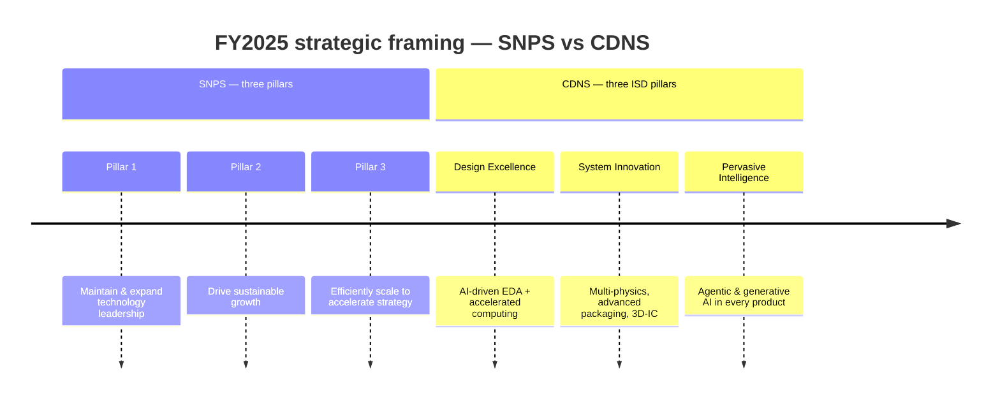
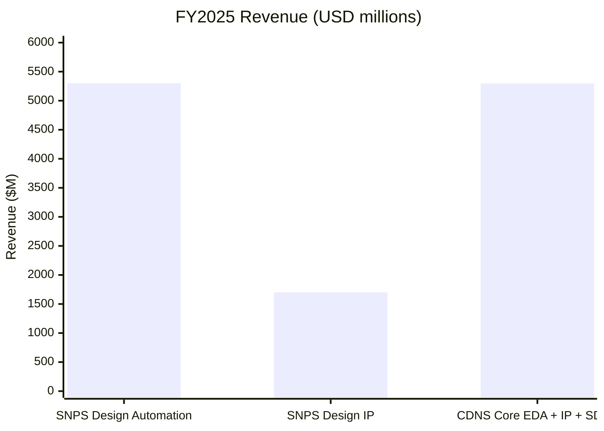
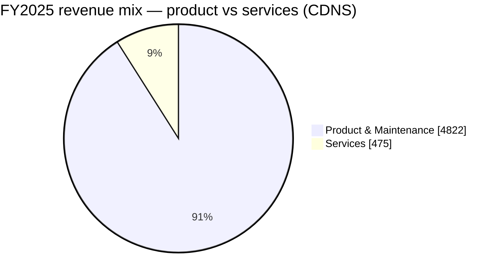
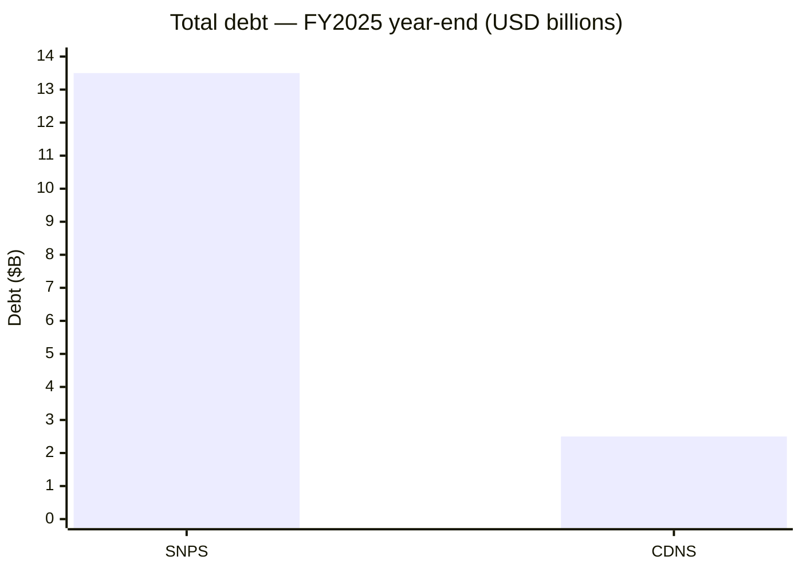

# Synopsys (SNPS) vs. Cadence (CDNS) — Strategic Vision Compared

**Source filings**
- SNPS FY2025 10-K — filed 2025-12-22, fiscal period ended 2025-10-31 ([Synopsys 10-K FY2025](https://www.sec.gov/Archives/edgar/data/0000883241/000088324125000028/snps-20251031.htm))
- CDNS FY2025 10-K — filed 2026-02-19, fiscal period ended 2025-12-31 ([Cadence 10-K FY2025](https://www.sec.gov/Archives/edgar/data/0000813672/000081367226000016/cdns-20251231.htm))

Both companies were once cleanly described as "EDA duopolists." Their FY2025 annual reports show the duopoly has split into two different bets on what comes *after* EDA — same destination ("silicon-to-systems"), opposite financing strategy ([Synopsys 10-K FY2025](https://www.sec.gov/Archives/edgar/data/0000883241/000088324125000028/snps-20251031.htm); [Cadence 10-K FY2025](https://www.sec.gov/Archives/edgar/data/0000813672/000081367226000016/cdns-20251231.htm)). Together with Siemens EDA, the three vendors now control more than 70% of the global EDA market — Synopsys ~31%, Cadence ~30%, Siemens ~13% ([TrendForce: Chinese EDA Consolidation, 2025-07-10](https://www.trendforce.com/news/2025/07/10/news-chinese-eda-consolidation-falters-as-empyrean-drops-xpeedic-acquisition/)).

---

## 1. One-line self-description

| | Synopsys | Cadence |
|---|---|---|
| Framing | "Leader in engineering solutions from silicon to systems, enabling customers to rapidly innovate AI-powered products." | "Global technology leader that develops computational, AI-driven software, accelerated hardware, and silicon intellectual property products and solutions." |
| Tagline | **Silicon to Systems** | **Intelligent System Design (ISD)** |
| Implicit pivot | From EDA point-vendor → integrated **silicon + multi-physics** platform (via Ansys) | From EDA → broader **electromechanical / system** company (via SD&A and bolt-on M&A) |

Both are deliberately dropping the "EDA" label. Synopsys leans into the *outcome* ("AI-powered products"); Cadence leans into the *method* ("computational AI-driven software") ([Synopsys 10-K FY2025, Item 1 Business](https://www.sec.gov/Archives/edgar/data/0000883241/000088324125000028/snps-20251031.htm); [Cadence 10-K FY2025, Item 1 Business](https://www.sec.gov/Archives/edgar/data/0000813672/000081367226000016/cdns-20251231.htm)).

## 2. Strategic pillars

SNPS framing is **operational** (lead, grow, scale). CDNS framing is **product** (what each pillar does for the customer). Cadence's ISD doctrine is older and more crisply marketed — Synopsys' Ansys-era pillars still read like a transition statement ([Synopsys 10-K FY2025, Strategy](https://www.sec.gov/Archives/edgar/data/0000883241/000088324125000028/snps-20251031.htm); [Cadence 10-K FY2025, Business](https://www.sec.gov/Archives/edgar/data/0000813672/000081367226000016/cdns-20251231.htm)).

## 3. AI narrative — tool vs. tailwind

Both companies talk about AI in the same two registers, but with different signature products. Synopsys describes the `Synopsys.ai` suite (DSO.ai, VSO.ai, TSO.ai, plus the Synopsys.ai Copilot launched with Microsoft Azure OpenAI) as a full-stack AI-driven EDA offering ([Synopsys AI-Powered EDA](https://www.synopsys.com/ai/ai-powered-eda.html); [DSO.ai product page](https://www.synopsys.com/ai/ai-powered-eda/dso-ai.html)). Cadence assembles its story around Cerebrus AI Studio (multi-block agentic SoC implementation), Verisium (AI verification) and the JedAI data/AI platform that ties them together ([Cadence Cerebrus AI Studio](https://www.cadence.com/en_US/home/tools/digital-design-and-signoff/soc-implementation-and-floorplanning/cadence-cerebrus-ai-studio.html); [Cadence JedAI Solution](https://www.cadence.com/en_US/home/solutions/cadence-jedai-solution.html)).

| Lens | Synopsys | Cadence |
|---|---|---|
| **AI-as-tool** (designing chips *with* AI) | `Synopsys.ai` suite: **DSO.ai**, **VSO.ai**, **TSO.ai**, **ASO.ai**; **Synopsys.ai Copilot**; **Design.da / Silicon.da** analytics | **Cerebrus** agentic AI; **JedAI** platform; **Verisium** (AI verification); **Allegro X AI** for PCB; generative AI in core flow |
| **AI-as-tailwind** (designing chips *for* AI) | Generic — "rise of silicon-powered intelligent devices and AI has increased demand"; lists AI / 5G / automotive / cloud as drivers | Sharper — three explicit "horizons": **Infrastructure AI** (HPC/hyperscalers), **Physical AI** (robotics, AVs), **Life Sciences AI** (computational biology) |

Cadence wins the framing battle here: their *three horizons* are a clean story; Synopsys still recites verticals. Both have credible AI-tools portfolios — DSO.ai is the most-cited name in the industry, but Cerebrus + JedAI is arguably the more *agentic* (less "optimizer," more "co-engineer") ([Cadence Cerebrus AI Studio white paper](https://www.cadence.com/en_US/home/resources/white-papers/cadence-cerebrus-ai-studio-agentic-ai-multi-block-multi-user-soc-wp.html); [Moor Insights: Synopsys.ai EDA Suite](https://moorinsightsstrategy.com/research-notes/synopsys-ai-revolutionizing-chip-design-through-ai-driven-eda-suite/); [Cadence Infrastructure AI page](https://www.cadence.com/en_US/home/explore/infrastructure-ai.html)).

## 4. Segment structure & financial scoreboard

| Metric | SNPS FY2025 | CDNS FY2025 | Spread |
|---|---|---|---|
| Total revenue | **$7,054M** | $5,297M | SNPS larger by $1.76B |
| YoY growth | +15% (~4% organic ex-Ansys) | +14% (all organic) | Cadence's growth is cleaner |
| Operating income | $915M (was $1,356M) | ~$1,480M (28% margin) | CDNS materially more profitable |
| Operating margin | ~13% GAAP (Ansys amortization $458M) | 28% (would be ~30% ex-BIS $128.5M charge) | CDNS ~15pts higher |
| Net income (cont. ops) | $1,336M | n/a in extract | — |
| RPO / backlog | Not disclosed in extract | **$7.8B**, 53% <12mo | CDNS visibility better |
| China revenue | -22% YoY (ex-Ansys) | 13% of revenue, up from 12% | CDNS held up; SNPS got hit harder |

**SNPS segments (2):** Design Automation $5.3B / 42% margin · Design IP $1.7B / 24% margin (margin **down 14 pts** YoY — the year's biggest single negative) ([Synopsys 10-K FY2025, segment results](https://www.sec.gov/Archives/edgar/data/0000883241/000088324125000028/snps-20251031.htm); [Synopsys Q4 FY2025 Financial Supplement, 2025-12-10](https://s201.q4cdn.com/778493406/files/doc_earnings/2025/q4/supplemental-info/Synopsys-Q4-FY2025-Financial-Supplement.pdf)).

**CDNS categories (3):** Core EDA · Semiconductor IP · System Design & Analysis (SD&A) — not formal reportable segments, but the framing maps directly onto the multi-physics ambition. Core EDA contributed 70% of FY2025 revenue, IP 14%, SD&A 16% ([Cadence 10-K FY2025, Business](https://www.sec.gov/Archives/edgar/data/0000813672/000081367226000016/cdns-20251231.htm)).

## 5. The big bet: how each is buying its way into multi-physics

This is the headline divergence. Synopsys closed its ~$35 billion Ansys acquisition on July 17, 2025 — the largest deal in company history ([Synopsys 8-K, 2025-07-17 closing announcement](https://www.sec.gov/Archives/edgar/data/0000883241/000114036125026139/ef20051970_ex99-1.htm); [Synopsys S-4 / merger agreement, 2024](https://www.sec.gov/Archives/edgar/data/0000883241/000114036124013120/ny20023075x1_s4.htm); [Synopsys-Ansys joint press release, 2024-01-16](https://www.ansys.com/news-center/press-releases/1-16-24-synopsys-acquires-ansys)). Cadence, in contrast, announced on September 4, 2025 a ~€2.7 billion definitive agreement to acquire Hexagon's Design & Engineering (D&E) business (MSC Nastran, Adams), building on its 2024 BETA CAE acquisition ([Cadence 8-K announcing Hexagon D&E deal, 2025-09-04](https://www.sec.gov/Archives/edgar/data/0000813672/000081367225000126/cdns-20250904.htm); [Cadence press release: BETA CAE acquisition completed, 2024-05-30](https://www.cadence.com/en_US/home/company/newsroom/press-releases/pr/2024/cadence-completes-acquisition-of-beta-cae.html)).

| | Synopsys | Cadence |
|---|---|---|
| Strategy | **One transformative deal** | **Many bolt-ons** |
| Anchor M&A | **Ansys** — closed FY2025, contributed $756.6M in revenue (11% of total) | **BETA CAE** (closed 2024), **Hexagon Design & Engineering** (announced Sept 2025, pending close — brings MSC Nastran + Adams) |
| Other recent M&A | — | VLAB Works (virtual prototyping), Arm Artisan IP (foundation IP), Secure-IC (embedded security) |
| What it buys | Structural / fluids / thermal / EM / optics simulation under one roof | Structural / multibody dynamics / RF / signal-power-thermal integrity — assembled piece by piece |
| Integration risk | **High** — explicit risk-factor language about scale of merger, channel-model differences (Ansys uses partners; SNPS direct), Design IP margin compression partly attributed to integration distraction | **Lower per deal** — but cumulative complexity rising; Hexagon will be the largest test |
| 10-K language | "Failure to realize expected synergies… may be magnified due to the scale of the merger." | "Continued investment in R&D and acquisition opportunities for the foreseeable future." |

Cadence's pending **Hexagon D&E** acquisition is the most strategically interesting move on the board — it directly targets the **structural analysis** market where Ansys is dominant, signalling Cadence does not intend to cede multi-physics to the SNPS+Ansys combo ([Cadence press release: Hexagon D&E acquisition, 2025-09-04](https://www.cadence.com/en_US/home/company/newsroom/press-releases/pr/2025/cadence-to-acquire-hexagons-design--engineering-business.html); [BusinessWire on Cadence-Hexagon deal, 2025-09-02](https://www.businesswire.com/news/home/20250902498199/en/Cadence-to-Acquire-Hexagons-Design-Engineering-Business-Accelerating-Expansion-in-Physical-AI-and-System-Design-and-Analysis); [Cadence 10-K FY2025 — acquisitions](https://www.sec.gov/Archives/edgar/data/0000813672/000081367226000016/cdns-20251231.htm)). The bolt-on cadence also added Arm's Artisan foundation IP business, Secure-IC and VLAB Works during FY2025 ([Cadence press release: Arm Artisan IP](https://www.cadence.com/en_US/home/company/newsroom/press-releases/pr/2025/cadence-to-acquire-arm-artisan-foundation-ip-business.html); [Cadence 10-K FY2025 — VLAB / Secure-IC notes](https://www.sec.gov/Archives/edgar/data/0000813672/000081367226000016/cdns-20251231.htm)).

## 6. Capital allocation — the other big divergence

| | Synopsys | Cadence |
|---|---|---|
| Total debt | **~$13.5B** (Senior Notes + $4.3B Term Loan, raised for Ansys) | $2.5B Senior Notes (3 tranches, 4.20–4.70%) |
| Buyback authorization | **Suspended de facto** — debt covenants "limit our ability to return equity through our stock repurchase program or pay dividends" | **$1.5B** authorized May 2025, **~$1.4B remaining** as of YE2025 |
| Dividend | None | None |
| Next 24mo M&A | Constrained by covenants; focus on integration | Active — Hexagon pending, more bolt-ons expected |
| Tax rate (FY25) | 4.0% effective (one-off benefits) | n/a in extract |

Translation: **Synopsys cannot do anything else for ~2 years.** It has to digest Ansys, deleverage, and ride out the China revenue trough — having drawn the full $4.3 billion term-loan plus $10 billion senior-notes issuance to fund the cash portion of the Ansys deal ([Synopsys 424B5 prospectus supplement, 2025-03](https://www.sec.gov/Archives/edgar/data/883241/000114036125006661/ny20044174x4_424b5.htm); [Synopsys 10-K FY2025 — debt & covenants](https://www.sec.gov/Archives/edgar/data/0000883241/000088324125000028/snps-20251031.htm)). **Cadence is still optionality-rich** — modest $2.5B debt, an active $1.5B buyback authorized May 2025, and capacity for more deals ([Cadence 8-K, 2025-05-08 — additional $1.5B repurchase authorization](https://www.sec.gov/Archives/edgar/data/0000813672/000081367225000061/cdns-20250508.htm); [Cadence 10-K FY2025 — senior notes & buyback](https://www.sec.gov/Archives/edgar/data/0000813672/000081367226000016/cdns-20251231.htm)).

## 7. Distinctive risks — what each company is most exposed to

The two filings diverge sharply on which risk dominates the front of the risk-factor section. Synopsys foregrounds China/export-control headwinds and the scale of the Ansys integration ([Synopsys 10-K FY2025, Item 1A Risk Factors](https://www.sec.gov/Archives/edgar/data/0000883241/000088324125000028/snps-20251031.htm); [Synopsys Q3 FY2025 earnings transcript discussion of China/IP](https://finance.yahoo.com/quote/SNPS/earnings/SNPS-Q3-2025-earnings_call-351237.html)). Cadence highlights its July 2025 guilty plea and $140.6M penalty over historical export violations, plus EU AI Act exposure ([DOJ press release: Cadence guilty plea, 2025-07-28](https://www.justice.gov/opa/pr/cadence-design-systems-agrees-plead-guilty-and-pay-over-140-million-unlawfully-exporting); [Paul Weiss client memo on Cadence settlement](https://www.paulweiss.com/insights/client-memos/us-software-and-semiconductor-company-resolves-criminal-and-civil-export-control-enforcement-actions-with-guilty-plea-payment-of-140-million); [EU AI Act Article 99 penalties](https://artificialintelligenceact.eu/article/99/)).

| Risk | SNPS | CDNS |
|---|---|---|
| **China export controls** | Hit harder — China revenue **-22% YoY** ex-Ansys; cited "weaker than expected demand from a major foundry customer"; BIS Q3 2025 restrictions briefly imposed then rescinded | Pled guilty (July 2025) to export-violation conspiracy for 2015–2021 activity; **$140.6M penalty**; 3-year probation w/ ongoing audit; M&A capability constrained by settlement |
| **Customer concentration** | "Challenges with a major foundry customer negatively impacted FY2025" — implies single-customer dependence (likely TSMC or Intel Foundry) | "No single customer >10% of revenue" — diversified |
| **Integration risk** | **Top-tier risk** — Ansys is biggest deal in company history; Design IP margin already showing strain | Moderate — multiple smaller acquisitions; Hexagon closing will raise the bar |
| **Debt overhang** | Real — $13.5B; covenant constraints on capital return and M&A | Manageable — $2.5B at reasonable rates |
| **AI regulation** | Mentioned in generic risk language | More prominent — **EU AI Act** (effective Aug 2026), fines up to 7% of worldwide turnover, called out specifically |
| **Domestic Chinese EDA competitors** | Generic mention | Named: Huada Empyrean, Xpeedic, X-EPIC, Primarius, Univista, Giga Design |

## 8. Side-by-side scorecard

| Dimension | Edge | Why |
|---|---|---|
| Top-line scale | **SNPS** | $7.1B vs $5.3B |
| Growth quality | **CDNS** | 14% all-organic vs 4% organic + M&A |
| Operating margin | **CDNS** | 28% vs 13% GAAP (SNPS hit by Ansys amortization & charges) |
| Backlog visibility | **CDNS** | $7.8B RPO disclosed; SNPS not in extract |
| Strategic narrative clarity | **CDNS** | Three-horizon AI story + clean ISD doctrine |
| Multi-physics scale | **SNPS** | Ansys is the gold standard, now in-house |
| Multi-physics breadth | **CDNS** | Bolt-on portfolio spans structural, fluids, RF, EM, thermal — Hexagon adds aerospace/auto |
| Capital flexibility | **CDNS** | Active buyback, room for more M&A |
| Balance sheet | **CDNS** | $2.5B debt vs $13.5B |
| China exposure | **CDNS** | -22% on SNPS (ex-Ansys) vs ~flat ~13% for CDNS |
| Integration risk | **CDNS** (lower) | One $35B deal vs several <$1B deals |
| Customer diversification | **CDNS** | No 10%+ customer |

## 9. Bottom line — two different bets

**Synopsys is betting that scale matters more than agility.** One big swing (Ansys) buys it the broadest silicon-to-systems portfolio in the industry, and the next 24 months are about proving the synergies are real while deleveraging. The downside: it has tied its hands on capital return and further M&A, and FY2025 already showed material strain (Design IP -14 pts margin, China revenue down sharply, GAAP op margin halved) ([Synopsys 10-K FY2025, MD&A](https://www.sec.gov/Archives/edgar/data/0000883241/000088324125000028/snps-20251031.htm); [Synopsys Q4 FY2025 earnings release, 2025-12-10](https://www.sec.gov/Archives/edgar/data/0000883241/000119312525314200/d29055dex991.htm)).

**Cadence is betting that compounding bolt-ons beats one mega-deal.** Cleaner growth, higher margins, intact buyback, and a coherent three-horizon AI story. The Hexagon D&E close will be the proof point that this bolt-on model can match Ansys in structural analysis. The risk: cumulative integration complexity, the BIS settlement overhang, and EU AI Act exposure ([Cadence 10-K FY2025, MD&A](https://www.sec.gov/Archives/edgar/data/0000813672/000081367226000016/cdns-20251231.htm); [Crowell & Moring: Lessons from the Cadence Case](https://www.crowell.com/en/insights/client-alerts/joint-criminal-and-civil-export-controls-enforcement-lessons-from-the-cadence-case); [EU AI Act Article 99 penalties](https://artificialintelligenceact.eu/article/99/)).

If both stories execute, **Synopsys becomes the broader platform with the bigger TAM**; **Cadence becomes the more profitable, more nimble specialist** with arguably the better AI narrative. The two ten-Ks make it clear they are no longer competing for the same wallet share — they are competing for which definition of "engineering software" wins the 2030s ([Synopsys 10-K FY2025](https://www.sec.gov/Archives/edgar/data/0000883241/000088324125000028/snps-20251031.htm); [Cadence 10-K FY2025](https://www.sec.gov/Archives/edgar/data/0000813672/000081367226000016/cdns-20251231.htm); [SemiAnalysis: EDA Market Primer](https://newsletter.semianalysis.com/p/eda-market-primer)).

---

## References

**Primary filings — Synopsys (CIK 0000883241)**
- [Synopsys 10-K FY2025](https://www.sec.gov/Archives/edgar/data/0000883241/000088324125000028/snps-20251031.htm) — filed 2025-12-22, period ended 2025-10-31
- [Synopsys S-4 (Ansys merger), 2024](https://www.sec.gov/Archives/edgar/data/0000883241/000114036124013120/ny20023075x1_s4.htm)
- [Synopsys 8-K, 2025-07-17 — Ansys closing](https://www.sec.gov/Archives/edgar/data/0000883241/000114036125026139/ef20051970_ex99-1.htm)
- [Synopsys 8-K, 2025-12-10 — Q4 FY2025 earnings release](https://www.sec.gov/Archives/edgar/data/0000883241/000119312525314200/d29055dex991.htm)
- [Synopsys 424B5 prospectus supplement (notes), 2025-03](https://www.sec.gov/Archives/edgar/data/883241/000114036125006661/ny20044174x4_424b5.htm)
- [Synopsys EDGAR filings index](https://www.sec.gov/cgi-bin/browse-edgar?action=getcompany&CIK=0000883241&type=&dateb=&owner=include&count=40)
- [Synopsys Q4 FY2025 Financial Supplement](https://s201.q4cdn.com/778493406/files/doc_earnings/2025/q4/supplemental-info/Synopsys-Q4-FY2025-Financial-Supplement.pdf)

**Primary filings — Cadence (CIK 0000813672)**
- [Cadence 10-K FY2025](https://www.sec.gov/Archives/edgar/data/0000813672/000081367226000016/cdns-20251231.htm) — filed 2026-02-19, period ended 2025-12-31
- [Cadence 8-K, 2025-09-04 — Hexagon D&E acquisition announcement](https://www.sec.gov/Archives/edgar/data/0000813672/000081367225000126/cdns-20250904.htm)
- [Cadence 8-K, 2025-05-08 — $1.5B repurchase authorization](https://www.sec.gov/Archives/edgar/data/0000813672/000081367225000061/cdns-20250508.htm)
- [Cadence EDGAR filings index](https://www.sec.gov/cgi-bin/browse-edgar?action=getcompany&CIK=0000813672&type=&dateb=&owner=include&count=40)

**Company / IR product pages**
- [Synopsys AI-Powered EDA](https://www.synopsys.com/ai/ai-powered-eda.html)
- [DSO.ai product page](https://www.synopsys.com/ai/ai-powered-eda/dso-ai.html)
- [Cadence Cerebrus AI Studio](https://www.cadence.com/en_US/home/tools/digital-design-and-signoff/soc-implementation-and-floorplanning/cadence-cerebrus-ai-studio.html)
- [Cadence JedAI Solution](https://www.cadence.com/en_US/home/solutions/cadence-jedai-solution.html)
- [Cadence Cerebrus AI Studio white paper](https://www.cadence.com/en_US/home/resources/white-papers/cadence-cerebrus-ai-studio-agentic-ai-multi-block-multi-user-soc-wp.html)
- [Cadence Infrastructure AI](https://www.cadence.com/en_US/home/explore/infrastructure-ai.html)
- [Cadence press release: BETA CAE acquisition completed, 2024-05-30](https://www.cadence.com/en_US/home/company/newsroom/press-releases/pr/2024/cadence-completes-acquisition-of-beta-cae.html)
- [Cadence press release: Hexagon D&E acquisition, 2025-09-04](https://www.cadence.com/en_US/home/company/newsroom/press-releases/pr/2025/cadence-to-acquire-hexagons-design--engineering-business.html)
- [Cadence press release: Arm Artisan IP](https://www.cadence.com/en_US/home/company/newsroom/press-releases/pr/2025/cadence-to-acquire-arm-artisan-foundation-ip-business.html)
- [Synopsys-Ansys joint press release, 2024-01-16](https://www.ansys.com/news-center/press-releases/1-16-24-synopsys-acquires-ansys)

**Regulatory / legal / industry**
- [DOJ press release: Cadence guilty plea, 2025-07-28](https://www.justice.gov/opa/pr/cadence-design-systems-agrees-plead-guilty-and-pay-over-140-million-unlawfully-exporting)
- [Paul Weiss client memo on Cadence settlement](https://www.paulweiss.com/insights/client-memos/us-software-and-semiconductor-company-resolves-criminal-and-civil-export-control-enforcement-actions-with-guilty-plea-payment-of-140-million)
- [Crowell & Moring: Lessons from the Cadence Case](https://www.crowell.com/en/insights/client-alerts/joint-criminal-and-civil-export-controls-enforcement-lessons-from-the-cadence-case)
- [EU AI Act Article 99 penalties](https://artificialintelligenceact.eu/article/99/)
- [TrendForce: Chinese EDA Consolidation, 2025-07-10](https://www.trendforce.com/news/2025/07/10/news-chinese-eda-consolidation-falters-as-empyrean-drops-xpeedic-acquisition/)
- [SemiAnalysis: EDA Market Primer](https://newsletter.semianalysis.com/p/eda-market-primer)
- [Moor Insights: Synopsys.ai EDA Suite](https://moorinsightsstrategy.com/research-notes/synopsys-ai-revolutionizing-chip-design-through-ai-driven-eda-suite/)
- [BusinessWire on Cadence-Hexagon deal, 2025-09-02](https://www.businesswire.com/news/home/20250902498199/en/Cadence-to-Acquire-Hexagons-Design-Engineering-Business-Accelerating-Expansion-in-Physical-AI-and-System-Design-and-Analysis)
- [Synopsys Q3 FY2025 earnings transcript (Yahoo)](https://finance.yahoo.com/quote/SNPS/earnings/SNPS-Q3-2025-earnings_call-351237.html)
