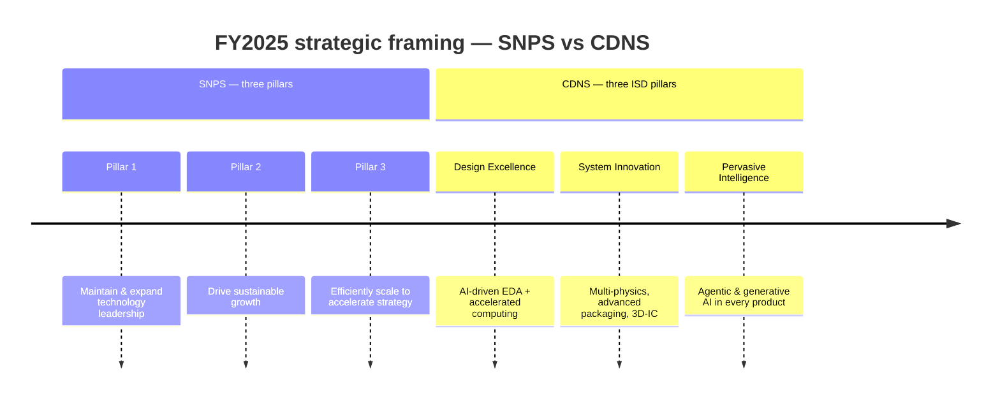
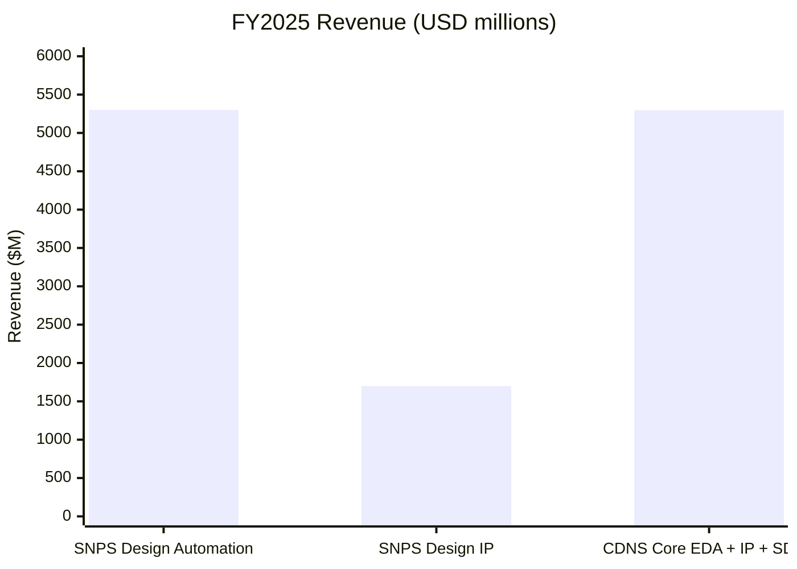
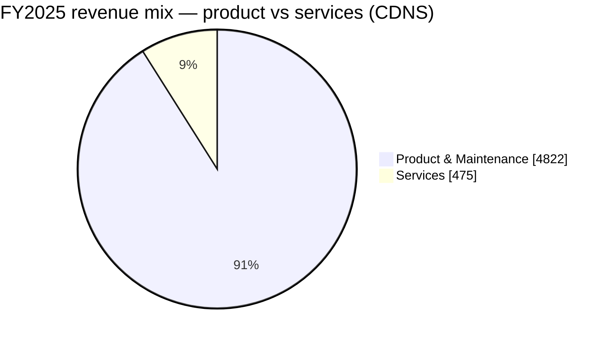
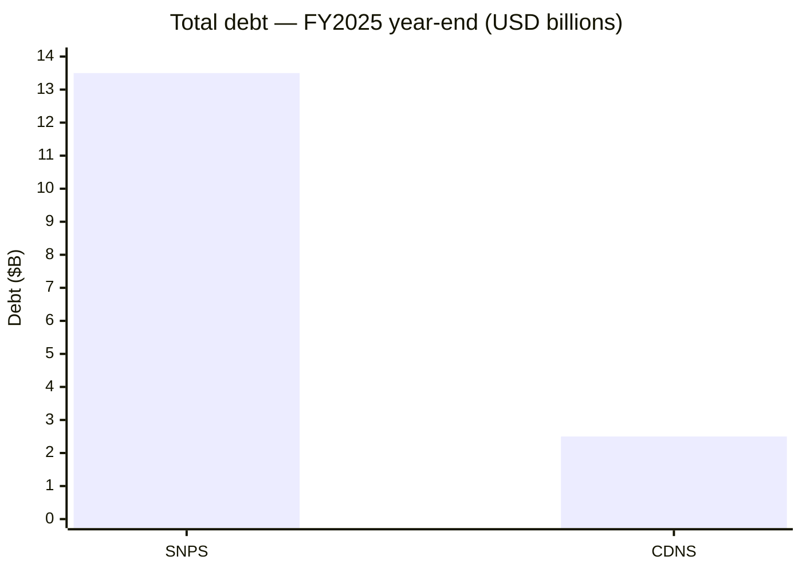

# Synopsys (SNPS) vs. Cadence (CDNS) — Strategic Vision Compared

**Source filings**
- SNPS FY2025 10-K — filed 2025-12-22, fiscal period ended 2025-10-31 ([Synopsys 10-K FY2025](https://www.sec.gov/Archives/edgar/data/0000883241/000088324125000028/snps-20251031.htm))
- CDNS FY2025 10-K — filed 2026-02-19, fiscal period ended 2025-12-31 ([Cadence 10-K FY2025](https://www.sec.gov/Archives/edgar/data/0000813672/000081367226000016/cdns-20251231.htm))

Both companies were once cleanly described as "EDA duopolists." Their FY2025 annual reports show the duopoly has split into two different bets on what comes *after* EDA — same destination ("silicon-to-systems"), opposite financing strategy ([Synopsys 10-K FY2025](https://www.sec.gov/Archives/edgar/data/0000883241/000088324125000028/snps-20251031.htm); [Cadence 10-K FY2025](https://www.sec.gov/Archives/edgar/data/0000813672/000081367226000016/cdns-20251231.htm)). Together with Siemens EDA, the three vendors now control more than 70% of the global EDA market — Synopsys ~31%, Cadence ~30%, Siemens ~13% ([TrendForce: Chinese EDA Consolidation, 2025-07-10](https://www.trendforce.com/news/2025/07/10/news-chinese-eda-consolidation-falters-as-empyrean-drops-xpeedic-acquisition/)).

---

## TL;DR — At-a-glance advantages and disadvantages

|  | ✓ Advantages | ✗ Disadvantages |
|---|---|---|
| **Synopsys (SNPS)** | • **Largest by scale**: $7.1B revenue (vs CDNS $5.3B); $11.4B backlog at 1.62× revenue (§4, §5.2) • **Interface IP crown jewel**: >55% share per IPnest (PCIe, HBM, UCIe, 224G SerDes); first-pass silicon on TSMC N2 (April 2025) (§5.5) • **PrimeTime ~90%+ static-timing signoff** — the de-facto golden for every advanced-node tape-out; Design Compiler ~84–85% in synthesis (§5.4) • **Multi-physics scale**: Ansys, the gold standard, in-house ($35B deal closed July 2025) (§6) • **NVIDIA strategic anchor**: $2B equity stake Dec 2025 at $414.79 + CUDA-X integration across PrimeSim / Proteus / Sentaurus / QuantumATK (§5.6) | • **$13.5B debt locks buyback for ~2 years**; covenants constrain further M&A (§7) • **Design IP segment cracked**: -8% revenue YoY, -14 ppt margin compression; **two shareholder class actions filed (Oct/Nov 2025)** alleging material misstatements (§5.5, §5.7) • **China hit hardest**: -22% YoY ex-Ansys; "weaker than expected demand from a major foundry customer" admitted in 10-K (§5.1, §8) • **Voluntarily divesting processor IP** (ARC, ARC-V, DSP, NPU) to GlobalFoundries — admitting it couldn't beat Arm or Cadence Tensilica (§5.5) • **Operating margin halved**: ~13% GAAP vs ~28% prior — Ansys amortization $458M + integration drag (§4) • **10% workforce reduction** announced September 2025 (§5.7) |
| **Cadence (CDNS)** | • **Higher profitability**: 28% operating margin vs SNPS 13% GAAP; 14% all-organic growth vs SNPS ~4% organic (§4) • **Virtuoso ~80% custom-analog share** — the de-facto for every analog / RFIC / mixed-signal design (§5.4) • **Tensilica DSP IP leader**: >1.5B HiFi DSPs/year, 160+ licensees, 7 of top-10 semiconductor companies (§5.5) • **2025 TSMC OIP Partner of the Year** — TSMC publicly tilted toward Cadence while SNPS was Ansys-distracted (§5.3) • **Capital optionality**: $2.5B debt only; active $1.5B buyback (~$1.4B remaining); China +19% YoY despite BIS shutdown; Japan +31% on Rapidus 2nm ramp (§7, §5.1) • **Arm Artisan foundation IP** acquired Aug 2025 — first-ever full IP stack at every advanced node; directly attacks SNPS' last IP moat (§5.5) • **Cleanest customer book**: no >10% customer in revenue across FY23/24/25 (§5.1) | • **Smaller scale**: $5.3B revenue vs SNPS $7.1B; harder to absorb fixed-cost shocks (§4) • **BIS Compliance Monitor through July 2028**: $140.6M criminal penalty over 2015–2021 export violations; drags M&A speed and China customer work (§8) • **EU AI Act exposure**: effective Aug 2026, fines up to 7% of worldwide turnover — called out specifically in CDNS 10-K risk factors (§8) • **Hexagon D&E integration risk**: €2.7B deal closing Q1 2026 — Cadence's largest acquisition by far, brings aerospace/auto OEM customer book (§6) • **Multi-physics breadth, not scale**: bolt-on portfolio (BETA CAE + Hexagon D&E) competing against integrated SNPS+Ansys stack (§6) • **Hyperscaler ASIC insourcing** flagged in 10-K as forward concentration risk — first 10%+ hyperscaler customer would mark a regime change (§5.1) |

**Who is each one for?** Pick **SNPS** for the broadest silicon-to-systems platform — scale, interface IP exposure, in-house Ansys multi-physics — if you can tolerate ~2 years of locked capital return and Ansys integration overhang. Pick **CDNS** for the cleaner, higher-margin specialist with arguably the better AI narrative (Cerebrus + JedAI + ChipStack), more capital optionality, and the IP-roadmap inversion (full IP stack since Arm Artisan). **Or — like every top-10 fabless customer actually does — run both** (§5.6 walks the dual-vendor pricing-leverage logic). **And don't forget the rest of the field** (§5.8): **Siemens EDA** owns physical verification (~85% Calibre, the only RTL-to-GDS sub-segment neither focal-pair vendor leads) and is the third co-equal in the duopoly+1; **Arm Holdings** sits structurally above both on CPU IP (~40% of all design IP); **Alphawave Semi** is the only credible #2 to SNPS in connectivity IP (Qualcomm offer pending). The detailed evidence for every TL;DR claim follows in §1–§10 below.

---

## 1. One-line self-description

| | Synopsys | Cadence |
|---|---|---|
| Framing | "Leader in engineering solutions from silicon to systems, enabling customers to rapidly innovate AI-powered products." | "Global technology leader that develops computational, AI-driven software, accelerated hardware, and silicon intellectual property products and solutions." |
| Tagline | **Silicon to Systems** | **Intelligent System Design (ISD)** |
| Implicit pivot | From EDA point-vendor → integrated **silicon + multi-physics** platform (via Ansys) | From EDA → broader **electromechanical / system** company (via SD&A and bolt-on M&A) |

Both are deliberately dropping the "EDA" label. Synopsys leans into the *outcome* ("AI-powered products"); Cadence leans into the *method* ("computational AI-driven software") ([Synopsys 10-K FY2025, Item 1 Business](https://www.sec.gov/Archives/edgar/data/0000883241/000088324125000028/snps-20251031.htm); [Cadence 10-K FY2025, Item 1 Business](https://www.sec.gov/Archives/edgar/data/0000813672/000081367226000016/cdns-20251231.htm)).

## 2. Strategic pillars

SNPS framing is **operational** (lead, grow, scale). CDNS framing is **product** (what each pillar does for the customer). Cadence's ISD doctrine is older and more crisply marketed — Synopsys' Ansys-era pillars still read like a transition statement ([Synopsys 10-K FY2025, Strategy](https://www.sec.gov/Archives/edgar/data/0000883241/000088324125000028/snps-20251031.htm); [Cadence 10-K FY2025, Business](https://www.sec.gov/Archives/edgar/data/0000813672/000081367226000016/cdns-20251231.htm)).

## 3. AI narrative — tool vs. tailwind

Both companies talk about AI in the same two registers, but with different signature products. Synopsys describes the `Synopsys.ai` suite (DSO.ai, VSO.ai, TSO.ai, plus the Synopsys.ai Copilot launched with Microsoft Azure OpenAI) as a full-stack AI-driven EDA offering ([Synopsys AI-Powered EDA](https://www.synopsys.com/ai/ai-powered-eda.html); [DSO.ai product page](https://www.synopsys.com/ai/ai-powered-eda/dso-ai.html)). Cadence assembles its story around Cerebrus AI Studio (multi-block agentic SoC implementation), Verisium (AI verification) and the JedAI data/AI platform that ties them together ([Cadence Cerebrus AI Studio](https://www.cadence.com/en_US/home/tools/digital-design-and-signoff/soc-implementation-and-floorplanning/cadence-cerebrus-ai-studio.html); [Cadence JedAI Solution](https://www.cadence.com/en_US/home/solutions/cadence-jedai-solution.html)).

| Lens | Synopsys | Cadence |
|---|---|---|
| **AI-as-tool** (designing chips *with* AI) | `Synopsys.ai` suite: **DSO.ai**, **VSO.ai**, **TSO.ai**, **ASO.ai**; **Synopsys.ai Copilot**; **Design.da / Silicon.da** analytics | **Cerebrus** agentic AI; **JedAI** platform; **Verisium** (AI verification); **Allegro X AI** for PCB; generative AI in core flow |
| **AI-as-tailwind** (designing chips *for* AI) | Generic — "rise of silicon-powered intelligent devices and AI has increased demand"; lists AI / 5G / automotive / cloud as drivers | Sharper — three explicit "horizons": **Infrastructure AI** (HPC/hyperscalers), **Physical AI** (robotics, AVs), **Life Sciences AI** (computational biology) |

Cadence wins the framing battle here: their *three horizons* are a clean story; Synopsys still recites verticals. Both have credible AI-tools portfolios — DSO.ai is the most-cited name in the industry, but Cerebrus + JedAI is arguably the more *agentic* (less "optimizer," more "co-engineer") ([Cadence Cerebrus AI Studio white paper](https://www.cadence.com/en_US/home/resources/white-papers/cadence-cerebrus-ai-studio-agentic-ai-multi-block-multi-user-soc-wp.html); [Moor Insights: Synopsys.ai EDA Suite](https://moorinsightsstrategy.com/research-notes/synopsys-ai-revolutionizing-chip-design-through-ai-driven-eda-suite/); [Cadence Infrastructure AI page](https://www.cadence.com/en_US/home/explore/infrastructure-ai.html)).

## 4. Segment structure & financial scoreboard

| Metric | SNPS FY2025 | CDNS FY2025 | Spread |
|---|---|---|---|
| Total revenue | **$7,054M** | $5,297M | SNPS larger by $1.76B |
| YoY growth | +15% (~4% organic ex-Ansys) | +14% (all organic) | Cadence's growth is cleaner |
| Operating income | $915M (was $1,356M) | ~$1,480M (28% margin) | CDNS materially more profitable |
| Operating margin | ~13% GAAP (Ansys amortization $458M) | 28% (would be ~30% ex-BIS $128.5M charge) | CDNS ~15pts higher |
| Net income (cont. ops) | $1,336M | n/a in extract | — |
| RPO / backlog | Not disclosed in extract | **$7.8B**, 53% <12mo | CDNS visibility better |
| China revenue | -22% YoY (ex-Ansys) | 13% of revenue, up from 12% | CDNS held up; SNPS got hit harder |

**SNPS segments (2):** Design Automation $5.3B / 42% margin · Design IP $1.7B / 24% margin (margin **down 14 pts** YoY — the year's biggest single negative) ([Synopsys 10-K FY2025, segment results](https://www.sec.gov/Archives/edgar/data/0000883241/000088324125000028/snps-20251031.htm); [Synopsys Q4 FY2025 Financial Supplement, 2025-12-10](https://s201.q4cdn.com/778493406/files/doc_earnings/2025/q4/supplemental-info/Synopsys-Q4-FY2025-Financial-Supplement.pdf)).

**CDNS categories (3):** Core EDA · Semiconductor IP · System Design & Analysis (SD&A) — not formal reportable segments, but the framing maps directly onto the multi-physics ambition. Core EDA contributed 70% of FY2025 revenue, IP 14%, SD&A 16% ([Cadence 10-K FY2025, Business](https://www.sec.gov/Archives/edgar/data/0000813672/000081367226000016/cdns-20251231.htm)).

## 5. The moat anatomy — switching costs, foundry locks, IP share, and customer concentration

Both companies pitch themselves as moat-rich, but the moat actually lives in five separable places: customer concentration / diversification, contracted backlog and recurring mix, foundry-node certifications, tool-level segment shares, and IP franchise share. The FY2025 disclosures make this anatomy more legible than usual — and surface specific cracks neither management team highlights.

### 5.1 Customer concentration — both just diversified, but for opposite reasons

| Concentration metric | Synopsys (FY25) | Cadence (FY25) |
|---|---|---|
| >10% customer in revenue | **None** (was 12.6% FY24, 13.5% FY23 — same customer) | **None** in FY23/24/25 |
| >10% customer in receivables (year-end) | None at YE25 or YE24 | None at YE25 (was ~11% at YE24) |
| US share | 43.9% | 44% |
| Korea share | **13.4%** | (not separately broken out — inside "Other Asia" 19%) |
| China share | 11.5% (**-17.7% YoY**, ex-Ansys ~-22%) | 13% (**+19% YoY**) |
| Fastest-growing region | Korea **+22.5%** (Samsung/SK hynix ramp) | Japan **+31%** (Rapidus 2nm ramp) |
| Top-5 / top-10 cumulative | Not disclosed | Not disclosed |

Synopsys' FY25 10-K, Note 19, discloses concentration only for FY24 and FY23 — explicitly naming the 12.6%/13.5% historical customer but going silent on FY25. Under ASC 280-10-50-42, a >10% customer must be named by amount; the silence implies no customer crossed 10% in FY25 ([Synopsys FY2025 10-K, Note 19 Segment Disclosure](https://www.sec.gov/Archives/edgar/data/0000883241/000088324125000028/snps-20251031.htm)). **That diversification has two simultaneous drivers** — Ansys revenue ($756.6M ≈ 11% of $7,054M consolidated) inflating the denominator, *and* "weaker than expected demand from a major foundry customer" admitted in Item 1A ([Synopsys FY2025 10-K, Risk Factors](https://www.sec.gov/Archives/edgar/data/0000883241/000088324125000028/snps-20251031.htm)). Half good news, half bad news dressed as diversification. Korea ($947M, +22.5% YoY) is now larger than China ($814M, -17.7% YoY); the structural concentration is shifting from a China-foundry exposure to a Korea-memory/foundry exposure — Samsung Foundry, Samsung LSI, and SK hynix together are now the load-bearing geographic concentration to watch ([Synopsys FY2025 10-K, Note 19 Geographic](https://www.sec.gov/Archives/edgar/data/0000883241/000088324125000028/snps-20251031.htm)).

Cadence's concentration story is cleaner on every dimension. Zero 10%+ customers in revenue across FY23/FY24/FY25, and the one 11% receivables customer at YE24 fell back under 10% at YE25 ([Cadence FY2025 10-K, Note 1 Revenue Recognition](https://www.sec.gov/Archives/edgar/data/0000813672/000081367226000016/cdns-20251231.htm)). China grew +19% YoY despite the May–July 2025 BIS license shutdown, and Japan grew +31% — almost certainly Rapidus-driven, which makes the December 2024 Cadence–Rapidus 2nm collaboration materially more commercial than initial coverage suggested ([Cadence + Rapidus 2nm collaboration, 2024-12](https://www.cadence.com/en_US/home/company/newsroom/press-releases/pr/2024/cadence-and-rapidus-collaborate-on-leading-edge-2nm.html); [Cadence Q3 2025 CFO Commentary](https://www.sec.gov/Archives/edgar/data/0000813672/000081367225000144/cfocommentary10272025ex9902.htm)).

**The structural caveat both share:** hyperscaler ASIC insourcing (Google TPU, Meta MTIA, Amazon Trainium/Inferentia, Microsoft Maia) is explicitly flagged by Cadence as a forward risk — "this trend continues, it could make us more dependent on fewer customers who may be able to exert increased bargaining power" ([Cadence FY2025 10-K, Risk Factors](https://www.sec.gov/Archives/edgar/data/0000813672/000081367226000016/cdns-20251231.htm)). The first vendor whose 10-K newly discloses a 10%+ hyperscaler-ASIC customer will mark a regime change; today, neither does.

### 5.2 Backlog and recurring mix — both fortress-grade

| Visibility metric | Synopsys (FY25) | Cadence (FY25) |
|---|---|---|
| Year-end contracted backlog | **$11.4B** (+40.7% YoY, Ansys-aided) | **$7.8B** (+15% YoY, all organic) |
| Non-cancellable portion | $2.0B (FSA structure) | $0.6B |
| % to recognize <12 mo | 45% (ex non-cancellable) | 53% |
| Backlog ÷ trailing-12-month revenue | **1.62x** | **1.47x** |
| Recurring / ratable revenue | 62.5% (TSL 49% + maintenance 13.5%) | 80% (was 83% in FY24 — see note) |
| Typical contract length | 2–3 years (TSL) | 2–3 years (TSL) |
| % of next-year rev from beginning backlog | Not disclosed | **~67%** |
| 5-year backlog CAGR | n/a (Ansys distortion) | $4.4B → $7.8B = **+15.4%** |

Synopsys' $11.4B backlog represents 16 months of revenue at the FY25 run-rate and jumped 40% YoY after Ansys consolidation; the duration ladder ("majority of the remaining backlog… recognized in the following three years") implies a weighted-average duration close to 18 months for the cancellable portion ([Synopsys FY2025 10-K, Note 5 Revenue](https://www.sec.gov/Archives/edgar/data/0000883241/000088324125000028/snps-20251031.htm)). The Flexible Spending Account construct is the highest-conviction piece: $2.0B is non-cancellable dollar commitment, recognized over 2–3 years as the customer "pulls down" specific products against the FSA. Cadence's $7.8B RPO is structurally similar — 53% in <12 months, 43% in 13–36 months — but, importantly, it grew from $4.4B at YE2021 in a near-linear arc and is now $8.0B as of Q1 2026 ([Cadence FY2025 10-K, Item 1](https://www.sec.gov/Archives/edgar/data/0000813672/000081367226000016/cdns-20251231.htm); [Cadence Q1 2026 Press Release](https://www.sec.gov/Archives/edgar/data/0000813672/000081367226000044/cdns04272026ex9901.htm)).

The mechanical reason both backlogs convert to revenue at essentially 100% is the **Time-Based License + remix rights architecture**: customers commit a multi-year dollar value, then swap inside the vendor's product portfolio as projects evolve ([Synopsys FY2025 10-K, Note 5](https://www.sec.gov/Archives/edgar/data/0000883241/000088324125000028/snps-20251031.htm); [Cadence FY2025 10-K, Note 1](https://www.sec.gov/Archives/edgar/data/0000813672/000081367226000016/cdns-20251231.htm)). Cadence's 10-K says it plainly — "Our time-based license arrangements offer customers the right to access and use all of the products delivered at the outset of an arrangement and updates throughout the entire term." That clause makes mid-term defection to the other vendor irrational: you'd surrender remix flexibility you already paid for. Industry coverage characterizes Big-Three retention at "near-100%" and recurring revenue at "85–90%", though neither vendor publishes a renewal rate ([arvy.ch, Cadence & Synopsys: The duopoly that never loses a client](https://arvy.ch/en/cadence-and-synopsys-the-duopoly-that-never-loses-a-client/); [SemiWiki Podcast EP270 with Wally Rhines, Q3 2024 EDMD report](https://semiwiki.com/podcast/podcast-ep270-i-tour-or-the-q3-2024-semi-electronic-design-market-data-report-with-wally-rhines/)).

Cadence's recurring mix *fell* from 83% (FY24) to 80% (FY25) — counter-intuitively bullish: the delta reflects faster growth in Palladium emulation hardware and IP (recognized up-front) than in subscription software, and management explicitly guides further mix shift in 2026 ([Cadence FY2025 10-K, MD&A](https://www.sec.gov/Archives/edgar/data/0000813672/000081367226000016/cdns-20251231.htm)). The Synopsys mix has the opposite trajectory — Ansys' perpetual/maintenance model pushed the SNPS time-based percentage down from 53% (FY24) to 49% (FY25) ([Synopsys FY2025 10-K, MD&A Revenue Discussion](https://www.sec.gov/Archives/edgar/data/0000883241/000088324125000028/snps-20251031.htm)).

### 5.3 Foundry certification matrix — both vendors are everywhere

A startup writing a perfectly competent synthesizer cannot ship at TSMC N2, Intel 18A, or Samsung SF2 without foundry certification; certification is multi-quarter and requires per-node PDK co-development — which is why the duopoly+1 (Synopsys + Cadence + Siemens EDA) controls ~92% of EDA spend per SemiAnalysis and the leading-edge node enablement workstream is fundamentally a three-party negotiation ([SemiAnalysis, EDA Market Primer](https://newsletter.semianalysis.com/p/eda-market-primer); [SEMI/ESD Alliance Q4 2024](https://www.semi.org/en/semi-press-releases/electronic-system-design-industry-posts-4.9-billion-dollars-in-revenue-in-q4-2024-esd-alliance-reports)). The cleanest moat measure is the **node × foundry × vendor** matrix:

| Foundry | Most advanced certified node | Synopsys | Cadence | Siemens EDA (context) |
|---|---|---|---|---|
| **TSMC** | **A16 / N2P** (Apr 2025); A14 PDK in dev | ✓ EDA flows + IP; **first-pass silicon on N2** (MIPI/USB PHY, April 2025); 3DIC Compiler certified for CoWoS-L up to 5.5× reticle | ✓ Full RTL-to-GDS (Innovus, Genus, Tempus, Quantus, Pegasus); Integrity 3D-IC; **2025 TSMC OIP Partner of the Year** | ✓ Calibre nmDRC/nmLVS/PERC/xACT certified on N3C/N2P/A16; Analog FastSPICE on N3P/N2/N2P |
| **Intel Foundry** | **18A / 18A-P** (Apr 2025) | ✓ Production flows + IP on 18A/18A-P; joined Design Services + Chiplet Alliances; 3DIC Compiler powers Intel EMIB-T reference flow | ✓ Cerebrus, Genus, Innovus, Tempus, Quantus, Pegasus certified on 18A/18A-P; Cadence is Intel's reference EMIB advanced-packaging flow | ✓ Calibre nmPlatform + Solido / Analog FastSPICE certified for 18A production PDK |
| **Samsung Foundry** | **SF2 / SF2P / SF4X** | ✓ SF2/SF2P/SF4X certified; first SF2 HBM3 tape-out (customer unnamed) used Synopsys 3DIC Compiler | ✓ SF2 backside-power-network flow certified June 2023; multi-year IP agreement; successful 2nm test-chip tape-out | ✓ SAFE program partner; Calibre + Tessent in SF2 / SF2P reference flow |
| **Rapidus** (Japan) | **2nm GAA + BSPDN** | ✓ DMCO charter partner (Dec 2024); PrimeShield ML-driven PDK updates | ✓ AI-driven digital + analog reference flow; HBM4 + 224G + PCIe 7.0 IP optimized for 2nm | ✓ Named in Rapidus' ecosystem requirements |
| **GlobalFoundries** | 12LP+ / 22FDX | ✓ Design Platform certified; broad IP portfolio; will become Synopsys' processor-IP acquirer (2H 2026) | Broad PDK support; not separately announced | ✓ Calibre + Tessent broadly supported |
| **SMIC** | Disclosure-limited by BIS posture | Disclosure-limited | Disclosure-limited | Disclosure-limited |

Sources: [Synopsys + TSMC A16/N2P, 2025-04-23](https://news.synopsys.com/2025-04-23-Synopsys-and-TSMC-Usher-In-Angstrom-Scale-Designs-with-Certified-EDA-Flows-on-Advanced-TSMC-A16-and-N2P-Processes); [Cadence + TSMC A16/N2P, 2025](https://www.cadence.com/en_US/home/company/newsroom/press-releases/pr/2025/cadence-and-tsmc-advance-ai-and-3d-ic-chip-design-with-certified.html); [Cadence named TSMC OIP Partner of the Year, 2025](https://community.cadence.com/cadence_blogs_8/b/corporate-news/posts/cadence-recognized-as-tsmc-oip-partner-of-the-year-at-2025-ecosystem-forum); [Synopsys + Intel 18A/18A-P, 2025-04-29](https://investor.synopsys.com/news/news-details/2025/Synopsys-and-Intel-Foundry-Propel-Angstrom-Scale-Chip-Designs-on-Intel-18A-and-Intel-18A-P-Technologies/default.aspx); [Cadence + Intel 18A, 2025-04-29](https://www.cadence.com/en_US/home/company/newsroom/press-releases/pr/2025/cadence-expands-design-ip-portfolio-optimized-for-intel-18a-and.html); [Synopsys + Samsung SF2/SF2P/SF4X, 2025-06-16](https://news.synopsys.com/2025-06-16-Synopsys-Accelerates-AI-and-Multi-Die-Design-Innovation-on-Advanced-Samsung-Foundry-Processes); [Cadence + Samsung SF2 backside flow, 2023](https://www.cadence.com/en_US/home/company/newsroom/press-releases/pr/2023/cadence-delivers-certified-innovative-backside-implementation.html); [Rapidus + Synopsys, 2024-12](https://www.prnewswire.com/news-releases/rapidus-collaborates-with-synopsys-to-shorten-semiconductor-design-cycles-302327894.html); [Intel Foundry EDA Alliance partner page](https://www.intel.com/content/www/us/en/foundry/accelerator/eda-alliance.html).

**The honest read:** at the leading edge, the certification matrix is functionally tied. Both vendors are present at every leading-edge node of every Western foundry, plus Rapidus. Synopsys' first-pass silicon on TSMC N2 in April 2025 is a meaningful technical proof point ([Synopsys, First-Pass Silicon Success on TSMC N2](https://www.synopsys.com/blogs/chip-design/ai-edge-devices-tsmc-n2-silicon-success.html)). Cadence's 2025 TSMC OIP Partner of the Year is a meaningful ecosystem signal — TSMC publicly tilted toward Cadence in the year SNPS was distracted by Ansys integration ([Cadence community blog, 2025 OIP Forum](https://community.cadence.com/cadence_blogs_8/b/corporate-news/posts/cadence-recognized-as-tsmc-oip-partner-of-the-year-at-2025-ecosystem-forum)). The structural takeaway: *no* customer can blame foundry certification for picking one over the other — they're both qualified on the same nodes.

### 5.4 Tool-level segment share — where the de-facto monopolies live

The cleanest framing of the EDA moat is "each vendor owns one or two unkillable franchises and competes for everything else." The most-cited segment-share figures come from SemiAnalysis's "EDA Primer: From RTL to Silicon" walk-through ([SemiAnalysis, The EDA Primer: From RTL to Silicon](https://newsletter.semianalysis.com/p/the-eda-primer-from-rtl-to-silicon)):

| EDA segment | Dominant vendor | Estimated share | Notes |
|---|---|---|---|
| **Static-timing signoff** | **Synopsys PrimeTime** | **~90%+** | "De-facto standard"; every advanced-node tape-out for 20+ years has signed off with PrimeTime; foundry PDKs are validated against it ([Synopsys PrimeTime product page](https://www.synopsys.com/implementation-and-signoff/signoff/primetime.html)) |
| **Logic synthesis** | **Synopsys Design Compiler** | **~84–85%** | Historical SNPS entry point; Cadence Genus competes but rarely displaces |
| **Physical verification (DRC/LVS)** | **Siemens Calibre** | **~85%+** | Neither SNPS nor CDNS leads; the structural reason Siemens is the durable #3 |
| **Custom / analog layout** | **Cadence Virtuoso** | **~80%+** (Gartner 2003 number; not publicly refreshed) | The CDNS crown jewel; analyst consensus still treats Virtuoso as de-facto with no challenger named ([EE Times, Cadence custom-IC platform (Gartner Dataquest 80% reference)](https://www.eetimes.com/cadence-rolls-custom-ic-tools-into-one-platform-2/); [Cadence Virtuoso Studio](https://www.cadence.com/en_US/home/tools/custom-ic-analog-rf-design/virtuoso-studio.html)) |
| **Place & route** | SNPS Fusion Compiler vs CDNS Innovus | Contested | Both have credible flows; foundry certification + Cerebrus AI is tilting incremental wins to CDNS |
| **Functional verification (simulation)** | SNPS VCS vs CDNS Xcelium vs Siemens Questa | All "industry-dominant" | Cadence's verification share rose to ~35% in 2024 per analyst commentary, narrowing on SNPS ([Seeking Alpha, Cadence Gaining Ground To Synopsys](https://seekingalpha.com/article/4778567-cadence-design-systems-gaining-ground-to-synopsys)) |
| **Hardware emulation** | Cadence Palladium vs Synopsys ZeBu vs Siemens Veloce | Palladium widely considered share leader; no clean public number | Cadence reported record-quarter hardware in Q1 2026; SNPS reported "record HAV year" with 12 competitive wins in Q4 FY25 ([Futurum, Synopsys Q4 FY2025](https://futurumgroup.com/insights/synopsys-q4-fy-2025-earnings-highlight-resilient-demand-ansys-integration/)) |
| **PCB design** | Cadence Allegro vs Siemens Xpedition | Two-horse race; Altium and Zuken trail | "At enterprise level the conversation has narrowed to Cadence Allegro and Siemens Xpedition" ([EMA Design Automation, Allegro vs Xpedition](https://www.ema-eda.com/ema-resources/blog/allegro-vs-xpedition-emd)) |

The pattern that matters for an investor: **SNPS owns the front of the digital flow** (synthesis → signoff timing); **CDNS owns the analog/custom flow + PCB + emulation**; **Siemens owns physical verification**. None of these positions has been seriously contested in 15+ years. A customer who wanted to switch the *entire* flow to a single vendor would have to validate the alternative tool against every foundry PDK and forfeit the de-facto golden of either PrimeTime or Virtuoso. The only quantitative switching-cost data point I could verify: Sondrel's CFO described EDA licensing as the major barrier "to rivals who don't have the scale to commit to multi-year agreements," with Sondrel's own commitment running "in the millions of dollars every year" ([Sondrel/Synopsys multi-year extension via Design & Reuse](https://www.design-reuse.com/news/53600/sondrel-synopsys-multi-million-dollar-eda-license-agreement.html)). Qualitatively, Klover-AI's analyst note characterizes migration as "retraining entire engineering teams, re-validating years of established workflows, and risking catastrophic delays to critical product roadmaps" ([Klover.ai, Cadence Design Systems' AI Strategy Analysis](https://www.klover.ai/cadence-design-systems-ai-strategy-analysis-of-dominance-in-semiconductor-electronic-systems/)).

### 5.5 IP franchise share — Synopsys is structural #2, Cadence is closing the gap

IPnest's 2024 design-IP report (covering FY24, published mid-2025) is the authoritative public source: total design IP market $8.49B (+20.2% YoY); top-4 (Arm, Synopsys, Cadence, Alphawave) held 75% combined (up from 72% in 2023); Arm + Synopsys alone were 66% (+4.5 ppts YoY) ([Design & Reuse summary of IPnest 2024](https://www.design-reuse.com/industryexpertblogs/57690/2024-design-ip-market.html); [Electronics Weekly, Interface IP on 19% CAGR 2023-28](https://www.electronicsweekly.com/news/business/interface-ip-on-19-cagr-2023-28-2024-08/)).

| IP category | Leader | Share / position | Detail |
|---|---|---|---|
| **Processor IP (CPU)** | **Arm** | ~40% | Arm dominates; the one IP category Synopsys could not win |
| **Interface IP** (PCIe, USB, DDR, HBM, SerDes, UCIe) | **Synopsys** | **>55%** | Unambiguous SNPS crown jewel per IPnest — first-mover at every TSMC node, first-pass silicon on N2 ([eeNews Europe IPnest summary](https://www.eenewseurope.com/en/arm-grows-market-share-in-bouyant-ip-market/)) |
| **DSP IP** (audio, voice, AI inference) | **Cadence Tensilica** | de-facto leader | **>1.5B HiFi DSPs/year**, **160+ HiFi licensees**, **7 of top-10 semiconductor companies** are Tensilica licensees ([Cadence Tensilica HiFi iQ DSP launch, 2026](https://www.cadence.com/en_US/home/company/newsroom/press-releases/pr/2026/cadence-unveils-tensilica-hifi-iq-dsp-purpose-built-for-next.html); [Linley Group historical ranking](https://ip.cadence.com/news/390/330/Tensilica-Doubles-DSP-Shipments-Ranks-Second-in-DSP-IP-Market-According-to-The-Linley-Group)) |
| **Foundation IP** (std cells, memory compilers, GPIOs) | **Cadence** (acquired Arm Artisan, Aug 2025) | New entrant | ~$130M total consideration; Cadence's first-ever foundation IP at advanced nodes ([Cadence FY2025 10-K, Note 6 Acquisitions](https://www.sec.gov/Archives/edgar/data/0000813672/000081367226000016/cdns-20251231.htm)) |
| **HBM4 PHY** | **Cadence** (12.8 Gbps) | First on TSMC N3P | Industry-leading at announcement; 20% better power-per-bit, 50% better area vs prior gen ([Cadence HBM4 12.8 Gbps press release, 2025](https://www.cadence.com/en_US/home/company/newsroom/press-releases/pr/2025/cadence-enables-next-gen-ai-and-hpc-systems-with-industrys.html)) |
| **224G SerDes** | **Synopsys** | First-mover on each TSMC node | 44 disclosed customers; first to N3P in July 2024 ([Synopsys, High-Bandwidth Interconnects with 224G PHY IP](https://www.synopsys.com/articles/high-bandwidth-interconnects-224g-phy-ip.html)) |
| **UCIe (chiplet interconnect)** | **Synopsys** | 40 Gbps highest disclosed (Sept 2024) | UCIe 3.0 silicon-proven ([Synopsys, UCIe 3.0: Next-Gen Chiplet Connectivity](https://www.synopsys.com/blogs/chip-design/ucie-3-0-chiplet-ip-solutions.html)) |
| **Processor IP — ARC / ARC-V / DSP / NPU** | Synopsys — **divesting** | Closing 2H 2026 | Synopsys announced Jan 14 2026 it will sell entire processor IP business to GlobalFoundries; ARC, RISC-V ARC-V, DSP, NPU, ASIP Designer all leaving SNPS ([Synopsys IR: GF processor-IP divestiture, 2026-01-14](https://news.synopsys.com/2026-01-14-Synopsys-Enters-Definitive-Agreement-with-GlobalFoundries-For-Sale-of-Processor-IP-Solutions-Business); [GlobalFoundries press release](https://gf.com/gf-press-release/globalfoundries-to-acquire-synopsys-processor-ip-solutions-business/)) |

Three points worth dwelling on:

**(1) The Synopsys Design IP segment headline is much uglier than the Interface IP moat suggests.** Design IP revenue fell -8% YoY ($1,906M → $1,752M), and segment adjusted operating margin compressed by ~14 ppts (38% → 24%), driven by China BIS restrictions, "weaker than expected demand from a major foundry customer," and "certain roadmap and resource decisions that did not yield their intended results" ([Synopsys FY2025 10-K, MD&A](https://www.sec.gov/Archives/edgar/data/0000883241/000088324125000028/snps-20251031.htm)). Two shareholder class actions (Kim Action and Ansys-stockholder class) were filed in N.D. Cal. on Oct 31 and Nov 25, 2025 alleging material misstatements about Design IP performance ([Synopsys FY2025 10-K, Item 3 Legal Proceedings](https://www.sec.gov/Archives/edgar/data/0000883241/000088324125000028/snps-20251031.htm)). The underlying >55% interface-IP share is intact; the segment financials are not.

**(2) Synopsys is voluntarily divesting its processor IP business — the most under-priced moat signal in either 10-K.** ARC (acquired 2010), ARC-V (RISC-V), DSP, NPU, and ASIP Designer/Programmer are all leaving Synopsys for GlobalFoundries in 2H 2026 ([Synopsys IR, 2026-01-14](https://news.synopsys.com/2026-01-14-Synopsys-Enters-Definitive-Agreement-with-GlobalFoundries-For-Sale-of-Processor-IP-Solutions-Business)). This is an explicit admission that Synopsys could not beat Arm in CPU or Cadence Tensilica in DSP — and that processor IP fits better under a foundry's roof. Post-close, the Synopsys Design IP segment becomes a pure interface + foundation + security + SLM IP play: structurally a stronger franchise but a smaller one.

**(3) Cadence's August 2025 Arm Artisan acquisition is strategically much larger than its $130M price tag.** It gives Cadence foundation IP — standard cell libraries, memory compilers, GPIOs — for the first time, meaning CDNS now offers the full IP stack at every advanced node: cells → compilers → IOs → protocol PHYs → subsystems → verification IP ([Cadence FY2025 10-K, Note 6 Acquisitions](https://www.sec.gov/Archives/edgar/data/0000813672/000081367226000016/cdns-20251231.htm)). This directly attacks the longest-running Synopsys IP advantage — and lands at exactly the moment Synopsys is exiting processor IP. **The two IP roadmaps are inverting.**

### 5.6 Why a customer picks one over the other

The most useful third-party characterization of customer behavior comes from In Practise's interview series: "Most large customers are customers of both Cadence and Synopsys, creating a best-of-breed toolset … using each to play pricing off each other. NVIDIA uses both vendors, and these companies want to keep it equal within the company because that gives them price" ([In Practise, Synopsys vs Cadence: EDA Tool Strengths & Customer Switching Costs](https://inpractise.com/articles/synopsys-vs-cadence-eda-tool-strengths-and-customer-switching-costs)). There is no monogamous EDA relationship at the top of the customer pyramid; the customer picks the "tool of record" *per function* (timing, analog, emulation, place-and-route, etc.) and runs a mixed flow on purpose.

Concrete evidence of this dual-vendor dynamic at the largest customers:

- **NVIDIA** committed a **$2B equity stake in Synopsys at $414.79/share on December 1, 2025**, tied to GPU-accelerated CUDA-X integration across PrimeSim, Proteus, S-Litho, Sentaurus, and QuantumATK ([Tom's Hardware, Nvidia's $2B Synopsys stake](https://www.tomshardware.com/tech-industry/semiconductors/nvidias-2bn-synopsys-stake-strengthens-its-push-into-ai-accelerated-chip-design); [NVIDIA Blog, Semiconductor Industry Accelerates with Blackwell and CUDA-X](https://blogs.nvidia.com/blog/semiconductor-industry-electronic-design-automation-blackwell-cuda-x/)). At the same GTC 2026, NVIDIA also disclosed that **Cadence Millennium M2000 is built exclusively on NVIDIA Blackwell**, and the new Cadence ChipStack agentic verification platform launched with NVIDIA, Qualcomm, Altera, and Tenstorrent as named early production customers ([Cadence ChipStack launch, 2026-02-10](https://www.cadence.com/en_US/home/company/newsroom/press-releases/pr/2026/cadence-unleashes-chipstack-ai-super-agent-pioneering-a-new.html)). The same customer signed deep commitments to *both* vendors in the same quarter.

- **Intel as a customer** is historically a Synopsys stronghold — SemiAnalysis estimates Intel peaked at 17.9% of SNPS revenue in FY17 and fell below 10% in FY25 as the Ansys base broadened. Intel Foundry's restructuring and leadership turnover have opened "the largest such competitive window in a decade" for Cadence to win RTL-to-GDS tool-of-record share at Intel ([SemiAnalysis, EDA Market Primer](https://newsletter.semianalysis.com/p/eda-market-primer)).

- **Apple, AMD, Broadcom, Marvell, Qualcomm, MediaTek, Samsung LSI, SK hynix** are all named in product-page customer lists or earnings commentary as running mixed SNPS/CDNS flows — there is no clean "Apple uses Cadence" or "Qualcomm uses Synopsys" disclosure anywhere in either 10-K. MediaTek explicitly adopted PrimeTime SI for timing/signal-integrity signoff — a textbook case of a major SoC vendor inserting a Synopsys tool inside an otherwise mixed flow ([Synopsys, MediaTek Adopts PrimeTime SI](https://news.synopsys.com/home?item=123040)).

The customer's actual decision framework, distilled:

1. **Foundry node.** Both vendors are certified at every leading edge — but Synopsys gets the slight edge on first-pass silicon at TSMC N2 (the highest-volume next-gen node), and Cadence won 2025 TSMC OIP Partner of the Year.
2. **Function.** Timing signoff → PrimeTime (SNPS, no real alternative). Custom analog → Virtuoso (CDNS, no real alternative). Physical verification → Calibre (Siemens). Logic synthesis → Design Compiler (SNPS) unless you've explicitly invested in Cadence Genus.
3. **IP need.** PCIe / HBM / UCIe / Ethernet → Synopsys leads on first-mover silicon. DSP / HBM4-12.8G / PCIe-7 → Cadence is competitive or first. Foundation IP → Arm Artisan, now Cadence.
4. **Existing tool of record at this design site.** This dominates everything else: re-qualifying mid-project is, per industry coverage, "prohibitively expensive, time-consuming, and carries an immense risk of costly errors and delays" ([arvy.ch, The duopoly that never loses a client](https://arvy.ch/en/cadence-and-synopsys-the-duopoly-that-never-loses-a-client/)). Synopsys's own cloud-EDA blog acknowledges that even a green-field cloud deployment "is complex and can take several weeks," before any tool-of-record swap is contemplated ([Synopsys, How AI Chip Startups Use Cloud EDA Tools](https://www.synopsys.com/blogs/chip-design/ai-chip-startups-cloud-eda-tools.html)).
5. **Pricing leverage.** Customers explicitly maintain dual-vendor relationships to negotiate. A single-vendor flow surrenders this lever permanently — which is why no top-10 fabless will ever be a SNPS- or CDNS-only customer.

### 5.7 Cracks worth naming on each side

**Synopsys:** (i) Design IP segment -8% revenue and -14 ppt margin in FY25 with two shareholder class actions alleging material misstatements ([Synopsys FY2025 10-K, Item 3](https://www.sec.gov/Archives/edgar/data/0000883241/000088324125000028/snps-20251031.htm)); (ii) voluntarily divesting processor IP to GlobalFoundries — admitting it couldn't beat Arm or Tensilica there; (iii) Mike Ellow joined as new Chief Revenue Officer in November 2025, directly from the Siemens EDA CEO seat ([Synopsys FY2025 10-K, Executive Officers](https://www.sec.gov/Archives/edgar/data/0000883241/000088324125000028/snps-20251031.htm)) — a major competitive-intelligence coup but also a signal that go-to-market needed a reset; (iv) ~10% workforce reduction announced September 2025 ([DataCenterDynamics, Synopsys to cut workforce by 10%](https://www.datacenterdynamics.com/en/news/synopsys-to-cut-workforce-by-10/)).

**Cadence:** (i) BIS settlement requires three years of ongoing audits through July 2028 with a Compliance Monitor — a material drag on M&A speed and any China customer relationships; (ii) recurring-revenue mix is falling as Palladium hardware grows — bullish in the moment but a watch-item if hardware demand normalizes; (iii) hyperscaler ASIC insourcing is the only customer-concentration risk that could materially matter going forward, and Cadence's no-10%-customer disclosure today says nothing about a 12%-NVIDIA-ASIC tomorrow.

**Both:** AI-coded EDA is more likely to *widen* the moat than disrupt it — the incumbents own the training corpora (20–30 years of customer design databases) that a startup cannot reproduce. The bull case for disruption lives in In Practise's "Synopsys: AI's Intelligence Layer & EDA Moat Disruption" interview ([In Practise article](https://inpractise.com/articles/synopsys-ais-intelligence-layer-and-eda-moat-disruption)); the bear case is captured in TechSplicit's "EDA Disruption Wave" piece ([TechSplicit article](https://techsplicit.com/the-eda-disruption-wave-can-ai-powered-startups-crack-the-eda-industry/)). The public evidence so far points to the incumbents capturing the AI productivity dividend themselves — Synopsys Copilot + Synopsys.ai with NVIDIA CUDA-X, Cadence Cerebrus + JedAI + ChipStack — rather than ceding it to challengers.

### 5.8 Other big players in this space

A two-player view of EDA / Design IP misses the structural reality that the duopoly+1 controls ~92% of EDA spend, plus Arm sits above the whole stack on CPU IP. The six players below are the ones a reader of an SNPS-vs-CDNS comparison needs context on. Each is classified by its relationship to the focal pair.

#### Siemens EDA — Primary competitor (~13% of EDA market, $4.5B revenue inside Siemens Digital Industries Software)

Siemens EDA (formerly Mentor Graphics, acquired by Siemens AG in March 2017 for $4.5B) is the **structural #3 of the EDA industry** and the only vendor that owns a sub-segment neither Synopsys nor Cadence leads. The franchise is **Calibre** physical verification at ~**85% share** of DRC / LVS / DFM signoff — every advanced-node tape-out for 15+ years has signed off with Calibre regardless of which vendor's RTL-to-GDS flow was used upstream ([SemiAnalysis, The EDA Primer: From RTL to Silicon](https://newsletter.semianalysis.com/p/the-eda-primer-from-rtl-to-silicon); [SEMI/ESD Alliance Q4 2024](https://www.semi.org/en/semi-press-releases/electronic-system-design-industry-posts-4.9-billion-dollars-in-revenue-in-q4-2024-esd-alliance-reports)). At the 2025 TSMC OIP forum Siemens disclosed certifications for Calibre nmDRC / nmLVS / PERC / xACT on TSMC N3C / N2P / A16, and Analog FastSPICE on N3P / N2 / N2P ([Siemens / TSMC OIP NA 2025 release](https://news.siemens.com/en-us/siemens-tsmc-oip-na-2025/)). Beyond Calibre, Siemens ships **Questa** for functional verification (third behind VCS and Xcelium), **Veloce** for emulation (third behind Palladium and ZeBu), **Xpedition / PADS** for enterprise PCB (head-to-head with Cadence Allegro), and **Tessent** for design-for-test where it's been a longtime share leader. Siemens' position is structurally protected by two facts: (a) Siemens AG as a parent has effectively infinite balance sheet — it can fund Calibre roadmap permanently without quarterly P&L scrutiny; (b) being owned by an industrial conglomerate (not a public EDA pure-play) limits acquisition pressure on it from SNPS or CDNS. The strategic implication for the SNPS-vs-CDNS choice: **neither focal-pair vendor can claim to own the full RTL-to-GDS flow**, because the physical-verification gate is Siemens' to grant. Mike Ellow, who joined Synopsys as CRO in November 2025, came directly from the Siemens EDA CEO seat — the first time in over a decade that one of the Big-3 has poached the other's chief executive ([Synopsys FY2025 10-K, Executive Officers](https://www.sec.gov/Archives/edgar/data/0000883241/000088324125000028/snps-20251031.htm)).

#### Arm Holdings (NASDAQ: ARM) — Primary competitor in IP, structural ceiling above both

Arm dominates **processor IP** at roughly 40% of the entire $8.49B design-IP market ([Design & Reuse summary of IPnest 2024](https://www.design-reuse.com/industryexpertblogs/57690/2024-design-ip-market.html)). Every non-Intel-and-non-AMD CPU designed in 2025 — Apple M-series and A-series, NVIDIA Grace and Tegra, Qualcomm Snapdragon and Oryon, MediaTek Dimensity, Samsung Exynos, Google Tensor, Amazon Graviton (1/2/3/4), Microsoft Cobalt, Ampere Altra, Tesla in-vehicle compute — licenses either the Arm ISA (architecture license) or packaged Arm Cortex / Neoverse cores. This is why **Synopsys could never beat Arm in processor IP** and is now divesting its entire ARC / ARC-V / DSP / NPU business to GlobalFoundries (close 2H 2026): the wedge between Arm CPU dominance and Cadence Tensilica's DSP leadership was too small to sustain a third franchise. Arm's recent strategic shift is also material to the comparison: in **August 2025 Arm sold its Artisan foundation-IP business to Cadence for ~$130M** ([Cadence FY2025 10-K, Note 6 Acquisitions](https://www.sec.gov/Archives/edgar/data/0000813672/000081367226000016/cdns-20251231.htm)) — a deliberate retreat from cells / memory-compilers / GPIOs to refocus on pure CPU IP plus increasingly assembled **Compute Subsystems** (pre-integrated SoC blocks Arm sells direct to customers). That CSS push is starting to compete with Arm's own licensee base, which over time may push customers toward the RISC-V alternative; SiFive, Andes, Tenstorrent, and internal RISC-V efforts at Western Digital, Meta, and Tesla Dojo are the watch-list. For the SNPS-vs-CDNS choice, the punchline is: **investors wanting pure-play exposure to "every chip designer needs a CPU core" should buy Arm, not Synopsys or Cadence.**

#### Alphawave Semi (LSE: AWE) — Primary competitor in interface IP

Alphawave is the **only credible #2 to Synopsys** in interface / connectivity IP — specifically high-speed SerDes (PCIe Gen6/7, 224G Ethernet, UCIe, CXL) — at roughly **3–4% of total design-IP market**, and the firm sits inside the top-4 design-IP leaderboard alongside Arm, Synopsys, and Cadence per IPnest 2024 ([Design & Reuse summary of IPnest 2024](https://www.design-reuse.com/industryexpertblogs/57690/2024-design-ip-market.html)). Founded in 2017 by ex-Snowflake and ex-Inphi engineers, IPO'd on the London Stock Exchange in 2021, the company built its franchise on the bet that hyperscaler ASIC teams would pay for best-in-class connectivity IP rather than rely solely on Synopsys' broader catalog. In **April 2025 Qualcomm announced an offer to acquire Alphawave for ~$1.95B**, which if it closes will pull Alphawave out of the merchant IP market and re-home its IP into Qualcomm's own Arm-server CPU and AI accelerator roadmap ([Reuters, Qualcomm to buy Alphawave for $2.4B, 2025-04](https://www.reuters.com/business/qualcomm-acquire-alphawave-deal-valued-around-24-bln-2025-04-07/)). For SNPS, this is double-edged: short term it removes a price-pressure competitor in 224G / UCIe; long term it means a former licensee (Qualcomm) is now insourcing — exactly the hyperscaler-ASIC concentration risk the report's §5.1 flags as the regime-change watch-item. For CDNS, the same dynamic could play out if NVIDIA or another big customer ever acquires a smaller IP house.

#### Ansys (Acquisition target → now part of Synopsys, July 17, 2025)

Ansys was the **#1 standalone multi-physics simulation vendor** before the merger — structural FEA (Ansys Mechanical), CFD (Fluent / CFX), electromagnetic (HFSS / Maxwell), thermal (Icepak), photonics (Lumerical), system simulation (Twin Builder) — with FY24 revenue of $2.4B and a customer base spanning every major aerospace, automotive, electronics, and industrial OEM. Synopsys closed the $35B acquisition on July 17, 2025 ([Synopsys 8-K, 2025-07-17 closing announcement](https://www.sec.gov/Archives/edgar/data/0000883241/000114036125026139/ef20051970_ex99-1.htm)); Ansys contributed $756.6M to SNPS FY25 revenue (post-close period only). The strategic value: Ansys brought a customer base (Boeing, GE, Siemens AG, every Tier-1 auto OEM) that Synopsys had never had access to via its silicon-only legacy. The risk: Ansys ran a partner-led indirect-sales model while Synopsys is direct-sales, and the **integration of the two channel models is the single largest unresolved Q1–Q4 FY26 execution question**. Cadence's response — assembling MSC Nastran + Adams via Hexagon D&E plus BETA CAE / Sigrity / Clarity / Celsius — is the §6 contrast.

#### Hexagon AB Design & Engineering (Acquisition target → closing into Cadence, Q1 2026)

Hexagon's D&E business (the former MSC Software, plus related D&E assets) is being acquired by Cadence in a **€2.7B definitive-agreement deal announced September 4, 2025** ([Cadence 8-K, 2025-09-04 — Hexagon D&E acquisition announcement](https://www.sec.gov/Archives/edgar/data/0000813672/000081367225000126/cdns-20250904.htm)). The flagship assets are **MSC Nastran** (industry-standard structural FEA, originally NASA-developed in the 1960s) and **Adams** (industry-standard multibody dynamics) — both direct head-to-head competitors to Ansys Mechanical and Ansys Motion respectively. The customer book includes **Boeing, Airbus, Lockheed Martin, BAE Systems, BMW, Toyota, Volkswagen Group, Samsung** ([Cadence press release: Hexagon D&E acquisition](https://www.cadence.com/en_US/home/company/newsroom/press-releases/pr/2025/cadence-to-acquire-hexagons-design--engineering-business.html)) — the same aerospace + auto OEM base Ansys serves, which is why Cadence is paying ~10× the revenue multiple of typical bolt-ons. Strategic value: gives Cadence credible structural-FEA breadth against the SNPS+Ansys combo and brings a customer book Cadence has never had. Risk: Hexagon will be Cadence's largest deal ever, with all the integration overhead that implies.

#### Empyrean / X-EPIC / Primarius / Univista / Huada — Domestic-market alternative (Chinese EDA)

The five named Chinese EDA vendors (also visible in the Cadence 10-K Competition section as Huada Empyrean, Xpeedic, X-EPIC, Primarius, Univista, Giga Design Automation) collectively hold ~5–7% of the China EDA market and are structurally constrained at advanced nodes ([Cadence FY2025 10-K, Item 1 Competition](https://www.sec.gov/Archives/edgar/data/0000813672/000081367226000016/cdns-20251231.htm)). The largest, **Empyrean Technology** (SSE: 301269), reported ~$168M FY24 revenue (+21% YoY) — roughly **1/35th of Synopsys' China-segment alone** — and its analog tools partially support 5nm while digital tools fully support only 7nm; there is a stated capability gap at GAA 3nm and below where Western tools' PDK integration and accumulated process knowledge are deepest ([TechNode, China's EDA tool restrictions, 2025-07](https://technode.com/2025/07/02/chinas-eda-tool-restrictions-winners-and-losers/); [TrendForce, China's EDA Giant Empyrean Shifts Control, 2024-12](https://www.trendforce.com/news/2024/12/11/news-chinas-eda-giant-empyrean-technology-shifts-control-to-state-owned-company-after-u-s-blacklist/)). Empyrean was added to the US Entity List in December 2024, which further constrains its access to foundry collateral, partner IP, and Western talent flows. For SNPS and CDNS, the Chinese EDA cohort is a **policy risk, not a competitive risk**: if BIS export controls were to fully cut off advanced-node EDA sales to SMIC and Chinese hyperscaler-ASIC programs, Empyrean and peers would gain share by default — but not via genuine technology displacement. The May–July 2025 BIS license shutdown was a preview of that scenario; both SNPS and CDNS recovered their licenses, but the precedent is now on the books.

#### Adjacent players named in passing

- **Keysight Technologies** (NYSE: KEYS) — RF / microwave / mmWave EDA (PathWave) plus test instruments; occasionally overlaps with Cadence AWR in RF design. Named in both 10-K competition sections.
- **Schrödinger** (NASDAQ: SDGR) — molecular simulation; named in the Cadence 10-K because Cadence's Optimality / Reality platforms compete with parts of Schrödinger's materials-science offering.
- **Altium** (now part of Renesas, acquired Feb 2024) — mid-market PCB design; competes with Cadence OrCAD X downstream of enterprise Allegro.
- **Zuken** (Japan) — niche PCB and harness design, primarily Japan / auto-OEM.

## 6. The big bet: how each is buying its way into multi-physics

This is the headline divergence. Synopsys closed its ~$35 billion Ansys acquisition on July 17, 2025 — the largest deal in company history ([Synopsys 8-K, 2025-07-17 closing announcement](https://www.sec.gov/Archives/edgar/data/0000883241/000114036125026139/ef20051970_ex99-1.htm); [Synopsys S-4 / merger agreement, 2024](https://www.sec.gov/Archives/edgar/data/0000883241/000114036124013120/ny20023075x1_s4.htm); [Synopsys-Ansys joint press release, 2024-01-16](https://www.ansys.com/news-center/press-releases/1-16-24-synopsys-acquires-ansys)). Cadence, in contrast, announced on September 4, 2025 a ~€2.7 billion definitive agreement to acquire Hexagon's Design & Engineering (D&E) business (MSC Nastran, Adams), building on its 2024 BETA CAE acquisition ([Cadence 8-K announcing Hexagon D&E deal, 2025-09-04](https://www.sec.gov/Archives/edgar/data/0000813672/000081367225000126/cdns-20250904.htm); [Cadence press release: BETA CAE acquisition completed, 2024-05-30](https://www.cadence.com/en_US/home/company/newsroom/press-releases/pr/2024/cadence-completes-acquisition-of-beta-cae.html)).

| | Synopsys | Cadence |
|---|---|---|
| Strategy | **One transformative deal** | **Many bolt-ons** |
| Anchor M&A | **Ansys** — closed FY2025, contributed $756.6M in revenue (11% of total) | **BETA CAE** (closed 2024), **Hexagon Design & Engineering** (announced Sept 2025, pending close — brings MSC Nastran + Adams) |
| Other recent M&A | — | VLAB Works (virtual prototyping), Arm Artisan IP (foundation IP), Secure-IC (embedded security) |
| What it buys | Structural / fluids / thermal / EM / optics simulation under one roof | Structural / multibody dynamics / RF / signal-power-thermal integrity — assembled piece by piece |
| Integration risk | **High** — explicit risk-factor language about scale of merger, channel-model differences (Ansys uses partners; SNPS direct), Design IP margin compression partly attributed to integration distraction | **Lower per deal** — but cumulative complexity rising; Hexagon will be the largest test |
| 10-K language | "Failure to realize expected synergies… may be magnified due to the scale of the merger." | "Continued investment in R&D and acquisition opportunities for the foreseeable future." |

Cadence's pending **Hexagon D&E** acquisition is the most strategically interesting move on the board — it directly targets the **structural analysis** market where Ansys is dominant, signalling Cadence does not intend to cede multi-physics to the SNPS+Ansys combo ([Cadence press release: Hexagon D&E acquisition, 2025-09-04](https://www.cadence.com/en_US/home/company/newsroom/press-releases/pr/2025/cadence-to-acquire-hexagons-design--engineering-business.html); [BusinessWire on Cadence-Hexagon deal, 2025-09-02](https://www.businesswire.com/news/home/20250902498199/en/Cadence-to-Acquire-Hexagons-Design-Engineering-Business-Accelerating-Expansion-in-Physical-AI-and-System-Design-and-Analysis); [Cadence 10-K FY2025 — acquisitions](https://www.sec.gov/Archives/edgar/data/0000813672/000081367226000016/cdns-20251231.htm)). The bolt-on cadence also added Arm's Artisan foundation IP business, Secure-IC and VLAB Works during FY2025 ([Cadence press release: Arm Artisan IP](https://www.cadence.com/en_US/home/company/newsroom/press-releases/pr/2025/cadence-to-acquire-arm-artisan-foundation-ip-business.html); [Cadence 10-K FY2025 — VLAB / Secure-IC notes](https://www.sec.gov/Archives/edgar/data/0000813672/000081367226000016/cdns-20251231.htm)).

## 7. Capital allocation — the other big divergence

| | Synopsys | Cadence |
|---|---|---|
| Total debt | **~$13.5B** (Senior Notes + $4.3B Term Loan, raised for Ansys) | $2.5B Senior Notes (3 tranches, 4.20–4.70%) |
| Buyback authorization | **Suspended de facto** — debt covenants "limit our ability to return equity through our stock repurchase program or pay dividends" | **$1.5B** authorized May 2025, **~$1.4B remaining** as of YE2025 |
| Dividend | None | None |
| Next 24mo M&A | Constrained by covenants; focus on integration | Active — Hexagon pending, more bolt-ons expected |
| Tax rate (FY25) | 4.0% effective (one-off benefits) | n/a in extract |

Translation: **Synopsys cannot do anything else for ~2 years.** It has to digest Ansys, deleverage, and ride out the China revenue trough — having drawn the full $4.3 billion term-loan plus $10 billion senior-notes issuance to fund the cash portion of the Ansys deal ([Synopsys 424B5 prospectus supplement, 2025-03](https://www.sec.gov/Archives/edgar/data/883241/000114036125006661/ny20044174x4_424b5.htm); [Synopsys 10-K FY2025 — debt & covenants](https://www.sec.gov/Archives/edgar/data/0000883241/000088324125000028/snps-20251031.htm)). **Cadence is still optionality-rich** — modest $2.5B debt, an active $1.5B buyback authorized May 2025, and capacity for more deals ([Cadence 8-K, 2025-05-08 — additional $1.5B repurchase authorization](https://www.sec.gov/Archives/edgar/data/0000813672/000081367225000061/cdns-20250508.htm); [Cadence 10-K FY2025 — senior notes & buyback](https://www.sec.gov/Archives/edgar/data/0000813672/000081367226000016/cdns-20251231.htm)).

## 8. Distinctive risks — what each company is most exposed to

The two filings diverge sharply on which risk dominates the front of the risk-factor section. Synopsys foregrounds China/export-control headwinds and the scale of the Ansys integration ([Synopsys 10-K FY2025, Item 1A Risk Factors](https://www.sec.gov/Archives/edgar/data/0000883241/000088324125000028/snps-20251031.htm); [Synopsys Q3 FY2025 earnings transcript discussion of China/IP](https://finance.yahoo.com/quote/SNPS/earnings/SNPS-Q3-2025-earnings_call-351237.html)). Cadence highlights its July 2025 guilty plea and $140.6M penalty over historical export violations, plus EU AI Act exposure ([DOJ press release: Cadence guilty plea, 2025-07-28](https://www.justice.gov/opa/pr/cadence-design-systems-agrees-plead-guilty-and-pay-over-140-million-unlawfully-exporting); [Paul Weiss client memo on Cadence settlement](https://www.paulweiss.com/insights/client-memos/us-software-and-semiconductor-company-resolves-criminal-and-civil-export-control-enforcement-actions-with-guilty-plea-payment-of-140-million); [EU AI Act Article 99 penalties](https://artificialintelligenceact.eu/article/99/)).

| Risk | SNPS | CDNS |
|---|---|---|
| **China export controls** | Hit harder — China revenue **-22% YoY** ex-Ansys; cited "weaker than expected demand from a major foundry customer"; BIS Q3 2025 restrictions briefly imposed then rescinded | Pled guilty (July 2025) to export-violation conspiracy for 2015–2021 activity; **$140.6M penalty**; 3-year probation w/ ongoing audit; M&A capability constrained by settlement |
| **Customer concentration** | FY25 was first year in 3+ with no >10% customer (was 12.6% FY24, 13.5% FY23 — same name); but "weaker than expected demand from a major foundry customer" hit FY25 Design IP results, so diversification is partly a *loss* not a gain. **Korea now > China** in revenue (see §5.1). | No single customer >10% of revenue in FY23/24/25; one customer at 11% of receivables YE24 dropped under 10% at YE25. Hyperscaler ASIC insourcing flagged as forward concentration risk in 10-K. |
| **Integration risk** | **Top-tier risk** — Ansys is biggest deal in company history; Design IP margin already showing strain | Moderate — multiple smaller acquisitions; Hexagon closing will raise the bar |
| **Debt overhang** | Real — $13.5B; covenant constraints on capital return and M&A | Manageable — $2.5B at reasonable rates |
| **AI regulation** | Mentioned in generic risk language | More prominent — **EU AI Act** (effective Aug 2026), fines up to 7% of worldwide turnover, called out specifically |
| **Domestic Chinese EDA competitors** | Generic mention | Named: Huada Empyrean, Xpeedic, X-EPIC, Primarius, Univista, Giga Design |

## 9. Side-by-side scorecard

| Dimension | Edge | Why |
|---|---|---|
| Top-line scale | **SNPS** | $7.1B vs $5.3B |
| Growth quality | **CDNS** | 14% all-organic vs 4% organic + M&A |
| Operating margin | **CDNS** | 28% vs 13% GAAP (SNPS hit by Ansys amortization & charges) |
| Backlog visibility | **SNPS** (size) / **CDNS** (organic growth) | SNPS $11.4B / 1.62× rev (Ansys-aided +40% YoY); CDNS $7.8B / 1.47× rev (+15% YoY, all organic) |
| Recurring-revenue mix | **CDNS** | 80% recurring vs SNPS 62.5% (Ansys' perpetual/maintenance model brought SNPS down) |
| Foundry node coverage | **Tied** | Both certified at TSMC A16/N2P, Intel 18A/18A-P, Samsung SF2, Rapidus 2nm |
| TSMC ecosystem signal | **CDNS** | 2025 TSMC OIP Partner of the Year |
| First-pass silicon proof | **SNPS** | First-pass MIPI/USB on TSMC N2 (April 2025) |
| Interface IP share | **SNPS** | >55% per IPnest 2024 — the SNPS crown jewel |
| Custom / analog layout | **CDNS** | Virtuoso ~80% (Gartner) — the CDNS crown jewel |
| Foundation IP | **CDNS** | Arm Artisan acquired Aug 2025; first-ever CDNS foundation IP at advanced nodes |
| DSP IP | **CDNS** | Tensilica >1.5B HiFi/yr, 160+ licensees, 7 of top-10 semis |
| Processor IP (CPU/RISC-V/NPU) | **Neither** | SNPS divesting ARC/ARC-V/DSP/NPU to GlobalFoundries (close 2H 2026) |
| Static-timing signoff | **SNPS** | PrimeTime ~90%+ — de-facto golden |
| Logic synthesis | **SNPS** | Design Compiler ~84–85% |
| Hardware emulation | **CDNS** | Palladium widely considered share leader |
| Strategic narrative clarity | **CDNS** | Three-horizon AI story + clean ISD doctrine |
| Multi-physics scale | **SNPS** | Ansys is the gold standard, now in-house |
| Multi-physics breadth | **CDNS** | Bolt-on portfolio spans structural, fluids, RF, EM, thermal — Hexagon adds aerospace/auto |
| Capital flexibility | **CDNS** | Active buyback, room for more M&A |
| Balance sheet | **CDNS** | $2.5B debt vs $13.5B |
| China exposure | **CDNS** | -22% on SNPS (ex-Ansys) vs +19% for CDNS |
| Integration risk | **CDNS** (lower) | One $35B deal vs several <$1B deals |
| Customer diversification | **Tied** | Neither has a 10%+ customer in FY25; SNPS' Korea now > China |
| Legal / governance overhang | **CDNS** (lower) | SNPS: 2 shareholder class actions filed FY25 over Design IP segment; CDNS: BIS Compliance Monitor through 2028 |

## 10. Bottom line — two different bets

**Synopsys is betting that scale matters more than agility.** One big swing (Ansys) buys it the broadest silicon-to-systems portfolio in the industry, and the next 24 months are about proving the synergies are real while deleveraging. The downside: it has tied its hands on capital return and further M&A, and FY2025 already showed material strain (Design IP -14 pts margin, China revenue down sharply, GAAP op margin halved) ([Synopsys 10-K FY2025, MD&A](https://www.sec.gov/Archives/edgar/data/0000883241/000088324125000028/snps-20251031.htm); [Synopsys Q4 FY2025 earnings release, 2025-12-10](https://www.sec.gov/Archives/edgar/data/0000883241/000119312525314200/d29055dex991.htm)).

**Cadence is betting that compounding bolt-ons beats one mega-deal.** Cleaner growth, higher margins, intact buyback, and a coherent three-horizon AI story. The Hexagon D&E close will be the proof point that this bolt-on model can match Ansys in structural analysis. The risk: cumulative integration complexity, the BIS settlement overhang, and EU AI Act exposure ([Cadence 10-K FY2025, MD&A](https://www.sec.gov/Archives/edgar/data/0000813672/000081367226000016/cdns-20251231.htm); [Crowell & Moring: Lessons from the Cadence Case](https://www.crowell.com/en/insights/client-alerts/joint-criminal-and-civil-export-controls-enforcement-lessons-from-the-cadence-case); [EU AI Act Article 99 penalties](https://artificialintelligenceact.eu/article/99/)).

If both stories execute, **Synopsys becomes the broader platform with the bigger TAM**; **Cadence becomes the more profitable, more nimble specialist** with arguably the better AI narrative. The two ten-Ks make it clear they are no longer competing for the same wallet share — they are competing for which definition of "engineering software" wins the 2030s ([Synopsys 10-K FY2025](https://www.sec.gov/Archives/edgar/data/0000883241/000088324125000028/snps-20251031.htm); [Cadence 10-K FY2025](https://www.sec.gov/Archives/edgar/data/0000813672/000081367226000016/cdns-20251231.htm); [SemiAnalysis: EDA Market Primer](https://newsletter.semianalysis.com/p/eda-market-primer)).

**The moat anatomy in §5 reframes the choice.** Neither company can dislodge the other from its fortified franchises — PrimeTime and interface IP are Synopsys monopolies; Virtuoso, Tensilica DSP, and (now) Arm Artisan foundation IP belong to Cadence. Every top-10 fabless customer runs both vendors on purpose, picking tool-of-record per function and using the dual-vendor relationship for pricing leverage. The interesting fact is the IP-roadmap *inversion* in FY2025: Cadence is buying its way into foundation IP via Arm Artisan exactly as Synopsys is divesting its way out of processor IP to GlobalFoundries, leaving SNPS' Design IP segment narrower (interface + foundation + security + SLM) but structurally cleaner, while CDNS now offers the full IP stack at every advanced node for the first time ([Synopsys IR: GF processor-IP divestiture, 2026-01-14](https://news.synopsys.com/2026-01-14-Synopsys-Enters-Definitive-Agreement-with-GlobalFoundries-For-Sale-of-Processor-IP-Solutions-Business); [Cadence FY2025 10-K, Note 6 Acquisitions](https://www.sec.gov/Archives/edgar/data/0000813672/000081367226000016/cdns-20251231.htm)). The customer-concentration picture also flipped: SNPS finally has no >10% customer (was 12.6%/13.5% in FY24/23) but partly because that customer pulled back, while CDNS has been clean of >10% concentration for three years and watching hyperscaler ASIC insourcing as the only risk that could change that. The duopoly is intact, but the *shape* of each side is meaningfully different from where it was eighteen months ago.

---

## References

**Primary filings — Synopsys (CIK 0000883241)**
- [Synopsys 10-K FY2025](https://www.sec.gov/Archives/edgar/data/0000883241/000088324125000028/snps-20251031.htm) — filed 2025-12-22, period ended 2025-10-31
- [Synopsys S-4 (Ansys merger), 2024](https://www.sec.gov/Archives/edgar/data/0000883241/000114036124013120/ny20023075x1_s4.htm)
- [Synopsys 8-K, 2025-07-17 — Ansys closing](https://www.sec.gov/Archives/edgar/data/0000883241/000114036125026139/ef20051970_ex99-1.htm)
- [Synopsys 8-K, 2025-12-10 — Q4 FY2025 earnings release](https://www.sec.gov/Archives/edgar/data/0000883241/000119312525314200/d29055dex991.htm)
- [Synopsys 424B5 prospectus supplement (notes), 2025-03](https://www.sec.gov/Archives/edgar/data/883241/000114036125006661/ny20044174x4_424b5.htm)
- [Synopsys EDGAR filings index](https://www.sec.gov/cgi-bin/browse-edgar?action=getcompany&CIK=0000883241&type=&dateb=&owner=include&count=40)
- [Synopsys Q4 FY2025 Financial Supplement](https://s201.q4cdn.com/778493406/files/doc_earnings/2025/q4/supplemental-info/Synopsys-Q4-FY2025-Financial-Supplement.pdf)

**Primary filings — Cadence (CIK 0000813672)**
- [Cadence 10-K FY2025](https://www.sec.gov/Archives/edgar/data/0000813672/000081367226000016/cdns-20251231.htm) — filed 2026-02-19, period ended 2025-12-31
- [Cadence 8-K, 2025-09-04 — Hexagon D&E acquisition announcement](https://www.sec.gov/Archives/edgar/data/0000813672/000081367225000126/cdns-20250904.htm)
- [Cadence 8-K, 2025-05-08 — $1.5B repurchase authorization](https://www.sec.gov/Archives/edgar/data/0000813672/000081367225000061/cdns-20250508.htm)
- [Cadence Q3 2025 CFO Commentary 8-K](https://www.sec.gov/Archives/edgar/data/0000813672/000081367225000144/cfocommentary10272025ex9902.htm)
- [Cadence Q1 2026 Press Release 8-K](https://www.sec.gov/Archives/edgar/data/0000813672/000081367226000044/cdns04272026ex9901.htm)
- [Cadence EDGAR filings index](https://www.sec.gov/cgi-bin/browse-edgar?action=getcompany&CIK=0000813672&type=&dateb=&owner=include&count=40)

**Foundry-partnership / certification (added for §5.3)**
- [Synopsys + TSMC A16/N2P, 2025-04-23](https://news.synopsys.com/2025-04-23-Synopsys-and-TSMC-Usher-In-Angstrom-Scale-Designs-with-Certified-EDA-Flows-on-Advanced-TSMC-A16-and-N2P-Processes)
- [Synopsys + Intel 18A/18A-P, 2025-04-29](https://investor.synopsys.com/news/news-details/2025/Synopsys-and-Intel-Foundry-Propel-Angstrom-Scale-Chip-Designs-on-Intel-18A-and-Intel-18A-P-Technologies/default.aspx)
- [Synopsys + Samsung SF2/SF2P/SF4X, 2025-06-16](https://news.synopsys.com/2025-06-16-Synopsys-Accelerates-AI-and-Multi-Die-Design-Innovation-on-Advanced-Samsung-Foundry-Processes)
- [Synopsys + Rapidus 2nm, 2024-12](https://www.prnewswire.com/news-releases/rapidus-collaborates-with-synopsys-to-shorten-semiconductor-design-cycles-302327894.html)
- [Synopsys, First-Pass Silicon Success on TSMC N2](https://www.synopsys.com/blogs/chip-design/ai-edge-devices-tsmc-n2-silicon-success.html)
- [Cadence + TSMC A16/N2P, 2025](https://www.cadence.com/en_US/home/company/newsroom/press-releases/pr/2025/cadence-and-tsmc-advance-ai-and-3d-ic-chip-design-with-certified.html)
- [Cadence + Intel 18A IP expansion, 2025-04-29](https://www.cadence.com/en_US/home/company/newsroom/press-releases/pr/2025/cadence-expands-design-ip-portfolio-optimized-for-intel-18a-and.html)
- [Cadence + Samsung SF2 backside flow certification, 2023](https://www.cadence.com/en_US/home/company/newsroom/press-releases/pr/2023/cadence-delivers-certified-innovative-backside-implementation.html)
- [Cadence + Rapidus 2nm collaboration, 2024-12](https://www.cadence.com/en_US/home/company/newsroom/press-releases/pr/2024/cadence-and-rapidus-collaborate-on-leading-edge-2nm.html)
- [Cadence named TSMC OIP Partner of the Year, 2025](https://community.cadence.com/cadence_blogs_8/b/corporate-news/posts/cadence-recognized-as-tsmc-oip-partner-of-the-year-at-2025-ecosystem-forum)
- [Intel Foundry EDA Alliance partner page](https://www.intel.com/content/www/us/en/foundry/accelerator/eda-alliance.html)

**IP / segment-share research (added for §5.4–5.5)**
- [Design & Reuse summary of IPnest 2024 design IP market](https://www.design-reuse.com/industryexpertblogs/57690/2024-design-ip-market.html)
- [Electronics Weekly, Interface IP on 19% CAGR 2023-28](https://www.electronicsweekly.com/news/business/interface-ip-on-19-cagr-2023-28-2024-08/)
- [eeNews Europe, Arm grows market share in buoyant IP market (IPnest summary)](https://www.eenewseurope.com/en/arm-grows-market-share-in-bouyant-ip-market/)
- [SemiAnalysis, The EDA Primer: From RTL to Silicon](https://newsletter.semianalysis.com/p/the-eda-primer-from-rtl-to-silicon)
- [Synopsys PrimeTime product page](https://www.synopsys.com/implementation-and-signoff/signoff/primetime.html)
- [Cadence Virtuoso Studio product page](https://www.cadence.com/en_US/home/tools/custom-ic-analog-rf-design/virtuoso-studio.html)
- [EE Times, Cadence rolls custom-IC tools into one platform (Gartner Dataquest 80% reference)](https://www.eetimes.com/cadence-rolls-custom-ic-tools-into-one-platform-2/)
- [Cadence Tensilica HiFi iQ DSP launch, 2026](https://www.cadence.com/en_US/home/company/newsroom/press-releases/pr/2026/cadence-unveils-tensilica-hifi-iq-dsp-purpose-built-for-next.html)
- [Linley Group historical Tensilica DSP ranking](https://ip.cadence.com/news/390/330/Tensilica-Doubles-DSP-Shipments-Ranks-Second-in-DSP-IP-Market-According-to-The-Linley-Group)
- [Cadence HBM4 12.8 Gbps press release, 2025](https://www.cadence.com/en_US/home/company/newsroom/press-releases/pr/2025/cadence-enables-next-gen-ai-and-hpc-systems-with-industrys.html)
- [Synopsys, High-Bandwidth Interconnects with 224G PHY IP](https://www.synopsys.com/articles/high-bandwidth-interconnects-224g-phy-ip.html)
- [Synopsys, UCIe 3.0: Next-Gen Chiplet Connectivity](https://www.synopsys.com/blogs/chip-design/ucie-3-0-chiplet-ip-solutions.html)
- [Synopsys IR: GF processor-IP divestiture, 2026-01-14](https://news.synopsys.com/2026-01-14-Synopsys-Enters-Definitive-Agreement-with-GlobalFoundries-For-Sale-of-Processor-IP-Solutions-Business)
- [GlobalFoundries press release on Synopsys processor-IP acquisition](https://gf.com/gf-press-release/globalfoundries-to-acquire-synopsys-processor-ip-solutions-business/)
- [Cadence ChipStack agentic verification launch, 2026-02-10](https://www.cadence.com/en_US/home/company/newsroom/press-releases/pr/2026/cadence-unleashes-chipstack-ai-super-agent-pioneering-a-new.html)
- [Futurum, Synopsys Q4 FY2025 earnings highlights](https://futurumgroup.com/insights/synopsys-q4-fy-2025-earnings-highlight-resilient-demand-ansys-integration/)
- [Synopsys, MediaTek Adopts PrimeTime SI](https://news.synopsys.com/home?item=123040)

**Switching-cost / customer-behavior commentary (added for §5.4–5.6)**
- [arvy.ch, Cadence & Synopsys: The duopoly that never loses a client](https://arvy.ch/en/cadence-and-synopsys-the-duopoly-that-never-loses-a-client/)
- [SemiWiki Podcast EP270 with Wally Rhines, Q3 2024 EDMD report](https://semiwiki.com/podcast/podcast-ep270-i-tour-or-the-q3-2024-semi-electronic-design-market-data-report-with-wally-rhines/)
- [SEMI/ESD Alliance Q4 2024 release](https://www.semi.org/en/semi-press-releases/electronic-system-design-industry-posts-4.9-billion-dollars-in-revenue-in-q4-2024-esd-alliance-reports)
- [In Practise, Synopsys vs Cadence: EDA Tool Strengths & Customer Switching Costs](https://inpractise.com/articles/synopsys-vs-cadence-eda-tool-strengths-and-customer-switching-costs)
- [In Practise, Synopsys: AI's Intelligence Layer & EDA Moat Disruption](https://inpractise.com/articles/synopsys-ais-intelligence-layer-and-eda-moat-disruption)
- [Klover.ai, Cadence Design Systems' AI Strategy Analysis (switching-cost commentary)](https://www.klover.ai/cadence-design-systems-ai-strategy-analysis-of-dominance-in-semiconductor-electronic-systems/)
- [Sondrel/Synopsys multi-year license extension via Design & Reuse](https://www.design-reuse.com/news/53600/sondrel-synopsys-multi-million-dollar-eda-license-agreement.html)
- [Synopsys, How AI Chip Startups Use Cloud EDA Tools](https://www.synopsys.com/blogs/chip-design/ai-chip-startups-cloud-eda-tools.html)
- [Seeking Alpha, Cadence Gaining Ground To Synopsys](https://seekingalpha.com/article/4778567-cadence-design-systems-gaining-ground-to-synopsys)
- [EMA Design Automation, Allegro vs Xpedition](https://www.ema-eda.com/ema-resources/blog/allegro-vs-xpedition-emd)
- [TechSplicit, The EDA Disruption Wave: Can AI-Powered Startups Crack the EDA Industry?](https://techsplicit.com/the-eda-disruption-wave-can-ai-powered-startups-crack-the-eda-industry/)

**NVIDIA partnership signals (added for §5.6)**
- [Tom's Hardware, Nvidia's $2B Synopsys stake](https://www.tomshardware.com/tech-industry/semiconductors/nvidias-2bn-synopsys-stake-strengthens-its-push-into-ai-accelerated-chip-design)
- [NVIDIA Blog, Semiconductor Industry Accelerates with Blackwell and CUDA-X](https://blogs.nvidia.com/blog/semiconductor-industry-electronic-design-automation-blackwell-cuda-x/)

**Workforce / governance (added for §5.7)**
- [DataCenterDynamics, Synopsys to cut workforce by 10%](https://www.datacenterdynamics.com/en/news/synopsys-to-cut-workforce-by-10/)

**Other big players (added for §5.8)**
- [Siemens / TSMC OIP NA 2025 — Calibre N3C/N2P/A16 certification](https://news.siemens.com/en-us/siemens-tsmc-oip-na-2025/)
- [Reuters, Qualcomm to acquire Alphawave for $2.4B, 2025-04](https://www.reuters.com/business/qualcomm-acquire-alphawave-deal-valued-around-24-bln-2025-04-07/)
- [TechNode, China's EDA tool restrictions — winners and losers, 2025-07](https://technode.com/2025/07/02/chinas-eda-tool-restrictions-winners-and-losers/)
- [TrendForce, China's EDA Giant Empyrean Shifts Control, 2024-12](https://www.trendforce.com/news/2024/12/11/news-chinas-eda-giant-empyrean-technology-shifts-control-to-state-owned-company-after-u-s-blacklist/)

**Company / IR product pages**
- [Synopsys AI-Powered EDA](https://www.synopsys.com/ai/ai-powered-eda.html)
- [DSO.ai product page](https://www.synopsys.com/ai/ai-powered-eda/dso-ai.html)
- [Cadence Cerebrus AI Studio](https://www.cadence.com/en_US/home/tools/digital-design-and-signoff/soc-implementation-and-floorplanning/cadence-cerebrus-ai-studio.html)
- [Cadence JedAI Solution](https://www.cadence.com/en_US/home/solutions/cadence-jedai-solution.html)
- [Cadence Cerebrus AI Studio white paper](https://www.cadence.com/en_US/home/resources/white-papers/cadence-cerebrus-ai-studio-agentic-ai-multi-block-multi-user-soc-wp.html)
- [Cadence Infrastructure AI](https://www.cadence.com/en_US/home/explore/infrastructure-ai.html)
- [Cadence press release: BETA CAE acquisition completed, 2024-05-30](https://www.cadence.com/en_US/home/company/newsroom/press-releases/pr/2024/cadence-completes-acquisition-of-beta-cae.html)
- [Cadence press release: Hexagon D&E acquisition, 2025-09-04](https://www.cadence.com/en_US/home/company/newsroom/press-releases/pr/2025/cadence-to-acquire-hexagons-design--engineering-business.html)
- [Cadence press release: Arm Artisan IP](https://www.cadence.com/en_US/home/company/newsroom/press-releases/pr/2025/cadence-to-acquire-arm-artisan-foundation-ip-business.html)
- [Synopsys-Ansys joint press release, 2024-01-16](https://www.ansys.com/news-center/press-releases/1-16-24-synopsys-acquires-ansys)

**Regulatory / legal / industry**
- [DOJ press release: Cadence guilty plea, 2025-07-28](https://www.justice.gov/opa/pr/cadence-design-systems-agrees-plead-guilty-and-pay-over-140-million-unlawfully-exporting)
- [Paul Weiss client memo on Cadence settlement](https://www.paulweiss.com/insights/client-memos/us-software-and-semiconductor-company-resolves-criminal-and-civil-export-control-enforcement-actions-with-guilty-plea-payment-of-140-million)
- [Crowell & Moring: Lessons from the Cadence Case](https://www.crowell.com/en/insights/client-alerts/joint-criminal-and-civil-export-controls-enforcement-lessons-from-the-cadence-case)
- [EU AI Act Article 99 penalties](https://artificialintelligenceact.eu/article/99/)
- [TrendForce: Chinese EDA Consolidation, 2025-07-10](https://www.trendforce.com/news/2025/07/10/news-chinese-eda-consolidation-falters-as-empyrean-drops-xpeedic-acquisition/)
- [SemiAnalysis: EDA Market Primer](https://newsletter.semianalysis.com/p/eda-market-primer)
- [Moor Insights: Synopsys.ai EDA Suite](https://moorinsightsstrategy.com/research-notes/synopsys-ai-revolutionizing-chip-design-through-ai-driven-eda-suite/)
- [BusinessWire on Cadence-Hexagon deal, 2025-09-02](https://www.businesswire.com/news/home/20250902498199/en/Cadence-to-Acquire-Hexagons-Design-Engineering-Business-Accelerating-Expansion-in-Physical-AI-and-System-Design-and-Analysis)
- [Synopsys Q3 FY2025 earnings transcript (Yahoo)](https://finance.yahoo.com/quote/SNPS/earnings/SNPS-Q3-2025-earnings_call-351237.html)
