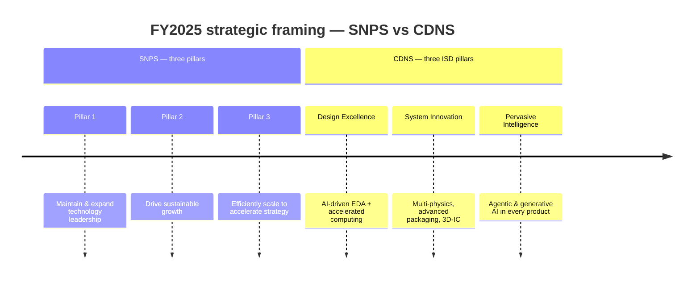
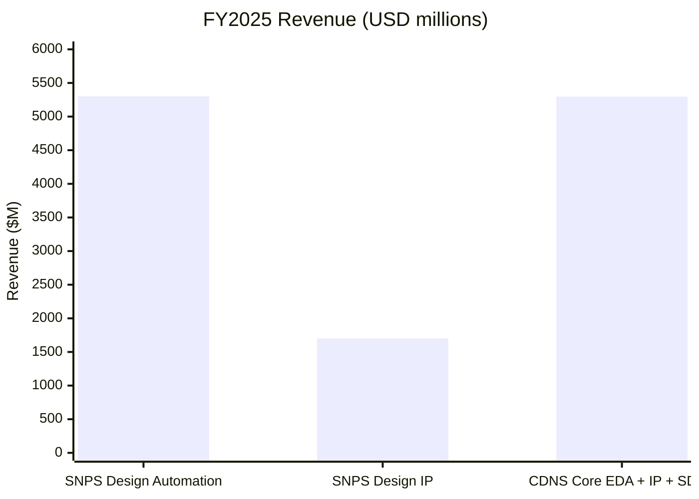
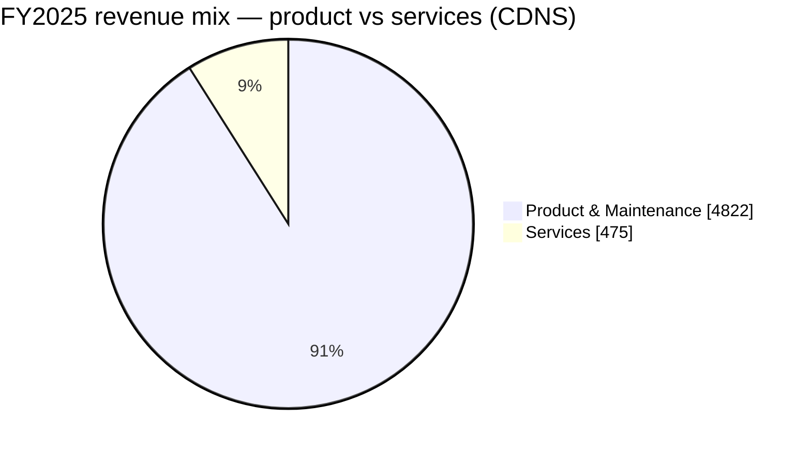
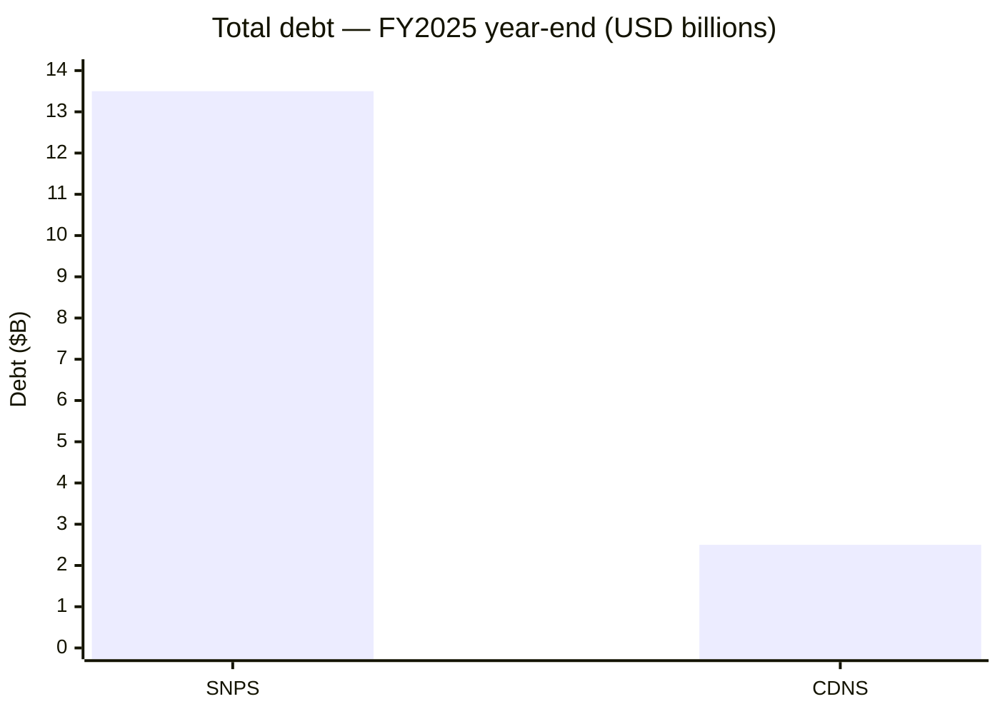

# Synopsys (SNPS) vs. Cadence (CDNS) — Strategic Vision Compared

**Source filings**
- SNPS FY2025 10-K — filed 2025-12-22, fiscal period ended 2025-10-31
- CDNS FY2025 10-K — filed 2026-02-19, fiscal period ended 2025-12-31

Both companies were once cleanly described as "EDA duopolists." Their FY2025 annual reports show the duopoly has split into two different bets on what comes *after* EDA — same destination ("silicon-to-systems"), opposite financing strategy.

---

## 1. One-line self-description

| | Synopsys | Cadence |
|---|---|---|
| Framing | "Leader in engineering solutions from silicon to systems, enabling customers to rapidly innovate AI-powered products." | "Global technology leader that develops computational, AI-driven software, accelerated hardware, and silicon intellectual property products and solutions." |
| Tagline | **Silicon to Systems** | **Intelligent System Design (ISD)** |
| Implicit pivot | From EDA point-vendor → integrated **silicon + multi-physics** platform (via Ansys) | From EDA → broader **electromechanical / system** company (via SD&A and bolt-on M&A) |

Both are deliberately dropping the "EDA" label. Synopsys leans into the *outcome* ("AI-powered products"); Cadence leans into the *method* ("computational AI-driven software").

## 2. Strategic pillars

SNPS framing is **operational** (lead, grow, scale). CDNS framing is **product** (what each pillar does for the customer). Cadence's ISD doctrine is older and more crisply marketed — Synopsys' Ansys-era pillars still read like a transition statement.

## 3. AI narrative — tool vs. tailwind

Both companies talk about AI in the same two registers, but with different signature products.

| Lens | Synopsys | Cadence |
|---|---|---|
| **AI-as-tool** (designing chips *with* AI) | `Synopsys.ai` suite: **DSO.ai**, **VSO.ai**, **TSO.ai**, **ASO.ai**; **Synopsys.ai Copilot**; **Design.da / Silicon.da** analytics | **Cerebrus** agentic AI; **JedAI** platform; **Verisium** (AI verification); **Allegro X AI** for PCB; generative AI in core flow |
| **AI-as-tailwind** (designing chips *for* AI) | Generic — "rise of silicon-powered intelligent devices and AI has increased demand"; lists AI / 5G / automotive / cloud as drivers | Sharper — three explicit "horizons": **Infrastructure AI** (HPC/hyperscalers), **Physical AI** (robotics, AVs), **Life Sciences AI** (computational biology) |

Cadence wins the framing battle here: their *three horizons* are a clean story; Synopsys still recites verticals. Both have credible AI-tools portfolios — DSO.ai is the most-cited name in the industry, but Cerebrus + JedAI is arguably the more *agentic* (less "optimizer," more "co-engineer").

## 4. Segment structure & financial scoreboard

| Metric | SNPS FY2025 | CDNS FY2025 | Spread |
|---|---|---|---|
| Total revenue | **$7,054M** | $5,297M | SNPS larger by $1.76B |
| YoY growth | +15% (~4% organic ex-Ansys) | +14% (all organic) | Cadence's growth is cleaner |
| Operating income | $915M (was $1,356M) | ~$1,480M (28% margin) | CDNS materially more profitable |
| Operating margin | ~13% GAAP (Ansys amortization $458M) | 28% (would be ~30% ex-BIS $128.5M charge) | CDNS ~15pts higher |
| Net income (cont. ops) | $1,336M | n/a in extract | — |
| RPO / backlog | Not disclosed in extract | **$7.8B**, 53% <12mo | CDNS visibility better |
| China revenue | -22% YoY (ex-Ansys) | 13% of revenue, up from 12% | CDNS held up; SNPS got hit harder |

**SNPS segments (2):** Design Automation $5.3B / 42% margin · Design IP $1.7B / 24% margin (margin **down 14 pts** YoY — the year's biggest single negative).

**CDNS categories (3):** Core EDA · Semiconductor IP · System Design & Analysis (SD&A) — not formal reportable segments, but the framing maps directly onto the multi-physics ambition.

## 5. The big bet: how each is buying its way into multi-physics

This is the headline divergence.

| | Synopsys | Cadence |
|---|---|---|
| Strategy | **One transformative deal** | **Many bolt-ons** |
| Anchor M&A | **Ansys** — closed FY2025, contributed $756.6M in revenue (11% of total) | **BETA CAE** (closed 2024), **Hexagon Design & Engineering** (announced Sept 2025, pending close — brings MSC Nastran + Adams) |
| Other recent M&A | — | VLAB Works (virtual prototyping), Arm Artisan IP (foundation IP), Secure-IC (embedded security) |
| What it buys | Structural / fluids / thermal / EM / optics simulation under one roof | Structural / multibody dynamics / RF / signal-power-thermal integrity — assembled piece by piece |
| Integration risk | **High** — explicit risk-factor language about scale of merger, channel-model differences (Ansys uses partners; SNPS direct), Design IP margin compression partly attributed to integration distraction | **Lower per deal** — but cumulative complexity rising; Hexagon will be the largest test |
| 10-K language | "Failure to realize expected synergies… may be magnified due to the scale of the merger." | "Continued investment in R&D and acquisition opportunities for the foreseeable future." |

Cadence's pending **Hexagon D&E** acquisition is the most strategically interesting move on the board — it directly targets the **structural analysis** market where Ansys is dominant, signalling Cadence does not intend to cede multi-physics to the SNPS+Ansys combo.

## 6. Capital allocation — the other big divergence

| | Synopsys | Cadence |
|---|---|---|
| Total debt | **~$13.5B** (Senior Notes + $4.3B Term Loan, raised for Ansys) | $2.5B Senior Notes (3 tranches, 4.20–4.70%) |
| Buyback authorization | **Suspended de facto** — debt covenants "limit our ability to return equity through our stock repurchase program or pay dividends" | **$1.5B** authorized May 2025, **~$1.4B remaining** as of YE2025 |
| Dividend | None | None |
| Next 24mo M&A | Constrained by covenants; focus on integration | Active — Hexagon pending, more bolt-ons expected |
| Tax rate (FY25) | 4.0% effective (one-off benefits) | n/a in extract |

Translation: **Synopsys cannot do anything else for ~2 years.** It has to digest Ansys, deleverage, and ride out the China revenue trough. **Cadence is still optionality-rich** — modest debt, active buyback, hungry for deals.

## 7. Distinctive risks — what each company is most exposed to

| Risk | SNPS | CDNS |
|---|---|---|
| **China export controls** | Hit harder — China revenue **-22% YoY** ex-Ansys; cited "weaker than expected demand from a major foundry customer"; BIS Q3 2025 restrictions briefly imposed then rescinded | Pled guilty (July 2025) to export-violation conspiracy for 2015–2021 activity; **$140.6M penalty**; 3-year probation w/ ongoing audit; M&A capability constrained by settlement |
| **Customer concentration** | "Challenges with a major foundry customer negatively impacted FY2025" — implies single-customer dependence (likely TSMC or Intel Foundry) | "No single customer >10% of revenue" — diversified |
| **Integration risk** | **Top-tier risk** — Ansys is biggest deal in company history; Design IP margin already showing strain | Moderate — multiple smaller acquisitions; Hexagon closing will raise the bar |
| **Debt overhang** | Real — $13.5B; covenant constraints on capital return and M&A | Manageable — $2.5B at reasonable rates |
| **AI regulation** | Mentioned in generic risk language | More prominent — **EU AI Act** (effective Aug 2026), fines up to 7% of worldwide turnover, called out specifically |
| **Domestic Chinese EDA competitors** | Generic mention | Named: Huada Empyrean, Xpeedic, X-EPIC, Primarius, Univista, Giga Design |

## 8. Side-by-side scorecard

| Dimension | Edge | Why |
|---|---|---|
| Top-line scale | **SNPS** | $7.1B vs $5.3B |
| Growth quality | **CDNS** | 14% all-organic vs 4% organic + M&A |
| Operating margin | **CDNS** | 28% vs 13% GAAP (SNPS hit by Ansys amortization & charges) |
| Backlog visibility | **CDNS** | $7.8B RPO disclosed; SNPS not in extract |
| Strategic narrative clarity | **CDNS** | Three-horizon AI story + clean ISD doctrine |
| Multi-physics scale | **SNPS** | Ansys is the gold standard, now in-house |
| Multi-physics breadth | **CDNS** | Bolt-on portfolio spans structural, fluids, RF, EM, thermal — Hexagon adds aerospace/auto |
| Capital flexibility | **CDNS** | Active buyback, room for more M&A |
| Balance sheet | **CDNS** | $2.5B debt vs $13.5B |
| China exposure | **CDNS** | -22% on SNPS (ex-Ansys) vs ~flat ~13% for CDNS |
| Integration risk | **CDNS** (lower) | One $35B deal vs several <$1B deals |
| Customer diversification | **CDNS** | No 10%+ customer |

## 9. Bottom line — two different bets

**Synopsys is betting that scale matters more than agility.** One big swing (Ansys) buys it the broadest silicon-to-systems portfolio in the industry, and the next 24 months are about proving the synergies are real while deleveraging. The downside: it has tied its hands on capital return and further M&A, and FY2025 already showed material strain (Design IP -14 pts margin, China -22%, GAAP op margin halved).

**Cadence is betting that compounding bolt-ons beats one mega-deal.** Cleaner growth, higher margins, intact buyback, and a coherent three-horizon AI story. The Hexagon D&E close will be the proof point that this bolt-on model can match Ansys in structural analysis. The risk: cumulative integration complexity, the BIS settlement overhang, and EU AI Act exposure.

If both stories execute, **Synopsys becomes the broader platform with the bigger TAM**; **Cadence becomes the more profitable, more nimble specialist** with arguably the better AI narrative. The two ten-Ks make it clear they are no longer competing for the same wallet share — they are competing for which definition of "engineering software" wins the 2030s.
