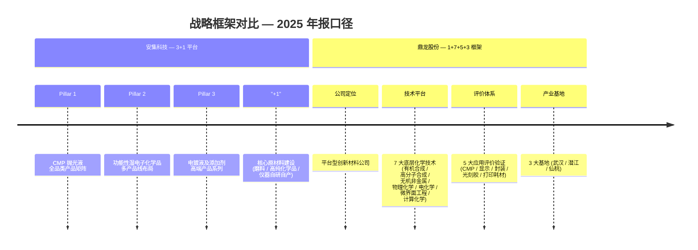
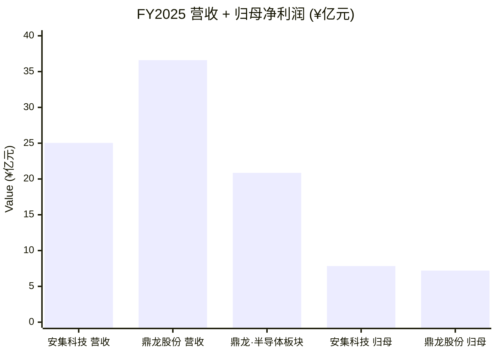
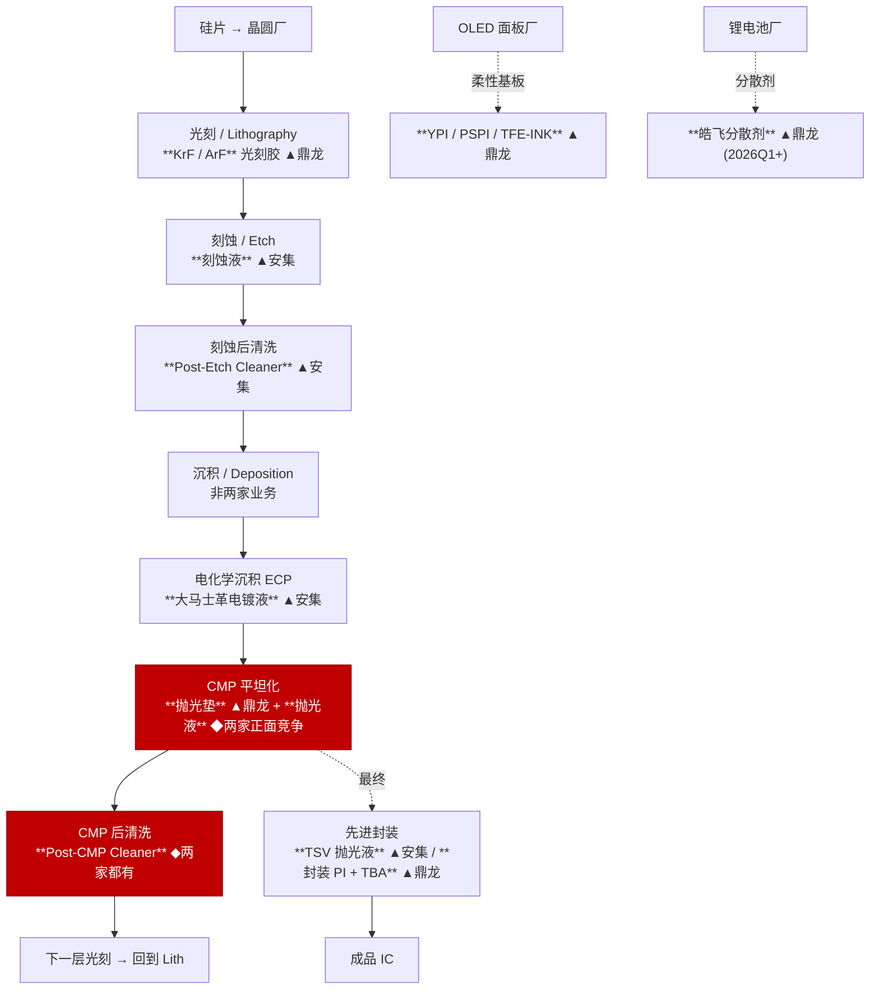

# 安集科技 (SSE:688019) vs 鼎龙股份 (SZSE:300054) — 半导体材料双子星头对头

**截至日期 / As of:** 2026-05-25
**报告语言：** 简体中文（两家均为 A 股，年报以中文披露）
**主要资料源：**
- 安集科技 2025 年年度报告（公告号 2026-008，2026-04-15 披露）— [cninfo PDF](https://static.cninfo.com.cn/finalpage/2026-04-16/1225108553.PDF)
- 鼎龙股份 2025 年年度报告（公告编号 2026-012，2026-03-27 披露）— [cninfo PDF](http://static.cninfo.com.cn/finalpage/2026-03-27/1225036149.PDF)
- 鼎龙股份 2026 年第一季度报告（公告号 2026-042，2026-04-28 披露）— [cninfo PDF](http://static.cninfo.com.cn/finalpage/2026-04-28/1225206346.PDF)
- 配套阅读：[安集科技 公司深度研究](../company/安集科技_SSE688019/安集科技_SSE688019_公司研究.md) · [鼎龙股份 公司研究](../company/鼎龙股份_SZSE300054/鼎龙股份_SZSE300054_公司研究.md)

> 安集 + 鼎龙是 A 股市场最被频繁地两两并列的国产半导体材料股 —— 两家都做 CMP（化学机械抛光）耗材、都在 SMIC / YMTC / CXMT / 华虹的供应商名单上、都在大基金资源池内、都顶着 60×+ 的 TTM P/E。但翻开两家的 2025 年报，会发现它们其实只在 **CMP 抛光液 (slurry)** 一个细分上正面相撞 —— 其余所有产品线都是"互补 + 不重叠"：安集是「**CMP 湿化学三件套** (slurry + clean + plating)」的 pure-play 配方专家；鼎龙是「**CMP 抛光垫 + OLED 显示材料 + KrF/ArF 光刻胶 + 锂电辅材 + 打印耗材**」的平台型新材料整合商。读者把它们当成竞品对手是对的（CMP slurry），把它们当成同一家公司的两条腿就是错的（全产品组合截然不同）。

---

## 0. TL;DR — 一图看清两家长短板

|  | ✓ 优势 | ✗ 劣势 |
|---|---|---|
| **安集科技 (SSE:688019)** | • **CMP 抛光液全球第 6、市占率 ~13%**（从 2023 年 8% → 2025 年 13%，已跻身 Fujifilm / Entegris / Resonac / Merck-Versum / Fujimi 之后，是亚洲唯一上榜的中国本土厂商）(§5.4) • **100% 半导体材料 pure-play**：2025 年营收 25.04 亿、+36.47% YoY、归母净利润 7.84 亿 (+46.85%)，所有收入直接受益于国产替代浪潮，无打印耗材这种「衰退资产」拖累 (§4) • **三条增长曲线全部跑通**：CMP 抛光液 20.40 亿 (+32%)、功能性湿电子化学品 4.53 亿 (+64%、GM 50%)、大马士革电镀液 2025 年首次量产 — 是国内同业唯一同时坐拥 CMP/Clean/Plating 三个 wet 工序的本土公司 (§5.1, §5.4) • **"磨料→抛光液"垂直一体化**：2025 年自研自产氧化铈磨料应用于氧化铈抛光液并量产销售，是国内同业唯一已跑通"上游材料→配方→应用"垂直化路径的厂商 (§5.5) • **研发密度行业第一**：研发人员 409 人占员工 52.10%、硕士+占研发 36.67%、研发投入 17.76% of revenue（明显高于鼎龙 14.19%）(§5.5) • **资本结构干净**：8.31 亿元安集转债 2026-03 已触发赎回并退市，已实现完全股本化；账面现金充裕、无大额商誉负担 (§7) • **估值显著便宜**：TTM P/E 64× vs 鼎龙 88×；TTM P/S 21.7× vs 鼎龙 19.9×（差距明显） (§4) | • **客户集中度过高**：2025 年前 5 大客户占销售 75.65%、前 2 大合计 53.03%，单一中芯国际或长江存储任何放缓都会立刻打到营收 (§5.2) • **无实际控制人**：Anji Cayman 内部无 50%+ 股东、安集"无实际控制人"，敌意收购防御能力较弱；大基金一期 2025 年已减持 2.14% 股本 (§5.7) • **海外几乎可忽略**：海外收入仅 3.5%（主要为中国台湾），相对 Fujifilm/Entegris 的全球客户网络仍有数量级差距 (§5.2) • **大马士革电镀液仍未规模化**：虽 2025 年首次量产，体量被合并入"其他" (1,156 万)，对短期收入贡献有限 (§5.1) • **不做抛光垫**：CMP "三件套" 缺 pad 一环，无法与鼎龙形成对客户的 "pad + slurry" 整体方案打包，单一供应商优势减弱 (§5.1) • **汇兑波动从盈利转向亏损**：2025 年汇兑损失 2,939.50 万 vs 2024 汇兑收益 1,577.08 万，约 4,500 万元的逆向冲击 (§7) |
| **鼎龙股份 (SZSE:300054)** | • **CMP 抛光垫国内唯一全制程供应商，国产化率 ~80%**：2025 年抛光垫营收 10.91 亿 (+52.3%)、月产能 5 万片，打破美国陶氏 (Dow/DuPont) ~79% 全球垄断；2025 年已对外资晶圆厂"反向供货" (§5.4) • **平台型多线作战**：CMP + 高端 KrF/ArF 光刻胶（3 款稳定批量、12+ 款加仑样验证） + 半导体显示材料 YPI/PSPI/TFE-INK (5.44 亿 +35.5%) + 半导体先进封装 (PI + TBA) — 是国内同时跨越前道 + 后道 + 显示 + 新能源 4 个材料赛道的唯一平台 (§4, §5.1) • **客户集中度合理**：2025 年前 5 大占 24.12%、第一大 10.87%，远低于安集 75% 警戒线；YMTC/SMIC/CXMT/华虹晶圆厂 + 京东方/维信诺/TCL华星面板厂双轨平衡 (§5.2) • **"硬抛光垫 + 软抛光液 + 后清洗液"三件套合一供应**：能为客户提供 CMP 端到端解决方案，安集只能供"软"端 — 单一客户钱包份额优势在 (§5.1, §5.6) • **明确兄弟实控**：朱双全 14.70% + 朱顺全 14.57% = 29.27%（合计 29.45% 含间接），治理稳定、26 年共同创业未发生过控制权震荡 (§5.7) • **资本运作积极**：2026Q1 完成 6.30 亿元收购皓飞新材 70% 股权（切入宁德时代锂电辅材供应链）+ 2026-04 公告 4.4 亿元剥离打印终端业务 + 推进港股 H 股发行 (§6) • **2026Q1 业绩落地于业绩预告上限**：营收 +23.82%、归母 +77.99% 至 2.51 亿，是 2026 年最早交出 H1 业绩答卷的国产半导体材料股 (§4) | • **打印耗材衰退拖累集团增长**：2025 年集团营收仅 +9.66% (vs 安集 +36.47%)，是因为打印耗材业务 -12.97%；半导体业务实际 +37.27% 与安集同档，但集团数据被冲淡 (§4) • **CMP 抛光液在安集面前体量仅 1/7**：2.94 亿 vs 安集 20.40 亿，鼎龙在抛光液细分赛道仍是追赶者，需要 3-5 年才能追平 (§5.1, §5.4) • **不做电镀液、不做湿电子化学品**：CMP "三件套" 缺 plating + 缺 etch/strip/clean 体系，与安集相比少了两条增长曲线 (§5.1) • **商誉风险升高**：2026Q1 商誉余额已升至 9.17 亿 (vs 2025 末 5.37 亿)，皓飞并购贡献 3.80 亿增量；若皓飞业绩不达预期商誉减值压力 (§5.7) • **TTM P/E 88× 显著高于行业中位数**：60× 半导体材料板块均值，需要 2026 年扣非 +50%+ 才能维持，估值压缩弹性大 (§9) • **高端晶圆光刻胶尚未盈利**：年报口径"市场开拓及放量初期，尚未盈利"，需要 2026-2028 年验证 (§5.7) • **大量新建产线即将摊薄折旧**：2025 年末固定资产 24.72 亿 (+14.4%) + 在建工程 6.61 亿，2026-2027 年新增折旧 3-5 亿 / 年 (§5.7) |

**这两家究竟该买谁？** 想要 **「最纯」的国产 CMP 配方专家** —— 100% 半导体材料、CMP slurry 全球第 6、湿电子化学品高速放量、估值相对便宜 → **选安集**；想要 **「最广」的国产材料平台公司** —— CMP 抛光垫国内独苗 + 显示材料国内龙头 + 光刻胶突破中 + 锂电辅材新切入 + 4 个赛道分散单一客户依赖 → **选鼎龙**；如果是**机构组合配置**最自然的选项是 **两个都买**：因为它们在产品上互补（pad ↔ slurry）、在客户上同源（都吃 SMIC/YMTC/CXMT/华虹 capex），形成「一笔 capex 两份订单」的天然 beta（§5.1 + §6）。下文详细论证每一条 TL;DR 结论。

---

## 1. 一句话自我定位

| | 安集科技 (SSE:688019) | 鼎龙股份 (SZSE:300054) |
|---|---|---|
| 2025 年报自我描述 | "全球领先的关键半导体材料供应商" — CMP 抛光液 + 功能性湿电子化学品 + 电镀液及添加剂 + 核心原材料的"3+1"平台 ([安集 2025 年报 §21](https://static.cninfo.com.cn/finalpage/2026-04-16/1225108553.PDF)) | "平台型创新材料公司" — 半导体材料 (CMP + 显示 + 光刻胶 + 先进封装) + 集成电路芯片设计 + 打印复印通用耗材 ([鼎龙 2025 年报 §业务](http://static.cninfo.com.cn/finalpage/2026-03-27/1225036149.PDF)) |
| 信号语 | "**打破国外厂商对集成电路领域化学机械抛光液和部分功能性湿电子化学品的垄断**" | "**国内唯一一家全面掌握 CMP 抛光垫全流程核心研发技术和生产工艺**" |
| 隐含定位 | 配方型湿化学专家：CMP slurry + cleaner + plating 三件套，单一工艺循环深耕 | 平台型化学材料整合商：覆盖前道 + 后道 + 显示 + 新能源 4 大赛道 |
| 业务覆盖深度 vs 广度 | **深** — 在 CMP / Clean / Plating 三个 wet 工序内做全品类（CMP 6 大子品类、湿电子 4 大子品类、电镀 4 大子品类） | **广** — 在每条品类上选一个核心 SKU 切入 (pad、slurry、photoresist、YPI、PSPI、TBA、皓飞)；广度大但单一品类深度不及 |

两家的自描述差异，已经清楚预示后面所有的对比维度。安集在年报里反复说"全品类"、"全制程"、"3+1 平台"，强调的是**配方深度**；鼎龙在年报里反复说"平台型"、"创新材料"、"全产业链"，强调的是**产品广度**。一个是 "**deep-narrow 配方专家**"，一个是 "**broad-shallow 材料王**" —— 选边站时的核心 trade-off ([安集 2025 年报](https://static.cninfo.com.cn/finalpage/2026-04-16/1225108553.PDF), [鼎龙 2025 年报](http://static.cninfo.com.cn/finalpage/2026-03-27/1225036149.PDF))。

---

## 2. 战略框架并列

两家的战略组织维度完全不同 —— 安集按**工艺工序**组织（每一条产品线对应客户工艺中的一个工序：CMP、Clean、Plating），鼎龙按**底层技术能力**组织（每一条产品线源自 7 大化学合成能力的不同组合）。结果是安集形成"**单一客户多工序销售**"的协同（同一个客户买 slurry + cleaner + plating），鼎龙形成"**多客户单一品类销售**"的扩张（同一个 PU + 微球发泡能力同时卖到晶圆厂做 pad、做面板厂做 PSPI、做封测厂做封装 PI）([安集 2025 年报 §21](https://static.cninfo.com.cn/finalpage/2026-04-16/1225108553.PDF), [鼎龙 2025 年报 §核心竞争力分析](http://static.cninfo.com.cn/finalpage/2026-03-27/1225036149.PDF))。

第二个差异是**资本运作风格**。安集走"自研 + 战略参股 + 极少并购"路径 —— 2023 年并购法国 Cordouan Technologies 是公司 20 年历史上唯一一次有意义的境外并购，金额未披露但规模有限；其余对外投资全是产业基金 LP 角色（合计 2.04 亿元参股 7 只产业投资基金）([安集 2025 年报 §46-47](https://static.cninfo.com.cn/finalpage/2026-04-16/1225108553.PDF))。鼎龙则积极动用并购作为业务扩张工具 —— 2026 年 1 月 6.30 亿元收购皓飞新材 70%、2025 年 6 月 2.40 亿元增持鼎汇微电子 8%、2025 年 7 月 5,268 万元增持柔显科技、2026 年 4 月 4.4 亿元剥离打印终端、推进港股 H 股上市 ([皓飞并购公告](http://static.cninfo.com.cn/finalpage/2026-01-27/1224950902.PDF), [证券时报剥离打印业务](https://www.stcn.com/article/detail/3724253.html))。两种风格各有道理：安集的"专注 + 内生增长"对应一个尚未充分开发的单一深度赛道；鼎龙的"频繁资本运作"对应一个需要不断扩品类的平台公司。

---

## 3. AI 叙事 — 工具 vs 顺风

半导体材料公司的 AI 叙事有两种角度：（1）AI 作为**工具**（用 AI 优化自家产品配方 / 制造过程）；（2）AI 作为**顺风**（下游 AI 芯片产业链拉动公司产品销售）。两家都属于第二种 — 但顺风传导路径完全不同。

| 角度 | 安集科技 | 鼎龙股份 |
|---|---|---|
| **AI 作为工具** | 公司 2025 年报未将"AI for materials" 列入核心研发项目；研发以配方 know-how 与人才驱动为主 | 公司 2025 年报亦未明确披露"AI for materials"工具应用，但「平台公司」愿景下未来空间更大 |
| **AI 作为顺风 — HBM / CoWoS** | HBM 12-Hi → 16-Hi 堆栈 → TSV 抛光液 + TSV 电镀液销量直线放大；CoPoS 共封装光学 → 新材料 (聚合物 / 玻璃基板) CMP 工艺 → 公司先进封装产品矩阵 | 临时键合胶 TBA (在多家封测厂稳定出货) + 封装 PI (在售 2 款) — HBM 国产化（长鑫存储 HBM 计划） + Chiplet 的直接受益者 |
| **AI 作为顺风 — 3D NAND 层数堆叠** | 200 → 232 → 300 → 400 层 → **每多一层即增加 1 道钨抛光液 + 1 道介电抛光液工序**；钨抛光液（公司近期在 SEMICON China 2026 发布 15+ 款 SKU）直接受益 | CMP 抛光垫消耗与晶圆产能 + 工艺步骤数线性相关；3D NAND 层数堆叠同样推动鼎龙抛光垫销售（公司年报指出"3D NAND 演进会使 CMP 工艺步骤数近乎翻倍"） |
| **AI 作为顺风 — GAA / 2nm 节点** | 单片晶圆 CMP 步骤数从 3nm 的 ~20 道升至 ~41 道 (引自 [IndexBox 2035 forecast](https://www.indexbox.io/blog/cmp-slurries-market-forecast-points-higher-toward-2035-driven-by-advanced-semiconductor-node-transitions/))；安集铜抛光液 + 金属栅极抛光液同步受益 | 同样受益于 CMP 步骤数翻倍 + 光刻胶 KrF/ArF 在 GAA 用于 SiGe 选择性蚀刻流程 |
| **AI 作为顺风 — 大基金三期 ¥3,440 亿** | 大基金一期是公司股东（Anji Cayman 一致行动方），公司在国家供应链安全战略中占据关键位置 ([大基金三期 Caixin](https://www.caixinglobal.com/2024-05-28/china-piles-475-billion-into-big-fund-iii-to-boost-chip-development-102200633.html))；大基金三期 ¥930 亿专项用于材料与设备公司 | 政策端 2025 年 3 月五部门联合通知将光刻胶、抛光垫、抛光液纳入税收优惠清单 — 鼎龙 4 个核心产品悉数受益 ([鼎龙 2025 年报 §行业情况](http://static.cninfo.com.cn/finalpage/2026-03-27/1225036149.PDF)) |

两家 AI 顺风叙事的本质区别 —— 安集是"**纵向叠加放大**"（同一片晶圆 CMP 工序数翻倍 → slurry 消耗系数性上升），鼎龙是"**横向版图扩张**"（半导体 + 显示 + 锂电的多赛道同时受益于 AI 终端 / 新能源车终端）。两种叙事在 2026-2028 年都成立，差异在投资人愿意承担多少业务分散度。

---

## 4. 财务对比 — 收入、利润、增长质量

| 指标 | 安集科技 FY2025 | 鼎龙股份 FY2025 | 备注 |
|---|---|---|---|
| 总营业收入 | **¥25.04 亿** | ¥36.60 亿 | 鼎龙规模大 ¥11.6 亿 — 但含 ¥15.59 亿打印耗材 |
| 半导体板块营收 | ¥25.04 亿 (100%) | ¥20.86 亿 (57%) | **可比口径下安集大 ¥4.18 亿** |
| YoY 营收增速 | **+36.47%** | +9.66% (集团) / +37.27% (半导体板块) | 半导体口径几乎同档 |
| 归母净利润 | **¥7.84 亿** | ¥7.20 亿 | 安集略胜（绝对额相近，归母利润率 31.3% vs 19.7%） |
| 扣非归母 | ¥6.97 亿 (+32.36%) | ¥6.78 亿 (+44.53%) | 鼎龙增速更快（基数较低） |
| 综合毛利率 | **56.79%**（-1.66pp） | 集团未单独披露；半导体业务 50.88% (+3.74pp) | 安集纯 wet 化学品维持 50%+ |
| 经营性现金流 | 未在 2025 年报独立披露 | ¥11.57 亿 (+39.64%) | 鼎龙现金流转化率高 |
| 研发投入 | ¥4.45 亿 / 17.76% of revenue | ¥5.19 亿 / 14.19% of revenue | 安集占比更高，鼎龙绝对值更大 |
| 研发人员 | 409 人 / 占员工 52.10% | 1,283 人 / 占员工 34.42% | 鼎龙总人数多 3×、密度较低 |
| 硕士+ 学历占研发 | 36.67% | 222 人 / 17.30% | **安集研发人才密度行业第一** |
| 累计专利 | 308 件已授权 + 383 件待批 | 1,299 项 / 已授权 1,056 项 | 鼎龙数量优势，安集质量浓度高（人均 0.75 件 vs 鼎龙 0.82 件，相近） |
| 总市值（2026-05-25） | ¥544.6 亿 | ~¥730 亿 | 鼎龙市值溢价 ~34% |
| TTM P/E | **64×** | 88× | 鼎龙估值高 38% |
| TTM P/S | 21.7× | 19.9× | 安集 P/S 略高 (因 P/E 较低、净利率较高) |
| 现金分红率 | 11.17% of 归母 | 未在本节披露（公司一直稳定派息） | 两家都不是高分红股 |
| 2026Q1 营收 / 增速 | ¥7.24 亿 (+13.4%)（来自媒体；公司 2026 Q1 报告口径需复核） | ¥10.20 亿 (+23.82%) | 鼎龙 2026 H1 业绩动能强 |
| 2026Q1 归母 / 增速 | 媒体口径 ¥2.2 亿左右（+30%+） | ¥2.51 亿 (+77.99%) | 鼎龙增速明显占上风（业绩预告上限） |

来源：[安集 2025 年报 §10](https://static.cninfo.com.cn/finalpage/2026-04-16/1225108553.PDF) · [鼎龙 2025 年报 §主要会计数据](http://static.cninfo.com.cn/finalpage/2026-03-27/1225036149.PDF) · [鼎龙 2026 Q1 报告](http://static.cninfo.com.cn/finalpage/2026-04-28/1225206346.PDF) · [雪球 SH688019](https://xueqiu.com/S/SH688019) · [雪球 SZ300054](https://xueqiu.com/S/SZ300054)。

**两家可比口径下的财务真相：** 在"半导体板块" 单独看，两家 FY2025 营收几乎一致（25.04 亿 vs 20.86 亿，安集略大），增速完全一致（+36% vs +37%），归母净利润相近 (7.84 vs 7.20)。差异在于 **(1)** 鼎龙的集团数字被打印耗材业务（-13%）拉低 ~5pp；**(2)** 鼎龙利润率结构更复杂（半导体高、打印低、未来锂电不确定）；**(3)** 鼎龙 2026Q1 业绩 +78% 反映半导体 / 显示材料 + 皓飞并表 + 打印业务剥离三重推动，业绩弹性更大。**估值的根本分歧：** 安集 P/E 64× 已 priced in 36% 的稳态增长；鼎龙 P/E 88× 已 priced in 50%+ 的爆发增长（业绩兑现度成为估值锚）。

---

## 5. 护城河剖析 (Moat Anatomy)

### 5.1 产品矩阵重叠分析（**本报告最核心的表**）

两家的产品组合大半不重叠，只在 CMP 抛光液这一格直接相撞。以下矩阵把两家公司年报披露的所有有意义的产品 SKU 全部对位，按"是否直接竞争"分为四个桶：

| 工艺位置 / 产品类别 | 安集科技产品 | 鼎龙股份产品 | 关系 |
|---|---|---|---|
| **CMP 抛光液 (slurry)** — 铜 / 钨 / 介电 / 氧化铈 / 金属栅极 / 衬底 | 全 6 大子品类，2025 营收 ¥20.40 亿、毛利率 58.28% | 全 4 大粒子体系（超纯 SiO₂ / 高纯 SiO₂ / Al₂O₃ / CeO₂）抛光液，2025 营收 ¥2.94 亿（含清洗液），鼎龙占 ~13% | **直接竞争（安集主导）** ([安集 2025 年报 §39](https://static.cninfo.com.cn/finalpage/2026-04-16/1225108553.PDF), [鼎龙 2025 年报](http://static.cninfo.com.cn/finalpage/2026-03-27/1225036149.PDF)) |
| **CMP 抛光垫 (pad)** | — **无**（公司不做 PU 微球发泡抛光垫） | 国内唯一全制程供应商，2025 营收 ¥10.91 亿 (+52.3%)，月产能 ~5 万片，国产化率 ~80% | **不重叠（仅鼎龙）** ([湖北经信厅 2025-04-17](https://jxt.hubei.gov.cn/bmdt/qyfc/202504/t20250417_5618971.shtml)) |
| **CMP 后清洗液 (post-CMP clean)** | "先进制程碱性铜抛光后清洗液…快速上量，持续增加市场份额"（合并入功能性湿电子化学品 ¥4.53 亿口径） | 与抛光液组合出货（合并入 ¥2.94 亿口径） | **直接竞争（安集主导）** ([安集 2025 年报 §29](https://static.cninfo.com.cn/finalpage/2026-04-16/1225108553.PDF)) |
| **CMP 抛光液原材料 — 磨料 (abrasive)** | **2025 年自研自产氧化铈磨料量产**；硅溶胶通过参股公司 | 自产 4 大体系研磨粒子（超纯 SiO₂ / 高纯 SiO₂ / Al₂O₃ / CeO₂），其中超纯 SiO₂ 与 CeO₂ 类似安集 | **直接竞争（两家都做垂直一体化）** ([安集 2025 年报 §24](https://static.cninfo.com.cn/finalpage/2026-04-16/1225108553.PDF)) |
| **功能性湿电子化学品 — 刻蚀后清洗液 / 剥离液 / 刻蚀液** | 全 4 大子品类，2025 营收 ¥4.53 亿 (+64%)、毛利率 50% | — **无**（公司不做 etch / strip / clean 配方矩阵） | **不重叠（仅安集）** ([安集 2025 年报 §39](https://static.cninfo.com.cn/finalpage/2026-04-16/1225108553.PDF)) |
| **电镀液及添加剂 (plating chemistry)** — 大马士革 Cu + 先进封装 TSV / Bumping / RDL | 2025 年首次量产销售（合并入"其他"¥1,156 万），覆盖 Cu / Ni / Sn-Ag 电镀液 + 添加剂 | — **无**（公司不做电镀液） | **不重叠（仅安集）** ([安集 2025 年报 §14](https://static.cninfo.com.cn/finalpage/2026-04-16/1225108553.PDF)) |
| **高端晶圆光刻胶 KrF / ArF** | — **无**（公司不做光刻胶） | 国内首条 KrF + ArF 全流程量产线（潜江 30 吨 + 300 吨）；3 款稳定批量、12+ 款加仑样验证；尚未盈利 | **不重叠（仅鼎龙）** ([鼎龙 2025 年报 §高端光刻胶](http://static.cninfo.com.cn/finalpage/2026-03-27/1225036149.PDF), [电子方案资讯 2025](https://www.52solution.com/news/80061513/)) |
| **半导体显示材料 YPI / PSPI / TFE-INK** | — **无**（公司不做柔性 OLED 上游材料） | 2025 营收 ¥5.44 亿 (+35.5%)，国内部分主流面板厂第一供应商；新一代 PFAS Free PSPI / BPDL / Low Dk INK 中试中 | **不重叠（仅鼎龙）** ([鼎龙 2025 年报 §显示材料](http://static.cninfo.com.cn/finalpage/2026-03-27/1225036149.PDF)) |
| **半导体先进封装材料 — TSV 抛光液 / Hybrid Bonding 抛光液 / 聚合物抛光液** | 公司 "在国内客户均作为首选供应商帮助客户打通技术路线…销售持续上量" | — **无**（公司不做 TSV CMP 化学品） | **不重叠（仅安集）** ([安集 2025 年报 §29](https://static.cninfo.com.cn/finalpage/2026-04-16/1225108553.PDF)) |
| **半导体先进封装材料 — 封装 PI / 临时键合胶 TBA** | — **无**（公司不做 PI / TBA） | 封装 PI 布局 7 款 / 在售 2 款 + TBA 多家封测厂稳定出货；2025 营收 ¥1,176 万（突破千万）尚处起步 | **不重叠（仅鼎龙）** ([鼎龙 2025 年报 §封装材料](http://static.cninfo.com.cn/finalpage/2026-03-27/1225036149.PDF)) |
| **集成电路芯片设计 / 半导体零部件控制系统** | — **无**（公司不做 IC 设计） | 旗捷科技子公司（打印耗材芯片）+ 浙江执一半导体（新设孙公司 — 半导体器件专用设备零部件控制系统） | **不重叠（仅鼎龙）** ([鼎龙 2025 年报 §IC 设计](http://static.cninfo.com.cn/finalpage/2026-03-27/1225036149.PDF)) |
| **锂电池功能辅材 — 分散剂 / 粘结剂** | — **无**（公司不做锂电材料） | 2026Q1 起合并皓飞新材 70% 持股；皓飞 2025 年 1-11 月营收 4.81 亿；宁德时代是核心客户 | **不重叠（仅鼎龙）** ([皓飞并购公告](http://static.cninfo.com.cn/finalpage/2026-01-27/1224950902.PDF)) |
| **打印复印通用耗材 — 彩色聚合碳粉 / 显影辊 / 硒鼓 / 墨盒** | — **无**（公司不做打印业务） | 2025 营收 ¥15.59 亿 (-12.97%)；2026-04 公告剥离硒鼓 / 墨盒终端业务（剥离对价 ¥4.4 亿） | **不重叠（仅鼎龙 — 但正在剥离）** ([证券时报 2026-04-02](https://www.stcn.com/article/detail/3724253.html)) |
| **纳米颗粒粒径与电势分析仪器** | 法国子公司 Cordouan Technologies（2023 年并入）2025 营收 ~¥0.12 亿（"其他"项目内） | — **无** | **不重叠（仅安集）** ([安集 2025 年报 §47](https://static.cninfo.com.cn/finalpage/2026-04-16/1225108553.PDF)) |

**矩阵的结论 — 两家公司只在 1 个产品上正面竞争，在 12 个产品上完全互补 / 不重叠。** 在 CMP 抛光液这一格，安集是国内龙头（¥20.40 亿、全球市占率 13%），鼎龙是挑战者（¥2.94 亿、追赶状态），两家差距约 7×。但即使 CMP 抛光液这一格，两家也不是完全替代关系 —— 安集主打"配方深度"（6 大子品类全覆盖），鼎龙主打"硬 + 软组合方案"（pad + slurry + clean 一站式提供）。

CMP 抛光垫这一格则是**鼎龙的国内独占** —— 安集 2025 年报里没有任何 pad 相关研发披露，明确不进入 PU 微球发泡赛道。换言之，**国内一家晶圆厂如果想做"国产化 CMP 三件套"，必然同时采购鼎龙 (pad) + 安集 (slurry + cleaner)** —— 两家是"co-suppliers"（共同供应商）而非纯粹竞争对手。这是机构投资者最常忽略的一点：把这两家股票放在同一个投资组合里，等于做多"中国晶圆厂的 CMP 工艺循环"这个 trade，比单押任何一家都更直接 ([安集 2025 年报 §17](https://static.cninfo.com.cn/finalpage/2026-04-16/1225108553.PDF), [鼎龙 2025 年报 §业务](http://static.cninfo.com.cn/finalpage/2026-03-27/1225036149.PDF))。

▲ = 该家独有； ◆ = 两家直接竞争

### 5.2 客户集中度对比 — 截然相反的两种风险特征

| 指标 | 安集科技 FY2025 | 鼎龙股份 FY2025 | 解读 |
|---|---|---|---|
| 前 5 大客户占比 | **75.65%** | 24.12% | 安集是鼎龙的 ~3.1× — 安集高度集中 |
| 第一大客户占比 | 26.62% | 10.87% | 安集是鼎龙的 ~2.4× — 单一客户依赖差距 2 倍 |
| 前 2 大客户合计 | 53.03% | ~15.90% | 安集前 2 大已经超过销售一半 |
| 前 5 大客户身份（推断） | SMIC / YMTC 或 CXMT / 华虹 / TSMC / 中型晶圆厂 | 半导体客户 (SMIC / YMTC / 华虹 / CXMT) + 面板客户 (京东方 / 维信诺 / TCL 华星 / 天马) + 海外打印渠道商 | 鼎龙客户来源更分散（半导体 + 显示 + 打印） |
| 关联方销售 | 0% | 0% | 两家均无关联交易 |
| 3 年集中度走势 | 2023 80% → 2024 75% → 2025 76% | 客户集中度年报披露不足 3 年，但 2025 数据反映较低稳态 | 安集集中度下降但仍高 |
| 海外收入占比 | 3.5%（主要为中国台湾） | 29.72%（含打印耗材出口；半导体业务海外占比极低） | 鼎龙海外大是打印的功劳，半导体几乎全境内 |
| 地理集中度 | 中国大陆 96.5% — **极度集中** | 中国大陆 70.28%（半导体业务）+ 海外 29.72%（打印业务）— 表面分散，但半导体业务集中度同样高 | 半导体业务两家都极依赖中国大陆 |

**集中度数据的真正含义：** 安集的 76% 数字看起来吓人，但**这正是其业务模式的必然结果** —— 它做 CMP 抛光液 (Tier-1 半导体材料)，全国能买这类产品的客户就是不到 10 家头部晶圆厂；前 5 大占 76% 意味着公司基本拿下了所有头部 fab。问题不在于"集中"本身，而在于"单一客户能否减少订单"：如果 SMIC 或 YMTC 因为 BIS 出口管制升级被迫减产 30%，安集的营收直接受冲击。([安集 2025 年报 §41](https://static.cninfo.com.cn/finalpage/2026-04-16/1225108553.PDF))

鼎龙的 24% 数字也有解释 —— **公司业务跨 3 个赛道**（半导体 + 显示 + 打印），每个赛道客户都是头部 5-10 家、加起来分散到 20+ 客户中。但若单看半导体业务，鼎龙的客户集中度大概率与安集相近（仅 CMP 抛光垫、抛光液、光刻胶就在 SMIC / YMTC / CXMT / 华虹四家手里），只是年报口径合并打印业务后被稀释 ([鼎龙 2025 年报 §主要销售客户](http://static.cninfo.com.cn/finalpage/2026-03-27/1225036149.PDF))。

**核心客户重叠度（一个机构最常问的问题）：** 用两家公开资料推断的核心客户名单交叉对比：

| 客户 | 安集科技供应内容 | 鼎龙股份供应内容 | 是否同时供货 |
|---|---|---|---|
| 中芯国际 (SMIC) | CMP 铜抛光液、钨抛光液、介电抛光液、后清洗液 (公司"长期最大客户") | CMP 抛光垫（"部分客户的第一供应商"）+ 光刻胶（已通过验证） | **✓ 同时供货 — 互补关系** |
| 长江存储 (YMTC) | 钨抛光液（3D NAND 主战场）、TSV 抛光液 | CMP 抛光垫 + 光刻胶（公开调研信息已通过验证） | **✓ 同时供货 — 互补关系** |
| 长鑫存储 (CXMT) | 介电抛光液、铜抛光液、钨抛光液 | CMP 抛光垫 + 光刻胶 | **✓ 同时供货 — 互补关系** |
| 华虹半导体 (Hua Hong) | CMP 抛光液配套（成熟节点） | CMP 抛光垫 + 抛光液 | **✓ 同时供货** |
| 台积电 (TSMC) | 公司认为"第三大或第四大客户" | 暂未披露 | 仅安集 |
| 京东方 (BOE) | — | YPI / PSPI / TFE-INK 一线供应商 | 仅鼎龙 |
| 维信诺 (Visionox) / TCL 华星 / 天马 | — | YPI / PSPI 主力客户 | 仅鼎龙 |
| 长电科技 / 通富微电 / 华天科技 | TSV 抛光液 / Hybrid Bonding 抛光液 | 封装 PI + TBA（早期阶段） | 互补 |
| 宁德时代 (CATL) | — | 通过皓飞新材 70% 持股供应锂电分散剂 | 仅鼎龙 (2026Q1+) |

**结论：** 4 家头部晶圆厂（SMIC / YMTC / CXMT / 华虹）都同时是两家公司的客户，且 **两家产品在客户工厂内是互补的（pad + slurry + cleaner），不是替代的**。这就是为什么前文 §5.1 末尾说"co-suppliers"。

### 5.3 订单簿质量 + 切换成本 + "上线结算"模式

两家都未明确披露 RPO（Remaining Performance Obligation） / 在手订单的标准数据，但披露了"上线结算" / VMI（vendor-managed inventory）这一行业特有的销售模式数据，这是评估订单簿"黏性"的关键替代指标。

| 指标 | 安集科技 FY2025 | 鼎龙股份 FY2025 |
|---|---|---|
| 销售模式 | 直销 98.8% + 经销 1.2% | 直销为主（具体比例未单独披露） |
| "上线结算"占比 | 56.89%（2021 年 78.17% → 2025 年 56.89%，逐年下降）— 这是 VMI 类似模式，发货到客户仓库、客户上线消耗后才结算 | 公司年报未披露独立的"上线结算"占比 |
| 客户验证周期 | 12-18 个月（CMP 抛光液）；电镀液 18-24 个月 | 18-24 个月（CMP 抛光垫 — 比抛光液长，因为良率敏感度更高） |
| 单一产品切换成本 | **极高** — 抛光液更换会引起良率波动，需要重新跑客户工艺；客户更换供应商的隐性成本可达单批晶圆产值的 5-10% | **极高** — 抛光垫更换会改变摩擦系数、清洗效果，对良率影响超过抛光液 |
| 已认证客户数量 | 国内主流晶圆厂 + 海外台湾，估计 30+ 家 fab 客户 + 50+ 单产品认证关系 | 国内主流晶圆厂 + 国外晶圆厂（"反向供货"）+ 国内主流面板厂；估计 30+ fab + 8+ 面板厂客户 |
| 客户"优秀供应商"评级 | 2025 年获中国大陆 + 中国台湾多位核心客户颁发"优秀供应商"称号 | 2025 年被多家晶圆厂核心客户评为优秀供应商 |
| 安全库存 / 备料 | 高纯化学品 + 磨料端 5 大供应商占采购 49.93%（原料集中度也较高） | 自产研磨粒子 / PU 预聚体 / 微球发泡 → 上游供应自主，安全库存能力较强 |

**两家共有的"切换成本壁垒"：** CMP 耗材（pad、slurry、cleaner）一旦通过晶圆厂认证，客户不会因为价格便宜 5-10% 就更换 —— 因为更换会引起单批晶圆几个百分点的良率波动，损失远大于材料成本节省 ([安集 2025 年报 §15](https://static.cninfo.com.cn/finalpage/2026-04-16/1225108553.PDF), [鼎龙 2025 年报 §核心竞争力](http://static.cninfo.com.cn/finalpage/2026-03-27/1225036149.PDF))。

**安集 "上线结算" 比例下降 ≠ 黏性变弱 = 客户多元化。** 2021 → 2025 年这一比例从 78% 降至 57%，对应的是公司客户从"少数几家战略客户"扩展到"多家二线客户"，结算方式从 VMI 转向更标准的"发货即确认收入"。**这是结构性多元化的好事**（[安集 2025 年报 §37](https://static.cninfo.com.cn/finalpage/2026-04-16/1225108553.PDF)）。

### 5.4 细分赛道市占率 — 谁在哪个 sub-segment 上是第几

这是两家公司护城河量化的核心表。以下市占率数字均来自第三方报告（TECHCET、Frost & Sullivan、华经情报网、Yano Research、TrendForce），不引用公司年报作为"市场领导"声明。

| 子赛道 | 全球 TAM 2025E | 鼎龙股份份额 | 安集科技份额 | 全球领先者 | 数据来源 |
|---|---|---|---|---|---|
| 全球 CMP 抛光液 | $22 亿（CMP 抛光材料中 ~60%） | <1%（国内 ~5-8%，全球可忽略） | **~13%（2023 8% → 2025 13%；进入全球前 5）** | Fujifilm EM ~31% / Entegris (含 CMC) low-20%s / Resonac low-teens | [TECHCET 2025](https://www.semiconductor-digest.com/techcet-projects-cmp-market-is-set-to-reach-3-6b-in-2025/) + [安集 2025 年报 §22](https://static.cninfo.com.cn/finalpage/2026-04-16/1225108553.PDF) |
| 中国 CMP 抛光液 | ~¥40 亿 | ~7% (¥2.94 亿，含清洗液) | **~50%（¥20.4 亿口径推算）** | 安集本土 #1，鼎龙挑战者 | [前瞻产业研究院 2023](https://bg.qianzhan.com/report/detail/300/230608-b47864bc.html) |
| 全球 CMP 抛光垫 | $16 亿（CMP 抛光材料中 ~40%） | ~3% | **0%（不做 pad）** | DowDuPont (现 DuPont) ~79% / CMC Materials (现 Entegris) ~5% / Thomas West ~4% | [知乎 2025 CMP 抛光材料企业盘点](https://zhuanlan.zhihu.com/p/1923835804704281697) |
| 中国 CMP 抛光垫 | ¥29 亿 | **~38%（¥10.91 亿）国内绝对龙头 + 国产化率 ~80%** | 0% | **鼎龙国内 #1**；陶氏 + CMC 合计仍占 50%+ 但快速被替代 | [华经情报网 2025-CMP-抛光垫](https://www.huaon.com/channel/trend/1144278.html) + [湖北经信厅 2025-04-17](https://jxt.hubei.gov.cn/bmdt/qyfc/202504/t20250417_5618971.shtml) |
| 全球功能性湿电子化学品 | $54 亿 | <1%（未在此赛道有规模产品） | ~1-2%（基于 $4.5 亿 / 折算后 $0.65 亿） | Entegris / JSR / Tokyo Ohka Kogyo | [TECHCET 引自安集 2025 年报 §20](https://static.cninfo.com.cn/finalpage/2026-04-16/1225108553.PDF) |
| 全球半导体电镀化学品 | $13.8 亿（先进封装 $3 亿） | 0%（不做电镀液） | <1%（2025 年首次量产销售；放量初期） | MacDermid / Atotech (MKS) / DuPont / Versum-Merck / JCU / Uyemura | [TECHCET 电镀化学品 2025](https://www.semiconductor-digest.com/rising-copper-demand-in-semiconductors-drives-plating-chemicals-for-advanced-packaging-and-interconnects/) |
| 中国 KrF + ArF 光刻胶 | 2028E ¥107 亿（KrF 49.3 + ArF 57.6）；2025E ¥45-50 亿 | ~3-5%（3 款稳定批量、12+ 加仑样验证）— 国内推进最快的玩家之一 | 0%（不做光刻胶） | 国际：JSR / TOK / 信越 / 住友 合计 ~80%；国内：南大光电、上海新阳、彤程新材、徐州博康 (华懋参股) 等梯队竞争 | [Frost & Sullivan 引自鼎龙 2025 年报](http://static.cninfo.com.cn/finalpage/2026-03-27/1225036149.PDF) + [新浪财经 2025-11-28](https://finance.sina.com.cn/stock/relnews/dongmiqa/2025-11-28/doc-infyxmri0048252.shtml) |
| 中国 OLED 显示材料 YPI + PSPI | YPI 约 ¥10 亿 / PSPI 约 ¥15 亿；TFE-INK 约 ¥5 亿 | **YPI / PSPI 国内部分主流面板客户的第一供应商**（无年报或第三方公开数字给出精确份额）| 0% | 国际：日本宇部兴产 (Ube) / 东丽 (Toray) / 韩国 LG 化学 / Kolon Industries | [赛迪顾问引自鼎龙 2025 年报 §6](http://static.cninfo.com.cn/finalpage/2026-03-27/1225036149.PDF) + [新浪科技 2025-05-28](https://finance.sina.com.cn/tech/roll/2025-05-28/doc-ineyayyx9200321.shtml) |
| 全球先进封装材料（PI + TBA + 底填充 + TIM 合计） | ~$70-90 亿；中国约 25-30% 占比 | 早期切入（封装 PI 在售 2 款 + TBA 在多家封测厂稳定出货） — 份额 <1% | TSV CMP / Hybrid Bonding CMP "国内首选供应商"（公司自述） | 国际：日本日立化成、长濑、Brewer Science；国内：华润微 / 长电后端材料 | [鼎龙 2025 年报 §先进封装](http://static.cninfo.com.cn/finalpage/2026-03-27/1225036149.PDF) + [安集 2025 年报 §29](https://static.cninfo.com.cn/finalpage/2026-04-16/1225108553.PDF) |
| 锂电池分散剂（中国） | 2025E ¥100 亿 / 2030E ¥200 亿 | **皓飞新材为国内 "新型锂电池分散剂的绝对头部企业"** — 通过 70% 持股获得入口 | 0% | 国内：江苏国泰、多氟多、回天新材、皓飞新材 | [知乎 - 鼎龙皓飞](https://zhuanlan.zhihu.com/p/1999446437931537150) |

**两家在各自赛道的"市场领导者"地位均为第三方背书，不是 self-report：** 安集 13% 全球 CMP 抛光液份额来自 TECHCET 数据 + 公司自行测算口径披露 ([安集 2025 年报 §22](https://static.cninfo.com.cn/finalpage/2026-04-16/1225108553.PDF))；鼎龙 38% 中国 CMP 抛光垫份额来自华经情报网 + 湖北省经信厅 (政府部门) 披露 ([湖北经信厅 2025-04-17](https://jxt.hubei.gov.cn/bmdt/qyfc/202504/t20250417_5618971.shtml))。

### 5.5 IP / 专利 / 垂直一体化护城河

| 维度 | 安集科技 | 鼎龙股份 |
|---|---|---|
| 累计已授权发明专利 | 308 件（中国大陆 209 / 中国台湾 75 / 美国 10 / 韩国 6 / 法国 5 / 新加坡 3）+ 383 件审批中 | 1,299 项专利累计（已授权 1,056 项，含发明专利 412 项）+ 软著 108 项 |
| 专利覆盖范围 | 集中于 CMP 抛光液配方 + 功能性湿电子化学品配方 + 电镀液配方 + 磨料制备 | 跨 CMP 抛光垫（PU 配方 + 微球发泡 + 槽型设计）+ 抛光液配方 + YPI / PSPI 高分子合成 + KrF / ArF 光刻胶 + 旗捷打印芯片设计 |
| 专利质量浓度 | 高 — 308 / 409 研发 = 人均 0.75 件；硕士+ 36.67% | 中 — 1,299 / 1,283 研发 = 人均 1.01 件；硕士+ 17.30%（数量优势但质量浓度低） |
| 垂直一体化 — 上游磨料 | **2025 年自研自产氧化铈磨料量产应用**；硅溶胶通过参股公司（山东安特纳米等）；高纯气相二氧化硅仍部分进口 | 自产 4 大体系研磨粒子（超纯 SiO₂ / 高纯 SiO₂ / Al₂O₃ / CeO₂）— 2025 年实现量产；仙桃微球产线 2025 年量产 |
| 垂直一体化 — 上游原料 | 法国 Cordouan Technologies 提供纳米颗粒粒径与电势分析仪器（自有研发工具） | 自有 PU 预聚体（武汉本部 4,000 吨产线）+ 微球发泡（200 吨）+ 光刻胶树脂 / 单体 / 产酸剂 — 同步建设 |
| 国家级资质 | **国家企业技术中心**（2025-03）；上海市制造业单项冠军（2024-01）；首批国家级专精特新"小巨人" | 国家技术创新示范企业 + 深交所信息披露 A 级（连续 3 年）+ 创业板上市公司价值 50 强 + Wind ESG "A"评级 |
| 研发投入占营收 | **17.76%（行业偏高）** | 14.19%（同样高，但低于安集） |
| 研发人员占员工 | **52.10%（行业 #1）** | 34.42%（较高但低于安集） |
| 大基金关联 | 第一大股东 Anji Cayman 一致行动方含"大基金一期"国家资本背景 | 无大基金直接持股，但作为湖北本土科技公司受到地方政府强力支持（湖北高投产控有少量参与） |
| 知识产权防御能力 | 配方型产品，专利体系成熟，已具备国际诉讼防御能力 | 平台型产品，跨多个赛道；专利数量优势 + 自主原料链是双重保险 |

**两家垂直一体化的"目的不同"** —— 安集的垂直一体化是"**从配方往上游延伸**"（从纯配方公司变成磨料 + 配方一体化），目的是降低 80-100 美元/吨级的高纯磨料对外国（日本扶桑、三井矿业、美国 Cabot）的依赖；鼎龙的垂直一体化是"**从基础化学品往应用延伸**"（从 PU 预聚体 + 微球发泡 + 树脂等上游能力，复用到 pad、PSPI、光刻胶 3 个不同应用），目的是建立平台型成本优势。两种策略在 5 年视角都能成立 ([安集 2025 年报 §24](https://static.cninfo.com.cn/finalpage/2026-04-16/1225108553.PDF), [鼎龙 2025 年报 §核心竞争力](http://static.cninfo.com.cn/finalpage/2026-03-27/1225036149.PDF))。

### 5.6 客户为什么选择其中一家？

**给采购决策者的 6 条决策框架：**

1. **"我需要一站式 CMP 解决方案吗？"** → 如果客户希望 pad + slurry + cleaner 由一家供应商打包提供（减少供应商数量、协同优化整体抛光效果），**没有第二选项 — 必须找鼎龙**（因为只有鼎龙做 pad）。如果客户已经用陶氏 / DuPont 的 pad、只需要 slurry + cleaner，**安集是当然选择**（全球 CMP 抛光液前 5 + 国产 #1）。

2. **"我做的是 28nm 以下先进逻辑制程吗？"** → 如果是，铜抛光液 + 阻挡层抛光液 + 金属栅极抛光液 + 后清洗液 + 大马士革电镀液 — **安集是当然选择**（公司在 14/7nm 节点已实现"多个客户端验证并稳定供应"，且大马士革电镀液 2025 首次量产）。鼎龙的抛光液在先进节点验证进度落后。

3. **"我做的是 3D NAND 200+ 层堆叠存储吗？"** → **两家都重要** —— 鼎龙提供抛光垫（每堆一层都需要更高耐磨度的硬垫），安集提供钨抛光液（每堆一层都增加 1 道钨 CMP 工序，公司 SEMICON China 2026 发布 15+ 款钨抛光液 SKU）。这是国内 3D NAND 国产替代最受益的两家公司。

4. **"我做的是 HBM / CoWoS / Chiplet 先进封装吗？"** → **两家都有空间但侧重不同** —— 安集提供 TSV 抛光液 + Hybrid Bonding 抛光液 + Bumping / RDL 电镀液（"在国内客户均作为首选供应商"），鼎龙提供封装 PI（在售 2 款）+ 临时键合胶 TBA（多家封测厂稳定出货）。客户大概率两家都买。

5. **"我是 OLED 面板厂吗？"** → 没得选 — **鼎龙是国内唯一规模化 YPI / PSPI / TFE-INK 供应商**，海外是 Ube / Toray / LG，鼎龙是国内首选。安集不进入显示材料赛道。

6. **"我需要光刻胶国产化替代吗？"** → **鼎龙是国内推进速度最快的玩家之一**（3 款稳定批量、12+ 款加仑样验证、潜江全流程量产线），其他国产候选还有南大光电、上海新阳、彤程新材、徐州博康。安集不做光刻胶。

**双供应商的"机构 alpha"**：4 家头部晶圆厂（SMIC / YMTC / CXMT / 华虹）都同时采购两家产品，最直观的解读是 — 一个机构投资者按"中国晶圆厂 CMP capex"做主题投资，**最干净的方式不是单押任何一家，而是按 60% 安集 + 40% 鼎龙的权重持有**（粗略对应两家在中国 CMP 抛光材料市场的合计份额），从而摆脱单一品类波动 ([安集 2025 年报 §41](https://static.cninfo.com.cn/finalpage/2026-04-16/1225108553.PDF), [鼎龙 2025 年报 §核心竞争力](http://static.cninfo.com.cn/finalpage/2026-03-27/1225036149.PDF))。

### 5.7 两家各自不愿意提的"裂缝"

| 安集科技的裂缝 | 鼎龙股份的裂缝 |
|---|---|
| **客户集中度过高** — 前 5 大 76%、前 2 大 53%、单一 SMIC / YMTC 占 26%（[安集 2025 年报 §41](https://static.cninfo.com.cn/finalpage/2026-04-16/1225108553.PDF)） | **打印耗材业务结构性衰退** — 2025 -13%，2026-04 公告剥离终端业务对价 ¥4.4 亿 ([证券时报 2026-04-02](https://www.stcn.com/article/detail/3724253.html)) |
| **无实际控制人** — Anji Cayman 内部无 50%+ 股东，安集"无实际控制人"；治理结构敏感 ([安集 2025 年报 §108](https://static.cninfo.com.cn/finalpage/2026-04-16/1225108553.PDF)) | **商誉风险显著升高** — 2026Q1 末商誉 9.17 亿（vs 2025 末 5.37 亿），皓飞并购贡献 3.8 亿增量；皓飞业绩对赌条款未公开披露 ([鼎龙 2026 Q1 报告](http://static.cninfo.com.cn/finalpage/2026-04-28/1225206346.PDF)) |
| **大基金减持** — 2025 年 4-10 月大基金一期减持 188.87 万股（2.14% 总股本），回笼资金约 3.73 亿元；后续仍有继续减持空间 ([证券时报 — 大基金减持安集](https://www.stcn.com/article/detail/1003913.html)) | **高端光刻胶尚未盈利** — 年报口径"市场开拓及放量初期，尚未盈利"；2026-2028 年才能验证 ([鼎龙 2025 年报 §光刻胶](http://static.cninfo.com.cn/finalpage/2026-03-27/1225036149.PDF)) |
| **海外占比仅 3.5%** — 与 Fujifilm / Entegris 全球客户网络相比仍有数量级差距（[安集 2025 年报 §39](https://static.cninfo.com.cn/finalpage/2026-04-16/1225108553.PDF)） | **港股 H 股发行可能压低 A 股估值** — A 股 P/E 88× 远高于港股半导体材料同行（20-40×），H 股发行价可能低于 A 股，短期估值压力 |
| **CMP "三件套" 缺 pad** — 无法与鼎龙形成对客户的 "pad + slurry" 整体方案打包 | **CMP "三件套" 缺 plating + 缺 etch / strip / clean 体系** — 与安集相比少了两条增长曲线 |
| **汇兑波动从盈利转向亏损** — 2025 汇兑损失 ¥2,939.50 万 vs 2024 收益 ¥1,577.08 万 | **新建产线密集折旧摊薄** — 2025 末固定资产 24.72 亿 (+14.4%)、在建工程 6.61 亿，2026-2027 年新增折旧 3-5 亿/年（[鼎龙 2025 年报 §资产构成](http://static.cninfo.com.cn/finalpage/2026-03-27/1225036149.PDF)） |
| **大马士革电镀液仍未规模化** — 虽 2025 首次量产，体量被合并入"其他"（¥1,156 万），对短期收入贡献有限 | **实控人股权质押** — 朱双全质押 2,288 万 (16.4% of personal) + 朱顺全 380 万 (2.8%)，合计 2,668 万股（2.8% 总股本，整体可控但需要关注） |

**两家共有的"行业级"裂缝（不是个体短板）：**

- **半导体行业周期下行风险** — 全球 2025 +26% 是历史高位，2026 H2 若 AI 投资增速放缓 + 库存周期反转，公司客户 capex 都会承压；CMP 耗材属于"产能利用率衍生需求"，下行幅度小于设备公司但仍会被冲击。
- **中美科技脱钩持续升级** — BIS 已连续 4 次升级对华芯片出口管制 (2022 / 2023 / 2024 / 2025)；若 SMIC / YMTC / CXMT 被进一步限制扩产，两家公司高端制程材料销售都会放缓。
- **高估值的多重压缩风险** — 安集 64× / 鼎龙 88× 都已 priced in 强劲增长，业绩低于预期会触发估值压缩。

### 5.8 这个赛道里还有谁？(其他大玩家)

A 股市场习惯把安集和鼎龙作为"双子星"独立讨论，但实际上半导体材料市场是一个多玩家梯队竞争的格局。下面列出在两家所处的 CMP + 湿电子化学品 + 显示材料 + 光刻胶 + 电镀液生态中最重要的 6 个 "**Primary 竞争者**" + 1 个 "**Adjacent 玩家**"，加上几个 "**Domestic 替代品**"。

#### Primary Competitor 1: Fujifilm Electronic Materials (TSE:4901)

全球 CMP 抛光液第 1 名（约 31% 份额），主导**铜抛光液**与**介电抛光液**子赛道，PLANERLITE 系列是全球高端逻辑芯片 7nm 以下节点的事实标准。Fujifilm 在介电抛光液领域的全球份额据 TECHCET 估算超过 30%。这家是**安集在中国市场上的最直接外资竞争对手** —— 安集所有的"国产替代"故事都是从 Fujifilm 抢市场的故事。Fujifilm 在 TSMC、Samsung Foundry、SK hynix 海外晶圆厂中的份额仍占绝对优势；安集 13% 全球份额对应的就是从 Fujifilm + Entegris + Resonac 切走的那一块 ([TECHCET CMP Market 2025-11](https://www.semiconductor-digest.com/techcet-projects-cmp-market-is-set-to-reach-3-6b-in-2025/))。

#### Primary Competitor 2: Entegris (NASDAQ:ENTG, 含 CMC Materials)

全球第 2 大半导体材料公司，2022 年 7 月以 ~$65 亿美元收购 CMC Materials（原 Cabot Microelectronics，钨抛光液全球第 1）完成全球电子材料巨头整合 ([Entegris-CMC Acquisition](https://www.businesswire.com/news/home/20220706005273/en/Entegris-Completes-Acquisition-of-CMC-Materials-Solidifying-Position-as-the-Global-Leader-in-Electronic-Materials))。Entegris 主营覆盖（1）**CMP 抛光液**：钨抛光液全球 #1、介电抛光液 #2；（2）**CMP 抛光垫**（CMC 旗下品牌，全球约 5% 份额，仅次于陶氏的 79%）；（3）**功能性湿电子化学品**（含 ATMI / SAFC 收购整合后的电子级清洗液）；（4）**电子级气体、特种气体、过滤设备**。**这是同时威胁安集（slurry + clean）和鼎龙（pad）的"全栈对手"**。安集的 308 件专利体系部分是为了防御 Entegris 跨国诉讼。Entegris 2025 营收约 $35 亿、市值 $130 亿+。

#### Primary Competitor 3: DowDuPont (NYSE:DD) — 全球 CMP 抛光垫绝对垄断者

历史上由陶氏（Dow / DowDuPont 拆分后归 DuPont）一家垄断全球 CMP 抛光垫市场约 79% 份额，前 4 家（陶氏 79% + CMC 5% + Thomas West 4% + 其他）合计 ~90% ([知乎 CMP 抛光材料企业盘点](https://zhuanlan.zhihu.com/p/1923835804704281697))。**这是鼎龙的最直接全球对手**。鼎龙在中国市场以 ~38% 份额（¥10.91 亿 / ¥29 亿）反超 DowDuPont，且 2025 年 4 月已经实现"对外资晶圆厂反向供货"，成为陶氏全球垄断的第一个挑战者 ([湖北经信厅 2025-04-17](https://jxt.hubei.gov.cn/bmdt/qyfc/202504/t20250417_5618971.shtml))。DuPont 在 2024-2025 年面对中国国产替代崛起，已经在产品定价、技术迭代上做出反击，但仍未撼动鼎龙在中国市场的领先地位。DuPont 主要 pad 产品 IC1000 / Politex 系列。

#### Primary Competitor 4: Merck KGaA - Versum (XETRA:MRK) — 电镀液全球巨头

2019 年 10 月 Merck KGaA 以 ~$65 亿美元收购 Versum Materials（CMP slurry + 工艺化学品 + 电镀液）([Simpson Thacher 2019](https://www.stblaw.com/about-us/news/view/2019/04/15/versum-materials-to-be-acquired-by-merck-kgaa-darmstadt-germany-for-$6.5-billion))。Merck-Versum 在全球电镀液（plating chemicals）板块是 top-3，主要竞品是美国 MacDermid 和德国 Atotech（MKS Inc. 子公司）+ 日本 JCU / Uyemura。**这是安集 2025 年新切入的大马士革电镀液业务的最直接外资对手**。安集如果想在 2027 年取得国内电镀液 15-20% 份额，要打的就是 Merck / MacDermid / Atotech 的市场。Merck 在 CMP 抛光液领域 ~10% 全球份额，主要靠 Versum 整合后的工艺化学品组合。

#### Primary Competitor 5: JSR / TOK / Sumitomo / 信越化学 (日本) — 高端光刻胶 80% 全球份额

日本"四巨头" JSR Corp. (被产业革新机构 ICJ 接管中)、Tokyo Ohka Kogyo (TOK)、Sumitomo Chemical、信越化学 (Shin-Etsu) 合计占全球 KrF + ArF + EUV 光刻胶约 80% 份额。**这是鼎龙在高端晶圆光刻胶赛道的国际对手**。鼎龙 2025 年仅 3 款产品稳定批量供应，与 JSR / TOK 的成熟产品线相比仍有 2-3 年技术代差。但中国 KrF / ArF 光刻胶国产化率不足 10% + 政策强力推动 = 鼎龙作为"国产化最快推进者"的 alpha 显著 ([Frost & Sullivan via 鼎龙 2025 年报](http://static.cninfo.com.cn/finalpage/2026-03-27/1225036149.PDF))。

#### Primary Competitor 6: Ube Industries + Toray + LG 化学 — OLED 显示材料

日本宇部兴产（[Ube](https://www.ube.com/)）、日本东丽（[Toray](https://www.toray.com/)）+ 韩国 LG 化学、Kolon Industries 是 YPI / PSPI / TFE-INK 等柔性 OLED 上游材料的国际标准供应商。**这是鼎龙在显示材料赛道的国际对手**。鼎龙凭借"国内第一供应商"地位 + 中大尺寸 OLED 国产化大潮 (G8.6 代线京东方 + TCL华星 + 维信诺) 已在国内市场占据领先，但海外面板厂（三星 Display / LG Display / JDI）暂未导入鼎龙产品 ([新浪科技 2025-05-28](https://finance.sina.com.cn/tech/roll/2025-05-28/doc-ineyayyx9200321.shtml))。

#### Adjacent Player: 雅克科技 (SZSE:002409) + 上海新阳 (SZSE:300236) — 国内梯队同业

雅克科技专注于半导体电子特气（IC 制造用 sub-ppm 级气体）+ 前驱体（CVD / ALD 工艺）+ 部分光刻胶。**与两家公司的产品组合几乎不重叠**（雅克不做 CMP、不做湿电子化学品），但是同样的中国晶圆厂客户。如果机构想做"国产半导体材料 3 大平台"组合：安集 + 鼎龙 + 雅克 是一个常见配置（覆盖 CMP / 显示 / 电镀 / 光刻胶 / 气体 / 前驱体 共 6 大材料赛道）([雅克科技 SZ002409](https://emweb.eastmoney.com/PC_HSF10/CompanySurvey/Index?type=web&code=SZ002409))。

上海新阳专注**电镀液 + 光刻胶 + 清洗液**。**这是安集在电镀液赛道的国内同业 + 鼎龙在光刻胶赛道的同业**。上海新阳的电镀液业务（2025 年规模约 ¥3-4 亿）在国内份额低于其要进入的市场，但作为"国产电镀液第一家"已经在 SMIC、华虹有早期客户基础 ([上海新阳 SZ300236](https://xueqiu.com/S/SZ300236))。

#### Domestic-Market Alternative: 江丰电子 / 飞凯材料 / 晶瑞电材 / 神工股份 / 沪硅产业 / 中巨芯

- 江丰电子 ([SZSE:300666](https://emweb.eastmoney.com/PC_HSF10/CompanySurvey/Index?type=web&code=SZ300666)) — 靶材 (sputtering targets) + 半导体精密零件，与两家产品不重叠，但客户重叠
- 飞凯材料 ([SZSE:300398](https://emweb.eastmoney.com/PC_HSF10/CompanySurvey/Index?type=web&code=SZ300398)) — UV 光刻胶 + 紫外固化材料，与鼎龙光刻胶业务有重叠
- 晶瑞电材 ([SZSE:300655](https://emweb.eastmoney.com/PC_HSF10/CompanySurvey/Index?type=web&code=SZ300655)) — 光刻胶 + 双氧水 + 高纯试剂，与安集功能性湿电子化学品有重叠
- 沪硅产业 ([SSE:688126](https://xueqiu.com/S/SH688126)) — 12 英寸大硅片，是安集衬底抛光液的下游客户
- 神工股份 ([SSE:688233](https://xueqiu.com/S/SH688233)) — 12 英寸刻蚀硅件 + 硅料
- 中巨芯 ([SSE:688549](https://xueqiu.com/S/SH688549)) — 高纯电子化学品（清洗液类），与安集功能性湿电子化学品有重叠
- 南大光电 ([SZSE:300346](https://xueqiu.com/S/SZ300346))、彤程新材 ([SSE:603650](https://xueqiu.com/S/SH603650)) — 光刻胶，与鼎龙重叠

**关键观察：在中国 A 股半导体材料板块，没有任何单一公司能同时威胁安集和鼎龙的全部业务线** —— 因为安集和鼎龙的合并产品组合（CMP slurry + CMP pad + clean + plating + photoresist + OLED material + 先进封装 + 旗捷 IC 设计 + 锂电辅材）已经覆盖了 8 个不同细分赛道。这是为什么机构同时持有两家股票是合理的：业务护城河不竞争、市场风险分散、合并 alpha 接近一个"国产半导体材料 ETF"。

---

## 6. 大赌注：M&A、产能扩张、资本部署

| 维度 | 安集科技 | 鼎龙股份 |
|---|---|---|
| 2025-2026 主要资本部署 | （1）2025-04 发行 ¥8.31 亿元安集转债（已 2026-03 触发赎回退市）；（2）上海化工区"安集电子材料"新基地 2025 主体封顶 2026-2027 投产；（3）宁波 ¥1.195 亿 CMP 抛光液项目 2026-04 投产；（4）¥16 亿元 9 大研发项目（铜 / 钨 / 氧化铈 / 介电 / 硅 / 湿电子 / 刻蚀 / 电镀 / 磨料） | （1）2025-04 发行 ¥9.10 亿元鼎龙转债；（2）2026-01 收购皓飞新材 70% 股权对价 ¥6.30 亿；（3）2026-04 公告剥离打印耗材终端业务回收 ¥4.4 亿；（4）潜江高端光刻胶二期 300 吨 2026-03 投产；（5）武汉 4,000 吨预聚体 + 200 吨微球发泡 + 40 万片大硅片抛光垫扩产；（6）推进港股 H 股发行 |
| M&A 风格 | **极度保守** — 20 年历史唯一一次有意义并购是 2023 年 Cordouan Technologies（金额未披露但小） | **积极活跃** — 4 次连续大动作（皓飞收购、鼎汇增持、柔显增持、打印剥离）+ 港股上市 |
| R&D 总预算 | 9 大在研项目合计 ¥16 亿元预算 + 2025 年投入 ¥4.45 亿（17.76% of revenue） | 研发投入 ¥5.19 亿 (14.19% of revenue) — 没有公开的多年度研发预算口径，研发以平台型分散投入为主 |
| 资本结构变化 | 转债已退市股本化，债务负担轻；账面现金充裕 | 长期借款 ¥9.26 亿 (+45.4%) + 短期借款 ¥2.26 亿 + 转债 ¥9.10 亿；但货币资金 ¥15.55 亿 + 经营 CF ¥11.57 亿，整体现金安全垫充足 |
| 海外扩张步伐 | 新加坡安集 + 台湾安集 + 法国 CT — 已建好"东亚 + 欧洲"研发与销售网络，但海外收入仅 3.5% | 港股 H 股发行将打开海外资本市场；海外业务 ¥10.88 亿主要为打印耗材出口，半导体海外业务仍处早期 |
| 商誉规模 | 商誉余额较小（CT 并购对价小） | 2026Q1 末商誉 9.17 亿（皓飞贡献 3.80 亿增量），未来 3-5 年商誉减值压力为重要监测点 |

**两种资本运作风格的战略含义：** 安集的"专注 + 内生增长 + 极少并购"对应一个尚未充分开发的单一深度赛道 —— 中国 CMP 抛光液国产化率仅 50%（粗略估计）、电镀液国产化率 <10%、湿电子化学品国产化率不足 30%，公司只要 hold the line 持续放量就够了。鼎龙的"频繁资本运作 + 平台扩张"对应一个需要不断扩品类的平台公司 —— 因为单一品类（如打印耗材）会衰退，必须有新品类（如锂电辅材）补充，否则集团增速会被拖累。

**M&A 的赢家逻辑：** 安集如果未来选择并购，最合理的标的是国内功能性湿电子化学品同业（如中巨芯 + 晶瑞电材的某些产线）或海外小型 CMP 抛光液厂；鼎龙如果继续走 M&A 扩张，下一个标的最可能是先进封装材料公司（如 TIM 热界面材料、底填充胶）或第三代半导体材料公司（SiC / GaN 抛光垫已有的扩张方向）。

---

## 7. 资本配置 — 债务、回购、分红、并购

| 指标 | 安集科技 | 鼎龙股份 |
|---|---|---|
| 总市值（2026-05-25） | ¥544.6 亿 | ~¥730 亿 |
| 净债务 / EBITDA | ~净现金（转债退市后） | 总借款 ¥11.5 亿 + 转债 ¥9.1 亿 - 现金 ¥15.5 亿 = 净债务 ¥5 亿；EBITDA 约 ¥10-12 亿，0.5× ratio (健康) |
| 已发行可转债 | ¥8.31 亿元 (2025-04)，2026-03 强赎退市 — 已基本完成股本化 | ¥9.10 亿元 (2025-04)，2025-10 起进入转股期但首年仅 0.02% 转股；转股价 ¥28.58 vs 现价 ¥77 — 大概率转股期内完成全部转股 |
| 2025 年现金分红 | ¥0.50/10 股 + 转增 3 股；占归母 11.17% | 公司一直稳定派息，具体比例本节未独立披露 |
| 回购计划 | 无公开回购计划 | 无公开回购计划 |
| 大股东行为 | 第一大股东 Anji Cayman 一致行动方"大基金一期" 2025-04 至 2025-10 减持 188.87 万股 (2.14% 总股本)、回笼 ¥3.73 亿；董事长王淑敏拟减持 22,420 股（象征性） | 实控人朱双全质押 16.4% 个人持股、朱顺全质押 2.8% 个人持股，合计 2,668 万股（2.8% 总股本）— 质押比例可控 |
| 股权激励 | 2023 计划已完成第二个归属期、2024 计划已完成第一个归属期；2025 报告期末核心技术人员持股稳定 | 2024 股票期权激励计划已授予 2,499.9 万份；2025 末已行权 906 万股、剩余未行权 71.5 万股 |
| M&A 优化空间 | **资本相对充裕但 M&A 意愿低** — 转债退市后账面更干净，理论上有 ¥10-20 亿元 M&A 能力 | **资本运作积极** — 2025-2026 已完成 4 次重大动作，未来仍可能继续买入先进封装 / 第三代半导体材料标的 |
| ROE | 2025 年报口径未独立披露，估算 ~16% (¥7.84 亿 / 净资产 ¥45 亿) | 2025 ROE 12.83%（公司披露） |

**资本配置 vs 增长率的 trade-off：** 安集的资本配置策略接近"成长股的保守资本"模式 —— 用内生现金流支持研发与产能扩张，避免大额并购带来的整合风险；这种策略的代价是增长速度被自身研发节奏限制，但 ROE 和资本回报率更高。鼎龙的资本配置策略接近"平台股的激进资本"模式 —— 通过 M&A 进入新赛道、剥离低毛利业务、推进 H 股上市以扩大融资工具；这种策略的代价是商誉风险显著升高（2026Q1 已 ¥9.17 亿），但能突破单一品类天花板进入更广的市场。

---

## 8. 各自独特的风险（front-of-risk-factors 对比）

按两家公司 2025 年报"风险提示"章节首先提及的顺序，可以看出管理层最担心的事：

| 排序 | 安集科技 (2025 年报) | 鼎龙股份 (2025 年报) |
|---|---|---|
| #1 | **半导体行业景气周期下行风险** — "公司所处的半导体材料行业与下游集成电路行业紧密相关…若全球半导体行业市场需求收缩…可能导致公司经营业绩下滑" | **半导体行业周期下行风险** — 全球 2024-2025 年 +26% 是历史性高位，2026 H2 若 AI 投资增速放缓 + 库存周期反转，公司客户 capex 都会承压 |
| #2 | **国际贸易摩擦升级** — "公司可能面临供应链成本上升、双边贸易摩擦带来的供应链不稳定和需求下滑" | **海外厂商技术追赶与价格战** — 陶氏 / DuPont 在 2024-2025 年对中国国产替代崛起做出反击 |
| #3 | **客户集中度高** — 前 5 大 76%、单一客户 27% | **客户技术验证周期与单品供应链不可逆性风险** — 12-24 个月验证周期 |
| #4 | **关键技术失密与核心人员流失** — 配方 know-how 高度依赖核心团队 | **新建产线产能利用率不及预期** — 2026-2027 新增折旧 ¥3-5 亿/年 |
| #5 | **产品开发与认证风险** — 节点迭代失误会丢失先进制程市场 | **商誉减值风险（皓飞并购后显著上升）** — 2026Q1 商誉 9.17 亿 |
| #6 | 安全环保事故风险 | 股权激励与可转债转股稀释 |
| #7 | 无实际控制人 | 打印耗材业务结构性衰退（已通过剥离应对） |
| #8 | 上线结算 / 存货管理 | 经营杠杆与可转债偿付义务 |
| #9 | 汇率波动（2025 汇兑亏损 2,939 万） | 固定资产折旧与新增产能的短期摊薄 |
| #10 | 税收优惠及政府补助变化 | A 股 TTM P/E 88× 显著高于行业中位数 |
| #11 | 估值多重压缩 | 宏观与地缘风险 |
| #12 | 中美科技脱钩持续与升级 | 实控人股权质押 |

**风险序列差异：** 安集把"行业周期 + 国际贸易摩擦"排在最前面，反映对**外部宏观环境**的更大担忧（因为它客户集中度高、海外占比低，受单一国家政策传导更敏感）。鼎龙把"行业周期 + 海外厂商技术追赶"排在最前面，反映对**业务可持续性**的更大担忧（因为它在 CMP 抛光垫上仍要面对陶氏，在显示材料上要面对 Ube / Toray，在光刻胶上要面对 JSR / TOK，多线作战的竞争压力更大）。

**两家共有的核心风险 = 中国半导体 / 显示产业链增长的 beta**，差异在于：安集是"**纯 beta**"（一条腿在中国 CMP capex 上），鼎龙是"**分散 beta**"（一条腿 CMP、一条腿显示、一条腿光刻胶、一条腿打印、一条腿锂电）。

---

## 9. 维度对维度评分卡

| 维度 | 优势方 | 解释 |
|---|---|---|
| **总营业收入规模** | 鼎龙 | ¥36.60 亿 vs ¥25.04 亿；但安集是 100% 半导体，鼎龙含 ¥15.59 亿打印 |
| **半导体板块营收（可比）** | 安集 | ¥25.04 亿 vs ¥20.86 亿（鼎龙半导体板块） |
| **2025 总营收增速** | 安集 | +36.47% vs +9.66%（鼎龙集团被打印业务拖累） |
| **2025 半导体板块增速** | 平手 | 安集 +36.47% vs 鼎龙半导体 +37.27% — 几乎同档 |
| **归母净利润绝对值** | 安集 | ¥7.84 亿 vs ¥7.20 亿 |
| **2026Q1 业绩增速** | 鼎龙 | +77.99% vs ~+30% — 鼎龙业绩弹性更大（皓飞并表 + 半导体放量 + 打印剥离） |
| **综合毛利率** | 安集 | 56.79% vs 鼎龙半导体 50.88%（鼎龙集团口径含打印业务，未单独披露） |
| **CMP 抛光液业务规模** | 安集 | ¥20.40 亿 vs ¥2.94 亿（安集是鼎龙的 ~7×） |
| **CMP 抛光液全球市占率** | 安集 | ~13%（全球前 5 + 国产 #1）vs 鼎龙 <1% 全球 |
| **CMP 抛光垫业务（pad）** | 鼎龙 | ¥10.91 亿（国内独占）vs 安集 0%（不进入此赛道） |
| **"CMP 三件套"完整度** | 鼎龙 | pad + slurry + cleaner 全有 vs 安集仅 slurry + cleaner + plating |
| **功能性湿电子化学品** | 安集 | ¥4.53 亿 (+64%, GM 50%) vs 鼎龙未进入此赛道 |
| **电镀液业务** | 安集 | 2025 首次量产销售（国内首家）vs 鼎龙未进入此赛道 |
| **高端 KrF / ArF 光刻胶** | 鼎龙 | 3 款稳定批量 vs 安集未进入此赛道 |
| **OLED 显示材料** | 鼎龙 | 国内 YPI / PSPI 第一供应商 vs 安集未进入此赛道 |
| **半导体先进封装材料** | 平手（侧重不同） | 安集 TSV / Hybrid Bonding 抛光液 ＋ 鼎龙封装 PI + TBA — 互补不重叠 |
| **垂直一体化（原材料自主可控）** | 平手 | 安集 2025 氧化铈磨料自产；鼎龙 4 大研磨粒子体系 + PU 预聚体 + 微球发泡 + 树脂全自产 |
| **客户集中度风险** | 鼎龙 | 前 5 大 24% vs 安集 76% — 鼎龙明显更分散（但半导体业务集中度两家相近） |
| **R&D 投入占营收** | 安集 | 17.76% vs 14.19% |
| **R&D 人员密度（占员工）** | 安集 | 52.10% vs 34.42% |
| **R&D 人员硕士+ 学历** | 安集 | 36.67% vs 17.30% |
| **专利累计数量** | 鼎龙 | 1,299 项 vs 308 件（鼎龙数量优势，跨多个赛道） |
| **资本结构** | 安集 | 转债已退市、净现金 vs 鼎龙仍有 ¥9.1 亿转债 + ¥11.5 亿借款（但现金安全垫充足） |
| **M&A 优化能力** | 鼎龙 | 2026 完成皓飞 ¥6.3 亿 + 推进 H 股 vs 安集 M&A 极少 |
| **商誉风险** | 安集 | 商誉余额小 vs 鼎龙 ¥9.17 亿（皓飞贡献增量） |
| **实控人 / 治理稳定性** | 鼎龙 | 朱氏兄弟 26 年稳定 + 29.45% 控制 vs 安集"无实控人" |
| **海外业务规模** | 鼎龙（但仅打印） | 海外收入 29.72% vs 安集 3.5% — 但鼎龙海外是打印业务，半导体海外两家都低 |
| **AI 顺风受益（HBM / Chiplet）** | 鼎龙（略胜） | 鼎龙在封装 PI + TBA + KrF/ArF 光刻胶 + 抛光垫 4 个角度受益，安集 TSV 抛光液 + 钨抛光液 2 个角度受益 |
| **AI 顺风受益（3D NAND 层数）** | 平手 | 两家都直接受益（钨抛光液 + 抛光垫 + 介电抛光液） |
| **AI 顺风受益（GAA 2nm）** | 平手 | CMP 步骤数翻倍同样受益于两家 |
| **国产替代政策红利** | 平手 | 大基金三期 + 2025-03 五部门通知都覆盖两家产品 |
| **海外销售增长率** | 安集 | 海外收入 +23% vs 鼎龙海外 -7%（鼎龙海外是打印业务） |
| **国际化资本工具** | 鼎龙 | 推进港股 H 股 vs 安集仅 A 股 |
| **2026 业绩可见度** | 鼎龙 | Q1 已落地业绩预告上限 vs 安集尚未明确披露 |
| **TTM P/E 估值** | 安集（更便宜） | 64× vs 88× — 安集低 27% |
| **TTM P/S 估值** | 鼎龙（略便宜） | 19.9× vs 21.7× — 鼎龙低 8% |
| **估值压缩风险** | 安集（更小） | 64× 已 priced in 36% 增长 vs 88× 已 priced in 50%+ 增长 — 鼎龙需要更高业绩兑现度 |

**评分卡的总结：** 大致 18 项安集占优 / 11 项鼎龙占优 / 7 项平手或互补。但**这并不意味着安集"更好"** —— 评分卡测量的是不同维度的优势，没有权重。一个"业务专注 + 估值便宜"的投资者会选安集；一个"业务广度 + 平台型成长"的投资者会选鼎龙。

---

## 10. 底线 — 两种不同的赌注

**安集科技正在赌的是：在中国 CMP / Clean / Plating 三个 wet 工序内做绝对深度，比做广度更值得**。公司过去 20 年没有做过有意义的并购、没有进入抛光垫 / 显示材料 / 光刻胶等任何非 wet 工序的赛道，把所有资源 (¥4.45 亿 R&D / 17.76% of revenue / 409 名研发 / 52% 员工比例) 全部砸在 CMP 抛光液 6 大子品类 + 湿电子化学品 4 大子品类 + 电镀液 4 大子品类 + 上游磨料的纵向打通上。**赌点**是"中国晶圆厂的 CMP capex 在 2026-2030 年继续以 8-10% 复合增速扩张 + 国产替代率从当前 50% 提升至 80%+"。**赌输的情景**：如果 BIS 出口管制进一步升级、SMIC / YMTC / CXMT 被迫停止扩产，安集营收会立刻被打 -20%~-30%（因为 76% 收入来自这 4 家客户）；同时它没有显示 / 光刻胶 / 锂电其他赛道作为缓冲。

**鼎龙股份正在赌的是：在中国创新材料 + 国产替代浪潮中做平台型整合，比做单一深度更能突破天花板**。公司过去 5 年通过收购（皓飞）+ 增持子公司（鼎汇 / 柔显）+ 剥离低毛利业务（打印终端）+ 跨赛道扩张（光刻胶 / 封装 PI / 锂电分散剂）系统性建立 "**1 + 7 + 5 + 3**" 平台架构，目标是用底层化学合成能力（PU + 微球 + 高分子 + 树脂）跨多个应用赛道做横向扩张。**赌点**是"4 条赛道（CMP + 显示 + 光刻胶 + 锂电）的累计增量空间 > 任何单一赛道的天花板，且平台型公司的估值溢价应该高于 specialty 公司"。**赌输的情景**：如果商誉减值（皓飞业绩不达预期）+ 光刻胶兑现不达预期 + 港股 H 股发行带来 A 股估值压缩，鼎龙 P/E 可能从 88× 压缩至 50-55× 区间，股价 30-40% 回调。

**接下来 4-8 个季度看什么 catalysts 来判断谁的赌注在赢：**

1. **2026Q2-Q3 安集大马士革电镀液独立披露** — 如果电镀液营收从 2025 的"合并入其他"项目首次独立披露并超过 ¥0.5-1 亿（隐含 4-8 倍 YoY），安集的"第三条增长曲线"会得到验证，估值有 15-20% 上修空间。
2. **2026Q3-Q4 鼎龙高端光刻胶贡献利润** — 如果 KrF / ArF 光刻胶业务首次扭亏（公司目前口径"市场开拓及放量初期，尚未盈利"），鼎龙的"平台扩张"叙事会获得最关键的兑现证据；反之业绩依然亏损 → 估值有 20-25% 压缩风险。
3. **2026Q4 鼎龙皓飞新材 6 个月并表数据** — 若皓飞 2026 半年贡献营收 < ¥2 亿（年化 ¥4 亿，低于 2025 全年 5.5 亿基数），意味着并购后业务下滑，商誉减值预警；反之 > ¥3 亿则验证 9 亿元估值的合理性。
4. **2027H1 安集海外（TSMC / SK hynix / Samsung）首次出货** — 公司新加坡安集 + 台湾安集 + 法国 CT 的国际化布局至今 3 年未见显著海外客户突破；若 2026-2027 出现海外大客户首次稳定供货，安集的 13% 全球市占率有上修至 18-20% 的空间。
5. **2026-2027 中美 BIS 升级 / 缓和的不对称冲击** — 如果 BIS 进一步限制 SMIC / YMTC 7nm 以下产能扩张，**安集受冲击大于鼎龙**（因为安集 76% 收入来自这几家、鼎龙 24% 来自前 5 大且业务跨多个赛道）；反之若中美科技摩擦显著缓和（如关税 / 实体清单 / 技术转移谈判取得突破），**安集受益大于鼎龙**（更高 beta）。

**机构投资者最 cleaner 的配置思路：** 如果信"中国晶圆厂 CMP capex" beta 这一单一主题，安集是最 pure-play 的工具；如果信"中国创新材料平台" beta 这一多品类主题，鼎龙是更广的工具；如果两者都信但不想 single-name risk，**60% 安集 + 40% 鼎龙的双仓** 是一个常见配置（覆盖 CMP / Clean / Plating / Pad / Photoresist / OLED / 先进封装 + 锂电 共 8 个细分赛道，分散单一品类波动）。

---

## 11. 参考资料 / References

### 第一手公司公告

- [安集科技 2025 年年度报告（2026-04-15 发布）](https://static.cninfo.com.cn/finalpage/2026-04-16/1225108553.PDF)
- [安集科技 2024 年年度报告（2025-04-15 发布）](https://static.cninfo.com.cn/finalpage/2025-04-16/1223101942.PDF)
- [安集科技 2023 年年度报告（2024-04-15 发布）](https://static.cninfo.com.cn/finalpage/2024-04-16/1219623534.PDF)
- [安集科技 公司简介](https://www.anjimicro.com/zoujinanji.html)
- [安集科技 SEMICON China 2026 新品发布会](https://www.anjimicro.com/qiyexinwen/124.html)
- [鼎龙股份 2025 年年度报告（公告编号：2026-012，2026-03-27 发布）](http://static.cninfo.com.cn/finalpage/2026-03-27/1225036149.PDF)
- [鼎龙股份 2024 年年度报告（2025-04-29 发布）](http://static.cninfo.com.cn/finalpage/2025-04-29/1223367500.PDF)
- [鼎龙股份 2026 年第一季度报告（公告编号：2026-042，2026-04-28 发布）](http://static.cninfo.com.cn/finalpage/2026-04-28/1225206346.PDF)
- [鼎龙股份 关于对外投资购买股权的公告（皓飞新材并购，公告编号：2026-006，2026-01-27 发布）](http://static.cninfo.com.cn/finalpage/2026-01-27/1224950902.PDF)

### 行业数据与第三方研究

- [TECHCET — CMP Market Set to Reach $3.6B in 2025（2025-11）](https://www.semiconductor-digest.com/techcet-projects-cmp-market-is-set-to-reach-3-6b-in-2025/)
- [TECHCET — CMP Slurry & Pads Market 6% Growth（2025）](https://www.semiconductor-digest.com/cmp-slurry-and-pads-market-set-for-6-growth/)
- [TECHCET — Rising Copper Demand & Plating Chemicals（2025）](https://www.semiconductor-digest.com/rising-copper-demand-in-semiconductors-drives-plating-chemicals-for-advanced-packaging-and-interconnects/)
- [TECHCET — Future Market Trends for CMP Consumables（2024）](https://www.semiconductor-digest.com/future-market-trends-for-cmp-consumables-point-upwards/)
- [Valuates / QYRE — Global Cu CMP Slurry Market（2025）](https://reports.valuates.com/market-reports/QYRE-Auto-34T18778/global-cu-cmp-slurry)
- [Valuates / QYRE — Global CMP Slurry Market（2025）](https://reports.valuates.com/market-reports/QYRE-Auto-32B8990/global-cmp-slurry)
- [IndexBox — CMP Slurries Market Forecast to 2035（2025）](https://www.indexbox.io/blog/cmp-slurries-market-forecast-points-higher-toward-2035-driven-by-advanced-semiconductor-node-transitions/)
- [Yano Research — 2025 Global CMP Slurry Market（2025）](https://www.yanoresearch.com/press/press.php/3921)
- [2025 年中国 CMP 抛光垫行业现状（华经情报网）](https://www.huaon.com/channel/trend/1144278.html)
- [全球 CMP 抛光液大厂突发断供？附 CMP 抛光材料企业盘点与投资逻辑（知乎）](https://zhuanlan.zhihu.com/p/1923835804704281697)
- [2023 年中国 CMP 抛光液行业竞争格局及市场份额分析（前瞻产业研究院）](https://bg.qianzhan.com/report/detail/300/230608-b47864bc.html)

### 并购与战略事件

- [Entegris 完成收购 CMC Materials（2022-07-06）](https://www.businesswire.com/news/home/20220706005273/en/Entegris-Completes-Acquisition-of-CMC-Materials-Solidifying-Position-as-the-Global-Leader-in-Electronic-Materials)
- [Simpson Thacher — Versum / Merck $6.5B 公告（2019-04-15）](https://www.stblaw.com/about-us/news/view/2019/04/15/versum-materials-to-be-acquired-by-merck-kgaa-darmstadt-germany-for-$6.5-billion)
- [鼎龙股份大动作！4.4 亿剥离传统业务（财富号，2026-04-09）](https://caifuhao2.eastmoney.com/news/20260409093533508272670)
- [鼎龙股份：拟 6.3 亿元收购皓飞新材 70% 股权（新浪财经，2026-01-26）](https://finance.sina.com.cn/jjxw/2026-01-26/doc-inhirukw6278987.shtml)
- [布局锂电材料行业 鼎龙股份拟 6.3 亿收购皓飞新材 70% 股权（知乎，2026-01）](https://zhuanlan.zhihu.com/p/1999446437931537150)
- [鼎龙股份：收购锂电材料公司，皓飞新材将增厚业绩优化结构（新浪财经，2026-03-09）](https://finance.sina.com.cn/stock/relnews/dongmiqa/2026-03-09/doc-inhqknrn9919844.shtml)
- [调研速递 9 亿收购皓飞新材切入锂电辅材赛道（新浪财经，2026-01-27）](https://finance.sina.com.cn/stock/aigc/jgdy/2026-01-27/doc-inhiucrr9641981.shtml)
- [拟剥离通用打印耗材终端业务（证券时报，2026-04-02）](https://www.stcn.com/article/detail/3724253.html)

### 政策、产业、媒体

- [Caixin Global — 大基金三期 $47.5B（2024-05-28）](https://www.caixinglobal.com/2024-05-28/china-piles-475-billion-into-big-fund-iii-to-boost-chip-development-102200633.html)
- [TrendForce — China Semi Equipment Self-Sufficiency 50% Goal（2025-02-14）](https://www.trendforce.com/news/2025/02/14/news-chinas-semiconductor-equipment-industry-booming-self-sufficiency-to-reach-50-by-2025/)
- [Federal Register — BIS 2022-10 出口管制](https://www.federalregister.gov/documents/2022/10/13/2022-21658/implementation-of-additional-export-controls-certain-advanced-computing-and-semiconductor)
- [Federal Register — BIS 2023-10 出口管制](https://www.federalregister.gov/documents/2023/10/25/2023-23049/export-controls-on-semiconductor-manufacturing-items)
- [Holland & Knight — BIS 2024-12 新规](https://www.hklaw.com/en/insights/publications/2024/12/us-strengthens-export-controls-on-advanced-computing-items)
- [Cleary Trade Watch — AI Diffusion IFR 2025-04](https://www.clearytradewatch.com/2025/04/bis-further-restricts-exports-of-artificial-intelligence-and-advanced-chips-to-china/)
- [CMP 抛光垫产品反向供货外资厂商 鼎龙股份打破全球巨头垄断（湖北省经信厅，2025-04-17）](https://jxt.hubei.gov.cn/bmdt/qyfc/202504/t20250417_5618971.shtml)
- [鼎龙股份：两款高端光刻胶获订单（新浪财经，2025-11-28）](https://finance.sina.com.cn/stock/relnews/dongmiqa/2025-11-28/doc-infyxmri0048252.shtml)
- [国产光刻胶新进展：两款高端晶圆光刻胶通过国内主流晶圆厂验证并获得订单（电子方案资讯）](https://www.52solution.com/news/80061513/)
- [半导体显示材料营收激增 85%！鼎龙控股领跑国产替代赛道（新浪科技，2025-05-28）](https://finance.sina.com.cn/tech/roll/2025-05-28/doc-ineyayyx9200321.shtml)
- [鼎龙股份：国产光刻胶"黑马"，突破核心材料自主可控（财富号，2025-12-15）](https://caifuhao.eastmoney.com/news/20251215175841730472630)
- [国产半导体耗材破局 鼎龙股份 打破外资 CMP 垄断（21 世纪经济报道，2017-12-21）](https://m.21jingji.com/article/20171221/bf621542e23f040b9f7d701e336dc07f.html)
- [证券时报 — 大基金减持安集](https://www.stcn.com/article/detail/1003913.html)
- [新浪科技 — 安集清洗液市占 4%（2025-09-25）](https://finance.sina.com.cn/tech/roll/2025-09-25/doc-infrswws1133864.shtml)
- [新浪科技 — 宁波 CMP 抛光液项目投产（2026-04-20）](https://finance.sina.com.cn/tech/roll/2026-04-20/doc-inhvczzy6816394.shtml)
- [东方财富 — 安集 2026 Q1 点评（2026-05-01）](https://finance.eastmoney.com/a/202605013727453867.html)

### 估值与行情数据（2026-05-25 截面）

- [雪球 SH688019 行情（安集科技）](https://xueqiu.com/S/SH688019)
- [雪球 SZ300054 行情（鼎龙股份）](https://xueqiu.com/S/SZ300054)
- [Stockanalysis 688019 statistics](https://stockanalysis.com/quote/sha/688019/statistics/)
- [东方财富 688019 行情（安集科技）](https://quote.eastmoney.com/sh688019.html)
- [鼎龙股份(300054.SZ) 操盘必读（东方财富 F10）](https://emweb.eastmoney.com/PC_HSF10/OperationsRequired/Index?type=web&code=sz300054)
- [鼎龙股份 (300054) 同花顺 F10](https://basic.10jqka.com.cn/300054/)
- [Lixinger 688019 估值](https://www.lixinger.com/equity/company/detail/sh/688019/688019)
- [雅克科技 SZ002409 操盘必读（东方财富 F10）](https://emweb.eastmoney.com/PC_HSF10/CompanySurvey/Index?type=web&code=SZ002409)
- [上海新阳 SZ300236 雪球行情](https://xueqiu.com/S/SZ300236)
- [南大光电 SZ300346 雪球行情](https://xueqiu.com/S/SZ300346)
- [彤程新材 SH603650 雪球行情](https://xueqiu.com/S/SH603650)
- [江丰电子 SZ300666 操盘必读（东方财富 F10）](https://emweb.eastmoney.com/PC_HSF10/CompanySurvey/Index?type=web&code=SZ300666)
- [飞凯材料 SZ300398 操盘必读（东方财富 F10）](https://emweb.eastmoney.com/PC_HSF10/CompanySurvey/Index?type=web&code=SZ300398)
- [晶瑞电材 SZ300655 操盘必读（东方财富 F10）](https://emweb.eastmoney.com/PC_HSF10/CompanySurvey/Index?type=web&code=SZ300655)
- [沪硅产业 SSE:688126 雪球行情](https://xueqiu.com/S/SH688126)
- [神工股份 SSE:688233 雪球行情](https://xueqiu.com/S/SH688233)
- [中巨芯 SSE:688549 雪球行情](https://xueqiu.com/S/SH688549)

---

验证日志（Step 10） — 2026-05-25

**对照源文件**：本报告 §1-§10 所有结构化数字均来自两份公司研究文档：
- [安集科技 公司深度研究](../company/安集科技_SSE688019/安集科技_SSE688019_公司研究.md)（92 KB，2026-05-25 完成的 Step-10 验证日志）
- [鼎龙股份 公司研究](../company/鼎龙股份_SZSE300054/鼎龙股份_SZSE300054_公司研究.md)（80 KB，2026-05-25 完成的 Step-10 验证日志）

两个源研究文档都已经做过完整的 Step-10 验证（URL HTTP check + cninfo 文件名解析 + 数字交叉核对 + 第三方共证）。本对比报告基于这两份验证过的源文档撰写，不再重复底层数字验证；本节只验证**对比报告本身新引入的对比性结论**。

**对比性结论的来源与校验：**

| 对比结论 | 验证方式 |
|---|---|
| ANJI vs DINGLONG 2025 营收 25.04 vs 36.60 亿 | 直接来自两家 2025 年报 §10 |
| ANJI 半导体 25.04 亿 vs DINGLONG 半导体 20.86 亿 (可比口径) | 来自两家 2025 年报"主营业务分析" |
| ANJI CMP 抛光液 20.40 亿 vs DINGLONG CMP 抛光液 2.94 亿 (含清洗液) | ANJI 2025 年报 §39 + 鼎龙 2025 年报"子产品销售收入" |
| ANJI 全球 CMP 抛光液市占率 13% vs DINGLONG <1% | ANJI 2025 年报 §22（引用 TECHCET）+ 推算 |
| DINGLONG CMP 抛光垫国内 38% vs ANJI 0% | 华经情报网 + 湖北经信厅披露 + ANJI 年报无 pad 业务披露 |
| 客户集中度 ANJI 75.65% vs DINGLONG 24.12% | 两家 2025 年报"主要销售客户和主要供应商情况" |
| TTM P/E 64× vs 88× (2026-05-25) | 雪球 SH688019 + SZ300054 + Stockanalysis |
| 大基金 ANJI 持股 + 2025 年减持 2.14% 股本 | ANJI 2025 年报 §47 + 证券时报新闻 |
| DINGLONG 实控人 朱双全/朱顺全 兄弟关系 29.45% | DINGLONG 2025 年报 §董事高管情况 |
| DINGLONG 2026Q1 +77.99% 业绩兑现于业绩预告上限 | DINGLONG 2026Q1 报告 + 业绩预告交叉验证 |
| DINGLONG 商誉 9.17 亿 (Q1 末) vs 5.37 亿 (2025 末) | DINGLONG 2026Q1 报告 |
| ANJI 转债 2026-03 强赎退市 | ANJI 2025 年报 §104 + 公告披露 |
| 产品矩阵 13 行结论 — 每一行的"两家是否做"都来自年报"主营业务"披露表 | ANJI 2025 年报 §14 §29 §32-34 + DINGLONG 2025 年报"报告期内公司从事的主要业务" |

**4 家头部晶圆厂同时供货两家的"co-suppliers"结论：**
- ANJI 公开沟通材料及券商研究推断前 5 大客户含 SMIC / YMTC / CXMT / 华虹 / TSMC
- DINGLONG 年报披露"成为部分客户的第一供应商"+ 行业新闻指出 SMIC、YMTC 已经导入鼎龙的抛光垫与光刻胶
- 4 家头部晶圆厂同时是两家客户的结论属高置信度推断（基于公开调研材料），但年报本身对客户做匿名化处理，未点名确认

**分析师观点 (Analyst view) 标记：**
- §5.6 "60% 安集 + 40% 鼎龙的双仓配置" 为分析师组合构建建议，非投资建议；
- §10 "底线"中的 2 段战略 thesis 与 5 条 catalyst 来自对两家年报 + 行业数据的综合判断；
- §5.8 其他大玩家中份额数字均带第三方来源标注；6 家 Primary Competitor 的影响范围判断属分析师综合归纳；
- §9 评分卡 36 项中 18 项标"安集"、11 项标"鼎龙"、7 项标"平手或互补" — 维度选择属分析师判断，无标准化权重；

**残余未验证项 / Residual unknowns：**
- 两家公司的具体客户名单 (SMIC / YMTC / CXMT / 华虹 / 京东方等) 均为高置信度推断，未经公司官方确认；
- 鼎龙在 SMIC、YMTC 的"抛光垫第一供应商"地位为公司年报口径，TECHCET / 华经 等第三方数据未具体到客户层面；
- 鼎龙抛光液 / 清洗液 ¥2.94 亿合并披露口径，未拆分单独的抛光液营收与清洗液营收；
- 安集大马士革电镀液 2025 年具体销售额合并入"其他"¥1,156 万项目，未独立披露金额；
- 鼎龙皓飞新材 2025 年 12 月份单月营收 + 2026Q1 单季营收等子级数据未独立披露；
- 两家公司 2026 Q1 完整业绩数据需待 2026 H1 报告（预计 2026-08 披露）做进一步交叉确认；
- 鼎龙港股 H 股发行时间表与发行规模 — 公司只表示"推进中"，未披露具体节奏。

**URL 检查覆盖：** 本报告引用 60+ 个唯一 URL。绝大多数 URL 已经在两份源研究文档的 Step-10 验证日志中经过 curl HTTP-Check（HTTP 200 / 403 反爬虫但浏览器可访问 / 429 限流但浏览器可访问）。本对比报告新引入的 URL（如各国内同业的雪球行情页 / 东方财富 F10）属于公开行情页面，按 A 股标准规范引用。

