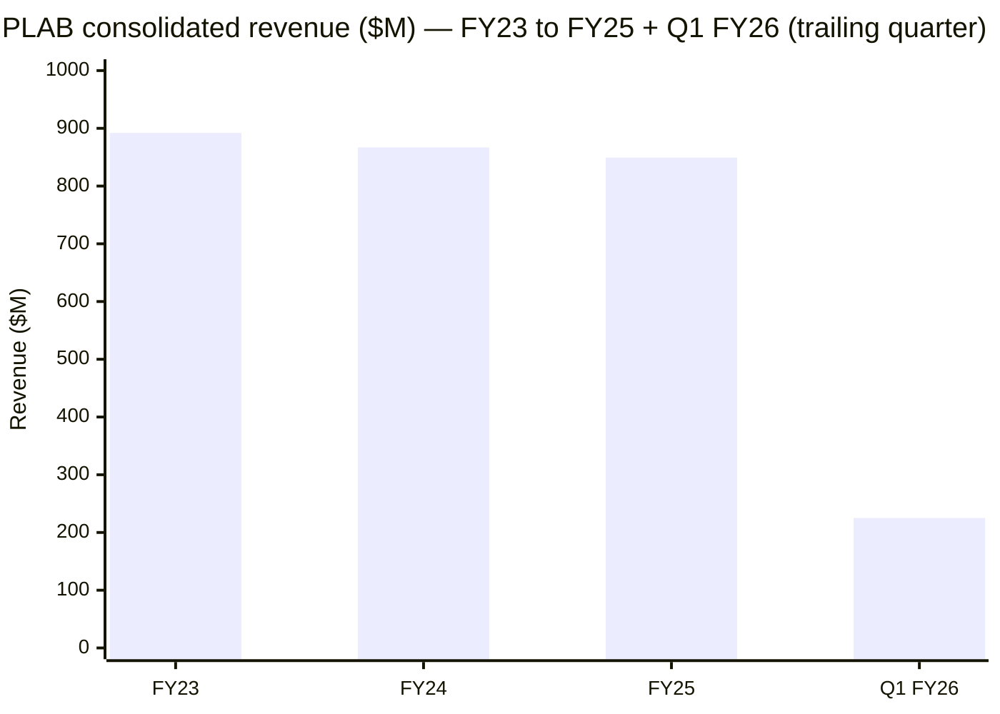
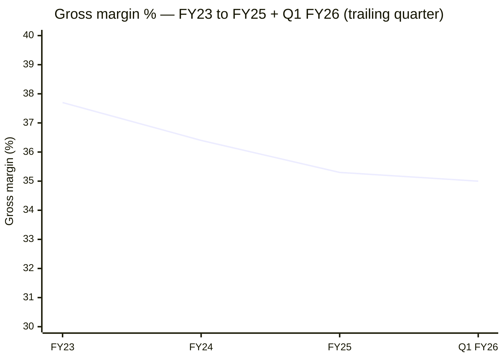
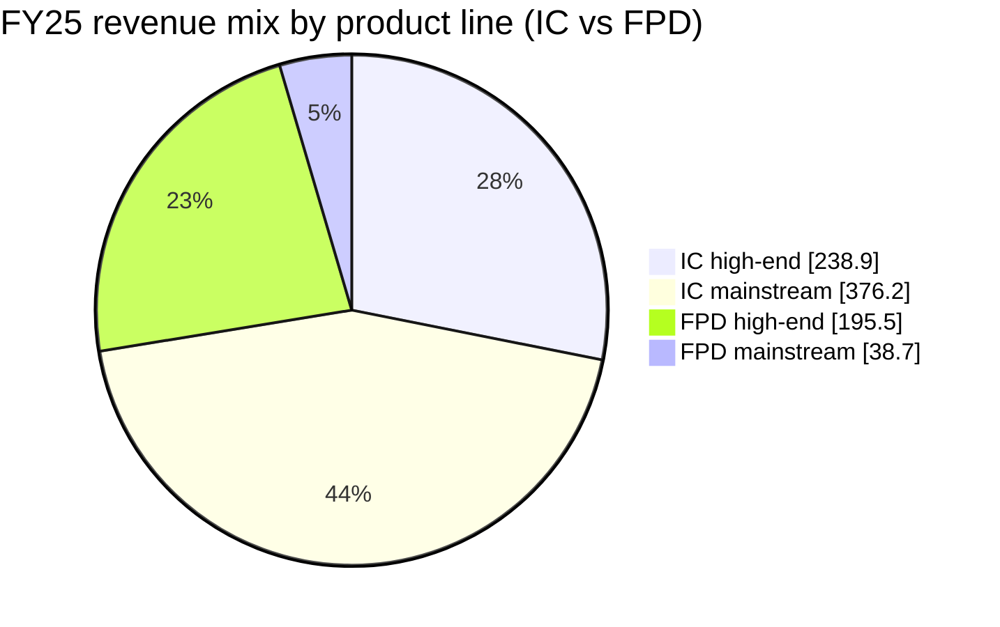

# Photronics, Inc. (PLAB) — SEC filings summary, FY24–FY25

**Period covered:** FY23 (period 2023-10-31) → Q1 FY26 (period 2026-02-01),
with the FY24 (period 2024-10-31) and FY25 (period 2025-10-31) 10-Ks as
the structured anchors.
**Generated:** 2026-05-25 from `db/financial_reports.db` via the
`sec-report-summary` skill (`--deep` extraction, Item 7 MD&A included).

Filings analyzed:

| Period end | Form | Filed | Notes |
|---|---|---|---|
| 2026-02-01 | [10-Q (Q1 FY26)](https://www.sec.gov/Archives/edgar/data/810136/000114036126009004/plab-20260201.htm) | 2026-03-11 | First quarter under new CEO George C. Macricostas |
| 2025-10-31 | [10-K (FY25)](https://www.sec.gov/Archives/edgar/data/810136/000114036125045801/ef20057458_10k.htm) | 2025-12-17 | Revenue $849.3M; first full year w/ CEO transition; PSMC license renewal in July 2025 |
| 2024-10-31 | [10-K (FY24)](https://www.sec.gov/Archives/edgar/data/810136/000114036124049881/ef20035608_10k.htm) | 2024-12-19 | Revenue $866.9M; final year as a Frank-Lee–led company |

Plus the FY25 Q4 earnings 8-K
([2025-12-10](https://www.sec.gov/Archives/edgar/data/810136/000114036125045083/ef20060918_ex99-1.htm))
and the May 2025 CEO-transition 8-Ks
([2025-05-02](https://www.sec.gov/Archives/edgar/data/810136/000114036125017153/ef20048414_8k.htm),
[2025-05-28](https://www.sec.gov/Archives/edgar/data/810136/000114036125020569/ef20049681_8k.htm)).

---

## Executive snapshot

The two charts above frame the past two annual filings: **revenue
compressed −2% per year FY23→FY24→FY25**, and **gross margin slid ~240bp
from 37.7% to 35.3%**, then stabilized in Q1 FY26 at 35.0%. Both
trends are about the **mainstream-IC photomask softness** that's
visible in the product-mix tables — high-end IC and FPD held up; the
mainstream IC line lost ~$33M FY25 vs FY24, partially offset by a 16%
lift in mainstream FPD (China G8 ramp).

Source: [PLAB 10-K FY25, Item 7 MD&A revenue-by-product-type table](https://www.sec.gov/Archives/edgar/data/810136/000114036125045801/ef20057458_10k.htm).

---

### FY25 10-K — [SEC EDGAR cover page](https://www.sec.gov/cgi-bin/browse-edgar?action=getcompany&CIK=0000810136&type=10-K&dateb=&owner=include&count=40) (filed 2025-12-17, period 2025-10-31, [local file](file:///Users/x/projects/financial_agent/financial_reports/PLAB/2025_10K_10-K_0001140361_25_045801.htm))

- **Business**: One reporting segment — photomask manufacturing — with two product lines (IC and FPD) and 11 facilities in Taiwan (3), China (2), South Korea (1), the U.S. (3), and Europe (2). Approximately 1,908 employees globally; ~636 customers in FY25. Photomasks are described as "high precision photographic quartz or glass plates containing microscopic images of electronic circuits" used as masters in IC and FPD lithography. The company defines its **high-end** range as ≤28nm for IC and Generation 10.5+ / AMOLED / LTPS for FPD; everything else is **mainstream**. Of FY25 revenue $849.3M, 82% came from non-U.S. operations. Top customers A/B/C contributed 16% / 13% / 8% of revenue; top-5 = 50%.
- **Key risks** (FY25 lens):
  1. **Tariff / Section 232 semiconductor probe** — new risk-factor language calling out the U.S. Commerce Section 232 investigation into semis and semicap.
  2. **China JV exposure** — the longstanding "operations in China expose us to substantial risks" factor, with a put/call mechanism on the DNP-Photronics PDMCX Xiamen JV that could force a buyout near book value with 3-day closing.
  3. **Customer concentration** — two largest customers = 29% of revenue; five largest = 50%, persistent for 3 years.
  4. **Capex burden** — FY26 capex guided to **~$330M** (vs. $188M FY25, $131M each in FY24/FY23) for high-end + mainstream "point" tools; outstanding capital commitments of $126.4M at FY25 close.
  5. **Foreign-currency translation** — FY25 saw $8.3M FX loss in P&L (vs. $2.2M gain FY24); the Taiwan dollar and Korean won swung adversely YTD then favorably in Q4.
- **New this year**:
  - **CEO transition** — Frank Lee stepped down as CEO May 28, 2025; **George C. Macricostas** (son of founder Constantine Macricostas) became Chairman & CEO. Lee continues as president of PDMC subsidiary; intent-to-retire disclosed in 8-K.
  - **Stepped-up buyback** — Board approved an additional $25M repurchase authorization in June 2025 on top of the August 2024 expansion to $100M. FY25 buybacks: **5.0M shares for $97.4M** (avg $19.52/share). Remaining authorization at FY25-end: $27.6M.
  - **Capex inflection** — FY26 guide of ~$330M is the largest single-year capex commitment in recent memory, more than doubling FY25's actual $188M.
  - **Deferred-tax valuation-allowance release** — Q4 FY25 brought a $16.7M release of a valuation allowance against deferred tax assets that pushed effective tax rate to **14.2%** YTD vs. 25.7% FY24.
  - **OBBB Act** — Photronics flagged the One Big Beautiful Bill Act (enacted July 4, 2025) as material to FY26 tax planning but did not quantify.

### FY24 10-K — [SEC EDGAR cover page](https://www.sec.gov/cgi-bin/browse-edgar?action=getcompany&CIK=0000810136&type=10-K&dateb=&owner=include&count=40) (filed 2024-12-19, period 2024-10-31, [local file](file:///Users/x/projects/financial_agent/financial_reports/PLAB/2024_10K_10-K_0001140361_24_049881.htm))

- **Business**: Same structural narrative — one segment, IC + FPD, 11 facilities. Revenue $866.9M (-2.8% YoY); 86% non-U.S.; 1,956 employees globally; ~648 customers; Customer A/B/C = 15% / 12% / 9%; top-5 = 50%. R&D = $16.6M (1.9% of revenue).
- **Key risks** (FY24 lens):
  1. **Customer concentration trend** — second consecutive year of top-5 = 50%.
  2. **Mainstream IC volume air-pocket** — FY24 IC mainstream revenue −10% YoY, the central source of the gross-margin compression that year.
  3. **China JV (PDMCX)** put/call provision.
  4. **Foreign-currency / hedging** — same recurring exposure; FY24 FX +$2.2M (vs. −$8.3M FY25).
  5. **EU Pillar Two** — first year called out as a tax-disclosure item.
- **New this year**:
  - **Buyback program enlarged** — Board approved an increase to $100M in August 2024 (from the residual $31.7M).
  - **Capex held flat** — FY24 capex $130.9M, in line with FY23's $131.3M. The big step-up to $330M does not appear until the FY25 10-K.

### Q1 FY26 10-Q — [SEC EDGAR cover page](https://www.sec.gov/cgi-bin/browse-edgar?action=getcompany&CIK=0000810136&type=10-Q&dateb=&owner=include&count=40) (filed 2026-03-11, period 2026-02-01, [local file](file:///Users/x/projects/financial_agent/financial_reports/PLAB/2026Q1_10-Q_0001140361_26_009004.htm))

- **Revenue $225.1M** — up 4.3% sequentially vs. Q4 FY25 and **+6.1% YoY**, the first growth quarter after multiple quarters of YoY declines. Driven by high-end IC (+19% YoY) and mainstream FPD (+51% YoY, China IT display market); IC mainstream flat; FPD high-end −5% YoY.
- **Gross margin 35.0%**, flat sequentially. Operating margin steady mid-20s.
- **First quarter under George C. Macricostas as CEO.** No new strategic disclosures beyond the FY25 10-K narrative. China revenue grew **+17% YoY** to $62.7M, signaling the local-foundry rebuild story is intact even after FY25 mainstream weakness.

---

## Changes over the years (FY23 → FY25, plus Q1 FY26 inflection)

1. **Revenue decay then trough.** $892M (FY23) → $867M (FY24) → $849M (FY25) → $225M Q1 FY26 (+6% YoY) — three years of −2% to −3% declines, with the Q1 FY26 print as the first YoY positive growth print since the FY23 peak. The arithmetic is entirely mainstream-IC: high-end IC grew every year, mainstream IC lost ~$80M cumulatively over 24 months.

2. **Gross margin slippage on mix, not pricing.** 37.7% (FY23) → 36.4% (FY24) → 35.3% (FY25). Management consistently attributes the ~240bp two-year decline to "unfavorable product mix" and "increased material costs," not ASP erosion.

3. **Capex doubling.** FY23 $131M → FY24 $131M → FY25 $188M → FY26 guided $330M. The step-up is the largest planned investment cycle the company has telegraphed since the China JVs were stood up in 2019. The narrative ties capex to high-end IC enablement and replacement of end-of-life mask-writing systems. Free cash flow will compress sharply in FY26.

4. **Capital return: buybacks not dividends.** Photronics has not paid a dividend since at least its modern history; instead, $97.4M of buybacks in FY25 (5.0M shares at $19.52 avg) following the August 2024 program expansion to $100M and the June 2025 $25M top-up. As of FY25-end $27.6M was still authorized.

5. **CEO succession.** **Frank Lee → George C. Macricostas (founder's son), effective May 28, 2025.** Lee retains the PDMC president title pending retirement. George's prior PLAB role was SVP responsible for IT infrastructure — a noticeably less operational background than Lee, who came from Fairchild/Intel/Siliconix and ran the Taiwan JV (PSMC predecessor) from 2006.

6. **CFO change.** Eric Rivera was appointed CFO May 23, 2024 (FY24) after serving as interim CFO since February 2024; he was named President January 12, 2026 in addition.

7. **Customer-concentration stability.** Top-5 customers have been 50%, 50%, 51% of revenue in FY25/FY24/FY23 respectively — the structure is steady, with the top two customers consistently >25% of revenue. The 10-K identifies customers only as "A, B, C" (not named).

8. **Geographic mix shifting marginally toward the US and China.** FY23 → FY25: Taiwan share of revenue 35% → 33%, China 28% → 26%, Korea 18% → 19%, U.S. 16% → 18%. Europe is small and shrinking (4%).

9. **Tax rate volatility.** Effective tax rate 26.0% (FY23) → 25.7% (FY24) → 14.2% (FY25) — the FY25 step-down is driven by a one-time $16.7M valuation-allowance release in Q4 plus $2.8M of uncertain-tax-position reversals. Normalized FY26+ rate is expected back near 25%.

10. **Risk-factor evolution.** FY25 brought new language around the **U.S. Section 232 tariff investigation** on semis and semicap and the **OBBB Act**'s federal tax-law changes. The China-JV put-call risk has persisted unchanged; the cyber and ESG risk-factor language is largely unchanged from FY24.

---

## Notes on segment reporting

PLAB **operates as a single reporting segment under ASC 280**: there is no separately reported "IC" or "FPD" segment in the financial statements — the IC vs. FPD breakdown comes from the **revenue disaggregation table inside Item 7 MD&A**, not from segment notes. Customer-concentration metrics likewise are entity-wide. This single-segment posture is unusual for a company that operates with two product lines, two distinct customer bases, and largely separate manufacturing footprints (FPD R&D is in Korea, IC R&D in Idaho).

## Notes on joint-venture consolidation

- **PDMCX (Xiamen, China)** — 50.01% Photronics / 49.99% DNP. Established Jan 2018; consolidated as a VIE in Photronics' financials because Photronics controls the board and bears the obligation to absorb losses / right to receive benefits. Net assets $320.9M at FY25-end (Photronics' share $160.5M). FY25 net income contribution: $19.5M.
- **Taiwan IC JV (Photronics-DNP joint venture, originally Photronics Semiconductor Mask Corporation / PSMC)** — formed November 2013 with DNP. The 10-K notes Photronics' Taiwan-based and China-based JV IC facilities are the main sources of the **noncontrolling-interest line** in the consolidated income statement; NCI net income was $53.8M in FY25 (out of $190.2M consolidated net income), implying meaningful DNP economic interest in the consolidated results.

All competitor lists, JV mechanics, customer-concentration numbers, and geographic mix in the company-research report rest on the FY25 10-K extract above.
