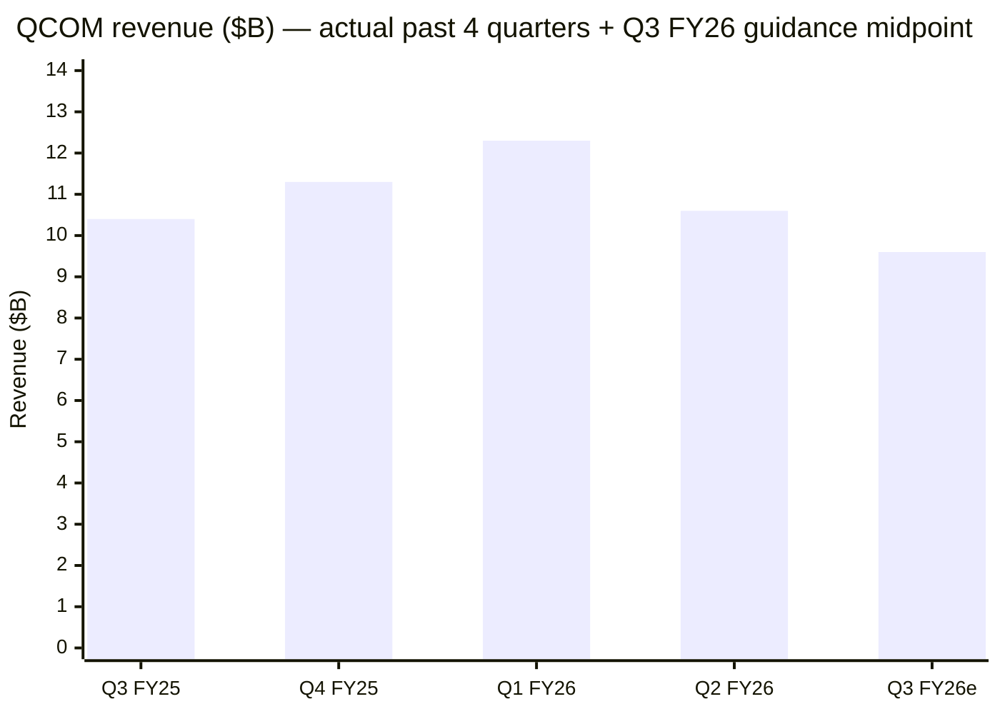
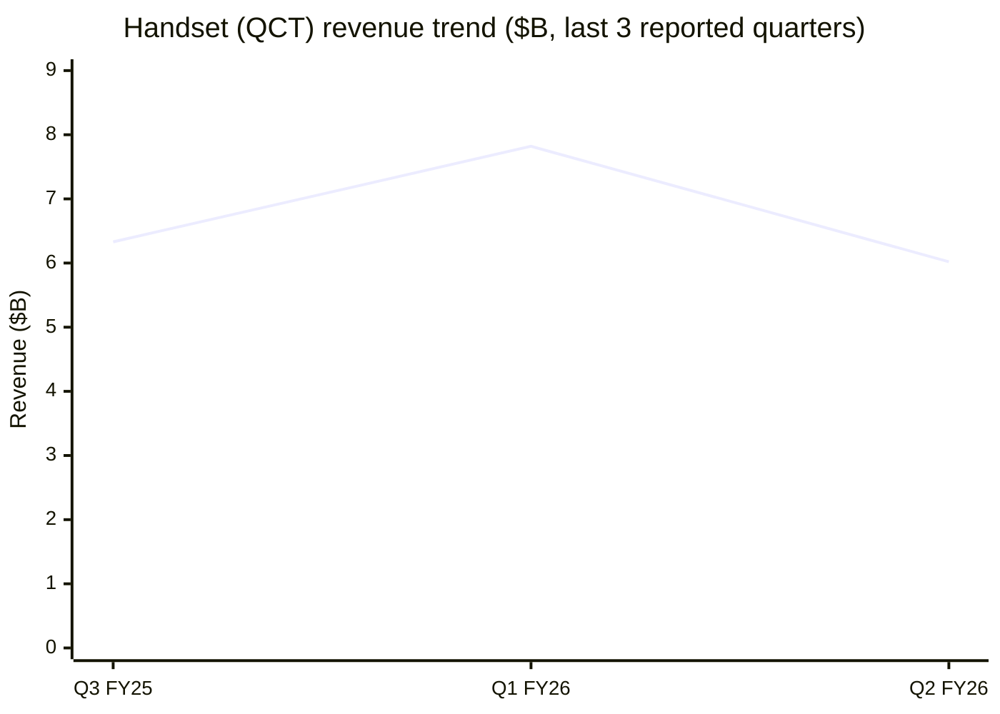
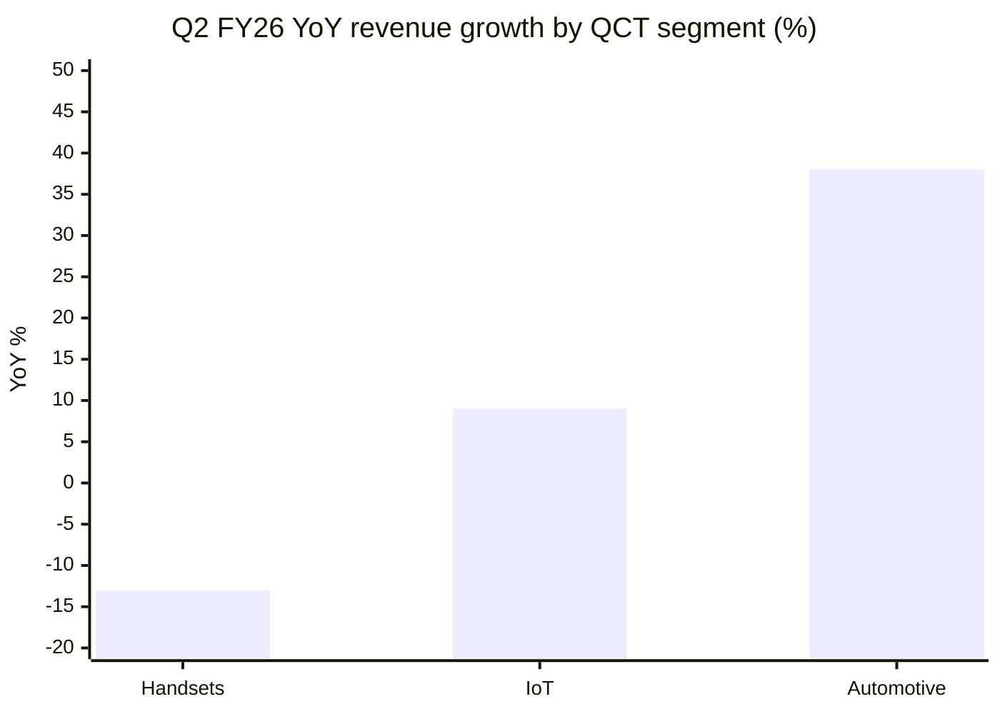
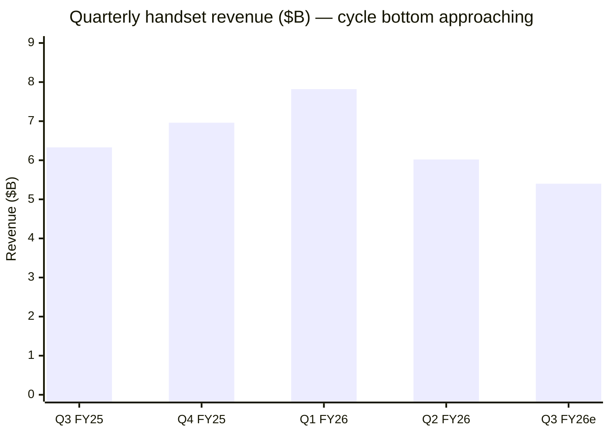
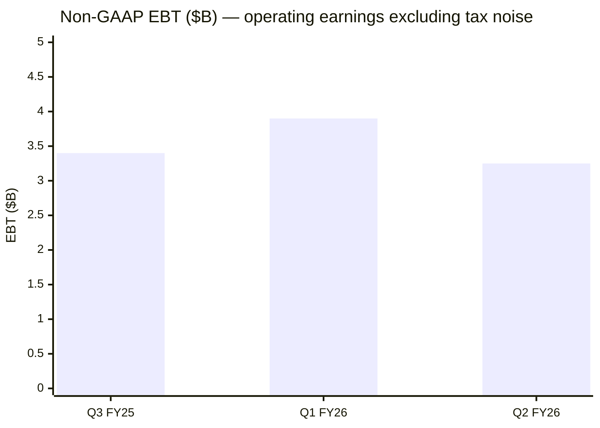
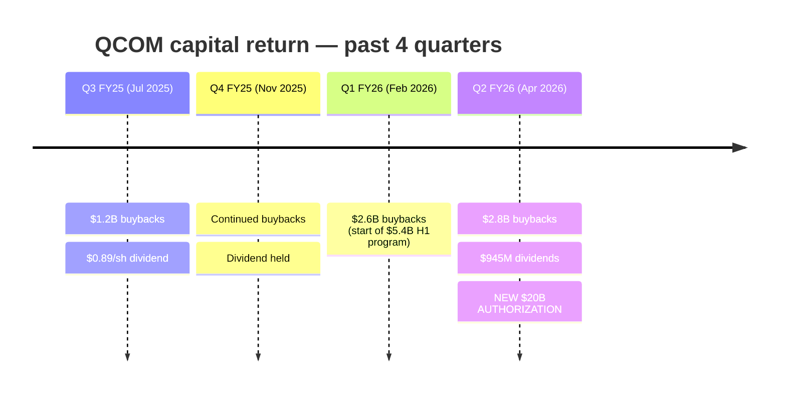
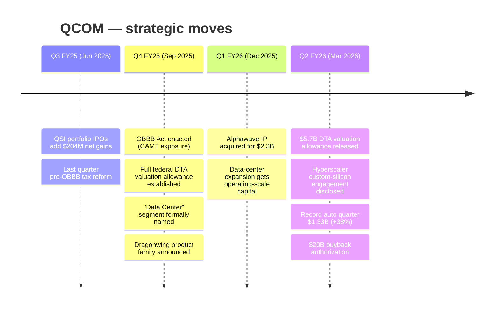
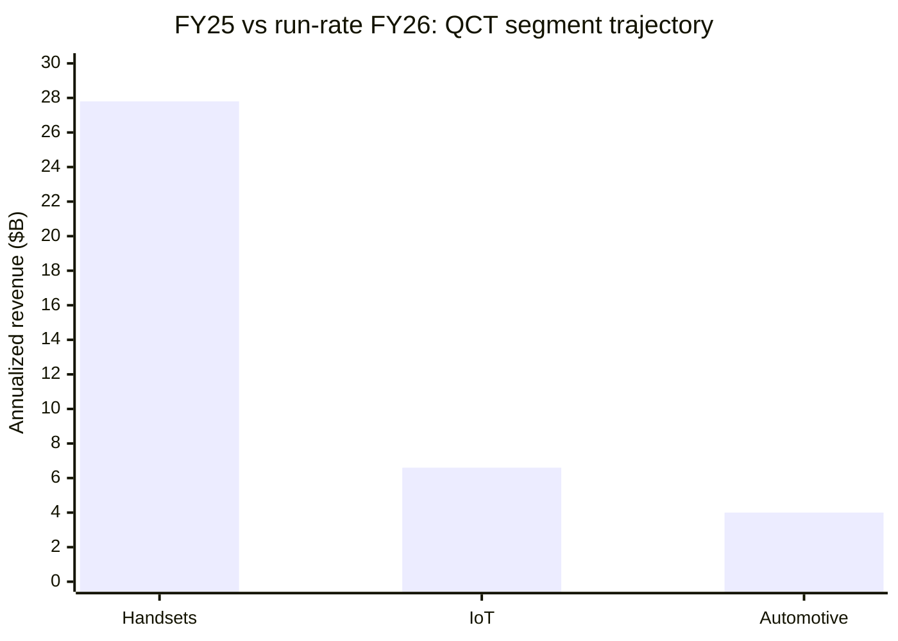

# Qualcomm Inc. (QCOM) — Past-Year SEC Filings, Revenue, Income & Prospect

**Period covered:** FY25 Q3 (Jun 2025) → FY26 Q2 (Mar 2026), plus the
forward guidance issued with Q2 FY26 earnings on Apr 29 2026.
**Generated:** 2026-05-11 from `db/financial_reports.db` via the
`sec-report-summary` skill (`--deep` extraction, Item 7 MD&A included
for the 10-K).

Filings analyzed:

| Period end | Form | Filed | Notes |
|---|---|---|---|
| 2026-03-29 | 10-Q (Q2 FY26) | 2026-04-29 | $5.7B DTA release, $20B buyback auth |
| 2025-12-28 | 10-Q (Q1 FY26) | 2026-02-04 | Alphawave acq. closed Dec 18 2025 |
| 2025-09-28 | 10-K (FY25 / Q4) | 2025-11-05 | Data Center segment named, OBBB enacted |
| 2025-06-29 | 10-Q (Q3 FY25) | 2025-07-30 | Pre-tax-reform clean quarter |

Plus the four accompanying earnings 8-Ks (ids 23189, 7347, 7348, 7349)
where management guidance for the *next* quarter lives.

---

## Executive snapshot

The "Handsets" line above — peaked at $7.8B in seasonal-strong Q1 FY26,
then collapsed to $6.0B in Q2 FY26 (-13% YoY). The headline story for
the past four quarters is **handset cyclicality compressing, auto and
IoT diversification compounding**.

Automotive set a **record quarter** in Q2 FY26 ($1.33B, +38% YoY).
Combined "Auto + IoT" grew 20% YoY — the diversification line management
quoted in the earnings 8-K.

---

## Revenue: the last four quarters

| Quarter | Total rev | YoY | QCT | QTL | Net income (GAAP) | Non-GAAP EPS |
|---|---:|---:|---:|---:|---:|---:|
| Q3 FY25 (Jun 29 2025) | **$10.37B** | +10% | $9.0B | $1.31B | $2.7B (+25%) | n/a |
| Q4 FY25 (Sep 28 2025)¹ | **~$11.27B** | n/a | ~$9.83B | ~$1.36B | n/a | n/a |
| Q1 FY26 (Dec 28 2025) | **$12.25B** | +5% | $10.61B | $1.79B | $3.0B (-6%) | n/a |
| Q2 FY26 (Mar 29 2026) | **$10.60B** | -3% | $9.08B | $1.38B | $7.37B (+162%)² | $2.65 (-10%) |
| **Q3 FY26 guide** | **$9.2-10.0B** | -8 to -1% | $7.9-8.5B | n/a | n/a | n/a |

¹ FY25 full year was $44.3B; Q4 implied by FY25 − first 9 months reported in the Q3 FY25 10-Q.
² Q2 FY26 net income includes a $5.7B one-time tax benefit ($5.33 EPS); ex-tax, operating earnings were roughly flat YoY.

**Segment revenue ($M):**

| QCT stream | Q3 FY25 | Q4 FY25¹ | Q1 FY26 | Q2 FY26 |
|---|---:|---:|---:|---:|
| Handsets | 6,328 | ~6,962 | 7,824 | 6,024 |
| Automotive | 984 | ~1,053 | 1,101 | 1,326 |
| IoT | 1,681 | ~1,806 | 1,688 | 1,726 |

¹ Q4 FY25 implied from FY25 full-year minus first 9 months.

Q3 FY26e ≈ $5.4B handset implied by the QCT $7.9-8.5B guide minus
~$1.4B auto and ~$1.7B IoT (assumes auto/IoT hold or grow). The Q2
FY26 8-K explicitly says **"QCT handset revenues from Chinese customers
will reach a bottom in the third quarter and return to sequential
growth in the following quarter"** — i.e., Q3 FY26 is the trough,
Q4 FY26 inflects.

---

## Income & margins: where the story is

GAAP net income for Q2 FY26 looks heroic at +162% YoY, but the +$5.7B
deferred-tax valuation allowance release does all the work. On
**non-GAAP, EBT fell 12% YoY** in Q2 FY26 ($3.25B vs $3.69B) and
non-GAAP EPS was **-10% YoY** ($2.65 vs $2.94). The underlying
operating business is decelerating, not accelerating.

**Where margins stand (Q2 FY26 vs Q2 FY25):**

| Segment | Q2 FY26 EBT margin | Q2 FY25 EBT margin | Δ |
|---|---:|---:|---:|
| QCT (semis) | 27% | 30% | **-3 pt** |
| QTL (licensing) | 72% | 70% | +2 pt |
| Consolidated GAAP | 21% | 28% | -7 pt |
| Gross margin | 54% | 55% | -1 pt |
| R&D / revenue | **23%** | 20% | +3 pt |
| SG&A / revenue | 8% | 6% | +2 pt |

**Two distinct margin pressures:**

1. **QCT mix shift** — Handsets are the highest-revenue, premium-priced
   QCT stream. Their share dropped from 73% of QCT (Q1 FY26) to 66% (Q2
   FY26). Auto and IoT are growing fast but at lower ASPs and (per
   management) lower QCT segment margin. The -3pt QCT margin
   compression is the direct cost of diversification.
2. **OpEx step-up** — R&D rose to 23% of revenue (+3pt) and SG&A to 8%
   (+2pt). Both are explicitly tied to the new **two-year equity
   incentive program** for non-executive leadership (a $150M+ quarterly
   headwind), plus Alphawave acquisition expenses.

---

## Capital return — accelerating

The new **$20B buyback authorization** announced with Q2 FY26 results
is the biggest signal in the past year. With H1 FY26 buybacks of $5.4B
already running, $20B implies roughly 3 years of buying at current
pace, or ~12% of the current market cap. Management is choosing return
of capital over additional M&A.

---

## Strategic events of the past year

**Per-quarter highlights:**

### Q2 FY26 (Mar 29 2026) — first revenue decline of the cycle
- Revenue **-3% YoY** breaks a +10% / +5% growth streak.
- Handsets -13% YoY (Chinese OEMs softened, premium tier maturing).
- Auto +38% YoY = **record auto quarter**.
- CEO Cristiano Amon: "rise of AI agents is reshaping our roadmap";
  **"leading hyperscaler custom silicon engagement on track for
  initial shipments later this calendar year"** — first explicit
  customer signal for the Data Center business.
- $5.7B tax benefit from DTA valuation allowance release.
- $20B buyback authorization, $945M dividend, $2.8B repurchases.
- New language in risk factors: explicit tariff and export-control
  exposure in the customer-concentration risk paragraph.

### Q1 FY26 (Dec 28 2025) — seasonal peak + capital deployment
- Revenue **$12.25B (+5% YoY)** — seasonal high for premium Android
  launches.
- All three QCT streams up (handsets +3%, auto +15%, IoT +9% YoY).
- **Alphawave IP closed December 18 2025 for $2.3B** — explicit
  "expansion into data centers." First operating-scale acquisition
  since the failed NXP attempt years ago.
- New OBBB tax line items appear; full-year FY26 effective tax rate
  guided to ~15% under CAMT regime.

### FY25 10-K (period ended Sep 28 2025) — narrative rewrite
- Item 1 reframes the company: "global technology leader, helping to
  bring intelligent computing everywhere through on-device AI,
  high-performance and low-power computing and advanced wireless
  connectivity." Wireless is no longer the lead-in.
- New **Dragonwing** product family appears alongside Snapdragon.
- **Data Center** promoted from "cloud computing processing
  initiative" to a named nonreportable segment.
- FY25 segment results: Handsets $27.8B (+12%), Automotive $4.0B
  (+36%), IoT $6.6B (+22%), QCT total $38.4B (+16%), QCT EBT margin
  30% (+1 pt).
- OBBB Act enacted in the fourth quarter → full DTA valuation
  allowance established.
- Item 7 (MD&A — now visible since the new extractor includes it)
  details $2.5B of the Handsets growth came from higher revenue per
  chipset (premium Android ASP + favorable mix), only $423M from
  higher unit shipments.

### Q3 FY25 (Jun 29 2025) — cleanest quarter
- Revenue **$10.37B (+10% YoY)**, net income $2.7B (+25% YoY).
- QCT +11% across all three streams.
- $204M of "other income" from **QSI portfolio company IPOs**.
- Last quarter under the old tax regime; FDII benefit intact.

---

## Revenue, income & prospect

### What management says about the next quarter
- **Q3 FY26 revenue guide: $9.2-10.0B (midpoint $9.6B)** — down 9%
  sequentially and 7% from the year-ago $10.37B. The first
  *guidance-implied YoY decline* of the cycle.
- **QCT guide: $7.9-8.5B** — implies handsets roughly $5.4B at mid,
  the trough. Auto/IoT held flat-to-up.
- **Memory supply constraints** are the explicit headwind: DRAM/NAND
  costs are pressuring handset OEM demand. Management quotes this
  as a near-term, not structural, issue.
- **"Chinese customer handset revenues will reach a bottom in Q3 FY26
  and return to sequential growth in Q4 FY26"** — the cycle inflects
  at the end of this fiscal year.

### What the medium-term thesis depends on

(Bars = FY25 full year. Going forward: handsets flat-to-down on
maturity + memory pressure; IoT mid-single-digit growth on edge AI; auto
maintaining ~30%+ growth on Snapdragon Digital Chassis wins.)

**Growth pillars management is now anchoring to:**
1. **Automotive Digital Chassis** — $4.0B FY25, on track to be a
   multi-billion-dollar grower at industry-leading growth rates;
   record quarter Q2 FY26 at +38% YoY.
2. **Data Center / Alphawave** — newly named, +$97M Q2 FY26
   contribution, hyperscaler custom-silicon engagement disclosed with
   "initial shipments later this calendar year." Investor Day on
   **June 24 2026** is set to detail the addressable market.
3. **On-device AI (Copilot+ PCs, edge inference)** — referenced
   throughout but not yet broken out as a revenue line.
4. **QTL licensing** — quietly the highest-margin business at 72% EBT
   margin and still growing ~5% YoY on favorable mix.

**Risks to that thesis (lifted from the Q2 FY26 10-Q Item 1A):**
- Apple's in-house modem program (Apple now buys only thin modems,
  margin-dilutive to QCT).
- Samsung in-house Exynos vertical-integration.
- Chinese OEM concentration + tariffs / export controls (now in the
  lead paragraph of the customer-concentration risk).
- Arm licensing dispute resurfacing if rate-renegotiation talks fail.
- QCT margin compression from the diversification mix shift —
  structural, not cyclical.

### Bottom line on revenue & income prospect

- **Near term (1-2 quarters):** Revenue decelerates to outright
  decline in Q3 FY26 (~-7% YoY at midpoint), recovering sequentially
  in Q4 FY26 as Chinese handset demand bottoms. Non-GAAP EPS will
  likely be down YoY all of FY26 H2 on the OpEx step-up and QCT
  margin compression.
- **Tax noise:** GAAP earnings will look distorted through end of
  FY26 because of the lapping of the Q2 FY26 $5.7B DTA release. Use
  non-GAAP / cash earnings to track operating reality.
- **Medium term (FY27+):** Bull case is the auto + data-center
  combination delivers $7-10B of incremental revenue at industry
  growth rates, while handsets remain a high-cash-flow cyclical
  contributor. Bear case is QCT margin compression continues, Apple
  exits the modem relationship faster than expected, and the
  data-center hyperscaler engagement remains a single-customer
  concentration.
- **Capital return is the floor:** $20B authorization + $3.5B+ annual
  dividends = effectively 5-6% of market cap returned annually at
  current levels, providing a real shareholder-yield support even if
  growth stalls.
- **Watch June 24 2026 Investor Day** — management has explicitly
  pre-committed to providing growth-initiative details (Data Center,
  Physical AI) that day. That's the next major narrative inflection.
