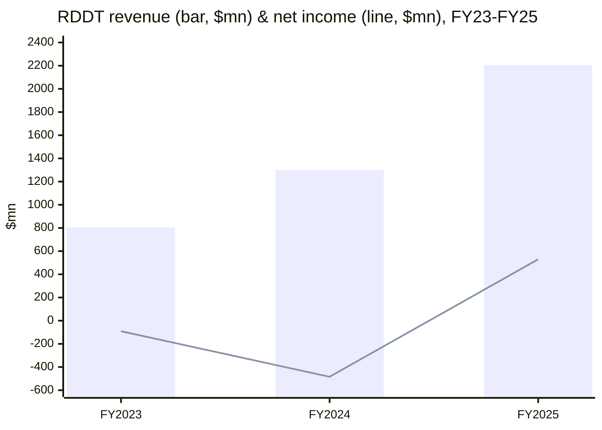
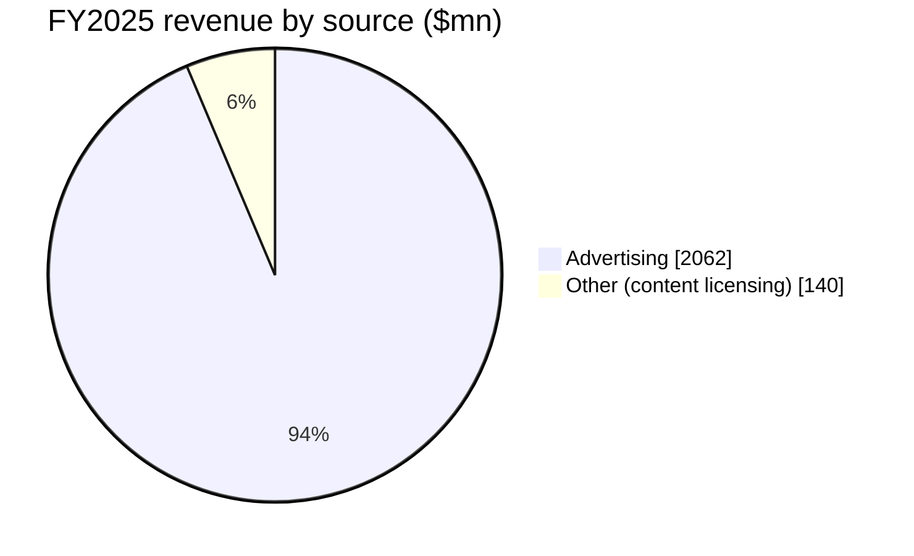

# Reddit, Inc. (RDDT) — SEC filings summary, 2024–2025

*Generated via the sec-report-summary skill · as of 2026-06-14 · filings reviewed: 2× 10-K (FY2024, FY2025). Reddit IPO'd in March 2024, so its annual-filing history begins with the FY2024 10-K; the multi-year trajectory below is necessarily a 2-year window, supplemented by the March 2024 S-1/424B4 prospectus and the Q1 2026 8-K where it sharpens the "what changed" read.*

> **Thesis (FY24→FY25): inflected from loss-making to durably profitable, with the ad engine doing all the heavy lifting and the AI data-licensing story stalling.** Revenue grew +62% (FY24) then +69% to .20bn (FY25), but the decisive swing was the P&L flipping from a ((484.3)mn net loss to +.7mn net income as the IPO-driven stock-comp catch-up rolled off ([FY25 10-K](https://www.sec.gov/Archives/edgar/data/1713445/000171344526000022/rddt-20251231.htm)). Advertising widened to ~94% of revenue (from ~91%), while content-licensing "Other revenue" — the AI angle — flattened at 0.0mn (6.4% of revenue), with management re-framing it from "licensing deals" to "partnerships." Two net-new risk categories appeared: an FTC AI-data inquiry (first surfaced March 2024, escalated in FY25) and a June-2025 securities class action over Google AI Overviews' traffic impact. Capital-return policy turned on for the first time: a B buyback authorized February 2026.

---

## Cross-year revenue delta table (single operating segment — disaggregated by source)

Reddit reports a **single operating segment** ([FY25 10-K, Note 2 — Segments](https://www.sec.gov/Archives/edgar/data/1713445/000171344526000022/rddt-20251231.htm)); the only disaggregation the filing gives is by revenue source and by geography.

| Revenue line | FY25 | FY24 | YoY % | Driver |
|---|---|---|---|---|
| Advertising | ,062.5mn | ,185.5mn | +74% | impressions + pricing, ad-tech (Reddit Max, auto-bidding) ([FY25 10-K, Note 3](https://www.sec.gov/Archives/edgar/data/1713445/000171344526000022/rddt-20251231.htm)) |
| Other (content licensing + Premium) | 0.0mn | 4.7mn | +22% | content-licensing deals signed 2024–25, then flat ([FY25 10-K, Note 3](https://www.sec.gov/Archives/edgar/data/1713445/000171344526000022/rddt-20251231.htm)) |
| **Total revenue** | **,202.5mn** | **,300.2mn** | **+69%** | ad-led |
| — United States | ,785.6mn | ,063.6mn | +68% | US ARPU monetization ([FY25 10-K, Note 3](https://www.sec.gov/Archives/edgar/data/1713445/000171344526000022/rddt-20251231.htm)) |
| — Rest of world | 7.0mn | 6.6mn | +76% | translation-driven intl DAUq +28% ([FY25 10-K, Note 3](https://www.sec.gov/Archives/edgar/data/1713445/000171344526000022/rddt-20251231.htm)) |

---

### FY2025 10-K — [SEC EDGAR](https://www.sec.gov/cgi-bin/browse-edgar?action=getcompany&CIK=RDDT&type=10-K) (filed 2026-02-06, period 2025-12-31, [local file](file:///Users/x/projects/financial_agent/financial_reports/RDDT/2025_10K_10-K_0001713445_26_000022.htm))

- **Business**: Reddit operates a community platform (subreddits) monetized primarily through contextual/interest-based advertising, with a secondary content-licensing line selling access to its human-generated corpus for AI/LLM use. FY2025 revenue ,202.5mn (+69% YoY), gross margin 91.2%, operating income .0mn (20% margin), net income .7mn — its first full-year GAAP profit ([FY25 10-K, Item 7 MD&A — Highlights of 2025 Results](https://www.sec.gov/Archives/edgar/data/1713445/000171344526000022/rddt-20251231.htm)). Q4 DAUq 121.4mn (+19% YoY), Q4 ARPU .98 (+42% YoY). 2,555 employees (1,981 US).
- **Key risks**:
  - `ESCALATED` (AI / AI-regulation): the FTC's non-public inquiry into Reddit's sale/licensing of user content to train AI models — first disclosed in the FY24 10-K (letter received March 2024) — persists; FY25 adds that the FTC separately held a Feb-2025 public comment period on content-moderation/de-platforming in which Reddit was named ([FY25 10-K, Item 1A](https://www.sec.gov/Archives/edgar/data/1713445/000171344526000022/rddt-20251231.htm)).
  - `ADDED` (litigation): a June-2025 securities class action in N.D. Cal. alleging false/misleading statements about the impact of Google Search and its AI Overviews feature on Reddit's business, plus follow-on derivative suits ([FY25 10-K, Note 11 — Commitments & Contingencies](https://www.sec.gov/Archives/edgar/data/1713445/000171344526000022/rddt-20251231.htm)). This is the single most thesis-relevant new risk — it ties Reddit's logged-out (search-sourced) traffic directly to Google's AI product roadmap.
  - `ESCALATED` (content-licensing concentration): "substantially all of the contract value associated with our licensing revenue is derived from two of our partners" — unchanged language but now material as Other revenue scaled to 0mn ([FY25 10-K, Item 1A](https://www.sec.gov/Archives/edgar/data/1713445/000171344526000022/rddt-20251231.htm)).
  - `ESCALATED` (platform dependence): an Oct-20-2025 AWS outage that rendered Reddit temporarily inaccessible is newly cited as a concrete example of CSP-concentration risk (AWS + Google Cloud) ([FY25 10-K, Item 1A](https://www.sec.gov/Archives/edgar/data/1713445/000171344526000022/rddt-20251231.htm)).
  - (persisting) DAUq volatility / Google-search dependence for logged-out traffic; content-moderation and moderator-volunteer reliance; dual-class control.
- **New this year**:
  - First full-year **GAAP net income** (.7mn vs ((484.3)mn) — accumulated deficit shrank from ((1,200.8)mn to ((671.1)mn ([FY25 10-K, Consolidated Balance Sheets](https://www.sec.gov/Archives/edgar/data/1713445/000171344526000022/rddt-20251231.htm)).
  - **B share-repurchase program** authorized February 2026 — Reddit's first capital-return policy ([FY25 10-K, Item 1A / Subsequent Events](https://www.sec.gov/Archives/edgar/data/1713445/000171344526000022/rddt-20251231.htm)).
  - Metric change announced: **logged-in vs logged-out DAUq reporting to be retired** beginning Q3 2026 quarter (engagement, not login status, drives the business) ([FY25 10-K, Item 7 MD&A](https://www.sec.gov/Archives/edgar/data/1713445/000171344526000022/rddt-20251231.htm)).
  - Reddit Answers (AI conversational search) integrated into core search; >80mn weekly searchers in Q4 2025 ([FY25 10-K, Item 1 — Reddit as a Search Destination](https://www.sec.gov/Archives/edgar/data/1713445/000171344526000022/rddt-20251231.htm)).

### FY2024 10-K — [SEC EDGAR](https://www.sec.gov/cgi-bin/browse-edgar?action=getcompany&CIK=RDDT&type=10-K) (filed 2025-02-13, period 2024-12-31, [local file](file:///Users/x/projects/financial_agent/financial_reports/RDDT/2024_10K_10-K_0001713445_25_000018.htm))

- **Business**: First annual report as a public company (IPO March 2024 at /share). FY2024 revenue ,300.2mn (+62% YoY); net loss ((484.3)mn — driven by an IPO-triggered cumulative stock-based-comp catch-up (RSUs with a liquidity-based vesting condition). Q4 DAUq 101.7mn (+39% YoY), Q4 ARPU .21 ([FY24 10-K, Item 7 MD&A](https://www.sec.gov/Archives/edgar/data/1713445/000171344525000018/rddt-20241231.htm)).
- **Key risks**:
  - `ADDED` (AI / AI-regulation): first disclosure of the **FTC non-public inquiry** (letter received March 2024) into Reddit's sale/licensing/sharing of user-generated content to train AI models ([FY24 10-K, Item 1A](https://www.sec.gov/Archives/edgar/data/1713445/000171344525000018/rddt-20241231.htm)).
  - `ADDED` (content-licensing novelty): "novel business model without an established track record"; "substantially all of the contract value... derived from two of our partners" ([FY24 10-K, Item 1A](https://www.sec.gov/Archives/edgar/data/1713445/000171344525000018/rddt-20241231.htm)).
  - (baseline) history of net losses; advertiser concentration (top-10 advertisers ~25% of FY24 revenue); Google-search traffic dependence; dual-class control by CEO Huffman + Advance.
- **New this year** (vs the S-1 baseline): first audited public-company financials; content-licensing revenue stepped from .2mn (FY23) to 4.7mn (FY24) on the January-2024 deals.

---

## Forward guidance & capital-return deltas (Section 3b)

- **Capital return** `OLD → NEW`: **none → B buyback** authorized Feb-2026 (no fixed timeline/expiration, opportunistic) ([FY25 10-K](https://www.sec.gov/Archives/edgar/data/1713445/000171344526000022/rddt-20251231.htm)). No dividend. As of Q4 2025, no shares had yet been repurchased.
- **Capex outlook** `OLD → NEW`: structurally negligible and unchanged — Reddit runs on third-party CSPs (AWS + Google Cloud), so FY25 capex was just .7mn (0.3% of revenue) vs .2mn FY24 ([FY25 10-K, Free Cash Flow reconciliation](https://www.sec.gov/Archives/edgar/data/1713445/000171344526000022/rddt-20251231.htm)). FCF .2mn (FY25) vs .8mn (FY24).
- **Forward revenue guidance**: 10-Ks carry no explicit annual guidance; the Q1 2026 8-K (filed 2026-04-30) guided Q2 2026 — Reddit posted Q1 2026 revenue 3mn (+69% YoY), net income 4mn, Adj. EBITDA 6mn (40% margin), DAUq 126.8mn (+17% YoY) ([Q1 2026 8-K Ex-99.2 shareholder letter](https://www.sec.gov/cgi-bin/browse-edgar?action=getcompany&CIK=RDDT&type=8-K)).
- **Liquidity** `OLD → NEW`: 0mn five-year revolver entered Oct-2021 was **amended/restated July-2025 to a 0mn five-year facility** (.7mn available at year-end after .3mn of letters of credit) ([FY25 10-K, Item 7 — Liquidity](https://www.sec.gov/Archives/edgar/data/1713445/000171344526000022/rddt-20251231.htm)). Cash + marketable securities .5bn (FY25-end), .77bn by Q1-2026-end.

---

## Changes over the years (ranked by thesis impact)

1. **Profitability inflection — the headline signal.** Net income swung **((484.3)mn (FY24) → +.7mn (FY25)**, the first full-year GAAP profit, as the IPO stock-comp catch-up rolled off (R&D expense alone fell ((152.0)mn YoY, −16%, almost entirely on lower SBC) ([FY25 10-K, Item 7 MD&A](https://www.sec.gov/Archives/edgar/data/1713445/000171344526000022/rddt-20251231.htm)). Adj. EBITDA roughly tripled, 8.0mn → 5.1mn.
2. **The AI data-licensing story stalled — first time the "two partners" concentration became the story.** Other (content-licensing) revenue scaled from .2mn (FY23) → 4.7mn (FY24) → 0.0mn (FY25), but sequential growth flattened to ~6mn/quarter through 2025 with no new deal signed; management re-framed "licensing deals" as "partnerships," and the June-2025 securities class action explicitly ties Reddit's search-sourced traffic to Google's AI Overviews ([FY25 10-K, Note 11](https://www.sec.gov/Archives/edgar/data/1713445/000171344526000022/rddt-20251231.htm)). This is the central debate: an ad company with an unproven AI option, not yet an AI company.
3. **Advertiser concentration eased while ad-mix deepened.** Top-10 advertisers fell from **~25% (FY24) → ~21% (FY25)** of revenue even as advertising widened from ~91% → ~94% of the mix — i.e., the ad base broadened (advertiser count +75% YoY in Q4) while the company grew more ad-dependent ([FY25 10-K, Item 1A](https://www.sec.gov/Archives/edgar/data/1713445/000171344526000022/rddt-20251231.htm)).
4. **Capital-return policy turned on** (none → B buyback, Feb-2026) — the maturity marker that Reddit now generates enough FCF (.2mn FY25) to return cash ([FY25 10-K](https://www.sec.gov/Archives/edgar/data/1713445/000171344526000022/rddt-20251231.htm)).
5. **User-metric framework changing**: logged-in/logged-out DAUq to be retired Q3 2026; focus shifts to total/geographic DAUq + WAUq and on-platform Search (Reddit Answers) as a new engagement surface ([FY25 10-K, Item 7](https://www.sec.gov/Archives/edgar/data/1713445/000171344526000022/rddt-20251231.htm)).

**Further viewing**
- [Reddit's IPO and business model explained (CNBC) — visualizes how subreddits + contextual ads + data licensing fit together](https://www.youtube.com/watch?v=8M0_M-2xHxk)

Verification log — 2026-06-14

Spot-checks (string-match against extracted filing text):
- "Net income (loss) was 9.7 million for the year ended December 31, 2025, as compared to (484.3) million": ✓ string-matches FY25 10-K Item 7.
- "Revenue ... increased by 2.3 million, or 69%": ✓ FY25 10-K Item 7. Total revenue ,202,506 thousand: ✓ FY25 10-K Note 3.
- "Advertising revenue ,062,480 / Other revenue 0,026 (FY25); ,185,456 / 4,749 (FY24); 8,782 / 15,247 (FY23)": ✓ FY25 10-K Note 3.
- "top ten largest advertisers accounting for approximately 21% and 25% of our revenue for the years ended December 31, 2025 and 2024": ✓ FY25 10-K Item 1A.
- "Daily Active Uniques ... were 121.4 million for the three months ended December 31, 2025, an increase of 19%" and "ARPU ... was .98 ... an increase of 42%": ✓ FY25 10-K Item 7. FY24 "DAUq ... 101.7 million ... increase of 39%" + "ARPU ... .21": ✓ FY24 10-K Item 7.
- "substantially all of the contract value associated with our licensing revenue is derived from two of our partners": ✓ both 10-Ks Item 1A.
- "FTC ... non-public inquiry focused on our sale, licensing, or sharing of user-generated content" (FY24 received March 2024): ✓ FY24 10-K Item 1A.
- "securities class action ... concerning the impact of Google Search and its AI Overviews feature" (June 2025): ✓ FY25 10-K Note 11.
- B buyback Feb-2026: ✓ FY25 10-K Item 1A. FCF .2mn / capex .7mn FY25: ✓ FY25 10-K FCF reconciliation.
- Q1 2026 (663 / 204 / 266 / 126.8): ✓ Q1 2026 8-K Ex-99.2.

Residual: only 2 annual filings exist (post-March-2024 IPO), so the cross-year window is FY24→FY25 (FY23 comparatives drawn from the FY25 10-K's 3-year statements). SEC EDGAR base-listing links used for the per-filing headers; the deep-link FY25/FY24 primary-document URLs (rddt-20251231.htm / rddt-20241231.htm) were resolved from the EDGAR submissions JSON (CIK 0001713445).

