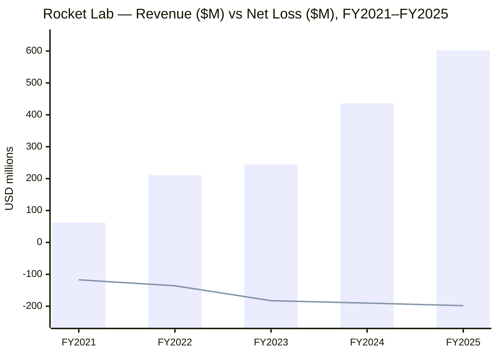
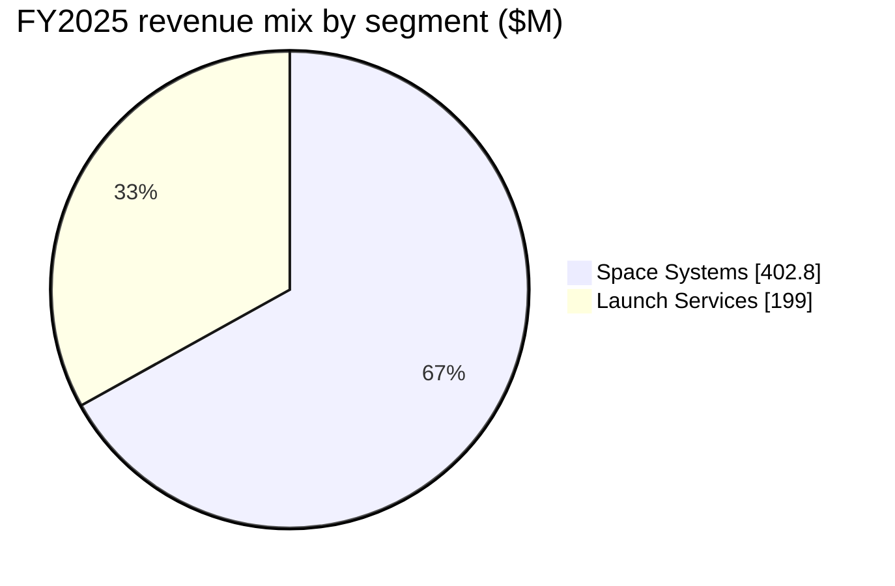
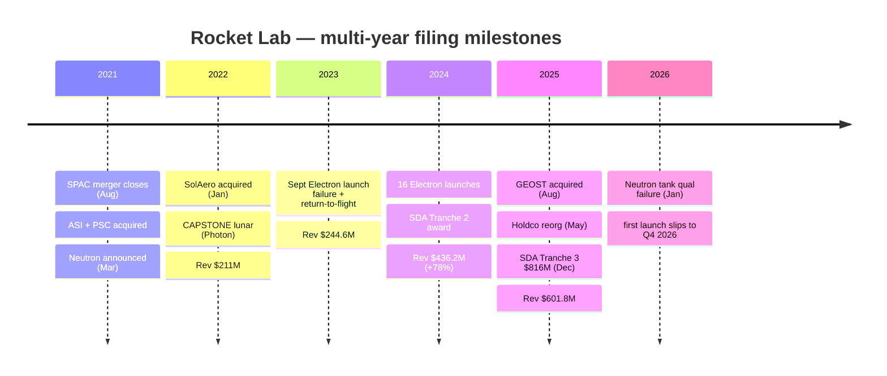

# Rocket Lab Corporation (RKLB) — SEC filings summary, FY2021–FY2025

*As of 2026-06-09. Source: 10-K filings FY2021–FY2025 on SEC EDGAR (CIK 0001819994). Produced via the `sec-report-summary` skill as Step 0.5 input for the company-research report.*

> **Thesis (FY21→FY25): scaling fast, still pre-profit, with the center of gravity shifting from launch to Space Systems and the whole story now hinging on Neutron.** Revenue compounded from $62.2M (FY2021) to $601.8M (FY2025) — a ~10x run in four years — while consolidated gross margin (毛利率) climbed from low-20s% to **34.4% GAAP** as launch cadence and Space Systems manufacturing scaled ([FY2025 10-K, MD&A](https://www.sec.gov/Archives/edgar/data/1819994/000181999426000013/rklb-20251231.htm)). Space Systems crossed from a minority of revenue at IPO to **$402.8M, or ~67% of FY2025 revenue**, as the Sinclair / ASI / PSC / SolAero / GEOST acquisition stack converted Rocket Lab from a pure launch provider into an end-to-end space company ([FY2025 10-K](https://www.sec.gov/Archives/edgar/data/1819994/000181999426000013/rklb-20251231.htm)). The two decision-relevant deltas: (1) **backlog (在手订单) nearly doubled to $1,847.3M** on the December 2025 SDA Tranche 3 award ($816M potential) plus the GEOST acquisition; (2) **net losses widened in absolute terms every year** (to $198.2M in FY2025) as R&D (研发费用) on Neutron ramped — the path to profitability is entirely a Neutron-and-scale story, and a January 2026 first-stage tank qualification failure pushed Neutron's first launch to **Q4 2026** ([FY2025 10-K, Recent Developments](https://www.sec.gov/Archives/edgar/data/1819994/000181999426000013/rklb-20251231.htm)).

## Cross-year financial trajectory

| Metric | FY2021 | FY2022 | FY2023 | FY2024 | FY2025 |
|---|---|---|---|---|---|
| Revenue ($M) | 62.2 | 211.0 | 244.6 | 436.2 | 601.8 |
| — YoY % | +77% | +239% | +16% | +78% | +38% |
| Net loss ($M) | (117.3) | (135.9) | (182.6) | (190.2) | (198.2) |
| Electron launches | 6 | 9 | 10 | 16 | 21 |
| Backlog (year-end, $M) | n/d | ~503.6 | ~1,050 | 1,067.0 | 1,847.3 |

*Source: revenue/net-loss from each year's 10-K MD&A; FY2025 launches and backlog from [FY2025 10-K](https://www.sec.gov/Archives/edgar/data/1819994/000181999426000013/rklb-20251231.htm); FY2024 from [FY2024 10-K](https://www.sec.gov/Archives/edgar/data/1819994/000162828025008724/rklb-20241231.htm).*

Source: [RKLB FY2021–FY2025 10-K filings, MD&A Results of Operations](https://www.sec.gov/cgi-bin/browse-edgar?action=getcompany&CIK=RKLB&type=10-K).

## Cross-year segment delta (FY2025 vs FY2024)

| Segment | FY25 rev | FY24 rev | YoY % | FY25 gross profit (margin) | Driver |
|---|---|---|---|---|---|
| Space Systems | $402.8M | $310.8M | +30% | $125.9M (31.3%) | spacecraft manufacturing growth + GEOST; satellites/components scaling ([FY2025 10-K](https://www.sec.gov/Archives/edgar/data/1819994/000181999426000013/rklb-20251231.htm)) |
| Launch Services | $199.0M | $125.4M | +59% | $81.3M (40.8%) | 21 vs 16 launches, higher revenue/launch ($8.5M vs $7.8M) ([FY2025 10-K](https://www.sec.gov/Archives/edgar/data/1819994/000181999426000013/rklb-20251231.htm)) |
| **Consolidated** | **$601.8M** | **$436.2M** | **+38%** | **$207.2M (34.4%)** | both segments scaling; consolidated GM +780bps YoY |

Source: [RKLB FY2025 10-K, Note — Segment Information](https://www.sec.gov/Archives/edgar/data/1819994/000181999426000013/rklb-20251231.htm).

---

## Per-filing highlights (newest → oldest)

### FY2025 10-K — [SEC EDGAR](https://www.sec.gov/Archives/edgar/data/1819994/000181999426000013/rklb-20251231.htm) (filed 2026-02-26, period 2025-12-31)
- **Business**: End-to-end space company across two reportable segments — Launch Services (Electron, HASTE; Neutron in development) and Space Systems (spacecraft, components, solar, optical via GEOST). Revenue $601.8M (+38% YoY); consolidated GM 34.4% (from 26.6% FY2024); net loss $198.2M; cash + marketable securities $1,098.9M. Over 200 spacecraft deployed across 75 successful Electron missions through 2025-12-31; Electron was the second-most-frequently-launched orbital rocket in 2025.
- **Key risks**: `ESCALATED` Neutron development & timeline risk — a Jan-2026 first-stage tank qualification failure pushed first launch to Q4 2026. `PERSISTING` customer concentration — top-5 customers = ~49% of revenue, top-5 backlog customers = ~77% of backlog; a single Government Customer = 28% of revenue. `PERSISTING` history-of-losses / going-forward-losses. `PERSISTING` key-person dependency on Sir Peter Beck. `ADDED` (FY2025 emphasis) rare-earth-mineral supply restriction risk and LEO-congestion / orbital-debris risk.
- **New this year**: GEOST LLC acquired (August 2025) — adds EO/IR optical payloads for national-security space, allocated to Space Systems segment. SDA Tracking Layer Tranche 3 award (December 2025): 18 satellites, $816M potential value, deliveries expected 2029. Holding-company reorganization completed May 2025 (Rocket Lab Corporation became successor issuer to Rocket Lab USA). Headcount over 2,600 (from ~2,000+ prior year).

### FY2024 10-K — [SEC EDGAR](https://www.sec.gov/Archives/edgar/data/1819994/000162828025008724/rklb-20241231.htm) (filed 2025-02-27, period 2024-12-31)
- **Business**: Revenue $436.2M (+78% YoY); consolidated GM 26.6%; net loss $190.2M. Space Systems $310.8M, Launch Services $125.4M. 16 Electron launches. MDA Corporation = 23% of revenue (largest customer that year).
- **Key risks**: `PERSISTING` Neutron development risk (first launch then targeted for 2025). `PERSISTING` customer concentration. `PERSISTING` history of losses.
- **New this year**: Continued Space Systems scale-up; Flatellite (a mass-producible satellite designed for constellations) and the SDA Tranche 2 Transport Layer program (18 satellites) referenced as growth vectors.

### FY2023 10-K — [SEC EDGAR](https://www.sec.gov/Archives/edgar/data/1819994/000095017024022160/rklb-20231231.htm) (filed 2024-02-28, period 2023-12-31)
- **Business**: Revenue $244.6M (+16% YoY); net loss $182.6M. 10 Electron launches; 38 cumulative successful launches; 172 spacecraft deployed. A September 2023 Electron launch failure (subsequently returned to flight) is disclosed as a lost-revenue event.
- **Key risks**: `ESCALATED` launch-reliability risk after the September 2023 failure. `PERSISTING` Neutron development risk.
- **New this year**: SolAero solar integration deepening; space-systems components broadening into the merchant market.

### FY2022 10-K — [SEC EDGAR](https://www.sec.gov/Archives/edgar/data/1819994/000095017023006499/rklb-20221231.htm) (filed 2023-03-07, period 2022-12-31)
- **Business**: Revenue $211.0M (+239% YoY, the first full year post-SPAC with the acquisition stack consolidated); net loss $135.9M. 9 Electron launches. CAPSTONE lunar mission (Photon) deployed July 2022.
- **Key risks**: `ADDED` integration risk from the 2021–2022 acquisition spree (PSC, ASI, SolAero). `PERSISTING` Neutron development risk.
- **New this year**: SolAero Technologies acquired (January 2022) — vertically integrated space-grade solar. Neutron Archimedes engine development underway.

### FY2021 10-K — [SEC EDGAR](https://www.sec.gov/Archives/edgar/data/1819994/000095017022004458/rklb-20211231.htm) (filed 2022-03-24, period 2021-12-31)
- **Business**: First annual report as a public company (SPAC merger with Vector Acquisition closed 2021-08-25). Revenue $62.2M (+77% YoY); net loss $117.3M. 6 Electron launches; 20 cumulative; 109 spacecraft deployed.
- **Key risks**: `ADDED` (initial public-company risk set) — limited operating history, history of losses, Neutron development risk (announced March 2021), customer concentration, key-person dependency on Peter Beck.
- **New this year**: Public-company debut. Acquisitions of Advanced Solutions Inc. (October 2021) and Planetary Systems Corporation (November 2021) launched the Space Systems build-out.

---

## Changes over the years (ranked by thesis impact)

1. **Business-model inversion: Space Systems crossed from minority to ~67% of revenue (FY2021→FY2025), driven by five acquisitions + organic spacecraft manufacturing.** At IPO Rocket Lab was a launch company; by FY2025 Space Systems ($402.8M) was 2x Launch Services ($199.0M), and Space Systems also carries the majority of backlog ($1,371.7M of $1,847.3M) ([FY2025 10-K](https://www.sec.gov/Archives/edgar/data/1819994/000181999426000013/rklb-20251231.htm)). This is the single most important multi-year shift.
2. **Backlog nearly doubled to $1,847.3M in FY2025 (+73% YoY), driven by the SDA Tranche 3 award ($816M potential) and the GEOST acquisition.** Backlog had been ~$1.07B at end-FY2024; the December 2025 SDA award alone added the bulk of the increase ([FY2025 10-K, Backlog](https://www.sec.gov/Archives/edgar/data/1819994/000181999426000013/rklb-20251231.htm)).
3. **Net loss widened every year in absolute dollars (to $198.2M FY2025) but narrowed sharply as a % of revenue (−33.1% FY2025 vs −74.7% FY2023), driven by gross-margin expansion outrunning R&D growth.** Consolidated GM rose 21.0% → 26.6% → 34.4% over FY2023–FY2025 even as R&D climbed to $270.7M on Neutron ([FY2025 10-K](https://www.sec.gov/Archives/edgar/data/1819994/000181999426000013/rklb-20251231.htm)).
4. **Customer concentration rotated from commercial (MDA 23% in FY2024) to government (a single Government Customer 28% in FY2025), as the defense mix grew.** The top-5 = ~49% of revenue and top-5 backlog customers = ~77% — a persisting material concentration risk ([FY2025 10-K, Customer Concentration](https://www.sec.gov/Archives/edgar/data/1819994/000181999426000013/rklb-20251231.htm)).
5. **Geographic mix swung back to US-heavy (79% FY2025 vs 61% FY2024), driven by the SDA/defense ramp; Canada collapsed from 24% to 3% as the MDA contract rolled off.** Japan rose to 11% ([FY2025 10-K, Geographic Information](https://www.sec.gov/Archives/edgar/data/1819994/000181999426000013/rklb-20251231.htm)).
6. **Risk-factor evolution: Neutron development risk has ESCALATED to the dominant risk; rare-earth-supply and LEO-congestion risks were ADDED/escalated in FY2024–FY2025.** The Jan-2026 tank failure makes Neutron timing the central swing variable ([FY2025 10-K, Risk Factors](https://www.sec.gov/Archives/edgar/data/1819994/000181999426000013/rklb-20251231.htm)).

Source: [RKLB FY2021–FY2025 10-K filings](https://www.sec.gov/cgi-bin/browse-edgar?action=getcompany&CIK=RKLB&type=10-K).
