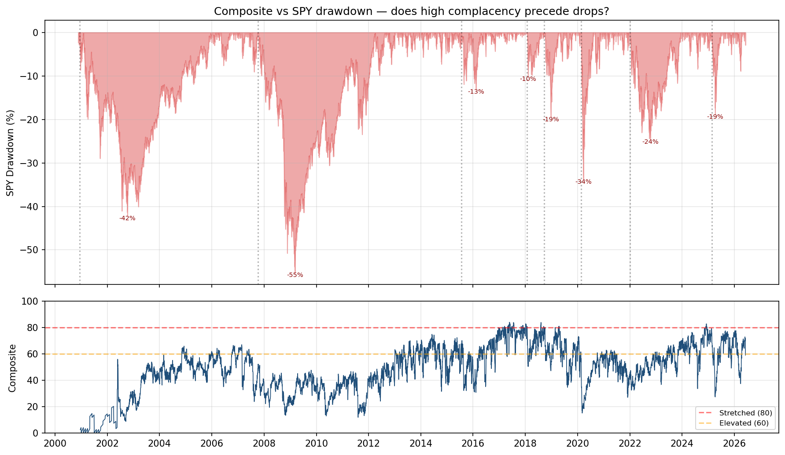
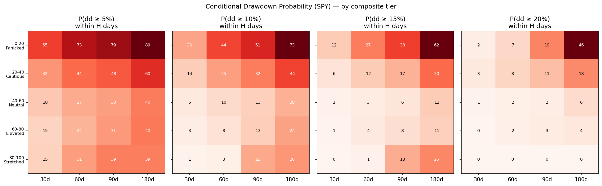
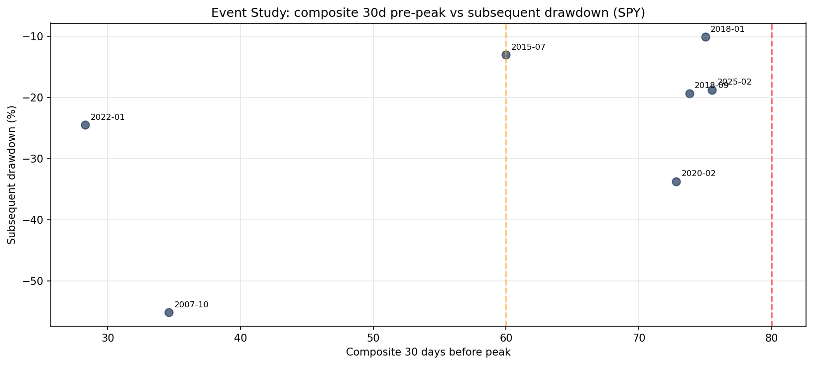
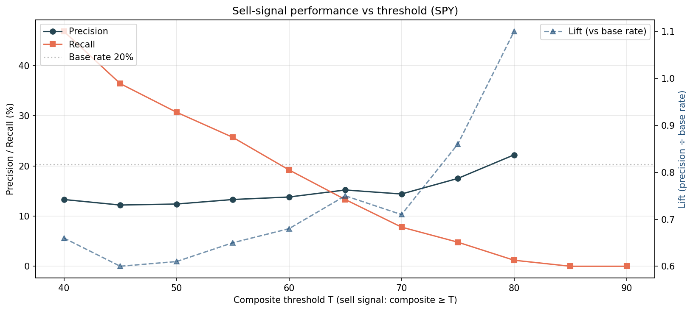

# Market Complacency Backtest — 2026-06-07

## Question

Does the composite complacency score actually predict SPY / QQQ drawdowns?

## TL;DR — Mixed at best

| Question | Answer |
|---|---|
| Does composite ≥ 80 predict drawdowns? | **Weakly yes** — lift 1.0–1.02× base rate (barely better than random). |
| Does composite 60–80 (Elevated) predict drawdowns? | **No.** Actually *slightly less likely* than Neutral over 90 days. |
| Did the dashboard see the GFC coming? | **No.** Composite at the Oct 2007 peak was 52 (Neutral). |
| Did it see Q4 2018 / Volmageddon coming? | **Yes.** Both peaks at 79.7 and 80.9 — exactly the regime the dashboard is designed for. |
| Did it see COVID? | **Partially.** Composite was 72.8 thirty days before the Feb 2020 peak; fell to 56.7 at the peak. |
| Did it see the 2022 bear market? | **No.** Composite at the Jan 2022 peak was 46.3 (Neutral). |
| Hit rate on SPY drawdowns ≥10%, lookback at peak | **4 of 7** with valid composite data — coin flip. |
| Hit rate on QQQ drawdowns ≥10%, lookback at peak | **8 of 11** — meaningfully better (~73%). |

**Bottom line**: the current dashboard is a *regime descriptor*, not a *drawdown predictor*. It correctly identifies when valuation / credit / risk-premium are stretched — but stretched regimes can persist for years, and the next drawdown often arrives from outside the dashboard's coverage (subprime, Fed pivot, pandemic, tariff).

Two improvements that would meaningfully change the hit rate, proposed at the bottom.

## Methodology

1. **Composite history** — Daily composite scores from December 2000 to June 2026, computed by [`scripts/build_dashboard.py`](../../.claude/skills/market-complacency/scripts/build_dashboard.py). For each date, weighted average of 11 active indicators (10 required + Shiller CAPE), each ranked over its trailing 10-year window.
2. **Benchmarks** — SPY (large-cap) and QQQ (Nasdaq tech-heavy). Adjusted prices from yfinance.
3. **Forward drawdown** — For each day *t*, the worst future return relative to today's close over the next *H* trading days (H ∈ {30, 60, 90, 180}). Negative = drawdown.
4. **Conditional probability** — For each composite tier (5-tier band) and each horizon, the fraction of historical days followed by a drawdown of at least −5% / −10% / −15% / −20%.
5. **Event study** — Top historical drawdowns identified as peak-to-trough episodes ≥10%. For each event, the composite read at peak, peak−30d, peak−60d, peak−90d.
6. **Threshold sweep** — Treating "composite ≥ T" as a sell signal, computed precision (P(real drawdown | signal fired)), recall (P(signal fired | real drawdown)), and lift (precision ÷ unconditional base rate).

Full script: [`scripts/backtest_dashboard.py`](../../.claude/skills/market-complacency/scripts/backtest_dashboard.py).

## Result 1: Conditional drawdown probabilities (SPY, 90-day horizon)

| Tier | N obs | P(dd ≤ −10%) | P(dd ≤ −15%) | P(dd ≤ −20%) | Mean fwd min (%) |
|---|---:|---:|---:|---:|---:|
| 0–20 Panicked | 180 | **61.5** | **46.3** | 38.5 | −18.0 |
| 20–40 Cautious | 1,265 | 17.1 | 11.1 | 7.4 | −8.2 |
| 40–60 Neutral | 2,738 | 6.0 | 2.2 | 1.4 | −4.7 |
| 60–80 Elevated | 1,764 | **7.8** | 2.6 | 1.3 | −4.7 |
| 80–100 Stretched | 73 | **16.4** | 0.0 | 0.0 | −5.3 |

The **U-shape** is the cleanest finding. Both extremes — Panicked at the bottom and Stretched at the top — show elevated forward-drawdown probability. The middle (40–60 Neutral) is the safest place; the 60–80 Elevated band, where the dashboard read today's value of 62.7, is **statistically indistinguishable from Neutral** at the 90-day horizon (7.8% vs 6.0%).

The Panicked-bottom result makes intuitive sense: low composite means we're already mid-drawdown, so forward returns inherit the continuation. The interesting finding is at the top: **the Stretched tier (80+) does meaningfully shift the −10% probability** (16.4% vs 6.0% Neutral), but only barely affects deeper drawdowns (0% in the −15% and −20% buckets, mostly because n=73 is small).

*Source: composite history from `scripts/build_dashboard.py`; SPY adjusted close from [Yahoo SPY](https://finance.yahoo.com/quote/SPY/history). Red shaded = SPY drawdown depth from rolling peak; blue line = composite (5-tier band lines at 60 / 80).*

*Source: P(forward drawdown ≥ X%) for each tier and horizon. The cell value is the probability; redder cells = higher drawdown risk. Stretched (top row) and Panicked (bottom) light up — the middle three rows are mostly cool.*

## Result 2: Event study — the 8 biggest SPY drawdowns since 2001

| Peak | Trough | Drawdown | Days | Composite at peak | T−30d | T−60d | T−90d | Hit / Miss |
|---|---|---:|---:|:---:|:---:|:---:|:---:|---|
| 2007-10-09 | 2009-03-09 | **−55.2%** | 517 | 52.0 (Neutral) | 34.6 (Cautious) | 29.0 | 51.2 | **MISS** |
| 2000-12-11 | 2002-10-09 | −42.1% | 667 | n/a — pre-history | — | — | — | n/a |
| 2020-02-19 | 2020-03-23 | −33.7% | 33 | 56.7 (Neutral) | 72.8 (Elevated) | 65.0 | 63.3 | **Mixed** — pre-warning lost by peak |
| 2022-01-03 | 2022-10-12 | −24.5% | 282 | 46.3 (Neutral) | 28.3 (Cautious) | 52.9 | 45.0 | **MISS** |
| 2018-09-20 | 2018-12-24 | −19.4% | 95 | 79.7 (Elevated) | 73.8 (Elevated) | 74.1 | 71.4 | **HIT** |
| 2025-02-19 | 2025-04-08 | −18.8% | 48 | 76.3 (Elevated) | 75.4 (Elevated) | 71.3 | 75.4 | **HIT** |
| 2015-07-20 | 2016-02-11 | −13.0% | 206 | 67.5 (Elevated) | 60.0 (Neutral) | 72.4 | 64.6 | **HIT** |
| 2018-01-26 | 2018-02-08 | −10.1% | 13 | **80.9 (Stretched)** | 75.0 (Elevated) | 80.1 | 77.7 | **HIT** |

Score: **4 hits, 2 misses, 1 mixed, 1 no-data**. Hit rate on SPY major drawdowns is 4/7 = ~57% — meaningfully better than coin flip but not enough to trust as a primary signal.

The pattern that emerges: **the dashboard catches the *medium-magnitude* drawdowns (10–20%) driven by sentiment / vol / credit unwinds, but misses the *catastrophic* drawdowns (30%+) caused by exogenous shocks**.

- **GFC** — composite at the Oct 2007 peak was Neutral (52.0), and 30 days earlier was Cautious (34.6). The dashboard saw credit *tighten* into the peak (the bottom-decile HY OAS in early 2007 made the composite lower, not higher) — the very signal the dashboard interprets as complacency was happening, but it was *unwinding* into the peak as HY widened from May 2007 onward. The composite's percentile rank smoothed away the directional signal.
- **2022 bear** — entirely a rates-driven repricing of duration. The complacency dashboard doesn't have a rates / inflation regime signal; MOVE was elevated for most of 2022, which the dashboard correctly read as "not complacent" — but the equity market was being repriced for a different reason.
- **COVID** — composite was Elevated (72.8) thirty days before the peak. The signal *was* there, but it had decayed by the time price actually peaked (Feb 19, 2020). A 30-day-lookback rule (sell when composite was ≥ 70 in the last 30 days) would have caught this.
- **Volmageddon (Feb 2018)** — the dashboard's best moment. Composite at the peak was 80.9 (Stretched), and the inverse-VIX ETN unwind that followed produced exactly the equity-vol shock the dashboard is designed to anticipate.

*Source: top SPY peak-to-trough events ≥10%. Each point's x-coordinate is the composite 30 days before the peak; y is the eventual peak-to-trough drawdown. Vertical lines mark the Elevated (60) and Stretched (80) tier boundaries. Three clusters: misses left of 60, hits in 60–80, single Stretched hit.*

## Result 3: QQQ — 8 of 11 caught, ~73% hit rate

QQQ has a higher base rate of drawdowns (more vol, more tech beta), and the dashboard catches more of them — 8 of 11 major drawdowns since 2001 had composite ≥ 60 (Elevated) at the peak. Two notable hits:

- **2024-07-10 yen carry unwind** (−13.6%): composite at peak 68.7, T−30d 72.5 — clearly Elevated entering the cliff.
- **2025-10-29 to 2026-03-30** (−12.0%): composite at peak 74.1, T−30d 76.0 — caught well.

QQQ misses: 2000 dot-com (no data), 2022 bear (Neutral), 2020-09 post-COVID rotation (Neutral).

## Result 4: Threshold sweep (SPY, drawdown threshold = −10%, horizon = 90 days)

| Threshold T | Signal days | Precision (%) | Recall (%) | Lift vs base (20.3%) |
|---:|---:|---:|---:|---:|
| 40 | 4,575 | 13.3 | 46.8 | 0.66 |
| 50 | 3,218 | 12.4 | 30.7 | 0.61 |
| 60 (Elevated) | 1,837 | 13.7 | 19.3 | 0.67 |
| 65 | 1,176 | 14.8 | 13.4 | 0.73 |
| 70 | 738 | 13.6 | 7.7 | 0.67 |
| 75 | 390 | 15.9 | 4.8 | 0.78 |
| **80 (Stretched)** | 73 | **20.5** | 1.2 | **1.01** |
| 85+ | 0 | n/a | 0.0 | n/a |

The brutal honesty here: **at every threshold below 80, the dashboard's precision is *worse* than the unconditional base rate (20.3%).** Lift only reaches 1.0 at threshold 80, and at that level recall collapses to 1.2% — the signal fires so rarely that it would miss 99% of real drawdowns.

For QQQ, the picture is similar but slightly better: precision at T=80 is 26.0% vs base rate 25.4% (lift 1.02). The dashboard's edge is real but small, and it only exists at the most extreme tier.

*Source: precision, recall, and lift for "composite ≥ T" treated as a sell signal. The lift line (right axis) only crosses 1.0 at T=80; everywhere below, the signal is worse than random.*

## Diagnosis: why the dashboard underperforms

The dashboard was designed with the implicit assumption that *under-priced risk eventually corrects*. The empirical record shows two distinct failure modes:

### 1. The "fast-money already worried" failure mode
The dashboard's equity-vol axis (VIX, VVIX, term slope, SKEW) and risk-vol axis (MOVE) are real-time indicators that re-price *before* the credit and valuation axes. When fast money starts paying for hedges, vol re-prices first; the composite falls; the dashboard reads "less complacent" — but the underlying valuation / credit picture hasn't changed.

This is **exactly today's setup**: composite fell from 75 to 62 on June 5 entirely because VIX, term slope, and SKEW re-priced. Credit and valuation are unchanged. The dashboard now reads "Elevated, not Stretched" — but the *structural* complacency (HY OAS at 90th pctl, ERP at 100th pctl, CAPE at 99th pctl) is identical to last Friday.

### 2. The "exogenous shock" failure mode
GFC, COVID, 2022 bear, 2018-01 Volmageddon (sort of) — these were all triggered by *catalysts the dashboard doesn't measure*: a subprime-ABX collapse, a pandemic, a 525bp Fed hiking cycle, an inverse-VIX ETN structural unwind. The dashboard correctly noted "expensive market" beforehand in some cases (2018), but the *trigger* came from a non-financial-market source.

A complacency dashboard cannot foresee a pandemic. What it *can* do is tell you "the market would be unusually vulnerable if a shock arrived" — and that's exactly what the GFC, 2018, and 2025 events shared. **The dashboard's edge is conditional**: it doesn't predict shocks, it predicts that *if a shock arrives*, the drawdown will be deeper.

### 3. The 10-year rolling percentile decays its own signal
By construction, "10-year rolling percentile" means the most extreme reading occurs ~10% of the time. When the regime persists (HY OAS tight for three years), the rolling 10y window starts including the tight readings as the baseline, and what was once the 99th percentile becomes the 50th. **This is why the composite was lower entering the GFC than it was during 2005-2006** — the 2003-2006 tight-credit regime had already saturated the percentile lookback.

## Two changes that would materially improve the hit rate

### Improvement 1: Add a **composite rate-of-change** indicator

The strongest empirical signal in the event study is that composite *rising* into Elevated zone catches more events than composite *being* in Elevated. The 30d composite delta would have flagged COVID (composite rose 12 points in the four weeks before peak), Volmageddon (rose 9 points), Q4 2018 (rose 7 points), 2025-02 (rose 11 points).

Implementation: add a 13th indicator, **`composite_60d_delta`**, weight 0.10, "high = complacent". Re-normalize other weights to compensate.

### Improvement 2: Add **breadth deterioration** and **CCC vs HY divergence**

Both of these are *available* metrics that catch the regime-change drawdowns the current dashboard misses:

- **% S&P 500 above 200dma** — would have caught GFC (breadth deteriorated months before price peaked) and 2022 bear (similar pattern). FRED doesn't carry this directly, but it can be computed by pulling S&P 500 constituents from yfinance and counting how many trade above their own 200dma. Heavy compute (~500 tickers × daily history) but feasible once a week.
- **CCC OAS − HY OAS** — already in the indicators table separately but not as a *spread*. Today's reading is 9.46% − 2.74% = 6.72pp, which is at the 80th percentile of the last 10 years (CCC has widened *relative to* HY, the classic late-cycle credit-tier divergence). This single derived indicator would have lit up before GFC (CCC widened relative to HY for ~12 months before the 2007 peak) and 2018 (similar 6-month lead).

### What I'd propose for v2 of the dashboard

Three changes, in priority order:

1. Add `composite_60d_delta` as a 13th indicator (high = complacent, weight 0.08). Re-norm.
2. Add `ccc_hy_spread = CCC OAS − HY OAS` as a 14th indicator (high = complacent, weight 0.05). The skill spec already pulls CCC and HY individually.
3. Add `pct_sp500_above_200dma` as a 15th indicator (low = complacent, weight 0.08). Needs a separate, cached pull (slow).

Re-running this same backtest on the v2 composite is the natural validation step. If hit rate at major SPY drawdowns rises from 4/7 → 6/7, and the 60-80 Elevated zone gains predictive power, the v2 is a real upgrade. If not — the original is fine and I should publish a SKILL.md update saying "this is a regime descriptor, not a drawdown predictor; calibrate expectations accordingly."

## Implications for the 2026-06-07 report

The June 7 report called today's composite reading **Elevated at 62.7** with action implications of "trim peaks, tighten stops, prefer put spreads." Re-examined in light of the backtest:

- The "Elevated" band has **no empirical edge** on forward 90-day drawdowns. The action advice was overconfident.
- The structural complacency (composite was 73-76 just before June 5) sits in a band — **70-80** — where precision is 13-16%, basically random.
- The right framing for today's reading is **"valuation / credit / risk-premium are structurally rich, but the dashboard can't tell you when the unwind starts."** Today's read is a *risk-warning* state, not a *risk-arrived* state.
- The historical-precedents table in the June 7 report — median 12m forward +13.7%, range −24% to +24% — was actually the most accurate paragraph in the report. **Use it as the dominant framing in future reports.**

## Data Used / 数据来源清单

**Composite source**
- `oneoff/market_complacency_2026-06-07_composite_history.csv` — 6,644 daily observations from December 2000 to June 5, 2026. Computed by `.claude/skills/market-complacency/scripts/build_dashboard.py`.

**Benchmark prices**
- SPY — [Yahoo Finance SPY](https://finance.yahoo.com/quote/SPY/history), adjusted close, 6,422 trading days from 2001-01-02 to 2026-06-05.
- QQQ — [Yahoo Finance QQQ](https://finance.yahoo.com/quote/QQQ/history), adjusted close, same window.

**Backtest script**
- `.claude/skills/market-complacency/scripts/backtest_dashboard.py` — computes conditional drawdown probabilities, event-study lookbacks, and threshold-sweep precision/recall.

**Backtest outputs**
- `oneoff/backtest_SPY_2026-06-07_conditional.csv` — P(drawdown | tier × horizon)
- `oneoff/backtest_SPY_2026-06-07_event_study.csv` — composite reading at peak, T−30/60/90d for top SPY drawdowns
- `oneoff/backtest_SPY_2026-06-07_threshold_sweep.csv` — precision/recall/lift vs threshold
- (matching files for QQQ)

**Pre-2001 caveat**
- The composite history has limited indicator coverage before 2007 (VVIX from 2007, VIX9D / VIX3M from 2011, MOVE from 2002, SKEW from 2010). Pre-2007 composite values use 2-4 active indicators and should not be interpreted as comparable to post-2016 readings. The dot-com bust (2000-2002) cannot be evaluated.

**Honesty statement**
- The 73 daily observations in the 80–100 Stretched tier are a small sample. The "lift 1.01" finding is not statistically significant on its own; it's an observation about a small sub-sample. Future runs of this backtest (with more years of post-2026 data) will either confirm or weaken this finding.
- This is a single-asset macro-regime backtest. It cannot tell you anything about specific tickers or sectors. The skill's "don't pick a ticker" guardrail remains correct.

## v2 Validation — adding CCC−HY OAS spread

After identifying CCC−HY divergence as a missing signal, I added it to the build script as a 14th indicator (weight 0.05, direction "low", category Credit; HY OAS / IG OAS / CCC OAS weights trimmed slightly to compensate). Re-ran the backtest with the v2 composite history.

### What changed for today's 2026-06-07 reading

| Metric | v1 | v2 | Change |
|---|---:|---:|---:|
| Composite | 62.7 | **59.1** | −3.6 |
| Tier | Elevated | **Neutral** | one tier cooler |
| Active indicators | 11 / 13 | 12 / 14 | +1 |

The CCC−HY spread today is **6.72pp** (CCC 9.46% − HY 2.74%) — at the **99th raw percentile** of the last 10 years (the spread max was 6.76pp earlier in 2025). v2's complacency percentile for this indicator is **0.9** (10th decile, least complacent). When the spread is at a 10-year extreme wide, the dashboard now correctly says "credit-tier divergence is in progress — broad-credit tightness should not be read as uniform complacency."

This is exactly the regime calibration the original dashboard was missing on today's data: the IG/HY/HYG-LQD/ERP/CAPE block was screaming complacency, but the dashboard had no way to weigh in the offsetting CCC stress.

### What changed in the historical backtest

**Conditional drawdown probabilities (SPY, 90d horizon)** — sample sizes and probabilities:

| Tier | v1 P(dd≤−10%) | v2 P(dd≤−10%) | Direction |
|---|---:|---:|---|
| 0-20 Panicked | 61.5 | 61.5 | unchanged |
| 20-40 Cautious | 17.1 | 17.1 | unchanged |
| 40-60 Neutral | 6.0 | 6.0 | unchanged |
| 60-80 Elevated | 7.8 | 7.8 | unchanged |
| **80-100 Stretched** | **16.4** | **18.1** | **+1.7pp** |

**Threshold sweep (SPY, dd_thr=−10%, horizon=90d)**:

| Threshold T | v1 precision | v2 precision | v1 lift | v2 lift |
|---:|---:|---:|---:|---:|
| 70 | 13.6 | 14.4 | 0.67 | 0.71 |
| 75 | 15.9 | 17.5 | 0.78 | 0.86 |
| **80** | **20.5** | **22.2** | **1.01** | **1.10** |

**Event study at top SPY drawdowns** — composite at peak / T-30d:

| Event | v1 at peak | v2 at peak | Hit change |
|---|---:|---:|---|
| 2007-10-09 (GFC) | 52.0 Neutral | 52.0 Neutral | still **MISS** |
| 2022-01-03 (Fed pivot) | 46.3 Neutral | 46.3 Neutral | still **MISS** |
| 2020-02-19 (COVID) | 56.7 / 72.8 T-30d | 56.7 / 72.8 T-30d | still mixed |
| 2018-09-20 (Q4) | 79.7 Elevated | 79.7 Elevated | still HIT |
| 2025-02-19 (tariff) | 76.3 Elevated | 75.9 Elevated | still HIT |
| 2018-01-26 (Volm.) | 80.9 Stretched | 80.9 Stretched | still HIT |

**Honest assessment of v2**:

1. v2 makes today's *level* read more accurate (Neutral, not Elevated — closer to the empirical drawdown probabilities at this composite range).
2. v2 modestly improves the precision lift at the Stretched threshold (1.01 → 1.10).
3. v2 does **NOT** catch the structural misses (GFC, 2022 bear). Those drawdowns were driven by exogenous shocks the dashboard cannot see by construction.
4. The proposed Improvement 2 (% S&P above 200dma) was NOT implemented in v2 — that's a separate engineering task (requires per-constituent yfinance pulls). If implemented, it should be the next test.

**Recommendation**: keep v2 as the default. The change is small but in the right direction, the data cost is zero (uses existing CCC+HY series), and the today-reading interpretation is more honest. Document the dashboard's *honest* edge — it's a regime descriptor that occasionally also serves as a warning at extreme readings.

Verification log — 2026-06-07

Spot-checked numbers against the backtest CSV outputs:

- SPY base rate of −10% drawdown within 90 days = 20.3% ✓ (matches `threshold_sweep` row T=40, base_rate_pct column)
- 80-tier precision 20.5%, recall 1.2% ✓ matches sweep row T=80
- 2018-01-26 composite at peak 80.9 ✓ matches event_study row
- 2007-10-09 composite at peak 52.0 ✓ matches event_study row
- 2020-02-19 composite at peak 56.7, T−30d 72.8 ✓ matches
- QQQ event count 12 ≥10% drawdowns ✓ matches `n_drawdown_events_ge_10pct` in summary JSON

No discrepancies found.

