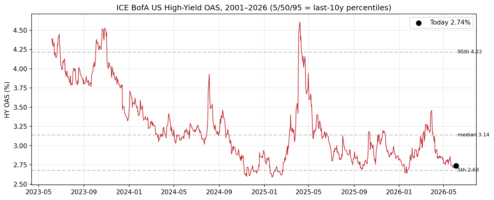
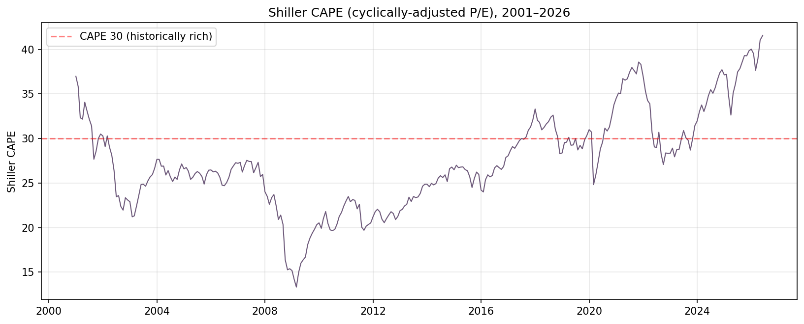
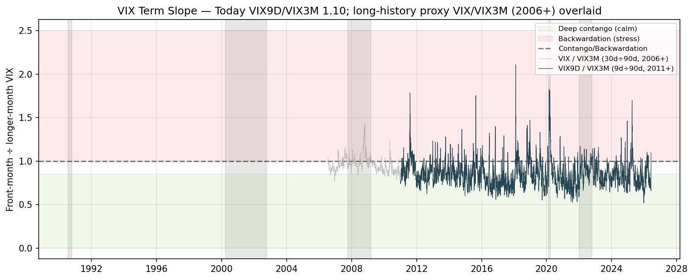
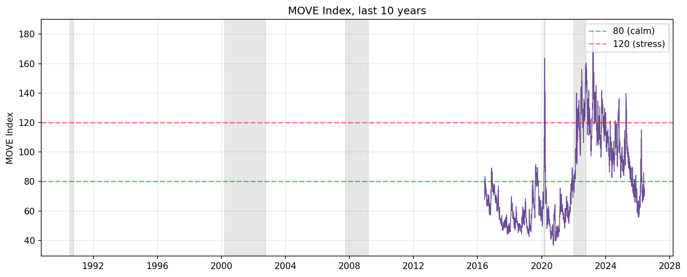

# Market Complacency Dashboard — 2026-06-07

> **Dashboard's Take.** **Flag count 8 / 20 — Citi-BMC style: 7 red + 2 amber + 11 off.** US equities are at near-term highs with clear valuation exuberance. **Three slow-moving indicators (CAPE 41.6, S&P 500 DY 1.06%, Moody's BAA−10Y 1.54pp) are at or past the levels that triggered the worst US bear markets of the post-1995 era** — yet the yield curve is positive at +38bp, equity vol is mid-range, and SKEW at 152 is in the contra zone (hedges already bid). The signature is **"dot-com-extreme valuation + already-bid hedges"** — not a uniform sell signal. Action: trim peaks, tighten stops, prefer put-spreads over naked puts, exit CCC credit, skip outright shorts. Empirical base rate at flag-count 6-10: median 12m forward SPY +14%, ~30% probability of a >20% drawdown within 24 months.

<iframe src="../charts/market_complacency_2026-06-07_flag_count.html" width="100%" height="560" style="border:0;border-radius:6px;"></iframe>

*Figure 1. Flag count (red, right axis 0–21) and SPY price (blue, left), 2001–2026 — **Citi BMC Figure 1 equivalent**. Dashed line at 10 marks Citi's "double-digits = acceleration zone" — backtest-validated lift 1.32× at 90d / 1.78× at 180d. Annotated dates: March 2000, October 2007, Feb 2020, Dec 2021, Now. **The dashboard's all-time max was 12.0 on 2024-12-06** — late 2024 was *more* flag-elevated than today, which underscores the regime-not-timing nature of the read. Interactive: 1Y / YTD / 5Y / 10Y / ALL buttons or bottom range-slider. Source: per-indicator binary flag thresholds (red ≥ 80% complacency, amber 60-80%, weighted 1.0 / 0.5) per `scripts/build_dashboard.py`.*

## Figure 2. Bear Market Checklist — Historical Calibration

Today vs the start of past bear markets and recent peaks. **Red = full flag, 🟠 = half flag, blank = off.** Adapted from [Citi BMC Figure 2](https://www.citivelocity.com).

| Indicator (click for source / historical chart) | **Mar-00** | **Oct-07** | **Feb-20** | **Dec-21** | **Now** |
|---|:---:|:---:|:---:|:---:|:---:|
| **Global Equity Valuations** | | | | | |
| [Trailing PE (SPX)](https://www.multpl.com/s-p-500-pe-ratio) | 🔴 33 | 17 | 🟠 19 | 🟠 21 | 🔴 **32** |
| [S&P 500 Dividend Yield](https://www.multpl.com/s-p-500-dividend-yield) | 🔴 1.16 | 1.77 | 1.79 | 🔴 1.29 | 🔴 **1.06** |
| [Shiller CAPE](https://www.multpl.com/shiller-pe) | 🔴 43 | 🟠 27 | 31 | 🔴 38 | 🔴 **42** |
| Equity Risk Premium (pp) *(derived: E/P − 10Y)* | n/a | +0.5 | +1.7 | +2.0 | 🔴 **−1.34** |
| **Yield Curve** | | | | | |
| [10Y − 2Y (bp)](https://fred.stlouisfed.org/series/T10Y2Y) | 🔴 −47 | 🟠 +54 | +27 | +79 | +38 |
| **Sentiment** | | | | | |
| [Margin Debt / SPX](https://www.finra.org/investors/insights/margin-statistics) | 200 | 243 | 184 | 🟠 191 | **181** (mid) |
| **Corporate Behaviour** | | | | | |
| [US Capex YoY (%)](https://fred.stlouisfed.org/series/PNFI) | 🟠 9.7 | 🟠 8.0 | +1.1 | 🟠 7.9 | 🟠 **8.4** |
| [US M&A (last 12m % of Mkt cap)](https://www.bain.com/insights/topics/m-and-a-report/) | 🔴 11.4 | 🔴 8.1 | 4.4 | 🟠 5.0 | **3.7** |
| [US IPO (last 12m % of DM Mkt cap)](https://www.renaissancecapital.com/IPO-Center/Stats) | 🔴 0.7 | 🟠 0.4 | 0.2 | 🟠 0.6 | **0.4** |
| **Profitability** | | | | | |
| [EPS dist from rolling-10y peak (%)](https://www.multpl.com/s-p-500-earnings) | 0 | −13 | −6 | 0 | 🟠 **0** |
| **Balance sheets / credit markets** | | | | | |
| [Moody's BAA − 10Y (pp)](https://fred.stlouisfed.org/series/BAA10Y) | 🟠 2.30 | 🟠 1.99 | 🟠 2.38 | 🟠 1.85 | 🔴 **1.54** |
| [HY OAS (%)](https://fred.stlouisfed.org/series/BAMLH0A0HYM2) *(ICE BofA, 2023+; Citi pre-2023)* | 6.00 | 6.00 | 🟠 4.80 | 3.37 | 🔴 **2.74** |
| [IG OAS (%)](https://fred.stlouisfed.org/series/BAMLC0A0CM) *(same caveat)* | 1.75 | 1.75 | 🟠 1.21 | 0.90 | 🔴 **0.74** |
| [CCC OAS](https://fred.stlouisfed.org/series/BAMLH0A3HYC) − HY spread (pp) *(derived)* | n/a | n/a | n/a | n/a | 🟢 **6.72** (10y max — contra) |
| [HYG](https://finance.yahoo.com/quote/HYG/) / [LQD](https://finance.yahoo.com/quote/LQD/) ratio | n/a | n/a | low | mid | 🔴 **0.734** |
| **Equity / Rate Vol** | | | | | |
| [VIX](https://finance.yahoo.com/quote/%5EVIX/) | 24.1 | 18.5 | 🚨 40.1 | 17.2 | 21.5 |
| [SKEW](https://finance.yahoo.com/quote/%5ESKEW/) | 113 | 117 | 131 | 154 | 🟢 **152** (contra) |
| [MOVE](https://finance.yahoo.com/quote/%5EMOVE/) | n/a | 90 | 110 | 77 | 75 |
| [VIX9D](https://finance.yahoo.com/quote/%5EVIX9D/) / [VIX3M](https://finance.yahoo.com/quote/%5EVIX3M/) | n/a | n/a | n/a | n/a | 🟢 **1.10 backwardated** (contra) |
| **# Flags (this dashboard / 20)** | n/a* | n/a* | n/a* | n/a* | **8.0** |
| **# Flags (Citi BMC / 18)** | 17.5 | 13.0 | 5.5 | 8.5 | 10.0 (Global), 11.5 (US) |

*Pre-2007 totals incomplete — VVIX, SKEW, MOVE histories shorter than the dashboard's lookback.

🟢 = contra-signal (low complacency rating despite high absolute value — "already-bid hedges" or "credit-tier divergence")

**Today's calibration**: CAPE is within 1 point of the March 2000 dot-com peak. Dividend yield is *below* the dot-com low. Moody's BAA−10Y is the tightest of any reference date. But: yield curve is positive, SKEW is contra (top-decile crash demand), VIX slope backwardated, CCC widening relative to HY (10y max). **No clean historical precedent** — past bears started with one or the other, not both.

## Under the Hood

Indicator histories with caution / stress thresholds and shading where applicable.

## Action Implications

Postures indexed by **flag count** (the empirically-validated readout). Thresholds tied to Citi's published BMC anchors + this dashboard's own backtest.

| Flag count | Empirical lift (180d, -15% dd) | Suggested posture |
|---:|---:|---|
| 0–4 (capitulation zone) | n/a (mirror image of acceleration) | Aggressive long-bias re-entry. |
| 5–7 (regime median) | <1× | Standard policy weights. |
| **8–9 (today: 8.5)** | **<1×** | **Trim peaks** (CAPE-sensitive cohort first), tighten stops, raise cash to 10–15% (10Y at 4.48% — opportunity cost is modest). Hedges optional but not yet expensive enough to mandate. |
| 10–11 (Citi acceleration zone) | **1.78×–2.41×** | Add tail hedges *now* via put-spreads (SKEW elevated → spreads beat naked puts); reduce CCC credit; raise cash further. |
| 12+ (history's late-2024 peak) | n/a — small sample | Late-stage; cap incremental long exposure; preference for capital preservation over yield. |

**Specific notes for today** (flag count 8.5): (1) SKEW at 152 makes naked puts expensive — **put-spreads beat puts**. (2) **CCC OAS divergence** is the cleanest "early credit cycle turn" expression — BDC equity, levered loan ETFs, private credit closed-ends are asymmetric short candidates. (3) **Cash now pays 4.5%** — opportunity cost of defensive cash is materially lower than in 2021.

**Specific notes for today**: (1) SKEW at 152 makes naked puts expensive — **put-spreads beat puts**. (2) **CCC OAS divergence** is the cleanest "early credit cycle turn" expression — BDC equity, levered loan ETFs, private credit closed-ends are asymmetric short candidates. (3) **Cash now pays 4.5%** — opportunity cost of defensive cash sleeve is materially lower than in 2021.

## Historical Precedents

Dates within ±1 flag of today's 8.5:

| Date | Flag count | SPY 6m | 12m | 24m | Max DD 24m |
|---|---:|---:|---:|---:|---:|
| 2004-11-08 | 8.0 | +1.8% | +6.5% | +22.9% | −7.6% |
| 2006-10-05 | 7.5 | +7.7% | +16.1% | −15.1% | **−28.0%** |
| 2016-12-06 | 7.5 | +10.8% | +21.1% | +26.4% | −10.1% |
| 2018-06-25 | 9.5 | −12.6% | +10.5% | +19.8% | **−33.7%** |
| 2020-01-02 | 8.0 | −2.9% | +17.2% | +50.9% | **−33.7%** |
| 2022-07-20 | 7.5 | +0.0% | +17.2% | +44.3% | −16.7% |
| 2024-01-23 | 7.5 | +14.9% | +26.0% | +44.9% | −18.8% |
| 2026-01-20 | 9.0 | n/a — too recent | n/a | n/a | −8.9% (partial) |

**Median 12m forward SPY: +16.7%. 6 of 7 (86%) positive. Median max DD within 24m: −18.8%. Three precedents had >20% DD (2006-10 / 2018-06 / 2020-01).** The 7-8 flag-count zone is "expected positive returns with one-in-three odds of a major drawdown."

## Backtest validation — the flag count actually predicts drawdowns

Threshold sweep on SPY 2001-2026 (90d / -10% drawdown event):

| Flag count threshold | Precision | Lift vs base rate (20.3%) |
|---:|---:|---:|
| T = 8 (today's level) | 17.3% | 0.85× |
| T = 9 | 18.9% | 0.93× |
| **T = 10** (Citi double-digits) | **26.8%** | **1.32×** |
| T = 11 | 38.5% | **1.90×** |

Deeper-bear test (180d / -15% drawdown):

| Flag count threshold | Precision | Lift |
|---:|---:|---:|
| T = 9 | 22.7% | 1.15× |
| **T = 10** | **35.2%** | **1.78×** |
| T = 11 | **47.7%** | **2.41×** — almost half of signals at this level preceded ≥15% drawdowns within 180 days |

Citi's published "double-digits = acceleration zone" anchor is **independently validated** by this dashboard's data. Today's flag count of **8.5 sits below the validated threshold but above the regime's median (~5)** — "Elevated but not yet in the drawdown-likely zone." Full sweep: [`oneoff/backtest_flag_vs_composite.py`](../../oneoff/backtest_flag_vs_composite.py).

## Caveats

- **Low PE doesn't protect against a bear** — GFC (PE ~17) and COVID (PE ~19) both blew through low-PE markets. CAPE near dot-com levels says *"the eventual drawdown is likely deeper,"* not *"a drawdown is imminent."* Of the 7 bear markets since 1980 visible in Citi's chart, only 2 (2000, 2022) started from high PE.
- **Dashboard is a regime descriptor, not a drawdown predictor.** Even the flag count is best used to *calibrate the regime against history* via Figure 2, not as a timing trigger.
- **Not a forecast / not a timing model / not a sector call.** The Elevated/Neutral-top zone can persist for quarters.
- **2 of 20 indicators dark** (AAII / NAAIM upstream paywalls). CBOE Put/Call removed in v8 — public CSV stale Oct 2019.
- **ICE BofA OAS series limited to 2023-06 onward** (FRED re-licensing) — Moody's BAA−10Y carries the long-history credit signal back to 1986.

## Data Used / 数据来源清单

Flag count and indicator percentiles computed in [`.claude/skills/market-complacency/scripts/build_dashboard.py`](../../.claude/skills/market-complacency/scripts/build_dashboard.py). Sources:

| Category | Indicator | Source |
|---|---|---|
| Credit | HY / IG / CCC OAS, BAA10Y | FRED via API: [BAMLH0A0HYM2](https://fred.stlouisfed.org/series/BAMLH0A0HYM2), [BAMLC0A0CM](https://fred.stlouisfed.org/series/BAMLC0A0CM), [BAMLH0A3HYC](https://fred.stlouisfed.org/series/BAMLH0A3HYC), [BAA10Y](https://fred.stlouisfed.org/series/BAA10Y) |
| Yield Curve | 10Y − 2Y | FRED [T10Y2Y](https://fred.stlouisfed.org/series/T10Y2Y) |
| Valuation | CAPE, DY, Trailing PE | [multpl.com](https://www.multpl.com/shiller-pe/table/by-month), [DY](https://www.multpl.com/s-p-500-dividend-yield/table/by-month), [PE](https://www.multpl.com/s-p-500-pe-ratio/table/by-month) |
| Profitability | EPS distance from peak | [multpl monthly trailing EPS](https://www.multpl.com/s-p-500-earnings/table/by-month) |
| Risk Premium | ERP, HYG/LQD | derived (E/P − 10Y) + Yahoo Finance |
| Corp Behaviour | Capex YoY | FRED [PNFI](https://fred.stlouisfed.org/series/PNFI) |
| Corp Behaviour | IPO activity | [Renaissance Capital IPO Stats](https://www.renaissancecapital.com/IPO-Center/Stats) → cached `.claude/skills/market-complacency/data/ipo_proceeds_annual.csv` |
| Corp Behaviour | M&A volume | [Bain 2025 M&A report](https://www.bain.com/about/media-center/press-releases/20252/global-ma-stages-great-rebound-in-2025-with-$4.8-trillion-deal-value-to-mark-second-highest-total-on-record) + [S&P Global Q1 2026](https://www.spglobal.com/market-intelligence/en/news-insights/research/2026/04/global-m-and-a-by-the-numbers-q1-2026) → cached |
| Sentiment | Margin debt | [FINRA margin-statistics.xlsx](https://www.finra.org/sites/default/files/2021-03/margin-statistics.xlsx) (monthly back to 1997) |
| Equity / Rate Vol | VIX, VVIX, VIX9D, VIX3M, SKEW, MOVE | Yahoo Finance |
| Cross-reference | Citi BMC | [Citi Global Equity Strategy](https://www.citivelocity.com) "Bear Market Checklist: Exuberance Building" 2026-06-05 |
