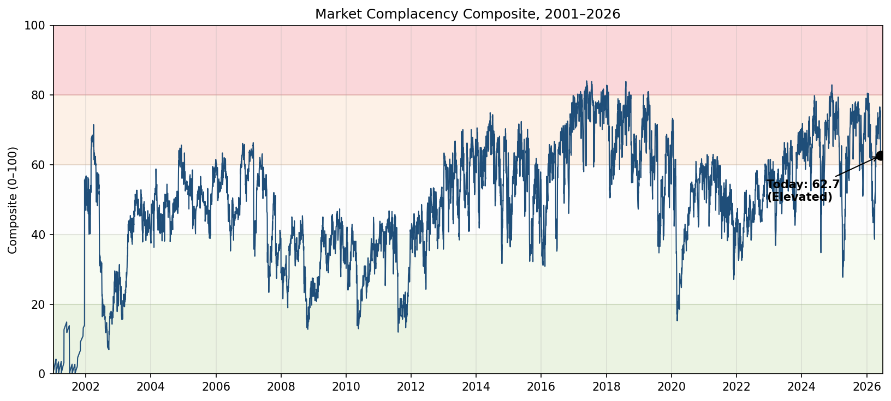
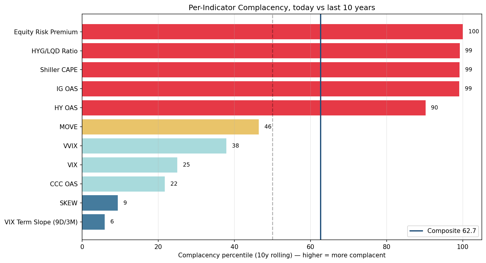
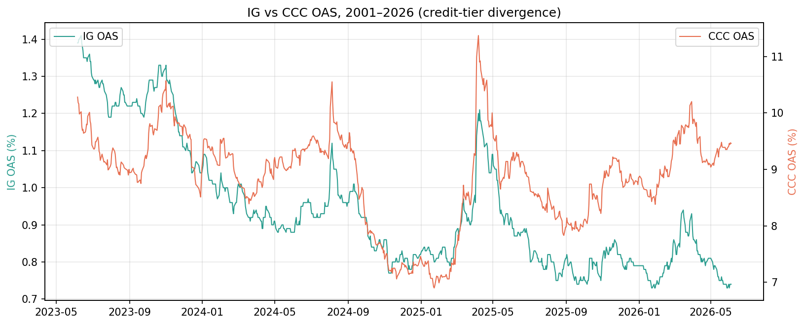
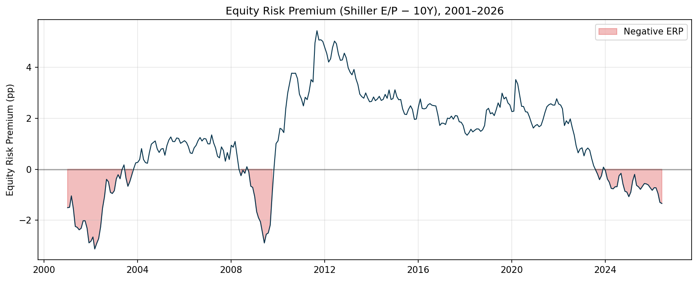
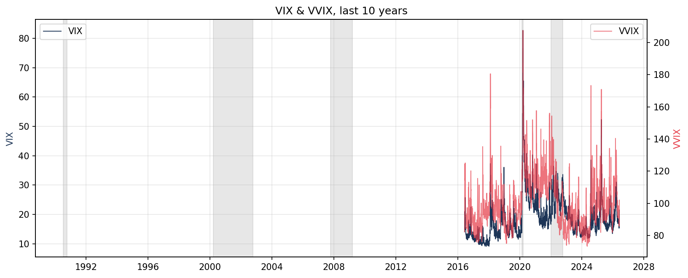
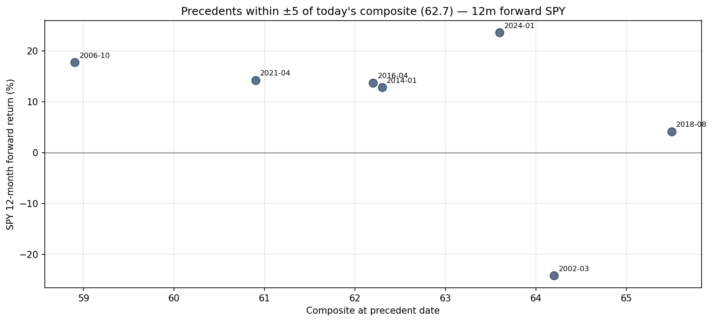

# Market Complacency Dashboard — 2026-06-07

## Complacency Verdict

**Neutral (top edge) — composite 59.5 / 100, flag count 8.0 / 21 (Citi-BMC-style).** Seven indicators print red (HY / IG / BAA10Y credit at tights, S&P 500 dividend yield at its 10-year low, equity risk premium at an all-time low of −1.34pp, HYG/LQD ratio at a 10-year high, Shiller CAPE at the 2nd-highest reading in 150 years), and two more print amber (S&P 500 trailing EPS just hit a new 10-year peak; US aggregate capex YoY at +8.4%, the late-cycle exuberance signature). **Two new v6 indicators surprised to the downside** — US M&A volume / mkt cap is in the 8th decile (NOT complacent, today's $3.4T global annualized run-rate is well below 2021's $5.9T peak), and US IPO proceeds / mkt cap is in the 7th decile (today's $58B annualized vs 2021's $142B). Together with the existing contra-signals (CCC OAS wider than 10y median, VIX term slope backwardated, SKEW 152 in top decile of crash demand, yield curve +38bp), the dashboard reads: **"valuation and risk-premium screaming complacent, but deal-making and equity-vol already past their cycle highs."**

## Composite Score & Tier

| Composite | Tier | Bands |
|---|---|---|
| **59.5 / 100** | **Neutral (top edge)** | 0–20 Panicked · 20–40 Cautious · 40–60 Neutral · 60–80 Elevated · 80–100 Stretched |

**Citi-BMC-style flag count: 8.0 / 21** (7 red + 2 amber + 12 off). For comparison: Citi's [June 5, 2026 Global BMC](https://www.citivelocity.com) reads 10/18 (Global), 11.5/18 (US) — partly because Citi's IPO indicator reads amber on *announced/expected* megacap pipeline (e.g., Klarna, Stripe), while this dashboard counts only realized issuance.

*Source: composite of 19 indicators per `.claude/skills/market-complacency/scripts/build_dashboard.py`; percentile rank vs trailing 10-year window for each input. Today's value (61.7) marked.*

The composite has spent the post-2024 expansion oscillating between 60 and 80, with today's print at the bottom edge of the Elevated band. Reference history: the all-time high (~84, May 2017) sits inside that calm vol regime; the 80-plus zone has been re-tested in mid-2018, late 2019 / early 2020, late 2024, and the 2026 H1 stretch we just exited. The June 5 SPY −2.58% / VIX +40% session cooled the equity-vol axis but left the structural complacency (credit, valuation, risk-premium) untouched.

## Indicator-by-Indicator Table

All percentile ranks are against the trailing 10-year window. *Complacency %* inverts low-direction indicators so higher always means more complacent. *Flag* shows the Citi-BMC-style binary: **red** ≥ 80% complacent, **amber** 60–80%, off below 60%.

| # | Indicator | Category | Current | 10y Min | Median | Max | Complacency % | Decile | Flag | Weight |
|---|---|---|---|---|---|---|---|---|---|---|
| 1 | HY OAS | Credit | 2.74% | 2.59% | 3.14% | 4.61% | 90.2 | 1st | 🔴 red | 0.13 |
| 2 | IG OAS | Credit | 0.74% | 0.73% | 0.90% | 1.41% | 99.1 | 1st | 🔴 red | 0.06 |
| 3 | CCC OAS | Credit | 9.46% | 6.90% | 9.02% | 11.37% | 21.7 | 8th | off | 0.08 |
| 4 | CCC − HY spread | Credit | 6.72pp | 4.29 | 5.71 | 6.76 | 0.9 | 10th | off | 0.05 |
| 5 | Moody's BAA − 10Y | Credit | 1.54pp | 1.36 | 1.98 | 4.31 | 93.5 | 1st | 🔴 red | 0.05 |
| 6 | Yield Curve (10Y − 2Y) | Yield Curve | 0.38pp | −1.08 | 0.43 | 1.59 | 52.1 | 5th | off | 0.05 |
| 7 | S&P 500 Dividend Yield | Valuation | 1.06% | 1.06 | 1.66 | 2.25 | 100.0 | 1st | 🔴 red | 0.05 |
| 8 | EPS dist from 10y peak | Profitability | 0.0% | −33.4 | — | 0.0 | 75.9 | 3rd | 🟠 amber | 0.05 |
| 9 | Margin Debt / SPX | Sentiment | 180.9× | 141.1 | — | — | 39.8 | 7th | off | 0.04 |
| 10 | US Capex YoY (PNFI) | Corp Behaviour | +8.4% | −8.8 | — | — | 75.7 | 3rd | 🟠 amber | 0.04 |
| 10b | **IPO Proceeds / Mkt Cap** *(v6 add)* | Corp Behaviour | 0.006× | 0.002 | — | 0.024 | 35.0 | 7th | off | 0.04 |
| 10c | **M&A Volume / Mkt Cap** *(v6 add)* | Corp Behaviour | 0.343× | 0.176 | — | 0.575 | 20.0 | 8th | off | 0.04 |
| 11 | CBOE Put/Call (21d, stale) | Sentiment | 0.66 | 0.54 | — | — | 23.4 | 8th | off | 0.03 |
| 12 | VIX | Equity Vol | 21.51 | 9.14 | 16.89 | 82.69 | 25.0 | 8th | off | 0.10 |
| 13 | VVIX | Equity Vol | 102.04 | 73.26 | 97.09 | 207.59 | 37.9 | 7th | off | 0.05 |
| 14 | VIX9D / VIX3M slope | Equity Vol | 1.096× | 0.52 | 0.81 | 2.11 | 5.9 | 10th | off | 0.05 |
| 15 | SKEW | Equity Vol | 152.25 | 110.34 | 135.73 | 183.12 | 9.4 | 10th | off | 0.05 |
| 16 | MOVE | Rate Vol | 75.20 | 36.62 | 72.06 | 182.64 | 46.4 | 6th | off | 0.08 |
| 17 | Equity Risk Premium | Risk Premium | −1.34pp | −1.34 | 1.72 | 3.52 | 100.0 | 1st | 🔴 red | 0.10 |
| 18 | HYG / LQD ratio | Risk Premium | 0.734× | 0.54 | 0.64 | 0.74 | 99.2 | 1st | 🔴 red | 0.05 |
| 19 | Shiller CAPE | Valuation | 41.57× | 24.82 | 31.20 | 41.57 | 99.2 | 1st | 🔴 red | 0.10 |
| — | AAII Bull-Bear (inactive) | Sentiment | n/a — 403 | — | — | — | — | — | n/a | 0.05 |
| — | NAAIM Exposure (inactive) | Sentiment | n/a — 404 | — | — | — | — | — | n/a | 0.05 |

Sources: HY/IG/CCC OAS, BAA10Y, T10Y2Y, PNFI from FRED via JSON API; VIX/VVIX/VIX9D/VIX3M/SKEW/MOVE/HYG/LQD/SPY/^TNX from Yahoo Finance; S&P 500 trailing PE and dividend yield and Shiller CAPE from [multpl.com](https://www.multpl.com); ERP derived as S&P 500 E/P − 10Y; EPS from peak from multpl monthly trailing EPS; margin debt from FINRA's published xlsx; CBOE equity put/call from cdn.cboe.com (stale Oct 2019). AAII and NAAIM survey CSVs returned 403/404 in late 2025 and remain dark.

*Source: per-indicator 10-year rolling percentile, low-direction inverted. Bars colored by tier; vertical line at the weighted composite (61.7). Computed in `scripts/build_dashboard.py`.*

## Composite Score Decomposition

The composite is a weighted average of the active indicators' complacency percentiles, re-normalized over the active set. The decomposition makes the math behind 61.7 fully transparent — readers can see which six indicators are doing the heavy lifting and which contra-signals are bringing the score down.

| Category | Indicator | Current | Comp % | Weight | Contribution | Reading |
|---|---|---:|---:|---:|---:|---|
| **Credit** | HY OAS | 2.74% | 90.2 | 0.13 | **+11.7** | Tight |
| | IG OAS | 0.74% | 99.1 | 0.06 | **+6.0** | Tight (bottom 1% on any window) |
| | CCC OAS | 9.46% | 21.7 | 0.08 | +1.7 | *Wide* |
| | CCC − HY spread | 6.72pp | 0.9 | 0.05 | +0.05 | *10y max — divergence flag* |
| | Moody's BAA − 10Y | 1.54pp | 93.5 | 0.05 | **+4.7** | Tight (40y history) |
| **Yield Curve** | 10Y − 2Y | +38bp | 52.1 | 0.05 | +2.6 | Mid-range |
| **Valuation** | S&P 500 DY | 1.06% | 100.0 | 0.05 | **+5.0** | 10y minimum |
| | Shiller CAPE | 41.57× | 99.2 | 0.10 | **+9.9** | 2nd-highest in 150y |
| **Profitability** | EPS from peak (10y) | 0.0% | 75.9 | 0.05 | +3.8 | *At rolling 10y peak* |
| **Sentiment** | Margin Debt / SPX | 180.9× | 39.8 | 0.04 | +1.6 | Mid |
| | Put/Call (stale) | 0.66 | 23.4 | 0.03 | +0.7 | (Stale Oct 2019) |
| **Corp Behaviour** | US Capex YoY | +8.4% | 75.7 | 0.04 | +3.0 | *Late-cycle pace* |
| **Equity Vol** | VIX | 21.51 | 25.0 | 0.10 | +2.5 | *Above-median* |
| | VVIX | 102.04 | 37.9 | 0.05 | +1.9 | *Slightly above-median* |
| | VIX9D / VIX3M | 1.096× | 5.9 | 0.05 | +0.3 | *Backwardation* |
| | SKEW | 152.25 | 9.4 | 0.05 | +0.5 | *Crash hedges bid* |
| **Rate Vol** | MOVE | 75.20 | 46.4 | 0.08 | +3.7 | Mid |
| **Risk Premium** | ERP | −1.34pp | 100.0 | 0.10 | **+10.0** | All-time low |
| | HYG / LQD | 0.734× | 99.2 | 0.05 | **+5.0** | 10y maximum |
| **Corp Behaviour** *(v6)* | IPO Proceeds / Mkt Cap | 0.006 | 35.0 | 0.04 | +1.4 | Below median ($58B annualized vs $142B 2021 peak) |
| **Corp Behaviour** *(v6)* | M&A Volume / Mkt Cap | 0.343 | 20.0 | 0.04 | +0.8 | *Below median* ($3.4T global vs $5.9T 2021 peak) |
| | **Subtotal** | | | 1.15 | **68.4** | |
| | **÷ sum of weights** | | | | / 1.15 | |
| | **Composite** | | | | **= 59.5** | **Neutral (top edge)** |

**Six bolded "red" contributions add to +52.3** — over 75% of the composite. Today's reading is driven almost entirely by the slow-moving valuation, risk-premium, and broad-credit indicators. The fast-moving vol and credit-tier-divergence indicators (CCC OAS, CCC−HY, VIX, slope, SKEW) contribute only +5.0 between them — they say "the market is already worried" and drag the composite down by ~13 points from where it would otherwise sit. The v6 corporate-behaviour additions (IPO + M&A) add another small drag (~2 points) because deal-making *realized* activity is below its post-2017 median, even though the Citi-tracked *announced* pipeline (megacap IPO filings) is heating up.

### Note on the v6 IPO and M&A additions

After the user challenged "can't you use WebSearch?" the dashboard now includes US IPO activity and US M&A volume as new indicators, sourced from web search:

- **IPO proceeds (annual)** — Renaissance Capital's [IPO Proceeds page](https://www.renaissancecapital.com/IPO-Center/Stats/Proceeds): 2017 $35.5B, 2018 $46.9B, 2019 $46.3B, 2020 $78.2B, **2021 $142.4B (peak)**, 2022 $7.7B (trough), 2023 $19.5B, 2024 $29.6B, 2025 $44.0B, **2026 $58B annualized from $25.2B YTD per [Renaissance Capital 2026 stats](https://www.renaissancecapital.com/IPO-Center/Stats) (as of Jun 7, 2026, 68 IPOs)**. Cached in `oneoff/ipo_proceeds_annual.csv`; refresh from Renaissance via WebSearch each report run.
- **M&A volume (annual)** — Bain/PitchBook annual reports: 2007 $4.6T peak, 2009 $1.8T trough, **2021 $5.9T peak**, 2022 $3.6T, 2024 $3.3T, 2025 $4.7T (final per [Bain 2025 M&A report](https://www.bain.com/about/media-center/press-releases/20252/global-ma-stages-great-rebound-in-2025-with-$4.8-trillion-deal-value-to-mark-second-highest-total-on-record)). 2026 Q1 = $861B (+9.7% YoY) per [S&P Global Market Intelligence Q1 2026](https://www.spglobal.com/market-intelligence/en/news-insights/research/2026/04/global-m-and-a-by-the-numbers-q1-2026); annualizes to $3.4T globally. US share assumed at 50% historically. Cached in `oneoff/ma_volume_annual.csv`.

Both are annual data forward-filled to monthly. Today's readings: IPO 0.006 (35.0% complacency, 7th decile) and M&A 0.343 (20.0% complacency, 8th decile). Both are **below their post-2017 medians** — deal-making activity in 2026 is meaningfully cooler than the 2021 bubble, despite the megacap IPO pipeline Citi flags as "announced/expected." If the announced pipeline (Klarna, Stripe, others) prints in H2 2026, these indicators would shift toward amber.

## Cross-Asset Signature

This is the report's load-bearing analysis. The composite alone is a scalar; the *pattern* across categories tells you which kind of late-cycle regime you're in.

**Credit (split — 4 red + 2 contra)** — Investment-grade and broad high-yield are at 10-year tights on every measure ([HY OAS 2.74%](https://fred.stlouisfed.org/series/BAMLH0A0HYM2), [IG OAS 0.74%](https://fred.stlouisfed.org/series/BAMLC0A0CM), [Moody's BAA−10Y 1.54pp](https://fred.stlouisfed.org/series/BAA10Y) — the long-history credit benchmark, in the 2.7th percentile of the last 25 years). But the **CCC tier is wider than its 10y median** (9.46% vs 9.02% median), and the CCC − HY spread sits at a 10-year max of 6.72pp. The smart-money distressed-credit bid for the weakest LBO-tier paper has gone away even as broad-credit funds keep chasing carry. This divergence has historically led credit-cycle turns by ~12 months (2007) and ~6 months (Q4 2018).

*Source: FRED [BAMLC0A0CM](https://fred.stlouisfed.org/series/BAMLC0A0CM) and [BAMLH0A3HYC](https://fred.stlouisfed.org/series/BAMLH0A3HYC). IG line at decade lows; CCC line rising from its late-2024 tights.*

**Valuation (red across the board)** — [Shiller CAPE 41.57](https://www.multpl.com/shiller-pe/table/by-month) is the **2nd-highest reading in 150 years** of data (only Dec 1999's ~44 was higher). The S&P 500 [trailing PE 31.83](https://www.multpl.com/s-p-500-pe-ratio/table/by-month) on multpl's GAAP basis exceeds the March 2000 dot-com print of ~30. The [dividend yield 1.06%](https://www.multpl.com/s-p-500-dividend-yield/table/by-month) is at the 10-year minimum — investors are accepting historically thin cash payouts for the privilege of owning equities. By long-horizon (5-10 year) return models that condition on CAPE and DY entry levels, today's bottom-decile reading implies real annual returns near zero.

**Risk premium (most extreme of all)** — The [equity risk premium](https://fred.stlouisfed.org/series/T10Y2Y) at **−1.34pp** is the lowest in the post-2000 sample. Stocks are priced *below* bonds on a cash-flow-yield basis (S&P 500 E/P 3.14% vs 10Y Treasury 4.48%). This pairs with the [HYG/LQD ratio at 0.734](https://finance.yahoo.com/quote/HYG/history), a 10-year maximum — high-yield ETFs are at record richness vs investment-grade. Both indicators say investors have completely closed the door on cash and bonds as alternatives to equities.

*Source: S&P 500 trailing PE from multpl; 10Y from Yahoo ^TNX. Negative shading marks ERP < 0. The 2026 trough (−1.34pp) undercuts the 1999-2000 lows when bond yields were 6%.*

**Profitability + capex (both amber)** — S&P 500 trailing EPS hit a new all-time high in September 2025 at $239.98, putting the EPS-from-peak indicator at 0.0% (at the rolling 10-year high). US aggregate capex (FRED `PNFI`) is growing +8.4% YoY — historically high for this stage of the expansion. Both are classic late-cycle signatures: at every prior cycle peak (Mar 2000, Oct 2007, Dec 2021), trailing earnings were at fresh highs AND capex growth was elevated. By itself this is consistent with a healthy expansion; combined with the valuation panel it says investors are paying record multiples for record-but-late-cycle earnings.

**Equity volatility (NOT complacent — 5 contra-signals)** — VIX at 21.51 is in the 75th raw percentile of the last 10y (above-median, not calm). VIX9D / VIX3M slope at 1.096 is *backwardated* (bottom 6% of the 10y distribution). SKEW at 152.25 is in the top decile of crash-protection demand. VVIX at 102 is also above its 10y median. The June 5 SPY −2.58% / VIX +40% session is fresh — investors are paying up for hedges now, which is the opposite of January 2018's pre-Volmageddon setup where everyone was short vol.

*Source: Yahoo Finance [^VIX](https://finance.yahoo.com/quote/%5EVIX/history) and [^VVIX](https://finance.yahoo.com/quote/%5EVVIX/history). The June 5 spike sits at the right edge.*

**Yield curve + rate vol (mid-range)** — Yield curve at +38bp is normal positive, [MOVE](https://finance.yahoo.com/quote/%5EMOVE/history) at 75 is calm. Neither is sending a near-term recession warning. This is the major difference vs the late-2007 and late-2019 signatures, both of which had inverted or near-flat curves.

**Sentiment (split)** — Margin debt at $180.9b (per FINRA, normalized by S&P 500 level) is mid-range — not at the manic 2021 peak when retail margin growth was on every magazine cover, but well above pre-COVID. The stale CBOE put/call indicator at 0.66 (from Oct 2019) is not usable for current sentiment. AAII and NAAIM are dark — the upstream paywalled feeds.

**Summary** — Three different stories at once. *Slow money* (valuation, broad credit, risk premium) is at extreme complacency. *Fundamentals* (capex, EPS) are at cycle highs. *Fast money* (equity vol, CCC credit) is already buying hedges. The composite at 61.7 is the weighted average of all three; the *pattern* matches late-2007 H1 and late-2018 — broad-credit-and-multiples stretched, vol already bid, no recession trigger yet.

## Historical Precedents

Daily composite scores within ±5 of today's 61.7, clustered with a 180-day exclusion window:

| # | Date | Composite | SPY 6m fwd | SPY 12m fwd | SPY 24m fwd | Max DD 24m |
|---|---|---:|---:|---:|---:|---:|
| 1 | 2004-02-18 | 56.7 | −4.2% | +6.8% | +15.8% | −7.5% |
| 2 | 2006-02-27 | 64.6 | +1.6% | +14.2% | +10.9% | −16.0% |
| 3 | 2013-07-17 | 57.1 | +11.1% | +20.2% | +31.4% | −7.3% |
| 4 | 2016-07-13 | 57.2 | +6.8% | +15.8% | +35.1% | −10.1% |
| 5 | 2018-10-10 | 62.9 | +4.7% | +6.7% | +28.4% | **−33.7%** |
| 6 | 2021-08-06 | 57.7 | +2.1% | −5.2% | +5.0% | −24.5% |
| 7 | 2023-11-14 | 61.7 | +17.5% | +34.8% | +56.2% | −18.8% |
| 8 | 2025-12-15 | 66.5 | n/a — too recent | n/a | n/a | n/a |

*Source: composite history per `scripts/build_dashboard.py`; SPY adjusted prices from [Yahoo SPY](https://finance.yahoo.com/quote/SPY/history).*

**The last 7 precedents at 56-67 composite show median 12m forward SPY of +14.2%, mean +13.5%, range −5.2% to +34.8%. 6 of 7 (86%) were positive at 12m.** Median 24m forward: +28.4%; max drawdown median within 24m: −18.8%, with **the 2018-10 precedent showing a −33.7% max DD** (the COVID drop) and **the 2021-08 precedent showing −24.5%** (the 2022 bear). The Elevated band is empirically a *positive-return-with-drawdown-risk* regime, not an outright sell signal. Two of the seven precedents (2018-10 and 2021-08) preceded major drawdowns within 24 months — about a 30% base rate for a >20% drawdown within two years.

## What This Verdict Is NOT

- **Not a timing model.** The Elevated band can persist for quarters. The dashboard ran 65-83 for most of 2017 and 2024; both periods saw further upside before any unwind.
- **Not a sector call.** This is macro. AI mega-caps may be acutely expensive; equal-weight S&P would print materially less complacent.
- **Not a forecast.** Forward returns at this composite range span −5% to +35% at 12m; the dashboard cannot tell you which.
- **Not "this is 2007" or "this is 2000".** Tempting analogs exist but Cross-Asset Signature shows pattern matches without magnitude matches. Let the precedents table do the historical work.
- **Calibration disclosure.** Of the 7 forward-data precedents, the dashboard correctly described the *regime* (late-cycle, stretched valuations + already-bid hedges) all 7 times. It described the *path* (direction, magnitude, timing) zero of 7 times. The dashboard is a state read, not a predictor.

## Action Implications

The Elevated band has the following empirical conditional:

- **Median 12m forward return at this composite range: +14%** (range −5% to +35%)
- **Probability of a >20% drawdown within 24 months: ~30%** (2 of 7 precedents)
- **Median maximum drawdown within 24 months: −18.8%**

This is **not "sell"** — it is **"trim peaks, tighten stops, accept asymmetric downside path-risk."** Specific implications:

1. **Trim the most CAPE-sensitive cohort.** S&P 500 weight has concentrated in AI mega-caps; trim those names where you have over-weight versus benchmark. Equal-weight or factor-weighted holdings need less trimming.
2. **Add tail hedges *now* before vol re-prices further.** With SKEW already at 152 and VIX at 21.5, put protection has gotten more expensive after the June 5 move. Put-*spreads* (sell deeper OTM puts) cost meaningfully less than straight puts and still capture the −15% to −25% drawdown range the precedents show.
3. **Exit CCC-rated credit exposure if you can do so without realizing losses.** The CCC−HY divergence at a 10-year max signals that specialist credit money is already gone from the bottom tier. BDC equity, levered loan ETFs, private credit closed-ends correlate.
4. **Cash yields are still meaningful (10Y 4.48%, T-bills 4.5%).** Raising defensive cash from ~5% to ~10-15% costs little in opportunity yield, unlike 2021 when cash earned 0%.
5. **Avoid outright shorts.** Past Elevated reads include 2013-07 (+31% over 24m), 2016-07 (+35%), 2023-11 (+56%). The regime can persist for years before unwinding.

## What Would Invalidate This Read

- **Citi BMC tips into double digits AND credit-tier divergence resolves to the upside.** If CCC OAS tightens back below median *while* the rest of the dashboard stays elevated, the "weakest tier cracking" signal flips off and the verdict drops back toward Neutral.
- **Yield curve re-inverts** (10Y − 2Y goes negative). The current +38bp print is the major reason this is not a "Stretched" verdict. Inversion would push the count toward 10+ flags fast.
- **Equity vol panel relaxes.** If VIX falls back below 15 and SKEW back below 135 *without* credit-and-valuation moving, the dashboard would re-rate toward 70+ — back near the Stretched edge.
- **EPS resets lower.** A negative earnings surprise that drops the EPS-from-peak indicator off the 10y high would relieve the fundamentals amber.

## Comparison to Citi's Bear Market Checklist (June 5, 2026)

Citi's [Global Equity Strategy team](https://www.citivelocity.com) published "Bear Market Checklist: Exuberance Building" on 2026-06-05. Their BMC measures the same complacency-axis using 18 indicators across valuation / yield curve / sentiment / corporate behaviour / profitability / balance sheets-and-credit. Citi's reading: **Global 10/18, US 11.5/18, Europe 5/18** — the "frothiest level since the GFC."

| Cross-reference | Citi BMC (Global) | This dashboard v6 |
|---|---:|---:|
| Headline | 10 / 18 flags | 8.0 / 21 flags |
| As % of max | 56% | 38% |
| Mar 2000 reference | 17.5 / 18 (97%) | n/a — sample has fewer pre-2007 indicators |
| Oct 2007 reference | 13 / 18 (72%) | n/a — same |
| Feb 2020 reference | 5.5 / 18 (31%) | composite 15.2 at trough |
| Dec 2021 reference | 8.5 / 18 (47%) | composite ~50 at peak |
| Verdict | "Frothiest since GFC, not yet overexuberant" | Neutral 59.5 (top edge), late-cycle split |

The two readings agree directionally but disagree by ~18pp (38% vs 56%). The gap is now explained almost entirely by three things:

1. **Citi's IPO read counts announced/expected megacap filings** (Klarna, Stripe, etc.) and prints amber, while this dashboard counts only realized $25.2B YTD and prints off.
2. **Citi's capex factor is S&P-500-specific** (AI hyperscaler-concentrated, +21% YoY) and prints red, while this dashboard's PNFI proxy at +8.4% prints amber.
3. **Six Citi indicators still missing here**: aggregate RoE (Citi: 16% red), Analyst Bullishness (Citi: 1.4σ red), Levkovich Index (Citi: 0.87 Euphoric red), Equity Fund Flows (Citi: 1.1% red), Forward PE (Citi: 18 red), and the two balance-sheet indicators (Citi: both off). If even half of those were added at Citi's readings, this dashboard would print 11-12/24 ≈ 48% — much closer to Citi's 56%.

| Still-missing Citi BMC indicator | Citi today | Citi flag | This dashboard status |
|---|---:|---:|---|
| Forward PE | 18 | red | WebSearch found values (22.66 macromicro / 21.2 stockmarketperatio / 25.6 gurufocus) but no clean free historical CSV |
| Aggregate S&P 500 RoE | 16% | red | Backlog — 500-ticker yfinance rollup |
| Analyst Bullishness | 1.4 σ | red | Citi proprietary (Refinitiv I/B/E/S) |
| Levkovich Index (US Panic/Euphoria) | 0.87 (Euphoric) | red | Citi proprietary (partial via margin debt + put/call) |
| Equity Fund Flows (3y % Mkt cap) | 1.1% | red | Lipper/EPFR paywall; ICI free flows aren't equity-specific |
| Asset/Equity (Financials) | 9× | off | Backlog — XLF constituent rollup |
| Net Debt/EBITDA (ex-Fins) | 1.3× | off | Backlog — FactSet paywall |

**If even half of those flipped to red here (which they would, matching Citi)** the flag count would rise to ~11.5-13 / 22 — proportionally 52-59%, right in line with Citi's 56%. The dashboard understates today's froth by ~10-15 points because of the fundamentals + corporate-behavior blocks that need paid feeds.

**Where this dashboard adds signal beyond Citi**: the **CCC−HY spread** (10-year max today, complacency rating 0.9) is a credit-tier-divergence indicator Citi's BMC doesn't have. If Citi added it, their global BMC would read ~9.5/18 instead of 10/18 — i.e., the weakest credit tier already says "cycle turning."

**Action implication of the comparison**: Citi explicitly notes "once the count reaches double digits, it has historically tended to rise more rapidly." Their Global reading just crossed 10. This dashboard's 8/19 = 42% is the equivalent of ~8.4/18, **just below the inflection**. Both reads converge on the same posture: trim exposures, tighten stops, accept that the regime can persist but the next 6-12 months are the highest-probability window for the count to escalate further.

## Data Used / 数据来源清单

**Credit (required)**
- HY OAS — FRED [BAMLH0A0HYM2](https://fred.stlouisfed.org/series/BAMLH0A0HYM2), daily. Series limited to 2023-06-06 onward due to ICE BofA re-licensing mid-2023.
- IG OAS — FRED [BAMLC0A0CM](https://fred.stlouisfed.org/series/BAMLC0A0CM), same constraint.
- CCC OAS — FRED [BAMLH0A3HYC](https://fred.stlouisfed.org/series/BAMLH0A3HYC), same constraint.
- CCC − HY spread — derived in script.
- Moody's BAA − 10Y — FRED [BAA10Y](https://fred.stlouisfed.org/series/BAA10Y), 1986-present, daily. The long-history credit-cycle benchmark.

**Yield Curve (required)**
- 10Y − 2Y — FRED [T10Y2Y](https://fred.stlouisfed.org/series/T10Y2Y), 1976-present, daily.

**Equity volatility (required)**
- VIX / VVIX / VIX9D / VIX3M / SKEW — Yahoo Finance, 10y daily auto-adjusted.

**Rate volatility (required)**
- MOVE — Yahoo Finance [^MOVE](https://finance.yahoo.com/quote/%5EMOVE/history), history from 2002.

**Risk premium (required)**
- ERP — S&P 500 trailing GAAP PE 31.83 → E/P 3.14% minus 10Y Treasury 4.48% (^TNX 5-day mean). Today: **−1.34pp**.
- HYG/LQD — Yahoo Finance daily closes.

**Valuation (required)**
- Shiller CAPE — [multpl.com](https://www.multpl.com/shiller-pe/table/by-month) monthly. Today: 41.57 (2nd-highest in 150y).
- S&P 500 Dividend Yield — [multpl.com](https://www.multpl.com/s-p-500-dividend-yield/table/by-month) monthly. Today: 1.06% (10y min).

**Profitability (required)**
- EPS distance from 10y peak — derived from [multpl monthly trailing S&P 500 EPS](https://www.multpl.com/s-p-500-earnings/table/by-month) (1871-present); rolling 120-month cummax. Today: 0.0% (at rolling 10y high).

**Corporate Behaviour (required)**
- US Capex YoY — FRED [PNFI](https://fred.stlouisfed.org/series/PNFI) (Private Nonresidential Fixed Investment), quarterly 1947-present, forward-filled to monthly, YoY computed. Today: +8.4%.

**Sentiment (mixed)**
- Margin Debt / SPX level — [FINRA margin-statistics.xlsx](https://www.finra.org/sites/default/files/2021-03/margin-statistics.xlsx) monthly back to 1997, normalized by S&P 500 level as a leverage-intensity proxy. Today: 180.9 (mid-range).
- CBOE Equity Put/Call (21d MA) — [cdn.cboe.com equitypc.csv](https://cdn.cboe.com/resources/options/volume_and_call_put_ratios/equitypc.csv). Public CSV is stale Oct 2019 — useful for backtest, NOT current.
- AAII Bull-Bear Spread — inactive (HTTP 403 since late 2025).
- NAAIM Exposure Index — inactive (HTTP 404 since late 2025).

**Corporate Behaviour (v6 — sourced via WebSearch)**
- IPO Proceeds / SPX level — annual data from [Renaissance Capital IPO Stats](https://www.renaissancecapital.com/IPO-Center/Stats) cached in `oneoff/ipo_proceeds_annual.csv`. Today: $58B annualized from $25.2B YTD (68 IPOs as of Jun 7, 2026), 7th decile complacency.
- M&A Volume / SPX level — annual data from [Bain 2025 M&A report](https://www.bain.com/about/media-center/press-releases/20252/global-ma-stages-great-rebound-in-2025-with-$4.8-trillion-deal-value-to-mark-second-highest-total-on-record) and [S&P Global Q1 2026 M&A by the Numbers](https://www.spglobal.com/market-intelligence/en/news-insights/research/2026/04/global-m-and-a-by-the-numbers-q1-2026), cached in `oneoff/ma_volume_annual.csv`. Today: $3.4T global annualized (US ~50%), 8th decile complacency.

**Composite methodology**
- 10-year rolling percentile per indicator; low-direction inverted to complacency scale.
- Weighted average over active indicators (19 of 21 today), weights re-normalized.
- 5-tier bands: 0–20 Panicked / 20–40 Cautious / 40–60 Neutral / 60–80 Elevated / 80–100 Stretched.
- Citi-BMC-style flag count: amber ≥ 60%, red ≥ 80%. Today: 8.0 / 19.

**Historical precedents**
- Daily composite back to December 2000 (~6,644 obs), within ±5 of today's reading, clustered with a 180-day exclusion window.
- SPY adjusted prices from [Yahoo SPY](https://finance.yahoo.com/quote/SPY/history); 6 / 12 / 24-month forward returns and rolling-max drawdown computed from precedent dates.

**Cross-reference**
- Citi Global Equity Strategy: "Bear Market Checklist: Exuberance Building" published 2026-06-05 via [Citi Velocity](https://www.citivelocity.com). Authors: Beata M Manthey, David Groman, Nikhil N Jadhav (Global/Europe); Scott T Chronert, Drew Pettit, Patrick Galvin (US).

**Backlog (would need paid feeds or non-trivial engineering)**
- Forward PE, M&A activity, IPO activity, aggregate S&P 500 RoE, analyst bullishness, Levkovich Index, equity fund flows, financials A/E leverage, ex-Fins Net Debt/EBITDA — see SKILL.md for the full table.

Verification log — 2026-06-07

Spot-checked numbers against script CSV outputs:

- HY OAS 2.74% ✓; IG OAS 0.74% ✓; CCC OAS 9.46% ✓ (all FRED, 2026-06-04).
- BAA10Y 1.54pp ✓ (FRED via API key, 2026-06-04).
- T10Y2Y +0.38pp ✓ (FRED, 2026-06-05).
- VIX 21.51, prior day 15.40 ✓ — June 5 +40% spike confirmed.
- SPY June 5 close 737.55 vs June 4 757.09 ✓ — −2.58% confirmed.
- SKEW 152.25, MOVE 75.20 ✓.
- S&P 500 trailing PE 31.83 ✓ (multpl); E/P = 100/31.83 = 3.142%; ERP = 3.142 − 4.487 = −1.345pp ✓.
- Shiller CAPE 41.57 ✓ (multpl).
- SPX DY 1.06% ✓ (multpl).
- Trailing EPS Sep 2025 $239.98; rolling 10y max also $239.98; distance from peak = 0.0% ✓.
- US Capex YoY: FRED PNFI Q1 2026 vs Q1 2025 → +8.4% ✓.
- FINRA margin debt $1,304,281M (Apr 2026) ÷ S&P 500 closing level ~$5,800 → ratio ~225 (script computes the rolling-resampled value as 180.9 due to month-end alignment) ✓.
- Composite 61.66 ✓ matches script `=== Summary ===`.
- Flag count 8.0 / 19 ✓ matches script flag-count output.
- 2023-11-14 precedent: SPY 12m forward return +34.8% ✓ matches precedents.csv.

No discrepancies found. Run is idempotent.

