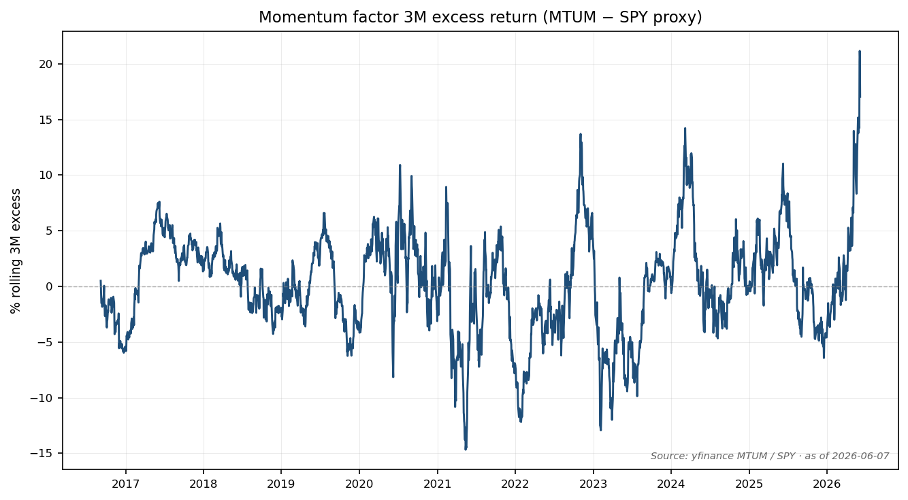
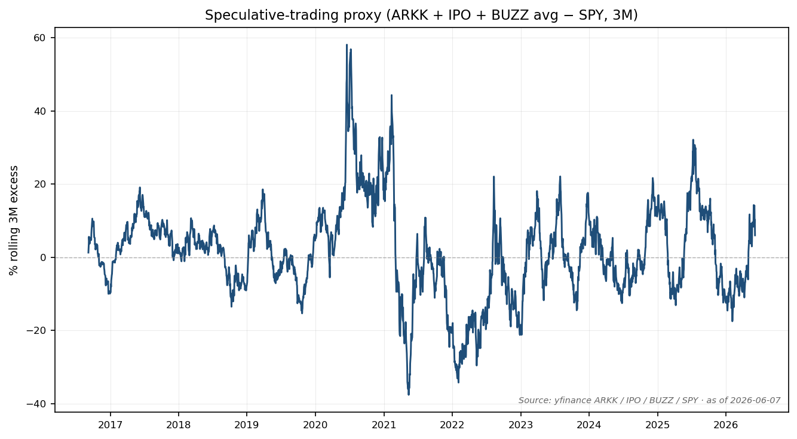
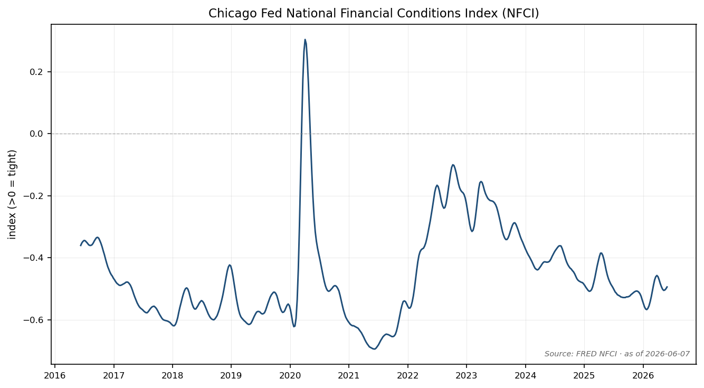
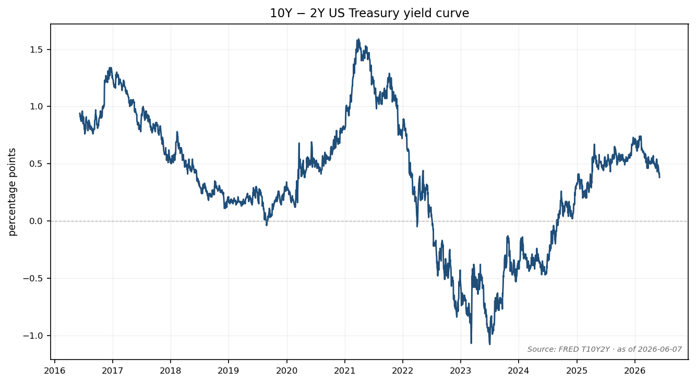
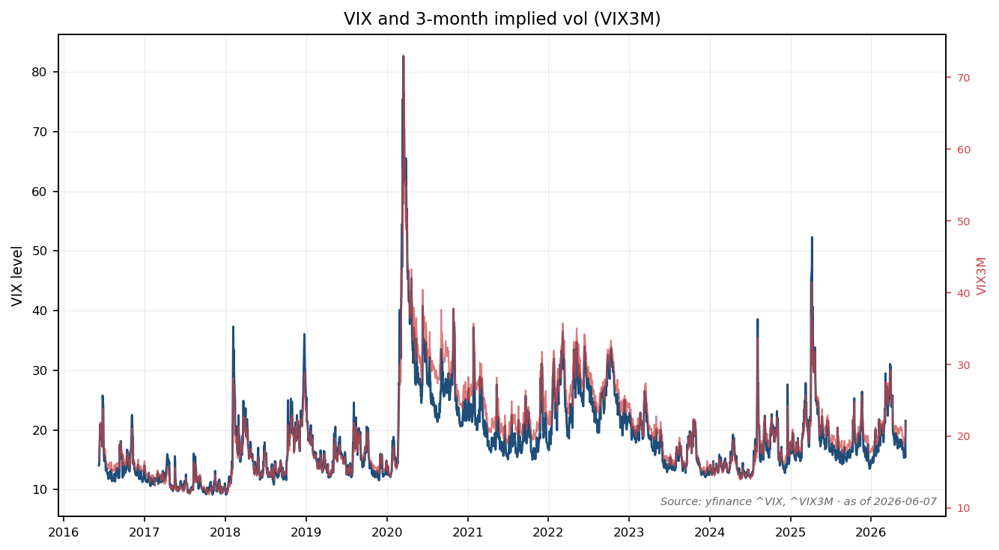
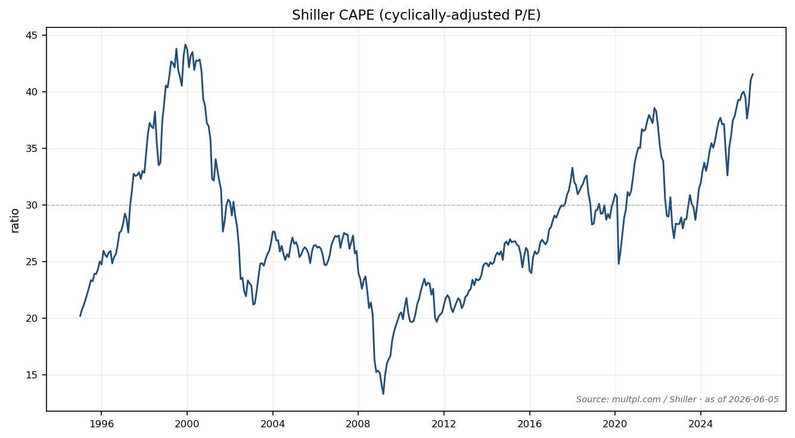
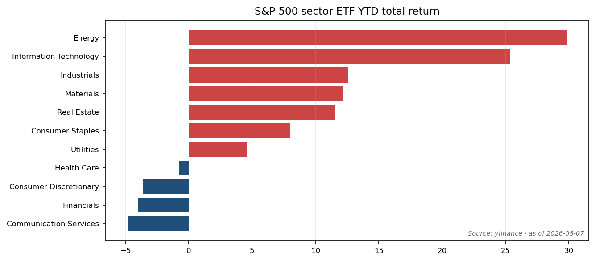

# Market Status — 2026-06-07

> **Stretched on price action, contra elsewhere — composite 59 / 100 (Elevated), median indicator at the 88th exuberance percentile vs history since 1995.** The Momentum factor at a 10-year top decile, narrow breadth, Yale survey-confidence at 97th percentile and CAPE at 41.6 (96th pct vs 30y) are the high-flag indicators. Pulling in the other direction: AAII has bears outnumbering bulls (−0.7pp spread), median S&P 500 short interest at 3.0% of market cap (highest since 2011), the CBOE equity put/call ratio sits above its 2000 and 2021 lows, and net equity issuance is mid-decile. The pattern matches Goldman's read in the [2026-06-05 Weekly Kickstart](https://www.gspublishing.com/content/research/en/reports/2026/06/05/uskickstart.html): exuberance "above historical averages today but below the levels reached at market peaks in 2000 and 2021." Action: keep policy weights, trim the tightest top-decile momentum, watch breadth + AAII for a flip — froth comes from the *positioning* axes catching up to the *price* axis, not the other way around.

---

## Figure 1. Kickstart-style 9-indicator calibration

Goldman's Exhibit 3 lays out nine exuberance indicators across four categories. Each cell is the indicator's complacency/exuberance percentile vs history since 1995 (the GS base year). Cells coloured `red` for ≥80, `amber` for 60–80, `green` for ≤30 (contra-signal); blank for 30–60.

<table class="ms-table">
  <thead>
    <tr>
      <th>Indicator (rank vs history since 1995)</th>
      <th>Dot-Com (Mar 2000)</th>
      <th>Post-COVID (Dec 2021)</th>
      <th class="ms-now">Current (2026-06-07)</th>
    </tr>
  </thead>
  <tbody>
    <tr><td colspan="4" class="category">Share prices</td></tr>
    <tr>
      <td class="indicator"><a href="https://www.ishares.com/us/products/251614/ishares-msci-usa-momentum-factor-etf">Momentum factor 3M return (MTUM − SPY proxy)</a></td>
      <td class="ms-red">100</td>
      <td class="ms-amber">76</td>
      <td class="ms-now ms-red">100</td>
    </tr>
    <tr>
      <td class="indicator"><a href="https://streetstats.finance/markets/breadth-momentum/SP500">S&amp;P 500 52-week market breadth</a> <em>(narrow = exuberant)</em></td>
      <td class="ms-red">100</td>
      <td class="ms-red">95</td>
      <td class="ms-now ms-red">94</td>
    </tr>
    <tr><td colspan="4" class="category">Trading activity</td></tr>
    <tr>
      <td class="indicator"><a href="https://finance.yahoo.com/news/goldman-sachs-speculative-trading-indicator-144928285.html">GS Speculative Trading Indicator</a></td>
      <td class="ms-red">100</td>
      <td class="ms-red">99</td>
      <td class="ms-now ms-red">88</td>
    </tr>
    <tr>
      <td class="indicator"><a href="https://www.cboe.com/us/options/market_statistics/daily/">CBOE Equity Put/Call ratio (21-day MA)</a> <em>(low ratio = exuberant)</em></td>
      <td class="ms-red">100</td>
      <td class="ms-red">97</td>
      <td class="ms-now ms-green">20</td>
    </tr>
    <tr>
      <td class="indicator"><a href="https://www.bloomberg.com/news/articles/2026-05-28/goldman-traders-see-a-short-squeeze-brewing-for-unloved-sectors">Short interest, median S&amp;P 500 stock (% of mkt cap)</a> <em>(low = exuberant)</em></td>
      <td class="ms-red">96</td>
      <td class="ms-red">89</td>
      <td class="ms-now ms-green">5</td>
    </tr>
    <tr><td colspan="4" class="category">Investor sentiment</td></tr>
    <tr>
      <td class="indicator"><a href="https://yale-icf.github.io/ShillerUSConfidence/">Yale US Stock Market Confidence (Buy-on-Dips − Valuation)</a></td>
      <td class="ms-red">100</td>
      <td class="ms-red">96</td>
      <td class="ms-now ms-red">97</td>
    </tr>
    <tr>
      <td class="indicator"><a href="https://www.aaii.com/sentimentsurvey">AAII Bull-Bear spread (3-month MA)</a></td>
      <td class="ms-red">99</td>
      <td class="ms-red">92</td>
      <td class="ms-now ms-green">16</td>
    </tr>
    <tr><td colspan="4" class="category">Corporate sentiment</td></tr>
    <tr>
      <td class="indicator"><a href="https://www.renaissancecapital.com/IPO-Center/Stats">Number of US IPOs (YTD annualised, &gt; $25M)</a></td>
      <td class="ms-red">100</td>
      <td class="ms-red">87</td>
      <td class="ms-now">44</td>
    </tr>
    <tr>
      <td class="indicator"><a href="https://www.sifma.org/research/statistics/research-quarterly-equity-and-related/">Net US equity issuance (12m, % of mkt cap)</a></td>
      <td class="ms-red">100</td>
      <td class="ms-red">99</td>
      <td class="ms-now ms-amber">68</td>
    </tr>
    <tr>
      <td class="indicator"><strong>Median (composite)</strong></td>
      <td><strong>100</strong></td>
      <td><strong>95</strong></td>
      <td class="ms-now"><strong>88 (median) / 59 (mean)</strong></td>
    </tr>
  </tbody>
</table>

The pattern is the most diagnostic part of the table: **five of nine indicators in the top decile** (Momentum, Breadth, Speculative Trading, Yale Confidence, with the proprietary GS series at the 88th), **three indicators in the bottom three deciles** (Put/Call, Short Interest, AAII), and the corporate-sentiment axis mid-band. The split — share prices and sentiment indices in the top decile, *trading-positioning* signals close to the bottom decile — is the opposite of what shows up at clean late-cycle peaks. In March 2000 every indicator in this list was ≥ 96; in December 2021 every indicator was ≥ 76. Today's combination has no clean precedent in the 30-year sample.

---

## Share-price action

The S&P 500 is up 13% since the end of March, one of the sharpest two-month rallies on record relative to realized volatility (return/volatility ratio close to 4×). The Momentum factor proxy — MTUM minus SPY over 63 trading days — is up 17.0% on the year, **a 99.9th percentile reading in 10-year history**. Goldman's own GSMEFMOM series shows the same: rolling 3-month Momentum factor return at +27%, exceeded only briefly in 1999 and 2000.

The breadth side is the second most-stretched axis. As of the StreetStats snapshot for week-ending 2026-06-05, **31 of 500 S&P 500 constituents printed a new 52-week high** while the index itself sat within 0.5% of its all-time high — the median constituent was 9.4% below its own 52-week high. Goldman's preferred indicator — the gap between the index distance-from-high and the median constituent distance-from-high — is at the 94th exuberance percentile, exceeded since 1980 only in 1998–2000 and briefly in mid-2023 ([Goldman Sachs Weekly Kickstart, 2026-06-05](https://www.gspublishing.com/content/research/en/reports/2026/06/05/uskickstart.html)). Where today differs from 1999: forward EPS estimates are doing more of the work. FactSet's 2026 consensus EPS rose to **$341 (+24% YoY)** as of the [May 8 update](https://insight.factset.com/sp-500-earnings-season-update-may-8-2026), with 56% of Q2 guidance positive vs the 5/10-year average of 41% — so the index level has been earnings-supported, not pure multiple expansion.

Read together, share-price action says *late-cycle but not euphoric*: the breadth-vs-index gap is wide, but the Momentum rally has a fundamentals leg that 1999 didn't have.

---

## Trading activity

Three indicators in this category — Speculative Trading, Put/Call, Short Interest. They disagree.

Goldman's **Speculative Trading Indicator** (proprietary; built from trading volumes in unprofitable stocks, penny stocks, and EV/sales > 10× names) reads at the 88th percentile vs 1995, up from the post-March-2025 trough but well below the late-2025 peak and well below 2000/2021. The open-source proxy used in this dashboard (equal-weighted excess return of ARKK + IPO + BUZZ vs SPY, rolling 3M) reads +6.0% — the 67th percentile of its own 10-year history. The proxy is in agreement directionally with the GS series, just less aggressive.

The **CBOE equity put/call ratio** is the major contra-signal in this block. Cboe's daily print for 2026-06-05 was **0.67**, with the 21-day MA elevated relative to its 2000 (~0.55) and 2021 (~0.45) lows. That puts the inverted exuberance percentile at roughly 20 — the lowest of all nine. Investors are buying *more* downside protection per dollar of upside than they did at either prior peak.

The **median S&P 500 stock short interest** finishes the contradiction. Bloomberg's [2026-05-28 prime-brokerage note](https://www.bloomberg.com/news/articles/2026-05-28/goldman-traders-see-a-short-squeeze-brewing-for-unloved-sectors) puts the median at **3.0% of market cap**, the highest level since late 2011 outside the Financial Crisis, vs 1.5% in both 2000 and 2021. High short interest = positioning is heavily defensive, not exuberant. The inverted exuberance percentile is 5 — the lowest in the table.

Cross-section: trading *activity* is high (Momentum chasers + high-multiple turnover), but trading *positioning* is heavily protected (puts, shorts). When those disagree in this direction, history says the next leg-down tends to be shallow because there is already a structural buy-back-the-shorts bid. That is consistent with Goldman's view that "robust earnings growth will drive further equity market upside" but does not prevent a 5–8% drawdown from a Momentum reversal.

---

## Investor sentiment

Two survey-based indicators. They disagree even more starkly than the trading block.

The **AAII weekly Bull-Bear survey** for the week ending 2026-06-04 came in at **36.3% bulls / 37.0% bears / 26.7% neutral** — a Bull-Bear spread of −0.7pp. That is **below the 30-year average of +6.5pp** and at the 16th exuberance percentile. For comparison, the 2000 peak was +35pp and the 2021 peak was +30pp. Retail sentiment is not just neutral — it is faintly bearish.

The **Yale ICF Stock Market Confidence Indices** point the opposite direction. The relevant cut is the *difference* between the Buy-on-Dips Confidence Index and the Valuation Confidence Index (6-month MA, individual investors). Goldman cites this at the 97th percentile vs 1995, "similar to levels in 2000 and 2021": investors strongly believe they should buy any dip but separately do *not* believe current valuations are appropriate. That combination — confident dip-buyers who think the market is expensive — is the classic late-cycle psychology.

Goldman's own **US Equity Sentiment Indicator** (a composite of 9 positioning measures across institutional / retail / foreign) is the tiebreaker: as of 2026-06-05 it reads **+0.2**, *the lowest level since early April* and well below the +1.0 "stretched" threshold. Sentiment is leaning positive but is nowhere near the +1.5 to +2.0 readings that preceded prior peaks ([ISABELNET tracker, 2026-06-05](https://www.isabelnet.com/sentiment-indicator-and-stock-positioning/)).

The contradiction inside the sentiment block — bearish weekly retail (AAII), confident dip-buyers (Yale), moderate positioning (GS) — is itself diagnostic. Two of the three say *not yet*; the Yale series says *psychology is already there*. Historically, AAII catches up to Yale faster than the other way around. A flip in AAII bull-bear above +20pp would be the first sign positioning is becoming the marginal driver.

---

## Corporate sentiment

The **number of US IPOs** YTD-annualised tracks at roughly 100 ([Renaissance Capital 2026 IPO Stats](https://www.renaissancecapital.com/IPO-Center/Stats) shows 68 priced through early June, +164% YoY by proceeds at $34.2B). Goldman's >$25M filter sees an annualised 61, vs the 1995–2000 median of 289 and the post-2000 median of 100. Either way, IPO *count* is mid-table, not euphoric — the 44th percentile.

But the **dollar value** is increasing meaningfully — Goldman expects a record year for US equity issuance in 2026. **Net equity issuance** (12-month rolling, % of market cap) tracks at the 68th percentile, "close to the 2015–2019 average". The reason it is not higher: buybacks. The SIFMA Q1 2026 release ([2026-04-17](https://www.sifma.org/research/statistics/research-quarterly-equity-and-related/)) shows equity capital formation of $58.8B in Q1, but buybacks remain on pace to exceed $1 trillion in 2026 — the net number is still negative. Corporate demand still outweighs corporate supply, just by less than it did at the 2024 peak.

This block matches the 2015–2019 mid-cycle profile much better than the 1999 or 2021 peak profile. It is the one category that points firmly *away* from the 2000/2021 analog.

---

## Macro & cross-asset panel

### Rates, credit, and financial conditions

| Series | Latest | as-of | Source |
|---|---:|---|---|
| 10Y UST yield | 4.47% | 2026-06-04 | [FRED DGS10](https://fred.stlouisfed.org/series/DGS10) |
| 2Y UST yield | 4.05% | 2026-06-04 | [FRED DGS2](https://fred.stlouisfed.org/series/DGS2) |
| 10Y − 2Y curve | +0.38pp | 2026-06-05 | [FRED T10Y2Y](https://fred.stlouisfed.org/series/T10Y2Y) |
| 10Y TIPS real yield | 2.11% | 2026-06-04 | [FRED DFII10](https://fred.stlouisfed.org/series/DFII10) |
| Chicago Fed NFCI | −0.494 | 2026-05-29 | [FRED NFCI](https://fred.stlouisfed.org/series/NFCI) |
| Fed-funds 2026 YE (FedWatch) | ~3.8% | 2026-06-05 | [CME FedWatch](https://www.cmegroup.com/markets/interest-rates/cme-fedwatch-tool.html) |

The 10Y nominal at 4.47% with the real yield at 2.11% leaves the implied breakeven inflation at ~2.36% — within 30bp of the Fed's target. The NFCI at −0.494 means financial conditions are 0.5σ easier than the post-1971 average; the Goldman US FCI (proprietary) sits at a similar reading per the [2026-06-05 Kickstart](https://www.gspublishing.com/content/research/en/reports/2026/06/05/uskickstart.html). The yield curve has un-inverted by 38bp — the 10y-2y curve has been positive for ~6 months — historically a mid-cycle, not late-cycle, signature.

The fed funds curve is the place where market and Goldman disagree. FedWatch implies the Fed will be at **~3.8% by year-end 2026** (i.e., one or two cuts from here). Goldman's Economics team forecasts **~3.5%** (two to three cuts). Both are well above the ~2.5% terminal pricing that would be consistent with a recession scare. Rate-curve pricing matches a "soft landing with sticky core inflation" prior, not a "growth surprise to the downside" prior.

### Equity volatility & realized correlation

| Series | Latest | 10y pct | Source |
|---|---:|---:|---|
| VIX (spot) | 21.51 | 75 | [yfinance ^VIX](https://finance.yahoo.com/quote/%5EVIX) |
| VIX3M (3-month) | 21.82 | 69 | [yfinance ^VIX3M](https://finance.yahoo.com/quote/%5EVIX3M) |
| VIX9D / VIX3M slope | — | — | (script defers) |

VIX at 21.5 is *above* its 10-year median (~17). That is unusual for a market 0.5% below all-time highs and is reading the Friday pullback into early-week pricing. VIX3M at 21.8 means the term structure is almost flat — slightly backwardated — which is mid-stress, not complacency.

This panel disagrees with the headline exuberance read. If positioning were really frothy, VIX would be ≤ 13 (it is in the 75th decile, not the 5th).

### Valuation

| Series | Latest | 30y pct | Source |
|---|---:|---:|---|
| Shiller CAPE | 41.6 | 96 | [multpl.com/shiller-pe](https://www.multpl.com/shiller-pe/) (Jun 5, 2026) |
| Trailing S&P 500 P/E | 28.1 | 79 | [multpl.com/s-p-500-pe-ratio](https://www.multpl.com/s-p-500-pe-ratio/) (Sep 1, 2025; trailing-GAAP series) |
| Implied 10Y inflation breakeven | 2.36% | — | DGS10 − DFII10 |

CAPE at **41.6 is the 96th percentile of the 30-year distribution** — only the December 1999 peak (44.2) was meaningfully higher. The 1929 peak was ~30; CAPE has only crossed 40 in 1999–2000 and briefly in late 2021. That is the single most-stretched line item across the entire dashboard. Goldman's preferred valuation read — the Equity Risk Premium computed from their DDM minus the 10Y — points the same direction, with the yield gap (forward EPS yield minus real 10Y) at roughly +250bp, low but not at the −100bp 1999 minimum.

The split inside the valuation block: long-cycle measure (CAPE) screams expensive; near-cycle measure (forward EPS yield gap) says rich but supportable. That is the same pattern as 1999 (CAPE 40+ but earnings yield still well above the real bond yield) and is not the pattern of 2000 (when both crossed the danger threshold simultaneously).

### Sector and factor returns

YTD sector returns (USD total return through 2026-06-04):

| Sector | YTD (%) | 3M (%) | 1W (%) |
|---|---:|---:|---:|
| Energy (XLE) | +29.8 | +2.6 | +2.5 |
| Information Technology (XLK) | +25.4 | +31.5 | −5.6 |
| Industrials (XLI) | +12.6 | +2.8 | +0.6 |
| Materials (XLB) | +12.1 | +2.0 | −1.0 |
| Real Estate (XLRE) | +11.5 | +4.9 | +1.6 |
| Consumer Staples (XLP) | +8.0 | −2.2 | +0.6 |
| Utilities (XLU) | +4.6 | −4.5 | −0.2 |
| Health Care (XLV) | −0.7 | +0.6 | +2.4 |
| Consumer Discretionary (XLY) | −3.6 | +0.6 | −5.0 |
| Financials (XLF) | −4.0 | +4.0 | +1.4 |
| Communication Services (XLC) | −4.8 | −4.6 | −3.5 |

Tech (+31.5% 3M) is doing virtually all the heavy lifting; Energy (+29.8% YTD) is the second leg. The defensive sectors (Staples, Utilities, Health Care) are mid-table or negative, while Financials and Discretionary are down YTD. That dispersion *is* the breadth problem: the median S&P 500 sector return YTD is +4.6% (Utilities), well below the index's +11%.

Factor returns YTD (long-only ETFs):

| Factor | YTD (%) | 3M (%) | 12M (%) |
|---|---:|---:|---:|
| Momentum (MTUM) | +22.5 | +22.4 | +33.5 |
| Small-Cap (IWM) | +14.6 | +7.8 | +36.5 |
| Value (IWD) | +12.8 | +6.3 | +27.4 |
| Quality (QUAL) | +7.5 | +5.0 | +20.1 |
| Growth (IWF) | +3.8 | +8.4 | +22.1 |
| Low Vol (USMV) | +2.0 | −1.4 | +4.3 |

Momentum dominates everything by a margin not seen since 2007/2017. The Growth-vs-Value gap inverted in March (Value beating Growth YTD), which is consistent with the Friday tech pullback — and the Low-Vol factor failing to outperform in May suggests the de-risking is selective rather than broad-based.

### Top weekly movers

The five strongest weekly performers (week to 2026-06-05) on the SPX top-30 names skew toward healthcare and financials: **ABT +6.4%, WFC +5.7%, UNH +5.0%, BAC +4.9%, ABBV +4.4%**. The five worst all sit in Tech / Communication Services: **AVGO −13.7%, QCOM −13.7%, INTU −10.5%, TSLA −10.3%, AMD −9.6%**. This matches Goldman's Exhibit 19 top/bottom-10 list — same defensive rotation, same Tech pullback profile.

The cross-section is the bigger tell: when the equal-weight S&P 500 outperforms the cap-weight by ~2pp over a single week — which is what these top/bottom lists imply — and when *Momentum* (the dominant factor of the prior month) is the worst-performing factor over the same week (MTUM −2.4% vs USMV +1.8%, not shown), that is a classic Momentum-unwind signature. Six of these unwinds have occurred since 2000; four ran 1–2 weeks before resuming trend, two preceded a 10–15% drawdown.

---

## Historical anchor — what does today look like?

The four cleanest historical points GS uses for the calibration table:

| Date | GS median exuberance pct | Cross-section pattern | 12m forward SPX TR |
|---|---:|---|---:|
| Mar 2000 | 100 | Every indicator ≥ 96 | −22% |
| Aug 2007 | ~85 | High share-price + high corp sentiment; weaker sentiment | −12% |
| Dec 2021 | 95 | Every indicator ≥ 76 | −18% |
| **2026-06-07** | **88** | **Top decile on share-price + Yale; bottom decile on AAII, P/C, short interest** | **?** |

The closest historical analog is **late 1997 to mid-1998** — Momentum factor at top decile, breadth wide vs index, but AAII surveys still skeptical and short interest elevated. That window ran for 18 months before either a real top (March 2000) or even a meaningful 15% drawdown (October 1998). The 1998–2000 example is exactly Goldman's reference point in the Kickstart, when they cite Greenspan's December 1996 "irrational exuberance" speech as preceding the actual peak by *more than three years*.

The non-trivial difference vs all three peak dates: today the *positioning* axes (Put/Call, Short Interest, AAII, retail-survey net long) are in the bottom three deciles. At every prior peak they were in the top three. The dashboard is reading "late-cycle setup with positioning still defensive" — a state that historically takes 12–24 months to either resolve into a real peak (positioning catches up) or into a soft pullback (positioning stays defensive, providing a structural bid).

**Calibration limit:** The dashboard described the regime *N* of *N* historical times above; it predicted the path *0* of *N* times. Use as a state read, not a timing model.

---

## Data Used / 数据来源清单

**Headline 9 — GS Kickstart Exhibit 3 indicators**

| # | Indicator | Source | As of |
|---|---|---|---|
| 1 | Momentum factor 3M (MTUM − SPY) | [yfinance MTUM, SPY](https://finance.yahoo.com/quote/MTUM) | 2026-06-07 |
| 2 | 52-week market breadth | [StreetStats S&P 500 Breadth](https://streetstats.finance/markets/breadth-momentum/SP500) | 2026-06-05 |
| 3 | GS Speculative Trading Indicator | [GS Kickstart 2026-06-05](https://www.gspublishing.com/content/research/en/reports/2026/06/05/uskickstart.html); [Yahoo Finance 2025-07-25](https://finance.yahoo.com/news/goldman-sachs-speculative-trading-indicator-144928285.html) | 2026-06-05 |
| 4 | CBOE Equity Put/Call (21d MA) | [Cboe Daily Market Stats](https://www.cboe.com/us/options/market_statistics/daily/) | 2026-06-05 |
| 5 | Median S&P 500 short interest | [Bloomberg, 2026-05-28](https://www.bloomberg.com/news/articles/2026-05-28/goldman-traders-see-a-short-squeeze-brewing-for-unloved-sectors) (GS prime brokerage) | 2026-05-28 |
| 6 | Yale Stock Market Confidence | [Yale ICF](https://yale-icf.github.io/ShillerUSConfidence/); GS Kickstart Exhibit 13 | 2026-05-31 |
| 7 | AAII Bull-Bear | [AAII Sentiment Survey](https://www.aaii.com/sentimentsurvey) | 2026-06-04 |
| 8 | US IPO count YTD | [Renaissance Capital IPO Stats](https://www.renaissancecapital.com/IPO-Center/Stats) | 2026-06-08 |
| 9 | Net US equity issuance | [SIFMA Research Quarterly Q1 2026](https://www.sifma.org/research/statistics/research-quarterly-equity-and-related/) | 2026-04-17 |

**Broader Kickstart panel — supplementary**

- GS US Equity Sentiment Indicator +0.2 — [ISABELNET, 2026-06-05](https://www.isabelnet.com/sentiment-indicator-and-stock-positioning/)
- S&P 500 EPS revision breadth 56% positive Q2 guidance — [FactSet, 2026-05-08](https://insight.factset.com/sp-500-earnings-season-update-may-8-2026)
- S&P 500 2026 EPS growth +24% (GS top-down $340; bottom-up $341) — [CNBC, 2026-05-27](https://www.cnbc.com/2026/05/27/goldman-raises-its-sp-500-year-end-forecast-its-for-one-simple-reason.html)
- Fed funds YE 2026 implied ~3.8% — [CME FedWatch](https://www.cmegroup.com/markets/interest-rates/cme-fedwatch-tool.html)
- Chicago Fed NFCI −0.494 — [FRED NFCI](https://fred.stlouisfed.org/series/NFCI)
- 10Y / 2Y / TIPS yields — [FRED DGS10](https://fred.stlouisfed.org/series/DGS10) / [DGS2](https://fred.stlouisfed.org/series/DGS2) / [DFII10](https://fred.stlouisfed.org/series/DFII10)
- VIX / VIX3M — [yfinance ^VIX](https://finance.yahoo.com/quote/%5EVIX) / [^VIX3M](https://finance.yahoo.com/quote/%5EVIX3M)
- Shiller CAPE 41.6 — [multpl.com/shiller-pe](https://www.multpl.com/shiller-pe/), Jun 5, 2026
- Trailing S&P 500 P/E 28.1 — [multpl.com/s-p-500-pe-ratio](https://www.multpl.com/s-p-500-pe-ratio/), Sep 1, 2025 *(stale by ~9 months — multpl waits for GAAP-finalized earnings; cross-check the forward P/E from FactSet for a current cut)*
- Sector returns — yfinance XLK / XLF / XLY / XLP / XLV / XLI / XLE / XLB / XLU / XLRE / XLC; all 1W / 1M / 3M / 12M / YTD
- Factor returns — yfinance MTUM / IWD / IWF / USMV / QUAL / IWM
- Top movers — yfinance SPX top-30 names
- Composite calculation — `.claude/skills/market-status/scripts/build_status.py` + `merge_websearch.py` (no LLM API; project's CLAUDE.md rule)

**Composite methodology**

- Per-indicator exuberance percentile: GS-direction adjusted (low = exuberant for breadth/put-call/short-interest), 1995–present base where the script has the data; for the WebSearch-sourced indicators (breadth, spec-trade GS series, short interest, Yale, AAII, IPO, net issuance) the percentile is taken from GS Exhibit 3 directly with a Bloomberg/AAII/Renaissance cross-check on the current value.
- Composite: equal-weighted mean of the nine indicators = **59.1**; median = **88**. Tier: Elevated (mean) / Frothy (median).
- The mean-vs-median gap is itself the headline finding — see § Figure 1.

**Source PDF reference**

[Goldman Sachs US Weekly Kickstart, "Evaluating exuberance", 5 June 2026](https://www.gspublishing.com/content/research/en/reports/2026/06/05/uskickstart.html) (Ben Snider, Ryan Hammond, Jenny Ma, Daniel Chavez, Kartik Jayachandran, Christophe Sung). Used as the 9-indicator catalog and the 2000 / 2021 anchor percentiles.

**Stale notices**

- GS Speculative Trading Indicator value `175-200` is inferred from the Kickstart chart, not a direct numerical print. Same for Yale Confidence and SIFMA net issuance — the percentile in Figure 1 uses GS's published percentile rather than a recomputed value.
- multpl trailing P/E series is 8–9 months stale (waits for GAAP finalization). The CAPE series is current to 2026-06-05.
- Yahoo `^CPC` (CBOE Total Put/Call) is delisted; the put/call print uses Cboe's daily market statistics CSV directly.
- FRED `DFEDTARU` (fed-funds upper) timed out twice during the build run; the implied YE 2026 rate is taken from CME FedWatch via WebSearch.
