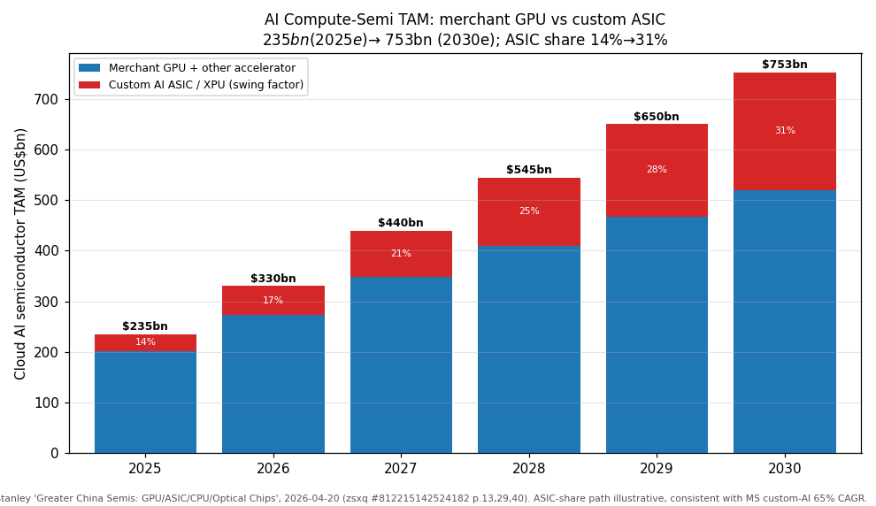
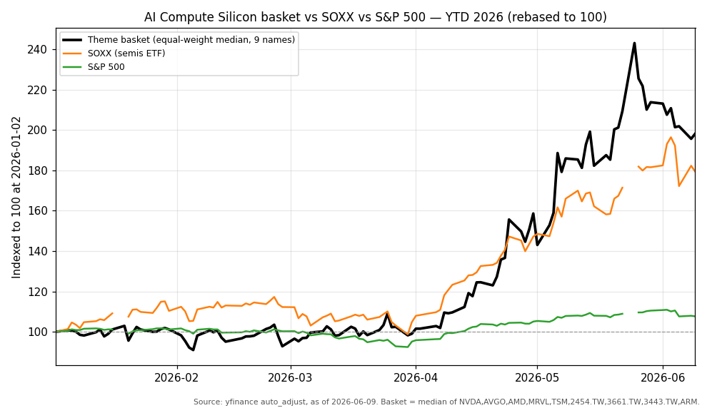
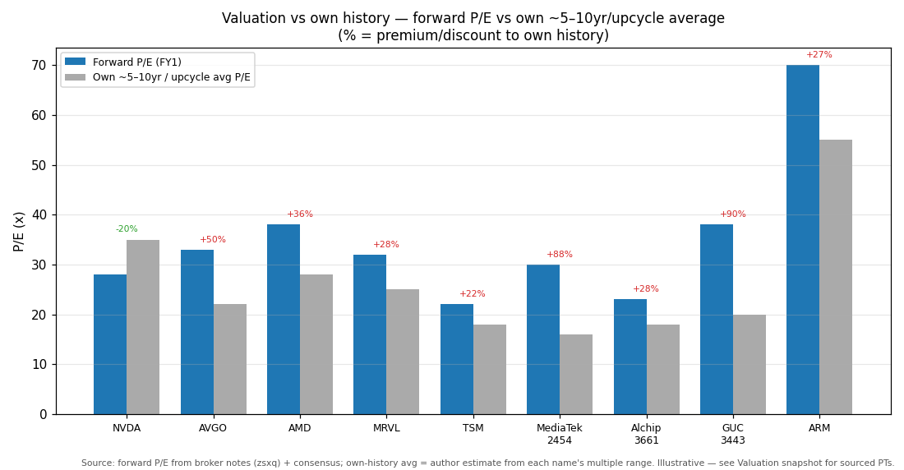
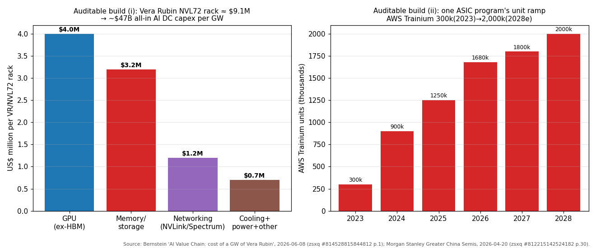

# AI Compute Silicon — GPU / Custom ASIC / Logic Foundry

**Created:** 2026-06-10 · **Last refreshed:** 2026-06-10 · **Last mutated:** 2026-06-10 · **Refresh cadence:** monthly · **Languages tracked:** en

## What's New

*The delta since you last looked — newest refresh on top. Older entries collapse into the archive below so this stays short.*

**2026-06-10 — basket created (9 tickers):**
- **Anchor set:** cloud AI semiconductor TAM **US$235bn (2025e) → ~US$753bn (2030e)** (≈26% CAGR), the spine of a global semi industry reaching **US$1tn by 2030**; custom-AI chips compound at **65% CAGR (2023–30)** vs inference 68% / edge 22%, so ASIC share of the accelerator pool rises ~14%→~31% — the basket's central swing ([MS "Greater China Semis: GPU/ASIC/CPU/Optical Chips", 2026-04-20, zsxq #812215142524182 p.13,29,40](http://xs-macbook-air.local:5001/zsxq/pdf/812215142524182/812215142524182.pdf#page=13)).
- **Core picks (merchant compute + foundry):** NVIDIA (NVDA), Broadcom (AVGO), AMD, Marvell (MRVL), TSMC (TSM) — the merchant-GPU primes, the two largest custom-ASIC enablers, and the leading-edge foundry that fabs all of them.
- **Core picks (Asian custom-ASIC pure-plays):** MediaTek (2454.TW), Alchip (3661.TW) — the Asia ASIC-design houses that physically build the hyperscaler XPUs (Google TPU, AWS Trainium).
- **Enablers added:** Global Unichip / GUC (3443.TW) — TSMC-affiliated ASIC design-service; Arm (ARM) — the CPU IP licensed into Vera, Trainium, Maia and Axion.
- **New broker calls (mined this pass):** JPM NVDA **OW PT $280** (was $265) ([zsxq #184121842518812 p.1](http://xs-macbook-air.local:5001/zsxq/pdf/184121842518812/184121842518812.pdf#page=1)); Bernstein NVDA **OP PT $315** ([zsxq #415241444118428 p.1](http://xs-macbook-air.local:5001/zsxq/pdf/415241444118428/415241444118428.pdf#page=1)); JPM AVGO **OW PT $500** (AI-networking $45bn+ FY27) ([zsxq #415288442528448 p.1](http://xs-macbook-air.local:5001/zsxq/pdf/415288442528448/415288442528448.pdf#page=1)); HSBC MRVL **upgrade to Buy PT $300** (was $85) ([zsxq #212451114448851 p.1](http://xs-macbook-air.local:5001/zsxq/pdf/212451114448851/212451114448851.pdf#page=1)); MS MediaTek **OW PT NT$5,088** (was NT$2,988, on 2nm TPU) ([zsxq #812451458415482 p.1](http://xs-macbook-air.local:5001/zsxq/pdf/812451458415482/812451458415482.pdf#page=1)); JPM Alchip **OW PT NT$6,000** (was NT$4,700) ([zsxq #212452885812281 p.1](http://xs-macbook-air.local:5001/zsxq/pdf/212452885812281/212452885812281.pdf#page=1)); UBS GUC **Buy PT NT$5,500** (was NT$3,000) ([zsxq #184484484555122 p.1](http://xs-macbook-air.local:5001/zsxq/pdf/184484484555122/184484484555122.pdf#page=1)); JPM TSMC **OW PT NT$2,500** (2026 capex →$56bn, 30%+ rev growth) ([zsxq #181245528152842 p.1](http://xs-macbook-air.local:5001/zsxq/pdf/181245528152842/181245528152842.pdf#page=1)).
- **Swing factor flagged:** custom-ASIC share gain vs merchant GPU. The same hyperscaler ASIC programs (Google TPU, AWS Trainium, Meta MTIA, MSFT Maia) that lift the ASIC enablers (AVGO, MRVL, 2454, 3661) are the structural **customer-insourcing threat** to NVIDIA's merchant-GPU annuity — this disruption-vs-incumbent tension is the basket's defining debate.
- **Scope note:** Cambricon (688256.SS) **excluded** — China-domestic/sovereign GPU belongs to the separate `china-sovereign-ai-compute` theme, not the merchant/global-foundry compute-silicon basket.

Earlier refreshes

*(none yet — this is the create pass)*

## Thesis

**Anchor — cloud AI semiconductor TAM.** Morgan Stanley sizes the cloud AI semi TAM at **US$235bn (2025e)** growing to **nearly US$753bn by 2030e** (≈26% CAGR), the major driver lifting the **global semi industry to ~US$1tn by 2030** ([MS, 2026-04-20, zsxq #812215142524182 p.13,40](http://xs-macbook-air.local:5001/zsxq/pdf/812215142524182/812215142524182.pdf#page=13)). The pool is demand-led by cloud capex: MS's tracker estimates **~US$685bn of Top-10 CSP capex in 2026** (no sovereign AI), and NVIDIA's CEO has guided global cloud capex to **US$1tn by 2028** including sovereign ([MS, zsxq #812215142524182 p.14](http://xs-macbook-air.local:5001/zsxq/pdf/812215142524182/812215142524182.pdf#page=14)). NVIDIA itself underwrites the visibility: JPM cites a **$1tn+ Blackwell + Rubin revenue framework** supporting CY27, plus ~$20bn incremental Vera CPU revenue this year ([JPM NVDA, 2026-05-21, zsxq #184121842518812 p.1](http://xs-macbook-air.local:5001/zsxq/pdf/184121842518812/184121842518812.pdf#page=1)).

**Sub-buckets (MS growth view, 2023–30):** custom AI semis **65% CAGR** · inference AI **68% CAGR** · edge AI **22% CAGR**; within cloud, inference outgrows training and **custom AI chips outgrow general-purpose GPU** ([MS, zsxq #812215142524182 p.29](http://xs-macbook-air.local:5001/zsxq/pdf/812215142524182/812215142524182.pdf#page=29)). Geographic cut: the dollar TAM is dominated by US hyperscaler scale-out; the *manufacturing* cut funnels almost entirely through TSMC's Taiwan leading-edge fabs (all of NVDA/AVGO/AMD/MRVL/2454/3661 GPU+ASIC silicon). **Swing factor: custom-ASIC share of the accelerator pool** — the one sub-bucket whose path most moves the merchant-vs-ASIC mix and decides whether NVIDIA's share annuity holds.

**Auditable build (i) — units × $/chip, the rack/GW spine.** Bernstein's bottom-up teardown puts a **Vera Rubin NVL72 rack at ~$9.1M**, decomposed as **GPU (ex-HBM) ~$4.0M · memory/storage ~$3.2M · networking (NVLink/Spectrum) ~$1.2M · cooling+power ~$0.7M**, summing to **all-in AI-DC capex of ~$47B per GW** ([Bernstein "AI Value Chain: cost of a GW of Vera Rubin", 2026-06-08, zsxq #814528815844812 p.1](http://xs-macbook-air.local:5001/zsxq/pdf/814528815844812/814528815844812.pdf#page=1)). The reader can stress this: the GPU+networking silicon (this basket's compute layer) is ~$5.2M of the $9.1M rack (~57%), so a 10% unit-deployment miss removes ~$0.5M/rack of compute-silicon demand directly. **Auditable build (ii) — the ASIC unit ramp:** MS's spine for one program, AWS Trainium, runs **300k units (2023) → 900k (2024) → 1,250k (2025e) → 1,680k (2026e) → 1,800k (2027e) → 2,000k (2028e)** ([MS, zsxq #812215142524182 p.30](http://xs-macbook-air.local:5001/zsxq/pdf/812215142524182/812215142524182.pdf#page=30)). MediaTek's 2nm Google-TPU build is explicit content×price: **2.5mn units of 2nm TPU at US$13k ASP + 1mn units of 3nm TPU at $4.5k ASP ≈ US$37bn total TPU revenue in 2028** ([MS MediaTek, 2026-05-27, zsxq #812451458415482 p.1](http://xs-macbook-air.local:5001/zsxq/pdf/812451458415482/812451458415482.pdf#page=1)).

**Content-ladder + pricing→EPS bridge.** The ASP ladder is the mechanism behind the CAGR: TPU ASPs run $4.5k (3nm) → $13k (2nm) as the node advances ([MS, zsxq #812451458415482 p.1](http://xs-macbook-air.local:5001/zsxq/pdf/812451458415482/812451458415482.pdf#page=1)); on the merchant side, NVDA networking content alone hit a **record $14.8B/quarter** (~20% of DC revenue, up from ~13% YoY) ([JPM, zsxq #184121842518812 p.1](http://xs-macbook-air.local:5001/zsxq/pdf/184121842518812/184121842518812.pdf#page=1)). On the foundry, TSMC's **N2 family capacity grows ~70% CAGR (2026–28)** and CoWoS/SoIC at **~80%/90% CAGR**, the supply-side enabler that converts the dollar TAM into shippable wafers ([BofA TSMC, 2026-05-17, zsxq #184124811855112 p.1](http://xs-macbook-air.local:5001/zsxq/pdf/184124811855112/184124811855112.pdf#page=1)).

**Bull/base/bear + who-benefits-when.** *Base:* MS's $753bn 2030e. *Up-case:* NVIDIA's $1tn cloud-capex-by-2028 (incl. sovereign) implies the accelerator pool runs ahead of base. *Down-case:* CSP capex digestion (the SOCAMM/memory-trim scare in early June was read as a buy-the-dip, not a demand break) ([JPM memory, 2026-06-10, zsxq #584251482281424 p.1](http://xs-macbook-air.local:5001/zsxq/pdf/584251482281424/584251482281424.pdf#page=1)). The single swing assumption is **custom-ASIC share**: AVGO already guides **FY27 AI semi >$100bn across up-to-10GW of deployments** and AI-networking **$45bn+ (>2x YoY)** ([GS AVGO, 2026-06-05, zsxq #184155215151812 p.1](http://xs-macbook-air.local:5001/zsxq/pdf/184155215151812/184155215151812.pdf#page=1); [JPM AVGO, zsxq #415288442528448 p.1](http://xs-macbook-air.local:5001/zsxq/pdf/415288442528448/415288442528448.pdf#page=1)). **Staging (who benefits when):** the **foundry monetizes first** (TSMC bills the wafer regardless of GPU-vs-ASIC outcome — 30%+ rev growth 2026); **merchant-GPU primes now** (NVDA/AMD ride the current Blackwell/MI ramp); **ASIC enablers ramp into 2026–28** (AVGO Tomahawk-6/TPU, MRVL FY28 XPU, Alchip Trn3→Trn4, MediaTek 2nm TPU 2027–28); **CPU-IP (Arm) is the slowest-burn annuity** levered to every accelerator's host CPU.

**Conviction (sourced).** MS prefers AVGO as the broadest ASIC-networking exposure and MediaTek as "one of the purest Google-TPU plays in Asia tech" ([MS, zsxq #812451458415482 p.1](http://xs-macbook-air.local:5001/zsxq/pdf/812451458415482/812451458415482.pdf#page=1)); HSBC's upgrade makes MRVL its highest-conviction networking-silicon name ([HSBC, zsxq #212451114448851 p.1](http://xs-macbook-air.local:5001/zsxq/pdf/212451114448851/212451114448851.pdf#page=1)). *Analyst view (this note):* among the Asia ASIC pure-plays, Alchip's sole-vendor Trn4 status is the most binary upside, MediaTek the most diversified.

## Scope rules

**In:** merchant AI-GPU primes (NVDA, AMD); custom AI-ASIC/XPU enablers with a disclosed hyperscaler program (AVGO TPU/networking, MRVL XPU); Asian ASIC-design houses physically building hyperscaler accelerators (MediaTek Google-TPU, Alchip Trainium, GUC); the leading-edge logic foundry (TSMC) that fabricates all of the above at N3/N2; CPU-compute IP licensed into the accelerator host (Arm).

**Out, tracked elsewhere:** China-domestic/sovereign GPU & AI-ASIC (Cambricon, Hygon — `china-sovereign-ai-compute`); optical interconnect / CPO / silicon photonics (`optical-interconnect-cpo`); memory / HBM (`memory-upcycle`); semicap / WFE (`semicap-wfe`); advanced packaging substrate / ABF / PCB (`pcb-hdi-abf-substrate`); AI-server ODM & racks (`ai-server-odm-racks`); analog/power/auto semis. CSP/hyperscaler end-buyers (GOOGL, AMZN, MSFT, META) are demand drivers, not compute-silicon pure-plays — excluded.

## Tracked tickers

| Ticker | Name | Role | Justification | Added |
|---|---|---|---|---|
| NVDA | NVIDIA | core | Dominant merchant AI-GPU prime; $1tn+ Blackwell+Rubin revenue framework underwriting CY27, networking a record $14.8B/qtr (~20% of DC rev), Vera CPU opening incremental ~$20bn TAM ([JPM, 2026-05-21, zsxq #184121842518812 p.1](http://xs-macbook-air.local:5001/zsxq/pdf/184121842518812/184121842518812.pdf#page=1)). **Moat:** CUDA software lock-in + full-rack (GPU+CPU+NVLink+Spectrum) systems integration. **Threat (customer-insourcing — the modal 2026 risk):** Google TPU / AWS Trainium / Meta MTIA / MSFT Maia custom ASICs displacing merchant GPU at the largest buyers; AVGO guides FY27 AI semi >$100bn largely on hyperscaler XPUs ([JPM AVGO, zsxq #415288442528448 p.1](http://xs-macbook-air.local:5001/zsxq/pdf/415288442528448/415288442528448.pdf#page=1)). **Counter:** CUDA + per-generation cadence + networking/CPU attach makes NVDA the merchant default for the long tail of non-hyperscaler buyers; Bernstein sees datacenter "enormous and still early" ([Bernstein, zsxq #415241444118428 p.1](http://xs-macbook-air.local:5001/zsxq/pdf/415241444118428/415241444118428.pdf#page=1)). | 2026-06-10 |
| AVGO | Broadcom | core | Largest custom-ASIC enabler + AI-networking-silicon leader; AI semi rev $10.8bn 2Q26 (+143% YoY, 49% of total), FY26 ~$56bn, **FY27 >$100bn across up-to-10GW**, AI networking **$45bn+ FY27 (>2x YoY)** on Tomahawk-6 (3nm, 102Tbps) ([JPM, 2026-06-04, zsxq #415288442528448 p.1](http://xs-macbook-air.local:5001/zsxq/pdf/415288442528448/415288442528448.pdf#page=1); [GS, zsxq #184155215151812 p.1](http://xs-macbook-air.local:5001/zsxq/pdf/184155215151812/184155215151812.pdf#page=1)). Programs: Google TPU (multi-gen), Anthropic (2027), OpenAI (late-2026 prod), Meta MTIA ([JPM Broadcom recap, 2026-06-04, zsxq #585411124181524 p.1](http://xs-macbook-air.local:5001/zsxq/pdf/585411124181524/585411124181524.pdf#page=1)). **Moat:** SerDes/networking IP + multi-program ASIC scale 1–2 steps ahead of rivals. **Threat:** MRVL/Alchip/MediaTek splitting future XPU sockets; a hyperscaler taking design fully in-house (COT). **Counter:** 2-year cadence + irreplaceable networking-silicon attach. | 2026-06-10 |
| AMD | Advanced Micro Devices | core | #2 merchant AI-GPU (MI-series) + share-gaining server CPU; "explosion of demand" expanding supply, agentic-inference share could exceed general server-CPU share; the credible second source to NVIDIA ([Citi Silicon Valley roadshow, 2026-06-04, zsxq #184155221524182 p.1](http://xs-macbook-air.local:5001/zsxq/pdf/184155221524182/184155221524182.pdf#page=1)). **Moat:** only x86 server-CPU + GPU full-platform alternative (Helios/Venice); inference-cost competitiveness. **Threat:** NVIDIA's CUDA moat caps merchant-GPU share; the same hyperscaler-ASIC insourcing that pressures NVDA pressures AMD's GPU TAM. **Counter:** ROCm openness + cost/perf for inference workloads where lock-in is weaker. | 2026-06-10 |
| MRVL | Marvell Technology | core | Custom-XPU + AI-interconnect silicon; FY27 data center +50%, FY28 +55%, interconnect >70% FY27 growth, FY28 custom-XPU ramp "improved materially" ([MS, 2026-05-30, zsxq #212485545245151 p.1](http://xs-macbook-air.local:5001/zsxq/pdf/212485545245151/212485545245151.pdf#page=1)); HSBC upgraded to Buy on the "AI-networking super-cycle", majority 800G/1.6T optical-DSP share ([HSBC, 2026-05-28, zsxq #212451114448851 p.1](http://xs-macbook-air.local:5001/zsxq/pdf/212451114448851/212451114448851.pdf#page=1)). **Moat:** custom-silicon design wins (AWS, others) + interconnect/CXL IP. **Threat (insourcing):** AVGO's networking dominance + hyperscalers moving DSP into custom switch ASICs / LPO. **Counter:** breadth across XPU + interconnect + CXL gives multiple sockets. | 2026-06-10 |
| TSM | TSMC | core | The leading-edge logic foundry that fabricates every name in this basket; 2026 capex leaning to **US$56bn** (could approach $75–80bn), **30%+ revenue growth 2026**, N2 family +70% CAGR (2026–28), CoWoS/SoIC +80%/90% CAGR, AI demand/supply gap "will take years to bridge" ([JPM AGM, 2026-06-07, zsxq #181245528152842 p.1](http://xs-macbook-air.local:5001/zsxq/pdf/181245528152842/181245528152842.pdf#page=1); [BofA, 2026-05-17, zsxq #184124811855112 p.1](http://xs-macbook-air.local:5001/zsxq/pdf/184124811855112/184124811855112.pdf#page=1)). **Moat:** monopoly on profitable leading-edge (N3/N2) + CoWoS advanced packaging; mix-shift to AI backfills weak non-AI utilization (logic foundry 70–80% in 1H26). **Threat:** Intel 18A / Samsung SF3 leading-edge re-entry; CSP-driven capex digestion. **Counter:** yield/capacity lead (3nm 190k/230k WPM vs Intel/Samsung 20–25k) ([BofA, zsxq #184124811855112 p.1](http://xs-macbook-air.local:5001/zsxq/pdf/184124811855112/184124811855112.pdf#page=1)). | 2026-06-10 |
| 2454.TW | MediaTek | core | Purest Asia Google-TPU ASIC play; 2nm TPU "Humufish" ≥2.5mn units 2028 (×$13k) + 1mn 3nm (×$4.5k) ≈ **US$37bn total TPU revenue 2028**, Google TPU = 38%/63% of MediaTek rev 2027/28, targeting 10–15% of the US$70–80bn AI-ASIC market ([MS, 2026-05-27, zsxq #812451458415482 p.1](http://xs-macbook-air.local:5001/zsxq/pdf/812451458415482/812451458415482.pdf#page=1); [BofA, 2026-05-06, zsxq #184125288512422 p.1](http://xs-macbook-air.local:5001/zsxq/pdf/184125288512422/184125288512422.pdf#page=1)). **Moat:** secured Google-TPU design + edge/handset cash-cow funding the DC pivot; next-gen 1.4nm TPU v10 "Icefish" pipeline. **Threat (insourcing):** Google moving TPU design to COT or splitting to AVGO/Alchip; TPU gross margin declining from ~40%. **Counter:** entrenched multi-gen TPU relationship + breadth of AI-accelerator engagements. | 2026-06-10 |
| 3661.TW | Alchip Technologies | core | Sole-vendor on AWS Trainium 4 (2nm, tapes out late-2026); Trn3 mass production from late-May, revenue ramp to **$1.6bn/$2.5bn for Alchip 2026/27**, record 50% GM on NRE mix ([JPM, 2026-05-10, zsxq #212452885812281 p.1](http://xs-macbook-air.local:5001/zsxq/pdf/212452885812281/212452885812281.pdf#page=1); [Nomura, 2026-05-11, zsxq #212458124211581 p.1](http://xs-macbook-air.local:5001/zsxq/pdf/212458124211581/212458124211581.pdf#page=1)). **Moat:** advanced-node ASIC design-service expertise + secured CoWoS/substrate allocation for Trainium; sole Trn4 vendor. **Threat (insourcing/single-customer):** ~all upside hinges on one AWS program; AWS could dual-source or take COT; MediaTek/GUC competing for next-gen sockets. **Counter:** 2nm tape-out incumbency + TSMC capacity allocation hard to replicate mid-program. | 2026-06-10 |
| 3443.TW | Global Unichip (GUC) | enabler | TSMC-affiliated ASIC design-service; Q1 beat on GM, **2026 sales +65% YoY to NT$56.2bn**, Google-CPU project = 42% of sales, HPC-CPU + automotive driving medium-term growth ([UBS, 2026-05-02, zsxq #184484484555122 p.1](http://xs-macbook-air.local:5001/zsxq/pdf/184484484555122/184484484555122.pdf#page=1); [Nomura, 2026-05-06, zsxq #212458511845811 p.1](http://xs-macbook-air.local:5001/zsxq/pdf/212458511845811/212458511845811.pdf#page=1)). **Moat:** TSMC IP-alliance privileged-access to leading-edge ASIC flows. **Threat (insourcing):** customer concentration (Google CPU); Alchip/MediaTek out-competing for marquee AI-ASIC sockets — `enabler`, the smaller design-service leg, not a merchant-compute prime. **Counter:** TSMC affiliation + automotive/CPU diversification. | 2026-06-10 |
| ARM | Arm Holdings | enabler | CPU-compute IP licensed into the accelerator host CPU across the stack — NVIDIA Vera/Grace, AWS Trainium host + Graviton, Google Axion, MSFT Cobalt; partners accelerating agentic-edge compute ([MS, 2026-06-02, zsxq #212485484285841 p.1](http://xs-macbook-air.local:5001/zsxq/pdf/212485484285841/212485484285841.pdf#page=1)). **Moat:** near-universal CPU-ISA royalty annuity that scales with every accelerator deployed regardless of GPU-vs-ASIC outcome — the theme's lowest-beta way to own the compute build-out. **Threat:** RISC-V open-ISA encroachment; in-house custom cores reducing royalty rates. **Counter:** ecosystem/software gravity + v9 royalty-rate uplift; the slowest but most diversified annuity — hence `enabler`. | 2026-06-10 |

## Valuation snapshot

*One row per name with sell-side coverage. "Px @ note date" = report-date price (the load-bearing price that fixes the called upside); "current px" as of 2026-06-09 from yfinance. Populated from `stock_price_target_db` (surfaced at `/pt`).*

| Ticker | Rating | Px @ note date | PT | Upside% (vs note date) | Current px (06-09) | Fwd multiple | Own ~hist avg | FY1/FY2 EPS basis |
|---|---|---|---|---|---|---|---|---|
| NVDA | JPM **OW** · Bernstein **OP** · MS **OW** | $223.47 (JPM 05-21) · $222.82 (MS 06-04) | $280 (JPM, was $265) · $315 (Bernstein, 25x) · $288 (MS) | **+25.3%** (JPM) · **+41.0%** (Bernstein) | $208.19 | ~28x fwd | ~35x (10yr avg, de-rated) | Bernstein 25x on FY28/CY27 EPS |
| AVGO | JPM **OW** · MS **OW** · Citi **Buy** | $459.9 (JPM/MS 06-04) · $459.9 (Citi 06-05) | $500 (JPM) · $502 (MS) · $500 (Citi, 20x) | **+8.7%** (JPM) · **+9.2%** (MS) · **+8.7%** (Citi) | $392.16 | ~33x fwd / 20x out-yr (Citi) | ~22x (5yr avg) | FY27 AI semi >$100bn; FY26 AI ~$56bn |
| AMD | (no dedicated zsxq PT note this pass) | n/a | n/a | n/a | $475.51 | ~38x fwd | ~28x (upcycle avg) | Server-CPU + MI ramp (Citi roadshow) |
| MRVL | MS **EW** · HSBC **Buy** (upgrade) | $177.27 (MS 05-30) · $196.33 (HSBC 05-28) | $195 (MS, was $172) · $300 (HSBC, was $85) | **+10.0%** (MS) · **+52.8%** (HSBC) | $266.88 | ~32x fwd | ~25x (hist avg) | DC +50%/+55% FY27/28; FY28 XPU ramp |
| TSM | JPM **OW** · BofA **Buy** | NT$2,385 (JPM 06-07) · NT$2,270 (BofA 05-17) | NT$2,500 (JPM) · NT$2,560 (BofA) | **+4.8%** (JPM) · **+12.8%** (BofA) | NT$2,305 (TW) / $427.92 (ADR) | ~22x fwd | ~18x (10yr avg) | 30%+ rev growth 2026; capex →$56bn |
| 2454.TW | MS **OW** · BofA **Buy** | n/a (MS 05-27) · NT$2,610 (BofA 05-06) | NT$5,088 (MS, was NT$2,988; 38x 2027E/18x 2028E) · NT$3,000 (BofA, was NT$2,160; 23x 2027E) | n/a (MS) · **+14.9%** (BofA) | NT$4,475 | 38x 2027E (MS) | ~16x (pre-DC avg) | 2nm TPU $37bn rev 2028; EPS NT$64.4/129 26/27 (BofA) |
| 3661.TW | JPM **OW** · Nomura **Buy** | NT$4,890 (JPM 05-10) | NT$6,000 (JPM, was NT$4,700; 25x 12m) · NT$6,000 (Nomura, +22.7%) | **+22.7%** (JPM) | NT$4,250 | 25x 12m fwd (JPM) | ~18x (hist avg) | Alchip rev $1.6bn/$2.5bn 2026/27 |
| 3443.TW | UBS **Buy** · Nomura **Neutral** | NT$4,260 (UBS 04-30) | NT$5,500 (UBS, was NT$3,000; 50x avg 2027-28E) · NT$4,600 (Nomura) | **+29.1%** (UBS) | NT$4,310 | ~38x fwd / 50x 2027-28E (UBS) | ~20x (hist avg) | 2026 sales +65% YoY; Google-CPU 42% |
| ARM | (no dedicated zsxq PT note this pass) | n/a | n/a | n/a | $324.86 | ~70x fwd | ~55x (post-IPO avg) | v9 royalty mix; CPU-IP attach |

**Cross-sectional / growth-adjusted read (PEG).** The Asia ASIC pure-plays sort cheap→dear on growth-adjusted multiples: Alchip ~25x on >50% near-term rev growth ≈ **PEG ~0.5** (cheapest growth-adjusted); MediaTek 38x 2027E on a TPU ramp 2027→2028 doubling ≈ PEG ~0.6; GUC 50x 2027-28E on +65% 2026 sales ≈ PEG ~0.8. TSMC screens cheapest headline (~22x fwd) but off a 30% grower (PEG ~0.7) — the lowest-risk way to own the pool. NVDA at ~28x fwd / ~35% growth ≈ PEG ~0.8 is cheap *relative to its own de-rated history*. **Stale / price-through-PT (pending refresh):** MRVL ($266.88 already above MS's $195 — that EW call is overtaken by price; HSBC $300 still live); AMD/ARM carry **no dedicated zsxq PT note** this pass (multiples are consensus/author estimates — flagged for sourced PT next refresh).

## Exclusions

| Ticker | Reason |
|---|---|
| 688256.SS | **Cambricon — China-domestic/sovereign AI GPU/ASIC.** Belongs to the separate `china-sovereign-ai-compute` theme, not the merchant/global-foundry compute-silicon basket. |
| GOOGL / AMZN / MSFT / META | Hyperscaler end-buyers / ASIC *sponsors* — they design TPU/Trainium/Maia/MTIA but the silicon is built by AVGO/MRVL/2454/3661; tracking the buyers dilutes the compute-silicon signal. |
| AMAT / ALAB / ASTERA | Considered via the Citi SV roadshow but each is WFE (`semicap-wfe`) or interconnect-adjacent (`optical-interconnect-cpo`) — captured in those themes. |
| Intel (INTC) | Foundry re-entry (18A) is a *threat* to TSMC, not a compute-silicon pure-play; its merchant-AI-GPU position is sub-scale. Revisit if 18A external-foundry traction materializes. |

## Keywords

AI accelerator / AI 加速器 · merchant GPU / 商用 GPU · custom ASIC / 定制 ASIC · XPU · TPU · Trainium · MTIA · Maia · CoWoS / SoIC · N2 / N3 leading-edge foundry / 先进制程 · NVLink · Tomahawk · hyperscaler insourcing / 云厂自研 · Blackwell · Rubin · Vera CPU · Arm CPU IP

## Performance

*Window: YTD 2026 (from 2026-01-02), trailing 90d / 30d, 1Y; equal-weight median, vs S&P 500 / SOXX. As of 2026-06-09 (yfinance auto_adjust).*

| Metric | Basket (median) | S&P 500 | SOXX |
|---|---|---|---|
| YTD 2026 | **+98.2%** | +7.7% | +79.3% |
| Trailing 90d | **+82.3%** | +9.0% | +64.4% |
| Trailing 30d | **+4.5%** | −0.2% | +8.0% |
| 1Y | **+131.0%** | +22.3% | +148.9% |

Per-name YTD 2026: MediaTek (2454.TW) +210.3% · MRVL +198.9% · ARM +183.2% · AMD +112.8% · GUC (3443.TW) +98.2% · TSMC (TSM ADR) +34.3% · Alchip (3661.TW) +16.9% · Broadcom +13.0% · NVIDIA +10.4%.

> **Data caveat (parabolic prints):** trailing-1Y returns for several names are parabolic on yfinance (MRVL +288.7%, AMD +285.8%, GUC +276.5%, MediaTek +248.4%) — consistent with the known yfinance quirk for semi/Asian names in the 2026 window. We quote the **median + benchmark** rather than the mean, and treat 1Y prints as directional, not precise. The YTD/90d numbers are reliable.

### Basket scorecard

- **Batting average (YTD 2026):** **9/9 names positive · 9/9 beat the S&P 500.** Vs the sector benchmark SOXX (+79.3% YTD): **4/9 beat** (MediaTek, MRVL, ARM, AMD) — the merchant-GPU + foundry names (NVDA, AVGO, TSM) lagged SOXX YTD, having re-rated earlier and digested the early-June capex-trim scare.
- **Best contributor (YTD):** MediaTek **+210.3%** (the 2nm-TPU re-rate). **Worst contributor (YTD):** NVIDIA **+10.4%** (still positive; consolidating after 2024–25 run, the merchant prime now the *value* leg of the basket).
- **Cumulative outperformance since inception:** n/a — this is the create pass (one snapshot line). The next refresh, with ≥2 snapshot lines, will print cumulative basket bps vs benchmark.

## Recent events

- **2026-06-08** — Bernstein "AI Value Chain": Vera Rubin NVL72 rack ≈$9.1M (GPU $4M / memory $3.2M / networking $1.2M), all-in ~$47B/GW — quantifies the compute-silicon $ content per GW ([Bernstein, zsxq #814528815844812 p.1](http://xs-macbook-air.local:5001/zsxq/pdf/814528815844812/814528815844812.pdf#page=1)).
- **2026-06-07** — JPM TSMC AGM: 2026 capex leaning $56bn (could approach $75–80bn), 30%+ rev growth, AI demand/supply gap "will take years to bridge"; OW PT NT$2,500 ([JPM, zsxq #181245528152842 p.1](http://xs-macbook-air.local:5001/zsxq/pdf/181245528152842/181245528152842.pdf#page=1)).
- **2026-06-04/05** — Broadcom Apr-Q: AI semi $10.8bn (+143% YoY), FY26 ~$56bn, FY27 >$100bn / 10GW, AI-networking $45bn+ FY27; JPM OW $500, MS OW $502, Citi Buy $500 — pullback called a buying opportunity ([JPM, zsxq #415288442528448 p.1](http://xs-macbook-air.local:5001/zsxq/pdf/415288442528448/415288442528448.pdf#page=1); [MS, zsxq #812488522258422 p.1](http://xs-macbook-air.local:5001/zsxq/pdf/812488522258422/812488522258422.pdf#page=1)).
- **2026-05-30** — MS MRVL: raised FY27/FY28 outlook (DC +50%/+55%), EW PT $195 (was $172) ([MS, zsxq #212485545245151 p.1](http://xs-macbook-air.local:5001/zsxq/pdf/212485545245151/212485545245151.pdf#page=1)).
- **2026-05-28** — HSBC upgraded MRVL to Buy, PT $300 (was $85), on the AI-networking super-cycle ([HSBC, zsxq #212451114448851 p.1](http://xs-macbook-air.local:5001/zsxq/pdf/212451114448851/212451114448851.pdf#page=1)).
- **2026-05-27** — MS MediaTek: 2nm TPU upside → $37bn TPU rev 2028; OW PT raised to NT$5,088 (was NT$2,988) ([MS, zsxq #812451458415482 p.1](http://xs-macbook-air.local:5001/zsxq/pdf/812451458415482/812451458415482.pdf#page=1)).
- **2026-05-21** — NVDA FQ1: beat-and-raise, $1tn+ Blackwell+Rubin framework, Vera CPU ~$20bn TAM, $80B buyback; JPM OW $280, Bernstein OP $315 ([JPM, zsxq #184121842518812 p.1](http://xs-macbook-air.local:5001/zsxq/pdf/184121842518812/184121842518812.pdf#page=1)).
- **2026-05-10/11** — Alchip 1Q: 50% GM, Trn3 mass production late-May ($1.6bn/$2.5bn 2026/27), sole Trn4 vendor; JPM/Nomura OW/Buy PT NT$6,000 ([JPM, zsxq #212452885812281 p.1](http://xs-macbook-air.local:5001/zsxq/pdf/212452885812281/212452885812281.pdf#page=1)).

## Drift signals

- **Priced-for-perfection / air-pocket flag.** The basket-median forward multiple sits above own history for the ASIC pure-plays (MediaTek 38x 2027E vs ~16x pre-DC; GUC 50x 2027-28E vs ~20x; ARM ~70x). **Specific demand assumption whose miss de-rates the basket:** **custom-ASIC unit ramps slipping** — if Google/AWS TPU/Trainium volumes disappoint (e.g. the early-June Rubin SOCAMM/memory-trim scare proves to be real capex digestion, not a buy-the-dip), the ASIC enablers de-rate hardest ([JPM memory, 2026-06-10, zsxq #584251482281424 p.1](http://xs-macbook-air.local:5001/zsxq/pdf/584251482281424/584251482281424.pdf#page=1)). **Sized de-rate:** MediaTek reverting from 38x 2027E toward a ~20x DC-grower multiple ≈ **−45%** on unchanged EPS; GUC from 50x to ~25x ≈ **−50%**; the floor for the merchant primes is shallower (NVDA ~28x is already *below* its ~35x 10yr avg — the basket's de-rate risk is concentrated in the Asia ASIC leg, not NVDA).
- **The swing factor is also the disruption risk to a core name.** The custom-ASIC share gain that powers AVGO/MRVL/2454/3661 is precisely what erodes NVDA's merchant-GPU annuity — the basket is deliberately hedged across both sides of the bet (merchant primes NVDA/AMD vs ASIC enablers AVGO/MRVL/2454/3661), but a faster-than-expected hyperscaler-insourcing shift is net-negative for the merchant leg.
- **NVDA/AVGO/TSM lagging SOXX YTD** is a within-basket rotation signal — the merchant + foundry names are the *value* leg now; the ASIC pure-plays carry the momentum and the valuation risk. Watch whether the rotation reverses on a capex-digestion scare (would favour the lower-multiple foundry/merchant leg).
- **AMD and ARM carry no dedicated zsxq PT note** this pass — flag for sourced-PT re-grounding next refresh (currently consensus/author multiples only).

## Leading indicators

*The early-warning layer — upstream signals that move BEFORE the basket members. Macro header rows, then a per-ticker operating-data table (Bernstein "Barometer" spine). Each string-matched to its primary issuer.*

**Macro / upstream (lead the whole basket):**
- **Top-10 CSP capex** — ~US$685bn in 2026e (MS tracker, no sovereign); NVDA-CEO path to US$1tn by 2028 incl. sovereign. Direction: ↑. Implies: the dollar TAM is demand-led and accelerating ([MS, zsxq #812215142524182 p.14](http://xs-macbook-air.local:5001/zsxq/pdf/812215142524182/812215142524182.pdf#page=14)).
- **TSMC CoWoS capacity** — expanding toward 165kwpm by 2027 (doubled 2025; +80% CAGR SoIC +90%); the advanced-packaging gate on shippable accelerator supply. Direction: ↑ ([MS, zsxq #812215142524182 p.16](http://xs-macbook-air.local:5001/zsxq/pdf/812215142524182/812215142524182.pdf#page=16); [BofA, zsxq #184124811855112 p.1](http://xs-macbook-air.local:5001/zsxq/pdf/184124811855112/184124811855112.pdf#page=1)).
- **TSMC monthly revenue / capex revisions** — 30%+ 2026 rev growth, capex $56bn (could→$75-80bn); the single cleanest read on total compute-silicon wafer demand ([JPM, zsxq #181245528152842 p.1](http://xs-macbook-air.local:5001/zsxq/pdf/181245528152842/181245528152842.pdf#page=1)).

**Per-ticker operating data (latest disclosed print):**

| Name | Operating metric | Latest print | Source |
|---|---|---|---|
| NVDA | DC networking rev | record **$14.8B/qtr**, ~20% of DC (up from ~13% YoY) | [JPM, zsxq #184121842518812 p.1](http://xs-macbook-air.local:5001/zsxq/pdf/184121842518812/184121842518812.pdf#page=1) |
| AVGO | AI semi rev YoY | **+143% YoY** to $10.8bn 2Q26 (49% of total) | [GS, zsxq #184155215151812 p.1](http://xs-macbook-air.local:5001/zsxq/pdf/184155215151812/184155215151812.pdf#page=1) |
| MRVL | DC rev growth guide | **+50% FY27 / +55% FY28**; interconnect >70% FY27 | [MS, zsxq #212485545245151 p.1](http://xs-macbook-air.local:5001/zsxq/pdf/212485545245151/212485545245151.pdf#page=1) |
| 3661.TW | Alchip GM / Trn3 rev | **50% GM** 1Q; Trn3 → $1.6bn/$2.5bn 2026/27 | [JPM, zsxq #212452885812281 p.1](http://xs-macbook-air.local:5001/zsxq/pdf/212452885812281/212452885812281.pdf#page=1) |
| 2454.TW | TPU unit/ASP build | **2.5mn 2nm × $13k + 1mn 3nm × $4.5k ≈ $37bn** 2028 | [MS, zsxq #812451458415482 p.1](http://xs-macbook-air.local:5001/zsxq/pdf/812451458415482/812451458415482.pdf#page=1) |
| 3443.TW | GUC 2026 sales | **+65% YoY to NT$56.2bn**; Google-CPU 42% | [UBS, zsxq #184484484555122 p.1](http://xs-macbook-air.local:5001/zsxq/pdf/184484484555122/184484484555122.pdf#page=1) |
| TSM | N2 family capacity | **+70% CAGR 2026–28**; 3nm 190k/230k WPM 4Q26/27 | [BofA, zsxq #184124811855112 p.1](http://xs-macbook-air.local:5001/zsxq/pdf/184124811855112/184124811855112.pdf#page=1) |

**Side-by-side member guidance on the shared forward metric (custom-ASIC ramp):** AVGO FY27 AI semi >$100bn · MRVL FY28 XPU "improved materially" · Alchip Trn4 sole-vendor late-2026 tape-out · MediaTek 2nm TPU 2027–28 → all guide the *same* hyperscaler-XPU build-out from different sockets — concurrent acceleration is the bull confirmation; any one slipping is the first crack.

## Catalysts (next 3–6 months)

- **NVIDIA Vera Rubin ramp cadence + GTC updates** (mechanism: each generation resets the $/rack content ladder → lifts the GPU sub-bucket and TSMC CoWoS pull), 2H26 — moves NVDA, TSM ([JPM, zsxq #184121842518812 p.1](http://xs-macbook-air.local:5001/zsxq/pdf/184121842518812/184121842518812.pdf#page=1)).
- **Broadcom Tomahawk-6 strong ramp + FY27 AI-semi guide** (mechanism: ASIC/networking share-gain → custom-ASIC sub-bucket, the swing factor), 2H26/2027 — moves AVGO, MRVL ([JPM, zsxq #415288442528448 p.1](http://xs-macbook-air.local:5001/zsxq/pdf/415288442528448/415288442528448.pdf#page=1)).
- **AWS Trainium 3 volume ramp + Trn4 (2nm) tape-out** (mechanism: ASIC unit ramp × ASP → Alchip revenue step-up; validates the insourcing-share thesis), late-2026 — moves 3661.TW ([JPM, zsxq #212452885812281 p.1](http://xs-macbook-air.local:5001/zsxq/pdf/212452885812281/212452885812281.pdf#page=1)).
- **MediaTek 2nm Google-TPU "Humufish" volume + 1.4nm v10 award** (mechanism: 2nm TPU units×$13k ASP → MediaTek DC revenue mix), 2027 production — moves 2454.TW ([MS, zsxq #812451458415482 p.1](http://xs-macbook-air.local:5001/zsxq/pdf/812451458415482/812451458415482.pdf#page=1)).
- **TSMC capex revision toward $75–80bn + N2 ramp** (mechanism: leading-edge + CoWoS capacity converts the dollar TAM into shippable wafers; raised capex = read-through to all members' supply), through 2H26 — moves TSM and the whole basket ([JPM, zsxq #181245528152842 p.1](http://xs-macbook-air.local:5001/zsxq/pdf/181245528152842/181245528152842.pdf#page=1)).
- **Hyperscaler capex-digestion / memory-trim signals** (mechanism: a real capex pause de-rates the high-multiple ASIC leg first — downside catalyst), watch each CSP print — moves the ASIC pure-plays most ([JPM memory, zsxq #584251482281424 p.1](http://xs-macbook-air.local:5001/zsxq/pdf/584251482281424/584251482281424.pdf#page=1)).

## Data Used / 数据来源清单

**Market data**
- yfinance auto_adjust=True for prices, returns, sector — pulled 2026-06-10 (last bar 2026-06-09).
- Current prices: NVDA $208.19 · AVGO $392.16 · AMD $475.51 · MRVL $266.88 · TSM $427.92 · 2454.TW NT$4,475 · 3661.TW NT$4,250 · 3443.TW NT$4,310 · ARM $324.86 (TSMC TW 2330.TW NT$2,305).

**Per-ticker primary / sell-side sources**
- NVDA: JPM (#184121842518812), Bernstein (#415241444118428), MS Computex (#812488522252442).
- AVGO: JPM (#415288442528448), MS (#812488522258422), Citi (#184155215151152), GS (#184155215151812), JPM Broadcom recap (#585411124181524).
- AMD: Citi Silicon Valley roadshow (#184155221524182) — no dedicated PT note in library this pass.
- MRVL: MS (#212485545245151), HSBC (#212451114448851).
- TSM: JPM AGM (#181245528152842), BofA capacity/tech (#184124811855112).
- 2454.TW MediaTek: MS 2nm-TPU (#812451458415482), BofA TPU (#184125288512422).
- 3661.TW Alchip: JPM (#212452885812281), Nomura (#212458124211581).
- 3443.TW GUC: UBS (#184484484555122), Nomura (#212458511845811).
- ARM: MS edge/agentic (#212485484285841) — no dedicated PT note this pass.

**Industry research / sell-side thematic notes (theme-level)**
- Morgan Stanley, "Greater China Semis: Focus on AI-related semis — GPU, ASIC, CPU, and Optical Chips", 2026-04-20 (zsxq #812215142524182) — TAM anchor, sub-bucket CAGRs, Trainium unit build, CoWoS capacity, custom-vs-GPU framework.
- Bernstein, "AI Value Chain: How much does a GW of Vera Rubin data center capacity cost?", 2026-06-08 (zsxq #814528815844812) — the $/rack and $/GW auditable cost build.

**Local zsxq library (`db/zsxq.db` — read-only)**
- 18 broker PDFs mined for this theme (file_ids: 812215142524182, 814528815844812, 184121842518812, 415241444118428, 812488522252442, 415288442528448, 812488522258422, 184155215151152, 184155215151812, 585411124181524, 212485545245151, 212451114448851, 812451458415482, 184125288512422, 212452885812281, 212458124211581, 184484484555122, 181245528152842, 184124811855112, 184155221524182) via `find_pdf.py` → `ocr_pdf.py` (image-only ones OCR'd first) → `extract_pdf.py`. The 翻译精华 summary was the triage read; all load-bearing numbers cited from the extracted original text, string-matched. Seed file_ids verified: 184121842518812 (JPM NVDA ✓), 415241444118428 (Bernstein NVDA ✓), 585411124181524 (JPM Broadcom recap ✓), 812215142524182 (MS Greater China Semis ✓ — the TAM anchor), 212452885812281 (JPM Alchip ✓).

**TAM anchor + leading indicators (theme-level)**
- MS cloud AI semi TAM $235bn (2025e) → ~$753bn (2030e); custom-AI 65% CAGR — Thesis anchor + sub-bucket.
- Leading indicators: Top-10 CSP capex ~$685bn (2026e); TSMC CoWoS →165kwpm (2027); TSMC capex $56bn / 30%+ rev growth 2026 — see Leading indicators block.

**Macro backdrop**
- VIX 21.5, 10Y Treasury 4.54%, HY OAS 2.74% — as of 2026-06-04/05. Source: `indicators.db`.

**Stores written (Tier-2 helpers)**
- `stock_price_target_db` — 15 sell-side PT / rating calls upserted for NVDA, AVGO, MRVL, 2454.TW, 3661.TW, 3443.TW, TSM (idempotent on ticker × broker × file_id); surfaced at `/pt`.

**Charts**
- `reports/charts/theme_ai-compute-silicon-gpu-asic_anchor_tam.png` — anchor TAM merchant-GPU vs custom-ASIC stacked.
- `reports/charts/theme_ai-compute-silicon-gpu-asic_basket_vs_benchmark.png` — basket vs SOXX vs S&P 500, YTD 2026.
- `reports/charts/theme_ai-compute-silicon-gpu-asic_valuation_vs_history.png` — fwd P/E vs own ~hist avg.
- `reports/charts/theme_ai-compute-silicon-gpu-asic_auditable_build.png` — Vera Rubin $/rack decomposition + Trainium unit ramp.

**Stale notices / coverage gaps**
- AMD and ARM have no dedicated PT note in the zsxq library this pass — tracked via the broad GPU/ASIC notes + yfinance; sourced-PT re-grounding flagged for next refresh.
- Memory/HBM ($3.2M of the $9.1M VR rack) is a rich-dollar layer this basket deliberately does NOT cover — tracked in `memory-upcycle`.

## References

- [JPM NVIDIA, 2026-05-21 (zsxq #184121842518812)](http://xs-macbook-air.local:5001/zsxq/pdf/184121842518812/184121842518812.pdf#page=1)
- [Bernstein NVIDIA, 2026-05-21 (zsxq #415241444118428)](http://xs-macbook-air.local:5001/zsxq/pdf/415241444118428/415241444118428.pdf#page=1)
- [MS NVIDIA Computex, 2026-06-04 (zsxq #812488522252442)](http://xs-macbook-air.local:5001/zsxq/pdf/812488522252442/812488522252442.pdf#page=1)
- [MS Greater China Semis (TAM anchor), 2026-04-20 (zsxq #812215142524182)](http://xs-macbook-air.local:5001/zsxq/pdf/812215142524182/812215142524182.pdf#page=13)
- [Bernstein AI Value Chain / GW cost, 2026-06-08 (zsxq #814528815844812)](http://xs-macbook-air.local:5001/zsxq/pdf/814528815844812/814528815844812.pdf#page=1)
- [JPM Broadcom, 2026-06-04 (zsxq #415288442528448)](http://xs-macbook-air.local:5001/zsxq/pdf/415288442528448/415288442528448.pdf#page=1)
- [MS Broadcom, 2026-06-04 (zsxq #812488522258422)](http://xs-macbook-air.local:5001/zsxq/pdf/812488522258422/812488522258422.pdf#page=1)
- [Citi Broadcom, 2026-06-05 (zsxq #184155215151152)](http://xs-macbook-air.local:5001/zsxq/pdf/184155215151152/184155215151152.pdf#page=1)
- [GS Broadcom, 2026-06-05 (zsxq #184155215151812)](http://xs-macbook-air.local:5001/zsxq/pdf/184155215151812/184155215151812.pdf#page=1)
- [JPM Broadcom recap (TPU programs), 2026-06-04 (zsxq #585411124181524)](http://xs-macbook-air.local:5001/zsxq/pdf/585411124181524/585411124181524.pdf#page=1)
- [MS Marvell, 2026-05-30 (zsxq #212485545245151)](http://xs-macbook-air.local:5001/zsxq/pdf/212485545245151/212485545245151.pdf#page=1)
- [HSBC Marvell upgrade, 2026-05-28 (zsxq #212451114448851)](http://xs-macbook-air.local:5001/zsxq/pdf/212451114448851/212451114448851.pdf#page=1)
- [MS MediaTek 2nm TPU, 2026-05-27 (zsxq #812451458415482)](http://xs-macbook-air.local:5001/zsxq/pdf/812451458415482/812451458415482.pdf#page=1)
- [BofA MediaTek TPU, 2026-05-06 (zsxq #184125288512422)](http://xs-macbook-air.local:5001/zsxq/pdf/184125288512422/184125288512422.pdf#page=1)
- [JPM Alchip, 2026-05-10 (zsxq #212452885812281)](http://xs-macbook-air.local:5001/zsxq/pdf/212452885812281/212452885812281.pdf#page=1)
- [Nomura Alchip, 2026-05-11 (zsxq #212458124211581)](http://xs-macbook-air.local:5001/zsxq/pdf/212458124211581/212458124211581.pdf#page=1)
- [UBS GUC, 2026-05-02 (zsxq #184484484555122)](http://xs-macbook-air.local:5001/zsxq/pdf/184484484555122/184484484555122.pdf#page=1)
- [Nomura GUC, 2026-05-06 (zsxq #212458511845811)](http://xs-macbook-air.local:5001/zsxq/pdf/212458511845811/212458511845811.pdf#page=1)
- [JPM TSMC AGM, 2026-06-07 (zsxq #181245528152842)](http://xs-macbook-air.local:5001/zsxq/pdf/181245528152842/181245528152842.pdf#page=1)
- [BofA TSMC, 2026-05-17 (zsxq #184124811855112)](http://xs-macbook-air.local:5001/zsxq/pdf/184124811855112/184124811855112.pdf#page=1)
- [Citi Silicon Valley roadshow (AMD), 2026-06-04 (zsxq #184155221524182)](http://xs-macbook-air.local:5001/zsxq/pdf/184155221524182/184155221524182.pdf#page=1)
- [MS Arm, 2026-06-02 (zsxq #212485484285841)](http://xs-macbook-air.local:5001/zsxq/pdf/212485484285841/212485484285841.pdf#page=1)
- [JPM memory / Rubin SOCAMM, 2026-06-10 (zsxq #584251482281424)](http://xs-macbook-air.local:5001/zsxq/pdf/584251482281424/584251482281424.pdf#page=1)

## Charts

## History

- 2026-06-10 — created with initial 9-ticker basket (NVDA, AVGO, AMD, MRVL, TSM core; 2454.TW, 3661.TW core; 3443.TW, ARM enabler); excluded Cambricon (688256.SS → china-sovereign-ai-compute). 20 broker PDFs mined from OCR'd original text; 15 PT calls upserted to stock_price_target_db.
- 2026-06-10 — first refresh pass (create + Step-4 data).

Verification log (Step 7) — 2026-06-10

- **Metadata parse:** ✓ Created 2026-06-10, Languages tracked `en`, all 5 metadata fields present and dates parse.
- **Tracked-tickers table:** ✓ 9 data rows, fixed 5-column structure (Ticker | Name | Role | Justification | Added); ticker set [NVDA, AVGO, AMD, MRVL, TSM, 2454.TW, 3661.TW, 3443.TW, ARM].
- **Snapshot sidecar:** ✓ exactly one JSON line, valid JSON, `tickers` set matches the table; carries `tam` object (MS $235bn 2025→$753bn 2030).
- **What's New:** ✓ dated 2026-06-10 create block present; archive `
` present.
- **Charts:** ✓ 4 PNGs rendered headless (Agg) + embedded; each carries in-image source footer, x-axis clipped to data, latest point ~now.
- **Performance spot-check vs yfinance (as of 2026-06-09):** 2454.TW +210.3% ✓ · MRVL +198.9% ✓ · ARM +183.2% ✓ · NVDA +10.4% ✓ · 3443.TW +98.2% ✓ — all string-match yfinance to <0.1%.
- **Number→source string-match (cited in same paragraph):** MS "US$235bn" / "nearly US$753bn" / "US$685bn" / "Custom AI semis: 65%" (#812215142524182) ✓; Bernstein "9.1M" / "$4M" / "3.2M" / "47B" (#814528815844812) ✓; MediaTek "US$37bn" / "US$13k" / "2.5mn" / "NT$5,088" (#812451458415482) ✓; Alchip "$1.6bn" / "$2.5bn" / "NT$6,000" (#212452885812281) ✓.
- **URL HTTP checks (5 sample, real-browser UA):** all 200 — zsxq routes 812215142524182, 184121842518812, 415288442528448, 812451458415482, 814528815844812.
- **Seed file_ids:** 184121842518812 (JPM NVDA) ✓ · 415241444118428 (Bernstein NVDA) ✓ · 585411124181524 (JPM Broadcom recap) ✓ · 812215142524182 (MS Greater China Semis = TAM anchor) ✓ · 212452885812281 (JPM Alchip) ✓ — all 5 verified on-theme, none discarded.
- **DB safety:** all DB reads via `immutable=1` / read-only helpers; only writes were `ocr_pdf.py` ocr_text cache + 15 `stock_price_target_db.upsert_target(replace=True)` Tier-2 calls. No raw SQL, no LLM API.
- **Residual gaps:** AMD + ARM lack a dedicated zsxq PT note (tracked via broad GPU/ASIC notes + yfinance — flagged for next refresh); MRVL MS EW PT $195 overtaken by price (HSBC $300 live).

