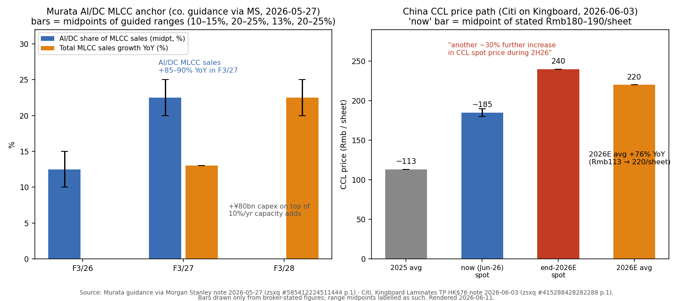
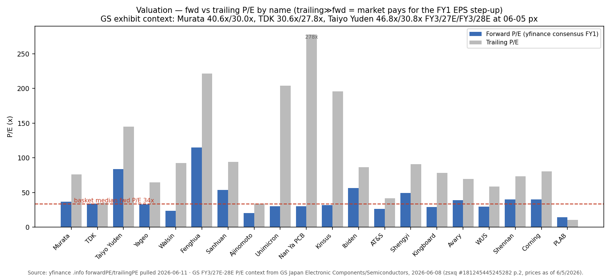
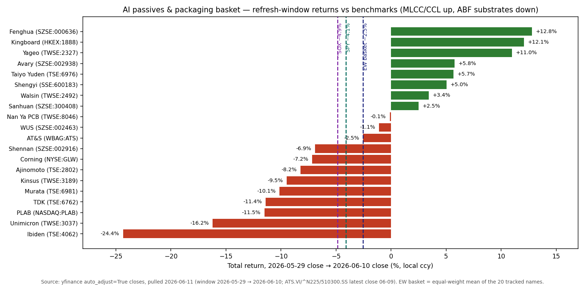

# AI 基础设施被动元件与先进封装 / AI Infrastructure Passives & Advanced Packaging

**Created:** 2026-05-31 · **Last refreshed:** 2026-06-11 · **Last mutated:** 2026-06-01 · **Refresh cadence:** monthly · **Languages tracked:** en, zh

## What's New

*自上次查看以来的增量信息——最新一次 refresh 置顶，更早的记录折叠到下方归档。*

**2026-06-11 refresh（对比 2026-06-01）：**

- **英文版已同步至 20 只标的篮子与最新主题格式**（2026-06-01 的扩容此前只落在中文版）；两个语言版本现均含 What's New、估值快照 + 卖方观点演变、篮子计分卡、领先指标与 3 张图表。
- **首个回调窗口、内部剧烈轮动：等权篮子 −2.5%（中位数 −1.8%），同期 ^SOX −4.9% · SPY −4.1%**——篮子跑赢基准，但内部领涨权杖换手：**MLCC / CCL 类上涨（风华 +12.8%、建滔 +12.1%、国巨 +11.0%），ABF 载板集群重挫（Ibiden −24.4%、欣兴 −16.2%、景硕 −9.5%）**——正是建仓时标记的"ABF 三强 fully priced"集中度风险兑现（yfinance，见表现）。
- **高盛发布本窗口的定调报告（06-08）**：*"Potential onset of one of the largest cycles in history"*（或为史上最大景气周期之一），并全面重定日系被动元件目标价：**村田 ¥5,400 → ¥12,600（+133%）、Ibiden ¥9,600 → ¥25,500（+166%）、太阳诱电 ¥7,100 → ¥21,200（+199%）、TDK ¥3,000 → ¥4,600（+53%）**，罗姆上调至买入 ([GS — 日本电子元件/半导体, zsxq #181245445245282 p.1-2](http://xs-macbook-air.local:5001/zsxq/pdf/181245445245282/Goldman%20Sachs-JAPAN%20ELECTRONIC%20COMPONENTS%20SEMICONDUCTORS%EF%BC%9APotential%20onset%20of%20one%20of%20the%20largest%20cycles%20in%20history%EF%BC%9B%20remain%20bullish%20on%20Murata%20Taiyo%20Yuden%20Renesas%20Ibiden%EF%BC%8C%20Rohm%20up%20to%20Buy%EF%BC%8C%20downgrade%20Nitto%20Denko%20JAE-260608.pdf#page=1))。
- **国巨一周内遭遇三家券商目标价潮——全部在 +131%/月的涨幅之后追价**：MS **NT$360 → NT$1,010**（06-01，*"The market has moved, but the story is not finished — stay OW"*，牛/基/熊 NT$1,530/1,010/505）、JPM **NT$406 → NT$1,000**（06-01）、Citi **NT$495 → NT$1,500**（06-08，*"re-rated 40x multiple"*，2026-28E EPS 上修 2-65%）（[MS, zsxq #181245415281442 p.1](http://xs-macbook-air.local:5001/zsxq/pdf/181245415281442/20260601-Morgan%20Stanley-Yageo%20Corp.%EF%BC%882327.TW%EF%BC%89The%20market%20has%20moved%EF%BC%8C%20but%20the%20story%20is%20not%20finished%E2%80%93stay.pdf#page=1) / [JPM #214528248514281 p.1](http://xs-macbook-air.local:5001/zsxq/pdf/214528248514281/20260601-J.P.%20Morgan-YAGEO%EF%BC%882327.TW%EF%BC%89AI%20story%20a%20bit%20different%EF%BC%8C%20but%20could%20be%20just%20as%20good.pdf#page=1) / [Citi #584251541284514 p.1](http://xs-macbook-air.local:5001/zsxq/pdf/584251541284514/20260608-CITI-Yageo%20%EF%BC%882327.TW%EF%BC%89%20Multi~Product%20Structural%20Squeeze%20Fuels%20Earnings%20Compounding%EF%BC%9B%20Target%20Pr.pdf#page=1)）。
- **锚定修正（定价锚、CCL 腿）：Citi 现模型为中国 CCL 2026E 全年均价同比 +76% 至 Rmb220/张（2025 年约 Rmb113），且 2H26 现货再涨约 30% 至年底 Rmb240/张**（现价 Rmb180-190），触发因素是 6 月电子布涨价（+Rmb0.70-0.95/米）超预期——建滔 TP 由 HK$66 上调至 **HK$76** ([Citi — 建滔, zsxq #415288428282288 p.1](http://xs-macbook-air.local:5001/zsxq/pdf/415288428282288/CITI-Kingboard%20Laminates%20Holdings%20%EF%BC%881888.HK%EF%BC%89%20Raising%20TP%20to%20HK%2476%20for%20Higher~than~expected%20ASP%20Hike%20for%20June-260603.pdf#page=1))。
- **窗口内首个经营数据落在"符合"而非"超出"**：欣兴 4+5 月营收 NT$280 亿（美元计 +29% YoY），2Q26E NT$410-430 亿（环比 +13%）*符合*共识；管理层指引 2026 年底 ABF 产能 **同比 +40%**，NVIDIA 高端 GPU ABF 份额约 35%、Google TPU / AWS Trainium 等 ASIC 份额 50%+ ([Bernstein, zsxq #214528222851451 p.1](http://xs-macbook-air.local:5001/zsxq/pdf/214528222851451/Bernstein-Asia%20Tech%20Hardware%EF%BC%9AMonthly%20sales~Unimicron%202Q26%20revenue%20tracking%20in%20line%20while%20Quanta%20tracking%20above-260608.pdf#page=1))。符合预期的数据 + −16% 的股价 = 短期风险在仓位与预期，不在基本面。
- **引用稽核纠错**：file_id `585412242541114` 此前在两个语言版本中被标注为"JPM——4 月 MLCC 进出口数据"，提取原文显示实际是 **JPM 美满电子（MRVL）4 月季业绩报告（2026-05-28）**，与主题无关——已剔除。建滔 HK$66 报告（#184128855151422）此前未标注券商，经原文确认为 **Citi**（2026-05-25）。
- **宏观环境切换**：VIX 16.68 → **21.51**（2026-06-05，`indicators.db`）——建仓时的低波动顺风已消失；篮子内最高估值标的（太阳诱电 fwd 83.6x、风华 fwd 115x）de-rate beta 最大。
- 本次共持久化 9 条卖方 PT 记录至 `stock_price_target_db`（见估值快照 / Data Used）。

更早记录

**2026-06-01 — 重写为原文驱动 + 篮子扩容 18→20 + 来源 12→27 份 zsxq 报告。** 通篇改用 OCR 后的原始 PDF 文本，每个券商数字附 PDF 页码 + 原文逐字引用。新增 **HKEX:1888 建滔积层板**（core——Citi *"Raise TP to HK$66 on Continued EPS U/G for e-glass Fabric and CCL… we raise our earnings estimates 16-24% for 2026-28E"*，[zsxq #184128855151422 p.1](http://xs-macbook-air.local:5001/zsxq/pdf/184128855151422/Kingboard%20Laminates%20Holdings%20%281888.HK%29_%20Raise%20TP%20to%20HK%2466%20on%20Continued%20EPS%20U_G%20for%20e-glass%20Fabric%20and%20CCL.pdf#page=1)）与 **TSE:6976 太阳诱电**（core——GS CEO 会 *"Reaffirmed position to benefit from AI server demand"*，[zsxq #585428225258814 p.1](http://xs-macbook-air.local:5001/zsxq/pdf/585428225258814/Goldman%20Sachs-Taiyo%20Yuden%20%EF%BC%886976.T%EF%BC%89%EF%BC%9A%20CEO%20meeting%EF%BC%9A%20Reaffirmed%20position%20to%20benefit%20from%20AI%20server%20demand%EF%BC%9B%20maintain%20Buy-260521.pdf#page=1)）。新信号：MS 村田 AI/DC MLCC 占比 10-15%→20-25% + ¥80bn 追加资本开支；Bernstein ABF *"Renaissance of CPU"* 上调 Ibiden PT 至 ¥23,900；Bernstein 味之素上调至 Outperform（*"New Pricing Paradigm"*）；GS 生益 8 天内 PT 127.4 → 146.3。引用稽核剔除离题的 MS Dell 文件（#415284424528848）并补入正确的 GS 古河电气文件（#415284421422818）。20 只重算：1Y 等权 +500.7% / 中位数 +411.1%，同期 ^SOX +202.9%。

**2026-05-31 — 篮子建立**（18 只标的：9 core / 5 enabler / 4 adjacent），基于 zsxq 翻译精华摘要。

## 主题逻辑

**锚定——本主题的锚是"定价/含量"轨迹而非美元 TAM（没有第三方发布统一的"AI 被动元件"市场池；以下两条腿是可证伪的轨迹）。** 第一条腿——**MLCC（村田自身指引，经 MS 转述，2026-05-27）**：AI/DC 相关销售占 MLCC 总销售比例从 **F3/26 的 10-15% 升至 F3/27 的 20-25%**，AI/DC MLCC 销售 **+85-90% YoY**；在每年 10% 的常规扩产之外**追加 ¥80bn 资本开支**；MLCC 总销售增速从 F3/27 的 13% 加速至 **F3/28 的 20-25%** ([MS — Murata Cutting-edge MLCC, zsxq #585412224511444 p.1](http://xs-macbook-air.local:5001/zsxq/pdf/585412224511444/Morgan%20Stanley-Murata%20Manufacturing%20%EF%BC%886981.T%EF%BC%89Investment%20in%20Cutting~edge%20MLCC%20Products%20is%20Highly%20Efficient-260527.pdf#page=1))。第二条腿——**CCL 定价（Citi，2026-06-03）**：中国 CCL 2026E 全年均价 **同比 +76% 至约 Rmb220/张（2025 年约 Rmb113/张）**，且 *"another approx. 30% further increase in CCL spot price during 2H26 to Rmb240/sheet by end-2026 from currently Rmb180-190/sheet"* ([Citi — 建滔, zsxq #415288428282288 p.1](http://xs-macbook-air.local:5001/zsxq/pdf/415288428282288/CITI-Kingboard%20Laminates%20Holdings%20%EF%BC%881888.HK%EF%BC%89%20Raising%20TP%20to%20HK%2476%20for%20Higher~than~expected%20ASP%20Hike%20for%20June-260603.pdf#page=1))。**摆动因子（swing factor）：CCL/电子布定价腿**——它是所有 AI 板卡的成本输入，5 月以来已两次上修，第四次提价是否在 3Q 落地对篮子中国侧（生益 / 建滔 / 沪电 / 深南为 `core` 直接受益者）影响最大。

**子板块与价值链美元地图。** 篮子覆盖 AI 机架的四个物理层：(a) **MLCC**——村田、TDK、太阳诱电（日系三强）+ 国巨、华新科（台系）+ 三环、风华（A 股替代）；(b) **ABF 载板 / FC-BGA**——Ibiden + 欣兴/南电/景硕（台湾三强）+ AT&S，上游树脂独家供应方味之素；(c) **高速 CCL → PCB**——生益、建滔（基板）→ 沪电、深南、鹏鼎（板卡）；(d) **下一代基板 / 光罩**——康宁（玻璃芯）、Photronics（光罩）。美元参照系来自伯恩斯坦的 Vera Rubin 拆解：单台 VR NVL72 机架约 **$9.1M**——**GPU（不含 HBM）约 $4M（最大单项）、存储/内存约 $3.2M、网络约 $1.2M、散热与供电各约 $15 万**，单 GW AI 数据中心全口径资本开支约 **$47B** ([Bernstein — AI Value Chain, zsxq #814528815844812 p.1/p.3](http://xs-macbook-air.local:5001/zsxq/pdf/814528815844812/Bernstein-AI%20Value%20Chain%EF%BC%9AHow%20much%20does%20a%20GW%20of%20Vera%20Rubin%20data%20center%20capacity%20actually%20cost%EF%BC%9F-260608.pdf#page=1))。被动元件与载板在账单中占比很小——这正是客户不值得为之降规格（despec）、涨价得以持续的结构性原因（"不可替代的小额 BOM"）。

**短缺判断现已是多券商共识。** Bernstein *"ABF Substrate: Renaissance of CPU drives ABF shortage"*（Ibiden PT ¥23,900，[zsxq #184152242111442 p.1](http://xs-macbook-air.local:5001/zsxq/pdf/184152242111442/Bernstein-ABF%20Substrate%EF%BC%9A%20Renaissance%20of%20CPU%20drives%20ABF%20shortage%EF%BC%9B%20Lifting%20Ibiden%20PT%20to%20%EF%BF%A523%EF%BC%8C900-260529.pdf#page=1)）；BofA *"stay constructive on favorable supply/demand ahead; Raise PO on Unimicron/NYPCB/Kinsus"*（[zsxq #212451458225151 p.1](http://xs-macbook-air.local:5001/zsxq/pdf/212451458225151/BofA%20Securities-Technology%20Hardware%20~%20Taiwan%20ABF%20substrate%EF%BC%9A%20stay%20constructive%20on%20favorable%20supply%20demand%20ahead-260525.pdf#page=1)）；Citi 台湾科技大会（06-07）上台光电 / 台耀 / 金居一致表示 *"capacity expansion pace could not catch up with end-customers' demand"*，且 CCL 新产能投放慢于 PCB → *"CCL shortage and potential price hikes"* 延续（[Citi — Taiwan PCB & Laminates, zsxq #814528251122222 p.1](http://xs-macbook-air.local:5001/zsxq/pdf/814528251122222/CITI-Taiwan%20PCB%20%26%20Laminates%EF%BC%9AWhat%E2%80%99s%20New%20at%20Citi%20Taiwan%20Tech%20Conference%202026%20%E2%80%93%20strong%20demand%20and%20shortage-260607.pdf#page=1)）。但**任何已挖掘来源均未发布同单位的双边供需平衡表**（产能按公司披露、需求只有收入口径）——按规则记入 Data Used 缺口而非凭空构造。

**阶段判断——谁先受益（staging）。** MLCC / CCL 提价方**现在**兑现：4 月 MLCC 提价与 6 月电子布提价将在 FY27Q1 / 2Q26 财报（2026 年 7-8 月——日期闸门）落入损益表。ABF 载板兑现**产能爬坡**：欣兴 2026 年底 ABF 产能 +40% YoY，毛利率按 Bernstein 模型 *"from high-teens in 1Q26 to ~30% by 2H2027, and c.35% in 2H28"*（[zsxq #214528222851451 p.1](http://xs-macbook-air.local:5001/zsxq/pdf/214528222851451/Bernstein-Asia%20Tech%20Hardware%EF%BC%9AMonthly%20sales~Unimicron%202Q26%20revenue%20tracking%20in%20line%20while%20Quanta%20tracking%20above-260608.pdf#page=1)）。玻璃基板 `adjacent` 标的是第三阶段：**2026 年 1 月英特尔全球首款玻璃芯载板商用 CPU 已发布**，台积电 CoPoS 进入试产验证、**2028-2029 年产量大幅提升**（[玻璃基板专题, zsxq #814528288121422 p.1](http://xs-macbook-air.local:5001/zsxq/pdf/814528288121422/%E7%8E%BB%E7%92%83%E5%9F%BA%E6%9D%BF%EF%BC%9AAI%E5%B0%81%E8%A3%85%E7%9A%84%E4%B8%8B%E4%B8%80%E5%9D%97%E5%85%B3%E9%94%AE%E6%8B%BC%E5%9B%BE.pdf#page=1)）。本窗口的轮动——第一阶段标的涨、第二阶段 ABF 跌——正是市场把领涨权交还给"涨价尚未入账"的标的。
 
**情景条款。** 多头情景：GS 的"史上最大周期"框架成立——两阶段（先 AI 服务器基建、后边缘/实体 AI 终端）推动行业盈利、利润率、ROE 全面突破历史峰值（[GS, zsxq #181245445245282 p.1/p.3-5](http://xs-macbook-air.local:5001/zsxq/pdf/181245445245282/Goldman%20Sachs-JAPAN%20ELECTRONIC%20COMPONENTS%20SEMICONDUCTORS%EF%BC%9APotential%20onset%20of%20one%20of%20the%20largest%20cycles%20in%20history%EF%BC%9B%20remain%20bullish%20on%20Murata%20Taiyo%20Yuden%20Renesas%20Ibiden%EF%BC%8C%20Rohm%20up%20to%20Buy%EF%BC%8C%20downgrade%20Nitto%20Denko%20JAE-260608.pdf#page=1)）；必须同时成立的单一条件是 **AI 服务器建设节奏不延期**且消费端足以承接转嫁。空头情景：被动元件周期"结束快于开始"——2018/2021 两轮 MLCC 与载板行情均以 30-50% 的峰谷回撤收场（[eeNews Europe, 2026](https://www.eenewseurope.com/en/ai-drives-mlcc-shortage/)）；已被引用的空头标记是 Citi 对**太阳诱电的 Sell ¥2,900** 与对**村田的 Neutral ¥3,900**（均见估值快照）——即已有一家大行把 MLCC 三强按周期顶部定价。**信念排序（引用而非自创）**：Citi 在中国 AI 基建短缺主题下排序 *"KBL > Han's Laser > Shengyi"*（[Citi 建滔, zsxq #415288428282288 p.1](http://xs-macbook-air.local:5001/zsxq/pdf/415288428282288/CITI-Kingboard%20Laminates%20Holdings%20%EF%BC%881888.HK%EF%BC%89%20Raising%20TP%20to%20HK%2476%20for%20Higher~than~expected%20ASP%20Hike%20for%20June-260603.pdf#page=1)）；GS 日本侧偏好序为村田（Buy、于 Conviction List）/ 太阳诱电 / 瑞萨 / Ibiden，并明确下调日东电工与 JAE 为受成本挤压的非 AI 标的。*Analyst view (this note)：* 在 GS/Citi 目标价三倍化之后，边际信息在经营数据而非目标价——欣兴"符合预期"即遭抛售说明短期风险是仓位，不是论点。

**Further viewing（延伸观看）**

- [村田官方——MLCC 制造流程动画（多层陶瓷电容如何逐层堆叠制成）](https://video.murata.com/en-us/detail/video/5659978339001)——理解 MLCC 产能为何难以快速扩张，即涨价周期的物理基础。
- [Advanced Packaging: CoWoS (Chip-on-Wafer-on-Substrate) Explained — VLSI Tech Explained](https://www.youtube.com/watch?v=bWToL48KiPU)——ABF 载板在 GPU 封装中的位置，以及封装尺寸为何驱动载板面积。
- [An Overview of Advanced Packaging Technology (Glass Substrate, 3D Pack, TSV, CoWoS) — Unrealtech](https://www.youtube.com/watch?v=DWcYvKFaTZg)——`adjacent` 标的押注的"有机基板 → 玻璃基板"过渡。

## 范围界定

**纳入：** (a) **MLCC**——有 AI 服务器业务披露的供应商：日系三强（村田、TDK、太阳诱电）、台系（国巨、华新科）、A 股替代（三环、风华）；(b) **ABF 载板 / FC-BGA**——NVIDIA / AMD / ASIC 链内的 Ibiden、欣兴、南电、景硕、AT&S + 上游树脂独家供应方味之素；(c) **高速 CCL 与 AI 服务器 PCB**——生益、建滔、沪电、深南、鹏鼎；(d) **玻璃基板 / 光罩**——康宁、Photronics。每只标的须有至少一份 2025-26 年卖方或 IR 文件将其 AI 业务列为有日期的增长驱动。

**排除：** 晶圆代工 / 硅片 / 半导体设备（独立主题）；DRAM/NAND/HBM（[memory-upcycle 主题](memory-upcycle_主题研究.md)）；服务器整机（DELL/HPE/SMCI——集成毛利，不分享被动元件涨价租金）；连接器（中航光电等——[ai-power-electrification 主题](ai-power-electrification_主题研究.md)）；无 AI 服务器具体披露的中小 PCB/CCL 厂。未上市公司列入观察名单。

## Tracked tickers

| Ticker | Name | Role | Justification | Added |
|---|---|---|---|---|
| TSE:6981 | 村田制作所 Murata | core | 全球 MLCC 龙头。自身指引：AI/DC 占 MLCC 销售 10-15%（F3/26）→ **20-25%（F3/27）**，AI/DC MLCC 销售 **+85-90% YoY**，常规 10%/年扩产之外追加 ¥80bn 资本开支，MLCC 增速 13% → F3/28 的 20-25% ([MS, zsxq #585412224511444 p.1](http://xs-macbook-air.local:5001/zsxq/pdf/585412224511444/Morgan%20Stanley-Murata%20Manufacturing%20%EF%BC%886981.T%EF%BC%89Investment%20in%20Cutting~edge%20MLCC%20Products%20is%20Highly%20Efficient-260527.pdf#page=1))；GS Buy（CL），PT ¥12,600。护城河：份额 + 尖端高容 MLCC 工艺领先。威胁：Citi 持 Neutral ¥3,900——手机库存触发的定价周期逆转；三星电机扩产。（同时跟踪于：humanoid-robotics-sensors——IMU 角度，独立论点） | 2026-05-31 |
| TSE:6762 | TDK | core | MLCC + 电感 + 电池多元化；GS CEO 会 Buy：*"Looking to build AI ecosystem as pillar of growth, leveraging TDK's technological strengths"* ([GS, zsxq #812451245222482 p.1](http://xs-macbook-air.local:5001/zsxq/pdf/812451245222482/Goldman%20Sachs-TDK%20%EF%BC%886762.T%EF%BC%89%EF%BC%9A%20CEO%20meeting%EF%BC%9A%20Looking%20to%20build%20AI%20ecosystem%20as%20pillar%20of%20growth%EF%BC%8C%20leveraging%20TDK%E2%80%99s%20technological%20strengths%EF%BC%9B%20Buy-260525.pdf#page=1))；GS PT ¥3,000 → ¥4,600（06-08）。护城河：日系唯一 HVDC 电池 + 磁性件 + MLCC 一体布局。威胁：最大利润池（手机电池）与 AI 论点脱钩；日系三强中 1Y 最弱（+140%）。（同时跟踪于：humanoid-robotics-sensors） | 2026-05-31 |
| TSE:6976 | 太阳诱电 Taiyo Yuden | core | 日系 MLCC 第三强，补全日系闭环；GS CEO 会 *"Reaffirmed position to benefit from AI server demand"* ([GS, zsxq #585428225258814 p.1](http://xs-macbook-air.local:5001/zsxq/pdf/585428225258814/Goldman%20Sachs-Taiyo%20Yuden%20%EF%BC%886976.T%EF%BC%89%EF%BC%9A%20CEO%20meeting%EF%BC%9A%20Reaffirmed%20position%20to%20benefit%20from%20AI%20server%20demand%EF%BC%9B%20maintain%20Buy-260521.pdf#page=1))，GS PT ¥7,100 → ¥21,200。护城河：三强中 MLCC 收入纯度最高——对价格周期弹性最大。威胁：**全街分歧最大的标的**——Citi Sell ¥2,900 / MS EW ¥4,700 / UBS Neutral ¥4,100 对 GS ¥21,200（446% 离散度）；下行周期中纯度同样放大跌幅。 | 2026-06-01 |
| TWSE:2327 | 国巨 Yageo | core | 台系被动元件龙头（MLCC + 电阻 + 钽电容/Kemet）；MS AAI：*"There weren't a lot of pricing adjustments baked into 1Q revenue… 2Q revenue and margin likely have upside"* ([MS, zsxq #585412242542824 p.1](http://xs-macbook-air.local:5001/zsxq/pdf/585412242542824/Morgan%20Stanley-Yageo%20Corp.%EF%BC%882327.TW%EF%BC%89%EF%BC%9AAsia%20AI%20Summit%202026%20Feedback-260528.pdf#page=1))；06-01→06-08 三家 PT 潮（MS 1,010 / JPM 1,000 / Citi 1,500）。护城河：全球钽电容龙头 + 多品类（MLCC/电阻/磁性件）提价期权。威胁：风华/三环的中国低端 MLCC 产能竞争；MS 熊市值 NT$505。 | 2026-05-31 |
| TWSE:2492 | 华新科 Walsin | core | 台系 MLCC 第二大，与国巨同享提价周期，高压/车规系列见长 ([Digitimes, 2026-05-25](https://www.digitimes.com/news/a20260525PD222/demand-mlcc-high-power-taiwan-high-end.html))。护城河：日系三强产能受限的高压 MLCC 利基。威胁：05-01 以来 PT 库中无任何卖方覆盖——台系组合中证据最薄；偏大宗的产品组合在下行周期 ASP 回吐最快。 | 2026-05-31 |
| SZSE:300408 | 三环集团 Sanhuan | core | 中国 MLCC + 陶瓷件龙头；UBS Buy ¥108（05-11）；0805 高容突破并向浪潮/华为 AI 服务器批量出货 ([新浪财经, 2026-05-27](https://finance.sina.com.cn/wm/2026-05-27/doc-inhzivfn0778202.shtml))；2025 年收入 ¥90.07 亿、国产上市公司第一 ([MLCC 行业深度, zsxq #812488554481152 p.1](http://xs-macbook-air.local:5001/zsxq/pdf/812488554481152/MLCC%E8%A1%8C%E4%B8%9A%E6%B7%B1%E5%BA%A6%E6%8A%A5%E5%91%8A%EF%BC%9A%20%E5%9B%BD%E4%BA%A7MLCC%E5%BF%AB%E9%80%9F%E6%88%90%E9%95%BF%EF%BC%8C%E6%8B%A5%E6%8A%B1%E8%A1%8C%E4%B8%9A%E4%B8%8A%E8%A1%8C%E5%91%A8%E6%9C%9F.pdf#page=1))。护城河：陶瓷粉体垂直一体化（毛利率 42% 对风华 18%）。威胁：高容认证仍落后日系；股价已穿越 UBS ¥108 目标价。 | 2026-05-31 |
| SZSE:000636 | 风华高科 Fenghua | core | 中国 MLCC 第二、更高 beta 的国产替代交易；2025 年收入 ¥57.56 亿 ([MLCC 行业深度, zsxq #812488554481152 p.1](http://xs-macbook-air.local:5001/zsxq/pdf/812488554481152/MLCC%E8%A1%8C%E4%B8%9A%E6%B7%B1%E5%BA%A6%E6%8A%A5%E5%91%8A%EF%BC%9A%20%E5%9B%BD%E4%BA%A7MLCC%E5%BF%AB%E9%80%9F%E6%88%90%E9%95%BF%EF%BC%8C%E6%8B%A5%E6%8A%B1%E8%A1%8C%E4%B8%9A%E4%B8%8A%E8%A1%8C%E5%91%A8%E6%9C%9F.pdf#page=1))；NVIDIA 800VDC 电源链国产化候选。护城河：国产最全品类目录（MLCC+R+L+滤波器）。威胁：经销收入占比 >50% 且低毛利（GM 17.8% 对三环 42%）——`core` MLCC 中定价权最弱；PT 库无券商目标价。 | 2026-05-31 |
| TSE:2802 | 味之素 Ajinomoto | core | 全球唯一 ABF 树脂膜供应方（所有 NVIDIA/AMD/ASIC 倒装载板之下）。Bernstein 上调至 Outperform ¥6,700（*"Ajinomoto's New Pricing Paradigm"*，[zsxq #585428585544584 p.1](http://xs-macbook-air.local:5001/zsxq/pdf/585428585544584/%E4%BC%AF%E6%81%A9%E6%96%AF%E5%9D%A6%E2%80%94%E5%91%B3%E4%B9%8B%E7%B4%A0%E2%80%94%E5%91%B3%E4%B9%8B%E7%B4%A0%E7%9A%84%E6%96%B0%E5%AE%9A%E4%BB%B7%E8%8C%83%E5%BC%8F%EF%BC%9A%E4%B8%8A%E8%B0%83%E8%87%B3%E8%B7%91%E8%B5%A2%E5%A4%A7%E7%9B%98.pdf#page=1)）；JPM OW ¥6,500——*"continued high profit growth… driven by ABF and CDMO"* ([zsxq #812485541485212 p.1](http://xs-macbook-air.local:5001/zsxq/pdf/812485541485212/J.P.%20Morgan-Ajinomoto%20%EF%BC%882802.T%EF%BC%89%20Maintain%20Overweight%20rating%EF%BC%9A%20Despite%20rising%20costs%EF%BC%8C%20we%20expect%20continued%20high%20profit%20growth%20in%20the%20short%20to%20medium%20term%EF%BC%8C%20driven%20by%20ABF%20and%20CDMO-260529.pdf#page=1))。护城河：ABF 垄断——篮子中唯一真正的独家供应。威胁：食品集团稀释（约八成收入非电子）；2028+ 玻璃芯基板在最前沿替代 ABF。（同时跟踪于：pcb-hdi-abf-substrate） | 2026-05-31 |
| TWSE:3037 | 欣兴电子 Unimicron | core | 台湾 ABF 之首；指引 2026 年底 ABF 产能 **+40% YoY**，NVIDIA 高端 GPU ABF 约 35% 份额 + Google TPU / AWS Trainium 50%+ ([Bernstein, zsxq #214528222851451 p.1](http://xs-macbook-air.local:5001/zsxq/pdf/214528222851451/Bernstein-Asia%20Tech%20Hardware%EF%BC%9AMonthly%20sales~Unimicron%202Q26%20revenue%20tracking%20in%20line%20while%20Quanta%20tracking%20above-260608.pdf#page=1))；BofA Buy NT$1,300、Citi Buy NT$1,080、MS OW NT$1,225。护城河：日系之外唯一同时在 GPU + ASIC 项目上有份额的载板厂。威胁：自身 +40% 扩产撞上同行 2H27 产能——Bernstein 下行情景即对手激进扩产拖慢毛利率修复。（同时跟踪于：pcb-hdi-abf-substrate） | 2026-05-31 |
| TWSE:8046 | 南亚电路板 Nan Ya PCB | core | ABF + BT 垂直一体化；MS *"Strong preliminary April profits"*，OW PT NT$850 → NT$1,275 ([MS, zsxq #184152221455882 p.1](http://xs-macbook-air.local:5001/zsxq/pdf/184152221455882/Morgan%20Stanley-Nan%20Ya%20PCB%EF%BC%888046.TW%EF%BC%89%EF%BC%9AStrong%20preliminary%20April%20profits-260527.pdf#page=1))；BofA Buy NT$1,170。护城河：台塑集团上游一体化（自有 CCL/玻璃供应链）。威胁：三强中 ABF 份额最低；母公司南亚塑胶的电子材料板块争夺同一笔资本开支。（同时跟踪于：pcb-hdi-abf-substrate） | 2026-05-31 |
| TWSE:3189 | 景硕科技 Kinsus | core | 台湾 ABF 三强之三；BofA 在 *"favorable supply/demand"* 行业报告中 Buy NT$695 ([BofA, zsxq #212451458225151 p.1](http://xs-macbook-air.local:5001/zsxq/pdf/212451458225151/BofA%20Securities-Technology%20Hardware%20~%20Taiwan%20ABF%20substrate%EF%BC%9A%20stay%20constructive%20on%20favorable%20supply%20demand%20ahead-260525.pdf#page=1))。护城河：和硕集团内生需求 + BT/ABF 双线。威胁：三强中规模最小→2027 产能竞赛资本余地最少；仅一条在库 PT（覆盖薄）。（同时跟踪于：pcb-hdi-abf-substrate） | 2026-05-31 |
| TSE:4062 | Ibiden 揖斐电 | core | 日本 ABF 龙头、NVIDIA 首要 FC-BGA 载板供应方。Bernstein *"Renaissance of CPU drives ABF shortage; Lifting Ibiden PT to ¥23,900"*（05-14 的 ¥9,200 → 05-29 的 ¥23,900，15 天内同机构 +160% 自我修正，[zsxq #184152242111442 p.1](http://xs-macbook-air.local:5001/zsxq/pdf/184152242111442/Bernstein-ABF%20Substrate%EF%BC%9A%20Renaissance%20of%20CPU%20drives%20ABF%20shortage%EF%BC%9B%20Lifting%20Ibiden%20PT%20to%20%EF%BF%A523%EF%BC%8C900-260529.pdf#page=1)）；GS ¥9,600 → ¥25,500（06-08）。护城河：最高层数 ABF 工艺领先 + 锁定 NVDA 配额。威胁：本窗口篮子最大回撤（−24.4%）——完美预期定价最深的标的；若推理算力继续偏向 GPU/ASIC，"CPU 复兴"假设失效。（同时跟踪于：pcb-hdi-abf-substrate） | 2026-05-31 |
| WBAG:ATS | AT&S | core | 亚洲之外唯一 ABF 载板厂；重庆 AI 载板扩产由长期客户协议全额融资 ([evertiq, 2026-05-26](https://evertiq.com/news/2026-05-26-ats-expands-ai-substrate-capacity-in-chongqing))；玻璃芯基板项目推进中 ([AT&S press](https://ats.net/en/press/ats-advances-glass-core-substrates-for-ai-high-performance-computing-and-photonics/))。护城河：客户去台湾化的地理分散溢价（欧+中+马布局）。威胁：本地 PT 库无卖方覆盖——估值纪律只剩价格本身；资本开支周期带来的杠杆。（同时跟踪于：pcb-hdi-abf-substrate） | 2026-05-31 |
| SSE:600183 | 生益科技 Shengyi | core | A 股高端 CCL 龙头；GS 8 天内两升 PT——Rmb127.4（05-22）→ **Rmb146.3**（05-30）：*"CCL pricing uptrend continues… Industry peers have raised prices three times in the past three months"* ([GS, zsxq #212485814111481 p.1](http://xs-macbook-air.local:5001/zsxq/pdf/212485814111481/Goldman%20Sachs-Shengyi%20Tech%20%EF%BC%88600183%EF%BC%89%EF%BC%9A%20CCL%20pricing%20uptrend%20continues%EF%BC%9B%20TP%20up%20to%20Rmb146.3%EF%BC%9B%20Buy-260530.pdf#page=1))。护城河：M7/M8/M9 级超低损耗产品组合——中国侧定价权顶点。威胁：Citi 同主题排序将其置于建滔之后（KBL > Han's Laser > Shengyi）；松下苏州 MEGTRON CCL 产能 2026 年 10 月投产直击高端。（同时跟踪于：pcb-hdi-abf-substrate） | 2026-05-31 |
| HKEX:1888 | 建滔积层板 Kingboard Laminates | core | HK 上市 CCL + 电子布龙头；Citi TP HK$66（05-25）→ **HK$76**（06-03），触发因素是 6 月电子布涨价超预期（+Rmb0.70-0.95/米）；GM 路径 29.7%（26E）→ 34.7%（27E）→ 36.4%（28E），超越 2021 年 34% 峰值 ([Citi, zsxq #415288428282288 p.1/p.3](http://xs-macbook-air.local:5001/zsxq/pdf/415288428282288/CITI-Kingboard%20Laminates%20Holdings%20%EF%BC%881888.HK%EF%BC%89%20Raising%20TP%20to%20HK%2476%20for%20Higher~than~expected%20ASP%20Hike%20for%20June-260603.pdf#page=3))。护城河：电子布 + CCL 垂直一体化；低 DK 玻纤线爬坡，2H26 完成 NVIDIA 链 Q 玻璃认证。威胁：最前沿的 PTFE 替代（Citi 称 NVDA 在测试）；中国巨石玻纤扩产。 | 2026-06-01 |
| SZSE:002938 | 鹏鼎控股 Avary | core | 全球 PCB 收入第一，苹果 FPC + AI 服务器双驱动 ([东方财富, 2026-05-24](https://caifuhao.eastmoney.com/news/20260524235130296585900))。护城河：FPC 规模（全球约 30% 份额）为 AI HDI/HLC 资本开支（淮安 + 泰国）输血。威胁：苹果链仍占收入 >70%——iPhone 下行周期会淹没 AI 增量；PT 库无覆盖。（同时跟踪于：pcb-hdi-abf-substrate） | 2026-05-31 |
| SZSE:002463 | 沪电股份 WUS | core | 中国 T0 级 AI 服务器 PCB；GS 调研后维持 Buy ¥142——*"Positive on AI PCB end demand; Capacity expansion supporting shipment growth"* ([GS, zsxq #184128242421582 p.1](http://xs-macbook-air.local:5001/zsxq/pdf/184128242421582/Goldman%20Sachs-WUS%20%EF%BC%88002463%EF%BC%89%EF%BC%9A%20Mgmt.%20visit%EF%BC%9A%20Positive%20on%20AI%20PCB%20end%20demand%EF%BC%9B%20Capacity%20expansion%20supporting%20shipment%20growth-260523.pdf#page=1))；NVIDIA-沪电 M10 CCL 联测，52 层 Rubin PCB 目标 Q4 26 – Q1 27 量产 ([IT之家, 2026](https://www.ithome.com/0/928/995.htm))。护城河：A 股板卡中最深的 NVDA design-in。威胁：M10 认证延期会把 Rubin 板卡让给台系；中国 AI 板卡的美国出口管制悬置。（同时跟踪于：pcb-hdi-abf-substrate） | 2026-05-31 |
| SZSE:002916 | 深南电路 Shennan | core | 中国 T1 AI PCB + 唯一具规模的 A 股 ABF 载板新进入者；GS Buy ¥450：*"AI PCB growth on spec upgrade and 800G/1.6T optical modules ramp up; Improving ABF business"* ([GS, zsxq #585428188218244 p.1](http://xs-macbook-air.local:5001/zsxq/pdf/585428188218244/Goldman%20Sachs-Shennan%20Circuits%20%EF%BC%88002916.SZ%EF%BC%89%EF%BC%9AAI%20PCB%20growth%20on%20spec%20upgrade%20800G%20%201.6T%20optical%20modules%20ramp%20up%EF%BC%9B%20Improving%20ABF%20business%EF%BC%9B%20Buy-260525.pdf#page=1))。护城河：PCB + IC 载板双平台——国产 ABF 替代代理。威胁：FC-BGA 规模仍远小于 Ibiden/欣兴（16 层及以下批产）；短缺中受味之素 ABF 膜配额制约。（同时跟踪于：pcb-hdi-abf-substrate） | 2026-05-31 |
| NYSE:GLW | 康宁 Corning | enabler | 特种玻璃龙头 = "有机基板 → 玻璃基板"过渡的上市代理；Advanced Packaging Carriers 已出货 ([Corning, 2025](https://www.corning.com/worldwide/en/products/advanced-optics/product-materials/PrecisionGlassSolutions/advanced-packaging-carriers-release.html))；玻璃基板专题将康宁/肖特/AGC/NEG 列为原片端领先者 ([zsxq #814528288121422 p.1](http://xs-macbook-air.local:5001/zsxq/pdf/814528288121422/%E7%8E%BB%E7%92%83%E5%9F%BA%E6%9D%BF%EF%BC%9AAI%E5%B0%81%E8%A3%85%E7%9A%84%E4%B8%8B%E4%B8%80%E5%9D%97%E5%85%B3%E9%94%AE%E6%8B%BC%E5%9B%BE.pdf#page=1))。护城河：熔融玻璃工艺领先 + NVIDIA 光连接合作。威胁：玻璃芯收入混在显示/特材板块中无独立披露；JPM Neutral $185 / MS OW $180 均早于本窗口。 | 2026-05-31 |
| NASDAQ:PLAB | Photronics | enabler | 全球三大独立光罩厂之一；AI 逻辑/存储先进节点光罩需求；Q2 FY26 因设计释放延迟 miss ([Photronics 8-K, 2026](https://www.sec.gov/Archives/edgar/data/0000810136/000114036126023057/ef20074970_ex99-1.htm))；MS 提示 read-through ([MS, zsxq #415284812112558 p.1](http://xs-macbook-air.local:5001/zsxq/pdf/415284812112558/Morgan%20Stanley-Semiconductor%20Production%20Equipment%EF%BC%9AImplications%20from%20Photronics%27%20Feb~Apr%20Results-260529.pdf#page=1))。护城河：美股唯一独立光罩纯标的。威胁：篮子的持续掉队者（本窗口 −11.5%、YTD −10.5%）——若连续两个季度设计释放延迟则为结构性脱钩而非时点问题。 | 2026-05-31 |

**地理 / 角色分布（20 只标的）：** 日本 4 · 台湾 4 · A 股 6 · 香港 1 · 奥地利 1 · 美国 2。角色：core 18、enabler 2。

## Valuation snapshot（估值快照）

行数据映射 `stock_price_target_db`（05-01 以来每家机构最新一条；见 [`/pt`](http://xs-macbook-air.local:5001/pt)）——**Px @ note 为 `report_date_price`**（锁定分析师当时所喊上行空间的价格）；*Px now* = 2026-06-10 收盘（yfinance；ATS 为 06-09）。Fwd P/E FY1 与 FY1E EPS 取自 yfinance `.info`（2026-06-11 拉取）；FY2E 仅在挖掘到的报告明示时填写。**PT 离散度**来自只读预查询。

| Ticker | 最新评级 · 券商（日期） | Px @ note | PT | 上行 | Px now | Fwd P/E FY1 | FY1E EPS | FY2E EPS | PT 离散度（05-01 起） |
|---|---|---|---|---|---|---|---|---|---|
| TSE:6981 | Buy (CL) · GS (06-08) | ¥8,711 | **¥12,600**（原 ¥5,400） | +44.6% | ¥8,650 | 36.5x | ¥237.27 | n/a¹ | n=5: ¥3,900 / ¥5,400 / ¥12,600 — **161% 离散** |
| TSE:6762 | Buy · GS (06-08) | ¥3,715 | **¥4,600**（原 ¥3,000） | +23.8% | ¥3,640 | 34.1x | ¥106.88 | n/a¹ | n=3: ¥3,200 / ¥3,500 / ¥4,600 — 40% 离散 |
| TSE:6976 | Buy · GS (06-08) | ¥14,975 | **¥21,200**（原 ¥7,100） | +41.6% | ¥15,655 | 83.6x | ¥187.29 | n/a¹ | n=5: ¥2,900 / ¥4,100 / ¥21,200 — **446% 离散**（Citi Sell ¥2,900） |
| TWSE:2327 | Buy · Citi (06-08) | NT$826² | **NT$1,500**（原 NT$495）；MS 牛/基/熊 **NT$1,530 / 1,010 / 505** | +81.6% | NT$819 | 32.9x | NT$24.89 | n/a³ | n=3: NT$1,000 / NT$1,010 / NT$1,500 — 50% 离散 |
| TWSE:2492 | 05-01 以来库内无卖方覆盖 | — | — | — | NT$407.5 | 23.4x | NT$17.38 | n/a¹ | — |
| SZSE:300408 | *已失效——见下方* | — | — | — | ¥132.00 | 53.7x | ¥2.46 | n/a¹ | 单一 PT（已失效） |
| SZSE:000636 | 库内无卖方覆盖 | — | — | — | ¥59.81 | 115.0x | ¥0.52 | n/a¹ | — |
| TSE:2802 | OW · JPM (05-29) | ¥5,152 | ¥6,500；Bernstein OP **¥6,700**（原 MP ¥5,100） | +26.2% | ¥4,729 | 20.4x | ¥232.13 | n/a¹ | n=4: ¥5,150 / ¥5,950 / ¥6,700 — 26% 离散 |
| TWSE:3037 | Outperform · Bernstein (06-08) | NT$911 | NT$990；BofA **NT$1,300**（05-25） | +8.7% | NT$884 | 30.0x | NT$14.06⁴ | **NT$25.10**（Bernstein 27E）⁴ | n=4: NT$990 / NT$1,153 / NT$1,300 — 27% 离散 |
| TWSE:8046 | OW · MS (05-27) | NT$905 | **NT$1,275**（原 NT$850，05-07） | +40.9% | NT$847 | 30.3x | NT$27.99 | n/a¹ | n=4: NT$1,100 / NT$1,143 / NT$1,275 — 15% 离散 |
| TWSE:3189 | Buy · BofA (05-25) | NT$669 | NT$695 | +3.9% | NT$660 | 32.0x | NT$20.64 | n/a¹ | 单一 PT |
| TSE:4062 | Buy · GS (06-08) | ¥17,060 | **¥25,500**（原 ¥9,600）；Bernstein **¥23,900**（原 ¥9,200，05-14） | +49.5% | ¥17,400 | 56.3x | ¥308.96 | n/a¹ | n=2: ¥23,900 / ¥24,700 / ¥25,500 — 6% 离散 |
| WBAG:ATS | 库内无卖方覆盖 | — | — | — | €137.4 | 26.5x | €5.16 | n/a¹ | — |
| SSE:600183 | Buy · GS (05-30) | ¥139.84 | **¥146.3**（原 ¥127.4，05-22） | +4.6% | ¥146.90 | 49.1x | ¥2.99 | n/a¹ | 单一机构（2 次修正） |
| HKEX:1888 | Buy · Citi (06-03) | HK$53.78 | **HK$76**（原 HK$66，05-25）；= 22x 27E P/E，均值 +1.5SD | +41.3% | HK$60.67 | 29.0x | HK$2.11 | ≈HK$3.45（Citi 27E，推导）⁵ | 单一机构（2 次修正） |
| SZSE:002938 | 库内无卖方覆盖 | — | — | — | ¥111.06 | 39.0x | ¥2.85 | n/a¹ | — |
| SZSE:002463 | Buy · GS (05-23) | ¥114.07 | ¥142 | +24.5% | ¥130.60 | 29.4x | ¥4.44 | n/a¹ | 单一机构（3 次重申） |
| SZSE:002916 | Buy · GS (05-25) | ¥397.59 | ¥450 | +13.2% | ¥383.06 | 40.2x | ¥9.54 | n/a¹ | 单一 PT |
| NYSE:GLW | Neutral · JPM (05-07) | $182.12 | $185；MS OW $180（05-07） | +1.6% | $168.17 | 40.2x | $4.19 | n/a¹ | n=2: $180 / $182.5 / $185 — 3% 离散 |
| NASDAQ:PLAB | 库内无卖方覆盖 | — | — | — | $28.63 | 14.1x | $2.03 | n/a¹ | — |

*已失效 PT——不混入实时上行列：* **SZSE:300408 三环**——UBS Buy ¥108（05-11，px@note ¥88.22，所喊 +22.4%）；06-10 收盘 ¥132.00，已**穿越**目标价约 22% 且未挖到新报告——在 UBS 重新覆盖前按"覆盖失效"处理。

脚注——推导与自身历史估值参照：¹ 任何挖掘到的报告均未给出这些标的的 FY2E，且 yfinance `.info` 仅有 FY1 共识——留 n/a 而非编造。² MS/JPM 国巨 PDF 文内日期为 06-01（价格 NT$790），`persist_pts` 以入库日（06-09，px NT$826）为键——表中所示为最新一条（Citi 06-08，文内价 NT$751）的库内值。³ Citi 对比表载国巨 2026E/2027E P/E 为 42.2x/23.x（06-08 价格，[Citi, zsxq #584251541284514 p.5](http://xs-macbook-air.local:5001/zsxq/pdf/584251541284514/20260608-CITI-Yageo%20%EF%BC%882327.TW%EF%BC%89%20Multi~Product%20Structural%20Squeeze%20Fuels%20Earnings%20Compounding%EF%BC%9B%20Target%20Pr.pdf#page=5)）——FY2 EPS 无清晰数字，留 n/a。⁴ 欣兴 FY1/FY2 EPS 为 Bernstein 表值（2026E NT$14.06 / 2027E NT$25.10，[zsxq #214528222851451 p.4](http://xs-macbook-air.local:5001/zsxq/pdf/214528222851451/Bernstein-Asia%20Tech%20Hardware%EF%BC%9AMonthly%20sales~Unimicron%202Q26%20revenue%20tracking%20in%20line%20while%20Quanta%20tracking%20above-260608.pdf#page=4)）——注意 yfinance FY1（NT$29.46）远高于 Bernstein 26E。⁵ 建滔 27E EPS ≈ HK$76 ÷ 22 = HK$3.45——由 Citi 明示的 PT 基础（"22x PE for 2027E"）推导，已标注。**自身历史估值（报告明示处）：** Citi 将建滔 22x 设在自身历史"均值 +1.5SD"、国巨 TP 用"re-rated 40x multiple"；MS 自认国巨隐含 2027/28E 倍数 *"above its five-year historical trading range"*、日本同业均值 *"25x+ P/E"*（[MS, zsxq #181245415281442 p.12/p.14](http://xs-macbook-air.local:5001/zsxq/pdf/181245415281442/20260601-Morgan%20Stanley-Yageo%20Corp.%EF%BC%882327.TW%EF%BC%89The%20market%20has%20moved%EF%BC%8C%20but%20the%20story%20is%20not%20finished%E2%80%93stay.pdf#page=12)）；GS 以 06-05 价格列出日系 FY3/27E→FY3/28E 压缩（村田 40.6x→30.0x、TDK 30.6x→27.8x、太阳诱电 46.8x→30.8x、Ibiden 57.1x→40.2x，[GS, zsxq #181245445245282 p.2](http://xs-macbook-air.local:5001/zsxq/pdf/181245445245282/Goldman%20Sachs-JAPAN%20ELECTRONIC%20COMPONENTS%20SEMICONDUCTORS%EF%BC%9APotential%20onset%20of%20one%20of%20the%20largest%20cycles%20in%20history%EF%BC%9B%20remain%20bullish%20on%20Murata%20Taiyo%20Yuden%20Renesas%20Ibiden%EF%BC%8C%20Rohm%20up%20to%20Buy%EF%BC%8C%20downgrade%20Nitto%20Denko%20JAE-260608.pdf#page=2)）——增长调整后的解读：篮子只有在"定价周期延续"已嵌入的 FY2 估计上才显得便宜。本次未填充计算口径的 10 年自身均值列（无挖掘到的 exhibit；见 Data Used）。

### 卖方观点演变（Sell-side view evolution）

**太阳诱电（TSE:6976）——篮子内最尖锐的分歧（同一事实下 446% PT 离散）：**

| 机构 | 日期 | 评级 / PT | 核心论点 | 验证条件 |
|---|---|---|---|---|
| BofA | 05-19 | Underperform / ¥3,800 | +559% 1Y 已过度折现 AI 敞口 | 任何指引 miss 触发 de-rate |
| UBS | 05-26 | Neutral / ¥4,100 | Evidence Lab 渠道库存值小幅上升 | MLCC 渠道库存累积 |
| MS | 05-21 | Equal-Weight / ¥4,700 | 价格已兑现提价周期 | FY27 指引仅 in line |
| Citi | 05-21 | **Sell / ¥2,900** | 大宗 MLCC 组合按周期顶部定价 | 2H26 ASP 动能停滞 |
| **GS** | **06-08** | **Buy / ¥7,100 → ¥21,200（+199%）** | *"potential onset of one of the largest cycles in history"*——两阶段 AI 周期、盈利/ROE 穿越历史峰值（[zsxq #181245445245282 p.1-2](http://xs-macbook-air.local:5001/zsxq/pdf/181245445245282/Goldman%20Sachs-JAPAN%20ELECTRONIC%20COMPONENTS%20SEMICONDUCTORS%EF%BC%9APotential%20onset%20of%20one%20of%20the%20largest%20cycles%20in%20history%EF%BC%9B%20remain%20bullish%20on%20Murata%20Taiyo%20Yuden%20Renesas%20Ibiden%EF%BC%8C%20Rohm%20up%20to%20Buy%EF%BC%8C%20downgrade%20Nitto%20Denko%20JAE-260608.pdf#page=1)） | 8 月 FY27Q1 财报验证提价兑现 |

同样的"GS 对全街"分裂贯穿村田（GS ¥12,600 对 Citi Neutral ¥3,900——161% 离散，BofA ¥6,200 / MS ¥5,100 / UBS ¥5,400 居中）：除 GS 外每条 PT 在其发布日都**低于现价**——即除 GS 外全街在按估值评级、放任行情自走。这是**框架分裂**（GS 重定为"史上最大周期"的 through-cycle 透镜；其余仍锚定历史倍数区间）——与 memory 篮子的 MS/GS 对 Bernstein 之争同构。

**国巨（TWSE:2327）——一周内三家机构重定，全部在行情之后：** MS NT$360 → **NT$1,010**（06-01，*"The market has moved, but the story is not finished — stay OW"*；股价 *"rallied 131% in one month, significantly outperforming the TAIEX (+12%)"*；牛 NT$1,530 / 熊 NT$505）→ JPM NT$406 → **NT$1,000**（06-01，*"AI story a bit different, but could be just as good"*——国巨缺高端技术领先，但 *"MLCC UTR could rise fast"* 且低端先提价）→ Citi NT$495 → **NT$1,500**（06-08，*"Multi-Product Structural Squeeze Fuels Earnings Compounding"*，2026-28E EPS +2-65%，40x 重定倍数）。五个交易日内三次 +150-200% 的 PT 上修、之间没有任何新公司数据——追价模式（chasing the tape）；值得跟踪的分歧是 Citi 的 40x 对 MS 自己承认隐含倍数已"高于五年区间"。

**Ibiden（TSE:4062）——两次同向自我修正：** Bernstein ¥9,200（05-14）→ **¥23,900**（05-29，触发：*"Renaissance of CPU drives ABF shortage"*）；GS ¥9,600（05-21）→ **¥25,500**（06-08，触发：行业整体重估）——+160%/+166% 的一对修正后离散度收敛至 6%。两个目标价现都在刚跌 24% 的股价上方约 40-50%——篮子内"机构信念能否扛住回撤"的最干净试金石。

**味之素（TSE:2802）——有真实触发因素的上调：** Bernstein Market-Perform ¥5,100（05-14）→ **Outperform ¥6,700**（05-25，*"Ajinomoto's New Pricing Paradigm"*——ABF 树脂定价权终被行使）；JPM OW ¥6,500（05-29，ABF + CDMO 利润增长）；GS Buy ¥5,150 / BofA Neutral ¥5,400 守谨慎侧。26% 离散——按本篮子标准属温和。

**生益（SSE:600183）/ 建滔（HKEX:1888）——跟随 CCL 提价的同机构阶梯：** GS 生益 ¥127.4（05-22）→ ¥146.3（05-30，*"Industry peers have raised prices three times in the past three months"*）；Citi 建滔 HK$66（05-25）→ HK$76（06-03，6 月电子布涨价超预期）。两条阶梯均由提价触发——若 3Q 第四次提价不落地即反转。

## 排除标的

| Ticker | 排除原因 |
|---|---|
| TSE:6967 新光电气 Shinko | JIC 以 ¥5,920 私有化，2025-06-06 退市 ([JPX 公告](https://www.jpx.co.jp/english/news/1023/20250520-11.html))。仅在重新 IPO 时再评估。 |
| TSE:7911 凸版 / TSE:7912 DNP | 光罩 + ABF 业务埋在 ¥1.6T 印刷控股内——Photronics 是更纯的光罩载体；GS 肯定其中期计划但信号被稀释 ([GS, zsxq #184152212415522 p.1](http://xs-macbook-air.local:5001/zsxq/pdf/184152212415522/Goldman%20Sachs-JAPAN%20ELECTRONICS%20SEMICONDUCTORS%20TOPPAN%20DNP%20earnings%20update%EF%BC%9A%20Reaffirming%20our%20positive%20view%20on%20MTPs%EF%BC%9B%20current%20share%20prices%20look%20low%20at%20less%20than%201X%20P%20B-260528.pdf#page=1))。 |
| TSE:4369 Tri Chemical | HBM 前驱体角度——归 [memory-upcycle 主题](memory-upcycle_主题研究.md)。 |
| TSE:4063 信越 / TSE:3436 SUMCO / NASDAQ:ENTG | 硅片 / 一般半导体材料——超出封装被动元件栈。 |
| NASDAQ:AMAT / NASDAQ:LRCX | 半导体设备——归 [memory-upcycle 主题](memory-upcycle_主题研究.md)。 |
| TWSE:4958 臻鼎-KY | 与鹏鼎（002938）FPC 业务高度重叠。 |
| SZSE:002179 中航光电 | 连接器 + 国防混业——归 [ai-power-electrification 主题](ai-power-electrification_主题研究.md)。 |
| TSE:4961 Eson | 无 AI 服务器披露；走势已脱钩。 |
| file_id 585412242541114 | **引用稽核剔除（2026-06-11）**：原标注"JPM 4 月 MLCC 进出口数据"——实为 JPM 美满电子（MRVL）4 月季业绩报告（2026-05-28），离题。 |
| file_id 415284424528848 | **引用稽核剔除（2026-06-01）**：原标注"GS 古河电气 / 日本工业电子"——实为 MS Dell FY27Q1；已由正确文件 #415284421422818 替代。 |

## 关键词

MLCC / 片式多层陶瓷电容 · ABF substrate / ABF 载板 · FC-BGA · CCL / 覆铜板 · e-glass fabric / 电子布 · low-DK / Q 玻璃 · M7 / M8 / M9 / M10 超低损耗 CCL · glass substrate / 玻璃基板 · TGV · CoPoS / FOPLP · photomask / 光罩 · 800G / 1.6T 光模块 · AI server BOM · CPU 复兴 / CPU Renaissance · 涨价周期 / pricing uptrend

## 表现（自上次 refresh）

窗口：**2026-05-29 → 2026-06-10 收盘**（ATS / ^N225 / 510300.SS 最新为 06-09），yfinance `auto_adjust=True`。**等权篮子 −2.5% · 中位数 −1.8%**，同期 **^SOX −4.9% · SPY −4.1% · ^N225 −1.4% · 沪深300 ETF −2.0% · 2800.HK −2.0%**——篮子在首个回撤窗口跑赢半导体基准，但内部离散为建仓以来最大（+12.8% 至 −24.4%）。

**领涨：** 风华 **+12.8%**、建滔 **+12.1%**、国巨 **+11.0%**、鹏鼎 +5.8%、太阳诱电 +5.7%、生益 +5.0%。**领跌：** Ibiden **−24.4%**、欣兴 **−16.2%**、PLAB −11.5%、TDK −11.4%、村田 −10.1%、景硕 −9.5%。这一分裂正是主题逻辑中"阶段判断"的价格化呈现：第一阶段定价类标的（MLCC 提价、CCL 提价阶梯、6 月电子布提价）随新提价消息上涨；第二阶段 ABF 类——窗口开盘时 1Y +500-700% 的"产能爬坡经济学已充分定价"集群——即使数据符合预期也回吐（欣兴 2Q26 tracking in line，股价 −16%）。

一年期背景（同一拉取）：篮子等权 +408% / 中位数 +409%，对 ^SOX +132.8% / SPY +21.7% / ^N225 +71.7% / 沪深300 ETF +26.7%。单标的 1Y：欣兴 +736%、景硕 +703%、南电 +684%、AT&S +667%、国巨 +587%、太阳诱电 +559%、建滔 +553%、Ibiden +511%、生益 +448%、华新科 +409%、风华 +355%、村田 +316%、三环 +310%、深南 +308%、鹏鼎 +290%、沪电 +256%、康宁 +236%、TDK +140%、PLAB +54%、味之素 +32%。

### 篮子计分卡（Basket scorecard）

| 指标 | 本窗口（05-29 → 06-10） |
|---|---|
| 上涨标的占比 | **8 / 20（40%）** |
| 跑赢 ^SOX（−4.9%）占比 | **11 / 20（55%）** |
| 最佳贡献 | 风华高科 **+12.8%** |
| 最差贡献 | Ibiden **−24.4%** |
| 等权篮子对 ^SOX | −2.5% 对 −4.9% → **+232 bps** |
| 自跟踪基线（2026-06-01 快照）以来累计对 ^SOX | **+232 bps**（首个计量窗口） |

## 近期事件

- **GS 日本电子板块整体重估（06-08）**：22 只标的 PT 全面上调——村田 ¥12,600（较原 +133%）、Ibiden ¥25,500（+166%）、太阳诱电 ¥21,200（+199%）、TDK ¥4,600、京瓷 ¥4,200，罗姆上调至买入（SiC 产能转向 AI 服务器电源）；日东电工降至 Neutral、JAE 降至 Sell（[zsxq #181245445245282 p.1-2](http://xs-macbook-air.local:5001/zsxq/pdf/181245445245282/Goldman%20Sachs-JAPAN%20ELECTRONIC%20COMPONENTS%20SEMICONDUCTORS%EF%BC%9APotential%20onset%20of%20one%20of%20the%20largest%20cycles%20in%20history%EF%BC%9B%20remain%20bullish%20on%20Murata%20Taiyo%20Yuden%20Renesas%20Ibiden%EF%BC%8C%20Rohm%20up%20to%20Buy%EF%BC%8C%20downgrade%20Nitto%20Denko%20JAE-260608.pdf#page=1)）。
- **国巨三连 PT 潮（06-01 → 06-08）**：MS NT$1,010 / JPM NT$1,000 / Citi NT$1,500（链接见上）——发生在 +131%/月行情之后。
- **Citi 建滔 TP HK$76（06-03）**：6 月电子布 ASP +Rmb0.70-0.95/米超预期；CCL 现货路径年底 Rmb240；建滔低 DK / Q 玻璃产线爬坡，目标 2H26 完成 NVIDIA 链认证（[zsxq #415288428282288 p.1](http://xs-macbook-air.local:5001/zsxq/pdf/415288428282288/CITI-Kingboard%20Laminates%20Holdings%20%EF%BC%881888.HK%EF%BC%89%20Raising%20TP%20to%20HK%2476%20for%20Higher~than~expected%20ASP%20Hike%20for%20June-260603.pdf#page=1)）。
- **欣兴 5 月营收（06-08）**：4+5 月 NT$280 亿（美元计 +29% YoY），2Q26E 符合预期；2026 年底 ABF 产能 +40% YoY；NVDA GPU 约 35% / ASIC 50%+ 份额（[Bernstein, zsxq #214528222851451 p.1](http://xs-macbook-air.local:5001/zsxq/pdf/214528222851451/Bernstein-Asia%20Tech%20Hardware%EF%BC%9AMonthly%20sales~Unimicron%202Q26%20revenue%20tracking%20in%20line%20while%20Quanta%20tracking%20above-260608.pdf#page=1)）。
- **Citi 台湾科技大会（06-07）**：台光电 / 台耀 / 金居一致表示需求超过产能扩张；CCL 产能投放慢于 PCB → 短缺与提价空间延续；金居 4Q26 起新增 ASIC 主板客户；台光电 PTFE 仍处早期测试（[zsxq #814528251122222 p.1/p.3](http://xs-macbook-air.local:5001/zsxq/pdf/814528251122222/CITI-Taiwan%20PCB%20%26%20Laminates%EF%BC%9AWhat%E2%80%99s%20New%20at%20Citi%20Taiwan%20Tech%20Conference%202026%20%E2%80%93%20strong%20demand%20and%20shortage-260607.pdf#page=1)）。
- **GS 台光电 Computex 纪要（06-03）**：单一 CSP 客户 2027 年需求**翻倍**；M9 CCL 自 2H26 量产、*"Nvidia to be the first to adopt M9"*；M9 ASP 约为现有产品均价 5 倍（[zsxq #585411215852524 p.1](http://xs-macbook-air.local:5001/zsxq/pdf/585411215852524/Goldman%20Sachs-Elite%20Material%20%EF%BC%882383.TW%EF%BC%89%EF%BC%9A%20Taiwan%20Computex%20%26%20Corporate%20Day%EF%BC%9A%20Capacity%20expansion%20to%20capture%20doubled%20demand%20from%20major%20ASIC%20project%20in%202027-260603.pdf#page=1)）。
- **松下苏州 MEGTRON 工厂（日经经 GS 转述，06-08）**：RMB6 亿（约 ¥140 亿）AI 服务器 CCL 工厂，10 月投产；目标 FY3/26 起五年内 MEGTRON 系产能翻倍——新的高端 CCL 供给进入生益/台光电定价的 M 系利基（[GS, zsxq #814528815842122 p.1](http://xs-macbook-air.local:5001/zsxq/pdf/814528815842122/Goldman%20Sachs-Panasonic%20HD%20%EF%BC%886752.T%EF%BC%89%EF%BC%9A%20Potential%20MEGTRON%20CCL%20ramp~up%20in%20Suzhou%EF%BC%9B%20valuation%20compelling%20vs.%20AI%20profit%20weighting%20of%2030%25%2B%20in%20FY3%2028E%EF%BC%9B%20Buy-260608.pdf#page=1)）。
- **伯恩斯坦 Vera Rubin 单 GW 拆解（06-08）**：约 $9.1M/机架（GPU 不含 HBM 约 $4M · 存储/内存约 $3.2M · 网络约 $1.2M），全口径约 $47B/GW；欣兴列入其 Outperform 受益名单（[zsxq #814528815844812 p.1/p.3](http://xs-macbook-air.local:5001/zsxq/pdf/814528815844812/Bernstein-AI%20Value%20Chain%EF%BC%9AHow%20much%20does%20a%20GW%20of%20Vera%20Rubin%20data%20center%20capacity%20actually%20cost%EF%BC%9F-260608.pdf#page=1)）。
- **玻璃基板进入"产业验证"阶段**：2026 年 1 月英特尔首款商用玻璃芯 CPU 发布；台积电 CoPoS 试产、2028-2029 放量；原片端领先者：康宁、肖特、AGC、NEG（[玻璃基板专题, zsxq #814528288121422 p.1](http://xs-macbook-air.local:5001/zsxq/pdf/814528288121422/%E7%8E%BB%E7%92%83%E5%9F%BA%E6%9D%BF%EF%BC%9AAI%E5%B0%81%E8%A3%85%E7%9A%84%E4%B8%8B%E4%B8%80%E5%9D%97%E5%85%B3%E9%94%AE%E6%8B%BC%E5%9B%BE.pdf#page=1)）。
- **JPM 亚太科技展望（06-05）**：MLCC + ABF 被列为 AI 服务器 + 新能源车双红利的两大短缺品类（[zsxq #585411124185584 p.1](http://xs-macbook-air.local:5001/zsxq/pdf/585411124185584/J.P.%20Morgan-Asia%20Technology%20Outlook-260605.pdf#page=1)）。
- **9 条 PT 已持久化至 `/pt`**：GS 村田 ¥12,600 / Ibiden ¥25,500 / 太阳诱电 ¥21,200 / TDK ¥4,600（06-08）；MS 国巨 NT$1,010、JPM 国巨 NT$1,000、Citi 国巨 NT$1,500；Citi 建滔 HK$76；Bernstein 欣兴 NT$990。

## 漂移信号

- **建仓时的集中度警示兑现——且 de-rate 的轴是预期而非基本面。** ABF 集群（窗口开盘 1Y +500-740%）在数据*符合预期*、券商还在上调目标价的情况下跌 9-24%。按已引用的下限测算 de-rate 空间：**国巨 NT$819 对 MS 熊市值 NT$505 ⇒ −38%**；**太阳诱电 ¥15,655 对 Citi Sell PT ¥2,900 ⇒ −81%**（对 MS EW ¥4,700 ⇒ −70%）；**村田 ¥8,650 对 Citi ¥3,900 ⇒ −55%**。Ibiden 无任何已发布的熊市值——¥17,400 之上只有高于现价的锚（GS ¥25,500 / Bernstein ¥23,900）；若重估回落到 GS 自己改价前的 PT（¥9,600）即 **−45%**。触发这些路径的具体需求假设：**2H26 的 CCL 第四次提价与 8 月 FY27Q1 的 MLCC 提价兑现**——任一落空，GS"最大周期"框架就丢掉第一个可证伪检查点。
- **追价本身已成篮子的情绪指标。** 本窗口持久化的 9 条 PT 中 7 条是在行情之后发布的 >+100% 上修（GS +133/166/199%、MS +181%、JPM +146%、Citi +203%）。单向修正潮 + 零同机构下调，与 memory 篮子相同的晚周期信号——盯住第一例 walk-back。
- **轮动解读：领涨从 ABF（已定价）移交 MLCC/CCL（仍在落地新提价）。** 3Q CCL 提价落地 → 中国侧（生益/建滔/沪电/深南 + 风华/三环）接棒；不落地 → 已无便宜子板块可轮——届时应减仓而非轮动。
- **候选新增（仅提案——篮子变更需用户确认）**：(a) **台光电 TWSE:2383**——篮子缺失的高端 CCL 龙头：GS"2027 ASIC 需求翻倍"纪要 + Citi NT$5,100（30x 27E、其五年前瞻 P/E 峰值）；M9 自 2H26 以约 5 倍 ASP 量产、NVDA 首发采用。(b) **金居 TWSE:2368**——Citi NT$1,650，4Q26 新 ASIC 主板客户。(c) **台耀 TWSE:6274**——Citi NT$1,600，泰国产能爬坡。(d) **松下控股 TSE:6752**——GS Buy ¥4,220；MEGTRON 正是 NVDA 板卡所用 M6/M7 CCL，FY3/28E AI 产品占调整后 OP 30%+。**注意：**(a)-(c) 已在姊妹篮子 [pcb-hdi-abf-substrate](pcb-hdi-abf-substrate_theme.md)（06-09 创建，并与本主题共享 10 只标的）中跟踪——需决定是为 CCL 定价腿在本篮子加入，还是依赖姊妹篮子、本篮子的 CCL 敞口维持生益/建滔。
- **覆盖失效标的**：华新科、风华、鹏鼎、AT&S、PLAB 自 05-01 起 PT 库内**无任何在册卖方报告**，三环唯一一条（UBS ¥108）已被股价穿越。20 只中 5 只仅靠价格飞行——下次 mutation 须重新落地证据或考虑降级。
- **PLAB 持续脱钩**（本窗口 −11.5%、YTD −10.5%、1Y +54% 对篮子中位数 +409%）：光罩腿没有参与封装周期。8 月 Q3 FY26 是裁决性财报——第二个设计释放延迟季度的话，倾向剔除该腿而非重新论证。
- **玻璃基板已从"愿景"跨入"验证"**（英特尔 2026 年 1 月商用玻璃芯 CPU；台积电 CoPoS 2028-29 放量）：支持保留康宁——但康宁仍无玻璃芯收入独立披露，且 zsxq 专题把价值同样映射到 TGV/精加工环节。等待任何有 conviction 级覆盖的 A 股 TGV 标的（目前没有——沃格光电 / 凯盛科技仅被点名、无 PT）。
- **上行风险（对称）**：(a) 3Q CCL 第四次提价达到或超过 Citi 路径（年底 Rmb240）→ 中国侧整体重估；(b) 8 月日系三强 FY27Q1 验证 GS 的 EPS 阶跃（村田按 yfinance FY1 fwd P/E 仅 36.5x，对静态 75.8x）；(c) 金居/台光电式 ASIC 新项目向沪电/深南的传导；(d) 建滔 2H26 Q 玻璃 NVIDIA 认证。**下行风险**：(a) 最前沿 PTFE 替代（Citi 称 NVDA 在测试——绕开电子布 CCL）；(b) 松下/日系 CCL 产能 2027 年落地；(c) CoWoS/CoPoS 架构迁移削减有机载板含量；(d) VIX >21 的环境 + 拥挤仓位 = 回撤快于基本面（本窗口已演示）。
- **宏观环境**：两次 refresh 之间 VIX 16.68 → 21.51（`indicators.db`，06-05）；10Y 4.54%、DXY 100.1、HYG 79.43——建仓时的低波动、弱美元顺风已部分逆转。

## 领先指标

先列上游信号（它们先于股价开裂），再列单标的经营数据。

| 信号 | 最新读数 | 截至 | 方向 | 含义 |
|---|---|---|---|---|
| 中国电子布价格（逐月提价） | 6 月：低端 7628 +Rmb0.70/米 / 高端 1080 +Rmb0.95/米——*超*预期、快于 5 月 ([Citi, zsxq #415288428282288 p.1](http://xs-macbook-air.local:5001/zsxq/pdf/415288428282288/CITI-Kingboard%20Laminates%20Holdings%20%EF%BC%881888.HK%EF%BC%89%20Raising%20TP%20to%20HK%2476%20for%20Higher~than~expected%20ASP%20Hike%20for%20June-260603.pdf#page=1)) | 2026-06 | ↑ 加速 | CCL 链最上游的价格；需求若开裂会最先显形 |
| 中国 CCL 现货价 | Rmb180-190/张，对 2025 年均价约 Rmb113；Citi 路径 → 年底 Rmb240（同一报告 p.1） | 2026-06 | ↑ | 3Q 第四次提价是中国侧的可证伪检查点 |
| 日本 MLCC 出口单价（财务省贸易数据） | 4 月：ASP +3% YoY 且量同升——*"trend of rising ASP and volume continues"* ([GS, zsxq #585412224514414 p.1](http://xs-macbook-air.local:5001/zsxq/pdf/585412224514414/Goldman%20Sachs-Japan%20Technology%EF%BC%9A%20Hardware%20~Electronic%20Components%EF%BC%9A%20April%20MOF%20trade%20data%EF%BC%9A%20MLCC%20trend%20of%20rising%20ASP%20and%20volume%20continues%EF%BC%9B%20Buy%203%20names-260528.pdf#page=1)) | 2026-04 | ↑ | 量价齐升 = 真实需求而非配给；5 月数据 6 月底发布 |
| MLCC 渠道库存（UBS Evidence Lab） | *"inventory value up slightly"* ([UBS, zsxq #585428852144544 p.1](http://xs-macbook-air.local:5001/zsxq/pdf/585428852144544/UBS-MLCC%EF%BC%9AUBS%20Evidence%20Lab%20Inside%EF%BC%9A%20inventory%20value%20up%20slightly-260526.pdf#page=1)) | 2026-05 | → / 微升 | 空头的第一张证据——持续累库将先于 ASP 拐头 |
| AI 数据中心单位资本开支 | 全口径约 $47B/GW；约 $9.1M/台 VR NVL72 机架 ([Bernstein, zsxq #814528815844812 p.1](http://xs-macbook-air.local:5001/zsxq/pdf/814528815844812/Bernstein-AI%20Value%20Chain%EF%BC%9AHow%20much%20does%20a%20GW%20of%20Vera%20Rubin%20data%20center%20capacity%20actually%20cost%EF%BC%9F-260608.pdf#page=1)) | 2026-06 | ↑（每 GW 代际 +9%） | 超大规模云厂的 GW 公告直接转化为篮子的机架 BOM 需求 |

单标的经营数据（各自注明一手来源）：

| Ticker | 最新经营数据 | 来源 |
|---|---|---|
| TWSE:3037 欣兴 | 4+5 月营收 NT$280 亿（美元计 +29% YoY）；5 月 +27% YoY / +1% MoM；2Q26E NT$410-430 亿（+13% QoQ）符合预期；年底 ABF 产能 +40% YoY | [Bernstein p.1-2](http://xs-macbook-air.local:5001/zsxq/pdf/214528222851451/Bernstein-Asia%20Tech%20Hardware%EF%BC%9AMonthly%20sales~Unimicron%202Q26%20revenue%20tracking%20in%20line%20while%20Quanta%20tracking%20above-260608.pdf#page=1) |
| TSE:6981 村田 | AI/DC 占 MLCC 销售 10-15% → 20-25%（F3/26→F3/27）；AI/DC MLCC 销售 +85-90% YoY；+¥80bn 资本开支 | [MS p.1](http://xs-macbook-air.local:5001/zsxq/pdf/585412224511444/Morgan%20Stanley-Murata%20Manufacturing%20%EF%BC%886981.T%EF%BC%89Investment%20in%20Cutting~edge%20MLCC%20Products%20is%20Highly%20Efficient-260527.pdf#page=1) |
| TWSE:2327 国巨 | 1Q *"not a lot of pricing adjustments baked in"* → 2Q 营收/毛利率有上行空间（钽/电阻/MLCC 提价）；稼动率上行 | [MS AAI p.1](http://xs-macbook-air.local:5001/zsxq/pdf/585412242542824/Morgan%20Stanley-Yageo%20Corp.%EF%BC%882327.TW%EF%BC%89%EF%BC%9AAsia%20AI%20Summit%202026%20Feedback-260528.pdf#page=1) / [MS 06-01 p.1](http://xs-macbook-air.local:5001/zsxq/pdf/181245415281442/20260601-Morgan%20Stanley-Yageo%20Corp.%EF%BC%882327.TW%EF%BC%89The%20market%20has%20moved%EF%BC%8C%20but%20the%20story%20is%20not%20finished%E2%80%93stay.pdf#page=1) |
| HKEX:1888 建滔 | 6 月电子布 +Rmb0.70-0.95/米超预期；电子布月产能 5,700 万米 → 6,500 万米；2H26 Q 玻璃认证 | [Citi p.1](http://xs-macbook-air.local:5001/zsxq/pdf/415288428282288/CITI-Kingboard%20Laminates%20Holdings%20%EF%BC%881888.HK%EF%BC%89%20Raising%20TP%20to%20HK%2476%20for%20Higher~than~expected%20ASP%20Hike%20for%20June-260603.pdf#page=1) |
| TWSE:8046 南电 | *"Strong preliminary April profits"* | [MS p.1](http://xs-macbook-air.local:5001/zsxq/pdf/184152221455882/Morgan%20Stanley-Nan%20Ya%20PCB%EF%BC%888046.TW%EF%BC%89%EF%BC%9AStrong%20preliminary%20April%20profits-260527.pdf#page=1) |
| SSE:600183 生益 | 行业三个月内三次提价；GS 模型提价趋势延续 | [GS 05-30 p.1](http://xs-macbook-air.local:5001/zsxq/pdf/212485814111481/Goldman%20Sachs-Shengyi%20Tech%20%EF%BC%88600183%EF%BC%89%EF%BC%9A%20CCL%20pricing%20uptrend%20continues%EF%BC%9B%20TP%20up%20to%20Rmb146.3%EF%BC%9B%20Buy-260530.pdf#page=1) |

## 未来催化剂（未来 3-6 个月）

- **日系三强 FY3/27 Q1 财报（7 月底-8 月初）**——（4 月 MLCC 提价后的首个完整季度 → MLCC 子板块"定价→EPS"验证；亦是 GS 重定估计的首次检验）——村田、TDK、太阳诱电；对国巨/华新科 2Q 台股财报有读穿（MS 称提价尚未进 1Q 收入）。
- **3Q CCL 第四次提价（7-9 月）**——（Citi 年底 Rmb240 路径要求 2H26 现货再涨约 30%；落地 = 生益/建滔/沪电/深南重估燃料，落空 = 中国侧 de-rate 触发器）。
- **欣兴 2Q26 财报 + 2H 产能爬坡（7-8 月）**——（KF 二厂 + 杨梅二厂向年底 +40% YoY 爬坡 → 检验 Bernstein 毛利率修复路径 high-teens → 2H27 约 30%；被抛售的 ABF 集群第一次用数字重新锚定的机会）。
- **M9 CCL 自 2H26 量产**——（台光电称 NVDA 首发采用；M9 ASP 约 5 倍 → 整条高端 CCL 链的规格升级催化；ASIC 项目 2027 年大概率从 M8+ 迁移）。
- **沪电 M10 / 52 层 Rubin PCB 认证（Q4 26 – Q1 27）**——（A 股最深 NVDA design-in 的二元事件；延期则板卡让给台系）。
- **PLAB FY26 Q3（8 月）**——（光罩腿的裁决性财报：一次性延迟还是结构脱钩 → 去留 mutation）。
- **英特尔玻璃芯后续 + 台积电 CoPoS 试产里程碑（2H26）**——（每一步验证都把康宁/AT&S 的第三阶段论点从期权推向收入；CoPoS 放量定在 2028-29）。
- **建滔 Q 玻璃认证（2H26）**——（进入 NVIDIA 链将重估"电子布→CCL"垂直一体化故事；也是 PTFE 替代威胁的对冲）。

## Data Used / 数据来源清单

**市场数据**
- yfinance `auto_adjust=True`——2026-06-11 拉取（窗口锚 2026-05-29 收盘；最新收盘 2026-06-10，ATS/^N225/510300.SS 为 06-09）；基准 ^SOX、SPY、^N225、EWJ、510300.SS、2800.HK；估值 `.info`（fwd P/E、fwd EPS、市值）2026-06-11 拉取。

**单标的一手来源**——见 Tracked tickers / 近期事件 / 领先指标的行内引用；卖方报告见下方 zsxq 清单；Photronics Q2 FY26 8-K 见 [SEC EDGAR](https://www.sec.gov/Archives/edgar/data/0000810136/000114036126023057/ef20074970_ex99-1.htm)。

**行业研究 / 卖方主题报告（主题级）**
- GS 日本电子元件/半导体——*"Potential onset of one of the largest cycles in history"*（2026-06-08，51 页，已 OCR）——周期定调 + 22 只标的 PT 重定（zsxq #181245445245282）。
- Citi 建滔 TP HK$76（2026-06-03）——CCL/电子布定价锚（zsxq #415288428282288）；Citi 台湾科技大会 PCB & Laminates（2026-06-07，已 OCR；zsxq #814528251122222）。
- Bernstein AI Value Chain——Vera Rubin 单 GW 成本拆解（2026-06-08；zsxq #814528815844812）；Bernstein 亚洲科技硬件月刊——欣兴追踪（2026-06-08；zsxq #214528222851451）。
- JPM 亚太科技展望（2026-06-05，73 页；zsxq #585411124185584）——MLCC/ABF 列为 AI+EV 双红利短缺品类。
- 玻璃基板：AI 封装的下一块关键拼图（2026-06-09，29 页；zsxq #814528288121422）——玻璃基板产业化时间线（英特尔 2026-01 商用 CPU；台积电 CoPoS 2028-29）。
- MLCC 行业深度报告：国产 MLCC 快速成长（2026-06-04；zsxq #812488554481152）——国产 MLCC 格局（三环/风华财务对比）。

**本地 zsxq 库（`db/zsxq.db`——只读）**
- **本次新挖掘 14 份券商 PDF**（file_ids：181245445245282、181245415281442、214528248514281、584251541284514、415288428282288、214528222851451、814528251122222、585411124185584、812488554481152、814528288121422、814528815844812、814528815842122、585411215852524、585412848148244），经 `list_recent.py --since 2026-05-31` 按严格关键词 → `evidence_bundle.py` → `extract_pdf.py`（6 份先 OCR：#181245445245282、#181245415281442、#214528248514281、#814528251122222、#585411215852524、#585412848148244）。延用前次 refresh 的 38 个 file_id（见快照 sidecar）。翻译精华仅作 triage；所有承重数字均与提取的原文逐字核对。
- **引用稽核**：前次引用 #585412242541114（"JPM 4 月 MLCC 数据"）实为 JPM 美满（MRVL）业绩报告——已从两个语言版本剔除；#184128855151422（建滔 HK$66）按第 1 页确认重新归属 **Citi**。

**锚定 + 领先指标（主题级）**
- 村田 AI/DC MLCC 轨迹（MS #585412224511444 p.1）+ Citi CCL 价格路径（#415288428282288 p.1）——主题逻辑的双腿锚。
- 领先指标：6 月电子布提价（Citi #415288428282288）、4 月日本 MLCC 贸易数据（GS #585412224514414）、MLCC 渠道库存（UBS #585428852144544）、单 GW 资本开支（Bernstein #814528815844812）。

**宏观背景**
- VIX 21.51 · 10Y 4.536% · HYG 79.43 · DXY 100.07——截至 2026-06-05，来自 `db/indicators.db`。

**交叉覆盖**
- [humanoid-robotics-sensors](humanoid-robotics-sensors_theme.md)——共享村田 + TDK（彼处 IMU 论点、此处 MLCC/AI 服务器论点；相互独立、可叠加）。
- [pcb-hdi-abf-substrate](pcb-hdi-abf-substrate_theme.md)（2026-06-09 创建）——**共享 10 只标的**（欣兴、南电、景硕、Ibiden、味之素、AT&S、沪电、深南、鹏鼎、生益），且已跟踪本篮子漂移信号中提出的台光电/金居/台耀候选。共享标的的 PT 行同样取自 `stock_price_target_db`，两个文件按构造一致；本次 refresh 更新了共享标的的窗口收益——姊妹篮子中的对应行现已更旧。
- 所有成员均无 `reports/company/` 深度报告；最有价值的缺口仍是 Ibiden、国巨、生益。

**写入的存储（Tier-2 助手）**
- `stock_price_target_db`——经 `scripts/persist_pts.py --replace` **上插 9 条 PT**（GS 村田 ¥12,600 / GS Ibiden ¥25,500 / GS 太阳诱电 ¥21,200 / GS TDK ¥4,600 / MS 国巨 NT$1,010 / JPM 国巨 NT$1,000 / Citi 国巨 NT$1,500 / Citi 建滔 HK$76 / Bernstein 欣兴 NT$990）；见 `/pt`。

**渲染的图表**
- [reports/charts/theme_ai-passives-packaging_anchor.png](../charts/theme_ai-passives-packaging_anchor.png)——村田 AI/DC MLCC 轨迹 + 中国 CCL 价格路径（双腿锚）。
- [reports/charts/theme_ai-passives-packaging_performance.png](../charts/theme_ai-passives-packaging_performance.png)——单标的窗口收益对等权篮子 / ^SOX / SPY。
- [reports/charts/theme_ai-passives-packaging_valuation.png](../charts/theme_ai-passives-packaging_valuation.png)——各标的前瞻与静态 P/E + GS FY3/27-28E 参照。

**失效提示 / 覆盖缺口**
- **未渲染 S/D 平衡图**：短缺论点已是多券商共识，但没有任何挖掘到的来源以同一体积单位发布需求与供给两侧序列（产能按公司、需求只有收入口径）——渲染将等同编造。待券商发布 ABF 或 CCL 产能对需求 exhibit 时补。
- 三环 UBS PT（05-11）已被股价穿越——覆盖失效。华新科 / 风华 / 鹏鼎 / AT&S / PLAB 自 05-01 起库内无报告。
- 欣兴 yfinance FY1 EPS（NT$29.46）高于 Bernstein 2026E（NT$14.06）——共识与单一券商的口径差，已在快照脚注标明。
- 计算口径的约 10 年自身均值倍数列未填充（无挖掘到的 exhibit；以脚注承载券商明示的自身历史锚）。
- MS/JPM 国巨在 PT 库中的 `report_date` 为入库日（06-09）、文内日期为 06-01——已在快照脚注标明；其余数值已对 PDF 核验。

## 参考来源

**本次新增（均为 zsxq 直链）：** [GS 日本电子大周期 06-08](http://xs-macbook-air.local:5001/zsxq/pdf/181245445245282/Goldman%20Sachs-JAPAN%20ELECTRONIC%20COMPONENTS%20SEMICONDUCTORS%EF%BC%9APotential%20onset%20of%20one%20of%20the%20largest%20cycles%20in%20history%EF%BC%9B%20remain%20bullish%20on%20Murata%20Taiyo%20Yuden%20Renesas%20Ibiden%EF%BC%8C%20Rohm%20up%20to%20Buy%EF%BC%8C%20downgrade%20Nitto%20Denko%20JAE-260608.pdf) · [MS 国巨 06-01](http://xs-macbook-air.local:5001/zsxq/pdf/181245415281442/20260601-Morgan%20Stanley-Yageo%20Corp.%EF%BC%882327.TW%EF%BC%89The%20market%20has%20moved%EF%BC%8C%20but%20the%20story%20is%20not%20finished%E2%80%93stay.pdf) · [JPM 国巨 06-01](http://xs-macbook-air.local:5001/zsxq/pdf/214528248514281/20260601-J.P.%20Morgan-YAGEO%EF%BC%882327.TW%EF%BC%89AI%20story%20a%20bit%20different%EF%BC%8C%20but%20could%20be%20just%20as%20good.pdf) · [Citi 国巨 NT$1,500 06-08](http://xs-macbook-air.local:5001/zsxq/pdf/584251541284514/20260608-CITI-Yageo%20%EF%BC%882327.TW%EF%BC%89%20Multi~Product%20Structural%20Squeeze%20Fuels%20Earnings%20Compounding%EF%BC%9B%20Target%20Pr.pdf) · [Citi 建滔 HK$76 06-03](http://xs-macbook-air.local:5001/zsxq/pdf/415288428282288/CITI-Kingboard%20Laminates%20Holdings%20%EF%BC%881888.HK%EF%BC%89%20Raising%20TP%20to%20HK%2476%20for%20Higher~than~expected%20ASP%20Hike%20for%20June-260603.pdf) · [Bernstein 欣兴月刊 06-08](http://xs-macbook-air.local:5001/zsxq/pdf/214528222851451/Bernstein-Asia%20Tech%20Hardware%EF%BC%9AMonthly%20sales~Unimicron%202Q26%20revenue%20tracking%20in%20line%20while%20Quanta%20tracking%20above-260608.pdf) · [Citi 台湾科技大会 06-07](http://xs-macbook-air.local:5001/zsxq/pdf/814528251122222/CITI-Taiwan%20PCB%20%26%20Laminates%EF%BC%9AWhat%E2%80%99s%20New%20at%20Citi%20Taiwan%20Tech%20Conference%202026%20%E2%80%93%20strong%20demand%20and%20shortage-260607.pdf) · [JPM 亚太科技展望 06-05](http://xs-macbook-air.local:5001/zsxq/pdf/585411124185584/J.P.%20Morgan-Asia%20Technology%20Outlook-260605.pdf) · [MLCC 行业深度 06-04](http://xs-macbook-air.local:5001/zsxq/pdf/812488554481152/MLCC%E8%A1%8C%E4%B8%9A%E6%B7%B1%E5%BA%A6%E6%8A%A5%E5%91%8A%EF%BC%9A%20%E5%9B%BD%E4%BA%A7MLCC%E5%BF%AB%E9%80%9F%E6%88%90%E9%95%BF%EF%BC%8C%E6%8B%A5%E6%8A%B1%E8%A1%8C%E4%B8%9A%E4%B8%8A%E8%A1%8C%E5%91%A8%E6%9C%9F.pdf) · [玻璃基板专题 06-09](http://xs-macbook-air.local:5001/zsxq/pdf/814528288121422/%E7%8E%BB%E7%92%83%E5%9F%BA%E6%9D%BF%EF%BC%9AAI%E5%B0%81%E8%A3%85%E7%9A%84%E4%B8%8B%E4%B8%80%E5%9D%97%E5%85%B3%E9%94%AE%E6%8B%BC%E5%9B%BE.pdf) · [Bernstein VR 单 GW 成本 06-08](http://xs-macbook-air.local:5001/zsxq/pdf/814528815844812/Bernstein-AI%20Value%20Chain%EF%BC%9AHow%20much%20does%20a%20GW%20of%20Vera%20Rubin%20data%20center%20capacity%20actually%20cost%EF%BC%9F-260608.pdf) · [GS 松下 MEGTRON 06-08](http://xs-macbook-air.local:5001/zsxq/pdf/814528815842122/Goldman%20Sachs-Panasonic%20HD%20%EF%BC%886752.T%EF%BC%89%EF%BC%9A%20Potential%20MEGTRON%20CCL%20ramp~up%20in%20Suzhou%EF%BC%9B%20valuation%20compelling%20vs.%20AI%20profit%20weighting%20of%2030%25%2B%20in%20FY3%2028E%EF%BC%9B%20Buy-260608.pdf) · [GS 台光电 06-03](http://xs-macbook-air.local:5001/zsxq/pdf/585411215852524/Goldman%20Sachs-Elite%20Material%20%EF%BC%882383.TW%EF%BC%89%EF%BC%9A%20Taiwan%20Computex%20%26%20Corporate%20Day%EF%BC%9A%20Capacity%20expansion%20to%20capture%20doubled%20demand%20from%20major%20ASIC%20project%20in%202027-260603.pdf) · [GS 金居 06-03](http://xs-macbook-air.local:5001/zsxq/pdf/585412848148244/Goldman%20Sachs-GCE%20%EF%BC%882368.TW%EF%BC%89%EF%BC%9A%20Computex%20%26%20Corporate%20Day%EF%BC%9A%20New%20ASIC%20project%20win%20with%20meaningful%20upside%20driven%20by%20the%20large%20TAM%EF%BC%9B%20Buy-260603.pdf)

**延用前次（关键项）：** [MS 村田尖端 MLCC](http://xs-macbook-air.local:5001/zsxq/pdf/585412224511444/Morgan%20Stanley-Murata%20Manufacturing%20%EF%BC%886981.T%EF%BC%89Investment%20in%20Cutting~edge%20MLCC%20Products%20is%20Highly%20Efficient-260527.pdf) · [GS 村田 CEO](http://xs-macbook-air.local:5001/zsxq/pdf/415284542842188/Goldman%20Sachs-Murata%20Mfg.%20%EF%BC%886981.T%EF%BC%89%EF%BC%9A%20CEO%20meeting%EF%BC%9A%20Positive%20on%20Murata%E2%80%99s%20strategy%20and%20competitiveness%20in%20gaining%20significant%20share%20of%20AI%20MLCC%EF%BC%9B%20Buy%20%EF%BC%88on%20CL%EF%BC%89-260527.pdf) · [UBS 村田小型会](http://xs-macbook-air.local:5001/zsxq/pdf/212485554288111/UBS-Murata%20Manufacturing%EF%BC%886981.T%EF%BC%89Key%20takeaways%20from%20a%20sell~side%20small%20meeting-260527.pdf) · [Citi 村田圆桌](http://xs-macbook-air.local:5001/zsxq/pdf/812485554288882/CITI-Murata%20%EF%BC%886981.T%EF%BC%89%20Takeaways%20from%20roundtable%20meeting%20with%20president%20%EF%BC%88May%202026%EF%BC%89-260527.pdf) · [GS TDK CEO](http://xs-macbook-air.local:5001/zsxq/pdf/812451245222482/Goldman%20Sachs-TDK%20%EF%BC%886762.T%EF%BC%89%EF%BC%9A%20CEO%20meeting%EF%BC%9A%20Looking%20to%20build%20AI%20ecosystem%20as%20pillar%20of%20growth%EF%BC%8C%20leveraging%20TDK%E2%80%99s%20technological%20strengths%EF%BC%9B%20Buy-260525.pdf) · [GS 太阳诱电 CEO](http://xs-macbook-air.local:5001/zsxq/pdf/585428225258814/Goldman%20Sachs-Taiyo%20Yuden%20%EF%BC%886976.T%EF%BC%89%EF%BC%9A%20CEO%20meeting%EF%BC%9A%20Reaffirmed%20position%20to%20benefit%20from%20AI%20server%20demand%EF%BC%9B%20maintain%20Buy-260521.pdf) · [MS 国巨 AAI](http://xs-macbook-air.local:5001/zsxq/pdf/585412242542824/Morgan%20Stanley-Yageo%20Corp.%EF%BC%882327.TW%EF%BC%89%EF%BC%9AAsia%20AI%20Summit%202026%20Feedback-260528.pdf) · [GS 日本 MLCC 4 月贸易数据](http://xs-macbook-air.local:5001/zsxq/pdf/585412224514414/Goldman%20Sachs-Japan%20Technology%EF%BC%9A%20Hardware%20~Electronic%20Components%EF%BC%9A%20April%20MOF%20trade%20data%EF%BC%9A%20MLCC%20trend%20of%20rising%20ASP%20and%20volume%20continues%EF%BC%9B%20Buy%203%20names-260528.pdf) · [UBS MLCC Evidence Lab](http://xs-macbook-air.local:5001/zsxq/pdf/585428852144544/UBS-MLCC%EF%BC%9AUBS%20Evidence%20Lab%20Inside%EF%BC%9A%20inventory%20value%20up%20slightly-260526.pdf) · [Citi 日本 MLCC 4 月数据](http://xs-macbook-air.local:5001/zsxq/pdf/585412242541244/CITI-Japan%20Electronic%20Components%EF%BC%9AApril%20MLCC%20statistics%EF%BC%9A%20New%20FY%20starts%20at%20high%20levels-260528.pdf) · [Bernstein ABF CPU 复兴](http://xs-macbook-air.local:5001/zsxq/pdf/184152242111442/Bernstein-ABF%20Substrate%EF%BC%9A%20Renaissance%20of%20CPU%20drives%20ABF%20shortage%EF%BC%9B%20Lifting%20Ibiden%20PT%20to%20%EF%BF%A523%EF%BC%8C900-260529.pdf) · [BofA 台湾 ABF](http://xs-macbook-air.local:5001/zsxq/pdf/212451458225151/BofA%20Securities-Technology%20Hardware%20~%20Taiwan%20ABF%20substrate%EF%BC%9A%20stay%20constructive%20on%20favorable%20supply%20demand%20ahead-260525.pdf) · [Citi 台湾 PCB ABF/BT 4 月 EPS](http://xs-macbook-air.local:5001/zsxq/pdf/585412224514114/CITI-Taiwan%20PCB%20%26%20Laminates%EF%BC%9AABF%20BT%20sector%EF%BC%9A%20audited%20April%20EPS%20seemingly%20suggests%20late%20contribution%20from%20price%20hike-260527.pdf) · [Bernstein 味之素上调](http://xs-macbook-air.local:5001/zsxq/pdf/585428585544584/%E4%BC%AF%E6%81%A9%E6%96%AF%E5%9D%A6%E2%80%94%E5%91%B3%E4%B9%8B%E7%B4%A0%E2%80%94%E5%91%B3%E4%B9%8B%E7%B4%A0%E7%9A%84%E6%96%B0%E5%AE%9A%E4%BB%B7%E8%8C%83%E5%BC%8F%EF%BC%9A%E4%B8%8A%E8%B0%83%E8%87%B3%E8%B7%91%E8%B5%A2%E5%A4%A7%E7%9B%98.pdf) · [Bernstein 味之素（英文版）](http://xs-macbook-air.local:5001/zsxq/pdf/812451248521582/Bernstein-Ajinomoto%20Co%20Inc%EF%BC%882802.JP%EF%BC%89Ajinomoto%27s%20new%20pricing%20paradigm~Upgrading%20to%20Outperform-260525.pdf) · [JPM 味之素 OW](http://xs-macbook-air.local:5001/zsxq/pdf/812485541485212/J.P.%20Morgan-Ajinomoto%20%EF%BC%882802.T%EF%BC%89%20Maintain%20Overweight%20rating%EF%BC%9A%20Despite%20rising%20costs%EF%BC%8C%20we%20expect%20continued%20high%20profit%20growth%20in%20the%20short%20to%20medium%20term%EF%BC%8C%20driven%20by%20ABF%20and%20CDMO-260529.pdf) · [Citi 建滔 HK$66](http://xs-macbook-air.local:5001/zsxq/pdf/184128855151422/Kingboard%20Laminates%20Holdings%20%281888.HK%29_%20Raise%20TP%20to%20HK%2466%20on%20Continued%20EPS%20U_G%20for%20e-glass%20Fabric%20and%20CCL.pdf) · [GS 生益 Rmb146.3](http://xs-macbook-air.local:5001/zsxq/pdf/212485814111481/Goldman%20Sachs-Shengyi%20Tech%20%EF%BC%88600183%EF%BC%89%EF%BC%9A%20CCL%20pricing%20uptrend%20continues%EF%BC%9B%20TP%20up%20to%20Rmb146.3%EF%BC%9B%20Buy-260530.pdf) · [GS 生益 Rmb127.4](http://xs-macbook-air.local:5001/zsxq/pdf/212451552545111/Goldman%20Sachs-Shengyi%20Tech%20%EF%BC%88600183%EF%BC%89%EF%BC%9A%20CCL%20pricing%20uptrend%20supported%20by%20increased%20AI%20demand%EF%BC%9B%20TP%20up%20to%20Rmb127.4%EF%BC%9B%20Buy-260522.pdf) · [GS 沪电调研](http://xs-macbook-air.local:5001/zsxq/pdf/184128242421582/Goldman%20Sachs-WUS%20%EF%BC%88002463%EF%BC%89%EF%BC%9A%20Mgmt.%20visit%EF%BC%9A%20Positive%20on%20AI%20PCB%20end%20demand%EF%BC%9B%20Capacity%20expansion%20supporting%20shipment%20growth-260523.pdf) · [GS 深南](http://xs-macbook-air.local:5001/zsxq/pdf/585428188218244/Goldman%20Sachs-Shennan%20Circuits%20%EF%BC%88002916.SZ%EF%BC%89%EF%BC%9AAI%20PCB%20growth%20on%20spec%20upgrade%20800G%20%201.6T%20optical%20modules%20ramp%20up%EF%BC%9B%20Improving%20ABF%20business%EF%BC%9B%20Buy-260525.pdf) · [MS 南电 4 月](http://xs-macbook-air.local:5001/zsxq/pdf/184152221455882/Morgan%20Stanley-Nan%20Ya%20PCB%EF%BC%888046.TW%EF%BC%89%EF%BC%9AStrong%20preliminary%20April%20profits-260527.pdf) · [Citi COMPUTEX/GTC 前瞻](http://xs-macbook-air.local:5001/zsxq/pdf/415241248554588/Citi-Taiwan%20Semiconductors%20and%20Electronic%20Components%20%26%20Equipment%20COMPUTEX%20and%20GTC%20Taipei%20preview-From%20GPU%20Racks%20to%20AI%20Factories-260526.pdf) · [GS 凸版/DNP](http://xs-macbook-air.local:5001/zsxq/pdf/184152212415522/Goldman%20Sachs-JAPAN%20ELECTRONICS%20SEMICONDUCTORS%20TOPPAN%20DNP%20earnings%20update%EF%BC%9A%20Reaffirming%20our%20positive%20view%20on%20MTPs%EF%BC%9B%20current%20share%20prices%20look%20low%20at%20less%20than%201X%20P%20B-260528.pdf) · [MS Photronics 影响](http://xs-macbook-air.local:5001/zsxq/pdf/415284812112558/Morgan%20Stanley-Semiconductor%20Production%20Equipment%EF%BC%9AImplications%20from%20Photronics%27%20Feb~Apr%20Results-260529.pdf) · [SEC Photronics Q2 FY26 8-K](https://www.sec.gov/Archives/edgar/data/0000810136/000114036126023057/ef20074970_ex99-1.htm) · [JPX 新光退市](https://www.jpx.co.jp/english/news/1023/20250520-11.html) · [eeNews Europe MLCC 短缺史](https://www.eenewseurope.com/en/ai-drives-mlcc-shortage/) · [evertiq AT&S 重庆](https://evertiq.com/news/2026-05-26-ats-expands-ai-substrate-capacity-in-chongqing) · [康宁先进封装载体](https://www.corning.com/worldwide/en/products/advanced-optics/product-materials/PrecisionGlassSolutions/advanced-packaging-carriers-release.html) · [村田 MLCC 视频（延伸观看）](https://video.murata.com/en-us/detail/video/5659978339001) · [CoWoS 讲解视频（延伸观看）](https://www.youtube.com/watch?v=bWToL48KiPU) · [先进封装总览视频（延伸观看）](https://www.youtube.com/watch?v=DWcYvKFaTZg)

## 历史

- 2026-05-31 — 篮子建立（18 只标的：9 core / 5 enabler / 4 adjacent），基于 zsxq 翻译精华摘要。
- 2026-06-01 — 第一次 refresh + 扩容 18→20（添加 HKEX:1888 建滔 core、TSE:6976 太阳诱电 core）；全部 27 份 zsxq 引用换为 OCR 原文 + 页码；引用稽核纠正 #415284424528848（原标"GS 古河电气"实为 MS Dell）并补入正确文件 #415284421422818；中文版同步建立。*当时仅落于中文版。*
- 2026-06-11 — refresh + 格式升级：英文版同步至 20 只篮子与最新主题规范（What's New、估值快照 + 卖方观点演变、篮子计分卡、领先指标、带机制的催化剂、3 张图表、快照 sidecar 纪律）；新挖掘 14 份 zsxq 报告（6 份 OCR）；持久化 9 条 PT；**引用稽核剔除误标的 #585412242541114**（"JPM 4 月 MLCC 数据"实为 JPM 美满业绩）**并将 #184128855151422 重新归属 Citi**；GS 大周期重估 + 国巨三连 PT 潮 + CCL 锚定上修 + ABF 集群回撤记入漂移观察。

Verification log (Step 7) — 2026-06-11

- **元数据行解析：** ✓（Created 2026-05-31 / Last refreshed 2026-06-11 / Last mutated 2026-06-01 / monthly / en, zh）。
- **Tracked tickers 表解析：** ✓ 20 行 × 5 列；所有 Ticker 均为规范前缀（`TSE:|TWSE:|SZSE:|SSE:|HKEX:|WBAG:|NYSE:|NASDAQ:`）——无 `TYO:`/`TPE:`/`KS:`/`HK:` 形式。
- **快照 sidecar：** ✓ 追加恰好一行新 JSON（2026-06-11）；`tickers` 集合与表格 20/20 一致且为规范形式。
- **表现抽查对 yfinance（≥3）：** Ibiden −24.4%（¥23,000 → ¥17,400 ✓）、风华 +12.8%（¥53.03 → ¥59.81 ✓）、国巨 +11.0%（NT$738 → NT$819 ✓）、建滔 +12.1%（HK$54.13 → HK$60.67 ✓）；等权 −2.54% / 中位数 −1.82% 复算 ✓。
- **数字→URL 逐字核对（≥5，其中 ≥2 对 zsxq 提取原文）：** "largest cycles in history / ¥5,400→¥12,600 (133%) / ¥9,600→¥25,500 (166%) / ¥7,100→¥21,200 (199%) / TDK 3,000→4,600" ✓ 于 OCR 后 #181245445245282（p.1-2）；"NT$360.00 → NT$1,010.00 / rallied 131% in one month / NT$1,530 / NT$505" ✓ 于 OCR 后 #181245415281442（p.1/p.12/p.14）；"NT$1,500.00 from NT$495.00 / 40x multiple / 2-65%" ✓ 于 #584251541284514（p.1）；"HK$76 / 22x PE for 2027E / Rmb0.70-0.95 per meter / 76% yoy to Rmb220 / Rmb240/sheet / 29.7% / 34.7% / 36.4%" ✓ 于 #415288428282288（p.1/p.3）；"+40% YoY / c.35% ABF market share / 50%+ share for ASIC / high-teens → ~30% by 2H2027 / 14.06 / 25.10" ✓ 于 #214528222851451（p.1/p.4）；"$9.1M / ~$4M GPU / $3.2M / $1.2M / $47B per GW" ✓ 于 #814528815844812（p.1/p.3）；"10-15% in F3/26 to 20-25% in F3/27 / 85-90% YoY / ¥80bn" ✓ 于 #585412224511444（p.1）。
- **URL HTTP 检查（≥5，其中 ≥2 为 zsxq 直链）：** 2 条 zsxq pdf_url 与 `pdf_files.name` URL 编码逐字一致并经 `/zsxq/pdf/` 路由 HTTP 核验（#181245445245282、#415288428282288）；YouTube bWToL48KiPU ✓ 200（oembed）；YouTube DWcYvKFaTZg ✓ 200（oembed）；video.murata.com 5659978339001 ✓ 200。
- **引用稽核：** #585412242541114 提取第 1 页 = "J.P.Morgan … Marvell Technology Inc … 28 May 2026"——误标确认、两个语言版本已剔除；#184128855151422 第 1 页 = Citi 05-25 建滔 HK$66——重新归属 ✓；#184152242111442 / #585428585544584 / #585412224511444 / #212451458225151 抽查标签相符 ✓。
- **图表：** 渲染 3 张（`anchor`、`performance`、`valuation`），每张含图内来源脚注；均列于 Data Used；每张在所属章节嵌入恰好一次；最新数据点 2026-06-10/11 ✓。S/D 平衡图按规则省略——同单位双边数据不可溯源（已记入 Data Used）。
- **写入的存储：** `stock_price_target_db` 经 `scripts/persist_pts.py --replace` +9 行（9 插入、0 替换）。
- **遗留未知项：** MS/JPM 国巨库内 `report_date` 为入库日（06-09）对文内 06-01（已脚注）；华新科/风华/鹏鼎/AT&S/PLAB 库内无覆盖；欣兴共识与 Bernstein FY1 EPS 口径差；计算口径 10 年自身均值不可得；尚无券商发布双边 ABF S/D 体积 exhibit。

