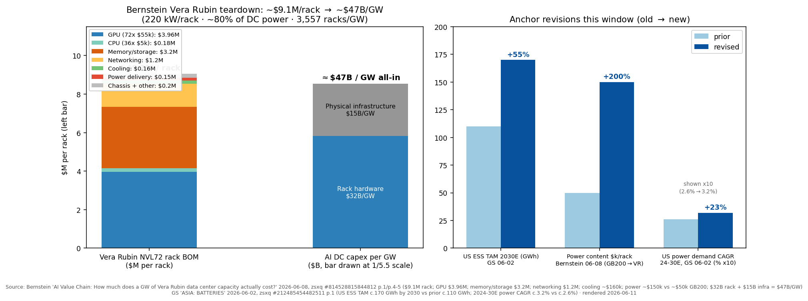
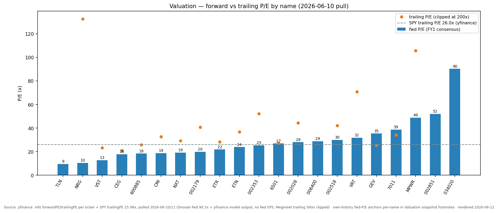
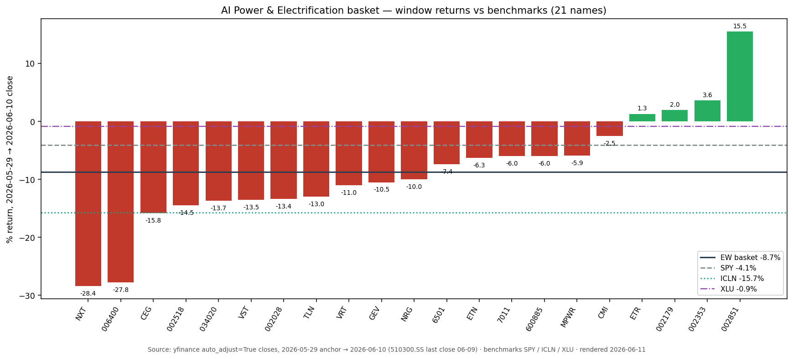

# AI Power & Data-Center Electrification

**Created:** 2026-05-31 · **Last refreshed:** 2026-06-11 · **Last mutated:** 2026-05-31 · **Refresh cadence:** monthly · **Languages tracked:** en, zh

## What's New

*The delta since you last looked — newest on top. Older entries collapse into the archive below.*

**2026-06-11 refresh (vs 2026-05-31):**

- **First measured window is a drawdown: equal-weight basket −8.7% (median −10.0%) over 2026-05-29 → 06-10, vs SPY −4.1% · XLU −0.9% · CSI300 ETF −2.0% · ICLN −15.7%** — only 4/21 names positive; worst Nextracker **−28.4%** and Samsung SDI **−27.8%**, best Megmeet **+15.5%** (yfinance, see Performance). The prior refresh's "closet-ICLN" worry answers itself in the stress test: the basket beat ICLN by **+700 bps** in the drawdown — but lagged SPY by **−460 bps**.
- **The 800VDC thesis took its first timing hit.** SemiAnalysis (06-09): *"Mass adoption of Nvidia's native single-ended 800VDC design, with 800VDC volume shipments pushed to 2028+"* on hyperscaler pushback, while ±400VDC HVDC stays on schedule for 2H26 with sidecar manufacturing ramping 1Q27; read-across: *neutral* for power-rack suppliers (Vertiv / Delta / Lite-On — *"Vertiv is particularly well-positioned because the 800VDC delay extends the life of their large UPS business"*), *positive* for grey-space electrical (Schneider, Legrand, ABB — LV transformer/switchgear/busway content survives), *negative* for WBG pure-plays ([SemiAnalysis — 800VDC Pushout and CPO Delays, zsxq #181245828811182 p.1/p.3](http://xs-macbook-air.local:5001/zsxq/pdf/181245828811182/Powered%20Down%2C%20Lights%20Off.%20800VDC%20Pushout%20and%20CPO%20Delays.pdf#page=1)). Direct stress on the basket's 800V-levered names: Kstar (−14.5% this window), Hongfa (−6.0%), Megmeet (+15.5% anyway).
- **The theme got its first auditable $/GW value-chain map.** Bernstein's Vera Rubin teardown: **~$9.1M per NVL72 rack** → **~$47B all-in capex per GW** ($32B rack + $15B physical infrastructure; 220 kW/rack, ~3,557 racks/GW), with **power-delivery content ~$150k/rack vs ~$50k for GB200 — from 1.0% to 1.6% of rack value** — and Delta named *"one of the main beneficiaries of increasing power content, despite increasing efforts from Vertiv to capture share"* ([Bernstein — AI Value Chain $/GW, zsxq #814528815844812 p.1/p.4-5](http://xs-macbook-air.local:5001/zsxq/pdf/814528815844812/Bernstein-AI%20Value%20Chain%EF%BC%9AHow%20much%20does%20a%20GW%20of%20Vera%20Rubin%20data%20center%20capacity%20actually%20cost%EF%BC%9F-260608.pdf#page=1)). Added to Thesis as the dollar-weighted layer map.
- **Vertiv got initiated at Outperform, TP $416** — Bernstein's new US Multis coverage values VRT at *"32x NTM + 1 EBITDA of $5.1B"* with a steady-state multiple seen at *"~15 - 20X"* and price targets for the DC power/cooling pair (VRT + nVent $218) implying *"~30 - 40% upside"* ([Bernstein — US Multis Initiation, zsxq #412458141848818 p.1-2/p.24/p.29/p.31](http://xs-macbook-air.local:5001/zsxq/pdf/412458141848818/Bernstein-U.S.%20Multi%20Industry%20%26%20Electrical%20Equipment%20US%20Multis%20Initiation%EF%BC%9A%20Thrills%20and%20Chills-260609.pdf#page=2)) — persisted to `stock_price_target_db`.
- **First sell-side downgrade wave datapoint on a tracked name: GS cut Samsung SDI to Neutral (06-02)** — *"We downgrade SDI to Neutral from Buy after its strong outperformance (121% vs our Korea batteries/materials coverage YTD) and fuller valuations, even though we are raising its target price by 70%"* (SOTP TP ₩410,000 → **₩695,000**); the same note **raised the US ESS TAM anchor +55% to c.170 GWh by 2030 (prior c.110 GWh)** on behind-the-meter AIDC demand ([GS — Asia Batteries, zsxq #212485454482511 p.1/p.8](http://xs-macbook-air.local:5001/zsxq/pdf/212485454482511/Goldman%20Sachs-ASIA%EF%BC%9A%20BATTERIES%EF%BC%8CCapturing%20Behind~the~Meter%20Driven%20Storage%20Upside%EF%BC%9B%20Upgrade%20LGES%20to%20Buy%EF%BC%8C%20SDI%20down%20to%20Neutral-260602.pdf#page=1)). SDI's −27.8% window says the market sided with the downgrade, not the TP raise.
- **The HVDC bull counterpoint, same week: GS raised Delta Electronics to NT$4,500 (from NT$2,420, +86% PT hike)** on *"Accelerating pricing per watt for new AI products + faster than expected HVDC power rack contribution in 2027-28"*, with power-rack ex-PSU TAM growing *"by 119% 2027-30E CAGR"* ([GS — Delta, zsxq #212488854818821 p.1/p.6](http://xs-macbook-air.local:5001/zsxq/pdf/212488854818821/Goldman%20Sachs-Delta%20Electronics%20%EF%BC%882308.TW%EF%BC%89%20Accelerating%20pricing%20per%20watt%20for%20new%20AI%20products%20%2B%20faster%20than%20expected%20HVDC%20power%20rack%20contribution%20in%202027~28%EF%BC%9B%20Reiterate%20Buy%20with%20new%20NT%244%EF%BC%8C500%20TP%20%EF%BC%88from%20NT%242%EF%BC%8C420%EF%BC%89-260605.pdf#page=1)) — the GS-vs-SemiAnalysis timing split is logged in *Sell-side view evolution*. Delta stays a watch name (tracked in `ai-server-odm-racks`).
- **Tracked-name events:** Sieyuan fell 5.3% on 06-02 on the Toshiba JV stake option (10% → 30%, ~5% gross-profit impact) — Citi reiterated Buy TP Rmb270 ([Citi, zsxq #585411241414854 p.1](http://xs-macbook-air.local:5001/zsxq/pdf/585411241414854/CITI-Sieyuan%20Electric%20%EF%BC%88002028%EF%BC%89Share%20Price%20Drop%20Likely%20Related%20to%20Ownership%20Cut%20at%20JV%20Making%20Transformers%20with%20Toshiba-260603.pdf#page=1)); MS hosted a Cummins PSBU deep dive and kept OW $752 — *"Cummins continues to take orders for 2028 deliveries"*, the +20 GW capacity roadmap is *"largely fuel agnostic"*, and the *"2030 $9B+ data center"* revenue frame is seen as conservative ([MS — CMI deep dive, zsxq #214528811242141 p.1](http://xs-macbook-air.local:5001/zsxq/pdf/214528811242141/Morgan%20Stanley-Cummins%20Inc%EF%BC%88CMI.US%EF%BC%89%EF%BC%9ADeep%20Dive%20With%20Power%20Systems%20Mgmt.%20Underscores%20Durability%20Of%20Data%20Center%20Tailwind-260608.pdf#page=1)).
- **Format upgrade + regime note:** this refresh adds the Valuation snapshot (+ sell-side view evolution), Basket scorecard, Leading indicators, and 3 charts; 3 new PT calls persisted to `/pt`. Macro regime shifted: VIX 16.68 → **21.51** (2026-06-05, `indicators.db`) — the low-vol tailwind from inception is gone.

Earlier refreshes

**2026-05-31 — basket expanded 16→21 + wider zsxq sourcing.** Added five names, each justified from the original OCR'd PDF text (page + verbatim quote) of its covering broker note:
- **SZSE:002518 科士达 Kstar** (enabler) — UBS Buy, **PT Rmb60.10**, sees **>30% YoY** growth (incl. major ODM-client order intake) and an 800VDC prototype launched May-26 ([UBS — Kstar 2026 AIC, zsxq #184152221455112 p.1](http://xs-macbook-air.local:5001/zsxq/pdf/184152221455112/UBS-Kstar%EF%BC%88002518%EF%BC%892026%20AIC%EF%BC%9A%20Positive%20outlook%20for%20order%20intake%20and%20new%20products-260527.pdf#page=1)).
- **SSE:600885 宏发股份 Hongfa** (enabler) — Citi reaffirms Buy and **lifts TP to Rmb43** (from Rmb38) on 800V AIDC relays, modelling **Rmb1.0bn-1.5bn** of 800V AIDC-relay revenue in 2026 ([Citi — Hongfa, zsxq #212485554288151 p.1](http://xs-macbook-air.local:5001/zsxq/pdf/212485554288151/CITI-Hongfa%20Technology%20%EF%BC%88600885%EF%BC%89%20Lift%20TP%20to%20Rmb43%20on%20Rising%20800V%20AIDC%20Relay%20Exposure%EF%BC%9B%20Reiterate%20Buy-260527.pdf#page=1)).
- **SZSE:002179 中航光电 AVIC Jonhon** (enabler) — added with the GS call surfaced *both ways*: GS **downgraded to Neutral from Buy** (TP Rmb37.5) on defense-margin drag (defense GPM ~35% vs 45% in 2024), even as data-center connectors / liquid-cooling ramp ([GS — AVIC Jonhon, zsxq #585412224511454 p.1](http://xs-macbook-air.local:5001/zsxq/pdf/585412224511454/Goldman%20Sachs-AVIC%20Jonhon%20%EF%BC%88002179%EF%BC%89%EF%BC%9A%20Downgrade%20to%20Neutral%20on%20continued%20defense%20margin%20pressure%20despite%20emerging%20data%20center%20opportunities-260528.pdf#page=1)) — a deliberately mixed-signal enabler.
- **NYSE:CMI Cummins** (enabler) — HSBC "Powering AI" note: **95%** of CMI power-gen is behind-the-meter backup, already taking **AIDC backup orders for 2028 deliveries**, and a **US$450m** capacity add (+20 GW → 55 GW by 2030) ([HSBC — Powering AI, zsxq #415241112255128 p.1](http://xs-macbook-air.local:5001/zsxq/pdf/415241112255128/HSBC-Powering%20AI%EF%BC%9APositive%20read~across%20from%20Cummins%20and%20Deere-260526.pdf#page=1)).
- **KRX:006400 三星SDI Samsung SDI** (adjacent) — UBS Buy (PT Won850k) on an ESS/BBU turnaround: ESS revenue **~+50% YoY** FY2026, **~50% global BBU share** (BBU market +70% YoY to 4 GWh), with full turn-key BESS "could…pave the way to direct supply agreement with Big Tech" ([UBS — Samsung SDI 2026 AIC, zsxq #585412224511884 p.1](http://xs-macbook-air.local:5001/zsxq/pdf/585412224511884/UBS-Samsung%20SDI%EF%BC%88006400.KS%EF%BC%892026%20AIC%EF%BC%9A%20turning%20around%20on%20ESS%20and%20BBU%20growth-260527.pdf#page=1)).

Performance refreshed to the 2026-05-31 pull on the **21-ticker** basket: **1Y +130.0%** (median +124.6%), **YTD +31.9%**, **3M +6.9%** — up from **+100.2% 1Y** on the prior 16-ticker pull, lifted mainly by the +273% 1Y prints from Samsung SDI and Doosan. **New drift signal:** the basket now **lags ICLN (+101.2% 1Y)** — the passive clean-energy ETF beat the active basket over the trailing year (it didn't at the 16-ticker build), surfaced honestly in the Performance read. **+10 zsxq reports now cited** inline (5 per-ticker + 5 theme-level — green-power-direct, DB AI-electricity upgrade, MS financing-constraint, JPM renewables picks, HSBC power-price cycle); the Scope rules now explicitly admit DC-electrical-equipment (UPS / relay / connector / genset / ESS).

**2026-05-31 — zsxq original-source enrichment:** every broker call now cited to its PDF page + a verbatim quote of the original source text (pulled from the original reports, not the zsxq 翻译精华 summary). The Thesis is re-anchored on Morgan Stanley's specific figures — an Asia energy-security super-cycle of **US$5,454bn** unlocking **~US$9trn** of value, with **~24%** Asia DC-power-demand CAGR 2023–30 ([MS, zsxq #184152244582842 p.8/p.11](http://xs-macbook-air.local:5001/zsxq/pdf/184152244582842/Morgan%20Stanley-Energy%20Security%20%26%20AI%EF%BC%9A%20Energy%20Meets%20Compute%EF%BC%9A%20Supercycle%20Recharges-260528.pdf#page=8)) — the SST "硅进铜退" framing ([券商, zsxq #212485811815581 p.1](http://xs-macbook-air.local:5001/zsxq/pdf/212485811815581/%E7%94%B5%E5%8A%9B%E8%AE%BE%E5%A4%87%E4%B8%8E%E6%96%B0%E8%83%BD%E6%BA%90%E8%A1%8C%E4%B8%9AAIDC%E7%B3%BB%E5%88%97%E6%B7%B1%E5%BA%A6%EF%BC%9ASST%E5%BC%80%E5%90%AFAIDC%E4%BE%9B%E7%94%B5%E2%80%9C%E7%A1%85%E8%BF%9B%E9%93%9C%E9%80%80%E2%80%9D%E6%96%B0%E5%91%A8%E6%9C%9F.pdf#page=1)), and the gas-turbine oligopoly's now-quantified backlog (GEV/Siemens/MHI at **110/81/41 GW** of disclosed pipeline, **34%/27%/24%** share) ([SWS 燃机, zsxq #184152212118422 p.16-17](http://xs-macbook-air.local:5001/zsxq/pdf/184152212118422/%E5%9B%BD%E9%98%B2%E5%86%9B%E5%B7%A5%E8%A1%8C%E4%B8%9A%E5%95%86%E5%8F%91%26%E7%87%83%E6%9C%BA%E7%B3%BB%E5%88%97%E6%8A%A5%E5%91%8A%EF%BC%9AAI%E7%AE%97%E5%8A%9B%E9%A9%B1%E5%8A%A8%E7%87%83%E6%9C%BA%E9%9C%80%E6%B1%82%E6%8F%90%E5%8D%87%EF%BC%8C%E5%9B%BD%E4%BA%A7%E4%BE%9B%E5%BA%94%E9%93%BE%E8%BF%8E%E9%BB%84%E9%87%91%E6%9C%BA%E9%81%87.pdf#page=16)). Per-ticker Justifications now carry the broker's specific call where a report covers a tracked name (NXT JPM PT $174 / GS PT $168; Jereh UBS Buy PT Rmb200; Megmeet SST 98.5%-efficiency detail; MHI FY25 31-order print), and the 三一重能 exclusion is grounded in the UBS original text. **No ticker changes; basket and Performance table unchanged from the 2026-05-31 build.**

**2026-05-31 — basket created** (16 tickers: 8 core / 7 enabler / 1 adjacent).

## Thesis

Hyperscale AI compute is rewriting the next decade of electric-power capex, and Morgan Stanley's "Energy Meets Compute" Bluepaper puts a number on it: an Asia energy-security super-cycle of **US$5,454bn** in cumulative investment that unlocks **~US$9trn** of value, with **power grids the single-largest pool** at US$1,745bn ([MS — Energy Meets Compute, zsxq #184152244582842 p.8](http://xs-macbook-air.local:5001/zsxq/pdf/184152244582842/Morgan%20Stanley-Energy%20Security%20%26%20AI%EF%BC%9A%20Energy%20Meets%20Compute%EF%BC%9A%20Supercycle%20Recharges-260528.pdf#page=8) — "US$5,454bn"; value-creation breakdown on [p.6](http://xs-macbook-air.local:5001/zsxq/pdf/184152244582842/Morgan%20Stanley-Energy%20Security%20%26%20AI%EF%BC%9A%20Energy%20Meets%20Compute%EF%BC%9A%20Supercycle%20Recharges-260528.pdf#page=6) — "US$5trn+ in investments across the region… unlocking US$9trn in value", "Power Grids, 1,745"). The demand driver is AI inference specifically: MS estimates **Asia's data-center power-demand CAGR at ~24% over 2023-30**, faster than the US or Europe ([MS, zsxq #184152244582842 p.11](http://xs-macbook-air.local:5001/zsxq/pdf/184152244582842/Morgan%20Stanley-Energy%20Security%20%26%20AI%EF%BC%9A%20Energy%20Meets%20Compute%EF%BC%9A%20Supercycle%20Recharges-260528.pdf#page=11) — "Asia's DC power demand CAGR to be ~24% over 2023-30, exceeding that of the US and Europe"), and it flags grid access as "a US$1trn investment requirement" in this "Age of Electricity" ([p.18](http://xs-macbook-air.local:5001/zsxq/pdf/184152244582842/Morgan%20Stanley-Energy%20Security%20%26%20AI%EF%BC%9A%20Energy%20Meets%20Compute%EF%BC%9A%20Supercycle%20Recharges-260528.pdf#page=18)). The marginal MW of dedicated AI capacity is now procured years ahead of build through behind-the-meter PPAs, on-site CCGT, restarted nuclear units, and grid-side transformer / switchgear orders that have pushed industry lead times into 2027–2030.

A second Morgan Stanley note reframes the bottleneck from money to megawatts: across equity, credit, securitization and private capital, MS argues "the constraint is not capital availability but how markets intermediate AI investment… **with power & compute the real bottlenecks**", sizing the build at **~$10T this cycle** against ~$256T of global capital pools ([MS — Financing the Next 10x Cycle, zsxq #184152581888182 p.1](http://xs-macbook-air.local:5001/zsxq/pdf/184152581888182/Morgan%20Stanley-AI%EF%BC%9A%20Financing%20the%20Next%2010x%20Tech%20Cycle%20%E2%80%94%20Is%20Capital%20the%20Constraint%EF%BC%9F-260529.pdf#page=1) — "with power & compute the real bottlenecks"; "estimated ~$10T AI build-out this cycle" on the Exhibit-1 caption [p.1](http://xs-macbook-air.local:5001/zsxq/pdf/184152581888182/Morgan%20Stanley-AI%EF%BC%9A%20Financing%20the%20Next%2010x%20Tech%20Cycle%20%E2%80%94%20Is%20Capital%20the%20Constraint%EF%BC%9F-260529.pdf#page=1); "~$256T of global capital pools appear sufficient to finance the AI build-out" [p.1](http://xs-macbook-air.local:5001/zsxq/pdf/184152581888182/Morgan%20Stanley-AI%EF%BC%9A%20Financing%20the%20Next%2010x%20Tech%20Cycle%20%E2%80%94%20Is%20Capital%20the%20Constraint%EF%BC%9F-260529.pdf#page=1)). That is the cleanest single-line statement of the basket's whole premise — if capital is abundant and power is scarce, the rent accrues to the power-and-equipment layer. The onshore-China demand curve corroborates it: Deutsche Bank, on the April-2026 print, **raised its 2030 China data-center power-demand estimate by 46% to 805bn kWh** (~6% of national consumption, from ~4.1% prior), after internet/data-services power use ran **+42.8% YoY** and DC capacity hit **14.45mn standard racks by 1Q26 (+39% YoY)** ([Deutsche Bank — China Utilities, zsxq #812485554284242 p.1](http://xs-macbook-air.local:5001/zsxq/pdf/812485554284242/Deutsche%20Bank-China%20Utilities%20Sector%EF%BC%9ARaising%20AI%20power%20demand%20forecasts%20%EF%BC%88Monthly~May%202026%EF%BC%89-260527.pdf#page=1) — "raise our 2030 data centre power demand estimate by 46% to 805bn kWh"; "42.8% YoY increase in power consumption"; "further to 14.45mn by 1026… 39% YoY").

The *generation* layer is where the capacity constraint bites hardest, and a Chinese gas-turbine deep-dive quantifies the oligopoly: **GE Vernova, Siemens Energy and Mitsubishi Heavy hold 110 GW / 81 GW / 41 GW of disclosed under-development capacity** ([SWS 燃机, zsxq #184152212118422 p.16](http://xs-macbook-air.local:5001/zsxq/pdf/184152212118422/%E5%9B%BD%E9%98%B2%E5%86%9B%E5%B7%A5%E8%A1%8C%E4%B8%9A%E5%95%86%E5%8F%91%26%E7%87%83%E6%9C%BA%E7%B3%BB%E5%88%97%E6%8A%A5%E5%91%8A%EF%BC%9AAI%E7%AE%97%E5%8A%9B%E9%A9%B1%E5%8A%A8%E7%87%83%E6%9C%BA%E9%9C%80%E6%B1%82%E6%8F%90%E5%8D%87%EF%BC%8C%E5%9B%BD%E4%BA%A7%E4%BE%9B%E5%BA%94%E9%93%BE%E8%BF%8E%E9%BB%84%E9%87%91%E6%9C%BA%E9%81%87.pdf#page=16) — "GEV、西门子能源、三菱动力位居前三，分别对应110GW、81GW、41GW 装机规模"), or **34% / 27% / 24% share** respectively ([p.17 chart](http://xs-macbook-air.local:5001/zsxq/pdf/184152212118422/%E5%9B%BD%E9%98%B2%E5%86%9B%E5%B7%A5%E8%A1%8C%E4%B8%9A%E5%95%86%E5%8F%91%26%E7%87%83%E6%9C%BA%E7%B3%BB%E5%88%97%E6%8A%A5%E5%91%8A%EF%BC%9AAI%E7%AE%97%E5%8A%9B%E9%A9%B1%E5%8A%A8%E7%87%83%E6%9C%BA%E9%9C%80%E6%B1%82%E6%8F%90%E5%8D%87%EF%BC%8C%E5%9B%BD%E4%BA%A7%E4%BE%9B%E5%BA%94%E9%93%BE%E8%BF%8E%E9%BB%84%E9%87%91%E6%9C%BA%E9%81%87.pdf#page=17) — "34%… 27%… 24%"). The same note frames the demand wave as US-led — "美国2025 年燃气发电开发规模较此前扩大近两倍，总规模达252GW，其中超三分之一直接配套数据中心供电" (US gas-generation development ~252 GW, >⅓ directly tied to data centers) ([p.14](http://xs-macbook-air.local:5001/zsxq/pdf/184152212118422/%E5%9B%BD%E9%98%B2%E5%86%9B%E5%B7%A5%E8%A1%8C%E4%B8%9A%E5%95%86%E5%8F%91%26%E7%87%83%E6%9C%BA%E7%B3%BB%E5%88%97%E6%8A%A5%E5%91%8A%EF%BC%9AAI%E7%AE%97%E5%8A%9B%E9%A9%B1%E5%8A%A8%E7%87%83%E6%9C%BA%E9%9C%80%E6%B1%82%E6%8F%90%E5%8D%87%EF%BC%8C%E5%9B%BD%E4%BA%A7%E4%BE%9B%E5%BA%94%E9%93%BE%E8%BF%8E%E9%BB%84%E9%87%91%E6%9C%BA%E9%81%87.pdf#page=14)) — and titles the whole report "燃气轮机是AI 数据中心首选高可靠供电方案，全球装机进入高增周期" ([p.1](http://xs-macbook-air.local:5001/zsxq/pdf/184152212118422/%E5%9B%BD%E9%98%B2%E5%86%9B%E5%B7%A5%E8%A1%8C%E4%B8%9A%E5%95%86%E5%8F%91%26%E7%87%83%E6%9C%BA%E7%B3%BB%E5%88%97%E6%8A%A5%E5%91%8A%EF%BC%9AAI%E7%AE%97%E5%8A%9B%E9%A9%B1%E5%8A%A8%E7%87%83%E6%9C%BA%E9%9C%80%E6%B1%82%E6%8F%90%E5%8D%87%EF%BC%8C%E5%9B%BD%E4%BA%A7%E4%BE%9B%E5%BA%94%E9%93%BE%E8%BF%8E%E9%BB%84%E9%87%91%E6%9C%BA%E9%81%87.pdf#page=1)). This corroborates the printed US filings: GE Vernova's gas-turbine backlog crossed 100 GW in Q1 2026 with ~20 GW explicitly tied to data-center load, a 110 GW year-end target on top ([mgrid.org, 2026-04-22](https://mgrid.org/2026/04/22/ge-vernovas-gas-turbine-backlog-hits-100-gw-as-data-centers-drive-4-billion-in-q1-orders/); the same 100→110 GW path appears in the SWS note on [p.18](http://xs-macbook-air.local:5001/zsxq/pdf/184152212118422/%E5%9B%BD%E9%98%B2%E5%86%9B%E5%B7%A5%E8%A1%8C%E4%B8%9A%E5%95%86%E5%8F%91%26%E7%87%83%E6%9C%BA%E7%B3%BB%E5%88%97%E6%8A%A5%E5%91%8A%EF%BC%9AAI%E7%AE%97%E5%8A%9B%E9%A9%B1%E5%8A%A8%E7%87%83%E6%9C%BA%E9%9C%80%E6%B1%82%E6%8F%90%E5%8D%87%EF%BC%8C%E5%9B%BD%E4%BA%A7%E4%BE%9B%E5%BA%94%E9%93%BE%E8%BF%8E%E9%BB%84%E9%87%91%E6%9C%BA%E9%81%87.pdf#page=18) — "26Q1 燃气发电设备未交付订单与机位预留合计从83GW 增至100GW，公司预计2026 年底将至少达到110GW"). Vertiv's Q1 2026 backlog hit $15.0 bn (+109% YoY) on TTM organic orders +81%, and Eaton's Electrical Americas data-center *orders* ran +240% YoY in Q1 2026 with revenue +50% — the cleanest read-through that AI compute is pulling power-equipment demand forward into the printed P&L ([Vertiv Q1 2026 8-K](https://www.sec.gov/Archives/edgar/data/0001674101/000162828026026379/q12026exhibit991vrt04222026.htm); [Eaton Q1 2026 8-K](https://www.sec.gov/Archives/edgar/data/0001551182/000155118226000010/etn03312026exhibit99.htm)).

The basket bets that the *equipment* and *generation* layers — not the data-center REITs and not the AI chips themselves — capture the cleanest incremental margin because they have the most binding capacity constraints. On the grid-side hardware, the onshore-China angle is the SST "硅进铜退" (silicon-in, copper-out) rotation: a 国金证券 AIDC deep-dive argues the power system "正从配套环节升级为算力基础设施的核心约束" (is upgrading from an ancillary link to the *core constraint* of compute infrastructure) as racks cross 1 MW and 800 VDC becomes inevitable, displacing copper-and-iron transformers with SiC-based solid-state transformers ([券商 — SST AIDC, zsxq #212485811815581 p.1](http://xs-macbook-air.local:5001/zsxq/pdf/212485811815581/%E7%94%B5%E5%8A%9B%E8%AE%BE%E5%A4%87%E4%B8%8E%E6%96%B0%E8%83%BD%E6%BA%90%E8%A1%8C%E4%B8%9AAIDC%E7%B3%BB%E5%88%97%E6%B7%B1%E5%BA%A6%EF%BC%9ASST%E5%BC%80%E5%90%AFAIDC%E4%BE%9B%E7%94%B5%E2%80%9C%E7%A1%85%E8%BF%9B%E9%93%9C%E9%80%80%E2%80%9D%E6%96%B0%E5%91%A8%E6%9C%9F.pdf#page=1) — "电源系统正从配套环节升级为算力基础设施的核心约束"; "SST 利用碳化硅（SiC）等大功率半导体器件替代了传统变压器的铜线与铁芯" on [p.6](http://xs-macbook-air.local:5001/zsxq/pdf/212485811815581/%E7%94%B5%E5%8A%9B%E8%AE%BE%E5%A4%87%E4%B8%8E%E6%96%B0%E8%83%BD%E6%BA%90%E8%A1%8C%E4%B8%9AAIDC%E7%B3%BB%E5%88%97%E6%B7%B1%E5%BA%A6%EF%BC%9ASST%E5%BC%80%E5%90%AFAIDC%E4%BE%9B%E7%94%B5%E2%80%9C%E7%A1%85%E8%BF%9B%E9%93%9C%E9%80%80%E2%80%9D%E6%96%B0%E5%91%A8%E6%9C%9F.pdf#page=6)). The State-Grid 15th-Five-Year capex framework at RMB 4 trn (+40% YoY) layers an onshore industrial-policy tailwind tagged to AIDC load growth ([State-Grid 4-trn tracker](https://600312.fupanwang.com/dsk/2026-01-19.html)). A parallel 兴业证券 note adds the supply-side "绿电直连" (green-power-direct-to-compute) channel — by 2026-04-16 China had approved ~90 green-power-direct projects totalling **~26.09 GW**, of which **12 are data-center / compute-center tied** — naming **科士达 (Kstar)** among the AIDC power / grid-equipment picks ([兴业证券 — 绿电直连, zsxq #585412224854524 p.2](http://xs-macbook-air.local:5001/zsxq/pdf/585412224854524/%E7%94%B5%E5%8A%9B%E8%AE%BE%E5%A4%87%E8%A1%8C%E4%B8%9A%EF%BC%9A%E7%BB%BF%E7%94%B5%E7%9B%B4%E8%BF%9E%E9%87%8D%E5%A1%91%E7%AE%97%E5%8A%9B%E5%9F%BA%E7%A1%80%E8%AE%BE%E6%96%BD%EF%BC%8C%E7%BB%BF%E7%94%B5%E5%88%87%E5%85%A5Colo%E6%89%93%E5%BC%80%E4%BC%B0%E5%80%BC%E6%8F%90%E5%8D%87%E7%A9%BA%E9%97%B4.pdf#page=2) — "各省市已批复绿电直连项目约90个、合计发电容量约26.09GW，其中与数据中心/算力中心相关项目共12个"; pick list "推荐金盘科技、科士达、中恒电气、中国西电"). A GS / JPM / UBS / Citi / Deutsche cohort converged on the same framing in a tight window 2026-05-26 to 2026-05-31.

The vulnerability is exactly the multiple this thesis now embeds. Samsung SDI, Doosan, 杰瑞, Vertiv, NXT and 宏发's A-share peers run anywhere from +100% to +359% 1Y at this pull — pricing in execution that hasn't fully printed (see Performance table below; yfinance pull 2026-05-31). A 12-month window where hyperscaler capex cadence even *pauses* (rate-driven, regulatory, or chip-supply-driven) is the cleanest single de-rating path — exactly the first risk the gas-turbine note itself lists, "AIDC 建设进度不及预期风险" ([SWS 燃机, zsxq #184152212118422 p.42](http://xs-macbook-air.local:5001/zsxq/pdf/184152212118422/%E5%9B%BD%E9%98%B2%E5%86%9B%E5%B7%A5%E8%A1%8C%E4%B8%9A%E5%95%86%E5%8F%91%26%E7%87%83%E6%9C%BA%E7%B3%BB%E5%88%97%E6%8A%A5%E5%91%8A%EF%BC%9AAI%E7%AE%97%E5%8A%9B%E9%A9%B1%E5%8A%A8%E7%87%83%E6%9C%BA%E9%9C%80%E6%B1%82%E6%8F%90%E5%8D%87%EF%BC%8C%E5%9B%BD%E4%BA%A7%E4%BE%9B%E5%BA%94%E9%93%BE%E8%BF%8E%E9%BB%84%E9%87%91%E6%9C%BA%E9%81%87.pdf#page=42)). A deeper structural break would require AI training demand itself to disappoint, with macro stress from gas + oil + rates the most-watched second-order driver — and the gas backdrop is presently tight, with European storage "at 39% full, vs. 47% a year ago and 53% for the seasonal average" ([UBS — Global Gas, zsxq #585412242541124 p.1](http://xs-macbook-air.local:5001/zsxq/pdf/585412242541124/UBS-Global%20Gas%EF%BC%9AInjections%20pick%20up%EF%BC%8C%20but%20storage%20concerns%20linger-260528.pdf#page=1)). A specifically China-power caveat comes from HSBC, which warns it is **"Too early to call a power price upcycle"**: even though it sees AIDC power consumption "rise 5x till 2030", the firm-capacity reserve margin is rebounding "from 18% in 2024 to 34% in 2030", so a *structural* price upcycle is "less likely" and "**renewables IPPs are likely winners**" rather than merchant thermal ([HSBC — China Power Utilities, zsxq #812451114428542 p.1](http://xs-macbook-air.local:5001/zsxq/pdf/812451114428542/HSBC-China%20Power%20Utilities%EF%BC%9AToo%20early%20to%20call%20a%20power%20price%20upcycle-260526.pdf#page=1) — "Too early to call a power price upcycle"; "rise 5x till 2030"; "from 18% in 2024 to 34% in 2030"; "renewables IPPs are likely winners"). JPM's China-renewables summit read is the mirror image on the equity side — energy-security plus "developed-market data-center power infrastructure constraints" lifted Sungrow / Deye **+14% / +20%** since mid-May, with Sungrow flagging "early AIDC-related ESS orders" ([JPM — China Renewables, zsxq #184152221451482 p.1](http://xs-macbook-air.local:5001/zsxq/pdf/184152221451482/J.P.%20Morgan-China%20Renewables%20Global%20China%20Summit%20Takeaways%EF%BC%9A%20Key%20Trends%20and%204%20key%20picks-260527.pdf#page=1) — "Sungrow and Deye share prices are up 14%/20%, respectively, since May 15"; "Sungrow cited early AIDC-related ESS orders"). Drift watch separates the printed-P&L names (Vertiv, Eaton, GEV, MPWR, Talen, Hongfa's relay ramp) from the still-anticipatory names (NXT-Prevalon, Doosan US wins, Samsung SDI's Big-Tech BESS, 麦格米特's NVIDIA ramp, 杰瑞's gas-turbine pipeline).

**Dollar-weighted value-chain map (added 2026-06-11, Bernstein Vera Rubin teardown).** Per GW of AI data-center capacity, all-in capex is **~$47B** — **$32B rack hardware + $15B physical infrastructure** (the rack is 220 kW, ~80% of DC power, ~3,557 racks/GW). Inside the **~$9.1M rack**: GPU **~$4M** (72 × $55k) · memory/storage **~$3.2M** · networking **~$1.2M** · cooling **~$160k** · **power delivery ~$150k** (vs ~$50k on GB200 — content share 1.0% → 1.6% of rack value, the fastest-growing slice) · chassis/other ~$0.3M; running a GW costs *"~$1.3B in electricity… for a year"* at $0.15/kWh ([Bernstein — AI Value Chain $/GW, zsxq #814528815844812 p.1/p.4-5](http://xs-macbook-air.local:5001/zsxq/pdf/814528815844812/Bernstein-AI%20Value%20Chain%EF%BC%9AHow%20much%20does%20a%20GW%20of%20Vera%20Rubin%20data%20center%20capacity%20actually%20cost%EF%BC%9F-260608.pdf#page=4)). Basket mapping: the **$15B/GW physical-infrastructure layer** is where the gensets / switchgear / transformers / UPS names (GEV, CMI, ETN, VRT grey-space, Sieyuan, Kstar) earn; the **in-rack $150k power slice** is the Megmeet / MPWR / Hongfa-relay / Delta-watch layer; the **$1.3B/GW/yr electricity opex** is the IPP-PPA layer (CEG, TLN, VST, NRG, ETR). Named leading supplier of the in-rack power slice per Bernstein: **Delta** — a rich-dollar layer where the basket holds only second-derivative exposure (Megmeet, MPWR), logged as a candidate-add signal in Drift signals.

**Further viewing**

- [Practical Engineering — How Data Centers Are Powered (And Why They're Straining the Grid)](https://www.youtube.com/watch?v=FSOSKGhfS7c) — the full electrical path from grid interconnection through transformers, switchgear, UPS and gensets into the rack; the single best visual of the "grey space" this basket owns.
- [Hitachi Energy — HVDC: a key for the green transition (official explainer playlist)](https://www.youtube.com/playlist?list=PLgRtnbeTImdw5SNSVIv12POJQpyR7-xir) — what high-voltage direct current physically is and why stepping voltage down close to the load cuts conversion losses — the logic behind the ±400V/800VDC architecture debate.

## Scope rules

**In:** (a) power generation directly anchored to AI-DC load — gas turbines, nuclear restarts / uprates, behind-the-meter CCGTs, backup gensets, IPPs with disclosed hyperscaler PPAs; (b) grid-side hardware whose lead times have re-rated on AIDC demand — transformers, HVDC converter valves, GIS / switchgear, SSTs; (c) data-center electrical equipment one rack-row outside the chip — UPS, PDU, **AIDC relays / ATS**, BBU and battery backup, **ESS / BESS supplying data-center load or backup**, **electrical connectors / busways / liquid-cooling manifolds tied to AIDC**, server-side AC/DC and 800-VDC, and *thermally adjacent* power-thermal products. The unifying test is the *electrical* / power path into the rack, not the silicon inside it. All tickers need a 2025–2026 primary source naming the company as an AI-DC supply participant; mixed-mix names (e.g. a connector maker with a large defense or auto book) are admissible as **enablers** when a broker names a real AIDC revenue line, with the dilution flagged in the Justification.

**Out:** (a) pure-renewable IPPs without a disclosed hyperscaler PPA; (b) oil-and-gas E&P unless explicitly AI-DC anchored (Tallgrass's gas-pipeline → on-site-CCGT model is a future addition if listed); (c) auto-electrification suppliers; (d) DC REITs (EQIX, DLR) — *demand*, not supply; (e) baseload utilities and Chinese state hydro / nuclear (长江电力, 中国核电) where the AI-DC PPA is still aspirational.

## Tracked tickers

| Ticker | Name | Role | Justification | Added |
|---|---|---|---|---|
| NYSE:GEV | GE Vernova | core | #1 of the gas-turbine oligopoly — **110 GW** of disclosed under-development capacity, ahead of Siemens (81 GW) and MHI (41 GW) ([SWS 燃机, zsxq #184152212118422 p.16](http://xs-macbook-air.local:5001/zsxq/pdf/184152212118422/%E5%9B%BD%E9%98%B2%E5%86%9B%E5%B7%A5%E8%A1%8C%E4%B8%9A%E5%95%86%E5%8F%91%26%E7%87%83%E6%9C%BA%E7%B3%BB%E5%88%97%E6%8A%A5%E5%91%8A%EF%BC%9AAI%E7%AE%97%E5%8A%9B%E9%A9%B1%E5%8A%A8%E7%87%83%E6%9C%BA%E9%9C%80%E6%B1%82%E6%8F%90%E5%8D%87%EF%BC%8C%E5%9B%BD%E4%BA%A7%E4%BE%9B%E5%BA%94%E9%93%BE%E8%BF%8E%E9%BB%84%E9%87%91%E6%9C%BA%E9%81%87.pdf#page=16) — "GEV、西门子能源、三菱动力位居前三，分别对应110GW、81GW、41GW 装机规模"), a **34% share** ([p.17 chart](http://xs-macbook-air.local:5001/zsxq/pdf/184152212118422/%E5%9B%BD%E9%98%B2%E5%86%9B%E5%B7%A5%E8%A1%8C%E4%B8%9A%E5%95%86%E5%8F%91%26%E7%87%83%E6%9C%BA%E7%B3%BB%E5%88%97%E6%8A%A5%E5%91%8A%EF%BC%9AAI%E7%AE%97%E5%8A%9B%E9%A9%B1%E5%8A%A8%E7%87%83%E6%9C%BA%E9%9C%80%E6%B1%82%E6%8F%90%E5%8D%87%EF%BC%8C%E5%9B%BD%E4%BA%A7%E4%BE%9B%E5%BA%94%E9%93%BE%E8%BF%8E%E9%BB%84%E9%87%91%E6%9C%BA%E9%81%87.pdf#page=17) — "34%"); Q1 2026 undelivered orders + slot reservations rose 83→100 GW with a ≥110 GW year-end target and turbine delivery capacity lifted to 20 GW (2026) → 24 GW (2028) ([p.18](http://xs-macbook-air.local:5001/zsxq/pdf/184152212118422/%E5%9B%BD%E9%98%B2%E5%86%9B%E5%B7%A5%E8%A1%8C%E4%B8%9A%E5%95%86%E5%8F%91%26%E7%87%83%E6%9C%BA%E7%B3%BB%E5%88%97%E6%8A%A5%E5%91%8A%EF%BC%9AAI%E7%AE%97%E5%8A%9B%E9%A9%B1%E5%8A%A8%E7%87%83%E6%9C%BA%E9%9C%80%E6%B1%82%E6%8F%90%E5%8D%87%EF%BC%8C%E5%9B%BD%E4%BA%A7%E4%BE%9B%E5%BA%94%E9%93%BE%E8%BF%8E%E9%BB%84%E9%87%91%E6%9C%BA%E9%81%87.pdf#page=18) — "从83GW 增至100GW，公司预计2026 年底将至少达到110GW… 2026 年年中将燃气轮机年交付能力提升至20GW，2028 年进一步扩至24GW"). MS lists GE Vernova in its "Powering AI" supply-chain ([MS, zsxq #184152244582842 p.24](http://xs-macbook-air.local:5001/zsxq/pdf/184152244582842/Morgan%20Stanley-Energy%20Security%20%26%20AI%EF%BC%9A%20Energy%20Meets%20Compute%EF%BC%9A%20Supercycle%20Recharges-260528.pdf#page=24)). In-house [GEV research](../company/GEVernova_NYSE_GEV/GEVernova_NYSE_GEV_Research_Document.md); 100 GW print on [mgrid.org, 2026-04-22](https://mgrid.org/2026/04/22/ge-vernovas-gas-turbine-backlog-hits-100-gw-as-data-centers-drive-4-billion-in-q1-orders/). | 2026-05-31 |
| NYSE:VRT | Vertiv | core | Q1 2026 backlog $15.0 bn (+109% YoY), TTM organic orders +81%, AI hyperscalers the named demand driver; in-house [Vertiv research](../company/Vertiv_NYSE_VRT/Vertiv_NYSE_VRT_Research_Document.md) ([Vertiv Q1 2026 8-K, SEC](https://www.sec.gov/Archives/edgar/data/0001674101/000162828026026379/q12026exhibit991vrt04222026.htm)). | 2026-05-31 |
| NYSE:ETN | Eaton | core | Q1 2026 Electrical Americas DC orders +240% YoY, revenue +50%; 228 GW total DC backlog cited, ~70% of 32 GW under-construction tied to AI; Boyd Thermal acquisition closes liquid-cooling adjacency ([Eaton Q1 2026 8-K, SEC](https://www.sec.gov/Archives/edgar/data/0001551182/000155118226000010/etn03312026exhibit99.htm); [Eaton release](https://www.eaton.com/us/en-us/company/news-insights/news-releases/2026/eaton-reports-record-first-quarter-2026-results.html)). | 2026-05-31 |
| NASDAQ:CEG | Constellation Energy | core | 20-yr Microsoft PPA on the restarted 835 MW Three Mile Island / Crane Clean Energy Center (RTS 2027); separate 20-yr 1.121 GW Meta PPA on Clinton from June 2027; >5.65 GW hyperscaler contracts ([Three Mile Island restart, DCD](https://www.datacenterdynamics.com/en/news/constellation-secures-1bn-loan-from-us-doe-to-support-restart-of-three-mile-island-nuclear-plant-report/); [restart timing, Energy News Beat](https://energynewsbeat.co/data-center/three-mile-island-nuclear-plant-set-to-restart-amid-booming-ai-power-demand/)). | 2026-05-31 |
| NASDAQ:TLN | Talen Energy | core | 17-yr, ~$18 bn AWS PPA for up to 1,920 MW from Susquehanna nuclear, grid-connected / FTM, AI compute the named load; in-house [Talen research](../company/Talen_NASDAQ_TLN/Talen_NASDAQ_TLN_Research_Document.md) ([Talen 2025-06-11 8-K, SEC](https://www.sec.gov/Archives/edgar/data/0001622536/000162828025030559/a20250611pressreleasebusin.htm)). | 2026-05-31 |
| NYSE:VST | Vistra | core | 20-yr Meta nuclear PPAs closed January 2026, ~2,600 MW across three PJM plants; in-house [Vistra research](../company/Vistra_NYSE_VST/Vistra_NYSE_VST_Research_Document.md) ([Lambda Finance framing](https://www.lambdafin.com/articles/vistra-vs-constellation-vs-talen)). | 2026-05-31 |
| NYSE:NRG | NRG Energy | core | 295 MW long-term PPA for two Texas DC sites with path to 500 MW / 1 GW; closed January 2026 LS Power deal adds ~13 GW gas generation + 6 GW C&I VPP ([NRG Q4 2025 8-K, SEC](https://www.sec.gov/Archives/edgar/data/0001013871/000110465926023570/tm267426d5_99-2.htm); [NRG 295 MW Texas, Power Engineering](https://www.power-eng.com/gas/nrg-caps-busy-second-quarter-with-295-mw-data-center-power-deal/)). | 2026-05-31 |
| NYSE:ETR | Entergy | core | Hosts Meta's $10 bn NE Louisiana AI campus ($2 bn customer-savings expansion 2026), Google $4 bn Arkansas, AVAIO Mississippi, AWS pipeline; PUC-approved 3 new gas plants 2.3 GW / $3.2 bn for hyperscale load ([Entergy-Meta $2 bn release](https://www.entergy.com/news/entergy-louisiana-announces-a-new-agreement-with-meta-that-will-deliver-an-additional-2b-in-customer-savings); [Entergy Q1 2026 8-K, SEC](https://www.sec.gov/Archives/edgar/data/0000065984/000006598426000217/earningsrelease1q26_ex991.htm)). Sits in the US DC-power build hot-zone: Louisiana is the #2 US state for 2025 under-development gas capacity at **12.2 GW**, behind only Texas (57.9 GW) ([SWS 燃机, zsxq #184152212118422 p.14](http://xs-macbook-air.local:5001/zsxq/pdf/184152212118422/%E5%9B%BD%E9%98%B2%E5%86%9B%E5%B7%A5%E8%A1%8C%E4%B8%9A%E5%95%86%E5%8F%91%26%E7%87%83%E6%9C%BA%E7%B3%BB%E5%88%97%E6%8A%A5%E5%91%8A%EF%BC%9AAI%E7%AE%97%E5%8A%9B%E9%A9%B1%E5%8A%A8%E7%87%83%E6%9C%BA%E9%9C%80%E6%B1%82%E6%8F%90%E5%8D%87%EF%BC%8C%E5%9B%BD%E4%BA%A7%E4%BE%9B%E5%BA%94%E9%93%BE%E8%BF%8E%E9%BB%84%E9%87%91%E6%9C%BA%E9%81%87.pdf#page=14) — "路易斯安那州… 12.2GW"). | 2026-05-31 |
| NASDAQ:NXT | Nextracker | adjacent | May 2026 definitive agreement to acquire **Prevalon Energy** (a Mitsubishi Power Americas / EES JV) for total consideration up to **$365 mn** — $200 mn initial ($150 mn cash + $50 mn stock) + up to $165 mn earnouts over four years; Prevalon has "deployed over 6 GWh across more than 35 projects" with backlog "significantly over $300mm" ([JPM — NXT, zsxq #212485814114811 p.1](http://xs-macbook-air.local:5001/zsxq/pdf/212485814114811/J.P.%20Morgan-Nextpower%EF%BC%88NXT.US%EF%BC%89The%20Audacity%20of%20Scope%EF%BC%9A%20M%26A%20Expansion%20Into%20BESS%20a%20Positive%EF%BC%9B%20Increasing%20PT%20to%20%24174-260529.pdf#page=1)). **JPM Overweight, PT raised $155 → $174** ([p.1](http://xs-macbook-air.local:5001/zsxq/pdf/212485814114811/J.P.%20Morgan-Nextpower%EF%BC%88NXT.US%EF%BC%89The%20Audacity%20of%20Scope%EF%BC%9A%20M%26A%20Expansion%20Into%20BESS%20a%20Positive%EF%BC%9B%20Increasing%20PT%20to%20%24174-260529.pdf#page=1) — "Increasing PT to $174… Prior (Dec-26):$155.00"). GS separately Buy, **PT $168** (vs $153), and notes "Prevalon is already executing on an AI DC project with a tier one hyperscaler" with a BESS TAM ex-China "up to $35bn by 2030, including $15bn in the US" ([GS — NXT, zsxq #184152218128182 p.1](http://xs-macbook-air.local:5001/zsxq/pdf/184152218128182/Goldman%20Sachs-Nextpower%20%EF%BC%88NXT.US%EF%BC%89%EF%BC%9A%20Acquisition%20of%20battery%20energy%20storage%20system%20%EF%BC%88BESS%EF%BC%89%20company%20drives%20guidance%20raise%EF%BC%8C%20marking%20another%20step%20into%20data%20center-260529.pdf#page=1); TAM on [p.2](http://xs-macbook-air.local:5001/zsxq/pdf/184152218128182/Goldman%20Sachs-Nextpower%20%EF%BC%88NXT.US%EF%BC%89%EF%BC%9A%20Acquisition%20of%20battery%20energy%20storage%20system%20%EF%BC%88BESS%EF%BC%89%20company%20drives%20guidance%20raise%EF%BC%8C%20marking%20another%20step%20into%20data%20center-260529.pdf#page=2)). NXT lifted FY27 guidance to $4.0-4.4bn revenue / $845-930mn EBITDA ([p.2](http://xs-macbook-air.local:5001/zsxq/pdf/184152218128182/Goldman%20Sachs-Nextpower%20%EF%BC%88NXT.US%EF%BC%89%EF%BC%9A%20Acquisition%20of%20battery%20energy%20storage%20system%20%EF%BC%88BESS%EF%BC%89%20company%20drives%20guidance%20raise%EF%BC%8C%20marking%20another%20step%20into%20data%20center-260529.pdf#page=2)). Deal confirmed via [Business Wire 2026-05-28](https://www.businesswire.com/news/home/20260528147848/en/Nextpower-Announces-Entry-into-Battery-Energy-Storage-BESS-and-AI-Data-Center-Markets-with-Definitive-Agreement-to-Acquire-Prevalon-Energy-Increases-Fiscal-Year-2027-Outlook). | 2026-05-31 |
| NASDAQ:MPWR | Monolithic Power Systems | enabler | Q1 2026 record revenue $804 mn (+26% YoY); Enterprise Data growth floor raised to ~85% YoY from 50% on AI-server DC-DC content gains; cleanest power-IC pure-play into the AI rack ([MPWR Q1 2026 8-K, SEC](https://www.sec.gov/Archives/edgar/data/0001280452/000143774926003191/ex_917134.htm)). | 2026-05-31 |
| TSE:6501 | Hitachi | enabler | Hitachi Energy is named in MS's "Powering AI" supply-chain map ([MS, zsxq #184152244582842 p.24](http://xs-macbook-air.local:5001/zsxq/pdf/184152244582842/Morgan%20Stanley-Energy%20Security%20%26%20AI%EF%BC%9A%20Energy%20Meets%20Compute%EF%BC%9A%20Supercycle%20Recharges-260528.pdf#page=24)) and grouped among the heavy-electrical / grid players (ABB, Eaton, GEVernova, 日立能源, 三菱电机, Schneider, Siemens, Vertiv) whose moat in AIDC SST is "中压接入、保护控制和系统级可靠性" ([券商 — SST AIDC, zsxq #212485811815581 p.10](http://xs-macbook-air.local:5001/zsxq/pdf/212485811815581/%E7%94%B5%E5%8A%9B%E8%AE%BE%E5%A4%87%E4%B8%8E%E6%96%B0%E8%83%BD%E6%BA%90%E8%A1%8C%E4%B8%9AAIDC%E7%B3%BB%E5%88%97%E6%B7%B1%E5%BA%A6%EF%BC%9ASST%E5%BC%80%E5%90%AFAIDC%E4%BE%9B%E7%94%B5%E2%80%9C%E7%A1%85%E8%BF%9B%E9%93%9C%E9%80%80%E2%80%9D%E6%96%B0%E5%91%A8%E6%9C%9F.pdf#page=10) — "这一类玩家包括ABB、伊顿、GEVernova、日立能源、三菱电机… 其技术底座来自中压开关、UPS、保护控制、变压器"). Hitachi Energy 800-VDC integrated into NVIDIA Vera Rubin DSX reference (March 2026); $1 bn US grid build-out incl $457 mn S. Boston VA transformer plant; May 2026 X LABS JV for BTM GW-scale AI energy parks ([Hitachi-NVIDIA release](https://hitachidigital.com/news/hitachi-accelerate-gigawatt-scale-ai-factories/); [X LABS JV release](https://www.hitachi.com/en/press/articles/2026/05/0512/)). | 2026-05-31 |
| TSE:7011 | Mitsubishi Heavy Industries | enabler | #3 of the gas-turbine oligopoly — 41 GW disclosed pipeline ([SWS 燃机, zsxq #184152212118422 p.16](http://xs-macbook-air.local:5001/zsxq/pdf/184152212118422/%E5%9B%BD%E9%98%B2%E5%86%9B%E5%B7%A5%E8%A1%8C%E4%B8%9A%E5%95%86%E5%8F%91%26%E7%87%83%E6%9C%BA%E7%B3%BB%E5%88%97%E6%8A%A5%E5%91%8A%EF%BC%9AAI%E7%AE%97%E5%8A%9B%E9%A9%B1%E5%8A%A8%E7%87%83%E6%9C%BA%E9%9C%80%E6%B1%82%E6%8F%90%E5%8D%87%EF%BC%8C%E5%9B%BD%E4%BA%A7%E4%BE%9B%E5%BA%94%E9%93%BE%E8%BF%8E%E9%BB%84%E9%87%91%E6%9C%BA%E9%81%87.pdf#page=16) — "分别对应110GW、81GW、41GW"), a 24% share ([p.17 chart](http://xs-macbook-air.local:5001/zsxq/pdf/184152212118422/%E5%9B%BD%E9%98%B2%E5%86%9B%E5%B7%A5%E8%A1%8C%E4%B8%9A%E5%95%86%E5%8F%91%26%E7%87%83%E6%9C%BA%E7%B3%BB%E5%88%97%E6%8A%A5%E5%91%8A%EF%BC%9AAI%E7%AE%97%E5%8A%9B%E9%A9%B1%E5%8A%A8%E7%87%83%E6%9C%BA%E9%9C%80%E6%B1%82%E6%8F%90%E5%8D%87%EF%BC%8C%E5%9B%BD%E4%BA%A7%E4%BE%9B%E5%BA%94%E9%93%BE%E8%BF%8E%E9%BB%84%E9%87%91%E6%9C%BA%E9%81%87.pdf#page=17) — "24%"); the same note reports MHI signed **31 large gas-turbine orders in the first three quarters of FY2025, +15 YoY**, North-America/Asia-driven, and is urgently expanding capacity to clear the backlog ([p.18](http://xs-macbook-air.local:5001/zsxq/pdf/184152212118422/%E5%9B%BD%E9%98%B2%E5%86%9B%E5%B7%A5%E8%A1%8C%E4%B8%9A%E5%95%86%E5%8F%91%26%E7%87%83%E6%9C%BA%E7%B3%BB%E5%88%97%E6%8A%A5%E5%91%8A%EF%BC%9AAI%E7%AE%97%E5%8A%9B%E9%A9%B1%E5%8A%A8%E7%87%83%E6%9C%BA%E9%9C%80%E6%B1%82%E6%8F%90%E5%8D%87%EF%BC%8C%E5%9B%BD%E4%BA%A7%E4%BE%9B%E5%BA%94%E9%93%BE%E8%BF%8E%E9%BB%84%E9%87%91%E6%9C%BA%E9%81%87.pdf#page=18) — "25 财年前三季度累计签订31 台大型燃机订单，同比大幅增加15 台… 产能紧急上调以应对缺口"). MHI is named in MS's "Powering AI" / energy-security supply-chain map ([MS, zsxq #184152244582842 p.24](http://xs-macbook-air.local:5001/zsxq/pdf/184152244582842/Morgan%20Stanley-Energy%20Security%20%26%20AI%EF%BC%9A%20Energy%20Meets%20Compute%EF%BC%9A%20Supercycle%20Recharges-260528.pdf#page=24)). First two M501JAC turbines (~1,150 MW) allocated to Tallgrass Cheyenne Power Hub May 2026 — Switchgrass Industrial Park DC, $7 bn+ project ([Tallgrass-MHI release](https://tallgrass.com/newsroom/press-releases/tallgrass-and-mitsubishi-power-americas-announce-turbine-allocation-for-cheyenne-power-hub-051526); [MHI capacity expansion, DCD](https://www.datacenterdynamics.com/en/news/mitsubishi-heavy-industries-to-revamp-gas-turbine-production-process-to-meet-growing-demand-from-ai-data-center-sector/)). | 2026-05-31 |
| KRX:034020 | Doosan Enerbility | enabler | DOOSAN is named in MS's "Buy 'Dependable' Energy Supply Chain" / Powering AI map ([MS, zsxq #184152244582842 p.24](http://xs-macbook-air.local:5001/zsxq/pdf/184152244582842/Morgan%20Stanley-Energy%20Security%20%26%20AI%EF%BC%9A%20Energy%20Meets%20Compute%EF%BC%9A%20Supercycle%20Recharges-260528.pdf#page=24)). Four-unit follow-on steam-turbine order (4 × 370 MW) from US big-tech DC customer 2026-05-27, Texas delivery through 2029; xAI gas-turbine book to 12 units; midsize 90 MW turbines explicitly for AI DC / hyperscaler load ([Seoul Economic Daily 2026-05-27](https://en.sedaily.com/finance/2026/05/27/doosan-enerbility-to-supply-four-more-steam-turbines-to-us); [KED Global 2026-05-08](https://www.kedglobal.com/energy/newsView/ked202605080005)). | 2026-05-31 |
| SZSE:002353 | Jereh Group 杰瑞股份 | enabler | UBS reiterates **Buy, PT Rmb200** post-2026 AIC, on the "overseas expansion + data-centre-oriented power generation" dual engine ([UBS — Jereh, zsxq #812485545248522 p.1](http://xs-macbook-air.local:5001/zsxq/pdf/812485545248522/UBS-Jereh%20Oilfield%20Services%EF%BC%88002353%EF%BC%892026%20AIC%EF%BC%9A%20%27data%20centre~oriented%20power%20generation%20%2B%20globalisation%27%20gathering%20pace-260528.pdf#page=1) — "12m price target Rmb200.00"; "'data centre-oriented power generation + globalisation' gathering pace"). On gas-turbine-head sourcing, "Jereh has strong ties with GEV/Siemens/Baker Hughes", reinforced by an SGT-series deal between Jereh Agile Power Energy and Siemens Energy, plus aeroderivative partner FTAI (Mod-1 CFM56); it is "reaching out to AI majors in North America… with scope extended to SMR/energy storage/liquid cooling" ([p.1](http://xs-macbook-air.local:5001/zsxq/pdf/812485545248522/UBS-Jereh%20Oilfield%20Services%EF%BC%88002353%EF%BC%892026%20AIC%EF%BC%9A%20%27data%20centre~oriented%20power%20generation%20%2B%20globalisation%27%20gathering%20pace-260528.pdf#page=1)). UBS's Rmb200 DCF "implies 36x/29x 2027E/28E PE, still appealing compared to the gas turbine sector averages of 48x/46x" ([p.1](http://xs-macbook-air.local:5001/zsxq/pdf/812485545248522/UBS-Jereh%20Oilfield%20Services%EF%BC%88002353%EF%BC%892026%20AIC%EF%BC%9A%20%27data%20centre~oriented%20power%20generation%20%2B%20globalisation%27%20gathering%20pace-260528.pdf#page=1)). A separate SWS gas-turbine note lists 杰瑞股份 among the four核心 whole-machine names for the China-OEM-goes-global thesis ([SWS 燃机, zsxq #184152212118422 p.2](http://xs-macbook-air.local:5001/zsxq/pdf/184152212118422/%E5%9B%BD%E9%98%B2%E5%86%9B%E5%B7%A5%E8%A1%8C%E4%B8%9A%E5%95%86%E5%8F%91%26%E7%87%83%E6%9C%BA%E7%B3%BB%E5%88%97%E6%8A%A5%E5%91%8A%EF%BC%9AAI%E7%AE%97%E5%8A%9B%E9%A9%B1%E5%8A%A8%E7%87%83%E6%9C%BA%E9%9C%80%E6%B1%82%E6%8F%90%E5%8D%87%EF%BC%8C%E5%9B%BD%E4%BA%A7%E4%BE%9B%E5%BA%94%E9%93%BE%E8%BF%8E%E9%BB%84%E9%87%91%E6%9C%BA%E9%81%87.pdf#page=2) — "整机制造核心企业，重点关注：航发动力、中国动力、杰瑞股份、东方电气"). Latest disclosed US DC contract 2026-02-01, RMB 12.65 bn / ~$182 mn gas-turbine sale ([新浪财经 2026-02-01](https://finance.sina.com.cn/stock/stockzmt/2026-02-01/doc-inhkipia8643774.shtml)). | 2026-05-31 |
| SZSE:002028 | Sieyuan Electric 思源电气 | enabler | Sieyuan is one of the few China grid-equipment names MS tags to its accelerated-grid-deployment surprise (Surprise #6) and its "Powering AI" supply-chain map ([MS, zsxq #184152244582842 p.1](http://xs-macbook-air.local:5001/zsxq/pdf/184152244582842/Morgan%20Stanley-Energy%20Security%20%26%20AI%EF%BC%9A%20Energy%20Meets%20Compute%EF%BC%9A%20Supercycle%20Recharges-260528.pdf#page=1) — "Sieyuan"; supply-chain map [p.24](http://xs-macbook-air.local:5001/zsxq/pdf/184152244582842/Morgan%20Stanley-Energy%20Security%20%26%20AI%EF%BC%9A%20Energy%20Meets%20Compute%EF%BC%9A%20Supercycle%20Recharges-260528.pdf#page=24)), consistent with MS's view that "a lack of grid capacity is emerging as a critical bottleneck… a US$1trn investment requirement" ([p.18](http://xs-macbook-air.local:5001/zsxq/pdf/184152244582842/Morgan%20Stanley-Energy%20Security%20%26%20AI%EF%BC%9A%20Energy%20Meets%20Compute%EF%BC%9A%20Supercycle%20Recharges-260528.pdf#page=18)). North-American AIDC HV transformer + tank circuit-breaker batch orders 2025; 2026 NA DC order target RMB 1.5 bn+; overseas guided +40%; in-house Chinese [思源 research](../company/思源电气_SZSE002028/思源电气_SZSE002028_Research_Document_zh.md) ([思源 NA AIDC 1.5 bn target, 雪球](https://xueqiu.com/5508673842/371575368)). | 2026-05-31 |
| SZSE:002851 | Megmeet 麦格米特 | enabler | The 国金证券 SST deep-dive makes Megmeet its **top HVDC pick** — "第一，HVDC 方向，关注麦格米特等具备海外客户送样、小批量进展和数据中心电源基础的公司" ([券商 — SST AIDC, zsxq #212485811815581 p.1](http://xs-macbook-air.local:5001/zsxq/pdf/212485811815581/%E7%94%B5%E5%8A%9B%E8%AE%BE%E5%A4%87%E4%B8%8E%E6%96%B0%E8%83%BD%E6%BA%90%E8%A1%8C%E4%B8%9AAIDC%E7%B3%BB%E5%88%97%E6%B7%B1%E5%BA%A6%EF%BC%9ASST%E5%BC%80%E5%90%AFAIDC%E4%BE%9B%E7%94%B5%E2%80%9C%E7%A1%85%E8%BF%9B%E9%93%9C%E9%80%80%E2%80%9D%E6%96%B0%E5%91%A8%E6%9C%9F.pdf#page=1)) — and one of only four China names inside NVIDIA's 800 VDC power-component roster alongside Delta / Flex / LITEON ([p.10](http://xs-macbook-air.local:5001/zsxq/pdf/212485811815581/%E7%94%B5%E5%8A%9B%E8%AE%BE%E5%A4%87%E4%B8%8E%E6%96%B0%E8%83%BD%E6%BA%90%E8%A1%8C%E4%B8%9AAIDC%E7%B3%BB%E5%88%97%E6%B7%B1%E5%BA%A6%EF%BC%9ASST%E5%BC%80%E5%90%AFAIDC%E4%BE%9B%E7%94%B5%E2%80%9C%E7%A1%85%E8%BF%9B%E9%93%9C%E9%80%80%E2%80%9D%E6%96%B0%E5%91%A8%E6%9C%9F.pdf#page=10) — "台达（Delta）、伟创力（Flex）、光宝（LITEON）、麦格米特（Megmeet）等被纳入功率系统组件供应商阵营"). Its SST "可直接承接电网高压输入并转换输出800VDC… 转换效率超过98.5%… 可助力算力中心PUE 控制在1.1以下", with a full Sidecar / 33kW-110kW Power Shelf / CRPS / Power Brick matrix ([p.16](http://xs-macbook-air.local:5001/zsxq/pdf/212485811815581/%E7%94%B5%E5%8A%9B%E8%AE%BE%E5%A4%87%E4%B8%8E%E6%96%B0%E8%83%BD%E6%BA%90%E8%A1%8C%E4%B8%9AAIDC%E7%B3%BB%E5%88%97%E6%B7%B1%E5%BA%A6%EF%BC%9ASST%E5%BC%80%E5%90%AFAIDC%E4%BE%9B%E7%94%B5%E2%80%9C%E7%A1%85%E8%BF%9B%E9%93%9C%E9%80%80%E2%80%9D%E6%96%B0%E5%91%A8%E6%9C%9F.pdf#page=16)). Q1 2026 power-products segment booked **RMB 8.17 bn revenue, +66.52% YoY**, validating the AIDC ramp ([p.16](http://xs-macbook-air.local:5001/zsxq/pdf/212485811815581/%E7%94%B5%E5%8A%9B%E8%AE%BE%E5%A4%87%E4%B8%8E%E6%96%B0%E8%83%BD%E6%BA%90%E8%A1%8C%E4%B8%9AAIDC%E7%B3%BB%E5%88%97%E6%B7%B1%E5%BA%A6%EF%BC%9ASST%E5%BC%80%E5%90%AFAIDC%E4%BE%9B%E7%94%B5%E2%80%9C%E7%A1%85%E8%BF%9B%E9%93%9C%E9%80%80%E2%80%9D%E6%96%B0%E5%91%A8%E6%9C%9F.pdf#page=16) — "公司电源产品事业群实现销售收入8.17 亿元，同比增长66.52%"). It is also delivering project-based volumes to North-American clients and co-developing next-gen SST with NA cloud majors ([p.16](http://xs-macbook-air.local:5001/zsxq/pdf/212485811815581/%E7%94%B5%E5%8A%9B%E8%AE%BE%E5%A4%87%E4%B8%8E%E6%96%B0%E8%83%BD%E6%BA%90%E8%A1%8C%E4%B8%9AAIDC%E7%B3%BB%E5%88%97%E6%B7%B1%E5%BA%A6%EF%BC%9ASST%E5%BC%80%E5%90%AFAIDC%E4%BE%9B%E7%94%B5%E2%80%9C%E7%A1%85%E8%BF%9B%E9%93%9C%E9%80%80%E2%80%9D%E6%96%B0%E5%91%A8%E6%9C%9F.pdf#page=16)). Background: A-share's NVIDIA-chain server-power supplier ([新浪 银河证券 2025-10-10](https://finance.sina.com.cn/stock/stockzmt/2025-10-10/doc-inftkert9939742.shtml)). | 2026-05-31 |
| SZSE:002518 | Kstar 科士达 | enabler | China DC-UPS + ESS pure-play. UBS hosted Kstar at its 2026 AIC and reiterated **Buy, 12m PT Rmb60.10**, on a "Positive outlook for order intake and new products": mgmt guided "**over 30% YoY growth if including the potential order intake from major ODM clients, and at least 20% YoY growth if excluding that**", expects meaningful UPS-ODM order intake from existing and new Taiwan clients in Jun-Jul, and per-client unit value rising to "**US$0.8-1.0M**" across UPS / backup power / long-duration BESS at ">35% GPM for UPS ODM business" ([UBS — Kstar 2026 AIC, zsxq #184152221455112 p.1](http://xs-macbook-air.local:5001/zsxq/pdf/184152221455112/UBS-Kstar%EF%BC%88002518%EF%BC%892026%20AIC%EF%BC%9A%20Positive%20outlook%20for%20order%20intake%20and%20new%20products-260527.pdf#page=1) — "12m price target Rmb60.10"; "over 30% YoY growth… at least 20% YoY growth if excluding that"). On the next-gen rack: "mgmt confirmed its **800VDC prototype has been launched in May** and is pending customer validation", with modular SST roll-out "could be at end-26 at the earliest" ([p.1](http://xs-macbook-air.local:5001/zsxq/pdf/184152221455112/UBS-Kstar%EF%BC%88002518%EF%BC%892026%20AIC%EF%BC%9A%20Positive%20outlook%20for%20order%20intake%20and%20new%20products-260527.pdf#page=1)). Independently named in 兴业证券's "绿电直连" AIDC power / grid-equipment pick list ([兴业证券, zsxq #585412224854524 p.2](http://xs-macbook-air.local:5001/zsxq/pdf/585412224854524/%E7%94%B5%E5%8A%9B%E8%AE%BE%E5%A4%87%E8%A1%8C%E4%B8%9A%EF%BC%9A%E7%BB%BF%E7%94%B5%E7%9B%B4%E8%BF%9E%E9%87%8D%E5%A1%91%E7%AE%97%E5%8A%9B%E5%9F%BA%E7%A1%80%E8%AE%BE%E6%96%BD%EF%BC%8C%E7%BB%BF%E7%94%B5%E5%88%87%E5%85%A5Colo%E6%89%93%E5%BC%80%E4%BC%B0%E5%80%BC%E6%8F%90%E5%8D%87%E7%A9%BA%E9%97%B4.pdf#page=2) — "推荐金盘科技、科士达、中恒电气、中国西电"). | 2026-05-31 |
| SSE:600885 | Hongfa 宏发股份 | enabler | World #1 relay maker, now an 800V AIDC-relay play. **Citi reaffirms Buy and lifts TP to Rmb43 (from Rmb38)** "on Rising 800V AIDC Relay Exposure", modelling "**800V AIDC relay revenue to reach Rmb1.0bn-1.5bn in 2026**" and total AIDC-related revenue rising "to **8-10% of 2026E total revenue** … from 4-5% in 2025" — "big enough to drive a share price rerating, similar to its rising NEV HVDC revenue contribution… in 2020-21" ([Citi — Hongfa, zsxq #212485554288151 p.1](http://xs-macbook-air.local:5001/zsxq/pdf/212485554288151/CITI-Hongfa%20Technology%20%EF%BC%88600885%EF%BC%89%20Lift%20TP%20to%20Rmb43%20on%20Rising%20800V%20AIDC%20Relay%20Exposure%EF%BC%9B%20Reiterate%20Buy-260527.pdf#page=1) — "raise TP to Rmb43 on better AIDC relay outlook"; "8-10% of 2026E total"). For 800V architecture Hongfa supplies "relays used in PDU…, BBU…, SST…", and Citi judges GPM "less likely to deteriorate" from 1Q26's 32.1% given a silver-price peak and a shift to "cost-plus" pricing ([p.1](http://xs-macbook-air.local:5001/zsxq/pdf/212485554288151/CITI-Hongfa%20Technology%20%EF%BC%88600885%EF%BC%89%20Lift%20TP%20to%20Rmb43%20on%20Rising%20800V%20AIDC%20Relay%20Exposure%EF%BC%9B%20Reiterate%20Buy-260527.pdf#page=1)). | 2026-05-31 |
| SZSE:002179 | AVIC Jonhon 中航光电 | enabler | DC connectors + liquid-cooling components — but added with the **mixed signal surfaced honestly**: Goldman **downgraded AVIC Jonhon to Neutral from Buy** (12m TP Rmb37.5, 22x 2027E P/E) "on continued defense margin pressure despite emerging data center opportunities", with defense GPM "remaining around 35%, **below the 45% level seen in 2024**" and firmwide GPM ~29.8% 2026E ([GS — AVIC Jonhon, zsxq #585412224511454 p.1](http://xs-macbook-air.local:5001/zsxq/pdf/585412224511454/Goldman%20Sachs-AVIC%20Jonhon%20%EF%BC%88002179%EF%BC%89%EF%BC%9A%20Downgrade%20to%20Neutral%20on%20continued%20defense%20margin%20pressure%20despite%20emerging%20data%20center%20opportunities-260528.pdf#page=1) — "Downgrade to Neutral from Buy"; "our 12-month TP remains at Rmb37.5"; "below the 45% level seen in 2024"). The AIDC pull is real but early: in data-center applications "the company is currently supplying three categories of products", expects "**optical-module-related products to potentially achieve rapid growth this year**", and sees "high-speed and liquid-cooling-related products, including connectors, manifolds, cold plates, and tubing systems… scale meaningfully into next year", while contribution "remains relatively small at this stage" ([p.1](http://xs-macbook-air.local:5001/zsxq/pdf/585412224511454/Goldman%20Sachs-AVIC%20Jonhon%20%EF%BC%88002179%EF%BC%89%EF%BC%9A%20Downgrade%20to%20Neutral%20on%20continued%20defense%20margin%20pressure%20despite%20emerging%20data%20center%20opportunities-260528.pdf#page=1)). Tracked as a faster-AIDC-vs-defense-drag swing enabler — GS lists "Faster-than-expected liquid cooling demand" as the #1 upside risk ([p.2](http://xs-macbook-air.local:5001/zsxq/pdf/585412224511454/Goldman%20Sachs-AVIC%20Jonhon%20%EF%BC%88002179%EF%BC%89%EF%BC%9A%20Downgrade%20to%20Neutral%20on%20continued%20defense%20margin%20pressure%20despite%20emerging%20data%20center%20opportunities-260528.pdf#page=2)). | 2026-05-31 |
| NYSE:CMI | Cummins | enabler | Listed-US proxy for AI-DC **backup generation**. HSBC's "Powering AI" note reports "**95% of CMI power gen business is behind-the-meter backup power and it is taking AIDC backup power orders for 2028 deliveries**", prompting a "**USD450m investment to add 20GW** high-horsepower engine and genset capacity, **reaching total 55 GW by 2030**", plus a 4 MW gas-engine solution with an expected 2028 launch ([HSBC — Powering AI, zsxq #415241112255128 p.1](http://xs-macbook-air.local:5001/zsxq/pdf/415241112255128/HSBC-Powering%20AI%EF%BC%9APositive%20read~across%20from%20Cummins%20and%20Deere-260526.pdf#page=1) — "95% of CMI power gen business is behind-the-meter backup power… taking AIDC backup power orders for 2028 deliveries"; "USD450m investment to add 20GW… reaching total 55 GW by 2030"). HSBC carries CMI "Not rated" (the note frames it as a positive read-across for CAT / Weichai), so this is a fundamentals-anchored add rather than a rating call. | 2026-05-31 |
| KRX:006400 | Samsung SDI 三星SDI | adjacent | The AI-backup-power / ESS turnaround leg. UBS hosted SDI at its 2026 AIC and kept **Buy, PT Won850,000**, "turning around on ESS and BBU growth": for FY2026 "**ESS revenue will likely rise ~50% YoY** with mid-to-high single digit OPM", helped by a "22GWh LFP line [that] will start production in 26Q4 and 27Q1", and SDI "is actively developing AC components to offer full turn-key BESS solutions… This could help pave the way to **direct supply agreement with Big Tech**" ([UBS — Samsung SDI 2026 AIC, zsxq #585412224511884 p.1](http://xs-macbook-air.local:5001/zsxq/pdf/585412224511884/UBS-Samsung%20SDI%EF%BC%88006400.KS%EF%BC%892026%20AIC%EF%BC%9A%20turning%20around%20on%20ESS%20and%20BBU%20growth-260527.pdf#page=1) — "ESS revenue will likely rise ~50% Yoy"; "direct supply agreement with Big Tech"). On backup: SDI "held **approximately 50% global BBU market share in 2025**… the global BBU market grows 70% YoY to 4 GWh… forecasted to reach 10 GWh by 2030", and "BBU customers are data centers" acting "as a power outage bridge as diesel generators… ramp" ([p.1](http://xs-macbook-air.local:5001/zsxq/pdf/585412224511884/UBS-Samsung%20SDI%EF%BC%88006400.KS%EF%BC%892026%20AIC%EF%BC%9A%20turning%20around%20on%20ESS%20and%20BBU%20growth-260527.pdf#page=1) — "approximately 50% global BBU market share in 2025"; "global BBU market grows 70% YoY to 4 GWh"). Adjacent (not core) because the EV-battery book still dominates the P&L; the AIDC ESS/BBU line is the incremental driver. *(also tracked in: china-battery-ess-sodium-ion)* | 2026-05-31 |

**Geographic / role mix (21 tickers):** US 10 (48%) · China A-share 6 (29%) · Japan 2 (10%) · Korea 3 (14%). Role: core 8, enabler 11, adjacent 2. (Enabler-heavy after the expansion — the five additions are all DC-electrical-equipment names: UPS/ESS, relays, connectors, gensets and BBU/ESS, one rack-row outside the chip. US still leads on count but the China A-share electrical-equipment cohort doubled.)

## Valuation snapshot

Rows mirror `stock_price_target_db` (latest call per institute since 2026-05-01; surfaced at [`/pt`](http://xs-macbook-air.local:5001/pt)) — **Px @ note is the price on the note's date** (`report_date_price`), which fixes the upside the analyst actually called; *Px now* is the 2026-06-10 close (yfinance). Fwd P/E FY1 and FY1E EPS = yfinance `.info` consensus, pulled 2026-06-10/11; FY2E only where a mined note states it. **PT dispersion** per name from the read-only pre-pass.

| Ticker | Latest rating · broker (date) | Px @ note | PT | Upside | Px 06-10 | Fwd P/E FY1 | FY1E EPS | FY2E EPS | PT dispersion (since 05-01) |
|---|---|---|---|---|---|---|---|---|---|
| NYSE:GEV | no call in PT store | — | — | — | $867.09 | 35.4x | $24.51 | n/a¹ | — |
| NYSE:VRT | Outperform · Bernstein (06-09, initiation) | $289.52 | **$416** | +43.7% | $280.98 | 31.7x | $8.85 | $9.21 (Bernstein 2027E)² | single PT |
| NYSE:ETN | Outperform · Bernstein (05-20) | $379.69 | $509 | +34.1% | $375.46 | 23.9x | $15.72 | n/a¹ | single PT |
| NASDAQ:CEG | Buy · UBS (05-04) | $320.55 | $388 | +21.0% | $242.30 | 17.8x | $13.61 | n/a¹ | single PT |
| NASDAQ:TLN | Buy · UBS (05-04) | $384.64 | $486 | +26.4% | $336.59 | 9.5x | $35.55 | n/a¹ | single PT |
| NYSE:VST | Buy · UBS (05-04) | $160.85 | $233 | +44.9% | $138.54 | 12.6x | $10.96 | n/a¹ | single PT |
| NYSE:NRG | Buy · UBS (05-08) | $138.11 | $221 | +60.0% | $120.65 | 10.4x | $11.63 | n/a¹ | single PT (×2 notes) |
| NYSE:ETR | no call in PT store | — | — | — | $110.48 | 21.8x | $5.06 | n/a¹ | — |
| NASDAQ:NXT | Overweight · JPM (05-29) | $137.17 | **$174** *(was $155)* | +26.8% | $111.95 | 19.2x | $5.84 | n/a¹ | n=2: $168 / $171 / $174 — 4% spread |
| NASDAQ:MPWR | no call in PT store | — | — | — | $1,473.04 | 48.8x | $30.16 | n/a¹ | — |
| NYSE:CMI | Overweight · MS (06-08, deep-dive reiteration) | $672.68 | $752 | +11.8% | $630.52 | 18.6x | $33.81 | $34.88 (MS 12/27e)³ | n=3⁴: $700 / $726 / $752 — 7% spread |
| TSE:6501 | no call in PT store | — | — | — | ¥4,784 | 26.9x | ¥178.13 | n/a¹ | — |
| TSE:7011 | Buy · GS (05-27) | ¥3,898 | ¥6,000 | +53.9% | ¥3,578 | 38.6x | ¥92.67 | n/a¹ | n=2: ¥5,500 / ¥5,750 / ¥6,000 — 9% spread |
| KRX:034020 | no call in PT store | — | — | — | ₩91,100 | 90.2x⁵ | n/a⁵ | n/a⁵ | — |
| KRX:006400 | **Neutral · GS (06-02, downgrade from Buy)** | ₩602,000 | **₩695,000** *(was ₩410,000)* | +15.4% | ₩496,500 | 28.8x⁵ | n/a⁵ | n/a⁵ | n=3⁶: ₩520k / ₩695k / ₩850k — **63% spread** |
| SZSE:002353 | Buy · UBS (05-28) | ¥148.08 | ¥200 | +35.1% | ¥144.80 | 25.3x | ¥5.72 | n/a⁷ | single PT |
| SZSE:002028 | Buy · Citi (06-03) | ¥194.13 | **¥270** | +39.1% | ¥175.00 | 28.0x | ¥6.25 | n/a¹ | n=2: ¥206 / ¥238 / ¥270 — 31% spread |
| SZSE:002851 | no call in PT store (MS 06-08: "not-covered") | — | — | — | ¥145.61 | 52.0x | ¥2.80 | n/a¹ | — |
| SZSE:002518 | Buy · UBS (05-27) | ¥56.00 | ¥60.10 | +7.3% | ¥46.41 | 30.0x | ¥1.55 | n/a¹ | n=2: ¥60.1 / ¥63.6 / ¥67 — 11% spread |
| SSE:600885 | Buy · Citi (05-27) | ¥35.61 | **¥43** *(was ¥38)* | +20.8% | ¥31.82 | 18.4x | ¥1.73 | n/a¹ | n=2: ¥37.2 / ¥40.1 / ¥43 — 16% spread |
| SZSE:002179 | Neutral · GS (05-28, downgrade from Buy) | ¥38.99 | ¥37.5 | −3.8% | ¥37.16 | 19.9x | ¥1.87 | n/a¹ | single PT |

*Suspect row (excluded from dispersion):* a UBS "₩1,450,000 / Buy" row stored under 006400.KS (05-26) is **Samsung Electro-Mechanics mis-tickered** (company_name field reads "Samsung Electro-Mechanics", i.e. 009150.KS) — flagged for re-grounding, not used.

Footnotes — **cell derivations and own-history context**: ¹ FY2E not stated in the mined notes for these names and yfinance `.info` carries FY1 only — left n/a rather than improvised. ² Bernstein 2027E adjusted EPS $9.21 from the initiation's ticker table (32.6x 2027E P/E at the 06-08 close — [zsxq #412458141848818 p.2](http://xs-macbook-air.local:5001/zsxq/pdf/412458141848818/Bernstein-U.S.%20Multi%20Industry%20%26%20Electrical%20Equipment%20US%20Multis%20Initiation%EF%BC%9A%20Thrills%20and%20Chills-260609.pdf#page=2)). ³ MS ModelWare 12/27e EPS from the CMI deep-dive header ([zsxq #214528811242141 p.1](http://xs-macbook-air.local:5001/zsxq/pdf/214528811242141/Morgan%20Stanley-Cummins%20Inc%EF%BC%88CMI.US%EF%BC%89%EF%BC%9ADeep%20Dive%20With%20Power%20Systems%20Mgmt.%20Underscores%20Durability%20Of%20Data%20Center%20Tailwind-260608.pdf#page=1)). ⁴ CMI dispersion = Bernstein Market-Perform $700 (05-21) + MS OW $752; JPM Neutral (05-21, no PT) excluded. ⁵ yfinance does not populate fwd EPS for KRX listings; fwd P/E shown is its model output (Doosan's 90.2x carries no stated EPS base — treat as indicative only). ⁶ SDI dispersion = Bernstein ₩520k (05-11) / GS ₩695k (06-02) / UBS ₩850k (05-27); JPM OW (05-28, no PT) and the suspect ₩1.45m row excluded. ⁷ UBS's Rmb200 DCF *"implies 36x/29x 2027E/28E PE, still appealing compared to the gas turbine sector averages of 48x/46x"* ([UBS — Jereh, zsxq #812485545248522 p.1](http://xs-macbook-air.local:5001/zsxq/pdf/812485545248522/UBS-Jereh%20Oilfield%20Services%EF%BC%88002353%EF%BC%892026%20AIC%EF%BC%9A%20%27data%20centre~oriented%20power%20generation%20%2B%20globalisation%27%20gathering%20pace-260528.pdf#page=1)). **Own-history anchors (where a mined note states one):** Bernstein's VRT framework is the only explicit own-history frame in this window's notes — current valuation *"32x NTM + 1 EBITDA"* vs a steady-state *"~15 - 20X"* EV/EBITDA for service-weighted industrials ([initiation p.29/p.31](http://xs-macbook-air.local:5001/zsxq/pdf/412458141848818/Bernstein-U.S.%20Multi%20Industry%20%26%20Electrical%20Equipment%20US%20Multis%20Initiation%EF%BC%9A%20Thrills%20and%20Chills-260609.pdf#page=29)); no other mined note publishes a 10-yr/through-cycle multiple for a tracked name, and a self-computed 10-yr fwd-P/E history is not reliably reconstructable for this 5-market panel from yfinance — gap noted in Data Used rather than improvised. **Growth-adjusted cross-section:** on FY1→FY2 where stated, VRT compresses 46.1x → 32.6x (Bernstein 26E→27E) and Delta (watch) 28.5x 27E → 12.9x 28E (GS); the IPP cohort already trades at 9.5-17.8x FY1 vs equipment at 19-52x — the basket sorts cheap→dear only if the 2027-28 HVDC/genset ramp prints.

### Sell-side view evolution (卖方观点演变)

**Samsung SDI (KRX:006400) — four institutes in four weeks; the first downgrade-into-strength of the basket:**

| Institute | Date | Rating / PT | Core argument | What proves them right |
|---|---|---|---|---|
| Bernstein | 05-11 | Market-Perform / ₩520,000 | valuation already full pre-AIC | the −27.8% window print |
| UBS | 05-27 | Buy / ₩850,000 | *"turning around on ESS and BBU growth"* — ~50% global BBU share, ESS ~+50% YoY FY26 ([zsxq #585412224511884 p.1](http://xs-macbook-air.local:5001/zsxq/pdf/585412224511884/UBS-Samsung%20SDI%EF%BC%88006400.KS%EF%BC%892026%20AIC%EF%BC%9A%20turning%20around%20on%20ESS%20and%20BBU%20growth-260527.pdf#page=1)) | Big-Tech turn-key BESS contract printing |
| JPM | 05-28 | Overweight / no PT stored | APAC ESS top-pick list (with CATL, Sungrow, LGES, Nari) ([zsxq #585411224125444 p.1](http://xs-macbook-air.local:5001/zsxq/pdf/585411224125444/J.P.%20Morgan-AIDC%20ESS%EF%BC%9AReference%20Architectures%20and%20Early%20Orders%20Point%20to%20ESS%20Adoption-260602.pdf#page=1)) | AIDC ESS orders accelerating |
| **Goldman Sachs** | **06-02** | **Neutral (was Buy) / ₩695,000 (was ₩410,000)** | *"strong outperformance (121%… YTD) and fuller valuations"* — TP +70% on the raised ESS TAM, rating cut anyway ([zsxq #212485454482511 p.1/p.8](http://xs-macbook-air.local:5001/zsxq/pdf/212485454482511/Goldman%20Sachs-ASIA%EF%BC%9A%20BATTERIES%EF%BC%8CCapturing%20Behind~the~Meter%20Driven%20Storage%20Upside%EF%BC%9B%20Upgrade%20LGES%20to%20Buy%EF%BC%8C%20SDI%20down%20to%20Neutral-260602.pdf#page=1)) | relative-value rotation to LGES working |

GS's SOTP legs: *"xEV Battery: DCF; Small-size Battery/ESS/EM: 11x/14x/8x 27E/28E EBITDA"* ([p.22](http://xs-macbook-air.local:5001/zsxq/pdf/212485454482511/Goldman%20Sachs-ASIA%EF%BC%9A%20BATTERIES%EF%BC%8CCapturing%20Behind~the~Meter%20Driven%20Storage%20Upside%EF%BC%9B%20Upgrade%20LGES%20to%20Buy%EF%BC%8C%20SDI%20down%20to%20Neutral-260602.pdf#page=22)). At ₩496,500 the stock now trades **below Bernstein's ₩520k bear-side PT** — the dispersion has flipped from "how much upside" to "is the floor in".

**The 800VDC timing question — a genuine three-way split (same fortnight):**

| Source | Date | View | Core argument |
|---|---|---|---|
| GS (Delta note) | 06-05 | **HVDC faster than expected** | *"We are seeing a faster than expected HVDC power rack demand as some CSPs have aggressive time schedules"*; mass volume 2027-28; power-rack ex-PSU TAM +119% CAGR 27-30E ([zsxq #212488854818821 p.6](http://xs-macbook-air.local:5001/zsxq/pdf/212488854818821/Goldman%20Sachs-Delta%20Electronics%20%EF%BC%882308.TW%EF%BC%89%20Accelerating%20pricing%20per%20watt%20for%20new%20AI%20products%20%2B%20faster%20than%20expected%20HVDC%20power%20rack%20contribution%20in%202027~28%EF%BC%9B%20Reiterate%20Buy%20with%20new%20NT%244%EF%BC%8C500%20TP%20%EF%BC%88from%20NT%242%EF%BC%8C420%EF%BC%89-260605.pdf#page=6)) |
| Bernstein ($/GW note) | 06-08 | **Content growing either way** | power content 1.0% → 1.6% of rack *"amid greater power loads and the early stages of 800VDC adoption"* ([zsxq #814528815844812 p.5](http://xs-macbook-air.local:5001/zsxq/pdf/814528815844812/Bernstein-AI%20Value%20Chain%EF%BC%9AHow%20much%20does%20a%20GW%20of%20Vera%20Rubin%20data%20center%20capacity%20actually%20cost%EF%BC%9F-260608.pdf#page=5)) |
| SemiAnalysis | 06-09 | **Single-ended 800VDC pushed to 2028+** | hyperscalers call grid-350/450V → 800V → 50V *"highly inefficient"*; ±400VDC (hyperscaler in-house ASIC architecture) on schedule 2H26, sidecar ramp 1Q27; *"a technology adoption pushout, not a cancellation"* ([zsxq #181245828811182 p.1/p.3](http://xs-macbook-air.local:5001/zsxq/pdf/181245828811182/Powered%20Down%2C%20Lights%20Off.%20800VDC%20Pushout%20and%20CPO%20Delays.pdf#page=3)) |

The reconciliation matters for position sizing: all three agree the *sidecar/power-rack transition happens* (SemiAnalysis: *"the sidecar/power rack transition is happening regardless of whether the bus is ±400V or single-ended 800V"*) — the disagreement is whose architecture and when, which moves the WBG/SST-levered names (Kstar's SST, Megmeet's 800V roster slot) more than the rack-power incumbents (Vertiv, Delta).

**Sieyuan (SZSE:002028) — same-direction calls, different anchors:** GS Buy ¥206 (05-07, was already ~at spot) → Citi Buy ¥270 *reiterated on the dip* after the 06-02 −5.3% fall on the Toshiba JV option (*"Toshiba has an option to raise its stake in this joint venture from 10% to 30% this month… its gross profit could be cut around 5%"* — [Citi, zsxq #585411241414854 p.1](http://xs-macbook-air.local:5001/zsxq/pdf/585411241414854/CITI-Sieyuan%20Electric%20%EF%BC%88002028%EF%BC%89Share%20Price%20Drop%20Likely%20Related%20to%20Ownership%20Cut%20at%20JV%20Making%20Transformers%20with%20Toshiba-260603.pdf#page=1)). 31% PT spread is mostly the JV-dilution debate.

**Cummins (NYSE:CMI):** Bernstein Market-Perform $700 (05-05 → 05-21) vs MS OW $752 reaffirmed post-deep-dive (06-08) vs JPM Neutral (05-21) — the split is durability-of-diesel-standby: MS's evidence is *"orders for 2028 deliveries"* still predominately diesel; Bernstein's caution is the multiple. No self-revisions this window.

## Exclusions

| Ticker | Reason for exclusion |
|---|---|
| SSE:688349 三一重能 | Wind OEM. UBS's own 2026 AIC note frames the entire thesis as "Overseas expansion and domestic margin recovery to drive earnings rebound" — wind, not data-center supply: "secured 3GW overseas order in 2025 and is targeting Rmb 10bn order by end-26", aiming for top-3 share "up from 11% market share in 2025 (Rank 5th)", with the margin-recovery levers "vertical integration… self-sourced generator, blade… leading technology on large-sized turbine" ([UBS — Sany Renewable Energy, zsxq #415284424524158 p.1](http://xs-macbook-air.local:5001/zsxq/pdf/415284424524158/UBS-Sany%20Renewable%20Energy%EF%BC%88688349%EF%BC%892026%20AIC%EF%BC%9A%20Overseas%20expansion%20and%20domestic%20margin%20recovery%20to%20drive%20earnings%20rebound-260528.pdf#page=1)). **No hyperscaler PPA appears anywhere in the note** (UBS Buy, PT Rmb31). Re-add only on a disclosed hyperscaler wind PPA ([Q1 2026, 东方财富](https://caifuhao.eastmoney.com/news/20260423075744596544280)). |
| SSE:600406 国电南瑞, SSE:600312 平高电气, SZSE:000400 许继电气 | SST / GIS / HVDC franchises tied to State-Grid 15th-Five-Year capex (RMB 4 trn / +40% YoY); AI-DC adjacency real but pre-volume / partial — re-add on a printed AIDC revenue line ([国电南瑞 SST, 财富号 2026-05-04](https://caifuhao.eastmoney.com/news/20260504092640806587920); [平高 State-Grid tracker](https://600312.fupanwang.com/dsk/2026-01-19.html); [许继 算电协同, 东方财富 2026-04-17](https://caifuhao.eastmoney.com/news/20260417202008131153400)). |
| SZSE:002270 华明装备 | Tap-changer leader (~80% China share); management says direct DC demand is small and the play is *indirect* leverage to US grid replacement spurred by AI load — too far downstream ([投资者关系活动记录表 2026-03-01](http://file.finance.sina.com.cn/211.154.219.97:9494/MRGG/CNSESZ_STOCK/2026/2026-3/2026-03-01/11976289.PDF)). |
| SSE:600900 长江电力, SSE:601985 中国核电 | Baseload hydro / state nuclear with no individual hyperscaler PPA printed; China's "算电协同" framework still demonstration-stage ([投中网, 2026-04-20](https://www.chinaventure.com.cn/news/112-20260420-391018.html)). |
| FSLR, ENPH, SEDG | Solar pure-plays; hyperscaler solar PPAs flow through project developers, not always module / inverter makers; FSLR Iberia Parish direct-supply to hyperscaler is still rumor at inception ([FinancialContent, 2026-01](https://markets.financialcontent.com/wral/article/finterra-2026-1-16-first-solar-fslr-the-ai-driven-energy-powerhouse-of-2026); [PV Magazine, 2026-03-13](https://pv-magazine-usa.com/2026/03/13/ai-datacenters-rewrite-the-solar-ppa-playbook/)). |
| NASDAQ:ON onsemi | Real AI-DC SiC story (NVIDIA 800-VDC collaborator) but conglomerate auto / industrial mix dilutes the read vs MPWR / Megmeet ([onsemi-NVIDIA release](https://www.onsemi.com/company/news-media/press-announcements/en/onsemi-collaborates-with-nvidia-to-accelerate-transition-to-800-vdc-power-solutions-for-next-generation-ai-data-centers)). |
| NASDAQ:EQIX, NYSE:DLR | Data-center REITs are *demand*, not supply. |

## Keywords

AI data center / AIDC · gas turbine / 燃机 · nuclear PPA / 核电购电协议 · BESS / 储能 · solid-state transformer / 固态变压器 SST · HVDC / 直流输电 · 800-VDC server power · liquid cooling · UPS / 不间断电源 · switchgear / GIS · hyperscaler capex / 超大规模算力资本支出 · behind-the-meter / 表后供电 · 算电协同 (compute-power coordination)

## Performance (since last refresh)

Window: **2026-05-29 → 2026-06-10 closes**, yfinance `auto_adjust=True` (CSI300 ETF last close 06-09). **Equal-weight basket −8.7% · median −10.0%**, vs **SPY −4.1% · XLU −0.9% · CSI300 ETF −2.0% · ICLN −15.7%** — the basket's first drawdown window since the tracked clock started, and it was a high-beta one: the basket fell ~2.1× the S&P move but held up **+700 bps better than the clean-energy ETF** it was accused of closet-tracking at the prior refresh.

**Movers:** Megmeet **+15.5%** (the 800V/HVDC sidecar name rallied *through* the SemiAnalysis pushout note), Jereh +3.6%, AVIC Jonhon +2.0%, Entergy +1.3%, Cummins −2.5%. **Laggards:** Nextracker **−28.4%** (post-Prevalon-pop unwind), Samsung SDI **−27.8%** (GS downgrade 06-02), Constellation **−15.8%**, Kstar −14.5%, Doosan −13.7%, Vistra −13.5%, Sieyuan −13.4% (Toshiba JV dilution scare), Talen −13.0%.

| Per-ticker, sorted by window return | Window (05-29→06-10) | 1Y | YTD |
|---|---|---|---|
| SZSE:002851 (Megmeet 麦格米特) | **+15.5%** | +213.1% | +61.7% |
| SZSE:002353 (Jereh 杰瑞) | +3.6% | +324.9% | +105.4% |
| SZSE:002179 (AVIC Jonhon 中航光电) | +2.0% | −0.4% | +6.3% |
| NYSE:ETR (Entergy) | +1.3% | +37.8% | +21.0% |
| NYSE:CMI (Cummins) | −2.5% | +95.9% | +24.3% |
| NASDAQ:MPWR (Monolithic Power) | −5.9% | +102.8% | +62.8% |
| SSE:600885 (Hongfa 宏发) | −6.0% | +42.2% | +5.8% |
| TSE:7011 (Mitsubishi Heavy) | −6.0% | +5.8% | −6.6% |
| NYSE:ETN (Eaton) | −6.3% | +17.1% | +18.6% |
| TSE:6501 (Hitachi) | −7.4% | +18.4% | −1.8% |
| NYSE:NRG (NRG Energy) | −10.0% | −17.9% | −23.8% |
| NYSE:GEV (GE Vernova) | −10.5% | +86.8% | +32.8% |
| NYSE:VRT (Vertiv) | −11.0% | +159.4% | +73.5% |
| NASDAQ:TLN (Talen Energy) | −13.0% | +31.9% | −10.2% |
| SZSE:002028 (Sieyuan 思源) | −13.4% | +142.0% | +13.2% |
| NYSE:VST (Vistra) | −13.5% | −15.4% | −14.0% |
| KRX:034020 (Doosan Enerbility) | −13.7% | +89.8% | +21.0% |
| SZSE:002518 (Kstar 科士达) | −14.5% | +110.4% | −3.6% |
| NASDAQ:CEG (Constellation Energy) | −15.8% | −16.3% | −31.2% |
| KRX:006400 (Samsung SDI 三星SDI) | −27.8% | +191.5% | +84.2% |
| NASDAQ:NXT (Nextracker) | −28.4% | +89.8% | +28.5% |

Trailing context (1Y to 06-10, same pull): basket EW **+81.4%** / median **+86.8%** vs SPY +21.7% / ICLN +54.1% / XLU +11.9% / CSI300 ETF +27.5%. The 1Y prints moved a lot vs the 05-31 pull because the *base* rolled forward 11 days through June-2025's PPA-announcement pops — CEG's 1Y flipped from +28.8% to **−16.3%** because the 2025-06-10 base sits *after* the Meta-PPA spike; quote the windowed return, not the rebased 1Y, when describing the move.

### Basket scorecard

| Metric | This window (05-29 → 06-10) |
|---|---|
| Names positive | **4 / 21 (19%)** |
| Names beating SPY (−4.1%) | **5 / 21 (24%)** |
| Best contributor | Megmeet **+15.5%** |
| Worst contributor | Nextracker **−28.4%** |
| EW basket vs SPY | −8.7% vs −4.1% → **−460 bps** |
| EW basket vs ICLN | −8.7% vs −15.7% → **+700 bps** |
| Cumulative vs SPY since tracked inception (2026-05-31 baseline) | **−460 bps** (first measured window) |

A 19% hit-rate window is what a 2.1×-beta basket does in a −4% tape — the discipline is printing it, not excusing it. The stated benchmark for the cumulative line stays SPY (the sidecar's `bench` since inception); ICLN is tracked as the style-control.

## Recent events

*Material events since the 2026-05-31 refresh, each inline-cited.*

- **SemiAnalysis "Powered Down, Lights Off" (06-09):** single-ended 800VDC *"volume shipments pushed to 2028+"* on hyperscaler pushback (*"taking grid power at 350-450VDC, stepping up to 800VDC and back down to 50VDC… is inefficient"*); ±400VDC on schedule — *"sidecar orders to land late this year, with manufacturing ramping in Q1 2027"*; incrementally positive Amphenol/Vertiv/Legrand, negative Lumentum/Himax/Navitas/Wolfspeed ([zsxq #181245828811182 p.1-3](http://xs-macbook-air.local:5001/zsxq/pdf/181245828811182/Powered%20Down%2C%20Lights%20Off.%20800VDC%20Pushout%20and%20CPO%20Delays.pdf#page=1)).
- **Bernstein Vera Rubin $/GW teardown (06-08):** ~$9.1M/rack (vs ~$8M media figure on stale memory prices), ~$47B/GW all-in, power content ~$150k/rack vs ~$50k GB200, cost per GW +9% in the Rubin cycle — *"increases in power demand that lag the growth in hyperscalar capex"* ([zsxq #814528815844812 p.1/p.4-5](http://xs-macbook-air.local:5001/zsxq/pdf/814528815844812/Bernstein-AI%20Value%20Chain%EF%BC%9AHow%20much%20does%20a%20GW%20of%20Vera%20Rubin%20data%20center%20capacity%20actually%20cost%EF%BC%9F-260608.pdf#page=1)).
- **Bernstein US Multis initiation (06-09):** VRT Outperform TP $416 / nVent Outperform TP $218 — DC power/cooling pair rated with *"~30 - 40% upside"*; VRT 2026E/27E EPS $6.52/$9.21; >$15B backlog with book-to-bill *"stabilizing slightly around 1.0x"* ([zsxq #412458141848818 p.1-2/p.31](http://xs-macbook-air.local:5001/zsxq/pdf/412458141848818/Bernstein-U.S.%20Multi%20Industry%20%26%20Electrical%20Equipment%20US%20Multis%20Initiation%EF%BC%9A%20Thrills%20and%20Chills-260609.pdf#page=2)).
- **GS Asia Batteries (06-02):** SDI cut to Neutral (TP ₩695,000, was ₩410,000), LGES upgraded to Buy; **US ESS TAM raised to c.170 GWh by 2030 (prior c.110 GWh)** on behind-the-meter AIDC storage; US power-demand CAGR 2024-30E raised to c.3.2% from c.2.6% ([zsxq #212485454482511 p.1/p.8](http://xs-macbook-air.local:5001/zsxq/pdf/212485454482511/Goldman%20Sachs-ASIA%EF%BC%9A%20BATTERIES%EF%BC%8CCapturing%20Behind~the~Meter%20Driven%20Storage%20Upside%EF%BC%9B%20Upgrade%20LGES%20to%20Buy%EF%BC%8C%20SDI%20down%20to%20Neutral-260602.pdf#page=1)).
- **JPM "AIDC ESS: Reference Architectures and Early Orders" (06-02):** Siemens + NVIDIA + Fluence published a *"UL-aligned reference power-and-controls architecture"* for AIDCs with Fluence contributing the BESS; **LGES signed a $1.6bn / 6 GWh ESS contract with DTE Energy**; Sungrow *"already received ESS orders from data-center power developers"* — JPM: these *"should rebuff market concerns on whether AIDCs need ESS"* ([zsxq #585411224125444 p.1](http://xs-macbook-air.local:5001/zsxq/pdf/585411224125444/J.P.%20Morgan-AIDC%20ESS%EF%BC%9AReference%20Architectures%20and%20Early%20Orders%20Point%20to%20ESS%20Adoption-260602.pdf#page=1)).
- **GS Delta PT NT$2,420 → NT$4,500 (06-05):** *"faster than expected HVDC power rack demand"*, mass volume 2027-28, power-rack ex-PSU TAM +119% CAGR 2027-30E, Delta seen holding 60%+ power-rack share ([zsxq #212488854818821 p.1/p.6-7](http://xs-macbook-air.local:5001/zsxq/pdf/212488854818821/Goldman%20Sachs-Delta%20Electronics%20%EF%BC%882308.TW%EF%BC%89%20Accelerating%20pricing%20per%20watt%20for%20new%20AI%20products%20%2B%20faster%20than%20expected%20HVDC%20power%20rack%20contribution%20in%202027~28%EF%BC%9B%20Reiterate%20Buy%20with%20new%20NT%244%EF%BC%8C500%20TP%20%EF%BC%88from%20NT%242%EF%BC%8C420%EF%BC%89-260605.pdf#page=1)).
- **Citi Sieyuan flash (06-03):** 06-02 share fall −5.3% attributed to the Changzhou Sieyuan-Toshiba transformer JV option (Toshiba 10% → 30% *"this month"*; *"gross profit could be cut around 5%"*); Buy / TP Rmb270 reiterated ([zsxq #585411241414854 p.1](http://xs-macbook-air.local:5001/zsxq/pdf/585411241414854/CITI-Sieyuan%20Electric%20%EF%BC%88002028%EF%BC%89Share%20Price%20Drop%20Likely%20Related%20to%20Ownership%20Cut%20at%20JV%20Making%20Transformers%20with%20Toshiba-260603.pdf#page=1)).
- **MS Cummins PSBU deep dive (06-08):** OW $752 reaffirmed — *"continues to take orders for 2028 deliveries… still predominately diesel"*; the +20 GW capacity roadmap is *"largely fuel agnostic"*; in-housing components + pre-ordering machining equipment; 4MW nat-gas engine for 2028; *"2030 $9B+ data center"* algorithm seen conservative ([zsxq #214528811242141 p.1](http://xs-macbook-air.local:5001/zsxq/pdf/214528811242141/Morgan%20Stanley-Cummins%20Inc%EF%BC%88CMI.US%EF%BC%89%EF%BC%9ADeep%20Dive%20With%20Power%20Systems%20Mgmt.%20Underscores%20Durability%20Of%20Data%20Center%20Tailwind-260608.pdf#page=1)).
- **MS China Industrials trip (06-08):** *"Stronger, Broader Capex Boom"* — Hongfa on the preference list; **Megmeet** *"has noted potential opportunities in the Rubin power shelf, which carry higher value content and better margins"*, *"has begun HVDC side-car related testing"*, is *"preparing Thailand capacity for Nvidia power products"*, and is *"positive on market share potential in Rubin from 4Q26"* ([zsxq #214528251122451 p.1-2/p.8](http://xs-macbook-air.local:5001/zsxq/pdf/214528251122451/Morgan%20Stanley-China%20Industrials%EF%BC%9ATrip%20Takeaways%EF%BC%9A%20Stronger%EF%BC%8C%20Broader%20Capex%20Boom-260608.pdf#page=2)) — the window's +15.5% Megmeet print traces to this.
- **Bernstein Schneider DC benchmark (06-04):** Schneider's DC growth *"keeping pace with peers"* (3-yr DC CAGR 37%, ahead of group average, well ahead on absolute sales), and Schneider *"widens its addressable market… benefitting from the introduction of 800 VDC bridge technologies like sidecars and TRUs"* — Outperform €310 ([zsxq #184155244425112 p.1](http://xs-macbook-air.local:5001/zsxq/pdf/184155244425112/Bernstein-Schneider%20Electric%20SA%EF%BC%88SU.FP%EF%BC%89Benchmarking%20data%20center%20growth-260604.pdf#page=1)) — grey-space watch-list corroboration.

## Drift signals

Drift detection is the value-add of each refresh. Flags after the 2026-06-11 window:

- **The 800VDC pushout is the basket's first technology-timing crack — size it per name, don't average it.** SemiAnalysis: single-ended 800VDC volume *"pushed to 2028+"*, ±400VDC on schedule 2H26 ([zsxq #181245828811182 p.1](http://xs-macbook-air.local:5001/zsxq/pdf/181245828811182/Powered%20Down%2C%20Lights%20Off.%20800VDC%20Pushout%20and%20CPO%20Delays.pdf#page=1)). Most-levered tracked names: **Kstar** (800VDC prototype *pending customer validation*; −14.5% window; at ¥46.41 the named floor is its own UBS PT base — UBS's ¥60.10 now implies +29.5% vs the +7.3% called at note date, i.e. the market has already de-rated through one band) and **Hongfa** (Citi's Rmb1.0-1.5bn 2026E 800V relay revenue line is the make-or-break; −6.0% window; below Citi's ¥43 by 26%). **Megmeet is the counter-evidence** — +15.5% on MS's *"Rubin power shelf"* / Thailand-capacity datapoints, because power *shelves* ship regardless of bus voltage. If Rubin Ultra's late-2026 design finalization restores native 800VDC input, this flag reverses; if it confirms 50VDC trays, expect a second leg down in SST-levered names.
- **Samsung SDI now trades below the most bearish stored PT — downgrade-into-strength worked.** GS cut to Neutral at ₩602,000 on 06-02; the close is ₩496,500, **−4.5% below Bernstein's ₩520,000 Market-Perform target** (05-11) and −28.6% below GS's raised ₩695,000. The sized de-rate already *happened* (−27.8% in 8 sessions); the question flips to whether the ESS/BBU growth UBS underwrote at ₩850k (+71% from here) survives the EV-battery drag. Role stays `adjacent`; a printed Big-Tech turn-key BESS contract is the re-rate trigger, a second downgrade (UBS or JPM walking back) is the cut trigger.
- **IPP cohort: the de-rating gap became an outright drawdown.** CEG **−31.2% YTD** (1Y now −16.3% on the rebased June-2025 base), VST −14.0% YTD, NRG −23.8% YTD — while ETR (+21.0% YTD, regulated) was the window's only green IPP. The named floors: CEG $242.30 vs UBS $388 (+60% to PT, 05-04 — *stale-side, pre-drawdown*); VST $138.54 vs UBS $233 (+68%). Either the early-May UBS deck re-prints with cuts (confirming the de-rate) or this is the entry the 2027-28 PPA revenue ramp pays — TNX at 4.536% (`indicators.db` 06-05) says the rate headwind hasn't moved; the *equity* move is AI-capex-sentiment, not rates. Watch CEG/VST Q2 prints for contract-revenue recognition language.
- **ICLN question from last refresh — answered, in the basket's favor.** The drawdown was the test: EW −8.7% vs ICLN −15.7% (+700 bps). The basket is *not* closet-ICLN in stress — its IPP+equipment mix carries less solar-beta. Keep the style-control but drop the "closet-ICLN" worry unless two consecutive windows reverse this.
- **AVIC Jonhon — the inception laggard was the window's #3 name (+2.0%).** The GS-Neutral defensive profile (defense drag = low AI beta) worked in a drawdown. No action; the H2-2026 DC-product-ramp cut-criterion from last refresh stands.
- **Candidate adds (proposals only — user confirms):** (a) **Schneider Electric (EPA:SU)** — SemiAnalysis names it a grey-space *winner* of the 800VDC delay and Bernstein benchmarks its DC franchise at 37% 3-yr CAGR, Outperform €310 + GS Conviction Buy €316 already in the PT store; the basket's grey-space slot is otherwise ETN-only. (b) **nVent (NYSE:NVT)** — Bernstein initiation Outperform $218, CDU/liquid-cooling pure-play (*"market is mispricing nVent's data center heavy"* mix). (c) **Delta Electronics (TWSE:2308)** — Bernstein's named leading supplier of the in-rack power slice and GS's NT$4,500 top pick; *already tracked in `ai-server-odm-racks`* — propose cross-listing as `enabler` here only if the user wants power-layer exposure consolidated. (d) **TGOOD 青岛特锐德 (SZSE:300001)** — Citi flags its "AI Powerhouse" integrated AIDC power launch (06-08/09 notes #814528251122812 / #814528415541442, mined but not deep-read this pass). Watch list carried: Sungrow/Deye, CAT/Weichai (GS 06-03 Weichai-Generac hyperscaler read-across #212485141841221), Calpine, Powell, Bloom, Generac, First Solar, 三一重能.
- **Macro regime flag:** VIX 16.68 → **21.51**, oil $96.60 → $90.54, DXY 98.99 → 100.07, TNX 4.56% → 4.54% (`indicators.db`, 06-05). The low-vol carry that flattered the +100-360% 1Y prints at inception is gone — at VIX >20, correlation-driven drawdowns travel faster through the high-beta equipment cohort (this window's −2.1× SPY beta is the empirical print).
- **Upside risks (symmetric):** (a) ±400VDC sidecar orders landing late-2026 (SemiAnalysis's own schedule) would re-rate Megmeet/Kstar/Delta-watch *before* the 800V debate resolves; (b) a Big-Tech turn-key BESS award to Samsung SDI (UBS's bull leg) or further AIDC ESS orders (JPM: Fluence MAS + Sungrow already printing); (c) GEV's 110 GW year-end backlog target printing early; (d) CMI's 2028-delivery order book extending into 2029 — MS's *"2030 conservative"* call validating.

## Leading indicators

Upstream signals first (they crack before the stocks), then the per-name operating prints.

| Signal | Latest reading | As-of | Direction | Implication |
|---|---|---|---|---|
| 800VDC / ±400VDC architecture timing | Single-ended 800VDC volume *"pushed to 2028+"*; ±400VDC *"sidecar orders to land late this year"*, ramp 1Q27 ([SemiAnalysis, zsxq #181245828811182 p.1](http://xs-macbook-air.local:5001/zsxq/pdf/181245828811182/Powered%20Down%2C%20Lights%20Off.%20800VDC%20Pushout%20and%20CPO%20Delays.pdf#page=1)) | 06-09 | ↓ for 800V-levered, → for rack-power incumbents | The clock on Kstar SST / Hongfa 800V relays / Megmeet 800V roster moved right ~1 year |
| In-rack power content per rack | **~$150k VR vs ~$50k GB200** — 1.0% → 1.6% of rack value ([Bernstein, zsxq #814528815844812 p.4-5](http://xs-macbook-air.local:5001/zsxq/pdf/814528815844812/Bernstein-AI%20Value%20Chain%EF%BC%9AHow%20much%20does%20a%20GW%20of%20Vera%20Rubin%20data%20center%20capacity%20actually%20cost%EF%BC%9F-260608.pdf#page=4)) | 06-08 | ↑ | Content growth survives the architecture debate — the layer's $ pool triples per rack generation |
| US ESS TAM (BTM-driven) | **c.170 GWh by 2030** (prior c.110 GWh); US power CAGR 24-30E c.3.2% (prior c.2.6%) ([GS, zsxq #212485454482511 p.1](http://xs-macbook-air.local:5001/zsxq/pdf/212485454482511/Goldman%20Sachs-ASIA%EF%BC%9A%20BATTERIES%EF%BC%8CCapturing%20Behind~the~Meter%20Driven%20Storage%20Upside%EF%BC%9B%20Upgrade%20LGES%20to%20Buy%EF%BC%8C%20SDI%20down%20to%20Neutral-260602.pdf#page=1)) | 06-02 | ↑ +55% | The ESS leg (SDI, NXT-Prevalon) has a bigger pool; grid constraints are the driver |
| AIDC ESS order flow | Siemens+NVIDIA+Fluence reference architecture; **LGES $1.6bn / 6 GWh DTE contract**; Sungrow ESS orders from DC power developers ([JPM, zsxq #585411224125444 p.1](http://xs-macbook-air.local:5001/zsxq/pdf/585411224125444/J.P.%20Morgan-AIDC%20ESS%EF%BC%9AReference%20Architectures%20and%20Early%20Orders%20Point%20to%20ESS%20Adoption-260602.pdf#page=1)) | 06-02 | ↑ | "Do AIDCs need ESS?" is resolving to yes — orders *"back-end loaded"* |
| US gas/power pipeline (EIA, April data) | Net capacity +8.2 GW in April; gas pipeline 66 GW (+28.6 GW YoY), concentrated 2028/2030 ([GS US Power Pipeline, zsxq #184152218155882 p.1/p.11](http://xs-macbook-air.local:5001/zsxq/pdf/184152218155882/Goldman%20Sachs-AMERICAS%20US%20Power%20Pipeline%EF%BC%9A%20Strong%20increase%20in%20April%20capacity%EF%BC%8C%20driven%20by%20higher%20renewables%20and%20CCGT-260529.pdf#page=1)) | Apr 2026 (pub 05-29) | ↑ | The CCGT order book behind GEV/MHI/CMI demand keeps building |

Per-ticker operating prints (each from its named source):

| Ticker | Latest operating print | Source |
|---|---|---|
| NYSE:VRT | Backlog >$15B; book-to-bill *"stabilizing slightly around 1.0x"*; capex guided up ~33% | [Bernstein initiation p.31](http://xs-macbook-air.local:5001/zsxq/pdf/412458141848818/Bernstein-U.S.%20Multi%20Industry%20%26%20Electrical%20Equipment%20US%20Multis%20Initiation%EF%BC%9A%20Thrills%20and%20Chills-260609.pdf#page=31) |
| NYSE:CMI | Taking orders for **2028 deliveries** (predominately diesel); +20 GW capacity roadmap fuel-agnostic; 4MW nat-gas engine for 2028 | [MS deep dive p.1](http://xs-macbook-air.local:5001/zsxq/pdf/214528811242141/Morgan%20Stanley-Cummins%20Inc%EF%BC%88CMI.US%EF%BC%89%EF%BC%9ADeep%20Dive%20With%20Power%20Systems%20Mgmt.%20Underscores%20Durability%20Of%20Data%20Center%20Tailwind-260608.pdf#page=1) |
| SZSE:002851 | Rubin power-shelf opportunities (*"higher value content and better margins"*); HVDC side-car testing begun; Thailand capacity for Nvidia power products; *"positive on market share potential in Rubin from 4Q26"* | [MS China Industrials p.2/p.8](http://xs-macbook-air.local:5001/zsxq/pdf/214528251122451/Morgan%20Stanley-China%20Industrials%EF%BC%9ATrip%20Takeaways%EF%BC%9A%20Stronger%EF%BC%8C%20Broader%20Capex%20Boom-260608.pdf#page=2) |
| SZSE:002028 | Toshiba JV (90/10) option to 30% *"this month"* — ~5% gross-profit exposure; 2025 transformer gross profit 25% | [Citi flash p.1](http://xs-macbook-air.local:5001/zsxq/pdf/585411241414854/CITI-Sieyuan%20Electric%20%EF%BC%88002028%EF%BC%89Share%20Price%20Drop%20Likely%20Related%20to%20Ownership%20Cut%20at%20JV%20Making%20Transformers%20with%20Toshiba-260603.pdf#page=1) |
| KRX:006400 | ~50% global BBU share 2025; BBU market +70% YoY to 4 GWh; 22GWh US LFP line starts 26Q4/27Q1 | [UBS AIC p.1](http://xs-macbook-air.local:5001/zsxq/pdf/585412224511884/UBS-Samsung%20SDI%EF%BC%88006400.KS%EF%BC%892026%20AIC%EF%BC%9A%20turning%20around%20on%20ESS%20and%20BBU%20growth-260527.pdf#page=1) |
| SZSE:002518 | 800VDC prototype launched May, *pending customer validation*; UPS-ODM order decision Jun-Jul | [UBS AIC p.1](http://xs-macbook-air.local:5001/zsxq/pdf/184152221455112/UBS-Kstar%EF%BC%88002518%EF%BC%892026%20AIC%EF%BC%9A%20Positive%20outlook%20for%20order%20intake%20and%20new%20products-260527.pdf#page=1) |
| SSE:600885 | 800V AIDC relay revenue modelled Rmb1.0-1.5bn 2026E (8-10% of revenue, from 4-5%) | [Citi p.1](http://xs-macbook-air.local:5001/zsxq/pdf/212485554288151/CITI-Hongfa%20Technology%20%EF%BC%88600885%EF%BC%89%20Lift%20TP%20to%20Rmb43%20on%20Rising%20800V%20AIDC%20Relay%20Exposure%EF%BC%9B%20Reiterate%20Buy-260527.pdf#page=1) |
| NYSE:GEV | Gas backlog 83→100 GW Q1; ≥110 GW year-end target; delivery capacity 20 GW (2026) → 24 GW (2028) | [SWS 燃机 p.18](http://xs-macbook-air.local:5001/zsxq/pdf/184152212118422/%E5%9B%BD%E9%98%B2%E5%86%9B%E5%B7%A5%E8%A1%8C%E4%B8%9A%E5%95%86%E5%8F%91%26%E7%87%83%E6%9C%BA%E7%B3%BB%E5%88%97%E6%8A%A5%E5%91%8A%EF%BC%9AAI%E7%AE%97%E5%8A%9B%E9%A9%B1%E5%8A%A8%E7%87%83%E6%9C%BA%E9%9C%80%E6%B1%82%E6%8F%90%E5%8D%87%EF%BC%8C%E5%9B%BD%E4%BA%A7%E4%BE%9B%E5%BA%94%E9%93%BE%E8%BF%8E%E9%BB%84%E9%87%91%E6%9C%BA%E9%81%87.pdf#page=18) |

## Catalysts (next 3–6 months)

- **±400VDC sidecar orders (late 2026, manufacturing ramp 1Q27)** — (the first *bookable* HVDC revenue regardless of how the 800V debate resolves → in-rack power slice: Megmeet, Kstar, Delta-watch; SemiAnalysis's own dated schedule).
- **Rubin Ultra design finalization (late 2026)** — (decides whether native 800VDC tray input returns → re-opens or closes the SST/WBG leg: Kstar SST, Megmeet 800V roster, Hongfa relays; the single highest-leverage spec decision for the China cohort).
- **Equipment Q2 2026 prints (late Jul / early Aug)** — (GEV backlog vs the ≥110 GW year-end target; VRT book-to-bill vs ~1.0x and the $416-PT bull case; ETN Electrical Americas DC orders vs Q1's +240%; MPWR enterprise-data floor → the printed-P&L test of the whole equipment leg).
- **CEG / VST / TLN Q2 prints (Aug)** — (contract-revenue recognition language on the Microsoft / Meta / AWS PPAs → either confirms the −31%/−14% YTD de-rates or marks the entry; TMI/Crane RTS milestones vs 2027 ETA).
- **Samsung SDI: Big-Tech turn-key BESS award + 22GWh US LFP line start (26Q4/27Q1)** — (the UBS ₩850k bull leg vs the GS Neutral; an award re-rates, silence keeps the stock under Bernstein's ₩520k floor debate).
- **Kstar major-ODM order intake (Jun-Jul)** — (lands the difference between UBS's ">30%" and "≥20%" 2026 growth bands; now also the first 800VDC-prototype validation read).
- **NXT Prevalon close (Q3 2026)** — (closing conditions + FY27 BESS revenue contribution; the −28.4% window says the market wants the close, not the announcement).
- **State-Grid 15th-Five-Year tranches (2H26)** — (volume confirmation for Sieyuan in-basket and the excluded HVDC/GIS names 国电南瑞/平高/许继 — re-add triggers).
- **GTC (October) NVIDIA power-architecture update** — (any 800VDC roadmap restatement post-Computex → the next public datapoint in the GS-vs-SemiAnalysis timing split).
- **Sieyuan: Toshiba JV option exercise (this month, June)** — (the ~5% gross-profit dilution either prints or expires; Citi's ¥270 assumes the dip overstates it).

## Data Used / 数据来源清单

**Market data**
- yfinance `auto_adjust=True` — window returns anchored 2026-05-29 close → 2026-06-10 close (510300.SS last close 06-09), 1Y/YTD context, pulled 2026-06-10/11; valuation `.info` (fwd P/E, fwd EPS, trailing P/E, market caps) pulled 2026-06-10/11. Benchmarks: SPY, XLU, ICLN, 510300.SS (CSI 300 ETF).

**Per-ticker primary / industry sources** (carried from the 2026-05-31 build — all inline in Tracked tickers; audited this pass)
- US IPPs: CEG ([DCD](https://www.datacenterdynamics.com/en/news/constellation-secures-1bn-loan-from-us-doe-to-support-restart-of-three-mile-island-nuclear-plant-report/), [Energy News Beat](https://energynewsbeat.co/data-center/three-mile-island-nuclear-plant-set-to-restart-amid-booming-ai-power-demand/)); TLN ([2025-06-11 8-K](https://www.sec.gov/Archives/edgar/data/0001622536/000162828025030559/a20250611pressreleasebusin.htm)); VST ([Lambda Finance](https://www.lambdafin.com/articles/vistra-vs-constellation-vs-talen)); NRG ([Q4 8-K](https://www.sec.gov/Archives/edgar/data/0001013871/000110465926023570/tm267426d5_99-2.htm), [Power Engineering](https://www.power-eng.com/gas/nrg-caps-busy-second-quarter-with-295-mw-data-center-power-deal/)); ETR ([Entergy-Meta](https://www.entergy.com/news/entergy-louisiana-announces-a-new-agreement-with-meta-that-will-deliver-an-additional-2b-in-customer-savings), [Q1 8-K](https://www.sec.gov/Archives/edgar/data/0000065984/000006598426000217/earningsrelease1q26_ex991.htm)).
- US equipment / power-IC: GEV ([Q1 8-K](https://www.sec.gov/Archives/edgar/data/0001996810/000199681026000063/gevpressrelease1q26.htm), [mgrid.org](https://mgrid.org/2026/04/22/ge-vernovas-gas-turbine-backlog-hits-100-gw-as-data-centers-drive-4-billion-in-q1-orders/)); VRT ([Q1 8-K](https://www.sec.gov/Archives/edgar/data/0001674101/000162828026026379/q12026exhibit991vrt04222026.htm)); ETN ([Q1 8-K](https://www.sec.gov/Archives/edgar/data/0001551182/000155118226000010/etn03312026exhibit99.htm), [release](https://www.eaton.com/us/en-us/company/news-insights/news-releases/2026/eaton-reports-record-first-quarter-2026-results.html)); NXT ([Business Wire](https://www.businesswire.com/news/home/20260528147848/en/Nextpower-Announces-Entry-into-Battery-Energy-Storage-BESS-and-AI-Data-Center-Markets-with-Definitive-Agreement-to-Acquire-Prevalon-Energy-Increases-Fiscal-Year-2027-Outlook)); MPWR ([Q1 8-K](https://www.sec.gov/Archives/edgar/data/0001280452/000143774926003191/ex_917134.htm)).
- Asia / A-share: as inline in Tracked tickers (Hitachi-NVIDIA / X LABS, Tallgrass-MHI, Doosan Seoul Economic Daily / KED, 杰瑞 新浪/证券时报, 思源 雪球, 麦格米特 新浪) — unchanged this pass.

**Industry research / sell-side thematic notes — NEW this refresh (zsxq, original PDF text extracted; image-only ones OCR'd first)**
- **10 broker PDFs mined this refresh** (file_ids: 181245828811182, 814528815844812, 412458141848818, 184155244425112, 214528811242141, 585411241414854, 212485454482511, 585411224125444, 214528251122451, 212488854818821) via `list_recent.py --since 2026-05-31` per strict term → `evidence_bundle.py` → `extract_pdf.py` (3 OCR'd: #181245828811182, #585411241414854, #212485454482511). 19 prior-refresh file_ids carried (see snapshot sidecar). The 翻译精华 summary was triage; every load-bearing number string-matched against extracted original text.
- [SemiAnalysis — Powered Down, Lights Off (800VDC pushout / CPO delays), 2026-06-09, zsxq #181245828811182](http://xs-macbook-air.local:5001/zsxq/pdf/181245828811182/Powered%20Down%2C%20Lights%20Off.%20800VDC%20Pushout%20and%20CPO%20Delays.pdf) — the architecture-timing reset.
- [Bernstein — AI Value Chain: $/GW of Vera Rubin capacity, 2026-06-08, zsxq #814528815844812](http://xs-macbook-air.local:5001/zsxq/pdf/814528815844812/Bernstein-AI%20Value%20Chain%EF%BC%9AHow%20much%20does%20a%20GW%20of%20Vera%20Rubin%20data%20center%20capacity%20actually%20cost%EF%BC%9F-260608.pdf) — the dollar-weighted value-chain map (source-chained to industry-expert conversations + third-party physical-infrastructure data inside the note).
- [Bernstein — US Multis Initiation: Thrills and Chills, 2026-06-09, zsxq #412458141848818](http://xs-macbook-air.local:5001/zsxq/pdf/412458141848818/Bernstein-U.S.%20Multi%20Industry%20%26%20Electrical%20Equipment%20US%20Multis%20Initiation%EF%BC%9A%20Thrills%20and%20Chills-260609.pdf) — VRT $416 / nVent $218 initiations.
- [GS — Asia Batteries (LGES up / SDI down), 2026-06-02, zsxq #212485454482511](http://xs-macbook-air.local:5001/zsxq/pdf/212485454482511/Goldman%20Sachs-ASIA%EF%BC%9A%20BATTERIES%EF%BC%8CCapturing%20Behind~the~Meter%20Driven%20Storage%20Upside%EF%BC%9B%20Upgrade%20LGES%20to%20Buy%EF%BC%8C%20SDI%20down%20to%20Neutral-260602.pdf) + [JPM — AIDC ESS, 2026-06-02, zsxq #585411224125444](http://xs-macbook-air.local:5001/zsxq/pdf/585411224125444/J.P.%20Morgan-AIDC%20ESS%EF%BC%9AReference%20Architectures%20and%20Early%20Orders%20Point%20to%20ESS%20Adoption-260602.pdf) — the ESS leg.
- [GS — Delta NT$4,500, 2026-06-05, zsxq #212488854818821](http://xs-macbook-air.local:5001/zsxq/pdf/212488854818821/Goldman%20Sachs-Delta%20Electronics%20%EF%BC%882308.TW%EF%BC%89%20Accelerating%20pricing%20per%20watt%20for%20new%20AI%20products%20%2B%20faster%20than%20expected%20HVDC%20power%20rack%20contribution%20in%202027~28%EF%BC%9B%20Reiterate%20Buy%20with%20new%20NT%244%EF%BC%8C500%20TP%20%EF%BC%88from%20NT%242%EF%BC%8C420%EF%BC%89-260605.pdf) · [MS — CMI deep dive, 06-08, #214528811242141](http://xs-macbook-air.local:5001/zsxq/pdf/214528811242141/Morgan%20Stanley-Cummins%20Inc%EF%BC%88CMI.US%EF%BC%89%EF%BC%9ADeep%20Dive%20With%20Power%20Systems%20Mgmt.%20Underscores%20Durability%20Of%20Data%20Center%20Tailwind-260608.pdf) · [Citi — Sieyuan flash, 06-03, #585411241414854](http://xs-macbook-air.local:5001/zsxq/pdf/585411241414854/CITI-Sieyuan%20Electric%20%EF%BC%88002028%EF%BC%89Share%20Price%20Drop%20Likely%20Related%20to%20Ownership%20Cut%20at%20JV%20Making%20Transformers%20with%20Toshiba-260603.pdf) · [MS — China Industrials trip, 06-08, #214528251122451](http://xs-macbook-air.local:5001/zsxq/pdf/214528251122451/Morgan%20Stanley-China%20Industrials%EF%BC%9ATrip%20Takeaways%EF%BC%9A%20Stronger%EF%BC%8C%20Broader%20Capex%20Boom-260608.pdf) · [Bernstein — Schneider DC benchmark, 06-04, #184155244425112](http://xs-macbook-air.local:5001/zsxq/pdf/184155244425112/Bernstein-Schneider%20Electric%20SA%EF%BC%88SU.FP%EF%BC%89Benchmarking%20data%20center%20growth-260604.pdf).
- Theme-level anchors carried from 2026-05-31 (audited this pass — labels confirmed against page-1 extracts): MS Energy Meets Compute #184152244582842; MS Financing #184152581888182; DB China Utilities #812485554284242; SWS 燃机 #184152212118422; 国金 SST #212485811815581; 兴业 绿电直连 #585412224854524; HSBC Powering AI #415241112255128 + power-price #812451114428542; GS US Power Pipeline #184152218155882; JPM China Renewables #184152221451482; UBS Kstar/SDI/Jereh/Sany/Gas #184152221455112 / #585412224511884 / #812485545248522 / #415284424524158 / #585412242541124; Citi Hongfa #212485554288151; GS AVIC #585412224511454; JPM/GS NXT #212485814114811 / #184152218128182.

**TAM anchor + leading indicators (theme-level)**
- Thesis anchor unchanged: MS US$5,454bn Asia energy-security supercycle / ~24% Asia DC-power CAGR 2023-30 (#184152244582842 p.8/p.11); new auditable per-GW build: Bernstein $9.1M/rack → $47B/GW (#814528815844812 p.1/p.4-5).
- Leading indicators: 800VDC timing (SemiAnalysis #181245828811182), in-rack power content (Bernstein #814528815844812), US ESS TAM 170 GWh (GS #212485454482511), AIDC ESS orders (JPM #585411224125444), US power pipeline (GS #184152218155882).

**Macro backdrop**
- VIX **21.51** · 10Y **4.536%** · HYG 79.43 · DXY 100.07 · oil (WTI proxy) $90.54 — as of 2026-06-05, from `db/indicators.db`.

**Cross-coverage**
- In-house company docs read as structured input (not cited inline): [GEV](../company/GEVernova_NYSE_GEV/GEVernova_NYSE_GEV_Research_Document.md) · [Vistra](../company/Vistra_NYSE_VST/Vistra_NYSE_VST_Research_Document.md) · [Talen](../company/Talen_NASDAQ_TLN/Talen_NASDAQ_TLN_Research_Document.md) · [Vertiv](../company/Vertiv_NYSE_VRT/Vertiv_NYSE_VRT_Research_Document.md) · [思源电气](../company/思源电气_SZSE002028/思源电气_SZSE002028_Research_Document_zh.md).
- Cross-theme: **KRX:006400 Samsung SDI also tracked in [[china-battery-ess-sodium-ion]]** (`china-battery-ess-sodium-ion_theme.md`) — its PT rows come from the same `stock_price_target_db`, so the files agree by construction; this refresh updates the shared name's window return and the GS downgrade (that basket's row is now older). **TWSE:2308 Delta** (watch candidate here) is tracked in [[ai-server-odm-racks]].

**Stores written (Tier-2 helpers)**
- `stock_price_target_db` — **3 PT calls upserted** via `scripts/persist_pts.py --replace` (Bernstein VRT $416 / Citi Sieyuan ¥270 / MS CMI $752 deep-dive reiteration); surfaced at `/pt`. (GS SDI ₩695k, GS Delta NT$4,500 were already in the store from the zsxq skills.)

**Charts rendered**
- [reports/charts/theme_ai-power-electrification_anchor.png](../charts/theme_ai-power-electrification_anchor.png) — Bernstein $/GW rack-BOM teardown + this window's anchor revisions (ESS TAM, power content, power CAGR).
- [reports/charts/theme_ai-power-electrification_performance.png](../charts/theme_ai-power-electrification_performance.png) — per-name window returns vs EW / SPY / ICLN / XLU lines.
- [reports/charts/theme_ai-power-electrification_valuation.png](../charts/theme_ai-power-electrification_valuation.png) — fwd vs trailing P/E by name with SPY trailing context.

**Stale notices / coverage gaps**
- **S/D-balance chart omitted** — the gas-turbine shortage thesis lacks freshly-sourced two-sided same-units series this window (SWS pipeline GW is demand-side; delivery capacity disclosed only for GEV, in GW/yr — mixed units). Revisit when a note publishes industry-wide delivery capacity.
- No PT-store coverage for GEV, ETR, MPWR, Hitachi, Doosan, Megmeet (MS: "not-covered") — Valuation-snapshot rows marked accordingly; own-history fwd-P/E averages not reconstructable for the 5-market panel (only Bernstein's VRT 15-20x steady-state frame is sourced).
- UBS early-May IPP calls (CEG/TLN/VST/NRG, 05-04/08) predate the drawdown — treat the Upside% as pre-correction; re-pull next refresh.
- Suspect store row: UBS "₩1,450,000" under 006400.KS is Samsung Electro-Mechanics mis-tickered — excluded, flagged for re-grounding.
- FY2E EPS cells unavailable for most names (yfinance carries FY1 only; mined notes state FY2 only for VRT/CMI/Delta) — noted per-cell.
- Citi TGOOD notes (#814528251122812, #814528415541442) surfaced but not deep-read this pass — queued for the candidate-add review.
- Market-cap weighted basket still deferred (several Asia caps in mixed currencies) — EW + median remain the quoted aggregates.

## References

(Every URL cited inline above. SEC EDGAR filings and primary issuer press releases are listed first; theme-level industry research and zsxq broker notes follow.)

**New this refresh (2026-06-11, all zsxq direct-download):** [SemiAnalysis 800VDC Pushout 06-09](http://xs-macbook-air.local:5001/zsxq/pdf/181245828811182/Powered%20Down%2C%20Lights%20Off.%20800VDC%20Pushout%20and%20CPO%20Delays.pdf) · [Bernstein AI Value Chain $/GW 06-08](http://xs-macbook-air.local:5001/zsxq/pdf/814528815844812/Bernstein-AI%20Value%20Chain%EF%BC%9AHow%20much%20does%20a%20GW%20of%20Vera%20Rubin%20data%20center%20capacity%20actually%20cost%EF%BC%9F-260608.pdf) · [Bernstein US Multis Initiation 06-09](http://xs-macbook-air.local:5001/zsxq/pdf/412458141848818/Bernstein-U.S.%20Multi%20Industry%20%26%20Electrical%20Equipment%20US%20Multis%20Initiation%EF%BC%9A%20Thrills%20and%20Chills-260609.pdf) · [Bernstein Schneider DC benchmark 06-04](http://xs-macbook-air.local:5001/zsxq/pdf/184155244425112/Bernstein-Schneider%20Electric%20SA%EF%BC%88SU.FP%EF%BC%89Benchmarking%20data%20center%20growth-260604.pdf) · [MS CMI deep dive 06-08](http://xs-macbook-air.local:5001/zsxq/pdf/214528811242141/Morgan%20Stanley-Cummins%20Inc%EF%BC%88CMI.US%EF%BC%89%EF%BC%9ADeep%20Dive%20With%20Power%20Systems%20Mgmt.%20Underscores%20Durability%20Of%20Data%20Center%20Tailwind-260608.pdf) · [Citi Sieyuan flash 06-03](http://xs-macbook-air.local:5001/zsxq/pdf/585411241414854/CITI-Sieyuan%20Electric%20%EF%BC%88002028%EF%BC%89Share%20Price%20Drop%20Likely%20Related%20to%20Ownership%20Cut%20at%20JV%20Making%20Transformers%20with%20Toshiba-260603.pdf) · [GS Asia Batteries 06-02](http://xs-macbook-air.local:5001/zsxq/pdf/212485454482511/Goldman%20Sachs-ASIA%EF%BC%9A%20BATTERIES%EF%BC%8CCapturing%20Behind~the~Meter%20Driven%20Storage%20Upside%EF%BC%9B%20Upgrade%20LGES%20to%20Buy%EF%BC%8C%20SDI%20down%20to%20Neutral-260602.pdf) · [JPM AIDC ESS 06-02](http://xs-macbook-air.local:5001/zsxq/pdf/585411224125444/J.P.%20Morgan-AIDC%20ESS%EF%BC%9AReference%20Architectures%20and%20Early%20Orders%20Point%20to%20ESS%20Adoption-260602.pdf) · [MS China Industrials trip 06-08](http://xs-macbook-air.local:5001/zsxq/pdf/214528251122451/Morgan%20Stanley-China%20Industrials%EF%BC%9ATrip%20Takeaways%EF%BC%9A%20Stronger%EF%BC%8C%20Broader%20Capex%20Boom-260608.pdf) · [GS Delta NT$4,500 06-05](http://xs-macbook-air.local:5001/zsxq/pdf/212488854818821/Goldman%20Sachs-Delta%20Electronics%20%EF%BC%882308.TW%EF%BC%89%20Accelerating%20pricing%20per%20watt%20for%20new%20AI%20products%20%2B%20faster%20than%20expected%20HVDC%20power%20rack%20contribution%20in%202027~28%EF%BC%9B%20Reiterate%20Buy%20with%20new%20NT%244%EF%BC%8C500%20TP%20%EF%BC%88from%20NT%242%EF%BC%8C420%EF%BC%89-260605.pdf) · Further viewing: [Practical Engineering — data-center power](https://www.youtube.com/watch?v=FSOSKGhfS7c) · [Hitachi Energy — HVDC playlist](https://www.youtube.com/playlist?list=PLgRtnbeTImdw5SNSVIv12POJQpyR7-xir)

**SEC primary filings**
- [GEV Q1 2026 8-K](https://www.sec.gov/Archives/edgar/data/0001996810/000199681026000063/gevpressrelease1q26.htm) · [VRT Q1 2026 8-K](https://www.sec.gov/Archives/edgar/data/0001674101/000162828026026379/q12026exhibit991vrt04222026.htm) · [ETN Q1 2026 8-K](https://www.sec.gov/Archives/edgar/data/0001551182/000155118226000010/etn03312026exhibit99.htm) · [TLN 2025-06-11 8-K](https://www.sec.gov/Archives/edgar/data/0001622536/000162828025030559/a20250611pressreleasebusin.htm) · [NRG Q4 2025 8-K](https://www.sec.gov/Archives/edgar/data/0001013871/000110465926023570/tm267426d5_99-2.htm) · [ETR Q1 2026 8-K](https://www.sec.gov/Archives/edgar/data/0000065984/000006598426000217/earningsrelease1q26_ex991.htm) · [MPWR Q1 2026 8-K](https://www.sec.gov/Archives/edgar/data/0001280452/000143774926003191/ex_917134.htm).

**Issuer press releases / primary news**
- [Eaton Q1 2026 release](https://www.eaton.com/us/en-us/company/news-insights/news-releases/2026/eaton-reports-record-first-quarter-2026-results.html) · [Entergy-Meta $2 bn savings](https://www.entergy.com/news/entergy-louisiana-announces-a-new-agreement-with-meta-that-will-deliver-an-additional-2b-in-customer-savings) · [Entergy Meta NE Louisiana $10 bn DC](https://www.entergy.com/news/meta-selects-northeast-louisiana-as-site-10-billion-data-center) · [NRG 295 MW Texas DC, Power Engineering](https://www.power-eng.com/gas/nrg-caps-busy-second-quarter-with-295-mw-data-center-power-deal/) · [Nextracker-Prevalon, Business Wire 2026-05-28](https://www.businesswire.com/news/home/20260528147848/en/Nextpower-Announces-Entry-into-Battery-Energy-Storage-BESS-and-AI-Data-Center-Markets-with-Definitive-Agreement-to-Acquire-Prevalon-Energy-Increases-Fiscal-Year-2027-Outlook) · [Tallgrass-MHI Cheyenne, 2026-05-15](https://tallgrass.com/newsroom/press-releases/tallgrass-and-mitsubishi-power-americas-announce-turbine-allocation-for-cheyenne-power-hub-051526) · [Doosan 4 × steam turbines, Seoul Economic Daily 2026-05-27](https://en.sedaily.com/finance/2026/05/27/doosan-enerbility-to-supply-four-more-steam-turbines-to-us) · [Doosan 90 MW AI-DC, KED Global 2026-05-08](https://www.kedglobal.com/energy/newsView/ked202605080005) · [Hitachi-NVIDIA 800-VDC](https://hitachidigital.com/news/hitachi-accelerate-gigawatt-scale-ai-factories/) · [Hitachi-X LABS JV, 2026-05-12](https://www.hitachi.com/en/press/articles/2026/05/0512/) · [Hitachi HMAX Energy, 2026-03](https://www.hitachi.com/en/press/articles/2026/03/0324b/) · [杰瑞-美国客户 RMB 12.65bn, 新浪 2026-02-01](https://finance.sina.com.cn/stock/stockzmt/2026-02-01/doc-inhkipia8643774.shtml) · [杰瑞 业绩说明会 transcript](http://www.pmweb.com.cn/news/11588.html) · [杰瑞 NA milestone, 证券时报](https://www.stcn.com/article/detail/3516300.html) · [思源 NA AIDC 1.5 bn target, 雪球](https://xueqiu.com/5508673842/371575368) · [Megmeet-NVIDIA, 新浪 2025-10-10](https://finance.sina.com.cn/stock/stockzmt/2025-10-10/doc-inftkert9939742.shtml).

**Third-party industry / analyst notes**
- [mgrid.org GEV 100 GW backlog tracker, 2026-04-22](https://mgrid.org/2026/04/22/ge-vernovas-gas-turbine-backlog-hits-100-gw-as-data-centers-drive-4-billion-in-q1-orders/) · [DCD TMI restart](https://www.datacenterdynamics.com/en/news/constellation-secures-1bn-loan-from-us-doe-to-support-restart-of-three-mile-island-nuclear-plant-report/) · [Energy News Beat TMI restart](https://energynewsbeat.co/data-center/three-mile-island-nuclear-plant-set-to-restart-amid-booming-ai-power-demand/) · [Lambda Finance Vistra/CEG/Talen](https://www.lambdafin.com/articles/vistra-vs-constellation-vs-talen) · [HeyGoTrade CEG vs VST](https://www.heygotrade.com/en/blog/ceg-vs-vst-ai-utility-stocks/) · [Talen-Amazon ir.talenenergy.com](https://ir.talenenergy.com/news-releases/news-release-details/talen-energy-expands-nuclear-energy-relationship-amazon) · [Power Technology Cheyenne M501JAC](https://www.power-technology.com/news/tallgrass-mitsubishi-allocate-m501jac-cheyenne-hub/) · [DCD MHI AI-DC capacity](https://www.datacenterdynamics.com/en/news/mitsubishi-heavy-industries-to-revamp-gas-turbine-production-process-to-meet-growing-demand-from-ai-data-center-sector/) · [Bloomberg MHI 2026-05-12](https://www.bloomberg.com/news/articles/2026-05-12/mitsubishi-heavy-sees-global-gas-turbine-demand-staying-strong) · [EnergyTech Hitachi $1 bn](https://www.energytech.com/data-center-power/article/55314477/hitachi-energy-ai-race-in-america-inspires-457m-transformer-manufacturing-investment) · [东方财富 transformer Q1 AIDC, 2026-05-07](https://finance.eastmoney.com/a/202605073729052457.html) · [国信证券 AIDC 2026 投资策略](https://pdf.dfcfw.com/pdf/H3_AP202602051819794078_1.pdf) · [9fzt Megmeet AIDC growth](https://www.9fzt.com/detail/sz_002851_10_813346155260.html) · [TIKR MPWR analyst notes](https://www.tikr.com/blog/monolithic-power-systems-rose-5-this-week-heres-what-could-drive-the-stock-in-2026) · [Doosan bondweb credit note](http://www.bondweb.co.kr/Data/20263/17/menu01/202603174-1.pdf).

**Exclusion-supporting sources**
- [688349 三一重能 Q1 2026, 东方财富](https://caifuhao.eastmoney.com/news/20260423075744596544280) · [600406 国电南瑞 SST, 财富号](https://caifuhao.eastmoney.com/news/20260504092640806587920) · [600312 平高 State-Grid tracker](https://600312.fupanwang.com/dsk/2026-01-19.html) · [002270 华明 投资者活动 2026-03-01](http://file.finance.sina.com.cn/211.154.219.97:9494/MRGG/CNSESZ_STOCK/2026/2026-3/2026-03-01/11976289.PDF) · [中国核电 算电协同, 投中网 2026-04-20](https://www.chinaventure.com.cn/news/112-20260420-391018.html) · [FSLR AI-power, FinancialContent 2026-01](https://markets.financialcontent.com/wral/article/finterra-2026-1-16-first-solar-fslr-the-ai-driven-energy-powerhouse-of-2026) · [AI-DC solar PPA, PV Magazine 2026-03-13](https://pv-magazine-usa.com/2026/03/13/ai-datacenters-rewrite-the-solar-ppa-playbook/).

**zsxq broker notes (original PDF text extracted; cited inline above with page + verbatim source quote)**
- [MS 能源遇见算力 zsxq #184152244582842](http://xs-macbook-air.local:5001/zsxq/pdf/184152244582842/Morgan%20Stanley-Energy%20Security%20%26%20AI%EF%BC%9A%20Energy%20Meets%20Compute%EF%BC%9A%20Supercycle%20Recharges-260528.pdf) (p.6/8/11/18/24) · [SST AIDC 硅进铜退 zsxq #212485811815581](http://xs-macbook-air.local:5001/zsxq/pdf/212485811815581/%E7%94%B5%E5%8A%9B%E8%AE%BE%E5%A4%87%E4%B8%8E%E6%96%B0%E8%83%BD%E6%BA%90%E8%A1%8C%E4%B8%9AAIDC%E7%B3%BB%E5%88%97%E6%B7%B1%E5%BA%A6%EF%BC%9ASST%E5%BC%80%E5%90%AFAIDC%E4%BE%9B%E7%94%B5%E2%80%9C%E7%A1%85%E8%BF%9B%E9%93%9C%E9%80%80%E2%80%9D%E6%96%B0%E5%91%A8%E6%9C%9F.pdf) (p.1/6/10/16) · [GS 美国电力跟踪 zsxq #184152218155882](http://xs-macbook-air.local:5001/zsxq/pdf/184152218155882/Goldman%20Sachs-AMERICAS%20US%20Power%20Pipeline%EF%BC%9A%20Strong%20increase%20in%20April%20capacity%EF%BC%8C%20driven%20by%20higher%20renewables%20and%20CCGT-260529.pdf) (p.1/7/11) · [SWS 国防军工 燃机 zsxq #184152212118422](http://xs-macbook-air.local:5001/zsxq/pdf/184152212118422/%E5%9B%BD%E9%98%B2%E5%86%9B%E5%B7%A5%E8%A1%8C%E4%B8%9A%E5%95%86%E5%8F%91%26%E7%87%83%E6%9C%BA%E7%B3%BB%E5%88%97%E6%8A%A5%E5%91%8A%EF%BC%9AAI%E7%AE%97%E5%8A%9B%E9%A9%B1%E5%8A%A8%E7%87%83%E6%9C%BA%E9%9C%80%E6%B1%82%E6%8F%90%E5%8D%87%EF%BC%8C%E5%9B%BD%E4%BA%A7%E4%BE%9B%E5%BA%94%E9%93%BE%E8%BF%8E%E9%BB%84%E9%87%91%E6%9C%BA%E9%81%87.pdf) (p.1/2/14/17/18/42) · [JPM NXT zsxq #212485814114811](http://xs-macbook-air.local:5001/zsxq/pdf/212485814114811/J.P.%20Morgan-Nextpower%EF%BC%88NXT.US%EF%BC%89The%20Audacity%20of%20Scope%EF%BC%9A%20M%26A%20Expansion%20Into%20BESS%20a%20Positive%EF%BC%9B%20Increasing%20PT%20to%20%24174-260529.pdf) (p.1) · [GS NXT zsxq #184152218128182](http://xs-macbook-air.local:5001/zsxq/pdf/184152218128182/Goldman%20Sachs-Nextpower%20%EF%BC%88NXT.US%EF%BC%89%EF%BC%9A%20Acquisition%20of%20battery%20energy%20storage%20system%20%EF%BC%88BESS%EF%BC%89%20company%20drives%20guidance%20raise%EF%BC%8C%20marking%20another%20step%20into%20data%20center-260529.pdf) (p.1/2) · [UBS 杰瑞 zsxq #812485545248522](http://xs-macbook-air.local:5001/zsxq/pdf/812485545248522/UBS-Jereh%20Oilfield%20Services%EF%BC%88002353%EF%BC%892026%20AIC%EF%BC%9A%20%27data%20centre~oriented%20power%20generation%20%2B%20globalisation%27%20gathering%20pace-260528.pdf) (p.1) · [UBS 三一重能 zsxq #415284424524158](http://xs-macbook-air.local:5001/zsxq/pdf/415284424524158/UBS-Sany%20Renewable%20Energy%EF%BC%88688349%EF%BC%892026%20AIC%EF%BC%9A%20Overseas%20expansion%20and%20domestic%20margin%20recovery%20to%20drive%20earnings%20rebound-260528.pdf) (p.1) · [UBS 全球天然气 zsxq #585412242541124](http://xs-macbook-air.local:5001/zsxq/pdf/585412242541124/UBS-Global%20Gas%EF%BC%9AInjections%20pick%20up%EF%BC%8C%20but%20storage%20concerns%20linger-260528.pdf) (p.1) · [JPM 原油速评 zsxq #812485814111422](http://xs-macbook-air.local:5001/zsxq/pdf/812485814111422/J.P.%20Morgan-Oil%20Flash%20Note%EF%BC%9ACan%20the%20world%20live%20with%209%25%20less%20oil%EF%BC%9F-260529.pdf) (backdrop) · [Deutsche 贵金属 zsxq #812485814111412](http://xs-macbook-air.local:5001/zsxq/pdf/812485814111412/Deutsche%20Bank-Precious%20Blog%EF%BC%9AGold%20has%20a%20new%20problem-260529.pdf) (off-theme) · [JPM 恒立液压 zsxq #415284424528458](http://xs-macbook-air.local:5001/zsxq/pdf/415284424528458/J.P.%20Morgan-Jiangsu%20Hengli%20Hydraulic%EF%BC%88601100%EF%BC%89Global%20China%20Summit%20Takeaways%EF%BC%9A%20Accelerating%20new%20drivers%20and%20global%20expansion-260528.pdf) (601100 not in basket).

## History

- 2026-05-31 — **zsxq original-source enrichment.** Re-anchored the Thesis, per-ticker Justifications (GEV, NXT, MHI, Hitachi, Doosan, Jereh, Megmeet, Sieyuan, ETR), Recent events, Exclusions (三一重能) and Data Used manifest on the *original* PDF text of 9 cited zsxq broker notes (extracted via `extract_pdf.py --header`), replacing generic/summary filler with broker-specific calls — each carrying a PDF page anchor (`#page=N`) + a short verbatim quote of the source clause carrying the number, per the zsxq-ideas citation convention. No ticker / role / Performance-number changes (content-and-citation pass only). Added the `## What's New` section and the `ai-power-electrification_theme.snapshots.jsonl` baseline sidecar line.
- 2026-05-31 — theme created with 16-ticker basket (8 core, 7 enabler, 1 adjacent) following user request "build tracked baskets from the latest 200 zsxq reports". Seed list (~25 candidates) trimmed: kept GEV / VST / CEG / TLN / NRG / ETR / NXT / ETN / VRT / MPWR / 6501.T / 7011.T / 034020.KS / 002353 / 002028 / 002851; dropped 688349 三一重能 (no AI-DC anchor — UBS framing is wind-export recovery), 600406 国电南瑞 (SST pre-volume), 600312 平高 + 000400 许继 (HVDC / GIS lead-times tied to State-Grid grid-wide capex more than DC-specific orders — re-add on tranche disclosure), 002270 华明 (indirect tap-changer leverage only), 600900 长江电力 + 601985 中国核电 (baseload without printed hyperscaler PPA), FSLR / ENPH / SEDG (no direct hyperscaler module contracts yet), ON onsemi (AI-DC SiC story real but conglomerate auto / industrial mix dilutes the read vs MPWR / Megmeet), EQIX / DLR (demand side, not supply). Initial Performance / Recent events / Drift signals / Catalysts populated.
- 2026-06-11 — **refresh + format upgrade to the latest theme-research spec.** First measured window (05-29→06-10): EW −8.7% / median −10.0% vs SPY −4.1%, ICLN −15.7% (+700 bps style-control win, −460 bps vs SPY). Added: Valuation snapshot + sell-side view evolution, Basket scorecard, Leading indicators, dollar-weighted value-chain map ($47B/GW Bernstein teardown), Further viewing, 3 charts. 10 new zsxq notes mined (3 OCR'd); 3 PT calls persisted (Bernstein VRT $416, Citi Sieyuan ¥270, MS CMI $752). Citation audit: all 19 prior file_ids match their labels — no mis-attributions. New drift flags: 800VDC pushout to 2028+ (SemiAnalysis), SDI below the most-bearish stored PT after the GS downgrade, IPP cohort YTD drawdown. Samsung SDI cell cross-referenced to china-battery-ess-sodium-ion.

Verification log (Step 7) — 2026-06-11

- **Metadata line parse:** ✓ (Created 2026-05-31 / Last refreshed 2026-06-11 / Last mutated 2026-05-31 / monthly / en, zh).
- **Tracked-tickers table parse:** ✓ 21 rows × 5 columns; every Ticker cell canonical (`NYSE:|NASDAQ:|TSE:|KRX:|SZSE:|SSE:`) — no `KS:`/`TYO:`/`TPE:`/`HK:` prefixes anywhere in tables or sidecar.
- **Snapshot sidecar:** ✓ one new JSON line appended (2026-06-11); `tickers` set matches the table 21/21 in canonical form with roles; `tam` field carries the Bernstein $/GW build + GS ESS-TAM path for deterministic revision-diffing.
- **Performance spot-checks vs yfinance (3+):** Megmeet +15.5% (¥126.05 → ¥145.61 ✓), Samsung SDI −27.8% (₩688,000 → ₩496,500 ✓), NXT −28.4% ($156.40 → $111.95 ✓), SPY −4.1% ($756.48 → $725.43 ✓); EW −8.73% / median −10.0% recomputed ✓.
- **Number→URL string-matches (5+, ≥2 vs extracted zsxq original text):** "$9.1M / $4M GPU / $3.2M / $1.2M / ~$150k / $47B per GW / 220 kW / 3,557 racks" ✓ in extracted #814528815844812 (p.1/p.4-5); "pushed to 2028+ / Q1 2027 / 350-450VDC" ✓ in OCR'd #181245828811182 (p.1/p.3); "target price of $416 / 32x NTM + 1 EBITDA of $5.1B / ~15 - 20X / $218" ✓ in #412458141848818 (p.2/p.24/p.29/p.31); "W695,000 (W410,000 prior) / by 70% / 121% / c.170 GWh / c.110 GWh / c.3.2%" ✓ in OCR'd #212485454482511 (p.1/p.8); "NT$4,500 / NT$2,420 / 119% 2027-30E / 60%+" ✓ in #212488854818821 (p.1/p.6-7); "Rmb270.000 / 5.3% / 10% to 30% / around 5%" ✓ in OCR'd #585411241414854 (p.1); "$752.00 / 2028 deliveries / 20 GW / $9B+" ✓ in #214528811242141 (p.1); "$1.6bn / 6GWh / DTE Energy" ✓ in #585411224125444 (p.1); "Rubin power shelf / Thailand capacity for Nvidia power products / 4Q26" ✓ in #214528251122451 (p.2/p.8).
- **URL HTTP checks (5+, ≥2 zsxq direct-download):** 2 zsxq pdf_urls diffed verbatim against db `pdf_files.name` URL-encoding ✓ (#181245828811182, #814528815844812 — filename segments byte-identical; `#page=N` fragments present for every `p.N` claim); YouTube FSOSKGhfS7c 200 ✓ (browser UA); Hitachi Energy HVDC playlist 200 ✓; hitachienergy.com/hvdc 200 ✓.
- **Charts:** 3 rendered (`anchor`, `performance`, `valuation`), each with in-image source footer naming file_ids/pages and pull dates; all 3 in the Data Used manifest; each embedded exactly once at its owning section (anchor → Thesis, performance → Performance, valuation → Valuation snapshot); latest data point 2026-06-10/11 ✓. S/D-balance chart deliberately omitted — notice in Data Used.
- **Valuation snapshot contract:** Px@note populated from `report_date_price` for every row with a stored call, `—` for no-coverage rows; FY1E numeric or n/a-with-reason; FY2E numeric only where a note states it (VRT/CMI), footnoted; one metric per column; suspect/mis-ticker rows segregated, not blended.
- **Citation audit (prior refs):** page-1 headers of all 19 previously-cited file_ids extracted and diffed against their in-file labels — all match; no removals needed.
- **Stores written:** `stock_price_target_db` +3 rows via `scripts/persist_pts.py --replace` (3 inserted, 0 replaced; auto report_date_price + upside_pct).
- **Residual unknowns:** UBS ₩1.45m row under 006400.KS is SEMCO mis-tickered (excluded, flagged); UBS early-May IPP PTs pre-date the drawdown (re-pull next refresh); TGOOD candidate notes not deep-read; own-history fwd-P/E averages unavailable for the cross-market panel beyond Bernstein's VRT frame; market-cap-weighted aggregate still deferred.

