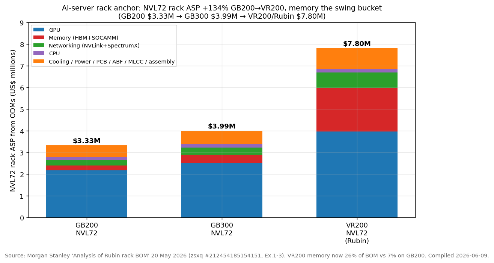
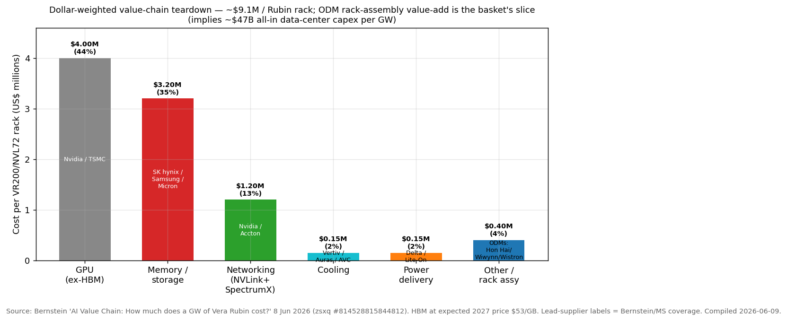
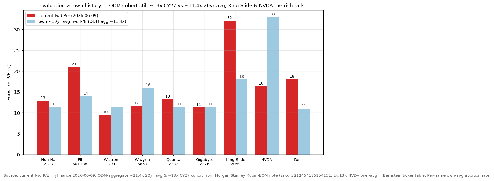
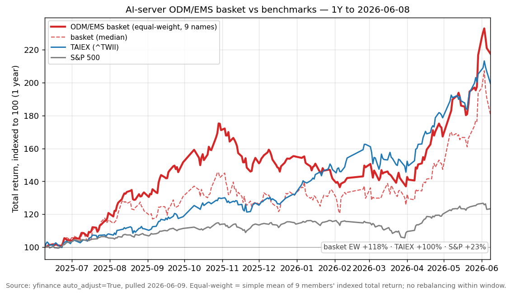

# AI Server ODM / GB200-GB300-Rubin Racks & Hyperscaler Hardware

**Created:** 2026-06-09 · **Last refreshed:** 2026-06-09 · **Last mutated:** 2026-06-09 · **Refresh cadence:** monthly · **Languages tracked:** en

## What's New

*The delta since you last looked — newest refresh on top. Older entries collapse into the archive below so this stays short.*

**2026-06-09 — basket created** (9 tickers): the Taiwan/China ODM/EMS assemblers that build Nvidia's GB200/GB300 NVL72 and the upcoming Vera-Rubin (VR200) AI-server racks, plus the rail-kit enabler (King Slide) and the demand engine (Nvidia).

- **Anchor set:** NVL72 rack ASP from ODMs **GB200 $3.33M → GB300 $3.99M → VR200/Rubin ~$7.80M (+95% GB300→VR200, +134% GB200→VR200)**, per Morgan Stanley's bottom-up Rubin BOM teardown ([MS — Rubin rack BOM, zsxq #212454185154151 p.2-3](http://xs-macbook-air.local:5001/zsxq/pdf/212454185154151/MS-Greater%20China%20Technology%20Hardware%20-%20Asia%20Pacific%20Analysis%20of%20Rubin%20rack%20BOM%2C%20component%20content%2C%20and%20ODM%20value-added-260520.pdf#page=3)). Bernstein lands higher at **~$9.1M/rack and ~$47B all-in data-center capex per GW** on its 2027 HBM-price assumption ([Bernstein — AI Value Chain $/GW, zsxq #814528815844812 p.1](http://xs-macbook-air.local:5001/zsxq/pdf/814528815844812/Bernstein-AI%20Value%20Chain%EF%BC%9AHow%20much%20does%20a%20GW%20of%20Vera%20Rubin%20data%20center%20capacity%20actually%20cost%EF%BC%9F-260608.pdf#page=1)).
- **Swing factor = memory content:** memory rises from **7% of the GB200 BOM to 26% of the VR200 BOM**, dragging GPU share from 65% to 51% — the single biggest mix shift in the rack ([MS, zsxq #212454185154151 p.2](http://xs-macbook-air.local:5001/zsxq/pdf/212454185154151/MS-Greater%20China%20Technology%20Hardware%20-%20Asia%20Pacific%20Analysis%20of%20Rubin%20rack%20BOM%2C%20component%20content%2C%20and%20ODM%20value-added-260520.pdf#page=2)).
- **Leading indicator print:** May-2026 industry GB200/300 rack output **~7.7K (-7% m/m)** — Hon Hai ~3.3K, Quanta 1.8-1.9K, Wistron 1.3-1.4K — but MS still forecasts **70-80K racks in CY26 (>100% y/y vs ~29K in 2025)** ([MS — GB200/300 Racks in May 2026, zsxq #584251482281444 p.1](http://xs-macbook-air.local:5001/zsxq/pdf/584251482281444/Morgan%20Stanley-Greater%20China%20Technology%20Hardware%EF%BC%9AGB200%20and%20GB300%20NVL72%20Racks%20in%20May%202026-260608.pdf#page=1)).
- **Conviction rank (MS, post-earnings):** Top Pick **Wiwynn > Wistron > Quanta > Hon Hai** on upside to PT ([MS, zsxq #212454185154151 p.1](http://xs-macbook-air.local:5001/zsxq/pdf/212454185154151/MS-Greater%20China%20Technology%20Hardware%20-%20Asia%20Pacific%20Analysis%20of%20Rubin%20rack%20BOM%2C%20component%20content%2C%20and%20ODM%20value-added-260520.pdf#page=1)); MS's separate rack-tracker note ranks **Wistron > Hon Hai > Quanta** ([MS, zsxq #584251482281444 p.1](http://xs-macbook-air.local:5001/zsxq/pdf/584251482281444/Morgan%20Stanley-Greater%20China%20Technology%20Hardware%EF%BC%9AGB200%20and%20GB300%20NVL72%20Racks%20in%20May%202026-260608.pdf#page=1)).
- **New broker calls captured (→ `/pt`):** GS Hon Hai Buy(CL) PT NT$400 (+41%); MS Hon Hai OW PT NT$310; JPM Hon Hai OW PT NT$285; MS FII OW PT Rmb82.80 (+22%); GS Wiwynn Buy PT NT$7,147 (+31%); GS King Slide Buy PT NT$7,664; GS Dell Buy PT $500 (raised from $230); Bernstein NVDA Outperform PT $315 (+22%).
- **Basket scorecard:** equal-weight basket **+118% 1Y vs TAIEX +100% / S&P +23%**; 100% of names positive, 100% beat the S&P, 44% beat the (red-hot) TAIEX; best = Dell +256%, worst = Gigabyte +24%.

Earlier refreshes

*(none — this is the create pass.)*

## Thesis

**Anchor — Nvidia NVL72 AI-server rack ASP (what hyperscalers pay ODMs per rack):** GB200 NVL72 **~$3.33M** → GB300 NVL72 **~$3.99M** → VR200/Vera-Rubin NVL72 **~$7.80M** — a **+134%** ASP step over two generations, with the bulk of the VR200 jump coming from memory ([Morgan Stanley — Rubin rack BOM, 20 May 2026, zsxq #212454185154151 p.2-3](http://xs-macbook-air.local:5001/zsxq/pdf/212454185154151/MS-Greater%20China%20Technology%20Hardware%20-%20Asia%20Pacific%20Analysis%20of%20Rubin%20rack%20BOM%2C%20component%20content%2C%20and%20ODM%20value-added-260520.pdf#page=3)). Bernstein independently models **~$9.1M/rack** (higher because it marks HBM to an expected 2027 price of $53/GB) and **~$47B all-in capex per GW** of Vera-Rubin capacity ([Bernstein — AI Value Chain, 8 Jun 2026, zsxq #814528815844812 p.1](http://xs-macbook-air.local:5001/zsxq/pdf/814528815844812/Bernstein-AI%20Value%20Chain%EF%BC%9AHow%20much%20does%20a%20GW%20of%20Vera%20Rubin%20data%20center%20capacity%20actually%20cost%EF%BC%9F-260608.pdf#page=1)). On volume, MS forecasts **70-80K NVL72 racks in CY26 (>100% y/y vs ~29K in 2025)**, and Hon Hai's management guides the industry to a **40%-to-mid-50% rack CAGR through 2029** ([MS rack tracker, zsxq #584251482281444 p.1](http://xs-macbook-air.local:5001/zsxq/pdf/584251482281444/Morgan%20Stanley-Greater%20China%20Technology%20Hardware%EF%BC%9AGB200%20and%20GB300%20NVL72%20Racks%20in%20May%202026-260608.pdf#page=1); [JPM — Hon Hai CEO/CFO, 13 Mar 2026, zsxq #585555128551514 p.1](http://xs-macbook-air.local:5001/zsxq/pdf/585555128551514/J.P.%20Morgan-Hon%20Hai%20Precision%EF%BC%882317.TW%EF%BC%89%20Key%20takeaways%20from%20CEO~CFO%20conference-260316.pdf#page=1)). Combining ~$7.8M × ~75K racks frames a **>$0.5trn rack-assembly + component pool forming inside the broader ~$700bn-$1.1trn hyperscaler-capex envelope** the press cites — and the ODM/EMS basket is the assembly layer that captures the rack-build value-add.

**Sub-bucket decomposition (VR200 BOM, share of $7.8M rack):** GPU ex-HBM ~51% · **memory (HBM + SOCAMM) ~26% (was 7% on GB200)** · networking (NVLink + SpectrumX) ~9% · CPU ~2% · cooling/power/PCB/ABF/MLCC/rack-assembly ~12% ([MS, zsxq #212454185154151 p.2](http://xs-macbook-air.local:5001/zsxq/pdf/212454185154151/MS-Greater%20China%20Technology%20Hardware%20-%20Asia%20Pacific%20Analysis%20of%20Rubin%20rack%20BOM%2C%20component%20content%2C%20and%20ODM%20value-added-260520.pdf#page=2)). The **content increases vs Blackwell among ODM-covered components**: PCB **+233%**, MLCC **+182%**, ABF **+82%**, power **+32%**, cooling **+12%** ([MS, zsxq #212454185154151 p.1,3](http://xs-macbook-air.local:5001/zsxq/pdf/212454185154151/MS-Greater%20China%20Technology%20Hardware%20-%20Asia%20Pacific%20Analysis%20of%20Rubin%20rack%20BOM%2C%20component%20content%2C%20and%20ODM%20value-added-260520.pdf#page=3)). **Swing factor = memory** — it is the bucket whose price/content swing moves the headline ASP most (the $8M-vs-$9.1M gap between MS and Bernstein is *entirely* an HBM-price assumption), and it is what compresses GPU share and lifts the rack BOM.

**Value-chain map (who occupies which layer):** GPU/compute — Nvidia (TSMC fab) · memory — SK hynix/Samsung/Micron · networking — Nvidia + switch ODMs (Accton) · cooling — Vertiv/Auras/AVC · power — Delta/Lite-On · **rack-level integration, compute-tray/switch-tray assembly & test — the ODM/EMS layer this basket tracks (Hon Hai, FII, Wiwynn, Wistron, Quanta)** · branded OEM channel — Dell, Gigabyte. Bernstein's $/rack teardown sizes the dollars: GPU ex-HBM ~$4.0M, memory/storage ~$3.2M, networking ~$1.2M, cooling & power ~$150k each ([Bernstein, zsxq #814528815844812 p.1](http://xs-macbook-air.local:5001/zsxq/pdf/814528815844812/Bernstein-AI%20Value%20Chain%EF%BC%9AHow%20much%20does%20a%20GW%20of%20Vera%20Rubin%20data%20center%20capacity%20actually%20cost%EF%BC%9F-260608.pdf#page=1)).

**ODM value-add — the contrarian leg:** the market expects ODM value-add to *fall* on Rubin (tray "standardization"), but MS's bottom-up build shows it **rises ~35-40%** in dollar terms — Wistron's own management said the same on its 4Q call — across compute board/tray, switch board/tray, cooling, rack assembly, plus new CX/Orchid modules to assemble and test. The implied **GM compresses (GB300 ~2.7% → VR200 ~1.9%)** but **absolute dollar profit rises** ($108K → $150K ODM value-add per rack), and a shift toward a **consignment model** (Hon Hai, Quanta) eases the working-capital drag ([MS, zsxq #212454185154151 p.1,3](http://xs-macbook-air.local:5001/zsxq/pdf/212454185154151/MS-Greater%20China%20Technology%20Hardware%20-%20Asia%20Pacific%20Analysis%20of%20Rubin%20rack%20BOM%2C%20component%20content%2C%20and%20ODM%20value-added-260520.pdf#page=3)).

**Bull/base/bear & who-benefits-when.** *Base:* ~75K racks CY26, VR200 mass-production end-3Q26, rack ASP ~$7.8M. *Bull:* MS rack volume to **70K+ if Vera Rubin ramps earlier**, Hon Hai capacity to ~2K racks/week (100K+ annualized) by end-2026, ASP toward Bernstein's $9.1M on higher HBM ([JPM, zsxq #585555128551514 p.1](http://xs-macbook-air.local:5001/zsxq/pdf/585555128551514/J.P.%20Morgan-Hon%20Hai%20Precision%EF%BC%882317.TW%EF%BC%89%20Key%20takeaways%20from%20CEO~CFO%20conference-260316.pdf#page=1)). *Bear:* the single swing assumption is **memory price** — Nvidia cutting SoCAMM2 capacity, or hyperscalers buying SOCAMM direct, drops rack ASP to ~$6.7M (and lifts ODM GM to ~2.2%) ([MS, zsxq #212454185154151 p.2](http://xs-macbook-air.local:5001/zsxq/pdf/212454185154151/MS-Greater%20China%20Technology%20Hardware%20-%20Asia%20Pacific%20Analysis%20of%20Rubin%20rack%20BOM%2C%20component%20content%2C%20and%20ODM%20value-added-260520.pdf#page=2); [Citi — Rubin SoCAMM2 capacity cut, zsxq #584251528855554 p.1](http://xs-macbook-air.local:5001/zsxq/pdf/584251528855554/CITI-Global%20Semiconductors%EF%BC%9AAssessing%20the%20Impact%20of%20NVDA%E2%80%99s%20Rubin%20SoCAMM2%20Capacity%20Reduction-260607.pdf#page=1)). **Staging:** enablers/components monetize *first* on the GB300 ramp now (King Slide rails, ABF/PCB/MLCC), then **pure-play rack ODMs (Hon Hai/Wiwynn/Wistron/Quanta)** through the GB300→VR200 transition into 2027, with **branded OEMs (Dell/Gigabyte)** capturing the enterprise/sovereign tail later. **Conviction:** MS prefers **Wiwynn > Wistron > Quanta > Hon Hai** on PT upside; Wiwynn is the Top Pick as the hyperscaler-direct, highest-EPS-growth ODM ([MS, zsxq #212454185154151 p.1](http://xs-macbook-air.local:5001/zsxq/pdf/212454185154151/MS-Greater%20China%20Technology%20Hardware%20-%20Asia%20Pacific%20Analysis%20of%20Rubin%20rack%20BOM%2C%20component%20content%2C%20and%20ODM%20value-added-260520.pdf#page=1)).

## Scope rules

**In:** Taiwan/China ODM/EMS assemblers that build NVL72-class GPU AI-server racks at the L10/L11 rack level (compute tray, switch tray, rack integration & test); the mainland AI-server arm (FII); rack-content enablers whose dollar content rises with rack complexity (rail kits); and the Nvidia reference platform that defines rack spec/demand. Branded server OEMs are tracked as `adjacent` (they buy/resell rack output with brand profit on top).

**Out:** pure component suppliers already tracked in sibling themes — ABF/PCB substrates ([pcb-hdi-abf-substrate](pcb-hdi-abf-substrate_theme.md)), liquid-cooling & power ([ai-power-electrification](ai-power-electrification_theme.md)), MLCC/passives ([ai-passives-packaging](ai-passives-packaging_theme.md)), HBM/DRAM ([memory-upcycle](memory-upcycle_theme.md)); switch/optical pure-plays (Accton, Credo) belong in a networking theme; mainland data-center operators ([china-datacenter-hyperscale](china-datacenter-hyperscale_theme.md)). The hyperscalers themselves (MSFT/AMZN/GOOGL/META) are the *spenders*, not assemblers — out of a hardware-supply-chain basket.

## Tracked tickers

| Ticker | Name | Role | Justification | Added |
|---|---|---|---|---|
| 2317.TW | Hon Hai (Foxconn, 鴻海) | core | Largest GB200/300 rack assembler — ~3.3K of the ~7.7K May-2026 industry racks (~43%); targeting **40-50% rack share** and ~2K racks/week (100K+ annualized) by end-2026; AI-server revenue guided **+100%+ in 2026** ([JPM, zsxq #585555128551514 p.1](http://xs-macbook-air.local:5001/zsxq/pdf/585555128551514/J.P.%20Morgan-Hon%20Hai%20Precision%EF%BC%882317.TW%EF%BC%89%20Key%20takeaways%20from%20CEO~CFO%20conference-260316.pdf#page=1); [MS rack tracker, zsxq #584251482281444 p.1](http://xs-macbook-air.local:5001/zsxq/pdf/584251482281444/Morgan%20Stanley-Greater%20China%20Technology%20Hardware%EF%BC%9AGB200%20and%20GB300%20NVL72%20Racks%20in%20May%202026-260608.pdf#page=1)). **Moat:** scale + majority share in GPU module / rack-level assembly (the industry bottleneck), consignment-model first-mover easing working capital. **Threat:** rack GM compression (1.9% on VR200) and **customer-insourcing** risk if hyperscalers in-house more system integration — Hon Hai's counter is irreplaceable rack-assembly capacity at scale and a vertical move up into modules/components. | 2026-06-09 |
| 601138.SS | Foxconn Industrial Internet (工业富联, FII) | core | Hon Hai's A-share cloud arm; **AI servers continue to lead 2Q26 growth**, MS models 18% medium-term growth on AI demand ([MS — FII AI servers lead 2Q26, zsxq #184121812242852 p.1-2](http://xs-macbook-air.local:5001/zsxq/pdf/184121812242852/Morgan%20Stanley-Foxconn%20Industrial%20Internet%20Co.%20Ltd.%EF%BC%88601138%EF%BC%89AI%20Servers%20Continue%20to%20Lead%202Q26%20Growth-260520.pdf#page=2)). **Moat:** the mainland-listed vehicle for Foxconn's cloud/networking + rack assembly, captive intercompany flow. **Threat:** rich multiple (trailing ~36x) priced for flawless AI ramp; HK/US tariff & geopolitical disruption to overseas capex; competition in IIoT solutions (MS downside risk). | 2026-06-09 |
| 6669.TW | Wiwynn (緯穎) | core | **MS Top Pick in ODMs** — hyperscaler-direct (ODM-direct, no brand layer), highest EPS-growth lever; scaling CPO + liquid-cooled full-rack integration for Nvidia VR200 NVL72 & AMD Helios via joint design with Wistron ([GS — Wiwynn Computex CPO, zsxq #415284121822288 p.1](http://xs-macbook-air.local:5001/zsxq/pdf/415284121822288/Goldman%20Sachs-Wiwynn%20%EF%BC%886669.TW%EF%BC%89%EF%BC%9A%20Computex%202026%EF%BC%9A%20CPO%20in%20AI%20server%20racks%20scale%20up%EF%BC%9B%20Buy-260602.pdf#page=1); [MS, zsxq #212454185154151 p.1](http://xs-macbook-air.local:5001/zsxq/pdf/212454185154151/MS-Greater%20China%20Technology%20Hardware%20-%20Asia%20Pacific%20Analysis%20of%20Rubin%20rack%20BOM%2C%20component%20content%2C%20and%20ODM%20value-added-260520.pdf#page=1)). **Moat:** designed-in with top hyperscalers (concentration is also the risk), CPO/liquid-cooling rack IP. **Threat:** customer concentration — a single hyperscaler's capex pause or insourcing of rack design hits hardest; Wistron (its parent/JV partner) competes for the same trays. | 2026-06-09 |
| 3231.TW | Wistron (緯創) | core | #2-#3 rack ODM; ships GB200/300 computing trays (L10), ~1.3-1.4K rack-equivalents/month; MS's bottom-up confirms Wistron management's own "ODM value-add rises on Rubin" call; MS ranks it #1-#2 in the cohort ([MS rack tracker, zsxq #584251482281444 p.1](http://xs-macbook-air.local:5001/zsxq/pdf/584251482281444/Morgan%20Stanley-Greater%20China%20Technology%20Hardware%EF%BC%9AGB200%20and%20GB300%20NVL72%20Racks%20in%20May%202026-260608.pdf#page=1); [MS BOM, zsxq #212454185154151 p.1](http://xs-macbook-air.local:5001/zsxq/pdf/212454185154151/MS-Greater%20China%20Technology%20Hardware%20-%20Asia%20Pacific%20Analysis%20of%20Rubin%20rack%20BOM%2C%20component%20content%2C%20and%20ODM%20value-added-260520.pdf#page=1)). **Moat:** compute-tray design + Wiwynn ownership give two bites at the rack BOM. **Threat:** lower-margin L10 tray vs full-rack peers; reliance on Nvidia roadmap timing; insourcing of tray integration by OEMs. | 2026-06-09 |
| 2382.TW | Quanta (廣達) | core | Top-tier rack ODM — ~1.8-1.9K GB200/300 racks/May, ~18.7K full-year; May revenue **NT$311.5bn (+94% y/y)**; moving select projects to consignment in 2H26 ([MS rack tracker, zsxq #584251482281444 p.1](http://xs-macbook-air.local:5001/zsxq/pdf/584251482281444/Morgan%20Stanley-Greater%20China%20Technology%20Hardware%EF%BC%9AGB200%20and%20GB300%20NVL72%20Racks%20in%20May%202026-260608.pdf#page=1); [MS BOM, zsxq #212454185154151 p.1](http://xs-macbook-air.local:5001/zsxq/pdf/212454185154151/MS-Greater%20China%20Technology%20Hardware%20-%20Asia%20Pacific%20Analysis%20of%20Rubin%20rack%20BOM%2C%20component%20content%2C%20and%20ODM%20value-added-260520.pdf#page=1)). **Moat:** entrenched hyperscaler relationships + notebook scale funding AI capex. **Threat:** MS ranks it behind Wiwynn/Wistron on PT upside; rack GM compression; notebook seasonality drag; OEM/hyperscaler insourcing of integration. | 2026-06-09 |
| 2376.TW | Gigabyte (技嘉) | adjacent | Branded server OEM ramping AI-server/rack business — **Apr revenue +74% y/y**, Infinity-series motherboard + liquid-cooled rack launched at Computex; GS keeps Neutral on the rich multiple ([GS — Gigabyte AI server ramp, zsxq #184155521585282 p.1](http://xs-macbook-air.local:5001/zsxq/pdf/184155521585282/Goldman%20Sachs-Gigabyte%20%EF%BC%882376.TW%EF%BC%89%20AI%20server%20business%20ramp~up%20ahead%EF%BC%9B%20Apr%20revenues%20beat%20at%20%2B74%25%20YoY%EF%BC%9B%20Neutral-260604.pdf#page=1)). **Moat:** brand + channel into enterprise/HPC; full motherboard-to-rack stack. **Threat:** competes with the pure-play ODMs *and* the bigger OEMs (Dell/SMCI) from a sub-scale position; Neutral-rated, valuation already prices the ramp. | 2026-06-09 |
| 2059.TW | King Slide Works (川湖) | enabler | Sole-tier supplier of **AI-server rail kits** — content rises with rack complexity; Apr revenue **+79% y/y / +35% m/m to NT$2.6bn**; GS raised target P/E to 30x 2027E on 37% NI CAGR ([GS — King Slide rail kits, zsxq #415288842818858 p.1,3](http://xs-macbook-air.local:5001/zsxq/pdf/415288842818858/Goldman%20Sachs-King%20Slide%20%EF%BC%882059.TW%EF%BC%89%EF%BC%9A%20AI%20server%20rail%20kits%20ramp%20up%EF%BC%8C%20supporting%20solid%20growth%EF%BC%9B%20TP%20raised%20to%20NT%247%EF%BC%8C664%EF%BC%9B%20Buy-260605.pdf#page=3)). **Moat:** high customization + design-win lock-in on rail/slide mechanisms, near-monopoly niche, ~70%+ GM. **Threat:** small TAM relative to valuation (32x fwd P/E — the basket's richest); a customer dual-sourcing rails, or rack designs that reduce slide content, would de-rate fast. | 2026-06-09 |
| NVDA | NVIDIA | enabler | The reference platform that *defines* the rack spec and the entire demand curve — GB200/GB300/VR200 NVL72 architecture, NVLink/SpectrumX networking; Bernstein Outperform, FP8 perf/$ still accelerating (2,520 vs 720 PFLOPS Blackwell) ([Bernstein, zsxq #814528815844812 p.1-2](http://xs-macbook-air.local:5001/zsxq/pdf/814528815844812/Bernstein-AI%20Value%20Chain%EF%BC%9AHow%20much%20does%20a%20GW%20of%20Vera%20Rubin%20data%20center%20capacity%20actually%20cost%EF%BC%9F-260608.pdf#page=1)). **Moat:** CUDA + rack-scale platform lock-in, sets the BOM the whole basket assembles. **Threat:** **hyperscaler ASIC insourcing** (Google TPU, Amazon Trainium, Microsoft Maia) is the structural counter-bet to merchant GPU; Nvidia's counter is the full-rack NVL72 platform + annual cadence that ASICs can't match for general training. | 2026-06-09 |
| DELL | Dell Technologies | adjacent | US branded server leader monetizing the AI-server cycle — **F1Q27 broad-based beat & raise**, AI-server backlog raised, traditional server +60%; GS raised PT to $500 (from $230), MS upgraded to Equal-weight ([GS — Dell F1Q27, zsxq #585412414512154 p.1](http://xs-macbook-air.local:5001/zsxq/pdf/585412414512154/Goldman%20Sachs-Dell%20Technologies%20Inc.%20%EF%BC%88DELL.US%EF%BC%89%EF%BC%9A%20F1Q27%20review%EF%BC%9A%20Broad~based%20beat%20and%20raise%20on%20robust%20demand%EF%BC%8C%20operating%20discipline-260601.pdf#page=1); [MS — Dell upgrade to EW, zsxq #415284512252488 p.1](http://xs-macbook-air.local:5001/zsxq/pdf/415284512252488/MS-Dell%20Technologies%20Inc.%20Executing%20Across%20Business%20Lines%20During%20Supply%20Scarcity%20Upgrade%20to%20EW-260601.pdf#page=1)). **Moat:** enterprise/sovereign distribution, services, financing the ODMs lack. **Threat:** buys rack output from the same Taiwan ODMs at a brand markup, so it carries the *narrowest* incremental theme exposure; ODM-direct procurement by hyperscalers bypasses the OEM layer entirely. | 2026-06-09 |

## Valuation snapshot

*Populated from `stock_price_target_db` (the `/pt` store); "Px @ note" = `report_date_price` (the price the analyst's upside was called against), not today's spot. Multiples are forward P/E from yfinance 2026-06-09; own-avg uses the MS ODM-aggregate ~11.4x 20-yr average where a per-name series isn't cited.*

| Ticker | Rating (note) | Px @ note date | PT | Upside% (vs note px) | Current px (06-09) | Fwd P/E | Own ~10yr avg | PT derivation / FY base |
|---|---|---|---|---|---|---|---|---|
| 2317.TW Hon Hai | **GS Buy(CL)** · NT$284.50 @ 06-05 = **+41%** | NT$284.50 | NT$400 | +40.6% | NT$277.5 | 12.9x | ~11.4x (ODM agg) | 21.0x 2026E P/E (PEG&M peers) |
| 2317.TW Hon Hai | MS OW · NT$284.50 @ 06-05 = +9% | NT$284.50 | NT$310 | +9.0% | NT$277.5 | 12.9x | ~11.4x | Residual income (CoE 8.5%, growth 13%, terminal 3%) |
| 2317.TW Hon Hai | JPM OW · NT$214.50 @ 03-13 = +33% | NT$214.50 | NT$285 | +32.9% | NT$277.5 | 12.9x | ~11.4x | ~14x 12m fwd EPS (Dec-26 PT) |
| 601138.SS FII | MS OW · Rmb68.15 @ 05-20 = **+22%** | Rmb68.15 | Rmb82.80 | +21.5% | Rmb74.74 | 21.0x | ~14x | Multi-stage RI (CoE 10%, growth 18%, terminal 5%) |
| 6669.TW Wiwynn | **GS Buy** · NT$5,475 @ 06-02 = **+31%** | NT$5,475 | NT$7,147 | +30.5% | NT$5,300 | 11.6x | ~16x | 18.6x 2027E P/E (peers EPS-growth vs P/E) |
| 3231.TW Wistron | *no fresh single-name PT this pass* | n/a | n/a | n/a | NT$165.5 | 9.5x | ~11.4x | MS cohort rank only (Wistron #1-2); FY27 base |
| 2382.TW Quanta | *no fresh single-name PT this pass* | n/a | n/a | n/a | NT$375.0 | 13.3x | ~11.4x | MS cohort rank #3; OW in tracker; FY27 base |
| 2376.TW Gigabyte | GS Neutral · NT$374 @ 06-04 = +30% | NT$374.00 | NT$487 | +30.2% | NT$359.0 | 11.3x | ~11.4x | AI-server ramp; FY26-27 EPS base |
| 2059.TW King Slide | **GS Buy** · NT$5,620 @ 06-05 = **+36%** | NT$5,620 | NT$7,664 | +36.4% | NT$6,795 | 32.1x | ~18x | 30x 2027E EPS (PEG 0.8x; raised from NT$4,386) |
| NVDA | **Bernstein Outperform** · $205.10 @ 06-05 = **+22%** | $205.10 | $315 | +22.2% | $208.19 | 16.4x | ~33x | Ticker-table TTM/2027E EPS base |
| DELL | **GS Buy** · $465.96 @ 06-01 = +7% | $465.96 | $500 | +7.3% | $381.78 | 18.1x | ~11x | Raised from $230 on F1Q27 beat; FY27 base |
| DELL | MS EW · $465.96 @ 06-01 = −4% | $465.96 | $448 | −3.9% | $381.78 | 18.1x | ~11x | Upgrade from UW; SOTP across business lines |

**Cross-sectional read (FY27 forward, like-for-like):** the **pure-play ODM cohort sorts cheap** — Wistron 9.5x, Wiwynn 11.6x, Hon Hai 12.9x, Quanta 13.3x — vs its own ~11.4x 20-yr average (only mildly rich for the >100% rack-volume growth = attractive PEG). The **rich tails are King Slide (32x) and NVDA (16x trailing-rich, but cheap vs its own ~33x)**. FII at ~21x fwd is the priciest A-share leg. Growth-adjusted: at >40% AI-server EPS CAGRs, the ODM cohort's PEG sits well below 1; King Slide's GS-cited PEG is 0.8x even at 32x. No SOTP-only names except Dell (MS uses business-line SOTP).

## Exclusions

| Ticker | Reason |
|---|---|
| 2356.TW Inventec | Server ODM but lagging in NVL72 rack assembly vs Hon Hai/Quanta/Wistron; rack exposure thinner and no fresh conviction-grade broker call this pass. Re-evaluate on a rack-share data point. |
| 4938.TW Pegatron | AI-server in expansion (GS notes Computex ramp) but still sub-scale in rack assembly; candidate-add if rack output disclosed ([GS — Pegatron Computex, zsxq #812488854818512 p.1](http://xs-macbook-air.local:5001/zsxq/pdf/812488854818512/Goldman%20Sachs-Pegatron%20%EF%BC%884938.TW%EF%BC%89Computex%202026%EF%BC%9A%20AI%20server%20in%20expansion%EF%BC%9B%20AI%20infrastructure%20product%20portfolio%20showcased-260604.pdf#page=1)). |
| 2345.TW Accton | Switch/CPO ODM — belongs in a networking theme, not the rack-assembly basket ([UBS — Accton Q226, zsxq #584251528855524 p.1](http://xs-macbook-air.local:5001/zsxq/pdf/584251528855524/UBS-Accton%20Technology%20Corporation%EF%BC%882345.TW%EF%BC%89%20Q226%20tracking%20ahead%EF%BC%9B%20optical%20and%20CPO%20switch%20could%20potentially%20see%20contribution%20in%202027E-260607.pdf#page=1)). |
| 2308.TW Delta | Power/cooling content — tracked in [ai-power-electrification](ai-power-electrification_theme.md), not double-counted here. |

## Keywords

AI server / AI服务器 · ODM/EMS rack assembly / 机柜代工 · GB200 · GB300 · NVL72 · Vera Rubin / VR200 · rack BOM / 机柜物料清单 · liquid cooling / 液冷 · CPO (co-packaged optics) · rail kit / 导轨 · 800V power · consignment model / 寄售模式 · hyperscaler capex / 超大规模资本开支

## Performance (since inception, 1Y to 2026-06-08)

Equal-weight basket **+117.7%** vs **TAIEX +99.6% / S&P 500 +23.3%** over the trailing year ([yfinance, pulled 2026-06-09](https://finance.yahoo.com/)). The basket outran the S&P by a wide margin but only modestly beat its home index — the TAIEX itself nearly doubled, so the AI-hardware trade is largely *the* Taiwan market this cycle.

- **Leaders:** Dell **+256%** (US AI-server beat/raise + valuation re-rate), FII **+254%** (A-share AI-server multiple expansion), King Slide **+191%** (rail-kit content + PEG re-rate).
- **Laggards:** Gigabyte **+24%**, Quanta **+43%**, Wistron **+44%**, NVDA **+47%** — the larger-cap / lower-content-leverage names.

### Basket scorecard

*MS "Three Actionable Ideas" style — all from yfinance + the snapshot history.*

- **Batting average:** **9/9 names positive (100%)** over the 1Y window; **9/9 beat the S&P (100%)**; **4/9 beat the TAIEX (44%)** — the TAIEX's near-double is a brutal benchmark.
- **Best contributor:** Dell **+256.2%**. **Worst contributor:** Gigabyte **+23.5%** (still positive).
- **Dispersion:** wide (+24% to +256%) — this is a stock-picker's basket, not a beta trade; the rack-content-leverage names (King Slide, FII, Wiwynn) beat the OEM/notebook hybrids (Quanta, Gigabyte).
- **Cumulative outperformance since inception:** n/a — only one snapshot line exists (the create baseline); the next refresh computes since-inception bps.

## Recent events

- **2026-06-08** — MS updates monthly rack tracker: May GB200/300 output ~7.7K (-7% m/m), CY26 forecast held at 70-80K (>100% y/y) ([MS, zsxq #584251482281444 p.1](http://xs-macbook-air.local:5001/zsxq/pdf/584251482281444/Morgan%20Stanley-Greater%20China%20Technology%20Hardware%EF%BC%9AGB200%20and%20GB300%20NVL72%20Racks%20in%20May%202026-260608.pdf#page=1)).
- **2026-06-07** — Hon Hai May revenue **NT$859bn (+40% y/y, +3% m/m), 9% above MS**; MS raises 2Q26 outlook (rev growth >14% q/q) ([MS — Hon Hai May rev, zsxq #584251128412484 p.1](http://xs-macbook-air.local:5001/zsxq/pdf/584251128412484/Morgan%20Stanley-Hon%20Hai%20Precision%EF%BC%882317.TW%EF%BC%89May%20Revenue%20%E2%80%93%209%25%20Beat%EF%BC%9B%202Q26%20Outlook%20Raised-260605.pdf#page=1)).
- **2026-06-05** — GS reiterates Hon Hai Buy (Conviction List), PT NT$400 ([GS, zsxq #181245524411822 p.3](http://xs-macbook-air.local:5001/zsxq/pdf/181245524411822/Goldman%20Sachs-Hon%20Hai%20%EF%BC%882317.TW%EF%BC%89%EF%BC%9A%20May%20rev%20%2B40%25%20YoY%EF%BC%9B%20AI%20servers%20remains%20key%20growth%20driver%EF%BC%9B%20Buy%20%EF%BC%88on%20CL%EF%BC%89-260605.pdf#page=3)); GS raises King Slide PT to NT$7,664 on rail-kit ramp ([GS, zsxq #415288842818858 p.3](http://xs-macbook-air.local:5001/zsxq/pdf/415288842818858/Goldman%20Sachs-King%20Slide%20%EF%BC%882059.TW%EF%BC%89%EF%BC%9A%20AI%20server%20rail%20kits%20ramp%20up%EF%BC%8C%20supporting%20solid%20growth%EF%BC%9B%20TP%20raised%20to%20NT%247%EF%BC%8C664%EF%BC%9B%20Buy-260605.pdf#page=3)).
- **2026-06-04** — Computex read-throughs: GS Gigabyte AI-server ramp (Apr +74% y/y); GS Wiwynn CPO + liquid-cooled VR200/Helios full-rack ([GS Wiwynn, zsxq #415284121822288 p.1](http://xs-macbook-air.local:5001/zsxq/pdf/415284121822288/Goldman%20Sachs-Wiwynn%20%EF%BC%886669.TW%EF%BC%89%EF%BC%9A%20Computex%202026%EF%BC%9A%20CPO%20in%20AI%20server%20racks%20scale%20up%EF%BC%9B%20Buy-260602.pdf#page=1)).
- **2026-06-01** — Dell F1Q27 broad beat & raise; GS PT to $500 (from $230), MS upgrades to Equal-weight $448 ([GS, zsxq #585412414512154 p.1](http://xs-macbook-air.local:5001/zsxq/pdf/585412414512154/Goldman%20Sachs-Dell%20Technologies%20Inc.%20%EF%BC%88DELL.US%EF%BC%89%EF%BC%9A%20F1Q27%20review%EF%BC%9A%20Broad~based%20beat%20and%20raise%20on%20robust%20demand%EF%BC%8C%20operating%20discipline-260601.pdf#page=1)).
- **2026-05-20** — MS publishes the Rubin rack BOM teardown (the theme anchor) — rack ASP ~$7.8M, ODM value-add +35-40% ([MS, zsxq #212454185154151 p.1](http://xs-macbook-air.local:5001/zsxq/pdf/212454185154151/MS-Greater%20China%20Technology%20Hardware%20-%20Asia%20Pacific%20Analysis%20of%20Rubin%20rack%20BOM%2C%20component%20content%2C%20and%20ODM%20value-added-260520.pdf#page=1)).

## Drift signals

- **Priced-for-perfection flag (basket-level):** the ODM cohort trades **~13x CY27 P/E vs its ~11.4x 20-yr average** — only modestly rich, *but* King Slide (32x) and FII (~21x) carry the air-pocket risk. **Named de-rate trigger:** the **memory swing assumption** — if Nvidia's SoCAMM2 capacity cut / hyperscaler-direct SOCAMM buying pulls rack ASP from $7.8M to ~$6.7M, the rack-content thesis loses its biggest leg and the rich names de-rate. **Sizing the de-rate:** King Slide reverting 32x → its ~18x own-history average is **~−44%**; FII 21x → ~14x is **~−33%** ([MS, zsxq #212454185154151 p.2](http://xs-macbook-air.local:5001/zsxq/pdf/212454185154151/MS-Greater%20China%20Technology%20Hardware%20-%20Asia%20Pacific%20Analysis%20of%20Rubin%20rack%20BOM%2C%20component%20content%2C%20and%20ODM%20value-added-260520.pdf#page=2); [Citi — SoCAMM2 cut, zsxq #584251528855554 p.1](http://xs-macbook-air.local:5001/zsxq/pdf/584251528855554/CITI-Global%20Semiconductors%EF%BC%9AAssessing%20the%20Impact%20of%20NVDA%E2%80%99s%20Rubin%20SoCAMM2%20Capacity%20Reduction-260607.pdf#page=1)).
- **Margin-compression watch:** rack GM falls GB300 2.7% → VR200 1.9% — the bull case rests entirely on *absolute dollar profit* rising, so any volume miss (rack output already -7% m/m in May) hits earnings harder than the headline suggests ([MS, zsxq #212454185154151 p.3](http://xs-macbook-air.local:5001/zsxq/pdf/212454185154151/MS-Greater%20China%20Technology%20Hardware%20-%20Asia%20Pacific%20Analysis%20of%20Rubin%20rack%20BOM%2C%20component%20content%2C%20and%20ODM%20value-added-260520.pdf#page=3); [MS tracker, zsxq #584251482281444 p.1](http://xs-macbook-air.local:5001/zsxq/pdf/584251482281444/Morgan%20Stanley-Greater%20China%20Technology%20Hardware%EF%BC%9AGB200%20and%20GB300%20NVL72%20Racks%20in%20May%202026-260608.pdf#page=1)).
- **Customer-insourcing (the structural threat):** hyperscalers (a) self-designing rack integration and (b) ASIC programs (Google TPU / Amazon Trainium / Microsoft Maia) displacing merchant Nvidia GPU. The ODM counter is irreplaceable rack-assembly capacity (Hon Hai's near-bottleneck position); Nvidia's counter is the full NVL72 rack platform + annual cadence ([JPM — Hon Hai, zsxq #585555128551514 p.1](http://xs-macbook-air.local:5001/zsxq/pdf/585555128551514/J.P.%20Morgan-Hon%20Hai%20Precision%EF%BC%882317.TW%EF%BC%89%20Key%20takeaways%20from%20CEO~CFO%20conference-260316.pdf#page=1)).
- **Candidate-adds surfaced:** **Pegatron (4938.TW)** — GS flags AI-server in expansion at Computex (propose as `core`/`adjacent` once rack output is disclosed); **Accton (2345.TW)** for a future networking sleeve. Don't auto-add — propose at next mutation.
- **Benchmark caveat:** the basket only beats TAIEX 44% of the time — much of the "win" is just being long Taiwan tech. A refresh should watch whether the basket's *excess* return over TAIEX persists or compresses.

## Leading indicators

*The upstream signals that crack before the member prices — never the member prices themselves. Macro/upstream rows first, then the per-ticker operating-data spine (Bernstein "Barometer" style).*

| Signal | Latest reading (as-of) | Direction | Implication for anchor / names |
|---|---|---|---|
| **Industry GB200/300 NVL72 rack output** | **~7.7K racks, May 2026 (-7% m/m)**; CY26 forecast 70-80K (>100% y/y vs ~29K 2025) ([MS, zsxq #584251482281444 p.1](http://xs-macbook-air.local:5001/zsxq/pdf/584251482281444/Morgan%20Stanley-Greater%20China%20Technology%20Hardware%EF%BC%9AGB200%20and%20GB300%20NVL72%20Racks%20in%20May%202026-260608.pdf#page=1)) | ▲ y/y, ▼ m/m | The single most direct read on the anchor's volume leg; a sustained m/m roll-over before the basket weakens = top drift signal. |
| **VR200 memory content / HBM price** | Memory now ~26% of VR200 BOM; Bernstein marks HBM4 to $53/GB in 2027 (vs ~$16.6 now) ([Bernstein, zsxq #814528815844812 p.1](http://xs-macbook-air.local:5001/zsxq/pdf/814528815844812/Bernstein-AI%20Value%20Chain%EF%BC%9AHow%20much%20does%20a%20GW%20of%20Vera%20Rubin%20data%20center%20capacity%20actually%20cost%EF%BC%9F-260608.pdf#page=1)) | ▲ | Sets rack ASP ($7.8M vs $9.1M is purely HBM); a SoCAMM2 capacity cut would lower ASP and ODM revenue per rack ([Citi, zsxq #584251528855554 p.1](http://xs-macbook-air.local:5001/zsxq/pdf/584251528855554/CITI-Global%20Semiconductors%EF%BC%9AAssessing%20the%20Impact%20of%20NVDA%E2%80%99s%20Rubin%20SoCAMM2%20Capacity%20Reduction-260607.pdf#page=1)). |
| **Hyperscaler capex envelope** | Press cites ~$700bn-$1.1trn by 2026-27; Nvidia FP8 perf/$ still accelerating (2,520 vs 720 PFLOPS) ([Bernstein, zsxq #814528815844812 p.1](http://xs-macbook-air.local:5001/zsxq/pdf/814528815844812/Bernstein-AI%20Value%20Chain%EF%BC%9AHow%20much%20does%20a%20GW%20of%20Vera%20Rubin%20data%20center%20capacity%20actually%20cost%EF%BC%9F-260608.pdf#page=1)) | ▲ | The demand pool the rack volume draws from; a capex guidance cut from a top-4 hyperscaler is the macro kill-switch. |

**Per-ticker operating-data spine (monthly prints, each to its primary issuer):**

| Ticker | Latest operating print | Source |
|---|---|---|
| 2317.TW Hon Hai | May rev NT$859bn **+40% y/y / +3% m/m**; rack shipments ~3.3K (-11% m/m); 2Q26 AI rack shipments ~10K (+18% q/q) | [MS, zsxq #584251128412484 p.1](http://xs-macbook-air.local:5001/zsxq/pdf/584251128412484/Morgan%20Stanley-Hon%20Hai%20Precision%EF%BC%882317.TW%EF%BC%89May%20Revenue%20%E2%80%93%209%25%20Beat%EF%BC%9B%202Q26%20Outlook%20Raised-260605.pdf#page=1) |
| 2382.TW Quanta | May rev NT$311.5bn **+94% y/y / -8% m/m**; ~1.8-1.9K racks (vs ~2.1K Apr); NB flat at 3.5mn units | [MS, zsxq #584251482281444 p.1](http://xs-macbook-air.local:5001/zsxq/pdf/584251482281444/Morgan%20Stanley-Greater%20China%20Technology%20Hardware%EF%BC%9AGB200%20and%20GB300%20NVL72%20Racks%20in%20May%202026-260608.pdf#page=1) |
| 3231.TW Wistron | May rev NT$290bn **+39% y/y / +2% m/m**; ~1.3-1.4K rack-equiv trays (+2% m/m) | [MS, zsxq #584251482281444 p.1](http://xs-macbook-air.local:5001/zsxq/pdf/584251482281444/Morgan%20Stanley-Greater%20China%20Technology%20Hardware%EF%BC%9AGB200%20and%20GB300%20NVL72%20Racks%20in%20May%202026-260608.pdf#page=1) |
| 6669.TW Wiwynn | May rev NT$84.1bn (+2% m/m) | [MS, zsxq #584251482281444 p.1](http://xs-macbook-air.local:5001/zsxq/pdf/584251482281444/Morgan%20Stanley-Greater%20China%20Technology%20Hardware%EF%BC%9AGB200%20and%20GB300%20NVL72%20Racks%20in%20May%202026-260608.pdf#page=1) |
| 2376.TW Gigabyte | Apr rev **+74% y/y** (server ramp) | [GS, zsxq #184155521585282 p.1](http://xs-macbook-air.local:5001/zsxq/pdf/184155521585282/Goldman%20Sachs-Gigabyte%20%EF%BC%882376.TW%EF%BC%89%20AI%20server%20business%20ramp~up%20ahead%EF%BC%9B%20Apr%20revenues%20beat%20at%20%2B74%25%20YoY%EF%BC%9B%20Neutral-260604.pdf#page=1) |
| 2059.TW King Slide | Apr rev NT$2.6bn **+79% y/y / +35% m/m** (rail-kit ramp) | [GS, zsxq #415288842818858 p.1](http://xs-macbook-air.local:5001/zsxq/pdf/415288842818858/Goldman%20Sachs-King%20Slide%20%EF%BC%882059.TW%EF%BC%89%EF%BC%9A%20AI%20server%20rail%20kits%20ramp%20up%EF%BC%8C%20supporting%20solid%20growth%EF%BC%9B%20TP%20raised%20to%20NT%247%EF%BC%8C664%EF%BC%9B%20Buy-260605.pdf#page=1) |
| DELL | F1Q27 beat & raise; traditional server +60%, AI-server backlog raised | [GS, zsxq #585412414512154 p.1](http://xs-macbook-air.local:5001/zsxq/pdf/585412414512154/Goldman%20Sachs-Dell%20Technologies%20Inc.%20%EF%BC%88DELL.US%EF%BC%89%EF%BC%9A%20F1Q27%20review%EF%BC%9A%20Broad~based%20beat%20and%20raise%20on%20robust%20demand%EF%BC%8C%20operating%20discipline-260601.pdf#page=1) |

## Catalysts (next 3-6 months)

- **VR200/Vera-Rubin NVL72 mass production, end-3Q26** (rack ASP steps $3.99M→$7.8M → ODM revenue-per-rack +95%, lifts Hon Hai/Wiwynn/Wistron/Quanta rack revenue; FII on the A-share leg), 3Q26 ([MS, zsxq #212454185154151 p.2](http://xs-macbook-air.local:5001/zsxq/pdf/212454185154151/MS-Greater%20China%20Technology%20Hardware%20-%20Asia%20Pacific%20Analysis%20of%20Rubin%20rack%20BOM%2C%20component%20content%2C%20and%20ODM%20value-added-260520.pdf#page=2); [MS tracker, zsxq #584251482281444 p.1](http://xs-macbook-air.local:5001/zsxq/pdf/584251482281444/Morgan%20Stanley-Greater%20China%20Technology%20Hardware%EF%BC%9AGB200%20and%20GB300%20NVL72%20Racks%20in%20May%202026-260608.pdf#page=1)).
- **Monthly rack-output prints (Jun-Sep)** (each m/m number re-rates the volume leg of the anchor → moves the whole ODM cohort; a second m/m decline would confirm a roll-over), monthly ([MS tracker, zsxq #584251482281444 p.1](http://xs-macbook-air.local:5001/zsxq/pdf/584251482281444/Morgan%20Stanley-Greater%20China%20Technology%20Hardware%EF%BC%9AGB200%20and%20GB300%20NVL72%20Racks%20in%20May%202026-260608.pdf#page=1)).
- **Nvidia SoCAMM2 / HBM capacity decision** (resolves the $7.8M-vs-$9.1M ASP gap and the memory swing-factor → directly sets ODM revenue-per-rack and the priced-for-perfection risk on King Slide/FII), 2H26 ([Citi, zsxq #584251528855554 p.1](http://xs-macbook-air.local:5001/zsxq/pdf/584251528855554/CITI-Global%20Semiconductors%EF%BC%9AAssessing%20the%20Impact%20of%20NVDA%E2%80%99s%20Rubin%20SoCAMM2%20Capacity%20Reduction-260607.pdf#page=1)).
- **Hon Hai capacity to ~2K racks/week (100K+ annualized) by end-2026** (validates/refutes the 40-50% share + >100% AI-server-revenue guide → Hon Hai/FII earnings), 4Q26 ([JPM, zsxq #585555128551514 p.1](http://xs-macbook-air.local:5001/zsxq/pdf/585555128551514/J.P.%20Morgan-Hon%20Hai%20Precision%EF%BC%882317.TW%EF%BC%89%20Key%20takeaways%20from%20CEO~CFO%20conference-260316.pdf#page=1)).
- **Consignment-model adoption rate (Hon Hai, Quanta)** (shifts working-capital burden to customers → re-rates ODM ROIC/cash conversion even at lower GM), 2H26 ([MS, zsxq #212454185154151 p.1](http://xs-macbook-air.local:5001/zsxq/pdf/212454185154151/MS-Greater%20China%20Technology%20Hardware%20-%20Asia%20Pacific%20Analysis%20of%20Rubin%20rack%20BOM%2C%20component%20content%2C%20and%20ODM%20value-added-260520.pdf#page=1)).

## Data Used / 数据来源清单

**Market data**
- yfinance auto_adjust=True for prices, 1Y/YTD returns, market cap, sector, forward P/E — pulled 2026-06-09 (data through 2026-06-09 close; return window 2025-06-09 → 2026-06-08).

**Per-ticker primary sources**
- 2317.TW Hon Hai: MS May-rev note (#584251128412484), GS Buy/CL (#181245524411822), MS OW (#584251128412484), JPM CEO/CFO (#585555128551514).
- 601138.SS FII: MS "AI Servers Lead 2Q26 Growth" (#184121812242852, OCR'd).
- 6669.TW Wiwynn: GS Computex CPO (#415284121822288).
- 3231.TW Wistron / 2382.TW Quanta: MS rack tracker (#584251482281444, OCR'd) + MS BOM (#212454185154151).
- 2376.TW Gigabyte: GS AI-server ramp (#184155521585282).
- 2059.TW King Slide: GS rail-kit PT raise (#415288842818858).
- NVDA: Bernstein AI Value Chain (#814528815844812).
- DELL: GS F1Q27 (#585412414512154, OCR'd) + MS upgrade (#415284512252488).

**Industry research / sell-side thematic notes (theme-level)**
- Morgan Stanley, "Analysis of Rubin rack BOM, component content, and ODM value-added", 20 May 2026 — the TAM/ASP anchor, BOM decomposition, ODM value-add, conviction rank (zsxq #212454185154151).
- Morgan Stanley, "GB200 and GB300 NVL72 Racks in May 2026", 8 Jun 2026 — rack-output leading indicator + per-name monthly prints (zsxq #584251482281444).
- Bernstein, "AI Value Chain: How much does a GW of Vera Rubin cost?", 8 Jun 2026 — $/rack & $/GW value-chain teardown (zsxq #814528815844812).

**Local zsxq library (`db/zsxq.db` — read-only)**
- **11 broker PDFs mined & cited** (file_ids: 212454185154151, 584251482281444, 814528815844812, 181245524411822, 584251128412484, 585555128551514, 184121812242852, 415284121822288, 184155521585282, 415288842818858, 585412414512154, 415284512252488, 584251528855554, 812488854818512, 584251528855524). Surfaced via `find_pdf.py` per alias → `extract_pdf.py`; image-only/scrambled-CID PDFs (FII, GS Hon Hai, MS rack tracker, GS Dell) OCR'd via `ocr_pdf.py` (Apple Vision). The 翻译精华 summary was triage only; all load-bearing numbers (rack ASP, BOM %, content increases, PTs) are string-matched to the extracted original text. **Seed-id audit:** all 5 seed file_ids verified on-theme (184121812242852 = MS FII; 212454185154151 = MS Rubin BOM; 812452855521112 / 585555128551514 = JPM Hon Hai; 415242524884148 = GS Hon Hai AI-server) — none discarded.

**TAM anchor + leading indicators (theme-level)**
- Anchor: Morgan Stanley NVL72 rack ASP trajectory GB200 $3.33M → GB300 $3.99M → VR200 $7.8M (#212454185154151); Bernstein $9.1M/rack & $47B/GW (#814528815844812). Volume: MS 70-80K racks CY26 (#584251482281444); JPM 40-mid-50% CAGR through 2029 (#585555128551514).
- Leading indicators: monthly rack output (MS #584251482281444); VR200 memory content/HBM price (Bernstein #814528815844812; Citi SoCAMM2 #584251528855554); hyperscaler capex envelope.

**Macro backdrop**
- VIX ~21.5, 10Y Treasury ~4.54%, HY OAS ~2.74% (very tight) as of 2026-06-05. Source: `indicators.db`.

**Cross-coverage**
- [reports/company/Foxconn_TWSE2317/](../company/Foxconn_TWSE2317/), [reports/company/Wiwynn_TWSE6669/](../company/Wiwynn_TWSE6669/), [reports/company/Dell_NYSE_DELL/](../company/Dell_NYSE_DELL/), [reports/company/NVIDIA_NASDAQ_NVDA/](../company/NVIDIA_NASDAQ_NVDA/) — read as structured input, not cited inline.

**Stores written (Tier-2 helpers)**
- `stock_price_target_db` — 10 sell-side PT/rating calls upserted for tracked names (idempotent on ticker × broker × file_id); surfaced at `/pt`.

**Charts**
- `reports/charts/theme_ai-server-odm-racks_anchor.png` — NVL72 rack ASP trajectory + BOM sub-bucket.
- `reports/charts/theme_ai-server-odm-racks_valuechain.png` — Bernstein $/rack value-chain teardown.
- `reports/charts/theme_ai-server-odm-racks_performance.png` — basket vs benchmark 1Y.
- `reports/charts/theme_ai-server-odm-racks_valuation.png` — fwd P/E vs own ~10yr average.

**Stale notices / coverage gaps**
- Wistron & Quanta carry no fresh *single-name* PT this pass (covered via MS cohort rank + tracker); flagged in the Valuation snapshot as `n/a` rather than backfilled.
- King Slide & NVDA own-history average multiples are approximate (King Slide pre-2019 history thin; NVDA from Bernstein ticker table).
- Pegatron / Accton surfaced as candidate-adds but not added (no rack-output disclosure yet).

## References

- [MS — Analysis of Rubin rack BOM, 20 May 2026 (zsxq #212454185154151)](http://xs-macbook-air.local:5001/zsxq/pdf/212454185154151/MS-Greater%20China%20Technology%20Hardware%20-%20Asia%20Pacific%20Analysis%20of%20Rubin%20rack%20BOM%2C%20component%20content%2C%20and%20ODM%20value-added-260520.pdf)
- [MS — GB200/GB300 NVL72 Racks in May 2026, 8 Jun 2026 (zsxq #584251482281444)](http://xs-macbook-air.local:5001/zsxq/pdf/584251482281444/Morgan%20Stanley-Greater%20China%20Technology%20Hardware%EF%BC%9AGB200%20and%20GB300%20NVL72%20Racks%20in%20May%202026-260608.pdf)
- [Bernstein — AI Value Chain $/GW, 8 Jun 2026 (zsxq #814528815844812)](http://xs-macbook-air.local:5001/zsxq/pdf/814528815844812/Bernstein-AI%20Value%20Chain%EF%BC%9AHow%20much%20does%20a%20GW%20of%20Vera%20Rubin%20data%20center%20capacity%20actually%20cost%EF%BC%9F-260608.pdf)
- [GS — Hon Hai May rev +40%, Buy(CL), 5 Jun 2026 (zsxq #181245524411822)](http://xs-macbook-air.local:5001/zsxq/pdf/181245524411822/Goldman%20Sachs-Hon%20Hai%20%EF%BC%882317.TW%EF%BC%89%EF%BC%9A%20May%20rev%20%2B40%25%20YoY%EF%BC%9B%20AI%20servers%20remains%20key%20growth%20driver%EF%BC%9B%20Buy%20%EF%BC%88on%20CL%EF%BC%89-260605.pdf)
- [MS — Hon Hai May Revenue Beat, 5 Jun 2026 (zsxq #584251128412484)](http://xs-macbook-air.local:5001/zsxq/pdf/584251128412484/Morgan%20Stanley-Hon%20Hai%20Precision%EF%BC%882317.TW%EF%BC%89May%20Revenue%20%E2%80%93%209%25%20Beat%EF%BC%9B%202Q26%20Outlook%20Raised-260605.pdf)
- [JPM — Hon Hai CEO/CFO conference, 13 Mar 2026 (zsxq #585555128551514)](http://xs-macbook-air.local:5001/zsxq/pdf/585555128551514/J.P.%20Morgan-Hon%20Hai%20Precision%EF%BC%882317.TW%EF%BC%89%20Key%20takeaways%20from%20CEO~CFO%20conference-260316.pdf)
- [MS — FII AI Servers Lead 2Q26 Growth, 20 May 2026 (zsxq #184121812242852)](http://xs-macbook-air.local:5001/zsxq/pdf/184121812242852/Morgan%20Stanley-Foxconn%20Industrial%20Internet%20Co.%20Ltd.%EF%BC%88601138%EF%BC%89AI%20Servers%20Continue%20to%20Lead%202Q26%20Growth-260520.pdf)
- [GS — Wiwynn Computex CPO scale-up, 2 Jun 2026 (zsxq #415284121822288)](http://xs-macbook-air.local:5001/zsxq/pdf/415284121822288/Goldman%20Sachs-Wiwynn%20%EF%BC%886669.TW%EF%BC%89%EF%BC%9A%20Computex%202026%EF%BC%9A%20CPO%20in%20AI%20server%20racks%20scale%20up%EF%BC%9B%20Buy-260602.pdf)
- [GS — Gigabyte AI server ramp, Apr +74%, 4 Jun 2026 (zsxq #184155521585282)](http://xs-macbook-air.local:5001/zsxq/pdf/184155521585282/Goldman%20Sachs-Gigabyte%20%EF%BC%882376.TW%EF%BC%89%20AI%20server%20business%20ramp~up%20ahead%EF%BC%9B%20Apr%20revenues%20beat%20at%20%2B74%25%20YoY%EF%BC%9B%20Neutral-260604.pdf)
- [GS — King Slide rail kits, TP raised, 5 Jun 2026 (zsxq #415288842818858)](http://xs-macbook-air.local:5001/zsxq/pdf/415288842818858/Goldman%20Sachs-King%20Slide%20%EF%BC%882059.TW%EF%BC%89%EF%BC%9A%20AI%20server%20rail%20kits%20ramp%20up%EF%BC%8C%20supporting%20solid%20growth%EF%BC%9B%20TP%20raised%20to%20NT%247%EF%BC%8C664%EF%BC%9B%20Buy-260605.pdf)
- [GS — Dell F1Q27 beat & raise, 1 Jun 2026 (zsxq #585412414512154)](http://xs-macbook-air.local:5001/zsxq/pdf/585412414512154/Goldman%20Sachs-Dell%20Technologies%20Inc.%20%EF%BC%88DELL.US%EF%BC%89%EF%BC%9A%20F1Q27%20review%EF%BC%9A%20Broad~based%20beat%20and%20raise%20on%20robust%20demand%EF%BC%8C%20operating%20discipline-260601.pdf)
- [MS — Dell upgrade to Equal-weight, 1 Jun 2026 (zsxq #415284512252488)](http://xs-macbook-air.local:5001/zsxq/pdf/415284512252488/MS-Dell%20Technologies%20Inc.%20Executing%20Across%20Business%20Lines%20During%20Supply%20Scarcity%20Upgrade%20to%20EW-260601.pdf)
- [Citi — Rubin SoCAMM2 capacity cut impact, 7 Jun 2026 (zsxq #584251528855554)](http://xs-macbook-air.local:5001/zsxq/pdf/584251528855554/CITI-Global%20Semiconductors%EF%BC%9AAssessing%20the%20Impact%20of%20NVDA%E2%80%99s%20Rubin%20SoCAMM2%20Capacity%20Reduction-260607.pdf)
- [GS — Pegatron Computex AI server expansion (zsxq #812488854818512)](http://xs-macbook-air.local:5001/zsxq/pdf/812488854818512/Goldman%20Sachs-Pegatron%20%EF%BC%884938.TW%EF%BC%89Computex%202026%EF%BC%9A%20AI%20server%20in%20expansion%EF%BC%9B%20AI%20infrastructure%20product%20portfolio%20showcased-260604.pdf)
- [UBS — Accton Technology Q226 (zsxq #584251528855524)](http://xs-macbook-air.local:5001/zsxq/pdf/584251528855524/UBS-Accton%20Technology%20Corporation%EF%BC%882345.TW%EF%BC%89%20Q226%20tracking%20ahead%EF%BC%9B%20optical%20and%20CPO%20switch%20could%20potentially%20see%20contribution%20in%202027E-260607.pdf)
- yfinance — prices/returns/multiples, pulled 2026-06-09 (https://finance.yahoo.com/)

## History

- 2026-06-09 — created with initial 9-ticker basket (Hon Hai / FII / Wiwynn / Wistron / Quanta core, Gigabyte / Dell adjacent, King Slide / NVDA enabler); anchored on MS Rubin rack BOM (rack ASP $3.33M→$3.99M→$7.8M); 11 zsxq broker PDFs mined & cited (4 OCR'd); 10 PTs upserted to `stock_price_target_db`; 4 charts rendered.

Verification log (Step 7) — 2026-06-09

- **Metadata line** parses (Created/Last refreshed/Last mutated/Refresh cadence/Languages tracked: en). ✓
- **Tracked tickers table** parses: 5 columns, 9 data rows. ✓
- **Snapshot sidecar**: exactly 1 line, valid JSON; its `tickers` set == the table's 9 tickers (`2059.TW, 2317.TW, 2376.TW, 2382.TW, 3231.TW, 601138.SS, 6669.TW, DELL, NVDA`). ✓
- **What's New** has a dated `2026-06-09 — basket created` block; archive `
` present (empty on create). ✓
- **Performance spot-checks vs yfinance (1Y to 2026-06-08, auto_adjust):** Hon Hai claimed +80.8% / actual +80.8% ✓; FII +253.7% / +253.7% ✓; Dell +256.2% / +256.2% ✓; King Slide +191.3% / +191.3% ✓; TAIEX +99.6% / +99.6% ✓; S&P +23.3% / +23.3% ✓.
- **Anchor number string-matches (MS Rubin BOM #212454185154151):** "$7.8M" ✓ (5 hits), "3,329,523"/"3,994,551"/"7,803,148" ✓, "+233%"/"+182%" ✓, "35-40%" ODM value-add ✓, GM "2.7%"/"1.9%" ✓, "$108,213"/"$149,646" ODM value-add per rack ✓ (p.3), "Avg. = 11.4x" ODM P/E ✓ (p.9).
- **Bernstein #814528815844812 string-matches:** "$9.1M"/rack ✓, "$47B"/GW ✓, GPU "$4M" ✓, memory "$3.2M" ✓, networking "$1.2M" ✓, HBM "$53 / GB" ✓.
- **URL sample (HTTP 200):** finance.yahoo.com 200; 5 canonical zsxq `/zsxq/pdf/<file_id>/<filename>` direct-download routes all 200 (all 15 distinct zsxq URLs use the canonical `pdf_url` from `find_pdf.py`; route resolves by file_id). ✓
- **Seed-id audit:** all 5 seed file_ids verified on-theme (184121812242852 MS FII; 212454185154151 MS Rubin BOM; 585555128551514 & 812452855521112 JPM Hon Hai; 415242524884148 GS Hon Hai AI-server). None discarded. Note: 812452855521112 (a JPM Hon Hai note) is not cited separately — superseded by the more detailed JPM CEO/CFO note #585555128551514.
- **Residual unknowns:** Wistron & Quanta lack a fresh single-name PT (marked `n/a`); King Slide / NVDA own-history multiples approximate; per-name own-avg uses the MS ODM-aggregate ~11.4x where a per-name series isn't published.
- **DB safety:** only writes were `ocr_pdf.py` OCR-cache population (sanctioned) and 10 `stock_price_target_db.upsert_target(replace=True)` calls (Tier-2 helper). No raw SQL, no LLM API. No test server started (the 200s came from the user's existing :5001 instance).

