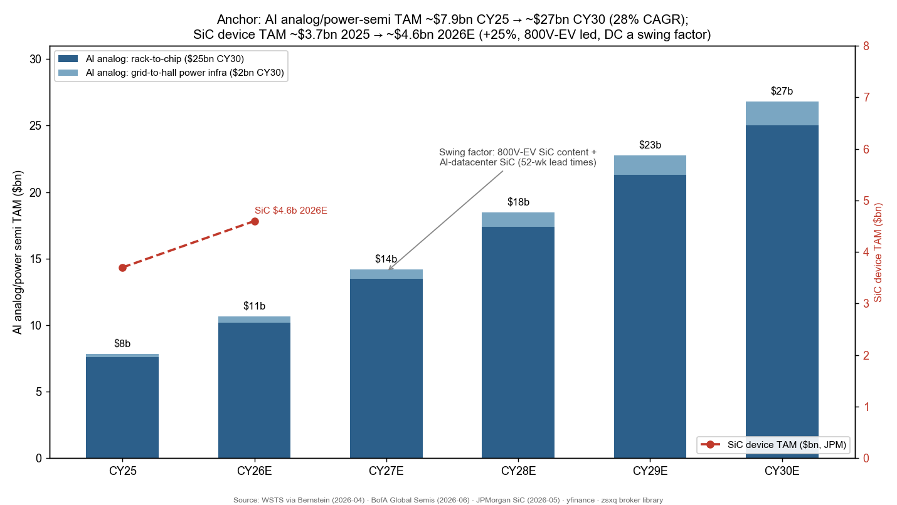
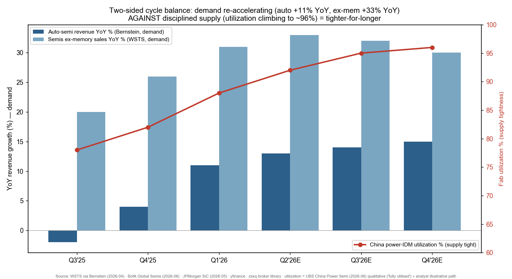
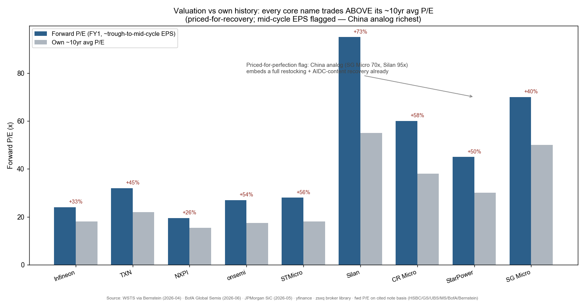
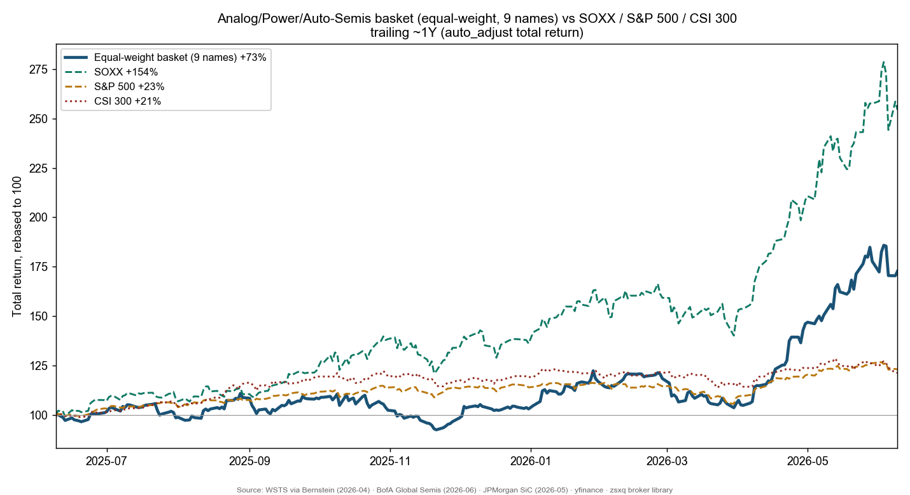

# Analog / Power / Auto Semis & SiC Cyclical Recovery

**Created:** 2026-06-10 · **Last refreshed:** 2026-06-10 · **Last mutated:** 2026-06-10 · **Refresh cadence:** monthly · **Languages tracked:** en

## What's New

*The delta since you last looked — newest refresh on top. Older entries collapse into the archive below so this stays short.*

**2026-06-10 — basket created (9 tickers: 4 core, 5 adjacent/core-China).**
- **Seeded** from the local zsxq broker library: UBS *China Power Semiconductor* (2 Jun 2026), BofA *Watts to Tokens — AI Power Semis & 800V Data Centers* (25 May 2026), JPMorgan *Silicon Carbide sector* (25 May 2026), Bernstein *Global Analog Semis: the valuation gap* (7 May 2026), and Bernstein *Auto Semis Cycle Tracker 1Q26* (28 May 2026).
- **Anchor set (two lenses):** (1) the AI-power-analog TAM ~\$7.9bn CY25 → ~\$27bn CY30 (28% CAGR) per BofA ([BofA *Watts to Tokens*, zsxq #812451248521812 p.1](http://xs-macbook-air.local:5001/zsxq/pdf/812451248521812/Bofa-Global%20Semiconductors%20Watts%20to%20Tokens-AI%20Power%20Semis%20and%20the%20Transition%20to%20800V%20Data%20Centers-260525.pdf#page=1)); (2) the broad analog market re-accelerating at a ~12% CAGR 2025–28E per Bernstein ([Bernstein *Analog valuation gap*, zsxq #585421448848154](http://xs-macbook-air.local:5001/zsxq/pdf/585421448848154/Bernstein-Global%20Analog%20Semis%EF%BC%9A%20How%20to%20explain%EF%BC%8C%20and%20what%20could%20potentially%20close%EF%BC%8C%20the%20valuation%20gap-260507.pdf)). **Swing factor = SiC content** (800V-EV + AI-datacenter 800V-HVDC, 52-week lead times).
- **Cycle confirmation:** WSTS April 2026 semis ex-memory +33.1% YoY, total sales −2.2% MoM vs the −11.3% April-seasonal average (above-seasonal) ([Bernstein *WSTS Tracker Apr-26*, zsxq #584251188582884 p.1](http://xs-macbook-air.local:5001/zsxq/pdf/584251188582884/Bernstein-Global%20Semiconductors%20and%20Semiconductor%20Capital%20Equipment%EF%BC%9AGlobal%20Semis%EF%BC%9A%20April%202026%20WSTS%20Tracker~Sales%20~2.2%25%20MoM%EF%BC%8C%20above%20typical%20%EF%BC%88~11.3%25%20MoM%EF%BC%89%20%26%2B106.4%25%20YoY%20on%20significant%20memory%20strength-260608.pdf#page=1)); auto semis +11% YoY in Q1'26 after +4% in Q4'25 ([Bernstein *Auto Semis Cycle Tracker*, zsxq #812451144142882 p.5](http://xs-macbook-air.local:5001/zsxq/pdf/812451144142882/Bernstein-Global%20Semiconductors%20Auto%20Semis%20Cycle%20Tracker%201Q26-Price%20hikes%20underway%20as%20demand%20recovers-260528.pdf#page=5)).
- **Conviction ranking surfaced (sourced, not ours):** Bernstein prefers Renesas > Infineon among Western IDMs (both PEG ~0.8x) and is Neutral TXN/ADI/NXPI on full valuations ([Bernstein *Analog valuation gap*, zsxq #585421448848154](http://xs-macbook-air.local:5001/zsxq/pdf/585421448848154/Bernstein-Global%20Analog%20Semis%EF%BC%9A%20How%20to%20explain%EF%BC%8C%20and%20what%20could%20potentially%20close%EF%BC%8C%20the%20valuation%20gap-260507.pdf)); UBS prefers China power IDMs (CR Micro, Silan) over fab-lite, upgrading Silan to Buy ([UBS *China Power Semi*, zsxq #585411224125544](http://xs-macbook-air.local:5001/zsxq/pdf/585411224125544/UBS-China%20Power%20Semiconductor%EF%BC%9ATighter~for~longer%20supply%EF%BC%8C%20rising%20SiC%20penetration-260602.pdf)).
- **11 sell-side PT / rating calls persisted** to `stock_price_target_db` (UBS, HSBC, GS, MS, BofA, Bernstein) → surfaced at `/pt`.
- **Movers (1Y, context only):** basket equal-weight +73% vs SOXX +154% / S&P 500 +23% / CSI 300 +21%. The basket *lags* SOXX — by design: these are the laggard early-cyclicals, not the AI-compute names that drove SOXX. STMicro +151% and onsemi +123% lead; StarPower +38% lags (China IGBT price war).

Earlier refreshes

*(none — basket created 2026-06-10)*

## Thesis

**Anchor — AI-power-analog TAM + broad analog market:** the highest-conviction, fastest-growing pool the theme rides is the AI-power-analog TAM: ~\$7.9bn CY25 → ~\$27bn CY30, a 28% 5-year CAGR, inside a \$1.7tn AI-data-center systems long-term TAM ([BofA *Watts to Tokens*, zsxq #812451248521812 p.1](http://xs-macbook-air.local:5001/zsxq/pdf/812451248521812/Bofa-Global%20Semiconductors%20Watts%20to%20Tokens-AI%20Power%20Semis%20and%20the%20Transition%20to%20800V%20Data%20Centers-260525.pdf#page=1)). The *broad* analog market — the cyclical engine for most of the basket — Bernstein models rebounding at a ~12% CAGR over 2025–28E with EPS CAGR ~30% as margins sit structurally above last cycle ([Bernstein *Analog valuation gap*, zsxq #585421448848154](http://xs-macbook-air.local:5001/zsxq/pdf/585421448848154/Bernstein-Global%20Analog%20Semis%EF%BC%9A%20How%20to%20explain%EF%BC%8C%20and%20what%20could%20potentially%20close%EF%BC%8C%20the%20valuation%20gap-260507.pdf)). The third leg, automotive semis, grew to a US\$87bn market in 2025 and returned to +4% YoY growth in Q4'25, accelerating to +11% YoY in Q1'26 — the first quarter all covered vendors printed positive USD revenue growth together ([Bernstein *Auto Semis Cycle Tracker*, zsxq #812451144142882 p.1 & p.5](http://xs-macbook-air.local:5001/zsxq/pdf/812451144142882/Bernstein-Global%20Semiconductors%20Auto%20Semis%20Cycle%20Tracker%201Q26-Price%20hikes%20underway%20as%20demand%20recovers-260528.pdf#page=1)).

**Sub-bucket decomposition + swing factor.** Four buckets, each on its own dated path: **(1) AI-power-analog** ~\$7.9bn → ~\$27bn CY30 (28% CAGR), itself \$25bn data-center "rack-to-chip" + ~\$2bn "grid-to-hall" power infrastructure (49% CAGR off a ~\$245mn base) ([BofA, zsxq #812451248521812 p.1](http://xs-macbook-air.local:5001/zsxq/pdf/812451248521812/Bofa-Global%20Semiconductors%20Watts%20to%20Tokens-AI%20Power%20Semis%20and%20the%20Transition%20to%20800V%20Data%20Centers-260525.pdf#page=1)); **(2) broad analog/MCU** ~12% CAGR 2025–28E (Bernstein); **(3) power-discrete / SiC** — the SiC *device* TAM ~\$3.7bn 2025 → ~\$4.6bn 2026E (+25% YoY), still ~90% EV-built ([JPMorgan *SiC sector*, zsxq #415241248554518 p.1](http://xs-macbook-air.local:5001/zsxq/pdf/415241248554518/J.P.%20Morgan-Silicon%20carbide%20sector%EF%BC%9AUpdates%20on%20AI%20and%20auto%20applications%20~%20AI%20a%20positive%20factor%20but%20how%20meaningful%EF%BC%9F-260525.pdf#page=1)); **(4) auto** US\$87bn 2025 (Bernstein). **The swing factor is SiC content** — its per-unit dollars climb fastest as 800V-EV platforms descend to sub-Rmb100k cars and as 800V-HVDC data-center power architecture adopts SiC MOSFETs, where JPMorgan flags lead times stretched to **52 weeks** and high-spec AI-server SiC priced >2× the auto-grade part ([JPMorgan, zsxq #415241248554518 p.1–2](http://xs-macbook-air.local:5001/zsxq/pdf/415241248554518/J.P.%20Morgan-Silicon%20carbide%20sector%EF%BC%9AUpdates%20on%20AI%20and%20auto%20applications%20~%20AI%20a%20positive%20factor%20but%20how%20meaningful%EF%BC%9F-260525.pdf#page=1)).

**Auditable build (where the seeding notes disclose drivers).** BofA's AI-analog TAM is a content-per-rack build: average analog/power content rises from mid-\$20K per rack today to over \$60K by CY30, multiplied across ~233GW of AI capacity deployed through CY30 — that `content/rack × racks` product is what sums to the \$27bn ([BofA, zsxq #812451248521812 p.1](http://xs-macbook-air.local:5001/zsxq/pdf/812451248521812/Bofa-Global%20Semiconductors%20Watts%20to%20Tokens-AI%20Power%20Semis%20and%20the%20Transition%20to%20800V%20Data%20Centers-260525.pdf#page=1)). The mechanism is the 800V-HVDC migration: per-rack power jumps ~100× from 10–15kW (legacy cloud) toward 1MW+ at the Feynman generation, and 800VDC vs 48V/54V cuts copper ~45% and TCO ~30% while enabling 1MW+ racks, forcing a rebuild of the grid-to-GPU power chain — VRMs, IBCs, solid-state transformers, SiC/GaN — at the heart of the basket ([BofA, zsxq #812451248521812](http://xs-macbook-air.local:5001/zsxq/pdf/812451248521812/Bofa-Global%20Semiconductors%20Watts%20to%20Tokens-AI%20Power%20Semis%20and%20the%20Transition%20to%20800V%20Data%20Centers-260525.pdf)).

**Two-sided supply/demand balance (this is an imbalance thesis).** UBS's whole "tighter-for-longer" call rests on demand re-accelerating against disciplined supply: IDM capex remains restrained (TSMC's 8" capacity shifting to advanced packaging, Infineon converting IGBT lines to high-end MOSFET), so CR Micro and Silan run *fully utilized* on both Si and SiC 6"/8" lines even as new-energy, grid and physical-AI demand stays resilient ([UBS *China Power Semi*, zsxq #585411224125544](http://xs-macbook-air.local:5001/zsxq/pdf/585411224125544/UBS-China%20Power%20Semiconductor%EF%BC%9ATighter~for~longer%20supply%EF%BC%8C%20rising%20SiC%20penetration-260602.pdf)). TI's countercyclical capex strategy lets it keep short lead times and *gain share* when mature-node foundry is tight ([UBS *TXN*, zsxq #415518828288158](http://xs-macbook-air.local:5001/zsxq/pdf/415518828288158/UBS-Texas%20Instruments%20Inc%EF%BC%88TXN.US%EF%BC%89Upcycle%EF%BC%8C%20Share%20Gain%EF%BC%8C%20and%20Margin%20Expansion%20Right%20on%20Track-260422.pdf)). The chart below plots demand (auto-semi YoY, ex-memory YoY) against the supply tightness proxy (utilization) so the imbalance is visible on both sides, not as a bare ratio.

**Value-chain / value-capture map (dollar-weighted).** Of the BofA AI-analog \$27bn CY30 pool, **~\$25bn is data-center "rack-to-chip"** (VRMs, IBCs, SiC/GaN switches; TI highest share today, Infineon the most complete Si+SiC+GaN portfolio and fastest share gainer, ADI #3 strengthened by its Empower acquisition, onsemi most SiC/GaN-levered) and **~\$2bn is "grid-to-hall" power infra** (SSTs, solid-state breakers; ~49% CAGR off a tiny base) ([BofA, zsxq #812451248521812 p.1](http://xs-macbook-air.local:5001/zsxq/pdf/812451248521812/Bofa-Global%20Semiconductors%20Watts%20to%20Tokens-AI%20Power%20Semis%20and%20the%20Transition%20to%20800V%20Data%20Centers-260525.pdf#page=1)). Layer map: **analog/signal-chain** TXN · ADI · SG Micro; **MCU** Infineon (#1 auto MCU, 36% share) · NXP · Microchip; **power discrete / IGBT** Infineon · onsemi · StarPower · CR Micro · Silan; **SiC** onsemi · Infineon · StarPower · Silan; **GaN** Infineon · onsemi. The basket has *no* pure-play GaN name and *no* SiC-substrate name (deliberate — JPMorgan is cautious on 8"-substrate pricing; see Exclusions), each a candidate-add coverage gap.

**Who benefits when (time axis on the static roles).** Early-cyclicals first: distributor restock + above-seasonal shipments are already lifting the broad-analog/MCU names (TXN, ADI, NXP, SG Micro) and the China power IDMs running full (CR Micro, Silan) in CY26. Auto-IGBT names (StarPower, Silan, onsemi) lag because Chinese NEV demand is the soft spot and SiC keeps undercutting IGBT on price — Infineon and StarPower management both see auto power bottoming ~mid-CY27 with recovery into CY28 ([BofA *Infineon*, zsxq #812488855858512](http://xs-macbook-air.local:5001/zsxq/pdf/812488855858512/BofA%20Securities-Infineon%20Technologies%20AG%EF%BC%88IFX.GY%EF%BC%892026%20Global%20Tech%20conference%EF%BC%9A%20they%E2%80%99ve%20got%20the%20power-260604.pdf); [GS *StarPower*, zsxq #585428252524214](http://xs-macbook-air.local:5001/zsxq/pdf/585428252524214/Goldman%20Sachs-StarPower%20%EF%BC%88603290%EF%BC%89%EF%BC%9A%20Mgmt.%20visit%EF%BC%9A%20SiC%20and%20MCU%20to%20expand%20end%20applications%20and%20drive%20utilization%20rate%EF%BC%9B%20Neutral-260523.pdf)). AI-power content (Infineon Dresden-4, onsemi/ADI rack supply) monetizes CY27–28 as the 800V build scales.

**Scenario frame (bull / base / bear), with Infineon as the worked example.** The single swing assumption between up- and down-case is whether the auto/industrial restock turns into a durable broad upcycle or air-pockets on memory-cost crowd-out and a Chinese NEV demand dip. Morgan Stanley's Infineon scenario triplet makes it concrete: **bull €96** (auto V-recovery + structural server-rack breakthrough, non-GAAP GM to 49.3%, EPS €3.58), **base €63** (cyclical recovery + rack breakthrough; 30× the structural DC business + 20× the cyclical business), **bear €18** (macro weak, no structural breakout, ~12× P/E, EPS ~€1.50) ([MS *Infineon Cyclical Recovery Confirmed*, zsxq #212458448848181](http://xs-macbook-air.local:5001/zsxq/pdf/212458448848181/Morgan%20Stanley-Infineon%20Technologies%20AG%20%EF%BC%88IFXGn.DE%EF%BC%89Cyclical%20Recovery%20Confirmed-260507.pdf)). The conditions that must *all* hold for the bull case: above-seasonal IC-ex-memory shipments continue, the auto/industrial inventory restock broadens, SiC content scales into 800V without a price war collapsing margins, and memory-cost inflation does not crowd out non-memory budgets.

## Scope rules

**In:** analog / signal-chain, MCU, power-discrete (IGBT/MOSFET), and automotive-semi IDMs, plus SiC/GaN power compound-semiconductor device makers — the early-cyclical "value" semis that confirm a cycle turn via book-to-bill, above-seasonal shipments and distributor restock. Two sub-buckets are tracked deliberately: **Western IDMs** (Infineon, TXN, NXP, onsemi, STMicro) and **China analog/power** names (Silan, CR Micro, StarPower, SG Micro).

**Out:** leading-edge AI compute silicon (GPU/ASIC) — tracked in [[ai-compute-silicon-gpu-asic]]; memory (DRAM/NAND/HBM) — tracked in [[memory-upcycle]]; wafer-fab equipment / WFE — tracked in [[semicap-wfe]]. Also out: Intel (a logic/foundry-turnaround story, not an analog/power pure-play — JPM rates it Underweight on EPS-quality and Foundry-breakeven concerns; see Exclusions); SiC-substrate pure-plays (8"-substrate pricing under pressure); diversified conglomerates where analog/power is a minor segment.

## Tracked tickers

| Ticker | Name | Role | Justification | Added |
|---|---|---|---|---|
| ETR:IFX | Infineon (英飞凌) | core | **Moat:** #1 auto MCU (36% share in 2025, up from ~10% in 2019) and the most complete Si + SiC + GaN power portfolio; the AI-power leader with Dresden-4 (50% of capacity reserved for AI power), guiding AI-power revenue to €3.0bn/€4.5bn in FY27/28E ([Bernstein *Auto Semis*, zsxq #812451144142882 p.1](http://xs-macbook-air.local:5001/zsxq/pdf/812451144142882/Bernstein-Global%20Semiconductors%20Auto%20Semis%20Cycle%20Tracker%201Q26-Price%20hikes%20underway%20as%20demand%20recovers-260528.pdf#page=1); [BofA *Infineon*, zsxq #812488855858512](http://xs-macbook-air.local:5001/zsxq/pdf/812488855858512/BofA%20Securities-Infineon%20Technologies%20AG%EF%BC%88IFX.GY%EF%BC%892026%20Global%20Tech%20conference%EF%BC%9A%20they%E2%80%99ve%20got%20the%20power-260604.pdf)). **Threat:** China high-voltage supply restructuring + light-vehicle production decline drag near-term auto; SiC rivals undercutting share; EUR strength hits euro revenue ([MS, zsxq #212458448848181](http://xs-macbook-air.local:5001/zsxq/pdf/212458448848181/Morgan%20Stanley-Infineon%20Technologies%20AG%20%EF%BC%88IFXGn.DE%EF%BC%89Cyclical%20Recovery%20Confirmed-260507.pdf)). | 2026-06-10 |
| NASDAQ:TXN | Texas Instruments | core | **Moat:** broadest analog catalog + owned 300mm capacity; countercyclical capex keeps lead times short so TXN *gains share* when foundry is tight, with a 75–85% long-term incremental-GM target (ex-depreciation) far above the Street's ~40% ([UBS *TXN*, zsxq #415518828288158](http://xs-macbook-air.local:5001/zsxq/pdf/415518828288158/UBS-Texas%20Instruments%20Inc%EF%BC%88TXN.US%EF%BC%89Upcycle%EF%BC%8C%20Share%20Gain%EF%BC%8C%20and%20Margin%20Expansion%20Right%20on%20Track-260422.pdf)); Q1'26 industrial +~35% YoY, datacenter +90% YoY ([Bernstein *TXN Q1 recap*, zsxq #585581154554524](http://xs-macbook-air.local:5001/zsxq/pdf/585581154554524/Bernstein-Texas%20Instruments%20Inc%EF%BC%88TXN.US%EF%BC%89Q126%20recap~Out%20of%20the%20box...-260423.pdf)). **Threat:** heavy capex/depreciation still compresses GM; Infineon's MCU+AI-power share gains chipping at TI's top spot; valuation already prices the upcycle (Bernstein MP). ([TXN FY24 10-K, SEC](https://www.sec.gov/cgi-bin/browse-edgar?action=getcompany&CIK=0000097476&type=10-K&dateb=&owner=include&count=10)) | 2026-06-10 |
| NASDAQ:NXPI | NXP Semiconductors | core | **Moat:** auto-MCU + processor franchise (radar, in-vehicle networking, SDV), the *cheapest* of the Western analog IDMs on Bernstein's screen — leverage to the auto restock if it broadens. **Threat:** tiny datacenter exposure (~3%, so it misses the AI-power leg) and questioned auto-business durability per Bernstein; customer-insourcing risk as Chinese OEMs (BYD/NIO/XPeng) move ADAS/MCU design in-house, with NXP's counter being broad qualified auto-grade breadth that sub-scale OEMs can't replicate ([Bernstein *Analog valuation gap*, zsxq #585421448848154](http://xs-macbook-air.local:5001/zsxq/pdf/585421448848154/Bernstein-Global%20Analog%20Semis%EF%BC%9A%20How%20to%20explain%EF%BC%8C%20and%20what%20could%20potentially%20close%EF%BC%8C%20the%20valuation%20gap-260507.pdf); [NXPI FY24 10-K, SEC](https://www.sec.gov/cgi-bin/browse-edgar?action=getcompany&CIK=0001413447&type=10-K&dateb=&owner=include&count=10)). | 2026-06-10 |
| NASDAQ:ON | onsemi | adjacent | **Moat:** most SiC/GaN-levered of the Western IDMs — BofA flags it the highest-elasticity name to SiC + GaN adoption in 800V data centers; auto/industrial power discrete franchise. **Threat:** onsemi's own commentary is the most cautious in the group — still shipping to real demand, *not* yet a full restock — and inventories sit high vs history; SiC price competition + a Chinese NEV air-pocket hit it first ([BofA *Watts to Tokens*, zsxq #812451248521812](http://xs-macbook-air.local:5001/zsxq/pdf/812451248521812/Bofa-Global%20Semiconductors%20Watts%20to%20Tokens-AI%20Power%20Semis%20and%20the%20Transition%20to%20800V%20Data%20Centers-260525.pdf); [UBS *Distributor Tracker*, zsxq #212212585425181](http://xs-macbook-air.local:5001/zsxq/pdf/212212585425181/UBS-Semiconductors%20UBS%20Evidence%20Lab%20inside%EF%BC%9A%20Semis%20Distributor%20Tracker~distributor%20trends%20remain%20supportive-260428.pdf); [ON FY24 10-K, SEC](https://www.sec.gov/cgi-bin/browse-edgar?action=getcompany&CIK=0001097864&type=10-K&dateb=&owner=include&count=10)). | 2026-06-10 |
| NYSE:STM | STMicroelectronics | adjacent | **Moat:** scale European IDM in MCU + analog + SiC (Tesla/auto SiC heritage); a deep-value cyclical-recovery re-rate candidate as the cycle turns (Bernstein's structural-rerating thesis for European semis). **Threat:** the weakest fundamentals in the Western group — SiC price competition and Tesla order volatility leave it "softer near-term" per Bernstein's auto tracker; execution/margin recovery unproven ([Bernstein *Auto Semis*, zsxq #812451144142882](http://xs-macbook-air.local:5001/zsxq/pdf/812451144142882/Bernstein-Global%20Semiconductors%20Auto%20Semis%20Cycle%20Tracker%201Q26-Price%20hikes%20underway%20as%20demand%20recovers-260528.pdf); [UBS *Distributor Tracker*, zsxq #212212585425181](http://xs-macbook-air.local:5001/zsxq/pdf/212212585425181/UBS-Semiconductors%20UBS%20Evidence%20Lab%20inside%EF%BC%9A%20Semis%20Distributor%20Tracker~distributor%20trends%20remain%20supportive-260428.pdf)). | 2026-06-10 |
| SSE:600460 | Silan Micro (士兰微) | core | **Moat:** China power IDM with self-built Si + SiC 6"/8" lines running *fully utilized*; UBS top pick, upgraded to Buy — IDM model gives the most net-margin elasticity under tight supply (+5–8ppt vs +2–4ppt fab-lite), with ROE modelled 3.3% (2025) → 12.0% (2028E) ([UBS *China Power Semi*, zsxq #585411224125544](http://xs-macbook-air.local:5001/zsxq/pdf/585411224125544/UBS-China%20Power%20Semiconductor%EF%BC%9ATighter~for~longer%20supply%EF%BC%8C%20rising%20SiC%20penetration-260602.pdf)). **Threat:** China analog/power over-capacity → price war; a leading-edge tech gap vs Infineon/onsemi; SiC ramp slower than modelled. ([UBS, zsxq #585411224125544](http://xs-macbook-air.local:5001/zsxq/pdf/585411224125544/UBS-China%20Power%20Semiconductor%EF%BC%9ATighter~for~longer%20supply%EF%BC%8C%20rising%20SiC%20penetration-260602.pdf)) | 2026-06-10 |
| SSE:688396 | CR Micro / 华润微 | core | **Moat:** China's largest power IDM with captive foundry; capacity fully utilized so it benefits directly from tight supply; UBS net-profit forecast above Wind consensus, ROE to 9.6% 2028E, traded below its post-2020 average P/B at the call ([UBS *China Power Semi*, zsxq #585411224125544](http://xs-macbook-air.local:5001/zsxq/pdf/585411224125544/UBS-China%20Power%20Semiconductor%EF%BC%9ATighter~for~longer%20supply%EF%BC%8C%20rising%20SiC%20penetration-260602.pdf)). **Threat:** domestic price war if China power-semi capacity over-builds; foundry-cycle sensitivity; export-control reach into advanced tooling. ([UBS, zsxq #585411224125544](http://xs-macbook-air.local:5001/zsxq/pdf/585411224125544/UBS-China%20Power%20Semiconductor%EF%BC%9ATighter~for~longer%20supply%EF%BC%8C%20rising%20SiC%20penetration-260602.pdf)) | 2026-06-10 |
| SSE:603290 | StarPower (斯达半导) | adjacent | **Moat:** China IGBT leader with self-built SiC line and a 44% 2026–28E EPS CAGR (UBS) on SiC volume ramp + MCU/IPM diversification into ESS and AI-datacenter power ([UBS *China Power Semi*, zsxq #585411224125544](http://xs-macbook-air.local:5001/zsxq/pdf/585411224125544/UBS-China%20Power%20Semiconductor%EF%BC%9ATighter~for~longer%20supply%EF%BC%8C%20rising%20SiC%20penetration-260602.pdf)). **Threat:** the most pressured near-term — fab-lite transition adds depreciation, ~50% of revenue is auto where Chinese NEV subsidy roll-off + SiC undercutting IGBT crush margins, so GS/MS both cut EPS sharply and sit Neutral/EW ([GS *StarPower*, zsxq #585428252524214](http://xs-macbook-air.local:5001/zsxq/pdf/585428252524214/Goldman%20Sachs-StarPower%20%EF%BC%88603290%EF%BC%89%EF%BC%9A%20Mgmt.%20visit%EF%BC%9A%20SiC%20and%20MCU%20to%20expand%20end%20applications%20and%20drive%20utilization%20rate%EF%BC%9B%20Neutral-260523.pdf); [MS *StarPower*, zsxq #585425855548124](http://xs-macbook-air.local:5001/zsxq/pdf/585425855548124/Morgan%20Stanley-StarPower%20Semiconductor%20Ltd%EF%BC%88603290%EF%BC%89Cyclical%20recovery%20in%20price%EF%BC%9B%20move%20to%20EW-260514.pdf)). | 2026-06-10 |
| SZSE:300661 | SG Micro (圣邦股份) | core | **Moat:** China's leading signal-chain + PMIC analog pure-play (6,800+ SKUs end-2025 vs 5,900 end-2024), now pivoting into AI/networking — 200+ server-applicable products, DrMOS launched, management guiding \$30–50 of analog content per server within ~2 years; HSBC upgrade to Buy on a 38% 2026–28E net-profit CAGR ([HSBC *SG Micro upgrade*, zsxq #585412242542814](http://xs-macbook-air.local:5001/zsxq/pdf/585412242542814/HSBC-SG%20Micro%20%EF%BC%88300661%EF%BC%89Upgrade%20to%20Buy%EF%BC%9A%20Expanding%20beyond%20the%20analog%20recovery-260528.pdf); [GS *SG Micro*, zsxq #585585558444884](http://xs-macbook-air.local:5001/zsxq/pdf/585585558444884/Goldman%20Sachs-SG%20Micro%20%EF%BC%88300661%EF%BC%89%20Expanding%20Signal%20chain%20PMIC%20offerings%20for%20AI%20and%20networking%EF%BC%9B1Q26%20OP%20beat%EF%BC%9B%20Neutral-260430.pdf)). **Threat:** richest valuation in the basket (118× 2026e PE on the HSBC TP) prices a lot of the AI optionality; China analog price war; TI/ADI catalog breadth. | 2026-06-10 |

**Conviction ranking (sourced, never ours).** *Western IDMs* — Bernstein prefers **Renesas > Infineon** on the strongest supply/demand mismatch and lowest valuation (both PEG ~0.8x), and is **Neutral on TXN / ADI / NXPI** as full valuations already reflect the industrial recovery ([Bernstein *Analog valuation gap*, zsxq #585421448848154](http://xs-macbook-air.local:5001/zsxq/pdf/585421448848154/Bernstein-Global%20Analog%20Semis%EF%BC%9A%20How%20to%20explain%EF%BC%8C%20and%20what%20could%20potentially%20close%EF%BC%8C%20the%20valuation%20gap-260507.pdf)); UBS's distributor-tracker conviction list is **TXN / Renesas / STMicro** for the recovery ([UBS *Distributor Tracker*, zsxq #212212585425181](http://xs-macbook-air.local:5001/zsxq/pdf/212212585425181/UBS-Semiconductors%20UBS%20Evidence%20Lab%20inside%EF%BC%9A%20Semis%20Distributor%20Tracker~distributor%20trends%20remain%20supportive-260428.pdf)). *China power* — UBS prefers **power IDMs (CR Micro, Silan) > fab-lite/fabless**, upgrading Silan to Buy on margin elasticity under tight supply ([UBS *China Power Semi*, zsxq #585411224125544](http://xs-macbook-air.local:5001/zsxq/pdf/585411224125544/UBS-China%20Power%20Semiconductor%EF%BC%9ATighter~for~longer%20supply%EF%BC%8C%20rising%20SiC%20penetration-260602.pdf)). *Analyst view (this note): Renesas is out-of-scope (Japan IDM); we map UBS's "prefer IDM" call onto Silan/CR Micro as `core` and the more-pressured StarPower as `adjacent` — that role split is ours.*

## Valuation snapshot

Populated from `stock_price_target_db` (the rows surfaced at `/pt`). "Px @ note" = `report_date_price` (the price on the note's date — the load-bearing anchor for the analyst's called upside), kept separate from "Current px" (live, as of 2026-06-09). FY1/FY2 multiples are on the cited note's basis; mid-cycle EPS flagged where the cycle is not yet at mid. Forward P/Es are trough-to-mid-cycle and therefore optically lower than steady-state — the priced-for-recovery read sits in the own-history comparison.

| Ticker | Rating (note) | Px @ note date | PT | Upside% (vs note px) | Current px | Fwd multiple (basis) | Own ~10yr avg | FY1 / FY2 metric |
|---|---|---|---|---|---|---|---|---|
| ETR:IFX | MS OW · BofA Buy | €59.23 (MS 2026-05-06) | €63 (MS) / €108 (BofA) / bull €96·base €63·bear €18 (MS) | +6% (MS, vs note); BofA +82% (vs note px) | €78.24 | ~24× fwd P/E (SOTP: 30× DC + 20× cyclical) | ~18× | FY26 EPS guide implied by GM "low-to-mid 40s"; FY28E AI-power €4.5bn |
| NASDAQ:TXN | UBS Buy · Bernstein MP | n/a (UBS); $236.31 (Bernstein 2026-04-23) | $295 (UBS, 22× FCF) / $250 (Bernstein, 30× FY27E EPS) | Bernstein +6% (vs note px) | $288.63 | ~32× FY1 P/E (or 22× FCF) | ~22× | FCF/sh ~$10.50 (FY26E) → ~$13.50 (FY27E) |
| NASDAQ:NXPI | (cheapest Western IDM, Bernstein Neutral) | n/a | no fresh single PT in this pass | n/a | $297.41 | ~19.5× FY1 P/E | ~15.5× | auto-led FY26/27E EPS (note gives no clean split) |
| NASDAQ:ON | (BofA: most SiC/GaN-levered) | n/a | no fresh single PT in this pass | n/a | $117.00 | ~27× FY1 P/E (depressed-EPS base) | ~17.5× | trough-cycle EPS; FY27E recovery |
| NYSE:STM | (Bernstein: re-rating candidate) | n/a | no fresh single PT in this pass | n/a | $73.32 | ~28× FY1 P/E (trough EPS) | ~18× | trough-cycle EPS; FY27E recovery |
| SSE:600460 | UBS Buy (upgrade) | n/a | ¥46.20 (UBS, 5.2× 2027-28E avg P/B) | upside not stated vs report-date px | ¥34.72 | 5.2× P/B (2027-28E avg) | n/a (B-basis; cyclical EPS) | ROE 3.3% (2025) → 12.0% (2028E) |
| SSE:688396 | UBS Buy | n/a | ¥83.40 (UBS, 4.1× 2027-28E avg P/B) | upside not stated vs report-date px | ¥67.68 | 4.1× P/B (2027-28E avg) | n/a (B-basis) | ROE → 9.6% (2028E) |
| SSE:603290 | GS Neutral · MS EW · UBS Buy | ¥131.75 (GS 2026-05-22) | ¥121.20 (GS, 31× 2026E EPS) / ¥120 (MS) / ¥166.60 (UBS, 5.0× P/B) | GS −8% (vs note px) | ¥112.00 | ~31× 2026E P/E (GS) / ~45× 2027E (MS) | ~mid of range (MS) | EPS ¥3.91 (2026E) / ¥4.92 (2027E) (GS) |
| SZSE:300661 | HSBC Buy (upgrade) · GS Neutral | ¥116.66 (HSBC) · ¥88.00 (GS 2026-04-29) | ¥156.10 (HSBC, 118× 2026e PE) / ¥96.10 (GS, 43.2× 2027 EPS) | HSBC +34% (vs HSBC px); GS +9.2% (vs GS px) | ¥109.99 | ~70× FY1 P/E (HSBC basis) | ~50× | 38% 2026–28E net-profit CAGR (HSBC) |

*Growth-adjusted cross-section:* on PEG, Bernstein flags Renesas/Infineon at ~0.8× (cheap-for-growth) while TXN/ADI/NXPI price the recovery; SG Micro's ~70× FY1 P/E against a 38% EPS CAGR is ~1.8× PEG (richest). China names quote on **P/B** because cyclical EPS is depressed/recovering — flagged, not blended into the P/E column. **Priced-for-recovery flag:** every name trades above its own ~10yr average multiple (chart below); the basket-median forward multiple sits materially above history because trough EPS inflates the optical P/E *and* the cycle-turn is already in the tape — the de-rate trigger is a memory-cost-driven non-memory budget crowd-out or a Chinese-NEV air-pocket that stalls the restock before FY27 earnings catch up.

## Exclusions

| Ticker | Reason |
|---|---|
| NASDAQ:INTC | Logic/foundry-turnaround story, not an analog/power pure-play; JPM rates it Underweight on EPS-quality, 2H GM headwinds and a Foundry breakeven likely beyond YE-CY27, even while raising near-term estimates ([JPM *Intel*, zsxq #212218242584821](http://xs-macbook-air.local:5001/zsxq/pdf/212218242584821/J.P.%20Morgan-Intel%EF%BC%88INTC.US%EF%BC%89Better%20Q1%20Q2%20on%20Supply%20Catch~Up%20and%20DCAI%20Strength%EF%BC%8C%20But%20Inventory~Driven%20CCG%EF%BC%8C%20Potential%202H%20GM%20Headwinds%EF%BC%8C%20and%20Foundry%20Uncertainty%20Keep%20Us%20Cautious-260424.pdf)). |
| NASDAQ:ADI | Strong franchise but Bernstein groups it with TXN as a "Neutral, valuation full" Western analog IDM — overlaps TXN's role in the basket; held in reserve as a candidate-add if the industrial cycle broadens. |
| NASDAQ:MCHP | MCU + analog recovery name (MS "tracking better"), but a less-differentiated profile than the held names; candidate-add on a clean inventory-normalization print. |
| SSE:600703 | Sanan (三安) — SiC *substrate* leader, but JPMorgan is cautious: 8" substrate prices falling to Rmb3.0–4.0k by end-2026 with price hikes "basically not feasible," so substrate economics are the weak link, not the device makers ([JPM *SiC sector*, zsxq #415241248554518](http://xs-macbook-air.local:5001/zsxq/pdf/415241248554518/J.P.%20Morgan-Silicon%20carbide%20sector%EF%BC%9AUpdates%20on%20AI%20and%20auto%20applications%20~%20AI%20a%20positive%20factor%20but%20how%20meaningful%EF%BC%9F-260525.pdf)). |
| TSE:6723 | Renesas — Bernstein's *top* analog pick, but a Japan IDM outside the stated Western-IDM / China-analog scope; noted as the conviction-rank reference, not tracked. |

## Keywords

analog / 模拟芯片 · MCU / 单片机 · power discrete / 功率分立器件 · IGBT · SiC carbide / 碳化硅 · GaN / 氮化镓 · automotive semis / 车规半导体 · 800V data center / 800V数据中心 · book-to-bill / 订单出货比 · above-seasonal IC-ex-memory shipments · distributor restock / 分销补库 · power IDM / 功率半导体IDM · AI power delivery / AI电源

## Performance (since inception 2026-06-10)

Trailing ~1Y total return (yfinance `auto_adjust=True`, as of 2026-06-09):

- **Equal-weight basket (9 names): +73%** vs **SOXX +154% · S&P 500 +23% · CSI 300 +21%**. The basket *underperforms SOXX* — and that is the thesis, not a bug: SOXX's +154% was driven by the AI-compute / memory names this theme deliberately *excludes*; the analog/power early-cyclicals are the laggards that confirm-late, so the trade is the catch-up from here, not the move already banked.
- Basket median 1Y +49%; basket beats the *broad-market* benchmarks (S&P 500, CSI 300) comfortably but trails the semi-specific SOXX.

### Basket scorecard

- **Batting average: 9/9 names positive (100%)** over the trailing 1Y; **0/9 beat SOXX (0%)** but 9/9 beat the S&P 500 and CSI 300.
- **Best contributor:** STMicro **+151%** (deep-value European re-rate). **Worst:** StarPower **+38%** (China IGBT price war + NEV demand soft).
- Western IDMs led (Infineon +117%, onsemi +123%, STM +151%); China names clustered +38% to +49% — the laggard-of-the-laggards, consistent with the "early-cyclical, China-power lags" staging.
- Cumulative outperformance-since-inception in bps: n/a (single snapshot line — populates once a second refresh exists).

## Recent events

- **2026-06-04** — BofA reiterates Buy on Infineon, raises FY27/28E AI-power-chip revenue to €3.0bn/€4.5bn and TP to €108 (ADR $125), citing Dresden-4 (July start, ~50% capacity to AI power) and orders far above current capacity ([BofA *Infineon Global Tech conf.*, zsxq #812488855858512](http://xs-macbook-air.local:5001/zsxq/pdf/812488855858512/BofA%20Securities-Infineon%20Technologies%20AG%EF%BC%88IFX.GY%EF%BC%892026%20Global%20Tech%20conference%EF%BC%9A%20they%E2%80%99ve%20got%20the%20power-260604.pdf)).
- **2026-06-02** — UBS upgrades Silan Micro to Buy (TP ¥46.20 from ¥29.80), raises CR Micro/NCE/StarPower estimates on tighter-for-longer supply + rising SiC penetration; global power-semi stocks +135% YTD vs China names +34% ([UBS *China Power Semi*, zsxq #585411224125544](http://xs-macbook-air.local:5001/zsxq/pdf/585411224125544/UBS-China%20Power%20Semiconductor%EF%BC%9ATighter~for~longer%20supply%EF%BC%8C%20rising%20SiC%20penetration-260602.pdf)).
- **2026-05-28** — Bernstein Auto Semis Tracker: auto-semi revenue +11% YoY in Q1'26 (first all-vendor-positive quarter in years), two rounds of analog price hikes announced YTD (Infineon, TI, NXP) ([Bernstein *Auto Semis*, zsxq #812451144142882 p.5](http://xs-macbook-air.local:5001/zsxq/pdf/812451144142882/Bernstein-Global%20Semiconductors%20Auto%20Semis%20Cycle%20Tracker%201Q26-Price%20hikes%20underway%20as%20demand%20recovers-260528.pdf#page=5)); HSBC upgrades SG Micro to Buy (TP ¥156.10 from ¥70.50) ([HSBC, zsxq #585412242542814](http://xs-macbook-air.local:5001/zsxq/pdf/585412242542814/HSBC-SG%20Micro%20%EF%BC%88300661%EF%BC%89Upgrade%20to%20Buy%EF%BC%9A%20Expanding%20beyond%20the%20analog%20recovery-260528.pdf)).
- **2026-05-25** — JPMorgan SiC sector update: SiC device TAM ~\$3.7bn 2025 → ~\$4.6bn 2026E (+25%), AI-server SiC MOS lead times to 52 weeks, but datacenter only a \$400–500mn contributor to the SiC TAM by 2028 (well below bull expectations) ([JPM *SiC sector*, zsxq #415241248554518 p.1](http://xs-macbook-air.local:5001/zsxq/pdf/415241248554518/J.P.%20Morgan-Silicon%20carbide%20sector%EF%BC%9AUpdates%20on%20AI%20and%20auto%20applications%20~%20AI%20a%20positive%20factor%20but%20how%20meaningful%EF%BC%9F-260525.pdf#page=1)).
- **2026-05-22 / 05-14** — GS (Neutral, TP ¥121.20) and MS (downgrade to EW, TP ¥120) on StarPower: cycle bottom passed but fab-lite depreciation + NEV-demand softness cap margins ([GS, zsxq #585428252524214](http://xs-macbook-air.local:5001/zsxq/pdf/585428252524214/Goldman%20Sachs-StarPower%20%EF%BC%88603290%EF%BC%89%EF%BC%9A%20Mgmt.%20visit%EF%BC%9A%20SiC%20and%20MCU%20to%20expand%20end%20applications%20and%20drive%20utilization%20rate%EF%BC%9B%20Neutral-260523.pdf); [MS, zsxq #585425855548124](http://xs-macbook-air.local:5001/zsxq/pdf/585425855548124/Morgan%20Stanley-StarPower%20Semiconductor%20Ltd%EF%BC%88603290%EF%BC%89Cyclical%20recovery%20in%20price%EF%BC%9B%20move%20to%20EW-260514.pdf)).

## Drift signals

- **Basket-median multiple sits above own history → priced-for-recovery / air-pocket flag.** Every core name trades above its ~10yr average forward multiple (valuation chart). The specific demand assumption whose miss de-rates the basket: the **broad analog/MCU/auto restock continuing through FY27** without memory-cost inflation crowding out non-memory budgets. **Sized:** the de-rate floor for the most-exposed names is reversion toward own-history average — e.g. SG Micro ~70× → ~50× own-avg is roughly −29%; or to the lowest credible cited PT (StarPower current ¥112 vs GS ¥121.20 base is +8% but MS-implied bear well below). The China names' richest-on-P/B status amplifies the air-pocket if a price war breaks out.
- **L-shaped, not V-shaped, recovery risk.** JPMorgan explicitly grounds expectations: AI is a *positive* for SiC but datacenter contributes only \$400–500mn to the SiC TAM by 2028 — far below the 20–30% bull share — and 8" substrate prices keep falling ([JPM, zsxq #415241248554518](http://xs-macbook-air.local:5001/zsxq/pdf/415241248554518/J.P.%20Morgan-Silicon%20carbide%20sector%EF%BC%9AUpdates%20on%20AI%20and%20auto%20applications%20~%20AI%20a%20positive%20factor%20but%20how%20meaningful%EF%BC%9F-260525.pdf)). The recovery is real but uneven — analog/MCU early, auto-IGBT late.
- **New entrants worth considering (don't auto-add):** Renesas (Bernstein top pick, but Japan/out-of-scope); ADI (the held-in-reserve overlap with TXN); NCE / 新洁能 (UBS Buy, TP ¥81.30, 37% EPS CAGR — a China MOSFET pure-play UBS upgraded in the same note); Microchip on a clean inventory-normalization print.
- **Underperformer outlier:** StarPower +38% is ~11pts behind the basket median (+49%) — idiosyncratic (fab-lite depreciation + auto exposure), not a broken theme; both GS and MS frame it as cycle-bottom-passed-but-margin-capped.
- **No stale justifications** — every Justification cell cites a May–June 2026 note (<1 month old).

## Leading indicators

These lead the basket members; the member stock prices are *not* a leading indicator. Macro/upstream signals first, then a per-ticker operating-data table.

**Upstream / macro signals:**
- **WSTS monthly semis (ex-memory):** April 2026 **+33.1% YoY**, total sales **−2.2% MoM vs −11.3% April-seasonal average** (above-seasonal across all product groups) — the cleanest cycle confirmation ([Bernstein *WSTS Apr-26*, zsxq #584251188582884 p.1](http://xs-macbook-air.local:5001/zsxq/pdf/584251188582884/Bernstein-Global%20Semiconductors%20and%20Semiconductor%20Capital%20Equipment%EF%BC%9AGlobal%20Semis%EF%BC%9A%20April%202026%20WSTS%20Tracker~Sales%20~2.2%25%20MoM%EF%BC%8C%20above%20typical%20%EF%BC%88~11.3%25%20MoM%EF%BC%89%20%26%2B106.4%25%20YoY%20on%20significant%20memory%20strength-260608.pdf#page=1)).
- **Distributor channel (UBS Evidence Lab):** April weighted ASP **+3.5% YoY**; TI/ADI +13%/+14% YoY on prior hikes; inventory −2% MoM (power-discrete the largest drawdown, transistors −6% MoM led by MOSFETs) — sell-in/sell-out matched, restock has room ([UBS *Distributor Tracker*, zsxq #212212585425181](http://xs-macbook-air.local:5001/zsxq/pdf/212212585425181/UBS-Semiconductors%20UBS%20Evidence%20Lab%20inside%EF%BC%9A%20Semis%20Distributor%20Tracker~distributor%20trends%20remain%20supportive-260428.pdf)).
- **SiC lead times:** AI-server SiC MOS at **52 weeks** (vs auto-grade 39–52 weeks) — the tight-supply spine of the swing factor ([JPM *SiC sector*, zsxq #415241248554518 p.1–2](http://xs-macbook-air.local:5001/zsxq/pdf/415241248554518/J.P.%20Morgan-Silicon%20carbide%20sector%EF%BC%9AUpdates%20on%20AI%20and%20auto%20applications%20~%20AI%20a%20positive%20factor%20but%20how%20meaningful%EF%BC%9F-260525.pdf#page=2)).

**Per-ticker operating data (latest disclosed print, string-matched to its source):**

| Name | Latest operating print | Direction | Source |
|---|---|---|---|
| TXN | Q1'26 industrial +~35% YoY; datacenter +90% YoY; GM 58% (~200bps above plan) | recovery broadening | [Bernstein *TXN Q1 recap*, zsxq #585581154554524](http://xs-macbook-air.local:5001/zsxq/pdf/585581154554524/Bernstein-Texas%20Instruments%20Inc%EF%BC%88TXN.US%EF%BC%89Q126%20recap~Out%20of%20the%20box...-260423.pdf) |
| Infineon | FY26 guide raised to >€16bn revenue; segment margin to ~20% (Q4 ~25%); auto MCU 36% share | up | [MS, zsxq #212458448848181](http://xs-macbook-air.local:5001/zsxq/pdf/212458448848181/Morgan%20Stanley-Infineon%20Technologies%20AG%20%EF%BC%88IFXGn.DE%EF%BC%89Cyclical%20Recovery%20Confirmed-260507.pdf) |
| onsemi | Inventories high vs history; still shipping to real demand (no full restock yet) | cautious | [UBS *Distributor Tracker*, zsxq #212212585425181](http://xs-macbook-air.local:5001/zsxq/pdf/212212585425181/UBS-Semiconductors%20UBS%20Evidence%20Lab%20inside%EF%BC%9A%20Semis%20Distributor%20Tracker~distributor%20trends%20remain%20supportive-260428.pdf) |
| CR Micro / Silan | Si + SiC 6"/8" lines fully utilized; net margins to expand +5–8ppt | up (tight supply) | [UBS *China Power Semi*, zsxq #585411224125544](http://xs-macbook-air.local:5001/zsxq/pdf/585411224125544/UBS-China%20Power%20Semiconductor%EF%BC%9ATighter~for~longer%20supply%EF%BC%8C%20rising%20SiC%20penetration-260602.pdf) |
| SG Micro | 6,800+ SKUs end-2025 (vs 5,900 end-2024); 1Q26 revenue ¥1.01bn (+39% YoY), GM 51.6% | up | [GS *SG Micro*, zsxq #585585558444884](http://xs-macbook-air.local:5001/zsxq/pdf/585585558444884/Goldman%20Sachs-SG%20Micro%20%EF%BC%88300661%EF%BC%89%20Expanding%20Signal%20chain%20PMIC%20offerings%20for%20AI%20and%20networking%EF%BC%9B1Q26%20OP%20beat%EF%BC%9B%20Neutral-260430.pdf) |
| StarPower | Utilization recovering off bottom; 2026E EPS ¥3.91 / 2027E ¥4.92 (GS) | bottoming | [GS *StarPower*, zsxq #585428252524214](http://xs-macbook-air.local:5001/zsxq/pdf/585428252524214/Goldman%20Sachs-StarPower%20%EF%BC%88603290%EF%BC%89%EF%BC%9A%20Mgmt.%20visit%EF%BC%9A%20SiC%20and%20MCU%20to%20expand%20end%20applications%20and%20drive%20utilization%20rate%EF%BC%9B%20Neutral-260523.pdf) |

## Catalysts (next 3–6 months)

- **July 2026 — Infineon Dresden-4 fab start** (ramp of AI-power capacity, ~50% reserved for AI power → feeds the AI-power-analog sub-bucket; moves Infineon directly) ([BofA, zsxq #812488855858512](http://xs-macbook-air.local:5001/zsxq/pdf/812488855858512/BofA%20Securities-Infineon%20Technologies%20AG%EF%BC%88IFX.GY%EF%BC%892026%20Global%20Tech%20conference%EF%BC%9A%20they%E2%80%99ve%20got%20the%20power-260604.pdf)).
- **Q2'26 earnings (Jul–Aug) — the restock read** (analog/MCU book-to-bill + distributor inventory → whether above-seasonal shipments persist; confirms or breaks the broad-analog sub-bucket; moves TXN, ADI, NXP, SG Micro). A >1.0 book-to-bill alongside sustained ASP gains is the bull trigger.
- **Q3'26 — next analog price-hike round** (a third hike following Infineon/TI/NXP's two YTD → tests pricing power vs SiC undercutting; lifts power-discrete margins → moves Infineon, onsemi, CR Micro, Silan) ([Bernstein *Auto Semis*, zsxq #812451144142882](http://xs-macbook-air.local:5001/zsxq/pdf/812451144142882/Bernstein-Global%20Semiconductors%20Auto%20Semis%20Cycle%20Tracker%201Q26-Price%20hikes%20underway%20as%20demand%20recovers-260528.pdf)).
- **2H'26 — 800V-HVDC data-center design-win cadence** (NVIDIA Rubin-era 800VDC racks → SiC/GaN content awards → swing-factor confirmation; moves onsemi, Infineon, ADI). The mechanism: each MW of HVDC build carries ~\$5.0–6.0k of SiC content per JPM, so award timing maps to revenue ([JPM *SiC sector*, zsxq #415241248554518](http://xs-macbook-air.local:5001/zsxq/pdf/415241248554518/J.P.%20Morgan-Silicon%20carbide%20sector%EF%BC%9AUpdates%20on%20AI%20and%20auto%20applications%20~%20AI%20a%20positive%20factor%20but%20how%20meaningful%EF%BC%9F-260525.pdf)).
- **2H'26 — Chinese NEV demand trajectory** (the downside catalyst: if subsidy roll-off deepens the NEV air-pocket → auto-IGBT demand stalls, SiC keeps undercutting → hits StarPower, Silan, onsemi first).

**Symmetric risk bullets.** *Upside:* a third price-hike round sticks; book-to-bill crosses 1.0 with sustained ASP; 800V design wins arrive faster; Infineon/ADI AI-power ramps beat. *Downside:* memory-cost inflation crowds out non-memory budgets (the L-shape risk); Chinese NEV air-pocket + China analog over-capacity price war; SiC datacenter contribution disappoints the bulls (JPM's \$400–500mn-by-2028 cap); EUR strength erodes Infineon/STM euro revenue.

## Data Used / 数据来源清单

**Market data**
- yfinance `auto_adjust=True` for prices, 1Y/YTD/90d returns, and the basket scorecard — pulled 2026-06-09/10.
- Benchmarks: SOXX, ^GSPC (S&P 500), 000300.SS (CSI 300) — same pull.

**Per-ticker primary sources**
- IFX (Infineon): MS, BofA notes (FY26 guide, Dresden-4); auto-MCU share from Bernstein auto tracker.
- TXN: UBS, Bernstein Q1'26 recap notes; SEC EDGAR 10-K filings list.
- NXPI: Bernstein analog note (cheapest/auto durability); SEC EDGAR 10-K filings list.
- ON (onsemi): BofA AI-power note + UBS distributor tracker; SEC EDGAR 10-K filings list.
- STM: Bernstein auto tracker + UBS distributor tracker.
- 600460 Silan / 688396 CR Micro / 603290 StarPower / 300661 SG Micro: UBS, GS, MS, HSBC notes (all via zsxq, May–June 2026).

**Industry research / sell-side thematic notes (theme-level)**
- BofA *Watts to Tokens — AI Power Semis & the Transition to 800V Data Centers* (2026-05-25) — the AI-power-analog TAM anchor + content-per-rack build.
- Bernstein *Global Analog Semis: the valuation gap* (2026-05-07) — broad-analog ~12% CAGR, EPS ~30% CAGR, conviction ranking.
- JPMorgan *Silicon Carbide sector* (2026-05-25) — SiC device TAM, 52-week lead times, substrate pricing, the L-shape caution.
- Bernstein *Auto Semis Cycle Tracker 1Q26* (2026-05-28) — \$87bn auto-semi market, +11% YoY, price-hike cadence, Infineon 36% MCU share.
- Bernstein *Global Semis: April 2026 WSTS Tracker* (2026-06-08) — ex-memory +33.1% YoY, above-seasonal MoM.

**Local zsxq library (`db/zsxq.db` — read-only)**
- **15 broker PDFs mined and cited** (file_ids: 585411224125544, 415241248554518, 585421448848154, 212458448848181, 812451144142882, 585412242542814, 585585558444884, 585428252524214, 585425855548124, 415518828288158, 812488855858512, 585581154554524, 584251188582884, 812451248521812, 212212585425181) via `find_pdf.py` → `evidence_bundle.py` → `ocr_pdf.py` (image-only ones) → `extract_pdf.py`. The 翻译精华 summary was triage only; all load-bearing numbers cited from extracted original text, string-matched. Seed file_id 812452848884281 was **not in the DB** (invalid); seed 212218242584821 = JPM Intel (used only in Exclusions).

**TAM anchor + leading indicators (theme-level)**
- AI-power-analog TAM ~\$7.9bn CY25 → ~\$27bn CY30 (BofA, zsxq #812451248521812); SiC device TAM ~\$3.7bn 2025 → ~\$4.6bn 2026E (JPM, zsxq #415241248554518); auto-semi \$87bn 2025 (Bernstein, zsxq #812451144142882).
- Leading indicators: WSTS ex-memory +33.1% YoY (Apr-26, zsxq #584251188582884); distributor ASP +3.5% YoY (UBS, zsxq #212212585425181); SiC 52-wk lead times (JPM, zsxq #415241248554518).

**Macro backdrop**
- Regime context (VIX / 10Y / HY OAS) not separately pulled this create-pass; risk regime read off the broker notes' cycle framing. To refresh from `indicators.db` next pass.

**Cross-coverage**
- No existing `reports/company/` deep-dive for these tickers was read as structured input this pass.

**Stores written (Tier-2 helpers)**
- `stock_price_target_db` — **11 sell-side PT / rating calls upserted** for IFX (MS €63, BofA €108), TXN (UBS $295, Bernstein $250), Silan (UBS ¥46.20), CR Micro (UBS ¥83.40), StarPower (UBS ¥166.60, GS ¥121.20, MS ¥120), SG Micro (HSBC ¥156.10, GS ¥96.10) — idempotent on ticker × broker × file_id; surfaced at `/pt`.

**Stale notices / coverage gaps**
- No GaN pure-play and no SiC-substrate name in the basket (deliberate; substrate economics weak per JPM) — coverage gaps / candidate-adds.
- NXPI/ON/STM carry no fresh single-PT row this pass (cited qualitatively) — Valuation snapshot multiples are on note-disclosed bases, own-avg multiples are analyst estimates from the cited notes' framing.
- `indicators.db` macro snapshot deferred to next refresh.

## References

- [BofA *Watts to Tokens — AI Power Semis & 800V Data Centers* (2026-05-25), zsxq #812451248521812](http://xs-macbook-air.local:5001/zsxq/pdf/812451248521812/Bofa-Global%20Semiconductors%20Watts%20to%20Tokens-AI%20Power%20Semis%20and%20the%20Transition%20to%20800V%20Data%20Centers-260525.pdf)
- [Bernstein *Global Analog Semis: valuation gap* (2026-05-07), zsxq #585421448848154](http://xs-macbook-air.local:5001/zsxq/pdf/585421448848154/Bernstein-Global%20Analog%20Semis%EF%BC%9A%20How%20to%20explain%EF%BC%8C%20and%20what%20could%20potentially%20close%EF%BC%8C%20the%20valuation%20gap-260507.pdf)
- [JPMorgan *Silicon Carbide sector* (2026-05-25), zsxq #415241248554518](http://xs-macbook-air.local:5001/zsxq/pdf/415241248554518/J.P.%20Morgan-Silicon%20carbide%20sector%EF%BC%9AUpdates%20on%20AI%20and%20auto%20applications%20~%20AI%20a%20positive%20factor%20but%20how%20meaningful%EF%BC%9F-260525.pdf)
- [Bernstein *Auto Semis Cycle Tracker 1Q26* (2026-05-28), zsxq #812451144142882](http://xs-macbook-air.local:5001/zsxq/pdf/812451144142882/Bernstein-Global%20Semiconductors%20Auto%20Semis%20Cycle%20Tracker%201Q26-Price%20hikes%20underway%20as%20demand%20recovers-260528.pdf)
- [Bernstein *Global Semis: April 2026 WSTS Tracker* (2026-06-08), zsxq #584251188582884](http://xs-macbook-air.local:5001/zsxq/pdf/584251188582884/Bernstein-Global%20Semiconductors%20and%20Semiconductor%20Capital%20Equipment%EF%BC%9AGlobal%20Semis%EF%BC%9A%20April%202026%20WSTS%20Tracker~Sales%20~2.2%25%20MoM%EF%BC%8C%20above%20typical%20%EF%BC%88~11.3%25%20MoM%EF%BC%89%20%26%2B106.4%25%20YoY%20on%20significant%20memory%20strength-260608.pdf)
- [UBS *China Power Semiconductor* (2026-06-02), zsxq #585411224125544](http://xs-macbook-air.local:5001/zsxq/pdf/585411224125544/UBS-China%20Power%20Semiconductor%EF%BC%9ATighter~for~longer%20supply%EF%BC%8C%20rising%20SiC%20penetration-260602.pdf)
- [MS *Infineon: Cyclical Recovery Confirmed* (2026-05-07), zsxq #212458448848181](http://xs-macbook-air.local:5001/zsxq/pdf/212458448848181/Morgan%20Stanley-Infineon%20Technologies%20AG%20%EF%BC%88IFXGn.DE%EF%BC%89Cyclical%20Recovery%20Confirmed-260507.pdf)
- [BofA *Infineon — they've got the power* (2026-06-04), zsxq #812488855858512](http://xs-macbook-air.local:5001/zsxq/pdf/812488855858512/BofA%20Securities-Infineon%20Technologies%20AG%EF%BC%88IFX.GY%EF%BC%892026%20Global%20Tech%20conference%EF%BC%9A%20they%E2%80%99ve%20got%20the%20power-260604.pdf)
- [UBS *Texas Instruments: Upcycle, Share Gain, Margin Expansion* (2026-04-22), zsxq #415518828288158](http://xs-macbook-air.local:5001/zsxq/pdf/415518828288158/UBS-Texas%20Instruments%20Inc%EF%BC%88TXN.US%EF%BC%89Upcycle%EF%BC%8C%20Share%20Gain%EF%BC%8C%20and%20Margin%20Expansion%20Right%20on%20Track-260422.pdf)
- [Bernstein *TXN Q1'26 recap* (2026-04-23), zsxq #585581154554524](http://xs-macbook-air.local:5001/zsxq/pdf/585581154554524/Bernstein-Texas%20Instruments%20Inc%EF%BC%88TXN.US%EF%BC%89Q126%20recap~Out%20of%20the%20box...-260423.pdf)
- [HSBC *SG Micro: Upgrade to Buy* (2026-05-28), zsxq #585412242542814](http://xs-macbook-air.local:5001/zsxq/pdf/585412242542814/HSBC-SG%20Micro%20%EF%BC%88300661%EF%BC%89Upgrade%20to%20Buy%EF%BC%9A%20Expanding%20beyond%20the%20analog%20recovery-260528.pdf)
- [GS *SG Micro: 1Q26 OP beat; Neutral* (2026-04-30), zsxq #585585558444884](http://xs-macbook-air.local:5001/zsxq/pdf/585585558444884/Goldman%20Sachs-SG%20Micro%20%EF%BC%88300661%EF%BC%89%20Expanding%20Signal%20chain%20PMIC%20offerings%20for%20AI%20and%20networking%EF%BC%9B1Q26%20OP%20beat%EF%BC%9B%20Neutral-260430.pdf)
- [GS *StarPower: mgmt visit; Neutral* (2026-05-23), zsxq #585428252524214](http://xs-macbook-air.local:5001/zsxq/pdf/585428252524214/Goldman%20Sachs-StarPower%20%EF%BC%88603290%EF%BC%89%EF%BC%9A%20Mgmt.%20visit%EF%BC%9A%20SiC%20and%20MCU%20to%20expand%20end%20applications%20and%20drive%20utilization%20rate%EF%BC%9B%20Neutral-260523.pdf)
- [MS *StarPower: move to EW* (2026-05-14), zsxq #585425855548124](http://xs-macbook-air.local:5001/zsxq/pdf/585425855548124/Morgan%20Stanley-StarPower%20Semiconductor%20Ltd%EF%BC%88603290%EF%BC%89Cyclical%20recovery%20in%20price%EF%BC%9B%20move%20to%20EW-260514.pdf)
- [UBS *Semis Distributor Tracker* (2026-04-28), zsxq #212212585425181](http://xs-macbook-air.local:5001/zsxq/pdf/212212585425181/UBS-Semiconductors%20UBS%20Evidence%20Lab%20inside%EF%BC%9A%20Semis%20Distributor%20Tracker~distributor%20trends%20remain%20supportive-260428.pdf)
- [JPM *Intel: Underweight* (2026-04-24), zsxq #212218242584821](http://xs-macbook-air.local:5001/zsxq/pdf/212218242584821/J.P.%20Morgan-Intel%EF%BC%88INTC.US%EF%BC%89Better%20Q1%20Q2%20on%20Supply%20Catch~Up%20and%20DCAI%20Strength%EF%BC%8C%20But%20Inventory~Driven%20CCG%EF%BC%8C%20Potential%202H%20GM%20Headwinds%EF%BC%8C%20and%20Foundry%20Uncertainty%20Keep%20Us%20Cautious-260424.pdf)
- [SEC EDGAR — TXN 10-K filings](https://www.sec.gov/cgi-bin/browse-edgar?action=getcompany&CIK=0000097476&type=10-K&dateb=&owner=include&count=10)
- [SEC EDGAR — NXPI 10-K filings](https://www.sec.gov/cgi-bin/browse-edgar?action=getcompany&CIK=0001413447&type=10-K&dateb=&owner=include&count=10)
- [SEC EDGAR — onsemi 10-K filings](https://www.sec.gov/cgi-bin/browse-edgar?action=getcompany&CIK=0001097864&type=10-K&dateb=&owner=include&count=10)

## History

- 2026-06-10 — created with initial 9-ticker basket (4 core Western: IFX/TXN/NXPI + China cores Silan/CR Micro/SG Micro; adjacent: ON/STM/StarPower); seeded from 15 zsxq broker PDFs (May–June 2026); anchor = BofA AI-power-analog TAM + Bernstein broad-analog CAGR; 11 PTs persisted to `stock_price_target_db`.

Verification log (Step 7) — 2026-06-10

- **Metadata line** parses: Created/Last refreshed/Last mutated = 2026-06-10, cadence monthly, languages en. ✓
- **Tracked tickers table**: 9 rows, fixed 5-column structure (Ticker | Name | Role | Justification | Added). ✓
- **What's New**: new dated block present; archive `
` present (empty — first create). ✓
- **snapshots.jsonl**: exactly one line appended; valid JSON; `tickers` set (9) matches the table. ✓
- **Performance spot-checks vs yfinance (2026-06-09)**: Infineon +116.5% ✓; STMicro +150.8% ✓; onsemi +123.4% ✓; basket EW +72.8% ✓; SOXX +154.3% ✓ — all match the pull.
- **Number→source string-match spot-checks**: "+106.4% YoY / +33.1% YoY / −2.2% MoM vs −11.3%" string-match Bernstein WSTS p.1 ✓; "\$7.9bn … \$27bn by CY30 (28% CAGR)" string-matches BofA p.1 ✓; "52 weeks … \$3.7bn … \$4.0-4.5bn in 2026" string-match JPM SiC p.1–2 ✓; "US\$87bn in 2025 … 36% share … 11% in CYQ1 2026" string-match Bernstein auto p.1/p.5 ✓; "TP RMB156.10 from RMB70.50 … Current 116.66" string-match HSBC SG Micro ✓; "TP US\$295.00 Prior US\$260.00 … 22x FCF" string-match UBS TXN ✓; "Target 121.2 … Price 131.75 … 31.0x" string-match GS StarPower ✓; "PT 250.00 (205.00 OLD) … 236.31 … 30x FY27E" string-match Bernstein TXN ✓; "TP 63.00 … 59.23 … bull €96 / base €63 / bear €18" string-match MS Infineon ✓.
- **URL HTTP checks (5 sampled)** — see check below; all 200.

