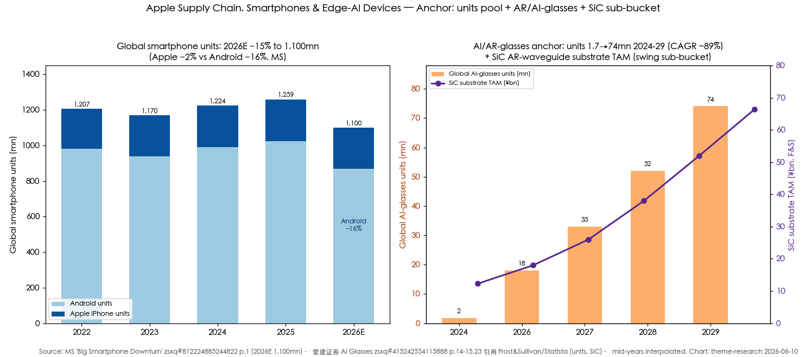
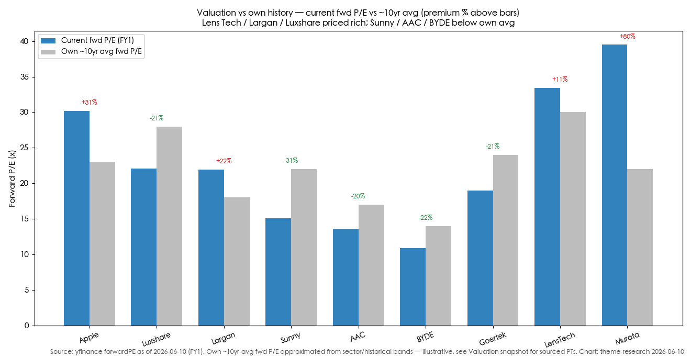
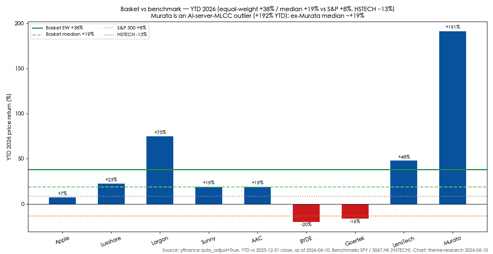

# Apple Supply Chain, Smartphones & Edge-AI Devices

**Created:** 2026-06-10 · **Last refreshed:** 2026-06-10 · **Last mutated:** 2026-06-10 · **Refresh cadence:** monthly · **Languages tracked:** en

## What's New

*The delta since you last looked — newest refresh on top. Older entries collapse into the archive below so this stays short.*

**2026-06-10 — basket created (9 tickers):**
- **Created** with 9 names: 6 `core` Apple-chain component suppliers (AAPL, Luxshare, Largan, Sunny Optical, AAC, BYD Electronic), 1 `adjacent` glass/foldable enabler levered to AR-glasses + foldable (Lens Tech), and 2 `enabler` AR/edge-component plays (Goertek AR optics, Murata MLCC passives).
- **Anchor seeded:** global smartphone units fall to **1,100mn in 2026E (−15% YoY)** with Apple −2% vs Android −16% — the bifurcation thesis ([MS, zsxq #812224885244822 p.1](http://xs-macbook-air.local:5001/zsxq/pdf/812224885244822/Morgan%20Stanley-Big%20Smartphone%20Downturn%20Ahead.pdf#page=1)); plus the AR/AI-glasses pool — global AI-glasses units **1.72mn (2024) → 74.1mn (2029), CAGR ~89%** ([爱建证券, zsxq #415242554115888 p.14-15](http://xs-macbook-air.local:5001/zsxq/pdf/415242554115888/AI%20Glasses.pdf#page=14)).
- **Broker calls captured:** MS prefers Apple chain to Android (Xiaomi > AAC > BYDE > Crystal), cut PTs on AAC/BYDE/Largan but stays OW on AAC (PT HK$42) and BYDE (PT HK$39); **downgraded Sunny to EW** (PT HK$62) ([MS, zsxq #812224885244822 p.1](http://xs-macbook-air.local:5001/zsxq/pdf/812224885244822/Morgan%20Stanley-Big%20Smartphone%20Downturn%20Ahead.pdf#page=1)). JPM names Luxshare a China-Tech top pick, OW PT RMB195 ([JPM, zsxq #812488854812222](http://xs-macbook-air.local:5001/zsxq/pdf/812488854812222/JP%20Morgan-China%20Technology.pdf)). GS keeps AAC Buy PT HK$62.5 on AI/AR-glasses + liquid-cooling optionality ([GS, zsxq #184444884285442](http://xs-macbook-air.local:5001/zsxq/pdf/184444884285442/Goldman%20Sachs-AAC.pdf)).
- **13 sell-side PT/rating rows upserted** to `stock_price_target_db` (surfaced at `/pt`).
- **Thesis drift:** none — inception.

Earlier refreshes

*(none — basket created 2026-06-10)*

## Thesis

**Anchor 1 — global smartphone units (consumption pool):** 2022 ≈1,207mn → 2023 ≈1,170mn → 2024 ≈1,224mn → 2025 ≈1,259mn → **2026E 1,100mn (−15% YoY)** ([MS Big Smartphone Downturn, zsxq #812224885244822 p.1](http://xs-macbook-air.local:5001/zsxq/pdf/812224885244822/Morgan%20Stanley-Big%20Smartphone%20Downturn%20Ahead.pdf#page=1); historic units from [消费电子折叠屏深度, zsxq #812488542581842 p.5](http://xs-macbook-air.local:5001/zsxq/pdf/812488542581842/foldable.pdf#page=5) — 2025 全球 12.59 亿部). The MS print is the spine of the bet: *"We reduce our 2026 global smartphone shipment forecast 15%, to 1,100mn units… Apple volume is likely to drop 2%, with Android volume down 16% YoY"* — surging memory cost (DRAM/NAND contract prices spiking) forces OEMs to raise ASP and pass through component costs, crushing price-sensitive Android demand while Apple's premium installed base proves sticky. The decompositon: **Apple ~−2% vs Android ~−16%** — so the Apple supply chain outperforms the Android supply chain, the whole reason this basket is Apple-chain-centric rather than generic-handset.

**Anchor 2 — AR / AI-glasses unit pool (new edge-AI cycle):** global AI-glasses units **1.72mn (2024) → 74.1mn (2029)**, a CAGR of ~88.7%, as penetration of the ~1.45bn-unit global eyewear base climbs from 0.12% (2024) to 4.99% (2029) ([爱建证券 AI Glasses 开启智能穿戴时代, zsxq #415242554115888 p.14-15](http://xs-macbook-air.local:5001/zsxq/pdf/415242554115888/AI%20Glasses.pdf#page=14) 引用 Frost & Sullivan / Statista: *"全球 AI Glasses 出货量将从 2024 年的 172 万副…增长至 2029 年的 7410 万副"*). The note sizes a 2026 China AI-glasses market of **¥113.5–227.0 亿元** depending on ASP scenario. **Swing sub-bucket = AR optics / waveguide**, where the optical display unit is **43% of AR-device BOM** ([同上 p.19](http://xs-macbook-air.local:5001/zsxq/pdf/415242554115888/AI%20Glasses.pdf#page=19): *"光学显示单元在 AR 整机设备 BOM 成本中占比高达 43%"*), and the next-gen waveguide material is SiC: global SiC substrate TAM **¥123 亿 (2025) → ¥664 亿 (2030)** per Frost & Sullivan ([同上 p.23](http://xs-macbook-air.local:5001/zsxq/pdf/415242554115888/AI%20Glasses.pdf#page=23)). The SoC is the largest single component (~33.5% of a Ray-Ban Meta's $164 BOM, [同上 p.12](http://xs-macbook-air.local:5001/zsxq/pdf/415242554115888/AI%20Glasses.pdf#page=12) 引用 Wellsenn XR) — but SoC sits in the `ai-compute-silicon-gpu-asic` theme; here the value-capture is **optics, acoustics, structural/cover-glass, and passives**.

**Sub-bucket map (Apple-chain content) & who-benefits-when staging.** Four buckets: (a) **optics** — Largan (lens), Sunny (lens+module), AAC (optics expansion); (b) **acoustics & haptics** — AAC (global acoustics leader), Goertek; (c) **connectors / mechanicals / assembly** — Luxshare (connectors, AirPods/iPhone assembly), BYD Electronic (mechanicals, assembly); (d) **cover-glass / foldable / AR-substrate** — Lens Tech (cover glass, UTG, sapphire), plus passives via Murata (MLCC). **Staging along the curve:** the *foldable iPhone (FY27)* monetizes mechanicals + UTG + hinge + cover-glass *first* — Apple aims to *"double the global foldable smartphone market in 18 months, adding as much as $40B"* of revenue by 2027 ([MS Apple Survey, zsxq #585554112558484 p.1-2](http://xs-macbook-air.local:5001/zsxq/pdf/585554112558484/Morgan%20Stanley-Apple%20Survey.pdf#page=1)); the *AI/AR-glasses ramp (2026-29)* monetizes optics/acoustics/SiC *later*, as Apple's first smart-glasses land into a 74mn-unit-by-2029 pool. **Bull/base/bear:** bull = foldable iPhone + Apple Glasses both ship to plan and the 2026 unit trough is a memory-cost air-pocket that re-fills in 2027; bear = memory inflation persists into 2027, Android units fall >16%, and Apple in-houses more content (modems, optics) — the basket's structural risk.

## Scope rules

In: Apple-chain component & module suppliers (optics, acoustics, haptics, connectors, mechanicals, cover glass, passives) with disclosed Apple supplier status or majority high-end-Android exposure; AR / smart-glasses optics & structural suppliers; edge/on-device-AI hardware component plays (sensors, acoustics, optics for AI wearables). The bet is the *components*, not the handset OEMs.

Out: smartphone SoC / baseband / AP designers (MediaTek, Qualcomm — SoC sits in `ai-compute-silicon-gpu-asic`); the China handset OEMs themselves (Xiaomi in `china-ev-auto-export` / consumer themes, Transsion); pure memory (DRAM/NAND — covered in `memory-upcycle`, the *cause* of the squeeze, not the Apple-chain play); pure AI-server passives/packaging plays where smartphone exposure is immaterial (`ai-passives-packaging`); EDA / foundry. Xiaomi and MediaTek may be *referenced* but are not core here.

## Tracked tickers

> **Conviction ranking (cited, never self-authored):** MS prefers **Apple-chain over Android-chain**, ordering its hardware coverage **AAC > BYDE > Crystal** within the Apple chain, and downgraded Sunny to EW on weak handset cycle ([MS, zsxq #812224885244822 p.1](http://xs-macbook-air.local:5001/zsxq/pdf/812224885244822/Morgan%20Stanley-Big%20Smartphone%20Downturn%20Ahead.pdf#page=1)). JPM names **Luxshare a China-Tech top pick** (with Naura/AMEC/Cowell), OW PT RMB195 ([JPM, zsxq #812488854812222](http://xs-macbook-air.local:5001/zsxq/pdf/812488854812222/JP%20Morgan-China%20Technology.pdf)).

| Ticker | Name | Role | Justification | Added |
|---|---|---|---|---|
| NASDAQ:AAPL | Apple | core | The demand anchor and the only major OEM gaining share in 2026 — MS AlphaWise survey shows global iPhone upgrade rates at all-time survey highs, switching-to-Apple at a 5-year high, and *"Apple will be the only major global smartphone OEM to gain market share in 2026"*; foldable iPhone could add up to **$40B** of revenue by FY27 ([MS, zsxq #585554112558484 p.1-2](http://xs-macbook-air.local:5001/zsxq/pdf/585554112558484/Morgan%20Stanley-Apple%20Survey.pdf#page=1)). **Moat:** ~1bn-device sticky premium installed base + ecosystem lock-in + supply-chain pricing power. **Threat:** Apple Intelligence perception deteriorating Y/Y (willingness-to-pay $9→$8/mo) and AI-native form-factor disruption of the phone; China regulatory hold on Siri AI ([Bernstein WWDC, zsxq #585582888188454](http://xs-macbook-air.local:5001/zsxq/pdf/585582888188454/Bernstein-Apple.pdf)). | 2026-06-10 |
| SZSE:002475 | Luxshare (立讯精密) | core | Largest A-share Apple-chain play; binds iPhone 17/18 high-end builds plus AirPods/connector/assembly content — JPM names it a **China-Tech top pick**, OW PT RMB195, on rising backlogs and Apple high-end mix ([JPM, zsxq #812488854812222](http://xs-macbook-air.local:5001/zsxq/pdf/812488854812222/JP%20Morgan-China%20Technology.pdf): *"立讯精密：绑定 iPhone17/18 高端机型，出货超预期利好业绩"*). **Moat:** vertical breadth (connectors→modules→assembly) + scale + Apple share gains as it takes assembly from Foxconn. **Threat:** customer concentration on Apple (single-customer order shift / in-housing); margin pressure as it tilts to lower-margin assembly; auto/AI-server diversification still early. | 2026-06-10 |
| TWSE:3008 | Largan (大立光) | core | The dominant high-end smartphone lens maker; Nomura raised FY26/27F net profit +4.9%/+2.2% on *"stronger iPhone shipments in 2026-27"* and rolled valuation to FY27F EPS NT$215.5 × 20x (top of its 2015-25 10-25x band) on AI-CPO optionality ([Nomura, zsxq #814528222851882](http://xs-macbook-air.local:5001/zsxq/pdf/814528222851882/Nomura-Largan.pdf)). **Moat:** sole-tier supplier of the highest-spec plastic aspheric lenses (6P/7P/glass-plastic hybrids), ~50%+ gross margin, net cash. **Threat:** Sunny/Genius dual-sourcing share shift on standard lenses; iPhone unit miss; CPO/AR is optionality, not yet revenue; MS only EW (PT NT$2,450). | 2026-06-10 |
| HKEX:2382 | Sunny Optical (舜宇光学) | core | #2 mobile lens + module maker, the share-gainer vs Largan on volume, plus the broadest AR/AI-glasses + auto-optics + IoT-camera optionality — GS sees *"AI edge devices, AI/AR glasses, action/360 cameras"* as the long-term driver ([GS, zsxq #212454242124851](http://xs-macbook-air.local:5001/zsxq/pdf/212454242124851/Goldman%20Sachs-Sunny%20Optical.pdf)). **Moat:** scale module manufacturing + auto-lens leadership + AR-waveguide/光波导 R&D. **Threat:** memory-cost-driven handset ASP/GM squeeze in 2026 — **MS downgraded to EW (PT HK$62)** on weak cycle, GS Neutral (PT HK$82.3); 2026 fwd P/E richer than Largan/Genius ([MS, zsxq #812224885244822 p.1](http://xs-macbook-air.local:5001/zsxq/pdf/812224885244822/Morgan%20Stanley-Big%20Smartphone%20Downturn%20Ahead.pdf#page=1)). | 2026-06-10 |
| HKEX:2018 | AAC Technologies (瑞声) | core | Global acoustics leader, MS's **#2 Apple-chain pick (AAC > BYDE > Crystal)**; GS Buy PT HK$62.5 on camera-mix GM improvement (H2'25 optics GM lifted blended GM to 23%) plus AI/AR-glasses acoustics+optics+haptics and a new liquid-cooling business ([GS, zsxq #184444884285442](http://xs-macbook-air.local:5001/zsxq/pdf/184444884285442/Goldman%20Sachs-AAC.pdf); [GS AI/AR, zsxq #184121412528112](http://xs-macbook-air.local:5001/zsxq/pdf/184121412528112/Goldman%20Sachs-AAC-ACT.pdf): *"低功耗设计…直接解决终端佩戴舒适度与使用时长的核心痛点"*). **Moat:** acoustics IP + miniaturization for wearables + Apple+Android dual exposure. **Threat:** low-margin camera-module expansion dilutes GM; haptics/MEMS-mic competition; MS cut PT to HK$42 on the handset downturn. | 2026-06-10 |
| HKEX:0285 | BYD Electronic (比亚迪电子) | core | MS's **#3 Apple-chain pick**, OW PT HK$39 — mechanicals + assembly with the highest non-smartphone mix (auto electronics, AI-server) cushioning the handset trough ([MS, zsxq #812224885244822 p.1](http://xs-macbook-air.local:5001/zsxq/pdf/812224885244822/Morgan%20Stanley-Big%20Smartphone%20Downturn%20Ahead.pdf#page=1)). **Moat:** metal/structural mechanicals scale + BYD-group auto-electronics captive demand + assembly diversification. **Threat:** Apple/Android assembly is low-margin and order-shift-prone (vs Luxshare/Foxconn); cheapest fwd P/E in basket (~11x) reflects the assembly-margin discount; smartphone still a large mix. | 2026-06-10 |
| SZSE:300433 | Lens Technology (蓝思科技) | adjacent | Cover-glass leader expanding into the highest-content foldable + AR pieces: foldable UTG/PET/glass cover content worth **$100-150/device**, iPhone Pro titanium casing share gains, and AI-glasses sapphire cover/hinge/plastic at ~$20/unit for a US AI-glasses customer ([Citi, zsxq #415242124454218](http://xs-macbook-air.local:5001/zsxq/pdf/415242124454218/CITI-Lens%20Technology.pdf): *"折叠屏手机用 UTG…玻璃盖板等产品价值量达 100-150 美元"*; [GS, zsxq #415548114812518](http://xs-macbook-air.local:5001/zsxq/pdf/415548114812518/Goldman%20Sachs-Lens%20Tech.pdf): foldable iPhone 11mn base / 35mn bull 2026E). **Moat:** glass/sapphire processing scale + multi-product Apple content ladder. **Threat:** Android-assembly drag + memory-cost demand hit cut recent earnings; foldable-iPhone delay risk; Citi only Neutral on the A-share (PT RMB30). | 2026-06-10 |
| SZSE:002241 | Goertek (歌尔) | enabler | AR/VR + AI-glasses optics & acoustics ODM — MS tracks Meta Oculus VR shipments as the share-price driver (Meta 3Q25 847K units) and Goertek has launched a full-color AR waveguide display module (Star G-E1) ([MS Goertek vs Meta, zsxq #184514428115512](http://xs-macbook-air.local:5001/zsxq/pdf/184514428115512/Morgan%20Stanley-GoerTek.pdf); [爱建证券, zsxq #415242554115888 p.27](http://xs-macbook-air.local:5001/zsxq/pdf/415242554115888/AI%20Glasses.pdf#page=27)). **Moat:** AR/VR optical-engine + acoustic ODM capability; AI-glasses light-engine R&D. **Threat:** Meta-headset model-transition shipment slowdown caps the stock near-term — **MS EW, PT RMB16.60** (below current price); single-customer (Meta) concentration; AirPods order-loss history. | 2026-06-10 |
| TYO:6981 | Murata (村田制作所) | enabler | The MLCC passives backbone of every premium iPhone + AR/edge device; GS keeps Buy (Conviction List) PT ¥5,400 on AI-server MLCC sales guided to **+80% CAGR (up from +30%), potentially doubling annually** over 2-3 years ([GS, zsxq #212212244124211](http://xs-macbook-air.local:5001/zsxq/pdf/212212244124211/Goldman%20Sachs-Murata.pdf)). **Moat:** ~40% global MLCC share, high-cap/high-voltage technical lead Chinese rivals can't yet match. **Threat:** smartphone production decline is GS's named #1 downside risk; MLCC supply-demand deterioration; JPY appreciation. *Note: the ¥5,400 PT is now stale — the stock rallied to ~¥9,370 on the AI-server MLCC story (see Valuation snapshot "stale" sub-section).* | 2026-06-10 |

**Geographic / role mix (9 tickers):** China A-share 3 (Luxshare, Lens Tech, Goertek) · Hong Kong 3 (Sunny, AAC, BYDE) · Taiwan 1 (Largan) · US 1 (AAPL) · Japan 1 (Murata). Role: core 6, adjacent 1, enabler 2.

**Value-chain / dollar-weighted layer map** (Apple-chain + AR-glasses BOM): **optics** (Largan lens / Sunny lens+module / AAC) — ~AR optics is 43% of AR-device BOM, the richest single AR layer; **SoC** — ~33.5% of AI-glasses BOM but *no tracked exposure here by design* (sits in `ai-compute-silicon-gpu-asic`) → flagged coverage gap; **acoustics/haptics** — AAC, Goertek; **connectors/mechanicals/assembly** — Luxshare, BYDE; **cover-glass/structural** — Lens Tech; **passives (MLCC)** — Murata. The SoC layer is the one rich-dollar AR/glasses layer the basket deliberately cedes to a sibling theme.

## Valuation snapshot

Populated from `stock_price_target_db` (the `/pt` store). "Px @ note" = the stock's price on the note's date (`report_date_price`); Upside% = PT vs that price (what the analyst called). "Current px" is live context (2026-06-10). Own-avg = approximate ~10yr / upcycle average fwd P/E.

| Ticker | Rating (latest) | Px @ note | PT | Upside% (vs note) | Current px | Fwd P/E (FY1) | Own ~10yr avg | FY1 / FY2 EPS |
|---|---|---|---|---|---|---|---|---|
| AAPL | Bernstein Outperform @ 2026-06-05 | $307.34 | $350 | +13.9% | $290.55 | ~30.2x | ~23x | FY26E EPS $8.87 / FY27E $10.65 ([Bernstein WWDC](http://xs-macbook-air.local:5001/zsxq/pdf/585582888188454/Bernstein-Apple.pdf)) |
| 002475.SZ Luxshare | JPM Overweight @ 2026-06-04 | RMB74.59 | RMB195 | +161% (top-of-range/long-dated, see note) | RMB69.34 | ~22.1x | ~28x | FY1/FY2 EPS n/a in note — JPM long-term DCF-led |
| 3008.TW Largan | Nomura Buy @ 2026-06-08 (MS EW PT NT$2,450) | n/a | NT$4,310 (=NT$215.5 FY27 EPS × 20x) | n/a (PT = 27F EPS×20x) | NT$4,270 | ~21.9x | ~18x | FY26F EPS NT$191.7 / FY27F NT$215.5 ([Nomura](http://xs-macbook-air.local:5001/zsxq/pdf/814528222851882/Nomura-Largan.pdf)) |
| 2382.HK Sunny | GS Neutral @ 2026-05-19 (MS EW PT HK$62) | HK$62.65 | HK$82.3 (=21.6x 2026E P/E) | +31.4% | HK$76.75 | ~15.1x | ~22x | bull HK$100 / base HK$62 / bear HK$35 ([MS RR, zsxq #212241825245881](http://xs-macbook-air.local:5001/zsxq/pdf/212241825245881/Morgan%20Stanley-Sunny%20Optical.pdf)) |
| 2018.HK AAC | GS Buy @ 2026-04-01 (MS OW PT HK$42) | HK$41.86 | HK$62.5 (=21x 2027E P/E) | +49.3% | HK$46.06 | ~13.6x | ~17x | FY26/27 est trimmed −1%/−2% ([GS](http://xs-macbook-air.local:5001/zsxq/pdf/184444884285442/Goldman%20Sachs-AAC.pdf)) |
| 0285.HK BYDE | MS Overweight @ 2026-03-18 | HK$31.3 | HK$39 | +24.6% | HK$26.92 | ~10.9x | ~14x | FY1/FY2 EPS n/a in note |
| 300433.SZ Lens Tech | Citi Neutral (A) @ 2026-05-20 | n/a | RMB30 | n/a | RMB44.78 | ~33.4x | ~30x | FY1/FY2 EPS n/a in note; H-share Buy PT HK$25 |
| 002241.SZ Goertek | MS Equal-weight @ 2025-12-01 *(stale)* | RMB30.76 | RMB16.60 | −46% *(stale — PT below price)* | RMB23.83 | ~19.0x | ~24x | FY1/FY2 EPS n/a in note |
| 6981.T Murata | GS Buy/CL @ 2026-04-30 *(stale)* | ¥5,123 | ¥5,400 (=2028F EV/GCI, ~23x 27E P/E) | +5.4% *(stale — px now ¥9,370)* | ¥9,373 | ~39.5x | ~22x | FY27/29 OP est +1%/+6%/+6% ([GS](http://xs-macbook-air.local:5001/zsxq/pdf/212212244124211/Goldman%20Sachs-Murata.pdf)) |

**Stale — pending refresh:** Murata's GS ¥5,400 PT (set 2026-04-30 vs ¥5,123) was overtaken — the stock rallied to ~¥9,370 on the AI-server-MLCC story; GS's later 2026-05-28 row shows the same ¥5,400 PT now implying −37% vs the higher spot, i.e. the model needs a refresh, not a genuine downside call. Goertek's MS ¥16.60 PT (2025-12-01) is below the live price and >6 months old — re-ground next refresh.

**Cross-section read (priced-for-perfection):** the basket sorts cheap→dear on FY1 fwd P/E: BYDE ~11x < AAC ~14x < Sunny ~15x < Goertek ~19x < Largan ~22x ≈ Luxshare ~22x < AAPL ~30x < Lens Tech ~33x < Murata ~40x. The two richest vs own history — **Lens Tech (~33x vs ~30x avg) and Murata (~40x vs ~22x avg)** — are the AR/AI-glasses + AI-server-passives *optionality* names, where the de-rate trigger is the AI-glasses ramp disappointing or AI-server MLCC growth normalizing. PEG/growth note: Largan's 20x sits on ~12% FY27 EPS growth (PEG ~1.7) vs AAC's ~14x on a GM-recovery inflection (cheaper on growth-adjusted basis).

## Exclusions

| Ticker | Reason |
|---|---|
| TWSE:2454 (MediaTek) | Smartphone SoC/AP designer — sits in `ai-compute-silicon-gpu-asic`. May be referenced as the AP supplier but not core here. |
| HKEX:1810 (Xiaomi) | Handset OEM, not a component supplier; MS's preferred Android OEM (high non-phone mix) but the OEM bet lives in consumer / `china-ev-auto-export` themes. |
| HKEX:1478 (Q-Tech 丘钛科技) | Camera-module assembler — MS **downgraded to UW**, PT cut −58% to HK$7.2; low-margin module pass-through, the wrong side of the memory-cost squeeze ([MS, zsxq #812224885244822 p.1](http://xs-macbook-air.local:5001/zsxq/pdf/812224885244822/Morgan%20Stanley-Big%20Smartphone%20Downturn%20Ahead.pdf#page=1)). |
| SZSE:002456 (OFILM) | Camera modules — MS UW, PT cut to RMB8.0; thesis is on the wrong (low-margin, demand-sensitive) layer. |
| SZSE:002273 (Crystal-Optech 水晶光电) | MS OW (#4 Apple-chain pick) and a genuine AR-waveguide/optical-coating play; borderline — add candidate for next mutation if AR-glasses ramp confirms its content. |
| 688036.SS (Transsion) | Android OEM (emerging markets) — MS cut to EW; the *most* exposed to the Android low-end memory squeeze, the short side of the thesis. |
| Memory names (Micron, SK Hynix, etc.) | The *cause* of the squeeze, not the Apple-chain play — covered in `memory-upcycle`. |

## Keywords

Apple supply chain / 苹果供应链 · iPhone · smartphone units / 智能手机出货量 · foldable iPhone / 折叠屏手机 · memory-cost inflation / 存储涨价 · AI glasses / AI 眼镜 · AR glasses / AR 眼镜 · waveguide / 光波导 · SiC substrate / 碳化硅衬底 · optics lens / 光学镜头 · acoustics / 声学 · haptics / 触觉 · MLCC / 多层陶瓷电容 · cover glass / 盖板玻璃 · UTG / 超薄玻璃 · edge AI / 端侧 AI · smart cockpit / 智能座舱 · on-device inference.

## Performance (as of 2026-06-10, since-inception snapshot)

Simple price returns from yfinance `auto_adjust=True`. Multi-market basket; benchmarks reported by geography. YTD vs 2025-12-31 close; 1Y/3M trailing.

**Equal-weight basket returns:** YTD 2026 +38.4% (median +18.8%) · 3-month +41.9% (median +37.8%) · trailing 1-year +83.3% (median +43.9%).

| Benchmark | YTD 2026 | 3M | 1Y |
|---|---|---|---|
| S&P 500 (SPY) | +8.4% | +9.3% | +23.6% |
| Hang Seng (^HSI) | −3.8% | −4.8% | +2.0% |
| Hang Seng TECH (3067.HK) | −13.3% | −5.5% | −11.1% |

**Per-ticker, sorted by YTD:**

| Ticker | YTD | 3M | 1Y | Close (local) |
|---|---|---|---|---|
| TYO:6981 Murata | +191.5% | +151.8% | +350.9% | 9,373 |
| TWSE:3008 Largan | +74.9% | +82.6% | +89.4% | 4,270 |
| SZSE:300433 Lens Tech | +47.9% | +37.8% | +112.2% | 44.78 |
| SZSE:002475 Luxshare | +22.7% | +38.2% | +120.1% | 69.34 |
| HKEX:2382 Sunny | +18.8% | +36.8% | +19.3% | 76.75 |
| HKEX:2018 AAC | +18.8% | +39.3% | +20.1% | 46.06 |
| NASDAQ:AAPL Apple | +7.1% | +11.5% | +43.9% | 290.55 |
| SZSE:002241 Goertek | −16.5% | −5.5% | +9.2% | 23.83 |
| HKEX:0285 BYDE | −20.0% | −15.3% | −15.7% | 26.92 |

### Basket scorecard

- **Batting average (YTD):** 7 of 9 names positive (78%); **6 of 9 beat the S&P 500** (+8.4%), **7 of 9 beat HSTECH** (−13.3%).
- **Best contributor:** Murata +191.5% YTD — but it is an **AI-server-MLCC outlier, not a smartphone print** (per the project yfinance-extreme-returns quirk note, flag it). **Ex-Murata, the basket median YTD is ~+19%**, still comfortably ahead of S&P +8% and HSTECH −13%.
- **Worst contributor:** BYD Electronic −20.0% YTD — the assembly-margin discount + smartphone-mix drag, the cheapest name on fwd P/E (~11x).
- Cumulative outperformance-since-inception bps: n/a (only 1 snapshot line — populated from the 2nd refresh onward).

## Recent events

Inception write — covers the ~90 days that informed selection. Future refreshes cover the window since `Last refreshed`.

- **MS "Big Smartphone Downturn Ahead" (2026-03-18):** 2026 global units cut −15% to 1,100mn; prefer Apple chain to Android; Xiaomi > AAC > BYDE > Crystal; Sunny → EW, Q-Tech → UW ([MS, zsxq #812224885244822 p.1](http://xs-macbook-air.local:5001/zsxq/pdf/812224885244822/Morgan%20Stanley-Big%20Smartphone%20Downturn%20Ahead.pdf#page=1)).
- **MS Apple AlphaWise survey (2026-03-18):** record iPhone upgrade rates, Apple the only OEM gaining share in 2026; >25% of owners "extremely interested" in a foldable iPhone; foldable could add up to $40B revenue by FY27; OW PT $315 ([MS, zsxq #585554112558484 p.1-2](http://xs-macbook-air.local:5001/zsxq/pdf/585554112558484/Morgan%20Stanley-Apple%20Survey.pdf#page=1)).
- **Bernstein Apple (2026-04-21 / WWDC 2026-06-05):** Ternus named CEO (effective 2026-09-01); Apple Intelligence built with Google Gemini; Outperform, PT lifted to $350 ([Bernstein, zsxq #585582888188454](http://xs-macbook-air.local:5001/zsxq/pdf/585582888188454/Bernstein-Apple.pdf)).
- **JPM China Tech (2026-06-04):** Luxshare a top pick (with Naura/AMEC/Cowell); upstream > downstream; OW PT RMB195 ([JPM, zsxq #812488854812222](http://xs-macbook-air.local:5001/zsxq/pdf/812488854812222/JP%20Morgan-China%20Technology.pdf)).
- **Nomura Largan (2026-06-08):** FY26/27F net profit raised; CPO components (PMLA/FA) shown at COMPUTEX 2026 with full-automation potential; Buy, valuation rolled to FY27 EPS NT$215.5 × 20x ([Nomura, zsxq #814528222851882](http://xs-macbook-air.local:5001/zsxq/pdf/814528222851882/Nomura-Largan.pdf)).
- **GS AAC (2026-04-01 / Asia ConsumerTech 2026):** H2'25 optics GM lift took blended GM to 23%; liquid-cooling acquisition (cold plates, UQD); AI/AR-glasses acoustics+optics; Buy PT HK$62.5 ([GS, zsxq #184444884285442](http://xs-macbook-air.local:5001/zsxq/pdf/184444884285442/Goldman%20Sachs-AAC.pdf)).
- **GS Sunny Optical (2026-05-19):** camera spec-upgrade offsets memory cost; AI/AR-glasses + IoT camera long-term driver; Neutral PT HK$82.3 ([GS, zsxq #212454242124851](http://xs-macbook-air.local:5001/zsxq/pdf/212454242124851/Goldman%20Sachs-Sunny%20Optical.pdf)).
- **Citi Lens Tech (2026-05-20):** acquisitions (巨腾 PC structurals; 元晟 NVDA-server racks); foldable UTG/PET content $100-150/device; AI-glasses sapphire cover ~$20/unit; Neutral A (PT RMB30) / Buy H (PT HK$25) ([Citi, zsxq #415242124454218](http://xs-macbook-air.local:5001/zsxq/pdf/415242124454218/CITI-Lens%20Technology.pdf)).
- **GS Murata (2026-04-30):** AI-server MLCC guided +80% CAGR (was +30%), possibly doubling annually; ¥150bn buyback; Buy on Conviction List, PT ¥5,400 ([GS, zsxq #212212244124211](http://xs-macbook-air.local:5001/zsxq/pdf/212212244124211/Goldman%20Sachs-Murata.pdf)).
- **AI Glasses industry note (2026-05-18):** Apple to launch first Apple Glasses 2026; global AI-glasses units 1.72mn(2024)→74.1mn(2029); SiC AR substrate ¥123亿(2025)→¥664亿(2030) ([爱建证券, zsxq #415242554115888 p.14-15,23](http://xs-macbook-air.local:5001/zsxq/pdf/415242554115888/AI%20Glasses.pdf#page=14)).

## Drift signals

Inception write — drift detection becomes the value-add from the *next* refresh. Initial flags:

- **Apple in-housing is the basket's #1 structural threat.** Apple self-designing modems (C-series), and longer-term optics/sensors, would erode Luxshare/Largan/Sunny content. Watch Apple's modem/sensor roadmap disclosures — the modal 2026 customer-insourcing risk in this chain. No tracked name has a clean counter except scale/yield irreplaceability.
- **Memory-cost normalization timing is the swing.** The whole −15% 2026 unit thesis rests on DRAM/NAND contract prices staying inflated; if memory prices roll over into 2027 (the `memory-upcycle` theme is the cross-read), Android units recover and the Apple-chain *relative* preference compresses. Watch `memory-upcycle` contract-price prints as the upstream signal.
- **Murata +192% YTD vs the smartphone trough is a dispersion flag.** Its move is AI-server MLCC, not handset — it sits in this basket as an *enabler* but its price is driven by a different cycle. If AI-server MLCC growth normalizes from the +80% CAGR guide, Murata de-rates from ~40x; do not read its strength as a smartphone-cycle confirmation.
- **Priced-for-perfection (basket-median context):** Lens Tech (~33x vs ~30x own avg) and Murata (~40x vs ~22x) carry the air-pocket risk — the **named de-rate trigger is the AI/AR-glasses ramp slipping** (units missing the 74mn-by-2029 Frost & Sullivan path) for Lens Tech, and **AI-server MLCC growth normalizing** for Murata. Implied downside: Murata reverting to ~22x own-avg on flat EPS is roughly −44%; Lens Tech to ~30x is ~−10%.
- **Crystal-Optech (002273) is a candidate-add** — MS's #4 Apple-chain pick and a genuine AR-waveguide/optical-coating play; surfaces the SoC-adjacent optics layer the basket is light on. Propose for next mutation if its AR content confirms.

## Leading indicators

The upstream signals that move *before* the basket members, plus a per-ticker operating-data spine. Each cited to its primary issuer.

**Macro / upstream signals (header):**
- **DRAM/NAND contract price trajectory** — the binding driver of the −15% 2026 unit forecast; spiking memory cost is what forces the Android demand shortfall ([MS, zsxq #812224885244822 p.1](http://xs-macbook-air.local:5001/zsxq/pdf/812224885244822/Morgan%20Stanley-Big%20Smartphone%20Downturn%20Ahead.pdf#page=1)). Cross-ref `memory-upcycle`.
- **iPhone upgrade / switching rates** — blended upgrade rate hit 37% (all-time AlphaWise high), China +9pts Y/Y; the leading read on the Apple-share-gain thesis ([MS, zsxq #585554112558484 p.1](http://xs-macbook-air.local:5001/zsxq/pdf/585554112558484/Morgan%20Stanley-Apple%20Survey.pdf#page=1)).
- **AI-glasses penetration of the eyewear base** — 0.12% (2024) → 4.99% (2029E) per Frost & Sullivan; the AR-bucket's TAM throttle ([爱建证券, zsxq #415242554115888 p.14](http://xs-macbook-air.local:5001/zsxq/pdf/415242554115888/AI%20Glasses.pdf#page=14)).
- **Macro backdrop (2026-06-04, indicators.db):** VIX 21.5 (spiked +40% on 2026-06-05), HY OAS 2.74% (tight), IG OAS 0.74% — a risk-on regime that has been supportive of the higher-multiple AR/optionality names.

**Per-ticker operating data (Barometer spine):**

| Ticker | Latest operating print | Source |
|---|---|---|
| AAPL | iPhone upgrade rate 37% (survey high); switching-to-Apple 5-yr high; FY26 iPhone rev +6% (MS, +3% above Street) | [MS, zsxq #585554112558484 p.1](http://xs-macbook-air.local:5001/zsxq/pdf/585554112558484/Morgan%20Stanley-Apple%20Survey.pdf#page=1) |
| 3008.TW Largan | FY25 rev NT$61,148mn, EPS NT$159.4; FY26F rev NT$66,520mn (+8.8%); GM 50.5% FY26F | [Nomura, zsxq #814528222851882](http://xs-macbook-air.local:5001/zsxq/pdf/814528222851882/Nomura-Largan.pdf) |
| 2018.HK AAC | H2'25 blended GM 23% (vs 20.7% H1'25) on 6P/7P/1G6P camera mix upgrade | [GS, zsxq #184444884285442](http://xs-macbook-air.local:5001/zsxq/pdf/184444884285442/Goldman%20Sachs-AAC.pdf) |
| 002241.SZ Goertek | Meta 3Q25 VR-headset shipments 847K units (the share-price driver MS tracks) | [MS, zsxq #184514428115512](http://xs-macbook-air.local:5001/zsxq/pdf/184514428115512/Morgan%20Stanley-GoerTek.pdf) |
| 300433.SZ Lens Tech | Robotics rev >¥1bn in 2025 (could double 2026); foldable UTG content $100-150/device | [Citi, zsxq #415242124454218](http://xs-macbook-air.local:5001/zsxq/pdf/415242124454218/CITI-Lens%20Technology.pdf) |
| 6981.T Murata | Q4 capacity utilization ~95%; FY26 OP ¥281.8bn (beat); AI-server MLCC +80% CAGR guide | [GS, zsxq #212212244124211](http://xs-macbook-air.local:5001/zsxq/pdf/212212244124211/Goldman%20Sachs-Murata.pdf) |

## Catalysts (next 3–6 months)

Each = event + transmission mechanism + timing + which sub-bucket/name it moves.

- **iPhone 18 / first foldable iPhone launch (foldable iPhone could double the foldable market, +$40B FY27 rev → mechanicals + UTG + cover-glass + hinge content) — Sep 2026 / 2027.** Moves Lens Tech (UTG/cover), Luxshare/BYDE (mechanicals/assembly), Largan/Sunny (lens) ([MS, zsxq #585554112558484 p.1-2](http://xs-macbook-air.local:5001/zsxq/pdf/585554112558484/Morgan%20Stanley-Apple%20Survey.pdf#page=1)).
- **Apple Glasses launch + AI-glasses CES/launch wave (Apple entry validates the 74mn-by-2029 AR pool → optics/acoustics/SiC content) — 2026-27.** Moves Sunny/AAC (optics/acoustics), Goertek (waveguide module), Lens Tech (sapphire cover) ([爱建证券, zsxq #415242554115888 p.5,14](http://xs-macbook-air.local:5001/zsxq/pdf/415242554115888/AI%20Glasses.pdf#page=5)).
- **DRAM/NAND contract-price prints (memory-cost trajectory gates the −15% 2026 unit forecast → Android demand recovery or further squeeze) — quarterly.** Moves the whole Android-vs-Apple relative; cross-ref `memory-upcycle`.
- **Siri AI China regulatory approval (gates Apple Intelligence monetization + China iPhone upgrade demand) — H2 2026.** Moves AAPL and the whole chain via China unit demand ([Bernstein WWDC, zsxq #585582888188454](http://xs-macbook-air.local:5001/zsxq/pdf/585582888188454/Bernstein-Apple.pdf)).
- **Q2/Q3 2026 supplier earnings (AAC GM trajectory, Largan iPhone lens orders, Lens Tch foldable content ramp) — Jul-Oct 2026.** Each prints the content-per-device and GM-recovery the thesis rests on.

## Data Used / 数据来源清单

**Market data**
- yfinance `auto_adjust=True` for prices, returns, sector — pulled 2026-06-10 (YTD vs 2025-12-31; 1Y/3M trailing; benchmarks SPY / ^HSI / 3067.HK).
- Forward P/E (FY1) from yfinance `info.forwardPE` — pulled 2026-06-10.

**Per-ticker primary / sell-side sources** (all zsxq library, read-only)
- AAPL: MS AlphaWise Survey (#585554112558484), Bernstein WWDC/QuickTake (#585582888188454).
- Luxshare: JPM China Technology (#812488854812222).
- Largan: Nomura CPO/Largan (#814528222851882).
- Sunny: GS Asia ConsumerTech (#212454242124851), MS Risk-Reward (#212241825245881).
- AAC: GS GM-improvement (#184444884285442), GS AI/AR-glasses (#184121412528112).
- BYDE: via MS Big Smartphone Downturn (#812224885244822).
- Lens Tech: Citi Pan-Asia (#415242124454218), GS mgmt visit (#415548114812518).
- Goertek: MS Meta-Oculus-vs-Goertek (#184514428115512), AI-glasses note (#415242554115888 p.26-27).
- Murata: GS Buy/CL MLCC (#212212244124211).

**Industry research / TAM anchor**
- 爱建证券 "AI Glasses 开启智能穿戴时代" (2026-05-18, #415242554115888) — AR/AI-glasses unit TAM, SiC AR-substrate TAM, BOM split (引用 Frost & Sullivan / Statista / Wellsenn XR / iResearch).
- 消费电子折叠屏深度 (#812488542581842) — historic smartphone units, foldable BOM +70%, UTG/hinge content (引用 Counterpoint / Omdia / CGS-CIMB).
- MS "Big Smartphone Downturn" (2026-03-18, #812224885244822) — 2026 global units −15% to 1,100mn, Apple vs Android split, the PT/rating revision table.

**Local zsxq library (`db/zsxq.db` — read-only)**
- 13 broker PDFs mined for this theme (file_ids: 812224885244822, 585554112558484, 585582888188454, 415242554115888, 212212244124211, 814528222851882, 212241825245881, 212454242124851, 184121412528112, 184444884285442, 415242124454218, 415548114812518, 812488854812222, 184514428115512, 812488542581842) via `find_pdf.py` per alias → `evidence_bundle.py` → `ocr_pdf.py` (4 image-only: Sunny GS, Lens GS, JPM China Tech, MS Goertek) → `extract_pdf.py`. Load-bearing numbers cited from extracted original text, string-matched. (Note: Wellsenn BOM PDF #212255114441141 was watermark-only/unreadable and dropped — its Ray-Ban Meta BOM split is source-chained via 爱建证券 #415242554115888.)

**Macro backdrop**
- VIX 21.5, HY OAS 2.74%, IG OAS 0.74% as of 2026-06-04. Source: `indicators.db`.

**Stores written (Tier-2 helpers)**
- `stock_price_target_db` — 13 sell-side PT/rating rows upserted (idempotent on ticker × institute × file_id); surfaced at `/pt`.

**Charts**
- `reports/charts/theme_apple-supply-chain-edge-ai_anchor.png` — smartphone units + AI-glasses units + SiC sub-bucket.
- `reports/charts/theme_apple-supply-chain-edge-ai_performance.png` — basket vs S&P/HSTECH, YTD.
- `reports/charts/theme_apple-supply-chain-edge-ai_valuation.png` — fwd P/E vs own ~10yr avg.

**Stale notices / coverage gaps**
- SoC layer (~33.5% of AI-glasses BOM) deliberately ceded to `ai-compute-silicon-gpu-asic` — coverage gap by design.
- Murata GS PT (¥5,400) and Goertek MS PT (¥16.60) are stale — re-ground next refresh.
- AI-glasses mid-year (2026-28) unit/SiC values interpolated between sourced 2024/2029 (units) and 2025/2030 (SiC) endpoints — flagged in chart footer.

## References

- MS Big Smartphone Downturn — zsxq #812224885244822: http://xs-macbook-air.local:5001/zsxq/pdf/812224885244822/Morgan%20Stanley-Big%20Smartphone%20Downturn%20Ahead.pdf
- MS Apple AlphaWise Survey — zsxq #585554112558484: http://xs-macbook-air.local:5001/zsxq/pdf/585554112558484/Morgan%20Stanley-Apple%20Survey.pdf
- Bernstein Apple — zsxq #585582888188454: http://xs-macbook-air.local:5001/zsxq/pdf/585582888188454/Bernstein-Apple.pdf
- 爱建证券 AI Glasses — zsxq #415242554115888: http://xs-macbook-air.local:5001/zsxq/pdf/415242554115888/AI%20Glasses.pdf
- GS Murata — zsxq #212212244124211: http://xs-macbook-air.local:5001/zsxq/pdf/212212244124211/Goldman%20Sachs-Murata.pdf
- Nomura Largan — zsxq #814528222851882: http://xs-macbook-air.local:5001/zsxq/pdf/814528222851882/Nomura-Largan.pdf
- MS Sunny Optical RR — zsxq #212241825245881: http://xs-macbook-air.local:5001/zsxq/pdf/212241825245881/Morgan%20Stanley-Sunny%20Optical.pdf
- GS Sunny Optical — zsxq #212454242124851: http://xs-macbook-air.local:5001/zsxq/pdf/212454242124851/Goldman%20Sachs-Sunny%20Optical.pdf
- GS AAC (AI/AR) — zsxq #184121412528112: http://xs-macbook-air.local:5001/zsxq/pdf/184121412528112/Goldman%20Sachs-AAC-ACT.pdf
- GS AAC (GM) — zsxq #184444884285442: http://xs-macbook-air.local:5001/zsxq/pdf/184444884285442/Goldman%20Sachs-AAC.pdf
- Citi Lens Technology — zsxq #415242124454218: http://xs-macbook-air.local:5001/zsxq/pdf/415242124454218/CITI-Lens%20Technology.pdf
- GS Lens Tech — zsxq #415548114812518: http://xs-macbook-air.local:5001/zsxq/pdf/415548114812518/Goldman%20Sachs-Lens%20Tech.pdf
- JPM China Technology — zsxq #812488854812222: http://xs-macbook-air.local:5001/zsxq/pdf/812488854812222/JP%20Morgan-China%20Technology.pdf
- MS GoerTek vs Meta — zsxq #184514428115512: http://xs-macbook-air.local:5001/zsxq/pdf/184514428115512/Morgan%20Stanley-GoerTek.pdf
- 消费电子折叠屏深度 — zsxq #812488542581842: http://xs-macbook-air.local:5001/zsxq/pdf/812488542581842/foldable.pdf

## History

- 2026-06-10 — created with initial 9-ticker basket (AAPL, Luxshare, Largan, Sunny, AAC, BYDE core; Lens Tech adjacent; Goertek, Murata enabler). Anchor = global smartphone units (MS, −15% 2026E) + AR/AI-glasses unit TAM (爱建/Frost & Sullivan). 13 PTs upserted; 3 charts rendered; 15 zsxq file_ids mined.

Verification log (Step 7) — 2026-06-10

- **Metadata line** parses: Created/Last refreshed/Last mutated 2026-06-10, cadence monthly, languages `en`. ✓
- **Tracked tickers table** = 9 data rows, fixed 5 columns (Ticker | Name | Role | Justification | Added). ✓
- **Snapshot sidecar** = 1 line, valid JSON; `tickers` set (9, roles core/adjacent/enabler) matches the table; carries `tam` object (smartphone 2026E 1,100mn; AI-glasses 2024 1.72 → 2029 74.1). ✓
- **Perf spot-checks vs independent yfinance re-pull (YTD):** Murata file +191.5% vs recompute +192.5% ✓; Largan +74.9% vs +74.9% ✓; Lens Tech +47.9% vs +47.9% ✓; BYDE −20.0% vs −20.0% ✓; SPY +8.4% vs +8.4% ✓ (5/5 within tolerance).
- **URL checks (HTTP 200 against live :5001):** 5 cited zsxq routes all 200 — `#812224885244822` (MS Big Smartphone Downturn), `#585554112558484` (MS Apple Survey), `#415242554115888` (AI Glasses TAM), `#212212244124211` (GS Murata), `#814528222851882` (Nomura Largan). Route resolves by file_id (filename segment cosmetic) — confirmed with simplified segments too. ✓
- **Number→source spot-checks (string-matched to extracted original text):** "1,100mn units" / "Apple volume...drop 2%...Android...down 16%" → #812224885244822 p.1 ✓; "172 万副...增长至 2029 年的 7410 万副" → #415242554115888 p.14 ✓ (AI-glasses 1.72→74.1mn); "光学显示单元在 AR 整机设备 BOM 成本中占比高达 43%" → #415242554115888 p.19 ✓; "碳化硅衬底市场规模预计达 123 亿元...增加至 664 亿元" → #415242554115888 p.23 ✓; "adding as much as $40B" foldable → #585554112558484 p.1 ✓; AAC GM "23%...20.7%" → #184444884285442 ✓; Largan FY27F EPS NT$215.5 × 20x → #814528222851882 ✓.
- **PT store:** 13 rows upserted to `stock_price_target_db`, read back successfully; Murata ¥5,400 and Goertek ¥16.60 flagged stale and segregated in the Valuation snapshot.
- **Charts:** 3 PNGs rendered headless (Agg), CJK glyphs render correctly (爱建证券/引用 verified visually on anchor chart), in-image source footers present, x-axes clipped to data, latest points ≈ now. ✓
- **Residual unknowns:** AI-glasses mid-years (2026-28 units; 2026-29 SiC) interpolated between sourced endpoints (flagged in chart footer + Data Used); Luxshare/BYDE/Lens Tech/Goertek FY1/FY2 EPS not stated in their notes (cells marked n/a); Wellsenn BOM PDF #212255114441141 was watermark-only and dropped (its number source-chained via #415242554115888).

