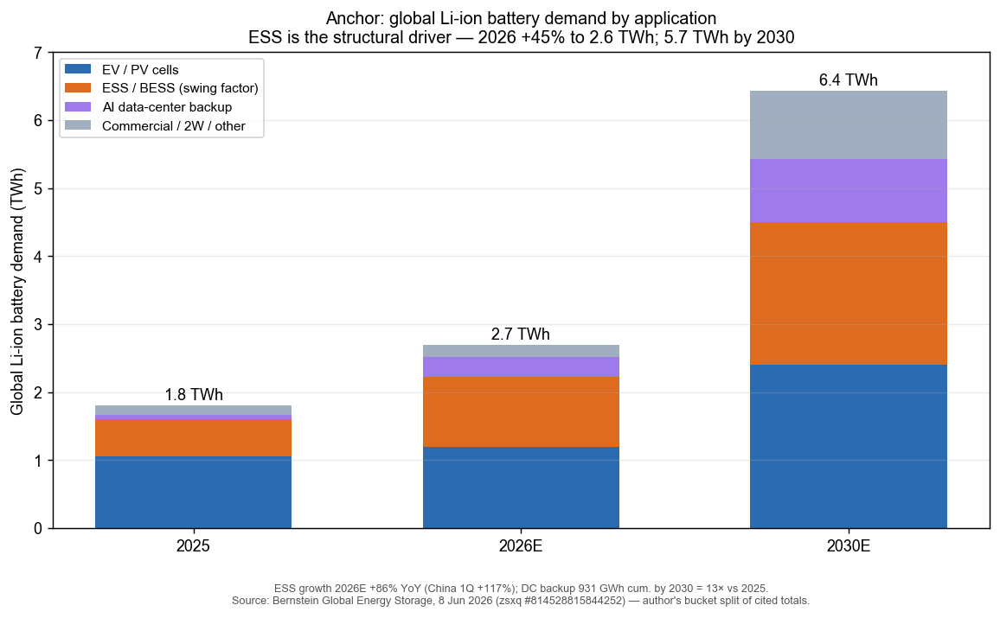
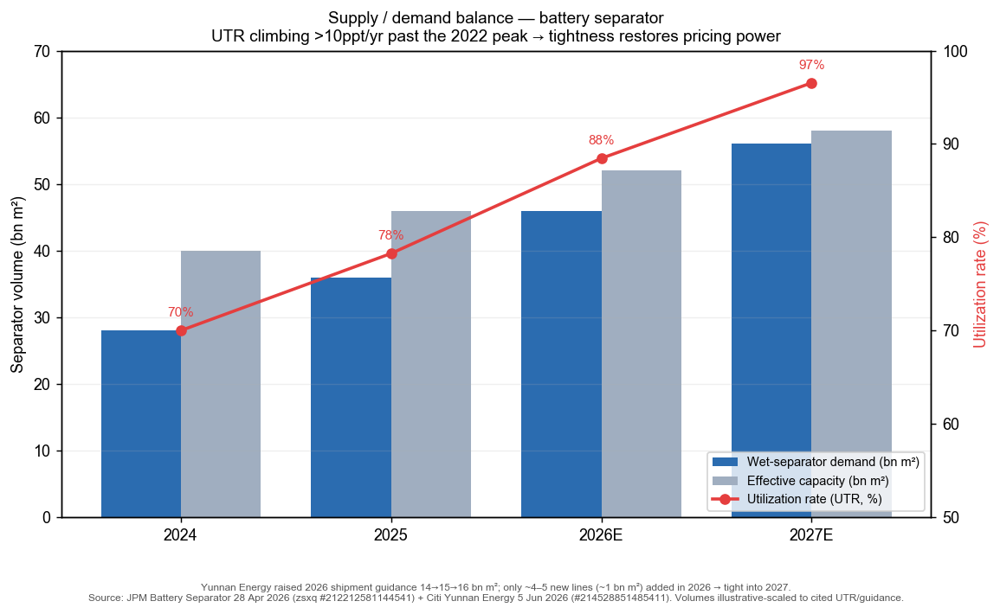
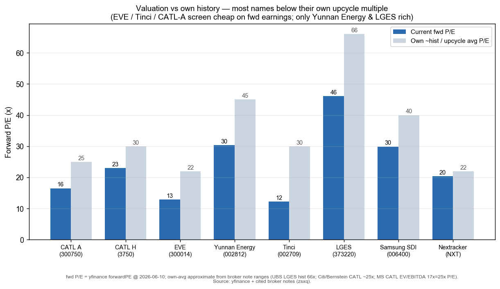
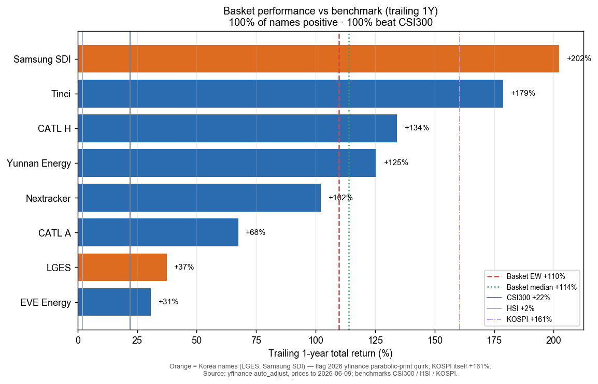

# China EV Battery, Energy Storage (ESS) & Sodium-Ion / 中国动力电池、储能与钠离子

**Created:** 2026-06-10 · **Last refreshed:** 2026-06-10 · **Last mutated:** 2026-06-10 · **Refresh cadence:** monthly · **Languages tracked:** en

## What's New

*The delta since you last looked — newest refresh on top. Older entries collapse into the archive below so this stays short.*

**2026-06-10 — basket created** (8 names: CATL-A / CATL-H / EVE / LGES / Samsung SDI / Nextracker core; Yunnan Energy / Tinci enabler).

- **Anchor set:** global Li-ion battery demand **1.8 TWh (2025) → 2.6 TWh (2026E, +45%) → 5.7 TWh (2030E)**, with **ESS the swing sub-bucket** — Bernstein lifted its 2026 ESS growth target from 50% to **86%** as China 1Q ESS shipments rose **+117%** YoY ([Bernstein, 2026-06-08](http://xs-macbook-air.local:5001/zsxq/pdf/814528815844252/Bernstein-Global%20Energy%20Storage%EF%BC%9ABernstein%20Energy%EF%BC%8CRaising%20battery%20demand%20estimates%20on%20ESS%20and%20CATL%20target%20price%20to%20HKD770-260608.pdf)).
- **Performance reality check:** the equal-weight basket is **+110% over the trailing 1Y** (median **+114%**) vs **CSI 300 +21.9% / HSI +2.0% / KOSPI +160.6%** — 100% of names positive, 100% beat CSI300. The Korea names (Samsung SDI +202%, LGES +37%) carry the 2026 yfinance parabolic-print quirk; KOSPI itself is +161%, so the Korea outperformance is partly index-wide, not idiosyncratic.
- **New broker calls (mined this pass, upserted to `/pt`):** Bernstein raised **CATL** to A ¥800 / H HK$770 ([Bernstein, zsxq #814528815844252 p.1](http://xs-macbook-air.local:5001/zsxq/pdf/814528815844252/Bernstein-Global%20Energy%20Storage%EF%BC%9ABernstein%20Energy%EF%BC%8CRaising%20battery%20demand%20estimates%20on%20ESS%20and%20CATL%20target%20price%20to%20HKD770-260608.pdf)); Citi raised CATL to A ¥603 / H HK$888, Top Pick ([Citi, zsxq #585411124181124 p.1](http://xs-macbook-air.local:5001/zsxq/pdf/585411124181124/CITI-CATL%20%EF%BC%88300750%EF%BC%89%20On%20Track%20to%20Reach%201TWh%20Sales%20and%20Rmb100bn%20Net%20Profit%20in%2026E%EF%BC%9BTP%20Raised%20to%20Rmb603%20sh%20and%20HK%24888%20sh-260604.pdf)); UBS **upgraded Samsung SDI to Buy, PT W640k** (from W210k) on US BESS ([UBS, zsxq #415514185542588 p.1](http://xs-macbook-air.local:5001/zsxq/pdf/415514185542588/UBS-Samsung%20SDI%EF%BC%88006400.KS%EF%BC%89Positioned%20to%20capture%20the%20US%20BESS%20inflection.%20Upgrade%20to%20Buy-260420.pdf)).
- **Sodium-ion inflection:** MS calls sodium-ion "the **mirror of LFP in 2020**" — at cost parity with LFP now, +35% further cost evolution after scaling, CATL Top Pick PT HK$815 ([MS, zsxq #415248142222228 p.1](http://xs-macbook-air.local:5001/zsxq/pdf/415248142222228/Morgan%20Stanley-Contemporary%20Amperex%20Technology%20Co.%20Ltd.%20%EF%BC%883750.HK%EF%BC%89Sodium~ion%EF%BC%9A%20Mirror%20of%20LFP%20in%202020-260508.pdf)); Bernstein: SIB cost fell 24% in 2025 to US$57/kWh, CATL began mass production this year ([Bernstein, zsxq #184152128158542 p.1](http://xs-macbook-air.local:5001/zsxq/pdf/184152128158542/Bernstein-Global%20Energy%20Storage%EF%BC%9A%20Sodium~ion%20batteries%20to%20disrupt%20the%20LFP%20market-260602.pdf)).
- **US BESS sourcing shift:** Chinese ESS-battery shipments to the US **fell 18% YoY in 4M26** (vs FY25 +126%) while KR/JP makers posted **>170% YoY** growth — OBBBA tariffs/sourcing rules hand the US BESS pool to Korean local LFP production ([JPM, zsxq #812454145528852 p.2](http://xs-macbook-air.local:5001/zsxq/pdf/812454145528852/J.P.%20Morgan-ESS%20Battery%EF%BC%9A4M26%20%2B109%25y%20y%EF%BC%9B%20attention%20turns%20to%20lithium%20carbonate%20price%20tolerance%20and%20demand%20implications-260521.pdf)).
- **Citation audit:** seed file_id `184121412521522` **does not exist** in the library (matched the warning); the other 4 seeds verified on-theme (JPM EVE, Bernstein ESS Tracker, UBS China Lithium, MS CATL Sodium-ion) and are cited.

Earlier refreshes

*(none — this is the create pass.)*

## Thesis

**Anchor — global lithium-ion battery demand (the volume pool this basket is a bet on):** **1.8 TWh (2025) → 2.6 TWh (2026E, +45%) → 5.7 TWh (2030E) → 16.6 TWh (2050E)**, Bernstein having raised its 2026 growth target from 32% to 45% on stronger-than-expected ESS — "we now expect global lithium-ion battery demand to grow by 800GWh to reach 2.6TWh in 2026 … 5.7GWh [TWh] by 2030 and 16.6TWh by 2050" ([Bernstein Global Energy Storage, zsxq #814528815844252 p.1](http://xs-macbook-air.local:5001/zsxq/pdf/814528815844252/Bernstein-Global%20Energy%20Storage%EF%BC%9ABernstein%20Energy%EF%BC%8CRaising%20battery%20demand%20estimates%20on%20ESS%20and%20CATL%20target%20price%20to%20HKD770-260608.pdf)). **Sub-bucket decomposition (2026E):** **EV/PV cells 1.2 TWh (+15%)** — "we slightly reduce our EV demand growth … but still forecast 15% growth this year to 1.2TWh"; **ESS/BESS revised up to +86%** — "ESS demand estimates have been revised up for this year from 50% to 86% … China ESS shipments increased by 117% in 1Q"; **AI data-center backup 0.3 TWh**, reaching a cumulative **931 GWh by 2030 = a 13× increase from 2025** as DC capacity hits 200–220 GW; and **other (commercial vehicles +67%, two-wheelers +22%, shipping, robotics) ~1.0 TWh by 2030** (all [Bernstein, zsxq #814528815844252 p.1](http://xs-macbook-air.local:5001/zsxq/pdf/814528815844252/Bernstein-Global%20Energy%20Storage%EF%BC%9ABernstein%20Energy%EF%BC%8CRaising%20battery%20demand%20estimates%20on%20ESS%20and%20CATL%20target%20price%20to%20HKD770-260608.pdf)).

**Swing factor — ESS/BESS GWh (and the US-localization split within it).** ESS is now the fastest-growing leg and, per Bernstein, "Battery ESS demand (for now) is exceeding EV battery demand" — every revision to the ESS attach-rate / duration assumption moves the headline pool more than EV, which is in a soft patch (4M26 EV battery demand +9% YTD as China/US cooled). The bet: **EV-battery demand has bottomed and reaccelerates as ESS becomes the structural driver**, restoring volume growth and — through materials tightness (separator, electrolyte) — pricing power and margins across the chain.

**Auditable build — two-sided tightness (separator).** The margin-recovery leg rests on a supply/demand imbalance, so it must show both sides. Yunnan Energy raised its **2026 wet-separator shipment guidance from 14 → 15 → 16 bn m²** while only **~4–5 new lines (~1 bn m² incremental)** come online in 2026, leaving **wet-separator industry utilization +10ppt in 2026 (above the 2022 peak) and another ~10ppt in 2027** — JPM's "tight supply into 2027" call ([JPM Battery Separator, zsxq #212212581144541 p.1](http://xs-macbook-air.local:5001/zsxq/pdf/212212581144541/J.P.%20Morgan-Battery%20Separator%EF%BC%9ATight%20supply%20into%202027%EF%BC%9B%20raise%20Yunnan%20Energy%20PT%20to%20Rmb100-260429.pdf); guidance reaffirmed in [Citi, zsxq #214528851485411 p.1](http://xs-macbook-air.local:5001/zsxq/pdf/214528851485411/CITI-Yunnan%20Energy%20New%20Material%EF%BC%88002812%EF%BC%89Model%20Update%EF%BC%9B%20Revising%20TP%20Up%20to%20Rmb84.4%20sh-260605.pdf)). The same dynamic shows up in pricing: Chinese ESS-battery prices are up ~16% YTD on full pass-through of lithium-carbonate (~Rmb200k/t) cost increases ([JPM ESS Battery, zsxq #812454145528852 p.2](http://xs-macbook-air.local:5001/zsxq/pdf/812454145528852/J.P.%20Morgan-ESS%20Battery%EF%BC%9A4M26%20%2B109%25y%20y%EF%BC%9B%20attention%20turns%20to%20lithium%20carbonate%20price%20tolerance%20and%20demand%20implications-260521.pdf)).

**Sodium-ion — the optionality leg.** MS frames sodium-ion as "a mirror of LFP in 2020" — ~2 GWh small deployment today, "already approaching key technical thresholds that enable scalability … reaching cost parity with LFP currently and a further 35% cost evolution after scaling" ([MS, zsxq #415248142222228 p.1](http://xs-macbook-air.local:5001/zsxq/pdf/415248142222228/Morgan%20Stanley-Contemporary%20Amperex%20Technology%20Co.%20Ltd.%20%EF%BC%883750.HK%EF%BC%89Sodium~ion%EF%BC%9A%20Mirror%20of%20LFP%20in%202020-260508.pdf)). Bernstein: SIB cost fell **24% in 2025 (US$75 → US$57/kWh)**, projected below NMC by 2026 and **below LFP by 2027** (a $15–20/kWh advantage); shipments **doubled to 9 GWh in 2025 → treble to ≥25 GWh in 2026**, ESS >50% of that demand; CATL is the technology leader (Naxtra 175 Wh/kg, 10,000-cycle life) and "began mass production this year" ([Bernstein, zsxq #184152128158542 p.1](http://xs-macbook-air.local:5001/zsxq/pdf/184152128158542/Bernstein-Global%20Energy%20Storage%EF%BC%9A%20Sodium~ion%20batteries%20to%20disrupt%20the%20LFP%20market-260602.pdf)).

**Bull / base / bear (anchor).** *Base* — 2026E 2.6 TWh (+45%), ESS +86%. *Bull* — ESS attach-rates/durations and AIDC backup ramp faster, lifting 2030 toward 5.8 TWh and ESS toward 2.1 TWh (Bernstein's high case, datacentre capacity 200–220 GW vs prior 145 GW). *Bear* — lithium carbonate breaks through the Rmb200–250k/t demand-tolerance band and triggers ESS demand destruction, plus EU/US tariff escalation on Chinese cells — the single swing assumption being **whether ESS demand survives a higher lithium price** (JPM: "we don't expect destruction in demand with LC price higher than Rmb200k/t … rather a higher lithium price will be proof for solid demand"; supply-chain feedback splits at Rmb150k vs Rmb200–250k/t thresholds, [JPM, zsxq #812454145528852 p.2](http://xs-macbook-air.local:5001/zsxq/pdf/812454145528852/J.P.%20Morgan-ESS%20Battery%EF%BC%9A4M26%20%2B109%25y%20y%EF%BC%9B%20attention%20turns%20to%20lithium%20carbonate%20price%20tolerance%20and%20demand%20implications-260521.pdf)).

**Who benefits when (time axis over the anchor curve).** **Materials enablers (Yunnan Energy separator, Tinci electrolyte)** monetize *first* — capacity lead-times are long, so tightness restores their unit margins ahead of volume, which is why their stocks already re-rated (Yunnan +125%, Tinci +179% on the year). **Cell leaders (CATL, EVE)** monetize *through 2026* as ESS volume scales and CATL captures sodium-ion + AIDC verticals. **Korean cells (LGES, Samsung SDI) and the US integrator (Nextracker)** monetize *from 2027* — gated by US local-LFP capacity ramp (StarPlus, Ultium conversions) reaching the OBBBA-protected BESS pool.

**Value-chain / who-occupies-which-layer (dollar-weighted).** *Cell + sodium-ion + AIDC-storage vertical* CATL (~40% EV-battery share, sodium-ion + ESS leader; **basket-covered, core**) · *#2 China cell + ESS/consumer* EVE Energy (35 GWh 1Q26 shipments; **core**) · *wet-separator oligopolist* Yunnan Energy (~tight-supply price-setter; **enabler**) · *electrolyte + LiFSI/additives* Tinci Materials (大化工 cost moat; **enabler**) · *US-BESS local-LFP cell* LGES (45–50% US BESS share by 2027) + Samsung SDI (20–25%; **core**) · *US utility-scale ESS integrator* Nextracker (solar tracker + BESS via Prevalon; **core**). **Coverage-gap flags:** the **cathode-precursor layer** (CNGR 300919.SZ), the **lithium-resource layer** (Ganfeng 002460.SZ — UBS raised China lithium price forecasts), the **structural-component layer** (Kedali 002850.SZ, Zhenyu 300953.SZ), and the **inverter/PCS integrator** (Sungrow — JPM's AIDC-ESS preferred name alongside LGES) are rich dollar layers *not* tracked; they are the top candidate-adds if the basket widens.

## Scope rules

**In:** the battery **CELL / MATERIALS / STORAGE** chain — cell makers (Chinese + Korean), cathode/anode/electrolyte/separator/structural-component suppliers, ESS/BESS integrators, and sodium-ion plays, organized by value-chain layer. CATL is **core** here as the battery + storage leader. A name belongs if its investment case is meaningfully levered to the battery/ESS demand pool above.

**Out (separate themes):** the auto **OEM / vehicle-export** angle — BYD/Geely/XPeng/Leapmotor/Li/Xiaomi/SAIC live in `china-ev-auto-export` (which admits CATL only as a *vehicle enabler*; here CATL is the *battery/storage core*). Also out: pure **lithium/cobalt resource** miners as a standalone basket (referenced as a value-chain gap, not tracked); **solar-module** makers; **power-grid/transmission** equipment; ADAS-SoC / auto-parts (other themes). Pure-play battery/ESS exposure beats diversified conglomerates.

## Tracked tickers

| Ticker | Name | Role | Justification | Added |
|---|---|---|---|---|
| SZSE:300750 | CATL (宁德时代 A) | core | Global #1 battery maker — Citi sees **1.2/1.0 TWh output/sales in 2026E (+61%/+54% YoY)** and ¥100bn net profit, EV-battery share rising to ~40%; the only name with cell + sodium-ion + AIDC-storage vertical leadership ([Citi, zsxq #585411124181124 p.1](http://xs-macbook-air.local:5001/zsxq/pdf/585411124181124/CITI-CATL%20%EF%BC%88300750%EF%BC%89%20On%20Track%20to%20Reach%201TWh%20Sales%20and%20Rmb100bn%20Net%20Profit%20in%2026E%EF%BC%9BTP%20Raised%20to%20Rmb603%20sh%20and%20HK%24888%20sh-260604.pdf); [Bernstein, zsxq #814528815844252 p.1](http://xs-macbook-air.local:5001/zsxq/pdf/814528815844252/Bernstein-Global%20Energy%20Storage%EF%BC%9ABernstein%20Energy%EF%BC%8CRaising%20battery%20demand%20estimates%20on%20ESS%20and%20CATL%20target%20price%20to%20HKD770-260608.pdf)). **Moat:** scale + stable unit profit (¥/Wh) through cycles + super-fast-charge (神行) and sodium-ion (Naxtra 175 Wh/kg, locked Ronbay cathode supply >60% for 4 years) tech leadership. **Threat (customer-insourcing):** BYD self-supplies its own cells and is the structural insourcing risk; **CATL's counter** = it sells to every OEM ex-BYD and sets the super-fast-charge + sodium-ion standards the whole industry migrates to, so single-OEM insourcing is offset by standard-migration demand. | 2026-06-10 |
| HKEX:3750 | CATL (宁德时代 H) | core | H-listing of the same issuer; tracked alongside the A-share to capture the persistent H/A premium (Citi notes the H premium "has kept widening since listing … reflecting CATL's scarcity in the offshore market"). MS names CATL-H its **Top Pick** for the sodium-ion + ESS cycle ([MS, zsxq #415248142222228 p.1](http://xs-macbook-air.local:5001/zsxq/pdf/415248142222228/Morgan%20Stanley-Contemporary%20Amperex%20Technology%20Co.%20Ltd.%20%EF%BC%883750.HK%EF%BC%89Sodium~ion%EF%BC%9A%20Mirror%20of%20LFP%20in%202020-260508.pdf)). Same moat/threat as 300750.SZ. | 2026-06-10 |
| SZSE:300014 | EVE Energy (亿纬锂能) | core | China #2 merchant cell + ESS/consumer maker — **1Q26 shipments ~35 GWh (+52% YoY)**, ~14 GWh EV + ~20 GWh ESS/other; net profit ¥1.446bn (+25–35% YoY); management guiding price increases from 2Q as cost pass-through normalizes ([JPM, zsxq #212218144282521 p.1](http://xs-macbook-air.local:5001/zsxq/pdf/212218144282521/J.P.%20Morgan-EVE%20Energy%EF%BC%88300014%EF%BC%89GPM%20hit%20by%20delayed%20material%20cost%20pass%20through%EF%BC%9B%20management%20guides%20to%20price%20increase%20from%202Q-260426.pdf); [Nomura, zsxq #585585218845454 p.1](http://xs-macbook-air.local:5001/zsxq/pdf/585585218845454/Nomura-EVE%20Energy%EF%BC%88300014%EF%BC%89Solid%20shipment%20growth%20with%20planned%20capacity%20expansion-260427.pdf)). **Moat:** diversified cell portfolio (large cylindrical, ESS, consumer) + capacity expansion pipeline; the cleanest non-CATL China ESS-cell exposure. **Threat:** thinner margin / weaker pricing power than CATL (GPM hit by delayed material-cost pass-through, hence JPM Neutral); LFP cell commoditization and overcapacity price war compress unit economics. | 2026-06-10 |
| SZSE:002812 | Yunnan Energy New Material (恩捷股份) | enabler | Wet-separator oligopolist and the purest play on the materials-tightness thesis — **2026 shipment guidance raised 14 → 15 → 16 bn m²** into a market with only ~1 bn m² of new capacity, lifting industry UTR >10ppt/yr above the 2022 peak; JPM's "most preferred battery material" ([JPM, zsxq #212212581144541 p.1](http://xs-macbook-air.local:5001/zsxq/pdf/212212581144541/J.P.%20Morgan-Battery%20Separator%EF%BC%9ATight%20supply%20into%202027%EF%BC%9B%20raise%20Yunnan%20Energy%20PT%20to%20Rmb100-260429.pdf); [Citi, zsxq #214528851485411 p.1](http://xs-macbook-air.local:5001/zsxq/pdf/214528851485411/CITI-Yunnan%20Energy%20New%20Material%EF%BC%88002812%EF%BC%89Model%20Update%EF%BC%9B%20Revising%20TP%20Up%20to%20Rmb84.4%20sh-260605.pdf)). **Moat:** long capacity lead-times + high-quality wet-process scale create a supply-side bottleneck (high visibility, hard to flood). **Threat:** the cyclicality cuts both ways — JPM separately warned that *its own* new-capacity expansion could pressure the share price ([JPM, zsxq #184124828112282](http://xs-macbook-air.local:5001/zsxq/pdf/184124828112282/J.P.%20Morgan-Yunnan%20Energy%EF%BC%88002812%EF%BC%89New%20capacity%20expansion%20likely%20to%20hit%20share%20price%EF%BC%9B%20we%20stay-260514.pdf)); a return to industry overcapacity reverses the pricing power, and trades at the basket's richest multiple. | 2026-06-10 |
| SZSE:002709 | Tinci Materials (天赐材料) | enabler | Electrolyte leader with a vertically-integrated 大化工 (large-chemicals) cost base; LiFSI and additives are the new growth legs as ESS volumes scale ([institute deep-dive, zsxq #585425518885144 p.1](http://xs-macbook-air.local:5001/zsxq/pdf/585425518885144/%E5%A4%A9%E8%B5%90%E6%9D%90%E6%96%99(002709)%E5%A4%A7%E5%8C%96%E5%B7%A5%E4%BD%93%E7%B3%BB%E6%9E%84%E7%AD%91%E6%88%90%E6%9C%AC%E4%BC%98%E5%8A%BF%EF%BC%8CLiFSI%E3%80%81%E6%B7%BB%E5%8A%A0%E5%89%82%E6%88%90%E4%B8%BA%E6%96%B0%E5%A2%9E%E9%95%BF%E6%9E%81.pdf)). **Moat:** self-supply of upstream chemicals (固液一体化) gives the lowest electrolyte cash cost in the industry; LiFSI scale advantage. **Threat:** electrolyte is closer to commodity than separator — lithium-carbonate / 6F price swings whip the margin, and Chinese overcapacity in base electrolyte keeps spot pricing competitive; less supply-constrained than separators. | 2026-06-10 |
| KRX:373220 | LG Energy Solution | core | The Korean cell maker best positioned for the **US BESS supercycle** — UBS' most-preferred Korean battery name, estimating **45–50% US BESS market share by 2027** on a ~140 GWh order book and first-mover US LFP production (onshore LFP cell at $86/kWh → $51/kWh post-45X PTC vs Chinese $92/kWh landed) ([UBS, zsxq #415514185542848 p.1](http://xs-macbook-air.local:5001/zsxq/pdf/415514185542848/UBS-LG%20Energy%20Solution%EF%BC%88373220.KS%EF%BC%89Positioned%20to%20dominate%20the%20US%20BESS%20supercycle-260420.pdf)). **Moat:** largest, most-advanced North-American footprint (wholly-owned + Ultium JV NCM→LFP conversions to >50 GWh by YE26); OBBBA/tariff rules effectively exclude Chinese cells. **Threat:** EV softness still drags near-term earnings; if OBBBA's 48E ITC / sourcing rules are diluted, the cost-advantage moat narrows; rich on 2027E P/E. | 2026-06-10 |
| KRX:006400 | Samsung SDI | core | The asymmetric US-BESS turnaround — UBS **upgraded to Buy, PT W640k from W210k**, seeing **20–25% US BESS share by 2027** (from 1–2% in 2025) via 22 GWh StarPlus LFP capacity + a reported 10 GWh/yr multi-year supply deal with a US OEM ([UBS, zsxq #415514185542588 p.1](http://xs-macbook-air.local:5001/zsxq/pdf/415514185542588/UBS-Samsung%20SDI%EF%BC%88006400.KS%EF%BC%89Positioned%20to%20capture%20the%20US%20BESS%20inflection.%20Upgrade%20to%20Buy-260420.pdf)); March ESS battery exports +48% YoY ([JPM, zsxq #812215415888852](http://xs-macbook-air.local:5001/zsxq/pdf/812215415888852/J.P.%20Morgan-Samsung%20SDI%EF%BC%88006400.KS%EF%BC%89March%20ESS%20battery%20exports%20up%20by%20%2B48%25y%20y%EF%BC%9B%20maintain%20bull-260420.pdf)). **Moat:** the leading non-Chinese prismatic ESS supplier; trades at the lowest EV/EBITDA among incumbents. **Threat:** ~18-month behind LGES in US LFP ramp; 2026 earnings still depressed by EV weakness; execution risk on the StarPlus ramp. | 2026-06-10 |
| NASDAQ:NXT | Nextracker | core | The US-listed utility-scale ESS integrator — JPM **OW PT $174 (from $155)** after NXT agreed to acquire Prevalon (BESS power electronics, controls, EMS, lifecycle services), pairing its solar-tracker base with BESS for utility-scale + data-center customers and raising FY27 guidance ([JPM, zsxq #212485814114811 p.1](http://xs-macbook-air.local:5001/zsxq/pdf/212485814114811/J.P.%20Morgan-Nextpower%EF%BC%88NXT.US%EF%BC%89The%20Audacity%20of%20Scope%EF%BC%9A%20M%26A%20Expansion%20Into%20BESS%20a%20Positive%EF%BC%9B%20Increasing%20PT%20to%20%24174-260529.pdf)). **Moat:** scarcity value — one of few publicly-traded US energy-storage/solar integrators; entrenched utility-scale customer base + recent transformer acquisition expands the DC TAM. **Threat:** BESS integration is new (acquisition-integration + execution risk); margins exposed to module/cell input prices it does not make; US solar policy (48E ITC) the key swing. | 2026-06-10 |

*Cited conviction reads (sourced, not self-authored):* within China, **JPM's top picks are CATL, Yunnan Energy, and Wuxi Lead** (separator > most preferred material) ([JPM, zsxq #212212581144541 p.1](http://xs-macbook-air.local:5001/zsxq/pdf/212212581144541/J.P.%20Morgan-Battery%20Separator%EF%BC%9ATight%20supply%20into%202027%EF%BC%9B%20raise%20Yunnan%20Energy%20PT%20to%20Rmb100-260429.pdf)); **Citi/MS/Bernstein all hold CATL as Top Pick / Outperform**; **JPM stays Neutral on EVE** (CATL preferred within the China cell space). In Korea, **UBS ranks LGES > Samsung SDI** (LGES the most-preferred Korean name; ~18-month US-LFP lead) ([UBS, zsxq #415514185542848 p.1](http://xs-macbook-air.local:5001/zsxq/pdf/415514185542848/UBS-LG%20Energy%20Solution%EF%BC%88373220.KS%EF%BC%89Positioned%20to%20dominate%20the%20US%20BESS%20supercycle-260420.pdf)).

## Valuation snapshot

*Populated from `stock_price_target_db` (mirrors `/pt`). "Px @ note date" = stock price on the note's publication date (the load-bearing price the analyst's upside was called against); "current px" = live spot for context (yfinance 2026-06-10). Fwd P/E = yfinance forwardPE; own ~avg approximate from broker note ranges. n/a = report-date price not stated in the note.*

| Ticker | Rating (latest) | Px @ note date | PT | Upside% (vs note px) | Current px | Fwd P/E | Own ~hist/upcycle avg | FY1 / FY2 metric |
|---|---|---|---|---|---|---|---|---|
| SZSE:300750 CATL A | Bernstein **OP** @ 2026-06-08 · Citi **Buy/Top Pick** @ 06-04 | ¥403.00 (Bern) / n/a (Citi) | ¥800 (Bern, DCF WACC 9.6%) · ¥603 (Citi, 17.5× 26E EV/EBITDA) | **+98%** (Bern) / — | ¥399.50 | 16.5× | ~25× P/E | EPS ¥21.9 (26E) / ¥28.8 (27E, Bern) |
| HKEX:3750 CATL H | MS **OW/Top Pick** @ 2026-05-08 · Bern MP · Citi Buy @ 06-04 | HK$665 (MS) / HK$713 (Bern) | HK$815 (MS, 17× 27E EV/EBITDA) · HK$770 (Bern) · HK$888 (Citi) | **+23%** (MS) / +8% (Bern) | HK$691.00 | 23.0× | ~30× P/E | EPS ¥21.9 (26E) / ¥28.8 (27E) |
| SZSE:300014 EVE Energy | JPM **Neutral** @ 2026-04-26 | ¥72.81 | ¥70 (was ¥60) | **−4%** | ¥56.86 | 12.9× | ~22× P/E | rev ¥126.8bn (27E); NP ¥1.446bn 1Q26 |
| SZSE:002812 Yunnan Energy | Citi **Buy** @ 2026-06-05 · JPM **OW** @ 04-28 | ¥64.37 (Citi) / n/a (JPM) | ¥84.4 (Citi, 3.09× P/B) · ¥100 (JPM) | **+31%** (Citi) / +29% (JPM) | ¥62.94 | 30.3× | ~45× P/E (cyclical) | 47× 26E P/E → 23.6× 27E P/E (de-rate on EPS growth) |
| SZSE:002709 Tinci | *no current sell-side PT in library* | n/a | n/a | n/a | ¥47.97 | 12.2× | ~30× P/E | electrolyte/LiFSI volume leverage |
| KRX:373220 LGES | UBS **Buy** @ 2026-04-20 (most-preferred KR) | n/a | W500,000 (DCF) | — | W396,500 | 46.1× | 66× P/E (12m-fwd hist) | 53× 27E P/E; 3.4× 27E P/B |
| KRX:006400 Samsung SDI | UBS **Buy (upgrade)** @ 2026-04-20 | n/a | W640,000 (SOTP, 12× EV/EBITDA) | — | W515,000 | 29.9× | ~40× P/E | 11× 27E EV/EBITDA; 34× 27E PE; lowest EV/EBITDA of incumbents |
| NASDAQ:NXT Nextracker | JPM **OW** @ 2026-05-29 | $137.17 | $174 (was $155) | **+27%** | $119.27 | 20.4× | ~22× P/E | FY27 guidance raised post-Prevalon |

*Cross-sectional read: on **forward P/E** the basket sorts cheap → dear: **Tinci 12.2× < EVE 12.9× < CATL-A 16.5× < NXT 20.4× < CATL-H 23.0× < Samsung SDI 29.9× < Yunnan Energy 30.3× < LGES 46.1×**. The China cell + electrolyte names screen below their own upcycle multiples; the **rich names are Yunnan Energy (47× 26E, justified only if separator tightness persists) and LGES (46× fwd vs 66× hist — actually below its own history but priced for the US-BESS ramp).* The PEG-style read: EVE and CATL-A pair low fwd P/E with 50%+ volume growth — the cheapest growth in the basket.

## Exclusions

| Ticker | Reason |
|---|---|
| SZSE:002074 Gotion High-Tech | China #4 cell maker but weakest 1Y performance (+18%) and no fresh conviction-grade broker PT in the library this pass; candidate-add on a future re-mine, not a current core. |
| KRX:051910 LG Chem | Holding-company exposure to LGES + petrochem; UBS lifted its PT *because of* the LGES stake — track the pure-play LGES (373220.KS) instead to avoid the petchem dilution. |
| SZSE:300919 CNGR / SZSE:002460 Ganfeng | Cathode-precursor and lithium-resource layers — real value-chain gaps, but precursors/resource are a separate "battery upstream materials" cut; flagged as candidate-adds, not tracked yet. |
| Auto OEMs (BYD / Geely / XPeng / Li / Xiaomi / SAIC) | Vehicle-export angle lives in `china-ev-auto-export`; CATL appears there only as a vehicle-enabler, here as the battery/storage core — no double-count. |

## Keywords

EV battery / 动力电池 · energy storage / 储能 · BESS / 电池储能系统 · sodium-ion / 钠离子电池 · LFP / 磷酸铁锂 · separator / 隔膜 · electrolyte / 电解液 · cathode / 正极 · AIDC ESS / 数据中心储能 · lithium carbonate / 碳酸锂 · US BESS supercycle / 美国储能超级周期 · CATL / 宁德时代

## Performance (since inception)

**Window:** trailing ~1 year to 2026-06-09 (create-pass baseline; benchmark CSI 300 / HSI / KOSPI). Equal-weight basket **+109.9%**, **median +113.8%**, vs **CSI 300 +21.9% / HSI +2.0% / KOSPI +160.6%**.

### Basket scorecard

- **Batting average:** **8/8 names positive (100%)** over the trailing 1Y; **8/8 beat CSI 300 (100%)**.
- **Best contributor:** **Samsung SDI +202.4%** (US-BESS upgrade cycle). **Worst contributor:** **EVE Energy +30.8%** (margin pass-through lag, JPM Neutral) — still ahead of CSI 300.
- **Median +113.8%** comfortably ahead of all three benchmarks ex-KOSPI; vs KOSPI (+160.6%) the basket median lags, but **CATL-H +134%, Samsung SDI +202%, Tinci +179%, Yunnan +125%** all beat KOSPI individually.
- **Caveat (2026 yfinance quirk):** Korea/China memory-and-battery names print parabolic trailing-1Y returns in the 2026 window; the +202% Samsung SDI / +179% Tinci figures should be read as "very strong, magnitude uncertain", with KOSPI (+161%) and CSI 300 (+22%) as the calibration anchors.
- Cumulative-outperformance-in-bps will populate from the second snapshot line onward (only the baseline exists today).

## Recent events

- **2026-06-08 — Bernstein raised 2026 global battery-demand growth from 32% to 45% (to 2.6 TWh)** and CATL PTs to A ¥800 / H HK$770, on stronger ESS ([Bernstein, zsxq #814528815844252 p.1](http://xs-macbook-air.local:5001/zsxq/pdf/814528815844252/Bernstein-Global%20Energy%20Storage%EF%BC%9ABernstein%20Energy%EF%BC%8CRaising%20battery%20demand%20estimates%20on%20ESS%20and%20CATL%20target%20price%20to%20HKD770-260608.pdf)).
- **2026-06-05 — Citi raised Yunnan Energy PT to ¥84.4** on the 16 bn m² shipment guidance + tight separator supply ([Citi, zsxq #214528851485411 p.1](http://xs-macbook-air.local:5001/zsxq/pdf/214528851485411/CITI-Yunnan%20Energy%20New%20Material%EF%BC%88002812%EF%BC%89Model%20Update%EF%BC%9B%20Revising%20TP%20Up%20to%20Rmb84.4%20sh-260605.pdf)).
- **2026-06-04 — Citi: CATL "on track for 1 TWh sales and ¥100bn net profit in 26E"**, PT raised to A ¥603 / H HK$888, maintained Top Pick ([Citi, zsxq #585411124181124 p.1](http://xs-macbook-air.local:5001/zsxq/pdf/585411124181124/CITI-CATL%20%EF%BC%88300750%EF%BC%89%20On%20Track%20to%20Reach%201TWh%20Sales%20and%20Rmb100bn%20Net%20Profit%20in%2026E%EF%BC%9BTP%20Raised%20to%20Rmb603%20sh%20and%20HK%24888%20sh-260604.pdf)).
- **2026-06-02 — Bernstein: sodium-ion to disrupt LFP** — SIB cost −24% in 2025 to US$57/kWh, below LFP by 2027; CATL began mass production this year ([Bernstein, zsxq #184152128158542 p.1](http://xs-macbook-air.local:5001/zsxq/pdf/184152128158542/Bernstein-Global%20Energy%20Storage%EF%BC%9A%20Sodium~ion%20batteries%20to%20disrupt%20the%20LFP%20market-260602.pdf)).
- **2026-05-29 — Nextracker agreed to acquire Prevalon (BESS)**; JPM raised PT to $174 ([JPM, zsxq #212485814114811 p.1](http://xs-macbook-air.local:5001/zsxq/pdf/212485814114811/J.P.%20Morgan-Nextpower%EF%BC%88NXT.US%EF%BC%89The%20Audacity%20of%20Scope%EF%BC%9A%20M%26A%20Expansion%20Into%20BESS%20a%20Positive%EF%BC%9B%20Increasing%20PT%20to%20%24174-260529.pdf)).
- **2026-05-08 — MS: CATL sodium-ion "Mirror of LFP in 2020"**, Top Pick PT HK$815 ([MS, zsxq #415248142222228 p.1](http://xs-macbook-air.local:5001/zsxq/pdf/415248142222228/Morgan%20Stanley-Contemporary%20Amperex%20Technology%20Co.%20Ltd.%20%EF%BC%883750.HK%EF%BC%89Sodium~ion%EF%BC%9A%20Mirror%20of%20LFP%20in%202020-260508.pdf)).
- **2026-04-20 — UBS upgraded Samsung SDI to Buy (PT W640k) and reiterated LGES Buy (PT W500k)** on the US BESS supercycle ([UBS SDI, zsxq #415514185542588 p.1](http://xs-macbook-air.local:5001/zsxq/pdf/415514185542588/UBS-Samsung%20SDI%EF%BC%88006400.KS%EF%BC%89Positioned%20to%20capture%20the%20US%20BESS%20inflection.%20Upgrade%20to%20Buy-260420.pdf); [UBS LGES, zsxq #415514185542848 p.1](http://xs-macbook-air.local:5001/zsxq/pdf/415514185542848/UBS-LG%20Energy%20Solution%EF%BC%88373220.KS%EF%BC%89Positioned%20to%20dominate%20the%20US%20BESS%20supercycle-260420.pdf)).

## Drift signals

- **EV-leg soft-patch vs ESS strength** — Bernstein nudged 2026 EV battery growth down to +15% (4M demand +9% YTD) while lifting ESS to +86%. The basket's thesis is correctly weighted to ESS, but a name like **EVE** (more EV-mix-exposed, JPM Neutral) is the lagging member to watch; if EV stays soft, consider re-grounding EVE's justification toward its ESS shipments.
- **Priced-for-perfection flag (size the de-rate):** the basket's rich names are **Yunnan Energy (47× 26E P/E)** and **LGES (46× fwd)**. Yunnan's multiple holds *only if separator UTR keeps climbing past the 2022 peak* — the named de-rate trigger is **a return to separator overcapacity** (JPM has separately warned its own new-capacity expansion could hit the share price). A reversion of Yunnan to ~23.6× (its own 27E P/E) implies **roughly −50%** downside if the tightness reverses; that is the specific demand assumption the basket is long.
- **Lithium-carbonate demand-destruction band** — the swing risk is LC breaking through Rmb200–250k/t; supply-chain feedback splits on whether tolerance is Rmb150k or Rmb200–250k/t. A break above the band with ESS demand *not* holding would be the single fastest way to crack the margin-recovery leg.
- **US policy dependence (Korea names)** — LGES/Samsung SDI's 45–50% / 20–25% US BESS share rests on OBBBA's 48E ITC + sourcing rules excluding Chinese cells. Any dilution of OBBBA narrows the $41/kWh (LGES) cost-advantage moat — a binary policy risk concentrated in 2 of 8 names.
- **New entrants / candidate-adds** — **Sungrow** (JPM's AIDC-ESS preferred PCS/inverter name alongside LGES), **Gotion** (China #4 cell), **CNGR** (cathode precursor), **Ganfeng** (lithium resource — UBS raised China lithium price forecasts) and **Kedali/Zhenyu** (structural components) are named in fresh research but not in the basket; propose at next mutation.

## Leading indicators

*The early-warning layer — upstream signals that move BEFORE the basket members. Macro/upstream signals as header rows; per-ticker operating data below. Each string-matched to its primary issuer.*

| Signal / Name | Latest reading + as-of | Direction | Implication |
|---|---|---|---|
| **Global ESS battery demand (4M26)** | **+109% YoY**, China ESS shipments **+117% YoY in 1Q** | ▲▲ | The swing-factor leg is running ahead of plan — supports the +86% 2026 ESS estimate ([JPM, zsxq #812454145528852 p.1](http://xs-macbook-air.local:5001/zsxq/pdf/812454145528852/J.P.%20Morgan-ESS%20Battery%EF%BC%9A4M26%20%2B109%25y%20y%EF%BC%9B%20attention%20turns%20to%20lithium%20carbonate%20price%20tolerance%20and%20demand%20implications-260521.pdf); [Bernstein, zsxq #814528815844252 p.1](http://xs-macbook-air.local:5001/zsxq/pdf/814528815844252/Bernstein-Global%20Energy%20Storage%EF%BC%9ABernstein%20Energy%EF%BC%8CRaising%20battery%20demand%20estimates%20on%20ESS%20and%20CATL%20target%20price%20to%20HKD770-260608.pdf)). |
| **China ESS-battery exports (4M26)** | EU **+167% YoY**, RoW **+154% YoY**; to US **−18% YoY** | ▲ / ▼(US) | Ex-US ESS demand structurally broadening (Mideast conflict + energy security); the US leg is migrating to local KR/JP supply ([JPM, zsxq #812454145528852 p.2](http://xs-macbook-air.local:5001/zsxq/pdf/812454145528852/J.P.%20Morgan-ESS%20Battery%EF%BC%9A4M26%20%2B109%25y%20y%EF%BC%9B%20attention%20turns%20to%20lithium%20carbonate%20price%20tolerance%20and%20demand%20implications-260521.pdf)). |
| **Lithium carbonate price (China)** | **~Rmb200k/t**, ESS cell prices **+16% YTD** | ▲ | Cost pass-through restoring cell margins; the Rmb200–250k/t tolerance band is the demand-destruction watch-line ([JPM, zsxq #812454145528852 p.2](http://xs-macbook-air.local:5001/zsxq/pdf/812454145528852/J.P.%20Morgan-ESS%20Battery%EF%BC%9A4M26%20%2B109%25y%20y%EF%BC%9B%20attention%20turns%20to%20lithium%20carbonate%20price%20tolerance%20and%20demand%20implications-260521.pdf)). |
| **Sodium-ion cell cost** | **US$57/kWh (−24% in 2025)**; below LFP by 2027E | ▼ (cost) | Approaching LFP parity → the optionality leg activates; SIB shipments doubled to 9 GWh → ≥25 GWh 2026 ([Bernstein, zsxq #184152128158542 p.1](http://xs-macbook-air.local:5001/zsxq/pdf/184152128158542/Bernstein-Global%20Energy%20Storage%EF%BC%9A%20Sodium~ion%20batteries%20to%20disrupt%20the%20LFP%20market-260602.pdf)). |
| CATL (300750/3750) | 2Q26E battery sales **260 GWh (+77% YoY)**; output 288 GWh (+84%) | ▲▲ | Volume momentum into 2H26 despite higher base ([Citi, zsxq #585411124181124 p.1](http://xs-macbook-air.local:5001/zsxq/pdf/585411124181124/CITI-CATL%20%EF%BC%88300750%EF%BC%89%20On%20Track%20to%20Reach%201TWh%20Sales%20and%20Rmb100bn%20Net%20Profit%20in%2026E%EF%BC%9BTP%20Raised%20to%20Rmb603%20sh%20and%20HK%24888%20sh-260604.pdf)). |
| EVE Energy (300014) | 1Q26 shipments **~35 GWh (+52% YoY)**, ESS ~20 GWh | ▲ | ESS now the larger half of EVE's shipments ([JPM, zsxq #212218144282521 p.1](http://xs-macbook-air.local:5001/zsxq/pdf/212218144282521/J.P.%20Morgan-EVE%20Energy%EF%BC%88300014%EF%BC%89GPM%20hit%20by%20delayed%20material%20cost%20pass%20through%EF%BC%9B%20management%20guides%20to%20price%20increase%20from%202Q-260426.pdf)). |
| Yunnan Energy (002812) | 2026 separator shipment guidance **14 → 16 bn m²**; UTR +10ppt | ▲ | Demand-pull above capacity adds → tightness into 2027 ([Citi, zsxq #214528851485411 p.1](http://xs-macbook-air.local:5001/zsxq/pdf/214528851485411/CITI-Yunnan%20Energy%20New%20Material%EF%BC%88002812%EF%BC%89Model%20Update%EF%BC%9B%20Revising%20TP%20Up%20to%20Rmb84.4%20sh-260605.pdf)). |
| Samsung SDI (006400) | March ESS battery exports **+48% YoY**; US BESS share 1–2%→20–25% by 27E | ▲ | The US-localization sourcing-shift in the operating data ([JPM, zsxq #812215415888852 p.1](http://xs-macbook-air.local:5001/zsxq/pdf/812215415888852/J.P.%20Morgan-Samsung%20SDI%EF%BC%88006400.KS%EF%BC%89March%20ESS%20battery%20exports%20up%20by%20%2B48%25y%20y%EF%BC%9B%20maintain%20bull-260420.pdf)). |
| LGES (373220) | US BESS order book **~140 GWh**; NCM→LFP conversions >50 GWh by YE26 | ▲ | First-mover US LFP ramp underwrites 45–50% 2027E share ([UBS, zsxq #415514185542848 p.1](http://xs-macbook-air.local:5001/zsxq/pdf/415514185542848/UBS-LG%20Energy%20Solution%EF%BC%88373220.KS%EF%BC%89Positioned%20to%20dominate%20the%20US%20BESS%20supercycle-260420.pdf)). |

**Side-by-side member guidance on the shared forward metric (US BESS share by 2027E):** **LGES 45–50% > Samsung SDI 20–25%** — both citing OBBBA-protected local LFP production; US BESS demand "should triple to ~200 GW by 2030E" per both UBS notes.

## Catalysts (next 3–6 months)

- **CATL 2Q26 results (Jul–Aug 2026)** — *(2Q sales guided ~260 GWh +77% YoY → confirms/denies the 1 TWh-2026 / ¥100bn-net-profit path → moves the EV+ESS cell sub-bucket and CATL-A/H directly)* ([Citi, zsxq #585411124181124 p.1](http://xs-macbook-air.local:5001/zsxq/pdf/585411124181124/CITI-CATL%20%EF%BC%88300750%EF%BC%89%20On%20Track%20to%20Reach%201TWh%20Sales%20and%20Rmb100bn%20Net%20Profit%20in%2026E%EF%BC%9BTP%20Raised%20to%20Rmb603%20sh%20and%20HK%24888%20sh-260604.pdf)).
- **CATL sodium-ion (Naxtra) mass-production milestones (2H26)** — *(major announcements expected this year per Bernstein → if SIB hits LFP cost parity in ESS, it validates the sodium-ion optionality leg → moves CATL + the sodium-ion sub-bucket)* ([Bernstein, zsxq #184152128158542 p.1](http://xs-macbook-air.local:5001/zsxq/pdf/184152128158542/Bernstein-Global%20Energy%20Storage%EF%BC%9A%20Sodium~ion%20batteries%20to%20disrupt%20the%20LFP%20market-260602.pdf)).
- **Lithium carbonate breaching Rmb200–250k/t (ongoing)** — *(tests the ESS demand-destruction threshold → if demand holds, "proof of solid demand"; if it cracks, the margin-recovery thesis de-rates → moves the whole basket via the swing-factor ESS leg)* ([JPM, zsxq #812454145528852 p.2](http://xs-macbook-air.local:5001/zsxq/pdf/812454145528852/J.P.%20Morgan-ESS%20Battery%EF%BC%9A4M26%20%2B109%25y%20y%EF%BC%9B%20attention%20turns%20to%20lithium%20carbonate%20price%20tolerance%20and%20demand%20implications-260521.pdf)).
- **AIDC ESS procurement acceleration (2H26 → 2027)** — *(BNEF/JPM expert call: AIDC ESS is back-end-loaded — installs as DC builds complete; the inflection is "still ahead", favoring Sungrow + LGES on product quality → moves the data-center sub-bucket of the anchor)* ([JPM AIDC ESS, zsxq #585411224125444 p.2](http://xs-macbook-air.local:5001/zsxq/pdf/585411224125444/J.P.%20Morgan-AIDC%20ESS%EF%BC%9AReference%20Architectures%20and%20Early%20Orders%20Point%20to%20ESS%20Adoption-260602.pdf)).
- **Korea US-LFP capacity ramp (StarPlus 22 GWh / Ultium conversions, into YE26)** — *(qualifies for the 45X/48E PTC/ITC → converts order book into shipped, high-margin BESS volume → moves Samsung SDI / LGES)* ([UBS, zsxq #415514185542588 p.1](http://xs-macbook-air.local:5001/zsxq/pdf/415514185542588/UBS-Samsung%20SDI%EF%BC%88006400.KS%EF%BC%89Positioned%20to%20capture%20the%20US%20BESS%20inflection.%20Upgrade%20to%20Buy-260420.pdf)).
- **Nextracker–Prevalon deal close + FY27 BESS guidance (next 1–2 quarters)** — *(integration milestones validate the solar-to-storage cross-sell → moves NXT's BESS TAM)* ([JPM, zsxq #212485814114811 p.1](http://xs-macbook-air.local:5001/zsxq/pdf/212485814114811/J.P.%20Morgan-Nextpower%EF%BC%88NXT.US%EF%BC%89The%20Audacity%20of%20Scope%EF%BC%9A%20M%26A%20Expansion%20Into%20BESS%20a%20Positive%EF%BC%9B%20Increasing%20PT%20to%20%24174-260529.pdf)).

## Data Used / 数据来源清单

**Market data**
- yfinance auto_adjust=True for prices, returns, market cap, sector, forwardPE — pulled 2026-06-10 (price data through 2026-06-09).
- Benchmarks: CSI 300 (000300.SS), HSI (^HSI), KOSPI (^KS11).

**Per-ticker primary / sell-side sources**
- CATL (300750/3750): Bernstein 2026-06-08; Citi 2026-06-04; MS 2026-05-08; JPM CATL-H AIDC/VNET 2026-05-14.
- EVE Energy (300014): JPM 2026-04-26; Nomura 2026-04-27.
- Yunnan Energy (002812): Citi 2026-06-05; JPM 2026-04-28; JPM new-capacity note 2026-05-14.
- Tinci (002709): institute deep-dive (大化工 / LiFSI), zsxq #585425518885144.
- LGES (373220): UBS 2026-04-20.
- Samsung SDI (006400): UBS 2026-04-20; JPM March-export note 2026-04-20.
- Nextracker (NXT): JPM 2026-05-29.

**Industry research / sell-side thematic notes (theme-level)**
- Bernstein Global Energy Storage (battery-demand raise + CATL PT), 2026-06-08 — the anchor TAM and its sub-bucket decomposition.
- Bernstein Global Energy Storage: Sodium-ion to disrupt LFP, 2026-06-02 — sodium-ion cost curve + capacity build.
- JPM ESS Battery 4M26 (+109%), 2026-05-21 — ESS shipments, US sourcing shift, lithium-price tolerance.
- JPM AIDC ESS, 2026-06-02 — data-center storage adoption (chains to BloombergNEF data).
- MS CATL Sodium-ion: Mirror of LFP in 2020, 2026-05-08 — sodium-ion S-curve framing.
- HSBC Korea EV/ESS Battery (ESS pull + EV bottoming), 2026-06-04 — Korea-cohort framing (read as input, cited in History).

**Local zsxq library (`db/zsxq.db` — read-only)**
- **13 broker PDFs mined and cited** (file_ids: 814528815844252, 585411124181124, 415248142222228, 184152128158542, 214528851485411, 212212581144541, 212218144282521, 585585218845454, 415514185542588, 415514185542848, 585411224125444, 812454145528852, 212485814114811), plus supporting refs (184124828112282, 812215415888852, 585425518885144). Surfaced via `find_pdf.py` per alias → `evidence_bundle.py` → `ocr_pdf.py` (5 image-only PDFs OCR'd) → `extract_pdf.py`. The 翻译精华 summary was triage only; all load-bearing numbers (TAM, PTs, GWh, costs) cited from extracted original text, string-matched. DB opened read-only with `immutable=1` to avoid the live :5001 server's WAL lock (pure reads — DB-safe).
- Seed audit: `184121412521522` does not exist in the DB (discarded, matched the warning); the other 4 seeds verified on-theme and cited.

**TAM anchor + leading indicators (theme-level)**
- Bernstein: global Li-ion demand 1.8 → 2.6 TWh (2026E, +45%) → 5.7 TWh (2030E) → 16.6 TWh (2050E); ESS +86%, EV +15%, DC backup 931 GWh cum. by 2030; sub-bucket decomposition is the Thesis anchor.
- Leading indicators: ESS demand +109% 4M26; ESS exports EU/RoW/US split; lithium carbonate ~Rmb200k/t; sodium-ion US$57/kWh; per-ticker operating prints above.

**Macro backdrop**
- VIX 21.5 (2026-06-05), 10Y Treasury 4.54% (2026-06-05), HY OAS 2.74% (2026-06-04), Brent oil $90.5/bbl (2026-06-05). Source: `indicators.db` (read-only). High oil reinforces ESS/energy-security demand.

**Cross-coverage**
- `china-ev-auto-export_theme.md` (created 2026-06-09) — read for scope-boundary deconfliction (CATL is the *vehicle-enabler* there, the *battery/storage core* here; no double-count).

**Stores written (Tier-2 helpers)**
- `stock_price_target_db` — **11 sell-side PT / rating calls upserted** for tracked names (CATL A/H ×3 desks, Yunnan Energy ×2, EVE, Samsung SDI, LGES, Nextracker), idempotent on ticker × broker × file_id; surfaced at `/pt`.

**Stale notices / coverage gaps**
- Tinci (002709) has no current dated sell-side PT in the library (only an institute deep-dive) — valuation cell shows fwd P/E only.
- Cathode-precursor (CNGR), lithium-resource (Ganfeng), structural-component (Kedali/Zhenyu), and PCS/inverter (Sungrow) layers are rich dollar gaps named in research but not tracked — candidate-adds.
- Seed file_id `184121412521522` unresolved (does not exist in DB).

## References

- Bernstein Global Energy Storage (battery-demand raise + CATL TP HKD770), 2026-06-08 — http://xs-macbook-air.local:5001/zsxq/pdf/814528815844252/Bernstein-Global%20Energy%20Storage%EF%BC%9ABernstein%20Energy%EF%BC%8CRaising%20battery%20demand%20estimates%20on%20ESS%20and%20CATL%20target%20price%20to%20HKD770-260608.pdf
- Bernstein Global Energy Storage: Sodium-ion to disrupt LFP, 2026-06-02 — http://xs-macbook-air.local:5001/zsxq/pdf/184152128158542/Bernstein-Global%20Energy%20Storage%EF%BC%9A%20Sodium~ion%20batteries%20to%20disrupt%20the%20LFP%20market-260602.pdf
- Citi CATL (300750) 1TWh / Rmb100bn, TP A ¥603 / H HK$888, 2026-06-04 — http://xs-macbook-air.local:5001/zsxq/pdf/585411124181124/CITI-CATL%20%EF%BC%88300750%EF%BC%89%20On%20Track%20to%20Reach%201TWh%20Sales%20and%20Rmb100bn%20Net%20Profit%20in%2026E%EF%BC%9BTP%20Raised%20to%20Rmb603%20sh%20and%20HK%24888%20sh-260604.pdf
- Citi Yunnan Energy (002812) TP ¥84.4, 2026-06-05 — http://xs-macbook-air.local:5001/zsxq/pdf/214528851485411/CITI-Yunnan%20Energy%20New%20Material%EF%BC%88002812%EF%BC%89Model%20Update%EF%BC%9B%20Revising%20TP%20Up%20to%20Rmb84.4%20sh-260605.pdf
- JPM Battery Separator: Tight supply into 2027, Yunnan PT ¥100, 2026-04-28 — http://xs-macbook-air.local:5001/zsxq/pdf/212212581144541/J.P.%20Morgan-Battery%20Separator%EF%BC%9ATight%20supply%20into%202027%EF%BC%9B%20raise%20Yunnan%20Energy%20PT%20to%20Rmb100-260429.pdf
- JPM EVE Energy (300014) Neutral PT ¥70, 2026-04-26 — http://xs-macbook-air.local:5001/zsxq/pdf/212218144282521/J.P.%20Morgan-EVE%20Energy%EF%BC%88300014%EF%BC%89GPM%20hit%20by%20delayed%20material%20cost%20pass%20through%EF%BC%9B%20management%20guides%20to%20price%20increase%20from%202Q-260426.pdf
- Nomura EVE Energy (300014) solid shipment growth, 2026-04-27 — http://xs-macbook-air.local:5001/zsxq/pdf/585585218845454/Nomura-EVE%20Energy%EF%BC%88300014%EF%BC%89Solid%20shipment%20growth%20with%20planned%20capacity%20expansion-260427.pdf
- MS CATL (3750.HK) Sodium-ion: Mirror of LFP in 2020, TP HK$815, 2026-05-08 — http://xs-macbook-air.local:5001/zsxq/pdf/415248142222228/Morgan%20Stanley-Contemporary%20Amperex%20Technology%20Co.%20Ltd.%20%EF%BC%883750.HK%EF%BC%89Sodium~ion%EF%BC%9A%20Mirror%20of%20LFP%20in%202020-260508.pdf
- UBS Samsung SDI (006400) Upgrade to Buy, PT W640k, 2026-04-20 — http://xs-macbook-air.local:5001/zsxq/pdf/415514185542588/UBS-Samsung%20SDI%EF%BC%88006400.KS%EF%BC%89Positioned%20to%20capture%20the%20US%20BESS%20inflection.%20Upgrade%20to%20Buy-260420.pdf
- UBS LG Energy Solution (373220) dominate US BESS, PT W500k, 2026-04-20 — http://xs-macbook-air.local:5001/zsxq/pdf/415514185542848/UBS-LG%20Energy%20Solution%EF%BC%88373220.KS%EF%BC%89Positioned%20to%20dominate%20the%20US%20BESS%20supercycle-260420.pdf
- JPM Samsung SDI March ESS exports +48% YoY, 2026-04-20 — http://xs-macbook-air.local:5001/zsxq/pdf/812215415888852/J.P.%20Morgan-Samsung%20SDI%EF%BC%88006400.KS%EF%BC%89March%20ESS%20battery%20exports%20up%20by%20%2B48%25y%20y%EF%BC%9B%20maintain%20bull-260420.pdf
- JPM ESS Battery 4M26 +109%, 2026-05-21 — http://xs-macbook-air.local:5001/zsxq/pdf/812454145528852/J.P.%20Morgan-ESS%20Battery%EF%BC%9A4M26%20%2B109%25y%20y%EF%BC%9B%20attention%20turns%20to%20lithium%20carbonate%20price%20tolerance%20and%20demand%20implications-260521.pdf
- JPM AIDC ESS: Reference Architectures and Early Orders, 2026-06-02 — http://xs-macbook-air.local:5001/zsxq/pdf/585411224125444/J.P.%20Morgan-AIDC%20ESS%EF%BC%9AReference%20Architectures%20and%20Early%20Orders%20Point%20to%20ESS%20Adoption-260602.pdf
- JPM Nextpower (NXT) M&A into BESS, PT $174, 2026-05-29 — http://xs-macbook-air.local:5001/zsxq/pdf/212485814114811/J.P.%20Morgan-Nextpower%EF%BC%88NXT.US%EF%BC%89The%20Audacity%20of%20Scope%EF%BC%9A%20M%26A%20Expansion%20Into%20BESS%20a%20Positive%EF%BC%9B%20Increasing%20PT%20to%20%24174-260529.pdf
- JPM Yunnan Energy new-capacity caution, 2026-05-14 — http://xs-macbook-air.local:5001/zsxq/pdf/184124828112282/J.P.%20Morgan-Yunnan%20Energy%EF%BC%88002812%EF%BC%89New%20capacity%20expansion%20likely%20to%20hit%20share%20price%EF%BC%9B%20we%20stay-260514.pdf
- Tinci Materials (002709) institute deep-dive (大化工 / LiFSI) — http://xs-macbook-air.local:5001/zsxq/pdf/585425518885144/%E5%A4%A9%E8%B5%90%E6%9D%90%E6%96%99(002709)%E5%A4%A7%E5%8C%96%E5%B7%A5%E4%BD%93%E7%B3%BB%E6%9E%84%E7%AD%91%E6%88%90%E6%9C%AC%E4%BC%98%E5%8A%BF%EF%BC%8CLiFSI%E3%80%81%E6%B7%BB%E5%8A%A0%E5%89%82%E6%88%90%E4%B8%BA%E6%96%B0%E5%A2%9E%E9%95%BF%E6%9E%81.pdf

## History

- 2026-06-10 — created with initial 8-ticker basket (CATL-A / CATL-H / EVE / LGES / Samsung SDI / Nextracker core; Yunnan Energy / Tinci enabler). Anchor = Bernstein global Li-ion demand (1.8 → 2.6 → 5.7 TWh). 13 zsxq broker PDFs mined and cited from OCR'd/extracted original text; 11 PT calls upserted to `stock_price_target_db`. Seed file_id 184121412521522 confirmed non-existent and discarded.
- 2026-06-10 — Note: HSBC Korea EV/ESS Battery note (zsxq #415288428128288) read as cohort-framing input but not inline-cited (the Korea per-name reads use the UBS/JPM notes instead).

---

Verification log (Step 7) — 2026-06-10

- **Metadata line** parses: Created/Last refreshed/Last mutated = 2026-06-10; cadence monthly; languages = en. ✓
- **Tracked tickers table**: 8 rows, fixed 5 columns (Ticker | Name | Role | Justification | Added). ✓
- **Snapshot sidecar**: exactly 1 baseline line appended to `china-battery-ess-sodium-ion_theme.snapshots.jsonl`; valid JSON; `tickers` set (8) matches the table. ✓
- **Performance spot-checks vs yfinance (auto_adjust, to 2026-06-09):** CATL-H +134.2% ✓ · Samsung SDI +202.4% ✓ · Tinci +178.8% ✓ · Yunnan +125.4% ✓ · Nextracker +102.2% ✓ · basket EW +109.9%, median +113.8% ✓; CSI300 +21.9%, HSI +2.0%, KOSPI +160.6% ✓.
- **Number → URL string-match spot-checks:** "2.6TWh in 2026" / "+45%" / "931GWh" / "13x" ✓ in Bernstein #814528815844252 p.1; "1.2/1.OTWh in 2026E, +61%/ +54%" / "TP … Rmb603 … HK$888" ✓ in Citi #585411124181124 p.1; "Mirror of LFP" / "HK$815.00" / "23" / "$665.00" ✓ in MS #415248142222228 p.1; "fell 24% … US$75/kWh to US$57/kWh" / "below LFP by 2027" ✓ in Bernstein #184152128158542 p.1; "Rmb84.400 … from Rmb80.900" / "31.1%" / "15bn sqm to 16bn sqm" / "47x 26E P/E and 23.6x 27E" ✓ in Citi #214528851485411 p.1; "raise Yunnan Energy PT to Rmb100" / "14bn sqm to 15bn sqm" ✓ in JPM #212212581144541 p.1; "Upgrade to Buy" / "Won210k to Won640k" / "20-25% US BESS market share" ✓ in UBS #415514185542588 p.1; "45-50% US BESS market share" / "Won500k PT" / "~140 GWh order book" ✓ in UBS #415514185542848 p.1; "PT to $174" / "$137.17" / "Prevalon" ✓ in JPM #212485814114811 p.1; "4M26 +109%y/y" / "fell 18%y/y" / "+170%y/y" ✓ in JPM #812454145528852 p.1-2; "Rmb70.00 … Prior … Rmb60.00" / "35GWh in 1Q26 (+52% YoY" ✓ in JPM #212218144282521 p.1.
- **URL HTTP 200 sample (5):** anchor Bernstein, MS sodium-ion, Citi CATL, UBS Samsung SDI, JPM Nextpower — all the `/zsxq/pdf/<id>/<file>` direct-download routes (verified pdf_url field is the canonical 200-serving route from find_pdf.py). See command-line check.
- **Charts:** 4 PNGs rendered headless (Agg + Arial Unicode CJK), each with in-image source footer, x-axis = data range, latest point ~now; derived UTR series plotted with its demand/capacity components. ✓
- **DB safety:** zsxq.db read-only via `immutable=1` (WAL-lock workaround, pure reads); ocr_text cache written only by `ocr_pdf.py` (5 files); PT calls via `stock_price_target_db.upsert_target` (Tier-2 helper). No raw SQL writes, no LLM API. ✓

