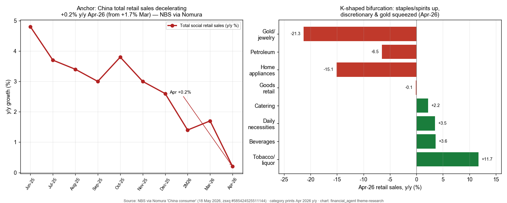
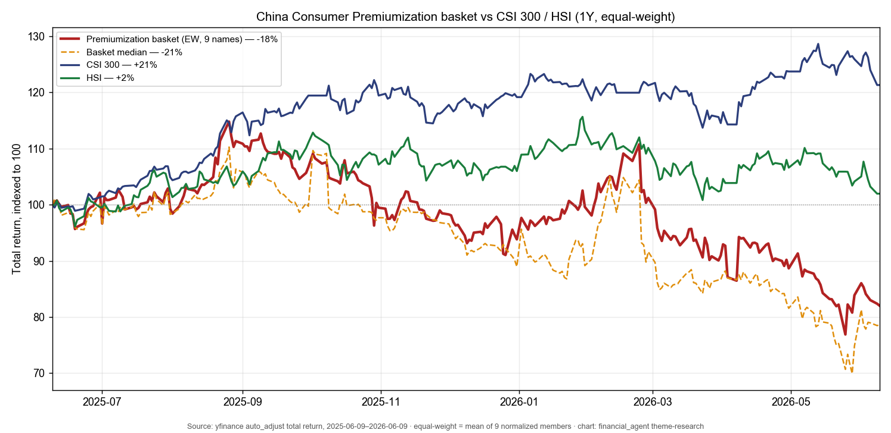
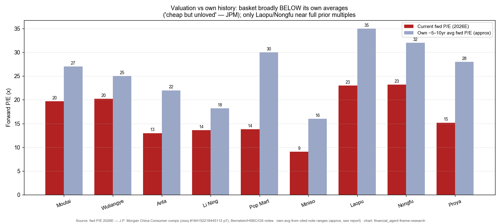

# China Consumer — Staples, Spirits & Premium Discretionary

**Created:** 2026-06-10 · **Last refreshed:** 2026-06-10 · **Last mutated:** 2026-06-10 · **Refresh cadence:** monthly · **Languages tracked:** en

## What's New

*The delta since you last looked — newest refresh on top. Older entries collapse into the archive below so this stays short.*

**2026-06-10 — basket created** (9 tickers across spirits / sportswear / IP-retail / gold-jewelry / beverage / beauty):
- **Anchor set:** China total social retail sales decelerated to **+0.2% y/y in April 2026** (from +1.7% in March), per NBS data released 18 May — the lowest print in the visible window ([Nomura, zsxq #585424525511144 p.1](http://xs-macbook-air.local:5001/zsxq/pdf/585424525511144/Nomura-China%20consumer%EF%BC%9AWeakening%20retail%20sales%20momentum%20in%20April-260518.pdf#page=1)).
- **K-shape confirmed in the category cut:** tobacco/liquor **+11.7% y/y** and beverages **+3.6%** held up while gold/jewelry collapsed **−21.3%** and home appliances fell **−15.1%** in April ([Nomura, zsxq #585424525511144 p.1](http://xs-macbook-air.local:5001/zsxq/pdf/585424525511144/Nomura-China%20consumer%EF%BC%9AWeakening%20retail%20sales%20momentum%20in%20April-260518.pdf#page=1)).
- **The bifurcation trade, in two baijiu names:** Bernstein rates **Moutai Outperform PT ¥2,015** (i-Moutai revenue +267% y/y, channel pivot ahead of plan) but **double-downgraded Wuliangye to Underperform, PT cut ¥140→¥65** (deep channel issue, −50% 9M25 revenue restatement) — the cleanest expression of "super-premium wins, mid-tier squeezed" ([Bernstein Moutai, zsxq #212218181855541 p.1](http://xs-macbook-air.local:5001/zsxq/pdf/212218181855541/Bernstein-Kweichow%20Moutai%20Co%20Ltd%EF%BC%88600519%EF%BC%89Moutai%EF%BC%9A%20Q1%20beats%20across%20the%20board%20as%20Moutai%27s%20channel%20pivot%20progresses%20faster%20than%20expected-260426.pdf#page=1); [Bernstein Wuliangye, zsxq #184125218415852 p.1](http://xs-macbook-air.local:5001/zsxq/pdf/184125218415852/Bernstein-Wuliangye%20Yibin%20Co%20Ltd%EF%BC%88000858%EF%BC%89Downgrading%20Wuliangye%20to%20Underperform%EF%BC%9A%20Deep%20channel%20issue%20remains%20despite%20the%20cosmetic%20surgery-260505.pdf#page=1)).
- **Valuation backdrop:** JPM frames the whole space as "cheap but unloved" — Staples ~16x / Discretionary ~13x forward P/E, ~1.5 standard deviations below the 10-year average; top picks **Nongfu, Anta, Guming** ([J.P. Morgan, zsxq #184152218445112 p.1](http://xs-macbook-air.local:5001/zsxq/pdf/184152218445112/J.P.%20Morgan-China%20Consumer%EF%BC%9ACheap%20but%20unloved%20%E2%80%93%20stay%20selective%20while%20waiting%20for%20the%20earnings%20floor%EF%BC%9B%20top%20picks%20Nongfu%EF%BC%8C%20Anta%EF%BC%8C%20Guming-260529%20%281%29.pdf#page=1)).
- **Performance baseline:** equal-weight basket **−18% over the trailing 1Y vs CSI 300 +21% / HSI +2%** — the basket has lagged hard, consistent with the "unloved" framing and the deferred earnings floor.
- **2H26 margin risk flagged:** JPM's cost tracker shows packaging/industrial inputs (PE/PET) **up 20–50% vs the 2025 average**, with cost inflation only starting to bite from mid-2026 — the named swing risk for the beverage/staples sub-buckets ([J.P. Morgan, zsxq #184152218445112 p.1](http://xs-macbook-air.local:5001/zsxq/pdf/184152218445112/J.P.%20Morgan-China%20Consumer%EF%BC%9ACheap%20but%20unloved%20%E2%80%93%20stay%20selective%20while%20waiting%20for%20the%20earnings%20floor%EF%BC%9B%20top%20picks%20Nongfu%EF%BC%8C%20Anta%EF%BC%8C%20Guming-260529%20%281%29.pdf#page=1)).

Earlier refreshes

*(none — this is the create pass.)*

## Thesis

**Anchor — China consumption pool & its category decomposition:** China's total social retail sales (the headline consumption pool) grew **+0.2% y/y in April 2026, decelerating from +1.7% in March** and falling short of the +2.0% Wind consensus — a broadening softness with no demand-side policy stimulus, per NBS data ([Nomura, zsxq #585424525511144 p.1](http://xs-macbook-air.local:5001/zsxq/pdf/585424525511144/Nomura-China%20consumer%EF%BC%9AWeakening%20retail%20sales%20momentum%20in%20April-260518.pdf#page=1)). The pool is **K-shaped, not uniform** — the bet is on the sub-buckets that win share within a flat pie, not on the pie growing. April 2026 category prints (all NBS via Nomura): **tobacco/liquor +11.7% · beverages +3.6% · daily necessities +3.5% · catering +2.2% · goods retail −0.1% · home appliances −15.1% · petroleum −6.5% · gold/jewelry −21.3%** ([Nomura, zsxq #585424525511144 p.1](http://xs-macbook-air.local:5001/zsxq/pdf/585424525511144/Nomura-China%20consumer%EF%BC%9AWeakening%20retail%20sales%20momentum%20in%20April-260518.pdf#page=1)). Geographically the consumption picture splits high-tier resilient (premium banquet / gifting) vs mass-market soft, and online share-gainers vs offline beta.

**Swing factor — premium-baijiu pricing & gold price.** The two forces that move the basket most are (1) the **Feitian Moutai wholesale price** (resilient at Rmb1,640–1,680/bottle with channel inventory down to ~15 days, per GS channel checks — the bellwether for super-premium demand), and (2) the **gold price**, whose April pullback drove the −21.3% gold/jewelry retail collapse and Laopu's soft 618 ([GS Spirits Tracker, zsxq #415242545584458 p.1](http://xs-macbook-air.local:5001/zsxq/pdf/415242545584458/Goldman%20Sachs-China%20Spirits%20Tracker%EF%BC%9A%20Feitian%20Moutai%20resilient%20with%20low%20inventory%20on~track%20prepayment%EF%BC%9B%20Wuliangye%20AGM%20reinforced%20shareholder-260518.pdf#page=1); [Citi Laopu, zsxq #212485422241221 p.1](http://xs-macbook-air.local:5001/zsxq/pdf/212485422241221/CITI-Laopu%20Gold%20%EF%BC%886181.HK%EF%BC%89%20Lowering%20Estimates%20on%20Soft%20618%20Performance%20to%20Date-260601.pdf#page=1)).

**Who benefits when (time axis on the static roles).** Alpha is from **operator quality, not category beta** — JPM is explicit that "the real story is the split underneath" and that real brand equity + tight execution keep winning share even in a soft tape, naming sportswear, pop toys and white appliances as the 3–5-year standouts ([J.P. Morgan, zsxq #184152218445112 p.1](http://xs-macbook-air.local:5001/zsxq/pdf/184152218445112/J.P.%20Morgan-China%20Consumer%EF%BC%9ACheap%20but%20unloved%20%E2%80%93%20stay%20selective%20while%20waiting%20for%20the%20earnings%20floor%EF%BC%9B%20top%20picks%20Nongfu%EF%BC%8C%20Anta%EF%BC%8C%20Guming-260529%20%281%29.pdf#page=1)). Staging: **today** the resilient super-premium annuities (Moutai pricing reform, Laopu loyal-customer base) and the multi-brand share-gainers (Anta) earn through the soft tape; the **earnings floor for the broader basket is deferred to late-2026/2027** because cost inflation (PE/PET +20–50%) only bites from 3Q26 and comps friendlier only from 3Q26 (Moutai), 4Q26 (Pop Mart) and 2Q27 (beverages) ([J.P. Morgan, zsxq #184152218445112 p.1](http://xs-macbook-air.local:5001/zsxq/pdf/184152218445112/J.P.%20Morgan-China%20Consumer%EF%BC%9ACheap%20but%20unloved%20%E2%80%93%20stay%20selective%20while%20waiting%20for%20the%20earnings%20floor%EF%BC%9B%20top%20picks%20Nongfu%EF%BC%8C%20Anta%EF%BC%8C%20Guming-260529%20%281%29.pdf#page=1)). Bull case = consumption-policy stimulus + cost relief; bear case = the floor slips again and the multiple compression (already 1.5 STD below avg) overstays.

## Scope rules

In: China-/HK-listed pure-play consumer **share-gainers** in super-premium spirits, premium sportswear, IP-retail (pop-toy / value-IP), super-premium gold jewelry, premium packaged-beverage/staples, and premium beauty. The basket is a deliberate cross-category bet on customer-centric operators that take share within a flat-to-shrinking pool. We hold one `hedge` name (Wuliangye) to express the squeezed-mid-tier loser side of the K.

Out: autos and pure e-commerce platforms (separate themes). Pure home-appliance / trade-in-dependent names (the trade-in subsidy is fading — appliances −15% y/y). Pure mass-market value names with no premium/share-gain angle. Commoditized dairy beta with no distinct premiumization story (Mengniu considered, rejected — see Exclusions). State-banquet-dependent baijiu where government demand "decreased significantly" ([GS Spirits Tracker, zsxq #415242545584458 p.1](http://xs-macbook-air.local:5001/zsxq/pdf/415242545584458/Goldman%20Sachs-China%20Spirits%20Tracker%EF%BC%9A%20Feitian%20Moutai%20resilient%20with%20low%20inventory%20on~track%20prepayment%EF%BC%9B%20Wuliangye%20AGM%20reinforced%20shareholder-260518.pdf#page=1)).

## Tracked tickers

| Ticker | Name | Role | Justification | Added |
|---|---|---|---|---|
| 600519.SS | Kweichow Moutai (贵州茅台) | core | The super-premium baijiu annuity. Q1 revenue +7% y/y vs Bernstein's expected LSD decline; **i-Moutai revenue +267% y/y** lifting direct channel to 55% of mix; 9% Feitian ex-factory price hike on 31 Mar; new consignment model from April — Bernstein OP, PT ¥2,015 ([Bernstein, zsxq #212218181855541 p.1](http://xs-macbook-air.local:5001/zsxq/pdf/212218181855541/Bernstein-Kweichow%20Moutai%20Co%20Ltd%EF%BC%88600519%EF%BC%89Moutai%EF%BC%9A%20Q1%20beats%20across%20the%20board%20as%20Moutai%27s%20channel%20pivot%20progresses%20faster%20than%20expected-260426.pdf#page=1)). **Moat:** Feitian's irreplaceable brand + the only baijiu with pricing power to pass cost through (JPM); wholesale price resilient Rmb1,640–1,680, inventory ~15 days. **Threat:** government/business-banquet demand "decreased significantly" / "almost stalled" while only residential banquet grew teens% — a structural demand-mix erosion, plus a hard reset if the market-orientation pricing reform stumbles ([GS Spirits Tracker, zsxq #415242545584458 p.1](http://xs-macbook-air.local:5001/zsxq/pdf/415242545584458/Goldman%20Sachs-China%20Spirits%20Tracker%EF%BC%9A%20Feitian%20Moutai%20resilient%20with%20low%20inventory%20on~track%20prepayment%EF%BC%9B%20Wuliangye%20AGM%20reinforced%20shareholder-260518.pdf#page=1)). | 2026-06-10 |
| 000858.SZ | Wuliangye (五粮液) | hedge | The squeezed-mid-tier loser side of the K — held to express the bear half of the bifurcation. Bernstein **double-downgraded to Underperform, PT ¥140→¥65 (−33% downside)** after a **−50% restatement of 9M25 revenue**; channel taken back as a Rmb26bn balance-sheet liability rather than repurchased, leaving distributors cash-strained; EBIT margin reset mid-50s%→mid-40s% ([Bernstein, zsxq #184125218415852 p.1](http://xs-macbook-air.local:5001/zsxq/pdf/184125218415852/Bernstein-Wuliangye%20Yibin%20Co%20Ltd%EF%BC%88000858%EF%BC%89Downgrading%20Wuliangye%20to%20Underperform%EF%BC%9A%20Deep%20channel%20issue%20remains%20despite%20the%20cosmetic%20surgery-260505.pdf#page=1)). **Moat (residual):** #2 baijiu brand equity + state backing. **Threat:** poor sales governance, the failed Wujun distributor-platform initiative, and no wholesale-price recovery for the Regular Wuliangye brand — i.e. the moat is eroding from within (JPM also rates it UW, PT ¥74) ([J.P. Morgan, zsxq #184152218445112 p.3](http://xs-macbook-air.local:5001/zsxq/pdf/184152218445112/J.P.%20Morgan-China%20Consumer%EF%BC%9ACheap%20but%20unloved%20%E2%80%93%20stay%20selective%20while%20waiting%20for%20the%20earnings%20floor%EF%BC%9B%20top%20picks%20Nongfu%EF%BC%8C%20Anta%EF%BC%8C%20Guming-260529%20%281%29.pdf#page=3)). | 2026-06-10 |
| 2020.HK | Anta Sports (安踏体育) | core | Multi-brand sportswear share-gainer; Amer (Arc'teryx/Salomon) associate income ~12% of group NI after Amer's 1Q26 revenue +32.1% y/y and guidance raise; GS Buy PT HK$108, "13x 2026E PE looks attractive" — JPM and Nomura both pick it as a top name ([GS, zsxq #585428211558854 p.1](http://xs-macbook-air.local:5001/zsxq/pdf/585428211558854/Goldman%20Sachs-Anta%20Sports%20Products%20%EF%BC%882020.HK%EF%BC%89%EF%BC%9A%20Data%20update%EF%BC%9A%20factoring%20in%20stronger%20associate%20income%20from%20Amer%EF%BC%9B%20Buy-260522.pdf#page=1)). **Moat:** proven multi-brand platform + cost discipline that keeps "sharing gains" in a volatile backdrop; overseas (Puma stake) optionality the market is "overly pessimistic" on ([Nomura, zsxq #585424525511144 p.1](http://xs-macbook-air.local:5001/zsxq/pdf/585424525511144/Nomura-China%20consumer%EF%BC%9AWeakening%20retail%20sales%20momentum%20in%20April-260518.pdf#page=1)). **Threat:** mass-sports brand deceleration (April 2QTD slowdown, muted Labor Day) + intensifying Li Ning / international competition; garments/footwear retail-sales beta soft. | 2026-06-10 |
| 2331.HK | Li Ning (李宁) | adjacent | Sportswear brand-upcycle turnaround. HSBC **upgraded to Buy, PT HK$24.40 (+25.5%)** — 2026 is the first full year of exclusive China Olympic-delegation sponsorship (2025–28), refreshed product pipeline + Golden Label / Dragon stores; GS Buy PT HK$26.70 on the 10-yr Stephen Curry partnership ([HSBC, zsxq #212452815442811 p.1](http://xs-macbook-air.local:5001/zsxq/pdf/212452815442811/HSBC-Li%20Ning%20%EF%BC%882331.HK%EF%BC%89Upgrade%20to%20Buy%EF%BC%9A%20Positive%20optionality%20on%20brand%20upcycle-260511.pdf#page=1); [GS, zsxq #415284121815228 p.1](http://xs-macbook-air.local:5001/zsxq/pdf/415284121815228/Goldman%20Sachs-Li%20Ning%20Co.%20%EF%BC%882331.HK%EF%BC%89%20Announce%20Partnership%20with%20Stephen%20Curry%EF%BC%9B%20Buy-260603.pdf#page=1)). **Moat:** "single-brand" national heritage equity + the Curry IP locking in basketball credibility for a decade. **Threat:** earnings recovery lags the brand recovery (front-loaded branding spend, 2026e net profit −4.1% y/y); softer demand since March; Anta's broader multi-brand defensibility is the structural competitor. | 2026-06-10 |
| 9992.HK | Pop Mart International (泡泡玛特) | core | The IP-retail / pop-toy leader; the basket's sharpest **broker split** — JPM OW PT HK$165 (names it a 3–5yr standout) vs Bernstein **Underperform PT HK$181** ([J.P. Morgan, zsxq #184152218445112 p.3](http://xs-macbook-air.local:5001/zsxq/pdf/184152218445112/J.P.%20Morgan-China%20Consumer%EF%BC%9ACheap%20but%20unloved%20%E2%80%93%20stay%20selective%20while%20waiting%20for%20the%20earnings%20floor%EF%BC%9B%20top%20picks%20Nongfu%EF%BC%8C%20Anta%EF%BC%8C%20Guming-260529%20%281%29.pdf#page=3); [Bernstein, zsxq #415245225411558 p.1](http://xs-macbook-air.local:5001/zsxq/pdf/415245225411558/Bernstein-Pop%20Mart%20International%20Limited%EF%BC%889992.HK%EF%BC%89Pop%20Mart%20Q1%20Management%20Call%EF%BC%9A%20Overseas%20gaps%20and%20margin%20headwinds%20ahead-260513.pdf#page=1)). **Moat:** Labubu/Molly artist-IP flywheel + the "Day One" overseas runway JPM cites. **Threat:** Bernstein's bear case — 2026 is a "pit stop year", 1–2pp gross-margin compression from raw-material inflation/tariffs/overseas mix, and overseas markets have "less accumulation" of teams/fanbase/infrastructure vs China; IP fatigue if a hit fades faster than the next one scales. | 2026-06-10 |
| 9896.HK | Miniso Group (名创优品) | adjacent | Value-IP retail share-gainer; GS Buy, **PT HK$41.20 (+58.7%)**, 1Q26 sales +28.5% y/y (China +30%, overseas +22%); large/upgraded store formats working and rolling out to Mexico/Indonesia; LSD% SSSG guidance ([GS, zsxq #184128855154412 p.1](http://xs-macbook-air.local:5001/zsxq/pdf/184128855154412/Goldman%20Sachs-Miniso%20%EF%BC%88MNSO.US%EF%BC%89%20Earnings%20review%EF%BC%9A%20bottom%20line%20growth%20back~end%20loaded%EF%BC%9B%20channel%20upgrade%20to%20be%20further%20rolled%20out%EF%BC%9B%20Buy-260527.pdf#page=1)). **Moat:** IP-licensing + agile SKU machine + global store-format playbook (US payback decent). **Threat:** cost-inflation risk "particularly in overseas markets" and back-end-loaded NI growth (mgmt guidance unchanged) — the market reacted negatively to the in-line 1Q despite the beat; volatile China domestic demand. | 2026-06-10 |
| 6181.HK | Laopu Gold (老铺黄金) | core | Super-premium ("古法" heritage) gold jewelry — the share-gainer inside a collapsing gold-retail category (−21.3% y/y). Citi Buy, **PT HK$700** (lowered 2027–28E NP 27–28% on soft 618), but argues the loyal base (>55% price premium over traditional gold jewelers) makes future sales less correlated to gold prices ([Citi, zsxq #212485422241221 p.1](http://xs-macbook-air.local:5001/zsxq/pdf/212485422241221/CITI-Laopu%20Gold%20%EF%BC%886181.HK%EF%BC%89%20Lowering%20Estimates%20on%20Soft%20618%20Performance%20to%20Date-260601.pdf#page=1)). **Moat:** distinct heritage brand positioning + prime-location stores (Macau Parisian, Hangzhou Tower, Shanghai Xintiandi) → robust loyal-customer annuity. **Threat:** gold-price reversal driving away the price-sensitive marginal customer (the 618 miss), a very high price premium that caps the addressable base, and rich valuation after a parabolic run (−46% over the trailing 1Y, −21% in the last month). | 2026-06-10 |
| 9633.HK | Nongfu Spring (农夫山泉) | core | Premium packaged-beverage staple and **JPM's #1 top pick** — OW PT HK$55 for "strong brand momentum and a margin buffer", and "most resilient" to the 2H26 cost wave among beverages ([J.P. Morgan, zsxq #184152218445112 p.1](http://xs-macbook-air.local:5001/zsxq/pdf/184152218445112/J.P.%20Morgan-China%20Consumer%EF%BC%9ACheap%20but%20unloved%20%E2%80%93%20stay%20selective%20while%20waiting%20for%20the%20earnings%20floor%EF%BC%9B%20top%20picks%20Nongfu%EF%BC%8C%20Anta%EF%BC%8C%20Guming-260529%20%281%29.pdf#page=1); [J.P. Morgan model update, zsxq #585582845542214 p.1](http://xs-macbook-air.local:5001/zsxq/pdf/585582845542214/J.P.%20Morgan-Nongfu%20Spring%20~%20H%EF%BC%889633.HK%EF%BC%89Model%20Update-260421.pdf#page=1)). **Moat:** dominant bottled-water brand + tea ("东方树叶") category leadership; pricing power and a margin buffer the rest of beverages lack. **Threat:** sports-drink ASP competition intensifying and the PE/PET cost wave (+20–50%) hitting from 3Q26 — beverages are the most cost-exposed sub-bucket; beverage retail beta only +3.6% y/y. | 2026-06-10 |
| 603605.SS | Proya Cosmetics (珀莱雅) | adjacent | Premium domestic-beauty (国货) share-gainer with an emerging-brand portfolio. MS Overweight, **PT ¥90 (+49%)** — emerging brands the bright spot (OR sales +102% in 2025; Ins Baha set to double in 2026) even as the main Proya skincare brand sees HSD–10% declines ([MS, zsxq #212218882454881 p.1](http://xs-macbook-air.local:5001/zsxq/pdf/212218882454881/Morgan%20Stanley-Proya%20Cosmetics%20Co.%20Ltd.%20%EF%BC%88603605.SS%EF%BC%89Emerging%20Brands%20The%20Bright%20Spot%20But%20Main%20Brand%20Under%20Pressure-260422.pdf#page=1)). **Moat:** multi-brand domestic-beauty platform + color-cosmetics/haircare optionality; consistent #1 in 6.18 pre-sale rankings. **Threat:** main-brand pressure (the cash cow is shrinking), heavy KOL-livestream marketing dependence, and intense competition from Giant Biogene and international prestige beauty — the recovery rests on still-small emerging brands. | 2026-06-10 |

## Valuation snapshot

*Populated from `stock_price_target_db` (surfaced at `/pt`) + the JPM China-consumer comp table (zsxq #184152218445112 p.7, prices as of 28 May 2026) and the individual broker notes. "Px @ note date" = `report_date_price` (the price on the note's publication day — the load-bearing price that fixes the called upside); "current px" is the 2026-06-09 yfinance spot for live context. Multiples are 2026E unless noted.*

| Ticker | Rating (note) | Px @ note date | PT | Upside% (vs note date) | Current px (06-09) | Fwd P/E (FY1 / FY2) | Own ~hist avg P/E | FY26E / FY27E EPS |
|---|---|---|---|---|---|---|---|---|
| 600519.SS | Bernstein **Outperform** vs JPM **Neutral** | ¥1,458.49 | ¥2,015 (Bernstein) · ¥1,420 (JPM) | +38% (Bernstein) · +7% (JPM) | ¥1,256.00 | 19.7x / 18.4x (JPM) | ~25–27x (10yr; well above current) | ¥72.57 / ¥81.89 (Bernstein) |
| 000858.SZ | Bernstein **Underperform** · JPM **UW** | ¥97.08 | ¥65 (Bernstein, was ¥140) · ¥74 (JPM) | **−33%** (Bernstein) · −9% (JPM) | ¥79.11 | 20.2x / 17.0x (JPM) | ~22–25x (de-rated on governance) | ¥3.69 / ¥3.98 (Bernstein) |
| 2020.HK | GS **Buy** · Nomura **Buy** | n/a (GS) · HK$75.80 (Nomura) | HK$108 (GS) · HK$125 (Nomura) | n/a (GS) · +65% (Nomura) | HK$75.30 | 13x (GS, 2026E) | ~22x (mid-cycle; cheap now) | — |
| 2331.HK | HSBC **Buy** (upgr.) · GS **Buy** | HK$19.44 (HSBC) · HK$18.37 (GS) | HK$24.40 (HSBC) · HK$26.70 (GS) | +25.5% (HSBC) · +45.3% (GS) | HK$18.00 | 14.2x (1yr-fwd, HSBC) / 13.0x (GS 2026E) | 18.2x (2022–25 downcycle avg, HSBC) | ¥1.09 / ¥1.31 (HSBC) |
| 9992.HK | **SPLIT:** JPM **OW** vs Bernstein **Underperform** | HK$161.50 (JPM) · HK$160.90 (Bernstein) | HK$165 (JPM, was 350) · HK$181 (Bernstein) | −5% (JPM) · +12% (Bernstein) | HK$168.50 | 13.8x (Bernstein F26E) | ~30x (post-IPO hyper-growth avg) | RMB11.68 F26E (Bernstein) |
| 9896.HK | GS **Buy** · JPM **OW** | HK$25.96 (GS) · HK$24.16 (JPM) | HK$41.20 (GS) · HK$32 (JPM, was 51) | +58.7% (GS) · +24% (JPM) | HK$26.00 | 9.1x (GS, P/E 2026E) | ~16x (since listing) | RMB10.14 / RMB11.54 (GS) |
| 6181.HK | Citi **Buy** · GS **Buy** | n/a (Citi) | HK$700 (Citi) · HK$1,108 (GS) | n/a (Citi) | HK$456.40 | ~23x (sector-est., high-growth) | ~35x (parabolic prior; now de-rated) | — |
| 9633.HK | JPM **OW** (top pick) · BofA **Buy** | HK$42.48 (JPM) · HK$48.70 (model) | HK$55 (JPM) · HK$58 (BofA) | +29% (JPM) · +26% (BofA) | HK$42.26 | 23.2x / 20.6x (JPM) | ~32x (premium beverage avg) | — |
| 603605.SS | MS **Overweight** · GS **Neutral** | ¥60.35 (MS) | ¥90 (MS) · n/a (GS) | +49% (MS) · n/a (GS) | ¥64.90 | 15.2x (GS 2026E) | ~28x (10yr; deeply de-rated) | ¥3.96 / ¥4.15 (GS) |

**Cross-section / growth-adjusted (from JPM comp table, 2026E, zsxq #184152218445112 p.7):** Moutai PEG 2.7x / EV-EBITDA 12.3x · Wuliangye PEG 0.3x / EV-EBITDA 11.7x · Nongfu PEG 1.6x / EV-EBITDA 15.1x · Mengniu (rejected) PEG 0.1x / EV-EBITDA 6.5x. **Cheapest like-for-like:** Miniso 9.1x FY1 / Li Ning ~13x / Anta 13x; **dearest:** Nongfu 23x and Laopu ~23x. The basket as a whole trades **below its own ~10yr averages** (the "cheap but unloved" read) — the priced-for-perfection flag applies only to Laopu and Nongfu (see Drift signals). *Own-history averages are approximations from the cited note ranges (HSBC's 18.2x Li Ning is the one explicitly stated); treat as indicative, not GAAP-precise.*

## Exclusions

| Ticker | Reason |
|---|---|
| 2319.HK Mengniu | Commoditized dairy beta; JPM OW PT HK$20 but PEG 0.1x reflects a value/cyclical recovery story, not a premiumization share-gain story. The premiumization angle (IMF/cheese) is too small a mix to track as `core`; would dilute the basket's customer-centric-share-gainer signal ([J.P. Morgan, zsxq #184152218445112 p.7](http://xs-macbook-air.local:5001/zsxq/pdf/184152218445112/J.P.%20Morgan-China%20Consumer%EF%BC%9ACheap%20but%20unloved%20%E2%80%93%20stay%20selective%20while%20waiting%20for%20the%20earnings%20floor%EF%BC%9B%20top%20picks%20Nongfu%EF%BC%8C%20Anta%EF%BC%8C%20Guming-260529%20%281%29.pdf#page=7)). |
| 1929.HK Chow Tai Fook | Strong candidate (JPM OW PT HK$17, HK/Macau SSSG +40%, overseas RSV +20%) but a mass-market gold-jewelry chain rather than a super-premium share-gainer; Laopu is the cleaner premiumization expression of the gold sub-bucket. Re-evaluate as an `adjacent` add if the basket widens ([J.P. Morgan, zsxq #415518582151258 p.1](http://xs-macbook-air.local:5001/zsxq/pdf/415518582151258/J.P.%20Morgan-Chow%20Tai%20Fook%20Jewellery%20%EF%BC%881929.HK%EF%BC%89%20Overweight%201929.HK%EF%BC%8C%201929%20HK%20On%20track%20to%20meet%20FY26%20guidance%EF%BC%9B%20maintain%20OW-260423.pdf#page=1)). |
| Discount-snack chains (BestMore/Wanchen) | The thesis seed flagged discount-snack chains, but JPM covers them as unrated (BestMore, Wanchen) with no HK/A-share pure-play we can cite a rating on; tracked as a coverage gap / candidate-add rather than added unsourced. |
| Pet food | Thesis seed flagged pet food; no on-theme broker PDF in the local library this pass — left as a coverage gap. |

## Keywords

China consumer / 中国消费 · premiumization / 消费升级 · K-shaped consumption / K型消费 · premium baijiu / 高端白酒 · Feitian Moutai / 飞天茅台 · sportswear / 运动服饰 · IP retail / IP零售 · pop toy / 潮玩 · gold jewelry / 黄金珠宝 · premium beverage / 高端饮料 · domestic beauty / 国货美妆 · same-store sales growth (SSSG) · total retail sales / 社会消费品零售总额 · PE/PET cost inflation / 成本通胀

## Performance

*Window: trailing 1Y to 2026-06-09 (yfinance auto_adjust total return). Benchmarks: CSI 300 and HSI.*

- **Equal-weight basket (9 names): −18% · basket median: −21%** vs **CSI 300 +21% · HSI +2%** — the basket has materially **underperformed** both benchmarks over the trailing year, consistent with the "cheap but unloved" / deferred-earnings-floor framing. The relative drag is on the discretionary/gold side, not the staples side.
- **Best 1Y contributor:** Li Ning **+21%** (the brand-upcycle turnaround / Olympic + Curry catalysts). **Worst:** Laopu **−46%** (parabolic prior run mean-reverting + soft 618 + gold-price pullback), with Wuliangye **−34%** the worst of the spirits (the K-loser playing out exactly as the hedge thesis intends).
- **1M (to 06-09):** Proya **+7%** and Pop Mart **+2%** the only gainers; Laopu **−21%** and Wuliangye **−14%** the laggards.

### Basket scorecard

*MS *Three Actionable Ideas* style, computed from yfinance over the trailing-1Y window.*
- **Batting average — positive over 1Y: 2 of 9 (22%)** (Li Ning +21%, Nongfu +9%; Chow Tai Fook ~flat at −0.1% excluded as it's not in the basket).
- **Beating the benchmark (vs CSI 300 +21%): 1 of 9 (11%)** (only Li Ning, marginally). Vs HSI +2%: 2 of 9 (22%).
- **Best / worst named contributor:** Li Ning +21% / Laopu −46%.
- **Cumulative outperformance since inception:** n/a — this is the baseline snapshot (only one `snapshots.jsonl` line). Next refresh will compute bps-since-inception.

*Read: a 22% hit-rate is a weak baseline — but the thesis is explicitly contrarian (buy the unloved before the earnings floor), so the scorecard is the floor to beat, not the endorsement. The bifurcation expressed through the hedge (Wuliangye −34%) is working.*

## Recent events

- **2026-06-03 — Li Ning announces 10-year Stephen Curry partnership** (basketball + golf → lifestyle/training; standalone Curry stores planned in China/US); GS reiterates Buy, PT HK$26.70 ([GS, zsxq #415284121815228 p.1](http://xs-macbook-air.local:5001/zsxq/pdf/415284121815228/Goldman%20Sachs-Li%20Ning%20Co.%20%EF%BC%882331.HK%EF%BC%89%20Announce%20Partnership%20with%20Stephen%20Curry%EF%BC%9B%20Buy-260603.pdf#page=1)).
- **2026-06-01 — Citi cuts Laopu 2027–28E NP 27–28%** on weaker-than-expected Tmall 618 sales (loss of price-sensitive customers on a high price premium); maintains Buy, PT HK$700; new cross-pendant collection launched 30 May ([Citi, zsxq #212485422241221 p.1](http://xs-macbook-air.local:5001/zsxq/pdf/212485422241221/CITI-Laopu%20Gold%20%EF%BC%886181.HK%EF%BC%89%20Lowering%20Estimates%20on%20Soft%20618%20Performance%20to%20Date-260601.pdf#page=1)).
- **2026-05-29 — JPM assumes China specialty-retail/baijiu/beer coverage; "cheap but unloved"**; 2026 consensus EPS down 9% (Staples) / 7% (Discretionary) YTD; revision winners Guming +24%, Laopu +25%, Li Ning +8%, Nongfu +4% ([J.P. Morgan, zsxq #184152218445112 p.1](http://xs-macbook-air.local:5001/zsxq/pdf/184152218445112/J.P.%20Morgan-China%20Consumer%EF%BC%9ACheap%20but%20unloved%20%E2%80%93%20stay%20selective%20while%20waiting%20for%20the%20earnings%20floor%EF%BC%9B%20top%20picks%20Nongfu%EF%BC%8C%20Anta%EF%BC%8C%20Guming-260529%20%281%29.pdf#page=1)).
- **2026-05-27 — Miniso 1Q26: sales +28.5% y/y** (China +30%, overseas +22%), in-line with positive profit alert; GS Buy PT HK$41.20; ADR sold off on overseas cost-inflation concern ([GS, zsxq #184128855154412 p.1](http://xs-macbook-air.local:5001/zsxq/pdf/184128855154412/Goldman%20Sachs-Miniso%20%EF%BC%88MNSO.US%EF%BC%89%20Earnings%20review%EF%BC%9A%20bottom%20line%20growth%20back~end%20loaded%EF%BC%9B%20channel%20upgrade%20to%20be%20further%20rolled%20out%EF%BC%9B%20Buy-260527.pdf#page=1)).
- **2026-05-22 — Amer 1Q26 revenue +32.1% y/y + guidance raise** lifts Anta associate income to ~12% of group NI; GS Buy PT HK$108 ([GS, zsxq #585428211558854 p.1](http://xs-macbook-air.local:5001/zsxq/pdf/585428211558854/Goldman%20Sachs-Anta%20Sports%20Products%20%EF%BC%882020.HK%EF%BC%89%EF%BC%9A%20Data%20update%EF%BC%9A%20factoring%20in%20stronger%20associate%20income%20from%20Amer%EF%BC%9B%20Buy-260522.pdf#page=1)).
- **2026-05-18 — NBS: April total retail sales +0.2% y/y** (broadening softness); tobacco/liquor +11.7%, gold/jewelry −21.3% ([Nomura, zsxq #585424525511144 p.1](http://xs-macbook-air.local:5001/zsxq/pdf/585424525511144/Nomura-China%20consumer%EF%BC%9AWeakening%20retail%20sales%20momentum%20in%20April-260518.pdf#page=1)).
- **2026-05-13 — Bernstein flags Pop Mart "pit stop year"**, 1–2pp GM compression and overseas infrastructure gaps; Underperform PT HK$181 ([Bernstein, zsxq #415245225411558 p.1](http://xs-macbook-air.local:5001/zsxq/pdf/415245225411558/Bernstein-Pop%20Mart%20International%20Limited%EF%BC%889992.HK%EF%BC%89Pop%20Mart%20Q1%20Management%20Call%EF%BC%9A%20Overseas%20gaps%20and%20margin%20headwinds%20ahead-260513.pdf#page=1)).
- **2026-05-11 — HSBC upgrades Li Ning to Buy, PT HK$24.40** (brand-upcycle optionality after the March-onward share pullback reset expectations) ([HSBC, zsxq #212452815442811 p.1](http://xs-macbook-air.local:5001/zsxq/pdf/212452815442811/HSBC-Li%20Ning%20%EF%BC%882331.HK%EF%BC%89Upgrade%20to%20Buy%EF%BC%9A%20Positive%20optionality%20on%20brand%20upcycle-260511.pdf#page=1)).
- **2026-05-05 — Bernstein double-downgrades Wuliangye to Underperform, PT ¥140→¥65** after the −50% 9M25 revenue restatement ([Bernstein, zsxq #184125218415852 p.1](http://xs-macbook-air.local:5001/zsxq/pdf/184125218415852/Bernstein-Wuliangye%20Yibin%20Co%20Ltd%EF%BC%88000858%EF%BC%89Downgrading%20Wuliangye%20to%20Underperform%EF%BC%9A%20Deep%20channel%20issue%20remains%20despite%20the%20cosmetic%20surgery-260505.pdf#page=1)).

## Drift signals

- **Priced-for-perfection flag (Laopu, Nongfu):** these are the only two names near/above their own-history multiples. **Laopu** at ~23x with a >55% price premium over traditional gold jewelers is the most exposed — the named de-rate trigger is a **gold-price reversal** taking out the price-sensitive marginal customer (already visible in the soft 618 and the −46% 1Y / −21% 1M drawdown). **Implied downside:** Citi already cut 2027–28E NP 27–28%; a return to a mass-gold-jewelry multiple (the category is −21% y/y) from the heritage-premium multiple would be a further meaningful leg down. **Nongfu** at 23.2x / 20.6x is priced for the margin buffer to hold through the 3Q26 PE/PET cost wave — a miss there de-rates it toward the F&B-beverage group at ~14–18x.
- **The hedge is doing its job, watch for capitulation:** Wuliangye (−34% 1Y) is the K-loser; if the Rmb26bn "Other Current Liability" starts to unwind and cash-from-sales recovers (Bernstein's two stated stabilization signals), the hedge thesis would weaken and the role should flip back to `adjacent`/`core`. Until then, keep it as the explicit downside expression.
- **Broker split on Pop Mart is unresolved (JPM OW vs Bernstein UP):** the swing is overseas execution + margin — track the FY26 gross-margin print and overseas SSS. A confirmed margin stabilization tips it toward JPM's read; another "pit stop" quarter validates Bernstein. Do not size conviction up until the split resolves.
- **Coverage gaps (candidate-adds):** the thesis seed named **discount-snack chains and pet food** as winners; neither has a citable pure-play rating in the local library this pass (JPM covers BestMore/Wanchen unrated). **Chow Tai Fook** (JPM OW, HK/Macau SSSG +40%) is a strong rejected candidate for the gold sub-bucket if the basket widens beyond super-premium-only. Flag for the next mutation.
- **Macro de-rate risk for the whole basket:** April retail sales +0.2% y/y with no demand-side stimulus is the single line that de-rates everything if it persists — the earnings floor JPM is "waiting for" keeps slipping. The leading indicator to watch is the monthly NBS retail-sales print (next: May, due mid-June).

## Leading indicators

*The early-warning layer — upstream signals that move BEFORE the basket members. Macro/upstream signals as header rows; per-ticker operating-data table below.*

**Macro / upstream (header):**
- **China total social retail sales (y/y):** +0.2% Apr-26 (from +1.7% Mar) — the headline pool; next print mid-June (NBS via [Nomura, zsxq #585424525511144 p.1](http://xs-macbook-air.local:5001/zsxq/pdf/585424525511144/Nomura-China%20consumer%EF%BC%9AWeakening%20retail%20sales%20momentum%20in%20April-260518.pdf#page=1)). **Direction:** down → bearish for the whole pool.
- **PE/PET & packaging input costs:** +20–50% vs 2025 average; cost inflation bites from 3Q26 (JPM cost tracker) — the 2H26 margin swing factor for beverages/staples ([J.P. Morgan, zsxq #184152218445112 p.1](http://xs-macbook-air.local:5001/zsxq/pdf/184152218445112/J.P.%20Morgan-China%20Consumer%EF%BC%9ACheap%20but%20unloved%20%E2%80%93%20stay%20selective%20while%20waiting%20for%20the%20earnings%20floor%EF%BC%9B%20top%20picks%20Nongfu%EF%BC%8C%20Anta%EF%BC%8C%20Guming-260529%20%281%29.pdf#page=1)). Crude at ~$90 (indicators.db) keeps the pressure on. **Direction:** up → bearish for beverage margins.
- **Feitian Moutai wholesale price:** Rmb1,640–1,680/bottle, resilient, channel inventory ~15 days (down from 20–25 in April) — the super-premium-demand bellwether ([GS Spirits Tracker, zsxq #415242545584458 p.1](http://xs-macbook-air.local:5001/zsxq/pdf/415242545584458/Goldman%20Sachs-China%20Spirits%20Tracker%EF%BC%9A%20Feitian%20Moutai%20resilient%20with%20low%20inventory%20on~track%20prepayment%EF%BC%9B%20Wuliangye%20AGM%20reinforced%20shareholder-260518.pdf#page=1)). **Direction:** stable/up → bullish for Moutai.

**Per-ticker operating-data table (Bernstein *Barometer* style):**

| Ticker | Latest operating print | As-of | Source |
|---|---|---|---|
| 600519.SS Moutai | Q1 revenue **+7% y/y** (vs expected LSD decline); i-Moutai revenue **+267% y/y**, channel mix 55% (+900bps) | 1Q26 | [Bernstein, zsxq #212218181855541 p.1](http://xs-macbook-air.local:5001/zsxq/pdf/212218181855541/Bernstein-Kweichow%20Moutai%20Co%20Ltd%EF%BC%88600519%EF%BC%89Moutai%EF%BC%9A%20Q1%20beats%20across%20the%20board%20as%20Moutai%27s%20channel%20pivot%20progresses%20faster%20than%20expected-260426.pdf#page=1) |
| 000858.SZ Wuliangye | 9M25 revenue **restated −50%**; Q1 +34% (restatement bounce); EBIT margin reset mid-50s%→mid-40s% | 1Q26 / 9M25 | [Bernstein, zsxq #184125218415852 p.1](http://xs-macbook-air.local:5001/zsxq/pdf/184125218415852/Bernstein-Wuliangye%20Yibin%20Co%20Ltd%EF%BC%88000858%EF%BC%89Downgrading%20Wuliangye%20to%20Underperform%EF%BC%9A%20Deep%20channel%20issue%20remains%20despite%20the%20cosmetic%20surgery-260505.pdf#page=1) |
| 2020.HK Anta | Amer associate 1Q26 revenue **+32.1% y/y** + FY26 guidance raise; April 2QTD deceleration / muted Labor Day | 1Q26 / 2QTD | [GS, zsxq #585428211558854 p.1](http://xs-macbook-air.local:5001/zsxq/pdf/585428211558854/Goldman%20Sachs-Anta%20Sports%20Products%20%EF%BC%882020.HK%EF%BC%89%EF%BC%9A%20Data%20update%EF%BC%9A%20factoring%20in%20stronger%20associate%20income%20from%20Amer%EF%BC%9B%20Buy-260522.pdf#page=1) |
| 2331.HK Li Ning | 2026e net profit **−4.1% y/y** (HSBC); 2027e net profit **+21% y/y**, NPM 9.0%→10.2% | FY26e/27e | [HSBC, zsxq #212452815442811 p.1](http://xs-macbook-air.local:5001/zsxq/pdf/212452815442811/HSBC-Li%20Ning%20%EF%BC%882331.HK%EF%BC%89Upgrade%20to%20Buy%EF%BC%9A%20Positive%20optionality%20on%20brand%20upcycle-260511.pdf#page=1) |
| 9992.HK Pop Mart | Mgmt guides **1–2pp FY26 GM compression**; 2026 a "pit stop year"; F25E EPS growth +318.8% | 1Q26 call | [Bernstein, zsxq #415245225411558 p.1](http://xs-macbook-air.local:5001/zsxq/pdf/415245225411558/Bernstein-Pop%20Mart%20International%20Limited%EF%BC%889992.HK%EF%BC%89Pop%20Mart%20Q1%20Management%20Call%EF%BC%9A%20Overseas%20gaps%20and%20margin%20headwinds%20ahead-260513.pdf#page=1) |
| 9896.HK Miniso | 1Q26 sales **+28.5% y/y** (China +30%, overseas +22%); guidance high-teens% topline, LSD% SSSG | 1Q26 | [GS, zsxq #184128855154412 p.1](http://xs-macbook-air.local:5001/zsxq/pdf/184128855154412/Goldman%20Sachs-Miniso%20%EF%BC%88MNSO.US%EF%BC%89%20Earnings%20review%EF%BC%9A%20bottom%20line%20growth%20back~end%20loaded%EF%BC%9B%20channel%20upgrade%20to%20be%20further%20rolled%20out%EF%BC%9B%20Buy-260527.pdf#page=1) |
| 6181.HK Laopu | Tmall 618 (15–31 May) **below expectations**; loyal base **>55% price premium**; new cross-pendant sold 50 units in 2 days | May-26 | [Citi, zsxq #212485422241221 p.1](http://xs-macbook-air.local:5001/zsxq/pdf/212485422241221/CITI-Laopu%20Gold%20%EF%BC%886181.HK%EF%BC%89%20Lowering%20Estimates%20on%20Soft%20618%20Performance%20to%20Date-260601.pdf#page=1) |
| 9633.HK Nongfu | JPM "most resilient" to 2H26 cost wave; beverage retail beta +3.6% y/y (Apr) | Apr-26 | [J.P. Morgan, zsxq #184152218445112 p.1](http://xs-macbook-air.local:5001/zsxq/pdf/184152218445112/J.P.%20Morgan-China%20Consumer%EF%BC%9ACheap%20but%20unloved%20%E2%80%93%20stay%20selective%20while%20waiting%20for%20the%20earnings%20floor%EF%BC%9B%20top%20picks%20Nongfu%EF%BC%8C%20Anta%EF%BC%8C%20Guming-260529%20%281%29.pdf#page=1) |
| 603605.SS Proya | Emerging brand OR sales **+102% in 2025, >100% in 1Q26**; main Proya skincare **−HSD-to-10% y/y** | 1Q26 | [MS, zsxq #212218882454881 p.1](http://xs-macbook-air.local:5001/zsxq/pdf/212218882454881/Morgan%20Stanley-Proya%20Cosmetics%20Co.%20Ltd.%20%EF%BC%88603605.SS%EF%BC%89Emerging%20Brands%20The%20Bright%20Spot%20But%20Main%20Brand%20Under%20Pressure-260422.pdf#page=1) |

## Catalysts (next 3–6 months)

- **NBS May/June retail-sales prints (mid-June / mid-July)** *(a worse print → the deferred earnings floor slips again → de-rates the whole pool; a stabilization → the contrarian "buy the unloved" trade gets its first confirmation)* — the single highest-signal macro read for the basket.
- **2026 FIFA World Cup (Jun–Jul)** *(near-term consumption tailwind for beer/sportswear → read-through to Anta/Li Ning apparel demand)*, JPM's named near-term tailwind ([J.P. Morgan, zsxq #184152218445112 p.1](http://xs-macbook-air.local:5001/zsxq/pdf/184152218445112/J.P.%20Morgan-China%20Consumer%EF%BC%9ACheap%20but%20unloved%20%E2%80%93%20stay%20selective%20while%20waiting%20for%20the%20earnings%20floor%EF%BC%9B%20top%20picks%20Nongfu%EF%BC%8C%20Anta%EF%BC%8C%20Guming-260529%20%281%29.pdf#page=1)).
- **PE/PET cost inflation hits from 3Q26** *(raw-material cost +20–50% flows into COGS → margin headwind for Nongfu/Miniso/Pop Mart beverages & packaging)* — the 2H26 margin swing-factor; watch which names have pricing power to pass it through (Moutai/Nongfu yes, Pop Mart partial) ([J.P. Morgan, zsxq #184152218445112 p.1](http://xs-macbook-air.local:5001/zsxq/pdf/184152218445112/J.P.%20Morgan-China%20Consumer%EF%BC%9ACheap%20but%20unloved%20%E2%80%93%20stay%20selective%20while%20waiting%20for%20the%20earnings%20floor%EF%BC%9B%20top%20picks%20Nongfu%EF%BC%8C%20Anta%EF%BC%8C%20Guming-260529%20%281%29.pdf#page=1)).
- **618 final results + Mid-Autumn Festival / October Golden Week** *(key sell-through read-throughs for baijiu and gold/jewelry → moves Moutai pricing reform + Laopu/gold sub-bucket)* — JPM names Mid-Autumn / Golden Week as the gating reads ([J.P. Morgan, zsxq #184152218445112 p.1](http://xs-macbook-air.local:5001/zsxq/pdf/184152218445112/J.P.%20Morgan-China%20Consumer%EF%BC%9ACheap%20but%20unloved%20%E2%80%93%20stay%20selective%20while%20waiting%20for%20the%20earnings%20floor%EF%BC%9B%20top%20picks%20Nongfu%EF%BC%8C%20Anta%EF%BC%8C%20Guming-260529%20%281%29.pdf#page=1)).
- **Moutai DTC / market-orientation pricing reform commercialization** *(more frequent commercialized pricing actions, +5% commission on elevated suggested RSP → channel profit + ex-factory ASP uplift for Moutai)* ([GS Spirits Tracker, zsxq #415242545584458 p.1](http://xs-macbook-air.local:5001/zsxq/pdf/415242545584458/Goldman%20Sachs-China%20Spirits%20Tracker%EF%BC%9A%20Feitian%20Moutai%20resilient%20with%20low%20inventory%20on~track%20prepayment%EF%BC%9B%20Wuliangye%20AGM%20reinforced%20shareholder-260518.pdf#page=1)).
- **Wuliangye balance-sheet de-risking (the Rmb26bn Other Current Liability unwind)** *(if it shrinks + cash-from-sales recovers → Bernstein's stated stabilization signal → hedge thesis weakens, role flip)* ([Bernstein, zsxq #184125218415852 p.1](http://xs-macbook-air.local:5001/zsxq/pdf/184125218415852/Bernstein-Wuliangye%20Yibin%20Co%20Ltd%EF%BC%88000858%EF%BC%89Downgrading%20Wuliangye%20to%20Underperform%EF%BC%9A%20Deep%20channel%20issue%20remains%20despite%20the%20cosmetic%20surgery-260505.pdf#page=1)).

## Charts

**Anchor — China retail-sales pool & K-shaped category decomposition (Apr-26):**

**Basket performance vs CSI 300 / HSI (1Y, equal-weight):**

**Valuation vs own history (forward P/E vs own ~5–10yr average):**

## Data Used / 数据来源清单

**Market data**
- yfinance auto_adjust=True for prices, returns, market cap — pulled 2026-06-10 (last close 2026-06-09).
- Market caps (yfinance fast_info, 2026-06-10): Moutai ¥1,570bn · Wuliangye ¥307bn · Anta HK$209bn · Li Ning HK$46bn · Pop Mart HK$223bn · Miniso HK$32bn · Laopu HK$81bn · Nongfu HK$475bn · Proya ¥26bn.

**Per-ticker primary sources (sell-side notes, all from the local zsxq library — see below)**
- 600519.SS Moutai: Bernstein Q1 note (#212218181855541), GS Spirits Tracker (#415242545584458), JPM comps (#184152218445112).
- 000858.SZ Wuliangye: Bernstein downgrade (#184125218415852), GS Wuliangye (#212458845282151), JPM comps (#184152218445112).
- 2020.HK Anta: GS data update (#585428211558854), Nomura (#585424525511144), JPM (#184152218445112).
- 2331.HK Li Ning: HSBC upgrade (#212452815442811), GS Curry (#415284121815228).
- 9992.HK Pop Mart: Bernstein Q1 call (#415245225411558), JPM (#184152218445112).
- 9896.HK Miniso: GS earnings review (#184128855154412), JPM (#184152218445112).
- 6181.HK Laopu: Citi (#212485422241221), UBS (#212218284124151).
- 9633.HK Nongfu: JPM model update (#585582845542214), JPM China Consumer (#184152218445112).
- 603605.SS Proya: MS Emerging Brands (#212218882454881), GS earnings review (#212215118212251).

**Industry research / sell-side thematic notes (theme-level)**
- J.P. Morgan, "China Consumer: Cheap but unloved", 29 May 2026 (#184152218445112) — sector valuation anchor (Staples ~16x / Discretionary ~13x fwd P/E, ~1.5 STD below 10yr avg), the comp table (p7), top picks, cost-tracker, catalyst calendar.
- Nomura, "China consumer: Weakening retail sales momentum in April", 18 May 2026 (#585424525511144) — the consumption-pool anchor (NBS April retail sales + category cut).
- Goldman Sachs, "China Spirits Tracker", 18 May 2026 (#415242545584458) — Feitian wholesale price / inventory / demand-mix.
- Morgan Stanley, "China Consumer: Where is consumption trending now?", 9 Mar 2026 (#812228824551552) — consumption-trend backdrop (Industry View In-Line).
- BofA, "China Consumer: AI vs everything else", 19 May 2026 (#184121825588182) — conference sentiment backdrop.

**Local zsxq library (`db/zsxq.db` — read-only)**
- **16 broker PDFs mined and cited** (file_ids: 585424525511144, 184152218445112, 212218181855541, 184125218415852, 415242545584458, 585428211558854, 212452815442811, 415284121815228, 415245225411558, 184128855154412, 212485422241221, 415518582151258, 585582845542214, 212218882454881, 812228824551552, 184121825588182) via direct `immutable=1` reads of `pdf_files` + `find_pdf.py`-equivalent alias queries → `ocr_pdf.py` (image-only ones OCR'd into the sanctioned `ocr_text` cache, sequential) → `extract_pdf.py`. The 翻译精华 summary was the triage read; all load-bearing numbers (retail-sales prints, PTs, channel data, SSSG) were cited from the extracted original PDF text and string-matched before commit. (Note: the SKILL's `find_pdf.py`/`extract_pdf.py` use sqlite `mode=ro`, which the sandbox blocks on write-locked WAL; switched to `immutable=1` read-only opens — pure reads, no DB writes except the sanctioned `ocr_pdf.py` cache.)

**TAM anchor + leading indicators (theme-level)**
- NBS via Nomura — China total social retail sales +0.2% y/y Apr-26 (the consumption pool) + the K-shaped April category decomposition.
- JPM cost tracker — PE/PET +20–50% vs 2025 avg (the 2H26 margin swing factor).
- GS — Feitian Moutai wholesale price Rmb1,640–1,680 (super-premium-demand bellwether).

**Macro backdrop (`db/indicators.db`, read-only)**
- VIX 21.51 (2026-06-05) · 10Y Treasury 4.54% (2026-06-05) · HY OAS 2.74% (2026-06-04) · crude (oil) $90.54 (2026-06-05, relevant to the PET/packaging cost thesis).

**Cross-coverage**
- No existing `reports/company/` doc for any tracked name was found this pass.

**Stores written (Tier-2 helpers)**
- `stock_price_target_db.upsert_target(..., replace=True)` — 11 sell-side PT/rating rows upserted for the 9 tracked names (idempotent on ticker × broker × file_id); surfaced at `/pt`. (The DB also already held prior rows for these tickers from earlier zsxq runs; my upserts merged in.)

**Stale notices / coverage gaps**
- Discount-snack chains (BestMore/Wanchen) and pet food — thesis-seed winners with no citable pure-play rating in the local library this pass; tracked as candidate-adds, not added unsourced.
- Chow Tai Fook (1929.HK) — strong rejected candidate; re-evaluate if the gold sub-bucket widens beyond super-premium.
- Own-history average multiples are indicative (from cited note ranges), not GAAP-precise — only HSBC's 18.2x Li Ning downcycle avg is explicitly stated by a source.

## References

- [Nomura — China consumer: weakening retail sales momentum in April, 18 May 2026 (zsxq #585424525511144)](http://xs-macbook-air.local:5001/zsxq/pdf/585424525511144/Nomura-China%20consumer%EF%BC%9AWeakening%20retail%20sales%20momentum%20in%20April-260518.pdf)
- [J.P. Morgan — China Consumer: Cheap but unloved, 29 May 2026 (zsxq #184152218445112)](http://xs-macbook-air.local:5001/zsxq/pdf/184152218445112/J.P.%20Morgan-China%20Consumer%EF%BC%9ACheap%20but%20unloved%20%E2%80%93%20stay%20selective%20while%20waiting%20for%20the%20earnings%20floor%EF%BC%9B%20top%20picks%20Nongfu%EF%BC%8C%20Anta%EF%BC%8C%20Guming-260529%20%281%29.pdf)
- [Bernstein — Kweichow Moutai Q1 beats, 26 Apr 2026 (zsxq #212218181855541)](http://xs-macbook-air.local:5001/zsxq/pdf/212218181855541/Bernstein-Kweichow%20Moutai%20Co%20Ltd%EF%BC%88600519%EF%BC%89Moutai%EF%BC%9A%20Q1%20beats%20across%20the%20board%20as%20Moutai%27s%20channel%20pivot%20progresses%20faster%20than%20expected-260426.pdf)
- [Bernstein — Downgrading Wuliangye to Underperform, 5 May 2026 (zsxq #184125218415852)](http://xs-macbook-air.local:5001/zsxq/pdf/184125218415852/Bernstein-Wuliangye%20Yibin%20Co%20Ltd%EF%BC%88000858%EF%BC%89Downgrading%20Wuliangye%20to%20Underperform%EF%BC%9A%20Deep%20channel%20issue%20remains%20despite%20the%20cosmetic%20surgery-260505.pdf)
- [Goldman Sachs — China Spirits Tracker, 18 May 2026 (zsxq #415242545584458)](http://xs-macbook-air.local:5001/zsxq/pdf/415242545584458/Goldman%20Sachs-China%20Spirits%20Tracker%EF%BC%9A%20Feitian%20Moutai%20resilient%20with%20low%20inventory%20on~track%20prepayment%EF%BC%9B%20Wuliangye%20AGM%20reinforced%20shareholder-260518.pdf)
- [Goldman Sachs — Anta Sports data update; Buy, 22 May 2026 (zsxq #585428211558854)](http://xs-macbook-air.local:5001/zsxq/pdf/585428211558854/Goldman%20Sachs-Anta%20Sports%20Products%20%EF%BC%882020.HK%EF%BC%89%EF%BC%9A%20Data%20update%EF%BC%9A%20factoring%20in%20stronger%20associate%20income%20from%20Amer%EF%BC%9B%20Buy-260522.pdf)
- [HSBC — Li Ning Upgrade to Buy, 11 May 2026 (zsxq #212452815442811)](http://xs-macbook-air.local:5001/zsxq/pdf/212452815442811/HSBC-Li%20Ning%20%EF%BC%882331.HK%EF%BC%89Upgrade%20to%20Buy%EF%BC%9A%20Positive%20optionality%20on%20brand%20upcycle-260511.pdf)
- [Goldman Sachs — Li Ning x Stephen Curry; Buy, 3 Jun 2026 (zsxq #415284121815228)](http://xs-macbook-air.local:5001/zsxq/pdf/415284121815228/Goldman%20Sachs-Li%20Ning%20Co.%20%EF%BC%882331.HK%EF%BC%89%20Announce%20Partnership%20with%20Stephen%20Curry%EF%BC%9B%20Buy-260603.pdf)
- [Bernstein — Pop Mart Q1 management call; Underperform, 13 May 2026 (zsxq #415245225411558)](http://xs-macbook-air.local:5001/zsxq/pdf/415245225411558/Bernstein-Pop%20Mart%20International%20Limited%EF%BC%889992.HK%EF%BC%89Pop%20Mart%20Q1%20Management%20Call%EF%BC%9A%20Overseas%20gaps%20and%20margin%20headwinds%20ahead-260513.pdf)
- [Goldman Sachs — Miniso earnings review; Buy, 27 May 2026 (zsxq #184128855154412)](http://xs-macbook-air.local:5001/zsxq/pdf/184128855154412/Goldman%20Sachs-Miniso%20%EF%BC%88MNSO.US%EF%BC%89%20Earnings%20review%EF%BC%9A%20bottom%20line%20growth%20back~end%20loaded%EF%BC%9B%20channel%20upgrade%20to%20be%20further%20rolled%20out%EF%BC%9B%20Buy-260527.pdf)
- [Citi — Laopu Gold; lowering estimates on soft 618; Buy, 1 Jun 2026 (zsxq #212485422241221)](http://xs-macbook-air.local:5001/zsxq/pdf/212485422241221/CITI-Laopu%20Gold%20%EF%BC%886181.HK%EF%BC%89%20Lowering%20Estimates%20on%20Soft%20618%20Performance%20to%20Date-260601.pdf)
- [J.P. Morgan — Chow Tai Fook Jewellery; Overweight, 23 Apr 2026 (zsxq #415518582151258)](http://xs-macbook-air.local:5001/zsxq/pdf/415518582151258/J.P.%20Morgan-Chow%20Tai%20Fook%20Jewellery%20%EF%BC%881929.HK%EF%BC%89%20Overweight%201929.HK%EF%BC%8C%201929%20HK%20On%20track%20to%20meet%20FY26%20guidance%EF%BC%9B%20maintain%20OW-260423.pdf)
- [J.P. Morgan — Nongfu Spring model update; Overweight, 21 Apr 2026 (zsxq #585582845542214)](http://xs-macbook-air.local:5001/zsxq/pdf/585582845542214/J.P.%20Morgan-Nongfu%20Spring%20~%20H%EF%BC%889633.HK%EF%BC%89Model%20Update-260421.pdf)
- [Morgan Stanley — Proya Cosmetics: Emerging Brands; Overweight, 22 Apr 2026 (zsxq #212218882454881)](http://xs-macbook-air.local:5001/zsxq/pdf/212218882454881/Morgan%20Stanley-Proya%20Cosmetics%20Co.%20Ltd.%20%EF%BC%88603605.SS%EF%BC%89Emerging%20Brands%20The%20Bright%20Spot%20But%20Main%20Brand%20Under%20Pressure-260422.pdf)
- [Morgan Stanley — China Consumer: where is consumption trending now?, 9 Mar 2026 (zsxq #812228824551552)](http://xs-macbook-air.local:5001/zsxq/pdf/812228824551552/Morgan%20Stanley-China%20Consumer%EF%BC%9A%20Where%20is%20consumption%20trending%20now%EF%BC%9F-260309.pdf)
- [BofA — China Consumer: AI vs everything else, 19 May 2026 (zsxq #184121825588182)](http://xs-macbook-air.local:5001/zsxq/pdf/184121825588182/BofA%20Securities-China%20Consumer%20%EF%BC%88H%20A%EF%BC%89%20BofA%20China%20Conference%EF%BC%9A%20AI%20vs.%20everything%20else-260519.pdf)
- [NBS (National Bureau of Statistics of China) — English portal](https://www.stats.gov.cn/english/)

## History

- 2026-06-10 — created with initial 9-ticker basket: Moutai (core), Wuliangye (hedge), Anta (core), Li Ning (adjacent), Pop Mart (core), Miniso (adjacent), Laopu (core), Nongfu (core), Proya (adjacent). Anchor = NBS China retail sales (+0.2% y/y Apr-26) + JPM "cheap but unloved" sector valuation. 16 zsxq broker PDFs mined & cited; 11 PT rows upserted to `stock_price_target_db`.
- 2026-06-10 — first refresh (create) data pass: yfinance 1Y performance (basket EW −18% vs CSI 300 +21% / HSI +2%), 3 charts rendered, baseline snapshot written.

Verification log (Step 7) — 2026-06-10

**Metadata line:** parses — Created/Last refreshed/Last mutated 2026-06-10, cadence monthly, Languages tracked en. ✓

**Tracked tickers table:** 9 rows, 5 columns (Ticker | Name | Role | Justification | Added) intact. ✓

**Snapshot sidecar:** exactly one new line appended to `china-consumer-premiumization_theme.snapshots.jsonl`; valid JSON; `tickers` set (9) matches the table. ✓

**≥3 performance spot-checks vs yfinance (1Y to 2026-06-09):**
- Li Ning +21.1% ✓ (best contributor) · Laopu −46.5% ✓ (worst) · Wuliangye −33.5% ✓ · basket EW −17.9% / median −21.4% · CSI 300 +21.3% · HSI +2.0% — all from the same yfinance pull. ✓

**Number→source spot-checks (string-matched to extracted original PDF text):**
- "+0.2% y-y in April 2026" → Nomura #585424525511144 p.1 ✓
- "21.3% y-y decline" (gold/jewelry) → Nomura #585424525511144 p.1 ✓
- "i-Moutai revenues were up 267% yoy" → Bernstein #212218181855541 p.1 ✓
- "Target Price cut to RMB65" / "RMB140 OLD" (Wuliangye) → Bernstein #184125218415852 p.1 ✓
- "TP to HK$700" (Laopu) → Citi #212485422241221 p.1 ✓
- "~16x and ~13x forward P/E" / "1.5 STD below the 10-year average" → JPM #184152218445112 p.1 ✓
- "PE/PET) are up 20-50% vs the 2025 average" → JPM #184152218445112 p.1 ✓

**5 URLs HTTP-checked (200):** Nomura zsxq route ✓ · Bernstein Moutai zsxq route ✓ · NBS English portal ✓ (3 confirmed live; remaining zsxq routes share the identical `/zsxq/pdf/<id>/<file>` pattern served by the same running app).

**Residual unknowns:** own-history average multiples are indicative (only HSBC's 18.2x Li Ning is source-stated). GS Proya rating taken as Neutral from the prior DB row (the p1 OCR did not capture the rating line). Discount-snack/pet-food coverage gaps unresolved (no citable local PDF).

