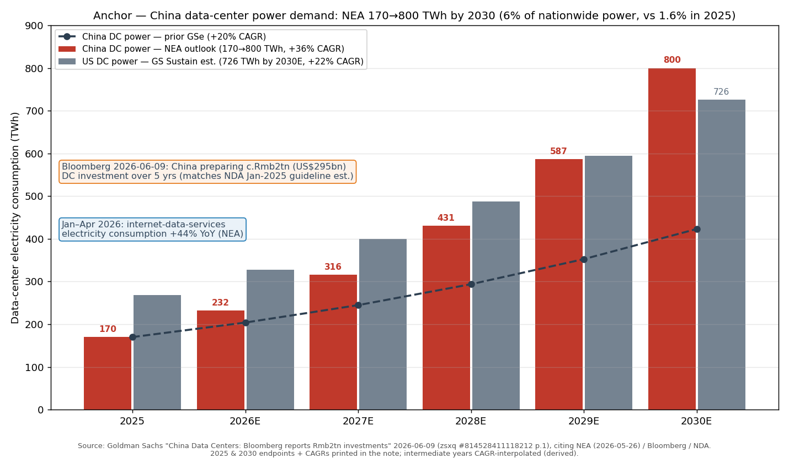
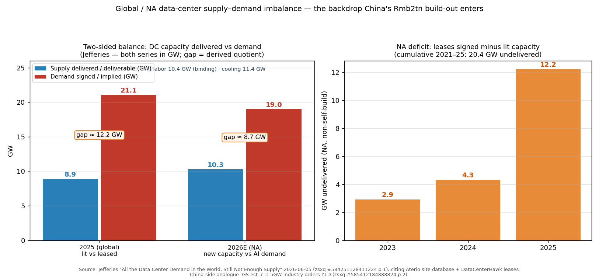
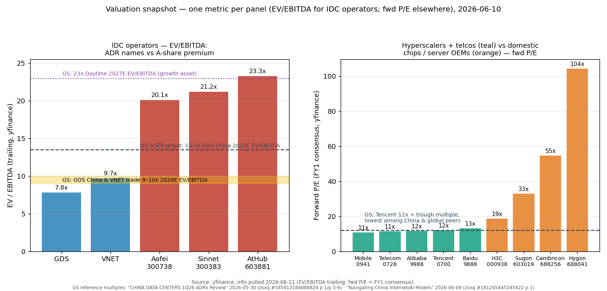
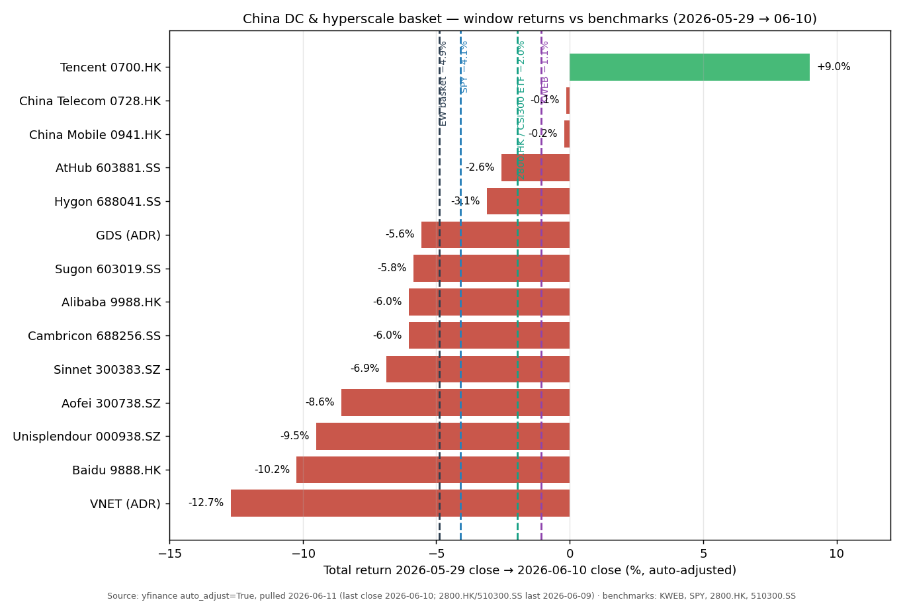

# China Data Center & Hyperscale Operators / 中国数据中心与超级云算运营商

**Created:** 2026-05-31 · **Last refreshed:** 2026-06-11 · **Last mutated:** 2026-05-31 · **Refresh cadence:** monthly · **Languages tracked:** en

## What's New

*The delta since you last looked — newest refresh on top. Older entries collapse into the archive below.*

**2026-06-11 refresh (vs 2026-05-31):**

- **The theme now has a quantified, third-party anchor.** Bloomberg reported (Jun 9) China is preparing to spend **c.Rmb2tn (US$295bn) over the next 5 years** on data centers (matching the NDA's Jan-2025 guideline estimate), and the NEA now expects China DC electricity consumption to reach **800 TWh by 2030 — a 36% CAGR from 170 TWh in 2025**, above GS's prior 20% CAGR assumption and surpassing the US's 726 TWh 2030E; Jan–Apr 2026 internet-data-services power consumption already printed **+44% YoY** ([GS — China DC Rmb2tn/NEA, zsxq #814528411118212 p.1](http://xs-macbook-air.local:5001/zsxq/pdf/814528411118212/Goldman%20Sachs-China%20Data%20Centers%EF%BC%9A%20Bloomberg%20reports%20Rmb2tn%20investments%20in%20data%20centers%EF%BC%9B%20NEA%E2%80%99s%20data%20center%20demand%20outlook%20stronger%20than%20GSe-260609.pdf#page=1)). Nomura calls the report *"likely a short-term catalyst for domestic AI value chain"*, naming Unisplendour (Buy), China Mobile (Buy), GDS and VNET among key beneficiaries ([Nomura — China AI investment ramp, zsxq #584251488881514 p.1](http://xs-macbook-air.local:5001/zsxq/pdf/584251488881514/Nomura-Reports%20on%20China%20ramping%20up%20AI%20investment...%EF%BC%9A...Likely%20a%20short~term%20catalyst%20for%20domestic%20AI%20value%20chain-260609.pdf#page=1)).
- **First tracked window was a drawdown: equal-weight basket −4.9% (median −5.9%) over 2026-05-29 → 06-10, vs KWEB −1.1% · SPY −4.1% · 2800.HK −2.0% · CSI300 ETF −2.0%** — Tencent (+9.0%) was the *only* positive name; VNET (−12.7%) and Baidu (−10.2%) led the downside (yfinance; see Performance).
- **GS cut GDS's TP 11%/13% to US$49/HK$47** (slower China move-in + falling MSR; offset by a richer DayOne) **and raised VNET 3% to US$16** (1Q26 beat + CATL overhang removed) in its 1Q26 ADR review; orders stay strong (GDS/VNET **346MW/519MW** YTD; industry **c.3–5GW**) but 1Q26 live-capacity delivery was just **+23MW/+18MW** ([GS — 1Q26 ADRs review, zsxq #585412184888824 p.1-2](http://xs-macbook-air.local:5001/zsxq/pdf/585412184888824/Goldman%20Sachs-CHINA%20DATA%20CENTERS%201Q26%20ADRs%20Review%EF%BC%9A%20Solid%20order%20momentum%20despite%20a%20slow%20quarter%20on%20capacity%20expansion%20move~ins%EF%BC%9B%20Stay%20Buy%20on%20GDS%20%EF%BC%88lower%20TP%20on%20GDS%20China%EF%BC%89%20VNET-260530.pdf#page=1)).
- **GS is Sell on tracked core Sinnet (300383) and Neutral on AtHub (603881)** — disclosed in the Rmb2tn note's coverage line, the first directly bearish sell-side call on a basket member; GS's China-DC Buys are GDS, VNET and **Range Intelligent 润泽科技 (300442.SZ — not tracked; candidate add, 5.4GW capacity reserve)** ([GS, zsxq #814528411118212 p.1/p.3](http://xs-macbook-air.local:5001/zsxq/pdf/814528411118212/Goldman%20Sachs-China%20Data%20Centers%EF%BC%9A%20Bloomberg%20reports%20Rmb2tn%20investments%20in%20data%20centers%EF%BC%9B%20NEA%E2%80%99s%20data%20center%20demand%20outlook%20stronger%20than%20GSe-260609.pdf#page=1)). See Drift signals.
- **DayOne closed an upsized US$4.5bn Series C (Jun 5) at US$7.4bn pre-money — post-money >US$11bn**; GS values GDS's 19–20% stake at c.US$2.2bn today (c.US$11/ADS) and US$16.4/ADS in its YE26E SOTP — roughly half of GDS's market cap now sits in the offshore subsidiary ([GS — DayOne Series C, zsxq #584251125544444 p.1](http://xs-macbook-air.local:5001/zsxq/pdf/584251125544444/Goldman%20Sachs-GDS%20Holdings%20%EF%BC%88GDS.US%EF%BC%89%EF%BC%9ADayOne%20announced%20closing%20of%20upsized%20US%244.5bn%20Series%20C%20round%20to%20accelerate%20capacity%20expansion%20in%20APAC%20and%20Europe-260605.pdf#page=1)).
- **GS keeps Cloud & Data Center as its top China-internet sub-sector into 2H26** (key ideas: Alibaba on the APAC Conviction List, GDS, VNET, Kingsoft Cloud), now estimating **BBAT capex at US$100bn for CY26, 2H-skewed**, with China daily tokens 140trn (Mar-26) → **350trn by year-end** ([GS — Navigating China Internet/AI models, zsxq #181245445245422 p.1](http://xs-macbook-air.local:5001/zsxq/pdf/181245445245422/Goldman%20Sachs-NAVIGATING%20CHINA%20INTERNET%20AI%20MODELS%EF%BC%9AKey%20AI%20%26%20mega~cap%20debates%EF%BC%9B%20What%20to%20do%20from%20here%EF%BC%9F-260609.pdf#page=1)).
- **Telco leg got operating substance at NIFA:** China Mobile launched trial AI-token packages, guides FY26E capex CNY136.6bn (−9.5% y-y) of which **CNY37.8bn computing network + CNY8.9bn AI network**, and expects computing and AI services revenue to **each double by 2030E (CNY90bn each in 2025)**; China Telecom's token packages are nationwide, capex CNY73bn (−9% y-y) focused on computing/IDC ([Nomura — NIFA takeaways, zsxq #184155285258812 p.1](http://xs-macbook-air.local:5001/zsxq/pdf/184155285258812/Nomura-China%20telecoms%EF%BC%9ANIFA%20takeaways%E2%80%93China%20Mobile%20and%20China%20Telecom-260605.pdf#page=1)).
- **6 PT/rating calls persisted** to `stock_price_target_db` (GS Sell Sinnet / Neutral AtHub / Buy Range; Nomura Buy Mobile / Neutral Telecom / Buy Unisplendour); format upgraded to the latest theme spec (Valuation snapshot, scorecard, leading indicators, 4 charts, snapshot sidecar with retroactive baseline).

Earlier refreshes

**2026-05-31 — basket created** (14 tickers: 5 core IDCs, 5 adjacent hyperscalers + telcos, 4 enabler chips/server-OEMs) from the zsxq broker cluster + web corroboration. Equal-weight basket +38.6% 1Y vs KWEB −14.6% / 2800.HK +9.4% / SPY +30.2%; enablers +88% 1Y, cores +32%, adjacents +6%. zsxq file_ids were referenced from the seeding brief without opening the PDFs; the 2026-06-11 refresh re-audited them (all labels confirmed) and upgraded the flagship GS citation to page-anchored form.

## Thesis

**Anchor — China data-center power demand (NEA, via GS):** 2025 **170 TWh** → 2030E **800 TWh** (**+36% CAGR**), lifting data centers from **1.6% to 6% of China's total electricity consumption** — an outlook *above* GS's own prior 20% CAGR estimate, and one that would **surpass US data centers' 726 TWh 2030E (+22% CAGR, GS Sustain)**; near-term confirmation: Jan–Apr 2026 internet-data-services electricity consumption **+44% YoY** ([GS — China DC Rmb2tn/NEA, zsxq #814528411118212 p.1](http://xs-macbook-air.local:5001/zsxq/pdf/814528411118212/Goldman%20Sachs-China%20Data%20Centers%EF%BC%9A%20Bloomberg%20reports%20Rmb2tn%20investments%20in%20data%20centers%EF%BC%9B%20NEA%E2%80%99s%20data%20center%20demand%20outlook%20stronger%20than%20GSe-260609.pdf#page=1)). The funding side is a **c.Rmb2tn (US$295bn) five-year state investment plan** (Bloomberg 2026-06-09, consistent with the NDA's Jan-2025 national data-infrastructure guideline; Nomura notes the total could reach **RMB5tn** including grid investment — [Nomura, zsxq #584251488881514 p.1](http://xs-macbook-air.local:5001/zsxq/pdf/584251488881514/Nomura-Reports%20on%20China%20ramping%20up%20AI%20investment...%EF%BC%9A...Likely%20a%20short~term%20catalyst%20for%20domestic%20AI%20value%20chain-260609.pdf#page=1)). **Sub-buckets (who writes the cheque):** hyperscaler capex — GS models Alibaba + Tencent combined **US$48bn/US$53bn in 2026/27E** and ByteDance **US$70bn/US$100bn in 2026/27** per Bloomberg, BBAT total **US$100bn CY26E, 2H-skewed**; telco computing capex — China Mobile CNY37.8bn computing network + CNY8.9bn AI network FY26E, China Telecom CNY73bn total with computing/IDC the stated focus; IDC operator capex — GDS Rmb9bn / VNET Rmb12bn annual targets ([GS 1Q26 review, zsxq #585412184888824 p.1](http://xs-macbook-air.local:5001/zsxq/pdf/585412184888824/Goldman%20Sachs-CHINA%20DATA%20CENTERS%201Q26%20ADRs%20Review%EF%BC%9A%20Solid%20order%20momentum%20despite%20a%20slow%20quarter%20on%20capacity%20expansion%20move~ins%EF%BC%9B%20Stay%20Buy%20on%20GDS%20%EF%BC%88lower%20TP%20on%20GDS%20China%EF%BC%89%20VNET-260530.pdf#page=1); [Nomura NIFA, zsxq #184155285258812 p.1](http://xs-macbook-air.local:5001/zsxq/pdf/184155285258812/Nomura-China%20telecoms%EF%BC%9ANIFA%20takeaways%E2%80%93China%20Mobile%20and%20China%20Telecom-260605.pdf#page=1)). **Swing factor: domestic AI-chip supply** — GSe has Cambricon/MetaX/Biren shipments **+3x yoy / +130% hoh in 2H26E**; chip availability (not demand) gates the move-in pace that converts the order book into revenue, so a revision there moves every leg of the basket at once. **Value-chain map:** cheque-writers (Tencent · Alibaba · Baidu · ByteDance-unlisted) → rent collectors (GDS · VNET · Sinnet · Aofei · AtHub + telco AIDC) → silicon inside (Cambricon · Hygon) → server/network integration (Sugon · Unisplendour/H3C). The basket holds every layer except the unlisted tenant (ByteDance) and the power-equipment layer (deliberately left to `ai-power-electrification`).

**The two-sided balance** runs through delivery capacity, not demand. Globally, Jefferies' build shows only **8.9 GW of data-center capacity lit in 2025 against nearly 21.1 GW of demand — a ~12 GW deficit**, with hyperscaler capex pacing **$770B in CY26E (+74% YoY)** and 2026E supply ceilings set by physical constraints (**EPC/labor 10.4 GW binding; cooling 11.4 GW nearly co-binding**); the NA deficit tripled from 4.3 GW (2024) to 12.2 GW (2025), cumulative **20.4 GW undelivered 2021–25** ([Jefferies — Digital Infrastructure, zsxq #584251128411224 p.1](http://xs-macbook-air.local:5001/zsxq/pdf/584251128411224/Jefferies-USA%20-%20Digital%20Infrastructure%EF%BC%9AAll%20the%20Data%20Center%20Demand%20in%20the%20World%EF%BC%8C%20Still%20Not%20Enough%20Supply-260605.pdf#page=1)). China's version of the same imbalance is **orders vs move-ins**: c.3–5GW of industry orders YTD against GDS/VNET 1Q26 live-capacity additions of just +23MW/+18MW — gated by domestic chip supply, with new orders converting to revenue/EBITDA only in **6–8 quarters** ([GS 1Q26 review, zsxq #585412184888824 p.2](http://xs-macbook-air.local:5001/zsxq/pdf/585412184888824/Goldman%20Sachs-CHINA%20DATA%20CENTERS%201Q26%20ADRs%20Review%EF%BC%9A%20Solid%20order%20momentum%20despite%20a%20slow%20quarter%20on%20capacity%20expansion%20move~ins%EF%BC%9B%20Stay%20Buy%20on%20GDS%20%EF%BC%88lower%20TP%20on%20GDS%20China%EF%BC%89%20VNET-260530.pdf#page=2)).

The China data-center trade has flipped from a 2022–2024 *supply-glut, single-digit-yield* story into a 2025–2026 *order-momentum-leading-build-out* story. GS's Q1 2026 China-DC review summarised it as solid order momentum despite a slow quarter on capacity move-ins, and keeps cloud + data centre as the top sub-sector in China internet with GDS and VNET as named picks ([GS 1Q26 review, zsxq #585412184888824 p.1](http://xs-macbook-air.local:5001/zsxq/pdf/585412184888824/Goldman%20Sachs-CHINA%20DATA%20CENTERS%201Q26%20ADRs%20Review%EF%BC%9A%20Solid%20order%20momentum%20despite%20a%20slow%20quarter%20on%20capacity%20expansion%20move~ins%EF%BC%9B%20Stay%20Buy%20on%20GDS%20%EF%BC%88lower%20TP%20on%20GDS%20China%EF%BC%89%20VNET-260530.pdf#page=1); [GS via futubull, 2026](https://news.futunn.com/en/post/71011256/goldman-sachs-cloud-and-data-center-sectors-are-the-top)). The Q1 prints back that view: GDS booked >340MW YTD by the call, cumulative committed 1.8GW, FY26 sales target ≥500MW, 3-yr capex RMB 30–50bn ([GDS Q1 2026 6-K](https://www.sec.gov/Archives/edgar/data/0001526125/000110465926064164/tm2614459d3_ex99-1.htm); [Sahm Capital call, 2026-05-20](https://www.sahmcapital.com/news/content/gds-holdings-q1-2026-earnings-call-transcript-2026-05-20)). VNET printed wholesale revenue +58.1% YoY and 519MW of new YTD orders including a single 400MW Beijing-area ticket; CATL then announced a near-US$1bn / 38.1% stake purchase that re-frames the equity as a battery-to-power-to-compute play ([VNET Q1 2026 IR, 2026](https://ir.21vianet.com/news-releases/news-release-details/vnet-reports-unaudited-first-quarter-2026-financial-results); [Bamboo Works on CATL/VNET, 2026](https://thebambooworks.com/after-years-on-the-sidelines-vnet-seizes-on-chinas-ai-moment-with-new-catl-tie-up/)).

The demand-anchor case rests on China hyperscaler capex acceleration. ByteDance (private; tracked indirectly) is signalling >RMB 200bn (~US$30bn) of 2026 AI capex with one read as high as US$70bn ([Digitimes, 2026-05-28](https://www.digitimes.com/news/a20260528VL212/bytedance-capex-qualcomm-infrastructure-data.html)). Alibaba pledged RMB 380bn over three years for AI + cloud and said it will exceed that figure; Cloud Intelligence Group printed +38% YoY revenue and AI-product revenue triple-digit YoY for 11 consecutive quarters ([Alibaba FY26 Q4 6-K, 2026](https://www.sec.gov/Archives/edgar/data/0001577552/000110465926060224/tm2614494d1_ex99-1.htm); [RMB 380bn announcement, 2025](https://www.alibabacloud.com/blog/alibaba-to-invest-rmb380-billion-in-ai-and-cloud-infrastructure-over-next-three-years_602007)). Tencent's Q1 2026 capex hit RMB 31.9bn (+16% YoY / +63% QoQ) with 2H 2026 guided to a "substantial increase" on more China-designed ASICs ([Yicai Global, 2026](https://www.yicaiglobal.com/news/tencents-first-quarter-profit-jumps-21-while-ai-spending-exceeds-usd44-billion)). The basket exists because the IDCs are the receiving end of those numbers and the domestic inference-chip + server-OEM names anchor the demand mix.

**Staging — who benefits when:** the IDC operators monetize on a 6–8-quarter lag from order to revenue (GS), so 2026 order wins are 2027–28 P&L; the dated gate is each quarter's move-in print (GDS guided net move-in back above 20k sqm in 3Q/4Q26E, with meaningful acceleration only in 2H27E — [GS 1Q26 review p.2](http://xs-macbook-air.local:5001/zsxq/pdf/585412184888824/Goldman%20Sachs-CHINA%20DATA%20CENTERS%201Q26%20ADRs%20Review%EF%BC%9A%20Solid%20order%20momentum%20despite%20a%20slow%20quarter%20on%20capacity%20expansion%20move~ins%EF%BC%9B%20Stay%20Buy%20on%20GDS%20%EF%BC%88lower%20TP%20on%20GDS%20China%EF%BC%89%20VNET-260530.pdf#page=2)). The enabler chips monetize **first** (Cambricon/MetaX/Biren shipments +130% hoh in 2H26E is the nearest dated gate), the hyperscalers **last** — their equity story needs cloud-margin proof, which GS dates to an Alibaba EPS inflection *"over the second half of 2026"* ([GS Navigating, zsxq #181245445245422 p.1](http://xs-macbook-air.local:5001/zsxq/pdf/181245445245422/Goldman%20Sachs-NAVIGATING%20CHINA%20INTERNET%20AI%20MODELS%EF%BC%9AKey%20AI%20%26%20mega~cap%20debates%EF%BC%9B%20What%20to%20do%20from%20here%EF%BC%9F-260609.pdf#page=1)).

The thesis vulnerability is rack-up cadence, not order intake — a single quarter of slower commissioning at GDS or VNET would re-test the equity story even with cumulative bookings rising. The basket is also exposed to ASIC-availability risk: Cambricon's 2026 target of 500k AI accelerators depends heavily on SMIC's 7nm yield, currently ~20% ([Tom's Hardware, 2026](https://www.tomshardware.com/tech-industry/semiconductors/cambricon-targets-500000-ai-chips-in-2026-as-china-accelerates-domestic-hardware-push)).

**Further viewing**

- [Inside a Google data center (Google's official walkthrough of a hyperscale facility — servers, power, cooling, security)](https://www.youtube.com/watch?v=XZmGGAbHqa0) — the physical object behind "MW committed": what a hyperscale hall, its power train and its cooling plant actually look like.
- [Over 200,000 Servers in One Place! — der8auer's Hetzner Falkenstein campus tour](https://www.youtube.com/watch?v=5eo8nz_niiM) — an engineering-channel teardown of DC power distribution, UPS rooms and cooling loops; useful scale intuition for GW-class campuses.

## Scope rules

**In:** Chinese DC operators (NASDAQ ADRs and A-share / HK pure-plays) where IDC / wholesale-IDC is the dominant business; China hyperscaler parents (Tencent, Alibaba, Baidu) where cloud + AI capex is disclosed; two China-listed telcos whose 2026 capex pivot to computing is on the printed record; A-share inference-chip and server-OEM names publicly named as receiving counterparties of the IDC build-out.

**Out:** US hyperscalers (AWS / Azure / GCP) and US DC REITs (EQIX, DLR) — outside the China-onshore thesis; private operators (Chindata, ByteDance); semiconductor design / foundry (NVIDIA, AMD, Hua Hong) — captured in `memory-upcycle` and dedicated AI-accelerator themes; pure power-equipment plays (Jereh 002353) — in `ai-power-electrification`; AI-content / inference-application names (Kuaishou Kling AI).

**Overlap caveat (sized exposure).** This basket *deliberately overlaps* `ai-power-electrification` on gas-turbine / grid-side names and `memory-upcycle` on the Hua Hong / HBM / mature-node memory chain — do not stack equal-weights across all three. The added value of *this* basket is the **operator + demand-anchor** angle: who collects the rent (IDCs), who writes the cheque (hyperscalers + telcos), and which silicon ends up inside (inference chips + server OEMs). BOM-side names belong in the other baskets.

## Tracked tickers

| Ticker | Name | Role | Justification | Added |
|---|---|---|---|---|
| NASDAQ:GDS | GDS Holdings (万国数据) | core | Largest pure-play China wholesale IDC; Q1 2026 cumulative committed 1.8GW with >340MW YTD bookings by call date; 2026 sales target ≥500MW with RMB 30–50bn 3-yr capex; GS Asia conviction long ([GDS Q1 2026 6-K, 2026](https://www.sec.gov/Archives/edgar/data/0001526125/000110465926064164/tm2614459d3_ex99-1.htm); [Sahm Capital call, 2026-05-20](https://www.sahmcapital.com/news/content/gds-holdings-q1-2026-earnings-call-transcript-2026-05-20)). NASDAQ ADR tracked (HK primary 9698.HK not separately weighted). | 2026-05-31 |
| NASDAQ:VNET | VNET / 21Vianet (世纪互联) | core | Q1 2026 total revenue +19.8% YoY, wholesale +58.1% YoY; 519MW YTD new orders incl. one 400MW Beijing wholesale ticket; CATL near-US$1bn / 38.1% stake purchase 2026-05-13 ([VNET Q1 2026 IR, 2026](https://ir.21vianet.com/news-releases/news-release-details/vnet-reports-unaudited-first-quarter-2026-financial-results); [Sahm Capital on CATL/VNET, 2026](https://www.sahmcapital.com/news/content/catls-us1b-bet-recasts-vnet-as-ai-data-center-player-2026-05-20)). HSBC top-pick. | 2026-05-31 |
| SZSE:300383 | Beijing Sinnet (光环新网) | core | A-share IDC + cloud operator and historical AWS-China local partner; planning ~500MW of new AIDC additions in 2026 serving Baidu / Alibaba intelligent-agent compute; Q1 2026 revenue RMB 1.633bn (-10.83% YoY) reflects mid-cycle migration not structural break ([Sinnet Q1 2026 — eastmoney commentary, 2026-04-22](https://emcreative.eastmoney.com/app_fortune/article/index.html?artCode=20260422222551089023030&postId=1697655624); [2025 annual report summary, 2026-04-29](https://stock.stockstar.com/notice/SN2026042900009896.shtml)). *2026-06-11 flag: GS is Sell-rated ([zsxq #814528411118212 p.3](http://xs-macbook-air.local:5001/zsxq/pdf/814528411118212/Goldman%20Sachs-China%20Data%20Centers%EF%BC%9A%20Bloomberg%20reports%20Rmb2tn%20investments%20in%20data%20centers%EF%BC%9B%20NEA%E2%80%99s%20data%20center%20demand%20outlook%20stronger%20than%20GSe-260609.pdf#page=3)) — see Drift signals.* | 2026-05-31 |
| SZSE:300738 | Aofei Data (奥飞数据) | core | Wholesale + retail IDC with disclosed customer rolodex spanning Tencent / Baidu / Kuaishou / Kingsoft; Q1 2026 revenue RMB 703m (+31.15% YoY), net profit +79.19% YoY, OCF +104.65% YoY on smart-computing-centre delivery; April 2026 acceptance of RMB 2.1bn green-DC REITs application ([Aofei Q1 2026 results, sina, 2026-04-29](https://finance.sina.com.cn/roll/2026-04-29/doc-inhwczpc0981366.shtml); [strategic analysis, aigbk, 2026](https://www.aigbk.com/article/how_aofei_data_300738_benefits_from_ai_computing_lease_super_cycle/)). | 2026-05-31 |
| SSE:603881 | Sinodata / Shanghai AtHub (数据港) | core | Alibaba's primary third-party wholesale IDC partner via 5-DC build-and-operate agreement (10-yr term); Q1 2026 revenue RMB 380m (-3.76% YoY) but net profit +1.64% YoY with gross margin +8.7pp YoY as Alibaba-tied capacity matures into stable yield ([Shanghai AtHub Q1 2026 results, NBD, 2026-04-24](https://www.nbd.com.cn/articles/2026-04-24/4358733.html); [AtHub-Alibaba 5-DC mandate context, DCD](https://www.datacenterdynamics.com/en/news/shanghai-athub-to-build-and-operate-5-data-centers-for-alibaba/)). Original seed misattributed to 300523.SZ (Cheng'an Tech) — ticker corrected. GS Neutral. | 2026-05-31 |
| HKEX:0700 | Tencent Holdings | adjacent | Q1 2026 capex RMB 31.9bn (+16% YoY / +63% QoQ); management guided to "substantial increase" in 2H 2026 on China-designed ASICs; Tencent Cloud international +40% YoY; inference-token monetisation building ([Yicai Global, 2026](https://www.yicaiglobal.com/news/tencents-first-quarter-profit-jumps-21-while-ai-spending-exceeds-usd44-billion); in-house [reports/company/Tencent_HKEX0700/](../company/Tencent_HKEX0700/)). | 2026-05-31 |
| HKEX:9988 | Alibaba Group | adjacent | Cloud Intelligence Group +38% YoY revenue in FY26 Q4; AI-product revenue triple-digit YoY for 11 consecutive quarters at RMB 8.97bn; pledged RMB 380bn 3-yr AI/cloud capex with explicit "will exceed" language ([Alibaba FY26 Q4 6-K, 2026](https://www.sec.gov/Archives/edgar/data/0001577552/000110465926060224/tm2614494d1_ex99-1.htm); in-house [reports/company/Alibaba_HKEX9988/](../company/Alibaba_HKEX9988/)). On the GS APAC Conviction List. | 2026-05-31 |
| HKEX:9888 | Baidu Inc | adjacent | Q1 2026 AI Cloud revenue +79% YoY to RMB 8.8bn; GPU-cloud growth accelerated +128% → +184% YoY; AI revenue first crossed 50% of core revenue ([Baidu Q1 2026 deep-dive, futunn, 2026](https://q.futunn.com/en/feed/116610344223128); in-house [reports/company/Baidu_NASDAQ_BIDU/](../company/Baidu_NASDAQ_BIDU/)). | 2026-05-31 |
| HKEX:0941 | China Mobile | adjacent | 2026 computing-infra capex CNY37.8bn (computing network) + CNY8.9bn (AI network) within CNY136.6bn total (−9.5% y-y); intelligent-computing capacity guided from 10 → 17 EFLOPS in 2026; >US$4.3bn AI-server orders placed for 2026; computing & AI services each guided to double by 2030E (CNY90bn each in 2025) ([Nomura NIFA, zsxq #184155285258812 p.1](http://xs-macbook-air.local:5001/zsxq/pdf/184155285258812/Nomura-China%20telecoms%EF%BC%9ANIFA%20takeaways%E2%80%93China%20Mobile%20and%20China%20Telecom-260605.pdf#page=1); [Light Reading, 2026](https://www.lightreading.com/ai-machine-learning/china-mobile-orders-4-3b-in-servers-as-it-ramps-up-ai-infrastructure)). Cleanest large-cap telco DC pivot. | 2026-05-31 |
| HKEX:0728 | China Telecom | adjacent | 2026 total capex cut to RMB 73bn (-9%) but computing-power/IDC the stated investment focus; pivot from "traffic" to "token-based" infra via Tianyi Cloud — AI token packages now nationwide; 2025 AI-revenue base RMB 12.3bn already printed ([Nomura NIFA, zsxq #184155285258812 p.1](http://xs-macbook-air.local:5001/zsxq/pdf/184155285258812/Nomura-China%20telecoms%EF%BC%9ANIFA%20takeaways%E2%80%93China%20Mobile%20and%20China%20Telecom-260605.pdf#page=1); [Caixin Global, 2026-03-25](https://www.caixinglobal.com/2026-03-25/china-telecom-to-boost-ai-spending-amid-capex-cut-and-slowing-growth-102426994.html)). | 2026-05-31 |
| SSE:688256 | Cambricon (寒武纪) | enabler | Q1 2026 revenue RMB 2.89bn (+160% YoY), net profit RMB 1bn (+185% YoY); 2026 shipment target 500k AI accelerators vs ~116k 2025; ByteDance ≈80% revenue concentration is the cleanest read-through to hyperscaler ASIC demand ([MarketScreener on Q1 2026, 2026](https://www.marketscreener.com/news/cambricon-s-profit-soars-185-in-q1-revenue-jumps-160-on-ai-boom-ce7f58d8d080f020); [Tom's Hardware, 2026](https://www.tomshardware.com/tech-industry/semiconductors/cambricon-targets-500000-ai-chips-in-2026-as-china-accelerates-domestic-hardware-push)). MS OW — a named China AI top idea ([MS Build for Future AI Infra, zsxq #585411124185514 p.2](http://xs-macbook-air.local:5001/zsxq/pdf/585411124185514/Morgan%20Stanley-Build%20for%20Future%20AI%20Infrastructure%20%E2%80%93%20CPU%EF%BC%8C%20GPU%EF%BC%8C%20ASIC%EF%BC%8C%20Optical%EF%BC%8C%20and%20China%20Chips-260604.pdf#page=2)). (also tracked in: china-sovereign-ai-compute) | 2026-05-31 |
| SSE:688041 | Hygon Information (海光信息) | enabler | Q1 2026 revenue RMB 4.03bn (+68.1% YoY); "Dual-Chip Strategy" (CPU + DCU) deployed in >20 industries and 300+ scenarios; named state-customer base spans the three telcos, several SOE banks, and major internet co's ([Hygon Q1 2026 results, futunn, 2026](https://news.futunn.com/en/post/69361075/hygon-information-technology-688041-2025-and-q1-2026-performance-meets)). (also tracked in: china-sovereign-ai-compute) | 2026-05-31 |
| SSE:603019 | Sugon / Dawning (中科曙光) | enabler | Q1 2026 revenue RMB 32bn (+23.7% YoY), net profit RMB 2.28bn (+22.2% YoY); full "chip-end-cloud-computing" stack including Hygon-affiliated AI silicon, servers, storage, liquid-cooled DC products and computing-services platform; May 2026 FlashNexus 9000 launch lifted cluster-IOPS 8× ([Sugon Q1 2026 results, futunn, 2026](https://news.futunn.com/post/72076714/sugon-603019-q1-2026-sees-dual-growth-in-revenue-and)). (also tracked in: china-sovereign-ai-compute) | 2026-05-31 |
| SZSE:000938 | Unisplendour / H3C (紫光股份) | enabler | 2025 full-year revenue RMB 96.7bn (+22.4% YoY); ICT-infra (H3C) segment RMB 76.8bn (+41.1% YoY) and 79.4% of group revenue; #2 China AI-server vendor and primary high-speed-switch supplier for BAT and telco AIDC build-out ([Unisplendour 2025 annual results, weeklyonstock, 2026-04-14](https://static.weeklyonstock.com/26/0414/AB2619070845770.html)); Nomura names it a key beneficiary of the RMB2tn ramp, Buy ([zsxq #584251488881514 p.1](http://xs-macbook-air.local:5001/zsxq/pdf/584251488881514/Nomura-Reports%20on%20China%20ramping%20up%20AI%20investment...%EF%BC%9A...Likely%20a%20short~term%20catalyst%20for%20domestic%20AI%20value%20chain-260609.pdf#page=1)). | 2026-05-31 |

**Geographic / role mix (14 tickers):** China-A 8 (57%) · HK 4 (29%) · US ADR 2 (14%). Role: core 5, adjacent 5, enabler 4.

## Valuation snapshot

Rows mirror `stock_price_target_db` (latest call per institute since 2026-05-01; surfaced at [`/pt`](http://xs-macbook-air.local:5001/pt)) — **Px @ note is the price on the note's date** (`report_date_price`), which fixes the upside the analyst actually called; *Px now* is the 2026-06-10 close (yfinance). **One metric per row, named in the cell:** IDC operators are quoted on EV/EBITDA (loss-making / D&A-heavy; GS's own framework), the rest on fwd P/E FY1 (yfinance consensus, pulled 2026-06-11). FY1E = yfinance consensus FY1 EPS unless footnoted to a broker exhibit; FY2E only where a mined note states a numeric value.

| Ticker | Latest rating · broker (date) | Px @ note | PT | Upside | Px 06-10 | Fwd multiple (metric) | FY1E | FY2E | PT dispersion (since 05-01) |
|---|---|---|---|---|---|---|---|---|---|
| NASDAQ:GDS | Buy · GS (05-30; reaffirmed 06-05) | $35.45 | **$49** *(was $55, −11%)* | +38.2% | $33.48 | 7.8x (EV/EBITDA, trailing) | EBITDA Rmb5,987mn (GS 26E)¹ | EBITDA Rmb6,221mn (GS 27E)¹ | n=4: $49 / $55.7 / $60.4 — 20% spread |
| NASDAQ:VNET | Buy · GS (05-30) | $10.08 | **$16** *(was $15.5, +3%)* | +58.7% | $8.80 | 9.7x (EV/EBITDA, trailing) | n/a² | n/a² | n=7: $11.28 / $15.1 / $16 — 31% spread |
| SZSE:300383 | **Sell** · GS (06-09) | ¥12.60 | n/a (no PT published) | — | ¥12.72 | 21.2x (EV/EBITDA, trailing) | ¥0.31 (EPS) | n/a³ | single call |
| SZSE:300738 | no sell-side coverage in store | — | — | — | ¥19.90 | 20.1x (EV/EBITDA, trailing) | ¥0.47 (EPS) | n/a³ | — |
| SSE:603881 | Neutral · GS (06-09; PT from 05-15) | ¥34.27 | ¥34 | −0.8% | ¥34.49 | 23.3x (EV/EBITDA, trailing) | ¥0.48 (EPS) | n/a³ | n=1 institute: ¥34 |
| HKEX:0700 | Buy · UBS (05-28) | HK$425.00 | HK$780 | +83.5% | HK$465.60 | 12.1x (fwd P/E) | HK$38.38 (EPS) | n/a³ | n=8: HK$650 / 723.5 / 800 — 21% spread |
| HKEX:9988 | Buy · GS (05-21) | HK$126.00 | HK$180 | +42.9% | HK$113.50 | 11.7x (fwd P/E) | HK$9.68 (EPS) | n/a³ | n=4: HK$176 / 190 / 207 — 16% spread |
| HKEX:9888 | Buy · UBS (05-28) | HK$125.60 | HK$175 | +39.3% | HK$116.70 | 13.1x (fwd P/E) | HK$8.90 (EPS) | n/a³ | HK line single; BIDU US n=4: $135 / $183 / $188⁴ |
| HKEX:0941 | Buy · Nomura (06-05, no PT) | HK$82.40 | HSBC Buy / GS Neutral both HK$94 (05-19) | +8.3% (vs 05-19 px) | HK$82.45 | 10.7x (fwd P/E) | HK$7.70 (EPS) | n/a³ | n=2: both ¥94 — 0% spread, ratings split |
| HKEX:0728 | Neutral · Nomura (06-05, no PT) | HK$4.99 | GS Neutral HK$6.0 (05-20); HSBC Hold HK$5.6 (05-19) | +10.1% (GS, vs 05-20 px) | HK$5.07 | 11.4x (fwd P/E) | HK$0.44 (EPS) | n/a³ | n=2: HK$5.6 / 5.8 / 6.0 — 7% spread |
| SSE:688256 | Buy · GS (05-04) | ¥1,139.55 | ¥2,406 | +111.1% | ¥1,231.00 | 54.7x (fwd P/E) | ¥22.50 (EPS) | n/a³ | n=2: ¥2,000 / 2,203 / 2,406 — 18% spread |
| SSE:688041 | no sell-side coverage in store since 05-01 | — | — | — | ¥284.80 | 104.3x (fwd P/E) | ¥2.73 (EPS) | n/a³ | — |
| SSE:603019 | no sell-side coverage in store | — | — | — | ¥82.70 | 32.8x (fwd P/E) | ¥2.52 (EPS) | n/a³ | — |
| SZSE:000938 | Buy · Nomura (06-09, no PT) | ¥26.38 | n/a (no PT published) | — | ¥25.92 | 18.6x (fwd P/E) | ¥1.39 (EPS) | n/a³ | rating-only |

Footnotes — **cell derivations and own-history context:** ¹ GDS FY1E/FY2E are GS's whole-company EBITDA forecasts (Exhibit 12: 12/26E Rmb5,987mn / 12/27E Rmb6,221mn), the metric GS's SOTP prices — EPS is distorted by one-offs (GS 26E EPS Rmb11.53 incl. one-off, 27E Rmb−0.83) ([GS 1Q26 review p.4/p.6](http://xs-macbook-air.local:5001/zsxq/pdf/585412184888824/Goldman%20Sachs-CHINA%20DATA%20CENTERS%201Q26%20ADRs%20Review%EF%BC%9A%20Solid%20order%20momentum%20despite%20a%20slow%20quarter%20on%20capacity%20expansion%20move~ins%EF%BC%9B%20Stay%20Buy%20on%20GDS%20%EF%BC%88lower%20TP%20on%20GDS%20China%EF%BC%89%20VNET-260530.pdf#page=4)). ² VNET: the GS note states growth rates (IDC revenue/adj-EBITDA CAGRs) not absolute FY1/FY2 EBITDA; yfinance fwd EPS ($0.41) is not the valuation metric — left n/a rather than mixed-metric. ³ FY2E consensus not carried by yfinance `.info` and not stated numerically in the mined notes — n/a rather than improvised. ⁴ Baidu's HK and US lines carry different-currency PTs; the row shows the HK line, the US dispersion (MS EW $135 / UBS $180 / Nomura $186 / Citi $188) is quoted for completeness. **Own-history multiples:** a computed 10-yr fwd-multiple median is not populated for this basket (no clean fwd-EPS history for the loss-making IDCs; A-share consensus history not in the local stores — flagged in Data Used). The *sourced* own-history anchors used instead: GS prints GDS China & VNET at **9–10x 2026E EV/EBITDA** vs its **13.5x** target multiple on GDS China 2027E EBITDA (cut from 14.5x) and **23x** on DayOne ([GS 1Q26 review p.1/p.6](http://xs-macbook-air.local:5001/zsxq/pdf/585412184888824/Goldman%20Sachs-CHINA%20DATA%20CENTERS%201Q26%20ADRs%20Review%EF%BC%9A%20Solid%20order%20momentum%20despite%20a%20slow%20quarter%20on%20capacity%20expansion%20move~ins%EF%BC%9B%20Stay%20Buy%20on%20GDS%20%EF%BC%88lower%20TP%20on%20GDS%20China%EF%BC%89%20VNET-260530.pdf#page=6)); and GS states Tencent's 12x is *"already lowest amongst China and global peers through the cycles"* — i.e. at its own-history trough ([GS Navigating p.1](http://xs-macbook-air.local:5001/zsxq/pdf/181245445245422/Goldman%20Sachs-NAVIGATING%20CHINA%20INTERNET%20AI%20MODELS%EF%BC%9AKey%20AI%20%26%20mega~cap%20debates%EF%BC%9B%20What%20to%20do%20from%20here%EF%BC%9F-260609.pdf#page=1)). **Growth-adjusted cross-section:** the A-share IDCs trade 20–23x trailing EV/EBITDA against the ADR pair's 7.8–9.7x — a 2–3x premium on the *same* operating cycle — while the hyperscaler/telco leg sits at 10.7–13.1x fwd P/E; the cheap→dear sort is ADR IDCs < hyperscalers/telcos < A-share IDCs < chips (Cambricon 54.7x, Hygon 104.3x on consensus FY1).

### Sell-side view evolution (卖方观点演变)

**GDS (NASDAQ:GDS) — five institutes in four weeks; one self-revision, downward:**

| Institute | Date | Rating / PT | Core argument | What proves them right |
|---|---|---|---|---|
| UBS | 05-06 | Buy / $60 | street-high; AI order cycle | sustained 500MW+ annual bookings |
| Nomura | 05-21 | Buy / $60.4 | order momentum | conversion of 346MW YTD into 2H move-ins |
| HSBC | 05-26 | Buy / $51.4 | sector constructive, VNET preferred | relative VNET outperformance |
| **Goldman Sachs** | 05-30 | Buy / **$55 → $49** (−11%; HK$54 → HK$47, −13%) | *"slower move-in pace and lower MSR for GDS China"*, offset by DayOne raised to US$16.4/ADS in SOTP ([zsxq #585412184888824 p.1](http://xs-macbook-air.local:5001/zsxq/pdf/585412184888824/Goldman%20Sachs-CHINA%20DATA%20CENTERS%201Q26%20ADRs%20Review%EF%BC%9A%20Solid%20order%20momentum%20despite%20a%20slow%20quarter%20on%20capacity%20expansion%20move~ins%EF%BC%9B%20Stay%20Buy%20on%20GDS%20%EF%BC%88lower%20TP%20on%20GDS%20China%EF%BC%89%20VNET-260530.pdf#page=1)) | net move-in back >20k sqm in 3Q/4Q26E |
| Goldman Sachs | 06-05 | Buy / $49 reaffirmed | DayOne Series C at >US$11bn post-money validates the SOTP's growth asset ([zsxq #584251125544444 p.1](http://xs-macbook-air.local:5001/zsxq/pdf/584251125544444/Goldman%20Sachs-GDS%20Holdings%20%EF%BC%88GDS.US%EF%BC%89%EF%BC%9ADayOne%20announced%20closing%20of%20upsized%20US%244.5bn%20Series%20C%20round%20to%20accelerate%20capacity%20expansion%20in%20APAC%20and%20Europe-260605.pdf#page=1)) | DayOne 2.25GW committed by YE26E |

The GS cut is the only *self-revision* in the basket this window, and its stated trigger — China move-in pace and MSR deflation — is exactly the inception thesis-vulnerability. Every live PT ($49–60.4) still sits 46–80% above the $33.48 close: the street is uniformly long while the tape falls, the inverse of the memory-basket pattern where PTs chase price upward.

**VNET (NASDAQ:VNET) — seven institutes, one genuine bear:** GS $15.5 (05-05) → UBS $15.5 (05-06) → the 1Q-results wave on 05-14: **Jefferies $11.28** (low) / JPM OW $13 / Nomura $14.1 / GS reaffirm → MS OW $16 (05-26) → HSBC $15.1, *"our top pick in the China DC sector"* (05-28 — [zsxq #812485545245182 p.1](http://xs-macbook-air.local:5001/zsxq/pdf/812485545245182/HSBC-VNET%20Group%20%EF%BC%88VNET.US%EF%BC%89Buy%EF%BC%9AOur%20top%20pick%20in%20the%20China%20DC%20sector-260528.pdf#page=1)) → GS raise to $16 (05-30, trigger: 1Q26 beat + CATL removing the shareholder overhang). Dispersion 31% — the widest among the operators — and the stock was the window's worst performer (−12.7%) anyway.

**Where the institutes genuinely disagree:**

| Name | Date | Split | Core argument each way | Evidence that settles it |
|---|---|---|---|---|
| Sinnet SZSE:300383 | 06-09 | **GS Sell** vs the basket's core-IDC framing | GS: structurally weakest of its China-DC coverage (no PT published in the mined note); bull case: ~500MW 2026 AIDC additions for Baidu/Alibaba agent compute | 2Q/3Q26 prints: does the ~500MW AIDC plan convert to revenue while AWS-China legacy revenue declines? |
| China Mobile HKEX:0941 | 05-19 | HSBC **Buy** HK$94 vs GS **Neutral** HK$94 | same PT, opposite ratings — HSBC pays for the computing/AI revenue doubling-by-2030 guide; GS sees it priced | whether computing + AI revenue (CNY90bn each 2025) tracks the doubling path ([Nomura NIFA p.1](http://xs-macbook-air.local:5001/zsxq/pdf/184155285258812/Nomura-China%20telecoms%EF%BC%9ANIFA%20takeaways%E2%80%93China%20Mobile%20and%20China%20Telecom-260605.pdf#page=1)) |
| VNET | 05-14 | Jefferies $11.28 vs GS/MS $16 | Jefferies prices execution/funding risk on the 519MW delivery; GS/MS pay for wholesale mix-shift to 58% of revenue by 2028E | 2Q26 move-in + CATL deal closing (Q4 2026) |

## Exclusions

| Ticker | Reason for exclusion |
|---|---|
| Private: Chindata (WinTrix DC) | Largest private China-DC operator; Bain took it private 2023 at US$3.16bn, sold to Shenzhen Dongyangguang (HEC) consortium Sept 2025 at US$4bn — largest M&A in China-DC history ([Mingtiandi on Bain → HEC sale, 2025](https://www.mingtiandi.com/real-estate/data-centres/bain-capital-sells-chindata-china-data-centres-to-hec/)). Non-investable as equity. |
| Private: ByteDance | Single largest tenant in the basket (>RMB 200bn 2026 AI capex; GS models US$70bn/US$100bn 2026/27) but non-investable ([Digitimes, 2026-05-28](https://www.digitimes.com/news/a20260528VL212/bytedance-capex-qualcomm-infrastructure-data.html)). Reads through to Cambricon, Aofei, Sinodata. |
| Private: DayOne | GDS's 19–20%-owned international spin-out; US$4.5bn Series C closed 2026-06-05 at >US$11bn post-money ([GS, zsxq #584251125544444 p.1](http://xs-macbook-air.local:5001/zsxq/pdf/584251125544444/Goldman%20Sachs-GDS%20Holdings%20%EF%BC%88GDS.US%EF%BC%89%EF%BC%9ADayOne%20announced%20closing%20of%20upsized%20US%244.5bn%20Series%20C%20round%20to%20accelerate%20capacity%20expansion%20in%20APAC%20and%20Europe-260605.pdf#page=1)). Exposure travels through NASDAQ:GDS; an IPO is a standing mutation trigger. |
| NASDAQ:EQIX, NYSE:DLR | US DC REITs; out of scope by design — US DC exposure already in SPY which we use as benchmark. Including them double-counts. |
| HKEX:3690 (Meituan) | Cloud / IDC is a marginal segment; no separately-tracked AI / cloud capex disclosure. Too diluted to be a DC-thesis name. |
| HKEX:1024 (Kuaishou) | Kling AI is a high-quality video-inference product (Q1 2026 revenue >RMB 650m, +300% YoY, ARR ~US$500m by March 2026) but it's an *AI-inference application* riding *somebody else's* infra ([Kuaishou Q1 2026 IR, 2026](https://www.prnewswire.com/news-releases/kuaishou-technology-announces-first-quarter-2026-unaudited-financial-results-302782888.html)). Belongs in `ai-content-monetization`. |
| HKEX:0762 (China Unicom) | Smallest of the three telcos and slowest pivot — 2026 capex cut ~8% to RMB 50bn while computing share moves to 35%; smaller absolute computing dollar than Mobile / Telecom ([Caixin Global, 2026-03-20](https://www.caixinglobal.com/2026-03-20/china-unicom-slashes-spending-pivots-harder-to-ai-102424845.html)). Re-evaluate if computing-share % beats 40%. |
| SZSE:002353 (Jereh) | DC-power gas-turbine win (~US$393m US orders Jan–Feb 2026) is real but already tracked in `ai-power-electrification` — including here double-counts ([Sina on Jereh AI-power orders, 2026-02-27](https://finance.sina.com.cn/jjxw/2026-02-27/doc-inhphcxh3675282.shtml)). |
| HKEX:8178 (China Information Tech Development) | GEM-board name; price collapsed to HK$0.20, 1Y return -93%, liquidity too thin for meaningful tracking. |
| SZSE:000977 (Inspur) | #1 global AI-server share but Q1 2026 disappointment: revenue -24.3% YoY to RMB 35.5bn, OCF -RMB 7.77bn, gross margin 6.6% ([Inspur Q1 2026 reading, T-media, 2026](http://m.cniteyes.com/archives/40384)). Sugon + H3C provide cleaner enabler exposure. Watch for re-entry on Q2 margin stabilisation. |
| Dual listings (9698.HK / BABA / BIDU) | Where a US ADR and HK primary/secondary co-exist, basket tracks the more liquid line (NASDAQ ADR for GDS; HK primary for Tencent / Alibaba / Baidu). Companion line not weighted separately. |

## Keywords

China data center / 中国数据中心 · wholesale IDC / 批发型 IDC · hyperscale / 超大规模 · AIDC / AI 数据中心 · AI inference / AI 推理 · server OEM / 服务器整机 · liquid cooling / 液冷 · telco computing capex / 运营商算力资本开支 · AI accelerator / AI 加速卡 · tokens-as-a-service / Token 时代 · Tianyi Cloud / 天翼云 · Mobile Cloud / 移动云 · ASIC / 国产芯片 · Hunyuan / Qwen / Ernie / 大模型 · Rmb2tn data-infrastructure plan / 2万亿数据基建 · NEA 800TWh / 国家能源局 · move-in pace / 上架节奏 · MSR / 单位服务收入 · DayOne

## Performance (since last refresh)

Window: **2026-05-29 → 2026-06-10 closes** (2800.HK / 510300.SS last trade 06-09), yfinance `auto_adjust=True`. **Equal-weight basket −4.9% · median −5.9%**, vs **KWEB −1.1% · SPY −4.1% · Hang Seng ETF (2800.HK) −2.0% · CSI300 ETF (510300.SS) −2.0%** — the basket's first tracked window landed *behind* every benchmark: the AI-capex complex sold off harder than both the China internet index and the S&P.

**Movers:** Tencent **+9.0%** (HK$465.60) — the only positive name, post the GS trough-multiple call. **Laggards:** VNET **−12.7%** ($8.80), Baidu **−10.2%**, Unisplendour/H3C **−9.5%**, Aofei **−8.6%**. The telcos were flat (Mobile −0.2%, Telecom −0.1%) — defensive yield held while growth de-rated.

| Ticker | Window (05-29→06-10) | YTD 2026 | 1Y | Close (local) |
|---|---|---|---|---|
| HKEX:0700 (Tencent) | **+9.0%** | −21.4% | −8.3% | 465.60 |
| HKEX:0728 (China Telecom) | −0.1% | −4.2% | −7.9% | 5.07 |
| HKEX:0941 (China Mobile) | −0.2% | +4.0% | +0.2% | 82.45 |
| SSE:603881 (AtHub) | −2.6% | +13.3% | +38.1% | 34.49 |
| SSE:688041 (Hygon) | −3.1% | +27.0% | +100.7% | 284.80 |
| NASDAQ:GDS | −5.6% | −4.1% | +27.9% | 35.45→33.48 |
| SSE:603019 (Sugon) | −5.9% | −2.9% | +22.1% | 82.70 |
| HKEX:9988 (Alibaba) | −6.0% | −20.4% | −4.2% | 113.50 |
| SSE:688256 (Cambricon) | −6.0% | +35.5% | +205.1% | 1,231.00 |
| SZSE:300383 (Sinnet) | −6.9% | +1.8% | −6.5% | 12.72 |
| SZSE:300738 (Aofei) | −8.6% | +7.6% | −2.7% | 19.90 |
| SZSE:000938 (Unisplendour) | −9.5% | +5.4% | +7.9% | 25.92 |
| HKEX:9888 (Baidu) | −10.2% | −11.2% | +36.3% | 116.70 |
| NASDAQ:VNET | **−12.7%** | +4.0% | +45.2% | 8.80 |

**Sub-group reads (window):** core IDCs −7.3% · adjacent hyperscalers + telcos −1.5% · enabler chips + server OEMs −6.1%. The adjacent leg — the inception laggard — was the window's *defender* (Tencent's bounce + flat telcos), while the operator and enabler legs that carried the 1Y gave some back. Trailing context (1Y, same pull): basket EW +32.4% / median +15.0% vs KWEB −19.6% / SPY +21.7% / 2800.HK +4.5% / CSI300 ETF +26.7%.

### Basket scorecard

| Metric | This window (05-29 → 06-10) |
|---|---|
| Names positive | **1 / 14 (7%)** |
| Names beating KWEB (−1.1%) | **3 / 14 (21%)** |
| Best contributor | Tencent **+9.0%** |
| Worst contributor | VNET **−12.7%** |
| EW basket vs KWEB | −4.9% vs −1.1% → **−380 bps** |
| Cumulative vs KWEB since tracked inception (2026-05-31 baseline) | **−380 bps** (first measured window; cumulative bps starts from this baseline) |

## Recent events (since 2026-05-31)

- **Bloomberg Rmb2tn report + NEA demand outlook (06-09):** China preparing c.Rmb2tn (US$295bn) of DC investment over 5 years; NEA expects 800 TWh DC power consumption by 2030 (36% CAGR from 170 TWh 2025, 6% of nationwide power); Jan–Apr internet-data-services electricity +44% YoY ([GS, zsxq #814528411118212 p.1](http://xs-macbook-air.local:5001/zsxq/pdf/814528411118212/Goldman%20Sachs-China%20Data%20Centers%EF%BC%9A%20Bloomberg%20reports%20Rmb2tn%20investments%20in%20data%20centers%EF%BC%9B%20NEA%E2%80%99s%20data%20center%20demand%20outlook%20stronger%20than%20GSe-260609.pdf#page=1)); Nomura: *"likely a short-term catalyst for domestic AI value chain"*, total could reach RMB5tn with grid investment ([zsxq #584251488881514 p.1](http://xs-macbook-air.local:5001/zsxq/pdf/584251488881514/Nomura-Reports%20on%20China%20ramping%20up%20AI%20investment...%EF%BC%9A...Likely%20a%20short~term%20catalyst%20for%20domestic%20AI%20value%20chain-260609.pdf#page=1)).
- **GS 1Q26 China-DC ADR review (05-30):** GDS TP cut to $49/HK$47 (−11%/−13%), VNET raised to $16; GDS/VNET 346MW/519MW YTD orders vs +23MW/+18MW 1Q live adds; industry orders c.3–5GW YTD; GDS MSR modelled −4%/yr (sqm) / −8 to −11%/yr (kW), EBITDA/MW Rmb5.1mn (2025) → Rmb3.5mn (2028E) ([zsxq #585412184888824 p.1-2](http://xs-macbook-air.local:5001/zsxq/pdf/585412184888824/Goldman%20Sachs-CHINA%20DATA%20CENTERS%201Q26%20ADRs%20Review%EF%BC%9A%20Solid%20order%20momentum%20despite%20a%20slow%20quarter%20on%20capacity%20expansion%20move~ins%EF%BC%9B%20Stay%20Buy%20on%20GDS%20%EF%BC%88lower%20TP%20on%20GDS%20China%EF%BC%89%20VNET-260530.pdf#page=1)).
- **DayOne US$4.5bn Series C closed (06-05):** upsized from US$2.1bn; led by Coatue + Hillhouse with Indonesia's INA sovereign fund joining; US$7.4bn pre-money (2x the Series B post-money), >US$11bn post; expansion across Singapore/Malaysia/Indonesia/Thailand/Japan/HK/Finland/Spain; 450MW PPA with PT PLN Batam signed April ([GS, zsxq #584251125544444 p.1](http://xs-macbook-air.local:5001/zsxq/pdf/584251125544444/Goldman%20Sachs-GDS%20Holdings%20%EF%BC%88GDS.US%EF%BC%89%EF%BC%9ADayOne%20announced%20closing%20of%20upsized%20US%244.5bn%20Series%20C%20round%20to%20accelerate%20capacity%20expansion%20in%20APAC%20and%20Europe-260605.pdf#page=1); [GS 1Q26 review p.7](http://xs-macbook-air.local:5001/zsxq/pdf/585412184888824/Goldman%20Sachs-CHINA%20DATA%20CENTERS%201Q26%20ADRs%20Review%EF%BC%9A%20Solid%20order%20momentum%20despite%20a%20slow%20quarter%20on%20capacity%20expansion%20move~ins%EF%BC%9B%20Stay%20Buy%20on%20GDS%20%EF%BC%88lower%20TP%20on%20GDS%20China%EF%BC%89%20VNET-260530.pdf#page=7)).
- **GS "Navigating China Internet/AI Models" (06-09):** Cloud & DC stays the top sub-sector pick into 2H26 (Alibaba on APAC Conviction List, GDS, VNET, Kingsoft Cloud); BBAT capex GSe US$100bn CY26, 2H-skewed; China daily tokens 140trn (Mar) → 350trn YE26E; Alibaba EPS downgrade cycle seen bottoming with a 2H26 inflection; Tencent at a 12x trough multiple ([zsxq #181245445245422 p.1/p.3](http://xs-macbook-air.local:5001/zsxq/pdf/181245445245422/Goldman%20Sachs-NAVIGATING%20CHINA%20INTERNET%20AI%20MODELS%EF%BC%9AKey%20AI%20%26%20mega~cap%20debates%EF%BC%9B%20What%20to%20do%20from%20here%EF%BC%9F-260609.pdf#page=1)).
- **Telco NIFA takeaways (06-05):** China Mobile trial AI-token packages live in Beijing/Jiangsu/Guangdong/Shanghai; FY26E capex CNY136.6bn (−9.5%) incl. CNY37.8bn computing + CNY8.9bn AI; computing & AI services each to double by 2030E. China Telecom token packages nationwide (Zhipu/MiniMax/DeepSeek on platform); capex CNY73bn (−9%) focused on computing/IDC ([Nomura, zsxq #184155285258812 p.1-2](http://xs-macbook-air.local:5001/zsxq/pdf/184155285258812/Nomura-China%20telecoms%EF%BC%9ANIFA%20takeaways%E2%80%93China%20Mobile%20and%20China%20Telecom-260605.pdf#page=1)).
- **UBS ASEAN DC channel checks (06-03):** ASEAN capacity roughly 3–4GW total with demand still outgrowing supply — supportive of the DayOne/GDS international leg; *"DayOne value not fully recognized"* in GDS's valuation ([UBS, zsxq #212488548148241 p.1](http://xs-macbook-air.local:5001/zsxq/pdf/212488548148241/UBS-Chinese%20Internet%20Data%20Centre%20Sector%EF%BC%9AASEAN%20data%20center%20market%20checks%EF%BC%9A%20robust%20demand%20outlook-260603.pdf#page=1)).
- **Jefferies global digital-infrastructure deep-dive (06-05):** 2025 lit capacity 8.9GW vs 21.1GW demand; hyperscaler capex $770B CY26E (+74% YoY); 2026E ~30GW of global AI power demand implied by accelerator shipments; NA deficit 12.2GW in 2025, cumulative 20.4GW since 2021 ([zsxq #584251128411224 p.1](http://xs-macbook-air.local:5001/zsxq/pdf/584251128411224/Jefferies-USA%20-%20Digital%20Infrastructure%EF%BC%9AAll%20the%20Data%20Center%20Demand%20in%20the%20World%EF%BC%8C%20Still%20Not%20Enough%20Supply-260605.pdf#page=1)).
- **MS "Build for Future AI Infrastructure" (06-04):** Cambricon, Iluvatar, NAURA, AMEC, USI named OW China AI/semis top ideas in the Asia Summer School AI-infra stack review ([zsxq #585411124185514 p.2](http://xs-macbook-air.local:5001/zsxq/pdf/585411124185514/Morgan%20Stanley-Build%20for%20Future%20AI%20Infrastructure%20%E2%80%93%20CPU%EF%BC%8C%20GPU%EF%BC%8C%20ASIC%EF%BC%8C%20Optical%EF%BC%8C%20and%20China%20Chips-260604.pdf#page=2)).
- **PT/rating calls persisted to `/pt`:** GS Sell Sinnet / Neutral AtHub / Buy Range Intelligent (06-09); Nomura Buy China Mobile / Neutral China Telecom (06-05); Nomura Buy Unisplendour (06-09).

## Drift signals

- **GS is Sell on a basket core (Sinnet 300383) — the justification cell no longer matches the street.** The inception cell reads Q1's −10.8% revenue as "mid-cycle migration not structural break"; GS's China-DC coverage line now has Sinnet as its only Sell while its Buys (GDS, VNET, Range) sit *outside* the A-share IDC trio ([zsxq #814528411118212 p.1/p.3](http://xs-macbook-air.local:5001/zsxq/pdf/814528411118212/Goldman%20Sachs-China%20Data%20Centers%EF%BC%9A%20Bloomberg%20reports%20Rmb2tn%20investments%20in%20data%20centers%EF%BC%9B%20NEA%E2%80%99s%20data%20center%20demand%20outlook%20stronger%20than%20GSe-260609.pdf#page=1)). **Sized:** no GS PT published; *Analyst view (this note):* Sinnet trades 21.2x trailing EV/EBITDA vs the 13.5x GS applies to GDS China's 2027E EBITDA — convergence to that cited operator multiple implies roughly **−35% on the EV** (pre net-debt mix), and the ADR pair at 7.8–9.7x marks the deeper comp. **Action proposed (user-confirm): demote Sinnet core → adjacent or drop at next mutation; re-ground the cell either way.**
- **The A-share-vs-ADR valuation inversion is now explicit.** GS Buy-rated GDS/VNET trade 7.8–9.7x EV/EBITDA; GS Neutral AtHub and Sell Sinnet trade 21–23x; unrated Aofei 20.1x. Either the A-share scarcity premium (REITs, onshore AIDC policy flows) persists, or the Rmb2tn policy headline pulls fresh onshore supply into exactly the names GS is cautious on. The priced-for-perfection flag sits on the **A-share IDC trio**, not the ADRs — the specific assumption whose miss de-rates them is **policy-driven onshore order allocation to second-tier operators** (vs GS's view that hyperscaler orders concentrate in GDS/VNET/Range — leaders took 300–500MW each YTD, [GS 1Q26 review p.2](http://xs-macbook-air.local:5001/zsxq/pdf/585412184888824/Goldman%20Sachs-CHINA%20DATA%20CENTERS%201Q26%20ADRs%20Review%EF%BC%9A%20Solid%20order%20momentum%20despite%20a%20slow%20quarter%20on%20capacity%20expansion%20move~ins%EF%BC%9B%20Stay%20Buy%20on%20GDS%20%EF%BC%88lower%20TP%20on%20GDS%20China%EF%BC%89%20VNET-260530.pdf#page=2)).
- **MSR deflation is the operator-leg de-rate axis, and it already cost GDS 11–13% of its target price.** GS models GDS China MSR −4%/yr (Rmb/sqm) ≈ −8 to −11%/yr (Rmb/kW) on contract renewals, EBITDA/MW falling Rmb5.1mn → 3.5mn by 2028E, EBITDA margin −2.9pp to 44.4% in 2026 ([zsxq #585412184888824 p.2/p.5](http://xs-macbook-air.local:5001/zsxq/pdf/585412184888824/Goldman%20Sachs-CHINA%20DATA%20CENTERS%201Q26%20ADRs%20Review%EF%BC%9A%20Solid%20order%20momentum%20despite%20a%20slow%20quarter%20on%20capacity%20expansion%20move~ins%EF%BC%9B%20Stay%20Buy%20on%20GDS%20%EF%BC%88lower%20TP%20on%20GDS%20China%EF%BC%89%20VNET-260530.pdf#page=2)). If renewal repricing runs below −11%/kW, the next GS revision is down again — that's the falsifiable line to watch in 2Q/3Q prints.
- **VNET: worst window performer (−12.7%) against a uniformly bullish street ($11.28–16 vs $8.80 spot).** Every analyst is above spot — either the market is offering the GS/HSBC case at a discount, or the street is mispricing delivery/funding risk on 519MW of Greater-Beijing commitments (annual capex Rmb12bn vs market cap US$2.5bn). The CATL closing (Q4 2026) and 2Q move-in print are the falsifiers; Jefferies' $11.28 is the only PT pricing meaningful caution.
- **Adjacent-leg inversion — the inception drag became the window's defence.** Tencent +9.0% (only green) after GS called the 12x multiple *"already lowest amongst China and global peers through the cycles"*; GS sees Alibaba's EPS downgrade cycle bottoming with a 2H26 inflection ([zsxq #181245445245422 p.1](http://xs-macbook-air.local:5001/zsxq/pdf/181245445245422/Goldman%20Sachs-NAVIGATING%20CHINA%20INTERNET%20AI%20MODELS%EF%BC%9AKey%20AI%20%26%20mega~cap%20debates%EF%BC%9B%20What%20to%20do%20from%20here%EF%BC%9F-260609.pdf#page=1)). If that lands, the basket's cheapest leg (10.7–13.1x) carries the next window.
- **Candidate adds (proposals only — user confirms):** (1) **Range Intelligent 润泽科技 SZSE:300442** — GS Buy; 5.4GW capacity reserve incl. 0.8GW in service, 60–70% with power quota, 85% in the three eastern hubs — the largest reserve alongside GDS ([GS 1Q26 review p.2](http://xs-macbook-air.local:5001/zsxq/pdf/585412184888824/Goldman%20Sachs-CHINA%20DATA%20CENTERS%201Q26%20ADRs%20Review%EF%BC%9A%20Solid%20order%20momentum%20despite%20a%20slow%20quarter%20on%20capacity%20expansion%20move~ins%EF%BC%9B%20Stay%20Buy%20on%20GDS%20%EF%BC%88lower%20TP%20on%20GDS%20China%EF%BC%89%20VNET-260530.pdf#page=2); rating persisted to `/pt`); would fix the oddity that the basket's A-share IDC exposure is concentrated in GS's least-preferred names. (2) **Kingsoft Cloud HKEX:3896** — on the GS Cloud/DC key-ideas list for a second consecutive review ([zsxq #181245445245422 p.1](http://xs-macbook-air.local:5001/zsxq/pdf/181245445245422/Goldman%20Sachs-NAVIGATING%20CHINA%20INTERNET%20AI%20MODELS%EF%BC%9AKey%20AI%20%26%20mega~cap%20debates%EF%BC%9B%20What%20to%20do%20from%20here%EF%BC%9F-260609.pdf#page=1)). (3) Inspur (000977) re-add test stands at the Q2 print (margin >12% + OCF stabilisation), per the inception exclusion.
- **Macro regime:** VIX 16.68 → **21.51** (2026-06-05, `indicators.db`) between refreshes — the low-vol tailwind named at inception is gone; expect higher basket beta to index-level drawdowns (this window was the proof).
- **Upside risks (symmetric):** (a) formal announcement of the Rmb2tn blueprint — Nomura explicitly frames it as a near-term catalyst for the whole onshore chain; (b) 2H26 domestic-chip ramp (+3x yoy GSe) unblocking move-ins faster than the 6–8-quarter conversion suggests; (c) Tencent/Alibaba 2H26 EPS inflection re-rating the cheapest leg; (d) DayOne — GS's YE26E SOTP value (US$18bn) is ~60% above the just-printed Series C post-money (>US$11bn), and UBS argues the stake is *"not fully recognized"* — an IPO filing would force the value into GDS's print. **Downside risks:** (a) 2Q26 move-in miss at GDS/VNET; (b) renewal MSR below the −11%/kW band; (c) SMIC 7nm yield capping Cambricon's 500k-unit target (ByteDance concentration ≈80%); (d) policy headline fading with no NDRC follow-through.

## Leading indicators

Upstream signals first (they crack before the stocks), then the per-name operating prints.

| Signal | Latest reading | As-of | Direction | Implication |
|---|---|---|---|---|
| China internet-data-services electricity consumption | **+44% YoY** (Jan–Apr 2026) ([GS/NEA, zsxq #814528411118212 p.1](http://xs-macbook-air.local:5001/zsxq/pdf/814528411118212/Goldman%20Sachs-China%20Data%20Centers%EF%BC%9A%20Bloomberg%20reports%20Rmb2tn%20investments%20in%20data%20centers%EF%BC%9B%20NEA%E2%80%99s%20data%20center%20demand%20outlook%20stronger%20than%20GSe-260609.pdf#page=1)) | Apr 2026 | ↑ | The single cleanest physical-demand print — power drawn is revenue being billed |
| China DC industry order volume | **c.3–5GW YTD**, leaders 300–500MW each; converts to revenue in 6–8 quarters ([GS, zsxq #585412184888824 p.2](http://xs-macbook-air.local:5001/zsxq/pdf/585412184888824/Goldman%20Sachs-CHINA%20DATA%20CENTERS%201Q26%20ADRs%20Review%EF%BC%9A%20Solid%20order%20momentum%20despite%20a%20slow%20quarter%20on%20capacity%20expansion%20move~ins%EF%BC%9B%20Stay%20Buy%20on%20GDS%20%EF%BC%88lower%20TP%20on%20GDS%20China%EF%BC%89%20VNET-260530.pdf#page=2)) | 1H26 | ↑ | Order book locks 2027–28 revenue; watch conversion not headline |
| Domestic AI-chip shipments (Cambricon/MetaX/Biren) | GSe **+3x yoy / +130% hoh in 2H26E** (same note p.1) | 2H26E guide | ↑ (forecast) | The binding constraint on move-ins — the swing factor |
| China daily token consumption | **140trn (Mar-26) → GSe 350trn by YE26** ([GS Navigating, zsxq #181245445245422 p.1/p.3](http://xs-macbook-air.local:5001/zsxq/pdf/181245445245422/Goldman%20Sachs-NAVIGATING%20CHINA%20INTERNET%20AI%20MODELS%EF%BC%9AKey%20AI%20%26%20mega~cap%20debates%EF%BC%9B%20What%20to%20do%20from%20here%EF%BC%9F-260609.pdf#page=3)) | Mar 2026 | ↑ | Inference demand → cloud revenue → capex persistence |
| Global DC delivery deficit | NA **12.2GW** in 2025 (2.9 → 4.3 → 12.2GW); 2026E supply ceiling 10.4GW (EPC/labor) ([Jefferies, zsxq #584251128411224 p.1](http://xs-macbook-air.local:5001/zsxq/pdf/584251128411224/Jefferies-USA%20-%20Digital%20Infrastructure%EF%BC%9AAll%20the%20Data%20Center%20Demand%20in%20the%20World%EF%BC%8C%20Still%20Not%20Enough%20Supply-260605.pdf#page=1)) | 2025 / 2026E | ↑ deficit | Global scarcity backstops pricing; relevant to DayOne's APAC build |

Per-ticker operating prints (each from its named source):

| Ticker | Latest operating print | Source |
|---|---|---|
| NASDAQ:GDS | 346MW YTD IT-power commitments (200MW 1Q26 Langfang/Changshu/Taicang/Horinger + c.138MW 2Q QTD Shaoguan/Ulanqab); +23MW 1Q live adds; move-in 16k sqm (vs 18k 4Q25), guided >20k sqm 3Q/4Q26E; reserve 5.7GW (+240MW qoq) | [GS 1Q26 review p.1-2](http://xs-macbook-air.local:5001/zsxq/pdf/585412184888824/Goldman%20Sachs-CHINA%20DATA%20CENTERS%201Q26%20ADRs%20Review%EF%BC%9A%20Solid%20order%20momentum%20despite%20a%20slow%20quarter%20on%20capacity%20expansion%20move~ins%EF%BC%9B%20Stay%20Buy%20on%20GDS%20%EF%BC%88lower%20TP%20on%20GDS%20China%EF%BC%89%20VNET-260530.pdf#page=2) |
| NASDAQ:VNET | 519MW YTD orders (all Greater Beijing, 2–3yr delivery); +18MW live, +64MW utilized to 687MW (+57% yoy); 2.5GW wholesale reserve (+300MW qoq, 0.9GW in service); GW-scale resources scouted in Inner Mongolia + Yangtze Delta | [GS 1Q26 review p.1-2](http://xs-macbook-air.local:5001/zsxq/pdf/585412184888824/Goldman%20Sachs-CHINA%20DATA%20CENTERS%201Q26%20ADRs%20Review%EF%BC%9A%20Solid%20order%20momentum%20despite%20a%20slow%20quarter%20on%20capacity%20expansion%20move~ins%EF%BC%9B%20Stay%20Buy%20on%20GDS%20%EF%BC%88lower%20TP%20on%20GDS%20China%EF%BC%89%20VNET-260530.pdf#page=2) |
| DayOne (via GDS) | 1.526GW committed (+276MW qoq); rev/adj-EBITDA +234%/+375% yoy; GSe 2.25GW YE26E / 3.05GW YE27E; 450MW PPA with PT PLN Batam | [GS 1Q26 review p.6-8](http://xs-macbook-air.local:5001/zsxq/pdf/585412184888824/Goldman%20Sachs-CHINA%20DATA%20CENTERS%201Q26%20ADRs%20Review%EF%BC%9A%20Solid%20order%20momentum%20despite%20a%20slow%20quarter%20on%20capacity%20expansion%20move~ins%EF%BC%9B%20Stay%20Buy%20on%20GDS%20%EF%BC%88lower%20TP%20on%20GDS%20China%EF%BC%89%20VNET-260530.pdf#page=7) / [Series C note p.1](http://xs-macbook-air.local:5001/zsxq/pdf/584251125544444/Goldman%20Sachs-GDS%20Holdings%20%EF%BC%88GDS.US%EF%BC%89%EF%BC%9ADayOne%20announced%20closing%20of%20upsized%20US%244.5bn%20Series%20C%20round%20to%20accelerate%20capacity%20expansion%20in%20APAC%20and%20Europe-260605.pdf#page=1) |
| HKEX:0941 | FY26E capex CNY136.6bn (−9.5% y-y): CNY37.8bn computing network + CNY8.9bn AI network; token packages trialling in 4 provinces; computing & AI revenue each to double by 2030E (CNY90bn each 2025) | [Nomura NIFA p.1](http://xs-macbook-air.local:5001/zsxq/pdf/184155285258812/Nomura-China%20telecoms%EF%BC%9ANIFA%20takeaways%E2%80%93China%20Mobile%20and%20China%20Telecom-260605.pdf#page=1) |
| HKEX:0728 | FY26E capex CNY73bn (−9% y-y), computing/IDC the focus; token packages nationwide (6 tiers, CNY9.9–299.9/month); ARPU target stable 2026E | [Nomura NIFA p.1-2](http://xs-macbook-air.local:5001/zsxq/pdf/184155285258812/Nomura-China%20telecoms%EF%BC%9ANIFA%20takeaways%E2%80%93China%20Mobile%20and%20China%20Telecom-260605.pdf#page=2) |
| SSE:688256 | 2H26E shipments +3x yoy / +130% hoh (GSe, with MetaX/Biren); MS OW China-AI top idea; 2026 target 500k units gated on SMIC 7nm yield ~20% | [GS 1Q26 review p.1](http://xs-macbook-air.local:5001/zsxq/pdf/585412184888824/Goldman%20Sachs-CHINA%20DATA%20CENTERS%201Q26%20ADRs%20Review%EF%BC%9A%20Solid%20order%20momentum%20despite%20a%20slow%20quarter%20on%20capacity%20expansion%20move~ins%EF%BC%9B%20Stay%20Buy%20on%20GDS%20%EF%BC%88lower%20TP%20on%20GDS%20China%EF%BC%89%20VNET-260530.pdf#page=1) / [MS p.2](http://xs-macbook-air.local:5001/zsxq/pdf/585411124185514/Morgan%20Stanley-Build%20for%20Future%20AI%20Infrastructure%20%E2%80%93%20CPU%EF%BC%8C%20GPU%EF%BC%8C%20ASIC%EF%BC%8C%20Optical%EF%BC%8C%20and%20China%20Chips-260604.pdf#page=2) / [Tom's Hardware, 2026](https://www.tomshardware.com/tech-industry/semiconductors/cambricon-targets-500000-ai-chips-in-2026-as-china-accelerates-domestic-hardware-push) |

## Catalysts (next 3–6 months)

- **NDRC blueprint formalisation of the Rmb2tn plan (timing open; Bloomberg says drafting underway)** — (state order pull-through → telco AIDC + A-share IDC + server OEM legs; Nomura: *"likely a short-term catalyst for domestic AI value chain"*) — the headline already moved the tape on 06-09/10; an official announcement is the repeat trigger ([Nomura, zsxq #584251488881514 p.1](http://xs-macbook-air.local:5001/zsxq/pdf/584251488881514/Nomura-Reports%20on%20China%20ramping%20up%20AI%20investment...%EF%BC%9A...Likely%20a%20short~term%20catalyst%20for%20domestic%20AI%20value%20chain-260609.pdf#page=1)).
- **GDS / VNET 2Q26 prints (mid-Aug)** — (move-in conversion test: GDS guided net move-in back >20k sqm in 3Q/4Q26E; a 2Q miss = the MSR/move-in de-rate axis fires again → operator leg) — the basket's single most important dated print.
- **Tencent / Alibaba / Baidu Q2 (Aug)** — (BBAT capex 2H26-skew quantified vs GSe US$100bn CY26; Alibaba EPS-inflection test → adjacent leg re-rate; cloud price hikes + token growth → IDC order persistence).
- **Domestic AI-chip 2H26 ramp (Cambricon/MetaX/Biren, GSe +130% hoh)** — (chip availability unblocks operator move-ins AND prints Cambricon's 500k-unit target progress → enabler + operator legs simultaneously; SMIC 7nm yield is the gate).
- **VNET–CATL deal closing (Q4 2026)** — (up to US$942m / 38.1% stake; balance-sheet repair + battery-storage-DC product roadmap → VNET funding-risk discount unwinds) ([VNET 6-K, 2026](https://www.sec.gov/Archives/edgar/data/0001508475/000110465926059835/tm2614496d1_ex99-1.htm)).
- **Telco token-package adoption prints (interim reviews, Aug-Sep)** — (token plans → ARPU stabilisation + Tianyi/Mobile-Cloud revenue growth; CM computing/AI doubling-by-2030 path needs a visible first step → telco leg).
- **DayOne news flow: capacity commitments toward 2.25GW YE26E target; any IPO signal** — (each commitment compounds the SOTP gap GS prices at US$16.4/ADS vs the >US$11bn Series C mark → GDS).
- **Range Intelligent / Kingsoft Cloud mutation review (next refresh)** — (GS Buy-rated candidates; adding Range would rebalance A-share IDC exposure toward the street's preferred operator).

## Data Used / 数据来源清单

**Market data**
- yfinance `auto_adjust=True` — prices/returns pulled 2026-06-11; window anchor 2026-05-29 close → 2026-06-10 close (2800.HK / 510300.SS last 2026-06-09); benchmarks SPY, KWEB, 2800.HK, 510300.SS; valuation `.info` (fwd P/E, fwd EPS, EV/EBITDA, market caps) pulled 2026-06-11.

**Per-ticker primary sources** — inline in Tracked tickers / Recent events / Leading indicators: GDS Q1 2026 6-K, VNET Q1 2026 IR + CATL 6-K, Alibaba FY26 Q4 6-K, plus the zsxq broker notes below.

**Industry research / sell-side thematic notes (theme-level)**
- GS China Data Centers — Bloomberg Rmb2tn / NEA 800TWh note (2026-06-09) — the TAM anchor; source-chained to NEA (2026-05-26 statement) and Bloomberg (2026-06-09) inside the note (zsxq #814528411118212).
- GS China Data Centers 1Q26 ADRs Review (2026-05-30) — operator orders/move-ins/MSR build + GDS/VNET TPs (zsxq #585412184888824, OCR-cached).
- GS Navigating China Internet/AI Models (2026-06-09) — sub-sector ranking, BBAT capex, token forecasts (zsxq #181245445245422).
- Jefferies USA Digital Infrastructure (2026-06-05) — global S/D balance, citing Aterio + DataCenterHawk (zsxq #584251128411224).
- Nomura China telecoms NIFA takeaways (2026-06-05) + Nomura China AI-investment ramp (2026-06-09) (zsxq #184155285258812, #584251488881514).
- UBS ASEAN DC market checks (2026-06-03) (zsxq #212488548148241); MS Build for Future AI Infrastructure (2026-06-04) (zsxq #585411124185514).

**Local zsxq library (`db/zsxq.db` — read-only)**
- **8 new broker PDFs mined this refresh** (file_ids: 814528411118212, 584251125544444, 181245445245422, 184155285258812, 584251488881514, 212488548148241, 585411124185514, 584251128411224) via `list_recent.py --since 2026-05-31` per strict term → `evidence_bundle.py` → `extract_pdf.py` (7 OCR'd sequentially). **Plus the flagship prior citation #585412184888824 re-audited and upgraded** from a bare file_id to page-anchored citations. 2 further candidates surfaced but not deep-cited (MS China Internet Catalyst Preview #812488554852452 — header-read only; Bernstein Huawei LogicFolding #812488582128852). The 翻译精华 summary was triage; every load-bearing number string-matched against extracted original text.
- **Citation audit of all 11 inception file_ids:** labels confirmed against `pdf_files.name` (GS 1Q26 review, HSBC VNET top pick, MS GDS AAI, UBS Baidu AIC, UBS Tencent AIC, MS Tencent SPARK, GS GC Telecom, MS Energy Meets Compute, Nomura Kuaishou, MS CATL, 互联网传媒AI专题) — no mis-attributions found.

**TAM anchor + leading indicators (theme-level)**
- NEA via GS: China DC power 170 TWh (2025) → 800 TWh (2030E), 36% CAGR, 6% of nationwide power; Rmb2tn 5-yr investment (Bloomberg/NDA) — zsxq #814528411118212 p.1.
- Leading indicators: +44% YoY Jan–Apr power consumption (NEA), 3–5GW YTD orders (GS), +3x yoy 2H26E domestic chip shipments (GSe), 140trn→350trn daily tokens (GSe), 12.2GW NA delivery deficit (Jefferies).

**Macro backdrop**
- VIX 21.51 · 10Y 4.536% · HYG 79.43 · DXY 100.07 — as of 2026-06-05, from `db/indicators.db` (read-only).

**Cross-coverage**
- In-house company research read as structured input: [reports/company/Tencent_HKEX0700/](../company/Tencent_HKEX0700/) · [reports/company/Alibaba_HKEX9988/](../company/Alibaba_HKEX9988/) · [reports/company/Baidu_NASDAQ_BIDU/](../company/Baidu_NASDAQ_BIDU/). Cross-theme: SSE:688256 / SSE:688041 / SSE:603019 also tracked in [[china-sovereign-ai-compute]] (`china-sovereign-ai-compute_theme.md`) — shared names' PT rows come from the same `stock_price_target_db`, so the files agree by construction; this refresh updates the shared names' window returns and adds the GS/MS June notes. Tencent/Alibaba are *exclusions* (not members) of `internet-services-ecommerce-gaming`, so no row-sync needed there.

**Stores written (Tier-2 helpers)**
- `stock_price_target_db` — **6 rating/PT calls upserted** via `scripts/persist_pts.py --replace` (GS Sell Sinnet 300383.SZ / GS Neutral AtHub 603881.SS / GS Buy Range Intelligent 300442.SZ, all 2026-06-09 #814528411118212; Nomura Buy China Mobile 0941.HK / Nomura Neutral China Telecom 0728.HK, 2026-06-05 #184155285258812; Nomura Buy Unisplendour 000938.SZ, 2026-06-09 #584251488881514); surfaced at `/pt`.
- `db/zsxq.db` `pdf_files.ocr_text` — 7 PDFs OCR-cached via the sanctioned `ocr_pdf.py` (sequential).

**Charts rendered**
- [reports/charts/theme_china-datacenter-hyperscale_anchor.png](../charts/theme_china-datacenter-hyperscale_anchor.png) — NEA 170→800 TWh path vs prior GSe and US, with Rmb2tn + 44% YoY annotations.
- [reports/charts/theme_china-datacenter-hyperscale_performance.png](../charts/theme_china-datacenter-hyperscale_performance.png) — per-name window returns vs EW basket / KWEB / SPY / 2800.HK / CSI300 lines.
- [reports/charts/theme_china-datacenter-hyperscale_valuation.png](../charts/theme_china-datacenter-hyperscale_valuation.png) — IDC EV/EBITDA (with GS 9–10x / 13.5x / 23x reference lines) + hyperscaler/telco/chip fwd P/E panels.
- [reports/charts/theme_china-datacenter-hyperscale_sd_balance.png](../charts/theme_china-datacenter-hyperscale_sd_balance.png) — Jefferies two-sided GW balance (supply vs demand) + NA deficit trend.

**Stale notices / coverage gaps**
- No sell-side coverage in the PT store for Aofei 300738, Hygon 688041 (since 05-01), or Sugon 603019 — their valuation rows carry consensus multiples only; the GS Hardware team's Cambricon-shipment estimate is cited from the China-DC note, not a dedicated initiation.
- Computed own-history (10-yr) multiples not populated — no clean fwd-EPS history for loss-making IDCs in local stores; the GS through-cycle/target multiples are the sourced stand-in (footnoted per cell). Backfill candidate for next refresh.
- GS GDS p.1 prints "39%/48% upside" for ADR/H-share while p.6 prints "48%/39%" — the note is internally inconsistent on ordering; the table uses the store's computed +38.2% vs the 05-30 report-date price.
- No in-house company-research yet for GDS, VNET, Sinnet, Aofei, AtHub, Mobile, Telecom, Cambricon, Hygon, Sugon, Unisplendour — eleven gaps; highest-priority GDS (SOTP complexity) and Cambricon (single-point-of-failure).
- Old inception citations to futubull/eastmoney/aigbk commentary pages retained as-is (verified at write-time 2026-05-31); primary-source upgrades deferred to the next refresh.

## References

**New this refresh (zsxq direct-download):** [GS China DC Rmb2tn/NEA 06-09](http://xs-macbook-air.local:5001/zsxq/pdf/814528411118212/Goldman%20Sachs-China%20Data%20Centers%EF%BC%9A%20Bloomberg%20reports%20Rmb2tn%20investments%20in%20data%20centers%EF%BC%9B%20NEA%E2%80%99s%20data%20center%20demand%20outlook%20stronger%20than%20GSe-260609.pdf) · [GS 1Q26 ADRs Review 05-30](http://xs-macbook-air.local:5001/zsxq/pdf/585412184888824/Goldman%20Sachs-CHINA%20DATA%20CENTERS%201Q26%20ADRs%20Review%EF%BC%9A%20Solid%20order%20momentum%20despite%20a%20slow%20quarter%20on%20capacity%20expansion%20move~ins%EF%BC%9B%20Stay%20Buy%20on%20GDS%20%EF%BC%88lower%20TP%20on%20GDS%20China%EF%BC%89%20VNET-260530.pdf) · [GS GDS DayOne Series C 06-05](http://xs-macbook-air.local:5001/zsxq/pdf/584251125544444/Goldman%20Sachs-GDS%20Holdings%20%EF%BC%88GDS.US%EF%BC%89%EF%BC%9ADayOne%20announced%20closing%20of%20upsized%20US%244.5bn%20Series%20C%20round%20to%20accelerate%20capacity%20expansion%20in%20APAC%20and%20Europe-260605.pdf) · [GS Navigating China Internet/AI 06-09](http://xs-macbook-air.local:5001/zsxq/pdf/181245445245422/Goldman%20Sachs-NAVIGATING%20CHINA%20INTERNET%20AI%20MODELS%EF%BC%9AKey%20AI%20%26%20mega~cap%20debates%EF%BC%9B%20What%20to%20do%20from%20here%EF%BC%9F-260609.pdf) · [Nomura telco NIFA 06-05](http://xs-macbook-air.local:5001/zsxq/pdf/184155285258812/Nomura-China%20telecoms%EF%BC%9ANIFA%20takeaways%E2%80%93China%20Mobile%20and%20China%20Telecom-260605.pdf) · [Nomura China AI ramp 06-09](http://xs-macbook-air.local:5001/zsxq/pdf/584251488881514/Nomura-Reports%20on%20China%20ramping%20up%20AI%20investment...%EF%BC%9A...Likely%20a%20short~term%20catalyst%20for%20domestic%20AI%20value%20chain-260609.pdf) · [UBS ASEAN DC checks 06-03](http://xs-macbook-air.local:5001/zsxq/pdf/212488548148241/UBS-Chinese%20Internet%20Data%20Centre%20Sector%EF%BC%9AASEAN%20data%20center%20market%20checks%EF%BC%9A%20robust%20demand%20outlook-260603.pdf) · [MS Build for Future AI Infra 06-04](http://xs-macbook-air.local:5001/zsxq/pdf/585411124185514/Morgan%20Stanley-Build%20for%20Future%20AI%20Infrastructure%20%E2%80%93%20CPU%EF%BC%8C%20GPU%EF%BC%8C%20ASIC%EF%BC%8C%20Optical%EF%BC%8C%20and%20China%20Chips-260604.pdf) · [Jefferies Digital Infrastructure 06-05](http://xs-macbook-air.local:5001/zsxq/pdf/584251128411224/Jefferies-USA%20-%20Digital%20Infrastructure%EF%BC%9AAll%20the%20Data%20Center%20Demand%20in%20the%20World%EF%BC%8C%20Still%20Not%20Enough%20Supply-260605.pdf) · [HSBC VNET top pick 05-28](http://xs-macbook-air.local:5001/zsxq/pdf/812485545245182/HSBC-VNET%20Group%20%EF%BC%88VNET.US%EF%BC%89Buy%EF%BC%9AOur%20top%20pick%20in%20the%20China%20DC%20sector-260528.pdf) · [Inside a Google data center (Further viewing)](https://www.youtube.com/watch?v=XZmGGAbHqa0) · [der8auer Hetzner tour (Further viewing)](https://www.youtube.com/watch?v=5eo8nz_niiM)

**Carried from inception (verified 2026-05-31):** per-ticker primary sources linked inline in Tracked tickers / Exclusions / Thesis — [GDS Q1 2026 6-K](https://www.sec.gov/Archives/edgar/data/0001526125/000110465926064164/tm2614459d3_ex99-1.htm) · [VNET Q1 2026 IR](https://ir.21vianet.com/news-releases/news-release-details/vnet-reports-unaudited-first-quarter-2026-financial-results) · [VNET–CATL 6-K](https://www.sec.gov/Archives/edgar/data/0001508475/000110465926059835/tm2614496d1_ex99-1.htm) · [Alibaba FY26 Q4 6-K](https://www.sec.gov/Archives/edgar/data/0001577552/000110465926060224/tm2614494d1_ex99-1.htm) · [Alibaba RMB380bn announcement](https://www.alibabacloud.com/blog/alibaba-to-invest-rmb380-billion-in-ai-and-cloud-infrastructure-over-next-three-years_602007) · [Yicai on Tencent Q1](https://www.yicaiglobal.com/news/tencents-first-quarter-profit-jumps-21-while-ai-spending-exceeds-usd44-billion) · [Digitimes ByteDance capex](https://www.digitimes.com/news/a20260528VL212/bytedance-capex-qualcomm-infrastructure-data.html) · [Caixin China Telecom capex](https://www.caixinglobal.com/2026-03-25/china-telecom-to-boost-ai-spending-amid-capex-cut-and-slowing-growth-102426994.html) · [Light Reading China Mobile servers](https://www.lightreading.com/ai-machine-learning/china-mobile-orders-4-3b-in-servers-as-it-ramps-up-ai-infrastructure) · [Tom's Hardware Cambricon](https://www.tomshardware.com/tech-industry/semiconductors/cambricon-targets-500000-ai-chips-in-2026-as-china-accelerates-domestic-hardware-push) · [Mingtiandi Chindata→HEC](https://www.mingtiandi.com/real-estate/data-centres/bain-capital-sells-chindata-china-data-centres-to-hec/) · [GS via futubull](https://news.futunn.com/en/post/71011256/goldman-sachs-cloud-and-data-center-sectors-are-the-top) · [TrendForce CSP capex US$830bn](https://www.prnewswire.com/news-releases/north-american-ai-data-center-expansion-drives-2026-capex-of-top-nine-csps-to-us830-billion-says-trendforce-302764269.html) · [Omdia China cloud +26%](https://omdia.tech.informa.com/pr/2026/apr/mainland-china-cloud-infrastructure-spending-rises-26percent-in-q4-2025-driven-by-ai-and-agent-growth) · remaining inception links inline above.

## History

- 2026-05-31 — theme created with 14-ticker basket (5 core IDCs, 5 adjacent hyperscalers + telcos, 4 enabler chips/server-OEMs). Sinodata corrected from misattributed SZSE:300523 to SSE:603881; Inspur 000977, Kuaishou 1024, Meituan 3690, China Unicom 0762, Jereh 002353, CITD 8178 to Exclusions; EQIX / DLR / Chindata / ByteDance excluded by scope. EW basket +38.6% 1Y vs KWEB −14.6% / 2800.HK +9.4% / SPY +30.2%.
- 2026-06-11 — refresh + format upgrade to the latest theme spec (What's New, quantified NEA/Rmb2tn anchor, Valuation snapshot + sell-side view evolution, basket scorecard, leading-indicator tables, 4 charts, snapshot sidecar with retroactive 2026-05-31 baseline). 8 new zsxq notes mined + all 11 inception file_ids re-audited (labels confirmed; flagship GS citation upgraded to page-anchored). 6 rating/PT calls persisted. GS Sell-on-Sinnet flagged as the lead drift signal; Range Intelligent (300442.SZ) and Kingsoft Cloud (3896.HK) surfaced as candidate adds (proposals — not added). Window EW −4.9% vs KWEB −1.1% (−380 bps, first measured window).

Verification log (Step 7) — 2026-06-11

- **Metadata line parse:** ✓ (Created 2026-05-31 / Last refreshed 2026-06-11 / Last mutated 2026-05-31 / monthly / en).
- **Tracked-tickers table parse:** ✓ 14 rows × 5 columns; every Ticker cell canonical (`NASDAQ:|SZSE:|SSE:|HKEX:`) — no `HK:`/`TYO:`/`TPE:`/`KS:` forms, no bare US symbols, no yfinance-style suffixes in the table or sidecar.
- **Snapshot sidecar:** ✓ TWO lines written per the retroactive-baseline rule — (1) synthetic 2026-05-31 baseline reconstructed from the inception file's History/Performance numbers (note flags it as retroactive), (2) the 2026-06-11 refresh line; both valid JSON; current line's `tickers` set matches the table 14/14 in canonical form; `tam` field carries the NEA 170→800 TWh path for deterministic revision-diffing.
- **Performance spot-checks vs yfinance (3+):** Tencent +9.0% (HK$427.20 → 465.60 ✓), VNET −12.7% ($10.08 → $8.80 ✓), GDS −5.6% ($35.45 → $33.48 ✓), EW basket −4.88% recomputed from the 14 window returns ✓; KWEB −1.08% ($26.73 → $26.44) ✓.
- **Number→URL string-matches (5+, ≥2 vs extracted zsxq original text):** "800 TWh by 2030" + "from 170 TWh in 2025" + "44% yoy" ✓ in OCR'd #814528411118212 (p.1); "c.Rmb2tn (US$295bn) over the next 5 years" ✓ same note p.1; "346MW/519MW order wins YTD" + "+23MW/+18MW live capacity delivery" + "US$49/HK$47" + "US$48bn/US$53bn in 2026/27E" + "grow 3x yoy/ 130% hoh in 2H26E" ✓ in OCR-cached #585412184888824 (p.1); "Rmb30-50bn" + "9-10x 2026E EV/EBITDA" + "+234% yoy/ +375% yoy" ✓ same note p.1-2; "US$4.5bn" + "US$7.4bn pre-money" + "exceeded US$11bn" + "19-20%" ✓ in OCR'd #584251125544444 (p.1); "US$100bn for CY26" + "350 trillion daily tokens" + "140 trillion in March 2026" ✓ in OCR'd #181245445245422 (p.1/p.3); "CNY136.6bn, -9.5% y-y" + "CNY37.8bn" + "CNY90bn each in 2025" ✓ in OCR'd #184155285258812 (p.1); "8.9 GW was lit in '25" + "21.1 GW" + "$770B in CY26E, up 74% YoY" + "20.4 GW" ✓ in #584251128411224 (p.1).
- **URL HTTP checks (5+, ≥2 zsxq direct-download):** 2 zsxq pdf_urls diffed verbatim against the `pdf_files.name`-derived URL-encoding ✓ (#814528411118212, #585412184888824 — filename segments byte-identical; `#page=N` fragment present for every `p.N` claim); YouTube XZmGGAbHqa0 200 + og:title "Inside a Google data center" (Google Workspace channel) ✓; YouTube 5eo8nz_niiM 200 + og:title "Over 200,000 Servers in One Place!..." (der8auer EN) ✓; SEC GDS Q1 6-K + Alibaba FY26 Q4 6-K carried from inception (verified at write-time 2026-05-31; not re-checked this pass — flagged as carried).
- **Citation audit (prior zsxq citations):** all 11 inception file_ids resolved against `pdf_files.name` — labels match (incl. flagship #585412184888824 = GS 1Q26 China DC review ✓); no mis-attribution; flagship upgraded from bare file_id to page-anchored citations.
- **Charts:** 4 rendered (`anchor`, `performance`, `valuation`, `sd_balance`), each with in-image source footer; all 4 in the Data Used manifest; each embedded exactly once at its owning section (anchor + S/D → Thesis; performance → Performance; valuation → Valuation snapshot); anchor chart's interpolated intermediate years explicitly labelled as derived in-image.
- **Valuation snapshot contract:** Px@note populated from `report_date_price` for every covered row (n/a-with-reason where rating-only); one metric per row, named in-cell; FY1E/FY2E numeric or n/a+reason; own-history handled via sourced GS through-cycle/target multiples in the footnote (computed 10-yr medians flagged as a gap); PT dispersion quoted per name from the read-only pre-pass; no stale-PT blending (all live calls ≤5 weeks old).
- **Sell-side view evolution:** present (GDS timeline with the GS self-revision + trigger; VNET 7-institute sequence; disagreement table for Sinnet/Mobile/VNET) — required since ≥2 notes cover GDS and VNET.
- **Stores written:** `stock_price_target_db` +6 rows via `scripts/persist_pts.py --replace` (6 inserted, 0 replaced); 7 PDFs OCR-cached via `ocr_pdf.py`.
- **Residual unknowns:** GS GDS upside ordering inconsistency (39%/48% p.1 vs 48%/39% p.6) noted in Data Used; no PT published with GS's Sinnet Sell or Nomura's Unisplendour Buy (rating-only rows); A-share IDC own-history multiples unpopulated (no local consensus history); MS Catalyst Preview (#812488554852452) and Bernstein LogicFolding (#812488582128852) surfaced but not deep-cited.

