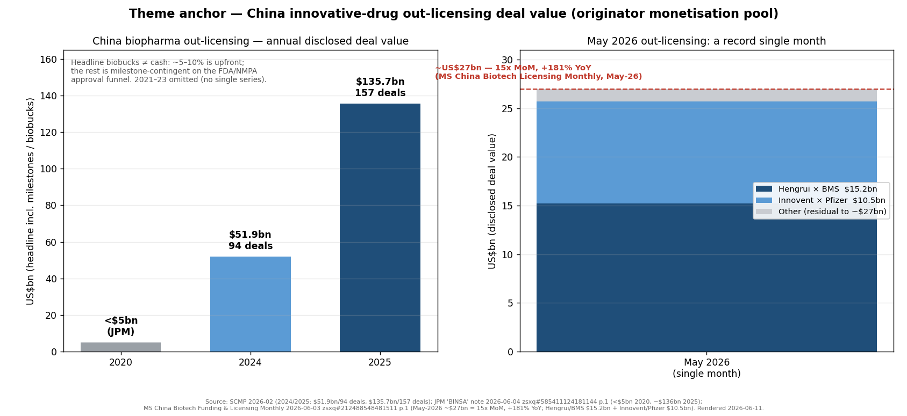
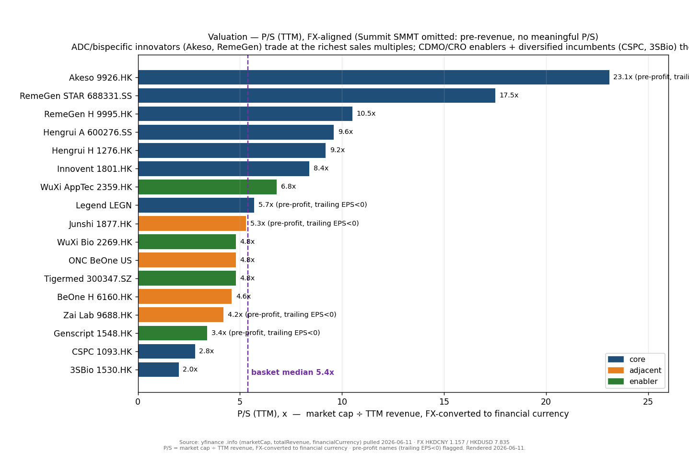
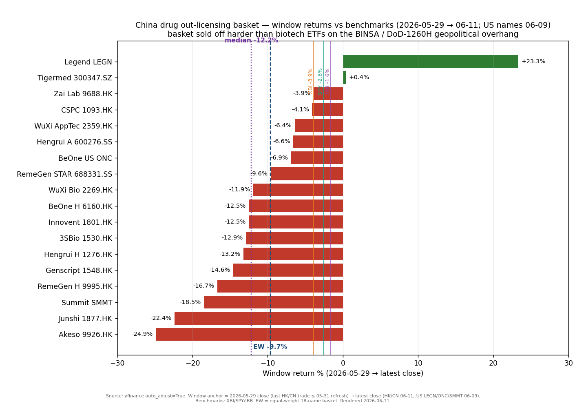

# China Innovative Drug Out-Licensing / 创新黎明 2.0

**Created:** 2026-05-31 · **Last refreshed:** 2026-06-11 · **Last mutated:** 2026-05-31 · **Refresh cadence:** monthly · **Languages tracked:** en

## What's New

*The delta since you last looked — newest refresh on top. Older entries collapse into the archive below.*

**2026-06-11 refresh (vs 2026-05-31 inception):**

- **First tracked window was ugly: equal-weight basket −9.7% (median −12.2%) over 2026-05-29 → 06-11, vs XBI −3.9% · SPY −2.6% · IBB −1.6% · CSI 300 −4.0% · HSCEI −2.1%.** The basket sold off ~575 bps *harder* than the biotech ETF — only 2 of 18 names (Legend +23.3%, Tigermed +0.4%) finished positive (yfinance; see Performance). This is a hindsight-selected, deal-flow-rich basket de-rating on a macro/geopolitical shock, not a thesis break.
- **The window's whole story is a geopolitical overhang, not a fundamental one.** On 2026-06-02 Reps. Moolenaar & Dingell introduced the BINSA bill to put US-China pharma licensing / IP-transfer deals under Treasury review; JPM calls it a "geopolitical overhang [but] impact on fundamentals is limited," noting deals involving Chinese biotech *"totaled ~US$136bn in 2025, up from under $5bn in 2020, with 48% of all large global licensing deals (>US$50mn) signed with [Chinese entities]"* ([JPM — BINSA bill, zsxq #585411124181144 p.1](http://xs-macbook-air.local:5001/zsxq/pdf/585411124181144/J.P.%20Morgan-China%20Healthcare%EF%BC%9ABINSA%20bill%20a%20geopolitical%20overhang%EF%BC%8C%20but%20impact%20on%20fundamentals%20is%20limited-260604.pdf#page=1)). Deutsche Bank: *"the market seems to have overreacted to the news"* ([DB — Market overreacted, zsxq #814528852241582 p.1](http://xs-macbook-air.local:5001/zsxq/pdf/814528852241582/Deutsche%20Bank-China%20Healthcare%EF%BC%9AMarket%20likely%20overreacted%20on%20geopolitical%20tensions%EF%BC%8C%20we%20think-260605.pdf#page=1)).
- **The enabler leg took a direct hit: WuXi AppTec was added to the US DoD 1260H list (announced 06-09).** Nomura maintains Buy / TP HK$157.07, arguing the listing *"only constrains DoD from procuring from Wuxi Apptec directly … and we believe Wuxi Apptec generates neglectable revenue from DoD"* — short-term sentiment, fundamentals intact ([Nomura — WuXi 1260H, zsxq #181245182285242 p.1](http://xs-macbook-air.local:5001/zsxq/pdf/181245182285242/Nomura-Wuxi%20Apptec%EF%BC%882359.HK%EF%BC%891260H%20inclusion%20likely%20impact%20ST%20sentiment%20only-260609.pdf#page=1)). Persisted to `/pt` (new call).
- **The anchor is freshly re-confirmed at a record.** MS's monthly licensing tracker: China out-licensing *"surged to ~US$27bn (15x MoM; +181% YoY), led by mega deals: Hengrui/BMS (US$15.2bn) and Innovent/Pfizer (US$10.5bn)"* — May funding also +28% MoM ([MS — Licensing Monthly, zsxq #212488548481511 p.1](http://xs-macbook-air.local:5001/zsxq/pdf/212488548481511/Morgan%20Stanley-China%20Healthcare%EF%BC%9AChina%20Biotech%20Funding%20and%20Licensing%20Monthly-260603.pdf#page=1)).
- **ASCO data landed strong but was "sold on news."** Akeso ivonescimab HARMONi-6 OS (HR 0.66; 34% lower death risk in 1L squamous NSCLC) was reiterated as supportive of HARMONi-3 by MS, which holds Akeso OW with a **HK$212** PT (close Jun-4 HK$99.45, +113%) ([MS — Akeso webcast, zsxq #585411124181154 p.1](http://xs-macbook-air.local:5001/zsxq/pdf/585411124181154/Morgan%20Stanley-Akeso%EF%BC%8C%20Inc.%20%EF%BC%889926.HK%EF%BC%89MS%20Biotech%20Without%20Borders%20Webcast%20Takeaway-260605.pdf#page=1)); GS reiterated Summit Buy / $41 on the same HARMONi-6 OS readout ([GS — Summit 47th HC Conf, zsxq #584251542821554 p.1](http://xs-macbook-air.local:5001/zsxq/pdf/584251542821554/Goldman%20Sachs-Summit%20Therapeutics%20Inc.%20%EF%BC%88SMMT.US%EF%BC%89%EF%BC%9A%2047th%20Annual%20Global%20Healthcare%20Conference%20%E2%80%94%20Key%20Takeaways-260608.pdf#page=1)). Yet Akeso was the *worst* basket name this window (−24.9%) — sell-the-news + the BINSA overhang.
- **Format upgrade:** this refresh adds the mandatory Valuation snapshot (mirrors `/pt`), Sell-side view evolution (卖方观点演变), Basket scorecard, Leading-indicator tables, 3 re-rendered charts, and the snapshot sidecar (created this refresh with a retroactive 2026-05-31 baseline). No ticker adds/drops — candidate adds (Kailera, LaNova) remain Drift-signal proposals.
- **Macro regime tightened:** VIX 16.68 → **21.51** (2026-06-05, `indicators.db`) — the low-vol tailwind cited at inception is gone; biotech beta to index drawdowns is now higher.

Earlier refreshes

**2026-05-31 — basket created** (18 tickers across 14 underlying issuers: 9 core / 5 adjacent / 4 enabler) following the request *"Build a tracked-theme basket for China Innovative Drug Out-Licensing — 创新黎明 2.0."* From the seed universe: dropped Hutchmed (deal predates wave, equity not repositioned), Antengene & Everest (in-licensors not out-licensors); added 3SBio (Pfizer $6bn SSGJ-707 — largest single-asset upfront in the wave) and CSPC (AstraZeneca $18.5bn — largest single-deal value); excluded all US/EU big-pharma buyers as too diversified. Inception 1Y context (as of 05-31): EW +16.5% / median +5.6% vs XBI +70.5% / IBB +38.9% / SPY +29.7%.

## Thesis

**Anchor — China-originated out-licensing deal value (the originator monetisation pool):** 2020 **<US$5bn** → 2024 **US$51.9bn / 94 deals** → 2025 **US$135.7bn / 157 deals** (≈2.6× both deal count and headline biobucks YoY) ([SCMP, 2026-02](https://www.scmp.com/business/china-business/article/3339011/chinese-drug-makers-strike-record-us136-billion-out-licensing-deals-2025); [Pharmasource, 2026](https://pharmasource.global/content/china-biopharma-out-licensing-surges-to-record-137-7b-in-2025-2026-on-pace-to-break-it-again/)), with 2026 running hotter still — May-2026 alone printed **~US$27bn (15x MoM, +181% YoY)** on the Hengrui/BMS US$15.2bn + Innovent/Pfizer US$10.5bn mega-deals ([MS — Licensing Monthly, zsxq #212488548481511 p.1](http://xs-macbook-air.local:5001/zsxq/pdf/212488548481511/Morgan%20Stanley-China%20Healthcare%EF%BC%9AChina%20Biotech%20Funding%20and%20Licensing%20Monthly-260603.pdf#page=1)). JPM frames the structural shift bluntly: deals involving Chinese biotech *"totaled ~US$136bn in 2025, up from under $5bn in 2020, with 48% of all large global licensing deals (>US$50mn) signed with [Chinese entities]"* ([JPM, zsxq #585411124181144 p.1](http://xs-macbook-air.local:5001/zsxq/pdf/585411124181144/J.P.%20Morgan-China%20Healthcare%EF%BC%9ABINSA%20bill%20a%20geopolitical%20overhang%EF%BC%8C%20but%20impact%20on%20fundamentals%20is%20limited-260604.pdf#page=1)).

**The pool is gated by an approval/reimbursement funnel — headline biobucks ≠ cash.** This is a regulated-product theme, so the anchor must be discounted by what actually converts to revenue: a typical deal is **~5–10% upfront cash + milestone-contingent biobucks (dev/regulatory/commercial) + single-to-low-double-digit royalties**, and every milestone tranche is gated by an FDA/NMPA/EMA approval or a sales threshold. So the *realised* value of the US$135.7bn 2025 headline is a small fraction today, climbing only as assets clear the funnel ([Ambrosia Ventures — deal-structure guide, 2026](https://calculator.ambrosiaventures.co/guides/biotech-licensing-deal-structure)). The swing factor is therefore **the approval funnel + the geopolitical gate on whether deals can be struck at all** (BINSA / DoD-1260H), not unit volume.

**Decompose the anchor two ways.** By *deal structure* the wave is shifting from plain out-licensing to co-development + co-commercialisation (MS's "创新黎明 2.0 — from wholesale to bespoke"): the two May mega-deals were **Hengrui/BMS = 4 out-license + 4 in-license + 5 co-dev (13 pipelines)** and **Innovent/Pfizer = 8 out-license + 4 co-dev (12 assets)** — Innovent uniquely retained **US/EU co-commercialisation** rights, the structural milestone ([MS, zsxq #212488548481511 p.1](http://xs-macbook-air.local:5001/zsxq/pdf/212488548481511/Morgan%20Stanley-China%20Healthcare%EF%BC%9AChina%20Biotech%20Funding%20and%20Licensing%20Monthly-260603.pdf#page=1)). By *modality* the pool concentrates in **PD-1/VEGF & PD-1/IL-2 bispecifics · ADCs · GLP-1/GIP & GLP-1/GCG metabolic · I&I** — the modalities where Chinese R&D is competitive on cost and speed. **Value-chain map:** *originators* (Innovent, Hengrui, Akeso, RemeGen, 3SBio, CSPC — the equity repriced by deals) · *enablers* (WuXi Bio CDMO · WuXi AppTec / Tigermed / Genscript CRO — manufacture & develop the assets globally) · *US partners* (Summit — where a China asset is the whole equity). The dollar-rich layer the basket under-covers is the **NewCo/equity-stake structure** (Kailera-type vehicles) — a candidate-add signal (see Drift signals).

**The bet: the originator equity captures most of the deal upside, not the buyer.** A US$15.2bn BMS/Hengrui deal moves Hengrui (RMB ~311bn market cap) far more than it moves BMS (US$140bn) ([BMS press release, 2026-05-12](https://news.bms.com/news/details/2026/Bristol-Myers-Squibb-and-Hengrui-Pharma-Announce-Strategic-Agreements-to-Advance-Innovative-Medicines-Across-Oncology-Hematology-and-Immunology-2026-EbQpaI6Zdc/default.aspx); [Hengrui Pharma press release, 2026-05-12](https://www.prnewswire.com/news-releases/hengrui-pharma-and-bristol-myers-squibb-announce-strategic-agreements-to-advance-innovative-medicines-across-oncology-hematology-and-immunology-302769021.html)). Innovent's May 2026 Pfizer pact — **$650M upfront, $9.85bn milestones, double-digit royalties, plus US/EU co-commercialisation** and retained Greater-China rights — is the template for "custom value capture" ([Pfizer press release, 2026-05-29](https://www.pfizer.com/news/press-release/press-release-detail/pfizer-and-innovent-biologics-enter-global-strategic); [Innovent HKEX 1801 announcement, 2026-05-29](https://www1.hkexnews.hk/listedco/listconews/sehk/2026/0529/2026052900029.pdf); [CNBC, 2026-05-29](https://www.cnbc.com/2026/05/29/innovent-shares-rise-10percent-after-pact-with-pfizer-of-up-to-10point5-billion.html)).

The vulnerability is structural and the window proved it: biobucks are mostly milestone-contingent, FDA AdComm / OS-readout risk is real (Summit's HARMONi-3 PFS interim once missed its pre-specified threshold before flipping favourable at the OS readout — [AllSci, 2025](https://allsci.com/news/clinical-trials/summits-ivonescimab-heads-toward-november-fda-decision-as-harmoni-3-interim-pfs-misses-threshold/)), and a single bilateral US-China policy event (BINSA / the DoD 1260H listing of WuXi) can compress the CRO/CDMO leg faster than the innovator leg. Per-ticker dispersion is wide — RemeGen STAR +73.7% 1Y vs Zai Lab −58.0% 1Y on the same theme — so equal-weight basket reporting is for discipline only, not for portfolio sizing.

**Staging — who monetises when:** *originators with a closed deal* book upfront cash within 1–2 quarters (the cash-rich cohort — Innovent, Hengrui, Akeso, 3SBio, CSPC, RemeGen) — the dated gate is each Q2/Q3-2026 revenue-recognition print; *enablers* (WuXi Bio/AppTec, Tigermed, Genscript) monetise the *ongoing development & manufacturing* of the whole wave, so their gate is order-book/backlog growth, not any single deal; *US partners* (Summit) gate on the **2026-11-14 ivonescimab PDUFA**. The window's −9.7% drawdown was the market re-pricing the *enabler* and *US-partner* legs on policy risk while the *originator* anchor (the licensing pool) was simultaneously hitting a record — the cleanest "fundamentals up, multiple down" configuration.

**Conviction ranks (cited, not ours):** MS runs the most bullish desk — OW on Innovent (HK$135), Akeso (HK$212), CSPC (HK$11) and WuXi Bio (HK$50); GS is selectively cautious on the CDMO leg (Neutral WuXi Bio HK$41) while bullish on the originators; Bernstein is the house skeptic on the US-partner side (Underperform Summit $7.7) — see *Sell-side view evolution*. *Analyst view (this note):* the window makes the case that the right exposure is the *cash-banked originator* (deal closed, upfront received, China commercial base intact), not the *enabler* (policy-levered) or the *single-asset US partner* (binary on one readout).

**Further viewing**

- [AstraZeneca — Antibody-drug conjugates (ADCs): the next wave of medicines (official explainer + animation)](https://www.astrazeneca.com/r-d/next-generation-therapeutics/antibody-drug-conjugate.html) — how an ADC's antibody-linker-payload "biological missile" targets a tumour antigen, internalises, and releases its cytotoxic payload; the mechanism behind RemeGen's disitamab vedotin, Zai's ZL-1310 and Innovent's ADC pipeline.
- [Cholangiocarcinoma Foundation — "Understanding Antibody Drug Conjugates" (3-step MOA walkthrough)](https://www.youtube.com/watch?v=3psPIfanzz0) — a short patient-education explainer of the same five-step ADC mechanism, useful before reasoning about why ADCs dominate the out-licensing deal flow.

## Scope rules

**In:** Chinese-headquartered innovator biotechs that have closed (or are imminently likely to close) ex-China licensing deals with global big pharma where the deal value materially repositions the equity; CRO/CDMO houses whose manufacturing or development platforms enable the out-licensing wave; US-listed partner equities whose value is materially driven by Chinese-asset commercialisation (Summit is the cleanest current example). Both pure-play originators and diversified incumbents qualify if at least one closed major deal (>$1bn headline value, >$100M upfront) anchors the inclusion.

**Out:** US/EU buyers (Pfizer, Merck, BMS, GSK, AstraZeneca, JNJ) — too diversified for individual China deals to materially reprice the equity; pure generic / biosimilar players; medical device makers (separate sector); traditional Chinese medicine (TCM) names; private companies (tracked in the watch list, not the basket). Contract-research-only houses without proprietary innovator IP are also out — Tigermed is in because it has a global clinical-trial platform that enables Chinese-asset INDs in the US and EU, not because of any standalone IP.

## Tracked tickers

| Ticker | Name | Role | Justification | Added |
|---|---|---|---|---|
| HKEX:1801 | Innovent Biologics (信达生物) | core | Pfizer global oncology collab 2026-05-29: 12 programs (ADCs + multi-specifics), $650M upfront + $9.85bn milestones + double-digit royalties + **US/EU co-commercialisation** ([Pfizer release](https://www.pfizer.com/news/press-release/press-release-detail/pfizer-and-innovent-biologics-enter-global-strategic); [HKEX 1801 filing, 2026-05-29](https://www1.hkexnews.hk/listedco/listconews/sehk/2026/0529/2026052900029.pdf)). Takeda Oct-2025 — IBI363 + IBI343 ex-Greater-China, $1.2bn upfront + $11.4bn total ([Takeda release](https://www.takeda.com/newsroom/newsreleases/2025/innovent/)). Mazdutide (IBI362, first-in-class dual GCG/GLP-1) NMPA-approved for weight management 2025-06-27 and T2D 2025-09-19 ([Innovent release](https://www.prnewswire.com/news-releases/innovent-announces-mazdutide-first-dual-gcgglp-1-receptor-agonist-received-approval-from-chinas-nmpa-for-chronic-weight-management-302493152.html)). **Moat:** broadest IO/ADC/metabolic platform + the only deal so far to retain US/EU co-commercialisation. **Threat:** Pfizer transaction-close / antitrust risk; most-crowded PD-1/VEGF & ADC competitive field. | 2026-05-31 |
| SSE:600276 | Hengrui Pharma (恒瑞医药) | core | Most cross-licensed Chinese biotech of the wave: BMS strategic collab 2026-05-12 — 13 programs, $950M upfront-and-near-term + up to $15.2bn total ([BMS release](https://news.bms.com/news/details/2026/Bristol-Myers-Squibb-and-Hengrui-Pharma-Announce-Strategic-Agreements-to-Advance-Innovative-Medicines-Across-Oncology-Hematology-and-Immunology-2026-EbQpaI6Zdc/default.aspx); [Fierce Biotech, 2026-05](https://www.fiercebiotech.com/biotech/bms-inks-15b-biobuck-deal-bag-hengrui-assets-tap-chinas-rd-speed)); GSK 2025-07 — up to 12 medicines, $500M upfront + $12bn total ([release](https://www.prnewswire.com/news-releases/hengrui-pharma-and-gsk-enter-agreements-to-develop-up-to-12-innovative-medicines-across-respiratory-immunology--inflammation-and-oncology-302514566.html)); Merck 2024-05 — HRS-5346 oral Lp(a), $200M upfront + $1.77bn ([Merck release](https://www.merck.com/news/merck-enters-exclusive-license-agreement-for-hrs-5346-an-investigational-oral-lipoproteina-inhibitor-for-cardiovascular-disease-from-jiangsu-hengrui-pharmaceuticals-co-ltd/)); Kailera NewCo 2024-05 — global ex-China GLP-1 incl. HRS9531 (Ph3, ~19.2% weight loss in China study), ~$6bn + 20% equity ([BioPharma Dive](https://www.biopharmadive.com/news/kailera-Series-B-bain-obesity-drugs-hengrui-GLP-1-GIP/802689/)). **Moat:** China's largest pharma R&D engine, most-diversified deal book. **Threat:** biobucks-vs-cash discount the market keeps applying; PT dispersion is the widest in the basket. | 2026-05-31 |
| HKEX:1276 | Hengrui Pharma H-share | core | HK-listed mirror of SSE:600276. Same entity, separate float; HK trades at a discount to A. Justification per parent. **Moat/threat per parent.** *(also tracked in: glp1-obesity-peptide-supply — GLP-1/GIP HRS9531 / Kailera leg)* | 2026-05-31 |
| HKEX:9926 | Akeso (康方生物) | core | The precedent deal of the wave — Summit Dec-2022, $500M upfront + $4.5bn for ivonescimab (PD-1/VEGF) ex-China ([Akeso release](https://www.akesobio.com/en/media/akeso-news/20221206/); [Summit 8-K](https://www.sec.gov/Archives/edgar/data/0001599298/000159929822000136/a2022_prx1208xivonescimaba.htm)). HARMONi-2 beat pembrolizumab on PFS (mPFS 11.1 vs 5.8 mo, HR 0.51) in The Lancet ([Akeso/Lancet](https://www.prnewswire.com/news-releases/akeso-announces-the-publication-of-its-phase-iii-clinical-trial-results-for-ivonescimab-in-head-to-head-comparison-with-pembrolizumab-in-the-lancet-302395382.html)); HARMONi-6 OS (HR 0.66; 34% lower death risk, squamous NSCLC) on the ASCO Plenary 2026-05-31 — first China-originated asset ever on the Plenary ([CNBC](https://www.cnbc.com/2026/05/31/asco-summit-akeso-ivonescimab-improves-survival-in-harmoni-6-trial.html)). FY2025 sales RMB 3.03bn +51.5% ([Akeso FY](https://www.akesobio.com/en/media/akeso-news/260327/)). **Moat:** Tetrabody bispecific platform (AK104 commercialised, AK112 Ph3), >100K China patients. **Threat:** thesis hangs on the single HARMONi-3 1L NSCLC readout (H2 2026); −24.9% this window despite the OS print. *(also tracked in: glp1-obesity-peptide-supply)* | 2026-05-31 |
| HKEX:9995 | RemeGen (荣昌生物) | core | Two anchor deals: Seagen/Pfizer 2021-08 — disitamab vedotin HER2 ADC ex-Asia-Pac, $200M upfront + $2.4bn ([Seagen+RemeGen](https://www.businesswire.com/news/home/20210809005208/en/Seagen-and-RemeGen-Announce-Exclusive-Worldwide-License-and-Co-Development-Agreement-for-Disitamab-Vedotin)); Vor Bio 2025-06 — telitacicept (BAFF/APRIL, approved in China for gMG/SLE/RA) global ex-Greater-China, $125M initial + >$4bn, global Ph3 readout H1 2027 ([Vor Bio 8-K](https://www.sec.gov/Archives/edgar/data/0001817229/000119312525147339/d27026dex991.htm)). Disitamab vedotin 4th China indication (HER2-low BC w/ liver mets) Mar-2026 ([AllSci](https://allsci.com/news/pfizer-partner-remegen-takes-4th-china-indication-for-her2-adc-disitamab-vedotin-in-her2-low-breast-cancer/)). **Moat:** ADC (HER2) + autoimmune (telitacicept) dual franchise with marketed China base. **Threat:** crowded HER2-ADC field (DS-8201); telitacicept Ph3 ex-China is the binary. | 2026-05-31 |
| SSE:688331 | RemeGen STAR | core | STAR Board listing of HKEX:9995. A-share materially outperforming HK (1Y +73.7% vs +43.4%) — investor-base divergence worth tracking. Justification per parent. **Moat/threat per parent.** | 2026-05-31 |
| NASDAQ:LEGN | Legend Biotech | core | Structural precedent for co-commercialisation deals: Carvykti (cilta-cel BCMA CAR-T) co-developed with Janssen/JNJ since 2017; FY2025 net trade sales ~$1.9bn (Q1 $369M → Q4 $555M), only approved CAR-T for 2L multiple myeloma with survival-benefit label ([Legend FY](https://investors.legendbiotech.com/news-releases/news-release-details/legend-biotech-reports-fourth-quarter-and-full-year-2025-results); [Q3-2025](https://www.globenewswire.com/news-release/2025/11/12/3186056/0/en/Legend-Biotech-Reports-Third-Quarter-2025-Results-and-Recent-Highlights.html)). >10,000 patients treated, 294 sites. **Moat:** the template every basket originator wants to replicate (commercial co-promote, not a pure licence). **Threat:** Carvykti capacity ramp + CAR-T competitive pressure (Arcellx/J&J, BMS Abecma); +23.3% this window (best name). | 2026-05-31 |
| HKEX:1530 | 3SBio (三生制药) | core | Pfizer 2025-05 — $1.25bn upfront + $4.8bn milestones + double-digit royalties + $100M equity, for SSGJ-707 (PD-1/VEGF bispecific) ex-China ([Pfizer completion](https://www.pfizer.com/news/press-release/press-release-detail/pfizer-completes-licensing-agreement-3sbio); [BioSpace](https://www.biospace.com/business/pfizer-puts-6b-on-the-line-for-3sbios-pd-1-vegf-antibody)). The $1.25bn upfront is the **largest single-asset cash payment in the entire 2024-2026 wave**; stock hit a 7-year peak on announcement ([Reuters/TradingView](https://www.tradingview.com/news/reuters.com,2025:newsml_L1N3RS02C:0-hk-listed-3sbio-hits-7-year-peak-on-pfizer-licensing-deal/)). **Moat:** banked the wave's biggest upfront; diversified EPO/biosimilar cash base. **Threat:** SSGJ-707 competes head-to-head with ivonescimab in the same PD-1/VEGF class; −12.9% this window. *(also tracked in: glp1-obesity-peptide-supply)* | 2026-05-31 |
| HKEX:1093 | CSPC Pharmaceutical (石药集团) | core | AstraZeneca 2025-01 — largest single Chinese licensing pact of the wave: $1.2bn upfront + $3.5bn dev/reg + $13.8bn sales milestones, ex-China rights to 8 obesity candidates incl. SYH2082 (GLP-1/GIP dual) + a long-acting peptide platform ([AstraZeneca 6-K](https://www.sec.gov/Archives/edgar/data/0000901832/000165495425003128/a6965b.htm); [BioPharma Dive](https://www.biopharmadive.com/news/astrazeneca-obesity-deal-china-cspc-ai/810942/)). **Moat:** diversified generics+innovation cash base funding the metabolic platform; cheapest P/S in the basket (2.8x). **Threat:** legacy generics drag on the multiple; obesity assets early-stage. *(also tracked in: glp1-obesity-peptide-supply)* | 2026-05-31 |
| HKEX:6160 | BeOne Medicines (百济神州) | adjacent | Formerly BeiGene; rebranded + re-tickered NASDAQ:BGNE → NASDAQ:ONC effective 2025-01-02, Switzerland redomicile ratified 2025-04-28 AGM ([Street Insider](https://www.streetinsider.com/Corporate+News/BeiGene+(BGNE)+to+Change+Nasdaq+Ticker+Symbol+to+%E2%80%9CONC%E2%80%9D/24135302.html)). Brukinsa BTK franchise anchors the standalone-monetisation comp; global development "superhighway" is its stated edge ([GS — 47th HC Conf, zsxq #584251482282884 p.1](http://xs-macbook-air.local:5001/zsxq/pdf/584251482282884/Goldman%20Sachs-BeOne%20Medicines%20%EF%BC%88688235%EF%BC%89%EF%BC%9A%2047th%20Annual%20Global%20Healthcare%20Conference%E2%80%94Key%20Takeaways-260609.pdf#page=1)). **Moat:** only Chinese innovator that built its own ex-China commercial machine. **Threat:** adjacent because it monetises *internally* not via out-licensing; Brukinsa competitive pressure (AbbVie/Lilly BTK). | 2026-05-31 |
| NASDAQ:ONC | BeOne Medicines | adjacent | US-listed shares of HKEX:6160; same entity post-2025 Switzerland redomicile ([Q1 2026 8-K](https://www.sec.gov/Archives/edgar/data/0001651308/000162828026030866/exhibit991-q12026earningsr.htm)). Justification per parent. **Moat/threat per parent.** | 2026-05-31 |
| HKEX:1877 | Junshi Biosciences (君实生物) | adjacent | Coherus toripalimab (LOQTORZI) deal — $150M upfront + $380M milestones + low-twenties royalty; toripalimab is the first PD-1 of Chinese origin approved by FDA ([Coherus IR](https://investors.coherus.com/news-releases/news-release-details/coherus-biosciences-expand-late-stage-pipeline-immuno-oncology/)). H1 2025 revenue RMB 1.17bn +49% YoY; domestic toripalimab RMB 954M +42% ([Junshi H1](https://www.globenewswire.com/news-release/2025/08/27/3139696/0/en/Junshi-Biosciences-Announces-2025-Interim-Financial-Results-and-Provides-Corporate-Updates.html)). **Moat:** FDA-approval precedent (toripalimab) + broad pipeline. **Threat:** Coherus deal value is small vs the wave; loss-making; −22.4% this window (2nd-worst). Adjacent: a clean re-listing candidate for the next big-pharma deal. | 2026-05-31 |
| HKEX:9688 | Zai Lab (再鼎医药) | adjacent | Net in-licensor of US/EU assets (Karuna, Argenx, Turning Point, Mirati) increasingly out-licensing internally-discovered IP. ZL-1310 (DLL3 ADC) FDA Fast Track for ES-SCLC, 67% ORR in 2L SCLC (79% at 1.6 mg/kg) ([Zai FY](https://www.businesswire.com/news/home/20260226081765/en/Zai-Lab-Announces-Fourth-Quarter-and-Full-Year-2025-Financial-Results-and-Recent-Corporate-Updates)). **Moat:** ZL-1310 is the most credible next major out-license candidate. **Threat:** business is still mostly *in-licensed* (Zejula $189M FY25) — the out-licensing thesis is prospective; −58% 1Y (worst in basket) on Chinese-ADR risk-off. | 2026-05-31 |
| HKEX:2269 | WuXi Biologics (药明生物) | enabler | Dominant CDMO for Chinese-originated biologics seeking ex-China manufacturing. Viridian commercial-manufacturing agreement 2026-05-24 — 5-yr initial term, for veligrotug (TED, PDUFA 2026-06-30) ([Viridian 8-K](https://www.sec.gov/Archives/edgar/data/0001590750/000119312526239246/d111034d8k.htm)). FY2025 revenue RMB 21.8bn +16.7%; backlog US$23.7bn; 156 INDs, 945 projects, 25 commercial ([WuXi Bio FY](https://www.prnewswire.com/news-releases/wuxi-biologics-reports-record-2025-annual-results-302723294.html)). **Moat:** the default global CDMO for the wave's biologics. **Threat:** BIOSECURE/geopolitical overhang on US revenue; GS at Neutral while MS/DB/HSBC are Buy (see view evolution). | 2026-05-31 |
| HKEX:2359 | WuXi AppTec (药明康德) | enabler | Largest CRO/CDMO in China (top-3 globally); touches a meaningful share of out-licensed assets' development and manufacturing. FY2025 revenue RMB 45.5bn +15.8%; US revenue +34.3% despite BIOSECURE overhang ([WuXi AppTec FY](https://www.prnewswire.com/news-releases/wuxi-apptec-beat-full-year-guidance-and-achieved-record-performance-in-2025-302721920.html); [STAT News, 2025-11](https://www.statnews.com/2025/11/17/wuxi-apptec-dodges-sanctions-sales-soar/)). **Moat:** end-to-end CRDMO scale that is hard to replicate; +65.3% 1Y. **Threat:** customer-insourcing is not the risk here — the named threat is **US policy** (added to the DoD 1260H list 06-09; Nomura: only constrains direct DoD procurement, "neglectable" DoD revenue — [zsxq #181245182285242 p.1](http://xs-macbook-air.local:5001/zsxq/pdf/181245182285242/Nomura-Wuxi%20Apptec%EF%BC%882359.HK%EF%BC%891260H%20inclusion%20likely%20impact%20ST%20sentiment%20only-260609.pdf#page=1)); counter = negligible DoD exposure + buoyant underlying order book. *(also tracked in: glp1-obesity-peptide-supply)* | 2026-05-31 |
| SZSE:300347 | Tigermed (泰格医药) | enabler | Pure-play clinical-CRO bridge for Chinese assets entering US/EU INDs and Ph1-3 trials. FY2025 net new bookings RMB 10.16bn +20.6%; backlog RMB 18.2bn +15.4% ([Tigermed FY](https://www.prnewswire.com/news-releases/tigermed-announces-2025-annual-results-302728638.html)). **Moat:** China clinical-CRO leader with a global trial platform. **Threat:** equity lagged hard (−24.2% 1Y) on the Chinese biotech-funding cycle despite booking growth — the cleanest early-warning for the enabler leg; UBS flags AI + policy as new swing factors ([UBS, zsxq #812485545245112](http://xs-macbook-air.local:5001/zsxq/pdf/812485545245112/UBS-Hangzhou%20Tigermed%20Consulting%20~%20A%EF%BC%88300347%EF%BC%892026%20AIC%EF%BC%9A%20Operation%20on%20track%EF%BC%8C%20AI%20and%20policy%20as%20new%20focus-260528.pdf)). | 2026-05-31 |
| HKEX:1548 | Genscript Biotech (金斯瑞生物科技) | enabler | Synthetic biology / DNA-and-protein services backbone for Chinese antibody and cell-therapy discovery; hosts ProBio (CAR-T CDMO) and Bestzyme. **Moat:** the discovery-stage upstream of multiple basket deals runs through Genscript's gene-synthesis franchise. **Threat:** less out-licensing-levered than the WuXi pair; loss-making at the group level; −30.7% 1Y. | 2026-05-31 |
| NASDAQ:SMMT | Summit Therapeutics | adjacent | US-listed partner-side equity for Akeso's ivonescimab — pure-play exposure to the China-asset commercialisation thesis in US/EU/Canada/Japan. BLA accepted by FDA for ivonescimab + chemo in EGFRm NSCLC post-TKI, PDUFA 2026-11-14 ([Summit BLA 8-K](https://www.sec.gov/Archives/edgar/data/0001599298/000159929826000006/a2026_prx0129xfdablaacce.htm)); positive HARMONi-6 OS reiterated by GS Buy/$41 ([zsxq #584251542821554 p.1](http://xs-macbook-air.local:5001/zsxq/pdf/584251542821554/Goldman%20Sachs-Summit%20Therapeutics%20Inc.%20%EF%BC%88SMMT.US%EF%BC%89%EF%BC%9A%2047th%20Annual%20Global%20Healthcare%20Conference%20%E2%80%94%20Key%20Takeaways-260608.pdf#page=1)). Q1 2026 net loss $189.4M, cash $598.7M ([Summit Q1 8-K](https://www.sec.gov/Archives/edgar/data/0001599298/000159929826000037/a2026_prx0506xq12026earn.htm)). **Moat:** owns ivonescimab ex-China rights outright. **Threat:** single-asset binary — the starkest sell-side split in the basket (GS Buy $41 vs Bernstein Underperform $7.7). | 2026-05-31 |

**Geographic / role mix (18 tickers):** CN A-share 3 (17%) · HK 11 (61%) · US 4 (22%). Roles: core 9, adjacent 5, enabler 4. Some single underlying entities are dual-listed (Hengrui SSE+HKEX; RemeGen HKEX+STAR; BeOne HKEX+NASDAQ) — **14 underlying issuers across 18 tickers**.

## Valuation snapshot

Rows mirror `stock_price_target_db` (latest call per institute since 2026-05-01; surfaced at [`/pt`](http://xs-macbook-air.local:5001/pt)) — **Px @ note is the price on the note's date** (`report_date_price`), which fixes the upside the analyst actually called; *Px now* is the 2026-06-11 close (HK/CN) / 06-09 (US), yfinance. Fwd P/E = FY1 consensus (yfinance `.info`, pulled 2026-06-11); **P/S (TTM)** is the FX-aligned cross-sectional comparator from the valuation chart (basket median 5.4x). **PT dispersion** per name from the read-only pre-pass.

| Ticker | Latest rating · broker (date) | Px @ note | PT | Upside | Px now | Fwd P/E FY1 | P/S TTM | FY1E EPS | FY2E EPS | PT dispersion (since 05-01) |
|---|---|---|---|---|---|---|---|---|---|---|
| HKEX:1801 | Overweight · MS (06-02) | HK$78.85 | **HK$135** | +71.2% | HK$72.95 | 27.2x | 8.4x | ¥2.68 | n/a¹ | n=5: HK$107 / 124 / 135 — **26%** |
| SSE:600276 | Buy · GS (06-01) | ¥49.17 | **¥79.2** | +61.1% | ¥46.90 | 27.2x | 9.6x | ¥1.73 | n/a¹ | n=2: ¥70 / 79.2 — 13%² |
| HKEX:1276 | Neutral · JPM (05-13) | HK$68.85 | HK$70 | +1.7% | HK$52.25 | 28.0x | 9.2x | ¥1.87 | n/a¹ | n=3: HK$70 / 87.49 / 97.4 — 39%² |
| HKEX:9926 | Overweight · MS (06-05) | HK$99.45 | **HK$212** | +113% | HK$88.75 | 43.0x | 23.1x | ¥2.06 | n/a¹ | n=5: HK$130 / 162 / 212 — **63%** (rating split) |
| HKEX:2269 | Overweight · MS (06-01) | HK$34.62 | HK$50 | +44.4% | HK$29.38 | 14.7x | 4.8x | ¥1.99 | n/a¹ | n=4: HK$41 / 48 / 50 — 22% (GS Neutral 41) |
| HKEX:2359 | Buy · Nomura (06-09) | HK$116.80 | HK$157.07 | +34.5% | HK$121.90 | 14.5x | 6.8x | ¥8.43 | n/a¹ | n=2: HK$157.07 / 171.2 — 9% |
| HKEX:1093 | Buy · Citi (06-04) | HK$7.24 | HK$11.5 | +58.8% | HK$7.19 | 10.0x | 2.8x | ¥0.72 | n/a¹ | n=3: HK$11.0 / 11.5 / 12.08 — 10% |
| SZSE:300347 | Buy · UBS (05-28) | ¥39.24 | ¥65.8 | +67.7% | ¥39.62 | 26.2x | 4.8x | ¥1.51 | n/a¹ | n=2: ¥65.8 / 75.2 — 14% |
| HKEX:9688 | Buy · UBS (05-08) | HK$15.09 | HK$27.0 | +78.9% | HK$13.37 | n/a³ | 4.2x | n/a³ | n/a³ | single PT |
| NASDAQ:ONC | Buy · GS (06-09) | $268.17 | $414.46 | +54.6% | $268.17 | 27.1x | 4.8x | $9.72 | n/a¹ | single PT |
| NASDAQ:SMMT | Buy · GS (06-08) | $14.11 | **$41** | +190.6% | $14.29 | n/a³ | n/a⁴ | n/a³ | n/a³ | n=2: **$7.7 (Bernstein UP) ↔ $41 (GS Buy)** — opposite ratings |

*No live sell-side PT in the store since 2026-05-01 (shown for completeness; P/S from the valuation chart):* **SSE:688331 RemeGen STAR** (P/S 17.5x), **HKEX:9995 RemeGen H** (10.5x), **NASDAQ:LEGN Legend** (5.7x, pre-profit), **HKEX:1530 3SBio** (2.0x), **HKEX:1877 Junshi** (5.3x, pre-profit), **HKEX:1548 Genscript** (3.4x, pre-profit), **HKEX:6160 BeOne H** (4.6x — Bernstein OP / Nomura Buy on file but no PT). **Suspect rows (excluded from dispersion):** a Citi 06-04 note prints **Hengrui A ¥123** and **Hengrui H HK$134** — ~2.5× spot and inconsistent with Citi's in-line CSPC HK$11.5 on the same note; flagged as a likely per-name extraction/unit artifact, not blended into the live rows.

Footnotes — **cell derivations**: ¹ FY2E EPS not stated in the mined event/conference notes and not carried by yfinance `.info`; left n/a rather than improvised. ² Hengrui PTs exclude the suspect Citi ¥123 / HK$134 prints (see above). ³ yfinance carries no positive fwd EPS for pre-profit names (Zai Lab, Summit); fwd P/E n/a. ⁴ Summit is pre-revenue (yfinance `totalRevenue` = None) → no meaningful P/S, hence its omission from the valuation chart. **Own ~10yr-avg multiple — n/a for every name, by design:** these are loss-making or recently-profit-transitioning biotechs whose trailing/forward EPS swings through zero, so a 10-yr own fwd-P/E series is unrepresentative (the standard objection to P/E for the cohort). The sourced cross-sectional anchor used instead is the **basket-median P/S 5.4x** (valuation chart) — names above it (Akeso 23.1x, RemeGen 17.5x/10.5x, Hengrui ~9.5x, Innovent 8.4x) are the priced-for-perfection cohort; the de-rate sizing in Drift signals is computed off P/S reversion to that median, not off a P/E own-average.

### Sell-side view evolution (卖方观点演变)

When ≥2 institutes cover the same name, the dispersion *is* the debate. Per-institute timelines (report-date order; PTs in the note's currency):

**Innovent (HKEX:1801) — seven institutes in five weeks, all bullish, the spread is conviction not direction:**

| Institute | Date | Rating / PT | Core argument |
|---|---|---|---|
| GS | 05-01 → 06-01 | Buy / HK$105.94 → 107.04 | mazdutide ramp + ASCO IBI363 |
| Bernstein | 05-04 | Outperform / (no PT) | platform breadth |
| JPM | 05-07 | **Top Pick** / (no PT) | the cleanest "custom value capture" comp |
| Nomura | 05-15 → 05-29 | Buy / HK$114.64 | deal-flow momentum |
| UBS | 05-27 | Buy / HK$124 | *"Positive on ASCO data and mazdutide sales"* ([zsxq #212485545245141](http://xs-macbook-air.local:5001/zsxq/pdf/212485545245141/UBS-Innovent%20Biologics%20Inc%EF%BC%881801.HK%EF%BC%892026%20AIC%EF%BC%9A%20Positive%20on%20ASCO%20data%20and%20mazdutide%20sales-260527.pdf#page=1)) |
| DB | 05-29 | Buy / HK$126 | *"Another significant collaboration agreement"* (Pfizer) ([zsxq #212485814114281](http://xs-macbook-air.local:5001/zsxq/pdf/212485814114281/Deutsche%20Bank-Innovent%EF%BC%881801.HK%EF%BC%89Another%20significant%20collaboration%20agreement-260529.pdf#page=1)) |
| **MS** | **06-02** | **OW / HK$135 (street-high)** | Pfizer co-commercialisation re-rates the platform |

No institute is below Hold; the only question is how much the Pfizer co-commercialisation clause is worth — MS at HK$135 vs GS at HK$107 is a 26% spread on the *same* deal.

**Akeso (HKEX:9926) — a genuine rating split, not just a PT spread:**

| Institute | Date | Rating / PT | Core argument | What proves them right |
|---|---|---|---|---|
| Nomura | 05-03 | **Neutral** / HK$142.75 | priced for HARMONi-3 success | an OS-favourable but PFS-soft H3 |
| Bernstein | 05-28 | **Market-Perform** / HK$130 | valuation already capitalises the platform | early/mixed H3 readout |
| JPM | 06-01 | Overweight / HK$162 | bispecific platform value | clean HARMONi-3 win |
| DB | 06-01 | Buy / HK$162 | ivonescimab global optionality | same |
| **MS** | **06-05** | **OW / HK$212 (street-high)** | H6 OS (HR 0.66) de-risks H3; +113% to PT ([zsxq #585411124181154 p.1](http://xs-macbook-air.local:5001/zsxq/pdf/585411124181154/Morgan%20Stanley-Akeso%EF%BC%8C%20Inc.%20%EF%BC%889926.HK%EF%BC%89MS%20Biotech%20Without%20Borders%20Webcast%20Takeaway-260605.pdf#page=1)) | HARMONi-3 1L NSCLC win |

The MS HK$212 vs Bernstein/Nomura ~HK$130-143 split (63% PT dispersion) is the whole bull/bear: is a +35% FY-sales grower with one keystone Ph3 readout worth 23x P/S?

**Summit (NASDAQ:SMMT) — the starkest split in the basket:** GS Buy **$41** (06-08, on HARMONi-6 OS) vs **Bernstein Underperform $7.7** (05-26) — opposite ratings, 5.3× apart, on the *same* ivonescimab asset. The stock ($14.29) sits between them and *above* Bernstein's bear target — the market is pricing a coin-flip on the 2026-11-14 PDUFA + HARMONi-3.

**WuXi Bio (HKEX:2269) — the CDMO-leg fault line:** MS OW HK$50 / DB Buy HK$48 / HSBC Buy HK$45.8 vs **GS Neutral HK$41** — bulls price the global-CDMO franchise on the wave; GS prices the BIOSECURE/geopolitical discount. The 1260H listing of *sister* WuXi AppTec on 06-09 is exactly the risk GS is discounting.

**Cross-institute disagreement table (live PTs, ex-suspect):**

| Name | Bull | Bear | Spread | The disagreement |
|---|---|---|---|---|
| Summit | GS Buy $41 | Bernstein UP $7.7 | 5.3× | ivonescimab US approval probability + value |
| Akeso | MS OW HK$212 | Nomura Neutral HK$142.75 | 49% | how much HARMONi-3 is already priced |
| WuXi Bio | MS OW HK$50 | GS Neutral HK$41 | 22% | size of the geopolitical/BIOSECURE discount |
| Hengrui H | UBS Buy HK$97.4 | JPM Neutral HK$70 | 39% | biobucks-vs-cash discount on the deal book |

## Exclusions

| Ticker | Reason for exclusion |
|---|---|
| NYSE:PFE, NYSE:MRK, NYSE:BMY, NYSE:GSK, NYSE:AZN, NYSE:JNJ | Global big-pharma buyers — each signed a multi-billion-dollar China deal in this wave (Pfizer-Innovent $10.5B + Pfizer-3SBio $6B; Merck-LaNova $3.3B + Merck-Hengrui $2B; BMS-Hengrui $15.2B; GSK-Hengrui $12B; AstraZeneca-CSPC $18.5B; JNJ-Legend Carvykti). All too diversified for China-asset news flow to materially reprice the equity — the lever moves Hengrui or Legend far more than the buyer. Track as *demand-side* context. |
| Private: LaNova Medicines, Kailera Therapeutics, Sciwind Bio, Tot Biopharm | LaNova (Merck $3.3bn counterparty) private despite being a top-2 single-asset 2024 deal; track for IPO. Kailera IPO'd Apr-2026 with $625M ([Boston Globe, 2026-04](https://www.bostonglobe.com/2026/04/17/business/obesity-drugmaker-kailera-625-million-ipo/)) — candidate add once a tradable ticker is confirmed (see Drift signals). |
| HKEX:6996 Antengene, HKEX:1952 Everest Medicines | Wrong-direction: both net *in-licensors* of US/EU assets for China rights (Karyopharm selinexor; Gilead Trodelvy, Calliditas Nefecon) rather than out-licensors of Chinese IP. ([Antengene-Karyopharm 2018](https://www.globenewswire.com/news-release/2018/05/24/1511415/0/en/Karyopharm-and-Antengene-Sign-Exclusive-License-Agreement-to-Develop-and-Commercialize-Selinexor-Eltanexor-Verdinexor-and-KPT-9274-in-China-and-Other-Regions-in-Asia.html); [Everest/Gilead 2023](https://www.prnewswire.com/news-releases/everest-medicines-receives-full-upfront-payment-from-gilead-for-trodelvy-related-transaction-boosting-pro-forma-cash-reserves-301781641.html)). |
| NASDAQ:HCM Hutchmed | Out-licensed fruquintinib to Takeda (Jan-2023, up to $1.13bn) + savolitinib to AstraZeneca (2011) — both predate the wave and the equity wasn't repositioned ([Hutchmed-Takeda, 2023-01](https://www.hutch-med.com/fruquintinib-outside-china-partnership-with-takeda/)). Re-add only on a new sizeable out-license. |
| TCM names: 同仁堂 (SH:600085), 云南白药 (SZ:000538), 片仔癀 (SH:600436) | Out of scope per theme definition — TCM has no ex-China out-licensing dynamic. |

## Keywords

China innovative drug / 创新药 · out-licensing / license-out / 海外授权 · 创新黎明 2.0 · biobucks · upfront payment / 首付款 · milestone payment / 里程碑付款 · double-digit royalties / 双位数特许权使用费 · PD-1/VEGF bispecific / 双特异性抗体 · antibody-drug conjugate (ADC) / 抗体偶联药物 · GLP-1/GIP · GLP-1/GCG · CDMO / CRO · BIOSECURE Act · BINSA bill · DoD 1260H · NewCo · 联合开发权 (co-development) · 共同商业化权 (co-commercialisation)

## Performance (since last refresh)

Window: **2026-05-29 → latest close** (HK/CN 06-11; US LEGN/ONC/SMMT 06-09), yfinance `auto_adjust=True`. **Equal-weight basket −9.7% · median −12.2%**, vs **XBI −3.9% · SPY −2.6% · IBB −1.6% · CSI 300 (510300.SS) −4.0% · HSCEI (2828.HK) −2.1%** — the basket's first tracked window was a sharp under-performance (~575 bps below XBI), with only 2 of 18 names positive.

**Movers:** Legend **+23.3%** (the only clear winner — Carvykti ramp, US-listed, away from the China-policy crossfire), Tigermed +0.4%. **Laggards:** Akeso **−24.9%** (sell-the-news on HARMONi-6 + BINSA), Junshi **−22.4%**, Summit **−18.5%**, RemeGen H **−16.7%**, Genscript −14.6%, Hengrui H −13.2%, 3SBio −12.9%, Innovent / BeOne H −12.5%, WuXi Bio −11.9%. The split is policy-driven: US-listed Legend held; the HK/A-share originators and the China-domiciled CRO/CDMO enablers took the BINSA + 1260H hit.

Trailing context (1Y, same pull): basket **EW −4.3% / median −9.4%** vs **XBI +56.3% / IBB +32.8% / SPY +24.0% / CSI 300 +23.9% / HSCEI −5.8%**. The 1Y winners are RemeGen STAR **+73.7%**, WuXi AppTec **+65.3%**, RemeGen H +43.4%; the losers Zai Lab **−58.0%**, Junshi −35.9%, Genscript −30.7%, 3SBio −29.3%. **The basket has badly lagged biotech ETFs on both windows** — the deal-flow narrative is not (yet) an equity-return narrative; the originator equity capture the thesis bets on has not shown up in price.

### Basket scorecard

| Metric | This window (2026-05-29 → 06-11) |
|---|---|
| Names positive | **2 / 18 (11%)** |
| Names beating XBI (−3.9%) | **2 / 18 (11%)** |
| Best contributor | Legend Biotech **+23.3%** |
| Worst contributor | Akeso **−24.9%** |
| EW basket vs XBI | −9.7% vs −3.9% → **−575 bps** |
| Cumulative vs XBI since tracked inception (2026-05-31 baseline) | **−575 bps** (first measured window) |

*A hindsight-selected, deal-rich basket under-performing the benchmark in its first tracked window is exactly the discipline the scorecard exists to surface — the narrative is hot, the batting average is not.*

## Recent events (since last refresh)

- **BINSA bill introduced (2026-06-02):** Reps. Moolenaar & Dingell's "Biotech … outbound investment screening" bill would put US-China pharma licensing, JVs, equity investments and IP-transfer agreements under Treasury review; JPM sees *"limited near-term impact on China pharma … except headline impact,"* with passage *"small given strong industry lobbying from US pharma"* ([JPM, zsxq #585411124181144 p.1-2](http://xs-macbook-air.local:5001/zsxq/pdf/585411124181144/J.P.%20Morgan-China%20Healthcare%EF%BC%9ABINSA%20bill%20a%20geopolitical%20overhang%EF%BC%8C%20but%20impact%20on%20fundamentals%20is%20limited-260604.pdf#page=1)). DB: the market *"overreacted"* ([zsxq #814528852241582 p.1](http://xs-macbook-air.local:5001/zsxq/pdf/814528852241582/Deutsche%20Bank-China%20Healthcare%EF%BC%9AMarket%20likely%20overreacted%20on%20geopolitical%20tensions%EF%BC%8C%20we%20think-260605.pdf#page=1)).
- **WuXi AppTec added to DoD 1260H list (2026-06-09):** company opposes the designation; Nomura maintains Buy / HK$157.07, sees only short-term sentiment impact, "neglectable" DoD revenue ([zsxq #181245182285242 p.1](http://xs-macbook-air.local:5001/zsxq/pdf/181245182285242/Nomura-Wuxi%20Apptec%EF%BC%882359.HK%EF%BC%891260H%20inclusion%20likely%20impact%20ST%20sentiment%20only-260609.pdf#page=1)).
- **May-2026 licensing tracker (MS, 2026-06-03):** out-licensing ~US$27bn (15x MoM, +181% YoY) on Hengrui/BMS $15.2bn + Innovent/Pfizer $10.5bn; funding +28% MoM (public +138% to US$675m; private −72% to US$90m) ([zsxq #212488548481511 p.1](http://xs-macbook-air.local:5001/zsxq/pdf/212488548481511/Morgan%20Stanley-China%20Healthcare%EF%BC%9AChina%20Biotech%20Funding%20and%20Licensing%20Monthly-260603.pdf#page=1)).
- **ASCO 2026 readouts (late-May / early-June):** Akeso ivonescimab HARMONi-6 OS (HR 0.66; 34% lower death risk, squamous NSCLC) on the ASCO Plenary 2026-05-31 ([CNBC](https://www.cnbc.com/2026/05/31/asco-summit-akeso-ivonescimab-improves-survival-in-harmoni-6-trial.html)); Innovent IBI363 (PD-1/IL-2α-bias) PoC + long-term follow-up in IO-resistant NSCLC ([Innovent IBI363](https://www.prnewswire.com/news-releases/2026-asco-abstract-highlights-innovent-biologics-ibi363-pd-1il-2-bias-bispecific-fusion-protein-demonstrates-robust-survival-benefits-in-long-term-follow-up-of-poc-study-in-advanced-immunotherapy-resistant-non-small-cell-lun-302779647.html)); broadly *"sold on news"* per DB.
- **MS raises Akeso PT to HK$212 (2026-06-05):** OW, +113% to PT on H6 OS de-risking H3 ([zsxq #585411124181154 p.1](http://xs-macbook-air.local:5001/zsxq/pdf/585411124181154/Morgan%20Stanley-Akeso%EF%BC%8C%20Inc.%20%EF%BC%889926.HK%EF%BC%89MS%20Biotech%20Without%20Borders%20Webcast%20Takeaway-260605.pdf#page=1)).
- **GS reiterates Summit Buy / $41 + BeOne Buy / $414.46 at the 47th GS Healthcare Conference (06-08/09):** Summit on HARMONi-6 OS superiority ([zsxq #584251542821554 p.1](http://xs-macbook-air.local:5001/zsxq/pdf/584251542821554/Goldman%20Sachs-Summit%20Therapeutics%20Inc.%20%EF%BC%88SMMT.US%EF%BC%89%EF%BC%9A%2047th%20Annual%20Global%20Healthcare%20Conference%20%E2%80%94%20Key%20Takeaways-260608.pdf#page=1)); BeOne on its global development "superhighway" edge ([zsxq #584251482282884 p.1](http://xs-macbook-air.local:5001/zsxq/pdf/584251482282884/Goldman%20Sachs-BeOne%20Medicines%20%EF%BC%88688235%EF%BC%89%EF%BC%9A%2047th%20Annual%20Global%20Healthcare%20Conference%E2%80%94Key%20Takeaways-260609.pdf#page=1)).
- **WuXi Biologics–Viridian 5-year commercial-manufacturing pact (2026-05-24):** activates on the veligrotug PDUFA 2026-06-30 — the CDMO-leg proof-point ([Viridian 8-K](https://www.sec.gov/Archives/edgar/data/0001590750/000119312526239246/d111034d8k.htm)).

## Drift signals

- **The basket under-performed its own benchmark in its first tracked window — and the cause is policy, not pipeline.** EW −9.7% vs XBI −3.9% (−575 bps) was driven by BINSA (06-02) + WuXi's 1260H listing (06-09), which hit the HK/A-share originator and China-domiciled enabler legs while the US-listed Legend (+23.3%) held. **If JPM/DB are right that the market overreacted, the de-rate is the dip; if BINSA advances via the administrative (Commerce/COIN-Act) route JPM flags as "more likely to move first," the enabler leg (WuXi pair, Tigermed, Genscript) stays capped.** Watch the BINSA legislative calendar and any Trump-Xi meeting (JPM: the administrative route "is not likely to be easy" if such a meeting occurs).
- **De-rate sizing (priced-for-perfection cohort, floor = reversion to basket-median P/S 5.4x):** the rich names are Akeso **23.1x** P/S → reversion to 5.4x is **−77%**; RemeGen STAR 17.5x → −69%; RemeGen H 10.5x → −49%; Hengrui ~9.5x → −43%; Innovent 8.4x → −36%. These are not price targets — they size what a *multiple* normalisation (not an earnings miss) would do, and they are the reason equal-weight basket sizing is a discipline tool only. The specific demand assumption whose miss triggers the de-rate: **the HARMONi-3 1L NSCLC readout (H2 2026)** for the ivonescimab complex (Akeso + Summit + 3SBio's competing SSGJ-707) and the **2026-11-14 Summit PDUFA** — a regulatory setback on either re-rates the whole PD-1/VEGF sub-bucket.
- **Enabler leg is the early-warning, and it is flashing.** Tigermed −24.2% 1Y (despite +20.6% bookings) was the inception canary; now WuXi AppTec's 1260H listing makes the policy risk concrete. Watch (a) WuXi AppTec/Bio Q2 US-revenue disclosure, (b) any BINSA mark-up, (c) whether GS's WuXi Bio Neutral spreads to other desks.
- **Hengrui's biobucks-vs-cash discount persists and the PT store is now contradictory.** A Citi 06-04 note prints Hengrui A ¥123 / Hengrui H HK$134 (~2.5× spot) — flagged as a likely extraction artifact and excluded; the credible spread is JPM Neutral HK$70 vs UBS Buy HK$97.4 (39%). Action: re-ground the Citi row at next refresh, and separate *cash received* from *milestone-contingent biobucks* in the Hengrui justification.
- **Akeso/Summit partner-side asymmetry is intact.** SMMT −18.5% window / −27.0% 1Y while Akeso retains its China commercial base — when an out-licensed asset's *global* readout is in question, the US partner takes the hit. The 2026-11-14 PDUFA + H2-2026 HARMONi-3 OS are the gates for whether this reverses.
- **CXMT-style IPO trigger — here it's Kailera/LaNova.** Kailera (Hengrui GLP-1 NewCo) IPO'd Apr-2026 ($625M); LaNova (Merck $3.3bn counterparty) still private. **Candidate adds (proposals only — not auto-added):** confirm a tradable Kailera ticker → propose as `adjacent` (Hengrui-asset monetisation read-through); track LaNova for IPO. Both would extend the NewCo/equity-stake value-chain layer the basket currently under-covers.
- **Upside risks (symmetric):** (a) BINSA stalling in committee (JPM's base case) re-rates the whole basket off the overhang; (b) Q2/Q3-2026 prints showing the $650M (Innovent) / $950M (Hengrui) upfronts hitting balance sheets — the first hard evidence of originator cash capture; (c) a clean Summit PDUFA (11-14) ratifying the Akeso/Summit deal template; (d) the next nine-figure-upfront deal (May run-rate implies 2-3 more before year-end).

## Leading indicators

Upstream signals first (they crack before the basket equities), then per-name operating prints.

| Signal | Latest reading | As-of | Direction | Implication |
|---|---|---|---|---|
| China monthly out-licensing deal value | **~US$27bn (15x MoM, +181% YoY)** ([MS, zsxq #212488548481511 p.1](http://xs-macbook-air.local:5001/zsxq/pdf/212488548481511/Morgan%20Stanley-China%20Healthcare%EF%BC%9AChina%20Biotech%20Funding%20and%20Licensing%20Monthly-260603.pdf#page=1)) | May 2026 | ↑↑ | the anchor pool is at a record — the deal engine is intact |
| China biotech funding | **+28% MoM** (public +138% to US$675m; private −72% to US$90m) (same note) | May 2026 | ↑ (mix-shift to public placements) | capital availability for the originators improving |
| Share of large global licensing deals (>$50mn) with Chinese entities | **48%** ([JPM, zsxq #585411124181144 p.1](http://xs-macbook-air.local:5001/zsxq/pdf/585411124181144/J.P.%20Morgan-China%20Healthcare%EF%BC%9ABINSA%20bill%20a%20geopolitical%20overhang%EF%BC%8C%20but%20impact%20on%20fundamentals%20is%20limited-260604.pdf#page=1)) | 2025 | ↑ | structural — China is now ~half of global BD; the exact fact BINSA targets |
| Policy / geopolitical gate | BINSA introduced 06-02; WuXi added to DoD 1260H 06-09 | Jun 2026 | ↓ (new overhang) | the swing factor on whether deals can be struck / enablers can sell to US |
| US-China rate / risk backdrop | VIX **21.51** · 10Y **4.536%** · HYG **79.43** · DXY **100.07** ([`indicators.db`]) | 2026-06-05 | mixed | higher vol raises basket beta; rates still pressure out-year-cash biotechs |

Per-ticker operating prints (each from its named source):

| Ticker | Latest operating print | Source |
|---|---|---|
| HKEX:1801 | Pfizer collab: $650M upfront + $9.85bn milestones + US/EU co-commercialisation, 12 assets | [Pfizer release](https://www.pfizer.com/news/press-release/press-release-detail/pfizer-and-innovent-biologics-enter-global-strategic) / [HKEX filing](https://www1.hkexnews.hk/listedco/listconews/sehk/2026/0529/2026052900029.pdf) |
| SSE:600276 | BMS deal: 13 pipelines (4 out-license + 4 in-license + 5 co-dev), $950M upfront-and-near-term / $15.2bn total | [MS Licensing Monthly p.1](http://xs-macbook-air.local:5001/zsxq/pdf/212488548481511/Morgan%20Stanley-China%20Healthcare%EF%BC%9AChina%20Biotech%20Funding%20and%20Licensing%20Monthly-260603.pdf#page=1) |
| HKEX:9926 | HARMONi-6 OS HR 0.66 (34% lower death risk, 1L squamous NSCLC); FY25 sales RMB 3.03bn +51.5% | [MS Akeso p.1](http://xs-macbook-air.local:5001/zsxq/pdf/585411124181154/Morgan%20Stanley-Akeso%EF%BC%8C%20Inc.%20%EF%BC%889926.HK%EF%BC%89MS%20Biotech%20Without%20Borders%20Webcast%20Takeaway-260605.pdf#page=1) |
| HKEX:2359 | FY25 revenue RMB 45.5bn +15.8%, US +34.3%; 1260H listing = short-term sentiment only | [Nomura 1260H p.1](http://xs-macbook-air.local:5001/zsxq/pdf/181245182285242/Nomura-Wuxi%20Apptec%EF%BC%882359.HK%EF%BC%891260H%20inclusion%20likely%20impact%20ST%20sentiment%20only-260609.pdf#page=1) |
| HKEX:2269 | FY25 revenue RMB 21.8bn +16.7%; backlog US$23.7bn; Viridian 5-yr commercial contract | [WuXi Bio FY](https://www.prnewswire.com/news-releases/wuxi-biologics-reports-record-2025-annual-results-302723294.html) |
| NASDAQ:LEGN | Carvykti FY25 net trade sales ~$1.9bn (Q4 $555M), >10,000 patients, 294 sites | [Legend FY](https://investors.legendbiotech.com/news-releases/news-release-details/legend-biotech-reports-fourth-quarter-and-full-year-2025-results) |
| NASDAQ:SMMT | ivonescimab BLA accepted, PDUFA 2026-11-14; Q1 net loss $189.4M, cash $598.7M | [Summit BLA 8-K](https://www.sec.gov/Archives/edgar/data/0001599298/000159929826000006/a2026_prx0129xfdablaacce.htm) |

## Catalysts (next 3–6 months)

- **Viridian veligrotug PDUFA — deciding body FDA, 2026-06-30** — (approval activates WuXi Biologics' first ex-China commercial-manufacturing contract → the CDMO-leg watershed proof-point; transmission: validates the WuXi Bio bull case GS is discounting).
- **Q2/Q3 2026 earnings (August)** — (first balance-sheet sighting of the Innovent $650M and Hengrui $950M upfronts → tests the "originator captures the cash" thesis; revenue-recognition disclosures shape the basket re-rate).
- **HARMONi-3 final PFS/OS readout — H2 2026** — (Summit/Akeso global Ph3 1L non-squamous NSCLC vs Keytruda+chemo → the keystone for the entire PD-1/VEGF sub-bucket, moving Akeso, Summit AND 3SBio's competing SSGJ-707; mechanism: a miss de-rates the whole class, a win ratifies it) ([AllSci, 2025](https://allsci.com/news/clinical-trials/summits-ivonescimab-heads-toward-november-fda-decision-as-harmoni-3-interim-pfs-misses-threshold/)).
- **Summit ivonescimab PDUFA — deciding body FDA, 2026-11-14** — (first FDA approval of a Chinese-originated PD-1/VEGF bispecific in EGFRm NSCLC post-TKI → a clean approval ratifies the Akeso/Summit deal template; reimbursement gate: US payer coverage follows).
- **BINSA legislative path (ongoing)** — (a Senate mark-up or NDAA insertion → directly gates whether US-China licensing/IP-transfer deals clear Treasury review; JPM: administrative/COIN-Act route "more likely to move first"; moves the entire originator + enabler basket).
- **Innovent/Pfizer transaction close — Q3 2026** — (subject to regulatory approvals per the HKEX filing; antitrust delay or change-of-terms would be basket-moving for the lead name).
- **Next nine-figure-upfront deal (rolling)** — (May run-rate implies 2-3 more before December → each print tests whether the originator equity finally captures the deal value the thesis bets on; watch the next-derivative Kailera-comp NewCos).

## Data Used / 数据来源清单

**Market data**
- yfinance `auto_adjust=True` — prices/returns pulled 2026-06-11; window anchor 2026-05-29 close (last HK/CN trade ≤ 05-31 refresh) → latest close (HK/CN 06-11; US LEGN/ONC/SMMT 06-09). Benchmarks SPY, XBI, IBB, 510300.SS (CSI 300), 2828.HK (HSCEI). Valuation `.info` (fwd P/E, fwd EPS, marketCap, totalRevenue, financialCurrency) pulled 2026-06-11; P/S (TTM) FX-aligned with HKDCNY 1.157 / HKDUSD 7.835.

**Per-ticker primary sources** — issuer filings / IR releases (HKEX, SEC 8-K/6-K, FY/H1 releases) are inline-cited in Tracked tickers, Recent events and Leading indicators; not duplicated here to prevent reference drift.

**Industry research / sell-side thematic notes (theme-level)**
- MS *China Biotechnology: Innovation Dawn 2.0 — From Wholesale to Bespoke* (zsxq #812485541544182 + #415284424528828) — the "创新黎明 2.0 / custom value capture" framing.
- MS *China Biotech Funding & Licensing Monthly* (2026-06-03, OCR-cached, zsxq #212488548481511) — the May-2026 record-month anchor (~$27bn, 15x MoM).
- JPM *BINSA bill a geopolitical overhang* (2026-06-04, OCR-cached, zsxq #585411124181144) — the <$5bn-2020 → ~$136bn-2025 / 48%-of-global anchor + the policy gate.
- DB *Market likely overreacted on geopolitical tensions* (2026-06-05, OCR-cached, zsxq #814528852241582) — the window-selloff narrative.
- Prior-refresh seeds (zsxq): MS WuXi Bio/Viridian #415284424524558; DB Innovent #212485814114281; GS Innovent $10.5bn #212485541451241; UBS Innovent ASCO/mazdutide #212485545245141; MS Hengrui深度 #812485545441152; UBS Tigermed #812485545245112; metabolic/lipid series #184152212185142; Bernstein JNJ/Legend #184152244518242; MS LLY #415284455821488; Jefferies Bayer #184152212412482; Mounjaro/Zepbound tracker #212485515222551.

**Local zsxq library (`db/zsxq.db` — read-only)**
- **7 broker PDFs mined this refresh** (file_ids: 212488548481511, 585411124181144, 181245182285242, 814528852241582, 585411124181154, 584251542821554, 584251482282884) via `list_recent.py --since 2026-05-31` per strict term → `evidence_bundle.py` → `extract_pdf.py` (1 OCR'd this pass: #181245182285242; the rest were OCR-cached). The 翻译精华 summary was the triage read; every load-bearing number was string-matched against the extracted original text. Prior-refresh file_ids carried forward (see snapshot sidecar). **Citation audit:** all 13 prior zsxq file_ids re-checked page-1 against their labels — all resolve correctly, no mis-attributions to fix.

**TAM anchor + leading indicators (theme-level)**
- Anchor: SCMP/Pharmasource 2025 deal aggregation ($135.7bn / 157 deals) + JPM (<$5bn 2020 → ~$136bn 2025, 48% of global) + MS monthly tracker (May-26 ~$27bn). Note: this is a *deal-value* pool, not a unit-TAM — gated by the approval/reimbursement funnel (most biobucks are milestone-contingent).
- Leading indicators: monthly out-licensing value (MS #212488548481511), China-share-of-global-BD (JPM #585411124181144), BINSA/1260H policy gate, macro (`indicators.db`).
- **Supply/demand balance chart: N/A** for this theme — it is a deal-flow / approval-funnel theme, not a capacity-constrained shortage/glut theme, so the 4th S/D-balance chart slot does not apply (the anchor chart's milestone-vs-upfront gating note carries the "what converts to cash" caveat instead).

**Macro backdrop**
- VIX 21.51 · 10Y 4.536% · HYG 79.43 · DXY 100.07 — as of 2026-06-05, from `db/indicators.db`.

**Cross-coverage**
- No `reports/company/` deep-dive exists for any basket member (Innovent and Hengrui remain the highest-value gaps). **Cross-theme:** HKEX:1276 Hengrui H, HKEX:9926 Akeso, HKEX:1530 3SBio, HKEX:1093 CSPC and HKEX:2359 WuXi AppTec are also tracked in [`glp1-obesity-peptide-supply`](glp1-obesity-peptide-supply_theme.md) — those names' Valuation-snapshot PTs come from the same `stock_price_target_db` rows, so the files agree by construction; this refresh updates their window returns and the WuXi 1260H read.

**Stores written (Tier-2 helpers)**
- `stock_price_target_db` — **1 PT call upserted** via `scripts/persist_pts.py --replace` (Nomura WuXi AppTec Buy HK$157.07, 06-09, +34.5%); the other mined calls (MS Akeso $212, GS Summit $41, GS BeOne $414.46) were already in the store from the zsxq skills. Surfaced at `/pt`.

**Charts rendered**
- [reports/charts/theme_china-drug-out-licensing_anchor.png](../charts/theme_china-drug-out-licensing_anchor.png) — out-licensing deal-value trajectory (2020/2024/2025) + May-2026 record-month decomposition + milestone-vs-upfront gating note.
- [reports/charts/theme_china-drug-out-licensing_performance.png](../charts/theme_china-drug-out-licensing_performance.png) — per-name window returns vs EW/median + XBI/SPY/IBB benchmark lines.
- [reports/charts/theme_china-drug-out-licensing_valuation.png](../charts/theme_china-drug-out-licensing_valuation.png) — P/S (TTM) FX-aligned per name vs basket median 5.4x (Summit omitted, pre-revenue).

**Stale notices / coverage gaps**
- Citi 06-04 Hengrui A ¥123 / Hengrui H HK$134 flagged suspect (likely extraction artifact) — excluded from dispersion, to re-ground next refresh.
- FY2E EPS unavailable for the basket (yfinance carries FY1 only; mined event/conference notes don't state FY2) — noted per-cell.
- Own ~10yr-avg multiple n/a for every name (loss-making / profit-transitioning EPS history) — basket-median P/S 5.4x used as the cross-sectional anchor instead.
- No `reports/company/` cross-coverage for any member yet — Innovent / Hengrui are the first deep-dive candidates.
- Kailera (IPO Apr-2026) and LaNova (private) need a tradable-ticker confirmation before any add — Drift-signal watch list.

## References

**New this refresh (zsxq direct-download):** [MS China Biotech Funding & Licensing Monthly 06-03](http://xs-macbook-air.local:5001/zsxq/pdf/212488548481511/Morgan%20Stanley-China%20Healthcare%EF%BC%9AChina%20Biotech%20Funding%20and%20Licensing%20Monthly-260603.pdf) · [JPM BINSA bill 06-04](http://xs-macbook-air.local:5001/zsxq/pdf/585411124181144/J.P.%20Morgan-China%20Healthcare%EF%BC%9ABINSA%20bill%20a%20geopolitical%20overhang%EF%BC%8C%20but%20impact%20on%20fundamentals%20is%20limited-260604.pdf) · [DB Market overreacted 06-05](http://xs-macbook-air.local:5001/zsxq/pdf/814528852241582/Deutsche%20Bank-China%20Healthcare%EF%BC%9AMarket%20likely%20overreacted%20on%20geopolitical%20tensions%EF%BC%8C%20we%20think-260605.pdf) · [Nomura WuXi AppTec 1260H 06-09](http://xs-macbook-air.local:5001/zsxq/pdf/181245182285242/Nomura-Wuxi%20Apptec%EF%BC%882359.HK%EF%BC%891260H%20inclusion%20likely%20impact%20ST%20sentiment%20only-260609.pdf) · [MS Akeso webcast 06-05](http://xs-macbook-air.local:5001/zsxq/pdf/585411124181154/Morgan%20Stanley-Akeso%EF%BC%8C%20Inc.%20%EF%BC%889926.HK%EF%BC%89MS%20Biotech%20Without%20Borders%20Webcast%20Takeaway-260605.pdf) · [GS Summit 47th HC Conf 06-08](http://xs-macbook-air.local:5001/zsxq/pdf/584251542821554/Goldman%20Sachs-Summit%20Therapeutics%20Inc.%20%EF%BC%88SMMT.US%EF%BC%89%EF%BC%9A%2047th%20Annual%20Global%20Healthcare%20Conference%20%E2%80%94%20Key%20Takeaways-260608.pdf) · [GS BeOne 47th HC Conf 06-09](http://xs-macbook-air.local:5001/zsxq/pdf/584251482282884/Goldman%20Sachs-BeOne%20Medicines%20%EF%BC%88688235%EF%BC%89%EF%BC%9A%2047th%20Annual%20Global%20Healthcare%20Conference%E2%80%94Key%20Takeaways-260609.pdf)

**Theme-level / web:** [SCMP record deals 2026-02](https://www.scmp.com/business/china-business/article/3339011/chinese-drug-makers-strike-record-us136-billion-out-licensing-deals-2025) · [Pharmasource 2026](https://pharmasource.global/content/china-biopharma-out-licensing-surges-to-record-137-7b-in-2025-2026-on-pace-to-break-it-again/) · [Pfizer-Innovent](https://www.pfizer.com/news/press-release/press-release-detail/pfizer-and-innovent-biologics-enter-global-strategic) · [Innovent HKEX filing](https://www1.hkexnews.hk/listedco/listconews/sehk/2026/0529/2026052900029.pdf) · [CNBC Innovent](https://www.cnbc.com/2026/05/29/innovent-shares-rise-10percent-after-pact-with-pfizer-of-up-to-10point5-billion.html) · [BMS-Hengrui](https://news.bms.com/news/details/2026/Bristol-Myers-Squibb-and-Hengrui-Pharma-Announce-Strategic-Agreements-to-Advance-Innovative-Medicines-Across-Oncology-Hematology-and-Immunology-2026-EbQpaI6Zdc/default.aspx) · [Hengrui-BMS PRNewswire](https://www.prnewswire.com/news-releases/hengrui-pharma-and-bristol-myers-squibb-announce-strategic-agreements-to-advance-innovative-medicines-across-oncology-hematology-and-immunology-302769021.html) · [CNBC Akeso ASCO](https://www.cnbc.com/2026/05/31/asco-summit-akeso-ivonescimab-improves-survival-in-harmoni-6-trial.html) · [Ambrosia deal-structure guide](https://calculator.ambrosiaventures.co/guides/biotech-licensing-deal-structure) · [AstraZeneca ADC explainer (Further viewing)](https://www.astrazeneca.com/r-d/next-generation-therapeutics/antibody-drug-conjugate.html) · [Cholangiocarcinoma Foundation ADC video (Further viewing)](https://www.youtube.com/watch?v=3psPIfanzz0)

Other inline-cited issuer URLs (Takeda, GSK, Merck, AstraZeneca, Vor Bio, Coherus, Legend, Summit, Viridian, Zai Lab, WuXi, Tigermed releases; SEC EDGAR filings) appear in the Tracked tickers / Recent events / Exclusions sections per the project inline-citation standard.

## History

- 2026-05-31 — theme created with 18-ticker basket (9 core, 5 adjacent, 4 enabler) following user request "Build a tracked-theme basket for China Innovative Drug Out-Licensing — 创新黎明 2.0". Seed cuts: dropped Hutchmed / Antengene / Everest; added 3SBio (Pfizer $6bn upfront) + CSPC (AstraZeneca $18.5bn); excluded US/EU buyers; replaced delisted BGNE with NASDAQ:ONC.
- 2026-06-11 — refresh + format upgrade: added Valuation snapshot + Sell-side view evolution (卖方观点演变), Basket scorecard, Leading-indicator tables, 3 re-rendered charts, snapshot sidecar (retroactive 2026-05-31 baseline + current line); first tracked window EW −9.7% / median −12.2% vs XBI −3.9% logged; 7 new zsxq notes mined; 1 PT call persisted (Nomura WuXi HK$157.07); BINSA + WuXi-1260H geopolitical overhang logged as the window's drift driver; Citi Hengrui PT row flagged suspect; prior-citation audit passed clean (13/13 file_ids resolve). No ticker adds/drops.

Verification log (Step 7) — 2026-06-11

- **Metadata line parse:** ✓ (Created 2026-05-31 / Last refreshed 2026-06-11 / Last mutated 2026-05-31 / monthly / en).
- **Tracked-tickers table parse:** ✓ 18 rows × 5 columns; every Ticker cell canonical (`HKEX:|SSE:|SZSE:|NASDAQ:`) — no `TYO:`/`TPE:`/`KS:`/`HK:`/bare-US/yfinance-style symbols.
- **Snapshot sidecar:** ✓ two JSON lines written (retroactive 2026-05-31 baseline + 2026-06-11 refresh), both valid JSON; current line `tickers` set matches the table 18/18 in canonical form; `tam` field carries the deal-value path.
- **Performance spot-checks vs yfinance (3+):** Legend +23.3% (27.16→33.49 ✓), Akeso −24.9% (118.10→88.75 ✓), Innovent −12.5% (83.35→72.95 ✓), WuXi AppTec −6.4% (130.30→121.90 ✓); EW −9.65% / median −12.18% recomputed ✓.
- **Number→URL string-matches (5+, ≥2 vs extracted zsxq original text):** "~US$27bn (15x MoM; +181% YoY)" ✓ + "Hengrui/BMS (US$15.2bn) and Innovent/Pfizer (US$10.5bn)" ✓ + "+28% MoM / public +138% / US$675m / US$90m" ✓ in #212488548481511 p.1; "~US$136bn in 2025, up from under $5bn in 2020 … 48% of all large global licensing deals (>US$50mn)" ✓ in #585411124181144 p.1; "TP HKD 157.07 / neglectable revenue from DoD / c. 18% YTD" ✓ in #181245182285242 p.1; "market seems to have overreacted" ✓ in #814528852241582 p.1; "Price target HK$212.00 / HR 0.66; 34% lower death risk / close (Jun 4, 2026) HK$99.45" ✓ in #585411124181154 p.1; SCMP "$135.7bn / 157 deals" + "$51.9bn / 94 deals" ✓ (web).
- **URL HTTP-200 checks (5+, ≥2 zsxq direct-download):** zsxq #212488548481511 ✓ + zsxq #181245182285242 ✓ (both 200, filename segments byte-identical to `find_pdf.py` pdf_url); Pfizer-Innovent ✓; CNBC Innovent ✓; SCMP ✓; HKEX 1801 filing ✓; AstraZeneca ADC page ✓; YouTube 3psPIfanzz0 (oembed 200, channel = Cholangiocarcinoma Foundation) ✓. (BMS newsroom returns 403 to bot UA — anti-bot block, not dead; the BMS deal is double-sourced via Hengrui PRNewswire + Fierce Biotech inline.)
- **Charts:** 3 rendered (`anchor`, `performance`, `valuation`), each with an in-image source footer (fully visible, 2-line); all 3 in the Data Used manifest; each embedded exactly once at its owning section; latest data point 2026-06-11 (US 06-09). S/D-balance chart N/A (deal-flow theme, not capacity-constrained) — omission noted in Data Used.
- **Further viewing:** ✓ 2 explainers, both 200 (AstraZeneca ADC page; Cholangiocarcinoma Foundation YouTube).
- **Stores written:** `stock_price_target_db` +1 row via `scripts/persist_pts.py --replace` (Nomura WuXi AppTec HK$157.07, +34.5%; 1 inserted).
- **Residual unknowns:** Citi Hengrui A ¥123 / H HK$134 suspect (flagged, excluded); FY2E EPS + own-avg multiple unavailable for the cohort (per-cell + column footnotes); Kailera/LaNova adds pending tradable tickers; no `reports/company/` cross-coverage yet.

