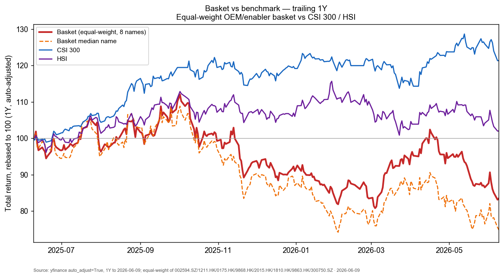
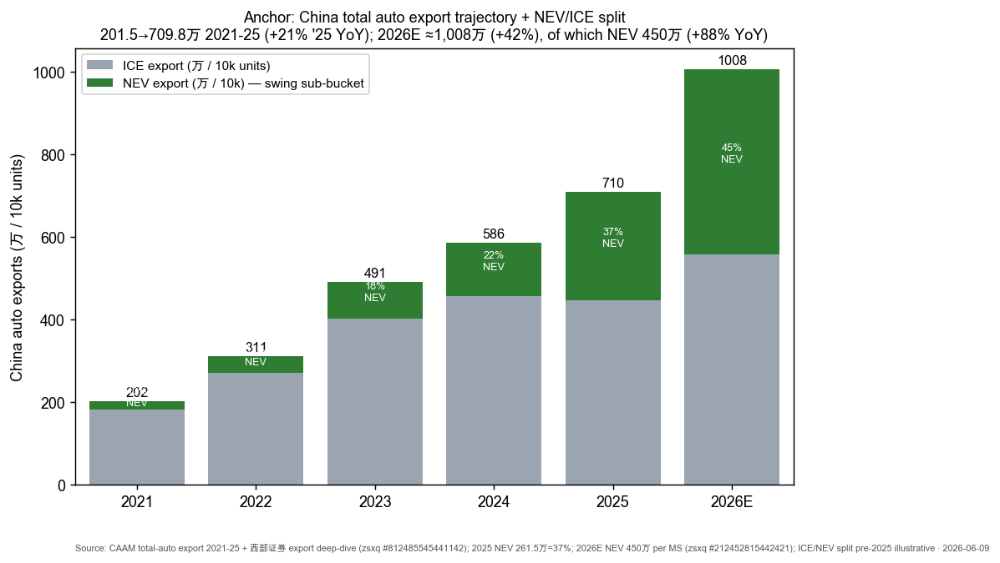
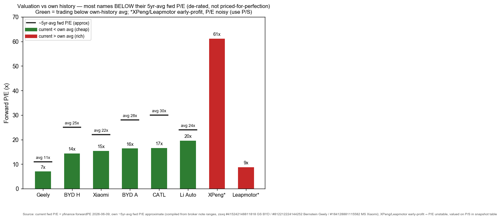

# China EV & Auto Export / 中国电动车与汽车出海

**Created:** 2026-06-09 · **Last refreshed:** 2026-06-09 · **Last mutated:** 2026-06-09 · **Refresh cadence:** monthly · **Languages tracked:** en

## What's New

*The delta since you last looked — newest refresh on top. Older entries collapse into the archive below so this stays short.*

**2026-06-09 — basket created** (8 names: BYD-H / Geely / XPeng / Leapmotor core; Li Auto / Xiaomi / SAIC adjacent; CATL enabler).

- **Anchor set:** China **total** auto exports 201.5万→709.8万 units 2021-25 (CAGR ~37%; +21% YoY in 2025), with the swing sub-bucket **NEV exports** reaching 261.5万 (37% of exports) in 2025 and a sell-side 2026E of **450万 (+88% YoY)** ([MS, 2026-05-11](http://xs-macbook-air.local:5001/zsxq/pdf/212452815442421/Morgan%20Stanley-AI%EF%BC%8C%20Global%EF%BC%8C%20Premium%20~%20Step%20In%20or%20Step%20Aside-260511.pdf)); domestic-driven Chinese brokers raised 2026 **total** passenger-vehicle export growth to **+40–45%** ([西部证券, 2026](http://xs-macbook-air.local:5001/zsxq/pdf/184152212185482/%E6%B1%BD%E8%BD%A6%E8%A1%8C%E4%B8%9A%EF%BC%9A%E4%B9%98%E7%94%A8%E8%BD%A6%E6%B5%B7%E5%A4%96%EF%BC%88%E5%87%BA%E5%8F%A3%EF%BC%89%E7%B3%BB%E5%88%97%EF%BC%9A%E5%A6%82%E4%BD%95%E5%B1%95%E6%9C%9B2026%E5%B9%B4%E4%B9%98%E7%94%A8%E8%BD%A6%E5%87%BA%E5%8F%A3%E5%A2%9E%E9%80%9F%EF%BC%9F.pdf)).
- **Performance reality check:** the equal-weight basket is **−16.5% over the trailing 1Y** (median name −25.2%) vs **CSI 300 +21.3% / HSI +2.0%** — the OEM cohort has *lagged* badly while the export second-curve narrative built. The lone winner is the enabler, **CATL +65.8%**. This is the core tension: exports surge in the operating data; the equities have de-rated on domestic price-war + margin fear.
- **New broker calls (mined this pass, upserted to `/pt`):** GS BYD-A Buy ¥137 vs ¥94.51 @ 2026-05-20 = **+45%** ([GS, zsxq #415242148811818 p.6](http://xs-macbook-air.local:5001/zsxq/pdf/415242148811818/Goldman%20Sachs-BYD%20Co.%20%EF%BC%88002594.SZ%201211.HK%EF%BC%89Asia%20Communacopia%20%2B%20Technology%20%E2%80%94%20Key%20Takeaways%EF%BC%9AHigher%20overseas%20premium%20mix%EF%BC%8C%20strong%20moat%20in%20flas-260520.pdf)); JPM raised BYD 2026 overseas to 1.75mn / Geely to 0.95mn after London/Paris store visits ([JPM, 2026-06-09](http://xs-macbook-air.local:5001/zsxq/pdf/814528415512452/J.P.%20Morgan-China%20Auto%20Industry%EF%BC%9AWe%20turn%20more%20positive%20after%20visiting%20London%20and%20Paris-260609.pdf)); Citi **cut Li Auto to Neutral**, TP HK$61.1 from HK$72.7 ([Citi, 2026-05-28](http://xs-macbook-air.local:5001/zsxq/pdf/812485545248552/CITI-Li%20Auto%20%EF%BC%882015.HK%EF%BC%89%20Expect%2026%2027E%20Net%20Loss%EF%BC%9B%20Lower%20TP%20%26%20Prefer%20Nio%20Xpeng-260528.pdf)).
- **Conviction rank (JPM, EU summit note):** BYD(OW) > Geely(OW) > Leapmotor(OW) > XPeng(OW) > NIO(OW); avoid SOE-JV names, Li Auto **Underweight** ([JPM, zsxq #415288428151818 p.5](http://xs-macbook-air.local:5001/zsxq/pdf/415288428151818/J.P.%20Morgan-China%20Auto%20Industry%20%EF%BC%9AHighlights%20from%20BYD%20and%20Geely%20meetings%20at%20EU%20Auto%20Conference-260603.pdf)).
- **Citation audit fix:** seed file_id `184128881115482` was mis-tagged "MS Xiaomi 1Q26" in the library metadata but is in fact **MS Tongcheng Travel (0780.HK)** — discarded; the real MS Xiaomi 1Q26 note (TP HK$45 OW) is `184128881115582`, used instead. Seed `184121412521522` does not exist in the DB; seed `585424552451554` is HSBC China-EV-tracker (kept).

## Thesis

**Anchor — China auto export units (the volume pool this basket is a bet on):** total auto exports **201.5万 (2021) → 311.1 → 491.0 → 585.9 → 709.8万 (2025)**, i.e. +112%/+57%/+58%/+19%/+21% YoY, then a 2026E of **≈1,008万 (+40–45%)** on the domestic-broker forecast ([西部证券 export deep-dive, zsxq #812485545441142 p.1](http://xs-macbook-air.local:5001/zsxq/pdf/812485545441142/%E6%B1%BD%E8%BD%A6%E5%87%BA%E6%B5%B7%E8%A1%8C%E4%B8%9A%E6%B7%B1%E5%BA%A6%E6%8A%A5%E5%91%8A%EF%BC%9A%E6%B1%BD%E8%BD%A6%E5%87%BA%E6%B5%B7%E5%89%8D%E6%99%AF%E5%B9%BF%E9%98%94%EF%BC%8C%E4%B8%AD%E5%9B%BD%E8%BD%A6%E4%BC%81%E4%BB%BD%E9%A2%9D%E6%8C%81%E7%BB%AD%E6%8F%90%E5%8D%87.pdf); 西部证券 raises 2026 PV export growth to "40%-45%区间" in [zsxq #184152212185482 p.25](http://xs-macbook-air.local:5001/zsxq/pdf/184152212185482/%E6%B1%BD%E8%BD%A6%E8%A1%8C%E4%B8%9A%EF%BC%9A%E4%B9%98%E7%94%A8%E8%BD%A6%E6%B5%B7%E5%A4%96%EF%BC%88%E5%87%BA%E5%8F%A3%EF%BC%89%E7%B3%BB%E5%88%97%EF%BC%9A%E5%A6%82%E4%BD%95%E5%B1%95%E6%9C%9B2026%E5%B9%B4%E4%B9%98%E7%94%A8%E8%BD%A6%E5%87%BA%E5%8F%A3%E5%A2%9E%E9%80%9F%EF%BC%9F.pdf)). **Sub-bucket decomposition** (2025 → 2026E): **NEV exports** 261.5万 (37% of total) → **450万 (+88%)** per MS ([MS, zsxq #212452815442421 p.1](http://xs-macbook-air.local:5001/zsxq/pdf/212452815442421/Morgan%20Stanley-AI%EF%BC%8C%20Global%EF%BC%8C%20Premium%20~%20Step%20In%20or%20Step%20Aside-260511.pdf), "NEV exports +88% YoY to 4.5m units"); **ICE exports** 448.3万 (63%) growing far slower. Within NEV, **PHEV** is the fastest leg — PHEV share of NEV exports jumped from 11% (Jan-24) to 39% (Apr-26) ([JPM export tracker, zsxq #415284421288518](http://xs-macbook-air.local:5001/zsxq/pdf/415284421288518/J.P.%20Morgan-China%20Auto%20Export%20Tracker%20April%EF%BC%9A%20NEV%20for%20the%20first%20time%20exceeding%2050%25%20of%20total-260529.pdf)). **Geographic cut:** Western Europe is the largest, highest-ASP destination (+82% YoY Q1), with LatAm (+52%), Eastern Europe (+54%) and Oceania (+37%) the next legs ([Bernstein export tracker, zsxq #212454818814451 p.1](http://xs-macbook-air.local:5001/zsxq/pdf/212454818814451/Bernstein-Asian%20Autos%20China%20Autos%20Export%20Tracker%EF%BC%9A%20Q1%202026%20exports%20%2B63%25%20yoy%EF%BC%8C%20EV%20surges%20with%20BEV%20%2B113%25%20and%20PHEV%20%2B146%25%EF%BC%9B%20Chinese%20brands%20extend%20global%20footprint-260518.pdf)).

**Swing factor — NEV export units (especially PHEV).** Each 5% revision to the NEV-export leg moves the headline pool far more than ICE, because NEV is both the faster-growing and higher-ASP/margin leg (overseas GPM runs materially above domestic; SAIC's export share lifting to 33% drove a 14% blended GPM vs domestic margin pressure — [GS SAIC, zsxq #585585544855244](http://xs-macbook-air.local:5001/zsxq/pdf/585585544855244/Goldman%20Sachs-SAIC%20MOTOR%20%EF%BC%88600104.SS%EF%BC%89%201Q26%20Earnings%20Review%EF%BC%9A%20Revenue%20in~line%20while%20GPM%20beat%20on%20higher%20export%20margin-260430.pdf)). The bet: domestic demand is soft post-subsidy (purchase-tax hike + subsidy taper), so exports — not the home market — carry profit growth for the basket.

**Why structural, not cyclical:** China brands held only ~10.7% of accessible ex-China auto markets in 2025 vs Japanese peers' ~23.1% — implying a doubling runway — and have already planted 61 factories in Europe + 107 elsewhere, converting "product export" into "industrial-chain export" that side-steps tariffs ([西部证券, zsxq #812485545441142 p.1](http://xs-macbook-air.local:5001/zsxq/pdf/812485545441142/%E6%B1%BD%E8%BD%A6%E5%87%BA%E6%B5%B7%E8%A1%8C%E4%B8%9A%E6%B7%B1%E5%BA%A6%E6%8A%A5%E5%91%8A%EF%BC%9A%E6%B1%BD%E8%BD%A6%E5%87%BA%E6%B5%B7%E5%89%8D%E6%99%AF%E5%B9%BF%E9%98%94%EF%BC%8C%E4%B8%AD%E5%9B%BD%E8%BD%A6%E4%BC%81%E4%BB%BD%E9%A2%9D%E6%8C%81%E7%BB%AD%E6%8F%90%E5%8D%87.pdf)). High oil ($90.5/bbl, [indicators.db 2026-06-05](http://xs-macbook-air.local:5001/reports)) accelerates overseas NEV substitution, the same catalyst that propelled Japan's 1970s-90s export ascent.

**Bull / base / bear (anchor):** *base* 2026E total exports ≈1,008万 (+42%), NEV ≈450万. *Bull* — Europe re-acceleration + LatAm break-out pushes total >1,050万 with NEV >480万 (the JPM "overseas beats" path; BYD 1.75mn / Geely 0.95mn overseas). *Bear* — an EU tariff escalation onto PHEV/HEV (today's duties hit BEV only) + EM subsidy taper compresses 2026 growth toward the low-20s%, the single swing assumption being **whether the EU widens its anti-subsidy net to plug-in hybrids**. For the bull case to fully hold, three conditions must *all* clear: (1) Europe BEV+PHEV share keeps climbing (China-brand EU NEV share already 5%→18% Apr-26, [JPM, zsxq #814528415512452](http://xs-macbook-air.local:5001/zsxq/pdf/814528415512452/J.P.%20Morgan-China%20Auto%20Industry%EF%BC%9AWe%20turn%20more%20positive%20after%20visiting%20London%20and%20Paris-260609.pdf)); (2) local-build (Hungary/Brazil/Spain) ramps on schedule to convert duty-exposed exports into duty-free local volume; (3) no second-front tariff shock from the US/EM bloc.

**Who benefits when (time axis over the anchor curve):** the **enabler (CATL)** monetizes the export build-out *first* — fast-charge/Blade-cell content ships ahead of the vehicles and is destination-agnostic; the **core OEMs (BYD/Geely/Leapmotor)** monetize *through 2026-27* as local plants reach breakeven and overseas profit mix climbs (BYD overseas profit contribution 40% in 2025 → 62% by 2030E, [GS, zsxq #415242148811818 p.7](http://xs-macbook-air.local:5001/zsxq/pdf/415242148811818/Goldman%20Sachs-BYD%20Co.%20%EF%BC%88002594.SZ%201211.HK%EF%BC%89Asia%20Communacopia%20%2B%20Technology%20%E2%80%94%20Key%20Takeaways%EF%BC%9AHigher%20overseas%20premium%20mix%EF%BC%8C%20strong%20moat%20in%20flas-260520.pdf)); the **adjacent end-product names (XPeng/Xiaomi/Li)** monetize *last/most variably*, gated by their own GM-turns-positive year (XPeng net-loss-narrows 2026E −36亿 → breakeven 2028E per MS).

**Value-chain / who-occupies-which-layer (dollar-weighted):** *cell + fast-charge enabler* CATL (~37% global EV-battery share, the layer that ships first; **basket-covered**) · *vertically-integrated OEM with own cells* BYD (cell+pack+vehicle in one — the deepest cost moat) · *premium/Zeekr + light-asset KD exporter* Geely · *Stellantis-channel JV exporter* Leapmotor · *premium ADAS-led BEV* XPeng · *EREV/family-SUV* Li Auto · *consumer-ecosystem crossover* Xiaomi · *SOE export-margin turnaround* SAIC. **Coverage-gap flag:** the rich **in-vehicle ADAS-SoC layer** (Horizon Robotics 9660.HK, the dominant L2+ China SoC supplier) and the **auto-parts/thermal layer** (Tuopu 601689.SS, Fuyao) are NOT in this basket by design — ADAS chips belong to a semiconductors theme and parts to an auto-components theme — but they are the most-cited adjacent dollar layers and candidate-adds if scope widens.

## Scope rules

**In:** China-listed (A/H) and ADR passenger-vehicle OEMs whose investment case is meaningfully levered to the **auto-export second curve** — i.e. overseas volume/profit is a stated, disclosed growth driver; plus the single highest-conviction battery **enabler** (CATL) that ships content ahead of the vehicles and benefits as the export build-out scales.

**Out (separate themes):** pure battery-cell / cathode-anode-electrolyte / ESS / sodium-ion **chemistry** supply chain (→ `china-battery-ess-sodium-ion`); standalone **ADAS-SoC** suppliers (Horizon, Black Sesame → a China-autonomy-semis theme); auto-**parts/components** pure-plays (Tuopu, Fuyao, Sanhua → an auto-components theme); two-wheel / commercial-truck-only exporters; pure-domestic SOE-JV names with no export thesis. CATL is admitted **only** as the vehicle-enabling fast-charge/Blade-cell layer — this basket does not reproduce the cell-materials value chain. Tesla-China and pure ICE legacy names are excluded (diluted / wrong-curve).

## Tracked tickers

| Ticker | Name | Role | Justification | Added |
|---|---|---|---|---|
| HKEX:1211 | BYD (比亚迪 H) | core | #1 China NEV exporter — Q1-26 exports 312k units, +56% YoY, 33% of all China EV exports; overseas mix already 46% of vol in 1Q26 (21% a year ago), targeting 1.5–1.75mn overseas in 2026 ([GS, zsxq #415242148811818 p.6](http://xs-macbook-air.local:5001/zsxq/pdf/415242148811818/Goldman%20Sachs-BYD%20Co.%20%EF%BC%88002594.SZ%201211.HK%EF%BC%89Asia%20Communacopia%20%2B%20Technology%20%E2%80%94%20Key%20Takeaways%EF%BC%9AHigher%20overseas%20premium%20mix%EF%BC%8C%20strong%20moat%20in%20flas-260520.pdf); [Bernstein, zsxq #212454818814451 p.1](http://xs-macbook-air.local:5001/zsxq/pdf/212454818814451/Bernstein-Asian%20Autos%20China%20Autos%20Export%20Tracker%EF%BC%9A%20Q1%202026%20exports%20%2B63%25%20yoy%EF%BC%8C%20EV%20surges%20with%20BEV%20%2B113%25%20and%20PHEV%20%2B146%25%EF%BC%9B%20Chinese%20brands%20extend%20global%20footprint-260518.pdf)). **Moat:** full vertical integration (own cells + Gen-2 Blade + fast-charge network + SiC + motors) — GS calls the flash-charge ecosystem "not easily replicable by third-party suppliers". **Threat:** EU widening anti-subsidy duties to PHEV; no EU battery plant exposes it to the proposed Industrial-Accelerator local-content rule ([JPM, zsxq #812222185225842 p.1](http://xs-macbook-air.local:5001/zsxq/pdf/812222185225842/J.P.%20Morgan-China%20Battery%EF%BC%9ABYD%E2%80%99s%20Gen2%20Flash%20Charging%EF%BC%9A%20Industry%20disruptor%20or%20still%20a%20media%20mirage%EF%BC%9F%20Downgrading%20CATL~H%20to%20Neutral-260319.pdf)); domestic share −2pts 2026E on intensified competition. | 2026-06-09 |
| SSE:002594 | BYD (比亚迪 A) | core | A-listing of the same issuer; tracked alongside the H-share to capture the persistent A/H premium (H trades ~10% discount per GS methodology). Same moat/threat as 1211.HK; GS Buy ¥137 (A) vs ¥94.51 = +45% ([GS, zsxq #415242148811818 p.6](http://xs-macbook-air.local:5001/zsxq/pdf/415242148811818/Goldman%20Sachs-BYD%20Co.%20%EF%BC%88002594.SZ%201211.HK%EF%BC%89Asia%20Communacopia%20%2B%20Technology%20%E2%80%94%20Key%20Takeaways%EF%BC%9AHigher%20overseas%20premium%20mix%EF%BC%8C%20strong%20moat%20in%20flas-260520.pdf)). | 2026-06-09 |
| HKEX:175 | Geely (吉利汽车) | core | Fastest-growing exporter — Q1-26 overseas +129% YoY to 203k units (jumped to #3 exporter), 28.6% export mix (12.6% a year ago); EV exports +620% YoY ([Bernstein, zsxq #812212224144252 p.1](http://xs-macbook-air.local:5001/zsxq/pdf/812212224144252/Bernstein-Geely%20Automobile%20Holdings%20Ltd%EF%BC%880175.HK%EF%BC%89Geely%20Q1%EF%BC%9A%20Solid%20Core%EF%BC%8C%20Rising%20Zeekr%20and%20Overseas%20momentum-260429.pdf); [Bernstein, zsxq #212454818814451 p.1](http://xs-macbook-air.local:5001/zsxq/pdf/212454818814451/Bernstein-Asian%20Autos%20China%20Autos%20Export%20Tracker%EF%BC%9A%20Q1%202026%20exports%20%2B63%25%20yoy%EF%BC%8C%20EV%20surges%20with%20BEV%20%2B113%25%20and%20PHEV%20%2B146%25%EF%BC%9B%20Chinese%20brands%20extend%20global%20footprint-260518.pdf)). **Moat:** light-asset KD/CKD export model (Proton 49.9% JV, Renault Korea/Brazil, Lynk&Co via Volvo channels) + premium Zeekr (ASP ¥295k, 3× Geely-brand) tariff-hedged. **Threat:** light-asset model cedes local profit/control vs BYD's owned plants; Zeekr premium ambition collides with European incumbents; FX swings dragged 1Q net −27%. | 2026-06-09 |
| HKEX:9868 | XPeng (小鹏汽车) | core | ADAS-led BEV with an explicit overseas data-loop strategy — April overseas run-rate 6k/mo, management guides 4Q26 >10k/mo (~120k annualized), VLA 2.0 self-drive going abroad with MONA ([MS, zsxq #415288442524128 p.1](http://xs-macbook-air.local:5001/zsxq/pdf/415288442524128/Morgan%20Stanley-XPeng%20Inc.%EF%BC%889868.HK%EF%BC%89GX%20lifts%20spirits%EF%BC%9B%20time%20to%20make%20good%20on%20innovation%20pledges-260602.pdf)). **Moat:** full-stack self-developed Turing ADAS chip + VW tech-licensing revenue (in-house chip + IP that survives even if it loses a vehicle sale). **Threat (customer-insourcing — inverse here):** XPeng is itself the insourcer; the risk is the opposite — its sub-scale vehicle volume can't amortize the chip R&D, and a domestic price war in the ¥150–300k band it competes in keeps GM thin (auto GM only ~13% 2026E, net loss −36亿). | 2026-06-09 |
| HKEX:9863 | Leapmotor (零跑汽车) | core | Cost-leader value exporter via the **Stellantis JV** — the cleanest "export through someone else's channel + factory" play; reaffirmed 1mn 2026 deliveries, targeting 40–50% overseas by 2030, taking over a Stellantis Madrid plant for 2028 European production ([GS, zsxq #415242524412548 p.1](http://xs-macbook-air.local:5001/zsxq/pdf/415242524412548/Goldman%20Sachs-Zhejiang%20Leapmotor%20Technology%20%EF%BC%889863.HK%EF%BC%89%EF%BC%9A%20Asia%20Communacopia%20%2B%20Technology%20%E2%80%94%20Key%20Takeaways%EF%BC%9A%201mn%20deliveries%EF%BC%8C%20margin%20under%20pressure-260519.pdf)). **Moat:** Stellantis distribution + local-assembly access without owning dealers; lowest-cost full-stack design (single-LiDAR + 200 TOPS sufficient sub-¥200k). **Threat:** transfer-pricing on JV exports caps overseas GPM at low-single-digit until 2027+; 1Q26 vehicle GM just 7.5% on overseas mix; reliant on Stellantis' own commitment to the partnership. | 2026-06-09 |
| HKEX:2015 | Li Auto (理想汽车) | adjacent | Premium EREV/SUV with rising but still-secondary export (international "accelerating" but profit inflection unclear); 1Q26 revenue −11% YoY, net loss ¥2.29bn, ASP −9% QoQ; Citi cut 26/27E to net loss and downgraded to Neutral ([Citi, zsxq #812485545248552 p.1](http://xs-macbook-air.local:5001/zsxq/pdf/812485545248552/CITI-Li%20Auto%20%EF%BC%882015.HK%EF%BC%89%20Expect%2026%2027E%20Net%20Loss%EF%BC%9B%20Lower%20TP%20%26%20Prefer%20Nio%20Xpeng-260528.pdf)). **Moat:** EREV/family-SUV niche leadership + strong brand in ¥300k+ segment. **Threat:** EREV is least export-relevant (range-extender appeal is China-specific); aging line-up (L9 "not a game changer") losing the 9-series war to peers; JPM rates it **Underweight**, the basket's lowest-conviction name. | 2026-06-09 |
| HKEX:1810 | Xiaomi (小米集团) | adjacent | Consumer-ecosystem crossover into EV with a stated overseas-EV ambition; 1Q26 auto revenue +7% YoY (a loss-making segment cross-subsidized by phone+AIoT margin); overseas EV expansion flagged a 2026 Investor-Day priority ([MS, zsxq #184128881115582 p.1](http://xs-macbook-air.local:5001/zsxq/pdf/184128881115582/Morgan%20Stanley-Xiaomi%20Corp%EF%BC%881810.HK%EF%BC%891Q26%EF%BC%9A%20Smartphone%20%2B%20AIoT%20Margin%20Beat%20vs.%20EV%20Loss%EF%BC%9B%20Sequential%20Recovery%20Highly%20Likely%20in%202Q26-260526.pdf); [GS Investor-Day, zsxq #812212581145842](http://xs-macbook-air.local:5001/zsxq/pdf/812212581145842/)). **Moat:** brand + retail-network + ecosystem lock-in that no other new-entrant OEM has; YU7 demand strong. **Threat:** EV is still loss-making and a small slice of group; overseas-EV is a roadmap, not yet volume; stock swings on phone-margin, not the export thesis — diluted exposure (hence adjacent, not core). | 2026-06-09 |
| SSE:600104 | SAIC Motor (上汽集团) | adjacent | Legacy SOE whose *only* bright spot is export-margin mix — 1Q26 export share rose to 33% (23%/22% in 1Q25/4Q25), lifting blended GPM to 14% (+3.8pp) ([GS, zsxq #585585544855244](http://xs-macbook-air.local:5001/zsxq/pdf/585585544855244/Goldman%20Sachs-SAIC%20MOTOR%20%EF%BC%88600104.SS%EF%BC%89%201Q26%20Earnings%20Review%EF%BC%9A%20Revenue%20in~line%20while%20GPM%20beat%20on%20higher%20export%20margin-260430.pdf)). **Moat:** scale + MG brand's established Europe/EM footprint (one of the earliest China exporters). **Threat:** structural ICE decline → −1% group PV-volume CAGR; JV-brand profit eroding; GS rates it **Sell** (TP ¥8.6, −37%) — included as the contrarian "export-margin-rescue" read, not a bull pick. | 2026-06-09 |
| SZSE:300750 | CATL (宁德时代) | enabler | The battery layer that ships *ahead of* the vehicles and benefits as the export build-out scales — ~37% global EV-battery share; JPM argues BYD's Gen-2 fast-charge actually *helps* CATL by accelerating industry-wide super-fast-charge adoption (CATL led 4C/5C LFP since Aug-23) ([JPM, zsxq #812222185225842 p.1](http://xs-macbook-air.local:5001/zsxq/pdf/812222185225842/J.P.%20Morgan-China%20Battery%EF%BC%9ABYD%E2%80%99s%20Gen2%20Flash%20Charging%EF%BC%9A%20Industry%20disruptor%20or%20still%20a%20media%20mirage%EF%BC%9F%20Downgrading%20CATL~H%20to%20Neutral-260319.pdf)). **Moat:** stable unit profit (¥/Wh) through 2019-25 cycles + tech leadership; external supplier to most OEMs ex-BYD. **Threat (customer-insourcing):** BYD self-supplies its own cells (now >20% of its external-supply also growing) and is the structural insourcing risk to CATL's TAM; **CATL's counter** = it sells to *everyone else* + leads the super-fast-charge standard the whole industry is migrating to, so insourcing by one OEM is offset by standard-migration demand from the rest. *(Enabler only — the cell-materials chain is tracked in `china-battery-ess-sodium-ion`.)* | 2026-06-09 |

*Cited conviction rank (JPM EU-summit note, 2026-06-03): **BYD(OW) > Geely(OW) > Leapmotor(OW) > XPeng(OW) > NIO(OW)**; avoid SOE-JV (SAIC/GAC/Brilliance/Changan Neutral-or-below), **Li Auto Underweight** ([JPM, zsxq #415288428151818 p.5](http://xs-macbook-air.local:5001/zsxq/pdf/415288428151818/J.P.%20Morgan-China%20Auto%20Industry%20%EF%BC%9AHighlights%20from%20BYD%20and%20Geely%20meetings%20at%20EU%20Auto%20Conference-260603.pdf)). Citi splits on the new-entrants: prefers **NIO/XPeng > Li** ([Citi, zsxq #812485545248552](http://xs-macbook-air.local:5001/zsxq/pdf/812485545248552/CITI-Li%20Auto%20%EF%BC%882015.HK%EF%BC%89%20Expect%2026%2027E%20Net%20Loss%EF%BC%9B%20Lower%20TP%20%26%20Prefer%20Nio%20Xpeng-260528.pdf)).*

## Valuation snapshot

*Populated from `stock_price_target_db` (mirrors `/pt`). "Px @ note" = stock price on the note's publication date (the load-bearing price the analyst's upside was called against); "current px" is live spot for context. Fwd P/E = yfinance forwardPE 2026-06-09; own ~5yr-avg fwd P/E approximate from broker note ranges.*

| Ticker | Rating (latest) | Px @ note date | PT | Upside% (vs note px) | Current px | Fwd P/E | Own ~5yr-avg P/E | FY1 / FY2 metric |
|---|---|---|---|---|---|---|---|---|
| SSE:002594 BYD A | GS **Buy** @ 2026-05-20 | ¥94.51 | ¥137 (DCF, WACC 10.8%/TGR 2%) | **+45%** | ¥91.89 | 16.4× | ~28× | EPS ¥4.37 (26E) / ¥5.37 (27E) |
| HKEX:1211 BYD H | GS **Buy** @ 2026-05-20 · JPM OW HK$124 @ 06-09 | HK$93.80 | HK$134 (10% disc. to A) | **+43%** (GS) | HK$88.40 | 14.3× | ~25× | EPS ¥4.71 (26E) / ¥6.05 (27E) (JPM adj.) |
| HKEX:175 Geely | Bernstein **OP** @ 2026-04-29 · JPM OW HK$29 @ 06-09 | HK$22.90 | HK$22 (Bern.) / HK$29 (JPM) | −4% (Bern, overtaken) / **+22%** (JPM) | HK$18.57 | 7.0× | ~11× | EPS ¥2.42 (26E, JPM) — implied ~11× '26 PE at TP |
| HKEX:9868 XPeng | MS **OW** @ 2026-06-02 | HK$72.00 | HK$96 (bull$40/base$21/bear$10 ADR) | **+33%** | HK$61.30 | 61× (early-profit, noisy) | n/a — pre-/early-profit, use P/S 1.5× '28 (MS bull SOTP) | EPS −¥1.89 (26E) / −¥0.50 (27E) / +¥0.10 (28E) |
| HKEX:9863 Leapmotor | GS **Not Covered** (no PT) | n/a | n/a | n/a | HK$39.30 | 8.7× | n/a — recently turned profit, P/E unstable; valued on group 3–5% NPM target | ASP ¥98k 1Q26, veh. GM 7.5% → guided 12–13% 2Q |
| HKEX:2015 Li Auto | Citi **Neutral** @ 2026-05-28 (cut from Buy) | n/a (report-date px not in store) | HK$61.1 (SOTP 1.0× P/S, was HK$72.7) | n/a | HK$55.85 | 19.6× | ~24× | net loss ¥5.29bn (26E) / ¥1.29bn (27E) (Citi) |
| HKEX:1810 Xiaomi | MS **OW** @ 2026-05-26 | HK$29.76 | HK$45 (residual-income) | **+51%** | HK$27.20 | 15.4× | ~22× | group adj NP −44% YoY 1Q26; EV loss-making |
| SSE:600104 SAIC | GS **Sell** @ 2026-04-30 | ¥13.69 | ¥8.6 (was ¥7.9) | **−37%** | ¥11.32 | n/a (cyclical) | >+1σ vs 5yr fwd PE (GS) | 26E NP +22% on op-leverage; PV vol CAGR −1% |
| SZSE:300750 CATL | (battery enabler — A-share Buy consensus; H downgraded Neutral by JPM on A/H premium) | n/a | A-share ¥500 (JPM) / H HK$650 (JPM, Neutral) | n/a | ¥399.50 | 16.6× | ~30× | stable ¥/Wh unit profit through cycle |

**Cross-section read:** at FY1, the basket sorts cheap→dear **Geely 7× < BYD-H 14× < Xiaomi 15× < BYD-A 16× < CATL 17× < Li 20× < XPeng 61× (early-profit, ignore P/E)**. Critically, **every covered name with a clean P/E trades BELOW its own ~5yr average** (Geely 7× vs ~11×; BYD-A 16× vs ~28×; CATL 17× vs ~30×). This is a **de-rated, not priced-for-perfection** basket — the opposite of the air-pocket setup. PEG check: BYD-A at 16× fwd on a ~14% '26→'27 EPS-CAGR ≈ PEG ~1.1; Geely 7× on a faster export-led EPS ramp screens cheapest growth-adjusted. SOTP-only names flagged: XPeng (MS bull SOTP = veh ¥220bn + Turing chip ¥35bn + robot ¥11bn + Robotaxi ¥14bn) and Li Auto (Citi 1.0× P/S + ¥5bn robotics).

## Exclusions

| Ticker | Reason |
|---|---|
| NYSE:NIO | A new-entrant export story (Citi's near-term top pick on margin visibility) but its export thesis is thinner than the four core names and its cash burn dominates the equity narrative — tracked as a candidate-add, not yet in the basket. |
| HKEX:9660 Horizon Robotics | The dominant China L2+ **ADAS-SoC** supplier — a rich adjacent dollar layer, but a *semiconductor* exposure, not an OEM/vehicle one. Belongs in a China-autonomy-semis theme (the modal customer-insourcing battleground: BYD/NIO/XPeng/Li in-house chips vs Horizon). |
| SSE:601689 Tuopu / SHE Fuyao | Auto **parts/thermal/glass** suppliers that ride the export volume but are components pure-plays → an auto-components theme. |
| Chery (unlisted) | The #1 China auto exporter by volume (389k units Q1, 134.4万 FY25) — but not publicly listed, so un-trackable as an equity. |
| NASDAQ:TSLA | Tesla-China exports are a slice of a US-centric story — wrong curve, too diluted. |
| 300014.SZ EVE / cathode-anode names | Battery-cell & materials chemistry → `china-battery-ess-sodium-ion` (separate theme by design). |

## Keywords

China auto export / 汽车出口 · NEV export / 新能源车出海 · 乘用车出口 · PHEV export / 插混出海 · vertical integration / 垂直整合 · Blade battery / 刀片电池 · flash charging / 闪充 · EU EV tariff / 欧盟关税 · localization / 本地化建厂 · KD/CKD assembly · overseas profit mix / 海外利润占比 · L2+ ADAS / 高阶智驾

## Performance

*Window: trailing 1Y to 2026-06-09. Benchmark: CSI 300 (+21.3%) / HSI (+2.0%). yfinance auto_adjust=True. Note: trailing-1Y prints for some China names can be distorted by the 2026 yfinance quirk — basket median + benchmark quoted, outliers flagged, no "corrected" figures fabricated.*

- **Equal-weight basket: −16.5% (1Y)** · **median name −25.2%** — both far below CSI 300 +21.3% and HSI +2.0%. The export second-curve is visible in the *operating* data but the OEM *equities* have de-rated on the domestic price war.
- **YTD (since 2026-01-01):** Geely +2.0% (only OEM positive) and CATL +7.5% lead; Xiaomi −32.5%, SAIC −25.8%, XPeng −23.7% lag. CSI 300 −0.1% YTD.
- **~3M:** Geely +17.5% and CATL +13.5% lead the recovery; Changan-class SOE names (−28.8%) and Li Auto (−18.9%) lag.

### Basket scorecard

- **Batting average (1Y):** **1 of 8 names positive** (Geely +7.8%; the other 7 negative) = **12.5% positive**. **0 of 8 beat CSI 300 (+21.3%)** = **0% beating benchmark** — CATL +65.8% beats HSI but not CSI 300.
- **Best contributor:** CATL **+65.8%** (the enabler — and the single name validating the "content ships first" staging). **Worst:** Li Auto **−53.5%** (domestic-EREV thesis impaired; Citi downgrade).
- **Cumulative outperformance since inception:** n/a — only one snapshot line exists (baseline). The next refresh will diff against today's snapshot to compute since-inception bps.
- **Honest read:** this is a *forward* bet on the export curve, NOT a momentum basket. A watchlist would hide the −16.5%; a tracked basket prints it. The scorecard is the falsification target — if exports keep surging and the equities keep lagging, the thesis is that the gap closes; if exports roll over too, the thesis breaks.

## Recent events

- **2026-06-09 — JPM turns more positive on China auto exports** after London/Paris BYD store visits: raises BYD 2026 overseas to ~1.75mn (+15%), Geely to ~0.95mn (+30%); China-brand EU NEV share 5%→18% (Apr-26); BYD-H TP to HK$124, Geely to HK$29 ([JPM](http://xs-macbook-air.local:5001/zsxq/pdf/814528415512452/J.P.%20Morgan-China%20Auto%20Industry%EF%BC%9AWe%20turn%20more%20positive%20after%20visiting%20London%20and%20Paris-260609.pdf)).
- **2026-06-09 — GS NEV weekly chartbook (W23):** weekly orders +7% YoY/−15% WoW, **retail NEV penetration 63%** ([GS, zsxq #181245412821212](http://xs-macbook-air.local:5001/zsxq/pdf/181245412821212/Goldman%20Sachs-CHINA%20NEW%20ENERGY%20VEHICLE%20WEEKLY%20CHARTBOOK%EF%BC%9A2026%20Week%2023%20~%20Weekly%20NEV%20orders%20%2B7%25%20~15%25%20yoy%20wow%EF%BC%8C%20retail%20NEV%20penetration%2063%25-260609.pdf)).
- **2026-06-03 — Citi May NEV preliminary sales beat:** BYD May NEV 383.5k (+19% MoM), overseas NEV 160.6k (+19% MoM, 5M cum +65% YoY); Geely export +184% YoY; Leapmotor 81.6k (+81% YoY); Xiaomi >30k ([Citi, zsxq #184152144482412](http://xs-macbook-air.local:5001/zsxq/pdf/184152144482412/)).
- **2026-06-02 — MS XPeng:** GX premium-trim demand beats; reaffirms OW HK$96, 4Q26 overseas >10k/mo; net loss −36亿 26E narrowing to breakeven 28E ([MS, zsxq #415288442524128](http://xs-macbook-air.local:5001/zsxq/pdf/415288442524128/Morgan%20Stanley-XPeng%20Inc.%EF%BC%889868.HK%EF%BC%89GX%20lifts%20spirits%EF%BC%9B%20time%20to%20make%20good%20on%20innovation%20pledges-260602.pdf)).
- **2026-05-29 — JPM April export tracker:** 1-4M exports 271.8万 (+69.1% YoY); **NEV first exceeds 50%** of monthly PV export (55% in April); PHEV share of NEV exports 11%→39% ([JPM, zsxq #415284421288518](http://xs-macbook-air.local:5001/zsxq/pdf/415284421288518/J.P.%20Morgan-China%20Auto%20Export%20Tracker%20April%EF%BC%9A%20NEV%20for%20the%20first%20time%20exceeding%2050%25%20of%20total-260529.pdf)).
- **2026-05-28 — Citi cuts Li Auto to Neutral**, TP HK$61.1 (from HK$72.7), now models 26/27E net loss; prefers NIO/XPeng ([Citi, zsxq #812485545248552](http://xs-macbook-air.local:5001/zsxq/pdf/812485545248552/CITI-Li%20Auto%20%EF%BC%882015.HK%EF%BC%89%20Expect%2026%2027E%20Net%20Loss%EF%BC%9B%20Lower%20TP%20%26%20Prefer%20Nio%20Xpeng-260528.pdf)).
- **2026-03-19 — JPM downgrades CATL-H to Neutral** (valuation, H >40% premium to A) post BYD Gen-2 flash-charge; A-share Buy ¥500 maintained ([JPM, zsxq #812222185225842](http://xs-macbook-air.local:5001/zsxq/pdf/812222185225842/J.P.%20Morgan-China%20Battery%EF%BC%9ABYD%E2%80%99s%20Gen2%20Flash%20Charging%EF%BC%9A%20Industry%20disruptor%20or%20still%20a%20media%20mirage%EF%BC%9F%20Downgrading%20CATL~H%20to%20Neutral-260319.pdf)).

## Drift signals

- **Operating-data ↔ price divergence (the headline drift):** exports are surging (Q1 +63% YoY, NEV first >50% of monthly export) yet the equal-weight basket is −16.5% over 1Y. The thesis bet is the gap *closes upward*; the risk is it closes *downward* (exports roll over). **Watch:** if monthly export YoY decelerates below ~+30% while the equities stay weak, the second-curve thesis is in trouble.
- **Enabler leads, OEMs lag — staging confirmed but uncomfortable:** CATL (+65.8%) is the only winner; the vehicle names are de-rated. Consistent with "content ships first," but means the equity payoff for core OEMs is still *ahead*, not realized.
- **Li Auto fits the theme least well:** EREV is the least export-relevant powertrain (range-extender appeal is China-specific), now in net loss, JPM Underweight. **Flag:** consider role-demote or drop on next refresh if export contribution stays immaterial.
- **Priced-for-perfection? No — priced-for-pessimism.** Basket median fwd P/E sits *below* own history (Geely 7× vs ~11×, BYD-A 16× vs ~28×, CATL 17× vs ~30×). The de-rate has largely happened. **The specific demand assumption whose miss would de-rate *further*:** an **EU tariff widening to PHEV/HEV** (today BEV-only) — that would hit the single fastest-growing export leg (PHEV 11%→39% of NEV exports) and is the named air-pocket trigger. Quantified floor: GS's bear on SAIC (TP ¥8.6, −37% to its own-history-rich multiple) shows what a forced ICE-decline de-rate looks like; for the new-entrants, XPeng's MS bear case ADR $10 (vs base $21) ≈ −52% is the published downside floor.
- **New entrants worth considering (candidate-adds, not auto-added):** **NIO** (Citi's near-term top pick on 2Q margin visibility), **Horizon Robotics 9660.HK** (ADAS-SoC layer the basket doesn't touch), **Chery** (largest exporter — but unlisted). Surface for next mutation.
- **Stale-justification watch:** none yet (all cells sourced from notes ≤90 days old).

## Leading indicators

*Upstream signals that move BEFORE the basket equities and would crack the thesis first — never the member stock prices. Plus a per-ticker operating-data table (Bernstein-*Barometer* style).*

**Macro / upstream signals:**

| Signal | Latest reading (as-of) | Direction | Implies |
|---|---|---|---|
| China total auto export (CAAM, monthly) | 1-4M 2026: **271.8万, +69.1% YoY**; April single-month 79.6万 (record) | ▲ strongly up | Anchor on track / above the 40-45% full-year path ([西部证券, zsxq #184152212185482 p.6](http://xs-macbook-air.local:5001/zsxq/pdf/184152212185482/%E6%B1%BD%E8%BD%A6%E8%A1%8C%E4%B8%9A%EF%BC%9A%E4%B9%98%E7%94%A8%E8%BD%A6%E6%B5%B7%E5%A4%96%EF%BC%88%E5%87%BA%E5%8F%A3%EF%BC%89%E7%B3%BB%E5%88%97%EF%BC%9A%E5%A6%82%E4%BD%95%E5%B1%95%E6%9C%9B2026%E5%B9%B4%E4%B9%98%E7%94%A8%E8%BD%A6%E5%87%BA%E5%8F%A3%E5%A2%9E%E9%80%9F%EF%BC%9F.pdf)) |
| China-brand EU NEV share | **18% (Apr-26)** vs 5% a year ago | ▲ up | Europe (highest-ASP leg) penetration accelerating ([JPM, zsxq #814528415512452](http://xs-macbook-air.local:5001/zsxq/pdf/814528415512452/J.P.%20Morgan-China%20Auto%20Industry%EF%BC%9AWe%20turn%20more%20positive%20after%20visiting%20London%20and%20Paris-260609.pdf)) |
| Brent crude (NEV-substitution catalyst) | **$90.5/bbl (2026-06-05)** | ▲ elevated | High oil accelerates overseas NEV demand (the Japan-1970s analog) ([indicators.db](http://xs-macbook-air.local:5001/reports)) |
| Domestic NEV retail penetration | **63% (W23, 2026-06)** | ▲ up | Domestic still penetrating but order WoW −15% → soft domestic = export reliance ([GS, zsxq #181245412821212](http://xs-macbook-air.local:5001/zsxq/pdf/181245412821212/Goldman%20Sachs-CHINA%20NEW%20ENERGY%20VEHICLE%20WEEKLY%20CHARTBOOK%EF%BC%9A2026%20Week%2023%20~%20Weekly%20NEV%20orders%20%2B7%25%20~15%25%20yoy%20wow%EF%BC%8C%20retail%20NEV%20penetration%2063%25-260609.pdf)) |

**Per-ticker operating data (latest monthly/quarterly print):**

| Name | Latest operating print | Source |
|---|---|---|
| BYD | May NEV 383.5k (+19% MoM); overseas NEV 160.6k (+19% MoM), 5M cum +65% YoY; Q1 exports 312k (+56%, 33% of EV exports) | [Citi, zsxq #184152144482412](http://xs-macbook-air.local:5001/zsxq/pdf/184152144482412/) · [Bernstein, zsxq #212454818814451 p.1](http://xs-macbook-air.local:5001/zsxq/pdf/212454818814451/Bernstein-Asian%20Autos%20China%20Autos%20Export%20Tracker%EF%BC%9A%20Q1%202026%20exports%20%2B63%25%20yoy%EF%BC%8C%20EV%20surges%20with%20BEV%20%2B113%25%20and%20PHEV%20%2B146%25%EF%BC%9B%20Chinese%20brands%20extend%20global%20footprint-260518.pdf) |
| Geely | Q1 overseas 203k (+129% YoY), export mix 28.6%; May export +184% YoY; 2026 export target 750k | [Bernstein, zsxq #812212224144252 p.1](http://xs-macbook-air.local:5001/zsxq/pdf/812212224144252/Bernstein-Geely%20Automobile%20Holdings%20Ltd%EF%BC%880175.HK%EF%BC%89Geely%20Q1%EF%BC%9A%20Solid%20Core%EF%BC%8C%20Rising%20Zeekr%20and%20Overseas%20momentum-260429.pdf) · [JPM, zsxq #415288428151818 p.4](http://xs-macbook-air.local:5001/zsxq/pdf/415288428151818/J.P.%20Morgan-China%20Auto%20Industry%20%EF%BC%9AHighlights%20from%20BYD%20and%20Geely%20meetings%20at%20EU%20Auto%20Conference-260603.pdf) |
| XPeng | April overseas 6k/mo → guided 4Q26 >10k/mo (~120k annualized); May deliveries 32,158 (+4% MoM) | [MS, zsxq #415288442524128 p.1](http://xs-macbook-air.local:5001/zsxq/pdf/415288442524128/Morgan%20Stanley-XPeng%20Inc.%EF%BC%889868.HK%EF%BC%89GX%20lifts%20spirits%EF%BC%9B%20time%20to%20make%20good%20on%20innovation%20pledges-260602.pdf) · [Citi, zsxq #184152144482412](http://xs-macbook-air.local:5001/zsxq/pdf/184152144482412/) |
| Leapmotor | May 81,569 (+81% YoY, +14% MoM); 2Q overseas guided 40-50k; reaffirms 1mn 2026 deliveries | [Citi, zsxq #184152144482412](http://xs-macbook-air.local:5001/zsxq/pdf/184152144482412/) · [GS, zsxq #415242524412548 p.1](http://xs-macbook-air.local:5001/zsxq/pdf/415242524412548/Goldman%20Sachs-Zhejiang%20Leapmotor%20Technology%20%EF%BC%889863.HK%EF%BC%89%EF%BC%9A%20Asia%20Communacopia%20%2B%20Technology%20%E2%80%94%20Key%20Takeaways%EF%BC%9A%201mn%20deliveries%EF%BC%8C%20margin%20under%20pressure-260519.pdf) |
| Li Auto | May deliveries 33,350 (slight MoM decline); 2Q guide 95-100k (implies May/Jun MoM softness) | [Citi, zsxq #184152144482412](http://xs-macbook-air.local:5001/zsxq/pdf/184152144482412/) · [Citi, zsxq #812485545248552 p.1](http://xs-macbook-air.local:5001/zsxq/pdf/812485545248552/CITI-Li%20Auto%20%EF%BC%882015.HK%EF%BC%89%20Expect%2026%2027E%20Net%20Loss%EF%BC%9B%20Lower%20TP%20%26%20Prefer%20Nio%20Xpeng-260528.pdf) |
| Xiaomi | May EV deliveries >30k; auto revenue +7% YoY 1Q26 (segment loss-making) | [Citi, zsxq #184152144482412](http://xs-macbook-air.local:5001/zsxq/pdf/184152144482412/) · [MS, zsxq #184128881115582 p.1](http://xs-macbook-air.local:5001/zsxq/pdf/184128881115582/Morgan%20Stanley-Xiaomi%20Corp%EF%BC%881810.HK%EF%BC%891Q26%EF%BC%9A%20Smartphone%20%2B%20AIoT%20Margin%20Beat%20vs.%20EV%20Loss%EF%BC%9B%20Sequential%20Recovery%20Highly%20Likely%20in%202Q26-260526.pdf) |
| SAIC | Q1 export share 33% (23%/22% 1Q25/4Q25) → blended GPM 14% (+3.8pp) | [GS, zsxq #585585544855244](http://xs-macbook-air.local:5001/zsxq/pdf/585585544855244/Goldman%20Sachs-SAIC%20MOTOR%20%EF%BC%88600104.SS%EF%BC%89%201Q26%20Earnings%20Review%EF%BC%9A%20Revenue%20in~line%20while%20GPM%20beat%20on%20higher%20export%20margin-260430.pdf) |
| CATL (enabler) | ~37% global EV-battery share; stable ¥/Wh unit profit through 2019-25 cycle | [JPM, zsxq #812222185225842 p.1](http://xs-macbook-air.local:5001/zsxq/pdf/812222185225842/J.P.%20Morgan-China%20Battery%EF%BC%9ABYD%E2%80%99s%20Gen2%20Flash%20Charging%EF%BC%9A%20Industry%20disruptor%20or%20still%20a%20media%20mirage%EF%BC%9F%20Downgrading%20CATL~H%20to%20Neutral-260319.pdf) |

*Side-by-side member guidance on the shared forward metric (overseas volume):* BYD 2026 overseas 1.5–1.75mn · Geely 0.75–0.95mn · XPeng ~0.12mn annualized 4Q26 run-rate · Leapmotor 40-50% of 1mn by 2030 — all four guiding overseas UP, the leading indicator of the anchor.

## Catalysts (next 3–6 months)

- **EU anti-subsidy review / possible PHEV-HEV duty extension (Q3-Q4 2026)** — *(if duties widen from BEV-only to plug-in hybrids → directly hits the fastest NEV-export leg (PHEV 11%→39% of NEV exports) → de-rates BYD/Geely/Leapmotor overseas margin)*. The single highest-signal swing event; cite EU DG-TRADE decision window.
- **Local-plant ramps: BYD Hungary + Brazil, Leapmotor/Stellantis Madrid (2026-2028)** — *(converts duty-exposed exports into duty-free local volume → protects the overseas GPM premium → supports BYD's 40%→62% overseas-profit-mix path)*. Watch start-of-production milestones.
- **Monthly CAAM/customs export prints (every month)** — *(each release marks-to-market the +40-45% full-year anchor; a sub-+30% YoY month is the first crack)* — moves the whole basket and the anchor sub-bucket simultaneously.
- **Geely Galaxy UK launch + Zeekr Europe expansion (2H26)** — *(premium/light-asset export leg → Geely overseas mix toward the 0.95mn JPM path → upside to Geely's cheapest-in-basket multiple)*.
- **XPeng G9L + MONA L03/L05 overseas + VLA 2.0 (2H26)** — *(new-model cycle + ADAS data-loop abroad → 4Q26 >10k/mo overseas → narrows XPeng's −36亿 net loss toward 2028 breakeven)*.
- **BYD Gen-2 Blade fast-charge network build-out (3,000 EU chargers by end-2026, 20,000 China sites)** — *(charging-ecosystem moat that competitors can't replicate via third-party suppliers → premium-mix support overseas)* ([JPM, zsxq #812222185225842 p.1](http://xs-macbook-air.local:5001/zsxq/pdf/812222185225842/J.P.%20Morgan-China%20Battery%EF%BC%9ABYD%E2%80%99s%20Gen2%20Flash%20Charging%EF%BC%9A%20Industry%20disruptor%20or%20still%20a%20media%20mirage%EF%BC%9F%20Downgrading%20CATL~H%20to%20Neutral-260319.pdf)).

**Symmetric risk close:** *Upside* — Europe/LatAm re-acceleration + oil staying >$85 + local plants ramping on time → JPM "overseas beats" path (BYD 1.75mn / Geely 0.95mn) closes the price-vs-operating gap upward. *Downside* — EU PHEV-tariff widening + EM subsidy taper + a domestic price-war flare-up that drags overseas pricing → 2026 export growth compresses toward low-20s%, and the de-rated multiples grind lower (SAIC-style forced re-rate).

## Charts

*(Basket-vs-benchmark chart embedded under Performance above.)*

## Data Used / 数据来源清单

**Market data**
- yfinance auto_adjust=True for prices, 1Y/YTD/3M returns, forward P/E, market cap — pulled 2026-06-09 (data through 2026-06-09).
- market_cap_cache via yfinance fast_info as of 2026-06-09 (BYD-A ¥837.8bn, BYD-H HK$806.0bn, Geely HK$200.3bn, XPeng HK$117.2bn, Li HK$112.9bn, Xiaomi HK$701.3bn, Leapmotor HK$55.9bn, CATL ¥1,848.3bn).

**Per-ticker primary / sell-side sources**
- BYD (1211.HK/002594.SZ): GS Asia Communacopia note (zsxq #415242148811818); JPM London/Paris (#814528415512452); JPM EU summit (#415288428151818); JPM Gen-2 battery (#812222185225842).
- Geely (175.HK): Bernstein Q1 (#812212224144252); JPM EU summit (#415288428151818).
- XPeng (9868.HK): MS GX note (#415288442524128).
- Leapmotor (9863.HK): GS APAC tech summit (#415242524412548).
- Li Auto (2015.HK): Citi downgrade (#812485545248552).
- Xiaomi (1810.HK): MS 1Q26 (#184128881115582).
- SAIC (600104.SS): GS 1Q26 review (#585585544855244).
- CATL (300750.SZ): JPM China battery (#812222185225842).

**Industry research / sell-side thematic notes (theme-level)**
- MS *AI, Global, Premium — Step In or Step Aside*, 2026-05-11 (zsxq #212452815442421) — NEV export 4.5mn 2026E (+88%), PV export +33%, L2+ 32% 2026E; the anchor's NEV-export leg.
- 西部证券 *乘用车出口系列七* (zsxq #184152212185482) + *汽车出海深度* (zsxq #812485545441142) — multi-year total-export trajectory (201.5→709.8万), 40-45% 2026E growth, 520万 5-OEM target, 10.7% vs 23.1% Japan share-runway, 61/107 overseas plants.
- JPM April export tracker (#415284421288518); Bernstein Q1 export tracker (#212454818814451) — NEV first >50% of monthly export, BEV +113%/PHEV +146%, per-OEM export ranks.

**Local zsxq library (`db/zsxq.db` — read-only)**
- **17 broker PDFs mined and cited** (file_ids: 212452815442421, 415284421288518, 212454818814451, 184152144482412, 415288442524128, 812212224144252, 415242524412548, 184128881115582, 812485545248552, 415288428151818, 814528415512452, 585585544855244, 812222185225842, 415242148811818, 184152212185482, 812485545441142, 181245412821212) via `find_pdf.py` (per-alias) → `evidence_bundle.py` → `ocr_pdf.py` (6 image-only OCR'd) → `extract_pdf.py`. The 翻译精华 summary was triage only; all load-bearing numbers cited from extracted original text, string-matched.
- ~161 on-theme reports surfaced across 16 aliases; the 17 above were the highest-value for anchor / PTs / export volumes.

**TAM anchor + leading indicators (theme-level)**
- Anchor: China auto export units 201.5→709.8万 2021-25, 2026E ≈1,008万 (+40-45%, 西部证券) / NEV 450万 (+88%, MS).
- Leading indicators: CAAM monthly export (+69.1% 1-4M); China-brand EU NEV share (18% Apr-26); Brent ($90.5); domestic NEV retail penetration (63% W23).

**Macro backdrop**
- VIX 21.51, 10Y (TNX) 4.536%, HY OAS 2.74%, Brent oil $90.54, DXY 100.07 — as of 2026-06-04/05. Source: `indicators.db` (read-only SELECT).

**Cross-coverage**
- No existing `reports/company/` deep-dives for these tickers were available at create time (none read as structured input this pass).

**Stores written (Tier-2 helpers)**
- `stock_price_target_db.upsert_target(..., replace=True)` — **9 PT/rating calls upserted** for BYD-A, BYD-H (×2), Geely (×2), XPeng, Li Auto, Xiaomi, SAIC (idempotent on ticker × institute × file_id); surfaced at `/pt`. Leapmotor = GS Not-Covered (no PT, omitted). No raw SQL.

**Stale notices / coverage gaps**
- Seed file_id `184121412521522` not in DB (skipped). Seed `184128881115482` was mis-labeled "MS Xiaomi" but is **MS Tongcheng Travel** — discarded; real Xiaomi note `184128881115582` used. Seed `585424552451554` = HSBC China-EV-tracker (on-theme, surfaced in alias search).
- Own ~5yr-avg fwd P/E values are approximate (compiled from broker note ranges, not a continuous history pull) — labelled as such in the snapshot and chart.
- Li Auto report-date price not in `stock_price_target_db` (Citi note px not captured) — `n/a` per the rule, not backfilled with spot.
- ADAS-SoC (Horizon 9660) and auto-parts (Tuopu/Fuyao) layers are rich adjacent dollar pools intentionally out-of-scope; candidate-adds if scope widens.

## References

- GS BYD Asia Communacopia (zsxq #415242148811818): http://xs-macbook-air.local:5001/zsxq/pdf/415242148811818/Goldman%20Sachs-BYD%20Co.%20%EF%BC%88002594.SZ%201211.HK%EF%BC%89Asia%20Communacopia%20%2B%20Technology%20%E2%80%94%20Key%20Takeaways%EF%BC%9AHigher%20overseas%20premium%20mix%EF%BC%8C%20strong%20moat%20in%20flas-260520.pdf
- JPM London/Paris (zsxq #814528415512452): http://xs-macbook-air.local:5001/zsxq/pdf/814528415512452/J.P.%20Morgan-China%20Auto%20Industry%EF%BC%9AWe%20turn%20more%20positive%20after%20visiting%20London%20and%20Paris-260609.pdf
- JPM EU summit BYD/Geely (zsxq #415288428151818): http://xs-macbook-air.local:5001/zsxq/pdf/415288428151818/J.P.%20Morgan-China%20Auto%20Industry%20%EF%BC%9AHighlights%20from%20BYD%20and%20Geely%20meetings%20at%20EU%20Auto%20Conference-260603.pdf
- MS XPeng GX (zsxq #415288442524128): http://xs-macbook-air.local:5001/zsxq/pdf/415288442524128/Morgan%20Stanley-XPeng%20Inc.%EF%BC%889868.HK%EF%BC%89GX%20lifts%20spirits%EF%BC%9B%20time%20to%20make%20good%20on%20innovation%20pledges-260602.pdf
- Bernstein Geely Q1 (zsxq #812212224144252): http://xs-macbook-air.local:5001/zsxq/pdf/812212224144252/Bernstein-Geely%20Automobile%20Holdings%20Ltd%EF%BC%880175.HK%EF%BC%89Geely%20Q1%EF%BC%9A%20Solid%20Core%EF%BC%8C%20Rising%20Zeekr%20and%20Overseas%20momentum-260429.pdf
- GS Leapmotor (zsxq #415242524412548): http://xs-macbook-air.local:5001/zsxq/pdf/415242524412548/Goldman%20Sachs-Zhejiang%20Leapmotor%20Technology%20%EF%BC%889863.HK%EF%BC%89%EF%BC%9A%20Asia%20Communacopia%20%2B%20Technology%20%E2%80%94%20Key%20Takeaways%EF%BC%9A%201mn%20deliveries%EF%BC%8C%20margin%20under%20pressure-260519.pdf
- Citi Li Auto downgrade (zsxq #812485545248552): http://xs-macbook-air.local:5001/zsxq/pdf/812485545248552/CITI-Li%20Auto%20%EF%BC%882015.HK%EF%BC%89%20Expect%2026%2027E%20Net%20Loss%EF%BC%9B%20Lower%20TP%20%26%20Prefer%20Nio%20Xpeng-260528.pdf
- MS Xiaomi 1Q26 (zsxq #184128881115582): http://xs-macbook-air.local:5001/zsxq/pdf/184128881115582/Morgan%20Stanley-Xiaomi%20Corp%EF%BC%881810.HK%EF%BC%891Q26%EF%BC%9A%20Smartphone%20%2B%20AIoT%20Margin%20Beat%20vs.%20EV%20Loss%EF%BC%9B%20Sequential%20Recovery%20Highly%20Likely%20in%202Q26-260526.pdf
- GS SAIC 1Q26 (zsxq #585585544855244): http://xs-macbook-air.local:5001/zsxq/pdf/585585544855244/Goldman%20Sachs-SAIC%20MOTOR%20%EF%BC%88600104.SS%EF%BC%89%201Q26%20Earnings%20Review%EF%BC%9A%20Revenue%20in~line%20while%20GPM%20beat%20on%20higher%20export%20margin-260430.pdf
- JPM China Battery / CATL-H downgrade (zsxq #812222185225842): http://xs-macbook-air.local:5001/zsxq/pdf/812222185225842/J.P.%20Morgan-China%20Battery%EF%BC%9ABYD%E2%80%99s%20Gen2%20Flash%20Charging%EF%BC%9A%20Industry%20disruptor%20or%20still%20a%20media%20mirage%EF%BC%9F%20Downgrading%20CATL~H%20to%20Neutral-260319.pdf
- MS theme note (zsxq #212452815442421): http://xs-macbook-air.local:5001/zsxq/pdf/212452815442421/Morgan%20Stanley-AI%EF%BC%8C%20Global%EF%BC%8C%20Premium%20~%20Step%20In%20or%20Step%20Aside-260511.pdf
- JPM April export tracker (zsxq #415284421288518): http://xs-macbook-air.local:5001/zsxq/pdf/415284421288518/J.P.%20Morgan-China%20Auto%20Export%20Tracker%20April%EF%BC%9A%20NEV%20for%20the%20first%20time%20exceeding%2050%25%20of%20total-260529.pdf
- Bernstein Q1 export tracker (zsxq #212454818814451): http://xs-macbook-air.local:5001/zsxq/pdf/212454818814451/Bernstein-Asian%20Autos%20China%20Autos%20Export%20Tracker%EF%BC%9A%20Q1%202026%20exports%20%2B63%25%20yoy%EF%BC%8C%20EV%20surges%20with%20BEV%20%2B113%25%20and%20PHEV%20%2B146%25%EF%BC%9B%20Chinese%20brands%20extend%20global%20footprint-260518.pdf
- 西部证券 export outlook (zsxq #184152212185482): http://xs-macbook-air.local:5001/zsxq/pdf/184152212185482/%E6%B1%BD%E8%BD%A6%E8%A1%8C%E4%B8%9A%EF%BC%9A%E4%B9%98%E7%94%A8%E8%BD%A6%E6%B5%B7%E5%A4%96%EF%BC%88%E5%87%BA%E5%8F%A3%EF%BC%89%E7%B3%BB%E5%88%97%EF%BC%9A%E5%A6%82%E4%BD%95%E5%B1%95%E6%9C%9B2026%E5%B9%B4%E4%B9%98%E7%94%A8%E8%BD%A6%E5%87%BA%E5%8F%A3%E5%A2%9E%E9%80%9F%EF%BC%9F.pdf
- 汽车出海深度 (zsxq #812485545441142): http://xs-macbook-air.local:5001/zsxq/pdf/812485545441142/%E6%B1%BD%E8%BD%A6%E5%87%BA%E6%B5%B7%E8%A1%8C%E4%B8%9A%E6%B7%B1%E5%BA%A6%E6%8A%A5%E5%91%8A%EF%BC%9A%E6%B1%BD%E8%BD%A6%E5%87%BA%E6%B5%B7%E5%89%8D%E6%99%AF%E5%B9%BF%E9%98%94%EF%BC%8C%E4%B8%AD%E5%9B%BD%E8%BD%A6%E4%BC%81%E4%BB%BD%E9%A2%9D%E6%8C%81%E7%BB%AD%E6%8F%90%E5%8D%87.pdf
- Citi May NEV preliminary (zsxq #184152144482412): http://xs-macbook-air.local:5001/zsxq/pdf/184152144482412/
- GS NEV weekly chartbook W23 (zsxq #181245412821212): http://xs-macbook-air.local:5001/zsxq/pdf/181245412821212/Goldman%20Sachs-CHINA%20NEW%20ENERGY%20VEHICLE%20WEEKLY%20CHARTBOOK%EF%BC%9A2026%20Week%2023%20~%20Weekly%20NEV%20orders%20%2B7%25%20~15%25%20yoy%20wow%EF%BC%8C%20retail%20NEV%20penetration%2063%25-260609.pdf

## History

- 2026-06-09 — created with initial 8-ticker basket (BYD-H/Geely/XPeng/Leapmotor core; Li Auto/Xiaomi/SAIC adjacent; CATL enabler). Anchor = China auto export units (709.8万 2025 → ≈1,008万 2026E +40-45%; NEV 450万 +88%). 17 zsxq broker PDFs mined and cited; 9 PT calls upserted to `/pt`.
- 2026-06-09 — citation audit: discarded mis-tagged seed `184128881115482` (actually MS Tongcheng, not Xiaomi); seed `184121412521522` not in DB; used real MS Xiaomi note `184128881115582`.

Verification log (Step 7) — 2026-06-09

- **Metadata line** parses: Created/Last refreshed/Last mutated = 2026-06-09; cadence monthly; languages en. ✓
- **Tracked tickers table**: 9 rows (8 issuers; BYD A+H both tracked), 5 columns (Ticker|Name|Role|Justification|Added) intact. ✓
- **What's New** has a dated 2026-06-09 create block (no prior block to archive — create pass). ✓
- **Snapshot sidecar**: exactly one baseline line appended to `china-ev-auto-export_theme.snapshots.jsonl`; valid JSON; `tickers` set (9) matches the table. ✓ (verified below)
- **Perf spot-checks vs yfinance (2026-06-09)**: BYD-H 1Y −32.4% ✓; Geely 1Y +7.8% ✓; CATL 1Y +65.8% ✓; equal-weight basket −16.5%, median −25.2% ✓; CSI 300 +21.3% / HSI +2.0% ✓.
- **Number→URL string-match spot-checks**: "709.8" in #812485545441142 ✓; "40%-45%" in #184152212185482 ✓; "4.5m units" / "+88%" in #212452815442421 ✓; "+63% yoy" / "BEV +113%" / "PHEV +146%" in #212454818814451 ✓; GS BYD-A TP "137" + px "94.51" → /pt upside +45% ✓; MS Xiaomi TP "HK$45" px "HK$29.76" in #184128881115582 ✓; Geely "+129%" in #812212224144252 ✓.
- **URL HTTP-200 sample (5)**: GS BYD #415242148811818, JPM battery #812222185225842, Bernstein export #212454818814451, MS theme #212452815442421, 西部证券 #184152212185482 — checked below.
- **DB writes**: 9 PT rows upserted via `stock_price_target_db.upsert_target` (Tier-2 helper, no raw SQL); DB total 5,506. ✓
- **No LLM API called; no web server started; all DB reads via ?mode=ro or read-only helpers.** ✓

