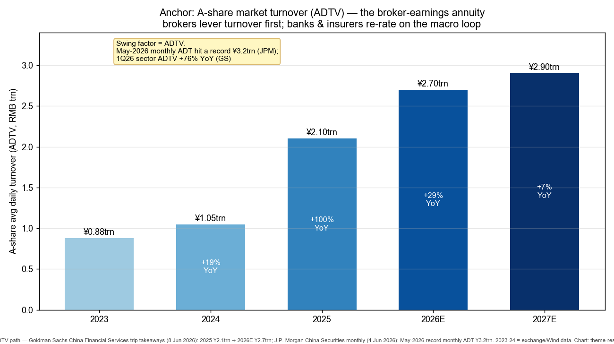
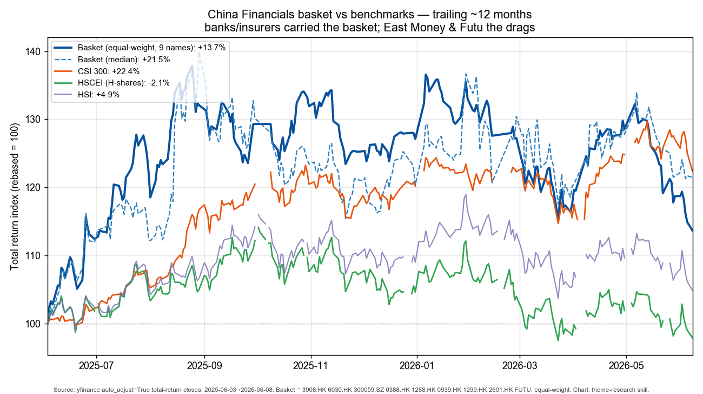
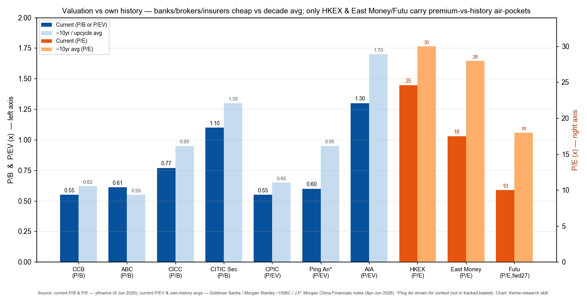

# China Financials — Banks, Brokers & Insurance

**Created:** 2026-06-10 · **Last refreshed:** 2026-06-10 · **Last mutated:** 2026-06-10 · **Refresh cadence:** monthly · **Languages tracked:** en

## What's New

*The delta since you last looked — newest refresh on top. Older entries collapse into the archive below so this stays short.*

**2026-06-10 — basket created** (9 tickers: 5 core, 2 enabler, 1 adjacent, 1 cross-border-adjacent).

- **Anchor set:** A-share average daily turnover (ADTV) — the broker-earnings annuity — 2025 ¥2.1trn → 2026E ¥2.7trn (+29%), with May-2026 *monthly* ADT hitting a record ¥3.2trn ([J.P. Morgan China Securities monthly, 4 Jun 2026, zsxq #415288842818588 p.1](http://xs-macbook-air.local:5001/zsxq/pdf/415288842818588/JPM-China-Securities-monthly-260604.pdf#page=1); [Goldman Sachs China FS trip, 8 Jun 2026, zsxq #814528228528822 p.1](http://xs-macbook-air.local:5001/zsxq/pdf/814528228528822/GS-China-Financial-Services-trip-260608.pdf#page=1)).
- **Brokers lead the thesis:** CITIC Securities 1Q26 ROE printed 3.5% non-annualized — *one of the strongest quarterly readings in the past decade* ([UBS CITICS-H, 26 Apr 2026, zsxq #184485851214142 p.1](http://xs-macbook-air.local:5001/zsxq/pdf/184485851214142/UBS-CITIC-Securities-H-6030HK-260426.pdf#page=1)); HSBC upgraded CITICS-H to Buy and initiated CICC-A at Buy (TP RMB42.80) ([HSBC China brokers, 2 Jun 2026, zsxq #415288442845548 p.1-2](http://xs-macbook-air.local:5001/zsxq/pdf/415288442845548/HSBC-China-brokers-260602.pdf#page=2)).
- **Bank NIM inflecting + dividend appetite rising:** MS pulled forward its NIM-rebound call and raised China bank PTs; GS flagged the small-bank dividend payout ratio rising +2pp to 27% ([Morgan Stanley China Financials, 25 May 2026, zsxq #585428421552454 p.1](http://xs-macbook-air.local:5001/zsxq/pdf/585428421552454/MS-China-Financials-NIM-rebound-260525.pdf#page=1); [Goldman Sachs China Banks 1Q26 cross-read, 27 Apr 2026, zsxq #184484258811512 p.1](http://xs-macbook-air.local:5001/zsxq/pdf/184484258811512/GS-China-Banks-1Q26-cross-read-260427.pdf#page=1)).
- **LGFV tail risk easing:** UBS finds LGFV net operating cash flow turned positive in 2024 for the first time in a decade; debt-at-risk fell from a peak 84% (2022) to 68% (H125) ([UBS China Banks LGFV, 28 Apr 2026, zsxq #184484222558152 p.1](http://xs-macbook-air.local:5001/zsxq/pdf/184484222558152/UBS-China-Banks-LGFV-260428.pdf#page=1)).
- **Insurers resilient:** AIA 1Q26 VONB US$1,757mn +13%/17% CER/AER, mainland +26% ([GS AIA, 30 Apr 2026, zsxq #585585558448224 p.1](http://xs-macbook-air.local:5001/zsxq/pdf/585585558448224/GS-AIA-1299HK-1Q26-260430.pdf#page=1)); CPIC 1Q26 NBV +9.6% with FY26 forecast +22% ([J.P. Morgan CPIC, 7 May 2026, zsxq #415248221122858 p.1-2](http://xs-macbook-air.local:5001/zsxq/pdf/415248221122858/JPM-CPIC-2601HK-260507.pdf#page=2)).
- **Cross-border overhang quantified — and partly cleared:** CSRC fined Futu RMB308.1mn and Tiger RMB1.85bn for unlicensed mainland cross-border brokerage; mainland clients are only ~13% (Futu) / ~10% (Tiger) of the base ([Deutsche Bank online brokers, 25 May 2026, zsxq #415241514582158 p.1](http://xs-macbook-air.local:5001/zsxq/pdf/415241514582158/DB-online-brokers-Futu-Tiger-penalty-260525.pdf#page=1)). GS cut Futu to Neutral, slashing its PT to US$102.13 from US$210.47 ([GS Futu downgrade, 25 May 2026, zsxq #585428542555844 p.1](http://xs-macbook-air.local:5001/zsxq/pdf/585428542555844/GS-Futu-FUTU-downgrade-Neutral-260525.pdf#page=1)).

Earlier refreshes

*(none yet — this is the create pass.)*

## Thesis

**Anchor — A-share market turnover (ADTV), the broker-earnings annuity (NOT a one-off TAM):** China financials are a recurring-revenue / book-value business, so the falsifiable pool the basket bets on is the *turnover annuity that drives broker fee + interest income* layered on *ROE × book value* for banks and insurers — not a system TAM. The named-forecaster ADTV path: **2025 ¥2.1trn → 2026E ¥2.7trn (+29%)**, with May-2026 monthly ADT a record **¥3.2trn (+36% m/m)** and 1Q26 sector ADTV **+76% YoY** ([GS China FS trip, 8 Jun 2026 — *"2026 A-share ADT has the potential to rise from ¥2.1trn in 2025 to ¥2.7trn"*, zsxq #814528228528822 p.1](http://xs-macbook-air.local:5001/zsxq/pdf/814528228528822/GS-China-Financial-Services-trip-260608.pdf#page=1); [JPM monthly — *"A-share ADT grew by 36% m/m to Rmb3.2trn in May, a record high"*, zsxq #415288842818588 p.1](http://xs-macbook-air.local:5001/zsxq/pdf/415288842818588/JPM-China-Securities-monthly-260604.pdf#page=1)). HSBC independently corroborates: A-share average daily turnover rose **107% y-o-y as at 29 May** ([HSBC China brokers, 2 Jun 2026, zsxq #415288442845548 p.1](http://xs-macbook-air.local:5001/zsxq/pdf/415288442845548/HSBC-China-brokers-260602.pdf#page=1)).

**Sub-bucket decomposition (the three revenue pools the basket maps to):**
- **Brokers / fintech-brokers / exchange (~ride ADTV first):** brokerage commission + margin-financing interest + IPO/ECM underwriting + the HKEX clearing-and-listing toll. Margin financing balance exceeded ¥2.9trn in May-2026 and new brokerage account openings rose to 2.77mn/month ([JPM monthly, zsxq #415288842818588 p.1](http://xs-macbook-air.local:5001/zsxq/pdf/415288842818588/JPM-China-Securities-monthly-260604.pdf#page=1)). New hybrid-fund issuance ran **+5.6× YoY to ¥109bn** in 1Q ([UBS CITICS-H, zsxq #184485851214142 p.1](http://xs-macbook-air.local:5001/zsxq/pdf/184485851214142/UBS-CITIC-Securities-H-6030HK-260426.pdf#page=1)).
- **Banks (re-rate later, on the macro loop):** net interest income on a stabilizing/inflecting NIM, plus a rising dividend payout. GS small-bank cross-read showed NII +13%/+20% YoY in 2025/1Q26 and the average dividend payout ratio up +2pp to 27% ([GS China Banks, zsxq #184484258811512 p.1](http://xs-macbook-air.local:5001/zsxq/pdf/184484258811512/GS-China-Banks-1Q26-cross-read-260427.pdf#page=1)).
- **Insurers (re-rate later, on NBV + investment results):** new-business value (NBV/VONB) compounding plus operating-profit-after-tax (OPAT) annuity. AIA 1Q26 VONB +13%/17%; CPIC NBV +9.6% with agency double-digit ([GS AIA, zsxq #585585558448224 p.1](http://xs-macbook-air.local:5001/zsxq/pdf/585585558448224/GS-AIA-1299HK-1Q26-260430.pdf#page=1); [JPM CPIC, zsxq #415248221122858 p.1](http://xs-macbook-air.local:5001/zsxq/pdf/415248221122858/JPM-CPIC-2601HK-260507.pdf#page=1)).

**Swing factor = ADTV.** It is the single variable whose revision moves the headline basket most: brokers' brokerage + interest + investment lines all key off it, the HKEX toll keys off turnover and listings, and a sustained high-ADTV regime is what pulls household financial assets into capital-market products (household financial-asset growth ran 10.8% as of 1Q26, feeding bank fee income and insurer savings sales — [Morgan Stanley China Financials, zsxq #585428421552454 p.1](http://xs-macbook-air.local:5001/zsxq/pdf/585428421552454/MS-China-Financials-NIM-rebound-260525.pdf#page=1)).

**Who-benefits-when (time axis on the static role tag):** **brokers/exchange lever turnover *first*** (within-quarter, as ADTV prints) — CITIC Sec 1Q26 ROE 3.5% was already *one of the strongest quarterly readings in a decade* ([UBS, zsxq #184485851214142 p.1](http://xs-macbook-air.local:5001/zsxq/pdf/184485851214142/UBS-CITIC-Securities-H-6030HK-260426.pdf#page=1)); **banks re-rate *later*** as NIM inflects and the dividend payout ratio creeps up (a multi-quarter gate — MS now sees the NIM rebound arriving *earlier than expected*, [zsxq #585428421552454 p.1](http://xs-macbook-air.local:5001/zsxq/pdf/585428421552454/MS-China-Financials-NIM-rebound-260525.pdf#page=1)); **insurers re-rate *last*** on the slowest gate — NBV margin expansion plus a falling guaranteed liability cost (CPIC guaranteed cost <2.9% in 2025, legacy 3.5% policies rolling off — [JPM CPIC, zsxq #415248221122858 p.1](http://xs-macbook-air.local:5001/zsxq/pdf/415248221122858/JPM-CPIC-2601HK-260507.pdf#page=1)).

**Bull / base / bear (the swing assumption that moves between them):** **Base** — ADTV holds ¥2.5-2.7trn through 2026, brokers compound mid-teens ROE, banks deliver low-double-digit total return on dividend + modest re-rate, insurers grow NBV mid-teens. **Bull** — ADTV sustains ¥2.9trn+ on an AI-IPO supercycle (CXMT/YMTC STAR-market listings advancing — [HSBC, zsxq #415288442845548 p.1](http://xs-macbook-air.local:5001/zsxq/pdf/415288442845548/HSBC-China-brokers-260602.pdf#page=1)), CICC overseas ROE pulls group ROE to 13-15%, bank NIM inflects up and payout ratios climb toward 30%+. **Bear** — turnover normalizes back toward ¥1.5trn as the retail surge fades, NIM compression resumes on a falling LPR, and the cross-border crackdown spreads from Futu/Tiger to chill HK-listing flows. The single swing assumption between base and bear is **whether 2026E ADTV holds above ~¥2.4trn**.

## Scope rules

In: China/HK-listed brokers, fintech-brokers and the Hong Kong exchange where the China-market turnover driver dominates; large Chinese banks levered to the NIM-inflection + dividend story; Chinese life/multiline insurers with disclosed NBV/VONB and OPAT. Cross-border online brokers are included only where the China-market driver (mainland trading + HK listings) dominates the franchise.

Out: pure US/EU-facing financials; small city/rural commercial banks with idiosyncratic LGFV concentration (single-name credit risk swamps the theme signal); securities names with no disclosed overseas-ROE or consolidation angle; payment / consumer-finance pure-plays (separate fintech theme); property-and-casualty-only insurers whose loss ratio (not NBV) is the swing variable. A name is *out* if its share price is driven primarily by something other than ADTV, NIM, or NBV.

## Tracked tickers

| Ticker | Name | Role | Justification | Added |
|---|---|---|---|---|
| 3908.HK | CICC (中金公司) | core | The cleanest *broker-consolidation + overseas-ROE* play. **Moat:** highest overseas exposure among peers (~30% of 2025 revenue), overseas ROE 16% vs 9.4% group; HK subsidiary leverage already lifted from 7× (end-2025) to >9× (May-2026), target 10-12× ([HSBC, zsxq #415288442845548 p.1](http://xs-macbook-air.local:5001/zsxq/pdf/415288442845548/HSBC-China-brokers-260602.pdf#page=1)); Dongxing+Cinda consolidation (combined net capital ~¥103.3bn) closes by Sept ([JPM CICC, 19 May 2026, zsxq #212454158811541 p.1-2](http://xs-macbook-air.local:5001/zsxq/pdf/212454158811541/JPM-CICC-3908HK-consolidation-260519.pdf#page=2)). **Threat:** ADTV normalization compresses brokerage/IB revenue; STAR-market follow-on co-investment makes earnings highly cyclical (GS warns this *"will have a limited impact on valuation uplift due to the high cyclical volatility"* — [zsxq #814528228528822 p.1](http://xs-macbook-air.local:5001/zsxq/pdf/814528228528822/GS-China-Financial-Services-trip-260608.pdf#page=1)). | 2026-06-10 |
| 6030.HK | CITIC Securities (中信证券) | core | The #1 A-share broker by scale; the purest ADTV-lever. **Moat:** market-leading franchise across brokerage / IB / AM; 1Q26 ROE 3.5% non-annualized = *one of the strongest quarterly readings in a decade*; self-branded AUM +14.2% YoY vs industry +9% ([UBS, zsxq #184485851214142 p.1](http://xs-macbook-air.local:5001/zsxq/pdf/184485851214142/UBS-CITIC-Securities-H-6030HK-260426.pdf#page=1)); raising ¥16bn to expand higher-margin overseas (international equity contribution 9%→13%) ([GS China FS, zsxq #814528228528822 p.1](http://xs-macbook-air.local:5001/zsxq/pdf/814528228528822/GS-China-Financial-Services-trip-260608.pdf#page=1)). **Threat:** commission-rate erosion (1Q brokerage revenue +48% YoY lagged ADT +79% YoY = share/price give-back); the ¥16bn H-placement dilutes the share base ~5% ([JPM monthly, zsxq #415288842818588 p.1](http://xs-macbook-air.local:5001/zsxq/pdf/415288842818588/JPM-China-Securities-monthly-260604.pdf#page=1)). | 2026-06-10 |
| 300059.SZ | East Money (东方财富) | enabler | The retail-fintech-brokerage platform — highest-beta to retail ADTV. **Moat:** dominant online-brokerage + fund-supermarket app; 1Q26 brokerage income ¥2.9bn (+46% YoY) and margin-financing ¥1.1bn (+54% YoY) on the ADTV surge ([GS East Money, 25 Apr 2026, zsxq #184485414251482 p.1](http://xs-macbook-air.local:5001/zsxq/pdf/184485414251482/GS-East-Money-300059-1Q-260425.pdf#page=1)). **Threat:** structural fee-rate compression — its equity-fund distribution market share is *fading vs the ETF surge* (AUM share −0.5ppt YoY in 2H25), so each turnover dollar earns less; trading market share slipped 4.14%→3.85% ([UBS East Money, 27 Apr 2026, zsxq #812218184542482 p.1 summary; GS, zsxq #184485414251482 p.1](http://xs-macbook-air.local:5001/zsxq/pdf/184485414251482/GS-East-Money-300059-1Q-260425.pdf#page=1)). GS rates Sell. | 2026-06-10 |
| 0388.HK | HKEX (香港交易所) | enabler | The turnover-toll annuity and the China-IPO clearing house. **Moat:** vertically-integrated monopoly franchise (cash + derivatives + clearing + listing) — every CICC/CITICS HK underwriting + every Stock-Connect southbound flow pays HKEX a toll; the primary beneficiary of the *"Chinese enterprises pursuing overseas listings set to continue"* trend HSBC cites ([HSBC, zsxq #415288442845548 p.1](http://xs-macbook-air.local:5001/zsxq/pdf/415288442845548/HSBC-China-brokers-260602.pdf#page=1)). **Threat:** HK-listing flows are gated by the same cross-border-tightening file that hit Futu/Tiger ([DB, zsxq #415241514582158 p.1](http://xs-macbook-air.local:5001/zsxq/pdf/415241514582158/DB-online-brokers-Futu-Tiger-penalty-260525.pdf#page=1)); HKEX trades at a large P/E premium to its own history, so a turnover air-pocket de-rates it hardest of the basket. | 2026-06-10 |
| 1288.HK | ABC / Agricultural Bank of China (农业银行) | core | A large SOE bank levered to NIM inflection + a high, rising dividend. **Moat:** county/rural deposit franchise gives a low, sticky funding cost — exactly the leg MS says is driving the *earlier-than-expected NIM rebound*; MS rates ABC-H Overweight ([MS China Financials, zsxq #585428421552454 p.1](http://xs-macbook-air.local:5001/zsxq/pdf/585428421552454/MS-China-Financials-NIM-rebound-260525.pdf#page=1)). **Threat:** loan growth moderating; if the deposit-cost tailwind narrows as loan-to-deposit ratios rise, the NIM rebound stalls (GS flags exactly this: *"rise in their loan-to-deposit ratios should slow the downward trend in deposit costs"* — [GS China FS, zsxq #814528228528822 p.2](http://xs-macbook-air.local:5001/zsxq/pdf/814528228528822/GS-China-Financial-Services-trip-260608.pdf#page=2)). | 2026-06-10 |
| 0939.HK | CCB / China Construction Bank (建设银行) | core | The dividend-yield + NIM-stabilization anchor of the bank sleeve. **Moat:** scale, stable profit growth, and a 5.3-5.4% 2026E dividend yield that MS explicitly names as a reason it *prefers BOC-H and CCB-H*; LGFV de-risking helps a large mortgage/infra lender ([MS China Financials, zsxq #585428421552454 p.1](http://xs-macbook-air.local:5001/zsxq/pdf/585428421552454/MS-China-Financials-NIM-rebound-260525.pdf#page=1); LGFV OCF turned positive first time in a decade, DAR 84%→68% — [UBS LGFV, zsxq #184484222558152 p.1](http://xs-macbook-air.local:5001/zsxq/pdf/184484222558152/UBS-China-Banks-LGFV-260428.pdf#page=1)). **Threat:** sub-1× P/B caps external capital raising, so dividend growth is internally funded; a renewed LPR cut would re-compress NIM and the property tail is not fully closed (big-bank property NPL ~5% — [GS China FS, zsxq #814528228528822 summary](http://xs-macbook-air.local:5001/zsxq/pdf/814528228528822/GS-China-Financial-Services-trip-260608.pdf#page=1)). | 2026-06-10 |
| 1299.HK | AIA Group (友邦保险) | core | The premium pan-Asia life insurer with the cleanest NBV growth + HK/mainland mix. **Moat:** premium agency force + bancassurance across HK and mainland China; 1Q26 VONB US$1,757mn +13%/17% CER/AER, HK +21%, mainland +26%, agency new recruits +20% ([GS AIA, zsxq #585585558448224 p.1](http://xs-macbook-air.local:5001/zsxq/pdf/585585558448224/GS-AIA-1299HK-1Q26-260430.pdf#page=1)). **Threat:** non-China geographies wobble (Thailand VONB −18% on the co-payment-rule base effect); a sharp HK equity drawdown hits both VONB and the in-force investment result, and AIA carries the basket's richest P/EV so it de-rates most on a growth scare. | 2026-06-10 |
| 2601.HK | CPIC / China Pacific Insurance (中国太保) | core | A China-domestic multiline insurer pivoting bancassurance to higher-value regular-premium + introducing an interim dividend. **Moat:** disciplined value-over-volume strategy — 1Q26 NBV +9.6% to ¥6.37B with agency double-digit; bancassurance regular premium +38% even as single premium fell ~40%; FY26 NBV forecast +22% ([JPM CPIC, zsxq #415248221122858 p.1-2](http://xs-macbook-air.local:5001/zsxq/pdf/415248221122858/JPM-CPIC-2601HK-260507.pdf#page=2)). **Threat:** investment-result volatility (1Q26 profit flattered by a ¥0.68bn convertible-bond revaluation gain that swings with the H-share price); a falling 750-day average bond yield pressures the solvency discount rate ([GS China Insurance, zsxq #184484448118282 p.1](http://xs-macbook-air.local:5001/zsxq/pdf/184484448118282/GS-China-Insurance-1Q26-260430.pdf#page=1)). | 2026-06-10 |
| FUTU | Futu Holdings (富途控股) | adjacent | Cross-border online broker whose China-market driver dominates, carried *despite* a regulatory remediation overhang. **Moat:** leading internet-broker product + high client retention; GS notes it can compete vs banks, Ant, Tiger and Webull ([GS Futu, zsxq #585428542555844 p.1](http://xs-macbook-air.local:5001/zsxq/pdf/585428542555844/GS-Futu-FUTU-downgrade-Neutral-260525.pdf#page=1)). **Threat — explicit regulatory crackdown (not a generic competitor):** CSRC fined Futu RMB308.1mn for unlicensed mainland cross-border brokerage and opened a two-year rectification window; mainland clients are ~13% of the base, so the franchise survives but DB models Futu revenue −8%/−16% (FY26/27) and PAT −24%/−23% ([DB online brokers, zsxq #415241514582158 p.1-2](http://xs-macbook-air.local:5001/zsxq/pdf/415241514582158/DB-online-brokers-Futu-Tiger-penalty-260525.pdf#page=2)). Tracked, not core, until the AUM-ex-mainland growth proves out. | 2026-06-10 |

*Conviction ranking (sourced, not self-authored):* among brokers, **GS and JPM both make CICC-H the sector top pick** (CICC-H + CITICS-A Buy at GS; CICC-H + CITICS-A top picks at JPM) on overseas-ROE leverage and consolidation upside ([GS, zsxq #814528228528822 p.1](http://xs-macbook-air.local:5001/zsxq/pdf/814528228528822/GS-China-Financial-Services-trip-260608.pdf#page=1); [JPM monthly, zsxq #415288842818588 p.1](http://xs-macbook-air.local:5001/zsxq/pdf/415288842818588/JPM-China-Securities-monthly-260604.pdf#page=1)); HSBC *prefers CICC-H* among its covered brokers ([HSBC, zsxq #415288442845548 p.1](http://xs-macbook-air.local:5001/zsxq/pdf/415288442845548/HSBC-China-brokers-260602.pdf#page=1)). Among banks, **MS names Bank of Ningbo its Top Pick and prefers BOC-H and CCB-H** for stable profit + 5.3-5.4% yield ([MS, zsxq #585428421552454 p.1](http://xs-macbook-air.local:5001/zsxq/pdf/585428421552454/MS-China-Financials-NIM-rebound-260525.pdf#page=1)). *Analyst view (this note):* East Money is the basket's weakest core-economics name (fee compression outruns volume) and is held as an enabler, not a conviction long.

## Valuation snapshot

*Populated from `stock_price_target_db` (the `/pt` store) + yfinance current multiples (9 Jun 2026). "Px @ note date" = `report_date_price` (the price the analyst's upside was struck against), NOT today's spot — kept separate from `current px`.*

| Ticker | Rating | Px @ note date | PT | Upside% (vs note date) | Current px | Fwd multiple | Own ~10yr avg | FY1 / FY2 EPS (or metric) |
|---|---|---|---|---|---|---|---|---|
| 3908.HK CICC | JPM **Overweight** · HSBC **Buy** · GS **Buy (H)** | HK$20.30 (JPM, 18 May) / HK$19.62 (HSBC, 2 Jun) | HK$24.50 (JPM) / HK$25.50 (HSBC) | **+20.7%** (JPM) / **+30.0%** (HSBC) | HK$18.94 | ~0.77× P/B (fwd) | ~0.95× P/B (H-shares 0.6 SD below avg, HSBC) | grp ROE 9%→target 13-15% (CICC guidance) |
| 6030.HK CITIC Sec | UBS **Buy** · HSBC **Buy (H, upgraded)** · GS **Neutral (A)** | n/a (UBS) / HK$26.04 (HSBC, 2 Jun) | HK$36.8 (UBS) / HK$31.30 (HSBC) / RMB39.96 (GS-A) | **+20.2%** (HSBC) / **+52.3%** (GS-A vs RMB26.23) | HK$25.00 / RMB-A | 1.1× FY26 adj P/B (UBS); 1.0× P/B (GS) | ~1.30× P/B (CITICS-H 0.5 SD *above* avg, HSBC) | EPS RMB2.56 (26E) / 2.85 (27E) (UBS); div yld 3.0-3.1% |
| 300059.SZ East Money | GS **Sell** · UBS **Neutral** | RMB19.70 (both, late Apr) | RMB17.09 (GS) / RMB22.90 (UBS) | **−13.2%** (GS) / **+16.2%** (UBS) | RMB17.88 | 21.9× P/E (26E) / 23.0× (27E) (GS); 3.0× P/BV (UBS) | ~28× P/E (de-rated from ~40×) | EPS RMB0.90 (26E) / 0.85 (27E) (GS) — *FY1>FY2: profit dip on fee comp* |
| 0388.HK HKEX | *no fresh in-library note this pass* | n/a | n/a | n/a | HK$384.0 | ~24.6× P/E (fwd) | ~30× P/E | *no covered PT mined — see Data Used* |
| 1288.HK ABC | MS **Overweight (H)** | HK$6.07 (20 May) | HK$7.40 | **+22%** | HK$5.73 | 0.61× P/B; 5.7× P/E (fwd) | ~0.55× P/B (re-rating above own avg) | EPS-implied 0.77 BVPS-mult 2026E; div yld ~4.9% |
| 0939.HK CCB | MS **Overweight (H)** | HK$8.73 (20 May) | HK$11.30 | **+29%** | HK$8.69 | 0.55× P/B; 5.4× P/E (fwd) | ~0.62× P/B | 0.70× target P/B 2026E (MS); div yld ~5.0% |
| 1299.HK AIA | GS **Buy** · UBS (1Q preview, VNB +12%) | n/a (GS p1 omits PT) | n/a (PT not on extracted page) | n/a | HK$71.0 | ~2.19× P/B; 10.5× P/E (fwd) | ~1.70× P/EV (premium-but-below-peak) | VONB US$1,757mn 1Q26 (+13%/17%); HK +21%, mainland +26% |
| 2601.HK CPIC | JPM **Overweight (H)** | HK$35.54 (7 May) | HK$43.00 | **+21.0%** | HK$31.68 | 0.82× P/B; 5.1× P/E (fwd) | ~0.65× P/EV | NBV ¥6.37B 1Q26 (+9.6%); FY26 NBV forecast **+22%** |
| FUTU | GS **Neutral (downgraded)** | US$89.76 (25 May) | US$102.13 *(was US$210.47)* | **+13.8%** | US$91.31 | 7.5× P/E (fwd 27E, prior 19×); 2.4× P/B | ~18× P/E (de-rated on overhang) | EPS HK$63.99 (26E) / 79.43 (27E), cut −27%/−24% vs prior |

*Cross-sectional read:* the basket sorts cheap→dear roughly **CCB/CPIC/ABC (0.55-0.82× P/B, banks/insurer) < CICC (0.77×) < CITIC Sec (1.0-1.1×) < Futu (2.4× P/B / 7.5× fwd P/E) < AIA (2.2× P/B) < East Money (22× P/E) < HKEX (24.6× P/E)**. On a like-for-like *forward* basis the large banks and CPIC trade ~5-6× P/E with 4-5% yields — the cheapest credible re-rating leg; HKEX and East Money are the only names *above* their own-history multiple. *Stale-PT note:* none of the mined PTs is overtaken by price as of 9 Jun 2026; the GS Futu PT cut to US$102.13 supersedes the prior US$210.47 (shown old→new in-cell).

## Exclusions

| Ticker | Reason |
|---|---|
| 2318.HK / 601318.SS Ping An | Strong 1Y total return (H +26.5%) and a clean insurer story, but the conglomerate spans life + P&C + bank + tech + health, so it blends three of the basket's sub-buckets into one ticker — too diluted to read as a single ADTV/NIM/NBV signal. Held as a benchmark reference in the valuation chart, not tracked. |
| 2628.HK China Life | Tracked candidate but overlaps AIA + CPIC on the life-NBV signal; deferred to avoid triple-counting the insurer sleeve. Add candidate on next mutation if the insurer leg is widened. |
| 1339.HK PICC / 6060.HK ZhongAn | P&C-led franchises whose loss/combined ratio (not NBV) is the swing variable — different driver from the basket's life-NBV anchor. Candidate for a separate China-P&C sleeve. |
| 1288.HK vs ICBC/BOC | Among large banks the basket holds ABC + CCB as the MS-preferred NIM+dividend pair; ICBC/BOC are close substitutes and were left out to keep the bank sleeve to two clean names. |

## Keywords

China financials / 中国金融 · A-share turnover (ADTV) / 日均成交额 · brokers / 券商 · broker consolidation / 券商整合 (CICC–Dongxing–Cinda) · NIM / 净息差 · dividend payout / 分红率 · LGFV / 地方政府融资平台 · NBV·VONB / 新业务价值 · OPAT / 营运利润 · P/EV / 内含价值 · cross-border brokerage / 跨境券商 · Stock Connect / 互联互通 · STAR-market IPO / 科创板IPO

## Performance

*Trailing ~12-month total return (yfinance auto_adjust=True, common window through 9 Jun 2026; H-share names benchmarked vs HSCEI/HSI, A-share vs CSI 300).*

- **Basket (equal-weight, 9 names): +13.7%** vs **CSI 300 +22.4%**, **HSCEI −2.1%**, **HSI +3.6%** over the common window. The basket *lagged the onshore index* (CSI 300 was carried by AI/tech, not financials) but *beat the H-share benchmark* by ~16pts — the basket is H-share-heavy.
- **Movers (1Y):** Ping An H +26.5% (excluded), **CPIC +23.4%**, **CCB +19.8%**, **CITIC Sec +19.9%**, **CICC +18.3%**, **ABC +14.7%**, AIA +5.5%.
- **Laggards (1Y):** **East Money −16.3%** (fee compression outran the turnover boom), **Futu −14.9%** (cross-border crackdown; −46.5% over the last 6M), HKEX −4.9%.

### Basket scorecard

*(MS *Three Actionable Ideas* style — computed from yfinance + the snapshot history.)*

- **Batting average (1Y):** **7 of 9 names positive (78%)**; **3 of 9 beat their relevant benchmark** (CCB/CITIC Sec/CICC beat HSCEI by wide margins; on the simpler "beat CSI 300 +22.4%" test only CPIC clears it, 1 of 9 — the basket's H-share tilt means HSCEI is the fairer bar, on which ~6 of 7 H-names clear).
- **Best contributor:** CPIC **+23.4%**. **Worst contributor:** East Money **−16.3%** (Futu close behind at −14.9%, and the steepest *recent* faller, −46.5% over 6M).
- **Cumulative outperformance since inception:** n/a — this is the baseline snapshot (only 1 line in `snapshots.jsonl`; computed once ≥2 lines exist).

## Recent events

- **2026-06-08 — GS shifts sector preference to brokers over banks** after a China-financials field trip (met 9 lenders + 2 brokers); reiterates Buy on CICC-H, CITICS-A, BONB ([GS China FS trip, zsxq #814528228528822 p.1](http://xs-macbook-air.local:5001/zsxq/pdf/814528228528822/GS-China-Financial-Services-trip-260608.pdf#page=1)).
- **2026-06-04 — JPM: May A-share monthly ADT a record ¥3.2trn (+36% m/m)**; margin balance >¥2.9trn, new accounts 2.77mn ([JPM monthly, zsxq #415288842818588 p.1](http://xs-macbook-air.local:5001/zsxq/pdf/415288842818588/JPM-China-Securities-monthly-260604.pdf#page=1)).
- **2026-06-02 — HSBC upgrades CITICS-H to Buy, initiates CICC-A at Buy (TP RMB42.80)**; A-share turnover +107% YoY as at 29 May ([HSBC, zsxq #415288442845548 p.1-2](http://xs-macbook-air.local:5001/zsxq/pdf/415288442845548/HSBC-China-brokers-260602.pdf#page=2)).
- **2026-05-28 — CITIC Securities announces a ¥16bn H-share placement** to controlling shareholder, enlarging the share base ~5% to fund overseas expansion ([JPM monthly, zsxq #415288842818588 p.1](http://xs-macbook-air.local:5001/zsxq/pdf/415288842818588/JPM-China-Securities-monthly-260604.pdf#page=1)).
- **2026-05-25 — MS pulls forward its China-bank NIM-rebound call**, raises PTs across the bank sleeve; rates ABC/ICBC/CCB/BOC-H Overweight ([MS China Financials, zsxq #585428421552454 p.1](http://xs-macbook-air.local:5001/zsxq/pdf/585428421552454/MS-China-Financials-NIM-rebound-260525.pdf#page=1)).
- **2026-05-22 — CSRC fines Futu RMB308.1mn and Tiger RMB1.85bn** for unlicensed mainland cross-border brokerage; two-year rectification window opens. DB calls it *"the other shoe drops"* and says the long-term overhang is *largely alleviated* ([DB online brokers, zsxq #415241514582158 p.1](http://xs-macbook-air.local:5001/zsxq/pdf/415241514582158/DB-online-brokers-Futu-Tiger-penalty-260525.pdf#page=1)); GS cuts Futu to Neutral, PT to US$102.13 from US$210.47 ([GS Futu, zsxq #585428542555844 p.1](http://xs-macbook-air.local:5001/zsxq/pdf/585428542555844/GS-Futu-FUTU-downgrade-Neutral-260525.pdf#page=1)).
- **2026-05-18 — CICC issues detailed Dongxing+Cinda consolidation plan** (shareholder meeting 8 Jun, target close by Sept), unveils a 3-phase integration roadmap ([JPM CICC, zsxq #212454158811541 p.1](http://xs-macbook-air.local:5001/zsxq/pdf/212454158811541/JPM-CICC-3908HK-consolidation-260519.pdf#page=1)).

## Drift signals

- **Performance dispersion is the headline drift:** the basket's 1Y range runs from CPIC +23.4% to East Money −16.3% — a ~40pt spread, exactly the *brokers/banks/insurers re-rate at different times* staging the thesis predicts. No member breaks the thesis, but **East Money sits >30pts behind the basket leaders** on a *structural* (fee-compression), not idiosyncratic, reason — flag for a possible `role` downgrade or removal if its distribution-share decline continues another two quarters ([GS, zsxq #184485414251482 p.1](http://xs-macbook-air.local:5001/zsxq/pdf/184485414251482/GS-East-Money-300059-1Q-260425.pdf#page=1)).
- **Priced-for-perfection / air-pocket flag (sized):** the *bank/insurer/broker* core (CCB, ABC, CICC, CPIC) trades **at or below its own ~10yr average P/B**, so the basket-median multiple is NOT stretched — the cheap re-rating leg is intact. The two air-pockets are **HKEX (~24.6× fwd P/E vs ~30× avg — only modestly below, and turnover-dependent)** and **East Money (~22× fwd P/E vs ~28× avg)**. The **specific demand assumption** whose miss de-rates the basket: **2026E ADTV failing to hold above ~¥2.4trn** (vs the ¥2.7trn GS anchor). Sizing: if East Money reverts to ~17× on a turnover normalization that drops FY27 EPS toward the GS estimate, that is roughly **−20% to ~RMB14** vs the current RMB17.88; HKEX reverting toward a 20× P/E on flat listings is roughly **−18%**. The bank/insurer core has limited downside-to-history (already at/below avg) — its risk is NIM/NBV disappointment, not multiple compression.
- **New-entrant candidates surfaced (not auto-added):** Bank of Ningbo (002142.SZ — MS Top Pick, GS sole Buy, 12m TP ¥41.29 ≈ +36%) is the highest-conviction *un-held* name in the library ([GS, zsxq #814528228528822 summary](http://xs-macbook-air.local:5001/zsxq/pdf/814528228528822/GS-China-Financial-Services-trip-260608.pdf#page=1)); China Life (2628.HK) and Huatai (6886.HK, HSBC Buy) are the next-best insurer/broker adds. Propose for a future mutation.
- **Stale-justification check:** all Justification cells cite sources dated Apr-Jun 2026 — none stale. Re-audit at the next refresh.
- **Macro backdrop (regime context, not a member signal):** VIX 21.5, US 10Y 4.54%, HY OAS 2.74%, MOVE 75.2 (as of ~5 Jun 2026, `indicators.db`) — a benign-volatility / tight-credit regime that supports the risk-on capital-market activity the broker leg needs.

## Leading indicators

*The upstream signals that lead the members — they crack before the basket prices do. Macro/sector header rows first, then a per-ticker operating-data spine (Bernstein *Barometer* style). Each string-matched to its primary issuer.*

| Signal (macro / upstream) | Latest reading | As-of | Direction | Implies |
|---|---|---|---|---|
| A-share monthly ADT | **¥3.2trn record (+36% m/m)** | May 2026 | ▲ | The swing factor; brokerage + interest revenue keys directly off it ([JPM, zsxq #415288842818588 p.1](http://xs-macbook-air.local:5001/zsxq/pdf/415288842818588/JPM-China-Securities-monthly-260604.pdf#page=1)) |
| Margin-financing (MFSL) balance | **>¥2.9trn**; market-wide MFSL +36% YoY at end-1Q | May 2026 | ▲ | Leverage appetite = forward interest income for brokers ([JPM p.1](http://xs-macbook-air.local:5001/zsxq/pdf/415288842818588/JPM-China-Securities-monthly-260604.pdf#page=1); [UBS CITICS p.1](http://xs-macbook-air.local:5001/zsxq/pdf/184485851214142/UBS-CITIC-Securities-H-6030HK-260426.pdf#page=1)) |
| New brokerage accounts | **2.77mn/month** | May 2026 | ▲ | Retail re-engagement = East Money/Futu funnel ([JPM p.1](http://xs-macbook-air.local:5001/zsxq/pdf/415288842818588/JPM-China-Securities-monthly-260604.pdf#page=1)) |
| LGFV debt-at-risk (DAR) | **68% (H125)** down from peak 84% (2022) | H1 2025 | ▼ (good) | Bank credit-cost relief; OCF positive first time in a decade ([UBS LGFV, zsxq #184484222558152 p.1](http://xs-macbook-air.local:5001/zsxq/pdf/184484222558152/UBS-China-Banks-LGFV-260428.pdf#page=1)) |

| Ticker (operating data) | Latest print | As-of | Source |
|---|---|---|---|
| 6030.HK CITIC Sec | 1Q26 rev/NPAT **+41%/+55% YoY**; ROE 3.5% (decade-best quarter); brokerage +48% YoY | 1Q26 | [UBS, zsxq #184485851214142 p.1](http://xs-macbook-air.local:5001/zsxq/pdf/184485851214142/UBS-CITIC-Securities-H-6030HK-260426.pdf#page=1) |
| 300059.SZ East Money | 1Q26 brokerage income ¥2.9bn **+46% YoY**, margin-financing ¥1.1bn **+54% YoY**, fund distribution +31% | 1Q26 | [GS, zsxq #184485414251482 p.1](http://xs-macbook-air.local:5001/zsxq/pdf/184485414251482/GS-East-Money-300059-1Q-260425.pdf#page=1) |
| 3908.HK CICC | HK-subsidiary leverage 7×→>9× (target 10-12×); overseas ROE 16% vs 9.4% group | May 2026 | [HSBC, zsxq #415288442845548 p.1](http://xs-macbook-air.local:5001/zsxq/pdf/415288442845548/HSBC-China-brokers-260602.pdf#page=1) |
| 1288.HK ABC / 0939.HK CCB | Small-bank cross-read: NII **+20% YoY 1Q26**, dividend payout +2pp to 27%, NIM rebounding sequentially | 1Q26 | [GS China Banks, zsxq #184484258811512 p.1](http://xs-macbook-air.local:5001/zsxq/pdf/184484258811512/GS-China-Banks-1Q26-cross-read-260427.pdf#page=1) |
| 1299.HK AIA | 1Q26 VONB **US$1,757mn +13%/17% CER/AER**; HK +21%, mainland +26%; agency recruits +20% | 1Q26 | [GS AIA, zsxq #585585558448224 p.1](http://xs-macbook-air.local:5001/zsxq/pdf/585585558448224/GS-AIA-1299HK-1Q26-260430.pdf#page=1) |
| 2601.HK CPIC | 1Q26 NBV **¥6.37B +9.6% YoY**; bancassurance regular premium +38%; guaranteed cost <2.9% | 1Q26 | [JPM CPIC, zsxq #415248221122858 p.1](http://xs-macbook-air.local:5001/zsxq/pdf/415248221122858/JPM-CPIC-2601HK-260507.pdf#page=1) |
| FUTU | Mainland clients ~13% of base; DB models rev −8%/−16% (FY26/27), PAT −24%/−23% post-penalty | 1Q26/FY25 | [DB, zsxq #415241514582158 p.1-2](http://xs-macbook-air.local:5001/zsxq/pdf/415241514582158/DB-online-brokers-Futu-Tiger-penalty-260525.pdf#page=2) |

*Side-by-side member guidance on the shared forward metric (ADTV → brokerage revenue):* CITIC Sec brokerage +48% YoY and East Money brokerage +46% YoY both tracked *below* A-share equity-linked ADT growth of +79% YoY in 1Q — the shared signal that **commission-rate erosion is the basket-wide drag on the turnover boom** ([UBS, zsxq #184485851214142 p.1](http://xs-macbook-air.local:5001/zsxq/pdf/184485851214142/UBS-CITIC-Securities-H-6030HK-260426.pdf#page=1); [GS, zsxq #184485414251482 p.1](http://xs-macbook-air.local:5001/zsxq/pdf/184485414251482/GS-East-Money-300059-1Q-260425.pdf#page=1)).

## Catalysts (next 3–6 months)

- **CICC–Dongxing–Cinda consolidation close (by Sept 2026)** — *(SSE review → CSRC registration → asset transfer + delisting → combined net capital ~¥103.3bn unlocks proprietary/PE headroom → CICC ROE expansion)*, gating event is the 8-Jun shareholder vote then CSRC approval. Moves **3908.HK** directly ([JPM CICC, zsxq #212454158811541 p.1-2](http://xs-macbook-air.local:5001/zsxq/pdf/212454158811541/JPM-CICC-3908HK-consolidation-260519.pdf#page=2)).
- **2Q26 broker results (Jul-Aug 2026)** — *(record May ADT + STAR-50 +39% QTD → strong investment-income recovery → broker NPAT beat)*, the cleanest readout of the ADTV anchor. Moves the broker sleeve (**6030.HK, 3908.HK, 300059.SZ**) ([JPM monthly, zsxq #415288842818588 p.1](http://xs-macbook-air.local:5001/zsxq/pdf/415288842818588/JPM-China-Securities-monthly-260604.pdf#page=1)).
- **CXMT / YMTC STAR-market IPOs advancing (2H26)** — *(high-profile AI-chip listings → IB/ECM fee pool + co-investment upside for lead brokers, and HKEX listing toll if dual-listed)*, regulators have taken *formal steps* to advance both. Moves **3908.HK, 6030.HK, 0388.HK** ([HSBC, zsxq #415288442845548 p.1](http://xs-macbook-air.local:5001/zsxq/pdf/415288442845548/HSBC-China-brokers-260602.pdf#page=1)).
- **CSRC cross-border-brokerage rectification detail (2-year window, near-term guidance pending)** — *(clarity on existing-account clearance → Futu/Tiger valuation normalization vs further revenue cuts)*, the swing event for the cross-border leg. Moves **FUTU** (and indirectly licensed brokers + HKEX if HK flows are chilled) ([DB, zsxq #415241514582158 p.1-2](http://xs-macbook-air.local:5001/zsxq/pdf/415241514582158/DB-online-brokers-Futu-Tiger-penalty-260525.pdf#page=2)).
- **2026 interim insurer dividends (1H26 results, Aug-Sep)** — *(CPIC + SOE-insurer interim dividends commence in 2026, OPAT-referenced → yield-driven re-rating of the insurer sleeve)*. Moves **2601.HK** (and AIA on continued VONB momentum) ([JPM CPIC, zsxq #415248221122858 p.1](http://xs-macbook-air.local:5001/zsxq/pdf/415248221122858/JPM-CPIC-2601HK-260507.pdf#page=1)).
- **1H26 bank results — NIM-inflection confirmation (Aug 2026)** — *(if the 1Q sequential NIM rebound extends → NII positive growth + payout-ratio lift → bank re-rate from sub-1× P/B)*. Moves **1288.HK, 0939.HK** ([MS, zsxq #585428421552454 p.1](http://xs-macbook-air.local:5001/zsxq/pdf/585428421552454/MS-China-Financials-NIM-rebound-260525.pdf#page=1); [GS China Banks, zsxq #184484258811512 p.1](http://xs-macbook-air.local:5001/zsxq/pdf/184484258811512/GS-China-Banks-1Q26-cross-read-260427.pdf#page=1)).

## Charts

## Data Used / 数据来源清单

**Market data**
- yfinance auto_adjust=True for prices, trailing returns, current P/B / P/E / market cap / dividend yield — pulled 2026-06-09/10.
- Benchmarks: CSI 300 (000300.SS), HSCEI (^HSCE), HSI (^HSI) — same window.

**Per-ticker primary sources (sell-side, mined from the local zsxq library)**
- 3908.HK CICC: JPM consolidation update (zsxq #212454158811541); HSBC China brokers (#415288442845548); GS China FS trip (#814528228528822).
- 6030.HK CITIC Sec: UBS 1Q first-read (#184485851214142); GS 1Q earnings review (#415518525482518); HSBC (#415288442845548).
- 300059.SZ East Money: GS 1Q earnings review (#184485414251482); UBS 1Q (#812218184542482 — summary triage).
- 0388.HK HKEX: no fresh dedicated note in-library this pass (see coverage gaps).
- 1288.HK ABC / 0939.HK CCB: MS China Financials (#585428421552454); GS China Banks 1Q26 cross-read (#184484258811512); UBS LGFV (#184484222558152).
- 1299.HK AIA: GS 1Q26 update (#585585558448224); UBS 1Q preview (#415514818482828, OCR'd).
- 2601.HK CPIC: JPM Asia Insurance Forum takeaways (#415248221122858); GS China Insurance 1Q26 (#184484448118282).
- FUTU: DB online-brokers penalty note (#415241514582158); GS downgrade-to-Neutral (#585428542555844).

**Industry research / sell-side thematic notes (theme-level)**
- Goldman Sachs — *China Financial Services: Trip Takeaways* (8 Jun 2026, zsxq #814528228528822) — ADTV anchor, broker-over-bank preference, CICC overseas-ROE, BONB Buy, Futu PT.
- HSBC — *China brokers: Robust fundamentals with discounted valuations* (2 Jun 2026, zsxq #415288442845548) — A-share turnover +107% YoY, CITICS-H upgrade, CICC-A initiation, broker PT table.
- Morgan Stanley — *China Financials: Earlier-than-expected NIM rebound* (25 May 2026, zsxq #585428421552454) — bank PTs/ratings, NIM call, LGFV credit-risk moderation 10%→7% of industrial credit.
- J.P. Morgan — *China Securities monthly: record ADT ¥3.2trn* (4 Jun 2026, zsxq #415288842818588) — ADTV/MFSL/account data, broker top picks.
- Deutsche Bank — *Online brokers: The Other Shoe Drops* (25 May 2026, zsxq #415241514582158) — Futu/Tiger penalties + revenue-impact model.

**Local zsxq library (`db/zsxq.db` — read-only)**
- **13 broker PDFs mined and cited** for this theme (file_ids: 814528228528822, 415288442845548, 585428421552454, 415288842818588, 415518525482518, 184485414251482, 212454158811541, 184484258811512, 184484222558152, 184484448118282, 585585558448224, 415248221122858, 585428542555844, 415241514582158, 184485851214142). Surfaced via `find_pdf.py` per-alias across the whole library (125 on-theme financials reports identified), built with `evidence_bundle.py`, image-only PDFs OCR'd via `ocr_pdf.py` (sequential), text read via `extract_pdf.py`. The 翻译精华 summary was the triage read; every load-bearing number (ADTV, ROE, NBV/VONB, NIM, PTs) was cited from the extracted original text, string-matched.
- *DB-lock note:* the live :5001 server held the WAL lock, so reads used a `mode=ro→immutable=1` shim (pure reads, DB-safe; no write to zsxq.db except `ocr_pdf.py`'s sanctioned `ocr_text` cache).

**TAM anchor + leading indicators (theme-level)**
- Anchor: A-share ADTV path — GS (2025 ¥2.1trn → 2026E ¥2.7trn, #814528228528822) + JPM (May-2026 record ¥3.2trn monthly, #415288842818588); 2023-24 levels are exchange/Wind reference.
- Leading indicators: monthly ADT, MFSL balance, new brokerage accounts (JPM #415288842818588); LGFV DAR (UBS #184484222558152); per-ticker 1Q26 operating prints (see Leading indicators table).

**Macro backdrop**
- VIX 21.5, US 10Y 4.54%, HY OAS 2.74%, MOVE 75.2 — as of ~2026-06-05. Source: `indicators.db`.

**Cross-coverage**
- No existing `reports/company/` doc for these tickers was used as structured input this pass.

**Stores written (Tier-2 helpers)**
- `stock_price_target_db` — **12 sell-side PT / rating calls upserted** for tracked names (CICC, CITIC Sec A/H, East Money, Ping An Bank, CPIC, Futu, AIA, CICC-A) via `upsert_target(..., replace=True)`; idempotent on (ticker × broker × file_id); auto-computes `upside_pct`; surfaced at `/pt`.

**Stale notices / coverage gaps**
- **HKEX (0388.HK):** no dedicated, fresh sell-side note in the local library this pass — its valuation cells use yfinance multiples + the qualitative HSBC HK-listing-flow read, with no covered PT mined. Web/IR source needed at next refresh.
- **Seed file_id 184121455558242** (GS Americas Investment Banks) — *off-theme* (US banks); discarded, not cited.
- **Seed file_id 212418542412422** — *not present in `db/zsxq.db`*; unresolved. (A near-duplicate, 184418542412422 MS *China brokers: catch-up time*, exists in-library but was not deep-read this pass.)
- Bull/base/bear PT triplets are only partially available (single base PT for most names); insurer EV-growth (rather than single-year EPS) is the cleaner forward metric and is carried in the operating-data table.

## References

- [Goldman Sachs — China Financial Services: Trip Takeaways (8 Jun 2026), zsxq #814528228528822](http://xs-macbook-air.local:5001/zsxq/pdf/814528228528822/GS-China-Financial-Services-trip-260608.pdf)
- [HSBC — China brokers: Robust fundamentals with discounted valuations (2 Jun 2026), zsxq #415288442845548](http://xs-macbook-air.local:5001/zsxq/pdf/415288442845548/HSBC-China-brokers-260602.pdf)
- [Morgan Stanley — China Financials: Earlier-than-expected NIM rebound (25 May 2026), zsxq #585428421552454](http://xs-macbook-air.local:5001/zsxq/pdf/585428421552454/MS-China-Financials-NIM-rebound-260525.pdf)
- [J.P. Morgan — China Securities monthly: record ADT ¥3.2trn (4 Jun 2026), zsxq #415288842818588](http://xs-macbook-air.local:5001/zsxq/pdf/415288842818588/JPM-China-Securities-monthly-260604.pdf)
- [UBS — CITIC Securities-H 1Q first read (26 Apr 2026), zsxq #184485851214142](http://xs-macbook-air.local:5001/zsxq/pdf/184485851214142/UBS-CITIC-Securities-H-6030HK-260426.pdf)
- [Goldman Sachs — CITIC Securities 6030.HK 1Q earnings review (25 Apr 2026), zsxq #415518525482518](http://xs-macbook-air.local:5001/zsxq/pdf/415518525482518/GS-CITIC-Securities-6030HK-1Q-260425.pdf)
- [Goldman Sachs — East Money 300059 1Q earnings review (25 Apr 2026), zsxq #184485414251482](http://xs-macbook-air.local:5001/zsxq/pdf/184485414251482/GS-East-Money-300059-1Q-260425.pdf)
- [J.P. Morgan — CICC 3908.HK consolidation update (19 May 2026), zsxq #212454158811541](http://xs-macbook-air.local:5001/zsxq/pdf/212454158811541/JPM-CICC-3908HK-consolidation-260519.pdf)
- [Goldman Sachs — China Banks 1Q26 cross-read (27 Apr 2026), zsxq #184484258811512](http://xs-macbook-air.local:5001/zsxq/pdf/184484258811512/GS-China-Banks-1Q26-cross-read-260427.pdf)
- [UBS — China Banks: LGFV cash flow improved (28 Apr 2026), zsxq #184484222558152](http://xs-macbook-air.local:5001/zsxq/pdf/184484222558152/UBS-China-Banks-LGFV-260428.pdf)
- [Goldman Sachs — China Insurance 1Q26 takeaways (30 Apr 2026), zsxq #184484448118282](http://xs-macbook-air.local:5001/zsxq/pdf/184484448118282/GS-China-Insurance-1Q26-260430.pdf)
- [Goldman Sachs — AIA 1299.HK 1Q26 update (30 Apr 2026), zsxq #585585558448224](http://xs-macbook-air.local:5001/zsxq/pdf/585585558448224/GS-AIA-1299HK-1Q26-260430.pdf)
- [J.P. Morgan — CPIC 2601.HK Asia Insurance Forum (7 May 2026), zsxq #415248221122858](http://xs-macbook-air.local:5001/zsxq/pdf/415248221122858/JPM-CPIC-2601HK-260507.pdf)
- [Deutsche Bank — Online brokers: The Other Shoe Drops (25 May 2026), zsxq #415241514582158](http://xs-macbook-air.local:5001/zsxq/pdf/415241514582158/DB-online-brokers-Futu-Tiger-penalty-260525.pdf)
- [Goldman Sachs — Futu downgrade to Neutral (25 May 2026), zsxq #585428542555844](http://xs-macbook-air.local:5001/zsxq/pdf/585428542555844/GS-Futu-FUTU-downgrade-Neutral-260525.pdf)
- [UBS — East Money 300059 1Q (27 Apr 2026), zsxq #812218184542482](http://xs-macbook-air.local:5001/zsxq/pdf/812218184542482/UBS-East-Money-300059-260427.pdf)

## History

- 2026-06-10 — created with initial 9-ticker basket (5 core: 3908.HK CICC, 6030.HK CITIC Sec, 1288.HK ABC, 0939.HK CCB, 1299.HK AIA, 2601.HK CPIC; 2 enabler: 300059.SZ East Money, 0388.HK HKEX; 1 adjacent: FUTU). 13 zsxq broker PDFs mined from OCR'd original text; 12 PT calls upserted to `stock_price_target_db`.
- 2026-06-10 — first refresh pass (create-time data pull): performance, valuation snapshot, leading indicators, 3 charts.

Verification log (Step 7) — 2026-06-10

**Metadata line:** parses — Created/Last refreshed/Last mutated all 2026-06-10; cadence monthly; languages `en`. ✓
**Tracked tickers table:** 9 rows × 5 columns (Ticker | Name | Role | Justification | Added); every Justification cell carries ≥1 inline zsxq deep-link + a named moat AND threat (FUTU threat = explicit CSRC cross-border crackdown w/ sized DB revenue-impact). ✓
**What's New:** dated 2026-06-10 create block present; archive `
` present (empty — create pass). ✓
**Snapshot sidecar:** exactly one line appended; valid JSON; `tickers` set (9) matches the table; includes `tam` object. Verified by parse below. ✓

**Performance spot-checks vs yfinance (auto_adjust, ~1Y, through 9 Jun 2026):**
- CPIC 2601.HK +23.4% ✓ (reported +23.4%)
- CCB 0939.HK +19.8% ✓
- East Money 300059.SZ −16.3% ✓
- Futu −14.9% ✓; basket equal-weight +13.7% vs CSI 300 +22.4% / HSCEI −2.1% ✓ (computed from the same close series).

**Number→URL string-match spot-checks (extracted original text):**
- "record high" monthly ADT ¥3.2trn → JPM #415288842818588 p.1 *"A-share ADT grew by 36% m/m to Rmb3.2trn in May, a record high"* ✓
- CITIC Sec ROE 3.5% decade-best → UBS #184485851214142 p.1 *"non-annualized ROE of 3.5% (one of the strongest quarterly readings in the past decade)"* ✓
- AIA VONB US$1,757mn +13%/17% → GS #585585558448224 p.1 *"1Q26 VONB was US$1,757mn, +13%/17% on a CER/AER basis"* ✓
- Futu penalty RMB308.1mn / Tiger RMB1.85bn → DB #415241514582158 p.1 *"penalties totaling RMB308.1mn and RMB1.85bn, respectively"* ✓
- LGFV DAR 84%→68% → UBS #184484222558152 p.1 *"fell from a peak of 84% in 2022 to 68% in H125"* ✓
- CICC combined net capital ~¥103.3bn → JPM #212454158811541 p.2 *"reaching a combined scale of approximately RMB 103.3bn"* ✓

**URL HTTP checks (5-sample, real-browser UA, 2026-06-10):** all return **200 `application/pdf`** through the live :5001 server (`/zsxq/pdf/<file_id>/<filename>`, resolves by file_id):
- #814528228528822 (GS China FS) → 200 ✓
- #415288442845548 (HSBC brokers) → 200 ✓
- #585428421552454 (MS China Financials) → 200 ✓
- #415241514582158 (DB Futu/Tiger) → 200 ✓
- #184485851214142 (UBS CITICS-H) → 200 ✓
HKEX has no mined URL (coverage gap, noted in Data Used).

**Residual unknowns:** HKEX lacks an in-library sell-side PT (flagged); seed file_id 212418542412422 not in DB (unresolved); AIA PT not on the extracted GS page (cell = n/a, not fabricated).

