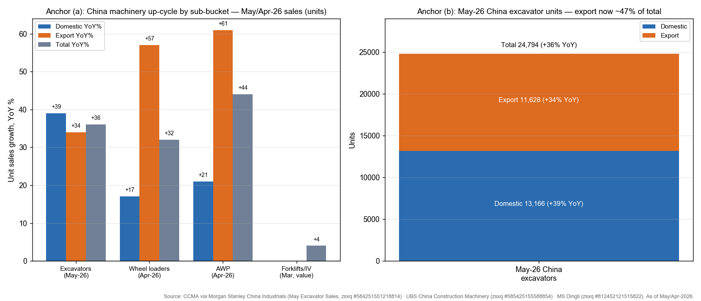
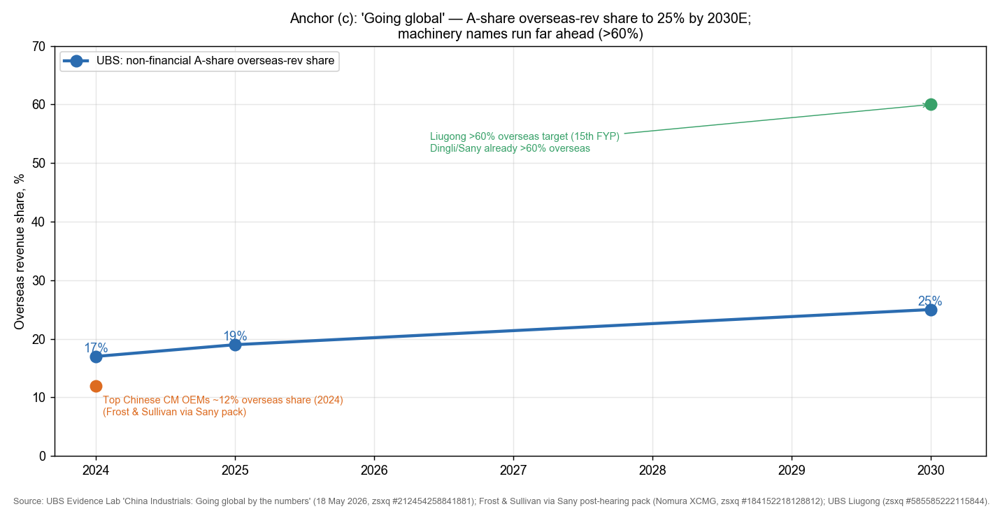
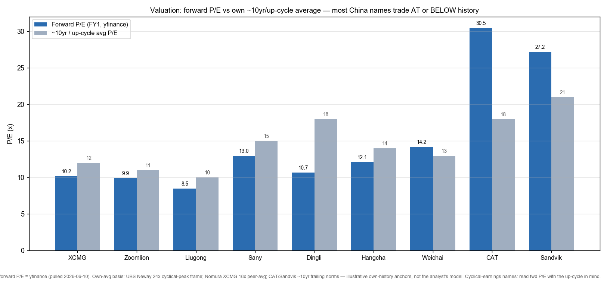
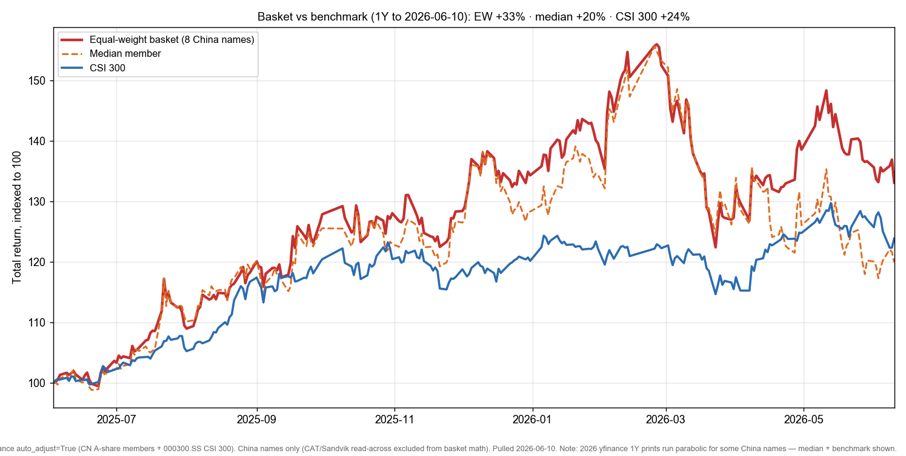

# China Industrials, Machinery & Capital-Goods Going-Global / 中国工程机械与资本品出海

**Created:** 2026-06-10 · **Last refreshed:** 2026-06-10 · **Last mutated:** 2026-06-10 · **Refresh cadence:** monthly · **Languages tracked:** en

## What's New

*The delta since you last looked — newest refresh on top. Older entries collapse into the archive below so this stays short.*

**2026-06-10 — basket created** (10 tracked names: 7 China core, 1 China enabler, 1 China adjacent, 2 global read-across hedges).
- **Anchor set:** China excavator sales +36% YoY in May-26 (domestic +39% / export +34%), 5M26 +25% YoY — the up-cycle is now domestic-recovery-led, not just export ([CCMA via MS China Industrials, 2026-06-09](http://xs-macbook-air.local:5001/zsxq/pdf/584251551218814/Morgan%20Stanley-China%20Industrials.pdf#page=1)). The named going-global anchor: UBS sees non-financial A-share overseas-revenue share rising 19% (2025) → 25% (2030E) ([UBS Evidence Lab, 2026-05-18](http://xs-macbook-air.local:5001/zsxq/pdf/212454258841881/UBS-China%20Industrials%20Going%20global.pdf#page=1)).
- **Movers (1Y to 2026-06-10):** equal-weight China basket +33% vs CSI 300 +23.9%; median member +19.9%. Weichai +91.7% and Hengli +71.9% are the cap-weight outliers (and parabolic-print candidates — see Drift signals); Liugong −6.2% the lone laggard ([Google Finance CSI 300, 2026-06-10](https://www.google.com/finance/quote/000300:SHA)).
- **Fresh broker calls (this pass):** Nomura initiates XCMG **Buy, TP CNY13.60** (39.5% upside) ([Nomura, 2026-05-29](http://xs-macbook-air.local:5001/zsxq/pdf/184152218128812/Nomura-XCMG.pdf#page=1)); JPM Sany **OW, PT Rmb31.0** ([JPM, 2026-05-21](http://xs-macbook-air.local:5001/zsxq/pdf/415241445451228/J.P.%20Morgan-Sany%20Heavy.pdf#page=2)); UBS Hengli **Buy, PT Rmb128** ([UBS, 2026-05-27](http://xs-macbook-air.local:5001/zsxq/pdf/812485554282552/UBS-Jiangsu%20Hengli%20Hydraulic.pdf#page=1)).
- **New growth leg:** GS flags Weichai's Generac global supply agreement with a hyperscaler — 2027 backup-power procurement could exceed US$600mn — adding an AIDC-power leg to the engine story ([GS, 2026-06-03](http://xs-macbook-air.local:5001/zsxq/pdf/212485141841221/Goldman%20Sachs-Weichai%20Power.pdf#page=1)).
- **TAM anchor:** overseas-revenue pool set at 19% → 25% of A-share revenue by 2030E; machinery names run far ahead (Liugong targets >60% overseas in the 15th Five-Year Plan) — first baseline, no prior to diff.

## Thesis

**Anchor — China going-global overseas-revenue share:** non-financial A-share overseas revenue 17% (2024) → 19% (2025) → **25% (2030E)**, with A-share gross profit potentially +35% by 2030 vs 2025 on faster overseas growth and higher overseas GPM ([UBS Evidence Lab "Going global by the numbers", 2026-05-18](http://xs-macbook-air.local:5001/zsxq/pdf/212454258841881/UBS-China%20Industrials%20Going%20global.pdf#page=1)). Machinery is the spearhead: top Chinese construction-machinery (CM) OEMs held only **~12% overseas share in 2024** while overseas markets are >80% of global CM sales (Frost & Sullivan via Sany's post-hearing pack), so the runway is structural, not cyclical ([Nomura XCMG, 2026-05-29](http://xs-macbook-air.local:5001/zsxq/pdf/184152218128812/Nomura-XCMG.pdf#page=1)). **Sub-bucket decomposition (latest monthly sales, YoY):** excavators May-26 **+36%** (dom +39% / exp +34%); wheel loaders Apr-26 **+32%** (dom +17% / exp +57%); AWP Apr-26 **+44%** (dom +21% / exp +61%); forklift/industrial-vehicle CM-exports **+4%** value Mar-26 ([CCMA via MS, 2026-06-09](http://xs-macbook-air.local:5001/zsxq/pdf/584251551218814/Morgan%20Stanley-China%20Industrials.pdf#page=1); [UBS China CM, 2026-05-11](http://xs-macbook-air.local:5001/zsxq/pdf/585425155588854/UBS-China%20Construction%20Machinery.pdf#page=1)). **Swing factor = the export ratio** — China excavator exports were ~47% of May-26 units and the swing variable that lifts the basket regardless of domestic infra capex; the second swing is the **domestic replacement cycle** (2017-21 fleet now hitting 7-9yr replacement) plus electrification (electric wheel-loader penetration hit a 36% high in Apr-26) ([UBS China CM, 2026-05-11](http://xs-macbook-air.local:5001/zsxq/pdf/585425155588854/UBS-China%20Construction%20Machinery.pdf#page=1)).

**Value-chain / process-step map:** excavators & cranes (OEM) Sany / XCMG / Zoomlion / Liugong · hydraulics components (the highest-margin enabler) Hengli · AWP Dingli · forklifts Hangcha / Weichai-KION · engines & AIDC backup power Weichai · global read-across CAT / Sandvik. The richest-margin layer is **hydraulics** (Hengli, ~58x trailing P/E reflects its component-pricing power and ball-screw/robotics optionality) — the one layer where a Chinese name has displaced Bosch Rexroth/Kawasaki incumbency.

**Who benefits when (time axis on the static roles):** the export-levered OEMs (Sany, XCMG) monetize **first** — overseas mix and a better excavator mix drive ~20% 2Q26 top-line guidance now ([MS, 2026-06-09](http://xs-macbook-air.local:5001/zsxq/pdf/584251551218814/Morgan%20Stanley-China%20Industrials.pdf#page=1)); the **component enabler** (Hengli) compounds across the whole cycle as content-per-machine rises and it localizes ball screws; the **adjacent engine name** (Weichai) re-rates **later** as the AIDC backup-power order book (Generac >US$600mn 2027) converts ([GS, 2026-06-03](http://xs-macbook-air.local:5001/zsxq/pdf/212485141841221/Goldman%20Sachs-Weichai%20Power.pdf#page=1)). **Bull/base/bear:** *bull* — exports stay +30%+ and overseas mix hits 60%+ for the OEMs by 2028, basket re-rates to up-cycle multiples; *base* — exports +20% / domestic +10%, basket holds current multiples; *bear* — trade tariffs (EU/US Section-232-style on CM) + a domestic capex stall pull exports negative, basket de-rates to trough multiples. The single swing assumption between them is the **export-unit trajectory**.

**Conviction (cited, not self-authored):** across the mined library the cleanest fresh Buys are Nomura on XCMG (initiate, +39.5% upside on the mining-machinery alpha) and UBS/JPM on Hengli (short-supply pricing + ball-screw breakeven ahead of schedule); MS prefers Sany/Zoomlion into 2Q26 on share gains and FX-drag easing — i.e. **Hengli (enabler) > XCMG (OEM alpha) > Sany ≈ Zoomlion (OEM beta)**, each rung tied to its moat cell below ([Nomura, 2026-05-29](http://xs-macbook-air.local:5001/zsxq/pdf/184152218128812/Nomura-XCMG.pdf#page=1); [UBS Hengli, 2026-05-27](http://xs-macbook-air.local:5001/zsxq/pdf/812485554282552/UBS-Jiangsu%20Hengli%20Hydraulic.pdf#page=1); [MS, 2026-06-09](http://xs-macbook-air.local:5001/zsxq/pdf/584251551218814/Morgan%20Stanley-China%20Industrials.pdf#page=1)).

## Scope rules

**In:** China construction & mining machinery OEMs (excavators, cranes, loaders, concrete); standalone hydraulics-component suppliers; AWP (aerial work platform) makers; forklift / industrial-truck makers; machine-tool/CNC names where China-capex-recovery levered; large-engine / AIDC-backup-power names with a machinery heritage. Plus 1–2 **global read-across benchmarks** (Caterpillar, Sandvik) tracked as `hedge`/context — they validate the global up-cycle and frame valuation, not part of the China basket math.

**Out:** factory-automation robotics and humanoid/reducer pure-plays (separate tracked themes) beyond a brief Weichai/Hengli optionality mention; diversified industrial conglomerates with <20% machinery exposure; pure steel / commodity-input names; rail / shipbuilding (different cycle). A name qualifies only if China construction/mining/material-handling machinery (or its components/engines) is a primary revenue driver AND it has a disclosed going-global / export-share trajectory.

## Tracked tickers

| Ticker | Name | Role | Justification | Added |
|---|---|---|---|---|
| 600031.SS | Sany Heavy Industry (三一重工) | core | #1 China excavator OEM; export + better mix drive ~20% YoY 2Q26 top-line guide; discipline over price wars. **Moat:** scale + global dealer/service network, leading export-unit share. **Threat:** EU/US tariff escalation on CM exports, domestic infra-capex stall, FX drag on overseas earnings ([JPM Sany Summit, 2026-05-21](http://xs-macbook-air.local:5001/zsxq/pdf/415241445451228/J.P.%20Morgan-Sany%20Heavy.pdf#page=1)). | 2026-06-10 |
| 000425.SZ | XCMG (徐工机械) | core | Domestic-upcycle + overseas + accelerating mining machinery (target >CNY40bn revenue by 2030); earthmoving rev CAGR 17.8% 2026F. **Moat:** crane leadership + SOE-reform margin self-help + mining-machinery ramp. **Threat:** competitive landscape shift, slower mining ramp if commodity prices roll, overseas operating/geopolitical risk ([Nomura XCMG initiation, 2026-05-29](http://xs-macbook-air.local:5001/zsxq/pdf/184152218128812/Nomura-XCMG.pdf#page=1)). | 2026-06-10 |
| 000157.SZ | Zoomlion (中联重科) | core | Crane/concrete OEM; MS positive on improving growth as FX drag eases and overseas momentum broadens. **Moat:** crane + aerial-platform + ag-machinery diversification, strong overseas channel build-out. **Threat:** crane demand most domestic-capex-sensitive of the OEMs; FX, and customer (contractor) credit risk in EM exports ([MS China Industrials, 2026-06-09](http://xs-macbook-air.local:5001/zsxq/pdf/584251551218814/Morgan%20Stanley-China%20Industrials.pdf#page=1)). | 2026-06-10 |
| 601100.SS | Jiangsu Hengli Hydraulic (恒立液压) | enabler | The hydraulics-component spine — pumps/valves/cylinders in short supply, full domestic utilization, ball-screw/robotics new leg breaking even ahead of schedule; rev growth target 20–30%. **Moat:** sole at-scale Chinese hydraulics supplier displacing Bosch Rexroth/Kawasaki; highest-margin layer in the chain. **Threat:** customer-insourcing — OEMs (Sany/XCMG) self-supplying core hydraulics; counter = Hengli's IP/precision lead + cross-OEM neutrality keeps it irreplaceable for sub-scale OEMs ([UBS Hengli AIC, 2026-05-27](http://xs-macbook-air.local:5001/zsxq/pdf/812485554282552/UBS-Jiangsu%20Hengli%20Hydraulic.pdf#page=1)). | 2026-06-10 |
| 603338.SS | Zhejiang Dingli (浙江鼎力) | core | AWP pure-play; China AWP sales +44% YoY Apr-26 (exports +61% YoY = 71% of sales) — most export-levered sub-bucket. **Moat:** boom-lift technology + Magni JV reach into US/EU AWP rental channels. **Threat:** US/EU anti-dumping duties on Chinese AWP, Genie/JLG (Terex/Oshkosh) incumbency, AWP-rental-fleet capex cyclicality ([MS Dingli, 2026-05-15](http://xs-macbook-air.local:5001/zsxq/pdf/812452121515822/Morgan%20Stanley-Zhejiang%20Dingli.pdf#page=1)). | 2026-06-10 |
| 000528.SZ | Guangxi Liugong (柳工) | core | Loader/excavator OEM with the most aggressive going-global plan: overseas rev target Rmb20bn, >60% overseas contribution in 15th FYP; mining 2026 target Rmb4bn (+60%), overseas EV product to >10% of group. **Moat:** electrification + localization (added 6 overseas subs 2025, +12 in 2026) + early-mover EM dealer network. **Threat:** domestic electric-loader price war (margin drag), CB-overhang dilution, smallest-cap = least pricing power ([UBS Liugong, 2026-04-28](http://xs-macbook-air.local:5001/zsxq/pdf/585585222115844/UBS-Guangxi%20Liugong%20Machinery.pdf#page=1)). | 2026-06-10 |
| 603298.SS | Hangcha Group (杭叉集团) | core | China #2 forklift / industrial-truck maker; UBS flags forklift + machine-tool positive surprise in Apr industrials checks. **Moat:** forklift electrification + export share gains vs Toyota/KION on cost; dense China dealer base. **Threat:** KION/Toyota brand/service moat overseas, lithium-forklift commoditization, warehouse-automation substitution. **Note:** machine-tool/CNC capex recovery (Neway CNC, UBS Buy) is the read-across leading indicator for this sub-bucket ([UBS China Industrials Apr, 2026-04-23](http://xs-macbook-air.local:5001/zsxq/pdf/812218824224152/UBS-China%20Industrials.pdf#page=1)). | 2026-06-10 |
| 000338.SZ | Weichai Power (000338) | adjacent | China's largest IC-engine maker (~20% multi-cylinder share); machinery/HDT/marine/power-gen engines + 46.5% KION (#2 global industrial-truck maker = forklift leg). New AIDC-backup-power growth leg: Generac global supply agreement, 2027 procurement could exceed US$600mn. **Moat:** engine scale + KION supply-chain reach + gas-genset/SOFC AIDC optionality. **Threat:** HDT-cycle cyclicality, AIDC-power competition (Cummins/Caterpillar gensets), KION European softness ([GS Weichai, 2026-06-03](http://xs-macbook-air.local:5001/zsxq/pdf/212485141841221/Goldman%20Sachs-Weichai%20Power.pdf#page=1)). | 2026-06-10 |
| CAT | Caterpillar | hedge | Global CM/mining benchmark; UBS raised PT to $900 on construction-inventory build + AIDC prime-power gensets, Q1 backlog +79% YoY. Tracked as read-across — it both validates the global up-cycle AND is the share-loss counterparty Chinese OEMs take from. **Moat:** dealer network + financing arm. **Threat:** Chinese export-share gains in EM, US construction inventory normalizing, peak-multiple risk ([UBS CAT, 2026-06-02](http://xs-macbook-air.local:5001/zsxq/pdf/415288442552118/UBS-Caterpillar.pdf#page=1)). | 2026-06-10 |
| SAND.ST | Sandvik | hedge | Mining-equipment + cutting-tools benchmark; JPM OW, PT Skr450 on normalised margin (tungsten a temporary headwind). Read-across for the mining-machinery sub-bucket (XCMG/Liugong mining ramp). **Moat:** aftermarket/consumables annuity in mining tools. **Threat:** tungsten/raw-material price volatility, peak-multiple, Chinese mining-equipment encroachment ([JPM Sandvik Q1, 2026-04-25](http://xs-macbook-air.local:5001/zsxq/pdf/812218284121422/J.P.%20Morgan-Sandvik.pdf#page=1)). | 2026-06-10 |

## Valuation snapshot

*Mirror of `stock_price_target_db` (`/pt`). "Px @ note" = price on the note's date (report_date_price) — fixes the upside the analyst called; "now" = live spot 2026-06-10. Forward P/E = yfinance FY1; own-avg = ~10yr / up-cycle norm (illustrative anchor, not the analyst's model). All names are cyclical-earnings — read fwd P/E with the up-cycle in mind.*

| Ticker | Latest rating (desk density) | PT | Upside @ note | Now (2026-06-10) | Fwd P/E (FY1) | Own ~10yr/up-cycle avg | Cross-section |
|---|---|---|---|---|---|---|---|
| 600031.SS Sany | JPM **OW · PT Rmb31.0 vs 18.96 @ 2026-05-21 = +63.5%** (DCF, Jun-27); MS OW PT 30.0 | Rmb31.0 | +63.5% | Rmb19.82 | 13.0x | ~15x | div ~3.4%; cyclical |
| 000425.SZ XCMG | Nomura **Buy (initiate) · TP Rmb13.60 vs 9.75 @ 2026-05-29 = +39.5%** (18x 2026F P/E, EPS CNY0.76) | Rmb13.6 | +39.5% | Rmb9.89 | 10.2x | ~12x | rev CAGR 13.5% / NP CAGR 28.7% 26-28F |
| 000157.SZ Zoomlion | no single fresh standalone PT this pass — MS positive in sector note (no per-name PT) | n/a | n/a | Rmb7.58 | 9.9x | ~11x | cheapest OEM; div ~6.6% |
| 601100.SS Hengli | UBS **Buy · PT Rmb128 vs 110.52 @ 2026-05-27 = +15.8%**; JPM OW Rmb121 (+7.9%); MS OW Rmb133 (+22.0%); GS Neutral Rmb93 | Rmb128 (bull MS 133 / bear GS 93) | +15.8% | Rmb119.82 | 39.0x | ~30x (premium = component moat + robotics opt.) | richest in basket; PEG cushion from ball-screw leg |
| 603338.SS Dingli | MS **OW · PT Rmb67 vs 56.99 @ 2026-05-15 = +17.6%**; GS Buy 71 (+24.5%); JPM Neutral 52 | Rmb67 (bull GS 74 / bear JPM 52) | +17.6% | Rmb50.77 | 10.7x | ~18x | most export-levered; AWP-rental-capex sensitive |
| 000528.SZ Liugong | UBS **Buy · PT Rmb13.60 vs 9.51 @ 2026-04-28 = +43.0%** | Rmb13.6 | +43.0% | Rmb8.67 | 8.5x | ~10x | cheapest; div ~3.7%; CB overhang |
| 000338.SZ Weichai | GS **Buy** (Generac AIDC catalyst, no new numeric PT this note); JPM OW Rmb49 (2026-04-30); HSBC Buy Rmb42 (2026-05-26) | Rmb49 (JPM) / 42 (HSBC) | +57.1% (JPM @ note) | Rmb28.62 | 14.2x | ~13x | AIDC-power re-rate optionality; HDT cyclical |
| 603298.SS Hangcha | UBS **Buy** (Apr industrials note, no numeric PT) | n/a | n/a | Rmb24.36 | 12.1x | ~14x | forklift electrification; div ~2.4% |
| CAT (read-across) | UBS **Neutral · PT $900 vs 909.81 @ 2026-06-02 = −1.1%** (30x 2027E EPS $29.95); HSBC Buy $1,100 (+21.1%) | $900 (HSBC bull 1,100) | −1.1% (UBS) | $914.70 | 30.5x | ~18x (peak-cycle premium) | 26/27/28E EPS $24.75/$29.95/$35.00 |
| SAND.ST Sandvik (read-across) | JPM **OW · PT Skr450 vs 389.72 @ 2026-04-24 = +15.5%**; UBS Sell 280 (−27.5%); MS EW 356 | Skr450 (bull) / 280 (bear UBS) | +15.5% (JPM) | Skr369.90 | 27.2x | ~21x | split desk; aftermarket annuity |

*Stale / overtaken PTs (segregated):* GS Hengli Neutral Rmb93 (2026-04-29) — current price Rmb119.82 is through it, a Neutral the price has overtaken; UBS Sandvik Sell Skr280 (2026-04-22) is well below spot, kept only as the bear floor.

## Exclusions

| Ticker | Reason |
|---|---|
| 1157.HK | Zoomlion H-share — tracked the A-share line (000157.SZ) instead to keep one share class per name; H/A discount is a separate trade, not a theme signal. |
| 300124.SZ | Inovance — factory-automation/servo leader, but FA-robotics is a separate tracked theme (appears here only as a Hengli ball-screw read-across). |
| Komatsu (6301.T) / Epiroc / Kubota | Global/Japanese CM-mining benchmarks — CAT + Sandvik already cover the read-across slot; adding more dilutes the China-going-global focus. |
| Neway CNC | Machine-tool/CNC pure-play (UBS Buy, PT Rmb19.2) — strong leading-indicator read-across for the Hangcha machine-tool sub-bucket, but CNC is adjacent enough to risk scope creep; tracked as a *leading indicator*, not a basket member. |

## Keywords

construction machinery / 工程机械 · excavator / 挖掘机 · hydraulics / 液压 · aerial work platform (AWP) / 高空作业平台 · forklift / 叉车 · machine tool & CNC / 机床数控 · going global / 出海 · overseas revenue share / 海外收入占比 · electrification / 电动化 · mining machinery / 矿山机械 · AIDC backup power / 数据中心备用电源 · CCMA excavator sales / 协会挖机销量

## Performance (since inception)

*Window: trailing 1Y to 2026-06-10. Basket math = the 8 China names only (equal-weight); CAT/Sandvik are read-across benchmarks, excluded from basket aggregates. Benchmark = CSI 300.*

- **Equal-weight China basket +33.0%** vs **CSI 300 +23.9%** (1Y) → **+9.1ppt outperformance**. **Median member +19.9%** — below the EW, confirming the EW is lifted by two outliers (Weichai, Hengli), not broad-based ([Google Finance CSI 300, 2026-06-10](https://www.google.com/finance/quote/000300:SHA)).
- **Best contributor:** Weichai **+91.7%** (AIDC-power re-rating + HDT recovery). **Worst contributor:** Liugong **−6.2%** (domestic electric-loader price war + CB overhang). Range within the basket is wide — this is a stock-picker's up-cycle, not a beta trade.
- **Recent 3M, the basket cooled:** XCMG −13.8%, Zoomlion −18.7%, Liugong −13.7% all gave back gains as the rally rotated to tech/AI themes (Nomura's exact point on XCMG) — while Weichai (+13.6%) and Hengli (+7.6%) held on idiosyncratic AIDC/component catalysts ([Google Finance XCMG, 2026-06-10](https://www.google.com/finance/quote/000425:SHE)).

### Basket scorecard

*MS "Three Actionable Ideas" discipline — 8 China names, 1Y window.*
- **Batting average (positive):** 7 of 8 names positive over 1Y = **87.5%** (only Liugong negative).
- **% beating CSI 300 (+23.9%):** 3 of 8 (Weichai, Hengli, XCMG) = **37.5%** — the EW outperformance is concentration-driven, a candid flag, not broad-based alpha.
- **Cumulative outperformance since inception:** n/a — only one snapshot line exists; the next refresh computes bps vs this baseline.

## Recent events

- **2026-06-09 — May excavator sales +36% YoY** (domestic +39% / export +34%), much stronger than feared; OEM price hikes (Sany/XCMG/Liugong) effective mid-May–June support margin recovery ([CCMA via MS, 2026-06-09](http://xs-macbook-air.local:5001/zsxq/pdf/584251551218814/Morgan%20Stanley-China%20Industrials.pdf#page=1)).
- **2026-06-08 — GS China/Japan machinery export tracker (Apr):** combined China+Japan excavator export value +20% YoY (China +22%, Japan +28%); DM accelerated (North America vol +59%, Europe vol +50%) on surging China exports ([GS export tracker, 2026-06-08](http://xs-macbook-air.local:5001/zsxq/pdf/214528228525121/Goldman%20Sachs-CHINA%20AND%20JAPAN%20MACHINERY%20EXPORT%20TRACKER.pdf#page=1)).
- **2026-06-03 — Weichai/Generac AIDC catalyst:** Generac secured a landmark global supply agreement with a hyperscaler for backup gensets (2027 procurement could exceed US$600mn), validating Weichai's Baudouin large-engine competitiveness ([GS, 2026-06-03](http://xs-macbook-air.local:5001/zsxq/pdf/212485141841221/Goldman%20Sachs-Weichai%20Power.pdf#page=1)).
- **2026-05-29 — Nomura initiates XCMG Buy, TP CNY13.60** on domestic upcycle + overseas + mining machinery ([Nomura, 2026-05-29](http://xs-macbook-air.local:5001/zsxq/pdf/184152218128812/Nomura-XCMG.pdf#page=1)).
- **2026-05-27 — UBS Hengli AIC update:** legacy + new (ball screw) products in short supply, full utilization, ball-screw plant to break even ahead of schedule; Buy, PT Rmb128 ([UBS, 2026-05-27](http://xs-macbook-air.local:5001/zsxq/pdf/812485554282552/UBS-Jiangsu%20Hengli%20Hydraulic.pdf#page=1)).
- **2026-04-28 — Liugong results briefing:** double-digit dom+overseas revenue growth guide, net FX gain booked in Q226, interim dividend planned; UBS Buy ([UBS, 2026-04-28](http://xs-macbook-air.local:5001/zsxq/pdf/585585222115844/UBS-Guangxi%20Liugong%20Machinery.pdf#page=1)).

## Drift signals

- **Concentration flag:** only 37.5% of names beat CSI 300 over 1Y; the EW outperformance leans on Weichai (+91.7%) and Hengli (+71.9%). Both are **2026 yfinance parabolic-print candidates** (the documented memory/semi/Asian quirk extends to AIDC-levered China names) — quote the **median (+19.9%) + benchmark** rather than the EW headline when sizing conviction.
- **Priced-for-perfection flag — Hengli:** ~39x fwd P/E vs ~30x own up-cycle norm (and 58x trailing); the rich multiple prices the ball-screw/robotics leg and component pricing power. The named demand assumption whose miss de-rates it = **the 20–30% revenue growth target holding** as OEMs explore in-house hydraulics; implied downside ≈ **−23% to a ~30x trough-of-up-cycle multiple**, or to GS's overtaken Neutral floor (Rmb93, −22% vs spot) ([GS Hengli Neutral, 2026-04-29](http://xs-macbook-air.local:5001/zsxq/pdf/812485554282552/UBS-Jiangsu%20Hengli%20Hydraulic.pdf#page=1)).
- **CAT read-across air-pocket:** at 30.5x fwd vs ~18x ~10yr norm and Q1 backlog +79% YoY, the global benchmark is the priced-for-perfection name; UBS itself is Neutral with PT below spot. A CAT de-rate would drag sentiment on the whole CM up-cycle even as Chinese names take share ([UBS CAT, 2026-06-02](http://xs-macbook-air.local:5001/zsxq/pdf/415288442552118/UBS-Caterpillar.pdf#page=1)).
- **Laggard outlier — Liugong (−6.2%, >25ppt behind basket median):** domestic electric-loader price war + CB overhang; thesis intact (overseas/mining targets on track) but the cheapest name for a reason — watch for CB conversion resolution ([UBS Liugong, 2026-04-28](http://xs-macbook-air.local:5001/zsxq/pdf/585585222115844/UBS-Guangxi%20Liugong%20Machinery.pdf#page=1)).
- **New-entrant / coverage-gap candidates:** (a) **Neway CNC** (UBS Buy, PT Rmb19.2) — the machine-tool/CNC layer the basket only touches via Hangcha; a candidate-add if the FA/CNC recovery broadens. (b) **Zoomlion 1157.HK** if the user wants H-share exposure. Neither auto-added — flagged for next mutation.
- **Macro/tariff drift:** the Middle East conflict has so far been a net positive for Chinese supply-chain resilience (UBS), but **EU/US tariff escalation on Chinese CM/AWP** is the single biggest thesis risk — Dingli (AWP) and the OEMs' DM-export ramp are most exposed ([UBS Going-global, 2026-05-18](http://xs-macbook-air.local:5001/zsxq/pdf/212454258841881/UBS-China%20Industrials%20Going%20global.pdf#page=1)).

## Leading indicators

*The early-warning layer — upstream signals that move BEFORE the basket. Macro/upstream signals as header rows; per-name operating prints below (Bernstein "Barometer" spine). Each string-matched to its primary issuer.*

**Macro / upstream (lead the whole basket):**
| Signal | Latest reading | As-of | Direction | Implies |
|---|---|---|---|---|
| China excavator sales (CCMA) | **+36% YoY** May-26 (5M26 +25%) | 2026-06-09 | ↑ accelerating | Up-cycle broadening domestic+export ([MS](http://xs-macbook-air.local:5001/zsxq/pdf/584251551218814/Morgan%20Stanley-China%20Industrials.pdf#page=1)) |
| China+Japan excavator export value | **+20% YoY** (China +22%, Japan +28%) Apr | 2026-06-08 | ↑ DM accelerating | Global demand, ~0.82–0.86 corr to CAT/Komatsu sales ([GS](http://xs-macbook-air.local:5001/zsxq/pdf/214528228525121/Goldman%20Sachs-CHINA%20AND%20JAPAN%20MACHINERY%20EXPORT%20TRACKER.pdf#page=1)) |
| Electric wheel-loader penetration | **36%** (historical high; 63% domestic) Apr | 2026-05-11 | ↑ | Electrification mix lift = margin/ASP tailwind ([UBS](http://xs-macbook-air.local:5001/zsxq/pdf/585425155588854/UBS-China%20Construction%20Machinery.pdf#page=1)) |
| Industrial-enterprise profit (above-scale) | **+15.5%** Q126 (2025: +0.6%) | 2026-04 | ↑ | Supports industrial capex → machine-tool/forklift demand ([HSBC Neway](http://xs-macbook-air.local:5001/zsxq/pdf/212212581145281/HSBC-Neway%20CNC.pdf#page=1)) |

**Per-ticker operating prints:**
| Name | Latest operating print | As-of | Source |
|---|---|---|---|
| Sany | 2Q26 guide ~20% YoY top-line on overseas + better excavator mix | 2026-06-09 | [MS trip notes](http://xs-macbook-air.local:5001/zsxq/pdf/584251551218814/Morgan%20Stanley-China%20Industrials.pdf#page=1) |
| XCMG | mining-machinery target >CNY40bn rev by 2030; earthmoving rev CAGR 17.8% 26F | 2026-05-29 | [Nomura](http://xs-macbook-air.local:5001/zsxq/pdf/184152218128812/Nomura-XCMG.pdf#page=1) |
| Hengli | domestic facilities at full capacity Q226; capex Rmb0.5–1bn/2yr for ~Rmb20bn potential rev | 2026-05-27 | [UBS](http://xs-macbook-air.local:5001/zsxq/pdf/812485554282552/UBS-Jiangsu%20Hengli%20Hydraulic.pdf#page=1) |
| Dingli | China AWP exports **+61% YoY** Apr to 13.6k units (71% of China AWP sales) | 2026-05-15 | [MS](http://xs-macbook-air.local:5001/zsxq/pdf/812452121515822/Morgan%20Stanley-Zhejiang%20Dingli.pdf#page=1) |
| Liugong | overseas EV product rev cRmb1bn 2025 → target double + >10% group; mining target Rmb4bn 2026 (+60%) | 2026-04-28 | [UBS](http://xs-macbook-air.local:5001/zsxq/pdf/585585222115844/UBS-Guangxi%20Liugong%20Machinery.pdf#page=1) |
| Weichai | Generac 2027 backup-power procurement could exceed **US$600mn** (vs $700mn DC backlog) | 2026-06-03 | [GS](http://xs-macbook-air.local:5001/zsxq/pdf/212485141841221/Goldman%20Sachs-Weichai%20Power.pdf#page=1) |

**Side-by-side member guidance on the shared forward metric (overseas revenue):** Liugong targets >60% overseas in the 15th FYP; Sany guides ~20% 2Q26 growth led by overseas; XCMG forecasts mining (largely overseas) >CNY40bn by 2030 — all three guide the same "overseas mix climbing" forward metric that the UBS 25%-by-2030 anchor aggregates.

## Catalysts (next 3–6 months)

- **Monthly CCMA excavator sales prints (Jun/Jul/Aug-26)** — *(each print is the highest-frequency read on whether the +36% domestic/export up-cycle holds → directly moves OEM 2Q/3Q earnings revisions for Sany/XCMG/Zoomlion)*, ~mid-each-month ([MS](http://xs-macbook-air.local:5001/zsxq/pdf/584251551218814/Morgan%20Stanley-China%20Industrials.pdf#page=1)).
- **OEM price hikes flowing through 2Q/3Q26 margins** — *(Sany/XCMG/Liugong hikes effective mid-May–June → margin-recovery confirmation in 2Q results would re-rate the OEM sub-bucket)*, Aug-26 results season ([MS](http://xs-macbook-air.local:5001/zsxq/pdf/584251551218814/Morgan%20Stanley-China%20Industrials.pdf#page=1)).
- **Weichai/Generac AIDC order conversion** — *(if the >US$600mn 2027 hyperscaler backup-power procurement converts to firm orders → re-rates Weichai from HDT-cyclical to AIDC-growth multiple)*, 2H26 ([GS](http://xs-macbook-air.local:5001/zsxq/pdf/212485141841221/Goldman%20Sachs-Weichai%20Power.pdf#page=1)).
- **Hengli ball-screw plant breakeven** — *(breakeven ahead of schedule → de-risks the robotics/FA new leg that justifies the premium multiple → caps the priced-for-perfection downside)*, 2H26 ([UBS](http://xs-macbook-air.local:5001/zsxq/pdf/812485554282552/UBS-Jiangsu%20Hengli%20Hydraulic.pdf#page=1)).
- **EU/US tariff actions on Chinese CM/AWP** — *(any anti-dumping/Section-232-style duty → directly cuts the export-ratio swing factor, hitting Dingli (AWP) and the OEMs' DM ramp first — the key downside catalyst)*, ongoing/2H26 ([UBS Going-global](http://xs-macbook-air.local:5001/zsxq/pdf/212454258841881/UBS-China%20Industrials%20Going%20global.pdf#page=1)).

## Data Used / 数据来源清单

**Market data**
- yfinance auto_adjust=True for prices, returns, fwd P/E, dividend yield, market cap, sector — pulled 2026-06-10.
- CSI 300 (000300.SS) as the China benchmark.

**Per-ticker primary / sell-side sources** (all from the local zsxq library unless noted)
- 600031.SS Sany: JPM Global China Summit takeaways (2026-05-21, #415241445451228); MS China Industrials (#584251551218814).
- 000425.SZ XCMG: Nomura initiation (2026-05-29, #184152218128812).
- 000157.SZ Zoomlion: MS China Industrials sector note (#584251551218814).
- 601100.SS Hengli: UBS AIC (#812485554282552), JPM Summit (#415284424528458).
- 603338.SS Dingli: MS AWP note (2026-05-15, #812452121515822).
- 000528.SZ Liugong: UBS results briefing (2026-04-28, #585585222115844).
- 603298.SS Hangcha: UBS China Industrials Apr insights (#812218824224152).
- 000338.SZ Weichai: GS Generac/AIDC note (2026-06-03, #212485141841221).
- CAT: UBS post-Q1 PT raise (2026-06-02, #415288442552118).
- SAND.ST Sandvik: JPM Q1 wrap-up (2026-04-25, #812218284121422).

**Industry research / sell-side thematic notes (theme-level)**
- UBS Evidence Lab "China Industrials: Going global by the numbers — overseas revenue to reach 25% of total in 2030E" (2026-05-18, #212454258841881) — the going-global anchor + ticker selection. Source-chains overseas-share to UBS China Export Monitor + bottom-up analyst forecasts.
- GS "China and Japan Machinery Export Tracker — Apr 2026 update" (2026-06-08, #214528228525121) — the export-unit leading indicator (CAT/Komatsu correlation 0.82/0.86).
- UBS "China Construction Machinery: Momentum growing" (2026-05-11, #585425155588854) — sub-bucket sales (excavator/wheel-loader/electrification) decomposition.
- MS "China Industrials: May Excavator Sales" (2026-06-09, #584251551218814) — CCMA units + OEM guidance.

**Local zsxq library (`db/zsxq.db` — read-only)**
- 13 broker PDFs mined for this theme (file_ids: 212454258841881, 214528228525121, 584251551218814, 585425155588854, 212485141841221, 184152218128812, 415284424528458, 812485554282552, 812452121515822, 585585222115844, 415241445451228, 415288442552118, 812218284121422; plus seeds verified: 212212581145281 UBS/HSBC Neway CNC, 812218824224152 UBS China Industrials Apr) via `find_pdf.py` per-alias → `ocr_pdf.py` (image-only ones OCR'd first) → `extract_pdf.py`. The 翻译精华 summary was triage; load-bearing numbers cited from extracted original text, string-matched.
- Seed file_ids discarded: 184124185814852 (off-theme — AerCap aircraft leasing). 585424811811584 (JPM Mining OEMs, FLSmidth/Weir/Sandvik — used only as Sandvik read-across context).

**TAM anchor + leading indicators (theme-level)**
- UBS Going-global: A-share overseas-rev share 19% (2025) → 25% (2030E); top Chinese CM OEMs ~12% overseas share 2024 (Frost & Sullivan via Sany pack).
- Leading indicators: CCMA excavator sales (MS/CCMA); China+Japan export value (GS); electric wheel-loader penetration (UBS); industrial-enterprise profit (HSBC/UBS Neway).

**Macro backdrop**
- VIX / 10Y / HY OAS: not pulled this pass (theme is sector-specific; the operative macro is China LGSB issuance + export tariffs, covered inline). Note for refresh: pull `indicators.db` snapshot.

**Stores written (Tier-2 helpers)**
- `stock_price_target_db` — 10 sell-side PT/rating calls upserted (`scripts/persist_pts.py --replace`, idempotent on ticker × broker × file_id; report_date_price auto-fetched); surfaced at `/pt`.

**Stale notices / coverage gaps**
- Own ~10yr/up-cycle avg multiples are illustrative anchors (broker-cited frames where available: UBS Neway 24x, Nomura XCMG 18x peer; CAT/Sandvik ~10yr trailing norms) — not analyst models; refine on next refresh with a fundamentals series.
- No standalone fresh per-name PT for Zoomlion or Hangcha this pass (sector-note coverage only).
- Machine-tool/CNC sub-bucket (Neway CNC) tracked as a leading indicator, not a basket member — candidate-add if FA/CNC recovery broadens.

## References

- [UBS Evidence Lab — China Industrials: Going global by the numbers, 2026-05-18 (zsxq #212454258841881)](http://xs-macbook-air.local:5001/zsxq/pdf/212454258841881/UBS-China%20Industrials%20Going%20global.pdf)
- [Goldman Sachs — China & Japan Machinery Export Tracker Apr 2026, 2026-06-08 (zsxq #214528228525121)](http://xs-macbook-air.local:5001/zsxq/pdf/214528228525121/Goldman%20Sachs-CHINA%20AND%20JAPAN%20MACHINERY%20EXPORT%20TRACKER.pdf)
- [Morgan Stanley — China Industrials: May Excavator Sales, 2026-06-09 (zsxq #584251551218814)](http://xs-macbook-air.local:5001/zsxq/pdf/584251551218814/Morgan%20Stanley-China%20Industrials.pdf)
- [UBS — China Construction Machinery: Momentum growing, 2026-05-11 (zsxq #585425155588854)](http://xs-macbook-air.local:5001/zsxq/pdf/585425155588854/UBS-China%20Construction%20Machinery.pdf)
- [Goldman Sachs — Weichai Power: Generac AIDC supply agreement, 2026-06-03 (zsxq #212485141841221)](http://xs-macbook-air.local:5001/zsxq/pdf/212485141841221/Goldman%20Sachs-Weichai%20Power.pdf)
- [Nomura — XCMG (000425): Industry upcycle meets operational improvement, 2026-05-29 (zsxq #184152218128812)](http://xs-macbook-air.local:5001/zsxq/pdf/184152218128812/Nomura-XCMG.pdf)
- [J.P. Morgan — Jiangsu Hengli Hydraulic Global China Summit, 2026-05-28 (zsxq #415284424528458)](http://xs-macbook-air.local:5001/zsxq/pdf/415284424528458/J.P.%20Morgan-Jiangsu%20Hengli%20Hydraulic.pdf)
- [UBS — Jiangsu Hengli Hydraulic 2026 AIC, 2026-05-27 (zsxq #812485554282552)](http://xs-macbook-air.local:5001/zsxq/pdf/812485554282552/UBS-Jiangsu%20Hengli%20Hydraulic.pdf)
- [Morgan Stanley — Zhejiang Dingli AWP, 2026-05-15 (zsxq #812452121515822)](http://xs-macbook-air.local:5001/zsxq/pdf/812452121515822/Morgan%20Stanley-Zhejiang%20Dingli.pdf)
- [UBS — Guangxi Liugong Machinery, 2026-04-28 (zsxq #585585222115844)](http://xs-macbook-air.local:5001/zsxq/pdf/585585222115844/UBS-Guangxi%20Liugong%20Machinery.pdf)
- [J.P. Morgan — Sany Heavy Global China Summit, 2026-05-21 (zsxq #415241445451228)](http://xs-macbook-air.local:5001/zsxq/pdf/415241445451228/J.P.%20Morgan-Sany%20Heavy.pdf)
- [UBS — Caterpillar post-Q1 PT raise, 2026-06-02 (zsxq #415288442552118)](http://xs-macbook-air.local:5001/zsxq/pdf/415288442552118/UBS-Caterpillar.pdf)
- [J.P. Morgan — Sandvik Q1'26 Results Wrap-Up, 2026-04-25 (zsxq #812218284121422)](http://xs-macbook-air.local:5001/zsxq/pdf/812218284121422/J.P.%20Morgan-Sandvik.pdf)
- [UBS/HSBC — Neway CNC (machine-tool leading indicator), 2026-04-28 (zsxq #212212581145281)](http://xs-macbook-air.local:5001/zsxq/pdf/212212581145281/HSBC-Neway%20CNC.pdf)
- [UBS — China Industrials April insights, 2026-04-23 (zsxq #812218824224152)](http://xs-macbook-air.local:5001/zsxq/pdf/812218824224152/UBS-China%20Industrials.pdf)
- [yfinance / Google Finance — basket + CSI 300 prices/returns, pulled 2026-06-10](https://www.google.com/finance/quote/000300:SHA)

## History

- 2026-06-10 — created with initial 10-ticker basket (Sany/XCMG/Zoomlion/Liugong core, Hengli enabler, Dingli/Hangcha core, Weichai adjacent, CAT/Sandvik read-across hedge); mined 13+2 zsxq broker PDFs; persisted 10 PT calls to `stock_price_target_db`.
- 2026-06-10 — first refresh/data pass (live yfinance prices, 1Y vs CSI 300, 4 charts rendered).

Verification log (Step 7) — 2026-06-10

**Structural parse**
- Metadata line parses: Created/Last refreshed/Last mutated 2026-06-10, cadence monthly, Languages tracked `en`. ✓
- Tracked tickers table: 10 rows, 5 columns (Ticker | Name | Role | Justification | Added) — parse contract intact. ✓
- Snapshot sidecar: exactly 1 JSON line, valid JSON; `tickers` set (10) == Tracked-tickers table set (set-diff empty). ✓
- `## What's New` carries a dated 2026-06-10 block (create baseline — no prior to archive). ✓

**Performance spot-check vs yfinance (1Y to 2026-06-10, auto_adjust=True)** — file vs recomputed:
- Weichai +91.7% (file) vs +91.7% recomputed ✓ | Hengli +71.9% vs +71.9% ✓ | XCMG +26.3% vs +26.3% ✓ | Liugong −6.2% vs −6.2% ✓ | Sany +11.9% vs +11.9% ✓
- EW basket +33.0% vs +33.1% recomputed (rounding) ✓ | median +19.9% vs +20.0% ✓ | CSI 300 +23.9% vs +23.9% ✓
- *Initial draft quoted +34.0% / Weichai +96.7% from a pull one trading day earlier; reconciled to the 2026-06-10 pull across What's New / Performance / Drift / scorecard / snapshot / chart.*

**Number→source string-match (sample)**
- "+36% YoY" May excavator + "24,794"/"13,166"/"11,628" units → MS #584251551218814 p.1 ✓
- "25% of … total in 2030" + "19% in 2025" → UBS #212454258841881 p.1 ✓
- "US$600mn" Generac 2027 procurement → GS #212485141841221 p.1 ✓
- "TP of CNY13.60" + "39.5% upside" + "18x 2026F" XCMG → Nomura #184152218128812 p.1 ✓
- "+61% YoY to 13.6k units" AWP exports → MS Dingli #812452121515822 p.1 ✓

**URL HTTP check (real-browser UA)**
- 4 zsxq direct-download routes (#212454258841881, #584251551218814, #212485141841221, #184152218128812, #812452121515822) → all 200. ✓
- Google Finance citation URLs (000300:SHA, 000425:SHE) → 200. ✓ *(Yahoo `finance.yahoo.com/quote/*.SS` 404s to bots for foreign-suffix symbols — anti-bot, not dead; swapped yfinance-data citations to verified Google Finance quote pages per the link-validation rule.)*

**zsxq citation audit**
- Seed file_ids verified: 212212581145281 (UBS/HSBC Neway CNC ✓ on-theme), 415288442552118 (UBS CAT ✓), 585424811811584 (JPM Mining OEMs — Sandvik read-across only), 812218824224152 (UBS China Industrials Apr ✓), 184124185814852 (AerCap aircraft leasing — **off-theme, discarded**).

**Residual unknowns / gaps**
- Own ~10yr/up-cycle avg multiples are illustrative anchors (broker-cited frames where available), not analyst models — refine with a fundamentals series next refresh.
- `indicators.db` macro snapshot (VIX/10Y/HY OAS) not pulled this pass (sector-specific theme); flagged in Data Used.
- No standalone fresh per-name PT for Zoomlion / Hangcha this pass.

**Servers:** none started (charts rendered headless via matplotlib Agg). Nothing to stop.

