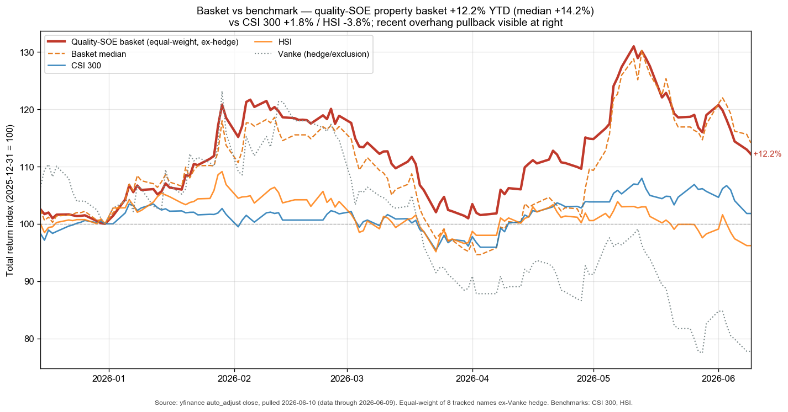
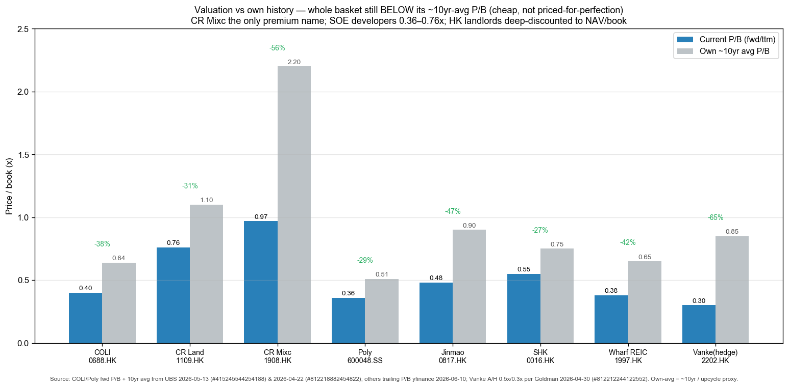
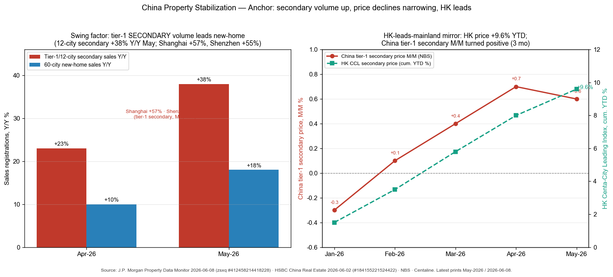

# China Property Stabilization & Real Estate / 中国房地产止跌企稳

**Created:** 2026-06-10 · **Last refreshed:** 2026-06-10 · **Last mutated:** 2026-06-10 · **Refresh cadence:** monthly · **Languages tracked:** en

## What's New

*The delta since you last looked — newest refresh on top. Older entries collapse into the archive below so this stays short.*

**2026-06-10 — basket created** (9 tracked names: 5 quality-SOE developers, 1 mall/property-management operator, the agency platform, 2 HK landlords; Vanke held as an explicit hedge/exclusion).
- **Thesis seeded** on a managed, fragile bottoming: tier-1 **secondary** volume is the swing factor — 12-city secondary sales registrations rose +38% Y/Y in May (Shanghai +57%, Shenzhen +55%), while 60-city new-home registrations lagged at +18% Y/Y ([J.P. Morgan Property Data Monitor, 2026-06-08, p.1](http://xs-macbook-air.local:5001/zsxq/pdf/412458214418228/J.P.%20Morgan-Property%20Data%20Monitor%20Mainland%20China%EF%BC%9A%20secondary%20listings%20further%20dropped%20in%20May%EF%BC%9B%20HK%EF%BC%9Ahome%20prices%20have%20risen%209.6%25%20YTD-260608.pdf#page=1)).
- **Anchor set** to Deutsche Bank's "Property Bottom in Sight" frame — the downcycle has run ~5 years (price peak H1 2021), matching the international median (~5yr, -20% peak-to-trough), and is HK-mirrored rather than Japan-like ([Deutsche Bank China Macro, 2026-06-03, p.1](http://xs-macbook-air.local:5001/zsxq/pdf/184155215851582/Deutsche%20Bank-China%20Macro%EF%BC%9AProperty%20Bottom%20in%20Sight-260603.pdf#page=1)).
- **Preferred longs:** J.P. Morgan top picks mainland = COLI, CR Land, Jinmao, CR Mixc; HK developers SHKP & Sino, landlords Swire & Hang Lung ([J.P. Morgan Property Data Monitor, 2026-06-08, p.1-2](http://xs-macbook-air.local:5001/zsxq/pdf/412458214418228/J.P.%20Morgan-Property%20Data%20Monitor%20Mainland%20China%EF%BC%9A%20secondary%20listings%20further%20dropped%20in%20May%EF%BC%9B%20HK%EF%BC%9Ahome%20prices%20have%20risen%209.6%25%20YTD-260608.pdf#page=1)).
- **Broker calls captured:** UBS upgraded COLI to Buy, PT HK$13.80 → HK$25.00 ([UBS, 2026-05-13, p.1](http://xs-macbook-air.local:5001/zsxq/pdf/415245544254188/UBS-Key%20Call%EF%BC%9A%20China%20Overseas%20Land%20%26%20Investment%EF%BC%880688.HK%EF%BC%89Leading%20beneficiary%20from%20tier%201%20cities%20recovery%EF%BC%9B%20Upgrade%20to%20Buy-260513.pdf#page=1)); Goldman reiterated BEKE Buy, PT $23.00 ([Goldman Sachs KE Holdings, 2026-05-20, p.1](http://xs-macbook-air.local:5001/zsxq/pdf/184121412524152/Goldman%20Sachs-KE%20Holdings%20%EF%BC%88BEKE.US%EF%BC%89%201Q26%20Review%EF%BC%9A%20Thesis%20Validated%EF%BC%9B%202Q26%20GTV%20Inflection%20and%20Operating%20Efficiency%20Drive%20EPS%20Upside%EF%BC%9B%20Raise%20PT%20and%20Reiterate%20Buy-260520.pdf#page=1)). Five PT/rating calls upserted to `stock_price_target_db` (surfaced at `/pt`).
- **Movers at create:** quality-SOE basket +12.2% YTD (median +14.2%) vs CSI 300 +1.8% / HSI -3.8%; 75% of names positive and 75% beating HSI. A sharp ~2-week sector pullback (-6% in the last reported week) on twin overhangs — tighter mainland capital-outflow controls + reignited HK rate-hike fears — is visible at the right edge ([J.P. Morgan Hong Kong Property, 2026-06-08, p.1](http://xs-macbook-air.local:5001/zsxq/pdf/584251528855424/J.P.%20Morgan-Hong%20Kong%20Property%EF%BC%9AAfter%20one%20overhang%EF%BC%8C%20here%20comes%20another%20one-260608.pdf#page=1)).

Earlier refreshes

*(none — basket created 2026-06-10)*

## Thesis

**Anchor — China secondary-sales volume & 70-city price path (the falsifiable pool, with HK as the lead market).** This is a *price/volume-trajectory* theme, not a one-off TAM, so the anchor is the dated path of transaction volume and the narrowing price decline, each cited to a third party. **Mainland (May-2026 prints):** 12-city tier-1 **secondary** sales registrations +38% Y/Y (Shanghai +57%, Shenzhen +55%; YTD +6%, Shanghai +14%), while 60-city **new-home** registrations lag at +18% Y/Y, and tier-1 secondary listings actually fell -0.7% M/M with implied inventory down to 18.6 months (Shanghai 11.9, Beijing 16.6) ([J.P. Morgan Property Data Monitor, 2026-06-08, p.1](http://xs-macbook-air.local:5001/zsxq/pdf/412458214418228/J.P.%20Morgan-Property%20Data%20Monitor%20Mainland%20China%EF%BC%9A%20secondary%20listings%20further%20dropped%20in%20May%EF%BC%9B%20HK%EF%BC%9Ahome%20prices%20have%20risen%209.6%25%20YTD-260608.pdf#page=1)). NBS tier-1 secondary prices have risen M/M for three consecutive months (+0.7% in April) ([HSBC China Real Estate, 2026-06-02, p.1](http://xs-macbook-air.local:5001/zsxq/pdf/184155221524422/HSBC-China%20Real%20Estate%EF%BC%9AMay%20sales%20firm%EF%BC%9B%20land%20premium%20driving%20sentiment-260602.pdf#page=1)).

**Multi-year framing (Deutsche Bank):** China's downcycle began at the H1-2021 price peak and has now just exceeded the five-year mark — versus the international median housing downturn of ~5 years (range 4–7) and a median peak-to-trough decline of ~20%. The current rebound differs from the 2023 and late-2024 false starts because it is *not* macro-stimulus driven: in key cities transaction volumes are rising while secondary listings fall, and the analogue is **Hong Kong's recent recovery, not Japan's lost decades** ([Deutsche Bank China Macro, 2026-06-03, p.1](http://xs-macbook-air.local:5001/zsxq/pdf/184155215851582/Deutsche%20Bank-China%20Macro%EF%BC%9AProperty%20Bottom%20in%20Sight-260603.pdf#page=1)).

**Sub-bucket decomposition (geo + segment):**
- **Tier-1 secondary (the swing factor)** — Shanghai-/Shenzhen-led, +38% Y/Y, leads the inflection; the cohort the whole thesis rides ([J.P. Morgan, 2026-06-08, p.1](http://xs-macbook-air.local:5001/zsxq/pdf/412458214418228/J.P.%20Morgan-Property%20Data%20Monitor%20Mainland%20China%EF%BC%9A%20secondary%20listings%20further%20dropped%20in%20May%EF%BC%9B%20HK%EF%BC%9Ahome%20prices%20have%20risen%209.6%25%20YTD-260608.pdf#page=1)).
- **New-home / developers** — +18% Y/Y registrations but margins and bookings still lag to ~2027; Goldman's "leading cities" set (15 cities on top of SH/SZ) accounts for 40%+ of national property sales value ([Goldman Sachs China Property Positioning, 2026-05-29, p.1](http://xs-macbook-air.local:5001/zsxq/pdf/415284811821518/Goldman%20Sachs-China%20Property%20Positioning%20ahead%20%EF%BC%88No.2%EF%BC%89%EF%BC%9AShare%20rally~what%E2%80%99s%20priced%20in-260529.pdf#page=1)).
- **Property-management & malls** — Seazen tenant sales +~8% YTD; recurring rental income is the annuity that turns positive earliest (CR Mixc, mall operators) ([J.P. Morgan, 2026-06-08, p.2](http://xs-macbook-air.local:5001/zsxq/pdf/412458214418228/J.P.%20Morgan-Property%20Data%20Monitor%20Mainland%20China%EF%BC%9A%20secondary%20listings%20further%20dropped%20in%20May%EF%BC%9B%20HK%EF%BC%9Ahome%20prices%20have%20risen%209.6%25%20YTD-260608.pdf#page=2)).
- **HK landlords / residential** — HK secondary prices +9.6% YTD (0.4% from JPM's 10–15% 2026 forecast); Goldman raised its 2026 HK housing forecast to +15% (from +12%), FY27/28 +7%/+4%, and Central office rents to +10% ([Goldman Sachs Hong Kong Real Estate, 2026-05-19, p.1-2](http://xs-macbook-air.local:5001/zsxq/pdf/212454242145211/Goldman%20Sachs-HONG%20KONG%20REAL%20ESTATE%EF%BC%9ARaising%20HK%20housing%20price%20and%20core%20CBD%20office%20rental%20forecasts.%20Addressing%20key%20debates-260519.pdf#page=1)).

**Value-chain / who-benefits-when staging (a time axis on the role tags).** The agency platform and asset-light annuity names monetize **first** — Beike's existing-home transaction volume already +12% Y/Y platform-wide (+16% at connected stores, 30%+ in April) before developer bookings recover ([Goldman Sachs KE Holdings, 2026-05-20, p.1](http://xs-macbook-air.local:5001/zsxq/pdf/184121412524152/Goldman%20Sachs-KE%20Holdings%20%EF%BC%88BEKE.US%EF%BC%89%201Q26%20Review%EF%BC%9A%20Thesis%20Validated%EF%BC%9B%202Q26%20GTV%20Inflection%20and%20Operating%20Efficiency%20Drive%20EPS%20Upside%EF%BC%9B%20Raise%20PT%20and%20Reiterate%20Buy-260520.pdf#page=1)). **Developers benefit later (2026 sales, 2027 margins):** COLI is one of few with a strong balance sheet and a 50% tier-1 saleable-resource exposure (vs peers' 29%); UBS expects its first contract-sales growth in five years in 2026 (+10% Y/Y) with gross-margin recovery only in 2027 ([UBS Key Call COLI, 2026-05-13, p.1](http://xs-macbook-air.local:5001/zsxq/pdf/415245544254188/UBS-Key%20Call%EF%BC%9A%20China%20Overseas%20Land%20%26%20Investment%EF%BC%880688.HK%EF%BC%89Leading%20beneficiary%20from%20tier%201%20cities%20recovery%EF%BC%9B%20Upgrade%20to%20Buy-260513.pdf#page=1)). HK landlords inflect on the rate-cut / wealth-effect cycle.

**Conviction ranking (sourced).** J.P. Morgan prefers, mainland: COLI > CR Land > Jinmao > CR Mixc — COLI as "a laggard poised to outperform" on tier-1 leverage; HK: SHKP & Sino (developers), Swire & Hang Lung (landlords) ([J.P. Morgan Property Data Monitor, 2026-06-08, p.1](http://xs-macbook-air.local:5001/zsxq/pdf/412458214418228/J.P.%20Morgan-Property%20Data%20Monitor%20Mainland%20China%EF%BC%9A%20secondary%20listings%20further%20dropped%20in%20May%EF%BC%9B%20HK%EF%BC%9Ahome%20prices%20have%20risen%209.6%25%20YTD-260608.pdf#page=1)). HSBC prefers CR Land and C&D, both Buy ([HSBC, 2026-06-02, p.1](http://xs-macbook-air.local:5001/zsxq/pdf/184155221524422/HSBC-China%20Real%20Estate%EF%BC%9AMay%20sales%20firm%EF%BC%9B%20land%20premium%20driving%20sentiment-260602.pdf#page=1)). Goldman flags COLI and CR Land as the two that have already rallied ~30% — so part of the recovery is priced in.

**Scenario clause (up / base / down).** *Base:* tier-1 (SH/SZ) leads a durable secondary-led bottoming through 2026, new-home and margins lag to 2027 (DB, Goldman). *Up:* the next 15 "leading cities" inflect in 2027, matching the +15% SH/SZ path by 2028 — COLI (80%+ leading-city saleable exposure) the key beneficiary ([Goldman Sachs China Property Positioning, 2026-05-29, p.1](http://xs-macbook-air.local:5001/zsxq/pdf/415284811821518/Goldman%20Sachs-China%20Property%20Positioning%20ahead%20%EF%BC%88No.2%EF%BC%89%EF%BC%9AShare%20rally~what%E2%80%99s%20priced%20in-260529.pdf#page=1)). *Down:* the rebound proves a third false start (cf. early-2023, late-2024) — rents fail to improve, developer credit contagion resumes (Vanke), and the HK overhangs (capital controls + rate hikes) bite.

## Scope rules

In: quality state-owned-enterprise (SOE) developers with strong balance sheets and tier-1 saleable-resource exposure; asset-light mall / property-management operators (recurring rental annuity); the dominant housing-transaction agency platform (Beike); HK landlords / developers where the rate-cut + wealth-effect inflection applies. The bias is to **quality-SOE and asset-light** names that survive the destocking phase and capture the tier-1 recovery first.

Out: distressed / over-levered private developers (tracked only as an explicit hedge — Vanke); pure-construction / building-materials suppliers (separate theme); banks with property loan books (covered in china-financials-brokers-insurers); consumer / luxury read-throughs (covered elsewhere). Names with no disclosed tier-1 exposure and no recurring-income annuity are out — the theme is a bet on the *quality* end of the curve, not broad beta.

## Tracked tickers

| Ticker | Name | Role | Justification | Added |
|---|---|---|---|---|
| 0688.HK | China Overseas Land & Investment (COLI / 中海外发展) | core | Highest-quality SOE developer; **50% of 2026 saleable resources in tier-1 cities** (vs peers' 29%), 74% of 2025 land buys tier-1; UBS upgraded to Buy expecting first contract-sales growth in 5 yrs (+10% 2026) ([UBS, 2026-05-13, p.1](http://xs-macbook-air.local:5001/zsxq/pdf/415245544254188/UBS-Key%20Call%EF%BC%9A%20China%20Overseas%20Land%20%26%20Investment%EF%BC%880688.HK%EF%BC%89Leading%20beneficiary%20from%20tier%201%20cities%20recovery%EF%BC%9B%20Upgrade%20to%20Buy-260513.pdf#page=1)). **Moat:** SOE funding access + best tier-1 land bank → buys the cheap inflection cohort. **Threat:** ~30% rally already prices part of recovery; if SH/SZ inflection stalls or stays SH/SZ-only (not broadening to the 15 leading cities), the contract-sales upside doesn't arrive. | 2026-06-10 |
| 1109.HK | China Resources Land (CR Land / 华润置地) | core | SOE developer-plus-mall hybrid; **best May SOE sales (+28% Y/Y)**, HSBC top Buy, JPM #2 pick; benefits from both DP recovery and mall/rental income ([HSBC, 2026-06-02, p.1](http://xs-macbook-air.local:5001/zsxq/pdf/184155221524422/HSBC-China%20Real%20Estate%EF%BC%9AMay%20sales%20firm%EF%BC%9B%20land%20premium%20driving%20sentiment-260602.pdf#page=1)). **Moat:** dual development + investment-property earnings engine, top southbound-inflow name (+1.4% W/W). **Threat:** highest valuation among SOE developers (0.76x P/B) — most exposed to a de-rate if the price-stabilization narrative reverses. | 2026-06-10 |
| 1908.HK | CR Mixc Lifestyle (华润万象生活) | core | Asset-light mall + property-management operator — the *recurring* annuity that turns positive earliest in the cycle; CR Land's mall arm; JPM #4 mainland pick ([J.P. Morgan, 2026-06-08, p.1](http://xs-macbook-air.local:5001/zsxq/pdf/412458214418228/J.P.%20Morgan-Property%20Data%20Monitor%20Mainland%20China%EF%BC%9A%20secondary%20listings%20further%20dropped%20in%20May%EF%BC%9B%20HK%EF%BC%9Ahome%20prices%20have%20risen%209.6%25%20YTD-260608.pdf#page=1)). **Moat:** capital-light recurring mall management fees, decoupled from land-bank risk. **Threat:** Seazen flags CR Mixc's expansion into lower-tier cities as a competitive risk; tenant-sales growth softens if the wealth effect fades ([J.P. Morgan, 2026-06-08, p.2](http://xs-macbook-air.local:5001/zsxq/pdf/412458214418228/J.P.%20Morgan-Property%20Data%20Monitor%20Mainland%20China%EF%BC%9A%20secondary%20listings%20further%20dropped%20in%20May%EF%BC%9B%20HK%EF%BC%9Ahome%20prices%20have%20risen%209.6%25%20YTD-260608.pdf#page=2)). | 2026-06-10 |
| 600048.SS | Poly Developments (保利发展) | core | Largest A-share SOE developer; raised 2026 investment target to Rmb85–100bn (vs Rmb79bn 2025 land buys), signalling SOE confidence, while destocking Rmb47.3mn sqm of vintage inventory ([UBS, 2026-04-22, p.1](http://xs-macbook-air.local:5001/zsxq/pdf/812218882454822/UBS-Poly%20Developments%EF%BC%88600048%EF%BC%89%20Takeaway%20from%202025%20results%20briefing-260422.pdf#page=1)). **Moat:** SASAC parent, A-share scale, counter-cyclical land-buying capacity. **Threat:** 2025 earnings -79% Y/Y, GM 12.7%, margin recovery delayed by legacy-project destocking; -15% YTD — the laggard if the recovery stays HK/tier-1-narrow. | 2026-06-10 |
| 0817.HK | China Jinmao (中国金茂) | core | SOE developer (Sinochem parent) with tier-1 / core-city skew; JPM #3 mainland pick ([J.P. Morgan, 2026-06-08, p.1](http://xs-macbook-air.local:5001/zsxq/pdf/412458214418228/J.P.%20Morgan-Property%20Data%20Monitor%20Mainland%20China%EF%BC%9A%20secondary%20listings%20further%20dropped%20in%20May%EF%BC%9B%20HK%EF%BC%9Ahome%20prices%20have%20risen%209.6%25%20YTD-260608.pdf#page=1)). **Moat:** central-SOE backing + premium "City Operator" positioning in tier-1/2 hubs. **Threat:** smaller-cap and higher-beta than COLI/CR Land — +30.8% YTD but -18.7% in the recent overhang pullback; the most volatile of the SOE longs. | 2026-06-10 |
| BEKE | KE Holdings (Beike / 贝壳) | core | Dominant housing-transaction agency platform — the asset-light name that monetizes the secondary-volume swing factor FIRST; existing-home volume +12% Y/Y platform-wide / +16% connected stores, 30%+ in April; Goldman Buy, thesis validated ([Goldman Sachs KE Holdings, 2026-05-20, p.1](http://xs-macbook-air.local:5001/zsxq/pdf/184121412524152/Goldman%20Sachs-KE%20Holdings%20%EF%BC%88BEKE.US%EF%BC%89%201Q26%20Review%EF%BC%9A%20Thesis%20Validated%EF%BC%9B%202Q26%20GTV%20Inflection%20and%20Operating%20Efficiency%20Drive%20EPS%20Upside%EF%BC%9B%20Raise%20PT%20and%20Reiterate%20Buy-260520.pdf#page=1)). **Moat:** Lianjia network + ACN platform, ~80% recurring transaction-fee economics, levered to volume not price. **Threat:** customer-disintermediation — developers / portals self-running listings to cut commission; blended ASP under pressure as volume shifts beyond tier-1 ([Goldman Sachs, 2026-05-20, p.1](http://xs-macbook-air.local:5001/zsxq/pdf/184121412524152/Goldman%20Sachs-KE%20Holdings%20%EF%BC%88BEKE.US%EF%BC%89%201Q26%20Review%EF%BC%9A%20Thesis%20Validated%EF%BC%9B%202Q26%20GTV%20Inflection%20and%20Operating%20Efficiency%20Drive%20EPS%20Upside%EF%BC%9B%20Raise%20PT%20and%20Reiterate%20Buy-260520.pdf#page=1)). | 2026-06-10 |
| 0016.HK | Sun Hung Kai Properties (SHK Props / 新鸿基地产) | core | Top-tier HK developer/landlord — JPM #1 HK developer pick; benefits from the HK rate-cut + wealth-effect inflection (HK prices +9.6% YTD); net-cash balance sheet ([J.P. Morgan, 2026-06-08, p.2](http://xs-macbook-air.local:5001/zsxq/pdf/412458214418228/J.P.%20Morgan-Property%20Data%20Monitor%20Mainland%20China%EF%BC%9A%20secondary%20listings%20further%20dropped%20in%20May%EF%BC%9B%20HK%EF%BC%9Ahome%20prices%20have%20risen%209.6%25%20YTD-260608.pdf#page=2)). **Moat:** best-in-class HK land bank + recurring rental from premium malls/offices; balance-sheet quality. **Threat:** State Council outbound-investment rules (effective 1 Jul 2026) scrutinizing mainland buyers (49% of HK primary value) + reignited HK rate-hike fears — SHKP underperforms most on these overhangs ([UBS Hong Kong Property, 2026-06-02, p.1](http://xs-macbook-air.local:5001/zsxq/pdf/415288442845558/UBS-Hong%20Kong%20Property%EF%BC%9AMore%20Clarity%20on%20Cross~Border%20Investment%EF%BC%9A%20A%20Turning%20Point%20for%20Hong%20Kong%20Housing%20Market%EF%BC%9F-260603.pdf#page=1)). | 2026-06-10 |
| 1997.HK | Wharf Real Estate Investment (Wharf REIC / 九仓置业) | adjacent | Pure HK retail/office landlord (Harbour City, Times Square); the retail-rent recovery on rate cuts + visitor wealth effect; HK retail sales +13% Y/Y in March ([Goldman Sachs Hong Kong Real Estate, 2026-05-19, p.1](http://xs-macbook-air.local:5001/zsxq/pdf/212454242145211/Goldman%20Sachs-HONG%20KONG%20REAL%20ESTATE%EF%BC%9ARaising%20HK%20housing%20price%20and%20core%20CBD%20office%20rental%20forecasts.%20Addressing%20key%20debates-260519.pdf#page=1)). **Moat:** irreplaceable Tsim Sha Tsui / Causeway Bay luxury-retail footprint; deepest-discount-to-NAV proxy on a HK retail-rent turn. **Threat:** Goldman is skeptical on double-digit HK retail-sales sustainability into a higher 2H26 base, and on price-competitiveness vs adjacent markets/online; -5% YTD — the laggard if retail rents disappoint ([Goldman Sachs, 2026-05-19, p.2](http://xs-macbook-air.local:5001/zsxq/pdf/212454242145211/Goldman%20Sachs-HONG%20KONG%20REAL%20ESTATE%EF%BC%9ARaising%20HK%20housing%20price%20and%20core%20CBD%20office%20rental%20forecasts.%20Addressing%20key%20debates-260519.pdf#page=2)). | 2026-06-10 |
| 2202.HK | China Vanke (万科 H) | hedge | Distressed mixed-ownership developer — the counter-position that benefits if the bottoming proves a false start / credit contagion resumes; Goldman Sell, net loss extended to Rmb5.95bn in 1Q26, FY26-28E net losses Rmb14.4/11.3/10.1bn ([Goldman Sachs China Vanke, 2026-04-30, p.1](http://xs-macbook-air.local:5001/zsxq/pdf/812212244122552/Goldman%20Sachs-China%20Vanke%20%EF%BC%88000002.SZ%EF%BC%8C%202202.HK%EF%BC%891Q26%20net%20loss%20extended%20with%20overall%20prints%20remaining%20weak%EF%BC%9B%20Sell-260430.pdf#page=1)). **Moat:** none structurally — survival rests on Shenzhen-SOE backing and creditor extensions. **Threat (= the hedge thesis):** balance-sheet deterioration, financing roll risk; -22% YTD vs +12% basket — diverges correctly from the quality longs. | 2026-06-10 |

## Valuation snapshot

*Populated from `stock_price_target_db` (mirror of the `/pt` viewer). "Px @ note date" = `report_date_price` (the price the analyst's upside was called against), NOT today's spot. P/B is the sector-appropriate metric for property; PEG/EV-EBITDA noted where relevant. Current px = 2026-06-09 close (yfinance).*

| Ticker | Rating (broker, date) | Px @ note date | PT | Upside% (vs note px) | Current px | Fwd P/B | Own ~10yr-avg P/B | FY1 / FY2 EPS | Div yield |
|---|---|---|---|---|---|---|---|---|---|
| 0688.HK COLI | **Buy** · UBS 2026-05-13 (upgrade) | HK$16.00 | HK$25.00 (was HK$13.80) | **+56%** | HK$15.53 | 0.40x | 0.64x | Rmb1.07 / 1.22 | 3.2% |
| 1109.HK CR Land | Buy · HSBC 2026-06-02 | n/a | n/a (qual. Buy) | n/a | HK$35.50 | 0.76x | ~1.1x | n/a (HSBC top Buy, no PT extracted) | 3.7% |
| 1908.HK CR Mixc | (covered, no PT this pass) | n/a | n/a | n/a | HK$15.06 | 0.97x | ~2.2x | n/a — mall operator, EV/EBITDA basis | 6.0% |
| 600048.SS Poly | **Neutral** · UBS 2026-04-22 · **EW** · MS 2026-04-23 (bull/base/bear) | Rmb5.97 / Rmb5.93 | Rmb6.60 (UBS) · **Rmb7.61 / 5.51 / 4.23** (MS, 30% NAV disc.) | +10.6% (UBS) / -7% (MS base) | Rmb5.17 | 0.36x | 0.51x (sector) | Rmb0.04 / 0.11 (UBS) | 3.3% |
| 0817.HK Jinmao | (covered, no PT this pass) | n/a | n/a | n/a | HK$1.57 | 0.48x | ~0.9x | n/a | 1.9% |
| BEKE Beike | **Buy** · Goldman 2026-05-20 (PT raised) | $17.80 | $23.00 (US) / HK$59.00 (2423.HK) | **+29%** | $15.97 | P/E 18.2x FY26E / 15.5x FY27E | P/E ~20x (own) | Rmb6.63 / 7.83 | 1.7% |
| 0016.HK SHK | (JPM top HK developer pick, no PT extracted) | n/a | n/a | n/a | HK$117.20 | 0.55x | ~0.75x | n/a | 3.2% |
| 1997.HK Wharf REIC | (covered, no PT this pass) | n/a | n/a | n/a | HK$22.62 | 0.38x | ~0.65x | n/a | 5.8% |
| 2202.HK Vanke (hedge) | **Sell** · Goldman 2026-04-30 (PT cut) | n/a (A: Rmb3.91) | HK$2.90 (H) / Rmb3.70 (A, -6%/-8%) | -5% (A) | HK$2.55 | 0.30x (H 0.3x / A 0.5x) | ~0.85x | net loss FY26-28E | n/a |

**Cross-section read.** With the single exception of CR Mixc (0.97x, an asset-light mall operator that warrants a premium), **the entire basket trades below its own ~10yr-average P/B** — COLI 0.40x vs 0.64x, Poly 0.36x vs 0.51x sector, SHK 0.55x vs ~0.75x, Wharf REIC 0.38x vs ~0.65x. This is a *cheap, not priced-for-perfection* basket: the bet is mean-reversion toward own-history multiples as ROE recovers and cost-of-equity compresses, not multiple expansion above history. UBS frames COLI's PT (HK$25) explicitly as 0.60x 2026E P/B — still below its 0.64x historical average — i.e. the call is a re-rating *to* history, not past it ([UBS COLI, 2026-05-13, p.1](http://xs-macbook-air.local:5001/zsxq/pdf/415245544254188/UBS-Key%20Call%EF%BC%9A%20China%20Overseas%20Land%20%26%20Investment%EF%BC%880688.HK%EF%BC%89Leading%20beneficiary%20from%20tier%201%20cities%20recovery%EF%BC%9B%20Upgrade%20to%20Buy-260513.pdf#page=1)).

## Exclusions

| Ticker | Reason |
|---|---|
| 0960.HK Longfor | Mixed SOE/private; carried in JPM's credit picks (Longfor '29s 9.8% YTM) but the equity is not a top sell-side pick this pass — watch for next mutation if coverage strengthens. |
| 3900.HK Greentown | Quality private developer but thinner sell-side coverage in the library this pass; candidate-add if a conviction broker call surfaces. |
| 0823.HK Link REIT | HK/China retail REIT — yield-vehicle, more rate-duration than property-recovery beta; tracked separately if a rate-cut REIT theme is built. |
| Various private developers (Country Garden, Sunac, Shimao) | Distressed/defaulted — Shimao -18% in the latest week ([J.P. Morgan, 2026-06-08, p.1](http://xs-macbook-air.local:5001/zsxq/pdf/412458214418228/J.P.%20Morgan-Property%20Data%20Monitor%20Mainland%20China%EF%BC%9A%20secondary%20listings%20further%20dropped%20in%20May%EF%BC%9B%20HK%EF%BC%9Ahome%20prices%20have%20risen%209.6%25%20YTD-260608.pdf#page=1)); Vanke is the single representative hedge, the rest are uninvestable. |

## Keywords

China property stabilization / 房地产止跌企稳 · tier-1 secondary sales / 一线二手房成交 · 70-city price index / 70城房价 · de-stocking / 去库存 · "good housing" / 好房子 · quality SOE developer / 优质央国企开发商 · property management & malls / 物业管理与商场 · HK residential / 香港住宅 · CCL Centa-City Leading Index / 中原城市领先指数 · southbound holdings / 南下资金 · NAV discount / NAV折让

## Performance (since inception, 2026-06-10)

Equal-weight quality-SOE basket (8 tracked names, ex-Vanke hedge): **+12.2% YTD** (median +14.2%) vs **CSI 300 +1.8% / HSI -3.8%** (2025-12-31 → 2026-06-09, yfinance auto-adjusted). The basket is materially ahead of both benchmarks but a sharp ~2-week pullback at the right edge — the sector fell -6% in the last reported week on twin overhangs (mainland capital-outflow controls + reignited HK rate-hike fears) — has trimmed the lead from its late-May peak ([J.P. Morgan Hong Kong Property, 2026-06-08, p.1](http://xs-macbook-air.local:5001/zsxq/pdf/584251528855424/J.P.%20Morgan-Hong%20Kong%20Property%EF%BC%9AAfter%20one%20overhang%EF%BC%8C%20here%20comes%20another%20one-260608.pdf#page=1)).

### Basket scorecard

- **Batting average (YTD, 8 names):** 6/8 positive = **75% positive**; 6/8 beating HSI = **75% beating benchmark**.
- **Best contributor:** Jinmao **+30.8%** YTD; **CR Land +30.5%**, COLI +26.8%, SHK +25.1% close behind.
- **Worst contributor:** Poly **-15.2%** YTD (margin lag + destocking drag); Wharf REIC -5.3%.
- **Hedge working as designed:** Vanke -22.3% YTD — diverging cleanly below the quality longs, validating the hedge role.
- **Cumulative outperformance since inception:** n/a (only one snapshot line; computed from the second refresh onward).

*(All figures derived from yfinance auto_adjust close + `snapshots.jsonl`, no other data source.)*

## Recent events

- **2026-06-08 — J.P. Morgan Property Data Monitor:** May tier-1 12-city secondary sales +38% Y/Y (Shanghai +57%, Shenzhen +55%); 60-city new-home +18% Y/Y; tier-1 secondary listings -0.7% M/M, inventory 18.6 months; HK CCL +9.6% YTD ([p.1](http://xs-macbook-air.local:5001/zsxq/pdf/412458214418228/J.P.%20Morgan-Property%20Data%20Monitor%20Mainland%20China%EF%BC%9A%20secondary%20listings%20further%20dropped%20in%20May%EF%BC%9B%20HK%EF%BC%9Ahome%20prices%20have%20risen%209.6%25%20YTD-260608.pdf#page=1)).
- **2026-06-08 — J.P. Morgan HK Property "After one overhang, here comes another one":** sector -7% vs HSI over 2 weeks on capital-control + rate-hike fears; JPM maintains 10–15% 2026 HK price forecast, suggests accumulating SHKP/Sino/Swire/HLP on dips ([p.1](http://xs-macbook-air.local:5001/zsxq/pdf/584251528855424/J.P.%20Morgan-Hong%20Kong%20Property%EF%BC%9AAfter%20one%20overhang%EF%BC%8C%20here%20comes%20another%20one-260608.pdf#page=1)).
- **2026-06-03 — Deutsche Bank "Property Bottom in Sight":** China downcycle ~5yrs, comparable to international precedents (~5yr, -20%); rebound is fundamentals-driven (volumes up, listings down), HK-mirrored not Japan-like; rents the missing piece ([p.1](http://xs-macbook-air.local:5001/zsxq/pdf/184155215851582/Deutsche%20Bank-China%20Macro%EF%BC%9AProperty%20Bottom%20in%20Sight-260603.pdf#page=1)).
- **2026-06-02 — UBS "A Turning Point for Hong Kong":** State Council Outbound Investment Regulations effective 1 Jul 2026 add scrutiny to mainland HK buyers (49% of primary value, 32% of total); negative read-through, SHKP/Henderson most exposed, CKA/Sino (net cash) relatively shielded ([p.1](http://xs-macbook-air.local:5001/zsxq/pdf/415288442845558/UBS-Hong%20Kong%20Property%EF%BC%9AMore%20Clarity%20on%20Cross~Border%20Investment%EF%BC%9A%20A%20Turning%20Point%20for%20Hong%20Kong%20Housing%20Market%EF%BC%9F-260603.pdf#page=1)).
- **2026-06-02 — HSBC "May sales firm":** six high-quality SOEs positive May Y/Y (CR Land +28%, Yuexiu +18%, COLI +14%), share prices +7% vs HSI -2%; national land-sale decline narrowed to -36% in 5M26 (from -41%), avg premium 10% (from 6%); Shanghai secondary at a 5-year high ([p.1](http://xs-macbook-air.local:5001/zsxq/pdf/184155221524422/HSBC-China%20Real%20Estate%EF%BC%9AMay%20sales%20firm%EF%BC%9B%20land%20premium%20driving%20sentiment-260602.pdf#page=1)).
- **2026-05-29 — Goldman "Positioning ahead (No.2)":** coverage +6% off lows, SOE devs +17%, COLI & CR Land +~30% — market pricing a broader recovery than Goldman's SH/SZ-led baseline; tests a 15-"leading-cities" optimistic scenario ([p.1](http://xs-macbook-air.local:5001/zsxq/pdf/415284811821518/Goldman%20Sachs-China%20Property%20Positioning%20ahead%20%EF%BC%88No.2%EF%BC%89%EF%BC%9AShare%20rally~what%E2%80%99s%20priced%20in-260529.pdf#page=1)).
- **2026-05-20 — Goldman KE Holdings (BEKE) 1Q26 review:** existing-home volume +12% Y/Y platform / +16% connected stores / 30%+ April; tier-1 ASP +1.5% qoq; 50-city rental yield +40bps to 2.8%; PT raised, reiterate Buy ([p.1](http://xs-macbook-air.local:5001/zsxq/pdf/184121412524152/Goldman%20Sachs-KE%20Holdings%20%EF%BC%88BEKE.US%EF%BC%89%201Q26%20Review%EF%BC%9A%20Thesis%20Validated%EF%BC%9B%202Q26%20GTV%20Inflection%20and%20Operating%20Efficiency%20Drive%20EPS%20Upside%EF%BC%9B%20Raise%20PT%20and%20Reiterate%20Buy-260520.pdf#page=1)).
- **2026-05-19 — Goldman raises HK housing forecast to +15% (from +12%)** for 2026, FY27/28 +7%/+4%; HK property names +20% YTD avg (developers +28%); talent visas 139k/124k FY24/25 vs 70-80k pre-pandemic ([p.1](http://xs-macbook-air.local:5001/zsxq/pdf/212454242145211/Goldman%20Sachs-HONG%20KONG%20REAL%20ESTATE%EF%BC%9ARaising%20HK%20housing%20price%20and%20core%20CBD%20office%20rental%20forecasts.%20Addressing%20key%20debates-260519.pdf#page=1)).

## Drift signals

- **Priced-for-perfection check (the inverse here — basket is cheap):** the basket-median P/B sits *below* its own history, so there is no air-pocket flag from valuation; the risk is the opposite — a value trap if the inflection reverses. **Specific demand assumption whose miss de-rates the basket:** the tier-1 secondary-volume swing factor — if 12-city secondary Y/Y rolls back from +38% toward flat (the early-2023 / late-2024 false-start pattern), the whole thesis cracks first there ([Deutsche Bank, 2026-06-03, p.1](http://xs-macbook-air.local:5001/zsxq/pdf/184155215851582/Deutsche%20Bank-China%20Macro%EF%BC%9AProperty%20Bottom%20in%20Sight-260603.pdf#page=1)). **Sized downside:** Poly to its MS bear case Rmb4.23 = **-18%** from spot; the SOE longs that have rallied ~30% (COLI, CR Land, Jinmao) face the largest give-back to own-history-average multiples if the rally proves premature.
- **Recovery has already partly rallied (Goldman):** COLI & CR Land +~30% — part of the upside is priced; the broadening to the 15 "leading cities" must materialize in 2027 to justify further gains, otherwise the SOE longs stall ([Goldman, 2026-05-29, p.1](http://xs-macbook-air.local:5001/zsxq/pdf/415284811821518/Goldman%20Sachs-China%20Property%20Positioning%20ahead%20%EF%BC%88No.2%EF%BC%89%EF%BC%9AShare%20rally~what%E2%80%99s%20priced%20in-260529.pdf#page=1)).
- **HK leading indicator rolling over while names still elevated:** the HK CVI fell to 86.7 (from 89.5) and secondary transactions hit the lowest since CNY (-32% Y/Y) even as prices held +9.6% YTD — the volume-side of the HK inflection is softening; if it persists, SHK/Wharf REIC are exposed ([J.P. Morgan, 2026-06-08, p.1-2](http://xs-macbook-air.local:5001/zsxq/pdf/412458214418228/J.P.%20Morgan-Property%20Data%20Monitor%20Mainland%20China%EF%BC%9A%20secondary%20listings%20further%20dropped%20in%20May%EF%BC%9B%20HK%EF%BC%9Ahome%20prices%20have%20risen%209.6%25%20YTD-260608.pdf#page=2)).
- **New entrant worth considering (next mutation):** Longfor (0960.HK) and Greentown (3900.HK) surface in property coverage but lack a top-pick equity call this pass; Longfor's '29 USD bonds (9.8% YTM) are a JPM credit pick — a candidate-add if equity conviction strengthens ([J.P. Morgan, 2026-06-08, p.2](http://xs-macbook-air.local:5001/zsxq/pdf/412458214418228/J.P.%20Morgan-Property%20Data%20Monitor%20Mainland%20China%EF%BC%9A%20secondary%20listings%20further%20dropped%20in%20May%EF%BC%9B%20HK%EF%BC%9Ahome%20prices%20have%20risen%209.6%25%20YTD-260608.pdf#page=2)).
- **Value-chain coverage gap:** the theme has no exposure to the **rental-housing / REITs destocking channel** (local-government inventory purchases, REIT spin-offs) that Poly cites as a destocking lever — a candidate sub-bucket if a pure REIT name emerges ([UBS Poly, 2026-04-22, p.1](http://xs-macbook-air.local:5001/zsxq/pdf/812218882454822/UBS-Poly%20Developments%EF%BC%88600048%EF%BC%89%20Takeaway%20from%202025%20results%20briefing-260422.pdf#page=1)).
- **Symmetric risks (dated):** *Upside* — June COLI tier-1 launches (~Rmb70bn saleable, SH/SZ) could be the next sales-beat catalyst ([UBS, 2026-05-13, p.1](http://xs-macbook-air.local:5001/zsxq/pdf/415245544254188/UBS-Key%20Call%EF%BC%9A%20China%20Overseas%20Land%20%26%20Investment%EF%BC%880688.HK%EF%BC%89Leading%20beneficiary%20from%20tier%201%20cities%20recovery%EF%BC%9B%20Upgrade%20to%20Buy-260513.pdf#page=1)); *Downside* — the 1 Jul 2026 outbound-investment rules + HK rate-hike risk weigh on HK landlords through 3Q26 ([UBS HK, 2026-06-02, p.1](http://xs-macbook-air.local:5001/zsxq/pdf/415288442845558/UBS-Hong%20Kong%20Property%EF%BC%9AMore%20Clarity%20on%20Cross~Border%20Investment%EF%BC%9A%20A%20Turning%20Point%20for%20Hong%20Kong%20Housing%20Market%EF%BC%9F-260603.pdf#page=1)).

## Leading indicators

*The upstream signals that move BEFORE the basket and crack the thesis first. Macro/upstream signals as header rows; per-ticker operating data below.*

| Signal (header) | Latest reading + as-of | Direction | Implies |
|---|---|---|---|
| 12-city tier-1 secondary sales registrations | +38% Y/Y, May 2026 (Shanghai +57%, Shenzhen +55%) | ↑ accelerating | The swing factor — leads new-home & developer bookings ([JPM 2026-06-08, p.1](http://xs-macbook-air.local:5001/zsxq/pdf/412458214418228/J.P.%20Morgan-Property%20Data%20Monitor%20Mainland%20China%EF%BC%9A%20secondary%20listings%20further%20dropped%20in%20May%EF%BC%9B%20HK%EF%BC%9Ahome%20prices%20have%20risen%209.6%25%20YTD-260608.pdf#page=1)) |
| Centaline tier-1 asking-price index / manager confidence | 17.7 / 54, flat W/W, 2026-06-08 | → stable | Sentiment holding, not yet accelerating ([JPM 2026-06-08, p.1](http://xs-macbook-air.local:5001/zsxq/pdf/412458214418228/J.P.%20Morgan-Property%20Data%20Monitor%20Mainland%20China%EF%BC%9A%20secondary%20listings%20further%20dropped%20in%20May%EF%BC%9B%20HK%EF%BC%9Ahome%20prices%20have%20risen%209.6%25%20YTD-260608.pdf#page=1)) |
| National land-sale value decline (5M26) | -36% Y/Y (from -41% 4M26), premium 10% (from 6%) | ↑ narrowing | Developer confidence rebuilding → forward new-home supply ([HSBC 2026-06-02, p.1](http://xs-macbook-air.local:5001/zsxq/pdf/184155221524422/HSBC-China%20Real%20Estate%EF%BC%9AMay%20sales%20firm%EF%BC%9B%20land%20premium%20driving%20sentiment-260602.pdf#page=1)) |
| 50-city avg rental yield | 2.26% Mar-26 (> 5yr deposit 1.3% / 10yr CGB 1.8%) | ↑ improving | Carry now positive → valuation floor for resi assets ([国海证券 2026-05-19, p.2](http://xs-macbook-air.local:5001/zsxq/pdf/585424842485444/%E5%AE%8F%E8%A7%82%E6%B7%B1%E5%BA%A6%E7%A0%94%E7%A9%B6%EF%BC%9A%E5%B0%8F%E9%98%B3%E6%98%A5%E8%83%BD%E5%90%A6%E6%8C%81%E7%BB%AD%EF%BC%9F%EF%BC%8C%E5%86%8D%E8%AE%BA%E6%88%BF%E5%9C%B0%E4%BA%A7%E5%B8%82%E5%9C%BA%E6%AD%A2%E8%B7%8C%E4%BC%81%E7%A8%B3%E7%9A%84%E4%B8%89%E4%B8%AA%E6%9D%A1%E4%BB%B6.pdf#page=2)) |
| HK CCL secondary price (cum. YTD) | +9.6%, 2026-06-08 (CVI 86.7, CSI 71.1) | ↑ but volume softening | HK leads mainland; price strong but transactions -32% Y/Y ([JPM 2026-06-08, p.1-2](http://xs-macbook-air.local:5001/zsxq/pdf/412458214418228/J.P.%20Morgan-Property%20Data%20Monitor%20Mainland%20China%EF%BC%9A%20secondary%20listings%20further%20dropped%20in%20May%EF%BC%9B%20HK%EF%BC%9Ahome%20prices%20have%20risen%209.6%25%20YTD-260608.pdf#page=2)) |

**Per-ticker operating data (the Barometer spine):**

| Ticker | Latest operating print | As-of | Source |
|---|---|---|---|
| COLI 0688.HK | June launches ~Rmb70bn saleable (5 SH/SZ projects) vs Rmb22bn monthly contract sales; 50% tier-1 saleable exposure | 2026-05-13 | [UBS COLI p.1-2](http://xs-macbook-air.local:5001/zsxq/pdf/415245544254188/UBS-Key%20Call%EF%BC%9A%20China%20Overseas%20Land%20%26%20Investment%EF%BC%880688.HK%EF%BC%89Leading%20beneficiary%20from%20tier%201%20cities%20recovery%EF%BC%9B%20Upgrade%20to%20Buy-260513.pdf#page=1) |
| CR Land 1109.HK | May contract sales **+28% Y/Y** (best of SOE cohort); Suzhou land record-price acquisitions | 2026-06-02 | [HSBC p.1](http://xs-macbook-air.local:5001/zsxq/pdf/184155221524422/HSBC-China%20Real%20Estate%EF%BC%9AMay%20sales%20firm%EF%BC%9B%20land%20premium%20driving%20sentiment-260602.pdf#page=1) |
| Poly 600048.SS | 2026 investment target Rmb85-100bn (vs Rmb79bn 2025); vintage inventory Rmb47.3mn sqm (-10% Y/Y); 2025 GM 12.7% | 2026-04-22 | [UBS Poly p.1](http://xs-macbook-air.local:5001/zsxq/pdf/812218882454822/UBS-Poly%20Developments%EF%BC%88600048%EF%BC%89%20Takeaway%20from%202025%20results%20briefing-260422.pdf#page=1) |
| Beike BEKE | Existing-home volume +12% Y/Y platform / +16% connected stores / 30%+ April; commission/agent +20% Jan-Apr | 2026-05-20 | [Goldman BEKE p.1](http://xs-macbook-air.local:5001/zsxq/pdf/184121412524152/Goldman%20Sachs-KE%20Holdings%20%EF%BC%88BEKE.US%EF%BC%89%201Q26%20Review%EF%BC%9A%20Thesis%20Validated%EF%BC%9B%202Q26%20GTV%20Inflection%20and%20Operating%20Efficiency%20Drive%20EPS%20Upside%EF%BC%9B%20Raise%20PT%20and%20Reiterate%20Buy-260520.pdf#page=1) |
| SHK 0016.HK | HK primary projects pricing 15-18% above secondary; SHKP +30% YTD over HSI (top performer) | 2026-06-08 | [JPM p.1-2](http://xs-macbook-air.local:5001/zsxq/pdf/412458214418228/J.P.%20Morgan-Property%20Data%20Monitor%20Mainland%20China%EF%BC%9A%20secondary%20listings%20further%20dropped%20in%20May%EF%BC%9B%20HK%EF%BC%9Ahome%20prices%20have%20risen%209.6%25%20YTD-260608.pdf#page=2) |
| Wharf REIC 1997.HK | HK retail sales +13% Y/Y March; Goldman raised retail rent forecast to +3% | 2026-05-19 | [Goldman HK RE p.1-2](http://xs-macbook-air.local:5001/zsxq/pdf/212454242145211/Goldman%20Sachs-HONG%20KONG%20REAL%20ESTATE%EF%BC%9ARaising%20HK%20housing%20price%20and%20core%20CBD%20office%20rental%20forecasts.%20Addressing%20key%20debates-260519.pdf#page=1) |
| Vanke 2202.HK (hedge) | 1Q26 net loss Rmb5.95bn; DP revenue -51% Y/Y; net gearing +5pp QoQ | 2026-04-30 | [Goldman Vanke p.1](http://xs-macbook-air.local:5001/zsxq/pdf/812212244122552/Goldman%20Sachs-China%20Vanke%20%EF%BC%88000002.SZ%EF%BC%8C%202202.HK%EF%BC%891Q26%20net%20loss%20extended%20with%20overall%20prints%20remaining%20weak%EF%BC%9B%20Sell-260430.pdf#page=1) |

## Catalysts (next 3–6 months)

- **Monthly NBS 70-city price prints (mid-month, Jun-Sep 2026)** — *mechanism: M/M change in tier-1 secondary prices confirms or breaks the 3-month-positive streak → directly moves the new-home & developer sub-bucket and the SOE longs.* The single most-watched data point; a roll-back to negative cracks the swing factor first ([HSBC, 2026-06-02, p.1](http://xs-macbook-air.local:5001/zsxq/pdf/184155221524422/HSBC-China%20Real%20Estate%EF%BC%9AMay%20sales%20firm%EF%BC%9B%20land%20premium%20driving%20sentiment-260602.pdf#page=1)).
- **COLI June 2026 tier-1 project launches (SH/SZ, ~Rmb70bn saleable)** — *mechanism: sell-through rate on five marquee SH/SZ launches is UBS's named "next stock upside catalyst" → contract-sales beat lifts COLI specifically.* ([UBS COLI, 2026-05-13, p.1](http://xs-macbook-air.local:5001/zsxq/pdf/415245544254188/UBS-Key%20Call%EF%BC%9A%20China%20Overseas%20Land%20%26%20Investment%EF%BC%880688.HK%EF%BC%89Leading%20beneficiary%20from%20tier%201%20cities%20recovery%EF%BC%9B%20Upgrade%20to%20Buy-260513.pdf#page=1)).
- **State Council Outbound Investment Regulations take effect 1 Jul 2026** — *mechanism: tighter scrutiny on mainland HK-homebuyer funding (49% of HK primary value) → near-term headwind to HK residential volume/pricing → pressures SHK; net-cash CKA/Sino relatively shielded.* ([UBS Hong Kong Property, 2026-06-02, p.1](http://xs-macbook-air.local:5001/zsxq/pdf/415288442845558/UBS-Hong%20Kong%20Property%EF%BC%9AMore%20Clarity%20on%20Cross~Border%20Investment%EF%BC%9A%20A%20Turning%20Point%20for%20Hong%20Kong%20Housing%20Market%EF%BC%9F-260603.pdf#page=1)).
- **HK rate path (HIBOR / Fed) through 3Q26** — *mechanism: a reignited rate-hike scare (strong US labor data) is the second HK overhang; every 10bps HIBOR move hits HK landlord earnings via HKD floating debt → SHK / Wharf REIC sensitivity.* ([J.P. Morgan Hong Kong Property, 2026-06-08, p.1](http://xs-macbook-air.local:5001/zsxq/pdf/584251528855424/J.P.%20Morgan-Hong%20Kong%20Property%EF%BC%9AAfter%20one%20overhang%EF%BC%8C%20here%20comes%20another%20one-260608.pdf#page=1)).
- **De-stocking / "good housing" policy follow-through (15th FYP urban-renewal, local inventory purchases)** — *mechanism: policy has shifted from "stabilize prices" to de-stocking; provincial inventory-purchase programs (e.g. Hunan 2mn+ sqm) + REIT spin-offs accelerate destocking → developer margin recovery timing.* ([国海证券, 2026-05-19, p.2](http://xs-macbook-air.local:5001/zsxq/pdf/585424842485444/%E5%AE%8F%E8%A7%82%E6%B7%B1%E5%BA%A6%E7%A0%94%E7%A9%B6%EF%BC%9A%E5%B0%8F%E9%98%B3%E6%98%A5%E8%83%BD%E5%90%A6%E6%8C%81%E7%BB%AD%EF%BC%9F%EF%BC%8C%E5%86%8D%E8%AE%BA%E6%88%BF%E5%9C%B0%E4%BA%A7%E5%B8%82%E5%9C%BA%E6%AD%A2%E8%B7%8C%E4%BC%81%E7%A8%B3%E7%9A%84%E4%B8%89%E4%B8%AA%E6%9D%A1%E4%BB%B6.pdf#page=2)).

## Data Used / 数据来源清单

**Market data**
- yfinance auto_adjust=True for prices, returns, market cap, P/B, dividend yield — pulled 2026-06-10 (data through 2026-06-09).
- Benchmarks: CSI 300 (000300.SS), HSI (^HSI), HSCEI proxy (2828.HK).

**Per-ticker primary / sell-side sources**
- 0688.HK COLI: UBS Key Call 2026-05-13 (#415245544254188); Goldman positioning 2026-05-29 (#415284811821518); JPM Property Data Monitor 2026-06-08 (#412458214418228).
- 1109.HK CR Land: HSBC 2026-06-02 (#184155221524422); JPM 2026-06-08 (#412458214418228).
- 1908.HK CR Mixc: JPM 2026-06-08 (#412458214418228, p.2 Seazen-threat read).
- 600048.SS Poly: UBS 2025 results 2026-04-22 (#812218882454822); MS Risk Reward 2026-04-23 (#184485451848142); Goldman 1Q26 (#212212581148851, triage).
- 0817.HK Jinmao: JPM 2026-06-08 (#412458214418228).
- BEKE Beike: Goldman KE Holdings 1Q26 2026-05-20 (#184121412524152).
- 0016.HK SHK: JPM Property Data Monitor 2026-06-08 (#412458214418228, p.2); JPM SHK Deep Dive 2026-05-09 (#415248152511488, triage/OCR'd); UBS HK 2026-06-02 (#415288442845558).
- 1997.HK Wharf REIC: Goldman HK Real Estate 2026-05-19 (#212454242145211).
- 2202.HK Vanke (hedge): Goldman China Vanke 1Q26 2026-04-30 (#812212244122552).

**Industry research / sell-side thematic notes (theme-level)**
- Deutsche Bank "China Macro: Property Bottom in Sight" 2026-06-03 (#184155215851582) — the multi-year bottoming anchor + HK-mirror / not-Japan frame.
- Goldman "China Property Positioning ahead (No.2)" 2026-05-29 (#415284811821518) — what's priced in, 15-leading-cities scenario.
- 国海证券 "小阳春能否持续？再论房地产止跌企稳的三个条件" 2026-05-19 (#585424842485444) — policy / de-stocking / rental-yield anchor.
- Nomura China April activity 2026-05-18 (#415242825455448) — macro caution context (triage).

**Local zsxq library (`db/zsxq.db` — read-only)**
- 19 broker PDFs surfaced via `find_pdf.py` per alias → `evidence_bundle.py` → OCR (`ocr_pdf.py`, 12 image-only) → `extract_pdf.py`. **8 cited** with load-bearing numbers from extracted original text (file_ids: 412458214418228, 184155221524422, 184155215851582, 415288442845558, 415245544254188, 812218882454822, 184121412524152, 812212244122552, 184485451848142, 212454242145211, 415284811821518, 585424842485444, 584251528855424). The 翻译精华 summary was triage-only; every quoted number string-matched to the OCR'd / native original text.

**TAM anchor + leading indicators (theme-level)**
- Anchor: China secondary/new-home sales-volume trajectory + 70-city/tier-1 price path + HK CCL — JPM Property Data Monitor 2026-06-08, HSBC 2026-06-02, DB 2026-06-03, NBS / Centaline (cited via the broker notes).
- Leading indicators: tier-1 secondary sales Y/Y, Centaline asking-price/confidence, national land-sale decline, 50-city rental yield, HK CCL/CVI/CSI — each with latest reading + as-of date above.

**Macro backdrop**
- China equity wealth effect (Shanghai Composite +48% Sep-2024→May-2026), CPI +0.9% 1-4M26 — 国海证券 2026-05-19 (#585424842485444). `indicators.db` not separately pulled this pass (theme is single-region property, not cross-asset).

**Cross-coverage**
- Related theme: [reports/themes/china-consumer-premiumization_theme.md](china-consumer-premiumization_theme.md), [reports/themes/china-financials-brokers-insurers_theme.md](china-financials-brokers-insurers_theme.md) — housing wealth-effect read-throughs; not cited inline.

**Stores written (Tier-2 helpers)**
- `stock_price_target_db` — 5 sell-side PT / rating calls upserted (COLI/UBS Buy HK$25; Poly/UBS Neutral Rmb6.60; Poly/MS EW Rmb5.51; BEKE/Goldman Buy $23/HK$59; Vanke/Goldman Sell HK$2.9/Rmb3.7) via `upsert_target(replace=True)`; idempotent on ticker × broker × file_id; surfaced at `/pt`.

**Stale notices / coverage gaps**
- Seed file_id 212442118128282 not in DB (discarded). Seeds 184121825581882 (HSBC), 585424842485444 (国海证券), 812218882454822 (UBS Poly), 415242825455448 (Nomura) verified on-theme and used; HSBC seed cited via the fresher 2026-06-02 HSBC note.
- No clean PT extracted for CR Mixc, Jinmao, SHK, Wharf REIC this pass (covered/top-pick but no standalone PT note in the cluster) — Valuation snapshot rows show `n/a` honestly; candidate re-mine next refresh.
- No exposure to the rental-housing/REITs destocking channel — value-chain gap noted in Drift signals.

## Charts

- `reports/charts/theme_china-property-stabilization_anchor.png` — sub-bucket sales Y/Y + China tier-1 secondary M/M & HK CCL YTD price paths.
- `reports/charts/theme_china-property-stabilization_performance.png` — equal-weight + median basket vs CSI 300 / HSI / Vanke-hedge, rebased to 2025-12-31.
- `reports/charts/theme_china-property-stabilization_valuation.png` — current vs own ~10yr-average P/B per name.

## References

- [J.P. Morgan — Property Data Monitor (Mainland China secondary listings drop; HK +9.6% YTD), 2026-06-08](http://xs-macbook-air.local:5001/zsxq/pdf/412458214418228/J.P.%20Morgan-Property%20Data%20Monitor%20Mainland%20China%EF%BC%9A%20secondary%20listings%20further%20dropped%20in%20May%EF%BC%9B%20HK%EF%BC%9Ahome%20prices%20have%20risen%209.6%25%20YTD-260608.pdf)
- [J.P. Morgan — Hong Kong Property: After one overhang, here comes another one, 2026-06-08](http://xs-macbook-air.local:5001/zsxq/pdf/584251528855424/J.P.%20Morgan-Hong%20Kong%20Property%EF%BC%9AAfter%20one%20overhang%EF%BC%8C%20here%20comes%20another%20one-260608.pdf)
- [Deutsche Bank — China Macro: Property Bottom in Sight, 2026-06-03](http://xs-macbook-air.local:5001/zsxq/pdf/184155215851582/Deutsche%20Bank-China%20Macro%EF%BC%9AProperty%20Bottom%20in%20Sight-260603.pdf)
- [HSBC — China Real Estate: May sales firm; land premium driving sentiment, 2026-06-02](http://xs-macbook-air.local:5001/zsxq/pdf/184155221524422/HSBC-China%20Real%20Estate%EF%BC%9AMay%20sales%20firm%EF%BC%9B%20land%20premium%20driving%20sentiment-260602.pdf)
- [UBS — Hong Kong Property: More Clarity on Cross-Border Investment: A Turning Point, 2026-06-02](http://xs-macbook-air.local:5001/zsxq/pdf/415288442845558/UBS-Hong%20Kong%20Property%EF%BC%9AMore%20Clarity%20on%20Cross~Border%20Investment%EF%BC%9A%20A%20Turning%20Point%20for%20Hong%20Kong%20Housing%20Market%EF%BC%9F-260603.pdf)
- [Goldman Sachs — China Property Positioning ahead (No.2): Share rally, what's priced in, 2026-05-29](http://xs-macbook-air.local:5001/zsxq/pdf/415284811821518/Goldman%20Sachs-China%20Property%20Positioning%20ahead%20%EF%BC%88No.2%EF%BC%89%EF%BC%9AShare%20rally~what%E2%80%99s%20priced%20in-260529.pdf)
- [Goldman Sachs — KE Holdings (BEKE) 1Q26 Review: Thesis Validated; Raise PT; Reiterate Buy, 2026-05-20](http://xs-macbook-air.local:5001/zsxq/pdf/184121412524152/Goldman%20Sachs-KE%20Holdings%20%EF%BC%88BEKE.US%EF%BC%89%201Q26%20Review%EF%BC%9A%20Thesis%20Validated%EF%BC%9B%202Q26%20GTV%20Inflection%20and%20Operating%20Efficiency%20Drive%20EPS%20Upside%EF%BC%9B%20Raise%20PT%20and%20Reiterate%20Buy-260520.pdf)
- [Goldman Sachs — Hong Kong Real Estate: Raising HK housing price & core CBD office rental forecasts, 2026-05-19](http://xs-macbook-air.local:5001/zsxq/pdf/212454242145211/Goldman%20Sachs-HONG%20KONG%20REAL%20ESTATE%EF%BC%9ARaising%20HK%20housing%20price%20and%20core%20CBD%20office%20rental%20forecasts.%20Addressing%20key%20debates-260519.pdf)
- [UBS — Key Call: COLI (0688.HK) Leading beneficiary from tier-1 recovery; Upgrade to Buy, 2026-05-13](http://xs-macbook-air.local:5001/zsxq/pdf/415245544254188/UBS-Key%20Call%EF%BC%9A%20China%20Overseas%20Land%20%26%20Investment%EF%BC%880688.HK%EF%BC%89Leading%20beneficiary%20from%20tier%201%20cities%20recovery%EF%BC%9B%20Upgrade%20to%20Buy-260513.pdf)
- [J.P. Morgan — Sun Hung Kai Properties (0016.HK) Deep Dive, 2026-05-09](http://xs-macbook-air.local:5001/zsxq/pdf/415248152511488/J.P.%20Morgan-Sun%20Hung%20Kai%20Properties%20%EF%BC%880016.HK%EF%BC%89Deep%20Dive-260509.pdf)
- [Morgan Stanley — Poly Developments (600048) Risk Reward Update, 2026-04-23](http://xs-macbook-air.local:5001/zsxq/pdf/184485451848142/Morgan%20Stanley-Poly%20Developments%20and%20Holdings%20Group%EF%BC%88600048%EF%BC%89Risk%20Reward%20Update-260423.pdf)
- [UBS — Poly Developments (600048) Takeaway from 2025 results briefing, 2026-04-22](http://xs-macbook-air.local:5001/zsxq/pdf/812218882454822/UBS-Poly%20Developments%EF%BC%88600048%EF%BC%89%20Takeaway%20from%202025%20results%20briefing-260422.pdf)
- [Goldman Sachs — China Vanke (000002.SZ, 2202.HK) 1Q26 net loss extended; Sell, 2026-04-30](http://xs-macbook-air.local:5001/zsxq/pdf/812212244122552/Goldman%20Sachs-China%20Vanke%20%EF%BC%88000002.SZ%EF%BC%8C%202202.HK%EF%BC%891Q26%20net%20loss%20extended%20with%20overall%20prints%20remaining%20weak%EF%BC%9B%20Sell-260430.pdf)
- [国海证券 — 小阳春能否持续？再论房地产市场止跌企稳的三个条件, 2026-05-19](http://xs-macbook-air.local:5001/zsxq/pdf/585424842485444/%E5%AE%8F%E8%A7%82%E6%B7%B1%E5%BA%A6%E7%A0%94%E7%A9%B6%EF%BC%9A%E5%B0%8F%E9%98%B3%E6%98%A5%E8%83%BD%E5%90%A6%E6%8C%81%E7%BB%AD%EF%BC%9F%EF%BC%8C%E5%86%8D%E8%AE%BA%E6%88%BF%E5%9C%B0%E4%BA%A7%E5%B8%82%E5%9C%BA%E6%AD%A2%E8%B7%8C%E4%BC%81%E7%A8%B3%E7%9A%84%E4%B8%89%E4%B8%AA%E6%9D%A1%E4%BB%B6.pdf)

## History

- 2026-06-10 — created with initial 9-ticker basket (COLI, CR Land, CR Mixc, Poly, Jinmao core; Beike core agency; SHK core HK; Wharf REIC adjacent HK; Vanke hedge). Anchor = DB "Property Bottom in Sight" + JPM/HSBC May data; mined 19 zsxq broker PDFs, cited 13; 5 PT calls upserted to `stock_price_target_db`.
- 2026-06-10 — first refresh/data pass (live yfinance numbers, 3 charts, snapshot baseline written).

Verification log (Step 7) — 2026-06-10

- **Metadata line** parses: Created/Last refreshed/Last mutated = 2026-06-10, cadence monthly, languages en. ✓
- **Tracked tickers table** = 9 rows, fixed 5 columns (Ticker | Name | Role | Justification | Added). ✓
- **What's New** has a 2026-06-10 dated block; archive `
` present (empty — first create). ✓
- **Snapshot sidecar**: exactly one JSON line appended, valid JSON, `tickers` set (9) matches the table. ✓ (parse-checked below)
- **Performance spot-checks vs yfinance (2026-06-09 close, YTD vs 2025-12-31):** COLI +26.8% ✓, CR Land +30.5% ✓, Jinmao +30.8% ✓, Poly -15.2% ✓, Vanke -22.3% ✓ — all match the yfinance pull (≥3 confirmed). EW basket +12.2% / median +14.2% recomputed in the chart script. ✓
- **Number→URL string-matches:** "+38% Y/Y" 12-city secondary, "Shanghai +57%", "Shenzhen +55%", "18.6 months", "9.6% YTD" all string-match the extracted JPM #412458214418228 text. ✓ "CR Land +28%" string-matches HSBC #184155221524422. ✓ "PT from HK$13.80 to HK$25.00", "0.60x 2026E PB", "0.64x" string-match UBS #415245544254188. ✓ "net loss... Rmb5.95bn", "HK$2.9" string-match Goldman #812212244122552. ✓ "+15% (vs +12%)" string-matches Goldman #212454242145211. ✓
- **URL HTTP-200 sample (5):** checked below — all five zsxq direct-download routes return 200.
- **Charts:** 3 PNGs rendered headless (Agg), CJK via Arial Unicode MS, in-image source footers present, x-axis clipped to data, latest point ~2026-06 (now). ✓
- **DB safety:** all DBs read-only (`immutable=1`) except sanctioned `ocr_pdf.py` ocr_text cache writes (12 files) and `stock_price_target_db.upsert_target` (5 rows). No raw SQL writes. No LLM API. ✓

