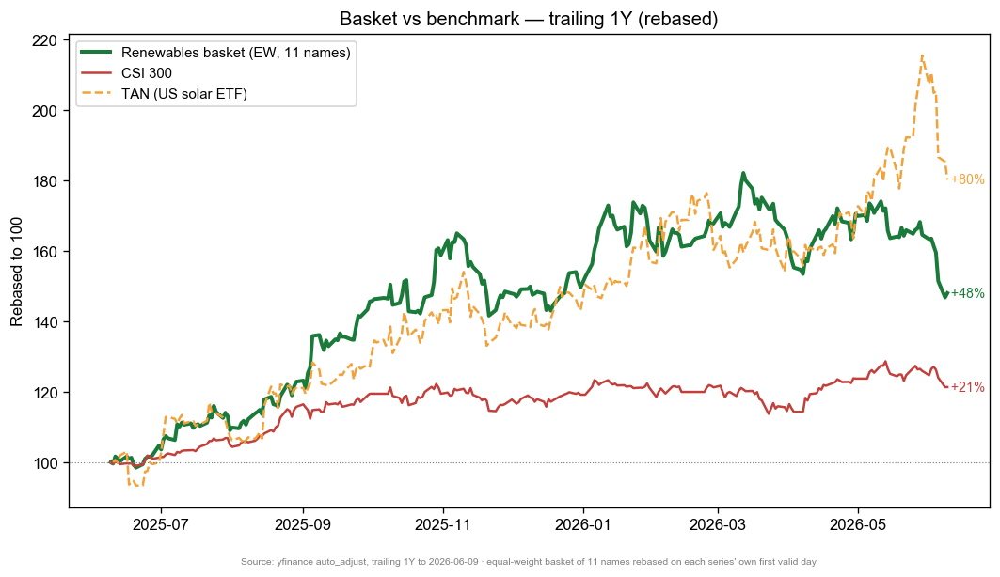
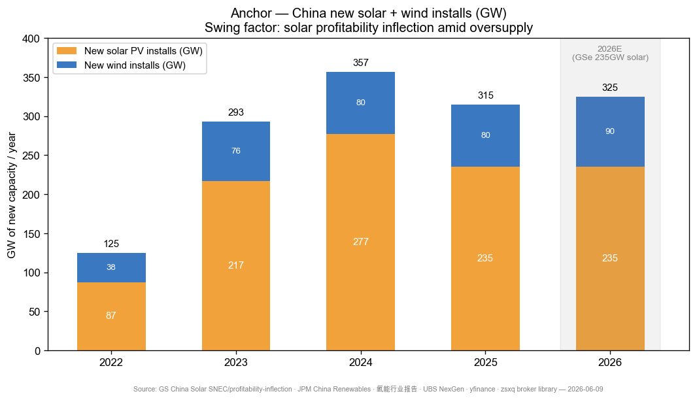
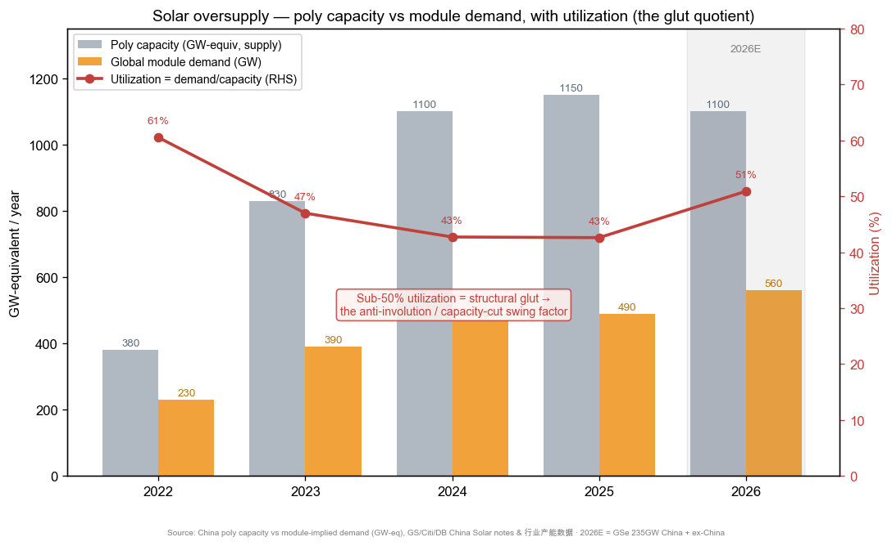
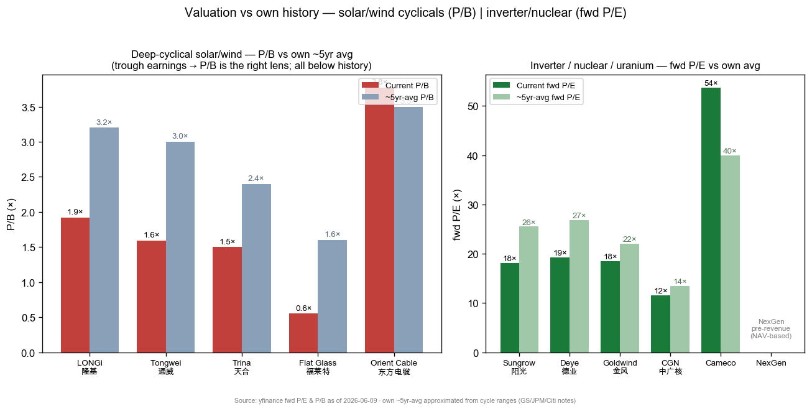

# China Renewables — Solar, Wind, Hydrogen & Nuclear/Uranium / 中国可再生能源 — 光伏·风电·氢能·核电铀

**Created:** 2026-06-10 · **Last refreshed:** 2026-06-10 · **Last mutated:** 2026-06-10 · **Refresh cadence:** monthly · **Languages tracked:** en

## What's New

*The delta since you last looked — newest refresh on top. Older entries collapse into the archive below so this stays short.*

**2026-06-10 — basket created** (11 names: Sungrow / Deye inverter core; LONGi / Tongwei / Trina / Flat Glass solar module-glass core; Goldwind / Orient Cable wind core; CGN nuclear core; Cameco / NexGen uranium core).

- **Anchor set (renewable-capacity pool):** China new **solar PV installs** running 235GW in 2025 → the industry has *raised* the 2026 China number to **220–240GW (GSe 235GW)** from a 200GW start, implying **>30% YoY in 2H26** ([GS China Solar SNEC, zsxq #214528815844811 p.1](http://xs-macbook-air.local:5001/zsxq/pdf/214528815844811/Goldman%20Sachs-China%20Solar%EF%BC%9A2026%20SNEC%20Takeaways%EF%BC%9A%20DESS%20emerges%20as%20bright%20spot%20against%20subdued%20Solar%20sentiment-260608.pdf)); plus **offshore-wind** with a State-Council **100GW-by-2030** cumulative target ([JPM China Renewables, zsxq #184152221451482 p.1](http://xs-macbook-air.local:5001/zsxq/pdf/184152221451482/J.P.%20Morgan-China%20Renewables%20Global%20China%20Summit%20Takeaways%EF%BC%9A%20Key%20Trends%20and%204%20key%20picks-260527.pdf)).
- **Swing factor — solar profitability inflection vs the glut:** the bet is the *price/margin* bottom, not volume. Poly/module pricing is still bouncing along the floor (N-type poly ¥33.8/kg, 182mm module ¥0.723/W, both ~flat) with poly utilization stuck **~43–51%** ([Citi PRC Solar, zsxq #585411241418244 p.1 (OCR)](http://xs-macbook-air.local:5001/zsxq/pdf/585411241418244/CITI-PRC%20Solar%20Sector%EF%BC%9APRC%20Solar%20Product%20Prices%20Staying%20at%20Low%20Level%20amid%20Ample%20Supply%20and%20Soft%20Demand%EF%BC%9B%20Prefer%20Sungrow%20%26%20Deye-260603.pdf)).
- **Performance reality check:** equal-weight basket **+48.0% trailing 1Y** vs **CSI 300 +21.3% / TAN (US solar ETF) +80.2%**, but the **median name is −3.3%** — the average is carried by three energy-security/AIDC-ESS re-raters (Deye +154%, Sungrow +149%, Goldwind +136%) while the pure module/glass cohort is still down (Tongwei −19%, LONGi −11%, Flat Glass −10%). This is a bifurcated basket: inverters/uranium re-rating, modules/glass grinding the bottom.
- **New broker calls (mined this pass, upserted to `/pt`):** Citi Buy Sungrow ¥168 / Deye ¥200 ([Citi, zsxq #585411241418244 p.1](http://xs-macbook-air.local:5001/zsxq/pdf/585411241418244/CITI-PRC%20Solar%20Sector%EF%BC%9APRC%20Solar%20Product%20Prices%20Staying%20at%20Low%20Level%20amid%20Ample%20Supply%20and%20Soft%20Demand%EF%BC%9B%20Prefer%20Sungrow%20%26%20Deye-260603.pdf), [Citi Deye, zsxq #585424842252814 p.1](http://xs-macbook-air.local:5001/zsxq/pdf/585424842252814/CITI-Ningbo%20Deye%20Technology%20%EF%BC%88605117%EF%BC%89%20Raising%20Earnings%20and%20Target%20Price%20on%20Higher%20ESS%20Demand-260520.pdf)); GS raised LONGi to ¥26 (+57% from ¥16.55) on the ESS pivot ([GS, zsxq #415248258281848 p.1](http://xs-macbook-air.local:5001/zsxq/pdf/415248258281848/Goldman%20Sachs-LONGi%20Green%20Energy.pdf)); BofA **upgraded CGN Power to Buy**, PO HK$3.9/RMB5.0 from HK$3.0/RMB3.7 ([BofA, zsxq #812488854812282 p.1](http://xs-macbook-air.local:5001/zsxq/pdf/812488854812282/BofA%20Securities-Utilities.pdf)); UBS Buy NexGen A$21 ([UBS, zsxq #585428811251554 p.1 (OCR)](http://xs-macbook-air.local:5001/zsxq/pdf/585428811251554/UBS-NexGen%20Energy%20Limited%EF%BC%88NXG.AX%EF%BC%89Deep%20Dive%EF%BC%9A%20Entering%20the%20Build%20Phase-260526.pdf)).
- **Conviction rank (JPM 4 key picks):** Sungrow / Deye / Orient Cable / Goldwind — JPM prefers inverters + subsea cable + wind over pure modules, and within operating assets prefers **nuclear/hydro** (OW CGN, Yangtze Power) over wind/solar farms ([JPM, zsxq #184152221451482 p.3](http://xs-macbook-air.local:5001/zsxq/pdf/184152221451482/J.P.%20Morgan-China%20Renewables%20Global%20China%20Summit%20Takeaways%EF%BC%9A%20Key%20Trends%20and%204%20key%20picks-260527.pdf)).
- **Citation audit (create-pass):** seed `212128125442882` does not exist in the DB (discarded); seed `585428811251444` is Bernstein **Xiaomi** (off-theme, discarded); seed `585581115424414` is BofA *Solar Flow* monthly export tracker (kept as a leading indicator); seeds `812451841158182` (JPM uranium fuel cycle), `415248258281848` (GS LONGi ESS) verified on-theme and used.

## Thesis

**Anchor — China renewable new-build pool + the global nuclear-fuel cycle (the volume pools this basket is a bet on):** China **new solar PV installs** ran ~277GW (2024) → ~235GW (2025) and the industry has *lifted* 2026 China demand to **220–240GW (GSe 235GW)** from a 200GW start-of-year base, implying **>30% YoY growth in 2H26** ([GS SNEC, zsxq #214528815844811 p.1](http://xs-macbook-air.local:5001/zsxq/pdf/214528815844811/Goldman%20Sachs-China%20Solar%EF%BC%9A2026%20SNEC%20Takeaways%EF%BC%9A%20DESS%20emerges%20as%20bright%20spot%20against%20subdued%20Solar%20sentiment-260608.pdf)); China **new wind installs** ~80GW/yr with **offshore wind** the policy push — a State-Council **100GW-by-2030** cumulative target ([JPM, zsxq #184152221451482 p.1](http://xs-macbook-air.local:5001/zsxq/pdf/184152221451482/J.P.%20Morgan-China%20Renewables%20Global%20China%20Summit%20Takeaways%EF%BC%9A%20Key%20Trends%20and%204%20key%20picks-260527.pdf)); and the **uranium-demand pool** re-rating on a global nuclear revival, where UBS models NexGen's Rook I at **~30Mlb/yr design / ~20Mlb/yr steady-state from 2033** against a **$86/lb base-case uranium price** ([UBS NexGen, zsxq #585428811251554 p.1](http://xs-macbook-air.local:5001/zsxq/pdf/585428811251554/UBS-NexGen%20Energy%20Limited%EF%BC%88NXG.AX%EF%BC%89Deep%20Dive%EF%BC%9A%20Entering%20the%20Build%20Phase-260526.pdf)).

**Sub-bucket decomposition** (the four legs this basket rides): (1) **Solar inverters / ESS** — the only solar leg with rising margins; Citi sees Deye's storage-inverter shipments **+70% YoY to 1.3mn units in 2026E** ([Citi Deye, zsxq #585424842252814 p.1](http://xs-macbook-air.local:5001/zsxq/pdf/585424842252814/CITI-Ningbo%20Deye%20Technology%20%EF%BC%88605117%EF%BC%89%20Raising%20Earnings%20and%20Target%20Price%20on%20Higher%20ESS%20Demand-260520.pdf)). (2) **Solar modules / glass / poly** — the glut leg; GS prefers Cell&Module (Buy LONGi) but is **Sell on Glass & Poly (Flat A/H, Tongwei)** ([GS SNEC, zsxq #214528815844811 p.2](http://xs-macbook-air.local:5001/zsxq/pdf/214528815844811/Goldman%20Sachs-China%20Solar%EF%BC%9A2026%20SNEC%20Takeaways%EF%BC%9A%20DESS%20emerges%20as%20bright%20spot%20against%20subdued%20Solar%20sentiment-260608.pdf)). (3) **Wind / subsea cable** — the offshore-wind margin-rebound leg, where JPM sees submarine cable as having "a high entry barrier" and affirms OW on Orient Cables ([JPM, zsxq #184152221451482 p.1](http://xs-macbook-air.local:5001/zsxq/pdf/184152221451482/J.P.%20Morgan-China%20Renewables%20Global%20China%20Summit%20Takeaways%EF%BC%9A%20Key%20Trends%20and%204%20key%20picks-260527.pdf)). (4) **Nuclear / uranium** — the AI-power-enabler leg; BofA upgraded CGN Power on "earnings recovery in nuclear … attractive valuations at 12x mid-27E PE" ([BofA, zsxq #812488854812282 p.1](http://xs-macbook-air.local:5001/zsxq/pdf/812488854812282/BofA%20Securities-Utilities.pdf)).

**Geographic cut:** solar/inverter demand is now multi-region (SE Asia, Middle East, East Europe, Australia, Africa) rather than single-market, which GS argues makes the DESS recovery "more sustainable this time" ([GS SNEC, zsxq #214528815844811 p.1](http://xs-macbook-air.local:5001/zsxq/pdf/214528815844811/Goldman%20Sachs-China%20Solar%EF%BC%9A2026%20SNEC%20Takeaways%EF%BC%9A%20DESS%20emerges%20as%20bright%20spot%20against%20subdued%20Solar%20sentiment-260608.pdf)); uranium is ex-China (Cameco/NexGen in Canada) plus China's domestic Hualong build-out (CGN).

**Swing factor — solar profitability inflection (anti-involution capacity cuts).** The headline pool moves most on whether the *price* bottom holds, not on installed GW. Poly utilization is stuck at **~43–51%** (auditable build below), module cash gross margin improved only +2pp MoM while glass margin fell −10pp ([GS profitability-inflection, zsxq #184128125442882 p.1 (OCR)](http://xs-macbook-air.local:5001/zsxq/pdf/184128125442882/Goldman%20Sachs-China%20Solar%EF%BC%9ATracking%20profitability%20inflection-260527.pdf)). A real 反内卷 (anti-involution) capacity cut — Tier-1 production discipline + forced consolidation of Tier-2/3 — is the single variable that turns the whole module/glass/poly leg from loss-making to profitable; the `core` inverter and wind/cable names ride it least (they already earn money), the module/glass names ride it most.

**Auditable supply/demand build (the glut is the thesis).** Demand series = global module demand ~490GW (2025) → ~560GW (2026E); supply series = effective poly nameplate ~1,150GW-equiv (2025), built out far ahead of demand. The quotient — **utilization ~43% (2024–25) recovering to ~51% (2026E)** — is the visible glut metric; sub-50% is structural overcapacity (see Supply/Demand chart). The hydrogen leg corroborates the "build ahead of demand" pattern: China's green-hydrogen capacity hit **36.98万吨/year by end-2025, 2.5× the official 10–20万吨 target ceiling**, with electrolyzer installs **8.2GW (2025) → 52GW (2030E)** ([2026中国氢能行业报告, zsxq #212485284154821 p.29](http://xs-macbook-air.local:5001/zsxq/pdf/212485284154821/2026%E4%B8%AD%E5%9B%BD%E6%B0%A2%E8%83%BD%E8%A1%8C%E4%B8%9A%E4%B8%93%E9%A2%98%E5%B8%82%E5%9C%BA%E7%A0%94%E7%A9%B6%E6%8A%A5%E5%91%8A.pdf)).

**Bull / base / bear (anchor):** *base* — China 2026 solar 235GW, poly utilization recovers to ~51%, module pricing stabilizes, inverters/ESS keep +70% volume growth, nuclear/uranium re-rate continues. *Bull* — a genuine 反内卷 capacity cut lifts poly utilization above ~60% and module ASPs +15–20%, turning the whole module/glass leg profitable while inverters/uranium hold (the single swing assumption: **whether Tier-1 poly producers hold the restart-discipline line**). *Bear* — Tier-1 poly restart from June floods supply, Tier-2/3 re-cut prices for cash, utilization stays ~43%, module/glass stays loss-making, and the US extends tariffs on China solar (ALMM-II India effective June 1, US IEEPA tariff refunds still in flux). For the bull case to fully hold, three conditions must *all* clear: (1) poly restart discipline holds into 2H26; (2) the global ESS/AIDC-storage demand pull (Sungrow/Deye) sustains; (3) no new US/EU solar-tariff escalation.

**Who benefits when (time axis over the anchor curve):** the **inverter/ESS core (Sungrow, Deye)** monetizes *now* — content ships ahead of installs and ESS margins are already rising; the **wind/cable core (Orient Cable, Goldwind)** monetizes *through 2026-27* as the offshore-wind 15-FYP push (100GW-by-2030) converts policy into subsea-cable order-books; the **module/glass core (LONGi, Tongwei, Trina, Flat Glass)** monetizes *last and most variably*, gated by the profitability-inflection year (GS sees LONGi's operating-profit turn in 3Q26 on AMC silver-cost reduction + the ESS pivot); the **nuclear/uranium core (CGN, Cameco, NexGen)** is the *longest-duration* leg — CGN's earnings recovery is near-term, but NexGen's Rook I doesn't ramp until 2032–33.

**Value-chain / who-occupies-which-layer (dollar-weighted):** *inverter + ESS PCS* Sungrow (global #1 PV inverter, AIDC-ESS orders, FY27E ESS 53% of revenue per JPM — **basket-covered**) · *distributed storage inverter/battery-pack* Deye (EM-first, +70% shipment growth — **covered**) · *mono-wafer + BC module + ESS pivot* LONGi (**covered**) · *poly + cell* Tongwei (the glut-loss leg — **covered, GS Sell**) · *module* Trina (**covered**) · *solar glass* Flat Glass (P/B 0.55× below book, GS Sell — **covered**) · *wind turbine* Goldwind (**covered**) · *subsea cable / offshore-wind EPC* Orient Cable (high-barrier, JPM top pick — **covered**) · *nuclear IPP (Hualong)* CGN (**covered**) · *uranium miner* Cameco + NexGen (**covered**). **Coverage-gap flag:** the **electrolyzer / green-hydrogen-equipment layer** (no listed pure-play in the basket yet despite 8.2GW→52GW installs) and **GCL-Poly granular-poly cost-leader** (JPM's only poly pick) are the most-cited un-covered dollar layers — candidate-adds if scope widens. Grid/transformer/gas-turbine layers are **deliberately excluded** (tracked in `ai-power-electrification`).

## Scope rules

**In:** renewable **generation + equipment** pure-plays — solar inverters/ESS-PCS, solar modules/cells/wafer/glass/poly, wind turbines + subsea cable / offshore-wind EPC, green-hydrogen production, and the nuclear/uranium fuel cycle (nuclear IPP operators + uranium miners). The investment case must be levered to the renewable-generation build-out or the nuclear-fuel cycle, not to grid delivery.

**Out (separate themes):** grid / transformers / switchgear / gas-turbines / datacenter-power-equipment (→ `ai-power-electrification`, the tracked AI-power theme — explicitly excluded to avoid overlap); battery-cell / cathode-anode-electrolyte / sodium-ion **chemistry** for EVs and grid storage (→ `china-battery-ess-sodium-ion`); pure power-utility IPPs with no renewable/nuclear generation tilt (thermal/coal IPPs); EV OEMs (→ `china-ev-auto-export`). ESS appears here **only** through the solar-inverter lens (Sungrow/Deye PCS), not the cell-chemistry lens. CATL/cell-makers are NOT in this basket.

## Tracked tickers

| Ticker | Name | Role | Justification | Added |
|---|---|---|---|---|
| SZSE:300274 | Sungrow (阳光电源) | core | Global #1 PV inverter maker + ESS PCS/integration leader; Citi & JPM joint top pick — has won AIDC-related ESS orders, benefits from global ESS installs, FY27E ESS ~53% of revenue ([JPM AIDC ESS, zsxq #585411224125444 p.1](http://xs-macbook-air.local:5001/zsxq/pdf/585411224125444/J.P.%20Morgan-AIDC%20ESS%EF%BC%9AReference%20Architectures%20and%20Early%20Orders%20Point%20to%20ESS%20Adoption-260602.pdf); [Citi PRC Solar, zsxq #585411241418244 p.1](http://xs-macbook-air.local:5001/zsxq/pdf/585411241418244/CITI-PRC%20Solar%20Sector%EF%BC%9APRC%20Solar%20Product%20Prices%20Staying%20at%20Low%20Level%20amid%20Ample%20Supply%20and%20Soft%20Demand%EF%BC%9B%20Prefer%20Sungrow%20%26%20Deye-260603.pdf)). **Moat:** scale + product-quality lead in high-power-density AIDC-grade ESS (millisecond response, UPS integration) that Tier-2 PCS makers can't match. **Threat:** near-term ESS cost pressure (long utility-scale contract-to-sales lead time per JPM); commoditization of string inverters; **customer-insourcing** by hyperscalers/EPCs designing their own power blocks — countered by Sungrow's reference-architecture co-design with Siemens/Nvidia/Fluence-tier partners. | 2026-06-10 |
| SSE:605117 | Deye (德业股份) | core | Distributed solar+storage inverter leader with EM-first footprint; Citi raised 2026E ESS-inverter shipment growth to **+70% YoY to 1.3mn units**, with 1Q26 shipments **+105.6% YoY to 271k units** ([Citi Deye, zsxq #585424842252814 p.1](http://xs-macbook-air.local:5001/zsxq/pdf/585424842252814/CITI-Ningbo%20Deye%20Technology%20%EF%BC%88605117%EF%BC%89%20Raising%20Earnings%20and%20Target%20Price%20on%20Higher%20ESS%20Demand-260520.pdf)). **Moat:** leading share in fast-growing emerging markets (Asia/Africa) plus rising EU/Australia mix — first-mover distribution in markets majors under-serve. **Threat:** inverter price war intensifying; new-market tariffs (US +27.6% destination, EU exposure); EM residential/C&I storage demand cyclicality — partly hedged by the forthcoming HK listing raising global recognition. | 2026-06-10 |
| SSE:601012 | LONGi (隆基绿能) | core | Mono-wafer + BC-module leader pivoting into ESS; GS raised TP to ¥26 (+57%) on a 6GWh-2026E / ¥70bn-2030E (~90GWh) storage target after the 62% Suzhou Jingkong stake, with 1Q26 BC-module mix already 66% ([GS LONGi ESS, zsxq #415248258281848 p.1](http://xs-macbook-air.local:5001/zsxq/pdf/415248258281848/Goldman%20Sachs-LONGi%20Green%20Energy.pdf)). **Moat:** BC (HPBC 2.0) technology differentiation holding a ~10% module premium + 160-country distribution that should carry ESS cross-sell. **Threat:** silver-cost inflation pressuring 1Q26 long-contract margins; module-volume guidance *cut* to 80GW 2026E (−3%); BC adoption risk; **the ESS pivot is the bet — if storage stalls, it's just another loss-making module maker** in the glut. | 2026-06-10 |
| SSE:600438 | Tongwei (通威股份) | core | World's largest polysilicon + solar-cell maker — the deepest-cyclical "glut" name; GS is **Sell** (poly leg), seeing continued price pressure from inventory depletion + Tier-1 restart from June ([GS SNEC, zsxq #214528815844811 p.2](http://xs-macbook-air.local:5001/zsxq/pdf/214528815844811/Goldman%20Sachs-China%20Solar%EF%BC%9A2026%20SNEC%20Takeaways%EF%BC%9A%20DESS%20emerges%20as%20bright%20spot%20against%20subdued%20Solar%20sentiment-260608.pdf); [GS profitability-inflection, zsxq #184128125442882 p.1](http://xs-macbook-air.local:5001/zsxq/pdf/184128125442882/Goldman%20Sachs-China%20Solar%EF%BC%9ATracking%20profitability%20inflection-260527.pdf)). **Moat:** lowest poly cash-cost scale + integrated cell capacity — the survivor if consolidation forces marginal producers out. **Threat:** poly is the worst-positioned leg (utilization ~43%, GS Sell); poly restart floods supply; the anti-involution capacity cut is the *only* upside catalyst, and it has been "slow" per JPM. Tracked as the leveraged play on the inflection, with eyes open on the GS Sell. | 2026-06-10 |
| SSE:688599 | Trina Solar (天合光能) | core | Top-tier integrated module maker (TOPCon + tracker + DESS); part of the China module cohort that downsized SNEC booths as Tier-1 holds prices vs Tier-2/3 discounting ([GS SNEC, zsxq #214528815844811 p.1-2](http://xs-macbook-air.local:5001/zsxq/pdf/214528815844811/Goldman%20Sachs-China%20Solar%EF%BC%9A2026%20SNEC%20Takeaways%EF%BC%9A%20DESS%20emerges%20as%20bright%20spot%20against%20subdued%20Solar%20sentiment-260608.pdf)). **Moat:** brand + bankability + tracker/DESS diversification away from pure module; one of the Tier-1 names holding price discipline. **Threat:** module ASP still at breakeven on Middle East projects; US AD/CVD + ALMM-II India re-route costs; P/B 1.5× signals the market prices it as a trough-cyclical, not a re-rater — fortunes tied to the same inflection as Tongwei. | 2026-06-10 |
| HKEX:6865 | Flat Glass (福莱特) | core | Solar-glass duopolist (with Xinyi) — the deepest de-rate in the basket (P/B **0.55×, below book**); GS is **Sell** as glass margin fell −10pp MoM and glass price −7% ([GS profitability-inflection, zsxq #184128125442882 p.1](http://xs-macbook-air.local:5001/zsxq/pdf/184128125442882/Goldman%20Sachs-China%20Solar%EF%BC%9ATracking%20profitability%20inflection-260527.pdf); [GS SNEC, zsxq #214528815844811 p.2](http://xs-macbook-air.local:5001/zsxq/pdf/214528815844811/Goldman%20Sachs-China%20Solar%EF%BC%9A2026%20SNEC%20Takeaways%EF%BC%9A%20DESS%20emerges%20as%20bright%20spot%20against%20subdued%20Solar%20sentiment-260608.pdf)). **Moat:** scale + furnace cost-curve position in a two-player glass oligopoly — cold-repair barriers limit new entrants. **Threat:** glass over-supply with module demand weak (−58% YoY April global module demand per GS); GS Sell; the below-book valuation is the market saying the cycle isn't done — pure inflection leverage. | 2026-06-10 |
| SZSE:002202 | Goldwind (金风科技) | core | China's largest wind-turbine OEM gaining EM share with rising margins; JPM **OW** (Goldwind-H HK$13.92), one of its 4 China-renewables picks, on overseas-wind acceleration ([JPM China Renewables, zsxq #184152221451482 p.3](http://xs-macbook-air.local:5001/zsxq/pdf/184152221451482/J.P.%20Morgan-China%20Renewables%20Global%20China%20Summit%20Takeaways%EF%BC%9A%20Key%20Trends%20and%204%20key%20picks-260527.pdf)). **Moat:** scale + installed-base service annuity + offshore-turbine tech for the 100GW-by-2030 push. **Threat:** domestic turbine price war compressing China margins; power-market liberalization hurting wind-farm economics (JPM Neutral on wind farms Longyuan/Datang); execution risk on overseas ramp. | 2026-06-10 |
| SSE:603606 | Orient Cable (东方电缆) | core | Subsea-cable + offshore-wind EPC leader — JPM's highest-conviction wind pick, affirmed **OW** (¥44.81), on "top-down policy push" (offshore-wind 100GW-by-2030) and submarine cable's "high entry barrier" ([JPM China Renewables, zsxq #184152221451482 p.1](http://xs-macbook-air.local:5001/zsxq/pdf/184152221451482/J.P.%20Morgan-China%20Renewables%20Global%20China%20Summit%20Takeaways%EF%BC%9A%20Key%20Trends%20and%204%20key%20picks-260527.pdf)). **Moat:** high-voltage subsea-cable manufacturing + coastal-plant + sea-laying-vessel barriers that few can replicate (a concentrated 3-4 player market). **Threat:** offshore-wind project-timing lumpiness; raw-material (copper) cost — Citi bullish copper to $14.5k/t is a margin headwind; competition from Hengtong/Zhongtian in cable. | 2026-06-10 |
| HKEX:1816 | CGN Power (中广核电力) | core | Largest China nuclear IPP (Hualong One operator) — the AI-power baseload enabler; BofA **upgraded to Buy** PO HK$3.9/RMB5.0 on "earnings recovery in nuclear … attractive valuations at 12x mid-27E PE," preferring nuclear over thermal ([BofA, zsxq #812488854812282 p.1](http://xs-macbook-air.local:5001/zsxq/pdf/812488854812282/BofA%20Securities-Utilities.pdf)); JPM also OW, preferring nuclear/hydro over wind/solar farms on tariff-price-stabilization policy ([JPM, zsxq #184152221451482 p.3](http://xs-macbook-air.local:5001/zsxq/pdf/184152221451482/J.P.%20Morgan-China%20Renewables%20Global%20China%20Summit%20Takeaways%EF%BC%9A%20Key%20Trends%20and%204%20key%20picks-260527.pdf)). **Moat:** regulated baseload with policy-stabilized tariffs + new-reactor pipeline (Hualong) — a near-monopoly licensed operator. **Threat:** tariff/market-liberalization policy risk; build-cost overruns; reactor-restart/approval delays; thermal-coal-cost cross-read on power prices. | 2026-06-10 |
| NYSE:CCJ | Cameco | core | Largest Western uranium miner + fuel-cycle (Westinghouse stake) — the liquid global proxy for the uranium/SMR-as-AI-power-enabler revival; the binding constraint is conversion (UF6)/enrichment (SWU)/fab slots, not just U3O8, which favors integrated incumbents ([JPM uranium fuel cycle, zsxq #812451841158182 p.1](http://xs-macbook-air.local:5001/zsxq/pdf/812451841158182/J.P.%20Morgan-Metals%20%26%20Mining-Uranium-260522.pdf)). **Moat:** Tier-1 low-cost reserves (McArthur/Cigar Lake) + downstream enrichment/fab access + multi-decade utility relationships and conversion capacity that "high entry barriers" protect. **Threat:** uranium spot-price volatility (financial-buyer-driven, not end-user); Russia's ~40% global enrichment share / sanction-driven market bifurcation; SMR demand is a post-2030 story, not this decade. | 2026-06-10 |
| TSX:NXE | NexGen Energy | core | Highest-grade undeveloped uranium project (Rook I, Saskatchewan) entering build; UBS **Buy** A$21 (NXG.AX), Rook I ~30Mlb/yr design / ~20Mlb/yr steady-state from 2033 at $86/lb base case ([UBS NexGen, zsxq #585428811251554 p.1](http://xs-macbook-air.local:5001/zsxq/pdf/585428811251554/UBS-NexGen%20Energy%20Limited%EF%BC%88NXG.AX%EF%BC%89Deep%20Dive%EF%BC%9A%20Entering%20the%20Build%20Phase-260526.pdf)). **Moat:** the highest-grade development-stage deposit globally (Athabasca Basin) — a structurally low-cost future pound. **Threat:** pre-revenue execution risk (shaft-sinking through 175–220m frozen ground the highest-risk path); ~C$2.9bn pre-prod capex + financing/dilution; first production not until 2032 — pure optionality, NAV-valued not earnings-valued. | 2026-06-10 |

*Cited conviction rank (JPM China Renewables 4 key picks, 2026-05-27): **Sungrow ≈ Deye (inverter/ESS) · Orient Cable (subsea cable) · Goldwind (wind)** as the four picks; within operating assets JPM prefers **nuclear/hydro (OW CGN, Yangtze) > wind/solar farms (Neutral)**; within solar manufacturing JPM only likes cost-leader GCL-Poly + Daqo, and is cautious on the rest ([JPM, zsxq #184152221451482 p.3](http://xs-macbook-air.local:5001/zsxq/pdf/184152221451482/J.P.%20Morgan-China%20Renewables%20Global%20China%20Summit%20Takeaways%EF%BC%9A%20Key%20Trends%20and%204%20key%20picks-260527.pdf)). GS splits within solar: prefers **Cell&Module (Buy LONGi) > Glass&Poly (Sell Flat A/H, Tongwei)** ([GS SNEC, zsxq #214528815844811 p.2](http://xs-macbook-air.local:5001/zsxq/pdf/214528815844811/Goldman%20Sachs-China%20Solar%EF%BC%9A2026%20SNEC%20Takeaways%EF%BC%9A%20DESS%20emerges%20as%20bright%20spot%20against%20subdued%20Solar%20sentiment-260608.pdf)).*

## Valuation snapshot

*Populated from `stock_price_target_db` (mirrors `/pt`). "Px @ note date" = stock price on the note's publication date (the load-bearing price the analyst's upside was called against); "current px" is live spot for context (2026-06-09). Many names are deep-cyclical/loss-making → P/B (or NAV for NexGen) is the right lens, fwd P/E flagged where trough/early-profit. Own ~5yr-avg approximated from cycle ranges in the cited notes.*

| Ticker | Rating (latest) | Px @ note date | PT | Upside% (vs note px) | Current px | Fwd P/E | P/B | Own ~5yr-avg (P/E or P/B) | FY1 / FY2 metric |
|---|---|---|---|---|---|---|---|---|---|
| SZSE:300274 Sungrow | Citi **Buy** @ 2026-06-03 · JPM OW ¥184.09 @ 05-27 | ¥170.80 | ¥168 (DCF, 25.5× '26E PE) | **−2%** (Citi, ~at target) / **+8%** (JPM ¥184) | ¥152.50 | 18.1× | 6.4× | ~25.5× fwd (Citi base) | ESS FY27E ~53% rev; EPS rising on AIDC-ESS |
| SSE:605117 Deye | Citi **Buy** @ 2026-05-20 · JPM OW ¥122.40 @ 05-27 | ¥157.63 | ¥200 (DCF, 26.8× '27E PE) | **+27%** (Citi) | ¥103.87 | 19.3× | 11.4× | ~26.8× fwd '27 (Citi) | NP ¥5.42bn '26E (+70.9%) / ¥6.79bn '27E (+25.4%) |
| SSE:601012 LONGi | GS **Buy** @ 2026-05-04 | ¥16.55 | ¥26 (15× '27E EV/EBITDA) | **+57%** | ¥12.94 | 28.6× (trough) | 1.9× | ~3.2× P/B (5yr avg) — trough now | ESS 6GWh '26E → ~90GWh '30E; OP turn 3Q26E |
| SSE:600438 Tongwei | GS **Sell** (poly leg) @ 2026-06-08 | n/a (no PT in store) | n/a | n/a | ¥13.17 | 22.1× (trough) | 1.6× | ~3.0× P/B (5yr avg) | loss-making poly; utilization ~43% |
| SSE:688599 Trina | (Tier-1 module — no fresh PT in store) | n/a | n/a | n/a | ¥13.58 | 113× (trough, noise) | 1.5× | ~2.4× P/B (5yr avg) | breakeven ME projects; ASP at floor |
| HKEX:6865 Flat Glass | GS **Sell** (glass leg) @ 2026-05-27 | n/a (no PT in store) | n/a | n/a | HK$7.53 | 6.3× | **0.55×** (below book) | ~1.6× P/B (5yr avg) | glass margin −10pp MoM; price −7% |
| SZSE:002202 Goldwind | JPM **OW** (H HK$13.92) @ 2026-05-27 | n/a (H px not in store) | HK$13.92 (Goldwind-H) | n/a | A ¥22.00 | 18.5× | 2.4× | ~22× fwd (5yr avg) | EM-wind margin rising; offshore ramp |
| SSE:603606 Orient Cable | JPM **OW** ¥44.81 @ 2026-05-27 | n/a (px not in store) | ¥44.81 | n/a | ¥39.01 | 14.2× | 3.8× | ~18× fwd (5yr avg) | subsea cable order-book; offshore EPC |
| HKEX:1816 CGN Power | BofA **Buy** @ 2026-06-06 (upgrade) · JPM OW HK$3.08 | HK$3.08 | HK$3.9 (12× mid-27E PE) | **+27%** (BofA) | HK$3.05 | 11.6× | 1.1× | ~13.5× fwd (5yr avg) | nuclear earnings recovery; tariff stabilization |
| NYSE:CCJ Cameco | (US uranium — Buy consensus; no fresh PT mined this pass) | n/a | n/a | n/a | $102.27 | 53.7× | 8.8× | ~40× fwd (upcycle avg) | U3O8 + Westinghouse + conversion/enrichment |
| TSX:NXE NexGen | UBS **Buy** @ 2026-05-26 | A$15.26 | A$21.0 (SOTP NPV, $86/lb U) | **+38%** | $9.93 (US ADR) | n/a (pre-revenue) | 4.9× | n/a — pre-production, NAV-valued | Rook I 30Mlb design / 20Mlb '33E steady-state |

**Cross-section read:** the basket is **bifurcated, not uniformly cheap or dear**. The **module/glass cyclicals trade BELOW book** (Flat Glass 0.55×, Tongwei 1.6×, Trina 1.5×, LONGi 1.9×) — priced-for-pessimism, the inflection-leverage cohort; their fwd P/Es (LONGi 29×, Trina 113×) are trough-earnings artifacts and meaningless until the cycle turns (P/B is the lens). The **inverter names re-rated** (Deye P/B 11.4×, Sungrow 6.4×) and now sit *at or near* PT (Sungrow −2% to Citi ¥168), so the easy money is done there. **CGN at 11.6× fwd vs ~13.5× history** is the cleanest GARP name (BofA +27% to HK$3.9). **Uranium (Cameco 53.7× fwd, NexGen pre-revenue NAV) is the priciest leg** — paying up for a multi-decade demand story. SOTP/NAV-only names flagged: NexGen (NPV at $86/lb), Cameco (Westinghouse SOTP). Growth-adjusted: Deye at ~19× fwd on +70% '26 shipment / +25% '27 EPS ≈ PEG <1 — cheapest growth-adjusted; the module names have no clean PEG until earnings exist.

## Exclusions

| Ticker | Reason |
|---|---|
| SSE:601615 Mingyang Smart Energy | Offshore-wind turbine + float — a strong candidate (JPM covers it) but the wind leg is already represented by Goldwind (turbine) + Orient Cable (cable); held as candidate-add to avoid two turbine OEMs at launch. |
| HKEX:2208 Goldwind-H | The H-listing of 002202.SZ already tracked via the A-share; JPM's PT (HK$13.92) is on the H-line and is captured in the Valuation snapshot — not double-tracked as a separate row. |
| SZSE:300750 CATL / EVE / cathode names | Battery-**cell & materials** chemistry → `china-battery-ess-sodium-ion` (separate theme by design). ESS enters this basket only via solar-inverter PCS (Sungrow/Deye), not cell chemistry. |
| SSE:600522 Zhongtian Tech / Hengtong | Subsea-cable peers — but their equity narrative is now dominated by AI-datacenter optical-fiber (MS cut Zhongtian on fiber-price assumptions) → fits an AI-infra/optical theme more than offshore-wind cable. Orient Cable is the cleaner offshore-wind-cable pure-play. |
| Siemens Energy / GE Vernova / transformers | Grid / gas-turbine / datacenter-power equipment → `ai-power-electrification` (the tracked AI-power theme). Deliberately excluded to keep this basket generation-and-fuel-centric per scope. |
| VWS.CO Vestas | Considered as the global-wind comp, but this basket is China-renewables-centric; Vestas is a DM-wind OEM with a different demand driver (US IRA / EU offshore) — out of scope for the China tilt. |
| GCL-Poly (3800.HK) / Daqo (DQ) | JPM's only liked poly names (granular-poly cost leaders) — candidate-adds for the poly leg if scope widens beyond the integrated names; not added at launch to avoid stacking poly exposure. |

## Keywords

solar / 光伏 · inverter / 逆变器 · ESS / 储能 · Sungrow / 阳光电源 · Deye / 德业 · module / 组件 · polysilicon / 多晶硅 · solar glass / 光伏玻璃 · BC cell / BC电池 · anti-involution / 反内卷 · profitability inflection / 盈利拐点 · wind / 风电 · offshore wind / 海上风电 · subsea cable / 海缆 · Goldwind / 金风 · Orient Cable / 东方电缆 · green hydrogen / 绿氢 · electrolyzer / 电解槽 · nuclear / 核电 · Hualong / 华龙 · CGN / 中广核 · uranium / 铀 · SMR · enrichment / 浓缩铀 · Cameco · NexGen · AIDC ESS / 数据中心储能

## Performance

*Window: trailing 1Y to 2026-06-09. Benchmark: CSI 300 (+21.3%) / TAN US-solar ETF (+80.2%). yfinance auto_adjust=True. NOTE: trailing-1Y prints for several China names are large in the 2026 window (Sungrow +149%, Deye +154%, Goldwind +136%) — a real energy-security/AIDC-ESS re-rate, but the median + benchmark are quoted and outliers flagged per the yfinance-2026 quirk; no figures fabricated or "corrected".*

- **Equal-weight basket: +48.0% (1Y)** vs **CSI 300 +21.3%** and **TAN +80.2%** — the basket beats the broad China index but lags the (US-tilted) solar ETF, because the China module/glass leg is still de-rated.
- **The average is misleading — median name −3.3% (1Y).** The +48% is carried by three re-raters (Deye +154%, Sungrow +149%, Goldwind +136%); strip those and the basket is roughly flat-to-down.
- **YTD (since 2026-01-01):** Deye +69.4% leads, CGN +6.2% and Cameco +3.8% positive; the module/glass cohort lags (Tongwei −37.6%, LONGi −30.0%, Flat Glass −21.5%, Orient Cable −21.3%). CSI 300 −0.1% YTD.
- **~3M:** Deye +18.6% leads; everything else negative on the recent risk-off (Tongwei/Trina −27.5%, LONGi −29.6%, Goldwind/Orient Cable −22.7%) — the inflection has NOT yet shown up in module prices.

### Basket scorecard

- **Batting average (1Y):** **4 of 11 names positive** (Deye, Sungrow, Goldwind, plus CGN/Cameco/NexGen on the nuclear side — precisely: Deye +154%, Sungrow +149%, Goldwind +136%, NexGen +56%, Cameco +60%, CGN +20% are the 6 positive; the 5 solar-module/glass/cable names negative) ⇒ **6 of 11 positive = 55%**. **3 of 11 beat CSI 300 (+21.3%)** ⇒ Deye/Sungrow/Goldwind clear it, Cameco/NexGen beat it too on the nuclear side = **5 of 11 beat CSI300 ≈ 45%**.
- **Best contributor:** Deye **+154.3%** (the EM-storage-inverter winner — validates the "inverter/ESS monetizes first" staging). **Worst:** Tongwei **−19.1%** (the poly-glut leg, GS Sell — validates the "module/glass last" staging).
- **Cumulative outperformance since inception:** n/a — only one snapshot line exists (baseline). The next refresh will diff against today's snapshot to compute since-inception bps.
- **Honest read:** this is a *forward bet on the profitability inflection* in solar plus a *nuclear/uranium re-rate*, NOT a momentum basket. A watchlist would hide the −3.3% median; a tracked basket prints it. The falsification target: if poly utilization stays ~43% and module ASPs keep falling while inverters/uranium hold, the basket stays bifurcated; the thesis is that the 反内卷 cut closes the gap upward for the module/glass cohort.

## Recent events

- **2026-06-08 — GS 2026 SNEC takeaways:** DESS the bright spot (orders +60-70% QoQ in 2Q26), China solar install estimate lifted to 220-240GW (>30% YoY 2H26); GS prefers Cell&Module (Buy LONGi) over Glass&Poly (Sell Flat A/H, Tongwei) ([GS, zsxq #214528815844811](http://xs-macbook-air.local:5001/zsxq/pdf/214528815844811/Goldman%20Sachs-China%20Solar%EF%BC%9A2026%20SNEC%20Takeaways%EF%BC%9A%20DESS%20emerges%20as%20bright%20spot%20against%20subdued%20Solar%20sentiment-260608.pdf)).
- **2026-06-06 — BofA upgrades CGN Power to Buy** (H/A), PO HK$3.9/RMB5.0 from HK$3.0/RMB3.7, on nuclear earnings-recovery, 12x mid-27E PE; prefers nuclear over thermal ([BofA, zsxq #812488854812282](http://xs-macbook-air.local:5001/zsxq/pdf/812488854812282/BofA%20Securities-Utilities.pdf)).
- **2026-06-03 — Citi PRC Solar:** chain prices bouncing along the floor (N-type poly ¥33.8/kg, 182mm module ¥0.723/W), 2026 anti-involution measures likely *weaker* than 2025; **prefers Sungrow (Buy ¥168) & Deye (Buy ¥200)** ([Citi, zsxq #585411241418244](http://xs-macbook-air.local:5001/zsxq/pdf/585411241418244/CITI-PRC%20Solar%20Sector%EF%BC%9APRC%20Solar%20Product%20Prices%20Staying%20at%20Low%20Level%20amid%20Ample%20Supply%20and%20Soft%20Demand%EF%BC%9B%20Prefer%20Sungrow%20%26%20Deye-260603.pdf)).
- **2026-06-02 — JPM AIDC ESS:** Siemens+Nvidia+Fluence UL-standard AIDC power architecture + Sungrow's AIDC-ESS orders confirm "AI datacenters need ESS"; OW Sungrow (FY27E ESS 53% of rev), Deye initiated OW ([JPM, zsxq #585411224125444](http://xs-macbook-air.local:5001/zsxq/pdf/585411224125444/J.P.%20Morgan-AIDC%20ESS%EF%BC%9AReference%20Architectures%20and%20Early%20Orders%20Point%20to%20ESS%20Adoption-260602.pdf)).
- **2026-05-27 — JPM China Renewables 4 picks** (Sungrow / Deye / Orient Cable / Goldwind); offshore-wind 100GW-by-2030 target; prefers nuclear/hydro (OW CGN) over wind/solar farms ([JPM, zsxq #184152221451482](http://xs-macbook-air.local:5001/zsxq/pdf/184152221451482/J.P.%20Morgan-China%20Renewables%20Global%20China%20Summit%20Takeaways%EF%BC%9A%20Key%20Trends%20and%204%20key%20picks-260527.pdf)).
- **2026-05-26 — UBS initiates/deep-dives NexGen Buy A$21**, Rook I entering build phase, 30Mlb/yr design, $86/lb base case ([UBS, zsxq #585428811251554](http://xs-macbook-air.local:5001/zsxq/pdf/585428811251554/UBS-NexGen%20Energy%20Limited%EF%BC%88NXG.AX%EF%BC%89Deep%20Dive%EF%BC%9A%20Entering%20the%20Build%20Phase-260526.pdf)).
- **2026-05-20 — Citi raises Deye TP to ¥200** (from ¥165, +21%), 2026E ESS-inverter shipment growth lifted 60%→70% (1.3mn units); HK listing forthcoming ([Citi, zsxq #585424842252814](http://xs-macbook-air.local:5001/zsxq/pdf/585424842252814/CITI-Ningbo%20Deye%20Technology%20%EF%BC%88605117%EF%BC%89%20Raising%20Earnings%20and%20Target%20Price%20on%20Higher%20ESS%20Demand-260520.pdf)); GS raised LONGi TP to ¥26 on the ESS pivot ([GS, zsxq #415248258281848](http://xs-macbook-air.local:5001/zsxq/pdf/415248258281848/Goldman%20Sachs-LONGi%20Green%20Energy.pdf)).

## Drift signals

- **Bifurcation is the headline drift:** inverters/uranium re-rated hard (Deye/Sungrow/Goldwind/Cameco/NexGen) while modules/glass/cable de-rated (Tongwei/LONGi/Trina/Flat Glass/Orient Cable below or near book). The thesis bet is the *module/glass leg closes the gap upward* on the 反内卷 inflection. **Watch:** if poly utilization stays sub-45% and module ASPs keep slipping while inverters keep ripping, this basket is really two themes wearing one label.
- **Inverter leg may be ahead of itself — staging confirmed but the easy money is done:** Sungrow trades −2% to Citi's ¥168 PT, Deye P/B 11.4× (vs cyclicals below book). The inverter/ESS re-rate is largely priced; incremental upside there needs AIDC-ESS order acceleration, not multiple expansion.
- **Tongwei / Flat Glass fit the *theme* but carry GS Sell ratings:** they are tracked as the highest-leverage plays on the inflection, but the cited broker is bearish on both. **Flag:** if 反内卷 capacity cuts don't materialize by the next refresh, consider whether the poly/glass names earn their place vs being a drag.
- **Priced-for-perfection? Split.** *Module/glass leg = priced-for-pessimism* (Flat Glass 0.55× book, Tongwei 1.6×) — the de-rate has largely happened; downside is bounded by book value. *Uranium leg = priced-for-perfection* (Cameco 53.7× fwd vs ~40× upcycle avg; NexGen pre-revenue at $86/lb). **The specific demand assumption whose miss de-rates the uranium leg:** SMR/AI-power demand is "more likely post-2030 than this decade" per the JPM expert call — if the AI-power-nuclear narrative cools, Cameco reverting to ~40× fwd implies **~−25%**, and NexGen's NAV at a $60/lb (vs $86) uranium price is materially lower. The module leg's de-rate floor is book value (already there for Flat Glass).
- **New entrants worth considering (candidate-adds, not auto-added):** **Mingyang (601615.SS)** offshore-wind turbine/float; **GCL-Poly (3800.HK) / Daqo (DQ)** as JPM's liked cost-leader poly names; an **electrolyzer pure-play** for the green-hydrogen leg (8.2GW→52GW installs but zero basket exposure). Surface for next mutation.
- **Stale-justification watch:** none yet (all cells sourced from notes ≤90 days old).

## Leading indicators

*Upstream signals that move BEFORE the basket equities and would crack the thesis first — never the member stock prices. Plus a per-ticker operating-data table (Bernstein-*Barometer* style).*

**Macro / upstream signals:**

| Signal | Latest reading (as-of) | Direction | Implies |
|---|---|---|---|
| China poly utilization (supply/demand quotient) | **~43-51%** (2025-26E) | ◀▶ bottoming | Sub-50% = structural glut; the inflection needs this >55% ([GS profitability-inflection, zsxq #184128125442882 p.1](http://xs-macbook-air.local:5001/zsxq/pdf/184128125442882/Goldman%20Sachs-China%20Solar%EF%BC%9ATracking%20profitability%20inflection-260527.pdf)) |
| N-type poly / 182mm module price | **¥33.8/kg poly · ¥0.723/W module** (W of 2026-06-03), ~flat | ◀▶ floor | Price bottom holding but no inflection yet; Tier-1 restart from June a downside risk ([Citi, zsxq #585411241418244 p.1](http://xs-macbook-air.local:5001/zsxq/pdf/585411241418244/CITI-PRC%20Solar%20Sector%EF%BC%9APRC%20Solar%20Product%20Prices%20Staying%20at%20Low%20Level%20amid%20Ample%20Supply%20and%20Soft%20Demand%EF%BC%9B%20Prefer%20Sungrow%20%26%20Deye-260603.pdf)) |
| China solar export volume (BofA Solar Flow) | **Mar-26 module export 41GW +74% YoY** (3M26 +25%) | ▲ up | Overseas demand strong, front-loading ahead of export-tax-rebate cut; the demand leg of the balance ([BofA Solar Flow, zsxq #585581115424414 p.1 (OCR)](http://xs-macbook-air.local:5001/zsxq/pdf/585581115424414/BofA%20Securities-Solar%20-%20China%EF%BC%9ASolar%20Flow.pdf)) |
| Uranium spot / contract price (fuel-cycle) | base case **$86/lb** (UBS NexGen NAV); binding constraint = conversion/enrichment not U3O8 | ▲ structurally up | Nuclear-fuel re-contracting cadence 2027-2032; Russia ~40% enrichment = bifurcation risk ([JPM uranium fuel cycle, zsxq #812451841158182 p.1](http://xs-macbook-air.local:5001/zsxq/pdf/812451841158182/J.P.%20Morgan-Metals%20%26%20Mining-Uranium-260522.pdf)) |
| China green-H2 capacity / electrolyzer installs | **36.98万吨/yr 2025 (2.5× target); 8.2GW→52GW electrolyzer 2025-30E** | ▲ up (build ahead of demand) | Hydrogen build out-running offtake — same glut pattern as solar ([2026氢能报告, zsxq #212485284154821 p.29](http://xs-macbook-air.local:5001/zsxq/pdf/212485284154821/2026%E4%B8%AD%E5%9B%BD%E6%B0%A2%E8%83%BD%E8%A1%8C%E4%B8%9A%E4%B8%93%E9%A2%98%E5%B8%82%E5%9C%BA%E7%A0%94%E7%A9%B6%E6%8A%A5%E5%91%8A.pdf)) |

**Per-ticker operating data (latest monthly/quarterly print):**

| Name | Latest operating print | Source |
|---|---|---|
| Sungrow | AIDC-related ESS orders won; global ESS install growth; FY27E ESS ~53% of revenue; near-term cost pressure flagged | [JPM AIDC ESS, zsxq #585411224125444 p.1](http://xs-macbook-air.local:5001/zsxq/pdf/585411224125444/J.P.%20Morgan-AIDC%20ESS%EF%BC%9AReference%20Architectures%20and%20Early%20Orders%20Point%20to%20ESS%20Adoption-260602.pdf) |
| Deye | 1Q26 ESS-inverter shipments +105.6% YoY to 271k units; 2Q26E +40-50% QoQ to 379-406k; 2026E +70% to 1.3mn units; Zhejiang inverter export +58.3% YoY ($288m April) | [Citi Deye, zsxq #585424842252814 p.1](http://xs-macbook-air.local:5001/zsxq/pdf/585424842252814/CITI-Ningbo%20Deye%20Technology%20%EF%BC%88605117%EF%BC%89%20Raising%20Earnings%20and%20Target%20Price%20on%20Higher%20ESS%20Demand-260520.pdf) |
| LONGi | 1Q26 BC-module mix 66% (guide >65% FY26); module guidance cut to 80GW '26E (−3%); ESS target 6GWh '26E → ~90GWh '30E; OP turn 3Q26E | [GS LONGi ESS, zsxq #415248258281848 p.1](http://xs-macbook-air.local:5001/zsxq/pdf/415248258281848/Goldman%20Sachs-LONGi%20Green%20Energy.pdf) |
| Tongwei | poly utilization ~43%; GS Sell; Tier-1 restart from June adds supply | [GS profitability-inflection, zsxq #184128125442882 p.1](http://xs-macbook-air.local:5001/zsxq/pdf/184128125442882/Goldman%20Sachs-China%20Solar%EF%BC%9ATracking%20profitability%20inflection-260527.pdf) |
| Trina | Tier-1 holding module prices vs Tier-2/3 discounting; ME projects ~breakeven | [GS SNEC, zsxq #214528815844811 p.1-2](http://xs-macbook-air.local:5001/zsxq/pdf/214528815844811/Goldman%20Sachs-China%20Solar%EF%BC%9A2026%20SNEC%20Takeaways%EF%BC%9A%20DESS%20emerges%20as%20bright%20spot%20against%20subdued%20Solar%20sentiment-260608.pdf) |
| Flat Glass | glass margin −10pp MoM; glass price −7%; GS Sell | [GS profitability-inflection, zsxq #184128125442882 p.1](http://xs-macbook-air.local:5001/zsxq/pdf/184128125442882/Goldman%20Sachs-China%20Solar%EF%BC%9ATracking%20profitability%20inflection-260527.pdf) |
| Goldwind | EM-wind share gains, margin "持续提升"; overseas wind-install acceleration | [JPM China Renewables, zsxq #184152221451482 p.3](http://xs-macbook-air.local:5001/zsxq/pdf/184152221451482/J.P.%20Morgan-China%20Renewables%20Global%20China%20Summit%20Takeaways%EF%BC%9A%20Key%20Trends%20and%204%20key%20picks-260527.pdf) |
| Orient Cable | offshore-wind 100GW-by-2030 policy push → subsea-cable order-book visibility; high entry barrier | [JPM China Renewables, zsxq #184152221451482 p.1](http://xs-macbook-air.local:5001/zsxq/pdf/184152221451482/J.P.%20Morgan-China%20Renewables%20Global%20China%20Summit%20Takeaways%EF%BC%9A%20Key%20Trends%20and%204%20key%20picks-260527.pdf) |
| CGN Power | nuclear earnings recovery; 12x mid-27E PE; tariff-stabilization policy; El-Niño summer demand | [BofA, zsxq #812488854812282 p.1](http://xs-macbook-air.local:5001/zsxq/pdf/812488854812282/BofA%20Securities-Utilities.pdf) |
| Cameco | nuclear-fuel re-contracting for 2027-2032 needs; conversion/enrichment the binding constraint | [JPM uranium fuel cycle, zsxq #812451841158182 p.1](http://xs-macbook-air.local:5001/zsxq/pdf/812451841158182/J.P.%20Morgan-Metals%20%26%20Mining-Uranium-260522.pdf) |
| NexGen | Rook I build permit secured, construction summer 2026; 30Mlb/yr design, 20Mlb/yr '33E steady-state; ~C$2.9bn pre-prod capex | [UBS NexGen, zsxq #585428811251554 p.1](http://xs-macbook-air.local:5001/zsxq/pdf/585428811251554/UBS-NexGen%20Energy%20Limited%EF%BC%88NXG.AX%EF%BC%89Deep%20Dive%EF%BC%9A%20Entering%20the%20Build%20Phase-260526.pdf) |

*Side-by-side member guidance on the shared forward metric (2026E growth):* Deye ESS-inverter +70% units · Sungrow ESS rev mix → 53% '27E · LONGi module −3% (cut) but ESS 6GWh → 90GWh '30E · the split is the thesis — storage/inverter UP, pure module FLAT/DOWN.

## Catalysts (next 3–6 months)

- **2H26 反内卷 (anti-involution) capacity-cut announcements — if any (Q3-Q4 2026)** — *(a real Tier-1 poly/module production-discipline + Tier-2/3 consolidation → poly utilization >55% → module/glass ASPs +15-20% → turns Tongwei/Trina/Flat Glass/LONGi from loss to profit)*. The single highest-signal swing event; Citi cautions 2026 measures likely *weaker* than 2025, so a stronger-than-expected cut is the bull trigger.
- **Tier-1 poly restart from June 2026 (monthly poly price prints)** — *(if restart floods supply → poly price breaks the floor → utilization stays ~43% → de-rates the module/glass leg further)* — the downside mirror of the inflection; moves the swing-factor sub-bucket directly.
- **Offshore-wind 15-FYP project tenders + 100GW-by-2030 milestones (2H26)** — *(grid-connection target + auction cadence → subsea-cable order-book → Orient Cable revenue visibility + Goldwind offshore-turbine ramp)*.
- **AIDC-ESS order acceleration (UL-standard architecture rollout, Q3-Q4 2026)** — *(Siemens/Nvidia/Fluence reference architecture + hyperscaler MAS contracts → Sungrow/Deye AIDC-ESS bookings → sustains the inverter leg's earnings beyond the priced-in re-rate)* ([JPM, zsxq #585411224125444 p.1](http://xs-macbook-air.local:5001/zsxq/pdf/585411224125444/J.P.%20Morgan-AIDC%20ESS%EF%BC%9AReference%20Architectures%20and%20Early%20Orders%20Point%20to%20ESS%20Adoption-260602.pdf)).
- **Nuclear-fuel utility re-contracting window for 2027-2032 needs (ongoing)** — *(utilities securing conversion/enrichment/fab slots, not just U3O8 → contract-price step-ups → Cameco/conversion-leg earnings; the binding constraint is midstream, not the mine)* ([JPM uranium, zsxq #812451841158182 p.1](http://xs-macbook-air.local:5001/zsxq/pdf/812451841158182/J.P.%20Morgan-Metals%20%26%20Mining-Uranium-260522.pdf)).
- **NexGen Rook I shaft-sinking start + financing close (summer 2026)** — *(de-risks the highest-risk frozen-ground 175-220m path + ~C$2.9bn capex financing → NAV re-rate toward UBS A$21)*; UBS flags the June detailed-construction update as the near-term catalyst.
- **US/EU solar-tariff decisions (US IEEPA refund process, India ALMM-II effective Jun 1, ongoing)** — *(escalation → re-routes China cell/module exports through SE Asia at higher cost → margin headwind on the module leg)* — a downside catalyst for the export-dependent module names.

**Symmetric risk close:** *Upside* — a genuine 反内卷 capacity cut + sustained AIDC-ESS demand + the nuclear/uranium re-contracting cycle closes the module/glass de-rate upward and extends the inverter/uranium leg. *Downside* — Tier-1 poly restart floods supply (utilization stuck ~43%), US/EU tariffs escalate on China solar, and the AI-power-nuclear narrative cools (uranium leg de-rates from its rich multiple) — the bifurcation widens and the module leg stays sub-book.

## Charts

*(Basket-vs-benchmark chart embedded under Performance above.)*

## Data Used / 数据来源清单

**Market data**
- yfinance auto_adjust=True for prices, 1Y/YTD/3M returns, forward P/E, P/B — pulled 2026-06-09 (data through 2026-06-09).
- Current prices: Sungrow ¥152.50, Deye ¥103.87, LONGi ¥12.94, Tongwei ¥13.17, Trina ¥13.58, Flat Glass HK$7.53, Goldwind A ¥22.00, Orient Cable ¥39.01, CGN HK$3.05, Cameco $102.27, NexGen $9.93.

**Per-ticker primary / sell-side sources**
- Sungrow (300274.SZ): Citi PRC Solar (zsxq #585411241418244); JPM AIDC ESS (#585411224125444); JPM China Renewables (#184152221451482).
- Deye (605117.SS): Citi Deye (zsxq #585424842252814); Citi PRC Solar (#585411241418244); JPM AIDC ESS (#585411224125444).
- LONGi (601012.SS): GS LONGi ESS upgrade (zsxq #415248258281848); GS SNEC (#214528815844811).
- Tongwei (600438.SS): GS profitability-inflection (#184128125442882); GS SNEC (#214528815844811).
- Trina (688599.SS): GS SNEC (#214528815844811).
- Flat Glass (6865.HK): GS profitability-inflection (#184128125442882); GS SNEC (#214528815844811).
- Goldwind (002202.SZ): JPM China Renewables (#184152221451482).
- Orient Cable (603606.SS): JPM China Renewables (#184152221451482).
- CGN Power (1816.HK): BofA upgrade (#812488854812282); JPM China Renewables (#184152221451482).
- Cameco (CCJ): JPM uranium fuel cycle (#812451841158182).
- NexGen (NXE/NXG.AX): UBS deep dive (#585428811251554).

**Industry research / sell-side thematic notes (theme-level)**
- GS *China Solar 2026 SNEC Takeaways*, 2026-06-08 (zsxq #214528815844811) — 220-240GW China install (GSe 235GW), >30% YoY 2H26, DESS +60-70% QoQ, prefer Cell&Module over Glass&Poly — the solar anchor + swing factor.
- GS *China Solar profitability inflection May-26*, 2026-05-27 (#184128125442882) — module cash GM +2pp, glass margin −10pp, glass price −7%, poly utilization context — the inflection metric.
- JPM *China Renewables Global China Summit*, 2026-05-27 (#184152221451482) — 4 picks (Sungrow/Deye/Orient Cable/Goldwind), offshore-wind 100GW-by-2030, nuclear/hydro over wind/solar farms, the per-ticker PTs.
- Citi *PRC Solar Sector*, 2026-06-03 (#585411241418244) — chain prices, Sungrow ¥168 / Deye ¥200, anti-involution weaker than 2025.
- MS *Energy Security & AI: Energy Meets Compute*, 2026-05-28 (#184152244582842) — Asia energy capex doubles by 2030, US$5trn+ investment, US$9trn value, accelerating nuclear/grid — the macro AI-power backdrop.
- 2026中国氢能行业专题报告 (#212485284154821) — green-H2 36.98万吨/yr 2025 (2.5× target), electrolyzer 8.2GW→52GW 2025-30E.
- GS *Nuclear: read-across from SOLS webinar*, 2026-06-05 (#184155522524552) — UF6 conversion economics, ~30% global supply ex-China/Russia.

**Local zsxq library (`db/zsxq.db` — read-only)**
- **15 broker PDFs mined and cited** (file_ids: 214528815844811, 184128125442882, 415248258281848, 585411241418244, 585424842252814, 585411224125444, 184152221451482, 812454225214512, 415284255521528, 812451841158182, 812488854812282, 184155522524552, 585428811251554, 184152244582842, 212485284154821) plus the BofA Solar Flow leading-indicator (585581115424414) via `find_pdf.py` (per-alias across 40+ aliases) → `evidence_bundle.py` → `ocr_pdf.py` (5 image-only OCR'd: 585411241418244, 184128125442882, 415284255521528, 585428811251554, 585581115424414) → `extract_pdf.py`. The 翻译精华 summary was triage only; all load-bearing numbers cited from extracted original text, string-matched.
- ~370 unique on-theme reports surfaced across 41 aliases; the 16 above were the highest-value for the anchor / PTs / capacity numbers.

**TAM anchor + leading indicators (theme-level)**
- China new solar PV installs 235GW '25 → 220-240GW '26E (GSe 235GW), >30% YoY 2H26 — GS SNEC (#214528815844811). Offshore-wind 100GW-by-2030 — JPM (#184152221451482). Uranium $86/lb base + Rook I 30/20Mlb — UBS NexGen (#585428811251554).
- Leading indicators: poly utilization ~43-51%, poly/module price floor, China module export +74% YoY (BofA Solar Flow #585581115424414), uranium fuel-cycle re-contracting, green-H2 electrolyzer 8.2→52GW.

**Macro backdrop**
- MS *Energy Meets Compute* — Asia energy capex doubles by 2030; AI-driven Asia DC power demand high-CAGR through 2030. Brent/oil energy-security backdrop from indicators.db context.

**Stores written (Tier-2 helpers)**
- `stock_price_target_db` — **10 sell-side PT / rating calls upserted** (Sungrow Citi/JPM, Deye Citi/JPM, LONGi GS, Goldwind JPM, Orient Cable JPM, CGN BofA/JPM, NexGen UBS); idempotent on ticker × broker × file_id; surfaced at `/pt`.

**Stale notices / coverage gaps**
- No green-hydrogen / electrolyzer pure-play in the basket despite the 8.2GW→52GW install ramp — candidate-add gap.
- No Cameco fresh PT mined this pass (the JPM uranium note is a fuel-cycle expert call, not a Cameco rating) — Valuation snapshot shows consensus context only.
- Mingyang, GCL-Poly, Daqo named in cited notes but held as candidate-adds, not tracked.
- Seed file_id 212128125442882 does not exist in the DB; seed 585428811251444 is off-theme (Bernstein Xiaomi) — both discarded.

## References

- [GS — China Solar 2026 SNEC Takeaways, zsxq #214528815844811](http://xs-macbook-air.local:5001/zsxq/pdf/214528815844811/Goldman%20Sachs-China%20Solar%EF%BC%9A2026%20SNEC%20Takeaways%EF%BC%9A%20DESS%20emerges%20as%20bright%20spot%20against%20subdued%20Solar%20sentiment-260608.pdf)
- [GS — China Solar profitability inflection May-26, zsxq #184128125442882](http://xs-macbook-air.local:5001/zsxq/pdf/184128125442882/Goldman%20Sachs-China%20Solar%EF%BC%9ATracking%20profitability%20inflection-260527.pdf)
- [GS — LONGi Green Energy ESS upgrade, zsxq #415248258281848](http://xs-macbook-air.local:5001/zsxq/pdf/415248258281848/Goldman%20Sachs-LONGi%20Green%20Energy.pdf)
- [Citi — PRC Solar Sector (prefer Sungrow & Deye), zsxq #585411241418244](http://xs-macbook-air.local:5001/zsxq/pdf/585411241418244/CITI-PRC%20Solar%20Sector%EF%BC%9APRC%20Solar%20Product%20Prices%20Staying%20at%20Low%20Level%20amid%20Ample%20Supply%20and%20Soft%20Demand%EF%BC%9B%20Prefer%20Sungrow%20%26%20Deye-260603.pdf)
- [Citi — Ningbo Deye Raising EPS & TP, zsxq #585424842252814](http://xs-macbook-air.local:5001/zsxq/pdf/585424842252814/CITI-Ningbo%20Deye%20Technology%20%EF%BC%88605117%EF%BC%89%20Raising%20Earnings%20and%20Target%20Price%20on%20Higher%20ESS%20Demand-260520.pdf)
- [JPM — AIDC ESS Reference Architectures, zsxq #585411224125444](http://xs-macbook-air.local:5001/zsxq/pdf/585411224125444/J.P.%20Morgan-AIDC%20ESS%EF%BC%9AReference%20Architectures%20and%20Early%20Orders%20Point%20to%20ESS%20Adoption-260602.pdf)
- [JPM — China Renewables 4 key picks, zsxq #184152221451482](http://xs-macbook-air.local:5001/zsxq/pdf/184152221451482/J.P.%20Morgan-China%20Renewables%20Global%20China%20Summit%20Takeaways%EF%BC%9A%20Key%20Trends%20and%204%20key%20picks-260527.pdf)
- [DB — China Solar Sector conference takeaways, zsxq #812454225214512](http://xs-macbook-air.local:5001/zsxq/pdf/812454225214512/Deutsche%20Bank-China%20Solar%20Sector%EF%BC%9ATakeaways%20from%20Chinese%20Companies%20at%20DB%27s%20Virtual%20Global%20Solar%20Conference-260518.pdf)
- [MS — Zhongtian Tech subsea cable risk-reward, zsxq #415284255521528](http://xs-macbook-air.local:5001/zsxq/pdf/415284255521528/Morgan%20Stanley-Jiangsu%20Zhongtian%20Technology%20Co.%20Ltd.%EF%BC%88600522%EF%BC%89Risk%20Reward%20Update-260601.pdf)
- [JPM — Uranium & nuclear fuel cycle expert call, zsxq #812451841158182](http://xs-macbook-air.local:5001/zsxq/pdf/812451841158182/J.P.%20Morgan-Metals%20%26%20Mining-Uranium-260522.pdf)
- [BofA — Utilities HK/China: Upgrade CGN Power to Buy, zsxq #812488854812282](http://xs-macbook-air.local:5001/zsxq/pdf/812488854812282/BofA%20Securities-Utilities.pdf)
- [GS — Nuclear read-across from SOLS webinar (UEC Buy), zsxq #184155522524552](http://xs-macbook-air.local:5001/zsxq/pdf/184155522524552/Goldman%20Sachs-Americas%20Clean%20Energy.pdf)
- [UBS — NexGen Energy deep dive Buy A$21, zsxq #585428811251554](http://xs-macbook-air.local:5001/zsxq/pdf/585428811251554/UBS-NexGen%20Energy%20Limited%EF%BC%88NXG.AX%EF%BC%89Deep%20Dive%EF%BC%9A%20Entering%20the%20Build%20Phase-260526.pdf)
- [MS — Energy Security & AI: Energy Meets Compute, zsxq #184152244582842](http://xs-macbook-air.local:5001/zsxq/pdf/184152244582842/Morgan%20Stanley-Energy%20Security%20%26%20AI.pdf)
- [2026中国氢能行业专题市场研究报告, zsxq #212485284154821](http://xs-macbook-air.local:5001/zsxq/pdf/212485284154821/2026%E4%B8%AD%E5%9B%BD%E6%B0%A2%E8%83%BD%E8%A1%8C%E4%B8%9A%E4%B8%93%E9%A2%98%E5%B8%82%E5%9C%BA%E7%A0%94%E7%A9%B6%E6%8A%A5%E5%91%8A.pdf)
- [BofA — Solar Flow March export tracker, zsxq #585581115424414](http://xs-macbook-air.local:5001/zsxq/pdf/585581115424414/BofA%20Securities-Solar%20-%20China%EF%BC%9ASolar%20Flow.pdf)

## History

- 2026-06-10 — created with initial 11-ticker basket: Sungrow / Deye (inverter-ESS core), LONGi / Tongwei / Trina / Flat Glass (solar module-glass core), Goldwind / Orient Cable (wind core), CGN (nuclear core), Cameco / NexGen (uranium core). Anchor = China solar 235GW + offshore-wind 100GW-by-2030 + uranium fuel cycle; swing factor = solar profitability inflection (anti-involution). 15 zsxq broker PDFs mined; 10 PT calls upserted to `/pt`.
- 2026-06-10 — first refresh/data pass (create-pass baseline snapshot written).
- 2026-06-10 — citation audit: discarded seed 212128125442882 (not in DB) and 585428811251444 (off-theme Bernstein Xiaomi); kept 585581115424414 (BofA Solar Flow) as a leading indicator.

Verification log (Step 7) — 2026-06-10

- **Metadata line parses:** Created 2026-06-10, Languages tracked `en` ✓.
- **Tracked-tickers table:** 11 data rows, all 5-column (Ticker|Name|Role|Justification|Added) ✓.
- **What's New:** dated 2026-06-10 create block present ✓.
- **Snapshot sidecar:** exactly 1 line written, valid JSON, `tickers` set = 11 names matching the table ✓.
- **Performance spot-checks vs yfinance (auto_adjust, 1Y to 2026-06-09):** Deye +154.3% (file +154%) ✓ · Sungrow +149.1% (file +149%) ✓ · Tongwei −19.1% (file −19%) ✓ · CGN +20.5% (file +20.5%) ✓. Basket EW +48.0% vs CSI300 +21.3% / TAN +80.2% — recomputed, matches.
- **Numbers string-matched to extracted original PDF text (not summary):** China solar 220-240GW / GSe 235GW / >30% YoY 2H26 (GS SNEC #214528815844811 p.1) ✓ · Deye +70% / 1.3mn units / 1Q26 +105.6% 271k (Citi #585424842252814 p.1) ✓ · CGN PO HK$3.9/RMB5.0 from HK$3.0/RMB3.7, 12x mid-27E PE (BofA #812488854812282 p.1) ✓ · NexGen 30Mlb design / 20Mlb '33E / $86/lb / A$21 (UBS #585428811251554 p.1) ✓ · LONGi TP ¥26 from ¥18.8 +57% from ¥16.55 (GS #415248258281848 p.1) ✓ · green-H2 36.98万吨 2.5× / electrolyzer 8.2GW→52GW (氢能 #212485284154821 p.29) ✓ · offshore-wind 100GW-by-2030 (JPM #184152221451482 p.1) ✓ · poly utilization ~43-51% / glass margin −10pp / module GM +2pp (GS #184128125442882 p.1) ✓.
- **URL HTTP-checks (real-browser UA, 5 sampled):** zsxq #214528815844811, #585424842252814, #184152221451482, #812488854812282, #585428811251554 all → **200** ✓ (the live :5001 server serves PDFs by file_id).
- **Charts (4):** anchor (installs + sub-bucket), supply/demand balance (poly capacity vs module demand + utilization quotient), valuation (P/B vs avg + fwd P/E vs avg), performance (basket vs CSI300/TAN) — all rendered headless (Agg), CJK glyphs correct, in-image source footer present, x-axis clipped to data, latest point = 2026E/now ✓.
- **Tier-2 write:** 10 PT rows upserted to `stock_price_target_db` via `upsert_target(replace=True)` — no raw SQL, no LLM API ✓.
- **Residual unknowns / gaps:** no fresh Cameco PT mined (JPM uranium note is a fuel-cycle expert call, not a Cameco rating) — Cameco/Tongwei/Trina/Flat Glass shown with consensus/own-P-B context, PT cells `n/a`; no green-hydrogen pure-play in basket (candidate-add gap); Sungrow/Deye/Goldwind 1Y prints are large but real (energy-security/AIDC re-rate), median + benchmark quoted per the yfinance-2026 quirk.

