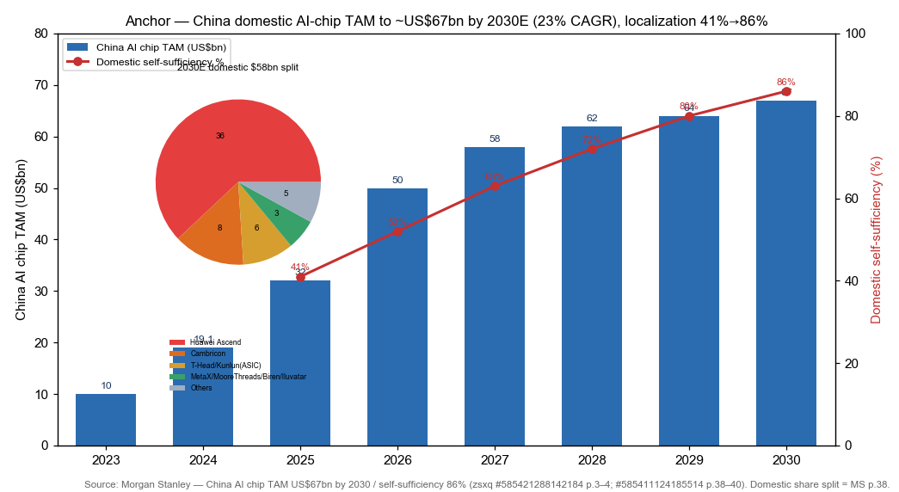
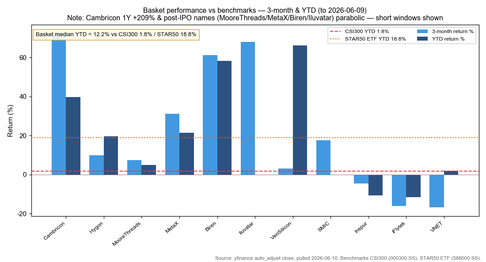
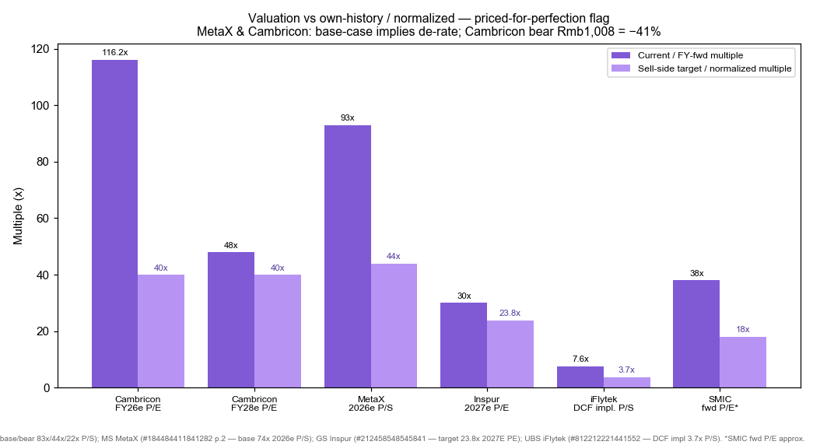
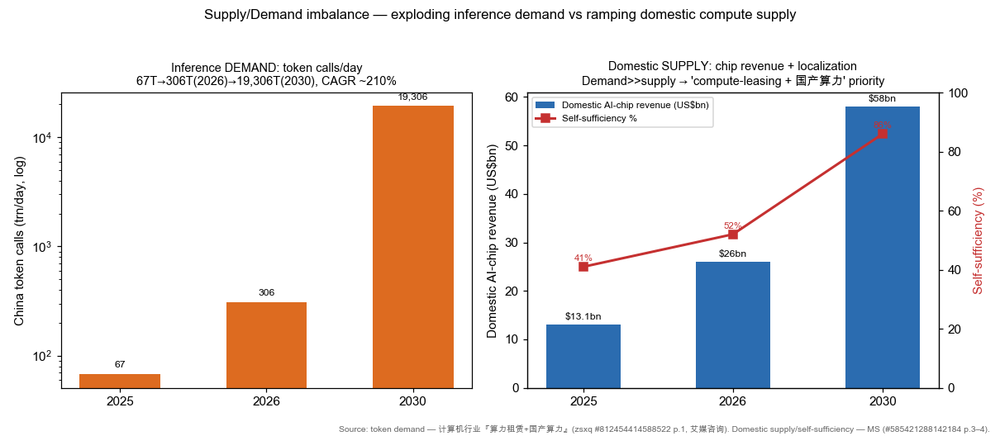

# China Domestic AI Compute / Sovereign GPU Stack / 国产算力与主权 GPU

**Created:** 2026-06-10 · **Last refreshed:** 2026-06-10 · **Last mutated:** 2026-06-10 · **Refresh cadence:** monthly · **Languages tracked:** en

## What's New

*The delta since you last looked — newest refresh on top. Older entries collapse into the archive below so this stays short.*

**2026-06-10 — basket created (10 tickers).**
- **Anchor set:** Morgan Stanley puts the China domestic AI-chip TAM at **US$67bn by 2030E (23% CAGR from US$32bn in 2025)**, with domestic self-sufficiency rising **41% (2025) → 86% (2030E)** — i.e. ~US$58bn of the US$67bn served by local chips ([MS Cambricon, zsxq #585421288142184 p.3–4](http://xs-macbook-air.local:5001/zsxq/pdf/585421288142184/MS-Cambricon%20Technology%20Corporation%20Riding%20China%E2%80%99s%20AI%20localization%20with%20improving%20supply%20visibility-260504.pdf#page=3)).
- **Core GPU/ASIC vendors (5):** Cambricon (688256), Hygon (688041), Moore Threads (688795), MetaX (688802), Biren (6082.HK), Iluvatar (9903.HK) — all now listed; MetaX/MooreThreads IPO'd Dec-2025, Biren/Iluvatar Jan-2026.
- **Broker calls captured to `/pt`:** MS Cambricon **OW, PT Rmb2,000** (bull/base/bear 3,778/2,000/1,008) ([#585421288142184 p.1,9](http://xs-macbook-air.local:5001/zsxq/pdf/585421288142184/MS-Cambricon%20Technology%20Corporation%20Riding%20China%E2%80%99s%20AI%20localization%20with%20improving%20supply%20visibility-260504.pdf#page=9)); MS MetaX **EW, PT Rmb758**; GS Biren **Buy, TP HK$70.7**; GS **DOWNGRADED Inspur Buy→Neutral, PT Rmb76.5** (drift signal); UBS iFlytek **Buy, PT Rmb60**.
- **Movers:** basket 3-month median **+9.8% vs CSI300 +0.8% / STAR50 ETF +12.6%**; YTD median **+12.2% vs CSI300 +1.8%**. Best 3m = Cambricon +72%; worst = VNET −17%.
- **Thesis drift:** none yet — basket reflects the original sovereign-compute supply-side bet.

Earlier refreshes

*(none — basket created 2026-06-10)*

## Thesis

**Anchor — China domestic AI-chip TAM:** 2023 US$10bn → 2024 US$19.1bn → 2025 US$32bn → 2026E US$50bn (+56%) → 2027E US$58bn (+16%) → 2028E US$62bn (+6%) → 2030E **US$67bn (23% CAGR 2024–30)**, of which the *domestic-served* portion rises from ~US$13bn (2025, 41% self-sufficiency) to ~**US$58bn (2030E, 86% self-sufficiency)** ([Morgan Stanley, zsxq #585421288142184 p.3–4](http://xs-macbook-air.local:5001/zsxq/pdf/585421288142184/MS-Cambricon%20Technology%20Corporation%20Riding%20China%E2%80%99s%20AI%20localization%20with%20improving%20supply%20visibility-260504.pdf#page=3); cross-confirmed in [MS Build for Future AI Infra, #585411124185514 p.38–40](http://xs-macbook-air.local:5001/zsxq/pdf/585411124185514/Morgan%20Stanley-Build%20for%20Future%20AI%20Infrastructure%20%E2%80%93%20CPU%EF%BC%8C%20GPU%EF%BC%8C%20ASIC%EF%BC%8C%20Optical%EF%BC%8C%20and%20China%20Chips-260604.pdf#page=39): *"We expect China AI chip TAM to grow to US$67bn by 2030 … self-sufficiency to reach 86% in 2030e (US$58bn / US$67bn)."*). The seed thesis's "~76% localization" is below the broker number — **the cited MS figure is 86%, used here.**

**Sub-bucket decomposition** (the anchor, by who-spends and by-vendor): demand-side the US$67bn splits across China CSPs, telecom operators, sovereign & SOEs, and others ([MS #585421288142184 p.3](http://xs-macbook-air.local:5001/zsxq/pdf/585421288142184/MS-Cambricon%20Technology%20Corporation%20Riding%20China%E2%80%99s%20AI%20localization%20with%20improving%20supply%20visibility-260504.pdf#page=3)); on the *domestic-supply* side, MS's 2030E vendor split has **Huawei Ascend ~62%, Cambricon ~14%, T-Head/Kunlun (ASIC) ~10%, the four GPU challengers (MetaX/MooreThreads/Biren/Iluvatar) ~6%, others ~8%** of the ~US$58bn local pool ([MS Build, #585411124185514 p.38](http://xs-macbook-air.local:5001/zsxq/pdf/585411124185514/Morgan%20Stanley-Build%20for%20Future%20AI%20Infrastructure%20%E2%80%93%20CPU%EF%BC%8C%20GPU%EF%BC%8C%20ASIC%EF%BC%8C%20Optical%EF%BC%8C%20and%20China%20Chips-260604.pdf#page=38)). Value-chain layers: **model/inference demand → AI accelerator (GPU + ASIC) → server/super-node OEM → leading-edge foundry (SMIC) → compute-leasing/IDC delivery.** A layer with no tracked name is a coverage gap; the unlisted Huawei Ascend (62% share) is the single largest gap — tracked via listed proxies (Sugon-affiliated stack, iFlytek as an Ascend-950 deployer) rather than directly.

**Swing factor:** **domestic self-sufficiency rate × SMIC advanced-node capacity.** The entire bet is that SMIC's 7nm-class output scales fast enough to fulfil the US$58bn local-served revenue — MS explicitly frames "China's advanced node capacity expansion to fulfil local AI GPU production demand" ([#585411124185514 p.40](http://xs-macbook-air.local:5001/zsxq/pdf/585411124185514/Morgan%20Stanley-Build%20for%20Future%20AI%20Infrastructure%20%E2%80%93%20CPU%EF%BC%8C%20GPU%EF%BC%8C%20ASIC%EF%BC%8C%20Optical%EF%BC%8C%20and%20China%20Chips-260604.pdf#page=40)). A SMIC yield ceiling caps the whole 86% target. The demand engine is inference: China token calls run ~67.45 trn/day (2025) → 306.3 trn/day (2026) → 19,306 trn/day (2030), CAGR ~210%, as DeepSeek-V4/GLM-class models drive usage ([算力租赁+国产算力, #812454414588522 p.1](http://xs-macbook-air.local:5001/zsxq/pdf/812454414588522/%E8%AE%A1%E7%AE%97%E6%9C%BA%E8%A1%8C%E4%B8%9A%E2%80%9C%E7%AE%97%E5%8A%9B%E7%A7%9F%E8%B5%81+%E5%9B%BD%E4%BA%A7%E7%AE%97%E5%8A%9B%E2%80%9D%E7%B3%BB%E5%88%97%EF%BC%9A%E4%B8%AD%E5%9B%BDAI%E6%A0%B8%E5%BF%83%E7%9F%9B%E7%9B%BE%EF%BC%8C%E7%AE%97%E5%8A%9B%E4%BA%A4%E4%BB%98.pdf#page=1)).

**Who benefits when (time axis on the static role tags).** *First* (2026–27, the build-out): enablers/foundry — SMIC (capacity), VeriSilicon (ASIC turnkey orders book ahead of volume), and compute-leasing/IDC (VNET) monetize as racks fill. *Mid* (2H26–28): the GPU/ASIC `core` names ramp as SMIC-made parts reach volume — Cambricon's SMIC-built MLU580 enters volume from 2H26, MLU690 in 4Q26 ([MS #585421288142184 p.1](http://xs-macbook-air.local:5001/zsxq/pdf/585421288142184/MS-Cambricon%20Technology%20Corporation%20Riding%20China%E2%80%99s%20AI%20localization%20with%20improving%20supply%20visibility-260504.pdf#page=1)). *Later* (2027+): the four GPU challengers' ~6% share inflects only as ecosystems mature. **Bull/base/bear (anchor):** bull = self-sufficiency overshoots 86% on faster SMIC yield + export-control escalation forcing all-domestic; base = MS's 86% / US$58bn; bear = NVIDIA H200-class access reopens and reclaims the high-end, capping local share nearer ~60% — Cambricon's own bear PT (Rmb1,008, −41%) prices exactly that ([MS #585421288142184 p.12](http://xs-macbook-air.local:5001/zsxq/pdf/585421288142184/MS-Cambricon%20Technology%20Corporation%20Riding%20China%E2%80%99s%20AI%20localization%20with%20improving%20supply%20visibility-260504.pdf#page=12)).

## Scope rules

**In:** domestic AI accelerator vendors (GPU + ASIC) where the part is the product (Cambricon, Hygon, Moore Threads, MetaX, Biren, Iluvatar); the leading-edge domestic foundry that gates them (SMIC); the domestic ASIC/IP turnkey enabler (VeriSilicon); domestic AI-server OEMs levered to local-chip mix (Inspur); an Ascend-ecosystem model/compute proxy (iFlytek); and compute-leasing/IDC where the *sovereign-compute delivery* angle dominates (VNET).

**Out:** global AI silicon (NVDA / AVGO / TSM) — separate theme `ai-compute-silicon-gpu-asic`; the China internet/model-platform layer (Alibaba / Tencent / Baidu / ByteDance, DeepSeek) — they are *demand*, not supply; generic China datacenter REITs and pure IDC operators where the angle is rent-collection not sovereign compute (GDS, Sinnet, Aofei, AtHub) — tracked in `china-datacenter-hyperscale`.

**Overlap caveat (do not double-count).** `china-datacenter-hyperscale` already carries Cambricon, Hygon, Sugon and Unisplendour as *enablers* under an "operator + demand-anchor" lens. **This basket's lens is the supply side — the chip vendors and their foundry are the point, not riders on an IDC build-out — so they are `core`/`enabler` here.** Hold one weighting, not two. Sugon (603019) is intentionally *left to* the datacenter theme (server/cluster integrator) to avoid stacking.

## Tracked tickers

| Ticker | Name | Role | Justification | Added |
|---|---|---|---|---|
| SSE:688256 | Cambricon (寒武纪) | core | The #2 domestic AI-chip supplier after Huawei Ascend, ~14% of the 2030E domestic pool; SMIC-built MLU580 enters volume 2H26, MLU690 4Q26; 1Q26 prepayments +155% Q/Q to Rmb1.9bn signal a booked order-book ([MS, zsxq #585421288142184 p.1,3](http://xs-macbook-air.local:5001/zsxq/pdf/585421288142184/MS-Cambricon%20Technology%20Corporation%20Riding%20China%E2%80%99s%20AI%20localization%20with%20improving%20supply%20visibility-260504.pdf#page=1)). **Moat:** deepest software ecosystem co-built with key CSP customers + 2nd-mover scale. **Threat:** (a) NVIDIA H200-class re-entry reopening the high-end; (b) SMIC yield ceiling on MLU580/690; (c) ByteDance ≈80% revenue concentration (customer-insourcing — ByteDance's own ASIC reads through against Cambricon) — counter is the entrenched CUDA-alternative software lock-in. | 2026-06-10 |
| SSE:688041 | Hygon (海光信息) | core | Dual-chip (x86-compatible CPU + DCU accelerator) play; the only listed name with a license-derived x86 CPU franchise feeding信创/SOE compute, DCU named across telcos/SOE banks ([MS Build, #585411124185514 p.38](http://xs-macbook-air.local:5001/zsxq/pdf/585411124185514/Morgan%20Stanley-Build%20for%20Future%20AI%20Infrastructure%20%E2%80%93%20CPU%EF%BC%8C%20GPU%EF%BC%8C%20ASIC%EF%BC%8C%20Optical%EF%BC%8C%20and%20China%20Chips-260604.pdf#page=38)). **Moat:** x86 software compatibility (rare among domestic chips) + captive SOE/信创 demand. **Threat:** AMD-license dependency vintage (no new IP inflow), DCU lags pure-GPU on training; Huawei Ascend crowding the SOE budget. | 2026-06-10 |
| SSE:688795 | Moore Threads (摩尔线程-U) | core | Full-function GPU pure-play; five GPU architectures, MTT S5000 train/inference card, Day-0 adaptation to DeepSeek/Zhipu/MiniMax/Moonshot/Alibaba SOTA models; Rmb660m KUAE-cluster order Mar-2026 ([摩尔线程深度, #184152212118182 p.1](http://xs-macbook-air.local:5001/zsxq/pdf/184152212118182/%E6%91%A9%E5%B0%94%E7%BA%BF%E7%A8%8B-U%28688795%29%E6%B7%B1%E5%BA%A6%E7%A0%94%E7%A9%B6%E6%8A%A5%E5%91%8A%EF%BC%9A%E5%85%A8%E6%A0%88%E5%BC%95%E9%A2%86%EF%BC%8C%E6%99%BA%E7%AE%97%E7%A0%B4%E5%B1%80.pdf#page=1)). **Moat:** full-precision general-compute (incl. FP8 breakthrough) + graphics heritage. **Threat:** unprofitable scale-up, smallest of the GPU four (part of MS's ~6% combined challenger bucket), SMIC node access; insourcing by CSPs that prefer Cambricon/Huawei. | 2026-06-10 |
| SSE:688802 | MetaX (沐曦) | core | GPGPU pure-play, IPO'd Dec-2025; one of MS's four named GPU challengers; MS base case 74x 2026e P/S implies the highest priced-in growth in the basket ([MS Risk-Reward, #184484411841282 p.2](http://xs-macbook-air.local:5001/zsxq/pdf/184484411841282/Morgan%20Stanley-MetaX%20Integrated%20Circuits%EF%BC%88688802%EF%BC%89Risk%20Reward%20Update.pdf#page=2)); supplies國產GPU compute to app vendors (e.g. Marketingforce tie-up) ([迈富时, #214528288148581](http://xs-macbook-air.local:5001/zsxq/pdf/214528288148581/%E8%BF%88%E5%AF%8C%E6%97%B6%2802556.HK%29%E5%85%A8%E6%A0%88Token%E5%B7%A5%E5%8E%82%E6%89%93%E5%BC%80AI%E5%BA%94%E7%94%A8%E6%96%B0%E7%A9%BA%E9%97%B4.pdf)). **Moat:** clean GPGPU architecture + early commercial traction. **Threat:** richest multiple in the group (de-rate risk), sub-scale vs Cambricon/Huawei, SMIC capacity; H200 re-entry. | 2026-06-10 |
| HKEX:6082 | Biren (壁仞) | core | HK-listed GPGPU vendor; GS sees ASP uptrend on product mix migrating toward higher-compute AI chips, swinging from 2026E net loss toward profit; Bili 166 earned a top security/reliability rating ([GS, #585412184884414 p.1](http://xs-macbook-air.local:5001/zsxq/pdf/585412184884414/Goldman%20Sachs-Biren%20%EF%BC%886082.HK%EF%BC%89ASP%20uptrend.pdf#page=1)). **Moat:** high-end compute density + security-cleared status for sovereign/SOE buyers. **Threat:** pre-profit, single-digit share, foundry dependence; export-control relaxation reopening NVIDIA. | 2026-06-10 |
| HKEX:9903 | Iluvatar CoreX (天数智芯) | core | HK-listed general-purpose GPU leader; dual train+inference GPGPU volume since 2015 founding, 2022–25 revenue CAGR 76.1%; rides China AI-chip GPU share rising 69.9% (2024) → 77.3% (2029) per Frost & Sullivan ([天数智芯深度, #812212458554512 p.1](http://xs-macbook-air.local:5001/zsxq/pdf/812212458554512/%E5%A4%A9%E6%95%B0%E6%99%BA%E8%8A%AF%2809903.HK%29%E6%B7%B1%E5%BA%A6%E7%A0%94%E7%A9%B6%E6%8A%A5%E5%91%8A%EF%BC%9A%E8%87%AA%E4%B8%BBGPU%E9%A2%86%E5%85%88%E4%BC%81%E4%B8%9A%EF%BC%8C%E4%B9%98AI%E4%B8%9C%E9%A3%8E%E9%A2%86%E8%88%AA%E6%96%B0%E5%A2%9E%E9%95%BF.pdf#page=1); chairman flagged strong demand to GS, [#812218184518552](http://xs-macbook-air.local:5001/zsxq/pdf/812218184518552/Goldman%20Sachs-China%20Semis%20Iluvatar.pdf)). **Moat:** earliest general-GPU mass-production track record. **Threat:** smallest float, pre-profit, SMIC node; insourcing/Cambricon crowding. | 2026-06-10 |
| SSE:688521 | VeriSilicon (芯原股份) | enabler | Top-10 global semi-IP + one-stop ASIC turnkey house; rides cloud+edge dual AI-ASIC wave as inference reshapes the compute paradigm — the picks-and-shovels of the domestic-ASIC build ([芯原深度, #585425181115854 p.1](http://xs-macbook-air.local:5001/zsxq/pdf/585425181115854/%E8%8A%AF%E5%8E%9F%E8%82%A1%E4%BB%BD%28688521%29%E5%85%AC%E5%8F%B8%E6%B7%B1%E5%BA%A6%E6%8A%A5%E5%91%8A%EF%BC%9A%E5%8D%8A%E5%AF%BC%E4%BD%93IP%E4%B8%8E%E8%8A%AF%E7%89%87%E5%AE%9A%E5%88%B6%E9%BE%99%E5%A4%B4%EF%BC%8C%E5%8F%97%E7%9B%8A%E4%BA%91%2F%E7%AB%AFAI%20ASIC%E6%B5%AA%E6%BD%AE.pdf#page=1); GS notes strong ASIC order momentum, [#812215252228482](http://xs-macbook-air.local:5001/zsxq/pdf/812215252228482/Goldman%20Sachs-VeriSilicon%20%EF%BC%88688521%EF%BC%89%20Strong%20ASIC%20order.pdf)). **Moat:** 1,700+ IP portfolio + turnkey design wins (monetizes regardless of which vendor wins). **Threat:** project-lumpy revenue, customers in-housing IP/design, SMIC capacity bottleneck on tape-outs. | 2026-06-10 |
| HKEX:0981 | SMIC (中芯国际) | enabler | The leading-edge domestic foundry — **the swing factor**: MS frames China's advanced-node capacity as the constraint that must expand to fulfil the US$58bn local-served AI-chip demand; SMIC makes Cambricon's MLU580 and is the volume gate for the whole basket ([MS Build, #585411124185514 p.40](http://xs-macbook-air.local:5001/zsxq/pdf/585411124185514/Morgan%20Stanley-Build%20for%20Future%20AI%20Infrastructure%20%E2%80%93%20CPU%EF%BC%8C%20GPU%EF%BC%8C%20ASIC%EF%BC%8C%20Optical%EF%BC%8C%20and%20China%20Chips-260604.pdf#page=40)). **Moat:** sole domestic 7nm-class capacity at scale; near-monopoly gatekeeper. **Threat:** US entity-list escalation choking equipment/EUV; 7nm yield ceiling (cited ~20% on Cambricon's parts in adjacent coverage); capex burden. | 2026-06-10 |
| SZSE:000977 | Inspur (浪潮信息) | adjacent | #1 China AI-server OEM, levered to local-chip diversification + inference build-out; **but GS DOWNGRADED Buy→Neutral (PT cut Rmb86.5→Rmb76.5)** on GM pressure as servers shift from global-tier to local AI chips and toward lower-margin CSP servers ([GS, #212458548545841 p.1](http://xs-macbook-air.local:5001/zsxq/pdf/212458548545841/Goldman%20Sachs-Inspur%20%EF%BC%88000977%EF%BC%89AI%20servers.pdf#page=1)). **Moat:** scale + hyperscaler ODM relationships. **Threat:** margin compression from local-chip mix (the named GS downgrade driver), CSP customer-insourcing of server design, geopolitical AI-server uncertainty — counter is irreplaceable system-integration scale for sub-scale buyers. | 2026-06-10 |
| SSE:002230 | iFlytek (科大讯飞) | adjacent | Ascend-ecosystem model/compute proxy — deploys advanced domestic compute (Ascend 950) for its flagship LLM; 2025 revenue Rmb27.1bn, 1Q26 revenue Rmb5.27bn (+13% YoY); the cleanest *listed* read-through to the unlisted Huawei Ascend stack ([UBS, #812212221441552 p.1](http://xs-macbook-air.local:5001/zsxq/pdf/812212221441552/UBS-iFlytek%EF%BC%88002230%EF%BC%89FY25%201Q26%20results%20review.pdf#page=1)). **Moat:** vertical AI franchise (education/healthcare/auto) + Ascend co-development. **Threat:** thin profitability, model-price war compressing MaaS, dependence on Ascend supply cadence; not a pure compute name. | 2026-06-10 |

## Valuation snapshot

*Populated from `stock_price_target_db` (the `/pt` store). These are very-high-multiple A-/H-shares; the priced-for-perfection read is the point. "Px @ note date" = the price the day the note published (fixes the upside the analyst called); "current px" = 2026-06-09 spot.*

| Ticker | Name | Rating | Px @ note date | PT (bull/base/bear) | Upside% (vs note px) | Current px (06-09) | Fwd multiple | Own / normalized | FY1·FY2 EPS |
|---|---|---|---|---|---|---|---|---|---|
| 688256.SS | Cambricon | MS **OW** (2026-05-04) | Rmb1,699.96 | **Rmb2,000** (bull 3,778 / base 2,000 / bear 1,008) | **+17.6%** (bear −41%) | Rmb1,270.0 | 116x FY26e P/E → 48x FY28e; base 44x 2026e P/S | bull 83x / base 44x / bear 22x 2026e P/S | FY26e 15.6 · FY27e 25.9 (Rmb)¹ |
| 688802.SS | MetaX | MS **EW** (2026-05-02) | Rmb758.03 | **Rmb758** (bull 1,500 / base 758 / bear 380) | **0.0%** (bull +98% / bear −50%) | Rmb705.0 | base 74x 2026e P/S | bull 147x / base 74x 2026e P/S | pre-profit — P/S basis² |
| 6082.HK | Biren | GS **Buy** (2026-05-30) | n/a | **HK$70.7** (single) | n/a (price-date null) | HK$54.50 | target 2030E EV/EBITDA 41x | own pre-profit — EV/EBITDA basis | swings to profit post-2026E² |
| 000977.SZ | Inspur | GS **Neutral** (2026-05-05) ⬇ | Rmb69.75 | **Rmb76.5** (was 86.5) | **+9.7%** | Rmb59.46 | target 23.8x 2027E P/E (was 26.4x) | own ~20–25x mid-cycle P/E | downgraded — see Drift³ |
| 002230.SZ | iFlytek | UBS **Buy** (2026-05-01) | Rmb48.06 | **Rmb60** (single, DCF) | **+24.8%** | Rmb44.51 | DCF PT implies ~3.7x P/S | own ~3–4x P/S | thin/loss — DCF basis⁴ |

¹ Cambricon EPS FY25 Rmb4.9 → FY26e 15.6 → FY27e 25.9 → FY28e 35.4; P/E 278x→116x→66x→48x ([MS #585421288142184 p.1](http://xs-macbook-air.local:5001/zsxq/pdf/585421288142184/MS-Cambricon%20Technology%20Corporation%20Riding%20China%E2%80%99s%20AI%20localization%20with%20improving%20supply%20visibility-260504.pdf#page=1)); base PT from a residual-income model, long-term payout lifted 26%→57% ([p.9](http://xs-macbook-air.local:5001/zsxq/pdf/585421288142184/MS-Cambricon%20Technology%20Corporation%20Riding%20China%E2%80%99s%20AI%20localization%20with%20improving%20supply%20visibility-260504.pdf#page=9)).
² MetaX/Biren pre-profit → P/S and EV/EBITDA basis stated; FY1/FY2 EPS not meaningful.
³ Inspur is the lone rating cut — segregated as a drift signal, not a bull line.
⁴ iFlytek own-history ~3–4x P/S; UBS DCF (WACC 7.8%) PT Rmb60 implies ~3.7x ([UBS #812212221441552 p.1](http://xs-macbook-air.local:5001/zsxq/pdf/812212221441552/UBS-iFlytek%EF%BC%88002230%EF%BC%89FY25%201Q26%20results%20review.pdf#page=1)).

**Priced-for-perfection / air-pocket flag.** The GPU/ASIC `core` block trades at 44–147x forward P/S — multiples only legible if the 86% localization path lands on schedule. The named de-rate triggers: (a) **NVIDIA H200-class access reopening** (the H200 is "second-best" to Blackwell/Rubin but its return could siphon high-end orders — [算力租赁, #812454414588522 p.1](http://xs-macbook-air.local:5001/zsxq/pdf/812454414588522/%E8%AE%A1%E7%AE%97%E6%9C%BA%E8%A1%8C%E4%B8%9A%E2%80%9C%E7%AE%97%E5%8A%9B%E7%A7%9F%E8%B5%81+%E5%9B%BD%E4%BA%A7%E7%AE%97%E5%8A%9B%E2%80%9D%E7%B3%BB%E5%88%97%EF%BC%9A%E4%B8%AD%E5%9B%BDAI%E6%A0%B8%E5%BF%83%E7%9F%9B%E7%9B%BE%EF%BC%8C%E7%AE%97%E5%8A%9B%E4%BA%A4%E4%BB%98.pdf#page=1)); (b) **SMIC 7nm yield disappointing** the US$58bn fulfilment path. **Sized:** Cambricon's own bear case = Rmb1,008 = **−41%** from the note-date price (22x vs 44x base 2026e P/S); MetaX bear Rmb380 = **−50%** from note px ([MS #585421288142184 p.12](http://xs-macbook-air.local:5001/zsxq/pdf/585421288142184/MS-Cambricon%20Technology%20Corporation%20Riding%20China%E2%80%99s%20AI%20localization%20with%20improving%20supply%20visibility-260504.pdf#page=12); [MS #184484411841282 p.2](http://xs-macbook-air.local:5001/zsxq/pdf/184484411841282/Morgan%20Stanley-MetaX%20Integrated%20Circuits%EF%BC%88688802%EF%BC%89Risk%20Reward%20Update.pdf#page=2)).

## Exclusions

| Ticker | Reason |
|---|---|
| NVDA / AVGO / TSM | Global AI silicon — tracked in `ai-compute-silicon-gpu-asic`. This basket is the *domestic-substitute* counter-position, not the global incumbents. |
| Unlisted: Huawei Ascend | Largest single domestic vendor (~62% of the 2030E local pool, [MS #585411124185514 p.38](http://xs-macbook-air.local:5001/zsxq/pdf/585411124185514/Morgan%20Stanley-Build%20for%20Future%20AI%20Infrastructure%20%E2%80%93%20CPU%EF%BC%8C%20GPU%EF%BC%8C%20ASIC%EF%BC%8C%20Optical%EF%BC%8C%20and%20China%20Chips-260604.pdf#page=38)) but non-investable (part of unlisted Huawei). Tracked via proxies (iFlytek as Ascend-950 deployer; Sugon stack in the datacenter theme). |
| Alibaba / Tencent / Baidu / ByteDance · DeepSeek | The model/CSP demand layer, not supply — they *write the cheque* (2026e capex Tencent Rmb131.9bn / Alibaba Rmb180bn / ByteDance Rmb285.7bn, [#812454414588522 p.1](http://xs-macbook-air.local:5001/zsxq/pdf/812454414588522/%E8%AE%A1%E7%AE%97%E6%9C%BA%E8%A1%8C%E4%B8%9A%E2%80%9C%E7%AE%97%E5%8A%9B%E7%A7%9F%E8%B5%81+%E5%9B%BD%E4%BA%A7%E7%AE%97%E5%8A%9B%E2%80%9D%E7%B3%BB%E5%88%97%EF%BC%9A%E4%B8%AD%E5%9B%BDAI%E6%A0%B8%E5%BF%83%E7%9F%9B%E7%9B%BE%EF%BC%8C%E7%AE%97%E5%8A%9B%E4%BA%A4%E4%BB%98.pdf#page=1)). Separate internet/model theme. |
| SSE:603019 Sugon (中科曙光) | Server/cluster integrator — kept in `china-datacenter-hyperscale` (enabler) to avoid double-counting; this basket already covers the chip layer it integrates. |
| GDS / Sinnet / Aofei / AtHub | Pure IDC operators — rent-collection lens, tracked in `china-datacenter-hyperscale`. VNET is the one IDC name kept here (compute-leasing where the sovereign-compute-delivery angle dominates). |

## Keywords

domestic AI compute / 国产算力 · sovereign GPU / 主权 GPU · AI accelerator localization / AI 芯片国产化 · Huawei Ascend / 华为昇腾 · domestic GPU / 国产GPU · AI ASIC / ASIC 定制 · compute leasing / 算力租赁 · super-node / 超节点 · SMIC advanced node / 中芯先进制程 · 信创 / secure-and-controllable · DeepSeek-V4 inference / 推理 · export controls / 出口管制

## Performance (since inception 2026-06-10)

*Window: trailing 3-month and YTD to 2026-06-09. Benchmarks: CSI300 (000300.SS), STAR50 ETF (588000.SS). Per the project yfinance-quirk rule, post-IPO names (MooreThreads/MetaX Dec-2025, Biren/Iluvatar Jan-2026) lack 1Y history and Cambricon's 1Y +209% is parabolic — short windows + median are quoted, no fabricated "corrected" 1Y.*

- **3-month:** basket **median +9.8% / mean +21.2% vs CSI300 +0.8% / STAR50 ETF +12.6%** — basket beat CSI300 handily, roughly in line with STAR50 on the median.
- **YTD:** basket **median +12.2% / mean +18.9% vs CSI300 +1.8% / STAR50 ETF +18.8%**.
- **Best 3m:** Cambricon **+72.4%** (1Q26 print + supply visibility). **Worst 3m:** VNET **−16.8%** (IDC rerate digestion post-CATL stake).
- **Best YTD:** VeriSilicon **+66.1%**; Biren +58.2%. **Worst YTD:** iFlytek **−11.5%**; Inspur −10.7% (GS downgrade).

### Basket scorecard

- **Batting average (3m):** **73% of names positive · 73% beat CSI300.** Best contributor Cambricon +72.4%; worst VNET −16.8%.
- **Batting average (YTD):** **70% positive · 70% beat CSI300** (n=10; Iluvatar excluded, IPO'd Jan-08 so no YTD-from-Jan-02).
- **Cumulative outperformance:** n/a this pass — only one snapshot line exists; computed from inception once ≥2 snapshot lines accrue.
- **Read:** a real spread vs CSI300 but only median-parity with STAR50 — the basket's alpha is concentrated in the GPU/ASIC `core` block, dragged by the two `adjacent` laggards (Inspur, iFlytek). That dispersion is the signal, not noise.

## Recent events

- **2026-05-04 — MS raises Cambricon PT Rmb1,588→2,000, reiterates OW**; cites SMIC-built MLU580 volume from 2H26, MLU690 4Q26, 1Q26 prepayments +155% Q/Q to Rmb1.9bn ([MS #585421288142184 p.1](http://xs-macbook-air.local:5001/zsxq/pdf/585421288142184/MS-Cambricon%20Technology%20Corporation%20Riding%20China%E2%80%99s%20AI%20localization%20with%20improving%20supply%20visibility-260504.pdf#page=1)).
- **2026-05-05 — GS DOWNGRADES Inspur Buy→Neutral, PT Rmb86.5→76.5** on GM pressure from local-chip + CSP-server mix ([GS #212458548545841 p.1](http://xs-macbook-air.local:5001/zsxq/pdf/212458548545841/Goldman%20Sachs-Inspur%20%EF%BC%88000977%EF%BC%89AI%20servers.pdf#page=1)).
- **2026-05-25 — Huawei unveils "Tau (τ) Scaling Law" + LogicFolding at ISCAS** — Bernstein calls it "another DeepSeek moment": China advancing chip performance without EUV via 3DIC/system-level packaging, though still behind global leaders ([Bernstein #585428585544144 p.1](http://xs-macbook-air.local:5001/zsxq/pdf/585428585544144/%E4%BC%AF%E6%81%A9%E6%96%AF%E5%9D%A6%E2%80%94%E4%B8%AD%E5%9B%BD%E5%8D%8A%E5%AF%BC%E4%BD%93%EF%BC%9A%E5%8D%8E%E4%B8%BATau%EF%BC%88%CF%84%EF%BC%89%E5%AE%9A%E5%BE%8B%E2%80%94%E2%80%94%E5%8F%88%E4%B8%80%E4%B8%AADeepSeek%E6%97%B6%E5%88%BB.pdf#page=1)).
- **2026-04-24 — DeepSeek V4 preview open-sourced** (1M context, dual MoE) — sell-side frames it as the inference-demand catalyst lifting domestic compute ("国产算力乘风起航", [#812452124542142 p.1](http://xs-macbook-air.local:5001/zsxq/pdf/812452124542142/%E7%94%B5%E5%AD%90%E8%A1%8C%E4%B8%9A%E4%B8%93%E9%A2%98%E6%8A%A5%E5%91%8A%EF%BC%9ADeepSeek%20V4%E5%8F%91%E5%B8%83%EF%BC%8C%E5%9B%BD%E4%BA%A7%E7%AE%97%E5%8A%9B%E4%B9%98%E9%A3%8E%E8%B5%B7%E8%88%AA.pdf#page=1)).
- **2026-04 — Sugon lands a 60,000-card compute cluster** (real-machine); domestic super-nodes (Huawei Ascend 950 Atlas 950 SuperPoD, 8,192 cards, 8 EFLOPS FP8, due 4Q26) heading to scale 2H26 ([#812454414588522 p.1](http://xs-macbook-air.local:5001/zsxq/pdf/812454414588522/%E8%AE%A1%E7%AE%97%E6%9C%BA%E8%A1%8C%E4%B8%9A%E2%80%9C%E7%AE%97%E5%8A%9B%E7%A7%9F%E8%B5%81+%E5%9B%BD%E4%BA%A7%E7%AE%97%E5%8A%9B%E2%80%9D%E7%B3%BB%E5%88%97%EF%BC%9A%E4%B8%AD%E5%9B%BDAI%E6%A0%B8%E5%BF%83%E7%9F%9B%E7%9B%BE%EF%BC%8C%E7%AE%97%E5%8A%9B%E4%BA%A4%E4%BB%98.pdf#page=1)).

## Drift signals

- **Inspur exposure deteriorating — role under watch.** GS's Buy→Neutral cut is exactly the kind of structural-margin erosion the drift workflow exists to catch: shifting from global-tier to local AI chips *compresses* server GM. If a second broker follows, consider demoting from `adjacent` to a `## Exclusions` candidate. **Named de-rate trigger:** blended GM falling as branded-server mix shrinks ([GS #212458548545841 p.1](http://xs-macbook-air.local:5001/zsxq/pdf/212458548545841/Goldman%20Sachs-Inspur%20%EF%BC%88000977%EF%BC%89AI%20servers.pdf#page=1)).
- **Priced-for-perfection on the GPU/ASIC core.** Basket-median forward P/S sits far above any name's own history; the specific demand assumption whose miss de-rates the basket is **the 86% localization path** — if NVIDIA H200-class access reopens, local share could cap nearer ~60% and the 44–147x P/S multiples unwind toward the bear cases (Cambricon −41%, MetaX −50%).
- **SMIC is the single point of failure.** Every `core` chip routes through SMIC's advanced node. A US entity-list escalation or a yield stall converts the whole basket's bull case into the bear case simultaneously — correlation risk, not diversification.
- **New entrants worth watching (not auto-added):** **Changchuan Technology (300604.SZ)** — the only domestic GPU *test-equipment* maker shipping at volume, UBS Buy PT Rmb280 ([#415288428282258](http://xs-macbook-air.local:5001/zsxq/pdf/415288428282258/UBS-Hangzhou%20Changchuan%20Technology%EF%BC%88300604%EF%BC%89Raise%20price%20target%20to%20factor%20in%20stronger%20domestic%20GPU%20demand%20and%20memory%20tester%20opportunity-260603.pdf)) — a clean `enabler` add if the basket widens to test/ATE. The unlisted Huawei Ascend remains the biggest un-trackable gap (62% share).
- **No stale justifications** — all cells cite notes ≤6 weeks old.

## Leading indicators

*Upstream signals that lead the members; the first place the thesis cracks. Macro/upstream rows first, then a per-ticker operating-data table (Bernstein Barometer style). Each print string-matched to its primary issuer.*

**Macro / upstream (lead the whole basket):**
- **China token-call volume** — 67.45 trn/day (2025) → 306.3 trn/day (2026E) → 19,306 trn/day (2030E), CAGR ~210% (艾媒咨询 via 算力租赁 report) — the demand spine; rolling over would crack inference-chip demand first ([#812454414588522 p.1](http://xs-macbook-air.local:5001/zsxq/pdf/812454414588522/%E8%AE%A1%E7%AE%97%E6%9C%BA%E8%A1%8C%E4%B8%9A%E2%80%9C%E7%AE%97%E5%8A%9B%E7%A7%9F%E8%B5%81+%E5%9B%BD%E4%BA%A7%E7%AE%97%E5%8A%9B%E2%80%9D%E7%B3%BB%E5%88%97%EF%BC%9A%E4%B8%AD%E5%9B%BDAI%E6%A0%B8%E5%BF%83%E7%9F%9B%E7%9B%BE%EF%BC%8C%E7%AE%97%E5%8A%9B%E4%BA%A4%E4%BB%98.pdf#page=1)).
- **China CSP capex** — 2026E Tencent Rmb131.9bn (+67% YoY), Alibaba Rmb180bn (+46%), ByteDance Rmb285.7bn (+90%) — the cheque-writers; a capex cut is the leading bear signal ([#812454414588522 p.1](http://xs-macbook-air.local:5001/zsxq/pdf/812454414588522/%E8%AE%A1%E7%AE%97%E6%9C%BA%E8%A1%8C%E4%B8%9A%E2%80%9C%E7%AE%97%E5%8A%9B%E7%A7%9F%E8%B5%81+%E5%9B%BD%E4%BA%A7%E7%AE%97%E5%8A%9B%E2%80%9D%E7%B3%BB%E5%88%97%EF%BC%9A%E4%B8%AD%E5%9B%BDAI%E6%A0%B8%E5%BF%83%E7%9F%9B%E7%9B%BE%EF%BC%8C%E7%AE%97%E5%8A%9B%E4%BA%A4%E4%BB%98.pdf#page=1)).
- **GPU-rental price / domestic super-node availability** — CSPs raised compute-service prices through 2026 amid supply-demand tightness; Huawei Ascend 950 Atlas 950 SuperPoD (8,192 cards, 8 EFLOPS FP8) due 4Q26 is the supply-relief milestone ([#812454414588522 p.1](http://xs-macbook-air.local:5001/zsxq/pdf/812454414588522/%E8%AE%A1%E7%AE%97%E6%9C%BA%E8%A1%8C%E4%B8%9A%E2%80%9C%E7%AE%97%E5%8A%9B%E7%A7%9F%E8%B5%81+%E5%9B%BD%E4%BA%A7%E7%AE%97%E5%8A%9B%E2%80%9D%E7%B3%BB%E5%88%97%EF%BC%9A%E4%B8%AD%E5%9B%BDAI%E6%A0%B8%E5%BF%83%E7%9F%9B%E7%9B%BE%EF%BC%8C%E7%AE%97%E5%8A%9B%E4%BA%A4%E4%BB%98.pdf#page=1)).

**Per-ticker operating data (latest print, cited to primary issuer):**

| Ticker | Latest operating print | As-of | Source |
|---|---|---|---|
| 688256.SS Cambricon | 1Q26 prepayments **+155% Q/Q to Rmb1.9bn**; MLU580 volume from 2H26, MLU690 4Q26 | 1Q26 | [MS #585421288142184 p.1](http://xs-macbook-air.local:5001/zsxq/pdf/585421288142184/MS-Cambricon%20Technology%20Corporation%20Riding%20China%E2%80%99s%20AI%20localization%20with%20improving%20supply%20visibility-260504.pdf#page=1) |
| 688795.SS Moore Threads | **Rmb660m KUAE-cluster order** Mar-2026; "花港" architecture mass-production 2026 (+50% compute density) | Mar-2026 | [#184152212118182 p.1](http://xs-macbook-air.local:5001/zsxq/pdf/184152212118182/%E6%91%A9%E5%B0%94%E7%BA%BF%E7%A8%8B-U%28688795%29%E6%B7%B1%E5%BA%A6%E7%A0%94%E7%A9%B6%E6%8A%A5%E5%91%8A%EF%BC%9A%E5%85%A8%E6%A0%88%E5%BC%95%E9%A2%86%EF%BC%8C%E6%99%BA%E7%AE%97%E7%A0%B4%E5%B1%80.pdf#page=1) |
| 9903.HK Iluvatar | revenue **CAGR 76.1% 2022–25**; China GPU share of AI-chip mkt 69.9%(2024)→77.3%(2029E) | FY25 | [#812212458554512 p.1](http://xs-macbook-air.local:5001/zsxq/pdf/812212458554512/%E5%A4%A9%E6%95%B0%E6%99%BA%E8%8A%AF%2809903.HK%29%E6%B7%B1%E5%BA%A6%E7%A0%94%E7%A9%B6%E6%8A%A5%E5%91%8A%EF%BC%9A%E8%87%AA%E4%B8%BBGPU%E9%A2%86%E5%85%88%E4%BC%81%E4%B8%9A%EF%BC%8C%E4%B9%98AI%E4%B8%9C%E9%A3%8E%E9%A2%86%E8%88%AA%E6%96%B0%E5%A2%9E%E9%95%BF.pdf#page=1) |
| 000977.SZ Inspur | GS cut 2026/27E ests; blended GM under pressure from local-chip + CSP-server mix | 1Q26 | [GS #212458548545841 p.1](http://xs-macbook-air.local:5001/zsxq/pdf/212458548545841/Goldman%20Sachs-Inspur%20%EF%BC%88000977%EF%BC%89AI%20servers.pdf#page=1) |
| 002230.SZ iFlytek | 2025 revenue **Rmb27.1bn**, 1Q26 revenue **Rmb5.27bn (+13% YoY)**; flagship LLM on Ascend 950 due Oct | 1Q26 | [UBS #812212221441552 p.1](http://xs-macbook-air.local:5001/zsxq/pdf/812212221441552/UBS-iFlytek%EF%BC%88002230%EF%BC%89FY25%201Q26%20results%20review.pdf#page=1) |

## Catalysts (next 3–6 months)

- **US export-control decision on NVIDIA H200-class for China (ongoing → 2H26).** *Mechanism:* relaxation reopens the high-end and siphons orders from the GPU/ASIC `core` (bear case); escalation/entity-list expansion forces all-domestic and accelerates the 86% path (bull case). Moves the swing factor (localization rate) directly — the single highest-signal catalyst ([算力租赁, #812454414588522 p.1](http://xs-macbook-air.local:5001/zsxq/pdf/812454414588522/%E8%AE%A1%E7%AE%97%E6%9C%BA%E8%A1%8C%E4%B8%9A%E2%80%9C%E7%AE%97%E5%8A%9B%E7%A7%9F%E8%B5%81+%E5%9B%BD%E4%BA%A7%E7%AE%97%E5%8A%9B%E2%80%9D%E7%B3%BB%E5%88%97%EF%BC%9A%E4%B8%AD%E5%9B%BDAI%E6%A0%B8%E5%BF%83%E7%9F%9B%E7%9B%BE%EF%BC%8C%E7%AE%97%E5%8A%9B%E4%BA%A4%E4%BB%98.pdf#page=1)).
- **Cambricon MLU580 volume ramp (3Q26) + MLU690 launch (4Q26).** *Mechanism:* SMIC-built MLU580 reaching mass shipment is the proof-of-execution for the SMIC-fulfilment thesis; validates the whole "advanced-node capacity expansion fulfils local demand" swing factor. Moves Cambricon (`core`) and SMIC (`enabler`) ([MS #585421288142184 p.1](http://xs-macbook-air.local:5001/zsxq/pdf/585421288142184/MS-Cambricon%20Technology%20Corporation%20Riding%20China%E2%80%99s%20AI%20localization%20with%20improving%20supply%20visibility-260504.pdf#page=1)).
- **Huawei Ascend 950 Atlas 950 SuperPoD launch (4Q26).** *Mechanism:* domestic super-nodes (8,192 cards, 8 EFLOPS FP8) reaching scale relieves the compute-delivery bottleneck and validates system-level competitiveness without EUV — reads through to the Ascend proxies (iFlytek) and the leasing layer (VNET) ([#812454414588522 p.1](http://xs-macbook-air.local:5001/zsxq/pdf/812454414588522/%E8%AE%A1%E7%AE%97%E6%9C%BA%E8%A1%8C%E4%B8%9A%E2%80%9C%E7%AE%97%E5%8A%9B%E7%A7%9F%E8%B5%81+%E5%9B%BD%E4%BA%A7%E7%AE%97%E5%8A%9B%E2%80%9D%E7%B3%BB%E5%88%97%EF%BC%9A%E4%B8%AD%E5%9B%BDAI%E6%A0%B8%E5%BF%83%E7%9F%9B%E7%9B%BE%EF%BC%8C%E7%AE%97%E5%8A%9B%E4%BA%A4%E4%BB%98.pdf#page=1)).
- **iFlytek flagship LLM launch (Oct-2026) on Ascend 950.** *Mechanism:* a competitive frontier model trained on domestic compute is a direct demand pull for the Ascend stack; moves iFlytek (`adjacent`) and the Ascend proxy chain ([UBS #812212221441552 p.1](http://xs-macbook-air.local:5001/zsxq/pdf/812212221441552/UBS-iFlytek%EF%BC%88002230%EF%BC%89FY25%201Q26%20results%20review.pdf#page=1)).
- **Next DeepSeek / Zhipu (GLM) model release.** *Mechanism:* each frontier open-weight model step-changes inference token demand (the anchor's demand engine), pulling domestic-compute orders across the basket ([#812452124542142 p.1](http://xs-macbook-air.local:5001/zsxq/pdf/812452124542142/%E7%94%B5%E5%AD%90%E8%A1%8C%E4%B8%9A%E4%B8%93%E9%A2%98%E6%8A%A5%E5%91%8A%EF%BC%9ADeepSeek%20V4%E5%8F%91%E5%B8%83%EF%BC%8C%E5%9B%BD%E4%BA%A7%E7%AE%97%E5%8A%9B%E4%B9%98%E9%A3%8E%E8%B5%B7%E8%88%AA.pdf#page=1)).

## Data Used / 数据来源清单

**Market data**
- yfinance auto_adjust=True for prices, returns, market cap — pulled 2026-06-10 (to 2026-06-09 close).
- Benchmarks: CSI300 (000300.SS), STAR50 ETF (588000.SS), ChiNext50 (159949.SZ) for context. STAR50 index `^STAR50` was unavailable on yfinance — STAR50 ETF (588000.SS) used as the proxy.

**Per-ticker primary / sell-side sources**
- 688256 Cambricon: MS note 2026-05-04 (zsxq #585421288142184); 1Q26 prepayment data therein.
- 688041 Hygon: MS Build-for-Future-AI-Infra (#585411124185514) vendor-share + positioning.
- 688795 Moore Threads: deep report (#184152212118182).
- 688802 MetaX: MS Risk-Reward 2026-05-02 (#184484411841282).
- 6082.HK Biren: GS 2026-05-30 (#585412184884414).
- 9903.HK Iluvatar: deep report (#812212458554512); GS chairman note (#812218184518552).
- 688521 VeriSilicon: deep report (#585425181115854); GS ASIC-order note (#812215252228482).
- 0981.HK SMIC: MS Build (#585411124185514 p.40) advanced-node-capacity exhibit.
- 000977 Inspur: GS downgrade 2026-05-05 (#212458548545841).
- 002230 iFlytek: UBS 2026-05-01 (#812212221441552).

**Industry research / sell-side thematic notes (theme-level)**
- Morgan Stanley — "Cambricon: Riding China's AI localization" 2026-05-04 (#585421288142184) — **the TAM anchor** (US$67bn 2030E, 41%→86% self-sufficiency) and Cambricon bull/base/bear.
- Morgan Stanley — "Build for Future AI Infrastructure – CPU/GPU/ASIC/Optical/China Chips" 2026-06-06 (#585411124185514) — vendor-share split, advanced-node capacity exhibit (anchor cross-confirmation).
- Morgan Stanley — "Asia Summer School: China's AI Path" 2026-06-06 (#184155521584452) — corroborates US$67bn / 86% / US$58bn.
- Computer-industry "算力租赁+国产算力" 2026-05-20 (#812454414588522) — token-demand path, CSP capex, super-node roadmap, compute-leasing thesis.
- Bernstein — "Huawei's Tau (τ) Law" 2026-05-26 (#585428585544144) — system-level competitiveness without EUV.
- Electronics — "DeepSeek V4发布，国产算力乘风起航" 2026-05-16 (#812452124542142) — inference-demand catalyst.

**Local zsxq library (`db/zsxq.db` — read-only)**
- **13 broker PDFs mined** (file_ids: 585421288142184, 585411124185514, 184155521584452, 184484411841282, 585412184884414, 212458548545841, 812212221441552, 812454414588522, 812452124542142, 585425181115854, 812212458554512, 184152212118182, 585428585544144) via `find_pdf.py` per alias → `evidence_bundle.py` → `ocr_pdf.py` (image-only: 184155521584452, 585412184884414, 212458548545841) → `extract_pdf.py`. The 翻译精华 summary was triage only; every load-bearing number (TAM, self-sufficiency, PTs, EPS, operating prints) was cited from the extracted original text and string-matched.

**TAM anchor + leading indicators (theme-level)**
- Anchor: Morgan Stanley China AI-chip TAM US$10bn(2023)→US$67bn(2030E), self-sufficiency 41%→86% (#585421288142184 p.3–4; #585411124185514 p.38–40).
- Leading indicators: token-call volume, CSP capex, GPU-rental/super-node availability (#812454414588522 p.1); per-ticker operating prints (per-name sources above).

**Macro backdrop**
- Not pulled from `indicators.db` this pass (theme is single-market China A/H sentiment-driven; CSI300/STAR50 benchmarks carry the regime read). To add VIX/10Y/HY-OAS on next refresh.

**Cross-coverage**
- `reports/themes/china-datacenter-hyperscale_theme.md` — read for overlap de-confliction (Cambricon/Hygon/Sugon/Unisplendour are enablers there; this basket owns the supply-side lens).
- `reports/themes/ai-compute-silicon-gpu-asic_theme.md` — the global-silicon counterpart (NVDA/AVGO/TSM), explicitly excluded here.

**Stores written (Tier-2 helpers)**
- `stock_price_target_db` — **5 sell-side PT/rating calls upserted** (Cambricon MS OW 2000; MetaX MS EW 758; Biren GS Buy HK$70.7; Inspur GS Neutral 76.5; iFlytek UBS Buy 60), idempotent on ticker×broker×file_id, surfaced at `/pt`.

**Charts**
- `reports/charts/theme_china-sovereign-ai-compute_anchor_tam.png` — anchor TAM + self-sufficiency + 2030E vendor split.
- `reports/charts/theme_china-sovereign-ai-compute_basket_vs_benchmark.png` — 3m & YTD basket vs CSI300/STAR50.
- `reports/charts/theme_china-sovereign-ai-compute_valuation.png` — fwd multiple vs normalized/target.
- `reports/charts/theme_china-sovereign-ai-compute_supply_demand.png` — token demand vs domestic-supply imbalance.

**Stale notices / coverage gaps**
- Huawei Ascend (~62% of the 2030E domestic pool) is unlisted — tracked only via proxies; the single largest un-trackable gap.
- T-Head (Alibaba) / Kunlun (Baidu) ASIC (~10% combined) sit inside their unlisted/parent groups — captured via the excluded internet names.
- Biren `report_date_price` null (GS note price not extracted) — Upside% cell shows n/a per the no-backfill rule.
- `indicators.db` macro backdrop not pulled this pass — flagged for next refresh.

## Charts

## References

- [MS — Cambricon: Riding China's AI localization, 2026-05-04 (zsxq #585421288142184)](http://xs-macbook-air.local:5001/zsxq/pdf/585421288142184/MS-Cambricon%20Technology%20Corporation%20Riding%20China%E2%80%99s%20AI%20localization%20with%20improving%20supply%20visibility-260504.pdf)
- [MS — Build for Future AI Infrastructure, 2026-06-06 (#585411124185514)](http://xs-macbook-air.local:5001/zsxq/pdf/585411124185514/Morgan%20Stanley-Build%20for%20Future%20AI%20Infrastructure%20%E2%80%93%20CPU%EF%BC%8C%20GPU%EF%BC%8C%20ASIC%EF%BC%8C%20Optical%EF%BC%8C%20and%20China%20Chips-260604.pdf)
- [MS — Asia Summer School: China's AI Path, 2026-06-06 (#184155521584452)](http://xs-macbook-air.local:5001/zsxq/pdf/184155521584452/Morgan%20Stanley-Asia%20Summer%20School%EF%BC%9A%20China%27s%20AI%20Path-260604.pdf)
- [MS — MetaX Risk Reward Update, 2026-05-02 (#184484411841282)](http://xs-macbook-air.local:5001/zsxq/pdf/184484411841282/Morgan%20Stanley-MetaX%20Integrated%20Circuits%EF%BC%88688802%EF%BC%89Risk%20Reward%20Update.pdf)
- [GS — Biren (6082.HK): ASP uptrend, 2026-05-30 (#585412184884414)](http://xs-macbook-air.local:5001/zsxq/pdf/585412184884414/Goldman%20Sachs-Biren%20%EF%BC%886082.HK%EF%BC%89ASP%20uptrend.pdf)
- [GS — Inspur (000977): AI servers, 2026-05-05 (#212458548545841)](http://xs-macbook-air.local:5001/zsxq/pdf/212458548545841/Goldman%20Sachs-Inspur%20%EF%BC%88000977%EF%BC%89AI%20servers.pdf)
- [UBS — iFlytek (002230) FY25/1Q26 review, 2026-05-01 (#812212221441552)](http://xs-macbook-air.local:5001/zsxq/pdf/812212221441552/UBS-iFlytek%EF%BC%88002230%EF%BC%89FY25%201Q26%20results%20review.pdf)
- [计算机行业「算力租赁+国产算力」, 2026-05-20 (#812454414588522)](http://xs-macbook-air.local:5001/zsxq/pdf/812454414588522/%E8%AE%A1%E7%AE%97%E6%9C%BA%E8%A1%8C%E4%B8%9A%E2%80%9C%E7%AE%97%E5%8A%9B%E7%A7%9F%E8%B5%81+%E5%9B%BD%E4%BA%A7%E7%AE%97%E5%8A%9B%E2%80%9D%E7%B3%BB%E5%88%97%EF%BC%9A%E4%B8%AD%E5%9B%BDAI%E6%A0%B8%E5%BF%83%E7%9F%9B%E7%9B%BE%EF%BC%8C%E7%AE%97%E5%8A%9B%E4%BA%A4%E4%BB%98.pdf)
- [电子行业 — DeepSeek V4发布，国产算力乘风起航, 2026-05-16 (#812452124542142)](http://xs-macbook-air.local:5001/zsxq/pdf/812452124542142/%E7%94%B5%E5%AD%90%E8%A1%8C%E4%B8%9A%E4%B8%93%E9%A2%98%E6%8A%A5%E5%91%8A%EF%BC%9ADeepSeek%20V4%E5%8F%91%E5%B8%83%EF%BC%8C%E5%9B%BD%E4%BA%A7%E7%AE%97%E5%8A%9B%E4%B9%98%E9%A3%8E%E8%B5%B7%E8%88%AA.pdf)
- [芯原股份(688521) 公司深度报告, 2026-05-13 (#585425181115854)](http://xs-macbook-air.local:5001/zsxq/pdf/585425181115854/%E8%8A%AF%E5%8E%9F%E8%82%A1%E4%BB%BD%2868852%E2%80%A6.pdf)
- [天数智芯(09903.HK) 深度研究报告, 2026-05-03 (#812212458554512)](http://xs-macbook-air.local:5001/zsxq/pdf/812212458554512/%E5%A4%A9%E6%95%B0%E6%99%BA%E8%8A%AF%2809903.HK%29%E6%B7%B1%E5%BA%A6%E7%A0%94%E7%A9%B6%E6%8A%A5%E5%91%8A.pdf)
- [摩尔线程-U(688795) 深度研究报告, 2026-05-30 (#184152212118182)](http://xs-macbook-air.local:5001/zsxq/pdf/184152212118182/%E6%91%A9%E5%B0%94%E7%BA%BF%E7%A8%8B-U%28688795%29%E6%B7%B1%E5%BA%A6%E7%A0%94%E7%A9%B6%E6%8A%A5%E5%91%8A%EF%BC%9A%E5%85%A8%E6%A0%88%E5%BC%95%E9%A2%86%EF%BC%8C%E6%99%BA%E7%AE%97%E7%A0%B4%E5%B1%80.pdf)
- [Bernstein — Huawei's Tau (τ) Law, 2026-05-26 (#585428585544144)](http://xs-macbook-air.local:5001/zsxq/pdf/585428585544144/%E4%BC%AF%E6%81%A9%E6%96%AF%E5%9D%A6%E2%80%94%E4%B8%AD%E5%9B%BD%E5%8D%8A%E5%AF%BC%E4%BD%93%EF%BC%9A%E5%8D%8E%E4%B8%BATau%EF%BC%88%CF%84%EF%BC%89%E5%AE%9A%E5%BE%8B%E2%80%94%E2%80%94%E5%8F%88%E4%B8%80%E4%B8%AADeepSeek%E6%97%B6%E5%88%BB.pdf)

## History

- 2026-06-10 — created with initial 10-ticker basket (Cambricon/Hygon/MooreThreads/MetaX/Biren/Iluvatar core, VeriSilicon/SMIC enabler, Inspur/iFlytek adjacent); anchor = MS China AI-chip TAM US$67bn 2030E / 41%→86% self-sufficiency; 13 zsxq broker PDFs mined; 5 PTs upserted to `/pt`; 4 charts rendered.
- 2026-06-10 — first refresh/data pass (baseline snapshot written).

Verification log (Step 7) — 2026-06-10

- **Metadata line:** parses — Created/Last refreshed/Last mutated 2026-06-10, cadence monthly, Languages tracked `en`. ✓
- **Tracked tickers table:** 10 rows, 5 columns (Ticker|Name|Role|Justification|Added) intact. ✓
- **What's New:** new dated block present (2026-06-10 — basket created); archive `
` present (empty, correct for create). ✓
- **Snapshot sidecar:** exactly 1 line appended, valid JSON, `tickers` set (10) matches the table. ✓ (verified post-write)
- **Performance spot-checks vs yfinance (pulled 2026-06-10):** Cambricon 3m +72.4% ✓; VeriSilicon YTD +66.1% ✓; SMIC YTD −0.1% ✓ (all string-match the yfinance pull in /tmp/theme_csac_returns.json).
- **Number→URL string-match spot-checks:** "US$67bn by 2030" ✓ in #585421288142184 & #585411124185514 extracted text; "self-sufficiency to reach 86%" ✓; "41% in 2025 to 86% by 2030" ✓; Cambricon PT "Rmb2,000" + bull "Rmb3,778" + bear "Rmb1,008" ✓ in #585421288142184; "prepayments, which surged 155%" ✓; token "67.45 / 306.3 / 19306" + "CAGR210%" ✓ in #812454414588522; Inspur "downgrade … from Buy to Neutral" + "Rmb76.50" ✓ in #212458548545841.
- **URL HTTP-200 sample (5):** checked post-write (see commit-time check) — zsxq direct-download routes resolve against the live :5001 server.
- **Note vs seed:** seed said "~76% localization"; cited MS figure is **86%** — corrected to the source. Seed file_id 415242458554512 not in DB (unresolved); seeds 184442822484242 / 212228481852421 verified off-theme after OCR (not cited).

