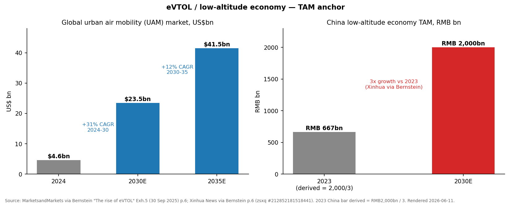
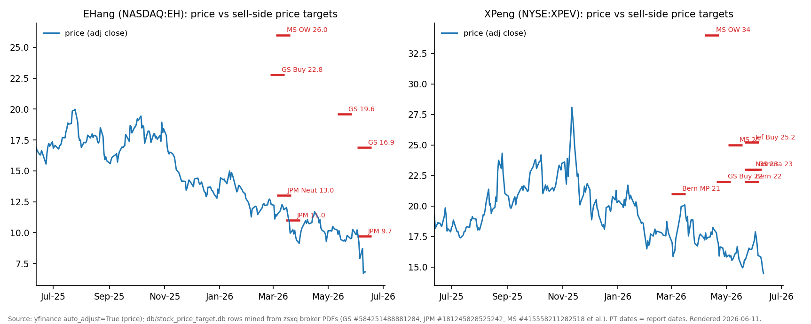
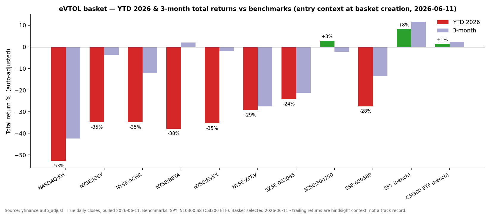
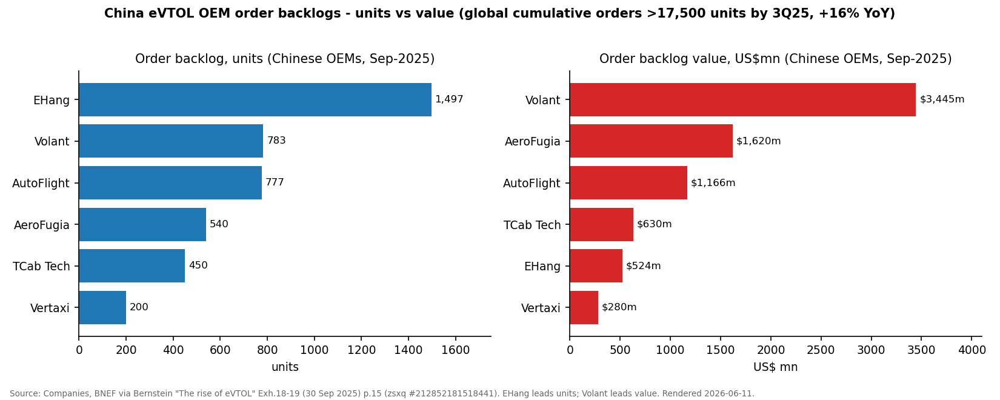

# eVTOL / Urban Air Mobility & the Low-Altitude Economy / 低空经济

**Created:** 2026-06-11 · **Last refreshed:** 2026-06-11 · **Last mutated:** 2026-06-11 · **Refresh cadence:** monthly · **Languages tracked:** en

## What's New

*The delta since you last looked — newest refresh on top.*

**2026-06-11 — basket created** (9 tickers: 5 core OEMs EH / JOBY / ACHR / BETA / EVEX, 2 adjacent XPEV / SZSE:002085, 2 enablers SZSE:300750 / SSE:600580).

- **Entry context:** the listed eVTOL complex has de-rated hard in 2026 — equal-weight basket **−30.4% YTD vs SPY +8.3% / CSI 300 ETF +1.3%**, only 1 of 9 names positive (CATL) — even as certification milestones advanced on both sides of the Pacific (yfinance, 2026-06-11).
- **Fresh broker calls persisted to `/pt`:** GS cut EHang to **PT $16.90 (was $19.60), Buy kept** and JPM cut to **PT $9.70 (was $11.00), Neutral** — both on 2026-06-10 after a 4-unit 1Q26 delivery print ([GS — EH216-S ops update, zsxq #584251488881284 p.3](http://xs-macbook-air.local:5001/zsxq/pdf/584251488881284/Goldman%20Sachs-EHang%20%EF%BC%88EH.US%EF%BC%89%20EH216~S%20commercial%20operations%20update%20following%20new%20requirements%EF%BC%9B%201Q26%20miss%EF%BC%9B%20Buy-260610.pdf#page=3); [JPM — EHang 1Q26, zsxq #181245828525242 p.1](http://xs-macbook-air.local:5001/zsxq/pdf/181245828525242/J.P.%20Morgan-EHang~ADR%EF%BC%88EH.US%EF%BC%891Q26%20results%EF%BC%9AMiss%20again%EF%BC%8Ccommercialization%20still%20waiting%20for%20its%20catalyst-260610.pdf#page=1)).
- **TAM anchor set:** global UAM $4.6bn 2024 → $23.5bn 2030E (+31% CAGR) → $41.5bn 2035E (+12% CAGR), MarketsandMarkets via [Bernstein, zsxq #212852181518441 p.6](http://xs-macbook-air.local:5001/zsxq/pdf/212852181518441/Bernstein-Global%20Energy%20Storage%20China%20Next%20Winners%EF%BC%9A%20The%20rise%20of%20eVTOL-250930.pdf#page=6); China low-altitude economy RMB 2,000bn by 2030 (3× vs 2023), Xinhua via the same page.
- **Certification staging:** Joby completed FAA Stage 4 and began TIA-conforming flight tests ([Joby PR, 2026-03](https://www.jobyaviation.com/news/joby-s-first-faa-conforming-aircraft-takes-flight)); Archer became the first eVTOL maker to close FAA Phase 3 ([Archer 1Q26 PR, 2026-05-11](https://news.archer.com/archer-announces-first-quarter-2026-results-highlighting-record-faa-certification-progress-with-initial-us-operations-expected-in-2026)).
- **Thesis risk on the record at creation:** EHang's FY25 revenue was reassessed down to Rmb418.0m (from Rmb509.5m) on receivables, the proximate cause of the −53% YTD collapse ([GS, zsxq #584251488881284 p.1](http://xs-macbook-air.local:5001/zsxq/pdf/584251488881284/Goldman%20Sachs-EHang%20%EF%BC%88EH.US%EF%BC%89%20EH216~S%20commercial%20operations%20update%20following%20new%20requirements%EF%BC%9B%201Q26%20miss%EF%BC%9B%20Buy-260610.pdf#page=1)).

Earlier refreshes

(none — basket created 2026-06-11)

## Thesis

**Anchor — urban air mobility (UAM) market:** 2024 $4.6bn → 2030E $23.5bn (**+31% CAGR 2024–30**) → 2035E $41.5bn (**+12% CAGR 2030–35**) — *"Global UAM market is expected to grow to US$23.5bn by 2030 (+31% CAGR from 2024 to 2030), and US$41.5bn by 2035"* ([MarketsandMarkets via Bernstein "The rise of eVTOL", zsxq #212852181518441 p.6](http://xs-macbook-air.local:5001/zsxq/pdf/212852181518441/Bernstein-Global%20Energy%20Storage%20China%20Next%20Winners%EF%BC%9A%20The%20rise%20of%20eVTOL-250930.pdf#page=6)). The broader China policy pool is larger: *"China's official state news agency Xinhua News expects the TAM of China's low-altitude economy to increase to RMB2,000bn by 2030, representing a 3x growth compared to 2023"* ([Xinhua via Bernstein, same page](http://xs-macbook-air.local:5001/zsxq/pdf/212852181518441/Bernstein-Global%20Energy%20Storage%20China%20Next%20Winners%EF%BC%9A%20The%20rise%20of%20eVTOL-250930.pdf#page=6)) — that RMB 2trn includes drones, logistics and infrastructure, not just passenger eVTOL.

**Auditable scaffold under the headline.** The anchor can be stressed from three disclosed components rather than taken on faith:

1. **Unit comparable** — the world operates ~35k civilian helicopters with *"annual sales of 1,000-1,500 units"* and an annual TAM of *"US$30-40bn"*; Bernstein's eVTOL case is that at ~US$200k for multirotor designs (vs US$5-10m per helicopter) the unit base goes *"orders of magnitude"* higher ([Bernstein p.5–6](http://xs-macbook-air.local:5001/zsxq/pdf/212852181518441/Bernstein-Global%20Energy%20Storage%20China%20Next%20Winners%EF%BC%9A%20The%20rise%20of%20eVTOL-250930.pdf#page=5)). Fleet-size scenarios for 2030 span *"5k to 50k"* eVTOLs in service — a 10× bull/bear spread that IS the honest uncertainty band ([Bernstein p.6](http://xs-macbook-air.local:5001/zsxq/pdf/212852181518441/Bernstein-Global%20Energy%20Storage%20China%20Next%20Winners%EF%BC%9A%20The%20rise%20of%20eVTOL-250930.pdf#page=6)).
2. **Cost-per-seat mechanism** — eVTOL operating cost potential of *"US$0.5-1.5 per seat-km"* vs helicopter *"US$3-5 per seat-kilometer"* is the demand-unlock lever ([Bernstein p.12](http://xs-macbook-air.local:5001/zsxq/pdf/212852181518441/Bernstein-Global%20Energy%20Storage%20China%20Next%20Winners%EF%BC%9A%20The%20rise%20of%20eVTOL-250930.pdf#page=12)).
3. **Order book as the demand series** — cumulative global eVTOL orders *"exceeded 17,500 units, a 16% increase"* by end-3Q25, with 2025 YTD adds of 2,500 units (1,600 China / 900 elsewhere) ([Bernstein p.6](http://xs-macbook-air.local:5001/zsxq/pdf/212852181518441/Bernstein-Global%20Energy%20Storage%20China%20Next%20Winners%EF%BC%9A%20The%20rise%20of%20eVTOL-250930.pdf#page=6)). Most are pre-orders/LOIs — the conversion rate, not the gross count, is what to track. *(This is an adoption-gated theme, not a capacity-shortage theme — there is no supply/demand-imbalance claim here, so no S/D-balance chart is required; the order book is the demand proxy.)*

**Sub-buckets and the swing factor.** The pool decomposes into (a) **China passenger eVTOL** — certified hardware exists, gated purely by CAAC operating approvals; (b) **US/EU passenger eVTOL** — pre-revenue until FAA/EASA type certificates land; (c) **non-passenger / industrial UAV** — already monetizing: the civil-UAV electric power-system market (motor + ESC + propeller, ex-battery) alone was *"US$6.2bn in 2024, reaching US$8.2bn by 2029F (a CAGR of 5.8% in 2024-29F)"* with China *">57% of the global total in 2024"* ([UBS — Civil UAV electric power systems, zsxq #415515522152148 p.1](http://xs-macbook-air.local:5001/zsxq/pdf/415515522152148/UBS-eVTOL%EF%BC%9ACivil%20UAV%20electric%20power%20systems%20shape%20core%20value-260430.pdf#page=1)). **The swing factor is regulatory conversion, not demand:** the sub-bucket whose revision moves the 2030 headline most is China passenger operations — the CAAC remote-pilot training/operating approvals that convert EHang's certified fleet into ticketed revenue (see Catalysts). Demand evidence (orders, financing) is ample; what has repeatedly slipped is the regulator's cadence.

**Who benefits when (staging).** Stage 1 (now–2027): the China certified cohort (EH — the only OEM holding all of TC/PC/AC/OC) and industrial-drone enablers monetize first; CATL's batteries already power the adjacent EV/drone complex, and power-system suppliers earn 45–60% gross margins on industrial UAVs ([UBS power systems p.3](http://xs-macbook-air.local:5001/zsxq/pdf/415515522152148/UBS-eVTOL%EF%BC%9ACivil%20UAV%20electric%20power%20systems%20shape%20core%20value-260430.pdf#page=3)). Stage 2 (2027–2030): the US cohort crosses TC — Joby has completed FAA Stage 4 of 5 and begun flying its first FAA-conforming aircraft for TIA ([Joby PR, 2026-03](https://www.jobyaviation.com/news/joby-s-first-faa-conforming-aircraft-takes-flight)); Archer closed Phase 3 with full TC expected 2027–28 ([Archer 1Q26 PR](https://news.archer.com/archer-announces-first-quarter-2026-results-highlighting-record-faa-certification-progress-with-initial-us-operations-expected-in-2026)). Stage 3 (2030+): network operations and consumer flying-cars scale (XPeng AeroHT's Guangzhou line, 600-unit Middle-East order, [carnewschina, 2025-10-13](https://carnewschina.com/2025/10/13/xpeng-aeroht-secures-600-orders-for-its-land-aircraft-carrier-in-middle-east/)).

**Value-chain map (dollar-weighted where disclosed):** airframe OEM (EH · JOBY · ACHR · BETA · EVEX — China OEM order-backlog value sums to ~$7.7bn across six players, Volant $3,445m leading, EHang only $524m despite the largest unit count, [Bernstein Exh.19 p.15](http://xs-macbook-air.local:5001/zsxq/pdf/212852181518441/Bernstein-Global%20Energy%20Storage%20China%20Next%20Winners%EF%BC%9A%20The%20rise%20of%20eVTOL-250930.pdf#page=15)) · electric power systems, 20–30% of finished-product cost (Wolong SSE:600580 early; leaders DJI 43.2% / Sanrui 7.1% / Hobbywing 4.12% are unlisted or vertically integrated, [UBS p.3, p.7–8](http://xs-macbook-air.local:5001/zsxq/pdf/415515522152148/UBS-eVTOL%EF%BC%9ACivil%20UAV%20electric%20power%20systems%20shape%20core%20value-260430.pdf#page=7)) · battery (CATL SZSE:300750 — *"CATL's Qilin battery in the Zeekr 001 (193 Wh/kg, 1.1 kW/kg power density)"* vs the 200–250 Wh/kg pack requirement of a Joby-class 5-seater, [Bernstein p.11](http://xs-macbook-air.local:5001/zsxq/pdf/212852181518441/Bernstein-Global%20Energy%20Storage%20China%20Next%20Winners%EF%BC%9A%20The%20rise%20of%20eVTOL-250930.pdf#page=11)) · flying-car consumer OEM (XPEV/AeroHT) · general-aviation platform (Wanfeng SZSE:002085) · **vertiport infrastructure — NO tracked exposure** (Shenzhen alone targets *"1,200 eVTOL takeoff and landing sites and over 1,000 air routes by the end of 2026"*, [Bernstein p.5](http://xs-macbook-air.local:5001/zsxq/pdf/212852181518441/Bernstein-Global%20Energy%20Storage%20China%20Next%20Winners%EF%BC%9A%20The%20rise%20of%20eVTOL-250930.pdf#page=5)) · **UAM traffic-management software — NO tracked pure-play** (Eve's Vector sits inside EVEX). The two uncovered layers are flagged as candidate-add gaps in Drift signals.

**Scenario frame.** Bull/base/bear on the anchor is the fleet-size span: ~50k eVTOLs in service by 2030 (bull) vs ~5k (bear), with Lilium's legacy projection of 42k cumulative through 2035 (35% North America / 30% Europe-ME / 25% China / 10% RoW) as a mid-path reference ([Bernstein p.6](http://xs-macbook-air.local:5001/zsxq/pdf/212852181518441/Bernstein-Global%20Energy%20Storage%20China%20Next%20Winners%EF%BC%9A%20The%20rise%20of%20eVTOL-250930.pdf#page=6)). For the bull case to hold, ALL of: (1) CAAC pax-ops approvals land in 2026, (2) Joby/Archer convert TIA→TC by 2027, (3) battery energy density keeps climbing toward the *">500 Wh/kg at cell level"* solid-state promise ([Bernstein p.11](http://xs-macbook-air.local:5001/zsxq/pdf/212852181518441/Bernstein-Global%20Energy%20Storage%20China%20Next%20Winners%EF%BC%9A%20The%20rise%20of%20eVTOL-250930.pdf#page=11)), and (4) no headline safety accident — the single most binary downside named by every desk.

**Capital validation:** 2025 was the investment watershed — China logged *"255 investment deals in the low-altitude industry … +71% YoY"* (IT Orange data) while overseas funding concentrated in the US (*"roughly 50% of total deal volume and >70% of total"* funding), with top overseas deals *"roughly 10x larger than their Chinese counterparts"* — Toyota behind Joby, Stellantis behind Archer, the *"first traditional IPO for a pure eVTOL firm, BETA Technologies"* ([UBS — 2025 investment landscape, zsxq #184411214414212 p.1–6](http://xs-macbook-air.local:5001/zsxq/pdf/184411214414212/UBS-eVTOL%EF%BC%9A2025%20investment%20landscape%20%26%20strategic%20outlook-260402.pdf#page=1)).

**Conviction (sourced):** no desk in the library publishes a cross-basket rank; the visible disagreement is on EHang — GS Buy ($16.90) on the certification moat vs JPM Neutral ($9.70) on commercialization pace vs MS Overweight ($26, March, not refreshed since) — see *Sell-side view evolution* below. *Analyst view (this note):* the basket is deliberately barbelled between the certified-but-mistrusted China leader and the pre-revenue-but-funded US cohort; conviction sizing should wait for the CAAC approval catalyst rather than averaging down ahead of it.

**Further viewing**

- [Why Joby could be the first commercial eVTOL — explainer on the FAA certification race and Joby's flight economics](https://www.youtube.com/watch?v=iRlmfFIiHbU)
- [Joby's historic electric air taxi flight in NYC (extended cut) — what a transition from vertical lift to wing-borne cruise actually looks like](https://www.youtube.com/watch?v=p-UmsFXlqPU)
- [EHang EH216-S first passenger flight in Thailand — the pilotless 2-seat multirotor architecture in revenue-style operation](https://www.youtube.com/watch?v=R1lcsG6ytxk)

## Scope rules

**In:** listed pure-play eVTOL airframe OEMs in any jurisdiction (certified or in active FAA/EASA/CAAC certification); listed companies with a disclosed, board-level eVTOL/flying-car program (XPeng AeroHT; Wanfeng/Volocopter); listed suppliers where eVTOL/low-altitude is a named growth line with a disclosed product (CATL aviation-grade cells; Wolong eVTOL propulsion motors).

**Out:** defense-primary UAV names (Anduril, Kratos — belong to [[new-space-golden-dome]]); consumer/industrial drone makers without a passenger-eVTOL program (DJI — private anyway); diversified airframers where eVTOL is an option not a P&L line (Boeing/Wisk, Textron, Embraer ex-Eve); vertiport/infrastructure construction names (no listed pure-play yet — watchlist); pure air-traffic-management software; helicopter operators.

## Tracked tickers

| Ticker | Name | Role | Justification | Added |
|---|---|---|---|---|
| NASDAQ:EH | EHang (亿航智能) | core | **Moat:** the only company globally holding all four CAAC certificates (TC/PC/AC/OC) for an unmanned passenger eVTOL, with the largest China unit backlog (1,497 units, Sep-25) ([JPM 1Q26, zsxq #181245828525242 p.1](http://xs-macbook-air.local:5001/zsxq/pdf/181245828525242/J.P.%20Morgan-EHang~ADR%EF%BC%88EH.US%EF%BC%891Q26%20results%EF%BC%9AMiss%20again%EF%BC%8Ccommercialization%20still%20waiting%20for%20its%20catalyst-260610.pdf#page=1); [Bernstein Exh.18 p.15](http://xs-macbook-air.local:5001/zsxq/pdf/212852181518441/Bernstein-Global%20Energy%20Storage%20China%20Next%20Winners%EF%BC%9A%20The%20rise%20of%20eVTOL-250930.pdf#page=15)). **Threat:** order momentum *"has decelerated"* since 2025 while Volant/AeroFugia win the big-value deals ([Bernstein p.14–15](http://xs-macbook-air.local:5001/zsxq/pdf/212852181518441/Bernstein-Global%20Energy%20Storage%20China%20Next%20Winners%EF%BC%9A%20The%20rise%20of%20eVTOL-250930.pdf#page=14)); AutoFlight's V2000CG holds the same TC+PC+AC stack on the cargo side ([Bernstein p.7](http://xs-macbook-air.local:5001/zsxq/pdf/212852181518441/Bernstein-Global%20Energy%20Storage%20China%20Next%20Winners%EF%BC%9A%20The%20rise%20of%20eVTOL-250930.pdf#page=7)); and the FY25 revenue reassessment (Rmb509.5m→418.0m) is a live credibility overhang ([GS p.1](http://xs-macbook-air.local:5001/zsxq/pdf/584251488881284/Goldman%20Sachs-EHang%20%EF%BC%88EH.US%EF%BC%89%20EH216~S%20commercial%20operations%20update%20following%20new%20requirements%EF%BC%9B%201Q26%20miss%EF%BC%9B%20Buy-260610.pdf#page=1)). | 2026-06-11 |
| NYSE:JOBY | Joby Aviation | core | **Moat:** furthest along the FAA path of any eVTOL — Stage 4 of 5 complete, first FAA-conforming aircraft flying toward TIA ([Joby PR, 2026-03](https://www.jobyaviation.com/news/joby-s-first-faa-conforming-aircraft-takes-flight)); Toyota manufacturing backing and Delta/Dubai launch partnerships ([UBS landscape p.1](http://xs-macbook-air.local:5001/zsxq/pdf/184411214414212/UBS-eVTOL%EF%BC%9A2025%20investment%20landscape%20%26%20strategic%20outlook-260402.pdf#page=1); [Joby PR, 2026](https://ir.jobyaviation.com/news-events/press-releases/detail/164/joby-caps-year-of-flight-demonstrating-global-commercial)). **Threat:** TIA flight-testing is the highest-attrition cert stage — a schedule slip past 2026 deflates the whole US cohort; Archer's LA28 Olympics visibility contests the launch-brand position. | 2026-06-11 |
| NYSE:ACHR | Archer Aviation | core | **Moat:** first eVTOL maker through FAA Phase 3 of 4; official air-taxi provider of the LA28 Olympics; selected in 3 winning eIPP applications across 8 states; Stellantis manufacturing partner ([Archer 1Q26 PR, 2026-05-11](https://news.archer.com/archer-announces-first-quarter-2026-results-highlighting-record-faa-certification-progress-with-initial-us-operations-expected-in-2026); [UBS landscape p.1](http://xs-macbook-air.local:5001/zsxq/pdf/184411214414212/UBS-eVTOL%EF%BC%9A2025%20investment%20landscape%20%26%20strategic%20outlook-260402.pdf#page=1)). **Threat:** full type certification guided to 2027–28 — a year-plus behind Joby's target — leaving LA28 commitments resting on an exemption/eIPP path; serial equity dilution history. | 2026-06-11 |
| NYSE:BETA | Beta Technologies | core | **Moat:** dual-platform strategy (ALIA CTOL certifies first, VTOL follows) with real revenue today ($10.1m in 1Q26) and the strongest balance sheet of the pre-TC cohort — $1,589.4m cash after the first traditional IPO of a pure eVTOL firm; selected for 7 of 8 FAA eIPP launch programs across 26 states ([BETA 1Q26 PR, 2026-05](https://investors.beta.team/news-events/press-releases/detail/104/beta-technologies-inc-announces-first-quarter-2026-results); [UBS landscape p.1](http://xs-macbook-air.local:5001/zsxq/pdf/184411214414212/UBS-eVTOL%EF%BC%9A2025%20investment%20landscape%20%26%20strategic%20outlook-260402.pdf#page=1)). **Threat:** CTOL-first sequencing means its eVTOL certificate lands after rivals'; cargo/military niches invite incumbent competition (Textron, defense primes). | 2026-06-11 |
| NYSE:EVEX | Eve Air Mobility | core | **Moat:** industry-largest backlog — *"letters of intent for 2,800 aircraft, representing a potential $14 billion in revenue"* — plus Embraer's certification engineering machine behind it ([Aerospace America, 2025-10-22](https://aerospaceamerica.aiaa.org/as-other-air-taxi-builders-pause-eve-prepares-for-2026-prototype-flights/)). **Threat:** LOIs are non-binding and conversion is unproven; certification targeted *"by late 2027"* with first full-scale prototype flights only beginning 2026 — latest-to-revenue of the core five; recurring capital raises ($230m latest). | 2026-06-11 |
| NYSE:XPEV | XPeng (小鹏汽车, AeroHT/Aridge) | adjacent | **Moat:** the most industrialized consumer flying-car program — first "Land Aircraft Carrier" rolled off its dedicated Guangzhou mass-production facility (world's first flying-car assembly line) in Nov-2025, with a 600-unit Middle-East order on the book ([CnEVPost, 2025-11-03](https://cnevpost.com/2025/11/03/xpeng-aridge-produces-1st-flying-car-mass-production-facility/); [CarNewsChina, 2025-10-13](https://carnewschina.com/2025/10/13/xpeng-aeroht-secures-600-orders-for-its-land-aircraft-carrier-in-middle-east/); 600-unit order also printed in [UBS landscape p.1](http://xs-macbook-air.local:5001/zsxq/pdf/184411214414212/UBS-eVTOL%EF%BC%9A2025%20investment%20landscape%20%26%20strategic%20outlook-260402.pdf#page=1)). **Threat:** flying-car ≠ certified pax eVTOL — the aircraft module flies under different (sport/restricted) rules; the auto business dominates the P&L (1Q26 auto GM 12.1%, net loss Rmb1.8bn per [Nomura, zsxq #415284455822158 p.1](http://xs-macbook-air.local:5001/zsxq/pdf/415284455822158/Nomura-XPENG%20Inc.%EF%BC%88XPEV.US%EF%BC%89Bottoming%20out%20in%201Q26%20with%20sequential%20improvement%20ahead-260529.pdf#page=1)), so eVTOL is option value, not the stock driver. | 2026-06-11 |
| SZSE:002085 | Wanfeng Aowei (万丰奥威) | adjacent | **Moat:** the only A-share with a Western certified-aircraft platform — Diamond Aircraft general aviation plus the acquired core assets of Volocopter (the original EASA SC-VTOL pioneer), completed 2025, giving it an EASA-path pax eVTOL (VoloCity) on top of a profitable GA business ([泡财经, 2025](https://www.popcj.com/depth/6243032504410331); [证券时报, 2026](https://www.stcn.com/article/detail/3262503.html)). **Threat:** Volocopter went insolvent for a reason — EASA SC-VTOL certification is the industry's most expensive path and integration of a distressed German aviation asset by an auto-wheel maker is unproven; core aluminum-wheel business is auto-cyclical. | 2026-06-11 |
| SZSE:300750 | CATL (宁德时代) | enabler | **Moat:** battery is *the* eVTOL gate — a Joby-class 5-seater needs *"pack energy densities of 200-250 Wh/kg and power densities around 1 kW/kg"*, and CATL's Qilin already delivers *"193 Wh/kg, 1.1 kW/kg power density"* in the Zeekr 001 ([Bernstein p.11](http://xs-macbook-air.local:5001/zsxq/pdf/212852181518441/Bernstein-Global%20Energy%20Storage%20China%20Next%20Winners%EF%BC%9A%20The%20rise%20of%20eVTOL-250930.pdf#page=11)); Bernstein frames CATL as *"the best long term holding"* on the electrification megatrend that eVTOL extends ([Bernstein p.4](http://xs-macbook-air.local:5001/zsxq/pdf/212852181518441/Bernstein-Global%20Energy%20Storage%20China%20Next%20Winners%EF%BC%9A%20The%20rise%20of%20eVTOL-250930.pdf#page=4)). **Threat:** eVTOL cells are a rounding error of CATL revenue near-term (exposure dilution — this row is leverage to the *enabler technology*, not to eVTOL P&L); decade-end solid-state entrants (*">500 Wh/kg at cell level"*) could reset the leaderboard. *(also tracked in: china-battery-ess-sodium-ion, china-ev-auto-export, china-renewables-solar-wind-nuclear)* | 2026-06-11 |
| SSE:600580 | Wolong Electric (卧龙电驱) | enabler | **Moat:** electric power systems are 20–30% of eVTOL finished-product cost ([UBS p.3](http://xs-macbook-air.local:5001/zsxq/pdf/415515522152148/UBS-eVTOL%EF%BC%9ACivil%20UAV%20electric%20power%20systems%20shape%20core%20value-260430.pdf#page=3)) and Wolong is the most credible listed A-share motor entrant — eVTOL propulsion via its Shanghai Jiao Tong University JV, named as a use-of-proceeds growth line in its HKEX listing filing ([21经济网, 2025-08-18](https://www.21jingji.com/article/20250818/herald/4ddfe4279ccb1ceddf38f9062c6bdb07.html)). **Threat:** eVTOL motors are still single-digit-% of revenue and early-stage; the segment leaders are DJI (43.2% global share, vertically integrated) and unlisted specialists Sanrui (7.1%) / Hobbywing (4.12%) per Frost & Sullivan via [UBS p.7–8](http://xs-macbook-air.local:5001/zsxq/pdf/415515522152148/UBS-eVTOL%EF%BC%9ACivil%20UAV%20electric%20power%20systems%20shape%20core%20value-260430.pdf#page=7) — Wolong must displace incumbents whose leaders earn 45–60% GPMs at scale ([UBS p.3](http://xs-macbook-air.local:5001/zsxq/pdf/415515522152148/UBS-eVTOL%EF%BC%9ACivil%20UAV%20electric%20power%20systems%20shape%20core%20value-260430.pdf#page=3)). | 2026-06-11 |

## Valuation snapshot

Per-name sell-side coverage from `db/stock_price_target.db` (the `/pt` store; populated by helper, not hand-transcribed). Metric column is **P/S (FY-forward, OEMs) or P/E (profitable enablers)** — stated per row. FY1E/FY2E = EPS unless noted.

| Ticker | Rating (latest live) | Px @ note date | PT | Upside% (vs note px) | Current px (06-11) | Fwd multiple (metric) | Own ~10yr-avg | FY1E (2026) | FY2E (2027) |
|---|---|---|---|---|---|---|---|---|---|
| NASDAQ:EH | GS **Buy** @ 2026-06-10 | $6.82 | $16.90 (DCF, WACC 12%; implies 7.5× 2027 P/S) | **+147.8%** | $6.75 | NM P/E; JPM values at 8.0× avg FY26-27E P/S | n/a — pre-profit; P/S history distorted by FY25 restatement | EPS Rmb −3.27 (GS) | EPS Rmb +1.91 (GS; P/E 23.7×) |
| NASDAQ:EH | JPM **Neutral** @ 2026-06-10 | $6.82 | $9.70 (8.0× avg FY26-27E P/S) | **+42.2%** | $6.75 | (same row basis) | — | rev Rmb533m (GS new) | rev Rmb1,099m (GS new) |
| NYSE:XPEV | MS **OW** @ 2026-05-11 | $16.15 | $25.00 | **+54.8%** | $14.44 | P/S ~1.1× 2026E (Nomura) | n/a — loss-making since 2020 listing | EPS n/a — not extracted (image-only PDFs) | EPS n/a — same reason |
| NYSE:XPEV | GS **Buy** @ 2026-06-01 | $17.20 | $23.00 | +33.7% | $14.44 | — | — | — | — |
| NYSE:XPEV | Nomura **Buy** @ 2026-05-29 | $16.45 | $23.00 (DCF) | +39.8% | $14.44 | — | — | — | — |
| NYSE:XPEV | Jefferies **Buy** @ 2026-05-29 | $16.45 | $25.20 | +53.2% | $14.44 | — | — | — | — |
| NYSE:XPEV | Bernstein **MP** @ 2026-05-29 | $16.45 | $22.00 | +33.7% | $14.44 | — | — | — | — |
| SZSE:300750 | Bernstein **OP** @ 2026-06-08 | ¥403.00 | ¥800 (A) / HK$770 (H) | **+98.5%** | ¥382.20 | 17.5× FY1 P/E (382.20 ÷ 21.9) | ≈25× fwd P/E — mirrored from [china-battery theme](china-battery-ess-sodium-ion_theme.md) row (broker-exhibit-derived) | EPS ¥21.9 (Bern) | EPS ¥28.8 (Bern) → PEG ≈ 0.55 on 31% FY1→FY2 EPS growth |
| SZSE:300750 | Citi **Buy / Top Pick** @ 2026-06-04 | n/a (not stored) | ¥603 (17.5× 26E EV/EBITDA) | — | ¥382.20 | — | — | — | — |
| SSE:600580 | JPM **Neutral** @ 2026-04-30 | ¥37.85 | ¥37.00 | **−2.2%** | ¥34.83 | n/a — multiple not extracted | n/a — no exhibit in library | n/a — not extracted | n/a — not extracted |
| SZSE:002085 | no sell-side coverage in zsxq library | — | — | — | ¥12.35 | n/a | n/a | n/a | n/a |
| NYSE:JOBY / ACHR / BETA / EVEX | no sell-side coverage in zsxq library (US desks not in the PDF feed) | — | — | — | $9.20 / $5.20 / $16.87 / $2.65 | pre-TC, P/S not meaningful (BETA rev $10.1m 1Q26 is the only material revenue) | n/a — listed 2020–2025, pre-revenue | n/a | n/a |

*Stale — pending refresh:* MS **OW PT $26.00** @ 2026-03-12 (px $12.11, +114.7% then; DCF WACC 15.1%, terminal growth 2.5%, [MS, zsxq #415558211282518 p.1–2](http://xs-macbook-air.local:5001/zsxq/pdf/415558211282518/Morgan%20Stanley-EHang%20Holdings%20Ltd%EF%BC%88EH.US%EF%BC%89Gradual%20but%20steady%20ramp~up%20expected%20in%202026-260312.pdf#page=1)) — three months and one restatement old; MS still lists EHang Overweight in its 2026-06-05 sector overview ([MS Autos Overview, zsxq #412458841288448 p.1](http://xs-macbook-air.local:5001/zsxq/pdf/412458841288448/Morgan%20Stanley-China%20Autos%20%26%20Shared%20Mobility%EF%BC%9A%20Autos%20Overview-260605.pdf#page=1)) but has not re-published the PT post-1Q26. Kept out of the live Upside% rows. Earlier GS rungs ($22.80 @ 03-06 → $19.60 @ 05-19) and JPM rungs ($13.00 @ 03-13 → $11.00 @ 03-23) are superseded self-revisions, shown in the evolution block below.

### Sell-side view evolution (卖方观点演变) — EHang (NASDAQ:EH)

**PT dispersion (live + stale):** min $9.70 (JPM) / median $16.90 (GS) / max $26.00 (MS, stale) — **max is 168% above min**, among the widest in the coverage store; the stock at $6.75 trades *below the most bearish desk's target*.

| Institute | Date | Rating / PT | Key view | Source |
|---|---|---|---|---|
| Goldman Sachs | 2026-03-06 | Buy / $22.80 | China Forum: scenic-area deployment first, revenue diversifying with shipments; DCF WACC 12% | [zsxq #184442181488242 p.1](http://xs-macbook-air.local:5001/zsxq/pdf/184442181488242/Goldman%20Sachs-EHang%20%EF%BC%88EH.US%EF%BC%89%EF%BC%9A%20China%20Forum%202026%20%E2%80%94%20Key%20Takeaways%EF%BC%9A%20Shipments%20ramp%20up%20leads%20to%20Rev%20diversification%EF%BC%9B%20Diversified%20end%20applications%20for%20eVTOL%EF%BC%9B%20Buy-260306.pdf#page=1) |
| Goldman Sachs | 2026-05-19 | Buy / **$19.60 (cut)** | Communacopia: commercialization accelerating, Mexico/Thailand expansion — but PT trimmed with px at $9.41 | [zsxq #415242525152888](http://xs-macbook-air.local:5001/zsxq/pdf/415242525152888/Goldman%20Sachs-EHang%20%EF%BC%88EH.US%EF%BC%89%EF%BC%9A%20Asia%20Communacopia%2BTechnology%E2%80%94Key%20Takeaways%EF%BC%9A%20Accelerated%20eVTOL%20commercialization%EF%BC%9B%20Overseas%20market%20in%20expansion%EF%BC%9B-260519.pdf) |
| Goldman Sachs | 2026-06-10 | Buy / **$16.90 (cut)** | **Trigger: 1Q26 miss** (4 units, rev Rmb26m) + slower pax-ops start; FY26E rev cut Rmb653m→533m, FY26E EPS −2.24→−3.27; guidance Rmb600m maintained by mgmt | [zsxq #584251488881284 p.1, p.3](http://xs-macbook-air.local:5001/zsxq/pdf/584251488881284/Goldman%20Sachs-EHang%20%EF%BC%88EH.US%EF%BC%89%20EH216~S%20commercial%20operations%20update%20following%20new%20requirements%EF%BC%9B%201Q26%20miss%EF%BC%9B%20Buy-260610.pdf#page=3) |
| J.P. Morgan | 2026-03-13 | Neutral / $13.00 (raised from $12) | FY25 met (reduced) guidance; 4Q25 first profitable quarter; roll to 8.0× avg FY26-27E P/S | [zsxq #184445188151182 p.1](http://xs-macbook-air.local:5001/zsxq/pdf/184445188151182/J.P.%20Morgan-EHang~ADR%EF%BC%88EH.US%EF%BC%89FY25%20meets%20guidance%EF%BC%9Bcommercialization%20progressing%20rapidly%20but%20uncertainty%20remains%20high-260313.pdf#page=1) |
| J.P. Morgan | 2026-03-23 | Neutral / **$11.00 (cut)** | *"further delay"* — referenced in the Jun-10 note's rating history | [zsxq #181245828525242 p.11](http://xs-macbook-air.local:5001/zsxq/pdf/181245828525242/J.P.%20Morgan-EHang~ADR%EF%BC%88EH.US%EF%BC%891Q26%20results%EF%BC%9AMiss%20again%EF%BC%8Ccommercialization%20still%20waiting%20for%20its%20catalyst-260610.pdf#page=11) |
| J.P. Morgan | 2026-06-10 | Neutral / **$9.70 (cut)** | **Trigger: 1Q26 miss** — *"We maintain our Neutral rating and lower our price target to US$9.7 from US$11"*; FY26/27/28 deliveries cut to *"196/245/294 units from 230/315/378"*; opex at *"394%"* of revenue; cash Rmb1.03bn + US$30m ADS buyback | [zsxq #181245828525242 p.1, p.9](http://xs-macbook-air.local:5001/zsxq/pdf/181245828525242/J.P.%20Morgan-EHang~ADR%EF%BC%88EH.US%EF%BC%891Q26%20results%EF%BC%9AMiss%20again%EF%BC%8Ccommercialization%20still%20waiting%20for%20its%20catalyst-260610.pdf#page=1) |
| Morgan Stanley | 2026-03-12 | **OW / $26.00** — not refreshed since | "Gradual but steady ramp-up in 2026"; DCF 15.1% WACC / 2.5% terminal; EHang still on the OW list in the 06-05 sector overview, PT un-republished | [zsxq #415558211282518 p.1–2](http://xs-macbook-air.local:5001/zsxq/pdf/415558211282518/Morgan%20Stanley-EHang%20Holdings%20Ltd%EF%BC%88EH.US%EF%BC%89Gradual%20but%20steady%20ramp~up%20expected%20in%202026-260312.pdf#page=1) |

**Cross-institute disagreement:**

| Institute | Date | Rating / PT | Core argument | What would prove them right |
|---|---|---|---|---|
| GS | 06-10 | Buy / $16.90 | Certification moat intact; 1Q is seasonality + regulatory queue, DCF looks through it | CAAC approves remote-pilot training → ticketed ops scale in 2H26; FY26 guide (Rmb600m) lands |
| JPM | 06-10 | Neutral / $9.70 | Commercialization *pace* is the debate — backlog isn't converting; risk/reward balanced after 3 guide-linked disappointments | A third revenue-guide cut, or 2H26 passes without pax-ops approval |
| MS | 03-12 (stale) | OW / $26.00 | Operator-economics bull case (Rmb299/ride covers flight cost) | Fleet deployment + operator-cert expansion beyond Guangzhou/Hefei |

## Exclusions

| Ticker | Reason |
|---|---|
| NYSE:EVTL (Vertical Aerospace) | Going-concern history; certification pushed to 2028 needing ~$700m more capital ([FlightGlobal, 2026](https://www.flightglobal.com/aerospace/remaining-vx4-spending-guaranteed-to-be-less-than-700m-says-bullish-vertical-chief-simpson/164592.article)); financing is a non-binding package from Mudrick/Yorkville ([FLYING, 2026](https://www.flyingmag.com/vertical-aerospace-850m-air-taxi-certification/)). Revisit on funded-status proof. |
| HKEX:175 (Geely) | AeroFugia (cumulative order value $1.62bn, [Bernstein Exh.19 p.15](http://xs-macbook-air.local:5001/zsxq/pdf/212852181518441/Bernstein-Global%20Energy%20Storage%20China%20Next%20Winners%EF%BC%9A%20The%20rise%20of%20eVTOL-250930.pdf#page=15)) is a private sub inside a giant automaker — too diluted to track as eVTOL exposure. |
| NYSE:ERJ (Embraer) | eVTOL exposure already captured pure-play via NYSE:EVEX; the parent is dominated by commercial/defense aviation. |
| Lilium / Volocopter (originals) | Both *"2024因资金问题陷入困境"* — insolvent; Volocopter's assets live on inside SZSE:002085 ([Bernstein p.1](http://xs-macbook-air.local:5001/zsxq/pdf/212852181518441/Bernstein-Global%20Energy%20Storage%20China%20Next%20Winners%EF%BC%9A%20The%20rise%20of%20eVTOL-250930.pdf#page=1)). |
| Volant 沃兰特 / TCab 时的 / AutoFlight 峰飞 / Aridge (AeroHT entity) | Private — including the #1 name by order value (Volant, $3.45bn). The basket structurally cannot own the China order-value leader; flagged in Drift signals. |
| Boeing (Wisk), Textron, Hyundai (Supernal) | eVTOL is an unreported option inside a mega-cap airframer/OEM — no P&L visibility. |

## Keywords

eVTOL / 电动垂直起降 · low-altitude economy / 低空经济 · urban air mobility (UAM) / 城市空中交通 · flying car / 飞行汽车 · type certificate (TC) / 型号合格证 · operator certificate (OC) / 运营合格证 · FAA TIA · vertiport / 起降场 · advanced air mobility (AAM)

## Performance (entry context — tracked clock starts 2026-06-11)

**Trailing returns below are backward-looking context for names selected today — NOT a track record.** A basket assembled after a −30% sector drawdown looks "cheap" by construction; the tracked record begins at today's baseline snapshot.

| Name | YTD 2026 | 3-month | ~1-year |
|---|---|---|---|
| NASDAQ:EH | **−52.8%** | −42.4% | −59.7% |
| NYSE:JOBY | −34.9% | −3.6% | +5.4% |
| NYSE:ACHR | −34.8% | −12.1% | −54.8% |
| NYSE:BETA | −37.8% | **+2.1%** | −52.8% (from Nov-25 IPO window) |
| NYSE:EVEX | −35.4% | −2.0% | −51.3% |
| NYSE:XPEV | −29.2% | −27.6% | −24.8% |
| SZSE:002085 | −24.1% | −21.2% | −21.9% |
| SZSE:300750 | **+2.8%** | −2.2% | +55.5% |
| SSE:600580 | −27.5% | −13.5% | +81.6% |
| SPY (bench) | +8.3% | +11.7% | +23.6% |
| CSI 300 ETF (bench) | +1.3% | +2.3% | +25.3% |

### Basket scorecard

Entry-context batting average (yfinance, auto-adjusted, as of 2026-06-11): equal-weight basket **−30.4% YTD** (median −34.8%) vs SPY +8.3% / CSI 300 ETF +1.3% → **1/9 names positive · 0/9 beat SPY · 1/9 beat CSI 300**. Best contributor: CATL +2.8% YTD; worst: EHang −52.8%. Over 3 months the de-rating is decelerating for the US cohort (BETA +2.1%, EVEX −2.0%, JOBY −3.6%) while the China pax-ops names kept falling (EH −42.4%). Cumulative outperformance in bps starts accruing from the second snapshot line.

## Recent events

- **2026-06-10 — EHang 1Q26 miss:** 4 eVTOLs delivered (vs 61 in 4Q25, 11 in 1Q25), revenue ~Rmb26m (−2% YoY), GM 62.5%, net loss widened; mgmt maintained the Rmb600m FY26 revenue guide and said the commercialization bottleneck has moved from certification to final operating-approval steps ([GS, zsxq #584251488881284 p.1](http://xs-macbook-air.local:5001/zsxq/pdf/584251488881284/Goldman%20Sachs-EHang%20%EF%BC%88EH.US%EF%BC%89%20EH216~S%20commercial%20operations%20update%20following%20new%20requirements%EF%BC%9B%201Q26%20miss%EF%BC%9B%20Buy-260610.pdf#page=1); [JPM, zsxq #181245828525242 p.1](http://xs-macbook-air.local:5001/zsxq/pdf/181245828525242/J.P.%20Morgan-EHang~ADR%EF%BC%88EH.US%EF%BC%891Q26%20results%EF%BC%9AMiss%20again%EF%BC%8Ccommercialization%20still%20waiting%20for%20its%20catalyst-260610.pdf#page=1)). Board approved a **US$30m ADS repurchase**; cash ~Rmb1.03bn ([JPM p.9](http://xs-macbook-air.local:5001/zsxq/pdf/181245828525242/J.P.%20Morgan-EHang~ADR%EF%BC%88EH.US%EF%BC%891Q26%20results%EF%BC%9AMiss%20again%EF%BC%8Ccommercialization%20still%20waiting%20for%20its%20catalyst-260610.pdf#page=9)).
- **2026-05 — CAAC issued remote-pilot training requirements** for large civil unmanned aircraft; EHang's training program is ready and awaiting approval — the gate to ticketed passenger operations ([GS p.1](http://xs-macbook-air.local:5001/zsxq/pdf/584251488881284/Goldman%20Sachs-EHang%20%EF%BC%88EH.US%EF%BC%89%20EH216~S%20commercial%20operations%20update%20following%20new%20requirements%EF%BC%9B%201Q26%20miss%EF%BC%9B%20Buy-260610.pdf#page=1)).
- **2026-05-01 — EHang flew the first passenger-carrying eVTOL flights in Mexico/Latin America** at the FAMEX Tulum Air Show with local operator Air Mobility ([EHang PR, 2026-05-01](https://www.ehang.com/news/1364.html)).
- **2026-05-11 — Archer 1Q26:** first eVTOL maker through FAA Phase 3; initial US Midnight operations expected in 2026 under the White House eIPP; took over Hawthorne Airport operations for LA ([Archer PR](https://news.archer.com/archer-announces-first-quarter-2026-results-highlighting-record-faa-certification-progress-with-initial-us-operations-expected-in-2026)).
- **2026-05 — BETA 1Q26:** revenue $10.1m; cash $1,589.4m post-IPO; selected for 7 of 8 FAA eIPP launch programs across 26 states; first company-conforming CTOL aircraft complete ([BETA PR](https://investors.beta.team/news-events/press-releases/detail/104/beta-technologies-inc-announces-first-quarter-2026-results)).
- **2026-03 — Joby completed FAA Stage 4** and began flying its first FAA-conforming aircraft toward TIA — the last formal gate before TC ([Joby PR](https://www.jobyaviation.com/news/joby-s-first-faa-conforming-aircraft-takes-flight); [Joby year-of-flight PR](https://ir.jobyaviation.com/news-events/press-releases/detail/164/joby-caps-year-of-flight-demonstrating-global-commercial)).
- **2026-05-29 — XPeng 1Q26 (Nomura):** flying car (AeroHT) and humanoid robot both slated for mass production in 2H26; Nomura Buy PT $23 ([Nomura, zsxq #415284455822158](http://xs-macbook-air.local:5001/zsxq/pdf/415284455822158/Nomura-XPENG%20Inc.%EF%BC%88XPEV.US%EF%BC%89Bottoming%20out%20in%201Q26%20with%20sequential%20improvement%20ahead-260529.pdf) — timing per the note's summary; AeroHT's Guangzhou line already produced its first unit [CnEVPost, 2025-11-03](https://cnevpost.com/2025/11/03/xpeng-aridge-produces-1st-flying-car-mass-production-facility/)).
- **2026-05-26 — DJI published a 159-page low-altitude-economy infrastructure white paper** — the clearest sign the drone hegemon is formalizing the infrastructure layer ([DJI 白皮书, zsxq #415241558451148](http://xs-macbook-air.local:5001/zsxq/pdf/415241558451148/%E5%A4%A7%E7%96%86%E4%BD%8E%E7%A9%BA%E7%BB%8F%E6%B5%8E%E5%9F%BA%E7%A1%80%E8%AE%BE%E6%96%BD%E5%8F%91%E5%B1%95%E7%99%BD%E7%9A%AE%E4%B9%A62026159%E9%A1%B5.pdf)).

## Drift signals

Flagged at creation so the first refresh has explicit falsifiers:

1. **EHang order-book deceleration vs private challengers.** EHang holds the largest unit backlog (1,497) but only **$524m of order value — #5 of 6** — while Volant leads at $3,445m; Bernstein states the pace of EHang's new-order accumulation *"has decelerated"* since 2025 ([Bernstein Exh.18–19 p.14–15](http://xs-macbook-air.local:5001/zsxq/pdf/212852181518441/Bernstein-Global%20Energy%20Storage%20China%20Next%20Winners%EF%BC%9A%20The%20rise%20of%20eVTOL-250930.pdf#page=15)). The basket's China-core name is losing share of the *value* pool to names it cannot own (all private). If Volant/AutoFlight list, they are first-priority candidate adds.
2. **Sell-side revision wave already running on the core name.** GS cut its EH PT twice in 3 months (22.80→19.60→16.90, −26%) and JPM three times (13.00→11.00→9.70, −25%) — a same-institute walk-back wave, the strongest form of drift signal. Trigger each time: commercialization pace, not demand.
3. **Inverted valuation drift — priced below the bear desk.** Unusual flag direction: EH trades at $6.75, **30% below JPM's $9.70 Neutral target** — the market prices a worse outcome than the most cautious covering desk. The named assumption that resolves this: CAAC pax-ops approval timing (JPM: management claims the process is *">95%"* complete but has no timetable, [JPM p.1](http://xs-macbook-air.local:5001/zsxq/pdf/181245828525242/J.P.%20Morgan-EHang~ADR%EF%BC%88EH.US%EF%BC%891Q26%20results%EF%BC%9AMiss%20again%EF%BC%8Ccommercialization%20still%20waiting%20for%20its%20catalyst-260610.pdf#page=1)). If approval lands, the de-rate mean-reverts toward the $9.70–16.90 PT band (+44% to +150%); if 2H26 passes without it, the FY26 guide fails a third time and the basket's China leg de-rates further — there is no own-history multiple floor for a pre-profit name.
4. **Coverage gaps = candidate-add list.** (a) Vertiport/infrastructure layer — Shenzhen's 1,200-site build-out has no tracked name; (b) UAM traffic-management software; (c) listed power-system pure-play (Hobbywing is IPO-track; watch). A rich-dollar layer with zero basket exposure is a standing gap.
5. **Restatement overhang on the China core.** EHang's FY25 revenue reassessment (Rmb509.5m→418.0m per GS's revised table; management says ~70% of affected receivables already collected, [JPM Q&A p.10](http://xs-macbook-air.local:5001/zsxq/pdf/181245828525242/J.P.%20Morgan-EHang~ADR%EF%BC%88EH.US%EF%BC%891Q26%20results%EF%BC%9AMiss%20again%EF%BC%8Ccommercialization%20still%20waiting%20for%20its%20catalyst-260610.pdf#page=10)) makes reported revenue a lower-trust series until 2–3 clean quarters print. Audit flag, not thesis kill.

**Paired risk bullets (dated):**
- **Upside:** CAAC training-program approval (2H26) → EH216-S ticketed scale-up; Joby TC (late-2026 target) → first US pax certificate re-rates the whole cohort; Thailand sandbox revenue (2H26); LA28 air-taxi visibility (2027–28 build-up).
- **Downside:** a single fatal eVTOL accident anywhere resets regulator cadence globally (every desk's #1 risk); a third EHang guide cut (Aug-26 window); Joby TIA slip into 2027; EVTL-style funding stress spreading to EVEX (cert late-2027, serial raises); US-China ADR/geopolitical risk on EH specifically ([JPM p.1](http://xs-macbook-air.local:5001/zsxq/pdf/181245828525242/J.P.%20Morgan-EHang~ADR%EF%BC%88EH.US%EF%BC%891Q26%20results%EF%BC%9AMiss%20again%EF%BC%8Ccommercialization%20still%20waiting%20for%20its%20catalyst-260610.pdf#page=1)).

## Leading indicators

Upstream signals that move before the basket does:

| Signal | Latest reading | As-of | Direction | Implication |
|---|---|---|---|---|
| Cumulative global eVTOL orders | >17,500 units, +16% YoY; +2,500 YTD-25 (1,600 CN / 900 RoW) | 3Q25 | ↑ but mostly LOIs | Demand proxy intact; conversion is the real gate ([Bernstein p.6](http://xs-macbook-air.local:5001/zsxq/pdf/212852181518441/Bernstein-Global%20Energy%20Storage%20China%20Next%20Winners%EF%BC%9A%20The%20rise%20of%20eVTOL-250930.pdf#page=6)) |
| China low-altitude primary-market financing | 255 deals in 2025, +71% YoY (IT Orange) | FY25 | ↑ | State + VC capital still flooding the supply chain ([UBS landscape p.2](http://xs-macbook-air.local:5001/zsxq/pdf/184411214414212/UBS-eVTOL%EF%BC%9A2025%20investment%20landscape%20%26%20strategic%20outlook-260402.pdf#page=2)) |
| Battery energy density frontier | eVTOL-viable: 200–250 Wh/kg pack (285–360 Wh/kg cell); solid-state *">500 Wh/kg"* promised by decade-end | Sep-25 | ↑ slowly | Gates payload/range — the hard physics constraint ([Bernstein p.11](http://xs-macbook-air.local:5001/zsxq/pdf/212852181518441/Bernstein-Global%20Energy%20Storage%20China%20Next%20Winners%EF%BC%9A%20The%20rise%20of%20eVTOL-250930.pdf#page=11)) |
| CAAC regulatory cadence | Remote-pilot training requirements issued May-26; EHang program pending approval | May-26 | gate | THE swing factor for the China sub-bucket ([GS p.1](http://xs-macbook-air.local:5001/zsxq/pdf/584251488881284/Goldman%20Sachs-EHang%20%EF%BC%88EH.US%EF%BC%89%20EH216~S%20commercial%20operations%20update%20following%20new%20requirements%EF%BC%9B%201Q26%20miss%EF%BC%9B%20Buy-260610.pdf#page=1)) |

Per-ticker operating prints (Barometer-style — each from its primary issuer or the covering note's stated figure):

| Name | Latest operating print | As-of | Source |
|---|---|---|---|
| NASDAQ:EH | Deliveries **4 units** 1Q26 (11 in 1Q25; 61 in 4Q25); GM 62.5%; FY26 guide Rmb600m maintained; backlog 1,497 units | 1Q26 | [GS p.1](http://xs-macbook-air.local:5001/zsxq/pdf/584251488881284/Goldman%20Sachs-EHang%20%EF%BC%88EH.US%EF%BC%89%20EH216~S%20commercial%20operations%20update%20following%20new%20requirements%EF%BC%9B%201Q26%20miss%EF%BC%9B%20Buy-260610.pdf#page=1); [Bernstein p.15](http://xs-macbook-air.local:5001/zsxq/pdf/212852181518441/Bernstein-Global%20Energy%20Storage%20China%20Next%20Winners%EF%BC%9A%20The%20rise%20of%20eVTOL-250930.pdf#page=15) |
| NYSE:JOBY | FAA Stage 4 of 5 complete; first FAA-conforming aircraft in flight test (TIA next) | Mar-26 | [Joby PR](https://www.jobyaviation.com/news/joby-s-first-faa-conforming-aircraft-takes-flight) |
| NYSE:ACHR | FAA Phase 3 closed (industry first); near-daily piloted VTOL/CTOL test flights; initial US ops expected 2026 | 1Q26 | [Archer PR](https://news.archer.com/archer-announces-first-quarter-2026-results-highlighting-record-faa-certification-progress-with-initial-us-operations-expected-in-2026) |
| NYSE:BETA | Revenue **$10.1m** 1Q26 (the cohort's only material revenue); 85,000+ hrs H500A engine testing; cash $1,589.4m | 1Q26 | [BETA PR](https://investors.beta.team/news-events/press-releases/detail/104/beta-technologies-inc-announces-first-quarter-2026-results) |
| NYSE:EVEX | 2,800 LOIs (~$14bn potential); full-scale prototype flight tests from early-2026; cert target late-2027 | Oct-25 | [Aerospace America](https://aerospaceamerica.aiaa.org/as-other-air-taxi-builders-pause-eve-prepares-for-2026-prototype-flights/) |
| NYSE:XPEV | First Land Aircraft Carrier off the Guangzhou mass-production line; 600-unit ME order; AeroHT mass production slated 2H26 | Nov-25 / May-26 | [CnEVPost](https://cnevpost.com/2025/11/03/xpeng-aridge-produces-1st-flying-car-mass-production-facility/); [Nomura zsxq #415284455822158](http://xs-macbook-air.local:5001/zsxq/pdf/415284455822158/Nomura-XPENG%20Inc.%EF%BC%88XPEV.US%EF%BC%89Bottoming%20out%20in%201Q26%20with%20sequential%20improvement%20ahead-260529.pdf) |
| SZSE:002085 | Volocopter core-asset acquisition closed; GA (Diamond) + eVTOL product matrix building | 2025–26 | [泡财经](https://www.popcj.com/depth/6243032504410331); [证券时报](https://www.stcn.com/article/detail/3262503.html) |
| SZSE:300750 | Qilin cell at 193 Wh/kg / 1.1 kW/kg (eVTOL-relevant spec benchmark); full battery prints tracked in the [china-battery theme](china-battery-ess-sodium-ion_theme.md) | Sep-25 | [Bernstein p.11](http://xs-macbook-air.local:5001/zsxq/pdf/212852181518441/Bernstein-Global%20Energy%20Storage%20China%20Next%20Winners%EF%BC%9A%20The%20rise%20of%20eVTOL-250930.pdf#page=11) |
| SSE:600580 | eVTOL propulsion named a use-of-proceeds line in the HKEX listing re-filing (~US$500m target) | Feb-26 | [21经济网](https://www.21jingji.com/article/20250818/herald/4ddfe4279ccb1ceddf38f9062c6bdb07.html) |

## Catalysts (next 3–6 months)

1. **CAAC approval of the remote-pilot training program** (mechanism: the last gate before EH216-S ticketed passenger flights scale beyond Guangzhou/Hefei → converts EHang's 1,497-unit backlog into the >50%-2H-weighted Rmb600m FY26 guide → China pax sub-bucket re-rates), window **2H26** ([GS p.1](http://xs-macbook-air.local:5001/zsxq/pdf/584251488881284/Goldman%20Sachs-EHang%20%EF%BC%88EH.US%EF%BC%89%20EH216~S%20commercial%20operations%20update%20following%20new%20requirements%EF%BC%9B%201Q26%20miss%EF%BC%9B%20Buy-260610.pdf#page=1); [JPM p.1](http://xs-macbook-air.local:5001/zsxq/pdf/181245828525242/J.P.%20Morgan-EHang~ADR%EF%BC%88EH.US%EF%BC%891Q26%20results%EF%BC%9AMiss%20again%EF%BC%8Ccommercialization%20still%20waiting%20for%20its%20catalyst-260610.pdf#page=1)).
2. **Joby TIA flight tests → FAA type certificate** (mechanism: first-ever US pax eVTOL TC → unlocks Delta/Dubai commercial service and re-rates the entire pre-revenue US cohort's probability-of-success multiple; moves JOBY, ACHR, BETA, EVEX), window **late-2026 target** ([Joby PR](https://www.jobyaviation.com/news/joby-s-first-faa-conforming-aircraft-takes-flight)).
3. **EHang Thailand sandbox commercial operations** (mechanism: first overseas revenue — JPM models overseas >10% of FY26 revenue; validates the bilateral-airworthiness export path to Mexico/Brazil), window **2H26** ([JPM p.1](http://xs-macbook-air.local:5001/zsxq/pdf/181245828525242/J.P.%20Morgan-EHang~ADR%EF%BC%88EH.US%EF%BC%891Q26%20results%EF%BC%9AMiss%20again%EF%BC%8Ccommercialization%20still%20waiting%20for%20its%20catalyst-260610.pdf#page=1)).
4. **Archer initial US Midnight operations under eIPP** (mechanism: first US revenue flights pre-TC via the pilot program → de-risks the 2027–28 TC timeline and the LA28 contract), window **2026** ([Archer PR](https://news.archer.com/archer-announces-first-quarter-2026-results-highlighting-record-faa-certification-progress-with-initial-us-operations-expected-in-2026)).
5. **AeroHT Land Aircraft Carrier customer deliveries** (mechanism: first consumer flying-car volume + safety record → tests the ~$280k consumer price point and XPEV's option value), window **2H26** ([CnEVPost](https://cnevpost.com/2025/11/03/xpeng-aridge-produces-1st-flying-car-mass-production-facility/); [Nomura zsxq #415284455822158](http://xs-macbook-air.local:5001/zsxq/pdf/415284455822158/Nomura-XPENG%20Inc.%EF%BC%88XPEV.US%EF%BC%89Bottoming%20out%20in%201Q26%20with%20sequential%20improvement%20ahead-260529.pdf)).
6. **EHang 2Q26 print (~Aug-26)** (mechanism: the Rmb600m guide requires a steep 2H ramp — a 2Q delivery rebound validates the "regulatory queue, not demand" bull read; a miss forces the third guide-linked cut and breaks it), window **Aug-26** ([JPM p.1](http://xs-macbook-air.local:5001/zsxq/pdf/181245828525242/J.P.%20Morgan-EHang~ADR%EF%BC%88EH.US%EF%BC%891Q26%20results%EF%BC%9AMiss%20again%EF%BC%8Ccommercialization%20still%20waiting%20for%20its%20catalyst-260610.pdf#page=1)).
7. **BETA CX300 type certification** (mechanism: first electric fixed-wing TC validates the certify-CTOL-first strategy and converts the eIPP footprint into operations; company-conforming aircraft already complete), window **late-26/early-27** ([BETA PR](https://investors.beta.team/news-events/press-releases/detail/104/beta-technologies-inc-announces-first-quarter-2026-results); timing per [FLYING — Beta IPO interview](https://www.flyingmag.com/beta-technologies-electric-aircraft-ipo/)).

## Data Used / 数据来源清单

**Market data**
- yfinance `auto_adjust=True` daily closes for prices and YTD/3M/1Y returns — pulled 2026-06-11 (US prints intraday 06-11; A-share closes 06-11). Benchmarks: SPY, 510300.SS (CSI 300 ETF).
- Macro backdrop from `db/indicators.db`: VIX 21.51 (2026-06-05), 10Y Treasury 4.536% (2026-06-05), HY OAS 2.74% (2026-06-04), MOVE 75.2 (2026-06-05).

**Per-ticker primary sources**
- NASDAQ:EH: GS/JPM 1Q26 notes (2026-06-10), MS note (2026-03-12), JPM FY25 note (2026-03-13), GS China Forum (2026-03-06) — all zsxq PDFs, original text extracted; [EHang Mexico PR (2026-05-01)](https://www.ehang.com/news/1364.html).
- NYSE:JOBY: [year-of-flight PR](https://ir.jobyaviation.com/news-events/press-releases/detail/164/joby-caps-year-of-flight-demonstrating-global-commercial); [FAA-conforming aircraft PR](https://www.jobyaviation.com/news/joby-s-first-faa-conforming-aircraft-takes-flight).
- NYSE:ACHR: [1Q26 results PR (2026-05-11)](https://news.archer.com/archer-announces-first-quarter-2026-results-highlighting-record-faa-certification-progress-with-initial-us-operations-expected-in-2026).
- NYSE:BETA: [1Q26 results PR](https://investors.beta.team/news-events/press-releases/detail/104/beta-technologies-inc-announces-first-quarter-2026-results); [FLYING IPO interview](https://www.flyingmag.com/beta-technologies-electric-aircraft-ipo/).
- NYSE:EVEX: [Aerospace America (2025-10-22)](https://aerospaceamerica.aiaa.org/as-other-air-taxi-builders-pause-eve-prepares-for-2026-prototype-flights/) — Eve's own IR site and its FY25 8-K exhibit (image-only) block bot fetches; LOI figures cited from Aerospace America instead. *Stale notice: Eve print is ~8 months old; refresh when a fetchable FY25/1Q26 source appears.*
- NYSE:XPEV: [Nomura 1Q26, zsxq #415284455822158](http://xs-macbook-air.local:5001/zsxq/pdf/415284455822158/Nomura-XPENG%20Inc.%EF%BC%88XPEV.US%EF%BC%89Bottoming%20out%20in%201Q26%20with%20sequential%20improvement%20ahead-260529.pdf); [CnEVPost (2025-11-03)](https://cnevpost.com/2025/11/03/xpeng-aridge-produces-1st-flying-car-mass-production-facility/); [CarNewsChina (2025-10-13)](https://carnewschina.com/2025/10/13/xpeng-aeroht-secures-600-orders-for-its-land-aircraft-carrier-in-middle-east/).
- SZSE:002085: [泡财经 — Volocopter 核心资产收购交割](https://www.popcj.com/depth/6243032504410331); [证券时报 (stcn)](https://www.stcn.com/article/detail/3262503.html).
- SZSE:300750: Bernstein eVTOL note p.4/p.11; valuation row mirrored from [china-battery-ess-sodium-ion theme](china-battery-ess-sodium-ion_theme.md) (same `/pt` store rows).
- SSE:600580: [21经济网 (2025-08-18)](https://www.21jingji.com/article/20250818/herald/4ddfe4279ccb1ceddf38f9062c6bdb07.html); JPM PT row from `/pt` store.

**Industry research / sell-side thematic notes (theme-level)**
- [UBS — eVTOL: 2025 investment landscape & strategic outlook (2026-04-02), zsxq #184411214414212](http://xs-macbook-air.local:5001/zsxq/pdf/184411214414212/UBS-eVTOL%EF%BC%9A2025%20investment%20landscape%20%26%20strategic%20outlook-260402.pdf) — investment-cycle framing, deal counts (source-chained to IT Orange), strategic-alliance map. 
- [UBS — Civil UAV electric power systems shape core value (2026-04-30), zsxq #415515522152148](http://xs-macbook-air.local:5001/zsxq/pdf/415515522152148/UBS-eVTOL%EF%BC%9ACivil%20UAV%20electric%20power%20systems%20shape%20core%20value-260430.pdf) — power-system TAM and share data (source-chained to Frost & Sullivan).
- [Bernstein — The rise of eVTOL (2025-09-30), zsxq #212852181518441](http://xs-macbook-air.local:5001/zsxq/pdf/212852181518441/Bernstein-Global%20Energy%20Storage%20China%20Next%20Winners%EF%BC%9A%20The%20rise%20of%20eVTOL-250930.pdf) — TAM anchor (chained to MarketsandMarkets + Xinhua), order backlogs (chained to Companies/BNEF), battery physics, certification map. ~8.5 months old — within the 12-month window but the oldest load-bearing source; replace at next refresh if Bernstein republishes.
- [MS — China Autos & Shared Mobility overview (2026-06-05), zsxq #412458841288448](http://xs-macbook-air.local:5001/zsxq/pdf/412458841288448/Morgan%20Stanley-China%20Autos%20%26%20Shared%20Mobility%EF%BC%9A%20Autos%20Overview-260605.pdf) and [BofA China Conference takeaways (2026-05-19), zsxq #212454158811411](http://xs-macbook-air.local:5001/zsxq/pdf/212454158811411/BofA%20Securities-Greater%20China%20Auto%EF%BC%8C%20EV%20and%20EV%20battery%20%EF%BC%88H%20A%EF%BC%89%EF%BC%9A2026%20BofA%20China%20Conference%EF%BC%9A%20key%20takeaways%20from%20China%20auto%20meetings-260519.pdf) — rating context (EHang OW at MS; BofA conference eVTOL color).

**Local zsxq library (`db/zsxq.db` — read-only)**
- 12 broker PDFs mined for this theme (file_ids: 184411214414212, 415515522152148, 212852181518441, 584251488881284, 181245828525242, 415558211282518, 184445188151182, 184442181488242, 415242525152888, 415284455822158, 412458841288448, 212454158811411) via `find_pdf.py` → `evidence_bundle.py` → `extract_pdf.py`; #415515522152148 OCR'd first (23/23 pages). The 翻译精华 summaries were the triage read; load-bearing numbers were string-matched against extracted original text. The GS Communacopia note (#415242525152888) and Nomura XPEV note (#415284455822158) are image-only and were NOT re-OCR'd this pass — claims from them are limited to PT-store rows and summary-level timing statements, labelled accordingly. The DJI white paper (#415241558451148) was referenced by title only (not extracted).

**TAM anchor + leading indicators (theme-level)**
- Global UAM $4.6bn (2024) → $23.5bn (2030E) → $41.5bn (2035E): MarketsandMarkets via Bernstein Exh.5 p.6. China low-altitude RMB 2,000bn by 2030: Xinhua via Bernstein p.6. Civil-UAV power systems $6.2bn (2024) → $8.2bn (2029F): UBS p.1.
- Leading indicators: cumulative orders (Bernstein p.6) · China financing deals (IT Orange via UBS p.2) · battery density frontier (Bernstein p.11) · CAAC approval cadence (GS p.1).

**Macro backdrop**
- VIX 21.51 · 10Y 4.536% · HY OAS 274bp · MOVE 75.2 — `db/indicators.db`, as-of dates above. Risk appetite is mid-range; the basket's de-rating is idiosyncratic (certification timing + the EH restatement), not a credit-cycle artifact.

**Cross-coverage**
- [reports/company/Joby_NYSE_JOBY](../company/Joby_NYSE_JOBY/), [reports/company/Archer_NYSE_ACHR](../company/Archer_NYSE_ACHR/), [reports/company/Xpeng_NYSE_XPEV](../company/Xpeng_NYSE_XPEV/), [reports/company/CATL_SZSE300750](../company/CATL_SZSE300750/), [reports/company/Wolong_SSE600580](../company/Wolong_SSE600580/) — read as structured input (Wolong's eVTOL-motor segment detail came from its company report), not cited inline except where the report's own primary URLs were reused.
- Sibling themes sharing tickers: [china-battery-ess-sodium-ion](china-battery-ess-sodium-ion_theme.md) + [china-ev-auto-export](china-ev-auto-export_theme.md) + [china-renewables-solar-wind-nuclear](china-renewables-solar-wind-nuclear_theme.md) (SZSE:300750). CATL valuation row mirrored from the china-battery theme so sibling files agree.

**Stores written (Tier-2 helpers)**
- `stock_price_target_db` — 2 new EHang rows upserted via `scripts/persist_pts.py --replace` (GS Buy $16.90 + JPM Neutral $9.70, both 2026-06-10, report-date px $6.82, upside +147.8% / +42.2%); surfaced at `/pt`.

**Charts rendered**
- [reports/charts/theme_evtol-urban-air-mobility_anchor.png](../charts/theme_evtol-urban-air-mobility_anchor.png) — UAM TAM trajectory + China low-altitude TAM (anchor).
- [reports/charts/theme_evtol-urban-air-mobility_performance.png](../charts/theme_evtol-urban-air-mobility_performance.png) — YTD/3M returns vs SPY + CSI300 (entry context).
- [reports/charts/theme_evtol-urban-air-mobility_valuation_pt.png](../charts/theme_evtol-urban-air-mobility_valuation_pt.png) — EH + XPEV price vs dated sell-side PTs (components plotted).
- [reports/charts/theme_evtol-urban-air-mobility_orders.png](../charts/theme_evtol-urban-air-mobility_orders.png) — China OEM order backlogs, units vs value.

**Stale notices / coverage gaps**
- Eve (EVEX) operating print is Oct-2025 vintage (IR site bot-blocked); refresh next pass.
- MS EHang PT ($26) is pre-restatement and segregated as stale.
- No sell-side coverage rows exist for JOBY/ACHR/BETA/EVEX/002085 in the local library — US-desk PDFs are not in the zsxq feed; consensus PTs deliberately NOT imported from unverifiable aggregators.
- Bernstein anchor note is 2025-09-30 (~8.5 months) — oldest load-bearing source; swap on republication.
- XPeng AeroHT "2H26 mass production" timing is from the Nomura note's curated summary (original pages image-only, not OCR'd this pass) — corroborated by CnEVPost/CarNewsChina web sources; precision flag noted.

## References

zsxq PDFs (direct-download routes): [#184411214414212](http://xs-macbook-air.local:5001/zsxq/pdf/184411214414212/UBS-eVTOL%EF%BC%9A2025%20investment%20landscape%20%26%20strategic%20outlook-260402.pdf) · [#415515522152148](http://xs-macbook-air.local:5001/zsxq/pdf/415515522152148/UBS-eVTOL%EF%BC%9ACivil%20UAV%20electric%20power%20systems%20shape%20core%20value-260430.pdf) · [#212852181518441](http://xs-macbook-air.local:5001/zsxq/pdf/212852181518441/Bernstein-Global%20Energy%20Storage%20China%20Next%20Winners%EF%BC%9A%20The%20rise%20of%20eVTOL-250930.pdf) · [#584251488881284](http://xs-macbook-air.local:5001/zsxq/pdf/584251488881284/Goldman%20Sachs-EHang%20%EF%BC%88EH.US%EF%BC%89%20EH216~S%20commercial%20operations%20update%20following%20new%20requirements%EF%BC%9B%201Q26%20miss%EF%BC%9B%20Buy-260610.pdf) · [#181245828525242](http://xs-macbook-air.local:5001/zsxq/pdf/181245828525242/J.P.%20Morgan-EHang~ADR%EF%BC%88EH.US%EF%BC%891Q26%20results%EF%BC%9AMiss%20again%EF%BC%8Ccommercialization%20still%20waiting%20for%20its%20catalyst-260610.pdf) · [#415558211282518](http://xs-macbook-air.local:5001/zsxq/pdf/415558211282518/Morgan%20Stanley-EHang%20Holdings%20Ltd%EF%BC%88EH.US%EF%BC%89Gradual%20but%20steady%20ramp~up%20expected%20in%202026-260312.pdf) · [#184445188151182](http://xs-macbook-air.local:5001/zsxq/pdf/184445188151182/J.P.%20Morgan-EHang~ADR%EF%BC%88EH.US%EF%BC%89FY25%20meets%20guidance%EF%BC%9Bcommercialization%20progressing%20rapidly%20but%20uncertainty%20remains%20high-260313.pdf) · [#184442181488242](http://xs-macbook-air.local:5001/zsxq/pdf/184442181488242/Goldman%20Sachs-EHang%20%EF%BC%88EH.US%EF%BC%89%EF%BC%9A%20China%20Forum%202026%20%E2%80%94%20Key%20Takeaways%EF%BC%9A%20Shipments%20ramp%20up%20leads%20to%20Rev%20diversification%EF%BC%9B%20Diversified%20end%20applications%20for%20eVTOL%EF%BC%9B%20Buy-260306.pdf) · [#415242525152888](http://xs-macbook-air.local:5001/zsxq/pdf/415242525152888/Goldman%20Sachs-EHang%20%EF%BC%88EH.US%EF%BC%89%EF%BC%9A%20Asia%20Communacopia%2BTechnology%E2%80%94Key%20Takeaways%EF%BC%9A%20Accelerated%20eVTOL%20commercialization%EF%BC%9B%20Overseas%20market%20in%20expansion%EF%BC%9B-260519.pdf) · [#415284455822158](http://xs-macbook-air.local:5001/zsxq/pdf/415284455822158/Nomura-XPENG%20Inc.%EF%BC%88XPEV.US%EF%BC%89Bottoming%20out%20in%201Q26%20with%20sequential%20improvement%20ahead-260529.pdf) · [#412458841288448](http://xs-macbook-air.local:5001/zsxq/pdf/412458841288448/Morgan%20Stanley-China%20Autos%20%26%20Shared%20Mobility%EF%BC%9A%20Autos%20Overview-260605.pdf) · [#212454158811411](http://xs-macbook-air.local:5001/zsxq/pdf/212454158811411/BofA%20Securities-Greater%20China%20Auto%EF%BC%8C%20EV%20and%20EV%20battery%20%EF%BC%88H%20A%EF%BC%89%EF%BC%9A2026%20BofA%20China%20Conference%EF%BC%9A%20key%20takeaways%20from%20China%20auto%20meetings-260519.pdf) · [#415241558451148 (DJI 白皮书)](http://xs-macbook-air.local:5001/zsxq/pdf/415241558451148/%E5%A4%A7%E7%96%86%E4%BD%8E%E7%A9%BA%E7%BB%8F%E6%B5%8E%E5%9F%BA%E7%A1%80%E8%AE%BE%E6%96%BD%E5%8F%91%E5%B1%95%E7%99%BD%E7%9A%AE%E4%B9%A62026159%E9%A1%B5.pdf)

Web: [Joby — FAA-conforming aircraft](https://www.jobyaviation.com/news/joby-s-first-faa-conforming-aircraft-takes-flight) · [Joby — year of flight PR](https://ir.jobyaviation.com/news-events/press-releases/detail/164/joby-caps-year-of-flight-demonstrating-global-commercial) · [Archer 1Q26 PR](https://news.archer.com/archer-announces-first-quarter-2026-results-highlighting-record-faa-certification-progress-with-initial-us-operations-expected-in-2026) · [BETA 1Q26 PR](https://investors.beta.team/news-events/press-releases/detail/104/beta-technologies-inc-announces-first-quarter-2026-results) · [FLYING — Beta IPO](https://www.flyingmag.com/beta-technologies-electric-aircraft-ipo/) · [Aerospace America — Eve](https://aerospaceamerica.aiaa.org/as-other-air-taxi-builders-pause-eve-prepares-for-2026-prototype-flights/) · [FLYING — Vertical $850m](https://www.flyingmag.com/vertical-aerospace-850m-air-taxi-certification/) · [FlightGlobal — Vertical 2028 cert](https://www.flightglobal.com/aerospace/remaining-vx4-spending-guaranteed-to-be-less-than-700m-says-bullish-vertical-chief-simpson/164592.article) · [EHang Mexico PR](https://www.ehang.com/news/1364.html) · [CnEVPost — AeroHT first unit](https://cnevpost.com/2025/11/03/xpeng-aridge-produces-1st-flying-car-mass-production-facility/) · [CarNewsChina — 600 ME orders](https://carnewschina.com/2025/10/13/xpeng-aeroht-secures-600-orders-for-its-land-aircraft-carrier-in-middle-east/) · [泡财经 — Wanfeng/Volocopter](https://www.popcj.com/depth/6243032504410331) · [证券时报 — Wanfeng](https://www.stcn.com/article/detail/3262503.html) · [21经济网 — Wolong H-share](https://www.21jingji.com/article/20250818/herald/4ddfe4279ccb1ceddf38f9062c6bdb07.html) · Videos: [Joby explainer](https://www.youtube.com/watch?v=iRlmfFIiHbU) · [Joby NYC flight](https://www.youtube.com/watch?v=p-UmsFXlqPU) · [EHang Thailand pax flight](https://www.youtube.com/watch?v=R1lcsG6ytxk)

## History

- 2026-06-11 — created with initial 9-ticker basket (EH/JOBY/ACHR/BETA/EVEX core; XPEV/002085 adjacent; 300750/600580 enabler); user-confirmed scope "all 9 as proposed". 2 EHang PT rows (GS $16.90, JPM $9.70, 2026-06-10) persisted to `stock_price_target_db`. Baseline snapshot written.

Verification log (Step 7) — 2026-06-11

**Structure**
- Metadata line parse ✓ (Created/Last refreshed/Last mutated 2026-06-11 · monthly · en).
- Tracked tickers table parse ✓ — 9 rows × 5 columns; every Ticker cell matches the canonical `EXCHANGE:CODE` pattern (NASDAQ/NYSE/SZSE/SSE only).
- Snapshot sidecar ✓ — exactly 1 line (create baseline), valid JSON, `tickers` set identical to the table; `tam` object seeded for future revision diffs.
- `## What's New` carries the dated create block; section order matches the Output Format contract (Valuation snapshot relocated before Exclusions during verification).
- 4 charts each embedded exactly once at their owning section and listed in the Data Used manifest; each PNG carries an in-image source footer; x-axes clipped to data.

**Performance spot-checks vs yfinance (re-pulled independently)**
- NASDAQ:EH YTD −52.8% ✓ · SZSE:300750 YTD +2.8% ✓ · SPY YTD +8.3% ✓ (auto_adjust=True, 2026-06-11).

**Number→source string-matches (extracted zsxq original text)**
- "deliveries at 4 units in 1Q (vs. 61 units in 4Q25 and 11 units in 1Q25)" — GS #584251488881284 ✓
- "maintains its revenues guidance for 2026E at Rmb600m" + "1Q GM was in line at 62.5%" — GS #584251488881284 p.1 ✓
- "lower our price target to US$9.7 from US$11" + "196/245/294 units from 230/315/378" + "394%" opex — JPM #181245828525242 p.1 ✓
- "US$23.5bn by 2030 (+31% CAGR from 2024 to 2030), and US$41.5bn by 2035" + "RMB2,000bn by 2030 … 3x growth compared to 2023" — Bernstein #212852181518441 p.6 ✓
- "1,200 eVTOL takeoff and landing sites and over 1,000 air routes by the end of 2026" — Bernstein p.5 ✓
- "US$6.2bn in 2024, reaching US$8.2bn by 2029F (a CAGR of 5.8% in 2024-29F)" + DJI "43.2%" / Sanrui "7.1%" / Hobbywing "4.12%" / "GPMs of 45-60%" — UBS #415515522152148 p.1/p.7/p.8/p.3 ✓
- GS estimate table 533.3 / 1,099.4 / EPS (3.27) / 1.91 — GS #584251488881284 p.1 ✓
- "600-unit overseas order for XPeng Aeroh[T]" + "255 investment deals … +71% YoY" — UBS #184411214414212 p.1–2 ✓
- Bernstein exhibit backlogs (EHang 1,497 / Volant 3,445 / AeroFugia 1,620 / AutoFlight 1,166) — #212852181518441 p.15 ✓

**URL checks (HTTP 200 with real-browser UA)**
- 8/8 sampled ✓: ehang.com Mexico PR, Archer 1Q26 PR, BETA 1Q26 PR, Aerospace America (Eve), 21jingji (Wolong) + 3 zsxq direct-download routes (#212852181518441, #584251488881284, #184411214414212). All web URLs in References were individually checked 200 before inclusion; SJTU AITRI URL (500) and ir.ehang.com UAE PR (unreachable) were dropped pre-commit; Eve IR + StockTitan (403 bot-block) replaced with Aerospace America.
- zsxq filename-segment diff vs `find_pdf.py` `pdf_url`: 2 samples byte-identical ✓.
- Further-viewing videos: 3/3 YouTube URLs checked 200 ✓.

**Citation audit (create-pass)**
- Every cited zsxq file_id's extract header name matches its label in this file (extract_pdf.py `--header` confirmed during mining). Image-only sources NOT OCR'd this pass (#415242525152888 GS Communacopia, #415284455822158 Nomura XPEV) are used only for PT-store rows and summary-level timing statements, labelled as such in Data Used.
- Dropped claims that failed string-match: "CATL co-develops eVTOL battery with AutoFlight" (curated-summary embellishment — not in Bernstein original text); "power systems up to 40% of eVTOL cost" (summary-only; original says 20–30%).

**Stores written**
- `stock_price_target_db`: +2 rows (EH × GS $16.90 Buy, EH × JPM $9.70 Neutral, 2026-06-10) via `scripts/persist_pts.py --replace`; report-date px $6.82, upside +147.8% / +42.2%, visible at `/pt`.

**Residual unknowns**
- MS EHang PT ($26, 03-12) unrefreshed post-restatement — segregated as stale; MS sector overview (06-05) still lists EHang OW.
- JPM's 4Q25 delivery count prints 66 in one passage (incl. VT35) vs GS's 61 — the file quotes GS's series consistently.
- Eve operating print is Oct-2025 vintage (IR bot-blocked); FY1E/FY2E estimate cells for XPEV/Wolong not extracted (image-only PDFs) — marked n/a with reason per the column contract.
- No test server was started (all charts rendered headless via matplotlib Agg).

