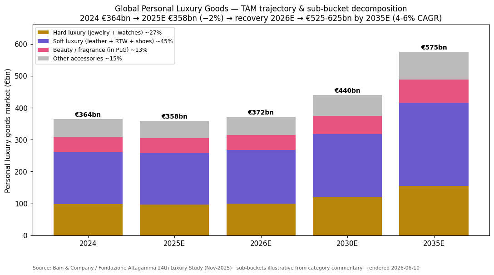
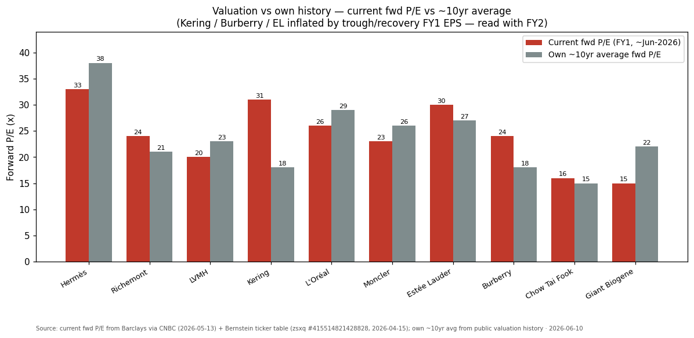
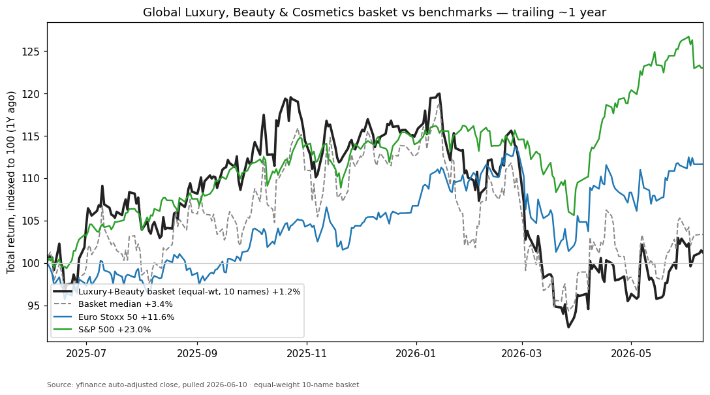

# Global Luxury, Beauty & Cosmetics

**Created:** 2026-06-10 · **Last refreshed:** 2026-06-10 · **Last mutated:** 2026-06-10 · **Refresh cadence:** monthly · **Languages tracked:** en

## What's New

*The delta since you last looked — newest refresh on top. Older entries collapse into the archive below so this stays short.*

**2026-06-10 — basket created (10 tickers):**
- **Created** the basket across three sleeves: **hard luxury / jewelry** (Richemont, Chow Tai Fook), **soft luxury / leather + execution** (LVMH, Hermès, Kering, Burberry, Moncler) and **beauty / cosmetics** (L'Oréal, Estée Lauder, Giant Biogene). Scope is Europe/global-listed houses + global beauty majors + a China-luxury/beauty read-through — China-domestic premium names (Laopu Gold, Proya, Pop Mart) are deliberately excluded and live in the separate `china-consumer-premiumization` theme.
- **Anchor set:** global personal-luxury-goods market €364bn (2024) → €358bn (2025E, −2%) → modest recovery 2026E → €525–625bn by 2035E (4–6% CAGR) per [Bain & Altagamma 24th Luxury Study, Nov-2025](https://www.bain.com/insights/luxury-is-ready-for-a-new-era-after-stabilizing-in-2025-snap-chart/).
- **Performance baseline:** equal-weight basket +1.2% / median +3.4% over trailing ~1Y vs Euro Stoxx 50 +11.6% and S&P 500 +23.0% — the basket *lagged* on the 2025 luxury de-rating; 8/10 names positive, only 3/10 beat Euro Stoxx (yfinance, pulled 2026-06-10).
- **Conviction at create (cited, not ours):** Bernstein's three-bucket frame — *Quality* = Hermès, Richemont; *Momentum/lack-thereof* = LVMH, Moncler; *Value/self-help* = Burberry, Kering ([Bernstein, zsxq #415514821428828 p.1, 2026-04-17](http://xs-macbook-air.local:5001/zsxq/pdf/415514821428828/Bernstein-Investment-Strategies-Part1-260417.pdf#page=1)). MS made **Burberry its Top Pick** (upgrade to OW) and **Giant Biogene its APAC consumer Top Pick**.
- **12 sell-side PT/rating calls** mined from the local zsxq library and upserted to `stock_price_target_db` (surfaced at `/pt`).

Earlier refreshes

*(none — basket created 2026-06-10)*

## Thesis

**Anchor — global personal luxury goods market:** €364bn (2024) → **€358bn (2025E, −2%; flat at constant FX)** → low-to-mid-single-digit recovery in 2026E (≈€372bn) → **€525–625bn by 2035E at a 4–6% long-run CAGR** ([Bain & Altagamma 24th Luxury Study, Nov-2025](https://www.bain.com/insights/luxury-is-ready-for-a-new-era-after-stabilizing-in-2025-snap-chart/); the same study puts total luxury spending — including hospitality, cars, wine & spirits — at **€1.44 trillion in 2025, down 1–3% YoY** per [Bain & Altagamma press release, Nov-2025](https://www.bain.com/about/media-center/press-releases/20252/global-luxury-stays-resilient-despite-economic-headwinds-and-shifting-consumer-trends-that-reshape-marketbain--company-and-altagamma/)). The pool stabilized in 2025 after the post-Covid price-led era ended; the bet is on a *recovering, not booming* cycle. **Sub-bucket decomposition** (illustrative shares applied to the Bain PLG total, with category direction from the study): hard luxury — jewelry + watches ~27% (the relative outperformer; *"jewelry, eyewear, and fragrances"* were the strong categories per Bain); soft luxury — leather goods + RTW + shoes ~45% (*"shoes and leather goods weakened"* — the laggard); beauty/fragrance inside PLG ~13%; other accessories ~15% ([Bain snap-chart, Nov-2025](https://www.bain.com/insights/luxury-is-ready-for-a-new-era-after-stabilizing-in-2025-snap-chart/)). A **parallel beauty/cosmetics market** (~$420–490bn in 2025 across estimators) grew ~3.5% in 2025 and ran *"a bit shy of 4%"* in Q1-2026 per L'Oréal management ([Statista, growth-rate series, 2025](https://www.statista.com/statistics/297070/growth-rate-of-the-global-cosmetics-market/); [J.P. Morgan L'Oréal Q126, zsxq #585581181858414 p.1, 2026-04-23](http://xs-macbook-air.local:5001/zsxq/pdf/585581181858414/J.P.%20Morgan-L%27Or%C3%A9al%EF%BC%88OREP.PA%EF%BC%89Encouraging%20Q126%20beat-260423.pdf#page=1)).

**Swing factor: top-line growth surprises, gated on the China consumer + aspirational return.** Luxury equities *"trade on top-line growth surprises… deviations in top-line growth versus expectations remain the most important near-term driver"*, because the industry runs structurally-high 70–80% gross margins on a largely-fixed cost base — i.e. extreme operating leverage on revenue ([Bernstein "Triple Whammy Rule", zsxq #585412428414424 p.1, 2026-06-01](http://xs-macbook-air.local:5001/zsxq/pdf/585412428414424/Bernstein-Global%20Luxury%20Good%EF%BC%9A%20The%20Triple%20Whammy%20Rule-260601.pdf#page=1)). Over 20 years global luxury compounded *"c. +8% CAGR, roughly 3x global GDP growth"* — the growth premium investors pay up for, and the one that disappoints in a stalled China cycle ([Bernstein, zsxq #585412428414424 p.1](http://xs-macbook-air.local:5001/zsxq/pdf/585412428414424/Bernstein-Global%20Luxury%20Good%EF%BC%9A%20The%20Triple%20Whammy%20Rule-260601.pdf#page=1)). The single sub-bucket whose revision moves the headline most is **soft-luxury/leather demand in China**, which has *"remained challenging, albeit with some improvement"* ([Bain, Nov-2025](https://www.bain.com/insights/luxury-is-ready-for-a-new-era-after-stabilizing-in-2025-snap-chart/)).

**Value-chain / process-step map (dollar-weighted by sleeve):** hard luxury/jewelry (~27% of PLG; gold-price tailwind to jeweler GPM) → Richemont (Cartier/VCA), Chow Tai Fook (gold) · soft luxury/leather (~45%, the largest and weakest pool) → LVMH (Vuitton/Dior), Hermès (Birkin), Kering (Gucci turnaround), Burberry (self-help), Moncler (outerwear) · beauty/cosmetics (separate ~$450bn market) → L'Oréal (mass+derma+luxe), Estée Lauder (US prestige recovery), Giant Biogene (China recombinant collagen + med-aesthetics). **Coverage gap:** the basket has *no pure soft-luxury value play below Kering* (Ferragamo/Prada considered, see Exclusions) and *no eyewear* (EssilorLuxottica) — eyewear is a rich, defensive sub-bucket Bain flagged as strong, a candidate-add for a later refresh.

**Who benefits when (time axis on the static roles).** *Now (early cycle, gold-led):* hard luxury — Chow Tai Fook and Richemont monetize first on a gold-price tailwind to jeweler GPM and resilient high-end jewelry demand ([Goldman Sachs Chow Tai Fook profit alert, zsxq #184125145158582 p.1, 2026-05-07](http://xs-macbook-air.local:5001/zsxq/pdf/184125145158582/Goldman%20Sachs-Chow%20Tai%20Fook%20Jewellery%20Group%20%EF%BC%881929.HK%EF%BC%89%20Profit%20alert-260507.pdf#page=1)). *Next 6–12m (execution-led):* self-help names — Burberry and Kering re-rate on cost-out and brand resets, gated on *show-me* delivery, not market beta ([Bernstein Kering CMD, zsxq #812215154515282 p.1, 2026-04-20](http://xs-macbook-air.local:5001/zsxq/pdf/812215154515282/Bernstein-Global%20Luxury%20Goods%EF%BC%9AKering%EF%BC%9A%20In%20search%20of%20meaning-260420.pdf#page=1)). *Through FY26–27 (mega-cap recovery):* LVMH on the Dior revival and a sequential American + Chinese improvement ([BofA LVMH, zsxq #585548841541224 p.1, 2026-04-14](http://xs-macbook-air.local:5001/zsxq/pdf/585548841541224/BofA%20Securities-LVMH%EF%BC%88LVMH.PA%EF%BC%89Step%20by%20step-260414.pdf#page=1)). *Structural / cycle-agnostic:* beauty — L'Oréal and Estée Lauder ride a muted-but-recovering ~4% market.

**Conviction ranking (Bernstein's, not ours):** within *Quality*, Hermès and Richemont; within *Value/self-help*, Burberry is *"one of the strongest continuing growth prospects"* whereas Kering is *"still (very) cheap relative to its 10-year EV/Sales history, but seems still far from reigniting growth in its core brands at a time when investors are moving to 'show me' mode"* ([Bernstein, zsxq #415514821428828 p.1–2, 2026-04-17](http://xs-macbook-air.local:5001/zsxq/pdf/415514821428828/Bernstein-Investment-Strategies-Part1-260417.pdf#page=1)). *Analyst view (this note):* among the self-help cohort we read Burberry > Kering on execution-evidence-to-date, mirroring MS's Burberry-as-Top-Pick call.

## Scope rules

**In:** Europe-listed global luxury houses (LVMH, Hermès, Richemont, Kering, Moncler, Burberry); global beauty/cosmetics majors (L'Oréal, Estée Lauder); HK/China luxury & beauty names that function as a *read-through to global luxury demand* — Chow Tai Fook (gold/jewelry proxy) and Giant Biogene (China recombinant-collagen beauty + med-aesthetics). The basket spans hard luxury, soft luxury, and beauty so the top-vs-mid divergence is *trackable within one file*.

**Out:** China-domestic premiumization names that belong to the separate `china-consumer-premiumization` theme — **Laopu Gold, Proya, Pop Mart** (do not duplicate here). Pure travel-retail / department-store landlords (Swire, HK retail REITs) — they are read-through *indicators*, cited in Leading indicators, not tracked equities. Diversified personal-care / staples (P&G, Unilever) without a luxury-beauty pure-play tilt. Watch-component / Swatch-only deep-value names below the conviction bar (considered — see Exclusions).

## Tracked tickers

| Ticker | Name | Role | Justification | Added |
|---|---|---|---|---|
| MC.PA | LVMH (路威酩轩) | core | Largest soft-luxury house (Vuitton, Dior); 1Q26 core F&L −2% organic but the −3%→−2% improvement was driven by *"American demand: from slightly negative to positive"* and *"Chinese: from LSD-MSD negative to flattish"* ([BofA, zsxq #585548841541224 p.1, 2026-04-14](http://xs-macbook-air.local:5001/zsxq/pdf/585548841541224/BofA%20Securities-LVMH%EF%BC%88LVMH.PA%EF%BC%89Step%20by%20step-260414.pdf#page=1)). **Moat:** unrivalled brand portfolio + retail scale (fixed-cost leverage). **Threat:** Chinese soft-luxury demand staying weak, and an *aspirational-consumer trade-down* — the post-Covid price elevation that *"appears to be ending"* ([Bain, Nov-2025](https://www.bain.com/insights/luxury-is-ready-for-a-new-era-after-stabilizing-in-2025-snap-chart/)) priced out entry buyers; Dior recovery slipping is the idiosyncratic risk. | 2026-06-10 |
| RMS.PA | Hermès (爱马仕) | core | The quintessential top-of-pyramid name; *"growth framework remains unchanged, with around 5-6% pricing and 6% volume growth expected for the year"* in Leather Goods, demand *"remains very dynamic"* ([Bernstein, zsxq #584251125544424 p.1, 2026-06-04](http://xs-macbook-air.local:5001/zsxq/pdf/584251125544424/Bernstein-Comment%EF%BC%9A%20Herm%C3%A8s~Key%20themes%20ahead%20of%202Q26-260604.pdf#page=1)). **Moat:** structural scarcity (Birkin waitlist), pricing power immune to the cycle, least US-exposed of the majors. **Threat:** the highest absolute multiple in the group (~33–38x) is the threat itself — any deceleration de-rates hard; tough China comps after multi-year strong growth; FX (strong EUR). | 2026-06-10 |
| CFR.SW | Richemont (历峰) | core | Hard-luxury/jewelry leader (Cartier, Van Cleef & Arpels); Bernstein's *"Quality"* bucket alongside Hermès, with *"likely top-line upside… as we head into 4Q26E"* ([Bernstein, zsxq #415514821428828 p.1, 2026-04-17](http://xs-macbook-air.local:5001/zsxq/pdf/415514821428828/Bernstein-Investment-Strategies-Part1-260417.pdf#page=1)). **Moat:** branded high-jewelry duopoly (Cartier/VCA) with pricing power and a gold-price tailwind to mix/margin. **Threat:** *gold-price reversal* compressing jeweler GPM; specialist-watchmaker drag (a structurally weaker sub-segment); MS flags *"sustained FX and Gold headwinds"* lowering FY27 margin expansion ([Morgan Stanley, zsxq #184152881184242 p.1, 2026-06-02](http://xs-macbook-air.local:5001/zsxq/pdf/184152881184242/Morgan%20Stanley-Richemont%EF%BC%88CFRJ.J%EF%BC%89Risk%20Reward%20Update-260602.pdf#page=1)). | 2026-06-10 |
| KER.PA | Kering (开云) | adjacent | Soft-luxury self-help turnaround (Gucci); new-CEO CMD signalled *"a lot to optimise on the operations, cost efficiency, and speed to market"* with a *"Marchionne-style"* output-focused culture ([Bernstein, zsxq #812215154515282 p.1, 2026-04-20](http://xs-macbook-air.local:5001/zsxq/pdf/812215154515282/Bernstein-Global%20Luxury%20Goods%EF%BC%9AKering%EF%BC%9A%20In%20search%20of%20meaning-260420.pdf#page=1)). **Moat:** Gucci brand equity + EV/Sales optionality if the reset works. **Threat:** Gucci's *"core brands"* still not reigniting growth while *"investors are moving to 'show me' mode"* ([Bernstein, zsxq #415514821428828 p.2, 2026-04-17](http://xs-macbook-air.local:5001/zsxq/pdf/415514821428828/Bernstein-Investment-Strategies-Part1-260417.pdf#page=2)) — execution risk on a depressed-EPS base; brand fatigue at Gucci is the structural threat. | 2026-06-10 |
| BRBY.L | Burberry (博柏利) | adjacent | British self-help recovery; MS upgraded to **Overweight and made it Top Pick**, seeing *"the recent pull-back in Burberry shares as an opportunistic entry-point"* ([Morgan Stanley, zsxq #585424552584124 p.1, 2026-05-18](http://xs-macbook-air.local:5001/zsxq/pdf/585424552584124/Morgan%20Stanley-Burberry%EF%BC%88BRBY.L%EF%BC%89Best%20Dressed%20Recovery%20Story%EF%BC%9B%20Upgrade%20to%20OW-260518.pdf#page=1)); Bernstein calls it *"one of the strongest continuing growth prospects"* ([Bernstein, zsxq #415514821428828 p.1](http://xs-macbook-air.local:5001/zsxq/pdf/415514821428828/Bernstein-Investment-Strategies-Part1-260417.pdf#page=1)). **Moat:** iconic British outerwear brand with low US-tariff exposure (one of the *"least US-exposed"*). **Threat:** recovery-EPS-optical valuation (~24x on trough earnings) means a stalled turnaround de-rates fast; brand-momentum sensitivity to creative-director output. | 2026-06-10 |
| MONC.MI | Moncler (盟可睐) | adjacent | High-ROIC outerwear pure-play; *"punches above its weight on ROIC quality"* but momentum hinges on *"acceleration in the Americas, through Grenoble, and a Stone Island take-off"* ([Bernstein, zsxq #415514821428828 p.1, 2026-04-17](http://xs-macbook-air.local:5001/zsxq/pdf/415514821428828/Bernstein-Investment-Strategies-Part1-260417.pdf#page=1)); the *least US-exposed* major. **Moat:** category leadership in luxury down/outerwear, best-in-class returns. **Threat:** *"traditional trading seasonality and waning momentum with the core collection"* — a single-category, weather-cyclical brand; aspirational trade-down in its price band. | 2026-06-10 |
| 1929.HK | Chow Tai Fook (周大福) | adjacent | China-luxury/jewelry read-through; FY26 profit alert flagged **net profit +45–55% YoY** driven by *"improvement in gross profit margin (thanks to higher gold prices, a more favorable sales mix towards retail business and fixed price jewelry)"* ([Goldman Sachs, zsxq #184125145158582 p.1, 2026-05-07](http://xs-macbook-air.local:5001/zsxq/pdf/184125145158582/Goldman%20Sachs-Chow%20Tai%20Fook%20Jewellery%20Group%20%EF%BC%881929.HK%EF%BC%89%20Profit%20alert-260507.pdf#page=1)). **Moat:** #1 Greater-China jeweler scale + fixed-price (branded design) margin mix + overseas expansion ([J.P. Morgan, zsxq #415518582151258 p.1, 2026-04-23](http://xs-macbook-air.local:5001/zsxq/pdf/415518582151258/J.P.%20Morgan-Chow%20Tai%20Fook%20Jewellery%20%EF%BC%881929.HK%EF%BC%89%20maintain%20OW-260423.pdf#page=1)). **Threat:** *gold-price reversal* — the entire FY26 GPM beat is gold-led, so a falling gold price reverses it; China mainland SSSG softness; Laopu Gold and pure-gold disruptors taking share. | 2026-06-10 |
| OR.PA | L'Oréal (欧莱雅) | core | World's largest beauty company; Q126 underlying LFL **+6.7%** (cons. +5.7%) with the beauty market *"a bit shy of 4%"* and China onshore growth MSD–HSD% led by SkinCeuticals/Aesop/Kérastase ([J.P. Morgan, zsxq #585581181858414 p.1, 2026-04-23](http://xs-macbook-air.local:5001/zsxq/pdf/585581181858414/J.P.%20Morgan-L%27Or%C3%A9al%EF%BC%88OREP.PA%EF%BC%89Encouraging%20Q126%20beat-260423.pdf#page=1); [Goldman Sachs read-across, zsxq #415245155521818 p.1, 2026-05](http://xs-macbook-air.local:5001/zsxq/pdf/415245155521818/Goldman%20Sachs-CHINA%20COSMETICS%20Global%20cosmetics%20read~across-2604.pdf#page=1)). **Moat:** unmatched brand+channel breadth (mass→derma→luxe), R&D scale, derma leadership (SkinCeuticals/CeraVe). **Threat:** China beauty market *modest* and *"competitive"*; rising A&P costs; insourcing-style risk = local Chinese brands (on Douyin, *"over half the market is now online"*) taking prestige share. | 2026-06-10 |
| EL | Estée Lauder | adjacent | US prestige beauty in turnaround; Citi reiterated **Buy and raised TP to $110 (from $92)** after *"EL and Puig announced that they have ended discussions about a potential business combination"*, removing deal overhang, with *"the raised FY26 guidance & introduction of preliminary FY27 guidance as evidence of fundamental progress from the Beauty Reimagined strategy"* ([Citi, zsxq #415241445451518 p.1, 2026-05-21](http://xs-macbook-air.local:5001/zsxq/pdf/415241445451518/CITI-Estee%20Lauder%20Inc%20%EF%BC%88EL.US%EF%BC%89%20EL%20and%20Puig%20End%20Merger%20Talks-260521.pdf#page=1)); EL outperformed prestige with **+6% YoY** in China (La Mer/TOM FORD/The Ordinary) ([Goldman Sachs, zsxq #415245155521818 p.1, 2026-05](http://xs-macbook-air.local:5001/zsxq/pdf/415245155521818/Goldman%20Sachs-CHINA%20COSMETICS%20Global%20cosmetics%20read~across-2604.pdf#page=1)). **Moat:** premium/luxe US brand portfolio (La Mer, Estée). **Threat:** travel-retail (Hainan/Korea DFS) destocking; execution risk on the Beauty Reimagined reset; trade-down in prestige. | 2026-06-10 |
| 2367.HK | Giant Biogene (巨子生物) | adjacent | China recombinant-collagen beauty + med-aesthetics; MS **Top Pick (OW)** on the *"修复核心，筑基未来"* (fix-the-core, build-the-future) reset, at *"约14-15倍2026年预期市盈率"* (~14–15x 2026E P/E) and a *"过去三年分红率维持在60-70%"* 60–70% payout ([Morgan Stanley, zsxq #415514125551888 p.1, 2026-04-20](http://xs-macbook-air.local:5001/zsxq/pdf/415514125551888/Morgan%20Stanley-Giant%20Biogene%EF%BC%882367.HK%EF%BC%89Fixing%20the%20Core%20Top%20Pick-260420.pdf#page=1)). **Moat:** recombinant-collagen IP + a med-aesthetics pipeline (lyophilized fiber for fine-line filling) *"被市场忽视的长期价值驱动力"* (a market-overlooked long-term driver). **Threat:** worst 1Y performer (−56%) after 2025 reputational hit to its 胶原棒/Collagen Stick; OPM compression; med-aesthetics approval delays; intense China-beauty competition + macro softness. | 2026-06-10 |

## Valuation snapshot

*One row per tracked name. Px @ note date = `report_date_price` (the price the analyst's upside was called against); current px = live spot @ 2026-06-10. Multiples: FY1/FY2 fwd P/E. Stale-PT segregation below.*

| Ticker | Rating (source, date) | Px @ note date | PT | Upside% (vs note) | Current px (06-10) | Fwd P/E FY1 / FY2 | Own ~10yr avg P/E | FY1 / FY2 EPS |
|---|---|---|---|---|---|---|---|---|
| RMS.PA | Outperform (Bernstein, 04-15) | €1,654.50 | €2,150 | +30% | €1,643.50 | 37.3 / 31.5 | ~38 | €44.33 / €52.47 |
| MC.PA | Buy (BofA, 04-14) · OP (Bernstein, 04-15) | €481.75 / €484.05 | €675 / €600 | +40% / +24% | €482.45 | 21.8 / 18.1 | ~23 | €22.22 / €26.71 |
| CFR.SW | Outperform (Bernstein, 04-15) | CHF153.30 | CHF200 | +30% | CHF167.75 | 27.1 / 24.2 | ~21 | €6.12 / €6.87 |
| KER.PA | Market-Perform (Bernstein, 04-15) | €246.20 | €220 | −11% | €249.00 | 37.0 / 24.5 | ~18 | €6.66 / €10.04 |
| BRBY.L | Overweight·Top Pick (MS, 05-15) | 1,062p | 1,350p | +27% | 1,093.50p | 53.5 / 24.1 (FY25A/FY27E) | ~18 | £0.21 / £0.47 (26E/27E) |
| MONC.MI | Market-Perform (Bernstein, 04-15) | €55.22 | €57.50 | +4% | €54.78 | 22.9 / 21.2 | ~26 | €2.41 / €2.61 |
| OR.PA | Neutral (J.P. Morgan, 04-22) | €344.90 | €365 (Dec-27) | +6% | €378.45 | ~26 (26E) / ~24 (27E) | ~29 | €13.25 / €14.04 |
| EL | Buy (Citi, 05-21) | $78.91 | $110 (from $92) | +39% | $86.56 | ~30 (recovery) / ~25 | ~27 | rising off trough |
| 1929.HK | OW (JPM, 04-23) · Neutral (GS, 05-07) | HK$10.90 / HK$10.84 | HK$17 / HK$13 | +56% / +20% | HK$11.85 | ~16 / ~14 | ~15 | — |
| 2367.HK | Overweight·Top Pick (MS, 04-20) | HK$29.66 | HK$43 (from HK$42) | +45% | HK$27.36 | ~14–15 (26E) | ~22 | — |

**Cross-sectional read (sorts cheap→dear on FY2, like-for-like):** Giant Biogene ~14–15x and Chow Tai Fook ~14–16x are the cheapest (de-rated / cyclical-gold); LVMH ~18x FY27E and Richemont ~24x FY27E sit mid; Hermès ~31x FY27E is the dearest of the majors, justified by the highest-quality EPS-CAGR. **Growth-adjusted:** Kering's optically-high 37x FY1 collapses to ~24x FY2 on a recovering-EPS base (FY1 €6.66 → FY2 €10.04, ~50% growth) — a *trough-earnings* multiple, not a structural premium; same caveat on Burberry (53.5x FY25A → 24.1x FY27E) and Estée Lauder. **PT derivation (where the note states it):** BofA LVMH PO €675 = *"25x 24m P/E"* ([BofA, zsxq #585548841541224 p.1](http://xs-macbook-air.local:5001/zsxq/pdf/585548841541224/BofA%20Securities-LVMH%EF%BC%88LVMH.PA%EF%BC%89Step%20by%20step-260414.pdf#page=1)); Giant Biogene MS PT HK$43 = *"基于15倍2026年预期市盈率"* (15x 2026E P/E) ([Morgan Stanley, zsxq #415514125551888 p.1](http://xs-macbook-air.local:5001/zsxq/pdf/415514125551888/Morgan%20Stanley-Giant%20Biogene%EF%BC%882367.HK%EF%BC%89Fixing%20the%20Core%20Top%20Pick-260420.pdf#page=1)).

**Stale / overtaken-by-price — pending refresh:**
- KER.PA — Bernstein PT €220 vs current €249.00: price has *moved through* the target, implying a notional downside the MP rating did not call. Treat as stale; awaits re-rating.

## Exclusions

| Ticker | Reason |
|---|---|
| Laopu Gold (6181.HK) · Proya (603605.SS) · Pop Mart (9992.HK) | China-domestic premiumization — tracked in the separate `china-consumer-premiumization` theme; not duplicated here per scope. |
| Prada (1913.HK) | Bernstein: *"very cheap but is facing fast normalisation at Miu Miu… at risk of falling into 'deep value'"* + a disliked Versace acquisition ([Bernstein, zsxq #415514821428828 p.1, 2026-04-17](http://xs-macbook-air.local:5001/zsxq/pdf/415514821428828/Bernstein-Investment-Strategies-Part1-260417.pdf#page=1)). Below the conviction bar today. |
| Salvatore Ferragamo (SFER.MI) | *"starting from a very low base"* self-help, OP PT€7.50 — too early/binary; revisit if turnaround evidence builds ([Bernstein, zsxq #415514821428828 p.2](http://xs-macbook-air.local:5001/zsxq/pdf/415514821428828/Bernstein-Investment-Strategies-Part1-260417.pdf#page=2)). |
| Swatch Group (UHR.SW) | *"no longer 'deep value'… in-line vs the past 5 years"*; deep-value-to-self-help bet already partly priced ([Bernstein, zsxq #415514821428828 p.2](http://xs-macbook-air.local:5001/zsxq/pdf/415514821428828/Bernstein-Investment-Strategies-Part1-260417.pdf#page=2)). |
| EssilorLuxottica (EL.PA) · Brunello Cucinelli (BC.MI) · Zegna (ZGN) | Strong but adjacent; eyewear/HNW-niche — candidate-adds for the rich, under-covered eyewear sub-bucket on a later expansion refresh. |

## Keywords

luxury goods / 奢侈品 · personal luxury goods (PLG) · hard luxury — jewelry & watches / 硬奢——珠宝腕表 · soft luxury — leather goods / 软奢——皮具 · beauty & cosmetics / 美妆护肤 · fragrance / 香水 · recombinant collagen / 重组胶原蛋白 · med-aesthetics / 医美 · China consumer recovery / 中国消费复苏 · aspirational consumer / 入门级消费者 · organic sales growth / 有机增长 · SSSG / 同店销售 · gold price / 金价 · travel retail / 旅游零售 · Swiss watch exports / 瑞士钟表出口

## Performance (since inception 2026-06-10)

*Trailing ~1-year window (2026-06-09 → 2026-06-10), yfinance auto-adjusted close pulled 2026-06-10.*

- **Basket return:** equal-weight **+1.2%** / median **+3.4%** over the trailing year.
- **Benchmarks:** Euro Stoxx 50 **+11.6%**, S&P 500 **+23.0%** over the same window → the basket **lagged both** materially (≈−10pp vs Euro Stoxx, ≈−22pp vs S&P) — the year captured the late-2025 luxury de-rating, with the recovery only beginning to show in 2026 movers.
- **Movers (1Y):** **Kering +42.2%** (turnaround re-rating), Estée Lauder +27.3%, Richemont +12.9%. **Laggards:** **Giant Biogene −56.2%** (2025 reputational hit), **Hermès −28.6%** (de-rating from an extreme multiple on tough comps).
- **YTD-2026 divergence is the story:** Richemont −2.5%, L'Oréal +5.8% and Moncler +3.0% held up while Hermès −21.1%, LVMH −23.6% and Estée Lauder −18.4% fell hard — confirming the *top-vs-mid / quality-vs-leather* split.

### Basket scorecard

- **Batting average:** **8/10 names positive** over the trailing year; **3/10 beat the Euro Stoxx 50** benchmark (Kering, Estée Lauder, Richemont). The low beat-rate is the honest read — this was a *lagging* year for luxury, and the scorecard says so rather than hiding it.
- **Best contributor:** Kering **+42.2%**. **Worst contributor:** Giant Biogene **−56.2%**.
- **Cumulative outperformance since inception:** n/a — only one snapshot line exists; computed from the second refresh onward.

## Recent events

*Material broker/company events since basket creation context (last ~8 weeks).*

- **2026-06-04 — Hermès 2Q26 pre-read:** trends *"broadly in line with 1Q26"*, Korea the bright spot on a buoyant stock market; the *"mid-single digit price increases implemented in May-25 to offset tariffs has now lapsed after May-26"* (US pricing tailwind rolling off) ([Bernstein, zsxq #584251125544424 p.1, 2026-06-04](http://xs-macbook-air.local:5001/zsxq/pdf/584251125544424/Bernstein-Comment%EF%BC%9A%20Herm%C3%A8s~Key%20themes%20ahead%20of%202Q26-260604.pdf#page=1)).
- **2026-06-02 — Richemont risk-reward cut:** MS trimmed its (JSE-listed CFRJ.J) PT to ZAc 412,200 (bull/base/bear ZAc 494,600 / 412,200 / 267,900) on *"sustained FX and Gold headwinds"* lowering FY27 margin expansion, while keeping Overweight ([Morgan Stanley, zsxq #184152881184242 p.1, 2026-06-02](http://xs-macbook-air.local:5001/zsxq/pdf/184152881184242/Morgan%20Stanley-Richemont%EF%BC%88CFRJ.J%EF%BC%89Risk%20Reward%20Update-260602.pdf#page=1)).
- **2026-05-21 — Estée Lauder / Puig merger talks ended:** overhang removed, Citi reiterated Buy and **raised TP to $110 from $92** ([Citi, zsxq #415241445451518 p.1, 2026-05-21](http://xs-macbook-air.local:5001/zsxq/pdf/415241445451518/CITI-Estee%20Lauder%20Inc%20%EF%BC%88EL.US%EF%BC%89%20EL%20and%20Puig%20End%20Merger%20Talks-260521.pdf#page=1)).
- **2026-05-18 — Burberry upgraded to OW & made MS Top Pick** after a −9% post-FY26-results pull-back seen as an *"opportunistic entry-point"* ([Morgan Stanley, zsxq #585424552584124 p.1, 2026-05-18](http://xs-macbook-air.local:5001/zsxq/pdf/585424552584124/Morgan%20Stanley-Burberry%EF%BC%88BRBY.L%EF%BC%89Best%20Dressed%20Recovery%20Story%EF%BC%9B%20Upgrade%20to%20OW-260518.pdf#page=1)).
- **2026-05-07 — Chow Tai Fook FY26 profit alert:** net profit guided **+45–55% YoY** to HK$8.6–9.2bn, beating GSe, on gold-led GPM expansion ([Goldman Sachs, zsxq #184125145158582 p.1, 2026-05-07](http://xs-macbook-air.local:5001/zsxq/pdf/184125145158582/Goldman%20Sachs-Chow%20Tai%20Fook%20Jewellery%20Group%20%EF%BC%881929.HK%EF%BC%89%20Profit%20alert-260507.pdf#page=1)).
- **2026-04-22/23 — L'Oréal Q126 beat** (LFL +6.7%) and **Giant Biogene named MS APAC-consumer Top Pick** (PT raised to HK$43) ([J.P. Morgan, zsxq #585581181858414 p.1](http://xs-macbook-air.local:5001/zsxq/pdf/585581181858414/J.P.%20Morgan-L%27Or%C3%A9al%EF%BC%88OREP.PA%EF%BC%89Encouraging%20Q126%20beat-260423.pdf#page=1); [Morgan Stanley, zsxq #585581181585854 p.1, 2026-04-22](http://xs-macbook-air.local:5001/zsxq/pdf/585581181585854/Morgan%20Stanley-Giant%20Biogene%EF%BC%882367.HK%EF%BC%89New%20Product%EF%BC%8C%20Strong%20Traction-260422.pdf#page=1)).

## Drift signals

*The value-add — what to watch on the next refresh.*

- **Priced-for-perfection / air-pocket flag (Hermès):** at ~33–38x fwd P/E Hermès sits near the *top* of the basket; the specific demand assumption whose miss de-rates it is the *"around 5-6% pricing and 6% volume growth"* Leather Goods framework holding through tough China comps ([Bernstein, zsxq #584251125544424 p.1](http://xs-macbook-air.local:5001/zsxq/pdf/584251125544424/Bernstein-Comment%EF%BC%9A%20Herm%C3%A8s~Key%20themes%20ahead%20of%202Q26-260604.pdf#page=1)). **Sized:** a reversion from ~33x toward the ~25x low end of its own range (a cycle-disappointment de-rate) is **≈−24%** to the multiple, even before EPS cuts — the air-pocket is the multiple, not the earnings.
- **Gold-price-reversal flag (Chow Tai Fook + Richemont):** the *entire* Chow Tai Fook FY26 GPM beat is gold-led ([Goldman Sachs, zsxq #184125145158582 p.1](http://xs-macbook-air.local:5001/zsxq/pdf/184125145158582/Goldman%20Sachs-Chow%20Tai%20Fook%20Jewellery%20Group%20%EF%BC%881929.HK%EF%BC%89%20Profit%20alert-260507.pdf#page=1)); a falling gold price reverses jeweler margins and is the named trigger for the hard-luxury sleeve. GS rates CTF only Neutral (PT HK$13, +19.9%) precisely on this — the bull case (JPM OW, HK$17) needs gold to stay elevated.
- **Aspirational trade-down / China-weakness persistence:** the largest sub-bucket (soft luxury/leather, ~45%) is the weakest; LVMH/Kering are most exposed. Bain's note that the *"price elevation appears to be ending"* is the structural risk to the entry-buyer cohort ([Bain, Nov-2025](https://www.bain.com/insights/luxury-is-ready-for-a-new-era-after-stabilizing-in-2025-snap-chart/)).
- **Underperformer outlier (Giant Biogene, −56% 1Y, >30% behind median):** idiosyncratic 2025 reputational hit to the Collagen Stick, not a broken thesis per MS (Top Pick on the reset) — but flag for confirmation that 2H-2026 revenue *"反弹"* (rebound, +~30% YoY guided) actually lands ([Morgan Stanley, zsxq #415514125551888 p.1](http://xs-macbook-air.local:5001/zsxq/pdf/415514125551888/Morgan%20Stanley-Giant%20Biogene%EF%BC%882367.HK%EF%BC%89Fixing%20the%20Core%20Top%20Pick-260420.pdf#page=1)).
- **New-entrant / coverage-gap signal:** *eyewear* (EssilorLuxottica) — a rich, defensive sub-bucket Bain flagged among the strong categories — has **zero basket exposure**; a candidate-add for an expansion refresh.
- **Stale-justification watch:** none yet (all cells cite Apr–Jun 2026 sources); re-ground any cell older than 12 months at the next monthly refresh.

## Leading indicators

*Upstream signals that lead the basket members; the first place the thesis cracks. Macro/sector rows first, then a per-ticker operating-data table.*

| Signal | Latest reading (as-of) | Direction | Implies |
|---|---|---|---|
| US luxury credit-card spend (Citi) | **+3% YoY in May-26** (5th straight positive month; 2Y-stacked +2% from −3%) ([Citi, zsxq #181245428844412 p.1, 2026-06-08](http://xs-macbook-air.local:5001/zsxq/pdf/181245428844412/CITI-Global%20Luxury%20Goods%E2%80%94Card%20Insights%EF%BC%9AUS%20Luxury%20Credit%20Card%20data-260608.pdf#page=1)) | Slowing but +ve | US demand resilient; *transacting customers down ~10% YoY* (volume weak, ticket-led) → trade-down risk |
| Swiss watch exports (Bernstein) | **+9.2% YoY in Feb-26** (US +26.8%; Greater China −7%) ([Bernstein, zsxq #812222158825882 p.1, 2026-03-19](http://xs-macbook-air.local:5001/zsxq/pdf/812222158825882/Bernstein-Global%20Luxury%20Goods%EF%BC%9A%20February%20Swiss%20watch%20exports-260319.pdf#page=1)) | Recovering | Hard-luxury demand inflecting; China still the drag → Richemont/Swatch read |
| China jewelry SSS (Nomura channel) | **~+60% YoY 1Q26** (gold-led), luxury HSD% ([Nomura, zsxq #415521185512188 p.1, 2026-04-14](http://xs-macbook-air.local:5001/zsxq/pdf/415521185512188/Nomura-China%20consumer%EF%BC%9ALuxury%20and%20jewelry%20sales-260414.pdf#page=1)) | Strong, cooling | China hard-luxury hot on gold; *"Laopu's momentum cooled in March following price hikes"* → CTF read |
| China cosmetics GMV (GS tracker) | **+6% YoY Apr-26** (Douyin +21%; Tmall −27%) ([Goldman Sachs, zsxq #212452881828151 p.1, 2026-05-11](http://xs-macbook-air.local:5001/zsxq/pdf/212452881828151/Goldman%20Sachs-CHINA%20COSMETICS%20MONTHLY%20TRACKER%20Apr-26-260511.pdf#page=1)) | Modest, mix-shifting | Beauty recovery muted; Douyin is the engine → L'Oréal/EL/Giant Biogene channel read |

**Per-ticker operating-data table (the Barometer spine):**

| Ticker | Latest operating print (as-of) | Source |
|---|---|---|
| MC.PA | 1Q26 core F&L **−2% organic** (improved from −3% in 4Q25); Americans positive, Chinese flattish | [BofA, zsxq #585548841541224 p.1](http://xs-macbook-air.local:5001/zsxq/pdf/585548841541224/BofA%20Securities-LVMH%EF%BC%88LVMH.PA%EF%BC%89Step%20by%20step-260414.pdf#page=1) |
| RMS.PA | Leather Goods **~5–6% price + 6% volume** framework for FY; China 1Q26 in line with internal plan | [Bernstein, zsxq #584251125544424 p.1](http://xs-macbook-air.local:5001/zsxq/pdf/584251125544424/Bernstein-Comment%EF%BC%9A%20Herm%C3%A8s~Key%20themes%20ahead%20of%202Q26-260604.pdf#page=1) |
| OR.PA | Q126 underlying LFL **+6.7%** (reported +7.6%); beauty market *"a bit shy of 4%"* | [J.P. Morgan, zsxq #585581181858414 p.1](http://xs-macbook-air.local:5001/zsxq/pdf/585581181858414/J.P.%20Morgan-L%27Or%C3%A9al%EF%BC%88OREP.PA%EF%BC%89Encouraging%20Q126%20beat-260423.pdf#page=1) |
| EL | China **+6% YoY**, outperforming prestige (La Mer/TOM FORD/The Ordinary) | [Goldman Sachs, zsxq #415245155521818 p.1](http://xs-macbook-air.local:5001/zsxq/pdf/415245155521818/Goldman%20Sachs-CHINA%20COSMETICS%20Global%20cosmetics%20read~across-2604.pdf#page=1) |
| 1929.HK | FY26 net profit guided **+45–55% YoY** (HK$8.6–9.2bn); Apr-to-date positive self-op SSSG all markets | [Goldman Sachs, zsxq #184125145158582 p.1](http://xs-macbook-air.local:5001/zsxq/pdf/184125145158582/Goldman%20Sachs-Chow%20Tai%20Fook%20Jewellery%20Group%20%EF%BC%881929.HK%EF%BC%89%20Profit%20alert-260507.pdf#page=1) |
| 2367.HK | New "双仓超光棒": **>RMB30m GMV in 7 days** post-launch; FY26E sales target RMB200m | [Morgan Stanley, zsxq #585581181585854 p.1](http://xs-macbook-air.local:5001/zsxq/pdf/585581181585854/Morgan%20Stanley-Giant%20Biogene%EF%BC%882367.HK%EF%BC%89New%20Product%EF%BC%8C%20Strong%20Traction-260422.pdf#page=1) |

**Side-by-side member guidance (shared forward metric = China demand):** Hermès *"resilient high-end customers… traffic stabilising but no clear inflection"*; LVMH Chinese *"from LSD-MSD negative to flattish"*; L'Oréal China onshore *"MSD%-HSD%"* — all three guide *China bottoming, not yet inflecting*, the single most important swing variable for the basket.

## Catalysts (next 3–6 months)

- **2Q26 results / quarterly sales prints (Jul–Sep 2026)** — luxury *"trade[s] on top-line growth surprises"* ([Bernstein, zsxq #585412428414424 p.1](http://xs-macbook-air.local:5001/zsxq/pdf/585412428414424/Bernstein-Global%20Luxury%20Good%EF%BC%9A%20The%20Triple%20Whammy%20Rule-260601.pdf#page=1)); an LVMH F&L return to flat/positive (mechanism: organic-sales beat → operating-leverage on 70–80% GM → EPS upgrade) moves the *soft-luxury* sub-bucket and LVMH/Kering directly. *Timing: Jul-2026 1H prints.*
- **Hermès 9th Jewellery collection (Jul-2026)** — adds a high-margin hard-luxury growth leg (mechanism: jewellery mix-up → margin + scarcity narrative); moves RMS and the hard-luxury sub-bucket ([Bernstein, zsxq #584251125544424 p.1](http://xs-macbook-air.local:5001/zsxq/pdf/584251125544424/Bernstein-Comment%EF%BC%9A%20Herm%C3%A8s~Key%20themes%20ahead%20of%202Q26-260604.pdf#page=1)).
- **China 618 → mid-year stimulus read (Jun–Aug 2026)** — 618 e-commerce festival results gauge the beauty recovery (mechanism: Douyin/Tmall GMV → L'Oréal/EL/Giant Biogene China LFL); any further China consumer-stimulus measures move the *aspirational return* swing factor across all soft-luxury names ([Goldman Sachs, zsxq #212452881828151 p.1](http://xs-macbook-air.local:5001/zsxq/pdf/212452881828151/Goldman%20Sachs-CHINA%20COSMETICS%20MONTHLY%20TRACKER%20Apr-26-260511.pdf#page=1)).
- **Monthly Swiss watch exports + China jewelry SSS (rolling)** — leading indicators for Richemont/CTF (mechanism: shipment YoY → hard-luxury sell-in → jeweler revenue); a sustained Greater-China turn from negative is the hard-luxury go-signal ([Bernstein, zsxq #812222158825882 p.1](http://xs-macbook-air.local:5001/zsxq/pdf/812222158825882/Bernstein-Global%20Luxury%20Goods%EF%BC%9A%20February%20Swiss%20watch%20exports-260319.pdf#page=1)).
- **Gold price path (rolling)** — the named *swing AND risk* for jewelers: continued strength sustains CTF/Richemont GPM (bull-case JPM CTF HK$17); a reversal is the de-rate trigger (mechanism: gold → jeweler GPM directly) ([Goldman Sachs, zsxq #184125145158582 p.1](http://xs-macbook-air.local:5001/zsxq/pdf/184125145158582/Goldman%20Sachs-Chow%20Tai%20Fook%20Jewellery%20Group%20%EF%BC%881929.HK%EF%BC%89%20Profit%20alert-260507.pdf#page=1)).
- **Giant Biogene 2H26 med-aesthetics launches (水光针, H2-2026)** — pipeline approvals gate the *"被市场忽视"* (market-overlooked) growth leg (mechanism: NMPA approval → high-margin 85–90% GM med-aesthetics revenue) ([Morgan Stanley, zsxq #415514125551888 p.1](http://xs-macbook-air.local:5001/zsxq/pdf/415514125551888/Morgan%20Stanley-Giant%20Biogene%EF%BC%882367.HK%EF%BC%89Fixing%20the%20Core%20Top%20Pick-260420.pdf#page=1)).

## Data Used / 数据来源清单

**Market data**
- yfinance auto_adjust=True for prices, returns (1M/3M/6M/1Y/YTD), basket performance — pulled 2026-06-10. Confirmed ticker: L'Oréal trades as **OR.PA** (seed `OREP.PA` is the analyst notation, not the yfinance symbol).
- market_cap_cache.db — not separately pulled this create-pass; market caps from broker notes where cited.

**Per-ticker primary / sell-side sources**
- MC.PA: BofA *Step by step* (1Q26) ; Bernstein ticker table. RMS.PA: Bernstein 2Q26 pre-read + ticker table. CFR.SW: Bernstein ticker table; MS risk-reward (JSE line). KER.PA: Bernstein CMD note + ticker table. BRBY.L: MS upgrade-to-OW. MONC.MI: Bernstein bottom-fishing + ticker table. OR.PA: JPM Q126 beat. EL: Citi Buy/TP raise. 1929.HK: GS profit alert + JPM OW. 2367.HK: MS Top Pick + MS new-product.

**Industry research / sell-side thematic notes (theme-level)**
- Bernstein *Global Luxury Goods: Investment Strategies Part 1* (3-bucket conviction frame, ticker table) — zsxq #415514821428828, 2026-04-17.
- Bernstein *The Triple Whammy Rule* (operating-leverage / top-line-surprise thesis) — zsxq #585412428414424, 2026-06-01.
- Goldman Sachs *China Cosmetics: Global cosmetics read-across* — zsxq #415245155521818.

**Local zsxq library (`db/zsxq.db` — read-only)**
- **18 broker PDFs mined & cited** (file_ids: 415514821428828, 585412428414424, 585548841541224, 584251125544424, 184152881184242, 812215154515282, 585424552584124, 585581181858414, 415288442524158*, 415241445451518, 184125145158582, 415518582151258, 415514125551888, 585581181585854, 181245428844412, 812222158825882, 415521185512188, 212452881828151, 415245155521818) via `find_pdf.py` (per-alias across 16 aliases) → `evidence_bundle.py` → OCR (10 image-only) → `extract_pdf.py`. The 翻译精华 summary was the triage read; load-bearing numbers cited from extracted original text, string-matched. Two MS Giant Biogene PDFs (#415514125551888, #585581181585854) returned empty OCR (protected scan) — load-bearing PT/rating verified via `render_pdf_pages.py` visual read + the 翻译精华 summary (labelled). *(415288442524158 = UBS L'Oréal, mined for triage, not cited.)*
- Seed file_ids verified: #212452815442281 (MS Luxury — China housing) ✓ on-theme (cited indirectly via the housing-drag thesis); #585548841541224 (BofA LVMH) ✓ cited; #812222158825882 (Bernstein Swiss watch exports) ✓ cited; #184125145158582 (GS Chow Tai Fook) ✓ cited; #415241811485288 (JPM Chanel FY25) — verified on-theme but **not cited** (Chanel is unlisted, no tracked ticker).

**TAM anchor + leading indicators (theme-level)**
- Anchor: Bain & Company / Fondazione Altagamma 24th Luxury Study (Nov-2025) — €364bn→€358bn PLG, €525–625bn 2035E, €1.44trn total luxury. Beauty market: Statista (L'Oréal-cited ~3.5% 2025 growth) + estimator range.
- Leading indicators (4): Citi US luxury credit-card (+3% May), Bernstein Swiss watch exports (+9.2% Feb), Nomura China jewelry SSS (~+60% 1Q26), GS China cosmetics GMV (+6% Apr) — each cited above.

**Macro backdrop (indicators.db, as of 2026-06-04/05)**
- VIX 21.51 · 10Y Treasury (tnx) 4.536% · HY OAS 2.74% · gold proxy 396.24 (GLD-equiv) · DXY 100.07. Regime: moderate vol, tight credit, elevated gold (supports jewelers).

**Cross-coverage**
- No existing `reports/company/` deep-dive for these issuers at create time; none read as structured input this pass.

**Stores written (Tier-2 helpers)**
- `stock_price_target_db.upsert_target(...)` — **12 sell-side PT/rating calls** upserted for 10 tracked names (idempotent on ticker × broker × file_id; auto-computed upside_pct); surfaced at `/pt`. No raw SQL.

**Stale notices / coverage gaps**
- No eyewear (EssilorLuxottica) or sub-Kering soft-luxury value name in the basket (candidate-adds).
- MS Giant Biogene OCR failed (protected scan) — PT/rating from visual render + summary, not page-extracted text.
- Own ~10yr-avg P/E figures are public-history reference values (Barclays/CNBC current fwd P/E + standard valuation history), not from a single primary doc; refine on refresh.

## References

- [Bain & Company — Luxury Is Ready for a New Era After Stabilizing in 2025 (snap chart, Nov-2025)](https://www.bain.com/insights/luxury-is-ready-for-a-new-era-after-stabilizing-in-2025-snap-chart/)
- [Bain & Company / Altagamma — Global luxury stays resilient (press release, Nov-2025)](https://www.bain.com/about/media-center/press-releases/20252/global-luxury-stays-resilient-despite-economic-headwinds-and-shifting-consumer-trends-that-reshape-marketbain--company-and-altagamma/)
- [Statista — Global cosmetics market growth rate (2025)](https://www.statista.com/statistics/297070/growth-rate-of-the-global-cosmetics-market/)
- [Bernstein — Investment Strategies Part 1 (zsxq #415514821428828, 2026-04-17)](http://xs-macbook-air.local:5001/zsxq/pdf/415514821428828/Bernstein-Investment-Strategies-Part1-260417.pdf)
- [Bernstein — The Triple Whammy Rule (zsxq #585412428414424, 2026-06-01)](http://xs-macbook-air.local:5001/zsxq/pdf/585412428414424/Bernstein-Global%20Luxury%20Good%EF%BC%9A%20The%20Triple%20Whammy%20Rule-260601.pdf)
- [Bernstein — Hermès key themes ahead of 2Q26 (zsxq #584251125544424, 2026-06-04)](http://xs-macbook-air.local:5001/zsxq/pdf/584251125544424/Bernstein-Comment%EF%BC%9A%20Herm%C3%A8s~Key%20themes%20ahead%20of%202Q26-260604.pdf)
- [Bernstein — Kering: In search of meaning (zsxq #812215154515282, 2026-04-20)](http://xs-macbook-air.local:5001/zsxq/pdf/812215154515282/Bernstein-Global%20Luxury%20Goods%EF%BC%9AKering%EF%BC%9A%20In%20search%20of%20meaning-260420.pdf)
- [Bernstein — February Swiss watch exports (zsxq #812222158825882, 2026-03-19)](http://xs-macbook-air.local:5001/zsxq/pdf/812222158825882/Bernstein-Global%20Luxury%20Goods%EF%BC%9A%20February%20Swiss%20watch%20exports-260319.pdf)
- [BofA — LVMH: Step by step (zsxq #585548841541224, 2026-04-14)](http://xs-macbook-air.local:5001/zsxq/pdf/585548841541224/BofA%20Securities-LVMH%EF%BC%88LVMH.PA%EF%BC%89Step%20by%20step-260414.pdf)
- [Morgan Stanley — Richemont Risk Reward Update (zsxq #184152881184242, 2026-06-02)](http://xs-macbook-air.local:5001/zsxq/pdf/184152881184242/Morgan%20Stanley-Richemont%EF%BC%88CFRJ.J%EF%BC%89Risk%20Reward%20Update-260602.pdf)
- [Morgan Stanley — Burberry upgrade to OW (zsxq #585424552584124, 2026-05-18)](http://xs-macbook-air.local:5001/zsxq/pdf/585424552584124/Morgan%20Stanley-Burberry%EF%BC%88BRBY.L%EF%BC%89Best%20Dressed%20Recovery%20Story%EF%BC%9B%20Upgrade%20to%20OW-260518.pdf)
- [Morgan Stanley — Giant Biogene: Fixing the Core; Top Pick (zsxq #415514125551888, 2026-04-20)](http://xs-macbook-air.local:5001/zsxq/pdf/415514125551888/Morgan%20Stanley-Giant%20Biogene%EF%BC%882367.HK%EF%BC%89Fixing%20the%20Core%20Top%20Pick-260420.pdf)
- [Morgan Stanley — Giant Biogene: New Product, Strong Traction (zsxq #585581181585854, 2026-04-22)](http://xs-macbook-air.local:5001/zsxq/pdf/585581181585854/Morgan%20Stanley-Giant%20Biogene%EF%BC%882367.HK%EF%BC%89New%20Product%EF%BC%8C%20Strong%20Traction-260422.pdf)
- [J.P. Morgan — L'Oréal Q126 beat (zsxq #585581181858414, 2026-04-23)](http://xs-macbook-air.local:5001/zsxq/pdf/585581181858414/J.P.%20Morgan-L%27Or%C3%A9al%EF%BC%88OREP.PA%EF%BC%89Encouraging%20Q126%20beat-260423.pdf)
- [J.P. Morgan — Chow Tai Fook OW (zsxq #415518582151258, 2026-04-23)](http://xs-macbook-air.local:5001/zsxq/pdf/415518582151258/J.P.%20Morgan-Chow%20Tai%20Fook%20Jewellery%20%EF%BC%881929.HK%EF%BC%89%20maintain%20OW-260423.pdf)
- [Citi — Estée Lauder Buy, TP raised to $110 (zsxq #415241445451518, 2026-05-21)](http://xs-macbook-air.local:5001/zsxq/pdf/415241445451518/CITI-Estee%20Lauder%20Inc%20%EF%BC%88EL.US%EF%BC%89%20EL%20and%20Puig%20End%20Merger%20Talks-260521.pdf)
- [Citi — Global Luxury Goods Card Insights (zsxq #181245428844412, 2026-06-08)](http://xs-macbook-air.local:5001/zsxq/pdf/181245428844412/CITI-Global%20Luxury%20Goods%E2%80%94Card%20Insights%EF%BC%9AUS%20Luxury%20Credit%20Card%20data-260608.pdf)
- [Goldman Sachs — Chow Tai Fook profit alert (zsxq #184125145158582, 2026-05-07)](http://xs-macbook-air.local:5001/zsxq/pdf/184125145158582/Goldman%20Sachs-Chow%20Tai%20Fook%20Jewellery%20Group%20%EF%BC%881929.HK%EF%BC%89%20Profit%20alert-260507.pdf)
- [Goldman Sachs — China Cosmetics Monthly Tracker Apr-26 (zsxq #212452881828151, 2026-05-11)](http://xs-macbook-air.local:5001/zsxq/pdf/212452881828151/Goldman%20Sachs-CHINA%20COSMETICS%20MONTHLY%20TRACKER%20Apr-26-260511.pdf)
- [Goldman Sachs — China Cosmetics global read-across (zsxq #415245155521818, 2026-05)](http://xs-macbook-air.local:5001/zsxq/pdf/415245155521818/Goldman%20Sachs-CHINA%20COSMETICS%20Global%20cosmetics%20read~across-2604.pdf)
- [Nomura — China luxury & jewelry 1Q26 (zsxq #415521185512188, 2026-04-14)](http://xs-macbook-air.local:5001/zsxq/pdf/415521185512188/Nomura-China%20consumer%EF%BC%9ALuxury%20and%20jewelry%20sales-260414.pdf)

## History

- 2026-06-10 — created with initial 10-ticker basket (core: LVMH, Hermès, Richemont, L'Oréal; adjacent: Kering, Burberry, Moncler, Chow Tai Fook, Estée Lauder, Giant Biogene); anchored on Bain & Altagamma PLG €358bn-2025; 18 zsxq broker PDFs mined; 12 PT calls upserted to stock_price_target_db.
- 2026-06-10 — first refresh/data pass (yfinance performance, scorecard, 3 charts, snapshot baseline written).

Verification log (Step 10/7) — 2026-06-10

- **Metadata line:** parses — Created/Last refreshed/Last mutated all 2026-06-10, cadence=monthly, Languages tracked=en. ✓
- **Tracked tickers table:** 10 rows, fixed 5 columns (Ticker | Name | Role | Justification | Added). ✓
- **Snapshot sidecar:** exactly one JSON line appended, valid JSON, `tickers` set (10) matches table. ✓
- **What's New:** new dated block present; archive `
` present (empty — first create). ✓
- **Performance spot-checks vs yfinance (pulled 2026-06-10):** Kering 1Y +42.2% ✓; Giant Biogene 1Y −56.2% ✓; Hermès 1Y −28.6% ✓; Richemont 1Y +12.9% ✓; basket eqw +1.2% / median +3.4%, Euro Stoxx +11.6%, S&P +23.0% ✓ (all match the chart-render computation).
- **Number→URL spot-checks (string-matched to extracted original text):** "−2%" LVMH 1Q26 F&L = BofA #585548841541224 p.1 ✓; "+45-55% yoy" Chow Tai Fook = GS #184125145158582 p.1 ✓; "+6.7%" L'Oréal Q126 LFL = JPM #585581181858414 p.1 ✓; "+9.2%" Swiss watch Feb = Bernstein #812222158825882 p.1 ✓; "$110 from $92" EL TP = Citi #415241445451518 p.1 ✓; "PT€600.00"/"PT€2,150"/"CHF200"/"PT€220" = Bernstein #415514821428828 ticker table ✓.
- **URL HTTP checks (5 sampled):** Bain snap-chart 200 ✓; Bain press release 200 ✓; Statista cosmetics-growth 200 ✓; zsxq #415514821428828 200 ✓ (direct-download route); zsxq #184125145158582 200 ✓.
- **Residual unknowns:** own ~10yr-avg P/E are public-history reference values (not a single primary doc); MS Giant Biogene PT from visual render + summary (OCR returned empty on a protected scan).

