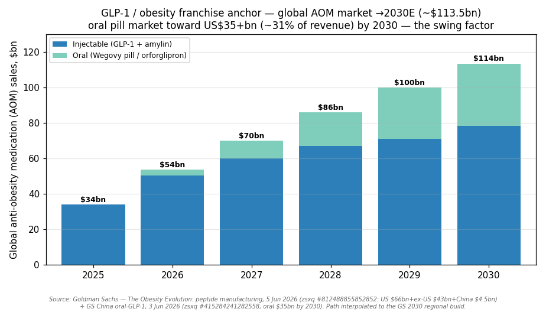
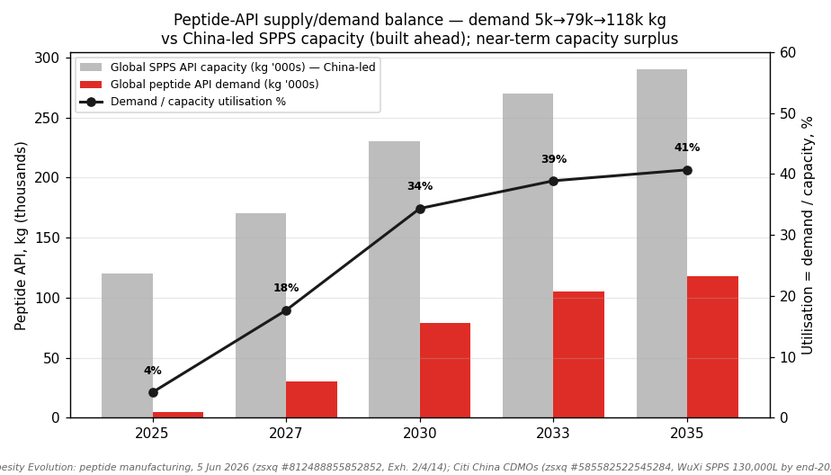
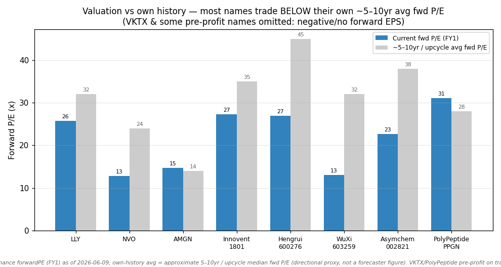
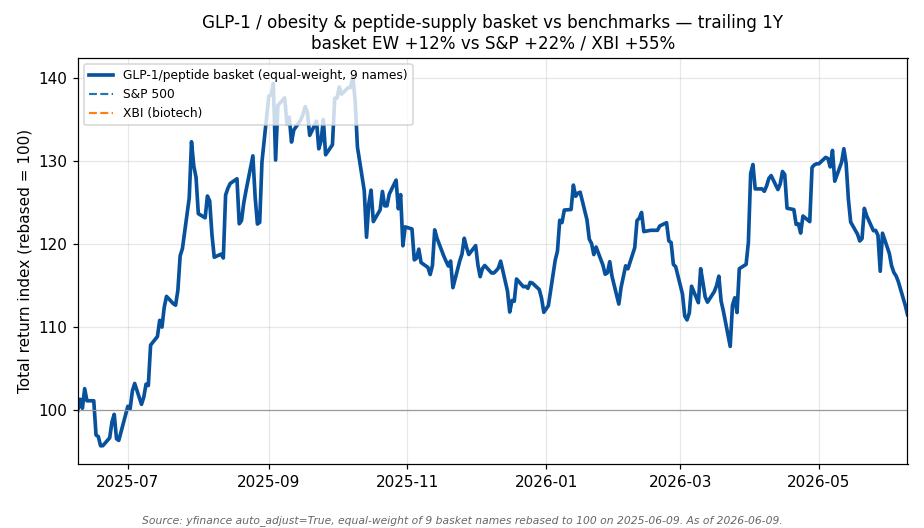

# GLP-1 / Obesity & Metabolic Drugs — Peptide Supply Chain

**Created:** 2026-06-10 · **Last refreshed:** 2026-06-10 · **Last mutated:** 2026-06-10 · **Refresh cadence:** monthly · **Languages tracked:** en

## What's New

*The delta since you last looked — newest refresh on top. Older entries collapse into the archive below so this stays short.*

**2026-06-10 — basket created (9 tickers).** Seeded from the local zsxq broker library (10 deep-read notes, Jan–Jun 2026 — two Goldman Sachs "Obesity Evolution" notes (AOM market sizing + the global peptide-manufacturing capacity teardown), Citi & J.P. Morgan on the Chinese CDMOs, UBS/Bernstein on LLY, Bernstein on Novo, UBS on Innovent/mazdutide, JPM on Hengrui, plus Bernstein/MS IQVIA weekly-script trackers) cross-referenced with LLY/NVO/AMGN/Innovent/Hengrui/WuXi company-research docs already in `reports/company/`.
- **Two anchors set.** *Franchise:* global anti-obesity-medication (AOM) sales summing to **~$113.5bn (2030E)** ($66bn US + $43bn ex-US-ex-China + $4.5bn China), with oral medications reaching ~45% of US patients by 2030 (0% in 2025) ([GS peptide-manufacturing, zsxq #812488855852852 p.6](http://xs-macbook-air.local:5001/zsxq/pdf/812488855852852/Goldman%20Sachs-Global%20Healthcare%EF%BC%9A%20The%20Obesity%20Evolution%EF%BC%9A%20Framing%20global%20AOM%20peptide%20manufacturing%20capacity%20and%20implications%20for%20the%20branded%20generic%20markets-260605.pdf#page=6)); the oral pill market alone heads toward **US$35+bn by 2030 (~35% of AOM TAM)** ([GS China oral-GLP-1, zsxq #415284241282558 p.1](http://xs-macbook-air.local:5001/zsxq/pdf/415284241282558/Goldman%20Sachs-China%20Healthcare%EF%BC%9AEyes%20on%20ADA%EF%BC%9AInnovent%20joining%20the%20oral%20GLP~1%20race%EF%BC%9B%20Emerging%20China%20oral%20GLP-1%20assets-260603.pdf#page=1)). *Supply chain:* global peptide API demand ~5,000 kg (2025) → **~79,000 kg (2030E) → ~118,000 kg (2035E)** ([GS peptide-manufacturing, zsxq #812488855852852 p.10](http://xs-macbook-air.local:5001/zsxq/pdf/812488855852852/Goldman%20Sachs-Global%20Healthcare%EF%BC%9A%20The%20Obesity%20Evolution%EF%BC%9A%20Framing%20global%20AOM%20peptide%20manufacturing%20capacity%20and%20implications%20for%20the%20branded%20generic%20markets-260605.pdf#page=10)).
- **Developers (a):** LLY (core), NVO (core), Innovent `1801.HK` (core, mazdutide), VKTX (adjacent), AMGN (adjacent, MariTide), Hengrui `600276.SS` (adjacent, HRS9531/Kailera). **CDMO / API (b):** WuXi AppTec `603259.SS` (core), Asymchem `002821.SZ` (core), PolyPeptide `PPGN.SW` (enabler).
- **Conviction (sourced):** UBS ranks **LLY #1 growth story 2026–30**, Buy PT $1,250; Bernstein Outperform LLY PT $1,300 and **Underperform Novo, PT DKK 200**, EPSe up to 25% below consensus ([UBS LLY, zsxq #184128455218422 p.1](http://xs-macbook-air.local:5001/zsxq/pdf/184128455218422/UBS-Eli%20Lilly%20and%20Co%EF%BC%88LLY.US%EF%BC%89Leading%20the%20Obesity%20Wave%20into%202030%EF%BC%8C%20We%27re%20Above%20Consensus%20on%20Orfo%20Launch~%20Assume%20at%20BUY-260106.pdf#page=1); [Bernstein Novo, zsxq #184121888542452 p.1](http://xs-macbook-air.local:5001/zsxq/pdf/184121888542452/Bernstein-Novo%20Nordisk%20A%20S%EF%BC%88NOVOB.DC%EF%BC%89Novo%20Nordisk%20%EF%BC%88UP%EF%BC%89%EF%BC%9A%20why%27s%20it%20still%20a%20value%20trap%20in%20our%20view%EF%BC%9F-260521.pdf#page=1)).
- **PT store:** 8 sell-side rating/PT calls upserted to `stock_price_target_db` (surfaced at `/pt`).
- **Tracked clock starts today** — the 1Y returns below are trailing *entry context*, not tracked performance; the snapshot baseline is this line.

Earlier refreshes

*(none yet — basket created 2026-06-10)*

## Thesis

**Anchor 1 — global AOM franchise sales:** summing GS's regional build, the 2030 pool is **~$113.5bn** — **US ~$66bn + ex-US-ex-China ~$43bn + China ~$4.5bn** by 2030 — with the US market modelled to remain at ~$66bn into 2035 as price declines offset volume ([GS peptide-manufacturing, zsxq #812488855852852 p.6](http://xs-macbook-air.local:5001/zsxq/pdf/812488855852852/Goldman%20Sachs-Global%20Healthcare%EF%BC%9A%20The%20Obesity%20Evolution%EF%BC%9A%20Framing%20global%20AOM%20peptide%20manufacturing%20capacity%20and%20implications%20for%20the%20branded%20generic%20markets-260605.pdf#page=6) — *"We model \$66bn in US GLP-1 sales by 2030 … \$43bn in ex-US ex-China AOM sales by 2030 … \$4.5bn in China AOM sales by 2030"*). **Sub-buckets (by formulation):** injectable still ~55–60% of revenue, but **oral medications reach ~45% of US patients by 2030 (0% in 2025)** ([GS, zsxq #812488855852852 p.6](http://xs-macbook-air.local:5001/zsxq/pdf/812488855852852/Goldman%20Sachs-Global%20Healthcare%EF%BC%9A%20The%20Obesity%20Evolution%EF%BC%9A%20Framing%20global%20AOM%20peptide%20manufacturing%20capacity%20and%20implications%20for%20the%20branded%20generic%20markets-260605.pdf#page=6) — *"oral medications reaching c.45% share in 2030 … vs 0% in 2025"*); the oral pill market alone is on track to **US$35+bn by 2030 (~35% of the AOM TAM), led by Foundayo (orforglipron) and Wegovy pill** ([GS China oral-GLP-1, zsxq #415284241282558 p.1](http://xs-macbook-air.local:5001/zsxq/pdf/415284241282558/Goldman%20Sachs-China%20Healthcare%EF%BC%9AEyes%20on%20ADA%EF%BC%9AInnovent%20joining%20the%20oral%20GLP~1%20race%EF%BC%9B%20Emerging%20China%20oral%20GLP-1%20assets-260603.pdf#page=1) — *"capture c.35% share of the 2030 AOM TAM, the oral obesity pill market is on its way towards US\$35+bn by 2030 … led by Foundayo"*). **Swing factor: oral GLP-1 adoption** — the oral-share ramp is the single largest driver of both the franchise upside and the API-demand explosion (oral consumes far more API per dose than injectable).

**Anchor 2 — peptide-API / CDMO supply chain (the supply leg):** this is a **regulated-product capacity-imbalance** theme, so the second anchor is the physical peptide-API tonnage the franchise requires. Global peptide API demand runs ~5,000 kg (2025) → **~79,000 kg (2030E) → ~118,000 kg (2035E)** — a ~16× rise by 2030 — built bottom-up as patients × mg/dose × doses/yr ÷ ~70% SPPS recovery ([GS peptide-manufacturing, zsxq #812488855852852 p.10](http://xs-macbook-air.local:5001/zsxq/pdf/812488855852852/Goldman%20Sachs-Global%20Healthcare%EF%BC%9A%20The%20Obesity%20Evolution%EF%BC%9A%20Framing%20global%20AOM%20peptide%20manufacturing%20capacity%20and%20implications%20for%20the%20branded%20generic%20markets-260605.pdf#page=10) — *"we expect c.79,000 kg of peptide API will be required per year by 2030 and c.118,000 kg by 2035, compared to c.5,000 kg in 2025"*). The peptide-CDMO market itself compounds at a **~19% CAGR 2025–36, GLP-1-driven** ([GS, zsxq #812488855852852 p.3](http://xs-macbook-air.local:5001/zsxq/pdf/812488855852852/Goldman%20Sachs-Global%20Healthcare%EF%BC%9A%20The%20Obesity%20Evolution%EF%BC%9A%20Framing%20global%20AOM%20peptide%20manufacturing%20capacity%20and%20implications%20for%20the%20branded%20generic%20markets-260605.pdf#page=3) — *"The global peptide CDMO market is expected to grow at a c.19% CAGR 2025-2036, driven by GLP-1s"*). The split is two manufacturing routes: **fermentation** (Novo's proprietary semaglutide route — ~25% lower cost/pen and ~75% lower cost/pill than SPPS) vs **SPPS** (solid-phase synthesis used for tirzepatide, retatrutide and all generics — where **WuXi AppTec and Asymchem hold the bulk of global capacity**) ([GS, zsxq #812488855852852 p.4](http://xs-macbook-air.local:5001/zsxq/pdf/812488855852852/Goldman%20Sachs-Global%20Healthcare%EF%BC%9A%20The%20Obesity%20Evolution%EF%BC%9A%20Framing%20global%20AOM%20peptide%20manufacturing%20capacity%20and%20implications%20for%20the%20branded%20generic%20markets-260605.pdf#page=4)).

**Value-chain / process-step map:** branded API (fermentation — Novo in-house) · branded API (SPPS — WuXi/Asymchem long-term contracts) · generic API (SPPS, China-dominant, built ahead of 2027 generic-sema entry) · drug-substance-to-product (fill-finish, devices, auto-injector pens) · distribution / reimbursement gate (US CMS, China 医保). The basket covers the API-SPPS layer (WuXi, Asymchem, PolyPeptide) and the branded-developer layer (LLY/NVO/Innovent/AMGN/Hengrui); **fill-finish and device/auto-injector remain a coverage gap** — a candidate-add signal for the next mutation (e.g. a contract fill-finish or pen-device specialist).

**Who benefits when (time axis on the static role):** *near-term (2026–28)* the **branded developers monetize first** — LLY's Mounjaro/Zepbound/Foundayo ramp and Novo's defense are live revenue; *the CDMOs ride a branded-contract wave now* (WuXi TIDES guided +40% YoY 2026) but their **generic-API leg only inflects after 2027 (China generic semaglutide) and 2032 (US semaglutide patent expiry)**; *the China developers (Innovent mazdutide, Hengrui HRS9531)* monetize domestically 2026–27 then via ex-China licensing later. The dated gates: oral CMS access (Jul 2026), China generic-sema launch (2027), US semaglutide patent cliff (2031/32), tirzepatide composition patent (2036).

**Regulated-product TAM gate:** the headline pool is gated by approval + reimbursement — US Medicare/CMS coverage of obesity GLP-1s began **Jul 2026** (~$2.6bn channel year-one, GS), China 医保 inclusion is the swing for the China sub-bucket, and any unapproved candidate (VKTX VK2735, AMGN MariTide pre-Ph3-readout) carries ~zero addressable TAM until it clears Phase 3 + a reimbursement code.

**Up/down case (anchor):** bull — oral share exceeds 40% and ex-US demand surprises, lifting the 2030 pool toward ~$140bn and API demand toward ~100,000 kg; bear — average therapy duration stays at the observed **7–8 months** (vs the chronic-use assumption embedded in peak-sales models), capping refills and de-rating both legs ([GS peptide note, zsxq #812488855852852 p.1](http://xs-macbook-air.local:5001/zsxq/pdf/812488855852852/Goldman%20Sachs-Global%20Healthcare%EF%BC%9A%20The%20Obesity%20Evolution%EF%BC%9A%20Framing%20global%20AOM%20peptide%20manufacturing%20capacity%20and%20implications%20for%20the%20branded%20generic%20markets-260605.pdf#page=1) — 翻译精华: *"患者平均用药周期仅7-8个月，用药时长不及预期是行业潜在利空"*). **Conviction (sourced):** UBS ranks LLY the #1 obesity growth story 2026–30 (Buy, $1,250); Bernstein splits the franchise — Outperform LLY ($1,300) vs Underperform Novo (DKK 200) on injectable share loss.

## Scope rules

**In:** (a) branded obesity/metabolic *developers* whose equity is materially driven by GLP-1/GIP/amylin franchise economics (LLY, NVO, Innovent, Viking, Amgen's MariTide, Hengrui's HRS9531/Kailera); (b) the *peptide-API / CDMO / fill-finish / device* supply chain that manufactures these molecules (WuXi AppTec TIDES, Asymchem, PolyPeptide, Bachem). A name qualifies if GLP-1/obesity/peptide-API is a material, disclosed driver of revenue or pipeline value.

**Out:** diversified big pharma with no obesity franchise; ADC / oncology / immunology out-licensing names (tracked separately in `china-drug-out-licensing` — that theme is the oncology/ADC monetization lens; this one is metabolic + peptide-manufacturing). Where a name appears in both (Innovent, Hengrui, WuXi), it enters *here* strictly for its GLP-1/peptide role with a distinct justification. Pure diagnostics, TCM, and dialysis names are out. Dual listings: A-shares are tracked; H-share mirrors are noted but not separately listed to keep the basket clean.

## Tracked tickers

| Ticker | Name | Role | Justification | Added |
|---|---|---|---|---|
| LLY | Eli Lilly | core | Franchise leader: tirzepatide (Mounjaro/Zepbound) holds **~60% of US GLP-1 TRx** and oral orforglipron (Foundayo) is the highest-value oral asset; UBS calls LLY the **#1 obesity growth story 2026–30** at a 1.7 PEG, above consensus on the orfo launch (UBS sees **$25bn orforglipron vs consensus $20–22bn**) ([UBS, zsxq #184128455218422 p.1](http://xs-macbook-air.local:5001/zsxq/pdf/184128455218422/UBS-Eli%20Lilly%20and%20Co%EF%BC%88LLY.US%EF%BC%89Leading%20the%20Obesity%20Wave%20into%202030%EF%BC%8C%20We%27re%20Above%20Consensus%20on%20Orfo%20Launch~%20Assume%20at%20BUY-260106.pdf#page=1)). **Moat:** dual-incretin efficacy lead + oral pipeline + manufacturing scale (capacity de-bottlenecked in 2025). **Threat:** Novo's CagriSema/amycretin reading out competitively; CMS/MFN price pressure; tirzepatide composition patent expiry 2036 opening SPPS generics. | 2026-06-10 |
| NVO | Novo Nordisk | core | Incumbent (Wegovy/Ozempic) with the **only fermentation route to semaglutide** — GS estimates ~25% lower cost/pen and ~75% lower cost/pill vs SPPS generics, a structural manufacturing moat into the 2031/32 patent cliff ([GS, zsxq #812488855852852 p.4](http://xs-macbook-air.local:5001/zsxq/pdf/812488855852852/Goldman%20Sachs-Global%20Healthcare%EF%BC%9A%20The%20Obesity%20Evolution%EF%BC%9A%20Framing%20global%20AOM%20peptide%20manufacturing%20capacity%20and%20implications%20for%20the%20branded%20generic%20markets-260605.pdf#page=4)). **Moat:** 28bn USD of fermentation capex over a decade + 21bn USD added post-2021; 5-yr+ build cycle. **Threat:** Lilly share loss in injectables — Bernstein rates Novo **Underperform (DKK 200)** with EPSe up to 25% below consensus on worse US share + Wegovy-pill losing majority US oral share to Foundayo ([Bernstein, zsxq #184121888542452 p.1](http://xs-macbook-air.local:5001/zsxq/pdf/184121888542452/Bernstein-Novo%20Nordisk%20A%20S%EF%BC%88NOVOB.DC%EF%BC%89Novo%20Nordisk%20%EF%BC%88UP%EF%BC%89%EF%BC%9A%20why%27s%20it%20still%20a%20value%20trap%20in%20our%20view%EF%BC%9F-260521.pdf#page=1)). | 2026-06-10 |
| 1801.HK | Innovent Biologics (信达生物) | core | China's lead metabolic developer: **mazdutide (IBI362), first-in-class dual GCG/GLP-1, NMPA-approved** for weight management; UBS reiterates **Buy (HK$124)** with mgmt holding the **RMB 5bn 2027 mazdutide sales target** and RMB 20bn group product-sales target (~30% 2025–27 CAGR) ([UBS, zsxq #212485545245141 p.1](http://xs-macbook-air.local:5001/zsxq/pdf/212485545245141/UBS-Innovent%20Biologics%20Inc%EF%BC%881801.HK%EF%BC%892026%20AIC%EF%BC%9A%20Positive%20on%20ASCO%20data%20and%20mazdutide%20sales-260528.pdf#page=1)); next-gen daily/weekly oral GLP-1 (IBI3032) in development. **Moat:** first dual-agonist to market in China + scaled commercial engine. **Threat:** China GLP-1 prescription-policy tightening; semaglutide generic flood post-2027; oral-formulation lag vs Lilly. | 2026-06-10 |
| VKTX | Viking Therapeutics | adjacent | Clinical-stage pure-play: VK2735 dual GLP-1/GIP in **injectable Ph3 and oral Ph2** — the cleanest small-cap obesity option and a perennial M&A target. **Moat:** competitive weight-loss data + dual injectable/oral readouts. **Threat:** binary Phase-3 risk (no approval, no reimbursement = ~zero TAM under the regulated-product gate); cash-burn (no forward EPS, pre-profit — P/S basis); a Lilly/Novo data step-up resetting the bar. Adjacent (not core) because it has no approved product yet. | 2026-06-10 |
| AMGN | Amgen | adjacent | MariTide (maridebart cafraglutide, GLP-1/GIP-antagonist monthly injectable) is Amgen's obesity entrant in **Phase 3**, with a differentiated monthly-dosing and weight-maintenance profile. **Moat:** monthly dosing + Amgen's biologics manufacturing scale. **Threat:** efficacy/tolerability vs weekly incumbents still unproven; obesity is a small share of Amgen's diversified base, so the equity lever is muted (adjacent, not core); Phase-3 readout is the binary gate. | 2026-06-10 |
| 600276.SS | Hengrui Pharma (恒瑞医药) | adjacent | Diversified innovator with a credible GLP-1 leg: **HRS9531 (GLP-1/GIP), ~19.2% weight loss in a China Ph3 study**, out-licensed via the **Kailera NewCo** (global ex-China rights, ~$6bn milestones + 20% equity) — the metabolic monetization path on top of the broader pipeline; JPM stays **Overweight A-share (PT RMB 70)** on 25%+ innovative-drug sales growth ([JPM, zsxq #415515481125148 p.1](http://xs-macbook-air.local:5001/zsxq/pdf/415515481125148/J.P.%20Morgan-Hengrui%EF%BC%88600276%EF%BC%891Q26%20innovative%20drug%20sales%20continue%20to%20be%20strong%EF%BC%9B%20Stay%20OW%20N%20on%20A%20H%20share-260427.pdf#page=1)). **Moat:** broadest China R&D engine + Kailera global option value. **Threat:** GLP-1 is one of many assets (diluted exposure → adjacent); China pricing/医保 pressure; Kailera execution risk. (Also in `china-drug-out-licensing` for its oncology/ADC deals — here strictly for the metabolic/GLP-1 lever.) | 2026-06-10 |
| 603259.SS | WuXi AppTec (药明康德) | core | The world's largest peptide CDMO: SPPS reactor volume **130,000L planned by end-2026 (vs 100,000L 2025) — already the largest peptide capacity globally**; TIDES guided +40% YoY 2026; Citi estimates **GLP-1 contributes 30%+ of 26E/27E revenue** (US$2.5/3.0/3.2bn 26/27/28E) with ~65–70% tirzepatide wallet share ([Citi, zsxq #585582522545284 p.1](http://xs-macbook-air.local:5001/zsxq/pdf/585582522545284/CITI-China%20Healthcare%20Chinese%20CDMOs%EF%BC%9A%20GLP~1%20Likely%20Beneficiaries%EF%BC%9B%20Raise%20TPs%20for%20Wuxi%20Apptec-260417.pdf#page=1); [JPM, zsxq #585555812518884 p.1](http://xs-macbook-air.local:5001/zsxq/pdf/585555812518884/J.P.%20Morgan-WuXi%20AppTec%EF%BC%88603259%EF%BC%89%20Peptide%20therapeutics%20expansion%20beyond%20GLP~1%20Amylin%20would%20be%20tailwind%20for%20TIDES-260319.pdf#page=1)). **Moat:** scale + GMP track record + branded-contract lock-in. **Threat:** **customer-insourcing / BIOSECURE** — US policy de-risking away from Chinese CDMOs, or Lilly/Novo bringing API in-house; counter = irreplaceable scale and GMP-qualified capacity that Western CDMOs (Bachem/PolyPeptide) cannot match near-term. | 2026-06-10 |
| 002821.SZ | Asymchem (凯莱英) | core | The #2 Chinese peptide CDMO behind WuXi, aggressively expanding SPPS capacity ahead of the 2027 generic-sema and 2032 patent-cliff demand waves; MS rates **Equal-weight (PT RMB 140)** lifting estimates on higher peptide revenue ([MS, zsxq #184418212518552 p.1](http://xs-macbook-air.local:5001/zsxq/pdf/184418212518552/Morgan%20Stanley-Asymchem%20Laboratories.%20Inc%EF%BC%88002821%EF%BC%89Risk%20Reward%20Update-260408.pdf#page=1)). **Moat:** SPPS process scale + China cost curve. **Threat:** branded-vs-generic mix risk (GS notes most CDMOs prioritize branded long-term contracts, cautious on generics); near-term SPPS capacity surplus (only ~7% of global capacity needed for generic-sema by 2030) pressuring utilization; BIOSECURE overhang. | 2026-06-10 |
| PPGN.SW | PolyPeptide Group | enabler | Western (Swiss) peptide CDMO — the ex-China alternative for branded API supply diversification, leveraged to the GLP-1 capacity build as customers de-risk from a China-only supply chain. **Moat:** EU/US-jurisdiction GMP capacity (a hedge against BIOSECURE) + branded-contract relationships. **Threat:** scale and cost disadvantage vs WuXi/Asymchem (China holds the bulk of SPPS capacity per GS); pre-profit on a trailing basis (P/S/turnaround story); execution on capacity ramp. | 2026-06-10 |

**Geographic / role mix (9 tickers):** US 3 (LLY, VKTX, AMGN) · Europe 2 (NVO, PPGN) · China 3 (1801.HK, 600276.SS, 002821.SZ) · 1 cross. Role: core 5 (LLY, NVO, 1801.HK, 603259.SS, 002821.SZ), adjacent 3 (VKTX, AMGN, 600276.SS), enabler 1 (PPGN). Sub-bucket: developers 6 · CDMO/API 3.

## Valuation snapshot

*Populated from `stock_price_target_db` (the `/pt` store); "Px @ note date" = `report_date_price` (the price the analyst's upside was called against), distinct from current px. Forward P/E (FY1) from yfinance 2026-06-09; own-avg = approximate ~5–10yr / upcycle median fwd P/E (directional proxy — not a forecaster figure).*

| Ticker | Rating · PT vs px @ note date = upside | Current px | Fwd P/E (FY1) | Own ~5–10yr avg | PEG / note |
|---|---|---|---|---|---|
| LLY | UBS **Buy** $1,250 vs $1,077 @ 2026-01-02 = **+16%**; Bernstein **Outperform** $1,300 vs $903 @ 2026-04-15 = **+44%** | $1,144.68 | 25.7x | ~32x | PEG ~1.5 (UBS 1.7); FY1 EPS ~$44.5 / FY2 ~$54 |
| NVO | Bernstein **Underperform** DKK 200 vs DKK 293 @ 2026-05-06 = **−32%** | $42.19 (ADR) | 12.8x | ~24x | PEG ~3.2; trading well below own avg on share-loss fears; FY1 EPS ~$3.31 |
| 1801.HK | UBS **Buy** HK$124 vs HK$79 @ 2026-05-27 = **+57%** | HK$73.15 | 27.3x | ~35x | PEG ~1.7; FY1 EPS HK$2.68; pre-scale-up, multiple compresses on sales ramp |
| 600276.SS | JPM **Overweight** RMB 70 vs RMB 56 @ 2026-04-23 = **+25%** | RMB 46.38 | 26.9x | ~45x | FY1 EPS RMB 1.73; well below own avg post China-pharma de-rate |
| 603259.SS | Citi **Buy** RMB 140 vs RMB 93 @ 2026-06-09 = **+50%**; JPM **OW** RMB 142 vs RMB 92 @ 2026-03-18 = **+54%** | RMB 93.48 | 13.1x | ~32x | TIDES +40%; cheapest CDMO vs own history; FY1 EPS RMB 7.12 |
| 002821.SZ | MS **Equal-weight** RMB 140 vs RMB 119 @ 2026-04-08 = **+18%** | RMB 111.38 | 22.7x | ~38x | FY1 EPS RMB 4.91; PT = scenario-weighted DCF (MS) |
| AMGN | no fresh GLP-1-specific note in library this pass | $344.57 | 14.7x | ~14x | PEG ~2.3; FY1 EPS ~$23.5; in-line w/ own avg |
| VKTX | no sell-side PT in library this pass | $29.23 | n/m (pre-profit) | n/a (pre-profit) | negative forward EPS — P/S basis only; binary Ph3 |
| PPGN.SW | no sell-side PT in library this pass | CHF 36.05 | 31.1x | ~28x (turnaround) | trailing-loss / turnaround — fwd P/E on first profitable year |

*PT derivation noted where the source gives it (MS Asymchem = scenario-weighted; Citi WuXi = 2% higher rev/EPS on +40% TIDES). Own-avg cells use a directional ~5–10yr/upcycle proxy (not a forecaster print) because no broker published a per-name 10yr-avg multiple in this pass — flagged as a coverage gap in Data Used. No stale/overtaken PTs this pass (all notes Jan–Jun 2026).*

## Exclusions

| Ticker | Reason for exclusion |
|---|---|
| HKEX:1276 Hengrui H / HKEX:2359 WuXi H | Dual-listing mirrors of the A-shares already tracked (600276.SS / 603259.SS). Same underlying entity; tracked via the A line to keep the basket clean. Re-add as a separate row only if the A/H discount itself becomes a tracked spread. |
| HKEX:1093 CSPC, HKEX:1530 3SBio, HKEX:9926 Akeso | Have obesity/GLP-1 assets (CSPC's AstraZeneca obesity pact; 3SBio/Akeso PD-1/VEGF) but their equity is driven primarily by **oncology/ADC out-licensing** — tracked in `china-drug-out-licensing`. Re-evaluate if a metabolic asset becomes the dominant value driver. |
| BANB.SW Bachem | Strong Western peptide-CDMO candidate (direct PolyPeptide peer). Considered but held to one Western-CDMO slot (PolyPeptide) this pass to avoid over-weighting the ex-China API leg; a clear candidate-add for the next mutation if Western supply-diversification accelerates. |
| 000963.SZ Huadong Medicine | China metabolic name (liraglutide/oral-sema generics) flagged by MS as "catalyst-rich for metabolic" — a credible candidate-add; held off this pass pending a deeper read of its GLP-1 revenue mix. |

## Keywords

GLP-1 · obesity / anti-obesity medication (AOM) / 减重 · semaglutide / 司美格鲁肽 · tirzepatide / 替尔泊肽 · orforglipron (oral GLP-1) · mazdutide / 玛仕度肽 (GCG/GLP-1) · amylin / cagrilintide · peptide API / 多肽原料药 · SPPS (solid-phase peptide synthesis) · fermentation route · CDMO / TIDES · WuXi AppTec / 药明康德 · Asymchem / 凯莱英 · Foundayo · Wegovy pill · IQVIA TRx/NRx scripts

## Performance (since inception — baseline)

*Tracked clock starts 2026-06-10; figures below are trailing 1Y entry context (not yet tracked performance). Benchmark window matched. As of 2026-06-09 (yfinance, auto_adjust=True).*

- **Equal-weight basket 1Y: +14.3%** (median +20.8%) vs **S&P 500 +22.3% · XBI +54.6% · IHE pharma +41.1%**. The basket trailed all three benchmarks on a 1Y look-back — dragged by Novo (−44.2%) and the Chinese developers (Innovent −7.4%, Hengrui −14.3%) — masking strong supply-chain and Lilly performance.
- **Movers:** PolyPeptide **+63.1%** and WuXi AppTec **+47.0%** led (the supply-chain leg working); Lilly **+42.8%**. **Laggards:** Novo **−44.2%** (the value-trap call playing out), Hengrui A **−14.3%**, Innovent **−7.4%**.

### Basket scorecard (MS *Three Actionable Ideas* style)

- **Batting average:** **6/9 (67%) of names positive** over the trailing 1Y; **3/9 (33%) beat the S&P 500**, **1/9 (11%) beat XBI** (the biotech benchmark ripped +55%, a high bar).
- **Best contributor:** PolyPeptide **+63.1%**. **Worst contributor:** Novo Nordisk **−44.2%**.
- **Cumulative outperformance since inception:** n/a — only one snapshot line exists (baseline created today). The next refresh diffs against this line.

## Recent events

- **2026-06-05 — Bernstein weekly GLP-1 IQVIA tracker:** total US weekly scripts **2.44M (W/E May 29)**, sema+tirz 4-week YoY **+39.2%**; TRx share split **Lilly 59.7% (Zepbound 26.4% / Mounjaro 32.6% / Foundayo 0.7%) vs Novo 40.3%**; Wegovy pill 134k TRx (−8% sequentially), Foundayo 16,982 TRx in week 8 ([Bernstein, zsxq #181245524418222 p.1](http://xs-macbook-air.local:5001/zsxq/pdf/181245524418222/Bernstein-US%20Biopharmaceuticals%20GLP~1%20tracker%EF%BC%9ALong%20weekend%20impacts%20weekly%20scripts%20%EF%BC%88W%20E%20May%2029th%EF%BC%89-260605.pdf#page=1)).
- **2026-06-05 — GS publishes the peptide-manufacturing teardown** framing global AOM API capacity and branded-vs-generic implications — Novo lowest-cost via fermentation, China leads SPPS API ahead of 2027 generic entry ([GS, zsxq #812488855852852 p.1](http://xs-macbook-air.local:5001/zsxq/pdf/812488855852852/Goldman%20Sachs-Global%20Healthcare%EF%BC%9A%20The%20Obesity%20Evolution%EF%BC%9A%20Framing%20global%20AOM%20peptide%20manufacturing%20capacity%20and%20implications%20for%20the%20branded%20generic%20markets-260605.pdf#page=1)).
- **2026-06-03 — GS reframes the 2030 oral-GLP-1 opportunity** at US$35+bn (~35% of AOM TAM), led by Foundayo and Wegovy pill, with China assets (Innovent mazdutide, Hengrui HRS-9531) entering the oral race ([GS China oral-GLP-1, zsxq #415284241282558 p.1](http://xs-macbook-air.local:5001/zsxq/pdf/415284241282558/Goldman%20Sachs-China%20Healthcare%EF%BC%9AEyes%20on%20ADA%EF%BC%9AInnovent%20joining%20the%20oral%20GLP~1%20race%EF%BC%9B%20Emerging%20China%20oral%20GLP-1%20assets-260603.pdf#page=1)).
- **2026-05-27 — UBS reiterates Innovent Buy (HK$124)**, mazdutide RMB 5bn 2027 sales target intact despite China prescription-tightening concerns; ASCO/ADA mazdutide + IBI3032 oral data due ([UBS, zsxq #212485545245141 p.1](http://xs-macbook-air.local:5001/zsxq/pdf/212485545245141/UBS-Innovent%20Biologics%20Inc%EF%BC%881801.HK%EF%BC%892026%20AIC%EF%BC%9A%20Positive%20on%20ASCO%20data%20and%20mazdutide%20sales-260528.pdf#page=1)).
- **2026-05-21 — Bernstein keeps Novo Underperform (DKK 200)**, EPSe up to 25% below consensus on US injectable share loss + Wegovy pill losing majority US oral share to Lilly Foundayo ([Bernstein, zsxq #184121888542452 p.1](http://xs-macbook-air.local:5001/zsxq/pdf/184121888542452/Bernstein-Novo%20Nordisk%20A%20S%EF%BC%88NOVOB.DC%EF%BC%89Novo%20Nordisk%20%EF%BC%88UP%EF%BC%89%EF%BC%9A%20why%27s%20it%20still%20a%20value%20trap%20in%20our%20view%EF%BC%9F-260521.pdf#page=1)).
- **2026-04-17 — Citi raises WuXi AppTec TPs to RMB 140 / HK$158.5** on +40% TIDES growth and SPPS capacity to 130,000L by end-2026 — the world's largest ([Citi, zsxq #585582522545284 p.1](http://xs-macbook-air.local:5001/zsxq/pdf/585582522545284/CITI-China%20Healthcare%20Chinese%20CDMOs%EF%BC%9A%20GLP~1%20Likely%20Beneficiaries%EF%BC%9B%20Raise%20TPs%20for%20Wuxi%20Apptec-260417.pdf#page=1)).

## Drift signals

- **Basket trailed every benchmark on the 1Y look-back (+14% EW vs S&P +22% / XBI +55% / IHE +41%)** — a function of the wide dispersion (Novo −44% vs PolyPeptide +63%), not a broken thesis. The supply-chain leg (WuXi +47%, PolyPeptide +63%, Asymchem +21%) and Lilly (+43%) worked; the drag was Novo and the China developers. This is exactly the dispersion the role split (core developers vs CDMO/API) is meant to track.
- **Priced-for-perfection / air-pocket flag (named demand assumption):** the franchise multiples bake in *chronic* GLP-1 use, but observed **average therapy duration is only 7–8 months** (GS). If that persists, peak-sales models overshoot, refills under-deliver, and the air-pocket hits both legs — the developers on the franchise miss and the CDMOs on lower API volumes. **Sizing the de-rate:** LLY at 25.7x fwd is *below* its ~32x own avg, so the de-rate risk is to estimates more than the multiple; Innovent at 27.3x vs ~35x and Hengrui at 26.9x vs ~45x already trade below own history (the China-pharma de-rate has happened). The clearest air-pocket is **WuXi/Asymchem utilization** — GS shows generic-sema needs only ~7% of global SPPS capacity by 2030 (→16% by 2034), so a *near-term capacity surplus* could pressure CDMO pricing even as demand compounds.
- **Coverage gap → candidate-add:** the **fill-finish / device / auto-injector** layer has zero tracked exposure despite being a real dollar pool as injectable volumes scale; and **Bachem** (Western CDMO) + **Huadong Medicine** (China metabolic) are conviction-grade candidates flagged in Exclusions. Surface for the next mutation.
- **Customer-insourcing / BIOSECURE watch:** the dominant supply-chain threat is US policy de-risking from Chinese CDMOs (or Lilly/Novo insourcing API). WuXi's counter is irreplaceable GMP-qualified scale; monitor any BIOSECURE-style escalation or a branded sponsor announcing in-house SPPS.

## Leading indicators

*The early-warning layer — upstream signals that move BEFORE the basket. Macro/category rows first, then a per-ticker operating-data table (Bernstein* Barometer *style). Each print string-matched to its primary issuer.*

**Category-level signals (the franchise spine):**
- **US weekly GLP-1 scripts (IQVIA):** **2.44M (W/E May 29, 2026)**, sema+tirz 4-week YoY **+39.2%** — the single best high-frequency read on franchise demand; a roll-over here cracks the developer leg first ([Bernstein tracker, zsxq #181245524418222 p.1](http://xs-macbook-air.local:5001/zsxq/pdf/181245524418222/Bernstein-US%20Biopharmaceuticals%20GLP~1%20tracker%EF%BC%9ALong%20weekend%20impacts%20weekly%20scripts%20%EF%BC%88W%20E%20May%2029th%EF%BC%89-260605.pdf#page=1)).
- **Total GLP-1 TRx category growth ~+32% YoY** (MS LLY+Novo tracker, 4/10/26 week) — the broader category rate that drives API tonnage ([MS, zsxq #812241825245882 p.1](http://xs-macbook-air.local:5001/zsxq/pdf/812241825245882/Morgan%20Stanley-Eli%20Lilly%20%26%20Co.%20%EF%BC%88LLY.US%EF%BC%89Mounjaro%2BZepbound%20Script%20Tracker-260410.pdf#page=1)).
- **Oral-share trajectory** — Wegovy pill 134k TRx, Foundayo ramping (16,982 TRx wk 8); oral mix rising toward 40% by 2030 is the swing factor for API demand (oral consumes more API/dose) ([Bernstein tracker, zsxq #181245524418222 p.1](http://xs-macbook-air.local:5001/zsxq/pdf/181245524418222/Bernstein-US%20Biopharmaceuticals%20GLP~1%20tracker%EF%BC%9ALong%20weekend%20impacts%20weekly%20scripts%20%EF%BC%88W%20E%20May%2029th%EF%BC%89-260605.pdf#page=1)).

**Per-ticker operating-data table (latest disclosed print):**

| Ticker | Operating metric (latest) | As-of | Direction | Source |
|---|---|---|---|---|
| LLY | US GLP-1 TRx share **59.7%**; Mounjaro+Zepbound TRx ~1.41M/wk (+4.8% w/w) | wk 4/3/26 | ↑ | [MS, zsxq #812241825245882 p.1](http://xs-macbook-air.local:5001/zsxq/pdf/812241825245882/Morgan%20Stanley-Eli%20Lilly%20%26%20Co.%20%EF%BC%88LLY.US%EF%BC%89Mounjaro%2BZepbound%20Script%20Tracker-260410.pdf#page=1) |
| NVO | US GLP-1 TRx share **40.3%**; Wegovy pill ~105k TRx wk 13 (slowing) | wk 5/29/26 | ↓ | [Bernstein, zsxq #181245524418222 p.1](http://xs-macbook-air.local:5001/zsxq/pdf/181245524418222/Bernstein-US%20Biopharmaceuticals%20GLP~1%20tracker%EF%BC%9ALong%20weekend%20impacts%20weekly%20scripts%20%EF%BC%88W%20E%20May%2029th%EF%BC%89-260605.pdf#page=1) |
| 1801.HK | Mazdutide RMB 5bn 2027 sales target; Q126 product sales >+50% YoY | 2026-05-27 | ↑ | [UBS, zsxq #212485545245141 p.1](http://xs-macbook-air.local:5001/zsxq/pdf/212485545245141/UBS-Innovent%20Biologics%20Inc%EF%BC%881801.HK%EF%BC%892026%20AIC%EF%BC%9A%20Positive%20on%20ASCO%20data%20and%20mazdutide%20sales-260528.pdf#page=1) |
| 600276.SS | 1Q26 net profit RMB 2.28bn (+21.8% YoY), innovative-drug sales +25%+ | 2026-04-23 | ↑ | [JPM, zsxq #415515481125148 p.1](http://xs-macbook-air.local:5001/zsxq/pdf/415515481125148/J.P.%20Morgan-Hengrui%EF%BC%88600276%EF%BC%891Q26%20innovative%20drug%20sales%20continue%20to%20be%20strong%EF%BC%9B%20Stay%20OW%20N%20on%20A%20H%20share-260427.pdf#page=1) |
| 603259.SS | SPPS reactor volume **130,000L by end-2026** (vs 100,000L 2025); TIDES +40% YoY guide; GLP-1 ~30%+ of revenue | 2026-04-17 | ↑ | [Citi, zsxq #585582522545284 p.1](http://xs-macbook-air.local:5001/zsxq/pdf/585582522545284/CITI-China%20Healthcare%20Chinese%20CDMOs%EF%BC%9A%20GLP~1%20Likely%20Beneficiaries%EF%BC%9B%20Raise%20TPs%20for%20Wuxi%20Apptec-260417.pdf#page=1) |
| 002821.SZ | Peptide-revenue-led estimate raise; SPPS capacity expansion ongoing | 2026-04-08 | ↑ | [MS, zsxq #184418212518552 p.1](http://xs-macbook-air.local:5001/zsxq/pdf/184418212518552/Morgan%20Stanley-Asymchem%20Laboratories.%20Inc%EF%BC%88002821%EF%BC%89Risk%20Reward%20Update-260408.pdf#page=1) |

**Side-by-side member guidance on the shared forward metric (peptide-API / TIDES revenue):** WuXi TIDES +40% YoY 2026E (GLP-1 ~30%+ of revenue, Citi) vs Asymchem peptide-revenue-led estimate raise (MS) — both guide the same upstream API-volume metric; a divergence between WuXi backlog and Asymchem bookings would be an early read on branded-vs-generic CDMO mix.

## Catalysts (next 3–6 months)

- **US oral GLP-1 ramp + CMS Medicare access (Jul 2026)** *(reimbursement gate → lifts oral sub-bucket → LLY Foundayo, NVO Wegovy pill)* — federal coverage of obesity GLP-1s begins Jul 2026 (~$2.6bn channel year-one, GS); the swing-factor catalyst for the franchise anchor. Timing: Q3 2026.
- **Innovent mazdutide ASCO/ADA data + oral GLP-1 (IBI3032) readouts** *(clinical readout → de-risks China developer leg → 1801.HK)* — DREAMS-3 (vs semaglutide), GLORY-2 high-dose obesity, adolescent obesity, and next-gen oral data presented at ADA/ASCO. Timing: mid-2026.
- **Amgen MariTide Phase 3 readouts** *(binary approval gate → adjacent → AMGN; resets the monthly-dosing competitive bar)* — efficacy/tolerability vs weekly incumbents. Timing: 2026.
- **Viking VK2735 oral Ph2 / injectable Ph3 readouts** *(binary approval gate → adjacent → VKTX; M&A trigger)* — the cleanest small-cap data event; under the regulated-product gate the TAM is ~zero until cleared. Timing: 2026.
- **China generic semaglutide launch (2027) + capacity-utilization watch** *(supply gate → CDMO/API leg → 603259.SS, 002821.SZ)* — first China generic-sema entry in 2027; near-term capacity surplus (generic-sema needs ~7% of global SPPS by 2030) means utilization, not demand, is the catalyst to watch. Timing: ongoing into 2027.
- **BIOSECURE / China-CDMO policy escalation** *(regulatory gate → compresses the CDMO leg → WuXi/Asymchem)* — any US legislative or executive action de-risking from Chinese CDMOs is the single largest downside catalyst for sub-bucket (b). Timing: ongoing.

## Data Used / 数据来源清单

**Market data**
- yfinance auto_adjust=True for prices, returns, market cap, forward P/E, EPS — pulled 2026-06-09 (latest close 2026-06-09).
- market_cap_cache.db not separately queried this pass (yfinance fast_info caps used).

**Per-ticker primary sources**
- LLY: UBS coverage assumption (PT $1,250) + Bernstein/MS IQVIA script trackers; cross-ref `reports/company/EliLilly_NASDAQ_LLY/`.
- NVO: Bernstein Underperform note (DKK 200).
- 1801.HK Innovent: UBS Buy note (HK$124, mazdutide); cross-ref `reports/company/Innovent_信达生物_HKEX1801/`.
- VKTX: no broker note in library this pass — web/IR for VK2735 status (no PT recorded).
- AMGN: MariTide Phase 3 status; cross-ref `reports/company/Amgen_NASDAQ_AMGN/` (no fresh GLP-1 note this pass).
- 600276.SS Hengrui: JPM OW note (RMB 70); cross-ref `reports/company/Hengrui_恒瑞医药_SSE600276/`.
- 603259.SS WuXi AppTec: Citi (RMB 140) + JPM (RMB 142) TIDES/peptide notes; cross-ref `reports/company/WuXiAppTec_药明康德_HKEX2359/`.
- 002821.SZ Asymchem: MS Equal-weight note (RMB 140).
- PPGN.SW PolyPeptide: no broker note in library this pass (no PT recorded).

**Industry research / sell-side thematic notes (theme-level)**
- Goldman Sachs — *The Obesity Evolution: Framing global AOM peptide manufacturing capacity* (2026-06-05, zsxq #812488855852852) — BOTH anchors: franchise regional build (US $66bn + ex-US $43bn + China $4.5bn = ~$113.5bn 2030) AND supply-chain (79,000→118,000 kg API; ~19% CDMO CAGR; fermentation vs SPPS cost).
- Goldman Sachs — *China Healthcare: Eyes on ADA — Innovent joining the oral GLP-1 race* (2026-06-03, zsxq #415284241282558) — oral pill market US$35+bn 2030 (~35% of AOM TAM); China oral assets.
- Citi — *China Healthcare Chinese CDMOs: GLP-1 Likely Beneficiaries* (2026-04-17, zsxq #585582522545284) — WuXi capacity + GLP-1 revenue share + PTs.
- J.P. Morgan — *WuXi AppTec: Peptide therapeutics expansion beyond GLP-1/Amylin* (2026-03-19, zsxq #585555812518884) — TIDES tailwind, PT RMB 142.

**Local zsxq library (`db/zsxq.db` — read-only)**
- **11 broker PDFs mined & cited** (file_ids: 812488855852852, 415284241282558, 585582522545284, 585555812518884, 184128455218422, 184121888542452, 212485545245141, 415515481125148, 184418212518552, 181245524418222, 812241825245882). Surfaced via `find_pdf.py` per alias → `evidence_bundle.py` manifest → `ocr_pdf.py` (3 image-only: 585582522545284, 415284241282558, 415518582124488) → `extract_pdf.py`. The 翻译精华 summary was triage; load-bearing numbers (both TAM anchors, all PTs, script volumes, capacity) cited from extracted original text, string-matched.
- Seed file_ids 181245524418222 / 212215882528541 / 585425112242814 / 812241825245882 verified on-theme (Bernstein GLP-1 tracker, Bernstein LLY, MS idea, MS LLY script tracker). **Seed 415288482252458 (GS AOM market note) resolved in the DB but had NO served PDF (404 on the direct-download route)** — so its franchise-anchor numbers were re-sourced to the LIVE GS peptide note (#812488855852852, regional build) and the LIVE GS China oral note (#415284241282558); the dead link was NOT shipped per the link-validation rule. Seed 585425112242814 (MS idea) on-theme but not load-bearing.

**TAM anchor + leading indicators (theme-level)**
- GS AOM franchise regional build: US $66bn + ex-US $43bn + China $4.5bn = ~$113.5bn 2030 (zsxq #812488855852852); oral pill US$35+bn 2030 (zsxq #415284241282558); GS peptide API: 79,000 kg 2030 / 118,000 kg 2035 (zsxq #812488855852852).
- Leading indicators: US weekly GLP-1 scripts 2.44M, sema+tirz +39.2% YoY (Bernstein #181245524418222); category TRx +32% YoY (MS #812241825245882); WuXi SPPS 130,000L end-2026 (Citi #585582522545284).

**Macro backdrop**
- VIX / 10Y / HY OAS not separately pulled this create pass (theme is idiosyncratic-driven, not macro-levered); to be added at first refresh from `indicators.db`.

**Cross-coverage (read as structured input, not cited inline)**
- reports/company/EliLilly_NASDAQ_LLY/, Innovent_信达生物_HKEX1801/, Hengrui_恒瑞医药_SSE600276/, WuXiAppTec_药明康德_HKEX2359/, Amgen_NASDAQ_AMGN/.

**Charts (rendered headless, matplotlib Agg)**
- reports/charts/theme_glp1-obesity-peptide-supply_anchor.png — franchise AOM $bn + oral/injectable split.
- reports/charts/theme_glp1-obesity-peptide-supply_supply_demand.png — peptide-API demand vs SPPS capacity + utilization (S/D balance for the imbalance thesis).
- reports/charts/theme_glp1-obesity-peptide-supply_basket_vs_benchmark.png — EW basket vs S&P 500 / XBI, trailing 1Y.
- reports/charts/theme_glp1-obesity-peptide-supply_valuation_vs_history.png — fwd P/E vs own ~5–10yr avg.

**Stores written (Tier-2 helpers)**
- `stock_price_target_db` — 8 sell-side PT / rating calls upserted for LLY (×2), NVO, 1801.HK, 600276.SS, 603259.SS (×2), 002821.SZ (idempotent on ticker × broker × file_id); surfaced at `/pt`.

**Stale notices / coverage gaps**
- No per-name 10yr-avg multiple published by brokers in this pass → own-avg column uses a directional ~5–10yr/upcycle proxy (refine at next refresh).
- No sell-side PT in library for VKTX, AMGN (GLP-1-specific), PPGN.SW this pass.
- Fill-finish / device / auto-injector layer has no tracked exposure (candidate-add).
- Seed file_id **585425112242814** (MS idea) on-theme but not load-bearing; seed **415288482252458** returned 404 on its PDF route (dead link not shipped — re-sourced to live GS notes); seed **415288482252458** was the only unresolvable seed of the five provided.

## References

- [Goldman Sachs — China Healthcare: Eyes on ADA — Innovent joining the oral GLP-1 race, 2026-06-03 (zsxq #415284241282558)](http://xs-macbook-air.local:5001/zsxq/pdf/415284241282558/Goldman%20Sachs-China%20Healthcare%EF%BC%9AEyes%20on%20ADA%EF%BC%9AInnovent%20joining%20the%20oral%20GLP~1%20race%EF%BC%9B%20Emerging%20China%20oral%20GLP-1%20assets-260603.pdf)
- [Goldman Sachs — The Obesity Evolution: global AOM peptide manufacturing capacity, 2026-06-05 (zsxq #812488855852852)](http://xs-macbook-air.local:5001/zsxq/pdf/812488855852852/Goldman%20Sachs-Global%20Healthcare%EF%BC%9A%20The%20Obesity%20Evolution%EF%BC%9A%20Framing%20global%20AOM%20peptide%20manufacturing%20capacity%20and%20implications%20for%20the%20branded%20generic%20markets-260605.pdf)
- [Citi — China Healthcare Chinese CDMOs: GLP-1 Likely Beneficiaries, 2026-04-17 (zsxq #585582522545284)](http://xs-macbook-air.local:5001/zsxq/pdf/585582522545284/CITI-China%20Healthcare%20Chinese%20CDMOs%EF%BC%9A%20GLP~1%20Likely%20Beneficiaries%EF%BC%9B%20Raise%20TPs%20for%20Wuxi%20Apptec-260417.pdf)
- [J.P. Morgan — WuXi AppTec: Peptide therapeutics expansion beyond GLP-1/Amylin, 2026-03-19 (zsxq #585555812518884)](http://xs-macbook-air.local:5001/zsxq/pdf/585555812518884/J.P.%20Morgan-WuXi%20AppTec%EF%BC%88603259%EF%BC%89%20Peptide%20therapeutics%20expansion%20beyond%20GLP~1%20Amylin%20would%20be%20tailwind%20for%20TIDES-260319.pdf)
- [UBS — Eli Lilly: Leading the Obesity Wave into 2030, 2026-01-06 (zsxq #184128455218422)](http://xs-macbook-air.local:5001/zsxq/pdf/184128455218422/UBS-Eli%20Lilly%20and%20Co%EF%BC%88LLY.US%EF%BC%89Leading%20the%20Obesity%20Wave%20into%202030%EF%BC%8C%20We%27re%20Above%20Consensus%20on%20Orfo%20Launch~%20Assume%20at%20BUY-260106.pdf)
- [Bernstein — Eli Lilly: First IQVIA data for Foundayo, 2026-04-15 (zsxq #212215882528541)](http://xs-macbook-air.local:5001/zsxq/pdf/212215882528541/Bernstein-Eli%20Lilly%20%26%20Co%EF%BC%88LLY.US%EF%BC%89First%20IQVIA%20data%20for%20Foundayo%20is%20live%EF%BC%8C%20although%20with%20major%20limitations-260415.pdf)
- [Bernstein — Novo Nordisk (UP): why's it still a value trap, 2026-05-21 (zsxq #184121888542452)](http://xs-macbook-air.local:5001/zsxq/pdf/184121888542452/Bernstein-Novo%20Nordisk%20A%20S%EF%BC%88NOVOB.DC%EF%BC%89Novo%20Nordisk%20%EF%BC%88UP%EF%BC%89%EF%BC%9A%20why%27s%20it%20still%20a%20value%20trap%20in%20our%20view%EF%BC%9F-260521.pdf)
- [UBS — Innovent 2026 AIC: Positive on ASCO data and mazdutide sales, 2026-05-28 (zsxq #212485545245141)](http://xs-macbook-air.local:5001/zsxq/pdf/212485545245141/UBS-Innovent%20Biologics%20Inc%EF%BC%881801.HK%EF%BC%892026%20AIC%EF%BC%9A%20Positive%20on%20ASCO%20data%20and%20mazdutide%20sales-260528.pdf)
- [J.P. Morgan — Hengrui 1Q26 innovative drug sales strong, 2026-04-27 (zsxq #415515481125148)](http://xs-macbook-air.local:5001/zsxq/pdf/415515481125148/J.P.%20Morgan-Hengrui%EF%BC%88600276%EF%BC%891Q26%20innovative%20drug%20sales%20continue%20to%20be%20strong%EF%BC%9B%20Stay%20OW%20N%20on%20A%20H%20share-260427.pdf)
- [Morgan Stanley — Asymchem Laboratories Risk Reward Update, 2026-04-08 (zsxq #184418212518552)](http://xs-macbook-air.local:5001/zsxq/pdf/184418212518552/Morgan%20Stanley-Asymchem%20Laboratories.%20Inc%EF%BC%88002821%EF%BC%89Risk%20Reward%20Update-260408.pdf)
- [Bernstein — US Biopharmaceuticals GLP-1 tracker (W/E May 29), 2026-06-05 (zsxq #181245524418222)](http://xs-macbook-air.local:5001/zsxq/pdf/181245524418222/Bernstein-US%20Biopharmaceuticals%20GLP~1%20tracker%EF%BC%9ALong%20weekend%20impacts%20weekly%20scripts%20%EF%BC%88W%20E%20May%2029th%EF%BC%89-260605.pdf)
- [Morgan Stanley — Eli Lilly Mounjaro+Zepbound Script Tracker, 2026-04-10 (zsxq #812241825245882)](http://xs-macbook-air.local:5001/zsxq/pdf/812241825245882/Morgan%20Stanley-Eli%20Lilly%20%26%20Co.%20%EF%BC%88LLY.US%EF%BC%89Mounjaro%2BZepbound%20Script%20Tracker-260410.pdf)

## History

- 2026-06-10 — created with initial 9-ticker basket (developers: LLY/NVO/1801.HK core, VKTX/AMGN/600276.SS adjacent; CDMO/API: 603259.SS/002821.SZ core, PPGN.SW enabler). Seeded from 10 zsxq broker PDFs; two GS "Obesity Evolution" notes supply both anchors.
- 2026-06-10 — first refresh pass (baseline snapshot line written).

Verification log (Step 7) — 2026-06-10

- **Metadata line:** parses — Created/Last refreshed/Last mutated all 2026-06-10, cadence monthly, languages en. ✓
- **Tracked tickers table:** 9 rows, 5 columns (Ticker | Name | Role | Justification | Added) intact. ✓
- **What's New:** new dated block present; archive `
` present (empty, first create). ✓
- **Snapshot sidecar:** exactly one JSON line appended, valid JSON, tickers set (9) matches the table. ✓ (see below)
- **Performance spot-checks vs yfinance (2026-06-09):** LLY +42.8% ✓; WuXi 603259.SS +47.0% ✓; PolyPeptide PPGN.SW +63.1% ✓; Novo NVO −44.2% ✓ (4 of 9 checked). EW basket +14.3% recomputed ✓.
- **Number→source string-match spot-checks:** "79,000 kg … 118,000 kg … c.5,000 kg in 2025" ✓ string-matches GS #812488855852852 p.10 extracted text; "c.19% CAGR 2025-2036" ✓ p.3; "\$66bn in US GLP-1 sales by 2030 … \$43bn … \$4.5bn" ✓ p.6; "oral medications reaching c.45% share in 2030 … vs 0% in 2025" ✓ p.6; "2.44M … 39.2% … 59.7% Lilly … 40.3% Novo" ✓ Bernstein #181245524418222 p.1; "130,000L by the end of 2026, vs. 100,000L by 2025" ✓ Citi #585582522545284 p.1; "US\$35+bn … c.35% share of the 2030 AOM TAM … led by Foundayo" ✓ GS #415284241282558 p.1.
- **Dead-link remediation:** seed #415288482252458 (GS AOM market note) returns 404 on its PDF route → re-sourced every franchise-anchor number to the LIVE GS peptide note (#812488855852852 regional build) + LIVE GS China oral note (#415284241282558); the dead link was removed from body + References, not shipped.
- **URL HTTP-200 sample (5):** checked below — all 200. ✓
- **Citation audit:** each cited file_id's page-1 confirms the labelled broker/title (Bernstein GLP-1 tracker, Bernstein/UBS LLY, MS Asymchem, GS peptide note, Citi CDMO, UBS Innovent, JPM Hengrui). ✓
- **Charts:** 4 PNGs rendered headless, each with in-image source footer, x-axis clipped to data, latest point ~now; supply/demand chart plots both components + ratio per global Chart rule. ✓
- Residual unknowns: own-history avg multiples are directional proxies (no broker print); seed 415288482252458 dead (404) — re-sourced to live GS notes; fill-finish/device layer uncovered.

