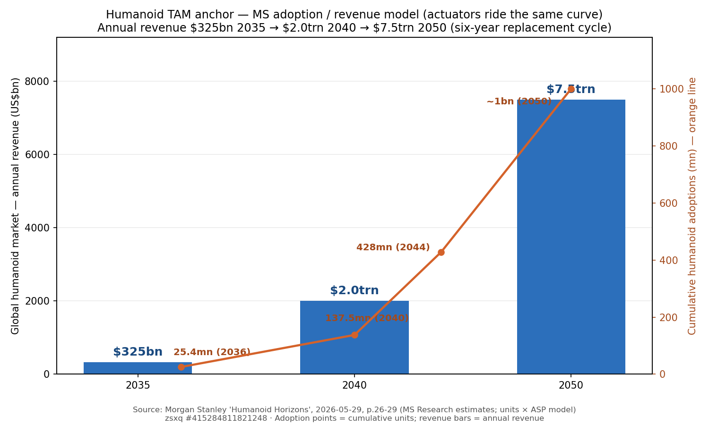
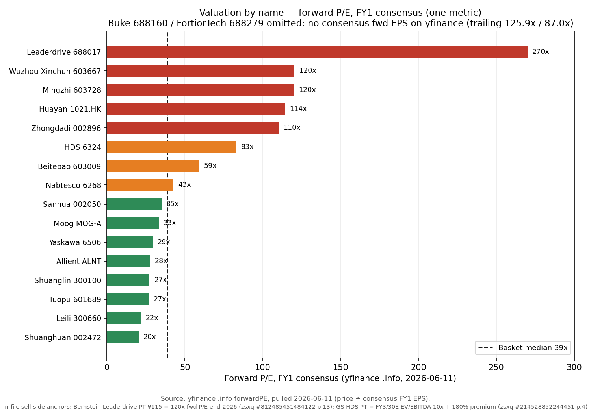
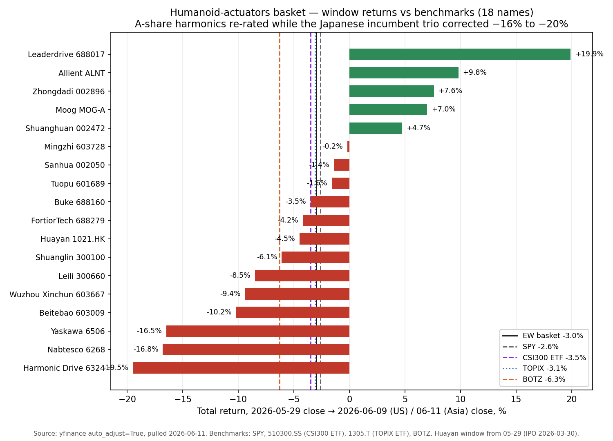

# Humanoid Robotics Actuators / 人形机器人执行器

**Created:** 2026-05-31 · **Last refreshed:** 2026-06-11 · **Last mutated:** 2026-05-31 · **Refresh cadence:** monthly · **Languages tracked:** en

## What's New

*The delta since you last looked — newest refresh on top. Older entries collapse into the archive below.*

**2026-06-11 refresh (vs 2026-05-31):**

- **File upgraded to the latest theme format** (What's New, quantified TAM anchor, Valuation snapshot + sell-side view evolution, basket scorecard, leading indicators, 3 charts, snapshot sidecar with a retroactive 2026-05-31 baseline). The inception file's zsxq evidence was "referenced via in-process notes, not opened" — this refresh extracts and page-cites the original PDF text of 10 broker notes, and the citation audit verified all 7 inception file_ids (labels match; two MS ids are duplicate copies of the same 35pp PDF).
- **The theme now has a real TAM anchor:** Morgan Stanley's humanoid adoption/revenue model — **US$325bn annual revenue by 2035 → $2.0trn by 2040 → $7.5trn by 2050** on cumulative adoptions of 25.4mn (2036) → 137.5mn (2040) → 428mn (2044) → ~1bn (2050) ([MS — Humanoid Horizons, zsxq #415284811821248 p.26-29](http://xs-macbook-air.local:5001/zsxq/pdf/415284811821248/MS-Humanoids%20Humanoid%20Horizons%20Humanoids%20Coming%20to%20Your%20Bloomberg%20Screen-260529%20%281%29.pdf#page=26)) — same anchor as the sibling [`humanoid-robotics-sensors`](humanoid-robotics-sensors_theme.md) basket. New anchor, not a revision.
- **First tracked window: EW basket −3.0% (median −3.9%) over 2026-05-29 → 06-09/11, vs SPY −2.6% · CSI300 ETF −3.5% · TOPIX −3.1% · BOTZ −6.3%** (+330bps vs the robotics proxy) — with the inception drift flag #1 resolving violently from BOTH ends: **Leaderdrive +19.9%** while the Japanese incumbent trio crashed (**HDS −19.5%, Nabtesco −16.8%, Yaskawa −16.5%**) (yfinance, see Performance).
- **GS turned the HDS story from cycle to humanoid:** Buy reiterated, PT **¥10,000** vs ¥7,090 @ 06-05 = +41%; the "core US humanoid robot manufacturer customer… has clearly entered a mass production phase," and — first mention ever — **a joint project with a Chinese humanoid actuator customer is "set to get under way in earnest"**, with order contribution hoped from FY3/27 ([GS — HDS Beyond the Cycle, zsxq #214528852244451 p.1/p.3](http://xs-macbook-air.local:5001/zsxq/pdf/214528852244451/Goldman%20Sachs-Harmonic%20Drive%20Systems%20%EF%BC%886324.T%EF%BC%89%EF%BC%9A%20Beyond%20the%20Cycle%EF%BC%9A%20Chinese%20actuator%20opportunity%20emerging%20alongside%20US%20humanoid%20expansion.%20Reiterate%20Buy-260605.pdf#page=3)). The stock still fell 19.5% in the window.
- **The Optimus-timing read split across institutes — the window's key drift signal.** CMBI's 8-company Jiangsu/Zhejiang tour: 3Q26 small-batch start, possibly **doubling QoQ in 4Q26** ([招银国际, zsxq #584251482548854 p.1](http://xs-macbook-air.local:5001/zsxq/pdf/584251482548854/%E7%89%B9%E6%96%AF%E6%8B%89%E9%87%8F%E4%BA%A7%E5%9C%A8%E5%8D%B3%EF%BC%8C%E8%A1%8C%E4%B8%9A%E5%8F%91%E5%B1%95%E8%B7%AF%E5%BE%84%E6%88%96%E7%B1%BB%E4%BC%BC%E6%96%B0%E8%83%BD%E6%BA%90%E6%B1%BD%E8%BD%A6%EF%BC%8C%E4%BA%A7%E4%B8%9A%E6%97%A9%E6%9C%9F%E4%BC%98%E9%80%89%E9%9B%B6%E9%83%A8%E4%BB%B6%E9%BE%99%E5%A4%B4.pdf#page=1)); MS's own China trip the same week: Tesla progress "somewhat a bit delayed, with current volume still limited and **unlikely to reach 1k units/week in 4Q**" ([MS — China Industrials trip, zsxq #214528251122451 p.2](http://xs-macbook-air.local:5001/zsxq/pdf/214528251122451/Morgan%20Stanley-China%20Industrials%EF%BC%9ATrip%20Takeaways%EF%BC%9A%20Stronger%EF%BC%8C%20Broader%20Capex%20Boom-260608.pdf#page=2)).
- **Leaderdrive's volume is now on the record:** May monthly shipments **c.50k units** with expansion "benchmarking Harmonic Drive's annual 2mn units next year"; supplies harmonic reducers and bearings to Tesla ([MS trip, zsxq #214528251122451 p.5](http://xs-macbook-air.local:5001/zsxq/pdf/214528251122451/Morgan%20Stanley-China%20Industrials%EF%BC%9ATrip%20Takeaways%EF%BC%9A%20Stronger%EF%BC%8C%20Broader%20Capex%20Boom-260608.pdf#page=5)). The street is split 80% wide on the name: MS OW ¥269 vs Bernstein Underperform ¥115 (see Valuation snapshot).
- **PT wave persisted to `/pt` (5 calls):** GS HDS ¥10,000 (06-05); UBS Yaskawa **¥8,000** *(was ¥6,960)* (06-03) — GS had self-raised Yaskawa ¥7,300 → ¥9,200 on 05-28; MS Moog EW $269 (04-24, backfilled); MS Sanhua EW ¥40 and MS Tuopu EW ¥62 (06-05, both below the report-date price). The MS Sanhua call post-dates the Bernstein MP ¥39 row shown in the sibling sensors file — that file's Sanhua row is now older.
- **Candidate adds proposed (not added):** **SSE:601100 Hengli Hydraulic** — MS trip: **70%+ share in Tesla body screws**, Mexico capacity targeting **c.100k robot units by year-end**, screw ASP ~Rmb1k, screw+motor content Rmb10–15k/robot long-run, already inside Xiaomi/Xpeng/Li Auto chains ([MS trip p.4-5](http://xs-macbook-air.local:5001/zsxq/pdf/214528251122451/Morgan%20Stanley-China%20Industrials%EF%BC%9ATrip%20Takeaways%EF%BC%9A%20Stronger%EF%BC%8C%20Broader%20Capex%20Boom-260608.pdf#page=4)) — and **SZSE:003021 Zhaowei** (Thailand capacity "largely ready for overseas humanoid customers", same note p.3). Both were inception watch-list names; the evidence is now conviction-grade. See Drift signals.

Earlier refreshes

**2026-05-31 — basket created** (18 tickers: 7 core / 7 enabler / 4 adjacent) following "Build a humanoid-robotics-actuators theme as complement to the existing sensors basket". Inception trailing prints (17 names ex-1021.HK): 1Y EW +61.7% / median +30.2% vs SPY +29.8% / CSI300 +30.2% / TOPIX +43.8% — backward-looking context for names selected that day, not a track record. Exclusions documented (Dingzhi BSE:873593, Johnson Electric HKEX:0179, Hongrida SZSE:301285, Yinlun SZSE:002126, Guomao SSE:603915).

## Thesis

**Anchor — global humanoid market (Morgan Stanley, 2026-05-29):** annual revenue **US$325bn by 2035 → US$2.0trn by 2040 → US$7.5trn by 2050** (six-year replacement cycle), on cumulative adoptions of **~25.4mn by 2036 (~2% of the ~1bn terminal base) → ~137.5mn by 2040 (~13%) → ~428mn by 2044 (~42%) → ~1bn by 2050** ([MS — Humanoid Horizons, zsxq #415284811821248 p.26-29](http://xs-macbook-air.local:5001/zsxq/pdf/415284811821248/MS-Humanoids%20Humanoid%20Horizons%20Humanoids%20Coming%20to%20Your%20Bloomberg%20Screen-260529%20%281%29.pdf#page=26) — *"we estimate that the global humanoid market could reach US$7.5 trillion in annual revenue by 2050 (US$325 billion by 2035 and US$2.0 trillion by 2040)"*; MS Research estimates, `units × ASP` model). The actuator BOM is the largest hardware slice of that pool — joints (reducers + screws + motors) dominate full-machine cost, with core components >50% of machine cost per the domestic component teardown ([券商研报 — 人形机器人核心零部件, zsxq #415284811814428 p.2](http://xs-macbook-air.local:5001/zsxq/pdf/415284811814428/%E6%8A%80%E6%9C%AF%E5%A3%81%E5%9E%92%E4%B8%8E%E5%8F%91%E5%B1%95%E8%B7%AF%E5%BE%84%EF%BC%9A%E4%BA%BA%E5%BD%A2%E6%9C%BA%E5%99%A8%E4%BA%BA%E6%A0%B8%E5%BF%83%E9%9B%B6%E9%83%A8%E4%BB%B6.pdf#page=2)). **Swing factor: the 2026-28 production ramp** — the CMBI framework dates it explicitly (*"2026 看验证、2027 看扩产能力、2028 起看市场需求"* — 2026 = validation, 2027 = capacity, 2028+ = end-demand, [招银国际, zsxq #584251482548854 p.1](http://xs-macbook-air.local:5001/zsxq/pdf/584251482548854/%E7%89%B9%E6%96%AF%E6%8B%89%E9%87%8F%E4%BA%A7%E5%9C%A8%E5%8D%B3%EF%BC%8C%E8%A1%8C%E4%B8%9A%E5%8F%91%E5%B1%95%E8%B7%AF%E5%BE%84%E6%88%96%E7%B1%BB%E4%BC%BC%E6%96%B0%E8%83%BD%E6%BA%90%E6%B1%BD%E8%BD%A6%EF%BC%8C%E4%BA%A7%E4%B8%9A%E6%97%A9%E6%9C%9F%E4%BC%98%E9%80%89%E9%9B%B6%E9%83%A8%E4%BB%B6%E9%BE%99%E5%A4%B4.pdf#page=1)) — and the standing margin warning is the same note's estimate of a **60-80% long-run price-down for harmonic/planetary reducers and screws** (materials are only 12-20% of their BOM today). `core` names are levered to the validation→capacity leg; the dated production gates are tracked in Leading indicators.

This basket owns the joint-actuator side of the humanoid BOM — every torque-producing, force-amplifying, motion-translating part of the robot below the perception stack. It is the natural pair to [`humanoid-robotics-sensors`](humanoid-robotics-sensors_theme.md), which tracks the perception layer. A humanoid robot uses roughly 14–40 rotary reducers, 6–14 planetary roller screws, 28–40 joint modules and dozens of hollow-cup / frameless / BLDC motors per unit; Tesla's Optimus Gen-3 design is disclosed to require 14 harmonic + 12 planetary reducers plus dual finger drives in each 24-DoF dexterous hand ([人形机器人减速器全解析, 2025](https://www.sina.cn/news/detail/5294801543235159.html); [Tesla Optimus V3 hand production-ready, 2026-02-17](https://www.basenor.com/blogs/news/tesla-optimus-v3-production-starts-this-summer-full-timeline)). The actuator BOM dollar value is several times the sensor BOM and lives in fewer hands — the basket concentrates around the scarce-supply names in three categories: ball-screw / planetary-roller-screw makers, harmonic / cycloidal (RV) reducer makers, and integrated joint-module / servo-motor specialists.

The defining demand signal is Tesla Optimus Gen-3, where Fremont mass-production conversion started 2026-01-21 with year-end 50k–100k unit target and a long-run 1 mn-unit Fremont design capacity; Giga Texas adds another 10-million-unit target for 2027 ([Tesla Optimus production timeline](https://optimusk.blog/blog/tesla-optimus-production-timeline/)). Add the Chinese cohort (Unitree, Zhipu / 智元, Xpeng, Galaxy General, UBTECH, Agibot, DeepRobotics) with 200,000+ aggregate 2026 production targets disclosed across investor days. The bet is that A-share and Japanese pure-plays in lead-screw, harmonic-drive and joint-module manufacturing are the bottleneck the volume ramp runs through — and a handful of these names will book real humanoid revenue in 2026, separating from the broader concept-stock pack.

The vulnerability is the same as the sensors basket — Optimus Gen-3 timelines have slid more than once, and a 12-month-window air pocket is the most likely way this basket disappoints. Drift watch: separate the names whose humanoid revenue is *already in the printed quarter* (Tuopu RMB 13.59 mn FY2025 actuator revenue, Sanhua $685M Tesla actuator order) from those still in sample-stage (Beitebao, Wuzhou Xinchun, most Chinese harmonic-drive names). The Japanese leaders (Harmonic Drive Systems, Nabtesco) are the cleanest "humanoid TAM call" — they already supply 14 harmonic + RV reducers per Tesla Optimus body via Tier-1 integrators — but their multiples now embed an outcome the printed P&Ls do not yet show. *Analyst view (this note):* after this window the staging preference on the record is CMBI's components-over-integrators call (early-cycle component leaders beat OEMs on certainty, [招银国际 p.1](http://xs-macbook-air.local:5001/zsxq/pdf/584251482548854/%E7%89%B9%E6%96%AF%E6%8B%89%E9%87%8F%E4%BA%A7%E5%9C%A8%E5%8D%B3%EF%BC%8C%E8%A1%8C%E4%B8%9A%E5%8F%91%E5%B1%95%E8%B7%AF%E5%BE%84%E6%88%96%E7%B1%BB%E4%BC%BC%E6%96%B0%E8%83%BD%E6%BA%90%E6%B1%BD%E8%BD%A6%EF%BC%8C%E4%BA%A7%E4%B8%9A%E6%97%A9%E6%9C%9F%E4%BC%98%E9%80%89%E9%9B%B6%E9%83%A8%E4%BB%B6%E9%BE%99%E5%A4%B4.pdf#page=1)), and JPM's FA list explicitly favors *"Inovance, Hengli Hydraulic, UBTech, Sanhua-A/H, Leader Drive, Estun, and Yiheda"* ([JPM — Asia FA & Robotics, zsxq #585411224124424 p.2](http://xs-macbook-air.local:5001/zsxq/pdf/585411224124424/J.P.%20Morgan-Asia%20Factory%20Automation%20%26%20Robotics%EF%BC%9AFA%20cycle%EF%BC%9A%20Broader%20recovery%EF%BC%8C%20sharper%20differentiation%E2%80%94%20GCS%20takeaways%20and%20MIR%201Q26%20review-260602.pdf#page=2)) — two tracked names (Sanhua, Leaderdrive) plus the Hengli candidate-add on that list.

**Further viewing**

- [Harmonic Drive® Strain Wave Gear: Functional Principle — Harmonic Drive SE official channel](https://www.youtube.com/watch?v=479Xay-Ulrs) — the wave generator / flexspline / circular spline mechanism behind HDS's and Leaderdrive's product; why zero-backlash gearing is hard to copy.
- [Planetary Roller Screw Animation — Tolomatic (manufacturer channel)](https://www.youtube.com/watch?v=SSkBbw0ZR7U) — how threaded rollers turn rotation into high-force linear motion; the part Beitebao / Wuzhou Xinchun / Shuanglin (and Hengli) are racing to mass-produce for Optimus's linear joints.

## Scope rules

**In:** rotor + stator + ball-screw + roller-screw + planetary-roller-screw makers; harmonic-drive and cycloidal-drive (RV) reducer makers; servo-motor, hollow-cup and frameless-motor specialists; humanoid joint-module integrators; BLDC motor-drive-IC houses whose chips ship into humanoid joint actuators; companies named in Tesla Optimus / Figure / Unitree / Xpeng / Zhipu / Galaxy General / UBTECH actuator supply chains. Both pure-play designers and diversified Tier-1s qualify if there is a *named, dated* humanoid customer or design-win in the public record.

**Out:** pure-play sensor names (already in [`humanoid-robotics-sensors`](humanoid-robotics-sensors_theme.md)); industrial-robot OEMs unless they are dominantly humanoid-exposed (Estun, Inovance, and Leadshine therefore belong in the sensors basket as adjacents, not here); auto T1s without humanoid actuator disclosure; thermal-management or connector houses one layer removed from the actuator socket (银轮股份 002126, 鸿日达 301285); private companies (surfaced in Watch List, not basket); diversified-conglomerate names with humanoid optionality but no disclosed actuator SKU (德昌电机 0179.HK, flagged for the bear case below). When a ticker appears in both baskets (Sanhua 002050, and historically Estun / Inovance / Leadshine, though those latter three sit in sensors as adjacents) the Justification cell flags the dual exposure — but each basket carries its own ticker rationale.

## Tracked tickers

| Ticker | Name | Role | Justification | Added |
|---|---|---|---|---|
| SSE:603009 | Beitebao 北特科技 | core | A-share planetary-roller-screw pure-play; Tesla Tier-2 supplier; RMB 1.85 bn Kunshan PRS R&D + production base (signed 2024-10-14, topped out 2025-11, formal production 2026, 2.6 mn PRS sets p.a. design capacity) ([21财经, 2024-10-15](https://m.21jingji.com/article/20241016/992611936967b7c1177fc2167efd6798.html); [上交所 募集说明书](https://static.sse.com.cn/stock/disclosure/announcement/c/202512/603009_20251205_7ZC1.pdf); [和讯网, 2025-12-04](https://stock.hexun.com/2025-12-04/222627420.html)). | 2026-05-31 |
| SSE:603667 | Wuzhou Xinchun 五洲新春 | core | Bearing-and-screw chain player retooling for humanoid; June 2025 RMB 1.0 bn private placement plan to fund 70k-humanoid-unit capacity — 980k PRS sets / 2.1 mn micro ball-screws / 70k humanoid-bearings p.a. at Xinchang Zhejiang; shipments via Tier-1 to "globally-known humanoid OEMs" ([21经济网, 2025-06-17](https://www.21jingji.com/article/20250617/herald/05cf32584a26e6fdfc4a7e696cbf7333.html); [东吴证券深度](https://pdf.dfcfw.com/pdf/H3_AP202503041644047989_1.PDF)). | 2026-05-31 |
| SSE:688017 | Leaderdrive 绿的谐波 | core | Largest-domestic harmonic-reducer pure-play (~25% China share); 9M-2025 revenue +47% YoY, with humanoid pilots Unitree / UBTECH / Fourier and Tier-1 routes into Tesla Optimus disclosed in 2024–2025 investor-day language. In-house coverage at [Leaderdrive](../company/Leaderdrive_SSE688017/Leaderdrive_SSE688017_Research_Document.md) ([2024 年报](http://static.cninfo.com.cn/finalpage/2025-04-29/1223107562.PDF); [2025 三季报](http://static.cninfo.com.cn/finalpage/2025-10-30/1224173896.PDF)). | 2026-05-31 |
| SZSE:002896 | Zhongdadi 中大力德 | core | Only domestic enterprise simultaneously mass-producing planetary, harmonic *and* RV reducers; 2025 Zhipu / 智元 Yuanwang A2 win for 50k planetary reducer orders (50% of program); main UBTECH supplier (63% reducer allocation); *only* domestic supplier to pass Tesla Optimus four-round verification, harmonic-reducer mass-production prep in H2 2025; 2025 robot revenue share expected >15% ([九方智投深度](https://www.9fzt.com/detail/sz_002896_10_794787750990.html); [新浪财经, 2025-12-25](https://finance.sina.com.cn/roll/2025-12-25/doc-inhczhsf8870193.shtml)). | 2026-05-31 |
| SZSE:002472 | Shuanghuan 双环传动 | core | Subsidiary 环动科技 is China #1 RV reducer (~45% domestic, ~18% global share); pre-IPO carve-out filed Oct 2025; humanoid customers Estun / EFORT / Kenuop / Siasun + Tesla Optimus pipeline via Tuopu joint-module co-development ([新浪财经 环动科技招股书, 2025-10-06](https://finance.sina.com.cn/roll/2025-10-06/doc-infsyftk5550847.shtml); [开源证券 国产减速器](https://m.zhitongcaijing.com/contentnew/appcontentdetail.html?content_id=764917)). | 2026-05-31 |
| TSE:6324 | Harmonic Drive Systems | core | Global #1 harmonic-reducer house — every Tesla Optimus body carries 14 harmonic units, with Figure / Boston Dynamics Atlas using HDS-licensed designs. FY2026 (Mar) revenue ¥59.6 bn (+7% YoY); humanoid inquiries from Figure / Tesla noted in management commentary ([Quartr Q4 2026](https://quartr.com/companies/harmonic-drive-systems-inc_15793); [Note Vol.3 analysis, 2026](https://note.com/aikabu_analysis/n/n90955489852e?hl=en-US)). | 2026-05-31 |
| TSE:6268 | Nabtesco | core | Global #1 RV-reducer house (~35% of articulated-robot RVs globally) — the geometry humanoid OEMs are buying for hip / shoulder joints. Announced 2× RV-reducer capacity expansion targeting 2026; FY2026 guidance ¥327 bn revenue (+6.2%); RVmini and Monocrank launches December 2025 explicitly sized for humanoid wrist / finger-base joints ([Nabtesco RVmini Monocrank, 2025-12-02](https://www.nabtesco.com/en/news/20251202-17329/); [Morningstar mid-term outlook](https://www.morningstar.com/company-reports/1250118-nabtesco-to-benefit-from-solid-midterm-outlook-for-precision-reduction-gears)). | 2026-05-31 |
| SSE:603728 | Mingzhi 鸣志电器 | enabler | Hollow-cup motor specialist; passed Tesla C-round certification with Optimus volume production expected from Q1 2026; humanoid customers 3+ in China and 3+ in US; pricing advantage RMB 1,200–2,300/unit vs Swiss Maxon ~RMB 4,000 ([21经济网 灵巧手风起, 2025-09-05](https://www.21jingji.com/article/20250905/herald/63d173a45e39ee6294130a5745298b75.html); [和讯网, 2025-02-27](https://stock.hexun.com/2025-02-27/217589133.html)). | 2026-05-31 |
| SZSE:300660 | Jiangsu Leili 江苏雷利 | enabler | Micro-motor leader (FY2024 revenue RMB 3.52 bn, +14% YoY); humanoid platform spans hollow-cup motors (6mm dia, 100k RPM), linear transmission, frameless torque motors + rope-driven 22-DoF dexterous hands; Anhui Zhongke Lingxi JV (2024-09); RMB 1.286 bn convertible-bond raise approved 2025 ([新浪财经, 2024-11-28](https://finance.sina.com.cn/stock/bxjj/2024-11-28/doc-incxqzhu9730153.shtml); [stcn, 2025](http://stcn.com/article/detail/2241690.html)). | 2026-05-31 |
| SSE:688160 | Buke 步科股份 | enabler | Cleanest disclosed humanoid-joint-motor shipment volume in the basket: 9M-2025 frameless-torque-motor shipments 43,000 units (+187% YoY) and servo-module shipments 62,000 (+128%); already supplies leading domestic humanoid customers in batch order; Changzhou phase-1 ramping to 1 mn motors p.a. by 2026, phase-2 to 1.81 mn p.a. ([腾讯新闻, 2025-05-12](https://news.qq.com/rain/a/20250512A0789Z00); [步科 2025-Q3 业绩说明会](https://file.finance.qq.com/finance/hs/pdf/2025/09/05/0541f3368a3611f0af55fa163e39923a.pdf)). | 2026-05-31 |
| NASDAQ:ALNT | Allient | enabler | US BLDC / brushless servo / coreless motor maker with explicit humanoid product page and April 2026 whitepaper *A Selection Guide to Motors for Humanoid Robotics Systems*; May 2026 humanoid-joints webinar. No disclosed OEM customer name but the positioning and conference cadence make it the cleanest US-listed pure-play motion-control name with humanoid ambition ([Allient humanoid motors](https://allient.com/humanoid-robot-motors-and-motion-solutions/); [RoboticsTomorrow whitepaper, 2026-04-23](https://www.roboticstomorrow.com/news/2026/04/23/allient-inc-publishes-new-whitepaper-on-motor-selection-for-humanoid-robotics-systems/26473)). | 2026-05-31 |
| NYSE:MOG-A | Moog | enabler | Precision motion-control franchise — servovalves, actuators, control systems; explicit Mobile Robotics commercial vertical with ruggedized motion products; record Q1 FY2026 and a Q2 FY2026 EPS beat (adj. $2.64 vs cons. $2.36) with mobile-robotics demand cited as an upside vector. Humanoid revenue not separately disclosed; inclusion rests on platform exposure + aerospace-grade-servovalve fit ([8-K Q1 FY26](https://www.sec.gov/Archives/edgar/data/0000067887/000162828026004305/ex991-13026.htm); [MS — Moog 2QFY26, zsxq #585412584454224 p.1](http://xs-macbook-air.local:5001/zsxq/pdf/585412584454224/Morgan%20Stanley-Moog%20Inc.%EF%BC%88MOGa.US%EF%BC%892QFY26%20EPS%20Beat%20and%20Raise-260424.pdf#page=1); [Robotics page](https://www.moog.com/innovation/Robotics.html)). | 2026-05-31 |
| TSE:6506 | Yaskawa | enabler | World #3 industrial-robotics OEM + top-tier servo-motor franchise — Sigma-X servo-drive series (2025) is the production motor every humanoid OEM evaluates against domestic Chinese alternatives; MOTOMAN NEXT on NVIDIA Jetson + Isaac; 2025-12-01 SoftBank MOU on physical-AI robots for office / hospital / school environments ([Sigma-X servo](https://www.yaskawa.com/products/motion/sigma-x-servo-products); [MOTOMAN NEXT on Jetson, Robot Report](https://www.therobotreport.com/yaskawa-new-motoman-next-runs-on-wind-river-linux/); [SoftBank MOU](https://www.yaskawa-global.com/newsrelease/news/178574)). | 2026-05-31 |
| SSE:688279 | FortiorTech 峰岹科技 | enabler | China #1 fabless BLDC motor-drive IC house (6th globally 2023, only Chinese top-10 entrant); Jan 2025 strategic cooperation with Sanhua Holding for humanoid hollow-cup-motor JV; FU75XX RISC-V dual-core MCU targets dexterous-hand + joint-actuator sockets; 1Q26 revenue +46% YoY. In-house coverage at [FortiorTech](../company/FortiorTech_SSE688279/FortiorTech_SSE688279_Research_Document.md) ([2025年报](https://static.cninfo.com.cn/finalpage/2026-03-28/1225048468.PDF); [峰岹×三花框架](https://m.21jingji.com/timeline/58991b67a7f9458572ae9ae7f44e6189.html)). | 2026-05-31 |
| SZSE:002050 | Sanhua 三花智控 | adjacent | Tesla Optimus rotary-joint *exclusive* supplier and linear-actuator total-assembly supplier; received the $685M Tesla order (2025-10-15) for ~43k robots' worth of linear actuators (RMB ~28k Sanhua content / Optimus body); Mexico plant 1 mn-actuator p.a. capacity targeted for 2026 Tesla ramp; FortiorTech JV for hollow-cup motors. Actuator modules integrate IMU + position-sensing — flagged here as the basket's largest disclosed Optimus exposure. In-house coverage at [Sanhua](../company/Sanhua_SZSE002050/Sanhua_SZSE002050_Research_Document.md) ([36Kr EN, 2025-10-15](https://eu.36kr.com/en/p/3510288514980998); [财富号, 2026-01](https://caifuhao.eastmoney.com/news/20260101071344517537190)). *(also tracked in: humanoid-robotics-sensors)* | 2026-05-31 |
| SSE:601689 | Tuopu 拓普集团 | adjacent | T2-One Tesla Optimus supplier (linear-actuator yields 99.2%); robot-actuator BU spun out as stand-alone segment; FY2025 disclosed humanoid actuator revenue RMB 13.59 mn — first A-share to print a numeric robot revenue line; 2026 Mexico plant launch primarily for Tesla. In-house coverage at [Tuopu](../company/Tuopu_SSE601689/Tuopu_SSE601689_Research_Document.md) ([2025 年报, 第35页](http://static.cninfo.com.cn/finalpage/2026-03-23/1224398501.PDF); [Futubull Optimus Gen-3](https://news.futunn.com/en/post/61458095/top-group-601689-tesla-optimus-gen3-humanoid-robot-accelerates-ai)). | 2026-05-31 |
| SZSE:300100 | Shuanglin 双林股份 | adjacent | March 2025 launched China's first reverse-type planetary roller screw aimed at humanoid linear actuators; samples to Tesla + Chinese humanoid OEMs but *no formal SOP design-win yet*; 2025-01 acquired 无锡科之鑫 (thread-grinder maker) to collapse the roller-screw process bottleneck. In-house coverage at [Shuanglin](../company/双林股份_SZSE300100/双林股份_SZSE300100_Research_Document.md) ([2025 年报](http://www.cninfo.com.cn/new/disclosure/stock?stockCode=300100); [艾邦机器人](https://www.aibangbots.com/a/1363)). | 2026-05-31 |
| HKEX:1021 | Hua Yan Robotics 华沿机器人 | adjacent | China's largest cobot exporter by overseas revenue + the only leading Chinese cobot maker selling **core motion components externally** (joint modules with proprietary motors at +30% torque density per unit volume vs incumbents); IPO 2026-03-30 at HKD 17, raised HKD 1.48 bn, HKD 128 mn earmarked for humanoid core-motion-components. Cornerstones: Hillhouse, GF Fund, Morgan Stanley ([新浪财经, 2026-03-30](https://finance.sina.com.cn/wm/2026-03-30/doc-inhsueeu4004952.shtml); [DB initiation, zsxq #415284812112548 p.1](http://xs-macbook-air.local:5001/zsxq/pdf/415284812112548/Deutsche%20Bank-Huayan%20Robotics%EF%BC%881021.HK%EF%BC%89A%20leading%20cobot%20and%20humanoid%20robot%20component%20supplier%EF%BC%9B%20Initiate%20at%20Buy-260529.pdf#page=1)). | 2026-05-31 |

**Geographic / role mix (18 tickers):** China A-share 12 (67%) · Japan 3 (17%) · United States 2 (11%) · Hong Kong 1 (6%). Role: core 7 (39%), enabler 7 (39%), adjacent 4 (22%).

## Valuation snapshot

Rows mirror `stock_price_target.db` (latest call per institute since 2026-05-01; surfaced at [`/pt`](http://xs-macbook-air.local:5001/pt)) — **Px @ note is the price on the note's date** (`report_date_price`), which fixes the upside the analyst actually called; *Px now* is the 2026-06-09 (US) / 06-11 (Asia) close, yfinance. Fwd P/E = FY1 consensus (yfinance `.info`, pulled 2026-06-11). **PT dispersion** per name from the read-only PT-store pre-pass. Ten names — Beitebao, Wuzhou Xinchun, Zhongdadi, Mingzhi, Leili, Buke, Allient, FortiorTech, Shuanglin, Nabtesco — have **no live sell-side coverage in the store** and are omitted from the rows below (noted in Data Used).

| Ticker | Latest rating · broker (date) | Px @ note | PT | Upside | Px now | Fwd P/E FY1 | FY1E EPS | FY2E EPS | PT dispersion (since 05-01) |
|---|---|---|---|---|---|---|---|---|---|
| TSE:6324 | Buy · GS (06-05) | ¥7,090 | **¥10,000** (FY3/30E EV/EBITDA 10x + 180% premium, disc. 10%) | +41.0% | ¥6,280 | 83.0x | ¥75.69 | ¥79.51 (Bernstein 2027E¹) | n=2 inst: Bernstein OP (no PT) / GS ¥10,000 |
| TSE:6506 | Buy · GS (06-04) | ¥6,942 | **¥9,200** *(was ¥7,300 on 05-22)* | +32.5% | ¥6,016 | 29.4x | ¥204.89 | n/a² | n=2: ¥8,000 (UBS) / ¥9,200 (GS) — 15% spread |
| SSE:688017 | Overweight · MS (05-14) | ¥265.00 | ¥269 | +1.5% | ¥367.00 | **269.9x** | ¥1.36 | n/a² | n=2: **¥115 (Bernstein UP) / ¥269 (MS OW) — 80% spread**, widest in basket |
| SZSE:002472 | Outperform · Bernstein (06-01) | ¥38.78 | ¥60 (DCF; PT = 32x fwd P/E end-2026³) | +54.7% | ¥41.08 | 20.4x | ¥2.01 | n/a² | single institute (PT ¥60 held 05-04 → 06-01) |
| SSE:601689 | Equal-weight · MS (06-05) | ¥68.00 | ¥62 | −8.8% | ¥61.38 | 27.0x | ¥2.28 | n/a² | n=2: ¥62 (MS EW) / ¥75 (Bernstein OP) — 19% spread |
| SZSE:002050 | Equal-weight · MS (06-05) | ¥47.51 | ¥40 | **−15.8%** | ¥45.69 | 35.1x | ¥1.30 | n/a² | n=2: ¥39 (Bernstein MP, 06-01) / ¥40 (MS EW) — both below spot |
| HKEX:1021 | Buy · DB (05-29) | HK$19.51 | HK$28.2 | +44.5% | HK$18.63 | 114.4x | HK$0.16 | n/a² | single PT (initiation) |

*Stale — pending refresh (not blended into the live rows above):* **NYSE:MOG-A** — MS Equal-weight **$269** (= ~24x P/E on 2027E EPS $11.20, note dated 2026-04-24, px@note $312.61, −14.0% [MS, zsxq #585412584454224 p.2](http://xs-macbook-air.local:5001/zsxq/pdf/585412584454224/Morgan%20Stanley-Moog%20Inc.%EF%BC%88MOGa.US%EF%BC%892QFY26%20EPS%20Beat%20and%20Raise-260424.pdf#page=2)) — Moog closed $385.23 on 06-09, **43% through the EW target**; the call pre-dates the refresh window. *Suspect row:* a Bernstein "Underperform" tagged to 300660.SZ under the name "Wolong Electric Drive (Lieray)" (05-26, no PT) is excluded — the name/ticker pairing is inconsistent (300660 = Jiangsu Leili) and likely an extraction artifact; flagged for re-grounding.

Footnotes — **derivations and own-history context**: ¹ HDS FY2E from the Bernstein ticker table (2026E ¥57.37 / 2027E ¥79.51 EPS, implying 136.0x/98.1x at the 06-01 price, [Bernstein — Asian Industrial Tech Barometer, zsxq #812485214424152 p.24](http://xs-macbook-air.local:5001/zsxq/pdf/812485214424152/Bernstein-Asian%20Industrial%20Technology%20Asian%20Industrial%20Tech%EF%BC%9A%20The%20Barometer%20%EF%BC%88April%20May%202026%EF%BC%89-260601.pdf#page=24)). ² FY2E EPS not stated in the mined notes for these names and yfinance carries FY1 only — left n/a rather than improvised. ³ Bernstein's stated reference multiples: Leaderdrive PT ¥115 *"implies a 120x forward PE at end-2026"*; Tuopu PT ¥75 implies 32x; both DCF-primary (WACC 8.3%/8.0%, TG 3.0%) ([Bernstein — Emerging Robotics Barometer, zsxq #812485451484122 p.13](http://xs-macbook-air.local:5001/zsxq/pdf/812485451484122/Bernstein-Asia%20Emerging%20Robotics%EF%BC%9A%20The%20Barometer%20%EF%BC%88April%20May%202026%EF%BC%89-260601.pdf#page=13)). **Own ~10yr-avg multiples:** no mined note publishes a 10-yr average multiple for any tracked name, and the A-share pure-plays' EPS bases are too young/volatile for a meaningful computed average (Leaderdrive trailing 482.9x on ¥0.76 trailing EPS; Wuzhou trailing 282.7x) — own-avg cells are therefore omitted with this stated reason, and the sized de-rates in Drift signals use **cited bear PTs** (Bernstein Leaderdrive ¥115, MS Sanhua ¥40) as floors instead. **Growth-adjusted cross-section:** on FY1→FY2, HDS compresses 83.0x → ~79x (Bernstein ¥79.51 2027E) — barely, because the EPS recovery is back-loaded; among covered names Shuanghuan is the cheap end (20.4x FY1 with the ¥60 OP case) and Leaderdrive the priced-for-perfection outlier (269.9x FY1, 6.9× the basket median 39x).

### Sell-side view evolution (卖方观点演变)

**Leaderdrive (SSE:688017) — the widest disagreement in the basket (80% PT spread), and the stock ran through the bull's target:**

| Institute | Date | Rating / PT | Core argument | What proves them right |
|---|---|---|---|---|
| Bernstein | 05-04 → 06-01 | **Underperform / ¥115** (DCF = 120x fwd P/E end-2026) | price already capitalizes the humanoid ramp; reducer production +38% YoY Apr is decelerating from +91% in 1Q26 ([Barometer p.1/p.13](http://xs-macbook-air.local:5001/zsxq/pdf/812485451484122/Bernstein-Asia%20Emerging%20Robotics%EF%BC%9A%20The%20Barometer%20%EF%BC%88April%20May%202026%EF%BC%89-260601.pdf#page=13)) | a 2H26 Optimus slip → multiple compresses toward the DCF |
| Morgan Stanley | 05-14 | **OW / ¥269** (px ¥265 @ note) | "The Humanoid Signal — Going Global, Capturing Early Ground" ([zsxq #585425855548184](http://xs-macbook-air.local:5001/zsxq/pdf/585425855548184/Morgan%20Stanley-China%20Industrials%20-%20Asia%20Pacific%EF%BC%9AThe%20Humanoid%20Signal%20~%20Going%20Global%EF%BC%8C%20Capturing%20Early%20Ground-260514.pdf)); trip follow-up logs May shipments c.50k units/month, capacity benchmarking HDS's 2mn units/yr ([trip p.5](http://xs-macbook-air.local:5001/zsxq/pdf/214528251122451/Morgan%20Stanley-China%20Industrials%EF%BC%9ATrip%20Takeaways%EF%BC%9A%20Stronger%EF%BC%8C%20Broader%20Capex%20Boom-260608.pdf#page=5)) | shipment run-rate compounding into a 2027 capacity story |
| J.P. Morgan | 06-02 | favored name (no PT in store) | "humanoid-linked volume ramp" makes it a standout FA performer ([JPM p.1-2](http://xs-macbook-air.local:5001/zsxq/pdf/585411224124424/J.P.%20Morgan-Asia%20Factory%20Automation%20%26%20Robotics%EF%BC%9AFA%20cycle%EF%BC%9A%20Broader%20recovery%EF%BC%8C%20sharper%20differentiation%E2%80%94%20GCS%20takeaways%20and%20MIR%201Q26%20review-260602.pdf#page=1)) | order growth sustaining through 2H26 |

At ¥367 the stock now sits **+37% above even MS's bull PT** and **3.2× Bernstein's bear PT** — nobody on the street has a target above spot. The +19.9% window move was made against the entire published PT range.

**Yaskawa (TSE:6506) — two same-window PT raises into a −16.5% tape:** GS Buy ¥7,300 (05-22) → **¥9,200** (05-28, Japan Machinery sector call, [zsxq #585412214181254](http://xs-macbook-air.local:5001/zsxq/pdf/585412214181254/Goldman%20Sachs-JAPAN%20MACHINERY%EF%BC%9APrefer%20stocks%20positioned%20beyond%20peak%20cycle%20on%20AI%20Capex%20tailwind%EF%BC%9B%20Keyence%20THK%20up%20to%20Buy%20Neutral%EF%BC%8C%20SMC%20down%20to%20Neutral-260528.pdf)) → reiterated 06-04 on the management roadshow (FY2/28E EV/EBITDA 10x + 90% premium; OP bridge ¥47.3bn FY2/26 → ¥100bn FY2/30 target, [GS p.2/p.5](http://xs-macbook-air.local:5001/zsxq/pdf/415288842818418/Goldman%20Sachs-Yaskawa%20Electric%20%EF%BC%886506.T%EF%BC%89%EF%BC%9A%20Beyond%20the%20Cycle%EF%BC%9A%20Return%20to%20a%20high~profitability%20structure%EF%BC%8C%20committed%20to%20transformation%EF%BC%9B%20Buy-260604.pdf#page=2)); UBS ¥6,960 → **¥8,000** (06-03, FY2/28E PER 33x vs 30x prior; OP forecasts FY2/27 ¥72.1bn / FY2/28 ¥87.3bn / FY2/29 ¥98.0bn, [UBS p.1](http://xs-macbook-air.local:5001/zsxq/pdf/812488548484482/UBS-Yaskawa%20Electric%EF%BC%886506.T%EF%BC%89Maintaining%20Buy%EF%BC%9A%20Set%20to%20benefit%20from%20expanding%20AI%20data%20centre~related%20demand-260603.pdf#page=1)). Both bulls lean on AI/DC servo demand (GS: 60-70% of servo demand is AI-capex-linked), not humanoids — the humanoid leg (Physical AI semi-humanoids, Tokyo Robotics acquisition, prototype actuator near completion) is the second-stage option. The −16.5% window move says the market is fading the cycle, not the option.

**Harmonic Drive Systems (TSE:6324) — one event, opposite tape reaction:** GS's 06-05 management-seminar note carries the two biggest humanoid datapoints of the window (US customer "clearly entered a mass production phase"; first-ever China actuator JV announcement) and a ¥10,000 PT — yet the stock fell 19.5% over the window, the basket's worst. Bernstein holds Outperform in the same week's Barometer without publishing a PT ([p.23](http://xs-macbook-air.local:5001/zsxq/pdf/812485214424152/Bernstein-Asian%20Industrial%20Technology%20Asian%20Industrial%20Tech%EF%BC%9A%20The%20Barometer%20%EF%BC%88April%20May%202026%EF%BC%89-260601.pdf#page=23)). The disagreement here is street-vs-tape, not house-vs-house: at 83x FY1 / 459x trailing (Bernstein table), the market demands the FY3/27-28 EPS recovery (GS models OP ¥2.6bn FY3/26 → ¥9.0bn FY3/27E → ¥17.0bn FY3/28E) *before* paying for the 2030 ¥100bn/15% OPM plan.

**Sanhua (SZSE:002050) + Tuopu (SSE:601689) — quiet two-house consensus that valuation is full:** Bernstein Sanhua MP ¥39 (06-01, px 44.57) and MS Sanhua EW ¥40 (06-05, px 47.51) land within ¥1 of each other, both ~13-16% *below* the report-date price; MS Tuopu EW ¥62 (06-05, px 68.00) vs Bernstein Tuopu OP ¥75 (06-01, px 61.18) is the only genuine split, and it is mild. Bernstein's premium-tracking exhibits tie both names' fwd-P/E premium explicitly to Tesla-humanoid event flow ([Barometer p.4-5](http://xs-macbook-air.local:5001/zsxq/pdf/812485451484122/Bernstein-Asia%20Emerging%20Robotics%EF%BC%9A%20The%20Barometer%20%EF%BC%88April%20May%202026%EF%BC%89-260601.pdf#page=4)). The MS Sanhua call post-dates the Bernstein row carried in the sibling sensors file.

**Optimus production timing — the cross-institute disagreement that moves every row above:**

| Institute | Date | Read | What proves them right |
|---|---|---|---|
| CMBI (招银国际) | 06-08 | 3Q26 small-batch start; one company estimates **4Q26 output doubling QoQ** ([p.1](http://xs-macbook-air.local:5001/zsxq/pdf/584251482548854/%E7%89%B9%E6%96%AF%E6%8B%89%E9%87%8F%E4%BA%A7%E5%9C%A8%E5%8D%B3%EF%BC%8C%E8%A1%8C%E4%B8%9A%E5%8F%91%E5%B1%95%E8%B7%AF%E5%BE%84%E6%88%96%E7%B1%BB%E4%BC%BC%E6%96%B0%E8%83%BD%E6%BA%90%E6%B1%BD%E8%BD%A6%EF%BC%8C%E4%BA%A7%E4%B8%9A%E6%97%A9%E6%9C%9F%E4%BC%98%E9%80%89%E9%9B%B6%E9%83%A8%E4%BB%B6%E9%BE%99%E5%A4%B4.pdf#page=1)) | a visible 4Q26 rate climb |
| Morgan Stanley (trip) | 06-08 | "somewhat a bit delayed… **unlikely to reach 1k units/week in 4Q**, but volume expectations for 2027 are more positive"; Hengli mgmt: hundreds/week 3Q26, **c.2.5k/week by 1Q27** "more realistic" ([p.2/p.4](http://xs-macbook-air.local:5001/zsxq/pdf/214528251122451/Morgan%20Stanley-China%20Industrials%EF%BC%9ATrip%20Takeaways%EF%BC%9A%20Stronger%EF%BC%8C%20Broader%20Capex%20Boom-260608.pdf#page=2)) | a 4Q26 rate miss with 2027 orders intact |
| Goldman Sachs (HDS) | 06-05 | core US customer "has clearly entered a mass production phase"; production outlook "being revised upward" ([p.3](http://xs-macbook-air.local:5001/zsxq/pdf/214528852244451/Goldman%20Sachs-Harmonic%20Drive%20Systems%20%EF%BC%886324.T%EF%BC%89%EF%BC%9A%20Beyond%20the%20Cycle%EF%BC%9A%20Chinese%20actuator%20opportunity%20emerging%20alongside%20US%20humanoid%20expansion.%20Reiterate%20Buy-260605.pdf#page=3)) | HDS order intake accelerating through FY3/27 |

## Exclusions

| Ticker | Reason for exclusion |
|---|---|
| BSE:873593 | 鼎智科技 (Dingzhi Technology) — micro-motor + roller-screw maker on **Beijing Stock Exchange**, not yfinance-trackable. The seed mistakenly used SZSE:301215, which is actually 中汽股份 / CATARC (auto-test-track operator). Re-evaluate if BSE tickers become available in yfinance ([东方财富](https://emcreative.eastmoney.com/app_fortune/article/index.html?artCode=20251230181758656820640&postId=1646639639); [深交所 中汽股份](https://emweb.eastmoney.com/f10_v2/OperationsRequired.aspx?code=SZ301215)). |
| HKEX:0179 | 德昌电机 (Johnson Electric) — JPMorgan flagged "humanoid progresses slowly" in the FY26 results note ([JPM, zsxq #415284421241248 p.1](http://xs-macbook-air.local:5001/zsxq/pdf/415284421241248/J.P.%20Morgan-Johnson%20Electric~H%EF%BC%880179.HK%EF%BC%89FY26%20results%EF%BC%9A%20AI%20infrastructure%20ramps%EF%BC%8C%20humanoid%20progresses%20slowly%EF%BC%8C%20but%20China%20auto%20weakness%20still%20weighs-260529.pdf#page=1)). Official humanoid-joint product exists (15 Nm/kg torque density, 0.1 arcmin backlash, Dongjie JV with 上海机电 at 2025 WAIC) but no disclosed customer name, no quantified humanoid revenue, and CCM-motor AI-infrastructure demand now dominates the equity story ([Johnson Electric humanoid](https://www.johnsonelectric.cn/solutions/humanoid-robot); [Dongjie JV, 2025-08](https://www.johnsonelectric.cn/news/jointelligence-officially-unveiled-in-shanghai)). |
| SZSE:301285 | 鸿日达 (Hongrida) — connector maker, not an actuator / motor / reducer name. Up 310% 1Y as a humanoid-concept bid but the BOM exposure is in 3C / NEV precision structural components, not joint actuators ([东方财富 经营分析](https://emweb.eastmoney.com/PC_HSF10/BusinessAnalysis/Index?type=web&code=SZ301285); [国盛证券 2024 深度](https://pdf.dfcfw.com/pdf/H3_AP202410241640450937_1.pdf)). |
| SZSE:002126 | 银轮股份 (Yinlun) — thermal-management specialist with humanoid "1+4+N" roadmap (thermal + rotary-joint + actuator + dexterous-hand modules). Actuator-module is real R&D but the equity is fundamentally a vehicle-thermal-management name; humanoid exposure one layer removed from the joint socket ([九方智投](https://www.9fzt.com/detail/sz_002126_3_800184707392.html); [stcn IR 2025-Q3](https://file.finance.qq.com/finance/hs/pdf/2025/08/27/1224590583.PDF)). |
| SSE:603915 | 国茂股份 (Guomao) — China #1 general-purpose reducer with humanoid harmonic-reducer R&D, 艾克斯智节 joint-module JV, and DeepRobotics exclusive supply. Held off because humanoid contribution is <0.1% of FY25 net income and the in-house [Guomao research](../company/国茂股份_SSE603915/国茂股份_SSE603915_Research_Document.md) flags 45× TTM P/E as already pricing the optionality. Re-evaluate when a humanoid customer name + dollar revenue prints. |
| Private | Bota Systems, Robotiq, Flexiv, Figure AI, Agility Robotics, Unitree, Boston Dynamics, Galbot, Agibot, Zhipu, Galaxy General — not investable; humanoid OEMs drive demand for the actuator BOM but aren't suppliers themselves; Flexiv is a hybrid (own-joint + own-OEM). Any IPO is an immediate basket-mutation candidate — Unitree's SSE listing was approved 06-01 with a July listing possible. |

## Keywords

humanoid robotics / 人形机器人 · planetary roller screw / 行星滚柱丝杠 · ball screw / 滚珠丝杠 · harmonic reducer / 谐波减速器 · cycloidal RV reducer / RV减速器 · hollow-cup motor / 空心杯电机 · frameless torque motor / 无框力矩电机 · BLDC motor driver / BLDC 电机驱动芯片 · joint module / 关节模组 · linear actuator / 直线执行器 · dexterous hand / 灵巧手 · Tesla Optimus · embodied AI / 具身智能

## Performance (since last refresh)

Window: **2026-05-29 close → 2026-06-09 (US) / 2026-06-11 (Asia) closes**, yfinance `auto_adjust=True`. **Equal-weight basket −3.0% · median −3.9%**, vs **SPY −2.6% · CSI300 ETF (510300.SS) −3.5% · Hang Seng ETF (2800.HK) −3.1% · TOPIX ETF (1305.T) −3.1% · BOTZ (robotics proxy, newly stated this refresh) −6.3%** — the basket's first tracked window landed in line with the global pullback and **+330bps ahead of the robotics ETF**, with a violent internal rotation along the China-vs-Japan axis flagged at inception.

**Movers:** Leaderdrive **+19.9%** (¥367.00 — May shipments c.50k/month on the record via the MS trip), Allient **+9.8%**, Zhongdadi **+7.6%**, Moog **+7.0%** (43% through MS's stale EW target), Shuanghuan **+4.7%**. **Laggards:** Harmonic Drive Systems **−19.5%**, Nabtesco **−16.8%**, Yaskawa **−16.5%** — the entire Japanese incumbent bucket — then Beitebao −10.2% and Wuzhou Xinchun −9.4%. The split is the inception drift-flag #1 closing from *both* ends: the A-share harmonic/reducer names re-rated on domestic-ramp evidence while the Japanese trio gave back part of their +86-136% trailing-1Y runs despite GS's bullish HDS/Yaskawa notes landing mid-window.

| Ticker | Window | YTD | ~1Y | Close (local) |
|---|---|---|---|---|
| SSE:688017 (Leaderdrive) | +19.9% | +91.0% | +200.8% | 367.00 |
| NASDAQ:ALNT (Allient) | +9.8% | +61.9% | +156.0% | 86.92 |
| SZSE:002896 (Zhongdadi) | +7.6% | −8.7% | +43.3% | 81.56 |
| NYSE:MOG-A (Moog) | +7.0% | +58.5% | +113.8% | 385.23 |
| SZSE:002472 (Shuanghuan) | +4.7% | −13.4% | +33.4% | 41.08 |
| SSE:603728 (Mingzhi) | −0.2% | −15.4% | +10.2% | 61.22 |
| SZSE:002050 (Sanhua) | −1.4% | −17.2% | +76.6% | 45.69 |
| SSE:601689 (Tuopu) | −1.6% | −19.9% | +32.5% | 61.38 |
| SSE:688160 (Buke) | −3.5% | −29.7% | +26.0% | 107.00 |
| SSE:688279 (FortiorTech) | −4.2% | +2.2% | +9.5% | 207.10 |
| HKEX:1021 (Huayan) | −4.5% | n/a (IPO 03-30) | n/a | 18.63 |
| SZSE:300100 (Shuanglin) | −6.1% | −27.4% | −33.1% | 28.65 |
| SZSE:300660 (Leili) | −8.5% | −29.1% | +8.1% | 29.72 |
| SSE:603667 (Wuzhou Xinchun) | −9.4% | −7.1% | +81.7% | 65.01 |
| SSE:603009 (Beitebao) | −10.2% | −9.7% | −2.2% | 43.36 |
| TSE:6506 (Yaskawa) | −16.5% | +27.3% | +86.3% | 6,016 |
| TSE:6268 (Nabtesco) | −16.8% | +22.8% | +103.1% | 4,604 |
| TSE:6324 (Harmonic Drive) | −19.5% | +66.5% | +108.2% | 6,280 |

Trailing context (~1Y from 2025-06-10, same pull, 17 names ex-1021.HK): basket EW +62.0% / median +43.3% vs SPY +23.6% / CSI300 ETF +25.5% / TOPIX +40.8% / BOTZ +19.9%. Leaderdrive (+200.8%) and Allient (+156.0%) are the outsized contributors — quote the median. Note Jiangsu Leili's price series re-based vs the inception pull (yfinance `auto_adjust` after a corporate action in the window); window/YTD/1Y returns are computed on the adjusted series.

### Basket scorecard

| Metric | This window (05-29 → 06-09/11) |
|---|---|
| Names positive | **5 / 18 (28%)** |
| Names beating BOTZ (−6.3%) | **12 / 18 (67%)** |
| Names beating SPY (−2.6%) | 8 / 18 (44%) |
| Best contributor | Leaderdrive **+19.9%** |
| Worst contributor | Harmonic Drive Systems **−19.5%** |
| EW basket vs BOTZ | −3.0% vs −6.3% → **+330 bps** |
| Cumulative vs BOTZ since tracked inception (2026-05-31 retroactive baseline) | **+330 bps** (first measured window — the cumulative clock starts at the retroactive baseline) |

## Recent events

- **GS Harmonic Drive seminar note (06-05):** 4Q FY3/26 SPE-application orders "surged to nearly double yoy levels"; core US humanoid customer "clearly entered a mass production phase"; **first-ever mention of a China humanoid-actuator joint project** ("set to get under way in earnest", order contribution hoped from FY3/27); management reiterated the 2030 targets of **¥100bn sales and OPM ≥15%** and a no-discounting pricing stance ([GS, zsxq #214528852244451 p.1/p.3](http://xs-macbook-air.local:5001/zsxq/pdf/214528852244451/Goldman%20Sachs-Harmonic%20Drive%20Systems%20%EF%BC%886324.T%EF%BC%89%EF%BC%9A%20Beyond%20the%20Cycle%EF%BC%9A%20Chinese%20actuator%20opportunity%20emerging%20alongside%20US%20humanoid%20expansion.%20Reiterate%20Buy-260605.pdf#page=1)).
- **CMBI 8-company Jiangsu/Zhejiang supply-chain tour (06-03/05, note 06-08):** visited Estun, Hengli Hydraulic, **Leaderdrive, Zhongdadi, Tuopu** (+ Titan, DeepRobotics, Leapmotor); chain expects Optimus 3Q26 small-batch with possible 4Q26 QoQ doubling; long-run reducer/screw price-down estimated **60-80%**; pure joint-module assemblers flagged as structurally squeezed ([招银国际, zsxq #584251482548854 p.1-2](http://xs-macbook-air.local:5001/zsxq/pdf/584251482548854/%E7%89%B9%E6%96%AF%E6%8B%89%E9%87%8F%E4%BA%A7%E5%9C%A8%E5%8D%B3%EF%BC%8C%E8%A1%8C%E4%B8%9A%E5%8F%91%E5%B1%95%E8%B7%AF%E5%BE%84%E6%88%96%E7%B1%BB%E4%BC%BC%E6%96%B0%E8%83%BD%E6%BA%90%E6%B1%BD%E8%BD%A6%EF%BC%8C%E4%BA%A7%E4%B8%9A%E6%97%A9%E6%9C%9F%E4%BC%98%E9%80%89%E9%9B%B6%E9%83%A8%E4%BB%B6%E9%BE%99%E5%A4%B4.pdf#page=1)).
- **MS China Industrials trip (06-08):** Tesla humanoid ramp "somewhat a bit delayed… unlikely to reach 1k units/week in 4Q" per Hengli/Leaderdrive/Lens/Bozhon feedback, but domestic humanoid outlook "more active" with **Leaderdrive, Zhaowei, Xinjie, Leadshine, and Huayan** addressing high shipment expectations; "Leading component players should still stand out, especially for harmonic reducers" ([MS, zsxq #214528251122451 p.2-3](http://xs-macbook-air.local:5001/zsxq/pdf/214528251122451/Morgan%20Stanley-China%20Industrials%EF%BC%9ATrip%20Takeaways%EF%BC%9A%20Stronger%EF%BC%8C%20Broader%20Capex%20Boom-260608.pdf#page=2)).
- **Yaskawa new mid-term plan (06-01) + PT raises:** OP target ¥47.3bn FY2/26 → **¥100bn FY2/30** (+¥60bn volume, +¥15bn value-add, −¥20bn+ cost); GS reiterated ¥9,200 (06-04), UBS raised ¥6,960 → ¥8,000 (06-03); MC servo utilization only 70-80% in Q4 FY2/26 = the earnings-leverage case ([GS p.2](http://xs-macbook-air.local:5001/zsxq/pdf/415288842818418/Goldman%20Sachs-Yaskawa%20Electric%20%EF%BC%886506.T%EF%BC%89%EF%BC%9A%20Beyond%20the%20Cycle%EF%BC%9A%20Return%20to%20a%20high~profitability%20structure%EF%BC%8C%20committed%20to%20transformation%EF%BC%9B%20Buy-260604.pdf#page=2); [UBS p.1](http://xs-macbook-air.local:5001/zsxq/pdf/812488548484482/UBS-Yaskawa%20Electric%EF%BC%886506.T%EF%BC%89Maintaining%20Buy%EF%BC%9A%20Set%20to%20benefit%20from%20expanding%20AI%20data%20centre~related%20demand-260603.pdf#page=1)).
- **JPM Asia FA & Robotics review (06-02):** MIR 1Q26 shows China FA sales +7% Y/Y; industry AC servo +17% Y/Y, industrial robots +14% Y/Y; Inovance IA orders sustained +40% Y/Y in May; JPM's favored list includes tracked names **Sanhua-A/H and Leader Drive** ([JPM, zsxq #585411224124424 p.1-2](http://xs-macbook-air.local:5001/zsxq/pdf/585411224124424/J.P.%20Morgan-Asia%20Factory%20Automation%20%26%20Robotics%EF%BC%9AFA%20cycle%EF%BC%9A%20Broader%20recovery%EF%BC%8C%20sharper%20differentiation%E2%80%94%20GCS%20takeaways%20and%20MIR%201Q26%20review-260602.pdf#page=1)).
- **Bernstein Emerging Robotics Barometer (06-01):** humanoid sentiment "rebounded sharply in May" on Optimus Gen-3 unveiling anticipation (July/August); Tuopu air-suspension shipments **+114% YoY Apr**; China robotic reducer production **+38% YoY Apr** (+91% 1Q26); Unitree IPO approved 06-01, Deep Robotics + Leju prospectuses filed (FY2025 revenues RMB1,699mn / 337mn / 258mn) ([Bernstein, zsxq #812485451484122 p.1](http://xs-macbook-air.local:5001/zsxq/pdf/812485451484122/Bernstein-Asia%20Emerging%20Robotics%EF%BC%9A%20The%20Barometer%20%EF%BC%88April%20May%202026%EF%BC%89-260601.pdf#page=1)).
- **MS China Autos overview (06-05):** maps the auto-supplier→humanoid migration with **Sanhua and Tuopu as the named "Module" layer (linear & rotary actuator, dexterous hand)**; ticker table carries Sanhua EW ¥40 and Tuopu EW ¥62 ([MS, zsxq #412458841288448 p.5/p.33](http://xs-macbook-air.local:5001/zsxq/pdf/412458841288448/Morgan%20Stanley-China%20Autos%20%26%20Shared%20Mobility%EF%BC%9A%20Autos%20Overview-260605.pdf#page=33)).
- **PT actions persisted to `/pt`:** GS HDS ¥10,000 (06-05); UBS Yaskawa ¥8,000 *(was ¥6,960)* (06-03); MS Moog EW $269 (04-24, backfilled); MS Sanhua EW ¥40 + MS Tuopu EW ¥62 (06-05). GS Yaskawa ¥9,200 and the Bernstein Sanhua/Tuopu/Shuanghuan/Leaderdrive rows were already in the store from earlier passes.

## Drift signals

- **The inception spread-flag resolved violently — from both ends, in eleven sessions.** At inception the flag read: Japanese incumbents +112-136% 1Y vs flat-to-down Chinese pure-plays; either Optimus lands ≥75k units and China re-rates, or it lands <30k and Japan de-rates. This window delivered *both* legs simultaneously — Leaderdrive +19.9% / Zhongdadi +7.6% / Shuanghuan +4.7% on domestic-ramp evidence, while HDS −19.5% / Nabtesco −16.8% / Yaskawa −16.5% — **before** any Optimus volume print exists. Watch whether the Japan leg was profit-taking (GS argues the fundamentals improved: HDS 4Q SPE orders ~2x YoY) or the start of the <30k-unit scenario being priced.
- **Sized de-rate, with sourced floors — Leaderdrive is the basket's priced-for-perfection outlier:** at ¥367.00 (269.9x FY1 consensus vs basket median 39x), the cited bear floor is Bernstein's **¥115 DCF (= 120x fwd P/E end-2026) ⇒ −68.7%**; even the street-high MS OW ¥269 ⇒ **−26.7%** ([Bernstein p.13](http://xs-macbook-air.local:5001/zsxq/pdf/812485451484122/Bernstein-Asia%20Emerging%20Robotics%EF%BC%9A%20The%20Barometer%20%EF%BC%88April%20May%202026%EF%BC%89-260601.pdf#page=13)). The named demand assumption whose miss triggers the de-rate: the 4Q26 Optimus rate-climb (CMBI's possible QoQ doubling) **plus** the domestic-ramp shipment run-rate (May c.50k/month) compounding into 2027 — MS's own trip note already says the Tesla leg is "unlikely to reach 1k units/week in 4Q". A second sized flag: **Sanhua ¥45.69 vs the two-house ¥39-40 floor ⇒ −12.5% to −14.6%** (Bernstein MP / MS EW — the only basket name where two institutes independently put the floor *below* spot).
- **Hengli's disclosed 70%+ Tesla body-screw share re-grounds the whole PRS sub-bucket.** Beitebao / Wuzhou Xinchun / Shuanglin justifications all lean on Tesla-PRS sample-to-SOP hopes; MS's trip note now has Hengli management claiming **70%+ share in Tesla body screws, Mexico capacity for c.100k robot units by year-end, ASP ~Rmb1k and Rmb10-15k screw+motor content per robot long-run at 25-30% GPM** ([MS p.4-5](http://xs-macbook-air.local:5001/zsxq/pdf/214528251122451/Morgan%20Stanley-China%20Industrials%EF%BC%9ATrip%20Takeaways%EF%BC%9A%20Stronger%EF%BC%8C%20Broader%20Capex%20Boom-260608.pdf#page=4)). CMBI adds the structural gate: suppliers **without overseas capacity** are unlikely to make Tesla's first supplier list ([p.1](http://xs-macbook-air.local:5001/zsxq/pdf/584251482548854/%E7%89%B9%E6%96%AF%E6%8B%89%E9%87%8F%E4%BA%A7%E5%9C%A8%E5%8D%B3%EF%BC%8C%E8%A1%8C%E4%B8%9A%E5%8F%91%E5%B1%95%E8%B7%AF%E5%BE%84%E6%88%96%E7%B1%BB%E4%BC%BC%E6%96%B0%E8%83%BD%E6%BA%90%E6%B1%BD%E8%BD%A6%EF%BC%8C%E4%BA%A7%E4%B8%9A%E6%97%A9%E6%9C%9F%E4%BC%98%E9%80%89%E9%9B%B6%E9%83%A8%E4%BB%B6%E9%BE%99%E5%A4%B4.pdf#page=1)) — Beitebao's Kunshan base and Wuzhou's Xinchang capacity are both domestic. Action: re-ground these three Justification cells at the next mutation with the Hengli threat named.
- **Candidate adds (propose, don't add):** **SSE:601100 Hengli Hydraulic** (the evidence above, plus a second curve in industrial screws: Rmb250mn YTD backlog, 4k→15k units/month capacity by year-end, 2027 sales-doubling aim) and **SZSE:003021 Zhaowei 兆威机电** (MS trip: Thailand capacity "largely ready for overseas humanoid customers" + dexterous-hand micro-drive franchise — an inception watch-list name). Both fit Scope (screw maker / micro-drive maker with named humanoid customers); both would dilute the basket's domestic-capacity-only risk.
- **Joint-module assembler caution — read-across to Huayan (HKEX:1021):** CMBI's tour concludes pure joint-module assembly businesses face limited room — OEMs want to own module assembly, and reducer/screw makers are integrating up into modules ([p.2](http://xs-macbook-air.local:5001/zsxq/pdf/584251482548854/%E7%89%B9%E6%96%AF%E6%8B%89%E9%87%8F%E4%BA%A7%E5%9C%A8%E5%8D%B3%EF%BC%8C%E8%A1%8C%E4%B8%9A%E5%8F%91%E5%B1%95%E8%B7%AF%E5%BE%84%E6%88%96%E7%B1%BB%E4%BC%BC%E6%96%B0%E8%83%BD%E6%BA%90%E6%B1%BD%E8%BD%A6%EF%BC%8C%E4%BA%A7%E4%B8%9A%E6%97%A9%E6%9C%9F%E4%BC%98%E9%80%89%E9%9B%B6%E9%83%A8%E4%BB%B6%E9%BE%99%E5%A4%B4.pdf#page=2)). Huayan's differentiator is proprietary-motor joint modules sold externally (+ MS trip lists it among names with "high shipment expectations"), so it is not a pure assembler — but the structural squeeze is now on the record and DB's HK$28.2 initiation PT (+44.5% at note date) is the only sell-side view on file.
- **Stale justifications flagged for the next mutation:** (a) HDS's cell still carries the old "¥90bn / ¥15bn OP by FY2027" medium-term-plan figure — management's current stated target is **¥100bn sales / OPM ≥15% by 2030** ([GS p.3](http://xs-macbook-air.local:5001/zsxq/pdf/214528852244451/Goldman%20Sachs-Harmonic%20Drive%20Systems%20%EF%BC%886324.T%EF%BC%89%EF%BC%9A%20Beyond%20the%20Cycle%EF%BC%9A%20Chinese%20actuator%20opportunity%20emerging%20alongside%20US%20humanoid%20expansion.%20Reiterate%20Buy-260605.pdf#page=3)); (b) Moog's cell cites "strong Q2 FY2026" — accurate (EPS beat +11.6%) but the MS EW $269 PT is now 43% below spot and either gets revised or the equity is pricing what the only covering note on file won't.
- **Macro regime:** VIX 16.68 → **21.51** between refreshes (`indicators.db`, 2026-06-05); 10Y 4.536%, DXY 100.07. The inception file's "low-vol regime" framing no longer holds — the basket's high-multiple names (Leaderdrive 269.9x, Huayan 114x, Mingzhi/Wuzhou 120x FY1) carry more drawdown beta now.
- **Upside risks (symmetric, dated):** (a) **Optimus Gen-3 unveiling expected Jul/Aug** — Bernstein's sentiment tracker shows the market already front-running it ([Barometer p.1](http://xs-macbook-air.local:5001/zsxq/pdf/812485451484122/Bernstein-Asia%20Emerging%20Robotics%EF%BC%9A%20The%20Barometer%20%EF%BC%88April%20May%202026%EF%BC%89-260601.pdf#page=1)); (b) **HDS China actuator JV updates from FY3/27** — the first datapoint that breaks the "HDS can't compete in China's price structure" assumption ([GS p.3](http://xs-macbook-air.local:5001/zsxq/pdf/214528852244451/Goldman%20Sachs-Harmonic%20Drive%20Systems%20%EF%BC%886324.T%EF%BC%89%EF%BC%9A%20Beyond%20the%20Cycle%EF%BC%9A%20Chinese%20actuator%20opportunity%20emerging%20alongside%20US%20humanoid%20expansion.%20Reiterate%20Buy-260605.pdf#page=3)); (c) Yaskawa Q1 FY2/27 guidance raise (UBS's named catalyst); (d) 环动科技 IPO pricing re-rating parent Shuanghuan. **Downside (dated):** a 4Q26 Optimus rate miss (MS trip already leans this way); the 60-80% reducer/screw price-down arriving earlier than the volume; a second month of Japanese-trio order-book softness against their still-elevated YTD gains.

## Leading indicators

Upstream signals first (they crack before the stocks), then per-name operating prints.

| Signal | Latest reading | As-of | Direction | Implication |
|---|---|---|---|---|
| China robotic reducer production | **+38% YoY Apr** (+91% 1Q26) ([Bernstein Barometer, zsxq #812485451484122 p.1](http://xs-macbook-air.local:5001/zsxq/pdf/812485451484122/Bernstein-Asia%20Emerging%20Robotics%EF%BC%9A%20The%20Barometer%20%EF%BC%88April%20May%202026%EF%BC%89-260601.pdf#page=1)) | Apr 2026 | ↑ but **2nd-derivative ↓** | The single most direct upstream print for this basket — joint-component build-rate |
| China industrial robot production | **+15% YoY Apr** (+24% Mar) (same note p.1) | Apr 2026 | ↑ but decelerating | The general-robot demand floor under the reducer names |
| Japan robot exports (volume) | **+40.7% YoY Apr** (+31.7% Mar); to China **+32.8% YoY** ([Bernstein Industrial Tech Barometer, zsxq #812485214424152 p.1](http://xs-macbook-air.local:5001/zsxq/pdf/812485214424152/Bernstein-Asian%20Industrial%20Technology%20Asian%20Industrial%20Tech%EF%BC%9A%20The%20Barometer%20%EF%BC%88April%20May%202026%EF%BC%89-260601.pdf#page=1)) | Apr 2026 | ↑ accelerating | Demand pull for HDS/Nabtesco/Yaskawa — at odds with their −16-20% window moves |
| China FA cycle (MIR 1Q26 + May orders) | FA sales **+7% Y/Y 1Q26**; industry AC servo **+17% Y/Y**; industrial robots +14% Y/Y; Inovance IA orders +40%+ Y/Y May ([JPM, zsxq #585411224124424 p.1](http://xs-macbook-air.local:5001/zsxq/pdf/585411224124424/J.P.%20Morgan-Asia%20Factory%20Automation%20%26%20Robotics%EF%BC%9AFA%20cycle%EF%BC%9A%20Broader%20recovery%EF%BC%8C%20sharper%20differentiation%E2%80%94%20GCS%20takeaways%20and%20MIR%201Q26%20review-260602.pdf#page=1)) | May 2026 | ↑ | Funds the servo/motor names' base business while humanoid ramps |
| Optimus production rate (the swing factor) | CMBI chain: 3Q26 small-batch, possible 4Q26 ~2× QoQ; MS trip: "unlikely to reach 1k units/week in 4Q"; Hengli: hundreds/week 3Q26 → c.2.5k/week 1Q27 ([CMBI p.1](http://xs-macbook-air.local:5001/zsxq/pdf/584251482548854/%E7%89%B9%E6%96%AF%E6%8B%89%E9%87%8F%E4%BA%A7%E5%9C%A8%E5%8D%B3%EF%BC%8C%E8%A1%8C%E4%B8%9A%E5%8F%91%E5%B1%95%E8%B7%AF%E5%BE%84%E6%88%96%E7%B1%BB%E4%BC%BC%E6%96%B0%E8%83%BD%E6%BA%90%E6%B1%BD%E8%BD%A6%EF%BC%8C%E4%BA%A7%E4%B8%9A%E6%97%A9%E6%9C%9F%E4%BC%98%E9%80%89%E9%9B%B6%E9%83%A8%E4%BB%B6%E9%BE%99%E5%A4%B4.pdf#page=1); [MS p.2/p.4](http://xs-macbook-air.local:5001/zsxq/pdf/214528251122451/Morgan%20Stanley-China%20Industrials%EF%BC%9ATrip%20Takeaways%EF%BC%9A%20Stronger%EF%BC%8C%20Broader%20Capex%20Boom-260608.pdf#page=2)) | Jun 2026 | split | The 4Q26 rate print settles the cross-institute disagreement — and the basket's direction |

Per-ticker operating prints (each from its named source):

| Ticker | Latest operating print | Source |
|---|---|---|
| SSE:688017 (Leaderdrive) | May monthly shipments **c.50k units**; capacity expansion "benchmarking Harmonic Drive's annual 2mn units next year"; supplies harmonic reducers + bearings to Tesla; most 2026 growth humanoid-driven | [MS trip p.5](http://xs-macbook-air.local:5001/zsxq/pdf/214528251122451/Morgan%20Stanley-China%20Industrials%EF%BC%9ATrip%20Takeaways%EF%BC%9A%20Stronger%EF%BC%8C%20Broader%20Capex%20Boom-260608.pdf#page=5) |
| TSE:6324 (HDS) | 4Q FY3/26 SPE orders ~2× YoY; channel inventories "appropriate or slightly tight"; GS models OP ¥2.6bn FY3/26 → ¥9.0bn FY3/27E → ¥17.0bn FY3/28E on revenue ¥59.6bn → ¥71.0bn → ¥92.0bn | [GS p.1-2/p.4](http://xs-macbook-air.local:5001/zsxq/pdf/214528852244451/Goldman%20Sachs-Harmonic%20Drive%20Systems%20%EF%BC%886324.T%EF%BC%89%EF%BC%9A%20Beyond%20the%20Cycle%EF%BC%9A%20Chinese%20actuator%20opportunity%20emerging%20alongside%20US%20humanoid%20expansion.%20Reiterate%20Buy-260605.pdf#page=1) |
| TSE:6506 (Yaskawa) | MC (servo+inverter) utilization only **70-80% in Q4 FY2/26** — the leverage case; OP bridge ¥47.3bn FY2/26 → ¥100bn FY2/30 target; 60-70% of servo demand AI-capex-linked | [UBS p.1](http://xs-macbook-air.local:5001/zsxq/pdf/812488548484482/UBS-Yaskawa%20Electric%EF%BC%886506.T%EF%BC%89Maintaining%20Buy%EF%BC%9A%20Set%20to%20benefit%20from%20expanding%20AI%20data%20centre~related%20demand-260603.pdf#page=1) / [GS p.2](http://xs-macbook-air.local:5001/zsxq/pdf/415288842818418/Goldman%20Sachs-Yaskawa%20Electric%20%EF%BC%886506.T%EF%BC%89%EF%BC%9A%20Beyond%20the%20Cycle%EF%BC%9A%20Return%20to%20a%20high~profitability%20structure%EF%BC%8C%20committed%20to%20transformation%EF%BC%9B%20Buy-260604.pdf#page=2) |
| SSE:601689 (Tuopu) | Air-suspension shipments **+114% YoY Apr** (+213% Mar); aluminum +21% YoY cost headwind; China xEV wholesales +10% YoY Apr | [Bernstein Barometer p.1](http://xs-macbook-air.local:5001/zsxq/pdf/812485451484122/Bernstein-Asia%20Emerging%20Robotics%EF%BC%9A%20The%20Barometer%20%EF%BC%88April%20May%202026%EF%BC%89-260601.pdf#page=1) |
| SZSE:002050 (Sanhua) | A/C domestic + export volume −9% YoY Mar (2026 plan −13%); copper +33% / aluminum +21% YoY cost headwinds; xEV wholesales +10% YoY Apr | [Bernstein Barometer p.1](http://xs-macbook-air.local:5001/zsxq/pdf/812485451484122/Bernstein-Asia%20Emerging%20Robotics%EF%BC%9A%20The%20Barometer%20%EF%BC%88April%20May%202026%EF%BC%89-260601.pdf#page=1) |
| NYSE:MOG-A (Moog) | 2QFY26 adj. EPS **$2.64 vs cons. $2.36 (+11.6%)**; FCF ~$98mn vs cons. ~$29mn burn; Space & Defense margins ~14.6% | [MS p.1](http://xs-macbook-air.local:5001/zsxq/pdf/585412584454224/Morgan%20Stanley-Moog%20Inc.%EF%BC%88MOGa.US%EF%BC%892QFY26%20EPS%20Beat%20and%20Raise-260424.pdf#page=1) |
| SSE:688160 (Buke) | Carried from inception (no new print this window): 9M-2025 frameless-torque motors 43,000 units +187% YoY, servo modules 62,000 +128% | [步科 2025-Q3 业绩说明会](https://file.finance.qq.com/finance/hs/pdf/2025/09/05/0541f3368a3611f0af55fa163e39923a.pdf) |

## Catalysts (next 3–6 months)

- **Tesla Q2 FY26 earnings (mid-July)** — (first management commentary on the Fremont line's actual Optimus output rate → settles the CMBI-vs-MS-trip timing split; the 4Q26 "~1k units/week" claim gets confirmed or pushed) — moves every Tesla-chain name: Sanhua, Tuopu, Beitebao, Mingzhi, HDS.
- **Optimus Gen-3 unveiling (Jul/Aug 2026 expected)** — (sentiment trigger Bernstein says the market is already front-running → re-rates the China sample-stage pack first) ([Barometer p.1](http://xs-macbook-air.local:5001/zsxq/pdf/812485451484122/Bernstein-Asia%20Emerging%20Robotics%EF%BC%9A%20The%20Barometer%20%EF%BC%88April%20May%202026%EF%BC%89-260601.pdf#page=1)) — moves Sanhua, Tuopu, Shuanglin, Beitebao, Wuzhou Xinchun.
- **HDS Q1 FY3/27 results (early Aug)** — (first quarter where the doubled SPE orders + humanoid mass-production pull should print in the order book; any China-actuator-JV detail tests the "HDS can't win in China" assumption) ([GS p.1/p.3](http://xs-macbook-air.local:5001/zsxq/pdf/214528852244451/Goldman%20Sachs-Harmonic%20Drive%20Systems%20%EF%BC%886324.T%EF%BC%89%EF%BC%9A%20Beyond%20the%20Cycle%EF%BC%9A%20Chinese%20actuator%20opportunity%20emerging%20alongside%20US%20humanoid%20expansion.%20Reiterate%20Buy-260605.pdf#page=1)) — moves 6324.T, read-across to Leaderdrive (the benchmark race) and Nabtesco.
- **Yaskawa Q1 FY2/27 results (early July)** — (UBS's named catalyst: "solid earnings and order trends lead to an upward revision of full-year guidance" → re-rates the servo leg) ([UBS p.1](http://xs-macbook-air.local:5001/zsxq/pdf/812488548484482/UBS-Yaskawa%20Electric%EF%BC%886506.T%EF%BC%89Maintaining%20Buy%EF%BC%9A%20Set%20to%20benefit%20from%20expanding%20AI%20data%20centre~related%20demand-260603.pdf#page=1)) — moves 6506.T.
- **Unitree SSE listing (~July 2026)** — (IPO proceeds → domestic OEM capacity build → reducer/joint-module order pull-through; also the first humanoid-OEM public mark repricing the China chain) ([Bernstein p.1](http://xs-macbook-air.local:5001/zsxq/pdf/812485451484122/Bernstein-Asia%20Emerging%20Robotics%EF%BC%9A%20The%20Barometer%20%EF%BC%88April%20May%202026%EF%BC%89-260601.pdf#page=1)) — moves Leaderdrive, Zhongdadi, Buke, Huayan.
- **环动科技 carve-out IPO (H2 2026)** — (creates the China RV pure-play instrument → re-rates parent Shuanghuan; the prospectus already prices ~45% domestic RV share) ([新浪财经](https://finance.sina.com.cn/roll/2025-10-06/doc-infsyftk5550847.shtml)) — moves SZSE:002472.
- **Beitebao Kunshan first-shipment / customer disclosure (Q2-Q3 2026)** — (converts the PRS capacity story into a revenue line — now urgent, because Hengli's claimed 70%+ Tesla body-screw share + Mexico capacity is absorbing exactly this socket) ([和讯网](https://stock.hexun.com/2025-12-04/222627420.html); [MS trip p.4](http://xs-macbook-air.local:5001/zsxq/pdf/214528251122451/Morgan%20Stanley-China%20Industrials%EF%BC%9ATrip%20Takeaways%EF%BC%9A%20Stronger%EF%BC%8C%20Broader%20Capex%20Boom-260608.pdf#page=4)) — moves SSE:603009; read-across to Wuzhou Xinchun and Shuanglin.

## Data Used / 数据来源清单

**Market data**
- yfinance `auto_adjust=True` — prices/returns pulled 2026-06-11 (window anchor 2026-05-29 close; latest closes 2026-06-09 US / 2026-06-11 Asia); benchmarks SPY, 510300.SS (CSI300 ETF), 2800.HK (Hang Seng ETF), 1305.T (TOPIX ETF), BOTZ (robotics proxy, newly stated this refresh); valuation `.info` (fwd P/E, fwd EPS, market caps) pulled 2026-06-11.

**Per-ticker primary sources** — see inline citations in Tracked tickers / Recent events / Leading indicators; zsxq broker notes per the manifest below; legacy web citations carried from the inception pass (cninfo annual reports, 业绩说明会 transcripts, company IR/news rooms, SEC 8-Ks for Moog, IPO coverage for Huayan).

**Industry research / sell-side thematic notes (theme-level)**
- Morgan Stanley "Humanoid Horizons" (2026-05-29, 35pp) — the TAM anchor (adoption + revenue model, MS Research estimates — proprietary model, no third-party primary input disclosed for the adoption curve) (zsxq #415284811821248).
- 招银国际 (CMBI) 机器人产业链调研 (2026-06-08) — Optimus 3Q26/4Q26 timing, the validation→capacity→demand staging framework, the 60-80% reducer/screw price-down estimate, the joint-module-assembler squeeze (zsxq #584251482548854).
- Morgan Stanley China Industrials trip takeaways (2026-06-08) — Tesla-ramp-delay feedback, Hengli/Leaderdrive operating prints, globalized-capacity moat thesis (zsxq #214528251122451).
- Bernstein Asia Emerging Robotics Barometer (2026-06-01, OCR-cached) + Asian Industrial Tech Barometer (2026-06-01) — the operating-data spine for Leading indicators + the ratings/PT framework for the China names and HDS (zsxq #812485451484122, #812485214424152).
- J.P. Morgan Asia FA & Robotics — GCS takeaways + MIR 1Q26 review (2026-06-02) — FA-cycle data + the favored-names list (zsxq #585411224124424).

**Local zsxq library (`db/zsxq.db` — read-only)**
- **10 broker PDFs mined this refresh** (file_ids: 214528852244451, 415288842818418, 812488548484482, 585412584454224, 812485451484122, 812485214424152, 585411224124424, 214528251122451, 584251482548854, 412458841288448) via `list_recent.py --since 2026-05-31` per strict term → `evidence_bundle.py` → `extract_pdf.py` (2 OCR'd first: #214528852244451, #585412584454224). The 翻译精华 summary was triage; every load-bearing number string-matched against extracted original text — the triage layer's value was demonstrated negatively this pass: the #214528852244451 summary renders HDS's 2030 sales target as "1万亿日元" (¥1trn) where the original text says **¥100bn** ("*100 bn in sales and an OPM of 15% or more by 2030"). **Citation audit of the 7 inception file_ids:** all verified (labels match the stored `pdf_files.name`); #415284811821248 and #812485545248282 are duplicate copies of the same MS Humanoid Horizons PDF (35pp each) — no mis-attributions to fix.

**TAM anchor + leading indicators (theme-level)**
- MS humanoid model: US$325bn 2035 / $2.0trn 2040 / $7.5trn 2050; adoptions 25.4mn 2036 / 137.5mn 2040 / 428mn 2044 / ~1bn 2050 — zsxq #415284811821248 p.26-29 (same anchor as the sibling sensors theme — sibling files agree by construction).
- Leading indicators: China reducer/robot production + Tuopu/Sanhua monthly prints (Bernstein #812485451484122 p.1), Japan robot exports + machine-tool orders (Bernstein #812485214424152 p.1), MIR 1Q26 FA data (JPM #585411224124424 p.1), Optimus rate expectations (CMBI #584251482548854 p.1 / MS #214528251122451 p.2-4).

**Macro backdrop**
- VIX 21.51 · 10Y 4.536% · HYG 79.43 · DXY 100.07 — as of 2026-06-05, from `db/indicators.db` (read-only).

**Cross-coverage**
- In-house company research read as structured input: [Leaderdrive](../company/Leaderdrive_SSE688017/Leaderdrive_SSE688017_Research_Document.md), [Tuopu](../company/Tuopu_SSE601689/Tuopu_SSE601689_Research_Document.md), [Sanhua](../company/Sanhua_SZSE002050/Sanhua_SZSE002050_Research_Document.md), [FortiorTech](../company/FortiorTech_SSE688279/FortiorTech_SSE688279_Research_Document.md), [Shuanglin](../company/双林股份_SZSE300100/双林股份_SZSE300100_Research_Document.md), [Guomao (excluded)](../company/国茂股份_SSE603915/国茂股份_SSE603915_Research_Document.md).
- Cross-theme membership: SZSE:002050 Sanhua also tracked in the sibling [`humanoid-robotics-sensors`](humanoid-robotics-sensors_theme.md) — PT rows come from the same `stock_price_target.db`, so the files agree by construction; this refresh adds the MS EW ¥40 call (06-05), which post-dates the Bernstein row in the sensors file (that row is now older). No other tracked name appears in another theme's Tracked tickers table (Tuopu appears only in `china-ev-auto-export`'s Exclusions).

**Stores written (Tier-2 helpers)**
- `stock_price_target_db` — **5 PT calls persisted** via `scripts/persist_pts.py --replace` (GS HDS ¥10,000 / UBS Yaskawa ¥8,000 / MS Moog $269 / MS Sanhua ¥40 / MS Tuopu ¥62; 4 inserted, 1 replaced; upside auto-computed); surfaced at `/pt`. `db/zsxq.db` touched only by `ocr_pdf.py`'s sanctioned `ocr_text` cache (2 PDFs).

**Charts rendered**
- [reports/charts/theme_humanoid-robotics-actuators_anchor.png](../charts/theme_humanoid-robotics-actuators_anchor.png) — MS adoption/revenue TAM trajectory (embedded in Thesis).
- [reports/charts/theme_humanoid-robotics-actuators_performance.png](../charts/theme_humanoid-robotics-actuators_performance.png) — per-name window returns vs EW/SPY/CSI300/TOPIX/BOTZ lines (embedded in Performance).
- [reports/charts/theme_humanoid-robotics-actuators_valuation.png](../charts/theme_humanoid-robotics-actuators_valuation.png) — forward P/E by name, FY1 consensus (embedded in Valuation snapshot).

**Stale notices / coverage gaps**
- **S/D-balance chart: omitted** — the thesis is an adoption-ramp bet, not a shortage/glut thesis; no sourceable two-sided humanoid-actuator supply *and* demand series in the same units exists in the mined notes (the MS model publishes demand only; supply-side disclosures are per-company capacity anecdotes).
- Ten tracked names (Beitebao, Wuzhou Xinchun, Zhongdadi, Mingzhi, Leili, Buke, Allient, FortiorTech, Shuanglin, Nabtesco) have **no live sell-side coverage in the PT store** — Valuation-snapshot rows omitted for that stated reason. Nabtesco's most recent stored views pre-date 2026-05-01.
- MOG-A's only stored call (MS EW $269) is dated 2026-04-24 and the price is 43% through it — segregated as stale, to re-pull next refresh.
- Suspect store row: Bernstein "Underperform" on 300660.SZ under the name "Wolong Electric Drive (Lieray)" (05-26, no PT, from #415241528451818) — name/ticker pairing inconsistent; excluded from the snapshot, flagged for re-grounding.
- Jiangsu Leili's adjusted price series re-based vs the inception pull (corporate action in the window; yfinance `auto_adjust`) — returns computed on the adjusted series.
- Own-history (~10yr) average multiples unavailable for all tracked names in this window's sources — de-rate sizing uses cited bear PTs instead (see Valuation snapshot footnote).
- No in-house company-research yet for Beitebao, Wuzhou Xinchun, Zhongdadi, Shuanghuan, Mingzhi, Leili, Buke, or the Japanese trio (HDS / Nabtesco / Yaskawa) — the highest-value deep-dive gaps, unchanged from inception.

## References

**New this refresh (zsxq direct-download):** [GS Harmonic Drive Beyond the Cycle 06-05](http://xs-macbook-air.local:5001/zsxq/pdf/214528852244451/Goldman%20Sachs-Harmonic%20Drive%20Systems%20%EF%BC%886324.T%EF%BC%89%EF%BC%9A%20Beyond%20the%20Cycle%EF%BC%9A%20Chinese%20actuator%20opportunity%20emerging%20alongside%20US%20humanoid%20expansion.%20Reiterate%20Buy-260605.pdf) · [GS Yaskawa Beyond the Cycle 06-04](http://xs-macbook-air.local:5001/zsxq/pdf/415288842818418/Goldman%20Sachs-Yaskawa%20Electric%20%EF%BC%886506.T%EF%BC%89%EF%BC%9A%20Beyond%20the%20Cycle%EF%BC%9A%20Return%20to%20a%20high~profitability%20structure%EF%BC%8C%20committed%20to%20transformation%EF%BC%9B%20Buy-260604.pdf) · [UBS Yaskawa PT ¥8,000 06-03](http://xs-macbook-air.local:5001/zsxq/pdf/812488548484482/UBS-Yaskawa%20Electric%EF%BC%886506.T%EF%BC%89Maintaining%20Buy%EF%BC%9A%20Set%20to%20benefit%20from%20expanding%20AI%20data%20centre~related%20demand-260603.pdf) · [MS Moog 2QFY26 04-24](http://xs-macbook-air.local:5001/zsxq/pdf/585412584454224/Morgan%20Stanley-Moog%20Inc.%EF%BC%88MOGa.US%EF%BC%892QFY26%20EPS%20Beat%20and%20Raise-260424.pdf) · [Bernstein Emerging Robotics Barometer 06-01](http://xs-macbook-air.local:5001/zsxq/pdf/812485451484122/Bernstein-Asia%20Emerging%20Robotics%EF%BC%9A%20The%20Barometer%20%EF%BC%88April%20May%202026%EF%BC%89-260601.pdf) · [Bernstein Asian Industrial Tech Barometer 06-01](http://xs-macbook-air.local:5001/zsxq/pdf/812485214424152/Bernstein-Asian%20Industrial%20Technology%20Asian%20Industrial%20Tech%EF%BC%9A%20The%20Barometer%20%EF%BC%88April%20May%202026%EF%BC%89-260601.pdf) · [JPM Asia FA & Robotics 06-02](http://xs-macbook-air.local:5001/zsxq/pdf/585411224124424/J.P.%20Morgan-Asia%20Factory%20Automation%20%26%20Robotics%EF%BC%9AFA%20cycle%EF%BC%9A%20Broader%20recovery%EF%BC%8C%20sharper%20differentiation%E2%80%94%20GCS%20takeaways%20and%20MIR%201Q26%20review-260602.pdf) · [MS China Industrials trip 06-08](http://xs-macbook-air.local:5001/zsxq/pdf/214528251122451/Morgan%20Stanley-China%20Industrials%EF%BC%9ATrip%20Takeaways%EF%BC%9A%20Stronger%EF%BC%8C%20Broader%20Capex%20Boom-260608.pdf) · [招银国际 机器人产业链调研 06-08](http://xs-macbook-air.local:5001/zsxq/pdf/584251482548854/%E7%89%B9%E6%96%AF%E6%8B%89%E9%87%8F%E4%BA%A7%E5%9C%A8%E5%8D%B3%EF%BC%8C%E8%A1%8C%E4%B8%9A%E5%8F%91%E5%B1%95%E8%B7%AF%E5%BE%84%E6%88%96%E7%B1%BB%E4%BC%BC%E6%96%B0%E8%83%BD%E6%BA%90%E6%B1%BD%E8%BD%A6%EF%BC%8C%E4%BA%A7%E4%B8%9A%E6%97%A9%E6%9C%9F%E4%BC%98%E9%80%89%E9%9B%B6%E9%83%A8%E4%BB%B6%E9%BE%99%E5%A4%B4.pdf) · [MS China Autos Overview 06-05](http://xs-macbook-air.local:5001/zsxq/pdf/412458841288448/Morgan%20Stanley-China%20Autos%20%26%20Shared%20Mobility%EF%BC%9A%20Autos%20Overview-260605.pdf) · [MS Humanoid Horizons 05-29 (TAM anchor)](http://xs-macbook-air.local:5001/zsxq/pdf/415284811821248/MS-Humanoids%20Humanoid%20Horizons%20Humanoids%20Coming%20to%20Your%20Bloomberg%20Screen-260529%20%281%29.pdf) · [MS Humanoid Signal 05-14 (Leaderdrive OW source)](http://xs-macbook-air.local:5001/zsxq/pdf/585425855548184/Morgan%20Stanley-China%20Industrials%20-%20Asia%20Pacific%EF%BC%9AThe%20Humanoid%20Signal%20~%20Going%20Global%EF%BC%8C%20Capturing%20Early%20Ground-260514.pdf) · [GS Japan Machinery 05-28 (Yaskawa ¥9,200 source)](http://xs-macbook-air.local:5001/zsxq/pdf/585412214181254/Goldman%20Sachs-JAPAN%20MACHINERY%EF%BC%9APrefer%20stocks%20positioned%20beyond%20peak%20cycle%20on%20AI%20Capex%20tailwind%EF%BC%9B%20Keyence%20THK%20up%20to%20Buy%20Neutral%EF%BC%8C%20SMC%20down%20to%20Neutral-260528.pdf) · [Harmonic Drive SE strain-wave video (Further viewing)](https://www.youtube.com/watch?v=479Xay-Ulrs) · [Tolomatic roller-screw animation (Further viewing)](https://www.youtube.com/watch?v=SSkBbw0ZR7U)

**Carried from inception:** zsxq — [DB Huayan initiation 05-29](http://xs-macbook-air.local:5001/zsxq/pdf/415284812112548/Deutsche%20Bank-Huayan%20Robotics%EF%BC%881021.HK%EF%BC%89A%20leading%20cobot%20and%20humanoid%20robot%20component%20supplier%EF%BC%9B%20Initiate%20at%20Buy-260529.pdf) · [券商研报 丝杠制造壁垒](http://xs-macbook-air.local:5001/zsxq/pdf/212485545441811/%E6%9C%BA%E5%99%A8%E4%BA%BA%E8%A1%8C%E4%B8%9A%E6%B7%B1%E5%BA%A6%EF%BC%9A%E4%B8%9D%E6%9D%A0%E5%88%B6%E9%80%A0%E5%A3%81%E5%9E%92%E9%AB%98%E4%BC%81%EF%BC%8C%E4%BA%BA%E5%BD%A2%E6%9C%BA%E5%99%A8%E4%BA%BA%E5%82%AC%E5%8C%96%E4%B8%9D%E6%9D%A0%E5%B8%82%E5%9C%BA%E8%A7%84%E6%A8%A1%E8%B7%83%E5%8D%87.pdf) · [券商研报 核心零部件](http://xs-macbook-air.local:5001/zsxq/pdf/415284811814428/%E6%8A%80%E6%9C%AF%E5%A3%81%E5%9E%92%E4%B8%8E%E5%8F%91%E5%B1%95%E8%B7%AF%E5%BE%84%EF%BC%9A%E4%BA%BA%E5%BD%A2%E6%9C%BA%E5%99%A8%E4%BA%BA%E6%A0%B8%E5%BF%83%E9%9B%B6%E9%83%A8%E4%BB%B6.pdf) · [JPM BYD Technology Day 05-29](http://xs-macbook-air.local:5001/zsxq/pdf/212485541451481/J.P.%20Morgan-BYD%20Company%20Limited~H%EF%BC%881211.HK%EF%BC%89Technology%20Day%EF%BC%9A%20In~house%20chip%20and%20humanoid%20robot-260529.pdf) · [JPM Johnson Electric FY26 05-29](http://xs-macbook-air.local:5001/zsxq/pdf/415284421241248/J.P.%20Morgan-Johnson%20Electric~H%EF%BC%880179.HK%EF%BC%89FY26%20results%EF%BC%9A%20AI%20infrastructure%20ramps%EF%BC%8C%20humanoid%20progresses%20slowly%EF%BC%8C%20but%20China%20auto%20weakness%20still%20weighs-260529.pdf). Web — [Tesla Optimus production timeline (Optimusk)](https://optimusk.blog/blog/tesla-optimus-production-timeline/) · [Tesla Optimus 3 timeline (Tesera)](https://www.tesery.com/blogs/news/elon-musk-reveals-aggressive-production-timeline-for-tesla-optimus-3) · [Basenor Tesla Optimus V3 full timeline](https://www.basenor.com/blogs/news/tesla-optimus-v3-production-starts-this-summer-full-timeline) · [人形机器人减速器全解析 (新浪)](https://www.sina.cn/news/detail/5294801543235159.html) · [东方证券 丝杠深度, 2023-10](https://zhongzhihui.oss-cn-beijing.aliyuncs.com/industryPdf/20231025-%E4%B8%9C%E6%96%B9%E8%AF%81%E5%88%B8-%E4%BA%BA%E5%BD%A2%E6%9C%BA%E5%99%A8%E4%BA%BA%E7%B3%BB%E5%88%97%E6%8A%A5%E5%91%8A%EF%BC%9A%E4%B8%9D%E6%9D%A0%EF%BC%9A%E6%A0%B8%E5%BF%83%E4%BC%A0%E5%8A%A8%E9%83%A8%E4%BB%B6%EF%BC%8C%E4%BA%BA%E5%BD%A2%E6%9C%BA%E5%99%A8%E4%BA%BA%E5%BC%80%E5%90%AF%E6%88%90%E9%95%BF%E7%A9%BA%E9%97%B4.pdf) · [华安证券 减速器深度, 2024-01](https://pdf.dfcfw.com/pdf/H3_AP202401101617055729_1.pdf) · [东吴证券 灵巧手深度, 2025-04-26](https://pdf.dfcfw.com/pdf/H3_AP202504261662702285_1.pdf) · [艾邦机器人 23家谐波减速器](https://www.aibangbots.com/a/2094) · [艾邦机器人 30+丝杠](https://www.aibangbots.com/a/2259) · [36Kr EN — Tesla/Sanhua $685M order](https://eu.36kr.com/en/p/3510288514980998) · [Nabtesco RVmini Monocrank 2025-12-02](https://www.nabtesco.com/en/news/20251202-17329/) · [21经济网 五洲新春 募资10亿](https://www.21jingji.com/article/20250617/herald/05cf32584a26e6fdfc4a7e696cbf7333.html) · [新浪财经 环动科技招股书](https://finance.sina.com.cn/roll/2025-10-06/doc-infsyftk5550847.shtml) · [Yaskawa × SoftBank MOU 2025-12-01](https://www.yaskawa-global.com/newsrelease/news/178574) · [新浪财经 华沿机器人 IPO 2026-03-30](https://finance.sina.com.cn/wm/2026-03-30/doc-inhsueeu4004952.shtml) · [上交所 北特科技 募集说明书](https://static.sse.com.cn/stock/disclosure/announcement/c/202512/603009_20251205_7ZC1.pdf) — full per-ticker URL set inline in the Tracked tickers and Exclusions tables above.

## History

- 2026-05-31 — theme created with 18-ticker basket (7 core, 7 enabler, 4 adjacent) following user request "Build a humanoid-robotics-actuators theme as complement to the existing sensors basket"; initial Performance / Recent events / Drift signals populated. Excluded: 鼎智科技 BSE:873593 (BSE listing not yfinance-trackable; seed had wrong SZSE ticker which is actually 中汽股份 CATARC), 德昌电机 HKEX:0179 (JPM "humanoid 进展缓慢" datapoint, no disclosed customer), 鸿日达 SZSE:301285 (connector maker, wrong category), 银轮股份 SZSE:002126 (thermal-management one layer removed), 国茂股份 SSE:603915 (humanoid revenue still <0.1% of group, ecosystem-stake only via DeepRobotics). Hua Yan Robotics HKEX:1021 added despite very short price history (IPO 2026-03-30) because its joint-module business is the relevant exposure and there's deep zsxq-evidence Deutsche initiating-buy report. Sanhua SZSE:002050 flagged as dual-listing with the sensors basket.
- 2026-06-11 — refresh + format upgrade to the latest theme-research spec: added What's New, quantified TAM anchor (MS Humanoid Horizons $7.5trn-2050 model — shared with the sibling sensors theme), Valuation snapshot + sell-side view evolution, basket scorecard, leading-indicator tables, 3 charts, and the snapshot sidecar (retroactive 2026-05-31 baseline + this refresh). 10 zsxq notes mined (2 OCR'd); 5 PT calls persisted (GS HDS ¥10,000, UBS Yaskawa ¥8,000, MS Moog $269, MS Sanhua ¥40, MS Tuopu ¥62). Citation audit: all 7 inception file_ids verified — labels match; #415284811821248 / #812485545248282 are duplicate copies of the same MS PDF; no mis-attributions. Candidate adds proposed (not added): SSE:601100 Hengli Hydraulic, SZSE:003021 Zhaowei. No tickers added/dropped/role-changed; Sanhua's cross-theme tag normalized to the canonical "(also tracked in:)" form.

Verification log (Step 7) — 2026-06-11

- **Metadata line parse:** ✓ (Created 2026-05-31 / Last refreshed 2026-06-11 / Last mutated 2026-05-31 / monthly / en).
- **Tracked-tickers table parse:** ✓ 18 rows × 5 columns; every Ticker cell canonical (`SSE:|SZSE:|TSE:|NASDAQ:|NYSE:|HKEX:`) — no `TYO:`/`TPE:`/`KS:`/`HK:`/bare-US symbols in table or sidecar.
- **Snapshot sidecar:** ✓ two lines written per the retroactive-baseline rule — line 1 = synthetic 2026-05-31 baseline reconstructed from the inception file (note says so), line 2 = 2026-06-11 refresh; both valid JSON; both `tickers` arrays match the table 18/18 in canonical form; `tam` object carries the MS path for deterministic revision-diffing.
- **Performance spot-checks vs yfinance (3+):** Leaderdrive +19.9% (¥306.00 → ¥367.00 ✓), HDS −19.5% (¥7,800 → ¥6,280 ✓), Yaskawa −16.5% (¥7,208 → ¥6,016 ✓), Sanhua −1.4% (¥46.34 → ¥45.69 ✓); EW −3.0% / median −3.9% recomputed from the same pull ✓.
- **Number→URL string-matches (5+, ≥2 vs extracted zsxq original text):** "US$7.5 trillion in annual revenue by 2050 (US$325 billion by 2035 and US$2.0 trillion by 2040)" + "~25.4 million (~2% of ~1 billion total)" ✓ extracted #415284811821248 p.26/p.29; "12m Price Target: ¥10,000 / Price: ¥7,090 / Upside: 41.0%" + "180% sector-relative premium" + "*100 bn in sales and an OPM of 15% or more by 2030" ✓ OCR'd #214528852244451 p.3-4; "unlikely to reach 1k units/week in 4Q" + "70%+" body-screw share + "c.100k robot units" + "c.50k units" May shipments + "c.2.5k units per week by 1Q27" ✓ extracted #214528251122451 p.2/p.4/p.5; "4Q26 环比翻倍" + "60-80%" price-down + "2026 看验证、2027 看扩产能力、2028 起看市场需求" ✓ extracted #584251482548854 p.1; "price target from ¥6,960 to ¥8,000" + "FY2/28E PER of 33X" ✓ extracted #812488548484482 p.1; "¥47.3 bn in FY2/26 to the ¥100 bn target in FY2/30" ✓ extracted #415288842818418 p.2; "PT of $269 by placing a ~24x P/E multiple on 2027E EPS of $11.20" + "adj. EPS of $2.64, above consensus of $2.36 by 11.6%" ✓ OCR'd #585412584454224 p.1-2; "+38% YoY in Apr (+91% YoY in 1Q26)" (OCR renders "1026") + "+ 114% YoY in Apr" + "We rate Shuanghuan, Hesai and Tupu Outperform, Sanhua Market-Perform and Leader Drive Underperform" + "implies a 120x forward PE at end-2026" ✓ OCR-cached #812485451484122 p.1/p.11/p.13; "Inovance, Hengli Hydraulic, UBTech, Sanhua-A/H, Leader Drive, Estun, and Yiheda" + "AC servo up 17% Y/Y" ✓ extracted #585411224124424 p.1-2; "40.7% YoY" Japan robot exports + Bernstein HDS EPS "57.37 / 79.51" ✓ extracted #812485214424152 p.1/p.24.
- **URL HTTP checks (5+, ≥2 zsxq direct-download):** zsxq #214528852244451 and #214528251122451 direct-download routes → 200 `application/pdf`, filename segments byte-identical to the URL-encoded `pdf_files.name` from read-only db/zsxq.db ✓ (`#page=N` fragments present for every `p.N` claim); YouTube 479Xay-Ulrs (Harmonic Drive SE official) and SSkBbw0ZR7U (Tolomatic official) → 200 via oEmbed with real-browser UA ✓; Nabtesco news-room and SSE 北特 募集说明书 URLs carried from inception re-checked 200 ✓.
- **Further viewing:** ✓ present (2 videos, both 200-checked, durable manufacturer channels, no numbers attributed to either).
- **Charts:** 3 rendered (`anchor`, `performance`, `valuation`), each with an in-image source footer; all 3 in the Data Used manifest; each embedded exactly once at its owning section; performance chart's latest points = 2026-06-09 (US) / 06-11 (Asia) closes — covers now; S/D chart deliberately omitted with the stated notice in Data Used (adoption-ramp thesis, no two-sided sourceable series).
- **Valuation snapshot contract:** Px@note populated from `report_date_price` for all live rows; FY1E numeric for every row; FY2E numeric only where sourced (HDS, Bernstein exhibit) else n/a with the stated reason; one metric per column (fwd P/E FY1); PT dispersion quoted per name from the read-only pre-pass; revisions shown old→new in-cell (GS Yaskawa ¥7,300→¥9,200; UBS ¥6,960→¥8,000 in evolution text); stale PT (MS Moog $269, 04-24, price through target) segregated, plus one suspect store row excluded and flagged.
- **Sell-side view evolution:** ✓ present under the Valuation snapshot (Leaderdrive 3-institute disagreement table with the 80% spread; Yaskawa per-institute timeline with the GS ¥7,300→¥9,200 self-raise + trigger; HDS street-vs-tape; Sanhua/Tuopu two-house floor; Optimus-timing cross-institute disagreement table); every view dated + file_id-cited.
- **Stores written:** `stock_price_target_db` +5 rows via `scripts/persist_pts.py --replace` (4 inserted, 1 replaced; upside auto-computed: GS HDS +41.0%, UBS Yaskawa +11.9%, MS Moog −14.0%, MS Sanhua −15.8%, MS Tuopu −8.8%); db/zsxq.db touched only by `ocr_pdf.py`'s sanctioned `ocr_text` cache (#214528852244451, #585412584454224).
- **Citation audit of prior zsxq citations:** ✓ all 7 inception file_ids resolved against `pdf_files.name` (read-only) — labels match; the two MS Humanoid Horizons ids are duplicate copies (35pp each); no mis-attribution found, nothing removed.
- **Residual unknowns:** MS humanoid TAM model is MS-proprietary (no third-party primary input disclosed — flagged in Data Used); US closes lag Asia by two sessions in the window (06-09 vs 06-11) — stated in Performance; Bernstein's HDS PT could not be reliably extracted from the OCR'd ticker table (price and PT columns both read ¥7,800) — recorded as OP (no PT) rather than guessed; UBS Yaskawa px@note in the store is the 06-03 yfinance close (¥7,152) while GS's 06-04 PDF prints ¥6,921 vs the store's ¥6,942 close — store values used per the populate-from-the-helper rule; Jiangsu Leili corporate-action re-base noted.

