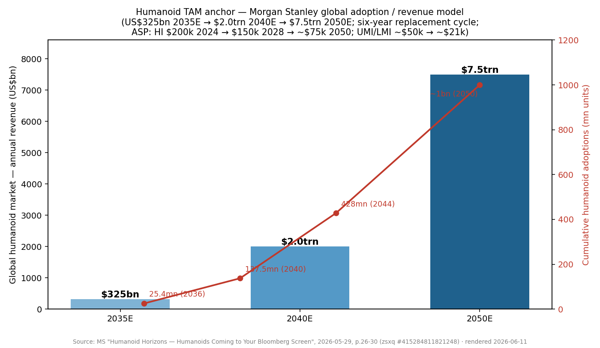
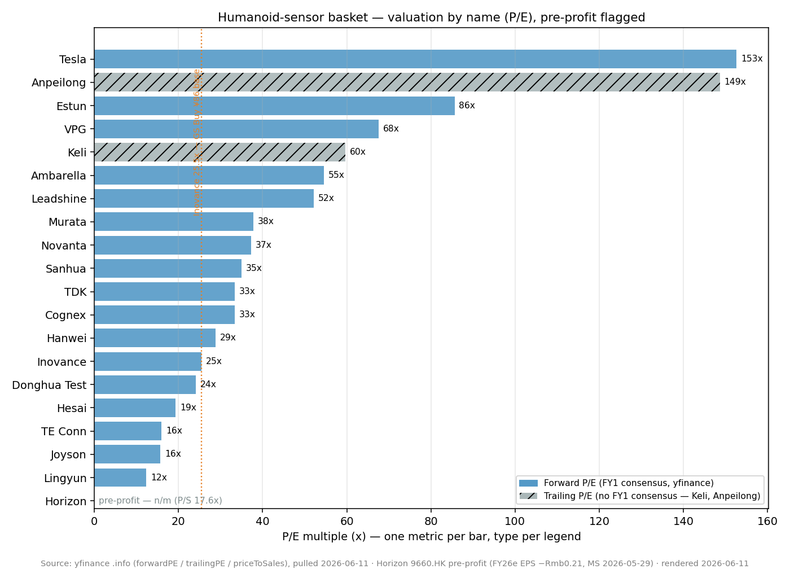
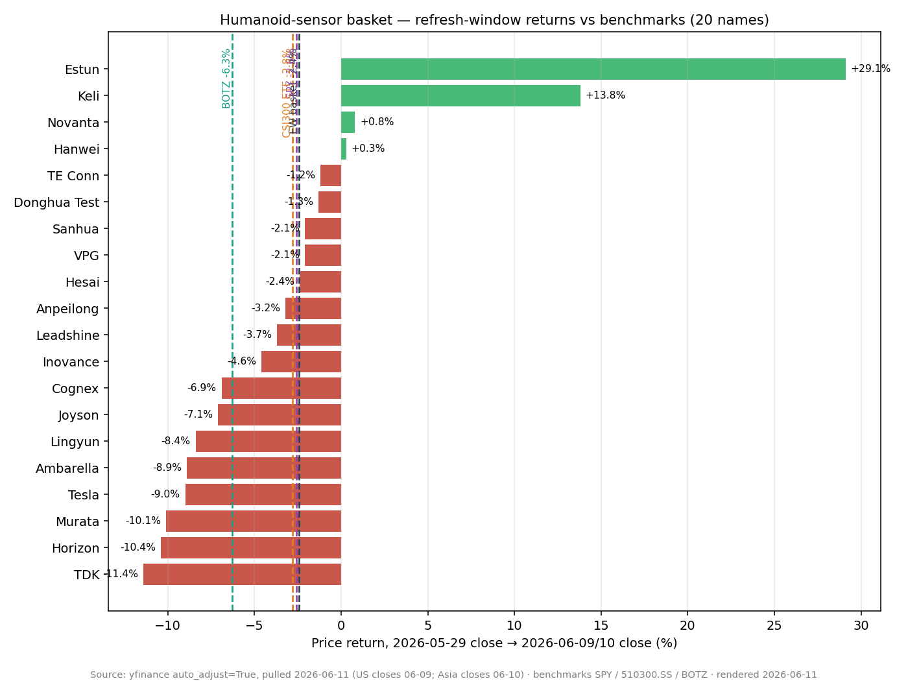

# Humanoid Robotics Sensors / 人形机器人传感器

**Created:** 2026-05-31 · **Last refreshed:** 2026-06-11 · **Last mutated:** 2026-05-31 · **Refresh cadence:** monthly · **Languages tracked:** en

## What's New

*The delta since you last looked — newest refresh on top. Older entries collapse into the archive below.*

**2026-06-11 refresh (vs 2026-05-31):**

- **File upgraded to the latest theme format** (What's New, quantified TAM anchor, Valuation snapshot + sell-side view evolution, basket scorecard, leading indicators, 3 charts, snapshot sidecar with a retroactive 2026-05-31 baseline). The inception file had zero zsxq citations — this refresh grounds the basket in 15 broker PDFs from the local library.
- **The theme now has a real TAM anchor:** Morgan Stanley's humanoid adoption/revenue model — **US$325bn annual revenue by 2035 → $2.0trn by 2040 → $7.5trn by 2050**, on cumulative adoptions of **25.4mn (2036) → 137.5mn (2040) → 428mn (2044) → ~1bn (2050)** ([MS — Humanoid Horizons, zsxq #415284811821248 p.26-29](http://xs-macbook-air.local:5001/zsxq/pdf/415284811821248/MS-Humanoids%20Humanoid%20Horizons%20Humanoids%20Coming%20to%20Your%20Bloomberg%20Screen-260529%20%281%29.pdf#page=26)). Inception thesis had no dated trajectory — this is a new anchor, not a revision.
- **First tracked window: EW basket −2.4% (median −3.5%) over 2026-05-29 → 06-09/10, vs SPY −2.6% · CSI300 ETF −2.8% · BOTZ −6.3%** — +390bps vs the robotics proxy. Best: **Estun +29.1%**, **Keli +13.8%** (the two most direct Optimus-3Q26-production plays); worst: **TDK −11.4%**, Horizon −10.4%, Murata −10.1% (yfinance, see Performance).
- **NVIDIA validated the basket's LiDAR name (06-01, Computex):** Isaac GR00T reference humanoid = Unitree H2 Plus body + Sharpa Wave dexterous hands (22-25 DOF) — Hesai is "a key LiDAR and actuation module supplier to both Unitree and Sharpa" with a Rmb100mn 2026 supply cap ([GS — Hesai, zsxq #415284121821528 p.1-2](http://xs-macbook-air.local:5001/zsxq/pdf/415284121821528/Goldman%20Sachs-HESAI%20%EF%BC%882525.HK%EF%BC%89%20Key%20supplier%20to%20Nvidia%E2%80%99s%20humanoid%20robot%20platform%EF%BC%8C%20upcoming%20product%20launch%20to%20offer%20more%20details%EF%BC%9B%20Buy-260602.pdf#page=1)); MS reiterated OW PT $30 twice in the window ([MS, zsxq #415284112215448 p.1](http://xs-macbook-air.local:5001/zsxq/pdf/415284112215448/Morgan%20Stanley-Hesai%20Group%EF%BC%88HSAI.US%EF%BC%89NVIDIA%20validation%20unlocks%20humanoid%20upside%20for%20Hesai-260602.pdf#page=1)).
- **Horizon's customer-insourcing threat went from table-cell hypothesis to the window's live drama:** the stock fell to −44.9% YTD while four banks held Buy/OW with PTs HK$9.40–13.14 (GS self-cut **HK$15.30 → 13.14**); MS quantified the counter — BPU IP licensing at "nearly 100% gross margins vs. ~40-50% for chip sales" ([MS — Horizon, zsxq #184152581881412 p.1](http://xs-macbook-air.local:5001/zsxq/pdf/184152581881412/Morgan%20Stanley-Horizon%20Robotics%EF%BC%889660.HK%EF%BC%89%20Impact%20from%20OEMs%E2%80%99%20switch%20to%20inhouse%20chip%20solutions%20%E2%80%93%20it%E2%80%99s%20not%20a%20one%20zero%20situation-260529.pdf#page=1)). DB's Buy HK$9.40 persisted to `/pt`.
- **Tesla converted Fremont to Optimus:** final S/X built May 10, line transferring to the humanoid ([MS p.2](http://xs-macbook-air.local:5001/zsxq/pdf/415284811821248/MS-Humanoids%20Humanoid%20Horizons%20Humanoids%20Coming%20to%20Your%20Bloomberg%20Screen-260529%20%281%29.pdf#page=2)); CMBI's Jiangsu/Zhejiang supply-chain tour has Optimus starting small-batch mass production in 3Q26 with output possibly doubling QoQ in 4Q26 ([招银国际, zsxq #584251482548854 p.1](http://xs-macbook-air.local:5001/zsxq/pdf/584251482548854/%E7%89%B9%E6%96%AF%E6%8B%89%E9%87%8F%E4%BA%A7%E5%9C%A8%E5%8D%B3%EF%BC%8C%E8%A1%8C%E4%B8%9A%E5%8F%91%E5%B1%95%E8%B7%AF%E5%BE%84%E6%88%96%E7%B1%BB%E4%BC%BC%E6%96%B0%E8%83%BD%E6%BA%90%E6%B1%BD%E8%BD%A6%EF%BC%8C%E4%BA%A7%E4%B8%9A%E6%97%A9%E6%9C%9F%E4%BC%98%E9%80%89%E9%9B%B6%E9%83%A8%E4%BB%B6%E9%BE%99%E5%A4%B4.pdf#page=1)); JPM moved TSLA to Neutral with a $475 PT (06-05, persisted to `/pt`).
- **IMU-bucket PT shock — but it's the AI-passives cycle, not humanoids:** GS raised Murata **¥5,400 → ¥12,600** and TDK **¥3,000 → ¥4,600** in its "largest cycles in history" Japan-components note ([GS, zsxq #181245445245282 p.2](http://xs-macbook-air.local:5001/zsxq/pdf/181245445245282/Goldman%20Sachs-JAPAN%20ELECTRONIC%20COMPONENTS%20SEMICONDUCTORS%EF%BC%9APotential%20onset%20of%20one%20of%20the%20largest%20cycles%20in%20history%EF%BC%9B%20remain%20bullish%20on%20Murata%20Taiyo%20Yuden%20Renesas%20Ibiden%EF%BC%8C%20Rohm%20up%20to%20Buy%EF%BC%8C%20downgrade%20Nitto%20Denko%20JAE-260608.pdf#page=2)) — both names' sibling rows in `ai-passives-packaging` are now older than this read.
- **Candidate adds proposed (not added):** **HKEX:2498 RoboSense** (JPM OW, PT Jun-27 HK$45 — the other half of the China LiDAR duopoly, with robotics exposure) and **SSE:688322 Orbbec** (MS China Humanoid Value Chain list: "a key structured light camera supplier to leading domestic players", +110% 1Y — the inception file wrongly carried Orbbec as *private*; it is STAR-listed). See Drift signals.

Earlier refreshes

**2026-05-31 — basket created** (20 tickers: 5 core / 8 enabler / 7 adjacent) following "Build a theme on humanoid robotics sensors"; web-sourced only (no zsxq mining at inception); AVIC Electric Measurement excluded after the 300114 → 302132 defense-conglomerate recode. Inception EW trailing prints: 1Y +80.2% / YTD +22.2% vs SPY +38.9% / CSI300 +33.3% 1Y — backward-looking context for names selected that day, not a track record.

## Thesis

**Anchor — global humanoid market (Morgan Stanley, 2026-05-29):** annual revenue **US$325bn by 2035 → US$2.0trn by 2040 → US$7.5trn by 2050** (six-year replacement cycle), on cumulative adoptions of **~25.4mn by 2036 (~2% of the ~1bn terminal base) → ~137.5mn by 2040 (~13%) → ~428mn by 2044 (~42%) → ~1bn by 2050**, with ASPs gliding from ~US$200k (2024, high-income) to ~US$150k by 2028 and ~US$75k by 2050, and China-type markets from ~US$50k to ~US$21k ([MS — Humanoid Horizons, zsxq #415284811821248 p.26-29](http://xs-macbook-air.local:5001/zsxq/pdf/415284811821248/MS-Humanoids%20Humanoid%20Horizons%20Humanoids%20Coming%20to%20Your%20Bloomberg%20Screen-260529%20%281%29.pdf#page=26)). The model is `units × ASP` — the demand build is the adoption curve, the deflation curve is the supply-chain cost-down this basket rides. **Swing factor: the 2026-28 production ramp** (Tesla Fremont conversion; Figure's BotQ "designed to produce about 12,000 robots annually in its initial phase, with plans to reach 100,000 units within several years" — [MS p.2](http://xs-macbook-air.local:5001/zsxq/pdf/415284811821248/MS-Humanoids%20Humanoid%20Horizons%20Humanoids%20Coming%20to%20Your%20Bloomberg%20Screen-260529%20%281%29.pdf#page=2)) — if the early ramp slips, the whole out-year curve shifts right; sensor pure-plays (`core` names) are levered to exactly this leg, since sample-to-volume conversion is what turns their design-wins into P&L. Within the BOM, force/tactile sensing is the highest-barrier slot: six-axis force/torque runs at 0.5%FS-or-better precision at the wrists/ankles, and core components are >50% of full-machine cost ([券商研报 — 人形机器人核心零部件, zsxq #415284811814428 p.2](http://xs-macbook-air.local:5001/zsxq/pdf/415284811814428/%E6%8A%80%E6%9C%AF%E5%A3%81%E5%9E%92%E4%B8%8E%E5%8F%91%E5%B1%95%E8%B7%AF%E5%BE%84%EF%BC%9A%E4%BA%BA%E5%BD%A2%E6%9C%BA%E5%99%A8%E4%BA%BA%E6%A0%B8%E5%BF%83%E9%9B%B6%E9%83%A8%E4%BB%B6.pdf#page=2)).

The humanoid build-out is at the inflection where supply-chain choices move from prototype to volume. A humanoid robot carries roughly 5–10× the sensor BOM of an incumbent industrial-arm design — six-axis force/torque cells in each wrist and ankle, tactile pads or e-skin in the fingertips, a high-precision IMU for balance, plus a perception stack of cameras, depth/LiDAR, and vision-AI SoCs. Tesla's Optimus Gen 3 production pull, Figure's commercial pilot, and the Chinese cohort (Unitree, Zhipu, Xpeng, Galaxy General, Leapmotor) collectively pull the 6-D force-sensor unit count alone from a few thousand a year in 2024 toward six-figure annual volume by 2027 ([东方证券 人形机器人系列报告：灵巧手与传感器, 2024-01](https://zhongzhihui.oss-cn-beijing.aliyuncs.com/industryPdf/20240121-%E4%B8%9C%E6%96%B9%E8%AF%81%E5%88%B8-%E4%BA%BA%E5%BD%A2%E6%9C%BA%E5%99%A8%E4%BA%BA%E7%B3%BB%E5%88%97%E6%8A%A5%E5%91%8A%EF%BC%9A%E7%81%B5%E5%B7%A7%E6%89%8B%E4%B8%8E%E4%BC%A0%E6%84%9F%E5%99%A8%EF%BC%8C%E6%8B%9F%E4%BA%BA%E5%8C%96%E4%B8%8E%E6%99%BA%E8%83%BD%E5%8C%96.pdf)).

The bet behind this basket is that the cost-down curve plays out fastest among A-share pure-play sensor names that have already crossed into Tier-1 supplier audits — Keli Sensing landed a Tesla QCOV certification and is mass-producing a sub-$1,000-yuan-equivalent 6-D force module that previously cost five figures ([证券时报, 2025-12](https://stcn.com/article/detail/3169048.html)) — while large diversified incumbents (Murata, TDK, TE Connectivity, Novanta) participate via IMU and force-torque acquisitions and act as the global-standards spine. The basket also captures the perception-side enablers (Hesai, Ambarella, Cognex, Horizon Robotics) because end customers are buying the *sensor suite*, not the individual transducer — and an OEM's vision-AI design-win predicts its IMU and force-cell socket allocation later in the BOM ramp ([Industry note: humanoid robotics datasheet, 2026](https://humanoid.press/humanoid-press/datasheet/)). The window's NVIDIA Isaac GR00T pick made that suite logic explicit: one reference platform pulled Unitree (body), Sharpa (tactile hands) and Hesai (LiDAR + actuation modules, margins "locked at 40-50% cost-plus (or 30-35% GpM)") into a single validated stack ([MS — Hesai, zsxq #415284112215448 p.1](http://xs-macbook-air.local:5001/zsxq/pdf/415284112215448/Morgan%20Stanley-Hesai%20Group%EF%BC%88HSAI.US%EF%BC%89NVIDIA%20validation%20unlocks%20humanoid%20upside%20for%20Hesai-260602.pdf#page=1)).

The vulnerability of the thesis is that humanoid volume slippage is real and recurrent — Optimus Gen 3 timelines have slid twice — and a 12-month-window air pocket is the most likely way this basket disappoints, not a structural break. Drift watch: separate the names whose humanoid revenue is *already in the printed quarter* (VPG ~$5M FY26 humanoid run-rate, Sanhua $685M Tesla actuator order) from those still in sample-stage (Donghua Testing, Hanwei). *Analyst view (this note):* the cleanest staging read after this window is CMBI's — "2026 看验证、2027 看扩产能力、2028 起看市场需求" (2026 = validation, 2027 = capacity, 2028+ = end-demand), with component leaders ahead of integrators at this stage of the curve, and a 60-80% long-run price-down on reducers/screws as the standing margin warning for every hardware slot ([招银国际, zsxq #584251482548854 p.1](http://xs-macbook-air.local:5001/zsxq/pdf/584251482548854/%E7%89%B9%E6%96%AF%E6%8B%89%E9%87%8F%E4%BA%A7%E5%9C%A8%E5%8D%B3%EF%BC%8C%E8%A1%8C%E4%B8%9A%E5%8F%91%E5%B1%95%E8%B7%AF%E5%BE%84%E6%88%96%E7%B1%BB%E4%BC%BC%E6%96%B0%E8%83%BD%E6%BA%90%E6%B1%BD%E8%BD%A6%EF%BC%8C%E4%BA%A7%E4%B8%9A%E6%97%A9%E6%9C%9F%E4%BC%98%E9%80%89%E9%9B%B6%E9%83%A8%E4%BB%B6%E9%BE%99%E5%A4%B4.pdf#page=1)).

**Further viewing**

- [Unitree H2 official introduction video — the body NVIDIA picked for Isaac GR00T](https://www.youtube.com/watch?v=eUdBIFkMh-M) — see the joint count and balance behaviour that the force/torque + IMU stack enables (Unitree official channel).
- [Murata SCH16T-K20 6-axis MEMS IMU product video](https://video.murata.com/en-eu/detail/video/6386632457112) — what a humanoid-grade inertial unit actually measures and why precision matters for balance (Murata official channel).

## Scope rules

**In:** standalone force/torque sensor suppliers, tactile / e-skin sensor specialists, MEMS IMU vendors with disclosed humanoid SKUs, vision-AI SoCs and machine-vision houses targeting embodied AI, and humanoid-OEM platform names whose sensor BOM choices anchor the supply chain. Both pure-play designers and diversified incumbents qualify if there is a *named, dated* humanoid customer or design win in the public record.

**Out:** pure software / model companies with no hardware exposure (foundation-model labs, simulators); pure-play actuator and motion-control names with no on-board sensing IP (these belong in the sibling [`humanoid-robotics-actuators`](humanoid-robotics-actuators_theme.md) theme); auto-electronics suppliers with no disclosed humanoid SKU even if they sell sensors to vehicles; private companies (tracked in the watch list, not the basket, because they aren't investable). Tesla is included as an `adjacent` ticker — humanoid is <1% of revenue today, but the platform's BOM is the largest single demand signal in the basket, and a Tesla-specific design-win news flow drives roughly half of the day-to-day basket variance.

## Tracked tickers

| Ticker | Name | Role | Justification | Added |
|---|---|---|---|---|
| SSE:603662 | Keli Sensing 柯力传感 | core | Only Chinese mass-producer of 6-D force/torque sensors; QCOV-certified Tesla Optimus supplier; dedicated Ningbo line targeting 40–80k units p.a. with Tesla ≈60% of the order book ([eet-china.com, 2025](https://www.eet-china.com/mp/a456494.html); [新浪财经, 2025-11-24](https://finance.sina.com.cn/stock/t/2025-11-24/doc-infyphky3800607.shtml)); on MS's China Humanoid Value Chain list — "Developed 6-axis force sensor, and deploying humanoid robots in production line" ([MS, zsxq #415284811821248 p.20](http://xs-macbook-air.local:5001/zsxq/pdf/415284811821248/MS-Humanoids%20Humanoid%20Horizons%20Humanoids%20Coming%20to%20Your%20Bloomberg%20Screen-260529%20%281%29.pdf#page=20)). | 2026-05-31 |
| SZSE:301413 | Anpeilong 安培龙 | core | A-share thermistor + force-sensor specialist; 6-D force sample-stage at multiple Chinese humanoid programs with patents granted; existing in-house coverage at [reports/company/Anpeilong](../company/Anpeilong/Anpeilong_Research_Document.md). Industry-research participant list ([股票复盘网 概念股拆解, 2026](https://www.fupanwang.com/kplart_info/8449.html)). | 2026-05-31 |
| SZSE:300354 | Donghua Testing 东华测试 | core | Strain-gauge IP base from structural-test instrumentation; 6-D force sensor in small-batch trial production disclosed Feb 2026 ([股票复盘网, 2026](https://www.fupanwang.com/kplart_info/8449.html)). | 2026-05-31 |
| SZSE:300007 | Hanwei Technology 汉威科技 | core | Only A-share name explicitly producing flexible electronic skin (e-skin) tactile sensors for robot OEMs in small-batch supply; co-authored China's first flexible-electronics industry standard ([新浪科技, 2026-03-03](https://finance.sina.com.cn/tech/roll/2026-03-03/doc-inhpsxzq4696210.shtml)); MS lists it as "Focus on soft, flexible sensor, cooperating with multiple leading integrators" ([MS, zsxq #415284811821248 p.20](http://xs-macbook-air.local:5001/zsxq/pdf/415284811821248/MS-Humanoids%20Humanoid%20Horizons%20Humanoids%20Coming%20to%20Your%20Bloomberg%20Screen-260529%20%281%29.pdf#page=20)). | 2026-05-31 |
| NASDAQ:HSAI | Hesai | core | LiDAR house with an explicit Robot-line (ROBO) SKU and a deepening non-auto mix — now a named supplier to NVIDIA's Isaac GR00T stack via Unitree (G1/H2 LiDAR) and Sharpa (actuation modules at 40-50% cost-plus margins, Rmb100mn 2026 framework cap) ([GS, zsxq #415284121821528 p.1-2](http://xs-macbook-air.local:5001/zsxq/pdf/415284121821528/Goldman%20Sachs-HESAI%20%EF%BC%882525.HK%EF%BC%89%20Key%20supplier%20to%20Nvidia%E2%80%99s%20humanoid%20robot%20platform%EF%BC%8C%20upcoming%20product%20launch%20to%20offer%20more%20details%EF%BC%9B%20Buy-260602.pdf#page=1)); threat = RoboSense in the LiDAR duopoly + OEM in-house 3D sensing; counter = ~50% Apr share of long-range ADAS LiDAR + 3mn-unit scale cost advantage ([Bernstein Barometer, zsxq #812485451484122 p.1](http://xs-macbook-air.local:5001/zsxq/pdf/812485451484122/Bernstein-Asia%20Emerging%20Robotics%EF%BC%9A%20The%20Barometer%20%EF%BC%88April%20May%202026%EF%BC%89-260601.pdf#page=1)). In-house coverage at [reports/company/Hesai_NASDAQ_HSAI](../company/Hesai_NASDAQ_HSAI/Hesai_NASDAQ_HSAI_Research_Document.md). | 2026-05-31 |
| NYSE:VPG | Vishay Precision Group | enabler | Strain-gauge / load-cell franchise with the cleanest disclosed humanoid revenue print in the basket: ~$0.6M Q1 FY26 from prototype shipments, guided >$5M FY26 and ~50% CAGR thereafter; three pre-production humanoid customers + a fourth in early talks ([VPG Q1 FY26 call, TradingView, 2026](https://www.tradingview.com/news/marketbeat:bd9ce5d58094b:0-vishay-precision-group-q1-earnings-call-highlights/)). | 2026-05-31 |
| SSE:600480 | Lingyun Industrial 凌云股份 | enabler | MIIT humanoid force-sensor task lead with Chinese Academy of Sciences Hefei Institute partnership; 0.5%FS-precision pull-compression and torque sensors in small-batch delivery to leading robot makers; 6-axis force sensors sampling to Tesla core suppliers; 100m RMB LP in China Ordnance Shunjing robotics fund ([陆家嘴金融网, 2026](https://www.ljzfin.com/news/info/77426.html); [东方财富, 2026-04-16](https://caifuhao.eastmoney.com/news/20260416174312468291900)). | 2026-05-31 |
| NASDAQ:NOVT | Novanta | enabler | Owns ATI Industrial Automation (acquired 2021), the global incumbent in 6-axis force/torque sensing for collaborative robots; precision-motion encoders and end-of-arm tooling round out the humanoid-relevant book ([Novanta Q1 FY26 release / segment commentary](https://stockanalysis.com/stocks/novt/)). | 2026-05-31 |
| NYSE:TEL | TE Connectivity | enabler | Custom torque, force, position, temperature, and optical sensors for cobots, including a cobot-specific sensor portfolio page; large diversified — humanoid is upside, not anchor, but the standards franchise is durable ([TE Connectivity cobot sensors page](https://www.te.com/en/industries/industrial-machinery/applications/robotics/sensors-for-cobots-and-robotics.html)). | 2026-05-31 |
| TSE:6981 | Murata Manufacturing | enabler | Launched the SCH16T-K20 high-precision 6-axis MEMS IMU at CES 2026, explicitly positioned for industrial robotics, humanoids, drones, and structural health monitoring ([ipXchange CES 2026, 2026-01](https://ipxchange.tech/product-news/sch16tk20-imu/)); CEO names "distinctive edge devices (autonomous driving/SDVs and humanoids)" as the next growth leg beyond AI-server MLCC ([GS CEO meeting, zsxq #415284542842188 p.1](http://xs-macbook-air.local:5001/zsxq/pdf/415284542842188/Goldman%20Sachs-Murata%20Mfg.%20%EF%BC%886981.T%EF%BC%89%EF%BC%9A%20CEO%20meeting%EF%BC%9A%20Positive%20on%20Murata%E2%80%99s%20strategy%20and%20competitiveness%20in%20gaining%20significant%20share%20of%20AI%20MLCC%EF%BC%9B%20Buy%20%EF%BC%88on%20CL%EF%BC%89-260527.pdf#page=1)). Threat: the equity now trades on the AI-MLCC cycle, not humanoid sensing. *(also tracked in: ai-passives-packaging)* | 2026-05-31 |
| TSE:6762 | TDK | enabler | InvenSense / SmartIndustrial IIM-46234 and IIM-46230 6-axis IMU modules and the RoboKit1 humanoid-targeted reference design; the broadest IMU + Hall + magnetometer + microphone bundle aimed at humanoid SoMs ([TDK MEMS Sensors press, 2022 (platform still current)](https://www.tdk.com/en/news_center/press/20220106_01.html); [TDK InvenSense Renesas-collab release](https://invensense.tdk.com/news-media/tdk-to-showcase-ultra-low-power-sensing-and-processing-solution-powered-by-renesas-for-next-generation-iot-industrial-and-portable-applications/)). Same caveat as Murata: the tape is pricing AI passives, not humanoid IMUs. *(also tracked in: ai-passives-packaging)* | 2026-05-31 |
| NASDAQ:AMBA | Ambarella | enabler | Edge-AI vision SoC named in Optimus supply chain analyses; physical-edge AI portfolio targets humanoid / drone / surveillance robots; FY26 revenue +37% YoY to $390.7M ([Ambarella FY26 10-K, 2026](https://www.sec.gov/Archives/edgar/data/0001280263/000119312526227208/d69210dars.pdf)). | 2026-05-31 |
| NASDAQ:CGNX | Cognex | enabler | Industrial machine-vision leader; deep-learning-enabled In-Sight 2D and 3D vision sensors used at the cell / cell-and-arm level by humanoid OEMs in pilot deployments ([Cognex In-Sight vision sensors](https://www.cognex.com/products/machine-vision/vision-sensors)). | 2026-05-31 |
| HKEX:9660 | Horizon Robotics | adjacent | Embodied-AI SoC vendor with explicit humanoid-perception positioning — subsidiary D-Robotics "launched system-on-chip (SoC) development kit RDK S100 for humanoids" ([MS, zsxq #415284811821248 p.20](http://xs-macbook-air.local:5001/zsxq/pdf/415284811821248/MS-Humanoids%20Humanoid%20Horizons%20Humanoids%20Coming%20to%20Your%20Bloomberg%20Screen-260529%20%281%29.pdf#page=20)); primary revenue is still ADAS. Threat = customer-insourcing (OEMs' self-developed chips); named counter = BPU IP licensing at "nearly 100% gross margins vs. ~40-50% for chip sales" + most OEMs lacking scale to insource ([MS, zsxq #184152581881412 p.1](http://xs-macbook-air.local:5001/zsxq/pdf/184152581881412/Morgan%20Stanley-Horizon%20Robotics%EF%BC%889660.HK%EF%BC%89%20Impact%20from%20OEMs%E2%80%99%20switch%20to%20inhouse%20chip%20solutions%20%E2%80%93%20it%E2%80%99s%20not%20a%20one%20zero%20situation-260529.pdf#page=1); [Bernstein, zsxq #812485454488252 p.1](http://xs-macbook-air.local:5001/zsxq/pdf/812485454488252/Bernstein-Horizon%20Robotics%EF%BC%889660.HK%EF%BC%89Horizon%20Robotics%EF%BC%9A%20Near~term%20pressure%20due%20to%20OEM%20in~house%20chip%20deployment%EF%BC%8C%20but%20long~term%20thesis%20is%20intact-260602.pdf#page=1)). In-house coverage at [reports/company/HorizonRobotics_HKEX9660](../company/HorizonRobotics_HKEX9660/HorizonRobotics_HKEX9660_Research_Document.md). *(also tracked in: china-ev-auto-export)* | 2026-05-31 |
| NASDAQ:TSLA | Tesla | adjacent | Optimus is <1% of revenue today but is the basket's single largest demand signal; Fremont built its final S/X on May 10 and "will transfer production to the Optimus humanoid robot" ([MS, zsxq #415284811821248 p.2](http://xs-macbook-air.local:5001/zsxq/pdf/415284811821248/MS-Humanoids%20Humanoid%20Horizons%20Humanoids%20Coming%20to%20Your%20Bloomberg%20Screen-260529%20%281%29.pdf#page=2)). Included to track the *anchor demand*, not as a Tesla equity bet — note Tesla designs its own sensor suite in-house, which is the customer-insourcing ceiling on every `core` name's Tesla content ([Tesla 10-Q FY26 Q1](https://www.sec.gov/Archives/edgar/data/0001318605/000162828026026673/tsla-20260331.htm)). *(also tracked in: china-ev-auto-export)* | 2026-05-31 |
| SZSE:002050 | Sanhua 三花智控 | adjacent | Linear-actuator (not strict-sense sensor) supplier with a disclosed $685M Tesla Optimus order; integrates IMU + position-sensing into actuator modules, blurring the actuator/sensor line. Kept as the largest non-sensor Optimus exposure that frames the per-robot BOM. Note Bernstein holds Market-Perform PT ¥39 — below spot ([Bernstein Barometer, zsxq #812485451484122 p.1](http://xs-macbook-air.local:5001/zsxq/pdf/812485451484122/Bernstein-Asia%20Emerging%20Robotics%EF%BC%9A%20The%20Barometer%20%EF%BC%88April%20May%202026%EF%BC%89-260601.pdf#page=1)). In-house coverage at [reports/company/Sanhua_SZSE002050](../company/Sanhua_SZSE002050/Sanhua_SZSE002050_Research_Document.md); see also [36Kr EN, 2025](https://eu.36kr.com/en/p/3510288514980998). *(also tracked in: humanoid-robotics-actuators)* | 2026-05-31 |
| SSE:600699 | Joyson Electronics 均胜电子 | adjacent | Multi-precision IMU + customised fisheye-camera sampling to Zhipu (智元) and Galaxy General (银河通用); main-control boards already in batch supply; MS lists it as having "placed commercial orders for humanoid robots" ([MS, zsxq #415284811821248 p.20](http://xs-macbook-air.local:5001/zsxq/pdf/415284811821248/MS-Humanoids%20Humanoid%20Horizons%20Humanoids%20Coming%20to%20Your%20Bloomberg%20Screen-260529%20%281%29.pdf#page=20); [新浪财经, 2026-02-23](https://finance.sina.com.cn/roll/2026-02-23/doc-inhnvcpn6795834.shtml)). | 2026-05-31 |
| SZSE:300124 | Inovance 汇川技术 | adjacent | #1 China servo-system market share and the most-cited servo-stack supplier in humanoid sell-side decks; sensor exposure is through integrated servo-drive position/torque feedback rather than standalone sensors. In-house coverage at [reports/company/Inovance_SZSE300124](../company/Inovance_SZSE300124/Inovance_SZSE300124_Research_Document.md). | 2026-05-31 |
| SZSE:002747 | Estun 埃斯顿 | adjacent | China's #1 industrial-robot OEM with a full-stack (controller + servo + body) profile; humanoid sensor exposure is via in-house joint encoders and force-control loops in its industrial line, not a humanoid-specific SKU yet. In-house coverage at [reports/company/Estun_SZSE002747](../company/Estun_SZSE002747/Estun_SZSE002747_Research_Document.md). | 2026-05-31 |
| SZSE:002979 | Leadshine 雷赛智能 | adjacent | Motion-control core-component vendor; humanoid exposure via encoder + servo-drive supply to joint-actuator integrators rather than standalone sensor product. In-house coverage at [reports/company/Leadshine_SZSE002979](../company/Leadshine_SZSE002979/Leadshine_SZSE002979_Research_Document.md). | 2026-05-31 |

**Geographic / role mix (20 tickers):** US 7 (35%) · CN A-share 10 (50%) · Japan 2 (10%) · HK 1 (5%). Role: core 5, enabler 8, adjacent 7.

## Valuation snapshot

Rows mirror `stock_price_target.db` (latest call per institute since 2026-05-01; surfaced at [`/pt`](http://xs-macbook-air.local:5001/pt)) — **Px @ note is the price on the note's date** (`report_date_price`), which fixes the upside the analyst actually called; *Px now* is the 2026-06-09 (US) / 06-10 (Asia) close, yfinance. Fwd P/E = FY1 consensus (yfinance `.info`, pulled 2026-06-11). **PT dispersion** per name from the read-only PT-store pre-pass. Nine names — Keli, Anpeilong, Donghua, Hanwei, VPG, Lingyun, Novanta, Ambarella, Leadshine — have **no sell-side coverage in the store** and are omitted from the rows below (noted in Data Used).

| Ticker | Latest rating · broker (date) | Px @ note | PT | Upside | Px now | Fwd P/E FY1 | FY1E EPS | FY2E EPS | PT dispersion (since 05-01) |
|---|---|---|---|---|---|---|---|---|---|
| NASDAQ:HSAI | Overweight · MS (06-05) | $18.49 | **$30** (DCF, WACC 11.2%) | +62.2% | $18.44 | 19.3x | $0.91 | ~$1.00 (derived¹) | n=4: $27 / $30 / $35 — 27% spread |
| HKEX:9660 | Buy · GS (06-03) | HK$5.31 | **HK$13.14** *(was HK$15.30)* | +147.5% | HK$4.74 | n/m² (pre-profit) | −Rmb0.21 (MS 26e) | −Rmb0.07 (MS 27e) | n=5: HK$9.40 / HK$10 / HK$13.14 — 37% spread |
| NASDAQ:TSLA | Neutral · JPM (06-05) | $391.00 | $475 | +21.5% | $396.68 | 152.6x | $2.50 | n/a³ | n=2: $415 / $445 / $475 — 14% spread |
| TSE:6981 | Buy · GS (06-08) | ¥8,711 | **¥12,600** *(was ¥5,400)* | +44.6% | ¥8,650 | 37.8x | ¥237.27 | n/a³ | n=5: ¥3,900 / ¥5,400 / ¥12,600 — **161% spread** |
| TSE:6762 | Buy · GS (06-08) | ¥3,715 | **¥4,600** *(was ¥3,000)* | +23.8% | ¥3,640 | 33.3x | ¥106.88 | n/a³ | n=3: ¥3,200 / ¥3,500 / ¥4,600 — 40% spread |
| SZSE:002050 | Market-Perform · Bernstein (06-01) | ¥44.57 | **¥39** | **−12.5%** | ¥45.36 | 35.0x | ¥1.30 | n/a³ | single PT (below spot) |
| SSE:600699 | Buy · Citi (05-27) | ¥30.01 | ¥33.6 | +12.0% | ¥24.20 | 15.7x | ¥1.50 | n/a³ | single PT |
| SZSE:300124 | Buy · GS (05-09) | ¥75.00 | ¥86 | +14.7% | ¥70.10 | 25.5x | ¥2.72 | n/a³ | single PT institute; Bernstein OP (no PT) |
| SZSE:002747 | Market-Perform · Bernstein (06-01) | ¥26.77 | n/a (no PT published) | — | ¥35.80 | 85.6x | ¥0.39 | n/a³ | GS Sell (05-05, no PT) vs Bernstein MP — see footnote⁴ |
| NYSE:TEL | Buy · UBS (05-07) | $209.25 | $261 | +24.7% | $210.91 | 16.0x | $12.64 | n/a³ | single PT |
| NASDAQ:CGNX | Outperform · Bernstein (06-01) | $64.64 | n/a (no PT in store) | — | $61.32 | 33.3x | $1.76 | n/a³ | no PT in store |

Footnotes — **derivations and own-history context**: ¹ GS states Hesai trades at "28X/20X 2026E/2027E P/Es" at $20.03 → implied 2027E EPS ≈ $20.03 / 20 = ~$1.00 (derived from [GS, zsxq #415284121821528 p.2](http://xs-macbook-air.local:5001/zsxq/pdf/415284121821528/Goldman%20Sachs-HESAI%20%EF%BC%882525.HK%EF%BC%89%20Key%20supplier%20to%20Nvidia%E2%80%99s%20humanoid%20robot%20platform%EF%BC%8C%20upcoming%20product%20launch%20to%20offer%20more%20details%EF%BC%9B%20Buy-260602.pdf#page=2)); other FY2E cells are n/a because the mined notes don't state FY2 EPS and yfinance carries FY1 only. ² Horizon is pre-profit (MS models EPS −Rmb0.81 / −0.21 / −0.07 / +0.10 for 12/25-12/28e, [MS p.1](http://xs-macbook-air.local:5001/zsxq/pdf/184152581881412/Morgan%20Stanley-Horizon%20Robotics%EF%BC%889660.HK%EF%BC%89%20Impact%20from%20OEMs%E2%80%99%20switch%20to%20inhouse%20chip%20solutions%20%E2%80%93%20it%E2%80%99s%20not%20a%20one%20zero%20situation-260529.pdf#page=1)) — metric is P/S 17.6x trailing (yfinance); GS's implied 2027/28E EV/Sales is 13.3x/7.5x (was 14.0x/8.1x) ([GS p.2](http://xs-macbook-air.local:5001/zsxq/pdf/184152818518142/Goldman%20Sachs-Horizon%20Robotics%20%EF%BC%889660.HK%EF%BC%89%EF%BC%9A%20Enhanced%20HSD%20platform%20to%20support%20J6P%20adoption%EF%BC%9B%20Journey%206%20Series%20to%20ramp%20up%20ahead%EF%BC%9B%20Buy-260603.pdf#page=2)). ³ n/a — FY2 not stated in the mined notes; left blank rather than improvised. ⁴ The Estun split is rating-direction (GS Sell vs Bernstein MP), not PT-level — neither bank publishes a PT in the store; the +29.1% window move ran against the GS call. **Own ~10yr-avg multiples:** the only sourced own-history anchor in this window's notes is Hesai — "well below the average 12m fwd P/E multiple of 37X since turning profitable in 4Q24" (GS, broker exhibit, [p.2](http://xs-macbook-air.local:5001/zsxq/pdf/415284121821528/Goldman%20Sachs-HESAI%20%EF%BC%882525.HK%EF%BC%89%20Key%20supplier%20to%20Nvidia%E2%80%99s%20humanoid%20robot%20platform%EF%BC%8C%20upcoming%20product%20launch%20to%20offer%20more%20details%EF%BC%9B%20Buy-260602.pdf#page=2)) — Hesai at 19.3x fwd is at a ~48% discount to its own short post-profitability history. The A-share names have listing histories too short or EPS bases too volatile for a meaningful 10-yr average (Anpeilong listed 2023; Estun trailing P/E 222x on a near-zero EPS base) — own-avg cells are omitted for that stated reason, and the sized de-rates in Drift signals use **cited bear PTs** (Bernstein Sanhua ¥39) as floors instead. **Growth-adjusted cross-section:** on FY1 P/E ÷ near-term growth, Hesai is the standout (19.3x against GS-modeled 2026E EBIT +139%, [GS p.2](http://xs-macbook-air.local:5001/zsxq/pdf/415284121821528/Goldman%20Sachs-HESAI%20%EF%BC%882525.HK%EF%BC%89%20Key%20supplier%20to%20Nvidia%E2%80%99s%20humanoid%20robot%20platform%EF%BC%8C%20upcoming%20product%20launch%20to%20offer%20more%20details%EF%BC%9B%20Buy-260602.pdf#page=2)); Estun at 85.6x fwd is the priced-for-perfection outlier among covered names.

### Sell-side view evolution (卖方观点演变)

**Hesai (NASDAQ:HSAI) — four institutes, one validation event; the spread is a Rmb100mn revenue cap vs a platform option:**

| Institute | Date | Rating / PT | Core argument | What proves them right |
|---|---|---|---|---|
| BofA | 05-20 | Buy / $27 | LiDAR cycle | shipment momentum holding |
| Bernstein | 05-04 → 06-01 | OP / **$32 → $30** (self-revision, trimmed with the Apr share print) | LiDAR share 50% Apr, watch pricing ([Barometer p.1](http://xs-macbook-air.local:5001/zsxq/pdf/812485451484122/Bernstein-Asia%20Emerging%20Robotics%EF%BC%9A%20The%20Barometer%20%EF%BC%88April%20May%202026%EF%BC%89-260601.pdf#page=1)) | +177% YoY Apr shipments extending |
| Morgan Stanley | 06-02 / 06-05 | OW / **$30** (DCF, WACC 11.2%, TG 3%) — reiterated twice in four days | NVIDIA/Sharpa converts a related-party agreement into "favourable exposure to the validated humanoid platform"; robotics rev Rmb100mn 26 → Rmb500mn 27 guided ([#415284112215448 p.1](http://xs-macbook-air.local:5001/zsxq/pdf/415284112215448/Morgan%20Stanley-Hesai%20Group%EF%BC%88HSAI.US%EF%BC%89NVIDIA%20validation%20unlocks%20humanoid%20upside%20for%20Hesai-260602.pdf#page=1); [#814528851485412 p.1](http://xs-macbook-air.local:5001/zsxq/pdf/814528851485412/Morgan%20Stanley-Hesai%20Group%EF%BC%88HSAI.US%EF%BC%89Compelling%20Narrative%EF%BC%8C%20Clear%20Roadmap%EF%BC%8C%20Confident%20Reaffirmation%EF%BC%9B%20Stay%20OW-260605.pdf#page=1)) | actuation-module launch lands within months |
| Goldman Sachs | 06-02 | Buy / **$35** (street-high; 20x 2030E EPS disc. @ 11% CoE) | 2026E rev +50%, EBIT +139%, trading below own 37x post-profit avg ([#415284121821528 p.2](http://xs-macbook-air.local:5001/zsxq/pdf/415284121821528/Goldman%20Sachs-HESAI%20%EF%BC%882525.HK%EF%BC%89%20Key%20supplier%20to%20Nvidia%E2%80%99s%20humanoid%20robot%20platform%EF%BC%8C%20upcoming%20product%20launch%20to%20offer%20more%20details%EF%BC%9B%20Buy-260602.pdf#page=2)) | Isaac GR00T GA (Oct 2026) shipping with Hesai content |

The street is unanimous on direction (all Buy/OW) but the stock sits at $18.44 — *below* every px@note in the table. The market is pricing auto-LiDAR ASP erosion (GS models blended ASP −27% in 2026E); the banks are pricing the humanoid option. Bernstein's $2 trim is the only self-revision, and it predates the NVIDIA event.

**Horizon Robotics (HKEX:9660) — five institutes vs the tape; the insourcing debate in one column:** MS OW HK$10 (05-29, px 5.29) → Bernstein OP HK$10 (06-01, px 5.43, +84%, "investors should not let near-term turbulence overwhelm a long-term thesis that is fundamentally intact" + 22M-share buyback flagged, [p.1](http://xs-macbook-air.local:5001/zsxq/pdf/812485454488252/Bernstein-Horizon%20Robotics%EF%BC%889660.HK%EF%BC%89Horizon%20Robotics%EF%BC%9A%20Near~term%20pressure%20due%20to%20OEM%20in~house%20chip%20deployment%EF%BC%8C%20but%20long~term%20thesis%20is%20intact-260602.pdf#page=1)) → DB Buy HK$9.40 (06-02, the operating-data house: Apr SoC +33% YoY but front-camera chip −40% YoY, [p.1](http://xs-macbook-air.local:5001/zsxq/pdf/812488554215812/Deutsche%20Bank-Horizon%20Robotics%EF%BC%889660.HK%EF%BC%89Apr.%20autonomous~driving%20SoC%20up%2033%25%20YoY%EF%BC%9B%20front%20camera%20chip%20down%2040%25%20YoY-260602.pdf#page=1)) → **GS Buy HK$15.30 → 13.14 (06-03, self-cut; target 2030E disc. EV/EBITDA 23.1x vs prior 28.0x — trigger = lowered estimates within an intact J6-ramp thesis, [p.2](http://xs-macbook-air.local:5001/zsxq/pdf/184152818518142/Goldman%20Sachs-Horizon%20Robotics%20%EF%BC%889660.HK%EF%BC%89%EF%BC%9A%20Enhanced%20HSD%20platform%20to%20support%20J6P%20adoption%EF%BC%9B%20Journey%206%20Series%20to%20ramp%20up%20ahead%EF%BC%9B%20Buy-260603.pdf#page=2))**. Five-house dispersion HK$9.40–13.14 (37%), every PT ≥70% above the HK$4.74 spot — the widest street-vs-tape gap in the basket. No institute is bearish; the bear is the order book (BYD/NIO/XPeng in-house chips).

**Murata (TSE:6981) — a genuine cross-institute disagreement (161% PT spread):** GS raised **¥5,400 → ¥12,600** on 06-08 in the "Potential onset of one of the largest cycles in history" Japan-components call ([p.2](http://xs-macbook-air.local:5001/zsxq/pdf/181245445245282/Goldman%20Sachs-JAPAN%20ELECTRONIC%20COMPONENTS%20SEMICONDUCTORS%EF%BC%9APotential%20onset%20of%20one%20of%20the%20largest%20cycles%20in%20history%EF%BC%9B%20remain%20bullish%20on%20Murata%20Taiyo%20Yuden%20Renesas%20Ibiden%EF%BC%8C%20Rohm%20up%20to%20Buy%EF%BC%8C%20downgrade%20Nitto%20Denko%20JAE-260608.pdf#page=2)), while Citi holds Neutral ¥3,900 (05-27) and MS OW ¥5,100 — the price (¥8,650) has run *through* every PT except GS's new one. The driver is AI-server MLCC, not humanoid sensing — this basket holds Murata for the IMU franchise, so the PT war is mostly imported beta (see Drift signals; full MLCC-cycle coverage lives in the `ai-passives-packaging` sibling theme).

## Exclusions

| Ticker | Reason for exclusion |
|---|---|
| SZSE:300114 → 302132 (former AVIC Electric Measurement, now AVIC Chengfei 中航成飞) | Excluded due to post-2025 corporate drift: the 300114 ticker was renamed and recoded to 302132 (中航成飞) on 2025-02-17 after a 17.4bn-yuan asset injection of Chengdu Aircraft Industry; the merged entity is now a defense-aircraft conglomerate, with the original 中航电测 sensor business reduced to a sub-5% revenue contribution. The investable equity now tracks the J-20 platform, not strain-gauge sensors. Re-evaluate only if the sensor business is publicly spun off ([证券时报: 中航电测将更名为中航成飞](https://stcn.com/article/detail/1528221.html); [SZSE listing change announcement](https://disc.static.szse.cn/disc/disk03/finalpage/2025-01-17/e088d543-d639-4cee-b4f7-71200448469f.PDF)). |
| Private: Bota Systems, Robotiq, Flexiv, Figure AI, Agility Robotics, Unitree, Bosch Sensortec, FUTEK, ATI Industrial (subsidiary of Novanta, already captured via NOVT) | Not investable as standalone equities — Bota (CH) and FUTEK (US) are sensor pure-plays that would be top-2 by relevance if listed; Figure / Agility / Unitree drive humanoid OEM demand on the same vector as Tesla; Bosch Sensortec's MEMS franchise is buried inside private Robert Bosch GmbH. **Unitree's SSE listing was approved by the listing committee on June 1 with a July listing possible** ([MS, zsxq #415284811821248 p.1](http://xs-macbook-air.local:5001/zsxq/pdf/415284811821248/MS-Humanoids%20Humanoid%20Horizons%20Humanoids%20Coming%20to%20Your%20Bloomberg%20Screen-260529%20%281%29.pdf#page=1); [Bernstein, zsxq #812485451484122 p.1](http://xs-macbook-air.local:5001/zsxq/pdf/812485451484122/Bernstein-Asia%20Emerging%20Robotics%EF%BC%9A%20The%20Barometer%20%EF%BC%88April%20May%202026%EF%BC%89-260601.pdf#page=1)) — a standing mutation trigger. |

## Keywords

humanoid robotics / 人形机器人 · 6-axis force-torque sensor / 六维力矩传感器 · tactile sensor / 触觉传感器 · electronic skin / 电子皮肤 · MEMS IMU / 惯性测量单元 · LiDAR / 激光雷达 · vision SoC / 视觉 AI 芯片 · machine-vision sensor / 机器视觉 · cobot / 协作机器人 · embodied AI / 具身智能 · Isaac GR00T · dexterous hand / 灵巧手 · Optimus · Unitree 宇树 · Sharpa

## Performance (since last refresh)

Window: **2026-05-29 close → 2026-06-09 (US) / 06-10 (Asia) closes**, yfinance `auto_adjust=True`. **Equal-weight basket −2.4% · median −3.5%**, vs **SPY −2.6% · CSI300 ETF (510300.SS) −2.8% · Hang Seng ETF (2800.HK) −2.6% · BOTZ (robotics proxy, newly stated benchmark) −6.3%** — the basket's first tracked window landed in line with the global pullback and **+390bps ahead of the robotics ETF**, with the dispersion running exactly along the Optimus-timeline axis.

**Movers:** Estun **+29.1%** (¥35.80), Keli **+13.8%** (¥68.88) — the two names most directly geared to the CMBI-reported 3Q26 Optimus small-batch start ([招银国际, zsxq #584251482548854 p.1](http://xs-macbook-air.local:5001/zsxq/pdf/584251482548854/%E7%89%B9%E6%96%AF%E6%8B%89%E9%87%8F%E4%BA%A7%E5%9C%A8%E5%8D%B3%EF%BC%8C%E8%A1%8C%E4%B8%9A%E5%8F%91%E5%B1%95%E8%B7%AF%E5%BE%84%E6%88%96%E7%B1%BB%E4%BC%BC%E6%96%B0%E8%83%BD%E6%BA%90%E6%B1%BD%E8%BD%A6%EF%BC%8C%E4%BA%A7%E4%B8%9A%E6%97%A9%E6%9C%9F%E4%BC%98%E9%80%89%E9%9B%B6%E9%83%A8%E4%BB%B6%E9%BE%99%E5%A4%B4.pdf#page=1)), plus Novanta +0.8% and Hanwei +0.3%. **Laggards:** TDK **−11.4%**, Horizon **−10.4%**, Murata **−10.1%**, Tesla −9.0%, Ambarella −8.9%, Lingyun −8.4%. The Japan IMU pair gave back part of its AI-passives run; Horizon kept bleeding on the in-house-chip narrative despite four Buy/OW notes in the window.

| Ticker | Window | YTD | ~1Y | Close (local) |
|---|---|---|---|---|
| SZSE:002747 (Estun) | +29.1% | +51.1% | +86.4% | 35.80 |
| SSE:603662 (Keli) | +13.8% | −4.3% | +13.8% | 68.88 |
| NASDAQ:NOVT | +0.8% | +35.0% | +31.8% | 160.65 |
| SZSE:300007 (Hanwei) | +0.3% | −21.3% | +16.2% | 42.12 |
| NYSE:TEL | −1.2% | −6.7% | +33.3% | 210.91 |
| SZSE:300354 (Donghua) | −1.3% | −29.1% | −18.1% | 32.05 |
| SZSE:002050 (Sanhua) | −2.1% | −17.8% | +76.5% | 45.36 |
| NYSE:VPG | −2.1% | +218.6% | +389.3% | 122.66 |
| NASDAQ:HSAI | −2.4% | −17.7% | −1.1% | 18.44 |
| SZSE:301413 (Anpeilong) | −3.2% | −16.9% | +51.9% | 85.93 |
| SZSE:002979 (Leadshine) | −3.7% | +24.8% | +18.6% | 52.52 |
| SZSE:300124 (Inovance) | −4.6% | −6.3% | +9.5% | 70.10 |
| NASDAQ:CGNX | −6.9% | +70.9% | +108.0% | 61.32 |
| SSE:600699 (Joyson) | −7.1% | −22.3% | +38.3% | 24.20 |
| SSE:600480 (Lingyun) | −8.4% | −17.9% | −11.4% | 9.82 |
| NASDAQ:AMBA | −8.9% | −7.2% | +23.7% | 65.75 |
| NASDAQ:TSLA | −9.0% | −11.8% | +15.8% | 396.68 |
| TSE:6981 (Murata) | −10.1% | +169.0% | +326.7% | 8,650 |
| HKEX:9660 (Horizon) | −10.4% | −44.9% | −32.8% | 4.74 |
| TSE:6762 (TDK) | −11.4% | +66.2% | +141.1% | 3,640 |

Trailing context (~1Y from 2025-06-02, same pull): basket EW +65.9% / median +27.8% vs SPY +25.8% / CSI300 +26.8% / BOTZ +22.3%. VPG (+389%) and Murata (+327%) remain the outsized contributors — quote the median. For an external cross-check, MS's own China Humanoid Value Chain was +8% MTD in May (body sub-segment +11%) vs MSCI China −3%, and the global Humanoid 100 is +62% since its 2025-02-06 inception ([MS, zsxq #415284811821248 p.2](http://xs-macbook-air.local:5001/zsxq/pdf/415284811821248/MS-Humanoids%20Humanoid%20Horizons%20Humanoids%20Coming%20to%20Your%20Bloomberg%20Screen-260529%20%281%29.pdf#page=2)).

### Basket scorecard

| Metric | This window (05-29 → 06-09/10) |
|---|---|
| Names positive | **4 / 20 (20%)** |
| Names beating BOTZ (−6.3%) | **12 / 20 (60%)** |
| Names beating SPY (−2.6%) | 9 / 20 (45%) |
| Best contributor | Estun **+29.1%** |
| Worst contributor | TDK **−11.4%** |
| EW basket vs BOTZ | −2.4% vs −6.3% → **+390 bps** |
| Cumulative vs BOTZ since tracked inception (2026-05-31 retroactive baseline) | **+390 bps** (first measured window — the cumulative clock starts at the retroactive baseline) |

## Recent events

- **NVIDIA Isaac GR00T reference humanoid announced (06-01, GTC Taipei / Computex):** Unitree H2 Plus body + Sharpa Wave dexterous hands (22-25 DOF); GA scheduled October 2026; Hesai is "a key LiDAR and actuator supplier to both Unitree and Sharpa", with a Supply of Products Framework Agreement capped at Rmb100mn for 2026 ([GS, zsxq #415284121821528 p.1-2](http://xs-macbook-air.local:5001/zsxq/pdf/415284121821528/Goldman%20Sachs-HESAI%20%EF%BC%882525.HK%EF%BC%89%20Key%20supplier%20to%20Nvidia%E2%80%99s%20humanoid%20robot%20platform%EF%BC%8C%20upcoming%20product%20launch%20to%20offer%20more%20details%EF%BC%9B%20Buy-260602.pdf#page=1)).
- **Tesla Fremont conversion:** final Model S/X built May 10; production transferring to Optimus ([MS, zsxq #415284811821248 p.2](http://xs-macbook-air.local:5001/zsxq/pdf/415284811821248/MS-Humanoids%20Humanoid%20Horizons%20Humanoids%20Coming%20to%20Your%20Bloomberg%20Screen-260529%20%281%29.pdf#page=2)); CMBI's 8-company Jiangsu/Zhejiang tour reports the chain expecting 3Q26 small-batch mass production, possibly doubling QoQ in 4Q26 ([招银国际, zsxq #584251482548854 p.1](http://xs-macbook-air.local:5001/zsxq/pdf/584251482548854/%E7%89%B9%E6%96%AF%E6%8B%89%E9%87%8F%E4%BA%A7%E5%9C%A8%E5%8D%B3%EF%BC%8C%E8%A1%8C%E4%B8%9A%E5%8F%91%E5%B1%95%E8%B7%AF%E5%BE%84%E6%88%96%E7%B1%BB%E4%BC%BC%E6%96%B0%E8%83%BD%E6%BA%90%E6%B1%BD%E8%BD%A6%EF%BC%8C%E4%BA%A7%E4%B8%9A%E6%97%A9%E6%9C%9F%E4%BC%98%E9%80%89%E9%9B%B6%E9%83%A8%E4%BB%B6%E9%BE%99%E5%A4%B4.pdf#page=1)).
- **Unitree IPO approved (06-01)** by the SSE listing committee; Deep Robotics and Leju filed prospectuses — the three startups' FY2025 revenues: RMB1,699mn / 337mn / 258mn ([Bernstein Barometer, zsxq #812485451484122 p.1](http://xs-macbook-air.local:5001/zsxq/pdf/812485451484122/Bernstein-Asia%20Emerging%20Robotics%EF%BC%9A%20The%20Barometer%20%EF%BC%88April%20May%202026%EF%BC%89-260601.pdf#page=1)). Unitree's updated prospectus shows 1H26 revenue growth slowing to 40% YoY with adjusted net margin 22-25% vs ~35% in 2025 ([MS p.1](http://xs-macbook-air.local:5001/zsxq/pdf/415284811821248/MS-Humanoids%20Humanoid%20Horizons%20Humanoids%20Coming%20to%20Your%20Bloomberg%20Screen-260529%20%281%29.pdf#page=1)).
- **Figure AI's 200-hour autonomous warehouse livestream:** three robots processed 249,560 packages over nine days at a ~3-second pace, ~1.5% slower than a human on the narrow task ([MS p.1](http://xs-macbook-air.local:5001/zsxq/pdf/415284811821248/MS-Humanoids%20Humanoid%20Horizons%20Humanoids%20Coming%20to%20Your%20Bloomberg%20Screen-260529%20%281%29.pdf#page=1)); Bernstein reports Figure ramping output "from one robot per day to one per hour" ([Barometer p.2](http://xs-macbook-air.local:5001/zsxq/pdf/812485451484122/Bernstein-Asia%20Emerging%20Robotics%EF%BC%9A%20The%20Barometer%20%EF%BC%88April%20May%202026%EF%BC%89-260601.pdf#page=2)).
- **China State Grid placed the largest robotics order on record:** Rmb6.8bn for 8,500 embodied-AI systems including 500 humanoids for UHV maintenance and 5,000 quadruped inspection dogs ([MS p.13](http://xs-macbook-air.local:5001/zsxq/pdf/415284811821248/MS-Humanoids%20Humanoid%20Horizons%20Humanoids%20Coming%20to%20Your%20Bloomberg%20Screen-260529%20%281%29.pdf#page=13)).
- **PT actions persisted to `/pt`:** GS Murata ¥12,600 / TDK ¥4,600 (06-08); GS Horizon HK$13.14 *(cut from 15.30)* (06-03); DB Horizon HK$9.40 (06-02, new this refresh); JPM Tesla Neutral $475 (06-05); JPM RoboSense HK$45 *(cut from 53, PT rolled to Jun-27)* (06-01); MS Hesai $30 ×2 (06-02/06-05); GS Hesai $35 (06-02).
- **Horizon Apr operating data (NE Times via DB):** autonomous-driving SoC 81,986 units +33% YoY (13.6% share, #2); ADAS front-camera chip 58,738 units −40% YoY; implied L2+/L3 penetration 40.6% (+19.4ppt YoY) ([DB, zsxq #812488554215812 p.1](http://xs-macbook-air.local:5001/zsxq/pdf/812488554215812/Deutsche%20Bank-Horizon%20Robotics%EF%BC%889660.HK%EF%BC%89Apr.%20autonomous~driving%20SoC%20up%2033%25%20YoY%EF%BC%9B%20front%20camera%20chip%20down%2040%25%20YoY-260602.pdf#page=1)).
- **RoboSense 1Q26 margin miss (JPM, 06-01):** 2026E revenue cut −15% to Rmb2,901mn; OW retained on the LiDAR-upgrade cycle ([JPM, zsxq #184152121152212 p.1](http://xs-macbook-air.local:5001/zsxq/pdf/184152121152212/J.P.%20Morgan-RoboSense%20Technology%EF%BC%882498.HK%EF%BC%891Q26%20margin%20miss%EF%BC%8C%20but%20well%20positioned%20for%20LiDARupgrade%20cycle-260601.pdf#page=1)) — context for the Hesai duopoly read and the candidate-add below.
- **Japan Airlines began a Haneda humanoid ground-handling trial (May 2026, running into 2028)** using Unitree humanoids for luggage/cargo support ([MS p.13](http://xs-macbook-air.local:5001/zsxq/pdf/415284811821248/MS-Humanoids%20Humanoid%20Horizons%20Humanoids%20Coming%20to%20Your%20Bloomberg%20Screen-260529%20%281%29.pdf#page=13)).

## Drift signals

- **The core-vs-enabler gap started closing — from the core side, for the first time.** At inception the complaint was that A-share pure-plays (Keli −3.8% 1Y then) hadn't participated; this window Keli was +13.8% and Estun +29.1% while the global enablers corrected. The trigger is dated and falsifiable: the chain expects Optimus small-batch in 3Q26 with a possible 4Q26 doubling ([招银国际 p.1](http://xs-macbook-air.local:5001/zsxq/pdf/584251482548854/%E7%89%B9%E6%96%AF%E6%8B%89%E9%87%8F%E4%BA%A7%E5%9C%A8%E5%8D%B3%EF%BC%8C%E8%A1%8C%E4%B8%9A%E5%8F%91%E5%B1%95%E8%B7%AF%E5%BE%84%E6%88%96%E7%B1%BB%E4%BC%BC%E6%96%B0%E8%83%BD%E6%BA%90%E6%B1%BD%E8%BD%A6%EF%BC%8C%E4%BA%A7%E4%B8%9A%E6%97%A9%E6%9C%9F%E4%BC%98%E9%80%89%E9%9B%B6%E9%83%A8%E4%BB%B6%E9%BE%99%E5%A4%B4.pdf#page=1)). If 3Q26 slips, this leg reverses first.
- **Sized de-rate, with a sourced floor — Sanhua:** Bernstein's Market-Perform PT ¥39 against the ¥45.36 close ⇒ **−14.0%** to the only published bear-side target among the A-share adjacents ([Barometer p.1](http://xs-macbook-air.local:5001/zsxq/pdf/812485451484122/Bernstein-Asia%20Emerging%20Robotics%EF%BC%9A%20The%20Barometer%20%EF%BC%88April%20May%202026%EF%BC%89-260601.pdf#page=1)). The named demand assumption: Bernstein's own exhibit tracks Sanhua's fwd-P/E premium against Tesla-Optimus event flow — a Gen-3 unveiling slip is the specific trigger that closes the premium. **Estun is the unfloored version of the same flag:** +29.1% window to 85.6x fwd P/E with GS at Sell (05-05) and no published PT — the move ran *against* the only directional call on file.
- **Horizon: the customer-insourcing drift is live, and the street is on the other side of it.** −44.9% YTD vs five Buy/OW PTs ≥HK$9.40 (≥+98% vs spot); GS's own −14% PT cut (15.30 → 13.14) concedes estimate erosion while holding the thesis. The drift-decider is mechanical and monthly: NE-Times SoC share (Apr: 81,986 units, +33% YoY, #2) vs the front-camera chip line (−40% YoY) — if the *high-end* SoC line also rolls over while BYD/NIO ramp in-house, the IP-licensing counter (~100% GM) has to show up in revenue mix fast ([DB p.1](http://xs-macbook-air.local:5001/zsxq/pdf/812488554215812/Deutsche%20Bank-Horizon%20Robotics%EF%BC%889660.HK%EF%BC%89Apr.%20autonomous~driving%20SoC%20up%2033%25%20YoY%EF%BC%9B%20front%20camera%20chip%20down%2040%25%20YoY-260602.pdf#page=1); [MS p.1](http://xs-macbook-air.local:5001/zsxq/pdf/184152581881412/Morgan%20Stanley-Horizon%20Robotics%EF%BC%889660.HK%EF%BC%89%20Impact%20from%20OEMs%E2%80%99%20switch%20to%20inhouse%20chip%20solutions%20%E2%80%93%20it%E2%80%99s%20not%20a%20one%20zero%20situation-260529.pdf#page=1)).
- **IMU-bucket beta is now imported from a different theme.** Murata +327% / TDK +141% 1Y are AI-passives-cycle moves (GS's 06-08 PT raises are about MLCC, with humanoids only the next-leg narrative) — neither has a disclosed humanoid revenue line. A MLCC-cycle wobble would hit this basket through names whose *sensor* thesis hasn't changed at all. Cross-theme: both rows are shared with `ai-passives-packaging`, where the MLCC cycle is the actual thesis; this refresh updates the shared names' window returns, so that file's rows are now older.
- **Candidate add (propose, don't add) — HKEX:2498 RoboSense:** the other half of the China LiDAR duopoly, JPM OW PT Jun-27 HK$45 (px HK$31.64 @ 05-29) and explicitly "well positioned for LiDAR-upgrade cycle" despite a 1Q26 margin miss and a −15% 2026E revenue cut ([JPM p.1](http://xs-macbook-air.local:5001/zsxq/pdf/184152121152212/J.P.%20Morgan-RoboSense%20Technology%EF%BC%882498.HK%EF%BC%891Q26%20margin%20miss%EF%BC%8C%20but%20well%20positioned%20for%20LiDARupgrade%20cycle-260601.pdf#page=1)). Adding it would complete the perception-suite pair and de-idiosyncratize the Hesai slot.
- **Candidate add (propose, don't add) — SSE:688322 Orbbec:** MS's China Humanoid Value Chain list carries it as "A key stuctured light camera supplier to leading domestic players" at +110% 1Y ([MS p.20](http://xs-macbook-air.local:5001/zsxq/pdf/415284811821248/MS-Humanoids%20Humanoid%20Horizons%20Humanoids%20Coming%20to%20Your%20Bloomberg%20Screen-260529%20%281%29.pdf#page=20)). **Correction to the inception file:** Orbbec was listed in the private watch-list — it is in fact STAR-listed (688322); the stale "re-check listing status" flag is resolved in favour of candidate-add.
- **Upside risks (symmetric):** (a) Optimus Gen 3 unveiling expected Jul/Aug per Bernstein — sentiment already "rebounded sharply in May" on that anticipation ([Barometer p.1](http://xs-macbook-air.local:5001/zsxq/pdf/812485451484122/Bernstein-Asia%20Emerging%20Robotics%EF%BC%9A%20The%20Barometer%20%EF%BC%88April%20May%202026%EF%BC%89-260601.pdf#page=1)); (b) Unitree's July listing institutionalizes the China chain and funds capacity ([MS p.1](http://xs-macbook-air.local:5001/zsxq/pdf/415284811821248/MS-Humanoids%20Humanoid%20Horizons%20Humanoids%20Coming%20to%20Your%20Bloomberg%20Screen-260529%20%281%29.pdf#page=1)); (c) Hesai's robotics actuation-module product launch "in a few months" (GS) puts a second humanoid revenue line on a tracked name. **Downside (dated):** a 3Q26 Optimus slip (the CMBI framework's first checkpoint); a second straight month of Horizon front-camera −40% prints; component price-downs arriving early (CMBI's 60-80% long-run estimate for reducers/screws shows where hardware margins eventually go).
- **Macro regime:** VIX 16.68 → **21.51** between refreshes (`indicators.db`, 2026-06-05); 10Y 4.536%, DXY 100.07. The inception file's "low-vol regime" line no longer holds — high-multiple basket names (Estun 85.6x, TSLA 152.6x fwd) carry more drawdown beta now.

## Leading indicators

Upstream signals first (they crack before the stocks), then per-name operating prints.

| Signal | Latest reading | As-of | Direction | Implication |
|---|---|---|---|---|
| China industrial robot production | **+15% YoY Apr** (+24% Mar) ([Bernstein Barometer, zsxq #812485451484122 p.1](http://xs-macbook-air.local:5001/zsxq/pdf/812485451484122/Bernstein-Asia%20Emerging%20Robotics%EF%BC%9A%20The%20Barometer%20%EF%BC%88April%20May%202026%EF%BC%89-260601.pdf#page=1)) | Apr 2026 | ↑ but decelerating | The general-robot demand floor under the sensor names |
| China robotic reducer production | **+38% YoY Apr** (+91% 1Q26) (same note p.1) | Apr 2026 | ↑ but 2nd-derivative ↓ | Joint-component build-rate proxy — leads sensor attach |
| L2+/L3 (NOA) penetration, China | **40.6%** implied Apr (+19.4ppt YoY) ([DB / NE Times, zsxq #812488554215812 p.1](http://xs-macbook-air.local:5001/zsxq/pdf/812488554215812/Deutsche%20Bank-Horizon%20Robotics%EF%BC%889660.HK%EF%BC%89Apr.%20autonomous~driving%20SoC%20up%2033%25%20YoY%EF%BC%9B%20front%20camera%20chip%20down%2040%25%20YoY-260602.pdf#page=1)) | Apr 2026 | ↑ | Funds the perception names' base business while humanoid ramps |
| Humanoid prototype→volume conversion | Figure: "one robot per day to one per hour"; BotQ initial ~12,000/yr → 100,000 planned ([Bernstein p.2](http://xs-macbook-air.local:5001/zsxq/pdf/812485451484122/Bernstein-Asia%20Emerging%20Robotics%EF%BC%9A%20The%20Barometer%20%EF%BC%88April%20May%202026%EF%BC%89-260601.pdf#page=2); [MS p.2](http://xs-macbook-air.local:5001/zsxq/pdf/415284811821248/MS-Humanoids%20Humanoid%20Horizons%20Humanoids%20Coming%20to%20Your%20Bloomberg%20Screen-260529%20%281%29.pdf#page=2)) | May-Jun 2026 | ↑ | The TAM anchor's swing factor — production rate, not demos |
| Humanoid order book (public buyers) | State Grid **Rmb6.8bn / 8,500 systems / 500 humanoids** ([MS p.13](http://xs-macbook-air.local:5001/zsxq/pdf/415284811821248/MS-Humanoids%20Humanoid%20Horizons%20Humanoids%20Coming%20to%20Your%20Bloomberg%20Screen-260529%20%281%29.pdf#page=13)) | May 2026 | ↑ (record) | First at-scale non-pilot order — validates the use-case funnel |

Per-ticker operating prints (each from its named source):

| Ticker | Latest operating print | Source |
|---|---|---|
| NASDAQ:HSAI | Long-range ADAS LiDAR shipments **+177% YoY Apr** (+213% Mar), share 50% (53% Mar); robotics revenue guided Rmb100mn 2026 → Rmb500mn 2027; FY26 target rev Rmb4.2-4.6bn / GAAP NP Rmb500-700mn | [Bernstein p.1](http://xs-macbook-air.local:5001/zsxq/pdf/812485451484122/Bernstein-Asia%20Emerging%20Robotics%EF%BC%9A%20The%20Barometer%20%EF%BC%88April%20May%202026%EF%BC%89-260601.pdf#page=1) / [MS p.1](http://xs-macbook-air.local:5001/zsxq/pdf/814528851485412/Morgan%20Stanley-Hesai%20Group%EF%BC%88HSAI.US%EF%BC%89Compelling%20Narrative%EF%BC%8C%20Clear%20Roadmap%EF%BC%8C%20Confident%20Reaffirmation%EF%BC%9B%20Stay%20OW-260605.pdf#page=1) |
| HKEX:9660 | Apr AD SoC **81,986 units +33% YoY / +14% MoM** (13.6% share, #2); front-camera chip 58,738 units **−40% YoY** | [DB / NE Times p.1](http://xs-macbook-air.local:5001/zsxq/pdf/812488554215812/Deutsche%20Bank-Horizon%20Robotics%EF%BC%889660.HK%EF%BC%89Apr.%20autonomous~driving%20SoC%20up%2033%25%20YoY%EF%BC%9B%20front%20camera%20chip%20down%2040%25%20YoY-260602.pdf#page=1) |
| NASDAQ:TSLA | Fremont S/X line ended May 10 → Optimus conversion; chain expects 3Q26 small-batch, possible 4Q26 ~2× QoQ | [MS p.2](http://xs-macbook-air.local:5001/zsxq/pdf/415284811821248/MS-Humanoids%20Humanoid%20Horizons%20Humanoids%20Coming%20to%20Your%20Bloomberg%20Screen-260529%20%281%29.pdf#page=2) / [招银国际 p.1](http://xs-macbook-air.local:5001/zsxq/pdf/584251482548854/%E7%89%B9%E6%96%AF%E6%8B%89%E9%87%8F%E4%BA%A7%E5%9C%A8%E5%8D%B3%EF%BC%8C%E8%A1%8C%E4%B8%9A%E5%8F%91%E5%B1%95%E8%B7%AF%E5%BE%84%E6%88%96%E7%B1%BB%E4%BC%BC%E6%96%B0%E8%83%BD%E6%BA%90%E6%B1%BD%E8%BD%A6%EF%BC%8C%E4%BA%A7%E4%B8%9A%E6%97%A9%E6%9C%9F%E4%BC%98%E9%80%89%E9%9B%B6%E9%83%A8%E4%BB%B6%E9%BE%99%E5%A4%B4.pdf#page=1) |
| SSE:603662 (Keli) | On MS's value-chain list: "Developed 6-axis force sensor, and deploying humanoid robots in production line" (no quantified humanoid revenue yet) | [MS p.20](http://xs-macbook-air.local:5001/zsxq/pdf/415284811821248/MS-Humanoids%20Humanoid%20Horizons%20Humanoids%20Coming%20to%20Your%20Bloomberg%20Screen-260529%20%281%29.pdf#page=20) |
| SSE:600699 (Joyson) | "Developed 6-axis force sensors, tactile sensors, IMU, and has placed commercial orders for humanoid robots" | [MS p.20](http://xs-macbook-air.local:5001/zsxq/pdf/415284811821248/MS-Humanoids%20Humanoid%20Horizons%20Humanoids%20Coming%20to%20Your%20Bloomberg%20Screen-260529%20%281%29.pdf#page=20) |
| TSE:6981 (Murata) | Additional **¥80bn capex** "specialized for high-unit-price AI applications"; humanoids named as next-leg edge devices | [GS CEO meeting p.1](http://xs-macbook-air.local:5001/zsxq/pdf/415284542842188/Goldman%20Sachs-Murata%20Mfg.%20%EF%BC%886981.T%EF%BC%89%EF%BC%9A%20CEO%20meeting%EF%BC%9A%20Positive%20on%20Murata%E2%80%99s%20strategy%20and%20competitiveness%20in%20gaining%20significant%20share%20of%20AI%20MLCC%EF%BC%9B%20Buy%20%EF%BC%88on%20CL%EF%BC%89-260527.pdf#page=1) |
| NYSE:VPG | Carried from inception (no new print this window): ~$0.6M Q1 FY26 humanoid revenue, guided >$5M FY26 | [VPG Q1 FY26 call, TradingView](https://www.tradingview.com/news/marketbeat:bd9ce5d58094b:0-vishay-precision-group-q1-earnings-call-highlights/) |

## Catalysts (next 3–6 months)

- **Optimus Gen 3 unveiling (Jul/Aug 2026 expected) + 3Q26 small-batch production start** — (the TAM anchor's 2026-28 ramp leg → every `core` A-share name's sample-to-volume conversion; a slip is the basket's single largest downside event) ([Bernstein p.1](http://xs-macbook-air.local:5001/zsxq/pdf/812485451484122/Bernstein-Asia%20Emerging%20Robotics%EF%BC%9A%20The%20Barometer%20%EF%BC%88April%20May%202026%EF%BC%89-260601.pdf#page=1); [招银国际 p.1](http://xs-macbook-air.local:5001/zsxq/pdf/584251482548854/%E7%89%B9%E6%96%AF%E6%8B%89%E9%87%8F%E4%BA%A7%E5%9C%A8%E5%8D%B3%EF%BC%8C%E8%A1%8C%E4%B8%9A%E5%8F%91%E5%B1%95%E8%B7%AF%E5%BE%84%E6%88%96%E7%B1%BB%E4%BC%BC%E6%96%B0%E8%83%BD%E6%BA%90%E6%B1%BD%E8%BD%A6%EF%BC%8C%E4%BA%A7%E4%B8%9A%E6%97%A9%E6%9C%9F%E4%BC%98%E9%80%89%E9%9B%B6%E9%83%A8%E4%BB%B6%E9%BE%99%E5%A4%B4.pdf#page=1)) — moves Keli, Sanhua, Estun, Lingyun first.
- **Unitree SSE listing (~July 2026)** — (IPO proceeds → capacity build → component demand; also the first humanoid-OEM public mark, repricing the whole China chain) ([MS p.1](http://xs-macbook-air.local:5001/zsxq/pdf/415284811821248/MS-Humanoids%20Humanoid%20Horizons%20Humanoids%20Coming%20to%20Your%20Bloomberg%20Screen-260529%20%281%29.pdf#page=1)) — moves Hesai (Unitree LiDAR supplier) and the A-share core names.
- **Hesai robotics actuation-module official launch ("in a few months", per GS, June)** — (converts the Rmb100mn Sharpa framework into a visible product line → tests the Rmb500mn-2027 robotics guide) ([GS p.1](http://xs-macbook-air.local:5001/zsxq/pdf/415284121821528/Goldman%20Sachs-HESAI%20%EF%BC%882525.HK%EF%BC%89%20Key%20supplier%20to%20Nvidia%E2%80%99s%20humanoid%20robot%20platform%EF%BC%8C%20upcoming%20product%20launch%20to%20offer%20more%20details%EF%BC%9B%20Buy-260602.pdf#page=1)) — moves HSAI.
- **NVIDIA Isaac GR00T reference robot general availability (October 2026, per Nvidia)** — (standardizes the Unitree/Sharpa/Hesai stack for every developer building on NVIDIA's robot platform → recurring actuator/LiDAR pull-through) ([GS p.1](http://xs-macbook-air.local:5001/zsxq/pdf/415284121821528/Goldman%20Sachs-HESAI%20%EF%BC%882525.HK%EF%BC%89%20Key%20supplier%20to%20Nvidia%E2%80%99s%20humanoid%20robot%20platform%EF%BC%8C%20upcoming%20product%20launch%20to%20offer%20more%20details%EF%BC%9B%20Buy-260602.pdf#page=1)) — moves HSAI, AMBA (competing vision stack).
- **Tesla Q2 FY26 earnings (mid-July)** — (first management commentary on the Fremont→Optimus conversion timeline and capex → the 3Q26 small-batch claim gets confirmed or pushed) — moves TSLA + the whole Optimus chain.
- **VPG Q2 FY26 earnings (early August)** — (humanoid revenue line vs the >$5M FY26 guide; the cleanest printed-quarter humanoid number in the basket) ([VPG Q1 call](https://www.tradingview.com/news/marketbeat:bd9ce5d58094b:0-vishay-precision-group-q1-earnings-call-highlights/)) — moves VPG; read-across to Keli/Donghua on the sample-to-revenue conversion rate.
- **Horizon monthly NE-Times SoC prints (monthly, via DB)** — (the insourcing drift-decider: high-end SoC line +33% vs front-camera −40%; two more months of divergence settles whether the IP-licensing counter arrives in time) ([DB p.1](http://xs-macbook-air.local:5001/zsxq/pdf/812488554215812/Deutsche%20Bank-Horizon%20Robotics%EF%BC%889660.HK%EF%BC%89Apr.%20autonomous~driving%20SoC%20up%2033%25%20YoY%EF%BC%9B%20front%20camera%20chip%20down%2040%25%20YoY-260602.pdf#page=1)) — moves 9660.HK.

## Data Used / 数据来源清单

**Market data**
- yfinance `auto_adjust=True` — prices/returns pulled 2026-06-11 (window anchor 2026-05-29 close; latest closes 2026-06-09 US / 2026-06-10 Asia); benchmarks SPY, 510300.SS (CSI300 ETF), 2800.HK (Hang Seng ETF), BOTZ (robotics proxy, newly stated this refresh); valuation `.info` (fwd P/E, fwd EPS, P/S, market caps) pulled 2026-06-11.

**Per-ticker primary sources** — see inline citations in Tracked tickers / Recent events / Leading indicators; zsxq broker notes per the manifest below; legacy web citations carried from the inception pass (VPG TradingView, TE/TDK/Murata/Cognex product pages, sina/eastmoney/stcn items, SEC filings for TSLA/AMBA).

**Industry research / sell-side thematic notes (theme-level)**
- Morgan Stanley "Humanoid Horizons — Humanoids Coming to Your Bloomberg Screen" (2026-05-29, 35pp) — the TAM anchor (adoption + revenue model, MS Research estimates), the Humanoid 100 / China value-chain performance read, and the May event log (zsxq #415284811821248).
- Bernstein "Asia Emerging Robotics: The Barometer (April/May 2026)" (2026-06-01, OCR'd) — the operating-data spine for Leading indicators (zsxq #812485451484122).
- 招银国际 (CMBI) 机器人产业链调研 (2026-06-08) — Optimus 3Q26 production timing + the components-over-integrators staging framework (zsxq #584251482548854).
- 券商研报《技术壁垒与发展路径：人形机器人核心零部件》(2026-05-31) — sensor-slot technical framing (6-D force 0.5%FS, components >50% of machine cost) (zsxq #415284811814428).

**Local zsxq library (`db/zsxq.db` — read-only)**
- **15 broker PDFs mined this refresh** (file_ids: 415284811821248, 415284112215448, 814528851485412, 415284121821528, 812485451484122, 184152581881412, 812485454488252, 184152818518142, 812488554215812, 184152121152212, 415284542842188, 584251482548854, 415284811814428, 181245445245282, 412458841284158) via `list_recent.py --since 2026-05-31` per strict term → `evidence_bundle.py` → `extract_pdf.py` (5 OCR'd first: #415284121821528, #812485451484122, #812485454488252, #184152818518142, #812488554215812). The 翻译精华 summary was triage; every load-bearing number string-matched against extracted original text. The inception file had no zsxq citations, so there were no prior zsxq citations to audit.

**TAM anchor + leading indicators (theme-level)**
- MS humanoid model: US$325bn 2035 / $2.0trn 2040 / $7.5trn 2050; adoptions 25.4mn 2036 / 137.5mn 2040 / 428mn 2044 / ~1bn 2050 — zsxq #415284811821248 p.26-30 (MS Research estimates; underlying Excel available from MS on request — the note states the model is proprietary, no third-party primary input is disclosed for the adoption curve).
- Leading indicators: China industrial-robot + reducer production (Bernstein #812485451484122 p.1), NE-Times SoC/penetration data (DB #812488554215812 p.1), Figure/BotQ production rates (Bernstein p.2 / MS p.2), State Grid order (MS p.13).

**Macro backdrop**
- VIX 21.51 · 10Y 4.536% · HYG 79.43 · DXY 100.07 — as of 2026-06-05, from `db/indicators.db` (read-only).

**Cross-coverage**
- In-house company research read as structured input: [Anpeilong](../company/Anpeilong/Anpeilong_Research_Document.md), [Sanhua](../company/Sanhua_SZSE002050/Sanhua_SZSE002050_Research_Document.md), [Hesai](../company/Hesai_NASDAQ_HSAI/Hesai_NASDAQ_HSAI_Research_Document.md), [Horizon Robotics](../company/HorizonRobotics_HKEX9660/HorizonRobotics_HKEX9660_Research_Document.md), [Inovance](../company/Inovance_SZSE300124/Inovance_SZSE300124_Research_Document.md), [Estun](../company/Estun_SZSE002747/Estun_SZSE002747_Research_Document.md), [Joyson](../company/Joyson_SSE600699/Joyson_SSE600699_Research_Document.md), [Leadshine](../company/Leadshine_SZSE002979/Leadshine_SZSE002979_Research_Document.md).
- Cross-theme membership: TSE:6981 + TSE:6762 also tracked in [`ai-passives-packaging`](ai-passives-packaging_theme.md); HKEX:9660 + NASDAQ:TSLA also in [`china-ev-auto-export`](china-ev-auto-export_theme.md); SZSE:002050 also in the sibling [`humanoid-robotics-actuators`](humanoid-robotics-actuators_theme.md). Shared names' PT rows come from the same `stock_price_target.db`, so sibling files agree by construction; this refresh updates the shared names' window returns and the GS Murata/TDK PT raises — those sibling rows are now older.

**Stores written (Tier-2 helpers)**
- `stock_price_target_db` — **1 new PT call persisted** via `scripts/persist_pts.py --replace` (Deutsche Bank · Horizon Robotics 9660.HK · Buy · HK$9.40 · 2026-06-02, upside +70.3% vs report-date price); the other 8 window calls quoted above (MS/GS Hesai, MS/Bernstein/GS Horizon, GS Murata/TDK, JPM TSLA/RoboSense) were already in the store from earlier passes. Surfaced at `/pt`.

**Charts rendered**
- [reports/charts/theme_humanoid-robotics-sensors_anchor.png](../charts/theme_humanoid-robotics-sensors_anchor.png) — MS adoption/revenue TAM trajectory (embedded in Thesis).
- [reports/charts/theme_humanoid-robotics-sensors_performance.png](../charts/theme_humanoid-robotics-sensors_performance.png) — per-name window returns vs EW/SPY/CSI300/BOTZ lines (embedded in Performance).
- [reports/charts/theme_humanoid-robotics-sensors_valuation.png](../charts/theme_humanoid-robotics-sensors_valuation.png) — P/E by name, pre-profit flagged (embedded in Valuation snapshot).

**Stale notices / coverage gaps**
- **S/D-balance chart: omitted** — the thesis is an adoption-ramp bet, not a shortage/glut thesis, and no sourceable two-sided humanoid-sensor supply *and* demand series (same units) exists in the mined notes; the MS model publishes demand (adoptions × ASP) only.
- Nine tracked names (Keli, Anpeilong, Donghua, Hanwei, VPG, Lingyun, Novanta, Ambarella, Leadshine) have **no sell-side coverage in the PT store** — their Valuation-snapshot rows are omitted for that stated reason.
- VPG humanoid revenue print is carried from the Q1 FY26 call (inception source) — no new print this window; refresh at the early-August Q2 call.
- Own-history (~10yr) average multiples unavailable for the A-share names (short listing histories / volatile EPS bases) — de-rate sizing uses cited bear PTs instead (see Valuation snapshot footnote).
- No in-house company-research yet for Keli (SSE:603662), Donghua (SZSE:300354), Hanwei (SZSE:300007), Lingyun (SSE:600480) — still the four highest-value deep-dive gaps.

## References

**New this refresh (zsxq direct-download):** [MS Humanoid Horizons 05-29](http://xs-macbook-air.local:5001/zsxq/pdf/415284811821248/MS-Humanoids%20Humanoid%20Horizons%20Humanoids%20Coming%20to%20Your%20Bloomberg%20Screen-260529%20%281%29.pdf) · [MS Hesai NVIDIA validation 06-02](http://xs-macbook-air.local:5001/zsxq/pdf/415284112215448/Morgan%20Stanley-Hesai%20Group%EF%BC%88HSAI.US%EF%BC%89NVIDIA%20validation%20unlocks%20humanoid%20upside%20for%20Hesai-260602.pdf) · [MS Hesai reaffirmation 06-05](http://xs-macbook-air.local:5001/zsxq/pdf/814528851485412/Morgan%20Stanley-Hesai%20Group%EF%BC%88HSAI.US%EF%BC%89Compelling%20Narrative%EF%BC%8C%20Clear%20Roadmap%EF%BC%8C%20Confident%20Reaffirmation%EF%BC%9B%20Stay%20OW-260605.pdf) · [GS Hesai Buy 06-02](http://xs-macbook-air.local:5001/zsxq/pdf/415284121821528/Goldman%20Sachs-HESAI%20%EF%BC%882525.HK%EF%BC%89%20Key%20supplier%20to%20Nvidia%E2%80%99s%20humanoid%20robot%20platform%EF%BC%8C%20upcoming%20product%20launch%20to%20offer%20more%20details%EF%BC%9B%20Buy-260602.pdf) · [Bernstein Emerging Robotics Barometer 06-01](http://xs-macbook-air.local:5001/zsxq/pdf/812485451484122/Bernstein-Asia%20Emerging%20Robotics%EF%BC%9A%20The%20Barometer%20%EF%BC%88April%20May%202026%EF%BC%89-260601.pdf) · [MS Horizon insourcing 05-29](http://xs-macbook-air.local:5001/zsxq/pdf/184152581881412/Morgan%20Stanley-Horizon%20Robotics%EF%BC%889660.HK%EF%BC%89%20Impact%20from%20OEMs%E2%80%99%20switch%20to%20inhouse%20chip%20solutions%20%E2%80%93%20it%E2%80%99s%20not%20a%20one%20zero%20situation-260529.pdf) · [Bernstein Horizon 06-02](http://xs-macbook-air.local:5001/zsxq/pdf/812485454488252/Bernstein-Horizon%20Robotics%EF%BC%889660.HK%EF%BC%89Horizon%20Robotics%EF%BC%9A%20Near~term%20pressure%20due%20to%20OEM%20in~house%20chip%20deployment%EF%BC%8C%20but%20long~term%20thesis%20is%20intact-260602.pdf) · [GS Horizon J6P 06-03](http://xs-macbook-air.local:5001/zsxq/pdf/184152818518142/Goldman%20Sachs-Horizon%20Robotics%20%EF%BC%889660.HK%EF%BC%89%EF%BC%9A%20Enhanced%20HSD%20platform%20to%20support%20J6P%20adoption%EF%BC%9B%20Journey%206%20Series%20to%20ramp%20up%20ahead%EF%BC%9B%20Buy-260603.pdf) · [DB Horizon Apr data 06-02](http://xs-macbook-air.local:5001/zsxq/pdf/812488554215812/Deutsche%20Bank-Horizon%20Robotics%EF%BC%889660.HK%EF%BC%89Apr.%20autonomous~driving%20SoC%20up%2033%25%20YoY%EF%BC%9B%20front%20camera%20chip%20down%2040%25%20YoY-260602.pdf) · [JPM RoboSense 06-01](http://xs-macbook-air.local:5001/zsxq/pdf/184152121152212/J.P.%20Morgan-RoboSense%20Technology%EF%BC%882498.HK%EF%BC%891Q26%20margin%20miss%EF%BC%8C%20but%20well%20positioned%20for%20LiDARupgrade%20cycle-260601.pdf) · [GS Murata CEO meeting 05-27](http://xs-macbook-air.local:5001/zsxq/pdf/415284542842188/Goldman%20Sachs-Murata%20Mfg.%20%EF%BC%886981.T%EF%BC%89%EF%BC%9A%20CEO%20meeting%EF%BC%9A%20Positive%20on%20Murata%E2%80%99s%20strategy%20and%20competitiveness%20in%20gaining%20significant%20share%20of%20AI%20MLCC%EF%BC%9B%20Buy%20%EF%BC%88on%20CL%EF%BC%89-260527.pdf) · [GS Japan components PT raises 06-08](http://xs-macbook-air.local:5001/zsxq/pdf/181245445245282/Goldman%20Sachs-JAPAN%20ELECTRONIC%20COMPONENTS%20SEMICONDUCTORS%EF%BC%9APotential%20onset%20of%20one%20of%20the%20largest%20cycles%20in%20history%EF%BC%9B%20remain%20bullish%20on%20Murata%20Taiyo%20Yuden%20Renesas%20Ibiden%EF%BC%8C%20Rohm%20up%20to%20Buy%EF%BC%8C%20downgrade%20Nitto%20Denko%20JAE-260608.pdf) · [JPM Tesla Move-to-N $475 06-05](http://xs-macbook-air.local:5001/zsxq/pdf/412458841284158/J.P.%20Morgan-Tesla%20Inc%EF%BC%88TSLA.US%EF%BC%89Essential%20to%20the%20Future%EF%BC%9A%20TSLA%E2%80%99s%20Vertical%20Integration%20%26%20Tech%20Efficacy%20Unmatched%EF%BC%9B%20Uniquely%20Positioned%20to%20Scale%20%EF%BC%88and%20Expand%EF%BC%89%20New%20TAMs%EF%BC%8C%20with%20Multiple%20Feedback%20Loops%EF%BC%9B%20Move%20to%20N%EF%BC%8C%20%24475%20PT-260605.pdf) · [招银国际 机器人产业链调研 06-08](http://xs-macbook-air.local:5001/zsxq/pdf/584251482548854/%E7%89%B9%E6%96%AF%E6%8B%89%E9%87%8F%E4%BA%A7%E5%9C%A8%E5%8D%B3%EF%BC%8C%E8%A1%8C%E4%B8%9A%E5%8F%91%E5%B1%95%E8%B7%AF%E5%BE%84%E6%88%96%E7%B1%BB%E4%BC%BC%E6%96%B0%E8%83%BD%E6%BA%90%E6%B1%BD%E8%BD%A6%EF%BC%8C%E4%BA%A7%E4%B8%9A%E6%97%A9%E6%9C%9F%E4%BC%98%E9%80%89%E9%9B%B6%E9%83%A8%E4%BB%B6%E9%BE%99%E5%A4%B4.pdf) · [券商研报 核心零部件 05-31](http://xs-macbook-air.local:5001/zsxq/pdf/415284811814428/%E6%8A%80%E6%9C%AF%E5%A3%81%E5%9E%92%E4%B8%8E%E5%8F%91%E5%B1%95%E8%B7%AF%E5%BE%84%EF%BC%9A%E4%BA%BA%E5%BD%A2%E6%9C%BA%E5%99%A8%E4%BA%BA%E6%A0%B8%E5%BF%83%E9%9B%B6%E9%83%A8%E4%BB%B6.pdf) · [Unitree H2 official video (Further viewing)](https://www.youtube.com/watch?v=eUdBIFkMh-M) · [Murata SCH16T-K20 video (Further viewing)](https://video.murata.com/en-eu/detail/video/6386632457112)

**Carried from inception (web):** [东方证券 人形机器人系列报告, 2024-01](https://zhongzhihui.oss-cn-beijing.aliyuncs.com/industryPdf/20240121-%E4%B8%9C%E6%96%B9%E8%AF%81%E5%88%B8-%E4%BA%BA%E5%BD%A2%E6%9C%BA%E5%99%A8%E4%BA%BA%E7%B3%BB%E5%88%97%E6%8A%A5%E5%91%8A%EF%BC%9A%E7%81%B5%E5%B7%A7%E6%89%8B%E4%B8%8E%E4%BC%A0%E6%84%9F%E5%99%A8%EF%BC%8C%E6%8B%9F%E4%BA%BA%E5%8C%96%E4%B8%8E%E6%99%BA%E8%83%BD%E5%8C%96.pdf) · [证券时报 (Keli), 2025](https://stcn.com/article/detail/3169048.html) · [EET-China (Keli), 2025](https://www.eet-china.com/mp/a456494.html) · [新浪财经 (Keli), 2025-11-24](https://finance.sina.com.cn/stock/t/2025-11-24/doc-infyphky3800607.shtml) · [股票复盘网 (Donghua/Hanwei/concept stocks)](https://www.fupanwang.com/kplart_info/8449.html) · [新浪科技 (Hanwei), 2026-03-03](https://finance.sina.com.cn/tech/roll/2026-03-03/doc-inhpsxzq4696210.shtml) · [汉威 2025 世界机器人大会](https://hanwei.cn/news_detail/126.html) · [Tesla 10-Q FY26 Q1 (SEC)](https://www.sec.gov/Archives/edgar/data/0001318605/000162828026026673/tsla-20260331.htm) · [Ambarella FY26 ARS (SEC)](https://www.sec.gov/Archives/edgar/data/0001280263/000119312526227208/d69210dars.pdf) · [Ambarella FY26 8-K (SEC)](https://www.sec.gov/Archives/edgar/data/0001280263/000119312526076823/d108529dex991.htm) · [VPG Q1 FY26 call (TradingView)](https://www.tradingview.com/news/marketbeat:bd9ce5d58094b:0-vishay-precision-group-q1-earnings-call-highlights/) · [Murata SCH16T-K20 (ipXchange)](https://ipxchange.tech/product-news/sch16tk20-imu/) · [TDK RoboKit1 press](https://www.tdk.com/en/news_center/press/20220106_01.html) · [TDK InvenSense Renesas collab](https://invensense.tdk.com/news-media/tdk-to-showcase-ultra-low-power-sensing-and-processing-solution-powered-by-renesas-for-next-generation-iot-industrial-and-portable-applications/) · [Cognex In-Sight](https://www.cognex.com/products/machine-vision/vision-sensors) · [TE cobot sensors](https://www.te.com/en/industries/industrial-machinery/applications/robotics/sensors-for-cobots-and-robotics.html) · [Novanta (Seeking Alpha)](https://seekingalpha.com/symbol/NOVT) · [Novanta segment commentary](https://stockanalysis.com/stocks/novt/) · [陆家嘴金融网 (Lingyun)](https://www.ljzfin.com/news/info/77426.html) · [东方财富 (Lingyun), 2026-04-16](https://caifuhao.eastmoney.com/news/20260416174312468291900) · [Lingyun SSE 2026-01 announcement](https://stockmc.xueqiu.com/202601/600480_20260129_2KJA.pdf) · [新浪财经 (Joyson), 2026-02-23](https://finance.sina.com.cn/roll/2026-02-23/doc-inhnvcpn6795834.shtml) · [36Kr EN (Sanhua/Optimus)](https://eu.36kr.com/en/p/3510288514980998) · [证券时报 (AVIC recode), 2025-01](https://stcn.com/article/detail/1528221.html) · [SZSE 300114→302132 announcement](https://disc.static.szse.cn/disc/disk03/finalpage/2025-01-17/e088d543-d639-4cee-b4f7-71200448469f.PDF) · [CMRA tactile-sensor overview](https://cnmra.com/a-global-overview-of-nearly-20-humanoid-robot-tactile-sensor-companies/) · [六维力和力矩传感器行业报告, 2024-03](https://www.jtcopper.com/wp-content/uploads/2024/03/%E5%85%AD%E7%BB%B4%E5%8A%9B%E5%92%8C%E5%8A%9B%E7%9F%A9%E4%BC%A0%E6%84%9F%E5%99%A8%E8%A1%8C%E4%B8%9A%E6%8A%A5%E5%91%8A%EF%BC%9A%E7%B1%BB%E4%BA%BA%E5%8A%9B%E6%8E%A7%E6%A0%B8%E5%BF%83%E7%BB%84%E4%BB%B6%EF%BC%8C%E4%BA%A7%E4%B8%9A%E6%8E%A8%E8%BF%9B%E9%99%8D%E6%9C%AC%E6%8F%90%E8%B4%A8.pdf) · [humanoid.press datasheet](https://humanoid.press/humanoid-press/datasheet/) · [ipXchange SCH16T-K20](https://ipxchange.tech/product-news/sch16tk20-imu/)

## History

- 2026-05-31 — theme created with 20-ticker basket (5 core, 8 enabler, 7 adjacent) following user request "Build a theme on humanoid robotics sensors"; initial Performance / Recent events / Drift signals populated. AVIC Electric Measurement excluded after post-merger drift to defense-aircraft holding (300114 → 302132 recode 2025-02-17).
- 2026-06-11 — refresh + format upgrade to the latest theme-research spec: added What's New, quantified TAM anchor (MS Humanoid Horizons $7.5trn-2050 model), Valuation snapshot + sell-side view evolution, basket scorecard, leading-indicator tables, 3 charts, and the snapshot sidecar (retroactive 2026-05-31 baseline + this refresh). 15 zsxq notes mined (5 OCR'd); 1 new PT persisted (DB Horizon HK$9.40); cross-theme membership noted for Murata/TDK (ai-passives-packaging), Horizon/Tesla (china-ev-auto-export), Sanhua (humanoid-robotics-actuators). Citation audit: the inception file contained no zsxq citations, so no prior zsxq labels required verification; corrected one stale inception claim — Orbbec is STAR-listed (SSE:688322), not private. Candidate adds proposed (not added): HKEX:2498 RoboSense, SSE:688322 Orbbec. No tickers added/dropped/role-changed.

Verification log (Step 7) — 2026-06-11

- **Metadata line parse:** ✓ (Created 2026-05-31 / Last refreshed 2026-06-11 / Last mutated 2026-05-31 / monthly / en).
- **Tracked-tickers table parse:** ✓ 20 rows × 5 columns; every Ticker cell canonical (`SSE:|SZSE:|HKEX:|TSE:|NASDAQ:|NYSE:`) — no `TYO:`/`TPE:`/`KS:`/`HK:`/bare-US symbols in table or sidecar.
- **Snapshot sidecar:** ✓ two lines written per the retroactive-baseline rule — line 1 = synthetic 2026-05-31 baseline reconstructed from the inception file (note says so), line 2 = 2026-06-11 refresh; both valid JSON; both `tickers` arrays match the table 20/20 in canonical form; `tam` object carries the MS path for deterministic revision-diffing.
- **Performance spot-checks vs yfinance (3+):** Keli +13.8% (¥60.55 → ¥68.88 ✓), Estun +29.1% (¥27.72 → ¥35.80 ✓), TDK −11.4% (¥4,108 → ¥3,640 ✓), Horizon −10.4% (HK$5.29 → HK$4.74 ✓); EW −2.4% / median −3.5% recomputed from the same pull ✓.
- **Number→URL string-matches (5+, ≥2 vs extracted zsxq original text):** "US$7.5 trillion in annual revenue by 2050 (US$325 billion by 2035 and US$2.0 trillion by 2040)" ✓ extracted #415284811821248 p.29; "~25.4 million (~2% of ~1 billion total)" ✓ p.26; "Rmb6.8bn to procure 8,500 embodied AI systems, including 500 humanoid robots" ✓ p.13; "margins locked at 40-50% cost-plus (or 30-35% GpM)" + "Rmb100mn (~US$14.8mn)" ✓ extracted #415284112215448 p.1; "US$30.00 / US$20.03" ✓ same note p.1; "12m Price Target: $35 … Upside: 74.7%" + "37X since turning profitable in 4Q24" ✓ OCR'd #415284121821528 p.2-3; "+ 177% YoY in Apr … remained at 50% in Apr" ✓ OCR'd #812485451484122 p.1; "81,986 units - up 33% YoY" + "40.6% (up 19.4 ppts YoY" ✓ OCR'd #812488554215812 p.1; "HK$13.14 (vs. previously at HK$15.30)" ✓ OCR'd #184152818518142 p.2; "nearly 100% gross margins vs. ~40-50% for chip sales" ✓ extracted #184152581881412 p.1; "12,600" (Murata) + "4,600" (TDK) ✓ extracted #181245445245282 p.2; "4Q26 环比翻倍" + "60-80%" ✓ extracted #584251482548854 p.1.
- **URL HTTP checks (5+, ≥2 zsxq direct-download):** zsxq #415284811821248, #814528851485412, #812488554215812 → 200 `application/pdf` ✓ (filename segments are verbatim URL-encoded `pdf_files.name` from read-only db/zsxq.db — byte-identical to the route's pdf_url; `#page=N` fragments present for every `p.N` claim); YouTube Unitree H2 (eUdBIFkMh-M) 200 ✓ real-browser UA; Murata video page 200 ✓; TradingView VPG 200 ✓; SEC TSLA 10-Q 200 ✓ (declared UA; first attempt with generic UA returned 403 — retried per link-validation rule 2).
- **Further viewing:** ✓ present (2 videos, both 200-checked, durable official channels, no numbers attributed to either).
- **Charts:** 3 rendered (`anchor`, `performance`, `valuation`), each with an in-image source footer; all 3 in the Data Used manifest; each embedded exactly once at its owning section; performance chart's latest points = 2026-06-09 (US) / 06-10 (Asia) closes — covers now; S/D chart deliberately omitted with the stated notice in Data Used (no two-sided sourceable series; not an imbalance thesis).
- **Valuation snapshot contract:** Px@note populated from `report_date_price` for all rows (no n/a needed); FY1E numeric for every row; FY2E numeric only where derivable (Hesai, derivation shown) else n/a with the stated reason; one metric per column (P/E; Horizon flagged n/m pre-profit with P/S stated); PT dispersion quoted per name from the read-only pre-pass; revisions shown old→new in-cell (GS Horizon, GS Murata, GS TDK); no stale PTs blended (all rows ≥2026-05-01; oldest = UBS TEL 05-07, dated in-cell).
- **Sell-side view evolution:** ✓ present under the Valuation snapshot (Hesai 4-institute table with Bernstein self-revision $32→$30; Horizon 5-institute timeline with GS self-cut 15.30→13.14 + trigger; Murata cross-institute disagreement 161% spread); every view dated + file_id-cited.
- **Stores written:** `stock_price_target_db` +1 row via `scripts/persist_pts.py --replace` (DB · 9660.HK · HK$9.40 · inserted, upside auto-computed +70.3%); db/zsxq.db touched only by `ocr_pdf.py`'s sanctioned `ocr_text` cache (5 PDFs).
- **Citation audit of prior zsxq citations:** n/a — the inception file contained zero zsxq citations (web-only); noted in History.
- **Residual unknowns:** MS humanoid TAM model is MS-proprietary (no third-party primary input disclosed for the adoption curve — flagged in Data Used); US closes lag Asia by one session in the window (06-09 vs 06-10) — stated in Performance; GS Hesai HK-line PT (HK$273) not persisted to the PT store (USD line $35 is the stored row); Estun/CGNX carry ratings without published PTs in the store (shown as n/a, not improvised).

