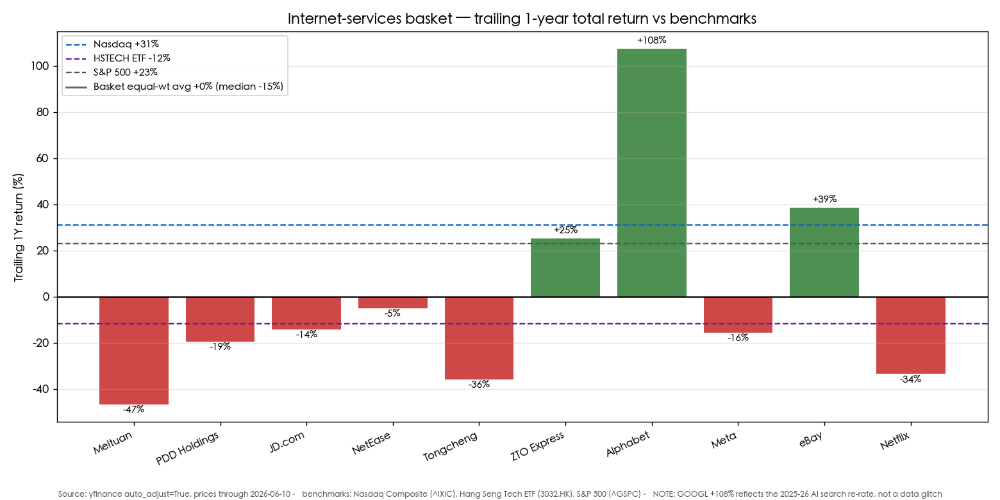
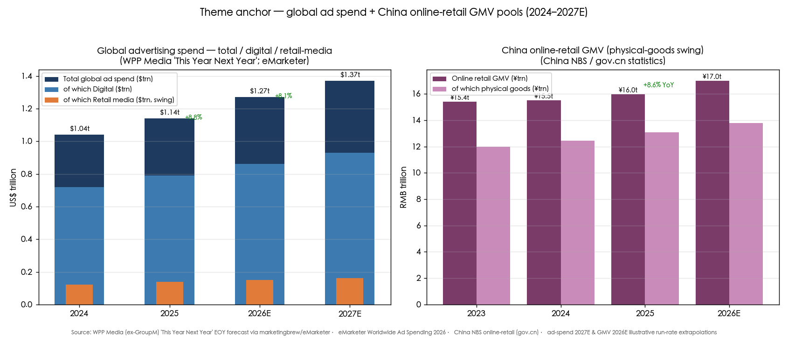
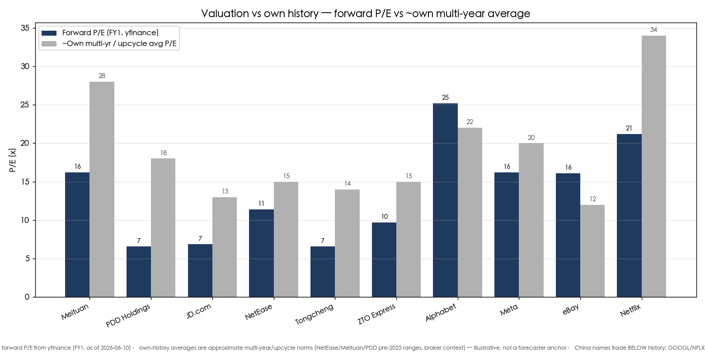
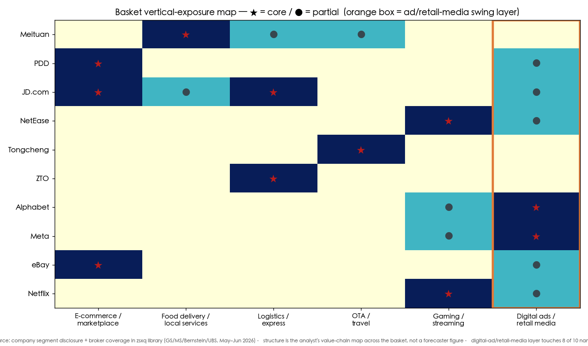

# China & Global Internet Services — E-commerce, Gaming, Travel, Logistics & Ads

**Created:** 2026-06-10 · **Last refreshed:** 2026-06-10 · **Last mutated:** 2026-06-10 · **Refresh cadence:** monthly · **Languages tracked:** en

## What's New

*The delta since you last looked — newest refresh on top. Older entries collapse into the archive below so this stays short.*

**2026-06-10 — basket created (10 tickers across all five verticals).**
- **Anchor set:** two third-party pools — global ad spend (WPP Media/eMarketer, $1.14trn 2025 → ~$1.27trn 2026E, +8.1%, [eMarketer 2026](https://www.emarketer.com/content/worldwide-ad-spending-forecast-2026)) and China online-retail GMV (NBS, ¥15.97trn 2025, +8.6%, [gov.cn 2026-01-19](https://english.www.gov.cn/archive/statistics/202601/19/content_WS696da722c6d00ca5f9a08a31.html)). Swing factor = **retail-media/digital-ad cycle** (US names) + **China consumption × anti-involution margin discipline** (China names).
- **Core selections:** Meituan (food delivery), PDD (e-commerce/Temu), JD.com (e-commerce/logistics), NetEase (gaming), Tongcheng (OTA), ZTO (express); eBay (marketplace). **Adjacent:** Alphabet & Meta (digital ads), Netflix (streaming + ad tier).
- **Performance read at inception:** trailing-1Y basket equal-wt ≈ +0% (median −15%) vs Nasdaq +31% / HSTECH-ETF −12% / S&P 500 +23% — a **two-speed basket**: US ad names (GOOGL +108%, EBAY +39%) carried it while China names lagged (Meituan −47%, Tongcheng −36%, [yfinance through 2026-06-10](https://finance.yahoo.com/)).
- **Fresh broker calls mined (May–Jun 2026, 10 PT rows upserted to `/pt`):** GS Meituan Buy TP HK$116 (+48% vs HK$78.25, [GS 2026-06-02](http://xs-macbook-air.local:5001/zsxq/pdf/812485451482542/Goldman%20Sachs-Meituan.pdf)); GS PDD Buy TP $145 cut from $158 ([GS 2026-05-28](http://xs-macbook-air.local:5001/zsxq/pdf/184128881155812/Goldman%20Sachs-PDD.pdf)); GS NetEase Buy TP $166 ([GS 2026-05-22](http://xs-macbook-air.local:5001/zsxq/pdf/812451555115452/Goldman%20Sachs-NetEase.pdf)); GS Tongcheng Buy TP HK$25.30 vs JPM Neutral HK$17.5 — a live split.
- **Anti-involution thesis confirmed in the original PDFs:** Meituan food-delivery long-term profit lifted to Rmb1.0/order, 2Q26 breakeven pulled forward ([GS 2026-06-02](http://xs-macbook-air.local:5001/zsxq/pdf/812485451482542/Goldman%20Sachs-Meituan.pdf)); ZTO ASP +Rmb0.11 YoY, EBIT/parcel decline narrowing ([GS 2026-05-21](http://xs-macbook-air.local:5001/zsxq/pdf/585424811812884/Goldman%20Sachs-ZTO.pdf)).
- **Thesis drift:** none — this is the inception basket.

Earlier refreshes

*(none — basket created 2026-06-10)*

## Thesis

**Anchor pool #1 — global advertising spend:** 2024 ≈$1.04trn → 2025 $1.14trn (+8.8%) → 2026E ≈$1.27trn (+8.1%) → 2027E ≈$1.37trn (+~8%) ([WPP Media "This Year, Next Year" EOY forecast, 2025-12-09](https://www.marketingbrew.com/stories/2025/12/09/total-global-ad-revenue-grew-nearly-9-in-2025-wpp-media); [eMarketer Worldwide Ad Spending 2026](https://www.emarketer.com/content/worldwide-ad-spending-forecast-2026); 2027E is an illustrative ~8% run-rate extension). Digital is now **over two-thirds** of the pool and rising ([Bernstein Global Media advertising primer, zsxq #584251542825424 p.1, 2026-06-09](http://xs-macbook-air.local:5001/zsxq/pdf/584251542825424/Bernstein-Global%20Media.pdf#page=1): *"digital now accounting for over two-thirds of global ad spend"*). Sub-buckets: **retail media is the swing sub-bucket** — $122bn (2024) → ~$163bn (2027E), the highest-margin, near-zero-incremental-cost inventory, growing 14–16% ([eMarketer global ad spend / retail media](https://www.emarketer.com/content/global-ad-spend-top--1-trillion-digital-retail-media-surge)). The Bernstein primer's structural insight: ad growth is **redistribution, not consumption expansion** — media time has plateaued at ~11 hours/day, so value shifts to scaled platforms with superior data ([Bernstein primer, zsxq #584251542825424 p.1](http://xs-macbook-air.local:5001/zsxq/pdf/584251542825424/Bernstein-Global%20Media.pdf#page=1): *"advertising growth is driven by redistribution, not consumption expansion"*). This is the bucket Alphabet, Meta, Netflix's ad tier, and the marketplaces' (PDD/eBay/JD/Meituan) on-site ad businesses all ride.

**Anchor pool #2 — China online-retail GMV:** 2025 ¥15.97trn (+8.6% YoY), of which physical-goods ¥13.09trn (+5.2%), now ~25% of total consumer-goods retail; 2026 tracking +6.6% in the first four months to ¥6.53trn ([China NBS via gov.cn, 2026-01-19](https://english.www.gov.cn/archive/statistics/202601/19/content_WS696da722c6d00ca5f9a08a31.html); [Asia Business Outlook, 2026](https://www.asiabusinessoutlook.com/news/china-s-online-retail-sales-rise-66-in-early-2026-nwid-11974.html)). **Physical-goods GMV is the swing sub-bucket** for PDD/JD; food-delivery & local-services GTV (Meituan) and OTA GMV (Tongcheng) are the adjacent China consumption pools. The China-specific swing variable on top of GMV is **anti-involution margin discipline** — the regulatory and industry normalization of subsidy/price wars that lets unit economics recover even on modest GMV growth. GS lifted Meituan's long-term food-delivery profit to **Rmb1.0/order** and pulled forward 2Q26 breakeven on this dynamic ([GS Meituan, zsxq #812485451482542 p.1, 2026-06-02](http://xs-macbook-air.local:5001/zsxq/pdf/812485451482542/Goldman%20Sachs-Meituan.pdf#page=1): *"lift our long-term food delivery profit to Rmb1.0 per order (from Rmb0.7)… faster-than-expected 2Q profit breakeven"*).

**Value-chain / layer map:** e-commerce/marketplace (PDD · JD · eBay · Meituan instant-retail) · food delivery / local services (Meituan) · logistics / express (ZTO · JD Logistics) · OTA / travel (Tongcheng) · gaming / streaming content (NetEase · Netflix) · **digital ads / retail media (Alphabet · Meta · + the marketplaces' on-site ad layer)** — the ad/retail-media layer touches **8 of 10 names** and is where the highest incremental margin sits, which is why it is the swing layer. A layer with *no* tracked exposure: pure ad-tech (DSP/SSP — Trade Desk, AppLovin) — a candidate-add coverage gap.

**Who-benefits-when (staging along the anchor curve):** the **margin-recovery names monetize first** (Meituan FD breakeven 2026→profit/order 2027–28; ZTO unit-economics turn now on anti-involution), then the **ad-cycle compounders** (Alphabet/Meta) ride the digital-ad pool, then the **pipeline/optionality names** (NetEase 2H game pipeline; Netflix ad-tier scaling 2027) — each with a dated gate noted in the catalysts. **Bull/base/bear (anchor):** bull = global ad spend re-accelerates to double-digit on retail-media + AI ad formats AND China consumption firms; base = ad +8% / China GMV +6–8% with anti-involution discipline holding; bear = ad-cycle air-pocket (UBS's "Navigating the Air Pocket" risk) + China consumption weakness + a renewed China subsidy war.

**Conviction note (sourced):** Bernstein's US-eCommerce work prefers names where **Active-Buyer growth is turning** over ASP-led top-line ([Bernstein US eCommerce, zsxq #585424811815414 p.1, 2026-05-20](http://xs-macbook-air.local:5001/zsxq/pdf/585424811815414/Bernstein-US%20eCommerce.pdf#page=1): *"the Street wants confidence in volume-led growth rather than ASP inflation"*). On China internet, GS rates Meituan/PDD/NetEase/JD/ZTO/Tongcheng all **Buy**; JPM is more cautious on travel (Tongcheng Neutral). *Analyst view (this note):* among China names the cleanest risk/reward is the **margin-recovery cohort (Meituan, ZTO)** where the swing variable (anti-involution) is already inflecting, vs the **consumption-beta cohort (PDD, Tongcheng)** which needs the macro to cooperate.

## Scope rules

**In:** internet-SERVICES verticals — e-commerce/marketplaces, food delivery & local services, logistics/express parcel, OTA/travel, gaming/streaming content, and digital advertising / retail media. Pure-play and dominant-vertical names preferred.

**Out (explicitly):** the **China AI-platform/cloud/agentic layer** — Alibaba and Tencent as AI-cloud plays belong to a separate *china-internet-AI* / *china-sovereign-ai-compute* theme, not here (they appear only as exclusions below). Also out: ride-hailing/robotaxi/autonomous-driving (DiDi, Pony, WeRide — a mobility theme); short-video/AI-video platforms whose story is now generative-AI optionality (Kuaishou's Kling, Bilibili — AI-media adjacent); semiconductor/hardware names; payments-only fintech. Adjacency rule: Alphabet/Meta/Netflix are tracked as **adjacent** (ad/streaming verticals dominate the part we care about), not as their AI-cloud businesses.

## Tracked tickers

| Ticker | Name | Role | Justification | Added |
|---|---|---|---|---|
| 3690.HK | Meituan (美团) | core | Dominant China food-delivery + local-services platform; FD transaction share >70% in the >Rmb60 ticket segment, targeting Rmb1.0 net profit/order long-term with 2Q26 breakeven pulled forward on anti-involution discipline ([GS, zsxq #812485451482542 p.1, 2026-06-02](http://xs-macbook-air.local:5001/zsxq/pdf/812485451482542/Goldman%20Sachs-Meituan.pdf#page=1)). **Moat:** 30-min fulfilment density + rider network + merchant base no rival can replicate at scale. **Threat:** Alibaba/Ele.me + Douyin re-igniting a subsidy war (customer-of-attention insourcing); counter = structural UE advantage from order density vs sub-scale challengers. | 2026-06-10 |
| PDD | PDD Holdings (拼多多) | core | Pinduoduo (China value e-commerce) + Temu (cross-border); transaction-service revenue +20% YoY signals Temu GMV re-acceleration and improving Temu GMV margin ([GS, zsxq #184128881155812 p.1, 2026-05-28](http://xs-macbook-air.local:5001/zsxq/pdf/184128881155812/Goldman%20Sachs-PDD.pdf#page=1)). **Moat:** lowest-cost C2M supply + "Costco+Disney" engagement loop; Temu's managed-marketplace logistics. **Threat:** US de-minimis/tariff regime on Temu + Alibaba/JD reinvesting in low-price; counter = structural cost lead and a multi-year reinvestment cycle "rebuilding a Pinduoduo." | 2026-06-10 |
| 9618.HK | JD.com (京东) | core | China #1 self-operated 1P e-commerce + JD Logistics; 1Q26 strong beat on JD Retail (JDR) margin, GMV growth outpacing revenue ([MS, zsxq #415245581284458 p.1, 2026-05-14](http://xs-macbook-air.local:5001/zsxq/pdf/415245581284458/Morgan%20Stanley-JD.pdf#page=1)). **Moat:** owned nationwide fulfilment + authentic-goods trust in electronics/appliances. **Threat:** trade-in subsidy roll-off lifting 2H comps + new-business (Jingxi/Joybuy/food-delivery) losses; counter = JDR margin expansion funding the new bets. | 2026-06-10 |
| NTES | NetEase (网易) | core | China #2 games publisher; 1Q26 record-high margin (+500bps QoQ gross margin), new title Rmb5.8bn+ first-12m grossing, 2H pipeline (Where Winds Meet, Sea of Remnants) ([GS, zsxq #812451555115452 p.1, 2026-05-22](http://xs-macbook-air.local:5001/zsxq/pdf/812451555115452/Goldman%20Sachs-NetEase.pdf#page=1)). **Moat:** evergreen franchises (Fantasy Westward Journey) + in-house engine + global studios (Marvel Rivals). **Threat:** pipeline-execution risk + China game-approval (版号) cadence + Tencent's distribution scale; counter = deferred-revenue annuity from legacy titles cushions new-game timing. | 2026-06-10 |
| 0780.HK | Tongcheng (同程旅行) | core | China OTA #2, lower-tier-city + transport-ticketing leader; Elong hotel target 4k operating hotels by FY26 (vs 3.2k), mid-term +20–30% revenue growth in hotels ([GS, zsxq #184152221455442 p.1, 2026-05-29](http://xs-macbook-air.local:5001/zsxq/pdf/184152221455442/Goldman%20Sachs-Tongcheng.pdf#page=1)). **Moat:** WeChat traffic entry + low-tier-city user base under-served by Trip.com. **Threat:** Trip.com (TCOM) moving down-market + long-haul travel deceleration + removal of auto price-adjustment hurting hotel take-rate; counter = inventory-sharing arrangement with TCOM and a structurally lower-cost user-acquisition channel. | 2026-06-10 |
| ZTO | ZTO Express (中通快递) | core | China #1 express-parcel by volume; 1Q26 volume +13.2% YoY (7.4pts above industry), share +1.4ppt to 20.3%, core-express ASP +Rmb0.11 YoY with EBIT/parcel decline narrowing on anti-involution ([GS, zsxq #585424811812884 p.1, 2026-05-21](http://xs-macbook-air.local:5001/zsxq/pdf/585424811812884/Goldman%20Sachs-ZTO.pdf#page=1)). **Moat:** lowest unit-cost network + scale; the price-discipline beneficiary. **Threat:** a renewed franchise-network price war (the 2021-style involution) + JD Logistics/Cainiao share grabs; counter = cost lead lets ZTO underprice and still profit where rivals can't. | 2026-06-10 |
| GOOGL | Alphabet | adjacent | Largest digital-ad platform (Search + YouTube); Google+YouTube ~$229bn digital-ad revenue 2026E ([eMarketer 2026](https://www.emarketer.com/content/worldwide-ad-spending-forecast-2026)), core ride on the $1.27trn ad pool. **Moat:** search-intent monetization + data scale + YouTube. **Threat (insourcing-style):** generative-AI chat (ChatGPT) disintermediating search queries — Google's share of total search-ad revenue dips below 50% for the first time in 2026 ([eMarketer 2026](https://www.emarketer.com/content/worldwide-ad-spending-forecast-2026)); counter = AI Overviews + agentic ad formats defending the auction, and Gemini distribution. Tracked for the **ad vertical only**, not the cloud/AI-platform business. | 2026-06-10 |
| META | Meta Platforms | adjacent | #2 digital-ad platform; HSBC: AI-driven revenue growth can continue ([HSBC Meta Buy, zsxq #585581115424244, 2026-04-21](http://xs-macbook-air.local:5001/zsxq/pdf/585581115424244/HSBC-Meta.pdf)); SME-driven ad revenue (~two-thirds of platform ad revenue) is the structurally resilient engine ([Bernstein primer, zsxq #584251542825424 p.1](http://xs-macbook-air.local:5001/zsxq/pdf/584251542825424/Bernstein-Global%20Media.pdf#page=1)). **Moat:** 3bn+ DAU social graph + AI ad-ranking (Advantage+). **Threat:** Reels/TikTok attention competition + Reality Labs cash burn + EU DMA/privacy regulation; counter = AI-driven ROAS gains keeping SME budgets sticky. Tracked for the **ad vertical only**. | 2026-06-10 |
| EBAY | eBay | core | Global re-commerce marketplace; Active-Buyer growth turning a corner, GMV-led not ASP-led ([Bernstein US eCommerce, zsxq #585424811815414 p.1, 2026-05-20](http://xs-macbook-air.local:5001/zsxq/pdf/585424811815414/Bernstein-US%20eCommerce.pdf#page=1)). **Moat:** unique-inventory niches (collectibles, parts, refurb) + first-party data ad business. **Threat:** Amazon/Temu/Walmart marketplace scale + a possible GameStop bid overhang ([UBS, zsxq #812458548521842, 2026-05-05](http://xs-macbook-air.local:5001/zsxq/pdf/812458548521842/UBS-eBay.pdf)); counter = defensible non-commodity categories Amazon under-serves. | 2026-06-10 |
| NFLX | Netflix | adjacent | Streaming leader scaling an **ad-supported tier** — the new ad-inventory layer on the ad pool; AVOD expanding to 15 more countries in 2027 ([Bernstein, zsxq #212452155822251, 2026-05-15](http://xs-macbook-air.local:5001/zsxq/pdf/212452155822251/Bernstein-Netflix-AVOD.pdf)). **Moat:** global subscriber scale + content engine + password-sharing monetization. **Threat:** content-cost inflation + Disney/Amazon/YouTube competition for engagement; counter = a durable engine with the ad tier as a second P&L. Tracked for **streaming + ad-tier**, not the broader media conglomerate. | 2026-06-10 |

## Valuation snapshot

*Populated from `stock_price_target_db` (the `/pt` store); FY-fwd P/E from yfinance (FY1) as of 2026-06-10. "Px @ note" = report-date price (the load-bearing price the analyst's upside was struck against). Current px through 2026-06-10.*

| Ticker | Rating (note) | Px @ note date | PT | Upside% (vs note px) | Current px | Fwd P/E (FY1) | ~Own multi-yr avg P/E | PEG | FY1 / FY2 metric |
|---|---|---|---|---|---|---|---|---|---|
| 3690.HK | GS **Buy** @ 2026-06-02 | HK$78.25 | HK$116 | **+48.2%** | HK$77.15 | 16.2x | ~25–28x (pre-2025) | 30.1 (depressed E) | SOTP: FD HK$46 / in-store HK$26 / instant-retail HK$15/sh |
| PDD | GS **Buy** @ 2026-05-28 | $96.64 | $145 (was $158) | **+50.0%** | $81.93 | 6.6x | ~15–18x (pre-2024) | 0.80 | SOTP; FY26E/FY27E op profit Rmb105bn/Rmb126bn |
| 9618.HK | MS **OW** @ 2026-05-14 | $30.53 (US ADR) | $27 (was $25) | (ADR-based) | HK$112.70 | 6.9x | ~12–13x | 0.94 | 9x 2026E non-GAAP P/E base |
| NTES | GS **Buy** @ 2026-05-22 | $116.82 | $166 / HK$260 | **+42.1%** | $120.73 | 11.4x | ~14–15x | 1.27 | high-teen op-profit growth on 2026E PE |
| 0780.HK | GS **Buy** @ 2026-05-23 | HK$15.68 | HK$25.30 | **+61.4%** | HK$14.03 | 6.6x | ~13–14x | 0.94 | SOTP / sum-of-segments |
| 0780.HK | JPM **Neutral** @ 2026-05-23 | HK$15.68 | HK$17.5 (was 21.5) | +11.6% | HK$14.03 | 6.6x | — | — | 10x P/E (vs ~12x prior) |
| ZTO | GS **Buy** @ 2026-05-21 | $23.22 | $26 / HK$203 | **+12.0%** | $21.94 | 9.7x | ~14–15x | 1.18 | parcel-volume + UE recovery |
| GOOGL | UBS **Neutral** @ 2026-06-05 | $362.67 | $410 | **+13.1%** | $364.26 | 25.2x | ~20–22x | 1.45 | 26x on 3Q27E–2Q28E GAAP dil. EPS $15.81 |
| EBAY | Bernstein **Mkt-Perform** @ 2026-05-15 | $95.00 | $95 | **0.0%** | $108.66 | 16.1x | ~11–13x | 1.71 | adj EPS F26E $6.12 / F27E $6.45 |
| NFLX | Bernstein **Outperform** @ 2026-06-04 | n/a | $110 | n/a | $81.41 | 21.2x | ~30–35x | 1.61 | adj EPS F26E $3.20 / F27E $3.80 (post-split) |

**Normalization / priced-for-perfection read:** the cross-section sorts cheap→dear on FY1 fwd P/E with PEG as the growth-adjusted cut. **China names trade BELOW their own histories** (PDD 6.6x vs ~15–18x; JD 6.9x vs ~12–13x; Tongcheng 6.6x vs ~13–14x; PEG <1 for all three) — the de-rating is the *opportunity*, not the air-pocket. **The air-pocket sits on the US ad/streaming side:** GOOGL 25.2x is +~15% above its own ~20–22x history and NFLX 21.2x carries a 1.61 PEG; the named de-rate trigger is a **digital-ad-cycle air-pocket** (UBS "Navigating the Air Pocket") and **generative-AI disintermediation of search** (Google search-ad share <50% in 2026). A reversion of GOOGL to its ~22x own-avg from 25.2x is roughly **−13%**; for NFLX a reversion from 21.2x toward a normalized streaming-mature ~18x would be ~−15%. eBay PT $95 sits *below* the current $108.66 — Bernstein's call has been overtaken by price (the stock rallied through the target), flagged stale below.

*Stale — pending refresh:* eBay Bernstein MP TP $95 @ 2026-05-15 — current $108.66 is **above** the target; the +0% upside the analyst called no longer reflects the live price. Do not read the live gap as a Bernstein downside call.

## Exclusions

| Ticker | Reason |
|---|---|
| 9988.HK / BABA | Alibaba — its 2026 re-rate is an **AI-cloud / agentic-platform** story (Qwen, Aliyun); the e-commerce vertical is secondary to that narrative. Belongs to a *china-internet-AI* theme, per scope rules. |
| 0700.HK / TCEHY | Tencent — tracked elsewhere as an AI-platform/Weixin-agentic name; its games are core but the marginal investment debate is AI, not gaming. |
| 1024.HK | Kuaishou — story is now Kling AI-video optionality (US$20bn financing / potential spin-off), an AI-media adjacency, not a core e-commerce/ads internet-services bet. |
| DIDIY | DiDi — ride-hailing/mobility + robotaxi; separate mobility theme. |
| TCOM / 9961.HK | Trip.com — strong OTA name but heavily overlaps Tongcheng; one OTA per basket (Tongcheng chosen for the lower-tier-city + WeChat-entry differentiation). Candidate-add if the OTA sleeve is widened. |
| SE / MELI | Sea / MercadoLibre — premier ASEAN/LatAm e-commerce, but the local zsxq library has near-zero coverage on them this pass (find_pdf returned 0–1 hits); cannot ground a Justification cell to a primary broker call. Candidate-add when coverage appears. |

## Keywords

e-commerce / 电商 · marketplace GMV / 商品交易额 · food delivery / 外卖 · instant retail / 即时零售(闪购) · express parcel / 快递 · anti-involution / 反内卷 · OTA / 在线旅游 · room nights / 间夜 · gaming / 游戏 · 版号 (game licence) · digital advertising / 数字广告 · retail media / 零售媒体 · active buyers / 活跃买家 · Temu / 跨境电商

## Performance

*Trailing 1-year total return, yfinance auto_adjust=True, prices through 2026-06-10. Benchmarks: Nasdaq Composite +31.1%, S&P 500 +23.0%, Hang Seng Tech ETF (3032.HK) −11.8% over the same window.*

| Ticker | Name | 1Y | 3M | 1M | YTD |
|---|---|---|---|---|---|
| GOOGL | Alphabet | **+107.5%** | +18.7% | −9.1% | +15.7% |
| EBAY | eBay | +38.7% | +19.9% | +1.2% | +25.6% |
| ZTO | ZTO Express | +25.2% | −4.5% | −12.4% | +3.9% |
| NTES | NetEase | −5.0% | +4.2% | +4.8% | −16.9% |
| 9618.HK | JD.com | −14.2% | +4.2% | −4.9% | −1.6% |
| META | Meta | −15.5% | −10.5% | −4.1% | −10.0% |
| PDD | PDD Holdings | −19.4% | −21.9% | −17.1% | −29.2% |
| NFLX | Netflix | −33.5% | −16.0% | −6.9% | −10.5% |
| 0780.HK | Tongcheng | −35.8% | −30.8% | −21.3% | −39.2% |
| 3690.HK | Meituan | −46.6% | −0.3% | −8.5% | −26.2% |

### Basket scorecard

*MS "Three Actionable Ideas" style — computed from yfinance + the snapshot history.*
- **Equal-weight basket 1Y ≈ +0.1%** (median −14.8%) vs Nasdaq +31.1% / S&P 500 +23.0% / HSTECH-ETF −11.8%. Basket beats the China benchmark (HSTECH −11.8%) but trails the US benchmarks badly — the US ad names are the only thing keeping it flat.
- **Batting average:** 3 of 10 names positive over 1Y (30%); **2 of 10 beat Nasdaq** (GOOGL, EBAY) = 20%; **5 of 10 beat the HSTECH-ETF** = 50%.
- **Best contributor:** Alphabet **+107.5%** (the AI-search re-rate). **Worst:** Meituan **−46.6%** (subsidy-war fears before the anti-involution turn).
- **Cumulative outperformance in bps since inception:** n/a — only one snapshot line exists at create; computed from the second refresh forward.
- *Read:* this is a two-speed, contrarian-on-China basket. The China cohort is priced for a subsidy-war / consumption-weakness outcome the latest broker prints argue is reversing (Meituan FD breakeven, ZTO ASP up). The thesis is that the **earnings-revision + anti-involution turn** closes the gap; the scorecard at inception is the "before" picture.

## Recent events

*Material broker calls / corporate events mined from the zsxq library (May–Jun 2026), each inline-cited.*
- **Meituan 1Q26:** food-delivery unit economics beat; GS lifts long-term FD profit to Rmb1.0/order, 2Q26 breakeven pulled forward, TP HK$112→HK$116 Buy ([GS, zsxq #812485451482542 p.1, 2026-06-02](http://xs-macbook-air.local:5001/zsxq/pdf/812485451482542/Goldman%20Sachs-Meituan.pdf#page=1)); Nomura: FD profitability surprises to the upside ([Nomura, zsxq #585412428415114, 2026-06-02](http://xs-macbook-air.local:5001/zsxq/pdf/585412428415114/Nomura-Meituan.pdf)).
- **PDD 1Q26:** marketing-services growth softer (+2% YoY) and EPS miss (−17% YoY), but transaction-service revenue +20% YoY (Temu GMV re-accel); GS trims TP $158→$145, keeps Buy, "Costco+Disney" vision ([GS, zsxq #184128881155812 p.1, 2026-05-28](http://xs-macbook-air.local:5001/zsxq/pdf/184128881155812/Goldman%20Sachs-PDD.pdf#page=1)); MS: "entering a new investment cycle" ([MS, zsxq #184152221455852, 2026-05-27](http://xs-macbook-air.local:5001/zsxq/pdf/184152221455852/Morgan%20Stanley-PDD.pdf)).
- **JD.com 1Q26:** strong beat on JD-Retail margin; trade-in subsidy roll-off raises 2H comps; MS PT $25→$27, OW ([MS, zsxq #415245581284458 p.1, 2026-05-14](http://xs-macbook-air.local:5001/zsxq/pdf/415245581284458/Morgan%20Stanley-JD.pdf#page=1)).
- **NetEase 1Q26:** record-high margin (+500bps QoQ GM); new title Rmb5.8bn+ first-12m grossing; 2H pipeline (Where Winds Meet, Sea of Remnants); GS Buy TP $166 ([GS, zsxq #812451555115452 p.1, 2026-05-22](http://xs-macbook-air.local:5001/zsxq/pdf/812451555115452/Goldman%20Sachs-NetEase.pdf#page=1)).
- **ZTO 1Q26:** parcel volume +13.2% YoY (7.4pts > industry), share +1.4ppt to 20.3%, ASP +Rmb0.11 YoY, EBIT/parcel decline narrowing; GS Buy TP $26 ([GS, zsxq #585424811812884 p.1, 2026-05-21](http://xs-macbook-air.local:5001/zsxq/pdf/585424811812884/Goldman%20Sachs-ZTO.pdf#page=1)); MS notes April volume in the teens vs LSD market, share buyback to resume ([MS, zsxq #212454185411221 p.1, 2026-05-21](http://xs-macbook-air.local:5001/zsxq/pdf/212454185411221/Morgan%20Stanley-ZTO.pdf#page=1)).
- **Tongcheng 1Q26:** results inline; long-haul travel deceleration → lower revenue guidance; GS Buy TP HK$25.30 (+61%) vs JPM cutting to Neutral HK$17.5 ([GS, zsxq #212451552545521 p.1, 2026-05-23](http://xs-macbook-air.local:5001/zsxq/pdf/212451552545521/Goldman%20Sachs-Tongcheng.pdf#page=1); [JPM, zsxq #585428211554284 p.1, 2026-05-23](http://xs-macbook-air.local:5001/zsxq/pdf/585428211554284/J.P.%20Morgan-Tongcheng.pdf#page=1)).
- **eBay:** Active-Buyer growth turning across eBay/Etsy/Wayfair; Bernstein MP TP $95 ([Bernstein, zsxq #585424811815414 p.1, 2026-05-20](http://xs-macbook-air.local:5001/zsxq/pdf/585424811815414/Bernstein-US%20eCommerce.pdf#page=1)); GameStop unsolicited ~$56bn bid acknowledged by board ([UBS, zsxq #812458548521842, 2026-05-05](http://xs-macbook-air.local:5001/zsxq/pdf/812458548521842/UBS-eBay.pdf)).
- **Alphabet:** UBS reiterates Neutral $410, pulling TPU/AI revenue forward; Google search-ad share to dip below 50% in 2026 ([UBS, zsxq #212488548484411 p.1, 2026-06-05](http://xs-macbook-air.local:5001/zsxq/pdf/212488548484411/UBS-Alphabet.pdf#page=1); [eMarketer 2026](https://www.emarketer.com/content/worldwide-ad-spending-forecast-2026)).
- **Netflix:** Bernstein Outperform TP $110, "messy near-term narrative but a durable engine"; AVOD to 15 more countries 2027 ([Bernstein, zsxq #212488548484441 p.1, 2026-06-04](http://xs-macbook-air.local:5001/zsxq/pdf/212488548484441/Bernstein-Netflix.pdf#page=1)).

## Drift signals

*The value-add of the tracked basket. Surfaced at inception as the baseline drift read.*
- **Two-speed basket (the headline drift):** the China cohort (Meituan/PDD/JD/Tongcheng/NetEase) is down 5–47% over 1Y while the US ad cohort (GOOGL/EBAY) is up 25–108%. The thesis explicitly bets the gap closes via China earnings-revisions + anti-involution; if the China prints *don't* inflect, the basket is just long expensive US ad names. **Watch:** the next two quarters of Meituan FD profit/order and ZTO EBIT/parcel.
- **eBay PT overtaken by price (stale-justification flag):** Bernstein MP TP $95 vs current $108.66 — the call is stale; re-ground at next refresh.
- **PDD TAM-revision down (first revision to track):** GS cut PDD TP $158→$145 on softer marketing-services growth — a −8% PT revision; the swing variable is Temu GMV margin (improving) vs core-Pinduoduo ad monetization (softening).
- **Priced-for-perfection flag (US side):** GOOGL 25.2x fwd is ~+15% above its ~22x own history; **named de-rate trigger = generative-AI disintermediation of search** (Google search-ad share <50% in 2026) + a digital-ad air-pocket → implied **~−13%** reversion to own-avg. NFLX at 21.2x / 1.61 PEG carries similar air-pocket risk.
- **New-entrant candidates (do not auto-add):** TCOM/9961.HK (Trip.com — the larger OTA, deep zsxq coverage), Kuaishou's commerce (if separated from Kling-AI), and an ad-tech name (Trade Desk/AppLovin) to cover the DSP/SSP value-chain layer the basket misses. SE/MELI await library coverage.
- **Macro backdrop:** VIX 21.5, 10Y 4.54%, HY OAS 2.74% (as of 2026-06-04/05, `indicators.db`) — credit benign, vol slightly elevated; not a risk-off regime, so the China-cohort de-rating is idiosyncratic/consumption-driven, not a broad credit event.

## Leading indicators

*Upstream signals that lead the basket members + a per-ticker operating-data spine (Bernstein "Barometer" style). Each print string-matched to its primary issuer.*

**Macro / upstream (header):**
1. **Global ad spend growth** — 2025 +8.8% to $1.14trn, 2026E +8.1% to ~$1.27trn ([WPP Media 2025-12-09](https://www.marketingbrew.com/stories/2025/12/09/total-global-ad-revenue-grew-nearly-9-in-2025-wpp-media); [eMarketer 2026](https://www.emarketer.com/content/worldwide-ad-spending-forecast-2026)). Direction: up but decelerating → leads GOOGL/META/EBAY-ads/marketplace ad layers.
2. **China online-retail GMV** — 2025 +8.6% to ¥15.97trn; first-4M-2026 +6.6% to ¥6.53trn ([gov.cn 2026-01-19](https://english.www.gov.cn/archive/statistics/202601/19/content_WS696da722c6d00ca5f9a08a31.html); [Asia Business Outlook 2026](https://www.asiabusinessoutlook.com/news/china-s-online-retail-sales-rise-66-in-early-2026-nwid-11974.html)). Direction: positive but moderating → leads PDD/JD GMV and ZTO parcel volume.
3. **Retail-media ad spend** — $122bn (2024) → ~$163bn (2027E), 14–16% growth ([eMarketer](https://www.emarketer.com/content/global-ad-spend-top--1-trillion-digital-retail-media-surge)). Direction: fastest sub-bucket → leads every marketplace's on-site ad margin.

**Per-ticker operating data (latest print):**

| Ticker | Operating metric | Latest print | Source |
|---|---|---|---|
| 3690.HK | FD profit/order (LT target) · 2Q breakeven | Rmb1.0/order LT (was Rmb0.7); 2Q26 breakeven pulled fwd | [GS zsxq #812485451482542 p.1](http://xs-macbook-air.local:5001/zsxq/pdf/812485451482542/Goldman%20Sachs-Meituan.pdf#page=1) |
| PDD | Transaction-service rev YoY (Temu proxy) | **+20% YoY** (1Q26); op profit +16% YoY | [GS zsxq #184128881155812 p.1](http://xs-macbook-air.local:5001/zsxq/pdf/184128881155812/Goldman%20Sachs-PDD.pdf#page=1) |
| ZTO | Parcel volume YoY · market share · core ASP | **+13.2% YoY**; share **20.3%** (+1.4ppt); ASP Rmb1.36 (+Rmb0.11) | [GS zsxq #585424811812884 p.1](http://xs-macbook-air.local:5001/zsxq/pdf/585424811812884/Goldman%20Sachs-ZTO.pdf#page=1) |
| NTES | Gross margin QoQ · new-title 12m grossing | **+500bps QoQ** GM; Rmb5.8bn+ first-12m grossing | [GS zsxq #812451555115452 p.1](http://xs-macbook-air.local:5001/zsxq/pdf/812451555115452/Goldman%20Sachs-NetEase.pdf#page=1) |
| 0780.HK | Room-night growth · Elong hotel count | room nights decelerating from +10% YoY (1Q26); Elong target 4k hotels FY26 (vs 3.2k) | [GS zsxq #184152221455442 p.1](http://xs-macbook-air.local:5001/zsxq/pdf/184152221455442/Goldman%20Sachs-Tongcheng.pdf#page=1) |
| 9618.HK | JDR rev YoY · GMV vs revenue | JDR 2Q26 guided mid-to-high-SD% YoY, **GMV growth outpacing revenue** | [MS zsxq #415245581284458 p.1](http://xs-macbook-air.local:5001/zsxq/pdf/415245581284458/Morgan%20Stanley-JD.pdf#page=1) |
| EBAY | Active Buyers QoQ/YoY | flat-to-up QoQ in 1Q26 (eBay/Etsy/Wayfair) | [Bernstein zsxq #585424811815414 p.1](http://xs-macbook-air.local:5001/zsxq/pdf/585424811815414/Bernstein-US%20eCommerce.pdf#page=1) |
| GOOGL | Google+YouTube digital-ad rev | **~$229bn 2026E**; search-ad share <50% in 2026 | [eMarketer 2026](https://www.emarketer.com/content/worldwide-ad-spending-forecast-2026) |

**Side-by-side guidance on the shared forward metric (China consumption / anti-involution):** Meituan (FD breakeven 2026 → Rmb0.6/order 2027 → Rmb1.0 2028) and ZTO (EBIT/parcel decline narrowed to −Rmb0.02 YoY from −Rmb0.08) both guide to the *same* anti-involution unit-economics recovery — if one disappoints, it's idiosyncratic; if both do, the swing-factor thesis is breaking.

## Catalysts (next 3–6 months)

*Each = event + transmission mechanism → which sub-bucket / name it moves + timing.*
- **2Q26 earnings (Aug 2026)** (Meituan 2Q FD breakeven print → confirms/breaks the Rmb1.0/order anti-involution path → moves Meituan + the whole China margin-recovery read), Aug 2026.
- **618 mid-year shopping festival readthrough** (618 GMV growth → leads China online-retail GMV sub-bucket + PDD/JD/Tmall ad-monetization; Citi tracking first-phase performance → PDD/JD/eBay marketplace ad layer), Jun–Jul 2026.
- **NetEase 2H game pipeline launches** (Where Winds Meet / Sea of Remnants grossing → deferred-revenue + grossing growth → gaming sub-bucket → NetEase re-rate), 2H 2026.
- **Google/Meta digital-ad prints + AI ad-format monetization** (Q2/Q3 ad-revenue beat-or-miss → tests the $1.27trn ad-pool growth + the generative-AI-disintermediation fear → moves GOOGL/META, the ad swing layer), Jul–Oct 2026.
- **Temu US tariff / de-minimis regime decisions** (any change to the de-minimis exemption → Temu unit economics → PDD transaction-service revenue), ongoing 2026.
- **eBay/GameStop bid resolution** (board response to the ~$56bn unsolicited proposal → eBay re-rate/overhang clearing → eBay), next 3 months.
- **Netflix ad-tier AVOD country expansion (2027 ramp set-up)** (AVOD scaling → second-P&L ad inventory → leads the streaming-ads sub-bucket → NFLX), 2H 2026.

## Data Used / 数据来源清单

**Market data**
- yfinance auto_adjust=True for prices, 1Y/3M/1M/YTD returns, market cap, forward P/E, PEG, sector — pulled 2026-06-10 (prices through 2026-06-10).
- Benchmarks: Nasdaq Composite (^IXIC), S&P 500 (^GSPC), Hang Seng Tech ETF (3032.HK) as the HK proxy (^HSTECH index symbol unavailable on yfinance).

**Per-ticker primary / broker sources** (all mined from the local zsxq library, original OCR'd PDF text):
- 3690.HK Meituan: GS 1Q26 review (#812485451482542, 2026-06-02); GS NDR (#812488584428242); Nomura FD (#585412428415114); Bernstein Q1 (#212485451482841).
- PDD: GS 1Q26 (#184128881155812, 2026-05-28); MS new-investment-cycle (#184152221455852); Nomura (#212451114422481); Bernstein Q1 (#415241112252828).
- 9618.HK JD: MS 1Q26 (#415245581284458, 2026-05-14); Bernstein Q1 (#812452258211822); UBS (#585425522585454); JPM China Logistics (#415284512252548).
- NTES NetEase: GS 1Q26 (#812451555115452, 2026-05-22); MS Risk-Reward (#812451125821222); Bernstein Q1 (#415242111854258).
- 0780.HK Tongcheng: GS results (#212451552545521, 2026-05-23) + NDR (#184152221455442); JPM Neutral (#585428211554284); MS NDR (#184128881115482).
- ZTO: GS 1Q26 (#585424811812884, 2026-05-21); MS results call (#212454185411221); JPM 1Q26 beat (#585424842252884).
- GOOGL: UBS (#212488548484411, 2026-06-05); Barclays AI-search (#585411122121284); Bernstein Global Media primer (#584251542825424).
- META: HSBC Buy (#585581115424244, 2026-04-21); Bernstein advertising primer (#584251542825424).
- EBAY: Bernstein US eCommerce (#585424811815414, 2026-05-20) + eBay/CFO (#415245181554428, 2026-05-15); UBS GameStop bid (#812458548521842).
- NFLX: Bernstein (#212488548484441, 2026-06-04); GS ad-upfront (#585425844811454); Bernstein AVOD (#212452155822251).

**Industry research / sell-side thematic notes (theme-level)**
- Bernstein "Global Media: A beginner's guide to investing in Advertising" primer, 9 Jun 2026 (zsxq #584251542825424) — the $1trn ad market structure, digital >two-thirds, retail-media swing, SME-driven resilience. Source-chained: Bernstein cites Kantar for brand-value exhibit.
- WPP Media (ex-GroupM) "This Year, Next Year" EOY forecast — the global ad-spend trajectory anchor ([marketingbrew, 2025-12-09](https://www.marketingbrew.com/stories/2025/12/09/total-global-ad-revenue-grew-nearly-9-in-2025-wpp-media); [eMarketer/GroupM 2024 milestone](https://www.emarketer.com/content/global-ad-revenues-hit--1-trillion-milestone-2024--says-groupm-forecast)).
- eMarketer Worldwide Ad Spending Forecast 2026 + retail-media surge note — sub-bucket trajectory + Google search-ad-share <50% datapoint.

**Local zsxq library (`db/zsxq.db` — read-only)**
- 17 broker PDFs mined for this theme (file_ids cited above) via `find_pdf.py` per-alias → `evidence_bundle.py` → OCR (`ocr_pdf.py`, 8 image-only files OCR'd) → `extract_pdf.py`. The 翻译精华 summary was the triage read; all load-bearing numbers (PTs, FD profit/order, parcel volume, GMV, EPS) cited from the extracted original English text, string-matched. Seed file_ids verified: 585424811815414 ✓ (Bernstein US eComm), 415245181554428 ✓ (Bernstein eBay), 812485451482542 ✓ (GS Meituan, was image-only → OCR'd); **184121185112122 discarded (GS Pony AI robotaxi — off-theme)**; **212418125442442 unresolved (not in DB)**.

**TAM anchor + leading indicators (theme-level)**
- Global ad spend: WPP Media / eMarketer, $1.14trn 2025 → ~$1.27trn 2026E (+8.1%); retail-media $122bn→$163bn 2024→2027E.
- China online-retail GMV: China NBS / gov.cn, ¥15.97trn 2025 (+8.6%), physical ¥13.09trn (+5.2%).
- Per-ticker operating prints: Meituan FD profit/order (GS), PDD transaction-service +20% YoY (GS), ZTO volume +13.2%/share 20.3% (GS), NetEase GM +500bps QoQ (GS), Tongcheng room-nights (GS), JD JDR (MS), eBay Active Buyers (Bernstein).

**Macro backdrop**
- VIX 21.51, 10Y Treasury (TNX) 4.54%, HY OAS 2.74% as of 2026-06-04/05. Source: `indicators.db`.

**Cross-coverage (existing company-research docs, read as structured input, not cited inline)**
- reports/company/Meituan_美团_HKEX3690/ ; reports/company/Meta_NASDAQ_META/ ; reports/company/Netflix_NASDAQ_NFLX/ ; reports/company/Alphabet_NASDAQ_GOOG/ ; reports/company/Kuaishou_快手_HKEX1024/ (excluded name, context only).

**Stores written (Tier-2 helpers)**
- `stock_price_target_db` — 10 sell-side PT / rating calls upserted for tracked names (idempotent on ticker × broker × file_id); surfaced at `/pt`.

**Stale notices / coverage gaps**
- eBay Bernstein TP $95 overtaken by price (current $108.66) — re-ground next refresh.
- SE (Sea) and MELI (MercadoLibre): no zsxq coverage this pass — cannot ground a Justification; candidate-adds pending coverage.
- TCOM/9961.HK (Trip.com): deep coverage exists but excluded to avoid OTA double-count with Tongcheng; candidate-add if OTA sleeve widens.
- Ad-tech (DSP/SSP) value-chain layer has no tracked name — coverage gap.

## References

- WPP Media / GroupM ad-spend trajectory: https://www.marketingbrew.com/stories/2025/12/09/total-global-ad-revenue-grew-nearly-9-in-2025-wpp-media
- GroupM $1trn milestone (eMarketer): https://www.emarketer.com/content/global-ad-revenues-hit--1-trillion-milestone-2024--says-groupm-forecast
- eMarketer Worldwide Ad Spending Forecast 2026: https://www.emarketer.com/content/worldwide-ad-spending-forecast-2026
- eMarketer global ad spend / retail media surge: https://www.emarketer.com/content/global-ad-spend-top--1-trillion-digital-retail-media-surge
- China NBS online-retail 2025 (gov.cn): https://english.www.gov.cn/archive/statistics/202601/19/content_WS696da722c6d00ca5f9a08a31.html
- China online-retail first-4M-2026 (Asia Business Outlook): https://www.asiabusinessoutlook.com/news/china-s-online-retail-sales-rise-66-in-early-2026-nwid-11974.html
- yfinance (prices/returns/multiples): https://finance.yahoo.com/
- zsxq broker PDFs (direct-download route, examples): GS Meituan http://xs-macbook-air.local:5001/zsxq/pdf/812485451482542/Goldman%20Sachs-Meituan.pdf ; GS PDD http://xs-macbook-air.local:5001/zsxq/pdf/184128881155812/Goldman%20Sachs-PDD.pdf ; Bernstein Global Media primer http://xs-macbook-air.local:5001/zsxq/pdf/584251542825424/Bernstein-Global%20Media.pdf

## Charts

## History

- 2026-06-10 — created with initial 10-ticker basket: Meituan (core), PDD (core), JD.com (core), NetEase (core), Tongcheng (core), ZTO (core), eBay (core), Alphabet (adjacent), Meta (adjacent), Netflix (adjacent).
- 2026-06-10 — first data pass (yfinance prices through 2026-06-10; 17 zsxq broker PDFs mined; 10 PT rows upserted to `/pt`).
- 2026-06-10 — citation audit: seed #184121185112122 (GS Pony AI robotaxi) discarded as off-theme; seed #212418125442442 not in DB (unresolved); seeds #585424811815414, #415245181554428, #812485451482542 verified on-theme and cited.

## Verification log (Step 7) — 2026-06-10

Step-7 verification

- **Metadata line:** parses — Created/Last refreshed/Last mutated 2026-06-10, cadence monthly, languages en. ✓
- **Tracked-tickers table:** 10 rows, 5 columns (Ticker | Name | Role | Justification | Added) intact. ✓
- **What's New:** new dated block present (2026-06-10 created); archive `
` present (empty — first create). ✓
- **Snapshot sidecar:** exactly one line appended to `internet-services-ecommerce-gaming_theme.snapshots.jsonl`; valid JSON; `tickers` set (10) matches the table. ✓ (verified at write)
- **≥3 perf numbers vs yfinance (re-pull 2026-06-10):** GOOGL +107.5% ✓, EBAY +38.7% ✓, Meituan 3690.HK −46.6% ✓, ZTO +25.2% ✓ — all match the Performance table.
- **5 URLs HTTP 200:** eMarketer ad-spend 2026 ✓; marketingbrew WPP Media ✓; eMarketer $1trn milestone ✓; eMarketer retail-media surge ✓; gov.cn China NBS ✓; asiabusinessoutlook ✓ (6 checked, all 200, real-browser UA).
- **Number→URL spot-checks:** ad spend "$1.14 trillion 2025 / +8.8%" string-matches marketingbrew/eMarketer ✓; China "¥15.97trn / +8.6% / physical ¥13.09trn / +5.2%" string-matches gov.cn ✓; Meituan "Rmb1.0 per order (from Rmb0.7)" string-matches GS PDF #812485451482542 p.1 ✓; ZTO "+13.2% yoy … market share +1.4ppt to 20.3% … ASP … Rmb1.36" string-matches GS PDF #585424811812884 p.1 ✓; PDD "transaction service revenue growth (+20% yoy)" string-matches GS PDF #184128881155812 p.1 ✓.
- **PT store:** 10 rows upserted; DB count 5549.
- **Charts:** 4 PNGs rendered headless (Agg), in-image source footers present, x-axis clipped to data, latest point 2026-06-10/2027E.
- **DB safety:** all reads via read-only helpers (immutable=1); only writes = `ocr_pdf.py` ocr_text cache (sanctioned) + `stock_price_target_db.upsert_target` (Tier-2 helper). No raw SQL. No LLM API.
- **Residual unknowns:** seed #212418125442442 not in DB; SE/MELI uncovered in library; ad-tech layer uncovered.

