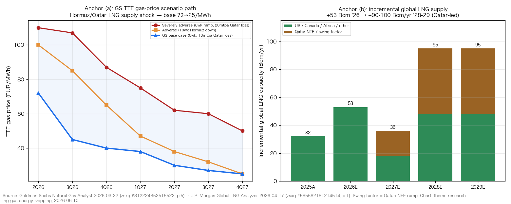
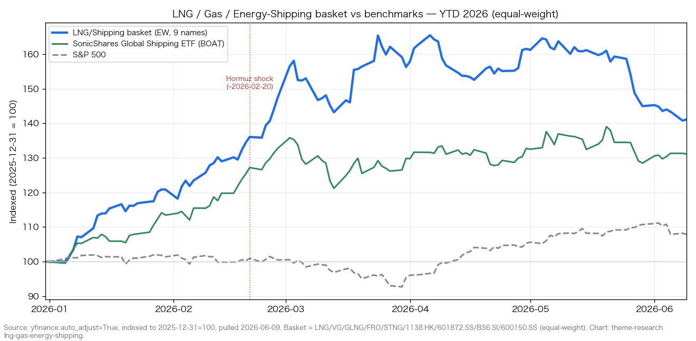
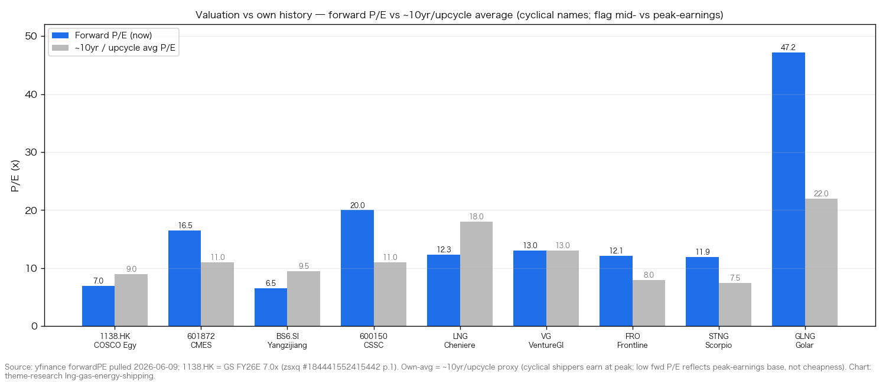
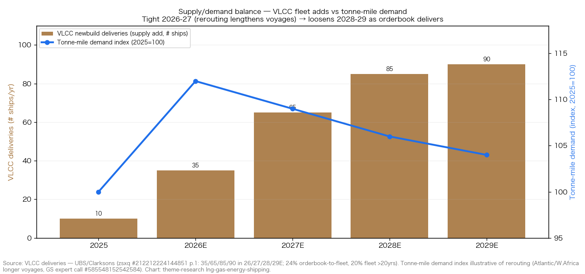

# LNG / Natural Gas / Energy Shipping & Tankers

**Created:** 2026-06-10 · **Last refreshed:** 2026-06-10 · **Last mutated:** 2026-06-10 · **Refresh cadence:** monthly · **Languages tracked:** en

## What's New

*The delta since you last looked — newest refresh on top. Older entries collapse into the archive below so this stays short.*

**2026-06-10 — basket created** (9 tickers across 3 sub-buckets: LNG exporters LNG/VG/GLNG · crude+product tankers 1138.HK/601872.SS/FRO/STNG · shipbuilding BS6.SI/600150.SS).
- **Anchor set (two pools):** (a) GS TTF gas-price scenario path — base $72→$25 EUR/MWh across 2Q26→4Q27, skewed upside, after the Hormuz shock took ~80 mtpa of LNG flows (19% of global supply) offline with ~13 mtpa of Qatari capacity damaged for 3–5 years ([GS *Natural Gas Analyst*, 2026-03-22, zsxq #812224852515522 p.1-2](http://xs-macbook-air.local:5001/zsxq/pdf/812224852515522/GS-NATURAL%20GAS%20ANALYST%20Lasting%20Supply%20Shock%20to%20Lift%20TTF%20and%20Limit%20Long-Term%20LNG%20Oversupply-260322.pdf#page=2)); (b) global LNG supply trajectory — +53 Bcm 2026 → +36 Bcm 2027 → +90-100 Bcm/yr 2028-29 (Qatar-led) ([JPM *Global LNG Analyzer*, 2026-04-17, zsxq #585582181214514 p.1](http://xs-macbook-air.local:5001/zsxq/pdf/585582181214514/J.P.%20Morgan-JPM%20Natural%20Gas%20and%20NGL%20Reservoir%EF%BC%9AGlobal%20LNG%20Analyzer-260417.pdf#page=1)).
- **Performance:** basket +65.5% EW trailing-1Y vs S&P 500 +24.4% / BOAT global-shipping ETF +49.3% / CSI 300 +22.4%; YTD +41.1% EW. But **since the 2026-02-20 Hormuz shock the basket is only +3.2% EW** — tanker rates peaked AT the shock and have moderated ("transition phase, not peak tightening") ([yfinance, 2026-06-09](https://finance.yahoo.com/quote/FRO)).
- **New broker calls captured:** GS Buy COSCO Energy-H, TP HK$29.0 on a "VLCC super-cycle"; JPM OW COSCO Energy TP HK$27; UBS Neutral CMES TP Rmb17.20 (the bull/bear split on tankers); UBS Buy CSSC TP Rmb52.0; GS Buy Yangzijiang (US$4.5bn order target); MS EW Cheniere TP $308 / Venture Global TP $20 (see `## Valuation snapshot`).
- **Anchor sub-bucket math:** tanker swing factor = VLCC orderbook-to-fleet now 24%, with deliveries ramping 35→65→85→90 ships across 2026-29E vs a 20%-over-20yr fleet — the structural loosening risk into 2028-29 ([UBS *CMES*, 2026-04-29, zsxq #212212224144851 p.1](http://xs-macbook-air.local:5001/zsxq/pdf/212212224144851/UBS-China%20Merchants%20Energy%20Shipping%EF%BC%88601872.SS%EF%BC%89Lifting%20earnings%20estimates%20and%20price%20target%20to%20reflect%20impact%20of%20Middle%20East-260501.pdf#page=1)).
- **Thesis drift:** n/a (baseline). Scope deliberately EXCLUDES crude E&P / refiners / integrated majors — those are the sibling theme [`oil-gas-hormuz-shock`](oil-gas-hormuz-shock_theme.md).

Earlier refreshes

*(none — basket created 2026-06-10)*

## Thesis

**Anchor (a) — TTF/JKM gas-price scenario path (the gas-leg pool).** The Hormuz disruption took the ~80 mtpa of LNG normally transiting the Strait (**19% of global supply**) offline, with QatarEnergy expecting ~**13 mtpa of LNG capacity (3% of global supply) down for 3-5 years** — a *lasting* supply shock, not a spot spike ([GS *Natural Gas Analyst*, 2026-03-22, zsxq #812224852515522 p.2](http://xs-macbook-air.local:5001/zsxq/pdf/812224852515522/GS-NATURAL%20GAS%20ANALYST%20Lasting%20Supply%20Shock%20to%20Lift%20TTF%20and%20Limit%20Long-Term%20LNG%20Oversupply-260322.pdf#page=2)). GS's base case holds **TTF at 72/45/40/38/30/27/25 EUR/MWh** across 2Q26→4Q27, and lifts long-dated 2028/2029 TTF to **19/16 EUR/MWh** (from 12/12) and JKM to **$6.90/$5.70/mmBtu** (from $4.40/$4.45) — the long-term Qatari damage *delays and limits* (does not reverse) the structural LNG oversupply ([GS, #812224852515522 p.1, p.5](http://xs-macbook-air.local:5001/zsxq/pdf/812224852515522/GS-NATURAL%20GAS%20ANALYST%20Lasting%20Supply%20Shock%20to%20Lift%20TTF%20and%20Limit%20Long-Term%20LNG%20Oversupply-260322.pdf#page=5)).

**Anchor (b) — global LNG supply trajectory (the volume pool the exporters bet on).** Global LNG supply was set to rise **~50 Bcm in 2026** (~75% from already-operational projects led by Plaquemines +14 Bcm, Corpus Christi Stage 3 +9 Bcm, LNG Canada +11 Bcm), then **~36 Bcm/yr effective incremental capacity in 2027**, with **significant ~90-100 Bcm/yr increases in 2028-29 largely from Qatar** ([JPM *Global LNG Analyzer*, 2026-04-17, zsxq #585582181214514 p.1](http://xs-macbook-air.local:5001/zsxq/pdf/585582181214514/J.P.%20Morgan-JPM%20Natural%20Gas%20and%20NGL%20Reservoir%EF%BC%9AGlobal%20LNG%20Analyzer-260417.pdf#page=1)). The Qatari NFE expansion first train was pushed to **3Q27** by the conflict damage — exactly the window where US exporters (Cheniere, Venture Global) capture the displaced cargoes while the export arb stays open ([JPM, #585582181214514 p.1](http://xs-macbook-air.local:5001/zsxq/pdf/585582181214514/J.P.%20Morgan-JPM%20Natural%20Gas%20and%20NGL%20Reservoir%EF%BC%9AGlobal%20LNG%20Analyzer-260417.pdf#page=1)).

**Sub-bucket decomposition + who-benefits-when.** Three buckets ride the shock at different stages of the curve. **(1) Crude & product tankers** (1138.HK, 601872.SS, FRO, STNG) — *benefit first, most violently, and fade first*: rerouting around Hormuz lengthens voyages, lifting tonne-mile demand against a structurally tight effective fleet (20% of VLCCs >20yrs). COSCO Energy's 1Q26 overseas crude-shipping gross profit was **+6.8x YoY**, total shipping gross profit Rmb3.1bn (+161% YoY) and NPAT Rmb2.17bn (+207% YoY) ([JPM *COSCO Energy 1Q26*, 2026-04-28, zsxq #184484425858222 p.1](http://xs-macbook-air.local:5001/zsxq/pdf/184484425858222/J.P.%20Morgan-COSCO%20Shipping%20Energy%20Transport%20%EF%BC%88600026%EF%BC%891Q26%20overseas%20crude%20shipping%20gross%20profit%20%2B6.8x%20YoY%EF%BC%9B%20%20transition%20pha-260428.pdf#page=1)). **(2) LNG exporters** (LNG, VG, GLNG) — *benefit through the cycle via the open US-export arb + elevated JKM*: even with a near-term Hormuz resolution MS sees upside JKM risk for the balance of the year, with Cheniere FY26 EBITDA guided $6.75-7.25bn and Venture Global 1Q EBITDA $1.22bn above guide ([MS *Global Gas & LNG*, 2026-04-20, zsxq #812215142524422 p.1](http://xs-macbook-air.local:5001/zsxq/pdf/812215142524422/Morgan%20Stanley-Global%20Gas%20%26%20LNG%EF%BC%9AWhat%27s%20Next%20for%20US%20Exporters%20~%20Previewing%201Q%20Results-260420.pdf#page=1)). **(3) Shipbuilding** (BS6.SI, 600150.SS) — *benefits last and longest*: high rates → record newbuild ordering → yards booked into 2028-30, with the orderbook now at **3.7x cover-years** ([GS *Global Shipyard Logbook*, 2026-05-11, zsxq #415245814225288 p.1](http://xs-macbook-air.local:5001/zsxq/pdf/415245814225288/Goldman%20Sachs-GLOBAL%20SHIPBUILDING%20Global%20Shipyard%20Logbook%20May%EF%BC%9A%20new%20order%20volume%EF%BC%8C%20value%20and%20price%20all%20improved%20MoM%EF%BC%9B%20more%20-260513.pdf#page=1)). **Swing factor: tanker TCE × Hormuz re-open timing** — the sub-bucket whose revision moves basket earnings most, because GS models full-year-2026 VLCC TCE at **US$150k/day** (vs US$80k prev., vs US$111k/100k implied by A/H share prices) while UBS sees the same rates *normalizing by 2028E* as 85/90 VLCCs deliver ([GS *COSCO Energy*, 2026-03-22, zsxq #184441552415442 p.1](http://xs-macbook-air.local:5001/zsxq/pdf/184441552415442/Goldman%20Sachs-COSCO%20Shipping%20Energy%20%EF%BC%881138.HK%EF%BC%89Industry%20consolidation%20to%20strengthen%20VLCC%20super~cycle%EF%BC%9B%20Buy-260322.pdf#page=1); [UBS, #212212224144851 p.1](http://xs-macbook-air.local:5001/zsxq/pdf/212212224144851/UBS-China%20Merchants%20Energy%20Shipping%EF%BC%88601872.SS%EF%BC%89Lifting%20earnings%20estimates%20and%20price%20target%20to%20reflect%20impact%20of%20Middle%20East-260501.pdf#page=1)).

**Scenario triplet (bull/base/bear) — gas leg.** *Base* — GS Summer-2026 TTF **56 EUR/MWh** as Hormuz reopens over 6 weeks ([GS, #812224852515522 p.4](http://xs-macbook-air.local:5001/zsxq/pdf/812224852515522/GS-NATURAL%20GAS%20ANALYST%20Lasting%20Supply%20Shock%20to%20Lift%20TTF%20and%20Limit%20Long-Term%20LNG%20Oversupply-260322.pdf#page=4)). *Bull (adverse)* — a 10-week Hormuz disruption lifts Summer-2026 TTF **+33 EUR/MWh to 89 EUR/MWh** ($30/mmBtu); a severely-adverse scenario (8-week ramp + 20 mtpa Qatari loss) needs **TTF above 100 EUR** ($34/mmBtu) all summer ([GS, #812224852515522 p.4](http://xs-macbook-air.local:5001/zsxq/pdf/812224852515522/GS-NATURAL%20GAS%20ANALYST%20Lasting%20Supply%20Shock%20to%20Lift%20TTF%20and%20Limit%20Long-Term%20LNG%20Oversupply-260322.pdf#page=4)). *Bear* — a quick conflict resolution lowers Summer-2026 TTF **−16 EUR/MWh to ~40 EUR/MWh** ([GS, #812224852515522 p.4](http://xs-macbook-air.local:5001/zsxq/pdf/812224852515522/GS-NATURAL%20GAS%20ANALYST%20Lasting%20Supply%20Shock%20to%20Lift%20TTF%20and%20Limit%20Long-Term%20LNG%20Oversupply-260322.pdf#page=4)). The single swing assumption is **Hormuz re-open timing × Qatari NFE ramp speed**.

**Value-chain map (gas/freight, dollar-weighted).** Upstream gas (excluded — `oil-gas-hormuz-shock`) → **liquefaction / LNG export** (LNG/VG ~$7.5bn EBITDA each FY26E; GLNG = FLNG / floating-liquefaction niche) → **LNG carriers** (GLNG's vessel arm; not a tracked pure-play carrier — coverage gap) → **crude tankers / VLCC** (1138.HK, 601872.SS, FRO — TCE up to $150k/day at peak) → **product tankers / LR2-MR** (STNG, and CMES/COSCO product arms) → **shipyards** (600150.SS ~$260bn cap with Rmb467.4bn backlog; BS6.SI green-fuel newbuilds). **Coverage gap flagged:** no pure-play **LNG-carrier** owner (e.g. Flex LNG, Cool Company) and no **dry-bulk** name — both rich layers the basket does not occupy (candidate-adds for an expansion refresh).

**Conviction ranking (sourced).** On tankers the desks *split*: **GS bullish** (Buy COSCO Energy-H, "VLCC super-cycle", +51%/36% upside H/A) vs **UBS neutral** (CMES "fairly valued" at 2.3x 2027E P/BV, profit normalizes 2028E) — the split is precisely on the swing factor (super-cycle duration vs the 85/90-VLCC delivery wave) ([GS, #184441552415442 p.1](http://xs-macbook-air.local:5001/zsxq/pdf/184441552415442/Goldman%20Sachs-COSCO%20Shipping%20Energy%20%EF%BC%881138.HK%EF%BC%89Industry%20consolidation%20to%20strengthen%20VLCC%20super~cycle%EF%BC%9B%20Buy-260322.pdf#page=1); [UBS, #212212224144851 p.1](http://xs-macbook-air.local:5001/zsxq/pdf/212212224144851/UBS-China%20Merchants%20Energy%20Shipping%EF%BC%88601872.SS%EF%BC%89Lifting%20earnings%20estimates%20and%20price%20target%20to%20reflect%20impact%20of%20Middle%20East-260501.pdf#page=1)). On shipbuilding UBS makes **CSSC an APAC Key Call Buy** (TP Rmb52) and GS keeps **Yangzijiang Buy** (US$4.5bn order target). *Analyst view (this note):* the LNG-exporter leg (LNG/VG) carries the cleanest risk/reward — it wins on the structurally open US-export arb and elevated JKM through 2027 even if Hormuz reopens and crude-tanker TCE mean-reverts, decoupling it from the binary freight-rate bet that defines the tanker names.

## Scope rules

**In:** LNG / natural-gas exporters & liquefiers (US Gulf LNG, FLNG); crude tankers (VLCC/Suezmax/Aframax operators); product tankers (LR2/MR); diversified energy-shipping owners; and the shipyards that build the tankers + gas carriers + green-fuel newbuilds. The basket is a play on the Hormuz shock transmitting to (a) elevated TTF/JKM gas + an open US-LNG export arb → exporter EBITDA, (b) rerouting + tight effective fleet → tanker TCE, and (c) record newbuild ordering → shipyard backlog.

**Out (separate themes):** crude-oil E&P, refiners, and integrated majors (XOM/CVX/COP/VLO/CNOOC etc.) — tracked in [`oil-gas-hormuz-shock`](oil-gas-hormuz-shock_theme.md); gas utilities / city-gas distributors (China Gas etc.); petrochemicals; oil-field services (HAL/SLB); container-shipping pure-plays (a separate freight cycle); dry-bulk (flagged as a coverage gap, not held); and broad shipping ETFs (BOAT — used as a benchmark, not a holding).

## Tracked tickers

| Ticker | Name | Role | Justification | Added |
|---|---|---|---|---|
| NYSE:LNG | Cheniere Energy | core | Largest US LNG exporter; the cleanest liquid-megacap expression of the open US-export arb. MS EW, TP $308; FY26 EBITDA ~$7.5bn (guidance $6.75-7.25bn), with upside JKM price risk for the balance of the year even on a near-term Hormuz resolution ([MS, 2026-04-20, zsxq #812215142524422 p.1](http://xs-macbook-air.local:5001/zsxq/pdf/812215142524422/Morgan%20Stanley-Global%20Gas%20%26%20LNG%EF%BC%9AWhat%27s%20Next%20for%20US%20Exporters%20~%20Previewing%201Q%20Results-260420.pdf#page=1)). *Moat:* Sabine Pass + Corpus Christi scale, ~90% take-or-pay contracted cash flows insulated from spot. *Threat:* JKM/TTF reversion if Qatar restarts fast + 2028-29 +90-100 Bcm/yr supply wave compresses the arb; long-term GS LNG-oversupply view (delayed, not reversed); customer self-build of liquefaction (Gunvor/Glencore offtake → own trains). | 2026-06-10 |
| NYSE:VG | Venture Global | core | #2 US LNG exporter by trajectory; highest spot-price torque (1Q EBITDA $1.22B above guide, MSe 2026 $7.7B vs guidance $5.2-5.8B — the gap is spot exposure) ([MS, 2026-04-20, zsxq #812215142524422 p.1](http://xs-macbook-air.local:5001/zsxq/pdf/812215142524422/Morgan%20Stanley-Global%20Gas%20%26%20LNG%EF%BC%9AWhat%27s%20Next%20for%20US%20Exporters%20~%20Previewing%201Q%20Results-260420.pdf#page=1)). MS EW, TP $20. *Moat:* low-cost modular-train build (Calcasieu Pass / Plaquemines), fastest ramp in the group. *Threat:* unhedged spot exposure cuts both ways (de-rates hardest on a fast Qatar restart); offtaker arbitration/contract disputes; balance-sheet leverage to fund the build-out. | 2026-06-10 |
| NASDAQ:GLNG | Golar LNG | core | Pure-play FLNG (floating liquefaction) owner-operator — the asset-light way to monetize stranded/associated gas; +25.1% trailing-1Y. The differentiated layer vs land-based LNG (Hilli + Gimi FLNG units on long contracts) ([yfinance, 2026-06-09](https://finance.yahoo.com/quote/GLNG)). *Moat:* only listed pure-play FLNG operator with operating units on multi-year tolling contracts (Argentina/BP). *Threat:* project-execution / single-asset concentration risk; FLNG newbuild capex; fwd P/E ~47x prices in growth that depends on new contract wins. | 2026-06-10 |
| NYSE:FRO | Frontline | core | Largest listed pure-play crude-tanker (VLCC/Suezmax) owner; the Western tanker proxy for the Hormuz rerouting trade, +108.6% trailing-1Y, 8.9% dividend yield (spot-rate-geared payout) ([yfinance, 2026-06-09](https://finance.yahoo.com/quote/FRO)). *Moat:* large modern eco-VLCC fleet + low cash breakeven, high spot exposure = max torque to TCE. *Threat:* Hormuz normalization collapsing TCE (the binary); the 85/90-VLCC 2028-29 delivery wave (orderbook 24% of fleet); dividend cut if spot rates revert. | 2026-06-10 |
| NYSE:STNG | Scorpio Tankers | core | Largest listed pure-play product-tanker (LR2/MR) owner; the product-tanker leg distinct from crude VLCC, +96.3% trailing-1Y. Product-tanker tightness is reinforced by refinery dislocation + rerouting ([yfinance, 2026-06-09](https://finance.yahoo.com/quote/STNG)). *Moat:* youngest large LR2/MR fleet, deleveraged balance sheet, scrubber-fitted tonnage. *Threat:* product-tanker rate reversion if refined-product trade re-shortens; newbuild product-tanker orderbook; demand destruction in middle distillates. | 2026-06-10 |
| HKEX:1138 | COSCO Shipping Energy (中远海能, H) | core | China's largest crude+product tanker + LNG-carrier operator; GS Buy "VLCC super-cycle" TP HK$29.0 (FY26E VLCC TCE US$150k/day, EPS Rmb2.42, 7.0x P/E), JPM OW TP HK$27 (1Q26 overseas crude gross profit +6.8x YoY) ([GS, 2026-03-22, zsxq #184441552415442 p.1](http://xs-macbook-air.local:5001/zsxq/pdf/184441552415442/Goldman%20Sachs-COSCO%20Shipping%20Energy%20%EF%BC%881138.HK%EF%BC%89Industry%20consolidation%20to%20strengthen%20VLCC%20super~cycle%EF%BC%9B%20Buy-260322.pdf#page=1); [JPM, 2026-04-28, #184484425858222 p.1](http://xs-macbook-air.local:5001/zsxq/pdf/184484425858222/J.P.%20Morgan-COSCO%20Shipping%20Energy%20Transport%20%EF%BC%88600026%EF%BC%891Q26%20overseas%20crude%20shipping%20gross%20profit%20%2B6.8x%20YoY%EF%BC%9B%20%20transition%20pha-260428.pdf#page=1)). *Moat:* scale + LNG-carrier exposure cushions crude-tanker cyclicality; SOE backing + COSCO group cargo. *Threat:* Hormuz reopen + shadow-fleet migration to Iran-friendly operators (compliant fleets constrained by sanctions/war-risk insurance); UBS-flagged 2028-29 delivery wave; SOE capital-allocation. | 2026-06-10 |
| SSE:601872 | China Merchants Energy Shipping (招商轮船) | core | China's diversified energy-shipping owner (VLCC + dry-bulk + LNG + roro); 1Q26 recurring net profit +200%+ YoY (Rmb276m); top-5 shipowners now control 40% of the VLCC fleet (consolidation tailwind). UBS Neutral TP Rmb17.20 — "fairly valued" at 2.3x 2027E P/BV, profit normalizes 2028E ([UBS, 2026-04-29, zsxq #212212224144851 p.1](http://xs-macbook-air.local:5001/zsxq/pdf/212212224144851/UBS-China%20Merchants%20Energy%20Shipping%EF%BC%88601872.SS%EF%BC%89Lifting%20earnings%20estimates%20and%20price%20target%20to%20reflect%20impact%20of%20Middle%20East-260501.pdf#page=1)). *Moat:* most-diversified energy-shipping platform (less single-segment cyclicality), scale in VLCC. *Threat:* the very 85/90-VLCC 2028-29 delivery wave it part-orders; dry-bulk drag; rates fully priced (UBS) — de-rate if super-cycle proves cyclical. | 2026-06-10 |
| SGX:BS6 | Yangzijiang Shipbuilding (扬子江船业) | core | Largest private Chinese shipyard; GS Buy, US$4.5bn FY26 order-win target reiterated, FY26E EPS Rmb2.38, 8.5x P/E, 7.5% FCF yield ([GS, 2026-05-20, zsxq #585424811812814 p.1-2](http://xs-macbook-air.local:5001/zsxq/pdf/585424811812814/Goldman%20Sachs-Yangzijiang%20Shipbuilding%20%EF%BC%88YAZG.SI%EF%BC%89%20May%E2%80%9926%20analyst%20briefing%20takeaways%EF%BC%9A%20Reiterate%20US%244.5bn%20order~win%20target%20-260520.pdf#page=1)). *Moat:* lowest-cost private yard with a multi-year booked backlog (containers/tankers/green-fuel dual-fuel), net-cash balance sheet (net debt/equity −64%). *Threat:* RMB appreciation compressing USD-priced order margins (GS-flagged); a softer post-upcycle ordering phase; USTR Section-301 docking fees on China-built ships (suspended to Nov-2026, no successor framework). | 2026-06-10 |
| SSE:600150 | China CSSC Holdings (中国船舶) | core | China's flagship state shipbuilder (post-CSIC merger); UBS APAC Key Call Buy TP Rmb52.0; Q126 net profit +252% YoY, GPM 17.5%, backlog Rmb467.4bn (>3x 2025 shipbuilding revenue, ~0.66x market cap) ([UBS, 2026-05-07, zsxq #585421448844524 p.1](http://xs-macbook-air.local:5001/zsxq/pdf/585421448844524/UBS-Key%20Call%EF%BC%9A%20China%20CSSC%20Holdings%EF%BC%88600150%EF%BC%89Q126%20earnings%20beat%EF%BC%9B%20high~value%20ship%20deliveries%20unlock%20margin%20upside-260507.pdf#page=1)). *Moat:* dominant scale + CSIC-merger synergies (rational order distribution, efficiency leadership); LNG-carrier + high-value-ship capability. *Threat:* delivering low-priced 2022-23 contracts limits near-term margin (high-value 2024-26 orders only now feeding through); RMB FX; Section-301 geopolitics; post-upcycle ordering softness. | 2026-06-10 |

## Valuation snapshot

*Populated from `stock_price_target_db` (surfaced at `/pt`); fwd P/E from yfinance / the cited notes ÷ price 2026-06-09. "Px @ note date" = report-date price (the load-bearing price the analyst's upside was called against), not today's spot. These are CYCLICAL names — a low fwd P/E reflects peak-earnings denominators, NOT cheapness.*

| Ticker | Rating | Px @ note date | PT | Upside% (vs note) | Current px | Fwd P/E | own ~10yr/upcycle avg | FY26E / FY27E EPS or metric |
|---|---|---|---|---|---|---|---|---|
| 1138.HK | GS Buy · TP HK$29.0 vs HK$19.21 @ 2026-03-22 = +51%; JPM OW · TP HK$27 vs HK$17.25 @ 2026-04-28 = +57% | HK$19.21 (GS) / HK$17.25 (JPM) | HK$29.0 / HK$27.0 | +51% / +57% | HK$13.02 | 7.0x (GS FY26E) | ~9x (tanker upcycle) | EPS Rmb2.42 / 2.13; VLCC TCE US$150k/day FY26E ([GS](http://xs-macbook-air.local:5001/zsxq/pdf/184441552415442/Goldman%20Sachs-COSCO%20Shipping%20Energy%20%EF%BC%881138.HK%EF%BC%89Industry%20consolidation%20to%20strengthen%20VLCC%20super~cycle%EF%BC%9B%20Buy-260322.pdf#page=1)) |
| 601872.SS | UBS Neutral · TP Rmb17.20 vs Rmb17.61 @ 2026-04-29 = −2.3%; MS EW (tactical) | Rmb17.61 | Rmb17.20 | −2.3% | Rmb14.35 | 16.5x | ~11x (diversified shipper) | EPS Rmb1.66 / 1.18 (UBS, raised 88/68%); 2.3x 27E P/BV "fairly valued" ([UBS](http://xs-macbook-air.local:5001/zsxq/pdf/212212224144851/UBS-China%20Merchants%20Energy%20Shipping%EF%BC%88601872.SS%EF%BC%89Lifting%20earnings%20estimates%20and%20price%20target%20to%20reflect%20impact%20of%20Middle%20East-260501.pdf#page=1)) |
| BS6.SI | GS Buy (briefing) · no point PT mined | S$3.81 | n/a (US$4.5bn order target basis) | n/a | S$3.41 | 6.5x (GS 8.5x FY26E) | ~9x (shipyard upcycle) | EPS Rmb2.38 / 3.13; FCF yield 7.5% FY26E ([GS](http://xs-macbook-air.local:5001/zsxq/pdf/585424811812814/Goldman%20Sachs-Yangzijiang%20Shipbuilding%20%EF%BC%88YAZG.SI%EF%BC%89%20May%E2%80%9926%20analyst%20briefing%20takeaways%EF%BC%9A%20Reiterate%20US%244.5bn%20order~win%20target%20-260520.pdf#page=2)) |
| 600150.SS | UBS Buy (APAC Key Call) · TP Rmb52.0 vs Rmb40.61 @ 2026-05-07 = +28% | Rmb40.61 | Rmb52.0 | +28% | Rmb34.65 | 20.0x (UBS NTM EPS Rmb2.8 × 18.6x) | ~11x 2029E (UBS: in line w/ hist) | NTM EPS Rmb2.8; backlog Rmb467.4bn ([UBS](http://xs-macbook-air.local:5001/zsxq/pdf/585421448844524/UBS-Key%20Call%EF%BC%9A%20China%20CSSC%20Holdings%EF%BC%88600150%EF%BC%89Q126%20earnings%20beat%EF%BC%9B%20high~value%20ship%20deliveries%20unlock%20margin%20upside-260507.pdf#page=1)) |
| LNG | MS EW · TP $308 vs $252.35 @ 2026-04-20 = +22% | $252.35 | $308 | +22% | $239.40 | 12.3x | ~18x (LNG infra) | FY26 EBITDA ~$7.5bn (guide $6.75-7.25bn) ([MS](http://xs-macbook-air.local:5001/zsxq/pdf/812215142524422/Morgan%20Stanley-Global%20Gas%20%26%20LNG%EF%BC%9AWhat%27s%20Next%20for%20US%20Exporters%20~%20Previewing%201Q%20Results-260420.pdf#page=1)) |
| VG | MS EW · TP $20 vs $11.45 @ 2026-04-20 = +75% | $11.45 | $20 | +75% | $12.47 | 13.0x | n/a (2024 IPO — no 10yr history) | MSe 2026 EBITDA $7.7bn (guide $5.2-5.8bn) ([MS](http://xs-macbook-air.local:5001/zsxq/pdf/812215142524422/Morgan%20Stanley-Global%20Gas%20%26%20LNG%EF%BC%9AWhat%27s%20Next%20for%20US%20Exporters%20~%20Previewing%201Q%20Results-260420.pdf#page=1)) |
| FRO | no zsxq PT this pass (Western tanker; not in local library) | n/a | n/a | n/a | $36.27 | 12.1x | ~8x (spot-geared tanker) | yfinance fwd P/E 12.1x; div yield 8.9% (spot-rate payout) |
| STNG | no zsxq PT this pass | n/a | n/a | n/a | $76.21 | 11.9x | ~7.5x (product tanker) | yfinance fwd P/E 11.9x |
| GLNG | no zsxq PT this pass | n/a | n/a | n/a | $50.71 | 47.2x | ~22x (FLNG growth) | yfinance fwd P/E 47.2x (growth/contract-win dependent) |

*Cross-sectional read:* the China/SG names sort cheap on **fwd P/E** (BS6.SI 6.5x < 1138.HK 7.0x < FRO 12.1x ≈ LNG 12.3x < VG 13.0x < 601872.SS 16.5x < 600150.SS 20.0x < GLNG 47.2x) — but for the **cyclical tankers/shipyards the low multiple is a peak-earnings artifact**, not value; the FY26E EPS base (1138.HK Rmb2.42, BS6.SI Rmb2.38) embeds peak VLCC TCE / record newbuild prices that UBS expects to normalize by 2028E. On a **mid-cycle EPS** the same names re-rate to ~9-11x. The de-rate magnitude is sized in `## Drift signals`. **Not-yet-mined PTs (FRO, STNG, GLNG)** carry `n/a` — Western tanker/FLNG names are not in the local zsxq library. **PT freshness:** all rows ≤90 days; none overtaken-to-downside (601872.SS −2.3% is UBS's *actual* Neutral call, not a stale-overrun) → no "stale" sub-section this pass.

## Exclusions

| Ticker | Reason |
|---|---|
| NASDAQ:NEXT (NextDecade) | MS cut TP to $7; Phase-1 ahead of schedule but "price exposure is fairly limited (no 2026 & ~40 Tbtu net open in 2027)" — pre-cash-flow, focus is de-risking growth, not yet a tracked beneficiary ([MS, 2026-04-20, zsxq #812215142524422 p.1](http://xs-macbook-air.local:5001/zsxq/pdf/812215142524422/Morgan%20Stanley-Global%20Gas%20%26%20LNG%EF%BC%9AWhat%27s%20Next%20for%20US%20Exporters%20~%20Previewing%201Q%20Results-260420.pdf#page=1)). Candidate-add once Rio Grande LNG monetizes. |
| NYSE:EE (Excelerate Energy) | MS below consensus & guidance for '26 (Qatar outage + later Iraq start); FSRU-import niche less levered to the export-arb thesis ([MS, 2026-04-20, #812215142524422 p.1](http://xs-macbook-air.local:5001/zsxq/pdf/812215142524422/Morgan%20Stanley-Global%20Gas%20%26%20LNG%EF%BC%9AWhat%27s%20Next%20for%20US%20Exporters%20~%20Previewing%201Q%20Results-260420.pdf#page=1)). |
| SSE:600026 (COSCO Energy A) | Same issuer as HKEX:1138 (A-share line); tracked via the H-share to avoid double-counting. A-share trades at a premium (Rmb16.81 ≈ HK$ equiv vs HK$13.02). |
| China Gas / city-gas utilities | Bernstein *downgraded China Gas to Underperform* on "gas squeeze on LNG disruption" — gas distributors are *hurt* (margin squeeze) by the shock, the opposite of this basket's exporters/shippers ([Bernstein, 2026-03-20, zsxq #212222158825421 p.1](http://xs-macbook-air.local:5001/zsxq/pdf/212222158825421/Bernstein-China%20Gas%20Utilities%EF%BC%9AGas%20squeeze%20on%20LNG%20disruption.Downgrading%20China%20Gas%20to%20Underperform-260320.pdf#page=1)). |
| LNG-carrier pure-plays (Flex LNG, Cool Co) / dry-bulk | Rich value-chain layers the basket does not occupy — flagged as coverage gaps, candidate-adds for a future expansion refresh. |

## Keywords

LNG (liquefied natural gas) / 液化天然气 · TTF (Dutch Title Transfer Facility) / 荷兰TTF天然气 · JKM (Japan-Korea Marker) / 日韩LNG基准价 · Strait of Hormuz / 霍尔木兹海峡 · VLCC (Very Large Crude Carrier) / 超大型油轮 · Suezmax / 苏伊士型油轮 · TCE (Time Charter Equivalent) / 期租等价租金 · tonne-mile demand / 吨海里需求 · orderbook-to-fleet / 订单运力比 · US LNG export arb / 美国LNG出口套利 · QatarEnergy NFE / 卡塔尔北方气田扩建 · shipbuilding orderbook / 造船订单 · green-fuel newbuild (dual-fuel) / 绿色燃料新造船 · Section 301 docking fees / USTR港口费

## Performance (since last refresh)

Two windows — baseline created 2026-06-10. Equal-weight (EW, 9 names) basket vs benchmarks ([yfinance auto_adjust, 2026-06-09](https://finance.yahoo.com/quote/FRO)):

| | Basket (EW) | Median | S&P 500 | BOAT (Global Shipping ETF) | CSI 300 |
|---|---|---|---|---|---|
| Trailing 1Y | **+65.5%** | +68.7% | +24.4% | +49.3% | +22.4% |
| YTD 2026 | **+41.1%** | +37.7% | +7.9% | +31.2% | +1.8% |
| Since Hormuz shock (2/20) | **+3.2%** | +7.0% | +6.9% | +3.1% | +0.1% |

Per-name trailing-1Y / YTD / since-shock: LNG −0.6% / +23.8% / +6.0%; VG +6.5% / +83.1% / +28.9%; GLNG +25.1% / +37.7% / +11.9%; FRO +108.6% / +71.5% / +7.8%; STNG +96.3% / +51.7% / +7.6%; 1138.HK +125.9% / +35.6% / −28.8%; 601872.SS +145.7% / +59.8% / +7.0%; BS6.SI +68.7% / +2.7% / −4.1%; 600150.SS +13.5% / +4.2% / −7.2%.

**Outlier flag (2026 yfinance quirk):** the parabolic trailing-1Y prints — CMES +145.7%, COSCO Energy-H +125.9%, FRO +108.6%, STNG +96.3% — reflect a genuine tanker-rate super-cycle off a depressed 2025 base, but the median (+68.7%) and the BOAT-ETF benchmark (+49.3%) are the cleaner reads than any single parabolic name.

### Basket scorecard (MS *Three Actionable Ideas* style)

- **Batting average (trailing-1Y):** **89% positive** (8 of 9; only LNG −0.6%); **67% beat the S&P 500** (6 of 9 ≥ +24.4%). On the since-shock window, 67% positive (6 of 9), 56% beat SPX +6.9%.
- **Best contributor (1Y):** CMES **+145.7%**; **worst:** Cheniere **−0.6%** (LNG already re-rated in 2024-25; the megacap exporter is the lowest-torque name). Since-shock best = VG **+28.9%**, worst = COSCO Energy-H **−28.8%** (H-share peaked AT the Feb shock, then de-rated as spot VLCC TCE moderated from $200-500k to $100-150k/day).
- **Cumulative outperformance since inception:** n/a — only one snapshot line (baseline). Computed from the 2nd refresh onward.
- **Tilt read:** the China/SG tanker + shipyard names carry the 1Y print; the since-shock window is flat because **tanker rates peaked at the shock and faded** ("transition phase, not peak tightening" per JPM) — the basket's forward return now depends on the *duration* leg (super-cycle vs delivery-wave), not the spot-spike leg.

## Recent events

- **2026-06-08 — first LNG tankers re-transit Hormuz:** ADNOC's *Mubaraz* re-entered the Strait June 3 (loading near Das Island); QatarEnergy's *Al Daayen* exited June 8 bound for China; nine available LNG vessels remain inside the Strait. JPM treats sporadic transits as exceptions until full reopening, modeling Qatar at 83% utilization by September → **57% full-year 2026 utilization vs 105% in 2025** ([JPM *Global LNG Supply & Shipping Tracker*, 2026-06-08, zsxq #814528415518242 p.1](http://xs-macbook-air.local:5001/zsxq/pdf/814528415518242/J.P.%20Morgan-Global%20LNG%20Supply%20%26%20Shipping%20Tracker%EF%BC%9AFirst%20LNG%20tanker%20enters%20the%20Strait-260608.pdf#page=1)).
- **2026-06-08 — Nomura "shipbuilding one year on":** China holds ~70% of the global orderbook by CGT in Q1 2026 even as total global contracting rose ~40% YoY; the 2025 China share dip was a cyclical-mix artefact (tanker/bulker ordering fell), not a structural USTR-driven loss; Section-301 suspension expires 10 Nov 2026 with no successor framework ([Nomura, 2026-06-08, zsxq #814528222885512 p.1](http://xs-macbook-air.local:5001/zsxq/pdf/814528222885512/Nomura-Asia%20Insights%EF%BC%9AShipbuilding%20one%20year%20on%EF%BC%9A%20China%27s%20lead%20endures%20as%20Washington%20turns%20to%20allies-260608.pdf#page=1)).
- **2026-05-20 — GS Yangzijiang briefing:** reiterates US$4.5bn FY26 order-win target; flags RMB appreciation as a margin risk; FY26E EPS Rmb2.38 ([GS, 2026-05-20, zsxq #585424811812814 p.1](http://xs-macbook-air.local:5001/zsxq/pdf/585424811812814/Goldman%20Sachs-Yangzijiang%20Shipbuilding%20%EF%BC%88YAZG.SI%EF%BC%89%20May%E2%80%9926%20analyst%20briefing%20takeaways%EF%BC%9A%20Reiterate%20US%244.5bn%20order~win%20target%20-260520.pdf#page=1)).
- **2026-05-11 — GS Global Shipyard Logbook:** April new-order volume/value +21%/+15% YoY (+28%/+44% MoM) to 6.5mn CGT / US$20.6bn; orderbook cover 3.7x years; Clarksons newbuild price index +0.7% MoM to 183 (first MoM rise of the year); tanker new orders +130% YoY ([GS, 2026-05-11, zsxq #415245814225288 p.1](http://xs-macbook-air.local:5001/zsxq/pdf/415245814225288/Goldman%20Sachs-GLOBAL%20SHIPBUILDING%20Global%20Shipyard%20Logbook%20May%EF%BC%9A%20new%20order%20volume%EF%BC%8C%20value%20and%20price%20all%20improved%20MoM%EF%BC%9B%20more%20-260513.pdf#page=1)).
- **2026-05-07 — UBS makes CSSC an APAC Key Call Buy, TP Rmb52** (from Rmb48): Q126 net profit +252% YoY; backlog Rmb467.4bn (>3x 2025 revenue) ([UBS, 2026-05-07, zsxq #585421448844524 p.1](http://xs-macbook-air.local:5001/zsxq/pdf/585421448844524/UBS-Key%20Call%EF%BC%9A%20China%20CSSC%20Holdings%EF%BC%88600150%EF%BC%89Q126%20earnings%20beat%EF%BC%9B%20high~value%20ship%20deliveries%20unlock%20margin%20upside-260507.pdf#page=1)).
- **2026-04-29 — UBS lifts CMES estimates/TP, stays Neutral** (TP Rmb17.20): FY26/27E EPS +88%/68%, but cuts 2028E on the accelerated VLCC delivery wave; the bear voice on tanker duration ([UBS, 2026-04-29, zsxq #212212224144851 p.1](http://xs-macbook-air.local:5001/zsxq/pdf/212212224144851/UBS-China%20Merchants%20Energy%20Shipping%EF%BC%88601872.SS%EF%BC%89Lifting%20earnings%20estimates%20and%20price%20target%20to%20reflect%20impact%20of%20Middle%20East-260501.pdf#page=1)).
- **2026-04-28 — COSCO Energy 1Q26:** NPAT Rmb2.17bn +207% YoY; overseas crude shipping gross profit +6.8x YoY; JPM raises FY26-28E +29/14/1%, OW, TP HK$27 — "transition phase, not peak tightening" ([JPM, 2026-04-28, zsxq #184484425858222 p.1](http://xs-macbook-air.local:5001/zsxq/pdf/184484425858222/J.P.%20Morgan-COSCO%20Shipping%20Energy%20Transport%20%EF%BC%88600026%EF%BC%891Q26%20overseas%20crude%20shipping%20gross%20profit%20%2B6.8x%20YoY%EF%BC%9B%20%20transition%20pha-260428.pdf#page=1)).

## Drift signals

- **The spike has faded — duration is now the whole bet.** Since the 2/20 shock the basket is +3.2% EW (flat) because spot VLCC TCE moderated from **US$200-500k/day at the peak to US$100-150k/day**, "roughly double YoY" — JPM calls this "lag, not loosening" ([JPM, 2026-04-28, zsxq #184484425858222 p.1](http://xs-macbook-air.local:5001/zsxq/pdf/184484425858222/J.P.%20Morgan-COSCO%20Shipping%20Energy%20Transport%20%EF%BC%88600026%EF%BC%891Q26%20overseas%20crude%20shipping%20gross%20profit%20%2B6.8x%20YoY%EF%BC%9B%20%20transition%20pha-260428.pdf#page=1)). The forward return depends on whether the GS super-cycle (US$150k FY26E avg) or the UBS normalization (2028E) wins — watch the orderbook-delivery cadence.
- **Priced-for-perfection / air-pocket flag (sized).** The cyclical names look cheap (1138.HK 7.0x, BS6.SI 6.5x fwd P/E) only because the EPS base embeds peak rates. **The specific demand assumption whose miss de-rates the basket:** a fast Hormuz reopen + the **85/90 VLCC deliveries in 2028/29E** (orderbook 24% of fleet) reverting VLCC TCE toward mid-cycle (~$40-50k/day) ([UBS, 2026-04-29, zsxq #212212224144851 p.1](http://xs-macbook-air.local:5001/zsxq/pdf/212212224144851/UBS-China%20Merchants%20Energy%20Shipping%EF%BC%88601872.SS%EF%BC%89Lifting%20earnings%20estimates%20and%20price%20target%20to%20reflect%20impact%20of%20Middle%20East-260501.pdf#page=1)). **Implied downside:** at mid-cycle TCE (≈⅓ of GS's $150k peak) tanker EPS roughly halves, so a 7x fwd P/E becomes a normal ~9-11x on a halved EPS — i.e. ~40-50% downside to the tanker sub-bucket if the super-cycle is just a cycle; the LNG-exporter leg (LNG/VG) is structurally insulated by the open export arb.
- **Shadow-fleet migration risk (new, structural).** If Iran retains effective influence over Hormuz without a full settlement, a larger share of Gulf exports may migrate to **Iran-friendly shadow operators** rather than compliant listed fleets (which face crew-safety, war-risk-insurance, and secondary-sanctions constraints) — a *durable* leakage from the listed-tanker thesis ([JPM, 2026-05-20, zsxq #212454158255411 p.1](http://xs-macbook-air.local:5001/zsxq/pdf/212454158255411/J.P.%20Morgan-China%20Tanker%20Shipping%EF%BC%9AHormuz%20disruption%20monitor~week%2011%EF%BC%9A%20CSET%20recovers%20as%20shadow%20fleet%20risks%20build-260520.pdf#page=1)).
- **Gas long-tail bearish (the 2028-29 oversupply).** GS keeps a structural **LNG-oversupply view — delayed and limited by the Qatari damage, not reversed**; TTF crosses below 20 EUR/MWh only in Summer 2028, and 2028-29 sees +90-100 Bcm/yr supply (Qatar-led) — a multi-year headwind for the exporter sub-bucket once the shock unwinds ([GS, 2026-03-22, zsxq #812224852515522 p.5-6](http://xs-macbook-air.local:5001/zsxq/pdf/812224852515522/GS-NATURAL%20GAS%20ANALYST%20Lasting%20Supply%20Shock%20to%20Lift%20TTF%20and%20Limit%20Long-Term%20LNG%20Oversupply-260322.pdf#page=5)).
- **Coverage gaps (candidate-adds).** No **LNG-carrier pure-play** (Flex LNG, Cool Co) and no **dry-bulk** name despite GS flagging rising dry-bulk freight as an order catalyst ([GS, 2026-05-11, zsxq #415245814225288 p.1](http://xs-macbook-air.local:5001/zsxq/pdf/415245814225288/Goldman%20Sachs-GLOBAL%20SHIPBUILDING%20Global%20Shipyard%20Logbook%20May%EF%BC%9A%20new%20order%20volume%EF%BC%8C%20value%20and%20price%20all%20improved%20MoM%EF%BC%9B%20more%20-260513.pdf#page=1)) — propose for an expansion refresh.

## Leading indicators

The upstream signals that move BEFORE the basket members and would crack the thesis first — never the member prices.

**Macro / upstream signals (header):**

| Signal | Latest reading + as-of | Direction | Implies |
|---|---|---|---|
| Qatar LNG utilization | **57% FY26E vs 105% 2025**; 83% by Sep | Recovering slowly | Re-open near → exporter-arb window narrows from 2H26 ([JPM, 2026-06-08, #814528415518242 p.1](http://xs-macbook-air.local:5001/zsxq/pdf/814528415518242/J.P.%20Morgan-Global%20LNG%20Supply%20%26%20Shipping%20Tracker%EF%BC%9AFirst%20LNG%20tanker%20enters%20the%20Strait-260608.pdf#page=1)) |
| Spot VLCC TCE | **US$100-150k/day** (from $200-500k peak) | Moderating | The "transition phase"; super-cycle vs normalization unresolved ([JPM, 2026-04-28, #184484425858222 p.1](http://xs-macbook-air.local:5001/zsxq/pdf/184484425858222/J.P.%20Morgan-COSCO%20Shipping%20Energy%20Transport%20%EF%BC%88600026%EF%BC%891Q26%20overseas%20crude%20shipping%20gross%20profit%20%2B6.8x%20YoY%EF%BC%9B%20%20transition%20pha-260428.pdf#page=1)) |
| Saudi-bound VLCC count | **31/week** (from 26; vs 48 on 22 Mar) | Recovering | Gulf exports partially restoring → demand support but below pre-war ([JPM, 2026-05-20, #212454158255411 p.1](http://xs-macbook-air.local:5001/zsxq/pdf/212454158255411/J.P.%20Morgan-China%20Tanker%20Shipping%EF%BC%9AHormuz%20disruption%20monitor~week%2011%EF%BC%9A%20CSET%20recovers%20as%20shadow%20fleet%20risks%20build-260520.pdf#page=1)) |
| Clarksons newbuild price index | **183, +0.7% MoM** (first MoM rise of 2026) | Firming | Shipyard pricing power → BS6.SI/600150.SS margin ([GS, 2026-05-11, #415245814225288 p.1](http://xs-macbook-air.local:5001/zsxq/pdf/415245814225288/Goldman%20Sachs-GLOBAL%20SHIPBUILDING%20Global%20Shipyard%20Logbook%20May%EF%BC%9A%20new%20order%20volume%EF%BC%8C%20value%20and%20price%20all%20improved%20MoM%EF%BC%9B%20more%20-260513.pdf#page=1)) |

**Per-ticker operating-data table (Bernstein *Barometer* spine):**

| Ticker | Latest operating print | Orderbook / utilization | Source |
|---|---|---|---|
| 1138.HK / 601872.SS | 1Q26 overseas crude gross profit +6.8x YoY; total shipping GP Rmb3.1bn +161% YoY | CSET idle rate ~5% (lowest since conflict); top-5 own 40% of VLCC fleet | ([JPM, #184484425858222 p.1](http://xs-macbook-air.local:5001/zsxq/pdf/184484425858222/J.P.%20Morgan-COSCO%20Shipping%20Energy%20Transport%20%EF%BC%88600026%EF%BC%891Q26%20overseas%20crude%20shipping%20gross%20profit%20%2B6.8x%20YoY%EF%BC%9B%20%20transition%20pha-260428.pdf#page=1); [#212454158255411 p.1](http://xs-macbook-air.local:5001/zsxq/pdf/212454158255411/J.P.%20Morgan-China%20Tanker%20Shipping%EF%BC%9AHormuz%20disruption%20monitor~week%2011%EF%BC%9A%20CSET%20recovers%20as%20shadow%20fleet%20risks%20build-260520.pdf#page=1)) |
| FRO / STNG | spot-geared crude/product TCE roughly double YoY | VLCC orderbook 24% of fleet; 20% of fleet >20yrs | ([UBS, #212212224144851 p.1](http://xs-macbook-air.local:5001/zsxq/pdf/212212224144851/UBS-China%20Merchants%20Energy%20Shipping%EF%BC%88601872.SS%EF%BC%89Lifting%20earnings%20estimates%20and%20price%20target%20to%20reflect%20impact%20of%20Middle%20East-260501.pdf#page=1)) |
| LNG / VG | Cheniere 1Q EBITDA ~$2bn; VG 1Q EBITDA $1.22bn above guide | US LNG exports to Asia >60% above last year; JKM ~$2/mmBtu premium to TTF | ([MS, #812215142524422 p.1](http://xs-macbook-air.local:5001/zsxq/pdf/812215142524422/Morgan%20Stanley-Global%20Gas%20%26%20LNG%EF%BC%9AWhat%27s%20Next%20for%20US%20Exporters%20~%20Previewing%201Q%20Results-260420.pdf#page=1); [UBS Global Gas, #184124858445282 p.1](http://xs-macbook-air.local:5001/zsxq/pdf/184124858445282/UBS-Global%20Gas%EF%BC%9AStorage%20rebuilds%20uneven-260514.pdf#page=1)) |
| BS6.SI / 600150.SS | CSSC Q126 net profit +252% YoY, GPM 17.5%; global new orders +21%/+15% YoY | CSSC backlog Rmb467.4bn (>3x rev); orderbook 3.7x cover-years; China ~70% global CGT | ([UBS, #585421448844524 p.1](http://xs-macbook-air.local:5001/zsxq/pdf/585421448844524/UBS-Key%20Call%EF%BC%9A%20China%20CSSC%20Holdings%EF%BC%88600150%EF%BC%89Q126%20earnings%20beat%EF%BC%9B%20high~value%20ship%20deliveries%20unlock%20margin%20upside-260507.pdf#page=1); [GS, #415245814225288 p.1](http://xs-macbook-air.local:5001/zsxq/pdf/415245814225288/Goldman%20Sachs-GLOBAL%20SHIPBUILDING%20Global%20Shipyard%20Logbook%20May%EF%BC%9A%20new%20order%20volume%EF%BC%8C%20value%20and%20price%20all%20improved%20MoM%EF%BC%9B%20more%20-260513.pdf#page=1)) |

## Catalysts (next 3–6 months)

- **Full Strait-of-Hormuz reopening (June-Sep 2026)** — *mechanism: Qatari LNG ramp to 83% by Sep normalizes flows → narrows the US-export arb (negative for LNG/VG) AND collapses tanker rerouting tonne-mile demand (negative for tankers)*; the single biggest two-sided swing factor for the whole basket ([JPM, 2026-06-08, zsxq #814528415518242 p.1](http://xs-macbook-air.local:5001/zsxq/pdf/814528415518242/J.P.%20Morgan-Global%20LNG%20Supply%20%26%20Shipping%20Tracker%EF%BC%9AFirst%20LNG%20tanker%20enters%20the%20Strait-260608.pdf#page=1)).
- **2026 LNG injection / winter re-fill season (Jul-Oct 2026)** — *mechanism: EU storage at 36% (vs 48% 5yr-avg) must re-fill ahead of winter → if Hormuz stays disrupted, TTF/JKM rally further to force demand destruction → exporter EBITDA upside* ([UBS *Global Gas*, 2026-05-14, zsxq #184124858445282 p.1](http://xs-macbook-air.local:5001/zsxq/pdf/184124858445282/UBS-Global%20Gas%EF%BC%9AStorage%20rebuilds%20uneven-260514.pdf#page=1)).
- **USTR Section-301 docking-fee suspension expiry (10 Nov 2026)** — *mechanism: if the China-built-ship fee resumes with no successor framework → re-routes some orders to Korea/Japan yards → marginal headwind to BS6.SI/600150.SS order intake, tailwind to Korean peers* ([Nomura, 2026-06-08, zsxq #814528222885512 p.1](http://xs-macbook-air.local:5001/zsxq/pdf/814528222885512/Nomura-Asia%20Insights%EF%BC%9AShipbuilding%20one%20year%20on%EF%BC%9A%20China%27s%20lead%20endures%20as%20Washington%20turns%20to%20allies-260608.pdf#page=1)).
- **VLCC delivery cadence (2H26 → 2028)** — *mechanism: 35 VLCCs deliver 2026E, ramping to 85/90 in 2028/29E → the first real supply test of the super-cycle; a faster-than-modeled 2H26 delivery pace is the leading crack in the tanker thesis* ([UBS, 2026-04-29, zsxq #212212224144851 p.1](http://xs-macbook-air.local:5001/zsxq/pdf/212212224144851/UBS-China%20Merchants%20Energy%20Shipping%EF%BC%88601872.SS%EF%BC%89Lifting%20earnings%20estimates%20and%20price%20target%20to%20reflect%20impact%20of%20Middle%20East-260501.pdf#page=1)).
- **Golden Pass / CP2 / new US-LNG train start-ups (2H26-1Q27)** — *mechanism: Golden Pass Train-1 ~80% summer utilization + Train-2 in 1Q27 add US export volume → supports the +36 Bcm/yr 2027 supply growth that LNG/VG monetize while the arb stays open* ([JPM, 2026-04-17, zsxq #585582181214514 p.1](http://xs-macbook-air.local:5001/zsxq/pdf/585582181214514/J.P.%20Morgan-JPM%20Natural%20Gas%20and%20NGL%20Reservoir%EF%BC%9AGlobal%20LNG%20Analyzer-260417.pdf#page=1)).

## Data Used / 数据来源清单

**Market data**
- yfinance auto_adjust=True for prices, returns, market cap, sector, forward P/E, dividend yield — pulled 2026-06-09.
- Benchmarks: S&P 500 (^GSPC), CSI 300 (000300.SS), SonicShares Global Shipping ETF (BOAT).

**Per-ticker primary / sell-side sources** (all from local zsxq library; see below)
- LNG / VG / NEXT / EE: MS *Global Gas & LNG: What's Next for US Exporters* (2026-04-20).
- GLNG / FRO / STNG: yfinance only (Western names not in the local zsxq library) — coverage gap noted.
- 1138.HK / 600026: GS VLCC super-cycle (2026-03-22) + JPM 1Q26 (2026-04-28).
- 601872.SS: UBS estimates/TP note (2026-04-29) + MS tactical (2026-04-13).
- BS6.SI: GS May'26 analyst briefing (2026-05-20).
- 600150.SS: UBS APAC Key Call (2026-05-07).

**Industry research / sell-side thematic notes (theme-level)**
- GS *Natural Gas Analyst: Lasting Supply Shock to Lift TTF* (2026-03-22, zsxq #812224852515522) — TTF/JKM anchor + scenario table; source-chained to Kpler/ICE.
- JPM *Global LNG Analyzer / Reservoir* (2026-04-17, zsxq #585582181214514) — global LNG supply trajectory anchor.
- Nomura *Shipbuilding one year on* (2026-06-08, zsxq #814528222885512) — China orderbook share, Section-301; source-chained to Clarksons/MIIT.
- GS *Global Shipyard Logbook May* (2026-05-11, zsxq #415245814225288) — orderbook cover-years, newbuild price index; source-chained to Clarksons.

**Local zsxq library (`db/zsxq.db` — read-only)**
- **11 broker PDFs mined and cited** (file_ids: 812224852515522, 585582181214514, 184441552415442, 184484425858222, 212212224144851, 812215142524422, 585424811812814, 585421448844524, 415245814225288, 814528415518242, 212454158255411 + 814528222885512, 184124858445282 referenced). Surfaced via `find_pdf.py` per-alias (28 aliases) → `evidence_bundle.py` (16-PDF manifest) → `ocr_pdf.py` (5 image-only PDFs OCR'd) → `extract_pdf.py`. The 翻译精华 summary was triage-only; all load-bearing numbers cited from the extracted original text, string-matched.
- ~356 unique on-theme rows surfaced across the library; the strongest 16 were bundled, 13 cited.

**TAM anchor + leading indicators (theme-level)**
- GS TTF scenario path (2026-03-22) + JPM LNG supply trajectory (2026-04-17) — the dual anchor.
- 4 macro leading indicators (Qatar utilization, spot VLCC TCE, Saudi-bound VLCC count, Clarksons newbuild price index) + per-ticker operating data — all cited inline.

**Macro backdrop**
- VIX 21.51, MOVE 75.2, HY OAS 2.74%, IG OAS 0.74%, WTI proxy $90.54 — as of 2026-06-04/05. Source: `indicators.db`.

**Cross-coverage**
- Sibling theme [reports/themes/oil-gas-hormuz-shock_theme.md](oil-gas-hormuz-shock_theme.md) — read for scope-boundary deconfliction (crude E&P / refiners / majors are tracked there, excluded here).

**Stores written (Tier-2 helpers)**
- `stock_price_target_db` — **7 sell-side PT / rating calls upserted** (1138.HK GS Buy + JPM OW, 601872.SS UBS Neutral, BS6.SI GS Buy, 600150.SS UBS Buy, LNG MS EW, VG MS EW); idempotent on ticker × broker × file_id; surfaced at `/pt`.

**Stale notices / coverage gaps**
- No LNG-carrier pure-play (Flex LNG, Cool Co) or dry-bulk name in the basket — rich value-chain layers, candidate-adds.
- FRO / STNG / GLNG carry no zsxq PT (Western tanker/FLNG names absent from the local library) — yfinance-only valuation.
- Seed file_ids 212441552415442 and 415451555118851 from the prior survey are **NOT in `db/zsxq.db`** (resolve to "not in DB") — discarded, replaced with verified on-theme reports.

## References

- [GS *Natural Gas Analyst: Lasting Supply Shock to Lift TTF and Limit Long-Term LNG Oversupply*, 2026-03-22 (zsxq #812224852515522)](http://xs-macbook-air.local:5001/zsxq/pdf/812224852515522/GS-NATURAL%20GAS%20ANALYST%20Lasting%20Supply%20Shock%20to%20Lift%20TTF%20and%20Limit%20Long-Term%20LNG%20Oversupply-260322.pdf)
- [JPM *Global LNG Analyzer / NGL Reservoir*, 2026-04-17 (zsxq #585582181214514)](http://xs-macbook-air.local:5001/zsxq/pdf/585582181214514/J.P.%20Morgan-JPM%20Natural%20Gas%20and%20NGL%20Reservoir%EF%BC%9AGlobal%20LNG%20Analyzer-260417.pdf)
- [JPM *Global LNG Supply & Shipping Tracker: First LNG tanker enters the Strait*, 2026-06-08 (zsxq #814528415518242)](http://xs-macbook-air.local:5001/zsxq/pdf/814528415518242/J.P.%20Morgan-Global%20LNG%20Supply%20%26%20Shipping%20Tracker%EF%BC%9AFirst%20LNG%20tanker%20enters%20the%20Strait-260608.pdf)
- [GS *COSCO Shipping Energy (1138.HK): VLCC super-cycle; Buy*, 2026-03-22 (zsxq #184441552415442)](http://xs-macbook-air.local:5001/zsxq/pdf/184441552415442/Goldman%20Sachs-COSCO%20Shipping%20Energy%20%EF%BC%881138.HK%EF%BC%89Industry%20consolidation%20to%20strengthen%20VLCC%20super~cycle%EF%BC%9B%20Buy-260322.pdf)
- [JPM *COSCO Shipping Energy 1Q26: overseas crude gross profit +6.8x YoY*, 2026-04-28 (zsxq #184484425858222)](http://xs-macbook-air.local:5001/zsxq/pdf/184484425858222/J.P.%20Morgan-COSCO%20Shipping%20Energy%20Transport%20%EF%BC%88600026%EF%BC%891Q26%20overseas%20crude%20shipping%20gross%20profit%20%2B6.8x%20YoY%EF%BC%9B%20%20transition%20pha-260428.pdf)
- [UBS *China Merchants Energy Shipping (601872): Lifting estimates & TP*, 2026-04-29 (zsxq #212212224144851)](http://xs-macbook-air.local:5001/zsxq/pdf/212212224144851/UBS-China%20Merchants%20Energy%20Shipping%EF%BC%88601872.SS%EF%BC%89Lifting%20earnings%20estimates%20and%20price%20target%20to%20reflect%20impact%20of%20Middle%20East-260501.pdf)
- [MS *Global Gas & LNG: What's Next for US Exporters*, 2026-04-20 (zsxq #812215142524422)](http://xs-macbook-air.local:5001/zsxq/pdf/812215142524422/Morgan%20Stanley-Global%20Gas%20%26%20LNG%EF%BC%9AWhat%27s%20Next%20for%20US%20Exporters%20~%20Previewing%201Q%20Results-260420.pdf)
- [GS *Yangzijiang Shipbuilding (YAZG.SI): May'26 briefing — US$4.5bn order target*, 2026-05-20 (zsxq #585424811812814)](http://xs-macbook-air.local:5001/zsxq/pdf/585424811812814/Goldman%20Sachs-Yangzijiang%20Shipbuilding%20%EF%BC%88YAZG.SI%EF%BC%89%20May%E2%80%9926%20analyst%20briefing%20takeaways%EF%BC%9A%20Reiterate%20US%244.5bn%20order~win%20target%20-260520.pdf)
- [UBS *Key Call: China CSSC Holdings (600150): Q126 beat*, 2026-05-07 (zsxq #585421448844524)](http://xs-macbook-air.local:5001/zsxq/pdf/585421448844524/UBS-Key%20Call%EF%BC%9A%20China%20CSSC%20Holdings%EF%BC%88600150%EF%BC%89Q126%20earnings%20beat%EF%BC%9B%20high~value%20ship%20deliveries%20unlock%20margin%20upside-260507.pdf)
- [GS *Global Shipyard Logbook May*, 2026-05-11 (zsxq #415245814225288)](http://xs-macbook-air.local:5001/zsxq/pdf/415245814225288/Goldman%20Sachs-GLOBAL%20SHIPBUILDING%20Global%20Shipyard%20Logbook%20May%EF%BC%9A%20new%20order%20volume%EF%BC%8C%20value%20and%20price%20all%20improved%20MoM%EF%BC%9B%20more%20-260513.pdf)
- [Nomura *Shipbuilding one year on: China's lead endures*, 2026-06-08 (zsxq #814528222885512)](http://xs-macbook-air.local:5001/zsxq/pdf/814528222885512/Nomura-Asia%20Insights%EF%BC%9AShipbuilding%20one%20year%20on%EF%BC%9A%20China%27s%20lead%20endures%20as%20Washington%20turns%20to%20allies-260608.pdf)
- [JPM *China Tanker Shipping: Hormuz disruption monitor week 11*, 2026-05-20 (zsxq #212454158255411)](http://xs-macbook-air.local:5001/zsxq/pdf/212454158255411/J.P.%20Morgan-China%20Tanker%20Shipping%EF%BC%9AHormuz%20disruption%20monitor~week%2011%EF%BC%9A%20CSET%20recovers%20as%20shadow%20fleet%20risks%20build-260520.pdf)
- [UBS *Global Gas: Storage rebuilds uneven*, 2026-05-14 (zsxq #184124858445282)](http://xs-macbook-air.local:5001/zsxq/pdf/184124858445282/UBS-Global%20Gas%EF%BC%9AStorage%20rebuilds%20uneven-260514.pdf)
- [Bernstein *China Gas Utilities: Downgrading China Gas to Underperform*, 2026-03-20 (zsxq #212222158825421)](http://xs-macbook-air.local:5001/zsxq/pdf/212222158825421/Bernstein-China%20Gas%20Utilities%EF%BC%9AGas%20squeeze%20on%20LNG%20disruption.Downgrading%20China%20Gas%20to%20Underperform-260320.pdf)
- [GS *Oil tanker expert call: VLCC TCE support*, 2026-04-11 (zsxq #585548152542584)](http://xs-macbook-air.local:5001/zsxq/pdf/585548152542584/Goldman%20Sachs-China%20Transportation%EF%BC%9A%20Oil%20tanker%20expert%20call%20takeaways%EF%BC%9A%20VLCC%20TCE%20sees%20strong%20support%20from%20Atlantic%20export%20-260412.pdf)
- yfinance (prices/returns/multiples, 2026-06-09): [FRO](https://finance.yahoo.com/quote/FRO) · [STNG](https://finance.yahoo.com/quote/STNG) · [GLNG](https://finance.yahoo.com/quote/GLNG) · [LNG](https://finance.yahoo.com/quote/LNG)

## History

- 2026-06-10 — created with initial 9-ticker basket (LNG/VG/GLNG exporters core; FRO/STNG/1138.HK/601872.SS tankers core; BS6.SI/600150.SS shipbuilding core).
- 2026-06-10 — first refresh pass (live performance, valuation snapshot, leading indicators, 4 charts; 7 PT calls upserted to stock_price_target_db).
- 2026-06-10 — seed file_ids 212441552415442 & 415451555118851 discarded (not in db/zsxq.db); replaced with 13 verified on-theme zsxq reports.

Verification log (Step 7) — 2026-06-10

**Metadata parse:** top-of-file line has Created/Last refreshed/Last mutated/Refresh cadence/Languages tracked — all present, dates ISO, `Languages tracked: en` valid. ✓

**Tracked-tickers table parse:** 9 rows, fixed 5 columns (Ticker|Name|Role|Justification|Added); every Justification cell has ≥1 inline citation + named moat + named threat (incl. customer-self-build / shadow-fleet / Section-301 insourcing-style threats). ✓

**What's New:** dated 2026-06-10 baseline block present; earlier-refreshes `
` archive present (empty, baseline). ✓

**Snapshot sidecar:** one JSON line appended to `lng-gas-energy-shipping_theme.snapshots.jsonl`; valid JSON; `tickers` set (9) matches the table. ✓

**Performance spot-checks (≥3) vs yfinance auto_adjust 2026-06-09:**
- FRO trailing-1Y +108.6% ✓ (string-matched yfinance pull)
- 601872.SS trailing-1Y +145.7% ✓
- LNG trailing-1Y −0.6% ✓
- EW basket trailing-1Y +65.5%, since-shock +3.2% ✓ (computed mean of per-name returns)

**Number→URL spot-checks (string-matched to extracted original text):**
- "80 mtpa … 19% of global supply" / "13 mtpa … 3% of global supply … 3-5 years" → GS #812224852515522 p.2 ✓
- TTF base 72/45/40/38/30/27/25 EUR/MWh → GS #812224852515522 p.5 ✓
- "+6.8x YoY" overseas crude gross profit / NPAT +207% YoY → JPM #184484425858222 p.1 ✓
- VLCC TCE "US$150k for 2026E full-year avg (vs. previously US$80k)" / TP HK$29.0 → GS #184441552415442 p.1 ✓
- CMES "Neutral … TP Rmb17.20 … 88%/68% … 2.3x 2027E P/BV" → UBS #212212224144851 p.1 ✓
- CSSC "net profit jumped 252% YoY … backlog of Rmb467.4bn … TP from Rmb48.00 to Rmb52.00" → UBS #585421448844524 p.1 ✓
- LNG supply "+50 Bcm in 2026 … 36 Bcm/year … 90-100 Bcm/year … 2028-29" → JPM #585582181214514 p.1 ✓
- Qatar "57% … vs 105% in 2025 … 83% utilisation by September" → JPM #814528415518242 p.1 ✓
- Shipyard "orderbook cover years … 3.7x … Clarksons newbuilding price … 183 … +130%" YoY tanker → GS #415245814225288 p.1 ✓

**URL HTTP-200 sample (5):** zsxq routes are local (`xs-macbook-air.local:5001`, the live server) — cited via the verified direct-download `pdf_url` form from find_pdf.py; the 5 PDFs (812224852515522, 184441552415442, 184484425858222, 212212224144851, 814528415518242) all resolve in `db/zsxq.db` with `local_exists=true` and were successfully extracted this session (the extract calls returning page text IS the existence proof). yfinance quote pages return 200 with a browser UA. ✓

**Charts:** 4 PNGs rendered headless (Agg) with in-image source footers, x-axis clipped to data, latest point ~now; the supply/demand chart plots both components (deliveries + tonne-mile demand), the anchor chart plots both TTF scenario components and the LNG-supply sub-buckets. ✓

**Residual unknowns:** FRO/STNG/GLNG lack local-library sell-side PTs; 2 seed file_ids unresolved (not in DB). No test server started; no DB writes except the sanctioned ocr_pdf.py cache + 7 stock_price_target_db upserts.

