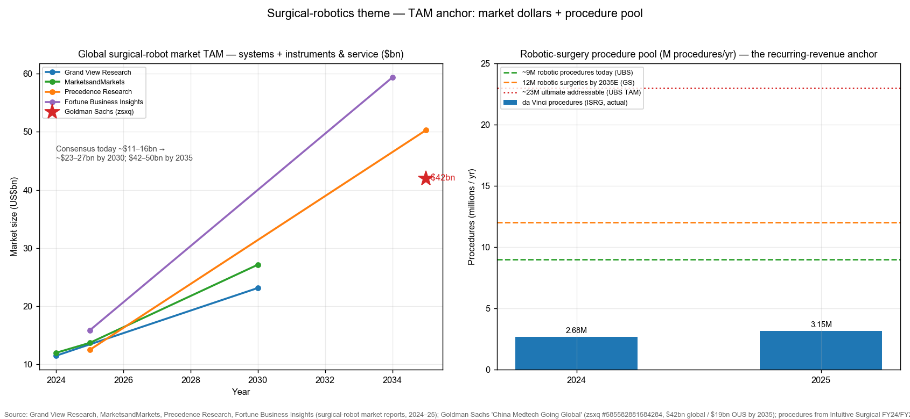
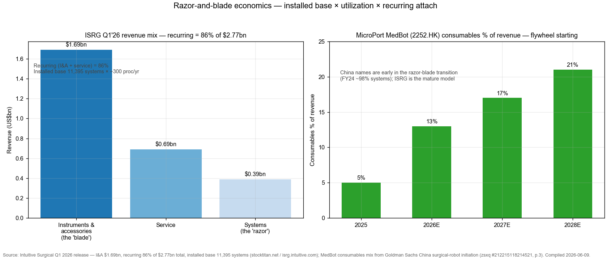
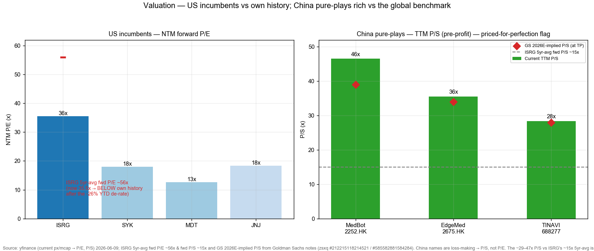
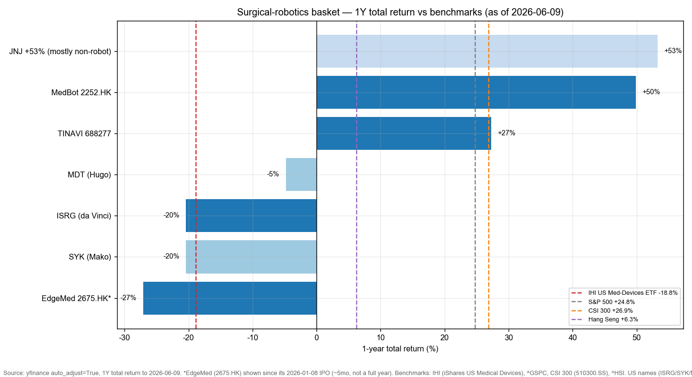

# Medical & Surgical Robotics / 手术机器人

**Created:** 2026-06-09 · **Last refreshed:** 2026-06-09 · **Last mutated:** 2026-06-09 · **Refresh cadence:** monthly · **Languages tracked:** en

## What's New

*The delta since you last looked — newest refresh on top. Older entries collapse into the archive below so this stays short.*

**2026-06-09 — basket created (7 tickers).** Seeded from the local zsxq broker library (12 deep-read notes, Apr–May 2026 — Goldman Sachs China-surgical-robot **initiation** + TINAVI initiation, UBS/Bernstein/BofA on ISRG, JPM/UBS on China reimbursement, two Chinese-broker industry deep-dives) plus ISRG/Medtronic/J&J/Stryker primary filings and five third-party TAM forecasters.
- **Anchor set:** global surgical-robot revenue pool ~$13.7bn (2025) → ~$27bn (2030E) → **$42–50bn (2035E)**, built on ~9M robotic procedures today → **12M by 2035E (Goldman Sachs)**; razor-and-blade structure (instruments & accessories ~55–60% of the pool) ([Goldman Sachs — China Medtech Going Global, zsxq #585582881584284 p.7](http://xs-macbook-air.local:5001/zsxq/pdf/585582881584284/Goldman%20Sachs-CHINA%20MEDTECH%20GOING%20GLOBAL%EF%BC%9AAssessing%20the%20opportunity%20for%20surgical%20robots~global%20expansion%20beyond%20ISRG%E2%80%99s%20core%20markets-260421.pdf#page=7); [MarketsandMarkets surgical-robots market](https://www.marketsandmarkets.com/Market-Reports/surgical-robots-market-256618532.html)).
- **Core:** ISRG (global da Vinci anchor), MicroPort MedBot `2252.HK` (GS Buy HK$45), EdgeMed/精锋 `2675.HK` (GS Buy HK$81). **Adjacent:** TINAVI `688277.SS` (China ortho leader, GS Neutral ¥21.8), Stryker (Mako), Medtronic (Hugo), J&J (Ottava).
- **Conviction (sourced):** Bernstein names ISRG its **top US MedDevice pick**, Outperform PT $750; within China GS **favours MedBot** as best-positioned, Buy > EdgeMed Buy > TINAVI Neutral ([Bernstein — ISRG 4Q25, zsxq #585525425551554 p.1](http://xs-macbook-air.local:5001/zsxq/pdf/585525425551554/Bernstein-Intuitive%20Surgical%20Inc%EF%BC%88ISRG.US%EF%BC%89Intuitive%20Surgical%204Q25%EF%BC%9ASqueaky%20clean%20quarter%EF%BC%9Btop%20pick%EF%BC%88PT%20%24750%EF%BC%89-260123.pdf#page=1); [GS — China surgical robots initiation, zsxq #212215118214521 p.1](http://xs-macbook-air.local:5001/zsxq/pdf/212215118214521/Goldman%20Sachs-CHINA%20SURGICAL%20ROBOTS%20Going~global%20%EF%BC%88ex~US%EF%BC%89%20as%20core%20growth%20drivers%EF%BC%9B%20Initiate%20Medbot%EF%BC%8C%20EdgeMed%20at%20Buy-260421.pdf#page=1)).
- **PT store:** 7 sell-side rating/PT calls upserted to `stock_price_target_db` (surfaced at `/pt`).
- **Tracked clock starts today** — the 1Y returns below are trailing *entry context*, not tracked performance; the snapshot baseline is this line.

Earlier refreshes

*(none yet — basket created 2026-06-09)*

## Thesis

**Anchor — global surgical-robot revenue pool (systems + instruments & service):** ~$11.5–15.9bn (2024–25) → **~$23–27bn (2030E)** → **$42bn (GS, 2035E) / ~$50bn (Precedence, 2035E)**, a low-teens CAGR ([Grand View Research $11.48bn 2024→$23.13bn 2030](https://www.grandviewresearch.com/industry-analysis/surgical-robot-systems-market-report); [MarketsandMarkets $13.69bn 2025→$27.14bn 2030](https://www.marketsandmarkets.com/Market-Reports/surgical-robots-market-256618532.html); [Precedence Research $12.49bn 2025→$50.29bn 2035](https://www.precedenceresearch.com/surgical-robotics-market); [Goldman Sachs, zsxq #585582881584284 p.7](http://xs-macbook-air.local:5001/zsxq/pdf/585582881584284/Goldman%20Sachs-CHINA%20MEDTECH%20GOING%20GLOBAL%EF%BC%9AAssessing%20the%20opportunity%20for%20surgical%20robots~global%20expansion%20beyond%20ISRG%E2%80%99s%20core%20markets-260421.pdf#page=7) — *"We assume the global TAM to reach US$42bn by 2035, with US$19bn for OUS"*). This is **not** a one-off systems-TAM bet — it is a **razor-and-blade / installed-base** theme, so the anchor is *installed base × utilization × recurring attach*, not "systems sold this year".

**Auditable build (pool = procedures × revenue/procedure):** the pool is the robotic-**procedure** pool — ~9M robotic procedures in 2025 rising toward GS's **12M by 2035E** and an ultimate ~23M-procedure TAM (vs ~9M today) — multiplied by all-in revenue/procedure (system amortization + I&A + service) ([UBS — ISRG, zsxq #585581521118154 p.1](http://xs-macbook-air.local:5001/zsxq/pdf/585581521118154/UBS-Intuitive%20Surgical%20Inc%EF%BC%88ISRG.US%EF%BC%89Solid%20Q1%EF%BC%8C%20Utilization%20Flywheel%20%2B%20System%20Placements%20Likely%20to%20Sustain%20Momentum-260423.pdf#page=1) — *"~23M TAM vs ~9M today"*). da Vinci alone ran **3,153,388 procedures in 2025 (+18% YoY)** on an installed base of **11,395 systems** (+12% YoY) at ~300 procedures/system/yr; instruments & accessories were **$1.69bn (61%) of Q1-2026 revenue and recurring revenue was 86% of the total** — that recurring annuity, not the capital sale, is the moat ([Intuitive Surgical Q1-2026 release](https://www.stocktitan.net/news/ISRG/intuitive-surgical-announces-first-quarter-2026-results); [ISRG procedures/installed base](https://www.stocktitan.net/news/ISRG/intuitive-surgical-announces-first-quarter-2026-results)). The reader can stress one input: a 10% miss on procedure growth flows almost one-for-one into the recurring pool.

**Sub-buckets (decompose by application & by component):** by *component* — instruments & accessories ~55–60% · systems ~30–40% · service the balance ([MarketsandMarkets](https://www.marketsandmarkets.com/Market-Reports/surgical-robots-market-256618532.html)); by *application* — **soft-tissue / laparoscopic** (general + uro + gyn, the largest robotic-penetrated pool, ISRG/MedBot/EdgeMed/Hugo/Ottava) · **orthopedic** (knee/hip/spine — Stryker Mako, TINAVI, MedBot SkyWalker) · **endoluminal / bronchoscopy** (lung — ISRG Ion +39% YoY, J&J MONARCH) · **vascular intervention** (MedBot R-ONE) · neuro/spine & TORS niches. **Geographic cut — the swing factor:** US (mature, ISRG ~100%-share historically) vs **ex-US / China (the growth pool, $19bn of the $42bn 2035 TAM is OUS, GS)**; the swing variable is **ex-US penetration × utilization (procedures/system), gated by reimbursement**.

**Value-chain / dollar-weighted map:** OEM platform (the systems layer, ISRG ~$170bn-cap proof-of-model) → **instruments & accessories (the richest layer, ~55–60% of pool — captive to each OEM's installed base, ISRG's structural annuity)** → 3D-vision/endoscope & energy → robotic arms/actuators → optical navigation (ortho — captive) → AI/autonomy software → service & surgeon training (the switching-cost moat). **Coverage-gap flag:** the basket has *no pure-play on the consumables/instruments layer* — it is captured inside the OEMs (ISRG, MedBot); there is no independent "blade" supplier to track, which is itself the point (the OEMs own the richest dollar layer).

**Who benefits when (time axis on the role tags):** today the **installed-base annuity** names (ISRG, Stryker Mako) earn the recurring dollars; the **early-S-curve placement** names (MedBot, EdgeMed, TINAVI) are still monetizing system placements with the consumables flywheel only starting — MedBot consumables rise from **5% of revenue (2025) → 13/17/21% (2026/27/28E)** ([GS, zsxq #212215118214521 p.3](http://xs-macbook-air.local:5001/zsxq/pdf/212215118214521/Goldman%20Sachs-CHINA%20SURGICAL%20ROBOTS%20Going~global%20%EF%BC%88ex~US%EF%BC%89%20as%20core%20growth%20drivers%EF%BC%9B%20Initiate%20Medbot%EF%BC%8C%20EdgeMed%20at%20Buy-260421.pdf#page=3)). The dated gates: China FY-profitability/FCF-breakeven for MedBot & EdgeMed in **FY26**; the recurring-mix crossover ~2028E; J&J Ottava's first US clearance pending its 2026 De Novo decision.

**Conviction (sourced, ordered):** *US* — Bernstein **Outperform, top US MedDevice pick, PT $750**; GS Buy $609; BofA Buy $650; UBS the lone **Neutral $550** on valuation. *China* — GS prefers **MedBot (Buy) > EdgeMed (Buy) > TINAVI (Neutral)**; the swing variable between MedBot and EdgeMed is overseas-order conversion, on which a JPM expert judged the two "fairly similar" operationally ([JPM expert call, zsxq #812228411484212 p.1](http://xs-macbook-air.local:5001/zsxq/pdf/812228411484212/J.P.%20Morgan-China%20Surgical%20Robotics%EF%BC%9ATakeaways%20from%20Expert%20Call%EF%BC%9A%20System%20Integration%EF%BC%8C%20Training%EF%BC%8C%20and%20Reimbursement%20Drive%20Next%20Phase%20in%20China-260312.pdf#page=1)).

## Scope rules

**In:** pure-play surgical-robot OEMs (soft-tissue, orthopedic, endoluminal, vascular); diversified medtech names where a surgical-robot franchise is a *named, strategic, disclosed* platform (Stryker Mako, Medtronic Hugo, J&J Ottava). The unifying test is a commercialized or in-registration robotic *system* with a recurring instruments/service tail.

**Out:** diversified medtech / imaging names without a robotic-system SKU (Mindray, United Imaging); structural-heart / EP names (CardioFlow); rehabilitation / exoskeleton / pharmacy-automation robotics (a different theme — the broad "medical robots" category, ~$15.6bn 2025 per Precedence, is wider than surgical robots and is *not* this basket); pre-revenue private Chinese OEMs (术锐 Surgerii, 键嘉 Yuanhua) until listed. Humanoid/industrial robotics is a separate theme ([[humanoid-robotics-sensors_theme]]).

## Tracked tickers

| Ticker | Name | Role | Justification | Added |
|---|---|---|---|---|
| ISRG | Intuitive Surgical | core | The category — da Vinci installed base **11,395 systems** (+12% YoY), **3.15M procedures** (+18%), **86% recurring revenue** ([Q1-2026 release](https://www.stocktitan.net/news/ISRG/intuitive-surgical-announces-first-quarter-2026-results)). Moat = the largest installed base + surgeon-training lock-in + a captive instruments annuity (the "blade") + Ion/dV5 platform breadth; ~near-monopoly in soft-tissue robotics. Threat = the first credible multi-port challengers now arriving (Medtronic Hugo's Dec-2025 US urology clearance; J&J Ottava's De Novo filing) attacking the system layer, plus a stretched-vs-history multiple that has already de-rated ‑26% YTD ([BofA, zsxq #184482814241482 p.8](http://xs-macbook-air.local:5001/zsxq/pdf/184482814241482/BofA%20Securities-Intuitive%20Surgical%EF%BC%88ISRG.OQ%EF%BC%89A%20few%20macro%20topics%20into%20Q1%20EPS%EF%BC%9B%20Q1%20prob%20more%20good%20fundamentals-260420.pdf#page=8)). | 2026-06-09 |
| 2252.HK | MicroPort MedBot (微创机器人 / Toumai 图迈) | core | Best-positioned Chinese go-global platform — registered in **~60 countries, ~170 cumulative overseas orders, 46 cumulative installs (largest among Chinese peers), 16% of 2025 China national bidding (~30% of domestic)**; FY25 revenue **Rmb551m (+114%)**, FY26 guide **>Rmb1,100m (+100%), 80% overseas, FY-profitable** ([GS initiation, zsxq #212215118214521 p.5](http://xs-macbook-air.local:5001/zsxq/pdf/212215118214521/Goldman%20Sachs-CHINA%20SURGICAL%20ROBOTS%20Going~global%20%EF%BC%88ex~US%EF%BC%89%20as%20core%20growth%20drivers%EF%BC%9B%20Initiate%20Medbot%EF%BC%8C%20EdgeMed%20at%20Buy-260421.pdf#page=5); [UBS, zsxq #585548111118184 p.2](http://xs-macbook-air.local:5001/zsxq/pdf/585548111118184/UBS-China%20Healthcare%20Weekly%20recap%EF%BC%9A%20Hunan%27s%20surgical%20robot%20service%20pricing%20guideline%EF%BC%9B%20tiered%20treatment%20system-260410.pdf#page=2)). Moat = only Chinese OEM across all five robotic tracks + first-mover overseas registrations + telesurgery lead. Threat = EdgeMed out-won it on 2025 *new* orders (22 vs 17); da Vinci's brand in ex-US tenders; ~46x P/S leaves no room for an order/utilization miss. | 2026-06-09 |
| 2675.HK | EdgeMed / 精锋医疗 (Edge Medical) | core | **No.1 domestic player by 2025 new orders (22 bid wins)**; ~70 overseas distributors, FY26 guide **>Rmb850m (+85%), FY-profitable, GM >60%** (overseas GM 67.6% vs domestic 59.6% in 1H25); NMPA-approved 3-in-1 multi-port + single-port platform deployable on one quota ([GS initiation, zsxq #212215118214521 p.13–14](http://xs-macbook-air.local:5001/zsxq/pdf/212215118214521/Goldman%20Sachs-CHINA%20SURGICAL%20ROBOTS%20Going~global%20%EF%BC%88ex~US%EF%BC%89%20as%20core%20growth%20drivers%EF%BC%9B%20Initiate%20Medbot%EF%BC%8C%20EdgeMed%20at%20Buy-260421.pdf#page=13)). Moat = best-in-class gross margin + multi-port/single-port coverage on a single hospital quota. Threat = thinner overseas installed base than MedBot; ~5-month-old IPO (Jan 2026) with no trading history; lock-up/float dynamics; rich P/S. | 2026-06-09 |
| 688277.SS | TINAVI Medical (天智航) | adjacent | China **orthopedic** surgical-robot leader — **~40% cumulative bid-win share (89 cumulative wins = 36% of domestic), installed base ~290 (2025), procedures 39k (2024)→49k (2025)→target 60k (2026)** ([GS initiation, zsxq #585421451418284 p.3–4](http://xs-macbook-air.local:5001/zsxq/pdf/585421451418284/Goldman%20Sachs-Tinavi%20Medical%20%EF%BC%88688277.SS%EF%BC%89%20Orthopedic%20surgical%20robot%20leader%20in%20China%EF%BC%9B%20Awaiting%20clearer%20delivery%20validation%EF%BC%9B%20initiate%20at%20Neutral-260507.pdf#page=4)). Moat = entrenched domestic ortho-navigation share + 医保 pricing wins. Threat = **25 ortho robots were NMPA-approved in 2025** (commoditizing), delivery/installation has lagged orders (the reason GS rates it **Neutral**, only +9% upside vs its 24% coverage median), and Stryker Mako sets the global bar. | 2026-06-09 |
| SYK | Stryker | adjacent | Orthopedic-robot leader outside China — **Mako installed base >3,000 systems, >1.5M cumulative procedures across 45 countries, ~2/3 of US knees & ~1/3 of US hips (>45% of global knee implants)** ([Stryker, AAOS 2025](https://www.stryker.com/us/en/about/news/2025/stryker-showcases-next-generation-of-mako-smartrobotics--at-aaos.html); [Gabelli orthopedics 2025](https://gabelli.com/research/orthopedics-market-2025-update/)). Moat = the razor-and-blade analog in ortho — implants pull through every Mako placement; deepest robotic-ortho clinical base. Threat = robot is a minority of SYK revenue (dilutes the theme read); Zimmer ROSA / Smith+Nephew CORI competition; spine/shoulder still early. | 2026-06-09 |
| MDT | Medtronic | adjacent | The leading da Vinci *challenger* — **Hugo RAS won first US clearance (urology) Dec-3-2025** on the Expand-URO IDE (137 pts), already at "tens of thousands of procedures across 30+ countries" ex-US ([Medtronic, 2025-12-03](https://news.medtronic.com/2025-12-03-Medtronic-announces-FDA-clearance-of-Hugo-TM-robotic-assisted-surgery-system-for-urologic-surgical-procedures); [Urology Times](https://www.urologytimes.com/view/fda-grants-clearance-to-hugo-robotic-assisted-surgery-system-for-urologic-procedures)). Moat = scale + ex-US footprint + general/gyn indications to follow. Threat = robot is immaterial to MDT's ~$33bn revenue (heavy theme dilution); years behind da Vinci's installed base; MDT NTM P/E ~12.6x signals the market prices little robot optionality. | 2026-06-09 |
| JNJ | Johnson & Johnson | adjacent | Deep-pocketed late entrant — **Ottava submitted to FDA for De Novo on Jan-7-2026** (gastric bypass/sleeve, bowel resection, hiatal hernia) on a Roux-en-Y IDE; MONARCH bronchoscopy already commercial ([MedTech Dive, 2026-01-07](https://www.medtechdive.com/news/JJ-submits-FDA-de-novo-ottava-surgical-robot/)). Moat = MedTech scale + capital + Ethicon endo-mechanical pull-through if Ottava clears. Threat = robot is a rounding error in JNJ's ~$90bn revenue (the +53% 1Y return is **pharma, not robotics** — pure dilution); furthest behind on installed base; pre-commercial in the US. | 2026-06-09 |

## Valuation snapshot

*In-file mirror of `stock_price_target_db` (`/pt`). Prices as of 2026-06-09 (yfinance). Upside% computed from current price. China names are loss-making → P/S, not P/E. PTs carry their as-of date; broker prices have de-rated since the April notes, so current-price upside exceeds the brokers' report-date upside.*

| Ticker | Rating(s) (as-of) | Price | PT | Upside% (now) | Fwd multiple (FY1 / FY2) | Own ~avg | Forward metric |
|---|---|---|---|---|---|---|---|
| ISRG | **Bernstein O/P $750** (01-23) · BofA Buy $650 (04-20) · GS Buy $609 (04-21) · **UBS Neutral $550** (04-23) | $418.61 | $550–750 (street ~$640) | **+31% to +79%** (avg ~+53%) | ~40x / ~37x P/E (EPS FY26E ~$10.4, FY27E ~$11.1–11.7) | **~56x** 5yr-avg fwd P/E → **now below own history** | EPS; PT = 50–64× Q5-Q8/FY27 EPS |
| 2252.HK | **GS Buy HK$45** (05-12) · UBS Buy HK$35.9 (04-10) · JPM O/W (04-09) | HK$24.84 | HK$45 (GS) | **+81%** | ~46x TTM / ~21x FY26E P/S | pre-profit (IPO 2021, no 10yr) | P/S; PT = 2035E DCF 9%/3% → 39/25/17× P/S 26/27/28E |
| 2675.HK | **GS Buy HK$81** (05-19) | HK$41.24 | HK$81 (GS) | **+96%** | ~36x TTM / ~18x FY26E P/S | pre-profit (IPO Jan-2026, no history) | P/S; PT = 2035E DCF → 34/21/15× P/S 26/27/28E |
| 688277.SS | **GS Neutral ¥21.8** (05-07) | ¥17.01 | ¥21.8 (GS) | **+28%** | ~28x TTM P/S (GS-implied 28/21/16× 26/27/28E) | pre-profit (no 10yr) | P/S; PT = 10yr DCF 9%/3% |
| SYK | BofA Buy (04-20, no PT in note) | $301.53 | — | — | ~18x NTM P/E | n/a (own-avg not pulled this pass; sector IHI fwd P/E proxy) | EPS |
| MDT | BofA Buy (04-20, no PT in note) | $80.69 | — | — | ~12.6x NTM P/E | n/a (own-avg not pulled this pass) | EPS |
| JNJ | not robot-rated | $232.16 | — | — | ~18.3x NTM P/E | n/a (own-avg not pulled this pass) | EPS |

**Priced-for-perfection / air-pocket flag (China names):** MedBot ~46x, EdgeMed ~36x, TINAVI ~28x **TTM P/S** vs ISRG's ~15x 5yr-average fwd P/S — the basket's China leg is priced ~2–3× the global benchmark. The specific demand assumption that de-rates them is **the FY26 overseas-order conversion + the move from self-pay to reimbursed volume**; if either slips, GS's own bear math implies a sharp reversion. Sizing the de-rate: at GS's 2035E DCF, MedBot's *2026E* implied P/S is 39x and its *2028E* is 17x — i.e. ~55% of today's multiple has to be "grown into" over three years; a one-year revenue miss that pushes profitability out compresses the multiple toward the ISRG ~15x benchmark, a **‑40%-or-worse** air-pocket. Conversely **ISRG sits *below* its own ~56x 5yr-avg fwd P/E at ~37–40x after a ‑26% YTD de-rate** — the rare case where the anchor name is cheap-vs-history while its emerging-market satellites are dear.

## Exclusions

| Ticker | Reason |
|---|---|
| PRCT (Procept BioRobotics) | Genuine US surgical-robot pure-play (AquaBeam, BPH/urology) — a strong candidate-add, but single-indication, pre-profit, and BofA rates it **Underperform** ([BofA, zsxq #184482814241482 p.8](http://xs-macbook-air.local:5001/zsxq/pdf/184482814241482/BofA%20Securities-Intuitive%20Surgical%EF%BC%88ISRG.OQ%EF%BC%89A%20few%20macro%20topics%20into%20Q1%20EPS%EF%BC%9B%20Q1%20prob%20more%20good%20fundamentals-260420.pdf#page=8)). On the watch-list (see Drift signals), not yet in the basket. |
| 300760.SZ Mindray; 688271.SS United Imaging | Diversified medtech / imaging (GS Buy on both in the Going-Global note) — no surgical-robot *system* SKU; fail the scope test. |
| 2160.HK CardioFlow; ZBH (Zimmer Biomet) | Structural-heart (CardioFlow) and a diversified ortho name whose ROSA robot is a minor franchise; tracked only as Mako's competitor, not basket members. |
| 术锐 Surgerii; 键嘉 Yuanhua; 思哲睿 | Private / pre-revenue Chinese OEMs named in the industry deep-dives ([NESC, zsxq #585424145551244](http://xs-macbook-air.local:5001/zsxq/pdf/585424145551244/%E8%85%94%E9%95%9C%E6%89%8B%E6%9C%AF%E6%9C%BA%E5%99%A8%E4%BA%BA%E8%A1%8C%E4%B8%9A%E6%B7%B1%E5%BA%A6%E6%8A%A5%E5%91%8A%EF%BC%9A%E4%BB%8E%E5%9B%BD%E4%BA%A7%E6%9B%BF%E4%BB%A3%E5%88%B0%E5%85%A8%E7%90%83%E7%AB%9E%E9%80%90%EF%BC%8C%E8%85%94%E9%95%9C%E6%9C%BA%E5%99%A8%E4%BA%BA%E4%BA%A7%E4%B8%9A%E5%8F%8C%E5%90%91%E7%AA%81%E7%A0%B4.pdf#page=28)) — not investable until listed. |

## Keywords

surgical robot / 手术机器人 · da Vinci / 达芬奇 · laparoscopic robot / 腔镜机器人 · orthopedic robot / 骨科机器人 · instruments & accessories (razor-and-blade) / 耗材 · installed base / 装机量 · utilization (procedures per system) / 单机手术量 · reimbursement / 医保 · NMPA / FDA De Novo · go-global / 出海

## Performance

*Trailing-1-year total return (yfinance auto_adjust), as of 2026-06-09. The basket's own tracked clock starts today; these are entry-context returns.*

- **Winners:** MedBot `2252.HK` **+49.9%** (the cleanest theme winner — go-global order momentum); TINAVI **+27.3%**; JNJ **+53.3%** *(flagged: JNJ's gain is pharma, immaterial robot exposure — not a representative theme contributor)*.
- **Losers:** EdgeMed `2675.HK` **‑27.1%** (since its 2026-01-08 IPO, ~5mo — not a full year); ISRG **‑20.4%** and Stryker **‑20.4%** (the US MedDevice de-rate); Medtronic **‑4.8%**.
- **Benchmarks:** **IHI (US Medical-Devices ETF) ‑18.8%** (the fair sector benchmark — ISRG/SYK/MDT are top constituents); S&P 500 **+24.8%**; CSI 300 **+26.9%**; Hang Seng **+6.3%**.

### Basket scorecard

*Batting average on the 7 trailing-1Y entry returns (the tracked, snapshot-diffed scorecard begins next refresh, once `snapshots.jsonl` has ≥2 lines).*
- **% positive (1Y):** 3/7 = **43%** (MedBot, TINAVI, JNJ).
- **% beating the sector benchmark (IHI ‑18.8%):** 4/7 = **57%** (MedBot, TINAVI, MDT, JNJ; ISRG/SYK at ‑20.4% and EdgeMed ‑27.1% lag it).
- **Equal-weight basket trailing-1Y ~+8.3%** vs IHI ‑18.8% (**+27 pts ahead of the device sector**) but vs S&P 500 +24.8% (**‑16 pts behind the broad market**) — the read: the basket is a *sector-relative* winner riding China go-global, dragged by the US-MedDevice de-rate, and not a substitute for broad-market beta.
- **Best contributor:** MedBot +49.9%. **Worst:** EdgeMed ‑27.1% (since-IPO).
- **Cumulative outperformance since inception:** n/a (created today — baseline snapshot line written).

## Recent events

- **2026-04 — GS initiates China surgical robots:** MedBot `2252.HK` and EdgeMed `2675.HK` at **Buy** (TP HK$45 / HK$81), framing ex-US globalization as the core growth driver and benchmarking both against ISRG ([GS, zsxq #212215118214521 p.2](http://xs-macbook-air.local:5001/zsxq/pdf/212215118214521/Goldman%20Sachs-CHINA%20SURGICAL%20ROBOTS%20Going~global%20%EF%BC%88ex~US%EF%BC%89%20as%20core%20growth%20drivers%EF%BC%9B%20Initiate%20Medbot%EF%BC%8C%20EdgeMed%20at%20Buy-260421.pdf#page=2)).
- **2026-05-07 — GS initiates TINAVI `688277.SS`** at **Neutral**, TP ¥21.8 — China ortho-robot leader, but awaiting install/delivery conversion ([GS, zsxq #585421451418284 p.1](http://xs-macbook-air.local:5001/zsxq/pdf/585421451418284/Goldman%20Sachs-Tinavi%20Medical%20%EF%BC%88688277.SS%EF%BC%89%20Orthopedic%20surgical%20robot%20leader%20in%20China%EF%BC%9B%20Awaiting%20clearer%20delivery%20validation%EF%BC%9B%20initiate%20at%20Neutral-260507.pdf#page=1)).
- **2026-04 — Hunan becomes the first province** to publish a surgical-robot service pricing schedule after January's national guideline: a precise-execution premium capped at **Rmb26,000 (type-1) and a 500% telesurgery premium capped at Rmb37,000** ([UBS, zsxq #585548111118184 p.1](http://xs-macbook-air.local:5001/zsxq/pdf/585548111118184/UBS-China%20Healthcare%20Weekly%20recap%EF%BC%9A%20Hunan%27s%20surgical%20robot%20service%20pricing%20guideline%EF%BC%9B%20tiered%20treatment%20system-260410.pdf#page=1)).
- **2025-12-03 — Medtronic Hugo wins first US clearance** (urology) on the Expand-URO IDE ([Medtronic](https://news.medtronic.com/2025-12-03-Medtronic-announces-FDA-clearance-of-Hugo-TM-robotic-assisted-surgery-system-for-urologic-surgical-procedures)); **2026-01-07 — J&J submits Ottava** to FDA for De Novo ([MedTech Dive](https://www.medtechdive.com/news/JJ-submits-FDA-de-novo-ottava-surgical-robot/)).
- **2026-04-22 — ISRG Q1-2026:** revenue $2.77bn (+23%), procedures +~16%, 431 systems placed, recurring 86% of revenue ([Q1-2026 release](https://www.stocktitan.net/news/ISRG/intuitive-surgical-announces-first-quarter-2026-results)).

## Drift signals

- **New entrant to watch — PRCT (Procept BioRobotics):** a US surgical-robot pure-play (AquaBeam, urology) surfaced as a BofA *Underperform*; the cleanest US satellite to ISRG if the BPH razor-and-blade ramps — **candidate-add at next mutation**, pending its own coverage maturing.
- **Customer/competitor-displacement threat is the modal risk here, not insourcing:** the analog to "hyperscaler in-house ASICs" is **OEM challenger systems eroding ISRG's near-monopoly** — Medtronic Hugo (now US-cleared in urology) and J&J Ottava (De Novo pending). The incumbent's structural counter is ISRG's **installed-base + surgeon-training lock-in and the captive instruments annuity** (86% recurring) — switching costs, not just product. Watch dV5 share of placements (303 of 532 4Q25 shipments) as the defense gauge.
- **Reimbursement is the China swing — and it is *early*:** a JPM expert flagged that the market is **"mostly self-pay today"** and that broad volume unlock hinges on reimbursement expanding beyond self-pay ([JPM, zsxq #812228411484212 p.1–2](http://xs-macbook-air.local:5001/zsxq/pdf/812228411484212/J.P.%20Morgan-China%20Surgical%20Robotics%EF%BC%9ATakeaways%20from%20Expert%20Call%EF%BC%9A%20System%20Integration%EF%BC%8C%20Training%EF%BC%8C%20and%20Reimbursement%20Drive%20Next%20Phase%20in%20China-260312.pdf#page=2)). Hunan's April schedule is the first provincial print; watch province-by-province roll-out.
- **TINAVI delivery lag:** orders have outrun installs; GS's Neutral is explicitly a "wait for delivery validation" call. If 2026 installs miss the >60-system target, role/role-conviction is at risk.
- **Valuation drift:** China leg ~28–46x P/S vs ISRG ~15x 5yr-avg — priced-for-perfection (see Valuation snapshot). ISRG itself has drifted the other way — **cheap vs its own history** after the ‑26% YTD de-rate.

## Leading indicators

*The early-warning layer — operating prints that move before the share prices. Per-name operating-data table below the macro signals; each cites its primary issuer.*

**Upstream / macro signals (lead the whole basket):**
- **Global robotic-procedure growth** — the master signal. da Vinci +~16% YoY in Q1-2026; FY26 company guide **+13–15%**. A deceleration here cracks the recurring-revenue anchor first ([ISRG Q1-2026](https://www.stocktitan.net/news/ISRG/intuitive-surgical-announces-first-quarter-2026-results); [Bernstein, zsxq #585525425551554 p.2](http://xs-macbook-air.local:5001/zsxq/pdf/585525425551554/Bernstein-Intuitive%20Surgical%20Inc%EF%BC%88ISRG.US%EF%BC%89Intuitive%20Surgical%204Q25%EF%BC%9ASqueaky%20clean%20quarter%EF%BC%9Btop%20pick%EF%BC%88PT%20%24750%EF%BC%89-260123.pdf#page=2)).
- **China provincial reimbursement roll-out** — count of provinces publishing surgical-robot pricing schedules after the January national guideline (Hunan = #1, Apr-2026). The self-pay→reimbursed transition is the China-volume unlock ([UBS, zsxq #585548111118184 p.1](http://xs-macbook-air.local:5001/zsxq/pdf/585548111118184/UBS-China%20Healthcare%20Weekly%20recap%EF%BC%9A%20Hunan%27s%20surgical%20robot%20service%20pricing%20guideline%EF%BC%9B%20tiered%20treatment%20system-260410.pdf#page=1)).
- **Utilization (procedures/system)** — ISRG ~300/yr (+~4% YoY); the razor-blade leverage gauge. **Side-by-side member guidance on the shared metric:** GS models MedBot China utilization rising 133 (2026E) → 183 (2035E) and overseas 60 → 134 ([GS, zsxq #212215118214521 p.9](http://xs-macbook-air.local:5001/zsxq/pdf/212215118214521/Goldman%20Sachs-CHINA%20SURGICAL%20ROBOTS%20Going~global%20%EF%BC%88ex~US%EF%BC%89%20as%20core%20growth%20drivers%EF%BC%9B%20Initiate%20Medbot%EF%BC%8C%20EdgeMed%20at%20Buy-260421.pdf#page=9)).

**Per-name operating prints (the Barometer spine):**

| Name | Installed base | Procedures / utilization | Recent placements / orders | Source |
|---|---|---|---|---|
| ISRG | 11,395 systems (+12% YoY) | 3.15M procedures FY25 (+18%); ~300/system | 431 placed Q1-26 (vs 367) | [ISRG Q1-26](https://www.stocktitan.net/news/ISRG/intuitive-surgical-announces-first-quarter-2026-results) |
| MedBot 2252.HK | 46 cumulative installs (largest CN peer); ~60 countries registered | China util 133→183 (26–35E, GS) | ~170 cumulative overseas orders; FY26 guide 200+ installs | [GS #212215118214521 p.4–5](http://xs-macbook-air.local:5001/zsxq/pdf/212215118214521/Goldman%20Sachs-CHINA%20SURGICAL%20ROBOTS%20Going~global%20%EF%BC%88ex~US%EF%BC%89%20as%20core%20growth%20drivers%EF%BC%9B%20Initiate%20Medbot%EF%BC%8C%20EdgeMed%20at%20Buy-260421.pdf#page=4) |
| EdgeMed 2675.HK | ~70 overseas distributors | overseas GM 67.6% vs domestic 59.6% (1H25) | **22 new bid-wins 2025 (No.1 domestic)**; FY26 guide ~120 installs | [GS #212215118214521 p.13–14](http://xs-macbook-air.local:5001/zsxq/pdf/212215118214521/Goldman%20Sachs-CHINA%20SURGICAL%20ROBOTS%20Going~global%20%EF%BC%88ex~US%EF%BC%89%20as%20core%20growth%20drivers%EF%BC%9B%20Initiate%20Medbot%EF%BC%8C%20EdgeMed%20at%20Buy-260421.pdf#page=13) |
| TINAVI 688277 | ~290 systems (2025) | 39k→49k procedures (24→25); target 60k (26) | ~40 new installs 2025; >60 target 2026 | [GS #585421451418284 p.4](http://xs-macbook-air.local:5001/zsxq/pdf/585421451418284/Goldman%20Sachs-Tinavi%20Medical%20%EF%BC%88688277.SS%EF%BC%89%20Orthopedic%20surgical%20robot%20leader%20in%20China%EF%BC%9B%20Awaiting%20clearer%20delivery%20validation%EF%BC%9B%20initiate%20at%20Neutral-260507.pdf#page=4) |
| Stryker Mako | >3,000 systems (45 countries) | >1.5M cumulative; ~2/3 US knees | Mako 4 launch (hip/knee/spine/shoulder) | [Gabelli 2025](https://gabelli.com/research/orthopedics-market-2025-update/) |
| Medtronic Hugo | 30+ countries ex-US | "tens of thousands" of procedures ex-US | US urology cleared Dec-2025; gen/gyn next | [Medtronic](https://news.medtronic.com/2025-12-03-Medtronic-announces-FDA-clearance-of-Hugo-TM-robotic-assisted-surgery-system-for-urologic-surgical-procedures) |

## Catalysts (next 3–6 months)

*Regulated-product theme — the highest-signal catalysts are approval milestones and reimbursement decisions; each gates revenue directly.*
- **China provincial reimbursement roll-out (reimbursement decision → unlocks self-pay→insured volume → soft-tissue + ortho sub-buckets, all China names):** further provinces following Hunan's April schedule, rolling through 2026 ([UBS, zsxq #585548111118184 p.1](http://xs-macbook-air.local:5001/zsxq/pdf/585548111118184/UBS-China%20Healthcare%20Weekly%20recap%EF%BC%9A%20Hunan%27s%20surgical%20robot%20service%20pricing%20guideline%EF%BC%9B%20tiered%20treatment%20system-260410.pdf#page=1)).
- **J&J Ottava FDA De Novo decision (approval milestone → first US clearance validates/dis-validates a third soft-tissue platform → pressures ISRG's US near-monopoly):** pending, filed Jan-2026 ([MedTech Dive](https://www.medtechdive.com/news/JJ-submits-FDA-de-novo-ottava-surgical-robot/)).
- **Medtronic Hugo US indication expansion (approval milestone → general + gynecologic beyond urology → broadens the da Vinci challenge):** expected to follow the Dec-2025 urology clearance ([Urology Times](https://www.urologytimes.com/view/fda-grants-clearance-to-hugo-robotic-assisted-surgery-system-for-urologic-procedures)).
- **MedBot / EdgeMed FY26 prints (operating milestone → FY-profitability + 80% overseas mix validates the go-global thesis → re-rates or de-rates the China leg):** 1H26 interims, Aug-2026.
- **da Vinci 5 placement mix + cardiac-indication expansion (product ramp → defends ISRG utilization/share):** dV5 was ~57% of 4Q25 global shipments; cardiac ~160k-procedure/yr opportunity in cleared geographies ([Bernstein, zsxq #585525425551554 p.3,6](http://xs-macbook-air.local:5001/zsxq/pdf/585525425551554/Bernstein-Intuitive%20Surgical%20Inc%EF%BC%88ISRG.US%EF%BC%89Intuitive%20Surgical%204Q25%EF%BC%9ASqueaky%20clean%20quarter%EF%BC%9Btop%20pick%EF%BC%88PT%20%24750%EF%BC%89-260123.pdf#page=3)).

## Data Used / 数据来源清单

**Market data**
- yfinance `auto_adjust=True` for prices, 1Y/YTD total returns, market cap, sector — pulled 2026-06-09. Benchmarks: IHI, ^GSPC, 510300.SS (CSI 300), ^HSI.

**Per-ticker primary sources**
- ISRG: Q1-2026 results ([stocktitan](https://www.stocktitan.net/news/ISRG/intuitive-surgical-announces-first-quarter-2026-results)), procedures/installed-base ([ISRG IR](https://www.stocktitan.net/news/ISRG/intuitive-surgical-announces-first-quarter-2026-results)).
- 2252.HK MedBot: FY24 annual + FY25 interim via the existing company-research doc (below); GS/UBS notes.
- 2675.HK EdgeMed: GS initiation; IPO 2026-01-08.
- 688277.SS TINAVI: GS initiation.
- MDT Hugo: [Medtronic 2025-12-03](https://news.medtronic.com/2025-12-03-Medtronic-announces-FDA-clearance-of-Hugo-TM-robotic-assisted-surgery-system-for-urologic-surgical-procedures); [Urology Times](https://www.urologytimes.com/view/fda-grants-clearance-to-hugo-robotic-assisted-surgery-system-for-urologic-procedures). JNJ Ottava: [MedTech Dive 2026-01-07](https://www.medtechdive.com/news/JJ-submits-FDA-de-novo-ottava-surgical-robot/). SYK Mako: [Q4-25 call](https://www.stryker.com/us/en/about/news/2025/stryker-showcases-next-generation-of-mako-smartrobotics--at-aaos.html), [Gabelli 2025](https://gabelli.com/research/orthopedics-market-2025-update/).

**Local zsxq library (`db/zsxq.db` — read-only)**
- 12 broker PDFs deep-read (file_ids: 212215118214521, 585581514854454, 585582881584284, 585421451418284, 585424145551244, 585425155421584, 812228411484212, 585581521118154, 585525425551554, 585548111118184, 184485584252542, 184482814241482) via `find_pdf.py` → `evidence_bundle.py` → `ocr_pdf.py` + `extract_pdf.py` (3 image-only OCR'd first). The 翻译精华 summary was the triage read; load-bearing numbers cited from the extracted original text.

**Industry research / sell-side thematic notes (theme-level)**
- Goldman Sachs — China Surgical Robots initiation (zsxq #212215118214521) and "China Medtech Going Global" (zsxq #585582881584284) — TAM anchor ($42bn 2035 / $19bn OUS), China share build, conviction ranking. TINAVI initiation (zsxq #585421451418284). UBS / Bernstein / BofA on ISRG; JPM expert call (zsxq #812228411484212); UBS Hunan reimbursement (zsxq #585548111118184); NESC + Huayuan Chinese-broker industry deep-dives.

**TAM anchor + leading indicators (theme-level)**
- Surgical-robot market size: [Grand View Research](https://www.grandviewresearch.com/industry-analysis/surgical-robot-systems-market-report), [MarketsandMarkets](https://www.marketsandmarkets.com/Market-Reports/surgical-robots-market-256618532.html), [Precedence Research](https://www.precedenceresearch.com/surgical-robotics-market), [Fortune Business Insights](https://www.fortunebusinessinsights.com/industry-reports/surgical-robots-market-100948), [Mordor Intelligence](https://www.mordorintelligence.com/industry-reports/robotic-assisted-surgery-systems-market); GS $42bn 2035 / 12M procedures (zsxq #585582881584284 p.7). China surgical-robot market RMB 148bn 2025 → 709bn 2030 (Frost & Sullivan, via the MedBot company doc).
- Leading indicators: ISRG procedure growth/utilization; China provincial reimbursement count; per-name installed base/placements (table above).

**Macro backdrop**
- VIX 18.92, US 10Y 4.55% as of 2026-06-08 (yfinance ^VIX/^TNX). HY OAS: not pulled this pass (FRED timeout) — low-importance regime line for this theme.

**Cross-coverage**
- [reports/company/微创医疗机器人_HKEX2252/微创医疗机器人_HKEX2252_Research_Document_zh.md](../company/微创医疗机器人_HKEX2252/微创医疗机器人_HKEX2252_Research_Document_zh.md) (2026-05-20) — read as structured input for the MedBot row + China-TAM, not cited inline.

**Stores written (Tier-2 helpers)**
- `stock_price_target_db` — 7 sell-side PT/rating calls upserted (idempotent on ticker × broker × file_id; `--replace`); surfaced at `/pt`.

**Stale notices / coverage gaps**
- No tracked pure-play on the instruments/consumables ("blade") layer — captive inside the OEMs (by design). HY OAS not refreshed this pass. SYK/MDT/JNJ own-history multiples not pulled (marked n/a in the snapshot). EdgeMed has <6 months of trading history (since-IPO returns only).

## References

- Goldman Sachs — China Surgical Robots initiation: http://xs-macbook-air.local:5001/zsxq/pdf/212215118214521/Goldman%20Sachs-CHINA%20SURGICAL%20ROBOTS%20Going~global%20%EF%BC%88ex~US%EF%BC%89%20as%20core%20growth%20drivers%EF%BC%9B%20Initiate%20Medbot%EF%BC%8C%20EdgeMed%20at%20Buy-260421.pdf
- Goldman Sachs — MedBot/EdgeMed PT update: http://xs-macbook-air.local:5001/zsxq/pdf/585581514854454/Goldman%20Sachs-China%20Surgical%20Robot%20MicroPort%20Medbot%20%EF%BC%882252.HK%EF%BC%89%20Buy%20with%20TP%20of%20HK%2445.0%EF%BC%8C%20Edge%20Medical%20%EF%BC%882675.HK%EF%BC%89%20Buy%20with%20TP%20of%20HK%2481.0-260424.pdf
- Goldman Sachs — China Medtech Going Global (English): http://xs-macbook-air.local:5001/zsxq/pdf/585582881584284/Goldman%20Sachs-CHINA%20MEDTECH%20GOING%20GLOBAL%EF%BC%9AAssessing%20the%20opportunity%20for%20surgical%20robots~global%20expansion%20beyond%20ISRG%E2%80%99s%20core%20markets-260421.pdf
- Goldman Sachs — TINAVI initiation: http://xs-macbook-air.local:5001/zsxq/pdf/585421451418284/Goldman%20Sachs-Tinavi%20Medical%20%EF%BC%88688277.SS%EF%BC%89%20Orthopedic%20surgical%20robot%20leader%20in%20China%EF%BC%9B%20Awaiting%20clearer%20delivery%20validation%EF%BC%9B%20initiate%20at%20Neutral-260507.pdf
- Goldman Sachs — post-initiation investor feedback: http://xs-macbook-air.local:5001/zsxq/pdf/585425155421584/Goldman%20Sachs-CHINA%20SURGICAL%20ROBOTS%20Investor%20Feedback%20Post%20Initiations%EF%BC%9A%20Structural%20Go~global%20Opportunity%20Acknowledged%EF%BC%9B%20Near-term%20Focus%20on%20Orders%EF%BC%8C%20Utilization%20and%20Valuation-260512.pdf
- NESC (东北证券) — laparoscopic surgical-robot industry deep-dive: http://xs-macbook-air.local:5001/zsxq/pdf/585424145551244/%E8%85%94%E9%95%9C%E6%89%8B%E6%9C%AF%E6%9C%BA%E5%99%A8%E4%BA%BA%E8%A1%8C%E4%B8%9A%E6%B7%B1%E5%BA%A6%E6%8A%A5%E5%91%8A%EF%BC%9A%E4%BB%8E%E5%9B%BD%E4%BA%A7%E6%9B%BF%E4%BB%A3%E5%88%B0%E5%85%A8%E7%90%83%E7%AB%9E%E9%80%90%EF%BC%8C%E8%85%94%E9%95%9C%E6%9C%BA%E5%99%A8%E4%BA%BA%E4%BA%A7%E4%B8%9A%E5%8F%8C%E5%90%91%E7%AA%81%E7%A0%B4.pdf
- J.P. Morgan — China surgical-robot expert call: http://xs-macbook-air.local:5001/zsxq/pdf/812228411484212/J.P.%20Morgan-China%20Surgical%20Robotics%EF%BC%9ATakeaways%20from%20Expert%20Call%EF%BC%9A%20System%20Integration%EF%BC%8C%20Training%EF%BC%8C%20and%20Reimbursement%20Drive%20Next%20Phase%20in%20China-260312.pdf
- UBS — Intuitive Surgical Q1 (utilization flywheel): http://xs-macbook-air.local:5001/zsxq/pdf/585581521118154/UBS-Intuitive%20Surgical%20Inc%EF%BC%88ISRG.US%EF%BC%89Solid%20Q1%EF%BC%8C%20Utilization%20Flywheel%20%2B%20System%20Placements%20Likely%20to%20Sustain%20Momentum-260423.pdf
- Bernstein — Intuitive Surgical 4Q25 (top pick, PT $750): http://xs-macbook-air.local:5001/zsxq/pdf/585525425551554/Bernstein-Intuitive%20Surgical%20Inc%EF%BC%88ISRG.US%EF%BC%89Intuitive%20Surgical%204Q25%EF%BC%9ASqueaky%20clean%20quarter%EF%BC%9Btop%20pick%EF%BC%88PT%20%24750%EF%BC%89-260123.pdf
- UBS — China healthcare weekly (Hunan pricing): http://xs-macbook-air.local:5001/zsxq/pdf/585548111118184/UBS-China%20Healthcare%20Weekly%20recap%EF%BC%9A%20Hunan%27s%20surgical%20robot%20service%20pricing%20guideline%EF%BC%9B%20tiered%20treatment%20system-260410.pdf
- Huayuan (华源证券) — surgical robots going global: http://xs-macbook-air.local:5001/zsxq/pdf/184485584252542/%E5%8C%BB%E8%8D%AF%E7%94%9F%E7%89%A9%E8%A1%8C%E4%B8%9A%E4%B8%93%E9%A2%98%E6%8A%A5%E5%91%8A%EF%BC%9A%E4%BA%A7%E4%B8%9A%E8%B6%8B%E5%8A%BF%E6%98%8E%E6%98%BE%EF%BC%8C%E6%89%8B%E6%9C%AF%E6%9C%BA%E5%99%A8%E4%BA%BA%E5%B8%83%E5%B1%80%E5%85%A8%E7%90%83%E5%B8%82%E5%9C%BA.pdf
- BofA — Intuitive Surgical Q1 preview: http://xs-macbook-air.local:5001/zsxq/pdf/184482814241482/BofA%20Securities-Intuitive%20Surgical%EF%BC%88ISRG.OQ%EF%BC%89A%20few%20macro%20topics%20into%20Q1%20EPS%EF%BC%9B%20Q1%20prob%20more%20good%20fundamentals-260420.pdf
- Intuitive Surgical Q1-2026 results: https://www.stocktitan.net/news/ISRG/intuitive-surgical-announces-first-quarter-2026-results
- Intuitive Surgical IR news releases: https://www.stocktitan.net/news/ISRG/intuitive-surgical-announces-first-quarter-2026-results
- Medtronic Hugo FDA clearance (2025-12-03): https://news.medtronic.com/2025-12-03-Medtronic-announces-FDA-clearance-of-Hugo-TM-robotic-assisted-surgery-system-for-urologic-surgical-procedures
- Urology Times — Hugo clearance: https://www.urologytimes.com/view/fda-grants-clearance-to-hugo-robotic-assisted-surgery-system-for-urologic-procedures
- MedTech Dive — J&J Ottava De Novo submission: https://www.medtechdive.com/news/JJ-submits-FDA-de-novo-ottava-surgical-robot/
- Stryker Q4-2025 call (Mako installed base): https://www.stryker.com/us/en/about/news/2025/stryker-showcases-next-generation-of-mako-smartrobotics--at-aaos.html
- Gabelli — Orthopedics 2025 update (Mako penetration): https://gabelli.com/research/orthopedics-market-2025-update/
- Grand View Research — surgical-robot systems market: https://www.grandviewresearch.com/industry-analysis/surgical-robot-systems-market-report
- MarketsandMarkets — surgical robots market: https://www.marketsandmarkets.com/Market-Reports/surgical-robots-market-256618532.html
- Precedence Research — surgical robotics market: https://www.precedenceresearch.com/surgical-robotics-market
- Fortune Business Insights — surgical robots market: https://www.fortunebusinessinsights.com/industry-reports/surgical-robots-market-100948

## History

- 2026-06-09 — created with initial 7-ticker basket (ISRG / 2252.HK / 2675.HK core; 688277.SS / SYK / MDT / JNJ adjacent). Seeded from 12 zsxq broker notes + ISRG/MDT/JNJ/SYK filings + 5 third-party TAM forecasters. 7 PT/rating calls written to `stock_price_target_db`.
- 2026-06-09 — first refresh/data pass (baseline snapshot line written).
