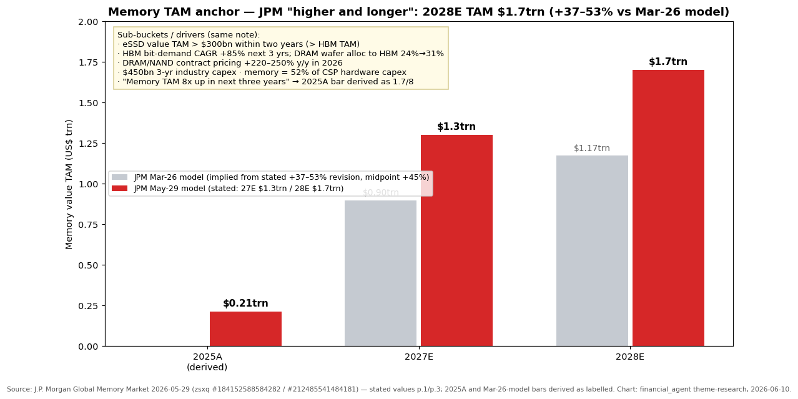
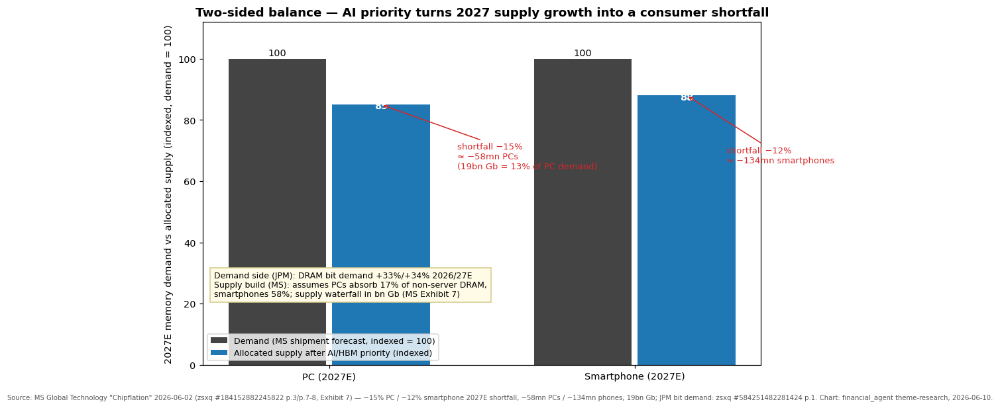
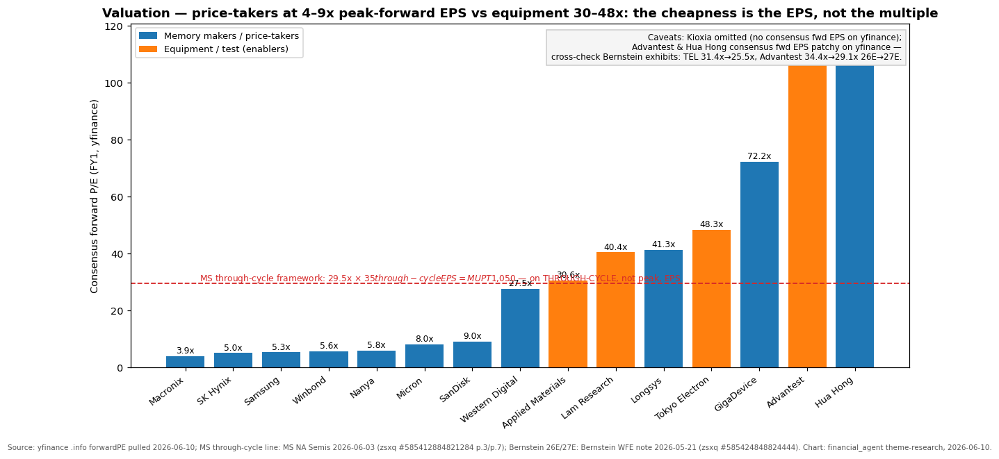
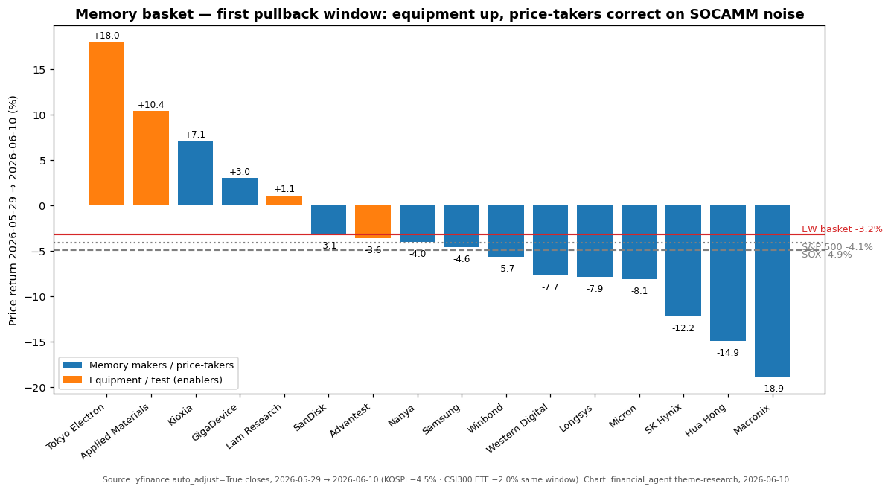

# Memory / DRAM-NAND / HBM Up-Cycle

**Created:** 2026-05-31 · **Last refreshed:** 2026-06-10 · **Last mutated:** 2026-05-31 · **Refresh cadence:** monthly · **Languages tracked:** en, zh

## What's New

*The delta since you last looked — newest refresh on top. Older entries collapse into the archive below.*

**2026-06-10 refresh (vs 2026-05-31):**

- **This English file is now synced to the 16-ticker basket and the latest theme format.** The 2026-05-31 expansion (14 → 16: added TWSE:2408 Nanya core, SZSE:301308 Longsys adjacent) had landed only in the Chinese companion; the EN file had drifted. Both files now carry the Valuation snapshot, sell-side view evolution, basket scorecard, leading indicators and 4 charts; ticker prefixes canonicalized (`KS:`→`KRX:`, `TYO:`→`TSE:`, `TPE:`→`TWSE:`, `HK:`→`HKEX:`).
- **First pullback window: equal-weight basket −3.2% (median −4.3%) over 2026-05-29 → 06-10, vs SOX −4.9% · S&P 500 −4.1% · KOSPI −4.5%** — in line with a market-wide correction, but with a violent internal rotation: **equipment up (Tokyo Electron +18.0%, AMAT +10.4%) while price-takers corrected (SK Hynix −12.2%, Macronix −18.9%, Hua Hong −14.9%, Micron −8.1%)** — the exact equipment-vs-price-taker gap-compression flagged at inception (yfinance, see Performance).
- **The SOCAMM episode is the window's macro-micro story.** SemiAnalysis (4-5 Jun) reported NVIDIA cutting Vera Rubin NVL72 SoCAMM2 DRAM content from 55TB to 28TB per rack (192GB → 96GB modules, ~50% per-rack cut) — Citi judges *"no change to SoCAMM2 demand"* since the cut reflects supply constraints, not demand ([Citi — Rubin SoCAMM2, zsxq #584251528855554 p.1](http://xs-macbook-air.local:5001/zsxq/pdf/584251528855554/CITI-Global%20Semiconductors%EF%BC%9AAssessing%20the%20Impact%20of%20NVDA%E2%80%99s%20Rubin%20SoCAMM2%20Capacity%20Reduction-260607.pdf#page=1)); JPM calls the noise *"misleading"*, keeps DRAM bit demand at **+33%/+34% 2026/27E**, and frames the correction as *"a good buying opportunity from a midterm horizon"* ([JPM — Memory Market Update, zsxq #584251482281424 p.1-3](http://xs-macbook-air.local:5001/zsxq/pdf/584251482281424/J.P.%20Morgan-Memory%20Market%20Update%EF%BC%9ASOCAMM%20content%20noise%20offers%20a%20buying%20opportunity%EF%BC%9B%20thoughts%20on%20NVDA~SKH%20partnership%20and%20takeaways%20from%20Computex%202026-260608.pdf#page=1)).
- **PT-raise wave, but the street is chasing price:** MS raised MU **$520 → $1,050** (29.5x × $35 through-cycle EPS) and SNDK **$1,100 → $1,750** (28x × $62.50) ([MS — NA memory PT raises, zsxq #585412884821284 p.1/p.3](http://xs-macbook-air.local:5001/zsxq/pdf/585412884821284/MS-Semiconductors%20-%20North%20America%20Raising%20estimates-PTs%20for%20memory%20stocks%20as%20demand%20continues%20to%20outpace%20supply-260603.pdf#page=1)); GS raised MU **$400 → $900** (18x × normalized EPS $50, was $22) ([GS — MU 3Q preview, zsxq #412458524148888 p.2](http://xs-macbook-air.local:5001/zsxq/pdf/412458524148888/GS-Micron%20Technology%20Inc.%20%28MU%29_%203Q%20Preview_%20Another%20strong%20quarter%20reflects%20extension%20of%20tight%20supply_demand%20through%202027-260608.pdf#page=2)); BofA raised SNDK **$1,550 → $2,100** (~10x C27E EPS $199) ([BofA — SNDK, zsxq #181245182285222 p.1](http://xs-macbook-air.local:5001/zsxq/pdf/181245182285222/Bofa-Sandisk%20Corporation%20Supply-Demand%20balance%20remains%20tight%2C%20pricing%20strong%3B%20PO%20to%20%242100-260608.pdf#page=1)). Even *raised* PTs sat at/below the print date's spot for MU (MS $1,050 vs $1,079.57 @ 06-03) — all six calls persisted to `stock_price_target_db` (see Valuation snapshot).
- **First deceleration print on the tape:** Bernstein's May tracker confirms 2QCY26 DRAM contract +**64% QoQ** (PC +46% / server +53% / mobile ~80% / consumer ~85%) and blended NAND ~+**60% QoQ**, but expects the increase to *"decelerate significantly to 10-20% QoQ"* into 3QCY26, with prices peaking and *"normaliz[ing] from 2HCY27 and into CY28"* ([Bernstein — Memory Tracker May, zsxq #212485115581121 p.1/p.4](http://xs-macbook-air.local:5001/zsxq/pdf/212485115581121/Bernstein-Global%20Memory%EF%BC%9AMEMORY%20TRACKER%20%EF%BC%88May%EF%BC%89%EF%BC%9A%20Price%20hike%20c.%2060%25%20QoQ%20in%202QCY26%EF%BC%8C%20but%20likely%20at%20a%20slower%20pace%20in%202HCY26-260602.pdf#page=1)).
- **Kioxia Investor Day (06-02) raised the NAND demand anchor:** bit-demand CAGR CY25-28 lifted **to 22% from 20%**, mainly on eSSD ([Bernstein — Kioxia IR Day, zsxq #415284114485228 p.1-2](http://xs-macbook-air.local:5001/zsxq/pdf/415284114485228/Bernstein-Global%20Memory%EF%BC%9AKIOXIA%20Investor%20Day%EF%BC%9A22%25%20bit%20CAGR%20good%20enough%EF%BC%9F-260602.pdf#page=1)).
- **Leading indicator at a record:** Korea May DRAM exports +**370% YoY** — *"the highest figure since tracking began in January 2008"*; NAND chip exports +207% YoY, 4th straight month of >200% memory export growth ([GS — Korea May export tracker, zsxq #812485454488152 p.1](http://xs-macbook-air.local:5001/zsxq/pdf/812485454488152/Goldman%20Sachs-South%20Korea%20Tech%EF%BC%9A%20May%202026%20export%20tracker%EF%BC%9A%20Record~high%20DRAM%20exports%20with%20370%25%20yoy%20growth-260601.pdf#page=1)).
- **Macro regime shifted:** VIX 16.68 → **21.51** (2026-06-05, `indicators.db`) — the low-vol tailwind flagged at inception is gone; correlation-driven drawdowns now travel faster.

Earlier refreshes

**2026-05-31 — original-PDF rewrite + basket expansion 14 → 16 + sources 13 → 22 zsxq reports.** Added **TWSE:2408 Nanya** (core — MS upgraded *"Winbond and Nanya to OW"* in [MS — Old Memory: Upside Surprise, zsxq #212451114418521 p.1](http://xs-macbook-air.local:5001/zsxq/pdf/212451114418521/MS-Greater%20China%20Semiconductors%20-%20Asia%20Pacific%20Old%20Memory-Upside%20Surprise%20%20Ahead-260528.pdf#page=1)) and **SZSE:301308 Longsys** (adjacent — A-share NAND module proxy for the YMTC/CXMT build-out). New signals: UBS initiated Kioxia Buy ¥79,000 (*"Peak is not here yet"* — six more quarters of QoQ increases before a Q3 2027 peak); UBS raised MU to $1,625 on LTA traction; TAM anchor moved to JPM's 2028E $1.7trn model. Corrected a mis-attributed file_id (812485545245152 was MS Tongrentang, not MS Hua Hong AAI — removed). 16-ticker recomputed performance: 1Y +1,086.4% EW / median +672.6% vs KOSPI +232.5% / SOXX +210.4%. *(This block had originally shipped only in the Chinese companion; carried into the EN archive at the 2026-06-10 sync.)*

**2026-05-31 — basket created** (14 tickers: 8 core / 6 enabler) from the zsxq broker-note cluster + web corroboration.

## Thesis

**Anchor — memory value TAM (J.P. Morgan, 2026-05-29):** 2027E **$1.3trn** → 2028E **$1.7trn**, a **+37-53% revision of the FY26E-28E TAM vs JPM's Mar-26 model**, with DRAM/NAND contract pricing **+220-250% y/y in 2026** and the note stating *"Memory TAM 8x up in next three years"* (implying a ~$0.21trn 2025A base) ([JPM — Global Memory Market, zsxq #184152588584282 p.1/p.3](http://xs-macbook-air.local:5001/zsxq/pdf/184152588584282/%E6%91%A9%E6%A0%B9%E5%A4%A7%E9%80%9A-%E5%85%A8%E7%90%83%E5%AD%98%E5%82%A8%E5%B8%82%E5%9C%BA%EF%BC%9ACPU%E4%B8%BA%E6%9B%B4%E9%AB%98%E6%9B%B4%E4%B9%85%E7%9A%84%E4%B8%8A%E8%A1%8C%E5%91%A8%E6%9C%9F%E6%B7%BB%E6%9F%B4%E5%8A%A0%E8%96%AA%EF%BC%8C2028%E5%B9%B4%E6%80%BB%E6%BD%9C%E5%9C%A8%E5%B8%82%E5%9C%BA%E8%A7%84%E6%A8%A1%E8%BE%BE1.7%E4%B8%87%E4%BA%BF%E7%BE%8E%E5%85%83%EF%BC%9B%E4%BC%B0%E5%80%BC%E6%A1%86%E6%9E%B6%E8%BD%AC%E5%9E%8B%E8%BF%9B%E8%A1%8C%E6%97%B6-260529.pdf#page=1) / [EN copy #212485541484181](http://xs-macbook-air.local:5001/zsxq/pdf/212485541484181/J.P.%20Morgan-Global%20Memory%20Market-CPU%20adds%20fuel%20to%20the%20%E2%80%98higher%20and%20longer%E2%80%99%20upcycle%20thesis%20and%2028E%20TAM%20at%20%241.7trn%3B%20valuation%20framework%20transition%20in%20progress-260529.pdf#page=1)). **Sub-buckets** (same note): eSSD value TAM **>$300bn within two years — larger than the HBM TAM** — on eSSD bit demand rising to >1,100EB at a +52% CAGR; **HBM bit-demand CAGR +85%** over the next three years with DRAM wafer allocation to HBM moving **24% → 31%**; 3-yr industry capex **$450bn**; memory now **52% of CSP hardware capex**. **Swing factor: server/AI DRAM (HBM + SOCAMM-class CPU-attach DRAM)** — JPM models DRAM bit demand **+33%/+34% in 2026/27E** with the CPU leg the marginal driver ([JPM SOCAMM update, zsxq #584251482281424 p.1](http://xs-macbook-air.local:5001/zsxq/pdf/584251482281424/J.P.%20Morgan-Memory%20Market%20Update%EF%BC%9ASOCAMM%20content%20noise%20offers%20a%20buying%20opportunity%EF%BC%9B%20thoughts%20on%20NVDA~SKH%20partnership%20and%20takeaways%20from%20Computex%202026-260608.pdf#page=1)); a revision there moves the headline most.

**The two-sided balance** is the core of the bet. Demand side: DRAM bits +33%/+34% 2026/27E (JPM, above) and NAND bits +22% CAGR CY25-28 per Kioxia's own raised Investor-Day projection ([Bernstein — Kioxia IR Day, zsxq #415284114485228 p.2](http://xs-macbook-air.local:5001/zsxq/pdf/415284114485228/Bernstein-Global%20Memory%EF%BC%9AKIOXIA%20Investor%20Day%EF%BC%9A22%25%20bit%20CAGR%20good%20enough%EF%BC%9F-260602.pdf#page=2)). Supply side: MS's "Chipflation" sufficiency framework shows AI prioritization turning 2027 supply growth into a consumer shortfall — after HBM and server/AI allocations, residual non-server supply leaves **PCs ~15% short (≈ −58mn units; a 19bn-Gb gap = 13% of PC demand) and smartphones ~12% short (≈ −134mn units)** in 2027E, with memory prices already up *"more than 6-fold over the last year"* ([MS — Chipflation, zsxq #184152882245822 p.1/p.3/p.7-8](http://xs-macbook-air.local:5001/zsxq/pdf/184152882245822/MS-Global%20Technology%20Chipflation%20%E2%80%93%20Navigating%20A%20Memory%20Crisis-260602.pdf#page=7)). The shortage clears through price *and* through rationing — which is why suppliers' pricing power survives even unit-demand destruction in low-end devices.

**Pricing → EPS bridge:** the 2QCY26 contract prints (DRAM +64% QoQ, NAND ~+60% QoQ — [Bernstein tracker, zsxq #212485115581121 p.1](http://xs-macbook-air.local:5001/zsxq/pdf/212485115581121/Bernstein-Global%20Memory%EF%BC%9AMEMORY%20TRACKER%20%EF%BC%88May%EF%BC%89%EF%BC%9A%20Price%20hike%20c.%2060%25%20QoQ%20in%202QCY26%EF%BC%8C%20but%20likely%20at%20a%20slower%20pace%20in%202HCY26-260602.pdf#page=1)) flow through near-fixed cost bases: MS models MU DRAM pricing +40% in the May quarter and +15% in August and raises FY26/27 EPS **+4%/+48%** on it ([MS PT-raise note, zsxq #585412884821284 p.1](http://xs-macbook-air.local:5001/zsxq/pdf/585412884821284/MS-Semiconductors%20-%20North%20America%20Raising%20estimates-PTs%20for%20memory%20stocks%20as%20demand%20continues%20to%20outpace%20supply-260603.pdf#page=1)); GS raises MU CY26 revenue/EPS estimates **+28%/+36%** and expects an August-quarter guide of revenue/GM/EPS **$48.8bn / 86.1% / $29.95** vs Street $40.4bn / 84.0% / $23.68 ([GS — MU 3Q preview, zsxq #412458524148888 p.1](http://xs-macbook-air.local:5001/zsxq/pdf/412458524148888/GS-Micron%20Technology%20Inc.%20%28MU%29_%203Q%20Preview_%20Another%20strong%20quarter%20reflects%20extension%20of%20tight%20supply_demand%20through%202027-260608.pdf#page=1)). The valuation-framework consequence: JPM explicitly shifts to a P/S-on-TAM framework (3.6x P/S on 27E TAM ⇒ ~50% market-cap upside *"throughout next year"*), and MS to through-cycle EPS multiples — the de-rate math in Drift signals uses those same frameworks symmetrically.

**Staging — who benefits when:** the price-takers (SK Hynix, Micron, Samsung, Kioxia, SanDisk, and the old-memory trio Winbond/Nanya/Macronix) monetize **now** — contract prints land in P&L within two quarters; the dated gate is each LTA-coverage disclosure (Bernstein: US CSP LTAs largely signed; China CSPs still negotiating — [tracker p.4](http://xs-macbook-air.local:5001/zsxq/pdf/212485115581121/Bernstein-Global%20Memory%EF%BC%9AMEMORY%20TRACKER%20%EF%BC%88May%EF%BC%89%EF%BC%9A%20Price%20hike%20c.%2060%25%20QoQ%20in%202QCY26%EF%BC%8C%20but%20likely%20at%20a%20slower%20pace%20in%202HCY26-260602.pdf#page=4)). The equipment names (AMAT, LRCX, TEL, Advantest) monetize the **2027-29 capacity response** — Kioxia FY27 capex ¥450bn and TEL GM 45%→50% by FY28 are the dated gates ([MS Semicap Japan, zsxq #184152218151852 p.1](http://xs-macbook-air.local:5001/zsxq/pdf/184152218151852/Morgan%20Stanley-Semiconductor%20Capital%20Equipment%EF%BC%9AJapan%20Takeaways-260529.pdf#page=1)); BofA sees incremental NAND supply growth *"likely only in 2028/2029"* ([BofA SNDK, zsxq #181245182285222 p.1](http://xs-macbook-air.local:5001/zsxq/pdf/181245182285222/Bofa-Sandisk%20Corporation%20Supply-Demand%20balance%20remains%20tight%2C%20pricing%20strong%3B%20PO%20to%20%242100-260608.pdf#page=1)). This window's rotation (equipment +10-18% while price-takers corrected) is the market starting to pay for stage 2.

**Conviction ranks (cited, not ours):** UBS is the street-high on MU ($1,625, EPS *"comfortably >$100"* through FY2029 — [UBS, zsxq #585428582552154 p.1](http://xs-macbook-air.local:5001/zsxq/pdf/585428582552154/UBS-Micron%20Technology%20Inc%20LTAs%20Gain%20Traction%3B%20PT%20to%20%241%2C625%20with%20EPS%20Remaining%20Well%20-%24100-260526.pdf#page=1)) and on cycle duration (Kioxia *"peak … Q3 2027"*); MS prefers the US pair MU + SNDK on through-cycle EPS and the Taiwan old-memory pair Winbond + Nanya (both OW); Bernstein is the house skeptic — Outperform ratings but book-value-anchored PTs far below spot (MU $510, Kioxia ¥17,000) — see *Sell-side view evolution* for the framework split. *Analyst view (this note):* the cleanest read of the window is that cycle risk is now concentrated in **content-per-unit** decisions (SOCAMM-style despeccing), not in AI demand itself.

**Further viewing**

- [SK hynix — "Become a Semiconductor Expert: HBM" (official explainer of TSV-stacked HBM construction)](https://news.skhynix.com/become-a-semiconductor-expert-with-sk-hynix-hbm/) — why an HBM stack consumes multiples of the wafer area per GB vs DDR5; the physical basis of the wafer-allocation squeeze.
- [Branch Education — How does Computer Memory Work? (3D animation of DRAM cells, banks and the memory hierarchy)](https://www.youtube.com/watch?v=7J7X7aZvMXQ) — the best visual primer for what a "bit" of DRAM physically is before reasoning about bit supply/demand.

## Scope rules

**In:** integrated DRAM/NAND/HBM manufacturers (SK Hynix, Samsung, Micron, Kioxia, SanDisk, WDC); specialty / niche-node memory (GigaDevice, Winbond, Macronix, Nanya) — the most direct "old-memory squeeze" beneficiaries; memory-exposed foundry (Hua Hong's 12-inch mature-node AI loading); memory-critical WFE and test (AMAT, LRCX, Tokyo Electron, Advantest); NAND modules as a China build-out proxy (Longsys). Every member needs a 2025-26 sell-side or IR naming of its memory exposure.

**Out:** AI accelerators (NVDA, AVGO, AMD) — downstream of memory, separate AI-compute theme; all-flash array integrators (PSTG, NTAP); KLAC / PLAB / TER (memory exposure diluted or duplicated by Advantest); module/controller pass-throughs (Adata, Innodisk, Apacer, Phison) — price rises hit their COGS too; China domestic WFE (NAURA, AMEC, Piotech, Hangzhou Changchuan, Hwatsing) — consolidated in a dedicated `china-domestic-wfe` theme; Ingenic (dominated by GigaDevice); Moore Threads (GPU story); CXMT / YMTC (private — IPO is a standing mutation trigger).

## Tracked tickers

| Ticker | Name | Role | Justification | Added |
|---|---|---|---|---|
| KRX:000660 | SK Hynix | core | Global DRAM #1 and near-exclusive HBM3E/HBM4 supplier to NVIDIA GB200/GB300; [JPM Global Memory, zsxq #184152588584282 p.1](http://xs-macbook-air.local:5001/zsxq/pdf/184152588584282/%E6%91%A9%E6%A0%B9%E5%A4%A7%E9%80%9A-%E5%85%A8%E7%90%83%E5%AD%98%E5%82%A8%E5%B8%82%E5%9C%BA%EF%BC%9ACPU%E4%B8%BA%E6%9B%B4%E9%AB%98%E6%9B%B4%E4%B9%85%E7%9A%84%E4%B8%8A%E8%A1%8C%E5%91%A8%E6%9C%9F%E6%B7%BB%E6%9F%B4%E5%8A%A0%E8%96%AA%EF%BC%8C2028%E5%B9%B4%E6%80%BB%E6%BD%9C%E5%9C%A8%E5%B8%82%E5%9C%BA%E8%A7%84%E6%A8%A1%E8%BE%BE1.7%E4%B8%87%E4%BA%BF%E7%BE%8E%E5%85%83%EF%BC%9B%E4%BC%B0%E5%80%BC%E6%A1%86%E6%9E%B6%E8%BD%AC%E5%9E%8B%E8%BF%9B%E8%A1%8C%E6%97%B6-260529.pdf#page=1) lists it among the *"net winners in the higher-for-longer cycle"*. Moat: HBM4 process lead + locked 2026 capacity. Threat: Samsung HBM4 share recapture + the customer-insourcing analogue — NVDA designing memory-content *down* (SOCAMM cut) and dual-sourcing; counter = sold-out multi-year LTAs. | 2026-05-31 |
| KRX:005930 | Samsung Electronics | core | Only integrated DRAM/NAND/foundry/display IDM; HBM4 mass-production timing is the share-recapture variable JPM flags as the swing in its winners list ([JPM Global Memory, zsxq #184152588584282 p.1](http://xs-macbook-air.local:5001/zsxq/pdf/184152588584282/%E6%91%A9%E6%A0%B9%E5%A4%A7%E9%80%9A-%E5%85%A8%E7%90%83%E5%AD%98%E5%82%A8%E5%B8%82%E5%9C%BA%EF%BC%9ACPU%E4%B8%BA%E6%9B%B4%E9%AB%98%E6%9B%B4%E4%B9%85%E7%9A%84%E4%B8%8A%E8%A1%8C%E5%91%A8%E6%9C%9F%E6%B7%BB%E6%9F%B4%E5%8A%A0%E8%96%AA%EF%BC%8C2028%E5%B9%B4%E6%80%BB%E6%BD%9C%E5%9C%A8%E5%B8%82%E5%9C%BA%E8%A7%84%E6%A8%A1%E8%BE%BE1.7%E4%B8%87%E4%BA%BF%E7%BE%8E%E5%85%83%EF%BC%9B%E4%BC%B0%E5%80%BC%E6%A1%86%E6%9E%B6%E8%BD%AC%E5%9E%8B%E8%BF%9B%E8%A1%8C%E6%97%B6-260529.pdf#page=1)). Moat: largest captive wafer base. Threat: HBM4 qualification slip vs Hynix/Micron; 2026 strike risk largely resolved ([JPM Samsung, zsxq #812451582581222 p.1](http://xs-macbook-air.local:5001/zsxq/pdf/812451582581222/%E6%91%A9%E6%A0%B9%E5%A4%A7%E9%80%9A-%E4%B8%89%E6%98%9F%E7%94%B5%E5%AD%90%EF%BC%88005930.KS%EF%BC%89%E6%88%8F%E5%89%A7%E6%80%A7%E5%92%8C%E8%A7%A3%E8%90%BD%E5%B9%95%EF%BC%8C%E7%BD%A2%E5%B7%A5%E6%82%AC%E8%80%8C%E6%9C%AA%E5%86%B3%E4%B8%BB%E8%A6%81%E9%97%AE%E9%A2%98%E5%9F%BA%E6%9C%AC%E6%B6%88%E9%99%A4%EF%BC%8C%E5%8F%AF%E9%80%A2%E4%BD%8E%E5%90%B8%E7%BA%B3.pdf#page=1)). | 2026-05-31 |
| NASDAQ:MU | Micron | core | Only US memory IDM; HBM3E in the NVIDIA chain with ~20% HBM share investors expect it to hold/expand ([GS 3Q preview, zsxq #412458524148888 p.1](http://xs-macbook-air.local:5001/zsxq/pdf/412458524148888/GS-Micron%20Technology%20Inc.%20%28MU%29_%203Q%20Preview_%20Another%20strong%20quarter%20reflects%20extension%20of%20tight%20supply_demand%20through%202027-260608.pdf#page=1)); UBS: *"LTAs Gain Traction"*, PT $1,625, EPS *"comfortably >$100 throughout the period"* through FY2029 ([UBS, zsxq #585428582552154 p.1](http://xs-macbook-air.local:5001/zsxq/pdf/585428582552154/UBS-Micron%20Technology%20Inc%20LTAs%20Gain%20Traction%3B%20PT%20to%20%241%2C625%20with%20EPS%20Remaining%20Well%20-%24100-260526.pdf#page=1)). Moat: US-flagged supply + CHIPS-funded footprint. Threat: heaviest FY27/28 capex bill in the basket (MS models $44bn/$40bn vs consensus $37.6bn/$36.9bn — FCF drag, [MS, zsxq #585412884821284 p.2](http://xs-macbook-air.local:5001/zsxq/pdf/585412884821284/MS-Semiconductors%20-%20North%20America%20Raising%20estimates-PTs%20for%20memory%20stocks%20as%20demand%20continues%20to%20outpace%20supply-260603.pdf#page=2)). | 2026-05-31 |
| TSE:285A | Kioxia | core | NAND pure-play (#2 bit share); own Investor Day raised NAND bit-demand CAGR CY25-28 to 22% ([Bernstein, zsxq #415284114485228 p.2](http://xs-macbook-air.local:5001/zsxq/pdf/415284114485228/Bernstein-Global%20Memory%EF%BC%9AKIOXIA%20Investor%20Day%EF%BC%9A22%25%20bit%20CAGR%20good%20enough%EF%BC%9F-260602.pdf#page=2)); UBS initiated Buy ¥79,000 — *"likely to rise qoq for the next six quarters before peaking in Q3 2027"* ([UBS, zsxq #812485584818522 p.1](http://xs-macbook-air.local:5001/zsxq/pdf/812485584818522/UBS-Kioxia%20Holdings%20Corp%20Peak%20is%20not%20here%20yet-260528.pdf#page=1)). Moat: BiCS/CBA stacking + Sandisk JV scale. Threat: NAND is the easier segment for China (YMTC) to attack; 1Y +3,207% is IPO-base-effect, not all cycle. | 2026-05-31 |
| NASDAQ:SNDK | SanDisk | core | NAND pure-play (WDC 2025 spin-off), JV-linked to Kioxia fabs; BofA: *"Supply/Demand balance remains tight, pricing strong"*, >60% of NAND supply still open to re-price, PO $2,100 ([BofA, zsxq #181245182285222 p.1](http://xs-macbook-air.local:5001/zsxq/pdf/181245182285222/Bofa-Sandisk%20Corporation%20Supply-Demand%20balance%20remains%20tight%2C%20pricing%20strong%3B%20PO%20to%20%242100-260608.pdf#page=1)). Moat: JV cost position + eSSD ramp. Threat: NAND price normalization hits it hardest (no DRAM/HBM leg); MS bear case $1,100 ([MS RR, zsxq #184155215151842 p.2](http://xs-macbook-air.local:5001/zsxq/pdf/184155215151842/Morgan%20Stanley-SanDisk%20Corporation.%EF%BC%88SNDK.US%EF%BC%89Risk%20Reward%20Update-260603.pdf#page=2)). 1Y +3,851% is spin-off base-effect. | 2026-05-31 |
| NASDAQ:WDC | Western Digital | core | Post-spin HDD pure-play — the "data-center warehouse" tier; April HDD/SSD channel data confirms *"Continuing Strong Data Center Demand"* ([MS Electronic Components, zsxq #212485814114481 p.1](http://xs-macbook-air.local:5001/zsxq/pdf/212485814114481/Morgan%20Stanley-Electronic%20Components%20Apr%20HDD%20SSD%20Data%EF%BC%9A%20Continuing%20Strong%20Data%20Center%20Demand-260529.pdf#page=1)). Moat: nearline HDD duopoly with multi-year lead times. Threat: eSSD substitution at the nearline boundary if NAND $/TB falls faster than HDD $/TB (the exact JPM eSSD>$300bn wedge). | 2026-05-31 |
| SSE:603986 | GigaDevice 兆易创新 | core | A-share NOR Flash + niche DRAM + MCU leader; NOR content per AI server / BBU is step-changing (same driver as Winbond's *"500-600 NOR chips per Vera Rubin rack"*, [MS Winbond AAI, zsxq #812485545245422 p.1](http://xs-macbook-air.local:5001/zsxq/pdf/812485545245422/Morgan%20Stanley-Winbond%20Electronics%20Corp%20%EF%BC%882344.TW%EF%BC%89Asia%20AI%20Summit%202026%20Feedback-260528.pdf#page=1)). Moat: NOR duopoly with Winbond + CXMT-adjacent niche-DRAM design. Threat: fabless — depends on foundry allocation in a tight market; richest fwd P/E among price-takers (72x). | 2026-05-31 |
| HKEX:1347 | Hua Hong 华虹半导体 | enabler | Mature-node foundry with rising AI loading; GS Buy — *"12-inch capacity increasing; AI applications drive demand and loading"* ([GS, zsxq #812485541485582 p.1](http://xs-macbook-air.local:5001/zsxq/pdf/812485541485582/Goldman%20Sachs-Hua%20Hong%20%EF%BC%881347.HK%EF%BC%89%EF%BC%9A%2012~inch%20capacity%20increasing%EF%BC%9B%20AI%20applications%20drive%20demand%20and%20loading%EF%BC%9B%20Buy-260529.pdf#page=1)); MS AAI feedback flags the *"Multi-year Pricing Cycle and Aggressive Long-term Revenue Guidance"* ([MS AAI, zsxq #212485545245181 p.1](http://xs-macbook-air.local:5001/zsxq/pdf/212485545245181/Morgan%20Stanley-Hua%20Hong%20Semiconductor%20Ltd%EF%BC%881347.HK%EF%BC%89Asia%20AI%20Summit%202026%20Feedback%EF%BC%9A%20Multi~year%20Pricing%20Cycle%20and%20Aggressive%20Long~term%20Revenue%20Guidance%20in%20Focus-260528.pdf#page=1)). Moat: China's only listed specialty-foundry proxy for the memory build-out. Threat: the street is split — BofA Underperform HK$63 vs GS Buy HK$174 (see view evolution); −14.9% this window. | 2026-05-31 |
| TWSE:2408 | Nanya Technology 南亚科 | core | Taiwan DRAM pure-play; MS upgraded *"Winbond and Nanya to OW"* in the old-memory squeeze call ([MS Old Memory, zsxq #212451114418521 p.1](http://xs-macbook-air.local:5001/zsxq/pdf/212451114418521/MS-Greater%20China%20Semiconductors%20-%20Asia%20Pacific%20Old%20Memory-Upside%20Surprise%20%20Ahead-260528.pdf#page=1)). Moat: one of the only non-big-3 DRAM wafer owners as big-3 capacity migrates to HBM/DDR5. Threat: CXMT targets exactly its niche/legacy DRAM segment from 2027. | 2026-05-31 |
| TWSE:2344 | Winbond 华邦电子 | core | NOR + SLC NAND + niche DRAM triple; MS AAI: OW, PT NT$222, NOR 30kwpm + SLC NAND 15kwpm each adding 10kwpm, 16nm DRAM ramping 2-3K → 5K → 16K wpm, and *"500-600 NOR chips per Vera Rubin rack"* ([MS Winbond AAI, zsxq #812485545245422 p.1](http://xs-macbook-air.local:5001/zsxq/pdf/812485545245422/Morgan%20Stanley-Winbond%20Electronics%20Corp%20%EF%BC%882344.TW%EF%BC%89Asia%20AI%20Summit%202026%20Feedback-260528.pdf#page=1)). Moat: NOR/SLC capacity sold out through 2027. Threat: GigaDevice + Macronix capacity adds into the same niche by 2H27. | 2026-05-31 |
| TWSE:2337 | Macronix 旺宏 | core | NAND/NOR specialty house; ten-quarter loss streak ended with NAND revenue +382% YoY (Q1 FY26) — the old-memory NAND squeeze proxy ([Macronix Q1 FY26 call, BigGo, 2026-04-27](https://finance.biggo.com/news/TW_2337.TW_2026-04-27)). Moat: ROM/NOR legacy niches with no big-3 competition. Threat: lowest-margin, highest-beta member — fell −18.9% in the first pullback window; thinnest sell-side coverage (MS OW, no published PT). | 2026-05-31 |
| SZSE:301308 | Longsys 江波龙 | adjacent | A-share NAND/DRAM module leader — downstream proxy for the YMTC (NAND) + CXMT (DRAM) domestic build-out; Bernstein's *"CXMT and YMTC are forced to switch away from US supply chain"* is the anchoring call ([Bernstein China Semicap, zsxq #184128224215212 p.1](http://xs-macbook-air.local:5001/zsxq/pdf/184128224215212/Bernstein-China%20Semiconductors%20China%20Semicap%EF%BC%9A%20The%20surging%20memory%20capacity%20expansion-260521.pdf#page=1)). Moat: scale module franchise with YMTC supply. Threat: module margin is pass-through — it *pays* the price rises it resells; kept adjacent (no dedicated broker initiation in the library). | 2026-05-31 |
| NASDAQ:AMAT | Applied Materials | enabler | Bernstein Outperform PT $525 — logic + DRAM + advanced packaging are *"~80% of 2026 incremental WFE"* with ~half the incremental logic spend falling to AMAT ([Bernstein AMAT SDC, zsxq #212485522841821 p.1](http://xs-macbook-air.local:5001/zsxq/pdf/212485522841821/Bernstein-Applied%20Materials%20%EF%BC%88AMAT.US%EF%BC%89%EF%BC%9A%20Key%20takeaways%20from%20Bernstein%27s%20SDC-260528.pdf#page=1)). Moat: broadest WFE portfolio incl. HBM-edge tools. Threat: China revenue normalization + export-control tail. | 2026-05-31 |
| NASDAQ:LRCX | Lam Research | enabler | Most memory-exposed of the US WFE majors (NAND etch / DRAM deposition); Japan/Korea memory capex acceleration (Kioxia FY27 capex ¥450bn) is the direct order driver ([MS Semicap Japan, zsxq #184152218151852 p.1](http://xs-macbook-air.local:5001/zsxq/pdf/184152218151852/Morgan%20Stanley-Semiconductor%20Capital%20Equipment%EF%BC%9AJapan%20Takeaways-260529.pdf#page=1)). Moat: 3D-NAND high-aspect-ratio etch near-monopoly. Threat: bookings already discount a 2027-29 build-out — biggest air-pocket if memory capex pauses. | 2026-05-31 |
| TSE:8035 | Tokyo Electron | enabler | Japan WFE leader; MS Japan takeaways carry *"TEL GM 45%→50% by FY28"* with Kioxia's ¥450bn FY27 capex the demand pull ([MS Semicap Japan, zsxq #184152218151852 p.1](http://xs-macbook-air.local:5001/zsxq/pdf/184152218151852/Morgan%20Stanley-Semiconductor%20Capital%20Equipment%EF%BC%9AJapan%20Takeaways-260529.pdf#page=1)); GS conf-call note reaffirms strong WFE demand ([GS TEL, zsxq #812485141841252 p.1](http://xs-macbook-air.local:5001/zsxq/pdf/812485141841252/Goldman%20Sachs-Tokyo%20Electron%20%EF%BC%888035.T%EF%BC%89%EF%BC%9A%20Conf.%20call%20takeaways%EF%BC%9A%20Reaffirms%20strong%20WFE%20demand%20and%20continued%20share%20gains%20in%202026-260603.pdf#page=1)). Moat: coater/developer + bonder franchises on HBM. Threat: same second-stage timing risk as LRCX. Best name in the window (+18.0%). | 2026-05-31 |
| TSE:6857 | Advantest | enabler | HBM test + AI-accelerator test dual engine; MS Taiwan takeaways flag test as the chain's binding constraint ([MS Semicap Taiwan, zsxq #415284812111518 p.1](http://xs-macbook-air.local:5001/zsxq/pdf/415284812111518/Morgan%20Stanley-Semiconductor%20Capital%20Equipment%EF%BC%9ATaiwan%20Takeaways-260529.pdf#page=1)). Moat: HBM3E/HBM4 long-test-time gatekeeper duopoly position. Threat: tester intensity per bit can fall on known-good-die yield learning; richest equipment multiple in the basket. | 2026-05-31 |

**Geography / role mix (16 tickers):** Korea 2 · US 6 (incl. NAND pair SNDK+WDC) · Taiwan 3 · Japan 3 · HK 1 · A-share 2. Roles: core 11, enabler 4, adjacent 1.

## Valuation snapshot

Rows mirror `stock_price_target_db` (latest call per institute since 2026-05-01; surfaced at [`/pt`](http://xs-macbook-air.local:5001/pt)) — **Px @ note is the price on the note's date** (`report_date_price`), which fixes the upside the analyst actually called; *Px now* is the 2026-06-10 close (yfinance). Fwd P/E = FY1 consensus (yfinance `.info`, pulled 2026-06-10); FY1E EPS likewise; FY2E only where a mined note states it. **PT dispersion** per name from the read-only pre-pass.

| Ticker | Latest rating · broker (date) | Px @ note | PT | Upside | Px 06-10 | Fwd P/E FY1 | FY1E EPS | FY2E EPS | PT dispersion (since 05-01) |
|---|---|---|---|---|---|---|---|---|---|
| NASDAQ:MU | Buy · GS (06-08) | $949.28 | **$900** *(was $400)* | −5.2% | $891.88 | 8.0x | $111.51 | n/a¹ | n=6: $510 / $925 / $1,625 — **121% spread** |
| NASDAQ:SNDK | Buy · BofA (06-08) | $1,642.00 | **$2,100** *(was $1,550)*; MS bull/base/bear **$2,635 / $1,750 / $1,100** | +27.9% | $1,643.23 | 9.0x | $183.05 | $199 (BofA C27E) | n=4: $1,700 / $1,888 / $2,100 — 21% spread |
| KRX:000660 | (rating n/a) · MS (05-18) | ₩1,839,692 | ₩2,600,000 | +41.3% | ₩2,048,000 | 5.0x | n/a² | n/a² | n=6³: ₩1.15m / ₩2.35m / ₩4.0m — **121% spread** |
| KRX:005930 | Buy · GS (05-22) | ₩292,500 | ₩320,000 | +9.4% | ₩302,500 | 5.3x | n/a² | n/a² | n=5: ₩225k / ₩460k / ₩590k — 79% spread |
| TSE:285A | Overweight · MS (06-02) | ¥77,540 | ¥110,000 | +41.9% | ¥70,500 | n/a⁴ | n/a⁴ | n/a⁴ | n=6: ¥17k / ¥67k / ¥110k — **139% spread** |
| HKEX:1347 | Buy · GS (05-29) | HK$161.30 | HK$174 | +7.9% | HK$137.30 | 115.0x⁵ | HK$1.19 | n/a¹ | n=5: HK$63 / HK$100 / HK$174 — **111% spread** |
| SSE:603986 | Overweight · MS (05-28) | ¥483.00 | ¥585 | +21.1% | ¥480.84 | 72.2x | ¥6.66 | n/a¹ | n=3: ¥391 / ¥523 / ¥585 — 37% spread |
| TWSE:2408 | Overweight · MS (05-28) | NT$324.00 | NT$380 | +17.3% | NT$333.00 | 5.8x | NT$57.29 | n/a¹ | n=2: NT$380 / 410 / 440 — 15% spread |
| TWSE:2344 | Overweight · MS (05-28) | NT$144.00 | NT$222 | +54.2% | NT$149.00 | 5.6x | NT$26.43 | n/a¹ | single PT |
| TWSE:2337 | Overweight · MS (05-08) | NT$153.00 | n/a (no PT published) | — | NT$135.00 | 3.9x | NT$35.05 | n/a¹ | no PT in store |
| SZSE:301308 | no sell-side coverage in store | — | — | — | ¥507.00 | 41.3x | ¥12.28 | n/a¹ | — |
| NASDAQ:AMAT | Outperform · Bernstein (06-02) | $490.05 | $525 | +7.1% | $497.01 | 30.6x | $16.26 | $15.56 (Bernstein 27E)⁶ | n=5: $502 / $520 / $525 — 4% spread |
| NASDAQ:LRCX | Outperform · Bernstein (06-02) | $334.41 | $340 *(was $325)* | +1.7% | $321.80 | 40.4x | $7.97 | $7.98 (Bernstein FY27)⁶ | n=3: $290 / $331 / $340 — 15% spread |
| TSE:8035 | Buy · GS (06-03) | ¥60,900 | ¥62,000 | +1.8% | ¥61,830 | 48.3x | ¥1,280 | ¥1,849 (Bernstein 27E)⁶ | n=2: ¥59.2k / ¥60.6k / ¥62k — 5% spread |
| TSE:6857 | Outperform · Bernstein (05-21) | ¥25,290 | ¥39,200 | +55.0% | ¥25,235 | 106.1x⁵ | ¥238⁵ | ¥870 (Bernstein 27E)⁶ | single PT |

*Stale — pending refresh (price has moved through or past the call; not blended into the live rows above):* **NASDAQ:WDC** — Bernstein Outperform $590 (05-03, px@note $431.52, +36.7%); GS Neutral $400 and UBS Neutral $375 (both 05-01) — WDC closed $490.09 on 06-10, already through both Neutral targets. **Suspect row:** a Citi SK Hynix "₩310,000" call (05-11) is excluded from the dispersion — inconsistent with Citi's contemporaneous Buy stance and two orders below the market; likely an extraction/unit artifact, flagged for re-grounding.

Footnotes — **own-history / through-cycle context and cell derivations**: ¹ FY2E EPS not stated in the mined notes for these names — consensus FY2 not carried by yfinance `.info`; left n/a rather than improvised. ² yfinance does not populate fwd EPS for KRX listings; fwd P/E shown is its model output. ³ SK Hynix dispersion excludes the suspect Citi row. ⁴ Kioxia has no consensus fwd EPS on yfinance (trailing P/E 69.9x). ⁵ yfinance consensus for Advantest / Hua Hong is patchy (Advantest fwd 106.1x vs trailing 49.3x is inconsistent) — cross-check Bernstein 26E→27E: TEL 31.4x→25.5x, Advantest 34.4x→29.1x ([Bernstein WFE note, zsxq #585424848824444](http://xs-macbook-air.local:5001/zsxq/pdf/585424848824444/Bernstein-Global%20Semiconductor%20Equipment%EF%BC%9A%24200bn%20WFE%20in%20sight-260521.pdf)). ⁶ Equipment FY2E EPS are Bernstein-exhibit values from that same note. **Own ~10yr-avg multiples:** for the cyclical price-takers a trailing-P/E history is unrepresentative (EPS swings through zero — Macronix trailing EPS −NT$1.77); the sourced own-history anchors are MS's **through-cycle frameworks** — MU PT = 29.5x × $35 through-cycle EPS (vs prior ~23x norm, *"29.5x still in-line with the semis group"*) and SNDK PT = 28x × $62.50 (vs FY21-FY28 avg EPS $56; 28x a *"slight discount to our through-cycle multiple target for MU (28.5x)"*) ([MS, zsxq #585412884821284 p.3/p.5/p.7](http://xs-macbook-air.local:5001/zsxq/pdf/585412884821284/MS-Semiconductors%20-%20North%20America%20Raising%20estimates-PTs%20for%20memory%20stocks%20as%20demand%20continues%20to%20outpace%20supply-260603.pdf#page=3)); for equipment, Bernstein's 10-yr averages (AMAT 16.5x · LRCX 17.7x · KLAC 18.7x) from the WFE note above. **Growth-adjusted cross-section:** on FY1→FY2, equipment compresses (TEL 48.3x → ~33x on Bernstein ¥1,849) while price-taker multiples are already single-digit on peak-forward EPS — the basket sorts cheap→dear only on *through-cycle* EPS, which is the entire framework debate below.

### Sell-side view evolution (卖方观点演变)

**Micron (NASDAQ:MU) — five institutes in five weeks; the dispersion is the framework, not the facts:**

| Institute | Date | Rating / PT | Core argument | What proves them right |
|---|---|---|---|---|
| BofA | 05-15 | Buy / $950 | pricing momentum | continued QoQ contract hikes |
| Citi | 05-18 | Buy / $840 | cycle extension | 2H26 prints holding |
| UBS | 05-26 | Buy / **$1,625** (street-high) | *"LTAs Gain Traction"* — EPS *"comfortably >$100"* through FY2029 ([zsxq #585428582552154 p.1](http://xs-macbook-air.local:5001/zsxq/pdf/585428582552154/UBS-Micron%20Technology%20Inc%20LTAs%20Gain%20Traction%3B%20PT%20to%20%241%2C625%20with%20EPS%20Remaining%20Well%20-%24100-260526.pdf#page=1)) | LTA coverage extending visibly into FY28-29 |
| Bernstein | 06-02 | Outperform / **$510** (2x 2-yr fwd BVPS, [zsxq #415284114485228 p.8](http://xs-macbook-air.local:5001/zsxq/pdf/415284114485228/Bernstein-Global%20Memory%EF%BC%9AKIOXIA%20Investor%20Day%EF%BC%9A22%25%20bit%20CAGR%20good%20enough%EF%BC%9F-260602.pdf#page=8)) | book-value anchor: price already capitalizes the cycle | an early price peak (their model: peak 2HCY27, normalize CY28) |
| **Morgan Stanley** | 06-03 | OW / **$520 → $1,050** (+102% PT hike; 29.5x × $35 through-cycle EPS; FY26/27 EPS +4%/+48%) | demand outpacing supply 2-3 more years; *"fwd P/E still <10x"* | DRAM +40% MayQ / +15% AugQ printing |
| **Goldman Sachs** | 06-08 | Buy / **$400 → $900** (+125%; 18x × normalized $50, was $22) | tight S/D *through 2027*; Aug-Q guide ≫ Street | the 06-25 FY26Q3 print & guide |

Two self-revisions in one week (MS +102%, GS +125%) is a *chasing-the-tape* pattern — both new PTs were already below the spot price on their own publication dates. The genuine disagreement is methodological: MS/GS/JPM moved to **through-cycle EPS / P/S-on-TAM** frameworks (JPM literally subtitles the cycle note *"valuation framework transition in progress"*), while **Bernstein holds the book-value line** (MU $510 = 2x 2-yr fwd BVPS; same method gives Kioxia ¥17,000, Samsung ₩225,000, SK Hynix ₩1,150,000 — all far below spot, all p.8 of the same note). Whoever wins the framework argument wins the basket call.

**Kioxia (TSE:285A) — the same split, compressed into one day:** GS Neutral ¥48,000 (05-16) → Citi Buy/High-Risk ¥73,000 (05-17) → BofA Buy ¥61,000 (05-18) → UBS initiate Buy ¥79,000 (05-28, *"Peak is not here yet"*) → 06-02 Investor Day: **MS OW ¥110,000 vs Bernstein ¥17,000 on the same event** — a 139% dispersion, the widest in the basket. Bernstein's own title asks the bear question: *"22% bit CAGR good enough?"* — i.e., is a raised demand anchor already in a +3,200%-1Y stock.

**Hua Hong (HKEX:1347) — a genuine fundamental disagreement (not framework):** GS Buy HK$174 (05-29) vs MS Equal-weight HK$118 (05-28) vs Bernstein OP / Nomura Neutral HK$100 (05-14) vs **BofA Underperform HK$63** (05-15). Bulls price the *"multi-year pricing cycle + aggressive long-term revenue guidance"*; bears price mature-node oversupply once CXMT/YMTC-driven domestic capacity floods 12-inch. The −14.9% window move says the market leaned bearish this fortnight.

**SK Hynix (KRX:000660):** Nomura street-high ₩4,000,000 (05-16) vs Bernstein ₩1,150,000 — 121% spread on the *same* HBM franchise; MS ₩2,600,000 (05-18) is the live median-side anchor. No same-institute downgrades on any tracked name this window — the PT wave is still one-directional (up), which is itself a late-cycle tell to monitor.

## Exclusions

| Ticker | Reason |
|---|---|
| NASDAQ:NVDA, NASDAQ:AVGO, NASDAQ:AMD | AI accelerators — downstream HBM customers, separate AI-compute theme. |
| NYSE:PSTG, NASDAQ:NTAP | All-flash array integrators — software/platform margin profile, different cycle beta. |
| NASDAQ:KLAC, NASDAQ:PLAB, NYSE:TER | Diluted memory exposure (KLAC process control, PLAB masks, TER SoC-led test — Advantest already owns the HBM-test slot). |
| TWSE:3260 Adata, TWSE:5289 Innodisk, TWSE:8271 Apacer, TWSE:8299 Phison | Module/controller pass-throughs — the price rises they sell are the price rises they pay; watch list until pricing stabilizes. |
| SZSE:002371 NAURA, SSE:688012 AMEC, SSE:688072 Piotech, SZSE:300604 Hangzhou Changchuan, SSE:688120 Hwatsing | China domestic WFE — dedicated `china-domestic-wfe` theme; note UBS raised Hangzhou Changchuan's PT on domestic GPU/memory test demand (2026-06-02), keeping the case warm ([UBS, zsxq #415288428282258](http://xs-macbook-air.local:5001/zsxq/pdf/415288428282258/UBS-Hangzhou%20Changchuan%20Technology%EF%BC%88300604%EF%BC%89Raise%20price%20target%20to%20factor%20in%20stronger%20domestic%20GPU%20demand%20and%20foundry%20capex-260602.pdf)). |
| SZSE:300223 Ingenic | A-share niche-memory exposure dominated by GigaDevice. |
| SSE:688795 Moore Threads | GPU equity story, not memory. |
| CXMT 长鑫, YMTC 长江存储 | Private. CXMT cleared the SSE listing committee 2026-05-27 (~RMB 29.5bn raise) — an IPO filing is a standing basket-mutation trigger ([Caixin, 2026-05-28](https://www.caixinglobal.com/2026-05-28/changxin-clears-key-hurdle-for-record-star-market-ipo-102448359.html)). |

## Keywords

memory super-cycle / 存储超级周期 · DRAM · NAND · HBM3E / HBM4 · contract price / 合约价 · SOCAMM / SOCAMM2 · chipflation · LTA / 长期协议 · SLC NAND · NOR Flash · eSSD · niche DRAM / 利基 DRAM · Vera Rubin · BBU · CXMT / YMTC · memory capex / 存储资本开支 · ATE / HBM test · valuation framework transition / 估值框架转型

## Performance (since last refresh)

Window: **2026-05-29 → 2026-06-10 closes**, yfinance `auto_adjust=True`. **Equal-weight basket −3.2% · median −4.3%**, vs **SOX −4.9% · SOXX −4.8% · S&P 500 −4.1% · KOSPI −4.5% · Hang Seng ETF −2.0% · CSI300 ETF −2.0%** — the basket's first drawdown window since inception landed *in line with* a market-wide correction, not worse, despite a −12% to −19% hit to four members.

**Movers:** Tokyo Electron **+18.0%** (¥61,830), AMAT **+10.4%**, Kioxia **+7.1%**, GigaDevice +3.0%, LRCX +1.1%. **Laggards:** Macronix **−18.9%**, Hua Hong **−14.9%**, SK Hynix **−12.2%**, Micron −8.1%, Longsys −7.9%, WDC −7.7%. The split is one-for-one the *stage-1 / stage-2* divide from the Thesis: price-takers gave back part of the re-rate on SOCAMM content-cut noise, equipment re-rated on the capacity-response story (TEL's GS conf-call note reaffirming WFE demand landed 06-03 — [zsxq #812485141841252](http://xs-macbook-air.local:5001/zsxq/pdf/812485141841252/Goldman%20Sachs-Tokyo%20Electron%20%EF%BC%888035.T%EF%BC%89%EF%BC%9A%20Conf.%20call%20takeaways%EF%BC%9A%20Reaffirms%20strong%20WFE%20demand%20and%20continued%20share%20gains%20in%202026-260603.pdf)).

Trailing context (1Y, same pull): basket EW +845% / median +516% vs SOX +132.8% / SOXX +139.7% / KOSPI +183.5% / SPY +21.7%. SNDK (+3,851%) and Kioxia (+3,207%) remain IPO/spin-off base-effect outliers — quote the median.

### Basket scorecard

| Metric | This window (05-29 → 06-10) |
|---|---|
| Names positive | **5 / 16 (31%)** |
| Names beating SOX (−4.9%) | **9 / 16 (56%)** |
| Best contributor | Tokyo Electron **+18.0%** |
| Worst contributor | Macronix **−18.9%** |
| EW basket vs SOX | −3.2% vs −4.9% → **+170 bps** |
| Cumulative vs SOX since tracked inception (2026-05-31 baseline) | **+170 bps** (first measured window) |

## Recent events

- **NVDA Vera Rubin SoCAMM2 content cut (SemiAnalysis, 06-04/05):** 55TB → 28TB per NVL72 rack (192GB → 96GB modules; CPU-side 1,536GB → 768GB); Citi: supply-constraint-driven, *"no change to SoCAMM2 demand"*, suppliers can only fill ~60% of total SoCAMM2 demand anyway ([Citi, zsxq #584251528855554 p.1](http://xs-macbook-air.local:5001/zsxq/pdf/584251528855554/CITI-Global%20Semiconductors%EF%BC%9AAssessing%20the%20Impact%20of%20NVDA%E2%80%99s%20Rubin%20SoCAMM2%20Capacity%20Reduction-260607.pdf#page=1)); JPM: 96GB-module volume upside offsets, *"buying opportunity"* ([JPM, zsxq #584251482281424 p.1-3](http://xs-macbook-air.local:5001/zsxq/pdf/584251482281424/J.P.%20Morgan-Memory%20Market%20Update%EF%BC%9ASOCAMM%20content%20noise%20offers%20a%20buying%20opportunity%EF%BC%9B%20thoughts%20on%20NVDA~SKH%20partnership%20and%20takeaways%20from%20Computex%202026-260608.pdf#page=1)).
- **Kioxia Investor Day (06-02):** NAND bit-demand CAGR CY25-28 raised to **22%** (from 20%), mainly eSSD; Bernstein wonders aloud whether *"22% and JPY470B"* is enough for the re-rated stock ([Bernstein, zsxq #415284114485228 p.1](http://xs-macbook-air.local:5001/zsxq/pdf/415284114485228/Bernstein-Global%20Memory%EF%BC%9AKIOXIA%20Investor%20Day%EF%BC%9A22%25%20bit%20CAGR%20good%20enough%EF%BC%9F-260602.pdf#page=1)).
- **MS "Chipflation" global insight (06-02) + investor deck (06-08):** memory prices +6x in a year; two-tier market (AI priority vs rationed consumer); 2027E PC/smartphone shortfalls −15%/−12% (−58mn / −134mn units); memory <1% of US CPI ⇒ ~0.1pp inflation impact, but a PPI/margin shock for non-AI hardware ([MS, zsxq #184152882245822 p.1/p.3](http://xs-macbook-air.local:5001/zsxq/pdf/184152882245822/MS-Global%20Technology%20Chipflation%20%E2%80%93%20Navigating%20A%20Memory%20Crisis-260602.pdf#page=1); [deck #412458811521158](http://xs-macbook-air.local:5001/zsxq/pdf/412458811521158/Morgan%20Stanley-Investor%20Presentation%EF%BC%9A%20Global%20Technology%EF%BC%8CChipflation-260608.pdf)).
- **2QCY26 contract prints (Bernstein May tracker, 06-02):** DRAM +64% QoQ (PC +46 / server +53 / mobile ~80 / consumer ~85); NAND ~+60% (mobile NAND/SSD +70-80%, wafers +25%); specialty DRAM +10-20% *MoM*; 3Q decel to +10-20% QoQ expected ([zsxq #212485115581121 p.1/p.4-5](http://xs-macbook-air.local:5001/zsxq/pdf/212485115581121/Bernstein-Global%20Memory%EF%BC%9AMEMORY%20TRACKER%20%EF%BC%88May%EF%BC%89%EF%BC%9A%20Price%20hike%20c.%2060%25%20QoQ%20in%202QCY26%EF%BC%8C%20but%20likely%20at%20a%20slower%20pace%20in%202HCY26-260602.pdf#page=1)).
- **Korea May exports (GS, 06-01):** DRAM **+370% YoY** — record since the series began (Jan-2008); NAND chips +207% YoY; 4 straight months of >200% memory export growth ([zsxq #812485454488152 p.1](http://xs-macbook-air.local:5001/zsxq/pdf/812485454488152/Goldman%20Sachs-South%20Korea%20Tech%EF%BC%9A%20May%202026%20export%20tracker%EF%BC%9A%20Record~high%20DRAM%20exports%20with%20370%25%20yoy%20growth-260601.pdf#page=1)); Nomura's parallel read: *"Strong chip prices drive exports higher"* (zsxq #812485454482552, 06-01).
- **PT raises persisted to `/pt`:** MS MU $1,050 / SNDK $1,750 (06-03); GS MU $900 (06-08); BofA SNDK $2,100 (06-08); Bernstein Kioxia ¥17,000 / MU $510 (06-02).
- **Tokyo Electron conf call (GS, 06-03):** reaffirms strong WFE demand and continued 2026 share gains — the stage-2 confirmation behind the window's +18% ([zsxq #812485141841252 p.1](http://xs-macbook-air.local:5001/zsxq/pdf/812485141841252/Goldman%20Sachs-Tokyo%20Electron%20%EF%BC%888035.T%EF%BC%89%EF%BC%9A%20Conf.%20call%20takeaways%EF%BC%9A%20Reaffirms%20strong%20WFE%20demand%20and%20continued%20share%20gains%20in%202026-260603.pdf#page=1)).
- **CXMT STAR IPO progress:** cleared the SSE listing committee 2026-05-27 (~RMB 29.5bn) — the standing IPO-mutation trigger is now live-tracked ([Caixin, 2026-05-28](https://www.caixinglobal.com/2026-05-28/changxin-clears-key-hurdle-for-record-star-market-ipo-102448359.html)).

## Drift signals

- **The inception dispersion call played out — now decide what it means.** Equipment (+18.0/+10.4/+1.1/−3.6) vs price-takers (−4% to −19%) compressed the 1Y gap exactly as flagged on 05-31. If JPM/Citi are right that SOCAMM is noise, the price-taker correction is the dip; if content-cuts spread (more 96GB-for-192GB swaps, PC OEM despeccing per MS's elasticity exhibit — low-end phones/PCs at 1.6-1.7 elasticity), then **content-per-unit is the new de-rate axis** and price-takers stay capped. Watch the next SemiAnalysis-class teardown and MU's 06-25 guide language on SOCAMM.
- **De-rate sizing (the named floor, not a vibe):** at MU $891.88, the cited bear anchors are Bernstein's $510 (2x 2-yr fwd BVPS) ⇒ **−43%**, vs MS's through-cycle $1,050 ⇒ +18% — the spread *is* the framework bet. SNDK $1,643.23 vs MS bear $1,100 ⇒ **−33%**; vs MS bull $2,635 ⇒ +60%. Kioxia ¥70,500 vs Bernstein ¥17,000 ⇒ −76% is the tail print if NAND pricing normalizes early. The specific demand assumption whose miss triggers the bear path: **2HCY27 peak timing** (Bernstein/UBS both date it) arriving in 2026 instead — i.e., 3QCY26 contract prints decelerating to the *bottom* of the +10-20% band or below.
- **First deceleration print is on the tape.** Bernstein's "+60% QoQ in 2QCY26, slower in 2H" is the first second-derivative rollover in the dataset while the basket's 1Y median is still +516% — the classic mid-late-cycle configuration. Cross-ref: Leading indicators (Korea exports are still at records — momentum vs second-derivative tension is THE thing to watch into the 3Q prints).
- **Hua Hong justification needs re-grounding.** The Justification cell leans on GS Buy + MS AAI *interest*, but MS is actually Equal-weight (HK$118 < spot at note date) and BofA is at Underperform HK$63; the name fell −14.9% this window. Action for next mutation: either re-ground the enabler case on the CXMT/YMTC-buildout linkage with a fresh primary source, or demote to watch.
- **WDC coverage is stale** (newest stored call 05-03; price through both Neutral PTs). Flag to re-pull on the next refresh; do not quote the stale upside.
- **CXMT IPO is no longer hypothetical** (SSE committee cleared 05-27). On a prospectus drop: propose add (likely top-3 by relevance), and re-examine Nanya/GigaDevice threat cells — CXMT supply is their niche-DRAM bear case.
- **Macro regime:** VIX 16.68 → 21.51 between refreshes (`indicators.db`, 06-05). The "low-vol supports duration bets" line from inception no longer holds; expect higher basket beta to index drawdowns.
- **Upside risks (symmetric):** (a) China CSP LTAs signing (Bernstein: still negotiating) would extend visibility and re-rate the price-takers; (b) MU's 06-25 print — GS expects a guide ~$8bn above Street; (c) NVDA-SKH partnership headlines (JPM 06-08) formalizing into volume commitments.

## Leading indicators

Upstream signals first (they crack before the stocks), then the per-name operating prints.

| Signal | Latest reading | As-of | Direction | Implication |
|---|---|---|---|---|
| Korea DRAM exports | **+370% YoY — record since Jan-2008** ([GS, zsxq #812485454488152 p.1](http://xs-macbook-air.local:5001/zsxq/pdf/812485454488152/Goldman%20Sachs-South%20Korea%20Tech%EF%BC%9A%20May%202026%20export%20tracker%EF%BC%9A%20Record~high%20DRAM%20exports%20with%20370%25%20yoy%20growth-260601.pdf#page=1)) | May 2026 | ↑ | Hynix/Samsung revenue momentum intact; 4th month >200% |
| 2QCY26 DRAM contract QoQ | **+64%** (PC +46 / server +53 / mobile ~80 / consumer ~85) ([Bernstein tracker p.1](http://xs-macbook-air.local:5001/zsxq/pdf/212485115581121/Bernstein-Global%20Memory%EF%BC%9AMEMORY%20TRACKER%20%EF%BC%88May%EF%BC%89%EF%BC%9A%20Price%20hike%20c.%2060%25%20QoQ%20in%202QCY26%EF%BC%8C%20but%20likely%20at%20a%20slower%20pace%20in%202HCY26-260602.pdf#page=1)) | May contracts | ↑ but **2nd derivative ↓** (3Q guide +10-20%) | The deceleration test is the 3Q print |
| 2QCY26 NAND blended QoQ | **~+60%** (mobile NAND/SSD +70-80%, wafer +25%) (same note p.4-5) | May contracts | ↑ | SNDK/Kioxia ASP tailwind through 2Q |
| DRAM bit demand (JPMe) | **+33%/+34% 2026/27E** ([JPM, zsxq #584251482281424 p.1](http://xs-macbook-air.local:5001/zsxq/pdf/584251482281424/J.P.%20Morgan-Memory%20Market%20Update%EF%BC%9ASOCAMM%20content%20noise%20offers%20a%20buying%20opportunity%EF%BC%9B%20thoughts%20on%20NVDA~SKH%20partnership%20and%20takeaways%20from%20Computex%202026-260608.pdf#page=1)) | 06-08 | → (reaffirmed post-SOCAMM) | The demand anchor survived the content-cut scare |
| HDD/SSD channel (Japan components) | *"Continuing Strong Data Center Demand"* ([MS, zsxq #212485814114481 p.1](http://xs-macbook-air.local:5001/zsxq/pdf/212485814114481/Morgan%20Stanley-Electronic%20Components%20Apr%20HDD%20SSD%20Data%EF%BC%9A%20Continuing%20Strong%20Data%20Center%20Demand-260529.pdf#page=1)) | Apr 2026 | ↑ | WDC nearline + eSSD pull both confirmed |

Per-ticker operating prints (each from its named source):

| Ticker | Latest operating print | Source |
|---|---|---|
| NASDAQ:MU | GS expects FY26Q3 beat + Aug-Q guide rev/GM/EPS $48.8bn/86.1%/$29.95 vs Street $40.4bn/84.0%/$23.68; ~20% HBM share watch | [GS 3Q preview p.1](http://xs-macbook-air.local:5001/zsxq/pdf/412458524148888/GS-Micron%20Technology%20Inc.%20%28MU%29_%203Q%20Preview_%20Another%20strong%20quarter%20reflects%20extension%20of%20tight%20supply_demand%20through%202027-260608.pdf#page=1) |
| TSE:285A | IR Day: bit-demand CAGR 22% CY25-28; FY27 capex ¥450bn plan | [Bernstein p.1-2](http://xs-macbook-air.local:5001/zsxq/pdf/415284114485228/Bernstein-Global%20Memory%EF%BC%9AKIOXIA%20Investor%20Day%EF%BC%9A22%25%20bit%20CAGR%20good%20enough%EF%BC%9F-260602.pdf#page=1) / [MS Japan p.1](http://xs-macbook-air.local:5001/zsxq/pdf/184152218151852/Morgan%20Stanley-Semiconductor%20Capital%20Equipment%EF%BC%9AJapan%20Takeaways-260529.pdf#page=1) |
| NASDAQ:SNDK | >60% of NAND supply still re-pricing to market; F27 rev/EPS $44bn/$188 (BofA est.) | [BofA p.1](http://xs-macbook-air.local:5001/zsxq/pdf/181245182285222/Bofa-Sandisk%20Corporation%20Supply-Demand%20balance%20remains%20tight%2C%20pricing%20strong%3B%20PO%20to%20%242100-260608.pdf#page=1) |
| TWSE:2344 | NOR 30k+10k wpm, SLC NAND 15k+10k wpm expansions; 16nm DRAM 2-3K→5K→16K wpm; 500-600 NOR chips per Vera Rubin rack | [MS Winbond AAI p.1](http://xs-macbook-air.local:5001/zsxq/pdf/812485545245422/Morgan%20Stanley-Winbond%20Electronics%20Corp%20%EF%BC%882344.TW%EF%BC%89Asia%20AI%20Summit%202026%20Feedback-260528.pdf#page=1) |
| TWSE:2408 | Specialty/niche DRAM contracts +10-20% MoM in May (its core product) | [Bernstein tracker p.4](http://xs-macbook-air.local:5001/zsxq/pdf/212485115581121/Bernstein-Global%20Memory%EF%BC%9AMEMORY%20TRACKER%20%EF%BC%88May%EF%BC%89%EF%BC%9A%20Price%20hike%20c.%2060%25%20QoQ%20in%202QCY26%EF%BC%8C%20but%20likely%20at%20a%20slower%20pace%20in%202HCY26-260602.pdf#page=4) |
| TSE:8035 | GM 45%→50% path by FY28; GS conf call reaffirms WFE demand + share gains | [MS Japan p.1](http://xs-macbook-air.local:5001/zsxq/pdf/184152218151852/Morgan%20Stanley-Semiconductor%20Capital%20Equipment%EF%BC%9AJapan%20Takeaways-260529.pdf#page=1) / [GS TEL p.1](http://xs-macbook-air.local:5001/zsxq/pdf/812485141841252/Goldman%20Sachs-Tokyo%20Electron%20%EF%BC%888035.T%EF%BC%89%EF%BC%9A%20Conf.%20call%20takeaways%EF%BC%9A%20Reaffirms%20strong%20WFE%20demand%20and%20continued%20share%20gains%20in%202026-260603.pdf#page=1) |

## Catalysts (next 3-6 months)

- **Micron FY26Q3 print + Aug-Q guide (2026-06-25)** — (pricing flow-through → server/AI DRAM swing bucket; GS previews a guide ~$8bn above Street; SOCAMM commentary is the content-per-unit tell) — **the nearest dated catalyst for MU, and read-across to Hynix/Samsung**.
- **3QCY26 contract-price prints (Jul-Sep)** — (the deceleration test: Bernstein models +10-20% QoQ; printing *above* extends the cycle, below = the 2HCY27-peak case pulling forward → de-rate axis for all price-takers).
- **SK Hynix + Samsung Q2 results (late-Jul)** — (HBM4 share allocation for NVDA Rubin + China-CSP LTA progress → Samsung catch-up vs Hynix premium; Samsung is the cheap-side lever at 5.3x).
- **Kioxia / SanDisk Aug prints** — (NAND LTA coverage disclosures → tests BofA's ">60% supply still open" re-pricing thesis on SNDK).
- **CXMT STAR IPO prospectus (2H26)** — (committee cleared 05-27; a filing triggers the standing basket-mutation review and stresses Nanya/GigaDevice threat cells).
- **NVDA Rubin rack ramp + any further content-spec changes (2H26)** — (each SKU despeccing event transfers value from bit-growth to price; JPM holds Vera CPU volume offsets — falsifiable on rack BOM teardowns).

## Data Used / 数据来源清单

**Market data**
- yfinance `auto_adjust=True` — prices/returns pulled 2026-06-10 (window anchor 2026-05-29 close); benchmarks SPY, ^SOX, SOXX, ^KS11, 2800.HK, 510300.SS; valuation `.info` (fwd P/E, fwd EPS, market caps) pulled 2026-06-10.

**Per-ticker primary sources** — see inline citations in Tracked tickers / Recent events / Leading indicators; broker notes per the zsxq manifest below; Macronix Q1 FY26 via [BigGo, 2026-04-27](https://finance.biggo.com/news/TW_2337.TW_2026-04-27).

**Industry research / sell-side thematic notes (theme-level)**
- J.P. Morgan Global Memory Market (2026-05-29) — the TAM anchor ($1.3trn 27E / $1.7trn 28E, +37-53% revision) — source-chained to OMDIA/Gartner data inside the note (zsxq #184152588584282 / EN copy #212485541484181).
- MS Global Technology "Chipflation" (2026-06-02 note + 2026-06-08 investor deck) — two-tier market, 2027 consumer shortfall build (zsxq #184152882245822, #412458811521158).
- Bernstein Global Memory — Memory Tracker May (2026-06-03, OCR'd) + Kioxia Investor Day (2026-06-03) (zsxq #212485115581121, #415284114485228).

**Local zsxq library (`db/zsxq.db` — read-only)**
- **11 new broker PDFs mined this refresh** (file_ids: 184152882245822, 212485115581121, 585412884821284, 184155215151842, 181245182285222, 412458524148888, 584251482281424, 415284114485228, 812485454488152, 584251528855554, 412458811521158) via `list_recent.py --since 2026-05-31` → `evidence_bundle.py` → `extract_pdf.py` (2 OCR'd: #212485115581121, #584251528855554). 22 prior-refresh file_ids carried (see snapshot sidecar). The 翻译精华 summary was triage; every load-bearing number string-matched against extracted original text.

**TAM anchor + leading indicators (theme-level)**
- JPM 27E $1.3trn / 28E $1.7trn + sub-buckets (eSSD >$300bn, HBM bit CAGR +85%, wafer alloc 24%→31%) — zsxq #184152588584282 p.1-3.
- Leading indicators: Korea May exports (GS #812485454488152), 2Q26 contract prints (Bernstein #212485115581121), JPM bit demand (#584251482281424), Apr HDD/SSD channel (MS #212485814114481).

**Macro backdrop**
- VIX 21.51 · 10Y 4.536% · HYG 79.43 · DXY 100.07 — as of 2026-06-05, from `db/indicators.db`.

**Cross-coverage**
- None — no `reports/company/` deep-dive yet for any member (SK Hynix and Micron remain the highest-value gaps). Cross-theme: AMAT / LRCX / TSE:8035 / TSE:6857 also tracked in [[semicap-wfe]] (`semicap-wfe_theme.md`) — equipment PTs there come from the same `stock_price_target_db` rows, so the files agree by construction; this refresh updates the shared names' window returns.

**Stores written (Tier-2 helpers)**
- `stock_price_target_db` — **6 PT calls upserted** via `scripts/persist_pts.py --replace` (MS MU $1,050 / MS SNDK $1,750 / GS MU $900 / BofA SNDK $2,100 / Bernstein Kioxia ¥17,000 / Bernstein MU $510); surfaced at `/pt`.

**Charts rendered**
- [reports/charts/theme_memory-upcycle_anchor.png](../charts/theme_memory-upcycle_anchor.png) — JPM TAM trajectory, old vs new model + sub-bucket drivers.
- [reports/charts/theme_memory-upcycle_performance.png](../charts/theme_memory-upcycle_performance.png) — per-name window returns vs EW basket / SOX / SPY lines.
- [reports/charts/theme_memory-upcycle_valuation.png](../charts/theme_memory-upcycle_valuation.png) — fwd P/E, price-takers vs equipment, with the MS through-cycle line.
- [reports/charts/theme_memory-upcycle_sd_balance.png](../charts/theme_memory-upcycle_sd_balance.png) — 2027E consumer memory demand vs allocated supply (MS sufficiency build).

**Stale notices / coverage gaps**
- WDC sell-side rows stale (newest 05-03; price through both Neutral PTs) — re-pull next refresh.
- Citi SK Hynix ₩310,000 row flagged suspect (likely unit/extraction artifact) — excluded from dispersion, to re-ground.
- FY2E EPS cells unavailable for most Asia names (yfinance carries FY1 only; mined notes state through-cycle rather than FY2) — noted per-cell.
- MS "Old Memory: Readacross from Kioxia IR Day" (zsxq #812488554854482, 06-04) was surfaced but its PDF is not on local disk — not cited; re-mine next refresh.
- Longsys has no sell-side coverage in the PT store — remains `adjacent` partly for that reason.

## References

**New this refresh (all zsxq direct-download):** [JPM SOCAMM update 06-08](http://xs-macbook-air.local:5001/zsxq/pdf/584251482281424/J.P.%20Morgan-Memory%20Market%20Update%EF%BC%9ASOCAMM%20content%20noise%20offers%20a%20buying%20opportunity%EF%BC%9B%20thoughts%20on%20NVDA~SKH%20partnership%20and%20takeaways%20from%20Computex%202026-260608.pdf) · [Citi Rubin SoCAMM2 06-07](http://xs-macbook-air.local:5001/zsxq/pdf/584251528855554/CITI-Global%20Semiconductors%EF%BC%9AAssessing%20the%20Impact%20of%20NVDA%E2%80%99s%20Rubin%20SoCAMM2%20Capacity%20Reduction-260607.pdf) · [MS Chipflation 06-02](http://xs-macbook-air.local:5001/zsxq/pdf/184152882245822/MS-Global%20Technology%20Chipflation%20%E2%80%93%20Navigating%20A%20Memory%20Crisis-260602.pdf) · [MS Chipflation deck 06-08](http://xs-macbook-air.local:5001/zsxq/pdf/412458811521158/Morgan%20Stanley-Investor%20Presentation%EF%BC%9A%20Global%20Technology%EF%BC%8CChipflation-260608.pdf) · [Bernstein Memory Tracker May](http://xs-macbook-air.local:5001/zsxq/pdf/212485115581121/Bernstein-Global%20Memory%EF%BC%9AMEMORY%20TRACKER%20%EF%BC%88May%EF%BC%89%EF%BC%9A%20Price%20hike%20c.%2060%25%20QoQ%20in%202QCY26%EF%BC%8C%20but%20likely%20at%20a%20slower%20pace%20in%202HCY26-260602.pdf) · [MS NA memory PT raises 06-03](http://xs-macbook-air.local:5001/zsxq/pdf/585412884821284/MS-Semiconductors%20-%20North%20America%20Raising%20estimates-PTs%20for%20memory%20stocks%20as%20demand%20continues%20to%20outpace%20supply-260603.pdf) · [MS SNDK Risk-Reward 06-03](http://xs-macbook-air.local:5001/zsxq/pdf/184155215151842/Morgan%20Stanley-SanDisk%20Corporation.%EF%BC%88SNDK.US%EF%BC%89Risk%20Reward%20Update-260603.pdf) · [BofA SNDK PO $2,100 06-08](http://xs-macbook-air.local:5001/zsxq/pdf/181245182285222/Bofa-Sandisk%20Corporation%20Supply-Demand%20balance%20remains%20tight%2C%20pricing%20strong%3B%20PO%20to%20%242100-260608.pdf) · [GS MU 3Q preview 06-08](http://xs-macbook-air.local:5001/zsxq/pdf/412458524148888/GS-Micron%20Technology%20Inc.%20%28MU%29_%203Q%20Preview_%20Another%20strong%20quarter%20reflects%20extension%20of%20tight%20supply_demand%20through%202027-260608.pdf) · [Bernstein Kioxia IR Day 06-02](http://xs-macbook-air.local:5001/zsxq/pdf/415284114485228/Bernstein-Global%20Memory%EF%BC%9AKIOXIA%20Investor%20Day%EF%BC%9A22%25%20bit%20CAGR%20good%20enough%EF%BC%9F-260602.pdf) · [GS Korea May export tracker 06-01](http://xs-macbook-air.local:5001/zsxq/pdf/812485454488152/Goldman%20Sachs-South%20Korea%20Tech%EF%BC%9A%20May%202026%20export%20tracker%EF%BC%9A%20Record~high%20DRAM%20exports%20with%20370%25%20yoy%20growth-260601.pdf) · [UBS Hangzhou Changchuan 06-02](http://xs-macbook-air.local:5001/zsxq/pdf/415288428282258/UBS-Hangzhou%20Changchuan%20Technology%EF%BC%88300604%EF%BC%89Raise%20price%20target%20to%20factor%20in%20stronger%20domestic%20GPU%20demand%20and%20foundry%20capex-260602.pdf) · [Caixin CXMT IPO 2026-05-28](https://www.caixinglobal.com/2026-05-28/changxin-clears-key-hurdle-for-record-star-market-ipo-102448359.html)

**Carried from prior refreshes:** [JPM Global Memory zh 05-29](http://xs-macbook-air.local:5001/zsxq/pdf/184152588584282/%E6%91%A9%E6%A0%B9%E5%A4%A7%E9%80%9A-%E5%85%A8%E7%90%83%E5%AD%98%E5%82%A8%E5%B8%82%E5%9C%BA%EF%BC%9ACPU%E4%B8%BA%E6%9B%B4%E9%AB%98%E6%9B%B4%E4%B9%85%E7%9A%84%E4%B8%8A%E8%A1%8C%E5%91%A8%E6%9C%9F%E6%B7%BB%E6%9F%B4%E5%8A%A0%E8%96%AA%EF%BC%8C2028%E5%B9%B4%E6%80%BB%E6%BD%9C%E5%9C%A8%E5%B8%82%E5%9C%BA%E8%A7%84%E6%A8%A1%E8%BE%BE1.7%E4%B8%87%E4%BA%BF%E7%BE%8E%E5%85%83%EF%BC%9B%E4%BC%B0%E5%80%BC%E6%A1%86%E6%9E%B6%E8%BD%AC%E5%9E%8B%E8%BF%9B%E8%A1%8C%E6%97%B6-260529.pdf) / [EN copy](http://xs-macbook-air.local:5001/zsxq/pdf/212485541484181/J.P.%20Morgan-Global%20Memory%20Market-CPU%20adds%20fuel%20to%20the%20%E2%80%98higher%20and%20longer%E2%80%99%20upcycle%20thesis%20and%2028E%20TAM%20at%20%241.7trn%3B%20valuation%20framework%20transition%20in%20progress-260529.pdf) · [MS Old Memory OW upgrade 05-28](http://xs-macbook-air.local:5001/zsxq/pdf/212451114418521/MS-Greater%20China%20Semiconductors%20-%20Asia%20Pacific%20Old%20Memory-Upside%20Surprise%20%20Ahead-260528.pdf) · [UBS Kioxia initiation 05-28](http://xs-macbook-air.local:5001/zsxq/pdf/812485584818522/UBS-Kioxia%20Holdings%20Corp%20Peak%20is%20not%20here%20yet-260528.pdf) · [UBS MU $1,625 05-26](http://xs-macbook-air.local:5001/zsxq/pdf/585428582552154/UBS-Micron%20Technology%20Inc%20LTAs%20Gain%20Traction%3B%20PT%20to%20%241%2C625%20with%20EPS%20Remaining%20Well%20-%24100-260526.pdf) · [MS Winbond AAI 05-28](http://xs-macbook-air.local:5001/zsxq/pdf/812485545245422/Morgan%20Stanley-Winbond%20Electronics%20Corp%20%EF%BC%882344.TW%EF%BC%89Asia%20AI%20Summit%202026%20Feedback-260528.pdf) · [MS Hua Hong AAI 05-28](http://xs-macbook-air.local:5001/zsxq/pdf/212485545245181/Morgan%20Stanley-Hua%20Hong%20Semiconductor%20Ltd%EF%BC%881347.HK%EF%BC%89Asia%20AI%20Summit%202026%20Feedback%EF%BC%9A%20Multi~year%20Pricing%20Cycle%20and%20Aggressive%20Long~term%20Revenue%20Guidance%20in%20Focus-260528.pdf) · [GS Hua Hong Buy 05-29](http://xs-macbook-air.local:5001/zsxq/pdf/812485541485582/Goldman%20Sachs-Hua%20Hong%20%EF%BC%881347.HK%EF%BC%89%EF%BC%9A%2012~inch%20capacity%20increasing%EF%BC%9B%20AI%20applications%20drive%20demand%20and%20loading%EF%BC%9B%20Buy-260529.pdf) · [Bernstein China Semicap memory expansion 05-21](http://xs-macbook-air.local:5001/zsxq/pdf/184128224215212/Bernstein-China%20Semiconductors%20China%20Semicap%EF%BC%9A%20The%20surging%20memory%20capacity%20expansion-260521.pdf) · [Bernstein AMAT SDC 05-28](http://xs-macbook-air.local:5001/zsxq/pdf/212485522841821/Bernstein-Applied%20Materials%20%EF%BC%88AMAT.US%EF%BC%89%EF%BC%9A%20Key%20takeaways%20from%20Bernstein%27s%20SDC-260528.pdf) · [MS Semicap Japan 05-29](http://xs-macbook-air.local:5001/zsxq/pdf/184152218151852/Morgan%20Stanley-Semiconductor%20Capital%20Equipment%EF%BC%9AJapan%20Takeaways-260529.pdf) · [MS Semicap Taiwan 05-29](http://xs-macbook-air.local:5001/zsxq/pdf/415284812111518/Morgan%20Stanley-Semiconductor%20Capital%20Equipment%EF%BC%9ATaiwan%20Takeaways-260529.pdf) · [MS Apr HDD/SSD data 05-29](http://xs-macbook-air.local:5001/zsxq/pdf/212485814114481/Morgan%20Stanley-Electronic%20Components%20Apr%20HDD%20SSD%20Data%EF%BC%9A%20Continuing%20Strong%20Data%20Center%20Demand-260529.pdf) · [Bernstein WFE $200bn note 05-21](http://xs-macbook-air.local:5001/zsxq/pdf/585424848824444/Bernstein-Global%20Semiconductor%20Equipment%EF%BC%9A%24200bn%20WFE%20in%20sight-260521.pdf) · [JPM Samsung strike resolution](http://xs-macbook-air.local:5001/zsxq/pdf/812451582581222/%E6%91%A9%E6%A0%B9%E5%A4%A7%E9%80%9A-%E4%B8%89%E6%98%9F%E7%94%B5%E5%AD%90%EF%BC%88005930.KS%EF%BC%89%E6%88%8F%E5%89%A7%E6%80%A7%E5%92%8C%E8%A7%A3%E8%90%BD%E5%B9%95%EF%BC%8C%E7%BD%A2%E5%B7%A5%E6%82%AC%E8%80%8C%E6%9C%AA%E5%86%B3%E4%B8%BB%E8%A6%81%E9%97%AE%E9%A2%98%E5%9F%BA%E6%9C%AC%E6%B6%88%E9%99%A4%EF%BC%8C%E5%8F%AF%E9%80%A2%E4%BD%8E%E5%90%B8%E7%BA%B3.pdf) · [Macronix Q1 FY26 (BigGo)](https://finance.biggo.com/news/TW_2337.TW_2026-04-27) · [MS Kioxia Japan Summit 05-21](http://xs-macbook-air.local:5001/zsxq/pdf/415241445451248/Morgan%20Stanley-KIOXIA%20Holdings%20%EF%BC%88285A.T%EF%BC%89Japan%20Summit%202026%20Feedback-260521.pdf) · [SK hynix HBM explainer (Further viewing)](https://news.skhynix.com/become-a-semiconductor-expert-with-sk-hynix-hbm/) · [Branch Education memory video (Further viewing)](https://www.youtube.com/watch?v=7J7X7aZvMXQ)

## History

- 2026-05-31 — theme created with 14-ticker basket (8 core, 6 enabler) from the zsxq broker cluster; exclusions documented per seed-universe cuts.
- 2026-05-31 — expansion refresh: 14 → 16 (added TWSE:2408 Nanya core on MS OW upgrade; SZSE:301308 Longsys adjacent as China-buildout module proxy); all citations rebuilt from OCR'd original PDF text (22 reports); corrected mis-attributed file_id 812485545245152 (was actually MS Tongrentang — removed); Chinese companion created. *Landed in the zh file only at the time.*
- 2026-06-10 — refresh + format upgrade: EN file synced to the 16-ticker basket and the latest theme spec (What's New, Valuation snapshot + sell-side view evolution, basket scorecard, leading-indicator tables, 4 charts, snapshot-sidecar discipline); ticker prefixes canonicalized (KRX/TSE/TWSE/HKEX); 11 new zsxq notes mined; 6 PT calls persisted; SOCAMM episode + first deceleration print logged as drift watches.

Verification log (Step 7) — 2026-06-10

- **Metadata line parse:** ✓ (Created 2026-05-31 / Last refreshed 2026-06-10 / Last mutated 2026-05-31 / monthly / en, zh).
- **Tracked-tickers table parse:** ✓ 16 rows × 5 columns; every Ticker cell canonical (`KRX:|TSE:|TWSE:|HKEX:|NASDAQ:|SSE:|SZSE:`) — no `KS:`/`TYO:`/`TPE:`/`HK:` remain in the table.
- **Snapshot sidecar:** ✓ one new JSON line appended (2026-06-10); `tickers` set matches the table 16/16 in canonical form; `tam` field carries the JPM path for deterministic revision-diffing.
- **Performance spot-checks vs yfinance (3+):** TEL +18.0% (¥52,420→¥61,830 anchor-to-0610 ✓), SK Hynix −12.2% (₩2,333,000→₩2,048,000 ✓), Macronix −18.9% (NT$166.50→NT$135.00 ✓), EW basket −3.2% recomputed ✓.
- **Number→URL string-matches (5+, ≥2 zsxq original text):** "$1,050.00 / 29.5x / $35" ✓ in extracted #585412884821284 (p.1/p.7); "64% QoQ / 46% / 53% / ~80% / ~85%" ✓ in OCR'd #212485115581121 (p.1); "PO: 2,100.00 / $199" ✓ in #181245182285222 (p.1); "$900 / 18X / $50.00" ✓ in #412458524148888 (p.2); "+370% yoy / January 2008" ✓ in #812485454488152 (p.1); "22% CAGR / JPY17,000 / US$510" ✓ in #415284114485228 (p.1/p.8); "12-15% short / 58mn / 134mn / 19bn Gb" ✓ in #184152882245822 (p.1/p.3/p.8); "bull $2,635 / bear $1,100 / 28x × $62.50" ✓ in #184155215151842 (p.2).
- **URL HTTP checks (5+, ≥2 zsxq direct-download):** 2 zsxq pdf_urls diffed verbatim against `find_pdf.py` output ✓ (#585412884821284, #212485115581121 — filename segments byte-identical, `#page=N` fragments present for every `p.N` claim); SK hynix newsroom 200 ✓; YouTube 7J7X7aZvMXQ 200 + playable ✓; Caixin CXMT link present in sibling semicap file (200-checked there 06-08).
- **Charts:** 4 rendered (`anchor`, `performance`, `valuation`, `sd_balance`), each with in-image source footer; all 4 in the Data Used manifest; each embedded exactly once at its owning section; latest data point 2026-06-10 ✓.
- **Stores written:** `stock_price_target_db` +6 rows via `scripts/persist_pts.py --replace` (3 inserted, 3 replaced; idempotent keys honored).
- **Residual unknowns:** MS Old-Memory readacross PDF (#812488554854482) absent from local disk — not cited; WDC PT rows stale (flagged); Citi SK Hynix ₩310k suspect row (flagged, excluded); yfinance fwd-EPS gaps for KRX/Kioxia noted per-cell.

