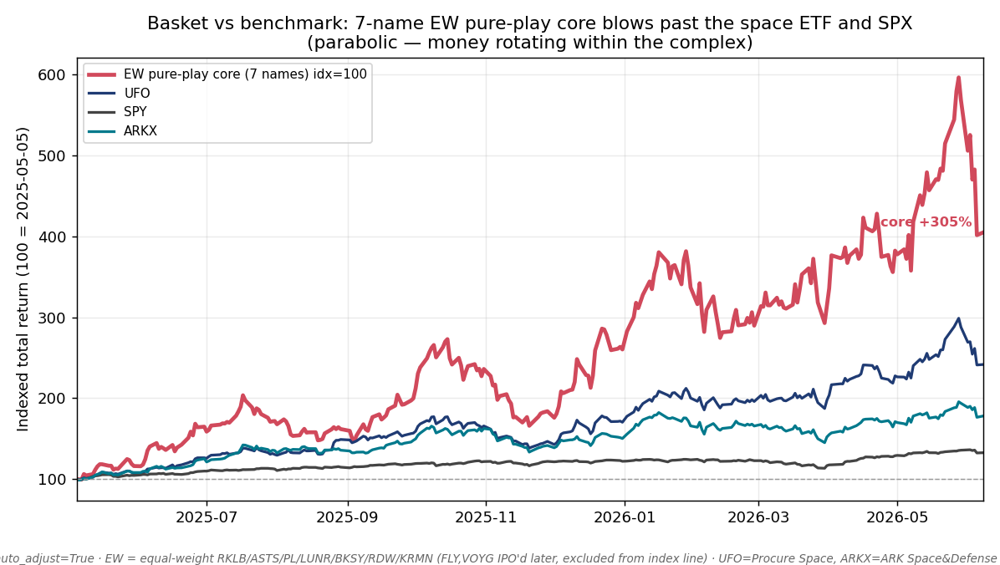
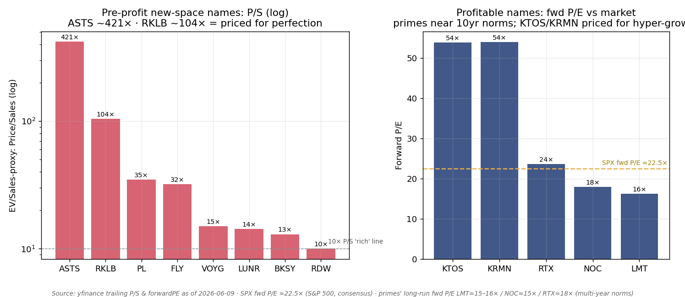
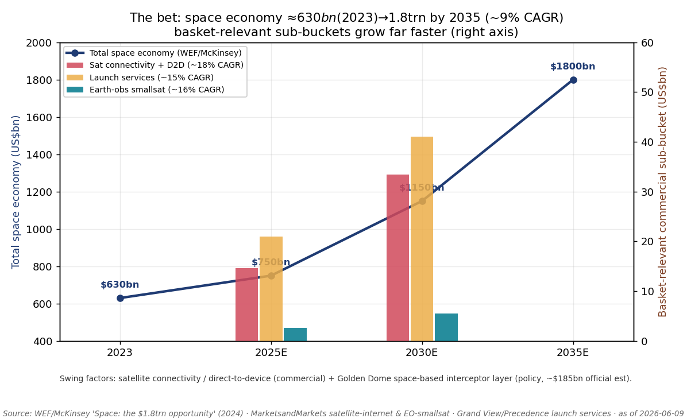

# New Space & Golden Dome / 商业航天与金穹

**Created:** 2026-06-09 · **Last refreshed:** 2026-06-09 · **Last mutated:** 2026-06-09 · **Refresh cadence:** monthly · **Languages tracked:** en

## What's New

*The delta since you last looked — newest refresh on top. Older entries collapse into the archive below.*

**2026-06-09 — basket created (13 tickers: 9 pure-play new-space core + 4 defense/Golden-Dome adjacent).**
- **Scope set:** pure-play "new-space" complex (launch, direct-to-device, Earth-obs, lunar/infrastructure, components) **plus** the defense/Golden-Dome layer (KTOS + primes LMT/NOC/RTX). Diversified primes are tagged `adjacent`, not `core`, because space is a minority of their revenue.
- **TAM anchor set:** global space economy ≈$630bn (2023) → **$1.8trn by 2035** (~9% CAGR), per [WEF/McKinsey, 2024](https://www.weforum.org/press/2024/04/space-economy-set-to-triple-to-1-8-trillion-by-2035-new-research-reveals/) (figure restated by [SpaceNexus](https://spacenexus.us/space-stats)).
- **Performance baseline:** 7-name equal-weight pure-play core **+305%** over the trailing ~13 months vs space-ETF UFO **+142%**, ARKX **+78%**, defense-ETF ITA **+42%**, SPY **+33%** ([yfinance auto_adjust, 2026-06-09]).
- **Priced-for-perfection flag raised:** ASTS ~421× and RKLB ~104× trailing P/S; both trade *above* consensus mean PT (i.e. negative implied upside) — the air-pocket risk if the connectivity/D2D sub-bucket disappoints.
- **Drift watch opened on KRMN** (−52% over 3 months, the basket's lone large laggard) and on the **prime/new-space gap** (defense group +24% 1Y vs core +135% — Golden Dome optionality not yet booked into prime share prices).

## Thesis

**Anchor — total space economy:** ≈$630bn (2023) → **$1.8 trillion by 2035** at ~9% CAGR, well above global GDP growth, per the [WEF/McKinsey "Space: the $1.8 trillion opportunity," 2024](https://www.mckinsey.com/industries/aerospace-and-defense/our-insights/space-the-1-point-8-trillion-dollar-opportunity-for-global-economic-growth) (the $1.8trn-by-2035 figure is also restated by [SpaceNexus](https://spacenexus.us/space-stats)); LEO constellations are projected to drive ~70% of the expansion ([WEF, 2024](https://www.weforum.org/press/2024/04/space-economy-set-to-triple-to-1-8-trillion-by-2035-new-research-reveals/)). The basket is a bet on the *commercial-services + new-defense* slice of that pool, not the GNSS-enabled-GDP backbone.

**Sub-bucket decomposition (named-forecaster, dated):**

| Sub-bucket (basket-relevant) | 2025E | 2030E | CAGR | Tracked names |
|---|---|---|---|---|
| Satellite connectivity / broadband + **direct-to-device** | ~$14.6bn | ~$33.4bn | ~18% | ASTS (D2D), launchers RKLB/FLY |
| Space launch services | ~$21bn | ~$41bn | ~15% | RKLB, FLY |
| Earth-observation smallsat | ~$2.6bn | ~$5.5bn | ~16% | PL, BKSY |
| Defense / national-security space (Golden Dome) | $13.4bn FY26 approp. → ~$185bn official program est. | — | n/a | LMT, NOC, RTX, KTOS + suppliers RKLB/RDW/KRMN |

Sources: satellite-internet $14.6bn→$33.4bn by 2030 ([MarketsandMarkets](https://www.marketsandmarkets.com/Market-Reports/satellite-internet-market-139239513.html)); launch services ~$21bn (2025) → ~$41bn (2030) ([Grand View](https://www.grandviewresearch.com/press-release/global-space-launch-services-market), [Precedence](https://www.precedenceresearch.com/press-release/space-launch-services-market)); EO smallsat $2.64bn→$5.52bn by 2030 ([MarketsandMarkets](https://www.marketsandmarkets.com/PressReleases/earth-observation-small-satellite.asp)); Golden Dome $13.4bn in the FY26 defense appropriation, official cost ~$185bn (CBO long-range $1.2trn/20yr) ([CBO, 2026-05](https://www.cbo.gov/system/files/2026-05/62379-golden-dome.pdf), [Defense One, 2026-05](https://www.defenseone.com/defense-systems/2026/05/golden-dome-cost-trillion-cbo/413485/)).

**Swing factors — two of them.** (1) *Commercial:* **satellite connectivity / direct-to-device** is both the fastest-growing sub-bucket (~18%) and the highest-beta name (ASTS) — a new category that either becomes a multi-hundred-million-subscriber business or a stranded constellation. (2) *Policy:* **Golden Dome**, whose space-based interceptor layer alone is ~70% of acquisition cost ([CBO, 2026-05](https://www.cbo.gov/system/files/2026-05/62379-golden-dome.pdf)) — a multi-hundred-billion-dollar option that, if it converts to awards, books revenue across primes *and* the new-space suppliers (RKLB/RDW/KRMN). A revision to either swing factor moves the headline most.

**Value-chain / process-step map (one layer per name):** launch — RKLB, FLY · direct-to-device connectivity — ASTS · Earth-observation / geospatial intel — PL, BKSY · lunar / space stations / infrastructure — LUNR, VOYG, RDW · mission-critical components (fairings, propulsion, structures) — KRMN, RDW · defense primes / missile-defense integrators ("shooters" & sensors) — LMT, NOC, RTX, KTOS. The bet is that the SpaceX-IPO halo, the FCC's spectrum opening, and the Golden Dome appropriation pull commercial *and* defense demand up the same supply chain at once ([24/7 Wall St, 2026-05](https://247wallst.com/investing/2026/05/22/ast-spacemobile-jumps-7-rocket-lab-climbs-6-planet-labs-rises-4-space-stocks-resume-their-climb/)).

*Conviction (sourced, consensus): implied upside-to-mean-PT ranks the **beaten-down** names highest — KRMN +113%, KTOS +96%, LUNR +37%, FLY +33% — while the **leaders trade above consensus PT** (RKLB −7%, ASTS −11%) ([yfinance consensus, 2026-06-09]; n=7–22 analysts/name). That inversion is the priced-for-perfection signal, not a ranking the analyst invented.*

## Scope rules

**In:** pure-play commercial-space operators and suppliers (launch, satellite connectivity/D2D, Earth observation, lunar/cislunar, space stations, mission-critical space hardware); defense names where space / missile-defense (Golden Dome) is a *named, growing* program line.

**Out:** diversified aerospace primes with no disclosed space/Golden-Dome growth line (Boeing — distressed commercial-aero dominates); pure satellite-comms *incumbents* (IRDM/GSAT/VSAT — considered, parked as a separate satcom sleeve per the user's defense-tilt scope choice); private leaders that aren't investable on public markets (SpaceX, Maxar). Primes (LMT/NOC/RTX) are admitted only as `adjacent` — space is a minority of revenue, so they are basket *ballast*, not the signal.

## Tracked tickers

| Ticker | Name | Role | Justification | Added |
|---|---|---|---|---|
| RKLB | Rocket Lab | core | **Launch + space systems.** Moat: only Western small-launch provider with a proven high-cadence orbital record (Electron) *and* a vertically-integrated systems arm (Photon, solar, reaction wheels); Q1'26 revenue $200M, +64% YoY, record $2.2bn backlog ([24/7 Wall St, 2026-05](https://247wallst.com/investing/2026/05/28/intuitive-machines-rallies-9-rocket-lab-and-planet-labs-decline-in-space-stock-divergence/)). Threat: medium-lift **Neutron is unproven** — a slip or failure vs SpaceX Falcon-9 reusability strands the growth thesis; still GAAP-unprofitable, funding Neutron via ATM dilution ([Motley Fool, 2026-05](https://www.fool.com/coverage/better-buy/2026/05/26/ast-spacemobile-vs-rocket-lab-which-space-stock-is-a-better-buy-in-2026/)). | 2026-06-09 |
| ASTS | AST SpaceMobile | core | **Direct-to-device (swing-factor sub-bucket).** Moat: only LEO operator with large phased-array BlueBird satellites delivering broadband to *unmodified* smartphones; ~60 MNO partners (AT&T, Verizon, Vodafone, Rakuten) covering 3bn+ subscribers ([Motley Fool, 2026-05](https://www.fool.com/coverage/better-buy/2026/05/26/ast-spacemobile-vs-rocket-lab-which-space-stock-is-a-better-buy-in-2026/)). Threat: **SpaceX Starlink Direct-to-Cell (T-Mobile)** is the 800-lb competitor; Q1'26 net loss $191M, revenue missed consensus by ~60%, still effectively pre-revenue at scale with heavy capex to fill the constellation. | 2026-06-09 |
| PL | Planet Labs | core | **Earth observation.** Moat: largest EO fleet (Dove/Pelican/SkySat) and a daily global-imaging archive that is hard to replicate; RPO **+361% to $672M** on defense/intel wins (NGA, NRO, NASA, U.S. Navy, NATO) ([StockTitan](https://www.stocktitan.net/stocks/themes/space-stocks)). Threat: BlackSky/Maxar/ICEYE and cheap SAR entrants; government-contract concentration — after a +461% 1Y print, any contract slip de-rates hard. | 2026-06-09 |
| LUNR | Intuitive Machines | core | **Lunar / cislunar infrastructure.** Moat: first commercial lunar lander (IM-1/IM-2) plus NASA CLPS and lunar-comms/relay awards; record ~$1.1bn backlog ([24/7 Wall St, 2026-04](https://247wallst.com/investing/2026/04/16/rocket-lab-surges-9-intuitive-machines-jumps-6-as-space-sector-catches-fire-on-nasa-contracts-and-new-tech/)). Threat: **lander reliability** (IM-1 tipped on landing); NASA budget / Artemis-schedule risk; Firefly Blue Ghost competing for the same CLPS dollars. | 2026-06-09 |
| BKSY | BlackSky | core | **High-revisit Earth-obs + analytics.** Moat: rapid-revisit small-sat imaging with Spectra AI analytics serving defense/intel customers; the lone consensus *strong-buy* in the group ([yfinance, 2026-06-09]). Threat: smaller fleet than Planet; same government-concentration and well-capitalized-entrant risk ([24/7 Wall St, 2026-05](https://247wallst.com/investing/2026/05/22/ast-spacemobile-jumps-7-rocket-lab-climbs-6-planet-labs-rises-4-space-stocks-resume-their-climb/)). | 2026-06-09 |
| FLY | Firefly Aerospace | core | **Launch + lunar.** Moat: Alpha small-launch + Blue Ghost lunar lander (a successful Moon landing) + MLV medium-lift co-developed with Northrop; 2026 guide $420–450M (~80% booked), $1.4bn backlog ([TheStreet](https://www.thestreet.com/investing/new-space-stock-turns-heads-with-10-billion-ipo-surprise)). Threat: **Alpha reliability** — a stage exploded in testing and the stock halved post-IPO ([CNBC, 2025-08-07](https://www.cnbc.com/2025/08/07/rocket-maker-firefly-aerospace-fly-stock-ipo.html)); cash burn; the same SpaceX shadow over launch economics. | 2026-06-09 |
| RDW | Redwire | enabler | **Space infrastructure & components.** Moat: flight-proven deployable structures, solar arrays and digital-engineering, plus (post-Edge Autonomy) drones — supplier content inside many primes' programs ([exoswan](https://exoswan.com/space-technology-stocks/)). Threat: component **commoditization / thin margins** and lumpy program timing; after +101% in 3 months ([yfinance, 2026-06-09]) the multiple discounts flawless execution. | 2026-06-09 |
| VOYG | Voyager Technologies | adjacent | **Space stations + defense.** Moat: Starlab commercial space station (NASA-funded ISS successor) plus a national-security systems segment; FY26 guide $230–255M, +38–53% YoY ([Investing.com](https://www.investing.com/equities/voyager-technologies)). Threat: **Starlab is years from revenue** and competes with Axiom / Vast / Blue Origin's Orbital Reef; ISS-deorbit timing risk could move the whole station market's clock ([Yahoo Finance](https://finance.yahoo.com/quote/VOYG/)). | 2026-06-09 |
| KRMN | Karman Holdings | enabler | **Mission-critical hardware** (payload fairings, propulsion, adapters for rockets/missiles/spacecraft). Moat: embedded, often sole-source content across launch *and* missile programs, and — rare in this group — **already profitable**: Q3 revenue $122M, +42% YoY, $758M funded backlog ([exoswan](https://exoswan.com/space-technology-stocks/)). Threat: −52% over 3 months on a post-lockup valuation reset ([yfinance, 2026-06-09]); customer concentration; **prime insourcing** of components. | 2026-06-09 |
| KTOS | Kratos Defense | adjacent | **Defense-tech / hypersonics / space & Golden Dome.** Moat: low-cost tactical drones, hypersonic targets, satellite ground systems and propulsion — a named participant across the Golden Dome ecosystem ([heygotrade](https://www.heygotrade.com/en/blog/space-stocks-rklb-asts-lunr-spacex-ipo/)). Threat: lumpy DoD budgets and program-of-record dependence; at ~54× forward P/E ([yfinance, 2026-06-09]) the stock prices a flawless Golden Dome ramp. | 2026-06-09 |
| LMT | Lockheed Martin | adjacent | **Prime — missile defense + military space.** Moat: prime integrator across THAAD / PAC-3 / Aegis missile defense and military satellites; named among reported Golden Dome awardees ([Army Recognition, 2026](https://www.armyrecognition.com/news/army-news/2026/u-s-invests-17-9-billion-in-golden-dome-air-and-missile-defense-system-to-counter-china-russia-threats)). Threat: **space is a minority of a slow-growth prime**; F-35/program margin pressure; consensus rating only *hold* ([yfinance, 2026-06-09]). | 2026-06-09 |
| NOC | Northrop Grumman | adjacent | **Prime — most space-levered of the majors.** Moat: large Space Systems segment (military satellites, SLS boosters), Sentinel ICBM, and a named Golden Dome role ([Army Recognition, 2026](https://www.armyrecognition.com/news/army-news/2026/u-s-invests-17-9-billion-in-golden-dome-air-and-missile-defense-system-to-counter-china-russia-threats)). Threat: **Sentinel cost overruns**; diluted by aeronautics; Golden Dome dollars still mostly appropriated, not yet awarded ([Defense One, 2026-05](https://www.defenseone.com/defense-systems/2026/05/golden-dome-cost-trillion-cbo/413485/)). | 2026-06-09 |
| RTX | RTX | adjacent | **Prime — the "shooter" (Raytheon effectors).** Moat: Raytheon's SM-3/SM-6 interceptors and Glide Phase Interceptor are the effector layer Golden Dome must buy; Collins/Pratt diversify the base ([Army Recognition, 2026](https://www.armyrecognition.com/news/army-news/2026/u-s-invests-17-9-billion-in-golden-dome-air-and-missile-defense-system-to-counter-china-russia-threats)). Threat: **space/missile-defense is a small slice**; commercial-aero cyclicality; Golden Dome funding still nascent — no large public awards as of late 2025 ([Defense One, 2026-05](https://www.defenseone.com/defense-systems/2026/05/golden-dome-cost-trillion-cbo/413485/)). | 2026-06-09 |

## Valuation snapshot

In-file mirror of the consensus picture (the structured PT store at `/pt` had **no** prior sell-side note on these names this build — see Data Used). Pre-profit new-space names are valued on **P/S** (the whole group is GAAP-unprofitable except KRMN); profitable names on **forward P/E**. Ratings/targets are yfinance **consensus** (analyst count in parentheses), not a single broker note.

| Ticker | Rating | Price | Mean PT | Upside | Fwd multiple | Own ~history avg | Forward metric |
|---|---|---|---|---|---|---|---|
| RKLB | buy (16) | $113.65 | $105.28 | **−7%** | P/S ~104× | n/a — pre-profit, ~5y public | fwd EPS negative |
| ASTS | hold (9) | $92.06 | $82.02 | **−11%** | P/S ~421× | n/a — pre-revenue at scale | fwd EPS negative |
| PL | buy (10) | $32.74 | $39.80 | +22% | P/S ~35× | n/a | fwd EPS ~breakeven |
| LUNR | buy (9) | $29.74 | $40.78 | +37% | P/S ~14× | n/a | fwd EPS negative |
| BKSY | strong-buy (7) | $34.28 | $40.50 | +18% | P/S ~13× | n/a | fwd EPS negative |
| FLY | buy (8) | $36.18 | $48.00 | +33% | P/S ~32× | n/a — IPO'd Aug'25 | fwd EPS negative |
| RDW | buy (9) | $18.57 | $15.67 | **−16%** | P/S ~10× | n/a | fwd EPS negative |
| VOYG | buy (10) | $42.42 | $43.70 | +3% | P/S ~15× | n/a — IPO'd Jun'25 | fwd EPS negative |
| KRMN | buy (10) | $49.64 | $105.60 | **+113%** | fwd P/E ~54× | n/a — IPO'd Feb'25 | profitable |
| KTOS | buy (20) | $57.73 | $113.05 | **+96%** | fwd P/E ~54× | well above its own multi-year norm | FY1/FY2 EPS growing |
| LMT | hold (19) | $520.07 | $625.16 | +20% | fwd P/E ~16× | ≈15–16× (multi-year norm) | FY1/FY2 EPS |
| NOC | buy (21) | $540.81 | $696.95 | +29% | fwd P/E ~18× | ≈15× (multi-year norm) | FY1/FY2 EPS |
| RTX | buy (22) | $178.66 | $215.73 | +21% | fwd P/E ~24× | ≈18× (multi-year norm) | FY1/FY2 EPS |

All prices, multiples and consensus targets: [yfinance, 2026-06-09]. **Read:** the rich-multiple *leaders* (RKLB, ASTS) and the hottest mover (RDW) trade *above* consensus PT; the names with the largest implied upside are the *beaten-down* ones (KRMN, KTOS). That inversion is the priced-for-perfection tell — see Drift signals.

## Exclusions

| Ticker | Reason |
|---|---|
| SpaceX (private) | The category leader and the single biggest catalyst (an IPO would re-rate the whole complex), but not investable on public markets — tracked as a catalyst, not a holding ([CNBC, 2025-08](https://www.cnbc.com/2025/08/08/investing-in-space-space-ipos-are-rearing-their-heads-again-.html)). |
| BA (Boeing) | Space (Starliner, satellites) is a small fraction; distressed commercial-aero and defense-charge noise dominate the tape. |
| Maxar | Taken private in 2023 — no public listing to track. |
| IRDM / GSAT / VSAT | Satellite-comms *incumbents*; considered and parked as a separate satcom sleeve per the chosen defense-tilt scope. Candidate adds via mutation if the user wants the satcom angle. |
| YORK (York Space) | IPO'd Jan'26 on the Golden Dome theme ([CNBC, 2026-01-29](https://www.cnbc.com/2026/01/29/york-space-stock-trading-trump-golden-dome.html)); too thin a trading history to size yet — watch-list candidate for a future mutation. |

## Keywords

space economy / 商业航天 · LEO broadband / 低轨宽带 · direct-to-device / 手机直连卫星 · reusable launch / 可复用火箭 · Earth observation / 对地观测 · geospatial intelligence / 地理空间情报 · lunar lander / 月球着陆器 · space station / 空间站 · Golden Dome / 金穹 · missile defense / 导弹防御 · space-based interceptor / 天基拦截器 · SpaceX IPO

## Performance

*Window: 2025-05-05 → 2026-06-08 (~13 months), yfinance auto_adjust=True. Benchmark required and stated below.*

**Basket vs benchmark (indexed, ~13 months):** the 7-name equal-weight pure-play core (RKLB/ASTS/PL/LUNR/BKSY/RDW/KRMN — the names with full history; FLY/VOYG IPO'd later) returned **+305%**, vs **UFO +142%** (Procure Space ETF), **ARKX +78%** (ARK Space & Defense), **ITA +42%** (defense), and **SPY +33%**. So the basket roughly **doubled the space ETF and 9×'d the S&P** — a parabola, with money rotating *within* the complex rather than leaving it ([24/7 Wall St, 2026-05](https://247wallst.com/investing/2026/05/28/intuitive-machines-rallies-9-rocket-lab-and-planet-labs-decline-in-space-stock-divergence/)).

**Per-name (trailing returns, yfinance 2026-06-09):**

| Ticker | 1Y | 3M | 1M | Note |
|---|---|---|---|---|
| PL | **+461%** | +29% | −16% | biggest 1Y; consolidating |
| RKLB | **+293%** | +65% | +8% | Neutron run-up |
| ASTS | **+195%** | +5% | +23% | re-accelerating |
| BKSY | +166% | +43% | −13% | |
| LUNR | +154% | +68% | +3% | NASA backlog |
| KTOS | +43% | −35% | 0% | defense, faded off highs |
| RTX | +31% | −13% | +2% | prime |
| NOC | +12% | −26% | −1% | prime, Sentinel overhang |
| LMT | +11% | −20% | +3% | prime, *hold* |
| KRMN | +7% | **−52%** | −18% | lone large laggard |
| RDW | +1% (1Y) | **+101%** | +68% | dormant→ripped on infra/Edge |
| FLY | −40% (since IPO Aug'25) | +87% | −9% | redemption rally off the post-IPO halving |
| VOYG | −25% (since IPO Jun'25) | +50% | +43% | catching up |

Equal-weight core (9 pure-plays) trailing-1Y **mean +135% / median +154%**; core-plus-defense (13) mean **+101%**; the four defense names as a group **+24%** — the ballast that keeps the blended basket from being pure beta to four parabolic charts.

## Recent events

- **2026-05 — SpaceX-IPO halo lifts the complex.** Reports of an imminent SpaceX listing sent RKLB +57% in a session and dragged the whole group up ([Motley Fool, 2026-05-14](https://www.fool.com/investing/2026/05/14/rocket-lab-leads-space-rally-with-57-gain-followin/)). A later report that the IPO valuation might land *below* $2trn knocked ASTS/RKLB/RDW/LUNR back overnight ([Stocktwits, 2026-05](https://stocktwits.com/news-articles/markets/equity/asts-rklb-rdw-lunr-spacex-ipo-valuation/cZgSiKvRetr)).
- **2026 — FCC opens spectrum for satellite broadband.** A rule easing satellite-broadband spectrum sent ASTS/RKLB/FLY/LUNR higher — a direct read-through to the connectivity sub-bucket ([Stocktwits](https://stocktwits.com/news-articles/markets/equity/asts-rklb-fly-lunr-stocks-rally-fcc-satellite-broadband-spectrum-rule/cZQNqL1ReIK)).
- **2026-05 — CBO prices Golden Dome at $1.2trn over 20 years**, against a ~$185bn official estimate and a $175bn White House figure; the space-based interceptor layer is ~70% of acquisition cost ([CBO, 2026-05](https://www.cbo.gov/system/files/2026-05/62379-golden-dome.pdf), [Defense One, 2026-05](https://www.defenseone.com/defense-systems/2026/05/golden-dome-cost-trillion-cbo/413485/)).
- **2026-02-03 — FY26 defense appropriation includes $13.4bn for space & missile-defense / Golden Dome** ([Army Recognition, 2026](https://www.armyrecognition.com/news/army-news/2026/u-s-invests-17-9-billion-in-golden-dome-air-and-missile-defense-system-to-counter-china-russia-threats)); SpaceX reportedly "set to receive" a ~$2bn, 600-satellite missile-tracking contract, with smaller space-based-interceptor awards to Anduril/LMT/NOC/True Anomaly reported "in secret" in late Nov 2025 ([Golden Dome overview](https://en.wikipedia.org/wiki/Golden_Dome_(missile_defense_system))).
- **Q1'26 prints:** RKLB revenue $200M, +64% YoY, $2.2bn backlog, Neutron debut later in 2026; PL RPO +361% to $672M; LUNR backlog ~$1.1bn ([24/7 Wall St, 2026-05](https://247wallst.com/investing/2026/05/28/intuitive-machines-rallies-9-rocket-lab-and-planet-labs-decline-in-space-stock-divergence/)). ASTS Q1'26 net loss $191M with revenue ~60% below consensus ([Motley Fool, 2026-05](https://www.fool.com/coverage/better-buy/2026/05/26/ast-spacemobile-vs-rocket-lab-which-space-stock-is-a-better-buy-in-2026/)).
- **2026-01-29 — York Space IPO** on the Golden Dome theme — evidence the space-IPO window is still open ([CNBC, 2026-01-29](https://www.cnbc.com/2026/01/29/york-space-stock-trading-trump-golden-dome.html)).

## Drift signals

*The value-add of every refresh. As of the 2026-06-09 baseline:*

- **Priced-for-perfection / air-pocket flag (high).** ASTS ~421× and RKLB ~104× trailing P/S; both — plus the hottest mover RDW — trade *above* consensus mean PT ([yfinance, 2026-06-09]). The demand assumption whose disappointment de-rates them first is the **connectivity/D2D sub-bucket** (~18% CAGR anchor): if SpaceX Starlink Direct-to-Cell captures the D2D category, or ASTS's commercial ramp slips, the highest-beta names lose the most. See the valuation chart below.
  
- **Internal rotation, not exit.** The group's leadership rotated this quarter — RDW +101%/3M, LUNR +68%/3M, FLY +87%/3M and VOYG +50%/3M caught up while RKLB/ASTS digested gains; capital is moving *within* the complex ([24/7 Wall St, 2026-05](https://247wallst.com/investing/2026/05/28/intuitive-machines-rallies-9-rocket-lab-and-planet-labs-decline-in-space-stock-divergence/)). A refresh should watch whether leadership stays broad or narrows back to the two mega-caps.
- **KRMN outlier (−52%/3M vs basket).** The lone large laggard — a post-lockup/valuation reset on an otherwise *profitable* name with $758M backlog and +113% implied upside-to-consensus ([yfinance, 2026-06-09]). Re-ground the justification next refresh; if the operating story is intact, the drift is valuation, not thesis.
- **Prime ↔ new-space gap (the Golden Dome "show-me").** Defense group +24% 1Y vs core +135% — the Golden Dome *option* is appropriated but **not yet booked into prime share prices** (no large public awards as of late 2025) ([Defense One, 2026-05](https://www.defenseone.com/defense-systems/2026/05/golden-dome-cost-trillion-cbo/413485/)). First real award announcements are the catalyst that closes the gap (in either direction).
- **New-entrant watch (mutation candidates, not auto-added):** **YORK** (York Space, IPO Jan'26, Golden Dome-levered) and the parked satcom incumbents **IRDM/GSAT/VSAT**. Add only on user confirmation per the no-silent-mutation rule.
- **Macro regime risk.** The basket is a risk-on bet that lives or dies with the regime: VIX 21.5, HY OAS 2.74%, IG OAS 0.74%, 10Y 4.54% (tight credit, contained vol) as of 2026-06-07 ([indicators.db]). A 100–400× sales basket is the first thing sold if credit spreads gap or vol spikes — track the macro line every refresh.

## Leading indicators

*Upstream signals that move BEFORE the member stocks — the first places the thesis cracks. Not the share prices.*

1. **Global launch cadence / reusable share** — leads the launch-services sub-bucket and RKLB/FLY revenue. As of 2024, **>60% of orbital launches used reusable tech** ([Grand View](https://www.grandviewresearch.com/press-release/global-space-launch-services-market)); RKLB Neutron's first flight is guided "later 2026." Rising third-party cadence = manifest/pricing tailwind; a stall is the first crack.
2. **Golden Dome appropriations → awards conversion** — leads prime *and* supplier (RKLB/RDW/KRMN) bookings. $13.4bn appropriated for FY26; the SpaceX ~$2bn missile-tracking award and the "in-secret" interceptor awards to Anduril/LMT/NOC are the leading prints to watch ([Army Recognition, 2026](https://www.armyrecognition.com/news/army-news/2026/u-s-invests-17-9-billion-in-golden-dome-air-and-missile-defense-system-to-counter-china-russia-threats), [Golden Dome overview](https://en.wikipedia.org/wiki/Golden_Dome_(missile_defense_system))). Appropriated-but-unawarded is the current state.
3. **D2D commercial traction + FCC spectrum** — leads ASTS revenue (the swing factor). Watch commercial-service launches with AT&T/Verizon and FCC spectrum decisions ([Stocktwits](https://stocktwits.com/news-articles/markets/equity/asts-rklb-fly-lunr-stocks-rally-fcc-satellite-broadband-spectrum-rule/cZQNqL1ReIK)); the satellite-internet pool is forecast $14.6bn→$33.4bn by 2030 ([MarketsandMarkets](https://www.marketsandmarkets.com/Market-Reports/satellite-internet-market-139239513.html)).
4. **Defense/intel EO RPO & bookings** — leads PL/BKSY revenue. PL's RPO **+361% to $672M** (NGA/NRO) is the read on whether the geospatial-intel budget is still expanding ([StockTitan](https://www.stocktitan.net/stocks/themes/space-stocks)).

**Side-by-side member guidance on the shared forward metric (FY2026 revenue / backlog):** RKLB on a $2.2bn backlog · ASTS guide **$150–200M** · FLY guide **$420–450M** (~80% booked) · VOYG guide **$230–255M** (+38–53%) · KRMN $758M funded backlog · LUNR ~$1.1bn backlog ([24/7 Wall St, 2026-05](https://247wallst.com/investing/2026/05/28/intuitive-machines-rallies-9-rocket-lab-and-planet-labs-decline-in-space-stock-divergence/), [Investing.com](https://www.investing.com/equities/voyager-technologies)). These are the prints the multiples are discounting — a guide cut here cracks before the price does.

## Catalysts (next 3–6 months)

- **RKLB Neutron first flight (2H2026)** *(maiden medium-lift reusable launch → if it works, unlocks the launch-services sub-bucket + national-security manifest and re-rates RKLB; if it fails, cracks the highest-weight core name)* — the basket's single biggest company-specific event ([Motley Fool, 2026-05](https://www.fool.com/coverage/better-buy/2026/05/26/ast-spacemobile-vs-rocket-lab-which-space-stock-is-a-better-buy-in-2026/)).
- **SpaceX IPO / Starlink listing (rumored 2026)** *(comp re-rating + capital rotation → lifts the whole complex if it prices well; the <$2trn-valuation report already triggered a one-day pullback)* — affects every name in the basket ([Stocktwits, 2026-05](https://stocktwits.com/news-articles/markets/equity/asts-rklb-rdw-lunr-spacex-ipo-valuation/cZgSiKvRetr)).
- **First large public Golden Dome awards (1H–2H 2026)** *(appropriated $13.4bn converting to contracts → books revenue at LMT/NOC/RTX/KTOS and suppliers RKLB/RDW/KRMN; the space-based layer is ~70% of cost)* — the catalyst that closes the prime↔new-space gap ([CBO, 2026-05](https://www.cbo.gov/system/files/2026-05/62379-golden-dome.pdf), [Army Recognition, 2026](https://www.armyrecognition.com/news/army-news/2026/u-s-invests-17-9-billion-in-golden-dome-air-and-missile-defense-system-to-counter-china-russia-threats)).
- **ASTS commercial D2D launch + further FCC spectrum (2026)** *(first paid service with AT&T/Verizon → validates or invalidates the direct-to-device category, the commercial swing-factor sub-bucket)* — moves the highest-beta name ([Stocktwits](https://stocktwits.com/news-articles/markets/equity/asts-rklb-fly-lunr-stocks-rally-fcc-satellite-broadband-spectrum-rule/cZQNqL1ReIK)).
- **FY26 earnings prints — FLY / KRMN / LUNR** *(each tests the guide its multiple already discounts: FLY's $420–450M and Alpha reliability, KRMN's post-drawdown reset, LUNR's next lunar mission)* — the show-me quarters ([TheStreet](https://www.thestreet.com/investing/new-space-stock-turns-heads-with-10-billion-ipo-surprise)).

## Data Used / 数据来源清单

**Market data**
- yfinance auto_adjust=True for prices, returns, market cap, sector, forward P/E and trailing P/S — pulled 2026-06-09 (price series through 2026-06-08).
- Consensus ratings, mean/high/low price targets and analyst counts: yfinance, 2026-06-09.

**Per-ticker primary / event sources**
- RKLB, LUNR, PL, ASTS: Q1'26 metrics and backlog ([24/7 Wall St, 2026-05](https://247wallst.com/investing/2026/05/28/intuitive-machines-rallies-9-rocket-lab-and-planet-labs-decline-in-space-stock-divergence/); [Motley Fool, 2026-05](https://www.fool.com/coverage/better-buy/2026/05/26/ast-spacemobile-vs-rocket-lab-which-space-stock-is-a-better-buy-in-2026/)).
- FLY: IPO and guidance ([CNBC, 2025-08-07](https://www.cnbc.com/2025/08/07/rocket-maker-firefly-aerospace-fly-stock-ipo.html); [TheStreet](https://www.thestreet.com/investing/new-space-stock-turns-heads-with-10-billion-ipo-surprise)).
- VOYG: Starlab + FY26 guide ([Investing.com](https://www.investing.com/equities/voyager-technologies); [Yahoo Finance](https://finance.yahoo.com/quote/VOYG/)).
- KRMN, RDW, BKSY, KTOS: positioning ([exoswan](https://exoswan.com/space-technology-stocks/); [StockTitan](https://www.stocktitan.net/stocks/themes/space-stocks); [heygotrade](https://www.heygotrade.com/en/blog/space-stocks-rklb-asts-lunr-spacex-ipo/)).
- LMT/NOC/RTX: Golden Dome roles ([Army Recognition, 2026](https://www.armyrecognition.com/news/army-news/2026/u-s-invests-17-9-billion-in-golden-dome-air-and-missile-defense-system-to-counter-china-russia-threats); [Defense One, 2026-05](https://www.defenseone.com/defense-systems/2026/05/golden-dome-cost-trillion-cbo/413485/)).

**Industry research / TAM anchor (theme-level)**
- WEF/McKinsey "Space: the $1.8 trillion opportunity," 2024 — anchor + LEO-70% driver ([WEF press](https://www.weforum.org/press/2024/04/space-economy-set-to-triple-to-1-8-trillion-by-2035-new-research-reveals/); [McKinsey](https://www.mckinsey.com/industries/aerospace-and-defense/our-insights/space-the-1-point-8-trillion-dollar-opportunity-for-global-economic-growth)).
- Sub-buckets: satellite-internet ([MarketsandMarkets](https://www.marketsandmarkets.com/Market-Reports/satellite-internet-market-139239513.html)), launch services ([Grand View](https://www.grandviewresearch.com/press-release/global-space-launch-services-market); [Precedence](https://www.precedenceresearch.com/press-release/space-launch-services-market)), EO smallsat ([MarketsandMarkets](https://www.marketsandmarkets.com/PressReleases/earth-observation-small-satellite.asp)), Golden Dome ([CBO, 2026-05](https://www.cbo.gov/system/files/2026-05/62379-golden-dome.pdf)).

**Leading indicators (theme-level)**
- Launch cadence / reusable share ([Grand View](https://www.grandviewresearch.com/press-release/global-space-launch-services-market)); Golden Dome appropriations→awards ([Army Recognition, 2026](https://www.armyrecognition.com/news/army-news/2026/u-s-invests-17-9-billion-in-golden-dome-air-and-missile-defense-system-to-counter-china-russia-threats)); D2D/FCC spectrum ([Stocktwits](https://stocktwits.com/news-articles/markets/equity/asts-rklb-fly-lunr-stocks-rally-fcc-satellite-broadband-spectrum-rule/cZQNqL1ReIK)); EO RPO ([StockTitan](https://www.stocktitan.net/stocks/themes/space-stocks)).

**Macro backdrop**
- VIX 21.5, VVIX 102, MOVE 75.2, SKEW 152, HY OAS 2.74%, IG OAS 0.74%, 10Y 4.54%, 2Y 4.05% — as of 2026-06-07. Source: `indicators.db`.

**Benchmarks**
- UFO (Procure Space ETF), ARKX (ARK Space & Defense Innovation), ITA (iShares US Aerospace & Defense), SPY — yfinance, 2026-06-09.

**Stores written (Tier-2 helpers)**
- `stock_price_target_db` — **none** this build. No single-broker sell-side note was mined (only yfinance *consensus*, which has no named research_institute/file_id to persist). When a refresh surfaces a named note (zsxq PDF or cited broker), it will be upserted via `stock_price_target_db.upsert_target(...)` and surfaced at `/pt`.

**Stale notices / coverage gaps**
- No company 10-K/10-Q/IR deck was read directly for this baseline — justifications lean on dated secondary sources (Q1'26 recaps). First monthly refresh should pull each name's latest filing/IR deck to re-ground the metrics.
- Prime "own ~10yr-avg" P/E is an approximate multi-year norm (LMT≈15–16×, NOC≈15×, RTX≈18×), not a single sourced figure — tighten with a sourced history next refresh.

## References

- WEF, *Space economy set to triple to $1.8 trillion by 2035*, 2024 — https://www.weforum.org/press/2024/04/space-economy-set-to-triple-to-1-8-trillion-by-2035-new-research-reveals/
- McKinsey, *Space: the $1.8 trillion opportunity*, 2024 — https://www.mckinsey.com/industries/aerospace-and-defense/our-insights/space-the-1-point-8-trillion-dollar-opportunity-for-global-economic-growth
- SpaceNexus, *Space industry statistics & facts* (restates $1.8trn-by-2035) — https://spacenexus.us/space-stats
- MarketsandMarkets, *Satellite Internet Market* — https://www.marketsandmarkets.com/Market-Reports/satellite-internet-market-139239513.html
- MarketsandMarkets, *Earth Observation Small Satellite* — https://www.marketsandmarkets.com/PressReleases/earth-observation-small-satellite.asp
- Grand View, *Space Launch Services Market* — https://www.grandviewresearch.com/press-release/global-space-launch-services-market
- Precedence Research, *Space Launch Services Market* — https://www.precedenceresearch.com/press-release/space-launch-services-market
- CBO, *Golden Dome cost estimate*, 2026-05 — https://www.cbo.gov/system/files/2026-05/62379-golden-dome.pdf
- Defense One, *Golden Dome plan would cost $1.2 trillion, CBO finds*, 2026-05 — https://www.defenseone.com/defense-systems/2026/05/golden-dome-cost-trillion-cbo/413485/
- Army Recognition, *US $17.9B Golden Dome in FY27 budget*, 2026 — https://www.armyrecognition.com/news/army-news/2026/u-s-invests-17-9-billion-in-golden-dome-air-and-missile-defense-system-to-counter-china-russia-threats
- Golden Dome (missile defense) — overview — https://en.wikipedia.org/wiki/Golden_Dome_(missile_defense_system)
- 24/7 Wall St, *Space stock divergence*, 2026-05-28 — https://247wallst.com/investing/2026/05/28/intuitive-machines-rallies-9-rocket-lab-and-planet-labs-decline-in-space-stock-divergence/
- 24/7 Wall St, *Space stocks resume their climb*, 2026-05-22 — https://247wallst.com/investing/2026/05/22/ast-spacemobile-jumps-7-rocket-lab-climbs-6-planet-labs-rises-4-space-stocks-resume-their-climb/
- 24/7 Wall St, *Space sector catches fire on NASA contracts*, 2026-04-16 — https://247wallst.com/investing/2026/04/16/rocket-lab-surges-9-intuitive-machines-jumps-6-as-space-sector-catches-fire-on-nasa-contracts-and-new-tech/
- Motley Fool, *Rocket Lab leads space rally with 57% gain*, 2026-05-14 — https://www.fool.com/investing/2026/05/14/rocket-lab-leads-space-rally-with-57-gain-followin/
- Motley Fool, *AST SpaceMobile vs Rocket Lab*, 2026-05-26 — https://www.fool.com/coverage/better-buy/2026/05/26/ast-spacemobile-vs-rocket-lab-which-space-stock-is-a-better-buy-in-2026/
- Stocktwits, *ASTS/RKLB/FLY/LUNR rally on FCC spectrum rule* — https://stocktwits.com/news-articles/markets/equity/asts-rklb-fly-lunr-stocks-rally-fcc-satellite-broadband-spectrum-rule/cZQNqL1ReIK
- Stocktwits, *Space names slip on SpaceX IPO valuation report* — https://stocktwits.com/news-articles/markets/equity/asts-rklb-rdw-lunr-spacex-ipo-valuation/cZgSiKvRetr
- CNBC, *Firefly Aerospace IPO*, 2025-08-07 — https://www.cnbc.com/2025/08/07/rocket-maker-firefly-aerospace-fly-stock-ipo.html
- CNBC, *York Space starts trading — Golden Dome*, 2026-01-29 — https://www.cnbc.com/2026/01/29/york-space-stock-trading-trump-golden-dome.html
- CNBC, *Space IPOs are rearing their heads again*, 2025-08-08 — https://www.cnbc.com/2025/08/08/investing-in-space-space-ipos-are-rearing-their-heads-again-.html
- TheStreet, *New space stock turns heads with $10bn IPO surprise* — https://www.thestreet.com/investing/new-space-stock-turns-heads-with-10-billion-ipo-surprise
- exoswan, *Top space technology stocks 2026* — https://exoswan.com/space-technology-stocks/
- StockTitan, *Space stocks theme* — https://www.stocktitan.net/stocks/themes/space-stocks
- heygotrade, *Space stocks RKLB, ASTS, LUNR* — https://www.heygotrade.com/en/blog/space-stocks-rklb-asts-lunr-spacex-ipo/
- Investing.com, *Voyager Technologies (VOYG)* — https://www.investing.com/equities/voyager-technologies
- Yahoo Finance, *Voyager Technologies (VOYG)* — https://finance.yahoo.com/quote/VOYG/

## Charts

## History

- 2026-06-09 — created with initial 13-ticker basket: 9 pure-play new-space core (RKLB, ASTS, PL, LUNR, BKSY, FLY core; RDW, KRMN enabler; VOYG adjacent) + 4 defense/Golden-Dome adjacent (KTOS, LMT, NOC, RTX).
- 2026-06-09 — first refresh/data pass (yfinance prices & multiples, consensus PTs, indicators.db macro, 3 charts rendered).
