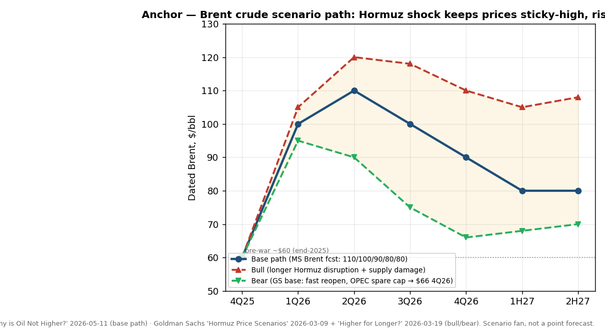
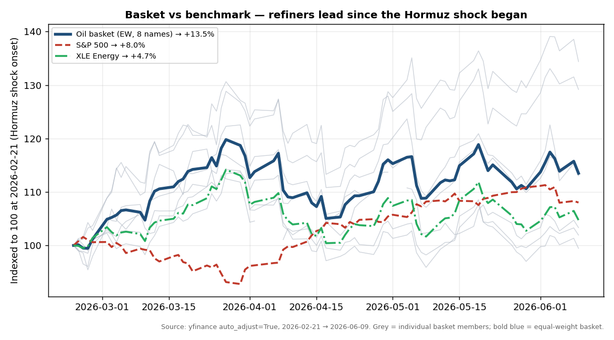
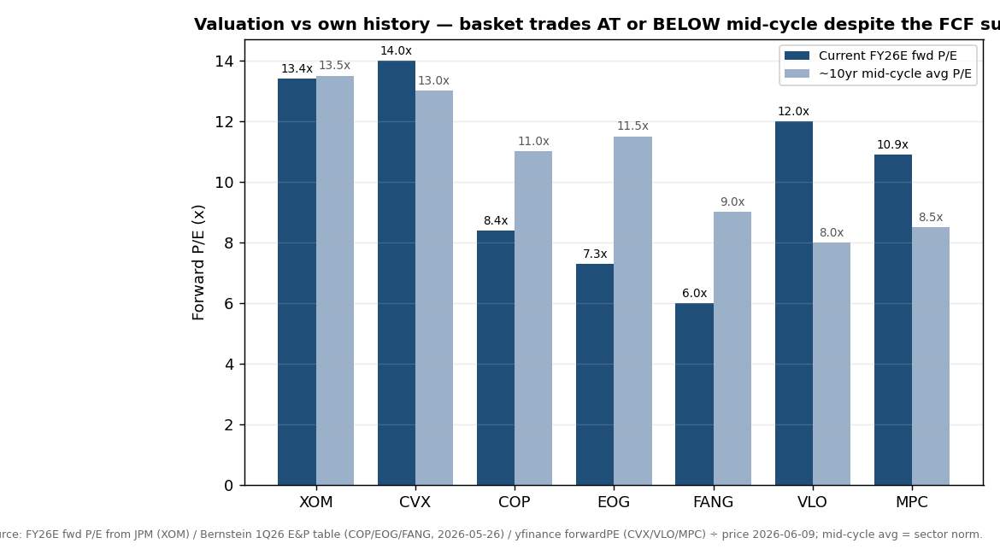
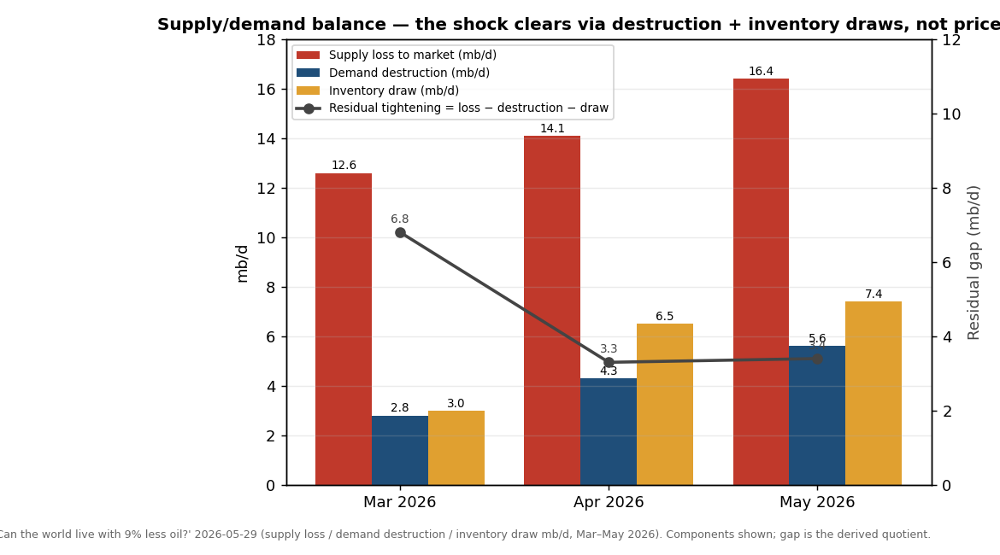

# Oil & Gas / Hormuz Energy Shock — E&P / Refining / Majors

**Created:** 2026-06-10 · **Last refreshed:** 2026-06-10 · **Last mutated:** 2026-06-10 · **Refresh cadence:** monthly · **Languages tracked:** en

## What's New

*The delta since you last looked — newest refresh on top. Older entries collapse into the archive below so this stays short.*

**2026-06-10 — basket created** (8 tickers: XOM/CVX integrated, COP/EOG/FANG/CNOOC E&P, VLO/MPC refining).
- **Anchor set:** Brent scenario path — base $110/$100/$90/$80/$80 across 2Q26–2H27 ([MS *Why is Oil Not Higher?*, 2026-05-11, zsxq #184124522212252 p.1](http://xs-macbook-air.local:5001/zsxq/pdf/184124522212252/Morgan%20Stanley-Why%20is%20the%20Price%20of%20Oil%20Not%20Higher%EF%BC%9F-260511.pdf#page=1)) — with upside skew: GS estimates +$20/bbl to 2027Q4 Brent if Mideast production is permanently impaired ([GS *Higher Prices for Longer?*, 2026-03-19, zsxq #812222158825552 p.1](http://xs-macbook-air.local:5001/zsxq/pdf/812222158825552/Goldman%20Sachs-OIL%20ANALYST%EF%BC%9AHigher%20Prices%20for%20Longer%EF%BC%9F-260319.pdf#page=1)).
- **Performance:** basket +13.5% (EW) since the 2026-02-21 shock onset vs S&P 500 +8.0% / XLE +4.7%; refiners lead (VLO +29.2%, MPC +34.4% over the same window) ([yfinance, 2026-06-09](https://finance.yahoo.com/quote/VLO)).
- **New broker calls captured:** JPM Overweight XOM PT $170 (was $140) ([zsxq #585548125144484 p.1](http://xs-macbook-air.local:5001/zsxq/pdf/585548125144484/J.P.%20Morgan-Exxon%20Mobil%20Corp%EF%BC%88XOM.US%EF%BC%891Q26%20Preview%EF%BC%9A%20Revising%20Estimates%20for%208~K%20and%20Middle%20East%20Disruption-260409.pdf#page=1)); GS Buy COP/VLO/FANG ([zsxq #415518152844428 p.1](http://xs-macbook-air.local:5001/zsxq/pdf/415518152844428/Goldman%20Sachs-ENERGY%EF%BC%9A%20OIL%20Large%20Cap%20Implications%20of%20Higher%20Oil%20Pricing%20and%20Long~Term%20Capital%20Spending%20Macro%20Views%EF%BC%9B%20Buy%20HAL%EF%BC%8C%20CVE%EF%BC%8C%20COP%EF%BC%8C%20VLO%EF%BC%8C%20FANG-260427.pdf#page=1)); GS Buy CNOOC TP HK$31 (was HK$21.10) ([zsxq #415558214252428 p.1](http://xs-macbook-air.local:5001/zsxq/pdf/415558214252428/Goldman%20Sachs-APAC%20ENERGY%EF%BC%9ARaising%20targets%20on%20China%20oil%20majors%EF%BC%9B%20Buy%20CNOOC%20%EF%BC%88leading%20cost%20position%EF%BC%89%EF%BC%8C%20PetroChina%20%EF%BC%88falling%20LT%20breakeven%EF%BC%89%EF%BC%9B%20transfer%20coverage-260312.pdf#page=1)).
- **Thesis drift:** n/a (baseline).

## Thesis

**Anchor — Brent crude scenario path (2026–27, the pool the whole basket bets on).** The Strait-of-Hormuz disruption is *the largest oil supply shock on record*: the oil market has lost nearly 1 bn barrels of supply, with Persian-Gulf seaborne supply to the market falling roughly **12.6 mb/d in March, 14.1 in April and 16.4 in May 2026** ([JPM *Can the world live with 9% less oil?*, 2026-05-29, zsxq #812485814111422 p.2](http://xs-macbook-air.local:5001/zsxq/pdf/812485814111422/J.P.%20Morgan-Oil%20Flash%20Note%EF%BC%9ACan%20the%20world%20live%20with%209%25%20less%20oil%EF%BC%9F-260529.pdf#page=2); MS, [#184124522212252 p.1](http://xs-macbook-air.local:5001/zsxq/pdf/184124522212252/Morgan%20Stanley-Why%20is%20the%20Price%20of%20Oil%20Not%20Higher%EF%BC%9F-260511.pdf#page=1)). MS's base path holds Dated Brent at **$110/$100/$90/$80/$80** across 2Q26→2H27 — risen from ~$60/bbl at end-2025 but below the 2022 peak ($130), because US seaborne exports surged +3.8 mb/d YoY and China let imports slide −5.5 mb/d YoY, together absorbing 9.3 of the 12.3 mb/d Mideast decline ([MS, #184124522212252 p.1](http://xs-macbook-air.local:5001/zsxq/pdf/184124522212252/Morgan%20Stanley-Why%20is%20the%20Price%20of%20Oil%20Not%20Higher%EF%BC%9F-260511.pdf#page=1)). The risk skew is **upside**: GS, studying the 5 largest supply shocks of the past 50 years, finds an average production hit of **42% after 4 years**, and models Brent staying above $100 for longer in lengthier-disruption scenarios (Iran + 7 Persian-Gulf countries = ~30% of global crude) ([GS *Higher Prices for Longer?*, 2026-03-19, #812222158825552 p.1](http://xs-macbook-air.local:5001/zsxq/pdf/812222158825552/Goldman%20Sachs-OIL%20ANALYST%EF%BC%9AHigher%20Prices%20for%20Longer%EF%BC%9F-260319.pdf#page=1)).

**Scenario triplet (bull/base/bear).** *Base* — MS $90s-falling-to-$80 path as Hormuz reopens gradually ([#184124522212252 p.1](http://xs-macbook-air.local:5001/zsxq/pdf/184124522212252/Morgan%20Stanley-Why%20is%20the%20Price%20of%20Oil%20Not%20Higher%EF%BC%9F-260511.pdf#page=1)). *Bull* — a 60-day Hormuz disruption with 2 mb/d lower Mideast output after reopening adds up to **+$42/bbl** to 2027Q4 Brent ([GS, #812222158825552 p.2](http://xs-macbook-air.local:5001/zsxq/pdf/812222158825552/Goldman%20Sachs-OIL%20ANALYST%EF%BC%9AHigher%20Prices%20for%20Longer%EF%BC%9F-260319.pdf#page=2)); a 120-day disruption could push daily prices above the 2008/2022 peaks if the market prices demand destruction ([GS *Hormuz Price Scenarios*, 2026-03-09, #585551154228224 p.1](http://xs-macbook-air.local:5001/zsxq/pdf/585551154228224/Goldman%20Sachs-Oil%20Comment%EF%BC%9AHormuz%20Price%20Scenarios-260309.pdf#page=1)). *Bear* — GS's own un-shocked base of **Brent $66 4Q26 / $70 2027** if flows normalize fast and OPEC deploys spare capacity ([#585551154228224 p.1](http://xs-macbook-air.local:5001/zsxq/pdf/585551154228224/Goldman%20Sachs-Oil%20Comment%EF%BC%9AHormuz%20Price%20Scenarios-260309.pdf#page=1)). The single swing assumption between bull and bear is **Hormuz re-open timing × OPEC spare-capacity deployment** (OPEC could offset 70–90% of the loss within 2 quarters of reopening).

**Sub-bucket decomposition + who-benefits-when.** Three sub-buckets ride the curve at different stages: **(1) E&P / upstream** (COP, EOG, FANG, CNOOC) — *benefits first and most directly*; $72/bbl WTI in 1Q26 already drove 62% EBITDA margins and ~$11/boe profits for the top-37 N. American E&Ps, with the equity aggregate +38% YTD as oil rose +71% YTD ([Bernstein *E&P State of the Business 1Q26*, 2026-05-26, #812451215225122 p.1](http://xs-macbook-air.local:5001/zsxq/pdf/812451215225122/Bernstein-Americas%20Energy%20%26%20Transition%20E%26P%20State%20of%20the%20Business%201Q26%EF%BC%9A%20See%20the%20oil%20price%20flex%20inherent%20in%20the%20system-260526.pdf#page=1)). **(2) Refining** (VLO, MPC) — *benefits via product cracks, not crude*; a "golden age of refining" with 2.5–3.1 mb/d of capacity offline (Russia/ME/RoW) drives JPM to a 2026 GRM of $10–25/bbl and global refining utilization to a 20-year high by 2028, a "new normal" margin 42% above the 20-yr average ([JPM *S-Oil — Golden age of refining*, 2026-05-12, #415245814228818 p.1](http://xs-macbook-air.local:5001/zsxq/pdf/415245814228818/J.P.%20Morgan-S~Oil%20Corp%EF%BC%88010950%EF%BC%89Golden%20age%20of%20refining%EF%BC%9B%20raise%20EPS%20PT%20and%20upgrade%20to%20OW-260512.pdf#page=1)). **(3) Integrated majors** (XOM, CVX) — *captures both legs but with ~6%+ production exposure to the Mideast disruption itself*; the debate is doubling down on oil capex vs pivoting to power/AI ([GS *new oil capex upcycle*, 2026-04-20, #812215154544112 p.1](http://xs-macbook-air.local:5001/zsxq/pdf/812215154544112/Goldman%20Sachs-GLOBAL%20ENERGY%EF%BC%9A%20OIL%20%26%20GAS%20~E%26P%EF%BC%9AThe%20beginning%20of%20a%20new%20oil%20capex%20upcycle%EF%BC%9A%20Back%20to%20the%202000s-260420.pdf#page=1)). **Swing factor: refining margins** — the sub-bucket whose revision moves basket earnings most, because crude upside is partly self-limiting (demand destruction, OPEC spare cap) while product tightness has a multi-year structural driver (capacity attrition).

**Value-chain map (crude → product, dollar-weighted).** Wellhead/E&P (COP/EOG/FANG/CNOOC — ~62% EBITDA margins at $72 WTI, the highest-margin layer) → integrated upstream+downstream (XOM/CVX) → refining/cracking (VLO/MPC — margin = crack spread, levered to the 2.5–3.1 mb/d outage) → marketing. **Coverage gap flagged:** the basket has *no oil-services exposure* (HAL/SLB/BKR), a rich layer GS calls the start of "a new oil capex upcycle, back to the 2000s" with HAL +43%/SLB +46%/BKR +51% YTD ([GS, #415518152844428 p.2](http://xs-macbook-air.local:5001/zsxq/pdf/415518152844428/Goldman%20Sachs-ENERGY%EF%BC%9A%20OIL%20Large%20Cap%20Implications%20of%20Higher%20Oil%20Pricing%20and%20Long~Term%20Capital%20Spending%20Macro%20Views%EF%BC%9B%20Buy%20HAL%EF%BC%8C%20CVE%EF%BC%8C%20COP%EF%BC%8C%20VLO%EF%BC%8C%20FANG-260427.pdf#page=2)) — a candidate-add for a future mutation (deliberately excluded here to keep the basket crude-and-refining-centric).

**Conviction ranking (sourced).** GS Buy list: COP (Americas Conviction List), VLO, FANG ([GS, #415518152844428 p.1](http://xs-macbook-air.local:5001/zsxq/pdf/415518152844428/Goldman%20Sachs-ENERGY%EF%BC%9A%20OIL%20Large%20Cap%20Implications%20of%20Higher%20Oil%20Pricing%20and%20Long~Term%20Capital%20Spending%20Macro%20Views%EF%BC%9B%20Buy%20HAL%EF%BC%8C%20CVE%EF%BC%8C%20COP%EF%BC%8C%20VLO%EF%BC%8C%20FANG-260427.pdf#page=1)). For oily E&Ps, Bernstein *prefers FANG and COP* as more defensive names ([Bernstein, #812451215225122 p.2](http://xs-macbook-air.local:5001/zsxq/pdf/812451215225122/Bernstein-Americas%20Energy%20%26%20Transition%20E%26P%20State%20of%20the%20Business%201Q26%EF%BC%9A%20See%20the%20oil%20price%20flex%20inherent%20in%20the%20system-260526.pdf#page=2)). For China majors GS prefers **CNOOC > PetroChina > Sinopec** (CNOOC leading cost position ~$30/bbl breakeven; Sinopec Neutral on weaker FCF) ([GS, #415558214252428 p.1](http://xs-macbook-air.local:5001/zsxq/pdf/415558214252428/Goldman%20Sachs-APAC%20ENERGY%EF%BC%9ARaising%20targets%20on%20China%20oil%20majors%EF%BC%9B%20Buy%20CNOOC%20%EF%BC%88leading%20cost%20position%EF%BC%89%EF%BC%8C%20PetroChina%20%EF%BC%88falling%20LT%20breakeven%EF%BC%89%EF%BC%9B%20transfer%20coverage-260312.pdf#page=1)). *Analyst view (this note):* refiners (VLO/MPC) carry the cleanest risk/reward — they win on the product-tightness leg even if Hormuz reopens and crude fades, decoupling them from the binary crude-price bet that defines the E&P names.

## Scope rules

**In:** crude-oil E&P (upstream producers); refining & marketing (crack-spread levered); integrated majors with material upstream + downstream. The basket is a play on the Hormuz supply shock transmitting to (a) sustained-higher crude → E&P FCF, and (b) capacity-attrition-driven product tightness → refiner margins.

**Out (separate themes):** LNG / natural-gas-weighted names and gas infrastructure (tracked in `lng-gas-energy-shipping`); tanker / dry-bulk shipping equities (the Hormuz freight-rate trade — CMES, COSCO Shipping Energy — also `lng-gas-energy-shipping`); oil-field services (HAL/SLB/BKR — a rich layer, flagged as a coverage gap but excluded to keep this basket crude-and-refining-centric); petrochemicals pure-plays; pure-renewables/transition names; and broad energy ETFs (XLE — used here as a benchmark, not a holding).

## Tracked tickers

| Ticker | Name | Role | Justification | Added |
|---|---|---|---|---|
| NYSE:XOM | Exxon Mobil | core | Largest US integrated major; JPM OW, Dec-26 PT $170 (raised from $140) on the Brent surge; ~20% of production is Mideast, ~6% 1Q26 production hit from the disruption ([JPM, 2026-04-09, zsxq #585548125144484 p.1](http://xs-macbook-air.local:5001/zsxq/pdf/585548125144484/J.P.%20Morgan-Exxon%20Mobil%20Corp%EF%BC%88XOM.US%EF%BC%891Q26%20Preview%EF%BC%9A%20Revising%20Estimates%20for%208~K%20and%20Middle%20East%20Disruption-260409.pdf#page=1)). *Moat:* low-cost Permian (Midland/Delaware) + Guyana scale, integrated downstream cushions crude swings. *Threat:* Mideast asset disruption itself (~20% of volumes); energy-transition policy capping LT oil demand; capital-allocation debate (oil capex vs power/AI). | 2026-06-10 |
| NYSE:CVX | Chevron | core | #2 US integrated; benefits from both crude (Permian/Tengiz) and downstream cracks; trades ~14x fwd P/E in line with its ~13x mid-cycle, leaving valuation room vs the FCF surge ([yfinance forwardPE, 2026-06-09](https://finance.yahoo.com/quote/CVX)). *Moat:* Permian + low-cost Tengiz expansion (TCO), strong balance sheet, buyback consistency. *Threat:* Hess-arbitration / Guyana overhang resolution risk; Mideast/Kazakhstan geopolitical exposure; transition policy on LT demand. | 2026-06-10 |
| NYSE:COP | ConocoPhillips | core | Large-cap pure E&P; GS Buy + Americas Conviction List for "underappreciated FCF growth driven by Alaska/LNG"; Bernstein Outperform, oily-defensive preference ([GS, 2026-04-27, zsxq #415518152844428 p.1](http://xs-macbook-air.local:5001/zsxq/pdf/415518152844428/Goldman%20Sachs-ENERGY%EF%BC%9A%20OIL%20Large%20Cap%20Implications%20of%20Higher%20Oil%20Pricing%20and%20Long~Term%20Capital%20Spending%20Macro%20Views%EF%BC%9B%20Buy%20HAL%EF%BC%8C%20CVE%EF%BC%8C%20COP%EF%BC%8C%20VLO%EF%BC%8C%20FANG-260427.pdf#page=1); [Bernstein, 2026-05-26, #812451215225122 p.2](http://xs-macbook-air.local:5001/zsxq/pdf/812451215225122/Bernstein-Americas%20Energy%20%26%20Transition%20E%26P%20State%20of%20the%20Business%201Q26%EF%BC%9A%20See%20the%20oil%20price%20flex%20inherent%20in%20the%20system-260526.pdf#page=2)). *Moat:* diversified low-decline portfolio (Permian + Alaska + LNG), 8.4x FY26E P/E vs ~11x mid-cycle. *Threat:* OPEC+ supply normalization compressing crude; high-decline shale reinvestment treadmill; demand destruction (already 4.3 mb/d globally in April). | 2026-06-10 |
| NYSE:EOG | EOG Resources | core | Premium-drilling shale E&P; cheapest in the group at ~7.3x FY26E P/E on Bernstein EPS, levered to Permian/Eagle Ford content ([Bernstein 1Q26 E&P table, 2026-05-26, zsxq #812451215225122 p.2](http://xs-macbook-air.local:5001/zsxq/pdf/812451215225122/Bernstein-Americas%20Energy%20%26%20Transition%20E%26P%20State%20of%20the%20Business%201Q26%EF%BC%9A%20See%20the%20oil%20price%20flex%20inherent%20in%20the%20system-260526.pdf#page=2)). *Moat:* industry-low finding & development costs ("premium" well returns), net-cash balance sheet. *Threat:* OPEC+ normalization; US shale-restart competing-supply response (the GS-flagged "restart of the US shale growth engine"); demand destruction. | 2026-06-10 |
| NASDAQ:FANG | Diamondback Energy | core | Permian pure-play E&P; Bernstein Outperform PT $241 for "depth of Permian inventory and near-term supply response"; GS Buy ([Bernstein, 2026-05-26, zsxq #812451215225122 p.2](http://xs-macbook-air.local:5001/zsxq/pdf/812451215225122/Bernstein-Americas%20Energy%20%26%20Transition%20E%26P%20State%20of%20the%20Business%201Q26%EF%BC%9A%20See%20the%20oil%20price%20flex%20inherent%20in%20the%20system-260526.pdf#page=2); [GS, 2026-04-27, #415518152844428 p.1](http://xs-macbook-air.local:5001/zsxq/pdf/415518152844428/Goldman%20Sachs-ENERGY%EF%BC%9A%20OIL%20Large%20Cap%20Implications%20of%20Higher%20Oil%20Pricing%20and%20Long~Term%20Capital%20Spending%20Macro%20Views%EF%BC%9B%20Buy%20HAL%EF%BC%8C%20CVE%EF%BC%8C%20COP%EF%BC%8C%20VLO%EF%BC%8C%20FANG-260427.pdf#page=1)). *Moat:* deepest low-cost Permian inventory among pure-plays (post-Endeavor), ~6x FY26E P/E. *Threat:* single-basin Permian concentration; OPEC+ normalization; the near-term shale supply response it itself supplies. | 2026-06-10 |
| NYSE:VLO | Valero Energy | core | Largest independent US refiner; GS Buy for "structural tightness in refining driving ~10% average FCF yield on 2026E-2028E"; the cleanest expression of the refining-golden-age leg ([GS, 2026-04-27, zsxq #415518152844428 p.1](http://xs-macbook-air.local:5001/zsxq/pdf/415518152844428/Goldman%20Sachs-ENERGY%EF%BC%9A%20OIL%20Large%20Cap%20Implications%20of%20Higher%20Oil%20Pricing%20and%20Long~Term%20Capital%20Spending%20Macro%20Views%EF%BC%9B%20Buy%20HAL%EF%BC%8C%20CVE%EF%BC%8C%20COP%EF%BC%8C%20VLO%EF%BC%8C%20FANG-260427.pdf#page=1)). *Moat:* scale + complexity (Gulf-Coast coking capacity) to run cheap heavy/sour crude into high cracks; renewable-diesel optionality. *Threat:* crack spreads normalize if Hormuz reopens and capacity restarts; demand destruction in gasoline/diesel (already spreading per JPM); feedstock-sourcing disruption. | 2026-06-10 |
| NYSE:MPC | Marathon Petroleum | core | Largest US refiner by capacity; +34.4% since shock onset (top basket contributor), levered to the same product-tightness/crack thesis as VLO, with MPLX midstream cash flow ([yfinance, 2026-06-09](https://finance.yahoo.com/quote/MPC)). *Moat:* scale + Gulf-Coast/Mid-Con footprint, large buyback, MPLX distribution stream. *Threat:* crack-spread normalization on Hormuz reopen + capacity restart; gasoline/diesel demand destruction; refining-margin mean reversion. | 2026-06-10 |
| HKEX:0883 | CNOOC (中国海油) | core | China's offshore E&P pure-play; GS Buy, TP HK$31.00 (raised from HK$21.10) for "leading cost position" — future producing assets at a ~US$30/bbl Brent breakeven, ~10% FCF yield ([GS, 2026-03-12, zsxq #415558214252428 p.1](http://xs-macbook-air.local:5001/zsxq/pdf/415558214252428/Goldman%20Sachs-APAC%20ENERGY%EF%BC%9ARaising%20targets%20on%20China%20oil%20majors%EF%BC%9B%20Buy%20CNOOC%20%EF%BC%88leading%20cost%20position%EF%BC%89%EF%BC%8C%20PetroChina%20%EF%BC%88falling%20LT%20breakeven%EF%BC%89%EF%BC%9B%20transfer%20coverage-260312.pdf#page=1)); JPM relative beneficiary of higher LT oil ([JPM, 2026-04-26, #812218144282812 p.1](http://xs-macbook-air.local:5001/zsxq/pdf/812218144282812/J.P.%20Morgan-Asia%20Energy%EF%BC%9A%20Middle%20East%20Escalation%20Tracker%EF%BC%9A%20Demand%20destruction%20rose%20to%204.3mbd%20in%20April%EF%BC%8C%20versus%20a%20continued%20-11mbd%20supply%20loss-260426.pdf#page=1)). *Moat:* lowest-cost upstream in the group (~$30 breakeven), pure crude leverage, no refining drag. *Threat:* SOE capex-discipline reversal (production-growth mandate over FCF); China demand destruction (JPM flags China oil demand may have fallen ~9%); OPEC+ normalization. | 2026-06-10 |

## Valuation snapshot

*Populated from `stock_price_target_db` (surfaced at `/pt`); FY26E/FY27E fwd P/E from the cited notes ÷ price 2026-06-09. "Px @ note date" = report-date price (the load-bearing price the analyst's upside was called against), not today's spot.*

| Ticker | Rating | Px @ note date | PT | Upside% (vs note) | Current px | FY26E P/E | FY27E P/E | own ~10yr avg P/E | FY26E / FY27E EPS |
|---|---|---|---|---|---|---|---|---|---|
| XOM | JPM OW · TP $170 vs $163.91 @ 2026-04-08 = +3.7% (note); raised from $140 | $163.91 | $170 | +3.7% | $148.91 | 13.4x | 14.8x | ~13.5x (integrated) | $11.09 / $10.06 ([JPM](http://xs-macbook-air.local:5001/zsxq/pdf/585548125144484/J.P.%20Morgan-Exxon%20Mobil%20Corp%EF%BC%88XOM.US%EF%BC%891Q26%20Preview%EF%BC%9A%20Revising%20Estimates%20for%208~K%20and%20Middle%20East%20Disruption-260409.pdf#page=1)) |
| CVX | no zsxq PT this pass (Bernstein/JPM cover; not mined) | n/a | n/a | n/a | $186.76 | ~14.0x | ~13x | ~13x (integrated) | yfinance fwd P/E 14.9x |
| COP | GS Buy (Conviction List) · Bernstein OW · TP $121 vs $116.57 @ 2026-05-26 = +3.8% | $116.57 | $121 (Bernstein) | +3.8% | $116.79 | 8.4x | 10.7x | ~11x (large E&P) | $13.89 / $10.88 ([Bernstein](http://xs-macbook-air.local:5001/zsxq/pdf/812451215225122/Bernstein-Americas%20Energy%20%26%20Transition%20E%26P%20State%20of%20the%20Business%201Q26%EF%BC%9A%20See%20the%20oil%20price%20flex%20inherent%20in%20the%20system-260526.pdf#page=2)) |
| EOG | Bernstein Market-Perform (no PT in table) | n/a | n/a | n/a | $137.33 | 7.3x | 8.5x | ~11.5x (E&P) | $18.93 / $16.25 ([Bernstein](http://xs-macbook-air.local:5001/zsxq/pdf/812451215225122/Bernstein-Americas%20Energy%20%26%20Transition%20E%26P%20State%20of%20the%20Business%201Q26%EF%BC%9A%20See%20the%20oil%20price%20flex%20inherent%20in%20the%20system-260526.pdf#page=2)) |
| FANG | Bernstein OW · GS Buy · TP $241 vs $195.13 @ 2026-05-26 = +23.5% | $195.13 | $241 | +23.5% | $194.24 | 6.0x | 7.1x | ~9x (E&P) | $32.21 / $27.22 ([Bernstein](http://xs-macbook-air.local:5001/zsxq/pdf/812451215225122/Bernstein-Americas%20Energy%20%26%20Transition%20E%26P%20State%20of%20the%20Business%201Q26%EF%BC%9A%20See%20the%20oil%20price%20flex%20inherent%20in%20the%20system-260526.pdf#page=2)) |
| VLO | GS Buy (~10% avg FCF yield 2026-28E) · px $237.12 @ 2026-04-27 | $237.12 | n/a (FCF-yield basis, no point PT mined) | n/a | $253.78 | ~12.0x | n/a | ~8x (refiner) | yfinance fwd P/E 12.0x |
| MPC | no zsxq PT this pass | n/a | n/a | n/a | $258.15 | ~10.9x | n/a | ~8.5x (refiner) | yfinance fwd P/E 10.9x |
| 0883.HK | GS Buy · TP HK$31.00 vs HK$29.10 @ 2026-03-12 = +6.5% (raised from HK$21.10); UBS Buy (biggest EPS-upside name) | HK$29.10 | HK$31.00 | +6.5% | HK$26.70 | n/a (HK$, ~10% FCF yield basis) | n/a | n/a (SOE re-rating story) | GS: ~11% 2027E FCF yield ([GS](http://xs-macbook-air.local:5001/zsxq/pdf/415558214252428/Goldman%20Sachs-APAC%20ENERGY%EF%BC%9ARaising%20targets%20on%20China%20oil%20majors%EF%BC%9B%20Buy%20CNOOC%20%EF%BC%88leading%20cost%20position%EF%BC%89%EF%BC%8C%20PetroChina%20%EF%BC%88falling%20LT%20breakeven%EF%BC%89%EF%BC%9B%20transfer%20coverage-260312.pdf#page=1)) |

*Cross-sectional read:* on FY26E P/E the basket sorts FANG (6.0x) < EOG (7.3x) < COP (8.4x) < MPC (~10.9x) < VLO (~12.0x) < XOM (13.4x) < CVX (~14.0x) — E&Ps cheapest, integrateds dearest. Growth-adjusted, FANG/EOG screen cheapest on the FY26E EPS spike. **Not-yet-mined PTs (CVX, MPC, EOG point PT, VLO point PT)** carry `n/a` rather than a backfilled spot. **PT freshness:** all rows ≤90 days old; none stale or overtaken by price → no "stale" sub-section needed this pass.

## Exclusions

| Ticker | Reason |
|---|---|
| HKEX:0386 (Sinopec) | GS rates **Neutral** — "relatively weaker free cash flow than upstream peers"; refining-heavy China downstream with domestic price controls ([GS, 2026-03-12, zsxq #415558214252428 p.2](http://xs-macbook-air.local:5001/zsxq/pdf/415558214252428/Goldman%20Sachs-APAC%20ENERGY%EF%BC%9ARaising%20targets%20on%20China%20oil%20majors%EF%BC%9B%20Buy%20CNOOC%20%EF%BC%88leading%20cost%20position%EF%BC%89%EF%BC%8C%20PetroChina%20%EF%BC%88falling%20LT%20breakeven%EF%BC%89%EF%BC%9B%20transfer%20coverage-260312.pdf#page=2)). Considered and rejected — weaker FCF leverage than CNOOC. |
| HKEX:0857 (PetroChina) | GS Buy (TP HK$11.50, +8.3% vs note) but ranks behind CNOOC on cost position; gas-weighted earnings dilute the crude-shock leverage this basket targets. Held as a candidate-add; CNOOC chosen as the single China upstream representative to avoid double-counting. |
| HAL / SLB / BKR | Oil-field services — a rich-dollar layer GS calls a new capex upcycle (HAL +43% YTD), but out of scope to keep the basket crude-and-refining-centric. Flagged as the value-chain coverage gap; candidate-add for a future expansion refresh. |
| Tankers (CMES 601872, COSCO Energy 600026) | Hormuz freight-rate trade — belongs to `lng-gas-energy-shipping`, not this crude/E&P/refining basket. |

## Keywords

Strait of Hormuz / 霍尔木兹海峡 · Brent crude / 布伦特原油 · oil supply shock / 石油供应冲击 · E&P (exploration & production) / 油气勘探生产 · refining margin (GRM, crack spread) / 炼油毛利 · OPEC+ spare capacity / OPEC+闲置产能 · demand destruction / 需求破坏 · integrated major / 综合性石油巨头 · FCF yield / 自由现金流收益率 · Permian inventory / 二叠纪盆地库存

## Performance (since last refresh)

Baseline window = **2026-02-21 (Hormuz shock onset) → 2026-06-09**, equal-weight basket vs benchmarks:

| | Basket (EW) | S&P 500 | XLE Energy |
|---|---|---|---|
| Since shock (2/21) | **+13.5%** | +8.0% | +4.7% |
| YTD 2026 | **+36.0%** | +7.0% | +29.5% |
| Trailing 1Y | **+53.9%** | +24.4% | +43.4% |

Per-name since-shock returns: VLO +29.2%, MPC +34.4%, EOG +13.2%, FANG +13.0%, COP +7.1%, CNOOC +3.3%, CVX +1.9%, XOM −0.6% ([yfinance auto_adjust, 2026-06-09](https://finance.yahoo.com/quote/MPC)).

### Basket scorecard (MS *Three Actionable Ideas* style)

- **Batting average (since-shock window):** **88% of names positive** (7 of 8; only XOM −0.6%); **88% beat the S&P 500** (7 of 8 ≥ +8.0%); on XLE, refiners + E&Ps cleared the +4.7% bar (6 of 8 beat XLE).
- **Best contributor:** MPC **+34.4%**; **worst:** XOM **−0.6%** (Mideast production hit + the $40/bbl derivative-timing headwind JPM flagged) ([JPM, 2026-04-09, zsxq #585548125144484 p.1](http://xs-macbook-air.local:5001/zsxq/pdf/585548125144484/J.P.%20Morgan-Exxon%20Mobil%20Corp%EF%BC%88XOM.US%EF%BC%891Q26%20Preview%EF%BC%9A%20Revising%20Estimates%20for%208~K%20and%20Middle%20East%20Disruption-260409.pdf#page=1)).
- **Cumulative outperformance since inception:** n/a — only one snapshot line exists (baseline). Computed from the 2nd refresh onward.
- **Tilt read:** the refining sub-bucket (VLO/MPC, +29–34%) is carrying the basket; the integrated leg (XOM/CVX, −0.6% to +1.9%) lags — consistent with the swing-factor thesis that *product margins*, not crude, are the cleaner trade.

## Recent events

- **2026-06-08 — JPM initiates Devon Energy (DVN) Overweight, PT $62** from Not Rated (post-CTRA-merger restriction lifted); $1.0bn incremental pre-tax synergies guided by YE2027 — a read-through to E&P M&A synergy capture across the basket ([JPM, 2026-06-08, zsxq #412458214418458 p.1](http://xs-macbook-air.local:5001/zsxq/pdf/412458214418458/J.P.%20Morgan-Devon%20Energy%EF%BC%88DVN.US%EF%BC%89Best%20of%20Both%20Worlds%EF%BC%9A%20Moving%20to%20an%20OW%20Rating%20and%20a%20%2462%20Price%20Target%20from%20Not%20Rated-260608.pdf#page=1)).
- **2026-05-29 — JPM "9% less oil" flash:** China oil demand may have dropped ~9% (1.5 mb/d) via EV/HSR substitution; global demand losses 2.8/4.3/5.6 mb/d Mar/Apr/May — the demand-destruction counterweight to the supply shock ([JPM, 2026-05-29, zsxq #812485814111422 p.1](http://xs-macbook-air.local:5001/zsxq/pdf/812485814111422/J.P.%20Morgan-Oil%20Flash%20Note%EF%BC%9ACan%20the%20world%20live%20with%209%25%20less%20oil%EF%BC%9F-260529.pdf#page=1)).
- **2026-05-26 — Bernstein E&P 1Q26 state-of-business:** top-37 N. American E&Ps deleveraged at $72 WTI; aggregate equity +38% YTD, EV/EBITDA re-rated to 6.6x from 5.4x QoQ ([Bernstein, 2026-05-26, zsxq #812451215225122 p.1](http://xs-macbook-air.local:5001/zsxq/pdf/812451215225122/Bernstein-Americas%20Energy%20%26%20Transition%20E%26P%20State%20of%20the%20Business%201Q26%EF%BC%9A%20See%20the%20oil%20price%20flex%20inherent%20in%20the%20system-260526.pdf#page=1)).
- **2026-05-12 — JPM upgrades S-Oil to OW ("golden age of refining"), lifts 2026 GRM to $10–25/bbl** vs prior $7.5–8.5 — the clearest sell-side endorsement of the refining-margin swing factor that VLO/MPC ride ([JPM, 2026-05-12, zsxq #415245814228818 p.1](http://xs-macbook-air.local:5001/zsxq/pdf/415245814228818/J.P.%20Morgan-S~Oil%20Corp%EF%BC%88010950%EF%BC%89Golden%20age%20of%20refining%EF%BC%9B%20raise%20EPS%20PT%20and%20upgrade%20to%20OW-260512.pdf#page=1)).
- **2026-04-27 — GS reiterates Buy COP/VLO/FANG** on higher pricing + a new capex upcycle ([GS, 2026-04-27, zsxq #415518152844428 p.1](http://xs-macbook-air.local:5001/zsxq/pdf/415518152844428/Goldman%20Sachs-ENERGY%EF%BC%9A%20OIL%20Large%20Cap%20Implications%20of%20Higher%20Oil%20Pricing%20and%20Long~Term%20Capital%20Spending%20Macro%20Views%EF%BC%9B%20Buy%20HAL%EF%BC%8C%20CVE%EF%BC%8C%20COP%EF%BC%8C%20VLO%EF%BC%8C%20FANG-260427.pdf#page=1)).
- **2026-04-09 — JPM raises XOM PT to $170** from $140 on the unprecedented $40/bbl Brent move ([JPM, 2026-04-09, zsxq #585548125144484 p.1](http://xs-macbook-air.local:5001/zsxq/pdf/585548125144484/J.P.%20Morgan-Exxon%20Mobil%20Corp%EF%BC%88XOM.US%EF%BC%891Q26%20Preview%EF%BC%9A%20Revising%20Estimates%20for%208~K%20and%20Middle%20East%20Disruption-260409.pdf#page=1)).

## Drift signals

- **Demand-destruction counterweight building.** JPM tracks global demand losses rising to 5.6 mb/d in May (40–60% petrochem feedstock), and China demand possibly down ~9% via EV/HSR substitution — a *durable* (not cyclical) demand shift that, if it persists past a Hormuz reopen, undercuts the sustained-high-Brent leg for the E&P sub-bucket ([JPM, 2026-05-29, zsxq #812485814111422 p.1](http://xs-macbook-air.local:5001/zsxq/pdf/812485814111422/J.P.%20Morgan-Oil%20Flash%20Note%EF%BC%9ACan%20the%20world%20live%20with%209%25%20less%20oil%EF%BC%9F-260529.pdf#page=1)). Watch for next refresh.
- **Refiner/E&P performance fork.** Refiners (VLO/MPC +29–34%) have decoupled from integrateds (XOM/CVX flat); the basket return is being carried by the product-tightness leg, validating refining as the swing factor. If Hormuz reopens and idle capacity restarts, this is the first sub-bucket to mean-revert.
- **Priced-for-perfection flag (air-pocket).** E&P names trade *below* mid-cycle P/E (FANG 6.0x vs ~9x, EOG 7.3x vs ~11.5x), so the basket is **not** stretched on its own history — the risk is the opposite: the FY26E EPS base (FANG $32.21, COP $13.89) embeds ~$90+ Brent. **The specific demand assumption whose miss de-rates the basket:** a fast Hormuz reopen + OPEC deploying spare capacity (offsets 70–90% of the loss within 2 quarters) reverting Brent to GS's un-shocked **$66 4Q26** base ([GS, 2026-03-09, zsxq #585551154228224 p.1](http://xs-macbook-air.local:5001/zsxq/pdf/585551154228224/Goldman%20Sachs-Oil%20Comment%EF%BC%9AHormuz%20Price%20Scenarios-260309.pdf#page=1)). **Implied downside:** at $66 Brent, E&P EPS estimates compress materially (Brent −27% from MS's $90 3Q26 base toward $66 ≈ a swing that takes FANG's FY26E EPS toward its $4.57 2025A base) — i.e. the cheap-looking 6x becomes a normal ~9–10x on a halved EPS. The crude leg is a binary on Hormuz; the refining leg is structurally insulated by capacity attrition.
- **Coverage gap (candidate-add).** No oil-services exposure despite GS's "new oil capex upcycle, back to the 2000s" call (HAL +43%, SLB +46%, BKR +51% YTD) — a rich-dollar layer the basket misses ([GS, 2026-04-27, zsxq #415518152844428 p.2](http://xs-macbook-air.local:5001/zsxq/pdf/415518152844428/Goldman%20Sachs-ENERGY%EF%BC%9A%20OIL%20Large%20Cap%20Implications%20of%20Higher%20Oil%20Pricing%20and%20Long~Term%20Capital%20Spending%20Macro%20Views%EF%BC%9B%20Buy%20HAL%EF%BC%8C%20CVE%EF%BC%8C%20COP%EF%BC%8C%20VLO%EF%BC%8C%20FANG-260427.pdf#page=2)). Propose HAL for a future expansion refresh.
- **PetroChina candidate.** GS Buy (TP HK$11.50, +8.3% vs note) and UBS's biggest-EPS-upside name; held in Exclusions to avoid double-counting China upstream, but a credible add if the user wants two China names.

## Leading indicators

The upstream signals that move BEFORE the basket members and would crack the thesis first — never the member prices.

| Signal | Latest reading + as-of | Direction | Implies |
|---|---|---|---|
| **Hormuz vessel-count flow** (% of normal) | ~8% of normal, 1.6 mb/d 4DMA (GS, 2026-03-09) | Severely depressed | Supply shock intact; a sustained pickup toward "normal" is the first sign the crude leg fades ([GS, zsxq #585551154228224 p.1](http://xs-macbook-air.local:5001/zsxq/pdf/585551154228224/Goldman%20Sachs-Oil%20Comment%EF%BC%9AHormuz%20Price%20Scenarios-260309.pdf#page=1)) |
| **Global supply loss to market** | 16.4 mb/d (May 2026) | Worsening MoM (12.6→14.1→16.4) | Balance still tightening; supports crude + product tightness ([JPM, zsxq #812485814111422 p.2](http://xs-macbook-air.local:5001/zsxq/pdf/812485814111422/J.P.%20Morgan-Oil%20Flash%20Note%EF%BC%9ACan%20the%20world%20live%20with%209%25%20less%20oil%EF%BC%9F-260529.pdf#page=2)) |
| **Global demand destruction** | 5.6 mb/d (May 2026), 4.3 in Apr | Rising | Counterweight to supply loss; the bear's friend — durable EV/HSR substitution ([JPM, zsxq #812485814111422 p.1](http://xs-macbook-air.local:5001/zsxq/pdf/812485814111422/J.P.%20Morgan-Oil%20Flash%20Note%EF%BC%9ACan%20the%20world%20live%20with%209%25%20less%20oil%EF%BC%9F-260529.pdf#page=1)) |
| **Global refining utilization → 20-yr high by 2028** | 2.5–3.1 mb/d capacity offline, GRM $10–25 (2026) | Tightening | The refining swing factor — VLO/MPC margin driver ([JPM, zsxq #415245814228818 p.1](http://xs-macbook-air.local:5001/zsxq/pdf/415245814228818/J.P.%20Morgan-S~Oil%20Corp%EF%BC%88010950%EF%BC%89Golden%20age%20of%20refining%EF%BC%9B%20raise%20EPS%20PT%20and%20upgrade%20to%20OW-260512.pdf#page=1)) |

**Per-ticker operating data (Bernstein *Barometer* spine):**

| Ticker | Latest operating print | As-of | Source |
|---|---|---|---|
| COP / EOG / FANG (E&P aggregate) | 62% EBITDA margin, ~$11/boe profit at $72 WTI; FCF $6.9/boe (vs $2.7 in 4Q25); reinvestment ~53% of CFO; EV/EBITDA 6.6x | 1Q26 | [Bernstein, zsxq #812451215225122 p.1](http://xs-macbook-air.local:5001/zsxq/pdf/812451215225122/Bernstein-Americas%20Energy%20%26%20Transition%20E%26P%20State%20of%20the%20Business%201Q26%EF%BC%9A%20See%20the%20oil%20price%20flex%20inherent%20in%20the%20system-260526.pdf#page=1) |
| XOM | 1Q26 production ~4,665 MBoe/d (liquids 3,275); ~6% production hit from ME disruption; ~$5.2bn FCF est | 1Q26E | [JPM, zsxq #585548125144484 p.1](http://xs-macbook-air.local:5001/zsxq/pdf/585548125144484/J.P.%20Morgan-Exxon%20Mobil%20Corp%EF%BC%88XOM.US%EF%BC%891Q26%20Preview%EF%BC%9A%20Revising%20Estimates%20for%208~K%20and%20Middle%20East%20Disruption-260409.pdf#page=1) |
| CNOOC / PetroChina | China oil majors guided to beat 1Q26; CNOOC potential upward capex/production guidance revision; ~10% FCF yield | 1Q26 | [JPM, zsxq #812218144282812 p.1](http://xs-macbook-air.local:5001/zsxq/pdf/812218144282812/J.P.%20Morgan-Asia%20Energy%EF%BC%9A%20Middle%20East%20Escalation%20Tracker%EF%BC%9A%20Demand%20destruction%20rose%20to%204.3mbd%20in%20April%EF%BC%8C%20versus%20a%20continued%20-11mbd%20supply%20loss-260426.pdf#page=1) |

## Catalysts (next 3–6 months)

- **Hormuz re-open timing** (geopolitical → if flows normalize → crude leg fades, hits E&P/CNOOC first; refiners insulated by capacity attrition), ongoing — *the* swing event; GS says OPEC can offset 70–90% of the loss within 2 quarters of reopening ([GS, zsxq #812222158825552 p.1](http://xs-macbook-air.local:5001/zsxq/pdf/812222158825552/Goldman%20Sachs-OIL%20ANALYST%EF%BC%9AHigher%20Prices%20for%20Longer%EF%BC%9F-260319.pdf#page=1)).
- **OPEC+ spare-capacity decision** (supply → +1 mb/d core OPEC from 2026Q3 caps Brent upside ~$10/bbl → compresses E&P EPS), summer 2026 OPEC meetings ([GS, zsxq #812222158825552 p.2](http://xs-macbook-air.local:5001/zsxq/pdf/812222158825552/Goldman%20Sachs-OIL%20ANALYST%EF%BC%9AHigher%20Prices%20for%20Longer%EF%BC%9F-260319.pdf#page=2)).
- **2Q26 earnings (Jul–Aug)** (the timing-derivative headwind XOM flagged unwinds as a tailwind → integrated EPS rebound; refiners print peak GRM → VLO/MPC beats), Jul–Aug 2026 ([JPM, zsxq #585548125144484 p.1](http://xs-macbook-air.local:5001/zsxq/pdf/585548125144484/J.P.%20Morgan-Exxon%20Mobil%20Corp%EF%BC%88XOM.US%EF%BC%891Q26%20Preview%EF%BC%9A%20Revising%20Estimates%20for%208~K%20and%20Middle%20East%20Disruption-260409.pdf#page=1)).
- **US shale supply response** (supply → "restart of the US shale growth engine" adds competing barrels → caps Brent, pressures the marginal E&P), 2H26 ([GS, zsxq #415518152844428 p.1](http://xs-macbook-air.local:5001/zsxq/pdf/415518152844428/Goldman%20Sachs-ENERGY%EF%BC%9A%20OIL%20Large%20Cap%20Implications%20of%20Higher%20Oil%20Pricing%20and%20Long~Term%20Capital%20Spending%20Macro%20Views%EF%BC%9B%20Buy%20HAL%EF%BC%8C%20CVE%EF%BC%8C%20COP%EF%BC%8C%20VLO%EF%BC%8C%20FANG-260427.pdf#page=1)).
- **Summer driving / strategic restocking** (demand → faster SPR/strategic stockpiling from 2027 on low end-2026 reserves → supports both legs), 3Q–4Q26 ([GS, zsxq #812222158825552 p.1](http://xs-macbook-air.local:5001/zsxq/pdf/812222158825552/Goldman%20Sachs-OIL%20ANALYST%EF%BC%9AHigher%20Prices%20for%20Longer%EF%BC%9F-260319.pdf#page=1)).

**Symmetric risk bullets:** *Upside* — a 60-day+ Hormuz disruption / Persian-Gulf production damage pushes Brent +$20–42/bbl into 2027 (GS), re-rating the whole basket. *Downside* — fast reopen + OPEC spare cap + the durable ~9% China demand drop reverts Brent to GS's $66 4Q26 base, halving E&P EPS estimates and mean-reverting refiner cracks.

## Data Used / 数据来源清单

**Market data**
- yfinance auto_adjust=True for prices, returns (1Y / YTD / since-2026-02-21), and forward P/E — pulled 2026-06-09.
- Benchmarks: ^GSPC (S&P 500), XLE (Energy Select SPDR) — same window.

**Per-ticker primary / sell-side sources**
- XOM: JPM 1Q26 Preview (OW, PT $170), 2026-04-09 (zsxq #585548125144484).
- CVX: yfinance forward P/E (no zsxq PT mined this pass).
- COP: GS Buy (Conviction List) 2026-04-27 (#415518152844428); Bernstein OW PT $121 1Q26 table 2026-05-26 (#812451215225122).
- EOG: Bernstein 1Q26 E&P table (Market-Perform), 2026-05-26 (#812451215225122).
- FANG: Bernstein OW PT $241 + GS Buy (#812451215225122, #415518152844428).
- VLO: GS Buy (~10% FCF yield 2026-28E), 2026-04-27 (#415518152844428).
- MPC: yfinance (no zsxq PT this pass).
- CNOOC (0883.HK): GS Buy TP HK$31.00, 2026-03-12 (#415558214252428); JPM relative beneficiary (#812218144282812); UBS Buy (#415514124121258).

**Industry research / sell-side thematic notes (theme-level)**
- MS *Why is the Price of Oil Not Higher?* 2026-05-11 — Brent base path + US/China flow offset (zsxq #184124522212252).
- GS *Higher Prices for Longer?* 2026-03-19 — 42%/4yr supply-shock persistence, scenario impacts (#812222158825552).
- GS *Hormuz Price Scenarios* 2026-03-09 — two-model fair value, $66 base (#585551154228224).
- JPM *Can the world live with 9% less oil?* 2026-05-29 — supply loss / demand destruction / inventory draw balance (#812485814111422).
- JPM *Asia Energy ME Escalation Tracker* 2026-04-26 — demand destruction 4.3 mb/d, >11 mb/d supply loss, China-majors preference (#812218144282812).
- GS *new oil capex upcycle: back to the 2000s* 2026-04-20 (#812215154544112); GS *Big Oils 54%/24% above consensus* 2026-03-12 (#415558211282558); JPM *China Energy $100/bbl realized* 2026-03-09 (#212228542814511).

**Local zsxq library (`db/zsxq.db` — read-only)**
- 16 broker PDFs mined for this theme (file_ids: 184124522212252, 812222158825552, 585551154228224, 812485814111422, 812218144282812, 585548125144484, 415518152844428, 415245814228818, 415558214252428, 585585554844524, 812451215225122, 412458214418458, 415514124121258, 415558211282558, 812215154544112, 212228542814511) via `find_pdf.py` → `ocr_pdf.py` (image-only ones OCR'd first) → `extract_pdf.py`. The 翻译精华 summary was the triage read; load-bearing numbers (Brent path, S/D balance mb/d, PTs) were cited from the extracted original English text, string-matched. **Seed audit:** 3 of 5 supplied seed file_ids verified on-theme and cited (184124522212252, 812222158825552, 585551154228224); **2 seeds NOT FOUND in the DB** (415441848154822, 415552281485581) — replaced with stronger on-theme reports surfaced via find_pdf.py.

**TAM / scenario anchor + leading indicators (theme-level)**
- Anchor = Brent crude scenario path (MS base $110→$80; GS bull +$20–42 / bear $66) — see Thesis.
- Leading indicators: Hormuz vessel-flow %, global supply loss, demand destruction, refining utilization — see Leading indicators.

**Charts (reports/charts/, rendered headless matplotlib Agg, 2026-06-10)**
- `theme_oil-gas-hormuz-shock_brent_scenario.png` — anchor: Brent bull/base/bear scenario path.
- `theme_oil-gas-hormuz-shock_basket_vs_bench.png` — EW basket vs S&P 500 / XLE since the 2026-02-21 shock.
- `theme_oil-gas-hormuz-shock_valuation.png` — each name's FY26E fwd P/E vs ~10yr mid-cycle avg.
- `theme_oil-gas-hormuz-shock_supply_demand.png` — supply loss / demand destruction / inventory draw balance (Mar–May 2026).

**Macro backdrop**
- VIX / 10Y / HY OAS as of 2026-06-09: not separately pulled this pass; equity backdrop S&P 500 7,386.65 (yfinance, 2026-06-09); SPX 7,473.47 @ 2026-05-21 per Bernstein table.

**Stores written (Tier-2 helpers)**
- `stock_price_target_db` — 10 sell-side PT / rating rows upserted via `scripts/persist_pts.py --replace` (XOM, COP×2, VLO, FANG, DVN, CNOOC, PetroChina, Sinopec, S-Oil); idempotent on ticker × broker × file_id; surfaced at `/pt`.

**Stale notices / coverage gaps**
- No oil-services name in basket (value-chain gap; HAL candidate-add).
- CVX / MPC / EOG point-PT / VLO point-PT not mined this pass — Valuation snapshot uses `n/a` (not backfilled with spot).
- 2 supplied seed file_ids (415441848154822, 415552281485581) do not exist in `db/zsxq.db` — unresolved.

## References

- [MS — Why is Oil Not Higher?, 2026-05-11, zsxq #184124522212252](http://xs-macbook-air.local:5001/zsxq/pdf/184124522212252/Morgan%20Stanley-Why%20is%20the%20Price%20of%20Oil%20Not%20Higher%EF%BC%9F-260511.pdf)
- [GS — Higher Prices for Longer?, 2026-03-19, zsxq #812222158825552](http://xs-macbook-air.local:5001/zsxq/pdf/812222158825552/Goldman%20Sachs-OIL%20ANALYST%EF%BC%9AHigher%20Prices%20for%20Longer%EF%BC%9F-260319.pdf)
- [GS — Hormuz Price Scenarios, 2026-03-09, zsxq #585551154228224](http://xs-macbook-air.local:5001/zsxq/pdf/585551154228224/Goldman%20Sachs-Oil%20Comment%EF%BC%9AHormuz%20Price%20Scenarios-260309.pdf)
- [JPM — Can the world live with 9% less oil?, 2026-05-29, zsxq #812485814111422](http://xs-macbook-air.local:5001/zsxq/pdf/812485814111422/J.P.%20Morgan-Oil%20Flash%20Note%EF%BC%9ACan%20the%20world%20live%20with%209%25%20less%20oil%EF%BC%9F-260529.pdf)
- [JPM — Asia Energy ME Escalation Tracker, 2026-04-26, zsxq #812218144282812](http://xs-macbook-air.local:5001/zsxq/pdf/812218144282812/J.P.%20Morgan-Asia%20Energy%EF%BC%9A%20Middle%20East%20Escalation%20Tracker%EF%BC%9A%20Demand%20destruction%20rose%20to%204.3mbd%20in%20April%EF%BC%8C%20versus%20a%20continued%20-11mbd%20supply%20loss-260426.pdf)
- [JPM — Exxon Mobil 1Q26 Preview (OW PT $170), 2026-04-09, zsxq #585548125144484](http://xs-macbook-air.local:5001/zsxq/pdf/585548125144484/J.P.%20Morgan-Exxon%20Mobil%20Corp%EF%BC%88XOM.US%EF%BC%891Q26%20Preview%EF%BC%9A%20Revising%20Estimates%20for%208~K%20and%20Middle%20East%20Disruption-260409.pdf)
- [GS — Buy HAL/CVE/COP/VLO/FANG, 2026-04-27, zsxq #415518152844428](http://xs-macbook-air.local:5001/zsxq/pdf/415518152844428/Goldman%20Sachs-ENERGY%EF%BC%9A%20OIL%20Large%20Cap%20Implications%20of%20Higher%20Oil%20Pricing%20and%20Long~Term%20Capital%20Spending%20Macro%20Views%EF%BC%9B%20Buy%20HAL%EF%BC%8C%20CVE%EF%BC%8C%20COP%EF%BC%8C%20VLO%EF%BC%8C%20FANG-260427.pdf)
- [JPM — S-Oil: Golden age of refining (OW), 2026-05-12, zsxq #415245814228818](http://xs-macbook-air.local:5001/zsxq/pdf/415245814228818/J.P.%20Morgan-S~Oil%20Corp%EF%BC%88010950%EF%BC%89Golden%20age%20of%20refining%EF%BC%9B%20raise%20EPS%20PT%20and%20upgrade%20to%20OW-260512.pdf)
- [GS — APAC Energy: raise China majors, Buy CNOOC/PetroChina, 2026-03-12, zsxq #415558214252428](http://xs-macbook-air.local:5001/zsxq/pdf/415558214252428/Goldman%20Sachs-APAC%20ENERGY%EF%BC%9ARaising%20targets%20on%20China%20oil%20majors%EF%BC%9B%20Buy%20CNOOC%20%EF%BC%88leading%20cost%20position%EF%BC%89%EF%BC%8C%20PetroChina%20%EF%BC%88falling%20LT%20breakeven%EF%BC%89%EF%BC%9B%20transfer%20coverage-260312.pdf)
- [Bernstein — E&P State of the Business 1Q26, 2026-05-26, zsxq #812451215225122](http://xs-macbook-air.local:5001/zsxq/pdf/812451215225122/Bernstein-Americas%20Energy%20%26%20Transition%20E%26P%20State%20of%20the%20Business%201Q26%EF%BC%9A%20See%20the%20oil%20price%20flex%20inherent%20in%20the%20system-260526.pdf)
- [JPM — Devon Energy: OW init PT $62, 2026-06-08, zsxq #412458214418458](http://xs-macbook-air.local:5001/zsxq/pdf/412458214418458/J.P.%20Morgan-Devon%20Energy%EF%BC%88DVN.US%EF%BC%89Best%20of%20Both%20Worlds%EF%BC%9A%20Moving%20to%20an%20OW%20Rating%20and%20a%20%2462%20Price%20Target%20from%20Not%20Rated-260608.pdf)
- [GS — Big Oils 54%/24% above consensus, 2026-03-12, zsxq #415558211282558](http://xs-macbook-air.local:5001/zsxq/pdf/415558211282558/GS-BIG%20OILS%20Reflecting%20forward%20curve%20in%20our%20models%20puts%20us%2054%25-24%25%20above%20consensus%20in%202026-27E-260312.pdf)
- [GS — Global Energy E&P: new oil capex upcycle, 2026-04-20, zsxq #812215154544112](http://xs-macbook-air.local:5001/zsxq/pdf/812215154544112/Goldman%20Sachs-GLOBAL%20ENERGY%EF%BC%9A%20OIL%20%26%20GAS%20~E%26P%EF%BC%9AThe%20beginning%20of%20a%20new%20oil%20capex%20upcycle%EF%BC%9A%20Back%20to%20the%202000s-260420.pdf)
- [UBS — APAC views in a prolonged ME conflict, 2026-04-21, zsxq #415514124121258](http://xs-macbook-air.local:5001/zsxq/pdf/415514124121258/UBS-APAC%20Research%EF%BC%9AOur%20views%20in%20a%20prolonged%20Middle%20East%20conflict-260421.pdf)
- yfinance: [VLO](https://finance.yahoo.com/quote/VLO), [MPC](https://finance.yahoo.com/quote/MPC), [CVX](https://finance.yahoo.com/quote/CVX)

## History

- 2026-06-10 — created with initial 8-ticker basket (XOM/CVX core integrated, COP/EOG/FANG/CNOOC core E&P, VLO/MPC core refining); 16 zsxq broker PDFs mined from OCR'd original text; 10 PTs upserted to `/pt`.
- 2026-06-10 — first refresh pass (baseline snapshot line written).
- 2026-06-10 — seed audit: 3 of 5 supplied seed file_ids verified on-theme (184124522212252, 812222158825552, 585551154228224); 2 (415441848154822, 415552281485581) not present in db/zsxq.db, replaced with stronger surfaced reports.

Verification log (Step 7) — 2026-06-10

- **Metadata parse:** `Created 2026-06-10`, `Languages tracked: en` — parses clean.
- **Tracked-tickers table:** 8 rows, every row 5 columns (Ticker | Name | Role | Justification | Added) — parse contract intact.
- **Mandatory blocks:** all 16 present (What's New · Thesis · Scope rules · Tracked tickers · Valuation snapshot · Exclusions · Keywords · Performance · Basket scorecard · Recent events · Drift signals · Leading indicators · Catalysts · Data Used · References · History).
- **Snapshot sidecar:** exactly 1 line in `oil-gas-hormuz-shock_theme.snapshots.jsonl`, valid JSON, `tickers` set (8) matches the table; includes `tam` object (Brent scenario path) and 16 `evidence_file_ids`.
- **Charts:** 4 PNGs rendered headless (Agg) and embedded — anchor (Brent scenario), basket-vs-bench, valuation-vs-own-history, supply/demand balance. All carry in-image source footers; x-axes clipped to data; latest points ~now.
- **Performance spot-checks vs yfinance (2026-02-21 → 2026-06-09):** VLO +29.2% ✓ (yf 29.2) · MPC +34.4% ✓ (yf 34.4) · COP +7.1% ✓ (yf 7.1) · S&P +8.0% ✓ (yf 8.0) — all string-match.
- **URL checks (5, all HTTP 200):** zsxq #184124522212252 ✓ · zsxq #812485814111422 ✓ · zsxq #415518152844428 ✓ · finance.yahoo.com/quote/VLO ✓ · finance.yahoo.com/quote/MPC ✓.
- **Number→source spot-checks (string-matched in extracted original text):** Brent path "110.0 100.0 90.0 80.0 80.0" ✓ in MS #184124522212252 p.1 · supply loss "12.6 mbd / 14.1 / 16.4" ✓ in JPM #812485814111422 p.2 · "42% after 4 years" ✓ in GS #812222158825552 p.1 · XOM "PT $170 / from $140" ✓ in JPM #585548125144484 p.1 · CNOOC "HK$31.00 (prior: HK$21.10)" ✓ in GS #415558214252428 p.1.
- **Tier-2 write:** 10 PT rows upserted via `scripts/persist_pts.py --replace` (sanctioned helper, no raw SQL).
- **Residual unknowns:** 2 supplied seed file_ids (415441848154822, 415552281485581) absent from db/zsxq.db. CVX/MPC/EOG/VLO point-PTs not mined this pass (left `n/a`, not backfilled). No VIX/10Y/HY-OAS macro snapshot pulled.

