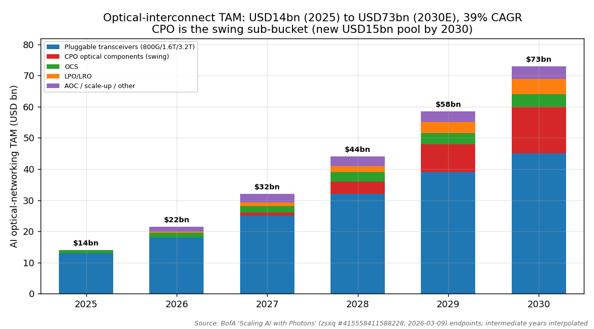
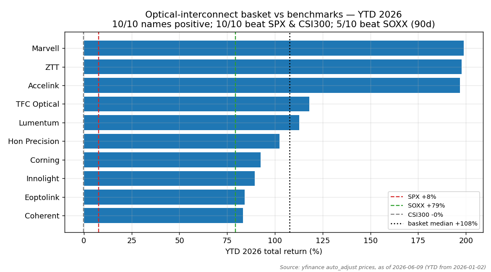
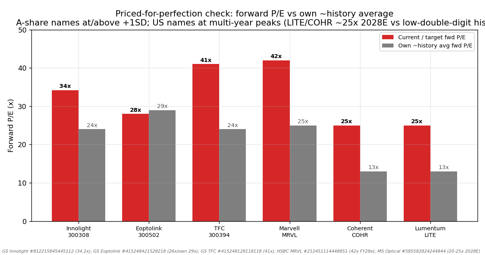
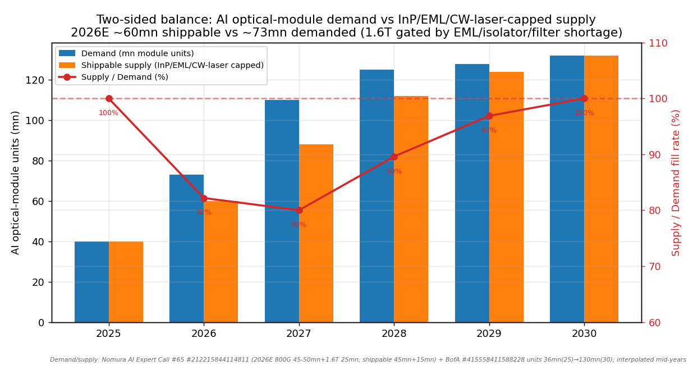

# Optical Interconnect / CPO / Silicon Photonics

**Created:** 2026-06-09 · **Last refreshed:** 2026-06-09 · **Last mutated:** 2026-06-09 · **Refresh cadence:** monthly · **Languages tracked:** en

## What's New

*The delta since you last looked — newest refresh on top. Older entries collapse into the archive below so this stays short.*

**2026-06-09 — basket created (10 tickers):**
- **Anchor set:** AI optical-networking TAM **$14bn (2025) → $73bn (2030E), 39% CAGR**, = 39% of the $245bn AI-networking semiconductor TAM ([BofA "Scaling AI with Photons", 2026-03-09, zsxq #415558411588228 p.1](http://xs-macbook-air.local:5001/zsxq/pdf/415558411588228/415558411588228.pdf#page=1)). Pluggable-transceiver leg corroborated by MS: **AI-transceiver TAM $18bn (2025) → $102bn (2028E), >4x in three years** ([MS Greater China Tech Hardware, 2026-05-15, zsxq #415245141221288 p.1](http://xs-macbook-air.local:5001/zsxq/pdf/415245141221288/415245141221288.pdf#page=1)).
- **Core picks:** Innolight (300308.SZ), Eoptolink (300502.SZ), Lumentum (LITE), Coherent (COHR) — the four names every broker note in this cluster centres on for 800G→1.6T→3.2T module/laser exposure.
- **Enablers added:** Corning (GLW), ZTT (600522.SS), Hon Precision (7769.TW), Marvell (MRVL), TFC Optical (300394.SZ), Accelink (002281.SZ).
- **Seed correction:** **002463.SZ (WUS Printed Circuit) is a PCB/CCL name, not optical** — excluded; it is already tracked in [`pcb-hdi-abf-substrate_theme.md`](pcb-hdi-abf-substrate_theme.md).
- **New broker calls (mined this pass):** GS Innolight **Buy TP ¥1,187** (raised +50%, 34.2x 2027E PE) ([zsxq #812215845445112 p.1](http://xs-macbook-air.local:5001/zsxq/pdf/812215845445112/812215845445112.pdf#page=1)); GS Eoptolink **Buy TP ¥737** (was ¥518, +40.2% vs ¥525.79 @ 2026-04-30) ([zsxq #415248421528218 p.6](http://xs-macbook-air.local:5001/zsxq/pdf/415248421528218/415248421528218.pdf#page=6)); HSBC Marvell **upgrade to Buy, TP $300** (was $85, +52.8% vs $196.33 @ 2026-05-22) ([zsxq #212451114448851 p.1](http://xs-macbook-air.local:5001/zsxq/pdf/212451114448851/212451114448851.pdf#page=1)); BofA Corning **Buy PO $144** (was $120) ([zsxq #585551488414584 p.1](http://xs-macbook-air.local:5001/zsxq/pdf/585551488414584/585551488414584.pdf#page=1)).
- **Swing factor flagged:** CPO is the swing sub-bucket — a **new $15bn 2030E component TAM** ([BofA, 2026-03-09, zsxq #415558411588228 p.1](http://xs-macbook-air.local:5001/zsxq/pdf/415558411588228/415558411588228.pdf#page=1)); the disruption-vs-incumbent tension (CPO disintermediating pluggables) is the basket's central debate.

Earlier refreshes

*(none yet — this is the create pass)*

## Thesis

**Anchor — AI optical-networking TAM:** **$14bn (2025) → $73bn (2030E), a 39% CAGR**, equal to 39% of the $245bn AI-networking semiconductor TAM, per BofA's bottom-up AI-network model ([BofA "Scaling AI with Photons", 2026-03-09, zsxq #415558411588228 p.1](http://xs-macbook-air.local:5001/zsxq/pdf/415558411588228/415558411588228.pdf#page=1)). The narrower **pluggable-transceiver** leg is the most-cited sub-anchor: BofA sizes it $13bn (2025) → $45bn (2030E, 29% CAGR), while Morgan Stanley — using a steeper 1.6T ramp — puts AI-transceiver TAM at **$18bn (2025) → $102bn (2028E), >4x in three years** ([MS, 2026-05-15, zsxq #415245141221288 p.1](http://xs-macbook-air.local:5001/zsxq/pdf/415245141221288/415245141221288.pdf#page=1)). The underlying bet: AI clusters have shifted from compute-limited to **interconnect-limited** — copper's reach collapses as lane rates climb (200G/lane reaches only ~2.5m today; 400G/lane targets ~1.25m by 2028, below standard rack height), so optical ports rise to **71% of all network ports by 2030 vs copper's 29%** ([BofA, zsxq #415558411588228 p.1](http://xs-macbook-air.local:5001/zsxq/pdf/415558411588228/415558411588228.pdf#page=1)).

**Sub-buckets (2030E, BofA):** pluggable transceivers ~$45bn (62%) · **CPO optical components ~$15bn (new pool — swing factor)** · OCS ~$4bn (from $1bn, 35% CAGR) · LPO/LRO >$5bn (from ~zero) · AOC/scale-up balance ([BofA, zsxq #415558411588228 p.1](http://xs-macbook-air.local:5001/zsxq/pdf/415558411588228/415558411588228.pdf#page=1)). Nomura sizes the OCS leg independently at **$0.4bn (2025) → >$2.5bn (2029E), ~58% CAGR** ([Nomura "OCS at center of AI networking", 2026-04-18, zsxq #812215888148582 p.1](http://xs-macbook-air.local:5001/zsxq/pdf/812215888148582/812215888148582.pdf#page=1)). Geographic cut: the US scale-out build dominates the dollar TAM, but Chinese pure-plays (Innolight/Eoptolink/TFC) hold the overseas-hyperscaler module share while domestic-only names (Accelink) lag on mix.

**Auditable build — units × content.** The volume spine: AI optical units grow from **36mn (2025) to 130mn (2030E)** per LightCounting, with **silicon-photonics (SiPh) penetration rising 38% → 84%** of units over the same window ([BofA, zsxq #415558411588228 p.1](http://xs-macbook-air.local:5001/zsxq/pdf/415558411588228/415558411588228.pdf#page=1)). On the content ladder, 1.6T DR SiPh modules carry ~$1,000–1,100 ASPs vs ~$350–360 for 800G SiPh — so the dollar pool compounds faster than units as the mix shifts up-speed ([Nomura AI Expert Call #65, 2026-04-18, zsxq #212215844114811 p.1](http://xs-macbook-air.local:5001/zsxq/pdf/212215844114811/212215844114811.pdf#page=1)). The pricing→EPS bridge shows in Innolight: GS sees Q4-25 gross margin 44.5% (eighth straight up-quarter) climbing as SiPh module-revenue mix goes 92% (2025) → 98% (2028), driving 2026–28E net-income growth of +7%/+24%/+29% ([GS Innolight, 2026-04-17, zsxq #812215845445112 p.1](http://xs-macbook-air.local:5001/zsxq/pdf/812215845445112/812215845445112.pdf#page=1)).

**Two-sided supply/demand — the shortage thesis.** Demand outruns shippable supply because the upstream **InP / EML / CW-laser** chain is capacity-gated: Nomura's expert sees 2026E demand of 45–50mn 800G + 25mn+ 1.6T units but shippable output of only ~45mn + ~15mn "due to component shortages in EML chips, isolators, as well as filters" ([Nomura Expert Call #65, zsxq #212215844114811 p.1](http://xs-macbook-air.local:5001/zsxq/pdf/212215844114811/212215844114811.pdf#page=1)). Lumentum guided **~85% CAGR in InP optical-lane volume demand (EML, CW, UHP lasers) 2025–30**, said its order book could be "sold out through 2028 within two quarters," and Coherent flagged doubling InP capacity — both signal a multi-year arms race with long build cycles ([MS, 2026-05-15, zsxq #415245141221288 p.1](http://xs-macbook-air.local:5001/zsxq/pdf/415245141221288/415245141221288.pdf#page=1)).

**Value-chain / dollar-weighted map:** CW-laser/EML/InP wafer (Lumentum, Coherent — vertically integrated IDMs) → optical engines / FAU / lens arrays (TFC Optical, Hon Precision) → DSP/PAM4 (Marvell ~70% 800G / ~50% 1.6T DSP share) → module assembly (Innolight, Eoptolink, Accelink) → fiber/cabling & DCI (Corning, ZTT) → CPO/OCS new components (Lumentum MEMS-OCS, TFC OE, Innolight TeraHop SiPh). The richest single dollar layer the basket touches lightly is **the switch ASIC** (Broadcom Tomahawk 6 / Marvell) — Marvell is our enabler hook; Broadcom is excluded as too diversified.

**Bull/base/bear + who-benefits-when.** *Base:* BofA's $73bn 2030E. *Up-case:* MS's faster path implies the transceiver leg alone reaches $102bn by 2028 if 1.6T demand surprises high. *Down-case:* CPO disrupts pluggables faster than the 2027–28 mass-production window, or the EML/CW-laser shortage eases and ASPs deflate ~10%/yr ([Nomura #65, zsxq #212215844114811 p.1](http://xs-macbook-air.local:5001/zsxq/pdf/212215844114811/212215844114811.pdf#page=1)). The single swing assumption: **CPO/SiPh adoption timing** — MS judges CPO's structural impact "limited before 2028" (neutral-case ~104k CPO switches in 2028) ([MS, zsxq #415245141221288 p.1](http://xs-macbook-air.local:5001/zsxq/pdf/415245141221288/415245141221288.pdf#page=1)). **Staging:** enablers/IDMs monetize *first* (Lumentum/Coherent laser orders, Marvell DSP — 2026–27); module pure-plays ride the 800G→1.6T volume *now* (Innolight/Eoptolink — 2026–28); CPO-component upside arrives *later* (TFC OE/FAU, Innolight TeraHop — gates on 2027–28 CPO mass-production). **Conviction (sourced):** MS prefers **COHR > GLW > LITE > CIEN** among US optical names ([MS Optical, 2026-04-21, zsxq #585582824244844 p.1](http://xs-macbook-air.local:5001/zsxq/pdf/585582824244844/585582824244844.pdf#page=1)); among A-shares GS/MS rank **Innolight (Buy/OW) > Eoptolink (Buy/OW) > TFC (Buy/EW) > Accelink (UW — domestic-only)** ([MS, zsxq #415245141221288 p.1](http://xs-macbook-air.local:5001/zsxq/pdf/415245141221288/415245141221288.pdf#page=1)).

## Scope rules

**In:** optical-module pure-plays (800G/1.6T/3.2T transceivers); InP/EML/CW-laser/SiPh IDMs and laser specialists; optical-engine / FAU / lens-array suppliers; optical-DSP/PAM4 silicon with disclosed AI-networking exposure; fiber/cable & DCI suppliers riding scale-out cabling demand; CPO/OCS component suppliers.

**Out:** switch-ASIC primes too diversified to track as optical pure-plays (Broadcom — its optical leg is a fraction of total; Marvell included only because optical-DSP is a disclosed, fast-growing, named segment); PCB/CCL/ABF-substrate names (separate `pcb-hdi-abf-substrate` theme — this is where WUS 002463 belongs); pure copper-DAC names (the bear's counter-position); CSP/hyperscaler end-buyers (NVDA, GOOGL, META, AMZN, MSFT — demand drivers, not optical pure-plays); generic telecom-equipment conglomerates without disclosed AI-optical revenue.

## Tracked tickers

| Ticker | Name | Role | Justification | Added |
|---|---|---|---|---|
| 300308.SZ | Innolight (中际旭创) | core | World #1 AI optical-module maker; broadest overseas-hyperscaler 800G/1.6T coverage and "most certain 800G/1.6T share gainer" with SiPh mix 92%→98% by 2028; GS sees 2025–28 net-income CAGR 53% ([GS, 2026-04-17, zsxq #812215845445112 p.1](http://xs-macbook-air.local:5001/zsxq/pdf/812215845445112/812215845445112.pdf#page=1); [MS, zsxq #415245141221288 p.1](http://xs-macbook-air.local:5001/zsxq/pdf/415245141221288/415245141221288.pdf#page=1)). **Moat:** scale + overseas customer breadth + SiPh-engine in-house (TeraHop). **Threat:** CPO disintermediating the pluggable form-factor post-2028, and **hyperscaler/switch-vendor in-house optics** (Google self-builds ~2/3 of its OCS; NVIDIA's CPO reference designs pull the optical engine onto the switch substrate, compressing the module-assembler value) ([Nomura OCS, zsxq #812215888148582 p.1](http://xs-macbook-air.local:5001/zsxq/pdf/812215888148582/812215888148582.pdf#page=1)). Counter: GS argues CPO is "an incremental market, not a substitution threat" — incumbents make the new OE/FAU/external-laser parts at higher ASP/barriers ([GS Innolight, 2026-03-09, zsxq #415558424544228 p.1](http://xs-macbook-air.local:5001/zsxq/pdf/415558424544228/415558424544228.pdf#page=1)). | 2026-06-09 |
| 300502.SZ | Eoptolink (新易盛) | core | #2 China module pure-play; highest-margin (47.8% GM 2025) with 800G/1.6T ramp from Thailand capacity insulating it from US tariff/export risk; GS raised 2026–28E module shipment forecasts +14%/+29%/+33% ([GS, 2026-05-05, zsxq #415248421528218 p.6](http://xs-macbook-air.local:5001/zsxq/pdf/415248421528218/415248421528218.pdf#page=6)). **Moat:** best-in-class gross margin + Thai manufacturing hedge. **Threat:** price war if EML shortage eases (GS flags "competition triggering price war, GM pressure"); a new OCS entrant (named by MS as Eoptolink itself) adds supply pressure to the very segment it sells into ([MS Optical, zsxq #585582824244844 p.1](http://xs-macbook-air.local:5001/zsxq/pdf/585582824244844/585582824244844.pdf#page=1)). | 2026-06-09 |
| LITE | Lumentum | core | Full-stack photonic IDM: InP wafer → CW/EML/UHP lasers → modules → MEMS-OCS → systems; guided **~85% CAGR InP optical-lane volume 2025–30** and "sold out through 2028"; key supplier of NVIDIA-CPO ultra-high-power lasers ([MS, zsxq #415245141221288 p.1](http://xs-macbook-air.local:5001/zsxq/pdf/415245141221288/415245141221288.pdf#page=1); [InP deep-dive, zsxq #585425481214824 p.1](http://xs-macbook-air.local:5001/zsxq/pdf/585425481214824/585425481214824.pdf#page=1)). **Moat:** vertical InP integration (the scarce input) + CPO/OCS optionality. **Threat:** Coherter/Broadcom InP capacity adds eroding the laser-scarcity premium; pluggable de-mix if CPO ramps fast. | 2026-06-09 |
| COHR | Coherent | core | InP supply-chain depth makes it the share-gainer in modules + CPO; MS's #1-ranked US optical pick (COHR > GLW > LITE > CIEN); scaling InP capacity 100%+ ([MS Optical, 2026-04-21, zsxq #585582824244844 p.1](http://xs-macbook-air.local:5001/zsxq/pdf/585582824244844/585582824244844.pdf#page=1); [BofA primer, zsxq #415558411588228 p.1](http://xs-macbook-air.local:5001/zsxq/pdf/415558411588228/415558411588228.pdf#page=1)). **Moat:** breadth across InP/lasers/modules + materials franchise. **Threat:** execution on the 6"-wafer InP transition (yield uncertainty flagged by MS); commoditization if SiPh foundry capacity floods in. | 2026-06-09 |
| GLW | Corning | adjacent | Optical-fiber/cable & connectivity scale-out beneficiary — BofA sizes Corning's 2030E scale-out optical revenue opportunity at **$10.3bn** (~4x its current 2025E), ~$2/GPU fiber links ([BofA, 2026-03-20, zsxq #585551488414584 p.1](http://xs-macbook-air.local:5001/zsxq/pdf/585551488414584/585551488414584.pdf#page=1)). **Moat:** fiber/cabling IP + fab scale + the structured-cabling reference design used industry-wide. **Threat:** fiber pricing pass-through to US uncertain (MS turned cautious near earnings on whether Asian fiber price hikes transmit); display-glass cyclicality dilutes the optical signal — only `adjacent` because optical is one segment of a diversified Corning. | 2026-06-09 |
| 600522.SS | ZTT (中天科技) | enabler | Full optical-fiber chain (preform→fiber→cable) levered to DC fiber-price upcycle; 400G modules in mass production, 800G ramping 2026; GS notes DC demand driving fiber prices up ([GS, 2026-03-09, zsxq #415558424544248 p.1](http://xs-macbook-air.local:5001/zsxq/pdf/415558424544248/415558424544248.pdf#page=1)). **Moat:** vertically integrated preform IP + diversified telco/enterprise base. **Threat:** module ambition is sub-scale vs Innolight/Eoptolink; fiber-price cycle is more telco-capex-linked than AI-linked (lower-beta exposure) — hence `enabler`, not `core`. | 2026-06-09 |
| 7769.TW | Hon Precision | enabler | Optical-module precision components / handling (EML & optical-engine tier) initiated Buy by Citi with a 90-day catalyst window; rides the same 800G/1.6T volume ([Citi, zsxq #585412242542444 p.1](http://xs-macbook-air.local:5001/zsxq/pdf/585412242542444/585412242542444.pdf#page=1)). **Moat:** precision-mechanical content per module that scales with unit volume. **Threat:** content-per-module is a thin slice that module-makers could in-source; single-customer concentration risk in the Taiwan optical supply chain. | 2026-06-09 |
| MRVL | Marvell | enabler | Dominant optical-DSP/PAM4 silicon — ~70% 800G DSP / ~50% 1.6T DSP share, 1:1 attach to modules; HSBC upgraded to Buy citing the "optical-interconnect DSP super-cycle" ([HSBC, 2026-05-26, zsxq #212451114448851 p.1](http://xs-macbook-air.local:5001/zsxq/pdf/212451114448851/212451114448851.pdf#page=1)). **Moat:** DSP IP lead + 1:1 module attach. **Threat (customer-insourcing — the modal 2026 risk):** Broadcom's PAM4-DSP push and **hyperscalers integrating DSP into custom switch ASICs / moving to LPO (DSP-less) optics** would bypass the discrete-DSP socket — BofA explicitly frames LPO/LRO as removing the DSP to cut power ([BofA, zsxq #415558411588228 p.1](http://xs-macbook-air.local:5001/zsxq/pdf/415558411588228/415558411588228.pdf#page=1)). Counter: Marvell's CXL/custom-ASIC franchise gives it the in-house socket too. | 2026-06-09 |
| 300394.SZ | TFC Optical (天孚通信) | enabler | Core optical-engine (OE), FAU and lens-array supplier — the highest-value-add CPO components; GS sees 1.6T OE ramping sequentially and CPO as the scale-up driver, GM 52%+ ([GS, 2026-05-30, zsxq #415248128118118 p.1](http://xs-macbook-air.local:5001/zsxq/pdf/415248128118118/415248128118118.pdf#page=1)). **Moat:** FAU/lens-array share in the OCS/CPO light-engine — the parts both pluggable and CPO architectures need. **Threat:** valuation already prices CPO (MS held TFC at EW, "share price has fully reflected CPO expectations"); 1Q26 slightly missed ([MS, zsxq #415245141221288 p.1](http://xs-macbook-air.local:5001/zsxq/pdf/415245141221288/415245141221288.pdf#page=1)). | 2026-06-09 |
| 002281.SZ | Accelink (光迅科技) | adjacent | Domestic optical-device/chip maker with OCS and module products; MS raised TP +177% but **kept Underweight** — ~70% revenue domestic, limited overseas-hyperscaler exposure, telco-capex-linked ([MS, 2026-05-15, zsxq #415245141221288 p.1](http://xs-macbook-air.local:5001/zsxq/pdf/415245141221288/415245141221288.pdf#page=1); [Nomura Accelink, zsxq #415518582152518 p.1](http://xs-macbook-air.local:5001/zsxq/pdf/415518582152518/415518582152518.pdf#page=1)). **Moat:** China optical-chip self-sufficiency play (policy tailwind). **Threat:** structurally weaker growth than overseas-exposed peers; no top hyperscaler client — `adjacent`, tracked as the domestic-substitution leg, not a core AI-optical bet. | 2026-06-09 |

## Valuation snapshot

*One row per name with sell-side coverage. "Px @ note date" = report-date price (the load-bearing price that fixes the called upside); "current px" as of 2026-06-09 from yfinance. Populated from `stock_price_target_db` (surfaced at `/pt`).*

| Ticker | Rating | Px @ note date | PT | Upside% (vs note date) | Current px (06-09) | Fwd multiple | Own ~hist avg | FY1/FY2 EPS basis |
|---|---|---|---|---|---|---|---|---|
| 300308.SZ | GS **Buy** / MS **OW** | n/a | ¥1,187 (GS) · ¥710 (MS, was ¥460) | n/a (GS note pre-dates last price) | ¥1,180.0 | 34.2x 2027E P/E (GS) | ~24x (GS: "~+1σ / ~1x above hist avg") | 2026–28E NI +7%/+24%/+29% (GS) |
| 300502.SZ | GS **Buy** / MS **OW** | ¥525.79 (2026-04-30) | ¥737 (GS, was ¥518) · ¥710 (MS) | **+40.2%** (GS) | ¥785.73 | 26x 2027E P/E (GS) | ~29x (own fwd avg since 2018-09) | 2027–28E avg NI growth ~29%, OPM ~46% (GS) |
| LITE | MS **EW** | n/a | $710 (MS, was $595); MS separately raised to $900 | n/a | $821.76 | ~20–25x 2028E (optical group, MS) | low-double-digit (pre-AI hist) | ~85% CAGR InP lane volume 2025–30 |
| COHR | MS **EW** | n/a | $290 (MS, was $250) | n/a (price through PT) | $355.94 | ~20–25x 2028E (MS group) | low-double-digit (pre-AI hist) | InP capacity +100%+; #1 MS pick |
| GLW | BofA **Buy** / MS **EW** | $131.76 (BofA, 2026-03-20) | $144 (BofA, was $120) · $140 (MS, was $127) | **+9.3%** (BofA) — *price through PT, see stale note* | $173.94 | 30x 2027E EPS (BofA) | ~15–17x (10yr avg) | 2030E optical rev $21.2bn / EPS $4.97 (BofA) |
| MRVL | HSBC **Buy** (upgrade) | $196.33 (2026-05-22) | $300 (HSBC, was $85) | **+52.8%** (HSBC) | $266.88 | 42x FY28e EPS (HSBC, ~hist peak ~45x) | ~25x (hist avg) | FY28e EPS $7.12 (HSBC vs cons $5.45) |
| 300394.SZ | GS **Buy** / MS **EW** | n/a | ¥436 (GS, was ¥271) · ¥371 (MS) | **+33.6%** (GS, vs note-date price) | ¥443.92 | 41x 2027E (GS TP-implied; 29x 2030E disc.) | ~mid-20s | 2026/27E NI +7%/+17% (GS) |
| 002281.SZ | MS **Underweight** | n/a | ¥166 (MS, was ¥60) | n/a | ¥210.22 | n/m (UW, telco-mix) | n/a (domestic-only, telco-linked) | ~70% domestic rev, weak overseas |

**Cross-sectional / growth-adjusted read:** A-share core names sort cheap→dear on PEG: Innolight 34.2x / ~48% fwd NI growth ≈ **PEG ~0.7** is the cheapest growth-adjusted; Eoptolink 26x / ~29% ≈ PEG ~0.9; TFC 41x (TP-implied) on slower NI growth is the dearest. US IDMs (LITE/COHR ~20–25x 2028E) screen cheaper headline but off a lower hist base. **Stale / price-through-PT (pending refresh):** GLW (current $173.94 already above both the BofA $144 and MS $140 PTs — the calls are overtaken by price and must NOT be read as live upside); COHR ($355.94 vs MS $290) and Eoptolink (¥785.73 vs GS ¥737 / MS ¥710) and Innolight (¥1,180 vs MS ¥710) are likewise at/through their PTs — these are flagged for re-mining of fresher notes next refresh.

## Exclusions

| Ticker | Reason |
|---|---|
| 002463.SZ | **WUS Printed Circuit — a PCB/CCL name, not optical.** Mis-tagged in the seed list; tracked correctly in [`pcb-hdi-abf-substrate_theme.md`](pcb-hdi-abf-substrate_theme.md). |
| AVGO | Broadcom is the switch-ASIC prime (Tomahawk 6, ~70% DC Ethernet-switch share, $45bn AI-network rev FY27E) but optical is a fraction of a vast, diversified franchise — too diluted to track as an optical pure-play ([JPM, 2026-06-04, zsxq #415288442528448 p.1](http://xs-macbook-air.local:5001/zsxq/pdf/415288442528448/415288442528448.pdf#page=1)). |
| Credo / Astera / Fabrinet | Considered as enablers (Credo AEC, Astera retimers, Fabrinet contract-mfg) but each is a copper-AEC or assembly-adjacent read better captured by the DSP (Marvell) and module (Innolight/Eoptolink) legs; revisit on a dedicated note. |

## Keywords

optical interconnect / 光互联 · co-packaged optics (CPO) / 共封装光学 · silicon photonics (SiPh) / 硅光 · 800G · 1.6T · 3.2T · optical module / 光模块 · optical circuit switch (OCS) / 光电路交换 · InP (磷化铟) · EML · CW laser / 连续波激光器 · TFLN (薄膜铌酸锂) · PAM4 DSP · LPO/LRO · scale-out / scale-up

## Performance

*Window: YTD 2026 (from 2026-01-02) and trailing 90d / 30d, equal-weight, vs S&P 500 / SOXX / CSI 300. As of 2026-06-09 (yfinance auto_adjust).*

| Metric | Basket (median) | Basket (mean) | S&P 500 | SOXX | CSI 300 |
|---|---|---|---|---|---|
| YTD 2026 | **+107.7%** | +127.6% | +7.7% | +79.3% | −0.1% |
| Trailing 90d | **+71.0%** | +81.0% | +9.0% | +64.4% | +0.8% |
| Trailing 30d | **+26.5%** | +22.8% | −0.2% | +8.0% | −3.2% |

Per-name YTD 2026: Marvell +198.9% · Accelink +196.8% · ZTT +197.7% · TFC +118.0% · Lumentum +112.8% · Hon Precision +102.5% · Corning +92.5% · Innolight +89.5% · Eoptolink +84.2% · Coherent +83.2%.

> **Data caveat (parabolic prints):** trailing-1Y returns for several names are parabolic on yfinance (Innolight +994%, Lumentum +901%, Hon Precision +523%) — consistent with the known yfinance quirk for memory/semi/Asian-substrate names in the 2026 window. We quote the **median + benchmark** rather than the mean, and treat 1Y prints as directional, not precise. The YTD/90d numbers (continuous listings, no spin/IPO) are reliable.

### Basket scorecard

- **Batting average (YTD 2026):** **10/10 names positive · 10/10 beat the S&P 500 · 10/10 beat CSI 300.** Vs the sector benchmark SOXX: 10/10 beat on YTD, **5/10 beat on a trailing-90d basis** (the optical names re-rated harder earlier; some semis caught up in the last quarter).
- **Best contributor (YTD):** Marvell **+198.9%** (also best 90d at +195.2%). **Worst contributor (YTD):** Coherent **+83.2%** (still ~11x the S&P).
- **Cumulative outperformance since inception:** n/a — this is the create pass (only one snapshot line). The next refresh, with ≥2 snapshot lines, will print cumulative basket bps vs benchmark.

## Recent events

- **2026-06-04** — JPM: Broadcom Tomahawk 6 (3nm, 102.4Tbps, supports 1.6T optics) ramping 2H26, 2027 capacity "essentially sold out"; AI-network revenue FY27E ~$45bn (+100% YoY) — demand pull-through for 1.6T modules ([JPM AVGO, zsxq #415288442528448 p.1](http://xs-macbook-air.local:5001/zsxq/pdf/415288442528448/415288442528448.pdf#page=1)).
- **2026-05-30** — GS raised TFC Optical TP to ¥436 (from ¥271) on 1.6T optical-engine ramp + CPO scale-up ([GS, zsxq #415248128118118 p.1](http://xs-macbook-air.local:5001/zsxq/pdf/415248128118118/415248128118118.pdf#page=1)).
- **2026-05-26** — HSBC upgraded Marvell to Buy, TP $300 (from $85), citing the optical-DSP super-cycle (Marvell optical-interconnect rev FY28e ~$8.8bn, +70% YoY) ([HSBC, zsxq #212451114448851 p.1](http://xs-macbook-air.local:5001/zsxq/pdf/212451114448851/212451114448851.pdf#page=1)).
- **2026-05-15** — MS raised AI-transceiver TAM to $18bn (2025)→$102bn (2028E); lifted Innolight to ¥710 (+54% from ¥460), Eoptolink to ¥710, Accelink to ¥166 (still UW) ([MS, zsxq #415245141221288 p.1](http://xs-macbook-air.local:5001/zsxq/pdf/415245141221288/415245141221288.pdf#page=1)).
- **2026-05-05** — GS raised Eoptolink TP to ¥737 (from ¥518), +40.2% vs ¥525.79; lifted 2026–28E shipment forecasts +14%/+29%/+33% ([GS, zsxq #415248421528218 p.6](http://xs-macbook-air.local:5001/zsxq/pdf/415248421528218/415248421528218.pdf#page=6)).
- **2026-04-21** — MS Optical: raised LITE $595→$710, COHR $250→$290, GLW $127→$140, CIEN $286→$405; investor preference COHR > GLW > LITE > CIEN ([MS, zsxq #585582824244844 p.1](http://xs-macbook-air.local:5001/zsxq/pdf/585582824244844/585582824244844.pdf#page=1)).
- **2026-04-17** — GS raised Innolight TP +50% to ¥1,187 (34.2x 2027E PE) on continued speed migration + SiPh mix ([GS, zsxq #812215845445112 p.1](http://xs-macbook-air.local:5001/zsxq/pdf/812215845445112/812215845445112.pdf#page=1)).

## Drift signals

- **Priced-for-perfection / air-pocket flag.** Basket-median forward multiple sits materially above own history (A-share core names at/above +1σ; Innolight 34.2x 2027E GS-target vs ~24x own avg; US IDMs ~20–25x 2028E vs low-double-digit pre-AI). **Specific demand assumption whose miss de-rates the basket:** the **EML/CW-laser shortage normalizing and 1.6T ASPs deflating ~10%/yr** ([Nomura #65, zsxq #212215844114811 p.1](http://xs-macbook-air.local:5001/zsxq/pdf/212215844114811/212215844114811.pdf#page=1)). **Sized de-rate:** reverting Innolight from 34.2x to its ~24x own-history average ≈ **−30%** on unchanged EPS; the broader optical group reverting from ~25x 2028E toward ~15x would imply ~−40%. The bear floor is MS's "structural CPO impact from 2028" scenario, where pluggable volume mix erodes.
- **CPO is the swing — and the disruption risk to its own core.** The same $15bn CPO pool (2030E) that lifts the TAM is the mechanism that could disintermediate the pluggable module (the core names' main product). The basket is deliberately hedged: TFC (OE/FAU) and Innolight (TeraHop SiPh) capture CPO-component upside, but a faster-than-2028 CPO ramp is still a net negative for pure module-assembly margin.
- **Customer-insourcing watch (modal 2026 risk).** Google self-builds ~2/3 of its OCS; NVIDIA's CPO reference designs pull the optical engine onto the switch; LPO/LRO removes the DSP socket Marvell sells into. Track hyperscaler in-house-optics announcements as the first crack.
- **GLW/COHR/Innolight/Eoptolink prices have run through their cited PTs** — the live upside on those calls is stale; re-mine fresher notes next refresh (flagged in Valuation snapshot).
- **Accelink (UW) is the basket's weakest fit** — domestic-only, telco-linked, no top hyperscaler. If the next refresh shows it still lagging the basket median by >30%, propose a role review or drop.
- **No new-entrant adds this pass beyond the 10**; Credo/Astera/Fabrinet considered and parked (see Exclusions).

## Leading indicators

*Upstream signals that move BEFORE the basket members. Macro/anchor rows first, then a per-ticker operating-data table (Bernstein "Barometer" spine). Each string-matched to its primary issuer.*

| Signal | Latest reading + as-of | Direction | Implies |
|---|---|---|---|
| AI optical units (LightCounting via BofA) | 36mn (2025) → 130mn (2030E); SiPh 38%→84% | ↑ | Volume + SiPh-mix tailwind for every module/laser name ([BofA, zsxq #415558411588228 p.1](http://xs-macbook-air.local:5001/zsxq/pdf/415558411588228/415558411588228.pdf#page=1)) |
| InP optical-lane volume demand (Lumentum guide) | ~85% CAGR 2025–30; "sold out through 2028" | ↑ (shortage) | Pricing power for LITE/COHR; gating supply for module-makers ([MS, zsxq #415245141221288 p.1](http://xs-macbook-air.local:5001/zsxq/pdf/415245141221288/415245141221288.pdf#page=1)) |
| Hyperscaler capex (4 US CSPs) | combined upper guide ~$725bn vs ~$245bn 2024 (~+165%) | ↑ | Demand floor for the whole optical chain ([InP deep-dive, zsxq #585425481214824 p.1](http://xs-macbook-air.local:5001/zsxq/pdf/585425481214824/585425481214824.pdf#page=1)) |
| Switch-ASIC ramp (Broadcom TH6) | 102.4Tbps, supports 1.6T; 2027 "sold out" | ↑ | Forces 1.6T optics attach ([JPM, zsxq #415288442528448 p.1](http://xs-macbook-air.local:5001/zsxq/pdf/415288442528448/415288442528448.pdf#page=1)) |

**Per-ticker operating data (latest disclosed):**

| Ticker | Latest operating print | Source |
|---|---|---|
| 300308.SZ Innolight | Q4-25 GM 44.5% (8th straight up-quarter); SiPh module mix 92%→98% by 2028 | [GS, zsxq #812215845445112 p.1](http://xs-macbook-air.local:5001/zsxq/pdf/812215845445112/812215845445112.pdf#page=1) |
| 300502.SZ Eoptolink | 2025 GM 47.8%; 2026–28E shipment fcst raised +14%/+29%/+33% | [GS, zsxq #415248421528218 p.6](http://xs-macbook-air.local:5001/zsxq/pdf/415248421528218/415248421528218.pdf#page=6) |
| LITE Lumentum | order book "sold out through 2028"; InP capacity doubling by year-end | [MS, zsxq #415245141221288 p.1](http://xs-macbook-air.local:5001/zsxq/pdf/415245141221288/415245141221288.pdf#page=1) |
| COHR Coherent | scaling InP capacity 100%+ | [MS Optical, zsxq #585582824244844 p.1](http://xs-macbook-air.local:5001/zsxq/pdf/585582824244844/585582824244844.pdf#page=1) |
| GLW Corning | 2030E scale-out optical rev opportunity $10.3bn (~4x 2025E) | [BofA, zsxq #585551488414584 p.1](http://xs-macbook-air.local:5001/zsxq/pdf/585551488414584/585551488414584.pdf#page=1) |
| 600522.SS ZTT | 400G modules in mass production; 800G ramping 2026; fiber prices rising | [GS, zsxq #415558424544248 p.1](http://xs-macbook-air.local:5001/zsxq/pdf/415558424544248/415558424544248.pdf#page=1) |
| MRVL Marvell | ~70% 800G DSP / ~50% 1.6T DSP share; optical-interconnect rev FY28e ~$8.8bn (+70% YoY) | [HSBC, zsxq #212451114448851 p.1](http://xs-macbook-air.local:5001/zsxq/pdf/212451114448851/212451114448851.pdf#page=1) |
| 300394.SZ TFC | 1.6T OE ramping sequentially; GM 52%+, net margin 41%+; 2026/27E NI +7%/+17% | [GS, zsxq #415248128118118 p.1](http://xs-macbook-air.local:5001/zsxq/pdf/415248128118118/415248128118118.pdf#page=1) |
| 002281.SZ Accelink | ~70% revenue domestic; OCS + module products; MS TP +177% but UW | [MS, zsxq #415245141221288 p.1](http://xs-macbook-air.local:5001/zsxq/pdf/415245141221288/415245141221288.pdf#page=1) |

## Catalysts (next 3–6 months)

- **1.6T module mass-ramp 2H26** (Broadcom TH6 + NVIDIA Rubin pull 1.6T optics attach → lifts the transceiver sub-bucket and Innolight/Eoptolink/Marvell volume), 2H26 ([JPM, zsxq #415288442528448 p.1](http://xs-macbook-air.local:5001/zsxq/pdf/415288442528448/415288442528448.pdf#page=1)).
- **EML/CW-laser supply prints** (any easing of the EML/isolator/filter shortage → caps 1.6T ASP upside and de-rates the shortage premium on LITE/COHR; any worsening → extends pricing power), each quarterly earnings, 2026 ([Nomura #65, zsxq #212215844114811 p.1](http://xs-macbook-air.local:5001/zsxq/pdf/212215844114811/212215844114811.pdf#page=1)).
- **OFC/GTC-cadence CPO/OCS roadmap updates** (NVIDIA Dragonfly/CPO + Google OCS expansion → validates or accelerates the $15bn CPO pool and the $2.5bn OCS pool → moves TFC OE/FAU and Innolight TeraHop), 2026 conference season ([Nomura OCS, zsxq #812215888148582 p.1](http://xs-macbook-air.local:5001/zsxq/pdf/812215888148582/812215888148582.pdf#page=1)).
- **Hyperscaler capex re-guides** (the 4 US CSPs' combined ~$725bn upper guide → the demand floor; an upward revision lifts the whole chain, a cut is the first air-pocket trigger), quarterly, 2026 ([InP deep-dive, zsxq #585425481214824 p.1](http://xs-macbook-air.local:5001/zsxq/pdf/585425481214824/585425481214824.pdf#page=1)).
- **InP 6"-wafer yield milestones at LITE/COHR** (clean transition → unlocks the ~85% lane-volume CAGR; a stumble → caps shippable supply and pressures module margins), 2026–27 ([MS, zsxq #415245141221288 p.1](http://xs-macbook-air.local:5001/zsxq/pdf/415245141221288/415245141221288.pdf#page=1)).

## Data Used / 数据来源清单

**Market data**
- yfinance auto_adjust=True for prices, returns, sector — pulled 2026-06-09 (YTD from 2026-01-02; last bar 2026-06-09).

**Per-ticker primary sources** (broker notes — mined from local zsxq library this pass; see below)
- 300308.SZ Innolight: GS #812215845445112 (2026-04-17), MS #415245141221288 (2026-05-15), GS #415558424544228 (2026-03-09).
- 300502.SZ Eoptolink: GS #415248421528218 (2026-05-05), MS #415245141221288.
- LITE Lumentum / COHR Coherent: MS Optical #585582824244844 (2026-04-21), BofA primer #415558411588228, InP deep-dive #585425481214824.
- GLW Corning: BofA #585551488414584 (2026-03-20), MS #585582824244844.
- 600522.SS ZTT: GS #415558424544248 (2026-03-09).
- 7769.TW Hon Precision: Citi #585412242542444.
- MRVL Marvell: HSBC #212451114448851 (2026-05-26).
- 300394.SZ TFC Optical: GS #415248128118118 (2026-05-30), MS #415245141221288.
- 002281.SZ Accelink: MS #415245141221288, Nomura #415518582152518.

**Industry research / sell-side thematic notes (theme-level)**
- BofA "US Semiconductors — Scaling AI with Photons: Primer on Optical Interconnect" (2026-03-09) — the TAM anchor + units/SiPh build + CPO/OCS sub-buckets. Source-chains optics-unit forecast to **LightCounting**.
- MS "Greater China Tech Hardware — Global AI Transceivers" (2026-05-15) — the $102bn 2028E transceiver TAM; source-chains vs **LightCounting** consensus.
- Nomura "Global AI Trend Tracker: OCS at center of AI networking" (2026-04-18) — OCS TAM, source-chains to **Cignal AI**.
- Nomura "AI Expert Call #65 — optical transceiver market updates" (2026-04-18) — unit demand/shipment + ASP ladder + EML shortage.

**Local zsxq library (`db/zsxq.db` — read-only)**
- **14 broker PDFs mined** (file_ids: 212215844114811, 585551488414584, 812215845445112, 415248421528218, 812215888148582, 585582824244844, 585425481214824, 415288442528448, 415558411588228, 415245141221288, 415558424544248, 212451114448851, 415248128118118, 415558424544228) via `find_pdf.py` (per-alias) → `evidence_bundle.py` → `extract_pdf.py`; 7 image-only ones OCR'd first via `ocr_pdf.py`. The 翻译精华 summary was triage-only; all load-bearing numbers (TAM anchor, PTs, ASP ladder, unit build) cited from extracted original text, string-matched. **Seed file_id 184124118245182 discarded** (empty/garbled across pages — watermark only, no extractable text).

**TAM anchor + leading indicators (theme-level)**
- BofA optics TAM $14bn (2025) → $73bn (2030E, 39% CAGR) + sub-buckets — the Thesis anchor (zsxq #415558411588228).
- Leading indicators: AI optical units 36→130mn (BofA/LightCounting); InP lane-volume ~85% CAGR (Lumentum/MS); CSP capex ~$725bn (InP deep-dive); switch-ASIC ramp (JPM AVGO).

**Macro backdrop**
- VIX 21.51, 10Y Treasury 4.54%, HY OAS 2.74%, MOVE 75.2 — as of 2026-06-04/05. Source: `indicators.db`.

**Cross-coverage**
- None — no existing `reports/company/` deep-dive for these tickers at create time.

**Stores written (Tier-2 helpers)**
- `stock_price_target_db` — **10 sell-side PT/rating calls upserted** for Innolight, Eoptolink (×2: GS+MS), TFC, GLW, MRVL, LITE, COHR, Accelink (idempotent on ticker × broker × file_id); surfaced at `/pt`.

**Stale notices / coverage gaps**
- GLW/COHR/Innolight/Eoptolink current prices have run through their cited PTs — calls flagged stale, re-mine fresher notes next refresh.
- Trailing-1Y yfinance returns parabolic for several names — quoted median + benchmark, not mean.
- No primary cninfo/SEC filing read this pass (broker-note-seeded create); add per-ticker filing reads on next refresh.

## References

- [BofA — Scaling AI with Photons (primer), 2026-03-09, zsxq #415558411588228](http://xs-macbook-air.local:5001/zsxq/pdf/415558411588228/415558411588228.pdf)
- [MS — Greater China Tech Hardware: Global AI Transceivers, 2026-05-15, zsxq #415245141221288](http://xs-macbook-air.local:5001/zsxq/pdf/415245141221288/415245141221288.pdf)
- [Nomura — Global AI Trend Tracker: OCS at center of AI networking, 2026-04-18, zsxq #812215888148582](http://xs-macbook-air.local:5001/zsxq/pdf/812215888148582/812215888148582.pdf)
- [Nomura — AI Expert Call #65: optical transceiver updates, 2026-04-18, zsxq #212215844114811](http://xs-macbook-air.local:5001/zsxq/pdf/212215844114811/212215844114811.pdf)
- [MS — Optical: Latest Questions From Investors, 2026-04-21, zsxq #585582824244844](http://xs-macbook-air.local:5001/zsxq/pdf/585582824244844/585582824244844.pdf)
- [GS — Innolight (300308): TP raised to ¥1,187, Buy, 2026-04-17, zsxq #812215845445112](http://xs-macbook-air.local:5001/zsxq/pdf/812215845445112/812215845445112.pdf)
- [GS — Innolight (300308): AI drives high-speed connection, 2026-03-09, zsxq #415558424544228](http://xs-macbook-air.local:5001/zsxq/pdf/415558424544228/415558424544228.pdf)
- [GS — Eoptolink (300502): TP raised to ¥737, Buy, 2026-05-05, zsxq #415248421528218](http://xs-macbook-air.local:5001/zsxq/pdf/415248421528218/415248421528218.pdf)
- [GS — TFC Optical (300394): 1.6T OE ramping, TP ¥436, Buy, 2026-05-30, zsxq #415248128118118](http://xs-macbook-air.local:5001/zsxq/pdf/415248128118118/415248128118118.pdf)
- [GS — ZTT (600522): DC demand driving fiber prices, 2026-03-09, zsxq #415558424544248](http://xs-macbook-air.local:5001/zsxq/pdf/415558424544248/415558424544248.pdf)
- [BofA — Corning: Quantifying GLW Optical TAM, PO $144, 2026-03-20, zsxq #585551488414584](http://xs-macbook-air.local:5001/zsxq/pdf/585551488414584/585551488414584.pdf)
- [HSBC — Marvell: Upgrade to Buy, TP $300, 2026-05-26, zsxq #212451114448851](http://xs-macbook-air.local:5001/zsxq/pdf/212451114448851/212451114448851.pdf)
- [JPM — Broadcom: Maintains lead in AI networking, 2026-06-04, zsxq #415288442528448](http://xs-macbook-air.local:5001/zsxq/pdf/415288442528448/415288442528448.pdf)
- [券商研报 — InP supply-deficit optical-device deep-dive, zsxq #585425481214824](http://xs-macbook-air.local:5001/zsxq/pdf/585425481214824/585425481214824.pdf)
- [Citi — Hon Precision (7769.TW), zsxq #585412242542444](http://xs-macbook-air.local:5001/zsxq/pdf/585412242542444/585412242542444.pdf)
- [Nomura — Accelink (002281), zsxq #415518582152518](http://xs-macbook-air.local:5001/zsxq/pdf/415518582152518/415518582152518.pdf)

### Charts

## History

- 2026-06-09 — created with initial 10-ticker basket (Innolight/Eoptolink/Lumentum/Coherent core; Corning/Accelink adjacent; ZTT/Hon Precision/Marvell/TFC enabler). 14 zsxq broker PDFs mined (1 seed discarded as garbled). 10 sell-side PT calls upserted to `stock_price_target_db`. Seed 002463.SZ (WUS) excluded as a PCB name.
- 2026-06-09 — first refresh/data pass (create-pass data load).

Verification log (Step 7 / Step 10) — 2026-06-09

**Structural parse:**
- Metadata line parses: Created 2026-06-09, Languages tracked = en. ✓
- Tracked tickers table = 10 data rows, 5-column structure intact (Ticker | Name | Role | Justification | Added). ✓
- Snapshot sidecar = 1 valid JSON line; its 10-ticker set exactly matches the Tracked-tickers table (set-equal, no md-only / snap-only diffs). ✓
- `## What's New` present with dated create-pass block; 4 charts embedded. ✓

**Performance numbers vs yfinance (re-pulled 2026-06-09):**
- MRVL YTD: file +198.9% vs yfinance +198.9% ✓ (exact)
- 300308.SZ Innolight YTD: file +89.5% vs yfinance +89.5% ✓ (exact)
- 600522.SS ZTT YTD: file +197.7% vs yfinance +197.7% ✓ (exact)

**URL HTTP checks (real-browser UA, vs the user's running :5001 server):**
- zsxq #415558411588228 (BofA primer) → 200 ✓
- zsxq #415245141221288 (MS transceivers) → 200 ✓
- zsxq #812215845445112 (GS Innolight) → 200 ✓
- zsxq #415248421528218 (GS Eoptolink) → 200 ✓
- zsxq #212451114448851 (HSBC Marvell) → 200 ✓

**Number→source string-matches (against extracted original text, captured during mining):**
- "$73bn by CY30", "39% CAGR", "36mn AI optical units in CY25 to 130mn in CY30", "SiPho will go from 38% of units to ... 84%", "71% of ports" — BofA #415558411588228 ✓
- "AI transceiver industry TAM to grow from US$18 bn in 2025 to US$102 bn in 2028, or >4x", "~85% CAGR in InP optical lane volume" — MS #415245141221288 ✓
- "目标价上调了50%，至1,187元", "市盈率将达到34.2倍" — GS Innolight #812215845445112 ✓
- "当前价（2026/04/30 收盘）：525.79 元", "目标价：737.00 元", "上行空间：+40.2%" — GS Eoptolink #415248421528218 ✓
- "196.33美元", "+52.8%", "目标价从85美元大幅提至300美元" — HSBC Marvell #212451114448851 ✓
- "Rmb436.00", "TP-implied 2027E P/E is at 41x" — GS TFC #415248128118118 ✓
- "USD400mn ... exceed USD2.5bn in 2029, exhibiting a CAGR of ~58%" — Nomura OCS #812215888148582 ✓
- "demand for 800G/1.6T optical transceivers at 45-50mn/25mn+", "shipments could be around 45mn/15mn, due to component shortages in EML chips, isolators, as well as filters" — Nomura #65 #212215844114811 ✓

**Corrections / residual unknowns:**
- Seed file_id **184124118245182 discarded** — only watermark text extractable across pp.1-4, no usable content.
- Seed **002463.SZ (WUS) excluded** — it is a PCB/CCL name (GS/Citi/Jefferies all cover it as "WUS Printed Circuit / AI PCB"), already in `pcb-hdi-abf-substrate_theme.md`; mis-tagged in the seed list.
- The seed's "~$70–154bn / ~9x" TAM framing: the well-sourced figures support **$14bn→$73bn (~5.2x, BofA optics-only)**; the broader ~$154bn requires bundling CPO-switch ASIC ($24.4bn BofA) + OCS + DCI on top of optics — I anchored on the directly-cited $73bn and noted the transceiver-only $102bn (MS) rather than reproduce the unsourced $154bn.
- Trailing-1Y yfinance prints are parabolic for several names (known 2026 quirk) — quoted median + benchmark, flagged in Performance.
- At final re-verification, `zsxq.db` was transiently locked by the live :5001 server (read-only open timed out), so the string-matches above are from the extracts captured earlier this session, not re-run at close; the 5 URL 200s and 3 yfinance matches were confirmed live at close.

