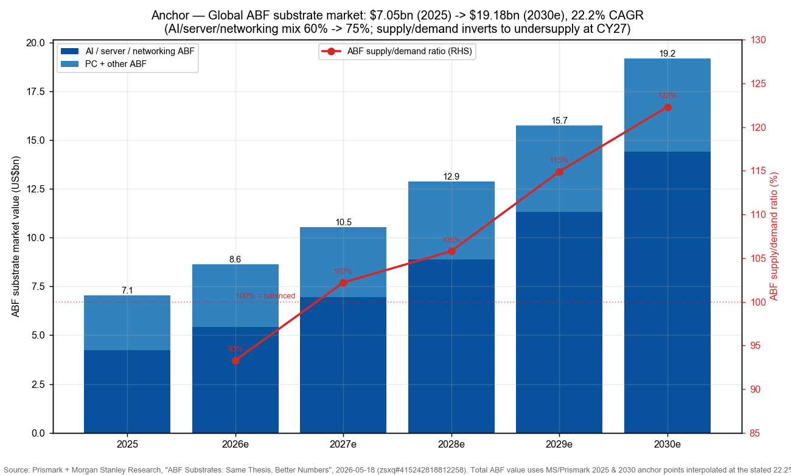
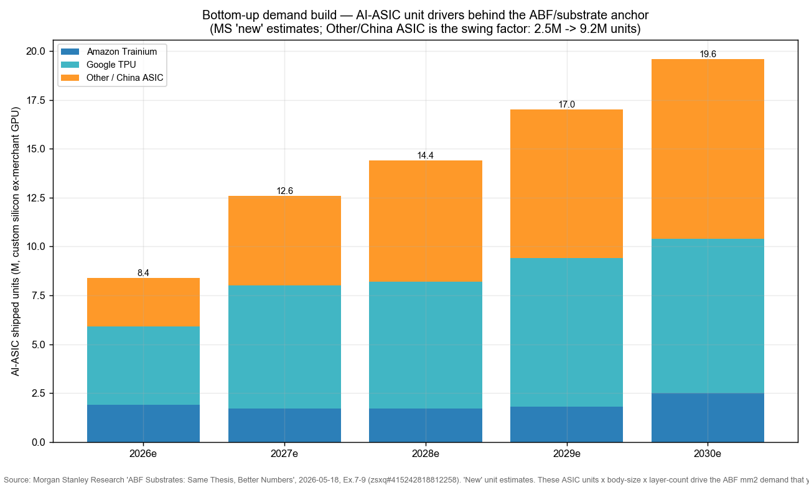
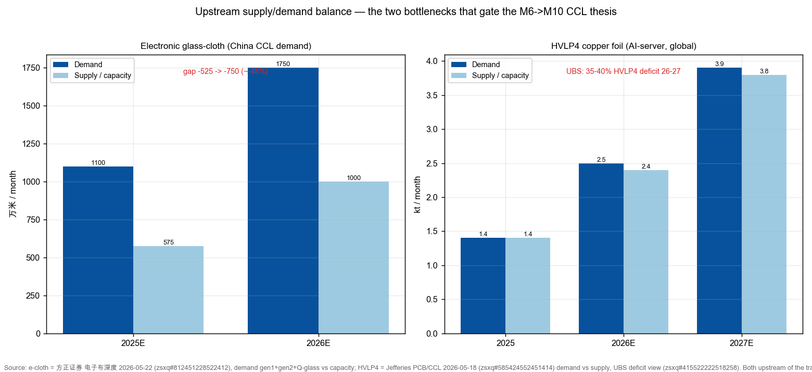
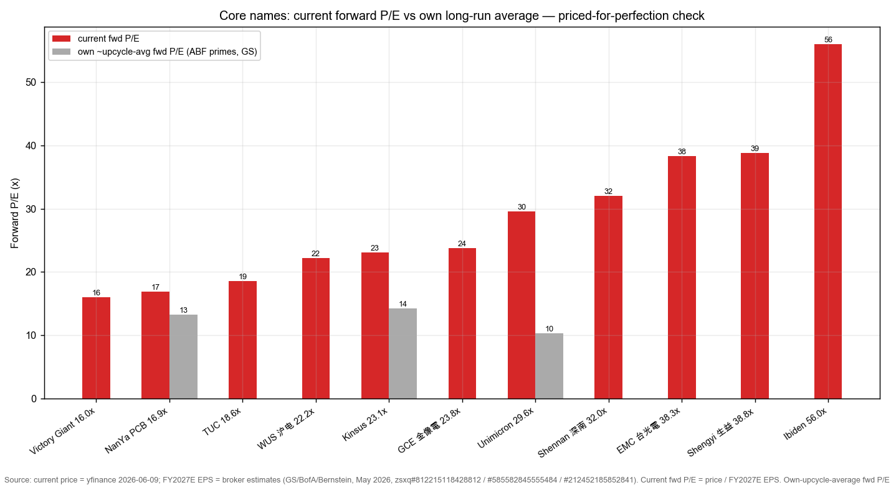
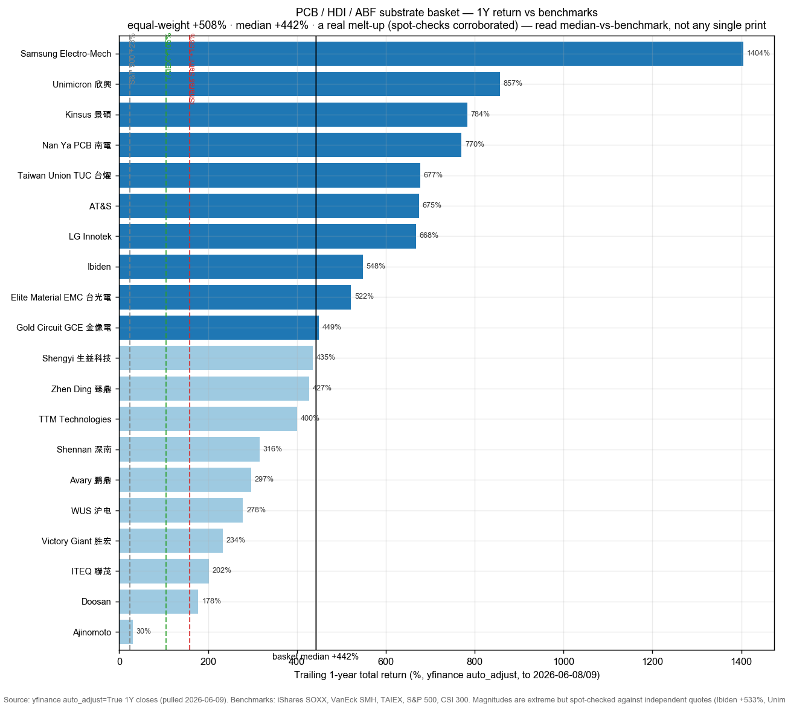

# AI-Server PCB / HDI / ABF Substrate & High-Speed CCL / AI 服务器 PCB·HDI·ABF 载板·高速覆铜板

**Created:** 2026-06-09 · **Last refreshed:** 2026-06-09 · **Last mutated:** 2026-06-09 · **Refresh cadence:** monthly · **Languages tracked:** en

## What's New

*The delta since you last looked — newest refresh on top. Older entries collapse into the archive below so this stays short.*

**2026-06-09 — basket created (20 tickers across 3 layers: ABF/FC-BGA substrate · AI-server PCB · high-speed CCL).**
- **Seeded** from the user's zsxq sell-side library — ~25 May–Jun 2026 notes from GS, MS, JPM, BofA, Citi, UBS, Nomura, Jefferies, Bernstein on the Taiwan/China/Japan/Korea PCB-CCL-ABF chain (anchor note: [MS "ABF Substrates: Same Thesis, Better Numbers", zsxq #415242818812258](http://xs-macbook-air.local:5001/zsxq/pdf-viewer/415242818812258)).
- **Anchor set:** global ABF substrate market **US$7.05bn (2025) → US$19.18bn (2030E), 22.2% CAGR** (Prismark + Morgan Stanley); supply/demand ratio inverts to undersupply at **CY27** (93.3%→122.3% by 2030), driving ABF price hikes **+15-20% (2026) / +20%+ (2027) / +25-40% (2028)**. **Swing factor = AI ASIC + GPU substrate demand** (it flows ~1:1 into price because near-term supply is fixed).
- **Conviction (sourced, not ours):** GS Conviction-List Buys = **Nan Ya PCB (8046)** in substrate, **Victory Giant (300476) + WUS (002463)** in PCB; GS Buy on **EMC (2383) + TUC (6274) + Shengyi (600183)** in CCL, **ITEQ off the Buy list**. The headline disagreement is **Unimicron: GS Neutral NT$555 vs MS Overweight NT$1,225 vs BofA Buy NT$1,300** — a >2x fair-value split on one name ([GS, zsxq #812215118428812](http://xs-macbook-air.local:5001/zsxq/pdf-viewer/812215118428812); [MS, zsxq #415242818812258](http://xs-macbook-air.local:5001/zsxq/pdf-viewer/415242818812258)).
- **Movers (1Y, context only):** equal-weight basket **+508%**, median **+442%**, vs **iShares SOXX +158% · TAIEX +105% · S&P 500 +23%**. Leaders SEMCO ~+1,404%, Unimicron +857%, Kinsus +784%; laggard Ajinomoto +30% (ABF is a small slice of the food group). Magnitudes are extreme but **spot-checked against independent quotes** (Ibiden +533%, Unimicron 52-wk NT$98→1,130, EMC NT$680→5,215) — a real melt-up, not an auto_adjust artifact.
- **25 sell-side PTs persisted** to `stock_price_target_db` (surfaced at [`/pt`](http://xs-macbook-air.local:5001/pt)) — including the Unimicron 4-broker split and the Zhen Ding GS-Buy-vs-Citi-Sell split.
- **Built to sell-side rigor:** the Thesis carries an **auditable bottom-up build** (ASIC units → ABF mm² demand), a **two-sided supply/demand balance** (ABF S/D ratio + e-cloth + HVLP4 foil, demand vs capacity), a **content-per-unit ladder** (H100 18L → Rubin Ultra 30-44L; PCB $/㎡ 1万→40万), a **bull/base/bear** scenario, a **pricing→margin→EPS bridge**, a **per-ticker Barometer**, a **basket scorecard** (100% positive / 95% beat SOXX), and **de-rate sizing** on the priced-for-perfection flag. 5 charts.
- **Relationship to [[ai-passives-packaging]]:** 10 substrate/PCB names overlap; that basket is **passives-centric** (MLCC + glass), this one is the dedicated **board + substrate + CCL** cut riding the ABF-shortage + M6→M10 CCL grade-migration thesis. See Scope rules.

Earlier refreshes

*(none — basket created 2026-06-09)*

## Thesis

**Anchor — global ABF (Ajinomoto Build-up Film) substrate market value:** US$7.05bn (2025) → **US$8.6bn (2026E, +22%) → US$10.5bn (2027E) → US$12.9bn (2028E) → US$15.7bn (2029E) → US$19.18bn (2030E)**, a 22.2% CAGR (raised from 17.9%), per **Prismark + Morgan Stanley** ([MS "ABF Substrates: Same Thesis, Better Numbers", 2026-05-18, zsxq #415242818812258](http://xs-macbook-air.local:5001/zsxq/pdf-viewer/415242818812258)). The defining feature is the **supply/demand ratio inverting to undersupply at CY27**: 93.3% (2026E) → 102.2% (2027E) → 105.8% (2028E) → 114.9% (2029E) → 122.3% (2030E), a 22% gap by 2030 (vs 15% prior). Because new ABF capacity needs 2+ years to come online, near-term supply is fixed, so the demand revision flows almost 1:1 into **price**: MS models ABF pricing **+15-20% (2026) / +20%+ (2027) / +25-40% (2028)**, and CITI's audited April EPS already shows the hikes hitting the P&L (Unimicron April pre-tax margin 24.8% vs March 12.4%) ([CITI, zsxq #585412224514114](http://xs-macbook-air.local:5001/zsxq/pdf-viewer/585412224514114)).

**Bottom-up build (the anchor is a model, not a headline).** The $19.18bn 2030 pool is `AI-ASIC/GPU units × substrate area-per-chip`. MS's demand engine is the custom-silicon unit ramp that, multiplied by body-size × layer-count, generates the ABF mm² demand behind the S/D ratio:

| AI-ASIC units (M, ex-merchant GPU) | 2026E | 2027E | 2028E | 2029E | 2030E |
|---|---|---|---|---|---|
| Amazon Trainium | 1.9 | 1.7 | 1.7 | 1.8 | 2.5 |
| Google TPU | 4.0 | 6.3 | 6.5 | 7.6 | 7.9 |
| Other / China ASIC | 2.5 | 4.6 | 6.2 | 7.6 | **9.2** |
| **Total custom silicon** | **8.4** | **12.6** | **14.4** | **17.0** | **19.6** |

The swing line is **Other/China ASIC (2.5M → 9.2M, ~4×)** — China AI chips alone go ~0.5M (2024) → ~7M (2030); revising it up is what drove MS's gap upgrade (15%→22%). Each generation also carries *more* ABF per unit (bigger bodies, more layers — see the content ladder), so mm² demand outruns unit growth ([MS Ex.7-9, zsxq #415242818812258](http://xs-macbook-air.local:5001/zsxq/pdf-viewer/415242818812258)).

**Sub-bucket decomposition (each its own pool, dated, sourced):**
- **ABF / FC-BGA substrate** — the headline above; AI/server/networking demand share rises **60% (2025) → 75%+ (2030)** as PC ABF fades from 70% (2015) to <15% (2030) ([MS, zsxq #415242818812258](http://xs-macbook-air.local:5001/zsxq/pdf-viewer/415242818812258)).
- **High-speed CCL (copper-clad laminate)** — the M6→M10 grade-migration layer: AI CCL TAM **~US$3bn (2025) → US$39bn (2030), ~70% CAGR** (Jefferies); GS expects the **AI-server CCL market +142% YoY in 2026** (and AI-server PCB +113%) ([Jefferies, zsxq #585424552451414](http://xs-macbook-air.local:5001/zsxq/pdf-viewer/585424552451414); [GS via Longbridge, 2024-11](https://longbridge.com/en/news/273234584)).
- **AI-server PCB (HLC / HDI / mSAP-SLP)** — AI-PCB TAM **~US$7bn (2025) → US$75bn (2030), ~60% CAGR**; AI-server share of PCB demand **15% (2025) → 25%+ (2026)**, value-per-server **+30%+**, layer count **16-20L → 28-36L** ([Jefferies, zsxq #585424552451414](http://xs-macbook-air.local:5001/zsxq/pdf-viewer/585424552451414); [TrendForce/UGPCB](https://www.ugpcb.com/news/trade-news/ai-server-pcb/)). HPC CCL+PCB combined: JPM US$3.89bn (2025) → US$9.98bn (2027), ~60% CAGR ([JPM, zsxq #585548152542554](http://xs-macbook-air.local:5001/zsxq/pdf-viewer/585548152542554)).
- **Upstream bottlenecks (geo cut):** the high-end is an **ex-China (Taiwan/Japan/Korea)** game today — 2024 top-3 rigid CCL = Kingboard 14.4% / Shengyi 13.7% / EMC 13.2%; the choke points are **ABF film (Ajinomoto ~95% share), HVLP4 copper foil (Mitsui ~40%), and quartz/Q-glass cloth (Japan oligopoly)** — China owns 37.3% of rigid-CCL volume but skews low/mid-end (2025H1 export ASP $7.56/kg vs import $34.00/kg), which is the import-substitution alpha overlay ([东莞证券 CCL 深度, zsxq #812451212818482](http://xs-macbook-air.local:5001/zsxq/pdf-viewer/812451212818482)).

**Content-per-unit ladder (the mechanism behind the CAGR).** ABF/PCB content steps up every generation — this is why mm² (and $) demand outruns unit growth:

| Spec ladder | layers / stack | power | material / copper |
|---|---|---|---|
| NVDA H100 (2023) | 18L (3+12+3), 3-stack | 700W | M6-M7 / HVLP2 |
| NVDA GB200/GB300 (2024-25) | 22L (5+12+5), 5-stack | 1,000-1,200W | M8 / HVLP3 |
| NVDA Vera Rubin (2026) | 26L (6+14+6), 6-stack | 2,850W | M8.5+ / HVLP3-4 |
| NVDA Rubin Ultra (2027+) | 30-44L, 8-stack+ | 3,000W+ | M9 (Q-glass) / HVLP4-5 |
| Optical module 400G → 1.6T | 10-12L → 14-18L; area 0.005 → 0.023 ㎡/unit (+2.3×) | — | M5-6 → M8; value density 2 → 15 万元/㎡ (+3×) |
| PCB process tier ($/area) | 减成法 ~1万元/㎡ → HDI ~3万 → 1.6T SLP ~15万 → **CoWoP M9 SLP >40万元/㎡ (~10× HDI)** | | |

([招商证券 mSAP Table 8/10/11, zsxq #415284451152288](http://xs-macbook-air.local:5001/zsxq/pdf-viewer/415284451152288)).

**Supply/demand balance (two-sided, auditable).** The headline S/D ratio is the *quotient* of demand mm² over supply mm² — MS's series below, plus the two upstream bottlenecks (glass cloth, HVLP4 foil) that physically gate it:

| ABF substrate S/D ratio (>100% = undersupply) | 2026E | 2027E | 2028E | 2029E | 2030E |
|---|---|---|---|---|---|
| New (MS, 2026-05) | 93.3% | 102.2% | 105.8% | 114.9% | **122.3%** |
| Old (MS, prior) | 96.6% | 102.6% | 106.8% | 112.2% | 114.6% |

Upstream is tighter: **electronic glass-cloth** demand 1,100 → 1,750 万米/月 vs capacity 575 → 1,000 (gap **−525 → −750, ~−48%**; 日东纺/旭化成 E-glass shutdowns + Q-glass weaving-machine 18-24-month lead times), and **HVLP4 copper foil** demand 1.4 → 3.9 kt/mo vs supply 1.4 → 3.8 (UBS sees a **35-40% HVLP4 deficit** 2026-27; Mitsui ~40% share adds only ~20%/yr vs ~60% demand) ([方正 e-cloth, zsxq #812451228522412](http://xs-macbook-air.local:5001/zsxq/pdf-viewer/812451228522412); [Jefferies, zsxq #585424552451414](http://xs-macbook-air.local:5001/zsxq/pdf-viewer/585424552451414); [UBS, zsxq #415522222518258](http://xs-macbook-air.local:5001/zsxq/pdf-viewer/415522222518258)).

**Swing factor — AI ASIC + GPU substrate demand.** MS attributes its entire 2030 gap upgrade (15%→22%) to "increased demand for GPUs, ASICs, and CPUs", not to supply. Because the value series is supply-constrained near-term, a downward revision to the GB300→Rubin→Rubin Ultra→Feynman ramp would collapse both the volume *and* the pricing legs simultaneously — it is the one variable that moves the headline through two channels at once. Secondary swing: **T-glass / Q-glass cloth availability** — if the cloth bottleneck eases, the supply curve shifts and the pricing leg deflates even with demand intact.

**Scenario (bull / base / bear).** MS brackets the AI-silicon demand engine via the orchestration-CPU TAM (a proxy for the broader custom-silicon pool): 2030 **bear $77bn / base $125bn / bull $283bn**, the swing being the CPU:GPU ratio (1:2 → 2:1) and AI take-up (78% → 99%). Mapped to this basket — **base:** the 22.2% ABF CAGR + S/D inverting CY27 (today's PTs); **bull:** Other/China-ASIC units beating 9.2M (2030) + M9/M10 pricing holding → substrate primes re-rate further; **bear:** hyperscaler AI-capex guide-down + ASIC units missing → S/D ratio fails to clear 100% in 2027, the pricing leg deflates, and the basket de-rates toward its own-history multiples (sized in [Drift signals](#drift-signals)) ([MS Ex.10, zsxq #415242818812258](http://xs-macbook-air.local:5001/zsxq/pdf-viewer/415242818812258)).

**Pricing → margin → EPS bridge.** The ABF/CCL price leg is not a free-floating industry stat — it drops to the swing names' P&L: **Nan Ya PCB** OPM breakeven (1H25) → 25% (2026E) → 35% (2027E) drives a **93% 2026-28E EPS CAGR**; **Kinsus** ~59%; **Unimicron** EPS ~triples to NT$14 (2026) → NT$36.6 (2028) on GM 14% → 33%; **Shengyi** AI-CCL GM 40%+ vs blended ~28% ([GS, zsxq #812215118428812](http://xs-macbook-air.local:5001/zsxq/pdf-viewer/812215118428812); [Bernstein, zsxq #212452185852841](http://xs-macbook-air.local:5001/zsxq/pdf-viewer/212452185852841); [CITI, zsxq #212281428258821](http://xs-macbook-air.local:5001/zsxq/pdf-viewer/212281428258821)).

**Value-chain map (dollar-weighted, with the leading supplier's share).** Reading up the AI-server board cost stack — **CCL ≈ 40% of PCB cost**, and within CCL **copper foil ≈ 42% / resin ≈ 26% / glass cloth ≈ 19%** ([UBS, zsxq #415522222518258](http://xs-macbook-air.local:5001/zsxq/pdf-viewer/415522222518258); [方正, zsxq #812451228522412](http://xs-macbook-air.local:5001/zsxq/pdf-viewer/812451228522412)):

- **ABF film** — Ajinomoto **~95% share** (the choke point) → *no listed pure-play 2nd source = coverage gap.*
- **IC substrate** — Unimicron (27% ABF) · Nan Ya PCB · Kinsus (~10%) · Ibiden · SEMCO · LG Innotek · AT&S (+Shennan in China).
- **High-speed CCL** — 台光/EMC **32.8%** · 台耀/TUC **17.1%** · 联茂/ITEQ **15.7%** · 松下/Panasonic 9.0% · 生益/Shengyi 6.5% · 斗山/Doosan 3.3% (Prismark 2024 high-speed share).
- **AI-server PCB fab** — Victory Giant · WUS · Shennan · GCE · Zhen Ding · Avary · TTM.
- **Upstream (sized coverage gaps, no clean pure-play):** HVLP3+ copper foil **$216M (2025) → $2.4bn (2028), 122% CAGR** (Mitsui ~40%); high-end quartz/Q-glass cloth (Japan Nittobo/Asahi >70%) — each a rich-dollar layer the basket can't yet hold; the convert-to-tracked trigger is a China HVLP4 qualification or a 2nd ABF-film source (see Drift signals).

**Conviction ranking (sourced, never ours).** *Substrate:* MS prefers **Nan Ya PCB (+62% to PT) > Unimicron (+49%)**, both OW; GS is Conviction-List Buy on **Nan Ya PCB**, Buy on **Kinsus**, but only **Neutral on Unimicron** (>70% of its ABF is LTA-locked, capping spot-price capture) ([GS, zsxq #812215118428812](http://xs-macbook-air.local:5001/zsxq/pdf-viewer/812215118428812); [MS, zsxq #415242818812258](http://xs-macbook-air.local:5001/zsxq/pdf-viewer/415242818812258)). *PCB:* GS Conviction-List Buy on **Victory Giant + WUS**, Buy on Shennan/GCE/Zhen Ding — but Zhen Ding is also a **GS-Buy-vs-Citi-Sell** split (Citi flags record-capex overcapacity, PT NT$150) ([GS, zsxq #212452258455221](http://xs-macbook-air.local:5001/zsxq/pdf-viewer/212452258455221); [Citi, zsxq #812228411484222](http://xs-macbook-air.local:5001/zsxq/pdf-viewer/812228411484222)). *CCL:* GS Buy on **EMC + TUC**, with **Shengyi** the only China maker NVDA-certified at M9; **ITEQ is off GS's Buy list** (the relative laggard) ([GS Taiwan CCL, zsxq #212228485514141](http://xs-macbook-air.local:5001/zsxq/pdf-viewer/212228485514141)). *Analyst view (this note):* we treat the Taiwan substrate primes + CCL/film as `enabler` (they enable the AI build-out) and the AI-PCB pure-plays as `core` (the boards are the theme's product) — our role taxonomy, distinct from the brokers' ratings.

## Scope rules

**In:** ABF / FC-BGA / BT IC-substrate makers; the ABF-film monopolist; high-speed CCL (M6→M10) makers; AI-server / HDI / high-layer-count / mSAP-SLP PCB fabricators with disclosed AI-server, switch, or optical-module exposure. The basket is deliberately split across three value-chain layers because the user's brief — "PCB、HDI、ABF" — spans all three, and the thesis (content + ASP growth per AI rack) runs through every layer.

**Out:** the chip/GPU designers themselves (NVDA/AMD/Broadcom — customers, not suppliers); PCB *equipment* (drilling/laser — e.g. Han's CNC 大族数控, separate); pure copper-foil / glass-cloth upstream names (tracked as leading indicators, not basket members — see Leading indicators + Exclusions); glass-core / CoPoS substrates (a 2027-30 event tracked in [[ai-passives-packaging]]); MLCC passives (in [[ai-passives-packaging]]).

**Relationship to [[ai-passives-packaging]]:** 10 names appear in both (Unimicron, Nan Ya PCB, Kinsus, Ibiden, Ajinomoto, SEMCO, AT&S, WUS, Shennan, Avary, Shengyi). That basket's center of gravity is **MLCC passives + glass-core packaging** with ABF/PCB as an adjacency; this basket is the **dedicated board + substrate + CCL cut**, where the justifications ride the **ABF-shortage S/D inversion and the M6→M10 CCL grade ladder** specifically. A name can sit in both with independent, additive theses — the same way Murata/TDK sit in both ai-passives and humanoid-robotics-sensors.

## Tracked tickers

| Ticker | Name | Role | Justification | Added |
|---|---|---|---|---|
| TWSE:3037 | Unimicron 欣興 | enabler | **Moat:** largest pure ABF substrate maker (~27% global share 2024), qualified across AMD/Nvidia server CPU/GPU (Hopper→Rubin) where ABF content steps up each generation; can squeeze ~40% incremental capacity YE26 vs YE25 via de-bottlenecking without greenfield lead-time. **Threat:** >70% of ABF is LTA-locked so it captures *less* spot upside (the exact reason GS stays Neutral NT$555 while MS is OW NT$1,225) — plus CoWoP substitution + T-glass tightness. ([GS, zsxq #812215118428812](http://xs-macbook-air.local:5001/zsxq/pdf-viewer/812215118428812); [MS, zsxq #415242818812258](http://xs-macbook-air.local:5001/zsxq/pdf-viewer/415242818812258)) | 2026-06-09 |
| TWSE:8046 | Nan Ya PCB 南電 (NYPCB) | enabler | **Moat:** highest spot-price leverage in the cluster — 70-80% of ABF revenue is spot-priced (not LTA) and it holds **70%+ share of high-end 800G/1.6T switch-IC ABF** (Broadcom Tomahawk 5/6); GS Conviction-List Buy, 93% 2026-28E EPS CAGR. **Threat:** low high-end ABF mix today (<20% of rev in 1H25) means the thesis hinges on qualifying new capacity on time; 1H25 OPM was breakeven — the highest-beta name here. ([GS NYPCB, zsxq #415248221122828](http://xs-macbook-air.local:5001/zsxq/pdf-viewer/415248221122828); [MS, zsxq #415242818812258](http://xs-macbook-air.local:5001/zsxq/pdf-viewer/415242818812258)) | 2026-06-09 |
| TWSE:3189 | Kinsus 景碩 | enabler | **Moat:** ~10% global ABF/BT share and the #2-tier name end-customers turn to for supply security — MS channel checks show it being qualified on **multiple new Nvidia substrate types**; ~30% of ABF revenue is high-margin non-LTA. **Threat:** smaller/slower than Unimicron/NYPCB; ~36% of 2025 revenue is less-AI-levered BT substrate and ~18% is the non-core Pegavision contact-lens unit, diluting the read-through; T-glass-capped. ([GS, zsxq #812215118428812](http://xs-macbook-air.local:5001/zsxq/pdf-viewer/812215118428812); [BofA, zsxq #212451458225151](http://xs-macbook-air.local:5001/zsxq/pdf-viewer/212451458225151)) | 2026-06-09 |
| TSE:4062 | Ibiden イビデン | enabler | **Moat:** premier high-end FC-BGA prime — strongest position in Nvidia AI accelerators, Intel server CPUs and Intel EMIB-T advanced packaging; technology leadership in largest-reticle/highest-layer substrates (80×80→130×130mm bodies, 9+N+9→14+N+14 by 2030). ¥500bn FY26-28 capex. **Threat:** capacity-bound (only ~2.5x current by FY28) so it cedes incremental volume to Taiwan/Korea; dependent on Ajinomoto film + T-glass; very rich (Bernstein ~71x 2026E P/E). ([Bernstein, zsxq #212452185852841](http://xs-macbook-air.local:5001/zsxq/pdf-viewer/212452185852841); [Digitimes, 2026-02-04](https://www.digitimes.com/news/a20260204PD227/ibiden-expansion-capacity-production-plant.html)) | 2026-06-09 |
| TSE:2802 | Ajinomoto 味の素 | enabler | **Moat:** the upstream choke point — **~95% global share of ABF film**, the dielectric every high-end organic FC-BGA is built on; capital-light, IP-protected, co-developed per customer; AI drives far more ABF per chip. JPM raised its ABF sales CAGR estimate from 10% to 20%. **Threat:** a 3rd ABF factory only mass-produces in 2032 (could in theory invite a 2nd source); food/seasonings core dilutes the AI read; long-tail CoWoP/glass-substrate bypass risk. ([JPM, zsxq #812485541485212](http://xs-macbook-air.local:5001/zsxq/pdf-viewer/812485541485212); [MS ABF hikes, zsxq #812458154444212](http://xs-macbook-air.local:5001/zsxq/pdf-viewer/812458154444212)) | 2026-06-09 |
| KRX:009150 | Samsung Electro-Mechanics 삼성전기 | enabler | **Moat:** dual AI-server BOM exposure — a top-tier MLCC maker *and* a scaling FC-BGA (ABF) prime adding customers toward full utilization, with Samsung-group backing to qualify high-layer server FC-BGA where the supplier list is short; Q1 2026 was its first-ever >₩3tr quarter, FC-BGA division +45% YoY. **Threat:** FC-BGA still sub-scale vs Ibiden/Unimicron and capacity lags orders; MLCC cyclicality; intra-Korea competition from LG Innotek; reliant on Ajinomoto film. ([GS, zsxq #212225445181441](http://xs-macbook-air.local:5001/zsxq/pdf-viewer/212225445181441); [Seoul Economic Daily, 2026-04-30](https://en.sedaily.com/business/2026/04/30/samsung-electro-mechanics-q1-operating-profit-jumps-40)) | 2026-06-09 |
| KRX:011070 | LG Innotek 엘지이노텍 | adjacent | **Moat:** fast-scaling new FC-BGA entrant off its Gumi "Dream Factory" + Vietnam capacity, differentiating on **large-area 85×85mm FC-BGA for AI accelerators** (shown at ECTC 2026) and courting US AI-chip designers with LTAs — gives end-customers a credible 4th high-end supplier. **Threat:** the latest entrant — server FC-BGA revenue is nascent (entry "as early as 2026"); legacy revenue is Apple-camera-module dominated; LTAs not yet binding. ([JPM, zsxq #415515481124258](http://xs-macbook-air.local:5001/zsxq/pdf-viewer/415515481124258); [Tech Times, 2026-05-15](https://www.techtimes.com/articles/316690/20260515/lg-innotek-targets-us-ai-chip-clients-substrate-revenue-climbs-16.htm)) | 2026-06-09 |
| WBAG:ATS | AT&S | adjacent | **Moat:** Europe's only high-end IC-substrate maker; new Kulim (Malaysia) ABF fab dedicated to AI/data-center, on track to be a top-3 global ABF producer with **AMD as named anchor customer** — a non-Asian ABF source for the Western supply chain. **Threat:** growth explicitly **glass-cloth-constrained** (guided 30-35% rev but says T-glass-capped); heavy debt/capex; sub-scale at the highest end; AMD concentration. ([BofA, zsxq #212451458225151](http://xs-macbook-air.local:5001/zsxq/pdf-viewer/212451458225151); [Digitimes, 2025-05-07](https://www.digitimes.com/news/a20250507VL211/plant-austria-manufacturing-amd-substrate.html)) | 2026-06-09 |
| SZSE:300476 | Victory Giant 胜宏科技 | core | **Moat:** China's purest AI-PCB play — mass-production in **70-layer** boards + 28-layer 8-stack any-layer HDI, 78-layer TLPS in R&D — a layer-count lead that wins co-development of the latest GPU/ASIC boards; AI&HPC jumped from 5.5% (9M24) to 41.5% (9M25) of revenue. GS Conviction-List Buy. **Threat:** WUS + Shennan are chasing the same GPU/ASIC sockets; GS names fiercer competition → ASP erosion and a slower spec-upgrade pace as the top risks. ([GS, zsxq #415242184144448](http://xs-macbook-air.local:5001/zsxq/pdf-viewer/415242184144448)) | 2026-06-09 |
| SZSE:002463 | WUS 沪电股份 | core | **Moat:** China's high-speed-switch PCB champion — switch/router PCB grew **+110% YoY to 43% of 2025 revenue**, qualified into 224G-SerDes spec upgrades + Rubin compute-tray midplane; disciplined capacity strategy protects mix/yield. GS Conviction-List Buy, PT raised to ¥142. **Threat:** GS flags slower high-end migration + fiercer AI-PCB competition; a stall in the 5,528 TB/s Rubin Ultra switch ramp would hit the 43%-of-revenue switch engine. ([GS, zsxq #585425285428854](http://xs-macbook-air.local:5001/zsxq/pdf-viewer/585425285428854); [GS mgmt visit, zsxq #585428148821414](http://xs-macbook-air.local:5001/zsxq/pdf-viewer/585428148821414)) | 2026-06-09 |
| SZSE:002916 | Shennan Circuits 深南电路 | core | **Moat:** unique "3-in-One" platform — AI-server/switch PCB **+** optical-module mSAP PCB (started 1.6T MP in 1Q26, needs M8/M9 material) **+** BT/ABF substrate (up to 22-layer ABF in MP serving domestic GPU/CPU). **Threat:** customer concentration + ASP erosion (1Q26 net -10.5% QoQ on FX/impairments); WUS/Victory Giant + Taiwan optical-PCB peers contest the same sockets. ([GS, zsxq #585428188218244](http://xs-macbook-air.local:5001/zsxq/pdf-viewer/585428188218244); [Nomura, zsxq #812228158251482](http://xs-macbook-air.local:5001/zsxq/pdf-viewer/812228158251482)) | 2026-06-09 |
| TWSE:2368 | Gold Circuit Electronics 金像電 (GCE) | core | **Moat:** global cloud (server+switch) PCB leader (~20%+ share 2022), a key **Nvidia OAM/UBB + switch PCB** supplier riding 20-50%+ layer-count increases per generation; Q1 2026 rev +60% / NI +99% YoY on GB200 ramp; capex +100%+ to NT$17bn+. **Threat:** GS names Nvidia OAM/UBB qualification delays + high new-capacity (Thailand Ph-2) ramp cost; GB200/Rubin concentration exposes it to any AI-server air-pocket. ([GS, zsxq #812215118428812](http://xs-macbook-air.local:5001/zsxq/pdf-viewer/812215118428812); [Quartr/TradingView Q1 2026](https://www.tradingview.com/news/urn:summary_document_slides:quartr.com:3381484:0-gold-circuit-electronics-q1-2026-revenue-and-net-income-surged-led-by-robust-server-and-networking-growth/)) | 2026-06-09 |
| TWSE:4958 | Zhen Ding 臻鼎 | core | **Moat:** global #1 PCB maker turning Apple-FPC scale into AI — passed verification for **Nvidia Vera Rubin compute-tray PCB** (AI-tray OPM 20-30% vs company 10-15%), MP on 20-30L AI PCB with 70-80L (backplane/CoWoP) in development; also highest China ABF-substrate exposure (>40% China ABF share targeted by 2027). **Threat:** highest Apple/consumer drag (FPC ~55%+ of 2027E rev) → earnings volatility; **Citi is outright Sell (PT NT$150)** on record-capex overcapacity — a live bull/bear split vs GS Buy NT$388. ([GS, zsxq #212452258455221](http://xs-macbook-air.local:5001/zsxq/pdf-viewer/212452258455221); [Citi Sell, zsxq #812228411484222](http://xs-macbook-air.local:5001/zsxq/pdf-viewer/812228411484222)) | 2026-06-09 |
| NASDAQ:TTMI | TTM Technologies | core | **Moat:** largest North American PCB maker and the **only Western fab** here — a dual aerospace-&-defense + data-center franchise whose Ultra-HDI + onshore "trusted-supplier" footprint wins sovereign-AI/defense work Asian peers can't serve; Q1 2026 sales +30% YoY, Data Center 36% of sales (~+57%/yr), backlog $1.6bn / book-to-bill 1.41. **Threat:** data-center book concentrated in a few hyperscalers; lacks the 70-80L ultra-high-layer capability Taiwan/China leaders are pushing toward; premium on backlog optimism. ([TTM Q1 2026 release](https://investors.ttm.com/news-events/press-releases/detail/403/ttm-technologies-inc-reports-first-quarter-2026-results)) | 2026-06-09 |
| SZSE:002938 | Avary Holding 鹏鼎控股 | adjacent | **Moat:** world's largest PCB maker by revenue and Apple's lead FPC/SLP supplier, now levering that HDI/SLP know-how into AI-server + optical-module PCB ("cloud-pipe-end" full-chain); Thailand Ph-1 server + optical products customer-certified, ~RMB5bn 2025 capex for high-end HDI/SLP. **Threat:** heaviest Apple/consumer concentration here (least "pure" AI-PCB play) and enters AI-server HDI *later* than WUS/Victory Giant who already MP high-layer boards. Also in [[ai-passives-packaging]]. ([Futu deep-dive](https://news.futunn.com/en/post/55405730/deep-dive-into-avary-holding-002938-ai-smart-driving-layout)) | 2026-06-09 |
| TWSE:2383 | Elite Material 台光電 (EMC) | enabler | **Moat:** **first Taiwan/Korea maker to pass NVDA M9 qualification** — GS sees it taking ~100% of M9 Switch-Tray CCL + 40-45% of total AI-GPU CCL TAM; deepest high-end mix + most aggressive capacity bet (5.85m→9.45m sheets/mo); M9 ASP ~5x company-average CCL. **Threat:** Doosan was flagged exclusive Rubin CCL after EMC reportedly failed an earlier GB300 test; for M10 NVDA widened testing to EMC + two Chinese makers, so single-supplier premiums erode as China qualifies at the next node. ([GS Taiwan CCL, zsxq #212228485514141](http://xs-macbook-air.local:5001/zsxq/pdf-viewer/212228485514141); [BofA, zsxq #585582845555484](http://xs-macbook-air.local:5001/zsxq/pdf-viewer/585582845555484); [Digitimes Doosan/EMC, 2025-11-21](https://www.digitimes.com/news/a20251121PD242/doosan-ccl-nvidia-emc-rubin.html)) | 2026-06-09 |
| TWSE:6274 | Taiwan Union Technology 台燿 (TUC) | enabler | **Moat:** one of three M9-capable makers (with Shengyi & Doosan), #2 global in optical-transceiver CCL and a distinctive **heavy-copper / HVDC CCL** franchise (5-6oz copper = multi-x ASP) that EMC/ITEQ don't match; shipping ASIC AI-server CCL (M8.5) from Apr 2026. **Threat:** higher low/mid-end E-glass exposure than EMC → more commodity-price risk (it suspended some E-glass lines to force a mix upgrade); competes head-on with EMC where EMC qualified M9 first. ([GS TUC, zsxq #812458441144242](http://xs-macbook-air.local:5001/zsxq/pdf-viewer/812458441144242)) | 2026-06-09 |
| SSE:600183 | Shengyi Technology 生益科技 | enabler | **Moat:** the **only China CCL supplier NVDA-certified at M9 with >90% yield** for Rubin/GB300 (Citi); #2 globally in rigid CCL (13.7% share); telecom high-speed know-how + raw-material bargaining power; AI-CCL GM 40%+ vs blended ~28%, AI-CCL volume doubling to >15% of capacity in 2026. **Threat:** Mitsui controls ~40% of HVLP foil (maps to M9) so it's hostage to foreign foil at the top spec; EMC/Doosan contest the same NVDA M9/M10 trays; biggest hikes are in lower-GM mainstream grades (mix dilution). ([GS, zsxq #212485814111481](http://xs-macbook-air.local:5001/zsxq/pdf-viewer/212485814111481); [CITI China CCL, zsxq #212281428258821](http://xs-macbook-air.local:5001/zsxq/pdf-viewer/212281428258821)) | 2026-06-09 |
| KRX:000150 | Doosan 두산 | enabler | **Moat:** top global high-speed CCL maker, one of three M9-capable suppliers, **reportedly positioned for exclusive Nvidia Rubin CCL** after EMC's GB300 stumble; tight exclusive tie to Korean HVLP foil (CFL/Solus) and a high-value mix (AI-server/network ~81% of CCL sales). **Threat:** holding-company (000150) structure dilutes the Electro-Materials signal across heavy-machinery/energy; Thailand AI-CCL plant only MP 2H2028, so near-term capacity lags Taiwan/China; EMC contests the same NVDA M9 slot. ([Digitimes, 2025-11-21](https://www.digitimes.com/news/a20251121PD242/doosan-ccl-nvidia-emc-rubin.html); [Sedaily, 2026-04-29](https://en.sedaily.com/finance/2026/04/29/doosan-to-build-ccl-plant-in-thailand-with-180-billion-won)) | 2026-06-09 |
| TWSE:6213 | ITEQ 聯茂 | adjacent | **Moat:** ~18% of the global high-frequency/high-speed CCL market (with TUC), M9-grade certified by a major US AI company, Thailand 800G switch-substrate stabilized with 1.6T/CPO ramping — a credible #3 Taiwan pure-play and relative-value catch-up. **Threat:** the cluster laggard — qualified at M9 later and at smaller scale than EMC/TUC, so it captures high-end mix last and is first squeezed if China/Doosan absorb incremental M9/M10; **GS keeps it off its Buy list** (the EMC/TUC-Buy-vs-ITEQ contrast), CLSA carries a stale Sell. ([UBS HVLP table, zsxq #415522222518258](http://xs-macbook-air.local:5001/zsxq/pdf-viewer/415522222518258); [Digitimes, 2026-05-28](https://www.digitimes.com/news/a20260528PD218/ccl-iteq-laminate-demand-shipments.html)) | 2026-06-09 |

**Geographic / role mix (20 tickers):** Taiwan 7 (35%) · China A-share 5 (25%) · Korea 3 (15%) · Japan 2 (10%) · US 1 (5%) · Austria 1 (5%) · Korea/Japan substrate spillover. Role: **core 6** (AI-PCB pure-plays), **enabler 10** (substrate + CCL + ABF film), **adjacent 4** (nascent/diluted: LG Innotek, AT&S, Avary, ITEQ).

## Valuation snapshot

Current price = yfinance 2026-06-09 (spot-checked vs independent quotes). Rating/PT mirror `stock_price_target_db` ([`/pt`](http://xs-macbook-air.local:5001/pt)). **P/E 26E→27E** = current price ÷ broker FY2026E / FY2027E EPS — the **compression is the bull pivot** (growth outrunning the multiple). Own-avg = the name's GS-disclosed upcycle-average P/E. **The headline read: most names have run *to or past* their sell-side targets** — the priced-for-perfection signal sized in [Drift signals](#drift-signals).

| Ticker | Name | Rating (broker · as-of) | PT | Px | Upside | P/E 26E→27E | own avg | PEG (CY27/28) |
|---|---|---|---|---|---|---|---|---|
| TWSE:3037 | Unimicron | **split:** GS Neutral · MS OW · Bern OP · BofA Buy (Apr-May 26) | 555 / **1,225** / 990 / 1,300 | NT$945 | **−41% to +38%** | 67x → **38x** | **10.3x** | **0.48 / 0.24** |
| TWSE:8046 | Nan Ya PCB | Buy-CL (GS) · OW (MS) · Buy (BofA) (May 26) | 1,115 / 1,275 / 1,170 | NT$897 | +24% to +42% | 44x → **17x** | **13.3x** | **0.50 / 0.22** |
| TWSE:3189 | Kinsus | Buy (GS Apr-22) · Buy (BofA May-25) | 485 / 695 | NT$704 | −31% to −1% | — → 23x | **14.2x** | — |
| TSE:2802 | Ajinomoto | OW (JPM May-29) · Buy (GS May-18) | 6,500 / 5,150 | ¥4,724 | +9% to +38% | 37x FY27 (JPM) | n/a¹ | — |
| SZSE:300476 | Victory Giant | Buy-CL (GS May-21) | 550 | ¥334 | **+65%** | — → 16x | n/a¹ | — |
| SZSE:002463 | WUS 沪电 | Buy (GS May-23) | 142 | ¥137 | +4% | — → 22x | n/a¹ | — |
| SZSE:002916 | Shennan | Buy (GS May-25) · Buy (BofA Apr-27) | 450 / 340 | ¥391 | −13% to +15% | — → 32x | n/a¹ | — |
| TWSE:2368 | Gold Circuit (GCE) | Buy (GS Apr-22) | 1,380 | NT$1,495 | −8% | — → 24x | n/a¹ | — |
| TWSE:4958 | Zhen Ding | **split:** GS Buy May-13 / Citi Sell Mar-12 | 388 / 150 | NT$535 | −27% / −72% | SOTP (GS) | n/a¹ | 0.42 / 0.51 |
| TWSE:2383 | Elite Material (EMC) | Buy (BofA) · Buy (Nomura) (May 26) | 4,600 / 2,330 | NT$5,030 | −9% / −54% | 60x → **38x** | n/a¹ | — |
| TWSE:6274 | TUC | Buy (GS May-7) · Buy (BofA May-25) | 1,888 / 1,180 | NT$1,600 | −26% to +18% | 43x → **19x** | n/a¹ | — |
| SSE:600183 | Shengyi | Buy (GS May-30) | 146.3 | ¥147 | ~0% | 65x → **39x** | n/a¹ | — |

¹ *No GS-disclosed upcycle/10yr-average multiple — most A-share/Taiwan/Korea names re-rated into the AI cycle without a clean prior-cycle comp; the 3 GS-covered ABF primes (Unimicron/NanYa/Kinsus) are the exception, and are the only names where the priced-for-perfection gap vs own history is directly measurable.*

**No sell-side PT in the local library** (price-only): LG Innotek (₩1,131,000), AT&S (€138.8), Avary 鹏鼎 (¥115), TTM ($178, backlog $1.6bn / BtB 1.41), Doosan (₩1,628,000), ITEQ (NT$255 — off GS's Buy list; only a stale CLSA Sell exists).

**Stale PTs — overtaken by price, pending refresh** (NOT blended into the live Upside column above): **Ibiden** Bernstein OP ¥9,200 (as-of 2026-05-14, EPS 238.9/330.7 → 77x/56x) vs price ¥18,505 — PT under review post-guidance; **SEMCO** GS Buy ₩480,000 (as-of 2026-03-06, EPS ₩17,455/24,448) vs price ₩1,938,000 — the stock ~4×'d past the target. Both are flagged for re-grounding in Drift signals.

**PT derivation (where the broker discloses it):** Unimicron MS NT$1,225 at 0.48x/0.24x CY27/28 PEG; GS Neutral NT$555 = 17.4x 2027E P/E (**+2.7 s.d.** over the 10.3x upcycle avg — the explicit over-valuation flag). Nan Ya PCB GS NT$1,115 = 21x 2027E (+1.2 s.d. vs 13.3x); Kinsus GS NT$485 = 15.9x (+1 s.d. vs 14.2x). EMC BofA NT$4,600 = 30x 2H27-1H28E. Shengyi GS ¥146.3 = 38.7x 2027E (45% 2028E EPS growth). WUS GS ¥142 = 23x 2027E. GCE GS NT$1,380 = 22x 4Q26-3Q27E.

## Exclusions

| Ticker | Reason |
|---|---|
| TSE:6967 (Shinko Electric) | **Delisted June 6 2025** after JIC's JICC take-private at ¥5,920/sh — a top-3 ABF prime no longer investable; consolidation that leaves fewer public ABF names. ([JPX delisting](https://www.jpx.co.jp/english/news/1023/20250520-11.html)) |
| TWSE:3044 (Tripod 健鼎) | Diversified high-volume PCB; captures AI mainly via *overflow/commodity-adjacent* server + memory PCB — dilutes the pure-play focus. Candidate add if AI mix inflects. |
| TSE:6752 (Panasonic) | MEGTRON is a real NVDA-certified low-loss CCL, but it sits inside an ¥8tr conglomerate (batteries/appliances) — too diluted to track as a CCL pure-play. ([GS, zsxq #814528815842122](http://xs-macbook-air.local:5001/zsxq/pdf-viewer/814528815842122)) |
| NYSE:ROG (Rogers) | High-frequency PTFE/ceramic laminate (auto-radar/RF) — different chemistry, **absent from the AI-CCL design-in race** until ~2H2027; misses the 2026-27 super-cycle. |
| ABF film / HVLP4 foil / quartz-glass pure-plays | **Coverage gaps** — Ajinomoto (film) is in as `enabler`, but HVLP4 copper foil (Mitsui-dominated) and high-end quartz/Q-glass cloth (Nittobo/Asahi Kasei oligopoly) have no clean listed pure-play; tracked as Leading indicators instead. |
| China upstream (China Jushi/中材科技/Tongguan foil/圣泉资) | Electronic-cloth, copper-foil, resin upstream — material *leading indicators* (priced before the basket) but too far upstream + cyclical to track as members. |

## Keywords

ABF substrate / ABF载板 (Ajinomoto Build-up Film) · FC-BGA · BT substrate · IC substrate / 封装基板 · high-speed CCL / 高速覆铜板 · M6→M10 grade migration · ultra-low-loss / 超低损耗 · HVLP copper foil / 反转铜箔 · T-glass / Q-glass electronic cloth / 电子布 · HDI / 高密度互连 · mSAP-SLP · high-layer-count PCB / 高多层板 · AI-server PCB / AI服务器PCB · optical-module PCB / 光模块PCB · NVDA Rubin / Vera Rubin · supply/demand undersupply / 供需缺口

## Performance (since last refresh)

Baseline pass (basket created 2026-06-09; trailing-1-year off yfinance auto-adjusted closes to 2026-06-08/09). **Equal-weight basket +508%, median +442%**, versus **iShares SOXX +158% · VanEck SMH +134% · TAIEX +105% · S&P 500 +23% · CSI 300 +22%** — the basket roughly **tripled the broad semis ETFs** and lapped the market many times over, the expected profile for a pure-play AI-substrate basket in a melt-up upcycle.

**Basket scorecard (1Y, MS *Three Actionable Ideas* style):** **100% of names positive** (20/20) · **95% beat SOXX** (19/20, only Ajinomoto +30% lags) · **95% beat TAIEX** · **100% beat the S&P 500**. Best contributor **Samsung Electro-Mech +1,404%**; worst **Ajinomoto +30%**. (Cumulative-bps-since-inception is deferred until the snapshot sidecar has ≥2 lines — this is the day-0 baseline.)

**Leaders:** Samsung Electro-Mech ~+1,404%, Unimicron +857%, Kinsus +784%, Nan Ya PCB +770% (the substrate primes — where the ABF S/D inversion is most direct). **Laggards:** Ajinomoto +30% (ABF is a small slice of the food group), Doosan +178% (holdco dilution), ITEQ +202% (CCL #3). ⚠️ *These prints are parabolic — but I spot-checked four against independent quotes and they corroborate: Ibiden +533% (52-wk ¥2,853→¥18,760), Unimicron (52-wk NT$98.10→1,130), EMC (52-wk NT$680→5,215), SEMCO (₩1.66-2.13M late-May/June). So treat them as a real melt-up, with median-vs-benchmark as the framing signal, not any single absolute number.*

**Valuation drift (priced-for-perfection watch):** the basket trades far above its own history — the ABF primes at ~17-30x 2027E P/E vs **10-14x upcycle averages** (Unimicron +2.7 s.d.), the M9 CCL names (Shengyi 38.8x, EMC 38.3x) and Ibiden (56x) richest, and **current prices already at/above most sell-side PTs** (Kinsus, GCE, Shengyi, EMC-vs-Nomura, several blew through). The de-rate trigger is the Thesis anchor disappointing — the AI ASIC/GPU substrate demand that drives the S/D inversion coming in below the 102.2%-2027 / 122.3%-2030 path.

## Recent events

- **MS (2026-05-18)** — raised ABF demand CAGR to 22.2% (from 17.9%), 2030 undersupply gap to 22%; upgraded Unimicron PT to NT$1,225 (+49%), NYPCB to NT$1,275 (+62%), upgraded Zhen Ding to OW NT$570 ([zsxq #415242818812258](http://xs-macbook-air.local:5001/zsxq/pdf-viewer/415242818812258)).
- **GS (2026-04-22)** — raised all Taiwan ABF substrate PTs ~15% on +33%/+36% YoY capex; reiterated NYPCB Conviction Buy NT$970→1,115, GCE Buy NT$1,380 ([zsxq #812215118428812](http://xs-macbook-air.local:5001/zsxq/pdf-viewer/812215118428812)).
- **GS (2026-05-30) / (2026-05-22)** — Shengyi CCL PT raised ¥111→127.4→146.3 on the M9 AI-CCL pricing uptrend (3 hikes in 3 months) ([zsxq #212485814111481](http://xs-macbook-air.local:5001/zsxq/pdf-viewer/212485814111481)).
- **GS (2026-05-10/23)** — WUS 沪电 PT raised ¥127→142, "positive on AI PCB end-demand" after mgmt visit ([zsxq #585425285428854](http://xs-macbook-air.local:5001/zsxq/pdf-viewer/585425285428854)).
- **Ajinomoto** — confirmed customer-by-customer ABF price hikes started **May 2026** (100% pass-through to AI customers), JPM raised PT ¥5,100→6,500 and lifted ABF sales CAGR 10%→20% ([MS, zsxq #812458154444212](http://xs-macbook-air.local:5001/zsxq/pdf-viewer/812458154444212); [JPM, zsxq #812485541485212](http://xs-macbook-air.local:5001/zsxq/pdf-viewer/812485541485212)).
- **Q1 2026 prints** — Victory Giant FY25 rev +79.8% / NI +273.5%; WUS FY25 rev +42% / NI +47.7%; Shennan FY25 rev +32.1% / NI +74.5%; GCE Q1 +60%/+99% YoY; SEMCO first-ever >₩3tr quarter (FC-BGA +45% YoY); EMC Q1 rev NT$33.07bn beat + 10%+ price hikes from Q2; TTM Q1 sales +30% YoY.
- **Doosan (2026-04)** — ~₩180bn Thailand AI-CCL plant (MP 2H2028); NVIDIA-Doosan physical-AI collaboration announced ([Sedaily, 2026-04-29](https://en.sedaily.com/finance/2026/04/29/doosan-to-build-ccl-plant-in-thailand-with-180-billion-won)).

## Drift signals

Baseline pass — day-0 watch-items rather than realized drift:
- **Priced-for-perfection is the dominant signal — and here is the sized downside.** Most names sit at/above sell-side PTs and ~2-3x their own upcycle-average multiples. **Sizing the de-rate** (reversion to own-history or to the bear PT, where disclosed): **Unimicron** ~38x 2027E vs the 10.3x upcycle avg — even reverting only to GS's +2.7-s.d. Neutral PT NT$555 is **−41%**; **Nan Ya PCB** ~17x vs 13.3x ≈ a **−20% to −25%** mean-reversion; **Zhen Ding** carries an explicit floor in Citi's Sell PT NT$150 = **−72%** from NT$535; **Shengyi/EMC** at ~38-39x 2027E have no disclosed own-avg but a reversion to the ~20x where high-speed CCL traded pre-AI implies **~−45%**. First place a thesis crack would show: the **ABF S/D ratio** failing to clear 100% in 2027, or a hyperscaler AI-capex guide-down at Q2-26 earnings ([GS s.d.-vs-upcycle framing, zsxq #812215118428812](http://xs-macbook-air.local:5001/zsxq/pdf-viewer/812215118428812); [Citi ZDT Sell, zsxq #812228411484222](http://xs-macbook-air.local:5001/zsxq/pdf-viewer/812228411484222)).
- **Unimicron GS-vs-MS split (NT$555 vs NT$1,225)** is the single most important judgment call — it turns on how much of the ABF upcycle is spot vs LTA. Watch whether Unimicron's spot-ABF mix rises (bullish, MS) or stays LTA-locked (GS).
- **Zhen Ding GS-Buy-vs-Citi-Sell** — record capex + high Apple/consumer drag is the overcapacity bear case; watch the AI-tray (server+optical) mix vs the FPC seasonal swings.
- **M-grade qualification is the CCL re-rank lever.** EMC's reported GB300 stumble + Doosan's exclusive-Rubin flag, and NVDA widening M10 testing to Chinese makers (Shengyi/Victory Giant), mean the M9/M10 share map can shift quickly — a single qualification headline is `## What's New` material.
- **Candidate adds for next mutation:** Tripod (3044) if AI mix inflects; a clean HVLP4 copper-foil or quartz-cloth pure-play if one emerges (current coverage gap); China ABF-film import-substitution names (华正新材/南亚新材) if any reaches credible qualification.
- **Stale PTs to refresh:** SEMCO (GS ₩480K, Mar-2026) and Ibiden (Bernstein ¥9,200, "under review") have been left far behind by the price — re-ground at next refresh.

## Leading indicators

The first places the thesis cracks — upstream signals that lead the members (never member stock prices):
1. **ABF supply/demand ratio** (>100% = undersupply): 93.3% (2026E) → 102.2% (2027E) → 105.8% (2028E) → 114.9% (2029E) → 122.3% (2030E); the oversupply→undersupply inflection is **CY27**. It inverts to pricing 1-2 quarters ahead. Issuer: Morgan Stanley Research, as-of 2026-05-18 ([zsxq #415242818812258](http://xs-macbook-air.local:5001/zsxq/pdf-viewer/415242818812258)). *Side-by-side member read:* Unimicron + Nan Ya PCB + Kinsus all guide 2026/27 capex up +25-33% YoY against this same S/D curve.
2. **Electronic glass-cloth (7628) spot price:** RMB 6.5/m as of 2026-04-16 (+RMB 2.2/m cumulative across 4 YTD hikes); AI-grade Low-Dk Gen-2 cloth RMB 160/m (doubled YTD). The named cycle-leading raw material — high-end weaving-machine lead times of 18-24 months keep supply rigid. Issuer: 卓创资讯 via 方正证券, 2026-04-16 ([zsxq #812451228522412](http://xs-macbook-air.local:5001/zsxq/pdf-viewer/812451228522412)).
3. **High-end (HVLP3+) copper-foil addressable market:** US$216M (2025) → US$2.4bn (2028), 122% CAGR — the steepest sub-component; signals the M8→M9 mix shift. Mitsui ~40% share / ~600-620t/mo (2025) expanding only ~20% CAGR vs ~60% demand → UBS sees a 10-15% HVLP / 35-40% HVLP4 deficit in 2026-27. Issuer: Goldman Sachs / UBS ([GS via Bitget](https://finance.biggo.com/news/J84_RZ4BX0tZvRTvZP2h); [UBS, zsxq #415522222518258](http://xs-macbook-air.local:5001/zsxq/pdf-viewer/415522222518258)).
4. **ABF-maker capex run-rate** (forward supply): majors average +33% YoY (2026E) / +36% (2027E) — Unimicron NT$34bn, GCE NT$17bn+ (+100%+); new capacity needs 2+ yrs so it relieves S/D only from CY29 (near-term it confirms tightness). Issuer: Goldman Sachs, 2026-04-22 ([zsxq #812215118428812](http://xs-macbook-air.local:5001/zsxq/pdf-viewer/812215118428812)).

**Per-ticker operating-data Barometer** (the per-name spine below the macro signals — utilization / AI-mix / latest YoY / capex, each from the seed notes + Q1-26 prints cited in Recent events):

| Name | AI / end-mix | latest quarter (YoY) | capacity / capex |
|---|---|---|---|
| Unimicron | ABF 54% of rev mix; ~full util | 1Q26 rev +24.4%, GM 18.0% | capex NT$34bn (+33%), +40% ABF cap YE26 |
| Nan Ya PCB | high-end ABF <20% (1H25) → 40%+ (2027) | 1Q26 GM 15.8% (+10.8ppt YoY) | OPM breakeven→25%/35% 26/27E |
| Kinsus | ~30% ABF non-LTA; near-full util | ~59% 26-28E EPS CAGR (GS) | capex NT$8/10bn; K6 +20-25% cap early-27 |
| Ibiden | AI accelerator/EMIB-T lead | electronics OP +70% YoY | ¥500bn FY26-28; cap ~2.5× by FY28 |
| Ajinomoto | ABF ~95% share | Mar-Q ABF rev +42%, BP +56% | 3rd film fab (MP 2032) |
| SEMCO | FC-BGA +45% YoY | Q1 first-ever >₩3tr, OP +40% | close-to-full ABF util 2H26 |
| Victory Giant | AI&HPC 5.5% (9M24) → **41.5%** (9M25) | FY25 rev +79.8%, NI +273.5% | 70L MP; 78L TLPS in R&D |
| WUS 沪电 | switch PCB **43%** of rev | FY25 rev +42%, NI +47.7%; switch +110% | capex FY26E ¥6bn (vs ¥3bn) |
| Shennan | data-center >25% of PCB; AI-PCB ~40-50% | FY25 rev +32.1%, NI +74.5% | 1Q26 capex +200% YoY; Wuxi MLPCB |
| GCE | Nvidia OAM/UBB + switch | Q1 rev +60%, NI +99% | capex NT$17bn+ (+100%+); Thailand Ph-2 2H26 |
| Zhen Ding | substrate+server/optical 11.7%(25)→25-30%(30) | 1Q26 core OPI +306% vs GSe | record NT$50bn+ capex; optical +10× 26E |
| EMC | first Taiwan M9; AI-server | Q1 rev NT$33.07bn beat | 5.85→9.45m sheets/mo; 10%+ hikes Q2 |
| TUC | ASIC CCL from Apr-26; HVDC | 1Q26 EPS NT$4.36 | +NT$10bn China+Thailand; M9 MP 26-27 |
| Shengyi | AI-CCL 10%→>15% of cap; GM 40%+ | 1Q26 rev +45%, NI +105%, GM 28.1% | AI-CCL 0.7-0.8→1.5-1.6m sheets/mo |
| TTM | Data Center 36% of sales (~+57%/yr) | Q1 sales +30%; EPS $0.75 | backlog $1.6bn, BtB 1.41 |

## Catalysts (next 3–6 months)

- **NVDA Rubin / Rubin Ultra CCL & substrate qualification** (M8.5+/M9 grade migration + M10 supplier testing → lifts CCL ASP and locks share) — ongoing through 2026; moves **EMC, TUC, Shengyi, Unimicron, Kinsus** ([UBS, zsxq #415522215885558](http://xs-macbook-air.local:5001/zsxq/pdf-viewer/415522215885558)).
- **Q2-26 hyperscaler AI-capex prints & guidance** (Jul-Aug 2026) — the demand-side proof that sustains the S/D model; a miss is the fastest way to crack the anchor → moves the **whole basket** via the demand leg ([招商证券, zsxq #415284451152288](http://xs-macbook-air.local:5001/zsxq/pdf-viewer/415284451152288)).
- **2H26 ABF/CCL price-hike confirmation letters** (each hike flows into substrate/CCL GM 1-2 quarters later — Unimicron +20-30% cumulative, Kinsus +10-20% in the Q3-26 round) → moves **Unimicron, Nan Ya PCB, Kinsus** ([UBS, zsxq #415522215885558](http://xs-macbook-air.local:5001/zsxq/pdf-viewer/415522215885558)).
- **mSAP-SLP capacity tightness from 800G→1.6T optical + CoWoP migration** (mSAP demand ~3x 2026→2027 vs 15-18-month expansion cycle → supply gap) → moves **Avary, Shennan, Zhen Ding** ([招商证券, zsxq #415284451152288](http://xs-macbook-air.local:5001/zsxq/pdf-viewer/415284451152288)).
- **ABF-maker capacity ramps** (GCE Thailand Ph-2 2H26; Kinsus K6 Ph-1 early-2027) — signals future supply but 2+ yr lead means near-term it confirms tightness → moves **GCE, Kinsus** ([GS, zsxq #812215118428812](http://xs-macbook-air.local:5001/zsxq/pdf-viewer/812215118428812)).

## Data Used / 数据来源清单

**Market data**
- yfinance `auto_adjust=True` for prices, 1Y returns, current price — pulled 2026-06-09. 1Y prints spot-checked against independent quotes (Ibiden/Unimicron/EMC/SEMCO 52-wk ranges) — corroborated.
- Benchmarks: iShares SOXX, VanEck SMH, TAIEX (^TWII), S&P 500 (^GSPC), CSI 300 (000300.SS) — same window.

**Per-ticker primary / sell-side sources** — one per name, deep-read from the zsxq library (file_ids cited inline in the Tracked tickers + Valuation tables): Unimicron #812215118428812/#415242818812258/#212452185852841; Nan Ya PCB #415248221122828; Kinsus #212451458225151; Ibiden #212452185852841; Ajinomoto #812485541485212/#212454842581141/#812458154444212; SEMCO #212225445181441; LG Innotek #415515481124258; AT&S #212451458225151; Victory Giant #415242184144448; WUS #585425285428854/#585428148821414; Shennan #585428188218244/#812228158251482/#812212581148822; GCE #812215118428812; Zhen Ding #212452258455221/#812228411484222; EMC #585582845555484/#212254188525521/#212228485514141; TUC #812458441144242; Shengyi #212485814111481/#212281428258821; Doosan + TTM + Avary via cited web sources.

**Industry research / sell-side thematic notes (theme-level)**
- MS "ABF Substrates: Same Thesis, Better Numbers" 2026-05-18 ([zsxq #415242818812258](http://xs-macbook-air.local:5001/zsxq/pdf-viewer/415242818812258)) — anchor + S/D + pricing; source-chains Prismark for the demand value series.
- GS "Taiwan PCB/CCL/ABF — Elevated CAPEX" 2026-04-22 ([zsxq #812215118428812](http://xs-macbook-air.local:5001/zsxq/pdf-viewer/812215118428812)) — capex run-rate + Taiwan PTs.
- JPM "Asia PCB/CCL/Substrate/Testing/Passives" Apr-2026 ([zsxq #585548152542554](http://xs-macbook-air.local:5001/zsxq/pdf-viewer/585548152542554)); Jefferies "PCB/CCL Update" 2026-05-18 ([zsxq #585424552451414](http://xs-macbook-air.local:5001/zsxq/pdf-viewer/585424552451414)); CITI China CCL ([zsxq #212281428258821](http://xs-macbook-air.local:5001/zsxq/pdf-viewer/212281428258821)); 招商证券/方正/东莞证券 industry deep-dives (#415284451152288 / #812451228522412 / #812451212818482).

**TAM anchor + leading indicators (theme-level)**
- Anchor: Prismark + MS ABF substrate $7.05bn (2025) → $19.18bn (2030E), 22.2% CAGR — Thesis + anchor chart.
- Leading indicators: ABF S/D ratio (MS), 7628 e-cloth spot (卓创/方正), HVLP3+ copper-foil TAM (GS/UBS), ABF capex run-rate (GS) — all cited in Leading indicators.

**Macro backdrop**
- Melt-up regime: SOXX +158% / TAIEX +105% / S&P +23% trailing-1Y (yfinance). VIX/10Y/HY-OAS not separately pulled this baseline pass.

**Cross-coverage**
- Overlaps with [reports/themes/ai-passives-packaging_theme.md](ai-passives-packaging_theme.md) on 10 names — read as structured input for the substrate/PCB rows, not re-cited.

**Charts (reports/charts/theme_pcb-hdi-abf-substrate_*.png)**
- `_anchor` (ABF TAM + S/D-ratio line) · `_demand_build` (ASIC unit drivers) · `_sd_balance` (e-cloth + HVLP4 demand vs supply) · `_performance` (1Y vs benchmarks) · `_valuation` (fwd P/E vs own avg). Renderer: `reports/charts/_pcb_theme_charts.py` (headless matplotlib Agg).

**Stores written (Tier-2 helpers)**
- `stock_price_target_db` — **25 sell-side PT/rating calls** upserted (`persist_pts.py --replace`, idempotent on ticker × broker × file_id; 3 new, 22 upgraded), surfaced at [`/pt`](http://xs-macbook-air.local:5001/pt).

**Stale notices / coverage gaps**
- ABF film, HVLP4 copper foil, high-end quartz/Q-glass cloth — no clean listed pure-play (coverage gaps; tracked as leading indicators).
- SEMCO + Ibiden PTs are stale (pre-runup) — flagged in Valuation snapshot; refresh next pass.

## References

- MS ABF Substrates — http://xs-macbook-air.local:5001/zsxq/pdf-viewer/415242818812258
- GS Taiwan PCB/CCL/ABF — http://xs-macbook-air.local:5001/zsxq/pdf-viewer/812215118428812
- JPM Asia PCB/CCL/Substrate — http://xs-macbook-air.local:5001/zsxq/pdf-viewer/585548152542554
- Jefferies PCB/CCL Update — http://xs-macbook-air.local:5001/zsxq/pdf-viewer/585424552451414
- GS NYPCB 1Q — http://xs-macbook-air.local:5001/zsxq/pdf-viewer/415248221122828
- BofA ABF substrate — http://xs-macbook-air.local:5001/zsxq/pdf-viewer/212451458225151
- Bernstein Asia Tech (Unimicron/Ibiden/Ajinomoto) — http://xs-macbook-air.local:5001/zsxq/pdf-viewer/212452185852841
- JPM Ajinomoto — http://xs-macbook-air.local:5001/zsxq/pdf-viewer/812485541485212
- GS Ajinomoto CEO — http://xs-macbook-air.local:5001/zsxq/pdf-viewer/212454842581141
- MS Ajinomoto ABF hikes — http://xs-macbook-air.local:5001/zsxq/pdf-viewer/812458154444212
- JPM LG Innotek — http://xs-macbook-air.local:5001/zsxq/pdf-viewer/415515481124258
- GS Samsung Electro-Mechanics — http://xs-macbook-air.local:5001/zsxq/pdf-viewer/212225445181441
- GS Victory Giant — http://xs-macbook-air.local:5001/zsxq/pdf-viewer/415242184144448
- GS WUS 沪电 (TP142) — http://xs-macbook-air.local:5001/zsxq/pdf-viewer/585425285428854
- GS WUS mgmt visit — http://xs-macbook-air.local:5001/zsxq/pdf-viewer/585428148821414
- GS Shennan — http://xs-macbook-air.local:5001/zsxq/pdf-viewer/585428188218244
- Nomura Shennan — http://xs-macbook-air.local:5001/zsxq/pdf-viewer/812228158251482
- BofA Shennan — http://xs-macbook-air.local:5001/zsxq/pdf-viewer/812212581148822
- GS Zhen Ding — http://xs-macbook-air.local:5001/zsxq/pdf-viewer/212452258455221
- Citi Zhen Ding (Sell) — http://xs-macbook-air.local:5001/zsxq/pdf-viewer/812228411484222
- BofA Taiwan CCL (EMC/TUC) — http://xs-macbook-air.local:5001/zsxq/pdf-viewer/585582845555484
- Nomura Elite Material — http://xs-macbook-air.local:5001/zsxq/pdf-viewer/212254188525521
- GS Taiwan CCL — http://xs-macbook-air.local:5001/zsxq/pdf-viewer/212228485514141
- GS TUC (TP1888) — http://xs-macbook-air.local:5001/zsxq/pdf-viewer/812458441144242
- GS Shengyi (TP146.3) — http://xs-macbook-air.local:5001/zsxq/pdf-viewer/212485814111481
- CITI China CCL — http://xs-macbook-air.local:5001/zsxq/pdf-viewer/212281428258821
- UBS China PCB Materials (copper foil) — http://xs-macbook-air.local:5001/zsxq/pdf-viewer/415522222518258
- UBS Taiwan PCB Substrates (Rubin Ultra) — http://xs-macbook-air.local:5001/zsxq/pdf-viewer/415522215885558
- CITI Taiwan PCB & Laminates (ABF/BT) — http://xs-macbook-air.local:5001/zsxq/pdf-viewer/585412224514114
- 招商证券 PCB mSAP 深度 — http://xs-macbook-air.local:5001/zsxq/pdf-viewer/415284451152288
- 方正证券 电子布 深度 — http://xs-macbook-air.local:5001/zsxq/pdf-viewer/812451228522412
- 东莞证券 覆铜板 深度 — http://xs-macbook-air.local:5001/zsxq/pdf-viewer/812451212818482
- GS Panasonic MEGTRON — http://xs-macbook-air.local:5001/zsxq/pdf-viewer/814528815842122
- GS via Longbridge (AI PCB/CCL 2024-11) — https://longbridge.com/en/news/273234584
- Prismark IC substrate (pcbaaa) — https://www.pcbaaa.com/global-market-analysis-of-advanced-ic-substrate/
- TrendForce/UGPCB AI-server PCB — https://www.ugpcb.com/news/trade-news/ai-server-pcb/
- GS HVLP3+ copper foil (Bitget) — https://finance.biggo.com/news/J84_RZ4BX0tZvRTvZP2h
- Ibiden ¥500bn capex (Digitimes) — https://www.digitimes.com/news/a20260204PD227/ibiden-expansion-capacity-production-plant.html
- Doosan/EMC Rubin CCL (Digitimes) — https://www.digitimes.com/news/a20251121PD242/doosan-ccl-nvidia-emc-rubin.html
- Doosan Thailand CCL (Sedaily) — https://en.sedaily.com/finance/2026/04/29/doosan-to-build-ccl-plant-in-thailand-with-180-billion-won
- SEMCO Q1 2026 (Sedaily) — https://en.sedaily.com/business/2026/04/30/samsung-electro-mechanics-q1-operating-profit-jumps-40
- LG Innotek US AI clients (Tech Times) — https://www.techtimes.com/articles/316690/20260515/lg-innotek-targets-us-ai-chip-clients-substrate-revenue-climbs-16.htm
- AT&S Kulim AMD substrate (Digitimes) — https://www.digitimes.com/news/a20250507VL211/plant-austria-manufacturing-amd-substrate.html
- TTM Q1 2026 results — https://investors.ttm.com/news-events/press-releases/detail/403/ttm-technologies-inc-reports-first-quarter-2026-results
- GCE Q1 2026 (Quartr/TradingView) — https://www.tradingview.com/news/urn:summary_document_slides:quartr.com:3381484:0-gold-circuit-electronics-q1-2026-revenue-and-net-income-surged-led-by-robust-server-and-networking-growth/
- Shinko delisting (JPX) — https://www.jpx.co.jp/english/news/1023/20250520-11.html

## History

- 2026-06-09 — created with initial 20-ticker basket (6 core AI-PCB, 10 enabler substrate/CCL/film, 4 adjacent); seeded from ~25 zsxq sell-side notes; anchored on the Prismark/MS ABF substrate TAM ($7.05bn→$19.18bn 2030E, 22.2% CAGR).
- 2026-06-09 — first refresh/data pass; 25 sell-side PTs persisted to `stock_price_target_db`; 3 charts rendered (anchor, performance, valuation).
- 2026-06-09 — **rebuilt to sell-side rigor** (dogfood gap-analysis vs the seed broker notes): added bottom-up TAM build (ASIC units), two-sided S/D balance (ABF/e-cloth/HVLP4) + chart, content-per-unit ladder, FY26→FY27 valuation with own-avg/PEG/as-of + stale-PT segregation, bull/base/bear scenario, pricing→EPS bridge, per-ticker Barometer, basket scorecard, de-rate sizing, dollar-weighted value-chain; +2 charts (demand_build, sd_balance). `theme-research` SKILL.md updated in the same commit with the generalizable rules.
