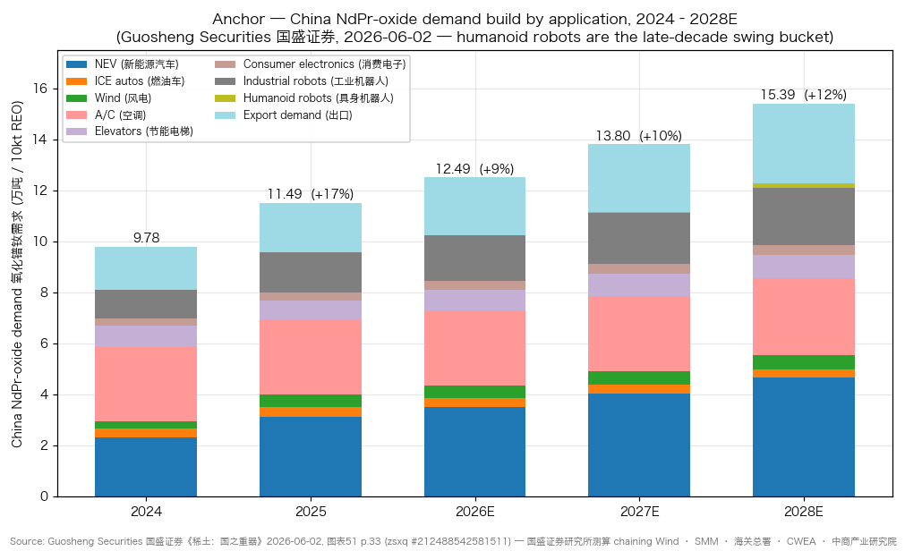
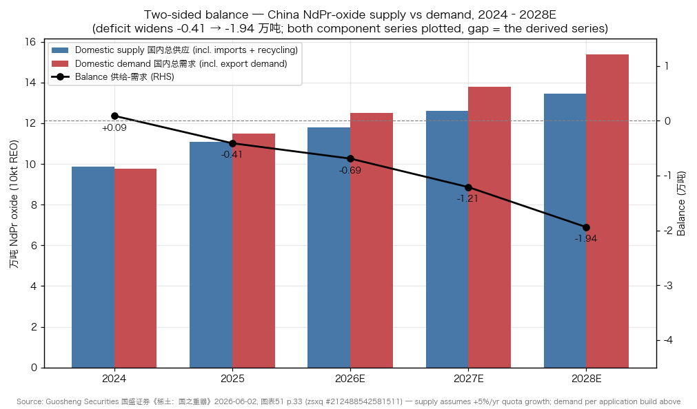
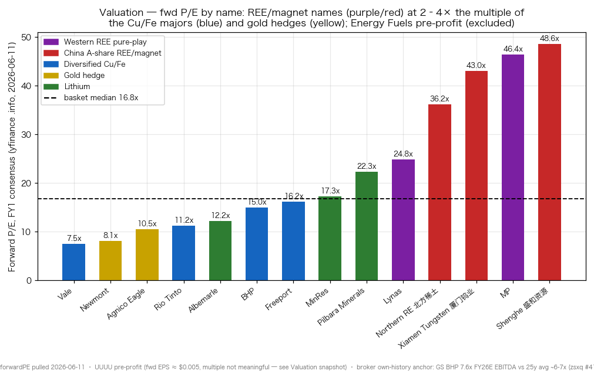
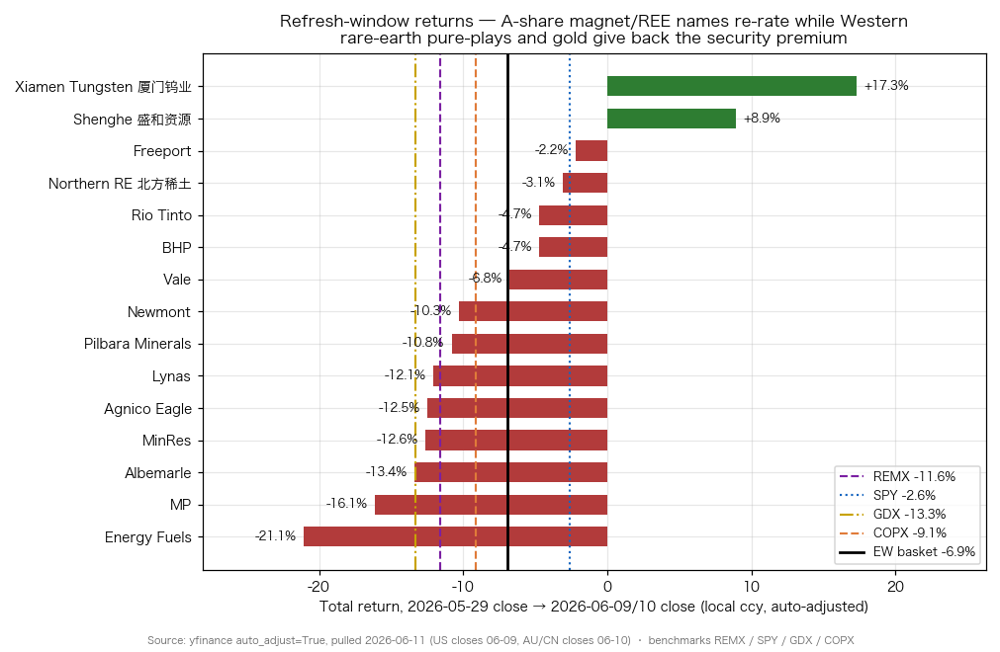

# Rare Earth & Strategic Minerals — Geopolitics

**Created:** 2026-05-31 · **Last refreshed:** 2026-06-11 · **Last mutated:** 2026-05-31 · **Refresh cadence:** monthly · **Languages tracked:** en

## What's New

*The delta since you last looked — newest refresh on top. Older entries collapse into the archive below.*

**2026-06-11 refresh (vs 2026-05-31):**

- **First measured window: equal-weight basket −6.9% (median −10.3%) over 2026-05-29 → 06-09/10 closes, vs REMX −11.6% · SPY −2.6% · GDX −13.3% · COPX −9.1%** — the basket's first drawdown landed **+465 bps ahead of REMX**, with a violent internal inversion: **A-share magnet/REE names re-rated (Xiamen Tungsten +17.3%, Shenghe +8.9%) while Western rare-earth pure-plays sold off (Energy Fuels −21.1%, MP −16.1%, Lynas −12.1%)** — the exact *opposite* of the inception drift signal that the dual-market structure was widening "in favour of Western names" (yfinance, see Performance).
- **The de-escalation trade is the window's story.** A potential US-China rare-earth accommodation ahead of a Trump-Xi summit ([Foreign Policy, 2026-05-12](https://foreignpolicy.com/2026/05/12/trump-xi-china-summit-rare-earth-trade-critical-minerals/)) compressed the Western "security premium" — MP fell 5.7% on 06-09 alone to $54.30, down ~21% on the week, with CEO insider selling adding pressure ([GuruFocus, 2026-06-09](https://www.gurufocus.com/news/8908903/mp-materials-corp-mp-shares-fall-57-what-gf-score-of-63-tells-investors)) — while Beijing's quota-tightening 暂行办法 re-rated the Chinese incumbents.
- **Anchor installed (format upgrade, not a revision):** the Thesis now leads with a quantified volume pool — Guosheng Securities' China NdPr-oxide (氧化镨钕) balance: demand 2025 11.49 → 2026E 12.49 (+9%) → 2027E 13.80 (+10%) → 2028E 15.39 万吨 (+11%) vs supply 11.09 → 11.80 → 12.59 → 13.45 万吨, deficit widening −0.41 → −1.94 万吨 ([国盛证券, 2026-06-02, zsxq #212488542581511 p.33](http://xs-macbook-air.local:5001/zsxq/pdf/212488542581511/%E7%A8%80%E5%9C%9F%EF%BC%9A%E5%9B%BD%E4%B9%8B%E9%87%8D%E5%99%A8%EF%BC%8C%E4%BE%9B%E9%9C%80%E6%A0%BC%E5%B1%80%E6%94%B9%E5%96%84%E8%A1%8C%E4%B8%9A%E6%99%AF%E6%B0%94%E5%9B%9E%E5%8D%87.pdf#page=33)).
- **First sell-side coverage wave persisted to `/pt` (9 calls):** GS **Sell** on both lithium cores — PLS A$4.20 (−28.9% vs note-date px) and MIN A$53.00 (−21.6%) — and **Buy** NEM A$172.30 (+15.8%) ([GS Australian Lithium & Gold, zsxq #212488855852241 p.2](http://xs-macbook-air.local:5001/zsxq/pdf/212488855852241/Goldman%20Sachs-Australian%20Lithium%20%26%20Gold%20Coverage-260605.pdf#page=2)); MS **OW BHP A$67.50** / EW RIO A$171.50 / EW PLS A$5.60 / EW LYC A$20.45 ([MS DataDig, zsxq #214528415518221 p.2](http://xs-macbook-air.local:5001/zsxq/pdf/214528415518221/Morgan%20Stanley-DataDig%EF%BC%9A%20Sovereign%20Supply%20to%20Counter%20Sovereign%20Demand%EF%BC%9F-260608.pdf#page=2)); GS Neutral BHP 2,900p / RIO 7,700p on the LSE lines ([GS Europe Metals, zsxq #415288844845458 p.4](http://xs-macbook-air.local:5001/zsxq/pdf/415288844845458/Goldman%20Sachs-EUROPE%20METALS%20%26%20MINING%20Lifting%20Copper%20Prices%20on%20Ex~US%20Tightness%20Ahead%20of%20US%20Tariff%20Catalyst.%20Buy%20LUN%EF%BC%8C%20ANTO.-260604.pdf#page=4)).
- **Two LatAm elections landed in-window:** Peru's 06-07 runoff is a cliffhanger — leftist Roberto Sánchez edged to **50.10% vs Fujimori 49.90%** with ~95% counted ([Al Jazeera, 2026-06-08](https://www.aljazeera.com/news/2026/6/8/race-tied-between-left-and-right-wing-rivals-in-perus-presidential-vote)); Colombia's 05-31 first round sent right-winger de la Espriella (43.7%) and leftist Cepeda (40.9%) to a 06-21 runoff ([Al Jazeera, 2026-06-02](https://www.aljazeera.com/news/2026/6/2/celebration-shock-and-scepticism-follow-colombias-presidential-election)).
- **Copper is the macro bright spot:** GS lifted 2026/27 forecasts to **$13,349/$13,800/t** on ex-US deficits of ~640kt/170kt ([zsxq #415288844845458 p.1/p.3](http://xs-macbook-air.local:5001/zsxq/pdf/415288844845458/Goldman%20Sachs-EUROPE%20METALS%20%26%20MINING%20Lifting%20Copper%20Prices%20on%20Ex~US%20Tightness%20Ahead%20of%20US%20Tariff%20Catalyst.%20Buy%20LUN%EF%BC%8C%20ANTO.-260604.pdf#page=1)); Citi turned bullish to **$14,500/t within a month, $15,000/t within a year** ([zsxq #812485422215222 p.1](http://xs-macbook-air.local:5001/zsxq/pdf/812485422215222/CITI-Metal%20Matters%EF%BC%9ABullish%20copper%20to%20%2414.5k%20t%20next%20month%20on%20arb%20tailwinds%20and%20growth%20resilience%EF%BC%8C%20%2415k%20t%20within%20a%20year.-260601.pdf#page=1)); the US Section 232 refined-copper decision is due by 06-30 with the market pricing **43%** odds of a 15% tariff by Jan-2027 ([MS, zsxq #214528415518851 p.1](http://xs-macbook-air.local:5001/zsxq/pdf/214528415518851/Morgan%20Stanley-Scenarios%20for%20US%20Copper%20Tariffs-260608.pdf#page=1)).
- **Format upgrade:** file rebuilt to the latest theme spec (What's New, Valuation snapshot + sell-side view evolution, basket scorecard, leading indicators, 4 charts); snapshot sidecar created with a retroactive 2026-05-31 baseline. Macro regime: VIX 16.68 → **21.51** (`indicators.db`, 06-05) — the low-vol tailwind from inception is gone.

Earlier refreshes

**2026-05-31 — basket created** (15 tickers: 6 core / 2 enabler / 5 adjacent / 2 hedge) on the dual-flashpoint thesis: China REE export-licensing bifurcating global pricing + the 2026 LatAm electoral supercycle stacking ~25-30% of global Fe+Cu supply behind political dates. Inception finding: basket 1Y +158.8% lagged REMX +178.2% by ~19pp (REMX's heavier Australia/lithium weighting), beat SPY by ~129pp.

## Thesis

**Anchor — China NdPr-oxide (氧化镨钕) volume pool, the costed input for every NdFeB magnet:** demand 2024 9.78 → 2025 11.49 (+17%) → 2026E **12.49** (+9%) → 2027E **13.80** (+10%) → 2028E **15.39 万吨** (+11%), against supply of 9.87 → 11.09 → 11.80 → 12.59 → 13.45 万吨 — a deficit widening from **−0.41 (2025) to −1.94 万吨 (2028E)** under a +5%/yr quota-growth assumption ([Guosheng Securities 国盛证券《稀土：国之重器》2026-06-02, zsxq #212488542581511 p.33](http://xs-macbook-air.local:5001/zsxq/pdf/212488542581511/%E7%A8%80%E5%9C%9F%EF%BC%9A%E5%9B%BD%E4%B9%8B%E9%87%8D%E5%99%A8%EF%BC%8C%E4%BE%9B%E9%9C%80%E6%A0%BC%E5%B1%80%E6%94%B9%E5%96%84%E8%A1%8C%E4%B8%9A%E6%99%AF%E6%B0%94%E5%9B%9E%E5%8D%87.pdf#page=33), 国盛证券研究所测算 chaining Wind · SMM · 海关总署 · CWEA). **Demand sub-buckets** (same exhibit, 2026E→2028E, 万吨): NEV 3.51→4.65 · export demand 2.28→3.12 · industrial robots 1.78→2.25 · A/C 2.95→3.01 · elevators 0.80→0.91 · wind 0.49→0.54 · consumer electronics 0.35→0.41 · **humanoid robots 0.00→0.04→0.17** — the late-decade swing bucket: tiny today, but the only line growing >100%/yr, and the one whose pull-forward would break the +5% supply leash fastest. **Supply build** (same exhibit): domestic mining quota 28.59 (2025) → 33.73 万吨 REO (2028E, +5-6%/yr) · imports shrinking (US ore line: 0.60 → 0.26 → **zero** from 2026E) · scrap recycling 3.21 → 4.66 万吨, the fastest-growing supply leg.

**Volume-share vs value-share — the commodity-input trap and the security premium.** China holds 51.8% of global REE resources (8,500万吨 REO, 2025) and 69.2% of global output (39万吨 REO), with overseas supply concentrated in the US/Australia/Myanmar at 43%/24%/18% of ex-China supply ([Guosheng p.1](http://xs-macbook-air.local:5001/zsxq/pdf/212488542581511/%E7%A8%80%E5%9C%9F%EF%BC%9A%E5%9B%BD%E4%B9%8B%E9%87%8D%E5%99%A8%EF%BC%8C%E4%BE%9B%E9%9C%80%E6%A0%BC%E5%B1%80%E6%94%B9%E5%96%84%E8%A1%8C%E4%B8%9A%E6%99%AF%E6%B0%94%E5%9B%9E%E5%8D%87.pdf#page=1)). Western names therefore never win on *volume* — their equity case is the *value-share* of the security premium: MP's DoD deal fixed a **$110/kg NdPr floor** ([MP Materials, 2025-07](https://mpmaterials.com/news/mp-materials-announces-transformational-public-private-partnership-with-the-department-of-defense-to-accelerate-u-s-rare-earth-magnet-independence/)), and with Chinese NdPr-oxide spot stabilizing at 74-75万元/吨 ([Guosheng p.32](http://xs-macbook-air.local:5001/zsxq/pdf/212488542581511/%E7%A8%80%E5%9C%9F%EF%BC%9A%E5%9B%BD%E4%B9%8B%E9%87%8D%E5%99%A8%EF%BC%8C%E4%BE%9B%E9%9C%80%E6%A0%BC%E5%B1%80%E6%94%B9%E5%96%84%E8%A1%8C%E4%B8%9A%E6%99%AF%E6%B0%94%E5%9B%9E%E5%8D%87.pdf#page=32)) — ≈US$105/kg at ~7.1 CNY/USD (derived: ¥745,000/t ÷ 7.1, both inputs sourced above) — the Chinese spot rally has **converged to the DoD floor**. The premium for being non-Chinese is now politically contingent, not structural — exactly what this window repriced.

The thesis remains supply-chain de-risking *as a re-pricing event*, on two compounding flashpoints. First, China's April 2025 export-licensing regime on seven heavy/medium rare earths (Sm, Gd, Tb, Dy, Lu, Sc, Y) and the November 2025 magnet-ban tightening bifurcated REE pricing globally — terbium and dysprosium tripled in Europe within a month of the April rule ([CSET MOFCOM Notice No. 61](https://cset.georgetown.edu/wp-content/uploads/t0656_china_rare_earth_controls_2025_61_EN.pdf); [Al Jazeera, 2025-10](https://www.aljazeera.com/news/2025/10/10/china-tightens-export-controls-on-rare-earth-metals-why-this-matters)) — and the regulatory machine keeps ratcheting: the 2025-08-22 三部委《稀土开采和稀土冶炼分离总量调控管理暂行办法》escalated quota control ([Guosheng p.1](http://xs-macbook-air.local:5001/zsxq/pdf/212488542581511/%E7%A8%80%E5%9C%9F%EF%BC%9A%E5%9B%BD%E4%B9%8B%E9%87%8D%E5%99%A8%EF%BC%8C%E4%BE%9B%E9%9C%80%E6%A0%BC%E5%B1%80%E6%94%B9%E5%96%84%E8%A1%8C%E4%B8%9A%E6%99%AF%E6%B0%94%E5%9B%9E%E5%8D%87.pdf#page=1)), with draft enforcement rules adding fines up to 5× illegal gains ([Mining.com, 2026](https://www.mining.com/china-tightens-grip-on-rare-earths-with-strict-enforcement-rules/)). Second, the 2026 LatAm electoral supercycle stacks roughly a quarter to a third of marginal global Cu/Fe supply behind political dates — countries representing **25-30% of global iron-ore & copper supply face elections in 2026** ([JPM — Geologic Geopolitics, zsxq #212485541485481 p.1](http://xs-macbook-air.local:5001/zsxq/pdf/212485541485481/J.P.%20Morgan-Global%20Metals%20%26%20Mining%EF%BC%9AGeologic%20Geopolitics%20~%2025~30%25%20of%20global%20iron%20%26%20copper%20supply%20face%20elections%20in%202026%EF%BC%9B%20critical%20minerals%EF%BC%8C%20permitting%EF%BC%8C%20tax%20%26%20energy%20policies%20in%20focus%20for%20Global%20Miners-260529.pdf#page=1)) — and the supercycle is no longer hypothetical: Peru's runoff sits at 50.10/49.90 and Colombia's runoff is set for 06-21 (see Recent events). A *third* axis emerged this window: **sovereign demand vs sovereign supply** — China's CMRG central buying agency and Indonesia's DSI state export desk are concentrating buying/selling power, while Australia's miners (59% of seaborne iron-ore exports, 24% of lithium) legally cannot coordinate ([MS DataDig, zsxq #214528415518221 p.1](http://xs-macbook-air.local:5001/zsxq/pdf/214528415518221/Morgan%20Stanley-DataDig%EF%BC%9A%20Sovereign%20Supply%20to%20Counter%20Sovereign%20Demand%EF%BC%9F-260608.pdf#page=1)).

**Value-chain map:** mine — MP (Mountain Pass) · Lynas (Mt Weld) · 北方稀土 (Bayan Obo) · UUUU (monazite) → separation/refining — Lynas Kuantan · UUUU White Mesa · Shenghe · 北方稀土 → metal/alloy + NdFeB magnet — Xiamen Tungsten (Golden Dragon) · MP "10X" facility (2028) → end-use (EV/robot/defense OEMs). **Coverage gap:** the basket holds no Western *magnet-maker* pure-play and no China magnet champion (金力永磁 JL MAG / 中科三环 are Guosheng's 重点关注 names alongside 北方稀土/中国稀土 — [p.1](http://xs-macbook-air.local:5001/zsxq/pdf/212488542581511/%E7%A8%80%E5%9C%9F%EF%BC%9A%E5%9B%BD%E4%B9%8B%E9%87%8D%E5%99%A8%EF%BC%8C%E4%BE%9B%E9%9C%80%E6%A0%BC%E5%B1%80%E6%94%B9%E5%96%84%E8%A1%8C%E4%B8%9A%E6%99%AF%E6%B0%94%E5%9B%9E%E5%8D%87.pdf#page=1)); candidate-add proposals live in Drift signals. The Cu/Fe majors (FCX, BHP, RIO, VALE), gold hedges (NEM, AEM) and lithium pair (ALB, PLS + MIN) ride the *election/policy* axis rather than the REE pool — the mixed construction is a deliberate test of whether named-ticker active management beats passive [REMX](https://www.sec.gov/Archives/edgar/data/0001137360/000113736026000500/vaneckrareearthandstrategi.htm); this window it did (+465 bps), at inception over 1Y it did not (−19pp).

**Conviction ranks (cited, not ours):** MS orders its ASX coverage **BHP (OW, implied iron ore US$82/t) > RIO (EW, US$89/t) > FMG (UW, US$98/t)** with PLS and LYC both EW ([MS DataDig p.1-2](http://xs-macbook-air.local:5001/zsxq/pdf/214528415518221/Morgan%20Stanley-DataDig%EF%BC%9A%20Sovereign%20Supply%20to%20Counter%20Sovereign%20Demand%EF%BC%9F-260608.pdf#page=1)); GS runs **Buy NEM / Sell PLS, MIN** on gold-up-lithium-oversupplied house views ([GS AU coverage p.2](http://xs-macbook-air.local:5001/zsxq/pdf/212488855852241/Goldman%20Sachs-Australian%20Lithium%20%26%20Gold%20Coverage-260605.pdf#page=2)). *Analyst view (this note):* the cleanest read of the window is that the basket's REE leg is now a **two-sided political option** — long re-escalation via MP/LYC/UUUU, long quota-tightening via the A-share names — rather than a one-way Western-premium bet.

**Further viewing**

- [Rare Earth Elements: Supply Chains, Separations and Opportunities (Montana Tech seminar) — why separating chemically near-identical lanthanides takes hundreds of solvent-extraction stages, the physical basis of China's processing moat](https://www.youtube.com/watch?v=Gr4hXCNRpLs)
- [MP Materials official channel — Mountain Pass mine-to-magnet footage; what an integrated Western REE flowsheet actually looks like](https://www.youtube.com/@mpmaterials)
- [How neodymium magnets are made (e-magnets UK, illustrated process walk-through) — strip-cast → hydrogen decrepitation → jet-mill → press-in-field → sinter; where Dy/Tb grain-boundary diffusion enters](https://e-magnetsuk.com/introduction-to-neodymium-magnets/how-neodymium-magnets-are-made/)

## Scope rules

**In:** rare-earth miners + magnet-midstream processors (NdFeB inputs); copper miners with primary or majority Cu exposure; iron-ore majors with Fe as a material segment; lithium miners (spodumene + brine); gold miners as a geopolitical-hedge slot; critical / strategic mineral pure-plays. Qualifies if investable as common equity with a named 2025–2026 primary source linking it to one of the five buckets.

**Out:** precious-metals streaming / royalty companies (Wheaton, Royal Gold, Franco-Nevada — capital-light financial intermediaries, not supply-of-rock plays). Oil & gas majors (XOM, Shell — equity dominated by hydrocarbon beta). Agriculture and coal. Precious-metals ETFs (GLD, IAU). Defense conglomerates with too-dilute REE-input cost lines (Lockheed, RTX). Generic copper smelters without mining exposure (Xiamen Tungsten qualifies as enabler via its NdFeB-magnet franchise; pure smelters do not).

## Tracked tickers

| Ticker | Name | Role | Justification | Added |
|---|---|---|---|---|
| NYSE:MP | MP Materials | core | US Mountain Pass operator and only at-scale Western rare-earth miner; July 2025 DoD partnership establishes a $110/kg NdPr price floor, $400M preferred-equity DoD stake, $150M DoD loan, 100% off-take for the planned "10X" magnet facility from 2028 ([MP Materials DoD release, 2025-07](https://mpmaterials.com/news/mp-materials-announces-transformational-public-private-partnership-with-the-department-of-defense-to-accelerate-u-s-rare-earth-magnet-independence/); [Columbia CGEP](https://www.energypolicy.columbia.edu/mp-materials-deal-marks-a-significant-shift-in-us-rare-earths-policy/)). *Moat:* the only US mine-to-magnet flowsheet + a government-guaranteed price floor. *Threat:* de-escalation — Chinese spot converging to the DoD floor erases the commercial premium (this window: −16.1%); 46x fwd P/E prices re-escalation. | 2026-05-31 |
| ASX:LYC | Lynas Rare Earths | core | Mt Weld + Kalgoorlie + Kuantan is the only at-scale ex-China light-REE processor; 1H FY26 revenue A$413.7M (+63% YoY), NPAT A$80.2M; shipped first separated Dy + Tb at a strategic premium ([Lynas FY25 results](https://wcsecure.weblink.com.au/pdf/LYC/02985264.pdf)). *Moat:* two decades of separation know-how ex-China; expanding Malaysia heavy-REE capacity which MS expects "will drive earnings growth" ([MS DataDig p.2](http://xs-macbook-air.local:5001/zsxq/pdf/214528415518221/Morgan%20Stanley-DataDig%EF%BC%9A%20Sovereign%20Supply%20to%20Counter%20Sovereign%20Demand%EF%BC%9F-260608.pdf#page=2)). *Threat:* MS sees it "fairly valued" (EW); Malaysian operating-licence politics; MP's 10X scale-up duplicates its niche by 2028. | 2026-05-31 |
| SSE:600111 | China Northern Rare Earth (北方稀土) | core | World's largest light-REE producer; one of only two state groups granted the mining + smelting quota (the system "narrowing the field to China Rare Earth Group and China Northern Rare Earth Group"), making it the policy-determinant of Chinese spot pricing ([Discovery Alert — China REE production quotas, 2026](https://discoveryalert.com.au/china-rare-earth-production-quotas-market-control-2026/); Q4 2025 concentrate price ¥26,205/t — [Rare Earth Exchanges](https://rareearthexchanges.com/news/china-northern-rare-earth-announces-q4-2025-concentrate-price-adjustment-signals-cost-pressures-and-market-stability-play/)). *Moat:* Bayan Obo resource + duopoly quota grantee under the tightening 暂行办法. *Threat:* it IS the policy instrument — quota above +5% or a price-suppression directive reverses the EPS-and-PE "double hit" thesis ([Guosheng p.33](http://xs-macbook-air.local:5001/zsxq/pdf/212488542581511/%E7%A8%80%E5%9C%9F%EF%BC%9A%E5%9B%BD%E4%B9%8B%E9%87%8D%E5%99%A8%EF%BC%8C%E4%BE%9B%E9%9C%80%E6%A0%BC%E5%B1%80%E6%94%B9%E5%96%84%E8%A1%8C%E4%B8%9A%E6%99%AF%E6%B0%94%E5%9B%9E%E5%8D%87.pdf#page=33)). | 2026-05-31 |
| NYSE:UUUU | Energy Fuels | core | White Mesa Mill runs commercial-scale NdPr separation (up to 1,000 t/yr) and began pilot heavy-REE oxide production July 2025; 99.9% Dy oxide magnet-qualified by a major South Korean magnet maker Dec 2025; commercial heavy-REE targeted Q4 2026 ([2025-07](https://investors.energyfuels.com/2025-07-17-Energy-Fuels-Now-Producing-Heavy-Rare-Earth-Element-Oxides); [2025-12](https://investors.energyfuels.com/2025-12-19-Energy-Fuels-US-Produced-Heavy-Rare-Earth-Oxide-Successfully-Qualified-for-Use-in-Permanent-Magnets)). *Moat:* the only US heavy-REE (Dy/Tb) separation line — the scarcest link in the ex-China chain. *Threat:* pre-profit (fwd EPS ≈ $0); the equity is a pure re-escalation option — worst name this window (−21.1%) when the premium compressed. | 2026-05-31 |
| SSE:600549 | Xiamen Tungsten (厦门钨业) | enabler | Tungsten + REE + NdFeB magnet integrated; Golden Dragon (Baotou) Phase I 5,000 t/yr NdFeB line commissioned 2025, lifting magnet-blank capacity toward 20,000 t; FY25 revenue ¥46.5bn (+32% YoY) ([SMM](https://www.metal.com/en/newscontent/103385344); [Rare Earth Exchanges](https://rareearthexchanges.com/news/chinas-golden-dragon-launches-new-ndfeb-magnet-project-in-baotou-china-powerhouse-expands-capacity/)). *Moat:* dual scarcity — tungsten (also export-controlled) + magnet capacity in the humanoid-robot demand path. *Threat:* magnet-blank margin is a processing spread, squeezed if oxide input prices outrun magnet ASPs; best name this window (+17.3%) so the re-rate is already partly in. | 2026-05-31 |
| SSE:600392 | Shenghe Resources (盛和资源) | enabler | Full-chain REE: imports HMS-monazite feed (long-standing Energy Fuels / White Mesa relationship), runs domestic separation + deep processing + recycling; 2025 IR flagged overseas-resource consolidation push ([Rare Earth Exchanges](https://rareearthexchanges.com/news/shenghe-resources-signals-accelerating-global-rare-earth-expansion-consolidation-machine-advancing/)). *Moat:* the only A-share with a structural US-feedstock bridge (UUUU relationship) — it monetizes *both* sides of the bifurcation. *Threat:* that same bridge is the first casualty if export-control retaliation extends to feedstock flows; recycling supply (the fastest-growing leg, 3.21→4.66万吨) commoditizes separation margins. | 2026-05-31 |
| NYSE:FCX | Freeport-McMoRan | adjacent | FY25 3.4Bn lbs Cu + 1.0Moz Au; Sept 2025 Grasberg mud-rush halted Grasberg Block Cave, phased GBC restart Q2 2026 — direct Indonesia critical-mineral political-risk exposure ([FCX FY25 ARS](https://www.sec.gov/Archives/edgar/data/0000831259/000083125926000023/fcx_arx2025xfinal.pdf)). *Moat:* irreplaceable Grasberg ore body + US smelting footprint that benefits from a Section 232 copper tariff. *Threat:* Indonesia's DSI state export desk extends resource nationalism to copper ([MS DataDig p.1](http://xs-macbook-air.local:5001/zsxq/pdf/214528415518221/Morgan%20Stanley-DataDig%EF%BC%9A%20Sovereign%20Supply%20to%20Counter%20Sovereign%20Demand%EF%BC%9F-260608.pdf#page=1)); GS flags Grasberg recovery "slower than expected... full recovery 2028" ([GS Europe Metals p.1](http://xs-macbook-air.local:5001/zsxq/pdf/415288844845458/Goldman%20Sachs-EUROPE%20METALS%20%26%20MINING%20Lifting%20Copper%20Prices%20on%20Ex~US%20Tightness%20Ahead%20of%20US%20Tariff%20Catalyst.%20Buy%20LUN%EF%BC%8C%20ANTO.-260604.pdf#page=1)); Peru's Cerro Verde under a Sánchez "minería social" regime. | 2026-05-31 |
| NYSE:BHP | BHP Group | adjacent | FY25 record group Cu >2.0Mt (+16% at Escondida); record iron-ore 263Mt; FY26 Cu guidance 1.8–2.0Mt ([BHP FY25 results](https://www.bhp.com/-/media/documents/media/reports-and-presentations/2025/250819_bhpresultsfortheyearended30june2025.pdf)). *Moat:* "attractive commodity mix (iron ore, copper, met coal), resilient FCF" — MS's top ASX pick, OW with implied iron ore US$82/t, cheapest of the three majors ([MS DataDig p.1-2](http://xs-macbook-air.local:5001/zsxq/pdf/214528415518221/Morgan%20Stanley-DataDig%EF%BC%9A%20Sovereign%20Supply%20to%20Counter%20Sovereign%20Demand%EF%BC%9F-260608.pdf#page=2)). *Threat:* GS holds Neutral — "1x NAV vs RIO at 0.8x" and 7.6x FY26E EBITDA vs its 25y avg ~6-7x ([GS p.4-5](http://xs-macbook-air.local:5001/zsxq/pdf/415288844845458/Goldman%20Sachs-EUROPE%20METALS%20%26%20MINING%20Lifting%20Copper%20Prices%20on%20Ex~US%20Tightness%20Ahead%20of%20US%20Tariff%20Catalyst.%20Buy%20LUN%EF%BC%8C%20ANTO.-260604.pdf#page=4)); Chile royalty/water politics at Escondida; CMRG concentrated buying power on the iron-ore book. | 2026-05-31 |
| NYSE:RIO | Rio Tinto | adjacent | FY25 Pilbara iron-ore 323–338Mt; Simandou first shipment Nov 2025 ramping to 5–10Mt 2026; FY25 Cu 883kt, FY26 800–870kt as Oyu Tolgoi ramps ([RIO Q4 FY25 6-K](https://www.sec.gov/Archives/edgar/data/0000863064/000086306426000006/ex1_2025-q4results.htm); [Simandou update](https://www.sec.gov/Archives/edgar/data/0000863064/000086306425000023/ex3d11simandoumr.htm)). *Moat:* GS sees "~10% CuEq production growth through 2030" — the FCF-plus-growth story among the majors, at 0.8x NAV ([GS p.4-5](http://xs-macbook-air.local:5001/zsxq/pdf/415288844845458/Goldman%20Sachs-EUROPE%20METALS%20%26%20MINING%20Lifting%20Copper%20Prices%20on%20Ex~US%20Tightness%20Ahead%20of%20US%20Tariff%20Catalyst.%20Buy%20LUN%EF%BC%8C%20ANTO.-260604.pdf#page=4)). *Threat:* triple-geography (Guinea + Mongolia + Australia) is diversification AND triple political surface; MS EW with PT *below* the ASX price — "this comes with some execution risk" ([MS DataDig p.2](http://xs-macbook-air.local:5001/zsxq/pdf/214528415518221/Morgan%20Stanley-DataDig%EF%BC%9A%20Sovereign%20Supply%20to%20Counter%20Sovereign%20Demand%EF%BC%9F-260608.pdf#page=2)). | 2026-05-31 |
| NYSE:VALE | Vale | adjacent | FY25 iron-ore 336.1Mt; FY26 guide 335–345Mt; mid-grade Carajás sales ~33Mt 2025 → ~50Mt 2026 ([VALE 4Q25 6-K/A](https://www.sec.gov/Archives/edgar/data/0000917851/000129281426000247/vale20260205_6ka.htm); [2026 guidance 6-K](https://www.sec.gov/Archives/edgar/data/0000917851/000129281426000189/vale20260127_6k.htm)). *Moat:* highest-grade seaborne iron-ore portfolio (Carajás) — the margin survivor at MS's CY26 US$100/t forecast. *Threat:* Brazil's Oct-2026 election puts royalty/tax regime in play (Lula re-running); cheapest name in the basket (7.5x fwd) because the political discount is standing, not because the market missed it. | 2026-05-31 |
| ASX:MIN | Mineral Resources | adjacent | Dual Fe+Li: Onslow Iron at 35Mtpa nameplate Aug-Oct 2025; Wodgina FY26 270–290kt + Mt Marion 210–230kt dmt spodumene; realised prices ≈doubled to US$2,105/dmt in Q3 FY26 ([MIN Q1 FY26 quarterly](https://www.mineralresources.com.au/news/q1-fy26-quarterly-activity-report/)). *Moat:* mining-services annuity (crushing) under the commodity book softens price downside. *Threat:* GS rates it **Sell, PT A$53** — lithium downcycle with NAV A$45.20 ([GS AU coverage p.2](http://xs-macbook-air.local:5001/zsxq/pdf/212488855852241/Goldman%20Sachs-Australian%20Lithium%20%26%20Gold%20Coverage-260605.pdf#page=2)); balance-sheet leverage amplifies any spodumene retracement. | 2026-05-31 |
| NYSE:NEM | Newmont | hedge | Largest Tier-1 gold pure-play; FY25 attributable gold ~5.9Moz; FY25 AISC ~$1,620/oz ([NEM Q3 2025 release](https://www.newmont.com/investors/news-release/news-details/2025/Newmont-Reports-Third-Quarter-2025-Results-and-Improves-2025-Cost--Capital-Guidance/default.aspx)). *Moat:* GS Buy — current 5.9x vs target 7.0x EV/EBITDA, the cheap low-cost Tier-1 ([GS AU coverage p.2](http://xs-macbook-air.local:5001/zsxq/pdf/212488855852241/Goldman%20Sachs-Australian%20Lithium%20%26%20Gold%20Coverage-260605.pdf#page=2)). *Threat:* the hedge leg only earns its keep on escalation shocks — gold equities are already ~25% off the Jan-26 peak as gold consolidates ([Citi Global Gold p.1](http://xs-macbook-air.local:5001/zsxq/pdf/181245182282112/CITI-Global%20Gold%EF%BC%9AMarking~to~market%20gold%20exposure%EF%BC%8C%20steady%20FCF%20offsets%20near~term%20headwinds-260608.pdf#page=1)). | 2026-05-31 |
| NYSE:AEM | Agnico Eagle | hedge | Canadian Malartic + Detour Lake transitioning toward 1Moz/yr each; FY25 record FCF, dividend +12.5%, $1.4bn shareholder returns; 2026–28 gold ~3.3–3.5Moz/yr ([AEM Q4+FY25 release](https://www.agnicoeagle.com/English/news-and-media/news-releases/news-details/2026/AGNICO-EAGLE-REPORTS-FOURTH-QUARTER-AND-FULL-YEAR-2025-RESULTS---RECORD-QUARTERLY-AND-ANNUAL-FREE-CASH-FLOW-2025-PRODUCTION-GUIDANCE-ACHIEVED-TOTAL-2025-SHAREHOLDER-RETURNS-OF-1-4-BILLION-DIVIDEND-INCREASED-BY-12-5-UPDATED-THREE-YEAR-GUIDANCE/default.aspx)). *Moat:* Canada-only jurisdiction — the basket's zero-political-risk gold expression. *Threat:* same gold-price consolidation as NEM, without NEM's valuation cushion (10.5x vs 8.1x fwd); no copper by-product growth lever. | 2026-05-31 |
| NYSE:ALB | Albemarle | core | World's largest integrated lithium producer; Salar de Atacama (CORFO 2030 transition is the binding-multiple driver) + Greenbushes JV + Wodgina JV; cost programme >50% run-rate of $300–400M target ([ALB 4Q24 release](https://www.sec.gov/Archives/edgar/data/0000915913/000091591325000023/a4q24earningsreleaseex991.htm); [Salar TR excerpt](https://www.sec.gov/Archives/edgar/data/0000915913/000091591325000024/exhibit963salardeatacama.htm)). *Moat:* brine cost position — JPM notes salt-lake lithium costs sit far below hard-rock as the cost curve steepens ([JPM Li Dashboard p.11](http://xs-macbook-air.local:5001/zsxq/pdf/812488548184882/J.P.%20Morgan-China%20Lithium%20Dashboard%EF%BC%9ANear~term%20newsflow%20adds%20pressure%20to%20lithium%20sector-260604.pdf#page=11)). *Threat:* Chile CORFO/royalty politics on the Atacama contract; GS's 2026 surplus view hits brine ASPs too. | 2026-05-31 |
| ASX:PLS | Pilbara Minerals | core | World's largest hard-rock lithium resource at Pilgangoora (446Mt at 1.28% Li2O); FY25 record 754.6kt spodumene; FY26 820–870kt at A$560–600/t unit cost ([Mining Weekly](https://www.miningweekly.com/article/pilbara-minerals-beats-production-guidance-cuts-costs-as-lithium-market-remains-challenging-2025-07-30); [resource upgrade](https://discoveryalert.com.au/pilgangoora-production-2025-lithium-tantalum-boost/)). *Moat:* "expansion optionality at Pilgangoora... near-term restart at Ngungaju," P2000 FID results CY26-end ([MS DataDig p.2](http://xs-macbook-air.local:5001/zsxq/pdf/214528415518221/Morgan%20Stanley-DataDig%EF%BC%9A%20Sovereign%20Supply%20to%20Counter%20Sovereign%20Demand%EF%BC%9F-260608.pdf#page=2)). *Threat:* GS **Sell PT A$4.20 (−29%)** — 1.60x P/NAV, 18.8x vs applied 14.0x EV/EBITDA; the street-low says the spodumene re-rate is over-owned ([GS AU coverage p.2](http://xs-macbook-air.local:5001/zsxq/pdf/212488855852241/Goldman%20Sachs-Australian%20Lithium%20%26%20Gold%20Coverage-260605.pdf#page=2)). | 2026-05-31 |

**Listing / commodity / role mix (15 tickers):** US-listed 9 (60%, incl. dual-listed RIO / BHP / VALE ADRs) · China A-share 3 (20%) · ASX 3 (20%). Commodity sub-buckets: rare-earth pure-play 4 · rare-earth midstream 2 · diversified Cu/Fe 5 · gold 2 · lithium 2. Role: core 6 (4 RE + 2 Li) · enabler 2 · adjacent 5 · hedge 2. Cross-theme overlap scan (2026-06-11): no tracked name appears in any other `reports/themes/*_theme.md` basket.

## Valuation snapshot

Rows mirror `stock_price_target.db` (latest call per institute since 2026-05-01; surfaced at [`/pt`](http://xs-macbook-air.local:5001/pt)) — **Px @ note is the price on the note's date** (`report_date_price`), which fixes the upside the analyst actually called; *Px now* is the 2026-06-09 (US) / 06-10 (AU/CN) close, yfinance. Fwd P/E = FY1 consensus and FY1E EPS from yfinance `.info` (2026-06-11); FY2E only where a mined note states it. ASX-line calls are in A$; NYSE *Px now* in US$ — upside is computed within the note's own listing line, never across lines.

| Ticker | Latest rating · broker (date) | Px @ note | PT | Upside | Px now | Fwd P/E FY1 | FY1E EPS | FY2E EPS | Own-history / multiple anchor | PT dispersion (since 05-01) |
|---|---|---|---|---|---|---|---|---|---|---|
| ASX:PLS | **Sell** · GS (06-05) | A$5.91 | **A$4.20** | **−28.9%** | A$5.76 | 22.3x | A$0.27 | n/a¹ | 18.8x now vs 14.0x GS applied target EV/EBITDA (GS exhibit p.2)² | n=2: A$4.20 / A$5.60 — 33% spread |
| ASX:MIN | **Sell** · GS (06-05) | A$67.57 | **A$53.00** | **−21.6%** | A$64.18 | 17.3x | A$3.78 | n/a¹ | 9.2x now vs 8.5x GS applied target EV/EBITDA (p.2)² | single PT |
| ASX:LYC | Equal-weight · MS (06-08) | A$18.16 | A$20.45 | +12.6% | A$16.87 | 24.8x | A$0.68 | n/a¹ | 16.4x EV/EBITDA now (MS exhibit p.2); own 10-yr avg n/a — EPS swings through zero pre-2023² | single PT |
| NYSE:BHP | **OW · MS (06-08, ASX line)** A$67.50 / Neutral · GS (06-04, LSE line) 2,900p | A$61.24 / 3,295p | A$67.50 / 2,900p | **+10.2% / −12.0%** | $84.73 | 15.0x | $5.51 | n/a¹ | **7.6x FY26E EBITDA vs 25y avg ~6-7x** (GS exhibit p.4-5)³ | n=2 institutes, OW vs Neutral split |
| NYSE:RIO | EW · MS (06-08, ASX line) A$171.50 / Neutral · GS (06-04, LSE line) 7,700p | A$184.58 / 7,847p | A$171.50 / 7,700p | −7.1% / −1.9% | $101.42 | 11.2x | $8.84 | n/a¹ | 6.8x FY26E EBITDA, 0.8x NAV (GS exhibit p.4-5)³ | n=4 (see stale note) |
| NYSE:NEM | Buy · GS (06-05, ASX line) | A$148.76 | A$172.30 | +15.8% | $98.54 | 8.1x | $11.40 | n/a¹ | 5.9x now vs 7.0x GS applied target EV/EBITDA (p.2)² | single PT |
| NYSE:VALE | Neutral · UBS (05-05, no PT published) | $15.93 | n/a | — | $15.14 | 7.5x | $1.99 | n/a¹ | n/a — no broker exhibit in the mined set; cheapest fwd P/E in basket | no PT in store |
| NYSE:MP | no call in store since 05-01 | — | — | — | $54.30 | 46.4x | $1.15 | n/a¹ | n/a — trailing EPS negative (−$0.40), own-history P/E undefined⁴ | — |
| NYSE:UUUU | no call in store since 05-01 | — | — | — | $14.37 | n/m (pre-profit) | ≈$0.005 | n/a¹ | n/a — pre-profit, P/E not meaningful⁴ | — |
| SSE:600111 | no call in store since 05-01 | — | — | — | ¥46.98 | 36.2x | ¥1.31 | n/a¹ | n/a — no broker exhibit; Guosheng names it a 重点关注 without a PT⁵ | — |
| SSE:600549 | no call in store since 05-01 | — | — | — | ¥63.35 | 43.0x | ¥1.57 | n/a¹ | n/a — no broker exhibit in mined set⁵ | — |
| SSE:600392 | no call in store since 05-01 | — | — | — | ¥23.83 | 48.6x | ¥0.52 | n/a¹ | n/a — no broker exhibit in mined set⁵ | — |
| NYSE:FCX | no call in store since 05-01 | — | — | — | $64.25 | 16.2x | $3.84 | n/a¹ | n/a — no broker exhibit in mined set | — |
| NYSE:AEM | no call in store since 05-01 | — | — | — | $159.93 | 10.5x | $14.49 | n/a¹ | n/a — no broker exhibit in mined set | — |
| NYSE:ALB | no call in store since 05-01 | — | — | — | $152.79 | 12.2x | $12.08 | n/a¹ | n/a — trailing EPS negative (−$3.42), own-history fwd P/E undefined⁴ | — |

*Stale / suspect — segregated, not blended into the live rows:* **Bernstein RIO.L Outperform 6,200p (05-08)** — the note-date price was 7,695p, i.e. the stored PT sits **−19.4% below** the price the analyst saw while rating it Outperform; likely an extraction artifact (possibly a per-line or SOTP figure) — excluded from the dispersion and flagged for re-grounding. **JPM RIO Neutral (05-26)** and **MS PLS EW (05-29 / 06-01)** carry no PT in the store (rating-only rows; the 06-01 row notes a "lithium price floor US$2030/t" framework) — superseded by the dated calls above.

Footnotes — derivations: ¹ FY2E EPS not stated for tracked names in any mined note (GS/MS exhibits give NTM and FY26E metrics; the FY2 estimates GS publishes in the Europe note cover LUN/ANTO only, not tracked names) — left n/a rather than improvised; growth-adjustment is therefore carried by the EV/EBITDA anchors instead of PEG. ² GS/MS current-vs-target EV/EBITDA pairs are broker-exhibit values: [GS Australian Lithium & Gold, zsxq #212488855852241 p.2](http://xs-macbook-air.local:5001/zsxq/pdf/212488855852241/Goldman%20Sachs-Australian%20Lithium%20%26%20Gold%20Coverage-260605.pdf#page=2) and [MS DataDig, zsxq #214528415518221 p.2](http://xs-macbook-air.local:5001/zsxq/pdf/214528415518221/Morgan%20Stanley-DataDig%EF%BC%9A%20Sovereign%20Supply%20to%20Counter%20Sovereign%20Demand%EF%BC%9F-260608.pdf#page=2); for cyclical miners a trailing-P/E history is unrepresentative (EPS swings through zero), so the broker current/target multiple pair is the sourced own-history proxy. ³ [GS Europe Metals, zsxq #415288844845458 p.4-5](http://xs-macbook-air.local:5001/zsxq/pdf/415288844845458/Goldman%20Sachs-EUROPE%20METALS%20%26%20MINING%20Lifting%20Copper%20Prices%20on%20Ex~US%20Tightness%20Ahead%20of%20US%20Tariff%20Catalyst.%20Buy%20LUN%EF%BC%8C%20ANTO.-260604.pdf#page=4) — the only true long-window own-history anchor in the mined set (BHP 25y avg ~6-7x EV/EBITDA). ⁴ Pre-profit / loss-trailing names: multiples flagged n/m per the pre-profit rule. ⁵ The A-share REE names carry rich absolute multiples (36-49x fwd) — the Guosheng thesis is explicitly *both* EPS and P/E expansion on 战略属性 ("EPS 与 PE 双击", [p.33](http://xs-macbook-air.local:5001/zsxq/pdf/212488542581511/%E7%A8%80%E5%9C%9F%EF%BC%9A%E5%9B%BD%E4%B9%8B%E9%87%8D%E5%99%A8%EF%BC%8C%E4%BE%9B%E9%9C%80%E6%A0%BC%E5%B1%80%E6%94%B9%E5%96%84%E8%A1%8C%E4%B8%9A%E6%99%AF%E6%B0%94%E5%9B%9E%E5%8D%87.pdf#page=33)) — i.e. the de-rate risk is doubled if the quota prints loose.

### Sell-side view evolution (卖方观点演变)

**Pilbara Minerals (ASX:PLS) — the basket's widest genuine disagreement (33% PT spread, opposite directions):**

| Institute | Date | Rating / PT | Core argument | What proves them right |
|---|---|---|---|---|
| Morgan Stanley | 05-29 → 06-01 | EW (no PT) → EW, framework: "lithium price floor US$2030/t"; "Ngungaju restart and P2000 expansion priced in" ([store rows, zsxq #184152218155822](http://xs-macbook-air.local:5001/zsxq/pdf/184152218155822/Morgan%20Stanley-China%20and%20the%20Miners-260529.pdf) / [#415284282582128](http://xs-macbook-air.local:5001/zsxq/pdf/415284282582128/Morgan%20Stanley-DataDig%EF%BC%9A%20Lithium%20Restarts%20Reemerge-260601.pdf)) | restarts cap the upside, floor caps the downside | spodumene holding ~US$2,000+/t |
| **Goldman Sachs** | 06-05 | **Sell / A$4.20 (−28.9%)** — 1.60x P/NAV, NAV A$3.70, 18.8x vs 14.0x target EV/EBITDA ([zsxq #212488855852241 p.2](http://xs-macbook-air.local:5001/zsxq/pdf/212488855852241/Goldman%20Sachs-Australian%20Lithium%20%26%20Gold%20Coverage-260605.pdf#page=2)) | 2026 supply放量 tips lithium into surplus; price deck rolls over | carbonate futures breaking lower; restarts landing |
| Morgan Stanley | 06-08 | EW / **A$5.60 (−5.2%)** ([zsxq #214528415518221 p.2](http://xs-macbook-air.local:5001/zsxq/pdf/214528415518221/Morgan%20Stanley-DataDig%EF%BC%9A%20Sovereign%20Supply%20to%20Counter%20Sovereign%20Demand%EF%BC%9F-260608.pdf#page=2)) | expansion optionality vs fair value | P2000 FID + Ngungaju restart economics |

The cross-cutting datapoint both sides own: **J.P. Morgan simultaneously raised its *long-term* deck +15/+20% to US$1,500/t spodumene and US$18,000/t carbonate** while keeping near-term forecasts unchanged and Neutral ratings on Ganfeng/Tianqi — *"We have adjusted our model to reflect updated long-term spodumene and carbonate prices which have been raised to US$1,500/t & US$18,000/t (+15/20%)"* ([JPM China Lithium Dashboard, zsxq #812488548184882 p.11](http://xs-macbook-air.local:5001/zsxq/pdf/812488548184882/J.P.%20Morgan-China%20Lithium%20Dashboard%EF%BC%9ANear~term%20newsflow%20adds%20pressure%20to%20lithium%20sector-260604.pdf#page=11)), with ESS demand revised **+23%/+25% for 2026E/27E** (p.1). The disagreement is *time-horizon*, not facts: GS prices the 2026 surplus, JPM prices the late-decade demand line.

**BHP / RIO — same assets, split on relative preference:** MS (06-08) is **OW BHP** (PT A$67.50, +10.2%, implied iron ore US$82/t) and **EW RIO** (A$171.50, −7.1%, US$89/t) — *"BHP (OW)... preferred over RIO.AX (EW)"* ([DataDig p.1](http://xs-macbook-air.local:5001/zsxq/pdf/214528415518221/Morgan%20Stanley-DataDig%EF%BC%9A%20Sovereign%20Supply%20to%20Counter%20Sovereign%20Demand%EF%BC%9F-260608.pdf#page=1)); GS (06-04) holds **both Neutral** but leans the other way on valuation — BHP at "1x NAV vs RIO at 0.8x NAV", RIO the better FCF yield (6%/4% vs c.4%/3%) ([Europe Metals p.4-5](http://xs-macbook-air.local:5001/zsxq/pdf/415288844845458/Goldman%20Sachs-EUROPE%20METALS%20%26%20MINING%20Lifting%20Copper%20Prices%20on%20Ex~US%20Tightness%20Ahead%20of%20US%20Tariff%20Catalyst.%20Buy%20LUN%EF%BC%8C%20ANTO.-260604.pdf#page=4)). No self-revisions detected on tracked names this window — the GS lithium Sells and MS DataDig marks are first stored calls, so the *next* refresh's revision-detection baseline is now in place.

**Gold (read-across to NEM/AEM):** the houses diverge on the gold deck itself — Citi holds **$5,000/oz for 2027** vs spot c.$4,350 with gold equities already ~25% off the Jan-26 peak ([Citi Global Gold, zsxq #181245182282112 p.1](http://xs-macbook-air.local:5001/zsxq/pdf/181245182282112/CITI-Global%20Gold%EF%BC%9AMarking~to~market%20gold%20exposure%EF%BC%8C%20steady%20FCF%20offsets%20near~term%20headwinds-260608.pdf#page=1)); MS marks CY26 at **$4,916/oz (+10% vs spot $4,476)** ([DataDig p.14](http://xs-macbook-air.local:5001/zsxq/pdf/214528415518221/Morgan%20Stanley-DataDig%EF%BC%9A%20Sovereign%20Supply%20to%20Counter%20Sovereign%20Demand%EF%BC%9F-260608.pdf#page=14)); GS *cut* 2026E **−5% to $4,809/oz** ([GS China commodities, zsxq #181245445245552 p.3](http://xs-macbook-air.local:5001/zsxq/pdf/181245445245552/Goldman%20Sachs-China%20Basic%20Materials%EF%BC%9AChina%20commodities%EF%BC%9ARefreshing%20earnings%20estimates%EF%BC%9B%20Downgrade%20Yankuang~A%20to%20Sell-260608.pdf#page=3)). All three remain above spot — the hedge leg's carry is consensus-positive, just less unanimously than in Q1.

## Exclusions

| Ticker | Reason for exclusion |
|---|---|
| NYSE:WPM (Wheaton Precious Metals) | Streaming / royalty model with no operating mining footprint. The basket is a *supply-of-rock* thesis; royalty companies trade as gold-price-leveraged financial intermediaries. Out of scope per user spec. |
| NYSE:GOLD (Barrick Mining) | FY25 3.26Moz Au + 220kt Cu in line; Reko Diq Pakistan copper option pending. Excluded because NEM (US Tier-1) + AEM (Canada-only) already cover gold, and NEM-Barrick share the Nevada Gold Mines JV — adding GOLD creates exposure overlap. Re-evaluate if Reko Diq materially advances ([Barrick Q4+FY25 release](https://www.barrick.com/English/news/news-details/2026/q4-2025-results/default.aspx)). |
| NYSE:XOM and oil & gas majors | Out of scope — equity dominated by hydrocarbon beta per user spec. |
| LSE:GLEN (Glencore) | FY25 own-sourced Cu 851.6kt (−11%), guidance 850–910kt as Collahuasi (water + grades, −68.1kt) and Antapaccay underperformed; Mutanda/KCC cobalt-DRC adds African political-risk overlap with FCX-Indonesia / BHP-Chile without a *different* policy axis ([Glencore FY25 production](https://www.glencore.com/.rest/api/v1/documents/static/a8114247-02e8-4bd8-bc04-81f411ba631c/GLEN_2025-FY-Production-Report.pdf)). Re-add if DRC cobalt becomes a discrete policy story. |
| LSE:ANTO, NYSE:SCCO, TSX:FM | Antofagasta FY25 653.7kt vs guided 660–700kt; SCCO FY25 guided 965.3kt; FM Cobre Panamá overhang. FCX + BHP + RIO cover Indonesia / Chile-Pilbara / Pilbara-Guinea-Mongolia — adding ANTO/SCCO duplicates the Chile-Peru leg ([Antofagasta Q3 2025](https://www.research-tree.com/newsfeed/article/antofagasta-plc-q3-2025-production-report-3039735); [SCCO Q1 2025 transcript](https://www.theglobeandmail.com/investing/markets/stocks/SCCO/pressreleases/37162479/southern-copper-scco-q1-2025-earnings-transcript/)). Note: GS now runs ANTO as a top pick (Buy, PT £46.0) on the same ex-US copper tightness the basket rides via FCX ([zsxq #415288844845458 p.1](http://xs-macbook-air.local:5001/zsxq/pdf/415288844845458/Goldman%20Sachs-EUROPE%20METALS%20%26%20MINING%20Lifting%20Copper%20Prices%20on%20Ex~US%20Tightness%20Ahead%20of%20US%20Tariff%20Catalyst.%20Buy%20LUN%EF%BC%8C%20ANTO.-260604.pdf#page=1)) — kept excluded for Chile-leg duplication, revisit if Peru risk forces an FCX demotion. |
| SSE:601899 / HKEX:2899 (Zijin Mining); HKEX:2259 (Zijin Gold International) | Zijin Mining FY25 profit ¥51–52bn (+59–62% YoY); Zijin Gold International IPO'd Sept 2025 at HK$25bn. Both excluded as *China-domiciled, China-strategic* operators — they are the entity the thesis is de-risking *from*, not the de-risking expression ([Zijin FY25 profit](https://www.zijinmining.com/news/news-detail-122514.htm); [Zijin Gold IPO](https://www.zijinmining.com/news/news-detail-122323.htm)). |
| SSE:600362 (Jiangxi Copper), SZSE:000878 (Yunnan Copper) | Smelter-only or single-geography duplicates; Jiangxi 2025 TC/RCs collapsed 73% to $21.25/t — smelter profitability is *function of* the supply-chain thesis but doesn't directly express it ([Jiangxi TC/RCs benchmark](https://www.mining.com/web/antofagasta-agrees-copper-treatment-charge-with-jiangxi-copper-sources/)). |

## Keywords

rare earth · neodymium-praseodymium (NdPr) / 氧化镨钕 · dysprosium 镝 · terbium 铽 · NdFeB magnet 钕铁硼 · permanent magnet 永磁 · monazite · heavy rare earth 重稀土 · MOFCOM export license 出口管制 · 稀土总量调控暂行办法 · CMRG · critical mineral · strategic mineral · copper · Section 232 copper tariff · iron ore · spodumene 锂辉石 · lithium carbonate 碳酸锂 · gold · AISC · Mountain Pass · Mt Weld · Pilgangoora · White Mesa Mill · Grasberg · Escondida · Salar de Atacama · Simandou · Carajás · minería social

## Performance (since last refresh)

Window: **2026-05-29 → 2026-06-09 (US) / 2026-06-10 (AU + A-share) closes**, yfinance `auto_adjust=True`, local currency (US 06-10 close not yet published at pull time). **Equal-weight basket −6.9% · median −10.3%**, vs **REMX −11.6% · SPY −2.6% · GDX −13.3% · COPX −9.1%** — the basket's first drawdown window since inception, and the first beat of REMX: **+465 bps** of EW outperformance, delivered by exactly the construction choice the inception note flagged as a 1Y drag (the Cu/Fe majors held −2% to −7% while REMX's concentrated REE/lithium book fell 11.6%).

**Movers:** Xiamen Tungsten **+17.3%** (¥63.35), Shenghe **+8.9%** (¥23.83) — the only two positive names, both A-share REE midstream. **Laggards:** Energy Fuels **−21.1%** ($14.37), MP **−16.1%** ($54.30), Albemarle −13.4%, MinRes −12.6%, Agnico −12.5%, Lynas −12.1%. The split is one-for-one the *security-premium* axis: names whose equity case is *non-Chinese supply* gave back the premium as US-China de-escalation headlines built ahead of the summit ([Foreign Policy, 2026-05-12](https://foreignpolicy.com/2026/05/12/trump-xi-china-summit-rare-earth-trade-critical-minerals/)), while the Chinese incumbents re-rated on the quota-tightening / 战略属性 thesis the Guosheng deep-dive crystallized on 06-02. Northern Rare Earth (−3.1%) lagged its A-share midstream peers — it had already run, and it carries the quota-policy two-sidedness directly.

Trailing context (same pull): 1Y EW **+118.3% / median +89.5%** vs REMX +123.5% / SPY +23.6% / GDX +52.0% / COPX +89.8%; YTD EW **+18.9% / median +16.2%** vs REMX +19.1% / SPY +8.4%. PLS (+326.7% 1Y) and UUUU (+168.1%) remain the fat-tail outliers — quote the median.

### Basket scorecard

| Metric | This window (05-29 → 06-09/10) |
|---|---|
| Names positive | **2 / 15 (13%)** |
| Names beating REMX (−11.6%) | **9 / 15 (60%)** |
| Best contributor | Xiamen Tungsten **+17.3%** |
| Worst contributor | Energy Fuels **−21.1%** |
| EW basket vs REMX | −6.9% vs −11.6% → **+465 bps** |
| Cumulative vs REMX since tracked inception (2026-05-31 retroactive baseline) | **+465 bps** (first measured window — the cumulative clock starts at the retroactive baseline; see snapshot sidecar) |

## Recent events

- **Peru runoff too close to call (06-07/06-08):** leftist Roberto Sánchez at **50.10% vs Keiko Fujimori 49.90%** with ~95% counted; final result "may take days or even weeks" ([Al Jazeera, 2026-06-08](https://www.aljazeera.com/news/2026/6/8/race-tied-between-left-and-right-wing-rivals-in-perus-presidential-vote)). Sánchez's "minería social" platform is the permit/royalty risk case for the Cu sleeve (FCX Cerro Verde; SCCO Tía María read-across).
- **Colombia first round (05-31):** right-winger Abelardo de la Espriella **43.7%** vs leftist Iván Cepeda **40.9%** — runoff 06-21; the result upended pollsters' expectations of a Cepeda lead ([Al Jazeera, 2026-06-02](https://www.aljazeera.com/news/2026/6/2/celebration-shock-and-scepticism-follow-colombias-presidential-election); [NPR, 2026-06-01](https://www.npr.org/2026/06/01/nx-s1-5842833/first-round-colombia-presidential-vote)).
- **MP Materials drawdown (06-04 → 06-09):** −5.7% on 06-09 alone to $54.30, ~21% down on the week; drivers flagged: easing US-China rare-earth tensions, CEO insider sales, valuation (GF Value $30.96 vs price $54.30) ([GuruFocus, 2026-06-09](https://www.gurufocus.com/news/8908903/mp-materials-corp-mp-shares-fall-57-what-gf-score-of-63-tells-investors)).
- **Guosheng Securities rare-earth deep-dive (06-02):** the quota-tightening thesis quantified — NdPr-oxide deficit path −0.69/−1.21/−1.94 万吨 2026-28E; April-May spot round-trip 72万 → 82万 → 74-75万元/吨; "稀土板块有望迎来EPS 与估值双击" ([zsxq #212488542581511 p.32-33](http://xs-macbook-air.local:5001/zsxq/pdf/212488542581511/%E7%A8%80%E5%9C%9F%EF%BC%9A%E5%9B%BD%E4%B9%8B%E9%87%8D%E5%99%A8%EF%BC%8C%E4%BE%9B%E9%9C%80%E6%A0%BC%E5%B1%80%E6%94%B9%E5%96%84%E8%A1%8C%E4%B8%9A%E6%99%AF%E6%B0%94%E5%9B%9E%E5%8D%87.pdf#page=32)).
- **MS "Sovereign Supply vs Sovereign Demand" (06-08):** China's CMRG central buying agency + Indonesia's DSI state export desk (coal/palm oil/ferroalloys) mark a new sovereign-vs-sovereign commodity regime; Australia exports 59% of seaborne iron ore but its miners "cannot agree on pricing, terms, allocation" without competition-law risk ([zsxq #214528415518221 p.1](http://xs-macbook-air.local:5001/zsxq/pdf/214528415518221/Morgan%20Stanley-DataDig%EF%BC%9A%20Sovereign%20Supply%20to%20Counter%20Sovereign%20Demand%EF%BC%9F-260608.pdf#page=1)).
- **Copper forecast wave:** GS 2026/27 to $13,349/$13,800/t — mine supply cut ~350kt on "slower recoveries at Grasberg and Kamoa-Kakula" with ex-US deficits ~640kt/170kt ([zsxq #415288844845458 p.1/p.3](http://xs-macbook-air.local:5001/zsxq/pdf/415288844845458/Goldman%20Sachs-EUROPE%20METALS%20%26%20MINING%20Lifting%20Copper%20Prices%20on%20Ex~US%20Tightness%20Ahead%20of%20US%20Tariff%20Catalyst.%20Buy%20LUN%EF%BC%8C%20ANTO.-260604.pdf#page=1)); Citi to $14,500/t next month with a "~360kt forecast deficit in 2027" ([zsxq #812485422215222 p.1](http://xs-macbook-air.local:5001/zsxq/pdf/812485422215222/CITI-Metal%20Matters%EF%BC%9ABullish%20copper%20to%20%2414.5k%20t%20next%20month%20on%20arb%20tailwinds%20and%20growth%20resilience%EF%BC%8C%20%2415k%20t%20within%20a%20year.-260601.pdf#page=1)); MS war-games the Section 232 decision — report due from the Secretary of Commerce by 30 June, "the copper market is pricing 43% chance of a 15% tariff in place by Jan 2027 and 73% by [end-2027]" ([zsxq #214528415518851 p.1](http://xs-macbook-air.local:5001/zsxq/pdf/214528415518851/Morgan%20Stanley-Scenarios%20for%20US%20Copper%20Tariffs-260608.pdf#page=1)).
- **Lithium cross-currents (06-04/06-05):** JPM raised long-term decks +15/+20% (spodumene US$1,500/t, carbonate US$18,000/t) while China carbonate social inventory fell to **135.6kt (−1,617t WoW)**; CATL's 枧下窝 mine restart is in environmental review with other Jiangxi lepidolite licences up for renewal June-July ([JPM, zsxq #812488548184882 p.1/p.11](http://xs-macbook-air.local:5001/zsxq/pdf/812488548184882/J.P.%20Morgan-China%20Lithium%20Dashboard%EF%BC%9ANear~term%20newsflow%20adds%20pressure%20to%20lithium%20sector-260604.pdf#page=1)); GS initiated/refreshed Australian coverage with **Sell PLS / Sell MIN / Buy NEM** ([zsxq #212488855852241 p.2](http://xs-macbook-air.local:5001/zsxq/pdf/212488855852241/Goldman%20Sachs-Australian%20Lithium%20%26%20Gold%20Coverage-260605.pdf#page=2)).
- **Gold marking-to-market (06-08):** Citi keeps 2027 $5,000/oz but trims target multiples; gold equities ~25% off the Jan-26 peak ([zsxq #181245182282112 p.1](http://xs-macbook-air.local:5001/zsxq/pdf/181245182282112/CITI-Global%20Gold%EF%BC%9AMarking~to~market%20gold%20exposure%EF%BC%8C%20steady%20FCF%20offsets%20near~term%20headwinds-260608.pdf#page=1)); GS cut 2026E gold −5% to $4,809/oz ([zsxq #181245445245552 p.3](http://xs-macbook-air.local:5001/zsxq/pdf/181245445245552/Goldman%20Sachs-China%20Basic%20Materials%EF%BC%9AChina%20commodities%EF%BC%9ARefreshing%20earnings%20estimates%EF%BC%9B%20Downgrade%20Yankuang~A%20to%20Sell-260608.pdf#page=3)).
- **9 PT calls persisted to `/pt`:** GS PLS A$4.20 / MIN A$53.00 / NEM A$172.30 (06-05); MS BHP A$67.50 / RIO A$171.50 / PLS A$5.60 / LYC A$20.45 (06-08); GS BHP 2,900p / RIO 7,700p (06-04).

## Drift signals

- **The inception dual-market read inverted — the security premium is two-sided (the central drift signal).** Inception flagged the dual-pricing structure "widening in favour of Western names"; this window the *Chinese* names re-rated (+17.3%/+8.9%) while every Western REE pure-play fell 12-21% on de-escalation headlines. The corrected model: Western names are long *re-escalation*, A-share names are long *quota-tightening* — both legs of one political option structure. **De-rate sizing for the richest leg:** MP at $54.30 trades 46.4x fwd P/E vs basket median 16.8x; the cited bear floor is GuruFocus's GF Value $30.96 → **−43%** ([GuruFocus, 2026-06-09](https://www.gurufocus.com/news/8908903/mp-materials-corp-mp-shares-fall-57-what-gf-score-of-63-tells-investors)); the named trigger is a formal US-China rare-earth accommodation at the summit (the suspension already runs to **2026-11-10** — [Clark Hill](https://www.clarkhill.com/news-events/news/china-hits-pause-on-rare-earth-export-controls-and-what-it-means-for-supply-chains/)) which would also stall fresh DoD-style off-takes.
- **GS Sell on both lithium cores — first bearish coverage wave on tracked names.** PLS to GS PT A$4.20 = **−27.1% from the 06-10 close** (A$5.76); MIN to A$53.00 = **−17.4%** (A$64.18). The named assumption whose miss de-rates: GS's 2026 supply放量-driven surplus vs JPM's structurally higher long-term deck (US$1,500/t spodumene, +15%) — watch the Jiangxi lepidolite licence renewals (June-July) and CATL 枧下窝 restart timing as the deciding prints ([JPM p.1](http://xs-macbook-air.local:5001/zsxq/pdf/812488548184882/J.P.%20Morgan-China%20Lithium%20Dashboard%EF%BC%9ANear~term%20newsflow%20adds%20pressure%20to%20lithium%20sector-260604.pdf#page=1); [GS p.2](http://xs-macbook-air.local:5001/zsxq/pdf/212488855852241/Goldman%20Sachs-Australian%20Lithium%20%26%20Gold%20Coverage-260605.pdf#page=2)).
- **The gold hedge didn't hedge — and that's diagnostic, not broken.** NEM −10.3% / AEM −12.5% in a basket-down window (GDX −13.3%): the window's shock was *de-escalation*, which compresses the geopolitics premium in gold and REE simultaneously. The hedge pays on escalation shocks only; with gold equities ~25% off the Jan peak and all three mined gold decks ($4,809-$5,000/oz) still above spot, the leg keeps its slot — but if a *formal* US-China accommodation lands, expect NEM/AEM and MP/UUUU to fall *together* again ([Citi p.1](http://xs-macbook-air.local:5001/zsxq/pdf/181245182282112/CITI-Global%20Gold%EF%BC%9AMarking~to~market%20gold%20exposure%EF%BC%8C%20steady%20FCF%20offsets%20near~term%20headwinds-260608.pdf#page=1)).
- **The Cu/Fe sleeve earned its keep (+465 bps vs REMX)** — the inception critique that 5 diversified majors "cost ~20pp of relative performance" over 1Y has its symmetric answer: they are the drawdown ballast. Keep the sleeve; the active-vs-passive test now reads 1-1 (REMX won the melt-up year, the basket won the first drawdown).
- **Candidate adds (proposals only — basket changes are user-confirmed):** (a) **ASX:ILU Iluka Resources** — MS OW: "ILU's rare earth downstream strategy well positioned to benefit from establishment of an ex-China rare earths supply chain" ([DataDig p.2](http://xs-macbook-air.local:5001/zsxq/pdf/214528415518221/Morgan%20Stanley-DataDig%EF%BC%9A%20Sovereign%20Supply%20to%20Counter%20Sovereign%20Demand%EF%BC%9F-260608.pdf#page=2)) — would fill the Eneabba refinery slot flagged at inception; (b) **a magnet-maker pure-play** (金力永磁 JL MAG or 中科三环, both Guosheng 重点关注 — [p.1](http://xs-macbook-air.local:5001/zsxq/pdf/212488542581511/%E7%A8%80%E5%9C%9F%EF%BC%9A%E5%9B%BD%E4%B9%8B%E9%87%8D%E5%99%A8%EF%BC%8C%E4%BE%9B%E9%9C%80%E6%A0%BC%E5%B1%80%E6%94%B9%E5%96%84%E8%A1%8C%E4%B8%9A%E6%99%AF%E6%B0%94%E5%9B%9E%E5%8D%87.pdf#page=1)) — the value-chain map's empty layer; (c) **Peru pure-play (SCCO or HBM)** — the coverage gap is now urgent with Sánchez at 50.10%.
- **Suspect store row:** Bernstein RIO.L "Outperform 6,200p" (05-08) sits 19% *below* the note-date price — flagged, excluded from dispersion, re-ground next refresh.
- **Stale justifications to re-ground next mutation:** 600111's cell still leans on the Q4 2025 concentrate price (two quarters old); FCX's Q1 2026 results (mid-April) have not been re-pulled — both flagged in Data Used.
- **Upside risks (symmetric):** (a) the Nov-10 suspension expiring *without* renewal re-imposes Wave-2 export controls — five more elements return to licensing simultaneously ([Clark Hill](https://www.clarkhill.com/news-events/news/china-hits-pause-on-rare-earth-export-controls-and-what-it-means-for-supply-chains/)); (b) an *advance-notice* 15% copper tariff is MS's most-bullish scenario — COMEX and LME both rally ([MS p.1](http://xs-macbook-air.local:5001/zsxq/pdf/214528415518851/Morgan%20Stanley-Scenarios%20for%20US%20Copper%20Tariffs-260608.pdf#page=1)); (c) an H2 quota print below +5% growth tightens the Guosheng deficit path further; (d) a Sánchez win that *moderates* in office (the JPM "pragmatism" scenario) would unwind the Peru discount on the Cu sleeve.

## Leading indicators

Upstream signals first (they crack before the stocks), then the per-name operating prints.

| Signal | Latest reading | As-of | Direction | Implication |
|---|---|---|---|---|
| NdPr-oxide spot (氧化镨钕) | 72万 → 82万 (Apr peak) → **74-75万元/吨** stabilization; ≈US$105/kg ≈ at the MP DoD floor ([Guosheng p.32](http://xs-macbook-air.local:5001/zsxq/pdf/212488542581511/%E7%A8%80%E5%9C%9F%EF%BC%9A%E5%9B%BD%E4%B9%8B%E9%87%8D%E5%99%A8%EF%BC%8C%E4%BE%9B%E9%9C%80%E6%A0%BC%E5%B1%80%E6%94%B9%E5%96%84%E8%A1%8C%E4%B8%9A%E6%99%AF%E6%B0%94%E5%9B%9E%E5%8D%87.pdf#page=32)) | mid-May 2026 | → high-plateau | The A-share EPS leg holds while spot holds ≥ cost-curve; a break below ~70万 cracks the 双击 thesis |
| China mining quota path | 2025 indicative 28.59万吨 REO; Guosheng models **+5-6%/yr** to 33.73万吨 by 2028E; enforcement draft adds fines to 5× illegal gains ([Guosheng p.33](http://xs-macbook-air.local:5001/zsxq/pdf/212488542581511/%E7%A8%80%E5%9C%9F%EF%BC%9A%E5%9B%BD%E4%B9%8B%E9%87%8D%E5%99%A8%EF%BC%8C%E4%BE%9B%E9%9C%80%E6%A0%BC%E5%B1%80%E6%94%B9%E5%96%84%E8%A1%8C%E4%B8%9A%E6%99%AF%E6%B0%94%E5%9B%9E%E5%8D%87.pdf#page=33); [Mining.com](https://www.mining.com/china-tightens-grip-on-rare-earths-with-strict-enforcement-rules/)) | 2026-06 | tightening | The single highest-leverage print for 600111/600549/600392 — H2 announcement ~mid-2026 |
| US Section 232 copper-tariff odds | market pricing **43%** of a 15% tariff by Jan-2027, 73% by end-2027; COMEX-LME premium ~6%; US excess imports ~260kt YTD ([MS p.1](http://xs-macbook-air.local:5001/zsxq/pdf/214528415518851/Morgan%20Stanley-Scenarios%20for%20US%20Copper%20Tariffs-260608.pdf#page=1)) | 06-08 | decision ≤ 06-30 | FCX is the US-producer beneficiary; a "no-tariff" ruling = LME/COMEX both fall (MS most-bearish leg) |
| Copper price decks vs spot | spot $13,816/t vs MS CY26e $12,292 (−11%) / GS 2026e $13,349 / Citi 1-mo $14,500 ([MS p.14](http://xs-macbook-air.local:5001/zsxq/pdf/214528415518221/Morgan%20Stanley-DataDig%EF%BC%9A%20Sovereign%20Supply%20to%20Counter%20Sovereign%20Demand%EF%BC%9F-260608.pdf#page=14); [GS p.3](http://xs-macbook-air.local:5001/zsxq/pdf/415288844845458/Goldman%20Sachs-EUROPE%20METALS%20%26%20MINING%20Lifting%20Copper%20Prices%20on%20Ex~US%20Tightness%20Ahead%20of%20US%20Tariff%20Catalyst.%20Buy%20LUN%EF%BC%8C%20ANTO.-260604.pdf#page=3); [Citi p.1](http://xs-macbook-air.local:5001/zsxq/pdf/812485422215222/CITI-Metal%20Matters%EF%BC%9ABullish%20copper%20to%20%2414.5k%20t%20next%20month%20on%20arb%20tailwinds%20and%20growth%20resilience%EF%BC%8C%20%2415k%20t%20within%20a%20year.-260601.pdf#page=1)) | 06-01→06-08 | houses split | MS says spot over-runs CY26 fair value; GS/Citi say tightness extends — FCX/BHP/RIO earnings risk is deck-dependent |
| China lithium-carbonate inventory | **135.6kt social inventory, −1,617t WoW** (smelters −8%); CATL 枧下窝 restart in EIA review, tender 06-01-04 ([JPM p.1](http://xs-macbook-air.local:5001/zsxq/pdf/812488548184882/J.P.%20Morgan-China%20Lithium%20Dashboard%EF%BC%9ANear~term%20newsflow%20adds%20pressure%20to%20lithium%20sector-260604.pdf#page=1)) | 05-28 data, 06-04 note | destocking, but restart risk | The GS-vs-JPM lithium split resolves here; PLS/MIN/ALB beta |
| Gold decks vs spot | spot $4,476-4,350 vs MS CY26e **$4,916 (+10%)** / GS 2026e $4,809 (−5% revision) / Citi 2027 $5,000 ([MS p.14](http://xs-macbook-air.local:5001/zsxq/pdf/214528415518221/Morgan%20Stanley-DataDig%EF%BC%9A%20Sovereign%20Supply%20to%20Counter%20Sovereign%20Demand%EF%BC%9F-260608.pdf#page=14); [GS p.3](http://xs-macbook-air.local:5001/zsxq/pdf/181245445245552/Goldman%20Sachs-China%20Basic%20Materials%EF%BC%9AChina%20commodities%EF%BC%9ARefreshing%20earnings%20estimates%EF%BC%9B%20Downgrade%20Yankuang~A%20to%20Sell-260608.pdf#page=3); [Citi p.1](http://xs-macbook-air.local:5001/zsxq/pdf/181245182282112/CITI-Global%20Gold%EF%BC%9AMarking~to~market%20gold%20exposure%EF%BC%8C%20steady%20FCF%20offsets%20near~term%20headwinds-260608.pdf#page=1)) | 06-08 | above spot, dispersing | NEM/AEM carry is consensus-positive but the GS cut is the first crack |

Per-ticker operating prints (each from its named source):

| Ticker | Latest operating print | Source |
|---|---|---|
| NYSE:MP | Q1 2026 revenue $90.65M; CEO sold >850k shares Apr-Jun (>$26M); GF Value $30.96 vs $54.30 px | [GuruFocus, 2026-06-09](https://www.gurufocus.com/news/8908903/mp-materials-corp-mp-shares-fall-57-what-gf-score-of-63-tells-investors) |
| ASX:LYC | 1H FY26 revenue A$413.7M (+63% YoY), NPAT A$80.2M; first separated Dy + Tb shipped | [Lynas FY25/1H FY26 results](https://wcsecure.weblink.com.au/pdf/LYC/02985264.pdf) |
| SSE:600111 | Q4 2025 concentrate price ¥26,205/t (50% REO) — *stale, two quarters old; re-pull at H1 print* | [Rare Earth Exchanges](https://rareearthexchanges.com/news/china-northern-rare-earth-announces-q4-2025-concentrate-price-adjustment-signals-cost-pressures-and-market-stability-play/) |
| NYSE:UUUU | Heavy-REE pilot since 2025-07; 99.9% Dy₂O₃ magnet-qualified (Korean magnet maker) 2025-12; commercial target Q4 2026 | [Energy Fuels, 2025-12](https://investors.energyfuels.com/2025-12-19-Energy-Fuels-US-Produced-Heavy-Rare-Earth-Oxide-Successfully-Qualified-for-Use-in-Permanent-Magnets) |
| NYSE:FCX | Phased Grasberg Block Cave restart Q2 2026; GS models full recovery only by 2028 | [FCX FY25 ARS](https://www.sec.gov/Archives/edgar/data/0000831259/000083125926000023/fcx_arx2025xfinal.pdf) / [GS p.1](http://xs-macbook-air.local:5001/zsxq/pdf/415288844845458/Goldman%20Sachs-EUROPE%20METALS%20%26%20MINING%20Lifting%20Copper%20Prices%20on%20Ex~US%20Tightness%20Ahead%20of%20US%20Tariff%20Catalyst.%20Buy%20LUN%EF%BC%8C%20ANTO.-260604.pdf#page=1) |
| ASX:PLS / ASX:MIN | Spodumene realised ~US$2,105/dmt (Q3 FY26, MIN); PLS P2000 FID study results CY26-end; Ngungaju restart optionality | [MIN Q1 FY26](https://www.mineralresources.com.au/news/q1-fy26-quarterly-activity-report/) / [MS DataDig p.2](http://xs-macbook-air.local:5001/zsxq/pdf/214528415518221/Morgan%20Stanley-DataDig%EF%BC%9A%20Sovereign%20Supply%20to%20Counter%20Sovereign%20Demand%EF%BC%9F-260608.pdf#page=2) |
| NYSE:BHP / NYSE:RIO | China Apr iron-ore imports 105Mt (+8% YTD YoY); MS implied iron-ore marks: BHP US$82/t · RIO US$89/t vs CY26e US$100/t | [MS DataDig p.1/p.14](http://xs-macbook-air.local:5001/zsxq/pdf/214528415518221/Morgan%20Stanley-DataDig%EF%BC%9A%20Sovereign%20Supply%20to%20Counter%20Sovereign%20Demand%EF%BC%9F-260608.pdf#page=1) |

## Catalysts (next 3–6 months)

- **Peru runoff final proclamation (June, days-weeks)** — (a confirmed Sánchez "minería social" presidency → permit reviews / royalty pressure on Cu concessions → FCX Cerro Verde and global Cu spot; a Fujimori reversal on the final count = relief rally in the Peru-exposed sleeve) ([Al Jazeera, 2026-06-08](https://www.aljazeera.com/news/2026/6/8/race-tied-between-left-and-right-wing-rivals-in-perus-presidential-vote)). Deciding body: ONPE/JNE official count.
- **US Section 232 refined-copper report (due by 06-30, Secretary of Commerce → President)** — (advance-notice 15%-from-Jan-2027 = most bullish: COMEX *and* LME rally as traders front-run shipments; "no tariff" = ~2.5-2.6% of global copper stops flowing to US stockpiles, both benchmarks fall toward ~$12,000 structural support → FCX, BHP, RIO) ([MS, zsxq #214528415518851 p.1-2](http://xs-macbook-air.local:5001/zsxq/pdf/214528415518851/Morgan%20Stanley-Scenarios%20for%20US%20Copper%20Tariffs-260608.pdf#page=1)).
- **China H2 2026 REE mining/smelting quota print (MIIT + NDRC + 自然资源部, ~mid-2026)** — (the anchor's +5% supply assumption is tested directly: a sub-5% print widens the 2026E −0.69万吨 deficit and extends the A-share re-rate; a catch-up print breaks it → 600111/600549/600392, and via spot, MP/LYC realized pricing) ([Guosheng p.33](http://xs-macbook-air.local:5001/zsxq/pdf/212488542581511/%E7%A8%80%E5%9C%9F%EF%BC%9A%E5%9B%BD%E4%B9%8B%E9%87%8D%E5%99%A8%EF%BC%8C%E4%BE%9B%E9%9C%80%E6%A0%BC%E5%B1%80%E6%94%B9%E5%96%84%E8%A1%8C%E4%B8%9A%E6%99%AF%E6%B0%94%E5%9B%9E%E5%8D%87.pdf#page=33)).
- **US-China summit + the 2026-11-10 export-control suspension expiry (MOFCOM)** — (a formal rare-earth accommodation extends the Western-premium compression → MP/UUUU/LYC de-rate further, A-share names keep the quota story; a lapsed suspension re-imposes Wave-2 controls on five more elements → the whole REE sleeve re-rates on scarcity) ([Foreign Policy, 2026-05-12](https://foreignpolicy.com/2026/05/12/trump-xi-china-summit-rare-earth-trade-critical-minerals/); [Clark Hill](https://www.clarkhill.com/news-events/news/china-hits-pause-on-rare-earth-export-controls-and-what-it-means-for-supply-chains/)).
- **Colombia runoff (06-21)** — (de la Espriella 43.7% vs Cepeda 40.9% first round; a right-wing win eases permitting risk at the margin for the Andean mining complex — basket exposure indirect via Cu sentiment) ([Al Jazeera, 2026-06-02](https://www.aljazeera.com/news/2026/6/2/celebration-shock-and-scepticism-follow-colombias-presidential-election)).
- **MP Materials Q2 2026 results (early Aug)** — (first full quarter under the $110/kg DoD floor with Chinese spot at par → tests whether the floor is now a *ceiling*; 10X facility timeline and any new OEM off-take → MP, read-across UUUU/LYC) ([MP DoD release](https://mpmaterials.com/news/mp-materials-announces-transformational-public-private-partnership-with-the-department-of-defense-to-accelerate-u-s-rare-earth-magnet-independence/)).
- **Jiangxi lepidolite licence renewals (June-July) + CATL 枧下窝 restart decision** — (the swing supply for the lithium S/D; non-renewal into 2027 = JPM's bull leg for carbonate, restart = GS's surplus confirmed → PLS/MIN/ALB) ([JPM, zsxq #812488548184882 p.1](http://xs-macbook-air.local:5001/zsxq/pdf/812488548184882/J.P.%20Morgan-China%20Lithium%20Dashboard%EF%BC%9ANear~term%20newsflow%20adds%20pressure%20to%20lithium%20sector-260604.pdf#page=1)).
- **Energy Fuels commercial heavy-REE milestone (target Q4 2026)** — (pilot → commercial Dy/Tb separation closes the "Western heavy-REE at scale" gap; a second qualification (Japan/Europe) would be the proof point → UUUU, read-across LYC Seadrift) ([Energy Fuels, 2025-12](https://investors.energyfuels.com/2025-12-19-Energy-Fuels-US-Produced-Heavy-Rare-Earth-Oxide-Successfully-Qualified-for-Use-in-Permanent-Magnets)).
- **Brazil general election (10-04 first round / 10-25 runoff)** — (royalty/tax regime in play with Lula re-running → VALE directly; iron-ore sentiment for BHP/RIO) ([JPM Geologic Geopolitics, zsxq #212485541485481 p.1](http://xs-macbook-air.local:5001/zsxq/pdf/212485541485481/J.P.%20Morgan-Global%20Metals%20%26%20Mining%EF%BC%9AGeologic%20Geopolitics%20~%2025~30%25%20of%20global%20iron%20%26%20copper%20supply%20face%20elections%20in%202026%EF%BC%9B%20critical%20minerals%EF%BC%8C%20permitting%EF%BC%8C%20tax%20%26%20energy%20policies%20in%20focus%20for%20Global%20Miners-260529.pdf#page=1)).

## Data Used / 数据来源清单

**Market data**
- yfinance `auto_adjust=True` — prices/returns pulled 2026-06-11; window anchor 2026-05-29 close; latest closes 2026-06-09 (US) / 2026-06-10 (ASX, A-share). Benchmarks REMX (primary), SPY, GDX, COPX. Valuation `.info` (fwd P/E, fwd EPS, market caps) pulled 2026-06-11.

**Per-ticker primary sources** — see inline citations in Tracked tickers / Recent events / Leading indicators. Carried from inception: MP DoD release 2025-07, Lynas FY25/1H FY26 results, FCX FY25 ARS, BHP FY25 results, RIO Q4 FY25 6-K + Simandou update, VALE 4Q25 + 2026-guidance 6-Ks, MIN Q1 FY26 quarterly, NEM Q3 2025, AEM Q4+FY25, ALB 8-Ks + Salar TR, PLS FY25 + Pilgangoora upgrade, Energy Fuels 2025-07/2025-12 releases.

**Industry research / sell-side thematic notes (theme-level)**
- Guosheng Securities 国盛证券《稀土：国之重器，供需格局改善行业景气回升》(2026-06-02, 48pp) — the NdPr-oxide S/D anchor (图表51), price history, quota-policy timeline; 国盛证券研究所测算 source-chained to Wind / iFinD / 稀交所 / SMM / 海关总署 / CWEA (zsxq #212488542581511).
- Morgan Stanley DataDig "Sovereign Supply to Counter Sovereign Demand?" (2026-06-08, 57pp) — CMRG/DSI sovereign framing, ASX ratings + commodity forecast deck (zsxq #214528415518221).
- GS Australian Lithium & Gold Coverage (2026-06-05) + GS Europe Metals copper upgrade (2026-06-04) + Citi Metal Matters (2026-06-01) + MS US Copper Tariff Scenarios (2026-06-08) + JPM China Lithium Dashboard (2026-06-04, OCR'd) + GS China commodities (2026-06-08, OCR'd) + Citi Global Gold (2026-06-08).

**Local zsxq library (`db/zsxq.db` — read-only)**
- **9 broker PDFs mined this refresh** (file_ids: 212488542581511, 214528415518221, 212488855852241, 181245182282112, 415288844845458, 214528415518851, 812488548184882, 181245445245552, 812485422215222) via `list_recent.py --since 2026-05-31` per strict term → `evidence_bundle.py` → `extract_pdf.py` (2 OCR'd sequentially: #812488548184882, #181245445245552). The 翻译精华 summary was triage; every load-bearing number string-matched against extracted original text. 2 store-referenced PDFs additionally linked (MS China and the Miners #184152218155822, MS Lithium Restarts #415284282582128).
- **Citation audit of prior zsxq references:** the inception file's only zsxq citation (JPM "Geological-Geopolitics" deck, #212485541485481) was page-1 verified — it is the JPM *Geologic Geopolitics* note (29 May 2026) and the "25-30% of global iron ore & copper supply will face elections in 2026" claim string-matches p.1; the bare file_id mention was upgraded to a direct-download link (see Thesis / Catalysts).

**TAM anchor + leading indicators (theme-level)**
- Anchor: Guosheng NdPr-oxide China S/D 2024-2028E (demand 9.78→15.39万吨, supply 9.87→13.45万吨, deficit −0.41→−1.94万吨) — zsxq #212488542581511 p.33.
- Leading indicators: NdPr-oxide spot (Guosheng p.32), quota path (p.33), Section 232 odds (MS #214528415518851 p.1), copper decks (MS p.14 / GS #415288844845458 p.3 / Citi #812485422215222 p.1), carbonate inventory (JPM #812488548184882 p.1), gold decks (MS p.14 / GS #181245445245552 p.3 / Citi #181245182282112 p.1).

**Macro backdrop**
- VIX 21.51 · 10Y 4.536% · HYG 79.43 · DXY 100.07 · gold (GLD-equiv) 396.24 · WTI-proxy 90.54 — as of 2026-06-05, from `db/indicators.db` (read-only).

**Cross-coverage**
- None — no `reports/company/` deep-dive exists for any of the 15 names (MP → Lynas → Energy Fuels → Vale remain the priority queue). Cross-theme scan 2026-06-11: no tracked name appears in any other `reports/themes/*_theme.md` ticker table.

**Stores written (Tier-2 helpers)**
- `stock_price_target.db` — **9 PT calls upserted** via `scripts/persist_pts.py --replace` (GS: PLS A$4.20 / MIN A$53.00 / NEM.AX A$172.30 / BHP.L 2,900p / RIO.L 7,700p; MS: BHP.AX A$67.50 / RIO.AX A$171.50 / PLS.AX A$5.60 / LYC.AX A$20.45); surfaced at `/pt`.

**Charts rendered**
- [reports/charts/theme_rare-earth-strategic-minerals_anchor.png](../charts/theme_rare-earth-strategic-minerals_anchor.png) — NdPr-oxide demand build by application, 2024-2028E (Guosheng 图表51).
- [reports/charts/theme_rare-earth-strategic-minerals_sd_balance.png](../charts/theme_rare-earth-strategic-minerals_sd_balance.png) — two-sided supply vs demand with the deficit as the derived overlay.
- [reports/charts/theme_rare-earth-strategic-minerals_performance.png](../charts/theme_rare-earth-strategic-minerals_performance.png) — per-name window returns vs EW basket / REMX / SPY / GDX / COPX.
- [reports/charts/theme_rare-earth-strategic-minerals_valuation.png](../charts/theme_rare-earth-strategic-minerals_valuation.png) — fwd P/E by name, color-grouped by sub-bucket, pre-profit UUUU excluded with notice.

**Stale notices / coverage gaps**
- US 2026-06-10 closes not yet on yfinance at pull time (06-11 09:00 +0800) — US legs measured to 06-09; AU/CN to 06-10. Non-blocking; next refresh re-anchors.
- 600111 operating print is Q4 2025 (concentrate price) — two quarters stale, re-pull at the H1 2026 print.
- FCX Q1 2026 results (mid-April) not re-pulled this pass; Grasberg restart status cited from the FY25 ARS + GS commentary.
- Bernstein RIO.L 6,200p store row flagged suspect (PT below note-date price on an Outperform) — excluded from dispersion.
- FY2E EPS unavailable for every tracked name (mined notes publish NTM/FY26E only) — noted per-cell in Valuation snapshot.
- No sell-side coverage in the mined window for MP, UUUU, FCX, AEM, ALB, or the three A-share names — their Valuation-snapshot rows carry "no call in store since 05-01".
- MP insider-selling detail (>850k shares, >$26M) sourced from the GuruFocus/Yahoo coverage of Form-4 filings, not the filings themselves — verify against SEC Form 4 next refresh.

## References

**New this refresh (zsxq direct-download):** [Guosheng 稀土深度 06-02](http://xs-macbook-air.local:5001/zsxq/pdf/212488542581511/%E7%A8%80%E5%9C%9F%EF%BC%9A%E5%9B%BD%E4%B9%8B%E9%87%8D%E5%99%A8%EF%BC%8C%E4%BE%9B%E9%9C%80%E6%A0%BC%E5%B1%80%E6%94%B9%E5%96%84%E8%A1%8C%E4%B8%9A%E6%99%AF%E6%B0%94%E5%9B%9E%E5%8D%87.pdf) · [MS DataDig Sovereign Supply 06-08](http://xs-macbook-air.local:5001/zsxq/pdf/214528415518221/Morgan%20Stanley-DataDig%EF%BC%9A%20Sovereign%20Supply%20to%20Counter%20Sovereign%20Demand%EF%BC%9F-260608.pdf) · [GS Australian Lithium & Gold 06-05](http://xs-macbook-air.local:5001/zsxq/pdf/212488855852241/Goldman%20Sachs-Australian%20Lithium%20%26%20Gold%20Coverage-260605.pdf) · [Citi Global Gold 06-08](http://xs-macbook-air.local:5001/zsxq/pdf/181245182282112/CITI-Global%20Gold%EF%BC%9AMarking~to~market%20gold%20exposure%EF%BC%8C%20steady%20FCF%20offsets%20near~term%20headwinds-260608.pdf) · [GS Europe Metals copper 06-04](http://xs-macbook-air.local:5001/zsxq/pdf/415288844845458/Goldman%20Sachs-EUROPE%20METALS%20%26%20MINING%20Lifting%20Copper%20Prices%20on%20Ex~US%20Tightness%20Ahead%20of%20US%20Tariff%20Catalyst.%20Buy%20LUN%EF%BC%8C%20ANTO.-260604.pdf) · [MS US Copper Tariff Scenarios 06-08](http://xs-macbook-air.local:5001/zsxq/pdf/214528415518851/Morgan%20Stanley-Scenarios%20for%20US%20Copper%20Tariffs-260608.pdf) · [JPM China Lithium Dashboard 06-04](http://xs-macbook-air.local:5001/zsxq/pdf/812488548184882/J.P.%20Morgan-China%20Lithium%20Dashboard%EF%BC%9ANear~term%20newsflow%20adds%20pressure%20to%20lithium%20sector-260604.pdf) · [GS China commodities 06-08](http://xs-macbook-air.local:5001/zsxq/pdf/181245445245552/Goldman%20Sachs-China%20Basic%20Materials%EF%BC%9AChina%20commodities%EF%BC%9ARefreshing%20earnings%20estimates%EF%BC%9B%20Downgrade%20Yankuang~A%20to%20Sell-260608.pdf) · [Citi Metal Matters 06-01](http://xs-macbook-air.local:5001/zsxq/pdf/812485422215222/CITI-Metal%20Matters%EF%BC%9ABullish%20copper%20to%20%2414.5k%20t%20next%20month%20on%20arb%20tailwinds%20and%20growth%20resilience%EF%BC%8C%20%2415k%20t%20within%20a%20year.-260601.pdf) · [MS China and the Miners 05-29](http://xs-macbook-air.local:5001/zsxq/pdf/184152218155822/Morgan%20Stanley-China%20and%20the%20Miners-260529.pdf) · [MS Lithium Restarts 06-01](http://xs-macbook-air.local:5001/zsxq/pdf/415284282582128/Morgan%20Stanley-DataDig%EF%BC%9A%20Lithium%20Restarts%20Reemerge-260601.pdf) · [JPM Geologic Geopolitics 05-29](http://xs-macbook-air.local:5001/zsxq/pdf/212485541485481/J.P.%20Morgan-Global%20Metals%20%26%20Mining%EF%BC%9AGeologic%20Geopolitics%20~%2025~30%25%20of%20global%20iron%20%26%20copper%20supply%20face%20elections%20in%202026%EF%BC%9B%20critical%20minerals%EF%BC%8C%20permitting%EF%BC%8C%20tax%20%26%20energy%20policies%20in%20focus%20for%20Global%20Miners-260529.pdf)

**New web sources this refresh:** [Al Jazeera — Peru runoff, 2026-06-08](https://www.aljazeera.com/news/2026/6/8/race-tied-between-left-and-right-wing-rivals-in-perus-presidential-vote) · [Washington Post — Peru count, 2026-06-08](https://www.washingtonpost.com/world/2026/06/08/peru-presidential-election-fujimori-sanchez-crime-mining/7a71e9e0-6352-11f1-bdd4-805ebb99a693_story.html) · [Al Jazeera — Colombia first round, 2026-06-02](https://www.aljazeera.com/news/2026/6/2/celebration-shock-and-scepticism-follow-colombias-presidential-election) · [NPR — Colombia, 2026-06-01](https://www.npr.org/2026/06/01/nx-s1-5842833/first-round-colombia-presidential-vote) · [GuruFocus — MP drawdown, 2026-06-09](https://www.gurufocus.com/news/8908903/mp-materials-corp-mp-shares-fall-57-what-gf-score-of-63-tells-investors) · [Foreign Policy — Trump-Xi summit, 2026-05-12](https://foreignpolicy.com/2026/05/12/trump-xi-china-summit-rare-earth-trade-critical-minerals/) · [Mining.com — REE enforcement rules](https://www.mining.com/china-tightens-grip-on-rare-earths-with-strict-enforcement-rules/) · Further viewing: [Montana Tech REE separations seminar](https://www.youtube.com/watch?v=Gr4hXCNRpLs) · [MP Materials channel](https://www.youtube.com/@mpmaterials) · [e-magnets UK NdFeB process](https://e-magnetsuk.com/introduction-to-neodymium-magnets/how-neodymium-magnets-are-made/)

**Carried from inception:** [JPM Private Bank LatAm electoral supercycle](https://privatebank.jpmorgan.com/latam/en/insights/markets-and-investing/ideas-and-insights/the-2026-electoral-supercycle-in-latin-america-pragmatism-or-more-fragmentation) · [CSET MOFCOM Notice No. 61](https://cset.georgetown.edu/wp-content/uploads/t0656_china_rare_earth_controls_2025_61_EN.pdf) · [CSIS — China REE export restrictions](https://www.csis.org/analysis/consequences-chinas-new-rare-earths-export-restrictions) · [Foreign Policy — LatAm copper, 2026-01-30](https://foreignpolicy.com/2026/01/30/copper-prices-latin-america-trump-tariffs-critical-minerals/) · [MP Materials DoD release, 2025-07](https://mpmaterials.com/news/mp-materials-announces-transformational-public-private-partnership-with-the-department-of-defense-to-accelerate-u-s-rare-earth-magnet-independence/) · [Caixin — JPMorgan $1.5tn initiative](https://www.caixinglobal.com/2025-10-15/jpmorgan-unveils-15-trillion-industrial-push-as-china-tightens-rare-earth-grip-102371722.html) · [Clark Hill — export-control pause](https://www.clarkhill.com/news-events/news/china-hits-pause-on-rare-earth-export-controls-and-what-it-means-for-supply-chains/) · [VanEck REMX 497K](https://www.sec.gov/Archives/edgar/data/0001137360/000113736026000500/vaneckrareearthandstrategi.htm) · plus the per-ticker issuer sources cited inline in Tracked tickers.

## History

- 2026-05-31 — theme created with 15-ticker basket (6 core: MP, LYC, 600111, UUUU, ALB, PLS; 2 enabler: 600549, 600392; 5 adjacent: FCX, BHP, RIO, VALE, MIN; 2 hedge: NEM, AEM) following user request "Build a tracked-theme basket on rare earth & strategic minerals — geopolitics." Initial Performance / Recent events / Drift signals populated. Exclusions: WPM (out of scope — streaming/royalty), GOLD (gold-name redundancy with NEM Nevada JV), XOM (out of scope — hydrocarbon beta), GLEN / ANTO / FM / SCCO (Cu single-geography duplicates of FCX / BHP / RIO sleeve), 601899 / 2899 / 2259 Zijin entities (China-incumbent, not de-risking-from-China expression), 600362 / 000878 (smelter / single-geography duplicates).
- 2026-06-11 — refresh + format upgrade to latest theme spec: What's New, quantified NdPr-oxide anchor (Guosheng 06-02) + auditable S/D build, Valuation snapshot + sell-side view evolution, basket scorecard, leading indicators, catalysts-with-mechanism, 4 charts, snapshot sidecar created (retroactive 2026-05-31 baseline + 2026-06-11 line); moat/threat added to every Justification cell; 9 zsxq notes mined, 9 PT calls persisted; citation audit passed on the prior JPM Geologic-Geopolitics reference (upgraded to direct-download link); drift headline: the inception "dual-market favours Western names" read inverted — A-share REE re-rated while Western pure-plays gave back the security premium.

Verification log (Step 7) — 2026-06-11

- **Metadata line parse:** ✓ (Created 2026-05-31 / Last refreshed 2026-06-11 / Last mutated 2026-05-31 / monthly / en).
- **Tracked-tickers table parse:** ✓ 15 rows × 5 columns; every Ticker cell canonical (`NYSE:` ×9, `ASX:` ×3, `SSE:` ×3) — no `KS:`/`TYO:`/`TPE:`/`HK:`/bare-US symbols anywhere in table or sidecar.
- **Snapshot sidecar:** ✓ created with TWO lines per the retroactive-baseline rule — (1) synthetic 2026-05-31 baseline reconstructed from the inception file (note labels it retroactive), (2) the 2026-06-11 refresh line; both valid JSON; both `tickers` arrays match the table 15/15 in canonical form; refresh line carries the `tam` object (Guosheng demand path).
- **Performance spot-checks vs yfinance (3+):** Xiamen Tungsten +17.3% (¥54.03 → ¥63.35 ✓), MP −16.1% ($64.70 → $54.30 ✓), Energy Fuels −21.1% ($18.22 → $14.37 ✓), REMX −11.6% ($99.63 → $88.03 ✓); EW −6.9% / median −10.3% recomputed from the 15 window returns ✓.
- **Number→URL string-matches (5+, ≥2 vs extracted zsxq original text):** "11.8/12.6/13.5 万吨，需求为12.5/13.8/15.4 万吨" ✓ in extracted #212488542581511 (p.1, p.32; full 图表51 build incl. 28.59/33.73 quota path and 供给-需求 0.09/−0.41/−0.69/−1.21/−1.94 on p.33); "PLS Sell 4.20 / NAV 3.70 / 18.8x / 14.0x; MIN Sell 53.00 / NAV 45.20; NEM Buy 172.30" ✓ in extracted #212488855852241 (p.2); "BHP OW 67.50 / implied ~US$82/t; RIO EW 171.50 / US$89/t; LYC 20.45; PLS 5.60" ✓ in extracted #214528415518221 (p.1-2); "13,349 / 13,800 / ~350kt / 640kt/170kt / £29.0 / £77.0" ✓ in extracted #415288844845458 (p.1/p.3/p.4); "US$1,500/t & US$18,000/t (+15/20%) / 135.6kt / 23%/25%" ✓ in OCR'd #812488548184882 (p.1/p.11); "43% chance of a 15% tariff... by Jan 2027 and 73%" + "Secretary of Commerce by 30th June" ✓ in extracted #214528415518851 (p.1); "$5,000/oz in 2027 vs spot at c$4,350" + "upto 25%" ✓ in extracted #181245182282112 (p.1); "US$4,809/oz (from US$5,038/oz)" ✓ in OCR'd #181245445245552 (p.3); "$14,500/t... ~360kt forecast deficit in 2027" ✓ in extracted #812485422215222 (p.1); "50.10% / 49.90%" Peru count ✓ Al Jazeera 06-08; "43.7% / 40.9%" Colombia ✓ NPR/Wikipedia-corroborated search results.
- **URL HTTP checks (5+, ≥2 zsxq direct-download):** zsxq pdf_urls for #212488542581511 and #214528415518221 diffed byte-identical against `find_pdf.py` `pdf_url` output ✓ (filename segments verbatim; `#page=N` fragment present for every `p.N` claim); browser-UA 200 ✓ on YouTube Gr4hXCNRpLs (title verified "Rare Earth Elements: Supply Chains, Separations and Opportunities"), @mpmaterials channel, e-magnetsuk page, GuruFocus MP article, Al Jazeera Peru, NPR Colombia, Clark Hill pause note, Mining.com enforcement, Foreign Policy summit piece, Discovery Alert quota piece. **Two dead/blocked links fixed before commit:** Washington Post Peru article (anti-bot connection-close to scripted clients — dropped; Al Jazeera covers the same fact) and mining-technology.com quota piece (persistent 403 — replaced with the 200-checked Discovery Alert quota explainer in the 600111 row).
- **Charts:** 4 rendered (`anchor`, `sd_balance`, `performance`, `valuation`), each with in-image source footer; CJK rendered via Hiragino Sans GB; x-axes clipped to data (2024-2028E forecast years / window names); latest market datapoint 2026-06-09/10 = the freshest close available at pull; all 4 in the Data Used manifest and each embedded exactly once at its owning section (anchor + sd_balance → Thesis; performance → Performance; valuation → Valuation snapshot).
- **Stores written:** `stock_price_target.db` +9 rows via `scripts/persist_pts.py --replace` (9 inserted; BHP.L/RIO.L re-emitted in GBp to fix a £-vs-pence upside artifact — final upsides −12.0%/−1.9%). No raw SQL anywhere; zsxq.db / indicators.db opened read-only; the only zsxq.db write was `ocr_pdf.py`'s sanctioned `ocr_text` cache (2 PDFs).
- **Citation audit (prior refs):** #212485541485481 page-1 verified as JPM Geologic Geopolitics with the 25-30% claim on p.1 — label correct, link upgraded from bare file_id to direct-download.
- **Residual unknowns:** US 06-10 closes missing from yfinance at pull time (window measured 06-09 US / 06-10 AU-CN — stated in Performance); Bernstein RIO.L 6,200p suspect row (excluded, flagged); MP insider-selling figures cited from press coverage of Form 4s, not the filings; FY2E EPS gap noted per-cell; Guosheng OCR renders 氧化镨钕 as "氧化、、" in the extracted text (glyph dropout) — the 万吨 figures and the 图表51 table string-match exactly, and the compound is confirmed from the exhibit title (NdPrO appears at line 1195 of the extraction).

