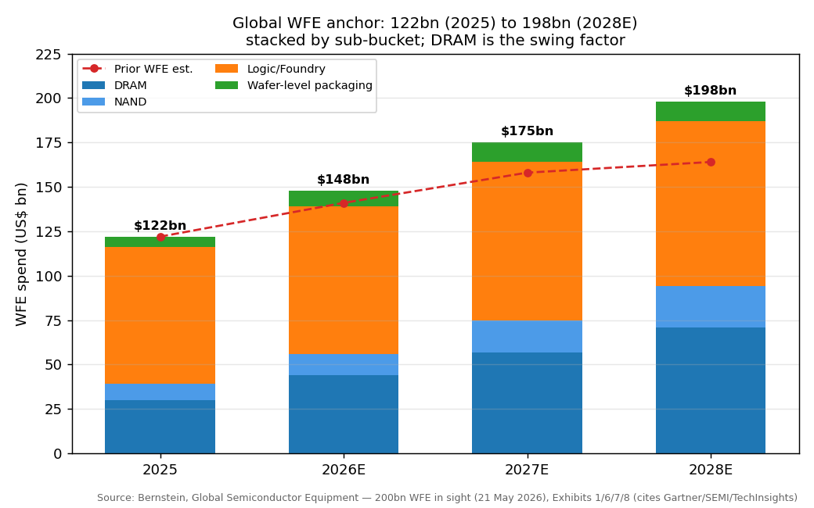
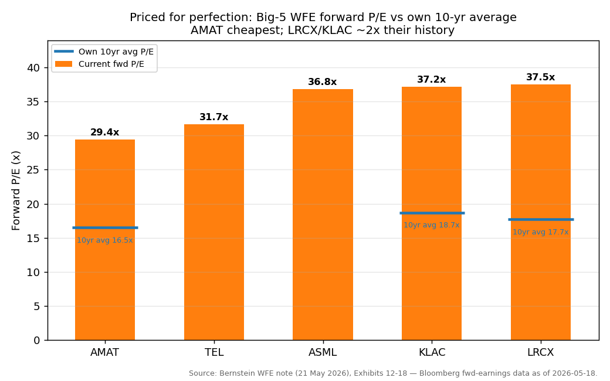
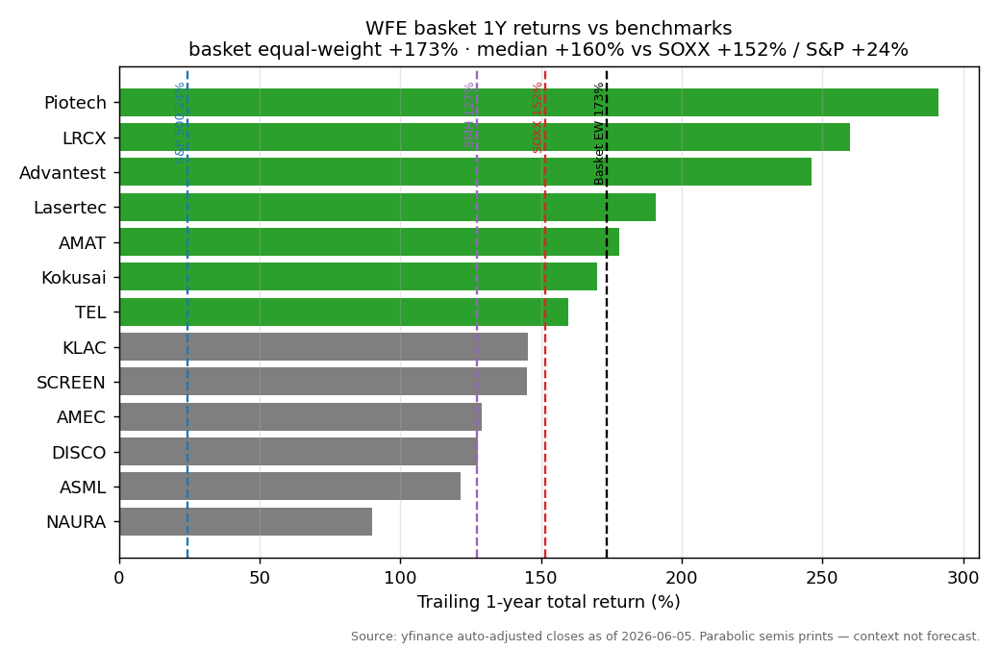

# Global Semiconductor Capital Equipment (WFE) / 全球半导体设备

**Created:** 2026-06-08 · **Last refreshed:** 2026-06-08 · **Last mutated:** 2026-06-08 · **Refresh cadence:** monthly · **Languages tracked:** en

## What's New

*The delta since you last looked — newest refresh on top. Older entries collapse into the archive below so this stays short.*

**2026-06-08 — basket created (13 tickers).**
- **Seeded** from Bernstein's *Global Semiconductor Equipment: $200bn WFE in sight* (21 May 2026), which lifts CY26/27/28 WFE to $148bn / $175bn / $198bn ([Bernstein WFE note, zsxq #585424848824444](http://xs-macbook-air.local:5001/zsxq/pdf/585424848824444/Bernstein-Global%20Semiconductor%20Equipment%EF%BC%9A%24200bn%20WFE%20in%20sight-260521.pdf)).
- **Anchor set:** wafer-fab-equipment (WFE) spend 2025 $122bn → 2028E $198bn; **swing factor = DRAM** — Bernstein's upward revision is mostly memory: 2027E DRAM WFE lifted to **$57bn (from $48bn)** and 2028E to **$71bn (from $51bn)**, with China WFE revised up **+$2.3 / +6.7 / +16.1bn** across 2026/27/28 ([Bernstein WFE note](http://xs-macbook-air.local:5001/zsxq/pdf/585424848824444/Bernstein-Global%20Semiconductor%20Equipment%EF%BC%9A%24200bn%20WFE%20in%20sight-260521.pdf)). Publicly corroborated by SEMI's year-end total-equipment trajectory $133bn (2025) → $145bn (2026) → $156bn (2027) ([SEMI/PRNewswire, 2025-12](https://www.prnewswire.com/news-releases/global-semiconductor-equipment-sales-projected-to-reach-a-record-of-156-billion-in-2027-semi-reports-302640433.html)).
- **Conviction ranking (Bernstein):** global trio AMAT > LRCX > KLAC; Japan Kokusai > TEL > Screen; China-memory AMEC > Piotech > NAURA; ASML the EU top pick — all the cited analyst's ordering, not ours ([Bernstein WFE note](http://xs-macbook-air.local:5001/zsxq/pdf/585424848824444/Bernstein-Global%20Semiconductor%20Equipment%EF%BC%9A%24200bn%20WFE%20in%20sight-260521.pdf)).
- **Movers (1Y, context only):** basket equal-weight +173% vs SOXX +152% / S&P 500 +24%; Piotech +291%, LRCX +260%, Advantest +246% lead (parabolic semis prints — see Performance caveat).
- **13 Bernstein price targets persisted** to `stock_price_target_db` (broker = Bernstein, file_id 585424848824444) → surfaced at `/pt`.

Earlier refreshes

*(none — basket created 2026-06-08)*

## Thesis

**Anchor — global wafer-fab-equipment (WFE) spend:** 2025 $122bn → **2026E $148bn (+21%)** → **2027E $175bn (+18%)** → **2028E $198bn (+13%)**, revised up from a prior $141bn / $158bn / $164bn path, per Bernstein's 21 May 2026 note ([Bernstein WFE note, zsxq #585424848824444](http://xs-macbook-air.local:5001/zsxq/pdf/585424848824444/Bernstein-Global%20Semiconductor%20Equipment%EF%BC%9A%24200bn%20WFE%20in%20sight-260521.pdf)). The public-industry read corroborates the up-and-to-the-right shape on a *different base*: SEMI's official year-end forecast puts **total** semiconductor equipment (which includes test and packaging, so a larger base than WFE-only) at $133bn (2025) → $145bn (2026) → $156bn (2027) ([SEMI/PRNewswire, 2025-12](https://www.prnewswire.com/news-releases/global-semiconductor-equipment-sales-projected-to-reach-a-record-of-156-billion-in-2027-semi-reports-302640433.html)). The two should not be summed or equated — Bernstein's is a WFE-only house estimate, SEMI's is total-equipment — but both point the same direction.

**Sub-bucket decomposition (Bernstein, 2027E unless noted):** Memory WFE **$75bn = DRAM $57bn + NAND $18bn** (rising to DRAM $71bn / NAND $23bn in 2028E); Logic/Foundry **$89bn** (2028E $93bn); Wafer-Level / advanced Packaging (WLP) **$6bn (2025) → $11bn (2028E)** ([Bernstein WFE note](http://xs-macbook-air.local:5001/zsxq/pdf/585424848824444/Bernstein-Global%20Semiconductor%20Equipment%EF%BC%9A%24200bn%20WFE%20in%20sight-260521.pdf)). Geographically Bernstein models ex-China WFE +25%/+21% (2026/27) and China +15%/+15% ([Bernstein WFE note](http://xs-macbook-air.local:5001/zsxq/pdf/585424848824444/Bernstein-Global%20Semiconductor%20Equipment%EF%BC%9A%24200bn%20WFE%20in%20sight-260521.pdf)). **Swing factor = DRAM**: nearly all of Bernstein's upward revision comes from memory, as DRAM makers add capacity to feed HBM and as China's CXMT/YMTC accelerate — so the names most levered to DRAM/HBM tooling (LRCX, Kokusai, Advantest, ASML litho, AMEC) carry the most upside *and* the most air-pocket risk.

**Value-chain / process-step map (who makes what):** litho — **ASML** (EUV monopoly); etch — **LRCX, AMEC, NAURA**; deposition — **Kokusai** (batch ALD), **Piotech, TEL, AMAT**; process-control / metrology — **KLAC, Lasertec** (mask inspection); thermal & clean — **SCREEN, NAURA**; advanced-packaging bonders / dicing — **Piotech** (hybrid bonding), **TEL** (bonders), **DISCO** (dicing/grind); ATE test — **Advantest**. Process steps with *no* pure-play in the basket (ion implant, CMP) are coverage gaps for a future add. The litho layer is the intensity story: Bernstein models ASML EUV shipments roughly doubling from **~48 units (2025) to ~87 (2028E)**, with each EUV tool pulling ~2 ArFi DUV tools — rising 1c-DRAM and advanced-logic litho intensity is what underwrites the litho sub-bucket ([Bernstein WFE note](http://xs-macbook-air.local:5001/zsxq/pdf/585424848824444/Bernstein-Global%20Semiconductor%20Equipment%EF%BC%9A%24200bn%20WFE%20in%20sight-260521.pdf)).

The mechanism that turns the anchor into per-name revenue: a multi-year WFE upcycle funds tool orders ~12 months before revenue recognition, so 2026 order strength shows up in 2027 sales. The driver underneath is the memory price-and-capex surge — TrendForce sees 2Q26 NAND contract prices +70–75% QoQ and conventional DRAM +58–63% QoQ as cloud buyers lock supply via long-term agreements ([TrendForce, 2026-03-31](https://www.trendforce.com/presscenter/news/20260331-12995.html)) — which funds the capacity expansion that consumes etch, deposition, litho, metrology, bonding and test tools. The thesis holds while AI-driven memory/logic capex keeps rising; it breaks if hyperscaler capex stutters or if the elevated 2024–25 China-localization spend air-pockets faster than ex-China DRAM ramps. Bernstein's own framing is that the upcycle "could be multi-year" with WFE estimates having room to move higher ([Bernstein WFE note](http://xs-macbook-air.local:5001/zsxq/pdf/585424848824444/Bernstein-Global%20Semiconductor%20Equipment%EF%BC%9A%24200bn%20WFE%20in%20sight-260521.pdf)).

## Scope rules

**In:** pure-play wafer-fab-equipment (WFE) and adjacent semiconductor-production-equipment (SPE) makers — lithography, etch, deposition, process-control/metrology, thermal, cleaning, dicing/grinding, advanced-packaging bonders, and back-end test (ATE) where the binding constraint sits on the tool side. This is a deliberately **core-heavy** basket because it tracks the equipment-maker layer directly (the theme *is* the toolmakers), rather than a diversified sector where pure-plays are rare.

**Out:** the memory/logic chipmakers themselves (SK Hynix, Micron, TSMC, CXMT) — they are the *customers* and are tracked in the separate [[memory-upcycle]] theme; EDA (SNPS/CDNS); materials/gas/photoresist suppliers; OSAT/packaging-house service providers (vs the bonder *toolmakers*, which are in). EUV-photomask and pellicle names are out unless the equipment is the moat.

## Tracked tickers

| Ticker | Name | Role | Justification | Added |
|---|---|---|---|---|
| NASDAQ:AMAT | Applied Materials | core | **Moat:** broadest WFE portfolio across materials engineering, process control and advanced packaging (heterogeneous integration, HBM), with DRAM + leading-edge-logic exposure via Semiconductor Systems + Applied Global Services — and the *cheapest* of the Big-5 (Bernstein fwd P/E ~29.4x vs 16.5x 10-yr avg). **Threat:** China localization / domestic-tool replacement + US export controls, disclosed in its own 10-K risk factors. ([AMAT FY25 10-K, SEC](https://www.sec.gov/Archives/edgar/data/6951/000162828025056742/amat-20251026.htm); [Bernstein WFE note](http://xs-macbook-air.local:5001/zsxq/pdf/585424848824444/Bernstein-Global%20Semiconductor%20Equipment%EF%BC%9A%24200bn%20WFE%20in%20sight-260521.pdf)) | 2026-06-08 |
| NASDAQ:LRCX | Lam Research | core | **Moat:** etch & deposition franchise enabling 3D-NAND stacking, DRAM and HBM advanced packaging — a critical-process choke point, ~50% memory-exposed (Bernstein), the most DRAM/NAND-levered of the Big-3. **Threat:** normalization of elevated China WFE revenue (34% of Q3 FY26 sales) + export controls. ([LRCX FY25 10-K, SEC](https://www.sec.gov/Archives/edgar/data/707549/000070754925000075/lrcx-20250629.htm); [Bernstein WFE note](http://xs-macbook-air.local:5001/zsxq/pdf/585424848824444/Bernstein-Global%20Semiconductor%20Equipment%EF%BC%9A%24200bn%20WFE%20in%20sight-260521.pdf)) | 2026-06-08 |
| NASDAQ:KLAC | KLA | core | **Moat:** industry-leading process-control & yield-management (inspection + metrology), a near-monopoly with structural growth from new process-control needs in advanced logic and DRAM; lower China replacement risk than peers. **Threat:** longer lead times can defer revenue and create a cyclical air-pocket. ([KLA FY25 10-K, SEC](https://www.sec.gov/Archives/edgar/data/319201/000031920125000024/klac-20250630.htm); [Bernstein WFE note](http://xs-macbook-air.local:5001/zsxq/pdf/585424848824444/Bernstein-Global%20Semiconductor%20Equipment%EF%BC%9A%24200bn%20WFE%20in%20sight-260521.pdf)) | 2026-06-08 |
| NASDAQ:ASML | ASML | core | **Moat:** "currently the world's only manufacturer of EUV lithography systems" (its 20-F) — a litho monopoly with rising intensity from 1c DRAM + advanced logic and a High-NA roadmap; Bernstein's EU top pick (~23% sales CAGR 25–28E). **Threat:** declining/normalizing China DUV revenue + tightening US/Dutch export controls. ([ASML 20-F, SEC](https://www.sec.gov/Archives/edgar/data/937966/000162828026011378/asml-20251231.htm); [Bernstein WFE note](http://xs-macbook-air.local:5001/zsxq/pdf/585424848824444/Bernstein-Global%20Semiconductor%20Equipment%EF%BC%9A%24200bn%20WFE%20in%20sight-260521.pdf)) | 2026-06-08 |
| TYO:8035 | Tokyo Electron (TEL) | core | **Moat:** largest Japanese SPE vendor across ~6 segments (coater/developer, etch, deposition, cleaning) plus a deepening advanced-packaging / HBM 3D-stacking push including wafer bonders. **Threat:** China demand normalization / export-control-driven China share loss as the cycle rotates off mature-node China spend. ([TEL IR, 2025-10-15](https://www.tel.com/news/ir/2025/20251015_001.html); [TrendForce, 2026-01-23](https://www.trendforce.com/news/2026/01/23/news-chip-tool-giants-accelerate-advanced-packaging-push-led-by-asml-tokyo-electron-and-others/)) | 2026-06-08 |
| TYO:6857 | Advantest | core | **Moat:** ATE gatekeeper for high-performance SoC and HBM/high-performance-DRAM test — AI/HPC complexity lifts tester demand per device; SoC Test Systems + HBM the core growth engine. **Threat:** test-time compression / Teradyne competition would fade the testers-per-wafer tailwind. ([Advantest 2Q FY25 results, 2025-10-28](https://www.advantest.com/en/news/2025/g2l53r0000000og7-att/E_FR_FY2025_2Q.pdf); [Bernstein WFE note](http://xs-macbook-air.local:5001/zsxq/pdf/585424848824444/Bernstein-Global%20Semiconductor%20Equipment%EF%BC%9A%24200bn%20WFE%20in%20sight-260521.pdf)) | 2026-06-08 |
| TYO:6146 | DISCO | core | **Moat:** near-monopoly in precision dicing (saws/laser saws) and back-grinding, with rising AI-driven advanced-packaging exposure as full-scale packaging ramp is expected. **Threat:** an advanced-packaging / AI investment-timing slowdown hits the incremental bull case first. ([DISCO 2Q FY25 results, 2025-10-29](https://www.disco.co.jp/eg/ir/library/doc/film/20251029.pdf); [Bernstein WFE note](http://xs-macbook-air.local:5001/zsxq/pdf/585424848824444/Bernstein-Global%20Semiconductor%20Equipment%EF%BC%9A%24200bn%20WFE%20in%20sight-260521.pdf)) | 2026-06-08 |
| TYO:6920 | Lasertec | core | **Moat:** launched the world's *first* actinic EUV patterned-mask-inspection system (ACTIS A150, 2019) and remains the dominant — effectively sole — EUV mask-inspection vendor; A200HiT extends toward High-NA. **Threat:** KLA (or another metrology incumbent) entering actinic mask inspection would erode the sole-supplier position. ([Lasertec ACTIS A200HiT, 2025-10-31](https://www.lasertec.co.jp/en/news/2025/20251031_3912.html); [Bernstein WFE note](http://xs-macbook-air.local:5001/zsxq/pdf/585424848824444/Bernstein-Global%20Semiconductor%20Equipment%EF%BC%9A%24200bn%20WFE%20in%20sight-260521.pdf)) | 2026-06-08 |
| TYO:6525 | Kokusai Electric | core | **Moat:** batch-ALD / batch-deposition leader — "top market share in the batch deposition equipment market in CY25" (its own IR), with large-batch ALD heavily used in 3D-NAND and rising GAA-logic deposition. **Threat:** NAND capex timing — a delayed/shallow NAND recovery directly caps batch-deposition volume. ([Kokusai IR briefing, 2025-11](https://ssl4.eir-parts.net/doc/6525/tdnet/2806337/00.pdf); [Bernstein WFE note](http://xs-macbook-air.local:5001/zsxq/pdf/585424848824444/Bernstein-Global%20Semiconductor%20Equipment%EF%BC%9A%24200bn%20WFE%20in%20sight-260521.pdf)) | 2026-06-08 |
| TYO:7735 | SCREEN Holdings | adjacent | **Moat:** top global share in single-wafer cleaning (SU-series; 15,000+ cumulative units) — but Bernstein-rated Market-Perform, the least-differentiated growth profile in the group at the lowest valuation. **Threat:** intensifying cleaning competition from TEL / Lam / ACM Research / NAURA + a declining China revenue mix. ([SCREEN SPE, 2025-07-01](https://www.screen.co.jp/spe/en/information/spe250701); [Bernstein WFE note](http://xs-macbook-air.local:5001/zsxq/pdf/585424848824444/Bernstein-Global%20Semiconductor%20Equipment%EF%BC%9A%24200bn%20WFE%20in%20sight-260521.pdf)) | 2026-06-08 |
| SZSE:002371 | NAURA Technology (北方华创) | core | **Moat:** China's WFE leader with the broadest domestic portfolio — etch, PVD, CVD, thermal, cleaning — serving diverse logic/DRAM/NAND clients, the exception to China's mostly single-product vendors. **Threat:** leading-edge tech gap vs AMAT/Lam + export controls cap it at sub-leading-edge nodes; Chinese WFE is collectively only ~6.5% of the global market. ([24/7 Wall St, 2026-05-01](https://247wallst.com/technology-3/2026/05/01/chinas-semiconductor-equipment-companies-gain-share-despite-u-s-sanctions/); [NAURA Q1 2026, eastmoney](https://finance.eastmoney.com/a/202605013727341211.html)) | 2026-06-08 |
| SSE:688012 | AMEC / Advanced Micro-Fabrication (中微公司) | core | **Moat:** China's dry-etch leader (CCP + ICP) with the strongest tech recognition among China WFE, expanding into thin-film deposition (a 46% sales jump on etch + thin-film; 1,500th CCP etch station shipped). **Threat:** intense etch competition (Lam/AMAT + domestic) + entity-list sanctions on leading-edge access. ([DigiTimes, 2025-10-30](https://www.digitimes.com/news/a20251030VL219/amec-etching-thin-film-equipment-growth.html); [Bernstein WFE note](http://xs-macbook-air.local:5001/zsxq/pdf/585424848824444/Bernstein-Global%20Semiconductor%20Equipment%EF%BC%9A%24200bn%20WFE%20in%20sight-260521.pdf)) | 2026-06-08 |
| SSE:688072 | Piotech (拓荆科技) | core | **Moat:** China's thin-film deposition specialist (PECVD/ALD/SACVD/HDPCVD/Flowable CVD) and uniquely supplies advanced-packaging hybrid-bonding (混合键合) + fusion-bonding W2W/C2W tools — its second growth curve. **Threat:** narrow product breadth vs NAURA's full portfolio leaves it more exposed to single-segment competition and customer capex timing. ([Securities Times, 2025-12-04](https://www.stcn.com/article/detail/3524811.html); [Bernstein WFE note](http://xs-macbook-air.local:5001/zsxq/pdf/585424848824444/Bernstein-Global%20Semiconductor%20Equipment%EF%BC%9A%24200bn%20WFE%20in%20sight-260521.pdf)) | 2026-06-08 |

**Conviction ranking (Bernstein, sourced — not ours):** global trio **AMAT > LRCX > KLAC** (AMAT = broadest leading-edge-logic + DRAM + packaging exposure *and* cheapest; LRCX = NAND-upgrade + memory leverage; KLAC = slower this year on lead times, strong 2027 setup); Japan **Kokusai > TEL > Screen** (preference for memory exposure); China-memory **AMEC > Piotech > NAURA**; **ASML** the EU top pick ([Bernstein WFE note, zsxq #585424848824444](http://xs-macbook-air.local:5001/zsxq/pdf/585424848824444/Bernstein-Global%20Semiconductor%20Equipment%EF%BC%9A%24200bn%20WFE%20in%20sight-260521.pdf)). *Analyst view (this note): we treat SCREEN as `adjacent` rather than `core` because it is the lone Market-Perform with the least-specific growth driver — that is our role call, distinct from Bernstein's rating.*

## Valuation snapshot

Per-name Bernstein coverage (prices/PTs as of 19 May 2026). Rating / PT / Upside mirror `stock_price_target_db` (surfaced at [`/pt`](http://xs-macbook-air.local:5001/pt)); forward P/E and EPS are from the [Bernstein WFE note](http://xs-macbook-air.local:5001/zsxq/pdf/585424848824444/Bernstein-Global%20Semiconductor%20Equipment%EF%BC%9A%24200bn%20WFE%20in%20sight-260521.pdf). The **26E → 27E** multiple compression shows growth outrunning the multiple — the bull pivot for the rich names.

| Ticker | Rating | Px (19 May) | PT | Upside | P/E 26E → 27E | EPS 26E / 27E |
|---|---|---|---|---|---|---|
| NASDAQ:AMAT | Outperform | $413.57 | $525 | +26.9% | 34.0x → 26.6x | $12.17 / $15.56 |
| NASDAQ:LRCX | Outperform | $277.96 | $340 *(was $325)* | +22.3% | 49.0x → 34.8x | $5.68 / $7.98 *(FY27 was $7.49)* |
| NASDAQ:KLAC | Outperform | $1,756.45 | $1,975 *(was $1,875)* | +12.4% | 47.6x → 34.3x | $36.93 / $51.22 *(FY27 was $49.89)* |
| NASDAQ:ASML | Outperform | $1,472.39 | $1,971 | +33.9% | 34.3x → 23.8x | $36.96 / $53.13 |
| TYO:8035 | Outperform | ¥47,160 | ¥59,200 | +25.5% | 31.4x → 25.5x | ¥1,504 / ¥1,849 |
| TYO:6857 | Outperform | ¥25,290 | ¥39,200 | +55.0% | 34.4x → 29.1x | ¥736 / ¥870 |
| TYO:6146 | Outperform | ¥61,600 | ¥85,000 | +38.0% | 35.5x → 29.0x | ¥1,734 / ¥2,127 |
| TYO:6920 | Outperform | ¥36,060 | ¥50,000 | +38.7% | 40.4x → 36.9x | ¥893 / ¥977 |
| TYO:6525 | Outperform | ¥6,600 | ¥8,240 | +24.8% | 33.0x → 24.0x | ¥200 / ¥275 |
| TYO:7735 | Market-Perform | ¥10,520 | ¥12,600 | +19.8% | 18.4x → 15.9x | ¥573 / ¥662 |
| SZSE:002371 | Outperform | ¥619.70 | ¥680 | +9.7% | 60.7x → 37.8x | ¥10.22 / ¥16.41 |
| SSE:688012 | Outperform | ¥479.51 | ¥500 | +4.3% | 96.9x → 66.7x | ¥4.95 / ¥7.18 |
| SSE:688072 | Outperform | ¥554.93 | ¥580 | +4.5% | 68.3x → 44.8x | ¥8.12 / ¥12.40 |

**PT derivation (where Bernstein discloses it):** ASML = target **35x × Q5–8 EPS €49.2 → €1,700**, converted at EUR/USD → **$1,971**; LRCX **$340** on FY27E EPS $7.98 (raised from $325 / $7.49); KLAC **$1,975** on FY27E EPS $51.22 (raised from $1,875 / $49.89) ([Bernstein WFE note](http://xs-macbook-air.local:5001/zsxq/pdf/585424848824444/Bernstein-Global%20Semiconductor%20Equipment%EF%BC%9A%24200bn%20WFE%20in%20sight-260521.pdf)). **Own-history context:** the Big-5 trade at roughly double their 10-yr average forward P/E (AMAT 29.4x vs 16.5x · KLAC 37.2x vs 18.7x · LRCX 37.5x vs 17.7x), the valuation chart in Performance below.

## Exclusions

| Ticker | Reason |
|---|---|
| NASDAQ:MU / KS:000660 / TYO:285A | Memory *chipmakers* — they are WFE customers, tracked in [[memory-upcycle]], not equipment makers. |
| TPE:2330 (TSMC) | Foundry customer of WFE, not a toolmaker; its capex is an input to the anchor, not a basket member. |
| NASDAQ:ACMR (ACM Research) | Considered (China-exposed single-wafer cleaning); held out of v1 pending a moat/threat grounding vs SCREEN — candidate add for next mutation. |

## Keywords

WFE / 晶圆厂设备 · wafer-fab equipment · EUV lithography / 极紫外光刻 · etch / 刻蚀 · deposition / 薄膜沉积 (CVD/ALD) · process control / 量测检测 · advanced packaging / 先进封装 · hybrid bonding / 混合键合 · ATE test / 测试设备 · DRAM/HBM capex · China localization / 国产替代

## Performance (since last refresh)

Baseline pass (basket created 2026-06-08; returns are trailing-1-year off yfinance auto-adjusted closes as of 2026-06-05). **Equal-weight basket +173%, median +160%**, versus **iShares SOXX +152% · VanEck SMH +127% · S&P 500 +24%** over the same window — i.e. the basket modestly beat the broad semis ETFs and crushed the market, as expected for a pure-play toolmaker basket in an up-cycle.

**Movers:** Piotech +291%, LRCX +260%, Advantest +246% led; **laggards** NAURA +90%, ASML +121%, DISCO +128%. ⚠️ *These trailing-1-year prints are parabolic and partly an artifact of the 2025–26 semis re-rating; treat the median-and-benchmark framing as signal and the individual headline numbers as context, not as a forecast.* Note AMEC's 2026-06-05 price (¥276) reflects a **capital-reserve bonus conversion** (10-for-4.9 bonus + cash dividend, ex-date 2026-05-29; total shares 628.8m → 936.97m) — yfinance back-adjusts for it, so the +129% return is split-consistent even though the raw price looks far below Bernstein's 19-May ¥479.51 quote ([AMEC distribution announcement, cninfo 2026-05-23](https://static.cninfo.com.cn/finalpage/2026-05-23/1225327338.PDF)).

**Valuation drift (priced-for-perfection watch):** the group trades far above its own history. Bernstein's forward-earnings multiples (Bloomberg 18-May-2026): **LRCX 37.5x vs a 10-yr average of 17.7x** (a ~36% premium to the SOX and ~71% to the SPX), **KLAC 37.2x vs 18.7x**, **AMAT 29.4x vs 16.5x** (cheapest of the Big-5) ([Bernstein WFE note, zsxq #585424848824444](http://xs-macbook-air.local:5001/zsxq/pdf/585424848824444/Bernstein-Global%20Semiconductor%20Equipment%EF%BC%9A%24200bn%20WFE%20in%20sight-260521.pdf)). With the basket-median multiple roughly *double* its 10-yr norm, the **air-pocket risk** is explicit: the de-rate trigger is the Thesis anchor disappointing — i.e. the DRAM swing-bucket capex (CXMT/YMTC + ex-China DRAM) coming in below the $57bn-2027 / $71bn-2028 path.

## Recent events

- **AMAT** — Q2 FY2026 (reported 2026-05-14): record revenue **$7.91bn**, GAAP gross margin 49.9% ([AMAT Q2 FY26 earnings, SEC](https://www.sec.gov/Archives/edgar/data/6951/000162828026035071/exhibit991q22026earningsre.htm)).
- **LRCX** — Q3 FY2026 (quarter ended 2026-03-29): revenue **$5.84bn**, GAAP gross margin 49.8% ([LRCX Q3 FY26 earnings, SEC](https://www.sec.gov/Archives/edgar/data/707549/000070754926000020/lrcx_exhibitx991xq3x2026.htm)).
- **KLAC** — Q3 FY2026 (reported 2026-04-29): total revenue **$3.415bn**, above the guidance midpoint ([KLA Q3 FY26 earnings, SEC](https://www.sec.gov/Archives/edgar/data/319201/000031920126000014/exhibit991earningsrelease3.htm)).
- **ASML** — Q1 2026 (reported 2026-04-15): **€8.8bn** net sales, €2.8bn net income, 53.0% gross margin; reiterated FY2026 net-sales guide of **€36–40bn** ([ASML Q1 2026 release, SEC](https://www.sec.gov/Archives/edgar/data/937966/000162828026025147/pressreleasefinancialresul.htm)).
- **Advantest / DISCO / Lasertec / Kokusai / SCREEN** — most recent official disclosures (Oct–Nov 2025) confirm the moat in each case: Advantest record six-month profit on SoC + HBM test ([2Q FY25](https://www.advantest.com/en/news/2025/g2l53r0000000og7-att/E_FR_FY2025_2Q.pdf)); DISCO advanced-packaging ramp ([2Q FY25](https://www.disco.co.jp/eg/ir/library/doc/film/20251029.pdf)); Lasertec A200HiT actinic launch ([2025-10-31](https://www.lasertec.co.jp/en/news/2025/20251031_3912.html)); Kokusai top batch-deposition share CY25 ([IR](https://ssl4.eir-parts.net/doc/6525/tdnet/2806337/00.pdf)); SCREEN 15,000-unit cleaning milestone ([2025-07-01](https://www.screen.co.jp/spe/en/information/spe250701)).
- **NAURA** — Q1 2026: revenue **RMB 10.32bn (+25.8% YoY)**, net profit RMB 1.635bn (+3.4% YoY) as R&D spend surged ([eastmoney, 2026-05-01](https://finance.eastmoney.com/a/202605013727341211.html)).

## Drift signals

Baseline pass — no prior snapshot to diff, so these are the day-0 watch-items rather than realized drift:
- **SCREEN (role = adjacent) is the weakest link.** The lone Market-Perform, least-differentiated (single-wafer cleaning) with a declining China mix and named competition from TEL / Lam / ACM Research / NAURA — first candidate for a drop or a downgrade-to-watch if cleaning intensity doesn't inflect ([Bernstein WFE note](http://xs-macbook-air.local:5001/zsxq/pdf/585424848824444/Bernstein-Global%20Semiconductor%20Equipment%EF%BC%9A%24200bn%20WFE%20in%20sight-260521.pdf)).
- **Candidate add: ACM Research (NASDAQ:ACMR)** — China-exposed single-wafer cleaning competing directly with SCREEN/NAURA; held out of v1 pending a moat/threat grounding, flagged for the next mutation (see Exclusions).
- **China-name valuation stretch.** AMEC (96.9x → 66.7x) and Piotech (68.3x → 44.8x) are the richest names on the *thinnest* upside-to-PT (+4.3% / +4.5%) — a re-rating risk if the China-localization order momentum (AMEC's 30%→50% guide) disappoints ([Bernstein WFE note](http://xs-macbook-air.local:5001/zsxq/pdf/585424848824444/Bernstein-Global%20Semiconductor%20Equipment%EF%BC%9A%24200bn%20WFE%20in%20sight-260521.pdf)).
- **Leading-edge ceiling on the China trio.** NAURA/AMEC/Piotech are structurally capped at sub-leading-edge nodes by export controls (~6.5% collective global WFE share) — a thesis-bound risk, not a timing one ([24/7 Wall St, 2026-05-01](https://247wallst.com/technology-3/2026/05/01/chinas-semiconductor-equipment-companies-gain-share-despite-u-s-sanctions/)).
- **Coverage gap:** no pure-play in ion-implant or CMP in the basket (the diversified incumbents cover these, but no listed pure-play is tracked) — a future-add axis if one emerges.

## Leading indicators

The signals that would crack this thesis *before* the toolmaker stocks roll over — refresh each:

- **China semiconductor-equipment imports (the China-WFE proxy).** China's 2025 SME imports hit a record **$51.1bn** (~5× over the decade; top sources Japan/Netherlands/Singapore/US), per a customs-data dashboard ([Silverado, 2025](https://silverado.org/data-dashboards/china-semiconductor-manufacturing-equipment-imports-hit-record-levels-in-2025/)). Bernstein's higher-frequency China WFE Import Tracker reads March imports ~$3.1bn with YTD imports **−17% YoY** — a *cooling* monthly run-rate even as full-year stays record-high; watch whether the YoY decline deepens (bearish for global tool demand) or reverses ([Bernstein China WFE Import Tracker, zsxq #585428225242224](http://xs-macbook-air.local:5001/zsxq/pdf/585428225242224/Bernstein-Global%20Semiconductor%20Capital%20Equipment%20China%20WFE%20Import%20Tracker%20%EF%BC%88Apr%202026%EF%BC%89%EF%BC%9A%20YTD%20YoY%20~13%25%20with%20weaker%20lithography%20import%20due%20to%20supply%20constrain-260521.pdf)).
- **Memory contract prices (funds the DRAM swing bucket).** 2Q26 NAND contract prices +70–75% QoQ and conventional DRAM +58–63% QoQ ([TrendForce, 2026-03-31](https://www.trendforce.com/presscenter/news/20260331-12995.html)); rising memory pricing → memory-maker cash flow → DRAM/NAND capex → WFE orders. A roll-over here leads the WFE anchor down.
- **Management China-revenue-mix guidance (side-by-side).** The Big-5 all guide China *down* toward normalization in 2026 — ASML ~20% of 2026 sales (from 33%/41%), AMAT ~24%, LRCX ~34%, KLA mid-to-high 20s, TEL mid-30s — convergence that corroborates the "ex-China DRAM takes the baton from China-localization" thesis; divergence (one name's China mix re-accelerating) would be the drift signal ([Bernstein WFE note, zsxq #585424848824444](http://xs-macbook-air.local:5001/zsxq/pdf/585424848824444/Bernstein-Global%20Semiconductor%20Equipment%EF%BC%9A%24200bn%20WFE%20in%20sight-260521.pdf)).
- **Customer order-growth guidance.** AMEC raised its annual order-growth guidance from 30% to 50% — a direct upstream read on China memory/logic tool demand that leads reported revenue by ~a year ([Bernstein WFE note](http://xs-macbook-air.local:5001/zsxq/pdf/585424848824444/Bernstein-Global%20Semiconductor%20Equipment%EF%BC%9A%24200bn%20WFE%20in%20sight-260521.pdf)).

## Catalysts (next 3–6 months)

- **CXMT STAR Market IPO** (cleared the SSE listing-committee review 2026-05-27; ~RMB 29.5bn / ~$4.4bn) → *mechanism:* fresh capital → accelerated DRAM/HBM capacity build → +China DRAM WFE (the swing bucket) → upside to NAURA/AMEC/Piotech orders, near-term ([Caixin, 2026-05-28](https://www.caixinglobal.com/2026-05-28/changxin-clears-key-hurdle-for-record-star-market-ipo-102448359.html)).
- **YMTC STAR Market IPO** (CSRC tutoring complete; application expected ~mid-June 2026) → *mechanism:* funds 3D-NAND capacity → +China NAND WFE → Kokusai/AMEC/NAURA, 1–2 quarters out ([SCMP, 2026](https://www.scmp.com/tech/tech-trends/article/3354374/inside-ymtcs-ipo-plans-how-chinas-3d-nand-champion-chasing-capital-markets)).
- **2H26 order revisions** → *mechanism:* Bernstein expects local-player order guidance to keep rising into 2H26, which (at ~1-yr lead time) lifts 2027 WFE revenue — the multi-year-upcycle confirmation, mid-2026 ([Bernstein WFE note](http://xs-macbook-air.local:5001/zsxq/pdf/585424848824444/Bernstein-Global%20Semiconductor%20Equipment%EF%BC%9A%24200bn%20WFE%20in%20sight-260521.pdf)).
- **Memory-maker FY27 capex guides** → *mechanism:* the ex-China DRAM capex line that has to take the baton from China-localization; a soft guide here is the single biggest de-rate trigger for the rich multiples, next 1–2 quarters ([TrendForce, 2026-03-31](https://www.trendforce.com/presscenter/news/20260331-12995.html)).

## Data Used / 数据来源清单

**Market data**
- yfinance `auto_adjust=True` for prices, 1-year returns, sector — pulled 2026-06-08 (last close 2026-06-05). Benchmarks: SOXX, SMH, ^GSPC.

**Per-ticker primary sources**
- AMAT/LRCX/KLAC/ASML: latest 10-K / 20-F + most recent quarterly earnings exhibit (SEC EDGAR, linked inline). *SEC `/Archives/` requires an SEC-fair-access contact User-Agent — returns 403 to a generic browser UA; the documents are live.*
- TEL/Advantest/DISCO/Lasertec/Kokusai/SCREEN: most recent official IR releases / results PDFs (Oct–Nov 2025 / Jul 2025), linked inline.
- NAURA/AMEC/Piotech: trade-press + official cninfo/IR disclosures (2025-10 to 2026-05), linked inline.

**Industry research / sell-side thematic notes (theme-level)**
- Bernstein, *Global Semiconductor Equipment: $200bn WFE in sight*, 2026-05-21 ([zsxq #585424848824444](http://xs-macbook-air.local:5001/zsxq/pdf/585424848824444/Bernstein-Global%20Semiconductor%20Equipment%EF%BC%9A%24200bn%20WFE%20in%20sight-260521.pdf)) — anchor, sub-buckets, ratings, PTs, conviction ranking, China-% guidance. Bernstein cites Gartner/SEMI/TechInsights as its primary inputs.
- Bernstein, *China WFE Import Tracker (Apr 2026)* ([zsxq #585428225242224](http://xs-macbook-air.local:5001/zsxq/pdf/585428225242224/Bernstein-Global%20Semiconductor%20Capital%20Equipment%20China%20WFE%20Import%20Tracker%20%EF%BC%88Apr%202026%EF%BC%89%EF%BC%9A%20YTD%20YoY%20~13%25%20with%20weaker%20lithography%20import%20due%20to%20supply%20constrain-260521.pdf)) — leading indicator.
- SEMI Year-End Total Equipment Forecast ([PRNewswire, 2025-12](https://www.prnewswire.com/news-releases/global-semiconductor-equipment-sales-projected-to-reach-a-record-of-156-billion-in-2027-semi-reports-302640433.html)); SEMI 2025 equipment billings ([PRNewswire](https://www.prnewswire.com/news-releases/semi-reports-global-semiconductor-equipment-billings-reached-135-billion-in-2025-up-15-year-on-year-302735003.html)) — public anchor corroboration (total-equipment base).
- TrendForce 2Q26 memory pricing ([2026-03-31](https://www.trendforce.com/presscenter/news/20260331-12995.html)); Silverado China-SME-imports dashboard ([2025](https://silverado.org/data-dashboards/china-semiconductor-manufacturing-equipment-imports-hit-record-levels-in-2025/)).

**TAM anchor**
- WFE 2025 $122bn → 2026E $148bn → 2027E $175bn → 2028E $198bn; sub-buckets DRAM $57bn / NAND $18bn / Logic-Foundry $89bn / WLP $11bn (Bernstein, cited above).

**Charts** (rendered headless, matplotlib Agg, with in-image source footers)
- [theme_semicap-wfe_anchor.png](../charts/theme_semicap-wfe_anchor.png) — WFE anchor trajectory + DRAM/NAND/Logic/WLP decomposition (source: Bernstein WFE note Ex 1/6/7/8).
- [theme_semicap-wfe_performance.png](../charts/theme_semicap-wfe_performance.png) — basket 1Y returns vs SOXX/SMH/SPX (source: yfinance).
- [theme_semicap-wfe_valuation.png](../charts/theme_semicap-wfe_valuation.png) — Big-5 fwd P/E vs own 10-yr average (source: Bernstein WFE note Ex 12–18).

**Stores written (Tier-2 helpers)**
- `stock_price_target_db` — 13 Bernstein PT/rating calls upserted (broker = Bernstein, file_id 585424848824444), idempotent on ticker × broker × file_id; surfaced at `/pt`.

**Stale notices / coverage gaps**
- Per-name *threat* citations: for several Japan/China names the threat is a sell-side/comparative view with no single public deep URL that string-matches it; those cells cite the Bernstein note rather than a fabricated link. ACMR not yet grounded (excluded pending next mutation).

## References

- Bernstein WFE note (zsxq): http://xs-macbook-air.local:5001/zsxq/pdf/585424848824444/Bernstein-Global%20Semiconductor%20Equipment%EF%BC%9A%24200bn%20WFE%20in%20sight-260521.pdf
- Bernstein China WFE Import Tracker (zsxq): http://xs-macbook-air.local:5001/zsxq/pdf/585428225242224/Bernstein-Global%20Semiconductor%20Capital%20Equipment%20China%20WFE%20Import%20Tracker%20%EF%BC%88Apr%202026%EF%BC%89%EF%BC%9A%20YTD%20YoY%20~13%25%20with%20weaker%20lithography%20import%20due%20to%20supply%20constrain-260521.pdf
- AMAT 10-K: https://www.sec.gov/Archives/edgar/data/6951/000162828025056742/amat-20251026.htm · Q2 FY26: https://www.sec.gov/Archives/edgar/data/6951/000162828026035071/exhibit991q22026earningsre.htm
- LRCX 10-K: https://www.sec.gov/Archives/edgar/data/707549/000070754925000075/lrcx-20250629.htm · Q3 FY26: https://www.sec.gov/Archives/edgar/data/707549/000070754926000020/lrcx_exhibitx991xq3x2026.htm
- KLA 10-K: https://www.sec.gov/Archives/edgar/data/319201/000031920125000024/klac-20250630.htm · Q3 FY26: https://www.sec.gov/Archives/edgar/data/319201/000031920126000014/exhibit991earningsrelease3.htm
- ASML 20-F: https://www.sec.gov/Archives/edgar/data/937966/000162828026011378/asml-20251231.htm · Q1 2026: https://www.sec.gov/Archives/edgar/data/937966/000162828026025147/pressreleasefinancialresul.htm
- TEL IR: https://www.tel.com/news/ir/2025/20251015_001.html · TrendForce packaging: https://www.trendforce.com/news/2026/01/23/news-chip-tool-giants-accelerate-advanced-packaging-push-led-by-asml-tokyo-electron-and-others/
- Advantest: https://www.advantest.com/en/news/2025/g2l53r0000000og7-att/E_FR_FY2025_2Q.pdf
- DISCO: https://www.disco.co.jp/eg/ir/library/doc/film/20251029.pdf
- Lasertec: https://www.lasertec.co.jp/en/news/2025/20251031_3912.html
- Kokusai: https://ssl4.eir-parts.net/doc/6525/tdnet/2806337/00.pdf
- SCREEN: https://www.screen.co.jp/spe/en/information/spe250701
- NAURA (24/7 Wall St): https://247wallst.com/technology-3/2026/05/01/chinas-semiconductor-equipment-companies-gain-share-despite-u-s-sanctions/ · NAURA Q1 (eastmoney): https://finance.eastmoney.com/a/202605013727341211.html
- AMEC (DigiTimes): https://www.digitimes.com/news/a20251030VL219/amec-etching-thin-film-equipment-growth.html · AMEC distribution (cninfo): https://static.cninfo.com.cn/finalpage/2026-05-23/1225327338.PDF
- Piotech (Securities Times): https://www.stcn.com/article/detail/3524811.html
- SEMI total-equipment forecast: https://www.prnewswire.com/news-releases/global-semiconductor-equipment-sales-projected-to-reach-a-record-of-156-billion-in-2027-semi-reports-302640433.html · SEMI 2025 billings: https://www.prnewswire.com/news-releases/semi-reports-global-semiconductor-equipment-billings-reached-135-billion-in-2025-up-15-year-on-year-302735003.html
- TrendForce memory pricing: https://www.trendforce.com/presscenter/news/20260331-12995.html
- Silverado China SME imports: https://silverado.org/data-dashboards/china-semiconductor-manufacturing-equipment-imports-hit-record-levels-in-2025/
- CXMT IPO (Caixin): https://www.caixinglobal.com/2026-05-28/changxin-clears-key-hurdle-for-record-star-market-ipo-102448359.html · YMTC IPO (SCMP): https://www.scmp.com/tech/tech-trends/article/3354374/inside-ymtcs-ipo-plans-how-chinas-3d-nand-champion-chasing-capital-markets

## History

- 2026-06-08 — created with initial 13-ticker basket (12 core, 1 adjacent) seeded from Bernstein's $200bn-WFE note; anchor + leading-indicators + conviction ranking populated; 13 Bernstein PTs persisted to `stock_price_target_db`.
