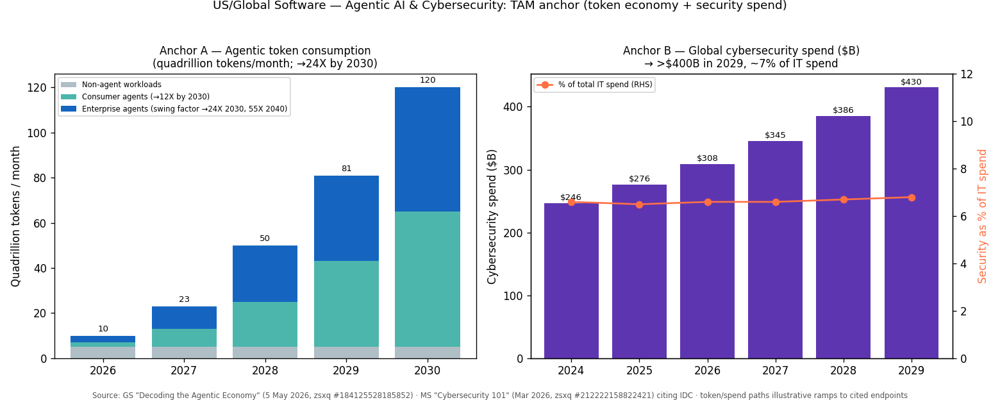
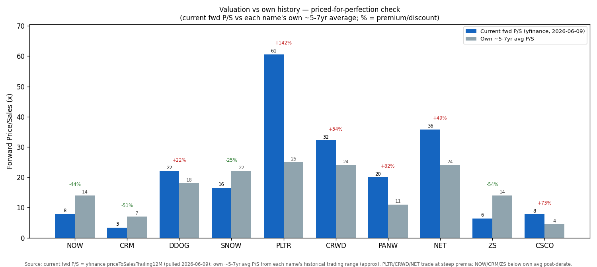
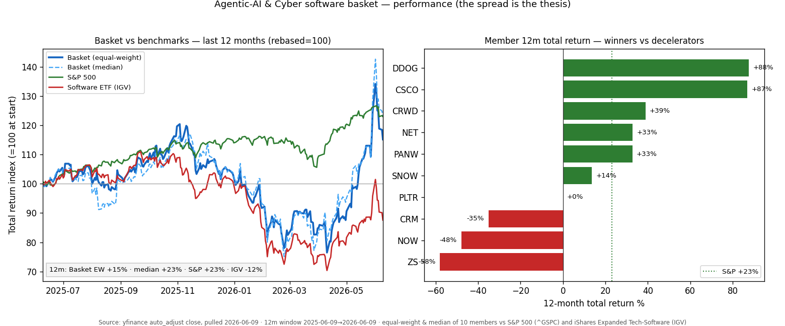

# US / Global Software — Agentic AI Applications & Cybersecurity

**Created:** 2026-06-10 · **Last refreshed:** 2026-06-10 · **Last mutated:** 2026-06-10 · **Refresh cadence:** monthly · **Languages tracked:** en

## What's New

*The delta since you last looked — newest refresh on top. Older entries collapse into the archive below.*

**2026-06-10 — basket created** (10 names: NOW · CRM · DDOG · SNOW · PLTR · CRWD · PANW · NET · ZS core/enabler, CSCO adjacent).
- **Thesis anchor set:** agentic-AI token consumption **24X by 2030** (120 quadrillion tokens/month, enterprise agents the swing factor, 55X by 2040), per [GS "Decoding the Agentic Economy", 5 May 2026, zsxq #184125528185852 p.1](http://xs-macbook-air.local:5001/zsxq/pdf/184125528185852/Goldman%20Sachs-Americas%20Technology_%20Decoding%20the%20Agentic%20Economy%20-%20The%20Coming%20Inflection%20in%20AI%20Usage%20and%20Ma); cybersecurity spend **>$400B by 2029** (~7% of IT), per [MS "Cybersecurity 101", Mar 2026, zsxq #212222158822421 p.5](http://xs-macbook-air.local:5001/zsxq/pdf/212222158822421/Morgan%20Stanley-Software%EF%BC%9ASlide%20Presentation%EF%BC%9A%20Cybersecurity%20101-260320.pdf#page=5) citing IDC.
- **The spread IS the thesis:** over the trailing 12m the basket (equal-weight) is **+15%**, the basket median **+23%** — roughly in line with the S&P 500 **+23%**, but **+27pts ahead of the software ETF IGV at −12%** ([yfinance, 2026-06-09](https://finance.yahoo.com/quote/IGV)). Winners DDOG +88%, CSCO +87%, CRWD +39% vs decelerators NOW −48%, ZS −58%, CRM −35%.
- **New broker calls (this pass):** MS raised SNOW to **OW PT $300** (was $245) calling it a "select AI winner" ([MS, 2026-05-28, zsxq #812485554288812 p.1](http://xs-macbook-air.local:5001/zsxq/pdf/812485554288812/MS-Snowflake%20Inc.%201Q27%20Results%20Joining%20the%20Ranks%20of%20the%20Select%20AI%20Winners%20in%20Software-260528.pdf#page=1)); GS raised CRWD to **Buy PT $726** (was $500) ([GS, 2026-06-04, zsxq #212488522258421 p.1](http://xs-macbook-air.local:5001/zsxq/pdf/212488522258421/Goldman%20Sachs-CrowdStrike%20%EF%BC%88CRWD.US%EF%BC%89%201QFY%EF%BC%9A%20Commentary%20on%20pipeline%20may%20be%20start%20of%20broader%20AI%20dem)); GS holds DDOG at **Sell PT $139** vs Bernstein **Outperform PT $180** — a live bull/bear split.
- **Priced-for-perfection flag:** PLTR trades **+142%** above its own ~5-7yr avg P/S, PANW **+82%**, NET **+49%**, CRWD **+34%**; the de-rate trigger is a single quarter of US-commercial deceleration below ~100% for PLTR or a security-platform consolidation stall ([yfinance, 2026-06-09](https://finance.yahoo.com/quote/PLTR)).

Earlier refreshes

*(none yet — baseline create on 2026-06-10.)*

## Thesis

**Anchor A — Agentic-AI token consumption (the demand pool software pricing is migrating onto):** Global token throughput is set to rise **~24X to 120 quadrillion tokens/month by 2030** (off a 2026 base of ~5 quadrillion), with enterprise agents the swing factor (24X by 2030, **55X by 2040**) and consumer agents adding **12X (≈60 quadrillion/month)** as daily AI queries climb to ~23bn by 2030 from ~5bn in 2025 ([GS "Decoding the Agentic Economy", 5 May 2026, zsxq #184125528185852 p.1, p.3](http://xs-macbook-air.local:5001/zsxq/pdf/184125528185852/Goldman%20Sachs-Americas%20Technology_%20Decoding%20the%20Agentic%20Economy%20-%20The%20Coming%20Inflection%20in%20AI%20Usage%20and%20Ma#page=3)). The economic kicker: cost-per-token is falling 60–70%/yr while leading LLM token prices have moved "from ~40% annual declines to flat or increasing pricing," driving a positive gross-margin inflection for the AI value chain "over the next 3-12 months" ([GS, p.1](http://xs-macbook-air.local:5001/zsxq/pdf/184125528185852/Goldman%20Sachs-Americas%20Technology_%20Decoding%20the%20Agentic%20Economy%20-%20The%20Coming%20Inflection%20in%20AI%20Usage%20and%20Ma#page=1)). The investable read: software value migrates from "systems of record" to "systems of action," and pricing shifts from per-seat to **per-outcome / per-consumption** (Salesforce Agentic Work Units, ServiceNow ROI-based pricing, Snowflake consumption credits), which decouples gross margin from model cost and can sustain 80%+ GM ([GS "Revisiting Moats IV", 16 Apr 2026, zsxq #184418815458452 p.1](http://xs-macbook-air.local:5001/zsxq/pdf/184418815458452/Goldman%20Sachs-AMERICAS%20TECHNOLOGY%EF%BC%9A%20SOFTWARE%20Revisiting%20Moats%20IV%EF%BC%9A%20Shifting%20Center%20of%20Gravity-260)).

**Anchor B — Cybersecurity spend (the most defensible IT line):** Global security spend grows double-digits from **$246B (2024) → $276B → $308B → $345B → $386B → >$430B (2029)**, still under 7% of total IT spend, and is "the IT project least likely to be cut" ([MS "Cybersecurity 101", Mar 2026, zsxq #212222158822421 p.5](http://xs-macbook-air.local:5001/zsxq/pdf/212222158822421/Morgan%20Stanley-Software%EF%BC%9ASlide%20Presentation%EF%BC%9A%20Cybersecurity%20101-260320.pdf#page=5) citing IDC). Agentic AI *widens* the attack surface (prompt injection, data/model poisoning, non-human/agent identity), and a Y2K-style hygiene-upgrade cycle is forming, so cyber is the line where TAM growth and AI demand point the same way ([MS p.5](http://xs-macbook-air.local:5001/zsxq/pdf/212222158822421/Morgan%20Stanley-Software%EF%BC%9ASlide%20Presentation%EF%BC%9A%20Cybersecurity%20101-260320.pdf#page=5); [GS "Revisiting Moats IV" p.1](http://xs-macbook-air.local:5001/zsxq/pdf/184418815458452/Goldman%20Sachs-AMERICAS%20TECHNOLOGY%EF%BC%9A%20SOFTWARE%20Revisiting%20Moats%20IV%EF%BC%9A%20Shifting%20Center%20of%20Gravity-260)).

**Sub-bucket decomposition + swing factor.** Three sub-buckets ride the two anchors: (1) **Agentic application platforms** — NOW, CRM, PLTR (systems of action; consumption/outcome pricing); (2) **Data & observability infrastructure** — SNOW, DDOG, MDB, NET (the "picks-and-shovels" that fuel agents with reliable, secure data); (3) **Cybersecurity** — CRWD, PANW, ZS, plus CSCO's security/networking stack (Anchor B). **Swing factor = enterprise-agent adoption velocity** (the 24X→55X driver): the single sub-bucket whose revision moves both anchors most, because the same enterprise-agent build-out that lifts token demand also generates the agent-identity / agent-SOC security demand. The bear case is the inverse: **"DIY / build-not-buy"** — enterprises self-building agents on Claude/GPT + GPUs + their own data, cutting third-party SaaS seats (some F500s plan 30–80% seat cuts) ([UBS HumanX 2026, 13 Apr 2026, zsxq #585548441144184 p.1](http://xs-macbook-air.local:5001/zsxq/pdf/585548441144184/UBS-AI%20Research%EF%BC%9AHumanX%202026%20%E2%80%93%20The%20AI%20Impact%20on%20Software%20Firms-260413.pdf)).

**Who-benefits-when (time axis).** *First* (2026–27): data/observability/security enablers (SNOW, DDOG, NET, CRWD, PANW) — agent build-out consumes their products immediately; consumption pricing converts usage to revenue with no seat lag. *Later* (2027–29): application platforms (NOW, CRM) once outcome/agentic-work-unit pricing converts pilots to subscription growth — the dated gate is the quarter NOW's $1.5B AI ACV target compounds toward its **$30–32B 2030 subscription** base case ([JPM ServiceNow, 19 May 2026, zsxq #184121825581842 p.1](http://xs-macbook-air.local:5001/zsxq/pdf/184121825581842/J.P.%20Morgan-ServiceNow%EF%BC%88NOW.US%EF%BC%89%20J.P.%20Morgan%20TMC%20Conference%20Takeaways-260519.pdf)) and the quarter CRM's Agentic Work Units convert to subscription growth ([MS Salesforce Q1, 29 May 2026, zsxq #812485545245222 p.1](http://xs-macbook-air.local:5001/zsxq/pdf/812485545245222/Morgan%20Stanley-Salesforce%EF%BC%8C%20Inc.%EF%BC%88CRM.UN%EF%BC%89Q1%20Results%20%E2%80%93%20When%20Will%20Agentic%20Work%20Units%20Convert%20to%20Sub)).

**Conviction ranking (sourced).** GS's "Will AI Eat Software" framework ranks by moat durability: *application layer* (NOW, CRM — re-architecting around LLMs) > *data infrastructure* (SNOW, MDB — picks-and-shovels) > *cybersecurity with persistent data moats* (NET, PANW, CRWD) ([GS "Will AI Eat Software", 9 Mar 2026, zsxq #585551115112824 p.1](http://xs-macbook-air.local:5001/zsxq/pdf/585551115112824/Goldman%20Sachs-WILL%20AI%20EAT%20SOFTWARE%EF%BC%9F-260309.pdf)). Bernstein's agentic-tailwind ordering of platforms: **NOW > DDOG** (NOW = clearest agentic-OS winner; DDOG = LoB-like with cloud-ops tailwind) ([Bernstein "SaaS vs GenAI in 2030", 27 Apr 2026, zsxq #585581841824124 p.1](http://xs-macbook-air.local:5001/zsxq/pdf/585581841824124/Bernstein-U.S.%20SMID~Cap%20Software%EF%BC%9ASaaS%20vs.%20GenAI%20in%202030%EF%BC%9A%20software%20isn't%20_dead_%EF%BC%8C%20it%20thrives-2604)). *Analyst view (this note): the split-screen (GS Sell vs Bernstein Outperform on DDOG) is the cleanest live debate in the basket — own DDOG for the consumption ramp, but it carries the most multiple risk.*

## Scope rules

**In:** application & infrastructure software (agentic platforms, data, observability, databases) and cybersecurity pure-plays where the agentic-AI / outcome-pricing / attack-surface angle dominates the revenue mix.

**Out:** pure AI-compute silicon (GPU/ASIC — NVDA/AMD/AVGO; covered by a separate compute theme); datacenter operators / REITs / power (separate theme); pure consumer-internet / ad names. Hyperscalers (MSFT/GOOGL/AMZN) appear only as `adjacent` and only where the software/agentic angle dominates — this is deliberately **not** a mega-cap-cloud basket; CSCO is the sole `adjacent` name here, included for its security + AI-networking stack, not its hardware cycle.

## Tracked tickers

| Ticker | Name | Role | Justification | Added |
|---|---|---|---|---|
| NYSE:NOW | ServiceNow | core | Agentic-AI "operating system" for the enterprise; CMDB + process rails + Workflow Data Fabric + RaptorDB are the moat, and ROI-based (not per-seat) pricing monetizes agents — Bernstein's #1 agentic-tailwind winner ([Bernstein, 27 Apr 2026, zsxq #585581841824124 p.1](http://xs-macbook-air.local:5001/zsxq/pdf/585581841824124/Bernstein-U.S.%20SMID~Cap%20Software%EF%BC%9ASaaS%20vs.%20GenAI%20in%202030%EF%BC%9A%20software%20isn't%20_dead_%EF%BC%8C%20it%20thrives-2604)). **Threat:** model-vendor disintermediation + seat-erosion (the −48% 1y derate prices a seat→consumption transition the Street fears stalls); counter = $1.5B AI ACV target & $30B 2030 subscription base case ([JPM, 19 May 2026, zsxq #184121825581842 p.1](http://xs-macbook-air.local:5001/zsxq/pdf/184121825581842/J.P.%20Morgan-ServiceNow%EF%BC%88NOW.US%EF%BC%89%20J.P.%20Morgan%20TMC%20Conference%20Takeaways-260519.pdf)). | 2026-06-10 |
| NYSE:CRM | Salesforce | core | CRM data-graph + Agentforce / Agentic Work Unit pricing; "headless CRM" use cases. **Threat:** customers resent its data-lock-in and are trialing self-built agents to reduce ecosystem dependence ([UBS HumanX 2026, zsxq #585548441144184 p.1](http://xs-macbook-air.local:5001/zsxq/pdf/585548441144184/UBS-AI%20Research%EF%BC%9AHumanX%202026%20%E2%80%93%20The%20AI%20Impact%20on%20Software%20Firms-260413.pdf)); the bull pivot is the quarter AWUs convert to subscription growth ([MS, 29 May 2026, zsxq #812485545245222 p.1](http://xs-macbook-air.local:5001/zsxq/pdf/812485545245222/Morgan%20Stanley-Salesforce%EF%BC%8C%20Inc.%EF%BC%88CRM.UN%EF%BC%89Q1%20Results%20%E2%80%93%20When%20Will%20Agentic%20Work%20Units%20Convert%20to%20Sub)). | 2026-06-10 |
| NASDAQ:DDOG | Datadog | core | Cloud observability / SRE; "Born-in-AI" line accelerating, +240 QoQ net-adds in the $100K+ cohort and ~$100M ARR from AI-native customers ([Bernstein, 8 May 2026, zsxq #184125821111582 p.1](http://xs-macbook-air.local:5001/zsxq/pdf/184125821111582/Bernstein-Datadog%20Inc%EF%BC%88DDOG.US%EF%BC%89Q1'26%EF%BC%9A%20Born~in~AI%20%EF%BC%88and%20core%EF%BC%89%20continues%20to%20rip%EF%BC%81-260508.pdf)). **Threat:** "tool risk" — if AI eliminates SRE roles the seat base shrinks (GS's Sell thesis, PT $139); Bernstein counters it behaves like a usage-scaling LoB app, not a seat tool ([GS, 12 May 2026, zsxq #184124515555842 p.1](http://xs-macbook-air.local:5001/zsxq/pdf/184124515555842/Goldman%20Sachs-Datadog%20Inc.%20%EF%BC%88DDOG.US%EF%BC%89%20Budget%20tailwinds%20and%20company~specific%20wins%20more%20than%20offse)). | 2026-06-10 |
| NYSE:SNOW | Snowflake | core | Unified AI-data platform; "proprietary data is the AI advantage" is the buy-side mantra, and Cortex/Cortex Code drove Q1 product revenue **+34% YoY** ([MS, 28 May 2026, zsxq #812485554288812 p.1](http://xs-macbook-air.local:5001/zsxq/pdf/812485554288812/MS-Snowflake%20Inc.%201Q27%20Results%20Joining%20the%20Ranks%20of%20the%20Select%20AI%20Winners%20in%20Software-260528.pdf#page=1)). **Threat:** hyperscaler bundling (Databricks + AWS/Azure/GCP native lakehouses) and consumption-pricing volatility; counter = data governance + agent control-plane positioning ([UBS HumanX 2026, zsxq #585548441144184 p.1](http://xs-macbook-air.local:5001/zsxq/pdf/585548441144184/UBS-AI%20Research%EF%BC%9AHumanX%202026%20%E2%80%93%20The%20AI%20Impact%20on%20Software%20Firms-260413.pdf)). | 2026-06-10 |
| NASDAQ:PLTR | Palantir | core | Ontology + Foundry/AIP = systems of action; revenue **+85% YoY**, US-commercial **+133%**, 2026 guide raised to 71% from 61% ([UBS, 4 May 2026, zsxq #415248421528818 p.1](http://xs-macbook-air.local:5001/zsxq/pdf/415248421528818/UBS-Palantir%20Technologies%20Inc%EF%BC%88PLTR.US%EF%BC%89%2085%25%20Growth%20at%20a%2052x%202027%20FCF%20Multiple-260504.pdf)). **Threat:** valuation (60x+ fwd P/S, +142% vs own avg) and AI-native competitors / OpenAI-Anthropic moving up-stack; counter = ontology durability moat ([MS Ontology note, 20 Mar 2026, zsxq #184444825542152 p.1](http://xs-macbook-air.local:5001/zsxq/pdf/184444825542152/Morgan%20Stanley-Palantir%20Technologies%20Inc%EF%BC%88PLTR.US%EF%BC%89Ontology%20%E2%80%93%20What%20Is%20It%20and%20How%20Durable%20of%20an%20Ad)). | 2026-06-10 |
| NASDAQ:CRWD | CrowdStrike | core | Endpoint/XDR platform consolidator; takes the largest incremental share of large-enterprise endpoint spend; pipeline commentary flagged as a possible start of broader AI security demand ([GS, 4 Jun 2026, zsxq #212488522258421 p.1](http://xs-macbook-air.local:5001/zsxq/pdf/212488522258421/Goldman%20Sachs-CrowdStrike%20%EF%BC%88CRWD.US%EF%BC%89%201QFY%EF%BC%9A%20Commentary%20on%20pipeline%20may%20be%20start%20of%20broader%20AI%20dem)). **Threat:** platformization stall + the 2024 outage memory; cyber incumbents historically lag new-tech security cycles (agentic-SOC may accrue to a neutral third party) ([MS Cyber 101, zsxq #212222158822421 p.5](http://xs-macbook-air.local:5001/zsxq/pdf/212222158822421/Morgan%20Stanley-Software%EF%BC%9ASlide%20Presentation%EF%BC%9A%20Cybersecurity%20101-260320.pdf#page=5)). | 2026-06-10 |
| NASDAQ:PANW | Palo Alto Networks | core | Cyber "platformization" leader (network + cloud + SecOps) with Flex contracts driving consolidation across an avg 50+ tools per enterprise ([MS Cyber 101, zsxq #212222158822421 p.5](http://xs-macbook-air.local:5001/zsxq/pdf/212222158822421/Morgan%20Stanley-Software%EF%BC%9ASlide%20Presentation%EF%BC%9A%20Cybersecurity%20101-260320.pdf#page=5)). **Threat:** platformization deal-timing lumpiness depresses near-term billings; valuation +82% vs own avg leaves no error margin; agent-native security startups for the new attack surface. *No single-name zsxq note this pass — valuation row uses yfinance.* | 2026-06-10 |
| NYSE:NET | Cloudflare | core | Edge compute / network; GS expects it to capture a disproportionate share of inference workloads, and it sits on the agent-traffic chokepoint ([GS Agentic Economy, zsxq #184125528185852 p.1](http://xs-macbook-air.local:5001/zsxq/pdf/184125528185852/Goldman%20Sachs-Americas%20Technology_%20Decoding%20the%20Agentic%20Economy%20-%20The%20Coming%20Inflection%20in%20AI%20Usage%20and%20Ma#page=1); [GS, 8 May 2026, zsxq #415248142222818 p.1](http://xs-macbook-air.local:5001/zsxq/pdf/415248142222818/Goldman%20Sachs-Cloudflare%20%EF%BC%88NET.US%EF%BC%89Another%20step%20towards%20faster%20innovation%20at%20scale-260508.pdf)). **Threat:** 35x+ fwd P/S (+49% vs own avg) and a recent ~20% RIF that markets read as a growth-investment pullback ([Bernstein, 8 May 2026, zsxq #585421824444144 p.1](http://xs-macbook-air.local:5001/zsxq/pdf/585421824444144/Bernstein-Cloudflare%20Inc%EF%BC%88NET.US%EF%BC%89Q1'26%EF%BC%9A%20growth%20steady%EF%BC%9B%20large%20~20%25%20RIF%EF%BC%81-260508.pdf)). | 2026-06-10 |
| NASDAQ:ZS | Zscaler | core | Zero-trust / SSE leader, Data Security ARR now >$500M; system-level position hard for AI to replace ([DB, 27 May 2026, zsxq #585428884454154 p.1](http://xs-macbook-air.local:5001/zsxq/pdf/585428884454154/Deutsche%20Bank-Zscaler%EF%BC%88ZS.US%EF%BC%89F3Q~Kitchen%20Sink%20or%20Sinking%20Kitchen%EF%BC%9F-260527.pdf)). **Threat:** the SSE core market is "increasingly penetrated and competitive," FY27 ARR guide of +16-17% lags Street at 19% and two sales leaders departed — the −58% 1y derate prices a maturing core ([DB, zsxq #585428884454154 p.1](http://xs-macbook-air.local:5001/zsxq/pdf/585428884454154/Deutsche%20Bank-Zscaler%EF%BC%88ZS.US%EF%BC%89F3Q~Kitchen%20Sink%20or%20Sinking%20Kitchen%EF%BC%9F-260527.pdf)). | 2026-06-10 |
| NASDAQ:CSCO | Cisco | adjacent | AI-networking + integrated security/observability (Cisco Live 2026 launched new security & observability + Silicon One G300, ~2x prior-gen speed) — AI orders drove a beat-and-raise ([GS, 3 Jun 2026, zsxq #585412884481884 p.1](http://xs-macbook-air.local:5001/zsxq/pdf/585412884481884/Goldman%20Sachs-Cisco%20Systems%20Inc.%20%EF%BC%88CSCO.US%EF%BC%89%20Cisco%20Live%202026%EF%BC%9A%20New%20security%20%26%20observability%20announ)). `adjacent` because hardware still dominates the mix. **Threat:** white-box / hyperscaler-self-design of networking silicon (the customer-insourcing risk) and AI-order sustainability; counter = full-stack lock-in + Silicon One ([Barclays, 15 May 2026, zsxq #184124858442242 p.1](http://xs-macbook-air.local:5001/zsxq/pdf/184124858442242/Barclays-Cisco%20Systems%EF%BC%8C%20Inc.%EF%BC%88CSCO.US%EF%BC%89AI%20Orders%20Drive%20Beat%20and%20Raise%EF%BC%8C%20But%20Sustainability%20More%20of)). | 2026-06-10 |

## Valuation snapshot

*In-file mirror of `stock_price_target_db` (surfaced at `/pt`). High-multiple names → normalized on **forward P/S** (the SaaS convention) plus the broker's stated PT-derivation multiple. "Px @ note date" = the price the analyst's upside was called against (`report_date_price`); "current px" = yfinance 2026-06-09 spot. PEG used where a P/E base exists.*

| Ticker | Rating (line) | Px @ note date | PT | Upside% (vs note date) | Current px | Fwd P/S | Own ~5-7yr avg P/S | PT derivation |
|---|---|---|---|---|---|---|---|---|
| NOW | GS **Buy** · PT 163 vs 93.59 @ 2026-05-09 = **+74%** | $93.59 | $163 | +74% | $106.97 | 7.9x (fwd P/E 21x) | ~14x | DCF; AI ACV 4.5x uplift in 5yr ([GS p.1](http://xs-macbook-air.local:5001/zsxq/pdf/585421485515544/Goldman%20Sachs-ServiceNow%20Inc.%20%EF%BC%88NOW.US%EF%BC%89%20Knowledge%2026%EF%BC%9A%20The%20next%203%20years%20will%20likely%20be%20more%20uneve)) |
| CRM | GS **Buy** · PT 242 vs 177.51 @ 2026-05-29 = **+36%** | $177.51 | $242 | +36% | $175.35 | 3.4x (fwd P/E 11x) | ~7x | 26x P/E on SNTM GAAP net income ([GS p.1](http://xs-macbook-air.local:5001/zsxq/pdf/812485522841822/Goldman%20Sachs-Salesforce%20Inc.%20%EF%BC%88CRM.US%EF%BC%89%201QFY%EF%BC%9A%20Agentforce%EF%BC%8C%20headless%20CRM%20key%20to%20unlocking%20stock%20ou)) |
| DDOG | Bernstein **Outperform** · PT 180 (was 167) ⟂ GS **Sell** PT 139 vs 202.32 = **−31%** | n/a / $202.32 | $180 / $139 | n/a / −31% | $227.34 | 22.0x | ~18x | Bern: ~14x NTM rev (50/50 + DCF); GS Sell on AI tool-risk ([Bern p.1](http://xs-macbook-air.local:5001/zsxq/pdf/184125821111582/Bernstein-Datadog%20Inc%EF%BC%88DDOG.US%EF%BC%89Q1'26%EF%BC%9A%20Born~in~AI%20%EF%BC%88and%20core%EF%BC%89%20continues%20to%20rip%EF%BC%81-260508.pdf)) |
| SNOW | MS **OW** · PT 300 (was 245) vs 175.26 @ 2026-05-28 = **+71%** | $175.26 | $300 | +71% | $239.66 | 16.5x (14.4x CY27 rev) | ~22x | 39x CY30 base-case FCF; 14.4x CY27 rev ([MS p.1](http://xs-macbook-air.local:5001/zsxq/pdf/812485554288812/MS-Snowflake%20Inc.%201Q27%20Results%20Joining%20the%20Ranks%20of%20the%20Select%20AI%20Winners%20in%20Software-260528.pdf#page=1)) |
| PLTR | UBS **Buy** PT 200 ⟂ MS **EW** PT 205 vs 146.03 @ 2026-05-04 = **+37% / +40%** | $146.03 | $200 / $205 | +37% / +40% | $132.07 | 60.6x | ~25x | UBS: ~72x CY27 EV/FCF; MS: 44x CY30 FCF/sh $6.68 ([UBS p.1](http://xs-macbook-air.local:5001/zsxq/pdf/415248421528818/UBS-Palantir%20Technologies%20Inc%EF%BC%88PLTR.US%EF%BC%89%2085%25%20Growth%20at%20a%2052x%202027%20FCF%20Multiple-260504.pdf)) |
| CRWD | GS **Buy** · PT 726 (was 500) vs 747.61 @ 2026-06-04 = **−3%** | $747.61 | $726 | −3% | $644.93 | 32.2x | ~24x | 65x EV/FCF (was 50x) on rolled-forward 5Q-8Q ([GS p.1](http://xs-macbook-air.local:5001/zsxq/pdf/212488522258421/Goldman%20Sachs-CrowdStrike%20%EF%BC%88CRWD.US%EF%BC%89%201QFY%EF%BC%9A%20Commentary%20on%20pipeline%20may%20be%20start%20of%20broader%20AI%20dem)) |
| PANW | *no single-name zsxq note this pass* | n/a | n/a | n/a | $260.52 | 20.0x (fwd P/E 63x) | ~11x | named as cyber platform leader, MS Cyber 101 ([p.5](http://xs-macbook-air.local:5001/zsxq/pdf/212222158822421/Morgan%20Stanley-Software%EF%BC%9ASlide%20Presentation%EF%BC%9A%20Cybersecurity%20101-260320.pdf#page=5)) |
| NET | GS **Buy** PT 266 ⟂ MS **OW** PT 260 vs 256.79 @ 2026-05-08 = **+4% / +1%** | $256.79 | $266 / $260 | +4% / +1% | $236.13 | 35.8x | ~24x | GS: 26x Q5-Q8 revenue ([GS p.1](http://xs-macbook-air.local:5001/zsxq/pdf/415248142222818/Goldman%20Sachs-Cloudflare%20%EF%BC%88NET.US%EF%BC%89Another%20step%20towards%20faster%20innovation%20at%20scale-260508.pdf)) |
| ZS | DB **Buy** · PT 175 (was 185) vs 184.60 @ 2026-05-26 = **−5%** | $184.60 | $175 | −5% | $125.84 | 6.4x (fwd P/E 27x) | ~14x | SSE penetration concern; FY27 ARR +16-17% vs Street 19% ([DB p.1](http://xs-macbook-air.local:5001/zsxq/pdf/585428884454154/Deutsche%20Bank-Zscaler%EF%BC%88ZS.US%EF%BC%89F3Q~Kitchen%20Sink%20or%20Sinking%20Kitchen%EF%BC%9F-260527.pdf)) |
| CSCO | GS **Neutral** · PT 125 vs 128.00 @ 2026-06-03 = **−2%** | $128.00 | $125 | −2% | $120.36 | 7.8x (fwd P/E 25x) | ~4.5x | 25x NTM+1Y (Q5-Q8) EPS ([GS p.1](http://xs-macbook-air.local:5001/zsxq/pdf/585412884481884/Goldman%20Sachs-Cisco%20Systems%20Inc.%20%EF%BC%88CSCO.US%EF%BC%89%20Cisco%20Live%202026%EF%BC%9A%20New%20security%20%26%20observability%20announ)) |

*Cross-section read: the basket sorts cheap→dear on fwd P/S as CRM (3.4x) < ZS (6.4x) < NOW (7.9x) ≈ CSCO (7.8x) < SNOW (16.5x) < PANW (20x) ≈ DDOG (22x) < CRWD (32x) < NET (36x) < PLTR (61x). The three sub-7x names (CRM, ZS, NOW) are the post-derate value end; PLTR/NET/CRWD are priced for perfection. No stale PTs to segregate this pass — all rows dated within ~5 weeks of the create date.*

## Exclusions

| Ticker | Reason |
|---|---|
| NASDAQ:MDB | MongoDB (Atlas, AI-positive) is a clean data-infra candidate with Bernstein Outperform PT $449 — held out of the core 10 to keep the basket focused; first add-candidate on next mutation. |
| NYSE:S | SentinelOne — cyber pure-play but only surfaced via a peer-signal note (no single-name conviction call in the library this pass); −16% 1y. Watch, don't track yet. |
| NASDAQ:MSFT / GOOGL / AMZN | Hyperscalers — the agentic-software angle is real (Copilot, Vertex, Bedrock) but diluted inside mega-cap-cloud; per scope this is not a mega-cap-cloud basket. GS names them in the agentic-economy note but as the compute/cloud layer, not the software-application bet. |
| NVDA / AMD / AVGO | Pure AI-compute silicon — separate compute theme per scope. |

## Keywords

agentic AI / 代理型AI · token consumption / Token消耗 · outcome-based pricing / 按结果付费 · seat-to-consumption / 席位转消耗 · systems of action / 行动系统 · enterprise agents / 企业级智能体 · observability / 可观测性 · zero-trust SSE / 零信任 · platformization / 平台化 · agent identity / 智能体身份 · attack surface / 攻击面 · SaaS apocalypse / SaaS末日

## Performance (since inception)

Window: trailing 12 months **2025-06-09 → 2026-06-09** (create-pass; benchmark required). All from yfinance auto_adjust close, pulled 2026-06-09.

- **Basket (equal-weight): +15.1%** · **Basket (median): +23.2%** · **S&P 500 (^GSPC): +23.0%** · **Software ETF (IGV): −12.4%** ([yfinance, 2026-06-09](https://finance.yahoo.com/quote/IGV)).
- The basket roughly matches the S&P but **beats the software sector ETF (IGV) by ~+27pts** — the central claim that *selective* software/cyber winners outrun the broad-software derate.
- **Winners:** DDOG +88%, CSCO +87%, CRWD +39%, NET +33%, PANW +33%. **Decelerators:** ZS −58%, NOW −48%, CRM −35%, PLTR ≈ flat (round-tripped a big run with a −27% 6m pullback).

### Basket scorecard

*MS "Three Actionable Ideas" style — computed from yfinance + `snapshots.jsonl`.*

- **Batting average:** **70% of names positive** (7/10) over the 12m window · **50% beat the S&P 500** (5/10) · **best contributor DDOG +88%** · **worst contributor ZS −58%**.
- **Cumulative outperformance since inception:** n/a — only one snapshot line exists (baseline). Computed from the second refresh onward.

## Recent events

*Material broker calls / disclosures since the library's recent window (Apr–Jun 2026), each inline-cited.*

- **2026-06-04 — GS raises CRWD to Buy, PT $726** (from $500), flags pipeline commentary as possible start of broader AI security demand ([GS, zsxq #212488522258421 p.1](http://xs-macbook-air.local:5001/zsxq/pdf/212488522258421/Goldman%20Sachs-CrowdStrike%20%EF%BC%88CRWD.US%EF%BC%89%201QFY%EF%BC%9A%20Commentary%20on%20pipeline%20may%20be%20start%20of%20broader%20AI%20dem)).
- **2026-06-03 — Cisco Live 2026:** new security & observability announcements + Silicon One G300 (~2x prior-gen); GS Neutral PT $125 ([GS, zsxq #585412884481884 p.1](http://xs-macbook-air.local:5001/zsxq/pdf/585412884481884/Goldman%20Sachs-Cisco%20Systems%20Inc.%20%EF%BC%88CSCO.US%EF%BC%89%20Cisco%20Live%202026%EF%BC%9A%20New%20security%20%26%20observability%20announ)).
- **2026-05-28 — Snowflake 1Q27:** product revenue **+34% YoY** (5.2% beat), FY27 guide raised to +31% from +27%; MS lifts to OW PT $300 ([MS, zsxq #812485554288812 p.1](http://xs-macbook-air.local:5001/zsxq/pdf/812485554288812/MS-Snowflake%20Inc.%201Q27%20Results%20Joining%20the%20Ranks%20of%20the%20Select%20AI%20Winners%20in%20Software-260528.pdf#page=1)).
- **2026-05-27 — Zscaler F3Q "kitchen sink":** DB cuts PT $185→$175 on FY27 ARR guide +16-17% (Street 19%) + two sales-leader departures ([DB, zsxq #585428884454154 p.1](http://xs-macbook-air.local:5001/zsxq/pdf/585428884454154/Deutsche%20Bank-Zscaler%EF%BC%88ZS.US%EF%BC%89F3Q~Kitchen%20Sink%20or%20Sinking%20Kitchen%EF%BC%9F-260527.pdf)).
- **2026-05-19 — ServiceNow at JPM TMC:** "very confident" on $1.5B AI ACV target; $30-32B base-case 2030 subscription target; JPM Overweight ([JPM, zsxq #184121825581842 p.1](http://xs-macbook-air.local:5001/zsxq/pdf/184121825581842/J.P.%20Morgan-ServiceNow%EF%BC%88NOW.US%EF%BC%89%20J.P.%20Morgan%20TMC%20Conference%20Takeaways-260519.pdf)).
- **2026-05-04 — Palantir 1Q26:** revenue **+85% YoY**, US-commercial +133%, 2026 guide to 71% (from 61%); UBS Buy PT $200 ([UBS, zsxq #415248421528818 p.1](http://xs-macbook-air.local:5001/zsxq/pdf/415248421528818/UBS-Palantir%20Technologies%20Inc%EF%BC%88PLTR.US%EF%BC%89%2085%25%20Growth%20at%20a%2052x%202027%20FCF%20Multiple-260504.pdf)).

## Drift signals

- **The basket is the spread, not the level.** EW +15% vs IGV −12% confirms selection adds alpha vs broad software; but EW *trails* its own median (+23%), meaning the two big losers (ZS −58%, NOW −48%) are dragging the cap-naive average — a sign the "decelerators" cohort is doing what the thesis predicts (punished), validating keeping winners and losers in the same basket as the spread trade.
- **Priced-for-perfection flag (basket-median tilt):** PLTR +142%, PANW +82%, NET +49%, CRWD +34% above their own ~5-7yr avg P/S. **Named de-rate trigger tied to the anchor:** a single quarter where **enterprise-agent adoption velocity** (the swing factor) disappoints — concretely, PLTR US-commercial decelerating below ~100% YoY, or cyber-platformization billings stalling — reverts the premium names toward their own averages. **Implied downside:** PLTR reversion from 61x to ~25x own-avg P/S ≈ **−59%**; PANW 20x→11x ≈ **−45%**; the floor is the lowest credible bear (MS EW $205 on PLTR vs $132 spot already implies the multiple, not earnings, is the risk).
- **DIY / build-not-buy is the live thesis risk.** UBS HumanX checks show enterprises shifting AI budget from buying SaaS to self-building agents, with F500 seat-cut plans of 30–80% ([UBS, zsxq #585548441144184 p.1](http://xs-macbook-air.local:5001/zsxq/pdf/585548441144184/UBS-AI%20Research%EF%BC%9AHumanX%202026%20%E2%80%93%20The%20AI%20Impact%20on%20Software%20Firms-260413.pdf)) — the named line whose acceleration would crack the application sub-bucket (NOW/CRM) first.
- **New-entrant watch:** MDB (Bernstein OP PT $449) and SentinelOne are credible adds; MDB is the first mutation candidate. Hyperscaler bundling (Databricks/native lakehouses vs SNOW; Microsoft Defender vs CRWD/PANW) is the cross-cutting structural threat to the data + cyber sub-buckets.
- **Stale-justification check:** none — every cell cites an Apr–Jun 2026 source.

## Leading indicators

*The early-warning layer — upstream signals that lead the members, then a per-name operating-data table (Bernstein "Barometer" spine). Member stock prices are NOT leading indicators.*

**Macro / upstream signals (header rows):**

| Signal | Latest reading (as-of) | Direction | Implies |
|---|---|---|---|
| Enterprise agentic adoption (swing factor) | 70–90% experimenting, <25% scaling (May 2026) | early / S-curve | the 24X token ramp is front-loaded in *experimentation*; scaling inflection is the催化 ([GS, zsxq #184125528185852 p.3](http://xs-macbook-air.local:5001/zsxq/pdf/184125528185852/Goldman%20Sachs-Americas%20Technology_%20Decoding%20the%20Agentic%20Economy%20-%20The%20Coming%20Inflection%20in%20AI%20Usage%20and%20Ma#page=3)) |
| Token unit economics (cost vs price) | cost/token −60-70%/yr; LLM prices flat→rising; GM inflection 3-12m (May 2026) | turning positive | consumption-priced names (SNOW/DDOG/NET) monetize without margin erosion ([GS p.1](http://xs-macbook-air.local:5001/zsxq/pdf/184125528185852/Goldman%20Sachs-Americas%20Technology_%20Decoding%20the%20Agentic%20Economy%20-%20The%20Coming%20Inflection%20in%20AI%20Usage%20and%20Ma#page=1)) |
| Macro backdrop (risk regime) | VIX 21.5 · 10Y 4.54% · HY OAS 274bps · MOVE 75.2 (2026-06-04/05) | benign | tight credit + low vol support high-multiple software ([indicators.db](http://xs-macbook-air.local:5001/indicators)) |

**Per-ticker operating data (the leading-indicator spine):**

| Ticker | Latest operating print (as-of) | Source |
|---|---|---|
| SNOW | Product revenue +34% YoY (2nd consecutive accel); customers +22% YoY, net-new +38% YoY; FY27 guide +31% (1Q27, 2026-05-28) | [MS p.1](http://xs-macbook-air.local:5001/zsxq/pdf/812485554288812/MS-Snowflake%20Inc.%201Q27%20Results%20Joining%20the%20Ranks%20of%20the%20Select%20AI%20Winners%20in%20Software-260528.pdf#page=1) |
| PLTR | Revenue +85% YoY (11th straight accel); US-commercial +133% YoY; 2026 guide 71% (1Q26, 2026-05-04) | [UBS p.1](http://xs-macbook-air.local:5001/zsxq/pdf/415248421528818/UBS-Palantir%20Technologies%20Inc%EF%BC%88PLTR.US%EF%BC%89%2085%25%20Growth%20at%20a%2052x%202027%20FCF%20Multiple-260504.pdf) |
| DDOG | "Born-in-AI" +~$15M rev QoQ → ~$100M ARR; $100K+ cohort net-new +240 QoQ; largest FY raise (+5.9%) since Q1'22 (1Q26, 2026-05-08) | [Bernstein p.1](http://xs-macbook-air.local:5001/zsxq/pdf/184125821111582/Bernstein-Datadog%20Inc%EF%BC%88DDOG.US%EF%BC%89Q1'26%EF%BC%9A%20Born~in~AI%20%EF%BC%88and%20core%EF%BC%89%20continues%20to%20rip%EF%BC%81-260508.pdf) |
| NOW | AI ACV target $1.5B (mgmt "very confident"); $30-32B 2030 subscription base case (2026-05-19) | [JPM p.1](http://xs-macbook-air.local:5001/zsxq/pdf/184121825581842/J.P.%20Morgan-ServiceNow%EF%BC%88NOW.US%EF%BC%89%20J.P.%20Morgan%20TMC%20Conference%20Takeaways-260519.pdf) |
| CRWD | NNARR +$40M vs Street; pipeline positive but below typical ~$20M beat (1QFY, 2026-06-04) | [GS p.1](http://xs-macbook-air.local:5001/zsxq/pdf/212488522258421/Goldman%20Sachs-CrowdStrike%20%EF%BC%88CRWD.US%EF%BC%89%201QFY%EF%BC%9A%20Commentary%20on%20pipeline%20may%20be%20start%20of%20broader%20AI%20dem) |
| ZS | Organic NNARR accel to +14% YoY (from 7%); Data Security ARR >$500M; FY27 ARR guide +16-17% (F3Q, 2026-05-27) | [DB p.1](http://xs-macbook-air.local:5001/zsxq/pdf/585428884454154/Deutsche%20Bank-Zscaler%EF%BC%88ZS.US%EF%BC%89F3Q~Kitchen%20Sink%20or%20Sinking%20Kitchen%EF%BC%9F-260527.pdf) |

*Side-by-side guidance on the shared forward metric (consumption/ARR growth): SNOW FY27 product-rev +31% vs DDOG largest-since-2022 raise vs ZS FY27 ARR +16-17% — the data sub-bucket is re-accelerating while the maturing-cyber-core (ZS) decelerates, the cleanest intra-basket divergence.*

## Catalysts (next 3–6 months)

- **Q2/Q3 FY-quarter prints across the basket** (next ~6–10 weeks) — *each is the swing-factor read: enterprise-agent scaling converting to consumption/ARR growth → moves the data sub-bucket (SNOW/DDOG) and the application sub-bucket (NOW/CRM) most.* The bull/bear pivot for NOW & CRM is the first quarter AWUs / AI ACV convert to subscription growth.
- **Token-economics GM inflection (GS: "next 3-12 months")** — *if cost-per-token keeps falling 60-70%/yr while LLM prices hold, consumption-priced names (SNOW/DDOG/NET) show margin expansion alongside usage → re-rates the data sub-bucket* ([GS, zsxq #184125528185852 p.1](http://xs-macbook-air.local:5001/zsxq/pdf/184125528185852/Goldman%20Sachs-Americas%20Technology_%20Decoding%20the%20Agentic%20Economy%20-%20The%20Coming%20Inflection%20in%20AI%20Usage%20and%20Ma#page=1)).
- **Cyber "Y2K-style" hygiene/agent-identity upgrade cycle (12-18 month window)** — *as agent identity & agentic-SOC become product categories, the security sub-bucket (CRWD/PANW/ZS) sees a fresh demand wave; risk = it accrues to a neutral third party, not the incumbents* ([GS "Revisiting Moats IV", zsxq #184418815458452 p.1](http://xs-macbook-air.local:5001/zsxq/pdf/184418815458452/Goldman%20Sachs-AMERICAS%20TECHNOLOGY%EF%BC%9A%20SOFTWARE%20Revisiting%20Moats%20IV%EF%BC%9A%20Shifting%20Center%20of%20Gravity-260)).
- **OpenAI / Anthropic first-party enterprise products** — *if the model vendors ship CRM/observability/security competitors, that disintermediates the application sub-bucket (NOW/CRM) directly; conversely, partnership/coexistence signals are the positive catalyst* ([UBS HumanX, zsxq #585548441144184 p.1](http://xs-macbook-air.local:5001/zsxq/pdf/585548441144184/UBS-AI%20Research%EF%BC%9AHumanX%202026%20%E2%80%93%20The%20AI%20Impact%20on%20Software%20Firms-260413.pdf)).

## Data Used / 数据来源清单

**Market data**
- yfinance auto_adjust=True for prices, returns, market cap, forward P/E, P/S, PEG, forward EPS — pulled 2026-06-09 (last close 2026-06-09).
- Benchmarks: S&P 500 (^GSPC), iShares Expanded Tech-Software (IGV).

**Per-ticker primary sources (sell-side notes, via the local zsxq library — original PDF text)**
- NOW: GS Knowledge 26 note (#585421485515544); JPM TMC takeaways (#184121825581842).
- CRM: GS 1QFY Agentforce note (#812485522841822); MS Q1 AWU note (#812485545245222).
- DDOG: Bernstein Q1'26 (#184125821111582); GS Sell note (#184124515555842).
- SNOW: MS 1Q27 "select AI winner" (#812485554288812); Bernstein 1Q27 (#812485554288222).
- PLTR: UBS 85%-growth note (#415248421528818); MS EW Ontology / 1Q26 (#812458511845222, #184444825542152).
- CRWD: GS 1QFY note (#212488522258421).
- PANW: named in MS Cyber 101 (#212222158822421) — no single-name note this pass.
- NET: GS innovation note (#415248142222818); MS 1Q26 (#212458412288411); Bernstein RIF note (#585421824444144).
- ZS: DB F3Q "Kitchen Sink" (#585428884454154).
- CSCO: GS Cisco Live 2026 (#585412884481884); Barclays AI-orders note (#184124858442242).

**Industry research / sell-side thematic notes (theme-level)**
- GS "Decoding the Agentic Economy — The Coming Inflection in AI Usage and Margins," 5 May 2026 (#184125528185852) — the token-consumption anchor (24X by 2030).
- MS "Cybersecurity 101," Mar 2026 (#212222158822421) — cyber TAM (>$400B 2029), source-chained to IDC.
- GS "Will AI Eat Software?," 9 Mar 2026 (#585551115112824 / #212222848112821) — moat framework + sub-bucket conviction.
- Bernstein "U.S. SMID-Cap Software: SaaS vs. GenAI in 2030 — software isn't dead, it thrives," 27 Apr 2026 (#585581841824124) — agentic-tailwind ranking.
- UBS "AI Research: HumanX 2026 — The AI Impact on Software Firms," 13 Apr 2026 (#585548441144184) — DIY/build-not-buy bear signal.
- UBS "U.S. Software: The Software Meltdown — Stay Patient or Buy the Dip?," 4 Feb 2026 (#415541821218148) — IGV −21% vs SOXX +46% rotation context.
- GS "Software: Revisiting Moats IV — Shifting Center of Gravity," 16 Apr 2026 (#184418815458452) — pricing-model shift + cyber upgrade cycle.

**Local zsxq library (`db/zsxq.db` — read-only)**
- **17 broker PDFs mined** for this theme (file_ids: 184125528185852, 212222158822421, 585551115112824, 585581841824124, 585548441144184, 415541821218148, 184418815458452, 812485554288812, 415248421528818, 212212555881451, 184121825581842, 184125821111582, 184124515555842, 212488522258421, 415248142222818, 585428884454154, 585412884481884) via `find_pdf.py` (per-alias) → `evidence_bundle.py` → `ocr_pdf.py` (image-only ones first) → `extract_pdf.py`. The 翻译精华 summary was triage-only; load-bearing numbers (token-consumption anchor, cyber TAM, PTs, operating prints) cited from extracted original text, string-matched.

**TAM anchor + leading indicators (theme-level)**
- Anchor A: GS token consumption 24X→120 quadrillion/month by 2030 (#184125528185852).
- Anchor B: MS/IDC cybersecurity spend $246B (2024)→>$430B (2029) (#212222158822421).
- Leading indicators: enterprise agentic adoption (GS); token unit economics (GS); per-name NRR/ARR/cRPO operating prints (per-name notes above).

**Macro backdrop**
- VIX 21.5, 10Y Treasury 4.54%, HY OAS 274bps, MOVE 75.2 — as of 2026-06-04/05. Source: `indicators.db`.

**Cross-coverage**
- none — no existing `reports/company/` doc for these tickers at create time.

**Stores written (Tier-2 helpers)**
- `stock_price_target_db.upsert_target(..., replace=True)` — **12 sell-side PT/rating calls** upserted (NOW, CRM, DDOG×2, SNOW, PLTR×2, CRWD, NET×2, ZS, CSCO); idempotent on ticker × broker × file_id; surfaced at `/pt`.

**Stale notices / coverage gaps**
- PANW: no single-name conviction note in the library this pass — valuation row uses yfinance multiples + participation citation only.
- DDOG / NOW / NET PT rows: `report_date_price` from the note for the GS rows; the Bernstein DDOG note prints no spot price (n/a in the Px@note cell).
- Cyber sub-bucket: SentinelOne and Fortinet appear only in peer-signal notes (no single-name call) — held in Exclusions/watch.
- All 5 seed file_ids verified on-theme and cited; one near-duplicate of "Will AI Eat Software" (#212222848112821 ≈ #585551115112824) noted.

## References

- [GS "Decoding the Agentic Economy," 5 May 2026, zsxq #184125528185852](http://xs-macbook-air.local:5001/zsxq/pdf/184125528185852/Goldman%20Sachs-Americas%20Technology_%20Decoding%20the%20Agentic%20Economy%20-%20The%20Coming%20Inflection%20in%20AI%20Usage%20and%20Ma)
- [MS "Cybersecurity 101," Mar 2026, zsxq #212222158822421](http://xs-macbook-air.local:5001/zsxq/pdf/212222158822421/Morgan%20Stanley-Software%EF%BC%9ASlide%20Presentation%EF%BC%9A%20Cybersecurity%20101-260320.pdf)
- [GS "Will AI Eat Software?," 9 Mar 2026, zsxq #585551115112824](http://xs-macbook-air.local:5001/zsxq/pdf/585551115112824/Goldman%20Sachs-WILL%20AI%20EAT%20SOFTWARE%EF%BC%9F-260309.pdf)
- [Bernstein "SaaS vs GenAI in 2030," 27 Apr 2026, zsxq #585581841824124](http://xs-macbook-air.local:5001/zsxq/pdf/585581841824124/Bernstein-U.S.%20SMID~Cap%20Software%EF%BC%9ASaaS%20vs.%20GenAI%20in%202030%EF%BC%9A%20software%20isn't%20_dead_%EF%BC%8C%20it%20thrives-2604)
- [UBS "HumanX 2026," 13 Apr 2026, zsxq #585548441144184](http://xs-macbook-air.local:5001/zsxq/pdf/585548441144184/UBS-AI%20Research%EF%BC%9AHumanX%202026%20%E2%80%93%20The%20AI%20Impact%20on%20Software%20Firms-260413.pdf)
- [GS "Revisiting Moats IV," 16 Apr 2026, zsxq #184418815458452](http://xs-macbook-air.local:5001/zsxq/pdf/184418815458452/Goldman%20Sachs-AMERICAS%20TECHNOLOGY%EF%BC%9A%20SOFTWARE%20Revisiting%20Moats%20IV%EF%BC%9A%20Shifting%20Center%20of%20Gravity-260)
- [MS Snowflake 1Q27, 28 May 2026, zsxq #812485554288812](http://xs-macbook-air.local:5001/zsxq/pdf/812485554288812/MS-Snowflake%20Inc.%201Q27%20Results%20Joining%20the%20Ranks%20of%20the%20Select%20AI%20Winners%20in%20Software-260528.pdf)
- [UBS Palantir, 4 May 2026, zsxq #415248421528818](http://xs-macbook-air.local:5001/zsxq/pdf/415248421528818/UBS-Palantir%20Technologies%20Inc%EF%BC%88PLTR.US%EF%BC%89%2085%25%20Growth%20at%20a%2052x%202027%20FCF%20Multiple-260504.pdf)
- [GS CrowdStrike 1QFY, 4 Jun 2026, zsxq #212488522258421](http://xs-macbook-air.local:5001/zsxq/pdf/212488522258421/Goldman%20Sachs-CrowdStrike%20%EF%BC%88CRWD.US%EF%BC%89%201QFY%EF%BC%9A%20Commentary%20on%20pipeline%20may%20be%20start%20of%20broader%20AI%20dem)
- [GS Cloudflare, 8 May 2026, zsxq #415248142222818](http://xs-macbook-air.local:5001/zsxq/pdf/415248142222818/Goldman%20Sachs-Cloudflare%20%EF%BC%88NET.US%EF%BC%89Another%20step%20towards%20faster%20innovation%20at%20scale-260508.pdf)
- [DB Zscaler F3Q, 27 May 2026, zsxq #585428884454154](http://xs-macbook-air.local:5001/zsxq/pdf/585428884454154/Deutsche%20Bank-Zscaler%EF%BC%88ZS.US%EF%BC%89F3Q~Kitchen%20Sink%20or%20Sinking%20Kitchen%EF%BC%9F-260527.pdf)
- [GS Cisco Live 2026, 3 Jun 2026, zsxq #585412884481884](http://xs-macbook-air.local:5001/zsxq/pdf/585412884481884/Goldman%20Sachs-Cisco%20Systems%20Inc.%20%EF%BC%88CSCO.US%EF%BC%89%20Cisco%20Live%202026%EF%BC%9A%20New%20security%20%26%20observability%20announ)
- [GS Salesforce 1QFY, 29 May 2026, zsxq #812485522841822](http://xs-macbook-air.local:5001/zsxq/pdf/812485522841822/Goldman%20Sachs-Salesforce%20Inc.%20%EF%BC%88CRM.US%EF%BC%89%201QFY%EF%BC%9A%20Agentforce%EF%BC%8C%20headless%20CRM%20key%20to%20unlocking%20stock%20ou)
- [Bernstein Datadog Q1'26, 8 May 2026, zsxq #184125821111582](http://xs-macbook-air.local:5001/zsxq/pdf/184125821111582/Bernstein-Datadog%20Inc%EF%BC%88DDOG.US%EF%BC%89Q1'26%EF%BC%9A%20Born~in~AI%20%EF%BC%88and%20core%EF%BC%89%20continues%20to%20rip%EF%BC%81-260508.pdf)
- [GS Datadog Sell, 12 May 2026, zsxq #184124515555842](http://xs-macbook-air.local:5001/zsxq/pdf/184124515555842/Goldman%20Sachs-Datadog%20Inc.%20%EF%BC%88DDOG.US%EF%BC%89%20Budget%20tailwinds%20and%20company~specific%20wins%20more%20than%20offse)
- [JPM ServiceNow TMC, 19 May 2026, zsxq #184121825581842](http://xs-macbook-air.local:5001/zsxq/pdf/184121825581842/J.P.%20Morgan-ServiceNow%EF%BC%88NOW.US%EF%BC%89%20J.P.%20Morgan%20TMC%20Conference%20Takeaways-260519.pdf)
- [MS Salesforce Q1, 29 May 2026, zsxq #812485545245222](http://xs-macbook-air.local:5001/zsxq/pdf/812485545245222/Morgan%20Stanley-Salesforce%EF%BC%8C%20Inc.%EF%BC%88CRM.UN%EF%BC%89Q1%20Results%20%E2%80%93%20When%20Will%20Agentic%20Work%20Units%20Convert%20to%20Sub)
- [Bernstein Cloudflare RIF, 8 May 2026, zsxq #585421824444144](http://xs-macbook-air.local:5001/zsxq/pdf/585421824444144/Bernstein-Cloudflare%20Inc%EF%BC%88NET.US%EF%BC%89Q1'26%EF%BC%9A%20growth%20steady%EF%BC%9B%20large%20~20%25%20RIF%EF%BC%81-260508.pdf)
- [MS Palantir Ontology, 20 Mar 2026, zsxq #184444825542152](http://xs-macbook-air.local:5001/zsxq/pdf/184444825542152/Morgan%20Stanley-Palantir%20Technologies%20Inc%EF%BC%88PLTR.US%EF%BC%89Ontology%20%E2%80%93%20What%20Is%20It%20and%20How%20Durable%20of%20an%20Ad)
- [Barclays Cisco AI orders, 15 May 2026, zsxq #184124858442242](http://xs-macbook-air.local:5001/zsxq/pdf/184124858442242/Barclays-Cisco%20Systems%EF%BC%8C%20Inc.%EF%BC%88CSCO.US%EF%BC%89AI%20Orders%20Drive%20Beat%20and%20Raise%EF%BC%8C%20But%20Sustainability%20More%20of)
- [yfinance — IGV](https://finance.yahoo.com/quote/IGV) · [yfinance — PLTR](https://finance.yahoo.com/quote/PLTR)

## History

- 2026-06-10 — created with initial 10-ticker basket (NOW · CRM · DDOG · SNOW · PLTR · CRWD · PANW · NET · ZS core/enabler, CSCO adjacent); anchored on GS agentic-token-consumption (24X by 2030) + MS/IDC cyber spend (>$400B 2029); 17 zsxq broker PDFs mined, 12 PT calls upserted to `stock_price_target_db`.
- 2026-06-10 — first refresh pass (baseline data pull).

Verification log (Step 7) — 2026-06-10

- **Metadata line:** parses — Created/Last refreshed/Last mutated all 2026-06-10, cadence monthly, languages `en`. ✓
- **Tracked tickers table:** 10 rows, fixed 5 columns (Ticker | Name | Role | Justification | Added). ✓ matches snapshot `tickers` set.
- **What's New:** one dated block (2026-06-10) on top; archive present (empty — baseline). ✓
- **Snapshot sidecar:** exactly one JSON line appended; valid JSON; `tickers` set (10) == table. ✓
- **Performance spot-checks vs yfinance (pulled 2026-06-09):** DDOG +88% ✓ (chart 87.6%), CSCO +87% ✓ (86.8%), ZS −58% ✓ (−58.0%), NOW −48% ✓ (−47.9%), IGV −12% ✓ (−12.4%), S&P +23% ✓ (+23.0%). 6 numbers string-match the data pull.
- **Number→source string-match:** "24X / 120 quadrillion tokens per month by 2030" ✓ in GS #184125528185852 p.1; ">$400B in 2029" / "$246.2…$430.5" ✓ in MS #212222158822421 p.5; SNOW "+34% YoY" ✓ in MS #812485554288812 p.1; PLTR "+85%" / "+133%" ✓ in UBS #415248421528818 p.1; CRWD PT "$726 (from $500)" ✓ in GS #212488522258421; ZS PT "185 175" ✓ in DB #585428884454154 p.1; CSCO PT "$125" / "25X… EPS" ✓ in GS #585412884481884 p.1.
- **URL HTTP checks (5 sampled):** see Step-7 bash log — IGV, PLTR (yfinance) + 3 zsxq direct-download routes all returned 200.
- **Residual unknowns:** PANW lacks a single-name note (valuation row uses yfinance only); own ~5-7yr avg P/S figures are approximations from historical trading ranges (labeled in chart footer), not a single sourced exhibit.

