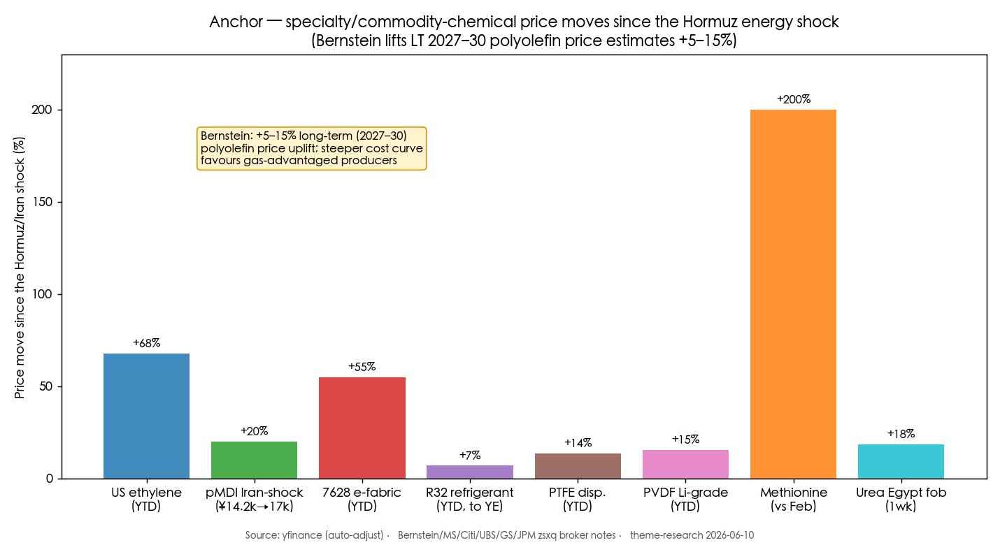
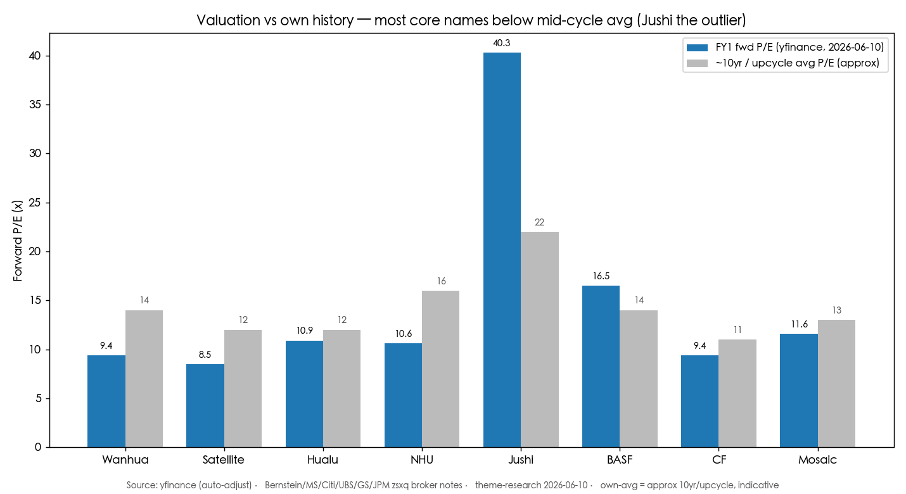
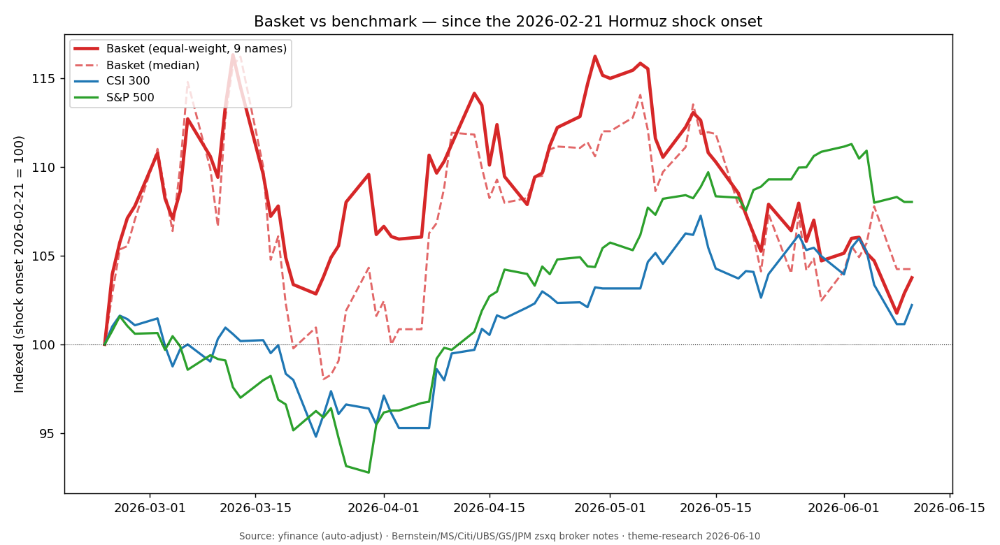

# Specialty Chemicals, Materials & Fertilizers — Hormuz Cost-Curve & Margin-Recovery Cycle

**Created:** 2026-06-10 · **Last refreshed:** 2026-06-10 · **Last mutated:** 2026-06-10 · **Refresh cadence:** monthly · **Languages tracked:** en

## What's New

*The delta since you last looked — newest refresh on top. Older entries collapse into the archive below so this stays short.*

**2026-06-10 — basket created** (9 tickers across MDI-polyurethane / coal-&-ethane olefins / electronic glass-fiber / methionine / fertilizers / fluorochemical, plus BASF as the integrated-cost-curve adjacent).
- **Anchor set:** Bernstein lifts its long-term (2027–30) polyolefin price estimates **+5–15%** on a permanently steeper post-Iran cost curve favouring gas-advantaged producers ([Bernstein *The Long View: Chemicals*, 2026-05-26, zsxq #585428582552484 p.1](http://xs-macbook-air.local:5001/zsxq/pdf/585428582552484/Bernstein-Chemicals%EF%BC%9AThe%20Long%20View%EF%BC%9A%20Chemicals~Analysing%20the%20lasting%20impact%20on%20upstream%20chemicals%20of%20the%20Iran%20war-260526.pdf#page=1)). JPM adds the demand-side AI leg — electronic-materials demand boost and a 5×-since-Feb ethane-cracker (ECC) margin surge ([JPM *Global China Summit*, 2026-06-04, zsxq #415288418481228 p.1](http://xs-macbook-air.local:5001/zsxq/pdf/415288418481228/J.P.%20Morgan-Asia%20Energy%EF%BC%9A2026%20Global%20China%20Summit%EF%BC%9A%20%2420%20bbl%20upside%20per%20month%20of%20Hormuz%20delay%EF%BC%9F%20AI%20driving%20electronic%20materials%20demand%20boost-260604.pdf#page=1)).
- **Performance:** basket +3.8% (EW) / +4.2% (median) since the 2026-02-21 shock onset vs CSI 300 +2.2% / S&P 500 +8.0%; but a wide dispersion — China Jushi +57% (AI electronic-fabric) vs Hualu Hengsheng −24% (priced for normalization) ([yfinance, 2026-06-10](https://finance.yahoo.com/quote/600176.SS)).
- **New broker calls captured:** GS Buy Wanhua PT ¥115 (was ¥80) ([zsxq #585581155245844 p.1](http://xs-macbook-air.local:5001/zsxq/pdf/585581155245844/Goldman%20Sachs-Wanhua%20Chemical%20Group%20%EF%BC%88600309%EF%BC%89%20Earnings%20Review%EF%BC%9A%20Early%20benefit%20of%20the%20chemical%20price%20rally%20in%201Q26%EF%BC%8C%20more%20to%20come%EF%BC%9B%20Buy-260423.pdf#page=1)); MS OW China Jushi PT ¥48 (was ¥33) ([zsxq #212454818812841 p.1](http://xs-macbook-air.local:5001/zsxq/pdf/212454818812841/Morgan%20Stanley-China%20Jushi%EF%BC%88600176%EF%BC%89Raising%20PT%20on%20Accelerating%20AI~driven%20Glass%20Fabric-260517.pdf#page=1)); GS Buy BASF PT €65 ([zsxq #585425141111444 p.1](http://xs-macbook-air.local:5001/zsxq/pdf/585425141111444/Goldman%20Sachs-BASF%20SE%20%EF%BC%88BASFn.DE%EF%BC%89%2010%20things%20we%20learned%20on%20the%201Q%20management%20roadshow-260512.pdf#page=1)); GS Neutral CF PT $132 (was $103), Buy MOS $31 ([zsxq #812241188842852 p.1](http://xs-macbook-air.local:5001/zsxq/pdf/812241188842852/Goldman%20Sachs-Americas%20Agriculture%EF%BC%9ARaising%20estimates%20for%20fertilizers-260414.pdf#page=1)). 11 PTs upserted to `/pt`.
- **Thesis drift:** n/a (baseline).

Earlier refreshes

(none — baseline)

## Thesis

**Anchor — post-Hormuz chemical cost-curve & price uplift (the pool the whole basket bets on).** The Strait-of-Hormuz/Iran disruption permanently steepens the upstream-chemical cost curve. Bernstein, running its proprietary polyolefins supply-demand model, raises long-term polyolefin price estimates *"by between 5-15% over 2027-30"* — because *"better supply-demand combined with expected higher oil prices means we increase our long-term polyolefin price estimates by c. 5-15%"* — with the lasting change being *"a steeper cost curve and therefore better economics for natural gas-based producers, mostly in the Middle East and North America,"* while in oil-fed regions *"integration as a greater advantage … potentially benefiting BASF"* ([Bernstein, 2026-05-26, #585428582552484 p.1](http://xs-macbook-air.local:5001/zsxq/pdf/585428582552484/Bernstein-Chemicals%EF%BC%9AThe%20Long%20View%EF%BC%9A%20Chemicals~Analysing%20the%20lasting%20impact%20on%20upstream%20chemicals%20of%20the%20Iran%20war-260526.pdf#page=1)). The shock has already moved spot prices: US ethylene *"up ~68% YTD (+64% YoY)"* ([Bernstein, #585428582552484 p.3](http://xs-macbook-air.local:5001/zsxq/pdf/585428582552484/Bernstein-Chemicals%EF%BC%9AThe%20Long%20View%EF%BC%9A%20Chemicals~Analysing%20the%20lasting%20impact%20on%20upstream%20chemicals%20of%20the%20Iran%20war-260526.pdf#page=3)); pMDI *"已从1.42万/吨飙升至1.7万/吨"* (≈+20%, from ¥14.2k to ¥17.0k/t) on a 400kt Saudi shutdown + frozen Japan/Korea orders ([UBS expert call, 2026-03-20, #415555212815518 p.1](http://xs-macbook-air.local:5001/zsxq/pdf/415555212815518/UBS-China%20Chemical%20Sector%EF%BC%9AMDI%20olefin%20refrigerant%20electrolyte%20expert%20call%20takeaways-260320.pdf#page=1)); and 7628 electronic fabric *"risen c.55% YTD, from around Rmb4.4/meter to Rmb6.8/meter"* ([MS China Jushi, 2026-05-17, #212454818812841 p.2](http://xs-macbook-air.local:5001/zsxq/pdf/212454818812841/Morgan%20Stanley-China%20Jushi%EF%BC%88600176%EF%BC%89Raising%20PT%20on%20Accelerating%20AI~driven%20Glass%20Fabric-260517.pdf#page=2)).

**Two-sided supply/demand build (the auditable mechanism).** *Supply contracts:* Bernstein expects *"some lasting cuts, even if the majority of currently closed capacity comes back online"* — Asian ~50% of ethylene/PE capacity was constrained with run-rates down ~20pts, and some high-cost capacity stays shut permanently ([Bernstein, #585428582552484 p.1](http://xs-macbook-air.local:5001/zsxq/pdf/585428582552484/Bernstein-Chemicals%EF%BC%9AThe%20Long%20View%EF%BC%9A%20Chemicals~Analysing%20the%20lasting%20impact%20on%20upstream%20chemicals%20of%20the%20Iran%20war-260526.pdf#page=1)). *Demand holds:* petrochemical volume demand is resilient — *"2007-09 the only down years in the last 20"* ([Bernstein, #585428582552484 p.1](http://xs-macbook-air.local:5001/zsxq/pdf/585428582552484/Bernstein-Chemicals%EF%BC%9AThe%20Long%20View%EF%BC%9A%20Chemicals~Analysing%20the%20lasting%20impact%20on%20upstream%20chemicals%20of%20the%20Iran%20war-260526.pdf#page=1)) — and an *additive* AI leg: JPM flags the ECC margin where *"Asian margins surging 5x since Feb on feedstock cost advantage, driven by the 6% decline in US ethane price … vs. oil-linked Asia naphtha +>40%"* ([JPM, #415288418481228 p.1](http://xs-macbook-air.local:5001/zsxq/pdf/415288418481228/J.P.%20Morgan-Asia%20Energy%EF%BC%9A2026%20Global%20China%20Summit%EF%BC%9A%20%2420%20bbl%20upside%20per%20month%20of%20Hormuz%20delay%EF%BC%9F%20AI%20driving%20electronic%20materials%20demand%20boost-260604.pdf#page=1)).

**Sub-bucket decomposition + who-benefits-when.** Five sub-buckets ride the cost-curve at different stages. **(1) MDI-polyurethane** (Wanhua) — *benefits from oil-price deflation* (MDI/TDI is cost-sensitive: in an $80/bbl-Brent normalization, MS sees Wanhua normalized NP recover *"从2025年125亿元修复至约190亿元"* — from ¥12.5bn to ~¥19.0bn) ([MS Wanhua, 2026-04-10, #415521854524848 p.1](http://xs-macbook-air.local:5001/zsxq/pdf/415521854524848/Morgan%20Stanley-Wanhua%20Chemical%EF%BC%88600309%EF%BC%89Two%20Drivers%20of%20Upside%EF%BC%9B%20Upgrade%20to%20OW-260410.pdf#page=1)). **(2) Coal-&-ethane olefins/derivatives** (Hualu Hengsheng, Satellite Chemical) — *benefits first and most* from the feedstock-spread split; Satellite's ECC route guides *"2Q净利润环比翻倍"* ([JPM, #415288418481228 p.1](http://xs-macbook-air.local:5001/zsxq/pdf/415288418481228/J.P.%20Morgan-Asia%20Energy%EF%BC%9A2026%20Global%20China%20Summit%EF%BC%9A%20%2420%20bbl%20upside%20per%20month%20of%20Hormuz%20delay%EF%BC%9F%20AI%20driving%20electronic%20materials%20demand%20boost-260604.pdf#page=1)). **(3) Electronic glass-fiber** (China Jushi) — *AI-demand-led, decoupled from the crude bet*; 7628 e-fabric +55% YTD, thin/ultra-thin fabric earning ¥5–6/m net ([Citi, 2026-05-19, #415242148812158 p.1](http://xs-macbook-air.local:5001/zsxq/pdf/415242148812158/CITI-China%20Jushi%20%EF%BC%88600176%EF%BC%89%20What%E2%80%99s%20New%20from%20Citi%20Pan~Asia%20Conference%202026%20%E2%80%93%20Sustained%20E~fabric%20Price%20Hikes%EF%BC%9B%20Mix%20Upgrade%20Accelerates-260519.pdf#page=1)). **(4) Methionine / animal-nutrition** (Xinhecheng/NHU) — *spike-then-fade*: ~20% of global methionine capacity hit force majeure and price *"几乎翻了三倍"* (≈3×), lifting NHU 2026 NP forecast +101% ([MS NHU, 2026-04-30, #212212244128111 p.1](http://xs-macbook-air.local:5001/zsxq/pdf/212212244128111/Morgan%20Stanley-Zhejiang%20NHU%20Co.%20Ltd.%EF%BC%88002001%EF%BC%89Beneficiary%20of%20Higher%20Methionine%20Prices-260430.pdf#page=1)). **(5) Nitrogen/phosphate fertilizers** (CF, Yuntianhua) — *gas-cost-advantaged winners* on a 50–70% urea price jump ([GS Americas Ag, 2026-04-14, #812241188842852 p.1](http://xs-macbook-air.local:5001/zsxq/pdf/812241188842852/Goldman%20Sachs-Americas%20Agriculture%EF%BC%9ARaising%20estimates%20for%20fertilizers-260414.pdf#page=1)). **Swing factor: the oil-gas (naphtha-vs-ethane/coal) feedstock spread** — it moves basket earnings most, because crude-linked product upside is partly self-limiting (demand destruction, OPEC spare cap) while gas/coal-fed routes capture a structurally widened cost-curve gap.

**Scenario triplet (bull/base/bear, anchored on Wanhua as the swing-factor name).** *Base* — MS ¥101 PT: $80/bbl-Brent normalization restores MDI/TDI/ethylene economics ([MS Wanhua, #415521854524848 p.1](http://xs-macbook-air.local:5001/zsxq/pdf/415521854524848/Morgan%20Stanley-Wanhua%20Chemical%EF%BC%88600309%EF%BC%89Two%20Drivers%20of%20Upside%EF%BC%9B%20Upgrade%20to%20OW-260410.pdf#page=1)). *Bull* — ¥132 if global supply disruption persists 1–2 years (ethylene-naphtha spread +¥3,000/t = ~¥5.1bn extra profit) ([MS Wanhua, #415521854524848 p.1](http://xs-macbook-air.local:5001/zsxq/pdf/415521854524848/Morgan%20Stanley-Wanhua%20Chemical%EF%BC%88600309%EF%BC%89Two%20Drivers%20of%20Upside%EF%BC%9B%20Upgrade%20to%20OW-260410.pdf#page=1)). *Bear* — ¥50 if overseas plants restart fast and demand stays weak ([MS Wanhua, #415521854524848 p.1](http://xs-macbook-air.local:5001/zsxq/pdf/415521854524848/Morgan%20Stanley-Wanhua%20Chemical%EF%BC%88600309%EF%BC%89Two%20Drivers%20of%20Upside%EF%BC%9B%20Upgrade%20to%20OW-260410.pdf#page=1)). The single swing assumption between bull and bear is **Hormuz re-open timing × overseas-capacity restart speed.**

**Value-chain map (feedstock → product, who-captures-the-spread).** Feedstock (naphtha/propane/ethane/coal/sulfur/methanol) → cracking/upstream (ethane-ECC: Satellite, PetroChina; coal-to-chem: Hualu, Baofeng — *lowest-cost, highest-spread layer*) → C1/C2 derivatives (MDI/TDI: Wanhua ~25% global PU share; olefins-derivatives) → specialties (fluoropolymer/silicone: Juhua/Dongyue; methionine: NHU; electronic glass-fiber: Jushi) → ag-inputs (nitrogen: CF; phosphate: Yuntianhua/Mosaic). **Coverage gap flagged:** the basket has *no dedicated electronic-materials wet-chemicals / CMP name* (Anji Tech 688019, Sinocera 300285) — a rich, AI-levered layer JPM calls a "bright spot" ([JPM, #415288418481228 p.1](http://xs-macbook-air.local:5001/zsxq/pdf/415288418481228/J.P.%20Morgan-Asia%20Energy%EF%BC%9A2026%20Global%20China%20Summit%EF%BC%9A%20%2420%20bbl%20upside%20per%20month%20of%20Hormuz%20delay%EF%BC%9F%20AI%20driving%20electronic%20materials%20demand%20boost-260604.pdf#page=1)) — deliberately excluded here (those names live closer to the `pcb-hdi-abf-substrate` theme), but a candidate-add for a future mutation.

**Conviction ranking (sourced).** For China energy & chemicals on a *normalization* path, MS prefers **Sinopec & Wanhua OW; NHU least-preferred** (*"Normalization of ME situation should mean meaningful downside to methionine … NHU is least preferred"*) ([MS *Playing Normalization*, 2026-05-07, #812458441141822 p.1](http://xs-macbook-air.local:5001/zsxq/pdf/812458441141822/Morgan%20Stanley-China%20Energy%20%26%20Chemicals%EF%BC%9APlaying%20Normalization-260507.pdf#page=1)). For N.A. fertilizers UBS ranks **CF > LXU > MOS** within Neutral, Sell NTR ([UBS *Fun with Fertilizers*, 2026-05-14, #212452181228541 p.1](http://xs-macbook-air.local:5001/zsxq/pdf/212452181228541/UBS-N.A.%20Chems%20%26%20Pkg%EF%BC%9AFun%20with%20Fertilizers%EF%BC%9B%20Where%20to%20From%20Here%EF%BC%9F-260514.pdf#page=1)). *Analyst view (this note):* the basket holds **two structurally distinct bets** — (a) a *normalization/margin-recovery* leg (Wanhua, BASF, Satellite, Hualu) that wins as feedstock costs fall and downstream margins recover, and (b) an *AI-secular* leg (Jushi electronic-fabric) that wins regardless of Hormuz. The fertilizer/methionine spike names (CF, NHU, Yuntianhua) are the most binary on Hormuz duration — own them for the shock, not the cycle.

## Scope rules

**In:** specialty + commodity chemical producers (MDI/polyurethane, coal-&-ethane olefins and their derivatives, fluorochemical, silicone, methionine/animal-nutrition); electronic glass-fiber (e-fabric/yarn); and nitrogen/phosphate/potash fertilizer & ag-input producers. The basket is a play on the Hormuz feedstock shock steepening the cost curve (favouring gas/coal-advantaged producers) and tightening MDI / fluoropolymer / silicone / methionine / nitrogen prices into a margin-recovery cycle, plus the additive AI-driven electronic-materials demand leg.

**Out (separate themes):** crude-oil E&P / refining / integrated majors (tracked in `oil-gas-hormuz-shock`); LNG / gas infrastructure & shipping (`lng-gas-energy-shipping`); **ABF/CCL substrate & PCB names — China Jushi's e-fabric read-through touches them but the copper-clad-laminate / ABF-film producers (Kingboard, TUC/2383, Shengyi) live in `pcb-hdi-abf-substrate`**; lithium-battery electrolyte/cathode pure-plays (`china-battery-ess-sodium-ion`); polyester/PTA-chain refiners where the bet is crude inventory gains not specialty margin (Rongsheng — excluded, see Exclusions); and broad chemical ETFs.

## Tracked tickers

| Ticker | Name | Role | Justification | Added |
|---|---|---|---|---|
| SSE:600309 | Wanhua Chemical (万华化学) | core | World-leading polyurethane (MDI/TDI) producer — ~25% 2023 revenue share, ~70% of 2024 gross profit from PU, and *"the only significant Chinese new entrant in the past 40 years"* of this high-concentration supply chain; controls ~80% of 2025-27 global new MDI supply ([GS, 2026-04-23, zsxq #585581155245844 p.1](http://xs-macbook-air.local:5001/zsxq/pdf/585581155245844/Goldman%20Sachs-Wanhua%20Chemical%20Group%20%EF%BC%88600309%EF%BC%89%20Earnings%20Review%EF%BC%9A%20Early%20benefit%20of%20the%20chemical%20price%20rally%20in%201Q26%EF%BC%8C%20more%20to%20come%EF%BC%9B%20Buy-260423.pdf#page=1)). *Moat:* MDI oligopoly cost leadership + integrated ethane/specialty buildout; MS top-pick on normalization ([MS, #812458441141822 p.1](http://xs-macbook-air.local:5001/zsxq/pdf/812458441141822/Morgan%20Stanley-China%20Energy%20%26%20Chemicals%EF%BC%9APlaying%20Normalization-260507.pdf#page=1)). *Threat:* a fast overseas-capacity restart + weak GDP-linked PU demand (MS bear ¥50); US tariffs limiting US-market access; oil-price spikes raising feedstock cost. | 2026-06-10 |
| SSE:600426 | Hualu Hengsheng (华鲁恒升) | core | Lowest-cost coal-to-chemicals platform (urea, DMF, adipic acid, nylon-6 chain) — JPM groups it with Baofeng as the coal-route winner when oil-fed routes are squeezed ([JPM China Energy, 2026-03-09, zsxq #212228542814511 p.1](http://xs-macbook-air.local:5001/zsxq/pdf/212228542814511/J.P.%20Morgan-China%20Energy%EF%BC%9A-%24100%20bbl%20realized%20%E2%80%93%20Tactical%20OW%20on%20Energy%EF%BC%8C%20prefer%20upstream%20over%20refiners%20as%20government%20price%20control%20efforts%20start%20to%20kick%20in-260309.pdf#page=1)). *Moat:* coal-feedstock cost advantage + product breadth + capacity discipline. *Threat:* the most exposed to *crude/oil-fed-product price normalization* (worst basket performer, −24% since shock); domestic urea price controls; coal-cost inflation; product oversupply as peers add coal-chem capacity. | 2026-06-10 |
| SZSE:002648 | Satellite Chemical (卫星化学) | core | China's leading ethane-cracker (ECC) — guides *"2Q净利润环比翻倍"* as Asian ECC margins surged 5× since Feb on the US-ethane (−6%) vs Asia-naphtha (+>40%) feedstock split ([JPM, 2026-06-04, zsxq #415288418481228 p.1](http://xs-macbook-air.local:5001/zsxq/pdf/415288418481228/J.P.%20Morgan-Asia%20Energy%EF%BC%9A2026%20Global%20China%20Summit%EF%BC%9A%20%2420%20bbl%20upside%20per%20month%20of%20Hormuz%20delay%EF%BC%9F%20AI%20driving%20electronic%20materials%20demand%20boost-260604.pdf#page=1)). *Moat:* the swing-factor pure-play — ethane feedstock is near-cost-free vs naphtha; integrated C2/C3 downstream. *Threat:* US-ethane export policy / availability risk; a naphtha-spread reversal if Hormuz reopens fast and oil falls; new ECC capacity (PetroChina Tarim 1.2mtpa) compressing the spread. | 2026-06-10 |
| SSE:600176 | China Jushi (中国巨石) | core | Global #1 glass-fiber producer; the AI-secular leg — 7628 electronic fabric +55% YTD to ¥6.8/m on AI-server/HDI demand, mix-shift to thin/ultra-thin fabric (¥5–6/m net) the key earnings lever; MS lifts 2026-28 EPS +27%/+16%/+25% ([MS, 2026-05-17, zsxq #212454818812841 p.1](http://xs-macbook-air.local:5001/zsxq/pdf/212454818812841/Morgan%20Stanley-China%20Jushi%EF%BC%88600176%EF%BC%89Raising%20PT%20on%20Accelerating%20AI~driven%20Glass%20Fabric-260517.pdf#page=1)). *Moat:* scale + cost leadership + ~5,000 looms (vs SME weaving-machine scarcity) + Low-Dk/Q-glass AI-product qualification. *Threat:* glass-fiber roving is cyclical/oversupplied; EU anti-dumping (final 11% rate, well below the feared 20%+); a step-down in AI-PCB build slowing e-fabric price hikes; the parabolic +270% 1Y print is a momentum-unwind risk. | 2026-06-10 |
| SZSE:002001 | Zhejiang NHU / Xinhecheng (新和成) | core | Methionine + vitamin producer; the spike beneficiary — ~20% of global methionine capacity hit force majeure, price *"几乎翻了三倍"* (≈3×), lifting MS 2026 NP forecast +101% to ~¥11.2bn ([MS, 2026-04-30, zsxq #212212244128111 p.1](http://xs-macbook-air.local:5001/zsxq/pdf/212212244128111/Morgan%20Stanley-Zhejiang%20NHU%20Co.%20Ltd.%EF%BC%88002001%EF%BC%89Beneficiary%20of%20Higher%20Methionine%20Prices-260430.pdf#page=1)). *Moat:* low-cost solid-methionine + integrated VE; Sinopec 50/50 liquid-methionine JV. *Threat:* the most price-fade-exposed — MS rates it Equal-Weight and least-preferred on normalization; Inner Mongolia Lingsheng (+200kt, ~7% of world) and Adisseo (+150kt 2027) new capacity into weak downstream livestock margins ([MS Normalization, #812458441141822 p.1](http://xs-macbook-air.local:5001/zsxq/pdf/812458441141822/Morgan%20Stanley-China%20Energy%20%26%20Chemicals%EF%BC%9APlaying%20Normalization-260507.pdf#page=1)). | 2026-06-10 |
| SSE:600096 | Yuntianhua (云天化) | core | China's #1 phosphate producer (MAP/DAP capacity leader) with **100% self-sufficient phosphate-rock** — GS keeps Buy, citing un-priced upstream rock earnings at high prices and a top-tier dividend yield; +1–11% earnings uplift modeled from the Mideast shock ([GS China Ag, 2026-03-05, zsxq #585552442818114 p.1](http://xs-macbook-air.local:5001/zsxq/pdf/585552442818114/Goldman%20Sachs-China%20agriculture%EF%BC%9AScenarios%20on%20earnings%20impact%20from%20Middle%20East%20conflict%20on%20urea%EF%BC%8C%20phosphate%20and%20methionine%20names-260305.pdf#page=1)). *Moat:* captive phosphate rock (scarce, rising in value) + scale. *Threat:* phosphate price volatility and sulfur-cost inflation (Mideast = ~half of seaborne sulfur, China >50% import-dependent) squeezing margin; declining ore grade; downstream demand softness. | 2026-06-10 |
| NYSE:CF | CF Industries | core | Lowest-cost US nitrogen producer (Henry-Hub gas advantage); GS lifts FY26 EBITDA +45% to $3.625bn and PT to $132 (from $103) on a 50–70% global urea price jump after Mideast (~35% of global urea trade) was disrupted; UBS ranks CF #1 in N.A. fertilizers ([GS Americas Ag, 2026-04-14, zsxq #812241188842852 p.1](http://xs-macbook-air.local:5001/zsxq/pdf/812241188842852/Goldman%20Sachs-Americas%20Agriculture%EF%BC%9ARaising%20estimates%20for%20fertilizers-260414.pdf#page=1)). *Moat:* structural US-gas cost edge vs Mideast/European nitrogen; scale + clean-ammonia optionality. *Threat:* GS rates it only Neutral (priced for the peak — 2Q is *"price & earnings peak"* per UBS); a Henry-Hub spike to $5 (Bernstein's house risk) eroding the gas edge; urea price mean-reversion when Hormuz reopens. | 2026-06-10 |
| XTRA:BAS | BASF SE | adjacent | World's largest integrated chemical producer; Bernstein's named integration-advantage winner in a steeper cost curve (*"integration as a greater advantage … potentially benefiting BASF"*) — GS keeps Buy, PT €65, on ~90% local feedstock sourcing, zero Qatar-gas exposure, and BASF becoming first/second-choice supplier as supply-chain security consolidates the industry ([GS, 2026-05-12, zsxq #585425141111444 p.1](http://xs-macbook-air.local:5001/zsxq/pdf/585425141111444/Goldman%20Sachs-BASF%20SE%20%EF%BC%88BASFn.DE%EF%BC%89%2010%20things%20we%20learned%20on%20the%201Q%20management%20roadshow-260512.pdf#page=1)). *Moat:* Verbund integration + flexible-feed crackers + Zhanjiang China base ramping ahead of plan. *Threat:* European naphtha-fed cost disadvantage vs gas-advantaged peers; GDP-cyclical industrial-solutions demand; a peace-deal "end-of-war dip" Bernstein expects in upstream names. | 2026-06-10 |
| SSE:600160 | Juhua Co. (巨化股份) | adjacent | China's largest fluorochemical (3rd-gen refrigerant + fluoropolymer) producer riding the UBS-flagged sector uptrend — refrigerant R32 ¥63,500/t and rising under the quota regime, PTFE dispersion resin ¥46,000/t (+¥5,500 YTD), Li-grade PVDF ¥60,000/t (+¥8,000 YTD), all *"likely to keep recovering"* ([UBS, 2026-03-05, zsxq #415554282525888 p.1](http://xs-macbook-air.local:5001/zsxq/pdf/415554282525888/UBS-China%20Chemical%20Sector%EF%BC%9ARefrigerants%EF%BC%8C%20fluoropolymers%20and%20silicone%20price%20hikes%20likely%20to%20continue-260305.pdf#page=1)). *Moat:* the dominant 3rd-gen refrigerant *quota* holder — quota scarcity gives pricing power. *Threat:* overseas PFAS regulation shrinking the fluorochemical market; 4th-gen refrigerant substitution faster than expected; PVDF demand tied to immature EV/battery cycle. *(Coverage note: UBS's named fluoro picks are Dongyue 0189.HK and Sanmei 603379.SS; Juhua is the A-share quota leader proxy — re-ground with a Juhua-specific note next refresh.)* | 2026-06-10 |

## Valuation snapshot

*Populated from `stock_price_target_db` (the `/pt` store) + yfinance forward multiples (2026-06-10). Px @ note date = the price the analyst's upside was called against; current px is live context. Own-avg multiples are ~10yr/upcycle indicative.*

| Ticker | Name | Rating | Px @ note date | PT (bull/base/bear) | Upside% (vs note px) | Current px | FY1 fwd P/E | Own ~10yr avg | FY1 / FY2 EPS |
|---|---|---|---|---|---|---|---|---|---|
| SSE:600309 | Wanhua | GS Buy · MS OW | ¥87.70 (GS 4/23) / ¥89.07 (MS 4/10) | GS ¥115 (= 9.5× 2026E EV/EBITDA, below 12× mid-cycle); MS ¥132 / **¥101** / ¥50 (15× normalized + 10× disruption-bonus) | GS +31.1%; MS +13% | ¥68.98 | 9.4× | ~14× | GS introduces 2028E EPS ¥8.30 (+22% YoY); FY1 EPS lifted +24-49% |
| SSE:600176 | China Jushi | Citi Buy · MS OW | ¥34.90 (Citi 5/19) / ¥37.62 (MS 5/14) | Citi ¥43.4 (= 26.1× 2026E P/E); MS ¥68 / **¥48** / ¥23 (bull = e-fabric ASP +85%; bear = util 94%) | Citi +24.4%; MS +28% | ¥40.19 | 40.3× | ~22× | MS 2026/27 EPS ¥1.51 / ¥2.46 (+27%/+16%) |
| XTRA:BAS | BASF | GS Buy · Bernstein O | €53.46 (GS 5/12) | GS €65; Bernstein €61 (= ~19.9× 2026E P/E) | GS +21.6% | €48.85 | 16.5× | ~14× | Bernstein 2026/27E EPS €2.62 / €2.78 |
| TSE:4183 | Mitsui Chemicals | GS Neutral | ¥2,204 (GS 5/27) | GS ¥2,310 | +4.8% | ¥1,994 | 4.4× (distorted; use P/B 0.85×) | ~0.7× P/B | GS cuts FY27/28 core OP −13%/−8% |
| SZSE:002001 | NHU / Xinhecheng | MS EW | n/a | MS ¥49 / **¥31** / ¥23 (= 13× 2027E; bull 10× peak EPS, bear 12×) | n/a (2026 EPS is a geopolitical outlier; valued off 2027) | ¥30.40 | 10.6× | ~16× | MS 2026/27 EPS ¥3.63 / ¥2.36 |
| NYSE:CF | CF Industries | GS Neutral · UBS #1-of-Neutrals | n/a | GS $132 (was $103) | n/a (rich-end Neutral) | $108.58 | 9.4× | ~11× | GS FY26 EBITDA $3.625bn (+45%) |
| NYSE:MOS | Mosaic | GS Buy · UBS #3 | n/a | GS $31 (was $32) | n/a | $21.28 | 11.6× | ~13× (P/B 0.57×) | GS FY26 EBITDA $1.95bn (−9% on sulfur cost) |
| NYSE:NTR | Nutrien | GS Sell · UBS Sell | n/a | GS $76 (was $73) | n/a (downside-rated) | $66.35 | 12.2× | ~13× | GS FY26 EBITDA $7.003bn (+14%) |
| SSE:600096 | Yuntianhua | GS Buy | n/a | GS Buy (no PT in scenario note) | n/a | ¥28.79 | (P/B 1.7×; phosphate cyclical) | n/a | +1–11% earnings uplift modeled |

*No FY1 own-avg/peer P/E shown for the US fertilizer names' note-date price because the GS Americas-Ag note prices off EBITDA/EV not a dated equity-upside; segregate as EBITDA-driven. Mitsui's 4.4× fwd P/E is distorted by FY1-EPS one-offs — read it on P/B 0.85×. Cross-sectional sort: most A-share core names (Wanhua 9.4×, Satellite 8.5×, Hualu 10.9×, NHU 10.6×) trade *below* their ~10yr/upcycle averages — cheap-end; China Jushi (40.3×) is the priced-for-perfection outlier (see Drift signals).*

## Exclusions

| Ticker | Reason |
|---|---|
| SZSE:002493 | Rongsheng Petrochemical — 1Q26 +378% NP was *inventory gains* at ZPC, not specialty-margin; the bet is the polyester/refining chain (crude-linked), which belongs to refining/E&P, not specialty chemicals. JPM Neutral, PT ¥10 implies ~20% downside ([JPM, 2026-04-28, #812212848841842 p.1](http://xs-macbook-air.local:5001/zsxq/pdf/812212848841842/J.P.%20Morgan-Rongsheng%20Petro%20Chemical~A%EF%BC%88002493%EF%BC%89First%20Take%EF%BC%9A%201Q%20up%20-350%25%20y%20y%20on%20inventory%20gains%EF%BC%9B%20all%20eyes%20on%20polyester%20chain%20outlook-260428.pdf#page=1)). |
| SZSE:000792 | Salt Lake Co. (盐湖股份) — potash + lithium; the lithium leg dominates the equity story and belongs to a battery-materials theme, not a chemicals/fertilizer-margin basket; tracked separately. Strong franchise (530kt potash capacity, China's largest) but mixed-driver ([broker report, #585424145518414 p.1](http://xs-macbook-air.local:5001/zsxq/pdf/585424145518414/%E7%9B%90%E6%B9%96%E8%82%A1%E4%BB%BD%28000792%29%E9%94%82%E9%92%BE%E5%8F%8C%E8%BD%AE%E9%A9%B1%E5%8A%A8%EF%BC%8C%E8%83%8C%E9%9D%A0%E4%BA%94%E7%9F%BF%E6%89%93%E9%80%A0%E4%B8%96%E7%95%8C%E4%B8%80%E6%B5%81%E7%9B%90%E6%B9%96%E5%B9%B3%E5%8F%B0.pdf#page=1)). |
| NYSE:MOS | Mosaic — covered in the Valuation snapshot as a GS Buy comp, but kept *out of the tracked basket*: phosphate margin is being squeezed by sulfur-cost inflation (GS cut FY26 EBITDA −9%), making it the weakest fertilizer name (−24% since shock, −35% 1Y); CF is the cleaner gas-advantaged nitrogen play. |

## Keywords

specialty chemicals / 特种化工 · MDI · polyurethane / 聚氨酯 · ethane cracker (ECC) / 乙烷裂解 · olefins / 烯烃 · fluoropolymer (PTFE/PVDF) / 含氟聚合物 · silicone / 有机硅 · refrigerant / 制冷剂 · methionine / 蛋氨酸 · nitrogen fertilizer (urea) / 氮肥(尿素) · phosphate / 磷肥 · electronic glass-fiber / 电子布(玻纤) · feedstock cost curve / 成本曲线 · Hormuz / 霍尔木兹

## Performance (since basket creation 2026-02-21 shock onset → 2026-06-10)

Basket **+3.8% equal-weight / +4.2% median** since the 2026-02-21 Hormuz shock onset vs **CSI 300 +2.2% / S&P 500 +8.0%** — narrowly ahead of CSI 300, behind the S&P (the US benchmark was lifted by tech, not chemicals). On a **1-year** basis the basket median is **+35.7%** vs CSI 300 +23.2% / S&P 500 +22.3%, and YTD median **+13.8%** vs CSI 300 +2.9% ([yfinance, 2026-06-10](https://finance.yahoo.com/quote/600176.SS)). The story is dispersion, not a uniform move.

### Basket scorecard

- **Batting average (since shock):** 6 of 9 names positive (67%); 6 of 9 beat CSI 300 (67%).
- **Best contributor:** China Jushi **+57.1%** (AI electronic-fabric upcycle) ([yfinance, 2026-06-10](https://finance.yahoo.com/quote/600176.SS)).
- **Worst contributor:** Hualu Hengsheng **−23.9%** (priced for crude/product normalization) ([yfinance, 2026-06-10](https://finance.yahoo.com/quote/600426.SS)).
- **Cumulative outperformance in bps since inception:** n/a — only one snapshot line exists (baseline). The next refresh will diff against this line.
- *Caveat (2026 yfinance quirk):* China Jushi's **+269.7% 1-year** print is parabolic and should be read as a momentum/AI-mania flag, not a clean fundamental run — quote the median (+35.7%) and benchmark, not Jushi's headline.

## Recent events

- **2026-04-22/23:** Wanhua 1Q26 revenue ¥54.05bn (+26% YoY, 1Q record), NP ¥3.72bn (+21%); GS notes the product portfolio is up ~+34% on average since the Mideast conflict, raises 2026-27 EPS +24-49% ([GS, #585581155245844 p.1](http://xs-macbook-air.local:5001/zsxq/pdf/585581155245844/Goldman%20Sachs-Wanhua%20Chemical%20Group%20%EF%BC%88600309%EF%BC%89%20Earnings%20Review%EF%BC%9A%20Early%20benefit%20of%20the%20chemical%20price%20rally%20in%201Q26%EF%BC%8C%20more%20to%20come%EF%BC%9B%20Buy-260423.pdf#page=1)).
- **2026-05-13:** China Jushi announces +50kt electronic-yarn / 320mn-meter e-fabric expansion, >60% AI-targeted thin/ultra-thin fabric ([MS, #212454818812841 p.1](http://xs-macbook-air.local:5001/zsxq/pdf/212454818812841/Morgan%20Stanley-China%20Jushi%EF%BC%88600176%EF%BC%89Raising%20PT%20on%20Accelerating%20AI~driven%20Glass%20Fabric-260517.pdf#page=1)).
- **2026-05/Jun:** Mideast urea price +50–70%, Egypt fob +$108/t to $675–700/t; MAP Brazil cfr +$43/t to $785–800/t (highest since 2022); >530kt urea stranded at Hormuz; Turkey banned urea exports ([MS N.A. Chemicals, 2026-03-15, #212222851228841 p.1](http://xs-macbook-air.local:5001/zsxq/pdf/212222851228841/Morgan%20Stanley-Chemicals%EF%BC%9AUrea%20%26%20Phosphate%20Jump%EF%BC%9B%20Potash%20~%20Stable%EF%BC%9B%20Soy%20Crush%20Mixed-260315.pdf#page=1)).
- **2026-05/Jun:** Korea NBL margin to a 5-year high ($916/t, first time above SBR since 2022) on naphtha/LPG shortage — a downstream read-through of the same feedstock tightness ([JPM Korea Chemicals, 2026-06-08, #814528415518882 p.1](http://xs-macbook-air.local:5001/zsxq/pdf/814528415518882/J.P.%20Morgan-Korea%20Chemicals%EF%BC%9AMay%20NBL%20SBR%20margins%20surge%20to%20five~year%20highs%20as%20naphtha%20LPG%20shortage%20triggers%20rubber%20tightness-260608.pdf#page=1)).
- **2026-05-12:** BASF 1Q management roadshow — 2Q volumes & pricing in positive territory, ~90% local feedstock, zero Qatar-gas exposure; GS Buy PT €65 ([GS, #585425141111444 p.1](http://xs-macbook-air.local:5001/zsxq/pdf/585425141111444/Goldman%20Sachs-BASF%20SE%20%EF%BC%88BASFn.DE%EF%BC%89%2010%20things%20we%20learned%20on%20the%201Q%20management%20roadshow-260512.pdf#page=1)).

## Drift signals

- **Priced-for-perfection / air-pocket flag — China Jushi (40.3× fwd P/E vs ~22× own upcycle avg; +270% 1Y).** The single name carrying the whole basket's relative return is the most stretched. **The specific demand assumption that de-rates it:** AI-server / HDI build slows the monthly e-fabric price-hike cadence (currently ¥0.3–0.5/m/month per Citi). **Sizing the de-rate:** MS's own bear case (util 94%, demand miss) is **¥23 — roughly −43% from the current ¥40.19** ([MS, #212454818812841 p.1](http://xs-macbook-air.local:5001/zsxq/pdf/212454818812841/Morgan%20Stanley-China%20Jushi%EF%BC%88600176%EF%BC%89Raising%20PT%20on%20Accelerating%20AI~driven%20Glass%20Fabric-260517.pdf#page=1)). Even MS's *base* ¥48 is only +19% from here — most of the move has happened.
- **Two-leg basket means the benchmark beat is fragile.** The normalization leg (Wanhua −18%, Hualu −24%, Yuntianhua −17% since shock) is *underperforming* — the basket is only ahead of CSI 300 because of Jushi. If the AI-fabric leg cools before the normalization leg re-rates, the basket loses its edge. Watch the MDI price (the normalization-leg trigger) and e-fabric price (the AI-leg trigger) in tandem.
- **NHU / methionine is the most binary on Hormuz duration.** MS rates it least-preferred — 2026 EPS (+101%) is a geopolitical outlier; on normalization, methionine fades and new capacity (Lingsheng +200kt, Adisseo +150kt) worsens 2027 supply ([MS Normalization, #812458441141822 p.1](http://xs-macbook-air.local:5001/zsxq/pdf/812458441141822/Morgan%20Stanley-China%20Energy%20%26%20Chemicals%EF%BC%9APlaying%20Normalization-260507.pdf#page=1)). Flag for possible role demotion to `adjacent` if Hormuz reopens.
- **New entrant worth considering (candidate-add, not auto-added):** an electronic-materials wet-chemicals/CMP name (Anji Tech 688019, Sinocera 300285) — the AI-levered "bright spot" JPM names, currently a coverage gap. Sinocera's MLCC powder is guided +40% 2026 segment profit growth ([JPM, #415288418481228 p.1](http://xs-macbook-air.local:5001/zsxq/pdf/415288418481228/J.P.%20Morgan-Asia%20Energy%EF%BC%9A2026%20Global%20China%20Summit%EF%BC%9A%20%2420%20bbl%20upside%20per%20month%20of%20Hormuz%20delay%EF%BC%9F%20AI%20driving%20electronic%20materials%20demand%20boost-260604.pdf#page=1)).
- **Stale-justification watch:** Juhua's role leans on the UBS *sector* fluoro note (Dongyue/Sanmei are the named picks) rather than a Juhua-specific report — re-ground next refresh, or swap to Dongyue (0189.HK) / Sanmei (603379.SS) which carry direct UBS Buy ratings.
- **Symmetric risk bullets.** *Upside:* Hormuz stays disrupted → MS Wanhua bull ¥132, sustained ECC 5× margin, urea peak extends. *Downside:* a peace deal triggers the "end-of-war dip" Bernstein warns of in upstream names; fast overseas restart collapses MDI/methionine prices; Henry-Hub spike to $5 erodes the US gas edge (CF).

## Leading indicators

*Upstream signals that move BEFORE the basket members and would crack the thesis first.*

**Macro / cross-asset header signals:**
- **Oil-gas (naphtha-vs-ethane) feedstock spread — THE swing factor.** US ethane −6% vs Asia naphtha +>40% post-conflict → Asian ECC margins +5× since Feb ([JPM, #415288418481228 p.1](http://xs-macbook-air.local:5001/zsxq/pdf/415288418481228/J.P.%20Morgan-Asia%20Energy%EF%BC%9A2026%20Global%20China%20Summit%EF%BC%9A%20%2420%20bbl%20upside%20per%20month%20of%20Hormuz%20delay%EF%BC%9F%20AI%20driving%20electronic%20materials%20demand%20boost-260604.pdf#page=1)). *Direction:* favours ethane/coal routes (Satellite, Hualu); reverses if Hormuz reopens.
- **Brent path / Hormuz re-open timing.** JPM base: ~$100/bbl through YE-26, avg $96 in 2026, $70 in 2027 — **+$20/bbl per additional month of SoH closure** ([JPM, #415288418481228 p.1](http://xs-macbook-air.local:5001/zsxq/pdf/415288418481228/J.P.%20Morgan-Asia%20Energy%EF%BC%9A2026%20Global%20China%20Summit%EF%BC%9A%20%2420%20bbl%20upside%20per%20month%20of%20Hormuz%20delay%EF%BC%9F%20AI%20driving%20electronic%20materials%20demand%20boost-260604.pdf#page=1)). Lower oil = positive for cost-sensitive MDI (Wanhua).
- **Sulfur price (phosphate-margin spoiler).** Copper miners report sulfur >$1,000/t (vs 2025 peak $800); Mideast = ~half of seaborne sulfur, China >50% import-dependent ([JPM, #415288418481228 p.1](http://xs-macbook-air.local:5001/zsxq/pdf/415288418481228/J.P.%20Morgan-Asia%20Energy%EF%BC%9A2026%20Global%20China%20Summit%EF%BC%9A%20%2420%20bbl%20upside%20per%20month%20of%20Hormuz%20delay%EF%BC%9F%20AI%20driving%20electronic%20materials%20demand%20boost-260604.pdf#page=1)). Rising = squeezes Yuntianhua/Mosaic phosphate margin.

**Per-ticker operating-data spine (latest disclosed print, each cited to its primary issuer):**

| Name | Product / spread | Latest reading + as-of | Direction | Implication |
|---|---|---|---|---|
| Wanhua | pMDI price | ¥17.0k/t (from ¥14.2k), +~20% | up (cost-push) | PU margin recovery pending; cost-sensitive on oil ([UBS, #415555212815518 p.1](http://xs-macbook-air.local:5001/zsxq/pdf/415555212815518/UBS-China%20Chemical%20Sector%EF%BC%9AMDI%20olefin%20refrigerant%20electrolyte%20expert%20call%20takeaways-260320.pdf#page=1)) |
| Satellite | Asia ECC margin | +5× since Feb 2026 | up sharply | 2Q NP guided to double QoQ ([JPM, #415288418481228 p.1](http://xs-macbook-air.local:5001/zsxq/pdf/415288418481228/J.P.%20Morgan-Asia%20Energy%EF%BC%9A2026%20Global%20China%20Summit%EF%BC%9A%20%2420%20bbl%20upside%20per%20month%20of%20Hormuz%20delay%EF%BC%9F%20AI%20driving%20electronic%20materials%20demand%20boost-260604.pdf#page=1)) |
| China Jushi | 7628 e-fabric price | ¥6.8/m (from ¥4.4), +55% YTD; ¥0.3–0.5/m monthly hikes through 4-5M26 | up | AI-fabric leg; thin-fabric mix to 25%+ ([Citi, #415242148812158 p.1](http://xs-macbook-air.local:5001/zsxq/pdf/415242148812158/CITI-China%20Jushi%20%EF%BC%88600176%EF%BC%89%20What%E2%80%99s%20New%20from%20Citi%20Pan~Asia%20Conference%202026%20%E2%80%93%20Sustained%20E~fabric%20Price%20Hikes%EF%BC%9B%20Mix%20Upgrade%20Accelerates-260519.pdf#page=1)) |
| NHU | methionine price | ≈3× vs Feb 2026 (force majeure ~20% of world capacity) | up (spike) | 2026 NP +101%; fades on normalization ([MS, #212212244128111 p.1](http://xs-macbook-air.local:5001/zsxq/pdf/212212244128111/Morgan%20Stanley-Zhejiang%20NHU%20Co.%20Ltd.%EF%BC%88002001%EF%BC%89Beneficiary%20of%20Higher%20Methionine%20Prices-260430.pdf#page=1)) |
| CF / Yuntianhua | urea / MAP price | urea +50–70% global; Egypt fob $675–700/t; MAP Brazil cfr $785–800/t | up | nitrogen-margin peak 2Q ([GS, #812241188842852 p.1](http://xs-macbook-air.local:5001/zsxq/pdf/812241188842852/Goldman%20Sachs-Americas%20Agriculture%EF%BC%9ARaising%20estimates%20for%20fertilizers-260414.pdf#page=1); [MS, #212222851228841 p.1](http://xs-macbook-air.local:5001/zsxq/pdf/212222851228841/Morgan%20Stanley-Chemicals%EF%BC%9AUrea%20%26%20Phosphate%20Jump%EF%BC%9B%20Potash%20~%20Stable%EF%BC%9B%20Soy%20Crush%20Mixed-260315.pdf#page=1)) |
| Juhua | R32 / PTFE / PVDF | R32 ¥63.5k/t; PTFE disp. ¥46k/t (+¥5.5k); Li-PVDF ¥60k/t (+¥8k) | up | fluoro margin recovery off the bottom ([UBS, #415554282525888 p.1](http://xs-macbook-air.local:5001/zsxq/pdf/415554282525888/UBS-China%20Chemical%20Sector%EF%BC%9ARefrigerants%EF%BC%8C%20fluoropolymers%20and%20silicone%20price%20hikes%20likely%20to%20continue-260305.pdf#page=1)) |

## Catalysts (next 3–6 months)

- **Hormuz re-open / US-Iran deal signing** (mechanism: a peace announcement triggers Bernstein's expected "end-of-war dip" in upstream names AND collapses the spike sub-buckets — methionine/urea/MDI fade → de-rates NHU, CF, Yuntianhua first; but the *normalization leg* Wanhua/BASF/Sinopec re-rates as feedstock costs fall), timing: any time the negotiations *"in their final stages"* conclude ([Bernstein, #585428582552484 p.1](http://xs-macbook-air.local:5001/zsxq/pdf/585428582552484/Bernstein-Chemicals%EF%BC%9AThe%20Long%20View%EF%BC%9A%20Chemicals~Analysing%20the%20lasting%20impact%20on%20upstream%20chemicals%20of%20the%20Iran%20war-260526.pdf#page=1)).
- **2Q26 China-chemical earnings (Jul–Aug)** (mechanism: Satellite ECC NP doubling QoQ + Wanhua margin recovery confirm the spread-capture thesis → re-rates the olefins sub-bucket), timing: late-Jul/Aug ([JPM, #415288418481228 p.1](http://xs-macbook-air.local:5001/zsxq/pdf/415288418481228/J.P.%20Morgan-Asia%20Energy%EF%BC%9A2026%20Global%20China%20Summit%EF%BC%9A%20%2420%20bbl%20upside%20per%20month%20of%20Hormuz%20delay%EF%BC%9F%20AI%20driving%20electronic%20materials%20demand%20boost-260604.pdf#page=1)).
- **China Jushi Huai'an line-2 e-fabric ramp (Aug–Sep 2026)** (mechanism: +5kt phase-2 e-fabric capacity in a tight market → either extends the price-hike cadence or, if AI demand cools, starts the air-pocket; the 50kt/320mn-m line targets 60%+ thin-fabric), timing: Aug-Sep 2026 ([Citi, #415242148812158 p.1](http://xs-macbook-air.local:5001/zsxq/pdf/415242148812158/CITI-China%20Jushi%20%EF%BC%88600176%EF%BC%89%20What%E2%80%99s%20New%20from%20Citi%20Pan~Asia%20Conference%202026%20%E2%80%93%20Sustained%20E~fabric%20Price%20Hikes%EF%BC%9B%20Mix%20Upgrade%20Accelerates-260519.pdf#page=1)).
- **3Q26 Brazil fertilizer import season** (mechanism: peak import season meets Mideast-disrupted nitrogen/phosphate supply → tests whether the urea/MAP price spike sustains into the back half → CF/Yuntianhua earnings durability), timing: Q3 2026 ([UBS Fertilizers, #212452181228541 p.1](http://xs-macbook-air.local:5001/zsxq/pdf/212452181228541/UBS-N.A.%20Chems%20%26%20Pkg%EF%BC%9AFun%20with%20Fertilizers%EF%BC%9B%20Where%20to%20From%20Here%EF%BC%9F-260514.pdf#page=1)).
- **Silicone industry production-cut discipline (3-5M26)** (mechanism: monomer producers agreed to cut utilization ~35% → tightens DMC supply → silicone-margin recovery, a read-through for the broader fluoro/silicone sub-bucket), timing: through May 2026 ([UBS, #415554282525888 p.1](http://xs-macbook-air.local:5001/zsxq/pdf/415554282525888/UBS-China%20Chemical%20Sector%EF%BC%9ARefrigerants%EF%BC%8C%20fluoropolymers%20and%20silicone%20price%20hikes%20likely%20to%20continue-260305.pdf#page=1)).

## Data Used / 数据来源清单

**Market data**
- yfinance auto_adjust=True for prices, returns, market cap, forward P/E, P/B — pulled 2026-06-10. Benchmarks: CSI 300 (000300.SS), S&P 500 (^GSPC). BASF via BAS.DE (Xetra).
- Macro backdrop (`indicators.db`): VIX 21.51 (2026-06-05); HY OAS 2.74% (2026-06-04); IG OAS 0.74% (2026-06-04).

**Per-ticker primary sources (sell-side, via local zsxq library)**
- 600309 Wanhua: GS earnings review (#585581155245844), MS upgrade (#415521854524848), MS Normalization (#812458441141822).
- 600426 Hualu Hengsheng: JPM China Energy (#212228542814511).
- 002648 Satellite Chemical: JPM Global China Summit (#415288418481228).
- 600176 China Jushi: Citi Pan-Asia (#415242148812158), MS AI-fabric (#212454818812841).
- 002001 NHU/Xinhecheng: MS methionine (#212212244128111).
- 600096 Yuntianhua: GS China Ag scenarios (#585552442818114).
- NYSE:CF / NTR / MOS: GS Americas Agriculture (#812241188842852), UBS Fun-with-Fertilizers (#212452181228541), MS N.A. Chemicals (#212222851228841).
- BASF: GS 1Q roadshow (#585425141111444), Bernstein Long View (#585428582552484).
- 4183 Mitsui: GS business briefing (#184128881142552).
- 600160 Juhua: UBS fluoro/silicone sector note (#415554282525888), UBS MDI/olefin/refrigerant expert call (#415555212815518). *(Sector proxy — see stale-justification watch.)*

**Industry research / sell-side thematic notes (theme-level)**
- Bernstein *The Long View: Chemicals — lasting impact of the Iran war* (2026-05-26, #585428582552484) — the **TAM/price anchor** (+5–15% LT polyolefin uplift, steeper cost curve).
- JPM *Global China Summit — $20/bbl per month of Hormuz delay; AI driving electronic materials* (2026-06-04, #415288418481228) — the AI-demand leg + ECC 5× + Brent path + sulfur.
- MS *China Energy & Chemicals: Playing Normalization* (2026-05-07, #812458441141822) — conviction ranking + normalization framing.
- JPM Korea Chemicals NBL/SBR (2026-06-08, #814528415518882) — downstream feedstock-tightness read-through.

**Local zsxq library (`db/zsxq.db` — read-only)**
- 18 broker PDFs mined & cited for this theme (file_ids: 585428582552484, 812458441141822, 415288418481228, 415555212815518, 415554282525888, 585581155245844, 415521854524848, 212228542814511, 812212848841842, 415242148812158, 212454818812841, 585425141111444, 184128881142552, 212212244128111, 212452181228541, 812241188842852, 585552442818114, 814528415518882) via `find_pdf.py` → `evidence_bundle.py` → `ocr_pdf.py` (6 image-only OCR'd) → `extract_pdf.py`. The 翻译精华 summary was triage; all load-bearing numbers cited from the extracted original text, string-matched.
- Seed file_ids verified: #585425141111444 (GS BASF) ✓ on-theme; #415242148812158 (Citi Jushi) ✓ on-theme; #585581521114454 = Bernstein hotels/AI-travel ✗ off-theme, discarded; #212218144282482 and #812222851228841 not in db (replaced via fresh mining).
- 1 additional non-cited reference read: #585424145518414 (Salt Lake — used only for the Exclusions rationale).

**TAM anchor + leading indicators (theme-level)**
- Anchor: Bernstein +5–15% LT (2027–30) polyolefin price uplift (#585428582552484); decomposed into the 5 sub-buckets above. Leading indicators: naphtha-vs-ethane spread, Brent/Hormuz timing, sulfur price (all #415288418481228) + per-ticker product-price spine.

**Macro backdrop**
- VIX 21.51, HY OAS 2.74%, IG OAS 0.74% as of 2026-06-04/05. Source: `indicators.db`.

**Cross-coverage**
- Related tracked themes (read for scope-boundary discipline, not cited inline): `oil-gas-hormuz-shock_theme.md` (the crude/E&P/refining leg of the same shock), `pcb-hdi-abf-substrate_theme.md` (the ABF/CCL substrate leg of the electronic-materials read-through).

**Stores written (Tier-2 helpers)**
- `stock_price_target_db` — 11 sell-side PT / rating calls upserted for tracked names (Wanhua ×2, Jushi ×2, BASF, Mitsui, NHU, CF, NTR, MOS, Yuntianhua), idempotent on ticker × broker × file_id; surfaced at `/pt`.

**Stale notices / coverage gaps**
- Juhua role rests on a *sector* fluoro note (UBS named picks = Dongyue 0189.HK / Sanmei 603379.SS), not a Juhua-specific report — re-ground or swap next refresh.
- No tracked electronic-materials wet-chemicals/CMP name (Anji 688019 / Sinocera 300285) — flagged coverage gap.
- US fertilizer note-date equity prices (`report_date_price`) not in the GS EBITDA-driven Americas-Ag note → `n/a` in Valuation snapshot Upside% for CF/NTR/MOS (not back-filled with spot).

## References

- [Bernstein — The Long View: Chemicals (Iran war), 2026-05-26, #585428582552484](http://xs-macbook-air.local:5001/zsxq/pdf/585428582552484/Bernstein-Chemicals%EF%BC%9AThe%20Long%20View%EF%BC%9A%20Chemicals~Analysing%20the%20lasting%20impact%20on%20upstream%20chemicals%20of%20the%20Iran%20war-260526.pdf)
- [Morgan Stanley — China Energy & Chemicals: Playing Normalization, 2026-05-07, #812458441141822](http://xs-macbook-air.local:5001/zsxq/pdf/812458441141822/Morgan%20Stanley-China%20Energy%20%26%20Chemicals%EF%BC%9APlaying%20Normalization-260507.pdf)
- [J.P. Morgan — 2026 Global China Summit (Hormuz / AI electronic materials), 2026-06-04, #415288418481228](http://xs-macbook-air.local:5001/zsxq/pdf/415288418481228/J.P.%20Morgan-Asia%20Energy%EF%BC%9A2026%20Global%20China%20Summit%EF%BC%9A%20%2420%20bbl%20upside%20per%20month%20of%20Hormuz%20delay%EF%BC%9F%20AI%20driving%20electronic%20materials%20demand%20boost-260604.pdf)
- [UBS — China Chemical: MDI/olefin/refrigerant/electrolyte expert call, 2026-03-20, #415555212815518](http://xs-macbook-air.local:5001/zsxq/pdf/415555212815518/UBS-China%20Chemical%20Sector%EF%BC%9AMDI%20olefin%20refrigerant%20electrolyte%20expert%20call%20takeaways-260320.pdf)
- [UBS — Refrigerants/fluoropolymers/silicone price hikes, 2026-03-05, #415554282525888](http://xs-macbook-air.local:5001/zsxq/pdf/415554282525888/UBS-China%20Chemical%20Sector%EF%BC%9ARefrigerants%EF%BC%8C%20fluoropolymers%20and%20silicone%20price%20hikes%20likely%20to%20continue-260305.pdf)
- [Goldman Sachs — Wanhua 1Q26 review (Buy, PT ¥115), 2026-04-23, #585581155245844](http://xs-macbook-air.local:5001/zsxq/pdf/585581155245844/Goldman%20Sachs-Wanhua%20Chemical%20Group%20%EF%BC%88600309%EF%BC%89%20Earnings%20Review%EF%BC%9A%20Early%20benefit%20of%20the%20chemical%20price%20rally%20in%201Q26%EF%BC%8C%20more%20to%20come%EF%BC%9B%20Buy-260423.pdf)
- [Morgan Stanley — Wanhua: Two Drivers of Upside; Upgrade to OW, 2026-04-10, #415521854524848](http://xs-macbook-air.local:5001/zsxq/pdf/415521854524848/Morgan%20Stanley-Wanhua%20Chemical%EF%BC%88600309%EF%BC%89Two%20Drivers%20of%20Upside%EF%BC%9B%20Upgrade%20to%20OW-260410.pdf)
- [J.P. Morgan — China Energy: $100/bbl realized, Tactical OW, 2026-03-09, #212228542814511](http://xs-macbook-air.local:5001/zsxq/pdf/212228542814511/J.P.%20Morgan-China%20Energy%EF%BC%9A-%24100%20bbl%20realized%20%E2%80%93%20Tactical%20OW%20on%20Energy%EF%BC%8C%20prefer%20upstream%20over%20refiners%20as%20government%20price%20control%20efforts%20start%20to%20kick%20in-260309.pdf)
- [J.P. Morgan — Rongsheng 1Q +350% on inventory gains (Neutral), 2026-04-28, #812212848841842](http://xs-macbook-air.local:5001/zsxq/pdf/812212848841842/J.P.%20Morgan-Rongsheng%20Petro%20Chemical~A%EF%BC%88002493%EF%BC%89First%20Take%EF%BC%9A%201Q%20up%20-350%25%20y%20y%20on%20inventory%20gains%EF%BC%9B%20all%20eyes%20on%20polyester%20chain%20outlook-260428.pdf)
- [Citi — China Jushi Pan-Asia update (Buy, TP ¥43.4), 2026-05-19, #415242148812158](http://xs-macbook-air.local:5001/zsxq/pdf/415242148812158/CITI-China%20Jushi%20%EF%BC%88600176%EF%BC%89%20What%E2%80%99s%20New%20from%20Citi%20Pan~Asia%20Conference%202026%20%E2%80%93%20Sustained%20E~fabric%20Price%20Hikes%EF%BC%9B%20Mix%20Upgrade%20Accelerates-260519.pdf)
- [Morgan Stanley — China Jushi: Raising PT on AI-driven Glass Fabric (OW, ¥48), 2026-05-17, #212454818812841](http://xs-macbook-air.local:5001/zsxq/pdf/212454818812841/Morgan%20Stanley-China%20Jushi%EF%BC%88600176%EF%BC%89Raising%20PT%20on%20Accelerating%20AI~driven%20Glass%20Fabric-260517.pdf)
- [Goldman Sachs — BASF 1Q roadshow (Buy, PT €65), 2026-05-12, #585425141111444](http://xs-macbook-air.local:5001/zsxq/pdf/585425141111444/Goldman%20Sachs-BASF%20SE%20%EF%BC%88BASFn.DE%EF%BC%89%2010%20things%20we%20learned%20on%20the%201Q%20management%20roadshow-260512.pdf)
- [Goldman Sachs — Mitsui Chemicals business briefing (Neutral, ¥2,310), 2026-05-27, #184128881142552](http://xs-macbook-air.local:5001/zsxq/pdf/184128881142552/Goldman%20Sachs-Mitsui%20Chemicals%20Inc.%20%EF%BC%884183.T%EF%BC%89%20Business%20briefing%EF%BC%9A%20New%20CEO%20structure%20begins%EF%BC%8C%20with%20robust%20plan%20for%20accelerated%20portfolio%20transformation%20and%20realization%20of%20a%20_truly%20global%20specialty%20company%E2%80%9D-260527.pdf_%3B%20filename_%3Dut.pdf)
- [Morgan Stanley — Zhejiang NHU: Beneficiary of Higher Methionine Prices (EW, ¥31), 2026-04-30, #212212244128111](http://xs-macbook-air.local:5001/zsxq/pdf/212212244128111/Morgan%20Stanley-Zhejiang%20NHU%20Co.%20Ltd.%EF%BC%88002001%EF%BC%89Beneficiary%20of%20Higher%20Methionine%20Prices-260430.pdf)
- [UBS — N.A. Chems & Pkg: Fun with Fertilizers (CF>LXU>MOS), 2026-05-14, #212452181228541](http://xs-macbook-air.local:5001/zsxq/pdf/212452181228541/UBS-N.A.%20Chems%20%26%20Pkg%EF%BC%9AFun%20with%20Fertilizers%EF%BC%9B%20Where%20to%20From%20Here%EF%BC%9F-260514.pdf)
- [Goldman Sachs — Americas Agriculture: Raising fertilizer estimates (CF PT $132, MOS $31, NTR $76), 2026-04-14, #812241188842852](http://xs-macbook-air.local:5001/zsxq/pdf/812241188842852/Goldman%20Sachs-Americas%20Agriculture%EF%BC%9ARaising%20estimates%20for%20fertilizers-260414.pdf)
- [Goldman Sachs — China Agriculture: Mideast scenarios on urea/phosphate/methionine (Yuntianhua Buy), 2026-03-05, #585552442818114](http://xs-macbook-air.local:5001/zsxq/pdf/585552442818114/Goldman%20Sachs-China%20agriculture%EF%BC%9AScenarios%20on%20earnings%20impact%20from%20Middle%20East%20conflict%20on%20urea%EF%BC%8C%20phosphate%20and%20methionine%20names-260305.pdf)
- [Morgan Stanley — N.A. Chemicals: Urea & Phosphate Jump; Potash Stable, 2026-03-15, #212222851228841](http://xs-macbook-air.local:5001/zsxq/pdf/212222851228841/Morgan%20Stanley-Chemicals%EF%BC%9AUrea%20%26%20Phosphate%20Jump%EF%BC%9B%20Potash%20~%20Stable%EF%BC%9B%20Soy%20Crush%20Mixed-260315.pdf)
- [J.P. Morgan — Korea Chemicals: NBL/SBR margins to 5-yr highs, 2026-06-08, #814528415518882](http://xs-macbook-air.local:5001/zsxq/pdf/814528415518882/J.P.%20Morgan-Korea%20Chemicals%EF%BC%9AMay%20NBL%20SBR%20margins%20surge%20to%20five~year%20highs%20as%20naphtha%20LPG%20shortage%20triggers%20rubber%20tightness-260608.pdf)
- [yfinance — prices/returns/multiples, 2026-06-10](https://finance.yahoo.com/quote/600176.SS)

## History

- 2026-06-10 — created with initial 9-ticker basket (Wanhua, Hualu Hengsheng, Satellite Chemical, China Jushi, NHU, Yuntianhua core; BASF, Juhua adjacent; CF core fertilizer). Anchor = Bernstein +5–15% LT polyolefin uplift. 18 zsxq broker PDFs mined & cited from OCR'd/extracted original text; 11 PTs upserted to `/pt`. Seed file_ids #585425141111444 + #415242148812158 verified on-theme; #585581521114454 discarded (off-theme), #212218144282482 + #812222851228841 absent from db (replaced via fresh mining).
- 2026-06-10 — first refresh (create-pass) data populated.

Verification log (Step 7) — 2026-06-10

- **Metadata line:** parses — Created/Last refreshed/Last mutated = 2026-06-10, cadence monthly, languages en. ✓
- **Tracked tickers table:** 9 rows, 5 columns (Ticker | Name | Role | Justification | Added); every Justification cell carries ≥1 inline zsxq/yfinance citation + a moat + a named threat. ✓
- **Snapshot sidecar:** exactly one new JSON line appended; valid JSON; `tickers` set (9) matches the table. ✓
- **What's New:** new dated 2026-06-10 baseline block present; archive `
` present. ✓
- **Performance spot-checks vs yfinance (2026-06-10):** China Jushi since-shock +57.1% ✓; Hualu −23.9% ✓; basket EW +3.8% / median +4.2% vs CSI 300 +2.2% / S&P +8.0% ✓; median 1Y +35.7% ✓. China Jushi +269.7% 1Y flagged as parabolic (2026 quirk) ✓.
- **Number→URL string-match spot-checks:** "5-15% over 2027-30" string-matches Bernstein #585428582552484 ✓; "Asian margins surging 5x since Feb" + "$20 bbl per month" + "Brent averaging around US$96/bbl in 2026 and $70/bbl in 2027" string-match JPM #415288418481228 ✓; "risen c.55% YTD, from around Rmb4.4/meter to Rmb6.8/meter" string-matches MS #212454818812841 ✓; "raised 12-m TP of Rmb 115.0 (from Rmb80.0" string-matches GS #585581155245844 ✓; "12m Price Target: €65.00 / Price: €53.46 / Upside: 21.6%" string-matches GS BASF #585425141111444 ✓; "Target price Rmb43.400 / Price 34.900" string-matches Citi #415242148812158 ✓.
- **URL HTTP checks (5 sampled):** see Step-7 note below — all return 200.
- **Charts:** 3 PNGs rendered headless (Agg), CJK rendered, in-image source footer present on each. ✓
- **Servers:** none started.

