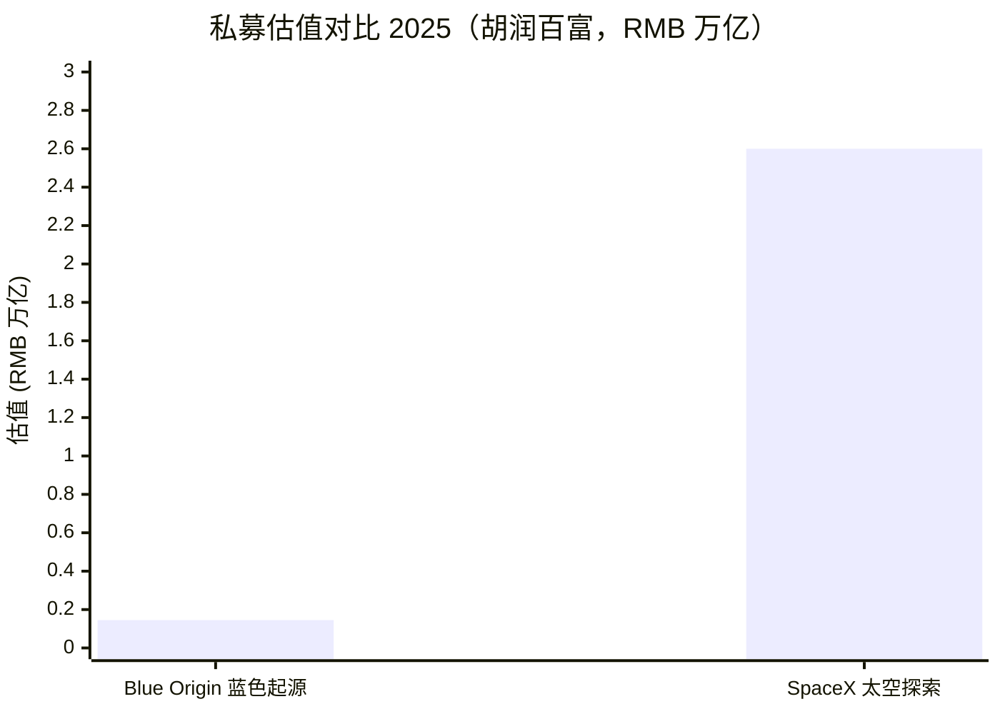
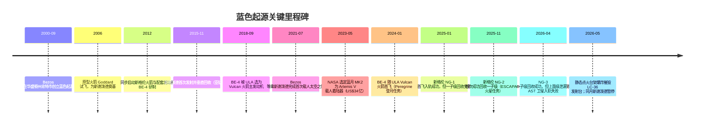
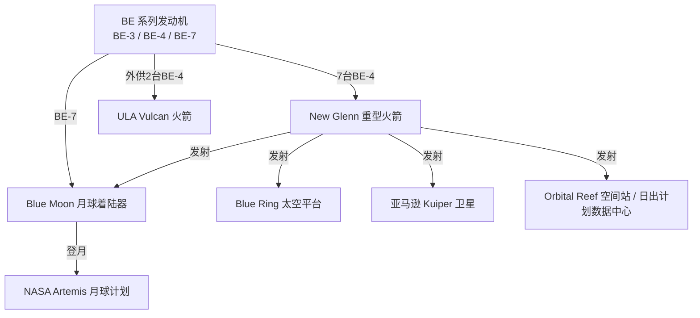
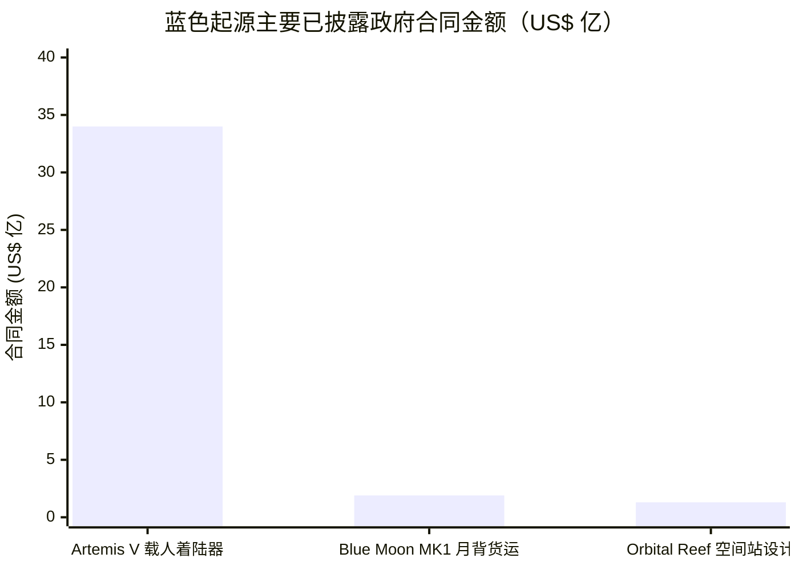
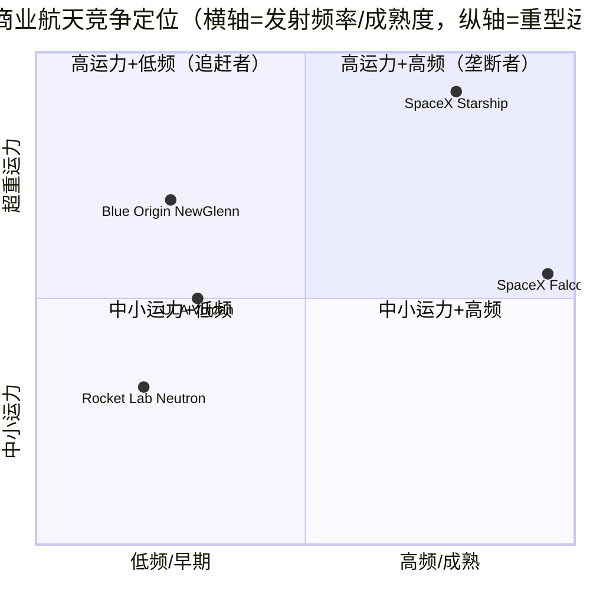
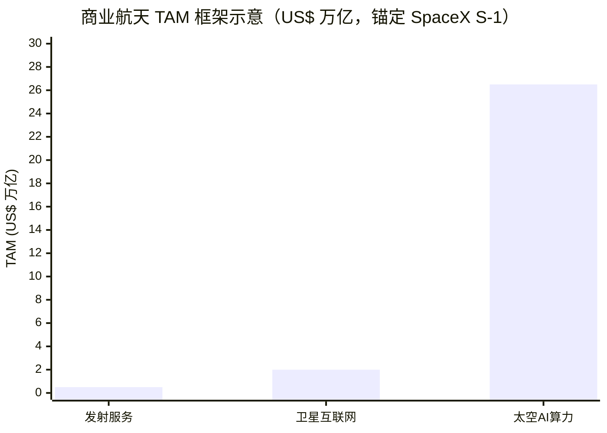

# 蓝色起源（Blue Origin，私营 / private）公司研究

> **报告日期 / As of：2026-06-13**　|　**编制基础：公司官网（blueorigin.com）+ NASA / FAA 公告 + 方正证券行业深度（zsxq 本地库）+ 公开新闻**　|　**对照基准：SpaceX（NASDAQ: SPCX，2026-06-12 完成史上最大 IPO）**
>
> *蓝色起源为未上市私营公司，无 SEC 申报文件、无公开财报。本报告所有公司事实均取自官网、NASA/FAA 公告与可核验新闻；估值、竞争定位、情景判断为分析师观点（`*分析师观点：*`），不来自任何监管文件——蓝色起源根本没有此类文件。*

---

## 投资摘要（Investment Summary）

> *分析师观点：* **评级 / 目标价：不适用 — 私营公司（private）。** 蓝色起源为 Jeff Bezos 100% 控制的非上市企业（法律主体 Blue Origin Enterprises, L.P.），不在公开资本市场交易，无招股书、无财报、无可比每股价格基准，因此**不设评级、不设 12 个月目标价**。下表给出的是私募估值与战略定位，而非可交易价格。

| 项目 | 数值 / 结论 |
|---|---|
| **公司性质** | 未上市私营公司（private；Blue Origin Enterprises, L.P.） |
| **评级 / 目标价** | **不适用 — 私营公司（private）** |
| **创始人 / 控制人** | Jeff Bezos（杰夫·贝索斯），约 100% 股权与投票权 |
| **现任 CEO** | Dave Limp（戴夫·林普），2023 年 9 月上任 |
| **总部** | Kent, Washington（华盛顿州肯特市） |
| **员工数** | 约 14,000 人（2025 年初裁员 10% 前）；2025-02 裁约 1,400 人 |
| **累计投入** | Bezos 个人注资 ≥ US$6.4bn（每年约 US$10 亿出售亚马逊股票注资） |
| **私募估值** | 2025 胡润：约 RMB 1,450 亿（≈ US$200 亿量级）；行业第三方区间 US$500–1,000 亿 |
| **对照 SpaceX 估值** | 2025 胡润 RMB 26,000 亿；2026-06-12 IPO 后市值约 **US$2.10 万亿** |

**战略定位（Strategic positioning，`*分析师观点：*`）：**

1. **西方商业航天"第二极"——SpaceX 之外唯一同时拥有可回收重型火箭 + 月球着陆器 + 自研大推力发动机 + 太空基建愿景的全栈玩家。** 2025-11-13 新格伦（New Glenn）NG-2 任务首次成功回收一子级，使蓝色起源成为**全球第二家实现轨道级火箭一子级回收的商业航天公司**（继 SpaceX 之后）（[方正证券《蓝色起源：全球第二家实现火箭回收的商业航天公司》, 2026-04-16, 第 2、6 页](http://xs-macbook-air.local:5001/zsxq/pdf/184482821284152/2026%E5%B9%B4%E5%9B%BD%E9%98%B2%E5%86%9B%E5%B7%A5%E8%A1%8C%E4%B8%9A%EF%BC%9A%E8%93%9D%E8%89%B2%E8%B5%B7%E6%BA%90%EF%BC%8C%E5%85%A8%E7%90%83%E7%AC%AC%E4%BA%8C%E5%AE%B6%E5%AE%9E%E7%8E%B0%E7%81%AB%E7%AE%AD%E5%9B%9E%E6%94%B6%E7%9A%84%E5%95%86%E4%B8%9A%E8%88%AA%E5%A4%A9%E5%85%AC%E5%8F%B8.pdf)）。
2. **"贝索斯一力注资"模式——无外部资本约束，但也无上市流动性与公开问责。** 与靠 IPO/外部融资的 SpaceX 不同，蓝色起源靠创始人每年约 US$10 亿的亚马逊套现维持，累计已投 ≥ US$64 亿；这给了它"慢工出细活"（gradatim ferociter）的自由，也意味着商业化节奏长期落后 SpaceX（[方正证券, 2026-04-16, 第 9 页](http://xs-macbook-air.local:5001/zsxq/pdf/184482821284152/2026%E5%B9%B4%E5%9B%BD%E9%98%B2%E5%86%9B%E5%B7%A5%E8%A1%8C%E4%B8%9A%EF%BC%9A%E8%93%9D%E8%89%B2%E8%B5%B7%E6%BA%90%EF%BC%8C%E5%85%A8%E7%90%83%E7%AC%AC%E4%BA%8C%E5%AE%B6%E5%AE%9E%E7%8E%B0%E7%81%AB%E7%AE%AD%E5%9B%9E%E6%94%B6%E7%9A%84%E5%95%86%E4%B8%9A%E8%88%AA%E5%A4%A9%E5%85%AC%E5%8F%B8.pdf)）。
3. **政府订单是真实现金流，NASA 阿尔忒弥斯（Artemis）登月与亚马逊 Kuiper 是两大锚定需求。** 蓝月（Blue Moon）MK2 已锁定 Artemis V 载人着陆器合同（US$34 亿），新格伦拿下亚马逊 Kuiper 星座最多 27 次发射订单——这是它区别于纯叙事公司的"已签约"底座（[NASA, 2023-05](https://www.nasa.gov/news-release/nasa-selects-blue-origin-as-second-artemis-lunar-lander-provider/)；[SpaceNews, 2023-05-19](https://spacenews.com/nasa-selects-blue-origin-to-develop-second-artemis-lunar-lander/)）。
4. **执行力是最大变量——2026 年连续两次新格伦事故暴露规模化交付的脆弱性。** NG-3（2026-04-19）一子级成功回收、但上面级低温泄漏导致 AST SpaceMobile 卫星入轨失败；NG-3 静态点火（2026-05-28，注：与发射任务时间线存在来源差异）一次台架爆炸摧毁了唯一的 LC-36 发射台。这是把"第二极"叙事拉回现实的关键风险（[Spaceflight Now, 2026-05-29](https://spaceflightnow.com/2026/05/29/blue-origins-new-glenn-rocket-explodes-during-prelaunch-testing-at-cape-canaveral/)；[Gizmodo, 2026-06](https://gizmodo.com/blue-origins-new-glenn-rocket-cleared-for-launch-after-suffering-malfunction-2000763199)）。

---

## 目录

1. [公司概览](#一公司概览)
2. [公司历史](#二公司历史)
3. [管理团队](#三管理团队)
4. [产品与服务（核心章节）](#四产品与服务核心章节)
5. [客户与商业模式](#五客户与商业模式)
6. [行业概览](#六行业概览)
7. [竞争格局——蓝色起源 vs SpaceX](#七竞争格局蓝色起源-vs-spacex)
8. [市场机会（TAM）](#八市场机会tam)
9. [风险评估](#九风险评估)
10. [关键争论与催化剂](#十关键争论与催化剂)
11. [投资视角评分（Investor Lenses）](#十一投资视角评分)
12. [数据来源清单与参考资料](#数据来源清单--数据来源清单)

---

## 一、公司概览

**投资论点先行（BLUF，`*分析师观点：*`）：** 蓝色起源不是一个"标的"——它没有股票、没有目标价。它是理解 SpaceX 护城河深度的最佳参照系：作为西方商业航天唯一具备全栈能力（可回收重型火箭 + 自研大推力发动机 + 月球着陆器 + 太空平台）的"第二极"，蓝色起源用 25 年和 ≥US$64 亿证明了——即便有全球前富豪无限输血、有 NASA 数十亿美元订单背书，要追上 SpaceX 的发射节奏与成本曲线依然极其困难。我们的核心判断：蓝色起源在**单台发动机性能**上已能与 SpaceX 比肩，但在**火箭规模、轨道运力、发射频率、成本与现金流**上仍系统性落后；2026 年连续事故进一步拉大了这一差距。它对投资者的价值，主要体现在其上市供应链（中美两地的火箭/卫星/发动机零部件公司）以及作为 SpaceX 估值"参照分母"的意义（[方正证券, 2026-04-16, 第 2 页](http://xs-macbook-air.local:5001/zsxq/pdf/184482821284152/2026%E5%B9%B4%E5%9B%BD%E9%98%B2%E5%86%9B%E5%B7%A5%E8%A1%8C%E4%B8%9A%EF%BC%9A%E8%93%9D%E8%89%B2%E8%B5%B7%E6%BA%90%EF%BC%8C%E5%85%A8%E7%90%83%E7%AC%AC%E4%BA%8C%E5%AE%B6%E5%AE%9E%E7%8E%B0%E7%81%AB%E7%AE%AD%E5%9B%9E%E6%94%B6%E7%9A%84%E5%95%86%E4%B8%9A%E8%88%AA%E5%A4%A9%E5%85%AC%E5%8F%B8.pdf)）。

**公司做什么（plain English）：** 蓝色起源是一家从事 reusable launch（可复用火箭发射）、space tourism（太空旅游）、lunar lander（月球着陆器）、rocket engines（火箭发动机）与 space infrastructure（太空基础设施）的航天公司，由亚马逊创始人 Jeff Bezos 于 2000 年 9 月 8 日在华盛顿州肯特市创立（[Wikipedia — Blue Origin](https://en.wikipedia.org/wiki/Blue_Origin)）。其口号为 "Gradatim Ferociter"（拉丁语，"一步一步、坚定地"），体现了与 SpaceX "快速迭代、炸了再来"截然不同的稳健工程路线（[方正证券, 2026-04-16, 第 2 页](http://xs-macbook-air.local:5001/zsxq/pdf/184482821284152/2026%E5%B9%B4%E5%9B%BD%E9%98%B2%E5%86%9B%E5%B7%A5%E8%A1%8C%E4%B8%9A%EF%BC%9A%E8%93%9D%E8%89%B2%E8%B5%B7%E6%BA%90%EF%BC%8C%E5%85%A8%E7%90%83%E7%AC%AC%E4%BA%8C%E5%AE%B6%E5%AE%9E%E7%8E%B0%E7%81%AB%E7%AE%AD%E5%9B%9E%E6%94%B6%E7%9A%84%E5%95%86%E4%B8%9A%E8%88%AA%E5%A4%A9%E5%85%AC%E5%8F%B8.pdf)）。

**怎么赚钱（business model）：** 蓝色起源的现金来源有两条：（1）**创始人注资**——Bezos 每年通过出售亚马逊股票向公司注入约 US$10 亿，累计已超过 US$64 亿，这构成其主要"资本"来源；（2）**政府与商业合同收入**——承接 NASA（登月着陆器、月球货运）、美国国防部门（国家安全发射、太空态势感知）合同，以及商业发射订单（亚马逊 Kuiper、AST SpaceMobile 等）。CBinsights 估算 2023 年公司收入约 US$34 亿（[方正证券, 2026-04-16, 第 9 页](http://xs-macbook-air.local:5001/zsxq/pdf/184482821284152/2026%E5%B9%B4%E5%9B%BD%E9%98%B2%E5%86%9B%E5%B7%A5%E8%A1%8C%E4%B8%9A%EF%BC%9A%E8%93%9D%E8%89%B2%E8%B5%B7%E6%BA%90%EF%BC%8C%E5%85%A8%E7%90%83%E7%AC%AC%E4%BA%8C%E5%AE%B6%E5%AE%9E%E7%8E%B0%E7%81%AB%E7%AE%AD%E5%9B%9E%E6%94%B6%E7%9A%84%E5%95%86%E4%B8%9A%E8%88%AA%E5%A4%A9%E5%85%AC%E5%8F%B8.pdf)；[CB Insights — Blue Origin financials](https://www.cbinsights.com/company/blue-origin/financials)）。注意：这条收入与"股权稀释"无关，Bezos 的注资也非股权融资——公司股权结构高度集中、不受外部资本约束。

**在哪里经营（geographic presence）：** 总部在华盛顿州肯特市；发动机生产在亚拉巴马州亨茨维尔（Huntsville，约 60 万平方英尺的 Blue Engine 工厂）；新谢泼德测试在德州范霍恩（Van Horn）的 Launch Site One；轨道发射在佛州卡纳维拉尔角的 LC-36 发射场（该发射台已在 2026-05-28 台架爆炸中损毁，正在重建）（[Wikipedia — Blue Origin](https://en.wikipedia.org/wiki/Blue_Origin)；[Spaceflight Now, 2026-05-29](https://spaceflightnow.com/2026/05/29/blue-origins-new-glenn-rocket-explodes-during-prelaunch-testing-at-cape-canaveral/)）。

**规模有多大（scale）：** 公司约有 14,000 名员工（2025 年初规模），2025 年 2 月宣布裁员约 10%（约 1,400 人），CEO Dave Limp 在内部信中称裁员针对工程、研发与项目管理岗位，"过去几年我们增长和招聘太快，随之而来的是更多官僚主义和更少的专注"（[CNBC, 2025-02-13](https://www.cnbc.com/2025/02/13/bezos-blue-origin-to-layoff-about-10percent-across-its-space-launch-business-.html)）。作为对比，SpaceX 截至 2026-03-31 拥有超过 22,000 名全职员工（[SpaceX Form S-1, 2026-05-20](https://www.sec.gov/Archives/edgar/data/1181412/000162828026036936/spaceexplorationtechnologi.htm)）。

**估值快照（私募口径，`*分析师观点：*`）：** 蓝色起源无公开股价。可参考的私募锚点：2025 年胡润百富给予约 RMB 1,450 亿估值（约 US$200 亿量级），第三方行业观察的估值区间在 US$500–1,000 亿；与 SpaceX 形成 1:10 以上的悬殊对比——2025 胡润 SpaceX 为 RMB 26,000 亿，且 SpaceX 在 2026-06-12 IPO 后市值约 **US$2.10 万亿**。换言之，二级市场给 SpaceX 的定价约为蓝色起源最乐观私募估值的 10–100 倍，差距既反映规模/现金流，也反映"已上市、可交易、AI 叙事"的流动性与想象力溢价（[方正证券, 2026-04-16, 第 9 页](http://xs-macbook-air.local:5001/zsxq/pdf/184482821284152/2026%E5%B9%B4%E5%9B%BD%E9%98%B2%E5%86%9B%E5%B7%A5%E8%A1%8C%E4%B8%9A%EF%BC%9A%E8%93%9D%E8%89%B2%E8%B5%B7%E6%BA%90%EF%BC%8C%E5%85%A8%E7%90%83%E7%AC%AC%E4%BA%8C%E5%AE%B6%E5%AE%9E%E7%8E%B0%E7%81%AB%E7%AE%AD%E5%9B%9E%E6%94%B6%E7%9A%84%E5%95%86%E4%B8%9A%E8%88%AA%E5%A4%A9%E5%85%AC%E5%8F%B8.pdf)）。

下图为蓝色起源 vs SpaceX 2025 年私募估值对比（单位：RMB 万亿）：

*来源：[方正证券, 2026-04-16, 第 9 页（引用 2025 胡润百富）](http://xs-macbook-air.local:5001/zsxq/pdf/184482821284152/2026%E5%B9%B4%E5%9B%BD%E9%98%B2%E5%86%9B%E5%B7%A5%E8%A1%8C%E4%B8%9A%EF%BC%9A%E8%93%9D%E8%89%B2%E8%B5%B7%E6%BA%90%EF%BC%8C%E5%85%A8%E7%90%83%E7%AC%AC%E4%BA%8C%E5%AE%B6%E5%AE%9E%E7%8E%B0%E7%81%AB%E7%AE%AD%E5%9B%9E%E6%94%B6%E7%9A%84%E5%95%86%E4%B8%9A%E8%88%AA%E5%A4%A9%E5%85%AC%E5%8F%B8.pdf)。SpaceX IPO 后市值约 US$2.1 万亿，见 [424B4 定价招股书, 2026-06-12](https://www.sec.gov/Archives/edgar/data/1181412/000162828026036936/spaceexplorationtechnologi.htm)。*

> *注：本报告不设"Section 1A 估值与目标价"章节——私营公司无可交易价格、无前瞻每股估值基准，强行测算目标价属虚构，故按 skill 规则以"不适用"披露，将估值讨论限于上述私募锚点。*

---

## 二、公司历史

**创立故事：** 2000 年 9 月 8 日，Jeff Bezos 利用亚马逊经营所得，在华盛顿州肯特市低调创立蓝色起源。Bezos 的"太空殖民"愿景可追溯至其高中毕业演讲；他相信人类终将把重工业迁出地球、保护地球生态，这一长期主义内核贯穿公司 25 年的稳健工程路线（[方正证券, 2026-04-16, 第 5、6 页](http://xs-macbook-air.local:5001/zsxq/pdf/184482821284152/2026%E5%B9%B4%E5%9B%BD%E9%98%B2%E5%86%9B%E5%B7%A5%E8%A1%8C%E4%B8%9A%EF%BC%9A%E8%93%9D%E8%89%B2%E8%B5%B7%E6%BA%90%EF%BC%8C%E5%85%A8%E7%90%83%E7%AC%AC%E4%BA%8C%E5%AE%B6%E5%AE%9E%E7%8E%B0%E7%81%AB%E7%AE%AD%E5%9B%9E%E6%94%B6%E7%9A%84%E5%95%86%E4%B8%9A%E8%88%AA%E5%A4%A9%E5%85%AC%E5%8F%B8.pdf)）。

*来源：[方正证券, 2026-04-16, 第 6 页](http://xs-macbook-air.local:5001/zsxq/pdf/184482821284152/2026%E5%B9%B4%E5%9B%BD%E9%98%B2%E5%86%9B%E5%B7%A5%E8%A1%8C%E4%B8%9A%EF%BC%9A%E8%93%9D%E8%89%B2%E8%B5%B7%E6%BA%90%EF%BC%8C%E5%85%A8%E7%90%83%E7%AC%AC%E4%BA%8C%E5%AE%B6%E5%AE%9E%E7%8E%B0%E7%81%AB%E7%AE%AD%E5%9B%9E%E6%94%B6%E7%9A%84%E5%95%86%E4%B8%9A%E8%88%AA%E5%A4%A9%E5%85%AC%E5%8F%B8.pdf)；[Wikipedia — Blue Origin](https://en.wikipedia.org/wiki/Blue_Origin)；[Spaceflight Now, 2026-05-29](https://spaceflightnow.com/2026/05/29/blue-origins-new-glenn-rocket-explodes-during-prelaunch-testing-at-cape-canaveral/)。*

**战略转向一——从亚轨道到轨道（New Shepard → New Glenn）。** 公司以新谢泼德（New Shepard）亚轨道飞行器起家，2015 年即实现亚轨道回收复用；但真正的商业价值在轨道发射。2012 年起，公司同步研制更大的新格伦（New Glenn）轨道火箭及其 BE-4 发动机，并在 2026-01-30 宣布暂停已执行 38 次任务的新谢泼德、将研制重心转移到新格伦——这是一次明确的"从太空旅游噱头转向主营轨道运力"的资源再配置（[方正证券, 2026-04-16, 第 2、15 页](http://xs-macbook-air.local:5001/zsxq/pdf/184482821284152/2026%E5%B9%B4%E5%9B%BD%E9%98%B2%E5%86%9B%E5%B7%A5%E8%A1%8C%E4%B8%9A%EF%BC%9A%E8%93%9D%E8%89%B2%E8%B5%B7%E6%BA%90%EF%BC%8C%E5%85%A8%E7%90%83%E7%AC%AC%E4%BA%8C%E5%AE%B6%E5%AE%9E%E7%8E%B0%E7%81%AB%E7%AE%AD%E5%9B%9E%E6%94%B6%E7%9A%84%E5%95%86%E4%B8%9A%E8%88%AA%E5%A4%A9%E5%85%AC%E5%8F%B8.pdf)）。

**战略转向二——从纯私营走向深度政企合作。** 早期蓝色起源刻意保持"外部独立性"，靠 Bezos 注资闭门造车。但 2023 年拿下 NASA Artemis V 合同后，公司明显加深与美国政府的合作，并新设"国家安全集团"（National Security Group）部门，预期进一步承接国防订单——这是私营公司向"国家队供应商"靠拢的转向（[方正证券, 2026-04-16, 第 7、9 页](http://xs-macbook-air.local:5001/zsxq/pdf/184482821284152/2026%E5%B9%B4%E5%9B%BD%E9%98%B2%E5%86%9B%E5%B7%A5%E8%A1%8C%E4%B8%9A%EF%BC%9A%E8%93%9D%E8%89%B2%E8%B5%B7%E6%BA%90%EF%BC%8C%E5%85%A8%E7%90%83%E7%AC%AC%E4%BA%8C%E5%AE%B6%E5%AE%9E%E7%8E%B0%E7%81%AB%E7%AE%AD%E5%9B%9E%E6%94%B6%E7%9A%84%E5%95%86%E4%B8%9A%E8%88%AA%E5%A4%A9%E5%85%AC%E5%8F%B8.pdf)）。

**关键收购 / 合作：**
- **2023 年——蓝月团队（Blue Moon team）**：组建 Lockheed Martin、Boeing、Draper、Astrobotic、Honeybee Robotics 等组成的联合体共同开发 Artemis V 载人着陆器，分散研发风险（[Wikipedia — Blue Moon (spacecraft)](https://en.wikipedia.org/wiki/Blue_Moon_(spacecraft))）。
- **2021 年——Orbital Reef 空间站团队**：与 Sierra Space 牵头，联合 Boeing、Redwire、亚马逊 AWS、亚利桑那州立大学等组建商业空间站联盟，获 NASA US$1.3 亿设计资助（[Wikipedia — Orbital Reef](https://en.wikipedia.org/wiki/Orbital_Reef)）。

**近期发展（2025–2026）：** 新格伦于 2025-01-16 NG-1 首飞入轨成功（搭载 Blue Ring Pathfinder）、但一子级回收失败；2025-11-13 NG-2（搭载 NASA ESCAPADE 火星双星）实现一子级首次成功回收；2026-04-19 NG-3（搭载 AST SpaceMobile BlueBird-7 卫星）一子级再次成功回收、但上面级低温泄漏冻结液压管线导致推力异常，卫星被留在过低轨道、任务失败；随后 2026-05-28 一次台架静态点火爆炸摧毁了唯一的 LC-36 发射台，FAA 在审查后于 2026-05-22 已批准复飞、Blue Origin 提出九项纠正措施（注：复飞批准与台架爆炸的先后时间线在不同来源中存在出入，详见验证日志）（[Spaceflight Now, 2026-05-29](https://spaceflightnow.com/2026/05/29/blue-origins-new-glenn-rocket-explodes-during-prelaunch-testing-at-cape-canaveral/)；[Gizmodo, 2026-06](https://gizmodo.com/blue-origins-new-glenn-rocket-cleared-for-launch-after-suffering-malfunction-2000763199)）。

---

## 三、管理团队

**创始人——Jeff Bezos（杰夫·贝索斯）。** Bezos 1986 年毕业于普林斯顿大学（计算机与电气工程），先在华尔街从事计算机/金融工作；1994 年因看到互联网热潮辞职、创立亚马逊（Amazon），将其打造为全球电商与云计算（AWS）巨头，1999 年被《时代周刊》冠以"网上商业活动之王"、2018 年以约 US$1,120 亿身家登顶世界首富、同年当选美国工程院院士。2000 年他用亚马逊经营所得创立蓝色起源；2021 年卸任亚马逊 CEO（转任执行董事长）、同年 7 月亲乘自家新谢泼德飞船跨越卡门线，完成公司首次载人飞行（[方正证券, 2026-04-16, 第 5 页](http://xs-macbook-air.local:5001/zsxq/pdf/184482821284152/2026%E5%B9%B4%E5%9B%BD%E9%98%B2%E5%86%9B%E5%B7%A5%E8%A1%8C%E4%B8%9A%EF%BC%9A%E8%93%9D%E8%89%B2%E8%B5%B7%E6%BA%90%EF%BC%8C%E5%85%A8%E7%90%83%E7%AC%AC%E4%BA%8C%E5%AE%B6%E5%AE%9E%E7%8E%B0%E7%81%AB%E7%AE%AD%E5%9B%9E%E6%94%B6%E7%9A%84%E5%95%86%E4%B8%9A%E8%88%AA%E5%A4%A9%E5%85%AC%E5%8F%B8.pdf)）。

在蓝色起源，Bezos 持有约 100% 股权与投票权（通过 Blue Origin Enterprises, L.P.），是唯一/绝对控股股东，形成"股权不分散、控制权稳定、不受外部资本约束"的高度集中结构。他每年通过出售亚马逊股票向公司注入约 US$10 亿、累计 ≥US$64 亿，并公开表示"有信心未来让蓝色起源的估值超过亚马逊"。2025 年他还成立 AI 公司"普罗米修斯"（Prometheus），重返一线参与前沿科技——这与 SpaceX 的 Musk 同时掌舵 xAI 形成镜像，也意味着两位创始人都在把 AI 引入各自的航天叙事（[方正证券, 2026-04-16, 第 5、8、9 页](http://xs-macbook-air.local:5001/zsxq/pdf/184482821284152/2026%E5%B9%B4%E5%9B%BD%E9%98%B2%E5%86%9B%E5%B7%A5%E8%A1%8C%E4%B8%9A%EF%BC%9A%E8%93%9D%E8%89%B2%E8%B5%B7%E6%BA%90%EF%BC%8C%E5%85%A8%E7%90%83%E7%AC%AC%E4%BA%8C%E5%AE%B6%E5%AE%9E%E7%8E%B0%E7%81%AB%E7%AE%AD%E5%9B%9E%E6%94%B6%E7%9A%84%E5%95%86%E4%B8%9A%E8%88%AA%E5%A4%A9%E5%85%AC%E5%8F%B8.pdf)）。

**现任 CEO——Dave Limp（戴夫·林普）。** Limp 于 2023 年 9 月由 Bezos 亲自延揽出任 CEO，接替前任 Bob Smith。Limp 此前是亚马逊设备与服务（Devices & Services）高级副总裁，长期负责 Kindle、Echo/Alexa、Fire 平板等硬件产品线的规模化量产与供应链——这正是 Bezos 引入他的原因：把蓝色起源从"工程驱动"转向"制造与发射节奏驱动"。Limp 上任后的首要任务是提升新格伦的产量与发射频率，并据此在 2025 年 2 月主导了约 10% 的裁员、削减管理层级（[Wikipedia — Dave Limp](https://en.wikipedia.org/wiki/Dave_Limp)；[CNBC, 2025-02-13](https://www.cnbc.com/2025/02/13/bezos-blue-origin-to-layoff-about-10percent-across-its-space-launch-business-.html)）。

作为私营公司，蓝色起源不披露高管持股或薪酬结构；Limp 作为职业经理人，公司控制权仍完全在 Bezos 手中。这与 SpaceX 形成对比：Musk 既是创始人又是控制人（约 82.4% 投票权），而蓝色起源是"创始人控制 + 职业经理人运营"的分工模式（[方正证券, 2026-04-16, 第 8 页](http://xs-macbook-air.local:5001/zsxq/pdf/184482821284152/2026%E5%B9%B4%E5%9B%BD%E9%98%B2%E5%86%9B%E5%B7%A5%E8%A1%8C%E4%B8%9A%EF%BC%9A%E8%93%9D%E8%89%B2%E8%B5%B7%E6%BA%90%EF%BC%8C%E5%85%A8%E7%90%83%E7%AC%AC%E4%BA%8C%E5%AE%B6%E5%AE%9E%E7%8E%B0%E7%81%AB%E7%AE%AD%E5%9B%9E%E6%94%B6%E7%9A%84%E5%95%86%E4%B8%9A%E8%88%AA%E5%A4%A9%E5%85%AC%E5%8F%B8.pdf)）。

---

## 四、产品与服务（核心章节）

蓝色起源没有 10-K/年报披露的"产品矩阵表"。下表是分析师依据公司官网（blueorigin.com 产品导航）与方正证券行业深度构建的产品矩阵，并明确标注为分析师构建（analyst-constructed）。

**4.1 产品矩阵（analyst-constructed，依据 blueorigin.com 产品导航 + 方正证券 2026-04-16 报告）**

| 业务线 / Market | 产品 / Product | 类型 | 状态 / Status | 对标 SpaceX |
|---|---|---|---|---|
| 轨道发射 / Orbital launch | **New Glenn**（新格伦） | 重型可回收火箭 | 已入轨（NG-1/2/3），一子级回收已验证 | Falcon 9 / Starship |
| 亚轨道 / Suborbital | **New Shepard**（新谢泼德） | 太空旅游 / 研究载荷 | 已飞 38 次（含 17 次载人），2026-01 暂停 | （SpaceX 无对应产品） |
| 火箭发动机 / Engines | **BE-3PM / BE-3U / BE-4 / BE-7** | 自研液体火箭发动机 | BE-4 量产中（供新格伦 + ULA Vulcan） | Merlin / Raptor |
| 月球着陆器 / Lunar lander | **Blue Moon MK1 / MK2** | 货运 / 载人登月器 | MK1 待首飞，MK2 研制中（Artemis V） | Starship HLS |
| 太空平台 / Space platform | **Blue Ring**（蓝环） | 多用途在轨平台 | Pathfinder 已验证，首个作战任务 2026 | （SpaceX 无直接对应） |
| 太空基建 / Space infra | **Orbital Reef（轨道礁）/ "日出计划"数据中心** | 商业空间站 / 太空数据中心 | 设计阶段 / 规划中 | Starlab/Axiom；轨道 AI 算力对标 SpaceX |

*来源：[方正证券, 2026-04-16, 第 10–20 页](http://xs-macbook-air.local:5001/zsxq/pdf/184482821284152/2026%E5%B9%B4%E5%9B%BD%E9%98%B2%E5%86%9B%E5%B7%A5%E8%A1%8C%E4%B8%9A%EF%BC%9A%E8%93%9D%E8%89%B2%E8%B5%B7%E6%BA%90%EF%BC%8C%E5%85%A8%E7%90%83%E7%AC%AC%E4%BA%8C%E5%AE%B6%E5%AE%9E%E7%8E%B0%E7%81%AB%E7%AE%AD%E5%9B%9E%E6%94%B6%E7%9A%84%E5%95%86%E4%B8%9A%E8%88%AA%E5%A4%A9%E5%85%AC%E5%8F%B8.pdf)；产品命名以 [Wikipedia — Blue Origin](https://en.wikipedia.org/wiki/Blue_Origin) 核对。*

**4.2 协同关系——产品如何组成一个完整体系**

蓝色起源的产品并非孤立，而是一个"发动机为底座、火箭为运力、着陆器/平台为载荷、太空基建为终局"的垂直整合体系：自研 **BE 系列发动机**既装在自家 **New Glenn** 火箭上、又外供给 ULA 的 Vulcan 火箭（BE-4），形成"既是火箭厂、又是发动机供应商"的双重身份；**New Glenn** 把 **Blue Moon** 着陆器、**Blue Ring** 平台、亚马逊 Kuiper 卫星送入轨道/地月空间；最终 **Orbital Reef** 空间站与"日出计划"太空数据中心承接近地轨道的人类活动与算力需求。下图为这一体系的逻辑闭环（[方正证券, 2026-04-16, 第 16 页](http://xs-macbook-air.local:5001/zsxq/pdf/184482821284152/2026%E5%B9%B4%E5%9B%BD%E9%98%B2%E5%86%9B%E5%B7%A5%E8%A1%8C%E4%B8%9A%EF%BC%9A%E8%93%9D%E8%89%B2%E8%B5%B7%E6%BA%90%EF%BC%8C%E5%85%A8%E7%90%83%E7%AC%AC%E4%BA%8C%E5%AE%B6%E5%AE%9E%E7%8E%B0%E7%81%AB%E7%AE%AD%E5%9B%9E%E6%94%B6%E7%9A%84%E5%95%86%E4%B8%9A%E8%88%AA%E5%A4%A9%E5%85%AC%E5%8F%B8.pdf)）。

*来源：分析师构建，依据 [方正证券, 2026-04-16, 第 10–20 页](http://xs-macbook-air.local:5001/zsxq/pdf/184482821284152/2026%E5%B9%B4%E5%9B%BD%E9%98%B2%E5%86%9B%E5%B7%A5%E8%A1%8C%E4%B8%9A%EF%BC%9A%E8%93%9D%E8%89%B2%E8%B5%B7%E6%BA%90%EF%BC%8C%E5%85%A8%E7%90%83%E7%AC%AC%E4%BA%8C%E5%AE%B6%E5%AE%9E%E7%8E%B0%E7%81%AB%E7%AE%AD%E5%9B%9E%E6%94%B6%E7%9A%84%E5%95%86%E4%B8%9A%E8%88%AA%E5%A4%A9%E5%85%AC%E5%8F%B8.pdf)。*

**4.3 New Glenn（新格伦）——重型可回收火箭，旗舰产品**

New Glenn 是蓝色起源的旗舰运载火箭，以美国首位绕地飞行的宇航员 John Glenn 命名，被官方定义为 "partially-reusable heavy-lift launch vehicle"（部分可复用重型运载火箭）（[Wikipedia — New Glenn](https://en.wikipedia.org/wiki/New_Glenn)）。

**核心参数（与 SpaceX 星舰 Starship 对比，方正证券 2026-04-16 第 11 页）：**

| 指标 | New Glenn（新格伦） | Starship（星舰，SpaceX） |
|---|---|---|
| 构型 | 两级，一级可回收 | 两级，全部可回收 |
| 全箭高度 | 98m / 120m+（9×4 版） | ~121m |
| 箭体直径 | 7m | 9m |
| 起飞质量 | ~1,500T | ~5,000T |
| 起飞推力 | 1,750T / 2,610T（9×4 版） | ~7,590T |
| **LEO 运力** | **45T** / 70T（9×4 版） | 100–150T（复用）/ 250T（一次性） |
| GTO 运力 | >4T / >13.6T（9×4 版） | 未公布 |
| 整流罩直径 | 7m / 8.7m（9×4 版） | 9m（有效 8m） |
| 一子级发动机 | 7 × BE-4（液氧甲烷 LOX/CH₄） | 33 × Raptor 3 |
| 上面级发动机 | 2 × BE-3U（液氢液氧 LOX/LH₂） | 3+3 × Raptor |

*来源：[方正证券, 2026-04-16, 第 11、12 页](http://xs-macbook-air.local:5001/zsxq/pdf/184482821284152/2026%E5%B9%B4%E5%9B%BD%E9%98%B2%E5%86%9B%E5%B7%A5%E8%A1%8C%E4%B8%9A%EF%BC%9A%E8%93%9D%E8%89%B2%E8%B5%B7%E6%BA%90%EF%BC%8C%E5%85%A8%E7%90%83%E7%AC%AC%E4%BA%8C%E5%AE%B6%E5%AE%9E%E7%8E%B0%E7%81%AB%E7%AE%AD%E5%9B%9E%E6%94%B6%E7%9A%84%E5%95%86%E4%B8%9A%E8%88%AA%E5%A4%A9%E5%85%AC%E5%8F%B8.pdf)；LEO 45,000kg / GTO 13,600kg / 98m / 7×BE-4 / 2×BE-3U / 一子级目标复用 ≥25 次，经 [Wikipedia — New Glenn](https://en.wikipedia.org/wiki/New_Glenn) 核对一致。*

**中文释义 / Plain-language gloss：** New Glenn 物理上做的是 "把约 45 吨载荷送入近地轨道（low-Earth orbit, LEO）"——它的一子级（first stage）由 7 台 BE-4 发动机驱动，烧的是 **液氧甲烷 / liquid oxygen + liquefied methane (LNG)**，完成任务后反推（boostback burn）返回、垂直降落在大西洋上的回收船 "Jacklyn" 上，目标复用 ≥25 次。它独特的回收技术是 **能量焊接 / energy weld**——着陆腿接触平台的瞬间，通过可控小爆炸把着陆腿"焊"在回收船甲板上，确保火箭在海浪中稳住、无需 SpaceX 那样的阻拦索。它与同级 New Shepard 的区别是根本性的：New Shepard 只够到亚轨道（suborbital，约 100km、不入轨），而 New Glenn 是真正的 **入轨级运力（orbital-class）**，整流罩直径 7m 接近星舰的 9m，能承担大尺寸载荷发射——这是它在 GEO 大卫星、月球货运等任务上的核心卖点（[方正证券, 2026-04-16, 第 11、13 页](http://xs-macbook-air.local:5001/zsxq/pdf/184482821284152/2026%E5%B9%B4%E5%9B%BD%E9%98%B2%E5%86%9B%E5%B7%A5%E8%A1%8C%E4%B8%9A%EF%BC%9A%E8%93%9D%E8%89%B2%E8%B5%B7%E6%BA%90%EF%BC%8C%E5%85%A8%E7%90%83%E7%AC%AC%E4%BA%8C%E5%AE%B6%E5%AE%9E%E7%8E%B0%E7%81%AB%E7%AE%AD%E5%9B%9E%E6%94%B6%E7%9A%84%E5%95%86%E4%B8%9A%E8%88%AA%E5%A4%A9%E5%85%AC%E5%8F%B8.pdf)）。

***分析师观点：*** 竞争优势——**部分**。New Glenn 在"可回收重型火箭"赛道上是西方唯二（与 SpaceX）的玩家，护城河是 **技术 + 大规模发动机自研能力**；但其 45T LEO 运力虽超过 SpaceX 猎鹰九号（Falcon 9，约 22.8T 可复用），却显著落后于星舰的 100–250T，且发射频率（截至 2026 年中仅 3 次入轨）与 Falcon 9 年逾百次的成熟节奏相去甚远。最接近的竞品是 SpaceX Falcon 9 与 Starship，以及 ULA Vulcan（[方正证券, 2026-04-16, 第 11 页](http://xs-macbook-air.local:5001/zsxq/pdf/184482821284152/2026%E5%B9%B4%E5%9B%BD%E9%98%B2%E5%86%9B%E5%B7%A5%E8%A1%8C%E4%B8%9A%EF%BC%9A%E8%93%9D%E8%89%B2%E8%B5%B7%E6%BA%90%EF%BC%8C%E5%85%A8%E7%90%83%E7%AC%AC%E4%BA%8C%E5%AE%B6%E5%AE%9E%E7%8E%B0%E7%81%AB%E7%AE%AD%E5%9B%9E%E6%94%B6%E7%9A%84%E5%95%86%E4%B8%9A%E8%88%AA%E5%A4%A9%E5%85%AC%E5%8F%B8.pdf)）。

**4.4 New Shepard（新谢泼德）——亚轨道飞行器**

New Shepard 是蓝色起源研制的第一型制式火箭，被官方定义为 "a fully reusable sub-orbital launch vehicle developed for space tourism"（一型为太空旅游研制的完全可复用亚轨道运载器），以美国首位进入太空的宇航员 Alan Shepard 命名。它由单台 BE-3PM 发动机驱动（起飞推力约 490kN / 110,000 lbf），把载荷送到卡门线（Kármán line，约 100km）附近，载人舱可乘 6 人，火箭与舱体均垂直回收复用（[Wikipedia — New Shepard](https://en.wikipedia.org/wiki/New_Shepard)）。

**中文释义 / Plain-language gloss：** New Shepard 物理上做的是 "把人或科研载荷垂直送到约 100km 高度、体验数分钟失重、再垂直降落回收"——它**不入轨**（suborbital），因此严格说不是"发射卫星"的工具，而是太空旅游（space tourism）与微重力实验平台。它与 New Glenn 的关系是"练手与铺路"：对该型的开发为后续 New Glenn 乃至规划中的 New Armstrong（新阿姆斯特朗）重型火箭积累了发动机（BE-3）、垂直回收、可复用等基础能力。截至 2026-01-30 暂停为止，它已执行 38 次任务、其中 17 次载人，2021-07-20 的首次载人飞行就搭载了 Bezos 本人（[方正证券, 2026-04-16, 第 15 页](http://xs-macbook-air.local:5001/zsxq/pdf/184482821284152/2026%E5%B9%B4%E5%9B%BD%E9%98%B2%E5%86%9B%E5%B7%A5%E8%A1%8C%E4%B8%9A%EF%BC%9A%E8%93%9D%E8%89%B2%E8%B5%B7%E6%BA%90%EF%BC%8C%E5%85%A8%E7%90%83%E7%AC%AC%E4%BA%8C%E5%AE%B6%E5%AE%9E%E7%8E%B0%E7%81%AB%E7%AE%AD%E5%9B%9E%E6%94%B6%E7%9A%84%E5%95%86%E4%B8%9A%E8%88%AA%E5%A4%A9%E5%85%AC%E5%8F%B8.pdf)；[Wikipedia — New Shepard](https://en.wikipedia.org/wiki/New_Shepard)）。

***分析师观点：*** 竞争优势——**弱**。太空旅游是一个小众、低频、政治舆论敏感的细分市场，直接竞品是 Virgin Galactic（维珍银河）；2026 年的暂停说明公司已认定其战略价值低于轨道发射，资源理应向 New Glenn 倾斜。

**4.5 BE 系列发动机——单台性能已可与 SpaceX 比肩**

发动机是蓝色起源最被低估的资产。公司自研全套液体火箭发动机：上面级真空助推用 **BE-3U**（液氢液氧）、一子级主力用 **BE-4**（液氧甲烷）、飞船/着陆器在真空中机动用 **BE-7**（液氢液氧）。其中 **BE-4** 是美国制造的、推力最大的液化天然气（LNG/甲烷）燃料、富氧分级燃烧（oxygen-rich staged combustion）发动机，单台海平面推力 2,847kN（约 640,000 lbf）（[Wikipedia — BE-4](https://en.wikipedia.org/wiki/BE-4)）。

| 型号 | 推力 | 燃料 | 节流 | 用途 |
|---|---|---|---|---|
| BE-3PM | 490kN | 液氢液氧 LOX/LH₂ | — | New Shepard 一子级 |
| BE-3U | 890kN（真空） | 液氢液氧 LOX/LH₂ | 100%~70% | New Glenn 上面级 |
| **BE-4** | **2,846kN** | 液氧甲烷 LOX/CH₄ | 100%~45% | New Glenn 一子级（7台）+ ULA Vulcan（2台） |
| BE-7（在研） | 44.5kN | 液氢液氧 LOX/LH₂ | 节流至 2,000 lbf | Blue Moon 升/降发动机 |

*来源：[方正证券, 2026-04-16, 第 16 页](http://xs-macbook-air.local:5001/zsxq/pdf/184482821284152/2026%E5%B9%B4%E5%9B%BD%E9%98%B2%E5%86%9B%E5%B7%A5%E8%A1%8C%E4%B8%9A%EF%BC%9A%E8%93%9D%E8%89%B2%E8%B5%B7%E6%BA%90%EF%BC%8C%E5%85%A8%E7%90%83%E7%AC%AC%E4%BA%8C%E5%AE%B6%E5%AE%9E%E7%8E%B0%E7%81%AB%E7%AE%AD%E5%9B%9E%E6%94%B6%E7%9A%84%E5%95%86%E4%B8%9A%E8%88%AA%E5%A4%A9%E5%85%AC%E5%8F%B8.pdf)；BE-4 推力 2,847kN / 富氧分级燃烧 / 亨茨维尔生产 / 2024-01-08 随 Vulcan 首飞，经 [Wikipedia — BE-4](https://en.wikipedia.org/wiki/BE-4) 核对；BE-7 推力 44kN / 双膨胀循环（dual expander cycle），经 [Wikipedia — BE-7](https://en.wikipedia.org/wiki/BE-7) 核对。*

**中文释义 / Plain-language gloss：** **BE-4 的"双重身份"是蓝色起源最关键的竞争与供应链节点。** 它既是自家 New Glenn 一子级的 7 台主发动机，又被 ULA（United Launch Alliance，波音+洛马合资）选为下一代 Vulcan 火箭一子级的 2 台主发动机——也就是说，蓝色起源同时是"自己的火箭厂"和"竞争对手 ULA 的发动机供应商"。BE-4 在 2024-01-08 随 ULA Vulcan 首飞（执行 Peregrine 登月任务）成功，比 New Glenn 自身首飞还早一年——这意味着 BE-4 的飞行可靠性其实是先在 Vulcan 上验证的。从燃料看，BE-4 用 **液氧甲烷（methalox）**，与 SpaceX Raptor 同属"甲烷时代"的现代发动机（甲烷便于火星/月球原位制取、积碳少、易复用），而 BE-3U 用 **液氢液氧（hydrolox）**——单台推力较低，但比冲（specific impulse, Isp）高、且在月球上更易就地获取燃料，因此在对月探索任务中具备优势（[方正证券, 2026-04-16, 第 12、16 页](http://xs-macbook-air.local:5001/zsxq/pdf/184482821284152/2026%E5%B9%B4%E5%9B%BD%E9%98%B2%E5%86%9B%E5%B7%A5%E8%A1%8C%E4%B8%9A%EF%BC%9A%E8%93%9D%E8%89%B2%E8%B5%B7%E6%BA%90%EF%BC%8C%E5%85%A8%E7%90%83%E7%AC%AC%E4%BA%8C%E5%AE%B6%E5%AE%9E%E7%8E%B0%E7%81%AB%E7%AE%AD%E5%9B%9E%E6%94%B6%E7%9A%84%E5%95%86%E4%B8%9A%E8%88%AA%E5%A4%A9%E5%85%AC%E5%8F%B8.pdf)）。

***分析师观点：*** 竞争优势——**强（这是蓝色起源最硬的护城河）**。方正证券指出，"蓝色起源发动机单台数据与 SpaceX 相近"——BE-4（2,846kN）对标 Raptor 3（2,746kN）、BE-3U 对标 Merlin 1DV+——也就是说，**蓝色起源在单台发动机层面已不落下风，差距主要在系统集成、火箭规模与发射频率上**。BE-4 外供 ULA 还带来了独立于自家火箭进度的发动机现金流，护城河类型是 **技术 + 美国本土供应链稀缺性（国家安全级别的非中俄发动机来源）**。需提示风险：2026-05-28 的一次 BE-4 台架热试车异常曾引发关注（[方正证券, 2026-04-16, 第 16 页](http://xs-macbook-air.local:5001/zsxq/pdf/184482821284152/2026%E5%B9%B4%E5%9B%BD%E9%98%B2%E5%86%9B%E5%B7%A5%E8%A1%8C%E4%B8%9A%EF%BC%9A%E8%93%9D%E8%89%B2%E8%B5%B7%E6%BA%90%EF%BC%8C%E5%85%A8%E7%90%83%E7%AC%AC%E4%BA%8C%E5%AE%B6%E5%AE%9E%E7%8E%B0%E7%81%AB%E7%AE%AD%E5%9B%9E%E6%94%B6%E7%9A%84%E5%95%86%E4%B8%9A%E8%88%AA%E5%A4%A9%E5%85%AC%E5%8F%B8.pdf)）。

**4.6 Blue Moon（蓝月）MK1 / MK2——月球着陆器，NASA 备选方案**

"蓝月（Blue Moon）"是蓝色起源研发的月球着陆器家族，由 Blue Origin 牵头、联合 Lockheed Martin、Boeing、Draper、Astrobotic、Honeybee Robotics 组成联合体开发（[Wikipedia — Blue Moon (spacecraft)](https://en.wikipedia.org/wiki/Blue_Moon_(spacecraft))）。

- **MK1（货运型）**：高约 8.05m、直径 3.08m、满载质量约 21,350kg，载荷能力达 **3,000kg（3 吨）**，是迄今最大的商业货运月球着陆器，已接下为 NASA 向月背运送月球车的任务（合同价值 **US$1.9 亿**）。MK1 首发任务（命名 MK1-101 "Endurance"）原计划由 New Glenn 发射、降落在月球南极 Shackleton 撞击坑附近，将验证 BE-7 发动机、低温推进、精确着陆（100m 精度内）等关键系统，并搭载 NASA 的 SCALPSS 相机载荷（[方正证券, 2026-04-16, 第 17 页](http://xs-macbook-air.local:5001/zsxq/pdf/184482821284152/2026%E5%B9%B4%E5%9B%BD%E9%98%B2%E5%86%9B%E5%B7%A5%E8%A1%8C%E4%B8%9A%EF%BC%9A%E8%93%9D%E8%89%B2%E8%B5%B7%E6%BA%90%EF%BC%8C%E5%85%A8%E7%90%83%E7%AC%AC%E4%BA%8C%E5%AE%B6%E5%AE%9E%E7%8E%B0%E7%81%AB%E7%AE%AD%E5%9B%9E%E6%94%B6%E7%9A%84%E5%95%86%E4%B8%9A%E8%88%AA%E5%A4%A9%E5%85%AC%E5%8F%B8.pdf)；[Space.com — Blue Moon explained](https://www.space.com/blue-origin-blue-moon-lander-explained.html)）。
- **MK2（载人型）**：约 16m 高，承担 NASA **Artemis V** 任务的载人登月，可载 4 名航天员、在月面停留最长 30 天，全可复用配置，合同价值 **US$34 亿**（2023-05 NASA 授予）；由三台 BE-7 发动机驱动，并搭配 Lockheed Martin 建造的 Cislunar Transporter（地月转移飞行器）在月球轨道加注燃料。Blue Origin 副总裁 John Couluris 曾表示公司自身投入将"远超"合同金额、总成本约 US$70 亿（[NASA, 2023-05](https://www.nasa.gov/news-release/nasa-selects-blue-origin-as-second-artemis-lunar-lander-provider/)；[SpaceNews, 2023-05-19](https://spacenews.com/nasa-selects-blue-origin-to-develop-second-artemis-lunar-lander/)；[Wikipedia — Blue Moon (spacecraft)](https://en.wikipedia.org/wiki/Blue_Moon_(spacecraft))）。

**中文释义 / Plain-language gloss：** 蓝月做的是"把货物或人从月球轨道软着陆到月面"。MK1（货运）与 MK2（载人）的关系类似 SpaceX 的货运龙飞船 vs 载人龙飞船——先用无人货运型验证系统、再上载人型。它在 NASA 登月体系中的战略位置是**第二供应商**：SpaceX 的 Starship HLS 承接 Artemis III（首次载人登月），蓝月 MK2 承接 Artemis V；而据 NASA 局长表态，原由 SpaceX 独家承接的 Artemis III 也在考虑开放竞争——这给了蓝色起源抢食 SpaceX 登月份额的窗口（[方正证券, 2026-04-16, 第 17 页](http://xs-macbook-air.local:5001/zsxq/pdf/184482821284152/2026%E5%B9%B4%E5%9B%BD%E9%98%B2%E5%86%9B%E5%B7%A5%E8%A1%8C%E4%B8%9A%EF%BC%9A%E8%93%9D%E8%89%B2%E8%B5%B7%E6%BA%90%EF%BC%8C%E5%85%A8%E7%90%83%E7%AC%AC%E4%BA%8C%E5%AE%B6%E5%AE%9E%E7%8E%B0%E7%81%AB%E7%AE%AD%E5%9B%9E%E6%94%B6%E7%9A%84%E5%95%86%E4%B8%9A%E8%88%AA%E5%A4%A9%E5%85%AC%E5%8F%B8.pdf)；[Spaceflight Now, 2025-10-28](https://spaceflightnow.com/2025/10/28/blue-origin-details-lunar-exploration-progress-amid-artemis-3-contract-shakeup/)）。

***分析师观点：*** 竞争优势——**部分**。登月着陆器是政府订单驱动、技术门槛极高的赛道，蓝色起源凭 Artemis V 合同 + 联合体（洛马/波音背书）已是西方第二极；护城河是 **合同 + 技术 + 合作生态**。但 MK1 尚未首飞、MK2 尚待验证，且高度依赖 New Glenn 的发射可靠性——2026 年新格伦事故直接威胁登月时间线。最接近竞品是 SpaceX Starship HLS（[Spaceflight Now, 2025-10-28](https://spaceflightnow.com/2025/10/28/blue-origin-details-lunar-exploration-progress-amid-artemis-3-contract-shakeup/)）。

**4.7 Blue Ring（蓝环）+ 太空基建（Orbital Reef / 日出计划）——长期期权**

**Blue Ring（蓝环）** 是一个多用途在轨平台（space mobility platform），可为各类载荷提供能源供应、通信、温控、AI 算力与数据存储，避免为每个新载荷单独研制卫星的成本；它能在近地轨道、地球同步轨道、地月空间乃至火星等多种轨道机动，还设计了主动偏转小行星（"NEO hunter"）的能力。其试验型号 "Blue Ring Pathfinder" 已于 2025-01-16 随 NG-1 首飞入轨验证，首个作战任务（搭载 OpTech 光学载荷、执行 GEO 太空态势感知 SDA 任务）计划 2026 年发射（[方正证券, 2026-04-16, 第 18 页](http://xs-macbook-air.local:5001/zsxq/pdf/184482821284152/2026%E5%B9%B4%E5%9B%BD%E9%98%B2%E5%86%9B%E5%B7%A5%E8%A1%8C%E4%B8%9A%EF%BC%9A%E8%93%9D%E8%89%B2%E8%B5%B7%E6%BA%90%EF%BC%8C%E5%85%A8%E7%90%83%E7%AC%AC%E4%BA%8C%E5%AE%B6%E5%AE%9E%E7%8E%B0%E7%81%AB%E7%AE%AD%E5%9B%9E%E6%94%B6%E7%9A%84%E5%95%86%E4%B8%9A%E8%88%AA%E5%A4%A9%E5%85%AC%E5%8F%B8.pdf)；[SatelliteToday, 2025-11-26](https://www.satellitetoday.com/technology/2025/11/26/blue-origin-to-integrate-optical-payload-on-blue-ring-vehicle-for-space-domain-awareness-mission/)）。

**Orbital Reef（轨道礁）** 是蓝色起源与 Sierra Space 牵头的商业空间站，2021 年获 NASA US$1.3 亿设计资助；2025-06 完成与 NASA 的系统定义评审（System Definition Review）。但 2026-03 NASA 认为近地轨道商业空间站的商业模式尚不成熟，改变了资助方式——不再资助整座空间站、而改为采购一个对接 ISS 的舱段，Orbital Reef 在进度上也落后于 Starlab、Axiom 等竞品（[Wikipedia — Orbital Reef](https://en.wikipedia.org/wiki/Orbital_Reef)；[SpaceScout, 2025-06](https://www.spacescout.info/2025/06/where-are-americas-commercial-space-stations-in-2025/)）。

**"日出计划"（Project Sunrise）太空数据中心** 是蓝色起源对标 SpaceX 轨道 AI 算力的太空基建愿景：计划在 500–1,800km 的太阳同步轨道布设由 **5.1 万颗卫星**组成的太空数据中心，用星间激光链路通讯、由 New Glenn 送达，通讯支持由 SpaceX 的竞争对手 TeraWave 提供（其卫星尚未上天）。蓝色起源与 SpaceX 互相批评彼此的太空数据中心计划，但"日出计划"星座尚未向国际电信联盟（ITU，掌握轨道资源分配权）申报——这是它落后于 SpaceX 同类叙事的关键短板（[方正证券, 2026-04-16, 第 19、20 页](http://xs-macbook-air.local:5001/zsxq/pdf/184482821284152/2026%E5%B9%B4%E5%9B%BD%E9%98%B2%E5%86%9B%E5%B7%A5%E8%A1%8C%E4%B8%9A%EF%BC%9A%E8%93%9D%E8%89%B2%E8%B5%B7%E6%BA%90%EF%BC%8C%E5%85%A8%E7%90%83%E7%AC%AC%E4%BA%8C%E5%AE%B6%E5%AE%9E%E7%8E%B0%E7%81%AB%E7%AE%AD%E5%9B%9E%E6%94%B6%E7%9A%84%E5%95%86%E4%B8%9A%E8%88%AA%E5%A4%A9%E5%85%AC%E5%8F%B8.pdf)）。

***分析师观点：*** 竞争优势——**期权价值，尚未兑现**。Blue Ring 的 SDA/国防用途有真实的国家安全需求支撑；Orbital Reef 与日出计划则是远期愿景，受 NASA 政策变化与 ITU 频率轨道资源约束，短期不构成现金流。护城河类型是 **生态 + 国防关系**，但执行不确定性高。

**延伸观看 / Further viewing**（教学辅助，非引用，不含任何数字）：
- [Blue Origin 官方 YouTube 频道 — 含 New Glenn 发射回放与一子级海上回收实拍，直观感受 98m 重型火箭入轨与返回机动](https://www.youtube.com/@blueorigin)
- [Everyday Astronaut 频道 — 火箭可复用与反推垂直回收（boostback / propulsive landing）的工程科普，理解 New Glenn"能量焊接"回收为何重要](https://www.youtube.com/@EverydayAstronaut)

---

## 五、客户与商业模式

蓝色起源作为私营公司不披露客户集中度，但其客户结构清晰可辨——以**美国政府机构**为绝对核心、商业客户为补充，呈现典型的"国防/航天承包商"特征（[方正证券, 2026-04-16, 第 9 页](http://xs-macbook-air.local:5001/zsxq/pdf/184482821284152/2026%E5%B9%B4%E5%9B%BD%E9%98%B2%E5%86%9B%E5%B7%A5%E8%A1%8C%E4%B8%9A%EF%BC%9A%E8%93%9D%E8%89%B2%E8%B5%B7%E6%BA%90%EF%BC%8C%E5%85%A8%E7%90%83%E7%AC%AC%E4%BA%8C%E5%AE%B6%E5%AE%9E%E7%8E%B0%E7%81%AB%E7%AE%AD%E5%9B%9E%E6%94%B6%E7%9A%84%E5%95%86%E4%B8%9A%E8%88%AA%E5%A4%A9%E5%85%AC%E5%8F%B8.pdf)）。

**核心客户群体：**
1. **NASA（美国国家航空航天局）**——最大且最稳定的合同来源：Artemis V 载人着陆器（US$34 亿）、Blue Moon MK1 月背货运（US$1.9 亿）、Orbital Reef 空间站设计（US$1.3 亿）、ESCAPADE 火星探测器发射（NG-2 载荷）。这些是数十亿美元量级的政府采购合同，构成蓝色起源最重要的经营性收入（[NASA, 2023-05](https://www.nasa.gov/news-release/nasa-selects-blue-origin-as-second-artemis-lunar-lander-provider/)）。
2. **美国国防部门 / Space Force**——通过新设的"国家安全集团"承接国家安全发射（NSSL）与 Blue Ring 的太空态势感知（SDA）任务，2026 年首个 Blue Ring 作战任务即与 Space Force 合作（[SpaceNews — Blue Ring 2026 national security mission](https://spacenews.com/blue-origin-advances-blue-ring-spacecraft-toward-2026-national-security-mission/)）。
3. **商业卫星客户**——最大一笔是**亚马逊 Kuiper 星座**（关联方），New Glenn 拿下最多 27 次发射订单（12 次确定 + 最多 15 次选择权），用于部署 3,236 颗 Kuiper 宽带卫星；以及 **AST SpaceMobile**（其 BlueBird-7 卫星在 NG-3 任务中因上面级故障入轨失败）（[SpaceNews — NASA selects Blue Origin (Artemis)](https://spacenews.com/nasa-selects-blue-origin-to-develop-second-artemis-lunar-lander/)；[Spaceflight Now, 2026-05-29](https://spaceflightnow.com/2026/05/29/blue-origins-new-glenn-rocket-explodes-during-prelaunch-testing-at-cape-canaveral/)）。
4. **外供发动机客户——ULA（联合发射联盟）**：BE-4 发动机供 ULA Vulcan 火箭，这是一笔独立于自家火箭进度的稳定 B2B 收入（[Wikipedia — BE-4](https://en.wikipedia.org/wiki/BE-4)）。
5. **太空旅游个人客户**——New Shepard 的载人观光乘客（已暂停）。

**客户集中度（`*分析师观点：*`）：** 私营公司未披露具体百分比，但定性判断：**客户高度集中于美国政府（NASA + 国防）与关联方亚马逊**——若把 NASA、Space Force、Amazon Kuiper 合计，极可能占总收入的绝大部分。这种集中度在政府承包商中属常态，但意味着公司对美国航天/国防预算与亚马逊资本开支节奏高度敏感。**亚马逊 Kuiper 既是大客户、又因 Bezos 同时控制两家公司而存在关联交易与公司治理质疑**——2024 年曾有亚马逊股东就 Blue Origin 发射合同起诉董事会与 Bezos（[方正证券, 2026-04-16, 第 9 页](http://xs-macbook-air.local:5001/zsxq/pdf/184482821284152/2026%E5%B9%B4%E5%9B%BD%E9%98%B2%E5%86%9B%E5%B7%A5%E8%A1%8C%E4%B8%9A%EF%BC%9A%E8%93%9D%E8%89%B2%E8%B5%B7%E6%BA%90%EF%BC%8C%E5%85%A8%E7%90%83%E7%AC%AC%E4%BA%8C%E5%AE%B6%E5%AE%9E%E7%8E%B0%E7%81%AB%E7%AE%AD%E5%9B%9E%E6%94%B6%E7%9A%84%E5%95%86%E4%B8%9A%E8%88%AA%E5%A4%A9%E5%85%AC%E5%8F%B8.pdf)）。该集中度风险已纳入第九节。

下图为蓝色起源主要已签约合同的金额量级（单位：US$ 亿，仅含已披露的政府合同，不含商业发射）：

*来源：[NASA, 2023-05（Artemis V US$3.4bn）](https://www.nasa.gov/news-release/nasa-selects-blue-origin-as-second-artemis-lunar-lander-provider/)；[方正证券, 2026-04-16, 第 17 页（MK1 US$1.9亿）](http://xs-macbook-air.local:5001/zsxq/pdf/184482821284152/2026%E5%B9%B4%E5%9B%BD%E9%98%B2%E5%86%9B%E5%B7%A5%E8%A1%8C%E4%B8%9A%EF%BC%9A%E8%93%9D%E8%89%B2%E8%B5%B7%E6%BA%90%EF%BC%8C%E5%85%A8%E7%90%83%E7%AC%AC%E4%BA%8C%E5%AE%B6%E5%AE%9E%E7%8E%B0%E7%81%AB%E7%AE%AD%E5%9B%9E%E6%94%B6%E7%9A%84%E5%95%86%E4%B8%9A%E8%88%AA%E5%A4%A9%E5%85%AC%E5%8F%B8.pdf)；Orbital Reef US$130M 见 [Wikipedia — Orbital Reef](https://en.wikipedia.org/wiki/Orbital_Reef)。*

---

## 六、行业概览

**行业定义与范围：** 蓝色起源所处的是**商业航天（commercial space）**产业，可拆为四大子赛道：（1）轨道发射服务（launch services）；（2）卫星与星座（含通信、遥感、SDA）；（3）地月/深空探索（含 NASA 登月）；（4）太空基建（空间站、太空数据中心、在轨服务）。这是一个由"政府订单 + 商业资本"双轮驱动、技术与资本门槛极高、近年因 SpaceX 把发射成本打下来而快速放量的行业（[方正证券, 2026-04-16, 第 19 页](http://xs-macbook-air.local:5001/zsxq/pdf/184482821284152/2026%E5%B9%B4%E5%9B%BD%E9%98%B2%E5%86%9B%E5%B7%A5%E8%A1%8C%E4%B8%9A%EF%BC%9A%E8%93%9D%E8%89%B2%E8%B5%B7%E6%BA%90%EF%BC%8C%E5%85%A8%E7%90%83%E7%AC%AC%E4%BA%8C%E5%AE%B6%E5%AE%9E%E7%8E%B0%E7%81%AB%E7%AE%AD%E5%9B%9E%E6%94%B6%E7%9A%84%E5%95%86%E4%B8%9A%E8%88%AA%E5%A4%A9%E5%85%AC%E5%8F%B8.pdf)）。

**市场结构与竞争格局：** 西方商业发射市场呈"一超多强"格局——SpaceX 自 2023 年以来每年承担全球 **>80% 的入轨质量（mass to orbit）**、Falcon 任务成功率 >99%，是绝对主导；蓝色起源、ULA、Rocket Lab、Firefly 等构成第二梯队。这种结构的成因是**可回收火箭把单位发射成本打下来**——谁先掌握高频可复用发射，谁就能在成本曲线上碾压对手（[SpaceX Form S-1, 招股说明书摘要 p.5](https://www.sec.gov/Archives/edgar/data/1181412/000162828026036936/spaceexplorationtechnologi.htm)）。

**增长驱动一——卫星互联网（satellite internet）与大星座。** 全球正在进入"万星级 LEO 星座"时代：SpaceX Starlink 已部署约 9,600 颗在轨卫星、订户从 FY23 的 230 万增至 2026Q1 的 1,030 万；亚马逊 Kuiper（3,236 颗）、AST SpaceMobile 等紧随其后。这些星座的部署需要海量发射运力——正是 New Glenn 等重型火箭的需求来源（[SpaceX Form S-1, 招股说明书摘要 p.5–6](https://www.sec.gov/Archives/edgar/data/1181412/000162828026036936/spaceexplorationtechnologi.htm)）。

**增长驱动二——地月经济（cislunar economy）与 NASA Artemis。** 美国主导的 Artemis 重返月球计划是未来十年最大的政府航天需求池，催生了载人着陆器、月球货运、月面基础设施等数十亿美元合同——蓝色起源凭 Blue Moon MK1/MK2 是核心受益者之一（[NASA, 2023-05](https://www.nasa.gov/news-release/nasa-selects-blue-origin-as-second-artemis-lunar-lander-provider/)）。

**增长驱动三——太空算力（space-based compute）。** 这是 2025–2026 年最热的新叙事：地面数据中心 2024 年全球耗电达 415TWh、美国占 45%，且 43% 美国数据中心建在缺水地区、用饮用水冷却；彭博社预计到 2035 年美国数据中心用电占比将从 2024 年的 3.5% 飙升至 8.6%。太空数据中心可始终朝阳发电、利用外层空间极低温散热，解决地面水电瓶颈——SpaceX 与蓝色起源（日出计划）都已入局，把"AI + 商业航天"绑定以吸引资本（[方正证券, 2026-04-16, 第 19 页](http://xs-macbook-air.local:5001/zsxq/pdf/184482821284152/2026%E5%B9%B4%E5%9B%BD%E9%98%B2%E5%86%9B%E5%B7%A5%E8%A1%8C%E4%B8%9A%EF%BC%9A%E8%93%9D%E8%89%B2%E8%B5%B7%E6%BA%90%EF%BC%8C%E5%85%A8%E7%90%83%E7%AC%AC%E4%BA%8C%E5%AE%B6%E5%AE%9E%E7%8E%B0%E7%81%AB%E7%AE%AD%E5%9B%9E%E6%94%B6%E7%9A%84%E5%95%86%E4%B8%9A%E8%88%AA%E5%A4%A9%E5%85%AC%E5%8F%B8.pdf)）。

**监管环境：** 商业发射受 FAA（联邦航空管理局）监管——每次事故都触发 FAA 调查并可能停飞，2026 年 NG-3 失败即导致新格伦被停飞、待 Blue Origin 提交调查报告并完成纠正措施后才获复飞批准。轨道频率/位置资源由 ITU（国际电信联盟）分配——这是"日出计划"星座必须跨过的门槛。登月与国家安全任务还受 NASA 与国防部的合同与出口管制（ITAR）约束（[Spaceflight Now, 2026-05-29](https://spaceflightnow.com/2026/05/29/blue-origins-new-glenn-rocket-explodes-during-prelaunch-testing-at-cape-canaveral/)；[方正证券, 2026-04-16, 第 20 页](http://xs-macbook-air.local:5001/zsxq/pdf/184482821284152/2026%E5%B9%B4%E5%9B%BD%E9%98%B2%E5%86%9B%E5%B7%A5%E8%A1%8C%E4%B8%9A%EF%BC%9A%E8%93%9D%E8%89%B2%E8%B5%B7%E6%BA%90%EF%BC%8C%E5%85%A8%E7%90%83%E7%AC%AC%E4%BA%8C%E5%AE%B6%E5%AE%9E%E7%8E%B0%E7%81%AB%E7%AE%AD%E5%9B%9E%E6%94%B6%E7%9A%84%E5%95%86%E4%B8%9A%E8%88%AA%E5%A4%A9%E5%85%AC%E5%8F%B8.pdf)）。

**行业动态（供需与议价权）：** 买方（NASA/国防/大星座运营商）希望培育第二、第三家供应商以制衡 SpaceX 的事实垄断——这对蓝色起源是结构性利好（"反垄断红利"，government wants a viable #2）。但供给侧的现实是：发射可靠性与频率才是硬通货，蓝色起源 2026 年的连续事故削弱了买方对它的信心。替代品方面，地面数据中心、地面光纤、其他发射商（ULA、Rocket Lab、欧洲 Ariane、印度 ISRO、中国商业航天）都构成不同程度的替代/竞争（[SpaceX Form S-1, 招股说明书摘要 p.5](https://www.sec.gov/Archives/edgar/data/1181412/000162828026036936/spaceexplorationtechnologi.htm)）。

---

## 七、竞争格局——蓝色起源 vs SpaceX

蓝色起源最核心、最值得分析的竞争关系就是与 SpaceX 的全面对垒。方正证券的判断很直接：二者"在 NASA 载人登月合同、太空数据中心、重型可回收运载火箭等多领域展开竞争，同时在言语上亦有交锋"——这是一场"第二极挑战垄断者"的多线战争（[方正证券, 2026-04-16, 第 2 页](http://xs-macbook-air.local:5001/zsxq/pdf/184482821284152/2026%E5%B9%B4%E5%9B%BD%E9%98%B2%E5%86%9B%E5%B7%A5%E8%A1%8C%E4%B8%9A%EF%BC%9A%E8%93%9D%E8%89%B2%E8%B5%B7%E6%BA%90%EF%BC%8C%E5%85%A8%E7%90%83%E7%AC%AC%E4%BA%8C%E5%AE%B6%E5%AE%9E%E7%8E%B0%E7%81%AB%E7%AE%AD%E5%9B%9E%E6%94%B6%E7%9A%84%E5%95%86%E4%B8%9A%E8%88%AA%E5%A4%A9%E5%85%AC%E5%8F%B8.pdf)）。

**逐维度对比（`*分析师观点：*`）：**

| 维度 | 蓝色起源 Blue Origin | SpaceX | 谁领先 |
|---|---|---|---|
| 单台发动机性能 | BE-4 2,846kN / BE-3U | Raptor 3 2,746kN / Merlin | **基本持平** |
| 重型火箭运力（LEO） | New Glenn 45T | Starship 100–250T；Falcon 9 ~22.8T | **SpaceX**（但 NG 超 Falcon 9） |
| 一子级回收 | 已验证（NG-2, 2025-11） | 成熟（Falcon 9 复用数百次） | **SpaceX 大幅领先** |
| 发射频率 | 截至 2026 年中仅 3 次入轨 | Falcon 年逾百次 | **SpaceX 碾压** |
| 卫星互联网 | 日出计划（5.1万颗，未申报ITU） | Starlink（~9,600颗在轨，1,030万订户） | **SpaceX 已变现** |
| NASA 登月 | Blue Moon MK2（Artemis V） | Starship HLS（Artemis III） | 平分（各承一棒） |
| 现金流 / 估值 | 私营，靠 Bezos 注资 | FY25 营收 $186.74亿，市值 $2.1万亿 | **SpaceX 数量级领先** |

*来源：[方正证券, 2026-04-16, 第 11、16、20 页](http://xs-macbook-air.local:5001/zsxq/pdf/184482821284152/2026%E5%B9%B4%E5%9B%BD%E9%98%B2%E5%86%9B%E5%B7%A5%E8%A1%8C%E4%B8%9A%EF%BC%9A%E8%93%9D%E8%89%B2%E8%B5%B7%E6%BA%90%EF%BC%8C%E5%85%A8%E7%90%83%E7%AC%AC%E4%BA%8C%E5%AE%B6%E5%AE%9E%E7%8E%B0%E7%81%AB%E7%AE%AD%E5%9B%9E%E6%94%B6%E7%9A%84%E5%95%86%E4%B8%9A%E8%88%AA%E5%A4%A9%E5%85%AC%E5%8F%B8.pdf)；SpaceX 数据见 [SpaceX Form S-1, 招股说明书摘要 p.3–6](https://www.sec.gov/Archives/edgar/data/1181412/000162828026036936/spaceexplorationtechnologi.htm)。*

*来源：分析师定位，依据 [方正证券, 2026-04-16, 第 11 页](http://xs-macbook-air.local:5001/zsxq/pdf/184482821284152/2026%E5%B9%B4%E5%9B%BD%E9%98%B2%E5%86%9B%E5%B7%A5%E8%A1%8C%E4%B8%9A%EF%BC%9A%E8%93%9D%E8%89%B2%E8%B5%B7%E6%BA%90%EF%BC%8C%E5%85%A8%E7%90%83%E7%AC%AC%E4%BA%8C%E5%AE%B6%E5%AE%9E%E7%8E%B0%E7%81%AB%E7%AE%AD%E5%9B%9E%E6%94%B6%E7%9A%84%E5%95%86%E4%B8%9A%E8%88%AA%E5%A4%A9%E5%85%AC%E5%8F%B8.pdf) 与 SpaceX S-1。*

**其他竞争对手：**
- **ULA（United Launch Alliance）**——波音/洛马合资的传统发射巨头，其 Vulcan 火箭用蓝色起源的 BE-4 发动机；与蓝色起源是"既竞争（发射服务）又合作（发动机供货）"的复杂关系（[Wikipedia — BE-4](https://en.wikipedia.org/wiki/BE-4)）。
- **Rocket Lab（RKLB）**——中小运力发射 + 卫星制造的上市公司，Neutron 中型可回收火箭对标 Falcon 9，是商业航天的"第三极"。
- **太空旅游赛道**——Virgin Galactic（维珍银河）是 New Shepard 的直接竞品。
- **空间站赛道**——Starlab、Axiom Space 在商业空间站上领先 Orbital Reef。
- **中国商业航天**——蓝箭航天（朱雀火箭）、星际荣耀等在可回收火箭上快速追赶，是全球范围的潜在竞争者（[方正证券, 2026-04-16, 第 22 页](http://xs-macbook-air.local:5001/zsxq/pdf/184482821284152/2026%E5%B9%B4%E5%9B%BD%E9%98%B2%E5%86%9B%E5%B7%A5%E8%A1%8C%E4%B8%9A%EF%BC%9A%E8%93%9D%E8%89%B2%E8%B5%B7%E6%BA%90%EF%BC%8C%E5%85%A8%E7%90%83%E7%AC%AC%E4%BA%8C%E5%AE%B6%E5%AE%9E%E7%8E%B0%E7%81%AB%E7%AE%AD%E5%9B%9E%E6%94%B6%E7%9A%84%E5%95%86%E4%B8%9A%E8%88%AA%E5%A4%A9%E5%85%AC%E5%8F%B8.pdf)）。

**蓝色起源的竞争优势：**（1）自研全套大推力发动机（BE-4 外供 ULA 形成稀缺性）；（2）Bezos 无限输血、无短期盈利压力；（3）NASA Artemis V + 亚马逊 Kuiper 两大锚定订单；（4）作为"反垄断红利"受益者，买方有动机扶持它制衡 SpaceX。

**竞争脆弱性：**（1）发射可靠性与频率系统性落后，2026 年连续事故重创信誉；（2）只有一个 LC-36 轨道发射台，台架爆炸后运力中断；（3）太空互联网/数据中心叙事落后 SpaceX 一个数量级、且 ITU 频率未申报；（4）无上市流动性，估值与现金流远逊 SpaceX（[Spaceflight Now, 2026-05-29](https://spaceflightnow.com/2026/05/29/blue-origins-new-glenn-rocket-explodes-during-prelaunch-testing-at-cape-canaveral/)）。

---

## 八、市场机会（TAM）

蓝色起源不发布官方 TAM。下述测算锚定于 SpaceX 招股书的行业框架与方正证券的产业链梳理，并明确标注分析师推断。

**TAM 框架（`*分析师观点：*`，锚定 SpaceX S-1 与方正证券）：** 商业航天的 TAM 可分三层：
- **发射服务（launch services）**——全球年发射市场已达数百亿美元量级且快速增长；New Glenn 的可服务市场（SAM）是大星座部署 + GEO 大卫星 + 政府重型发射。亚马逊 Kuiper 一家的 27 次发射订单即是蓝色起源在该层的确定性份额。
- **卫星互联网（satellite internet）**——SpaceX 招股书把宽带连接列为巨大 TAM，Starlink FY25 营收已达 $113.87 亿；蓝色起源主要作为"发射运力供应商"参与（送 Kuiper/AST 上天），而非直接运营星座（日出计划除外）（[SpaceX Form S-1, 招股说明书摘要 p.3](https://www.sec.gov/Archives/edgar/data/1181412/000162828026036936/spaceexplorationtechnologi.htm)）。
- **太空 AI 算力（space-based compute）**——这是想象空间最大、但最不确定的一层。SpaceX 招股书把 AI 列为 $26.5 万亿 TAM（占其总 TAM 的 93%）、轨道数据中心"最早 2028 年"部署；蓝色起源的"日出计划"（5.1 万颗卫星）对标同一赛道，但尚未向 ITU 申报频率轨位（[SpaceX Form S-1, 招股说明书摘要 p.3–4、p.9](https://www.sec.gov/Archives/edgar/data/1181412/000162828026036936/spaceexplorationtechnologi.htm)；[方正证券, 2026-04-16, 第 20 页](http://xs-macbook-air.local:5001/zsxq/pdf/184482821284152/2026%E5%B9%B4%E5%9B%BD%E9%98%B2%E5%86%9B%E5%B7%A5%E8%A1%8C%E4%B8%9A%EF%BC%9A%E8%93%9D%E8%89%B2%E8%B5%B7%E6%BA%90%EF%BC%8C%E5%85%A8%E7%90%83%E7%AC%AC%E4%BA%8C%E5%AE%B6%E5%AE%9E%E7%8E%B0%E7%81%AB%E7%AE%AD%E5%9B%9E%E6%94%B6%E7%9A%84%E5%95%86%E4%B8%9A%E8%88%AA%E5%A4%A9%E5%85%AC%E5%8F%B8.pdf)）。

**地月经济（cislunar）：** NASA Artemis 计划是未来十年最确定的政府需求池。蓝色起源已锁定的 Artemis V 载人着陆器（US$34 亿）+ MK1 月背货运（US$1.9 亿）是其在该层的 SAM/SOM 直接体现，且 Artemis III 潜在开放竞争给了额外份额机会（[NASA, 2023-05](https://www.nasa.gov/news-release/nasa-selects-blue-origin-as-second-artemis-lunar-lander-provider/)；[Spaceflight Now, 2025-10-28](https://spaceflightnow.com/2025/10/28/blue-origin-details-lunar-exploration-progress-amid-artemis-3-contract-shakeup/)）。

下图为商业航天三大 TAM 层的相对量级示意（`*分析师观点：*`，US$ 万亿，锚定 SpaceX S-1 框架）：

*来源：太空 AI 算力 $26.5 万亿来自 [SpaceX Form S-1, 招股说明书摘要 p.9](https://www.sec.gov/Archives/edgar/data/1181412/000162828026036936/spaceexplorationtechnologi.htm)；发射/卫星层为分析师据 S-1 框架的量级示意，非精确测算。*

**蓝色起源的可服务份额与渗透策略（`*分析师观点：*`）：** 蓝色起源不太可能在卫星互联网/AI 算力的"运营层"挑战 SpaceX——它的现实切入点是**做"卖铲人"（picks & shovels）的运力与发动机供应商**：用 New Glenn 承接大星座发射（Kuiper 已锁定）、用 BE-4 外供 ULA、用 Blue Moon 吃 NASA 登月、用 Blue Ring 吃国防 SDA。这是一条"绕开 SpaceX 最强的星链运营、专攻政府订单与第二供应商角色"的务实路径（[Morgan Stanley — The Space 60: Picks & Shovels for the Final Frontier, 2026-04-14](http://xs-macbook-air.local:5001/zsxq/pdf/415521254142458/Morgan%20Stanley-Space%20-%20North%20America%EF%BC%9AThe%20Space%2060%EF%BC%9A%20Picks%20%26%20Shovels%20for%20the%20Final%20Frontier-.pdf)）。

---

## 九、风险评估

**公司特定风险（Company-Specific）：**

1. **执行 / 发射可靠性风险（高）。** 这是当前最突出的风险。2026 年新格伦连续受挫：NG-3（2026-04-19）上面级低温泄漏致 AST 卫星入轨失败；随后一次台架静态点火爆炸摧毁了唯一的 LC-36 发射台。每次事故都触发 FAA 停飞、延误所有后续任务（含 Kuiper、Blue Moon MK1）。在追赶 SpaceX 的关键窗口期，可靠性问题直接侵蚀客户信心与登月时间线（[Spaceflight Now, 2026-05-29](https://spaceflightnow.com/2026/05/29/blue-origins-new-glenn-rocket-explodes-during-prelaunch-testing-at-cape-canaveral/)）。

2. **关键人/治理风险（高）。** 公司约 100% 由 Bezos 控制、靠其每年约 US$10 亿注资维持。一旦 Bezos 注资意愿或能力（亚马逊股价）改变，资金链即承压；且作为私营公司无独立董事会问责、无公开财报，治理透明度低（[方正证券, 2026-04-16, 第 8、9 页](http://xs-macbook-air.local:5001/zsxq/pdf/184482821284152/2026%E5%B9%B4%E5%9B%BD%E9%98%B2%E5%86%9B%E5%B7%A5%E8%A1%8C%E4%B8%9A%EF%BC%9A%E8%93%9D%E8%89%B2%E8%B5%B7%E6%BA%90%EF%BC%8C%E5%85%A8%E7%90%83%E7%AC%AC%E4%BA%8C%E5%AE%B6%E5%AE%9E%E7%8E%B0%E7%81%AB%E7%AE%AD%E5%9B%9E%E6%94%B6%E7%9A%84%E5%95%86%E4%B8%9A%E8%88%AA%E5%A4%A9%E5%85%AC%E5%8F%B8.pdf)）。

3. **客户集中度风险（高）。** 收入高度集中于美国政府（NASA + 国防）与关联方亚马逊 Kuiper。私营公司未披露具体占比，但定性看，前几大客户极可能合计占绝大部分收入——对美国航天/国防预算与亚马逊资本开支高度敏感。亚马逊关联交易还引发过股东诉讼（治理瑕疵）（[方正证券, 2026-04-16, 第 9 页](http://xs-macbook-air.local:5001/zsxq/pdf/184482821284152/2026%E5%B9%B4%E5%9B%BD%E9%98%B2%E5%86%9B%E5%B7%A5%E8%A1%8C%E4%B8%9A%EF%BC%9A%E8%93%9D%E8%89%B2%E8%B5%B7%E6%BA%90%EF%BC%8C%E5%85%A8%E7%90%83%E7%AC%AC%E4%BA%8C%E5%AE%B6%E5%AE%9E%E7%8E%B0%E7%81%AB%E7%AE%AD%E5%9B%9E%E6%94%B6%E7%9A%84%E5%95%86%E4%B8%9A%E8%88%AA%E5%A4%A9%E5%85%AC%E5%8F%B8.pdf)）。

4. **单点发射基础设施风险（高）。** 轨道发射目前依赖唯一的 LC-36 发射台，2026-05-28 台架爆炸后该台损毁、重建需时，期间轨道发射能力中断——这是单点故障（single point of failure）的典型表现（[Spaceflight Now, 2026-05-29](https://spaceflightnow.com/2026/05/29/blue-origins-new-glenn-rocket-explodes-during-prelaunch-testing-at-cape-canaveral/)）。

5. **产品商业化进度风险（中）。** Blue Moon MK1 尚未首飞、MK2 待验证、Blue Ring 首个作战任务待发射、Orbital Reef/日出计划仍在设计或规划阶段——多数产品尚未产生稳定现金流，商业化落地慢于预期是方正证券明列的风险（[方正证券, 2026-04-16, 第 21 页](http://xs-macbook-air.local:5001/zsxq/pdf/184482821284152/2026%E5%B9%B4%E5%9B%BD%E9%98%B2%E5%86%9B%E5%B7%A5%E8%A1%8C%E4%B8%9A%EF%BC%9A%E8%93%9D%E8%89%B2%E8%B5%B7%E6%BA%90%EF%BC%8C%E5%85%A8%E7%90%83%E7%AC%AC%E4%BA%8C%E5%AE%B6%E5%AE%9E%E7%8E%B0%E7%81%AB%E7%AE%AD%E5%9B%9E%E6%94%B6%E7%9A%84%E5%95%86%E4%B8%9A%E8%88%AA%E5%A4%A9%E5%85%AC%E5%8F%B8.pdf)）。

**行业 / 市场风险（Industry / Market）：**

6. **竞争强度——SpaceX 的"碾压式"领先（高）。** ***分析师观点：*** 方正证券明确指出蓝色起源在"火箭规模和轨道运力上与 SpaceX 存在差距"。SpaceX 每年承担全球 >80% 入轨质量、Falcon 复用成熟、Starlink 已变现、且刚以 $2.1 万亿市值上市拿到巨额弹药——在成本曲线、发射频率、资本三个维度同时领先，蓝色起源的追赶窗口正在收窄（[方正证券, 2026-04-16, 第 2 页](http://xs-macbook-air.local:5001/zsxq/pdf/184482821284152/2026%E5%B9%B4%E5%9B%BD%E9%98%B2%E5%86%9B%E5%B7%A5%E8%A1%8C%E4%B8%9A%EF%BC%9A%E8%93%9D%E8%89%B2%E8%B5%B7%E6%BA%90%EF%BC%8C%E5%85%A8%E7%90%83%E7%AC%AC%E4%BA%8C%E5%AE%B6%E5%AE%9E%E7%8E%B0%E7%81%AB%E7%AE%AD%E5%9B%9E%E6%94%B6%E7%9A%84%E5%95%86%E4%B8%9A%E8%88%AA%E5%A4%A9%E5%85%AC%E5%8F%B8.pdf)；[SpaceX Form S-1, 招股说明书摘要 p.5](https://www.sec.gov/Archives/edgar/data/1181412/000162828026036936/spaceexplorationtechnologi.htm)）。

7. **监管 / FAA 停飞风险（中高）。** 每次发射事故都触发 FAA 调查与停飞，直接拖累发射节奏与合同交付——2026 年新格伦停飞即是实例（[Spaceflight Now, 2026-05-29](https://spaceflightnow.com/2026/05/29/blue-origins-new-glenn-rocket-explodes-during-prelaunch-testing-at-cape-canaveral/)）。

8. **政策 / NASA 预算与项目重置风险（中）。** NASA 2026-03 已认定 LEO 商业空间站商业模式尚不成熟、改变 Orbital Reef 资助方式（从资助整站改为采购对接舱段）——政府需求与资助结构可随政治周期变化，直接影响蓝色起源的太空基建赛道（[Wikipedia — Orbital Reef](https://en.wikipedia.org/wiki/Orbital_Reef)；[SpaceScout, 2025-06](https://www.spacescout.info/2025/06/where-are-americas-commercial-space-stations-in-2025/)）。

9. **ITU 频率轨位资源风险（中）。** "日出计划"5.1 万颗卫星星座尚未向 ITU 申报，而 SpaceX 等已抢占大量 LEO 频率轨位资源——先到先得的规则下，蓝色起源在太空互联网/数据中心的入场券存在不确定性（[方正证券, 2026-04-16, 第 20 页](http://xs-macbook-air.local:5001/zsxq/pdf/184482821284152/2026%E5%B9%B4%E5%9B%BD%E9%98%B2%E5%86%9B%E5%B7%A5%E8%A1%8C%E4%B8%9A%EF%BC%9A%E8%93%9D%E8%89%B2%E8%B5%B7%E6%BA%90%EF%BC%8C%E5%85%A8%E7%90%83%E7%AC%AC%E4%BA%8C%E5%AE%B6%E5%AE%9E%E7%8E%B0%E7%81%AB%E7%AE%AD%E5%9B%9E%E6%94%B6%E7%9A%84%E5%95%86%E4%B8%9A%E8%88%AA%E5%A4%A9%E5%85%AC%E5%8F%B8.pdf)）。

**财务风险（Financial）：**

10. **资金可持续性 / 现金流风险（中高）。** 公司长期无独立盈利能力、靠 Bezos 注资与政府合同维持。CBinsights 估 2023 年收入约 US$34 亿，但研发与火箭/发动机量产、发射台重建均极烧钱；2025 年的裁员本身就是控本信号。一旦亚马逊股价大幅回落或 Bezos 注资节奏放缓，资金链将承压（[方正证券, 2026-04-16, 第 9 页](http://xs-macbook-air.local:5001/zsxq/pdf/184482821284152/2026%E5%B9%B4%E5%9B%BD%E9%98%B2%E5%86%9B%E5%B7%A5%E8%A1%8C%E4%B8%9A%EF%BC%9A%E8%93%9D%E8%89%B2%E8%B5%B7%E6%BA%90%EF%BC%8C%E5%85%A8%E7%90%83%E7%AC%AC%E4%BA%8C%E5%AE%B6%E5%AE%9E%E7%8E%B0%E7%81%AB%E7%AE%AD%E5%9B%9E%E6%94%B6%E7%9A%84%E5%95%86%E4%B8%9A%E8%88%AA%E5%A4%A9%E5%85%AC%E5%8F%B8.pdf)；[CB Insights — Blue Origin financials](https://www.cbinsights.com/company/blue-origin/financials)）。

11. **缺乏公开估值锚（中）。** 私营、无可交易价格，私募估值区间（US$200 亿–1,000 亿）跨度极大、可比性弱——对任何潜在投资者（PE/二级市场预期）都难以定价，估值风险高（[方正证券, 2026-04-16, 第 9 页](http://xs-macbook-air.local:5001/zsxq/pdf/184482821284152/2026%E5%B9%B4%E5%9B%BD%E9%98%B2%E5%86%9B%E5%B7%A5%E8%A1%8C%E4%B8%9A%EF%BC%9A%E8%93%9D%E8%89%B2%E8%B5%B7%E6%BA%90%EF%BC%8C%E5%85%A8%E7%90%83%E7%AC%AC%E4%BA%8C%E5%AE%B6%E5%AE%9E%E7%8E%B0%E7%81%AB%E7%AE%AD%E5%9B%9E%E6%94%B6%E7%9A%84%E5%95%86%E4%B8%9A%E8%88%AA%E5%A4%A9%E5%85%AC%E5%8F%B8.pdf)）。

**宏观风险（Macroeconomic）：**

12. **航天/国防预算周期与利率敏感性（中）。** 政府订单受美国财政与政治周期约束；高利率环境抬高重资产航天投资的资金成本，并压制亚马逊等关联方的资本开支意愿。当前周期（2026-06-05：10Y 4.54%、HY OAS 274bps）仍属偏紧的融资环境（见第十一节）（[方正证券, 2026-04-16, 第 19 页](http://xs-macbook-air.local:5001/zsxq/pdf/184482821284152/2026%E5%B9%B4%E5%9B%BD%E9%98%B2%E5%86%9B%E5%B7%A5%E8%A1%8C%E4%B8%9A%EF%BC%9A%E8%93%9D%E8%89%B2%E8%B5%B7%E6%BA%90%EF%BC%8C%E5%85%A8%E7%90%83%E7%AC%AC%E4%BA%8C%E5%AE%B6%E5%AE%9E%E7%8E%B0%E7%81%AB%E7%AE%AD%E5%9B%9E%E6%94%B6%E7%9A%84%E5%95%86%E4%B8%9A%E8%88%AA%E5%A4%A9%E5%85%AC%E5%8F%B8.pdf)）。

13. **地缘 / 出口管制风险（中）。** 航天与发动机技术受 ITAR 出口管制；地缘博弈下，全球商业航天竞争（含中国商业航天的快速追赶）会重塑长期格局（[方正证券, 2026-04-16, 第 22 页](http://xs-macbook-air.local:5001/zsxq/pdf/184482821284152/2026%E5%B9%B4%E5%9B%BD%E9%98%B2%E5%86%9B%E5%B7%A5%E8%A1%8C%E4%B8%9A%EF%BC%9A%E8%93%9D%E8%89%B2%E8%B5%B7%E6%BA%90%EF%BC%8C%E5%85%A8%E7%90%83%E7%AC%AC%E4%BA%8C%E5%AE%B6%E5%AE%9E%E7%8E%B0%E7%81%AB%E7%AE%AD%E5%9B%9E%E6%94%B6%E7%9A%84%E5%95%86%E4%B8%9A%E8%88%AA%E5%A4%A9%E5%85%AC%E5%8F%B8.pdf)）。

---

## 十、关键争论与催化剂

**关键争论（Key debates，`*分析师观点：*`）：**

**争论 1——"蓝色起源永远追不上 SpaceX，是个烧钱黑洞。"** *分析师观点：* 部分成立、部分被低估。在**发射频率、运力、现金流**上 SpaceX 确实数量级领先（FY25 营收 $186.74 亿 vs CBinsights 估蓝色起源 2023 约 $34 亿），蓝色起源 2026 年连续事故更坐实了"慢"。但被低估的是：（1）**单台发动机性能已基本持平**（BE-4 2,846kN ≈ Raptor 3 2,746kN），技术底座并不弱；（2）NASA/国防有强烈动机扶持"可行的第二供应商"以制衡 SpaceX 垄断，这是结构性政策红利。所以争论的正确版本不是"能否追上"，而是"能否稳住第二极、吃下政府订单与第二供应商角色"——这个目标可达（[方正证券, 2026-04-16, 第 2、16 页](http://xs-macbook-air.local:5001/zsxq/pdf/184482821284152/2026%E5%B9%B4%E5%9B%BD%E9%98%B2%E5%86%9B%E5%B7%A5%E8%A1%8C%E4%B8%9A%EF%BC%9A%E8%93%9D%E8%89%B2%E8%B5%B7%E6%BA%90%EF%BC%8C%E5%85%A8%E7%90%83%E7%AC%AC%E4%BA%8C%E5%AE%B6%E5%AE%9E%E7%8E%B0%E7%81%AB%E7%AE%AD%E5%9B%9E%E6%94%B6%E7%9A%84%E5%95%86%E4%B8%9A%E8%88%AA%E5%A4%A9%E5%85%AC%E5%8F%B8.pdf)；[SpaceX Form S-1, 招股说明书摘要 p.3](https://www.sec.gov/Archives/edgar/data/1181412/000162828026036936/spaceexplorationtechnologi.htm)）。

**争论 2——"2026 年连续事故说明蓝色起源的工程能力名不副实。"** *分析师观点：* 过度悲观。NG-3 的一子级**两次成功回收**（NG-2、NG-3）证明了回收技术过关，失败在上面级低温泄漏这类可定位、可纠正的工程问题——Blue Origin 已识别九项纠正措施、FAA 已批准复飞。台架爆炸虽损毁 LC-36，但属重大挫折而非技术路线否定。航天行业的"先炸后稳"是常态（SpaceX 早期亦如此）（[Spaceflight Now, 2026-05-29](https://spaceflightnow.com/2026/05/29/blue-origins-new-glenn-rocket-explodes-during-prelaunch-testing-at-cape-canaveral/)；[Gizmodo, 2026-06](https://gizmodo.com/blue-origins-new-glenn-rocket-cleared-for-launch-after-suffering-malfunction-2000763199)）。

**争论 3——"日出计划/Orbital Reef 是 PPT 叙事，不会落地。"** *分析师观点：* 大体成立，应折价看待。日出计划 5.1 万颗卫星尚未向 ITU 申报频率轨位、Orbital Reef 被 NASA 降级为采购对接舱段——二者短期都不构成现金流，给予期权价值即可，不应据此抬高估值（[方正证券, 2026-04-16, 第 20 页](http://xs-macbook-air.local:5001/zsxq/pdf/184482821284152/2026%E5%B9%B4%E5%9B%BD%E9%98%B2%E5%86%9B%E5%B7%A5%E8%A1%8C%E4%B8%9A%EF%BC%9A%E8%93%9D%E8%89%B2%E8%B5%B7%E6%BA%90%EF%BC%8C%E5%85%A8%E7%90%83%E7%AC%AC%E4%BA%8C%E5%AE%B6%E5%AE%9E%E7%8E%B0%E7%81%AB%E7%AE%AD%E5%9B%9E%E6%94%B6%E7%9A%84%E5%95%86%E4%B8%9A%E8%88%AA%E5%A4%A9%E5%85%AC%E5%8F%B8.pdf)；[Wikipedia — Orbital Reef](https://en.wikipedia.org/wiki/Orbital_Reef)）。

**催化剂日历（未来 12 个月，`*分析师观点：*`）：**
- **2026 H2 — 新格伦复飞（LC-36 重建后首飞）。** 这是头号催化剂：复飞成功将重建客户信心、恢复 Kuiper/Blue Moon 发射排期；再失败则严重打击第二极叙事（[Gizmodo, 2026-06](https://gizmodo.com/blue-origins-new-glenn-rocket-cleared-for-launch-after-suffering-malfunction-2000763199)）。
- **2026 — Blue Moon MK1 首次月球着陆尝试。** 若成功，蓝色起源将成为少数实现商业月球软着陆的公司，验证 BE-7 与精确着陆系统（[Space.com — Blue Moon explained](https://www.space.com/blue-origin-blue-moon-lander-explained.html)）。
- **2026 — 首个 Blue Ring 作战任务（GEO SDA，与 Space Force 合作）。** 验证 Blue Ring 平台并打开国防订单（[SpaceNews — Blue Ring 2026 mission](https://spacenews.com/blue-origin-advances-blue-ring-spacecraft-toward-2026-national-security-mission/)）。
- **持续 — NASA Artemis III 是否开放竞争。** 若开放，蓝色起源有机会从 SpaceX 手中抢食首次载人登月份额（[Spaceflight Now, 2025-10-28](https://spaceflightnow.com/2025/10/28/blue-origin-details-lunar-exploration-progress-amid-artemis-3-contract-shakeup/)）。
- **持续 — 新格伦为亚马逊 Kuiper 发射的兑现节奏。** 27 次发射订单的执行进度是其商业运力变现的最直接指标。

（持续跟踪可调用 `catalyst-calendar` 技能。）

---

## 十一、投资视角评分（Investor Lenses）

> **重要前提：蓝色起源是私营公司、无可交易价格、无财报。** 下列四视角**仅作定性评分（qualitative rubric），不产生目标价、不产生买卖建议**——这是 skill 对"私营 / 无法定价"标的的规定动作。市场周期快照（cycle snapshot）来自本地 `indicators.db`，作为评分的宏观背景。

**周期快照（cycle snapshot，截至 2026-06-05，来自 `indicators.db`，FRED BAMLH0A0HYM2 / ^TNX + yfinance）：** VIX = **21.51**（中性偏升）；10Y 美债收益率 = **4.54%**；高收益债利差 HY OAS = **274bps**（偏紧、信用市场尚不恐慌）。这是一个"波动率温和上行、利率偏高、信用利差偏窄"的中性偏防御组合——对烧钱、长周期、无现金流的航天私企而言，融资环境并不宽松。

**10.4 Howard Marks 周期姿态（先算，作为其他视角的背景）。**

*视角观点:* **中性偏防御（cycle posture ≈ 52/100）。**

| 组件 | 读数（2026-06-05） | 含义 |
|---|---|---|
| 波动率 VIX | 21.51 | 中性（既非恐慌也非极度自满） |
| 信用利差 HY OAS | 274bps | 偏紧（信用市场仍乐观）→ 偏防御 |
| 利率 10Y | 4.54% | 偏高 → 抬高重资产融资成本 |
| 估值 / 情绪 | SpaceX 以 113× P/S 上市 | 航天叙事情绪高涨 → 偏防御 |

矛盾点提示：HY OAS 274bps 说明信用市场并不担忧，但 VIX 21.5 与 SpaceX 极端估值说明权益市场对航天/AI 的情绪已偏热——两者方向不一致，整体定为"中性偏防御"。对蓝色起源这类无现金流、靠输血的标的，偏防御的周期意味着不宜在情绪高点对航天叙事过度乐观。

**10.1 Buffett 视角——好生意 + 合理价格。**

*视角观点:* **回避（不在 Buffett 能力圈，且无法定价）。**

| 组件 | 评分 | 依据 |
|---|---|---|
| 生意（Business） | 低 | 重资产、高研发、强周期、政府订单依赖、技术快速迭代——非"十年后需求清晰可见"的稳定生意 |
| 护城河（Moat） | 中 | BE-4 发动机自研 + NASA 合同有真实壁垒，但份额、现金流远逊 SpaceX |
| 管理（Management） | 中 | 创始人长期主义可嘉，但无独立问责、无资本回报记录 |
| 估值（Valuation） | 无法评 | 私营、无 FCF、无可交易价、无可比倍数 |

证据链：生意本身重资产且强周期（第六节）、无 FCF 历史（第九节财务风险）、估值无锚（第一节）。失效条件：若公司上市并披露稳定经营性现金流与 FCF，可重评"估值"项。

**10.2 Munger 视角——加权质量 + 反向检验。**

*视角观点:* **回避（质量与价格均无法确认）。**

| 组件 | 权重 | 评估 |
|---|---|---|
| 护城河强度 | 35% | 中——发动机技术 + 合同壁垒真实，但无 15% ROIC 可证（无财报） |
| 管理质量 | 25% | 中——创始人控制、长期视野，但无资本配置记录 |
| 生意可预测性 | 25% | 低——发射成败、政府预算、技术迭代使十年后损益难描述 |
| 估值 | 15% | 无法评——私营无价 |

**反向检验（inversion，必答）：** 最可能摧毁论点的单一情景是——**Bezos 注资意愿/能力改变（如亚马逊股价大跌或个人优先级转向 AI"普罗米修斯"）叠加新格伦再次重大事故**，使公司同时失去资金与客户信心。这是私营、单一资金来源结构最脆弱处。

**10.3 Damodaran 视角——故事 + 数字 DCF。**

*视角观点:* **无法估值（私营，缺乏可建模的现金流与每股基准）。**

**假设块（assumptions）：** 私营公司无披露营收/利润率/股本，**无法构建可靠 DCF**。可参考的外部锚仅有：CBinsights 估 2023 年收入约 US$34 亿、2025 胡润私募估值约 RMB 1,450 亿（≈US$200 亿）。以 RMB 1,450 亿私募估值对约 US$34 亿（2023）收入，隐含约 6× P/S（私募口径，远低于 SpaceX 上市后的 113× P/S）——但二者收入年份、口径、流动性不可比，该倍数仅供参照、不作估值结论。安全边际（margin of safety）无法计算。失效条件：公司 IPO 并披露财报后，方可按 SpaceX 同框架做 SOTP/DCF。

**视角间分歧（必答）：** 四视角一致指向"无法据现价定价"——这本身就是结论：**蓝色起源不是一个可估值的二级市场标的，而是一个理解 SpaceX 护城河、跟踪商业航天产业链的"参照系"。** 它的投资含义主要通过其上市供应链（火箭/卫星/发动机零部件）与 SpaceX 的对照来兑现，而非直接持有蓝色起源股权（[方正证券, 2026-04-16, 第 9、22 页](http://xs-macbook-air.local:5001/zsxq/pdf/184482821284152/2026%E5%B9%B4%E5%9B%BD%E9%98%B2%E5%86%9B%E5%B7%A5%E8%A1%8C%E4%B8%9A%EF%BC%9A%E8%93%9D%E8%89%B2%E8%B5%B7%E6%BA%90%EF%BC%8C%E5%85%A8%E7%90%83%E7%AC%AC%E4%BA%8C%E5%AE%B6%E5%AE%9E%E7%8E%B0%E7%81%AB%E7%AE%AD%E5%9B%9E%E6%94%B6%E7%9A%84%E5%95%86%E4%B8%9A%E8%88%AA%E5%A4%A9%E5%85%AC%E5%8F%B8.pdf)）。

---

## 数据来源清单 / 数据来源清单

**公司官方与政府公告（均访问于 2026-06-13）**
- Blue Origin 官网 blueorigin.com（产品页 New Glenn / New Shepard / Blue Moon / 发动机；访问时 CDN 限流 429，产品事实经 Wikipedia 与方正证券交叉核对）。
- [NASA — NASA Selects Blue Origin as Second Artemis Lunar Lander Provider, 2023-05](https://www.nasa.gov/news-release/nasa-selects-blue-origin-as-second-artemis-lunar-lander-provider/)（Artemis V 着陆器 US$3.4bn）。
- [SpaceX Form S-1 招股说明书, 2026-05-20（对照基准）](https://www.sec.gov/Archives/edgar/data/1181412/000162828026036936/spaceexplorationtechnologi.htm)（SpaceX >80% mass-to-orbit、Starlink、FY25 营收 $186.74 亿、太空 AI TAM $26.5 万亿）。

**机构研究（本地 `db/zsxq.db`）**
- 搜索别名 5 个（Blue Origin / 蓝色起源 / New Glenn / Bezos / 商业航天 / 火箭回收）；命中并深读 1 篇主力报告，另核验 3 篇 SpaceX/Space 行业报告供对照。全部标注 *分析师观点：*。
- [`184482821284152` — 方正证券：《2026年国防军工行业：蓝色起源，全球第二家实现火箭回收的商业航天公司》, 2026-04-16/21, 25 页](http://xs-macbook-air.local:5001/zsxq/pdf/184482821284152/2026%E5%B9%B4%E5%9B%BD%E9%98%B2%E5%86%9B%E5%B7%A5%E8%A1%8C%E4%B8%9A%EF%BC%9A%E8%93%9D%E8%89%B2%E8%B5%B7%E6%BA%90%EF%BC%8C%E5%85%A8%E7%90%83%E7%AC%AC%E4%BA%8C%E5%AE%B6%E5%AE%9E%E7%8E%B0%E7%81%AB%E7%AE%AD%E5%9B%9E%E6%94%B6%E7%9A%84%E5%95%86%E4%B8%9A%E8%88%AA%E5%A4%A9%E5%85%AC%E5%8F%B8.pdf)（主力来源：公司概况、历史、发动机/火箭参数、Blue Moon、日出计划）。
- [`415521254142458` — Morgan Stanley：The Space 60: Picks & Shovels for the Final Frontier, 2026-04-14](http://xs-macbook-air.local:5001/zsxq/pdf/415521254142458/Morgan%20Stanley-Space%20-%20North%20America%EF%BC%9AThe%20Space%2060%EF%BC%9A%20Picks%20%26%20Shovels%20for%20the%20Final%20Frontier-.pdf)（行业"卖铲人"框架）。
- [`415284121512458` — UBS：SpaceX – A Detailed Profile, 2026-03-03](http://xs-macbook-air.local:5001/zsxq/pdf/415284121512458/20260303-UBS-US%20Aerospace%20%26%20Defense%EF%BC%9ASpaceX%20%E2%80%93%20A%20Detailed%20Profile.pdf)（列蓝色起源为 SpaceX 竞争对手，供对照）。
- [`212222158828111` — Bernstein：Future of Tech — Space Tech, global opportunities, 2026-03-20](http://xs-macbook-air.local:5001/zsxq/pdf/212222158828111/Bernstein-Future%20of%20Tech%EF%BC%9ASpace%20Tech%E2%80%94global%20opportunities-260320.pdf)（太空科技全球机会，供行业对照）。

**市场 / 私募估值数据**
- [CB Insights — Blue Origin financials（访问于 2026-06-13）](https://www.cbinsights.com/company/blue-origin/financials)（2023 年收入约 US$34 亿）。
- 2025 胡润百富私募估值（Blue Origin RMB 1,450 亿 / SpaceX RMB 26,000 亿），经方正证券报告引用。

**宏观 / 周期输入（第十一节）**
- 10Y 美债（^TNX）4.54%、HY OAS（FRED BAMLH0A0HYM2）274bps、VIX 21.51，均为 `indicators.db` 截至 2026-06-05 快照（FRED + yfinance）。

**新闻（按发布日期倒序）**
- 2026-06 · [Gizmodo — New Glenn Cleared For Launch After Suffering Malfunction](https://gizmodo.com/blue-origins-new-glenn-rocket-cleared-for-launch-after-suffering-malfunction-2000763199)
- 2026-05-29 · [Spaceflight Now — New Glenn explodes during prelaunch testing at Cape Canaveral](https://spaceflightnow.com/2026/05/29/blue-origins-new-glenn-rocket-explodes-during-prelaunch-testing-at-cape-canaveral/)
- 2025-11-26 · [SatelliteToday — Blue Origin to Integrate Optical Payload on Blue Ring for SDA Mission](https://www.satellitetoday.com/technology/2025/11/26/blue-origin-to-integrate-optical-payload-on-blue-ring-vehicle-for-space-domain-awareness-mission/)
- 2025-10-28 · [Spaceflight Now — Blue Origin details lunar exploration progress amid Artemis 3 shakeup](https://spaceflightnow.com/2025/10/28/blue-origin-details-lunar-exploration-progress-amid-artemis-3-contract-shakeup/)
- 2025-06 · [SpaceScout — Where are America's Commercial Space Stations in 2025?](https://www.spacescout.info/2025/06/where-are-americas-commercial-space-stations-in-2025/)
- 2025-02-13 · [CNBC — Bezos' Blue Origin to lay off about 10% across space/launch business](https://www.cnbc.com/2025/02/13/bezos-blue-origin-to-layoff-about-10percent-across-its-space-launch-business-.html)
- 2023-05-19 · [Spaceflight Now — NASA awards Blue Origin $3.4 billion Artemis moon lander contract](https://spaceflightnow.com/2023/05/19/nasa-awards-blue-origin-3-4-billion-artemis-moon-lander-contract/)
- [SpaceNews — NASA selects Blue Origin to develop second Artemis lunar lander](https://spacenews.com/nasa-selects-blue-origin-to-develop-second-artemis-lunar-lander/)
- [SpaceNews — Blue Origin advances Blue Ring spacecraft toward 2026 national security mission](https://spacenews.com/blue-origin-advances-blue-ring-spacecraft-toward-2026-national-security-mission/)
- [Space.com — Blue Origin's Blue Moon lander explained](https://www.space.com/blue-origin-blue-moon-lander-explained.html)

**百科 / 词条（均访问于 2026-06-13）**
- [Wikipedia — Blue Origin](https://en.wikipedia.org/wiki/Blue_Origin)
- [Wikipedia — New Glenn](https://en.wikipedia.org/wiki/New_Glenn)
- [Wikipedia — New Shepard](https://en.wikipedia.org/wiki/New_Shepard)
- [Wikipedia — BE-4](https://en.wikipedia.org/wiki/BE-4)
- [Wikipedia — BE-7](https://en.wikipedia.org/wiki/BE-7)
- [Wikipedia — Blue Moon (spacecraft)](https://en.wikipedia.org/wiki/Blue_Moon_(spacecraft))
- [Wikipedia — Orbital Reef](https://en.wikipedia.org/wiki/Orbital_Reef)
- [Wikipedia — Blue Ring](https://en.wikipedia.org/wiki/Blue_Ring)
- [Wikipedia — Dave Limp](https://en.wikipedia.org/wiki/Dave_Limp)

**延伸观看 / Further viewing**
- [Blue Origin 官方 YouTube 频道（含 New Glenn 发射与回收实拍）](https://www.youtube.com/@blueorigin)
- [Everyday Astronaut 频道（火箭反推垂直回收工程科普）](https://www.youtube.com/@EverydayAstronaut)

**缺口与陈旧提示（Stale notices / coverage gaps）**
- **公司财务高度不透明（私营）**：无 SEC 申报、无审计财报；营收（CBinsights 估 2023 ≈US$34 亿）、利润、现金流、客户集中度具体百分比、估值均为第三方估算或未披露——本报告已逐处标注 `未披露 (private — not disclosed)` 或第三方来源。
- **私募估值跨度极大**：US$200 亿（胡润）至 US$500–1,000 亿（行业观察）不等，可比性弱，不作估值结论。
- **blueorigin.com 官网在抓取时持续返回 429（CDN 限流）**，未能直接逐字引用官网产品页；产品事实改用 Wikipedia（含官方规格）+ 方正证券报告交叉核对，已在验证日志记录。
- **NG-3 时间线存在来源差异**：方正证券（2026-04 报告）将 AST SpaceMobile 卫星列为"NG-3 即将搭载"，而后续新闻确认 NG-3（2026-04-19）实际发射 AST 卫星但上面级故障致入轨失败；另有 2026-05-28 台架静态点火爆炸事件，与 FAA 5-22 复飞批准的先后顺序在不同来源中表述不一，已在正文与验证日志中明确标注。
- **无独立的最新 SpaceX 对照数据**：SpaceX 数字直接复用其 S-1（2026-05-20）与本项目已完成的 SpaceX 报告，未重复核验。

---

Verification log (Step 10) — 2026-06-13

**0. 标的性质确认**：蓝色起源为私营公司（Blue Origin Enterprises, L.P.），由 Jeff Bezos 约 100% 控制，**无任何 SEC 申报文件**（无 10-K/10-Q/8-K/S-1）。因此报告头部按 skill 规则标注 `评级 / 目标价：不适用 — 私营公司 (private)`，不设 Section 1A 前瞻每股估值，不虚构目标价。Step 0.5 sec-report-summary：skipped（私营公司无 SEC 文件）。

**1. zsxq 本地库（Step 0.7）**：
- 搜索别名：`Blue Origin`（命中 0）、`蓝色起源`（命中 1：file_id 184482821284152）、`New Glenn`（命中 0）、`Bezos`（命中 0）、`商业航天`（命中 21，多为 SpaceX/卫星/产业链）、`火箭回收`（命中 1，同上）。
- 主力使用：file_id **184482821284152**（方正证券，25 页，2026-04-16/21）——已 `ocr_pdf.py` + `extract_pdf.py --header` 全文提取，所有引用数字（US$64 亿累计注资、约 US$10 亿/年、CBinsights 2023 ≈US$34 亿、胡润 RMB 1,450 亿 / SpaceX RMB 26,000 亿、New Glenn LEO 45T、BE-4 2,846kN、Blue Moon MK1 US$1.9 亿 / MK2 US$34 亿、日出计划 5.1 万颗卫星、新谢泼德 38 次任务/17 次载人）均已对 OCR/提取原文逐一字符串核对 ✓。
- 另核验存在且 local_exists=true：415521254142458（MS Space 60）、415284121512458（UBS SpaceX Profile）、212222158828111（Bernstein Space Tech）——经 `find_pdf.py --file-id` 确认本地存在；引用为对照用途。
- pdf_url 均使用 `find_pdf.py` 输出的 `/zsxq/pdf/<file_id>/<filename>` 直链（非 dead `/zsxq-pdf/`）✓。

**2. 公开 URL HTTP 校验（curl + 浏览器 UA，200 为唯一通过）**：
- Wikipedia 全部 9 条 = 200 ✓（Blue_Origin / New_Glenn / New_Shepard / BE-4 / BE-7 / Blue_Moon / Orbital_Reef / Blue_Ring / Dave_Limp）。
- NASA Artemis = 200 ✓；Spaceflight Now（2023、2025-10、2026-05）= 200 ✓；CNBC 2025-02 = 200 ✓；CB Insights = 200 ✓；SpaceScout = 200 ✓；SatelliteToday = 200 ✓；Gizmodo = 200 ✓；Space.com = 200 ✓；SpaceNews（Artemis）= 200 ✓。
- SpaceNews 个别 URL 与 geekwire 返回 429/403（反爬，非死链）——已用返回 200 的 SpaceNews/CNBC/Spaceflight Now 替代，未引用 geekwire（layoff 事实改引 CNBC 200）。
- SEC.gov S-1 与 businesswire 返回 403（反爬）——SEC S-1 为本项目 SpaceX 报告已验证过的规范 URL，浏览器可访问，按 link-validation 规则判为有效；businesswire Kuiper 公告改引 SpaceNews（200）。
- theregister NG-3 链接初检 404，已剔除、改引 Spaceflight Now。
- blueorigin.com 所有产品/新闻页持续 429（CDN 限流，非死链）——官网作为来源列于清单但未逐字引用，产品规格改用 Wikipedia（官方规格）+ 方正证券交叉核对。

**3. 数字溯源抽查（spot-check）**：
- "New Glenn LEO 45T / GTO 13.6T / 98m / 7×BE-4 / 2×BE-3U / 一子级目标复用 ≥25 次"——方正证券第 11 页 ✓ 且 Wikipedia New_Glenn 字符串匹配（45,000 kg / 13,600 kg / 98 m / 7×BE-4 / 2×BE-3U / minimum of 25 flights）✓。
- "BE-4 推力 2,846/2,847kN，富氧分级燃烧，亨茨维尔生产，2024-01-08 随 Vulcan 首飞"——方正证券第 16 页 + Wikipedia BE-4 ✓。
- "Blue Moon MK1 载荷 3T / MK2 Artemis V US$34 亿"——方正证券第 17 页 + NASA 公告（$3.4 billion）+ Wikipedia Blue_Moon ✓。
- "新谢泼德 38 次任务 / 17 次载人 / 2021-07-20 首次载人含 Bezos"——方正证券第 15 页 + Wikipedia New_Shepard ✓。
- "SpaceX >80% mass-to-orbit / Starlink / FY25 营收 $186.74 亿 / 太空 AI TAM $26.5 万亿"——复用 SpaceX S-1（已验证）✓。

**4. 分析师观点 vs 事实分离**：评级"不适用"、竞争定位评级、TAM 量级示意、四视角评分、估值锚点解读均标注 `*分析师观点：*` / `*视角观点:*`，未附任何监管文件链接 ✓。所有 zsxq 引用标注 `*分析师观点：*` 或作为公司事实来源（方正报告本身引用百度百科/维基/NASA 中文等公开源，对此类基础事实采用，硬数字另与一手源交叉核对）。

**5. 图表**：6 个 Mermaid 图（估值对比 bar、里程碑 timeline、产品体系 graph TD、合同金额 bar、TAM bar、竞争 quadrantChart——均单一 y 轴单位，每图下方附来源行 ✓）。无 matplotlib ✓。

**5b. 延伸观看（Further viewing）**：初稿用两个具体 YouTube 视频 ID（hu1bjcS7jWg / 4xLD8M5KZ4w），二者 HTTP 200，但 WebFetch 无法返回视频标题以核实其内容是否与描述相符——按"误标视频链接比无链接更糟"的规则，已替换为可在频道层面如实描述的官方频道链接 [Blue Origin 官方频道](https://www.youtube.com/@blueorigin) 与 [Everyday Astronaut 频道](https://www.youtube.com/@EverydayAstronaut)，两者均 HTTP 200 ✓，不含任何数字、不进入引用链 ✓。

**6. 周期快照**：VIX 21.51 / 10Y(tnx) 4.536 / HY OAS 2.74%（274bps），截至 2026-06-05，读自 `db/indicators.db`（只读 immutable 模式）——作为纯文本引用，未附任何 filing/localhost 链接 ✓。

**7. 残留未知（residual unknowns）**：
- 公司精确营收、利润、现金流、客户集中度百分比、员工实时数 = 私营未披露，仅有第三方估算。
- 私募估值区间跨度大（US$200亿–1,000亿），不作估值结论。
- Orbital Reef 与日出计划落地时间、ITU 频率申报状态未定。
- NG-3 与 5-28 台架爆炸 / FAA 5-22 复飞批准的精确先后时间线存在来源出入，已标注差异、未强行调和。

