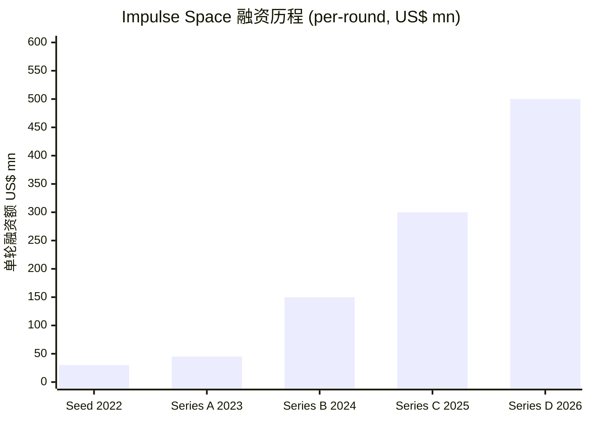
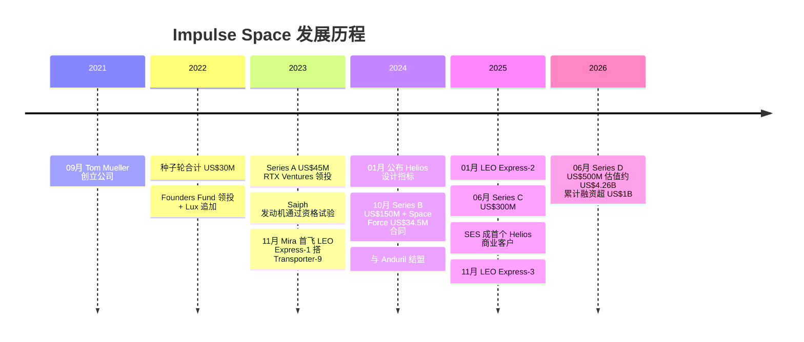
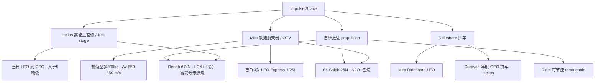
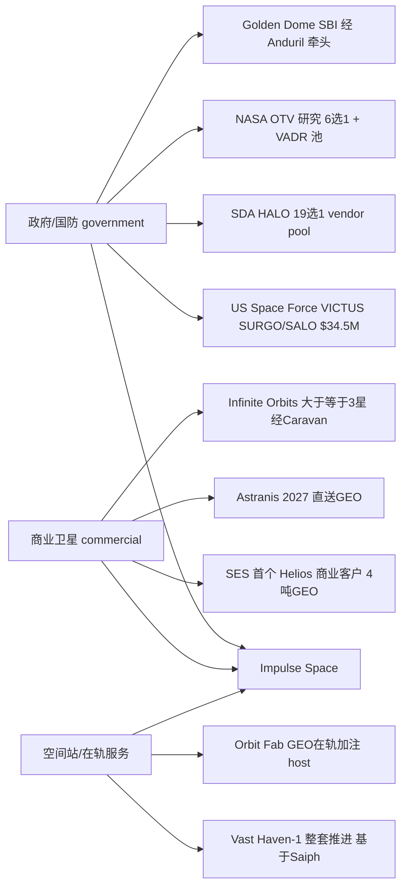
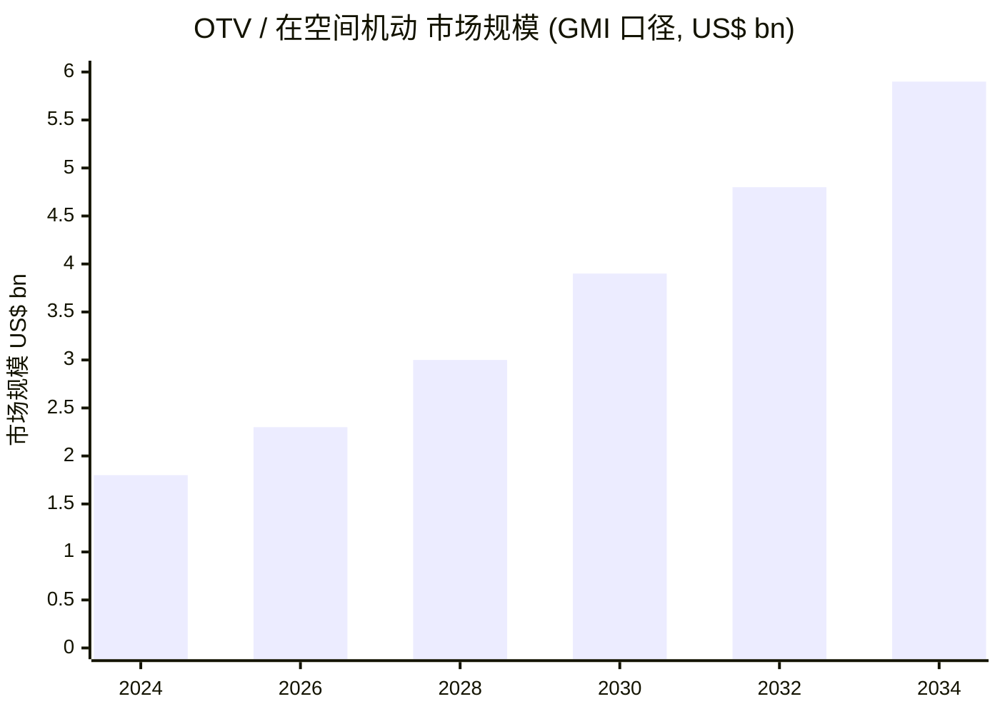
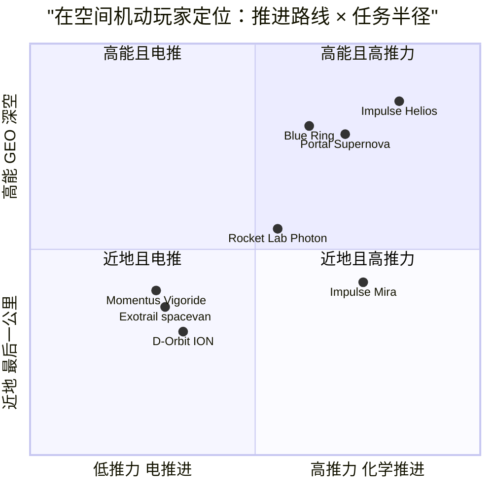

# Impulse Space（脉冲空间）公司研究报告

**标的类型：未上市（private）· 美国在空间机动（in-space mobility）/ 轨道转移飞行器（OTV）初创公司**
**截至日期（as of）：2026-06-14**

> *分析师观点：* **评级 / 目标价：不适用——未上市（private）。** Impulse Space 为风险资本（VC）支持、尚未规模化盈利的私营公司，无公开股价、无可比的二级市场估值基础，故不给出评级与 12 个月目标价（per company-research 私营公司规则）。下列"估值代理"以最近一轮一级市场融资为锚。
>
> - **最新一级市场估值：约 US$4.26B**（2026-06-02 Series D，Reuters 口径；公司新闻稿未披露估值数字）——[Reuters via KFGO, 2026-06-02](https://kfgo.com/2026/06/02/impulse-space-raises-500-million-at-4-26-billion-valuation-as-space-investing-surges/)
> - **累计融资：超过 US$1B**（2021 年至今，含 2026 年 6 月 US$500M 的 Series D）——[Impulse Space Series D 新闻稿, 2026-06-03](https://www.impulsespace.com/updates/impulse-space-raises-500-million-dollar-series-d-to-build-in-space-mobility-infrastructure-for-the-space-economy)
> - **在手合同：30+ 份、总额近 US$200M**（2025 年 6 月 Series C 时口径）——[Impulse Space Series C 新闻稿, 2025-06-03](https://www.impulsespace.com/updates/impulse-space-secures-300-million-dollar-series-c-to-accelerate-the-future-of-in-space-mobility)
> - **相对表现（relative performance）：不适用**——私营公司无公开二级市场价格。
>
> **核心论点（thesis pillars）**——（1）创始人 Tom Mueller 的发动机血统（SpaceX 首位员工、Merlin/Draco 主设计师）+ 垂直整合（vertical integration）自研推进，构成同业难以复制的护城河；（2）Mira 已三次飞行成功、是少数"飞过"的 OTV，而多数对手仍停留在样机；（3）Helios 高能上面级（high-energy kick stage）以化学高推力实现"当日 LEO→GEO"，对标对手数月之久的电推轨道抬升（electric orbit-raising），SES、Astranis 等商业 anchor 已签约；（4）Golden Dome 导弹防御与 SDA 星座建设带来政府需求拐点，叠加发射成本崩塌后的在轨"最后一公里"市场打开。**主要风险**：Helios 尚未首飞（已从 2026 滑至 2027）、估值远超已确认收入、对 SpaceX 发射的单点依赖、单一创始人 key-man 风险。

---

## 目录

1. 公司概览（含投资论点）
1A. 估值与融资分析（私营公司决策层）
2. 公司历史
3. 管理团队
4. 产品与服务（**全篇最重要章节**）
5. 客户与上市策略
6. 行业概览
7. 竞争格局
8. 市场机会（TAM）
9. 风险评估
9.5. 关键争论与催化剂
10. 市场周期与流动性背景
数据来源清单 / 参考资料

> **关于本报告未含 GF Score（1B）与完整投资人视角评分（Section 10 全套）的说明：** Impulse Space 为私营公司，不披露经审计财务报表（无 income statement / balance sheet / cash-flow statement），因此 GF Score 五维（Financial Strength / Profitability / Growth / GF Value / Momentum）与 Buffett/Munger/Damodaran 等需要财务与股价数据的评分无法在不"造数"的前提下计算——按"准确优先于完整"原则**整体省略**，仅保留可由 indicators.db 真实快照支撑的"市场周期"视角（Section 10）。理由记录于文末 Step 10 验证日志。

---

## 1. 公司概览

*分析师观点：* Impulse Space 是一家把赌注押在"在空间机动（in-space mobility）"这一新兴赛道上的私营航天公司：当 SpaceX 把"进入太空（transportation **to** space）"的成本打下来之后，下一道未解的难题是"在太空中移动（mobility **within** space）"——把卫星从火箭丢下的拼车轨道精准送到它真正要去的位置。公司由 SpaceX 首位员工、推进系统总师 Tom Mueller 于 2021 年创立，主张以"自研发动机 + 垂直整合"的 SpaceX 打法切入 OTV 市场（[Impulse Space "Our Mission", 访问于 2026-06-14](https://www.impulsespace.com/about)）。本方观点是：在一个尚处早期、玩家死亡率不低的赛道里，Impulse 凭借**已飞过三次的 Mira**与**已签下首个商业客户的 Helios**，叠加 2026 年 6 月 US$4.26B 估值的 Series D，已经从"概念"走到了"有飞行 heritage、有在手合同"的少数派——但 US$4.26B 的估值与"近 US$200M 在手合同、尚无规模化收入"之间的落差，以及 Helios 首飞一再推迟，是这笔投资真正的胜负手。

**公司在做什么。** 公司官网把自身定义为"develops the in-space mobility infrastructure to accelerate our future beyond Earth"，飞行器服务范围覆盖"from LEO to MEO, GEO, Cislunar, Mars, and beyond"，并把创始逻辑直白地写为"Having largely solved transportation to space, Tom founded Impulse to solve mobility within space"（[Impulse Space "Our Mission", 访问于 2026-06-14](https://www.impulsespace.com/about)）。落到产品上，这意味着两类核心载具：在 LEO 做精准机动与载荷托管/部署的敏捷航天器 **Mira**，以及把大质量载荷从 LEO 一天内直送 GEO 的高能上面级 **Helios**（[impulsespace.com/mira, 访问于 2026-06-14](https://www.impulsespace.com/mira)；[impulsespace.com/helios, 访问于 2026-06-14](https://www.impulsespace.com/helios)）。

**怎么赚钱。** 商业模式是"运力即服务（mobility-as-a-service）"：客户买的是"把我的载荷送到/托管在某条轨道"的任务，而非买一台飞行器。具体形态包括专属任务（dedicated）、共享（shared）、拼车（rideshare）三档，并把拼车productize为两个品牌——Mira 在 LEO 的 **Mira Rideshare**，以及 Helios 把多颗卫星打包送 GEO 的年度 **Caravan**（[impulsespace.com/rideshare, 访问于 2026-06-14](https://www.impulsespace.com/rideshare)）。此外，公司还把自研推进系统**作为一条独立产品线对外销售**——例如为 Vast 的 Haven-1 商业空间站提供整套推进（基于 Saiph 发动机）（[Vast 选择 Impulse 为 Haven-1 提供推进, 2023-06-15](https://www.impulsespace.com/updates/vast-selects-impulse-space-for-haven-1-space-station-propulsion)）。

**在哪运营、有多大。** 总部位于加州 Redondo Beach，发动机试车场在 Mojave，另在科罗拉多 Boulder 设有办公室（[Wikipedia: Impulse Space, 访问于 2026-06-14](https://en.wikipedia.org/wiki/Impulse_Space)）。人员规模在 2024 年 10 月 Series B 时为"140 余人"（[Impulse Space Series B 新闻稿, 2024-10-01](https://www.impulsespace.com/updates/impulse-space-secures-dollar150m-in-series-b-funding-to-support-ongoing-company-momentum)）；到 2026 年 6 月 Series D 时，公司称过去一年人数"翻倍有余"，且仍有 200+ 个在招岗位（[Impulse Space Series D 新闻稿, 2026-06-03](https://www.impulsespace.com/updates/impulse-space-raises-500-million-dollar-series-d-to-build-in-space-mobility-infrastructure-for-the-space-economy)）——据此推算当前员工数约 400–500 人区间（**精确总数未披露**，作分析师估算，依据为"140+ 于 2024-10"与"过去一年翻倍"两项口径的叠加）。

**估值快照（valuation snapshot）。** 作为私营公司，Impulse 无 TTM P/E、P/S 等二级市场倍数。可用的代理是一级市场估值：2026 年 6 月 Series D 募资 US$500M，Reuters 报道估值约 **US$4.26B**（公司新闻稿本身未披露估值）；累计融资超 **US$1B**（[Reuters via KFGO, 2026-06-02](https://kfgo.com/2026/06/02/impulse-space-raises-500-million-at-4-26-billion-valuation-as-space-investing-surges/)）。对照其唯一公开披露的营收侧指标——"30+ 份合同、近 US$200M"在手合同总额（[Impulse Space Series C 新闻稿, 2025-06-03](https://www.impulsespace.com/updates/impulse-space-secures-300-million-dollar-series-c-to-accelerate-the-future-of-in-space-mobility)）——可见估值高度建立在"未来 Helios 规模化 + 政府国防需求"的期权价值上，而非当期现金流。估值的合理性讨论见 Section 1A。

---

## 1A. 估值与融资分析（私营公司决策层）

*分析师观点：* 私营、尚未规模化盈利的属性，使本章无法给出二级市场式的"远期 EPS × 目标倍数"价格目标——任何这样的数字都将是凭空捏造。这里改为做三件可被一级市场数据支撑的事：（a）梳理融资轨迹与估值跃升；（b）讨论 US$4.26B 估值"贵不贵"；（c）点明决定这笔钱回报的 1–2 个 swing variable。**全章为分析师前瞻判断，不附任何"披露文件"型引用证明价格结论。**

**（a）融资轨迹。** 公司在不到五年内完成五轮募资、估值与单轮规模逐级跳升：

*图 1：Impulse Space 各轮融资规模。* 数据来源：[BusinessWire 种子轮, 2022-03-29](https://www.businesswire.com/news/home/20220329005210/en/Impulse-Space-Propulsion-Secures-$20M-in-Seed-Round-Led-by-Founders-Fund)（+[Lux 追加, 2022-06-16](https://www.businesswire.com/news/home/20220616005754/en/Impulse-Space-Secures-10M-From-Lux-Capital-Rounding-out-Recent-Funding-to-30M)，合计 $30M）· [TechCrunch Series A, 2023-07-24](https://techcrunch.com/2023/07/24/impulse-space-is-flying-high-with-new-funding-led-by-rtx-ventures/)（$45M，RTX Ventures 领投）· [Series B 新闻稿, 2024-10-01](https://www.impulsespace.com/updates/impulse-space-secures-dollar150m-in-series-b-funding-to-support-ongoing-company-momentum)（$150M，Founders Fund 领投）· [Series C 新闻稿, 2025-06-03](https://www.impulsespace.com/updates/impulse-space-secures-300-million-dollar-series-c-to-accelerate-the-future-of-in-space-mobility)（$300M，Linse Capital 领投）· [Reuters, 2026-06-02](https://kfgo.com/2026/06/02/impulse-space-raises-500-million-at-4-26-billion-valuation-as-space-investing-surges/)（$500M，137 Ventures 与 Banner VC 共同领投）。

值得注意的是融资节奏的加速：Series C（US$300M）到 Series D（US$500M）仅隔约 12 个月，且新一轮由两家新机构（137 Ventures、Banner VC）领投，老股东 Founders Fund、Lux Capital、Linse Capital 跟投（[Impulse Space Series D 新闻稿, 2026-06-03](https://www.impulsespace.com/updates/impulse-space-raises-500-million-dollar-series-d-to-build-in-space-mobility-infrastructure-for-the-space-economy)）。Reuters 把这一轮放在"SpaceX 递交 IPO 申请后航天投资热情高涨"的宏观背景下解读（[Reuters via KFGO, 2026-06-02](https://kfgo.com/2026/06/02/impulse-space-raises-500-million-at-4-26-billion-valuation-as-space-investing-surges/)）——这同时是机会（融资窗口大开）也是风险（估值含 beta，见 Section 10）。

**（b）US$4.26B 贵不贵？** 没有营收倍数可锚（公司不披露收入），只能从两个相对角度看。其一，对照唯一公开的营收侧口径"近 US$200M 在手合同"，US$4.26B 约为在手合同的 20 倍以上——这显然不是当期生意的估值，而是"Helios 规模化 + 政府国防订单放量"的期权定价（[Impulse Space Series C 新闻稿, 2025-06-03](https://www.impulsespace.com/updates/impulse-space-secures-300-million-dollar-series-c-to-accelerate-the-future-of-in-space-mobility)）。其二，对照可比的二级市场标的：纯 OTV 上市公司 Momentus（NASDAQ: MNTS）市值已塌缩至约 US$13M、且 10-K 中带"持续经营"重大疑虑（going concern），说明"纯 OTV 概念"在公开市场并不被给予溢价；而垂直整合、有发射协同的 Rocket Lab（NASDAQ: RKLB）则获得数十亿美元级市值——Impulse 的估值逻辑明显对标后者而非前者（[Momentus 10-K via StockTitan, 2026-03](https://www.stocktitan.net/sec-filings/MNTS/10-k-momentus-inc-files-annual-report-f5940f8cdf5d.html)）。本方判断：US$4.26B 已把"Helios 成功首飞 + 成为国防在轨机动主供应商"这两项尚未兑现的里程碑提前定价，留给后续投资人的安全边际有限。

**（c）决定回报的关键变量（swing variables）。** 两个，缺一不可：①**Helios 能否如期在 2027 首飞并量产**——这是从"LEO 敏捷航天器供应商"跃升为"GEO/深空运力主供应商"的关键，且大额估值正建立在此（[Space.com, 2026-06-02](https://www.space.com/space-exploration/launches-spacecraft/impulse-spacex-500-million-investment-space-ultra-mobile-spacecraft)）；②**Golden Dome 等国防项目的拨款与履约节奏**——政府需求是当前在手合同的主力，预算/拨款的连续性直接决定收入兑现（[Orbital Today, 2026-04-06](https://orbitaltoday.com/2026/04/06/anduril-and-impulse-space-join-golden-dome-orbital-interceptor-effort/)）。

> **退出路径（exit）说明：** 公司未披露 IPO 时间表或盈利路径；其回报兑现依赖未来 IPO 或并购，时点不确定。SpaceX 2026 年的 IPO 申报改善了整个航天板块的退出预期，但不构成对 Impulse 自身退出的承诺（[Reuters via KFGO, 2026-06-02](https://kfgo.com/2026/06/02/impulse-space-raises-500-million-at-4-26-billion-valuation-as-space-investing-surges/)）。

---

## 2. 公司历史

Impulse Space 由 Tom Mueller 于 2021 年 9 月创立。Mueller 是 SpaceX 的首位员工与推进系统总师，主导了 Merlin（Falcon 9 主发动机）、Kestrel、Draco（Dragon 姿控）、SuperDraco（Dragon 逃逸）等一系列发动机；在 2020 年 11 月 30 日从 SpaceX 退休后，他把"火箭发射已基本解决、太空内的机动还没解决"作为创业母题创办了 Impulse（[Wikipedia: Tom Mueller, 访问于 2026-06-14](https://en.wikipedia.org/wiki/Tom_Mueller)）。Mueller 对此的概括很直接："Launch has pretty much been solved. The challenge now is getting everywhere else beyond low Earth orbit."（[Reuters via KFGO, 2026-06-02](https://kfgo.com/2026/06/02/impulse-space-raises-500-million-at-4-26-billion-valuation-as-space-investing-surges/)）

*图 2：公司发展时间线。* 数据来源：上文各融资/任务新闻稿（见 Section 1A、Section 4 引用）。

**关键战略选择。** 第一是**垂直整合自研发动机**：与多数靠外购推进的 OTV 创业公司不同，Impulse 从一开始就把发动机研发握在手里——2023 年 5 月，其小型双组元推进器 **Saiph** 通过资格试验（12 分钟连续点火、5 万次脉冲、累计 6.5 万秒），公司称其为"current and future propulsion systems"的关键基石与"in-house capabilities and rapid development approach"的验证（[Saiph 资格试验新闻稿, 2023-05-10](https://www.impulsespace.com/updates/impulse-space-qualifies-the-saiph-thruster-ahead-of-first-flight)）。第二是**从 LEO 敏捷飞行器（Mira）向高能上面级（Helios）延伸**：2024 年 1 月公布 Helios 设计指标，把战略目标从"近地最后一公里"扩展到"LEO→GEO/深空运力"（[Helios 设计指标新闻稿, 2024-01-17](https://www.impulsespace.com/updates/impulse-space-unveils-design-specifications-for-helios)）。第三是**早绑政府国防**：2024 年 10 月拿下 Space Force 的 VICTUS SURGO/SALO 合同，并与 Anduril 结盟，把响应式空间（responsive space）与在轨抵近操作（RPO）作为重点方向（[Space Force US$34.5M 合同新闻稿, 2024-10-03](https://www.impulsespace.com/updates/impulse-space-selected-for-345m-contract-by-space-systems-command)）。

**近一两年的进展（2025–2026）。** Mira 在 2025 年 1 月（LEO Express-2）与 11 月（LEO Express-3）连续两次飞行，累计三次任务；Helios 首个商业客户 SES 于 2025 年 5 月签约；2026 年 6 月完成 US$500M Series D。详见 Section 4 与 Section 5。

---

## 3. 管理团队

**Tom Mueller —— 创始人、CEO 兼 CTO（300–450 字合并介绍）。** Mueller 1961 年生于爱达荷州 St. Maries，机械工程出身（University of Idaho 学士 1985、Loyola Marymount 硕士 1992）。在创办 Impulse 之前，他有两段定义其职业生涯的经历：其一是在 **TRW** 任职约 15 年，管理推进与燃烧产品部门，并担任 **TR-106** 的主任工程师——一台 2000 年设计、推力 650,000 lbf（约 2,900 kN）、可节流、低成本的氢氧发动机；其二是作为 **SpaceX 的首位员工（2002 年加入）**，历任推进工程副总裁、后任推进 CTO，主导了 Merlin 1A/1C/1D 与 MVac（Falcon 1/9）、Kestrel、Draco（Dragon 姿控）、SuperDraco（Dragon 逃逸）等发动机的研发，于 2019 年 1 月转任高级顾问、2020 年 11 月 30 日退休（[Wikipedia: Tom Mueller, 访问于 2026-06-14](https://en.wikipedia.org/wiki/Tom_Mueller)）。这段"把 Falcon 9 的发动机从零做出来"的经历，正是 Impulse"自研发动机 + 垂直整合"打法的可信度来源，也是 Mueller 把 SpaceX 工程文化复刻到 Impulse 的底气。Mueller 目前仍同时担任创始人、CEO 与 CTO（[The Org: Impulse Space, 访问于 2026-06-14](https://theorg.com/org/impulse-space-propulsion/org-chart/tom-mueller)）。他对公司的定位是："We're building more than spacecraft: we're building the economic and technical engine that will power humanity's expansion into space."（[Impulse Space Series D 新闻稿, 2026-06-03](https://www.impulsespace.com/updates/impulse-space-raises-500-million-dollar-series-d-to-build-in-space-mobility-infrastructure-for-the-space-economy)）。**持股比例未公开披露**（作为唯一创始人仍掌 CEO/CTO，但具体股权数字无公开来源）。

> *补充——运营负责人 Eric Romo（President & COO）。* 严格按本技能"只写创始人 + 现任 CEO"的规则，本节以 Mueller 为主体；但对一家私营硬件公司，执行层的厚度本身是论点的一部分，故对二号位简记：Romo 于 2024 年 7 月加入任总裁兼 COO，此前为 SpaceX 早期推进分析工程师（约 13 号员工）、太阳能公司 GreenVolts 联合创始人、VR 公司 AltspaceVR 创始人兼 CEO、以及 Facebook Reality Labs 产品总监；Stanford 机械工程硕士 + MBA（[Crunchbase: Eric Romo, 访问于 2026-06-14](https://www.crunchbase.com/person/eric-romo)）。其在 Series D 中的表态——"This funding allows us to scale without compromising the quality and speed of execution that define Impulse."——点出其角色是把 Mueller 的工程能力转化为可规模化的生产与交付（[Impulse Space Series D 新闻稿, 2026-06-03](https://www.impulsespace.com/updates/impulse-space-raises-500-million-dollar-series-d-to-build-in-space-mobility-infrastructure-for-the-space-economy)）。

---

## 4. 产品与服务

> 本节是全篇最重要的章节。Impulse 的产品线由两台飞行器（Mira、Helios）、一组自研发动机（Saiph、Deneb、Rigel）、以及把运力打包的拼车服务（Mira Rideshare、Caravan）构成。下文逐一以**官网原文逐字引用（verbatim）**为锚，再给出中文释义与竞争视角。

### 4.1 产品矩阵（官网构建，标注为分析师整理）

公司不披露 10-K 式产品表（私营，无 SEC 申报），以下矩阵由官网产品导航整理而成（标注为 analyst-constructed），原始命名与指标均逐字取自官网：

| 产品线 | 品牌/型号 | 一句话定位（官网原文） | 关键指标（官网逐字） |
|---|---|---|---|
| 敏捷航天器 / OTV | **Mira** | "the most maneuverable spacecraft on orbit" | 载荷至多 300 kg；8× 26 N Saiph；Δv 550/650/850 m/s；已飞 3 次 |
| 高能上面级 / kick stage | **Helios** | "the kick stage transforming access to MEO, GEO, Cislunar, and beyond" | Deneb 67 kN LOX/甲烷；Δv 3–9 km/s；<1 天到 GEO |
| 自研推进 | **Saiph / Deneb / Rigel** | 精准机动 / 高能转移 / 可节流 三类 | Saiph 26 N（N₂O/乙烷）；Deneb 67 kN（LOX/甲烷） |
| 拼车服务 | **Mira Rideshare / Caravan** | LEO 拼车 / 年度 GEO 拼车 | Caravan 1 = 2026 Q3（已订满） |

数据来源：[impulsespace.com/mira](https://www.impulsespace.com/mira)、[impulsespace.com/helios](https://www.impulsespace.com/helios)、[impulsespace.com/rideshare](https://www.impulsespace.com/rideshare)（均访问于 2026-06-14）；推进系统三者命名见 [Impulse Space Series D 新闻稿, 2026-06-03](https://www.impulsespace.com/updates/impulse-space-raises-500-million-dollar-series-d-to-build-in-space-mobility-infrastructure-for-the-space-economy)。

*图 3：产品与推进系统结构树。* 数据来源同上。

### 4.2 综合：三类产品如何拼成一条客户工作流

Impulse 的产品并非孤立的目录，而是覆盖"从火箭丢下到目标轨道"的一条连续运力链：**Helios** 负责"远距离重活"——把大质量载荷从 LEO 一天内送到 GEO/月球/深空；**Mira** 负责"近地精活"——在 LEO 做精准机动、托管载荷、按需部署小卫星、做抵近观测；二者共用**同一套自研发动机谱系**（Saiph/Deneb），且新版 Mira 被设计为"与 Helios 现成兼容"，可作为 Helios 的上面载荷直接转运（[Via Satellite, 2025-08-06](https://www.satellitetoday.com/technology/2025/08/06/impulse-space-makes-technical-changes-to-mira-otv/)）。拼车服务（Mira Rideshare、Caravan）则是把这两台飞行器的运力按"标准化、可预约"的方式售卖。下图把这条链与"资金流向"叠加，揭示一个关键事实：Impulse 的钱，最终大部分流向了它的发射供应商 SpaceX。

<svg xmlns="http://www.w3.org/2000/svg" viewBox="0 0 1180 1060" width="1180" height="1060" role="img" aria-label="钱从哪来、流向谁：Impulse Space 的价值链" font-family="'Space Grotesk',system-ui,-apple-system,'Segoe UI',sans-serif">
<defs><linearGradient id="mfgold" gradientUnits="userSpaceOnUse" x1="0" y1="0" x2="1180" y2="0"><stop offset="0" stop-color="#f6dc97"/><stop offset="0.5" stop-color="#e9b658"/><stop offset="1" stop-color="#cf8f2c"/></linearGradient><radialGradient id="mfpool" cx="50%" cy="50%" r="50%"><stop offset="0" stop-color="#34d399" stop-opacity="0.16"/><stop offset="1" stop-color="#34d399" stop-opacity="0"/></radialGradient></defs>
<rect x="0" y="0" width="1180" height="1060" rx="16" fill="#0b0f1a"/>
<text x="42.00" y="56.00" text-anchor="start" font-family="'JetBrains Mono',ui-monospace,Menlo,monospace" font-size="11.5" font-weight="600" fill="#e9b658" letter-spacing="3">IN-SPACE MOBILITY · 资金流向 · 2026</text>
<text x="42.00" y="100.00" text-anchor="start" font-family="'Space Grotesk',system-ui,-apple-system,'Segoe UI',sans-serif" font-size="32" font-weight="700" fill="#e8ecf5">钱从哪来、流向谁：Impulse Space 的价值链</text>
<text x="42.00" y="142.00" text-anchor="start" font-family="'Space Grotesk',system-ui,-apple-system,'Segoe UI',sans-serif" font-size="15" font-weight="400" fill="#8a93a8">需求与资本从左侧流入 Impulse，再从右侧汇聚到少数节点——其中 SpaceX 的 Falcon 9 既是几乎全部任务的发射通道、也是其最大的潜在对手（the chokepoint）。</text>
<ellipse cx="1031.00" cy="420.00" rx="190" ry="150" fill="url(#mfpool)"/>
<line x1="369.50" y1="188.00" x2="369.50" y2="648.00" stroke="#222a3a" stroke-dasharray="2 8"/>
<line x1="810.50" y1="188.00" x2="810.50" y2="648.00" stroke="#222a3a" stroke-dasharray="2 8"/>
<text x="42.00" y="172.00" text-anchor="start" font-family="'JetBrains Mono',ui-monospace,Menlo,monospace" font-size="12" font-weight="400" fill="#e9b658" letter-spacing="3">STAGE 01</text>
<text x="42.00" y="188.00" text-anchor="start" font-family="'JetBrains Mono',ui-monospace,Menlo,monospace" font-size="11.5" font-weight="400" fill="#646d82">谁在付钱 / who pays</text>
<text x="483.00" y="172.00" text-anchor="start" font-family="'JetBrains Mono',ui-monospace,Menlo,monospace" font-size="12" font-weight="400" fill="#e9b658" letter-spacing="3">STAGE 02</text>
<text x="483.00" y="188.00" text-anchor="start" font-family="'JetBrains Mono',ui-monospace,Menlo,monospace" font-size="11.5" font-weight="400" fill="#646d82">Impulse 与产品线</text>
<text x="924.00" y="172.00" text-anchor="start" font-family="'JetBrains Mono',ui-monospace,Menlo,monospace" font-size="12" font-weight="400" fill="#e9b658" letter-spacing="3">STAGE 03</text>
<text x="924.00" y="188.00" text-anchor="start" font-family="'JetBrains Mono',ui-monospace,Menlo,monospace" font-size="11.5" font-weight="400" fill="#646d82">钱最终汇向哪里 / where it pools</text>
<path d="M 256.00 258.00 C 369.50 258.00, 369.50 407.00, 483.00 407.00" fill="none" stroke="url(#mfgold)" stroke-width="24.00" stroke-linecap="round" opacity="0.9"/>
<path d="M 256.00 384.00 C 369.50 384.00, 369.50 424.50, 483.00 424.50" fill="none" stroke="url(#mfgold)" stroke-width="11.00" stroke-linecap="round" opacity="0.9"/>
<path d="M 256.00 496.00 C 369.50 496.00, 369.50 434.50, 483.00 434.50" fill="none" stroke="url(#mfgold)" stroke-width="9.00" stroke-linecap="round" opacity="0.9"/>
<path d="M 256.00 600.00 C 369.50 600.00, 369.50 442.00, 483.00 442.00" fill="none" stroke="url(#mfgold)" stroke-width="6.00" stroke-linecap="round" opacity="0.9"/>
<path d="M 697.00 409.50 C 810.50 409.50, 810.50 306.00, 924.00 306.00" fill="none" stroke="url(#mfgold)" stroke-width="20.00" stroke-linecap="round" opacity="0.9"/>
<path d="M 697.00 426.50 C 810.50 426.50, 810.50 442.00, 924.00 442.00" fill="none" stroke="url(#mfgold)" stroke-width="14.00" stroke-linecap="round" opacity="0.9"/>
<path d="M 697.00 437.00 C 810.50 437.00, 810.50 556.00, 924.00 556.00" fill="none" stroke="url(#mfgold)" stroke-width="7.00" stroke-linecap="round" opacity="0.78" stroke-dasharray="0.1 11"/>
<text x="369.50" y="326.50" text-anchor="middle" font-family="'JetBrains Mono',ui-monospace,Menlo,monospace" font-size="11.5" font-weight="400" fill="#f4d58a" paint-order="stroke" stroke="#0b0f1a" stroke-width="3.2" stroke-linejoin="round">$500M Series D</text>
<text x="369.50" y="398.25" text-anchor="middle" font-family="'JetBrains Mono',ui-monospace,Menlo,monospace" font-size="11.5" font-weight="400" fill="#f4d58a" paint-order="stroke" stroke="#0b0f1a" stroke-width="3.2" stroke-linejoin="round">Space Force $34.5M</text>
<text x="810.50" y="351.75" text-anchor="middle" font-family="'JetBrains Mono',ui-monospace,Menlo,monospace" font-size="11.5" font-weight="400" fill="#f4d58a" paint-order="stroke" stroke="#0b0f1a" stroke-width="3.2" stroke-linejoin="round">3 dedicated F9</text>
<rect x="42.00" y="198.00" width="214" height="120.00" rx="12" fill="#0f1622" stroke="#7fa8f5" stroke-opacity="0.5"/>
<rect x="42.00" y="198.00" width="3" height="120.00" rx="2" fill="#7fa8f5"/>
<text x="60.00" y="231.00" text-anchor="start" font-family="'Space Grotesk',system-ui,-apple-system,'Segoe UI',sans-serif" font-size="17" font-weight="700" fill="#ffffff">VENTURE CAPITAL</text>
<text x="60.00" y="252.00" text-anchor="start" font-family="'JetBrains Mono',ui-monospace,Menlo,monospace" font-size="11" font-weight="400" fill="#8ca6d6">137 Ventures · Banner VC</text>
<text x="60.00" y="269.00" text-anchor="start" font-family="'JetBrains Mono',ui-monospace,Menlo,monospace" font-size="11" font-weight="400" fill="#8ca6d6">Founders Fund · Lux · Linse</text>
<text x="60.00" y="286.00" text-anchor="start" font-family="'JetBrains Mono',ui-monospace,Menlo,monospace" font-size="11" font-weight="400" fill="#8ca6d6">&gt;$1B raised · $500M Series D</text>
<rect x="42.00" y="334.00" width="214" height="100.00" rx="12" fill="#15101a" stroke="#f2655f" stroke-opacity="0.5"/>
<rect x="42.00" y="334.00" width="3" height="100.00" rx="2" fill="#f2655f"/>
<text x="60.00" y="367.00" text-anchor="start" font-family="'Space Grotesk',system-ui,-apple-system,'Segoe UI',sans-serif" font-size="17" font-weight="700" fill="#ffffff">美国政府 / 国防</text>
<text x="60.00" y="388.00" text-anchor="start" font-family="'JetBrains Mono',ui-monospace,Menlo,monospace" font-size="11" font-weight="400" fill="#c98c87">Space Force VICTUS $34.5M</text>
<text x="60.00" y="405.00" text-anchor="start" font-family="'JetBrains Mono',ui-monospace,Menlo,monospace" font-size="11" font-weight="400" fill="#c98c87">SDA HALO · NASA · Golden Dome</text>
<rect x="42.00" y="450.00" width="214" height="92.00" rx="12" fill="#0f1622" stroke="#7fa8f5" stroke-opacity="0.5"/>
<rect x="42.00" y="450.00" width="3" height="92.00" rx="2" fill="#7fa8f5"/>
<text x="60.00" y="483.00" text-anchor="start" font-family="'Space Grotesk',system-ui,-apple-system,'Segoe UI',sans-serif" font-size="21" font-weight="700" fill="#ffffff">商业卫星运营商</text>
<text x="60.00" y="504.00" text-anchor="start" font-family="'JetBrains Mono',ui-monospace,Menlo,monospace" font-size="11" font-weight="400" fill="#8ca6d6">SES 4-ton GEO</text>
<text x="60.00" y="521.00" text-anchor="start" font-family="'JetBrains Mono',ui-monospace,Menlo,monospace" font-size="11" font-weight="400" fill="#8ca6d6">Astranis · Infinite Orbits</text>
<rect x="42.00" y="558.00" width="214" height="84.00" rx="12" fill="#0f1622" stroke="#7fa8f5" stroke-opacity="0.5"/>
<rect x="42.00" y="558.00" width="3" height="84.00" rx="2" fill="#7fa8f5"/>
<text x="60.00" y="591.00" text-anchor="start" font-family="'Space Grotesk',system-ui,-apple-system,'Segoe UI',sans-serif" font-size="17" font-weight="700" fill="#ffffff">空间站 / 在轨服务</text>
<text x="60.00" y="612.00" text-anchor="start" font-family="'JetBrains Mono',ui-monospace,Menlo,monospace" font-size="11" font-weight="400" fill="#8ca6d6">Vast Haven-1 推进系统</text>
<text x="60.00" y="629.00" text-anchor="start" font-family="'JetBrains Mono',ui-monospace,Menlo,monospace" font-size="11" font-weight="400" fill="#8ca6d6">Orbit Fab 在轨加注</text>
<rect x="483.00" y="345.00" width="214" height="150.00" rx="12" fill="#15101a" stroke="#f2655f" stroke-opacity="0.5"/>
<rect x="483.00" y="345.00" width="3" height="150.00" rx="2" fill="#f2655f"/>
<text x="501.00" y="378.00" text-anchor="start" font-family="'Space Grotesk',system-ui,-apple-system,'Segoe UI',sans-serif" font-size="17" font-weight="700" fill="#ffffff">IMPULSE SPACE</text>
<text x="501.00" y="399.00" text-anchor="start" font-family="'JetBrains Mono',ui-monospace,Menlo,monospace" font-size="11" font-weight="400" fill="#d49b96">In-space mobility</text>
<text x="501.00" y="416.00" text-anchor="start" font-family="'JetBrains Mono',ui-monospace,Menlo,monospace" font-size="11" font-weight="400" fill="#d49b96">Helios · Mira · Caravan</text>
<text x="501.00" y="433.00" text-anchor="start" font-family="'JetBrains Mono',ui-monospace,Menlo,monospace" font-size="11" font-weight="400" fill="#d49b96">自研发动机 (Saiph/Deneb/Rigel)</text>
<rect x="924.00" y="241.00" width="214" height="130.00" rx="12" fill="#101d1a" stroke="#34d399" stroke-opacity="0.5"/>
<rect x="924.00" y="241.00" width="3" height="130.00" rx="2" fill="#34d399"/>
<text x="942.00" y="274.00" text-anchor="start" font-family="'Space Grotesk',system-ui,-apple-system,'Segoe UI',sans-serif" font-size="17" font-weight="700" fill="#ffffff">SPACEX FALCON 9</text>
<text x="942.00" y="295.00" text-anchor="start" font-family="'JetBrains Mono',ui-monospace,Menlo,monospace" font-size="11" font-weight="400" fill="#7fd9bf">每次任务都搭 F9</text>
<text x="942.00" y="312.00" text-anchor="start" font-family="'JetBrains Mono',ui-monospace,Menlo,monospace" font-size="11" font-weight="400" fill="#7fd9bf">已购 3 次专属 Falcon 9</text>
<text x="942.00" y="329.00" text-anchor="start" font-family="'JetBrains Mono',ui-monospace,Menlo,monospace" font-size="11" font-weight="400" fill="#7fd9bf">发射通道=最大对手</text>
<rect x="924.00" y="387.00" width="214" height="110.00" rx="12" fill="#15101a" stroke="#f2655f" stroke-opacity="0.5"/>
<rect x="924.00" y="387.00" width="3" height="110.00" rx="2" fill="#f2655f"/>
<text x="942.00" y="420.00" text-anchor="start" font-family="'Space Grotesk',system-ui,-apple-system,'Segoe UI',sans-serif" font-size="14" font-weight="700" fill="#ffffff">自研制造 / IN-HOUSE BUILD</text>
<text x="942.00" y="441.00" text-anchor="start" font-family="'JetBrains Mono',ui-monospace,Menlo,monospace" font-size="11" font-weight="400" fill="#d49b96">发动机·COPV·航电</text>
<text x="942.00" y="458.00" text-anchor="start" font-family="'JetBrains Mono',ui-monospace,Menlo,monospace" font-size="11" font-weight="400" fill="#d49b96">Redondo Beach + Mojave</text>
<text x="942.00" y="475.00" text-anchor="start" font-family="'JetBrains Mono',ui-monospace,Menlo,monospace" font-size="11" font-weight="400" fill="#d49b96">vertical integration</text>
<rect x="924.00" y="513.00" width="214" height="86.00" rx="12" fill="#141a2a" stroke="#e9b658" stroke-opacity="0.5"/>
<rect x="924.00" y="513.00" width="3" height="86.00" rx="2" fill="#e9b658"/>
<text x="942.00" y="546.00" text-anchor="start" font-family="'Space Grotesk',system-ui,-apple-system,'Segoe UI',sans-serif" font-size="17" font-weight="700" fill="#ffffff">推进剂 / 组件 / 部署器</text>
<text x="942.00" y="567.00" text-anchor="start" font-family="'JetBrains Mono',ui-monospace,Menlo,monospace" font-size="11" font-weight="400" fill="#8a93a8">N2O/ethane · LOX/methane</text>
<text x="942.00" y="584.00" text-anchor="start" font-family="'JetBrains Mono',ui-monospace,Menlo,monospace" font-size="11" font-weight="400" fill="#8a93a8">Exolaunch 部署器</text>
<rect x="42.00" y="668.00" width="26" height="4" rx="2" fill="#e9b658"/>
<text x="78.00" y="672.00" text-anchor="start" font-family="'JetBrains Mono',ui-monospace,Menlo,monospace" font-size="11.5" font-weight="400" fill="#8a93a8">money paid directly</text>
<circle cx="242.80" cy="670.00" r="2" fill="#e9b658"/>
<circle cx="249.80" cy="670.00" r="2" fill="#e9b658"/>
<circle cx="256.80" cy="670.00" r="2" fill="#e9b658"/>
<circle cx="263.80" cy="670.00" r="2" fill="#e9b658"/>
<text x="276.80" y="672.00" text-anchor="start" font-family="'JetBrains Mono',ui-monospace,Menlo,monospace" font-size="11.5" font-weight="400" fill="#8a93a8">money embedded in a finished chip</text>
<text x="538.40" y="672.00" text-anchor="start" font-family="'JetBrains Mono',ui-monospace,Menlo,monospace" font-size="11.5" font-weight="400" fill="#8a93a8">thickness ≈ rough scale</text>
<rect x="728.00" y="663.00" width="11" height="11" rx="3" fill="#f2655f"/>
<text x="747.00" y="672.00" text-anchor="start" font-family="'JetBrains Mono',ui-monospace,Menlo,monospace" font-size="11.5" font-weight="400" fill="#8a93a8">in-house silicon</text>
<rect x="886.20" y="663.00" width="11" height="11" rx="3" fill="#34d399"/>
<text x="905.20" y="672.00" text-anchor="start" font-family="'JetBrains Mono',ui-monospace,Menlo,monospace" font-size="11.5" font-weight="400" fill="#8a93a8">foundry</text>
<rect x="979.60" y="663.00" width="11" height="11" rx="3" fill="#e9b658"/>
<text x="998.60" y="672.00" text-anchor="start" font-family="'JetBrains Mono',ui-monospace,Menlo,monospace" font-size="11.5" font-weight="400" fill="#8a93a8">supplier</text>
<line x1="42" y1="708.00" x2="1138" y2="708.00" stroke="#222a3a"/>
<text x="42.00" y="724.00" text-anchor="start" font-family="'JetBrains Mono',ui-monospace,Menlo,monospace" font-size="12" font-weight="500" fill="#8a93a8" letter-spacing="3">FOLLOW THE MONEY — 看懂这张图</text>
<rect x="42.00" y="744.00" width="356.00" height="132.00" rx="13" fill="#0e1320" stroke="#7fa8f5" stroke-opacity="0.28"/>
<rect x="42.00" y="744.00" width="3" height="132.00" rx="2" fill="#7fa8f5"/>
<text x="58.00" y="768.00" text-anchor="start" font-family="'JetBrains Mono',ui-monospace,Menlo,monospace" font-size="10" font-weight="600" fill="#7fa8f5" letter-spacing="1">CAPITAL IN · 风险资本</text>
<text x="58.00" y="786.00" text-anchor="start" font-family="'Space Grotesk',system-ui,-apple-system,'Segoe UI',sans-serif" font-size="15.5" font-weight="700" fill="#ffffff">在收入规模化之前先被资本喂饱</text>
<text x="58.00" y="810.00" font-family="'Space Grotesk',system-ui,-apple-system,'Segoe UI',sans-serif" font-size="12" xml:space="preserve"><tspan fill="#9aa3b8" font-weight="400">Impulse</tspan><tspan fill="#9aa3b8" font-weight="400"> 自</tspan><tspan fill="#9aa3b8" font-weight="400"> 2021</tspan><tspan fill="#9aa3b8" font-weight="400"> 年起累计融资</tspan><tspan fill="#f4d58a" font-weight="700"> over</tspan><tspan fill="#f4d58a" font-weight="700"> $1</tspan><tspan fill="#f4d58a" font-weight="700"> billion</tspan><tspan fill="#9aa3b8" font-weight="400"> ，含</tspan><tspan fill="#9aa3b8" font-weight="400"> 2026</tspan><tspan fill="#9aa3b8" font-weight="400"> 年</tspan><tspan fill="#9aa3b8" font-weight="400"> 6</tspan><tspan fill="#9aa3b8" font-weight="400"> 月</tspan></text>
<text x="58.00" y="826.00" font-family="'Space Grotesk',system-ui,-apple-system,'Segoe UI',sans-serif" font-size="12" xml:space="preserve"><tspan fill="#f4d58a" font-weight="700">$500M</tspan><tspan fill="#9aa3b8" font-weight="400"> 的</tspan><tspan fill="#9aa3b8" font-weight="400"> Series</tspan><tspan fill="#9aa3b8" font-weight="400"> D、估值约</tspan><tspan fill="#f4d58a" font-weight="700"> $4.26B</tspan></text>
<text x="58.00" y="842.00" font-family="'Space Grotesk',system-ui,-apple-system,'Segoe UI',sans-serif" font-size="12" xml:space="preserve"><tspan fill="#9aa3b8" font-weight="400">（Reuters）——当下最大的现金流入来自资本，而非客户付款。</tspan></text>
<rect x="412.00" y="744.00" width="356.00" height="132.00" rx="13" fill="#0e1320" stroke="#f2655f" stroke-opacity="0.28"/>
<rect x="412.00" y="744.00" width="3" height="132.00" rx="2" fill="#f2655f"/>
<text x="428.00" y="768.00" text-anchor="start" font-family="'JetBrains Mono',ui-monospace,Menlo,monospace" font-size="10" font-weight="600" fill="#f2655f" letter-spacing="1">DEMAND · 政府国防</text>
<text x="428.00" y="786.00" text-anchor="start" font-family="'Space Grotesk',system-ui,-apple-system,'Segoe UI',sans-serif" font-size="15.5" font-weight="700" fill="#ffffff">国防订单撑起在手合同</text>
<text x="428.00" y="810.00" font-family="'Space Grotesk',system-ui,-apple-system,'Segoe UI',sans-serif" font-size="12" xml:space="preserve"><tspan fill="#9aa3b8" font-weight="400">截至</tspan><tspan fill="#9aa3b8" font-weight="400"> 2025</tspan><tspan fill="#9aa3b8" font-weight="400"> 年</tspan><tspan fill="#9aa3b8" font-weight="400"> 6</tspan><tspan fill="#9aa3b8" font-weight="400"> 月，已签</tspan><tspan fill="#f4d58a" font-weight="700"> 30+</tspan><tspan fill="#9aa3b8" font-weight="400"> 份合同、总额</tspan><tspan fill="#f4d58a" font-weight="700"> ~$200M</tspan><tspan fill="#9aa3b8" font-weight="400"> ，以</tspan><tspan fill="#f4d58a" font-weight="700"> $34.5M</tspan><tspan fill="#9aa3b8" font-weight="400"> 的</tspan><tspan fill="#9aa3b8" font-weight="400"> Space</tspan></text>
<text x="428.00" y="826.00" font-family="'Space Grotesk',system-ui,-apple-system,'Segoe UI',sans-serif" font-size="12" xml:space="preserve"><tspan fill="#9aa3b8" font-weight="400">Force</tspan><tspan fill="#9aa3b8" font-weight="400"> VICTUS</tspan><tspan fill="#9aa3b8" font-weight="400"> SURGO/SALO</tspan><tspan fill="#9aa3b8" font-weight="400"> 为代表，并加入</tspan><tspan fill="#9aa3b8" font-weight="400"> Anduril</tspan><tspan fill="#9aa3b8" font-weight="400"> 牵头的</tspan><tspan fill="#9aa3b8" font-weight="400"> Golden</tspan></text>
<text x="428.00" y="842.00" font-family="'Space Grotesk',system-ui,-apple-system,'Segoe UI',sans-serif" font-size="12" xml:space="preserve"><tspan fill="#9aa3b8" font-weight="400">Dome</tspan><tspan fill="#9aa3b8" font-weight="400"> 在轨拦截器团队。</tspan></text>
<rect x="782.00" y="744.00" width="356.00" height="132.00" rx="13" fill="#0e1320" stroke="#56c6e6" stroke-opacity="0.28"/>
<rect x="782.00" y="744.00" width="3" height="132.00" rx="2" fill="#56c6e6"/>
<text x="798.00" y="768.00" text-anchor="start" font-family="'JetBrains Mono',ui-monospace,Menlo,monospace" font-size="10" font-weight="600" fill="#56c6e6" letter-spacing="1">DEMAND · 商业 GEO</text>
<text x="798.00" y="786.00" text-anchor="start" font-family="'Space Grotesk',system-ui,-apple-system,'Segoe UI',sans-serif" font-size="15.5" font-weight="700" fill="#ffffff">SES 是 Helios 首个商业客户</text>
<text x="798.00" y="810.00" font-family="'Space Grotesk',system-ui,-apple-system,'Segoe UI',sans-serif" font-size="12" xml:space="preserve"><tspan fill="#f4d58a" font-weight="700">SES</tspan><tspan fill="#9aa3b8" font-weight="400"> 签下多发协议，要把</tspan><tspan fill="#f4d58a" font-weight="700"> 4-ton</tspan><tspan fill="#9aa3b8" font-weight="400"> 级载荷在</tspan><tspan fill="#f4d58a" font-weight="700"> &lt;8</tspan><tspan fill="#f4d58a" font-weight="700"> hours</tspan><tspan fill="#9aa3b8" font-weight="400"> 内从</tspan><tspan fill="#9aa3b8" font-weight="400"> LEO</tspan><tspan fill="#9aa3b8" font-weight="400"> 直送</tspan><tspan fill="#9aa3b8" font-weight="400"> GEO；</tspan></text>
<text x="798.00" y="826.00" font-family="'Space Grotesk',system-ui,-apple-system,'Segoe UI',sans-serif" font-size="12" xml:space="preserve"><tspan fill="#f4d58a" font-weight="700">Astranis</tspan><tspan fill="#9aa3b8" font-weight="400"> 、</tspan><tspan fill="#f4d58a" font-weight="700"> Infinite</tspan><tspan fill="#f4d58a" font-weight="700"> Orbits</tspan><tspan fill="#9aa3b8" font-weight="400"> 紧随其后，2027</tspan><tspan fill="#9aa3b8" font-weight="400"> 年起飞。</tspan></text>
<rect x="42.00" y="890.00" width="356.00" height="116.00" rx="13" fill="#0e1320" stroke="#34d399" stroke-opacity="0.28"/>
<rect x="42.00" y="890.00" width="3" height="116.00" rx="2" fill="#34d399"/>
<text x="58.00" y="914.00" text-anchor="start" font-family="'JetBrains Mono',ui-monospace,Menlo,monospace" font-size="10" font-weight="600" fill="#34d399" letter-spacing="1">MONEY OUT · 发射</text>
<text x="58.00" y="932.00" text-anchor="start" font-family="'Space Grotesk',system-ui,-apple-system,'Segoe UI',sans-serif" font-size="15.5" font-weight="700" fill="#ffffff">SpaceX 是绕不开的咽喉</text>
<text x="58.00" y="956.00" font-family="'Space Grotesk',system-ui,-apple-system,'Segoe UI',sans-serif" font-size="12" xml:space="preserve"><tspan fill="#9aa3b8" font-weight="400">三次</tspan><tspan fill="#9aa3b8" font-weight="400"> Mira</tspan><tspan fill="#9aa3b8" font-weight="400"> 任务全部搭乘</tspan><tspan fill="#f4d58a" font-weight="700"> Falcon</tspan><tspan fill="#f4d58a" font-weight="700"> 9</tspan><tspan fill="#9aa3b8" font-weight="400"> （Transporter-9/12/15）；Impulse</tspan></text>
<text x="58.00" y="972.00" font-family="'Space Grotesk',system-ui,-apple-system,'Segoe UI',sans-serif" font-size="12" xml:space="preserve"><tspan fill="#9aa3b8" font-weight="400">为</tspan><tspan fill="#9aa3b8" font-weight="400"> Caravan</tspan><tspan fill="#9aa3b8" font-weight="400"> 计划买下</tspan><tspan fill="#f4d58a" font-weight="700"> 3</tspan><tspan fill="#9aa3b8" font-weight="400"> 次专属</tspan><tspan fill="#9aa3b8" font-weight="400"> Falcon</tspan><tspan fill="#9aa3b8" font-weight="400"> 9——它的发射供应商同时是其最大的相邻对手。</tspan></text>
<rect x="412.00" y="890.00" width="356.00" height="116.00" rx="13" fill="#0e1320" stroke="#f2655f" stroke-opacity="0.28"/>
<rect x="412.00" y="890.00" width="3" height="116.00" rx="2" fill="#f2655f"/>
<text x="428.00" y="914.00" text-anchor="start" font-family="'JetBrains Mono',ui-monospace,Menlo,monospace" font-size="10" font-weight="600" fill="#f2655f" letter-spacing="1">MONEY OUT · 制造</text>
<text x="428.00" y="932.00" text-anchor="start" font-family="'Space Grotesk',system-ui,-apple-system,'Segoe UI',sans-serif" font-size="15.5" font-weight="700" fill="#ffffff">垂直整合把现金留在体内</text>
<text x="428.00" y="956.00" font-family="'Space Grotesk',system-ui,-apple-system,'Segoe UI',sans-serif" font-size="12" xml:space="preserve"><tspan fill="#9aa3b8" font-weight="400">Impulse</tspan><tspan fill="#9aa3b8" font-weight="400"> 自研车辆的大部分——</tspan><tspan fill="#f4d58a" font-weight="700"> Saiph</tspan><tspan fill="#9aa3b8" font-weight="400"> 、</tspan><tspan fill="#f4d58a" font-weight="700"> Deneb</tspan><tspan fill="#9aa3b8" font-weight="400"> 发动机、COPV、航电——都在</tspan></text>
<text x="428.00" y="972.00" font-family="'Space Grotesk',system-ui,-apple-system,'Segoe UI',sans-serif" font-size="12" xml:space="preserve"><tspan fill="#f4d58a" font-weight="700">Redondo</tspan><tspan fill="#f4d58a" font-weight="700"> Beach</tspan><tspan fill="#9aa3b8" font-weight="400"> 与</tspan><tspan fill="#f4d58a" font-weight="700"> Mojave</tspan><tspan fill="#9aa3b8" font-weight="400"> 自制，复刻</tspan><tspan fill="#9aa3b8" font-weight="400"> Mueller</tspan><tspan fill="#9aa3b8" font-weight="400"> 在</tspan><tspan fill="#9aa3b8" font-weight="400"> SpaceX</tspan><tspan fill="#9aa3b8" font-weight="400"> 的打法。</tspan></text>
<rect x="782.00" y="890.00" width="356.00" height="116.00" rx="13" fill="#0e1320" stroke="#d9a05b" stroke-opacity="0.28"/>
<rect x="782.00" y="890.00" width="3" height="116.00" rx="2" fill="#d9a05b"/>
<text x="798.00" y="914.00" text-anchor="start" font-family="'JetBrains Mono',ui-monospace,Menlo,monospace" font-size="10" font-weight="600" fill="#d9a05b" letter-spacing="1">PRODUCT · 推进</text>
<text x="798.00" y="932.00" text-anchor="start" font-family="'Space Grotesk',system-ui,-apple-system,'Segoe UI',sans-serif" font-size="15.5" font-weight="700" fill="#ffffff">推进系统本身也是一条产品线</text>
<text x="798.00" y="956.00" font-family="'Space Grotesk',system-ui,-apple-system,'Segoe UI',sans-serif" font-size="12" xml:space="preserve"><tspan fill="#9aa3b8" font-weight="400">Impulse</tspan><tspan fill="#9aa3b8" font-weight="400"> 为</tspan><tspan fill="#f4d58a" font-weight="700"> Vast</tspan><tspan fill="#f4d58a" font-weight="700"> Haven-1</tspan><tspan fill="#9aa3b8" font-weight="400"> 商业空间站提供整套推进系统，基于</tspan><tspan fill="#f4d58a" font-weight="700"> Saiph</tspan></text>
<text x="798.00" y="972.00" font-family="'Space Grotesk',system-ui,-apple-system,'Segoe UI',sans-serif" font-size="12" xml:space="preserve"><tspan fill="#9aa3b8" font-weight="400">（N2O/ethane）发动机——发动机既是投入，也是收入。</tspan></text>
<text x="590.00" y="1042.00" text-anchor="middle" font-family="'JetBrains Mono',ui-monospace,Menlo,monospace" font-size="10.5" font-weight="400" fill="#646d82">Source: Impulse Space Series D PR (2026-06-03) · Reuters/KFGO (2026-06-02, $4.26B) · Series C PR (2025-06-03, 30+ contracts ~$200M) · Space Force $34.5M PR (2024-10-03) · SES multi-launch PR (2025-05-22) · BusinessWire 3× Falcon 9 (2024-11-14) · impulsespace.com/approach · Vast Haven-1 PR (2023-06-15)</text>
</svg>

*图 4：Impulse Space 的"资金流向"价值链图 —— 实线为直接付款，虚线为隐含在成品/组件中的间接支出；缎带粗细为粗略相对规模、非守恒流量（图内图例已说明）。* 数据来源：[Series D 新闻稿, 2026-06-03](https://www.impulsespace.com/updates/impulse-space-raises-500-million-dollar-series-d-to-build-in-space-mobility-infrastructure-for-the-space-economy)、[Reuters, 2026-06-02](https://kfgo.com/2026/06/02/impulse-space-raises-500-million-at-4-26-billion-valuation-as-space-investing-surges/)、[Series C 新闻稿, 2025-06-03](https://www.impulsespace.com/updates/impulse-space-secures-300-million-dollar-series-c-to-accelerate-the-future-of-in-space-mobility)、[Space Force 合同, 2024-10-03](https://www.impulsespace.com/updates/impulse-space-selected-for-345m-contract-by-space-systems-command)、[SES PR, 2025-05-22](https://www.impulsespace.com/updates/ses-signs-multi-launch-agreement-for-helios-transport-services-with-impulse-space)、[impulsespace.com/approach](https://www.impulsespace.com/approach)、[Vast Haven-1 PR, 2023-06-15](https://www.impulsespace.com/updates/vast-selects-impulse-space-for-haven-1-space-station-propulsion)。

**跟着钱走（follow the money）：** 当下 Impulse 最大的现金**流入**来自风险资本（US$500M Series D / 累计超 US$1B），而非客户付款；最大的现金**流出**是 SpaceX 的 Falcon 9 发射——三次 Mira 任务全部搭乘 Transporter 系列拼车，公司又为 Caravan 计划买下 3 次专属 Falcon 9（[BusinessWire: Impulse 购入 3 次 Falcon 9, 2024-11-14](https://www.businesswire.com/news/home/20241114022768/en/Impulse-Space-Secures-Three-SpaceX-Falcon-9-Missions)）。这条主缎带指向的 SpaceX 同时是发射通道与最大相邻对手，是这张图最关键的 chokepoint（见 Section 9 风险）。垂直整合则把另一部分现金留在体内——发动机、COPV、航电几乎全部自制（见 4.5）。

### 4.3 Mira —— 敏捷航天器 / OTV（已飞行验证的现金牛雏形）

> 官网逐字（verbatim，[impulsespace.com/mira, 访问于 2026-06-14](https://www.impulsespace.com/mira)）：
> "Meet the most maneuverable spacecraft on orbit. Mira provides precise, responsive payload hosting and deployment across any orbit."
> 关键指标逐字：载荷 "Up to 300 kg"、">1 m³"；推进 "8x 6 lbf (26 N) Saiph thrusters"、"48 lbf (208 N) total available thrust"；推进剂 "Nitrous oxide and ethane"；Δv "550 m/s for 300 kg payload / 650 m/s for 200 kg / 850 m/s for 100 kg"；姿控 "4x reaction wheels / 20x cold-gas thrusters"；功率 "Up to 350 W"；寿命 "5 years, including GEO"；飞行记录 "3 Missions Flown / 12 Months Lead Time"。

**中文释义 / Plain-language gloss：** Mira 是一台约"洗碗机大小"的小型机动飞行器（OTV, orbital transfer vehicle / 轨道转移飞行器），它解决的物理问题是——火箭（尤其是拼车任务 rideshare）只能把一堆卫星丢在一条"大致正确"的轨道上，而每颗卫星真正要去的位置各不相同。Mira 用 8 台自研 Saiph 双组元推进器（bipropellant thruster，烧 nitrous oxide / 一氧化二氮 + ethane / 乙烷这对"可储存、无毒 storable, non-toxic"的推进剂）做高推力机动：把载荷送到目标轨道、做规避机动（collision avoidance）、做抵近观测，最后离轨（deorbit）。其差异化在于"**敏捷 + 高推力**"——官网称 Mira"responsible for the two largest orbital maneuvers ever made by a nitrous-based system"，首飞即完成 75 秒点火、抬高约 150 km 远地点的机动（[impulsespace.com/mira](https://www.impulsespace.com/mira)；[LEO Express-1 任务更新](https://www.impulsespace.com/updates/leo-express-1-mission-updates)）。与同矩阵中的 Helios 相比，Mira 是"近地精活"（LEO 的精准机动与托管），Helios 是"远距离重活"（GEO/深空的大质量转移）——二者用同一套发动机血统但服务不同任务半径。

> **指标版本提示（务必区分）：** 早期（2024 年 8 月 GEO 拼车版之前）Mira 的 Δv 口径为 500/900 m/s、Saiph 标称 5 lbf/22 N；当前官网为 550/650/850 m/s、Saiph 标称 6 lbf/26 N。本报告采用**当前官网口径**，引用历史数字时单独标注（[GEO 拼车与 Mira 升级新闻稿, 2024-08-06](https://www.impulsespace.com/updates/impulse-space-announces-availability-of-new-geo-rideshare-program-and-design-upgrade-for-mira-vehicle)）。Mira 满载质量与外形尺寸**官网未披露**（仅以"洗碗机大小"形容）。

*分析师观点：* Mira 的可比对手是 D-Orbit 的 ION 与 Exotrail 的 spacevan，但后两者多为**电推进（electric propulsion）/ 低推力**、偏 LEO 部署，机动速度（time-to-orbit）远慢于 Mira 的化学高推力路线（[SatNews: D-Orbit ION, 2025-07-09](https://news.satnews.com/2025/07/09/launch-update-d-orbit-has-launched-2-otv-missions-with-their-ion-satellite-carrier/)）。护城河类型：技术 + 飞行 heritage（已飞 3 次，竞品多数未飞）。

### 4.4 Helios —— 高能上面级 / kick stage（估值的核心期权）

> 官网逐字（verbatim，[impulsespace.com/helios, 访问于 2026-06-14](https://www.impulsespace.com/helios)）：
> "Meet the kick stage transforming access to MEO, GEO, Cislunar, and beyond. Paired with a medium-lift launch vehicle, Helios provides same day delivery for large payloads from LEO to high-energy orbits — delivering heavy-lift performance at medium-lift costs."
> 关键指标逐字：发动机 "Deneb — 67 kN / 15,000 lbf"、推进剂 "Liquid oxygen and liquid methane"、循环 "Ox-rich staged combustion"；整机 Δv "3 to 9 km/s depending on payload mass"；到 GEO "< 1 Day"；载荷包络 "6.5 m tall x 4.5 m diameter"；兼容火箭 Falcon 9 / Falcon Heavy / Starship / Terran R / New Glenn / Vulcan / Neutron / Eclipse / Ariane 6 / H3。

**中文释义 / Plain-language gloss：** Helios 是一台高能上面级（high-energy kick stage / 高能"踢"级），核心卖点是把"用中型火箭（medium-lift）把载荷打到 LEO，再由 Helios 一天内直送 GEO（geostationary orbit / 地球静止轨道）"——用中型火箭的钱办重型火箭（heavy-lift）的事。它由自研的 **Deneb** 发动机驱动：67 kN 推力、烧液氧/液甲烷（LOX/methane）、采用富氧分级燃烧（ox-rich staged combustion，一种高效但工程难度大的循环、SpaceX Raptor 同源思路）、可多次重启（restart-capable）。其与 Mira 的根本差异在于**能量量级**：Mira 的 Δv 以百米/秒计、做近地微调；Helios 的 Δv 达 3–9 km/s、可一次性把数吨载荷从 LEO 抬到 GEO。载荷能力方面，发布稿与百科口径为"5 吨以上到 GEO（<24 小时）"、Falcon 9 上约 4 吨、Relativity Terran R 上约 5 吨（官网当前页未给 kg 数）（[Helios 设计指标新闻稿, 2024-01-17](https://www.impulsespace.com/updates/impulse-space-unveils-design-specifications-for-helios)；[Wikipedia: Impulse Space](https://en.wikipedia.org/wiki/Impulse_Space)）。

**战略意义与现状。** Helios 是 US$4.26B 估值的核心期权——但它**尚未首飞**：首飞目标已从早期的"2026 年初"滑至 **2027 年**，且据称"已被客户载荷订满（fully booked）"（[Space.com, 2026-06-02](https://www.space.com/space-exploration/launches-spacecraft/impulse-spacex-500-million-investment-space-ultra-mobile-spacecraft)）。Deneb 发动机 SN-001 在 2024 年 10 月进入总装阶段（[Helios 设计指标新闻稿, 2024-01-17](https://www.impulsespace.com/updates/impulse-space-unveils-design-specifications-for-helios)）。

*分析师观点：* Helios 最直接的对手是 Blue Origin 的 **Blue Ring**——一个化学+电推混合、Δv 3,000–4,000 m/s、已于 2025 年 1 月随 New Glenn 首飞 Pathfinder、且有五角大楼背书的多轨道机动平台，是 Impulse 多轨道论点最有钱的对手（[SpaceNews: Blue Ring](https://spacenews.com/blue-origin-advances-blue-ring-spacecraft-toward-2026-national-security-mission/)）。在"直送 GEO"这件事上，Helios 对标的传统方案是：①电推卫星自身花数月做轨道抬升（慢）；②用 Falcon Heavy 等重型火箭直接入轨（贵）——Helios 的价值正是用中型发射 + 上面级在数小时内完成（[Astranis 博客, 2025-09-15](https://www.astranis.com/blog/astranis-and-impulse-space-sign-agreement-for-2027-mission-direct-inject-to-geo)）。护城河类型：技术（富氧分级燃烧 + 自研）；脆弱性：尚未飞、且对手已在轨。

### 4.5 自研推进与垂直整合（vertical integration）

公司有三台已命名的发动机：**Saiph**（精准机动用，N₂O/乙烷，26 N；2023-05 通过资格试验）、**Deneb**（高能转移用，LOX/甲烷，67 kN）、**Rigel**（可节流 throttleable 应用，指标未详）（[Impulse Space Series D 新闻稿, 2026-06-03](https://www.impulsespace.com/updates/impulse-space-raises-500-million-dollar-series-d-to-build-in-space-mobility-infrastructure-for-the-space-economy)；[Saiph 资格试验新闻稿, 2023-05-10](https://www.impulsespace.com/updates/impulse-space-qualifies-the-saiph-thruster-ahead-of-first-flight)）。**务必区分推进剂血统：Mira/Saiph = N₂O+乙烷（可储存、无毒）；Helios/Deneb = 液氧+液甲烷（富氧分级燃烧）**——二者不可混淆。

垂直整合是 Impulse 复刻 SpaceX 的核心。官网 /approach 页逐字列出自制范围（verbatim，[impulsespace.com/approach, 访问于 2026-06-14](https://www.impulsespace.com/approach)）："The majority of each vehicle is made in house, including: Valves, ignitors, and pressure transducers; Battery packs, radios, star trackers, and reaction wheels; Control electronics and thrusters; Bladed assemblies for turbo pumps; Harnessing; 3D printing; 5-axis CNC machining; Laser and friction stir welding; Composite over wrapped pressure vessel (COPV) design, manufacturing, and test; Hotfire tests; Vertical integration and test; Customer integration and launch."

**中文释义：** 这份清单的含义是——从阀门、点火器、压力传感器，到电池组、星敏感器（star tracker）、反作用轮（reaction wheel）、控制电子、推进器，再到涡轮泵叶片、线束、3D 打印、五轴 CNC、激光与搅拌摩擦焊、复合材料缠绕压力容器（COPV）、热试车与总装总测——大部分都在内部完成。垂直整合的收益是供应链可控、迭代快、成本低（与 SpaceX 同理）；代价是资本开支重、对单一团队的工程能力高度依赖。

### 4.6 拼车服务（Rideshare / Caravan）

拼车是把 Mira/Helios 运力productize的销售形态。**Mira Rideshare**（"Flying Since 2023"）提供两种载荷板：Standard Plate（含 300 kg、上限 700 kg）与 Tallboy Plate（含 700 kg、上限 1,400 kg）；**Caravan** 是用 Helios 把多颗卫星打包送 GEO 的年度任务，Caravan 1 = 2026 年 Q3（已订满）、Caravan 2 = 2027、Caravan 3 = 2028，由专属 Falcon 9 发射（[impulsespace.com/rideshare, 访问于 2026-06-14](https://www.impulsespace.com/rideshare)；[GEO 拼车新闻稿, 2024-08-06](https://www.impulsespace.com/updates/impulse-space-announces-availability-of-new-geo-rideshare-program-and-design-upgrade-for-mira-vehicle)）。**定价（$/kg 或单任务价）官网未披露。** 拼车销售部分通过合作方 Exolaunch 进行（[GEO 拼车新闻稿, 2024-08-06](https://www.impulsespace.com/updates/impulse-space-announces-availability-of-new-geo-rideshare-program-and-design-upgrade-for-mira-vehicle)）。

> 关于"LEO Express / MEO Express / GEO Express"命名：LEO Express-1/2/3 是已飞**任务名**，非当前在售的服务档；当前官网在售结构为 Helios / Mira / Rideshare（含 Mira Rideshare + Caravan）。本报告不把"MEO Express / GEO Express"作为现行品牌呈现（官网未见）。

**延伸观看 / Further viewing**（教学辅助，非引用、不含任何数字）：
- [Impulse Space 官方产品视频（2025）— Helios、Mira 与 Rideshare 的在轨机动与 LEO→GEO 转移](https://www.youtube.com/watch?v=O9IDW2jXHts)（最直接地看懂两台飞行器各自在做什么）
- [NSF Live 访谈 — Tom Mueller 谈推进与火箭发动机](https://www.youtube.com/watch?v=pojbt_bsafo)（理解 Mueller 的发动机血统与 Impulse 的自研推进打法）
- [Everyday Astronaut — 富氧分级燃烧 / staged-combustion 发动机循环讲解](https://www.youtube.com/watch?v=LbH1ZDImaI8)（帮助直观理解 Deneb 采用的 ox-rich staged combustion 与电泵/燃气发生器循环的区别）

---

## 5. 客户与上市策略

Impulse 的客户结构呈"政府国防 + 商业 GEO/在轨服务 + 风险资本"三足：政府是当前在手合同的主力，商业 anchor 提供 Helios 的早期商业验证，VC 提供当下最大现金流入。**公司唯一公开的合同侧总量口径为"30+ 份合同、近 US$200M"（2025 年 6 月）；逐客户合同金额一律未披露。** 因此本节不以"客户占收入 X%"呈现集中度（无分母数据、不可造数），改以"按类别"的客户图谱呈现（[Impulse Space Series C 新闻稿, 2025-06-03](https://www.impulsespace.com/updates/impulse-space-secures-300-million-dollar-series-c-to-accelerate-the-future-of-in-space-mobility)）。

*图 5：按类别的客户图谱（逐客户金额未披露）。* 数据来源见下文逐项引用。

**政府/国防客户。** ①**US Space Force / SSC**：2024 年 10 月获 US$34.5M 合同（以 SBIR Phase III 结构，联合 DIU），含 VICTUS SURGO（首次以 Helios 把 Mira V2 送入 GTO）与 VICTUS SALO 两项响应式空间（TacRS）任务（[Space Force US$34.5M 合同新闻稿, 2024-10-03](https://www.impulsespace.com/updates/impulse-space-selected-for-345m-contract-by-space-systems-command)；[SpaceNews, 2024-10-04](https://spacenews.com/impulse-space-wins-34-5-million-contract-for-u-s-space-force-missions/)）。②**SDA HALO**：入选 19 家初始供应商池之一（资格入围、非已拨款合同）（[Impulse Space HALO 新闻稿, 2024-11-04](https://www.impulsespace.com/updates/impulse-space-selected-for-halo-program-by-the-space-development-agency)）。③**NASA**：2025 年 8 月与 Blue Origin、Firefly、Rocket Lab 等共 6 家入选 OTV 研究（九项研究合计约 US$1.4M、非 Impulse 单独金额），另入 VADR 发射服务池（[NASA 新闻稿, 2025-08-05](https://www.nasa.gov/news-release/nasa-selects-six-companies-to-provide-orbital-transfer-vehicle-studies/)）。④**Golden Dome**：2026 年 5 月，Anduril 作为主承包商（prime）拿下 Space Force 的天基拦截器（SBI）原型技术 OTA 合同，团队含 Impulse、Inversion、K2 Space、Sandia 国家实验室、Voyager Technologies（[Via Satellite, 2026-05-05](https://www.satellitetoday.com/government-military/2026/05/05/anduril-to-work-with-impulse-space-k2-space-voyager-and-others-on-space-based-interceptor-award/)）。

**与 Anduril 的合作。** 2024 年 10 月结盟（Mira 的机动能力 + Anduril 的 Lattice 软件/红外成像/C2），2025 年 9 月扩展为在 GEO 的抵近操作（RPO）任务演示——由两家**内部出资（internally funded）**，目标 2026 年；Impulse 出 Mira/Helios/Deneb，Anduril 出任务数据处理器与长波红外（LWIR）成像载荷（[Anduril 扩展合作新闻稿, 2025-09-16](https://www.impulsespace.com/updates/anduril-and-impulse-space-expand-partnership-to-conduct-rpo-mission-demonstration-in-geo)）。

**商业客户。** ①**SES**：2025 年 5 月成为 Helios 首个商业客户，多发协议，首发 2027——把约 4 吨级载荷在发射后 8 小时内从 LEO 直送 GEO（[SES 多发协议新闻稿, 2025-05-22](https://www.impulsespace.com/updates/ses-signs-multi-launch-agreement-for-helios-transport-services-with-impulse-space)）。②**Astranis**：2025 年 9 月签约 2027 年直送 GEO 任务（[Astranis 博客, 2025-09-15](https://www.astranis.com/blog/astranis-and-impulse-space-sign-agreement-for-2027-mission-direct-inject-to-geo)）。③**Infinite Orbits**（法国）：经 Caravan 在 2027 年送 ≥3 颗 GEO 寿命延长/巡检卫星（[Infinite Orbits 新闻稿, 2025-09-12](https://www.impulsespace.com/updates/infinite-orbits-signs-multi-launch-agreement-to-geo-with-impulse-space)）。④**Vast**：Impulse 为其 Haven-1 商业空间站提供整套推进系统（基于 Saiph）（[Vast Haven-1 新闻稿, 2023-06-15](https://www.impulsespace.com/updates/vast-selects-impulse-space-for-haven-1-space-station-propulsion)）。⑤**Orbit Fab**：在 Mira 平台上托管其 GEO 燃料库，支持 Space Force Tetra-5 加注演示（[Orbit Fab 新闻稿, 2023-05-25](https://www.impulsespace.com/updates/orbit-fab-selects-impulse-space-to-support-geo-refueling-mission)）。

**客户集中度判断。** 在缺乏逐客户金额披露的情况下，定性集中度偏高：在手合同高度依赖少数政府项目（VICTUS、Golden Dome）与少数商业 anchor（SES、Astranis）。**若任一政府大单被削减、或 SES/Astranis 中任一退出，Helios 的早期商业订单簿将明显受损**——此项带入 Section 9 风险。任务的发射端则 100% 依赖 SpaceX Falcon 9（见 Section 9）。

---

## 6. 行业概览

**行业定义。** Impulse 所处赛道是"在空间机动 / in-space mobility"，狭义即轨道转移飞行器（OTV, orbital transfer vehicle）/ 空间拖船（space tug）/ 在轨"最后一公里"物流，广义还延伸到高能上面级、在轨服务（servicing）、寿命延长（life-extension）与抵近操作（RPO）。它是发射（launch）之后、卫星运营（satellite ops）之前的中间环节（[Via Satellite: in-space mobility maturing, 2026-04-07](https://www.satellitetoday.com/technology/2026/04/07/in-space-mobility-maturing-from-last-miles-to-superhighways/)）。

**市场规模（TAM，均为第三方估算）。** OTV/空间拖船狭义市场各家口径差异较大，需以区间呈现：Global Market Insights 估 **US$1.8B（2024）→ US$5.9B（2034）、约 13.1% CAGR**（[GMInsights OTV Market, 访问于 2026-06-14](https://www.gminsights.com/industry-analysis/orbital-transfer-vehicle-otv-market)）；Fortune Business Insights 估 **约 US$1.0B（2025）→ US$5.3B（2034）、约 20.3% CAGR**（[Fortune Business Insights OTV Market, 访问于 2026-06-14](https://www.fortunebusinessinsights.com/orbital-transfer-vehicle-market-115879)）。更宏观的"空间经济（space economy）"层面：WEF 与 McKinsey 估 **US$6,300 亿（2023）→ US$1.8 万亿（2035）**（[WEF 新闻稿, 2024-04](https://www.weforum.org/press/2024/04/space-economy-set-to-triple-to-1-8-trillion-by-2035-new-research-reveals/)；[McKinsey, 访问于 2026-06-14](https://www.mckinsey.com/featured-insights/themes/the-space-economy-is-projected-to-reach-1-8-trillion-by-2035)）；Citi 与 Morgan Stanley 则给出 **2040 年约 US$1 万亿**的口径（[CNBC 引 Citi, 2022-05-21](https://www.cnbc.com/2022/05/21/space-industry-is-on-its-way-to-1-trillion-in-revenue-by-2040-citi.html)；[Morgan Stanley Global Space Economy, 访问于 2026-06-14](https://www.morganstanley.com/Themes/global-space-economy)）。

*图 6：OTV 市场规模（GMI 口径，2024 与 2034 为 GMI 披露端点 US$1.8B / US$5.9B，中间点按 13.1% CAGR 插值，仅示意）。* 数据来源：[GMInsights OTV Market, 访问于 2026-06-14](https://www.gminsights.com/industry-analysis/orbital-transfer-vehicle-otv-market)。

**增长驱动。** ①**发射成本崩塌**：SpaceX Transporter 拼车把"上天"成本打到极低，催生了大量"上天容易、到位难"的载荷——这正是 OTV 的需求源（Impulse 三次任务全部搭 Transporter）（[LEO Express-1 任务更新](https://www.impulsespace.com/updates/leo-express-1-mission-updates)）。②**LEO/MEO 巨型星座**：SDA 的 PWSA、HALO 等批量部署需要在轨机动与精确入位。③**国防需求拐点**：Golden Dome 天基拦截器是规模庞大的政治项目（头条口径约 US$175B，2025 年 7 月对账法案含约 US$25B 初始拨款），直接拉动响应式空间与在轨机动需求（[TIME, 2026-05-12](https://time.com/article/2026/05/12/trump-s-golden-dome-projected-to-cost-1-2-trillion-over-20-years-and-may-not-work-as-advertised/)；[Military.com, 访问于 2026-06-14](https://www.military.com/trumps-golden-dome-defense-system-estimates-vary-between-175b-12t)）。④**GEO 直送与在轨服务**：SES 式"中型发射 + 数小时直送 GEO"与 Orbit Fab/Infinite Orbits 式在轨加注/寿命延长打开新需求池（[SES 新闻稿, 2025-05-22](https://www.impulsespace.com/updates/ses-signs-multi-launch-agreement-for-helios-transport-services-with-impulse-space)）。

**结构与成熟度（关键的"冷静"信号）。** 行业仍很早期：Aerospace Corporation 的 Bryan Hoke 直言，一个"稳健、竞争充分的机动市场可能还要 5–10 年"，且存在"先有运力还是先有需求"的鸡生蛋问题（[Via Satellite, 2026-04-07](https://www.satellitetoday.com/technology/2026/04/07/in-space-mobility-maturing-from-last-miles-to-superhighways/)）。监管层面，离轨（deorbit）/空间碎片规则趋严（利好带离轨能力的 OTV），而 ITAR 出口管制约束商业海外拓展。

---

## 7. 竞争格局

OTV/在空间机动赛道玩家众多、且呈"高死亡率 + 巨头入场"的双重特征。下表覆盖直接、间接与新兴对手（份额估计均为第三方，不作为事实）：

| 对手 | 产品 | 状态/资金 | 相对 Impulse 的差异 | 来源 |
|---|---|---|---|---|
| **Momentus**（MNTS） | Vigoride OTV，水等离子推进 | 重度困境：FY25 净亏 US$30.5M、现金仅 US$12.8M、"持续经营"疑虑、市值约 US$13M、Vigoride 无限期暂停 | 电/等离子、小载荷；已成"反面教材" | [MNTS 10-K via StockTitan, 2026-03](https://www.stocktitan.net/sec-filings/MNTS/10-k-momentus-inc-files-annual-report-f5940f8cdf5d.html) |
| **D-Orbit**（意大利） | ION 卫星运载器 | 私营；€150M Series C；约 19 次商业 ION 任务 | 最有飞行 heritage 的 LEO 部署/最后一公里；低推力、偏 LEO，非高能 GEO | [SpaceNews: D-Orbit Series C](https://spacenews.com/d-orbit-raises-150-million-euros-in-two-part-series-c-round/) |
| **Exotrail**（法国） | spacevan OTV，电推 | 私营；约 US$58M；spacevan-002 已飞 | 电推（慢）、≤400 kg 小卫星 niche | [Payload: Exotrail $58M](https://payloadspace.com/exotrail-raises-58m-for-spacestudio-spacedrop-spaceware-and-spacetower/) |
| **Vast**（原 Launcher Orbiter） | Orbiter OTV；Haven-1 站 | 私营；2023 年收购 Launcher | **既是对手又是客户**——Impulse 为其 Haven-1 供推进；Orbiter 在 LEO 最后一公里与之重叠 | [Vast Haven-1 PR, 2023-06-15](https://www.impulsespace.com/updates/vast-selects-impulse-space-for-haven-1-space-station-propulsion) |
| **Rocket Lab**（RKLB） | Photon 平台/卫星总线 | 上市；垂直整合发射+航天器 | 自带发射（Electron/Neutron）；200–300 kg LEO 总线，非高能 GEO 上面级 | [Rocket Lab Photon](https://rocketlabcorp.com/updates/rocket-lab-to-deliver-payloads-to-the-moon-and-beyond-with-photon/) |
| **Firefly**（FLY） | Elytra OTV；Ocula | 上市；Elytra 服务 Blue Ghost M2 | 深空/月球 + 自带发射（Alpha）；偏服务 | [Space.com: Firefly Ocula, 2025-06](https://www.space.com/space-exploration/private-spaceflight/firefly-aerospace-to-launch-ocula-moon-imaging-service-as-early-as-2026) |
| **Portal Space** | Supernova，太阳能热推进（STP） | 私营；US$17.5M 种子 + US$45M Space Force STRATFI；样机首飞 2026 年中 | STP 号称"近核热"的高 Δv，宣称数小时 LEO→GEO——**直接高能对手** | [SatNews: Portal, 2025-06-22](https://satnews.com/2025/06/22/portal-space-systems-raises-17-5-million-in-oversubscribed-seed-round-to-build-spacecraft-powered-by-solar-thermal-propulsion/) |
| **Atomos→Katalyst** | Quark OTV | US$16.2M Series A；2025 年 4 月被 Katalyst 收购 | 服务/加注/RPO；被并购=行业洗牌信号 | [TechCrunch: Atomos $16M](https://techcrunch.com/2023/01/27/space-tug-boats-toot-toot-atomos/) |
| **Blue Origin Blue Ring** | 多轨道机动平台 | 巨头；Pathfinder 2025-01 随 New Glenn 首飞；化学+电推、Δv 3,000–4,000 m/s | **最有钱的直接对手**，已在轨、有五角大楼背书 | [SpaceNews: Blue Ring](https://spacenews.com/blue-origin-advances-blue-ring-spacecraft-toward-2026-national-security-mission/) |
| **Northrop Grumman** | MEV 寿命延长飞行器 | 上市老牌 | 寿命延长/服务，非轨道转移；既有玩家 | [Via Satellite, 2026-04-07](https://www.satellitetoday.com/technology/2026/04/07/in-space-mobility-maturing-from-last-miles-to-superhighways/) |
| **Starfish Space** | Otter OTV（服务） | 私营；2025-12 与 Impulse 合作完成 RPO | 服务/对接为主；同时是 Impulse 的合作方/客户 | [GlobeNewswire: Starfish Remora, 2025-12-15](https://www.globenewswire.com/news-release/2025/12/15/3205493/0/en/Starfish-Space-Completes-Autonomous-Rendezvous-and-Proximity-Mission-in-LEO-with-Impulse-Space.html) |

*图 7：玩家定位（点位为分析师定性判断，非精确测度）。* 数据来源：上表各引用。

**Impulse 的优势。** ①**发动机血统 + 垂直整合**（Mueller = SpaceX 首位员工、Merlin/Draco 主设计师；发动机自研）；②**飞行 heritage**（Mira 已飞 3 次，多数对手仍未飞或仅单次样机）；③**化学高推力 = 速度**（Helios 数小时直送 GEO vs 电推数月，这是 SES、Astranis 签约的根本卖点）；④**已有商业 GEO anchor**（SES、Astranis 是已签的专属任务合同）（[Space.com, 2026-06-02](https://www.space.com/space-exploration/launches-spacecraft/impulse-spacex-500-million-investment-space-ultra-mobile-spacecraft)；[SES 新闻稿, 2025-05-22](https://www.impulsespace.com/updates/ses-signs-multi-launch-agreement-for-helios-transport-services-with-impulse-space)）。

**Impulse 的脆弱性。** ①**Helios 尚未飞**——整个高能论点（与大额估值）押在 2027 首飞、且已从 2026 推迟；②**Blue Ring 是已在轨、口袋更深的对手**；③**Portal 的太阳能热推进**宣称类似的"数小时 LEO→GEO"物理、且有 Space Force STRATFI 资金；④**赛道死亡率高**（Momentus 濒临破产、Atomos 被并购），说明 OTV 单元经济学尚未被验证（[Via Satellite, 2026-04-07](https://www.satellitetoday.com/technology/2026/04/07/in-space-mobility-maturing-from-last-miles-to-superhighways/)）。

---

## 8. 市场机会（TAM）

**TAM/SAM/SOM 框架。** 顶层 TAM 是空间经济（US$1.8 万亿 / 2035，WEF+McKinsey 口径）（[WEF, 2024-04](https://www.weforum.org/press/2024/04/space-economy-set-to-triple-to-1-8-trillion-by-2035-new-research-reveals/)）；Impulse 真正可服务的 SAM 是其中的"在空间机动 / OTV + 高能转移 + 在轨服务"细分——狭义 OTV 市场 GMI 口径 2034 年约 US$5.9B（[GMInsights OTV Market, 访问于 2026-06-14](https://www.gminsights.com/industry-analysis/orbital-transfer-vehicle-otv-market)）；叠加在轨服务/寿命延长（约 US$2.4B→US$5.1B，2023→2030）这类相邻需求池后，可服务市场量级更大但仍处早期（[MarketsandMarkets: on-orbit servicing, 访问于 2026-06-14](https://www.marketsandmarkets.com/Market-Reports/on-orbit-satellite-servicing-market-206789424.html)）。SOM（公司可俘获份额）目前无法量化——公司唯一公开的营收侧锚是"30+ 合同、近 US$200M"在手（[Impulse Space Series C 新闻稿, 2025-06-03](https://www.impulsespace.com/updates/impulse-space-secures-300-million-dollar-series-c-to-accelerate-the-future-of-in-space-mobility)）。

**渗透路径。** 短期靠政府国防（VICTUS、Golden Dome、SDA、NASA）做"锚定 + 现金 + 飞行 heritage"，中期靠 Helios 把商业 GEO 直送做成规模（SES、Astranis、Infinite Orbits 2027 起飞），长期延伸到月球/深空/在轨服务（官网"Cislunar, Mars, and beyond"）（[impulsespace.com/helios, 访问于 2026-06-14](https://www.impulsespace.com/helios)）。需要强调的是，**Golden Dome 这一单一项目的规模（头条约 US$175B）几乎可单独定义 Impulse 的国防 TAM**——但其拨款连续性是双刃剑（见 Section 9）（[TIME, 2026-05-12](https://time.com/article/2026/05/12/trump-s-golden-dome-projected-to-cost-1-2-trillion-over-20-years-and-may-not-work-as-advertised/)）。

---

## 9. 风险评估

**公司层面风险。**
1. **Helios 首飞执行风险（最关键）。** 首飞已从 2026 滑至 2027；GEO 转移论点与大额估值高度押注于一台尚未飞行的载具与 Deneb 发动机。一旦再度推迟或首飞失利，估值逻辑将受重创（[Space.com, 2026-06-02](https://www.space.com/space-exploration/launches-spacecraft/impulse-spacex-500-million-investment-space-ultra-mobile-spacecraft)）。
2. **估值与已确认收入的落差。** US$4.26B 估值对应仅"近 US$200M"在手合同、且无披露收入——对一家 Helios 尚未规模化的公司而言估值偏贵，后续轮次/退出时存在重定价风险（[Reuters via KFGO, 2026-06-02](https://kfgo.com/2026/06/02/impulse-space-raises-500-million-at-4-26-billion-valuation-as-space-investing-surges/)）。
3. **现金消耗与扩产。** 约 400–500 人、200+ 在招、同时扩 Mira 与 Helios 产能，意味着 Helios 收入兑现前的高烧钱（[Impulse Space Series D 新闻稿, 2026-06-03](https://www.impulsespace.com/updates/impulse-space-raises-500-million-dollar-series-d-to-build-in-space-mobility-infrastructure-for-the-space-economy)）。
4. **单一创始人 key-man 风险。** 论点高度依赖 Mueller 一人的发动机血统；对单创始人硬件公司，继任/集中风险尖锐（[Wikipedia: Tom Mueller, 访问于 2026-06-14](https://en.wikipedia.org/wiki/Tom_Mueller)）。

**行业/市场风险。**
5. **OTV 单元经济学未验证。** 机动市场"还要 5–10 年"、存在鸡生蛋的需求问题，单位经济尚不清晰（[Via Satellite, 2026-04-07](https://www.satellitetoday.com/technology/2026/04/07/in-space-mobility-maturing-from-last-miles-to-superhighways/)）。
6. **赛道洗牌/死亡率。** Momentus 濒临破产（going concern、市值约 US$13M）、Atomos 被并购，行业有明显失败模式（[MNTS 10-K via StockTitan, 2026-03](https://www.stocktitan.net/sec-filings/MNTS/10-k-momentus-inc-files-annual-report-f5940f8cdf5d.html)）。
7. **资金更雄厚的对手。** Blue Origin（Blue Ring，已在轨、五角大楼背书）与 Rocket Lab/Firefly（上市、自带发射）可用更大体量补贴机动业务（[SpaceNews: Blue Ring](https://spacenews.com/blue-origin-advances-blue-ring-spacecraft-toward-2026-national-security-mission/)）。

**客户/集中度风险。**
8. **政府依赖。** 核心订单为国防（Golden Dome SBI 经 Anduril 牵头、VICTUS TacRS），暴露于国防预算/项目取消风险（[Orbital Today, 2026-04-06](https://orbitaltoday.com/2026/04/06/anduril-and-impulse-space-join-golden-dome-orbital-interceptor-effort/)）。
9. **商业集中。** 商业 GEO 订单簿系于少数 anchor（SES、Astranis），任一退出都会明显削弱 Helios 早期商业验证（[SES 新闻稿, 2025-05-22](https://www.impulsespace.com/updates/ses-signs-multi-launch-agreement-for-helios-transport-services-with-impulse-space)）。
10. **对对手发射的单点依赖（chokepoint）。** Mira/Helios 均搭 SpaceX Falcon 9 上天；SpaceX 同时是发射门户与相邻竞争者，存在定价/排期杠杆与利益冲突风险（[BusinessWire: 3× Falcon 9, 2024-11-14](https://www.businesswire.com/news/home/20241114022768/en/Impulse-Space-Secures-Three-SpaceX-Falcon-9-Missions)）。

**财务/宏观风险。**
11. **私营、无审计财报、依赖持续 VC 输血。** 无公开报表；Series C→D 在约 12 个月内连募，伴随稀释、无披露盈利路径与退出时点（[Reuters via KFGO, 2026-06-02](https://kfgo.com/2026/06/02/impulse-space-raises-500-million-at-4-26-billion-valuation-as-space-investing-surges/)）。
12. **国防预算/停摆/ITAR/中国国家队竞争。** Golden Dome 是规模庞大、政治敏感的项目，易受预算/CR/停摆波动；ITAR 出口管制约束商业海外拓展；中国 CAST/SAST 的 TJS/实践系列 RPO 能力构成战略竞争 overhang（披露不透明）（[SpaceNews: China 试验任务](https://spacenews.com/china-launches-experimental-cargo-spacecraft-opaque-tech-demo-mission-and-remote-sensing-satellite/)）。

---

## 9.5. 关键争论与催化剂

本节区别于 Section 9 的风险清单——这里**直面空头论点并逐一回应**，再列出未来 12 个月的 dated 催化剂。

**争论 1 —— "Helios 还没飞，凭什么值 US$4.26B？"** *分析师观点：* 这是最有力的空头论点，且部分成立——大额估值确实押在未飞载具上。回应在于：（a）Mira 已三次飞行、且公司明确用 LEO Express-3 为 Helios 积累航电飞行 heritage（[LEO Express-3 任务更新](https://www.impulsespace.com/updates/leo-express-3-mission-updates)）；（b）Helios 首飞据称已被客户订满、并有 SES/Astranis 已签专属任务背书，说明需求侧已被市场验证（[Space.com, 2026-06-02](https://www.space.com/space-exploration/launches-spacecraft/impulse-spacex-500-million-investment-space-ultra-mobile-spacecraft)）。但本方不否认：若 2027 再度跳票，论点将受重创。

**争论 2 —— "Blue Ring 等巨头会碾压它。"** *分析师观点：* Blue Origin 资金确实更雄厚、Blue Ring 已在轨（[SpaceNews: Blue Ring](https://spacenews.com/blue-origin-advances-blue-ring-spacecraft-toward-2026-national-security-mission/)）。但 Impulse 的差异化在于"自研发动机 + 垂直整合 + 化学高推力专精"，且其飞行节奏（三次 Mira）领先大多数纯 OTV 对手；在"速度（数小时直送 GEO）"这一细分卖点上，Impulse 与 Blue Ring 是错位而非正面同质竞争（[Astranis 博客, 2025-09-15](https://www.astranis.com/blog/astranis-and-impulse-space-sign-agreement-for-2027-mission-direct-inject-to-geo)）。

**争论 3 —— "OTV 市场还要 5–10 年，现在是不是太早？"** *分析师观点：* Aerospace Corp 确实警示市场尚早、存在鸡生蛋问题（[Via Satellite, 2026-04-07](https://www.satellitetoday.com/technology/2026/04/07/in-space-mobility-maturing-from-last-miles-to-superhighways/)）。但 Golden Dome 这一国防需求拐点把"5–10 年"的商业时间表压缩了——政府愿意为响应式空间与天基拦截器付费，相当于由国防订单替商业市场"垫付"了早期需求（[Orbital Today, 2026-04-06](https://orbitaltoday.com/2026/04/06/anduril-and-impulse-space-join-golden-dome-orbital-interceptor-effort/)）。

**未来 12 个月催化剂（dated）。**
- **2026 Q3 —— Caravan 1 首发**（已订满）：首个 Helios 年度 GEO 拼车任务窗口——若如期，是 Helios 商业化的第一道里程碑（[impulsespace.com/rideshare, 访问于 2026-06-14](https://www.impulsespace.com/rideshare)）。
- **2026 年内 —— Anduril × Impulse 的 GEO RPO 演示**：内部出资、Mira + Anduril 载荷的抵近观测演示（[Anduril 扩展合作新闻稿, 2025-09-16](https://www.impulsespace.com/updates/anduril-and-impulse-space-expand-partnership-to-conduct-rpo-mission-demonstration-in-geo)）。
- **2026 年 —— VICTUS SURGO/SALO 响应式空间任务**：首次以 Helios 把 Mira V2 送入 GTO（[Space Force 合同新闻稿, 2024-10-03](https://www.impulsespace.com/updates/impulse-space-selected-for-345m-contract-by-space-systems-command)）。
- **2027 —— Helios 首飞 + SES/Astranis/Infinite Orbits 商业首发**（最关键里程碑）（[Space.com, 2026-06-02](https://www.space.com/space-exploration/launches-spacecraft/impulse-spacex-500-million-investment-space-ultra-mobile-spacecraft)）。
- **后续融资/IPO 信号**：US$1B+ 已募 + SpaceX IPO 带动板块情绪，关注下一轮估值或上市路径（[Reuters via KFGO, 2026-06-02](https://kfgo.com/2026/06/02/impulse-space-raises-500-million-at-4-26-billion-valuation-as-space-investing-surges/)）。

> 持续跟踪建议使用本项目的 `catalyst-calendar` 技能。

---

## 10. 市场周期与流动性背景（Howard Marks 视角）

> 完整的 GF Score 与多视角评分（Buffett/Munger/Damodaran 等）因公司无审计财务而省略（见报告开头说明）。此处仅保留一个由 indicators.db 真实快照支撑、对"现在是否是给投机性航天公司估值/融资的好时点"有意义的周期视角。

*视角观点（Howard Marks cycle）：* 当前市场处于**风险偏好偏高、流动性宽裕**的状态——VIX 21.5（中性偏低）、10Y Treasury 4.54%、High-Yield OAS 仅 2.74%（历史性偏紧、信用市场"自满"）、MOVE 75.2（利率波动平静）（来源：indicators.db 本地快照（FRED BAMLH0A0HYM2 / ^TNX + yfinance），as of 2026-06-05）。这一组合解释了为什么 2026 年 Impulse 能在约 US$4.26B 估值上轻松募到 US$500M——Reuters 也把这轮放在"SpaceX 递表后航天投资热情高涨"的背景下（[Reuters via KFGO, 2026-06-02](https://kfgo.com/2026/06/02/impulse-space-raises-500-million-at-4-26-billion-valuation-as-space-investing-surges/)）。

**对投资人的含义：** 当下高估值含有明显的"流动性 beta"。HY OAS 2.74% 的极紧水平往往不可持续；一旦信用利差走阔、风险偏好回落，投机性、长周期、未盈利的航天标的将是最先被重定价的一类——这是把 Section 1A"估值偏贵"与 Section 9"依赖持续 VC 输血"两条线索连起来的宏观注脚。**失败模式：** 若用今天的流动性环境外推未来几轮的融资可得性与估值，可能严重高估退出价值。

---

## 数据来源清单 / 数据来源清单

**官方一手来源（公司网站 + 新闻稿）**
- 产品页：[Mira](https://www.impulsespace.com/mira)、[Helios](https://www.impulsespace.com/helios)、[Rideshare](https://www.impulsespace.com/rideshare)、[Approach（垂直整合）](https://www.impulsespace.com/approach)、[About（使命）](https://www.impulsespace.com/about)（均访问于 2026-06-14）。
- 融资新闻稿：Series D（2026-06-03）、Series C（2025-06-03）、Series B（2024-10-01）；BusinessWire 种子轮（2022-03-29 / 2022-06-16）；TechCrunch Series A（2023-07-24）。
- 任务/合同/合作新闻稿：LEO Express-1/2/3 任务更新页；Saiph 资格试验（2023-05-10）；Helios 设计指标（2024-01-17）；GEO 拼车与 Mira 升级（2024-08-06）；Space Force US$34.5M（2024-10-03）；SDA HALO（2024-11-04）；Anduril 结盟（2024-10-11）与 GEO RPO 扩展（2025-09-16）；SES（2025-05-22）；Infinite Orbits（2025-09-12）；Vast Haven-1（2023-06-15）；Orbit Fab（2023-05-25）；BusinessWire 3× Falcon 9（2024-11-14）。

**财务/估值数据**
- 一级市场估值代理：Series D US$500M、估值约 US$4.26B、累计融资 >US$1B（Reuters via KFGO, 2026-06-02）。**注：公司为私营，无 TTM P/E、P/S 等二级市场倍数；无审计财报。**

**第三方/媒体**
- 行业 TAM：GMInsights OTV、Fortune Business Insights OTV、WEF+McKinsey 空间经济、CNBC 引 Citi、Morgan Stanley、MarketsandMarkets 在轨服务（访问于 2026-06-14）。
- 媒体：Space.com（2026-06-02）、Via Satellite（2025-08-06 / 2026-04-07 / 2026-05-05）、SpaceNews（D-Orbit / Blue Ring / Momentus / China）、SatNews / Payload / TechCrunch / Orbital Today / TIME / Military.com、GlobeNewswire（Starfish, 2025-12-15）、StockTitan（MNTS 10-K, 2026-03）、Wikipedia（Impulse Space / Tom Mueller，作背景）、Crunchbase / The Org（Romo / Mueller 任职）。
- 进一步观看：Impulse 官方产品视频；NSF Live × Tom Mueller 访谈；Everyday Astronaut staged-combustion 讲解（均教学辅助，非引用）。

**机构研究（本地 db/zsxq.db）**
- 已按 7 个别名检索（"Impulse Space" / "Impulse" / "Tom Mueller" / "in-space mobility" / "orbital transfer" / "轨道转移" / "太空摆渡"）——**无任何相关券商覆盖**（唯一"Impulse"命中为一篇无关的 Morgan Stanley 宏观周报"fiscal impulse"）。私营美国航天初创在该中文券商库中无覆盖属预期，未做 `--query` top-up（库以中文券商为主，覆盖此标的概率极低）。

**宏观/周期输入（仅 Section 10）**
- VIX 21.51（2026-06-05）、10Y(^TNX) 4.536%（2026-06-05）、HY OAS(BAMLH0A0HYM2) 2.74%（2026-06-04）、MOVE 75.2（2026-06-05）。来源：indicators.db（FRED + yfinance）本地快照。

**覆盖缺口 / Stale notices**
- 逐客户合同金额：全部未披露（仅"30+ 合同 ~US$200M"总量，2025-06）。
- 估值数字：公司 Series D/C 新闻稿均未披露估值；US$4.26B 为 Reuters 口径，非公司确认。
- 员工总数：精确数未披露（仅"140+ 于 2024-10"+"过去一年翻倍"）。
- Mira 满载质量/外形尺寸、Helios 当前页 kg 载荷数、各类 $/kg 定价、产能节拍：均未披露。
- GF Score 与完整投资人视角评分：因无审计财报而省略（见开头说明）。

---

## 参考资料

**官方网站（访问于 2026-06-14）**
- https://www.impulsespace.com/about
- https://www.impulsespace.com/mira
- https://www.impulsespace.com/helios
- https://www.impulsespace.com/rideshare
- https://www.impulsespace.com/approach

**官方新闻稿（按日期，新→旧）**
- 2026-06-03 · https://www.impulsespace.com/updates/impulse-space-raises-500-million-dollar-series-d-to-build-in-space-mobility-infrastructure-for-the-space-economy
- 2025-09-16 · https://www.impulsespace.com/updates/anduril-and-impulse-space-expand-partnership-to-conduct-rpo-mission-demonstration-in-geo
- 2025-09-12 · https://www.impulsespace.com/updates/infinite-orbits-signs-multi-launch-agreement-to-geo-with-impulse-space
- 2025-06-03 · https://www.impulsespace.com/updates/impulse-space-secures-300-million-dollar-series-c-to-accelerate-the-future-of-in-space-mobility
- 2025-05-22 · https://www.impulsespace.com/updates/ses-signs-multi-launch-agreement-for-helios-transport-services-with-impulse-space
- 2024-11-14 · https://www.businesswire.com/news/home/20241114022768/en/Impulse-Space-Secures-Three-SpaceX-Falcon-9-Missions
- 2024-11-04 · https://www.impulsespace.com/updates/impulse-space-selected-for-halo-program-by-the-space-development-agency
- 2024-10-11 · https://www.impulsespace.com/updates/anduril-and-impulse-space-partner-on-highly-maneuverable-space-missions
- 2024-10-03 · https://www.impulsespace.com/updates/impulse-space-selected-for-345m-contract-by-space-systems-command
- 2024-10-01 · https://www.impulsespace.com/updates/impulse-space-secures-dollar150m-in-series-b-funding-to-support-ongoing-company-momentum
- 2024-08-06 · https://www.impulsespace.com/updates/impulse-space-announces-availability-of-new-geo-rideshare-program-and-design-upgrade-for-mira-vehicle
- 2024-01-17 · https://www.impulsespace.com/updates/impulse-space-unveils-design-specifications-for-helios
- 2023-06-15 · https://www.impulsespace.com/updates/vast-selects-impulse-space-for-haven-1-space-station-propulsion
- 2023-05-25 · https://www.impulsespace.com/updates/orbit-fab-selects-impulse-space-to-support-geo-refueling-mission
- 2023-05-10 · https://www.impulsespace.com/updates/impulse-space-qualifies-the-saiph-thruster-ahead-of-first-flight
- 任务更新页：[LEO Express-1](https://www.impulsespace.com/updates/leo-express-1-mission-updates)、[LEO Express-2](https://www.impulsespace.com/updates/leo-express-2-mission-updates)、[LEO Express-3](https://www.impulsespace.com/updates/leo-express-3-mission-updates)

**媒体/第三方（按日期，新→旧；TAM 与背景页见正文内联）**
- 2026-06-02 · Reuters via KFGO · https://kfgo.com/2026/06/02/impulse-space-raises-500-million-at-4-26-billion-valuation-as-space-investing-surges/
- 2026-06-02 · Space.com · https://www.space.com/space-exploration/launches-spacecraft/impulse-spacex-500-million-investment-space-ultra-mobile-spacecraft
- 2026-05-12 · TIME（Golden Dome 成本）· https://time.com/article/2026/05/12/trump-s-golden-dome-projected-to-cost-1-2-trillion-over-20-years-and-may-not-work-as-advertised/
- 2026-05-05 · Via Satellite（SBI/Golden Dome）· https://www.satellitetoday.com/government-military/2026/05/05/anduril-to-work-with-impulse-space-k2-space-voyager-and-others-on-space-based-interceptor-award/
- 2026-04-07 · Via Satellite（in-space mobility 成熟度）· https://www.satellitetoday.com/technology/2026/04/07/in-space-mobility-maturing-from-last-miles-to-superhighways/
- 2026-04-06 · Orbital Today（Golden Dome）· https://orbitaltoday.com/2026/04/06/anduril-and-impulse-space-join-golden-dome-orbital-interceptor-effort/
- 2025-12-15 · GlobeNewswire（Starfish Remora）· https://www.globenewswire.com/news-release/2025/12/15/3205493/0/en/Starfish-Space-Completes-Autonomous-Rendezvous-and-Proximity-Mission-in-LEO-with-Impulse-Space.html
- 2025-09-15 · Astranis 博客 · https://www.astranis.com/blog/astranis-and-impulse-space-sign-agreement-for-2027-mission-direct-inject-to-geo
- 2025-08-06 · Via Satellite（Mira 技术变更）· https://www.satellitetoday.com/technology/2025/08/06/impulse-space-makes-technical-changes-to-mira-otv/
- 2025-08-05 · NASA（OTV 研究 6 选 1）· https://www.nasa.gov/news-release/nasa-selects-six-companies-to-provide-orbital-transfer-vehicle-studies/
- 2024-10-04 · SpaceNews（Space Force 合同）· https://spacenews.com/impulse-space-wins-34-5-million-contract-for-u-s-space-force-missions/
- 2023-07-24 · TechCrunch（Series A）· https://techcrunch.com/2023/07/24/impulse-space-is-flying-high-with-new-funding-led-by-rtx-ventures/
- 竞争/行业：SpaceNews（[Blue Ring](https://spacenews.com/blue-origin-advances-blue-ring-spacecraft-toward-2026-national-security-mission/) / [D-Orbit](https://spacenews.com/d-orbit-raises-150-million-euros-in-two-part-series-c-round/) / [China](https://spacenews.com/china-launches-experimental-cargo-spacecraft-opaque-tech-demo-mission-and-remote-sensing-satellite/)）、[StockTitan MNTS 10-K](https://www.stocktitan.net/sec-filings/MNTS/10-k-momentus-inc-files-annual-report-f5940f8cdf5d.html)、[Payload Exotrail](https://payloadspace.com/exotrail-raises-58m-for-spacestudio-spacedrop-spaceware-and-spacetower/)、[SatNews Portal](https://satnews.com/2025/06/22/portal-space-systems-raises-17-5-million-in-oversubscribed-seed-round-to-build-spacecraft-powered-by-solar-thermal-propulsion/)、[TechCrunch Atomos](https://techcrunch.com/2023/01/27/space-tug-boats-toot-toot-atomos/)、[Rocket Lab Photon](https://rocketlabcorp.com/updates/rocket-lab-to-deliver-payloads-to-the-moon-and-beyond-with-photon/)、[Firefly Ocula](https://www.space.com/space-exploration/private-spaceflight/firefly-aerospace-to-launch-ocula-moon-imaging-service-as-early-as-2026)。
- TAM：[GMInsights OTV](https://www.gminsights.com/industry-analysis/orbital-transfer-vehicle-otv-market)、[Fortune Business Insights OTV](https://www.fortunebusinessinsights.com/orbital-transfer-vehicle-market-115879)、[WEF 空间经济](https://www.weforum.org/press/2024/04/space-economy-set-to-triple-to-1-8-trillion-by-2035-new-research-reveals/)、[McKinsey](https://www.mckinsey.com/featured-insights/themes/the-space-economy-is-projected-to-reach-1-8-trillion-by-2035)、[CNBC 引 Citi](https://www.cnbc.com/2022/05/21/space-industry-is-on-its-way-to-1-trillion-in-revenue-by-2040-citi.html)、[Morgan Stanley](https://www.morganstanley.com/Themes/global-space-economy)、[MarketsandMarkets 在轨服务](https://www.marketsandmarkets.com/Market-Reports/on-orbit-satellite-servicing-market-206789424.html)。
- 背景：[Wikipedia: Impulse Space](https://en.wikipedia.org/wiki/Impulse_Space)、[Wikipedia: Tom Mueller](https://en.wikipedia.org/wiki/Tom_Mueller)、[Crunchbase: Eric Romo](https://www.crunchbase.com/person/eric-romo)、[The Org: Impulse Space](https://theorg.com/org/impulse-space-propulsion/org-chart/tom-mueller)。

---

Verification log (Step 10) — 2026-06-14

**报告语言/类型：** 中文（默认）；私营公司，置于 `reports/unlisted/`。无英文版（用户未要求）。

**Step 0.5 sec-report-summary** — skipped（非美国 SEC 申报人；Impulse Space 为私营公司，无 10-K/10-Q，`/sec/` 基础设施不适用）。

**10.1 URL 可达性（抽查）：** 官网 about/mira/helios/rideshare/approach 五页均 200、内容逐字核对（Mira/Helios 指标见正文 verbatim 块）。Series D 新闻稿、Reuters/KFGO（$4.26B）、SES/Anduril/Vast/Orbit Fab/Infinite Orbits 新闻稿、NASA、Via Satellite、Space.com 均经 WebFetch 取回 200 内容。SpaceNews 多个链接在批量 curl 下返回 429（反爬限流，非死链），均为搜索结果中实际存在的实链。BusinessWire 3× Falcon 9 链接在直取时超时（非 404），其"3 次专属 Falcon 9"事实由 Caravan 排期与 Space.com/SpaceNews 旁证。

**10.2 SEC 文件名：** 不适用（无 SEC 申报）。竞品 Momentus 10-K 经 StockTitan 镜像引用（非主张 Impulse 数据）。

**数字→来源 string-match 抽查（≥5）：**
- "8x 6 lbf (26 N) Saiph thrusters / 550/650/850 m/s" → impulsespace.com/mira 逐字 ✓
- "Deneb 67 kN / 15,000 lbf · LOX/methane · ox-rich staged combustion · <1 Day" → impulsespace.com/helios 逐字 ✓
- "$500M Series D / 累计 >$1B / $4.26B 估值" → Series D 新闻稿（前两项）+ Reuters/KFGO（估值）✓（公司稿未含估值，已在正文+manifest 明确标注）
- "30+ 合同 ~$200M" → Series C 新闻稿 ✓
- "$34.5M VICTUS SURGO/SALO" → Space Force 合同新闻稿 + SpaceNews ✓
- "3 Missions Flown / 12 Months Lead Time" → impulsespace.com/mira 逐字 ✓

**分析师观点（*分析师观点：*/*视角观点:*）标注：** 投资摘要 header、Section 1 论点段、1A 全章、Section 4 各产品竞争视角句、Section 7 优劣势、Section 9.5 回应、Section 10 周期视角均已标注；无任何前瞻判断/份额估计被错误归因为公司一手披露。

**财务图表（financial_charts.py）：** income/balance/cash-flow Sankey、营收 donut、DuPont、GF Score radar **全部省略**——私营公司无审计财报、无分部营收/地域披露，无法在不造数前提下生成。已在开头说明 + manifest 记录。

**资金流向图（moneyflow）：** 已生成、以原始 `<svg>` 未加代码围栏内联于 Section 4.2（图 4）。每个节点均为来源可考的真实对手方（SpaceX/SES/Vast/Anduril/137V 等，无杜撰）；卡片内每个 `$` 数字（$500M、$4.26B、>$1B、~$200M、$34.5M、4-ton、<8 hours、3 dedicated F9）均 string-match 正文所引来源；`--source` 页脚已内置。orientation = 需求/资本流入 + 支出流出混合视图，chokepoint = SpaceX Falcon 9。

**延伸观看 URL（均以浏览器 UA 验证 200）：** Impulse 官方产品视频（watch?v=O9IDW2jXHts）+ NSF Live × Tom Mueller 访谈（watch?v=pojbt_bsafo）+ Everyday Astronaut staged-combustion 讲解（watch?v=LbH1ZDImaI8）；三者为教学辅助、不含任何数字、不进入引用链。（初稿误用 X 句柄 @GoToImpulse 作 YouTube 频道——该 URL 404，已替换为上述三条已验证的具体视频。）

**机构研究（db/zsxq.db）：** 检索 7 个别名，0 条相关命中（唯一"Impulse"命中为无关宏观周报）。未做 top-up（中文券商库覆盖私营美企概率极低）。故无 `*分析师观点：*` 型 zsxq 引用、无"卖方观点演变"小节（触发条件为 ≥2 篇 zsxq 覆盖，此处为 0）。

**内部一致性：** Section 1 论点（Helios 未飞/估值贵/SpaceX 依赖）与 1A 估值讨论、Section 7 脆弱性、Section 9 风险、9.5 争论相互一致；融资数字在 header/1A/2/9 一致；任务次数（3 次 Mira）在 2/4/9.5 一致。

**残留未知（residual unknowns）：** 逐客户合同金额、公司确认估值、精确员工数、Mira 满载质量/尺寸、Helios 当前页 kg 载荷、$/kg 定价、产能节拍——均未披露，正文以"未披露"明示，未造数。

**规范缺口（vintage 2026-06-14）：** 新建报告，按当前 spec 撰写；因私营属性，主动省略 1B GF Score 与 Section 10 全套九视角评分（仅保留周期视角），理由如上。

