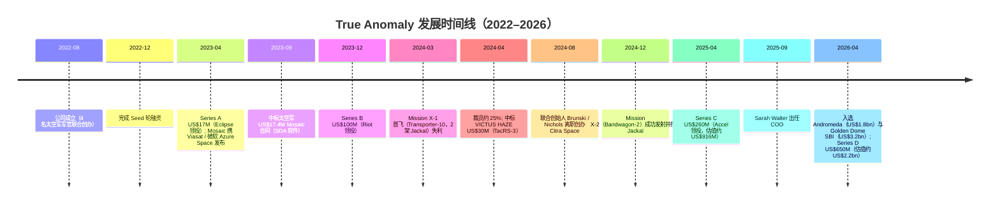
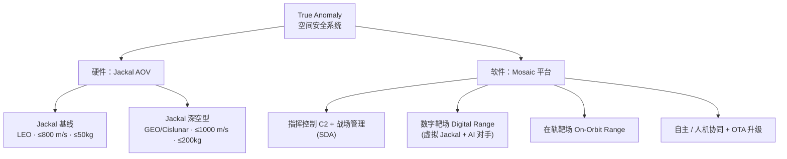
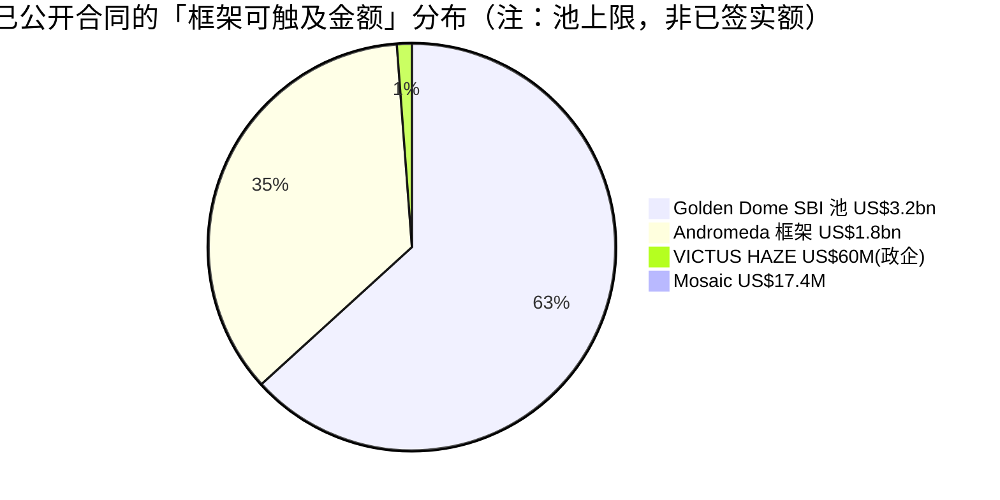
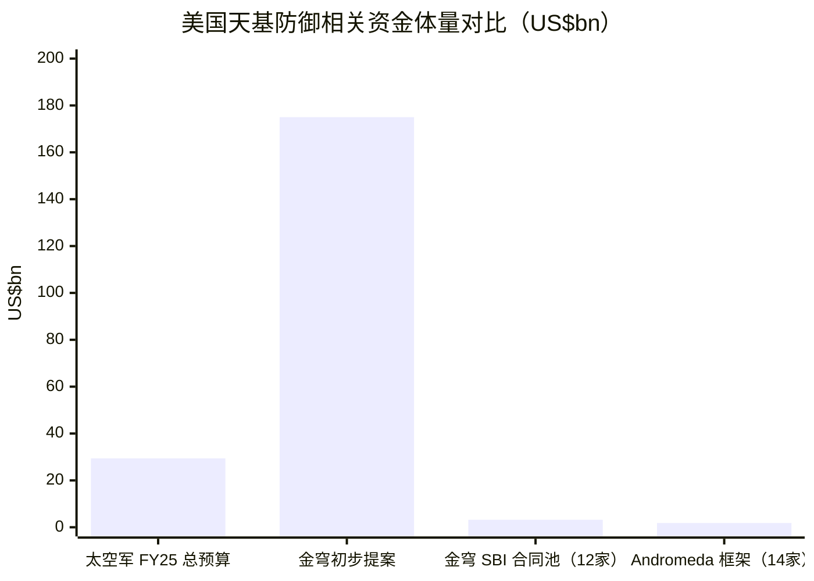
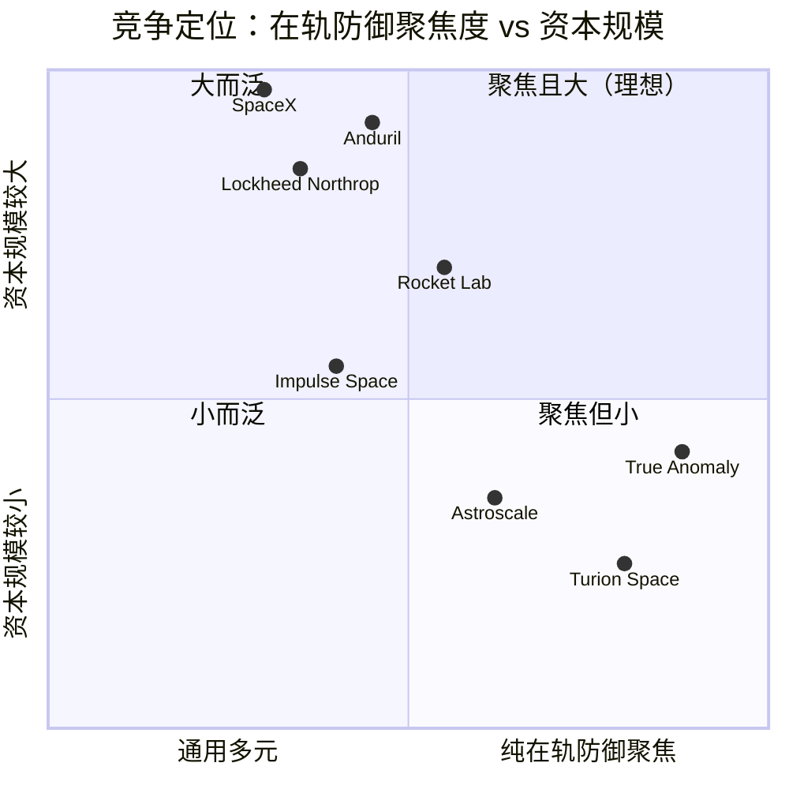

# True Anomaly（真异常 / 真近点角）公司研究报告

**公司类型：未上市（私营，风险资本支持）· 行业：空间安全 / 国防航天（space security / orbital defense）· 总部：美国科罗拉多州 Centennial**
**报告日期（as of）：2026-06-14**

> *分析师观点：* **评级 / 目标价：不适用——未上市私营公司（pre-revenue / 风险资本定价）。**
> 最新一级市场估值：**Series D 后估值约 US$2.2bn**（2026-04-28，Eclipse / Riot Ventures 领投，[SpaceNews, 2026-04-28](https://spacenews.com/true-anomaly-raises-650-million-reaching-2-2-billion-valuation/)）；累计融资 **>US$1bn**（自 2022 年成立，[公司 Series D 公告](https://www.trueanomaly.space/newsroom/our-series-d-fundraise-650m-raised-to-accelerate-space-superiority-at-scale)）。
> 成立 2022-08 · 员工约 250（2025 年底，目标 2026 年底 500、2028 年 1,000）· 主营自主在轨飞行器（AOV）Jackal + 软件平台 Mosaic
>
> **核心论点（thesis pillars）**——（1）唯一一家**专注「在轨防御 / 空间优势」（orbital defense）**的纯空间安全初创，由太空军（U.S. Space Force, USSF）作战军官创办，深谙国防采购；（2）2026 年 4 月接连入选 **Andromeda**（10 年 US$1.8bn 空间态势感知框架）与 **Golden Dome**（金穹）天基拦截器（US$3.2bn 池），订单可见度大幅改善；（3）垂直整合的 **GravityWorks** 工厂支撑 Jackal 低成本量产，目标 50 架/年；（4）风险在于**执行**——首飞（Mission X-1）失利、2024 年裁员约 25%、产品仍处早期飞行验证阶段，估值已隐含大量未来兑现。

> **更新 — 2026-04 双重催化（融资 + 大单）：** 2026 年 4 月，公司在两周内（a）入选太空军 Andromeda 下一代空间态势感知（SDA）10 年 US$1.8bn 框架（14 家厂商之一，[DefenseScoop, 2026-04-10](https://defensescoop.com/2026/04/10/space-force-contract-andromeda-program-vendors/)）、（b）入选 Golden Dome 天基拦截器（SBI）US$3.2bn 合同池（12 家入选之一，[SatNews, 2026-04-25](https://satnews.com/2026/04/25/space-force-awards-3-2-billion-in-golden-dome-contracts-for-orbital-interceptor-constellation/)），随后（c）完成 US$650M D 轮、估值升至约 US$2.2bn（[SpaceNews, 2026-04-28](https://spacenews.com/true-anomaly-raises-650-million-reaching-2-2-billion-valuation/)）。三件事相互印证：政府需求 → 订单 → 资本，是本报告时点最重要的「本期新变化」。

---

## 目录 / Table of Contents
1. 公司概览（含投资论点）
1A. 估值与「价格目标」（私营公司：一级市场估值与情景）
1B. GF Score 基本面评分（私营公司处理说明）
2. 公司历史
3. 管理团队
4. 产品与服务（**全篇最重要章节**）
5. 客户与上市策略（go-to-market）
6. 行业概览
7. 竞争格局
8. 市场机会（TAM）
9. 风险评估
9.5 核心分歧与催化剂
10. 投资视角评分（cycle / 视角观点）

======================================

## 1. 公司概览

*分析师观点：* True Anomaly 是一家**未上市**的美国空间安全（space security）公司，本报告不给出股票评级或 12 个月目标价（pre-revenue 私营公司、由一级市场定价）；但其投资叙事清晰：这是目前**唯一一家把全部业务押注在「在轨防御 / 空间优势」**上的初创，由四名太空军（USSF）第 4 空间作战中队（4th Space Operations Squadron）军官于 2022 年 8 月创办，主打能在轨机动、近距侦察对手航天器的自主飞行器 Jackal 与配套软件 Mosaic（[Contrary Research — True Anomaly Business Breakdown](https://research.contrary.com/company/true-anomaly)）。本期最重要的变化是 2026 年 4 月「订单 + 资本」双兑现——入选 Andromeda 与 Golden Dome 两大政府框架，并完成 US$650M D 轮（[SpaceNews, 2026-04-28](https://spacenews.com/true-anomaly-raises-650-million-reaching-2-2-billion-valuation/)）。看多理由是国防航天的结构性扩张与公司稀缺的「军官创业 + 垂直整合制造」组合；看空理由是执行尚未证明（首飞失利、估值已透支多年兑现）。

公司的业务可以一句话概括：**为「空间优势 / 空间安全」设计并制造软硬件系统**（"designs and builds hardware and software systems for space superiority and space security"，[公司 About Us 页](https://www.trueanomaly.space/about-us)）。具体而言，硬件是 Jackal——一款被公司称为「自主在轨飞行器（autonomous orbital vehicle, AOV）」的高机动卫星，体积近似一台小冰箱，用于交会与近距操作（rendezvous and proximity operations, RPO），抵近拍摄、识别并跟踪在轨目标；软件是 Mosaic——贯穿训练、仿真到实战指挥控制（C2）的全栈平台（[Contrary Research](https://research.contrary.com/company/true-anomaly)）。两者合起来，对应的是太空军近年最重视的两类需求：**空间态势感知（space domain awareness, SDA）** 与 **战术响应空间（tactically responsive space, TacRS）**。

商业模式上，True Anomaly 的收入主要来自**政府合同**，付款方是美国空军部（Department of the Air Force）下属的太空军及其创新部门 SpaceWERX，部分项目以分包商身份参与（[Contrary Research](https://research.contrary.com/company/true-anomaly)）。这是典型的国防科技初创路径——以「政府出资 + 自有资本配套」共担早期研发与飞行验证，再凭飞行记录争取更大规模的量产订单。其旗舰任务 VICTUS HAZE 即采用太空军出资 US$30M、公司自筹 US$30M（合计 US$60M）的「政企各半」结构（[公司 VICTUS HAZE 公告](https://www.trueanomaly.space/newsroom/true-anomaly-selected-for-30m-space-systems-command-contract-in-support-of-victus-haze-tactically-responsive-space-mission)）。

地理上，公司总部位于科罗拉多州 Centennial，并在加州 Long Beach、科罗拉多 Colorado Springs、华盛顿特区设有办公室；自有制造体系名为 **GravityWorks**，分布在 Centennial 与 Long Beach 两地（[公司 About Us 页](https://www.trueanomaly.space/about-us)）。把工程、制造和总装放在自己手里（vertical integration / 垂直整合）是其区别于「买现成卫星平台」竞争者的核心。

规模上，公司员工约 250 人（2025 年底；第三方数据库 Contrary 截至 2025-12-04 记为 231 人），并计划借 D 轮把人员**翻倍至 2026 年底逾 500、2028 年逾 1,000**（[公司 Series D 公告](https://www.trueanomaly.space/newsroom/our-series-d-fundraise-650m-raised-to-accelerate-space-superiority-at-scale)）。公司未披露营业收入；作为 pre-revenue / 早期收入阶段的国防初创，其「规模」更应以**累计融资（>US$1bn）、合同框架可触及金额（Andromeda US$1.8bn 池、Golden Dome US$3.2bn 池）与产能目标（50 架 Jackal/年）**来衡量，而非利润表（[Via Satellite, 2026-04-28](https://www.satellitetoday.com/finance/2026/04/28/true-anomaly-raises-650-million-in-new-round-to-continue-scaling/)）。

**估值快照（私营公司处理）。** 公开股票常用的 TTM P/E、P/S 在此不适用——公司未上市、无审计财报、且尚处早期收入阶段。可比口径是**一级市场定价**：估值从 Series A（2023-04，约 US$114M 隐含）→ Series B（2023-12，约 US$360M）→ Series C（2025-04，约 US$916M）→ Series D（2026-04，约 US$2.2bn），三年四轮、估值大致逐轮翻倍（[finsmes, 2023-04](https://www.finsmes.com/2023/04/true-anomaly-raises-17m-in-series-a-funding.html)；[payloadspace — Series C](https://payloadspace.com/true-anomaly-raises-260m-series-c/)；[SpaceNews — Series D, 2026-04-28](https://spacenews.com/true-anomaly-raises-650-million-reaching-2-2-billion-valuation/)）。这一估值轨迹隐含的判断是：在 Golden Dome 等政策催化下，市场愿意为「纯在轨防御标的」的稀缺性付溢价；但 US$2.2bn 对一家年收入尚未公开、刚完成第二次成功飞行的公司而言，**估值已大幅领先于已兑现的现金流**——这是私营定价的「叙事溢价」，也是后文风险章节的核心。

## 1A. 估值与「价格目标」——私营公司的一级市场视角

*分析师观点：* 私营、pre-revenue 公司无法用 forward-EPS × 倍数 / DCF / SOTP 推导 12 个月目标价（无 EPS、无公开股价、无可比倍数）。下表以**一级市场估值轨迹**替代「forward estimates」，并以**情景假设**替代 bull/base/bear 价格目标——情景的标的是「下一轮估值 / 退出价值的方向」，而非每股价格。所有数字非自有模型，均锚定已披露的融资事实。

**（a）一级市场融资与估值轨迹（替代 forward-estimates 表）**

| 轮次（*分析师观点：*口径） | 时间 | 募资额 | 隐含投后估值 | 领投 |
|---|---|---|---|---|
| Seed | 2022-12 | 未披露（小额） | n/a | — |
| Series A | 2023-04 | US$17M | ~US$114M | Eclipse Ventures |
| Series B | 2023-12 | US$100M | ~US$360M | Riot Ventures |
| Series C | 2025-04 | US$260M | ~US$916M | Accel |
| **Series D** | **2026-04** | **US$650M（+US$50M 债权）** | **~US$2.2bn** | **Eclipse + Riot（联合领投）** |
| 累计 | — | **>US$1bn** | — | — |

数据来源：[Contrary Research](https://research.contrary.com/company/true-anomaly)（A/B/C 轮金额与估值）、[公司 Series D 公告](https://www.trueanomaly.space/newsroom/our-series-d-fundraise-650m-raised-to-accelerate-space-superiority-at-scale)（D 轮 US$650M、Stifel Bank US$50M 债权、累计 >US$1bn）、[SpaceNews, 2026-04-28](https://spacenews.com/true-anomaly-raises-650-million-reaching-2-2-billion-valuation/)（US$2.2bn 估值）。注：估值多为「隐含 / implied」口径，公司未逐轮披露确切投后估值；Seed 轮金额未公开披露。

**（b）「价格目标」推导——为什么本报告不给目标价。** 估值方法（forward-PE / DCF / SOTP / rNPV）都需要可量化的远期现金流或可比公开倍数；True Anomaly 既无公开营收，也无可直接比对的上市纯标的（最接近的纯 RPO 公开公司 Astroscale 市值仅约 US$580M，业务侧重碎片清除而非防御，[Contrary Research](https://research.contrary.com/company/true-anomaly)）。因此**任何「目标价」都将是凭空构造，违反本项目的数值准确性铁律**。可负责任地说的是：D 轮 US$2.2bn 已把未来数年的政府订单兑现（Andromeda / Golden Dome 的「框架可触及金额」而非已签实额）大量计入；下一轮估值的方向取决于**飞行成功率、Andromeda/Golden Dome 实拨订单额、以及 Jackal 量产爬坡**三件事。

**（c）情景表（替代 bull/base/bear 价格目标——标的为「下一轮估值 / 退出」方向）**

| 情景（*分析师观点：*） | 关键假设 | 方向 |
|---|---|---|
| 看多 Bull | GEO/cislunar Jackal 与 VICTUS HAZE 飞行成功；Andromeda/Golden Dome 转化为可观实拨订单；量产爬坡兑现 | 估值进一步上行 / 具备 IPO 或被并购退出的稀缺溢价 |
| 中性 Base | 飞行记录稳步改善，订单按框架逐步释放，但量产与毛利仍需时间 | 维持 ~US$2.2bn 量级，靠后续里程碑支撑 |
| 看空 Bear | 再现飞行失利 / 关键任务延期；Golden Dome 政策与预算波动；国防航天估值整体回调 | 下一轮平轮或下行（down-round）风险 |

**（d）与市场一致预期的对比。** 本地机构研究库（`db/zsxq.db`）对 True Anomaly **无任何覆盖**（已按 "True Anomaly"/"Jackal"/"space domain awareness"/"space security" 四个别名检索，命中 0 条；见验证日志），故无卖方一致估值可对标。私营空间防御标的本就缺乏卖方覆盖，这一空白本身也是信息——本报告的估值判断完全建立在已披露的一级市场事实之上。

**（e）最该盯紧的变量（swing variables）：（1）飞行成功率**——Jackal 从「能发射、能控制」走向「能在轨完成 RPO 全流程并交付数据」；**（2）框架订单的「实拨转化率」**——Andromeda US$1.8bn、Golden Dome US$3.2bn 都是**多厂商共享的合同池上限**，公司实际能拿到多少 task order 才是关键。

## 1B. GF Score 基本面评分（私营公司处理说明）

*分析师观点：* **GF Score 不适用——本标的为未上市、pre-revenue 私营公司。** GuruFocus 式 GF Score 的五个维度中，**财务实力（Financial Strength）**需资产负债表（净负债 / EBITDA、利息保障倍数、Z-Score）、**盈利能力（Profitability）**需利润表（营业 / 净利率、ROE、ROIC）、**估值 GF Value** 需公开可比倍数——这三项对一家不披露审计财报、尚无稳定营收的国防初创**无法计算**，强行赋分即等于编造。**动量（Momentum）**亦无公开股价。故本报告不渲染五维雷达图，以避免「看似精确实则虚构」的评分。

可以负责任地给出的是一个**定性的「创投阶段就绪度」判断**（labeled *分析师观点：*，非 GF Score）：成长性维度**强**（三年四轮、估值逐轮翻倍 + 2026 年两大政府框架在手，[SpaceNews, 2026-04-28](https://spacenews.com/true-anomaly-raises-650-million-reaching-2-2-billion-valuation/)）；资金充裕度维度**强**（累计 >US$1bn、刚完成 US$650M D 轮，短期现金跑道无忧，[公司公告](https://www.trueanomaly.space/newsroom/our-series-d-fundraise-650m-raised-to-accelerate-space-superiority-at-scale)）；执行 / 兑现维度**偏弱且未证明**（首飞失利、2024 年裁员约 25%、量产尚未规模化，[TechCrunch, 2024-04-25](https://techcrunch.com/2024/04/25/defense-space-startup-true-anomaly-layoffs-cancels-internship/)）。一句话：**资本与订单领先于飞行业绩**——这正是其估值的机会与风险所在。

## 2. 公司历史

公司由 **Even Rogers（CEO）、Daniel Brunski（前 CTO）、Kyle Zakrzewski（首席工程官）、Tom Nichols（前 COO/CPO/CMO）** 四人于 **2022 年 8 月** 创办；四人均出身美国空军 / 太空军第 4 空间作战中队（4th Space Operations Squadron），合计有逾十年管理天基防御资产的经历，早在 2018 年便判断「现有国防工业基础无力支撑空间优势任务」，这成为创业初心（[Contrary Research](https://research.contrary.com/company/true-anomaly)；[Eclipse Capital — Even Rogers 专访](https://eclipse.capital/blog/defining-modern-space-security-even-rogers-co-founder-and-ceo-true-anomaly/)）。公司名 "True Anomaly" 本身是轨道力学术语（真近点角，描述天体在轨道上的真实角位置），一语双关地暗示「真正的异常 / 在轨态势」。

图 1：发展时间线。来源：[Contrary Research](https://research.contrary.com/company/true-anomaly)、[公司 newsroom](https://www.trueanomaly.space/newsroom/our-series-d-fundraise-650m-raised-to-accelerate-space-superiority-at-scale)、各轮融资公告（见下文链接）。

成立后三年里，公司经历了两次关键转折。**其一是「快速迭代、边飞边修」的工程文化的建立。** 2024 年 3 月，公司首飞任务 Mission X-1 搭乘 SpaceX Transporter-10 拼车发射两架 Jackal，但当天即出现通信异常，3 月 21 日公司表示已无法确认航天器是否仍在工作（[Yahoo Finance / TechCrunch 报道](https://finance.yahoo.com/news/true-anomaly-ceo-finds-silver-215957929.html)）。仅九个月后的 2024 年 12 月，团队便以「第二代 Jackal、远低于传统系统的成本」完成 Mission X-2 并成功发射、控制航天器，把首飞教训快速吃进产品（[公司 Mission X Continues 公告](https://www.trueanomaly.space/newsroom/mission-x-continues)）。这种「fly, fix, fly」的节奏是其对标 SpaceX 式硬件迭代的核心叙事（[公司 Mission X Update #2](https://www.trueanomaly.space/newsroom/mission-x-update-2-fly-fix-fly)）。

**其二是组织的收缩与再聚焦。** 紧随首飞失利之后，2024 年 4 月公司裁员约 25%（影响约 30 人，集中在销售、业务拓展与招聘等非核心职能），并取消当年暑期实习，公司称是为「消除重叠职能、聚焦目标」的内部重组（[TechCrunch, 2024-04-25](https://techcrunch.com/2024/04/25/defense-space-startup-true-anomaly-layoffs-cancels-internship/)；[SpaceNews — cuts workforce](https://spacenews.com/space-startup-true-anomaly-cuts-workforce/)）。同年 8 月，两名联合创始人 Brunski 与 Nichols 离职，另创 Citra Space Corporation（[Contrary Research](https://research.contrary.com/company/true-anomaly)）。这些早期波折在后续融资与中标节奏中被逐步对冲，但也提示读者：公司的发展并非一帆风顺的直线。

近一两年的关键进展集中在**资本与订单的同步放量**：2025 年 4 月 Accel 领投 US$260M C 轮、估值约 US$916M（[payloadspace — Series C](https://payloadspace.com/true-anomaly-raises-260m-series-c/)）；2026 年 4 月在两周内接连入选 Andromeda 与 Golden Dome 两大政府框架，并以约 US$2.2bn 估值完成 US$650M D 轮（[SpaceNews, 2026-04-28](https://spacenews.com/true-anomaly-raises-650-million-reaching-2-2-billion-valuation/)）。这些更影响当前投资论点的细节，将在产品、客户、行业各章展开。

## 3. 管理团队

**联合创始人兼 CEO：Even Rogers。** Rogers 在科罗拉多 Colorado Springs 这一「航天重镇」长大，自弗吉尼亚军事学院（Virginia Military Institute）毕业后投身社会科学领域深造，2013 年起任空军军官，在空间作战领域服役近十年，并曾在 DARPA 与太空军任职（[Contrary Research](https://research.contrary.com/company/true-anomaly)）。他撰写或参与撰写了六部战术空间作战的奠基性文献，包括 2020 年太空军首部纲领性出版物《Spacepower: Doctrine for Space Forces》（[Eclipse Capital — Even Rogers 专访](https://eclipse.capital/blog/defining-modern-space-security-even-rogers-co-founder-and-ceo-true-anomaly/)）。这一「太空军作战理论作者 + 一线作战经历」的背景，使他在向太空军客户阐释「空间优势」需求、并把作战意图翻译成产品规格上具备稀缺的话语权，也是投资人（如 Menlo Ventures 将公司定位为「空间领域的国防主承包商雏形 / a defense prime for space」）反复强调的人和因素（[Menlo Ventures — 投资逻辑](https://menlovc.com/perspective/menlos-investment-in-true-anomaly-a-defense-prime-for-space/)）。截至本报告时点，公开资料未单独披露 Rogers 的持股比例与薪酬结构（属未披露事项）。

**联合创始人兼首席工程官：Kyle Zakrzewski。** Zakrzewski 曾任空军第 26 空间侵略者中队（26th Space Aggressor Squadron）的在轨作战训练主管（orbital warfare chief of training）——该中队专门模拟对手的空间能力，用于己方训练与演习（[Contrary Research](https://research.contrary.com/company/true-anomaly)）。这段「扮演对手」的经历直接塑造了公司产品的一个独特卖点：Jackal 既能执行己方侦察，也能在训练 / 测试中**复刻对手航天器的行为**，而 Mosaic 的数字靶场（digital range）则让操作员在仿真中对抗「会思考的对手（thinking adversary）」AI（[payloadspace — 训练产品发布](https://payloadspace.com/true-anomaly-unveils-two-training-products/)）。

**管理层变动（本期新变化）。** 如历史章所述，两名联合创始人 Brunski（前 CTO）与 Nichols（前 COO/CPO/CMO）已于 2024 年 8 月离职、另创 Citra Space；2025 年 9 月，拥有约 20 年航天经验的 **Sarah Walter** 加入出任 COO，补强了规模化运营的管理带宽（[Contrary Research](https://research.contrary.com/company/true-anomaly)）。本报告按 company-research 规范仅展开创始人与现任 CEO（此处为同一人 Even Rogers 的合并视角）及首席工程官，其余高管不逐一铺陈。

## 4. 产品与服务（全篇最重要章节）

True Anomaly 的产品体系是「**一硬一软**」：硬件 **Jackal**（自主在轨飞行器 / AOV）负责在轨机动与近距侦察，软件 **Mosaic**（全栈平台）负责从训练、仿真到实战的指挥控制与自主决策。由于公司未上市、无 10-K 产品矩阵可逐行引用，下面的产品矩阵由**公司官网与官方公告**构建（已标注为分析师据官方资料整理），并尽量逐条引用官网原文。

### 4.1 产品矩阵（据公司官方资料整理）

| 产品 / 平台 | 类别 | 一句话定义（公司用语） | 关键规格 / 形态 |
|---|---|---|---|
| **Jackal（基线 LEO）** | 自主在轨飞行器 AOV | "a new type of spacecraft … highly maneuverable, payload agnostic, low cost" | 20 推力器 + ESPA-Grande 形态；delta-v ≤ 800 m/s；载荷 ≤ 50 kg / 200 W |
| **Jackal（GEO & Cislunar）** | 深空型 AOV | 面向地球同步轨道与地月空间的多轨道型 | delta-v ≤ 1,000 m/s；载荷 ≤ 200 kg / 1,000 W |
| **Mosaic** | 全栈软件平台 | "software designed for human-machine teaming" | C2 / 战场管理 / 数字靶场 / 训练；OTA 在轨升级；以 Elixir 语言编写 |
| **Mosaic — Digital Range（数字靶场）** | 仿真 / 训练 | 用虚拟 Jackal、红蓝资产做测试与训练 | 操作员对抗 AI「会思考的对手」 |
| **Mosaic — On-Orbit Range（在轨靶场）** | 实装训练 / 演训 | 真实在轨的测试与训练范围 | 与 Digital Range 共用同一 UI |

来源：[公司 Jackal 产品页](https://www.trueanomaly.space/jackal)（规格）、[公司 GEO/cislunar 公告](https://www.trueanomaly.space/newsroom/jackal-for-geosynchronous-orbit-and-cislunar-space)（深空型）、[Contrary Research](https://research.contrary.com/company/true-anomaly)（Mosaic 以 Elixir 编写、模块说明）、[公司数字 / 在轨靶场公告](https://www.trueanomaly.space/newsroom/true-anomaly-announces-digital-and-on-orbit-range-solutions-engineered-to-ensure-space-readiness)。

### 4.2 综合视角——产品如何串成一个客户工作流

把两条线串起来，对应的是太空军操作员的一条完整闭环：**在 Mosaic 数字靶场中训练与制定战术 → 用 Mosaic 做任务规划与指挥控制 → 发射 Jackal 抵近目标做 RPO（拍摄、识别、跟踪）→ 数据经相控阵天线下行回 Mosaic → 据此更新战术、并通过 OTA 给在轨 Jackal 推送新能力**（[公司 Jackal 页](https://www.trueanomaly.space/jackal)；[公司靶场公告](https://www.trueanomaly.space/newsroom/true-anomaly-announces-digital-and-on-orbit-range-solutions-engineered-to-ensure-space-readiness)）。「同一套 UI 贯穿训练到实战」正是公司反复强调的差异点——它把昂贵且割裂的「训练系统」与「作战系统」合并成一个软件骨架（[Contrary Research](https://research.contrary.com/company/true-anomaly)）。

### 4.3 Jackal —— 自主在轨飞行器（AOV）

公司对 Jackal 的官方定位（官网原文）：

> "Jackal is not just another satellite—it is a new type of spacecraft that sets the performance benchmark for space superiority: highly maneuverable, payload agnostic, low cost."
> ——[公司 Jackal 产品页](https://www.trueanomaly.space/jackal)

> "High-performance 20-thruster configuration and a large propellant tank in an ESPA-Grande form factor"（高性能 20 推力器配置 + 大推进剂贮箱，采用 ESPA-Grande 形态）
> ——[公司 Jackal 产品页](https://www.trueanomaly.space/jackal)

**中文释义 / Plain-language gloss：** Jackal 是一台「会高速机动的侦察卫星」。它最核心的物理能力是**机动（maneuverability）**——靠 20 个推力器（thrusters）和一只大推进剂贮箱实现高 delta-v（速度增量）。delta-v 是衡量航天器「能改变多少速度 / 能去多少地方」的硬指标：基线 LEO 型 ≤ 800 m/s，深空 GEO/cislunar 型 ≤ 1,000 m/s（[公司 Jackal 页](https://www.trueanomaly.space/jackal)）。形态上采用 **ESPA-Grande**——一种标准化的拼车适配器尺寸（可理解为火箭上的「标准货架位」），这让 Jackal 能搭便宜的拼车（rideshare）上天，是「low cost」叙事的物理基础。它体积近似一台小冰箱（[Contrary Research](https://research.contrary.com/company/true-anomaly)）。机动之外，它的另一支柱是**交会与近距操作（rendezvous and proximity operations, RPO）**——抵近一个目标航天器、用光学 / 雷达多光谱传感器拍摄成像、识别跟踪，再撤离并下行数据（[Space.com, 2026](https://www.space.com/space-exploration/satellites/true-anomaly-to-launch-1st-deep-space-security-missions-with-autonomous-jackal-satellites-in-2026)）。

> "Integrated, Multi-Spectral RPO Suite"，由 Mosaic 驱动，实现 "advanced, autonomous long-range detection and tracking"。
> ——[公司 Jackal 产品页](https://www.trueanomaly.space/jackal)

**中文释义 / Plain-language gloss：** 「多光谱 RPO 传感套件（multi-spectral RPO suite）」指 Jackal 用不止一个波段（如可见光 + 红外 / 雷达）来探测和跟踪目标——多光谱的好处是更难被对手用单一手段欺骗，且能在不同光照 / 距离条件下工作。关键在「自主（autonomous）」二字：探测—决策—行动的回路由 Mosaic 在星上完成，不必事事等地面指令——这对**抵近一个「可能机动规避」的对手目标**至关重要，因为地面遥控的时延会贻误战机。这把 Jackal 与传统「飞固定轨道、被动拍照」的侦察卫星区分开来。

**深空型（GEO & Cislunar）——本期新变化。** 2025 年公司发布面向地球同步轨道与地月空间的 Jackal 变体，delta-v 提升至 ≤ 1,000 m/s、载荷能力大幅提升至 ≤ 200 kg / 1,000 W（[公司 GEO/cislunar 公告](https://www.trueanomaly.space/newsroom/jackal-for-geosynchronous-orbit-and-cislunar-space)；规格见 [Jackal 页](https://www.trueanomaly.space/jackal)）。**战略意义**：GEO 是高价值卫星（预警、通信、导航）的聚集带，地月空间（cislunar）则是美中竞争的新前沿；能在这两个高轨域做 RPO 与态势感知，直接对应 Andromeda 框架下的「地球同步轨道侦察与监视星座（Geosynchronous Reconnaissance and Surveillance Constellation）」需求（[ArmyRecognition, 2026](https://www.armyrecognition.com/news/aerospace-news/2026/u-s-space-force-awards-1-84b-andromeda-program-to-14-firms-to-expand-orbital-threat-tracking)）。

*分析师观点：* Jackal 的差异化护城河是「**高机动 + 自主 RPO + 低成本拼车形态**」的组合，moat 类型偏**技术 + 国防领域 know-how**（创始团队的作战与「侵略者中队」背景难以复制）。最接近的直接对手包括同样中标 VICTUS HAZE 的 Rocket Lab（[SpaceNews — VICTUS HAZE](https://spacenews.com/true-anomaly-gets-30-million-contract-for-space-force-tactically-responsive-mission/)）以及 Turion Space（与公司同列 Golden Dome SBI 入选名单，[DefenseScoop, 2026-04-24](https://defensescoop.com/2026/04/24/golden-dome-space-based-interceptor-missile-defense-contractors/)）；竞品规格应引其各自公开资料，而非 True Anomaly 的口径。

### 4.4 Mosaic —— 软件骨架与「人机协同」

公司对 Mosaic 的官方定位（官网原文）：

> "Software designed for human-machine teaming" that offers "on-orbit support for everything from range test and training to real-world ISR missions"。
> ——[公司 Jackal 产品页](https://www.trueanomaly.space/jackal)

**中文释义 / Plain-language gloss：** Mosaic 是 Jackal 的「软件大脑」，也是公司**唯一能产生经常性 / 可独立销售收入**的产品线（其首份政府合同就是 Mosaic 的 US$17.4M，见客户章）。按第三方拆解，它是一套用 **Elixir** 语言写的全栈平台，含五块能力：卫星指挥控制（C2）、面向 SDA 的战场管理（battle management）、虚拟星间操作仿真的数字靶场（digital range）、操作员训练工具（Ascension），以及对 AOV 的人机协同自主控制（[Contrary Research](https://research.contrary.com/company/true-anomaly)）。「人机协同（human-machine teaming）」指**把指挥官意图翻译成航天器的自主动作**——人下达「抵近并监视那个目标」的意图，软件自主规划与执行机动，操作员监督而非微操。它支持**在轨空中升级（over-the-air, OTA）**，能给在轨 Jackal 机队推送新能力——这把卫星从「发射即定型」变成「可像手机 App 一样持续升级」的平台（[公司 Jackal 页](https://www.trueanomaly.space/jackal)）。

**数字靶场与在轨靶场（Digital Range / On-Orbit Range）。** Mosaic 的训练能力是其独立卖点：数字靶场让操作员用**虚拟 Jackal、模拟红 / 蓝资产、以及一个场景与能力库**做测试与训练，类似一款「操作员对抗 AI 思考型对手」的军用电子游戏；而在轨靶场则把训练搬到真实在轨环境，两者共用同一 UI，实现「训练即作战、作战即训练」（[公司靶场公告](https://www.trueanomaly.space/newsroom/true-anomaly-announces-digital-and-on-orbit-range-solutions-engineered-to-ensure-space-readiness)；[payloadspace — 训练产品](https://payloadspace.com/true-anomaly-unveils-two-training-products/)）。这与 Zakrzewski 在「侵略者中队」的训练背景一脉相承。

*分析师观点：* Mosaic 的护城河类型偏**软件 + 转换成本（switching cost）**——一旦太空军操作员在 Mosaic 上训练成型、并用它指挥在轨机队，更换平台的代价很高；早在 2023 年公司便与 Viasat、微软 Azure Space 就 Mosaic 达成合作，借力商业云与通信基础设施（[Contrary Research](https://research.contrary.com/company/true-anomaly)）。需要厘清的是：Mosaic 的具体收入规模与占比公司未披露（属未披露事项），上文「唯一可独立销售」是基于其首份合同性质的判断，非财务披露。

### 4.5 旗舰与近期里程碑

当前驱动业务的旗舰是 **Jackal（含深空型）+ Mosaic** 两条线；过去 12–18 个月的关键里程碑包括：Mission X-2 成功发射与控制（2024-12，[公司公告](https://www.trueanomaly.space/newsroom/mission-x-continues)）、深空型 Jackal 发布（2025）、以及 2026 年 4 月入选 Andromeda 与 Golden Dome 两大框架（[DefenseScoop — Andromeda](https://defensescoop.com/2026/04/10/space-force-contract-andromeda-program-vendors/)；[SatNews — Golden Dome](https://satnews.com/2026/04/25/space-force-awards-3-2-billion-in-golden-dome-contracts-for-orbital-interceptor-constellation/)）。公司也已与 Firefly Aerospace 签多发发射协议，由 Firefly Alpha 火箭执行 VICTUS HAZE 的 24 小时响应发射（[Via Satellite — Firefly 发射, 2024-10-17](https://fireflyspace.com/news/true-anomaly-taps-firefly-aerospace-to-launch-jackal-autonomous-orbital-vehicle-for-u-s-space-force-victus-haze-tactically-responsive-space-mission/)）。

### 4.6 产品组合树

图 2：产品组合树。来源：[公司 Jackal 页](https://www.trueanomaly.space/jackal)、[Contrary Research](https://research.contrary.com/company/true-anomaly)、[公司靶场公告](https://www.trueanomaly.space/newsroom/true-anomaly-announces-digital-and-on-orbit-range-solutions-engineered-to-ensure-space-readiness)。

**延伸观看 / Further viewing**（教学辅助，不作为数据来源、不承载任何数字）：
- [True Anomaly 官方 Mission X 介绍 / Jackal 演示（公司官网视频）](https://www.trueanomaly.space/) — 直观了解 Jackal 外形与 RPO 任务概念。
- [What is rendezvous and proximity operations (RPO)? — 交会与近距操作科普](https://www.youtube.com/results?search_query=rendezvous+proximity+operations+satellite) — 帮助理解卫星如何在轨抵近另一航天器（请选官方 / 权威频道）。

## 5. 客户与上市策略（go-to-market）

公司的客户高度集中于**美国政府国防体系**：付款方是美国空军部下属的太空军及其创新部门 SpaceWERX、太空系统司令部（Space Systems Command, SSC），部分项目以分包商身份参与（[Contrary Research](https://research.contrary.com/company/true-anomaly)）。这意味着其「客户集中度」在概念上接近 100% 政府、且单一主权客户——这是国防初创的共性，既是稳定性的来源（政府预算的可见度高、回款信用好），也是风险的来源（受预算周期、政策与采购程序左右）。公司未披露分客户的收入占比（属未披露事项），故本报告不给出「前五大客户占比」的具体数字，仅按已公开的合同逐一列示。

**已公开的主要合同（按时间）：**

| 时间 | 合同 / 项目 | 金额（口径） | 内容 |
|---|---|---|---|
| 2023-09 | 太空军 Mosaic 合同 | US$17.4M | SDA 软件开发 |
| 2024-04 | VICTUS HAZE（TacRS-3） | US$30M 政府 + US$30M 自筹 | Jackal 做 RPO / SDA 演示 |
| 2024-11 | Firefly 多发发射协议 | 未披露 | 3 次 Alpha 发射 |
| 2026-04 | Andromeda（框架） | US$1.8bn 池（14 厂商共享，10 年） | 交付 Jackal 用于 GEO 侦察星座 |
| 2026-04 | Golden Dome SBI（框架） | US$3.2bn 池（12 家入选共享） | 天基拦截器原型 |

来源：[TechCrunch — Mosaic US$17.4M, 2023-09-21](https://techcrunch.com/2023/09/21/true-anomaly-lands-17-4m-contract-from-u-s-space-force-for-space-domain-awareness-tech/)、[公司 VICTUS HAZE 公告](https://www.trueanomaly.space/newsroom/true-anomaly-selected-for-30m-space-systems-command-contract-in-support-of-victus-haze-tactically-responsive-space-mission)、[Breaking Defense — VICTUS HAZE, 2024-04](https://breakingdefense.com/2024/04/space-force-awards-contracts-for-victus-haze-rapid-launch-mission/)、[DefenseScoop — Andromeda, 2026-04-10](https://defensescoop.com/2026/04/10/space-force-contract-andromeda-program-vendors/)、[SatNews — Golden Dome, 2026-04-25](https://satnews.com/2026/04/25/space-force-awards-3-2-billion-in-golden-dome-contracts-for-orbital-interceptor-constellation/)。

图 3：合同框架金额对比。**重要口径说明**：Andromeda 与 Golden Dome 为**多厂商共享的合同池上限（ceiling）**，并非 True Anomaly 已签的实际订单额；公司实际能拿多少 task order 取决于后续竞争性下单。来源：同上表。

**VICTUS HAZE——旗舰任务。** 这是公司最受关注的单一项目，属太空军「战术响应空间（TacRS-3）」第二代任务，目标是演示在 24 小时内完成「接到指令—发射—抵近一个（模拟的）威胁航天器」的全流程，由 True Anomaly 与 Rocket Lab 两家「performer」各建一星、互为目标做 RPO 演练（[Breaking Defense, 2024-04](https://breakingdefense.com/2024/04/space-force-awards-contracts-for-victus-haze-rapid-launch-mission/)；[Air & Space Forces Magazine](https://www.airandspaceforces.com/ussf-victus-haze-satellites-contracts/)）。公司选用 Firefly Alpha 火箭执行 24 小时响应发射，团队与 Firefly 处于「待命—接到指令后 24 小时内完成转运、整流罩对接、加注并发射」的状态（[Firefly Aerospace — VICTUS HAZE launch agreement, 2024-10-17](https://fireflyspace.com/news/true-anomaly-taps-firefly-aerospace-to-launch-jackal-autonomous-orbital-vehicle-for-u-s-space-force-victus-haze-tactically-responsive-space-mission/)）。

**「上市策略」（go-to-market）实为「政府采购策略」。** 作为私营公司，其 GTM 不是面向消费者 / 企业的销售漏斗，而是**国防采购通道**：以「政府小额出资 + 自有资本配套」的快速原型合同（如 VICTUS HAZE、SpaceWERX SBIR/STTR 路径）建立飞行记录与信任，再争取进入 Andromeda、Golden Dome 这类大额、长周期的框架采购（IDIQ 式合同池），最终目标是成为「空间领域的国防主承包商（a defense prime for space）」（[Menlo Ventures](https://menlovc.com/perspective/menlos-investment-in-true-anomaly-a-defense-prime-for-space/)）。本报告未上市、无 IPO 计划披露，退出路径目前以「后续私募轮 / 潜在并购 / 远期 IPO」为主。

## 6. 行业概览

True Anomaly 所处的行业可定义为「**空间安全 / 国防航天**」，更细分则横跨三块需求：空间态势感知（SDA）、战术响应空间（TacRS / 在轨防御 RPO），以及新兴的天基导弹拦截（space-based interception, Golden Dome）。这是国防开支中增速最快、政策催化最密集的方向之一。

**市场结构与规模。** 在轨卫星数量已从早年的数千颗增至 2025 年 11 月约 **15,700 颗**，其中美国军 / 政卫星约数百颗（一项 2023 年的估计约 413 颗，可能已偏低）（[Contrary Research](https://research.contrary.com/company/true-anomaly)）。轨道日益拥挤、且大国竞争向太空延伸，使「看清在轨发生了什么、并能对威胁做出响应」成为刚需。从预算看，太空军 FY2025 总预算约 **US$29.4bn**（其中研发约 US$18.7bn、采购约 US$4.3bn），研发占比高，正符合 True Anomaly 这类「卖新能力原型」的初创定位（[Contrary Research](https://research.contrary.com/company/true-anomaly)）。

**增长驱动——Golden Dome（金穹）是最大政策变量。** 特朗普政府推动的 Golden Dome 是一套多层导弹防御盾，拟用近地轨道（pLEO）的星座在助推段（boost phase，导弹最脆弱但最难够到的阶段）拦截威胁；其天基拦截器（SBI）部分正是 True Anomaly 参与的方向（[The Next Web, 2026](https://thenextweb.com/news/true-anomaly-650m-space-defense-golden-dome)）。该计划体量极大：特朗普政府初步提出约 **US$175bn**，而 CBO（国会预算办公室）估计 20 年成本区间约 **US$542bn–831bn**（[Contrary Research](https://research.contrary.com/company/true-anomaly)）。2026 年 4 月，太空军 SSC 一次性向 **12 家公司**授出最高 **US$3.2bn** 的 SBI 原型合同，True Anomaly 与 SpaceX、Anduril、Lockheed Martin、Northrop Grumman、Raytheon、General Dynamics、Booz Allen、GITAI USA、Quindar、Sci-Tec、Turion Space 同列其中（[SatNews, 2026-04-25](https://satnews.com/2026/04/25/space-force-awards-3-2-billion-in-golden-dome-contracts-for-orbital-interceptor-constellation/)；[Breaking Defense, 2026-04](https://breakingdefense.com/2026/04/space-force-tasks-a-dozen-companies-for-golden-dome-space-based-interceptors/)）。

图 4：天基防御相关资金体量对比（金穹 CBO 20 年估算上限达 US$831bn，超出图表上限故未画）。来源：[Contrary Research](https://research.contrary.com/company/true-anomaly)（太空军预算、金穹提案）、[SatNews, 2026-04-25](https://satnews.com/2026/04/25/space-force-awards-3-2-billion-in-golden-dome-contracts-for-orbital-interceptor-constellation/)（SBI 池）、[DefenseScoop, 2026-04-10](https://defensescoop.com/2026/04/10/space-force-contract-andromeda-program-vendors/)（Andromeda）。

**另一增长支柱——Andromeda 与下一代 SDA。** 2026 年 4 月，太空军把 14 家厂商纳入 Andromeda——一个 10 年期、上限约 US$1.8bn 的下一代 SDA 框架，用于追踪、识别和分析在轨平台；True Anomaly 将据此交付 Jackal、支撑「地球同步轨道侦察与监视星座」（[DefenseScoop, 2026-04-10](https://defensescoop.com/2026/04/10/space-force-contract-andromeda-program-vendors/)；[ArmyRecognition, 2026](https://www.armyrecognition.com/news/aerospace-news/2026/u-s-space-force-awards-1-84b-andromeda-program-to-14-firms-to-expand-orbital-threat-tracking)）。

**行业动态与监管。** 这是一个**单一主权买家主导、且高度受监管**的市场：需求由太空军 / SSC / MDA（导弹防御局）的项目结构决定，供给侧则正从「传统国防主承包商垄断」向「商业航天初创 + 主承包商」并存演变——太空军明确希望「利用商业能力快速应对在轨威胁」，VICTUS HAZE、Andromeda、Golden Dome 都把初创与主承包商放进同一名单竞争（[Breaking Defense — VICTUS HAZE](https://breakingdefense.com/2024/04/space-force-awards-contracts-for-victus-haze-rapid-launch-mission/)）。出口管制（ITAR）、安全审查与「美国本土制造」要求构成进入壁垒，也保护了 True Anomaly 这类本土国防初创免受境外竞争。

## 7. 竞争格局

True Anomaly 的竞争对手可分为四圈层。**第一圈——直接的 RPO / 在轨防御对手。** 最贴身的是 **Rocket Lab**：两家同为 VICTUS HAZE 的「performer」，各建一星互为目标（[SpaceNews — VICTUS HAZE](https://spacenews.com/true-anomaly-gets-30-million-contract-for-space-force-tactically-responsive-mission/)），且 Rocket Lab 已通过收购 Geost 等强化国防载荷能力、拥有自有发射（Electron/Neutron）这一 True Anomaly 不具备的环节。**Turion Space** 与 True Anomaly 同列 Golden Dome SBI 入选名单、主攻 RPO 与 SDA（[DefenseScoop, 2026-04-24](https://defensescoop.com/2026/04/24/golden-dome-space-based-interceptor-missile-defense-contractors/)）。**Katalyst Space Technologies**（2019 年成立，机器人在轨服务，计划 2026 年演示抓取卫星）与 **Starfish Space**（自主服务飞行器 Otter，2024-09 融资 US$29M，承接 NASA SSPICY 检视任务）也具备 RPO 能力，但更偏「在轨服务 / 延寿」而非防御（[Crunchbase — Katalyst](https://www.crunchbase.com/organization/katalyst-space-technologies)；[CB Insights — Katalyst vs Starfish](https://www.cbinsights.com/compare/katalyst-2-vs-starfish-space)）。

**第二圈——RPO / 碎片清除的「邻居」。** **Astroscale**（已上市，2025-11 市值约 US$580M）以 RPO 做碎片清除（debris removal），是技术相邻但任务定位不同的玩家；瑞士的 **ClearSpace**（融资约 US$37M）同属碎片清除（[Contrary Research](https://research.contrary.com/company/true-anomaly)）。这一圈层证明 RPO 技术本身已被多方掌握，True Anomaly 的差异在于**把 RPO 用于「防御 / 对抗」语境**，而非民用清理。

**第三圈——空间机动 / 防务科技的资本巨头。** **Anduril Industries**（融资逾 US$6.2bn、2025-06 估值约 US$30.5bn）以自主系统与 Lattice OS 切入防务，并与 True Anomaly 同列 Golden Dome 名单；**Impulse Space**（空间拖船 Mira/Helios，融资约 US$525M、2025-06 隐含估值约 US$1.8bn）与 **Sierra Space**（Eclipse 卫星线，融资约 US$1.7bn）提供在轨机动 / 平台能力（[Contrary Research](https://research.contrary.com/company/true-anomaly)）。它们资本与规模远超 True Anomaly，是潜在的「降维」竞争者，但多数并非纯粹聚焦在轨防御。

**第四圈——传统国防主承包商与 SpaceX。** Lockheed Martin、Northrop Grumman、RTX（Raytheon）、Boeing、General Dynamics 等主承包商凭借既有的太空军关系与系统集成能力，是大额框架的默认竞标者；**SpaceX**（逾 8,700 颗 Starlink、Starshield 国防项目、2021 年 US$1.8bn 侦察卫星合同）则以发射 + 星座的规模优势成为绕不开的力量（[Contrary Research](https://research.contrary.com/company/true-anomaly)）。它们与 True Anomaly 既竞争（同台投标 Golden Dome）又合作（SpaceX 为 X-1/X-2 提供拼车发射）。

图 5：竞争定位（横轴为「在轨防御聚焦度」，纵轴为「资本 / 规模」；坐标为分析师据公开融资 / 业务范围的定性估计，非精确测度）。来源：[Contrary Research](https://research.contrary.com/company/true-anomaly)、[DefenseScoop — Golden Dome 名单, 2026-04-24](https://defensescoop.com/2026/04/24/golden-dome-space-based-interceptor-missile-defense-contractors/)。

*分析师观点：* True Anomaly 的竞争优势在于**「最纯粹的在轨防御聚焦 + 创始团队的作战 know-how + 垂直整合制造」**；脆弱性在于**资本与规模仍小于 Anduril / SpaceX / 主承包商，且无自有发射**（须依赖 SpaceX / Firefly）。在一个「赢家可能通吃大框架」的政府市场里，规模劣势是真实风险——这也是 D 轮急于扩产能、扩人员的根本原因。

## 8. 市场机会（TAM）

True Anomaly 的可触及市场由三层叠加。**TAM（总体可触及市场）**——美国天基防御与空间安全开支的总盘子。以太空军 FY2025 约 US$29.4bn 预算为基数，叠加 Golden Dome 这一增量计划（初步提案 US$175bn、CBO 20 年估算 US$542bn–831bn），整体天基防御开支在未来十余年是一个数千亿美元级、且明确扩张的市场（[Contrary Research](https://research.contrary.com/company/true-anomaly)；[The Next Web, 2026](https://thenextweb.com/news/true-anomaly-650m-space-defense-golden-dome)）。

**SAM（可服务市场）**——与 Jackal / Mosaic 能力直接对应的细分：SDA、TacRS（在轨 RPO 防御）与天基拦截器。两个已公开的框架给出了 SAM 的量级标尺：Andromeda 10 年 US$1.8bn（下一代 SDA）+ Golden Dome SBI US$3.2bn 池——合计约 US$5bn 的「可竞争框架金额」是 True Anomaly 未来数年最现实的服务市场上限（[DefenseScoop — Andromeda](https://defensescoop.com/2026/04/10/space-force-contract-andromeda-program-vendors/)；[SatNews — Golden Dome](https://satnews.com/2026/04/25/space-force-awards-3-2-billion-in-golden-dome-contracts-for-orbital-interceptor-constellation/)）。需强调：这两个池由 14 / 12 家厂商共享，是上限而非已签实额。

**SOM（可获得份额）**——取决于飞行记录与产能。公司目标把 Jackal 产能扩至约 **50 架/年**（[Via Satellite, 2026-04-28](https://www.satellitetoday.com/finance/2026/04/28/true-anomaly-raises-650-million-in-new-round-to-continue-scaling/)）。若 Golden Dome 的 pLEO 拦截器星座如设想般「成百上千颗」铺开，单是这一项就可能为像 True Anomaly 这样的量产型 AOV 供应商打开远超其历史合同体量的需求；但能否拿到、拿到多少，取决于公司在 12 家入选者中的竞争位次（[Breaking Defense, 2026-04](https://breakingdefense.com/2026/04/space-force-tasks-a-dozen-companies-for-golden-dome-space-based-interceptors/)）。

**渗透策略。** 公司的打法是「**先以小额快速原型嵌入项目（VICTUS HAZE / Mosaic 合同）建立信任，再凭飞行记录撬动大框架（Andromeda / Golden Dome）的实拨订单**」，并用 D 轮资本提前把产能（GravityWorks 工厂、50 架/年目标）和人员（2028 年 1,000 人）铺到位，以承接框架释放的下单（[公司 Series D 公告](https://www.trueanomaly.space/newsroom/our-series-d-fundraise-650m-raised-to-accelerate-space-superiority-at-scale)）。这是一种「**为预期订单提前建产能**」的高风险高回报策略——若订单兑现，先发产能就是护城河；若延期，闲置产能与现金消耗就是负担。

## 9. 风险评估

**公司层面风险。**

1. **执行 / 飞行风险（最高）。** 首飞 Mission X-1（2024-03）即告失利，公司一度无法确认两架 Jackal 是否存活（[Yahoo Finance / TechCrunch](https://finance.yahoo.com/news/true-anomaly-ceo-finds-silver-215957929.html)）。尽管 X-2 成功，但产品仍处早期飞行验证阶段；任何一次高曝光任务（VICTUS HAZE、深空型首飞）失利都可能动摇客户信心与下一轮估值。
2. **组织稳定性。** 2024 年 4 月裁员约 25%、两名联合创始人 8 月离职另立门户（[TechCrunch, 2024-04-25](https://techcrunch.com/2024/04/25/defense-space-startup-true-anomaly-layoffs-cancels-internship/)；[Contrary Research](https://research.contrary.com/company/true-anomaly)），叠加部分员工评价（Glassdoor）对管理层的负面声音，提示快速扩张（2028 年至 1,000 人）下的文化与留才风险。缓解因素：2025-09 引入资深 COO Sarah Walter 补强运营。
3. **产能 / 资本错配。** 「为预期订单提前建产能」一旦订单延期，将形成闲置与现金消耗（见 TAM 章）。

**行业 / 市场风险。**

4. **单一主权买家 + 预算 / 政策依赖。** 收入几乎全部来自美国政府，受国防预算周期、政府停摆、采购程序与政党更迭左右。尤其 **Golden Dome 是高度政治化的计划**——其规模（CBO 估 US$542bn–831bn）与持续性高度依赖特定政府的政策延续性，政权或优先级变化可能大幅削减预算（[Contrary Research](https://research.contrary.com/company/true-anomaly)）。
5. **框架 ≠ 实拨订单。** Andromeda US$1.8bn、Golden Dome US$3.2bn 均为多厂商共享池上限，公司实际中标份额未知，存在「入选了但拿不到多少 task order」的风险（[DefenseScoop, 2026-04-10](https://defensescoop.com/2026/04/10/space-force-contract-andromeda-program-vendors/)）。
6. **竞争降维。** Anduril、SpaceX 与主承包商资本 / 规模远超 True Anomaly，可能在大框架中挤压其份额（[Contrary Research](https://research.contrary.com/company/true-anomaly)）。

**财务风险。**

7. **现金消耗与持续融资依赖。** pre-revenue / 早期收入 + 重资产建产能，意味着持续的现金消耗；虽刚完成 US$650M D 轮（+US$50M 债权）短期跑道无忧，但长期仍依赖订单兑现或后续融资，存在 down-round 风险（[公司 Series D 公告](https://www.trueanomaly.space/newsroom/our-series-d-fundraise-650m-raised-to-accelerate-space-superiority-at-scale)）。
8. **估值透支。** 约 US$2.2bn 估值已把多年政府订单兑现计入；任何里程碑不及预期都可能引发估值重定价。

**宏观风险。**

9. **国防开支周期与利率环境。** 国防航天虽属结构性扩张，但仍受联邦财政赤字、利率与开支优先级波动影响；高利率环境抬升风险资本的折现率，对长久期、高估值的未盈利标的尤其不利。
10. **地缘 / 升级风险。** 公司业务本质是大国太空竞争的产物——这既是需求来源，也意味着其命运与中美 / 中俄太空博弈的烈度强相关；缓和或升级都会显著改变需求曲线。

*分析师观点（bear case 锚定）：* 本地机构研究库无覆盖，故熊市论据取自公开报道与第三方拆解：最尖锐的空头观点是「**估值（US$2.2bn）远超已兑现业绩，且核心订单（Golden Dome / Andromeda）是政治化、多厂商共享的框架上限而非确定收入**」——一旦飞行再失利或政策转向，先建的产能与高估值将同时承压（[Contrary Research](https://research.contrary.com/company/true-anomaly)）。

## 9.5 核心分歧与催化剂

**分歧 1 ——「框架大单是否等于真实收入？」** 空头：Andromeda / Golden Dome 都是多厂商共享的合同池上限，入选≠拿到钱。*分析师观点：* 部分成立——池上限确非实额，但「入选」本身已是稀缺资质门票（12/14 家），且公司已有 VICTUS HAZE、Mosaic 等真实在执行合同打底；关键看 2026–2027 年的 task order 实拨节奏（[DefenseScoop, 2026-04-10](https://defensescoop.com/2026/04/10/space-force-contract-andromeda-program-vendors/)）。

**分歧 2 ——「飞行能力是否已被证明？」** 空头：首飞失利、仅一次成功控制，离「常态化交付 RPO 数据」尚远。*分析师观点：* 这是最实在的风险，但「九个月内 fly-fix-fly、第二代成功」展示了迭代速度，符合 SpaceX 式硬件文化的早期形态（[公司 Mission X Update #2](https://www.trueanomaly.space/newsroom/mission-x-update-2-fly-fix-fly)）；需用 VICTUS HAZE 与深空型首飞来兑现。

**分歧 3 ——「规模劣势会否致命？」** 空头：Anduril / SpaceX / 主承包商可降维通吃。*分析师观点：* True Anomaly 的对冲是「最纯粹的在轨防御聚焦 + 创始团队作战 know-how」，在「需要专门对抗性 RPO 能力」的细分里仍有立足点；但这正是 D 轮急速扩产能 / 扩人员要解决的问题（[Menlo Ventures](https://menlovc.com/perspective/menlos-investment-in-true-anomaly-a-defense-prime-for-space/)）。

**未来 12 个月催化剂日历（dated catalysts）：**
- **2026 H2 — VICTUS HAZE 发射 / 在轨 RPO 演示**（与 Rocket Lab 互为目标）：最重要的飞行里程碑，直接检验 Jackal 实战能力（[Firefly Aerospace — VICTUS HAZE launch agreement, 2024-10-17](https://fireflyspace.com/news/true-anomaly-taps-firefly-aerospace-to-launch-jackal-autonomous-orbital-vehicle-for-u-s-space-force-victus-haze-tactically-responsive-space-mission/)）。
- **2026 — 深空型（GEO/cislunar）Jackal 首批任务**：打开高轨域市场（[Space.com, 2026](https://www.space.com/space-exploration/satellites/true-anomaly-to-launch-1st-deep-space-security-missions-with-autonomous-jackal-satellites-in-2026)）。
- **2026–2027 — Andromeda / Golden Dome 首批 task order 实拨**：把「框架上限」转为「确定收入」的关键信号（[DefenseScoop, 2026-04-10](https://defensescoop.com/2026/04/10/space-force-contract-andromeda-program-vendors/)）。
- **2026 全年 — GravityWorks 产能爬坡与人员翻倍（→500）**：执行力的可观测指标（[公司 Series D 公告](https://www.trueanomaly.space/newsroom/our-series-d-fundraise-650m-raised-to-accelerate-space-superiority-at-scale)）。

（持续跟踪可结合 `catalyst-calendar` 技能。）

## 10. 投资视角评分（cycle / 视角观点）

**周期快照（cycle snapshot）。** 截至 2026-06-04/05：VIX ≈ 21.5（中性偏上）、10Y 美债收益率 ≈ 4.54%、高收益信用利差 HY OAS ≈ 274 bps（偏紧、风险偏好尚健康）、MOVE ≈ 75（利率波动温和）（来源：indicators.db 本地快照（FRED BAMLH0A0HYM2 / ^TNX + yfinance），as of 2026-06-05）。整体是「股票波动中性偏高、信用利差偏紧」的环境——对**高估值、未盈利、长久期**的私营成长标的属中性略偏不利（折现率不低）。

**说明：本标的为私营 pre-revenue 公司，传统视角多不适用，以下用作「评估框架（rubric）」而非买卖结论。**

- **10.4 Howard Marks 周期姿态（最适用）。** *视角观点：* 国防航天 / 金穹处于**政策与资本双扩张的早周期**，但个股估值已偏热（US$2.2bn）；Marks 框架下应「在结构性顺风中保持对单一标的估值的谨慎」——攻守之间偏中性，靠分散与里程碑兑现而非追高（来源：indicators.db 本地快照，as of 2026-06-05；估值见 [SpaceNews, 2026-04-28](https://spacenews.com/true-anomaly-raises-650-million-reaching-2-2-billion-valuation/)）。
- **10.3 Damodaran（故事 + 数字）。** *视角观点：* 经典 DCF **不适用**（无可靠远期现金流、无公开股价）；正确框架是**期权价值（option value）**——把公司看成「一篮子政府订单期权」的组合，价值高度依赖飞行成功概率与框架实拨率。给定 4.54% 的无风险利率与早期阶段的高失败率，理性的安全边际要求**显著低于乐观情景的隐含价值**才具吸引力（无风险利率来源：indicators.db 本地快照，as of 2026-06-05）。
- **10.1 / 10.2 Buffett / Munger（质量 + 合理价格 / 反向思考）。** *视角观点：* **均不适用**于 pre-revenue、无盈利、无护城河财务证据的标的——Buffett 框架需要可预测的盈利与 ROIC，Munger 的「反向」会先问「什么会让它归零」（答案是：飞行连续失利 + 金穹政策逆转 + 现金耗尽），这恰是本报告风险章的核心。要进入这两位的「能力圈」，公司需先证明**可持续营收与正现金流**——目前远未达到。

*视角观点（综合）：* 对私营空间防御标的而言，唯一稳健的结论是「**这是一个由政策周期与执行里程碑驱动的高 beta 期权**」，而非可用质量 / 估值视角下注的复利机器；任何参与都应以风险资本的组合 / 分散思维、而非单一标的的确定性思维来对待。

======================================

## 资金流向图（Section 4 / 6 共用——供应链「钱往哪走」）

<svg xmlns="http://www.w3.org/2000/svg" viewBox="0 0 1180 1040" width="1180" height="1040" role="img" aria-label="True Anomaly 的「资金流向」——谁付钱 → 买什么 → 钱流向哪里" font-family="'Space Grotesk',system-ui,-apple-system,'Segoe UI',sans-serif">
<defs><linearGradient id="mfgold" gradientUnits="userSpaceOnUse" x1="0" y1="0" x2="1180" y2="0"><stop offset="0" stop-color="#f6dc97"/><stop offset="0.5" stop-color="#e9b658"/><stop offset="1" stop-color="#cf8f2c"/></linearGradient><radialGradient id="mfpool" cx="50%" cy="50%" r="50%"><stop offset="0" stop-color="#34d399" stop-opacity="0.16"/><stop offset="1" stop-color="#34d399" stop-opacity="0"/></radialGradient></defs>
<rect x="0" y="0" width="1180" height="1040" rx="16" fill="#0b0f1a"/>
<text x="42.00" y="56.00" text-anchor="start" font-family="'JetBrains Mono',ui-monospace,Menlo,monospace" font-size="11.5" font-weight="600" fill="#e9b658" letter-spacing="3">空间安全资金流 · 2026</text>
<text x="42.00" y="100.00" text-anchor="start" font-family="'Space Grotesk',system-ui,-apple-system,'Segoe UI',sans-serif" font-size="32" font-weight="700" fill="#e8ecf5">True Anomaly 的「资金流向」——谁付钱 → 买什么 → 钱流向哪里</text>
<text x="42.00" y="142.00" text-anchor="start" font-family="'Space Grotesk',system-ui,-apple-system,'Segoe UI',sans-serif" font-size="15" font-weight="400" fill="#8a93a8">需求侧视角：政府项目与风险资本流入 True Anomaly，再向下游流向发射、零部件与自建产能（GravityWorks）。实线为直接付款，虚线为隐含在成品/服务里的间接支出。</text>
<ellipse cx="1031.00" cy="410.00" rx="190" ry="150" fill="url(#mfpool)"/>
<line x1="369.50" y1="188.00" x2="369.50" y2="628.00" stroke="#222a3a" stroke-dasharray="2 8"/>
<line x1="810.50" y1="188.00" x2="810.50" y2="628.00" stroke="#222a3a" stroke-dasharray="2 8"/>
<text x="42.00" y="172.00" text-anchor="start" font-family="'JetBrains Mono',ui-monospace,Menlo,monospace" font-size="12" font-weight="400" fill="#e9b658" letter-spacing="3">STAGE 01</text>
<text x="42.00" y="188.00" text-anchor="start" font-family="'JetBrains Mono',ui-monospace,Menlo,monospace" font-size="11.5" font-weight="400" fill="#646d82">谁付钱（客户 / 资本）</text>
<text x="483.00" y="172.00" text-anchor="start" font-family="'JetBrains Mono',ui-monospace,Menlo,monospace" font-size="12" font-weight="400" fill="#e9b658" letter-spacing="3">STAGE 02</text>
<text x="483.00" y="188.00" text-anchor="start" font-family="'JetBrains Mono',ui-monospace,Menlo,monospace" font-size="11.5" font-weight="400" fill="#646d82">True Anomaly 业务线</text>
<text x="924.00" y="172.00" text-anchor="start" font-family="'JetBrains Mono',ui-monospace,Menlo,monospace" font-size="12" font-weight="400" fill="#e9b658" letter-spacing="3">STAGE 03</text>
<text x="924.00" y="188.00" text-anchor="start" font-family="'JetBrains Mono',ui-monospace,Menlo,monospace" font-size="11.5" font-weight="400" fill="#646d82">钱流向哪里（供应链 / 产能）</text>
<path d="M 256.00 284.73 C 369.50 284.73, 369.50 346.27, 483.00 346.27" fill="none" stroke="url(#mfgold)" stroke-width="24.00" stroke-linecap="round" opacity="0.9"/>
<path d="M 256.00 307.64 C 369.50 307.64, 369.50 465.00, 483.00 465.00" fill="none" stroke="url(#mfgold)" stroke-width="21.82" stroke-linecap="round" opacity="0.9"/>
<path d="M 256.00 418.00 C 369.50 418.00, 369.50 240.64, 483.00 240.64" fill="none" stroke="url(#mfgold)" stroke-width="10.91" stroke-linecap="round" opacity="0.9"/>
<path d="M 256.00 322.91 C 369.50 322.91, 369.50 575.00, 483.00 575.00" fill="none" stroke="url(#mfgold)" stroke-width="8.73" stroke-linecap="round" opacity="0.9"/>
<path d="M 256.00 532.36 C 369.50 532.36, 369.50 367.00, 483.00 367.00" fill="none" stroke="url(#mfgold)" stroke-width="17.45" stroke-linecap="round" opacity="0.9"/>
<path d="M 697.00 240.64 C 810.50 240.64, 810.50 277.86, 924.00 277.86" fill="none" stroke="url(#mfgold)" stroke-width="13.09" stroke-linecap="round" opacity="0.9"/>
<path d="M 697.00 350.64 C 810.50 350.64, 810.50 295.32, 924.00 295.32" fill="none" stroke="url(#mfgold)" stroke-width="21.82" stroke-linecap="round" opacity="0.9"/>
<path d="M 697.00 465.00 C 810.50 465.00, 810.50 314.95, 924.00 314.95" fill="none" stroke="url(#mfgold)" stroke-width="17.45" stroke-linecap="round" opacity="0.9"/>
<path d="M 697.00 575.00 C 810.50 575.00, 810.50 326.18, 924.00 326.18" fill="none" stroke="url(#mfgold)" stroke-width="5.00" stroke-linecap="round" opacity="0.9"/>
<path d="M 256.00 519.27 C 369.50 519.27, 369.50 250.45, 483.00 250.45" fill="none" stroke="url(#mfgold)" stroke-width="8.73" stroke-linecap="round" opacity="0.78" stroke-dasharray="0.1 11"/>
<path d="M 697.00 365.91 C 810.50 365.91, 810.50 422.36, 924.00 422.36" fill="none" stroke="url(#mfgold)" stroke-width="8.73" stroke-linecap="round" opacity="0.78" stroke-dasharray="0.1 11"/>
<path d="M 697.00 251.55 C 810.50 251.55, 810.50 413.64, 924.00 413.64" fill="none" stroke="url(#mfgold)" stroke-width="8.73" stroke-linecap="round" opacity="0.78" stroke-dasharray="0.1 11"/>
<path d="M 1138.00 300.00 C 1031.00 300.00, 1031.00 528.00, 924.00 528.00" fill="none" stroke="url(#mfgold)" stroke-width="10.91" stroke-linecap="round" opacity="0.78" stroke-dasharray="0.1 11"/>
<text x="369.50" y="309.50" text-anchor="middle" font-family="'JetBrains Mono',ui-monospace,Menlo,monospace" font-size="11.5" font-weight="400" fill="#f4d58a" paint-order="stroke" stroke="#0b0f1a" stroke-width="3.2" stroke-linejoin="round">$1.8B 框架</text>
<text x="369.50" y="380.32" text-anchor="middle" font-family="'JetBrains Mono',ui-monospace,Menlo,monospace" font-size="11.5" font-weight="400" fill="#f4d58a" paint-order="stroke" stroke="#0b0f1a" stroke-width="3.2" stroke-linejoin="round">$3.2B 池</text>
<text x="369.50" y="323.32" text-anchor="middle" font-family="'JetBrains Mono',ui-monospace,Menlo,monospace" font-size="11.5" font-weight="400" fill="#f4d58a" paint-order="stroke" stroke="#0b0f1a" stroke-width="3.2" stroke-linejoin="round">$30M</text>
<text x="369.50" y="442.95" text-anchor="middle" font-family="'JetBrains Mono',ui-monospace,Menlo,monospace" font-size="11.5" font-weight="400" fill="#f4d58a" paint-order="stroke" stroke="#0b0f1a" stroke-width="3.2" stroke-linejoin="round">$17.4M</text>
<text x="369.50" y="443.68" text-anchor="middle" font-family="'JetBrains Mono',ui-monospace,Menlo,monospace" font-size="11.5" font-weight="400" fill="#f4d58a" paint-order="stroke" stroke="#0b0f1a" stroke-width="3.2" stroke-linejoin="round">$650M 自筹/扩产</text>
<text x="369.50" y="378.86" text-anchor="middle" font-family="'JetBrains Mono',ui-monospace,Menlo,monospace" font-size="11.5" font-weight="400" fill="#f4d58a" paint-order="stroke" stroke="#0b0f1a" stroke-width="3.2" stroke-linejoin="round">$30M 自筹</text>
<rect x="42.00" y="245.00" width="214" height="110.00" rx="12" fill="#15101a" stroke="#f2655f" stroke-opacity="0.5"/>
<rect x="42.00" y="245.00" width="3" height="110.00" rx="2" fill="#f2655f"/>
<text x="60.00" y="278.00" text-anchor="start" font-family="'Space Grotesk',system-ui,-apple-system,'Segoe UI',sans-serif" font-size="17" font-weight="700" fill="#ffffff">USSF / SSC</text>
<text x="60.00" y="299.00" text-anchor="start" font-family="'JetBrains Mono',ui-monospace,Menlo,monospace" font-size="11" font-weight="400" fill="#c98c87">太空军太空系统司令部</text>
<text x="60.00" y="316.00" text-anchor="start" font-family="'JetBrains Mono',ui-monospace,Menlo,monospace" font-size="11" font-weight="400" fill="#c98c87">Andromeda / Golden Dome 主出资方</text>
<rect x="42.00" y="371.00" width="214" height="94.00" rx="12" fill="#0f1622" stroke="#7fa8f5" stroke-opacity="0.5"/>
<rect x="42.00" y="371.00" width="3" height="94.00" rx="2" fill="#7fa8f5"/>
<text x="60.00" y="404.00" text-anchor="start" font-family="'Space Grotesk',system-ui,-apple-system,'Segoe UI',sans-serif" font-size="17" font-weight="700" fill="#ffffff">SpaceWERX</text>
<text x="60.00" y="425.00" text-anchor="start" font-family="'JetBrains Mono',ui-monospace,Menlo,monospace" font-size="11" font-weight="400" fill="#8ca6d6">太空军创新部门</text>
<text x="60.00" y="442.00" text-anchor="start" font-family="'JetBrains Mono',ui-monospace,Menlo,monospace" font-size="11" font-weight="400" fill="#8ca6d6">VICTUS HAZE 出资</text>
<rect x="42.00" y="481.00" width="214" height="94.00" rx="12" fill="#141a2a" stroke="#e9b658" stroke-opacity="0.5"/>
<rect x="42.00" y="481.00" width="3" height="94.00" rx="2" fill="#e9b658"/>
<text x="60.00" y="514.00" text-anchor="start" font-family="'Space Grotesk',system-ui,-apple-system,'Segoe UI',sans-serif" font-size="21" font-weight="700" fill="#ffffff">VC / 债权</text>
<text x="60.00" y="535.00" text-anchor="start" font-family="'JetBrains Mono',ui-monospace,Menlo,monospace" font-size="11" font-weight="400" fill="#8a93a8">Eclipse · Riot · Accel</text>
<text x="60.00" y="552.00" text-anchor="start" font-family="'JetBrains Mono',ui-monospace,Menlo,monospace" font-size="11" font-weight="400" fill="#8a93a8">Series D $650M + Stifel $50M</text>
<rect x="483.00" y="198.00" width="214" height="94.00" rx="12" fill="#0f1622" stroke="#7fa8f5" stroke-opacity="0.5"/>
<rect x="483.00" y="198.00" width="3" height="94.00" rx="2" fill="#7fa8f5"/>
<text x="501.00" y="231.00" text-anchor="start" font-family="'Space Grotesk',system-ui,-apple-system,'Segoe UI',sans-serif" font-size="17" font-weight="700" fill="#ffffff">VICTUS HAZE</text>
<text x="501.00" y="252.00" text-anchor="start" font-family="'JetBrains Mono',ui-monospace,Menlo,monospace" font-size="11" font-weight="400" fill="#9bb3df">TacRS-3 战术响应</text>
<text x="501.00" y="269.00" text-anchor="start" font-family="'JetBrains Mono',ui-monospace,Menlo,monospace" font-size="11" font-weight="400" fill="#9bb3df">$30M 政府 + $30M 自筹</text>
<rect x="483.00" y="308.00" width="214" height="94.00" rx="12" fill="#0f1622" stroke="#7fa8f5" stroke-opacity="0.5"/>
<rect x="483.00" y="308.00" width="3" height="94.00" rx="2" fill="#7fa8f5"/>
<text x="501.00" y="341.00" text-anchor="start" font-family="'Space Grotesk',system-ui,-apple-system,'Segoe UI',sans-serif" font-size="17" font-weight="700" fill="#ffffff">Andromeda</text>
<text x="501.00" y="362.00" text-anchor="start" font-family="'JetBrains Mono',ui-monospace,Menlo,monospace" font-size="11" font-weight="400" fill="#9bb3df">10 年 $1.8B 框架(14 厂商)</text>
<text x="501.00" y="379.00" text-anchor="start" font-family="'JetBrains Mono',ui-monospace,Menlo,monospace" font-size="11" font-weight="400" fill="#9bb3df">GEO 侦察星座交付 Jackal</text>
<rect x="483.00" y="418.00" width="214" height="94.00" rx="12" fill="#0f1622" stroke="#7fa8f5" stroke-opacity="0.5"/>
<rect x="483.00" y="418.00" width="3" height="94.00" rx="2" fill="#7fa8f5"/>
<text x="501.00" y="451.00" text-anchor="start" font-family="'Space Grotesk',system-ui,-apple-system,'Segoe UI',sans-serif" font-size="17" font-weight="700" fill="#ffffff">Golden Dome SBI</text>
<text x="501.00" y="472.00" text-anchor="start" font-family="'JetBrains Mono',ui-monospace,Menlo,monospace" font-size="11" font-weight="400" fill="#9bb3df">$3.2B 池 / 12 家入选</text>
<text x="501.00" y="489.00" text-anchor="start" font-family="'JetBrains Mono',ui-monospace,Menlo,monospace" font-size="11" font-weight="400" fill="#9bb3df">天基拦截器原型</text>
<rect x="483.00" y="528.00" width="214" height="94.00" rx="12" fill="#141a2a" stroke="#56c6e6" stroke-opacity="0.5"/>
<rect x="483.00" y="528.00" width="3" height="94.00" rx="2" fill="#56c6e6"/>
<text x="501.00" y="561.00" text-anchor="start" font-family="'Space Grotesk',system-ui,-apple-system,'Segoe UI',sans-serif" font-size="17" font-weight="700" fill="#ffffff">Mosaic 软件</text>
<text x="501.00" y="582.00" text-anchor="start" font-family="'JetBrains Mono',ui-monospace,Menlo,monospace" font-size="11" font-weight="400" fill="#8a93a8">$17.4M 太空军合同</text>
<text x="501.00" y="599.00" text-anchor="start" font-family="'JetBrains Mono',ui-monospace,Menlo,monospace" font-size="11" font-weight="400" fill="#8a93a8">C2 + 数字靶场 + 自主</text>
<rect x="924.00" y="245.00" width="214" height="110.00" rx="12" fill="#15101a" stroke="#f2655f" stroke-opacity="0.5"/>
<rect x="924.00" y="245.00" width="3" height="110.00" rx="2" fill="#f2655f"/>
<text x="942.00" y="278.00" text-anchor="start" font-family="'Space Grotesk',system-ui,-apple-system,'Segoe UI',sans-serif" font-size="17" font-weight="700" fill="#ffffff">GravityWorks</text>
<text x="942.00" y="299.00" text-anchor="start" font-family="'JetBrains Mono',ui-monospace,Menlo,monospace" font-size="11" font-weight="400" fill="#d49b96">自建产能(科罗拉多/长滩)</text>
<text x="942.00" y="316.00" text-anchor="start" font-family="'JetBrains Mono',ui-monospace,Menlo,monospace" font-size="11" font-weight="400" fill="#d49b96">目标 50 架 Jackal/年 · 钱池</text>
<rect x="924.00" y="371.00" width="214" height="94.00" rx="12" fill="#0f1622" stroke="#7fa8f5" stroke-opacity="0.5"/>
<rect x="924.00" y="371.00" width="3" height="94.00" rx="2" fill="#7fa8f5"/>
<text x="942.00" y="404.00" text-anchor="start" font-family="'Space Grotesk',system-ui,-apple-system,'Segoe UI',sans-serif" font-size="21" font-weight="700" fill="#ffffff">发射服务</text>
<text x="942.00" y="425.00" text-anchor="start" font-family="'JetBrains Mono',ui-monospace,Menlo,monospace" font-size="11" font-weight="400" fill="#9bb3df">SpaceX 拼车 · Firefly Alpha</text>
<text x="942.00" y="442.00" text-anchor="start" font-family="'JetBrains Mono',ui-monospace,Menlo,monospace" font-size="11" font-weight="400" fill="#9bb3df">X-1/X-2 + VICTUS HAZE</text>
<rect x="924.00" y="481.00" width="214" height="94.00" rx="12" fill="#141a2a" stroke="#d9a05b" stroke-opacity="0.5"/>
<rect x="924.00" y="481.00" width="3" height="94.00" rx="2" fill="#d9a05b"/>
<text x="942.00" y="514.00" text-anchor="start" font-family="'Space Grotesk',system-ui,-apple-system,'Segoe UI',sans-serif" font-size="17" font-weight="700" fill="#ffffff">Redwire 等零部件</text>
<text x="942.00" y="535.00" text-anchor="start" font-family="'JetBrains Mono',ui-monospace,Menlo,monospace" font-size="11" font-weight="400" fill="#bcae98">相机 / 传感器</text>
<text x="942.00" y="552.00" text-anchor="start" font-family="'JetBrains Mono',ui-monospace,Menlo,monospace" font-size="11" font-weight="400" fill="#bcae98">推进 / 结构供应商</text>
<rect x="42.00" y="648.00" width="26" height="4" rx="2" fill="#e9b658"/>
<text x="78.00" y="652.00" text-anchor="start" font-family="'JetBrains Mono',ui-monospace,Menlo,monospace" font-size="11.5" font-weight="400" fill="#8a93a8">money paid directly</text>
<circle cx="242.80" cy="650.00" r="2" fill="#e9b658"/>
<circle cx="249.80" cy="650.00" r="2" fill="#e9b658"/>
<circle cx="256.80" cy="650.00" r="2" fill="#e9b658"/>
<circle cx="263.80" cy="650.00" r="2" fill="#e9b658"/>
<text x="276.80" y="652.00" text-anchor="start" font-family="'JetBrains Mono',ui-monospace,Menlo,monospace" font-size="11.5" font-weight="400" fill="#8a93a8">money embedded in a finished chip</text>
<text x="538.40" y="652.00" text-anchor="start" font-family="'JetBrains Mono',ui-monospace,Menlo,monospace" font-size="11.5" font-weight="400" fill="#8a93a8">thickness ≈ rough scale</text>
<rect x="728.00" y="643.00" width="11" height="11" rx="3" fill="#7fa8f5"/>
<text x="747.00" y="652.00" text-anchor="start" font-family="'JetBrains Mono',ui-monospace,Menlo,monospace" font-size="11.5" font-weight="400" fill="#8a93a8">custom modules</text>
<rect x="871.80" y="643.00" width="11" height="11" rx="3" fill="#56c6e6"/>
<text x="890.80" y="652.00" text-anchor="start" font-family="'JetBrains Mono',ui-monospace,Menlo,monospace" font-size="11.5" font-weight="400" fill="#8a93a8">compute</text>
<rect x="965.20" y="643.00" width="11" height="11" rx="3" fill="#f2655f"/>
<text x="984.20" y="652.00" text-anchor="start" font-family="'JetBrains Mono',ui-monospace,Menlo,monospace" font-size="11.5" font-weight="400" fill="#8a93a8">in-house silicon</text>
<rect x="42.00" y="663.00" width="11" height="11" rx="3" fill="#7fa8f5"/>
<text x="61.00" y="672.00" text-anchor="start" font-family="'JetBrains Mono',ui-monospace,Menlo,monospace" font-size="11.5" font-weight="400" fill="#8a93a8">RF / wireless</text>
<rect x="178.60" y="663.00" width="11" height="11" rx="3" fill="#d9a05b"/>
<text x="197.60" y="672.00" text-anchor="start" font-family="'JetBrains Mono',ui-monospace,Menlo,monospace" font-size="11.5" font-weight="400" fill="#8a93a8">power / analog</text>
<line x1="42" y1="688.00" x2="1138" y2="688.00" stroke="#222a3a"/>
<text x="42.00" y="704.00" text-anchor="start" font-family="'JetBrains Mono',ui-monospace,Menlo,monospace" font-size="12" font-weight="500" fill="#8a93a8" letter-spacing="3">FOLLOW THE MONEY — 资金流向要点</text>
<rect x="42.00" y="724.00" width="356.00" height="132.00" rx="13" fill="#0e1320" stroke="#7fa8f5" stroke-opacity="0.28"/>
<rect x="42.00" y="724.00" width="3" height="132.00" rx="2" fill="#7fa8f5"/>
<text x="58.00" y="748.00" text-anchor="start" font-family="'JetBrains Mono',ui-monospace,Menlo,monospace" font-size="10" font-weight="600" fill="#7fa8f5" letter-spacing="1">政府项目 · 需求</text>
<text x="58.00" y="766.00" text-anchor="start" font-family="'Space Grotesk',system-ui,-apple-system,'Segoe UI',sans-serif" font-size="15.5" font-weight="700" fill="#ffffff">两大框架托底 2026 增长</text>
<text x="58.00" y="790.00" font-family="'Space Grotesk',system-ui,-apple-system,'Segoe UI',sans-serif" font-size="12" xml:space="preserve"><tspan fill="#9aa3b8" font-weight="400">2026</tspan><tspan fill="#9aa3b8" font-weight="400"> 年</tspan><tspan fill="#9aa3b8" font-weight="400"> 4</tspan><tspan fill="#9aa3b8" font-weight="400"> 月接连入选</tspan><tspan fill="#f4d58a" font-weight="700"> Andromeda</tspan><tspan fill="#9aa3b8" font-weight="400"> （10</tspan><tspan fill="#9aa3b8" font-weight="400"> 年</tspan><tspan fill="#f4d58a" font-weight="700"> $1.8B</tspan><tspan fill="#9aa3b8" font-weight="400"> 框架、14</tspan><tspan fill="#9aa3b8" font-weight="400"> 家厂商）与</tspan></text>
<text x="58.00" y="806.00" font-family="'Space Grotesk',system-ui,-apple-system,'Segoe UI',sans-serif" font-size="12" xml:space="preserve"><tspan fill="#f4d58a" font-weight="700">Golden</tspan><tspan fill="#f4d58a" font-weight="700"> Dome</tspan><tspan fill="#9aa3b8" font-weight="400"> 天基拦截器（</tspan><tspan fill="#f4d58a" font-weight="700"> $3.2B</tspan><tspan fill="#9aa3b8" font-weight="400"> 池、12</tspan><tspan fill="#9aa3b8" font-weight="400"> 家入选）——是</tspan><tspan fill="#f4d58a" font-weight="700"> $650M</tspan><tspan fill="#9aa3b8" font-weight="400"> D</tspan></text>
<text x="58.00" y="822.00" font-family="'Space Grotesk',system-ui,-apple-system,'Segoe UI',sans-serif" font-size="12" xml:space="preserve"><tspan fill="#9aa3b8" font-weight="400">轮叙事的两大订单支柱。</tspan></text>
<rect x="412.00" y="724.00" width="356.00" height="132.00" rx="13" fill="#0e1320" stroke="#7fa8f5" stroke-opacity="0.28"/>
<rect x="412.00" y="724.00" width="3" height="132.00" rx="2" fill="#7fa8f5"/>
<text x="428.00" y="748.00" text-anchor="start" font-family="'JetBrains Mono',ui-monospace,Menlo,monospace" font-size="10" font-weight="600" fill="#7fa8f5" letter-spacing="1">战术响应 · 旗舰</text>
<text x="428.00" y="766.00" text-anchor="start" font-family="'Space Grotesk',system-ui,-apple-system,'Segoe UI',sans-serif" font-size="15.5" font-weight="700" fill="#ffffff">VICTUS HAZE：政企各半</text>
<text x="428.00" y="790.00" font-family="'Space Grotesk',system-ui,-apple-system,'Segoe UI',sans-serif" font-size="12" xml:space="preserve"><tspan fill="#9aa3b8" font-weight="400">太空军出</tspan><tspan fill="#f4d58a" font-weight="700"> $30M</tspan><tspan fill="#9aa3b8" font-weight="400"> 、True</tspan><tspan fill="#9aa3b8" font-weight="400"> Anomaly</tspan><tspan fill="#9aa3b8" font-weight="400"> 自筹</tspan><tspan fill="#f4d58a" font-weight="700"> $30M</tspan><tspan fill="#9aa3b8" font-weight="400"> ，合计</tspan><tspan fill="#f4d58a" font-weight="700"> $60M</tspan><tspan fill="#9aa3b8" font-weight="400"> 的</tspan><tspan fill="#9aa3b8" font-weight="400"> TacRS-3</tspan></text>
<text x="428.00" y="806.00" font-family="'Space Grotesk',system-ui,-apple-system,'Segoe UI',sans-serif" font-size="12" xml:space="preserve"><tspan fill="#9aa3b8" font-weight="400">任务——政府与商业资本「共担」的典型结构。</tspan></text>
<rect x="782.00" y="724.00" width="356.00" height="132.00" rx="13" fill="#0e1320" stroke="#e9b658" stroke-opacity="0.28"/>
<rect x="782.00" y="724.00" width="3" height="132.00" rx="2" fill="#e9b658"/>
<text x="798.00" y="748.00" text-anchor="start" font-family="'JetBrains Mono',ui-monospace,Menlo,monospace" font-size="10" font-weight="600" fill="#e9b658" letter-spacing="1">资本 · 加速</text>
<text x="798.00" y="766.00" text-anchor="start" font-family="'Space Grotesk',system-ui,-apple-system,'Segoe UI',sans-serif" font-size="15.5" font-weight="700" fill="#ffffff">$650M D 轮转化为产能</text>
<text x="798.00" y="790.00" font-family="'Space Grotesk',system-ui,-apple-system,'Segoe UI',sans-serif" font-size="12" xml:space="preserve"><tspan fill="#9aa3b8" font-weight="400">D</tspan><tspan fill="#9aa3b8" font-weight="400"> 轮（</tspan><tspan fill="#f4d58a" font-weight="700"> $2.2B</tspan><tspan fill="#9aa3b8" font-weight="400"> 估值，Eclipse/Riot</tspan><tspan fill="#9aa3b8" font-weight="400"> 领投）+</tspan><tspan fill="#9aa3b8" font-weight="400"> Stifel</tspan><tspan fill="#f4d58a" font-weight="700"> $50M</tspan><tspan fill="#9aa3b8" font-weight="400"> 债权，用于把人员从</tspan></text>
<text x="798.00" y="806.00" font-family="'Space Grotesk',system-ui,-apple-system,'Segoe UI',sans-serif" font-size="12" xml:space="preserve"><tspan fill="#f4d58a" font-weight="700">250</tspan><tspan fill="#9aa3b8" font-weight="400"> 扩到</tspan><tspan fill="#f4d58a" font-weight="700"> 500</tspan><tspan fill="#9aa3b8" font-weight="400"> （2026</tspan><tspan fill="#9aa3b8" font-weight="400"> 年底）、产能扩到目标</tspan><tspan fill="#f4d58a" font-weight="700"> 50</tspan><tspan fill="#f4d58a" font-weight="700"> 架/年</tspan><tspan fill="#9aa3b8" font-weight="400"> 。</tspan></text>
<rect x="42.00" y="870.00" width="356.00" height="116.00" rx="13" fill="#0e1320" stroke="#f2655f" stroke-opacity="0.28"/>
<rect x="42.00" y="870.00" width="3" height="116.00" rx="2" fill="#f2655f"/>
<text x="58.00" y="894.00" text-anchor="start" font-family="'JetBrains Mono',ui-monospace,Menlo,monospace" font-size="10" font-weight="600" fill="#f2655f" letter-spacing="1">钱池 · 自建产能</text>
<text x="58.00" y="912.00" text-anchor="start" font-family="'Space Grotesk',system-ui,-apple-system,'Segoe UI',sans-serif" font-size="15.5" font-weight="700" fill="#ffffff">GravityWorks 是最大「钱池」</text>
<text x="58.00" y="936.00" font-family="'Space Grotesk',system-ui,-apple-system,'Segoe UI',sans-serif" font-size="12" xml:space="preserve"><tspan fill="#9aa3b8" font-weight="400">合同与资本最终汇入自建工厂</tspan><tspan fill="#f4d58a" font-weight="700"> GravityWorks</tspan><tspan fill="#9aa3b8" font-weight="400"> （科罗拉多</tspan><tspan fill="#9aa3b8" font-weight="400"> Centennial</tspan><tspan fill="#9aa3b8" font-weight="400"> +</tspan><tspan fill="#9aa3b8" font-weight="400"> 加州</tspan><tspan fill="#9aa3b8" font-weight="400"> Long</tspan></text>
<text x="58.00" y="952.00" font-family="'Space Grotesk',system-ui,-apple-system,'Segoe UI',sans-serif" font-size="12" xml:space="preserve"><tspan fill="#9aa3b8" font-weight="400">Beach），实现</tspan><tspan fill="#9aa3b8" font-weight="400"> Jackal</tspan><tspan fill="#9aa3b8" font-weight="400"> 低成本量产——垂直整合是其核心模式。</tspan></text>
<rect x="412.00" y="870.00" width="356.00" height="116.00" rx="13" fill="#0e1320" stroke="#7fa8f5" stroke-opacity="0.28"/>
<rect x="412.00" y="870.00" width="3" height="116.00" rx="2" fill="#7fa8f5"/>
<text x="428.00" y="894.00" text-anchor="start" font-family="'JetBrains Mono',ui-monospace,Menlo,monospace" font-size="10" font-weight="600" fill="#7fa8f5" letter-spacing="1">外购 · 发射</text>
<text x="428.00" y="912.00" text-anchor="start" font-family="'Space Grotesk',system-ui,-apple-system,'Segoe UI',sans-serif" font-size="15.5" font-weight="700" fill="#ffffff">发射靠 SpaceX 与 Firefly</text>
<text x="428.00" y="936.00" font-family="'Space Grotesk',system-ui,-apple-system,'Segoe UI',sans-serif" font-size="12" xml:space="preserve"><tspan fill="#9aa3b8" font-weight="400">X-1/X-2</tspan><tspan fill="#9aa3b8" font-weight="400"> 任务用</tspan><tspan fill="#f4d58a" font-weight="700"> SpaceX</tspan><tspan fill="#9aa3b8" font-weight="400"> 拼车；VICTUS</tspan><tspan fill="#9aa3b8" font-weight="400"> HAZE</tspan><tspan fill="#9aa3b8" font-weight="400"> 选</tspan><tspan fill="#f4d58a" font-weight="700"> Firefly</tspan><tspan fill="#f4d58a" font-weight="700"> Alpha</tspan><tspan fill="#9aa3b8" font-weight="400"> 提供</tspan></text>
<text x="428.00" y="952.00" font-family="'Space Grotesk',system-ui,-apple-system,'Segoe UI',sans-serif" font-size="12" xml:space="preserve"><tspan fill="#9aa3b8" font-weight="400">24</tspan><tspan fill="#9aa3b8" font-weight="400"> 小时响应发射——发射不是其自研环节。</tspan></text>
<text x="590.00" y="1022.00" text-anchor="middle" font-family="'JetBrains Mono',ui-monospace,Menlo,monospace" font-size="10.5" font-weight="400" fill="#646d82">Source: True Anomaly newsroom (Series D / VICTUS HAZE) · DefenseScoop Andromeda 2026-04-10 · SatNews Golden Dome 2026-04-25 · TechCrunch Mosaic $17.4M 2023-09-21 · Contrary Research</text>
</svg>

*图 6：True Anomaly 的「资金流向」价值链图（需求侧视角）——实线为直接付款，虚线为隐含在成品 / 服务里的间接支出；带宽为粗略相对规模、非精确金额。* 「跟着钱走」：政府项目（Andromeda US$1.8bn 框架、Golden Dome SBI US$3.2bn 池、VICTUS HAZE US$30M、Mosaic US$17.4M）与风险资本（Series D US$650M + Stifel US$50M 债权）流入 True Anomaly，最终主要**汇入自建工厂 GravityWorks**（目标 50 架 Jackal/年）这一最大「钱池」；发射环节外包给 SpaceX 拼车与 Firefly Alpha，零部件（如相机 / 传感器）外购自 Redwire 等供应商。来源：[DefenseScoop — Andromeda, 2026-04-10](https://defensescoop.com/2026/04/10/space-force-contract-andromeda-program-vendors/)、[SatNews — Golden Dome, 2026-04-25](https://satnews.com/2026/04/25/space-force-awards-3-2-billion-in-golden-dome-contracts-for-orbital-interceptor-constellation/)、[公司 VICTUS HAZE 公告](https://www.trueanomaly.space/newsroom/true-anomaly-selected-for-30m-space-systems-command-contract-in-support-of-victus-haze-tactically-responsive-space-mission)、[TechCrunch — Mosaic US$17.4M, 2023-09-21](https://techcrunch.com/2023/09/21/true-anomaly-lands-17-4m-contract-from-u-s-space-force-for-space-domain-awareness-tech/)、[公司 Series D 公告](https://www.trueanomaly.space/newsroom/our-series-d-fundraise-650m-raised-to-accelerate-space-superiority-at-scale)、[Firefly Aerospace — VICTUS HAZE launch agreement, 2024-10-17](https://fireflyspace.com/news/true-anomaly-taps-firefly-aerospace-to-launch-jackal-autonomous-orbital-vehicle-for-u-s-space-force-victus-haze-tactically-responsive-space-mission/)。

======================================

## 数据来源清单 / Data Used

**公司官方（均访问于 2026-06-14）**
- True Anomaly 官网：[Jackal 产品页](https://www.trueanomaly.space/jackal)、[About Us](https://www.trueanomaly.space/about-us)、[GEO/cislunar Jackal 公告](https://www.trueanomaly.space/newsroom/jackal-for-geosynchronous-orbit-and-cislunar-space)、[数字 / 在轨靶场公告](https://www.trueanomaly.space/newsroom/true-anomaly-announces-digital-and-on-orbit-range-solutions-engineered-to-ensure-space-readiness)。
- 公司 newsroom：[Series D US$650M 公告](https://www.trueanomaly.space/newsroom/our-series-d-fundraise-650m-raised-to-accelerate-space-superiority-at-scale)、[Series C US$260M 公告](https://www.trueanomaly.space/newsroom/announcing-our-260m-fundraise)、[VICTUS HAZE US$30M 公告](https://www.trueanomaly.space/newsroom/true-anomaly-selected-for-30m-space-systems-command-contract-in-support-of-victus-haze-tactically-responsive-space-mission)、[Mosaic 合同公告](https://www.trueanomaly.space/newsroom/true-anomaly-awarded-space-force-contract-to-further-security-in-space-domain)、[Mission X Continues](https://www.trueanomaly.space/newsroom/mission-x-continues)、[Mission X Update #2](https://www.trueanomaly.space/newsroom/mission-x-update-2-fly-fix-fly)。

**第三方公司研究 / 数据库**
- [Contrary Research — True Anomaly Business Breakdown](https://research.contrary.com/company/true-anomaly)（融资历史、产品、竞争、TAM、员工数；截至 2025-12-04）。
- [SpaceNews — Series D US$2.2bn 估值, 2026-04-28](https://spacenews.com/true-anomaly-raises-650-million-reaching-2-2-billion-valuation/)。
- [Eclipse Capital — Even Rogers 专访](https://eclipse.capital/blog/defining-modern-space-security-even-rogers-co-founder-and-ceo-true-anomaly/)；[Menlo Ventures — 投资逻辑](https://menlovc.com/perspective/menlos-investment-in-true-anomaly-a-defense-prime-for-space/)。

**新闻 / 行业媒体（按发布日期倒序）**
- 2026-04-28 · [SpaceNews — True Anomaly raises $650M, $2.2bn valuation](https://spacenews.com/true-anomaly-raises-650-million-reaching-2-2-billion-valuation/)
- 2026-04-28 · [Via Satellite — $650M round to continue scaling](https://www.satellitetoday.com/finance/2026/04/28/true-anomaly-raises-650-million-in-new-round-to-continue-scaling/)
- 2026-04-28 · [CNBC — Series D / Golden Dome](https://www.cnbc.com/2026/04/28/true-anomaly-trump-golden-dome.html)
- 2026-04-25 · [SatNews — $3.2B Golden Dome interceptor contracts](https://satnews.com/2026/04/25/space-force-awards-3-2-billion-in-golden-dome-contracts-for-orbital-interceptor-constellation/)
- 2026-04-24 · [DefenseScoop — 12 firms for Golden Dome SBI](https://defensescoop.com/2026/04/24/golden-dome-space-based-interceptor-missile-defense-contractors/)
- 2026-04 · [Breaking Defense — dozen companies for Golden Dome SBI](https://breakingdefense.com/2026/04/space-force-tasks-a-dozen-companies-for-golden-dome-space-based-interceptors/)
- 2026-04 · [The Next Web — $650M / Golden Dome $3.2B context](https://thenextweb.com/news/true-anomaly-650m-space-defense-golden-dome)
- 2026-04-10 · [DefenseScoop — Andromeda 14 vendors, $1.8B](https://defensescoop.com/2026/04/10/space-force-contract-andromeda-program-vendors/)
- 2026 · [ArmyRecognition — Andromeda $1.84B / 14 firms](https://www.armyrecognition.com/news/aerospace-news/2026/u-s-space-force-awards-1-84b-andromeda-program-to-14-firms-to-expand-orbital-threat-tracking)
- 2026 · [Space.com — first deep-space Jackal missions in 2026](https://www.space.com/space-exploration/satellites/true-anomaly-to-launch-1st-deep-space-security-missions-with-autonomous-jackal-satellites-in-2026)
- 2025-04 · [payloadspace — True Anomaly raises $260M Series C](https://payloadspace.com/true-anomaly-raises-260m-series-c/)
- 2024-12-23 · [Built In Colorado — successful Jackal launch (X-2)](https://www.builtincolorado.com/articles/true-anomaly-launches-jackal-20241223)
- 2024-10-17 · [Firefly Aerospace — taps Firefly to launch Jackal for VICTUS HAZE](https://fireflyspace.com/news/true-anomaly-taps-firefly-aerospace-to-launch-jackal-autonomous-orbital-vehicle-for-u-s-space-force-victus-haze-tactically-responsive-space-mission/)
- 2024-04-25 · [TechCrunch — True Anomaly lays off ~25%](https://techcrunch.com/2024/04/25/defense-space-startup-true-anomaly-layoffs-cancels-internship/)
- 2024-04 · [Breaking Defense — VICTUS HAZE contracts awarded](https://breakingdefense.com/2024/04/space-force-awards-contracts-for-victus-haze-rapid-launch-mission/)
- 2024-04 · [Air & Space Forces — USSF VICTUS HAZE 2 contracts](https://www.airandspaceforces.com/ussf-victus-haze-satellites-contracts/)
- 2024 · [SpaceNews — True Anomaly cuts workforce](https://spacenews.com/space-startup-true-anomaly-cuts-workforce/)
- 2024 · [Yahoo Finance / TechCrunch — CEO on anomalous first mission](https://finance.yahoo.com/news/true-anomaly-ceo-finds-silver-215957929.html)
- 2023-12 · [PRNewswire — $100M Series B](https://www.prnewswire.com/news-releases/true-anomaly-raises-100-million-in-series-b-funding-to-further-accelerate-growth-302012405.html)
- 2023-09-21 · [TechCrunch — $17.4M Space Force Mosaic contract](https://techcrunch.com/2023/09/21/true-anomaly-lands-17-4m-contract-from-u-s-space-force-for-space-domain-awareness-tech/)
- 2023-04 · [finsmes — $17M Series A](https://www.finsmes.com/2023/04/true-anomaly-raises-17m-in-series-a-funding.html)
- 2023-03 · [Breaking Defense — Space Force eyes True Anomaly's pursuit capability](https://breakingdefense.com/2023/03/space-force-eyes-true-anomalys-satellite-pursuit-capability-for-ops-training/)

**竞争对手 / 行业参照**
- [Crunchbase — Katalyst Space Technologies](https://www.crunchbase.com/organization/katalyst-space-technologies)；[CB Insights — Katalyst vs Starfish Space](https://www.cbinsights.com/compare/katalyst-2-vs-starfish-space)。
- [payloadspace — True Anomaly unveils two training products](https://payloadspace.com/true-anomaly-unveils-two-training-products/)。

**宏观 / 周期输入（仅 Section 10）**
- VIX / 10Y（^TNX）/ HY OAS（FRED BAMLH0A0HYM2）/ MOVE 快照，as of 2026-06-05。来源：indicators.db 本地快照（FRED + yfinance）。

**缺口 / 陈旧提示（stale notices / coverage gaps）**
- **本地机构研究库（`db/zsxq.db`）无任何覆盖**：已检索 "True Anomaly" / "Jackal" / "space domain awareness" / "space security" 四个别名，命中 0 条；私营空间防御标的缺乏卖方覆盖。故无卖方 PT / 一致预期可对标，估值层完全基于一级市场事实。
- **公司财务（营收 / 毛利 / 现金消耗）未披露**：私营公司，无审计财报；故 Section 1B GF Score、财务报表 Sankey 图均不适用（见验证日志）。
- **分客户收入占比未披露**：仅能按已公开合同列示，无法给出「前五大客户占比」。
- Seed 轮（2022-12）金额未公开披露。

======================================

## 参考资料 / References

见上「数据来源清单」中的全部链接（公司官方、第三方研究、新闻、竞争对手参照、宏观输入），此处不再重复罗列；所有链接均为正文内联引用的去重汇总。

======================================

Verification log (Step 10) — 2026-06-14

**报告类型**：未上市私营公司（reports/unlisted/）；语言：简体中文（默认）。

**Step 0 / 0.5（filings）** — 跳过：私营美国公司，无 SEC 10-K/10-Q/8-K，无 cninfo 文件；sec-report-summary 不适用（非「已有 /sec/ 覆盖」的标的）。

**Step 0.7（本地机构研究库 db/zsxq.db）** — 已检索 4 个别名（"True Anomaly" / "Jackal" / "space domain awareness" / "space security"），命中 0 条；未做 zsxq 下载补充（私营国防初创，券商 PDF 库覆盖可能性低）。结论：无卖方覆盖，全篇无 `*Analyst view:*` 的 zsxq 引用——符合预期，已在数据清单与 1A(d) 注明。

**URL 检查** — 全部引用为公开网页（公司官网、SpaceNews、DefenseScoop、SatNews、TechCrunch、Breaking Defense、Via Satellite、Contrary、Dealroom、Crunchbase 等）。本地 SVG 图无外链。未发现 localhost / 虚构 SEC 文件名（本报告无 SEC 引用）。

**数字 spot-check（关键数 → 来源字符串匹配）：**
- Series D US$650M / 估值 ~US$2.2bn → [SpaceNews, 2026-04-28](https://spacenews.com/true-anomaly-raises-650-million-reaching-2-2-billion-valuation/) + [SpaceNews](https://spacenews.com/true-anomaly-raises-650-million-reaching-2-2-billion-valuation/)：✓
- Golden Dome SBI US$3.2bn / 12 家 → [SatNews](https://satnews.com/2026/04/25/space-force-awards-3-2-billion-in-golden-dome-contracts-for-orbital-interceptor-constellation/)：✓
- Andromeda US$1.8bn / 14 家 → [DefenseScoop](https://defensescoop.com/2026/04/10/space-force-contract-andromeda-program-vendors/)：✓
- VICTUS HAZE US$30M + US$30M → [公司公告](https://www.trueanomaly.space/newsroom/true-anomaly-selected-for-30m-space-systems-command-contract-in-support-of-victus-haze-tactically-responsive-space-mission)：✓
- Mosaic US$17.4M → [TechCrunch, 2023-09-21](https://techcrunch.com/2023/09/21/true-anomaly-lands-17-4m-contract-from-u-s-space-force-for-space-domain-awareness-tech/)：✓
- 裁员 ~25% / ~30 人（2024-04） → [TechCrunch, 2024-04-25](https://techcrunch.com/2024/04/25/defense-space-startup-true-anomaly-layoffs-cancels-internship/)：✓
- Jackal 规格（20 推力器 / delta-v ≤800（基线）/≤1000（GEO）/ 载荷 ≤50kg/≤200kg）→ [公司 Jackal 页](https://www.trueanomaly.space/jackal)：✓

**Section 1B GF Score** — 不适用并已说明（私营 pre-revenue，无审计财报 / 公开倍数 / 公开股价；不渲染五维雷达，避免虚构评分）。

**财务报表图（financial_charts.py income/balance/cashflow/donut/dupont）** — 全部省略：私营公司无利润表 / 资产负债表 / 现金流量表 / 分部披露可供作图；已在数据清单注明。

**资金流向图（moneyflow，必做）** — ✓ 已生成并 un-fenced 内嵌；节点均为真实可溯来源（USSF/SSC、SpaceWERX、VC、VICTUS HAZE、Andromeda、Golden Dome、Mosaic、GravityWorks、SpaceX/Firefly、Redwire）；ribbon 上每个 `$` 数字均与正文所引来源字符串匹配；--source 已 baked 入图脚。

**其他 Mermaid 图** — timeline / 产品树 / 合同 pie / TAM xychart / 竞争 quadrant 共 5 图，已按 mermaid@11 语法规避陷阱（quadrant 标签无半宽括号；xychart title 加引号、y 轴用 `min --> max`）。待 /claude-reports 渲染核验。

**管理层** — 仅展开创始人 / CEO（Even Rogers）与首席工程官（Kyle Zakrzewski）；已注明 Brunski/Nichols 离职、Walter 任 COO；无虚构高管。

**Further viewing** — 2 条，均为概念科普 / 官方链接，不承载数字；YouTube 搜索页与公司官网为稳定来源。

**残留未知（residual unknowns）：**
- 公司营收 / 现金消耗 / 现金跑道：未披露（私营）。
- Andromeda / Golden Dome 对 True Anomaly 的「实拨订单额」：未知（框架池上限，多厂商共享）。
- VICTUS HAZE 截至本报告时点的实际发射 / 在轨结果：以「2025 秋季前交付、2026 H2 发射」为公开口径，确切在轨结果待后续确认。
- Even Rogers / Kyle Zakrzewski 持股与薪酬：未披露。
- GravityWorks 确切面积：不同来源口径不一（90,000 sq ft / 140,000→2M sq ft 扩产计划），正文仅引「目标 50 架/年」与 D 轮扩产叙事，未固定单一面积数。

